# `diffusers\examples\community\clip_guided_images_mixing_stable_diffusion.py` 详细设计文档

这是一个基于Stable Diffusion的图像混合Pipeline，通过CLIP引导和球面线性插值(SLERP)技术，将风格图像和内容图像进行混合，生成融合两者特征的图像。Pipeline支持使用CoCa模型自动生成图像描述，并可通过CLIP引导损失进行细粒度控制。

## 整体流程

```mermaid
graph TD
    A[开始] --> B[输入风格图像和内容图像]
    B --> C{是否提供prompt?}
    C -- 否 --> D[使用CoCa模型生成图像描述]
    C -- 是 --> E[使用用户提供的prompt]
    D --> F
    E --> F[获取文本嵌入]
    F --> G[预处理图像并准备latents]
    G --> H[使用SLERP混合content和style latents]
    H --> I{是否启用CLIP引导?}
    I -- 是 --> J[获取CLIP图像嵌入并混合]
    I -- 否 --> K[开始去噪循环]
    J --> K
    K --> L{是否有classifier-free guidance?]
    L -- 是 --> M[计算unconditional embeddings]
    L -- 否 --> N[预测噪声]
    M --> N
    N --> O{是否启用CLIP引导?]
    O -- 是 --> P[调用cond_fn计算CLIP损失并调整噪声]
    O -- 否 --> Q[scheduler.step更新latents]
    P --> Q
    Q --> R{是否完成所有timesteps?] 
    R -- 否 --> K
    R -- 是 --> S[VAE解码生成最终图像]
    S --> T[输出图像]
```

## 类结构

```
全局函数
├── preprocess (图像预处理)
├── slerp (球面线性插值)
├── spherical_dist_loss (球面距离损失)
└── set_requires_grad (设置梯度)

CLIPGuidedImagesMixingStableDiffusion (主类)
├── __init__ (初始化)
├── freeze_vae / unfreeze_vae (VAE冻结控制)
├── freeze_unet / unfreeze_unet (UNet冻结控制)
├── get_timesteps (获取时间步)
├── prepare_latents (准备latents)
├── get_image_description (获取图像描述)
├── get_clip_image_embeddings (获取CLIP图像嵌入)
├── cond_fn (CLIP引导条件函数)
└── __call__ (主调用方法)
```

## 全局变量及字段


### `DOT_THRESHOLD`
    
SLERP插值阈值，用于判断是否使用线性插值

类型：`float`
    


### `inputs_are_torch`
    
标记输入是否为torch张量

类型：`bool`
    


### `input_device`
    
输入设备（CPU或GPU）

类型：`torch.device`
    


### `init_timestep`
    
根据噪声强度计算的初始时间步

类型：`int`
    


### `t_start`
    
时间步起始索引

类型：`int`
    


### `init_latents`
    
VAE编码后的初始潜在表示

类型：`torch.Tensor`
    


### `noise`
    
添加到latents的随机噪声

类型：`torch.Tensor`
    


### `latents`
    
扩散过程中的潜在表示

类型：`torch.Tensor`
    


### `transformed_image`
    
CoCa模型变换后的图像

类型：`torch.Tensor`
    


### `generated`
    
CoCa模型生成的图像描述token

类型：`torch.Tensor`
    


### `clip_image_input`
    
CLIP预处理后的图像输入

类型：`dict`
    


### `clip_image_features`
    
CLIP提取的图像特征

类型：`torch.Tensor`
    


### `image_embeddings_clip`
    
归一化后的CLIP图像嵌入

类型：`torch.Tensor`
    


### `loss`
    
CLIP引导的图像相似度损失

类型：`torch.Tensor`
    


### `grads`
    
损失对latents的梯度

类型：`torch.Tensor`
    


### `coca_is_none`
    
CoCa模型组件是否为None的列表

类型：`list`
    


### `content_text_input`
    
内容图像描述的分词结果

类型：`dict`
    


### `content_text_embeddings`
    
内容文本的CLIP文本嵌入

类型：`torch.Tensor`
    


### `style_text_input`
    
风格图像描述的分词结果

类型：`dict`
    


### `style_text_embeddings`
    
风格文本的CLIP文本嵌入

类型：`torch.Tensor`
    


### `text_embeddings`
    
SLERP混合后的文本嵌入

类型：`torch.Tensor`
    


### `timesteps`
    
扩散过程的时间步序列

类型：`torch.Tensor`
    


### `latent_timestep`
    
用于编码图像的latent时间步

类型：`torch.Tensor`
    


### `preprocessed_content_image`
    
预处理后的内容图像张量

类型：`torch.Tensor`
    


### `content_latents`
    
内容图像编码后的latents

类型：`torch.Tensor`
    


### `preprocessed_style_image`
    
预处理后的风格图像张量

类型：`torch.Tensor`
    


### `style_latents`
    
风格图像编码后的latents

类型：`torch.Tensor`
    


### `clip_image_embeddings`
    
SLERP混合后的CLIP图像嵌入

类型：`torch.Tensor`
    


### `do_classifier_free_guidance`
    
是否启用classifier-free guidance

类型：`bool`
    


### `uncond_input`
    
无条件（空文本）分词结果

类型：`dict`
    


### `uncond_embeddings`
    
无条件文本嵌入

类型：`torch.Tensor`
    


### `latents_shape`
    
latents张量的形状

类型：`tuple`
    


### `latents_dtype`
    
latents的数据类型

类型：`torch.dtype`
    


### `extra_step_kwargs`
    
调度器额外的关键字参数

类型：`dict`
    


### `latent_model_input`
    
缩放后的latents模型输入

类型：`torch.Tensor`
    


### `noise_pred`
    
UNet预测的噪声

类型：`torch.Tensor`
    


### `noise_pred_uncond`
    
无条件噪声预测

类型：`torch.Tensor`
    


### `noise_pred_text`
    
文本条件噪声预测

类型：`torch.Tensor`
    


### `text_embeddings_for_guidance`
    
用于CLIP引导的文本嵌入

类型：`torch.Tensor`
    


### `prev_sample`
    
调度器返回的前一个样本

类型：`torch.Tensor`
    


### `CLIPGuidedImagesMixingStableDiffusion.vae`
    
VAE编码器/解码器

类型：`AutoencoderKL`
    


### `CLIPGuidedImagesMixingStableDiffusion.text_encoder`
    
文本编码器

类型：`CLIPTextModel`
    


### `CLIPGuidedImagesMixingStableDiffusion.clip_model`
    
CLIP图像编码器

类型：`CLIPModel`
    


### `CLIPGuidedImagesMixingStableDiffusion.tokenizer`
    
文本分词器

类型：`CLIPTokenizer`
    


### `CLIPGuidedImagesMixingStableDiffusion.unet`
    
条件UNet去噪模型

类型：`UNet2DConditionModel`
    


### `CLIPGuidedImagesMixingStableDiffusion.scheduler`
    
时间步调度器

类型：`Union[PNDMScheduler, LMSDiscreteScheduler, DDIMScheduler, DPMSolverMultistepScheduler]`
    


### `CLIPGuidedImagesMixingStableDiffusion.feature_extractor`
    
CLIP图像预处理

类型：`CLIPImageProcessor`
    


### `CLIPGuidedImagesMixingStableDiffusion.coca_model`
    
可选的图像描述生成模型

类型：`Optional[Any]`
    


### `CLIPGuidedImagesMixingStableDiffusion.coca_tokenizer`
    
CoCa文本分词器

类型：`Optional[Any]`
    


### `CLIPGuidedImagesMixingStableDiffusion.coca_transform`
    
CoCa图像变换

类型：`Optional[Any]`
    


### `CLIPGuidedImagesMixingStableDiffusion.feature_extractor_size`
    
特征提取器尺寸

类型：`int`
    


### `CLIPGuidedImagesMixingStableDiffusion.normalize`
    
图像归一化

类型：`transforms.Normalize`
    
    

## 全局函数及方法


### `preprocess`

该函数是图像预处理模块，负责将输入图像（支持PIL Image或PyTorch Tensor格式）统一转换为标准化的PyTorch张量，适用于Stable Diffusion等深度学习模型的输入要求。

参数：

- `image`：`Union[torch.Tensor, PIL.Image.Image]`，输入图像，支持PIL图像或PyTorch张量
- `w`：`int`，目标宽度（像素）
- `h`：`int`，目标高度（像素）

返回值：`torch.Tensor`，预处理后的图像张量，形状为(N, C, H, C)，值域为[-1, 1]

#### 流程图

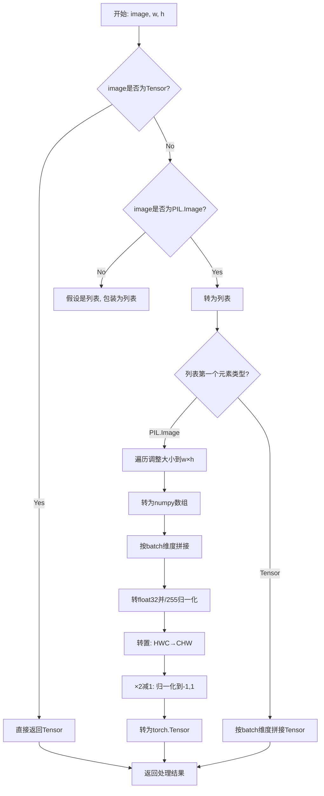

#### 带注释源码

```python
def preprocess(image, w, h):
    """
    预处理图像，支持PIL Image和Tensor两种输入格式
    
    Args:
        image: 输入图像，支持torch.Tensor或PIL.Image.Image类型
        w: 目标宽度
        h: 目标高度
    
    Returns:
        torch.Tensor: 预处理后的图像张量，形状为(N, C, H, W)，值域[-1, 1]
    """
    # 如果已经是Tensor，直接返回（可能是之前处理过的图像）
    if isinstance(image, torch.Tensor):
        return image
    # 单个PIL图像转为列表，统一处理流程
    elif isinstance(image, PIL.Image.Image):
        image = [image]

    # 处理PIL Image列表
    if isinstance(image[0], PIL.Image.Image):
        # 1. 遍历每个图像，调整到目标尺寸，使用lanczos重采样
        image = [np.array(i.resize((w, h), resample=PIL_INTERPOLATION["lanczos"]))[None, :] for i in image]
        # 2. 在batch维度(N)拼接: [(1,H,W,C), ...] -> (N,H,W,C)
        image = np.concatenate(image, axis=0)
        # 3. 转float32并归一化到[0,1]
        image = np.array(image).astype(np.float32) / 255.0
        # 4. 转置: (N,H,W,C) -> (N,C,H,W)，符合PyTorch格式要求
        image = image.transpose(0, 3, 1, 2)
        # 5. 归一化到[-1, 1]，这是Stable Diffusion等模型的标准输入范围
        image = 2.0 * image - 1.0
        # 6. 转为PyTorch Tensor
        image = torch.from_numpy(image)
    # 处理Tensor列表（可能是多个图像的Tensor堆叠）
    elif isinstance(image[0], torch.Tensor):
        # 在batch维度拼接多个图像Tensor
        image = torch.cat(image, dim=0)
    
    return image
```


### `slerp`

球面线性插值（Slerp）是一种在球面空间中进行插值的方法，用于在两个向量之间平滑过渡，常用于混合嵌入向量（如文本嵌入、图像嵌入等）。该函数通过计算向量之间的夹角余弦值来判断是否接近共线，如果接近共线则使用线性插值，否则使用球面线性插值以保持路径的球面特性。

参数：

- `t`：`float`，插值参数，范围在 [0, 1] 之间，0 表示返回 v0，1 表示返回 v1
- `v0`：`Union[np.ndarray, torch.Tensor]`，起始向量，支持 numpy 数组或 PyTorch 张量
- `v1`：`Union[np.ndarray, torch.Tensor]`，结束向量，支持 numpy 数组或 PyTorch 张量
- `DOT_THRESHOLD`：`float`，可选，默认为 0.9995，用于判断两个向量是否接近共线的阈值

返回值：`Union[np.ndarray, torch.Tensor]`，插值后的向量，返回类型与输入类型一致（如果输入是张量则返回张量，否则返回 numpy 数组）

#### 流程图

```mermaid
flowchart TD
    A[开始 slerp] --> B{检查 v0 是否为 numpy 数组}
    B -->|否| C[记录输入设备<br>将 v0 和 v1 转换为 numpy]
    B -->|是| D[直接使用 v0 和 v1]
    C --> E[计算向量夹角余弦值 dot]
    D --> E
    E --> F{dot 绝对值 > DOT_THRESHOLD?}
    F -->|是| G[使用线性插值<br>v2 = (1-t)*v0 + t*v1]
    F -->|否| H[计算 theta_0 = arccos<br>sin_theta_0 = sin<br>theta_t = theta_0 * t]
    H --> I[计算 sin_theta_t]
    I --> J[s0 = sin(theta_0-theta_t)/sin_theta_0<br>s1 = sin_theta_t/sin_theta_0]
    J --> K[v2 = s0*v0 + s1*v1]
    G --> L{输入是 PyTorch 张量?}
    K --> L
    L -->|是| M[将 v2 转回张量<br>移动到原设备]
    L -->|否| N[直接返回 numpy 数组]
    M --> O[返回 v2]
    N --> O
```

#### 带注释源码

```python
def slerp(t, v0, v1, DOT_THRESHOLD=0.9995):
    """
    球面线性插值 (Spherical Linear Interpolation)
    
    在球面空间中对两个向量进行插值，保持路径的球面特性。
    常用于混合嵌入向量，如文本嵌入或图像嵌入的平滑过渡。
    
    参数:
        t: 插值参数，范围 [0, 1]
        v0: 起始向量
        v1: 结束向量
        DOT_THRESHOLD: 夹角余弦阈值，超过该值使用线性插值
    
    返回:
        插值后的向量
    """
    # 检查输入是否为 PyTorch 张量，如果是则转换为 numpy 数组进行处理
    if not isinstance(v0, np.ndarray):
        inputs_are_torch = True  # 标记输入为 PyTorch 张量
        input_device = v0.device  # 保存原始设备以便后续返回
        # 将张量移动到 CPU 并转换为 numpy 数组进行计算
        v0 = v0.cpu().numpy()
        v1 = v1.cpu().numpy()
    
    # 计算两个向量的余弦相似度（点积除以各自的范数乘积）
    dot = np.sum(v0 * v1 / (np.linalg.norm(v0) * np.linalg.norm(v1)))
    
    # 如果向量接近共线（夹角接近 0 或 180 度），使用简单的线性插值
    if np.abs(dot) > DOT_THRESHOLD:
        v2 = (1 - t) * v0 + t * v1
    else:
        # 否则使用球面线性插值，保持路径在球面上
        # 计算起始夹角 theta_0
        theta_0 = np.arccos(dot)
        sin_theta_0 = np.sin(theta_0)
        
        # 计算插值点的夹角 theta_t
        theta_t = theta_0 * t
        sin_theta_t = np.sin(theta_t)
        
        # 计算球面插值的权重系数 s0 和 s1
        s0 = np.sin(theta_0 - theta_t) / sin_theta_0
        s1 = sin_theta_t / sin_theta_0
        
        # 使用加权系数计算插值向量
        v2 = s0 * v0 + s1 * v1
    
    # 如果原始输入是 PyTorch 张量，将结果转回张量并放回原始设备
    if inputs_are_torch:
        v2 = torch.from_numpy(v2).to(input_device)
    
    return v2
```


### `spherical_dist_loss`

该函数用于计算两个嵌入向量之间的球面距离损失（Spherical Distance Loss），常用于CLIP引导的图像生成任务中，通过衡量图像嵌入在球面空间中的距离来提供梯度指导。

参数：

- `x`：`torch.Tensor`，第一个输入向量，通常是CLIP生成的图像嵌入
- `y`：`torch.Tensor`，第二个输入向量，通常是目标图像嵌入

返回值：`torch.Tensor`，球面距离损失值，形状为与输入批次维度匹配的一维张量

#### 流程图

```mermaid
flowchart TD
    A[开始: 输入向量 x, y] --> B[对 x 进行 L2 归一化<br/>F.normalize, dim=-1]
    B --> C[对 y 进行 L2 归一化<br/>F.normalize, dim=-1]
    C --> D[计算差值范数: (x - y).norm dim=-1]
    D --> E[除以 2: .div 2]
    E --> F[取反正弦: .arcsin]
    F --> G[平方: .pow 2]
    G --> H[乘以 2: .mul 2]
    H --> I[返回球面距离损失]
```

#### 带注释源码

```python
def spherical_dist_loss(x, y):
    """
    计算两个向量之间的球面距离损失
    
    数学原理：
    对于两个单位向量 x 和 y，夹角为 θ：
    - ||x - y|| = sqrt(2 - 2*cos(θ)) = 2*sin(θ/2)
    - 因此 sin(θ/2) = ||x - y|| / 2
    - 球面距离 = 2 * arcsin(||x - y|| / 2)
    
    这对应于球面上两点之间的最短弧线距离（弧长 = r * θ，r=1）
    """
    # 第一步：将输入向量 x 归一化为单位向量
    # 使用 L2 范数归一化，确保向量长度为 1
    x = F.normalize(x, dim=-1)
    
    # 第二步：将输入向量 y 归一化为单位向量
    y = F.normalize(y, dim=-1)
    
    # 第三步：计算归一化向量差的范数，再通过三角变换得到球面距离
    # 完整计算流程：
    # 1. (x - y).norm(dim=-1) 计算欧氏距离 ||x - y||
    # 2. .div(2) 除以 2，得到 sin(θ/2)
    # 3. .arcsin() 取反正弦，得到 θ/2
    # 4. .pow(2) 平方
    # 5. .mul(2) 乘以 2，得到最终的球面距离
    return (x - y).norm(dim=-1).div(2).arcsin().pow(2).mul(2)
```


### `set_requires_grad`

该函数是一个全局工具函数，用于设置 PyTorch 模型中所有参数的 `requires_grad` 属性，从而控制是否对该模型参数进行梯度计算。

参数：

- `model`：`torch.nn.Module`，目标 PyTorch 模型，函数将遍历该模型的所有参数
- `value`：`bool`，布尔值，用于设置参数的 `requires_grad` 属性，True 表示需要计算梯度，False 表示不需要

返回值：`None`，该函数直接修改模型参数，不返回任何值

#### 流程图

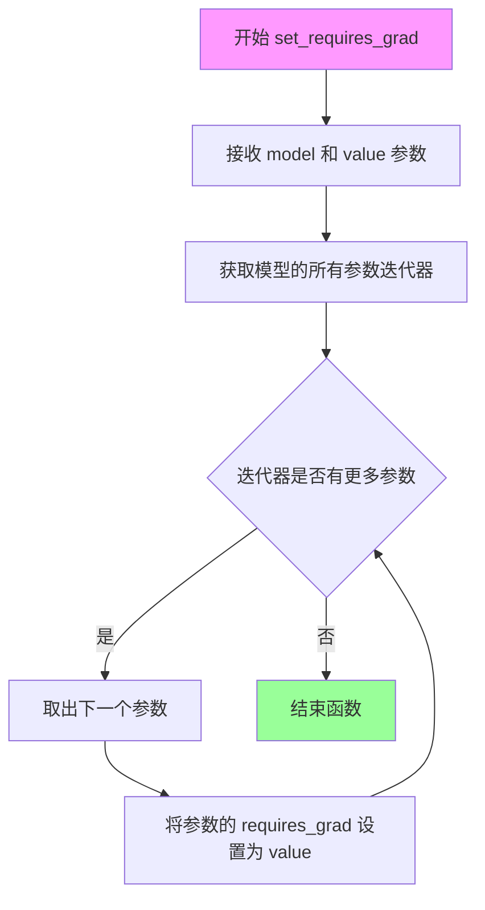

#### 带注释源码

```python
def set_requires_grad(model, value):
    """
    设置模型参数的梯度计算要求
    
    参数:
        model: torch.nn.Module 类型的目标模型
        value: bool 类型，True 表示需要计算梯度，False 表示不需要
    
    返回:
        None，直接修改模型参数
    """
    # 遍历模型的所有参数（包括权重和偏置等）
    for param in model.parameters():
        # 为每个参数设置 requires_grad 属性
        # 当 value=False 时，参数在前向传播时不会构建计算图，节省显存
        # 当 value=True 时，参数会参与梯度计算，可用于微调或训练
        param.requires_grad = value
```

#### 关键组件信息

| 名称 | 描述 |
|------|------|
| `model.parameters()` | PyTorch 模型的参数迭代器，返回模型中所有可学习的参数 |
| `param.requires_grad` | PyTorch Tensor 的属性，控制该参数是否参与梯度计算 |

#### 潜在的技术债务或优化空间

1. **缺少输入验证**：未检查 `model` 是否为有效的 `torch.nn.Module` 类型
2. **不支持部分参数设置**：该函数统一设置所有参数，无法对不同参数设置不同的梯度要求
3. **文档可增强**：可添加更多使用场景说明，如与 `torch.no_grad()` 的配合使用

#### 其它项目

**设计目标**：提供一种简洁的方式批量控制模型参数的梯度计算需求，常用于冻结预训练模型参数

**错误处理**：
- 如果传入的 `model` 不是 `torch.nn.Module` 类型，`model.parameters()` 会抛出 `AttributeError`
- 如果 `value` 不是布尔类型，PyTorch 会自动将其转换为布尔值

**使用场景**：
- 在微调（fine-tuning）时，冻结预训练模型的底层参数，只训练顶层参数
- 在推理阶段设置 `value=False` 以节省显存和提高推理速度
- 在特征提取任务中，冻结特征提取器的参数


### `CLIPGuidedImagesMixingStableDiffusion.__init__`

该方法是`CLIPGuidedImagesMixingStableDiffusion`类的构造函数，负责初始化整个图像混合Pipeline的核心组件，包括VAE、文本编码器、CLIP模型、UNet、调度器等扩散模型组件，同时配置图像预处理参数并冻结文本编码器和CLIP模型的梯度以节省计算资源。

参数：

- `vae`：`AutoencoderKL`，变分自编码器，用于将图像编码到潜在空间并进行解码
- `text_encoder`：`CLIPTextModel`，CLIP文本编码器，用于将文本提示编码为文本嵌入向量
- `clip_model`：`CLIPModel`，CLIP模型，用于计算图像和文本之间的相似度
- `tokenizer`：`CLIPTokenizer`，CLIP分词器，用于将文本分割为token
- `unet`：`UNet2DConditionModel`，UNet条件模型，用于预测噪声残差
- `scheduler`：`Union[PNDMScheduler, LMSDiscreteScheduler, DDIMScheduler, DPMSolverMultistepScheduler]`，扩散模型调度器，控制去噪过程的噪声调度
- `feature_extractor`：`CLIPImageProcessor`，CLIP图像预处理器，用于预处理输入图像
- `coca_model`：`Optional[Any]`（默认为None），CoCa图像描述生成模型，用于自动生成图像描述
- `coca_tokenizer`：`Optional[Any]`（默认为None），CoCa分词器
- `coca_transform`：`Optional[Any]`（默认为None），CoCa图像变换器

返回值：`None`，该方法为构造函数，不返回任何值

#### 流程图

```mermaid
flowchart TD
    A[开始 __init__] --> B[调用父类构造函数 super().__init__]
    B --> C[调用 self.register_modules 注册所有模块]
    C --> D[获取 feature_extractor_size]
    D --> E[创建 transforms.Normalize 归一化器]
    E --> F[冻结 text_encoder 梯度]
    F --> G[冻结 clip_model 梯度]
    G --> H[结束 __init__]
    
    style A fill:#e1f5fe
    style H fill:#e8f5e8
```

#### 带注释源码

```python
def __init__(
    self,
    vae: AutoencoderKL,
    text_encoder: CLIPTextModel,
    clip_model: CLIPModel,
    tokenizer: CLIPTokenizer,
    unet: UNet2DConditionModel,
    scheduler: Union[PNDMScheduler, LMSDiscreteScheduler, DDIMScheduler, DPMSolverMultistepScheduler],
    feature_extractor: CLIPImageProcessor,
    coca_model=None,
    coca_tokenizer=None,
    coca_transform=None,
):
    """
    初始化 CLIPGuidedImagesMixingStableDiffusion Pipeline
    
    参数:
        vae: 变分自编码器，用于图像的潜在空间编码和解码
        text_encoder: CLIP文本编码器，将文本提示转为向量表示
        clip_model: CLIP模型，计算图像-文本相似度
        tokenizer: CLIP文本分词器
        unet: UNet条件扩散模型，预测噪声残差
        scheduler: 扩散模型调度器，控制去噪步骤
        feature_extractor: CLIP图像预处理器
        coca_model: 可选的CoCa模型，用于生成图像描述
        coca_tokenizer: 可选的CoCa分词器
        coca_transform: 可选的CoCa图像变换
    """
    # 调用父类DiffusionPipeline的初始化方法
    super().__init__()
    
    # 将所有模型组件注册到pipeline中，便于管理和序列化
    self.register_modules(
        vae=vae,
        text_encoder=text_encoder,
        clip_model=clip_model,
        tokenizer=tokenizer,
        unet=unet,
        scheduler=scheduler,
        feature_extractor=feature_extractor,
        coca_model=coca_model,
        coca_tokenizer=coca_tokenizer,
        coca_transform=coca_transform,
    )
    
    # 获取CLIP图像预处理的尺寸
    # 如果是整数直接使用，否则取最短边
    self.feature_extractor_size = (
        feature_extractor.size
        if isinstance(feature_extractor.size, int)
        else feature_extractor.size["shortest_edge"]
    )
    
    # 创建图像归一化变换，使用CLIP预处理器定义的均值和标准差
    self.normalize = transforms.Normalize(
        mean=feature_extractor.image_mean, 
        std=feature_extractor.image_std
    )
    
    # 冻结文本编码器梯度，减少计算内存开销
    # 在推理时不需要更新文本编码器
    set_requires_grad(self.text_encoder, False)
    
    # 冻结CLIP图像编码器梯度，同样是为了节省计算资源
    set_requires_grad(self.clip_model, False)
```


### `CLIPGuidedImagesMixingStableDiffusion.freeze_vae`

该方法用于冻结 VAE（变分自编码器）模型，通过将模型参数的 `requires_grad` 属性设置为 `False`，从而在训练过程中阻止 VAE 参数的梯度计算，实现参数固定不被更新的效果。

参数： 无

返回值：`None`，无返回值

#### 流程图

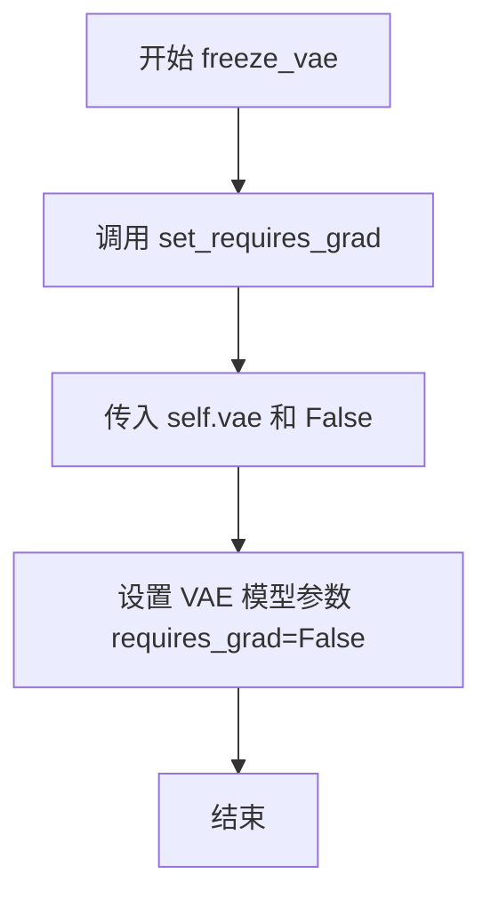

#### 带注释源码

```
def freeze_vae(self):
    """
    冻结 VAE 模型，使其参数在训练过程中不参与梯度计算。
    
    该方法通过调用 set_requires_grad 函数，将 self.vae 模型的所有参数设置为不可训练状态。
    这在需要固定 VAE 权重、只训练其他组件（如 UNet 或文本编码器）时非常有用。
    """
    set_requires_grad(self.vae, False)  # 调用工具函数，将 VAE 模型的参数 requires_grad 设置为 False
```


### `CLIPGuidedImagesMixingStableDiffusion.unfreeze_vae`

此方法用于解冻VAE（变分自编码器）模型，使其参数可以进行梯度更新和训练。通过调用`set_requires_grad`辅助函数，将VAE模型的所有参数设置为可训练状态（即`requires_grad=True`），从而在反向传播时能够计算梯度。这是训练过程中的常见操作，允许在微调或特定训练阶段启用VAE的梯度更新。

参数：此方法没有显式参数（除了隐式的`self`）

- `self`：类的实例方法隐式参数，类型为`CLIPGuidedImagesMixingStableDiffusion`实例，表示当前管道对象。

返回值：`None`，此方法不返回任何值，仅在原地修改`self.vae`模型的参数梯度要求状态。

#### 流程图

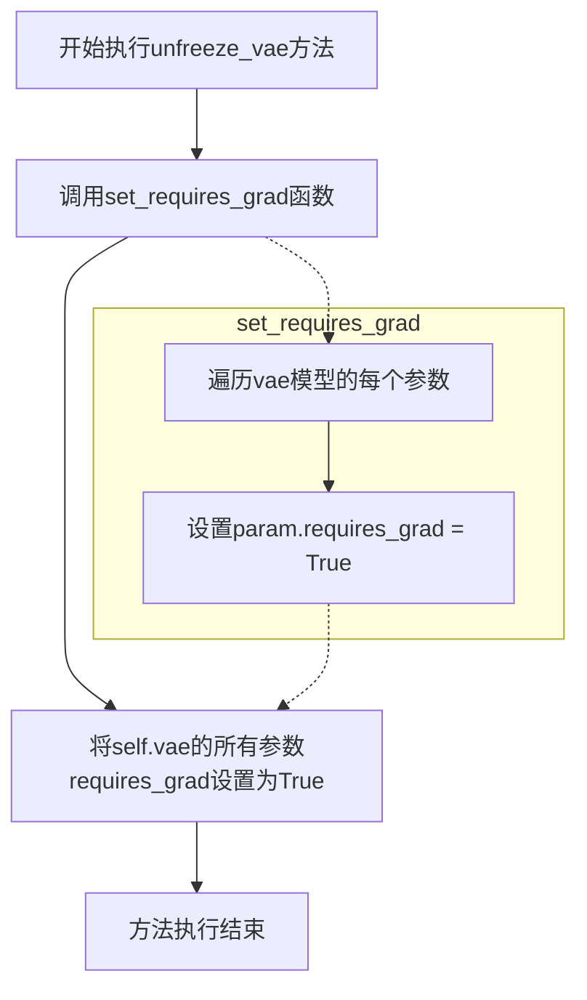

#### 带注释源码

```python
def unfreeze_vae(self):
    """
    解冻VAE模型，使其参数可以进行梯度更新。
    
    该方法通过设置VAE模型所有参数的requires_grad属性为True，
    从而在后续的训练过程中能够对VAE进行梯度反向传播和参数更新。
    这在需要微调VAE或进行特定训练任务时使用。
    """
    # 调用辅助函数set_requires_grad，将VAE模型的所有参数设置为可训练状态
    # 参数True表示启用梯度计算
    set_requires_grad(self.vae, True)
```


### `CLIPGuidedImagesMixingStableDiffusion.freeze_unet`

该方法用于冻结 UNet2DConditionModel 模型的梯度，使其参数在训练过程中不会被更新，从而固定特征提取部分。

参数：

- `self`：`CLIPGuidedImagesMixingStableDiffusion`，类的实例本身，不需要显式传递

返回值：`None`，无返回值，该方法直接修改模型的可训练状态

#### 流程图

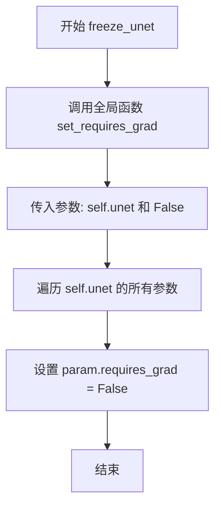

#### 带注释源码

```
def freeze_unet(self):
    """
    冻结 UNet 模型的梯度，使其在训练过程中不会被更新。
    通常在推理阶段或只需要训练其他组件（如 VAE、CLIP）时使用。
    """
    # 调用全局辅助函数 set_requires_grad
    # 参数 self.unet：要冻结的 UNet 模型
    # 参数 False：将所有参数的 requires_grad 设置为 False
    set_requires_grad(self.unet, False)
```


### `CLIPGuidedImagesMixingStableDiffusion.unfreeze_unet`

该方法用于解除Stable Diffusion模型中UNet2DConditionModel的冻结状态，通过将UNet所有参数的`requires_grad`属性设置为`True`，使UNet能够在后续的训练过程中进行参数更新和梯度计算。

参数：无（仅包含隐式参数`self`）

返回值：`None`，无返回值

#### 流程图

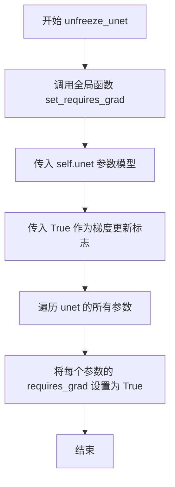

#### 带注释源码

```python
def unfreeze_unet(self):
    """
    解除UNet模型的冻结状态，允许其参与训练并更新参数。
    
    该方法与freeze_unet方法相对应，用于在微调或继续训练场景中
    重新激活UNet的可训练性。在DiffusionPipeline的标准工作流中，
    通常先冻结不需要训练的组件（VAE、CLIP等），然后根据需要
    动态冻结/解冻UNet以控制哪些部分参与训练。
    
    参数:
        无（仅包含隐式参数self）
    
    返回值:
        None
    """
    # 调用全局辅助函数set_requires_grad，将UNet模型的所有参数requires_grad设为True
    # 这样在后续的backward()和optimizer.step()调用时，这些参数会被更新
    set_requires_grad(self.unet, True)
```


### `CLIPGuidedImagesMixingStableDiffusion.get_timesteps`

该方法用于根据噪声强度(strength)和推理步数(num_inference_steps)计算扩散模型的时间步序列。它通过计算初始时间步，然后从调度器的完整时间步数组中切片获取对应的子序列，确保时间步在有效范围内。

参数：

- `num_inference_steps`：`int`，推理过程中的总步数，用于确定时间步的总范围
- `strength`：`float`，噪声强度参数，范围通常在0到1之间，用于决定实际参与去噪的时间步比例
- `device`：`torch.device`，计算设备，用于指定张量存放位置（本方法中实际未使用）

返回值：`tuple[torch.Tensor, int]`，返回一个元组，包含：

- `timesteps`：根据噪声强度调整后的时间步序列（Tensor）
- `num_inference_steps - t_start`：实际用于去噪的步数（int）

#### 流程图

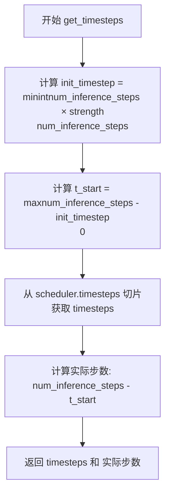

#### 带注释源码

```python
def get_timesteps(self, num_inference_steps, strength, device):
    """
    根据噪声强度和推理步数计算时间步序列
    
    参数:
        num_inference_steps: int, 推理总步数
        strength: float, 噪声强度 (0-1之间)
        device: torch.device, 计算设备
    
    返回:
        timesteps: 调整后的时间步序列
        实际步数: int
    """
    # 根据噪声强度计算初始时间步数
    # strength 越高，init_timestep 越大，保留的时间步越多
    init_timestep = min(int(num_inference_steps * strength), num_inference_steps)

    # 计算起始索引，确保不会小于0
    # 从完整时间步序列的末尾开始倒数
    t_start = max(num_inference_steps - init_timestep, 0)
    
    # 从调度器的时间步数组中获取对应区间的时间步
    timesteps = self.scheduler.timesteps[t_start:]

    # 返回时间步序列和实际使用的步数
    return timesteps, num_inference_steps - t_start
```


### `CLIPGuidedImagesMixingStableDiffusion.prepare_latents`

该方法将输入图像编码为VAE潜在表示，并通过调度器添加噪声以生成用于Stable Diffusion的初始潜在向量。

参数：

- `self`：`CLIPGuidedImagesMixingStableDiffusion` 实例，隐式参数，表示当前pipeline对象
- `image`：`torch.Tensor`，输入图像张量，必须是PyTorch张量类型
- `timestep`：`torch.Tensor` 或 `int`，扩散过程的时间步，用于噪声调度
- `batch_size`：`int`，批处理大小，决定生成潜在向量的数量
- `dtype`：`torch.dtype`，目标数据类型，用于张量转换
- `device`：`torch.device`，目标设备（CPU/CUDA），用于张量放置
- `generator`：`torch.Generator` 或 `List[torch.Generator]`，可选，随机数生成器，用于可复现的采样

返回值：`torch.Tensor`，返回添加噪声后的潜在向量张量，形状为 (batch_size, latent_channels, latent_height, latent_width)

#### 流程图

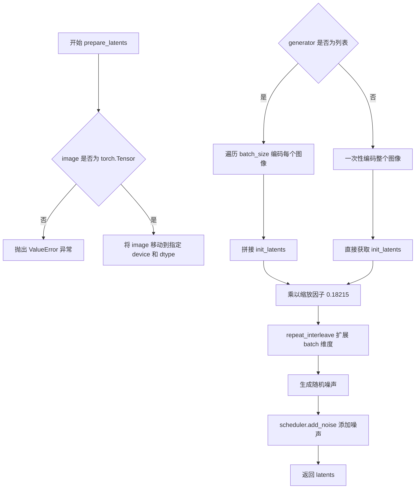

#### 带注释源码

```python
def prepare_latents(self, image, timestep, batch_size, dtype, device, generator=None):
    """
    准备用于Stable Diffusion的初始潜在向量
    
    参数:
        image: 输入图像张量
        timestep: 扩散时间步
        batch_size: 批处理大小
        dtype: 目标数据类型
        device: 目标设备
        generator: 可选的随机数生成器
    
    返回:
        添加噪声后的潜在向量
    """
    # 参数校验：确保 image 是 torch.Tensor 类型
    if not isinstance(image, torch.Tensor):
        raise ValueError(f"`image` has to be of type `torch.Tensor` but is {type(image)}")

    # 将图像移动到目标设备并转换数据类型
    image = image.to(device=device, dtype=dtype)

    # VAE 编码：根据 generator 类型选择不同的采样策略
    if isinstance(generator, list):
        # 多个 generator 时，为每个图像单独编码
        init_latents = [
            self.vae.encode(image[i : i + 1]).latent_dist.sample(generator[i]) 
            for i in range(batch_size)
        ]
        # 沿着 batch 维度拼接所有 latent
        init_latents = torch.cat(init_latents, dim=0)
    else:
        # 单一 generator 时，直接编码整个图像
        init_latents = self.vae.encode(image).latent_dist.sample(generator)

    # 硬编码缩放因子 0.18215（stable-diffusion-2-base 没有 self.vae.config.scaling_factor）
    init_latents = 0.18215 * init_latents
    
    # 扩展 latent 以匹配 batch_size
    init_latents = init_interleave(batch_size, dim=0)

    # 生成与 latent 形状相同的随机噪声
    noise = randn_tensor(init_latents.shape, generator=generator, device=device, dtype=dtype)

    # 使用调度器将噪声添加到初始 latent
    init_latents = self.scheduler.add_noise(init_latents, noise, timestep)
    latents = init_latents

    return latents
```


### `CLIPGuidedImagesMixingStableDiffusion.get_image_description`

该方法使用 CoCa（Contrastive Captioner）模型对输入图像进行描述生成，通过图像编码和语言解码生成对应的文本描述，常用于当用户未提供显式提示时自动推断图像内容。

参数：

- `image`：输入的图像，支持 `torch.Tensor` 或 `PIL.Image.Image` 类型，需要被 CoCa 模型处理以生成描述

返回值：`str`，返回从图像生成的文本描述，会移除特殊标记 `<start_of_text>` 和 `<end_of_text>` 并清理末尾的空白和标点

#### 流程图

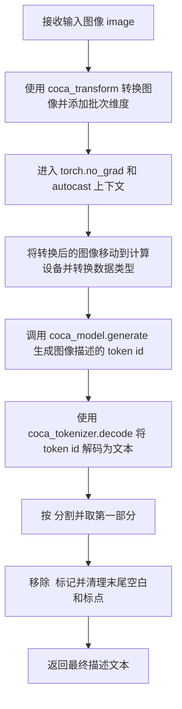

#### 带注释源码

```python
def get_image_description(self, image):
    """
    使用 CoCa 模型从图像生成文本描述
    
    参数:
        image: 输入图像 (torch.Tensor 或 PIL.Image.Image)
    
    返回:
        str: 生成的图像描述文本
    """
    # 步骤1: 使用 CoCa 的图像变换器处理图像，并添加批次维度
    #       self.coca_transform 负责将 PIL Image 或 Tensor 转换为模型所需格式
    transformed_image = self.coca_transform(image).unsqueeze(0)
    
    # 步骤2: 使用 torch.no_grad() 禁用梯度计算以节省内存和计算资源
    #       使用 torch.cuda.amp.autocast() 启用自动混合精度以加速推理
    with torch.no_grad(), torch.cuda.amp.autocast():
        # 步骤3: 将图像移动到模型所在设备，并转换为模型所需的数据类型
        #       生成图像描述的 token id 序列
        generated = self.coca_model.generate(
            transformed_image.to(device=self.device, dtype=self.coca_model.dtype)
        )
    
    # 步骤4: 将生成的 token id 解码为文本字符串
    generated = self.coca_tokenizer.decode(generated[0].cpu().numpy())
    
    # 步骤5: 后处理生成的文本
    #       - 按 <end_of_text> 分割，取有效描述部分
    #       - 移除 <start_of_text> 标记
    #       - 清理末尾的空格、点和逗号
    return generated.split("<end_of_text>")[0].replace("<start_of_text>", "").rstrip(" .,")
```


### `CLIPGuidedImagesMixingStableDiffusion.get_clip_image_embeddings`

该方法负责将输入图像转换为CLIP模型的图像嵌入向量，通过特征提取器预处理图像，提取CLIP图像特征，进行L2归一化，并根据批次大小复制嵌入向量，以供后续的CLIP引导图像混合操作使用。

参数：

- `image`：`Union[torch.Tensor, PIL.Image.Image]`，输入的图像，可以是PyTorch张量或PIL图像
- `batch_size`：`int`，批次大小，用于决定复制嵌入向量的次数

返回值：`torch.Tensor`，返回归一化后的CLIP图像嵌入向量，形状为 `(batch_size, embedding_dim)`

#### 流程图

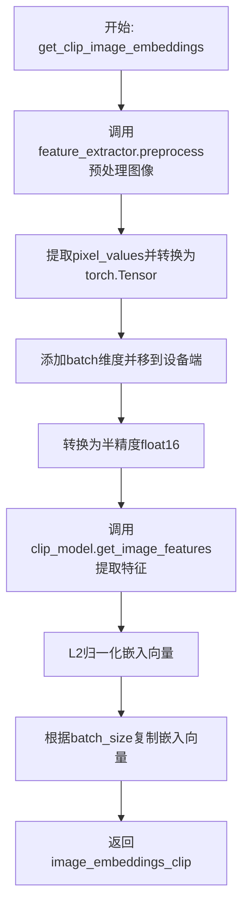

#### 带注释源码

```
def get_clip_image_embeddings(self, image, batch_size):
    """
    获取输入图像的CLIP图像嵌入向量
    
    参数:
        image: 输入图像，类型为torch.Tensor或PIL.Image.Image
        batch_size: 批次大小，用于复制嵌入向量
    
    返回:
        归一化后的CLIP图像嵌入向量
    """
    # 步骤1: 使用CLIP特征提取器预处理图像
    # 将原始图像转换为模型所需的格式（包含归一化等操作）
    clip_image_input = self.feature_extractor.preprocess(image)
    
    # 步骤2: 提取像素值并转换为PyTorch张量
    # clip_image_input["pixel_values"] 包含预处理后的像素值数组
    # [0]取第一个元素，unsqueeze(0)添加batch维度
    # to(self.device)将张量移到模型所在设备（GPU/CPU）
    # .half()转换为半精度浮点数以提高推理速度
    clip_image_features = torch.from_numpy(clip_image_input["pixel_values"][0]).unsqueeze(0).to(self.device).half()
    
    # 步骤3: 调用CLIP模型的get_image_features方法提取图像特征
    # 输入预处理后的图像，输出CLIP图像嵌入
    image_embeddings_clip = self.clip_model.get_image_features(clip_image_features)
    
    # 步骤4: 对嵌入向量进行L2归一化
    # 使用p=2的范数进行归一化，保持方向一致性
    image_embeddings_clip = image_embeddings_clip / image_embeddings_clip.norm(p=2, dim=-1, keepdim=True)
    
    # 步骤5: 根据batch_size复制嵌入向量
    # repeat_interleave在维度0上重复嵌入向量，以匹配批次中的每个样本
    image_embeddings_clip = image_embeddings_clip.repeat_interleave(batch_size, dim=0)
    
    # 返回归一化后的CLIP图像嵌入向量
    return image_embeddings_clip
```


### `CLIPGuidedImagesMixingStableDiffusion.cond_fn`

该函数是CLIP引导的图像混合稳定扩散管道的核心条件函数，用于在推理过程中根据CLIP图像嵌入指导生成过程。它通过计算当前生成的图像与原始图像CLIP嵌入之间的球面距离损失，并反向传播梯度来调整噪声预测，从而使生成的图像在视觉上更接近目标图像。

参数：

- `self`：`CLIPGuidedImagesMixingStableDiffusion` 类实例，当前 pipeline 对象
- `latents`：`torch.Tensor`，潜在空间中的当前噪声样本，用于生成图像的中间表示
- `timestep`：`torch.Tensor`，当前的扩散时间步，决定去噪过程的阶段
- `index`：`int`，当前时间步的索引，用于访问调度器的 sigma 值（LMSDiscreteScheduler 需要）
- `text_embeddings`：`torch.Tensor`，文本编码器生成的文本嵌入，用于条件生成
- `noise_pred_original`：`torch.Tensor`，原始的噪声预测，用于在应用 CLIP 引导后保留部分原始预测
- `original_image_embeddings_clip`：`torch.Tensor`，原始图像（内容或风格图像）的 CLIP 图像嵌入，作为 CLIP 引导的目标
- `clip_guidance_scale`：`float`，CLIP 引导的权重系数，控制 CLIP 损失对生成过程的影响程度

返回值：`tuple[torch.Tensor, torch.Tensor]`，返回元组包含：
- `noise_pred`：`torch.Tensor`，调整后的噪声预测，结合了原始预测和 CLIP 引导梯度
- `latents`：`torch.Tensor`，更新后的潜在表示，用于下一步的去噪

#### 流程图

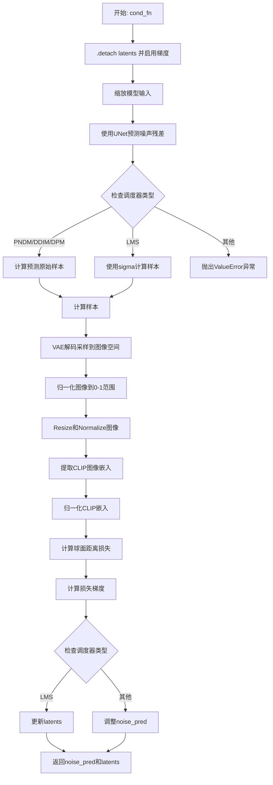

#### 带注释源码

```python
@torch.enable_grad()  # 启用梯度计算，用于反向传播
def cond_fn(
    self,
    latents,  # torch.Tensor: 潜在空间中的当前噪声样本
    timestep,  # torch.Tensor: 当前的扩散时间步
    index,  # int: 当前时间步的索引，用于LMS调度器
    text_embeddings,  # torch.Tensor: 文本嵌入，条件信息
    noise_pred_original,  # torch.Tensor: 原始的噪声预测
    original_image_embeddings_clip,  # torch.Tensor: 原始图像的CLIP嵌入
    clip_guidance_scale,  # float: CLIP引导的缩放因子
):
    """
    CLIP条件引导函数，用于在推理过程中根据CLIP图像嵌入调整噪声预测。
    
    工作原理：
    1. 使用当前latents通过UNet预测噪声
    2. 从预测的噪声中重建图像
    3. 使用VAE解码器将潜在表示转换为图像空间
    4. 提取生成图像的CLIP嵌入
    5. 计算生成图像与目标图像CLIP嵌入之间的球面距离损失
    6. 反向传播梯度以调整噪声预测，使生成的图像更接近目标
    """
    
    # 分离latents以避免影响原始计算图，但需要启用梯度以进行CLIP引导
    latents = latents.detach().requires_grad_()

    # 使用调度器缩放模型输入（根据噪声计划调整）
    latent_model_input = self.scheduler.scale_model_input(latents, timestep)

    # 使用UNet预测噪声残差
    # 这是标准的扩散模型前向传播，输入缩放后的latents、时间步和文本嵌入
    noise_pred = self.unet(latent_model_input, timestep, encoder_hidden_states=text_embeddings).sample

    # 根据不同的调度器类型计算预测的原始样本（x_0）
    # 这里实现了从噪声预测到原始样本的逆向推导
    if isinstance(self.scheduler, (PNDMScheduler, DDIMScheduler, DPMSolverMultistepScheduler)):
        # 获取累积 alpha 乘积和 beta 乘积
        alpha_prod_t = self.scheduler.alphas_cumprod[timestep]
        beta_prod_t = 1 - alpha_prod_t
        
        # 从预测的噪声计算预测的原始样本（公式12来自DDIM论文）
        # x_0 = (x_t - sqrt(1-α_t) * ε_θ) / sqrt(α_t)
        pred_original_sample = (latents - beta_prod_t ** (0.5) * noise_pred) / alpha_prod_t ** (0.5)

        # 计算中间样本，使用方差参数化
        fac = torch.sqrt(beta_prod_t)
        sample = pred_original_sample * (fac) + latents * (1 - fac)
    elif isinstance(self.scheduler, LMSDiscreteScheduler):
        # 对于LMS调度器，使用sigma直接计算
        sigma = self.scheduler.sigmas[index]
        sample = latents - sigma * noise_pred
    else:
        raise ValueError(f"scheduler type {type(self.scheduler)} not supported")

    # 硬编码0.18215，因为stable-diffusion-2-base没有self.vae.config.scaling_factor
    # 这是VAE缩放因子的逆操作
    sample = 1 / 0.18215 * sample
    
    # 使用VAE解码器将潜在表示解码为图像
    image = self.vae.decode(sample).sample
    
    # 将图像从[-1,1]范围归一化到[0,1]范围
    image = (image / 2 + 0.5).clamp(0, 1)

    # 调整图像大小以匹配CLIP特征提取器的预期输入尺寸
    image = transforms.Resize(self.feature_extractor_size)(image)
    
    # 使用CLIP特征提取器的均值和标准差进行归一化
    image = self.normalize(image).to(latents.dtype)

    # 提取CLIP图像嵌入
    # 使用CLIP模型将图像转换为特征向量
    image_embeddings_clip = self.clip_model.get_image_features(image)
    
    # L2归一化嵌入向量，用于计算余弦相似度
    image_embeddings_clip = image_embeddings_clip / image_embeddings_clip.norm(p=2, dim=-1, keepdim=True)

    # 计算球面距离损失（基于余弦距离）
    # 这是CLIP引导的核心：最小化生成图像与目标图像在CLIP特征空间中的距离
    loss = spherical_dist_loss(image_embeddings_clip, original_image_embeddings_clip).mean() * clip_guidance_scale

    # 反向传播计算梯度
    # 负梯度表示增加损失的方向，即远离目标图像的方向
    # 我们取反梯度，使latents向减小距离（接近目标）的方向移动
    grads = -torch.autograd.grad(loss, latents)[0]

    # 根据调度器类型应用梯度
    if isinstance(self.scheduler, LMSDiscreteScheduler):
        # 对于LMS调度器，直接更新latents
        latents = latents.detach() + grads * (sigma**2)
        noise_pred = noise_pred_original
    else:
        # 对于其他调度器，调整噪声预测
        # 公式：noise_pred = noise_pred_original - sqrt(β_t) * grads
        noise_pred = noise_pred_original - torch.sqrt(beta_prod_t) * grads
    
    return noise_pred, latents
```


### `CLIPGuidedImagesMixingStableDiffusion.__call__`

这是一个图像风格混合的Stable Diffusion管道，通过结合风格图像和内容图像，使用SLERP插值技术在潜在空间、文本嵌入空间和CLIP图像嵌入空间进行混合，并可选地使用CLIP引导来生成保留内容结构但具有风格图像艺术风格的新图像。

参数：

- `style_image`：`Union[torch.Tensor, PIL.Image.Image]`，需要提取风格的图像
- `content_image`：`Union[torch.Tensor, PIL.Image.Image]`，需要保留内容结构的图像
- `style_prompt`：`str | None = None`，风格图像的文本描述提示词
- `content_prompt`：`str | None = None`，内容图像的文本描述提示词
- `height`：`Optional[int] = 512`，生成图像的高度，必须能被8整除
- `width`：`Optional[int] = 512`，生成图像的宽度，必须能被8整除
- `noise_strength`：`float = 0.6`，噪声强度，控制内容图像结构被保留的程度
- `num_inference_steps`：`Optional[int] = 50`，推理去噪步数
- `guidance_scale`：`Optional[float] = 7.5`，无分类器引导尺度
- `batch_size`：`Optional[int] = 1`，批处理大小
- `eta`：`float = 0.0`，DDIM调度器的eta参数
- `clip_guidance_scale`：`Optional[float] = 100`，CLIP引导强度
- `generator`：`torch.Generator | None = None`，随机数生成器
- `output_type`：`str | None = "pil"`，输出类型，"pil"或"numpy"
- `return_dict`：`bool = True`，是否返回字典格式
- `slerp_latent_style_strength`：`float = 0.8`，潜在空间风格混合强度
- `slerp_prompt_style_strength`：`float = 0.1`，文本嵌入风格混合强度
- `slerp_clip_image_style_strength`：`float = 0.1`，CLIP图像嵌入风格混合强度

返回值：`Union[StableDiffusionPipelineOutput, Tuple]`，`StableDiffusionPipelineOutput`包含生成图像和NSFW检测结果，如果`return_dict=False`则返回元组`(image, latent)`

#### 流程图

```mermaid
flowchart TD
    A[开始 __call__] --> B{验证输入参数}
    B --> C{检查generator数量}
    C --> D{检查height和width能被8整除}
    D --> E{扩展单个generator为列表}
    E --> F{检查CoCa模型是否可用}
    F --> G{生成内容提示词}
    G --> H{生成风格提示词}
    H --> I{编码内容文本}
    I --> J{编码风格文本}
    J --> K{SLERP混合文本嵌入}
    K --> L{重复文本嵌入匹配batch_size}
    L --> M{设置调度器时间步}
    M --> N{获取推理时间步}
    N --> O{预处理内容图像}
    O --> P{准备内容图像潜在表示}
    P --> Q{预处理风格图像}
    Q --> R{准备风格图像潜在表示}
    R --> S{SLERP混合潜在表示}
    S --> T{CLIP引导准备}
    T --> U{准备无分类器引导}
    U --> V{初始化随机潜在}
    V --> W{设置初始噪声sigma}
    W --> X[开始去噪循环]
    X --> Y{当前时间步}
    Y --> Z{扩展潜在用于CFG}
    Z --> AA{缩放模型输入}
    AA --> AB{预测噪声残差}
    AB --> AC{执行无分类器引导}
    AC --> AD{执行CLIP引导}
    AD --> AE{调度器步骤更新潜在}
    AE --> AF{更新进度条}
    AF --> AG{是否还有时间步}
    AG --> Y
    AG --> AH[结束去噪循环]
    AH --> AI{反缩放潜在}
    AI --> AJ{解码潜在为图像}
    AJ --> AK{转换图像格式}
    AL{AK --> output_type == 'pil'}
    AL --> AM[转换为PIL图像]
    AL --> AN[保持numpy数组]
    AM --> AO{return_dict?}
    AN --> AO
    AO --> AP[返回StableDiffusionPipelineOutput]
    AO --> AQ[返回元组]
```

#### 带注释源码

```python
@torch.no_grad()
def __call__(
    self,
    style_image: Union[torch.Tensor, PIL.Image.Image],  # 风格参考图像
    content_image: Union[torch.Tensor, PIL.Image.Image],  # 内容参考图像
    style_prompt: str | None = None,  # 风格图像的文本描述
    content_prompt: str | None = None,  # 内容图像的文本描述
    height: Optional[int] = 512,  # 输出高度
    width: Optional[int] = 512,  # 输出宽度
    noise_strength: float = 0.6,  # 噪声强度系数
    num_inference_steps: Optional[int] = 50,  # 去噪步数
    guidance_scale: Optional[float] = 7.5,  # CFG引导权重
    batch_size: Optional[int] = 1,  # 批处理大小
    eta: float = 0.0,  # DDIM调度器参数
    clip_guidance_scale: Optional[float] = 100,  # CLIP引导强度
    generator: torch.Generator | None = None,  # 随机数生成器
    output_type: str | None = "pil",  # 输出格式
    return_dict: bool = True,  # 返回格式
    slerp_latent_style_strength: float = 0.8,  # 潜在空间混合权重
    slerp_prompt_style_strength: float = 0.1,  # 提示词混合权重
    slerp_clip_image_style_strength: float = 0.1,  # CLIP图像嵌入混合权重
):
    # 验证生成器数量与batch_size匹配
    if isinstance(generator, list) and len(generator) != batch_size:
        raise ValueError(f"You have passed {batch_size} batch_size, but only {len(generator)} generators.")

    # 验证图像尺寸
    if height % 8 != 0 or width % 8 != 0:
        raise ValueError(f"`height` and `width` have to be divisible by 8 but are {height} and {width}.")

    # 扩展单个生成器为列表
    if isinstance(generator, torch.Generator) and batch_size > 1:
        generator = [generator] + [None] * (batch_size - 1)

    # 检查CoCa模型组件是否完整
    coca_is_none = [
        ("model", self.coca_model is None),
        ("tokenizer", self.coca_tokenizer is None),
        ("transform", self.coca_transform is None),
    ]
    coca_is_none = [x[0] for x in coca_is_none if x[1]]
    coca_is_none_str = ", ".join(coca_is_none)
    
    # 如果内容提示词为空，使用CoCa生成描述
    if content_prompt is None:
        if len(coca_is_none):
            raise ValueError(
                f"Content prompt is None and CoCa [{coca_is_none_str}] is None."
                f"Set prompt or pass Coca [{coca_is_none_str}] to DiffusionPipeline."
            )
        content_prompt = self.get_image_description(content_image)
    
    # 如果风格提示词为空，使用CoCa生成描述
    if style_prompt is None:
        if len(coca_is_none):
            raise ValueError(
                f"Style prompt is None and CoCa [{coca_is_none_str}] is None."
                f" Set prompt or pass Coca [{coca_is_none_str}] to DiffusionPipeline."
            )
        style_prompt = self.get_image_description(style_image)

    # 获取内容文本嵌入
    content_text_input = self.tokenizer(
        content_prompt,
        padding="max_length",
        max_length=self.tokenizer.model_max_length,
        truncation=True,
        return_tensors="pt",
    )
    content_text_embeddings = self.text_encoder(content_text_input.input_ids.to(self.device))[0]

    # 获取风格文本嵌入
    style_text_input = self.tokenizer(
        style_prompt,
        padding="max_length",
        max_length=self.tokenizer.model_max_length,
        truncation=True,
        return_tensors="pt",
    )
    style_text_embeddings = self.text_encoder(style_text_input.input_ids.to(self.device))[0]

    # 使用SLERP混合内容与风格文本嵌入
    text_embeddings = slerp(slerp_prompt_style_strength, content_text_embeddings, style_text_embeddings)

    # 复制文本嵌入以匹配batch_size
    text_embeddings = text_embeddings.repeat_interleave(batch_size, dim=0)

    # 配置调度器
    accepts_offset = "offset" in set(inspect.signature(self.scheduler.set_timesteps).parameters.keys())
    extra_set_kwargs = {}
    if accepts_offset:
        extra_set_kwargs["offset"] = 1

    self.scheduler.set_timesteps(num_inference_steps, **extra_set_kwargs)
    self.scheduler.timesteps.to(self.device)

    # 计算推理时间步
    timesteps, num_inference_steps = self.get_timesteps(num_inference_steps, noise_strength, self.device)
    latent_timestep = timesteps[:1].repeat(batch_size)

    # 预处理内容图像并准备潜在表示
    preprocessed_content_image = preprocess(content_image, width, height)
    content_latents = self.prepare_latents(
        preprocessed_content_image, latent_timestep, batch_size, text_embeddings.dtype, self.device, generator
    )

    # 预处理风格图像并准备潜在表示
    preprocessed_style_image = preprocess(style_image, width, height)
    style_latents = self.prepare_latents(
        preprocessed_style_image, latent_timestep, batch_size, text_embeddings.dtype, self.device, generator
    )

    # 在潜在空间混合内容与风格
    latents = slerp(slerp_latent_style_strength, content_latents, style_latents)

    # 如果启用CLIP引导，准备CLIP图像嵌入
    if clip_guidance_scale > 0:
        content_clip_image_embedding = self.get_clip_image_embeddings(content_image, batch_size)
        style_clip_image_embedding = self.get_clip_image_embeddings(style_image, batch_size)
        clip_image_embeddings = slerp(
            slerp_clip_image_style_strength, content_clip_image_embedding, style_clip_image_embedding
        )

    # 确定是否使用无分类器引导
    do_classifier_free_guidance = guidance_scale > 1.0
    
    # 准备无分类器引导的嵌入
    if do_classifier_free_guidance:
        max_length = content_text_input.input_ids.shape[-1]
        uncond_input = self.tokenizer([""], padding="max_length", max_length=max_length, return_tensors="pt")
        uncond_embeddings = self.text_encoder(uncond_input.input_ids.to(self.device))[0]
        uncond_embeddings = uncond_embeddings.repeat_interleave(batch_size, dim=0)
        # 拼接无条件嵌入和条件嵌入
        text_embeddings = torch.cat([uncond_embeddings, text_embeddings])

    # 初始化潜在表示
    latents_shape = (batch_size, self.unet.config.in_channels, height // 8, width // 8)
    latents_dtype = text_embeddings.dtype
    if latents is None:
        if self.device.type == "mps":
            # MPS设备上randn不可重现
            latents = torch.randn(latents_shape, generator=generator, device="cpu", dtype=latents_dtype).to(
                self.device
            )
        else:
            latents = torch.randn(latents_shape, generator=generator, device=self.device, dtype=latents_dtype)
    else:
        if latents.shape != latents_shape:
            raise ValueError(f"Unexpected latents shape, got {latents.shape}, expected {latents_shape}")
        latents = latents.to(self.device)

    # 使用调度器的初始噪声sigma缩放
    latents = latents * self.scheduler.init_noise_sigma

    # 准备调度器的额外参数
    accepts_eta = "eta" in set(inspect.signature(self.scheduler.step).parameters.keys())
    extra_step_kwargs = {}
    if accepts_eta:
        extra_step_kwargs["eta"] = eta

    accepts_generator = "generator" in set(inspect.signature(self.scheduler.step).parameters.keys())
    if accepts_generator:
        extra_step_kwargs["generator"] = generator

    # 主去噪循环
    with self.progress_bar(total=num_inference_steps) as progress_bar:
        for i, t in enumerate(timesteps):
            # 扩展潜在用于CFG
            latent_model_input = torch.cat([latents] * 2) if do_classifier_free_guidance else latents
            latent_model_input = self.scheduler.scale_model_input(latent_model_input, t)

            # 预测噪声残差
            noise_pred = self.unet(latent_model_input, t, encoder_hidden_states=text_embeddings).sample

            # 执行无分类器引导
            if do_classifier_free_guidance:
                noise_pred_uncond, noise_pred_text = noise_pred.chunk(2)
                noise_pred = noise_pred_uncond + guidance_scale * (noise_pred_text - noise_pred_uncond)

            # 执行CLIP引导
            if clip_guidance_scale > 0:
                text_embeddings_for_guidance = (
                    text_embeddings.chunk(2)[1] if do_classifier_free_guidance else text_embeddings
                )
                noise_pred, latents = self.cond_fn(
                    latents,
                    t,
                    i,
                    text_embeddings_for_guidance,
                    noise_pred,
                    clip_image_embeddings,
                    clip_guidance_scale,
                )

            # 调度器步骤更新潜在
            latents = self.scheduler.step(noise_pred, t, latents, **extra_step_kwargs).prev_sample

            progress_bar.update()

    # 反缩放潜在并解码
    latents = 1 / 0.18215 * latents
    image = self.vae.decode(latents).sample

    # 后处理图像
    image = (image / 2 + 0.5).clamp(0, 1)
    image = image.cpu().permute(0, 2, 3, 1).numpy()

    # 转换为PIL如果需要
    if output_type == "pil":
        image = self.numpy_to_pil(image)

    # 返回结果
    if not return_dict:
        return (image, None)

    return StableDiffusionPipelineOutput(images=image, nsfw_content_detected=None)
```

## 关键组件


### 张量索引与批量惰性加载

在`prepare_latents`方法中使用切片操作`image[i : i + 1]`实现批量编码，通过`init_latents.repeat_interleave(batch_size, dim=0)`延迟扩展潜在向量，避免一次性加载全部数据到内存。

### 反量化支持（VAE缩放因子）

代码中硬编码了VAE缩放因子0.18215，在编码时执行`init_latents = 0.18215 * init_latents`将潜在空间缩放至标准范围，解码时通过`latents = 1 / 0.18215 * latents`逆向恢复，该值对应stable-diffusion-2-base模型的默认配置。

### 量化策略（混合精度）

在`get_clip_image_embeddings`中使用`.half()`将CLIP图像特征转换为半精度（FP16），配合`torch.cuda.amp.autocast()`在`get_image_description`中实现自动混合精度推理，显著降低显存占用并提升推理速度。

### SLERP球面线性插值

`slerp`函数实现球面线性插值，用于在潜在空间（`slerp_latent_style_strength`）、文本嵌入空间（`slerp_prompt_style_strength`）和CLIP图像嵌入空间（`slerp_clip_image_style_strength`）中进行风格混合，通过计算向量夹角余弦值判断是否退化为线性插值。

### CLIP引导损失优化

`cond_fn`方法在反向传播中计算CLIP图像嵌入与原始嵌入之间的球面距离损失（`spherical_dist_loss`），通过`torch.autograd.grad`计算梯度并反向作用于latents，实现基于视觉相似性的条件引导生成。

### CoCa自动描述生成

`get_image_description`方法调用CoCa（Contrastive Captioners）模型自动从图像生成文本描述，作为content_prompt和style_prompt的备选输入，支持零样本风格迁移场景。

### 预处理与标准化

`preprocess`函数统一处理PIL.Image和torch.Tensor两种输入格式，执行resize至目标分辨率、归一化至[0,1]、通道重排为CHW格式、值域变换至[-1,1]等操作；`CLIPGuidedImagesMixingStableDiffusion`类中通过`transforms.Normalize`进行CLIP标准化。

### 调度器兼容性封装

`cond_fn`方法中针对PNDM/DDIM/DPMScheduler和LMSDiscreteScheduler分别实现不同的噪声预测到原始样本的转换公式，通过`isinstance`检查动态适配调度器类型。

### 分类器自由引导（CFG）

在`__call__`方法中实现CFG机制，当`guidance_scale > 1.0`时，将无条件嵌入与文本嵌入在通道维度拼接后一次性前向传播，通过`noise_pred.chunk(2)`分离后执行加权组合，避免两次独立前向传播的计算开销。

### 模型梯度冻结管理

提供`freeze_vae`、`unfreeze_vae`、`freeze_unet`、`unfreeze_unet`方法动态控制模型参数的可训练状态，构造函数中默认冻结text_encoder和clip_model以减少内存占用。


## 问题及建议


### 已知问题

-   **硬编码的VAE缩放因子**: `0.18215` 在 `prepare_latents`、`cond_fn` 和 `__call__` 方法中被硬编码多次，且代码注释中提到这是因为 stable-diffusion-2-base 没有 `self.vae.config.scaling_factor`，但实际应该优先使用配置中的值。
-   **`slerp` 函数设备处理隐患**: 当输入为 torch.Tensor 时，函数先将数据转到 CPU 进行 numpy 计算，最后再转回原始设备。这种频繁的设备切换会带来不必要的性能开销，且可能引入潜在的数值精度问题。
-   **`cond_fn` 中的 scheduler 分支逻辑不一致**: 对于 LMSDiscreteScheduler 使用 `sigma**2` 而其他调度器使用 `torch.sqrt(beta_prod_t)`，这种差异可能导致 CLIP 引导效果在不同调度器下表现不一致。
-   **`__call__` 方法职责过重**: 该方法超过了 200 行，包含图像预处理、文本嵌入生成、潜在向量混合、噪声调度、推理循环等多个职责，缺乏清晰的关注点分离。
-   **`get_clip_image_embeddings` 的 dtype 处理不一致**: 在该方法中使用了 `.half()` 强制转换，但 `cond_fn` 中使用 `latents.dtype`，可能导致混合精度处理不当。
-   **文本嵌入生成存在代码重复**: content 和 style 的文本嵌入生成逻辑几乎完全相同，只是输入不同，可以提取为独立方法。
- **`coca_model` 相关参数缺乏验证**: 在 `get_image_description` 中直接使用 `coca_model.generate` 和 `coca_tokenizer.decode`，没有检查返回值是否为空或符合预期。
- **缺失的类型提示**: `cond_fn` 方法的返回类型未明确声明，部分参数如 `original_image_embeddings_clip` 缺少类型注解。

### 优化建议

-   **提取 VAE 缩放因子为类属性**: 在 `__init__` 中统一处理 `self.vae_scaling_factor = getattr(self.vae.config, "scaling_factor", 0.18215)`，并在所有使用处引用该属性。
-   **重构 `slerp` 函数**: 考虑使用 PyTorch 原生实现或确保所有计算在正确的设备上进行，避免频繁的 CPU-GPU 数据迁移。
-   **拆分 `__call__` 方法**: 将其分解为多个私有方法，如 `_prepare_text_embeddings()`、`_prepare_latents()`、`_run_diffusion_loop()` 等，提高可读性和可维护性。
-   **统一 dtype 处理策略**: 建议在整个管道中统一使用 `text_embeddings.dtype` 作为基准，避免在 `get_clip_image_embeddings` 中硬编码 `.half()`。
-   **提取公共方法**: 将 content 和 style 的文本嵌入生成逻辑合并为一个 `_get_text_embeddings(prompt)` 方法。
-   **增加参数验证和错误处理**: 在 `get_image_description` 中添加对 CoCa 模型输出的校验，并提供更详细的错误信息。
-   **为关键方法添加类型注解**: 特别是在 `cond_fn` 和 `prepare_latents` 等核心方法中完善类型提示，提高代码的可维护性和 IDE 支持。
-   **考虑使用 `torch.inference_mode()` 替代 `@torch.no_grad()`**: 在 `__call__` 方法中使用 `torch.inference_mode()` 可以获得更好的性能。


## 其它


### 设计目标与约束

本Pipeline的设计目标是通过结合CLIP引导的图像混合技术，实现风格迁移与内容保留的图像生成。具体目标包括：支持用户通过提供风格图像和内容图像（或配合文本提示）生成融合两者特征的图像；利用SLERP（球面线性插值）在潜在空间、文本嵌入空间和CLIP图像特征空间进行平滑混合；通过CLIP损失函数实现图像级别的条件引导，确保生成结果符合视觉语义期望。约束条件包括：输入图像尺寸必须能被8整除；支持PNDM、LMS、DDIM和DPM多步求解器；CoCa模型可选但需配合完整的coca_model、coca_tokenizer和coca_transform；batch_size与generator列表长度需匹配。

### 错误处理与异常设计

代码在多个关键节点进行了错误处理。在`__call__`方法中，首先验证generator列表长度与batch_size是否匹配，若不匹配则抛出ValueError；检查height和width是否能被8整除，否则抛出ValueError；当content_prompt或style_prompt为None且对应的coca组件缺失时，抛出详细的ValueError说明缺少的组件名称；检查latents形状是否符合预期。在`prepare_latents`方法中，验证image参数是否为torch.Tensor类型。在各scheduler的兼容性检查中，通过`inspect.signature`动态检查scheduler是否支持offset、eta和generator参数，不支持的参数会被忽略而非报错。

### 数据流与状态机

Pipeline的核心数据流如下：首先进行图像预处理，将PIL.Image或Tensor格式的style_image和content_image通过`preprocess`函数统一转换为标准化后的torch.Tensor；然后通过VAE encode获取各自的潜在表示，通过SLERP在潜在空间混合内容与风格特征；文本嵌入通过tokenizer获取后，同样在文本嵌入空间进行SLERP混合；CLIP图像特征通过`get_clip_image_embeddings`获取后，在特征空间进行SLERP混合。在推理循环的主状态机中，每个timestep执行：潜在变量扩展（classifier-free guidance需要）、UNet噪声预测、条件引导计算（可选）、scheduler步骤更新。最终通过VAE decode将潜在变量还原为图像。

### 外部依赖与接口契约

本Pipeline依赖以下核心外部组件。DiffusionPipeline基类：来自diffusers库，提供pipeline的基本框架、设备管理、进度条等基础设施。VAE (AutoencoderKL)：负责图像与潜在表示之间的编解码，scaling_factor硬编码为0.18215。Text Encoder (CLIPTextModel)：将文本提示转换为embedding向量，用于条件生成。Tokenizer (CLIPTokenizer)：文本分词与编码。UNet (UNet2DConditionModel)：核心扩散模型，负责噪声预测。Scheduler：支持PNDMScheduler、LMSDiscreteScheduler、DDIMScheduler、DPMSolverMultistepScheduler四种，用于扩散过程的噪声调度。CLIP Model：用于图像特征提取和CLIP引导损失计算。Feature Extractor：CLIP图像预处理器。CoCa Model/Tokenizer/Transform（可选）：用于从图像自动生成文本描述。此外还依赖torch、PIL、numpy、transformers等基础库。

### 性能优化考虑

代码中存在多处可优化的性能瓶颈。在`cond_fn`中，每次梯度计算都需要VAE decode操作，这是计算最密集的步骤，可考虑缓存中间结果或降低decode分辨率；在CLIP图像特征提取时使用`.half()`进行半精度推理以提升速度；通过`torch.cuda.amp.autocast()`在CoCa生成时启用混合精度；使用`repeat_interleave`而非循环复制tensor以利用向量化运算；scheduler的timesteps预先转移到目标设备以避免循环中的设备转换开销。潜在优化方向包括：将多次SLERP操作合并以减少遍历次数；对CLIP引导使用梯度检查点技术；支持xformers等高效注意力实现。

### 安全性考虑

代码未包含显式的NSFW（不宜内容）过滤机制，在`StableDiffusionPipelineOutput`中nsfw_content_detected被固定返回None。实际部署时需注意：用户输入的prompt可能包含恶意内容，建议在pipeline外部添加prompt过滤层；生成的图像应通过额外的安全过滤器检测；模型权重来源需可信，避免使用未经审查的预训练权重；VAE和UNet的decode过程可能产生意外输出，建议对输出图像进行内容审核。CLIP引导过程中会保留梯度信息，理论上存在通过反向传播泄露训练数据的风险。

### 配置与参数说明

关键参数配置如下。noise_strength (默认0.6)：控制内容图像保留程度，值越大内容保留越少、风格化越强。num_inference_steps (默认50)：扩散推理步数，越高生成质量越好但耗时越长。guidance_scale (默认7.5)：classifier-free guidance权重，值越大越遵循文本提示。clip_guidance_scale (默认100)：CLIP引导损失权重，值越大生成图像越符合CLIP图像特征的语义。slerp_latent_style_strength (默认0.8)：潜在空间混合中风格图像的权重。slerp_prompt_style_strength (默认0.1)：文本嵌入混合中风格提示的权重。slerp_clip_image_style_strength (默认0.1)：CLIP图像特征混合中风格特征的权重。output_type支持"pil"和"numpy"两种格式。

### 使用示例与调用模式

基本调用模式需要准备style_image和content_image，可选提供style_prompt和content_prompt或依赖CoCa自动生成。标准调用示例：首先加载pipeline组件（VAE、text_encoder、clip_model、unet、scheduler等），实例化CLIPGuidedImagesMixingStableDiffusion，然后调用pipeline传入图像和参数。当prompt为None时，必须提供完整的coca_model、coca_tokenizer和coca_transform组件。高级用法包括：传入torch.Generator控制随机性；设置clip_guidance_scale=0禁用CLIP引导以提升速度；通过调整各slerp参数控制混合效果；支持batch处理多对图像。

### 版本兼容性与依赖要求

代码依赖以下版本兼容性考虑。Python版本建议3.8+；torch版本需支持torch.nn.functional和torch.cuda.amp；diffusers库版本需支持StableDiffusionMixin和DiffusionPipeline基类；transformers库版本需支持CLIPTextModel、CLIPModel、CLIPTokenizer和CLIPImageProcessor；numpy版本需支持ndarray操作；PIL版本需支持Lanczos重采样。代码中多处使用动态检查（inspect.signature）以兼容不同版本的scheduler实现。硬编码的0.18215因子针对stable-diffusion-2-base模型，其他版本可能需要调整。

### 测试策略建议

建议补充以下测试用例。单元测试：验证preprocess函数对PIL.Image和torch.Tensor输入的正确处理；测试slerp函数在各种阈值条件下的插值行为；验证spherical_dist_loss的计算正确性。集成测试：使用已知prompt和固定seed验证输出确定性；对比不同scheduler的输出质量；验证各slerp参数组合的效果。性能测试：测量不同图像尺寸和推理步数下的显存占用和耗时；对比有无CLIP引导的性能差异。边界测试：测试极端尺寸（最小/最大）输入；测试空prompt或异常prompt的处理；测试batch_size与generator不匹配的情况。

    