# `diffusers\examples\community\clip_guided_stable_diffusion.py` 详细设计文档

这是一个CLIP引导的Stable Diffusion图像生成管道，通过结合扩散模型的生成能力和CLIP视觉模型的特征匹配来实现图像生成和引导式编辑，核心原理是在去噪过程中利用CLIP损失函数来优化生成结果的方向。

## 整体流程

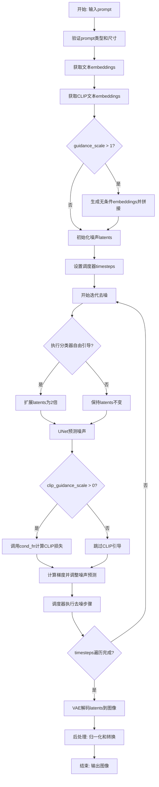

## 类结构

```
CLIPGuidedStableDiffusion (主管道类)
├── MakeCutouts (图像裁剪模块)
├── 全局函数
│   ├── spherical_dist_loss (球面距离损失)
│   └── set_requires_grad (梯度控制)
```

## 全局变量及字段


### `cut_size`
    
裁剪目标尺寸

类型：`int`
    


### `cut_power`
    
裁剪尺寸的指数幂

类型：`float`
    


### `latents_shape`
    
潜在空间形状

类型：`tuple`
    


### `latents_dtype`
    
潜在张量的数据类型

类型：`torch.dtype`
    


### `do_classifier_free_guidance`
    
是否启用无分类器引导

类型：`bool`
    


### `timesteps_tensor`
    
时间步张量

类型：`torch.Tensor`
    


### `CLIPGuidedStableDiffusion.vae`
    
VAE解码器

类型：`AutoencoderKL`
    


### `CLIPGuidedStableDiffusion.text_encoder`
    
文本编码器

类型：`CLIPTextModel`
    


### `CLIPGuidedStableDiffusion.clip_model`
    
CLIP视觉模型

类型：`CLIPModel`
    


### `CLIPGuidedStableDiffusion.tokenizer`
    
分词器

类型：`CLIPTokenizer`
    


### `CLIPGuidedStableDiffusion.unet`
    
U-Net去噪网络

类型：`UNet2DConditionModel`
    


### `CLIPGuidedStableDiffusion.scheduler`
    
时间步调度器

类型：`Union[PNDMScheduler, LMSDiscreteScheduler, DDIMScheduler, DPMSolverMultistepScheduler]`
    


### `CLIPGuidedStableDiffusion.feature_extractor`
    
图像预处理

类型：`CLIPImageProcessor`
    


### `CLIPGuidedStableDiffusion.normalize`
    
图像归一化

类型：`transforms.Normalize`
    


### `CLIPGuidedStableDiffusion.cut_out_size`
    
裁剪尺寸

类型：`int`
    


### `CLIPGuidedStableDiffusion.make_cutouts`
    
裁剪实例

类型：`MakeCutouts`
    
    

## 全局函数及方法


### `spherical_dist_loss`

计算两个嵌入向量在球面空间中的距离损失。该函数通过归一化向量并使用球面距离公式来衡量向量间的相似度，常用于CLIP引导的Stable Diffusion中计算图像和文本嵌入之间的损失。

参数：

- `x`：`torch.Tensor`，第一个嵌入向量
- `y`：`torch.Tensor`，第二个嵌入向量

返回值：`torch.Tensor`，球面距离损失值

#### 流程图

```mermaid
flowchart TD
    A[开始] --> B[输入x和y两个嵌入向量]
    B --> C[对x进行L2归一化: F.normalize x, dim=-1]
    C --> D[对y进行L2归一化: F.normalize y, dim=-1]
    D --> E[计算差向量范数: (x - y).norm dim=-1]
    E --> F[除以2: .div 2]
    F --> G[取反正弦: .arcsin]
    G --> H[平方: .pow 2]
    H --> I[乘以2: .mul 2]
    I --> J[返回球面距离损失]
```

#### 带注释源码

```python
def spherical_dist_loss(x, y):
    """
    计算两个嵌入向量间的球面距离损失
    
    该函数基于球面几何计算两个归一化向量之间的距离。
    使用的公式基于球面上两点之间的弦长与角度的关系:
    球面距离 = 2 * arcsin(|x - y| / 2)
    
    参数:
        x: 第一个嵌入向量 (Tensor)
        y: 第二个嵌入向量 (Tensor)
    
    返回:
        球面距离损失值 (Tensor)
    """
    # 步骤1: 对输入向量进行L2归一化，将其投影到单位球面上
    # normalize操作确保向量长度为1，使其位于球面上
    x = F.normalize(x, dim=-1)
    y = F.normalize(y, dim=-1)
    
    # 步骤2: 计算归一化后向量差的范数
    # (x - y).norm(dim=-1) 计算最后一个维度上的L2范数
    
    # 步骤3: 应用球面距离公式
    # .div(2) - 除以2
    # .arcsin() - 反正弦函数，将弦长转换为角度
    # .pow(2) - 平方
    # .mul(2) - 乘以2得到最终的球面距离
    return (x - y).norm(dim=-1).div(2).arcsin().pow(2).mul(2)
```


### `set_requires_grad`

设置模型参数的 `requires_grad` 属性，用于控制模型参数的梯度计算。该函数通过遍历模型的所有参数，将每个参数的 `requires_grad` 属性设置为指定的值，常用于在微调或冻结模型时切换参数的可训练状态。

参数：

- `model`：`torch.nn.Module`，需要设置 `requires_grad` 属性的模型对象
- `value`：`bool`，布尔值，指定参数是否需要计算梯度（`True` 表示需要计算梯度，冻结时设为 `False`）

返回值：`None`，该函数没有返回值，直接修改模型参数的 `requires_grad` 属性

#### 流程图

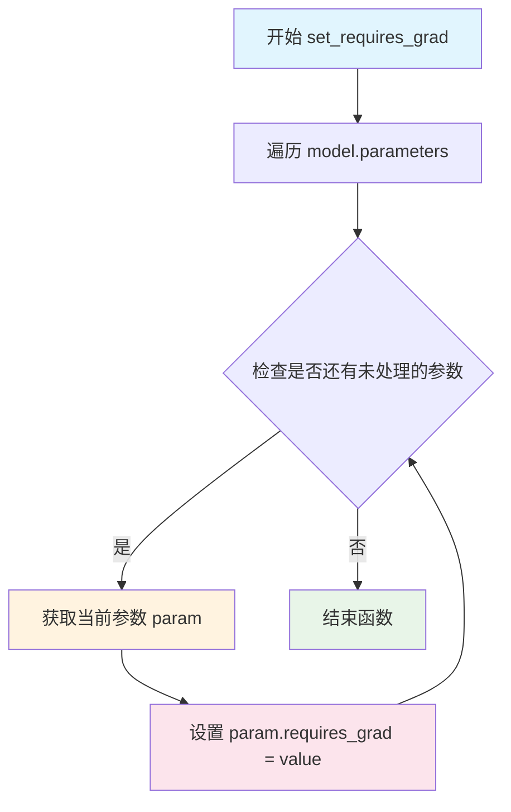

#### 带注释源码

```python
def set_requires_grad(model, value):
    """
    设置模型参数的 requires_grad 属性。
    
    该函数用于控制模型参数的梯度计算。当 value=False 时，
    模型参数不会被梯度更新，常用于冻结预训练模型；当 value=True 时，
    模型参数可以进行梯度更新，用于微调训练。
    
    参数:
        model: torch.nn.Module，需要设置 requires_grad 的模型对象
        value: bool，True 表示需要计算梯度，False 表示冻结参数
    
    返回:
        None，直接在原模型参数上修改
    """
    # 遍历模型的所有参数（包括权重和偏置）
    for param in model.parameters():
        # 将每个参数的 requires_grad 属性设置为指定值
        param.requires_grad = value
```


### `MakeCutouts.__init__`

初始化裁剪模块，设置裁剪的目标尺寸和裁剪大小的随机性参数。

参数：

- `cut_size`：`int`，裁剪的目标尺寸，即裁剪后图像的边长（正方形）
- `cut_power`：`float`，默认为 `1.0`，控制裁剪大小分布的指数参数，值越大生成的裁剪块倾向于越小

返回值：`None`，该方法为构造函数，不返回任何值

#### 流程图

```mermaid
graph TD
    A[开始 __init__] --> B[调用父类构造函数 super().__init__]
    B --> C[设置 self.cut_size = cut_size]
    C --> D[设置 self.cut_power = cut_power]
    D --> E[结束]
```

#### 带注释源码

```python
def __init__(self, cut_size, cut_power=1.0):
    """
    初始化 MakeCutouts 裁剪模块
    
    参数:
        cut_size: 裁剪的目标尺寸，裁剪后的图像会被调整为此尺寸
        cut_power: 控制裁剪大小的随机性，默认为 1.0
                   值越大，生成的裁剪块倾向于越小
    """
    # 调用 nn.Module 的初始化方法，完成 PyTorch 模块的基本初始化
    # 这会初始化 PyTorch 模块的内部状态，如 _parameters, _buffers 等
    super().__init__()

    # 保存裁剪目标尺寸到实例属性
    # 该值决定了后续所有裁剪块经过 adaptive_avg_pool2d 后的输出尺寸
    self.cut_size = cut_size
    
    # 保存裁剪大小随机性控制参数到实例属性
    # 在 forward 方法中用于调整裁剪尺寸的分布：
    # size = int(torch.rand([]) ** self.cut_power * (max_size - min_size) + min_size)
    # 当 cut_power = 1.0 时，尺寸在 [min_size, max_size] 范围内均匀分布
    # 当 cut_power > 1.0 时，较小的尺寸出现概率更高
    # 当 cut_power < 1.0 时，较大的尺寸出现概率更高
    self.cut_power = cut_power
```


### `MakeCutouts.forward`

该方法是 `MakeCutouts` 类的核心前向传播方法，通过随机位置和大小从输入图像张量中提取多个裁剪区域，对每个裁剪区域进行自适应平均池化至目标尺寸，最后将所有裁剪结果沿通道维度拼接后返回，实现了图像的数据增强功能。

参数：

- `self`：隐含的 `MakeCutouts` 实例本身，包含类属性 `cut_size`（目标裁剪尺寸）和 `cut_power`（控制裁剪尺寸分布的幂次参数）
- `pixel_values`：`torch.Tensor`，输入图像张量，形状为 (batch_size, channels, height, width)，表示一批经过归一化的图像数据
- `num_cutouts`：`int`，指定要生成的裁剪区域数量，即从输入图像中随机裁剪的子图数量

返回值：`torch.Tensor`，拼接后的裁剪图像张量，形状为 (batch_size * num_cutouts, channels, cut_size, cut_size)，其中每个裁剪区域都被调整为目标尺寸 `cut_size`

#### 流程图

```mermaid
flowchart TD
    A[开始 forward 方法] --> B[获取图像尺寸: sideY, sideX = pixel_values.shape[2:4]]
    B --> C[计算最大尺寸: max_size = min(sideX, sideY)]
    C --> D[计算最小尺寸: min_size = min(sideX, sideY, self.cut_size)]
    D --> E[初始化空列表 cutouts = []]
    E --> F{循环 i from 0 to num_cutouts - 1}
    F --> G[随机生成裁剪尺寸: size = int torch.rand [] ** self.cut_power * (max_size - min_size) + min_size]
    G --> H[随机生成X偏移: offsetx = torch.randint 0, sideX - size + 1]
    H --> I[随机生成Y偏移: offsety = torch.randint 0, sideY - size + 1]
    I --> J[提取裁剪区域: cutout = pixel_values[:, :, offsety:offsety+size, offsetx:offsetx+size]]
    J --> K[自适应平均池化: cutout = F.adaptive_avg_pool2d cutout, self.cut_size]
    K --> L[将裁剪添加到列表: cutouts.append cutout]
    L --> F
    F --> M[所有裁剪完成?]
    M --> N[拼接所有裁剪: torch.cat cutouts]
    N --> O[返回结果张量]
    O --> P[结束]
```

#### 带注释源码

```python
def forward(self, pixel_values, num_cutouts):
    """
    执行前向传播裁剪操作
    
    参数:
        pixel_values: torch.Tensor, 输入图像张量 (batch, channels, height, width)
        num_cutouts: int, 裁剪数量
    
    返回:
        torch.Tensor: 裁剪后的图像张量列表拼接结果
    """
    
    # 从输入张量中获取图像的高度和宽度维度
    # pixel_values.shape = (batch, channels, height, width)
    sideY, sideX = pixel_values.shape[2:4]
    
    # 计算图像可用的最大裁剪尺寸（取宽高中较小者）
    max_size = min(sideX, sideY)
    
    # 计算最小裁剪尺寸（考虑目标cut_size和图像实际尺寸）
    min_size = min(sideX, sideY, self.cut_size)
    
    # 初始化裁剪列表，用于存储所有生成的裁剪区域
    cutouts = []
    
    # 循环生成指定数量的裁剪区域
    for _ in range(num_cutouts):
        
        # 计算随机裁剪尺寸：
        # 1. torch.rand([]) 生成 [0,1) 均匀分布的随机标量
        # 2. ** self.cut_power 进行幂次变换，控制尺寸分布偏向
        #    - cut_power < 1: 偏向较大尺寸
        #    - cut_power > 1: 偏向较小尺寸
        #    - cut_power = 1: 均匀分布
        # 3. 乘以 (max_size - min_size) 映射到尺寸范围
        # 4. 加上 min_size 确保不低于最小尺寸
        size = int(torch.rand([]) ** self.cut_power * (max_size - min_size) + min_size)
        
        # 随机生成裁剪区域的X偏移量（水平起始位置）
        # 确保裁剪区域不会超出图像右边界
        offsetx = torch.randint(0, sideX - size + 1, ())
        
        # 随机生成裁剪区域的Y偏移量（垂直起始位置）
        # 确保裁剪区域不会超出图像下边界
        offsety = torch.randint(0, sideY - size + 1, ())
        
        # 从输入图像中提取裁剪区域
        # 使用切片操作: [batch, channels, y_start:y_end, x_start:x_end]
        cutout = pixel_values[:, :, offsety : offsety + size, offsetx : offsetx + size]
        
        # 对裁剪区域进行自适应平均池化
        # 将任意大小的裁剪区域统一调整为目标尺寸 self.cut_size
        # F.adaptive_avg_pool2d 自动将输入池化到指定的输出尺寸
        cutouts.append(F.adaptive_avg_pool2d(cutout, self.cut_size))
    
    # 沿新维度拼接所有裁剪区域
    # 结果形状: (batch * num_cutouts, channels, cut_size, cut_size)
    return torch.cat(cutouts)
```


### `CLIPGuidedStableDiffusion.__init__`

该方法是 `CLIPGuidedStableDiffusion` 类的构造函数，负责初始化扩散管道所需的所有核心组件，包括 VAE、文本编码器、CLIP 模型、UNet、调度器等，并将这些组件注册到管道中。同时，它会初始化 CLIP 引导所需的图像预处理变换（如归一化和随机裁剪），并冻结文本编码器和 CLIP 模型以防止在训练过程中被更新。

参数：

- `vae`：`AutoencoderKL`，变分自编码器，用于将潜在空间表示解码为图像
- `text_encoder`：`CLIPTextModel`，CLIP 文本编码器，用于将文本提示编码为嵌入向量
- `clip_model`：`CLIPModel`，完整的 CLIP 模型，用于计算图像与文本之间的相似度
- `tokenizer`：`CLIPTokenizer`，CLIP 分词器，用于将文本提示转换为 token IDs
- `unet`：`UNet2DConditionModel`，UNet 条件模型，用于预测噪声残差
- `scheduler`：Union[PNDMScheduler, LMSDiscreteScheduler, DDIMScheduler, DPMSolverMultistepScheduler]，扩散调度器，控制去噪过程中的噪声调度
- `feature_extractor`：`CLIPImageProcessor`，CLIP 图像预处理器，用于图像归一化和尺寸调整

返回值：`None`，该方法不返回值，仅初始化对象状态

#### 流程图

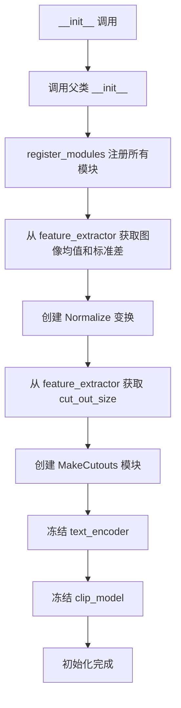

#### 带注释源码

```python
def __init__(
    self,
    vae: AutoencoderKL,                    # 变分自编码器，用于图像编码/解码
    text_encoder: CLIPTextModel,           # CLIP 文本编码器，将文本转为向量
    clip_model: CLIPModel,                 # CLIP 模型，用于图像-文本相似度计算
    tokenizer: CLIPTokenizer,               # 文本分词器
    unet: UNet2DConditionModel,            # UNet 条件模型，预测噪声
    scheduler: Union[PNDMScheduler, LMSDiscreteScheduler, DDIMScheduler, DPMSolverMultistepScheduler],  # 噪声调度器
    feature_extractor: CLIPImageProcessor, # CLIP 图像预处理器
):
    # 调用父类 DiffusionPipeline 和 StableDiffusionMixin 的初始化方法
    super().__init__()
    
    # 将所有模块注册到管道中，以便统一管理和访问
    self.register_modules(
        vae=vae,
        text_encoder=text_encoder,
        clip_model=clip_model,
        tokenizer=tokenizer,
        unet=unet,
        scheduler=scheduler,
        feature_extractor=feature_extractor,
    )

    # 创建归一化变换，使用 feature_extractor 的图像均值和标准差
    # 这确保了输入图像与 CLIP 模型训练时的预处理一致
    self.normalize = transforms.Normalize(
        mean=feature_extractor.image_mean, 
        std=feature_extractor.image_std
    )
    
    # 确定 CLIP 引导裁剪的输出尺寸
    # 如果 size 是整数直接使用，否则取最短边
    self.cut_out_size = (
        feature_extractor.size
        if isinstance(feature_extractor.size, int)
        else feature_extractor.size["shortest_edge"]
    )
    
    # 创建 MakeCutouts 模块，用于生成随机图像裁剪块
    # 这些裁剪块用于 CLIP 引导的多裁剪策略
    self.make_cutouts = MakeCutouts(self.cut_out_size)

    # 冻结 text_encoder，设置为不需要梯度
    # 因为 CLIP 引导只需要 CLIP 模型，不需要文本编码器参与训练
    set_requires_grad(self.text_encoder, False)
    
    # 冻结 clip_model，设置为不需要梯度
    # CLIP 模型在引导过程中只进行前向传播，不进行反向传播更新
    set_requires_grad(self.clip_model, False)
```


### `CLIPGuidedStableDiffusion.freeze_vae`

冻结 VAE 模型的参数，将其设置为不可训练状态，以减少显存占用和计算开销。

参数： 无（仅包含隐式参数 `self`）

返回值：`None`，无返回值

#### 流程图

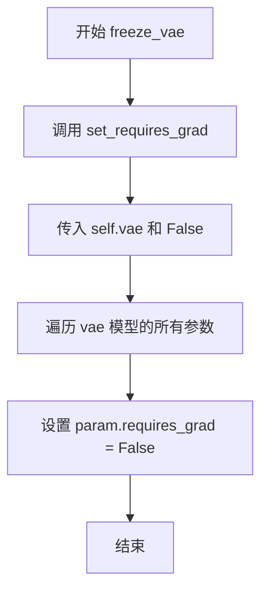

#### 带注释源码

```python
def freeze_vae(self):
    """冻结 VAE 模型的梯度计算。
    
    该方法通过调用 set_requires_grad 全局函数，将 VAE 模型的所有参数设置为不可训练状态。
    在 CLIP 引导的扩散过程中，VAE 仅用于解码 latent 表示为图像，不需要参与梯度计算。
    冻结 VAE 可以显著减少显存占用和计算开销。
    """
    set_requires_grad(self.vae, False)  # 调用全局函数，将 VAE 模型的 requires_grad 设为 False
```

---

#### 相关全局函数

**`set_requires_grad`**

辅助函数，用于设置模型参数的 `requires_grad` 属性。

参数：
- `model`：`torch.nn.Module`，待设置的 PyTorch 模型
- `value`：`bool`，是否要求梯度的布尔值

返回值：`None`，无返回值

```python
def set_requires_grad(model, value):
    """设置模型参数的 requires_grad 属性。
    
    遍历模型的所有参数，将每个参数的 requires_grad 设置为指定值。
    这是一个通用的梯度控制函数，被用于冻结/解冻 VAE、UNet 和文本编码器。
    """
    for param in model.parameters():
        param.requires_grad = value
```


### `CLIPGuidedStableDiffusion.unfreeze_vae`

解冻 VAE（变分自编码器）模型的参数，使其在后续训练中能够被更新。该方法是 `freeze_vae` 的逆操作，通常用于在冻结 VAE 进行推理或初始化训练后，需要对 VAE 进行微调或继续训练的场景。

参数： 无（仅包含隐式参数 `self`）

返回值：`None`，无返回值

#### 流程图

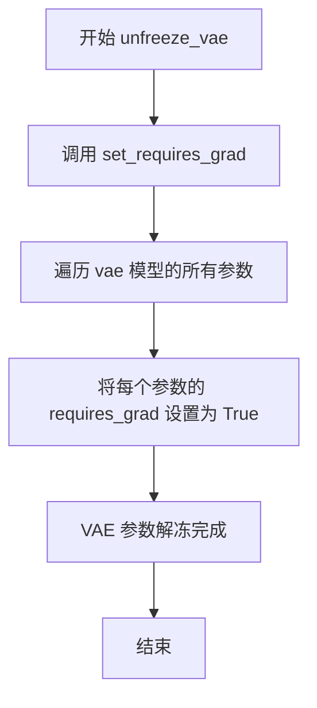

#### 带注释源码

```python
def unfreeze_vae(self):
    """
    解冻 VAE 模型参数，使其可训练。
    
    此方法是 freeze_vae 的逆操作，用于在需要继续训练或微调 VAE 时恢复其参数的梯度更新能力。
    通常在以下场景使用：
    1. 初始训练阶段冻结 VAE 以稳定其他组件训练
    2. 后续需要微调 VAE 以提升生成质量
    """
    set_requires_grad(self.vae, True)  # 调用全局函数，将 VAE 模型的所有参数设置为可训练状态
```

---

#### 关联的全局函数

##### `set_requires_grad`

设置模型参数的 `requires_grad` 属性，控制是否允许梯度计算。

参数：
- `model`：`torch.nn.Module`，需要设置梯度的 PyTorch 模型
- `value`：`bool`，是否允许梯度计算（True=允许，False=禁止）

返回值：`None`，无返回值

```python
def set_requires_grad(model, value):
    """全局辅助函数，用于批量设置模型参数的梯度开关"""
    for param in model.parameters():  # 遍历模型的所有参数
        param.requires_grad = value    # 设置每个参数的 requires_grad 属性
```


### `CLIPGuidedStableDiffusion.freeze_unet`

冻结 UNet 模型的参数，使其在后续训练过程中不可训练，从而将 UNet 固定为特征提取器。

参数：

- `self`：`CLIPGuidedStableDiffusion` 实例，隐式参数，表示当前管道对象

返回值：`None`，无返回值（直接在对象上修改 UNet 的参数状态）

#### 流程图

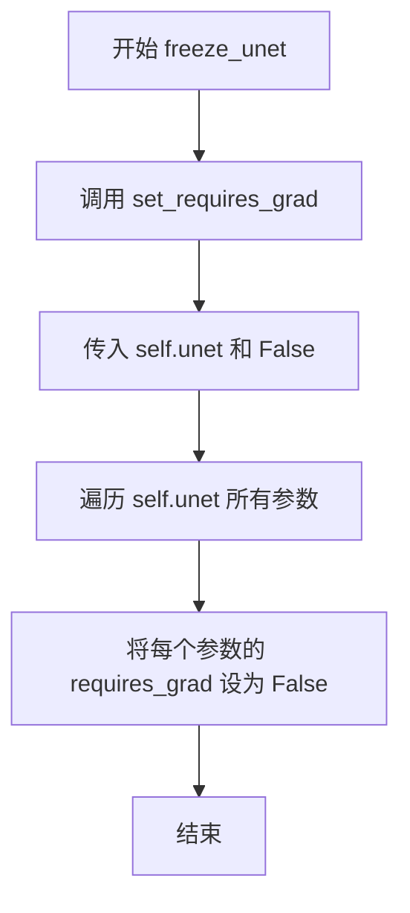

#### 带注释源码

```python
def freeze_unet(self):
    """
    冻结 UNet 模型的所有参数，防止其在后续操作中被梯度更新。
    
    该方法通常在需要使用 UNet 作为固定特征提取器时调用，
    例如在 CLIP 引导的扩散过程中，UNet 仅用于推理而非训练。
    """
    # 调用辅助函数 set_requires_grad，将 self.unet 的所有参数 requires_grad 设置为 False
    # 这样可以确保 UNet 的权重不会被梯度更新所修改
    set_requires_grad(self.unet, False)
```

---

### 关联信息

**全局函数依赖**：

- `set_requires_grad`：辅助函数，遍历模型所有参数并设置 `requires_grad` 属性
  - 参数：`model`（torch.nn.Module），`value`（bool）
  - 返回值：`None`


### `CLIPGuidedStableDiffusion.unfreeze_unet`

该方法用于解冻UNet模型的参数，使其可以在训练过程中更新梯度。

参数： 无

返回值：`None`，无返回值描述

#### 流程图

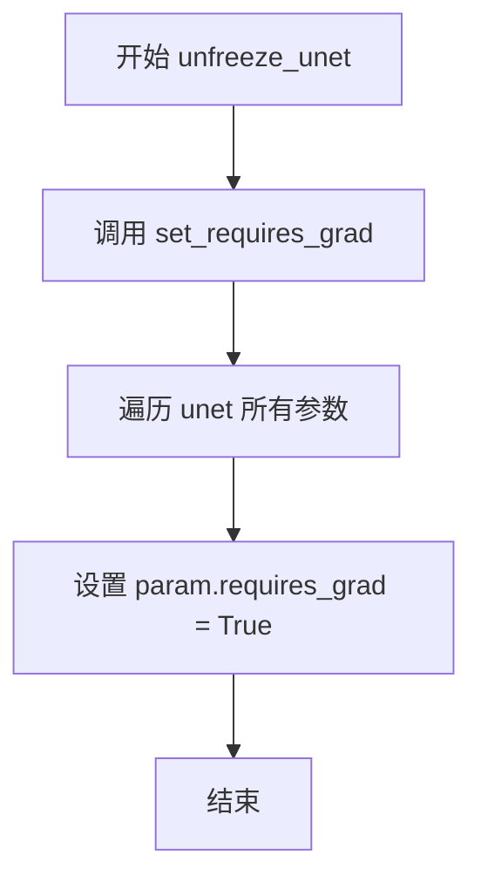

#### 带注释源码

```python
def unfreeze_unet(self):
    """
    解冻 UNet 模型的所有参数，使其可以参与梯度计算和训练。
    该方法是 freeze_unet 的反向操作，通常在需要微调 UNet 时调用。
    """
    # 调用辅助函数，将 UNet 模型的所有参数设置为可训练状态
    # 参数 True 表示开启梯度计算
    set_requires_grad(self.unet, True)
```


### `CLIPGuidedStableDiffusion.cond_fn`

该函数是CLIP引导稳定扩散的核心方法，通过计算CLIP模型生成的图像嵌入与文本嵌入之间的语义距离梯度，反向传播到扩散模型的潜在空间，从而引导生成过程符合文本描述的语义内容。

参数：

- `latents`：`torch.Tensor`，当前扩散过程的潜在表示
- `timestep`：`int`，当前扩散时间步
- `index`：`int`，调度器步数索引，用于获取对应的sigma值
- `text_embeddings`：`torch.Tensor`，文本编码器生成的文本嵌入
- `noise_pred_original`：`torch.Tensor`，原始噪声预测值
- `text_embeddings_clip`：`torch.Tensor`，CLIP模型生成的文本嵌入，用于计算语义距离
- `clip_guidance_scale`：`float`，CLIP引导强度系数，控制语义引导的影响力
- `num_cutouts`：`int`，随机切割数量，用于增加CLIP引导的多样性
- `use_cutouts`：`bool`，是否使用随机切割策略

返回值：`Tuple[torch.Tensor, torch.Tensor]`，返回元组包含修改后的噪声预测 `noise_pred` 和更新后的潜在表示 `latents`

#### 流程图

```mermaid
flowchart TD
    A[开始 cond_fn] --> B[分离latents并启用梯度]
    B --> C[使用scheduler缩放模型输入]
    C --> D[UNet预测噪声残差]
    D --> E{调度器类型判断}
    E -->|PNDM/DDIM/DPM| F[计算predicted original sample]
    F --> G[计算sample: pred_original_sample * fac + latents * (1 - fac)]
    E -->|LMS| H[计算sample: latents - sigma * noise_pred]
    E -->|其他| I[抛出ValueError]
    G --> J[VAE解码: 1/scaling_factor * sample]
    J --> K{use_cutouts?}
    K -->|True| L[MakeCutouts进行随机切割]
    K -->|False| M[Resize调整大小]
    L --> N[Normalize归一化]
    M --> N
    N --> O[CLIP提取图像特征]
    O --> P[特征向量归一化]
    P --> Q{use_cutouts?}
    Q -->|True| R[计算球面距离损失: 多切割]
    Q -->|False| S[计算球面距离损失: 单次]
    R --> T[损失乘以clip_guidance_scale]
    S --> T
    T --> U[反向传播计算梯度]
    U --> V{调度器类型判断}
    V -->|LMS| W[latents = latents + grads * sigma²]
    V -->|其他| X[noise_pred = noise_pred_original - sqrt(beta_prod_t) * grads]
    W --> Y[返回noise_pred, latents]
    X --> Y
```

#### 带注释源码

```python
@torch.enable_grad()
def cond_fn(
    self,
    latents,                      # torch.Tensor: 当前扩散过程的潜在表示
    timestep,                     # int: 当前时间步
    index,                        # int: 调度器步数索引
    text_embeddings,              # torch.Tensor: 文本嵌入
    noise_pred_original,          # torch.Tensor: 原始噪声预测
    text_embeddings_clip,         # torch.Tensor: CLIP文本嵌入
    clip_guidance_scale,          # float: CLIP引导尺度
    num_cutouts,                  # int: 切割数量
    use_cutouts=True,             # bool: 是否使用切割
):
    """
    计算CLIP引导梯度，用于引导扩散模型生成符合文本描述的图像
    
    工作原理：
    1. 将latents解码为图像空间
    2. 使用CLIP计算图像与文本的语义距离
    3. 反向传播梯度到latents空间
    4. 修改噪声预测以引导生成方向
    """
    
    # 步骤1: 分离latents并启用梯度计算
    # detach()分离计算图，requires_grad_()启用梯度追踪
    latents = latents.detach().requires_grad_()

    # 步骤2: 使用调度器缩放模型输入
    # 根据当前时间步调整latents的分布
    latent_model_input = self.scheduler.scale_model_input(latents, timestep)

    # 步骤3: 使用UNet预测噪声残差
    # 这是扩散模型的标准前向过程
    noise_pred = self.unet(latent_model_input, timestep, encoder_hidden_states=text_embeddings).sample

    # 步骤4-7: 根据调度器类型计算原始样本
    # 不同调度器使用不同的公式重构原始样本x_0
    if isinstance(self.scheduler, (PNDMScheduler, DDIMScheduler, DPMSolverMultistepScheduler)):
        # 获取累积alpha和beta产品
        alpha_prod_t = self.scheduler.alphas_cumprod[timestep]
        beta_prod_t = 1 - alpha_prod_t
        
        # 使用公式(12)从噪声预测计算原始样本
        # x_0 = (x_t - sqrt(1-alpha_prod_t) * epsilon) / sqrt(alpha_prod_t)
        pred_original_sample = (latents - beta_prod_t ** (0.5) * noise_pred) / alpha_prod_t ** (0.5)

        # 计算中间采样因子
        fac = torch.sqrt(beta_prod_t)
        # 重构样本：x_t = x_0 * sqrt(alpha_prod_t) + sqrt(1-alpha_prod_t) * epsilon
        sample = pred_original_sample * (fac) + latents * (1 - fac)
        
    elif isinstance(self.scheduler, LMSDiscreteScheduler):
        # LMS调度器使用sigma进行计算
        # x_t = x_t-1 - sigma * epsilon
        sigma = self.scheduler.sigmas[index]
        sample = latents - sigma * noise_pred
    else:
        raise ValueError(f"scheduler type {type(self.scheduler)} not supported")

    # 步骤8: VAE解码 - 将潜在空间转换到图像空间
    # scaling_factor用于缩放潜在表示
    sample = 1 / self.vae.config.scaling_factor * sample
    # decode将潜在表示解码为图像
    image = self.vae.decode(sample).sample
    # 将图像从[-1,1]转换到[0,1]范围
    image = (image / 2 + 0.5).clamp(0, 1)

    # 步骤9: 图像预处理 - 切割或调整大小
    if use_cutouts:
        # 使用MakeCutouts进行多个随机切割，增加多样性
        image = self.make_cutouts(image, num_cutouts)
    else:
        # 直接调整大小到目标尺寸
        image = transforms.Resize(self.cut_out_size)(image)
    
    # 步骤10: 归一化处理
    # 使用CLIP特征提取器的均值和标准差进行归一化
    image = self.normalize(image).to(latents.dtype)

    # 步骤11: CLIP图像特征提取
    # 获取CLIP模型对当前生成图像的特征表示
    image_embeddings_clip = self.clip_model.get_image_features(image)
    # L2归一化，用于计算余弦相似度
    image_embeddings_clip = image_embeddings_clip / image_embeddings_clip.norm(p=2, dim=-1, keepdim=True)

    # 步骤12: 计算语义距离损失
    if use_cutouts:
        # 多切割情况：计算每个切割的损失并求和
        dists = spherical_dist_loss(image_embeddings_clip, text_embeddings_clip)
        # 重塑为[num_cutouts, batch, features]形状
        dists = dists.view([num_cutouts, sample.shape[0], -1])
        # 先对特征维度求和，再对批维度求均值，最后乘以引导尺度
        loss = dists.sum(2).mean(0).sum() * clip_guidance_scale
    else:
        # 单图像情况：直接计算平均损失
        loss = spherical_dist_loss(image_embeddings_clip, text_embeddings_clip).mean() * clip_guidance_scale

    # 步骤13: 反向传播计算梯度
    # 计算损失相对于latents的梯度
    grads = -torch.autograd.grad(loss, latents)[0]
    # 取负梯度因为我们要沿着损失减小的方向移动

    # 步骤14: 根据调度器类型更新噪声预测
    if isinstance(self.scheduler, LMSDiscreteScheduler):
        # LMS调度器：直接更新latents
        # 梯度乘以sigma的平方（对应LMS的积分步长）
        latents = latents.detach() + grads * (sigma**2)
        # 保持原始噪声预测不变
        noise_pred = noise_pred_original
    else:
        # 其他调度器：修改噪声预测
        # 新的噪声预测 = 原始预测 - sqrt(beta_prod_t) * 梯度
        noise_pred = noise_pred_original - torch.sqrt(beta_prod_t) * grads

    # 步骤15: 返回更新后的噪声预测和潜在表示
    return noise_pred, latents
```


### `CLIPGuidedStableDiffusion.__call__`

该方法是 CLIP 引导的稳定扩散管道的主入口，接收文本提示词并生成对应的图像。它通过结合文本编码器、UNet 去噪网络、VAE 解码器以及 CLIP 模型进行图像生成，并在去噪过程中同时应用分类器自由引导（classifier-free guidance）和 CLIP 引导（CLIP guidance）来提升生成图像与文本提示的一致性。

参数：

- `prompt`：`Union[str, List[str]]`，文本提示词，指定要生成的图像内容
- `height`：`Optional[int]`，生成图像的高度，默认 512 像素
- `width`：`Optional[int]`，生成图像的宽度，默认 512 像素
- `num_inference_steps`：`Optional[int]`，去噪推理步数，默认 50 步
- `guidance_scale`：`Optional[float]`，分类器自由引导的权重，默认 7.5
- `num_images_per_prompt`：`Optional[int]`，每个提示词生成的图像数量，默认 1
- `eta`：`float`，DDIM 调度器的 eta 参数，用于控制随机性，默认 0.0
- `clip_guidance_scale`：`Optional[float]`，CLIP 引导的权重，默认 100
- `clip_prompt`：`Optional[Union[str, List[str]]]`，用于 CLIP 引导的独立提示词，默认为 None（使用主 prompt）
- `num_cutouts`：`Optional[int]`，CLIP 引导时使用的切块数量，默认 4
- `use_cutouts`：`Optional[bool]`，是否使用切块进行 CLIP 引导，默认 True
- `generator`：`torch.Generator | None`，随机数生成器，用于可复现的图像生成
- `latents`：`Optional[torch.Tensor]`，预计算的潜在向量，若为 None 则随机生成
- `output_type`：`str | None`，输出类型，"pil" 返回 PIL 图像，numpy 返回数组，默认 "pil"
- `return_dict`：`bool`，是否返回字典格式的结果，默认 True

返回值：`StableDiffusionPipelineOutput`，包含生成的图像列表和 NSFW 内容检测结果

#### 流程图

```mermaid
flowchart TD
    A[开始 __call__] --> B{验证 prompt 类型}
    B -->|str| C[batch_size = 1]
    B -->|list| D[batch_size = len(prompt)]
    B -->|其他| E[抛出 ValueError]
    C --> F{验证 height/width 能被 8 整除}
    D --> F
    F -->|否| G[抛出 ValueError]
    F -->|是| H[文本编码: tokenizer + text_encoder]
    H --> I[复制 text_embeddings for num_images_per_prompt]
    I --> J{clip_guidance_scale > 0?}
    J -->|是| K[处理 clip_prompt 并获取 CLIP 文本嵌入]
    J -->|否| L[跳过 CLIP 嵌入计算]
    K --> M[归一化 CLIP 文本嵌入]
    L --> N[计算是否需要分类器自由引导]
    M --> N
    N -->|guidance_scale > 1.0| O[生成无条件嵌入并拼接]
    N -->|否则| P[仅使用条件嵌入]
    O --> Q[初始化或验证 latents]
    P --> Q
    Q --> R[设置调度器时间步]
    R --> S[初始化噪声: latents = latents * scheduler.init_noise_sigma]
    S --> T[遍历时间步 t]
    T --> U{do_classifier_free_guidance?}
    U -->|是| V[扩展 latents = latents * 2]
    U -->|否| W[latent_model_input = latents]
    V --> X[UNet 预测噪声残差]
    W --> X
    X --> Y{do_classifier_free_guidance?}
    Y -->|是| Z[计算引导噪声: noise_pred_uncond + guidance_scale * (noise_pred_text - noise_pred_uncond)]
    Y -->|否| AA[noise_pred 保持不变]
    Z --> AB{clip_guidance_scale > 0?}
    AA --> AB
    AB -->|是| AC[调用 cond_fn 进行 CLIP 引导]
    AB -->|否| AD[跳过 CLIP 引导]
    AC --> AE[调度器步骤: scheduler.step]
    AD --> AE
    AE --> AF[更新 latents]
    AF --> AG{还有更多时间步?}
    AG -->|是| T
    AG -->|否| AH[VAE 解码: latents -> image]
    AH --> AI[后处理: 归一化到 [0,1] 并转换为 numpy]
    AI --> AJ{output_type == 'pil'?}
    AJ -->|是| AK[转换为 PIL 图像]
    AJ -->|否| AL[保持 numpy 数组]
    AK --> AM{return_dict == True?}
    AL --> AM
    AM -->|是| AN[返回 StableDiffusionPipelineOutput]
    AM -->|否| AO[返回元组 (image, None)]
```

#### 带注释源码

```python
@torch.no_grad()
def __call__(
    self,
    prompt: Union[str, List[str]],              # 输入文本提示词，字符串或字符串列表
    height: Optional[int] = 512,                # 生成图像高度，必须能被 8 整除
    width: Optional[int] = 512,                 # 生成图像宽度，必须能被 8 整除
    num_inference_steps: Optional[int] = 50,    # 去噪迭代步数
    guidance_scale: Optional[float] = 7.5,      # 分类器自由引导强度系数
    num_images_per_prompt: Optional[int] = 1,   # 每个提示词生成的图像数量
    eta: float = 0.0,                           # DDIM 调度器的 eta 参数 (0-1)
    clip_guidance_scale: Optional[float] = 100, # CLIP 引导损失权重
    clip_prompt: Optional[Union[str, List[str]]] = None, # 独立的 CLIP 引导提示词
    num_cutouts: Optional[int] = 4,             # CLIP 引导使用的随机切块数量
    use_cutouts: Optional[bool] = True,         # 是否启用随机切块策略
    generator: torch.Generator | None = None,   # 随机数生成器，确保可复现性
    latents: Optional[torch.Tensor] = None,     # 预定义的初始潜在向量
    output_type: str | None = "pil",            # 输出格式: "pil" 或 "numpy"
    return_dict: bool = True,                   # 是否返回字典格式
):
    # ---------------------------------------------------------
    # 步骤 1: 验证和处理 prompt
    # ---------------------------------------------------------
    if isinstance(prompt, str):
        batch_size = 1  # 单个字符串提示词，批大小为 1
    elif isinstance(prompt, list):
        batch_size = len(prompt)  # 列表提示词，批大小为列表长度
    else:
        raise ValueError(f"`prompt` has to be of type `str` or `list` but is {type(prompt)}")

    # 验证图像尺寸是否能被 8 整除（VAE 下采样倍数为 8）
    if height % 8 != 0 or width % 8 != 0:
        raise ValueError(f"`height` and `width` have to be divisible by 8 but are {height} and {width}.")

    # ---------------------------------------------------------
    # 步骤 2: 文本编码 - 将 prompt 转换为文本嵌入
    # ---------------------------------------------------------
    # 使用 tokenizer 将文本转换为 token ID 序列
    text_input = self.tokenizer(
        prompt,
        padding="max_length",
        max_length=self.tokenizer.model_max_length,  # 通常为 77
        truncation=True,
        return_tensors="pt",
    )
    # 通过 text_encoder 获取文本嵌入表示
    text_embeddings = self.text_encoder(text_input.input_ids.to(self.device))[0]
    
    # 为每个提示词生成多张图像时，复制文本嵌入
    text_embeddings = text_embeddings.repeat_interleave(num_images_per_prompt, dim=0)

    # ---------------------------------------------------------
    # 步骤 3: CLIP 引导的文本嵌入处理
    # ---------------------------------------------------------
    if clip_guidance_scale > 0:  # 仅在启用 CLIP 引导时计算
        if clip_prompt is not None:
            # 使用独立的 clip_prompt 进行 CLIP 引导
            clip_text_input = self.tokenizer(
                clip_prompt,
                padding="max_length",
                max_length=self.tokenizer.model_max_length,
                truncation=True,
                return_tensors="pt",
            ).input_ids.to(self.device)
        else:
            # 默认使用主 prompt 的 token IDs
            clip_text_input = text_input.input_ids.to(self.device)
        
        # 获取 CLIP 文本特征并归一化（用于余弦相似度计算）
        text_embeddings_clip = self.clip_model.get_text_features(clip_text_input)
        text_embeddings_clip = text_embeddings_clip / text_embeddings_clip.norm(p=2, dim=-1, keepdim=True)
        
        # 复制以匹配 num_images_per_prompt
        text_embeddings_clip = text_embeddings_clip.repeat_interleave(num_images_per_prompt, dim=0)

    # ---------------------------------------------------------
    # 步骤 4: 分类器自由引导 (Classifier-Free Guidance) 设置
    # ---------------------------------------------------------
    # guidance_scale > 1.0 时启用 CFG，模拟无条件生成
    do_classifier_free_guidance = guidance_scale > 1.0
    
    if do_classifier_free_guidance:
        # 获取最大序列长度
        max_length = text_input.input_ids.shape[-1]
        # 创建空字符串的 unconditional 输入
        uncond_input = self.tokenizer([""], padding="max_length", max_length=max_length, return_tensors="pt")
        # 获取无条件嵌入
        uncond_embeddings = self.text_encoder(uncond_input.input_ids.to(self.device))[0]
        # 复制以匹配 num_images_per_prompt
        uncond_embeddings = uncond_embeddings.repeat_interleave(num_images_per_prompt, dim=0)

        # 拼接无条件嵌入和条件嵌入，避免两次前向传播
        # 格式: [uncond_embeddings, text_embeddings]
        text_embeddings = torch.cat([uncond_embeddings, text_embeddings])

    # ---------------------------------------------------------
    # 步骤 5: 初始化或验证 latents（潜在向量）
    # ---------------------------------------------------------
    # 计算 latents 的形状: (batch * num_images, channels, height/8, width/8)
    latents_shape = (batch_size * num_images_per_prompt, self.unet.config.in_channels, height // 8, width // 8)
    latents_dtype = text_embeddings.dtype  # 使用与文本嵌入相同的 dtype
    
    if latents is None:
        # 用户未提供 latents，随机生成初始噪声
        if self.device.type == "mps":
            # MPS 设备上 randn 不可重现，临时使用 CPU
            latents = torch.randn(latents_shape, generator=generator, device="cpu", dtype=latents_dtype).to(
                self.device
            )
        else:
            # 直接在目标设备上生成随机 latents
            latents = torch.randn(latents_shape, generator=generator, device=self.device, dtype=latents_dtype)
    else:
        # 验证用户提供的 latents 形状是否正确
        if latents.shape != latents_shape:
            raise ValueError(f"Unexpected latents shape, got {latents.shape}, expected {latents_shape}")
        latents = latents.to(self.device)

    # ---------------------------------------------------------
    # 步骤 6: 配置调度器 (Scheduler) 的时间步
    # ---------------------------------------------------------
    # 检查调度器是否支持 offset 参数（用于跳过初始步）
    accepts_offset = "offset" in set(inspect.signature(self.scheduler.set_timesteps).parameters.keys())
    extra_set_kwargs = {}
    if accepts_offset:
        extra_set_kwargs["offset"] = 1

    # 设置推理的时间步序列
    self.scheduler.set_timesteps(num_inference_steps, **extra_set_kwargs)

    # 将时间步移至目标设备（某些调度器使用数组存储时间步）
    timesteps_tensor = self.scheduler.timesteps.to(self.device)

    # ---------------------------------------------------------
    # 步骤 7: 初始噪声缩放
    # ---------------------------------------------------------
    # 根据调度器要求缩放初始噪声的标准差
    latents = latents * self.scheduler.init_noise_sigma

    # ---------------------------------------------------------
    # 步骤 8: 准备调度器的额外参数
    # ---------------------------------------------------------
    # eta 仅用于 DDIM 调度器，控制确定性/随机性
    accepts_eta = "eta" in set(inspect.signature(self.scheduler.step).parameters.keys())
    extra_step_kwargs = {}
    if accepts_eta:
        extra_step_kwargs["eta"] = eta

    # 检查调度器是否接受 generator 参数
    accepts_generator = "generator" in set(inspect.signature(self.scheduler.step).parameters.keys())
    if accepts_generator:
        extra_step_kwargs["generator"] = generator

    # ---------------------------------------------------------
    # 步骤 9: 主去噪循环
    # ---------------------------------------------------------
    for i, t in enumerate(self.progress_bar(timesteps_tensor)):
        # 扩展 latents 以进行分类器自由引导（复制为两份）
        latent_model_input = torch.cat([latents] * 2) if do_classifier_free_guidance else latents
        
        # 缩放输入以匹配调度器的时间步
        latent_model_input = self.scheduler.scale_model_input(latent_model_input, t)

        # 使用 UNet 预测噪声残差
        noise_pred = self.unet(latent_model_input, t, encoder_hidden_states=text_embeddings).sample

        # 执行分类器自由引导
        if do_classifier_free_guidance:
            # 分离无条件和条件预测
            noise_pred_uncond, noise_pred_text = noise_pred.chunk(2)
            # 应用 CFG 公式: noise_pred = noise_pred_uncond + w * (noise_pred_text - noise_pred_uncond)
            noise_pred = noise_pred_uncond + guidance_scale * (noise_pred_text - noise_pred_uncond)

        # 执行 CLIP 引导（通过梯度优化 latents）
        if clip_guidance_scale > 0:
            # 获取用于引导的文本嵌入
            text_embeddings_for_guidance = (
                text_embeddings.chunk(2)[1] if do_classifier_free_guidance else text_embeddings
            )
            # 调用条件函数进行 CLIP 引导
            noise_pred, latents = self.cond_fn(
                latents,                        # 当前 latents
                t,                              # 当前时间步
                i,                              # 时间步索引
                text_embeddings_for_guidance,  # 文本嵌入
                noise_pred,                     # 当前噪声预测
                text_embeddings_clip,           # CLIP 文本嵌入
                clip_guidance_scale,            # CLIP 引导权重
                num_cutouts,                   # 切块数量
                use_cutouts,                   # 是否使用切块
            )

        # 执行调度器步骤，计算前一个时间步的 latents
        latents = self.scheduler.step(noise_pred, t, latents, **extra_step_kwargs).prev_sample

    # ---------------------------------------------------------
    # 步骤 10: VAE 解码 - 将 latents 转换为图像
    # ---------------------------------------------------------
    # 反缩放 latents
    latents = 1 / self.vae.config.scaling_factor * latents
    
    # 使用 VAE 解码器将潜在向量解码为图像
    image = self.vae.decode(latents).sample

    # ---------------------------------------------------------
    # 步骤 11: 后处理 - 归一化并转换格式
    # ---------------------------------------------------------
    # 将图像从 [-1,1] 归一化到 [0,1]
    image = (image / 2 + 0.5).clamp(0, 1)
    
    # 转换为 numpy 数组并调整维度顺序 (NCHW -> NHWC)
    image = image.cpu().permute(0, 2, 3, 1).numpy()

    # 根据 output_type 转换格式
    if output_type == "pil":
        image = self.numpy_to_pil(image)

    # ---------------------------------------------------------
    # 步骤 12: 返回结果
    # ---------------------------------------------------------
    if not return_dict:
        return (image, None)  # 兼容旧版返回格式

    # 返回标准输出格式
    return StableDiffusionPipelineOutput(images=image, nsfw_content_detected=None)
```


### `MakeCutouts.forward`

该方法执行随机裁剪操作，从输入图像张量中生成多个随机大小和位置的裁剪区域，将每个裁剪区域调整为统一的目标尺寸，最后将所有裁剪结果沿通道维度拼接返回，以实现数据增强和CLIP引导扩散模型的多裁剪策略。

参数：

- `pixel_values`：`torch.Tensor`，输入的图像张量，形状为 (batch_size, channels, height, width)
- `num_cutouts`：`int`，需要生成的裁剪数量

返回值：`torch.Tensor`，拼接后的裁剪结果张量，形状为 (batch_size * num_cutouts, channels, cut_size, cut_size)

#### 流程图

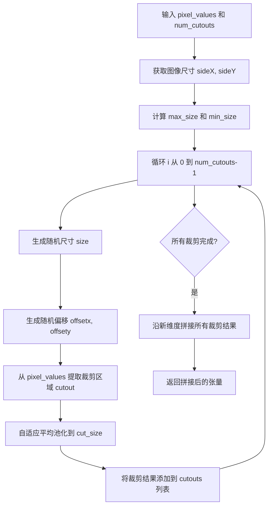

#### 带注释源码

```python
def forward(self, pixel_values, num_cutouts):
    # 获取输入图像的空间尺寸
    # pixel_values shape: (batch_size, channels, height, width)
    sideY, sideX = pixel_values.shape[2:4]
    
    # 计算最大和最小可能的裁剪尺寸
    # max_size 取宽高中较小的值作为裁剪上限
    max_size = min(sideX, sideY)
    # min_size 至少包含 cut_size 和宽高中较小的值
    min_size = min(sideX, sideY, self.cut_size)
    
    # 存储所有裁剪结果
    cutouts = []
    
    # 循环生成指定数量的裁剪
    for _ in range(num_cutouts):
        # 使用随机函数生成裁剪尺寸
        # torch.rand([]) 生成 [0,1) 间的标量
        # ** self.cut_power 用于调整尺寸分布的概率密度
        # (max_size - min_size) 控制尺寸变化范围
        # + min_size 确保尺寸不低于最小值
        size = int(torch.rand([]) ** self.cut_power * (max_size - min_size) + min_size)
        
        # 生成随机水平偏移量 offsetx
        # 范围: [0, sideX - size)
        offsetx = torch.randint(0, sideX - size + 1, ())
        
        # 生成随机垂直偏移量 offsety
        # 范围: [0, sideY - size)
        offsety = torch.randint(0, sideY - size + 1, ())
        
        # 从输入图像中提取裁剪区域
        # 使用切片操作获取 pixel_values[:, :, offsety:offsety+size, offsetx:offsetx+size]
        cutout = pixel_values[:, :, offsety : offsety + size, offsetx : offsetx + size]
        
        # 使用自适应平均池化将裁剪区域调整为统一的 cut_size x cut_size
        # 这确保了无论原始裁剪尺寸如何，输出都是统一大小
        cutouts.append(F.adaptive_avg_pool2d(cutout, self.cut_size))
    
    # 将所有裁剪结果在新增维度上拼接
    # 拼接后形状: (batch_size * num_cutouts, channels, cut_size, cut_size)
    return torch.cat(cutouts)
```


### `CLIPGuidedStableDiffusion.__init__`

该方法初始化CLIP引导的Stable Diffusion Pipeline，注册所有必需的模型模块（VAE、文本编码器、CLIP模型、分词器、UNet和调度器），设置图像归一化transforms和Cutout增强工具，并冻结CLIP相关模型的梯度以节省计算资源。

参数：

- `vae`：`AutoencoderKL`，变分自编码器，用于将潜在空间编码/解码为图像
- `text_encoder`：`CLIPTextModel`，CLIP文本编码器，将文本提示转换为嵌入向量
- `clip_model`：`CLIPModel`，完整的CLIP模型，用于提取图像特征以进行CLIP引导
- `tokenizer`：`CLIPTokenizer`，CLIP分词器，用于将文本提示 token 化
- `unet`：`UNet2DConditionModel`，条件UNet模型，根据文本嵌入预测噪声残差
- `scheduler`：`Union[PNDMScheduler, LMSDiscreteScheduler, DDIMScheduler, DPMSolverMultistepScheduler]`，噪声调度器，控制扩散过程中的噪声添加和去除
- `feature_extractor`：`CLIPImageProcessor`，CLIP图像处理器，提供图像预处理参数（均值、标准差、尺寸）

返回值：`None`，构造函数无返回值

#### 流程图

```mermaid
flowchart TD
    A[开始 __init__] --> B[调用 super().__init__ 初始化基类]
    B --> C[register_modules 注册所有模型模块]
    C --> D[创建 Normalize transform 使用 feature_extractor 的均值和标准差]
    D --> E[确定 cut_out_size 优先使用整数否则取 shortest_edge]
    E --> F[实例化 MakeCutouts 模块]
    F --> G[冻结 text_encoder 梯度]
    G --> H[冻结 clip_model 梯度]
    H --> I[结束 __init__]
```

#### 带注释源码

```python
def __init__(
    self,
    vae: AutoencoderKL,                         # VAE模型：图像编解码器
    text_encoder: CLIPTextModel,                # 文本编码器：文本→向量
    clip_model: CLIPModel,                      # CLIP模型：图像特征提取
    tokenizer: CLIPTokenizer,                   # 分词器：文本token化
    unet: UNet2DConditionModel,                # UNet：噪声预测
    scheduler: Union[PNDMScheduler, LMSDiscreteScheduler, DDIMScheduler, DPMSolverMultistepScheduler],  # 调度器：控制扩散过程
    feature_extractor: CLIPImageProcessor,      # 特征提取器：提供CLIP预处理参数
):
    # 1. 调用父类构造函数，初始化pipeline基础结构
    super().__init__()
    
    # 2. 将所有模型组件注册到pipeline内部，便于统一管理和移动设备
    self.register_modules(
        vae=vae,
        text_encoder=text_encoder,
        clip_model=clip_model,
        tokenizer=tokenizer,
        unet=unet,
        scheduler=scheduler,
        feature_extractor=feature_extractor,
    )

    # 3. 创建图像归一化transform，使用CLIP特征提取器的标准参数
    #    用于将图像归一化到CLIP要求的范围
    self.normalize = transforms.Normalize(
        mean=feature_extractor.image_mean,  # CLIP图像均值
        std=feature_extractor.image_std     # CLIP图像标准差
    )
    
    # 4. 确定cutout增强的输出尺寸
    #    支持整数或字典格式（如{"shortest_edge": 224}）
    self.cut_out_size = (
        feature_extractor.size
        if isinstance(feature_extractor.size, int)
        else feature_extractor.size["shortest_edge"]
    )
    
    # 5. 实例化MakeCutouts模块，用于CLIP引导时的随机图像裁剪增强
    #    可以生成多个随机裁剪区域以增加多样性
    self.make_cutouts = MakeCutouts(self.cut_out_size)

    # 6. 冻结text_encoder梯度：CLIP文本编码器在推理时不需要梯度
    #    减少显存占用和计算量，因为文本编码器是预训练的
    set_requires_grad(self.text_encoder, False)
    
    # 7. 冻结clip_model梯度：CLIP图像编码器在推理时不需要梯度
    #    同样是为了节省资源，CLIP模型保持冻结
    set_requires_grad(self.clip_model, False)
```


### `CLIPGuidedStableDiffusion.freeze_vae`

该方法用于冻结 VAE（变分自编码器）模型的梯度，使其在后续的训练过程中不会被更新。通过调用 `set_requires_grad` 函数将 VAE 模型的所有参数 `requires_grad` 属性设置为 `False`，从而禁用梯度计算，达到冻结模型的目的。

参数：暂无参数（仅包含 `self` 隐式参数）

返回值：`None`，无返回值（Python 方法默认返回 None）

#### 流程图

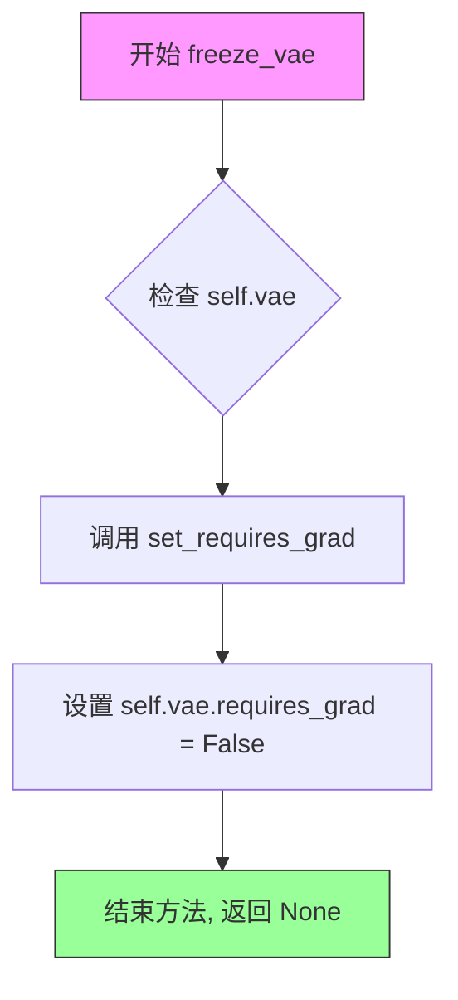

#### 带注释源码

```python
def freeze_vae(self):
    """
    冻结 VAE 模型，禁用梯度计算。
    
    该方法通过将 VAE 模型的所有参数设置为不可训练状态，
    防止在后续训练过程中更新 VAE 的权重。
    通常在需要固定 VAE 编码器/解码器而只训练其他组件时使用。
    """
    set_requires_grad(self.vae, False)  # 调用工具函数，将 VAE 模型的 requires_grad 属性设为 False
```


### `CLIPGuidedStableDiffusion.unfreeze_vae`

解冻VAE模型，使其参数可训练，从而能够在后续训练过程中更新VAE的权重。

参数：

- 无显式参数（仅隐式包含 `self`）

返回值：`None`，无返回值（方法执行后直接返回）

#### 流程图

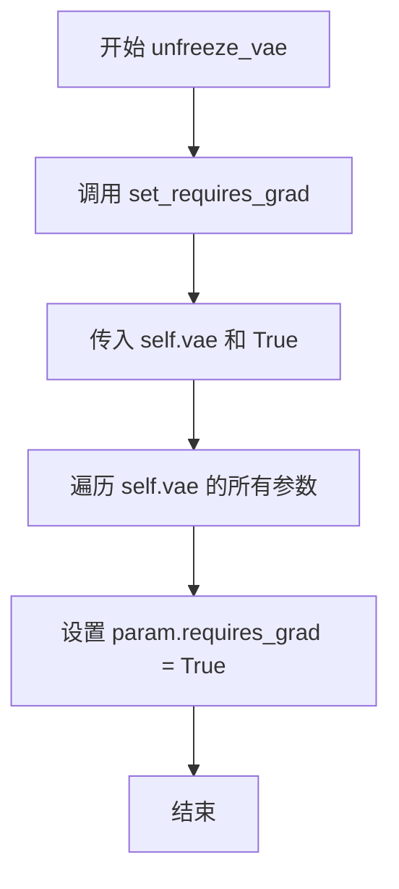

#### 带注释源码

```
def unfreeze_vae(self):
    """
    解冻VAE模型，使其参数可训练
    
    该方法通过调用 set_requires_grad 函数，将 VAE 模型的所有参数设置为可训练状态。
    这在需要微调 VAE 或进行进一步训练时使用。
    """
    set_requires_grad(self.vae, True)  # 设置 VAE 模型的所有参数为可训练状态
```


### `CLIPGuidedStableDiffusion.freeze_unet`

该方法用于冻结 UNet 模型，通过禁用梯度计算来锁定模型参数，防止在 CLIP 引导的稳定扩散训练或推理过程中 UNet 被更新。

参数：无

返回值：`None`，无返回值

#### 流程图

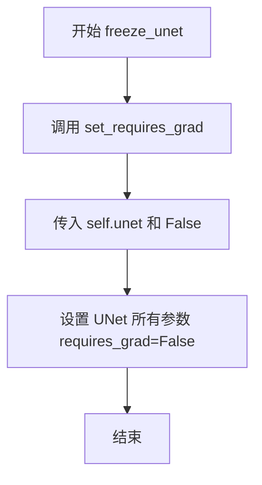

#### 带注释源码

```python
def freeze_unet(self):
    """
    冻结 UNet 模型，禁用其梯度计算。
    
    该方法通过调用 set_requires_grad 函数，将 UNet 模型的所有参数设置为不可训练状态。
    在 CLIP 引导的稳定扩散 pipeline 中，通常在需要进行 CLIP 引导优化时冻结 UNet，
    以避免 UNet 参数被意外更新。
    """
    set_requires_grad(self.unet, False)  # 调用工具函数，将 UNet 的 requires_grad 设为 False
```


### `CLIPGuidedStableDiffusion.unfreeze_unet`

解冻UNet模型，使其参数可训练，从而能够在后续的训练过程中更新权重。

参数：

- `self`：`CLIPGuidedStableDiffusion` 实例，隐式参数，表示当前管道对象本身

返回值：`None`，无返回值，该方法直接修改模型的可训练状态

#### 流程图

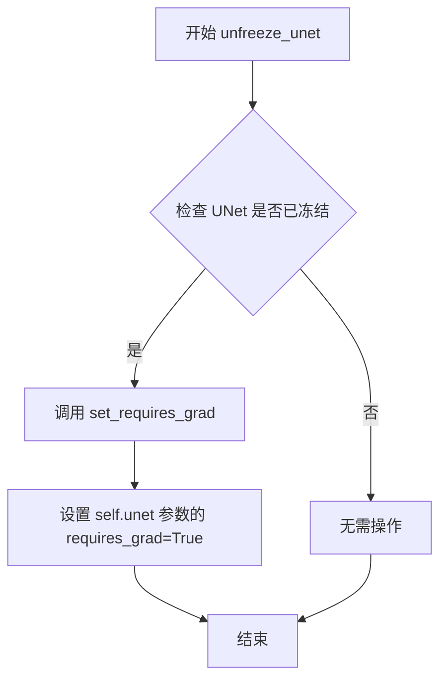

#### 带注释源码

```python
def unfreeze_unet(self):
    """
    解冻UNet模型，使其参数可训练。
    
    该方法通过设置UNet所有参数的 requires_grad 属性为 True，
    使得在后续的训练或微调过程中，UNet的权重能够得到更新。
    这与 freeze_unet() 方法互为相反操作。
    """
    # 调用全局函数 set_requires_grad，将 UNet 模型的所有参数设置为可训练
    set_requires_grad(self.unet, True)
```


### `CLIPGuidedStableDiffusion.cond_fn`

CLIP引导条件函数是CLIP引导稳定扩散Pipeline的核心组件，用于在扩散模型的去噪过程中注入CLIP图像-文本对齐损失提供的梯度信息，通过计算图像嵌入与文本嵌入之间的球面距离损失并反向传播到潜在空间，从而引导生成过程产生与文本提示更匹配的图像。

参数：

- `latents`：`torch.Tensor`，当前扩散过程的潜在表示（需要梯度的输入）
- `timestep`：`torch.Tensor`，当前扩散时间步
- `index`：`int`，调度器索引，用于访问sigma值（LMS调度器需要）
- `text_embeddings`：`torch.Tensor`，文本编码器生成的文本嵌入
- `noise_pred_original`：`torch.Tensor`，原始的噪声预测（未经过CLIP引导调整）
- `text_embeddings_clip`：`torch.Tensor`，CLIP模型的文本嵌入（已归一化）
- `clip_guidance_scale`：`float`，CLIP引导的权重系数，控制CLIP损失对生成的影响程度
- `num_cutouts`：`int`，切割数量，CLIP引导时从图像中采样的切割块数量
- `use_cutouts`：`bool`，是否使用切割策略（若为False则使用全局池化）

返回值：`Tuple[torch.Tensor, torch.Tensor]`，返回调整后的噪声预测和更新后的潜在表示

#### 流程图

```mermaid
flowchart TD
    A[开始 cond_fn] --> B[.detach latents并启用梯度]
    B --> C[缩放模型输入]
    C --> D[UNet预测噪声]
    D --> E{调度器类型判断}
    E -->|PNDM/DDIM/DPM| F[计算预测原始样本x_0]
    E -->|LMS| G[计算sigma样本]
    E -->|其他| H[抛出异常]
    F --> I[计算带噪样本sample]
    G --> I
    I --> J[VAE解码到图像空间]
    J --> K[归一化到[0,1]范围]
    K --> L{use_cutouts判断}
    L -->|True| M[使用MakeCutouts切割]
    L -->|False| N[Resize到目标尺寸]
    M --> O[归一化图像]
    N --> O
    O --> P[CLIP提取图像特征]
    P --> Q[归一化图像嵌入]
    Q --> R{use_cutouts判断}
    R -->|True| S[计算所有切割的球面距离损失]
    R -->|False| T[计算全局球面距离损失]
    S --> U[损失乘以引导系数]
    T --> U
    U --> V[反向传播计算梯度]
    V --> W{调度器类型判断}
    W -->|LMS| X[latents增加梯度乘以sigma平方]
    W -->|其他| Y[noise_pred减去梯度乘以根号beta]
    X --> Z[返回noise_pred和latents]
    Y --> Z
```

#### 带注释源码

```python
@torch.enable_grad()
def cond_fn(
    self,
    latents,
    timestep,
    index,
    text_embeddings,
    noise_pred_original,
    text_embeddings_clip,
    clip_guidance_scale,
    num_cutouts,
    use_cutouts=True,
):
    """CLIP引导条件函数，计算CLIP损失梯度并调整噪声预测"""
    
    # 1. 分离latents但保留梯度追踪，用于后续梯度计算
    # detach()切断梯度流，requires_grad_()重新开启梯度追踪
    latents = latents.detach().requires_grad_()

    # 2. 根据调度器将latents缩放到模型输入尺度
    # 这会根据噪声调度器的sigma进行缩放
    latent_model_input = self.scheduler.scale_model_input(latents, timestep)

    # 3. 使用UNet预测当前时间步的噪声残差
    # encoder_hidden_states传入文本嵌入作为条件
    noise_pred = self.unet(latent_model_input, timestep, encoder_hidden_states=text_embeddings).sample

    # 4. 根据不同调度器类型计算"预测原始样本"(predicted x_0)
    # 这是从预测的噪声反推回原始干净图像的估计
    if isinstance(self.scheduler, (PNDMScheduler, DDIMScheduler, DPMSolverMultistepScheduler)):
        # 获取累积alpha products
        alpha_prod_t = self.scheduler.alphas_cumprod[timestep]
        beta_prod_t = 1 - alpha_prod_t
        
        # 使用公式(12)从预测噪声计算原始样本: x_0 = (x_t - sqrt(1-alpha)*noise_pred) / sqrt(alpha)
        pred_original_sample = (latents - beta_prod_t ** (0.5) * noise_pred) / alpha_prod_t ** (0.5)

        # 计算当前时间步的采样因子
        fac = torch.sqrt(beta_prod_t)
        # 重建带噪样本用于后续处理
        sample = pred_original_sample * (fac) + latents * (1 - fac)
        
    elif isinstance(self.scheduler, LMSDiscreteScheduler):
        # LMS调度器使用sigma计算样本
        sigma = self.scheduler.sigmas[index]
        sample = latents - sigma * noise_pred
    else:
        raise ValueError(f"scheduler type {type(self.scheduler)} not supported")

    # 5. VAE解码：将潜在表示解码到图像空间
    # 首先反缩放（乘以scaling_factor的倒数）
    sample = 1 / self.vae.config.scaling_factor * sample
    # VAE解码
    image = self.vae.decode(sample).sample
    
    # 6. 图像后处理：将图像归一化到[0,1]范围
    # decode输出通常在[-1,1]，转换到[0,1]
    image = (image / 2 + 0.5).clamp(0, 1)

    # 7. 准备CLIP输入
    if use_cutouts:
        # 使用随机切割策略：从图像中随机采样多个小切割块
        # 这有助于CLIP关注图像的不同局部区域
        image = self.make_cutouts(image, num_cutouts)
    else:
        # 全局策略：直接Resize到CLIP输入尺寸
        image = transforms.Resize(self.cut_out_size)(image)
    
    # 8. 图像标准化：使用CLIP特征提取器的均值和标准差
    image = self.normalize(image).to(latents.dtype)

    # 9. CLIP图像编码：获取图像的CLIP嵌入
    image_embeddings_clip = self.clip_model.get_image_features(image)
    # L2归一化，使嵌入位于单位球面上
    image_embeddings_clip = image_embeddings_clip / image_embeddings_clip.norm(p=2, dim=-1, keepdim=True)

    # 10. 计算CLIP引导损失：图像嵌入与文本嵌入的球面距离
    if use_cutouts:
        # 多切割情况：计算每个切割的距离
        dists = spherical_dist_loss(image_embeddings_clip, text_embeddings_clip)
        # 重塑为[切割数, 批次, 特征维度]
        dists = dists.view([num_cutouts, sample.shape[0], -1])
        # 对特征维度求和，对切割维度求平均，对批次维度求和
        loss = dists.sum(2).mean(0).sum() * clip_guidance_scale
    else:
        # 全局情况：直接计算平均距离
        loss = spherical_dist_loss(image_embeddings_clip, text_embeddings_clip).mean() * clip_guidance_scale

    # 11. 反向传播：计算损失对latents的梯度
    # 取负梯度是因为我们要" ascent"而非"descent"（最大化损失即最小化距离）
    grads = -torch.autograd.grad(loss, latents)[0]

    # 12. 将梯度应用到噪声预测或latents
    if isinstance(self.scheduler, LMSDiscreteScheduler):
        # LMS调度器：直接加到latents上，权重为sigma平方
        latents = latents.detach() + grads * (sigma**2)
        noise_pred = noise_pred_original
    else:
        # 其他调度器：从噪声预测中减去梯度项
        # 这调整了噪声预测方向，使其更接近CLIP引导方向
        noise_pred = noise_pred_original - torch.sqrt(beta_prod_t) * grads
    
    # 13. 返回调整后的噪声预测和更新后的latents
    return noise_pred, latents
```


### `CLIPGuidedStableDiffusion.__call__`

这是CLIP引导的Stable Diffusion Pipeline的主生成方法，接收文本提示并通过CLIP模型引导的去噪过程生成图像，同时支持Classifier-Free Guidance和CLIP Guidance两种引导策略。

参数：

- `prompt`：`Union[str, List[str]]`，输入的文本提示，可以是单个字符串或字符串列表
- `height`：`Optional[int] = 512`，生成图像的高度，必须能被8整除
- `width`：`Optional[int] = 512`，生成图像的宽度，必须能被8整除
- `num_inference_steps`：`Optional[int] = 50`，去噪推理的步数
- `guidance_scale`：`Optional[float] = 7.5`，Classifier-Free Guidance的权重，值越大越忠于提示
- `num_images_per_prompt`：`Optional[int] = 1`，每个提示生成的图像数量
- `eta`：`float = 0.0`，DDIM Scheduler的eta参数，用于控制采样方差
- `clip_guidance_scale`：`Optional[float] = 100`，CLIP引导的权重，用于让生成的图像更符合CLIP特征
- `clip_prompt`：`Optional[Union[str, List[str]]] = None`，CLIP引导使用的独立提示，默认为主prompt
- `num_cutouts`：`Optional[int] = 4`，CLIP引导时使用的随机cutout数量
- `use_cutouts`：`Optional[bool] = True`，是否使用cutouts进行CLIP引导
- `generator`：`torch.Generator | None = None`，随机数生成器，用于可重复生成
- `latents`：`Optional[torch.Tensor] = None`，用户提供的初始潜在变量
- `output_type`：`str | None = "pil"`，输出类型，可选"pil"、"numpy"等
- `return_dict`：`bool = True`，是否以字典形式返回结果

返回值：`StableDiffusionPipelineOutput`，包含生成的图像列表和NSFW检测结果

#### 流程图

```mermaid
flowchart TD
    A[开始 __call__] --> B{验证 prompt 类型}
    B -->|str| C[batch_size = 1]
    B -->|list| D[batch_size = len(prompt)]
    B -->|其他| E[抛出 ValueError]
    C --> F[验证 height/width 可被8整除]
    D --> F
    F --> G[获取文本 embeddings]
    G --> H[重复 embeddings num_images_per_prompt 次]
    H --> I{clip_guidance_scale > 0?}
    I -->|是| J[处理 clip_prompt 并获取 CLIP text embeddings]
    I -->|否| K[跳过 CLIP 处理]
    J --> L{do_classifier_free_guidance?}
    K --> L
    L -->|是| M[获取空字符串的 unconditional embeddings]
    L -->|否| N[跳过 unconditional]
    M --> O[拼接 unconditional 和 text embeddings]
    N --> P
    O --> P[初始化或验证 latents 形状]
    P --> Q[设置 scheduler timesteps]
    Q --> R[初始化 latents = latents * init_noise_sigma]
    R --> S[遍历 timesteps]
    S --> T{当前 timestep}
    T --> U[扩展 latents 进行 CFG]
    U --> V[scheduler.scale_model_input]
    V --> W[UNet 预测噪声]
    W --> X{do_classifier_free_guidance?}
    X -->|是| Y[计算 cfg noise_pred]
    X -->|否| Z
    Y --> Z{clip_guidance_scale > 0?}
    Z --> AA[调用 cond_fn 进行 CLIP 引导]
    AA --> AB[scheduler.step 更新 latents]
    Z --> AC[跳过 CLIP 引导]
    AC --> AB
    S --> AD{还有更多 timesteps?}
    AD -->|是| T
    AD -->|否| AE[latents * 1/scaling_factor]
    AE --> AF[VAE decode latents]
    AF --> AG[归一化图像到 [0,1]]
    AG --> AH{output_type == 'pil'?}
    AH -->|是| AI[转换为 PIL 图像]
    AH -->|否| AJ[保持 numpy 格式]
    AI --> AK{return_dict?}
    AJ --> AK
    AK -->|是| AL[返回 StableDiffusionPipelineOutput]
    AK -->|否| AM[返回 tuple]
    AL --> AN[结束]
    AM --> AN
```

#### 带注释源码

```python
@torch.no_grad()
def __call__(
    self,
    prompt: Union[str, List[str]],
    height: Optional[int] = 512,
    width: Optional[int] = 512,
    num_inference_steps: Optional[int] = 50,
    guidance_scale: Optional[float] = 7.5,
    num_images_per_prompt: Optional[int] = 1,
    eta: float = 0.0,
    clip_guidance_scale: Optional[float] = 100,
    clip_prompt: Optional[Union[str, List[str]]] = None,
    num_cutouts: Optional[int] = 4,
    use_cutouts: Optional[bool] = True,
    generator: torch.Generator | None = None,
    latents: Optional[torch.Tensor] = None,
    output_type: str | None = "pil",
    return_dict: bool = True,
):
    # 1. 验证并处理 prompt，确定 batch_size
    if isinstance(prompt, str):
        batch_size = 1
    elif isinstance(prompt, list):
        batch_size = len(prompt)
    else:
        raise ValueError(f"`prompt` has to be of type `str` or `list` but is {type(prompt)}")

    # 2. 验证图像尺寸必须能被8整除（因为VAE的8倍下采样）
    if height % 8 != 0 or width % 8 != 0:
        raise ValueError(f"`height` and `width` have to be divisible by 8 but are {height} and {width}.")

    # 3. 使用 tokenizer 将 prompt 转换为 token ids
    text_input = self.tokenizer(
        prompt,
        padding="max_length",
        max_length=self.tokenizer.model_max_length,
        truncation=True,
        return_tensors="pt",
    )
    # 4. 通过 text_encoder 获取文本 embeddings
    text_embeddings = self.text_encoder(text_input.input_ids.to(self.device))[0]
    # 5. 为每个提示的多个图像复制 text_embeddings
    text_embeddings = text_embeddings.repeat_interleave(num_images_per_prompt, dim=0)

    # 6. 如果启用 CLIP 引导，获取 CLIP 文本特征
    if clip_guidance_scale > 0:
        if clip_prompt is not None:
            clip_text_input = self.tokenizer(
                clip_prompt,
                padding="max_length",
                max_length=self.tokenizer.model_max_length,
                truncation=True,
                return_tensors="pt",
            ).input_ids.to(self.device)
        else:
            clip_text_input = text_input.input_ids.to(self.device)
        # 获取 CLIP 图像嵌入
        text_embeddings_clip = self.clip_model.get_text_features(clip_text_input)
        # L2 归一化
        text_embeddings_clip = text_embeddings_clip / text_embeddings_clip.norm(p=2, dim=-1, keepdim=True)
        # 为每个提示的多个图像复制
        text_embeddings_clip = text_embeddings_clip.repeat_interleave(num_images_per_prompt, dim=0)

    # 7. 确定是否使用 Classifier-Free Guidance (CFG)
    do_classifier_free_guidance = guidance_scale > 1.0
    
    # 8. 如果使用 CFG，获取无条件 embeddings（空字符串）
    if do_classifier_free_guidance:
        max_length = text_input.input_ids.shape[-1]
        uncond_input = self.tokenizer([""], padding="max_length", max_length=max_length, return_tensors="pt")
        uncond_embeddings = self.text_encoder(uncond_input.input_ids.to(self.device))[0]
        # 为每个提示的多个图像复制
        uncond_embeddings = uncond_embeddings.repeat_interleave(num_images_per_prompt, dim=0)
        # 拼接条件和无条件 embeddings
        text_embeddings = torch.cat([uncond_embeddings, text_embeddings])

    # 9. 计算 latents 形状：batch * num_images * channels * height/8 * width/8
    latents_shape = (batch_size * num_images_per_prompt, self.unet.config.in_channels, height // 8, width // 8)
    latents_dtype = text_embeddings.dtype
    
    # 10. 初始化随机 latents 或使用用户提供的 latents
    if latents is None:
        if self.device.type == "mps":
            # MPS 设备上 randn 不能 reproducible
            latents = torch.randn(latents_shape, generator=generator, device="cpu", dtype=latents_dtype).to(
                self.device
            )
        else:
            latents = torch.randn(latents_shape, generator=generator, device=self.device, dtype=latents_dtype)
    else:
        if latents.shape != latents_shape:
            raise ValueError(f"Unexpected latents shape, got {latents.shape}, expected {latents_shape}")
        latents = latents.to(self.device)

    # 11. 设置 scheduler 的 timesteps
    accepts_offset = "offset" in set(inspect.signature(self.scheduler.set_timesteps).parameters.keys())
    extra_set_kwargs = {}
    if accepts_offset:
        extra_set_kwargs["offset"] = 1

    self.scheduler.set_timesteps(num_inference_steps, **extra_set_kwargs)

    # 12. 将 timesteps 移动到目标设备
    timesteps_tensor = self.scheduler.timesteps.to(self.device)

    # 13. 根据 scheduler 要求缩放初始噪声
    latents = latents * self.scheduler.init_noise_sigma

    # 14. 准备 scheduler step 的额外参数
    accepts_eta = "eta" in set(inspect.signature(self.scheduler.step).parameters.keys())
    extra_step_kwargs = {}
    if accepts_eta:
        extra_step_kwargs["eta"] = eta

    # 15. 检查 scheduler 是否接受 generator
    accepts_generator = "generator" in set(inspect.signature(self.scheduler.step).parameters.keys())
    if accepts_generator:
        extra_step_kwargs["generator"] = generator

    # 16. 主去噪循环：遍历每个 timestep
    for i, t in enumerate(self.progress_bar(timesteps_tensor)):
        # 16.1 扩展 latents 用于 CFG（复制两份：一份条件，一份无条件）
        latent_model_input = torch.cat([latents] * 2) if do_classifier_free_guidance else latents
        # 16.2 根据当前 timestep 缩放输入
        latent_model_input = self.scheduler.scale_model_input(latent_model_input, t)

        # 16.3 使用 UNet 预测噪声残差
        noise_pred = self.unet(latent_model_input, t, encoder_hidden_states=text_embeddings).sample

        # 16.4 执行 Classifier-Free Guidance
        if do_classifier_free_guidance:
            noise_pred_uncond, noise_pred_text = noise_pred.chunk(2)
            noise_pred = noise_pred_uncond + guidance_scale * (noise_pred_text - noise_pred_uncond)

        # 16.5 执行 CLIP 引导（如启用）
        if clip_guidance_scale > 0:
            text_embeddings_for_guidance = (
                text_embeddings.chunk(2)[1] if do_classifier_free_guidance else text_embeddings
            )
            # 调用条件函数计算梯度引导
            noise_pred, latents = self.cond_fn(
                latents,
                t,
                i,
                text_embeddings_for_guidance,
                noise_pred,
                text_embeddings_clip,
                clip_guidance_scale,
                num_cutouts,
                use_cutouts,
            )

        # 16.6 执行 scheduler step，计算前一个噪声样本 x_t -> x_{t-1}
        latents = self.scheduler.step(noise_pred, t, latents, **extra_step_kwargs).prev_sample

    # 17. 去噪完成，解码 latents 到图像
    # 17.1 逆缩放 latents
    latents = 1 / self.vae.config.scaling_factor * latents
    # 17.2 VAE 解码
    image = self.vae.decode(latents).sample

    # 18. 后处理：归一化到 [0, 1]
    image = (image / 2 + 0.5).clamp(0, 1)
    # 18.1 转换为 numpy 格式 (B, H, W, C)
    image = image.cpu().permute(0, 2, 3, 1).numpy()

    # 19. 根据 output_type 转换格式
    if output_type == "pil":
        image = self.numpy_to_pil(image)

    # 20. 返回结果
    if not return_dict:
        return (image, None)

    return StableDiffusionPipelineOutput(images=image, nsfw_content_detected=None)
```

## 关键组件


### MakeCutouts

用于从输入图像中随机裁剪多个图像块的模块，通过随机大小和位置选择实现数据增强，支持自适应平均池化将裁剪块统一到目标尺寸。

### spherical_dist_loss

计算两个嵌入向量之间的球面距离损失，通过L2归一化后利用球面三角公式得到距离度量，用于CLIP引导的图像生成中的相似度计算。

### set_requires_grad

通用工具函数，用于递归设置神经网络模型所有参数的梯度计算标志，实现模型参数的冻结或解冻操作。

### CLIPGuidedStableDiffusion

核心管道类，集成CLIP模型与稳定扩散模型实现CLIP引导的图像生成，支持多种调度器（PNDM/DDIM/DPM-Solver/LMS），通过条件函数在去噪过程中注入CLIP视觉引导。

### cond_fn

条件引导函数，在去噪步骤中通过VAE解码潜在变量获取图像，计算CLIP图像嵌入与文本嵌入的相似度损失，并反向传播梯度到潜在变量实现CLIP引导。

### 图像后处理流程

包含图像的归一化、缩放、重采样、clamp操作和格式转换（numpy/pil），确保输出符合预期格式和范围。

### 调度器兼容性层

通过inspect模块动态检测调度器支持的参数（offset、eta、generator），实现对多种调度器的统一接口适配。

### 分类器自由引导实现

支持无分类器引导（CFG）技术，通过同时处理条件和无条件嵌入并加权组合，提高生成图像的质量和多样性。

### 潜在变量管理

处理潜在变量的形状验证、设备转移和初始化，支持用户自定义潜在变量输入，确保跨设备兼容性（包括mps设备特殊处理）。


## 问题及建议


### 已知问题

-   **魔法数字与硬编码**：代码中存在多处硬编码的数值和字符串，如`num_cutouts=4`、`clip_guidance_scale=100`、`offset=1`、`height=512`、`width=512`等，这些值散落在各处，不利于配置管理。
-   **类型注解不一致**：部分方法参数缺少类型注解，如`freeze_vae`、`unfreeze_vae`、`freeze_unet`、`unfreeze_unet`等方法没有任何参数注解；部分使用了新版本Python的`|`联合类型语法，可能与旧版本环境不兼容。
-   **重复代码逻辑**：文本嵌入的复制逻辑（`repeat_interleave`）在`__call__`方法中多次出现；`cond_fn`内部对于不同scheduler的处理存在重复计算逻辑。
-   **异常处理不完善**：在`cond_fn`中，当遇到不支持的scheduler类型时直接抛出`ValueError`，缺乏更友好的错误提示和fallback机制；对`mps`设备的特殊处理逻辑不够健壮。
-   **不安全的类型检查**：使用`inspect.signature`动态检查scheduler参数的方式较为笨重，且每次调用都会进行反射操作，影响性能。
-   **功能未实现**：`StableDiffusionPipelineOutput`中的`nsfw_content_detected`参数被硬编码为`None`，没有实际的NSFW内容检测逻辑。
-   **全局函数设计**：`set_requires_grad`作为模块级函数设计不够面向对象，且与`CLIPGuidedStableDiffusion`类的功能紧密相关，应该封装或使用更合适的设计模式。
-   **混合精度缺失**：没有使用`torch.cuda.amp`进行混合精度计算，在GPU上运行大模型时会影响推理速度。

### 优化建议

-   **提取配置常量**：将所有硬编码的数值抽取到类属性或配置文件中，使用`dataclass`或`pydantic`定义配置结构。
-   **完善类型注解**：统一使用`typing.Optional`或`Union`（兼容Python 3.8-），为所有方法添加完整的类型注解。
-   **抽象公共逻辑**：将重复的文本嵌入复制逻辑抽取为私有方法，如`_duplicate_text_embeddings`；将scheduler相关的处理逻辑封装。
-   **改进错误处理**：为不支持的scheduler类型提供更详细的错误信息，考虑支持更多scheduler或提供明确的兼容性列表。
-   **使用策略模式**：用字典映射或注册机制替代`inspect.signature`检查scheduler参数的方式，提高代码可维护性。
-   **实现NSFW检测**：如需支持NSFW检测，应实现实际的内容检测逻辑，或在文档中明确说明该功能暂未实现。
-   **封装工具函数**：将`set_requires_grad`改为类方法或使用`torch.no_grad()`上下文管理器替代；考虑使用`torch.inference_mode()`代替部分场景下的`torch.no_grad()`。
-   **添加混合精度支持**：集成`torch.cuda.amp.autocast`以提升推理性能，特别是在显存受限的场景下。
-   **优化MakeCutouts**：考虑使用预分配的tensor buffer或faster tensor操作减少每次forward的开销。


## 其它


### 设计目标与约束

本Pipeline的设计目标是实现CLIP引导的Stable Diffusion图像生成，通过结合CLIP模型的视觉-文本对比能力来增强生成图像与文本提示的一致性。核心约束包括：1) 必须与Hugging Face diffusers库兼容；2) 支持多种噪声调度器（PNDM、DDIM、LMS、DPM-Solver）；3) 图像尺寸必须能被8整除；4) 支持CPU和MPS设备，但MPS设备存在随机数生成限制；5) CLIP引导需要较大的计算资源，clip_guidance_scale默认100；6) 仅支持Python 3.8+和PyTorch 1.11+。

### 错误处理与异常设计

代码包含以下错误处理机制：1) prompt参数类型检查，仅接受str或List[str]类型，否则抛出ValueError；2) 图像尺寸验证，height和width必须能被8整除；3) latents形状验证，确保输入latents与期望形状匹配；4) 调度器类型检查，cond_fn方法中仅支持特定的调度器类型，不支持时抛出ValueError；5) 设备兼容性处理，MPS设备使用CPU生成随机数。潜在改进：添加更多输入验证（如num_inference_steps正数检查）、更详细的错误信息、异常恢复机制。

### 数据流与状态机

Pipeline的数据流如下：1) 文本输入处理：将prompt通过tokenizer转换为embedding；2) 无条件embedding生成：用于classifier-free guidance；3) 噪声初始化：生成或接收latents作为初始噪声；4) 迭代去噪循环（num_inference_steps次）：a) 扩展latents用于classifier-free guidance；b) UNet预测噪声残差；c) 执行classifier-free guidance；d) 如clip_guidance_scale>0，执行CLIP引导的cond_fn；e) 调度器执行去噪步骤；5) VAE解码：将latents解码为图像；6) 后处理：归一化、转换格式。状态机转换：初始化 -> 文本编码 -> 噪声生成 -> 去噪循环 -> 解码 -> 输出。

### 外部依赖与接口契约

主要依赖包括：1) torch (PyTorch核心)；2) torchvision (图像变换)；3) transformers (CLIP模型、tokenizer)；4) diffusers (扩散模型组件)。接口契约：1) __init__接收7个必需模块参数（vae, text_encoder, clip_model, tokenizer, unet, scheduler, feature_extractor）；2) __call__方法接受多个可选参数并返回StableDiffusionPipelineOutput；3) cond_fn方法为CLIP引导的核心逻辑，返回调整后的noise_pred和latents；4) 支持的调度器类型必须在特定列表中。

### 配置参数详解

关键配置参数：1) clip_guidance_scale (默认100): CLIP引导强度，越高越严格匹配文本；2) clip_prompt (默认None): 用于CLIP引导的独立提示词，为None时使用主prompt；3) num_cutouts (默认4): CLIP引导时使用的裁剪数量；4) use_cutouts (默认True): 是否使用裁剪或全局特征；5) guidance_scale (默认7.5): classifier-free guidance权重；6) num_inference_steps (默认50): 去噪迭代次数；7) eta (默认0.0): DDIM调度器的随机性参数；8) height/width (默认512): 输出图像尺寸。

### 性能考虑与优化空间

性能瓶颈：1) cond_fn在每次迭代中被调用，包含VAE解码操作（计算密集）；2) CLIP特征提取在每次迭代中执行；3) 多次torch.cat和chunk操作。优化建议：1) 缓存CLIP文本embedding（对于固定prompt）；2) 减少num_cutouts数量以提高速度；3) 使用torch.cuda.amp混合精度计算；4) 考虑将cond_fn中的VAE解码结果缓存（对于相同timestep）；5) 使用torch.compile加速；6) 考虑批处理多个提示词。

### 内存管理与资源控制

内存考虑：1) latents_shape根据batch_size和图像尺寸动态计算；2) CLIP引导需要额外的CLIP特征存储；3) 多次重复embedding会占用内存。管理策略：1) 及时释放不需要的中间变量；2) 使用detach()分离计算图；3) MPS设备特殊处理（使用CPU生成随机数）；4) 建议在GPU上运行时使用梯度检查点技术。潜在问题：大批量生成可能导致显存不足，建议控制num_images_per_prompt。

### 安全性考虑

安全相关设计：1) NSFW检测占位符（nsfw_content_detected=None）；2) 无用户输入持久化；3) 模型权重来源可信度依赖加载的预训练模型。改进建议：1) 实现实际的NSFW内容检测；2) 添加生成内容水印；3) 输入提示词过滤；4) 敏感内容限制。

### 版本兼容性与依赖管理

兼容性要求：1) Python >= 3.8；2) torch >= 1.11；3) transformers >= 4.20；4) diffusers >= 0.10.0；5) torchvision >= 0.12。已知限制：1) MPS设备不支持可靠的随机数生成；2) 不同调度器的参数支持度不同（通过inspect检查）；3) 调度器需要特定的set_timesteps和step签名。

### 测试策略建议

测试覆盖点：1) 单元测试：MakeCutouts裁剪逻辑、spherical_dist_loss计算；2) 集成测试：完整pipeline执行，验证输出图像尺寸和类型；3) 调度器兼容性测试：每种调度器都能正常工作；4) 错误处理测试：无效输入是否正确抛出异常；5) 设备测试：CPU、CUDA、MPS设备兼容性；6) 性能基准测试：生成时间、内存使用。

    