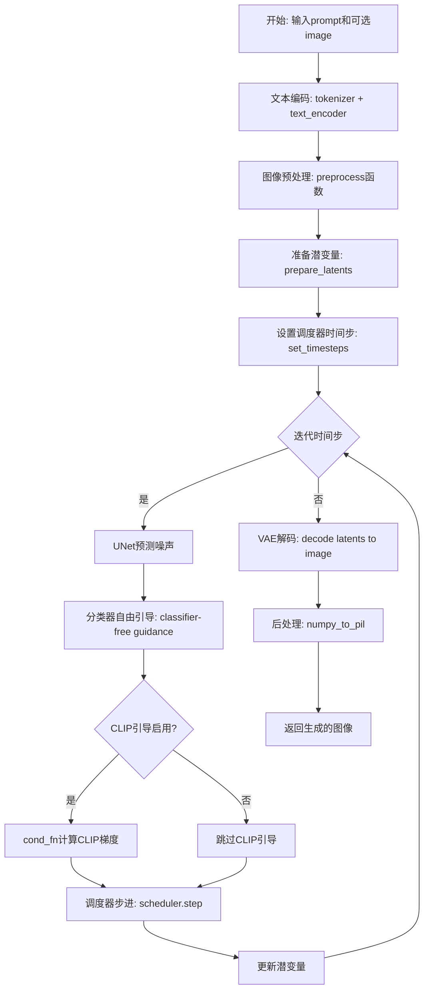
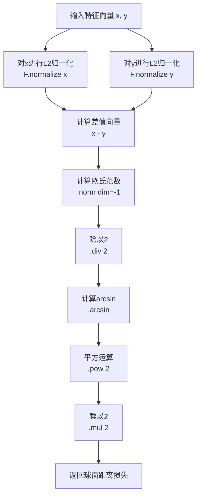
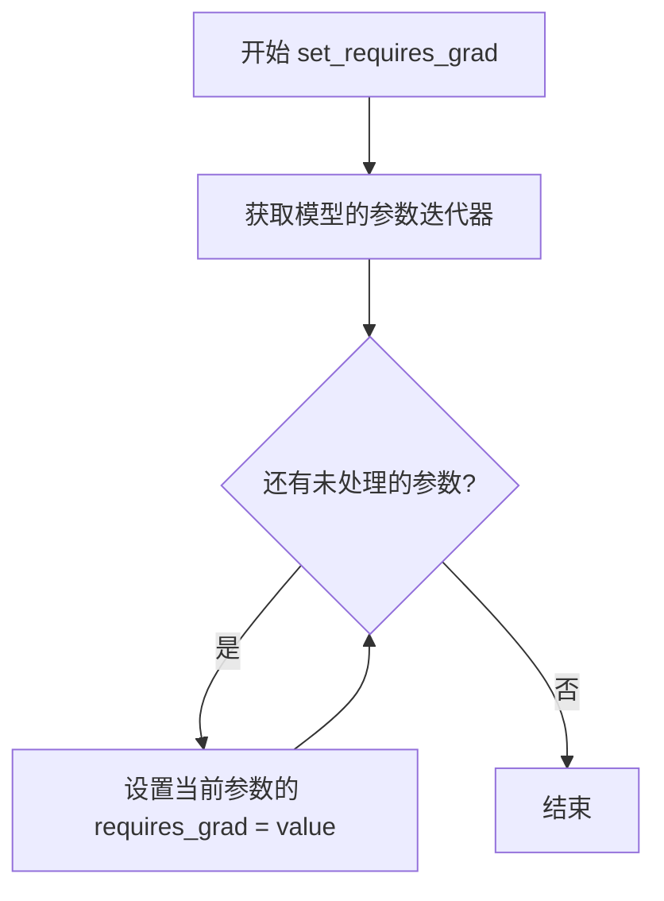
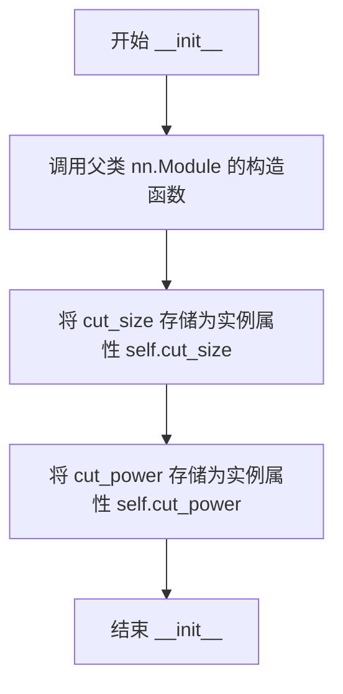
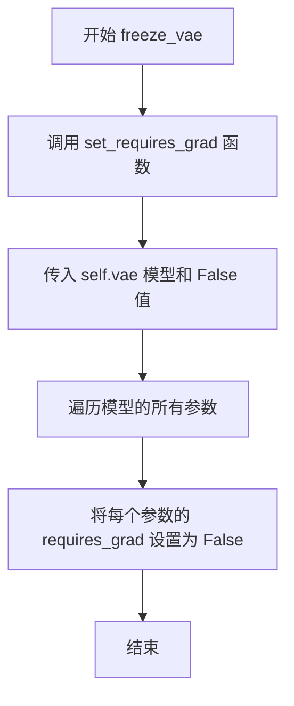
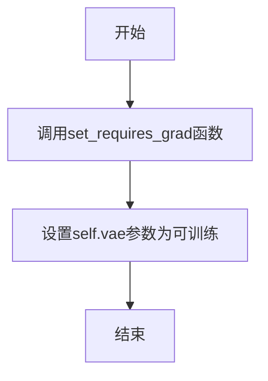
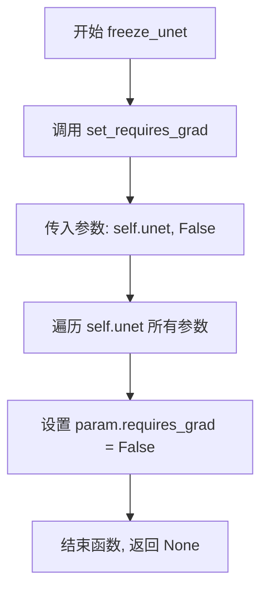
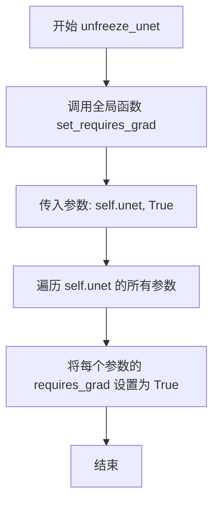
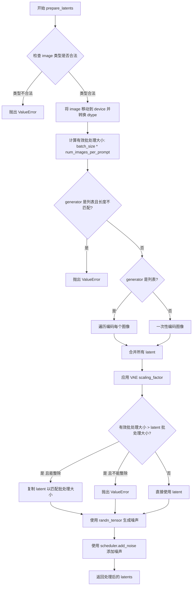
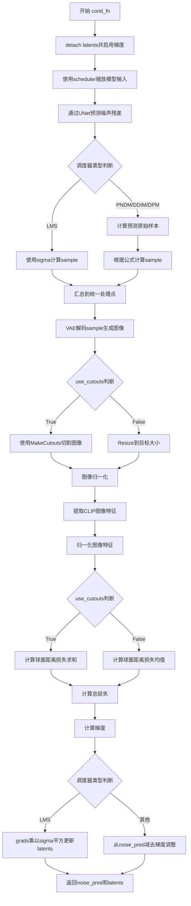

# `diffusers\examples\community\clip_guided_stable_diffusion_img2img.py` 详细设计文档

这是一个CLIP引导的Stable Diffusion扩散管道实现，通过结合CLIP视觉-文本对比模型来指导图像生成过程。该管道在标准Stable Diffusion去噪循环中集成了CLIP梯度引导，使得生成的图像能够更精确地匹配文本提示词描述的内容，同时支持可选的输入图像进行图像到图像的转换任务。

## 整体流程



## 类结构

```
DiffusionPipeline (基类)
└── CLIPGuidedStableDiffusion
    ├── MakeCutouts (内部组件类)
    └── StableDiffusionMixin (混入类)
```

## 全局变量及字段


### `EXAMPLE_DOC_STRING`
    
示例文档字符串，包含使用该pipeline的Python代码示例

类型：`str`
    


### `MakeCutouts.cut_size`
    
裁剪目标尺寸

类型：`int`
    


### `MakeCutouts.cut_power`
    
裁剪尺寸的幂次因子

类型：`float`
    


### `CLIPGuidedStableDiffusion.vae`
    
VAE编码器解码器

类型：`AutoencoderKL`
    


### `CLIPGuidedStableDiffusion.text_encoder`
    
文本编码器

类型：`CLIPTextModel`
    


### `CLIPGuidedStableDiffusion.clip_model`
    
CLIP对比模型

类型：`CLIPModel`
    


### `CLIPGuidedStableDiffusion.tokenizer`
    
分词器

类型：`CLIPTokenizer`
    


### `CLIPGuidedStableDiffusion.unet`
    
条件UNet

类型：`UNet2DConditionModel`
    


### `CLIPGuidedStableDiffusion.scheduler`
    
扩散调度器

类型：`调度器基类`
    


### `CLIPGuidedStableDiffusion.feature_extractor`
    
特征提取器

类型：`CLIPImageProcessor`
    


### `CLIPGuidedStableDiffusion.normalize`
    
图像标准化

类型：`transforms.Normalize`
    


### `CLIPGuidedStableDiffusion.cut_out_size`
    
裁剪输出尺寸

类型：`int`
    


### `CLIPGuidedStableDiffusion.make_cutouts`
    
裁剪对象

类型：`MakeCutouts`
    
    

## 全局函数及方法


### `preprocess`

预处理图像，支持 PIL.Image 和 torch.Tensor 格式，将输入图像统一转换为 torch.Tensor 格式并归一化到 [-1, 1]，以适配 Stable Diffusion 模型的输入要求。

参数：

- `image`：`Union[torch.Tensor, PIL.Image.Image]`，输入图像，可以是 PyTorch 张量或 PIL 图像对象
- `w`：`int`，目标宽度，用于调整图像尺寸
- `h`：`int`，目标高度，用于调整图像尺寸

返回值：`torch.Tensor`，处理后的图像张量，形状为 (N, C, H, W)，值域为 [-1, 1]

#### 流程图

```mermaid
flowchart TD
    A[开始: preprocess] --> B{image 是 torch.Tensor?}
    B -->|是| C[直接返回 image]
    B -->|否| D{image 是 PIL.Image.Image?}
    D -->|是| E[将 image 包装为列表]
    D -->|否| F[保持原样]
    E --> G{列表元素是 PIL.Image?}
    G -->|是| H[遍历图像列表]
    G -->|否| I{列表元素是 torch.Tensor?}
    H --> J[调整图像大小到 w×h]
    J --> K[转为 numpy 数组并添加批次维度]
    K --> L[沿批次维度拼接]
    L --> M[归一化到 [0, 1]]
    M --> N[转置维度: HWC → CHW]
    N --> O[缩放到 [-1, 1]]
    O --> P[转为 torch.Tensor]
    P --> Q[返回处理后的张量]
    I --> R[沿 dim=0 拼接张量]
    R --> Q
    F --> Q
```

#### 带注释源码

```python
def preprocess(image, w, h):
    # 如果输入已经是 torch.Tensor，直接返回，无需处理
    if isinstance(image, torch.Tensor):
        return image
    # 如果是单个 PIL 图像，转换为列表以便统一处理
    elif isinstance(image, PIL.Image.Image):
        image = [image]

    # 处理 PIL 图像列表
    if isinstance(image[0], PIL.Image.Image):
        # 遍历每张图像，调整大小为目标尺寸 (w, h)，使用 lanczos 重采样
        # [None, :] 添加批次维度，从 HWC 变为 1×H×W×C
        image = [np.array(i.resize((w, h), resample=PIL_INTERPOLATION["lanczos"]))[None, :] for i in image]
        # 沿批次维度 0 拼接所有图像
        image = np.concatenate(image, axis=0)
        # 转换为 float32 并归一化到 [0, 1]
        image = np.array(image).astype(np.float32) / 255.0
        # 转置维度：从 (N, H, W, C) 变为 (N, C, H, W)
        image = image.transpose(0, 3, 1, 2)
        # 缩放到 [-1, 1] 范围，符合 SD 模型输入标准
        image = 2.0 * image - 1.0
        # 转换为 PyTorch 张量
        image = torch.from_numpy(image)
    # 处理 torch.Tensor 列表
    elif isinstance(image[0], torch.Tensor):
        # 沿批次维度 0 拼接多个张量
        image = torch.cat(image, dim=0)
    return image
```


### `spherical_dist_loss`

计算两个CLIP特征向量之间的球面距离损失，用于CLIP引导的图像生成过程中的对比学习。该函数通过归一化输入向量，然后计算它们在球面空间中的角距离，得出一个度量两个特征相似度的损失值。

参数：

- `x`：`torch.Tensor`，第一个CLIP特征向量，通常是图像或文本的embedding
- `y`：`torch.Tensor`，第二个CLIP特征向量，用于与x进行比较的目标embedding

返回值：`torch.Tensor`，球面距离损失值，值域为[0, 1]，值越小表示两个特征越相似

#### 流程图



#### 带注释源码

```python
def spherical_dist_loss(x, y):
    """
    计算两个CLIP特征向量之间的球面距离损失
    
    该函数实现了基于球面距离的对比损失，用于CLIP引导的图像生成。
    通过计算归一化向量之间的角距离来衡量特征的相似度。
    
    数学原理：
    - 对于归一化向量，||x - y|| / 2 = sin(θ/2)，其中θ为夹角
    - 球面距离 = 2 * arcsin(||x - y|| / 2) = θ
    
    参数:
        x: 第一个CLIP特征向量 (batch_size, feature_dim)
        y: 第二个CLIP特征向量 (batch_size, feature_dim)
    
    返回:
        球面距离损失值，形状与输入batch维度一致
    """
    
    # 第一步：对输入向量x进行L2归一化
    # 确保向量长度为1，使其位于单位球面上
    x = F.normalize(x, dim=-1)
    
    # 第二步：对输入向量y进行L2归一化
    # 同样确保向量长度为1
    y = F.normalize(y, dim=-1)
    
    # 第三步：计算球面距离
    # 步骤分解：
    # 1. (x - y): 计算两个归一化向量的差值
    # 2. .norm(dim=-1): 计算差值向量的L2范数，即欧氏距离
    # 3. .div(2): 除以2，为后续arcsin计算做准备
    # 4. .arcsin(): 计算反正弦值，得到角度的一半
    # 5. .pow(2): 平方运算
    # 6. .mul(2): 乘以2，得到最终的球面距离（弧度制）
    return (x - y).norm(dim=-1).div(2).arcsin().pow(2).mul(2)
```


### `set_requires_grad`

设置模型参数的梯度要求，用于控制模型参数在训练过程中是否计算梯度。

参数：

- `model`：`torch.nn.Module`，要设置梯度要求的PyTorch模型
- `value`：`bool`，是否要求梯度的布尔值（True 为需要计算梯度，False 为冻结参数）

返回值：`None`，该函数无返回值，直接修改模型参数的 `requires_grad` 属性

#### 流程图



#### 带注释源码

```python
def set_requires_grad(model, value):
    """
    设置模型参数的梯度要求。
    
    该函数遍历模型的所有参数，并将每个参数的 requires_grad 属性设置为指定的值。
    当 value=False 时，通常用于冻结模型参数（例如在微调时冻结特征提取器）；
    当 value=True 时，用于解冻参数使其可训练。
    
    参数:
        model: torch.nn.Module - 要设置梯度要求的PyTorch模型
        value: bool - 是否要求梯度的布尔值
               - True: 参数在反向传播时计算梯度，可训练
               - False: 参数不计算梯度，冻结状态
    
    返回:
        None: 直接修改模型内部状态，无返回值
    """
    # 遍历模型的所有参数（包括权重和偏置）
    for param in model.parameters():
        # 将每个参数的 requires_grad 属性设置为指定值
        param.requires_grad = value
```

#### 在类中的使用示例

在 `CLIPGuidedStableDiffusion` 类的 `__init__` 方法中，该函数被用于冻结 CLIP 模型：

```python
# 在 __init__ 中调用示例
set_requires_grad(self.text_encoder, False)   # 冻结文本编码器
set_requires_grad(self.clip_model, False)     # 冻结 CLIP 模型

# 在 freeze_vae/unfreeze_vae 等方法中调用示例
def freeze_vae(self):
    set_requires_grad(self.vae, False)  # 冻结 VAE

def unfreeze_vae(self):
    set_requires_grad(self.vae, True)   # 解冻 VAE
```


### `MakeCutouts.__init__`

这是 `MakeCutouts` 类的构造函数，用于初始化图像裁剪器的参数。该方法接受目标裁剪尺寸和裁剪功率参数，并将它们存储为实例属性，以便在后续的 `forward` 方法中使用。

参数：

- `cut_size`：`int`，目标裁剪尺寸，表示裁剪后图像的目标大小（经过自适应平均池化后的尺寸）
- `cut_power`：`float`，裁剪尺寸的功率因子，用于控制裁剪尺寸的分布概率，默认为 1.0

返回值：`None`，构造函数无返回值，仅初始化实例属性

#### 流程图



#### 带注释源码

```python
def __init__(self, cut_size, cut_power=1.0):
    """
    初始化 MakeCutouts 裁剪器
    
    参数:
        cut_size: 裁剪后的目标尺寸，经过自适应平均池化后的输出大小
        cut_power: 控制裁剪尺寸分布的功率因子，值越大生成的裁剪块倾向于更小
    """
    # 调用父类 nn.Module 的构造函数，完成模块的初始化
    super().__init__()
    
    # 存储裁剪目标尺寸，后续在 forward 方法中用于自适应池化
    self.cut_size = cut_size
    
    # 存储功率因子，用于在 forward 方法中控制裁剪尺寸的概率分布
    self.cut_power = cut_power
```


### `MakeCutouts.forward`

该方法实现了图像的随机裁剪与大小归一化功能，通过对输入图像像素值进行多次随机尺寸和位置切割，并将每个切割结果调整为统一大小后拼接返回，用于CLIP引导的Stable Diffusion图像生成中的图像切片处理。

参数：

- `self`：`MakeCutouts` 类实例本身，隐式传递
- `pixel_values`：`torch.Tensor`，输入图像张量，形状为 (batch_size, channels, height, width)，包含原始图像像素值
- `num_cutouts`：`int`，需要生成的随机裁剪切片数量，指定从输入图像中随机切取的块数

返回值：`torch.Tensor`，返回拼接后的裁剪图像张量，形状为 (num_cutouts * batch_size, channels, cut_size, cut_size)，其中 cut_size 是类初始化时指定的输出尺寸

#### 流程图

```mermaid
flowchart TD
    A[开始 forward 方法] --> B[获取输入图像尺寸: sideY, sideX]
    B --> C[计算最大和最小裁剪尺寸]
    C --> D{循环迭代 i < num_cutouts}
    D -->|是| E[随机生成裁剪尺寸 size]
    E --> F[随机生成裁剪位置 offsetx, offsety]
    F --> G[执行裁剪操作: pixel_values[:, :, offsety:offsety+size, offsetx:offsetx+size]]
    G --> H[自适应平均池化到 cut_size 大小]
    H --> I[将裁剪结果添加到 cutouts 列表]
    I --> D
    D -->|否| J[拼接所有裁剪结果]
    J --> K[返回最终张量]
```

#### 带注释源码

```python
def forward(self, pixel_values, num_cutouts):
    # 获取输入图像的空间维度
    # pixel_values shape: (batch_size, channels, height, width)
    sideY, sideX = pixel_values.shape[2:4]
    
    # 计算可能的最大裁剪尺寸（取宽高中较小者）
    max_size = min(sideX, sideY)
    
    # 计算最小裁剪尺寸，取输入尺寸和目标cut_size中的较小值
    min_size = min(sideX, sideY, self.cut_size)
    
    # 初始化裁剪结果列表
    cutouts = []
    
    # 循环生成指定数量的随机裁剪
    for _ in range(num_cutouts):
        # 使用随机函数生成裁剪尺寸
        # 公式: size = rand^cut_power * (max_size - min_size) + min_size
        # cut_power参数控制尺寸分布倾向，值越大倾向于生成更小的裁剪
        size = int(torch.rand([]) ** self.cut_power * (max_size - min_size) + min_size)
        
        # 随机生成裁剪区域的左上角坐标
        # 确保裁剪区域不超出图像边界
        offsetx = torch.randint(0, sideX - size + 1, ())
        offsety = torch.randint(0, sideY - size + 1, ())
        
        # 执行裁剪操作，从输入图像中提取指定区域
        cutout = pixel_values[:, :, offsety : offsety + size, offsetx : offsetx + size]
        
        # 使用自适应平均池化将裁剪结果调整为统一的 cut_size 大小
        # 这确保了无论原始裁剪尺寸如何，输出都是固定尺寸
        cutouts.append(F.adaptive_avg_pool2d(cutout, self.cut_size))
    
    # 将所有裁剪结果在维度0上拼接
    # 输出形状: (num_cutouts * batch_size, channels, cut_size, cut_size)
    return torch.cat(cutouts)
```


### `CLIPGuidedStableDiffusion.__init__`

这是 CLIPGuidedStableDiffusion 类的构造函数，负责初始化整个 CLIP 引导的稳定扩散管道。它接收所有必要的模型组件（VAE、文本编码器、CLIP 模型、分词器、UNet、调度器和特征提取器），注册这些模块，设置图像归一化参数，初始化裁剪工具，并将文本编码器和 CLIP 模型设置为冻结状态以节省计算资源。

参数：

- `vae`：`AutoencoderKL`，变分自编码器，用于编码和解码图像潜在表示
- `text_encoder`：`CLIPTextModel`，CLIP 文本编码器，用于将文本提示转换为嵌入向量
- `clip_model`：`CLIPModel`，完整的 CLIP 模型，用于计算图像和文本之间的相似度以引导生成
- `tokenizer`：`CLIPTokenizer`，CLIP 分词器，用于将文本提示转换为 token ID
- `unet`：`UNet2DConditionModel`，条件 UNet 模型，用于预测噪声残差
- `scheduler`：`Union[PNDMScheduler, LMSDiscreteScheduler, DDIMScheduler, DPMSolverMultistepScheduler]`，扩散调度器，控制去噪过程的噪声调度
- `feature_extractor`：`CLIPImageProcessor`，CLIP 图像处理器，用于预处理图像并获取归一化参数

返回值：`None`，构造函数不返回任何值

#### 流程图

```mermaid
flowchart TD
    A[__init__ 被调用] --> B[调用 super().__init__ 初始化基类]
    B --> C[register_modules 注册所有模型组件]
    C --> D[创建 normalize 变换<br/>使用 feature_extractor 的 image_mean 和 image_std]
    D --> E[确定 cut_out_size<br/>从 feature_extractor 获取最短边尺寸]
    E --> F[实例化 MakeCutouts 对象<br/>传入 cut_out_size]
    F --> G[冻结 text_encoder<br/>set_requires_grad False]
    G --> H[冻结 clip_model<br/>set_requires_grad False]
    H --> I[初始化完成]
```

#### 带注释源码

```python
def __init__(
    self,
    vae: AutoencoderKL,                                              # VAE 模型，用于图像编码/解码
    text_encoder: CLIPTextModel,                                    # CLIP 文本编码器
    clip_model: CLIPModel,                                          # CLIP 图像编码器
    tokenizer: CLIPTokenizer,                                       # 文本分词器
    unet: UNet2DConditionModel,                                     # 条件 UNet
    scheduler: Union[PNDMScheduler, LMSDiscreteScheduler, 
                     DDIMScheduler, DPMSolverMultistepScheduler],   # 噪声调度器
    feature_extractor: CLIPImageProcessor,                         # 图像特征提取器
):
    # 调用父类 DiffusionPipeline 和 StableDiffusionMixin 的初始化方法
    super().__init__()
    
    # 将所有模型组件注册到管道中，便于管理和访问
    self.register_modules(
        vae=vae,
        text_encoder=text_encoder,
        clip_model=clip_model,
        tokenizer=tokenizer,
        unet=unet,
        scheduler=scheduler,
        feature_extractor=feature_extractor,
    )

    # 创建图像归一化变换，使用 CLIP 特征提取器的均值和标准差
    self.normalize = transforms.Normalize(
        mean=feature_extractor.image_mean, 
        std=feature_extractor.image_std
    )
    
    # 确定裁剪输出尺寸：从特征提取器获取最短边尺寸
    self.cut_out_size = (
        feature_extractor.size
        if isinstance(feature_extractor.size, int)
        else feature_extractor.size["shortest_edge"]
    )
    
    # 实例化 MakeCutouts 对象，用于生成 CLIP 引导的图像裁剪
    self.make_cutouts = MakeCutouts(self.cut_out_size)

    # 冻结文本编码器参数，训练时不更新（节省显存和计算）
    set_requires_grad(self.text_encoder, False)
    
    # 冻结 CLIP 模型参数，训练时不更新
    set_requires_grad(self.clip_model, False)
```


### CLIPGuidedStableDiffusion.freeze_vae

该方法用于冻结 VAE（变分自编码器）模型，将其所有参数的 `requires_grad` 设置为 False，以防止在训练过程中更新 VAE 的权重。这在需要进行 CLIP 引导的稳定扩散时很有用，可以节省计算资源并保持 VAE 固定。

参数：该方法没有显式参数（除了隐式的 self）

返回值：`None`，该方法直接修改模型参数，不返回任何值

#### 流程图



#### 带注释源码

```python
def freeze_vae(self):
    """
    冻结 VAE 模型，使其参数不可训练。
    
    该方法通过调用 set_requires_grad 辅助函数，将 self.vae 的所有参数设置为不可训练状态。
    在 CLIP 引导的稳定扩散 pipeline 中，通常需要冻结 VAE 以减少计算开销并保持预训练权重不变。
    """
    # 调用全局辅助函数 set_requires_grad，传入 VAE 模型和 False
    # 这将遍历 VAE 模型的所有参数，并将它们的 requires_grad 属性设置为 False
    set_requires_grad(self.vae, False)
```


### `CLIPGuidedStableDiffusion.unfreeze_vae`

该方法用于解冻VAE（变分自编码器）模型，将模型的参数设置为可训练状态，以便在微调或训练过程中更新VAE的权重。

参数：

- 无

返回值：`None`，无返回值（该方法直接修改模型参数的梯度要求属性）

#### 流程图



#### 带注释源码

```python
def unfreeze_vae(self):
    """
    解冻VAE模型，使其参数可训练。
    
    该方法将VAE模型的所有参数设置为requires_grad=True，
    允许在训练过程中对VAE进行微调。
    """
    # 调用辅助函数set_requires_grad，将self.vae的所有参数设置为可训练
    set_requires_grad(self.vae, True)
```


### `CLIPGuidedStableDiffusion.freeze_unet`

该方法用于冻结 UNet 模型的梯度，使其在后续训练或推理过程中不可训练，从而节省计算资源并确保 UNet 权重不被更新。

参数：无（仅包含隐式参数 `self`）

返回值：`None`，无返回值

#### 流程图



#### 带注释源码

```python
def freeze_unet(self):
    """
    冻结 UNet 模型的梯度，防止在后续操作中更新 UNet 的权重。
    
    该方法通过调用 set_requires_grad 函数，将 self.unet 模型的所有参数
    的 requires_grad 属性设置为 False，从而禁用梯度计算。
    在 CLIP 引导的稳定扩散 Pipeline 中，通常需要冻结 UNet 以避免
    其权重被意外更新，节省显存和计算资源。
    
    参数:
        无（仅包含隐式 self 参数）
    
    返回值:
        None: 该方法不返回任何值，直接修改模型的可训练状态
    """
    # 调用辅助函数 set_requires_grad，将 unet 模型的所有参数设置为不可训练
    set_requires_grad(self.unet, False)
```


### `CLIPGuidedStableDiffusion.unfreeze_unet`

这是一个用于解冻UNet模型的方法，通过调用全局函数`set_requires_grad`将UNet模型的所有参数设置为可训练状态，使其能够在后续的训练或微调过程中更新权重。

参数：

- 无显式参数（`self`为隐含的类实例参数）

返回值：`None`，无返回值

#### 流程图



#### 带注释源码

```
def unfreeze_unet(self):
    """解冻UNet模型，使其参数可训练。
    
    该方法通过设置UNet模型所有参数的requires_grad属性为True，
    使得在后续的训练或微调过程中能够对UNet进行梯度更新。
    这与freeze_unet()方法相反，后者用于冻结UNet模型。
    """
    set_requires_grad(self.unet, True)
```


### `CLIPGuidedStableDiffusion.get_timesteps`

该方法根据图像修复（image-to-image）的强度参数（strength）计算并返回用于去噪过程的时间步（timesteps），确保只对图像中被修改的部分进行去噪处理。

参数：

- `self`：类实例方法隐含的参数
- `num_inference_steps`：`int`，推理过程中的总步数
- `strength`：`float`，图像保留强度，值在 0 到 1 之间，用于确定需要重新生成的内容比例
- `device`：`torch.device`，计算设备

返回值：`Tuple[torch.Tensor, int]`，返回调整后的时间步数组和实际执行的推理步数

#### 流程图

```mermaid
flowchart TD
    A[开始 get_timesteps] --> B[计算 init_timestep = min<br/>int(num_inference_steps * strength)<br/>num_inference_steps]
    B --> C[计算 t_start = max<br/>num_inference_steps - init_timestep<br/>0]
    C --> D[从 scheduler.timesteps 切片<br/>timesteps = timesteps[t_start:]]
    D --> E[返回 timesteps 和<br/>num_inference_steps - t_start]
    E --> F[结束]
```

#### 带注释源码

```python
def get_timesteps(self, num_inference_steps, strength, device):
    # 根据强度参数计算初始时间步数
    # strength 越高，init_timestep 越大，意味着需要重新生成的内容越多
    # 例如：50步推理，strength=0.75，则 init_timestep = min(37, 50) = 37
    init_timestep = min(int(num_inference_steps * strength), num_inference_steps)

    # 计算起始索引 t_start
    # 从后向前计算需要保留的时间步数量
    # 例如：50 - 37 = 13，所以从第13个时间步开始
    t_start = max(num_inference_steps - init_timestep, 0)
    
    # 从 scheduler 的时间步数组中获取调整后的时间步
    # 只保留从 t_start 开始到结束的时间步
    timesteps = self.scheduler.timesteps[t_start:]

    # 返回调整后的时间步和实际执行的推理步数
    return timesteps, num_inference_steps - t_start
```


### `CLIPGuidedStableDiffusion.prepare_latents`

该方法负责将输入图像编码为潜在向量（latents），并根据给定的时间步和噪声生成初始的噪声潜在向量，为扩散模型的采样过程做准备。

参数：

- `image`：`Union[torch.Tensor, PIL.Image.Image, list]`，输入的初始图像，可以是张量、PIL图像或图像列表
- `timestep`：`torch.Tensor`，当前扩散过程的时间步，用于向潜在向量添加噪声
- `batch_size`：`int`，文本提示的批处理大小
- `num_images_per_prompt`：`int`，每个提示生成的图像数量
- `dtype`：`torch.dtype`，张量的数据类型（如 torch.float16）
- `device`：`torch.device`，计算设备（cuda 或 cpu）
- `generator`：`Optional[torch.Generator]`，可选的随机数生成器，用于确保可重复性

返回值：`torch.Tensor`，处理后的噪声潜在向量，用于后续的扩散采样过程

#### 流程图



#### 带注释源码

```python
def prepare_latents(self, image, timestep, batch_size, num_images_per_prompt, dtype, device, generator=None):
    """
    准备扩散模型的初始潜在向量
    
    参数:
        image: 输入图像 (torch.Tensor, PIL.Image.Image, 或 list)
        timestep: 当前时间步
        batch_size: 批处理大小
        num_images_per_prompt: 每个提示生成的图像数
        dtype: 数据类型
        device: 计算设备
        generator: 可选的随机生成器
    
    返回:
        latents: 处理后的潜在向量
    """
    # 1. 类型检查：确保 image 是支持的类型
    if not isinstance(image, (torch.Tensor, PIL.Image.Image, list)):
        raise ValueError(
            f"`image` has to be of type `torch.Tensor`, `PIL.Image.Image` or list but is {type(image)}"
        )

    # 2. 将图像移动到指定设备和转换数据类型
    image = image.to(device=device, dtype=dtype)

    # 3. 计算有效批处理大小（考虑每个提示生成的图像数）
    batch_size = batch_size * num_images_per_prompt
    
    # 4. 检查 generator 列表长度是否与批处理大小匹配
    if isinstance(generator, list) and len(generator) != batch_size:
        raise ValueError(
            f"You have passed a list of generators of length {len(generator)}, but requested an effective batch"
            f" size of {batch_size}. Make sure the batch size matches the length of the generators."
        )

    # 5. 使用 VAE 编码图像得到潜在向量分布
    if isinstance(generator, list):
        # 如果有多个生成器，逐个编码每个图像
        init_latents = [
            self.vae.encode(image[i : i + 1]).latent_dist.sample(generator[i]) for i in range(batch_size)
        ]
        # 沿批处理维度拼接
        init_latents = torch.cat(init_latents, dim=0)
    else:
        # 单个生成器，一次性编码
        init_latents = self.vae.encode(image).latent_dist.sample(generator)

    # 6. 应用 VAE 缩放因子（将潜在空间转换到标准差为1的空间）
    init_latents = self.vae.config.scaling_factor * init_latents

    # 7. 处理批处理大小不匹配的情况（扩展或复制 latent）
    if batch_size > init_latents.shape[0] and batch_size % init_latents.shape[0] == 0:
        # 当批处理大小大于 latent 数且能整除时，复制 latent
        deprecation_message = (
            f"You have passed {batch_size} text prompts (`prompt`), but only {init_latents.shape[0]} initial"
            " images (`image`). Initial images are now duplicating to match the number of text prompts. Note"
            " that this behavior is deprecated and will be removed in a version 1.0.0. Please make sure to update"
            " your script to pass as many initial images as text prompts to suppress this warning."
        )
        deprecate("len(prompt) != len(image)", "1.0.0", deprecation_message, standard_warn=False)
        additional_image_per_prompt = batch_size // init_latents.shape[0]
        init_latents = torch.cat([init_latents] * additional_image_per_prompt, dim=0)
    elif batch_size > init_latents.shape[0] and batch_size % init_latents.shape[0] != 0:
        # 批处理大小不匹配且不能整除，抛出错误
        raise ValueError(
            f"Cannot duplicate `image` of batch size {init_latents.shape[0]} to {batch_size} text prompts."
        )
    else:
        # 批处理大小匹配，直接使用
        init_latents = torch.cat([init_latents], dim=0)

    # 8. 获取潜在向量形状
    shape = init_latents.shape
    
    # 9. 生成与 latent 形状相同的随机噪声
    noise = randn_tensor(shape, generator=generator, device=device, dtype=dtype)

    # 10. 使用调度器在指定时间步将噪声添加到 latent
    # 这模拟了扩散前向过程，生成带噪声的 latent
    init_latents = self.scheduler.add_noise(init_latents, noise, timestep)
    latents = init_latents

    # 11. 返回准备好的 latent
    return latents
```


### `CLIPGuidedStableDiffusion.cond_fn`

该方法是CLIP引导稳定扩散模型的条件函数，用于在推理过程中计算CLIP引导的梯度并调整噪声预测，使生成的图像更符合文本提示的语义内容。

参数：

- `latents`：`torch.Tensor`，当前扩散过程的潜在向量
- `timestep`：扩散过程中的当前时间步
- `index`：`int`，当前时间步的索引，用于LMS离散调度器
- `text_embeddings`：`torch.Tensor`，文本编码器生成的文本嵌入向量
- `noise_pred_original`：`torch.Tensor`，原始的噪声预测值
- `text_embeddings_clip`：`torch.Tensor`，CLIP模型生成的文本嵌入，用于计算相似度
- `clip_guidance_scale`：`float`，CLIP引导的强度系数
- `num_cutouts`：`int`，CLIP引导时使用的切割数量
- `use_cutouts`：`bool`，是否使用切割策略（默认True）

返回值：`Tuple[torch.Tensor, torch.Tensor]`，返回调整后的噪声预测值和更新后的潜在向量

#### 流程图



#### 带注释源码

```python
@torch.enable_grad()
def cond_fn(
    self,
    latents,                      # 当前潜在向量
    timestep,                     # 当前时间步
    index,                        # 时间步索引
    text_embeddings,              # 文本嵌入
    noise_pred_original,         # 原始噪声预测
    text_embeddings_clip,        # CLIP文本嵌入
    clip_guidance_scale,          # CLIP引导强度
    num_cutouts,                  # 切割数量
    use_cutouts=True,             # 是否使用切割
):
    # 1. 分离latents并启用梯度计算，用于后续梯度下降
    latents = latents.detach().requires_grad_()

    # 2. 使用调度器缩放模型输入
    latent_model_input = self.scheduler.scale_model_input(latents, timestep)

    # 3. 通过UNet预测噪声残差
    noise_pred = self.unet(latent_model_input, timestep, encoder_hidden_states=text_embeddings).sample

    # 4. 根据不同调度器类型计算原始样本
    if isinstance(self.scheduler, (PNDMScheduler, DDIMScheduler, DPMSolverMultistepScheduler)):
        # 获取累积产品
        alpha_prod_t = self.scheduler.alphas_cumprod[timestep]
        beta_prod_t = 1 - alpha_prod_t
        
        # 根据公式(12)计算预测原始样本 x_0
        pred_original_sample = (latents - beta_prod_t ** (0.5) * noise_pred) / alpha_prod_t ** (0.5)

        # 计算因子并重建样本
        fac = torch.sqrt(beta_prod_t)
        sample = pred_original_sample * (fac) + latents * (1 - fac)
        
    elif isinstance(self.scheduler, LMSDiscreteScheduler):
        # LMS调度器使用sigma计算
        sigma = self.scheduler.sigmas[index]
        sample = latents - sigma * noise_pred
        
    else:
        raise ValueError(f"scheduler type {type(self.scheduler)} not supported")

    # 5. VAE解码：将潜在空间转换回图像空间
    sample = 1 / self.vae.config.scaling_factor * sample
    image = self.vae.decode(sample).sample
    # 图像归一化到[0,1]
    image = (image / 2 + 0.5).clamp(0, 1)

    # 6. 图像预处理：切割或缩放
    if use_cutouts:
        # 使用随机切割创建多个小图像块
        image = self.make_cutouts(image, num_cutouts)
    else:
        # 直接缩放到目标大小
        image = transforms.Resize(self.cut_out_size)(image)
        
    # 7. 归一化并转换数据类型
    image = self.normalize(image).to(latents.dtype)

    # 8. 提取CLIP图像特征
    image_embeddings_clip = self.clip_model.get_image_features(image)
    # L2归一化
    image_embeddings_clip = image_embeddings_clip / image_embeddings_clip.norm(p=2, dim=-1, keepdim=True)

    # 9. 计算CLIP损失：图像与文本的相似度
    if use_cutouts:
        # 多切割情况下求和
        dists = spherical_dist_loss(image_embeddings_clip, text_embeddings_clip)
        dists = dists.view([num_cutouts, sample.shape[0], -1])
        loss = dists.sum(2).mean(0).sum() * clip_guidance_scale
    else:
        # 单图像情况取均值
        loss = spherical_dist_loss(image_embeddings_clip, text_embeddings_clip).mean() * clip_guidance_scale

    # 10. 反向传播计算梯度
    grads = -torch.autograd.grad(loss, latents)[0]

    # 11. 根据调度器类型调整噪声预测
    if isinstance(self.scheduler, LMSDiscreteScheduler):
        # LMS调度器的特殊更新规则
        latents = latents.detach() + grads * (sigma**2)
        noise_pred = noise_pred_original
    else:
        # 其他调度器的梯度调整
        noise_pred = noise_pred_original - torch.sqrt(beta_prod_t) * grads
        
    return noise_pred, latents
```


### `CLIPGuidedStableDiffusion.__call__`

该方法是 CLIP guided stable diffusion 管道的核心调用函数，通过结合文本提示（prompt）和可选的输入图像（image）生成图像。它支持多种引导技术，包括无分类器指导（classifier-free guidance）和 CLIP 引导（CLIP guidance），能够在文本到图像（text-to-image）和图像到图像（image-to-image）两种模式下工作。

参数：

- `prompt`：`Union[str, List[str]]`，输入的文本提示，可以是单个字符串或字符串列表，用于描述期望生成的图像内容
- `height`：`Optional[int] = 512`，生成图像的高度（像素），必须能被 8 整除
- `width`：`Optional[int] = 512`，生成图像的宽度（像素），必须能被 8 整除
- `image`：`Union[torch.Tensor, PIL.Image.Image] = None`，可选的输入图像，用于图像到图像（img2img）模式，如果不提供则进行文本到图像生成
- `strength`：`float = 0.8`，图像转换强度，值越大表示对原图的改变越大，仅在提供 image 时有效
- `num_inference_steps`：`Optional[int] = 50`，扩散模型的推理步数，步数越多生成质量越高但耗时越长
- `guidance_scale`：`Optional[float] = 7.5`，无分类器指导（classifier-free guidance）的比例因子，值越大生成的图像越符合文本提示
- `num_images_per_prompt`：`Optional[int] = 1`，每个文本提示生成的图像数量
- `eta`：`float = 0.0`，DDIM 调度器的随机性参数，0 表示确定性生成，仅对 DDIM 调度器有效
- `clip_guidance_scale`：`Optional[float] = 100`，CLIP 引导的权重，用于让生成的图像更符合 CLIP 视觉特征
- `clip_prompt`：`Optional[Union[str, List[str]]] = None`，CLIP 引导使用的文本提示，默认为主 prompt
- `num_cutouts`：`Optional[int] = 4`，CLIP 引导时使用的随机裁剪数量，可增加生成多样性
- `use_cutouts`：`Optional[bool] = True`，是否使用裁剪方式进行 CLIP 引导，False 则使用全局特征
- `generator`：`torch.Generator | None = None`，随机数生成器，用于确保生成结果的可重复性
- `latents`：`Optional[torch.Tensor] = None`，预定义的潜在向量，如果提供则使用该向量作为初始噪声
- `output_type`：`str | None = "pil"`，输出图像的类型，可选 "pil"（PIL Image）、"numpy" 或 "pt"
- `return_dict`：`bool = True`，是否以字典形式返回结果，False 时返回元组

返回值：`StableDiffusionPipelineOutput`，包含生成的图像列表和可选的 NSFW 内容检测结果。如果 `return_dict=False`，则返回元组 `(images, None)`。

#### 流程图

```mermaid
flowchart TD
    A[开始 __call__] --> B{验证 prompt 类型}
    B -->|str| C[batch_size = 1]
    B -->|list| D[batch_size = len(prompt)]
    B -->|其他| E[抛出 ValueError]
    C --> F{验证 height 和 width}
    D --> F
    F -->|非8整除| G[抛出 ValueError]
    F -->|可整除| H[获取文本嵌入]
    H --> I[复制文本嵌入 for num_images_per_prompt]
    I --> J[设置调度器时间步]
    J --> K[计算 latent_timestep]
    K --> L{是否提供 image}
    L -->|是| M[预处理图像]
    L -->|否| N[latents = None]
    M --> O[准备 latents]
    N --> O
    O --> P{CLIP 引导 enabled?}
    P -->|是| Q[准备 CLIP 文本嵌入]
    P -->|否| R[跳过 CLIP 准备]
    Q --> R
    R --> S{无分类器指导 enabled?}
    S -->|是| T[获取无条件嵌入]
    S -->|否| U[跳过无条件嵌入]
    T --> V[连接无条件嵌入和文本嵌入]
    U --> V
    V --> W[初始化随机 latents]
    W --> X[设置初始噪声标准差]
    X --> Y{遍历 timesteps}
    Y -->|i < num_inference_steps| Z[扩展 latents for CFG]
    Z --> AA[缩放模型输入]
    AA --> AB[预测噪声残差]
    AB --> AC{CFG enabled?}
    AC -->|是| AD[执行无分类器指导]
    AC -->|否| AE[跳过 CFG]
    AD --> AE
    AE --> AF{CLIP 引导 enabled?}
    AF -->|是| AG[执行 CLIP 引导 cond_fn]
    AF -->|否| AH[跳过 CLIP 引导]
    AG --> AH
    AH --> AI[调度器 step 计算上一步样本]
    AI --> Y
    Y -->|完成| AJ[缩放和解码 latents]
    AJ --> AK[后处理图像]
    AK --> AL{output_type == 'pil'}
    AL -->|是| AM[转换为 PIL Image]
    AL -->|否| AN[保持 numpy 数组]
    AM --> AO{return_dict == True}
    AN --> AO
    AO -->|是| AP[返回 StableDiffusionPipelineOutput]
    AO -->|否| AQ[返回元组]
    AP --> AR[结束]
    AQ --> AR
```

#### 带注释源码

```python
@torch.no_grad()
def __call__(
    self,
    prompt: Union[str, List[str]],  # 文本提示，字符串或字符串列表
    height: Optional[int] = 512,  # 输出图像高度，默认512像素
    width: Optional[int] = 512,  # 输出图像宽度，默认512像素
    image: Union[torch.Tensor, PIL.Image.Image] = None,  # 可选的输入图像，用于img2img
    strength: float = 0.8,  # 图像转换强度，0-1之间
    num_inference_steps: Optional[int] = 50,  # 扩散推理步数
    guidance_scale: Optional[float] = 7.5,  # 无分类器指导权重
    num_images_per_prompt: Optional[int] = 1,  # 每个提示生成的图像数
    eta: float = 0.0,  # DDIM调度器随机性参数
    clip_guidance_scale: Optional[float] = 100,  # CLIP引导权重
    clip_prompt: Optional[Union[str, List[str]]] = None,  # CLIP引导使用的提示
    num_cutouts: Optional[int] = 4,  # CLIP引导的裁剪数量
    use_cutouts: Optional[bool] = True,  # 是否使用裁剪
    generator: torch.Generator | None = None,  # 随机数生成器
    latents: Optional[torch.Tensor] = None,  # 预定义的潜在向量
    output_type: str | None = "pil",  # 输出类型
    return_dict: bool = True,  # 是否返回字典格式
):
    # 验证并确定批处理大小
    if isinstance(prompt, str):
        batch_size = 1
    elif isinstance(prompt, list):
        batch_size = len(prompt)
    else:
        raise ValueError(f"`prompt` has to be of type `str` or `list` but is {type(prompt)}")

    # 验证图像尺寸是否可被8整除（UNet要求）
    if height % 8 != 0 or width % 8 != 0:
        raise ValueError(f"`height` and `width` have to be divisible by 8 but are {height} and {width}.")

    # ============ 文本编码部分 ============
    # 获取提示的文本嵌入
    text_input = self.tokenizer(
        prompt,
        padding="max_length",
        max_length=self.tokenizer.model_max_length,
        truncation=True,
        return_tensors="pt",
    )
    # 通过文本编码器获取文本嵌入
    text_embeddings = self.text_encoder(text_input.input_ids.to(self.device))[0]
    # 为每个提示的每个生成复制文本嵌入
    text_embeddings = text_embeddings.repeat_interleave(num_images_per_prompt, dim=0)

    # ============ 调度器设置 ============
    # 检查调度器是否支持offset参数
    accepts_offset = "offset" in set(inspect.signature(self.scheduler.set_timesteps).parameters.keys())
    extra_set_kwargs = {}
    if accepts_offset:
        extra_set_kwargs["offset"] = 1

    # 设置推理时间步
    self.scheduler.set_timesteps(num_inference_steps, **extra_set_kwargs)
    # 将时间步移动到正确设备
    self.scheduler.timesteps.to(self.device)

    # 根据强度计算实际时间步
    timesteps, num_inference_steps = self.get_timesteps(num_inference_steps, strength, self.device)
    # 为批处理复制 latent_timestep
    latent_timestep = timesteps[:1].repeat(batch_size * num_images_per_prompt)

    # ============ 图像预处理和潜在向量准备 ============
    # 预处理输入图像（如有提供）
    image = preprocess(image, width, height)
    # 准备初始潜在向量
    if latents is None:
        latents = self.prepare_latents(
            image,
            latent_timestep,
            batch_size,
            num_images_per_prompt,
            text_embeddings.dtype,
            self.device,
            generator,
        )

    # ============ CLIP 引导准备 ============
    # 如果启用CLIP引导，准备CLIP文本嵌入
    if clip_guidance_scale > 0:
        if clip_prompt is not None:
            # 使用专门的CLIP提示
            clip_text_input = self.tokenizer(
                clip_prompt,
                padding="max_length",
                max_length=self.tokenizer.model_max_length,
                truncation=True,
                return_tensors="pt",
            ).input_ids.to(self.device)
        else:
            # 使用主提示
            clip_text_input = text_input.input_ids.to(self.device)
        
        # 获取CLIP文本特征
        text_embeddings_clip = self.clip_model.get_text_features(clip_text_input)
        # 归一化CLIP嵌入
        text_embeddings_clip = text_embeddings_clip / text_embeddings_clip.norm(p=2, dim=-1, keepdim=True)
        # 为每个生成复制CLIP嵌入
        text_embeddings_clip = text_embeddings_clip.repeat_interleave(num_images_per_prompt, dim=0)

    # ============ 无分类器指导设置 ============
    # 确定是否执行无分类器指导
    do_classifier_free_guidance = guidance_scale > 1.0
    # 如果执行CF_guidance，获取无条件嵌入
    if do_classifier_free_guidance:
        max_length = text_input.input_ids.shape[-1]
        uncond_input = self.tokenizer([""], padding="max_length", max_length=max_length, return_tensors="pt")
        uncond_embeddings = self.text_encoder(uncond_input.input_ids.to(self.device))[0]
        # 为每个生成复制无条件嵌入
        uncond_embeddings = uncond_embeddings.repeat_interleave(num_images_per_prompt, dim=0)

        # 拼接无条件嵌入和文本嵌入，避免两次前向传播
        text_embeddings = torch.cat([uncond_embeddings, text_embeddings])

    # ============ 初始化随机潜在向量 ============
    # 定义潜在向量形状
    latents_shape = (batch_size * num_images_per_prompt, self.unet.config.in_channels, height // 8, width // 8)
    latents_dtype = text_embeddings.dtype
    
    if latents is None:
        if self.device.type == "mps":
            # MPS设备上的随机数生成不可重现
            latents = torch.randn(latents_shape, generator=generator, device="cpu", dtype=latents_dtype).to(
                self.device
            )
        else:
            latents = torch.randn(latents_shape, generator=generator, device=self.device, dtype=latents_dtype)
    else:
        # 验证提供的latents形状
        if latents.shape != latents_shape:
            raise ValueError(f"Unexpected latents shape, got {latents.shape}, expected {latents_shape}")
        latents = latents.to(self.device)

    # 使用调度器的初始噪声标准差缩放初始噪声
    latents = latents * self.scheduler.init_noise_sigma

    # ============ 准备调度器额外参数 ============
    # 检查调度器是否接受eta参数
    accepts_eta = "eta" in set(inspect.signature(self.scheduler.step).parameters.keys())
    extra_step_kwargs = {}
    if accepts_eta:
        extra_step_kwargs["eta"] = eta

    # 检查调度器是否接受generator参数
    accepts_generator = "generator" in set(inspect.signature(self.scheduler.step).parameters.keys())
    if accepts_generator:
        extra_step_kwargs["generator"] = generator

    # ============ 主扩散循环 ============
    with self.progress_bar(total=num_inference_steps):
        for i, t in enumerate(timesteps):
            # 如果执行CF_guidance，扩展latents（拼接两份）
            latent_model_input = torch.cat([latents] * 2) if do_classifier_free_guidance else latents
            # 缩放模型输入
            latent_model_input = self.scheduler.scale_model_input(latent_model_input, t)

            # 预测噪声残差
            noise_pred = self.unet(latent_model_input, t, encoder_hidden_states=text_embeddings).sample

            # 执行无分类器指导
            if do_classifier_free_guidance:
                noise_pred_uncond, noise_pred_text = noise_pred.chunk(2)
                noise_pred = noise_pred_uncond + guidance_scale * (noise_pred_text - noise_pred_uncond)

            # 执行CLIP引导
            if clip_guidance_scale > 0:
                # 获取用于指导的文本嵌入
                text_embeddings_for_guidance = (
                    text_embeddings.chunk(2)[1] if do_classifier_free_guidance else text_embeddings
                )
                # 调用条件函数进行CLIP引导
                noise_pred, latents = self.cond_fn(
                    latents,
                    t,
                    i,
                    text_embeddings_for_guidance,
                    noise_pred,
                    text_embeddings_clip,
                    clip_guidance_scale,
                    num_cutouts,
                    use_cutouts,
                )

            # 通过调度器计算上一步的样本
            latents = self.scheduler.step(noise_pred, t, latents, **extra_step_kwargs).prev_sample

    # ============ 最终解码 ============
    # 缩放潜在向量
    latents = 1 / self.vae.config.scaling_factor * latents
    # 通过VAE解码生成图像
    image = self.vae.decode(latents).sample

    # ============ 后处理 ============
    # 将图像值从[-1,1]转换到[0,1]
    image = (image / 2 + 0.5).clamp(0, 1)
    # 转换为numpy数组
    image = image.cpu().permute(0, 2, 3, 1).numpy()

    # 转换为PIL图像（如需要）
    if output_type == "pil":
        image = self.numpy_to_pil(image)

    # ============ 返回结果 ============
    if not return_dict:
        return (image, None)

    return StableDiffusionPipelineOutput(images=image, nsfw_content_detected=None)
```

## 关键组件


### 张量索引与惰性加载

通过`@torch.no_grad()`和`@torch.enable_grad()`装饰器实现梯度控制，`latents.detach().requires_grad_()`实现惰性加载，在反向传播时仅对特定张量启用梯度计算以优化内存使用。

### 反量化支持

`prepare_latents`函数中使用`vae.encode()`获取latent表示，通过`self.vae.config.scaling_factor`进行缩放（乘法和除法操作），在`cond_fn`和`__call__`末尾使用`vae.decode()`进行反量化重建图像。

### 量化策略（CLIP引导）

通过`clip_guidance_scale`参数控制CLIP引导强度，使用`clip_model.get_image_features()`和`get_text_features()`提取特征，结合`spherical_dist_loss`计算损失，实现文本和图像的对齐引导。

### MakeCutouts类

从图像中随机裁剪多个patch，支持`cut_power`参数控制裁剪大小分布，使用`F.adaptive_avg_pool2d`将裁剪调整为统一尺寸，通过`num_cutouts`控制裁剪数量。

### 预处理函数

`preprocess`函数支持`torch.Tensor`和`PIL.Image`两种输入格式，将图像resize到目标尺寸、转换为numpy数组、归一化到[-1,1]范围，并转换为torch.Tensor格式。

### 多调度器支持

支持`PNDMScheduler`、`LMSDiscreteScheduler`、`DDIMScheduler`和`DPMSolverMultistepScheduler`四种调度器，在`cond_fn`中根据调度器类型采用不同的噪声预测计算公式。

### Classifier-Free Guidance

在`__call__`中实现无分类器引导，通过`do_classifier_free_guidance`标志控制，生成无条件和条件两种文本嵌入进行预测，提升生成质量。

### VAE冻结控制

提供`freeze_vae()`和`unfreeze_vae()`方法控制VAE梯度，支持在训练过程中灵活切换VAE的可训练状态。

### UNet冻结控制

提供`freeze_unet()`和`unfreeze_unet()`方法控制UNet梯度，与VAE冻结机制配合使用。

### 图像潜在向量准备

`prepare_latents`函数处理图像到latent空间的转换，支持批量生成、多种输入类型验证、噪声添加和潜在向量复制扩展。

### 时间步计算

`get_timesteps`函数根据`strength`参数计算实际使用的时间步，支持基于图像强度的迭代步数调整。

### 条件函数（CLIP引导核心）

`cond_fn`是CLIP引导的核心函数，执行latent解码、CLIP特征提取、损失计算和梯度反向传播，返回调整后的噪声预测和latent。

### 主推理流程

`__call__`方法整合完整推理流程，包括文本编码、潜在向量准备、调度器设置、迭代去噪、CLIP引导和最终图像解码。


## 问题及建议


### 已知问题

-   **方法职责过重**：`__call__` 方法代码行数过多（超过200行），承担了参数验证、文本嵌入计算、条件引导、调度器迭代、最终解码等多个职责，违反单一职责原则
-   **缺少类型提示**：多处参数和返回值缺少完整的类型注解，如 `preprocess` 函数、`prepare_latents` 方法的返回类型、`cond_fn` 中部分参数
-   **梯度上下文冲突**：`__call__` 方法使用了 `@torch.no_grad()` 装饰器，但内部调用的 `cond_fn` 使用了 `@torch.enable_grad()` 装饰器，这种嵌套梯度上下文可能导致意外行为或性能问题
-   **昂贵的推理计算**：`cond_fn` 在每次迭代中都执行完整的 VAE 解码操作，这是计算最昂贵的步骤，严重影响推理速度
-   **重复计算**：文本嵌入（text_embeddings）在 CLIP 引导和非引导路径中被重复使用和切分，没有缓存机制；`text_embeddings_clip` 在循环外计算一次但每次调用 `cond_fn` 都会重新处理
-   **输入验证不足**：缺少对 `clip_guidance_scale`、负向提示（uncond_embeddings）、`strength` 参数范围的有效性检查
-   **调度器兼容性隐患**：虽然支持多种调度器，但 `cond_fn` 中的噪声预测原始样本计算仅针对 `PNDMScheduler`、`DDIMScheduler`、`DPMSolverMultistepScheduler` 和 `LMSDiscreteScheduler` 做了特殊处理，其他调度器会抛出异常
-   **内存管理缺失**：没有实现 VAE 分片切片（slicing）、CPU 卸载（offloading）或梯度检查点等内存优化技术
-   **硬编码数值**：多处使用魔数如 `self.vae.config.scaling_factor`、`2.0`、`0.5` 等，且在多处重复计算相同值
-   **MPS 设备兼容性不完整**：`randn_tensor` 在 MPS 设备上的处理可能存在数值不可重现问题，当前实现仅将初始噪声生成放在 CPU 再移到设备，但这可能引入潜在问题

### 优化建议

-   **拆分 `__call__` 方法**：将长方法拆分为多个私有辅助方法，如 `_encode_prompt`、`_prepare_latents`、`_compute_clip_guidance`、`_decode_latents` 等，每个方法负责单一功能
-   **添加完整的类型注解**：为所有函数和方法参数、返回值添加 PEP 484 类型注解，提高代码可维护性和 IDE 支持
-   **优化 CLIP 引导计算**：将 `cond_fn` 中的 VAE 解码结果进行缓存或使用更轻量的中间表示；考虑使用低分辨率图像进行 CLIP 引导计算
-   **实现嵌入缓存**：对文本嵌入和 CLIP 图像嵌入进行预计算和缓存，避免在推理循环中重复计算
-   **添加输入验证**：在方法入口处对所有关键参数进行范围和类型验证，提供清晰的错误信息
-   **扩展调度器支持**：完善对其他调度器的兼容性支持，或在不支持时给出明确警告
-   **实现内存优化选项**：添加 `enable_vae_slicing`、`enable_attention_slicing`、`enable_cpu_offload` 等参数支持
-   **提取配置常量**：将硬编码的缩放因子、归一化参数等提取为类属性或配置对象
-   **添加日志和进度回调**：集成标准的日志记录和推理进度回调机制
-   **重构梯度管理**：统一梯度上下文管理策略，考虑使用 `torch.inference_mode()` 替代 `no_grad()` 以获得更好的性能

## 其它


### 设计目标与约束

本代码实现了一个CLIP引导的Stable Diffusion图像生成管道，结合了CLIP模型的视觉-语言对齐能力与Stable Diffusion的生成能力，旨在通过文本提示和可选图像输入生成高质量图像，同时利用CLIP损失函数进行细粒度的生成引导。设计目标包括：支持图像到图像（img2img）转换、通过CLIP实现细粒度控制、支持多种调度器（PNDM、DDIM、DPM-Solver、LMS）、支持CPU和GPU设备、兼容MPS加速。主要约束包括：高度依赖Hugging Face Diffusers库和Transformers库、需要至少8GB显存的GPU才能流畅运行、图像尺寸必须能被8整除。

### 错误处理与异常设计

代码中的错误处理主要通过以下方式实现：参数类型检查（如preprocess函数检查image类型、prepare_latents函数验证image类型）、数值范围验证（如height和width必须能被8整除）、批次大小一致性检查（generator列表长度与batch_size匹配）、以及弃用警告（deprecate函数提醒用户行为变化）。异常类型包括ValueError（参数值不符合要求）、TypeError（类型不匹配）和RuntimeError（设备不支持时抛出）。建议增加更详细的错误消息、GPU内存不足时的优雅处理、以及网络请求失败的重试机制。

### 数据流与状态机

数据流主要经过以下阶段：1）图像预处理阶段：将PIL Image或Tensor转换为标准化后的Latent表示；2）文本编码阶段：使用CLIPTokenizer和CLIPTextModel将文本提示转换为嵌入向量；3）噪声调度阶段：初始化和调整噪声调度器的时间步；4）潜在向量准备阶段：编码图像并添加噪声；5）迭代去噪阶段：UNet预测噪声，CLIP计算梯度引导，调度器更新潜在向量；6）VAE解码阶段：将最终潜在向量解码为图像。状态机主要体现在调度器的状态转换（timesteps序列）和CLIP引导的梯度更新循环。

### 外部依赖与接口契约

主要外部依赖包括：torch>=1.9（张量计算）、numpy>=1.20（数值操作）、PIL/Pillow>=8.0（图像处理）、transformers>=4.20（CLIP模型）、diffusers>=0.10.0（Stable Diffusion管道）、torchvision>=0.12.0（图像变换）、accelerate（可选，加速推理）。接口契约包括：输入prompt支持字符串或字符串列表、image支持torch.Tensor或PIL.Image.Image、输出为PIL Image或numpy数组、generator可选用于可重复生成、latents可选允许用户提供初始潜在向量。pipeline继承自DiffusionPipeline和StableDiffusionMixin，输出格式遵循StableDiffusionPipelineOutput。

### 性能优化建议

当前代码的主要性能瓶颈包括：CLIP引导阶段需要多次前向传播（UNet+VAE+CLIP）、VAE编解码在每个CLIP引导步骤中重复执行、CLIP图像特征提取未使用批处理优化。优化方向：1）使用xformers或flash-attention加速注意力计算；2）实现潜在缓存机制避免重复编码；3）使用torch.compile加速模型推理；4）考虑使用LCM调度器减少推理步骤；5）实现CPU卸载机制处理大模型；6）使用enable_attention_slicing()减少显存占用。

### 安全性与伦理考虑

代码运行涉及生成AI内容，需注意：1）NSFW内容检测返回None（placeholder实现），建议集成实际的NSFW检测模型；2）模型可能继承训练数据的偏见，生成结果可能存在歧视性内容；3）版权问题：生成的图像可能涉及受版权保护的艺术风格；4）恶意使用风险：可能被用于生成深度伪造内容；5）建议在生产环境中添加内容过滤和用户验证机制。

### 版本兼容性说明

代码依赖特定版本的库：diffusers>=0.10.0（pipeline基础设施）、transformers>=4.20（CLIP模型接口）、PyTorch>=1.9（MPS支持）。调度器兼容性：PNDMScheduler、DDIMScheduler、DPMSolverMultistepScheduler、LMSDiscreteScheduler。CUDA版本要求>=11.0以支持float16推理。设备兼容性：支持CUDA、MPS（Apple Silicon）和CPU设备，但MPS设备上随机数生成器不可重现。

### 配置与可扩展性设计

可配置参数包括：图像尺寸（height/width）、推理步数（num_inference_steps）、引导强度（guidance_scale、clip_guidance_scale）、CLIP引导参数（num_cutouts、use_cutouts）、输出格式（output_type）。可扩展点：1）可通过替换scheduler使用其他扩散模型；2）可集成额外的CLIP变体；3）可添加自定义的引导函数；4）支持自定义VAE和UNet模型。注册机制：通过register_modules方法将各组件注册到pipeline中，支持模块替换。


    