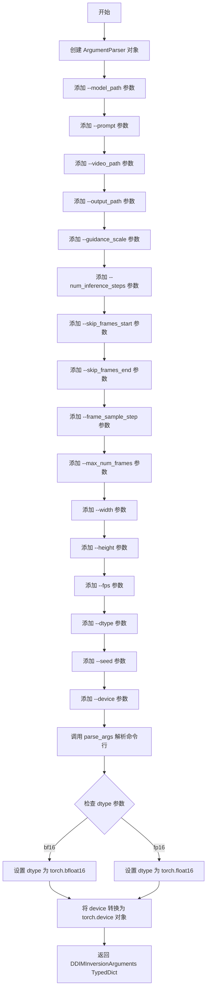
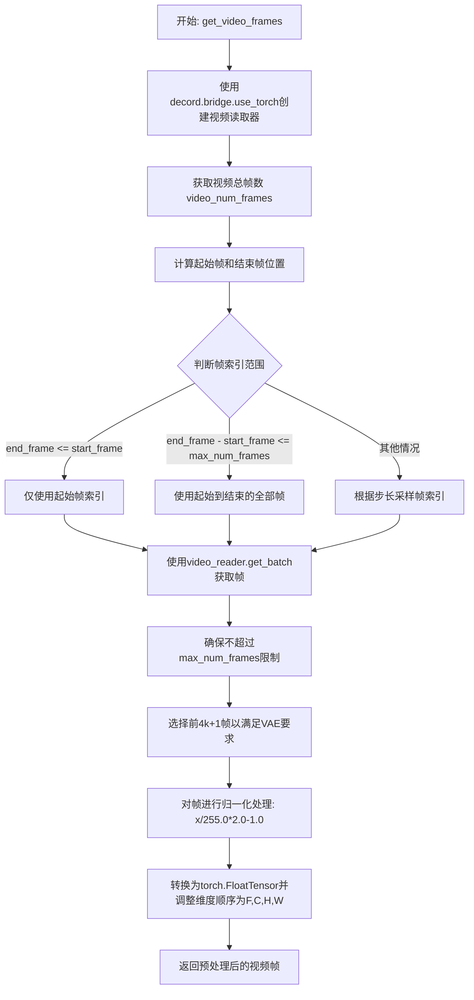
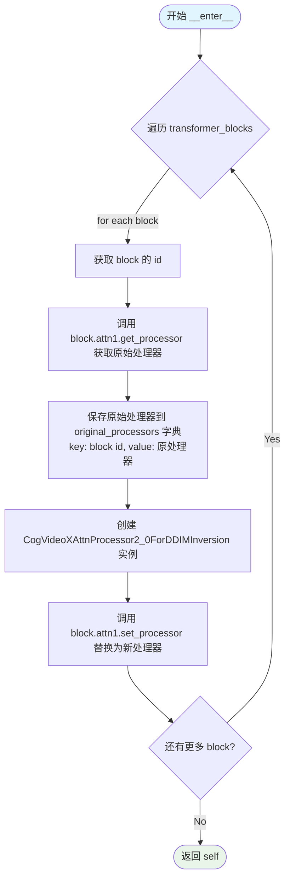
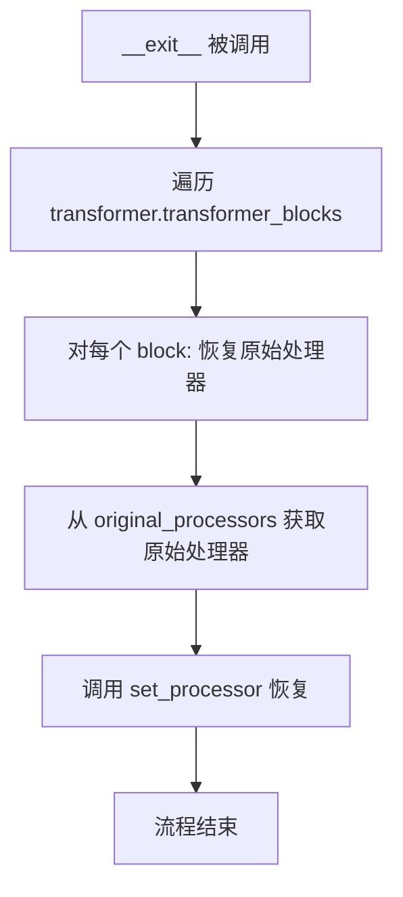
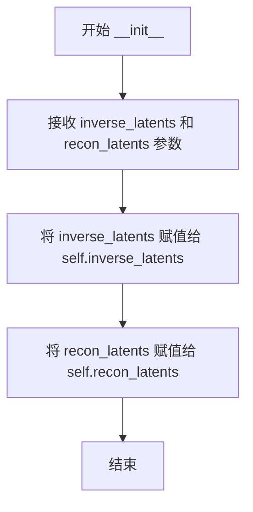
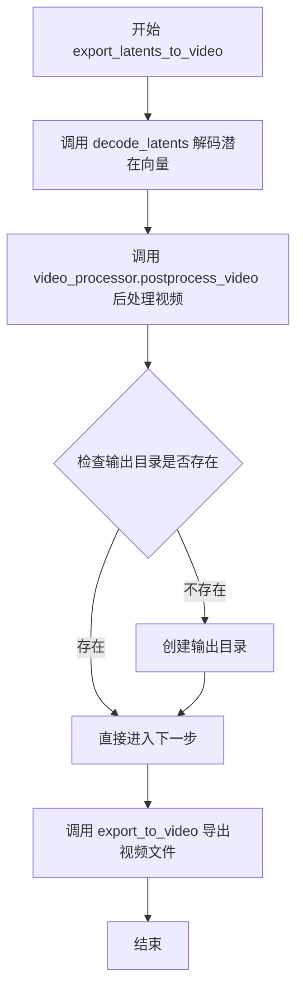
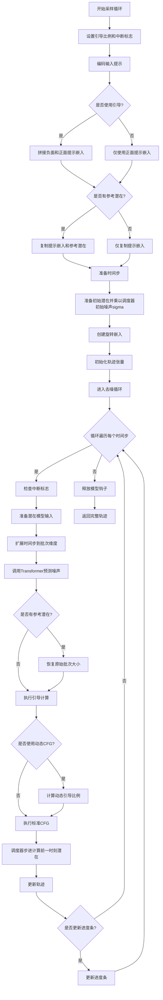
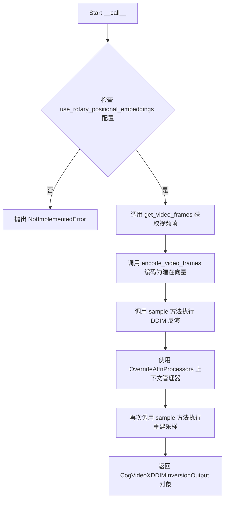

# `diffusers\examples\community\cogvideox_ddim_inversion.py` 详细设计文档

该脚本用于对视频帧执行 DDIM (Denoising Diffusion Implicit Models) 反演 (Inversion)。它利用 CogVideoX 管道将输入视频编码到潜在空间，生成逆潜在向量，然后根据文本提示使用这些逆潜在向量重建或生成新视频。

## 整体流程

```mermaid
graph TD
    Start([开始]) --> Args[解析命令行参数 get_args]
    Args --> Load[加载预训练模型 CogVideoXPipelineForDDIMInversion]
    Load --> Extract[提取视频帧 get_video_frames]
    Extract --> Encode[VAE编码视频帧 encode_video_frames]
    Encode --> Invert[DDIM反演过程 sample (inverse_scheduler)]
    Invert --> Override[切换注意力处理器 OverrideAttnProcessors]
    Override --> Recon[重建过程 sample (scheduler + reference_latents)]
    Recon --> Restore[恢复注意力处理器]
    Restore --> ExportInv[导出反演视频 export_latents_to_video]
    ExportInv --> ExportRecon[导出重建视频 export_latents_to_video]
    ExportRecon --> End([结束])
```

## 类结构

```
CogVideoXPipeline (diffusers 基类)
└── CogVideoXPipelineForDDIMInversion (自定义反演管道)

CogVideoXAttnProcessor2_0 (diffusers 基类)
└── CogVideoXAttnProcessor2_0ForDDIMInversion (自定义注意力处理器)

OverrideAttnProcessors (上下文管理器)
```

## 全局变量及字段


### `decord`
    
用于从视频文件读取帧的库，支持高效的随机访问和批量解码

类型：`module`
    


### `DDIMInversionArguments.model_path`
    
预训练CogVideoX模型的本地路径或HuggingFace模型ID

类型：`str`
    


### `DDIMInversionArguments.prompt`
    
用于引导视频重建的文本提示

类型：`str`
    


### `DDIMInversionArguments.video_path`
    
需要进行DDIM反演的视频文件路径

类型：`str`
    


### `DDIMInversionArguments.output_path`
    
输出视频文件的保存目录

类型：`str`
    


### `DDIMInversionArguments.guidance_scale`
    
无分类器引导的权重，值越大生成的视频越符合文本提示

类型：`float`
    


### `DDIMInversionArguments.num_inference_steps`
    
扩散模型的推理步数，影响生成质量和计算时间

类型：`int`
    


### `DDIMInversionArguments.skip_frames_start`
    
从视频开头跳过的帧数，用于裁剪不需要的起始帧

类型：`int`
    


### `DDIMInversionArguments.skip_frames_end`
    
从视频结尾跳过的帧数，用于裁剪不需要的结尾帧

类型：`int`
    


### `DDIMInversionArguments.frame_sample_step`
    
帧采样步幅，用于均匀间隔采样视频帧，None时自动计算

类型：`Optional[int]`
    


### `DDIMInversionArguments.max_num_frames`
    
最多采样的帧数，VAE要求帧数必须为4k+1格式

类型：`int`
    


### `DDIMInversionArguments.width`
    
视频帧解码后的目标宽度

类型：`int`
    


### `DDIMInversionArguments.height`
    
视频帧解码后的目标高度

类型：`int`
    


### `DDIMInversionArguments.fps`
    
输出视频的每秒帧数

类型：`int`
    


### `DDIMInversionArguments.dtype`
    
模型计算使用的数据类型，bf16或fp16

类型：`torch.dtype`
    


### `DDIMInversionArguments.seed`
    
随机数生成器种子，用于确保结果可复现

类型：`int`
    


### `DDIMInversionArguments.device`
    
模型运行设备，cuda或cpu

类型：`torch.device`
    


### `OverrideAttnProcessors.transformer`
    
包含transformer块的CogVideoX模型实例，用于修改注意力处理器

类型：`CogVideoXTransformer3DModel`
    


### `OverrideAttnProcessors.original_processors`
    
存储原始注意力处理器的字典，用于上下文退出时恢复

类型：`Dict`
    


### `CogVideoXDDIMInversionOutput.inverse_latents`
    
DDIM反演产生的潜在向量轨迹，记录从噪声到视频的完整过程

类型：`torch.FloatTensor`
    


### `CogVideoXDDIMInversionOutput.recon_latents`
    
基于反演潜在向量和提示词重建的视频潜在向量

类型：`torch.FloatTensor`
    


### `CogVideoXPipelineForDDIMInversion.inverse_scheduler`
    
用于执行DDIM反演的反向调度器，从真实数据向噪声演变

类型：`DDIMInverseScheduler`
    
    

## 全局函数及方法


### `get_args`

该函数是命令行参数解析器，使用 Python 的 `argparse` 库定义并解析 DDIM 视频反演任务所需的全部命令行参数，包括模型路径、提示词、视频路径、输出路径、各种推理参数（guidance_scale、num_inference_steps 等）以及设备相关配置，最后将解析结果转换为 `DDIMInversionArguments` TypedDict 类型返回。

参数：该函数没有显式参数，参数来源于系统命令行输入。

返回值：`DDIMInversionArguments`，包含以下字段的字典类型：
- `model_path`: str，预训练模型的路径
- `prompt`: str，用于直接采样的提示词
- `video_path`: str，待反转的视频文件路径
- `output_path`: str，输出视频的保存路径
- `guidance_scale`: float，无分类器指导（CFG）比例
- `num_inference_steps`: int，推理步数
- `skip_frames_start`: int，从视频开头跳过的帧数
- `skip_frames_end`: int，从视频结尾跳过的帧数
- `frame_sample_step`: Optional[int]，时间维度采样步长
- `max_num_frames`: int，最大采样帧数
- `width`: int，视频帧的宽度
- `height`: int，视频帧的高度
- `fps`: int，输出视频的帧率
- `dtype`: torch.dtype，模型的精度类型（bf16 或 fp16）
- `seed`: int，随机数种子
- `device`: torch.device，计算设备（cuda 或 cpu）

#### 流程图



#### 带注释源码

```python
def get_args() -> DDIMInversionArguments:
    """
    解析命令行参数并返回 DDIMInversionArguments 字典。
    
    该函数创建一个 ArgumentParser 实例，定义所有用于 DDIM 视频反演任务
    的命令行参数，包括模型路径、视频路径、推理参数等，并对参数进行
    类型转换和验证，最终以 TypedDict 格式返回解析结果。
    
    Returns:
        DDIMInversionArguments: 包含所有命令行参数的字典类型
    """
    # 创建命令行参数解析器
    parser = argparse.ArgumentParser()

    # ========== 模型与路径相关参数 ==========
    parser.add_argument("--model_path", type=str, required=True, 
                        help="Path of the pretrained model")
    parser.add_argument("--prompt", type=str, required=True, 
                        help="Prompt for the direct sample procedure")
    parser.add_argument("--video_path", type=str, required=True, 
                        help="Path of the video for inversion")
    parser.add_argument("--output_path", type=str, default="output", 
                        help="Path of the output videos")

    # ========== 推理参数 ==========
    parser.add_argument("--guidance_scale", type=float, default=6.0, 
                        help="Classifier-free guidance scale")
    parser.add_argument("--num_inference_steps", type=int, default=50, 
                        help="Number of inference steps")

    # ========== 视频帧跳过的参数 ==========
    parser.add_argument("--skip_frames_start", type=int, default=0, 
                        help="Number of skipped frames from the start")
    parser.add_argument("--skip_frames_end", type=int, default=0, 
                        help="Number of skipped frames from the end")
    parser.add_argument("--frame_sample_step", type=int, default=None, 
                        help="Temporal stride of the sampled frames")

    # ========== 视频帧大小与数量参数 ==========
    parser.add_argument("--max_num_frames", type=int, default=81, 
                        help="Max number of sampled frames")
    parser.add_argument("--width", type=int, default=720, 
                        help="Resized width of the video frames")
    parser.add_argument("--height", type=int, default=480, 
                        help="Resized height of the video frames")
    parser.add_argument("--fps", type=int, default=8, 
                        help="Frame rate of the output videos")

    # ========== 模型精度与计算设备 ==========
    parser.add_argument("--dtype", type=str, default="bf16", 
                        choices=["bf16", "fp16"], 
                        help="Dtype of the model")
    parser.add_argument("--seed", type=int, default=42, 
                        help="Seed for the random number generator")
    parser.add_argument("--device", type=str, default="cuda", 
                        choices=["cuda", "cpu"], 
                        help="Device for inference")

    # 解析命令行参数
    args = parser.parse_args()

    # 将 dtype 字符串转换为 torch.dtype 对象
    # "bf16" -> torch.bfloat16, "fp16" -> torch.float16
    args.dtype = torch.bfloat16 if args.dtype == "bf16" else torch.float16

    # 将 device 字符串转换为 torch.device 对象
    args.device = torch.device(args.device)

    # 将命名空间对象转换为字典，并使用 DDIMInversionArguments 类型进行类型检查
    return DDIMInversionArguments(**vars(args))
```


### get_video_frames

该函数负责从指定路径读取视频文件，并根据提供的参数（宽度、高度、跳帧数、最大帧数等）提取和预处理视频帧，最终返回符合VAE处理要求的torch.FloatTensor格式（[F, C, H, W]）的视频帧数据。

参数：

- `video_path`：`str`，输入视频文件的路径
- `width`：`int`，视频帧的目标解码宽度
- `height`：`int`，视频帧的目标解码高度
- `skip_frames_start`：`int`，从视频开头跳过的帧数
- `skip_frames_end`：`int`，从视频结尾跳过的帧数
- `max_num_frames`：`int`，输出帧的最大允许数量
- `frame_sample_step`：`Optional[int]`，帧采样步长。如果为None，则自动计算为：(总帧数 - 跳过帧数) // max_num_frames

返回值：`torch.FloatTensor`，预处理后的视频帧，格式为`[F, C, H, W]`，其中：
- `F`：帧数（为VAE兼容性调整为4k+1）
- `C`：通道数（3代表RGB）
- `H`：帧高度
- `W`：帧宽度

#### 流程图



#### 带注释源码

```python
def get_video_frames(
    video_path: str,
    width: int,
    height: int,
    skip_frames_start: int,
    skip_frames_end: int,
    max_num_frames: int,
    frame_sample_step: Optional[int],
) -> torch.FloatTensor:
    """
    Extract and preprocess video frames from a video file for VAE processing.

    Args:
        video_path (`str`): Path to input video file
        width (`int`): Target frame width for decoding
        height (`int`): Target frame height for decoding
        skip_frames_start (`int`): Number of frames to skip at video start
        skip_frames_end (`int`): Number of frames to skip at video end
        max_num_frames (`int`): Maximum allowed number of output frames
        frame_sample_step (`Optional[int]`):
            Frame sampling step size. If None, automatically calculated as:
            (total_frames - skipped_frames) // max_num_frames

    Returns:
        `torch.FloatTensor`: Preprocessed frames in `[F, C, H, W]` format where:
        - `F`: Number of frames (adjusted to 4k + 1 for VAE compatibility)
        - `C`: Channels (3 for RGB)
        - `H`: Frame height
        - `W`: Frame width
    """
    # 使用decord库的视频读取器，并通过torch桥接以返回PyTorch张量
    with decord.bridge.use_torch():
        # 创建视频读取器，指定目标宽度和高度
        video_reader = decord.VideoReader(uri=video_path, width=width, height=height)
        # 获取视频的总帧数
        video_num_frames = len(video_reader)
        
        # 计算有效帧范围：起始帧和结束帧
        start_frame = min(skip_frames_start, video_num_frames)
        end_frame = max(0, video_num_frames - skip_frames_end)

        # 根据不同情况确定要采样的帧索引
        if end_frame <= start_frame:
            # 如果有效帧范围无效，仅使用起始帧
            indices = [start_frame]
        elif end_frame - start_frame <= max_num_frames:
            # 如果有效帧数不超过最大帧数，使用全部有效帧
            indices = list(range(start_frame, end_frame))
        else:
            # 否则按照步长采样帧
            # 如果未提供步长，则自动计算：总有效帧数 // 最大帧数
            step = frame_sample_step or (end_frame - start_frame) // max_num_frames
            indices = list(range(start_frame, end_frame, step))

        # 读取指定索引的视频帧
        frames = video_reader.get_batch(indices=indices)
        # 确保不超过最大帧数限制，并转换为float类型
        frames = frames[:max_num_frames].float()

        # 选择前(4k+1)帧，因为VAE要求这种特定数量的帧
        # CogVideoX的VAE要求帧数满足4k+1格式
        selected_num_frames = frames.size(0)
        remainder = (3 + selected_num_frames) % 4
        if remainder != 0:
            # 去掉多余的帧以满足4k+1的要求
            frames = frames[:-remainder]
        # 断言确保帧数满足4k+1的要求
        assert frames.size(0) % 4 == 1

        # 定义归一化变换：将像素值从[0,255]映射到[-1,1]
        transform = T.Lambda(lambda x: x / 255.0 * 2.0 - 1.0)
        # 对每一帧应用归一化，并堆叠成张量
        frames = torch.stack(tuple(map(transform, frames)), dim=0)

        # 调整维度顺序从[H, W, C]变为[C, H, W]，并确保内存连续
        return frames.permute(0, 3, 1, 2).contiguous()  # [F, C, H, W]
```


### `CogVideoXAttnProcessor2_0ForDDIMInversion.calculate_attention`

计算带有反演引导RoPE（旋转位置编码）集成的核心注意力模块，负责处理图像和文本特征的注意力计算与融合。

参数：

- `query`：`torch.Tensor`，形状为 `[batch_size, seq_len, dim]`，查询张量
- `key`：`torch.Tensor`，形状为 `[batch_size, seq_len, dim]`，键张量
- `value`：`torch.Tensor`，形状为 `[batch_size, seq_len, dim]`，值张量
- `attn`：`Attention`，父注意力模块，包含投影层、归一化层和输出层
- `batch_size`：`int`，分块后的有效批量大小
- `image_seq_length`：`int`，图像特征序列长度
- `text_seq_length`：`int`，文本特征序列长度
- `attention_mask`：`Optional[torch.Tensor]`，注意力掩码张量，用于控制注意力计算
- `image_rotary_emb`：`Optional[torch.Tensor]`，图像位置的旋转嵌入（RoPE）

返回值：`Tuple[torch.Tensor, torch.Tensor]`

- 第一个元素：`hidden_states`，形状为 `[batch_size, image_seq_length, dim]`，处理后的图像特征
- 第二个元素：`encoder_hidden_states`，形状为 `[batch_size, text_seq_length, dim]`，处理后的文本特征

#### 流程图

```mermaid
flowchart TD
    A[开始 calculate_attention] --> B[计算 inner_dim 和 head_dim]
    B --> C[Reshape: query/key/value 视图变换和转置]
    C --> D{attn.norm_q 是否存在?}
    D -->|是| E[对 query 进行归一化]
    D -->|否| F{attn.norm_k 是否存在?}
    E --> F
    F -->|是| G[对 key 进行归一化]
    F -->|否| H{image_rotary_emb 是否存在?}
    G --> H
    H -->|是| I[对图像部分 query 应用 RoPE]
    I --> J{是否为交叉注意力?}
    J -->|否| K{key 与 query 序列长度相等?}
    K -->|是| L[对参考隐藏状态的图像部分 key 应用 RoPE]
    K -->|否| M[对 key 的两个图像分组分别应用 RoPE]
    J -->|是| N[跳过 key 的 RoPE 应用]
    H -->|否| O[跳过 RoPE 应用]
    L --> O
    M --> O
    N --> O
    O --> P[调用 F.scaled_dot_product_attention 计算注意力]
    P --> Q[恢复形状: batch_size, -1, attn.heads * head_dim]
    Q --> R[线性投影: attn.to_out[0]]
    R --> S[Dropout: attn.to_out[1]]
    S --> T[分割输出: encoder_hidden_states 和 hidden_states]
    T --> U[返回 Tuple[hidden_states, encoder_hidden_states]]
```

#### 带注释源码

```python
def calculate_attention(
    self,
    query: torch.Tensor,
    key: torch.Tensor,
    value: torch.Tensor,
    attn: Attention,
    batch_size: int,
    image_seq_length: int,
    text_seq_length: int,
    attention_mask: Optional[torch.Tensor],
    image_rotary_emb: Optional[torch.Tensor],
) -> Tuple[torch.Tensor, torch.Tensor]:
    r"""
    Core attention computation with inversion-guided RoPE integration.

    Args:
        query (`torch.Tensor`): `[batch_size, seq_len, dim]` query tensor
        key (`torch.Tensor`): `[batch_size, seq_len, dim]` key tensor
        value (`torch.Tensor`): `[batch_size, seq_len, dim]` value tensor
        attn (`Attention`): Parent attention module with projection layers
        batch_size (`int`): Effective batch size (after chunk splitting)
        image_seq_length (`int`): Length of image feature sequence
        text_seq_length (`int`): Length of text feature sequence
        attention_mask (`Optional[torch.Tensor]`): Attention mask tensor
        image_rotary_emb (`Optional[torch.Tensor]`): Rotary embeddings for image positions

    Returns:
        `Tuple[torch.Tensor, torch.Tensor]`:
            (1) hidden_states: [batch_size, image_seq_length, dim] processed image features
            (2) encoder_hidden_states: [batch_size, text_seq_length, dim] processed text features
    """
    # 计算内部维度和注意力头维度
    inner_dim = key.shape[-1]
    head_dim = inner_dim // attn.heads

    # 将 query/key/value reshape 为 [batch, heads, seq, head_dim] 并转置
    query = query.view(batch_size, -1, attn.heads, head_dim).transpose(1, 2)
    key = key.view(batch_size, -1, attn.heads, head_dim).transpose(1, 2)
    value = value.view(batch_size, -1, attn.heads, head_dim).transpose(1, 2)

    # 对 query 应用归一化（如果存在）
    if attn.norm_q is not None:
        query = attn.norm_q(query)
    # 对 key 应用归一化（如果存在）
    if attn.norm_k is not None:
        key = attn.norm_k(key)

    # 如果提供了旋转嵌入，则应用 RoPE
    if image_rotary_emb is not None:
        # 对图像部分的 query 应用旋转嵌入（跳过文本部分）
        query[:, :, text_seq_length:] = apply_rotary_emb(query[:, :, text_seq_length:], image_rotary_emb)
        
        # 如果不是交叉注意力，则对 key 也应用 RoPE
        if not attn.is_cross_attention:
            if key.size(2) == query.size(2):  # 参考隐藏状态的注意力
                # 对图像部分的 key 应用旋转嵌入
                key[:, :, text_seq_length:] = apply_rotary_emb(key[:, :, text_seq_length:], image_rotary_emb)
            else:  # RoPE 需要应用到每组图像令牌
                # 对第一组图像令牌应用 RoPE
                key[:, :, text_seq_length : text_seq_length + image_seq_length] = apply_rotary_emb(
                    key[:, :, text_seq_length : text_seq_length + image_seq_length], image_rotary_emb
                )
                # 对第二组图像令牌应用 RoPE
                key[:, :, text_seq_length * 2 + image_seq_length :] = apply_rotary_emb(
                    key[:, :, text_seq_length * 2 + image_seq_length :], image_rotary_emb
                )

    # 使用 PyTorch 的缩放点积注意力计算
    hidden_states = F.scaled_dot_product_attention(
        query, key, value, attn_mask=attention_mask, dropout_p=0.0, is_causal=False
    )

    # 恢复形状为 [batch, seq, dim]
    hidden_states = hidden_states.transpose(1, 2).reshape(batch_size, -1, attn.heads * head_dim)

    # 线性投影
    hidden_states = attn.to_out[0](hidden_states)
    # Dropout
    hidden_states = attn.to_out[1](hidden_states)

    # 分割输出：文本特征和图像特征
    encoder_hidden_states, hidden_states = hidden_states.split(
        [text_seq_length, hidden_states.size(1) - text_seq_length], dim=1
    )
    return hidden_states, encoder_hidden_states
```


### `CogVideoXAttnProcessor2_0ForDDIMInversion.__call__`

处理反演引导的去噪程序的双路径注意力。该方法是 DDIM（DDIM 反演）过程中的核心组件，通过双路径机制同时处理主注意力流和参考注意力流，以实现视频帧的反演和重建。

参数：

- `self`：`CogVideoXAttnProcessor2_0ForDDIMInversion`，注意力处理器实例，继承自 `CogVideoXAttnProcessor2_0`
- `attn`：`Attention`，父注意力模块，包含投影层（to_q, to_k, to_v）和输出层（to_out）
- `hidden_states`：`torch.Tensor`，形状为 `[batch_size, image_seq_len, dim]` 的图像 token 张量
- `encoder_hidden_states`：`torch.Tensor`，形状为 `[batch_size, text_seq_len, dim]` 的文本 token 张量
- `attention_mask`：`Optional[torch.Tensor]`，可选的注意力掩码张量，用于控制注意力计算
- `image_rotary_emb`：`Optional[torch.Tensor]`，图像位置的旋转嵌入（RoPE），用于位置编码

返回值：`Tuple[torch.Tensor, torch.Tensor]`，包含两个张量：
- 第一个是最终隐藏状态 `[batch_size, image_seq_length, dim]`，处理后的图像 token
- 第二个是最终编码器状态 `[batch_size, text_seq_length, dim]`，处理后的文本 token

#### 流程图

```mermaid
flowchart TD
    A[开始 __call__] --> B[获取 image_seq_length 和 text_seq_length]
    B --> C[拼接 hidden_states = torch.cat[encoder_hidden_states, hidden_states]]
    C --> D{attention_mask 是否存在?}
    D -->|是| E[调用 attn.prepare_attention_mask 准备掩码]
    D -->|否| F[跳过掩码准备]
    E --> G[执行 to_q/to_k/to_v 投影]
    F --> G
    G --> H[将 query/key/value 各自按 chunk(2) 分割为两份]
    H --> I[更新 batch_size = batch_size // 2]
    I --> J[构建主路径 key: torch.cat[key, key_reference]]
    J --> K[构建主路径 value: torch.cat[value, value_reference]]
    K --> L[调用 calculate_attention 计算主路径注意力]
    L --> M[调用 calculate_attention 计算参考路径注意力]
    M --> N[拼接主路径结果: hidden_states + hidden_states_reference]
    N --> O[拼接编码器结果: encoder_hidden_states + encoder_hidden_states_reference]
    O --> P[返回最终结果 Tuple[隐藏状态, 编码器状态]]
```

#### 带注释源码

```python
def __call__(
    self,
    attn: Attention,
    hidden_states: torch.Tensor,
    encoder_hidden_states: torch.Tensor,
    attention_mask: Optional[torch.Tensor] = None,
    image_rotary_emb: Optional[torch.Tensor] = None,
) -> Tuple[torch.Tensor, torch.Tensor]:
    r"""
    Process the dual-path attention for the inversion-guided denoising procedure.

    Args:
        attn (`Attention`): Parent attention module
        hidden_states (`torch.Tensor`): `[batch_size, image_seq_len, dim]` Image tokens
        encoder_hidden_states (`torch.Tensor`): `[batch_size, text_seq_len, dim]` Text tokens
        attention_mask (`Optional[torch.Tensor]`): Optional attention mask
        image_rotary_emb (`Optional[torch.Tensor]`): Rotary embeddings for image tokens

    Returns:
        `Tuple[torch.Tensor, torch.Tensor]`:
            (1) Final hidden states: `[batch_size, image_seq_length, dim]` Resulting image tokens
            (2) Final encoder states: `[batch_size, text_seq_length, dim]` Resulting text tokens
    """
    # 步骤1: 获取图像序列长度和文本序列长度
    image_seq_length = hidden_states.size(1)
    text_seq_length = encoder_hidden_states.size(1)

    # 步骤2: 将文本 token 和图像 token 拼接在一起形成完整序列
    # 拼接顺序: [text_tokens, image_tokens]
    hidden_states = torch.cat([encoder_hidden_states, hidden_states], dim=1)

    # 步骤3: 获取批量大小和序列长度
    batch_size, sequence_length, _ = (
        hidden_states.shape if encoder_hidden_states is None else encoder_hidden_states.shape
    )

    # 步骤4: 准备注意力掩码（如果提供）
    if attention_mask is not None:
        # 调用 attn 模块的 prepare_attention_mask 方法将掩码适配到多头注意力格式
        attention_mask = attn.prepare_attention_mask(attention_mask, sequence_length, batch_size)
        # 调整形状为 [batch_size, heads, seq_len, seq_len]
        attention_mask = attention_mask.view(batch_size, attn.heads, -1, attention_mask.shape[-1])

    # 步骤5: 使用线性投影层将 hidden_states 投影为 query, key, value
    # 这些投影将特征维度映射到注意力计算的维度
    query = attn.to_q(hidden_states)
    key = attn.to_k(hidden_states)
    value = attn.to_v(hidden_states)

    # 步骤6: 将 query/key/value 各自按维度0（批量维度）分成两份
    # 这是双路径机制的核心：将批次分成两部分分别处理
    # - 一半用于主去噪路径
    # - 一半用于参考/反演路径
    query, query_reference = query.chunk(2)
    key, key_reference = key.chunk(2)
    value, value_reference = value.chunk(2)
    
    # 更新批量大小（因为已经分成两半）
    batch_size = batch_size // 2

    # 步骤7: 计算主路径注意力
    # 将主路径的 key/value 与参考路径的 key/value 拼接
    # 使主路径能够关注到参考信息
    hidden_states, encoder_hidden_states = self.calculate_attention(
        query=query,
        key=torch.cat((key, key_reference), dim=1),
        value=torch.cat((value, value_reference), dim=1),
        attn=attn,
        batch_size=batch_size,
        image_seq_length=image_seq_length,
        text_seq_length=text_seq_length,
        attention_mask=attention_mask,
        image_rotary_emb=image_rotary_emb,
    )
    
    # 步骤8: 计算参考路径注意力
    # 参考路径只关注自己的 key/value，用于保持参考信息的一致性
    hidden_states_reference, encoder_hidden_states_reference = self.calculate_attention(
        query=query_reference,
        key=key_reference,
        value=value_reference,
        attn=attn,
        batch_size=batch_size,
        image_seq_length=image_seq_length,
        text_seq_length=text_seq_length,
        attention_mask=attention_mask,
        image_rotary_emb=image_rotary_emb,
    )

    # 步骤9: 拼接两个路径的结果并返回
    # 将主路径和参考路径的结果沿序列维度拼接恢复原来的批量大小
    return (
        torch.cat((hidden_states, hidden_states_reference)),
        torch.cat((encoder_hidden_states, encoder_hidden_states_reference)),
    )
```


### `OverrideAttnProcessors.__enter__`

进入上下文管理器，临时替换 CogVideo 转换器块中的注意力处理器为 DDIM 反演专用处理器，并保存原始处理器以备退出时恢复。

参数：此方法无显式参数（使用隐式 `self`）

返回值：`OverrideAttnProcessors`，返回上下文管理器实例本身，以便支持 `with` 语句的链式调用或后续属性访问。

#### 流程图



#### 带注释源码

```python
def __enter__(self):
    """
    进入上下文管理器，替换所有 transformer block 的注意力处理器。
    
    此方法在 with 语句入口处被调用，负责：
    1. 遍历 transformer 的所有 transformer_blocks
    2. 保存每个 block 原始的 attn1 处理器
    3. 将 attn1 处理器替换为支持 DDIM 反演的专用处理器
    
    Returns:
        OverrideAttnProcessors: 返回上下文管理器实例本身
    """
    # 遍历转换器中的所有 transformer block
    for block in self.transformer.transformer_blocks:
        # 类型强制转换，确保 block 是 CogVideoXBlock 类型
        block = cast(CogVideoXBlock, block)
        
        # 使用 block 的内存地址(id)作为字典键，保存原始处理器
        # 这样在 __exit__ 时可以精确恢复每个 block 的处理器
        self.original_processors[id(block)] = block.attn1.get_processor()
        
        # 将该 block 的第一个注意力模块(attn1)替换为 DDIM 反演专用处理器
        # CogVideoXAttnProcessor2_0ForDDIMInversion 支持反向扩散过程的注意力计算
        block.attn1.set_processor(CogVideoXAttnProcessor2_0ForDDIMInversion())
    
    # 返回 self，使上下文管理器对象可用于 with 块内的代码
    return self
```


### OverrideAttnProcessors.__exit__

退出上下文，恢复原始注意力处理器。

参数：

-  `_0`：`Optional[type]`，异常类型（标准上下文管理器参数，未使用）
-  `_1`：`Optional[BaseException]`，异常值（标准上下文管理器参数，未使用）
-  `_2`：`Optional[traceback]`，异常回溯（标准上下文管理器参数，未使用）

返回值：`None`，无返回值，标准上下文管理器退出方法

#### 流程图



#### 带注释源码

```python
def __exit__(self, _0, _1, _2):
    r"""
    Exit the context manager and restore the original attention processors.

    This method is automatically called when exiting the `with` block. It iterates through
    all transformer blocks and restores their original attention processors that were
    saved during `__enter__`.

    Args:
        _0 (`Optional[type]`): Exception type (unused, standard context manager signature)
        _1 (`Optional[BaseException]`): Exception value (unused, standard context manager signature)
        _2 (`Optional[traceback]`): Exception traceback (unused, standard context manager signature)

    Returns:
        `None`: This method does not return anything
    """
    # Iterate through all transformer blocks in the CogVideoX transformer
    for block in self.transformer.transformer_blocks:
        # Cast block to CogVideoXBlock to ensure type safety
        block = cast(CogVideoXBlock, block)
        # Restore the original attention processor using the stored reference
        # The processor was saved during __enter__ using id(block) as the key
        block.attn1.set_processor(self.original_processors[id(block)])
```


### CogVideoXDDIMInversionOutput.__init__

这是 `CogVideoXDDIMInversionOutput` 类的构造函数，用于初始化逆扩散和重建过程的潜在向量存储容器。该类作为 DDIM 逆扩散过程的输出封装类，保存了视频帧在逆扩散过程中生成的潜在向量序列以及基于提示词重建后的潜在向量序列。

参数：

- `inverse_latents`：`torch.FloatTensor`，逆扩散过程（DDIM Inversion）生成的潜在向量序列，形状为 `[T, B, F, C, H, W]`，记录了从噪声到原始视频latents的完整去噪轨迹
- `recon_latents`：`torch.FloatTensor`，基于原始视频逆潜在向量和文本提示词重建生成的潜在向量序列，形状为 `[T, B, F, C, H, W]`，用于生成重建后的视频

返回值：`None`，构造函数不返回任何值，仅初始化对象属性

#### 流程图



#### 带注释源码

```python
class CogVideoXDDIMInversionOutput:
    # 类字段声明，指定属性类型
    inverse_latents: torch.FloatTensor  # 逆扩散过程的潜在向量序列
    recon_latents: torch.FloatTensor   # 重建过程的潜在向量序列

    def __init__(self, inverse_latents: torch.FloatTensor, recon_latents: torch.FloatTensor):
        """
        初始化 CogVideoXDDIMInversionOutput 对象。

        Args:
            inverse_latents (torch.FloatTensor): 逆扩散过程生成的潜在向量序列
            recon_latents (torch.FloatTensor): 重建过程生成的潜在向量序列
        """
        # 将逆扩散过程生成的潜在向量存储为实例属性
        self.inverse_latents = inverse_latents
        
        # 将重建过程生成的潜在向量存储为实例属性
        self.recon_latents = recon_latents
```


### `CogVideoXPipelineForDDIMInversion.encode_video_frames`

该方法使用预训练的 CogVideoX VAE（变分自编码器）将原始视频帧从像素空间编码到压缩的潜在空间，是 DDIM 反演流程的第一步，为后续的反演和重建操作准备潜在向量。

参数：

- `self`：`CogVideoXPipelineForDDIMInversion` 实例本身
- `video_frames`：`torch.FloatTensor`，输入视频帧张量，格式为 `[F, C, H, W]`，其中 F 为帧数，C 为通道数（RGB=3），H 和 W 分别为帧的高度和宽度。该张量通常来自 `get_video_frames()` 函数的输出。

返回值：`torch.FloatTensor`，编码后的潜在向量，格式为 `[1, F, D, H_latent, W_latent]`，其中：

- `F`：帧数（与输入相同）
- `D`：潜在通道维度
- `H_latent`：潜在空间高度（H // 2^vae.downscale_factor）
- `W_latent`：潜在空间宽度（W // 2^vae.downscale_factor）

#### 流程图

```mermaid
flowchart TD
    A[开始: video_frames 输入<br/>[F, C, H, W]] --> B[获取 VAE 模型实例]
    B --> C{设备与类型检查}
    C -->|需要转换| D[将 video_frames 移动到 VAE 设备<br/>并转换为 VAE 数据类型]
    C -->|已是正确设备| E[继续执行]
    D --> E
    E --> F[扩展维度: unsqueeze(0)<br/>[F, C, H, W] → [1, C, F, H, W]]
    F --> G[维度重排: permute(0, 2, 1, 3, 4)<br/>[1, C, F, H, W] → [1, F, C, H, W]]
    G --> H[VAE 编码: vae.encode(x)<br/>获取潜在分布]
    H --> I[潜在分布采样: .latent_dist.sample()]
    I --> J[维度转置: transpose(1, 2)<br/>[1, C, F, H, W] → [1, F, C, H, W]]
    J --> K[应用缩放因子: * vae.config.scaling_factor]
    K --> L[返回编码潜在向量<br/>[1, F, D, H_latent, W_latent]]
```

#### 带注释源码

```python
def encode_video_frames(self, video_frames: torch.FloatTensor) -> torch.FloatTensor:
    """
    Encode video frames into latent space using Variational Autoencoder.

    Args:
        video_frames (`torch.FloatTensor`):
            Input frames tensor in `[F, C, H, W]` format from `get_video_frames()`

    Returns:
        `torch.FloatTensor`: Encoded latents in `[1, F, D, H_latent, W_latent]` format where:
        - `F`: Number of frames (same as input)
        - `D`: Latent channel dimension
        - `H_latent`: Latent space height (H // 2^vae.downscale_factor)
        - `W_latent`: Latent space width (W // 2^vae.downscale_factor)
    """
    # 从类属性获取 VAE 模型实例
    vae: AutoencoderKLCogVideoX = self.vae
    
    # 将输入视频帧移动到 VAE 所在的设备（CPU/CUDA）
    # 并转换为 VAE 所需的数据类型（bf16/fp16）
    video_frames = video_frames.to(device=vae.device, dtype=vae.dtype)
    
    # 添加批次维度并重排列维度顺序
    # 原始格式: [F, C, H, W] - F=帧数, C=通道, H=高, W=宽
    # 目标格式: [B, C, F, H, W] - B=批次大小(此处为1), C=通道, F=帧, H=高, W=宽
    # 这是因为 VAE encode 方法期望的输入格式为 [B, C, F, H, W]
    video_frames = video_frames.unsqueeze(0).permute(0, 2, 1, 3, 4)  # [B, C, F, H, W]
    
    # 使用 VAE 对视频帧进行编码，得到潜在分布
    # vae.encode() 返回一个包含 latent_dist 的对象
    # latent_dist 是一个高斯分布（均值和方差）
    latent_dist = vae.encode(x=video_frames).latent_dist.sample().transpose(1, 2)
    
    # 乘以 VAE 的缩放因子以标准化潜在空间的分布
    # 这确保了潜在向量符合扩散模型预期的方差
    return latent_dist * vae.config.scaling_factor
```


### `CogVideoXPipelineForDDIMInversion.export_latents_to_video`

将潜在向量解码为视频帧，并导出为视频文件。该方法是DDIM反转流程的最后一步，将编码后的潜在向量转换回可播放的视频格式。

参数：

-  `self`：`CogVideoXPipelineForDDIMInversion` 类实例
-  `latents`：`torch.FloatTensor`，输入的潜在向量，形状为 `[B, F, D, H_latent, W_latent]`，其中 B 为批次大小，F 为帧数，D 为潜在通道维度，H_latent 和 W_latent 为潜在空间的高度和宽度
-  `video_path`：`str`，输出视频文件的保存路径
-  `fps`：`int`，输出视频的帧率（每秒帧数）

返回值：`None`，该方法无返回值，直接将视频写入指定路径

#### 流程图



#### 带注释源码

```python
@torch.no_grad()
def export_latents_to_video(self, latents: torch.FloatTensor, video_path: str, fps: int):
    r"""
    Decode latent vectors into video and export as video file.

    Args:
        latents (`torch.FloatTensor`): Encoded latents in `[B, F, D, H_latent, W_latent]` format from
            `encode_video_frames()`
        video_path (`str`): Output path for video file
        fps (`int`): Target frames per second for output video
    """
    # Step 1: 使用 VAE 的解码器将潜在向量转换为视频帧张量
    # decode_latents 是从父类 CogVideoXPipeline 继承的方法
    # 输入: [B, F, D, H_latent, W_latent] -> 输出: [B, C, F, H, W]
    video = self.decode_latents(latents)
    
    # Step 2: 使用视频后处理器将解码后的张量转换为 PIL 图像列表
    # video_processor 是 Pipeline 中集成的视频处理工具
    # output_type="pil" 表示输出 Python Imaging Library 格式的图像
    frames = self.video_processor.postprocess_video(video=video, output_type="pil")
    
    # Step 3: 确保输出目录存在
    # os.path.dirname(video_path) 提取文件所在目录路径
    # exist_ok=True 如果目录已存在则不报错
    os.makedirs(os.path.dirname(video_path), exist_ok=True)
    
    # Step 4: 调用 diffusers 工具函数将帧序列导出为 MP4 视频
    # video_frames: 帧序列数据
    # output_video_path: 输出文件路径
    # fps: 视频帧率
    export_to_video(video_frames=frames[0], output_video_path=video_path, fps=fps)
```


### `CogVideoXPipelineForDDIMInversion.sample`

执行视频生成/反演的核心采样循环，实现完整的去噪轨迹记录，支持DDIM反演和生成过程，支持动态无分类器引导和参考潜在条件。

参数：

-  `latents`：`torch.FloatTensor`，初始噪声张量，形状为 `[B, F, C, H, W]`
-  `scheduler`：`Union[DDIMInverseScheduler, CogVideoXDDIMScheduler]`，扩散过程的调度策略，使用 `DDIMInverseScheduler` 进行反演，使用 `CogVideoXDDIMScheduler` 进行生成
-  `prompt`：`Optional[Union[str, List[str]]]`，条件生成的文本提示，默认为无条件
-  `negative_prompt`：`Optional[Union[str, List[str]]]`，用于引导的负面提示，需要 `guidance_scale > 1`
-  `num_inference_steps`：`int`，去噪步数，影响质量/计算权衡
-  `guidance_scale`：`float`，无分类器引导权重，1.0 表示无引导
-  `use_dynamic_cfg`：`bool`，启用时间变化引导比例（余弦调度）
-  `eta`：`float`，DDIM方差参数（0 为确定性过程）
-  `generator`：`Optional[Union[torch.Generator, List[torch.Generator]]]`，用于可重复性的随机数生成器
-  `attention_kwargs`：`Optional[Dict[str, Any]]`，注意力模块的自定义参数
-  `reference_latents`：`torch.FloatTensor`，用于条件采样的参考潜在轨迹，形状应匹配 `[T, B, F, C, H, W]`，其中 T 为时间步数

返回值：`torch.FloatTensor`，完整去噪轨迹张量，形状为 `[T, B, F, C, H, W]`

#### 流程图



#### 带注释源码

```python
@torch.no_grad()
def sample(
    self,
    latents: torch.FloatTensor,
    scheduler: Union[DDIMInverseScheduler, CogVideoXDDIMScheduler],
    prompt: Optional[Union[str, List[str]]] = None,
    negative_prompt: Optional[Union[str, List[str]]] = None,
    num_inference_steps: int = 50,
    guidance_scale: float = 6,
    use_dynamic_cfg: bool = False,
    eta: float = 0.0,
    generator: Optional[Union[torch.Generator, List[torch.Generator]]] = None,
    attention_kwargs: Optional[Dict[str, Any]] = None,
    reference_latents: torch.FloatTensor = None,
) -> torch.FloatTensor:
    r"""
    Execute the core sampling loop for video generation/inversion using CogVideoX.

    Implements the full denoising trajectory recording for both DDIM inversion and
    generation processes. Supports dynamic classifier-free guidance and reference
    latent conditioning.

    Args:
        latents (`torch.FloatTensor`):
            Initial noise tensor of shape `[B, F, C, H, W]`.
        scheduler (`Union[DDIMInverseScheduler, CogVideoXDDIMScheduler]`):
            Scheduling strategy for diffusion process. Use:
            (1) `DDIMInverseScheduler` for inversion
            (2) `CogVideoXDDIMScheduler` for generation
        prompt (`Optional[Union[str, List[str]]]`):
            Text prompt(s) for conditional generation. Defaults to unconditional.
        negative_prompt (`Optional[Union[str, List[str]]]`):
            Negative prompt(s) for guidance. Requires `guidance_scale > 1`.
        num_inference_steps (`int`):
            Number of denoising steps. Affects quality/compute trade-off.
        guidance_scale (`float`):
            Classifier-free guidance weight. 1.0 = no guidance.
        use_dynamic_cfg (`bool`):
            Enable time-varying guidance scale (cosine schedule)
        eta (`float`):
            DDIM variance parameter (0 = deterministic process)
        generator (`Optional[Union[torch.Generator, List[torch.Generator]]]`):
            Random number generator(s) for reproducibility
        attention_kwargs (`Optional[Dict[str, Any]]]`):
            Custom parameters for attention modules
        reference_latents (`torch.FloatTensor`):
            Reference latent trajectory for conditional sampling. Shape should match
            `[T, B, F, C, H, W]` where `T` is number of timesteps

    Returns:
        `torch.FloatTensor`:
            Full denoising trajectory tensor of shape `[T, B, F, C, H, W]`.
    """
    # 设置引导比例和注意力参数
    self._guidance_scale = guidance_scale
    self._attention_kwargs = attention_kwargs
    self._interrupt = False

    device = self._execution_device

    # 3. Encode input prompt - 编码输入提示
    # guidance_scale 类似于 Imagen 论文中的引导权重 w
    # guidance_scale = 1 表示不进行无分类器引导
    do_classifier_free_guidance = guidance_scale > 1.0

    # 编码提示词为文本嵌入
    prompt_embeds, negative_prompt_embeds = self.encode_prompt(
        prompt,
        negative_prompt,
        do_classifier_free_guidance,
        device=device,
    )
    # 如果使用CFG，将负面和正面提示拼接
    if do_classifier_free_guidance:
        prompt_embeds = torch.cat([negative_prompt_embeds, prompt_embeds], dim=0)
    # 如果有参考潜在，复制提示嵌入
    if reference_latents is not None:
        prompt_embeds = torch.cat([prompt_embeds] * 2, dim=0)

    # 4. Prepare timesteps - 准备时间步
    timesteps, num_inference_steps = retrieve_timesteps(scheduler, num_inference_steps, device)
    self._num_timesteps = len(timesteps)

    # 5. Prepare latents - 准备潜在变量
    # 将潜在变量移到设备上并乘以调度器的初始噪声sigma
    latents = latents.to(device=device) * scheduler.init_noise_sigma

    # 6. Prepare extra step kwargs - 准备额外步参数
    # TODO: 逻辑应该移到管道之外
    extra_step_kwargs = self.prepare_extra_step_kwargs(generator, eta)
    # 逆调度器不接受额外参数
    if isinstance(scheduler, DDIMInverseScheduler):
        extra_step_kwargs = {}

    # 7. Create rotary embeds if required - 如需要则创建旋转嵌入
    image_rotary_emb = (
        self._prepare_rotary_positional_embeddings(
            height=latents.size(3) * self.vae_scale_factor_spatial,
            width=latents.size(4) * self.vae_scale_factor_spatial,
            num_frames=latents.size(1),
            device=device,
        )
        if self.transformer.config.use_rotary_positional_embeddings
        else None
    )

    # 8. Denoising loop - 去噪循环
    num_warmup_steps = max(len(timesteps) - num_inference_steps * scheduler.order, 0)

    # 初始化轨迹张量，用于存储每一步的去噪结果
    trajectory = torch.zeros_like(latents).unsqueeze(0).repeat(len(timesteps), 1, 1, 1, 1, 1)
    
    with self.progress_bar(total=num_inference_steps) as progress_bar:
        for i, t in enumerate(timesteps):
            # 检查中断标志
            if self.interrupt:
                continue

            # 准备潜在模型输入
            latent_model_input = torch.cat([latents] * 2) if do_classifier_free_guidance else latents
            # 如果有参考潜在，添加到输入
            if reference_latents is not None:
                reference = reference_latents[i]
                reference = torch.cat([reference] * 2) if do_classifier_free_guidance else reference
                latent_model_input = torch.cat([latent_model_input, reference], dim=0)
            # 缩放模型输入
            latent_model_input = scheduler.scale_model_input(latent_model_input, t)

            # 将时间步扩展到批次维度，兼容ONNX/Core ML
            timestep = t.expand(latent_model_input.shape[0])

            # predict noise model_output - 预测噪声模型输出
            noise_pred = self.transformer(
                hidden_states=latent_model_input,
                encoder_hidden_states=prompt_embeds,
                timestep=timestep,
                image_rotary_emb=image_rotary_emb,
                attention_kwargs=attention_kwargs,
                return_dict=False,
            )[0]
            noise_pred = noise_pred.float()

            # 如果有参考潜在，恢复原始批次大小
            if reference_latents is not None:
                noise_pred, _ = noise_pred.chunk(2)

            # perform guidance - 执行引导
            if use_dynamic_cfg:
                # 使用余弦调度计算动态引导比例
                self._guidance_scale = 1 + guidance_scale * (
                    (1 - math.cos(math.pi * ((num_inference_steps - t.item()) / num_inference_steps) ** 5.0)) / 2
                )
            if do_classifier_free_guidance:
                # 执行无分类器引导
                noise_pred_uncond, noise_pred_text = noise_pred.chunk(2)
                noise_pred = noise_pred_uncond + self.guidance_scale * (noise_pred_text - noise_pred_uncond)

            # compute the noisy sample x_t-1 -> x_t - 计算噪声样本
            latents = scheduler.step(noise_pred, t, latents, **extra_step_kwargs, return_dict=False)[0]
            latents = latents.to(prompt_embeds.dtype)
            # 记录当前步骤的潜在
            trajectory[i] = latents

            # 更新进度条
            if i == len(timesteps) - 1 or ((i + 1) > num_warmup_steps and (i + 1) % scheduler.order == 0):
                progress_bar.update()

    # Offload all models - 卸载所有模型
    self.maybe_free_model_hooks()

    return trajectory
```


### `CogVideoXPipelineForDDIMInversion.__call__`

执行DDIM反演并在视频上重建。该方法接收视频路径和文本提示，首先对视频进行DDIM反演获取逆潜在表示，然后在自定义注意力处理器下利用反向潜在轨迹进行视频重建。

参数：

- `prompt`：`str`，用于引导视频重建的文本提示
- `video_path`：`str`，输入视频文件的路径
- `guidance_scale`：`float`，无分类器自由引导的权重参数
- `num_inference_steps`：`int`，去噪过程的迭代步数
- `skip_frames_start`：`int`，从视频开头跳过的帧数
- `skip_frames_end`：`int`，从视频结尾跳过的帧数
- `frame_sample_step`：`Optional[int]`，帧采样步长，若为None则使用所有帧
- `max_num_frames`：`int`，最大处理帧数
- `width`：`int`，输出视频帧的宽度
- `height`：`int`，输出视频帧的高度
- `seed`：`int`，用于随机数生成器的种子，确保可重复性

返回值：`CogVideoXDDIMInversionOutput`，包含逆潜在向量（inverse_latents）和重建潜在向量（recon_latents）

#### 流程图



#### 带注释源码

```python
@torch.no_grad()
def __call__(
    self,
    prompt: str,
    video_path: str,
    guidance_scale: float,
    num_inference_steps: int,
    skip_frames_start: int,
    skip_frames_end: int,
    frame_sample_step: Optional[int],
    max_num_frames: int,
    width: int,
    height: int,
    seed: int,
):
    """
    Performs DDIM inversion on a video to reconstruct it with a new prompt.

    Args:
        prompt (`str`): The text prompt to guide the reconstruction.
        video_path (`str`): Path to the input video file.
        guidance_scale (`float`): Scale for classifier-free guidance.
        num_inference_steps (`int`): Number of denoising steps.
        skip_frames_start (`int`): Number of frames to skip from the beginning of the video.
        skip_frames_end (`int`): Number of frames to skip from the end of the video.
        frame_sample_step (`Optional[int]`): Step size for sampling frames. If None, all frames are used.
        max_num_frames (`int`): Maximum number of frames to process.
        width (`int`): Width of the output video frames.
        height (`int`): Height of the output video frames.
        seed (`int`): Random seed for reproducibility.

    Returns:
        `CogVideoXDDIMInversionOutput`: Contains the inverse latents and reconstructed latents.
    """
    # 检查 transformer 是否配置了旋转位置嵌入，仅支持 5B 模型
    if not self.transformer.config.use_rotary_positional_embeddings:
        raise NotImplementedError("This script supports CogVideoX 5B model only.")
    
    # 从视频文件中提取并预处理视频帧
    video_frames = get_video_frames(
        video_path=video_path,
        width=width,
        height=height,
        skip_frames_start=skip_frames_start,
        skip_frames_end=skip_frames_end,
        max_num_frames=max_num_frames,
        frame_sample_step=frame_sample_step,
    ).to(device=self.device)
    
    # 将视频帧编码到潜在空间
    video_latents = self.encode_video_frames(video_frames=video_frames)
    
    # 执行 DDIM 反演，获取逆潜在轨迹
    inverse_latents = self.sample(
        latents=video_latents,
        scheduler=self.inverse_scheduler,
        prompt="",  # 反演时使用空提示
        num_inference_steps=num_inference_steps,
        guidance_scale=guidance_scale,
        generator=torch.Generator(device=self.device).manual_seed(seed),
    )
    
    # 使用自定义注意力处理器进行重建采样
    with OverrideAttnProcessors(transformer=self.transformer):
        recon_latents = self.sample(
            latents=torch.randn_like(video_latents),  # 使用随机噪声作为初始潜在向量
            scheduler=self.scheduler,
            prompt=prompt,  # 使用输入的文本提示进行重建
            num_inference_steps=num_inference_steps,
            guidance_scale=guidance_scale,
            generator=torch.Generator(device=self.device).manual_seed(seed),
            reference_latents=reversed(inverse_latents),  # 使用反向的逆潜在轨迹作为参考
        )
    
    # 返回包含逆潜在和重建潜在的结果对象
    return CogVideoXDDIMInversionOutput(
        inverse_latents=inverse_latents,
        recon_latents=recon_latents,
    )
```

## 关键组件


### DDIMInversionArguments

TypedDict类型，定义了脚本的所有命令行参数，包括模型路径、提示词、视频路径、输出路径、guidance_scale、推理步数、跳帧数量、帧采样步数、最大帧数、宽度、高度、fps、数据类型、随机种子和设备等。

### get_args()

解析命令行参数并返回DDIMInversionArguments字典的函数。将字符串类型的dtype参数转换为torch.bfloat16或torch.float16，将device字符串转换为torch.device对象。

### CogVideoXAttnProcessor2_0ForDDIMInversion

继承自CogVideoXAttnProcessor2_0的注意力处理器，专门用于DDIM反演过程。包含calculate_attention方法实现带反转引导的RoPE集成注意力计算，以及__call__方法处理双路径注意力。关键特性是将查询、键、值分块处理，以支持参考隐藏状态的注意力计算。

### OverrideAttnProcessors

上下文管理器类，用于临时替换CogVideoX变压器块中的注意力处理器。在__enter__时将所有transformer_blocks的attn1处理器替换为CogVideoXAttnProcessor2_0ForDDIMInversion，在__exit__时恢复原始处理器。确保DDIM反演过程中的注意力计算被正确修改而不影响原始模型。

### get_video_frames()

从视频文件中提取和预处理视频帧的函数。使用decord库读取视频，支持跳帧、帧采样步长和最大帧数限制。返回预处理后的帧张量，格式为[F, C, H, W]，并确保帧数符合VAE要求的4k+1格式。

### CogVideoXDDIMInversionOutput

数据类，存储DDIM反演的输出结果，包含inverse_latents（反演潜在向量）和recon_latents（重建潜在向量）两个FloatTensor属性。

### CogVideoXPipelineForDDIMInversion

继承自CogVideoXPipeline的管道类，专门用于视频的DDIM反演和重建。核心方法包括：encode_video_frames将视频帧编码到潜在空间，export_latents_to_video将潜在向量解码并导出为视频文件，sample执行核心采样循环支持DDIM反演和生成过程，__call__方法执行完整的DDIM反演流程。关键特性是使用DDIMInverseScheduler进行反演，使用OverrideAttnProcessors修改注意力处理器以支持参考潜在向量的条件采样。

### 张量索引与惰性加载

在get_video_frames函数中体现，使用decord.VideoReader的延迟加载特性，按需读取视频帧而非一次性加载整个视频到内存。帧索引的灵活选择（range、步长采样）也体现了索引优化。

### 反量化支持

通过get_args()函数中的dtype参数处理，将"bf16"字符串转换为torch.bfloat16，"fp16"字符串转换为torch.float16。在pipeline加载时使用torch_dtype参数指定模型的数据类型，实现不同精度支持。

### 量化策略

虽然代码中未直接实现量化推理，但通过dtype参数为bf16/fp16提供了半精度推理支持，这是视频生成模型常用的内存和计算优化策略。

### 动态CFG（Classifier-Free Guidance）

在sample方法的use_dynamic_cfg参数中实现，根据推理步数动态调整guidance_scale，使用余弦调度公式实现随时间变化的引导强度。

### 轨迹记录

在sample方法中，使用trajectory张量记录每个时间步的潜在向量，形成完整的去噪轨迹，用于后续的视频重建和参考。


## 问题及建议


### 已知问题

-   **类型定义滥用**：`DDIMInversionArguments` 使用 `TypedDict` 定义但实际作为普通 dict 使用，导致类型提示形同虚设，且运行时无法获得类型检查收益。
-   **内存占用风险**：`sample` 方法中 `trajectory = torch.zeros_like(latents).unsqueeze(0).repeat(len(timesteps), 1, 1, 1, 1, 1)` 会在显存中保存完整去噪轨迹，当帧数较多且推理步数较大时可能导致 OOM。
-   **帧采样步长为零**：`frame_sample_step` 为 `None` 时自动计算为 `(end_frame - start_frame) // max_num_frames`，当可用帧数少于等于 `max_num_frames` 时步长为 0，导致无限循环。
-   **缺少参数校验**：未对 `num_inference_steps`、`width`、`height`、`skip_frames_start`、`skip_frames_end` 等关键参数进行有效性检查，视频文件存在性和可读性也未验证。
-   **视频帧空检查缺失**：`get_video_frames` 中 `video_reader.get_batch(indices=indices)` 可能返回空张量或帧数少于预期，但代码仅通过 `frames[:max_num_frames]` 截断，未检测边界情况。
-   **资源重复创建**：每次调用 `pipeline` 时都通过 `torch.Generator(device=self.device).manual_seed(seed)` 创建新的 Generator 对象，可复用或提取为模块级变量。
-   **VAE 帧数硬编码**：`(3 + selected_num_frames) % 4` 和 `frames.size(0) % 4 == 1` 的 "4k+1" 逻辑缺少注释说明，且未提取为常量或配置项。
-   **异常处理不足**：缺少对视频解码失败、模型加载失败、CUDA 内存不足等情况的异常捕获和友好提示。

### 优化建议

-   **重构类型定义**：将 `DDIMInversionArguments` 改为 `@dataclass` 或 `NamedTuple`，或使用 `pydantic` 进行参数校验和自动转换。
-   **优化显存使用**：将 `trajectory` 改为保存关键帧（每 N 步保存一次），或提供选项让用户选择是否保存完整轨迹，或使用 `torch.float16` 存储轨迹。
-   **修复帧采样逻辑**：在自动计算 `frame_sample_step` 时添加最小值保护，确保步长至少为 1；或当可用帧数不足时直接使用所有帧而不采样。
-   **添加参数校验**：使用 `argparse` 的 `type` 回调或添加 `post_parser` 校验函数，确保 `num_inference_steps > 0`、`width > 0`、`height > 0`、`skip_frames_start + skip_frames_end < total_frames` 等约束。
-   **增强错误处理**：为 `get_video_frames` 添加帧数检查和异常捕获；为模型加载添加 `try-except` 并提供明确的错误信息；考虑添加 `--dry-run` 参数在加载模型前先验证输入。
-   **提取魔法数字**：将 "4k+1"、VAE 下采样因子、默认 guidance_scale 等硬编码值提取为模块级常量或配置类，并添加注释说明其含义和来源。
-   **优化资源管理**：提取 Generator 创建逻辑为共享方法或类方法；考虑在 `__call__` 结束后显式调用 `torch.cuda.empty_cache()` 或使用 `gc.collect()`。
-   **代码健壮性**：为 `CogVideoXDDIMInversionOutput` 添加 `@dataclass` 装饰器或属性验证；为 `OverrideAttnProcessors` 的类型处理添加更严格的类型注解，减少 `cast` 使用。

## 其它


### 设计目标与约束

本代码的设计目标是实现视频的DDIM（去噪扩散隐式模型）反演功能，通过预训练的CogVideoX模型对输入视频进行反演处理，然后根据给定的文本提示词重建视频。主要约束包括：1) 仅支持CogVideoX 5B模型（不支持2B变体），2) 依赖rotary positional embeddings，3) 输入视频帧数需满足4k+1格式要求（VAE兼容性），4) 内存和计算资源需求高，适用于GPU推理。

### 错误处理与异常设计

代码中的错误处理主要体现在以下几个方面：1) 参数验证：get_args()函数中使用required=True确保必需参数存在，使用choices限制可选值范围；2) 视频帧提取错误：get_video_frames()中通过索引范围检查防止越界访问；3) 模型加载错误：通过from_pretrained的异常传播机制处理；4) 断言检查：帧数调整后验证是否满足4k+1要求；5) 设备兼容性检查：仅支持cuda和cpu设备。

### 数据流与状态机

整体数据流如下：1) 命令行参数解析 → DDIMInversionArguments字典；2) 视频文件 → decord.VideoReader读取 → get_video_frames()预处理 → [F,C,H,W]张量；3) 视频帧 → encode_video_frames() VAE编码 → 潜在空间表示；4) 潜在向量 → DDIMInverseScheduler反演 → 逆向轨迹；5) 逆向轨迹 → CogVideoXDDIMScheduler前向采样 + 参考潜在向量 → 重建潜在向量；6) 潜在向量 → decode_latents() + export_to_video() → 输出视频文件。

### 外部依赖与接口契约

核心外部依赖包括：1) torch/torchvision - 张量计算和图像变换；2) transformers - T5EncoderModel和T5Tokenizer用于文本编码；3) diffusers - CogVideoX管道、调度器、VAE和Transformer模型；4) decord - 视频帧高效读取；5) argparse - 命令行参数解析。所有依赖均通过pip安装，版本需与diffusers库兼容。

### 安全性考虑

代码安全性考虑包括：1) 路径遍历风险：output_path通过os.makedirs(exist_ok=True)创建，需注意恶意输入；2) 内存安全：帧数限制max_num_frames防止内存溢出；3) 设备安全：cuda设备检查确保GPU可用性；4) 数据类型安全：dtype参数限制为bf16/fp16，防止不支持的浮点格式。

### 配置与参数管理

所有可配置参数通过命令行参数统一管理，包括模型路径、视频路径、提示词、推理步数、引导系数、帧采样策略、输出分辨率等。参数在get_args()中定义默认值，在运行时动态解析并转换为适当的torch数据类型和设备对象。配置遵循单一来源原则，便于脚本化执行和自动化流程。

### 使用示例与最佳实践

标准使用流程：1) 准备CogVideoX 5B预训练模型；2) 准备待处理的视频文件（建议720x480分辨率、8fps）；3) 设置文本提示词描述期望的重建效果；4) 指定输出路径和文件名；5) 根据硬件资源调整num_inference_steps（50为默认值）和max_num_frames参数以平衡质量和性能。

### 局限性与已知问题

当前实现已知的局限性包括：1) 不支持CogVideoX 2B模型，仅支持5B模型；2) 不支持非rotary positional embeddings配置；3) 视频帧数必须满足4k+1格式要求，否则会触发断言错误；4) 内存占用随帧数线性增长，不适合处理长视频；5) DDIM反演过程不可中断（interrupt标志未在采样循环中正确处理）。

    