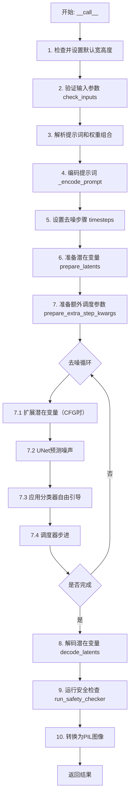
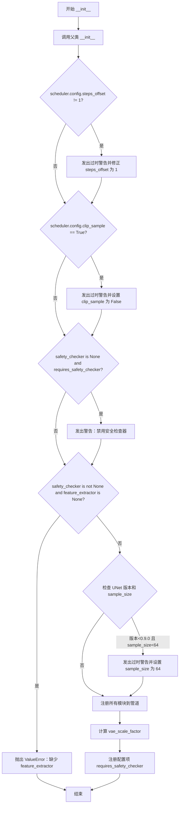
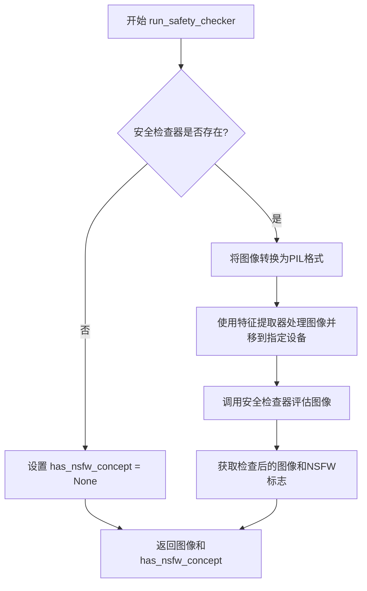
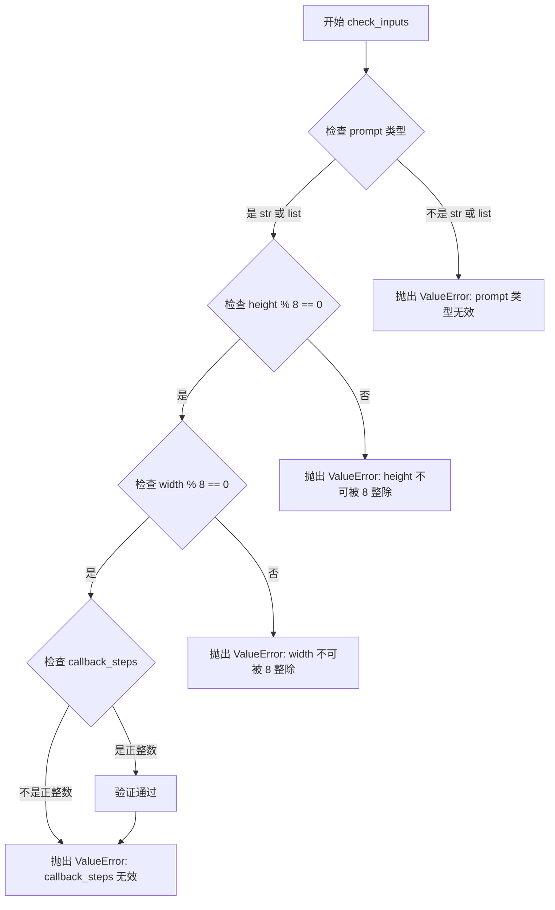

# `diffusers\examples\community\composable_stable_diffusion.py` 详细设计文档

这是一个支持Composable Diffusion的Stable Diffusion流水线实现，通过支持多提示词带权重的组合，实现更灵活的文本到图像生成能力。该流水线继承自DiffusionPipeline，集成了VAE、文本编码器、UNet和多种调度器，并内置了安全检查器来过滤不当内容。

## 整体流程



## 类结构

```
DiffusionPipeline (抽象基类)
└── ComposableStableDiffusionPipeline (实现类)
    └── StableDiffusionMixin (混入类)
```

## 全局变量及字段


### `logger`
    
模块级日志记录器，用于记录警告和信息

类型：`logging.Logger`
    


### `ComposableStableDiffusionPipeline.vae`
    
VAE模型用于编解码图像

类型：`AutoencoderKL`
    


### `ComposableStableDiffusionPipeline.text_encoder`
    
冻结的文本编码器

类型：`CLIPTextModel`
    


### `ComposableStableDiffusionPipeline.tokenizer`
    
CLIP分词器

类型：`CLIPTokenizer`
    


### `ComposableStableDiffusionPipeline.unet`
    
条件U-Net去噪网络

类型：`UNet2DConditionModel`
    


### `ComposableStableDiffusionPipeline.scheduler`
    
去噪调度器

类型：`SchedulerMixin`
    


### `ComposableStableDiffusionPipeline.safety_checker`
    
安全检查器

类型：`StableDiffusionSafetyChecker`
    


### `ComposableStableDiffusionPipeline.feature_extractor`
    
特征提取器

类型：`CLIPImageProcessor`
    


### `ComposableStableDiffusionPipeline.vae_scale_factor`
    
VAE缩放因子

类型：`int`
    


### `ComposableStableDiffusionPipeline._optional_components`
    
可选组件列表

类型：`list`
    
    

## 全局函数及方法


### `ComposableStableDiffusionPipeline.__init__`

该方法是 `ComposableStableDiffusionPipeline` 类的构造函数，负责初始化文本到图像生成管道所需的各个核心组件（VAE、文本编码器、分词器、UNet、调度器、安全检查器等），并对配置进行兼容性检查和调整，确保管道能够正确运行。

参数：

- `vae`：`AutoencoderKL`，Variational Auto-Encoder (VAE) 模型，用于将图像编码和解码到潜在表示空间
- `text_encoder`：`CLIPTextModel`，冻结的文本编码器，Stable Diffusion 使用 CLIP 的文本部分
- `tokenizer`：`CLIPTokenizer`，CLIP 分词器，用于将文本转换为 token
- `unet`：`UNet2DConditionModel`，条件 U-Net 架构，用于对编码后的图像潜在表示进行去噪
- `scheduler`：`Union[DDIMScheduler, PNDMScheduler, LMSDiscreteScheduler, EulerDiscreteScheduler, EulerAncestralDiscreteScheduler, DPMSolverMultistepScheduler]`，调度器，与 unet 结合使用来去噪图像潜在表示
- `safety_checker`：`StableDiffusionSafetyChecker`，分类模块，用于估计生成的图像是否包含不当或有害内容
- `feature_extractor`：`CLIPImageProcessor`，从生成的图像中提取特征以作为 safety_checker 的输入
- `requires_safety_checker`：`bool = True`，是否需要安全检查器

返回值：`None`，构造函数不返回值，仅初始化对象状态

#### 流程图



#### 带注释源码

```python
def __init__(
    self,
    vae: AutoencoderKL,
    text_encoder: CLIPTextModel,
    tokenizer: CLIPTokenizer,
    unet: UNet2DConditionModel,
    scheduler: Union[
        DDIMScheduler,
        PNDMScheduler,
        LMSDiscreteScheduler,
        EulerDiscreteScheduler,
        EulerAncestralDiscreteScheduler,
        DPMSolverMultistepScheduler,
    ],
    safety_checker: StableDiffusionSafetyChecker,
    feature_extractor: CLIPImageProcessor,
    requires_safety_checker: bool = True,
):
    # 调用父类 DiffusionPipeline 的初始化方法
    super().__init__()

    # === 步骤1: 检查并修正调度器的 steps_offset 配置 ===
    # 如果调度器的 steps_offset 不为 1，发出过时警告并修正
    if scheduler is not None and getattr(scheduler.config, "steps_offset", 1) != 1:
        deprecation_message = (
            f"The configuration file of this scheduler: {scheduler} is outdated. `steps_offset`"
            f" should be set to 1 instead of {scheduler.config.steps_offset}. Please make sure "
            "to update the config accordingly as leaving `steps_offset` might led to incorrect results"
            " in future versions. If you have downloaded this checkpoint from the Hugging Face Hub,"
            " it would be very nice if you could open a Pull request for the `scheduler/scheduler_config.json`"
            " file"
        )
        deprecate("steps_offset!=1", "1.0.0", deprecation_message, standard_warn=False)
        # 更新调度器的内部配置字典
        new_config = dict(scheduler.config)
        new_config["steps_offset"] = 1
        scheduler._internal_dict = FrozenDict(new_config)

    # === 步骤2: 检查并修正调度器的 clip_sample 配置 ===
    # 如果 clip_sample 被设置为 True，发出过时警告并设为 False
    if scheduler is not None and getattr(scheduler.config, "clip_sample", False) is True:
        deprecation_message = (
            f"The configuration file of this scheduler: {scheduler} has not set the configuration `clip_sample`."
            " `clip_sample` should be set to False in the configuration file. Please make sure to update the"
            " config accordingly as not setting `clip_sample` in the config might lead to incorrect results in"
            " future versions. If you have downloaded this checkpoint from the Hugging Face Hub, it would be very"
            " nice if you could open a Pull request for the `scheduler/scheduler_config.json` file"
        )
        deprecate("clip_sample not set", "1.0.0", deprecation_message, standard_warn=False)
        new_config = dict(scheduler.config)
        new_config["clip_sample"] = False
        scheduler._internal_dict = FrozenDict(new_config)

    # === 步骤3: 检查安全检查器的配置 ===
    # 如果 safety_checker 为 None 但 requires_safety_checker 为 True，发出警告
    if safety_checker is None and requires_safety_checker:
        logger.warning(
            f"You have disabled the safety checker for {self.__class__} by passing `safety_checker=None`. Ensure"
            " that you abide to the conditions of the Stable Diffusion license and do not expose unfiltered"
            " results in services or applications open to the public. Both the diffusers team and Hugging Face"
            " strongly recommend to keep the safety filter enabled in all public facing circumstances, disabling"
            " it only for use-cases that involve analyzing network behavior or auditing its results. For more"
            " information, please have a look at https://github.com/huggingface/diffusers/pull/254 ."
        )

    # 如果 safety_checker 不为 None 但 feature_extractor 为 None，抛出错误
    if safety_checker is not None and feature_extractor is None:
        raise ValueError(
            "Make sure to define a feature extractor when loading {self.__class__} if you want to use the safety"
            " checker. If you do not want to use the safety checker, you can pass `'safety_checker=None'` instead."
        )

    # === 步骤4: 检查 UNet 的版本和 sample_size 配置 ===
    # 检查 UNet 版本是否小于 0.9.0
    is_unet_version_less_0_9_0 = (
        unet is not None
        and hasattr(unet.config, "_diffusers_version")
        and version.parse(version.parse(unet.config._diffusers_version).base_version) < version.parse("0.9.0.dev0")
    )
    # 检查 UNet 的 sample_size 是否小于 64
    is_unet_sample_size_less_64 = (
        unet is not None and hasattr(unet.config, "sample_size") and unet.config.sample_size < 64
    )
    # 如果同时满足两个条件，发出过时警告并修正 sample_size
    if is_unet_version_less_0_9_0 and is_unet_sample_size_less_64:
        deprecation_message = (
            "The configuration file of the unet has set the default `sample_size` to smaller than"
            " 64 which seems highly unlikely. If your checkpoint is a fine-tuned version of any of the"
            " following: \n- CompVis/stable-diffusion-v1-4 \n- CompVis/stable-diffusion-v1-3 \n-"
            " CompVis/stable-diffusion-v1-2 \n- CompVis/stable-diffusion-v1-1 \n- stable-diffusion-v1-5/stable-diffusion-v1-5"
            " \n- stable-diffusion-v1-5/stable-diffusion-inpainting \n you should change 'sample_size' to 64 in the"
            " configuration file. Please make sure to update the config accordingly as leaving `sample_size=32`"
            " in the config might lead to incorrect results in future versions. If you have downloaded this"
            " checkpoint from the Hugging Face Hub, it would be very nice if you could open a Pull request for"
            " the `unet/config.json` file"
        )
        deprecate("sample_size<64", "1.0.0", deprecation_message, standard_warn=False)
        new_config = dict(unet.config)
        new_config["sample_size"] = 64
        unet._internal_dict = FrozenDict(new_config)

    # === 步骤5: 注册所有模块到管道 ===
    # 将所有组件注册到管道中，使其可以通过管道对象访问
    self.register_modules(
        vae=vae,
        text_encoder=text_encoder,
        tokenizer=tokenizer,
        unet=unet,
        scheduler=scheduler,
        safety_checker=safety_checker,
        feature_extractor=feature_extractor,
    )

    # === 步骤6: 计算 VAE 缩放因子 ===
    # 根据 VAE 的 block_out_channels 计算缩放因子，用于后续图像尺寸计算
    self.vae_scale_factor = 2 ** (len(self.vae.config.block_out_channels) - 1) if getattr(self, "vae", None) else 8

    # === 步骤7: 注册配置项 ===
    # 将 requires_safety_checker 保存到管道配置中
    self.register_to_config(requires_safety_checker=requires_safety_checker)
```


### `ComposableStableDiffusionPipeline._encode_prompt`

该方法负责将文本提示词（prompt）编码为文本编码器（CLIP Text Encoder）的隐藏状态向量（text embeddings），为后续的图像生成提供文本语义特征。同时支持无分类器自由引导（Classifier-Free Guidance）所需的负面提示词嵌入。

参数：

- `prompt`：`Union[str, List[int]]`，要编码的文本提示词，可以是单个字符串或字符串列表
- `device`：`torch.device`，torch计算设备（CPU/CUDA/MPS）
- `num_images_per_prompt`：`int`，每个提示词需要生成的图像数量，用于复制嵌入向量
- `do_classifier_free_guidance`：`bool`，是否启用无分类器自由引导，启用时需要生成负面提示词嵌入
- `negative_prompt`：`Union[str, List[str]]`，负面提示词，用于引导时避免生成不希望的内容

返回值：`torch.Tensor`，形状为`(batch_size * num_images_per_prompt, seq_len, hidden_dim)`的文本嵌入张量，用于后续U-Net去噪过程

#### 流程图

```mermaid
flowchart TD
    A[开始 _encode_prompt] --> B{判断 prompt 类型}
    B -->|list| C[batch_size = len(prompt)]
    B -->|str| D[batch_size = 1]
    C --> E[Tokenizer 编码 prompt]
    D --> E
    E --> F[获取 text_input_ids]
    F --> G[获取 untruncated_ids]
    G --> H{检查截断情况}
    H -->|需要截断| I[记录警告日志]
    H -->|不需要截断| J
    I --> J
    J --> K{检查 use_attention_mask}
    K -->|True| L[获取 attention_mask]
    K -->|False| M[attention_mask = None]
    L --> N[Text Encoder 编码]
    M --> N
    N --> O[提取 text_embeddings[0]]
    O --> P[复制 bs_embed, seq_len]
    P --> Q[View 调整形状]
    Q --> R{do_classifier_free_guidance?}
    R -->|False| Z[返回 text_embeddings]
    R -->|True| S[处理 negative_prompt]
    S --> T{negative_prompt 类型}
    T -->|None| U[uncond_tokens = [''] * batch_size]
    T -->|str| V[uncond_tokens = [negative_prompt]]
    T -->|list| W[uncond_tokens = negative_prompt]
    U --> X[Tokenizer 编码 uncond_tokens]
    V --> X
    W --> X
    X --> Y[Text Encoder 编码 uncond]
    Y --> AA[提取 uncond_embeddings[0]]
    AA --> AB[复制并调整形状]
    AB --> AC[torch.cat 拼接]
    AC --> Z
```

#### 带注释源码

```python
def _encode_prompt(
    self,
    prompt,
    device,
    num_images_per_prompt,
    do_classifier_free_guidance,
    negative_prompt
):
    r"""
    Encodes the prompt into text encoder hidden states.

    Args:
        prompt (`str` or `list(int)`):
            prompt to be encoded
        device: (`torch.device`):
            torch device
        num_images_per_prompt (`int`):
            number of images that should be generated per prompt
        do_classifier_free_guidance (`bool`):
            whether to use classifier free guidance or not
        negative_prompt (`str` or `List[str]`):
            The prompt or prompts not to guide the image generation. Ignored when not using guidance (i.e., ignored
            if `guidance_scale` is less than `1`).
    """
    # 1. 确定批量大小：如果prompt是列表则取其长度，否则默认为1
    batch_size = len(prompt) if isinstance(prompt, list) else 1

    # 2. 使用tokenizer将文本prompt转换为token IDs，设置最大长度并启用截断
    text_inputs = self.tokenizer(
        prompt,
        padding="max_length",
        max_length=self.tokenizer.model_max_length,
        truncation=True,
        return_tensors="pt",
    )
    text_input_ids = text_inputs.input_ids  # 获取输入token IDs
    
    # 3. 获取未截断的token IDs（使用最长padding），用于检测是否发生了截断
    untruncated_ids = self.tokenizer(prompt, padding="longest", return_tensors="pt").input_ids

    # 4. 检查是否发生截断：如果未截断IDs长度大于截断IDs长度且二者不相等
    if untruncated_ids.shape[-1] >= text_input_ids.shape[-1] and not torch.equal(text_input_ids, untruncated_ids):
        # 解码被截断的部分并记录警告
        removed_text = self.tokenizer.batch_decode(untruncated_ids[:, self.tokenizer.model_max_length - 1 : -1])
        logger.warning(
            "The following part of your input was truncated because CLIP can only handle sequences up to"
            f" {self.tokenizer.model_max_length} tokens: {removed_text}"
        )

    # 5. 检查text_encoder配置是否需要attention_mask
    if hasattr(self.text_encoder.config, "use_attention_mask") and self.text_encoder.config.use_attention_mask:
        # 如果配置要求使用attention mask，则将mask移到指定设备
        attention_mask = text_inputs.attention_mask.to(device)
    else:
        attention_mask = None  # 否则设为None

    # 6. 使用CLIP text_encoder编码text_input_ids，获取文本嵌入
    text_embeddings = self.text_encoder(
        text_input_ids.to(device),
        attention_mask=attention_mask,
    )
    # 提取第一项（通常是last_hidden_state）
    text_embeddings = text_embeddings[0]

    # 7. 为每个prompt复制多个文本嵌入（支持生成多张图像）
    # duplicate text embeddings for each generation per prompt, using mps friendly method
    bs_embed, seq_len, _ = text_embeddings.shape  # bs_embed: batch大小, seq_len: 序列长度
    # 重复num_images_per_prompt次
    text_embeddings = text_embeddings.repeat(1, num_images_per_prompt, 1)
    # 重新reshape为 (batch_size * num_images_per_prompt, seq_len, hidden_dim)
    text_embeddings = text_embeddings.view(bs_embed * num_images_per_prompt, seq_len, -1)

    # 8. 如果启用无分类器自由引导，处理negative_prompt
    # get unconditional embeddings for classifier free guidance
    if do_classifier_free_guidance:
        uncond_tokens: List[str]
        
        # 根据negative_prompt的类型和内容确定unconditional tokens
        if negative_prompt is None:
            # 如果没有提供negative_prompt，使用空字符串
            uncond_tokens = [""] * batch_size
        elif type(prompt) is not type(negative_prompt):
            # 类型不匹配时抛出类型错误
            raise TypeError(
                f"`negative_prompt` should be the same type to `prompt`, but got {type(negative_prompt)} !="
                f" {type(prompt)}."
            )
        elif isinstance(negative_prompt, str):
            # 如果negative_prompt是单个字符串，包装为列表
            uncond_tokens = [negative_prompt]
        elif batch_size != len(negative_prompt):
            # batch大小不匹配时抛出值错误
            raise ValueError(
                f"`negative_prompt`: {negative_prompt} has batch size {len(negative_prompt)}, but `prompt`:"
                f" {prompt} has batch size {batch_size}. Please make sure that passed `negative_prompt` matches"
                " the batch size of `prompt`."
            )
        else:
            # negative_prompt是列表
            uncond_tokens = negative_prompt

        # 获取text_input_ids的长度作为max_length
        max_length = text_input_ids.shape[-1]
        
        # Tokenize negative_prompt
        uncond_input = self.tokenizer(
            uncond_tokens,
            padding="max_length",
            max_length=max_length,
            truncation=True,
            return_tensors="pt",
        )

        # 同样处理attention_mask
        if hasattr(self.text_encoder.config, "use_attention_mask") and self.text_encoder.config.use_attention_mask:
            attention_mask = uncond_input.attention_mask.to(device)
        else:
            attention_mask = None

        # 编码negative_prompt获取unconditional embeddings
        uncond_embeddings = self.text_encoder(
            uncond_input.input_ids.to(device),
            attention_mask=attention_mask,
        )
        uncond_embeddings = uncond_embeddings[0]

        # 复制并调整unconditional embeddings的形状
        # duplicate unconditional embeddings for each generation per prompt, using mps friendly method
        seq_len = uncond_embeddings.shape[1]
        uncond_embeddings = uncond_embeddings.repeat(1, num_images_per_prompt, 1)
        uncond_embeddings = uncond_embeddings.view(batch_size * num_images_per_prompt, seq_len, -1)

        # 9. 拼接unconditional和text embeddings以避免两次前向传播
        # For classifier free guidance, we need to do two forward passes.
        # Here we concatenate the unconditional and text embeddings into a single batch
        # to avoid doing two forward passes
        # 拼接后的形状: (2 * batch_size * num_images_per_prompt, seq_len, hidden_dim)
        # 前半部分为unconditional embeddings，后半部分为text embeddings
        text_embeddings = torch.cat([uncond_embeddings, text_embeddings])

    # 10. 返回最终的text embeddings
    return text_embeddings
```


### `ComposableStableDiffusionPipeline.run_safety_checker`

该方法用于对生成的图像进行安全检查，检测是否存在不适合工作内容（NSFW）。如果安全检查器存在，则使用特征提取器处理图像并调用安全检查器进行评估；如果未配置安全检查器，则直接返回原始图像和 None。

参数：

- `image`：`torch.Tensor`，需要进行检查的图像张量，通常是经过解码的潜在图像
- `device`：`torch.device`，执行安全检查的设备（如 CPU 或 CUDA）
- `dtype`：`torch.dtype`，用于安全检查器的数据类型（如 float32）

返回值：`Tuple[torch.Tensor, Optional[List[bool]]]`，返回包含检查后图像和 NSFW 检测结果的元组。第一个元素是处理后的图像张量，第二个元素是检测到的不安全内容标志列表（如果安全检查器启用），否则为 None。

#### 流程图



#### 带注释源码

```python
def run_safety_checker(self, image, device, dtype):
    """
    对生成的图像运行安全检查器，检测是否包含不适合公开的内容。
    
    Args:
        image: 需要检查的图像张量
        device: 执行检查的设备
        dtype: 数据类型
    
    Returns:
        (image, has_nsfw_concept): 检查后的图像和NSFW检测结果
    """
    # 检查安全检查器是否已配置
    if self.safety_checker is not None:
        # 将numpy/张量图像转换为PIL图像供特征提取器使用
        safety_checker_input = self.feature_extractor(
            self.numpy_to_pil(image), 
            return_tensors="pt"
        ).to(device)
        
        # 调用安全检查器模型进行NSFW检测
        # clip_input使用特征提取器提取的特征
        image, has_nsfw_concept = self.safety_checker(
            images=image, 
            clip_input=safety_checker_input.pixel_values.to(dtype)
        )
    else:
        # 如果未配置安全检查器，设置NSFW概念为None
        has_nsfw_concept = None
    
    # 返回处理后的图像和NSFW检测结果
    return image, has_nsfw_concept
```


### `ComposableStableDiffusionPipeline.decode_latents`

该方法将扩散模型去噪后的潜在表示（latents）通过 VAE 解码器转换为实际的图像数据，并对图像进行后处理（归一化和格式转换）以便后续使用。

参数：

- `latents`：`torch.Tensor`，经过扩散模型去噪后的潜在表示，形状为 (batch_size, channels, height, width)

返回值：`numpy.ndarray`，解码后的图像数据，像素值范围 [0, 1]，形状为 (batch_size, height, width, channels)

#### 流程图

```mermaid
flowchart TD
    A[开始 decode_latents] --> B[对 latents 进行缩放: latents = 1/0.18215 * latents]
    B --> C[使用 VAE 解码器解码: image = vae.decode(latents).sample]
    C --> D[图像归一化: image = (image/2 + 0.5).clamp(0, 1)]
    D --> E[转换为 NumPy 数组: image.cpu().permute(0,2,3,1).float().numpy()]
    E --> F[返回图像]
```

#### 带注释源码

```python
def decode_latents(self, latents):
    """
    将 VAE 潜在表示解码为图像

    参数:
        latents: 经过扩散模型去噪后的潜在表示张量

    返回值:
        解码后的图像 NumPy 数组，像素值范围 [0, 1]
    """
    # 步骤 1: 对潜在表示进行缩放
    # 0.18215 是 VAE 训练时使用的缩放因子，需要逆向恢复
    latents = 1 / 0.18215 * latents

    # 步骤 2: 使用 VAE 解码器将潜在表示解码为图像
    # vae.decode() 返回一个包含 sample 属性的输出对象
    image = self.vae.decode(latents).sample

    # 步骤 3: 图像归一化
    # 将图像从 [-1, 1] 范围转换到 [0, 1] 范围
    # 公式: (image / 2 + 0.5) = (image + 1) / 2
    # clamp(0, 1) 确保像素值在 [0, 1] 范围内
    image = (image / 2 + 0.5).clamp(0, 1)

    # 步骤 4: 转换为 NumPy 数组并调整维度顺序
    # .cpu(): 将张量从 GPU 移到 CPU（因为后续需要转换为 NumPy）
    # .permute(0, 2, 3, 1): 将维度顺序从 (B, C, H, W) 转换为 (B, H, W, C)
    # .float(): 转换为 float32 类型，以兼容 bfloat16 并减少潜在问题
    # .numpy(): 转换为 NumPy 数组
    image = image.cpu().permute(0, 2, 3, 1).float().numpy()

    # 返回解码后的图像
    return image
```


### `ComposableStableDiffusionPipeline.prepare_extra_step_kwargs`

该方法用于为调度器（scheduler）的 step 方法准备额外的关键字参数。由于不同的调度器可能有不同的签名（例如只有 DDIMScheduler 使用 eta 参数，部分调度器接受 generator 参数），该方法通过动态检查调度器的签名来构建兼容的参数字典，确保在调用调度器 step 时能够传递正确的参数。

参数：

- `generator`：`torch.Generator | None`，随机数生成器，用于生成确定性噪声。如果为 None，则使用随机噪声。
- `eta`：`float`，DDIM 调度器的 eta 参数（对应 DDIM 论文中的 η），取值范围应为 [0, 1]。对于其他调度器，此参数将被忽略。

返回值：`dict`，包含调度器 step 方法所需的关键字参数字典，可能包含 `eta` 和/或 `generator` 键。

#### 流程图

```mermaid
flowchart TD
    A[开始: prepare_extra_step_kwargs] --> B[获取scheduler.step方法签名]
    B --> C{签名中是否包含eta参数?}
    C -->|是| D[extra_step_kwargs['eta'] = eta]
    C -->|否| E[跳过eta参数]
    D --> F{签名中是否包含generator参数?}
    E --> F
    F -->|是| G[extra_step_kwargs['generator'] = generator]
    F -->|否| H[跳过generator参数]
    G --> I[返回extra_step_kwargs字典]
    H --> I
```

#### 带注释源码

```
def prepare_extra_step_kwargs(self, generator, eta):
    # 准备调度器step方法的额外参数，因为并非所有调度器都有相同的签名
    # eta (η) 仅在DDIMScheduler中使用，其他调度器会忽略它
    # eta对应DDIM论文中的η参数: https://huggingface.co/papers/2010.02502
    # 取值应在[0, 1]范围内

    # 使用inspect模块检查调度器step方法的签名，判断是否接受eta参数
    accepts_eta = "eta" in set(inspect.signature(self.scheduler.step).parameters.keys())
    
    # 初始化额外的关键字参数字典
    extra_step_kwargs = {}
    
    # 如果调度器接受eta参数，则将其添加到extra_step_kwargs
    if accepts_eta:
        extra_step_kwargs["eta"] = eta

    # 检查调度器是否接受generator参数
    accepts_generator = "generator" in set(inspect.signature(self.scheduler.step).parameters.keys())
    
    # 如果调度器接受generator参数，则将其添加到extra_step_kwargs
    if accepts_generator:
        extra_step_kwargs["generator"] = generator
    
    # 返回构建好的参数字典，供调度器step方法使用
    return extra_step_kwargs
```


### `ComposableStableDiffusionPipeline.check_inputs`

该方法用于在调用 Stable Diffusion 管道生成图像之前验证输入参数的有效性，确保 `prompt` 为字符串或列表类型、`height` 和 `width` 为 8 的倍数、以及 `callback_steps` 为正整数，从而在生成开始前捕获并抛出潜在的配置错误。

参数：

- `prompt`：`Union[str, List[str]]`，用户提供的文本提示，可以是单个字符串或字符串列表
- `height`：`int`，生成的图像高度（像素），必须能被 8 整除
- `width`：`int`，生成的图像宽度（像素），必须能被 8 整除
- `callback_steps`：`int`，回调函数被调用的频率步数，必须为正整数

返回值：`None`，该方法不返回任何值，仅通过抛出 `ValueError` 来指示验证失败

#### 流程图



#### 带注释源码

```python
def check_inputs(self, prompt, height, width, callback_steps):
    """
    验证管道输入参数的有效性。
    
    在图像生成之前调用此方法，确保所有输入参数符合管道的预期格式和约束条件。
    如果任何参数无效，将抛出详细的 ValueError 异常以帮助用户定位问题。
    
    参数检查规则：
    1. prompt 必须是字符串或字符串列表
    2. height 和 width 必须是 8 的倍数（由于 VAE 的下采样率）
    3. callback_steps 必须为正整数（用于控制进度回调频率）
    """
    
    # 检查 prompt 参数类型
    # prompt 可以是单个文本提示（str）或多个提示的列表（List[str]）
    if not isinstance(prompt, str) and not isinstance(prompt, list):
        raise ValueError(f"`prompt` has to be of type `str` or `list` but is {type(prompt)}")

    # 检查图像尺寸是否为 8 的倍数
    # Stable Diffusion 使用的 VAE 通常具有 8 倍的下采样率
    # 因此输入尺寸必须能被 8 整除，否则会在解码阶段出错
    if height % 8 != 0 or width % 8 != 0:
        raise ValueError(f"`height` and `width` have to be divisible by 8 but are {height} and {width}.")

    # 检查 callback_steps 参数的有效性
    # callback_steps 控制进度回调函数的调用频率，必须为正整数
    # 如果为 None 或非正整数，则无法正确触发回调机制
    if (callback_steps is None) or (
        callback_steps is not None and (not isinstance(callback_steps, int) or callback_steps <= 0)
    ):
        raise ValueError(
            f"`callback_steps` has to be a positive integer but is {callback_steps} of type"
            f" {type(callback_steps)}."
        )
```


### `ComposableStableDiffusionPipeline.prepare_latents`

该方法用于准备扩散模型的潜在向量（latents），根据指定的批次大小、通道数和图像尺寸生成随机潜在向量，或使用提供的潜在向量，并按照调度器的初始噪声标准差进行缩放。

参数：

- `batch_size`：`int`，生成的图像数量
- `num_channels_latents`：`int`，潜在向量的通道数，通常对应于 UNet 的输入通道数
- `height`：`int`，目标图像的高度（像素）
- `width`：`int`，目标图像的宽度（像素）
- `dtype`：`torch.dtype`，潜在向量的数据类型
- `device`：`torch.device`，潜在向量所在的设备
- `generator`：`torch.Generator | None`，用于生成随机数的确定性生成器
- `latents`：`torch.Tensor | None`，可选的预生成潜在向量，如果提供则使用该向量，否则随机生成

返回值：`torch.Tensor`，准备好的潜在向量，已根据调度器的初始噪声标准差进行缩放

#### 流程图

```mermaid
flowchart TD
    A[开始 prepare_latents] --> B[计算 shape: batch_size, num_channels_latents, height//vae_scale_factor, width//vae_scale_factor]
    B --> C{latents 是否为 None?}
    C -->|是| D{device.type 是否为 'mps'?}
    D -->|是| E[在 CPU 上生成随机 latent, 然后移到 device]
    D -->|否| F[直接在 device 上生成随机 latent]
    E --> G[latents = latents * scheduler.init_noise_sigma]
    F --> G
    C -->|否| H{latents.shape 是否等于预期 shape?}
    H -->|是| I[latents = latents.to(device)]
    H -->|否| J[抛出 ValueError 异常]
    I --> G
    J --> K[结束]
    G --> L[返回 latents]
```

#### 带注释源码

```python
def prepare_latents(
    self,
    batch_size: int,
    num_channels_latents: int,
    height: int,
    width: int,
    dtype: torch.dtype,
    device: torch.device,
    generator: torch.Generator | None,
    latents: torch.Tensor | None = None,
):
    """
    准备扩散模型的潜在向量（latents）
    
    参数:
        batch_size: 批次大小，即一次生成的图像数量
        num_channels_latents: 潜在向量通道数，对应 UNet.config.in_channels
        height: 生成图像的高度（像素）
        width: 生成图像的宽度（像素）
        dtype: 潜在向量的数据类型
        device: 设备（CPU/CUDA/MPS）
        generator: 可选的随机生成器，用于确定性生成
        latents: 可选的预生成潜在向量，为 None 时自动生成
    
    返回:
        准备好的潜在向量，已按调度器初始噪声标准差缩放
    """
    # 计算潜在向量的形状，考虑 VAE 缩放因子
    # VAE 会将图像下采样 vae_scale_factor 倍，因此潜在向量尺寸 = 图像尺寸 / vae_scale_factor
    shape = (
        batch_size,
        num_channels_latents,
        int(height) // self.vae_scale_factor,
        int(width) // self.vae_scale_factor,
    )
    
    # 如果没有提供预生成的潜在向量，则随机生成
    if latents is None:
        # MPS 设备上的随机数生成不可重现，需要特殊处理
        if device.type == "mps":
            # randn does not work reproducibly on mps
            # 在 CPU 上生成然后移到 MPS 设备
            latents = torch.randn(shape, generator=generator, device="cpu", dtype=dtype).to(device)
        else:
            # 直接在目标设备上生成随机潜在向量
            latents = torch.randn(shape, generator=generator, device=device, dtype=dtype)
    else:
        # 验证提供的潜在向量形状是否匹配预期
        if latents.shape != shape:
            raise ValueError(f"Unexpected latents shape, got {latents.shape}, expected {shape}")
        # 将潜在向量移动到指定设备
        latents = latents.to(device)

    # 根据调度器的要求缩放初始噪声
    # 不同调度器对噪声的缩放要求不同（如 DDIM 使用不同的 sigma）
    # scale the initial noise by the standard deviation required by the scheduler
    latents = latents * self.scheduler.init_noise_sigma
    
    return latents
```


### `ComposableStableDiffusionPipeline.__call__`

该方法是可组合Stable Diffusion管道的主入口函数，用于根据文本提示生成图像。支持多提示组合（通过`|`分隔）和权重控制，以及常见的文本到图像生成参数如推理步数、引导_scale、负提示等。

参数：

- `prompt`：`Union[str, List[str]]`，引导图像生成的提示词或提示词列表
- `height`：`Optional[int]`，生成图像的高度（像素），默认为`self.unet.config.sample_size * self.vae_scale_factor`
- `width`：`Optional[int]`，生成图像的宽度（像素），默认为`self.unet.config.sample_size * self.vae_scale_factor`
- `num_inference_steps`：`int`，去噪步数，默认为50，步数越多图像质量通常越高但推理越慢
- `guidance_scale`：`float`，无分类器自由引导_scale，默认为7.5，用于控制生成图像与提示词的相关性
- `negative_prompt`：`Optional[Union[str, List[str]]]`，不引导图像生成的提示词，在不使用引导时忽略
- `num_images_per_prompt`：`int`，每个提示词生成的图像数量，默认为1
- `eta`：`float`，DDIM论文中的η参数，仅适用于DDIM调度器，默认为0.0
- `generator`：`torch.Generator | None`，用于使生成确定性的随机生成器
- `latents`：`Optional[torch.Tensor]`，预生成的噪声潜在向量，用于图像生成
- `output_type`：`str | None`，生成图像的输出格式，可选"pil"或np.array，默认为"pil"
- `return_dict`：`bool`，是否返回`StableDiffusionPipelineOutput`对象，默认为True
- `callback`：`Optional[Callable[[int, int, torch.Tensor], None]]`，每`callback_steps`步调用的回调函数
- `callback_steps`：`int`，回调函数被调用的频率，默认为1
- `weights`：`str | None`，多提示组合时各提示的权重，用`|`分隔，默认为空字符串

返回值：`StableDiffusionPipelineOutput`，包含生成的图像列表和NSFW内容检测布尔列表的输出对象；若`return_dict`为False，则返回元组`(images, has_nsfw_concept)`

#### 流程图

```mermaid
flowchart TD
    A[开始 __call__] --> B[设置默认高度和宽度]
    B --> C{检查输入参数有效性}
    C -->|失败| Z[抛出 ValueError]
    C -->|成功| D[定义批次大小和执行设备]
    D --> E{判断是否使用分类器自由引导}
    E -->|否| F[weights = guidance_scale]
    E -->|是| G{检查prompt中是否包含|}
    G -->|是| H[解析多提示及权重]
    G -->|否| F
    H --> I[编码输入提示词到文本嵌入]
    F --> I
    I --> J[设置去噪调度器的时间步]
    J --> K[准备潜在变量latents]
    K --> L{检查是否为单提示列表}
    L -->|是| M[移除额外无条件嵌入]
    L -->|否| N[准备额外调度器参数]
    M --> N
    N --> O[初始化进度条]
    O --> P[进入去噪循环 for each timestep t]
    P --> Q{执行分类器自由引导}
    Q -->|是| R[扩展latents]
    Q -->|否| S[预测噪声残差]
    R --> S
    S --> T[多提示噪声预测]
    T --> U{执行引导}
    U -->|是| V[计算加权噪声预测]
    U -->|否| W[直接使用噪声预测]
    V --> W
    W --> X[调度器执行一步去噪]
    X --> Y{检查是否为最后一步或需要回调}
    Y -->|是| P1[调用回调函数]
    Y -->|否| P2[更新进度条]
    P1 --> P2
    P2 --> P3{循环是否结束}
    P3 -->|否| P
    P3 -->|是| P4[后处理解码潜在变量]
    P4 --> P5[运行安全检查器]
    P5 --> P6{output_type是否为pil}
    P6 -->|是| P7[转换为PIL图像]
    P6 -->|否| P8[保持numpy数组]
    P7 --> P9{return_dict是否为True}
    P8 --> P9
    P9 -->|是| P10[返回 StableDiffusionPipelineOutput]
    P9 -->|否| P11[返回元组]
    P10 --> END[结束]
    P11 --> END
```

#### 带注释源码

```python
@torch.no_grad()
def __call__(
    self,
    prompt: Union[str, List[str]],
    height: Optional[int] = None,
    width: Optional[int] = None,
    num_inference_steps: int = 50,
    guidance_scale: float = 7.5,
    negative_prompt: Optional[Union[str, List[str]]] = None,
    num_images_per_prompt: Optional[int] = 1,
    eta: float = 0.0,
    generator: torch.Generator | None = None,
    latents: Optional[torch.Tensor] = None,
    output_type: str | None = "pil",
    return_dict: bool = True,
    callback: Optional[Callable[[int, int, torch.Tensor], None]] = None,
    callback_steps: int = 1,
    weights: str | None = "",
):
    r"""
    Function invoked when calling the pipeline for generation.

    Args:
        prompt (`str` or `List[str]`):
            The prompt or prompts to guide the image generation.
        height (`int`, *optional*, defaults to self.unet.config.sample_size * self.vae_scale_factor):
            The height in pixels of the generated image.
        width (`int`, *optional*, defaults to self.unet.config.sample_size * self.vae_scale_factor):
            The width in pixels of the generated image.
        num_inference_steps (`int`, *optional*, defaults to 50):
            The number of denoising steps. More denoising steps usually lead to a higher quality image at the
            expense of slower inference.
        guidance_scale (`float`, *optional*, defaults to 5.0):
            Guidance scale as defined in [Classifier-Free Diffusion Guidance](https://huggingface.co/papers/2207.12598).
            `guidance_scale` is defined as `w` of equation 2. of [Imagen
            Paper](https://huggingface.co/papers/2205.11487). Guidance scale is enabled by setting `guidance_scale >
            1`. Higher guidance scale encourages to generate images that are closely linked to the text `prompt`,
            usually at the expense of lower image quality.
        negative_prompt (`str` or `List[str]`, *optional*):
            The prompt or prompts not to guide the image generation. Ignored when not using guidance (i.e., ignored
            if `guidance_scale` is less than `1`).
        num_images_per_prompt (`int`, *optional*, defaults to 1):
            The number of images to generate per prompt.
        eta (`float`, *optional*, defaults to 0.0):
            Corresponds to parameter eta (η) in the DDIM paper: https://huggingface.co/papers/2010.02502. Only applies to
            [`schedulers.DDIMScheduler`], will be ignored for others.
        generator (`torch.Generator`, *optional*):
            A [torch generator](https://pytorch.org/docs/stable/generated/torch.Generator.html) to make generation
            deterministic.
        latents (`torch.Tensor`, *optional*):
            Pre-generated noisy latents, sampled from a Gaussian distribution, to be used as inputs for image
            generation. Can be used to tweak the same generation with different prompts. If not provided, a latents
            tensor will be generated by sampling using the supplied random `generator`.
        output_type (`str`, *optional*, defaults to `"pil"`):
            The output format of the generate image. Choose between
            [PIL](https://pillow.readthedocs.io/en/stable/): `PIL.Image.Image` or `np.array`.
        return_dict (`bool`, *optional*, defaults to `True`):
            Whether or not to return a [`~pipelines.stable_diffusion.StableDiffusionPipelineOutput`] instead of a
            plain tuple.
        callback (`Callable`, *optional*):
            A function that will be called every `callback_steps` steps during inference. The function will be
            called with the following arguments: `callback(step: int, timestep: int, latents: torch.Tensor)`.
        callback_steps (`int`, *optional*, defaults to 1):
            The frequency at which the `callback` function will be called. If not specified, the callback will be
            called at every step.

    Returns:
        [`~pipelines.stable_diffusion.StableDiffusionPipelineOutput`] or `tuple`:
        [`~pipelines.stable_diffusion.StableDiffusionPipelineOutput`] if `return_dict` is True, otherwise a `tuple.
        When returning a tuple, the first element is a list with the generated images, and the second element is a
        list of `bool`s denoting whether the corresponding generated image likely represents "not-safe-for-work"
        (nsfw) content, according to the `safety_checker`.
    """
    # 0. Default height and width to unet
    # 根据unet配置设置默认的高度和宽度，使用vae_scale_factor进行缩放
    height = height or self.unet.config.sample_size * self.vae_scale_factor
    width = width or self.unet.config.sample_size * self.vae_scale_factor

    # 1. Check inputs. Raise error if not correct
    # 验证输入参数的有效性，包括prompt类型、高度宽度可被8整除、callback_steps为正整数
    self.check_inputs(prompt, height, width, callback_steps)

    # 2. Define call parameters
    # 确定批次大小：如果prompt是字符串则批次为1，否则为列表长度
    batch_size = 1 if isinstance(prompt, str) else len(prompt)
    # 获取执行设备（CPU/CUDA/MPS等）
    device = self._execution_device
    # here `guidance_scale` is defined analog to the guidance weight `w` of equation (2)
    # of the Imagen paper: https://huggingface.co/papers/2205.11487 . `guidance_scale = 1`
    # corresponds to doing no classifier free guidance.
    # 判断是否启用分类器自由引导（CFG）：当guidance_scale > 1.0时启用
    do_classifier_free_guidance = guidance_scale > 1.0

    # 3. Handle composable diffusion (multiple prompts with weights)
    # 处理可组合扩散：检查prompt中是否包含|分隔符（多提示组合）
    if "|" in prompt:
        # 使用|分割提示词并去除空白
        prompt = [x.strip() for x in prompt.split("|")]
        print(f"composing {prompt}...")

        if not weights:
            # 如果未指定权重，使用相等的正权重（联合）
            # 为每个提示创建权重张量，形状为(-1, 1, 1, 1)用于广播
            print("using equal positive weights (conjunction) for all prompts...")
            weights = torch.tensor([guidance_scale] * len(prompt), device=self.device).reshape(-1, 1, 1, 1)
        else:
            # 解析用户指定的权重字符串
            num_prompts = len(prompt) if isinstance(prompt, list) else 1
            weights = [float(w.strip()) for w in weights.split("|")]
            # 如果权重数量少于提示数量，用guidance_scale填充
            if len(weights) < num_prompts:
                weights.append(guidance_scale)
            else:
                weights = weights[:num_prompts]
            # 验证权重数量与提示数量一致
            assert len(weights) == len(prompt), "weights specified are not equal to the number of prompts"
            # 转换为张量并reshape为适合广播的形状
            weights = torch.tensor(weights, device=self.device).reshape(-1, 1, 1, 1)
    else:
        # 单提示情况：weights直接使用guidance_scale
        weights = guidance_scale

    # 4. Encode input prompt
    # 将文本提示编码为文本嵌入向量
    text_embeddings = self._encode_prompt(
        prompt, device, num_images_per_prompt, do_classifier_free_guidance, negative_prompt
    )

    # 5. Prepare timesteps
    # 设置去噪调度器的时间步
    self.scheduler.set_timesteps(num_inference_steps, device=device)
    timesteps = self.scheduler.timesteps

    # 6. Prepare latent variables
    # 获取UNet的输入通道数，通常为4（RGB+alpha latent）
    num_channels_latents = self.unet.config.in_channels
    # 准备潜在变量：生成随机噪声或使用提供的latents
    latents = self.prepare_latents(
        batch_size * num_images_per_prompt,
        num_channels_latents,
        height,
        width,
        text_embeddings.dtype,
        device,
        generator,
        latents,
    )

    # 7. Composable diffusion: handle list prompt with batch_size==1
    # 可组合扩散特殊处理：当提示为列表但批次大小为1时
    if isinstance(prompt, list) and batch_size == 1:
        # 移除额外的无条件嵌入以对齐
        # N = 一个无条件嵌入 + 条件嵌入
        text_embeddings = text_embeddings[len(prompt) - 1:]

    # 8. Prepare extra step kwargs. TODO: Logic should ideally just be moved out of the pipeline
    # 准备调度器的额外参数（如eta和generator）
    extra_step_kwargs = self.prepare_extra_step_kwargs(generator, eta)

    # 9. Denoising loop
    # 计算预热步数（总步数减去实际推理步数乘以调度器阶数）
    num_warmup_steps = len(timesteps) - num_inference_steps * self.scheduler.order
    # 初始化进度条
    with self.progress_bar(total=num_inference_steps) as progress_bar:
        # 遍历每个时间步进行去噪
        for i, t in enumerate(timesteps):
            # expand the latents if we are doing classifier free guidance
            # 如果使用CFG，需要复制latents以同时处理有条件和无条件预测
            latent_model_input = torch.cat([latents] * 2) if do_classifier_free_guidance else latents
            # 调度器缩放模型输入
            latent_model_input = self.scheduler.scale_model_input(latent_model_input, t)

            # predict the noise residual
            # 对每个提示分别预测噪声残差（可组合扩散核心逻辑）
            noise_pred = []
            for j in range(text_embeddings.shape[0]):
                noise_pred.append(
                    self.unet(latent_model_input[:1], t, encoder_hidden_states=text_embeddings[j : j + 1]).sample
                )
            # 合并所有提示的噪声预测
            noise_pred = torch.cat(noise_pred, dim=0)

            # perform guidance
            # 执行分类器自由引导
            if do_classifier_free_guidance:
                # 分离无条件预测和条件预测
                noise_pred_uncond, noise_pred_text = noise_pred[:1], noise_pred[1:]
                # 加权组合：使用权重对各提示的预测进行加权求和
                noise_pred = noise_pred_uncond + (weights * (noise_pred_text - noise_pred_uncond)).sum(
                    dim=0, keepdims=True
                )

            # compute the previous noisy sample x_t -> x_t-1
            # 调度器执行去噪步骤：从x_t计算x_{t-1}
            latents = self.scheduler.step(noise_pred, t, latents, **extra_step_kwargs).prev_sample

            # call the callback, if provided
            # 在特定步骤调用回调函数（最后一步或预热后每order步）
            if i == len(timesteps) - 1 or ((i + 1) > num_warmup_steps and (i + 1) % self.scheduler.order == 0):
                progress_bar.update()
                if callback is not None and i % callback_steps == 0:
                    step_idx = i // getattr(self.scheduler, "order", 1)
                    callback(step_idx, t, latents)

    # 10. Post-processing
    # 后处理：将潜在变量解码为图像
    image = self.decode_latents(latents)

    # 11. Run safety checker
    # 运行安全检查器检测NSFW内容
    image, has_nsfw_concept = self.run_safety_checker(image, device, text_embeddings.dtype)

    # 12. Convert to PIL
    # 根据output_type转换图像格式
    if output_type == "pil":
        image = self.numpy_to_pil(image)

    # 13. Return output
    if not return_dict:
        return (image, has_nsfw_concept)

    # 返回结构化输出对象
    return StableDiffusionPipelineOutput(images=image, nsfw_content_detected=has_nsfw_concept)
```

## 关键组件


### 张量索引与惰性加载

该组件通过张量切片实现Composable Diffusion功能，在去噪循环中对每个提示分别进行噪声预测。通过`text_embeddings[j : j + 1]`的单步索引方式，实现了对多个提示的惰性处理，避免一次性加载所有提示到内存中。

### 反量化支持

`decode_latents`方法实现了潜在变量的反量化功能，将潜在空间的值反缩放回像素空间。具体实现为`latents = 1 / 0.18215 * latents`，这是Stable Diffusion的标准缩放因子，随后通过VAE解码器将潜在向量转换为图像。

### 量化策略（Composable Diffusion）

这是该管道的核心创新功能，支持通过"|"符号分隔多个提示词，并允许为每个提示指定独立的引导权重。在`__call__`方法中解析提示词和权重，然后在去噪循环中分别对每个提示进行噪声预测，最后通过加权求和实现多提示的组合引导生成。

### 提示编码模块

`_encode_prompt`方法负责将文本提示转换为文本嵌入向量，支持批量处理、分类器自由引导（CFG）和负向提示。该模块处理了CLIP tokenizer的序列长度限制，并实现了无条件嵌入的生成以支持CFG机制。

### 安全检查器

`run_safety_checker`方法在图像生成后执行NSFW内容检测，使用CLIP图像处理器提取特征并通过StableDiffusionSafetyChecker进行评估，返回检测结果和过滤后的图像。

### 潜在变量准备

`prepare_latents`方法负责初始化或验证潜在变量张量，确保其形状符合模型要求，并根据调度器的初始噪声sigma进行缩放。对于MPS设备特别处理了随机数生成的可重现性问题。

### 调度器集成

`prepare_extra_step_kwargs`方法通过反射检查调度器的签名参数，动态准备额外参数如eta和generator，确保与不同类型的调度器（如DDIM、DPM等）兼容。

### 图像后处理

`decode_latents`之后的图像处理流程包括：将图像从[-1,1]范围clamp到[0,1]，转换为float32格式，并可选地将numpy数组转换为PIL图像。


## 问题及建议


### 已知问题

-   **字符串分割prompt缺乏清晰设计**：使用`|`字符分割prompt的方式与标准接口不一致，且在`__call__`中直接修改输入参数，缺乏清晰的API设计。
-   **权重处理逻辑复杂且易出错**：在denoising循环中，权重处理包含硬编码切片`text_embeddings[len(prompt) - 1:]`，逻辑晦涩难懂，容易导致边界情况错误。
-   **重复代码模式**：`inspect.signature`检查scheduler参数在多处出现（`prepare_extra_step_kwargs`），且attention_mask处理逻辑在`_encode_prompt`中重复。
-   **类型提示不完整**：部分方法参数如`latents`在`prepare_latents`中缺少完整类型提示，`weights`参数类型为`str | None`但实际处理中涉及复杂类型转换。
-   **MPS设备特殊处理硬编码**：对`"mps"`设备的特殊处理直接嵌入在`prepare_latents`方法中，缺乏设备抽象层。
-   **错误信息不够具体**：部分错误检查仅验证类型而未提供足够上下文，如`check_inputs`中对callback_steps的检查。
-   **Composable diffusion逻辑不够通用**：当前实现假设特定的数据布局，对prompt列表与batch_size关系的处理缺乏灵活性。

### 优化建议

-   **重构权重计算逻辑**：将多prompt权重计算提取为独立方法，使用更清晰的数据结构（如字典或专用类）管理prompt-weight映射关系。
-   **提取设备检测抽象**：创建设备类型检测工具方法，将MPS、CUDA等特殊处理统一管理。
-   **统一Deprecation处理**：将重复的deprecation警告逻辑提取为工具函数，减少代码冗余。
-   **增强类型提示**：为所有公共方法参数和返回值添加完整的类型注解，提升代码可维护性。
-   **改进API设计**：考虑将composable diffusion功能通过明确的配置参数或单独的方法暴露，而非通过字符串解析隐式实现。
-   **优化scheduler参数检测**：使用更优雅的方式处理不同scheduler的兼容性，如基于协议的接口抽象。
-   **添加更多边界检查**：在多prompt场景下增加更多运行时验证，确保数据一致性。


## 其它


### 设计目标与约束

本Pipeline的设计目标是实现可组合的Stable Diffusion文本到图像生成能力，支持通过"|"分隔符组合多个提示词并为每个提示词指定独立的权重，以实现更灵活的条件图像生成。核心约束包括：1) 高度和宽度必须能被8整除；2) callback_steps必须为正整数；3) 提示词类型必须为字符串或字符串列表；4) 负提示词与提示词类型必须一致；5) 批处理大小必须匹配。

### 错误处理与异常设计

代码中包含多个关键的错误检查和异常处理逻辑：1) TypeError - 当negative_prompt类型与prompt类型不一致时抛出；2) ValueError - 当批处理大小不匹配、latents形状不符合预期、height/width不能被8整除、callback_steps不是正整数时抛出；3) ValueError - 当safety_checker不为None但feature_extractor为None时抛出；4) 警告日志 - 当safety_checker被禁用、CLIPtokenizer截断文本、scheduler配置过时、unet sample_size小于64时发出警告。

### 数据流与状态机

Pipeline的完整数据流如下：1) 输入prompt和负提示词；2) _encode_prompt编码文本为text_embeddings；3) scheduler设置时间步；4) prepare_latents准备初始噪声latents；5) Denoising Loop：对每个时间步执行UNet预测噪声、计算加权噪声预测、scheduler.step更新latents；6) decode_latents将latents解码为图像；7) run_safety_checker进行安全检查；8) numpy_to_pil转换为PIL图像；9) 输出StableDiffusionPipelineOutput。

### 外部依赖与接口契约

主要依赖组件包括：1) VAE (AutoencoderKL) - 图像编解码；2) Text Encoder (CLIPTextModel) + Tokenizer (CLIPTokenizer) - 文本编码；3) UNet2DConditionModel - 条件去噪；4) Scheduler (DDIMScheduler/PNDMScheduler/LMSDiscreteScheduler/EulerDiscreteScheduler等) - 噪声调度；5) StableDiffusionSafetyChecker + CLIPImageProcessor - 安全审查。所有组件通过DiffusionPipeline的register_modules方法注册，支持动态替换。

### 配置信息

Pipeline配置包含：1) requires_safety_checker - 是否启用安全检查器；2) vae_scale_factor - 基于VAE block_out_channels计算；3) _optional_components - 可选组件列表包括safety_checker和feature_extractor；4) 调度器配置检查包括steps_offset必须为1、clip_sample必须为False；5) UNet配置检查包括_diffusers_version和sample_size。

### 性能考虑

性能优化点包括：1) 使用torch.no_grad()装饰器禁用梯度计算；2) MPS设备特殊处理 - 使用CPU生成随机数后移至MPS；3) classifier-free guidance通过单次前向传播实现（拼接unconditional和text embeddings）；4) 权重预计算 - 将weights张量预先reshape为(-1, 1, 1, 1)以避免循环中重复计算；5) GPU内存管理 - 图像最终转换到CPU使用float32。

### 安全与审查

安全机制通过StableDiffusionSafetyChecker实现NSFW内容检测，feature_extractor提取图像特征用于安全检查。当safety_checker被禁用时，系统会发出警告提醒遵守Stable Diffusion许可协议。run_safety_checker返回图像和has_nsfw_concept标志，最终封装在StableDiffusionPipelineOutput的nsfw_content_detected字段中。

### 线程安全与并发

代码本身不包含显式的线程同步机制。由于PyTorch操作通常不是线程安全的，在多线程环境下共享同一Pipeline实例时需要外部同步。建议每个线程使用独立的Pipeline实例或通过锁保护共享实例的调用。generator参数可用于支持可重现的确定性生成。

### 版本兼容性

版本兼容性检查包括：1) UNet _diffusers_version检查 - 版本低于0.9.0时警告；2) sample_size检查 - 小于64时建议改为64；3) scheduler配置兼容性通过inspect.signature动态检查step方法参数（eta、generator）；4) 依赖版本检查使用packaging.version。

### 内存管理

内存管理策略：1) 中间张量及时释放 - 超过范围的text_embeddings通过切片移除；2) CPU-GPU数据传输优化 - 最终图像转换到CPU的numpy数组；3) 梯度禁用 - @torch.no_grad()减少梯度内存占用；4) latents按需生成 - 支持外部传入latents避免重复分配。

### 扩展点与定制化

Pipeline提供多个扩展点：1) 自定义Scheduler - 通过scheduler参数传入任意实现SchedulerMixin的调度器；2) 自定义Safety Checker - 可替换或禁用safety_checker；3) Callback机制 - 通过callback和callback_steps自定义推理过程监控；4) Latents注入 - 支持传入预生成的latents实现图像到图像的转换；5) 输出格式 - 支持pil、numpy等多种输出类型。


    