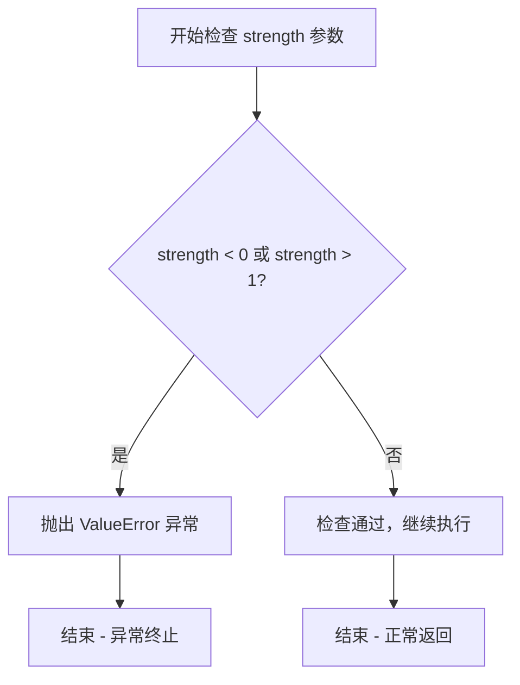
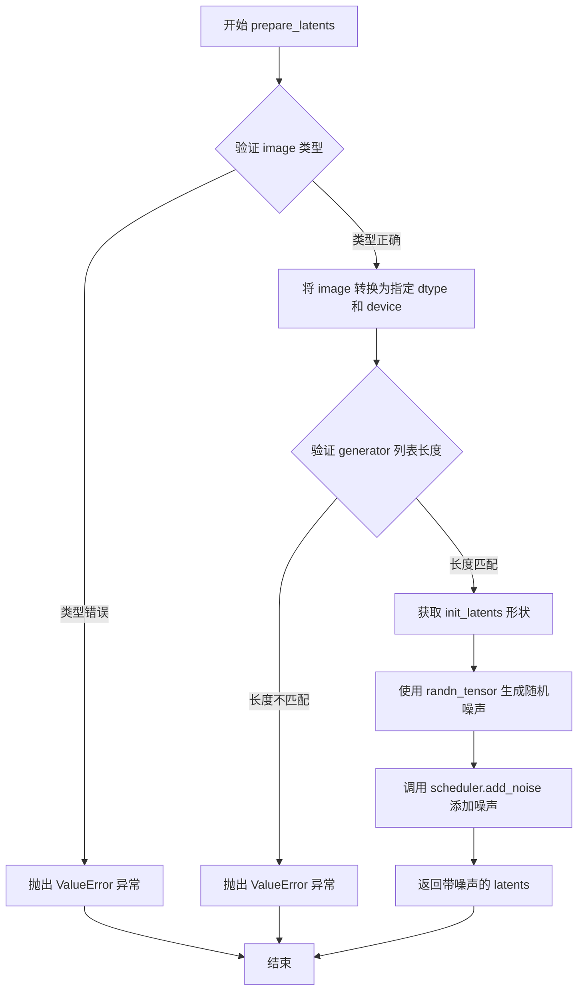
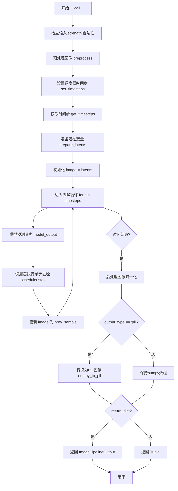

# `diffusers\examples\community\ddim_noise_comparative_analysis.py` 详细设计文档

这是一个基于DDIM调度器的噪声比较分析扩散管道，用于对图像进行去噪处理并比较不同噪声水平下的处理效果。管道继承自DiffusionPipeline，通过U-Net模型预测噪声并逐步去噪，支持可调节的噪声强度、批量生成、多种输出格式，适用于图像生成、图像修复、图像增强等场景。

## 整体流程

```mermaid
graph TD
    A[开始] --> B[检查输入参数 strength]
B --> C{strength 在 [0,1] 范围内?}
C -- 否 --> D[抛出 ValueError]
C -- 是 --> E[预处理图像]
E --> F[设置调度器时间步]
F --> G[获取时间步和推理步数]
G --> H[准备潜在变量]
H --> I[去噪循环]
I --> J{时间步迭代完成?}
J -- 否 --> K[U-Net预测噪声]
K --> L[调度器计算上一步图像]
L --> I
J -- 是 --> M[后处理图像]
M --> N{output_type == 'pil'?}
N -- 是 --> O[转换为PIL图像]
N -- 否 --> P[保持numpy数组]
O --> Q[返回结果]
P --> Q
```

## 类结构

```
DiffusionPipeline (基类)
└── DDIMNoiseComparativeAnalysisPipeline (继承自DiffusionPipeline)
```

## 全局变量及字段


### `trans`
    
图像预处理转换管道，包含Resize、ToTensor、Normalize操作

类型：`transforms.Compose`
    


### `preprocess`
    
将PIL图像或图像列表预处理为PyTorch张量格式

类型：`function`
    


### `DDIMNoiseComparativeAnalysisPipeline.unet`
    
U-Net模型，用于去噪图像

类型：`UNet2DModel`
    


### `DDIMNoiseComparativeAnalysisPipeline.scheduler`
    
DDIM调度器，控制去噪过程

类型：`DDIMScheduler`
    
    

## 全局函数及方法


### `preprocess`

该函数是图像预处理的工具函数，负责将多种格式的输入图像（`torch.Tensor` 或 `PIL.Image.Image`）统一转换为标准化的张量格式，包括图像尺寸调整为 256x256、转换为张量以及进行归一化处理。

参数：

- `image`：`Union[torch.Tensor, PIL.Image.Image, List[PIL.Image.Image]]`，输入图像，可以是单个 PIL 图像、图像列表或已处理的张量

返回值：`torch.Tensor`，返回标准化后的图像张量，形状为 (B, C, H, W)，其中 B 为批量大小，C=3，H=W=256

#### 流程图

```mermaid
flowchart TD
    A[开始: 输入 image] --> B{判断 image 类型}
    B -->|torch.Tensor| C[直接返回原张量]
    B -->|PIL.Image.Image| D[转换为列表]
    B -->|list| E[继续处理]
    
    D --> E
    E --> F[遍历图像列表]
    F --> G[转换为RGB格式]
    G --> H[应用变换: Resize(256,256)]
    H --> I[转换为张量]
    I --> J[归一化: Normalize mean=0.5, std=0.5]
    J --> K[收集到列表]
    K --> L{所有图像处理完成?}
    L -->|否| F
    L -->|是| M[torch.stack 堆叠成批量张量]
    M --> N[返回处理后的张量]
    
    style C fill:#90EE90
    style N fill:#90EE90
```

#### 带注释源码

```python
def preprocess(image):
    """
    预处理输入图像，转换为标准化张量格式
    
    处理流程：
    1. 如果输入已经是 torch.Tensor，直接返回
    2. 如果是单个 PIL.Image，转为列表处理
    3. 对每个图像执行：Resize -> ToTensor -> Normalize
    4. 将处理后的图像堆叠为批量张量
    """
    # 如果输入已经是张量，直接返回（可能是之前处理的中间结果）
    if isinstance(image, torch.Tensor):
        return image
    # 如果是单个 PIL 图像，转换为列表以便统一处理
    elif isinstance(image, PIL.Image.Image):
        image = [image]

    # 对列表中的每个图像应用变换管道
    # trans 定义为: Resize(256,256) -> ToTensor() -> Normalize([0.5], [0.5])
    image = [trans(img.convert("RGB")) for img in image]
    
    # 将图像列表堆叠为批量张量，形状: (B, 3, 256, 256)
    image = torch.stack(image)
    return image
```

#### 关键组件信息

| 组件名称 | 描述 |
|---------|------|
| `trans` | `torchvision.transforms.Compose` 变换管道，组合 Resize、ToTensor、Normalize 三个操作 |
| `transforms.Resize((256, 256))` | 将图像调整为 256x256 像素 |
| `transforms.ToTensor()` | 将 PIL 图像转换为 PyTorch 张量，像素值归一化到 [0, 1] |
| `transforms.Normalize([0.5], [0.5])` | 标准化处理，将像素值从 [0, 1] 映射到 [-1, 1] |

#### 潜在的技术债务或优化空间

1. **缺乏输入验证**：未检查图像列表是否为空，可能导致后续处理出错
2. **硬编码的图像尺寸**：256x256 是硬编码的，应该考虑作为参数传入以提高灵活性
3. **归一化参数硬编码**：mean=[0.5] 和 std=[0.5] 固定，对于彩色图像应支持 3 通道的归一化参数
4. **缺少类型提示**：函数参数和返回值缺少明确的类型注解（虽然调用时可以推断）
5. **错误处理不足**：未对损坏的图像文件或无效输入提供清晰的错误信息
6. **重复转换开销**：每次调用都会创建新的转换管道对象，应该复用全局的 `trans` 对象

#### 其它项目

**设计目标与约束：**
- 输入支持：`torch.Tensor`（直接透传）、`PIL.Image.Image`（单张）、`List[PIL.Image.Image]`（批量）
- 输出格式：标准化张量，形状 (B, C, H, W)，值域 [-1, 1]
- 设计原则：最小化不必要的计算，对于已处理的张量直接透传

**错误处理与异常设计：**
- 当前未对空列表、损坏图像、无效类型进行显式检查
- 建议添加：如果 `len(image) == 0` 应抛出明确的 `ValueError`
- 建议添加：对列表元素类型进行验证，确保都是 PIL.Image.Image 类型

**数据流与状态机：**
```
Raw Input (PIL/ Tensor/ List)
         ↓
    Type Check
         ↓
    Convert to List if needed
         ↓
    Map: PIL → RGB → Resize → Tensor → Normalize
         ↓
    Stack to Batch Tensor
         ↓
    Output: (B, 3, 256, 256) Tensor
```

**外部依赖与接口契约：**
- 依赖 `torch` 和 `torchvision.transforms`
- 依赖 `PIL.Image`
- 调用方需确保输入图像的通道数与转换管道兼容
- 返回的张量可直接用于后续的 `prepare_latents` 或模型推理


### `DDIMNoiseComparativeAnalysisPipeline.__init__`

初始化DDIM噪声比较分析管道，注册UNet模型和调度器，确保调度器可以转换为DDIMScheduler格式，以便进行后续的噪声分析和去噪操作。

参数：

- `self`：隐式参数，DDIMNoiseComparativeAnalysisPipeline实例本身
- `unet`：`UNet2DModel`，U-Net架构，用于对编码图像进行去噪
- `scheduler`：`SchedulerMixin`，调度器，与unet一起用于去噪编码图像，可以是DDPMScheduler或DDIMScheduler

返回值：`None`，构造函数没有显式返回值

#### 流程图

```mermaid
flowchart TD
    A[开始 __init__] --> B[调用父类构造函数 super().__init__]
    B --> C{检查scheduler是否为DDIMScheduler}
    C -->|否| D[使用scheduler.config创建DDIMScheduler实例]
    C -->|是| E[保持原scheduler不变]
    D --> F[调用register_modules注册unet和scheduler]
    E --> F
    F --> G[结束 __init__]
```

#### 带注释源码

```python
def __init__(self, unet, scheduler):
    """
    初始化DDIM噪声比较分析管道
    
    参数:
        unet: U-Net模型，用于图像去噪
        scheduler: 调度器，用于控制去噪过程
    """
    # 调用父类DiffusionPipeline的初始化方法
    # 继承基础管道功能（如设备管理、模型加载等）
    super().__init__()

    # 确保scheduler始终可以转换为DDIMScheduler
    # 即使传入的是其他类型的调度器，也会被转换为DDIMScheduler
    # 这是因为该管道专门设计用于DDIM噪声比较分析
    scheduler = DDIMScheduler.from_config(scheduler.config)

    # 将unet和scheduler注册为管道的模块
    # 使得管道可以统一管理这些组件（如设备迁移、状态保存等）
    self.register_modules(unet=unet, scheduler=scheduler)
```


### `DDIMNoiseComparativeAnalysisPipeline.check_inputs`

该方法用于验证 `strength` 参数是否在有效范围 [0.0, 1.0] 内，若超出范围则抛出 `ValueError` 异常，以确保后续图像处理流程的稳定性。

参数：

- `self`：实例方法隐含参数，表示当前管道对象自身
- `strength`：`float`，表示图像处理的强度系数，用于控制噪声添加程度，必须介于 0.0 到 1.0 之间

返回值：`None`，该方法通过抛出异常来处理无效输入，不返回任何值

#### 流程图



#### 带注释源码

```python
def check_inputs(self, strength):
    """
    检查 strength 参数是否在有效范围内 [0.0, 1.0]。
    
    参数:
        strength: float 类型，控制在图像处理过程中添加的噪声量。
                  值越大表示添加的噪声越多，图像变化越大。
    
    异常:
        ValueError: 当 strength 不在 [0.0, 1.0] 范围内时抛出。
    """
    # 检查 strength 是否超出有效范围 [0, 1]
    if strength < 0 or strength > 1:
        # 抛出详细的错误信息，包含实际传入的值
        raise ValueError(f"The value of strength should in [0.0, 1.0] but is {strength}")
    
    # 如果检查通过，方法正常结束，返回 None
```


### `DDIMNoiseComparativeAnalysisPipeline.get_timesteps`

该函数根据推理步数和强度（strength）参数计算用于去噪过程的时间步。它通过计算初始时间步，然后从调度器的时间步数组中获取对应的子集，来确定实际执行的降噪步数。

参数：

- `self`：`DDIMNoiseComparativeAnalysisPipeline`，Pipeline 实例本身
- `num_inference_steps`：`int`，推理过程中的总去噪步数
- `strength`：`float`，强度值，范围 [0, 1]，用于控制添加的噪声量，决定实际使用的步数
- `device`：`torch.device`，计算设备（CPU/CUDA）

返回值：`Tuple[torch.Tensor, int]`

- `torch.Tensor`：调整后的时间步序列（从调度器中切片获取）
- `int`：实际执行的步数（等于 `num_inference_steps - t_start`）

#### 流程图

```mermaid
flowchart TD
    A[开始 get_timesteps] --> B[计算 init_timestep = min(int(num_inference_steps * strength), num_inference_steps)]
    B --> C[计算 t_start = max(num_inference_steps - init_timestep, 0)]
    C --> D[从 scheduler.timesteps 切片: timesteps = timesteps[t_start:]]
    D --> E[返回 timesteps 和 num_inference_steps - t_start]
```

#### 带注释源码

```python
def get_timesteps(self, num_inference_steps, strength, device):
    """
    根据强度计算推理过程中的时间步。
    
    参数:
        num_inference_steps: 总推理步数
        strength: 强度系数 [0,1]，决定使用多少步进行去噪
        device: 计算设备（未在函数内使用）
    
    返回:
        timesteps: 调整后的时间步序列
        actual_steps: 实际执行的步数
    """
    # 根据强度计算初始时间步数
    # 例如: num_inference_steps=50, strength=0.8 -> init_timestep=40
    init_timestep = min(int(num_inference_steps * strength), num_inference_steps)

    # 计算起始索引，确保不为负数
    # 50 - 40 = 10，即从第10个时间步开始
    t_start = max(num_inference_steps - init_timestep, 0)
    
    # 从调度器的时间步数组中获取对应的时间步序列
    timesteps = self.scheduler.timesteps[t_start:]

    # 返回时间步和实际步数
    # 例如: timesteps[10:], actual_steps=40
    return timesteps, num_inference_steps - t_start
```


### `DDIMNoiseComparativeAnalysisPipeline.prepare_latents`

该方法负责将输入图像转换为潜在变量（latents），并根据指定的时间步（timestep）向潜在变量中添加噪声，以模拟扩散模型的逆向过程。为后续的去噪处理提供初始状态。

参数：

- `self`：`DDIMNoiseComparativeAnalysisPipeline`，Pipeline 实例本身，包含 `scheduler` 等组件
- `image`：`torch.Tensor | PIL.Image.Image | list`，输入图像，可以是 PyTorch 张量、PIL 图像或图像列表
- `timestep`：`torch.Tensor`，当前扩散过程的时间步，用于确定添加噪声的程度
- `batch_size`：`int`，批次大小，用于验证生成器列表长度是否匹配
- `dtype`：`torch.dtype`，潜在变量和张量的目标数据类型（如 `torch.float32`）
- `device`：`torch.device`，计算设备（如 `cuda` 或 `cpu`）
- `generator`：`torch.Generator | list`，可选的随机数生成器，用于确保噪声的可重复性

返回值：`torch.Tensor`，添加噪声后的潜在变量张量，形状与输入图像相同

#### 流程图



#### 带注释源码

```python
def prepare_latents(self, image, timestep, batch_size, dtype, device, generator=None):
    """
    准备潜在变量并添加噪声
    
    参数:
        image: 输入图像 (torch.Tensor, PIL.Image.Image, 或 list)
        timestep: 当前扩散时间步
        batch_size: 批次大小
        dtype: 目标数据类型
        device: 目标设备
        generator: 可选的随机数生成器
    
    返回:
        添加噪声后的潜在变量
    """
    
    # ========== 参数校验 ==========
    # 检查 image 是否为支持的类型：torch.Tensor, PIL.Image.Image, 或 list
    # 这是防御性编程，确保后续处理不会因类型错误而失败
    if not isinstance(image, (torch.Tensor, PIL.Image.Image, list)):
        raise ValueError(
            f"`image` has to be of type `torch.Tensor`, `PIL.Image.Image` or list but is {type(image)}"
        )

    # ========== 图像到潜在变量的转换 ==========
    # 将图像移动到指定设备并转换为目标数据类型
    # 这里假设 image 已经被预处理为张量形式（包含通道维度）
    init_latents = image.to(device=device, dtype=dtype)

    # ========== 生成器验证 ==========
    # 如果传入生成器列表，其长度必须与批次大小一致
    # 这确保每个批次元素都有对应的随机数生成器
    if isinstance(generator, list) and len(generator) != batch_size:
        raise ValueError(
            f"You have passed a list of generators of length {len(generator)}, but requested an effective batch"
            f" size of {batch_size}. Make sure the batch size matches the length of the generators."
        )

    # ========== 噪声生成 ==========
    # 获取潜在变量的形状信息，用于生成相同形状的噪声
    shape = init_latents.shape
    
    # 使用 randn_tensor 生成标准正态分布的随机噪声
    # generator 参数确保噪声的可重复性（如果提供）
    noise = randn_tensor(shape, generator=generator, device=device, dtype=dtype)

    # ========== 噪声添加到潜在变量 ==========
    # 使用调度器的 add_noise 方法将噪声添加到初始潜在变量
    # 这是扩散模型逆向过程的关键步骤：x_t = sqrt(alpha_bar) * x_0 + sqrt(1 - alpha_bar) * epsilon
    print("add noise to latents at timestep", timestep)
    init_latents = self.scheduler.add_noise(init_latents, noise, timestep)
    latents = init_latents

    # ========== 返回带噪声的潜在变量 ==========
    # 返回的 latents 将作为去噪循环的起点
    return latents
```


### `DDIMNoiseComparativeAnalysisPipeline.__call__`

执行DDIM噪声比较分析管道的主去噪方法，该方法接收输入图像，通过预处理、潜在变量准备和去噪循环，使用DDIM调度器逐步去除噪声，最终生成目标图像。

参数：

- `image`：`Union[torch.Tensor, PIL.Image.Image]`，输入图像，作为去噪过程的起始点，可以是PyTorch张量或PIL图像
- `strength`：`float`，噪声强度，控制在参考图像上添加的噪声量，值越大添加的噪声越多，范围为[0, 1]，默认为0.8
- `batch_size`：`int`，生成的图像数量，默认为1
- `generator`：`Optional[Union[torch.Generator, List[torch.Generator]]]`，一个或多个PyTorch随机数生成器，用于确保生成的可确定性
- `eta`：`float`，DDIM参数，控制方差的比例，0表示标准DDIM，1表示DDPM类型，默认为0.0
- `num_inference_steps`：`int`，去噪步数，步数越多通常图像质量越高但推理速度越慢，默认为50
- `use_clipped_model_output`：`Optional[bool]`，是否裁剪模型输出，传递给调度器，默认为None
- `output_type`：`str | None`，输出格式，可选"pil"返回PIL图像或"np"返回numpy数组，默认为"pil"
- `return_dict`：`bool`，是否返回ImagePipelineOutput字典格式，默认为True

返回值：`Union[ImagePipelineOutput, Tuple]`，如果return_dict为True返回ImagePipelineOutput对象，否则返回元组（图像列表，时间步）

#### 流程图



#### 带注释源码

```python
@torch.no_grad()
def __call__(
    self,
    image: Union[torch.Tensor, PIL.Image.Image] = None,
    strength: float = 0.8,
    batch_size: int = 1,
    generator: Optional[Union[torch.Generator, List[torch.Generator]]] = None,
    eta: float = 0.0,
    num_inference_steps: int = 50,
    use_clipped_model_output: Optional[bool] = None,
    output_type: str | None = "pil",
    return_dict: bool = True,
) -> Union[ImagePipelineOutput, Tuple]:
    r"""
    Args:
        image (`torch.Tensor` or `PIL.Image.Image`):
            `Image`, or tensor representing an image batch, that will be used as the starting point for the
            process.
        strength (`float`, *optional*, defaults to 0.8):
            Conceptually, indicates how much to transform the reference `image`. Must be between 0 and 1. `image`
            will be used as a starting point, adding more noise to it the larger the `strength`. The number of
            denoising steps depends on the amount of noise initially added. When `strength` is 1, added noise will
            be maximum and the denoising process will run for the full number of iterations specified in
            `num_inference_steps`. A value of 1, therefore, essentially ignores `image`.
        batch_size (`int`, *optional*, defaults to 1):
            The number of images to generate.
        generator (`torch.Generator`, *optional*):
            One or a list of [torch generator(s)](https://pytorch.org/docs/stable/generated/torch.Generator.html)
            to make generation deterministic.
        eta (`float`, *optional*, defaults to 0.0):
            The eta parameter which controls the scale of the variance (0 is DDIM and 1 is one type of DDPM).
        num_inference_steps (`int`, *optional*, defaults to 50):
            The number of denoising steps. More denoising steps usually lead to a higher quality image at the
            expense of slower inference.
        use_clipped_model_output (`bool`, *optional*, defaults to `None`):
            if `True` or `False`, see documentation for `DDIMScheduler.step`. If `None`, nothing is passed
            downstream to the scheduler. So use `None` for schedulers which don't support this argument.
        output_type (`str`, *optional*, defaults to `"pil"`):
            The output format of the generate image. Choose between
            [PIL](https://pillow.readthedocs.io/en/stable/): `PIL.Image.Image` or `np.array`.
        return_dict (`bool`, *optional*, defaults to `True`):
            Whether or not to return a [`~pipelines.ImagePipelineOutput`] instead of a plain tuple.

    Returns:
        [`~pipelines.ImagePipelineOutput`] or `tuple`: [`~pipelines.utils.ImagePipelineOutput`] if `return_dict` is
        True, otherwise a `tuple. When returning a tuple, the first element is a list with the generated images.
    """
    # 1. 检查输入的strength参数是否在有效范围内[0, 1]
    self.check_inputs(strength)

    # 2. 预处理输入图像：统一转换为torch.Tensor格式并进行标准化
    image = preprocess(image)

    # 3. 设置调度器的时间步，准备去噪过程
    self.scheduler.set_timesteps(num_inference_steps, device=self.device)
    # 根据strength计算实际使用的时间步和步数
    timesteps, num_inference_steps = self.get_timesteps(num_inference_steps, strength, self.device)
    # 为批量生成复制初始时间步
    latent_timestep = timesteps[:1].repeat(batch_size)

    # 4. 准备潜在变量：将图像编码为潜在表示并添加噪声
    latents = self.prepare_latents(image, latent_timestep, batch_size, self.unet.dtype, self.device, generator)
    # 将潜在变量赋值给image变量用于后续去噪循环
    image = latents

    # 5. 去噪循环：逐步去除噪声生成目标图像
    for t in self.progress_bar(timesteps):
        # 1. 使用UNet模型预测噪声
        model_output = self.unet(image, t).sample

        # 2. 使用DDIM调度器预测上一时刻的图像x_{t-1}
        # eta参数控制方差大小，eta=0为标准DDIM，eta=1为DDPM类型
        # 根据use_clipped_model_output决定是否裁剪模型输出
        image = self.scheduler.step(
            model_output,
            t,
            image,
            eta=eta,
            use_clipped_model_output=use_clipped_model_output,
            generator=generator,
        ).prev_sample

    # 6. 后处理：将潜在变量转换回图像格式
    # 从[-1, 1]归一化范围转换到[0, 1]
    image = (image / 2 + 0.5).clamp(0, 1)
    # 转换为numpy格式并调整维度顺序从(CHW)到(HWC)
    image = image.cpu().permute(0, 2, 3, 1).numpy()
    # 如果需要PIL格式则进行转换
    if output_type == "pil":
        image = self.numpy_to_pil(image)

    # 7. 根据return_dict决定返回格式
    if not return_dict:
        # 返回元组格式：(图像列表, 初始时间步值)
        return (image, latent_timestep.item())

    # 返回标准的ImagePipelineOutput对象
    return ImagePipelineOutput(images=image)
```

## 关键组件


### 张量索引与预处理

将PIL图像转换为torch.Tensor并进行标准化处理，通过Resize(256x256)、ToTensor和Normalize([0.5], [0.5])操作将图像映射到[-1,1]范围

### DDIMNoiseComparativeAnalysisPipeline类

继承自DiffusionPipeline的核心管道类，负责使用DDIMScheduler进行去噪推理，实现噪声比较分析功能

### 调度器转换与注册

在__init__中强制将scheduler转换为DDIMScheduler，确保调度器兼容性，并通过register_modules注册unet和scheduler模块

### 图像验证与时间步计算

check_inputs方法验证strength参数在[0,1]范围内；get_timesteps方法根据strength计算实际去噪步数和起始时间步

### 潜在变量准备

prepare_latents方法将图像转换为指定设备和数据类型的潜在表示，并使用scheduler.add_noise添加初始噪声，支持批量生成和随机种子控制

### 去噪循环

__call__方法中的核心循环，遍历时间步执行UNet预测噪声、scheduler.step计算前一时刻图像，逐步完成去噪过程

### 输出后处理

将去噪后的潜在变量从[-1,1]范围反归一化到[0,1]，转换为numpy数组，并根据output_type决定返回PIL图像或numpy数组


## 问题及建议


### 已知问题

-   **输入验证不足**：`check_inputs` 方法仅验证 `strength` 参数，未对 `image` 参数进行有效性检查（如 None 检查），可能导致后续处理时空引用异常
-   **硬编码配置**：`trans` 变换被硬编码为固定的 (256, 256) 分辨率和归一化参数 (0.5, 0.5)，缺乏灵活性，无法适应不同的模型输入要求
-   **调试代码残留**：代码中存在 `print("add noise to latents at timestep", timestep)` 语句，生产环境中应移除或替换为日志框架
-   **类型提示兼容性**：`output_type: str | None` 使用了 Python 3.10+ 的联合类型语法，但未在文件头部声明最低 Python 版本要求
-   **功能与命名不符**：类名 `DDIMNoiseComparativeAnalysisPipeline` 暗示进行"比较分析"，但代码中未实现任何比较逻辑，与命名承诺不符
-   **潜在除零错误**：`get_timesteps` 方法在 `strength` 极小（如 0.001）且 `num_inference_steps` 较大时，可能导致 `init_timestep` 为 1，使得 `t_start = num_inference_steps - 1`，此时 `timesteps` 切片可能为空或异常
-   **未使用的参数**：`eta` 参数在 `__call__` 中接收但在核心去噪逻辑中未被实际使用（仅传递给 scheduler.step），语义不明确
-   **设备转移冗余**：图像在 `prepare_latents` 中转移到设备后，后续去噪循环中再次使用时未进行进一步的设备优化，可能导致不必要的 CPU-GPU 数据传输

### 优化建议

-   **增强输入验证**：在 `check_inputs` 或 `__call__` 开头添加 `image` 参数的 None 检查和类型验证，确保传入有效的图像数据
-   **配置外部化**：将 `trans` 变换参数（目标尺寸、归一化参数）提取为类的初始化参数或配置文件，支持不同模型的差异化需求
-   **日志框架替代 print**：使用 `logging` 模块替代硬编码的 print 语句，便于生产环境的日志级别控制
-   **Python 版本声明**：在 `pyproject.toml` 或 `setup.py` 中明确声明 Python >= 3.10，或回退为 `Optional[str]` 类型提示以兼容更低版本
-   **完善类名与文档**：重新命名类以准确反映其功能（如 `DDIMImageGenerationPipeline`），或补充文档说明该管道如何用于噪声比较分析研究
-   **边界条件处理**：在 `get_timesteps` 中添加对 `init_timestep` 计算结果的边界检查，确保返回有效的 timesteps 列表
-   **参数语义澄清**：明确 `eta` 参数的使用场景和作用，或在文档中补充说明其在 DDIM 调度器中的具体影响
-   **设备管理优化**：在去噪循环前将 `latents` 显式保留在目标设备上，避免循环内部可能出现的设备转移操作

## 其它


### 设计目标与约束

**设计目标**：实现一个基于DDIM（Denoising Diffusion Implicit Models）噪声比较分析的图像处理管道，能够对输入图像进行噪声添加和去噪处理，支持用户控制去噪强度和步数，用于扩散模型的噪声分析和比较研究。

**设计约束**：
- 输入图像尺寸通过transforms强制调整为256x256
- 仅支持DDIMScheduler，不支持其他类型的调度器
- batch_size受限于generator列表长度（如果提供）
- 输出格式仅支持PIL.Image或numpy数组
- 显存需求与图像尺寸和batch_size成正比

### 错误处理与异常设计

**参数校验错误**：
- `check_inputs()`方法验证strength必须在[0,1]范围内，否则抛出ValueError
- `prepare_latents()`验证image类型必须为torch.Tensor、PIL.Image.Image或list，否则抛出ValueError
- generator列表长度必须与batch_size匹配，否则抛出ValueError

**运行时错误**：
- 设备兼容性由torch自动处理，但需确保unet和scheduler在同一设备上
- 数值类型转换可能产生精度损失

**异常传播机制**：
- 所有异常直接向上抛出，由调用方处理
- 无自定义异常类，所有异常使用Python内置异常

### 数据流与状态机

**输入数据流**：
1. 原始图像（PIL.Image或torch.Tensor）
2. 通过preprocess()转换为标准化tensor
3. prepare_latents()添加初始噪声

**状态转换**：
- Initial → Preprocessed → Latents → Denoising Loop → Post-processed → Output
- 在去噪循环中，每个timestep执行：predict noise → compute prev_sample → update latents

**状态管理**：
- scheduler内部维护timesteps状态
- 通过set_timesteps()初始化调度器
- 每个循环迭代更新latents状态

### 外部依赖与接口契约

**核心依赖**：
- `diffusers.pipelines.pipeline_utils.DiffusionPipeline`：基类，提供设备管理、进度条等基础设施
- `diffusers.schedulers.DDIMScheduler`：DDIM调度器，负责噪声添加和去噪步骤计算
- `torch`：张量运算和随机数生成
- `PIL.Image`：图像处理
- `torchvision.transforms`：图像预处理

**接口契约**：
- `unet`必须实现sample方法，接受(latents, timestep)返回噪声预测
- `scheduler`必须实现add_noise()和step()方法
- 输入图像可以是PIL.Image或torch.Tensor，输出为PIL.Image或numpy数组

### 性能考虑与优化空间

**性能瓶颈**：
- 去噪循环中每个timestep需调用unet一次，num_inference_steps=50时需50次前向传播
- 图像后处理（clamp、permute、numpy转换）有一定开销

**优化建议**：
- 可考虑使用xformers等加速库优化unet推理
- 可添加梯度检查点以减少显存占用
- 批处理多个图像时可复用计算结果
- 可添加混合精度推理支持（fp16）

### 配置参数详细说明

| 参数名 | 类型 | 默认值 | 说明 |
|--------|------|--------|------|
| image | Union[torch.Tensor, PIL.Image.Image] | None | 输入图像 |
| strength | float | 0.8 | 噪声强度，0-1之间 |
| batch_size | int | 1 | 生成图像数量 |
| generator | Optional[Union[torch.Generator, List[torch.Generator]]] | None | 随机数生成器 |
| eta | float | 0.0 | DDIM方差参数，0为标准DDIM |
| num_inference_steps | int | 50 | 去噪步数 |
| use_clipped_model_output | Optional[bool] | None | 是否截断模型输出 |
| output_type | str | "pil" | 输出格式："pil"或"numpy" |
| return_dict | bool | True | 是否返回字典格式 |

### 使用示例与最佳实践

```python
# 基本用法
pipeline = DDIMNoiseComparativeAnalysisPipeline(unet, scheduler)
image = pipeline(image=PIL.Image.open("input.png"), strength=0.8)

# 自定义去噪步数
image = pipeline(image=input_tensor, num_inference_steps=100, strength=0.5)

# 批量生成
images = pipeline(image=img, batch_size=4, generator=torch.Generator())
```

**最佳实践**：
- 使用strength=0.8作为默认配置以平衡质量和速度
- 确保unet模型已加载到正确设备
- 长时间运行时使用torch.cuda.empty_cache()释放显存

### 版本兼容性说明

**Python版本**：Python 3.8+

**PyTorch版本**：PyTorch 1.9+

**关键依赖版本**：
- diffusers >= 0.10.0（提供DiffusionPipeline基类）
- torchvision >= 0.10.0（提供transforms）
- Pillow >= 8.0.0

### 安全性与伦理考量

**潜在风险**：
- 该管道可用于图像生成，可能被用于深度伪造
- 无内置水印或溯源机制

**使用限制**：
- 建议在合成数据上使用，避免侵犯真实人物肖像权
- 生成的图像应标注为AI生成


    