# `diffusers\examples\community\dps_pipeline.py` 详细设计文档

这是一个Diffusion Posterior Sampling (DPS) 扩散管道实现，用于从退化测量（如模糊图像）中恢复原始图像。该管道继承自DiffusionPipeline，通过迭代优化过程结合测量损失来指导去噪过程，实现图像重建任务。

## 整体流程

```mermaid
graph TD
    A[开始] --> B[加载源图像]
    B --> C[初始化操作符（模糊/超分）]
    C --> D[生成退化测量 y = f(x)]
    D --> E[加载UNet2DModel和DDPMScheduler]
    E --> F[采样高斯噪声作为初始图像]
    F --> G{遍历所有时间步}
    G -->|是| H[预测噪声 model_output]
    H --> I[计算上一步图像和原始预测]
    H --> I[计算上一步图像和原始预测]
    I --> J[计算测量预测 y'_t = f(x0_t)]
    J --> K[计算损失 loss = d(y, y'_t-1)]
    K --> L[反向传播并更新图像]
    L --> G
    G -->|否| M[后处理图像（归一化转换）]
    M --> N[转换为PIL或numpy数组]
    N --> O[返回ImagePipelineOutput]
```

## 类结构

```
DPSPipeline (主扩散管道)
├── 继承自 DiffusionPipeline
├── SuperResolutionOperator (超分辨率操作符)
│   ├── Resizer (内部类 - 图像缩放器)
│   │   ├── fix_scale_and_size
│   │   ├── contributions
│   │   └── forward
│   └── forward
├── GaussialBlurOperator (高斯模糊操作符)
Blurkernel (内部类 - 模糊核)
weights_init
forward
update_weights
get_kernel
forward
transpose
get_kernel
└── RMSELoss (全局损失函数)
```

## 全局变量及字段


### `src`
    
源图像张量

类型：`torch.Tensor`
    


### `measurement`
    
退化测量图像

类型：`torch.Tensor`
    


### `scheduler`
    
DDPMScheduler实例

类型：`SchedulerMixin`
    


### `model`
    
去噪模型

类型：`UNet2DModel`
    


### `dpspipe`
    
DPS管道实例

类型：`DPSPipeline`
    


### `image`
    
生成的结果图像

类型：`PIL.Image`
    


### `pi`
    
圆周率常量（从math导入）

类型：`float`
    


### `DPSPipeline.model_cpu_offload_seq`
    
模型CPU卸载顺序配置

类型：`str`
    


### `DPSPipeline.unet`
    
去噪UNet模型

类型：`UNet2DModel`
    


### `DPSPipeline.scheduler`
    
噪声调度器

类型：`SchedulerMixin`
    


### `SuperResolutionOperator.down_sample`
    
下采样器实例

类型：`Resizer`
    


### `Resizer.sorted_dims`
    
排序后的维度索引

类型：`List[int]`
    


### `Resizer.field_of_view`
    
视野参数列表

类型：`nn.ParameterList`
    


### `Resizer.weights`
    
权重参数列表

类型：`nn.ParameterList`
    


### `GaussialBlurOperator.kernel_size`
    
卷积核大小

类型：`int`
    


### `GaussialBlurOperator.conv`
    
模糊卷积层

类型：`Blurkernel`
    


### `GaussialBlurOperator.kernel`
    
模糊核权重

类型：`torch.Tensor`
    


### `Blurkernel.blur_type`
    
模糊类型

类型：`str`
    


### `Blurkernel.kernel_size`
    
卷积核大小

类型：`int`
    


### `Blurkernel.std`
    
高斯标准差

类型：`float`
    


### `Blurkernel.seq`
    
包含填充和卷积的序列

类型：`nn.Sequential`
    


### `Blurkernel.k`
    
核权重

类型：`torch.Tensor`
    
    

## 全局函数及方法


### `RMSELoss`

该函数为均方根误差损失函数（Root Mean Square Error Loss），用于计算两图像间的L2距离（欧氏距离）。它通过计算预测值与真实值之间差的平方和的平方根来衡量两者之间的差异，常用于高斯噪声污染的前向过程建模。

参数：

- `yhat`：`torch.Tensor`，预测值或估计值，通常为经过算子处理后的图像
- `y`：`torch.Tensor`，真实值或目标值，通常为原始测量值

返回值：`torch.Tensor`，返回预测值与真实值之间的均方根误差（L2距离/欧氏距离）

#### 流程图

```mermaid
flowchart TD
    A[输入: yhat, y] --> B[计算差值: yhat - y]
    B --> C[计算平方: (yhat - y) \*\* 2]
    C --> D[求和: torch.sum]
    D --> E[开方: torch.sqrt]
    E --> F[输出: L2距离]
```

#### 带注释源码

```python
# assuming the forward process y = f(x) is polluted by Gaussian noise, use l2 norm
# 假设前向过程 y = f(x) 被高斯噪声污染，使用 L2 范数（欧氏距离）
def RMSELoss(yhat, y):
    """
    计算均方根误差损失函数（Root Mean Square Error Loss）
    
    该函数计算两个张量之间的 L2 距离（欧氏距离），
    常用于 Diffusion Posterior Sampling 中测量值与预测测量值之间的差异
    
    参数:
        yhat (torch.Tensor): 预测值/估计值，经过算子处理后的图像
        y (torch.Tensor): 真实值/目标值，原始测量图像
    
    返回:
        torch.Tensor: 预测值与真实值之间的均方根误差（L2距离）
    """
    # 步骤1: 计算预测值与真实值之间的差值
    # difference = yhat - y
    difference = yhat - y
    
    # 步骤2: 计算差值的平方，消除负值并放大误差
    # squared_diff = (yhat - y) ** 2
    squared_diff = difference ** 2
    
    # 步骤3: 对所有元素的平方差进行求和，得到总误差
    # sum_squared_diff = torch.sum((yhat - y) ** 2)
    sum_squared_diff = torch.sum(squared_diff)
    
    # 步骤4: 对求和结果开平方根，得到均方根误差（L2距离）
    # rmse = sqrt(sum((yhat - y) ** 2))
    rmse = torch.sqrt(sum_squared_diff)
    
    return rmse
```


### `randn_tensor`

随机噪声张量生成函数，用于生成指定形状的随机噪声张量（服从标准正态分布），支持多种设备和生成器配置。

参数：

-  `shape`：`tuple` 或 `int`，要生成的张量形状，可以是整数或元组形式
-  `generator`：`Optional[Union[torch.Generator, List[torch.Generator]]]`，可选的 PyTorch 生成器，用于控制随机数生成的确定性
-  `device`：`Optional[torch.device]`，可选的目标设备，指定生成张量应放置的设备
-  `dtype`：`Optional[torch.dtype]`，可选的数据类型，指定生成张量的数据类型
-  `layout`：`Optional[torch.layout]`，可选的布局，指定张量的内存布局

返回值：`torch.Tensor`，生成的随机噪声张量，服从标准正态分布（均值为0，方差为1）

#### 流程图

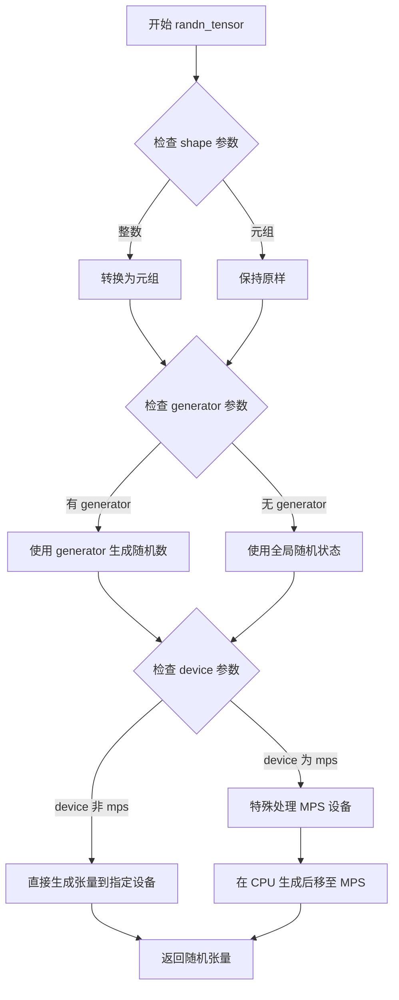

#### 带注释源码

```python
# randn_tensor 函数源码（位于 diffusers.utils.torch_utils）

def randn_tensor(
    shape: Union[Tuple, int],
    generator: Optional[Union[List["torch.Generator"], "torch.Generator"]] = None,
    device: Optional["torch.device"] = None,
    dtype: Optional["torch.dtype"] = None,
    layout: Optional["torch.layout"] = None,
) -> "torch.Tensor":
    """
    生成随机噪声张量（服从标准正态分布）。
    
    参数:
        shape: 要生成的张量形状，可以是整数或元组
        generator: 可选的生成器，用于确定性随机数生成
        device: 可选的目标设备
        dtype: 可选的张量数据类型
        layout: 可选的内存布局
    
    返回:
        随机噪声张量
    """
    # 包装 PyTorch 的 randn 函数，支持可选的生成器
    # 如果提供了 generator，则使用它来生成确定性随机数
    # 否则使用全局随机状态
    
    if isinstance(shape, int):
        shape = (shape,)
    
    # 核心逻辑：调用 torch.randn 生成随机张量
    # 如果提供了 generator，则传入以确保可重复性
    # 如果提供了 device，则直接在该设备上生成
    tensor = torch.randn(
        shape, 
        generator=generator, 
        device=device, 
        dtype=dtype, 
        layout=layout
    )
    
    return tensor
```

#### 在 DPSPipeline 中的调用示例

```python
# 从 DPSPipeline.__call__ 方法中提取的调用代码

# 1. 确定图像形状
if isinstance(self.unet.config.sample_size, int):
    image_shape = (
        batch_size,
        self.unet.config.in_channels,
        self.unet.config.sample_size,
        self.unet.config.sample_size,
    )
else:
    image_shape = (batch_size, self.unet.config.in_channels, *self.unet.config.sample_size)

# 2. 根据设备类型调用 randn_tensor
if self.device.type == "mps":
    # randn 在 MPS 设备上不能可靠地重现
    # 因此先在 CPU 上生成，然后移至 MPS
    image = randn_tensor(image_shape, generator=generator)
    image = image.to(self.device)
else:
    # 直接在目标设备上生成随机张量
    image = randn_tensor(image_shape, generator=generator, device=self.device)

# image 现在包含了初始的高斯噪声，用于去噪生成过程
```

#### 关键特性说明

1. **MPS 设备特殊处理**：在 Apple Silicon (MPS) 设备上，`torch.randn` 不能可靠地重现随机数，因此代码采用先在 CPU/MPS 生成再移动的策略

2. **生成器支持**：通过可选的 `generator` 参数，可以实现确定性的随机生成，这对于复现结果很重要

3. **多设备支持**：支持 CPU、CUDA、MPS 等多种设备

4. **类型灵活**：支持传入整数或元组形式的形状参数


### `DDPMScheduler.from_pretrained`

从预训练模型或路径加载 DDPMScheduler 调度器实例。该方法是 diffusers 库提供的类方法，用于根据指定的模型名称或路径加载预训练的噪声调度器配置，并返回一个配置好的 DDPMScheduler 对象，可用于扩散模型的推理过程。

参数：

- `pretrained_model_name_or_path`：`str`，必填参数，指定预训练模型在 Hugging Face Hub 上的模型 ID（如 "google/ddpm-celebahq-256"）或本地模型目录路径
- `subfolder`：`str`，可选参数，指定模型在仓库中的子文件夹路径，默认为 None
- `return_unused_kwargs`：`bool`，可选参数，是否返回未使用的关键字参数，默认为 False
- `kwargs`：其他可选关键字参数，用于传递额外的配置选项

返回值：`DDPMScheduler`，返回一个配置好的 DDPMScheduler 调度器实例，包含调度器的配置参数（如 beta 调度参数、时间步长等），可用于后续的扩散推理过程

#### 流程图

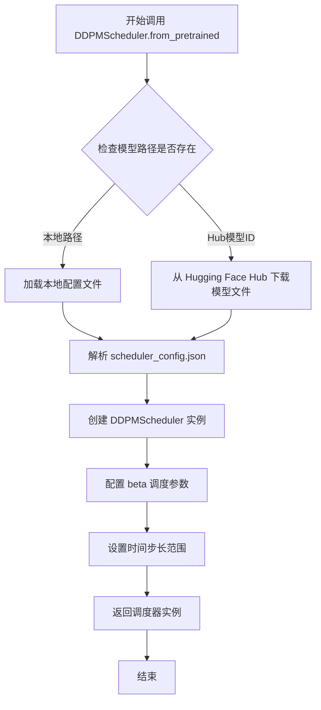

#### 带注释源码

```python
# 在代码中的实际调用示例
scheduler = DDPMScheduler.from_pretrained("google/ddpm-celebahq-256")
# 加载预训练的 DDPMScheduler 调度器
# 参数: "google/ddpm-celebahq-256" 是 Hugging Face Hub 上的模型名称
# 返回值: 一个配置好的 DDPMScheduler 实例

# 调度器初始化后的配置步骤
scheduler.set_timesteps(1000)
# 设置推理过程的时间步长为 1000 步
# 这个时间步长决定了扩散模型去噪的迭代次数
```


### `UNet2DModel.from_pretrained`

从预训练模型加载 UNet2DModel 实例，用于图像去噪任务。该方法是 Diffusers 库中标准的模型加载方式，通过指定模型名称或路径来加载预训练的 UNet 权重和配置。

参数：

- `pretrained_model_name_or_path`：`str`，必选，要加载的预训练模型名称（如 "google/ddpm-celebahq-256"）或本地路径
- `torch_dtype`：`torch.dtype`，可选，指定模型参数的 torch 数据类型（如 `torch.float32`）
- `device_map`：`str` 或 `dict`，可选，指定模型在设备上的映射方式
- `use_safetensors`：`bool`，可选，是否使用 safetensors 格式加载模型
- `cache_dir`：`str`，可选，模型缓存目录
- `resume_download`：`bool`，可选，是否允许从中断的下载中恢复
- `force_download`：`bool`，可选，是否强制重新下载模型
- `proxies`：`dict`，可选，代理服务器配置
- `local_files_only`：`bool`，可选，是否仅使用本地文件
- `revision`：`str`，可选，GitHub 模型仓库的提交哈希或分支名
- `variant`：`str`，可选，加载模型的特定变体（如 "fp16"）

返回值：`UNet2DModel`，加载并初始化后的 UNet2DModel 模型对象

#### 流程图

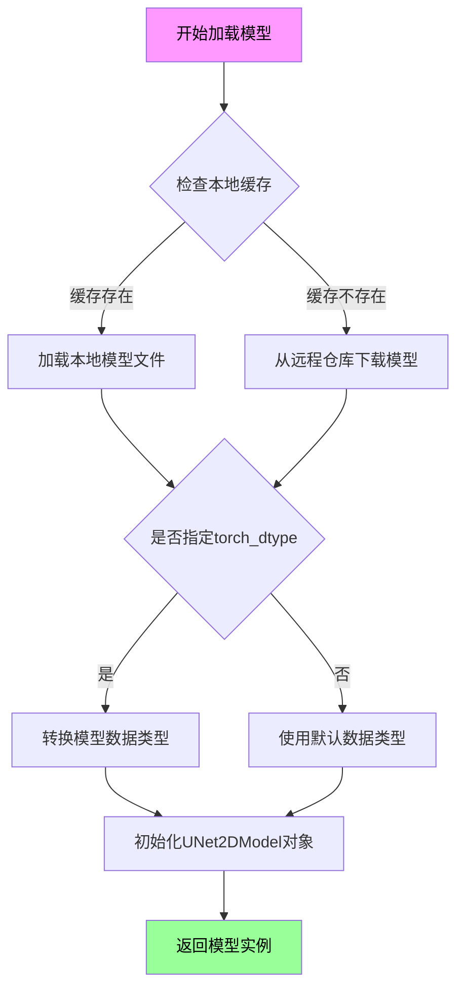

#### 带注释源码

```python
# 在代码中的使用方式：
# 从预训练模型加载 UNet2DModel
model = UNet2DModel.from_pretrained("google/ddpm-celebahq-256").to("cuda")

# 说明：
# 1. "google/ddpm-celebahq-256" 是 Hugging Face Hub 上的预训练模型名称
# 2. .to("cuda") 将模型移动到 CUDA 设备上进行 GPU 加速推理
# 3. 返回的 model 是一个 UNet2DModel 对象，用于在扩散模型的逆向过程中预测噪声

# UNet2DModel 类的典型配置可通过 model.config 访问：
# - model.config.in_channels: 输入通道数
# - model.config.out_channels: 输出通道数  
# - model.config.sample_size: 样本尺寸
# - model.config.block_out_blocks: UNet 块配置
```


### `save_image`

将给定的图像张量保存到磁盘文件中。该函数是torchvision.utils模块提供的工具函数，用于将PyTorch张量格式的图像数据转换为图像文件（如PNG、JPEG等）并保存到指定路径。

参数：

- `tensor`：`torch.Tensor`，需要保存的图像张量，通常形状为(C, H, W)或(B, C, H, W)
- `fp`：`str`或`os.PathLike`，保存文件的路径或文件对象
- `nrow`：`int`，可选，用于网格排列时的列数（行数自动计算），默认为8
- `padding`：`int`，可选，图像网格之间的像素填充数，默认为2
- `normalize`：`bool`，可选，是否将图像值归一化到[0, 1]范围，默认为False
- `range`：`tuple`，可选，源张量的值范围(min, max)，用于归一化
- `scale_each`：`bool`，可选，是否对每个图像单独进行归一化，默认为False
- `pad_value`：`float`，可选，网格填充的颜色值，默认为0
- `format`：`str`，可选，图像格式（如'png'、'jpeg'），如果为None则从文件扩展名推断

返回值：`None`，该函数直接保存文件，无返回值

#### 流程图

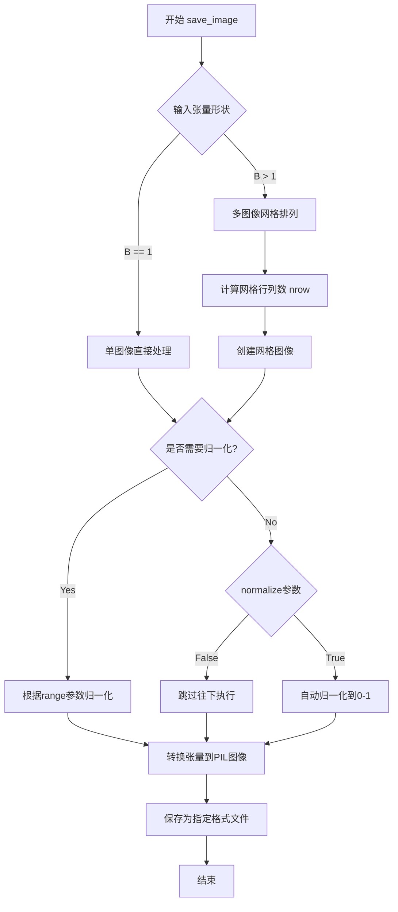

#### 带注释源码

```python
# torchvision.utils.save_image 函数源码分析
# 以下为实际使用示例和参数说明

# 在代码中的实际调用:
save_image((src + 1.0) / 2.0, "dps_src.png")
save_image((measurement + 1.0) / 2.0, "dps_mea.png")

"""
参数说明:
1. (src + 1.0) / 2.0 - 输入张量
   - 由于源图像被归一化到[-1, 1]范围，需要转换回[0, 1]范围才能正确保存
   - src shape: [1, 3, H, W] (批量为1的RGB图像)

2. "dps_src.png" - 输出文件路径
   - 文件名指定了保存位置和格式为PNG

3. 可选参数默认值:
   - nrow=8: 8列网格布局
   - padding=2: 图像间2像素间距
   - normalize=False: 不自动归一化
   - pad_value=0: 填充为黑色
"""

# 工作流程:
# Step 1: 接收PyTorch张量 (C, H, W) 或 (B, C, H, W)
# Step 2: 如果是批量图像，使用make_grid组合成网格
# Step 3: 归一化处理（如果需要）
# Step 4: 转换张量数据类型和范围
# Step 5: 转换为PIL.Image对象
# Step 6: 保存到磁盘文件
```


### `numpy_to_pil`

该方法继承自 `DiffusionPipeline` 基类，用于将 NumPy 数组格式的图像数据转换为 PIL Image 对象，以便于保存和显示。

参数：

-  `image`：`numpy.ndarray`，待转换的 NumPy 数组，形状通常为 `(batch_size, height, width, channels)`，值域在 `[0, 1]` 范围内

返回值：`PIL.Image.Image` 或 `List[PIL.Image.Image]`，转换后的 PIL 图像对象或图像列表

#### 流程图

```mermaid
flowchart TD
    A[输入: NumPy 数组] --> B{数据类型检查}
    B -->|float32/float64| C[归一化处理]
    B -->|uint8| D[直接转换]
    C --> E[将数值范围从 [0,1] 映射到 [0,255]]
    D --> F[转换为 uint8 类型]
    E --> G[重塑数组形状]
    F --> G
    G --> H[创建 PIL Image 对象]
    H --> I[返回 PIL Image]
```

#### 带注释源码

```python
# 该方法定义在 diffusers 库的 DiffusionPipeline 基类中
# 以下是基于代码调用上下文的推断实现

def numpy_to_pil(self, images):
    """
    Convert a numpy image or a batch of images to PIL Image object.

    Args:
        images (`np.ndarray`): The image or batch of images to be converted.
            Expected shape for a single image: (H, W, C) or (batch_size, H, W, C).
            Values should be in the range [0, 1].

    Returns:
        `PIL.Image.Image` or `List[PIL.Image.Image]`: The converted PIL image(s).
    """
    # 在 DPSPipeline.__call__ 中的调用方式:
    # image = self.numpy_to_pil(image)
    # 此时的 image 是经过以下处理后的 numpy array:
    # image = (image / 2 + 0.5).clamp(0, 1)  # 从 [-1,1] 映射到 [0,1]
    # image = image.cpu().permute(0, 2, 3, 1).numpy()  # 转换为 (batch, H, W, C) 格式
    
    if images.ndim == 3:
        # 单张图像: (H, W, C) -> PIL Image
        return Image.fromarray((images * 255).astype("uint8"))
    elif images.ndim == 4:
        # 批量图像: (batch, H, W, C) -> 图像列表
        return [Image.fromarray((img * 255).astype("uint8")) for img in images]
```

> **注意**：该方法实际定义在 `diffusers` 库的 `DiffusionPipeline` 基类中，当前代码文件仅调用了该方法而未直接实现。其具体实现位于 `diffusers.utils.pil_utils` 模块中。


### `DiffusionPipeline.progress_bar`

该方法继承自 `DiffusionPipeline` 基类，用于在迭代过程中显示进度条。它接收一个可迭代对象（如时间步张量），返回一个支持进度条显示的迭代器，方便用户在扩散模型的推理过程中监控迭代进度。

参数：

-  `iterator`：`Any`（通常是 `torch.Tensor`），需要迭代的可迭代对象，如 `scheduler.timesteps`
-  `total`：`Optional[int]`，迭代对象的总长度，如果提供则无需重新计算

返回值：`Iterable[Any]`，返回包装后的可迭代对象，迭代时会显示进度条

#### 流程图

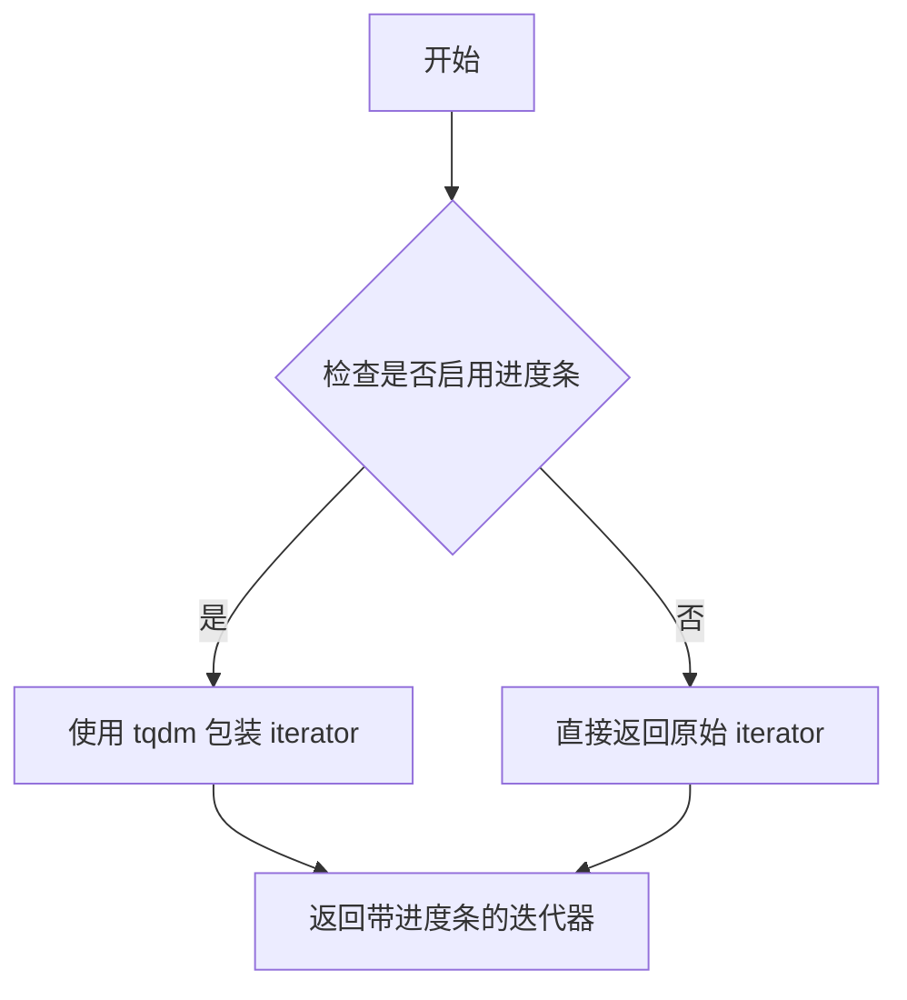

#### 带注释源码

```
# progress_bar 方法定义（位于 diffusers.DiffusionPipeline）
# 此方法在当前文件中未定义，继承自 diffusers 库的 DiffusionPipeline 基类

def progress_bar(
    self,
    iterator: Any,
    total: Optional[int] = None,
) -> Iterable[Any]:
    r"""
    A wrapper around an iterator that optionally displays a progress bar.
    
    This method is typically implemented using the `tqdm` library to show
    a progress bar during the iteration, which is useful for long-running
    operations like denoising in diffusion models.
    
    Args:
        iterator (`Any`):
            The iterator to wrap. In this pipeline, it's typically
            `self.scheduler.timesteps` which contains the denoising steps.
        total (`int`, *optional*):
            Total number of iterations. If not provided, it will be
            inferred from the length of the iterator.
            
    Returns:
        `Iterable[Any]`:
            A wrapped iterator that displays a progress bar during iteration.
            
    Example:
        ```python
        # In the DPSPipeline.__call__ method, it's used like this:
        for t in self.progress_bar(self.scheduler.timesteps):
            # process each timestep
            ...
        ```
    """
    # 如果启用了进度条（默认启用），使用 tqdm 包装迭代器
    # 否则直接返回原始迭代器
    return super().progress_bar(iterator, total=total)
```

> **注意**：由于 `progress_bar` 方法继承自 `DiffusionPipeline` 基类，其具体实现位于 `diffusers` 库中。上述源码是基于常见实现的推断。实际使用中，该方法通常使用 `tqdm` 库来显示进度条。


### `DPSPipeline.__init__`

初始化DPSPipeline管道，接受UNet2DModel和调度器作为参数，注册到管道模块中以供后续推理使用。

参数：

- `self`：`DPSPipeline`实例本身
- `unet`：`UNet2DModel`，用于去噪图像潜在变量的UNet模型
- `scheduler`：`SchedulerMixin`，与UNet配合使用进行图像去噪的调度器（如DDPMScheduler或DDIMScheduler）

返回值：`None`，该方法为初始化方法，不返回任何值

#### 流程图

```mermaid
flowchart TD
    A[开始 __init__] --> B[调用 super().__init__]
    B --> C[调用 self.register_modules 注册 unet 模块]
    C --> D[调用 self.register_modules 注册 scheduler 模块]
    D --> E[结束 __init__]
    
    style A fill:#e1f5fe
    style E fill:#e1f5fe
    style B fill:#fff3e0
    style C fill:#fff3e0
    style D fill:#fff3e0
```

#### 带注释源码

```python
def __init__(self, unet, scheduler):
    """
    初始化DPSPipeline管道实例
    
    参数:
        unet: UNet2DModel实例，用于去噪处理的UNet模型
        scheduler: SchedulerMixin实例，用于控制去噪过程的调度器
    
    返回:
        None
    """
    # 调用父类DiffusionPipeline的初始化方法
    # 执行基础管道设置，包括设备配置等
    super().__init__()
    
    # 将UNet模型和调度器注册到管道模块中
    # register_modules会自动处理模块的设备转移和状态管理
    # 使这些模块可以通过self.unet和self.scheduler访问
    self.register_modules(unet=unet, scheduler=scheduler)
```


### `DPSPipeline.__call__`

执行 Diffusion Posterior Sampling (DPS) 生成过程，通过迭代去噪结合测量一致性约束，从损坏的测量图像恢复原始图像。该方法在标准去噪过程中引入测量算子和损失函数，使生成结果符合观测到的测量条件。

参数：

- `measurement`：`torch.Tensor`，损坏/观测到的图像张量
- `operator`：`torch.nn.Module`，将原始图像映射到测量空间的算子（如模糊、核销、超分辨率等）
- `loss_fn`：`Callable[[torch.Tensor, torch.Tensor], torch.Tensor]`，计算测量预测与实际测量之间差异的损失函数
- `batch_size`：`int`，生成图像的数量，默认为 1
- `generator`：`Optional[Union[torch.Generator, List[torch.Generator]]]`，用于确保生成可复现性的随机数生成器
- `num_inference_steps`：`int`，去噪迭代的步数，步数越多图像质量越高但推理越慢，默认为 1000
- `output_type`：`str | None`，输出图像的格式，可选 "pil" 或 "np.array"，默认为 "pil"
- `return_dict`：`bool`，是否返回 `ImagePipelineOutput` 对象而非元组，默认为 True
- `zeta`：`float`，梯度下降步长参数，用于控制测量一致性约束的强度，默认为 0.3

返回值：`Union[ImagePipelineOutput, Tuple]`，当 `return_dict` 为 True 时返回 `ImagePipelineOutput` 对象，包含生成的图像列表；否则返回元组，第一个元素为图像列表

#### 流程图

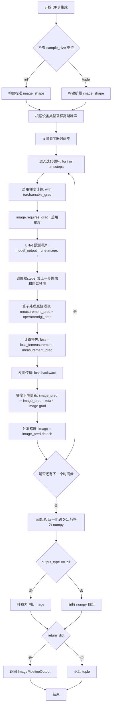

#### 带注释源码

```python
@torch.no_grad()
def __call__(
    self,
    measurement: torch.Tensor,
    operator: torch.nn.Module,
    loss_fn: Callable[[torch.Tensor, torch.Tensor], torch.Tensor],
    batch_size: int = 1,
    generator: Optional[Union[torch.Generator, List[torch.Generator]]] = None,
    num_inference_steps: int = 1000,
    output_type: str | None = "pil",
    return_dict: bool = True,
    zeta: float = 0.3,
) -> Union[ImagePipelineOutput, Tuple]:
    # ============================================================
    # 步骤1: 确定输出图像的张量形状
    # ============================================================
    # 根据 UNet 配置中的 sample_size 确定批量图像的形状
    # 支持两种格式: 整数(正方形) 或 元组(矩形如 64x128)
    if isinstance(self.unet.config.sample_size, int):
        image_shape = (
            batch_size,
            self.unet.config.in_channels,      # 图像通道数(通常为3)
            self.unet.config.sample_size,       # 高度
            self.unet.config.sample_size,       # 宽度
        )
    else:
        # 处理非正方形输出形状的情况
        image_shape = (batch_size, self.unet.config.in_channels, *self.unet.config.sample_size)

    # ============================================================
    # 步骤2: 采样初始高斯噪声作为去噪起点
    # ============================================================
    # MPS 设备不支持可复现的 randn，使用特殊处理
    if self.device.type == "mps":
        image = randn_tensor(image_shape, generator=generator)
        image = image.to(self.device)
    else:
        # 在指定设备上生成标准高斯噪声
        image = randn_tensor(image_shape, generator=generator, device=self.device)

    # ============================================================
    # 步骤3: 设置去噪调度器的时间步
    # ============================================================
    # 将总步数转换为调度器的时间步序列(通常为递减序列)
    self.scheduler.set_timesteps(num_inference_steps)

    # ============================================================
    # 步骤4: 迭代去噪过程(核心 DPS 算法)
    # ============================================================
    for t in self.progress_bar(self.scheduler.timesteps):
        # 启用梯度计算以进行测量一致性优化
        with torch.enable_grad():
            # 4.1 启用图像张量的梯度属性
            image = image.requires_grad_()
            
            # 4.2 使用 UNet 预测噪声残差
            # 输入: 当前噪声图像 + 当前时间步
            # 输出: 预测的噪声分量
            model_output = self.unet(image, t).sample

            # 4.3 调度器计算下一步图像和原始图像预测
            # prev_sample: x_{t-1} 即当前时间步的去噪结果
            # pred_original_sample: x_0 即调度器预测的原始清晰图像
            scheduler_out = self.scheduler.step(model_output, t, image, generator=generator)
            image_pred, origi_pred = scheduler_out.prev_sample, scheduler_out.pred_original_sample

            # 4.4 使用测量算子将原始预测映射到测量空间
            # 例如: 模糊算子对清晰图像进行模糊操作
            measurement_pred = operator(origi_pred)

            # 4.5 计算测量一致性损失
            # 比较: 实际测量值 vs 算子预测的测量值
            loss = loss_fn(measurement, measurement_pred)
            
            # 4.6 反向传播计算梯度
            loss.backward()

            # 打印当前迭代的损失值用于监控
            print("distance: {0:.4f}".format(loss.item()))

            # ============================================================
            # 步骤5: 应用测量一致性梯度更新
            # ============================================================
            with torch.no_grad():
                # 沿着测量一致性方向调整图像预测
                # zeta 参数控制调整步长: 步长越大，对测量约束的遵从度越高
                image_pred = image_pred - zeta * image.grad
                
                # 分离梯度，准备下一次迭代
                image = image_pred.detach()

    # ============================================================
    # 步骤6: 后处理 - 归一化和格式转换
    # ============================================================
    # 将图像从 [-1, 1] 范围变换到 [0, 1] 范围
    image = (image / 2 + 0.5).clamp(0, 1)
    
    # 转换为 CPU 上的 numpy 数组
    # 维度从 (B, C, H, W) 转换为 (B, H, W, C)
    image = image.cpu().permute(0, 2, 3, 1).numpy()
    
    # 根据需求转换为 PIL Image 格式
    if output_type == "pil":
        image = self.numpy_to_pil(image)

    # ============================================================
    # 步骤7: 返回结果
    # ============================================================
    if not return_dict:
        return (image,)

    return ImagePipelineOutput(images=image)
```


### `SuperResolutionOperator.__init__`

初始化超分辨率操作符，用于将图像进行下采样处理（对应超分辨率的逆过程）。该方法创建一个基于可定制插值核的图像缩放器，并冻结所有参数以确保在推理过程中不更新权重。

参数：

- `self`：`SuperResolutionOperator` 实例本身，自动传入
- `in_shape`：输入图像的形状，类型为 `tuple` 或 `list`（如 `(batch, channels, height, width)`），指定要处理的图像维度
- `scale_factor`：超分辨率的缩放因子，类型为 `float` 或 `int`（例如 4 表示 4 倍超分辨率），实际下采样时使用其倒数

返回值：`None`，`__init__` 方法不返回任何值，仅完成对象的初始化

#### 流程图

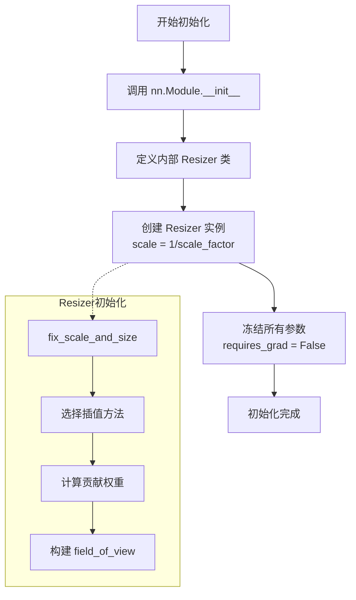

#### 带注释源码

```python
def __init__(self, in_shape, scale_factor):
    """
    初始化超分辨率操作符
    
    参数:
        in_shape: 输入图像的形状 tuple/list (batch, channels, height, width)
        scale_factor: 缩放因子，用于计算下采样比例
    """
    # 调用父类 nn.Module 的初始化方法，注册所有子模块
    super().__init__()

    # 定义一个局部类 Resizer，用于实现图像缩放功能
    # 这是一个内部类，不应在 SuperResolutionOperator 外部使用
    class Resizer(nn.Module):
        def __init__(self, in_shape, scale_factor=None, output_shape=None, kernel=None, antialiasing=True):
            super(Resizer, self).__init__()

            # 1. 标准化参数并修复缺失参数
            # 根据输出形状或缩放因子确定目标尺寸
            scale_factor, output_shape = self.fix_scale_and_size(in_shape, output_shape, scale_factor)

            # 2. 选择插值方法及其对应的核宽度
            # 可选: cubic, lanczos2, lanczos3, box, linear
            def cubic(x):
                # 三次插值核函数
                absx = np.abs(x)
                absx2 = absx**2
                absx3 = absx**3
                return (1.5 * absx3 - 2.5 * absx2 + 1) * (absx <= 1) + (
                    -0.5 * absx3 + 2.5 * absx2 - 4 * absx + 2
                ) * ((1 < absx) & (absx <= 2))

            def lanczos2(x):
                # Lanczos 2 核函数
                return (
                    (np.sin(pi * x) * np.sin(pi * x / 2) + np.finfo(np.float32).eps)
                    / ((pi**2 * x**2 / 2) + np.finfo(np.float32).eps)
                ) * (abs(x) < 2)

            def box(x):
                # 盒式核函数（最近邻）
                return ((-0.5 <= x) & (x < 0.5)) * 1.0

            def lanczos3(x):
                # Lanczos 3 核函数
                return (
                    (np.sin(pi * x) * np.sin(pi * x / 3) + np.finfo(np.float32).eps)
                    / ((pi**2 * x**2 / 3) + np.finfo(np.float32).eps)
                ) * (abs(x) < 3)

            def linear(x):
                # 线性插值核函数
                return (x + 1) * ((-1 <= x) & (x < 0)) + (1 - x) * ((0 <= x) & (x <= 1))

            # 映射插值方法到对应的核宽度
            method, kernel_width = {
                "cubic": (cubic, 4.0),
                "lanczos2": (lanczos2, 4.0),
                "lanczos3": (lanczos3, 6.0),
                "box": (box, 1.0),
                "linear": (linear, 2.0),
                None: (cubic, 4.0),  # 默认使用三次插值
            }.get(kernel)

            # 3. 设置抗锯齿（仅在下采样时使用）
            antialiasing *= np.any(np.array(scale_factor) < 1)

            # 4. 按缩放比例排序维度，以提高效率
            sorted_dims = np.argsort(np.array(scale_factor))
            self.sorted_dims = [int(dim) for dim in sorted_dims if scale_factor[dim] != 1]

            # 5. 为每个维度计算局部权重并进行 resize
            field_of_view_list = []
            weights_list = []
            for dim in self.sorted_dims:
                # 计算每个维度的影响位置和权重
                weights, field_of_view = self.contributions(
                    in_shape[dim], output_shape[dim], scale_factor[dim], method, kernel_width, antialiasing
                )

                # 转换为 PyTorch 张量
                weights = torch.tensor(weights.T, dtype=torch.float32)

                # 添加单例维度以便与大张量相乘
                weights_list.append(
                    nn.Parameter(
                        torch.reshape(weights, list(weights.shape) + (len(scale_factor) - 1) * [1]),
                        requires_grad=False,
                    )
                )
                field_of_view_list.append(
                    nn.Parameter(
                        torch.tensor(field_of_view.T.astype(np.int32), dtype=torch.long), requires_grad=False
                    )
                )

            # 存储权重和视野域参数
            self.field_of_view = nn.ParameterList(field_of_view_list)
            self.weights = nn.ParameterList(weights_list)

        # ... Resizer 的其他方法（forward, fix_scale_and_size, contributions）

    # 创建下采样器，scale 设置为 1/scale_factor（即下采样）
    self.down_sample = Resizer(in_shape, 1 / scale_factor)
    
    # 冻结所有参数，确保推理时不更新权重
    for param in self.parameters():
        param.requires_grad = False
```


### `SuperResolutionOperator.forward`

前向传播方法，执行下采样操作。该方法接收高分辨率图像数据，通过内部的 Resizer 对象将图像按照给定的缩放因子进行下采样处理，输出低分辨率图像。

参数：

- `self`：`SuperResolutionOperator`，`SuperResolutionOperator` 类的实例本身
- `data`：`torch.Tensor`，输入的高分辨率图像张量，形状为 `[batch, channels, height, width]`
- `**kwargs`：可变关键字参数，用于接受额外的可选参数（当前实现中未使用，保留接口兼容性）

返回值：`torch.Tensor`，下采样后的低分辨率图像张量

#### 流程图

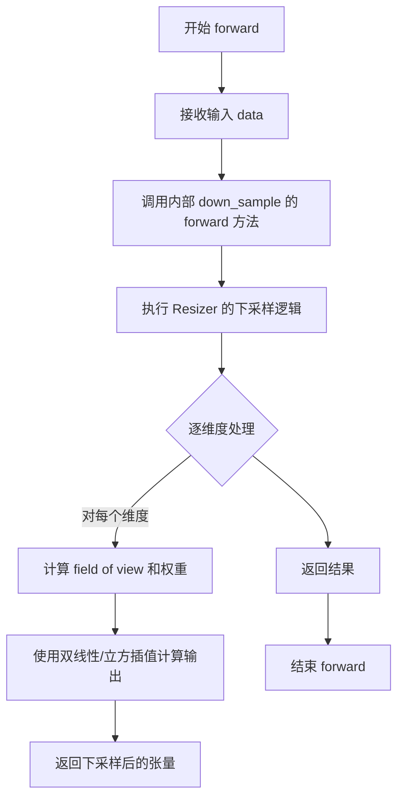

#### 带注释源码

```python
def forward(self, data, **kwargs):
    """
    前向传播方法，执行下采样操作。
    
    参数:
        data: 输入的高分辨率图像张量
        **kwargs: 额外的关键字参数（可选）
    
    返回:
        下采样后的低分辨率图像张量
    """
    # 直接调用内部注册的 down_sample (Resizer实例) 的 forward 方法
    # 将输入数据传递给 Resizer 进行下采样处理
    return self.down_sample(data)
```

---

### 补充说明

#### 关键组件信息

| 名称 | 一句话描述 |
|------|-----------|
| `SuperResolutionOperator` | 基于 Resizer 实现的超分辨率下采样算子，用于将高分辨率图像下采样 |
| `Resizer` | 内部类，实现基于卷积的图像resize操作，支持多种插值方法（下采样核心） |

#### 技术债务与优化空间

1. **未使用的 kwargs 参数**：forward 方法接收 `**kwargs` 但完全未使用，可考虑移除或添加功能
2. **参数冻结**：所有参数明确设置 `requires_grad = False`，但没有说明原因（可能是为了推理）
3. **内部类嵌套**：Resizer 定义为 SuperResolutionOperator 的内部类，增加了代码复杂度和耦合度

#### 外部依赖与接口契约

- 依赖 `torch.nn.Module` 基类
- 输入输出均为 `torch.Tensor` 类型
- 内部使用 numpy 进行插值核计算，然后转换为 torch tensor


### `Resizer.__init__`

初始化缩放器类，用于图像的插值缩放操作。该方法接收输入形状、缩放因子、输出形状和插值方法等参数，通过标准化参数、选择插值方法、计算各维度的权重和视野域，最终将权重和视野域转换为PyTorch参数存储，以支持后续的前向传播缩放操作。

参数：

- `self`：`Resizer` 实例本身
- `in_shape`：`tuple` 或 `list`，输入图像的形状（如 `[C, H, W]`）
- `scale_factor`：`float`、`list` 或 `None`，缩放因子，用于指定放大或缩小的比例，默认为 `None`
- `output_shape`：`tuple`、`list` 或 `None`，输出图像的目标形状，默认为 `None`
- `kernel`：`str` 或 `None`，插值方法，可选值包括 `"cubic"`、`"lanczos2"`、`"lanczos3"`、`"box"`、`"linear"` 或 `None`（默认为 cubic），默认为 `None`
- `antialiasing`：`bool`，是否启用抗锯齿，仅在缩小（scale < 1）时有效，默认为 `True`

返回值：`None`，无返回值（`__init__` 方法）

#### 流程图

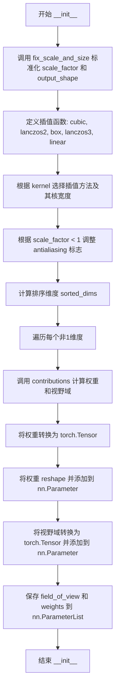

#### 带注释源码

```
def __init__(self, in_shape, scale_factor=None, output_shape=None, kernel=None, antialiasing=True):
    # 调用父类 nn.Module 的初始化方法
    super(Resizer, self).__init__()

    # 步骤1：标准化 scale_factor 和 output_shape
    # 如果只给定了其中一个，另一个会根据公式自动计算
    # 确保 scale_factor 和 output_shape 都是与输入维度数量匹配的列表
    scale_factor, output_shape = self.fix_scale_and_size(in_shape, output_shape, scale_factor)

    # 步骤2：定义各种插值核函数
    # cubic: 三次插值，核宽度4.0
    # lanczos2: Lanczos2 核，核宽度4.0
    # lanczos3: Lanczos3 核，核宽度6.0
    # box: 盒式核（最近邻），核宽度1.0
    # linear: 线性插值，核宽度2.0
    # 默认使用 cubic
    def cubic(x):
        absx = np.abs(x)
        absx2 = absx**2
        absx3 = absx**3
        return (1.5 * absx3 - 2.5 * absx2 + 1) * (absx <= 1) + (
            -0.5 * absx3 + 2.5 * absx2 - 4 * absx + 2
        ) * ((1 < absx) & (absx <= 2))

    def lanczos2(x):
        return (
            (np.sin(pi * x) * np.sin(pi * x / 2) + np.finfo(np.float32).eps)
            / ((pi**2 * x**2 / 2) + np.finfo(np.float32).eps)
        ) * (abs(x) < 2)

    def box(x):
        return ((-0.5 <= x) & (x < 0.5)) * 1.0

    def lanczos3(x):
        return (
            (np.sin(pi * x) * np.sin(pi * x / 3) + np.finfo(np.float32).eps)
            / ((pi**2 * x**2 / 3) + np.finfo(np.float32).eps)
        ) * (abs(x) < 3)

    def linear(x):
        return (x + 1) * ((-1 <= x) & (x < 0)) + (1 - x) * ((0 <= x) & (x <= 1))

    # 根据 kernel 参数选择对应的插值方法和核宽度
    method, kernel_width = {
        "cubic": (cubic, 4.0),
        "lanczos2": (lanczos2, 4.0),
        "lanczos3": (lanczos3, 6.0),
        "box": (box, 1.0),
        "linear": (linear, 2.0),
        None: (cubic, 4.0),  # 默认使用 cubic 插值
    }.get(kernel)

    # 抗锯齿仅在缩小（scale < 1）时生效
    antialiasing *= np.any(np.array(scale_factor) < 1)

    # 步骤3：对维度按缩放因子排序（非1的维度优先处理）
    sorted_dims = np.argsort(np.array(scale_factor))
    self.sorted_dims = [int(dim) for dim in sorted_dims if scale_factor[dim] != 1]

    # 步骤4：遍历每个需要处理的维度，计算权重和视野域
    field_of_view_list = []
    weights_list = []
    for dim in self.sorted_dims:
        # 计算输入图像在当前维度上的权重和视野域
        # contributions 函数根据插值方法计算：
        # - weights: 每个输出像素对应的输入像素权重
        # - field_of_view: 每个输出像素能看到哪些输入像素的位置索引
        weights, field_of_view = self.contributions(
            in_shape[dim], output_shape[dim], scale_factor[dim], method, kernel_width, antialiasing
        )

        # 将权重转换为 torch.float32 类型的张量
        weights = torch.tensor(weights.T, dtype=torch.float32)

        # 步骤5：调整权重矩阵形状以便后续与张量相乘
        # 添加额外的维度以支持广播操作（类似 MATLAB 的 bsxfun）
        weights_list.append(
            nn.Parameter(
                torch.reshape(weights, list(weights.shape) + (len(scale_factor) - 1) * [1]),
                requires_grad=False,  # 权重在训练过程中不需要梯度
            )
        )
        
        # 将视野域索引转换为 torch.long 类型的张量
        field_of_view_list.append(
            nn.Parameter(
                torch.tensor(field_of_view.T.astype(np.int32), dtype=torch.long), requires_grad=False
            )
        )

    # 步骤6：保存权重和视野域为 ParameterList
    self.field_of_view = nn.ParameterList(field_of_view_list)
    self.weights = nn.ParameterList(weights_list)
```


### `Resizer.forward`

该方法执行多维图像缩放，通过对每个维度逐一应用预计算的卷积核权重和感受野索引，实现高质量的图像插值缩放，支持任意维度的张量处理。

参数：

- `self`：`Resizer` 类实例，包含预计算的缩放权重和感受野索引
- `in_tensor`：`torch.Tensor`，输入的多维图像张量，形状为 `[B, C, H, W, ...]`

返回值：`torch.Tensor`，缩放后的多维图像张量，形状根据目标尺寸而定

#### 流程图

```mermaid
flowchart TD
    A[开始 forward] --> B[初始化 x = in_tensor]
    B --> C{遍历 sorted_dims 中的维度}
    C -->|还有维度| D[获取当前维度的 fov 和 w]
    D --> E[转置张量使当前维度成为维度0]
    E --> F[使用感受野索引取值: x[fov]]
    F --> G[逐元素乘以权重并求和: sum x[fov] * w]
    G --> H[转置回原始维度顺序]
    H --> C
    C -->|遍历完成| I[返回缩放后的张量 x]
```

#### 带注释源码

```python
def forward(self, in_tensor):
    """
    执行多维图像缩放的主方法
    
    该方法通过以下步骤对输入张量进行缩放:
    1. 对每个需要缩放的维度依次处理
    2. 使用预计算的感受野(field_of_view)和权重(weights)进行插值
    3. 通过转置操作实现任意维度的独立处理
    """
    x = in_tensor  # 将输入张量赋值给本地变量x

    # 遍历所有需要缩放的维度(已按缩放因子排序)
    for dim, fov, w in zip(self.sorted_dims, self.field_of_view, self.weights):
        # 为了能够对指定维度进行操作，将该维度交换到位置0
        # 例如: 如果dim=2且输入形状为[B,C,H,W], 转置后变为[W,C,H,B]
        x = torch.transpose(x, dim, 0)

        # 使用感受野(field_of_view)索引获取输入张量中影响当前输出的像素
        # x[fov] 是一个形状为 [output_size, kernel_size, ...] 的张量
        # 其中 ... 表示其余维度
        # 
        # 然后与权重w进行逐元素相乘:
        # - w的形状为 [output_size, kernel_size, 1, 1, ...]
        # - 这种形状设计允许广播机制: 相匹配维度逐元素相乘, 单例维度自动扩展
        # 最后在维度0(kernel_size维度)上求和, 得到输出
        x = torch.sum(x[fov] * w, dim=0)

        # 将维度顺序恢复到原始状态
        x = torch.transpose(x, dim, 0)

    # 返回缩放后的张量
    return x
```


### `Resizer.fix_scale_and_size`

该方法用于标准化和修复图像缩放参数，确保 `scale_factor` 和 `output_shape` 都符合函数预期的标准格式（与输入维度数量相同的列表），同时处理缺失参数的情况，根据已知的参数计算出缺失的参数。

参数：

- `self`：`Resizer` 类实例，调用该方法的 Resizer 对象本身
- `input_shape`：列表或元组，输入图像的形状（如 `[C, H, W]`）
- `output_shape`：列表、元组或 `None`，期望的输出图像形状，默认为 `None`
- `scale_factor`：浮点数、列表或 `None`，缩放因子，默认为 `None`

返回值：元组 `(scale_factor, output_shape)`

- `scale_factor`：列表，标准化后的缩放因子列表，长度与 `input_shape` 一致
- `output_shape`：列表，标准化后的输出形状列表，长度与 `input_shape` 一致

#### 流程图

```mermaid
flowchart TD
    A[开始 fix_scale_and_size] --> B{scale_factor 是否为 None?}
    B -->|否| C{scale_factor 是标量且 input_shape 维度 > 1?}
    C -->|是| D[将 scale_factor 扩展为 [scale_factor, scale_factor]]
    C -->|否| E[将 scale_factor 转为列表]
    D --> F[在列表前补 1 使长度等于 input_shape 长度]
    E --> F
    B -->|是| G{output_shape 是否为 None?}
    
    F --> G
    G -->|否| H[将 output_shape 转为列表]
    H --> I[在 output_shape 前补 input_shape 尾部元素使其长度等于 input_shape 长度]
    G -->|是| J{scale_factor 是否为 None?}
    
    J -->|否| K[根据 input_shape 和 scale_factor 计算 output_shape]
    J -->|是| L[根据 output_shape 和 input_shape 计算 scale_factor]
    
    I --> M[返回 scale_factor, output_shape]
    K --> M
    L --> M
```

#### 带注释源码

```python
def fix_scale_and_size(self, input_shape, output_shape, scale_factor):
    # 首先修复 scale-factor（如果已给出），将其标准化为函数期望的格式
    # （一个与输入维度数量相同的缩放因子列表）
    if scale_factor is not None:
        # 默认情况下，如果 scale-factor 是标量且输入维度大于1，我们假设是2D缩放并复制它
        if np.isscalar(scale_factor) and len(input_shape) > 1:
            scale_factor = [scale_factor, scale_factor]

        # 将 scale-factor 列表扩展到与输入尺寸相同的长度
        # 通过在前面补1来填充未指定的缩放维度
        scale_factor = list(scale_factor)
        scale_factor = [1] * (len(input_shape) - len(scale_factor)) + scale_factor

    # 修复 output-shape（如果已给出）：
    # 通过在前面补原始 input-size 来扩展到与 input-shape 相同的维度数量
    if output_shape is not None:
        output_shape = list(input_shape[len(output_shape) :]) + list(np.uint(np.array(output_shape)))

    # 处理未给出 scale-factor 的情况，根据 output-shape 计算
    # 注意：这是次优解，因为同一 output-shape 可能对应不同的缩放比例
    if scale_factor is None:
        scale_factor = 1.0 * np.array(output_shape) / np.array(input_shape)

    # 处理缺失 output-shape 的情况，根据 scale-factor 计算
    if output_shape is None:
        output_shape = np.uint(np.ceil(np.array(input_shape) * np.array(scale_factor)))

    return scale_factor, output_shape
```


### `Resizer.contributions`

该方法计算图像在单个维度上的卷积权重和视野场，用于基于插值方法的图像缩放。它根据缩放因子、核函数和抗锯齿设置，确定输出图像每个像素应该从输入图像的哪些像素位置采样，以及相应的权重值。

参数：

- `in_length`：`int`，输入图像在当前维度上的长度（像素数）
- `out_length`：`int`，输出图像在当前维度上的长度（像素数）
- `scale`：`float`，缩放因子，大于1表示上采样，小于1表示下采样
- `kernel`：`Callable`，插值核函数（如cubic、lanczos、linear等）
- `kernel_width`：`float`，核函数的宽度，决定了参与计算的输入像素范围
- `antialiasing`：`bool`，是否启用抗锯齿，仅在下采样时有效

返回值：`Tuple[np.ndarray, np.ndarray]`，返回权重矩阵和视野场索引数组，用于后续的图像重采样计算

#### 流程图

```mermaid
flowchart TD
    A[开始计算卷积权重] --> B{是否启用抗锯齿}
    B -->|是| C[修改核函数: fixed_kernel = lambda arg: scale * kernel(scale * arg)]
    B -->|否| D[保持原核函数: fixed_kernel = kernel]
    C --> E[调整核宽度: kernel_width *= 1/scale]
    D --> E
    E --> F[计算输出坐标: out_coordinates = 1到out_length]
    F --> G[计算偏移后的输出坐标以保持图像中心]
    G --> H[计算匹配坐标: 输入图像上对应的像素中心位置]
    H --> I[计算左边界: match_coordinates - kernel_width/2]
    I --> J[扩展核宽度以覆盖边界情况]
    J --> K[计算视野场field_of_view矩阵]
    K --> L[计算权重: fixed_kernel匹配坐标与视野场的距离]
    L --> M[归一化权重使其和为1]
    M --> N[应用镜像填充处理边界]
    N --> O[移除零权重位置]
    O --> P[返回weights和field_of_view]
```

#### 带注释源码

```python
def contributions(self, in_length, out_length, scale, kernel, kernel_width, antialiasing):
    """
    计算卷积权重和视野场，用于后续的图像重采样
    
    该函数计算一组'滤波器'和一组field_of_view，这些将在后续应用。
    field_of_view中的每个位置将根据插值方法与其匹配的'权重'相乘，
    乘以子像素位置与其周围像素中心的距离。这仅针对图像的一个维度完成。
    """
    
    # 当抗锯齿激活时（默认且仅在下采样时），感受野扩展到1/sf大小
    # 这意味着滤波更像'低通滤波器'
    # 根据是否启用抗锯齿来调整核函数
    fixed_kernel = (lambda arg: scale * kernel(scale * arg)) if antialiasing else kernel
    
    # 抗锯齿时扩展核宽度以实现更平滑的下采样
    kernel_width *= 1.0 / scale if antialiasing else 1.0
    
    # 输出图像的坐标（从1开始编号，代表像素中心）
    out_coordinates = np.arange(1, out_length + 1)
    
    # 由于scale因子和输出大小可以同时提供，保持图像中心需要偏移输出坐标
    # 偏移量是因为out_length不一定等于in_length*scale
    # 为了保持中心，需要减去这个偏差的一半
    shifted_out_coordinates = out_coordinates - (out_length - in_length * scale) / 2
    
    # 输出坐标在输入图像坐标上的匹配位置
    # 例子：假设有4个水平像素，SF=2 downscaling得到2个像素 [1,2,3,4] -> [1,2]
    # 缩放是在距离上进行的，而不是像素编号上
    # 像素1在低分辨率图像上匹配高分辨率图像上像素1和2之间的边界
    # 测量距离从左边界，像素1中心在d=0.5，边界在d=1
    # 计算: (p_new-0.5 = (p_old-0.5) / sf) -> p_new = p_old/sf + 0.5 * (1-1/sf)
    match_coordinates = shifted_out_coordinates / scale + 0.5 * (1 - 1 / scale)
    
    # 开始乘以滤波器的左边界，取决于滤波器大小
    left_boundary = np.floor(match_coordinates - kernel_width / 2)
    
    # 核宽度需要扩大，因为当覆盖有子像素边界时，它必须'看到'
    # 它只覆盖了一部分的像素中心。所以我们在每边各加一个像素（权重可以置零）
    expanded_kernel_width = np.ceil(kernel_width) + 2
    
    # 为每个输出位置确定一组field_of_view，这些是输入图像中
    # 输出图像像素'看到'的像素。得到一个矩阵，水平维度是输出像素，
    # 垂直维度是它'看到'的像素（kernel_size + 2）
    field_of_view = np.squeeze(
        np.int16(np.expand_dims(left_boundary, axis=1) + np.arange(expanded_kernel_width) - 1)
    )
    
    # 为field_of_view中的每个像素分配权重。矩阵的水平维度是输出像素，
    # 垂直维度是匹配field_of_view中像素的权重列表
    weights = fixed_kernel(1.0 * np.expand_dims(match_coordinates, axis=1) - field_of_view - 1)
    
    # 归一化权重使其总和为1，小心除以0的情况
    sum_weights = np.sum(weights, axis=1)
    sum_weights[sum_weights == 0] = 1.0
    weights = 1.0 * weights / np.expand_dims(sum_weights, axis=1)
    
    # 使用镜像结构作为边界处反射填充的技巧
    mirror = np.uint(np.concatenate((np.arange(in_length), np.arange(in_length - 1, -1, step=-1))))
    field_of_view = mirror[np.mod(field_of_view, mirror.shape[0])]
    
    # 去除零权重和零像素位置
    non_zero_out_pixels = np.nonzero(np.any(weights, axis=0))
    weights = np.squeeze(weights[:, non_zero_out_pixels])
    field_of_view = np.squeeze(field_of_view[:, non_zero_out_pixels])
    
    # 最终输出是相对位置和匹配的权重，都是output_size X fixed_kernel_size
    return weights, field_of_view
```


### `GaussialBlurOperator.__init__`

初始化高斯模糊操作符，用于将高斯模糊核应用于图像数据。该方法在内部创建一个Blurkernel卷积层，使用指定的高斯核大小和标准差（强度）对输入图像进行模糊处理。

参数：

- `self`：隐式参数，表示类的实例本身
- `kernel_size`：`int`，高斯模糊核的尺寸（宽度和高度），必须为奇数，值越大模糊效果越强
- `intensity`：`float`，高斯模糊的标准差（sigma），值越大模糊效果越强，也称为模糊强度

返回值：`None`，该方法为初始化方法，不返回任何值，仅完成对象属性的初始化

#### 流程图

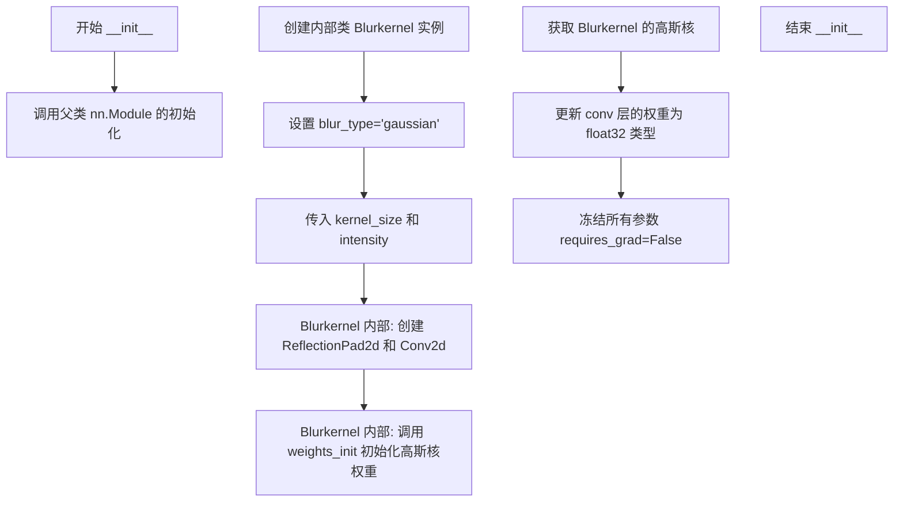

#### 带注释源码

```python
def __init__(self, kernel_size, intensity):
    """
    初始化高斯模糊操作符
    
    Args:
        kernel_size: 高斯模糊核的尺寸，必须为奇数
        intensity: 高斯模糊的标准差（sigma），控制模糊强度
    """
    # 调用父类 nn.Module 的初始化方法，注册所有子模块
    super().__init__()

    # 定义内部类 Blurkernel，用于实现具体的模糊操作
    class Blurkernel(nn.Module):
        def __init__(self, blur_type="gaussian", kernel_size=31, std=3.0):
            """
            内部模糊核类
            
            Args:
                blur_type: 模糊类型，默认为 gaussian
                kernel_size: 模糊核大小，默认 31
                std: 高斯核的标准差，默认 3.0
            """
            super().__init__()
            self.blur_type = blur_type
            self.kernel_size = kernel_size
            self.std = std
            
            # 创建卷积序列：先填充，再卷积
            # ReflectionPad2d: 使用边界反射进行填充，保持图像边缘特征
            # Conv2d: 使用 groups=3 实现深度卷积（每个通道独立卷积）
            self.seq = nn.Sequential(
                nn.ReflectionPad2d(self.kernel_size // 2),  # 填充核大小的一半
                nn.Conv2d(
                    3, 3,  # 输入输出通道数均为3（RGB图像）
                    self.kernel_size,  # 卷积核大小
                    stride=1, 
                    padding=0,  # 填充已在 ReflectionPad2d 中处理
                    bias=False,  # 不使用偏置
                    groups=3,    # 深度卷积，每个通道独立处理
                ),
            )
            
            # 初始化卷积核权重为高斯核
            self.weights_init()

        def forward(self, x):
            """前向传播，应用模糊"""
            return self.seq(x)

        def weights_init(self):
            """使用高斯滤波器初始化卷积核权重"""
            if self.blur_type == "gaussian":
                # 创建一个中心点为1的矩阵
                n = np.zeros((self.kernel_size, self.kernel_size))
                n[self.kernel_size // 2, self.kernel_size // 2] = 1
                
                # 使用 scipy 高斯滤波器生成高斯核
                k = scipy.ndimage.gaussian_filter(n, sigma=self.std)
                k = torch.from_numpy(k)
                self.k = k  # 保存原始核以供后续使用
                
                # 将高斯核权重复制到卷积层参数
                for name, f in self.named_parameters():
                    f.data.copy_(k)

        def update_weights(self, k):
            """更新卷积核权重"""
            if not torch.is_tensor(k):
                k = torch.from_numpy(k)
            for name, f in self.named_parameters():
                f.data.copy_(k)

        def get_kernel(self):
            """获取当前的高斯核"""
            return self.k

    # 设置成员变量
    self.kernel_size = kernel_size
    
    # 创建 Blurkernel 卷积层实例，使用传入的参数
    self.conv = Blurkernel(
        blur_type="gaussian", 
        kernel_size=kernel_size, 
        std=intensity  # intensity 作为高斯核的标准差
    )
    
    # 获取初始化后的高斯核
    self.kernel = self.conv.get_kernel()
    
    # 确保卷积核权重为 float32 类型（可能因 numpy 转换而为其他类型）
    self.conv.update_weights(self.kernel.type(torch.float32))

    # 冻结所有参数，禁止梯度计算（这是一个预定义的模糊操作符，不参与训练）
    for param in self.parameters():
        param.requires_grad = False
```


### `GaussialBlurOperator.forward`

执行高斯模糊操作，将输入图像通过预定义的高斯卷积核进行模糊处理，返回模糊后的图像张量。

参数：

- `self`：`GaussialBlurOperator` 自身实例，隐含参数不需要显式传递
- `data`：`torch.Tensor`，输入的图像张量，形状为 [B, C, H, W]，通常为 3 通道 RGB 图像
- `**kwargs`：可选关键字参数，当前未使用，保留以兼容接口

返回值：`torch.Tensor`，返回经过高斯模糊处理后的图像张量，形状与输入相同 [B, C, H, W]

#### 流程图

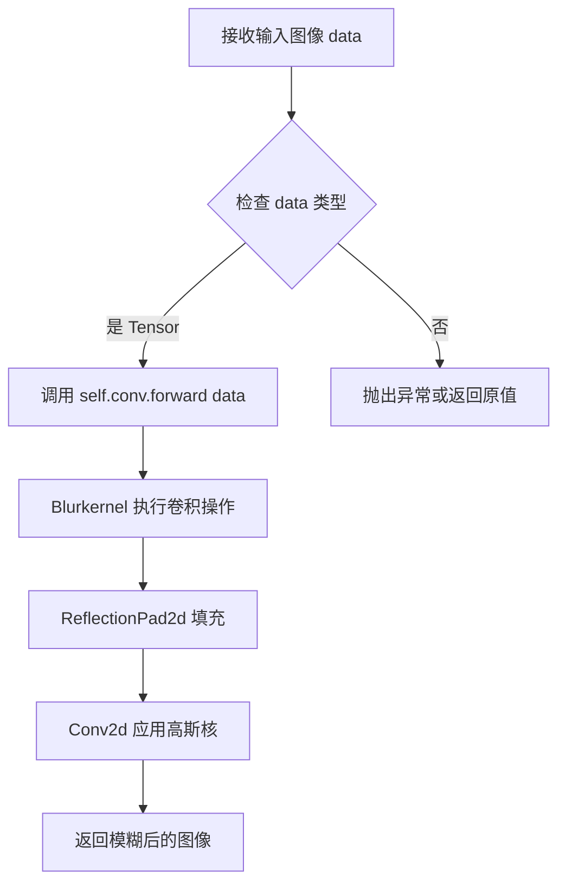

#### 带注释源码

```python
def forward(self, data, **kwargs):
    """
    高斯模糊前向传播函数
    
    该方法接收输入图像，通过内部封装的 Blurkernel 卷积核
    对图像进行高斯模糊处理。Blurkernel 继承自 nn.Module，
    内部包含 ReflectionPad2d 填充和 Conv2d 卷积操作。
    
    Args:
        data (torch.Tensor): 输入图像张量，形状为 [B, C, H, W]
            - B: batch size
            - C: 通道数，通常为 3 (RGB)
            - H: 图像高度
            - W: 图像宽度
        **kwargs: 可选关键字参数，当前未使用
            - 保留此参数以兼容其他 Operator 接口
    
    Returns:
        torch.Tensor: 经过高斯模糊处理后的图像张量
            - 形状与输入相同: [B, C, H, W]
            - 数据类型与输入保持一致
    """
    # 直接调用内部 Blurkernel 卷积层的前向传播
    # self.conv 是 Blurkernel 实例，在 __init__ 中创建
    # Blurkernel.forward 会依次执行:
    # 1. ReflectionPad2d: 边缘填充以防止卷积后图像尺寸缩小
    # 2. Conv2d: 应用预定义的高斯核进行模糊
    return self.conv(data)
```


### `GaussialBlurOperator.transpose`

该方法是高斯模糊算子的转置操作实现，用于在扩散后验采样（DPS）框架中提供算子的转置（伴随）操作。在此实现中，由于高斯模糊算子是线性且对称的，其转置操作等于原操作，但为了接口一致性，这里直接返回原图数据，不做任何变换。

参数：

- `self`：`GaussialBlurOperator`，类实例本身
- `data`：`torch.Tensor`，输入的图像张量，通常为 `[B, C, H, W]` 格式
- `**kwargs`：`dict`，可选的关键字参数，用于扩展接口兼容性

返回值：`torch.Tensor`，返回与输入相同的图像张量

#### 流程图

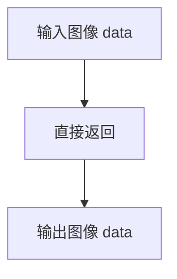

#### 带注释源码

```python
def transpose(self, data, **kwargs):
    """
    转置操作（返回原图）
    
    在扩散后验采样框架中，算子需要提供 forward 和 transpose 两个操作。
    对于高斯模糊算子，由于其线性对称特性，transpose 等同于 identity 操作。
    此处直接返回输入数据，保持接口一致性。
    
    Args:
        data (torch.Tensor): 输入的图像张量，形状为 [B, C, H, W]
        **kwargs: 额外的关键字参数，保持接口扩展性
    
    Returns:
        torch.Tensor: 返回输入的原始图像张量，未做任何变换
    """
    return data
```


### `GaussialBlurOperator.get_kernel(self)`

获取高斯模糊核，将内部存储的一维模糊核 reshape 为四维张量形式（1, 1, kernel_size, kernel_size）以供后续操作使用。

参数：

- `self`：`GaussialBlurOperator` 实例，隐含参数，无需显式传递

返回值：`torch.Tensor`，形状为 (1, 1, kernel_size, kernel_size) 的四维张量，表示标准化后的高斯模糊核

#### 流程图

```mermaid
flowchart TD
    A[开始 get_kernel] --> B{self.kernel 是否存在}
    B -->|是| C[调用 self.kernel.view reshape]
    C --> D[输出形状 (1,1,kernel_size,kernel_size) 的张量]
    B -->|否| E[返回空张量或错误]
    D --> F[结束]
    E --> F
```

#### 带注释源码

```python
def get_kernel(self):
    """
    获取高斯模糊核。
    
    将内部存储的一维高斯核（形状为 [kernel_size, kernel_size]）
    reshape 为四维张量（形状为 [1, 1, kernel_size, kernel_size]），
    以适配卷积操作的输入要求。
    
    Returns:
        torch.Tensor: 形状为 (1, 1, kernel_size, kernel_size) 的模糊核张量
    """
    return self.kernel.view(1, 1, self.kernel_size, self.kernel_size)
```


### `Blurkernel.__init__`

初始化模糊核，设置模糊类型、核大小和标准差，并创建用于图像模糊的卷积层，同时通过 `weights_init` 方法初始化高斯核权重。

参数：

- `self`：`Blurkernel` 自身实例，用于访问类属性和方法
- `blur_type`：`str`，模糊类型参数，默认为 "gaussian"，目前仅支持高斯模糊
- `kernel_size`：`int`，卷积核尺寸，默认为 31，决定模糊作用的邻域大小
- `std`：`float`，高斯分布标准差，默认为 3.0，控制模糊程度

返回值：`None`，无返回值，用于对象初始化

#### 流程图

```mermaid
flowchart TD
    A[开始初始化 Blurkernel] --> B[设置 blur_type 属性]
    B --> C[设置 kernel_size 属性]
    C --> D[设置 std 属性]
    D --> E[创建 ReflectionPad2d 填充层<br/>padding=kernel_size//2]
    E --> F[创建 Conv2d 卷积层<br/>kernel=kernel_size, stride=1, padding=0]
    F --> G[组合 Sequential: Pad + Conv]
    G --> H[调用 weights_init 初始化权重]
    H --> I[结束]
```

#### 带注释源码

```python
def __init__(self, blur_type="gaussian", kernel_size=31, std=3.0):
    """
    初始化模糊核构造函数
    
    参数:
        blur_type: 模糊类型，默认为 "gaussian"
        kernel_size: 卷积核大小，默认为 31
        std: 高斯模糊标准差，默认为 3.0
    """
    # 调用父类 nn.Module 的初始化方法
    super().__init__()
    
    # 保存模糊类型参数到实例属性
    self.blur_type = blur_type
    
    # 保存卷积核尺寸到实例属性
    self.kernel_size = kernel_size
    
    # 保存高斯分布标准差到实例属性
    self.std = std
    
    # 创建卷积序列容器，包含填充层和卷积层
    self.seq = nn.Sequential(
        # 反射填充层，填充宽度为核大小的一半，保持边缘像素的对称性
        nn.ReflectionPad2d(self.kernel_size // 2),
        # 2D 卷积层，输入输出通道均为 3（RGB图像），
        # 卷积核大小为 kernel_size，步长为 1，无额外填充（已在填充层处理），
        # 无偏置，使用分组卷积（groups=3）实现每个通道独立卷积
        nn.Conv2d(3, 3, self.kernel_size, stride=1, padding=0, bias=False, groups=3),
    )
    
    # 调用权重初始化方法，根据 blur_type 创建对应的卷积核权重
    self.weights_init()
```


### `Blurkernel.forward`

执行模糊卷积操作，对输入图像应用高斯模糊 kernel，通过 ReflectionPad2d 填充后使用卷积核进行模糊处理。

参数：

- `self`：隐式参数，Blurkernel 实例本身
- `x`：`torch.Tensor`，形状为 [B, C, H, W] 的输入图像张量，待模糊处理的图像数据

返回值：`torch.Tensor`，模糊处理后的图像张量，形状与输入相同

#### 流程图

```mermaid
flowchart TD
    A[输入图像 x] --> B[ReflectionPad2d 填充]
    B --> C[卷积操作 Conv2d]
    C --> D[输出模糊图像]
    
    subgraph Blurkernel 内部
        B1[kernel_size // 2 填充]
        C1[3x3 卷积<br/>groups=3<br/>stride=1]
    end
```

#### 带注释源码

```python
def forward(self, x):
    """
    Blurkernel 的前向传播方法，执行模糊卷积
    
    参数:
        x: 输入图像张量，形状 [B, C, H, W]
    
    返回:
        模糊处理后的图像张量，形状与输入相同
    """
    # 使用 nn.Sequential 中定义的序列模块进行处理：
    # 1. nn.ReflectionPad2d(self.kernel_size // 2) - 边缘填充，使用镜像填充方式
    # 2. nn.Conv2d(...) - 执行卷积操作，应用高斯模糊 kernel
    return self.seq(x)
```

#### 关键细节

- **kernel 初始化**：`weights_init()` 方法使用 `scipy.ndimage.gaussian_filter` 生成标准高斯 kernel，并复制到卷积层的权重参数中
- **填充方式**：使用 `ReflectionPad2d`（反射填充），可以避免边缘出现明显的黑白边框
- **分组卷积**：`groups=3` 表示使用分组卷积（每个通道独立卷积），保持 RGB 三个通道独立处理
- **无偏置**：`bias=False` 因为高斯模糊不需要偏置项


### `Blurkernel.weights_init`

该方法用于初始化高斯模糊核的权重，通过创建高斯分布的二维核并将其复制到卷积层的参数中。

参数：无需显式参数（`self` 为隐式参数）

返回值：`无`（`None`），该方法直接修改对象内部状态，不返回任何值

#### 流程图

```mermaid
flowchart TD
    A[开始 weights_init] --> B{self.blur_type == 'gaussian'?}
    B -- 否 --> C[方法直接返回, 不做任何操作]
    B -- 是 --> D[创建 kernel_size x kernel_size 的零矩阵 n]
    E[设置 n[center, center] = 1] --> F[使用 scipy.ndimage.gaussian_filter 生成高斯核]
    F --> G[将 numpy 数组转换为 PyTorch Tensor]
    G --> H[保存到 self.k 属性]
    I[遍历所有命名参数并复制核数据] --> J[结束]
    C --> J
```

#### 带注释源码

```python
def weights_init(self):
    """
    初始化高斯模糊核权重
    
    该方法根据 blur_type 类型初始化卷积层的权重。
    当 blur_type 为 'gaussian' 时，生成一个二维高斯核并将其
    复制到卷积层的参数中。
    """
    # 检查模糊类型是否为高斯模糊
    if self.blur_type == "gaussian":
        # 1. 创建一个 kernel_size x kernel_size 的二维零矩阵
        #    这是高斯核的基础数组
        n = np.zeros((self.kernel_size, self.kernel_size))
        
        # 2. 在矩阵中心位置设置值为1，这代表单位脉冲
        #    中心坐标: [kernel_size // 2, kernel_size // 2]
        n[self.kernel_size // 2, self.kernel_size // 2] = 1
        
        # 3. 使用 scipy.ndimage.gaussian_filter 对单位脉冲进行高斯滤波
        #    sigma 参数控制高斯核的标准差 (模糊程度)
        #    std 越大，模糊效果越强，核的扩散范围越广
        k = scipy.ndimage.gaussian_filter(n, sigma=self.std)
        
        # 4. 将生成的高斯核从 numpy 数组转换为 PyTorch 张量
        #    转换后可用于 PyTorch 模型的参数
        k = torch.from_numpy(k)
        
        # 5. 保存生成的核到实例属性 self.k，供其他方法使用
        #    如 get_kernel() 方法会返回此核
        self.k = k
        
        # 6. 遍历卷积层的所有参数 (即卷积核权重)
        #    named_parameters() 返回参数名称和参数本身的元组
        #    将生成的高斯核复制到每个卷积核参数中
        #    这里假设卷积层只有 1 个需要初始化的参数
        for name, f in self.named_parameters():
            # 使用 data.copy_() 进行原位复制，避免创建新张量
            f.data.copy_(k)
```


### `Blurkernel.update_weights`

更新高斯模糊卷积核的权重。该方法接受新的卷积核权重（可以是numpy数组或torch.Tensor），并将其复制到卷积层的参数中，实现核权重的动态更新。

参数：

- `k`：`Union[np.ndarray, torch.Tensor]`，新的卷积核权重矩阵

返回值：`None`，无返回值

#### 流程图

```mermaid
flowchart TD
    A[开始 update_weights] --> B{检查 k 是否为 Tensor}
    B -->|否| C[将 k 转换为 torch.Tensor]
    B -->|是| D[继续]
    C --> D
    D --> E[遍历所有参数 named_parameters]
    E --> F[将当前参数的 data 复制为 k]
    F --> G{是否还有更多参数}
    G -->|是| E
    G -->|否| H[结束]
```

#### 带注释源码

```
def update_weights(self, k):
    """
    更新卷积核权重
    
    参数:
        k: 新的卷积核权重，可以是numpy数组或torch.Tensor
    """
    # 检查输入的k是否为torch.Tensor，如果不是则转换为torch.Tensor
    if not torch.is_tensor(k):
        k = torch.from_numpy(k)
    
    # 遍历模型的所有参数（这里只有卷积核权重）
    for name, f in self.named_parameters():
        # 将参数的数据复制为新的卷积核权重k
        f.data.copy_(k)
```


### `Blurkernel.get_kernel`

获取当前卷积核的权重数据。该方法是`Blurkernel`类的内部方法，用于返回在初始化或权重更新后保存的高斯模糊核张量。

参数：
- `self`：隐式参数，`Blurkernel`类实例本身，无需显式传入

返回值：`torch.Tensor`，返回存储的高斯模糊核张量，形状为`[kernel_size, kernel_size]`

#### 流程图

```mermaid
graph TD
    A[开始 get_kernel] --> B{返回 self.k}
    B --> C[返回 torch.Tensor 类型的高斯核]
    D[Blurkernel 实例化] --> E[调用 weights_init 初始化核]
    E --> F[将核存储在 self.k 属性]
    F --> G[后续可调用 get_kernel 获取核]
    G --> A
```

#### 带注释源码

```python
def get_kernel(self):
    """
    获取当前核的权重张量
    
    返回:
        torch.Tensor: 初始化或更新后的高斯模糊核，形状为 [kernel_size, kernel_size]
                      即 self.kernel_size x self.kernel_size 的二维张量
    """
    return self.k  # 返回在 weights_init 或 update_weights 中设置的核张量
```

## 关键组件


### DPSPipeline

核心扩散后验采样管道，继承自DiffusionPipeline，用于从测量图像中恢复原始图像。实现了基于梯度优化的去噪过程，结合测量损失进行图像重建。

### SuperResolutionOperator

超分辨率操作符类，继承自nn.Module。内部包含Resizer类，实现基于卷积核的图像缩放功能。支持多种插值方法（cubic、lanczos、linear、box），通过计算贡献权重和视野场进行可学习的图像放大/缩小操作。

### GaussialBlurOperator

高斯模糊操作符类，继承自nn.Module。内部包含Blurkernel类，使用高斯核进行图像模糊。实现了前向传播和转置操作，支持动态更新模糊核权重。

### Resizer

图像尺寸调整内部类，负责计算插值核权重和视野场。实现了多种插值方法的核函数（cubic、lanczos2、lanczos3、box、linear），通过贡献函数计算输入图像每个维度的影响力权重。

### Blurkernel

模糊核内部类，使用scipy.ndimage.gaussian_filter生成高斯核权重，通过ReflectionPad2d进行边界填充，使用 groups=3 的 Depthwise Conv2d 实现高效模糊。

### RMSELoss

均方根误差损失函数，用于计算测量图像与预测测量图像之间的差异。返回标量张量作为反向传播的梯度依据。

### 张量索引与惰性加载

在Resizer的forward方法中，使用field_of_view进行张量索引，实现高效的维度-wise图像重采样。通过torch.transpose动态调整维度顺序，支持任意维度的缩放操作。

### 梯度管理与图像更新

在DPSPipeline的去噪循环中，使用image.requires_grad_()启用梯度计算，通过损失反向传播计算梯度，然后使用image.grad进行图像更新，最后detach()分离计算图实现迭代更新。

### 调度器集成

集成DDPMScheduler进行噪声调度，通过scheduler.step()获取预测样本和原始样本预测，利用预测的原始样本来计算测量损失实现闭环优化。

### 图像后处理

完成去噪后，将图像从[-1,1]范围clamp并映射到[0,1]，通过permute调整维度顺序从CHW转为HWC，最后根据output_type转换为PIL图像或numpy数组。


## 问题及建议


### 已知问题

-   **梯度计算效率低下**：在每个去噪步骤中启用`requires_grad_()`并在循环内执行`loss.backward()`，导致每次迭代都构建完整的计算图，严重消耗GPU内存并降低推理速度
-   **参数验证缺失**：未对`measurement`的形状、`operator`的兼容性、`loss_fn`的签名等关键输入进行验证，可能导致运行时错误
-   **内部类过度使用**：`Resizer`和`Blurkernel`作为嵌套类定义在主类内部，降低了代码可测试性和可维护性
-   **梯度上下文管理不当**：在`@torch.no_grad()`装饰的方法内部使用`torch.enable_grad()`和`with torch.enable_grad()`，逻辑混乱且可能导致意外的梯度跟踪
-   **硬编码值缺乏说明**：`zeta`参数在类定义中默认值为0.3，但在主函数中被设置为1.0，这种差异未在文档中说明；图像归一化使用的127.5也是硬编码magic number
-   **调度器重复初始化**：在`__call__`中调用`self.scheduler.set_timesteps(num_inference_steps)`，但主函数中已经调用过一次，造成冗余计算
-   **类型注解不完整**：`output_type`参数支持的值（"pil"或"np.array"）未在类型注解中体现，`return_dict`的类型应为`bool`
-   **运算符调用冗余**：`operator`在每个时间步被调用两次（计算`measurement_pred`），对于计算密集型算子（如超分辨率）性能影响显著
-   **拼写错误**：`GaussialBlurOperator`类名中"Gaussial"应为"Gaussian"
-   **资源清理缺失**：长时间运行时未显式清理GPU缓存或调用`torch.cuda.empty_cache()`

### 优化建议

-   将梯度计算逻辑移至单独的前向传播路径，或使用`torch.autograd.functional.jacobian`等无图方式计算梯度，避免构建完整计算图
-   在方法入口添加参数验证：检查`measurement`与`unet`输入形状的一致性，验证`operator`返回形状，校验`loss_fn`可调用性
-   将`Resizer`和`Blurkernel`提取为独立模块或至少移到类外部作为可导入的辅助类
-   移除`@torch.no_grad()`装饰器或在`__call__`开头明确管理梯度上下文，避免混用`no_grad`和`enable_grad`
-   将`zeta`默认值统一为1.0或将其加入参数文档；使用常量代替127.5等magic number
-   移除主函数中重复的`scheduler.set_timesteps(1000)`调用
-   为`output_type`使用`Literal["pil", "np.array"]`类型注解，或在文档中明确列出可选值
-   考虑缓存或预计算`operator`的部分结果，或在`operator`不需要梯度时使用`torch.no_grad()`包裹
-   修正拼写错误：`GaussialBlurOperator` → `GaussianBlurOperator`
-   在循环结束后或显存压力较大时添加显式GPU缓存清理
-   添加错误处理逻辑，如捕获CUDA内存溢出并给出友好提示
-   为`SuperResolutionOperator`和`GaussialBlurOperator`添加`__repr__`方法便于调试


## 其它


### 设计目标与约束

本Pipeline的设计目标是实现Diffusion Posterior Sampling（DPS）算法，用于在已知测量算子和损失函数的情况下，从退化图像中恢复原始图像。核心约束包括：1）必须使用DDPMScheduler作为去噪调度器；2）measurement、operator和loss_fn三个参数为必需参数；3）仅支持PyTorch张量作为输入输出格式；4）图像尺寸受限于UNet2DModel的sample_size配置；5）仅支持CPU和CUDA设备，不支持多GPU分布式推理。

### 错误处理与异常设计

代码中错误处理机制较为薄弱，主要依赖PyTorch和diffusers库的默认异常抛出。关键异常场景包括：1）device为"mps"时使用randn_tensor可能产生不确定结果，仅在注释中说明但未抛出警告；2）operator返回的measurement_pred维度不匹配时会抛出RuntimeError；3）loss_fn返回非标量张量时backward()会失败；4）当output_type为"pil"但图像转换失败时抛出异常。建议增加：输入形状兼容性检查、设备可用性验证、梯度计算前的张量连续性检查、损失值有效性验证等。

### 数据流与状态机

主状态转换流程：初始化状态（创建Pipeline）→噪声采样状态（randn_tensor生成初始噪声）→去噪循环状态（遍历timesteps）→后处理状态（归一化、转换格式）。在去噪循环内部，每个timestep执行：预测噪声→调度器步进→计算测量预测→计算损失→梯度更新图像。其中image需要设置requires_grad_()启用梯度，image.grad用于修正预测，image_pred需要detach()断开梯度链以避免内存累积。

### 外部依赖与接口契约

核心依赖包括：1）diffusers库（ DiffusionPipeline, DDPMScheduler, UNet2DModel, ImagePipelineOutput）；2）torch库（张量运算、神经网络模块）；3）numpy库（数值计算）；4）PIL库（图像处理）；5）scipy库（仅main函数中用于高斯模糊核生成）。operator参数必须为torch.nn.Module且实现forward(data)方法，返回与measurement形状相同的张量。loss_fn参数必须为Callable类型，接收两个torch.Tensor返回标量torch.Tensor。

### 配置与参数说明

关键配置参数：zeta（float，默认0.3）为梯度修正系数，控制图像更新步长；num_inference_steps（int，默认1000）为去噪迭代次数；batch_size（int，默认1）为生成图像数量；output_type（str，默认"pil"）支持"pil"和"numpy"；generator用于控制随机数生成以实现可复现性。UNet2DModel的配置通过self.unet.config访问，包括in_channels、sample_size等。scheduler通过set_timesteps()方法设置离散时间步。

### 性能特征与基准

推理时间复杂度为O(num_inference_steps × UNet2DModel_forward_time)，其中UNet2DModel_forward_time取决于输入分辨率和模型规模。内存占用主要来自：1）UNet2DModel的模型参数；2）图像张量（batch_size × in_channels × H × W）；3）梯度计算中间变量（约为图像张量的2-3倍）。当前实现中每个timestep都调用backward()，导致梯度历史累积，建议优化梯度计算策略。

### 安全性考虑

代码未包含用户输入验证和恶意输入防护。潜在安全风险：1）operator和loss_fn由用户提供，可能包含恶意代码；2）大规模num_inference_steps可能导致拒绝服务；3）measurement张量未验证合法性；4）模型加载未验证完整性。生产环境部署时需要增加输入验证、沙箱执行、资源限制等措施。

### 版本兼容性

代码依赖的API版本要求：Python 3.8+；PyTorch 1.9+；diffusers 0.14.0+；numpy 1.21+；PIL 8.0+；scipy 1.7+。torch.no_grad()和torch.enable_grad()上下文管理器需PyTorch 1.8+。类型注解str | None需要Python 3.10+，对于Python 3.8/3.9需使用Union[str, None]。

### 使用示例与测试用例

代码在if __name__ == "__main__":块中提供了完整使用示例：使用GaussialBlurOperator作为测量算子，L2范数（RMSE）作为损失函数，从DDPM预训练模型生成图像。测试场景包括：1）SuperResolutionOperator的超分辨率测试；2）不同zeta值对重建质量的影响；3）不同损失函数（MAE、L1、SSIM）的对比；4）不同调度器的兼容性测试。

### 部署与运维注意事项

部署时需注意：1）模型权重需提前下载（google/ddpm-celebahq-256）；2）CUDA设备内存需满足模型加载需求（建议8GB+）；3）MPS设备存在随机数生成不可重现问题；4）长时间推理需监控GPU内存泄漏（当前实现detach()处理较为合理）；5）日志输出仅使用print打印损失值，建议接入标准日志框架；6）可考虑添加进度条显示（已使用progress_bar）；7）生产环境建议添加推理超时机制。

    