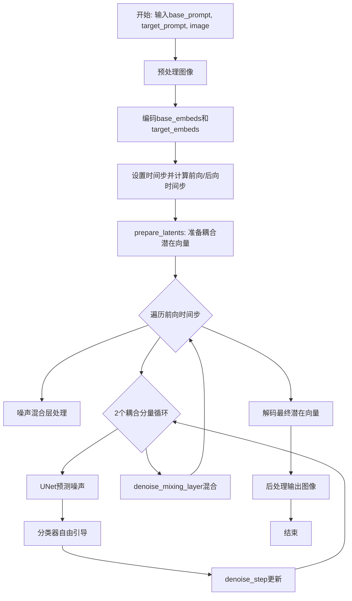
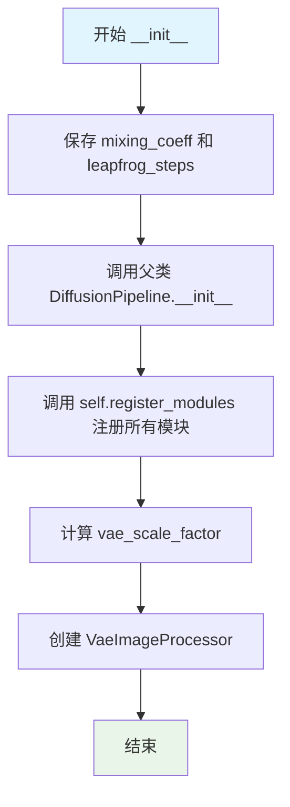
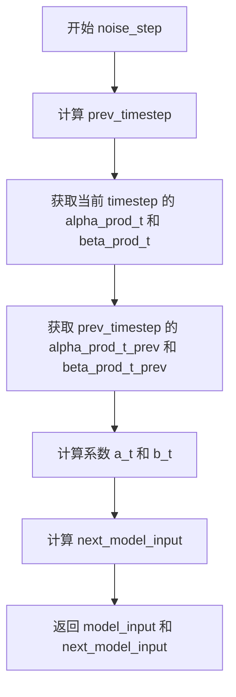

# `diffusers\examples\community\edict_pipeline.py` 详细设计文档

EDICTPipeline是一个基于扩散模型的图像到图像转换管道，实现EDICT(Explicit Dual Interaction and Composition)算法，通过耦合潜在向量的交替去噪和噪声混合操作，实现从base_prompt到target_prompt的图像转换。

## 整体流程



## 类结构

```
DiffusionPipeline (基类)
└── EDICTPipeline (实现类)
```

## 全局变量及字段


### `EDICTPipeline.mixing_coeff`
    
混合系数，控制两个潜在向量的混合比例，默认为0.93

类型：`float`
    


### `EDICTPipeline.leapfrog_steps`
    
是否使用跳步策略，用于交替更新两个潜在向量，默认为True

类型：`bool`
    


### `EDICTPipeline.vae`
    
变分自编码器，用于将图像编码为潜在向量和解码潜在向量为图像

类型：`AutoencoderKL`
    


### `EDICTPipeline.text_encoder`
    
CLIP文本编码器，用于将文本提示编码为嵌入向量

类型：`CLIPTextModel`
    


### `EDICTPipeline.tokenizer`
    
CLIP分词器，用于将文本提示分词为token IDs

类型：`CLIPTokenizer`
    


### `EDICTPipeline.unet`
    
条件UNet去噪模型，用于根据文本嵌入预测噪声

类型：`UNet2DConditionModel`
    


### `EDICTPipeline.scheduler`
    
DDIM调度器，用于控制扩散过程中的时间步调度

类型：`DDIMScheduler`
    


### `EDICTPipeline.vae_scale_factor`
    
VAE缩放因子，用于调整潜在向量的尺度，基于VAE块输出通道数计算

类型：`int`
    


### `EDICTPipeline.image_processor`
    
VAE图像处理器，用于图像的预处理和后处理

类型：`VaeImageProcessor`
    
    

## 全局函数及方法


### EDICTPipeline.__init__

这是 EDICTPipeline 类的初始化方法，负责接收并注册扩散模型的所有组件（VAE、文本编码器、分词器、UNet、调度器），同时初始化混合系数、跳步策略、VAE 缩放因子和图像处理器等关键配置。

参数：

- `vae`：`AutoencoderKL`，变分自编码器，用于对图像进行编码和解码
- `text_encoder`：`CLIPTextModel`，CLIP 文本编码器，将文本提示转换为嵌入向量
- `tokenizer`：`CLIPTokenizer`，CLIP 分词器，用于对文本进行分词处理
- `unet`：`UNet2DConditionModel`，条件 UNet 模型，负责在潜在空间中进行去噪操作
- `scheduler`：`DDIMScheduler`，DDIM 调度器，控制扩散过程中的时间步调度
- `mixing_coeff`：`float`，可选参数，默认为 0.93，EDICT 算法中的混合系数，用于控制两个潜在表示的混合比例
- `leapfrog_steps`：`bool`，可选参数，默认为 True，是否启用跳步策略（leapfrog）以交替使用两个潜在表示

返回值：`None`，该方法为构造函数，不返回任何值

#### 流程图



#### 带注释源码

```python
def __init__(
    self,
    vae: AutoencoderKL,
    text_encoder: CLIPTextModel,
    tokenizer: CLIPTokenizer,
    unet: UNet2DConditionModel,
    scheduler: DDIMScheduler,
    mixing_coeff: float = 0.93,
    leapfrog_steps: bool = True,
):
    """
    初始化 EDICTPipeline 扩散管道
    
    参数:
        vae: AutoencoderKL 变分自编码器
        text_encoder: CLIPTextModel 文本编码器
        tokenizer: CLIPTokenizer 分词器
        unet: UNet2DConditionModel 条件 UNet
        scheduler: DDIMScheduler 调度器
        mixing_coeff: float 混合系数，默认 0.93
        leapfrog_steps: bool 是否启用跳步，默认 True
    """
    # 1. 保存实例配置参数
    self.mixing_coeff = mixing_coeff  # EDICT 混合系数
    self.leapfrog_steps = leapfrog_steps  # 是否使用跳步策略
    
    # 2. 调用父类 DiffusionPipeline 的初始化方法
    super().__init__()
    
    # 3. 注册所有模块到 pipeline 中
    # 这使得 pipeline 可以序列化/反序列化这些组件
    self.register_modules(
        vae=vae,
        text_encoder=text_encoder,
        tokenizer=tokenizer,
        unet=unet,
        scheduler=scheduler,
    )
    
    # 4. 计算 VAE 缩放因子
    # 基于 VAE 的 block_out_channels 深度计算
    # 公式: 2^(len(block_out_channels) - 1)
    # 如果 VAE 存在则使用实际配置，否则默认为 8
    self.vae_scale_factor = 2 ** (len(self.vae.config.block_out_channels) - 1) if getattr(self, "vae", None) else 8
    
    # 5. 创建 VAE 图像处理器
    # 用于图像的预处理和后处理
    self.image_processor = VaeImageProcessor(vae_scale_factor=self.vae_scale_factor)
```


### `EDICTPipeline._encode_prompt`

该方法负责将文本提示词（正向和反向）编码为嵌入向量，供扩散模型的UNet在去噪过程中使用。当启用无分类器引导时，会将负向提示词的嵌入与正向提示词的嵌入拼接在一起，以实现classifier-free guidance机制。

参数：

- `self`：`EDICTPipeline`，当前pipeline实例，持有tokenizer、text_encoder等编码组件
- `prompt`：`str`，用户输入的正向提示词（positive prompt），描述期望生成的图像内容
- `negative_prompt`：`str | None`，可选的反向提示词（negative prompt），描述希望避免的图像特征，默认为None
- `do_classifier_free_guidance`：`bool`，是否启用无分类器引导（Classifier-Free Guidance），为True时会在推理时同时计算正向和负向条件嵌入

返回值：`torch.Tensor`，形状为`(batch_size, seq_len, hidden_size)`的文本嵌入张量。当`do_classifier_free_guidance=False`时，batch维度为1；当为True时，batch维度为2（第一维是负向嵌入，第二维是正向嵌入），用于后续UNet的guidance计算。

#### 流程图

```mermaid
flowchart TD
    A[开始 _encode_prompt] --> B[调用 tokenizer 编码 prompt]
    B --> C[将 input_ids 移动到设备]
    C --> D[通过 text_encoder 获取 last_hidden_state]
    D --> E{do_classifier_free_guidance?}
    E -->|False| F[直接返回 prompt_embeds]
    E -->|True| G[处理 negative_prompt]
    G --> H[使用 tokenizer 编码 negative_prompt]
    H --> I[通过 text_encoder 获取 negative_prompt_embeds]
    I --> J[拼接: torch.cat<br/>[negative_prompt_embeds, prompt_embeds]]
    J --> F
```

#### 带注释源码

```python
def _encode_prompt(
    self, prompt: str, negative_prompt: str | None = None, do_classifier_free_guidance: bool = False
):
    """
    将文本提示词编码为条件嵌入向量，供扩散模型UNet使用
    
    参数:
        prompt: str - 正向提示词，描述期望生成的图像内容
        negative_prompt: str | None - 反向提示词，可选，用于指定应避免的特征
        do_classifier_free_guidance: bool - 是否启用无分类器引导技术
    
    返回:
        torch.Tensor - 文本嵌入向量，形状为 (batch, seq_len, hidden_dim)
    """
    # Step 1: 使用tokenizer将正向prompt转换为token ids
    # padding="max_length"确保所有序列长度统一到模型最大长度
    # return_tensors="pt"返回PyTorch张量
    text_inputs = self.tokenizer(
        prompt,
        padding="max_length",
        max_length=self.tokenizer.model_max_length,
        truncation=True,
        return_tensors="pt",
    )

    # Step 2: 将token ids输入CLIP文本编码器，获取文本嵌入
    # .to(self.device)确保计算设备与模型一致
    # .last_hidden_state获取最后一层的隐藏状态作为文本表示
    prompt_embeds = self.text_encoder(text_inputs.input_ids.to(self.device)).last_hidden_state

    # Step 3: 确保嵌入的dtype和device与text_encoder一致
    # 保持数据类型一致性，避免精度损失
    prompt_embeds = prompt_embeds.to(dtype=self.text_encoder.dtype, device=self.device)

    # Step 4: 如果启用无分类器引导，处理负向提示词
    if do_classifier_free_guidance:
        # 如果未提供negative_prompt，使用空字符串
        uncond_tokens = "" if negative_prompt is None else negative_prompt

        # 同样对负向prompt进行tokenize
        uncond_input = self.tokenizer(
            uncond_tokens,
            padding="max_length",
            max_length=self.tokenizer.model_max_length,
            truncation=True,
            return_tensors="pt",
        )

        # 获取负向提示词的嵌入
        negative_prompt_embeds = self.text_encoder(uncond_input.input_ids.to(self.device)).last_hidden_state

        # Step 5: 拼接负向和正向嵌入
        # 拼接顺序必须是 [negative, positive]，因为在后续推理时
        # torch.chunk(2) 会按这个顺序解包用于CFG公式:
        # noise_pred = noise_pred_uncond + guidance * (noise_pred_text - noise_pred_uncond)
        prompt_embeds = torch.cat([negative_prompt_embeds, prompt_embeds])

    # 返回最终的文本嵌入
    return prompt_embeds
```


### `EDICTPipeline.denoise_mixing_layer`

该方法执行去噪过程中的潜在向量混合操作，通过混合系数 `mixing_coeff` 将两个潜在向量 x 和 y 进行线性组合和交换，实现 EDIC（Edit-Conditional Inversion and Compensation）算法的核心混合逻辑，用于在扩散模型的去噪迭代中交替更新两个耦合的潜在表示。

参数：

- `x`：`torch.Tensor`，第一个潜在向量，表示当前迭代中的模型输入
- `y`：`torch.Tensor`，第二个潜在向量，表示当前迭代中的基准潜在向量

返回值：`list[torch.Tensor]`，返回混合后的两个潜在向量组成的列表 `[x_new, y_new]`

#### 流程图

```mermaid
flowchart TD
    A[输入: x, y] --> B{执行混合操作}
    B --> C[x_new = mixing_coeff * x + (1 - mixing_coeff) * y]
    C --> D[y_new = mixing_coeff * y + (1 - mixing_coeff) * x]
    D --> E[返回: [x_new, y_new]]
    
    style A fill:#e1f5fe
    style E fill:#e8f5e8
```

#### 带注释源码

```python
def denoise_mixing_layer(self, x: torch.Tensor, y: torch.Tensor):
    """
    执行去噪过程中的潜在向量混合操作
    
    该方法实现了EDIC算法的核心混合逻辑，通过混合系数将两个潜在向量
    进行线性组合和交换，实现两个潜在表示之间的信息传递和互补。
    
    混合公式:
    - x_new = mixing_coeff * x + (1 - mixing_coeff) * y
    - y_new = mixing_coeff * y + (1 - mixing_coeff) * x
    
    Args:
        x: torch.Tensor，第一个潜在向量（模型输入）
        y: torch.Tensor，第二个潜在向量（基准向量）
    
    Returns:
        list[torch.Tensor]：混合后的两个潜在向量 [x_new, y_new]
    """
    
    # 计算第一个潜在向量的新值
    # 使用mixing_coeff作为权重，对x和y进行线性组合
    x = self.mixing_coeff * x + (1 - self.mixing_coeff) * y
    
    # 计算第二个潜在向量的新值
    # 交换权重顺序，对y和x进行线性组合
    y = self.mixing_coeff * y + (1 - self.mixing_coeff) * x
    
    # 返回混合后的两个潜在向量
    return [x, y]
```


### `EDICTPipeline.noise_mixing_layer`

该方法实现了 EDIC（Explicit Dual Interaction and Coupling）扩散模型中的噪声混合层，通过反向线性变换对两个耦合的潜在表示进行解混处理，基于 `mixing_coeff` 系数实现双向信息交互。

参数：

- `x`：`torch.Tensor`，第一个潜在表示张量
- `y`：`torch.Tensor`，第二个潜在表示张量

返回值：`List[torch.Tensor]`，返回混合后的两个潜在表示 [x, y]

#### 流程图

```mermaid
flowchart TD
    A[输入: x, y] --> B[计算y的更新值<br/>y' = (y - (1-mixing_coeff) * x) / mixing_coeff]
    B --> C[计算x的更新值<br/>x' = (x - (1-mixing_coeff) * y') / mixing_coeff]
    C --> D[返回 [x', y']]
```

#### 带注释源码

```python
def noise_mixing_layer(self, x: torch.Tensor, y: torch.Tensor):
    """
    噪声混合层 - 执行反向混合操作
    
    该方法是 denoise_mixing_layer 的逆操作，用于在扩散过程的第一步（噪声添加步骤）
    对两个耦合的潜在表示进行解混。通过线性变换实现两个潜在表示之间的信息传递。
    
    数学公式（反向推导）:
    - 设原始关系为: x_new = mixing_coeff * x + (1 - mixing_coeff) * y
    - 求逆可得: x = (x_new - (1 - mixing_coeff) * y) / mixing_coeff
    
    参数:
        x: 第一个潜在表示张量
        y: 第二个潜在表示张量
    
    返回:
        包含混合后两个张量的列表 [x, y]
    """
    # 使用混合系数的逆运算对 y 进行解混
    # 公式: y = (y - (1 - mixing_coeff) * x) / mixing_coeff
    y = (y - (1 - self.mixing_coeff) * x) / self.mixing_coeff
    
    # 使用更新后的 y 值对 x 进行解混
    # 公式: x = (x - (1 - mixing_coeff) * y) / mixing_coeff
    x = (x - (1 - self.mixing_coeff) * y) / self.mixing_coeff

    # 返回解混后的两个潜在表示
    return [x, y]
```


### `EDICTPipeline._get_alpha_and_beta`

该方法根据给定的时间步t，从调度器(Scheduler)中获取对应的alpha累积乘积(alpha_prod)和beta值(beta_prod = 1 - alpha_prod)。这是EDIC算法中进行噪声预测和潜在向量处理的核心计算组件，用于在去噪/加噪过程中计算中间变量。

参数：

- `t`：`torch.Tensor`，时间步张量，表示当前推理过程中的时间步索引

返回值：返回元组`(alpha_prod, beta_prod)`
- `alpha_prod`：`float`，调度器在时间步t处的alpha累积乘积值，如果t<0则使用final_alpha_cumprod
- `beta_prod`：`float`，beta值，计算公式为`1 - alpha_prod`，用于后续的噪声预测计算

#### 流程图

```mermaid
flowchart TD
    A[输入: 时间步t] --> B[将t转换为int类型]
    B --> C{t >= 0?}
    C -->|Yes| D[从scheduler.alphas_cumprod[t]获取alpha_prod]
    C -->|No| E[使用scheduler.final_alpha_cumprod作为alpha_prod]
    D --> F[计算beta_prod = 1 - alpha_prod]
    E --> F
    F --> G[返回: (alpha_prod, beta_prod)]
```

#### 带注释源码

```python
def _get_alpha_and_beta(self, t: torch.Tensor):
    # 由于self.alphas_cumprod始终存储在CPU上，需要先将张量转换为Python int类型
    # 以便作为索引访问列表/数组
    t = int(t)

    # 从调度器获取alpha累积乘积
    # 如果t >= 0，从预计算的alphas_cumprod数组中索引获取
    # 如果t < 0，使用final_alpha_cumprod作为最终收敛时的alpha值
    alpha_prod = self.scheduler.alphas_cumprod[t] if t >= 0 else self.scheduler.final_alpha_cumprod

    # beta_prod计算公式: beta = 1 - alpha
    # 这是DDIM等扩散模型调度器中的标准计算方式
    return alpha_prod, 1 - alpha_prod
```


### `EDICTPipeline.noise_step`

该方法执行 EDICTPipeline 的噪声步骤（noise step），用于扩散模型的逆过程中。它基于当前时间步的 alpha 和 beta 乘积计算系数 a_t 和 b_t，然后结合基础潜在表示、模型输入和模型输出来计算下一个时间步的模型输入。这是 EDIC (Explicit Dual Implicit Conservation) 算法的核心计算步骤，用于在反向扩散过程中同时维护两个耦合的潜在表示。

参数：

- `base`：`torch.Tensor`，基础潜在表示（base latent），代表扩散过程中的基础状态
- `model_input`：`torch.Tensor`，模型输入（model input），代表当前噪声步骤的模型输入
- `model_output`：`torch.Tensor`，模型输出（model output），是 UNet 模型预测的噪声
- `timestep`：`torch.Tensor`，时间步（timestep），当前推理过程中的时间步

返回值：`tuple[torch.Tensor, torch.Tensor]`，返回一个元组，包含原始的 model_input（未修改）和计算得出的 next_model_input（下一个时间步的模型输入）

#### 流程图



#### 带注释源码

```python
def noise_step(
    self,
    base: torch.Tensor,
    model_input: torch.Tensor,
    model_output: torch.Tensor,
    timestep: torch.Tensor,
):
    """
    执行 EDICTPipeline 的噪声步骤计算
    
    参数:
        base: 基础潜在表示，代表扩散过程中的基础状态
        model_input: 当前噪声步骤的模型输入
        model_output: UNet 模型预测的噪声
        timestep: 当前推理过程中的时间步
    
    返回:
        包含原始 model_input 和下一个时间步 next_model_input 的元组
    """
    
    # 计算前一个时间步：当前时间步减去一个推理步长对应的训练时间步数
    # 公式: prev_timestep = timestep - (num_train_timesteps / num_inference_steps)
    prev_timestep = timestep - self.scheduler.config.num_train_timesteps / self.scheduler.num_inference_steps

    # 获取当前时间步的 alpha 累积乘积和 beta（beta = 1 - alpha）
    # alpha_prod_t 表示 α(t)，beta_prod_t 表示 β(t)
    alpha_prod_t, beta_prod_t = self._get_alpha_and_beta(timestep)
    
    # 获取前一个时间步的 alpha 累积乘积和 beta
    # alpha_prod_t_prev 表示 α(t-1)，beta_prod_t_prev 表示 β(t-1)
    alpha_prod_t_prev, beta_prod_t_prev = self._get_alpha_and_beta(prev_timestep)

    # 计算系数 a_t 和 b_t，用于 EDIC 算法的噪声步骤计算
    # a_t = sqrt(α(t-1) / α(t))
    # 这是缩放因子，用于归一化潜在表示
    a_t = (alpha_prod_t_prev / alpha_prod_t) ** 0.5
    
    # b_t = -a_t * sqrt(β(t)) + sqrt(β(t-1))
    # 这是偏移因子，用于调整噪声的添加
    b_t = -a_t * (beta_prod_t**0.5) + beta_prod_t_prev**0.5

    # 根据 EDIC 噪声步骤公式计算下一个时间步的模型输入
    # next_model_input = (base - b_t * model_output) / a_t
    # 这个公式实现了从时间步 t 到 t-1 的反向扩散过程
    next_model_input = (base - b_t * model_output) / a_t

    # 返回原始的 model_input（保持不变）和转换后的 next_model_input
    # 返回时确保数据类型与 base 一致
    return model_input, next_model_input.to(base.dtype)
```


### `EDICTPipeline.denoise_step`

该方法是 EDICTPipeline 类的核心去噪步骤实现，基于 EDICT（Explicit Diffusion Iterative Correction Technology）算法的反向扩散过程，通过混合系数计算当前时间步的模型输入和基础张量的线性组合，生成下一时间步的模型输入，实现文本引导的图像编辑。

参数：

- `self`：EDICTPipeline 实例本身，包含调度器、UNet 等扩散模型组件。
- `base`：`torch.Tensor`，基础张量，代表耦合潜在表示中的一个分支，作为去噪计算的基准。
- `model_input`：`torch.Tensor`，模型输入张量，代表当前时间步的潜在表示，需要被更新。
- `model_output`：`torch.Tensor`，模型输出张量，由 UNet 预测的噪声残差，用于计算下一时间步的潜在表示。
- `timestep`：`torch.Tensor`，当前时间步，用于获取对应的 alpha 和 beta 累积乘积。

返回值：`(torch.Tensor, torch.Tensor)`，返回当前时间步的模型输入（保持不变）和基于 DDIM 调度器计算的下一时间步的模型输入。

#### 流程图

```mermaid
flowchart TD
    A[开始 denoise_step] --> B[计算前一时间步 prev_timestep]
    B --> C[获取当前时间步的 alpha_prod_t 和 beta_prod_t]
    C --> D[获取前一时间步的 alpha_prod_t_prev 和 beta_prod_t_prev]
    D --> E[计算系数 a_t 和 b_t]
    E --> F[计算下一时间步模型输入: next_model_input = a_t * base + b_t * model_output]
    F --> G[返回元组: (model_input, next_model_input)]
```

#### 带注释源码

```python
def denoise_step(
    self,
    base: torch.Tensor,
    model_input: torch.Tensor,
    model_output: torch.Tensor,
    timestep: torch.Tensor,
):
    """
    执行 EDICT 算法的去噪步骤，计算下一时间步的模型输入。
    
    参数:
        base: 基础张量，代表耦合潜在表示中的基准分支
        model_input: 当前时间步的模型输入张量
        model_output: UNet 预测的噪声残差
        timestep: 当前扩散时间步
    
    返回:
        元组 (model_input, next_model_input)：当前模型输入和下一时间步的模型输入
    """
    # 计算前一时间步，用于获取对应的 alpha/beta 值
    prev_timestep = timestep - self.scheduler.config.num_train_timesteps / self.scheduler.num_inference_steps

    # 获取当前时间步的 alpha 累积乘积和 beta 值
    alpha_prod_t, beta_prod_t = self._get_alpha_and_beta(timestep)
    # 获取前一时间步的 alpha 累积乘积和 beta 值
    alpha_prod_t_prev, beta_prod_t_prev = self._get_alpha_and_beta(prev_timestep)

    # 计算缩放系数 a_t：基于相邻时间步的 alpha 比率
    a_t = (alpha_prod_t_prev / alpha_prod_t) ** 0.5
    # 计算偏移系数 b_t：结合 beta 值的组合
    b_t = -a_t * (beta_prod_t**0.5) + beta_prod_t_prev**0.5
    
    # 根据 DDIM 采样公式计算下一时间步的模型输入
    # 形式为: x_{t-1} = a_t * x_base + b_t * epsilon_pred
    next_model_input = a_t * base + b_t * model_output

    # 返回当前模型输入（保持不变）和下一时间步的模型输入
    return model_input, next_model_input.to(base.dtype)
```


### `EDICTPipeline.decode_latents`

该方法将潜在表示（latents）通过VAE解码器转换为图像张量，并进行后处理（缩放至[0,1]范围）。

参数：

- `latents`：`torch.Tensor`，输入的潜在表示，来自扩散模型的中间输出

返回值：`torch.Tensor`，解码并处理后的图像张量，值范围在[0,1]之间

#### 流程图

```mermaid
flowchart TD
    A[开始: decode_latents] --> B[缩放latents: latents = 1 / scaling_factor * latents]
    B --> C[VAE解码: vae.decode(latents).sample]
    C --> D[图像后处理: (image / 2 + 0.5).clamp(0, 1)]
    D --> E[返回处理后的图像张量]
```

#### 带注释源码

```
@torch.no_grad()  # 禁用梯度计算以节省显存
def decode_latents(self, latents: torch.Tensor):
    """
    将潜在表示解码为图像
    
    参数:
        latents: 来自扩散模型的潜在表示张量
    
    返回:
        解码后的图像张量，值范围[0, 1]
    """
    # 第一步：缩放latents以匹配VAE的缩放因子
    # 这是因为VAE在编码时会乘以scaling_factor，解码时需要除以它
    latents = 1 / self.vae.config.scaling_factor * latents
    
    # 第二步：使用VAE解码器将latents解码为图像
    # .sample表示从分布中采样得到确定性输出
    image = self.vae.decode(latents).sample
    
    # 第三步：将图像值从[-1, 1]范围转换到[0, 1]范围
    # VAE输出通常在[-1, 1]范围，需要归一化到[0, 1]
    image = (image / 2 + 0.5).clamp(0, 1)
    
    # 返回处理后的图像
    return image
```

#### 关键说明

| 项目 | 说明 |
|------|------|
| **调用时机** | 在 `__call__` 方法的推理阶段最后，当 `output_type` 不为 `"latent"` 时调用 |
| **核心依赖** | `self.vae` (AutoencoderKL) 和 `self.vae.config.scaling_factor` |
| **数值范围转换** | 输入latents → VAE解码 → 图像从[-1,1]到[0,1]的归一化 |
| **梯度控制** | 使用 `@torch.no_grad()` 装饰器，确保解码过程不计算梯度，节省显存 |


### `EDICTPipeline.prepare_latents`

该方法实现 EDICT（Explicit Dual Implicit Classifier Guidance Transformation）算法的核心部分——准备潜在变量。通过 VAE 编码输入图像获取初始潜在表示，然后利用噪声混合层（noise_mixing_layer）创建耦合的潜在向量对，并在时间步迭代中交替使用 UNet 预测噪声，执行噪声步骤（noise_step）进行逆向扩散过程，最终返回处理后的耦合潜在变量用于后续去噪处理。

参数：

- `self`：类实例本身，包含 VAE、UNet、scheduler 等模型组件
- `image`：`Image.Image`，输入的预处理图像，将被编码到潜在空间
- `text_embeds`：`torch.Tensor`，文本编码器生成的文本嵌入向量，用于条件生成
- `timesteps`：`torch.Tensor`，扩散过程的时间步序列，通常是逆向的（从高噪声到低噪声）
- `guidance_scale`：`float`，无分类器引导（CFG）强度，值大于 1.0 时启用引导
- `generator`：`torch.Generator | None`，可选的随机数生成器，用于控制潜在采样的随机性

返回值：`list[torch.Tensor]`，返回耦合的潜在向量列表，包含两个 torch.Tensor，其中第一个元素作为最终潜在变量用于后续去噪步骤。

#### 流程图

```mermaid
flowchart TD
    A[开始 prepare_latents] --> B{guidance_scale > 1.0?}
    B -->|Yes| C[do_classifier_free_guidance = True]
    B -->|No| D[do_classifier_free_guidance = False]
    
    C --> E[将 image 移动到 device 并转换为 text_embeds dtype]
    D --> E
    
    E --> F[VAE encode image 获取 latent_dist.sample]
    F --> G[latent *= scaling_factor]
    G --> H[创建耦合 latent: [latent.clone, latent.clone]]
    
    H --> I[遍历 timesteps]
    I --> J[noise_mixing_layer 处理耦合 latent]
    J --> K[内层循环: j in range 2]
    
    K --> L{j ^ 1 计算 k}
    L --> M{leapfrog_steps and i % 2 == 0?}
    M -->|Yes| N[交换 k 和 j]
    M -->|No| O[保持 k 和 j]
    
    N --> P
    O --> P
    
    P[model_input = coupled_latents[j]<br/>base = coupled_latents[k]] --> Q{do_classifier_free_guidance?}
    
    Q -->|Yes| R[latent_model_input = concat model_input x2]
    Q -->|No| S[latent_model_input = model_input]
    
    R --> T[UNet 预测 noise_pred]
    S --> T
    
    T --> U{do_classifier_free_guidance?}
    U -->|Yes| V[chunk 2: uncond + text<br/>noise_pred = uncond + scale * (text - uncond)]
    U -->|No| W[直接使用 noise_pred]
    
    V --> X[noise_step base model_input noise_pred timestep]
    W --> X
    
    X --> Y[coupled_latents[k] = model_input]
    Y --> Z{还有更多 timesteps?}
    
    Z -->|Yes| I
    Z -->|No| AA[返回 coupled_latents]
```

#### 带注释源码

```python
@torch.no_grad()
def prepare_latents(
    self,
    image: Image.Image,
    text_embeds: torch.Tensor,
    timesteps: torch.Tensor,
    guidance_scale: float,
    generator: torch.Generator | None = None,
):
    """
    准备 EDICT 算法的潜在变量。
    
    该方法执行以下主要步骤：
    1. 将图像编码到 VAE 潜在空间
    2. 创建耦合的潜在向量对
    3. 遍历时间步，使用噪声混合层和 UNet 预测进行逆向扩散
    
    参数:
        image: 输入的 PIL 图像
        text_embeds: 文本嵌入向量
        timesteps: 扩散时间步序列（通常是逆向的）
        guidance_scale: 无分类器引导强度
        generator: 可选的随机数生成器
    
    返回:
        耦合的潜在向量列表 [latent1, latent2]
    """
    # 确定是否启用无分类器引导（CFG）
    # 当 guidance_scale > 1.0 时，模型会同时预测条件和无条件噪声
    do_classifier_free_guidance = guidance_scale > 1.0

    # 将图像移动到计算设备并转换为与文本嵌入相同的 dtype
    # 确保 VAE 编码时数据类型一致，避免类型转换开销
    image = image.to(device=self.device, dtype=text_embeds.dtype)
    
    # 使用 VAE 编码图像，获取潜在分布并采样
    # latent_dist.sample() 从预测的均值和方差中采样潜在表示
    latent = self.vae.encode(image).latent_dist.sample(generator)

    # VAE 缩放因子应用到潜在表示
    # 这是 Stable Diffusion 风格模型的标准做法
    latent = self.vae.config.scaling_factor * latent

    # 创建耦合的潜在向量
    # EDICT 核心：维护两个相互作用的潜在向量进行双向去噪
    coupled_latents = [latent.clone(), latent.clone()]

    # 遍历每个时间步执行逆向扩散过程
    for i, t in tqdm(enumerate(timesteps), total=len(timesteps)):
        # 噪声混合层：混合两个潜在向量的信息
        # 这是 EDICT 的关键创新，通过线性组合实现信息交换
        coupled_latents = self.noise_mixing_layer(x=coupled_latents[0], y=coupled_latents[1])

        # j - model_input 索引，k - base 索引
        # 两个潜在向量分别扮演不同角色交替进行去噪
        for j in range(2):
            k = j ^ 1  # 异或操作实现 0->1, 1->0 的交换

            # leapfrog_steps: 交替领跑策略
            # 奇偶时间步交换两个潜在向量的角色，提高去噪稳定性
            if self.leapfrog_steps:
                if i % 2 == 0:
                    k, j = j, k

            # 当前作为模型输入的潜在向量
            model_input = coupled_latents[j]
            # 作为基准/参考的潜在向量
            base = coupled_latents[k]

            # 准备 UNet 输入
            # 如果启用 CFG，需要复制两份潜在向量
            # 第一份 unconditional，第二份 text-conditional
            latent_model_input = torch.cat([model_input] * 2) if do_classifier_free_guidance else model_input

            # UNet 前向传播：预测噪声
            # 输入: 潜在表示 + 时间步 + 文本条件
            noise_pred = self.unet(latent_model_input, t, encoder_hidden_states=text_embeds).sample

            # 应用无分类器引导
            # 将无条件预测和条件预测按 guidance_scale 加权组合
            if do_classifier_free_guidance:
                noise_pred_uncond, noise_pred_text = noise_pred.chunk(2)
                noise_pred = noise_pred_uncond + guidance_scale * (noise_pred_text - noise_pred_uncond)

            # 执行噪声步骤：根据预测噪声更新潜在向量
            # 返回: (原始 model_input, 更新后的 next_model_input)
            base, model_input = self.noise_step(
                base=base,
                model_input=model_input,
                model_output=noise_pred,
                timestep=t,
            )

            # 更新耦合潜在向量中的对应分量
            coupled_latents[k] = model_input

    # 返回处理后的耦合潜在向量
    # 第一个或第二个元素都可以用于后续去噪步骤
    return coupled_latents
```


### `EDICTPipeline.__call__`

EDICTPipeline 的主推理方法，通过结合基础提示词和目标提示词，使用 EDI (Explicit Diffusion Invariants) 技术对图像进行文本引导的图像到图像转换。该方法利用耦合潜在向量和 leapfrog 采样策略，在去噪过程中交替使用两个潜在向量进行迭代优化，最终输出转换后的图像。

参数：

- `base_prompt`：`str`，基础提示词，用于编码图像的初始语义
- `target_prompt`：`str`，目标提示词，引导图像转换到目标语义
- `image`：`Image.Image`，输入图像，待转换的原始图像
- `guidance_scale`：`float`，引导比例，默认为 3.0，用于控制 classifier-free guidance 的强度
- `num_inference_steps`：`int`，推理步数，默认为 50，表示去噪过程的迭代次数
- `strength`：`float`，转换强度，默认为 0.8，控制在反向时间步上的扩散程度
- `negative_prompt`：`str | None`，负面提示词，默认为 None，用于指定应该避免的语义
- `generator`：`torch.Generator | None`，随机数生成器，默认为 None，用于控制随机性
- `output_type`：`str | None`，输出类型，默认为 "pil"，支持 "pil"、"np"、"pt"、"latent"

返回值：`image`，转换后的图像，类型取决于 output_type 参数

#### 流程图

```mermaid
flowchart TD
    A[开始 __call__] --> B[预处理图像 image_processor.preprocess]
    B --> C[编码基础提示词 base_embeds]
    C --> D[编码目标提示词 target_embeds]
    D --> E[设置调度器时间步 set_timesteps]
    E --> F[计算时间步索引 t_limit]
    F --> G[获取前向和后向时间步 fwd_timesteps, bwd_timesteps]
    G --> H[准备初始耦合潜在向量 prepare_latents]
    
    H --> I{遍历 fwd_timesteps}
    I -->|每次迭代| J[内层循环: k in range(2)]
    J --> K[确定 j 和 k 的配对关系]
    K --> L[根据 leapfrog_steps 决定是否交换]
    L --> M[获取 model_input 和 base]
    M --> N[构建 latent_model_input]
    N --> O[UNet 预测噪声 noise_pred]
    O --> P{是否启用 CFG?}
    P -->|是| Q[分离噪声预测并应用 guidance]
    P -->|否| R[直接使用 noise_pred]
    Q --> S[denoise_step 更新]
    R --> S
    S --> T[更新 coupled_latents[k]]
    T --> U[内层循环结束?]
    U -->|否| J
    U -->|是| V[denoise_mixing_layer 混合]
    V --> W[主循环结束?]
    W -->|否| I
    W -->|是| X[获取最终 latent]
    
    X --> Y{output_type 检查}
    Y -->|latent| Z[直接返回 latent]
    Y -->|其他| AA[decode_latents 解码]
    AA --> BB[postprocess 后处理]
    BB --> Z
    
    Z --> C[结束]
```

#### 带注释源码

```python
@torch.no_grad()  # 禁用梯度计算以节省显存
def __call__(
    self,
    base_prompt: str,              # 基础提示词，定义图像的初始语义内容
    target_prompt: str,            # 目标提示词，定义期望转换到的语义内容
    image: Image.Image,            # 输入的待转换图像
    guidance_scale: float = 3.0,   # Classifier-free guidance 强度系数
    num_inference_steps: int = 50, # 扩散模型的总推理步数
    strength: float = 0.8,         # 转换强度，影响时间步范围
    negative_prompt: str | None = None,  # 负面提示词，用于排除不需要的特征
    generator: torch.Generator | None = None,  # 随机数生成器，确保可复现性
    output_type: str | None = "pil",  # 输出格式：pil/np/pt/latent
):
    # 判断是否启用 classifier-free guidance
    do_classifier_free_guidance = guidance_scale > 1.0

    # 步骤1: 预处理输入图像
    # 将 PIL 图像转换为模型需要的张量格式
    image = self.image_processor.preprocess(image)

    # 步骤2: 编码文本提示词
    # 分别编码基础提示词和目标提示词，得到文本嵌入向量
    base_embeds = self._encode_prompt(base_prompt, negative_prompt, do_classifier_free_guidance)
    target_embeds = self._encode_prompt(target_prompt, negative_prompt, do_classifier_free_guidance)

    # 步骤3: 配置调度器
    # 设置推理过程中的时间步调度
    self.scheduler.set_timesteps(num_inference_steps, self.device)

    # 步骤4: 计算时间步范围
    # 根据转换强度确定前向扩散的时间步边界
    t_limit = num_inference_steps - int(num_inference_steps * strength)
    # 从调度器的时间步序列中提取需要的前向时间步
    fwd_timesteps = self.scheduler.timesteps[t_limit:]
    # 反转时间步顺序，用于初始的噪声混合阶段
    bwd_timesteps = fwd_timesteps.flip(0)

    # 步骤5: 准备初始潜在向量
    # 通过噪声混合层初始化耦合的潜在向量
    coupled_latents = self.prepare_latents(
        image, base_embeds, bwd_timesteps, guidance_scale, generator
    )

    # 步骤6: 主去噪循环
    # 遍历前向时间步，执行迭代去噪和混合
    for i, t in tqdm(enumerate(fwd_timesteps), total=len(fwd_timesteps)):
        # 对两个潜在向量进行配对处理
        for k in range(2):
            j = k ^ 1  # 异或操作实现 0->1, 1->0 的配对

            # Leapfrog 策略：交替使用不同的潜在向量作为输入
            if self.leapfrog_steps:
                if i % 2 == 1:
                    k, j = j, k  # 交换索引

            # 获取当前迭代的模型输入和基础潜在向量
            model_input = coupled_latents[j]
            base = coupled_latents[k]

            # 构建 UNet 输入
            # 如果启用 CFG，则拼接负面和正面文本条件
            latent_model_input = torch.cat([model_input] * 2) if do_classifier_free_guidance else model_input

            # 步骤7: UNet 噪声预测
            # 使用目标提示词的嵌入进行条件生成
            noise_pred = self.unet(latent_model_input, t, encoder_hidden_states=target_embeds).sample

            # 步骤8: 应用 Classifier-free Guidance
            if do_classifier_free_guidance:
                # 分离无条件和有条件噪声预测
                noise_pred_uncond, noise_pred_text = noise_pred.chunk(2)
                # 根据引导比例组合噪声预测
                noise_pred = noise_pred_uncond + guidance_scale * (noise_pred_text - noise_pred_uncond)

            # 步骤9: 执行去噪步骤
            # 更新基础向量和模型输入
            base, model_input = self.denoise_step(
                base=base,
                model_input=model_input,
                model_output=noise_pred,
                timestep=t,
            )

            # 更新耦合潜在向量
            coupled_latents[k] = model_input

        # 步骤10: 混合层处理
        # 在每次外层循环结束后对两个潜在向量进行混合
        coupled_latents = self.denoise_mixing_layer(x=coupled_latents[0], y=coupled_latents[1])

    # 步骤11: 获取最终潜在向量
    # 选择第一个潜在向量作为最终输出
    final_latent = coupled_latents[0]

    # 步骤12: 输出类型检查与处理
    # 检查输出类型是否已废弃并给出警告
    if output_type not in ["latent", "pt", "np", "pil"]:
        deprecation_message = (
            f"the output_type {output_type} is outdated. Please make sure to set it to one of these instead: "
            "`pil`, `np`, `pt`, `latent`"
        )
        deprecate("Unsupported output_type", "1.0.0", deprecation_message, standard_warn=False)
        output_type = "np"

    # 步骤13: 解码或直接返回
    if output_type == "latent":
        # 直接返回潜在向量，不进行解码
        image = final_latent
    else:
        # 将潜在向量解码为图像
        image = self.decode_latents(final_latent)
        # 根据指定格式后处理图像
        image = self.image_processor.postprocess(image, output_type=output_type)

    # 返回最终图像
    return image
```

## 关键组件


### 张量索引与耦合潜在向量管理

在`prepare_latents`和`__call__`方法中，使用`coupled_latents`列表维护两个相关的潜在向量，通过`j = k ^ 1`的异或操作实现双通道交替处理，支持leapfrog步骤模式下的动态索引切换，实现双向扩散过程的协同处理。

### 反量化支持与混合层

`denoise_mixing_layer`和`noise_mixing_layer`方法实现了EDICT算法的核心混合机制，通过`mixing_coeff`参数控制两个潜在向量x和y之间的线性插值和反变换，支持从去噪过程到噪声过程的逆向映射和正向混合。

### 量化策略与Alpha-Beta计算

`_get_alpha_and_beta`方法从调度器获取累积alpha产品值和对应的beta值（1-alpha），为噪声预测的线性组合提供系数；`noise_step`和`denoise_step`方法利用这些系数实现对基础潜在向量和模型输出的线性变换，完成单步扩散迭代。

### Leapfrog步骤调度

在`prepare_latents`和`__call__`方法中，通过`leapfrog_steps`标志和步骤索引i的奇偶性判断，动态交换model_input和base的索引角色，实现交替执行的"跳蛙"策略，增强双通道信息交互。

### 调度器集成与时间步控制

使用DDIMScheduler并通过`set_timesteps`设置推理步数，结合`strength`参数计算前向和后向时间步序列，支持非对称的扩散过程控制，实现从源图像到目标图像的条件迁移。

### VAE图像编解码

`decode_latents`方法将潜在向量通过VAE解码器转换为图像像素；`prepare_latents`中的`vae.encode`将输入图像编码为潜在表示，配合`scaling_factor`进行尺度调整，实现图像与潜在空间的双向转换。

### Classifier-Free Guidance实现

在`_encode_prompt`中支持negative_prompt的嵌入拼接，在推理循环中通过`torch.cat`复制潜在向量实现条件和无条件预测的批量处理，根据`guidance_scale`加权组合实现CFG引导。


## 问题及建议


### 已知问题

- **混合层实现存在副作用风险**：`denoise_mixing_layer`方法中同时修改x和y变量，计算结果依赖Python的求值顺序，可能导致不确定的行为，应使用临时变量。
- **重复代码块**：在`prepare_latents`和`__call__`方法中，噪声预测计算逻辑（UNet推理+classifier-free guidance）几乎完全重复，违反DRY原则。
- **缺失输入验证**：没有对关键输入参数（如image、prompt、guidance_scale）进行有效性检查，可能导致运行时错误。
- **设备管理不明确**：多处使用`self.device`但未明确初始化，且`text_embeds`等张量的设备转换可能不完整。
- **调度器配置强依赖**：代码假设`num_train_timesteps/num_inference_steps`比例固定，未对此假设进行验证或报错。
- **类型注解不一致**：部分方法参数缺少类型注解（如`t_limit`变量），且使用了Python 3.10+的联合类型但未做版本兼容处理。
- **精度转换风险**：多处使用`.to(base.dtype)`进行类型转换，可能导致精度损失或设备不匹配问题。

### 优化建议

- 重构`denoise_mixing_layer`和`noise_mixing_layer`，使用临时变量避免副作用：
  ```python
  x_new = self.mixing_coeff * x + (1 - self.mixing_coeff) * y
  y_new = self.mixing_coeff * y + (1 - self.mixing_coeff) * x
  return [x_new, y_new]
  ```
- 提取噪声预测逻辑为独立方法`predict_noise`，在`prepare_latents`和`__call__`中复用。
- 添加输入验证方法，检查image非空、prompt有效、guidance_scale合理范围等。
- 在`__init__`中显式保存device参数，或从输入模型中推断设备。
- 添加调度器配置验证，确保`num_train_timesteps`能被`num_inference_steps`整除。
- 对所有参数添加完整的类型注解和文档字符串。
- 考虑添加`torch.cuda.empty_cache()`调用或显式资源清理方法。
- 将混合精度推理（torch.cuda.amp）作为可选优化项添加。


## 其它


### 设计目标与约束

本Pipeline实现EDICT（Explicit Diffusion Image Composition Transformers）算法，用于图像到图像的编辑和转换。核心目标是通过双向扩散过程（forward和backward）在两个潜在表示之间进行插值，实现图像风格/内容的平滑过渡。设计约束包括：1）仅支持DDIMScheduler；2）要求CUDA设备支持；3）输入图像需为PIL.Image格式；4）文本提示长度受tokenizer.model_max_length限制。

### 错误处理与异常设计

代码采用分层错误处理策略：1）参数校验在__call__入口进行，包括output_type合法性检查（通过deprecate警告）；2）类型提示使用Union语法（str | None）进行基础类型约束；3）设备相关操作依赖DiffusionPipeline基类的device属性；4）关键计算如alpha/beta获取包含边界检查（t >= 0条件）。潜在异常场景包括：GPU内存不足、tokenizer截断导致提示信息丢失、scheduler配置不匹配等。

### 数据流与状态机

整体数据流遵循"编码→噪声混合→迭代去噪→解码"四阶段状态机：初始状态接收原始图像和文本嵌入；噪声混合状态在prepare_latents中对耦合潜在向量进行预处理；去噪状态在__call__主循环中交替处理base和model_input两条路径；最终状态通过decode_latents将潜在向量转换为图像。状态转移由leapfrog_steps参数控制偶/奇迭代的索引交换逻辑。

### 外部依赖与接口契约

核心依赖包括：1）diffusers库提供DiffusionPipeline、DDIMScheduler、UNet2DConditionModel、AutoencoderKL；2）transformers提供CLIPTextModel和CLIPTokenizer；3）PIL用于图像IO；4）torch用于张量运算。接口契约规定：vae/text_encoder/tokenizer/unet/scheduler必须通过register_modules注册；prepare_latents返回2元素coupled_latents列表；decode_latents输出[0,1]范围的张量。

### 性能考虑与优化空间

性能瓶颈主要在于：1）UNet推理调用次数为标准DDPM的2倍（双路径）；2）文本编码在每个prompt上重复执行；3）混合层操作引入额外内存复制。优化方向包括：1）使用xFormers加速UNet；2）缓存文本嵌入；3）混合层可融合为单次矩阵运算；4）批处理多图推理。当前实现通过torch.no_grad()装饰器禁用梯度计算以降低显存占用。

### 并发与线程安全

代码本身为单线程设计，无显式锁机制。线程安全风险点：1）self.device属性可能被多线程并发访问；2）scheduler的timesteps设置非线程安全；3）模型权重为只读因此线程安全。在多GPU场景下需自行实现模型并行，建议每个进程独立创建Pipeline实例。

### 资源管理与内存优化

显存管理关键点：1）vae_scale_factor计算依赖vae.config.block_out_channels；2）latent采用float16时可减半显存；3）coupled_latents始终保持2份副本。内存释放依赖Python垃圾回收，建议显式del大张量。batch size为1时建议使用torch.cuda.empty_cache()。

### 配置参数说明

关键配置参数：1）mixing_coeff（默认0.93）控制混合层权重，越接近1表示两个潜在向量独立性越强；2）leapfrog_steps（默认True）启用跳步策略改变双路径耦合方式；3）guidance_scale控制分类器自由引导强度；4）strength控制forward扩散步数比例；5）num_inference_steps决定去噪精度与耗时权衡。

### 使用示例与调用模式

标准调用流程：1）加载预训练模型到EDICTPipeline；2）准备输入图像和文本提示；3）设置guidance_scale和num_inference_steps；4）调用__call__获取结果。典型场景：图像风格迁移（base_prompt="原风格"，target_prompt="目标风格"）、图像修复（negative_prompt指定不想要的内容）。

### 安全性考虑

潜在安全风险：1）文本编码可能注入恶意prompt；2）模型输出需后处理防止泄露训练数据；3）CUDA设备错误可能导致内存泄漏。建议生产环境增加：输入图像尺寸验证、prompt过滤、内容安全审核（NSFW检测）。

### 兼容性说明

版本兼容性：1）diffusers≥0.14.0支持VaeImageProcessor；2）Python≥3.8支持Union语法；3）torch≥1.12支持torch.no_grad装饰器。平台兼容性：仅支持CUDA设备，CPU推理性能不可用。模型兼容性：要求VAE为AutoencoderKL架构，UNet为UNet2DConditionModel。

### 版本历史与变更记录

本实现基于diffusers标准Pipeline框架定制，关键变更：1）新增denoise_mixing_layer和noise_mixing_layer实现EDICT核心算法；2）修改prepare_latents实现双向噪声调度；3）重写__call__主循环支持leapfrog推理策略。


    