# `diffusers\examples\community\fresco_v2v.py` 详细设计文档

这是一个基于Stable Diffusion的视频到视频（V2V）转换管道，集成了FRESCO算法（基于光流的时空注意力引导机制）。管道通过光流估计、遮挡检测、前后向特征优化、空间引导注意力、时间引导注意力和跨帧注意力等技术，实现高质量的视频风格转换和增强。

## 整体流程

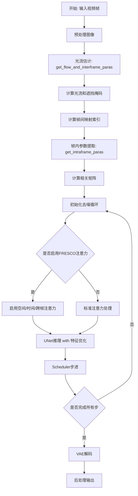

## 类结构

```
FrescoV2VPipeline (主管道类)
├── 继承自 StableDiffusionControlNetImg2ImgPipeline
├── 模块组件
│   ├── vae (AutoencoderKL)
│   ├── text_encoder (CLIPTextModel)
│   ├── tokenizer (CLIPTokenizer)
│   ├── unet (UNet2DConditionModel)
│   ├── controlnet (ControlNetModel)
│   ├── scheduler (KarrasDiffusionSchedulers)
│   ├── safety_checker (StableDiffusionSafetyChecker)
│   ├── flow_model (GMFlow)
│   └── frescoProc (FRESCOAttnProcessor2_0)
└── 核心方法
    ├── __call__ (主推理方法)
    ├── encode_prompt
    ├── prepare_latents
    └── get_timesteps
```

## 全局变量及字段


### `logger`
    
Global logger instance for the module.

类型：`Logger`
    


### `flow_model`
    
The GMFlow model used for optical flow estimation.

类型：`GMFlow`
    


### `images`
    
Stacked input images as a tensor on CUDA.

类型：`torch.Tensor`
    


### `imgs_torch`
    
Concatenated images converted to torch tensors.

类型：`torch.Tensor`
    


### `reshuffle_list`
    
List used for shuffling frame indices to compute forward/backward flow.

类型：`List[int]`
    


### `results_dict`
    
Dictionary containing flow predictions from the flow model.

类型：`Dict`
    


### `flow_pr`
    
Predicted optical flow tensor from the model.

类型：`torch.Tensor`
    


### `fwd_flows`
    
Forward optical flow tensors (current to next frame).

类型：`torch.Tensor`
    


### `bwd_flows`
    
Backward optical flow tensors (next to current frame).

类型：`torch.Tensor`
    


### `fwd_occs`
    
Forward occlusion masks derived from flow consistency.

类型：`torch.Tensor`
    


### `bwd_occs`
    
Backward occlusion masks derived from flow consistency.

类型：`torch.Tensor`
    


### `attn_mask`
    
List of attention masks for cross-frame attention.

类型：`List[torch.Tensor]`
    


### `fwd_mappings`
    
Forward pixel mappings for temporal attention (FLATTEN).

类型：`List[torch.Tensor]`
    


### `bwd_mappings`
    
Backward pixel mappings for temporal attention (FLATTEN).

类型：`List[torch.Tensor]`
    


### `interattn_masks`
    
Masks for inter-frame attention logic.

类型：`List[torch.Tensor]`
    


### `interattn_paras`
    
Dictionary containing mapping indices and masks for temporal attention.

类型：`Dict`
    


### `Dilate.kernel_size`
    
Size of the dilation kernel.

类型：`int`
    


### `Dilate.channels`
    
Number of channels for the dilation filter.

类型：`int`
    


### `Dilate.mean`
    
Offset for padding calculation.

类型：`int`
    


### `Dilate.gaussian_filter`
    
The convolution kernel used for dilation.

类型：`torch.Tensor`
    


### `AttentionControl.stored_attn`
    
Dictionary storing attention features for spatial guidance.

类型：`Dict`
    


### `AttentionControl.store`
    
Flag indicating whether to store attention features.

类型：`bool`
    


### `AttentionControl.index`
    
Index for retrieving stored attention features.

类型：`int`
    


### `AttentionControl.attn_mask`
    
Mask for cross-frame attention.

类型：`Optional[List[torch.Tensor]]`
    


### `AttentionControl.interattn_paras`
    
Parameters for temporal-guided attention.

类型：`Optional[Dict]`
    


### `AttentionControl.use_interattn`
    
Flag to enable/disable temporal-guided attention.

类型：`bool`
    


### `AttentionControl.use_cfattn`
    
Flag to enable/disable cross-frame attention.

类型：`bool`
    


### `AttentionControl.use_intraattn`
    
Flag to enable/disable spatial-guided attention.

类型：`bool`
    


### `AttentionControl.intraattn_bias`
    
Bias term for spatial-guided attention.

类型：`float`
    


### `AttentionControl.intraattn_scale_factor`
    
Scaling factor for spatial-guided attention.

类型：`float`
    


### `AttentionControl.interattn_scale_factor`
    
Scaling factor for temporal-guided attention.

类型：`float`
    


### `FRESCOAttnProcessor2_0.unet_chunk_size`
    
Number of frames processed in one chunk by the UNet.

类型：`int`
    


### `FRESCOAttnProcessor2_0.controller`
    
The AttentionControl instance managing attention logic.

类型：`AttentionControl`
    


### `FrescoV2VPipeline.vae`
    
Variational Autoencoder for encoding/decoding images.

类型：`AutoencoderKL`
    


### `FrescoV2VPipeline.text_encoder`
    
CLIP text encoder for text embeddings.

类型：`CLIPTextModel`
    


### `FrescoV2VPipeline.tokenizer`
    
CLIP tokenizer for text processing.

类型：`CLIPTokenizer`
    


### `FrescoV2VPipeline.unet`
    
UNet model for denoising latents.

类型：`UNet2DConditionModel`
    


### `FrescoV2VPipeline.controlnet`
    
ControlNet model for additional conditioning.

类型：`ControlNetModel`
    


### `FrescoV2VPipeline.scheduler`
    
Diffusion scheduler for noise scheduling.

类型：`KarrasDiffusionSchedulers`
    


### `FrescoV2VPipeline.safety_checker`
    
Safety checker for filtering inappropriate content.

类型：`StableDiffusionSafetyChecker`
    


### `FrescoV2VPipeline.feature_extractor`
    
Feature extractor for safety checking.

类型：`CLIPImageProcessor`
    


### `FrescoV2VPipeline.image_encoder`
    
Image encoder for IP-Adapter support.

类型：`Optional[CLIPVisionModelWithProjection]`
    


### `FrescoV2VPipeline.vae_scale_factor`
    
Scaling factor for VAE latent space.

类型：`int`
    


### `FrescoV2VPipeline.image_processor`
    
Processor for handling input/output images.

类型：`VaeImageProcessor`
    


### `FrescoV2VPipeline.control_image_processor`
    
Processor for control images.

类型：`VaeImageProcessor`
    


### `FrescoV2VPipeline.flow_model`
    
GMFlow model for computing optical flow.

类型：`GMFlow`
    


### `FrescoV2VPipeline.frescoProc`
    
The FRESCO attention processor instance.

类型：`FRESCOAttnProcessor2_0`
    
    

## 全局函数及方法


### `clear_cache`

该函数是一个全局工具函数，用于清理Python垃圾回收器和CUDA GPU内存缓存，释放显存的临时数据，是深度学习Pipeline中常用的内存管理操作。

参数： 无

返回值：`None`，无返回值，执行清理操作后直接返回

#### 流程图

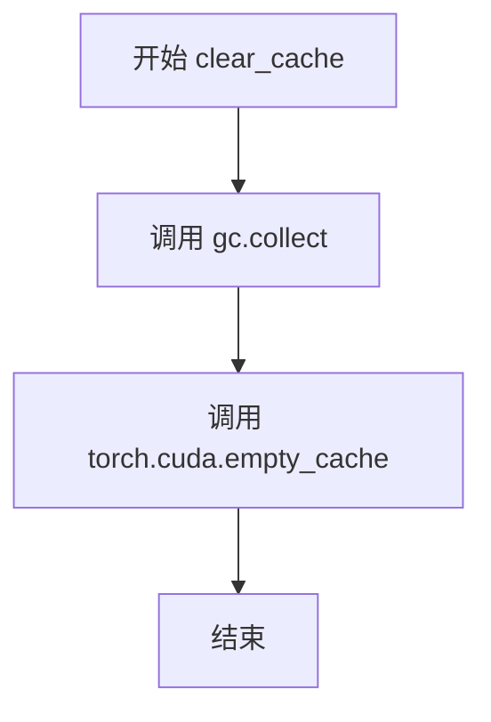

#### 带注释源码

```python
def clear_cache():
    """
    清理Python和CUDA缓存，释放内存资源
    
    该函数执行两步内存清理操作：
    1. gc.collect() - 强制Python垃圾回收器回收不可达对象
    2. torch.cuda.empty_cache() - 清空CUDA缓存池，释放未使用的GPU显存
    """
    gc.collect()              # 触发Python的垃圾回收机制，清理循环引用等内存
    torch.cuda.empty_cache()  # 清空PyTorch CUDA缓存，释放GPU显存供后续操作使用
```


### `coords_grid`

生成用于图像采样或光流处理的坐标网格，支持齐次坐标选项。

参数：

- `b`：`int`，批量大小（batch size），表示生成的网格数量
- `h`：`int`，网格的高度（height），对应图像的行数
- `w`：`int`，网格的宽度（width），对应图像的列数
- `homogeneous`：`bool`，可选参数，是否返回齐次坐标（添加一行全1），默认为 `False`
- `device`：`torch.device`，可选参数，指定返回张量的设备，默认为 `None`

返回值：`torch.Tensor`，返回形状为 `[B, 2, H, W]`（非齐次）或 `[B, 3, H, W]`（齐次）的坐标网格张量

#### 流程图

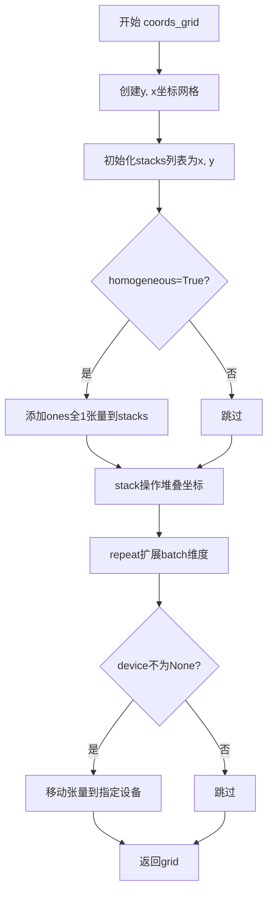

#### 带注释源码

```python
def coords_grid(b, h, w, homogeneous=False, device=None):
    """
    生成批量坐标网格，用于图像采样或光流处理
    
    参数:
        b: 批量大小
        h: 高度
        w: 宽度
        homogeneous: 是否添加齐次坐标(第三维全1)
        device: 可选的设备参数
    
    返回:
        坐标网格张量 [B, 2, H, W] 或 [B, 3, H, W]
    """
    # 创建高度和宽度的网格坐标
    y, x = torch.meshgrid(torch.arange(h), torch.arange(w))  # [H, W]

    # 将x, y坐标堆叠在一起
    stacks = [x, y]

    # 如果需要齐次坐标，添加一行全1
    if homogeneous:
        ones = torch.ones_like(x)  # [H, W]
        stacks.append(ones)

    # 堆叠成 [2, H, W] 或 [3, H, W] 的张量
    grid = torch.stack(stacks, dim=0).float()  # [2, H, W] or [3, H, W]

    # 扩展batch维度: [2, H, W] -> [B, 2, H, W]
    grid = grid[None].repeat(b, 1, 1, 1)  # [B, 2, H, W] or [B, 3, H, W]

    # 如果指定了设备，移动到对应设备
    if device is not None:
        grid = grid.to(device)

    return grid
```


### `bilinear_sample`

该函数实现基于光流的图像双线性采样功能，将输入图像根据给定的采样坐标进行双线性插值采样，可选择返回采样有效性掩码。

参数：

- `img`：`torch.Tensor`，输入图像张量，形状为 [B, C, H, W]，其中 B 是批量大小，C 是通道数，H 和 W 分别是高度和宽度
- `sample_coords`：`torch.Tensor`，采样坐标张量，形状为 [B, 2, H, W] 或 [B, H, W, 2]，表示图像尺度下的采样位置
- `mode`：`str`，插值模式，默认为 "bilinear"，支持 'bilinear', 'nearest', 'bicubic' 等模式
- `padding_mode`：`str`，填充模式，默认为 "zeros"，支持 'zeros', 'border', 'reflection' 等模式
- `return_mask`：`bool`，是否返回采样有效性掩码，默认为 False

返回值：

- 当 `return_mask=False` 时，返回 `torch.Tensor`，采样后的图像张量，形状为 [B, C, H, W]
- 当 `return_mask=True` 时，返回 `tuple[torch.Tensor, torch.Tensor]`，包含采样后的图像张量和有效性掩码

#### 流程图

```mermaid
flowchart TD
    A[开始 bilinear_sample] --> B{检查 sample_coords 维度}
    B -->|维度为 [B, H, W, 2]| C[转置为 [B, 2, H, W]]
    B -->|维度为 [B, 2, H, W]| D[继续执行]
    C --> D
    D --> E[提取批量大小 b, 高度 h, 宽度 w]
    E --> F[归一化 x 坐标到 [-1, 1]]
    F --> G[归一化 y 坐标到 [-1, 1]]
    G --> H[堆叠坐标形成 grid 张量]
    H --> I[调用 F.grid_sample 进行采样]
    I --> J{return_mask 是否为 True}
    J -->|是| K[计算有效性掩码]
    K --> L[返回采样结果和掩码]
    J -->|否| M[仅返回采样结果]
    L --> N[结束]
    M --> N
```

#### 带注释源码

```python
def bilinear_sample(img, sample_coords, mode="bilinear", padding_mode="zeros", return_mask=False):
    """
    基于给定的采样坐标对图像进行双线性采样
    
    参数:
        img: 输入图像 [B, C, H, W]
        sample_coords: 采样坐标 [B, 2, H, W] 或 [B, H, W, 2]
        mode: 插值模式
        padding_mode: 填充模式
        return_mask: 是否返回有效性掩码
    """
    # img: [B, C, H, W]
    # sample_coords: [B, 2, H, W] in image scale
    
    # 检查 sample_coords 的形状，如果是 [B, H, W, 2] 则转置为 [B, 2, H, W]
    if sample_coords.size(1) != 2:  # [B, H, W, 2]
        sample_coords = sample_coords.permute(0, 3, 1, 2)

    # 获取批量大小、坐标维度、高度和宽度
    b, _, h, w = sample_coords.shape

    # Normalize to [-1, 1]
    # 将 x 坐标从 [0, w-1] 映射到 [-1, 1]
    x_grid = 2 * sample_coords[:, 0] / (w - 1) - 1
    # 将 y 坐标从 [0, h-1] 映射到 [-1, 1]
    y_grid = 2 * sample_coords[:, 1] / (h - 1) - 1

    # 堆叠 x 和 y 坐标形成 grid 张量 [B, H, W, 2]
    grid = torch.stack([x_grid, y_grid], dim=-1)  # [B, H, W, 2]

    # 使用 PyTorch 的 grid_sample 函数进行采样
    # align_corners=True 表示对齐角点
    img = F.grid_sample(img, grid, mode=mode, padding_mode=padding_mode, align_corners=True)

    # 如果需要返回掩码，计算采样点是否在有效范围内
    if return_mask:
        # 掩码表示采样坐标是否在 [-1, 1] 范围内
        mask = (x_grid >= -1) & (y_grid >= -1) & (x_grid <= 1) & (y_grid <= 1)  # [B, H, W]

        return img, mask

    return img
```


### `flow_warp`

该函数实现基于光流（Optical Flow）的特征图 warp 操作，通过 `coords_grid` 生成采样坐标网格，将光流场加到网格上得到目标采样位置，然后使用双线性插值 `bilinear_sample` 对特征图进行重采样，实现图像或特征的空间变换。

参数：

- `feature`：`torch.Tensor`，输入特征图，形状为 `[B, C, H, W]`
- `flow`：`torch.Tensor`，光流场，形状为 `[B, 2, H, W]`，其中通道 0 表示 x 方向位移，通道 1 表示 y 方向位移
- `mask`：`bool`，可选参数，默认为 `False`，是否返回采样有效区域的掩码
- `mode`：`str`，可选参数，默认为 `"bilinear"`，插值模式
- `padding_mode`：`str`，可选参数，默认为 `"zeros"`，填充模式

返回值：根据 `mask` 参数：
- 若 `mask=False`：返回 `torch.Tensor`，warp 后的特征图，形状为 `[B, C, H, W]`
- 若 `mask=True`：返回 `(torch.Tensor, torch.Tensor)` 元组，包含 warp 后的特征图和掩码

#### 流程图

```mermaid
flowchart TD
    A[开始 flow_warp] --> B[提取 feature 尺寸 b, c, h, w]
    B --> C{验证 flow 尺寸}
    C -->|flow.size(1) == 2| D[调用 coords_grid 生成网格坐标]
    D --> E[grid = coords_grid + flow]
    E --> F[将 grid 转换到 feature 的数据类型]
    F --> G{判断 mask 参数}
    G -->|False| H[调用 bilinear_sample 不返回 mask]
    G -->|True| I[调用 bilinear_sample 返回 mask]
    H --> J[返回 warped 特征图]
    I --> K[返回 warped 特征图和 mask 元组]
    J --> L[结束]
    K --> L
```

#### 带注释源码

```python
def flow_warp(feature, flow, mask=False, mode="bilinear", padding_mode="zeros"):
    """
    基于光流对特征图进行warp操作
    
    参数:
        feature: 输入特征图 [B, C, H, W]
        flow: 光流场 [B, 2, H, W], 2个通道分别为x和y方向的位移
        mask: 是否返回采样有效区域的掩码
        mode: 插值模式, 默认为bilinear
        padding_mode: 填充模式, 默认为zeros
    
    返回:
        warp后的特征图, 或(特征图, mask)元组
    """
    # 提取特征图的批量大小、通道数、高度和宽度
    b, c, h, w = feature.size()
    # 断言光流场必须具有2个通道（x和y方向）
    assert flow.size(1) == 2

    # 生成网格坐标并加上光流位移，得到目标采样坐标
    # coords_grid 生成 [B, 2, H, W] 的网格坐标
    grid = coords_grid(b, h, w).to(flow.device) + flow  # [B, 2, H, W]
    # 确保网格坐标与特征图数据类型一致
    grid = grid.to(feature.dtype)
    # 调用双线性采样函数进行warp操作
    return bilinear_sample(feature, grid, mode=mode, padding_mode=padding_mode, return_mask=mask)
```


### `forward_backward_consistency_check`

该函数执行前后向光流一致性检查，用于从光流中估计遮挡区域。通过计算前向光流和后向光流之间的不一致性，结合光流幅度阈值，生成前向和后向遮挡掩码。

参数：

- `fwd_flow`：`torch.Tensor`，前向光流，形状为 [B, 2, H, W]，其中 B 为批次大小，2 表示光流的 x 和 y 分量
- `bwd_flow`：`torch.Tensor`，后向光流，形状为 [B, 2, H, W]
- `alpha`：`float`，默认值为 0.01，阈值计算中的缩放因子，遵循 UnFlow 论文的设置
- `beta`：`float`，默认值为 0.5，阈值计算中的常数偏移，遵循 UnFlow 论文的设置

返回值：`Tuple[torch.Tensor, torch.Tensor]`，返回两个遮挡掩码：

- `fwd_occ`：前向遮挡掩码，形状为 [B, H, W]，值为 0 或 1
- `bwd_occ`：后向遮挡掩码，形状为 [B, H, W]，值为 0 或 1

#### 流程图

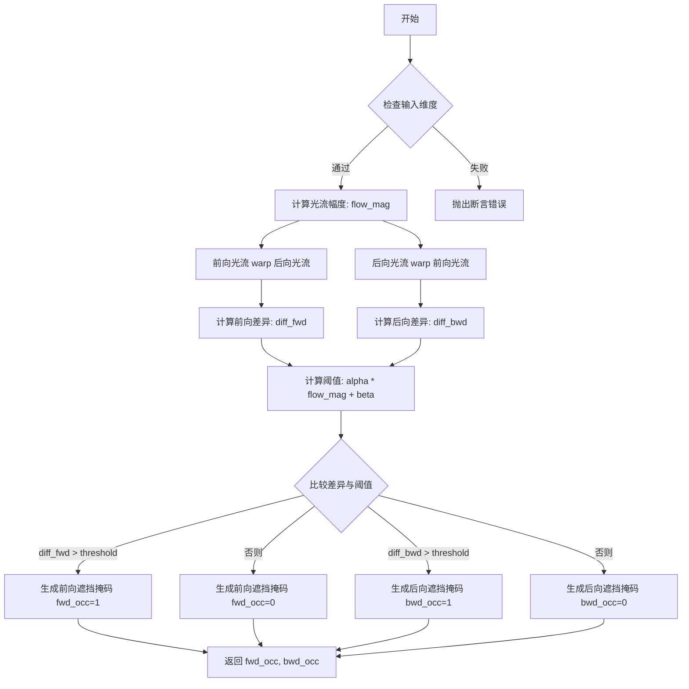

#### 带注释源码

```python
def forward_backward_consistency_check(fwd_flow, bwd_flow, alpha=0.01, beta=0.5):
    """
    执行前后向光流一致性检查，生成遮挡掩码
    
    参数:
        fwd_flow: 前向光流 [B, 2, H, W]
        bwd_flow: 后向光流 [B, 2, H, W]
        alpha: 阈值缩放因子 (默认0.01)
        beta: 阈值常数偏移 (默认0.5)
    
    返回:
        fwd_occ: 前向遮挡掩码 [B, H, W]
        bwd_occ: 后向遮挡掩码 [B, H, W]
    """
    # fwd_flow, bwd_flow: [B, 2, H, W]
    # alpha and beta values are following UnFlow
    # (https://huggingface.co/papers/1711.07837)
    
    # 验证输入维度：必须是4D张量
    assert fwd_flow.dim() == 4 and bwd_flow.dim() == 4
    # 验证通道维度：必须为2（x和y方向的光流）
    assert fwd_flow.size(1) == 2 and bwd_flow.size(1) == 2
    
    # 计算光流幅度：前向和后向光流范数之和
    # flow_mag: [B, H, W]
    flow_mag = torch.norm(fwd_flow, dim=1) + torch.norm(bwd_flow, dim=1)
    
    # 使用光流warp操作：
    # warped_bwd_flow: 将后向光流按照前向光流warp，用于检测前向遮挡
    # warped_fwd_flow: 将前向光流按照后向光流warp，用于检测后向遮挡
    warped_bwd_flow = flow_warp(bwd_flow, fwd_flow)  # [B, 2, H, W]
    warped_fwd_flow = flow_warp(fwd_flow, bwd_flow)  # [B, 2, H, W]
    
    # 计算一致性差异：
    # 如果光流一致，fwd_flow + warped_bwd_flow 应接近零
    diff_fwd = torch.norm(fwd_flow + warped_bwd_flow, dim=1)  # [B, H, W]
    diff_bwd = torch.norm(bwd_flow + warped_fwd_flow, dim=1)
    
    # 动态阈值：结合光流幅度和平滑常数
    threshold = alpha * flow_mag + beta
    
    # 生成遮挡掩码：
    # 差异大于阈值的位置标记为遮挡（1.0），否则为非遮挡（0.0）
    fwd_occ = (diff_fwd > threshold).float()  # [B, H, W]
    bwd_occ = (diff_bwd > threshold).float()
    
    return fwd_occ, bwd_occ
```


### `numpy2tensor`

该函数用于将 NumPy 数组格式的图像数据转换为 PyTorch 张量，并进行标准的图像预处理：归一化到 [-1, 1] 范围、维度重排为 PyTorch 通道优先格式。

参数：

- `img`：`numpy.ndarray`，输入的 NumPy 数组，通常为 H×W×C 格式的图像数据

返回值：`torch.Tensor`，转换后的 PyTorch 张量，形状为 (1, C, H, W)，值域为 [-1, 1]

#### 流程图

```mermaid
flowchart TD
    A[输入 NumPy 数组 img] --> B[复制数组: img.copy]
    B --> C[转换为 PyTorch 张量: torch.from_numpy]
    C --> D[转换为 float 类型]
    D --> E[移至 GPU: .cuda]
    E --> F[归一化: / 255.0 * 2.0 - 1.0]
    F --> G[添加批次维度: torch.stack]
    G --> H[维度重排: permute 0,3,1,2]
    H --> I[输出张量 shape=(1, C, H, W)]
```

#### 带注释源码

```python
def numpy2tensor(img):
    """
    将 NumPy 数组格式的图像转换为 PyTorch 张量
    
    处理流程:
    1. 复制输入数组避免修改原数据
    2. 转换为 PyTorch 张量并移至 GPU
    3. 归一化像素值从 [0, 255] 到 [-1, 1]
    4. 调整维度顺序从 (H, W, C) 到 (1, C, H, W)
    
    Args:
        img: numpy.ndarray, 输入的图像数组，形状为 (H, W, C) 或 (H, W)
    
    Returns:
        torch.Tensor, 转换后的张量，形状为 (1, C, H, W)
    """
    # 步骤1: 复制 NumPy 数组并转换为 PyTorch float 张量，移至 GPU
    # .copy() 确保不修改原始 NumPy 数组
    # .float() 转换为 32 位浮点数
    # .cuda() 将张量移至 GPU 进行后续计算
    x0 = torch.from_numpy(img.copy()).float().cuda() / 255.0 * 2.0 - 1.0
    
    # 步骤2: 添加批次维度
    # 将 (C, H, W) 转换为 (1, C, H, W)
    x0 = torch.stack([x0], dim=0)
    
    # 步骤3: 维度重排
    # 从 (1, H, W, C) 转换为 (1, C, H, W)
    # PyTorch 默认使用通道优先 (channel-first) 格式
    # 注意: 由于张量刚通过 stack 得到，排列顺序实际上是 (1, H, W, C)
    # permute(0, 3, 1, 2) 将索引 3 移到索引 1，索引 1 移到索引 2，索引 2 移到索引 3
    return x0.permute(0, 3, 1, 2)
    
    # 注释: 原代码中有 einops.rearrange 的替代方案，但被注释掉
    # einops.rearrange(x0, 'b h w c -> b c h w').clone()
```


### `calc_mean_std`

该函数用于计算4D特征张量的均值和标准差，主要应用于Adaptive Instance Normalization (AdaIN)风格迁移算法中。当chunk参数为2时，会先在宽度维度拼接两个特征块后再统一计算，适用于处理UNet的输出特征。

参数：

- `feat`：`torch.Tensor`，输入的4D特征张量，形状为 `[N, C, H, W]`，其中N为批量大小，C为通道数，H和W为空间维度
- `eps`：`float`，默认值 `1e-5`，防止方差计算结果为0而添加的极小常数
- `chunk`：`int`，默认值 `1`，分块数量。当chunk=2时，会将特征按批量维度分成两块并在宽度维度拼接后统一计算均值和标准差，最后再重复扩展回去

返回值：`Tuple[torch.Tensor, torch.Tensor]`，返回两个张量：
- `feat_mean`：特征均值，形状为 `[N, C, 1, 1]`
- `feat_std`：特征标准差，形状为 `[N, C, 1, 1]`

#### 流程图

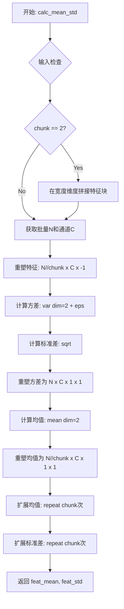

#### 带注释源码

```python
def calc_mean_std(feat, eps=1e-5, chunk=1):
    """
    计算4D特征张量的均值和标准差，用于AdaIN风格迁移
    
    参数:
        feat: 输入特征张量 [N, C, H, W]
        eps: 防止除零的小常数
        chunk: 分块数量，用于处理UNet输出的双帧特征
    """
    size = feat.size()  # 获取特征张量的尺寸
    assert len(size) == 4  # 断言输入是4D张量 [N, C, H, W]
    
    # 当chunk=2时，将特征在宽度维度拼接
    # 适用于UNet输出2N*C*H*W的情况，先拼接成N*C*H*2W
    if chunk == 2:
        feat = torch.cat(feat.chunk(2), dim=3)
    
    N, C = size[:2]  # 获取批量大小N和通道数C
    
    # 将特征重塑为 [N//chunk, C, H*W] 并在最后一个维度计算方差
    # 添加eps防止方差为0导致后续sqrt出错
    feat_var = feat.view(N // chunk, C, -1).var(dim=2) + eps
    
    # 将方差开根号得到标准差，并重塑为 [N, C, 1, 1]
    feat_std = feat_var.sqrt().view(N, C, 1, 1)
    
    # 计算均值，重塑为 [N//chunk, C, 1, 1]
    feat_mean = feat.view(N // chunk, C, -1).mean(dim=2).view(N // chunk, C, 1, 1)
    
    # 将均值和标准差重复chunk次，以匹配原始批量大小N
    # 例如chunk=2时，均值从[N//2, C, 1, 1]扩展回[N, C, 1, 1]
    return feat_mean.repeat(chunk, 1, 1, 1), feat_std.repeat(chunk, 1, 1, 1)
```


### `adaptive_instance_normalization`

该函数实现了自适应实例归一化（Adaptive Instance Normalization，AdaIN），是一种常用的风格迁移技术。该函数通过调整内容特征的均值和方差以匹配风格特征的均值和方差，从而实现将风格迁移到内容上的效果。

参数：

- `content_feat`：`torch.Tensor`，内容特征张量，形状为 [B, C, H, W]，需要被风格化的特征
- `style_feat`：`torch.Tensor`，风格特征张量，形状为 [B, C, H, W]，用于提供目标均值和方差
- `chunk`：`int`，可选参数，默认为1，用于处理特征分块的数量（与 `calc_mean_std` 函数配合使用）

返回值：`torch.Tensor`，返回风格化后的特征张量，形状与输入的 content_feat 相同

#### 流程图

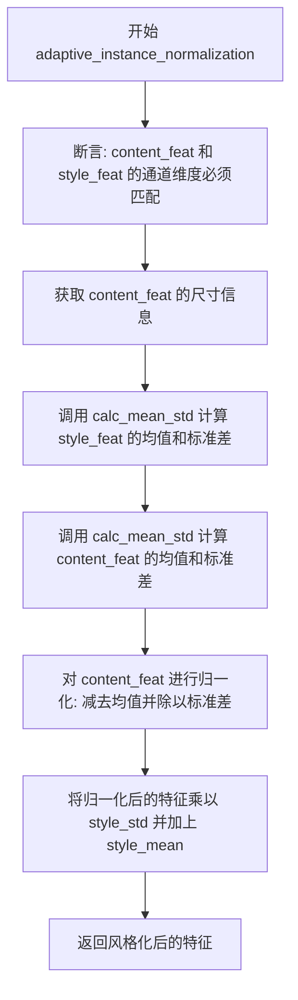

#### 带注释源码

```python
def adaptive_instance_normalization(content_feat, style_feat, chunk=1):
    """
    实现自适应实例归一化 (AdaIN) 算法
    
    AdaIN 的核心思想是将内容特征的统计特性（均值和方差）
    替换为风格特征的统计特性，从而实现风格迁移
    
    参数:
        content_feat: 内容特征，通常是Encoder提取的特征
        style_feat: 风格特征，用于提供目标统计特性
        chunk: 分块数量，用于处理双帧等情况
    
    返回:
        风格化后的特征，形状与 content_feat 相同
    """
    
    # 断言：确保内容特征和风格特征的前两个维度（batch和channel）匹配
    assert content_feat.size()[:2] == style_feat.size()[:2]
    
    # 获取内容特征的完整尺寸信息
    size = content_feat.size()
    
    # 计算风格特征的均值和标准差
    # 使用 chunk 参数处理不同的特征组织方式
    # 返回的 mean 和 std 会被扩展到与输入相同的空间维度
    style_mean, style_std = calc_mean_std(style_feat, chunk)
    
    # 计算内容特征的均值和标准差
    # 默认 chunk=1，不进行分块处理
    content_mean, content_std = calc_mean_std(content_feat)
    
    # 步骤1: 归一化内容特征
    # 将内容特征减去其均值并除以标准差，得到零均值单位方差的标准特征
    # expand(size) 确保均值和标准差能够正确广播到所有空间位置
    normalized_feat = (content_feat - content_mean.expand(size)) / content_std.expand(size)
    
    # 步骤2: 应用风格统计特性
    # 将归一化后的特征乘以风格的标准差并加上风格的均值
    # 这样特征就具有了风格的统计特性但保留了内容结构
    return normalized_feat * style_std.expand(size) + style_mean.expand(size)
```


### `optimize_feature`

FRESO-guided 潜在特征优化函数，通过空间对应性（匹配 correlation_matrix）和时间对应性（匹配扭曲图像）来优化视频扩散模型中的特征表示。

参数：

- `sample`：`torch.Tensor`，输入的潜在特征，形状为 `(2N, C, H, W)`，其中 N 是视频帧数
- `flows`：`List[torch.Tensor]` 或 `None`，光流数据，包含前向和后向光流，形状为 `(N-1) * 2 * H1 * W1`
- `occs`：`List[torch.Tensor]` 或 `None`，遮挡掩码，包含前向和后向遮挡掩码，形状为 `(N-1) * H1 * W1`
- `correlation_matrix`：`List[torch.Tensor]`，空间对应性矩阵，用于保持帧内特征的一致性
- `intra_weight`：`float`，空间一致性损失的权重，默认为 `1e2`
- `iters`：`int`，优化迭代次数，默认为 `20`
- `unet_chunk_size`：`int`，UNet 块大小，默认为 `2`
- `optimize_temporal`：`bool`，是否进行时间一致性优化，默认为 `True`

返回值：`torch.Tensor`，优化后的潜在特征，形状与输入 `sample` 相同

#### 流程图

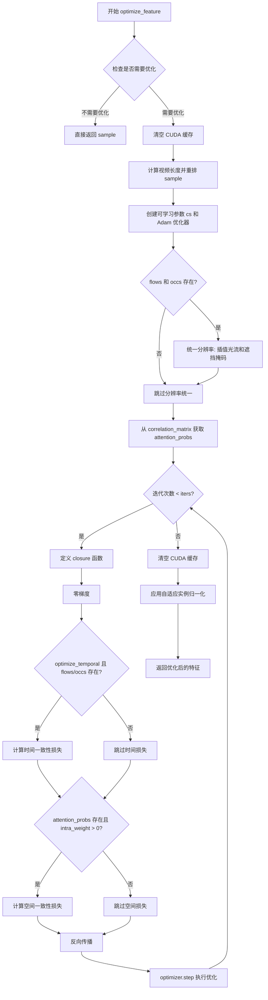

#### 带注释源码

```python
def optimize_feature(
    sample, flows, occs, correlation_matrix=[], intra_weight=1e2, iters=20, unet_chunk_size=2, optimize_temporal=True
):
    """
    FRESO-guided latent feature optimization
    * optimize spatial correspondence (match correlation_matrix)
    * optimize temporal correspondence (match warped_image)
    """
    # 早期返回：如果没有 flows/occs 或不优化时间且没有空间对应矩阵
    if (flows is None or occs is None or (not optimize_temporal)) and (
        intra_weight == 0 or len(correlation_matrix) == 0
    ):
        return sample
    
    # flows=[fwd_flows, bwd_flows]: (N-1)*2*H1*W1
    # occs=[fwd_occs, bwd_occs]: (N-1)*H1*W1
    # sample: 2N*C*H*W
    
    # 释放 GPU 缓存
    torch.cuda.empty_cache()
    
    # 计算视频帧数 (sample 包含 2N 帧，每帧有 unet_chunk_size 个 chunk)
    video_length = sample.shape[0] // unet_chunk_size
    
    # 重排 tensor: (2N, C, H, W) -> (2, N, C, H, W) -> (2, N, C, H, W) 实际上这里是 (b f) c h w -> b f c h w
    latent = rearrange(sample.to(torch.float32), "(b f) c h w -> b f c h w", f=video_length)

    # 创建可学习参数 cs，使用 detach() 复制 latent 以保持原始特征不变
    cs = torch.nn.Parameter((latent.detach().clone()))
    
    # 使用 Adam 优化器，学习率 0.2
    optimizer = torch.optim.Adam([cs], lr=0.2)

    # 统一分辨率：将光流和遮挡掩码插值到与 sample 相同的分辨率
    if flows is not None and occs is not None:
        # 计算缩放因子
        scale = sample.shape[2] * 1.0 / flows[0].shape[2]
        kernel = int(1 / scale)
        
        # 处理后向光流和遮挡掩码
        bwd_flow_ = F.interpolate(flows[1] * scale, scale_factor=scale, mode="bilinear").repeat(
            unet_chunk_size, 1, 1, 1
        )
        bwd_occ_ = F.max_pool2d(occs[1].unsqueeze(1), kernel_size=kernel).repeat(
            unet_chunk_size, 1, 1, 1
        )  # 2(N-1)*1*H1*W1
        
        # 处理前向光流和遮挡掩码
        fwd_flow_ = F.interpolate(flows[0] * scale, scale_factor=scale, mode="bilinear").repeat(
            unet_chunk_size, 1, 1, 1
        )
        fwd_occ_ = F.max_pool2d(occs[0].unsqueeze(1), kernel_size=kernel).repeat(
            unet_chunk_size, 1, 1, 1
        )  # 2(N-1)*1*H1*W1
        
        # reshuffle_list 用于匹配帧: 0,1,2,3 -> 1,2,3,0
        reshuffle_list = list(range(1, video_length)) + [0]

    # attention_probs 是归一化特征的 GRAM 矩阵
    attention_probs = None
    for tmp in correlation_matrix:
        # 找到匹配分辨率的 correlation_matrix
        if sample.shape[2] * sample.shape[3] == tmp.shape[1]:
            attention_probs = tmp  # 2N*HW*HW
            break

    n_iter = [0]
    # 迭代优化循环
    while n_iter[0] < iters:

        def closure():
            optimizer.zero_grad()

            loss = 0

            # 时间一致性损失：使用光流扭曲特征并计算差异
            if optimize_temporal and flows is not None and occs is not None:
                # 重排 cs 以便进行帧间匹配
                c1 = rearrange(cs[:, :], "b f c h w -> (b f) c h w")
                c2 = rearrange(cs[:, reshuffle_list], "b f c h w -> (b f) c h w")
                
                # 使用光流扭曲特征
                warped_image1 = flow_warp(c1, bwd_flow_)
                warped_image2 = flow_warp(c2, fwd_flow_)
                
                # 计算时间一致性损失，使用遮挡掩码加权
                loss = (
                    abs((c2 - warped_image1) * (1 - bwd_occ_)) + abs((c1 - warped_image2) * (1 - fwd_occ_))
                ).mean() * 2

            # 空间一致性损失：匹配特征的 GRAM 矩阵
            if attention_probs is not None and intra_weight > 0:
                # 将特征向量重排为 (b f) (h w) c 格式
                cs_vector = rearrange(cs, "b f c h w -> (b f) (h w) c")
                
                # L2 归一化
                cs_vector = cs_vector / ((cs_vector**2).sum(dim=2, keepdims=True) ** 0.5)
                
                # 计算归一化特征的 GRAM 矩阵
                cs_attention_probs = torch.bmm(cs_vector, cs_vector.transpose(-1, -2))
                
                # 计算 L1 损失并乘以权重
                tmp = F.l1_loss(cs_attention_probs, attention_probs) * intra_weight
                loss = tmp + loss

            # 反向传播
            loss.backward()
            n_iter[0] += 1

            return loss

        # 执行优化步骤
        optimizer.step(closure)

    # 清理 GPU 缓存
    torch.cuda.empty_cache()
    
    # 使用自适应实例归一化 (AdaIN) 将优化后的特征与原始特征混合
    # 将 (b f c h w) 转换回 (b f) c h w 格式，并保持原始数据类型
    return adaptive_instance_normalization(
        rearrange(cs.data.to(sample.dtype), "b f c h w -> (b f) c h w"), 
        sample
    )
```


### `warp_tensor`

该函数基于光流对图像或特征进行变形，并通过遮挡掩码和显著性图对变形后的图像或特征进行融合，实现视频帧之间的特征传递与增强。

参数：

- `sample`：`torch.Tensor`，输入的图像或特征张量，形状为 `(B, C, H, W)`，其中 B 通常是视频帧数乘以 unet_chunk_size
- `flows`：`List[torch.Tensor]`，光流列表，包含前向光流 `flows[0]` 和后向光流 `flows[1]`，形状为 `(N-1, 2, H, W)`
- `occs`：`List[torch.Tensor]`，遮挡掩码列表，包含前向遮挡掩码 `occs[0]` 和后向遮挡掩码 `occs[1]`，形状为 `(N-1, H, W)`
- `saliency`：`torch.Tensor`，显著性图，形状为 `(N, 1, H, W)`，用于指导特征融合的权重
- `unet_chunk_size`：`int`，UNet 分块大小，用于分割视频帧组，值为 2

返回值：`torch.Tensor`，融合后的图像或特征张量，形状与输入 `sample` 相同 `(B, C, H, W)`

#### 流程图

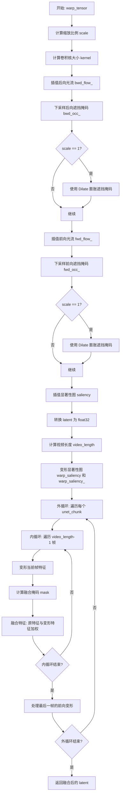

#### 带注释源码

```python
@torch.no_grad()
def warp_tensor(sample, flows, occs, saliency, unet_chunk_size):
    """
    Warp images or features based on optical flow
    Fuse the warped imges or features based on occusion masks and saliency map
    """
    # 计算缩放比例，用于将光流插值到与 sample 相同的分辨率
    scale = sample.shape[2] * 1.0 / flows[0].shape[2]
    # 计算最大池化核大小，用于下采样遮挡掩码
    kernel = int(1 / scale)
    
    # 对后向光流进行双线性插值，使其分辨率与 sample 匹配
    bwd_flow_ = F.interpolate(flows[1] * scale, scale_factor=scale, mode="bilinear")
    # 对后向遮挡掩码进行最大池化下采样
    bwd_occ_ = F.max_pool2d(occs[1].unsqueeze(1), kernel_size=kernel)  # (N-1)*1*H1*W1
    # 当缩放比例为 1 时，使用 Dilate 操作膨胀遮挡区域
    if scale == 1:
        bwd_occ_ = Dilate(kernel_size=13, device=sample.device)(bwd_occ_)
    
    # 对前向光流进行双线性插值
    fwd_flow_ = F.interpolate(flows[0] * scale, scale_factor=scale, mode="bilinear")
    # 对前向遮挡掩码进行最大池化下采样
    fwd_occ_ = F.max_pool2d(occs[0].unsqueeze(1), kernel_size=kernel)  # (N-1)*1*H1*W1
    # 当缩放比例为 1 时，使用 Dilate 操作膨胀遮挡区域
    if scale == 1:
        fwd_occ_ = Dilate(kernel_size=13, device=sample.device)(fwd_occ_)
    
    # 计算显著性图的缩放比例并进行插值
    scale2 = sample.shape[2] * 1.0 / saliency.shape[2]
    saliency = F.interpolate(saliency, scale_factor=scale2, mode="bilinear")
    
    # 将输入转换为 float32 以进行后续计算
    latent = sample.to(torch.float32)
    # 计算视频帧数量
    video_length = sample.shape[0] // unet_chunk_size
    
    # 使用后向光流变形显著性图
    warp_saliency = flow_warp(saliency, bwd_flow_)
    # 使用前向光流变形第一帧的显著性图（用于循环处理）
    warp_saliency_ = flow_warp(saliency[0:1], fwd_flow_[video_length - 1 : video_length])

    # 外层循环：遍历每个 UNet 块
    for j in range(unet_chunk_size):
        # 内层循环：遍历视频帧（除了最后一帧）
        for ii in range(video_length - 1):
            # 计算当前帧在 latent 中的索引
            i = video_length * j + ii
            # 使用后向光流变形当前帧特征
            warped_image = flow_warp(latent[i : i + 1], bwd_flow_[ii : ii + 1])
            # 计算融合掩码：结合遮挡掩码和显著性图
            # mask = (1 - bwd_occ) * saliency_next * warp_saliency_current
            mask = (1 - bwd_occ_[ii : ii + 1]) * saliency[ii + 1 : ii + 2] * warp_saliency[ii : ii + 1]
            # 融合特征：原特征与变形特征的加权平均
            latent[i + 1 : i + 2] = latent[i + 1 : i + 2] * (1 - mask) + warped_image * mask
        
        # 处理每个块的第一帧（使用前向光流变形到最后一帧）
        i = video_length * j
        ii = video_length - 1
        # 使用前向光流变形当前帧特征
        warped_image = flow_warp(latent[i : i + 1], fwd_flow_[ii : ii + 1])
        # 计算融合掩码：结合前向遮挡掩码和显著性图
        mask = (1 - fwd_occ_[ii : ii + 1]) * saliency[ii : ii + 1] * warp_saliency_
        # 融合特征
        latent[ii + i : ii + i + 1] = latent[ii + i : ii + i + 1] * (1 - mask) + warped_image * mask

    # 返回融合后的特征，转换回原始数据类型
    return latent.to(sample.dtype)
```


### `my_forward`

该函数是一个被黑客攻击（修改）的UNet2DConditionModel的forward方法，通过劫持稳定扩散管道的UNet forward过程，实现基于FRESCO算法的视频帧间特征优化。它在UNet的上采样阶段恢复解码器特征，并可选地通过光流引导的特征优化和显著性图驱动的背景平滑来增强时间一致性。

参数：

- `self`：`UNet2DConditionModel`，UNet模型实例，被劫持的模型对象
- `steps`：`List[torch.Tensor]`，需要进行特征优化的时间步列表，默认为空列表，表示在所有时间步进行优化
- `layers`：`List[int]`，需要进行特征恢复和优化的上采样块索引列表，默认为[0, 1, 2, 3]，对应UNet的4个上采样层
- `flows`：`Optional[List[torch.Tensor]]`，光流数据列表，包含前向和后向光流 [fwd_flows, bwd_flows]，用于时序特征对齐
- `occs`：`Optional[List[torch.Tensor]]`，遮挡掩码列表，包含前向和后向遮挡掩码 [fwd_occs, bwd_occs]，用于处理遮挡区域
- `correlation_matrix`：`List[torch.Tensor]`（实际应为`Optional[List[torch.Tensor]]`），特征gram矩阵列表，用于空间一致性损失计算
- `intra_weight`：`float`，空间一致性损失的权重系数，默认为1e2
- `iters`：`int`，特征优化的迭代次数，默认为20
- `optimize_temporal`：`bool`，是否启用时序一致性优化，默认为True
- `saliency`：`Optional[torch.Tensor]`，显著性图，用于背景平滑处理，默认为None

返回值：`Callable`，返回一个内部定义的forward函数，该函数具有与标准UNet2DConditionModel.forward相同的签名，返回`UNet2DConditionOutput`或元组

#### 流程图

```mermaid
flowchart TD
    A[开始: my_forward被调用] --> B[定义内部forward函数]
    B --> C{进入forward函数执行}
    
    C --> D[1. 检查输入sample尺寸]
    D --> E[2. 处理attention_mask和encoder_attention_mask]
    E --> F[3. 时间嵌入计算: time_proj + time_embedding]
    
    F --> G{4. 处理类别嵌入}
    G --> H[有class_embedding?]
    H -->|Yes| I[添加类别嵌入到时间嵌入]
    H -->|No| J[跳过类别嵌入]
    
    I --> K
    J --> K[5. 处理额外条件嵌入: addition_embed_type]
    
    K --> L[6. 预处理: conv_in]
    L --> M[7. 下采样阶段: down_blocks]
    
    M --> N[收集下采样残差连接]
    N --> O[8. 中间层: mid_block]
    
    O --> P{9. 上采样阶段: up_blocks}
    P --> Q{当前层i在layers中?}
    Q -->|Yes| R[保存当前特征到up_samples]
    R --> S{当前timestep在steps中?}
    S -->|Yes| T[调用optimize_feature优化特征]
    T --> U{saliency不为None?}
    U -->|Yes| V[调用warp_tensor进行背景平滑]
    U -->|No| W[跳过背景平滑]
    V --> X
    U --> W --> X
    S -->|No| X[跳过特征优化]
    Q -->|No| X
    
    X --> Y[上采样块处理: upsample_block]
    Y --> Z{还有更多上采样块?}
    Z -->|Yes| P
    Z -->|No| AA[10. 后处理: conv_norm_out + conv_act + conv_out]
    
    AA --> BB{return_dict为True?}
    BB -->|Yes| CC[返回UNet2DConditionOutput]
    BB -->|No| DD[返回tuple: (sample, up_samples)]
    
    CC --> EE[结束]
    DD --> EE
```

#### 带注释源码

```python
def my_forward(
    self,
    steps=[],
    layers=[0, 1, 2, 3],
    flows=None,
    occs=None,
    correlation_matrix=[],
    intra_weight=1e2,
    iters=20,
    optimize_temporal=True,
    saliency=None,
):
    """
    Hacked pipe.unet.forward()
    copied from https://github.com/huggingface/diffusers/blob/v0.19.3/src/diffusers/models/unet_2d_condition.py#L700
    if you are using a new version of diffusers, please copy the source code and modify it accordingly (find [HACK] in the code)
    * restore and return the decoder features
    * optimize the decoder features
    * perform background smoothing
    """
    
    # 定义内部forward函数，实际执行UNet的前向传播
    def forward(
        sample: torch.FloatTensor,
        timestep: Union[torch.Tensor, float, int],
        encoder_hidden_states: torch.Tensor,
        class_labels: Optional[torch.Tensor] = None,
        timestep_cond: Optional[torch.Tensor] = None,
        attention_mask: Optional[torch.Tensor] = None,
        cross_attention_kwargs: Optional[Dict[str, Any]] = None,
        added_cond_kwargs: Optional[Dict[str, torch.Tensor]] = None,
        down_block_additional_residuals: Optional[Tuple[torch.Tensor]] = None,
        mid_block_additional_residual: Optional[torch.Tensor] = None,
        encoder_attention_mask: Optional[torch.Tensor] = None,
        return_dict: bool = True,
    ) -> Union[UNet2DConditionOutput, Tuple]:
        r"""
        The [`UNet2DConditionModel`] forward method.

        Args:
            sample (`torch.FloatTensor`): 输入的噪声图像张量，形状为(batch, channel, height, width)
            timestep (`torch.FloatTensor` or `float` or `int`): 去噪的时间步
            encoder_hidden_states (`torch.FloatTensor`): 编码器隐藏状态，形状为(batch, sequence_length, feature_dim)
            encoder_attention_mask (`torch.Tensor`): 编码器注意力掩码，形状为(batch, sequence_length)
            return_dict (`bool`, *optional*, defaults to `True`): 是否返回UNet2DConditionOutput
            cross_attention_kwargs (`dict`, *optional*): 传递给AttnProcessor的参数字典
            added_cond_kwargs: (`dict`, *optional*): 包含额外嵌入的字典

        Returns:
            [`~models.unet_2d_condition.UNet2DConditionOutput`] or `tuple`: 
                如果return_dict为True，返回UNet2DConditionOutput；否则返回元组
        """
        
        # 计算默认的上采样因子
        default_overall_up_factor = 2**self.num_upsamplers

        # 检查是否需要转发上采样尺寸
        forward_upsample_size = False
        upsample_size = None

        # 如果输入样本尺寸不是上采样因子的倍数，则转发上采样尺寸
        if any(s % default_overall_up_factor != 0 for s in sample.shape[-2:]):
            logger.info("Forward upsample size to force interpolation output size.")
            forward_upsample_size = True

        # 处理attention_mask，转换为与attention scores广播兼容的偏置格式
        if attention_mask is not None:
            # 将mask转换为偏置：(1 = keep, 0 = discard) -> (keep = +0, discard = -10000.0)
            attention_mask = (1 - attention_mask.to(sample.dtype)) * -10000.0
            # 添加单一query_tokens维度以便于广播
            attention_mask = attention_mask.unsqueeze(1)

        # 同样处理encoder_attention_mask
        if encoder_attention_mask is not None:
            encoder_attention_mask = (1 - encoder_attention_mask.to(sample.dtype)) * -10000.0
            encoder_attention_mask = encoder_attention_mask.unsqueeze(1)

        # 0. 如果需要，对输入进行中心化处理
        if self.config.center_input_sample:
            sample = 2 * sample - 1.0

        # 1. 时间处理：将timestep转换为嵌入
        timesteps = timestep
        if not torch.is_tensor(timesteps):
            # 将timesteps转换为tensor
            is_mps = sample.device.type == "mps"
            is_npu = sample.device.type == "npu"
            if isinstance(timestep, float):
                dtype = torch.float32 if (is_mps or is_npu) else torch.float64
            else:
                dtype = torch.int32 if (is_mps or is_npu) else torch.int64
            timesteps = torch.tensor([timesteps], dtype=dtype, device=sample.device)
        elif len(timesteps.shape) == 0:
            timesteps = timesteps[None].to(sample.device)

        # 将timesteps广播到batch维度
        timesteps = timesteps.expand(sample.shape[0])

        # 时间投影和嵌入
        t_emb = self.time_proj(timesteps)
        t_emb = t_emb.to(dtype=sample.dtype)  # 确保dtype兼容

        emb = self.time_embedding(t_emb, timestep_cond)
        aug_emb = None

        # 处理类别嵌入
        if self.class_embedding is not None:
            if class_labels is None:
                raise ValueError("class_labels should be provided when num_class_embeds > 0")

            if self.config.class_embed_type == "timestep":
                class_labels = self.time_proj(class_labels)
                class_labels = class_labels.to(dtype=sample.dtype)

            class_emb = self.class_embedding(class_labels).to(dtype=sample.dtype)

            if self.config.class_embeddings_concat:
                emb = torch.cat([emb, class_emb], dim=-1)
            else:
                emb = emb + class_emb

        # 处理额外嵌入类型
        if self.config.addition_embed_type == "text":
            aug_emb = self.add_embedding(encoder_hidden_states)
        elif self.config.addition_embed_type == "text_image":
            # Kandinsky 2.1 - style
            if "image_embeds" not in added_cond_kwargs:
                raise ValueError(...)
            image_embs = added_cond_kwargs.get("image_embeds")
            text_embs = added_cond_kwargs.get("text_embeds", encoder_hidden_states)
            aug_emb = self.add_embedding(text_embs, image_embs)
        elif self.config.addition_embed_type == "text_time":
            # SDXL - style
            if "text_embeds" not in added_cond_kwargs:
                raise ValueError(...)
            text_embeds = added_cond_kwargs.get("text_embeds")
            if "time_ids" not in added_cond_kwargs:
                raise ValueError(...)
            time_ids = added_cond_kwargs.get("time_ids")
            time_embeds = self.add_time_proj(time_ids.flatten())
            time_embeds = time_embeds.reshape((text_embeds.shape[0], -1))
            add_embeds = torch.concat([text_embeds, time_embeds], dim=-1)
            add_embeds = add_embeds.to(emb.dtype)
            aug_emb = self.add_embedding(add_embeds)
        elif self.config.addition_embed_type == "image":
            # Kandinsky 2.2 - style
            if "image_embeds" not in added_cond_kwargs:
                raise ValueError(...)
            image_embs = added_cond_kwargs.get("image_embeds")
            aug_emb = self.add_embedding(image_embs)
        elif self.config.addition_embed_type == "image_hint":
            # Kandinsky 2.2 - style
            if "image_embeds" not in added_cond_kwargs or "hint" not in added_cond_kwargs:
                raise ValueError(...)
            image_embs = added_cond_kwargs.get("image_embeds")
            hint = added_cond_kwargs.get("hint")
            aug_emb, hint = self.add_embedding(image_embs, hint)
            sample = torch.cat([sample, hint], dim=1)

        # 合并嵌入
        emb = emb + aug_emb if aug_emb is not None else emb

        # 应用时间嵌入激活函数
        if self.time_embed_act is not None:
            emb = self.time_embed_act(emb)

        # 处理encoder_hid_proj
        if self.encoder_hid_proj is not None and self.config.encoder_hid_dim_type == "text_proj":
            encoder_hidden_states = self.encoder_hid_proj(encoder_hidden_states)
        elif self.encoder_hid_proj is not None and self.config.encoder_hid_dim_type == "text_image_proj":
            # Kadinsky 2.1 - style
            if "image_embeds" not in added_cond_kwargs:
                raise ValueError(...)
            image_embeds = added_cond_kwargs.get("image_embeds")
            encoder_hidden_states = self.encoder_hid_proj(encoder_hidden_states, image_embeds)
        elif self.encoder_hid_proj is not None and self.config.encoder_hid_dim_type == "image_proj":
            # Kandinsky 2.2 - style
            if "image_embeds" not in added_cond_kwargs:
                raise ValueError(...)
            image_embeds = added_cond_kwargs.get("image_embeds")
            encoder_hidden_states = self.encoder_hid_proj(image_embeds)

        # 2. 预处理：通过conv_in层
        sample = self.conv_in(sample)

        # 3. 下采样阶段
        is_controlnet = mid_block_additional_residual is not None and down_block_additional_residuals is not None
        is_adapter = mid_block_additional_residual is None and down_block_additional_residuals is not None

        down_block_res_samples = (sample,)
        for downsample_block in self.down_blocks:
            if hasattr(downsample_block, "has_cross_attention") and downsample_block.has_cross_attention:
                # For t2i-adapter CrossAttnDownBlock2D
                additional_residuals = {}
                if is_adapter and len(down_block_additional_residuals) > 0:
                    additional_residuals["additional_residuals"] = down_block_additional_residuals.pop(0)

                sample, res_samples = downsample_block(
                    hidden_states=sample,
                    temb=emb,
                    encoder_hidden_states=encoder_hidden_states,
                    attention_mask=attention_mask,
                    cross_attention_kwargs=cross_attention_kwargs,
                    encoder_attention_mask=encoder_attention_mask,
                    **additional_residuals,
                )
            else:
                sample, res_samples = downsample_block(hidden_states=sample, temb=emb)

                if is_adapter and len(down_block_additional_residuals) > 0:
                    sample += down_block_additional_residuals.pop(0)
            down_block_res_samples += res_samples

        # 处理ControlNet残差
        if is_controlnet:
            new_down_block_res_samples = ()
            for down_block_res_sample, down_block_additional_residual in zip(
                down_block_res_samples, down_block_additional_residuals
            ):
                down_block_res_sample = down_block_res_sample + down_block_additional_residual
                new_down_block_res_samples = new_down_block_res_samples + (down_block_res_sample,)
            down_block_res_samples = new_down_block_res_samples

        # 4. 中间层处理
        if self.mid_block is not None:
            sample = self.mid_block(
                sample,
                emb,
                encoder_hidden_states=encoder_hidden_states,
                attention_mask=attention_mask,
                cross_attention_kwargs=cross_attention_kwargs,
                encoder_attention_mask=encoder_attention_mask,
            )

        if is_controlnet:
            sample = sample + mid_block_additional_residual

        # 5. 上采样阶段
        """
        [HACK] restore the decoder features in up_samples
        """
        up_samples = ()
        
        for i, upsample_block in enumerate(self.up_blocks):
            is_final_block = i == len(self.up_blocks) - 1

            # 获取对应的残差连接
            res_samples = down_block_res_samples[-len(upsample_block.resnets) :]
            down_block_res_samples = down_block_res_samples[: -len(upsample_block.resnets)]

            """
            [HACK] restore the decoder features in up_samples
            [HACK] optimize the decoder features
            [HACK] perform background smoothing
            """
            # [HACK] 在指定层保存解码器特征用于后续处理
            if i in layers:
                up_samples += (sample,)
            
            # [HACK] 在指定时间步和层进行特征优化
            if timestep in steps and i in layers:
                # 使用FRESO方法优化特征
                sample = optimize_feature(
                    sample, flows, occs, correlation_matrix, intra_weight, iters, optimize_temporal=optimize_temporal
                )
                # 如果有显著性图，进行背景平滑
                if saliency is not None:
                    sample = warp_tensor(sample, flows, occs, saliency, 2)

            # 如果不是最后一层且需要转发上采样尺寸
            if not is_final_block and forward_upsample_size:
                upsample_size = down_block_res_samples[-1].shape[2:]

            # 执行上采样块
            if hasattr(upsample_block, "has_cross_attention") and upsample_block.has_cross_attention:
                sample = upsample_block(
                    hidden_states=sample,
                    temb=emb,
                    res_hidden_states_tuple=res_samples,
                    encoder_hidden_states=encoder_hidden_states,
                    cross_attention_kwargs=cross_attention_kwargs,
                    upsample_size=upsample_size,
                    attention_mask=attention_mask,
                    encoder_attention_mask=encoder_attention_mask,
                )
            else:
                sample = upsample_block(
                    hidden_states=sample, temb=emb, res_hidden_states_tuple=res_samples, upsample_size=upsample_size
                )

        # 6. 后处理
        if self.conv_norm_out:
            sample = self.conv_norm_out(sample)
            sample = self.conv_act(sample)
        sample = self.conv_out(sample)

        """
        [HACK] return the output feature as well as the decoder features
        """
        if not return_dict:
            # 返回(sample, up_samples)元组，其中up_samples包含解码器特征
            return (sample,) + up_samples

        return UNet2DConditionOutput(sample=sample)

    return forward
```


### `get_single_mapping_ind`

该函数是 FLATTEN（Optical Flow-guided Attention）算法的核心组件，用于在连续两帧图像之间建立像素级对应关系。通过光流场信息和遮挡掩码，计算目标帧中每个像素在源帧中最匹配的像素索引，并返回未匹配像素的掩码。

**参数：**

- `bwd_flow`：`torch.Tensor`，形状为 `1*2*H*W`，表示从后一帧到前一帧的光流场（backward flow）
- `bwd_occ`：`torch.Tensor`，形状为 `1*H*W`，表示后向光流的遮挡掩码（occlusion mask），用于标识被遮挡的像素
- `imgs`：`torch.Tensor`，形状为 `2*3*H*W`，包含两帧图像 `[f1, f2]`，用于匹配计算
- `scale`：`float`，默认值为 `1.0`，用于控制特征匹配的分辨率缩放因子

**返回值：**

- `mapping_ind`：`torch.Tensor`，像素索引对应关系，形状为 `HW`，表示目标帧中每个像素在源帧中的匹配位置
- `unlinkedmask`：`torch.Tensor`，布尔类型，形状为 `HW`，标识哪些像素没有有效的对应关系

#### 流程图

```mermaid
flowchart TD
    A[开始: 输入 bwd_flow, bwd_occ, imgs, scale] --> B[对光流和遮挡掩码进行下采样]
    B --> C[对图像进行下采样并展平为 2x3xHW]
    C --> D[创建坐标网格 grid]
    D --> E[计算光流 warp_grid = grid + flows]
    E --> F[筛选有效像素范围和遮挡掩码]
    F --> G[初始化 mapping_ind 全为-1]
    G --> H{遍历每个像素 f0ind"}
    H --> I{检查 mask[f0ind] 是否有效}
    I -->|是| J{检查 mapping_ind[f1ind] 是否已分配}
    I -->|否| K[更新索引]
    J -->|是| L[比较颜色相似度并选择最佳匹配]
    J -->|否| M[分配新映射]
    L --> M
    M --> K
    K --> H
    H --> N{遍历结束"}
    N --> O[计算未匹配像素的 unlinkedmask]
    O --> P[用未使用的索引填充无匹配位置]
    P --> Q[返回 mapping_ind 和 unlinkedmask]
```

#### 带注释源码

```python
@torch.no_grad()
def get_single_mapping_ind(bwd_flow, bwd_occ, imgs, scale=1.0):
    """
    FLATTEN: Optical fLow-guided attention (Temoporal-guided attention)
    查找两帧之间每个像素的对应关系

    [输入]
    bwd_flow: 1*2*H*W
    bwd_occ: 1*H*W      即 f2 = warp(f1, bwd_flow) * bwd_occ
    imgs: 2*3*H*W       即 [f1,f2]

    [输出]
    mapping_ind: 像素索引对应关系
    unlinkedmask: 指示像素是否无对应关系
    即 f2 = f1[mapping_ind] * unlinkedmask
    """
    # 对后向光流进行下采样并调换通道顺序 [1,2,H,W] -> [2,H,W]
    # 同时调换x,y通道 (1,0索引)
    flows = F.interpolate(bwd_flow, scale_factor=1.0 / scale, mode="bilinear")[0][[1, 0]] / scale  # 2*H*W
    
    # 获取下采样后的空间维度
    _, H, W = flows.shape
    
    # 对遮挡掩码进行下采样，取反得到有效区域掩码 (>0.5为遮挡，取反后>0.5表示有效)
    masks = torch.logical_not(F.interpolate(bwd_occ[None], scale_factor=1.0 / scale, mode="bilinear") > 0.5)[
        0
    ]  # 1*H*W
    
    # 对图像进行下采样并展平为 (2, 3, HW) 形状
    frames = F.interpolate(imgs, scale_factor=1.0 / scale, mode="bilinear").view(2, 3, -1)  # 2*3*HW
    
    # 创建坐标网格，生成每个像素的 (y, x) 坐标
    grid = torch.stack(torch.meshgrid([torch.arange(H), torch.arange(W)]), dim=0).to(flows.device)  # 2*H*W
    
    # 将光流加到网格上，计算目标坐标
    warp_grid = torch.round(grid + flows)
    
    # 筛选有效坐标范围：x和y都在图像范围内，且通过遮挡掩码检查
    mask = torch.logical_and(
        torch.logical_and(
            torch.logical_and(torch.logical_and(warp_grid[0] >= 0, warp_grid[0] < H), warp_grid[1] >= 0),
            warp_grid[1] < W,
        ),
        masks[0],
    ).view(-1)  # HW
    
    # 将2D坐标展平为1D索引 (y * W + x)
    warp_grid = warp_grid.view(2, -1)  # 2*HW
    warp_ind = (warp_grid[0] * W + warp_grid[1]).to(torch.long)  # HW
    
    # 初始化映射索引，全部设为-1表示未匹配
    mapping_ind = torch.zeros_like(warp_ind) - 1  # HW

    # 遍历每个源像素，寻找最佳匹配
    for f0ind, f1ind in enumerate(warp_ind):
        if mask[f0ind]:  # 如果该像素有效
            if mapping_ind[f1ind] == -1:  # 如果目标位置还未被分配
                mapping_ind[f1ind] = f0ind
            else:
                # 存在多个候选，选择颜色最相似的
                targetv = frames[0, :, f1ind]  # 目标帧的颜色
                pref0ind = mapping_ind[f1ind]  # 之前匹配的源像素索引
                prev = frames[1, :, pref0ind]  # 之前匹配的颜色
                v = frames[1, :, f0ind]  # 当前候选的颜色
                # 比较颜色距离，选择方差更小的
                if ((prev - targetv) ** 2).mean() > ((v - targetv) ** 2).mean():
                    mask[pref0ind] = False  # 取消之前的匹配
                    mapping_ind[f1ind] = f0ind  # 更新为当前匹配
                else:
                    mask[f0ind] = False  # 当前候选不是最佳匹配

    # 找出未使用的索引，用于填充无匹配的位置
    unusedind = torch.arange(len(mask)).to(mask.device)[~mask]
    unlinkedmask = mapping_ind == -1  # 标记无匹配的像素
    mapping_ind[unlinkedmask] = unusedind  # 用未使用的索引填充
    
    return mapping_ind, unlinkedmask
```


### `get_mapping_ind`

该函数是 FLATTEN（Optical Flow-guided Attention）算法的核心组件，用于在视频/图像序列中建立帧间像素对应关系。通过利用光流（Optical Flow）和遮挡掩码（Occlusion Mask），计算连续帧之间的前向和后向像素索引映射，并生成用于时间注意力（Temporal-guided Attention）的掩码。

参数：

- `bwd_flows`：`torch.Tensor`，形状为 (N-1)×2×H×W，表示连续帧之间的反向光流（backward flow），用于描述从后一帧到前一帧的像素位移
- `bwd_occs`：`torch.Tensor`，形状为 (N-1)×H×W，表示反向光流的遮挡掩码，指示哪些像素在光流 warped 过程中是无效的
- `imgs`：`torch.Tensor`，形状为 N×3×H×W，输入的图像序列，N 为帧数，3 为 RGB 通道数，H、W 为图像高度和宽度
- `scale`：`float`，默认为 1.0，空间下采样比例，用于在不同分辨率下计算映射关系

返回值：`tuple`，包含三个元素：

- `fwd_mappings`：`torch.Tensor`，形状为 N×1×HW，前向映射矩阵，表示每帧像素与第 0 帧像素的对应关系
- `bwd_mappings`：`torch.Tensor`，形状为 N×1×HW，后向映射矩阵，用于从当前帧恢复原始像素位置
- `iterattn_mask`：`torch.Tensor`，形状为 HW×1×N×N，注意力掩码，指示帧间哪些像素位置存在有效对应关系

#### 流程图

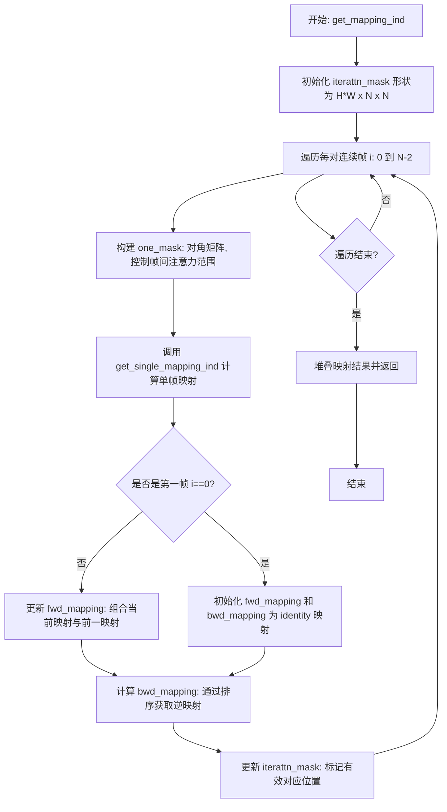

#### 带注释源码

```python
@torch.no_grad()
def get_mapping_ind(bwd_flows, bwd_occs, imgs, scale=1.0):
    """
    FLATTEN: Optical fLow-guided attention (Temoporal-guided attention)
    Find pixel correspondence between every consecutive frames in a batch

    [input]
    bwd_flow: (N-1)*2*H*W
    bwd_occ: (N-1)*H*W
    imgs: N*3*H*W

    [output]
    fwd_mappings: N*1*HW
    bwd_mappings: N*1*HW
    flattn_mask: HW*1*N*N
    i.e., imgs[i,:,fwd_mappings[i]] corresponds to imgs[0]
    i.e., imgs[i,:,fwd_mappings[i]][:,bwd_mappings[i]] restore the original imgs[i]
    """
    # 计算下采样后的空间尺寸
    N, H, W = imgs.shape[0], int(imgs.shape[2] // scale), int(imgs.shape[3] // scale)
    
    # 初始化注意力掩码: 每个像素位置维护一个 NxN 的连通性矩阵
    # 用于记录帧间像素对应关系的有效性
    iterattn_mask = torch.ones(H * W, N, N, dtype=torch.bool).to(imgs.device)
    
    # 遍历每一对连续帧，建立帧间像素映射关系
    for i in range(len(imgs) - 1):
        # 创建帧间注意力控制掩码: 仅允许相邻帧之间的注意力计算
        # 对角线为 True，非相邻位置为 False
        one_mask = torch.ones(N, N, dtype=torch.bool).to(imgs.device)
        one_mask[: i + 1, i + 1 :] = False  # 禁止从前瞻帧到回顾帧的注意力
        one_mask[i + 1 :, : i + 1] = False  # 禁止从回顾帧到前瞻帧的注意力
        
        # 调用单帧映射计算函数，获取当前帧对的像素对应关系
        mapping_ind, unlinkedmask = get_single_mapping_ind(
            bwd_flows[i : i + 1], bwd_occs[i : i + 1], imgs[i : i + 2], scale
        )
        
        # 第一帧时，初始化前后向映射为恒等映射
        if i == 0:
            fwd_mapping = [torch.arange(len(mapping_ind)).to(mapping_ind.device)]
            bwd_mapping = [torch.arange(len(mapping_ind)).to(mapping_ind.device)]
        
        # 更新注意力掩码: 标记无对应关系的像素位置
        iterattn_mask[unlinkedmask[fwd_mapping[-1]]] = torch.logical_and(
            iterattn_mask[unlinkedmask[fwd_mapping[-1]]], one_mask
        )
        
        # 链式更新前向映射: 组合当前帧对映射与之前的映射
        fwd_mapping += [mapping_ind[fwd_mapping[-1]]]
        
        # 计算后向映射: 通过排序获取前向映射的逆映射
        bwd_mapping += [torch.sort(fwd_mapping[-1])[1]]
    
    # 堆叠所有帧的映射结果，添加维度以适配注意力机制
    fwd_mappings = torch.stack(fwd_mapping, dim=0).unsqueeze(1)
    bwd_mappings = torch.stack(bwd_mapping, dim=0).unsqueeze(1)
    
    return fwd_mappings, bwd_mappings, iterattn_mask.unsqueeze(1)
```


### `apply_FRESCO_opt`

该函数用于将 FRESCO（Flow-guided REcurrent Spatial COrrespondence）优化应用于 StableDiffusion 管道，通过替换 UNet 的前向传播方法来实现特征优化、时间一致性增强和背景平滑等功能。

参数：

- `pipe`：`StableDiffusionControlNetImg2ImgPipeline`，需要应用 FRESCO 优化的扩散管道对象
- `steps`：`List`，时间步列表，指定在哪些时间步激活特征优化功能
- `layers`：`List`，默认 `[0, 1, 2, 3]`，UNet 中需要进行优化的上采样块层索引
- `flows`：`Optional[List[Tensor]]`，光流数据，包含前向和后向光流 `[fwd_flows, bwd_flows]`，用于时间一致性
- `occs`：`Optional[List[Tensor]]`，遮挡掩码，包含前向和后向遮挡掩码 `[fwd_occs, bwd_occs]`
- `correlation_matrix`：`List[Tensor]`，特征相关性矩阵列表，用于空间一致性优化
- `intra_weight`：`float`，默认 `1e2`，空间一致性损失的权重系数
- `iters`：`int`，默认 `20`，特征优化的迭代次数
- `optimize_temporal`：`bool`，默认 `True`，是否启用时间一致性优化
- `saliency`：`Optional[Tensor]`，显著性图，用于背景平滑处理

返回值：`None`，该函数直接修改管道对象的 `pipe.unet.forward` 属性

#### 流程图

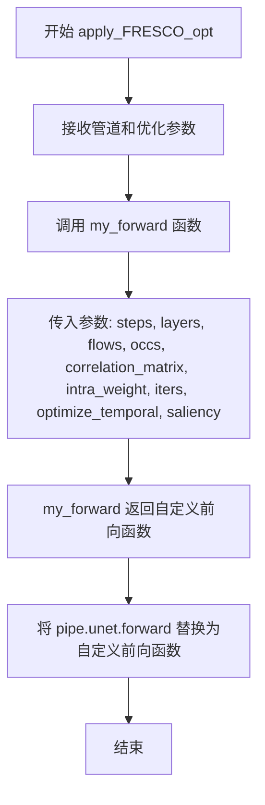

#### 带注释源码

```python
def apply_FRESCO_opt(
    pipe,
    steps=[],
    layers=[0, 1, 2, 3],
    flows=None,
    occs=None,
    correlation_matrix=[],
    intra_weight=1e2,
    iters=20,
    optimize_temporal=True,
    saliency=None,
):
    """
    Apply FRESCO-based optimization to a StableDiffusionPipeline
    
    该函数将 FRESCO 优化机制注入到 StableDiffusion 管道中，通过替换 UNet 的 forward 方法
    来实现以下功能：
    1. 特征优化：在指定的时间步和层对 UNet 的解码器特征进行优化
    2. 时间一致性：利用光流信息增强帧间一致性
    3. 空间一致性：通过相关性矩阵保持特征的空间结构
    4. 背景平滑：使用显著性图进行背景区域的平滑处理
    
    Args:
        pipe: StableDiffusion 管道对象，包含 unet 等组件
        steps: 优化激活的时间步列表
        layers: 需要优化的 UNet 上采样块索引
        flows: 光流数据 [fwd_flows, bwd_flows]
        occs: 遮挡掩码 [fwd_occs, bwd_occs]
        correlation_matrix: 空间相关性矩阵列表
        intra_weight: 空间一致性损失权重
        iters: 优化迭代次数
        optimize_temporal: 是否启用时间一致性优化
        saliency: 显著性图用于背景平滑
    """
    # 使用 my_forward 函数创建自定义的前向传播方法
    # my_forward 会返回一个修改过的 forward 函数，该函数：
    # 1. 在指定层捕获解码器特征用于后续优化
    # 2. 在指定时间步调用 optimize_feature 进行特征优化
    # 3. 可选地调用 warp_tensor 进行基于光流的特征扭曲
    pipe.unet.forward = my_forward(
        pipe.unet, 
        steps,              # 优化激活的时间步
        layers,             # 优化目标层
        flows,              # 光流数据
        occs,               # 遮挡掩码
        correlation_matrix, # 空间相关性矩阵
        intra_weight,       # 空间一致性权重
        iters,              # 优化迭代次数
        optimize_temporal,  # 是否启用时间优化
        saliency            # 显著性图
    )
```


### `get_intraframe_paras`

获取空间引导注意力（spatial-guided attention）和优化的参数。该函数执行一步去噪，收集存储在`frescoProc.controller.stored_attn['decoder_attn']`中的注意力特征，并计算归一化特征的Gram矩阵用于空间一致性损失。

参数：

- `pipe`：`StableDiffusionControlNetImg2ImgPipeline`，Diffusion pipeline对象，用于执行去噪过程
- `imgs`：`torch.Tensor`，输入图像，形状为[B, C, H, W]
- `frescoProc`：`FRESCOAttnProcessor2_0`，FRESCO注意力处理器对象，包含控制器用于管理注意力特征
- `prompt_embeds`：`torch.FloatTensor`，文本编码器生成的提示词嵌入，形状为[batch, seq_len, hidden_dim]
- `do_classifier_free_guidance`：`bool`，是否执行无分类器自由guidance，默认为True
- `generator`：`torch.Generator`，可选的随机数生成器，用于确保可重复性

返回值：`List[torch.FloatTensor]`，返回归一化特征的Gram矩阵列表（correlation_matrix），用于后续的空间一致性优化。每个元素形状为[B, H*W, H*W]

#### 流程图

```mermaid
flowchart TD
    A[开始: get_intraframe_paras] --> B[获取scheduler和timestep]
    B --> C[获取执行设备device]
    C --> D[从输入图像获取形状B, C, H, W]
    D --> E[frescoProc.controller.disable_controller 禁用控制器]
    E --> F[apply_FRESCO_opt 应用FRESCO优化到pipe]
    F --> G[frescoProc.controller.clear_store 清除存储]
    G --> H[frescoProc.controller.enable_store 启用存储]
    H --> I[pipe.prepare_latents 准备latents]
    I --> J{do_classifier_free_guidance?}
    J -->|Yes| K[latent_model_input = torch.cat latents*2]
    J -->|No| L[latent_model_input = latents]
    K --> M[pipe.unet 执行单步去噪]
    L --> M
    M --> N[frescoProc.controller.disable_store 禁用存储]
    N --> O{遍历model_output[1:]中的每个特征}
    O -->|每次迭代| P[计算latent_vector归一化]
    P --> Q[计算attention_probs = Gram矩阵]
    Q --> R[保存到correlation_matrix列表]
    R --> O
    O -->|完成| S[删除model_output释放内存]
    S --> T[clear_cache 清理GPU缓存]
    T --> U[返回correlation_matrix]
```

#### 带注释源码

```python
@torch.no_grad()
def get_intraframe_paras(pipe, imgs, frescoProc, prompt_embeds, do_classifier_free_guidance=True, generator=None):
    """
    获取空间引导注意力和优化的参数
    * 执行一步去噪
    * 收集存储在frescoProc.controller.stored_attn['decoder_attn']中的注意力特征
    * 计算归一化特征的Gram矩阵用于空间一致性损失
    """

    # 从pipeline获取噪声调度器
    noise_scheduler = pipe.scheduler
    # 获取最后一个timestep（用于单步去噪）
    timestep = noise_scheduler.timesteps[-1]
    # 获取执行设备
    device = pipe._execution_device
    # 从输入图像获取批次维度、通道、高度、宽度
    B, C, H, W = imgs.shape

    # 禁用FRESCO控制器
    frescoProc.controller.disable_controller()
    # 应用FRESO优化到UNet
    apply_FRESCO_opt(pipe)
    # 清除之前存储的注意力特征
    frescoProc.controller.clear_store()
    # 启用存储以收集去噪过程中的注意力特征
    frescoProc.controller.enable_store()

    # 准备latents：将输入图像编码为latent空间
    # 参数包括：图像、timestep、批次大小、1个样本、prompt_embeds数据类型、设备、generator
    latents = pipe.prepare_latents(
        imgs.to(pipe.unet.dtype),  # 将图像转换为UNet数据类型
        timestep,  # 当前去噪时间步
        B,  # 批次大小
        1,  # 每个prompt生成的图像数量
        prompt_embeds.dtype,  # 数据类型
        device,  # 计算设备
        generator=generator,  # 随机生成器
        repeat_noise=False  # 不重复噪声
    )

    # 如果使用无分类器自由guidance，则将latents复制一份（条件+非条件）
    latent_model_input = torch.cat([latents] * 2) if do_classifier_free_guidance else latents
    
    # 执行UNet前向传播，执行单步去噪
    # 返回tuple：(sample, up_samples...) 其中up_samples包含解码器特征
    model_output = pipe.unet(
        latent_model_input,  # 噪声latent
        timestep,  # 当前时间步
        encoder_hidden_states=prompt_embeds,  # 文本嵌入
        cross_attention_kwargs=None,  # 跨注意力额外参数
        return_dict=False,  # 不返回字典
    )

    # 禁用存储，停止收集注意力特征
    frescoProc.controller.disable_store()

    # 计算归一化特征的Gram矩阵用于空间一致性损失
    correlation_matrix = []
    # 遍历UNet输出的解码器特征（跳过第一个sample输出）
    for tmp in model_output[1:]:
        # 将特征从[b c h w]重排为[b (h w) c]
        latent_vector = rearrange(tmp, "b c h w -> b (h w) c")
        # L2归一化
        latent_vector = latent_vector / ((latent_vector**2).sum(dim=2, keepdims=True) ** 0.5)
        # 计算Gram矩阵（注意力概率）
        attention_probs = torch.bmm(latent_vector, latent_vector.transpose(-1, -2))
        # 复制并转换为float32后添加到列表
        correlation_matrix += [attention_probs.detach().clone().to(torch.float32)]
        # 释放中间变量内存
        del attention_probs, latent_vector, tmp
    # 删除model_output释放内存
    del model_output

    # 清理GPU缓存
    clear_cache()

    # 返回correlation_matrix列表
    return correlation_matrix
```


### `get_flow_and_interframe_paras`

该函数用于获取时序引导注意力（Temporal-guided Attention）和优化所需的参数。它通过光流模型预测双向光流和遮挡掩码，并计算像素索引对应关系（用于FLATTEN算法）。

参数：

- `flow_model`：光流模型（如GMFlow），用于预测帧间的光流信息
- `imgs`：`List[np.ndarray]` 或 `List[PIL.Image.Image]`，输入的图像列表

返回值：`Tuple`，包含四个元素：
1. `[fwd_flows, bwd_flows]`：`List[torch.Tensor]`，前向和后向光流列表
2. `[fwd_occs, bwd_occs]`：`List[torch.Tensor]`，前向和后向遮挡掩码列表
3. `attn_mask`：`List[torch.Tensor]`，用于跨帧注意力的掩码列表
4. `interattn_paras`：`Dict`，包含`fwd_mappings`、`bwd_mappings`和`interattn_masks`，用于时序引导注意力

#### 流程图

```mermaid
flowchart TD
    A[开始: get_flow_and_interframe_paras] --> B[将numpy图像转换为torch张量并移动到GPU]
    B --> C[创建重排列表: reshuffle_list = [1, 2, ..., n-1, 0]]
    C --> D[调用flow_model预测双向光流]
    D --> E[分割光流得到前向fwd_flows和后向bwd_flows]
    E --> F[调用forward_backward_consistency_check计算遮挡掩码]
    F --> G[计算warped_image1并更新后向遮挡掩码bwd_occs]
    G --> H[计算warped_image2并更新前向遮挡掩码fwd_occs]
    H --> I[对多个尺度生成attention mask]
    I --> J[对多个尺度计算像素映射关系fwd_mappings, bwd_mappings]
    J --> K[构建interattn_paras字典]
    K --> L[清理GPU缓存]
    L --> M[返回flows, occs, attn_mask, interattn_paras]
```

#### 带注释源码

```python
@torch.no_grad()
def get_flow_and_interframe_paras(flow_model, imgs):
    """
    Get parameters for temporal-guided attention and optimization
    * predict optical flow and occlusion mask
    * compute pixel index correspondence for FLATTEN
    """
    # Step 1: 将numpy图像列表转换为torch张量并移动到GPU
    # 转换维度从 (H, W, C) -> (C, H, W)
    images = torch.stack([torch.from_numpy(img).permute(2, 0, 1).float() for img in imgs], dim=0).cuda()
    
    # 使用numpy转张量函数将图像转换为适合处理的格式
    imgs_torch = torch.cat([numpy2tensor(img) for img in imgs], dim=0)

    # Step 2: 创建重排列表，用于创建循环帧对
    # 例如: [0,1,2,3] -> [1,2,3,0]
    reshuffle_list = list(range(1, len(images))) + [0]

    # Step 3: 使用光流模型预测双向光流
    # 输入: 当前帧和重排后的帧
    results_dict = flow_model(
        images,
        images[reshuffle_list],
        attn_splits_list=[2],
        corr_radius_list=[-1],
        prop_radius_list=[-1],
        pred_bidir_flow=True,
    )
    
    # Step 4: 提取光流预测结果 [2*B, 2, H, W]
    flow_pr = results_dict["flow_preds"][-1]
    
    # Step 5: 分割双向光流为前向和后向光流 [B, 2, H, W]
    fwd_flows, bwd_flows = flow_pr.chunk(2)
    
    # Step 6: 使用前后向一致性检查计算遮挡掩码
    fwd_occs, bwd_occs = forward_backward_consistency_check(fwd_flows, bwd_flows)

    # Step 7: 计算 warped image 并更新后向遮挡掩码
    warped_image1 = flow_warp(images, bwd_flows)
    bwd_occs = torch.clamp(
        bwd_occs + (abs(images[reshuffle_list] - warped_image1).mean(dim=1) > 255 * 0.25).float(), 0, 1
    )

    # Step 8: 计算 warped image 并更新前向遮挡掩码
    warped_image2 = flow_warp(images[reshuffle_list], fwd_flows)
    fwd_occs = torch.clamp(fwd_occs + (abs(images - warped_image2).mean(dim=1) > 255 * 0.25).float(), 0, 1)

    # Step 9: 对多个尺度生成注意力掩码 (8, 16, 32)
    attn_mask = []
    for scale in [8.0, 16.0, 32.0]:
        # 降采样遮挡掩码到不同尺度
        bwd_occs_ = F.interpolate(bwd_occs[:-1].unsqueeze(1), scale_factor=1.0 / scale, mode="bilinear")
        attn_mask += [
            torch.cat((bwd_occs_[0:1].reshape(1, -1) > -1, bwd_occs_.reshape(bwd_occs_.shape[0], -1) > 0.5), dim=0)
        ]

    # Step 10: 对多个尺度计算像素索引映射关系 (用于FLATTEN)
    fwd_mappings = []
    bwd_mappings = []
    interattn_masks = []
    for scale in [8.0, 16.0]:
        fwd_mapping, bwd_mapping, interattn_mask = get_mapping_ind(bwd_flows, bwd_occs, imgs_torch, scale=scale)
        fwd_mappings += [fwd_mapping]
        bwd_mappings += [bwd_mapping]
        interattn_masks += [interattn_mask]

    # Step 11: 构建时序注意力参数字典
    interattn_paras = {}
    interattn_paras["fwd_mappings"] = fwd_mappings
    interattn_paras["bwd_mappings"] = bwd_mappings
    interattn_paras["interattn_masks"] = interattn_masks

    # Step 12: 清理GPU缓存
    clear_cache()

    # Step 13: 返回光流、遮挡掩码、注意力掩码和时序注意力参数
    return [fwd_flows, bwd_flows], [fwd_occs, bwd_occs], attn_mask, interattn_paras
```


### `apply_FRESCO_attn`

该函数用于将 FRESCO（Flow-guided attention for video diffusion）引导的注意力机制应用到 StableDiffusionPipeline 的 UNet 模型中，通过替换上采样块的注意力处理器来实现空间引导和时间引导的注意力机制。

参数：

- `pipe`：`StableDiffusionControlNetImg2ImgPipeline` 或类似的 Stable Diffusion pipeline 对象，需要被修改以应用 FRESCO 注意力处理器

返回值：`FRESCOAttnProcessor2_0`，返回创建的 FRESCO 注意力处理器实例，可用于后续控制注意力机制

#### 流程图

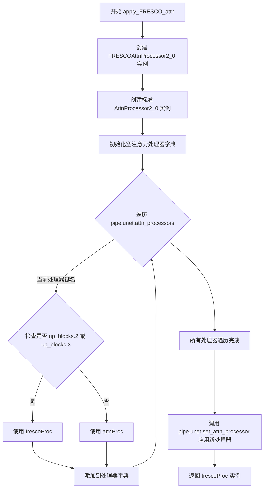

#### 带注释源码

```python
def apply_FRESCO_attn(pipe):
    """
    Apply FRESCO-guided attention to a StableDiffusionPipeline
    
    该函数将 FRESCO（Flow-guided attention for video diffusion）注意力处理器
    应用到 Stable Diffusion Pipeline 的 UNet 模型上。FRESCO 是一种用于视频
    扩散模型的空间和时间引导注意力机制。
    
    工作原理：
    - 对于 UNet 的上采样块（up_blocks.2 和 up_blocks.3），使用 FRESCO 处理器
    - 这些块是 UNet 的高层特征输出块，适合应用引导注意力
    - 其他块保持使用标准注意力处理器以保证基础功能
    """
    # 创建 FRESCO 注意力处理器实例，unet_chunk_size=2 表示每次处理2帧
    # AttentionControl() 用于控制不同类型的引导注意力开关
    frescoProc = FRESCOAttnProcessor2_0(2, AttentionControl())
    
    # 创建标准的注意力处理器，用于非上采样块
    attnProc = AttnProcessor2_0()
    
    # 初始化空字典用于存储处理器映射
    attn_processor_dict = {}
    
    # 遍历 UNet 中所有的注意力处理器键名
    for k in pipe.unet.attn_processors.keys():
        # 判断当前处理器是否属于上采样块（up_blocks.2 或 up_blocks.3）
        # 这些块输出高分辨率特征，适合应用 FRESCO 引导注意力
        if k.startswith("up_blocks.2") or k.startswith("up_blocks.3"):
            # 对上采样块使用 FRESCO 处理器
            attn_processor_dict[k] = frescoProc
        else:
            # 对其他块使用标准注意力处理器
            attn_processor_dict[k] = attnProc
    
    # 将新的注意力处理器字典应用到 UNet 模型
    # 这会替换模型中的注意力计算逻辑
    pipe.unet.set_attn_processor(attn_processor_dict)
    
    # 返回 FRESCO 处理器实例
    # 调用者可以使用 frescoProc.controller 来控制不同类型的引导注意力：
    # - enable_cfattn(): 启用跨帧注意力
    # - enable_intraattn(): 启用空间引导注意力（帧内）
    # - enable_interattn(): 启用时间引导注意力（帧间）
    return frescoProc
```


### `retrieve_latents`

该函数用于从编码器输出中提取潜在表示（latents），支持多种采样模式（随机采样或取模），并在无法访问潜在表示时抛出明确的错误。

参数：

- `encoder_output`：`torch.Tensor`，编码器输出对象，通常包含 `latent_dist` 或 `latents` 属性
- `generator`：`torch.Generator | None`，可选的随机数生成器，用于控制采样随机性
- `sample_mode`：`str`，采样模式，默认为 `"sample"`（随机采样），也可设为 `"argmax"`（取模）

返回值：`torch.Tensor`，提取的潜在表示张量

#### 流程图

```mermaid
flowchart TD
    A[开始: retrieve_latents] --> B{encoder_output 是否有 latent_dist 属性?}
    B -- 是 --> C{sample_mode == 'sample'?}
    C -- 是 --> D[返回 encoder_output.latent_dist.sample&#40;generator&#41;]
    C -- 否 --> E{sample_mode == 'argmax'?}
    E -- 是 --> F[返回 encoder_output.latent_dist.mode&#40;&#41;]
    E -- 否 --> G[抛出 AttributeError: 未知采样模式]
    B -- 否 --> H{encoder_output 是否有 latents 属性?}
    H -- 是 --> I[返回 encoder_output.latents]
    H -- 否 --> J[抛出 AttributeError: 无法访问 latents]
    D --> K[结束]
    F --> K
    G --> K
    I --> K
    J --> K
```

#### 带注释源码

```python
def retrieve_latents(
    encoder_output: torch.Tensor, 
    generator: torch.Generator | None = None, 
    sample_mode: str = "sample"
):
    """
    从编码器输出中提取潜在表示（latents）。
    
    该函数支持三种方式获取潜在表示：
    1. 从 latent_dist 随机采样（sample_mode='sample'）
    2. 从 latent_dist 取模（sample_mode='argmax'）
    3. 直接返回预存的 latents 属性
    
    参数:
        encoder_output: 编码器输出对象，通常是 VAE 的 encode 输出
        generator: 可选的随机生成器，用于控制采样随机性
        sample_mode: 采样模式，'sample' 为随机采样，'argmax' 为取模
    
    返回:
        torch.Tensor: 提取的潜在表示
    
    异常:
        AttributeError: 当无法从 encoder_output 访问潜在表示时抛出
    """
    # 方式1: 检查是否有 latent_dist 属性且使用采样模式
    if hasattr(encoder_output, "latent_dist") and sample_mode == "sample":
        # 从潜在分布中随机采样一个潜在表示
        return encoder_output.latent_dist.sample(generator)
    
    # 方式2: 检查是否有 latent_dist 属性且使用取模模式
    elif hasattr(encoder_output, "latent_dist") and sample_mode == "argmax":
        # 返回潜在分布的众数（最可能的值）
        return encoder_output.latent_dist.mode()
    
    # 方式3: 直接返回预存的 latents 属性
    elif hasattr(encoder_output, "latents"):
        return encoder_output.latents
    
    # 无法访问潜在表示时抛出错误
    else:
        raise AttributeError("Could not access latents of provided encoder_output")
```


### `prepare_image`

该函数用于将不同格式的输入图像（PyTorch张量、PIL图像、NumPy数组或列表）统一预处理为PyTorch FloatTensor格式，并对像素值进行归一化处理（范围[-1, 1]）。

参数：

- `image`：`Union[torch.Tensor, PIL.Image.Image, np.ndarray, List[PIL.Image.Image | np.ndarray]]`，输入图像，支持多种格式

返回值：`torch.Tensor`，预处理后的图像张量，形状为[B, C, H, W]，数据类型为torch.float32，值域范围[-1, 1]

#### 流程图

```mermaid
flowchart TD
    A[开始: image输入] --> B{image是否为torch.Tensor?}
    B -- 是 --> C{image.ndim == 3?}
    C -- 是 --> D[image = image.unsqueeze<br/>添加batch维度]
    C -- 否 --> E[不做处理]
    D --> F[image = image.to<br/>转换为float32]
    B -- 否 --> G{image是否为PIL.Image或np.ndarray?}
    G -- 是 --> H[image = [image]<br/>转换为list]
    G -- 否 --> I[保持为list]
    H --> J{image[0]是否为PIL.Image?}
    J -- 是 --> K[遍历转换为RGB<br/>np.array拼接]
    J -- 否 --> L{image[0]是否为np.ndarray?}
    L -- 是 --> M[拼接数组]
    L -- 否 --> N[跳过]
    K --> O[image = transpose<br/>维度重排CHW]
    M --> O
    N --> O
    O --> P[torch.from_numpy<br/>转为Tensor]
    P --> Q[归一化: /127.5 -1.0<br/>映射到[-1,1]]
    Q --> R[结束: 返回image]
    E --> R
    F --> R
    I --> J
```

#### 带注释源码

```python
def prepare_image(image):
    # 判断输入是否为PyTorch张量
    if isinstance(image, torch.Tensor):
        # 批次单张图像处理
        # 如果是3维张量(H,W,C)，添加batch维度变成4维(B,H,W,C)
        if image.ndim == 3:
            image = image.unsqueeze(0)

        # 统一转换为float32类型
        image = image.to(dtype=torch.float32)
    else:
        # 预处理其他格式的图像
        # 如果是PIL.Image或np.ndarray，包装成列表便于统一处理
        if isinstance(image, (PIL.Image.Image, np.ndarray)):
            image = [image]

        # 处理PIL图像列表：转换为RGB并转为numpy数组
        if isinstance(image, list) and isinstance(image[0], PIL.Image.Image):
            # 将每张PIL图像转换为RGB格式的numpy数组
            # [None, :]添加batch维度，(H,W,C) -> (1,H,W,C)
            image = [np.array(i.convert("RGB"))[None, :] for i in image]
            # 在batch维度拼接：(N,1,H,W,C) -> (N,H,W,C)
            image = np.concatenate(image, axis=0)
        # 处理numpy数组列表：直接在batch维度拼接
        elif isinstance(image, list) and isinstance(image[0], np.ndarray):
            image = np.concatenate([i[None, :] for i in image], axis=0)

        # 维度转换：从(H,W,C)转换为(C,H,W)
        image = image.transpose(0, 3, 1, 2)
        # 转换为PyTorch张量并进行归一化
        # 像素值范围从[0,255]映射到[-1,1]
        # /127.5将[0,255]映射到[0,2]，再减1得到[-1,1]
        image = torch.from_numpy(image).to(dtype=torch.float32) / 127.5 - 1.0

    return image
```


### `Dilate.__init__`

该方法是 `Dilate` 类的构造函数，用于初始化一个图像膨胀（Dilation）操作的卷积核。该类实现了一个简单的形态学膨胀滤波器，通过创建指定大小的卷积核并在推理时对输入张量进行卷积运算来扩展图像中的白色区域（或高亮区域）。

参数：

- `kernel_size`：`int`，卷积核的边长大小，默认为 7。决定膨胀操作的邻域范围。
- `channels`：`int`，输入图像的通道数，默认为 1。用于创建对应通道数的卷积核。
- `device`：`str`，计算设备，默认为 "cpu"。指定卷积核存放的设备（CPU 或 CUDA）。

返回值：`None`（无返回值），`__init__` 方法仅完成对象属性初始化。

#### 流程图

```mermaid
graph TD
    A[开始 __init__] --> B[接收参数: kernel_size, channels, device]
    B --> C[保存 kernel_size 到实例属性]
    C --> D[保存 channels 到实例属性]
    E[创建形状为 1x1xkernel_sizexkernel_size 的全1张量 gaussian_kernel]
    E --> F[将卷积核重复扩展为 channelsx1xkernel_sizexkernel_size]
    G[计算 mean = (kernel_size - 1) // 2]
    G --> H[将卷积核转移到指定设备 device]
    I[保存卷积核到 gaussian_filter 属性]
    I --> J[结束 __init__]
```

#### 带注释源码

```python
def __init__(self, kernel_size=7, channels=1, device="cpu"):
    # 保存卷积核大小到实例属性，决定膨胀操作的邻域范围
    self.kernel_size = kernel_size
    # 保存输入通道数到实例属性，用于卷积核的通道维度
    self.channels = channels
    # 创建一个形状为 [1, 1, kernel_size, kernel_size] 的全1张量
    # 作为基础卷积核（实际是均值滤波器，非高斯滤波器）
    gaussian_kernel = torch.ones(1, 1, self.kernel_size, self.kernel_size)
    # 沿通道维度重复卷积核，扩展为 [channels, 1, kernel_size, kernel_size]
    # 使其可以处理多通道输入
    gaussian_kernel = gaussian_kernel.repeat(self.channels, 1, 1, 1)
    # 计算卷积核中心偏移量，用于 padding 计算
    # 例如 kernel_size=7 时，mean=3
    self.mean = (self.kernel_size - 1) // 2
    # 将卷积核移动到指定的计算设备（CPU 或 GPU）
    gaussian_kernel = gaussian_kernel.to(device)
    # 保存最终卷积核到实例属性，用于后续卷积操作
    self.gaussian_filter = gaussian_kernel
```


### `Dilate.__call__`

该方法是 `Dilate` 类的核心调用接口，通过均值滤波器和边界复制填充实现图像的膨胀操作，将输入特征图进行形态学膨胀处理后输出。

参数：

- `x`：`torch.Tensor`，输入的图像或特征张量，形状为 `[B, C, H, W]`

返回值：`torch.Tensor`，膨胀后的图像或特征张量，形状为 `[B, C, H, W]`，值被截断在 [0, 1] 范围内

#### 流程图

```mermaid
flowchart TD
    A[输入张量 x] --> B[边界复制填充 padding]
    B --> C[2D 卷积 conv2d]
    C --> D[值截断 clamp 到 0-1]
    D --> E[返回膨胀后的张量]
```

#### 带注释源码

```python
def __call__(self, x):
    """
    对输入张量执行膨胀操作（使用均值滤波器）
    
    参数:
        x: 输入张量，形状为 [B, C, H, W]
    
    返回:
        膨胀后的张量，形状为 [B, C, H, W]，值在 [0, 1] 范围内
    """
    # 步骤1: 使用复制模式对输入张量进行边界填充
    # 填充大小为 self.mean（即 (kernel_size - 1) // 2）
    # 填充顺序: (左, 右, 上, 下)
    x = F.pad(x, (self.mean, self.mean, self.mean, self.mean), "replicate")
    
    # 步骤2: 执行 2D 卷积，使用均值滤波器（所有权重为1）
    # 使用预先创建的 self.gaussian_filter（实际是均值滤波器）
    # bias=None 表示不使用偏置
    # groups=self.channels 表示分组卷积，每个通道独立处理
    result = F.conv2d(x, self.gaussian_filter, bias=None)
    
    # 步骤3: 将卷积结果截断到 [0, 1] 范围
    # 由于均值滤波器会使值增大（取决于 kernel_size），需要截断
    return torch.clamp(result, 0, 1)
```


### `AttentionControl.get_empty_store`

该函数是一个静态方法，用于初始化并返回一个空的注意力存储字典。该字典包含一个键 "decoder_attn"，其值为空列表，用于在空间引导注意力（spatial-guided attention）过程中存储解码器注意力特征。

参数： 无

返回值：`Dict[str, List[torch.Tensor]]`，返回一个包含 "decoder_attn" 键的字典，其中 "decoder_attn" 键对应一个空列表，用于存储后续收集的注意力特征张量。

#### 流程图

```mermaid
flowchart TD
    A[开始] --> B[创建空字典]
    B --> C[设置键 'decoder_attn']
    C --> D[设置值为空列表]
    D --> E[返回字典]
    E --> F[结束]
```

#### 带注释源码

```python
@staticmethod
def get_empty_store():
    """
    创建一个空的注意力存储结构
    
    Returns:
        dict: 包含 'decoder_attn' 键的字典，值为空列表
              用于存储解码器(decoder)的注意力特征
    """
    return {
        "decoder_attn": [],  # 用于存储注意力特征的空列表
    }
```


### `AttentionControl.clear_store`

清除存储的注意力特征，释放GPU内存并重置存储状态。

参数：
- 无参数

返回值：`None`，无返回值描述

#### 流程图

```mermaid
flowchart TD
    A[开始 clear_store] --> B[删除 stored_attn 引用]
    B --> C[调用 torch.cuda.empty_cache 释放GPU缓存]
    C --> D[调用 gc.collect 垃圾回收]
    D --> E[重新初始化 stored_attn 为空存储]
    E --> F[调用 disable_intraattn 禁用帧内注意力]
    F --> G[结束]
```

#### 带注释源码

```
def clear_store(self):
    """
    清除存储的注意力特征并释放相关资源
    
    该方法执行以下操作:
    1. 删除当前的 stored_attn 引用，释放内存
    2. 清理 CUDA 缓存，释放 GPU 内存
    3. 强制 Python 垃圾回收，清理循环引用对象
    4. 重新初始化 stored_attn 为空字典
    5. 禁用帧内注意力机制
    
    通常在以下场景调用:
    - 开始新的视频帧处理前
    - 需要释放大量显存时
    - 重置注意力控制器状态时
    """
    # 删除存储的注意力特征引用
    del self.stored_attn
    
    # 释放GPU缓存中的未使用内存
    torch.cuda.empty_cache()
    
    # 强制进行Python垃圾回收，释放循环引用对象
    gc.collect()
    
    # 重新初始化空的存储字典
    self.stored_attn = self.get_empty_store()
    
    # 禁用帧内注意力机制
    self.disable_intraattn()
```


### AttentionControl.enable_store

启用存储注意力特征的功能，用于空间引导注意力（spatial-guided attention）。该方法将 `self.store` 标志设置为 `True`，从而允许在后续处理中捕获和保存注意力特征。

参数：
- 该方法无显式参数（隐式参数 `self` 为 `AttentionControl` 实例）

返回值：`None`，无返回值

#### 流程图

```mermaid
graph TD
    A[开始 enable_store] --> B[设置 self.store = True]
    B --> C[结束]
    C --> D[在 forward 方法中<br/>检查 self.store 标志]
    D --> E{self.store 为 True?}
    E -->|是| F[将 hidden_states 保存到<br/>stored_attn['decoder_attn']]
    E -->|否| G[跳过保存]
```

#### 带注释源码

```python
# store attention feature of the input frame for spatial-guided attention
def enable_store(self):
    """
    启用存储注意力特征的功能。
    
    该方法将 self.store 标志设置为 True，使得在后续的 forward 方法调用中，
    当前的 hidden_states 会被保存到 stored_attn['decoder_attn'] 列表中。
    这主要用于捕获输入帧的注意力特征，以便进行空间引导注意力（intra-frame attention）的计算。
    
    使用场景：
    - 在 get_intraframe_paras 函数中被调用，用于收集单帧的注意力特征
    - 与 enable_intraattn 配合使用，后者会读取存储的注意力特征进行空间引导
    
    注意：
    - 调用 enable_store 后，需要在适当的时候调用 disable_store 来停止存储
    - 存储的注意力特征会在 clear_store 时被清除
    """
    self.store = True
```


### `AttentionControl.disable_store`

该方法用于关闭注意力特征的存储功能，将 `store` 标志设置为 `False`，从而停止在后续前向传播中收集注意力特征。

参数：空（无参数）

返回值：`None`，无返回值，仅修改实例属性

#### 流程图

```mermaid
flowchart TD
    A[开始 disable_store] --> B[将 self.store 设为 False]
    B --> C[结束方法]
```

#### 带注释源码

```python
def disable_store(self):
    """
    禁用注意力特征存储功能
    将 self.store 标志设置为 False，停止收集注意力特征
    """
    self.store = False  # 设置实例变量 store 为 False，关闭存储功能
```


### `AttentionControl.enable_intraattn`

该方法用于启用空间引导注意力（intra-frame attention），是FRESCO算法中控制注意力机制的核心方法之一。它会重置索引计数器，启用intra-attn模式，并检查是否已有存储的注意力特征可供使用。

参数： 无

返回值： 无返回值（`None`）

#### 流程图

```mermaid
flowchart TD
    A[开始 enable_intraattn] --> B[重置 self.index = 0]
    B --> C[设置 self.use_intraattn = True]
    C --> D[调用 self.disable_store]
    D --> E{检查 stored_attn['decoder_attn'] 长度}
    E -->|长度为 0| F[设置 self.use_intraattn = False]
    E -->|长度 > 0| G[保持 self.use_intraattn = True]
    F --> H[结束]
    G --> H
```

#### 带注释源码

```python
def enable_intraattn(self):
    """
    启用空间引导注意力（intra-frame attention）
    用于在视频处理中实现同一帧内的特征对齐和增强
    """
    # 1. 重置索引计数器，用于从存储的注意力特征中按顺序读取
    self.index = 0
    
    # 2. 启用intra-attn模式，标记当前使用空间引导注意力
    self.use_intraattn = True
    
    # 3. 停止继续存储新的注意力特征
    # 因为intra-attn需要使用之前存储的特征，不应再继续存储
    self.disable_store()
    
    # 4. 安全检查：如果没有存储任何注意力特征，则自动禁用intra-attn
    # 这是因为没有参考特征就无法进行空间引导的注意力计算
    if len(self.stored_attn["decoder_attn"]) == 0:
        self.use_intraattn = False
```


### AttentionControl.disable_intraattn

该方法用于禁用空间引导的注意力（intra-attention）功能，将相关状态重置为初始值，并关闭注意力存储功能。

参数： 无

返回值：`None`，无返回值（Python 方法默认返回 None）

#### 流程图

```mermaid
flowchart TD
    A[开始 disable_intraattn] --> B[重置 self.index = 0]
    B --> C[设置 self.use_intraattn = False]
    C --> D[调用 self.disable_store]
    D --> E[结束]
```

#### 带注释源码

```python
def disable_intraattn(self):
    """
    禁用空间引导的注意力（intra-attention）
    
    该方法执行以下操作：
    1. 将索引重置为0，准备重新开始计数
    2. 禁用intra-attention功能（设置use_intraattn为False）
    3. 关闭注意力存储功能
    """
    # 重置内部索引，用于后续可能的新存储序列
    self.index = 0
    
    # 禁用intra-attention开关，关闭空间引导注意力
    self.use_intraattn = False
    
    # 调用disable_store方法，关闭存储功能
    # 这会停止收集新的注意力特征
    self.disable_store()
```


### `AttentionControl.disable_cfattn`

该方法用于禁用跨帧注意力（cross-frame attention），将 `use_cfattn` 标志设置为 `False`，从而在 FRESCO 视频处理流程中关闭跨帧注意力机制。

参数： 无

返回值：`None`，无返回值

#### 流程图

```mermaid
graph TD
    A[开始 disable_cfattn] --> B[设置 self.use_cfattn = False]
    B --> C[结束]
    
    style A fill:#e1f5fe
    style B fill:#fff3e0
    style C fill:#e8f5e9
```

#### 带注释源码

```python
def disable_cfattn(self):
    """
    禁用跨帧注意力（Cross-Frame Attention）
    
    该方法是 AttentionControl 类的一部分，用于控制 FRESO 引导的注意力机制中的跨帧注意力。
    跨帧注意力允许模型在不同帧之间传递信息，用于视频处理任务。
    
    调用此方法后，self.use_cfattn 被设置为 False，
    FRESCOAttnProcessor2_0 中的跨帧注意力逻辑将不再执行。
    
    参数:
        无
        
    返回值:
        None
    """
    self.use_cfattn = False
```


### AttentionControl.enable_cfattn

启用跨帧注意力（Cross-Frame Attention）功能，允许模型利用视频或图像序列中的时间一致性信息来增强生成质量。

参数：

- `attn_mask`：`Optional[Any]`，跨帧注意力掩码，用于指定哪些帧之间应该进行注意力计算。如果为 None，则使用已有的 attn_mask（如果存在）。

返回值：`None`，该方法直接修改实例状态，不返回任何值。

#### 流程图

```mermaid
flowchart TD
    A[开始 enable_cfattn] --> B{attn_mask 是否存在?}
    B -->|是| C{self.attn_mask 是否已存在?}
    C -->|是| D[删除旧的 self.attn_mask]
    D --> E[释放 GPU 内存]
    E --> F[设置 self.attn_mask = attn_mask]
    F --> G[设置 self.use_cfattn = True]
    B -->|否| H{self.attn_mask 是否已存在?}
    H -->|是| I[设置 self.use_cfattn = True]
    H -->|否| J[打印警告信息]
    J --> K[调用 disable_cfattn]
    G --> L[结束]
    I --> L
    K --> L
```

#### 带注释源码

```python
def enable_cfattn(self, attn_mask=None):
    """
    启用跨帧注意力（Cross-Frame Attention）
    
    跨帧注意力允许模型在去噪过程中利用多帧之间的时间相关性，
    通过掩码机制控制不同帧之间的注意力交互，从而提升视频生成
    或图像序列处理的一致性和连贯性。
    
    Args:
        attn_mask: 可选的注意力掩码，用于指定帧间注意力计算的范围。
                   如果为 None，则尝试使用之前保存的 attn_mask。
    """
    # 检查是否提供了新的 attn_mask 参数
    if attn_mask:
        # 如果已存在旧的 attn_mask，先清理旧资源
        if self.attn_mask:
            del self.attn_mask              # 删除旧对象引用
            torch.cuda.empty_cache()        # 释放 GPU 内存缓存
        
        # 设置新的注意力掩码
        self.attn_mask = attn_mask
        # 启用跨帧注意力开关
        self.use_cfattn = True
    else:
        # 未提供新掩码，检查是否已有可用的掩码
        if self.attn_mask:
            # 存在已保存的掩码，仍然启用跨帧注意力
            self.use_cfattn = True
        else:
            # 既没有新掩码，也没有保存的掩码，打印警告
            print("Warning: no valid cross-frame attention parameters available!")
            # 回退：禁用跨帧注意力
            self.disable_cfattn()
```


### `AttentionControl.disable_interattn`

该方法用于禁用帧间注意力（temporal-guided attention），通过将 `use_interattn` 标志设置为 `False` 来关闭时间引导注意力机制。

参数：

- 该方法无显式参数（隐式参数 `self` 为类的实例）

返回值：`None`，无返回值

#### 流程图

```mermaid
graph TD
    A[开始 disable_interattn] --> B[设置 self.use_interattn = False]
    B --> C[结束]
```

#### 带注释源码

```
def disable_interattn(self):
    """
    禁用帧间注意力（temporal-guided attention）
    
    该方法将 use_interattn 标志设置为 False，
    从而在注意力处理中关闭时间引导的帧间注意力机制。
    通常与 enable_interattn() 方法配合使用，
    用于动态控制是否使用 FLATTEN 算法的时序引导注意力。
    """
    self.use_interattn = False  # 将帧间注意力标志设为 False
```


### `AttentionControl.enable_interattn`

该方法用于启用时间引导注意力（Temporal-guided Attention），也称为 FLATTEN（Optical Flow-guided Attention）。它接收光流和遮挡信息计算得到的帧间注意力参数（interattn_paras），并将其存储在控制器中，同时设置标志位以在后续的注意力计算中使用这些参数进行跨帧的时间一致性建模。

参数：

- `interattn_paras`：`Optional[Dict]`，可选参数，包含时间引导注意力所需的映射矩阵和掩码信息。如果提供，则使用该参数；否则使用之前保存的参数（如果有）。

返回值：`None`，该方法没有返回值，仅修改控制器内部状态。

#### 流程图

```mermaid
flowchart TD
    A[开始 enable_interattn] --> B{interattn_paras<br/>是否非空?}
    B -->|是| C{self.interattn_paras<br/>是否已存在?}
    C -->|是| D[删除旧的 interattn_paras]
    D --> E[torch.cuda.empty_cache<br/>释放GPU内存]
    E --> F[保存新的 interattn_paras]
    F --> G[设置 self.use_interattn = True]
    B -->|否| H{self.interattn_paras<br/>是否已存在?}
    H -->|是| G
    H -->|否| I[打印警告信息<br/>no valid temporal-guided attention<br/>parameters available]
    I --> J[调用 disable_interattn<br/>禁用时间引导注意力]
    G --> K[结束]
    J --> K
```

#### 带注释源码

```python
def enable_interattn(self, interattn_paras=None):
    """
    启用时间引导注意力（Temporal-guided Attention）
    
    该方法用于开启跨帧的时间一致性建模，通过光流指导的像素对应关系
    来实现帧间的特征交互。在 FRESCO 算法中，时间引导注意力被用于
    增强视频生成的时间连续性。
    
    参数:
        interattn_paras: 可选的字典，包含以下键值:
            - fwd_mappings: 前向映射矩阵列表，用于将当前帧特征映射到前一帧
            - bwd_mappings: 后向映射矩阵列表，用于将前一帧特征映射到当前帧
            - interattn_masks: 帧间注意力掩码，用于指示哪些像素具有有效对应关系
            每个映射矩阵的形状为 [N, 1, H*W]，其中 N 为帧数
    
    注意:
        - 如果没有传入 interattn_paras 但之前已经设置过，则仍然启用
        - 如果既没有新参数也没有旧参数，则打印警告并禁用该功能
    """
    # 检查是否提供了新的时间引导注意力参数
    if interattn_paras:
        # 如果之前已经存在参数，先清理旧资源
        if self.interattn_paras:
            del self.interattn_paras
            # 释放 GPU 缓存以避免内存泄漏
            torch.cuda.empty_cache()
        
        # 保存新的参数到控制器
        self.interattn_paras = interattn_paras
        # 设置标志位，指示时间引导注意力已启用
        self.use_interattn = True
    else:
        # 如果没有提供新参数，但之前已经设置过参数，则仍然启用
        if self.interattn_paras:
            self.use_interattn = True
        else:
            # 既没有新参数也没有旧参数，打印警告
            print("Warning: no valid temporal-guided attention parameters available!")
            # 禁用时间引导注意力功能
            self.disable_interattn()
```


### `AttentionControl.disable_controller`

该方法用于一次性禁用 FRESCO 注意力控制器的所有注意力模式，包括空间引导的帧内注意力、时间引导的帧间注意力和跨帧注意力，将三个控制标志位全部设置为 False。

参数：无

返回值：`None`，无返回值

#### 流程图

```mermaid
flowchart TD
    A[disable_controller 被调用] --> B[调用 disable_intraattn]
    B --> C[调用 disable_interattn]
    C --> D[调用 disable_cfattn]
    D --> E[结束]
```

#### 带注释源码

```python
def disable_controller(self):
    """
    禁用 FRESCO 注意力控制器的所有注意力模式
    
    该方法是一个便捷方法，一次性调用三个禁用方法：
    1. disable_intraattn() - 禁用帧内注意力
    2. disable_interattn() - 禁用帧间注意力  
    3. disable_cfattn() - 禁用跨帧注意力
    """
    self.disable_intraattn()   # 禁用空间引导的帧内注意力
    self.disable_interattn()  # 禁用时间引导的帧间注意力
    self.disable_cfattn()     # 禁用跨帧注意力
```


### `AttentionControl.enable_controller`

该方法用于同时启用三种类型的注意力控制机制：帧内注意力（空间引导注意力）、帧间注意力（时间引导注意力）和跨帧注意力。这是 FRESCO 算法中控制注意力流的核心方法，通过依次调用三个 enable 方法来激活完整的注意力控制功能。

参数：

- `interattn_paras`：`Optional[Dict]`，时间引导注意力（inter-frame attention）的参数，包含前向映射、后向映射和帧间注意力掩码等，用于实现 FLATTEN 机制的时间相关性建模
- `attn_mask`：`Optional[List[Tensor]]`，跨帧注意力（cross-frame attention）的掩码列表，用于控制哪些帧之间可以建立注意力连接

返回值：`None`，该方法无返回值，仅修改控制器内部状态

#### 流程图

```mermaid
flowchart TD
    A[开始 enable_controller] --> B{检查 interattn_paras}
    B -->|有参数| C[调用 enable_interattn interattn_paras]
    B -->|无参数| D[调用 enable_interattn 不传参数]
    C --> E{检查 attn_mask}
    D --> E
    E -->|有参数| F[调用 enable_cfattn attn_mask]
    E -->|无参数| G[调用 enable_cfattn 不传参数]
    F --> H[调用 enable_intraattn]
    G --> H
    H --> I[结束]
    
    C -.->|设置 use_interattn=True| J[self.interattn_paras]
    D -.->|检查已存在则启用| J
    F -.->|设置 use_cfattn=True| K[self.attn_mask]
    G -.->|检查已存在则启用| K
    H -.->|设置 use_intraattn=True| L[启用空间引导注意力]
```

#### 带注释源码

```python
def enable_controller(self, interattn_paras=None, attn_mask=None):
    """
    启用完整的 FRESCO 注意力控制器
    
    该方法依次启用三种注意力机制：
    1. 帧内注意力 (intra-attention): 基于初始帧的空间引导注意力
    2. 帧间注意力 (inter-attention): 基于光流的时间引导注意力 (FLATTEN)
    3. 跨帧注意力 (cross-frame attention): 多帧之间的交叉注意力
    
    Args:
        interattn_paras: 帧间注意力参数，包含:
            - fwd_mappings: 前向像素映射索引
            - bwd_mappings: 后向像素映射索引  
            - interattn_masks: 帧间注意力掩码
        attn_mask: 跨帧注意力掩码列表，用于在 batch 维度上选择参考帧
        
    Returns:
        None: 无返回值，仅修改内部状态
    """
    # 1. 启用帧内注意力（空间引导注意力）
    # 从缓存的注意力特征中获取参考特征，用于保持帧内空间一致性
    self.enable_intraattn()
    
    # 2. 启用帧间注意力（时间引导注意力）
    # 传入光流计算得到的像素对应关系，用于建模时序一致性
    # 如果 interattn_paras 为 None 但之前已有参数，则保持启用状态
    self.enable_interattn(interattn_paras)
    
    # 3. 启用跨帧注意力
    # 允许当前帧关注其他帧的特征，用于增强时间信息融合
    # 如果 attn_mask 为 None 但之前已有掩码，则保持启用状态
    self.enable_cfattn(attn_mask)
```


### `AttentionControl.forward`

该方法是FRESCO注意力控制类的核心前向传播方法，负责管理注意力特征的存储与检索，实现空间引导注意力、时间引导注意力和跨帧注意力的动态控制。

参数：

- `context`：`torch.Tensor`，输入的注意力上下文张量，用于在pipeline中传递和修改注意力特征

返回值：`torch.Tensor`，返回处理后的注意力上下文，可能包含存储的特征或原始输入

#### 流程图

```mermaid
flowchart TD
    A[开始 forward] --> B{self.store 是否为 True?}
    B -->|True| C[将 context 添加到 stored_attn['decoder_attn']]
    B -->|False| D{self.use_intraattn 为 True<br/>且 stored_attn 不为空?}
    D -->|True| E[从 stored_attn 取出第 index 个特征]
    E --> F[index += 1]
    F --> G{index >= len(stored_attn)?}
    G -->|True| H[index = 0<br/>disable_store]
    G -->|False| I[返回取出的特征]
    D -->|False| J[返回原始 context]
    C --> J
    I --> K[结束 forward]
    J --> K
```

#### 带注释源码

```python
def forward(self, context):
    """
    FRESCO 注意力控制的前向传播方法
    
    该方法实现三种注意力控制机制：
    1. store=True: 存储当前帧的注意力特征供后续空间引导使用
    2. use_intraattn=True: 使用之前存储的特征实现空间引导注意力
    3. 其他情况: 直接返回原始context
    """
    # 如果启用存储模式，将当前注意力上下文保存到存储区
    if self.store:
        self.stored_attn["decoder_attn"].append(context.detach())
    
    # 如果启用空间引导注意力且存储区有数据
    if self.use_intraattn and len(self.stored_attn["decoder_attn"]) > 0:
        # 取出对应索引的存储特征
        tmp = self.stored_attn["decoder_attn"][self.index]
        # 更新索引
        self.index = self.index + 1
        # 如果索引超出范围，重置索引并关闭存储
        if self.index >= len(self.stored_attn["decoder_attn"]):
            self.index = 0
            self.disable_store()
        # 返回存储的注意力特征用于空间引导
        return tmp
    
    # 默认返回原始上下文
    return context
```


### `AttentionControl.__call__`

该方法是 `AttentionControl` 类的核心调用接口，用于在 FRESCO 算法中控制注意力流。它根据控制器的状态（存储、帧内注意力、跨帧注意力）决定是返回原始上下文、存储的注意力特征，还是经过处理的上下文。

参数：

-  `context`：`torch.Tensor`，输入的注意力上下文张量，通常是来自 UNet 的隐藏状态，形状为 `(batch, sequence_length, hidden_dim)` 或类似结构

返回值：`torch.Tensor`，处理后的上下文张量。如果启用了帧内注意力（intra-attn）且存储区有数据，则返回存储的参考注意力特征；否则返回原始上下文。

#### 流程图

```mermaid
flowchart TD
    A[__call__ context] --> B{self.store == True?}
    B -->|Yes| C[将 context 追加到 stored_attn]
    B -->|No| D{self.use_intraattn == True<br/>且存储区有数据?}
    D -->|Yes| E[从存储区获取 stored_attn[index]]
    E --> F[index += 1]
    F --> G{index >= 存储区长度?}
    G -->|Yes| H[index = 0<br/>disable_store]
    G -->|No| I[返回存储的特征 tmp]
    D -->|No| J[返回原始 context]
    H --> I
    C --> J
```

#### 带注释源码

```python
def __call__(self, context):
    """
    AttentionControl 的调用接口
    决定如何处理输入的注意力上下文
    """
    # 调用 forward 方法进行处理
    context = self.forward(context)
    # 返回处理后的上下文
    return context


def forward(self, context):
    """
    实际处理逻辑
    根据控制器状态决定是存储、替换还是返回原始上下文
    """
    # 如果启用存储模式，将当前上下文存储到 decoder_attn 列表中
    # 用于后续帧内注意力（spatial-guided attention）的参考
    if self.store:
        self.stored_attn["decoder_attn"].append(context.detach())
    
    # 如果启用了帧内注意力且存储区有数据
    # 使用存储的历史注意力特征进行空间引导
    if self.use_intraattn and len(self.stored_attn["decoder_attn"]) > 0:
        # 获取当前索引对应的存储特征
        tmp = self.stored_attn["decoder_attn"][self.index]
        # 移动到下一个索引
        self.index = self.index + 1
        # 如果索引超出范围，重置索引并停止存储
        if self.index >= len(self.stored_attn["decoder_attn"]):
            self.index = 0
            self.disable_store()
        # 返回存储的注意力特征作为输出
        return tmp
    
    # 默认情况：返回原始上下文
    return context
```


### `FRESCOAttnProcessor2_0.__init__`

这是FRESCO注意力处理器的初始化方法，用于设置基于FRESCO算法的注意力处理器，包括空间引导注意力、时间引导注意力和跨帧注意力的支持。

参数：

- `unet_chunk_size`：`int`，默认为2，表示UNet的块大小，用于处理视频帧的分块
- `controller`：`AttentionControl`，默认为None，用于控制FRESCO注意力的控制器实例

返回值：`None`，该方法为构造函数，不返回任何值

#### 流程图

```mermaid
flowchart TD
    A[开始 __init__] --> B{检查 PyTorch 版本}
    B -->|有 scaled_dot_product_attention| C[设置 self.unet_chunk_size]
    B -->|没有| D[抛出 ImportError]
    C --> E[设置 self.controller]
    E --> F[结束 __init__]
```

#### 带注释源码

```python
def __init__(self, unet_chunk_size=2, controller=None):
    """
    初始化 FRESCO 注意力处理器
    
    Args:
        unet_chunk_size: UNet的块大小，用于视频帧处理
        controller: AttentionControl控制器，用于管理注意力模式
    """
    # 检查PyTorch是否支持scaled_dot_product_attention (PyTorch 2.0+)
    if not hasattr(F, "scaled_dot_product_attention"):
        raise ImportError("AttnProcessor2_0 requires PyTorch 2.0, to use it, please upgrade PyTorch to 2.0.")
    
    # 存储UNet块大小，用于后续跨帧注意力计算
    self.unet_chunk_size = unet_chunk_size
    
    # 存储注意力控制器，用于管理空间/时间/跨帧注意力
    self.controller = controller
```


### `FRESCOAttnProcessor2_0.__call__`

该方法是FRESCO注意力处理器的核心实现，负责实现FRESCO引导的注意力机制，包括空间引导注意力、时间引导注意力和跨帧注意力，通过对标准注意力机制的 hack 来增强视频到视频翻译任务中的时序一致性。

参数：

- `attn`：`torch.nn.Module`，注意力模块实例，包含 query、key、value 的线性变换层以及归一化层
- `hidden_states`：`torch.Tensor`，输入的隐藏状态张量，形状为 `(batch, channel, height, width)` 或 `(batch, sequence_length, channel)`
- `encoder_hidden_states`：`torch.Tensor` 或 `None`，编码器的隐藏状态，用于 cross-attention，若为 `None` 则使用 `hidden_states` 自身
- `attention_mask`：`torch.Tensor` 或 `None`，注意力掩码，用于控制哪些位置参与注意力计算
- `temb`：`torch.Tensor` 或 `None`，时间嵌入，用于条件归一化

返回值：`torch.Tensor`，经过 FRESCO 引导的注意力机制处理后的隐藏状态，形状与输入 `hidden_states` 相同

#### 流程图

```mermaid
flowchart TD
    A[开始 __call__] --> B[保存残差 connection]
    B --> C{是否使用 spatial_norm?}
    C -->|是| D[应用 spatial_norm]
    C -->|否| E[保持 hidden_states 不变]
    D --> F[reshape hidden_states]
    E --> F
    F --> G[获取 batch_size 和 sequence_length]
    G --> H{是否有 attention_mask?}
    H -->|是| I[准备 attention_mask]
    H -->|否| J[继续]
    I --> K{是否使用 group_norm?}
    J --> K
    K -->|是| L[应用 group_norm]
    K -->|否| M[计算 query]
    L --> M
    M --> N{encoder_hidden_states 是否为 None?}
    N -->|是| O[设置 encoder_hidden_states = hidden_states<br/>如果 controller.store 为真则存储]
    N -->|否| P[标记为 crossattn=True<br/>如果需要则归一化 encoder_hidden_states]
    O --> Q[计算 key 和 value]
    P --> Q
    Q --> R{是否使用 interattn 且非 crossattn?}
    R -->|是| S[保存原始 query 和 key]
    R -->|否| T[reshape query/key/value 到多头格式]
    S --> T
    T --> U{是否使用 cfattn 且非 crossattn?}
    U -->|是| V[跨帧注意力处理<br/>重新排列 key 和 value]
    U -->|否| W[多头注意力计算]
    V --> W
    W --> X{是否使用 intraattn 且非 crossattn?}
    X -->|是| Y[空间引导注意力<br/>使用参考帧的 hidden_states]
    X -->|否| Z{是否使用 interattn 且非 crossattn?}
    Y --> Z
    Z -->|是| AA[时间引导注意力 FLATTEN<br/>使用光流对应关系]
    Z -->|否| AB[线性投影 + Dropout]
    AA --> AB
    AB --> AC{输入是否为 4 维?}
    AC -->|是| AD[reshape 回 (batch, channel, height, width)]
    AC -->|否| AE[添加残差连接]
    AD --> AE
    AE --> AF[Rescale 输出]
    AF --> AG[返回处理后的 hidden_states]
```

#### 带注释源码

```python
def __call__(
    self,
    attn,
    hidden_states,
    encoder_hidden_states=None,
    attention_mask=None,
    temb=None,
):
    # 1. 保存残差连接，用于后续的残差连接和输出 rescale
    residual = hidden_states

    # 2. 如果存在 spatial_norm，则应用条件归一化
    if attn.spatial_norm is not None:
        hidden_states = attn.spatial_norm(hidden_states, temb)

    # 3. 获取输入维度
    input_ndim = hidden_states.ndim

    # 4. 如果是 4 维 (batch, channel, height, width)，reshape 为 (batch, height*width, channel)
    if input_ndim == 4:
        batch_size, channel, height, width = hidden_states.shape
        hidden_states = hidden_states.view(batch_size, channel, height * width).transpose(1, 2)

    # 5. 获取 batch_size 和 sequence_length
    batch_size, sequence_length, _ = (
        hidden_states.shape if encoder_hidden_states is None else encoder_hidden_states.shape
    )

    # 6. 如果有 attention_mask，准备掩码以适配 scaled_dot_product_attention 格式
    if attention_mask is not None:
        attention_mask = attn.prepare_attention_mask(attention_mask, sequence_length, batch_size)
        # scaled_dot_product_attention expects attention_mask shape to be
        # (batch, heads, source_length, target_length)
        attention_mask = attention_mask.view(batch_size, attn.heads, -1, attention_mask.shape[-1])

    # 7. 如果存在 group_norm，则应用组归一化
    if attn.group_norm is not None:
        hidden_states = attn.group_norm(hidden_states.transpose(1, 2)).transpose(1, 2)

    # 8. 计算 query
    query = attn.to_q(hidden_states)

    # 9. 判断是否为 cross-attention
    crossattn = False
    if encoder_hidden_states is None:
        # self-attention: 使用 hidden_states 作为 encoder_hidden_states
        encoder_hidden_states = hidden_states
        # 如果 controller 开启 store 模式，存储当前的 hidden_states
        if self.controller and self.controller.store:
            self.controller(hidden_states.detach().clone())
    else:
        # cross-attention: 使用文本等条件作为 encoder_hidden_states
        crossattn = True
        if attn.norm_cross:
            encoder_hidden_states = attn.norm_encoder_hidden_states(encoder_hidden_states)

    # 10. 计算 key 和 value
    # BC * HW * 8D
    key = attn.to_k(encoder_hidden_states)
    value = attn.to_v(encoder_hidden_states)

    # 11. 如果使用 temporal-guided inter-attention，保存原始 query 和 key
    query_raw, key_raw = None, None
    if self.controller and self.controller.use_interattn and (not crossattn):
        query_raw, key_raw = query.clone(), key.clone()

    # 12. 计算 inner_dim 和 head_dim
    inner_dim = key.shape[-1]  # 8D
    head_dim = inner_dim // attn.heads  # D

    # 13. 跨帧注意力 (Cross-frame Attention): 用于融合多帧信息
    if self.controller and self.controller.use_cfattn and (not crossattn):
        video_length = key.size()[0] // self.unet_chunk_size
        former_frame_index = [0] * video_length
        attn_mask = None
        if self.controller.attn_mask is not None:
            for m in self.controller.attn_mask:
                if m.shape[1] == key.shape[1]:
                    attn_mask = m
        # BC * HW * 8D --> B * C * HW * 8D
        key = rearrange(key, "(b f) d c -> b f d c", f=video_length)
        # B * C * HW * 8D --> B * C * HW * 8D
        if attn_mask is None:
            key = key[:, former_frame_index]
        else:
            key = repeat(key[:, attn_mask], "b d c -> b f d c", f=video_length)
        # B * C * HW * 8D --> BC * HW * 8D
        key = rearrange(key, "b f d c -> (b f) d c").detach()
        value = rearrange(value, "(b f) d c -> b f d c", f=video_length)
        if attn_mask is None:
            value = value[:, former_frame_index]
        else:
            value = repeat(value[:, attn_mask], "b d c -> b f d c", f=video_length)
        value = rearrange(value, "b f d c -> (b f) d c").detach()

    # 14. Reshape query/key/value 到多头格式
    # BC * HW * 8D --> BC * HW * 8 * D --> BC * 8 * HW * D
    query = query.view(batch_size, -1, attn.heads, head_dim).transpose(1, 2)
    # BC * 8 * HW2 * D
    key = key.view(batch_size, -1, attn.heads, head_dim).transpose(1, 2)
    # BC * 8 * HW2 * D2
    value = value.view(batch_size, -1, attn.heads, head_dim).transpose(1, 2)

    # 15. 空间引导注意力 (Spatial-guided Intra-frame Attention): 利用首帧特征引导当前帧
    if self.controller and self.controller.use_intraattn and (not crossattn):
        ref_hidden_states = self.controller(None)  # 获取参考帧的 hidden_states
        assert ref_hidden_states.shape == encoder_hidden_states.shape
        query_ = attn.to_q(ref_hidden_states)
        key_ = attn.to_k(ref_hidden_states)

        # BC * 8 * HW * D
        query_ = query_.view(batch_size, -1, attn.heads, head_dim).transpose(1, 2)
        key_ = key_.view(batch_size, -1, attn.heads, head_dim).transpose(1, 2)
        # 使用缩放的 key_ 计算注意力，将结果与 query 融合
        query = F.scaled_dot_product_attention(
            query_,
            key_ * self.controller.intraattn_scale_factor,
            query,
            attn_mask=torch.eye(query_.size(-2), key_.size(-2), dtype=query.dtype, device=query.device)
            * self.controller.intraattn_bias,
        ).detach()

        del query_, key_
        torch.cuda.empty_cache()

    # 16. 标准 Scaled Dot-Product Attention
    # the output of sdp = (batch, num_heads, seq_len, head_dim)
    # output: BC * 8 * HW * D2
    hidden_states = F.scaled_dot_product_attention(
        query, key, value, attn_mask=attention_mask, dropout_p=0.0, is_causal=False
    )

    # 17. 时间引导注意力 (Temporal-guided Inter-frame Attention / FLATTEN): 利用光流建立帧间对应关系
    if self.controller and self.controller.use_interattn and (not crossattn):
        del query, key, value
        torch.cuda.empty_cache()
        bwd_mapping = None
        fwd_mapping = None
        # 找到与当前特征图尺寸匹配的光流对应关系
        for i, f in enumerate(self.controller.interattn_paras["fwd_mappings"]):
            if f.shape[2] == hidden_states.shape[2]:
                fwd_mapping = f
                bwd_mapping = self.controller.interattn_paras["bwd_mappings"][i]
                interattn_mask = self.controller.interattn_paras["interattn_masks"][i]
        video_length = key_raw.size()[0] // self.unet_chunk_size
        # BC * HW * 8D --> C * 8BD * HW
        key = rearrange(key_raw, "(b f) d c -> f (b c) d", f=video_length)
        query = rearrange(query_raw, "(b f) d c -> f (b c) d", f=video_length)

        value = rearrange(hidden_states, "(b f) h d c -> f (b h c) d", f=video_length)
        # 使用光流对应关系 (fwd_mapping) 重排 key、query、value
        key = torch.gather(key, 2, fwd_mapping.expand(-1, key.shape[1], -1))
        query = torch.gather(query, 2, fwd_mapping.expand(-1, query.shape[1], -1))
        value = torch.gather(value, 2, fwd_mapping.expand(-1, value.shape[1], -1))
        # C * 8BD * HW --> BHW, C, 8D
        key = rearrange(key, "f (b c) d -> (b d) f c", b=self.unet_chunk_size)
        query = rearrange(query, "f (b c) d -> (b d) f c", b=self.unet_chunk_size)
        value = rearrange(value, "f (b c) d -> (b d) f c", b=self.unet_chunk_size)
        # BHW * C * 8D --> BHW * C * 8 * D--> BHW * 8 * C * D
        query = query.view(-1, video_length, attn.heads, head_dim).transpose(1, 2).detach()
        key = key.view(-1, video_length, attn.heads, head_dim).transpose(1, 2).detach()
        value = value.view(-1, video_length, attn.heads, head_dim).transpose(1, 2).detach()
        # 计算时间注意力
        hidden_states_ = F.scaled_dot_product_attention(
            query,
            key * self.controller.interattn_scale_factor,
            value,
            attn_mask=(interattn_mask.repeat(self.unet_chunk_size, 1, 1, 1)),
        )

        # 使用反向映射 (bwd_mapping) 恢复原始顺序
        # BHW * 8 * C * D --> C * 8BD * HW
        hidden_states_ = rearrange(hidden_states_, "(b d) h f c -> f (b h c) d", b=self.unet_chunk_size)
        hidden_states_ = torch.gather(
            hidden_states_, 2, bwd_mapping.expand(-1, hidden_states_.shape[1], -1)
        ).detach()
        # C * 8BD * HW --> BC * 8 * HW * D
        hidden_states = rearrange(
            hidden_states_, "f (b h c) d -> (b f) h d c", b=self.unet_chunk_size, h=attn.heads
        )

    # 18. Reshape 回原始格式
    # BC * 8 * HW * D --> BC * HW * 8D
    hidden_states = hidden_states.transpose(1, 2).reshape(batch_size, -1, attn.heads * head_dim)
    hidden_states = hidden_states.to(query.dtype)

    # 19. 线性投影和 Dropout
    hidden_states = attn.to_out[0](hidden_states)
    hidden_states = attn.to_out[1](hidden_states)

    # 20. 如果输入是 4 维，reshape 回 (batch, channel, height, width)
    if input_ndim == 4:
        hidden_states = hidden_states.transpose(-1, -2).reshape(batch_size, channel, height, width)

    # 21. 添加残差连接
    if attn.residual_connection:
        hidden_states = hidden_states + residual

    # 22. Rescale 输出
    hidden_states = hidden_states / attn.rescale_output_factor

    return hidden_states
```


### FrescoV2VPipeline.__init__

FrescoV2VPipeline 的初始化方法，继承自 StableDiffusionControlNetImg2ImgPipeline，用于视频到视频翻译。该方法在构造时设置 VAE、文本编码器、UNet、ControlNet、调度器等核心组件，并初始化 FRESCO 注意力处理器和 GMFlow 光流模型以支持时空注意力引导和特征优化。

参数：

- `vae`：`AutoencoderKL`，变分自编码器模型，用于编码和解码图像到潜在表示
- `text_encoder`：`CLIPTextModel`，冻结的文本编码器（clip-vit-large-patch14）
- `tokenizer`：`CLIPTokenizer`，用于对文本进行分词
- `unet`：`UNet2DConditionModel`，去噪的潜在图像表示的 UNet 模型
- `controlnet`：`Union[ControlNetModel, List[ControlNetModel], Tuple[ControlNetModel], MultiControlNetModel]`，提供额外条件控制的 ControlNet 模型
- `scheduler`：`KarrasDiffusionSchedulers`，与 UNet 结合用于去噪的调度器
- `safety_checker`：`StableDiffusionSafetyChecker`，估计生成图像是否被认为具有攻击性或有害的分类模块
- `feature_extractor`：`CLIPImageProcessor`，用于从生成的图像中提取特征，作为 safety_checker 的输入
- `image_encoder`：`CLIPVisionModelWithProjection`，可选的图像编码器，用于 IP-Adapter
- `requires_safety_checker`：`bool`，是否需要安全检查器，默认为 True

返回值：无（构造函数）

#### 流程图

```mermaid
flowchart TD
    A[开始 __init__] --> B[调用父类 __init__]
    B --> C{safety_checker is None<br/>and requires_safety_checker?}
    C -->|是| D[发出警告信息]
    C -->|否| E{safety_checker is not None<br/>and feature_extractor is None?}
    D --> E
    E -->|是| F[抛出 ValueError]
    E -->|否| G{controlnet 是 list/tuple?}
    F --> G
    G -->|是| H[将 controlnet 转换为 MultiControlNetModel]
    G -->|否| I[注册所有模块]
    H --> I
    I --> J[计算并设置 vae_scale_factor]
    J --> K[创建 VaeImageProcessor]
    K --> L[创建 control_image_processor]
    L --> M[注册到配置 requires_safety_checker]
    M --> N[创建 FRESCOAttnProcessor2_0]
    N --> O[创建 AttnProcessor2_0]
    O --> P[遍历 UNet 注意力处理器]
    P --> Q{处理器 key 以<br/>up_blocks.2 或 up_blocks.3 开头?}
    Q -->|是| R[设置 frescoProc]
    Q -->|否| S[设置 attnProc]
    R --> T[设置 UNet 注意力处理器]
    S --> T
    T --> U[保存 frescoProc 到 self.frescoProc]
    U --> V[创建 GMFlow 模型]
    V --> W[加载预训练权重]
    W --> X[设置 flow_model 为 eval 模式]
    X --> Y[保存 flow_model 到 self.flow_model]
    Y --> Z[结束 __init__]
```

#### 带注释源码

```python
def __init__(
    self,
    vae: AutoencoderKL,
    text_encoder: CLIPTextModel,
    tokenizer: CLIPTokenizer,
    unet: UNet2DConditionModel,
    controlnet: Union[ControlNetModel, List[ControlNetModel], Tuple[ControlNetModel], MultiControlNetModel],
    scheduler: KarrasDiffusionSchedulers,
    safety_checker: StableDiffusionSafetyChecker,
    feature_extractor: CLIPImageProcessor,
    image_encoder: CLIPVisionModelWithProjection = None,
    requires_safety_checker: bool = True,
):
    # 调用父类 StableDiffusionControlNetImg2ImgPipeline 的初始化方法
    super().__init__(
        vae,
        text_encoder,
        tokenizer,
        unet,
        controlnet,
        scheduler,
        safety_checker,
        feature_extractor,
        image_encoder,
        requires_safety_checker,
    )

    # 如果未禁用安全检查器但传入了 None，发出警告
    if safety_checker is None and requires_safety_checker:
        logger.warning(
            f"You have disabled the safety checker for {self.__class__} by passing `safety_checker=None`. Ensure"
            " that you abide to the conditions of the Stable Diffusion license and do not expose unfiltered"
            " results in services or applications open to the public. Both the diffusers team and Hugging Face"
            " strongly recommend to keep the safety filter enabled in all public facing circumstances, disabling"
            " it only for use-cases that involve analyzing network behavior or auditing its results. For more"
            " information, please have a look at https://github.com/huggingface/diffusers/pull/254 ."
        )

    # 如果有安全检查器但没有特征提取器，抛出错误
    if safety_checker is not None and feature_extractor is None:
        raise ValueError(
            "Make sure to define a feature extractor when loading {self.__class__} if you want to use the safety"
            " checker. If you do not want to use the safety checker, you can pass `'safety_checker=None'` instead."
        )

    # 如果 controlnet 是列表或元组，转换为 MultiControlNetModel
    if isinstance(controlnet, (list, tuple)):
        controlnet = MultiControlNetModel(controlnet)

    # 注册所有模块到当前管道
    self.register_modules(
        vae=vae,
        text_encoder=text_encoder,
        tokenizer=tokenizer,
        unet=unet,
        controlnet=controlnet,
        scheduler=scheduler,
        safety_checker=safety_checker,
        feature_extractor=feature_extractor,
        image_encoder=image_encoder,
    )
    
    # 计算 VAE 缩放因子，基于 VAE 块输出通道数的 2^(n-1)
    self.vae_scale_factor = 2 ** (len(self.vae.config.block_out_channels) - 1) if getattr(self, "vae", None) else 8
    
    # 创建图像处理器，用于 VAE 图像处理
    self.image_processor = VaeImageProcessor(vae_scale_factor=self.vae_scale_factor, do_convert_rgb=True)
    
    # 创建控制图像处理器
    self.control_image_processor = VaeImageProcessor(
        vae_scale_factor=self.vae_scale_factor, do_convert_rgb=True, do_normalize=False
    )
    
    # 注册配置参数
    self.register_to_config(requires_safety_checker=requires_safety_checker)

    # 创建 FRESCO 注意力处理器，用于实现时空注意力引导
    frescoProc = FRESCOAttnProcessor2_0(2, AttentionControl())
    attnProc = AttnProcessor2_0()
    attn_processor_dict = {}
    
    # 遍历 UNet 的所有注意力处理器
    for k in self.unet.attn_processors.keys():
        # 对于上采样块，应用 FRESCO 注意力处理器
        if k.startswith("up_blocks.2") or k.startswith("up_blocks.3"):
            attn_processor_dict[k] = frescoProc
        else:
            attn_processor_dict[k] = attnProc
    
    # 设置 UNet 的注意力处理器
    self.unet.set_attn_processor(attn_processor_dict)
    
    # 保存 FRESCO 处理器实例
    self.frescoProc = frescoProc

    # 创建 GMFlow 光流模型，用于预测帧间的光流和遮挡掩码
    flow_model = GMFlow(
        feature_channels=128,
        num_scales=1,
        upsample_factor=8,
        num_head=1,
        attention_type="swin",
        ffn_dim_expansion=4,
        num_transformer_layers=6,
    ).to(self.device)

    # 从预训练 URL 加载 GMFlow 权重
    checkpoint = torch.utils.model_zoo.load_url(
        "https://huggingface.co/Anonymous-sub/Rerender/resolve/main/models/gmflow_sintel-0c07dcb3.pth",
        map_location=lambda storage, loc: storage,
    )
    # 提取模型权重
    weights = checkpoint["model"] if "model" in checkpoint else checkpoint
    
    # 加载权重到模型
    flow_model.load_state_dict(weights, strict=False)
    
    # 设置为评估模式
    flow_model.eval()
    
    # 保存光流模型到实例
    self.flow_model = flow_model
```


### FrescoV2VPipeline._encode_prompt

该方法是Stable Diffusion pipeline中用于将文本提示编码为文本嵌入向量的函数。它是一个向后兼容的封装器，内部调用`encode_prompt`方法，但将返回的元组格式转换为级联的张量格式以保持与旧版API的兼容性。

参数：

- `prompt`：Union[str, List[str]]，要编码的文本提示，可以是单个字符串或字符串列表
- `device`：torch.device，指定计算设备（CPU或GPU）
- `num_images_per_prompt`：int，每个提示生成的图像数量，用于批量生成时的嵌入复制
- `do_classifier_free_guidance`：bool，是否启用无分类器引导（CFG）技术
- `negative_prompt`：Optional[Union[str, List[str]]]，可选的负面提示，用于引导模型避免生成相关内容
- `prompt_embeds`：Optional[torch.FloatTensor]，可选的预计算文本嵌入，如果提供则直接使用
- `negative_prompt_embeds`：Optional[torch.FloatTensor]，可选的预计算负面文本嵌入
- `lora_scale`：Optional[float]，可选的LoRA权重缩放因子，用于调整LoRA层的影响
- `**kwargs`：dict，其他可选参数传递给encode_prompt

返回值：`torch.FloatTensor`，返回级联后的文本嵌入向量，形状为(batch_size * num_images_per_prompt, seq_len, embed_dim)，其中负面嵌入在前，阳性嵌入在后

#### 流程图

```mermaid
flowchart TD
    A[开始 _encode_prompt] --> B[记录弃用警告]
    B --> C[调用 self.encode_prompt 获取元组]
    C --> D[获取 prompt_embeds_tuple 元组]
    D --> E[提取元组元素: prompt_embeds_tuple[0] 和 [1]]
    E --> F[torch.cat 合并: [negative_prompt_embeds, prompt_embeds]]
    F --> G[返回合并后的张量]
```

#### 带注释源码

```python
def _encode_prompt(
    self,
    prompt,
    device,
    num_images_per_prompt,
    do_classifier_free_guidance,
    negative_prompt=None,
    prompt_embeds: Optional[torch.FloatTensor] = None,
    negative_prompt_embeds: Optional[torch.FloatTensor] = None,
    lora_scale: Optional[float] = None,
    **kwargs,
):
    """
    封装旧的encode_prompt接口，将新版本的元组返回值转换为级联张量格式
    以保持向后兼容性
    """
    # 记录弃用警告，提示用户使用新的encode_prompt方法
    deprecation_message = "`_encode_prompt()` is deprecated and it will be removed in a future version. Use `encode_prompt()` instead. Also, be aware that the output format changed from a concatenated tensor to a tuple."
    deprecate("_encode_prompt()", "1.0.0", deprecation_message, standard_warn=False)

    # 调用新的encode_prompt方法获取元组格式的嵌入
    # 元组格式: (prompt_embeds, negative_prompt_embeds)
    prompt_embeds_tuple = self.encode_prompt(
        prompt=prompt,
        device=device,
        num_images_per_prompt=num_images_per_prompt,
        do_classifier_free_guidance=do_classifier_free_guidance,
        negative_prompt=negative_prompt,
        prompt_embeds=prompt_embeds,
        negative_prompt_embeds=negative_prompt_embeds,
        lora_scale=lora_scale,
        **kwargs,
    )

    # 为了向后兼容，将元组转换回级联格式
    # 新版本返回 (positive, negative) 元组
    # 旧版本返回 [negative, positive] 级联张量
    # 这里按照旧版本格式进行级联: [negative, positive]
    prompt_embeds = torch.cat([prompt_embeds_tuple[1], prompt_embeds_tuple[0]])

    return prompt_embeds
```


### `FrescoV2VPipeline.encode_prompt`

该方法用于将文本提示编码为文本编码器的隐藏状态（embeddings）。它处理文本输入，包括提示、负面提示、LoRA 缩放和 CLIP 跳过层，生成用于图像生成的条件和无条件嵌入。

参数：

- `self`：`FrescoV2VPipeline` 类实例，Pipeline 对象本身
- `prompt`：`str` 或 `List[str]`，要编码的提示词
- `device`：`torch.device`，torch 设备
- `num_images_per_prompt`：`int`，每个提示词要生成的图像数量
- `do_classifier_free_guidance`：`bool`，是否使用无分类器指导
- `negative_prompt`：`Optional[str]` 或 `Optional[List[str]]`，不包含在图像生成中的提示词
- `prompt_embeds`：`Optional[torch.FloatTensor]`，预生成的文本嵌入，用于轻松调整文本输入
- `negative_prompt_embeds`：`Optional[torch.FloatTensor]`，预生成的负面文本嵌入
- `lora_scale`：`Optional[float]`，如果加载了 LoRA 层，将应用于文本编码器所有 LoRA 层的 LoRA 缩放因子
- `clip_skip`：`Optional[int]`，计算提示嵌入时从 CLIP 跳过的层数

返回值：`Tuple[torch.FloatTensor, torch.FloatTensor]`，返回提示嵌入和负面提示嵌入的元组

#### 流程图

```mermaid
flowchart TD
    A[开始 encode_prompt] --> B{检查 lora_scale 是否为 None}
    B -->|否| C[动态调整 LoRA 缩放]
    B -->|是| D{prompt_embeds 是否为 None}
    D -->|是| E{prompt 是否为字符串}
    E -->|是| F[batch_size = 1]
    E -->|否| G[batch_size = len(prompt)]
    F --> H[使用 tokenizer 处理 prompt]
    G --> H
    H --> I[检查是否有 use_attention_mask]
    I -->|是| J[获取 attention_mask]
    I -->|否| K[设置 attention_mask 为 None]
    J --> L{clip_skip 是否为 None}
    K --> L
    L -->|是| M[直接编码获取 prompt_embeds]
    L -->|否| N[获取隐藏状态并应用 clip_skip]
    D -->|否| O[使用提供的 prompt_embeds]
    M --> P[获取 prompt_embeds_dtype]
    N --> P
    O --> P
    P --> Q[将 prompt_embeds 转换为正确 dtype 和 device]
    Q --> R[重复 prompt_embeds num_images_per_prompt 次]
    R --> S{do_classifier_free_guidance 为真且 negative_prompt_embeds 为 None}
    S -->|是| T[处理 uncond_tokens]
    S -->|否| U{prompt_embeds 数量}
    T --> V[使用 tokenizer 处理 uncond_tokens]
    V --> W[编码获取 negative_prompt_embeds]
    W --> X[重复 negative_prompt_embeds]
    S -->|否| Y[使用提供的 negative_prompt_embeds]
    U --> X
    X --> Z{是否使用 PEFT_BACKEND}
    Z -->|是| AA[取消 LoRA 层缩放]
    Z -->|否| AB[返回结果]
    AA --> AB
    Y --> AB
    O --> AB
```

#### 带注释源码

```python
def encode_prompt(
    self,
    prompt,
    device,
    num_images_per_prompt,
    do_classifier_free_guidance,
    negative_prompt=None,
    prompt_embeds: Optional[torch.FloatTensor] = None,
    negative_prompt_embeds: Optional[torch.FloatTensor] = None,
    lora_scale: Optional[float] = None,
    clip_skip: Optional[int] = None,
):
    r"""
    Encodes the prompt into text encoder hidden states.

    Args:
        prompt (`str` or `List[str]`, *optional*):
            prompt to be encoded
        device: (`torch.device`):
            torch device
        num_images_per_prompt (`int`):
            number of images that should be generated per prompt
        do_classifier_free_guidance (`bool`):
            whether to use classifier free guidance or not
        negative_prompt (`str` or `List[str]`, *optional*):
            The prompt or prompts not to guide the image generation. If not defined, one has to pass
            `negative_prompt_embeds` instead. Ignored when not using guidance (i.e., ignored if `guidance_scale` is
            less than `1`).
        prompt_embeds (`torch.FloatTensor`, *optional*):
            Pre-generated text embeddings. Can be used to easily tweak text inputs, *e.g.* prompt weighting. If not
            provided, text embeddings will be generated from `prompt` input argument.
        negative_prompt_embeds (`torch.FloatTensor`, *optional*):
            Pre-generated negative text embeddings. Can be used to easily tweak text inputs, *e.g.* prompt
            weighting. If not provided, negative_prompt_embeds will be generated from `negative_prompt` input
            argument.
        lora_scale (`float`, *optional*):
            A LoRA scale that will be applied to all LoRA layers of the text encoder if LoRA layers are loaded.
        clip_skip (`int`, *optional*):
            Number of layers to be skipped from CLIP while computing the prompt embeddings. A value of 1 means that
            the output of the pre-final layer will be used for computing the prompt embeddings.
    """
    # set lora scale so that monkey patched LoRA
    # function of text encoder can correctly access it
    if lora_scale is not None and isinstance(self, StableDiffusionLoraLoaderMixin):
        self._lora_scale = lora_scale

        # dynamically adjust the LoRA scale
        if not USE_PEFT_BACKEND:
            adjust_lora_scale_text_encoder(self.text_encoder, lora_scale)
        else:
            scale_lora_layers(self.text_encoder, lora_scale)

    # Determine batch size based on prompt type
    if prompt is not None and isinstance(prompt, str):
        batch_size = 1
    elif prompt is not None and isinstance(prompt, list):
        batch_size = len(prompt)
    else:
        batch_size = prompt_embeds.shape[0]

    # If prompt_embeds not provided, generate from prompt
    if prompt_embeds is None:
        # textual inversion: process multi-vector tokens if necessary
        if isinstance(self, TextualInversionLoaderMixin):
            prompt = self.maybe_convert_prompt(prompt, self.tokenizer)

        # Tokenize the prompt
        text_inputs = self.tokenizer(
            prompt,
            padding="max_length",
            max_length=self.tokenizer.model_max_length,
            truncation=True,
            return_tensors="pt",
        )
        text_input_ids = text_inputs.input_ids
        
        # Get untruncated ids for comparison
        untruncated_ids = self.tokenizer(prompt, padding="longest", return_tensors="pt").input_ids

        # Check if truncation occurred
        if untruncated_ids.shape[-1] >= text_input_ids.shape[-1] and not torch.equal(
            text_input_ids, untruncated_ids
        ):
            removed_text = self.tokenizer.batch_decode(
                untruncated_ids[:, self.tokenizer.model_max_length - 1 : -1]
            )
            logger.warning(
                "The following part of your input was truncated because CLIP can only handle sequences up to"
                f" {self.tokenizer.model_max_length} tokens: {removed_text}"
            )

        # Get attention mask if available
        if hasattr(self.text_encoder.config, "use_attention_mask") and self.text_encoder.config.use_attention_mask:
            attention_mask = text_inputs.attention_mask.to(device)
        else:
            attention_mask = None

        # Encode text to embeddings
        if clip_skip is None:
            prompt_embeds = self.text_encoder(text_input_ids.to(device), attention_mask=attention_mask)
            prompt_embeds = prompt_embeds[0]
        else:
            # Get hidden states and apply clip_skip
            prompt_embeds = self.text_encoder(
                text_input_ids.to(device), attention_mask=attention_mask, output_hidden_states=True
            )
            # Access the `hidden_states` first, that contains a tuple of
            # all the hidden states from the encoder layers. Then index into
            # the tuple to access the hidden states from the desired layer.
            prompt_embeds = prompt_embeds[-1][-(clip_skip + 1)]
            # We also need to apply the final LayerNorm here to not mess with the
            # representations. The `last_hidden_states` that we typically use for
            # obtaining the final prompt representations passes through the LayerNorm
            # layer.
            prompt_embeds = self.text_encoder.text_model.final_layer_norm(prompt_embeds)

    # Determine prompt_embeds dtype
    if self.text_encoder is not None:
        prompt_embeds_dtype = self.text_encoder.dtype
    elif self.unet is not None:
        prompt_embeds_dtype = self.unet.dtype
    else:
        prompt_embeds_dtype = prompt_embeds.dtype

    # Convert prompt_embeds to correct dtype and device
    prompt_embeds = prompt_embeds.to(dtype=prompt_embeds_dtype, device=device)

    # Get dimensions
    bs_embed, seq_len, _ = prompt_embeds.shape
    # duplicate text embeddings for each generation per prompt, using mps friendly method
    prompt_embeds = prompt_embeds.repeat(1, num_images_per_prompt, 1)
    prompt_embeds = prompt_embeds.view(bs_embed * num_images_per_prompt, seq_len, -1)

    # get unconditional embeddings for classifier free guidance
    if do_classifier_free_guidance and negative_prompt_embeds is None:
        uncond_tokens: List[str]
        if negative_prompt is None:
            uncond_tokens = [""] * batch_size
        elif prompt is not None and type(prompt) is not type(negative_prompt):
            raise TypeError(
                f"`negative_prompt` should be the same type to `prompt`, but got {type(negative_prompt)} !="
                f" {type(prompt)}."
            )
        elif isinstance(negative_prompt, str):
            uncond_tokens = [negative_prompt]
        elif batch_size != len(negative_prompt):
            raise ValueError(
                f"`negative_prompt`: {negative_prompt} has batch size {len(negative_prompt)}, but `prompt`:"
                f" {prompt} has batch size {batch_size}. Please make sure that passed `negative_prompt` matches"
                " the batch size of `prompt`."
            )
        else:
            uncond_tokens = negative_prompt

        # textual inversion: process multi-vector tokens if necessary
        if isinstance(self, TextualInversionLoaderMixin):
            uncond_tokens = self.maybe_convert_prompt(uncond_tokens, self.tokenizer)

        max_length = prompt_embeds.shape[1]
        uncond_input = self.tokenizer(
            uncond_tokens,
            padding="max_length",
            max_length=max_length,
            truncation=True,
            return_tensors="pt",
        )

        if hasattr(self.text_encoder.config, "use_attention_mask") and self.text_encoder.config.use_attention_mask:
            attention_mask = uncond_input.attention_mask.to(device)
        else:
            attention_mask = None

        negative_prompt_embeds = self.text_encoder(
            uncond_input.input_ids.to(device),
            attention_mask=attention_mask,
        )
        negative_prompt_embeds = negative_prompt_embeds[0]

    if do_classifier_free_guidance:
        # duplicate unconditional embeddings for each generation per prompt, using mps friendly method
        seq_len = negative_prompt_embeds.shape[1]

        negative_prompt_embeds = negative_prompt_embeds.to(dtype=prompt_embeds_dtype, device=device)

        negative_prompt_embeds = negative_prompt_embeds.repeat(1, num_images_per_prompt, 1)
        negative_prompt_embeds = negative_prompt_embeds.view(batch_size * num_images_per_prompt, seq_len, -1)

    # Handle LoRA scaling for PEFT backend
    if isinstance(self, StableDiffusionLoraLoaderMixin) and USE_PEFT_BACKEND:
        # Retrieve the original scale by scaling back the LoRA layers
        unscale_lora_layers(self.text_encoder, lora_scale)

    return prompt_embeds, negative_prompt_embeds
```


### FrescoV2VPipeline.encode_image

该方法用于将输入图像编码为图像嵌入向量（image embeddings），支持条件和无条件两种模式，用于图像到图像的扩散模型推理过程中。

参数：

- `image`：输入图像，支持torch.Tensor、PIL.Image.Image或numpy.ndarray类型，待编码的原始图像数据
- `device`：torch.device类型，指定将图像张量移动到的目标设备（如cuda或cpu）
- `num_images_per_prompt`：int类型，每个提示词生成的图像数量，用于批量生成时的嵌入复制
- `output_hidden_states`：可选的bool类型，控制是否返回encoder的中间隐藏状态而非最终的image_embeds

返回值：`Tuple[torch.FloatTensor, torch.FloatTensor]`，返回两个张量——条件图像嵌入（image_embeds）和无条件图像嵌入（uncond_image_embeds），用于分类器无关引导（classifier-free guidance）

#### 流程图

```mermaid
flowchart TD
    A[开始 encode_image] --> B{image是否为Tensor}
    B -->|否| C[使用feature_extractor提取特征]
    B -->|是| D[直接使用image]
    C --> E[将image移动到device并转换为dtype]
    D --> E
    E --> F{output_hidden_states是否为True}
    F -->|是| G[调用image_encoder获取hidden_states]
    G --> H[取倒数第二个隐藏层hidden_states[-2]]
    H --> I[对image_enc_hidden_states进行repeat_interleave]
    I --> J[对uncond_image_enc_hidden_states进行repeat_interleave]
    J --> K[返回image_enc_hidden_states和uncond_image_enc_hidden_states]
    F -->|否| L[调用image_encoder获取image_embeds]
    L --> M[对image_embeds进行repeat_interleave]
    M --> N[创建zeros_like的uncond_image_embeds]
    N --> O[返回image_embeds和uncond_image_embeds]
```

#### 带注释源码

```python
# 从diffusers库复制的方法，用于对图像进行编码
def encode_image(self, image, device, num_images_per_prompt, output_hidden_states=None):
    """
    将输入图像编码为图像嵌入向量
    
    参数:
        image: 输入图像，支持Tensor、PIL图像或numpy数组
        device: 目标设备
        num_images_per_prompt: 每个提示生成的图像数量
        output_hidden_states: 是否输出隐藏状态而非最终的image_embeds
    
    返回:
        (image_embeds, uncond_image_embeds): 条件和无条件图像嵌入元组
    """
    # 获取image_encoder的参数dtype
    dtype = next(self.image_encoder.parameters()).dtype

    # 如果输入不是torch Tensor，使用feature_extractor进行预处理
    if not isinstance(image, torch.Tensor):
        # 使用CLIP特征提取器将图像转换为pixel_values
        image = self.feature_extractor(image, return_tensors="pt").pixel_values

    # 将图像移动到指定设备并转换dtype
    image = image.to(device=device, dtype=dtype)
    
    # 根据output_hidden_states决定输出格式
    if output_hidden_states:
        # 获取encoder的隐藏状态（倒数第二层，通常是倒数第二好的特征）
        image_enc_hidden_states = self.image_encoder(image, output_hidden_states=True).hidden_states[-2]
        # 扩展维度以匹配num_images_per_prompt
        image_enc_hidden_states = image_enc_hidden_states.repeat_interleave(num_images_per_prompt, dim=0)
        
        # 创建零图像的无条件嵌入（用于classifier-free guidance）
        uncond_image_enc_hidden_states = self.image_encoder(
            torch.zeros_like(image), output_hidden_states=True
        ).hidden_states[-2]
        uncond_image_enc_hidden_states = uncond_image_enc_hidden_states.repeat_interleave(
            num_images_per_prompt, dim=0
        )
        return image_enc_hidden_states, uncond_image_enc_hidden_states
    else:
        # 获取图像的投影嵌入向量
        image_embeds = self.image_encoder(image).image_embeds
        # 扩展维度以匹配num_images_per_prompt
        image_embeds = image_embeds.repeat_interleave(num_images_per_prompt, dim=0)
        
        # 创建零图像的嵌入作为无条件输入（引导时使用）
        uncond_image_embeds = torch.zeros_like(image_embeds)

        return image_embeds, uncond_image_embeds
```


### `FrescoV2VPipeline.prepare_ip_adapter_image_embeds`

该方法用于准备IP-Adapter的图像嵌入向量，处理输入的IP适配器图像或预计算的图像嵌入，并根据是否启用无分类器指导（classifier-free guidance）来组织输出嵌入。

参数：
- `self`：类的实例本身
- `ip_adapter_image`：输入的IP适配器图像，支持单个图像或图像列表
- `ip_adapter_image_embeds`：预计算的IP适配器图像嵌入向量列表
- `device`：torch设备（CPU或CUDA）
- `num_images_per_prompt`：每个文本提示生成的图像数量
- `do_classifier_free_guidance`：布尔值，是否启用无分类器指导

返回值：`List[torch.Tensor]`，处理后的图像嵌入向量列表

#### 流程图

```mermaid
flowchart TD
    A[开始] --> B{ip_adapter_image_embeds是否为None?}
    B -->|是| C{ip_adapter_image是否为list?}
    B -->|否| D[处理预计算的嵌入]
    
    C -->|否| E[将ip_adapter_image转为list]
    C -->|是| F[检查图像数量是否匹配IP适配器数量]
    E --> F
    
    F -->|不匹配| G[抛出ValueError]
    F -->|匹配| H[遍历图像和投影层]
    
    H --> I[编码单个图像]
    I --> J[根据num_images_per_prompt重复嵌入]
    J --> K{是否启用CFG?}
    K -->|是| L[连接负向和正向嵌入]
    K -->|否| M[添加到结果列表]
    L --> M
    
    D --> N[遍历预计算的嵌入]
    N --> O{是否启用CFG?}
    O -->|是| P[分割并重复嵌入]
    O -->|否| Q[直接重复嵌入]
    P --> R[连接负向和正向嵌入]
    Q --> R
    R --> M
    
    M --> S[返回图像嵌入列表]
    G --> S
    S --> T[结束]
```

#### 带注释源码

```python
def prepare_ip_adapter_image_embeds(
    self, ip_adapter_image, ip_adapter_image_embeds, device, num_images_per_prompt, do_classifier_free_guidance
):
    """
    准备IP-Adapter的图像嵌入向量
    
    参数:
        ip_adapter_image: 输入的IP适配器图像
        ip_adapter_image_embeds: 预计算的图像嵌入
        device: 计算设备
        num_images_per_prompt: 每个提示生成的图像数量
        do_classifier_free_guidance: 是否使用无分类器指导
    """
    
    # 如果没有预计算嵌入，则从图像编码获取
    if ip_adapter_image_embeds is None:
        # 确保输入是列表格式
        if not isinstance(ip_adapter_image, list):
            ip_adapter_image = [ip_adapter_image]

        # 验证图像数量与IP适配器数量一致
        if len(ip_adapter_image) != len(self.unet.encoder_hid_proj.image_projection_layers):
            raise ValueError(
                f"`ip_adapter_image` must have same length as the number of IP Adapters. Got {len(ip_adapter_image)} images and {len(self.unet.encoder_hid_proj.image_projection_layers)} IP Adapters."
            )

        image_embeds = []
        # 遍历每个IP适配器的图像和对应的投影层
        for single_ip_adapter_image, image_proj_layer in zip(
            ip_adapter_image, self.unet.encoder_hid_proj.image_projection_layers
        ):
            # 判断是否需要输出隐藏状态
            output_hidden_state = not isinstance(image_proj_layer, ImageProjection)
            
            # 编码单个图像获取嵌入
            single_image_embeds, single_negative_image_embeds = self.encode_image(
                single_ip_adapter_image, device, 1, output_hidden_state
            )
            
            # 根据num_images_per_prompt复制嵌入
            single_image_embeds = torch.stack([single_image_embeds] * num_images_per_prompt, dim=0)
            single_negative_image_embeds = torch.stack(
                [single_negative_image_embeds] * num_images_per_prompt, dim=0
            )

            # 如果启用CFG，将负向和正向嵌入连接
            if do_classifier_free_guidance:
                single_image_embeds = torch.cat([single_negative_image_embeds, single_image_embeds])
                single_image_embeds = single_image_embeds.to(device)

            image_embeds.append(single_image_embeds)
    else:
        # 处理预计算的嵌入向量
        repeat_dims = [1]
        image_embeds = []
        
        for single_image_embeds in ip_adapter_image_embeds:
            if do_classifier_free_guidance:
                # 分割为负向和正向嵌入
                single_negative_image_embeds, single_image_embeds = single_image_embeds.chunk(2)
                
                # 重复嵌入向量以匹配num_images_per_prompt
                single_image_embeds = single_image_embeds.repeat(
                    num_images_per_prompt, *(repeat_dims * len(single_image_embeds.shape[1:]))
                )
                single_negative_image_embeds = single_negative_image_embeds.repeat(
                    num_images_per_prompt, *(repeat_dims * len(single_negative_image_embeds.shape[1:]))
                )
                
                # 连接负向和正向嵌入
                single_image_embeds = torch.cat([single_negative_image_embeds, single_image_embeds])
            else:
                # 不启用CFG时直接重复
                single_image_embeds = single_image_embeds.repeat(
                    num_images_per_prompt, *(repeat_dims * len(single_image_embeds.shape[1:]))
                )
            
            image_embeds.append(single_image_embeds)

    return image_embeds
```


### FrescoV2VPipeline.run_safety_checker

该方法是 FrescoV2VPipeline 管道中的安全检查器，用于检查生成的图像是否包含潜在的不当内容（NSFW）。它调用 StableDiffusionSafetyChecker 来分析图像并返回检测结果。

参数：

- `self`：隐式参数，指向 FrescoV2VPipeline 实例
- `image`：输入图像，可以是 torch.Tensor 或其他图像类型（numpy 数组等），需要检查的图像数据
- `device`：torch.device，执行检查的设备（如 CUDA 或 CPU）
- `dtype`：torch.dtype，安全检查器输入的数据类型

返回值：元组 `(image, has_nsfw_concept)`
- `image`：处理后的图像（torch.FloatTensor）
- `has_nsfw_concept`：布尔值列表或 None，表示每个图像是否包含不当内容

#### 流程图

```mermaid
flowchart TD
    A[开始 run_safety_checker] --> B{self.safety_checker 是否为 None}
    B -->|是| C[has_nsfw_concept = None]
    B -->|否| D{image 是否为 torch.Tensor}
    D -->|是| E[使用 image_processor.postprocess 转换为 PIL]
    D -->|否| F[直接使用 numpy_to_pil 转换]
    E --> G[使用 feature_extractor 提取特征]
    F --> G
    G --> H[调用 safety_checker 检查图像]
    H --> I[返回 image 和 has_nsfw_concept]
    C --> J[直接返回 image 和 has_nsfw_concept]
    I --> K[结束]
    J --> K
```

#### 带注释源码

```python
def run_safety_checker(self, image, device, dtype):
    """
    运行安全检查器以检测生成的图像是否包含不当内容
    
    参数:
        image: 输入图像 (torch.Tensor 或其他图像类型)
        device: torch device 用于执行检查
        dtype: torch dtype 用于特征提取器输入
    
    返回:
        tuple: (处理后的图像, NSFW概念检测结果)
    """
    # 如果没有配置安全检查器，直接返回 None
    if self.safety_checker is None:
        has_nsfw_concept = None
    else:
        # 根据图像类型进行预处理
        if torch.is_tensor(image):
            # 将 tensor 图像转换为 PIL 图像
            feature_extractor_input = self.image_processor.postprocess(image, output_type="pil")
        else:
            # numpy 数组直接转换
            feature_extractor_input = self.image_processor.numpy_to_pil(image)
        
        # 使用特征提取器准备安全检查器的输入
        safety_checker_input = self.feature_extractor(feature_extractor_input, return_tensors="pt").to(device)
        
        # 调用安全检查器进行 NSFW 检测
        image, has_nsfw_concept = self.safety_checker(
            images=image, 
            clip_input=safety_checker_input.pixel_values.to(dtype)
        )
    
    # 返回处理后的图像和检测结果
    return image, has_nsfw_concept
```


### FrescoV2VPipeline.decode_latents

该方法负责将 VAE 的潜在表示（latents）解码为实际图像。它首先根据 VAE 配置的缩放因子对 latents 进行反缩放，然后通过 VAE 解码器生成图像，随后将图像像素值从 [-1,1] 范围归一化到 [0,1] 范围，最后将图像张量转换为 NumPy 数组格式返回。

参数：

- `self`：类实例本身，包含 VAE 模型配置等
- `latents`：`torch.FloatTensor`，需要解码的 VAE 潜在表示，形状为 `(batch, channels, height, width)`

返回值：`numpy.ndarray`，解码后的图像数组，形状为 `(batch, height, width, channels)`，像素值范围 [0,1]

#### 流程图

```mermaid
flowchart TD
    A[开始解码 latents] --> B[显示弃用警告]
    B --> C[latents = latents / scaling_factor]
    C --> D[调用 VAE.decode 解码]
    D --> E[图像归一化: (image / 2 + 0.5).clamp(0, 1)]
    E --> F[转换为NumPy数组]
    F --> G[返回图像]
```

#### 带注释源码

```
def decode_latents(self, latents):
    """
    将 VAE 潜在表示解码为实际图像
    
    参数:
        latents: VAE 编码后的潜在表示张量
    返回:
        解码后的图像 NumPy 数组
    """
    # 1. 显示弃用警告，提示用户改用 VaeImageProcessor.postprocess
    deprecation_message = "The decode_latents method is deprecated and will be removed in 1.0.0. Please use VaeImageProcessor.postprocess(...) instead"
    deprecate("decode_latents", "1.0.0", deprecation_message, standard_warn=False)

    # 2. 反缩放 latents（编码时乘以了 scaling_factor，解码时需要除以）
    latents = 1 / self.vae.config.scaling_factor * latents
    
    # 3. 使用 VAE 解码器将潜在表示解码为图像
    # return_dict=False 时返回 tuple，取第一个元素 [0]
    image = self.vae.decode(latents, return_dict=False)[0]
    
    # 4. 将图像从 [-1, 1] 范围归一化到 [0, 1] 范围
    # 这是因为 VAE 编码时使用了 (image / 0.5) - 1 的变换
    image = (image / 2 + 0.5).clamp(0, 1)
    
    # 5. 将图像从 GPU 转到 CPU，转换为 NumPy 数组
    # 维度顺序从 (batch, channels, height, width) 变为 (batch, height, width, channels)
    # 转换为 float32 以兼容 bfloat16 等其他精度
    image = image.cpu().permute(0, 2, 3, 1).float().numpy()
    
    # 6. 返回解码后的图像
    return image
```


### `FrescoV2VPipeline.prepare_extra_step_kwargs`

该方法用于为调度器（scheduler）的步骤准备额外的关键字参数，由于不同调度器的签名不完全相同，该方法通过检查调度器的 `step` 方法是否接受特定参数（如 `eta` 和 `generator`）来动态构建参数字典，确保与各种调度器兼容。

参数：

- `self`：`FrescoV2VPipeline` 实例本身，隐式参数
- `generator`：`Optional[torch.Generator]` 或 `Optional[List[torch.Generator]]`，用于生成确定性噪声的随机数生成器
- `eta`：`float`，DDIM 调度器专用的 eta 参数（对应 DDIM 论文中的 η），取值范围 [0, 1]，其他调度器会忽略此参数

返回值：`Dict[str, Any]`，包含调度器 `step` 方法所需的关键字参数的字典，可能包含 `eta` 和/或 `generator` 键

#### 流程图

```mermaid
flowchart TD
    A[开始: prepare_extra_step_kwargs] --> B[检查调度器step方法是否接受eta参数]
    B --> C{accepts_eta?}
    C -->|是| D[在extra_step_kwargs中添加eta键值对]
    C -->|否| E[跳过eta参数]
    D --> F[检查调度器step方法是否接受generator参数]
    E --> F
    F --> G{accepts_generator?}
    G -->|是| H[在extra_step_kwargs中添加generator键值对]
    G -->|否| I[跳过generator参数]
    H --> J[返回extra_step_kwargs字典]
    I --> J
```

#### 带注释源码

```python
def prepare_extra_step_kwargs(self, generator, eta):
    # 准备调度器步骤所需的额外参数，因为并非所有调度器都有相同的签名
    # eta (η) 仅用于 DDIMScheduler，其他调度器将忽略它
    # eta 对应 DDIM 论文中的 η: https://huggingface.co/papers/2010.02502
    # 取值应在 [0, 1] 范围内

    # 使用 inspect 模块检查调度器的 step 方法签名，判断是否接受 eta 参数
    accepts_eta = "eta" in set(inspect.signature(self.scheduler.step).parameters.keys())
    
    # 初始化空字典用于存储额外的调度器参数
    extra_step_kwargs = {}
    
    # 如果调度器接受 eta 参数，则将其添加到参数字典中
    if accepts_eta:
        extra_step_kwargs["eta"] = eta

    # 检查调度器是否接受 generator 参数
    accepts_generator = "generator" in set(inspect.signature(self.scheduler.step).parameters.keys())
    
    # 如果调度器接受 generator 参数，则将其添加到参数字典中
    if accepts_generator:
        extra_step_kwargs["generator"] = generator
    
    # 返回构建好的参数字典
    return extra_step_kwargs
```


### FrescoV2VPipeline.check_inputs

该方法用于验证管道输入参数的有效性，确保提供的参数符合要求，包括检查回调步骤、提示词、否定提示词、图像、ControlNet条件比例、控制引导范围以及IP适配器图像等参数是否符合预期类型和约束条件。

参数：

- `self`：`FrescoV2VPipeline` 实例，管道对象本身
- `prompt`：`Union[str, List[str], None]`，文本提示词，可以是字符串或字符串列表
- `image`：`PipelineImageInput`，ControlNet的输入图像
- `callback_steps`：`int`，回调函数调用间隔步数，必须为正整数
- `negative_prompt`：`Union[str, List[str], None]`，可选的否定提示词
- `prompt_embeds`：`Optional[torch.FloatTensor]`，预生成的文本嵌入
- `negative_prompt_embeds`：`Optional[torch.FloatTensor]`，预生成的否定文本嵌入
- `ip_adapter_image`：`Optional[PipelineImageInput]`，IP适配器图像输入
- `ip_adapter_image_embeds`：`Optional[List[torch.FloatTensor]]`，IP适配器图像嵌入列表
- `controlnet_conditioning_scale`：`Union[float, List[float]]`，ControlNet条件比例
- `control_guidance_start`：`Union[float, List[float]]`，ControlNet引导开始时间
- `control_guidance_end`：`Union[float, List[float]]`，ControlNet引导结束时间
- `callback_on_step_end_tensor_inputs`：`Optional[List[str]]`，步骤结束时回调的张量输入列表

返回值：`None`，该方法不返回任何值，仅进行参数验证和异常抛出

#### 流程图

```mermaid
flowchart TD
    A[开始检查输入] --> B{检查 callback_steps}
    B -->|无效| C[抛出 ValueError]
    B -->|有效| D{检查 callback_on_step_end_tensor_inputs}
    D -->|有无效键| E[抛出 ValueError]
    D -->|有效| F{prompt 和 prompt_embeds 同时提供?}
    F -->|是| G[抛出 ValueError]
    F -->|否| H{prompt 和 prompt_embeds 都为 None?}
    H -->|是| I[抛出 ValueError]
    H -->|否| J{prompt 类型检查]
    J -->|无效| K[抛出 ValueError]
    J -->|有效| L{negative_prompt 和 negative_prompt_embeds 同时提供?}
    L -->|是| M[抛出 ValueError]
    L -->|否| N{prompt_embeds 和 negative_prompt_embeds 形状检查}
    N -->|形状不匹配| O[抛出 ValueError]
    N -->|形状匹配| P{检查 ControlNet 类型]
    P -->|Single ControlNet| Q[检查图像和比例]
    P -->|Multi ControlNet| R[检查图像列表长度]
    Q --> S{controlnet_conditioning_scale 类型检查}
    R --> T{control_guidance_start/end 长度检查}
    S --> U{control_guidance_start/end 范围检查}
    T --> U
    U --> V{IP 适配器参数检查}
    V --> W{ip_adapter_image_embeds 维度检查]
    W --> X[验证通过]
    X --> Y[结束]
```

#### 带注释源码

```python
def check_inputs(
    self,
    prompt,
    image,
    callback_steps,
    negative_prompt=None,
    prompt_embeds=None,
    negative_prompt_embeds=None,
    ip_adapter_image=None,
    ip_adapter_image_embeds=None,
    controlnet_conditioning_scale=1.0,
    control_guidance_start=0.0,
    control_guidance_end=1.0,
    callback_on_step_end_tensor_inputs=None,
):
    """
    检查管道输入参数的有效性
    """
    # 检查 callback_steps 是否为正整数
    if callback_steps is not None and (not isinstance(callback_steps, int) or callback_steps <= 0):
        raise ValueError(
            f"`callback_steps` has to be a positive integer but is {callback_steps} of type"
            f" {type(callback_steps)}."
        )

    # 检查 callback_on_step_end_tensor_inputs 中的键是否都在 _callback_tensor_inputs 中
    if callback_on_step_end_tensor_inputs is not None and not all(
        k in self._callback_tensor_inputs for k in callback_on_step_end_tensor_inputs
    ):
        raise ValueError(
            f"`callback_on_step_end_tensor_inputs` has to be in {self._callback_tensor_inputs}, but found {[k for k in callback_on_step_end_tensor_inputs if k not in self._callback_tensor_inputs]}"
        )

    # 检查 prompt 和 prompt_embeds 不能同时提供
    if prompt is not None and prompt_embeds is not None:
        raise ValueError(
            f"Cannot forward both `prompt`: {prompt} and `prompt_embeds`: {prompt_embeds}. Please make sure to"
            " only forward one of the two."
        )
    # 至少需要提供 prompt 或 prompt_embeds 之一
    elif prompt is None and prompt_embeds is None:
        raise ValueError(
            "Provide either `prompt` or `prompt_embeds`. Cannot leave both `prompt` and `prompt_embeds` undefined."
        )
    # 检查 prompt 的类型
    elif prompt is not None and (not isinstance(prompt, str) and not isinstance(prompt, list)):
        raise ValueError(f"`prompt` has to be of type `str` or `list` but is {type(prompt)}")

    # 检查 negative_prompt 和 negative_prompt_embeds 不能同时提供
    if negative_prompt is not None and negative_prompt_embeds is not None:
        raise ValueError(
            f"Cannot forward both `negative_prompt`: {negative_prompt} and `negative_prompt_embeds`:"
            f" {negative_prompt_embeds}. Please make sure to only forward one of the two."
        )

    # 检查 prompt_embeds 和 negative_prompt_embeds 形状一致性
    if prompt_embeds is not None and negative_prompt_embeds is not None:
        if prompt_embeds.shape != negative_prompt_embeds.shape:
            raise ValueError(
                "`prompt_embeds` and `negative_prompt_embeds` must have the same shape when passed directly, but"
                f" got: `prompt_embeds` {prompt_embeds.shape} != `negative_prompt_embeds`"
                f" {negative_prompt_embeds.shape}."
            )

    # 检查多个 ControlNet 时的提示词处理
    if isinstance(self.controlnet, MultiControlNetModel):
        if isinstance(prompt, list):
            logger.warning(
                f"You have {len(self.controlnet.nets)} ControlNets and you have passed {len(prompt)}"
                " prompts. The conditionings will be fixed across the prompts."
            )

    # 检查图像输入
    is_compiled = hasattr(F, "scaled_dot_product_attention") and isinstance(
        self.controlnet, torch._dynamo.eval_frame.OptimizedModule
    )
    # 根据 ControlNet 类型检查图像
    if (
        isinstance(self.controlnet, ControlNetModel)
        or is_compiled
        and isinstance(self.controlnet._orig_mod, ControlNetModel)
    ):
        self.check_image(image, prompt, prompt_embeds)
    elif (
        isinstance(self.controlnet, MultiControlNetModel)
        or is_compiled
        and isinstance(self.controlnet._orig_mod, MultiControlNetModel)
    ):
        if not isinstance(image, list):
            raise TypeError("For multiple controlnets: `image` must be type `list`")
        # 检查嵌套列表
        elif any(isinstance(i, list) for i in image):
            raise ValueError("A single batch of multiple conditionings are supported at the moment.")
        # 检查图像数量与 ControlNet 数量是否匹配
        elif len(image) != len(self.controlnet.nets):
            raise ValueError(
                f"For multiple controlnets: `image` must have the same length as the number of controlnets, but got {len(image)} images and {len(self.controlnet.nets)} ControlNets."
            )
        # 递归检查每个图像
        for image_ in image:
            self.check_image(image_, prompt, prompt_embeds)
    else:
        assert False

    # 检查 controlnet_conditioning_scale
    if (
        isinstance(self.controlnet, ControlNetModel)
        or is_compiled
        and isinstance(self.controlnet._orig_mod, ControlNetModel)
    ):
        if not isinstance(controlnet_conditioning_scale, float):
            raise TypeError("For single controlnet: `controlnet_conditioning_scale` must be type `float`.")
    elif (
        isinstance(self.controlnet, MultiControlNetModel)
        or is_compiled
        and isinstance(self.controlnet._orig_mod, MultiControlNetModel)
    ):
        if isinstance(controlnet_conditioning_scale, list):
            if any(isinstance(i, list) for i in controlnet_conditioning_scale):
                raise ValueError("A single batch of multiple conditionings are supported at the moment.")
        elif isinstance(controlnet_conditioning_scale, list) and len(controlnet_conditioning_scale) != len(
            self.controlnet.nets
        ):
            raise ValueError(
                "For multiple controlnets: When `controlnet_conditioning_scale` is specified as `list`, it must have"
                " the same length as the number of controlnets"
            )
    else:
        assert False

    # 检查 control_guidance_start 和 control_guidance_end 长度一致性
    if len(control_guidance_start) != len(control_guidance_end):
        raise ValueError(
            f"`control_guidance_start` has {len(control_guidance_start)} elements, but `control_guidance_end` has {len(control_guidance_end)} elements. Make sure to provide the same number of elements to each list."
        )

    # 检查 MultiControlNet 时 control_guidance_start 数量
    if isinstance(self.controlnet, MultiControlNetModel):
        if len(control_guidance_start) != len(self.controlnet.nets):
            raise ValueError(
                f"`control_guidance_start`: {control_guidance_start} has {len(control_guidance_start)} elements but there are {len(self.controlnet.nets)} controlnets available. Make sure to provide {len(self.controlnet.nets)}."
            )

    # 检查 control_guidance_start 和 control_guidance_end 的范围
    for start, end in zip(control_guidance_start, control_guidance_end):
        if start >= end:
            raise ValueError(
                f"control guidance start: {start} cannot be larger or equal to control guidance end: {end}."
            )
        if start < 0.0:
            raise ValueError(f"control guidance start: {start} can't be smaller than 0.")
        if end > 1.0:
            raise ValueError(f"control guidance end: {end} can't be larger than 1.0.")

    # 检查 IP 适配器参数
    if ip_adapter_image is not None and ip_adapter_image_embeds is not None:
        raise ValueError(
            "Provide either `ip_adapter_image` or `ip_adapter_image_embeds`. Cannot leave both `ip_adapter_image` and `ip_adapter_image_embeds` defined."
        )

    if ip_adapter_image_embeds is not None:
        if not isinstance(ip_adapter_image_embeds, list):
            raise ValueError(
                f"`ip_adapter_image_embeds` has to be of type `list` but is {type(ip_adapter_image_embeds)}"
            )
        elif ip_adapter_image_embeds[0].ndim not in [3, 4]:
            raise ValueError(
                f"`ip_adapter_image_embeds` has to be a list of 3D or 4D tensors but is {ip_adapter_image_embeds[0].ndim}D"
            )
```


### FrescoV2VPipeline.check_image

该方法用于验证输入图像和提示的批次大小是否匹配，确保ControlNetPipeline接收到的图像数据格式正确。

参数：

- `image`：输入图像，支持PIL.Image、torch.Tensor、np.ndarray或它们的列表类型
- `prompt`：提示文本，字符串或字符串列表
- `prompt_embeds`：预生成的文本嵌入张量

返回值：`None`，该方法仅进行验证，不返回任何内容

#### 流程图

```mermaid
flowchart TD
    A[开始 check_image] --> B{检查 image 类型}
    B -->|PIL Image| C[设置 image_batch_size = 1]
    B -->|Tensor/NP/列表| D[设置 image_batch_size = len(image)]
    C --> E{检查 prompt 类型}
    D --> E
    E -->|str| F[设置 prompt_batch_size = 1]
    E -->|list| G[设置 prompt_batch_size = len(prompt)]
    E -->|prompt_embeds| H[设置 prompt_batch_size = prompt_embeds.shape[0]]
    F --> I{验证批次大小}
    G --> I
    H --> I
    I -->|batch_size 匹配| J[返回 None]
    I -->|batch_size 不匹配| K[抛出 ValueError]
```

#### 带注释源码

```python
def check_image(self, image, prompt, prompt_embeds):
    """
    检查图像格式和批次大小是否有效
    
    参数:
        image: 输入图像（PIL Image, torch.Tensor, np.ndarray, 或它们的列表）
        prompt: 提示文本（str 或 list）
        prompt_embeds: 预生成的文本嵌入张量
    """
    # 检查图像是否为PIL Image类型
    image_is_pil = isinstance(image, PIL.Image.Image)
    # 检查图像是否为torch.Tensor类型
    image_is_tensor = isinstance(image, torch.Tensor)
    # 检查图像是否为numpy数组
    image_is_np = isinstance(image, np.ndarray)
    # 检查图像是否为PIL Image列表
    image_is_pil_list = isinstance(image, list) and isinstance(image[0], PIL.Image.Image)
    # 检查图像是否为torch.Tensor列表
    image_is_tensor_list = isinstance(image, list) and isinstance(image[0], torch.Tensor)
    # 检查图像是否为numpy数组列表
    image_is_np_list = isinstance(image, list) and isinstance(image[0], np.ndarray)

    # 验证图像是否为支持的类型之一
    if (
        not image_is_pil
        and not image_is_tensor
        and not image_is_np
        and not image_is_pil_list
        and not image_is_tensor_list
        and not image_is_np_list
    ):
        raise TypeError(
            f"image must be passed and be one of PIL image, numpy array, torch tensor, list of PIL images, list of numpy arrays or list of torch tensors, but is {type(image)}"
        )

    # 确定图像批次大小
    if image_is_pil:
        image_batch_size = 1
    else:
        image_batch_size = len(image)

    # 确定提示批次大小
    if prompt is not None and isinstance(prompt, str):
        prompt_batch_size = 1
    elif prompt is not None and isinstance(prompt, list):
        prompt_batch_size = len(prompt)
    elif prompt_embeds is not None:
        prompt_batch_size = prompt_embeds.shape[0]

    # 验证图像批次大小与提示批次大小是否匹配
    if image_batch_size != 1 and image_batch_size != prompt_batch_size:
        raise ValueError(
            f"If image batch size is not 1, image batch size must be same as prompt batch size. image batch size: {image_batch_size}, prompt batch size: {prompt_batch_size}"
        )
```


### `FrescoV2VPipeline.prepare_control_image`

该方法用于预处理 ControlNet 的输入图像，对图像进行尺寸调整、批量复制，并根据是否启用分类器自由引导（Classifier-Free Guidance）来复制图像以匹配条件和非条件批次的需要。

参数：

- `self`：`FrescoV2VPipeline` 实例本身
- `image`：输入的原始控制图像，支持 PIL.Image、torch.Tensor、np.ndarray 或它们的列表
- `width`：目标输出宽度（像素）
- `height`：目标输出高度（像素）
- `batch_size`：批处理大小
- `num_images_per_prompt`：每个提示词生成的图像数量
- `device`：目标设备（torch.device）
- `dtype`：目标数据类型
- `do_classifier_free_guidance`：布尔值，是否启用分类器自由引导（默认 False）
- `guess_mode`：布尔值，猜测模式标志（默认 False）

返回值：`torch.Tensor`，预处理后的控制图像张量

#### 流程图

```mermaid
flowchart TD
    A[开始: prepare_control_image] --> B[调用 control_image_processor.preprocess 预处理图像]
    B --> C{检查图像批次大小}
    C -->|image_batch_size == 1| D[repeat_by = batch_size]
    C -->|image_batch_size > 1| E[repeat_by = num_images_per_prompt]
    D --> F[使用 repeat_interleave 复制图像]
    E --> F
    F --> G[将图像转移到目标设备和数据类型]
    G --> H{do_classifier_free_guidance 且非 guess_mode?}
    H -->|是| I[将图像拼接两次以实现 CFG]
    H -->|否| J[直接返回图像]
    I --> J
    J --> K[结束: 返回处理后的图像张量]
```

#### 带注释源码

```python
def prepare_control_image(
    self,
    image,
    width,
    height,
    batch_size,
    num_images_per_prompt,
    device,
    dtype,
    do_classifier_free_guidance=False,
    guess_mode=False,
):
    # 使用控制图像处理器预处理图像：调整尺寸到目标宽高，并转换为 float32 类型
    image = self.control_image_processor.preprocess(image, height=height, width=width).to(dtype=torch.float32)
    
    # 获取预处理后图像的批次大小
    image_batch_size = image.shape[0]

    # 根据图像批次大小确定复制因子
    # 如果只有一张图像，则复制 batch_size 份以匹配提示词批次
    if image_batch_size == 1:
        repeat_by = batch_size
    else:
        # 图像批次大小与提示词批次大小相同，则复制 num_images_per_prompt 份
        repeat_by = num_images_per_prompt

    # 在批次维度上复制图像
    image = image.repeat_interleave(repeat_by, dim=0)

    # 将图像转移到目标设备并转换为目标数据类型
    image = image.to(device=device, dtype=dtype)

    # 如果启用分类器自由引导且不在猜测模式，则将图像拼接两次
    # 第一次用于无条件（unconditional）生成，第二次用于条件（conditional）生成
    if do_classifier_free_guidance and not guess_mode:
        image = torch.cat([image] * 2)

    return image
```


### FrescoV2VPipeline.get_timesteps

该方法用于根据图像处理强度（strength）计算去噪过程中的时间步（timesteps）。它根据强度参数决定从原始时间步序列中选择哪一部分作为实际推理的时间步，从而实现对图像处理程度的控制。

参数：

- `num_inference_steps`：`int`，总推理步数，即去噪过程的总迭代次数
- `strength`：`float`，强度参数，取值范围 [0, 1]，用于控制保留原始图像信息的程度，值越大表示保留越少
- `device`：`torch.device`，计算设备，用于张量运算

返回值：`Tuple[torch.Tensor, int]`，返回一个元组，包含调整后的时间步序列和实际推理步数

#### 流程图

```mermaid
flowchart TD
    A[开始] --> B[计算 init_timestep = min(num_inference_steps × strength, num_inference_steps)]
    B --> C[计算 t_start = max(num_inference_steps - init_timestep, 0)]
    C --> D[从 scheduler.timesteps 中切片获取 timesteps]
    D --> E{t_scheduler 有 set_begin_index?}
    E -->|是| F[调用 scheduler.set_begin_index(t_start × scheduler.order)]
    E -->|否| G[跳过]
    F --> H[返回 timesteps 和 num_inference_steps - t_start]
    G --> H
```

#### 带注释源码

```python
# Copied from diffusers.pipelines.stable_diffusion.pipeline_stable_diffusion_img2img.StableDiffusionImg2ImgPipeline.get_timesteps
def get_timesteps(self, num_inference_steps, strength, device):
    """
    根据强度参数计算用于去噪的时间步序列
    
    参数:
        num_inference_steps: 总推理步数
        strength: 强度参数，控制图像处理的程度
        device: 计算设备
    """
    
    # 计算初始时间步数：根据强度计算需要处理的步数
    # 例如：50步 × 0.8强度 = 40步，但不超过总步数
    init_timestep = min(int(num_inference_steps * strength), num_inference_steps)

    # 计算起始索引：从时间步序列的哪个位置开始
    # 例如：50 - 40 = 10，表示从第10步开始处理
    t_start = max(num_inference_steps - init_timestep, 0)
    
    # 从调度器的时间步序列中获取对应的时间步
    # 使用 scheduler.order 确保正确处理多步调度器
    timesteps = self.scheduler.timesteps[t_start * self.scheduler.order :]
    
    # 如果调度器支持，设置起始索引
    if hasattr(self.scheduler, "set_begin_index"):
        self.scheduler.set_begin_index(t_start * self.scheduler.order)

    # 返回调整后的时间步和实际推理步数
    # 例如：返回 timesteps 和 40
    return timesteps, num_inference_steps - t_start
```


### FrescoV2VPipeline.prepare_latents

该方法用于为图像到图像的扩散过程准备潜在的噪声变量。它接受输入图像，通过VAE编码器将其编码为潜在表示，根据批处理大小和每提示图像数量调整潜在变量的形状，并使用噪声调度器将噪声添加到潜在变量中以创建有噪声的潜在变量。

参数：

- `self`：`FrescoV2VPipeline` 类实例，隐式参数，表示当前管道对象
- `image`：`Union[torch.Tensor, PIL.Image.Image, list]`：输入的图像，可以是PyTorch张量、PIL图像或图像列表
- `timestep`：`torch.Tensor`：当前去噪步骤的时间步
- `batch_size`：`int`：批处理大小
- `num_images_per_prompt`：`int`：每个提示生成的图像数量
- `dtype`：`torch.dtype`：潜在变量的数据类型
- `device`：`torch.device`：计算设备
- `repeat_noise`：`bool`：是否重复噪声以匹配批处理大小
- `generator`：`Optional[torch.Generator]`：可选的随机数生成器，用于生成确定性噪声

返回值：`torch.FloatTensor`，返回添加了噪声的潜在变量表示，用于去噪过程

#### 流程图

```mermaid
flowchart TD
    A[开始准备潜在变量] --> B{检查图像类型是否有效}
    B -->|无效| C[抛出ValueError]
    B -->|有效| D[将图像移到指定设备和数据类型]
    E[计算有效批处理大小] --> F{batch_size = batch_size * num_images_per_prompt}
    F --> G{图像通道数是否为4}
    G -->|是| H[直接使用图像作为初始潜在变量]
    G -->|否| I{检查generator类型}
    I -->|generator是列表| J[为每个图像分别编码]
    I -->|generator不是列表| K[一次性编码所有图像]
    J --> L[连接所有潜在变量]
    K --> L
    L --> M[应用VAE缩放因子]
    M --> N{批处理大小大于初始潜在变量数量}
    N -->|是且可整除| O[复制潜在变量以匹配批处理大小]
    N -->|是且不可整除| P[抛出ValueError]
    N -->|否| Q[直接连接潜在变量]
    O --> R[生成噪声]
    Q --> R
    P --> R
    R --> S{repeat_noise是否为True}
    S -->|是| T[生成单个噪声并重复]
    S -->|否| U[直接生成批处理大小的噪声]
    T --> V[使用调度器添加噪声到潜在变量]
    U --> V
    V --> W[返回最终的潜在变量]
```

#### 带注释源码

```python
def prepare_latents(
    self, image, timestep, batch_size, num_images_per_prompt, dtype, device, repeat_noise, generator=None
):
    # 验证输入图像的类型是否为张量、PIL图像或列表
    if not isinstance(image, (torch.Tensor, PIL.Image.Image, list)):
        raise ValueError(
            f"`image` has to be of type `torch.Tensor`, `PIL.Image.Image` or list but is {type(image)}"
        )

    # 将图像移动到指定设备和转换数据类型
    image = image.to(device=device, dtype=dtype)

    # 计算有效批处理大小（考虑每个提示生成的图像数量）
    batch_size = batch_size * num_images_per_prompt

    # 如果图像已经是4通道（已经编码的潜在变量）
    if image.shape[1] == 4:
        init_latents = image
    else:
        # 验证generator列表长度是否与批处理大小匹配
        if isinstance(generator, list) and len(generator) != batch_size:
            raise ValueError(
                f"You have passed a list of generators of length {len(generator)}, but requested an effective batch"
                f" size of {batch_size}. Make sure the batch size matches the length of the generators."
            )

        # 根据generator类型选择编码方式
        elif isinstance(generator, list):
            # 使用不同的generator分别编码每个图像
            init_latents = [
                retrieve_latents(self.vae.encode(image[i : i + 1]), generator=generator[i])
                for i in range(batch_size)
            ]
            init_latents = torch.cat(init_latents, dim=0)
        else:
            # 使用单个generator编码所有图像
            init_latents = retrieve_latents(self.vae.encode(image), generator=generator)

        # 应用VAE的缩放因子到潜在变量
        init_latents = self.vae.config.scaling_factor * init_latents

    # 处理批处理大小与初始潜在变量数量不匹配的情况
    if batch_size > init_latents.shape[0] and batch_size % init_latents.shape[0] == 0:
        # 扩展init_latents以匹配batch_size（已弃用的行为）
        deprecation_message = (
            f"You have passed {batch_size} text prompts (`prompt`), but only {init_latents.shape[0]} initial"
            " images (`image`). Initial images are now duplicating to match the number of text prompts. Note"
            " that this behavior is deprecated and will be removed in a version 1.0.0. Please make sure to update"
            " your script to pass as many initial images as text prompts to suppress this warning."
        )
        deprecate("len(prompt) != len(image)", "1.0.0", deprecation_message, standard_warn=False)
        additional_image_per_prompt = batch_size // init_latents.shape[0]
        init_latents = torch.cat([init_latents] * additional_image_per_prompt, dim=0)
    elif batch_size > init_latents.shape[0] and batch_size % init_latents.shape[0] != 0:
        raise ValueError(
            f"Cannot duplicate `image` of batch size {init_latents.shape[0]} to {batch_size} text prompts."
        )
    else:
        init_latents = torch.cat([init_latents], dim=0)

    # 获取潜在变量的形状
    shape = init_latents.shape
    
    # 根据repeat_noise标志生成噪声
    if repeat_noise:
        # 生成单个噪声样本并重复到批处理大小
        noise = randn_tensor((1, *shape[1:]), generator=generator, device=device, dtype=dtype)
        one_tuple = (1,) * (len(shape) - 1)
        noise = noise.repeat(batch_size, *one_tuple)
    else:
        # 直接生成批处理大小的噪声
        noise = randn_tensor(shape, generator=generator, device=device, dtype=dtype)

    # 使用噪声调度器将噪声添加到初始潜在变量
    init_latents = self.scheduler.add_noise(init_latents, noise, timestep)
    latents = init_latents

    # 返回添加了噪声的潜在变量
    return latents
```


### FrescoV2VPipeline.__call__

该方法是 FrescoV2VPipeline 管道的主入口函数，用于执行基于 FRESCO 算法的视频到视频（Video-to-Video）转换推理。它接收输入帧序列和提示词，经过多步去噪过程，结合 ControlNet 条件控制、FRESCO 注意力引导（包括空间引导、时间引导和跨帧注意力）以及特征优化，输出转换后的视频帧。

参数：

- `self`：FrescoV2V Pipeline 实例本身
- `prompt`：`Union[str, List[str]]`，用于指导图像生成的提示词，若未定义则需传递 prompt_embeds
- `frames`：`Union[List[np.ndarray], torch.FloatTensor]`，用作图像生成起始点的输入图像列表
- `control_frames`：`Union[List[np.ndarray], torch.FloatTensor]]`，ControlNet 输入的图像条件，用于为 unet 生成过程提供指导
- `height`：`Optional[int]`，生成图像的高度（像素），默认为 self.unet.config.sample_size * self.vae_scale_factor
- `width`：`Optional[int]`，生成图像的宽度（像素），默认为 self.unet.config.sample_size * self.vae_scale_factor
- `strength`：`float`，表示转换参考图像的程度，介于 0 和 1 之间，值越大添加的噪声越多
- `num_inference_steps`：`int`，去噪步数，步数越多通常图像质量越高但推理越慢
- `guidance_scale`：`float`，引导比例，值越大生成的图像与文本提示越相关但质量可能降低
- `negative_prompt`：`Optional[Union[str, List[str]]]`，不希望包含在图像生成中的提示词
- `num_images_per_prompt`：`int`，每个提示词生成的图像数量
- `eta`：`float`，DDIM 调度器参数 eta，仅对 DDIMScheduler 有效
- `generator`：`Optional[Union[torch.Generator, List[torch.Generator]]]`，用于生成确定性结果的随机生成器
- `latents`：`Optional[torch.FloatTensor]`，预生成的噪声潜在向量
- `prompt_embeds`：`Optional[torch.FloatTensor]`，预生成的文本嵌入
- `negative_prompt_embeds`：`Optional[torch.FloatTensor]`，预生成的负面文本嵌入
- `ip_adapter_image`：`Optional[PipelineImageInput]`，IP-Adapter 的可选图像输入
- `ip_adapter_image_embeds`：`Optional[List[torch.FloatTensor]]`，IP-Adapter 的预生成图像嵌入
- `output_type`：`str`，生成图像的输出格式，默认为 "pil"
- `return_dict`：`bool`，是否返回 PipelineOutput 而不是元组
- `cross_attention_kwargs`：`Optional[Dict[str, Any]]`，传递给 AttentionProcessor 的 kwargs
- `controlnet_conditioning_scale`：`Union[float, List[float]]`，ControlNet 输出乘以的比例因子
- `guess_mode`：`bool`，ControlNet 编码器尝试识别输入图像内容，即使移除所有提示
- `control_guidance_start`：`Union[float, List[float]]`，ControlNet 开始应用的总步数百分比
- `control_guidance_end`：`Union[float, List[float]]`，ControlNet 停止应用的总步数百分比
- `clip_skip`：`Optional[int]`，计算提示嵌入时从 CLIP 跳过的层数
- `callback_on_step_end`：`Optional[Callable[[int, int, Dict], None]]`，每步去噪结束后调用的函数
- `callback_on_step_end_tensor_inputs`：`List[str]`，callback_on_step_end 函数的张量输入列表
- `end_opt_step`：`int`，特征优化从 strength * num_inference_step 到 end_opt_step 激活
- `num_intraattn_steps`：`int`，应用空间引导注意力的步数
- `step_interattn_end`：`int`，在 [step_interattn_end, 1000] 步中应用时间引导注意力
- `**kwargs`：其他关键字参数

返回值：`StableDiffusionPipelineOutput` 或 `tuple`，若 return_dict 为 True 返回 PipelineOutput（包含生成图像列表和 NSFW 检测标志），否则返回元组

#### 流程图

```mermaid
flowchart TD
    A[开始 __call__] --> B[检查输入参数有效性]
    B --> C[编码提示词 encode_prompt]
    C --> D[准备输入图像 frames 和 control_frames]
    D --> E[加载并预处理 Flow 模型]
    E --> F[计算光流和帧间参数 get_flow_and_interframe_paras]
    F --> G[计算帧内参数 get_intraframe_paras]
    G --> H[配置 FRESCO 注意力控制器]
    H --> I[设置调度器时间步 set_timesteps]
    I --> J[准备潜在变量 prepare_latents]
    J --> K{迭代每个时间步 t}
    K -->|for each t| L[调整 FRESCO 注意力状态]
    L --> M[扩展潜在变量用于 CFG]
    M --> N[调度器缩放模型输入 scale_model_input]
    N --> O[ControlNet 推理]
    O --> P[UNet 去噪预测噪声]
    P --> Q[执行分类器自由引导 CFG]
    Q --> R[调度器步进计算上一步潜在变量]
    R --> S{是否最后一步或需要回调}
    S -->|是| T[执行 callback_on_step_end]
    S -->|否| K
    T --> K
    K -->|去噪完成| U[VAE 解码潜在变量到图像]
    U --> V[运行安全检查器 run_safety_checker]
    V --> W[后处理图像 postprocess]
    W --> X[返回结果]
```

#### 带注释源码

```python
@torch.no_grad()
def __call__(
    self,
    prompt: Union[str, List[str]] = None,
    frames: Union[List[np.ndarray], torch.FloatTensor] = None,
    control_frames: Union[List[np.ndarray], torch.FloatTensor] = None,
    height: Optional[int] = None,
    width: Optional[int] = None,
    strength: float = 0.8,
    num_inference_steps: int = 50,
    guidance_scale: float = 7.5,
    negative_prompt: Optional[Union[str, List[str]]] = None,
    num_images_per_prompt: Optional[int] = 1,
    eta: float = 0.0,
    generator: Optional[Union[torch.Generator, List[torch.Generator]]] = None,
    latents: Optional[torch.FloatTensor] = None,
    prompt_embeds: Optional[torch.FloatTensor] = None,
    negative_prompt_embeds: Optional[torch.FloatTensor] = None,
    ip_adapter_image: Optional[PipelineImageInput] = None,
    ip_adapter_image_embeds: Optional[List[torch.FloatTensor]] = None,
    output_type: str | None = "pil",
    return_dict: bool = True,
    cross_attention_kwargs: Optional[Dict[str, Any]] = None,
    controlnet_conditioning_scale: Union[float, List[float]] = 0.8,
    guess_mode: bool = False,
    control_guidance_start: Union[float, List[float]] = 0.0,
    control_guidance_end: Union[float, List[float]] = 1.0,
    clip_skip: Optional[int] = None,
    callback_on_step_end: Optional[Callable[[int, int, Dict], None]] = None,
    callback_on_step_end_tensor_inputs: List[str] = ["latents"],
    end_opt_step=15,
    num_intraattn_steps=1,
    step_interattn_end=350,
    **kwargs,
):
    r"""
    The call function to the pipeline for generation.
    ... [docstring content as provided in the original code] ...
    """
    # 1. 处理已废弃的 callback 参数
    callback = kwargs.pop("callback", None)
    callback_steps = kwargs.pop("callback_steps", None)
    # ... [deprecation warnings handling] ...

    # 获取原始 controlnet（处理 torch.compile 情况）
    controlnet = self.controlnet._orig_mod if is_compiled_module(self.controlnet) else self.controlnet

    # 2. 对 control guidance 参数进行对齐处理
    if not isinstance(control_guidance_start, list) and isinstance(control_guidance_end, list):
        control_guidance_start = len(control_guidance_end) * [control_guidance_start]
    # ... [handling different list combinations] ...

    # 3. 检查输入有效性
    self.check_inputs(
        prompt, control_frames[0], callback_steps, negative_prompt,
        prompt_embeds, negative_prompt_embeds, ip_adapter_image,
        ip_adapter_image_embeds, controlnet_conditioning_scale,
        control_guidance_start, control_guidance_end,
        callback_on_step_end_tensor_inputs,
    )

    # 设置内部状态变量
    self._guidance_scale = guidance_scale
    self._clip_skip = clip_skip
    self._cross_attention_kwargs = cross_attention_kwargs

    # 4. 定义调用参数，确定 batch_size
    batch_size = len(frames)
    device = self._execution_device

    # 处理 MultiControlNetModel 的 condition_scale
    if isinstance(controlnet, MultiControlNetModel) and isinstance(controlnet_conditioning_scale, float):
        controlnet_conditioning_scale = [controlnet_conditioning_scale] * len(controlnet.nets)

    # 确定是否使用 guess_mode
    global_pool_conditions = (
        controlnet.config.global_pool_conditions
        if isinstance(controlnet, ControlNetModel)
        else controlnet.nets[0].config.global_pool_conditions
    )
    guess_mode = guess_mode or global_pool_conditions

    # 5. 编码输入提示词
    text_encoder_lora_scale = (
        self.cross_attention_kwargs.get("scale", None) if self.cross_attention_kwargs is not None else None
    )
    prompt_embeds, negative_prompt_embeds = self.encode_prompt(
        prompt, device, num_images_per_prompt, self.do_classifier_free_guidance,
        negative_prompt, prompt_embeds, negative_prompt_embeds,
        lora_scale=text_encoder_lora_scale, clip_skip=self.clip_skip,
    )
    # 为每个帧复制 prompt embeddings
    prompt_embeds = prompt_embeds.repeat(batch_size, 1, 1)
    negative_prompt_embeds = negative_prompt_embeds.repeat(batch_size, 1, 1)

    # 对于分类器自由引导，连接无条件嵌入和文本嵌入
    if self.do_classifier_free_guidance:
        prompt_embeds = torch.cat([negative_prompt_embeds, prompt_embeds])

    # 处理 IP-Adapter 图像嵌入
    if ip_adapter_image is not None or ip_adapter_image_embeds is not None:
        image_embeds = self.prepare_ip_adapter_image_embeds(...)

    # 6. 准备输入图像
    imgs_np = [np.asarray(frame) if isinstance(frame, PIL.Image.Image) else frame for frame in frames]
    images_pt = self.image_processor.preprocess(frames).to(dtype=torch.float32)

    # 7. 准备 ControlNet 条件图像
    if isinstance(controlnet, ControlNetModel):
        control_image = self.prepare_control_image(...)
    elif isinstance(controlnet, MultiControlNetModel):
        control_images = [self.prepare_control_image(...) for ...]
        control_image = control_images

    # 8. 将 Flow 模型移至设备
    self.flow_model.to(device)

    # 9. 计算光流和帧间参数（用于时间引导注意力）
    flows, occs, attn_mask, interattn_paras = get_flow_and_interframe_paras(self.flow_model, imgs_np)

    # 10. 计算帧内参数（用于空间引导注意力）
    correlation_matrix = get_intraframe_paras(self, images_pt, self.frescoProc, prompt_embeds, generator)

    # 11. 配置 FRESCO 注意力控制器
    self.frescoProc.controller.enable_controller(interattn_paras=interattn_paras, attn_mask=attn_mask)

    # 12. 设置调度器时间步
    self.scheduler.set_timesteps(num_inference_steps, device=device)
    timesteps = self.scheduler.timesteps

    # 应用 FRESCO 优化配置
    apply_FRESCO_opt(
        self,
        steps=timesteps[:end_opt_step],
        flows=flows,
        occs=occs,
        correlation_matrix=correlation_matrix,
        saliency=None,
        optimize_temporal=True,
    )

    clear_cache()  # 清理 GPU 缓存

    # 13. 准备时间步和潜在变量
    self.scheduler.set_timesteps(num_inference_steps, device=device)
    timesteps, num_inference_steps = self.get_timesteps(num_inference_steps, strength, device)
    latent_timestep = timesteps[:1].repeat(batch_size * num_images_per_prompt)
    self._num_timesteps = len(timesteps)

    # 14. 准备潜在变量
    latents = self.prepare_latents(
        images_pt, latent_timestep, batch_size, num_images_per_prompt,
        prompt_embeds.dtype, device, generator=generator, repeat_noise=True,
    )

    # 15. 准备额外步进参数
    extra_step_kwargs = self.prepare_extra_step_kwargs(generator, eta)

    # 16. 添加 IP-Adapter 条件
    added_cond_kwargs = (
        {"image_embeds": image_embeds}
        if ip_adapter_image is not None or ip_adapter_image_embeds is not None
        else None
    )

    # 17. 创建 ControlNet 保持张量
    controlnet_keep = []
    for i in range(len(timesteps)):
        keeps = [
            1.0 - float(i / len(timesteps) < s or (i + 1) / len(timesteps) > e)
            for s, e in zip(control_guidance_start, control_guidance_end)
        ]
        controlnet_keep.append(keeps[0] if isinstance(controlnet, ControlNetModel) else keeps)

    # 18. 去噪循环
    num_warmup_steps = len(timesteps) - num_inference_steps * self.scheduler.order
    with self.progress_bar(total=num_inference_steps) as progress_bar:
        for i, t in enumerate(timesteps):
            # 根据步数调整 FRESCO 注意力状态
            if i >= num_intraattn_steps:
                self.frescoProc.controller.disable_intraattn()
            if t < step_interattn_end:
                self.frescoProc.controller.disable_interattn()

            # 扩展潜在变量（分类器自由引导）
            latent_model_input = torch.cat([latents] * 2) if self.do_classifier_free_guidance else latents
            latent_model_input = self.scheduler.scale_model_input(latent_model_input, t)

            # ControlNet 推理
            if guess_mode and self.do_classifier_free_guidance:
                control_model_input = latents
                control_model_input = self.scheduler.scale_model_input(control_model_input, t)
                controlnet_prompt_embeds = prompt_embeds.chunk(2)[1]
            else:
                control_model_input = latent_model_input
                controlnet_prompt_embeds = prompt_embeds

            # 计算 ControlNet 条件比例
            if isinstance(controlnet_keep[i], list):
                cond_scale = [c * s for c, s in zip(controlnet_conditioning_scale, controlnet_keep[i])]
            else:
                cond_scale = controlnet_cond_scale * controlnet_keep[i]

            # 执行 ControlNet
            down_block_res_samples, mid_block_res_sample = self.controlnet(
                control_model_input, t, encoder_hidden_states=controlnet_prompt_embeds,
                controlnet_cond=control_image, conditioning_scale=cond_scale,
                guess_mode=guess_mode, return_dict=False,
            )

            # 预测噪声残差
            noise_pred = self.unet(
                latent_model_input, t, encoder_hidden_states=prompt_embeds,
                cross_attention_kwargs=self.cross_attention_kwargs,
                down_block_additional_residuals=down_block_res_samples,
                mid_block_additional_residual=mid_block_res_sample,
                added_cond_kwargs=added_cond_kwargs, return_dict=False,
            )[0]

            # 执行分类器自由引导
            if self.do_classifier_free_guidance:
                noise_pred_uncond, noise_pred_text = noise_pred.chunk(2)
                noise_pred = noise_pred_uncond + guidance_scale * (noise_pred_text - noise_pred_uncond)

            # 计算上一步的潜在变量
            latents = self.scheduler.step(noise_pred, t, latents, **extra_step_kwargs, return_dict=False)[0]

            # 执行回调
            if callback_on_step_end is not None:
                callback_kwargs = {k: locals()[k] for k in callback_on_step_end_tensor_inputs}
                callback_outputs = callback_on_step_end(self, i, t, callback_kwargs)
                latents = callback_outputs.pop("latents", latents)
                # ... [handle other callback outputs] ...

            # 进度条更新
            if i == len(timesteps) - 1 or ((i + 1) > num_warmup_steps and (i + 1) % self.scheduler.order == 0):
                progress_bar.update()
                if callback is not None and i % callback_steps == 0:
                    callback(i // getattr(self.scheduler, "order", 1), t, latents)

    # 19. 解码潜在变量到图像
    if not output_type == "latent":
        image = self.vae.decode(latents / self.vae.config.scaling_factor, return_dict=False, generator=generator)[0]
        image, has_nsfw_concept = self.run_safety_checker(image, device, prompt_embeds.dtype)
    else:
        image = latents
        has_nsfw_concept = None

    # 20. 后处理图像
    image = self.image_processor.postprocess(image, output_type=output_type, do_denormalize=do_denormalize)

    # 21. 释放模型钩子
    self.maybe_free_model_hooks()

    # 22. 返回结果
    if not return_dict:
        return (image, has_nsfw_concept)

    return StableDiffusionPipelineOutput(images=image, nsfw_content_detected=has_nsfw_concept)
```

## 关键组件


### FrescoV2VPipeline

FRESCO视频到视频翻译的主管道类，继承自StableDiffusionControlNetImg2ImgPipeline，集成了FRESCO算法（包含空间引导注意力、时间引导注意力和跨帧注意力）用于视频帧之间的特征传播和优化，支持ControlNet条件控制。

### FRESCOAttnProcessor2_0

FRESCO注意力处理器，继承自PyTorch的AttentionProcessor，实现自定义的注意力机制。该处理器在标准自注意力基础上添加了三层增强：空间引导注意力（利用参考帧特征）、时间引导注意力（FLATTEN算法基于光流的像素对应）、跨帧注意力（融合多帧信息）。

### AttentionControl

注意力控制类，用于管理FRESCO注意力机制的开关和状态存储。负责收集解码器注意力特征、启用/禁用空间引导注意力和时间引导注意力、存储帧间注意力参数和注意力掩码。

### my_forward

被黑客攻击的UNet2DConditionModel前向传播函数，修改自diffusers库。通过在UNet的上采样阶段插入特征优化和背景平滑逻辑，实现FRESO引导的潜在特征优化，支持在特定层和特定时间步进行特征优化和光流变形。

### optimize_feature

FRESO引导的潜在特征优化函数，实现时空一致性优化。优化空间对应性（匹配相关性矩阵GRAM矩阵）和时间对应性（匹配变形后的图像），使用自适应实例归一化（AdaIN）进行特征迁移，返回优化后的特征张量。

### warp_tensor

基于光流的图像/特征变形函数，根据光流场对样本进行变形，融合变形后的图像或特征时考虑遮挡掩码和显著性图，实现帧间的特征传播和时间一致性。

### get_flow_and_interframe_paras

获取光流和帧间参数的函数，使用GMFlow模型预测双向光流和遮挡掩码，执行前后向一致性检查，计算像素索引对应关系（FLATTEN算法），返回光流、遮挡掩码、注意力掩码和帧间注意力参数。

### get_intraframe_paras

获取帧内参数的函数，执行单步去噪以收集注意力特征，计算归一化特征的GRAM矩阵用于空间一致性损失。该函数禁用控制器、清除存储、启用存储，执行一次UNet前向传播以捕获解码器注意力。

### forward_backward_consistency_check

前后向光流一致性检查函数，基于UnFlow论文的方法计算遮挡掩码。通过比较光流与其变形后的反向光流差异，结合光流幅度阈值判断哪些像素存在遮挡，返回前后向遮挡掩码。

### flow_warp

光流变形函数，使用双线性采样根据光流场对特征或图像进行变形，支持返回有效采样区域的掩码，将光流坐标归一化到[-1,1]范围后使用PyTorch的grid_sample操作。

### get_mapping_ind / get_single_mapping_ind

FLATTEN算法的核心函数，实现光流引导的注意力。get_single_mapping_ind处理单对帧的像素对应关系，get_mapping_ind处理批量帧的连续对应关系，构建注意力掩码矩阵，用于时间引导注意力的像素级对应。

### apply_FRESCO_attn

应用FRESCO注意力到StableDiffusionPipeline的函数，将UNet的上采样块（up_blocks.2和up_blocks.3）的注意力处理器替换为FRESCOAttnProcessor2_0，其他层保持标准AttnProcessor2_0。

### apply_FRESCO_opt

应用FRESCO优化到Pipeline的函数，替换UNet的forward方法为自定义的my_forward实现在特定时间步和层进行特征优化和变形。

### Dilate

膨胀操作类，使用高斯核进行图像膨胀处理，用于在原始尺度下对遮挡掩码进行膨胀以获得更平滑的遮挡边界。

### GMFlow模型

嵌入在管道中的光流估计模型（gmflow.gmflow.GMFlow），用于预测连续帧之间的光流场，为时间引导注意力和特征变形提供光流数据。

### coords_grid

坐标网格生成函数，创建用于光流变形的规范化坐标网格，支持生成2D或3D（齐次坐标）网格，支持批量生成。

### adaptive_instance_normalization

自适应实例归一化（AdaIN）函数，将内容特征的统计特性（均值和标准差）替换为风格特征的统计特性，用于特征优化中的风格迁移。


## 问题及建议


### 已知问题

-   **猴子补丁式代码**：`my_forward`函数直接复制并修改了diffusers库的大量代码（带`[HACK]`注释），这是一种脆弱的设计模式，未来diffusers库更新可能导致兼容性问题
-   **硬编码参数**：多处使用硬编码的魔法数字（如`kernel_size=13`、`intra_weight=1e2`、`iters=20`、`alpha=0.01`、`beta=0.5`等），缺乏可配置性
-   **性能瓶颈**：`get_single_mapping_ind`函数使用Python for循环逐像素处理，时间复杂度为O(H*W)，在大分辨率下会非常慢
-   **冗余的GPU内存操作**：代码中频繁调用`torch.cuda.empty_cache()`和`gc.collect()`，这些操作本身有性能开销
-   **拼写错误**：注释中存在"Temoporal"（应为"Temporal"）等拼写错误，影响代码可读性
-   **外部依赖风险**：`flow_model`通过`model_zoo.load_url`从HuggingFace URL加载预训练权重，URL失效将导致代码无法运行
-   **未使用的导入**：导入了`inspect`但未在代码中明显使用
-   **重复计算**：在`optimize_feature`中多次进行相同形状的tensor创建和转换，缺乏缓存机制
-   **缺乏类型提示**：部分函数（如`clear_cache`）没有参数类型和返回类型注解

### 优化建议

-   将`my_forward`的hack方式重构为继承或插件模式，避免直接复制diffusers源码，提高可维护性
-   将硬编码参数提取为配置类或构造函数参数，提供默认值的同时允许用户自定义
-   使用向量化操作重写`get_single_mapping_ind`函数，或使用`torch.scatter`等高效操作替代Python循环
-   移除或减少不必要的`empty_cache()`调用，仅在明确知道内存需要释放时才调用
-   修复代码中的拼写错误，提高代码质量
-   将外部模型加载改为本地路径或提供fallback机制，增强鲁棒性
-   清理未使用的导入，保持代码整洁
-   为所有公共函数添加完整的类型注解和文档字符串

## 其它


### 设计目标与约束

设计目标：实现一个基于 FRESCO 算法的视频到视频（V2V）转换管道，利用 Stable Diffusion 和 ControlNet 生成时间一致性高的视频，同时通过空间引导注意力、时间引导注意力和跨帧注意力提升生成质量。

约束条件：依赖 PyTorch 2.0 及以上版本，需要支持 CUDA 的 GPU（大量张量运算），输入视频帧数受 GPU 显存限制，且光流模型（GMFlow）需提前加载权重。

### 错误处理与异常设计

代码中包含基础错误检查，如参数类型验证、图像格式校验等。在 `check_inputs` 方法中检查 prompt、image、callback_steps 等参数合法性；在 `prepare_latents` 中验证图像类型。警告信息通过 `logger.warning` 输出，例如未提供有效注意力参数时打印提示。但整体错误处理较为简单，缺少对极端输入（如空帧列表、显存不足）的鲁棒性处理。

### 数据流与状态机

数据流程主要分为以下阶段：输入原始视频帧（frames）和控制帧（control_frames）后，先进行图像预处理和光流估计（get_flow_and_interframe_paras），计算遮挡掩码和帧间对应关系；随后计算帧内注意力参数（get_intraframe_paras）；在去噪循环中，UNet 结合 FRESCO 引导的注意力（通过 apply_FRESCO_opt 和 AttentionControl 动态开启/关闭）进行噪声预测；最后通过 VAE 解码和安全检查输出生成帧。

状态机方面，AttentionControl 类管理三种注意力模式：intra_attn（空间引导）、inter_attn（时间引导）、cf_attn（跨帧），通过 enable/disable 方法在不同去噪步骤切换状态，实现灵活的注意力控制。

### 外部依赖与接口契约

主要外部依赖包括：diffusers 库提供 StableDiffusionControlNetImg2ImgPipeline、UNet、VAE、ControlNet 等模型；transformers 库提供 CLIPTextModel、CLIPTokenizer、CLIPVisionModelWithProjection；gmflow.gmflow 提供光流估计模型 GMFlow；einops 库用于张量重排；numpy 和 PIL 用于图像处理。

接口契约方面，核心入口为 FrescoV2VPipeline.__call__ 方法，接收参数包括 prompt（文本提示）、frames（输入视频帧）、control_frames（ControlNet 控制帧）、height/width（输出尺寸）、strength（变换强度）、num_inference_steps（推理步数）、guidance_scale（引导系数）等，返回生成的视频帧序列或包含 NSFW 检测结果的管道输出。

### 性能考虑与优化空间

性能瓶颈主要集中在：光流计算和特征优化需要多次 GPU-CPU 数据传输；UNet 去噪循环中特征优化（optimize_feature）耗时较高；长视频处理受限于 unet_chunk_size=2 和 GPU 显存。

当前已采用的优化措施包括：使用 gc.collect() 和 torch.cuda.empty_cache() 清理显存；通过 @torch.no_grad() 禁用梯度计算；模型按需加载（如 flow_model 在推理时才移至设备）。

进一步优化空间包括：实现分块处理长视频以减少显存占用；优化 CPU-GPU 传输（尝试全 GPU 流程）；合并光流计算与特征提取；增加缓存机制复用光流结果；支持半精度（FP16）推理。

### 安全性与隐私考虑

管道内置 StableDiffusionSafetyChecker 用于检测生成图像中的 NSFW（不安全）内容，并在输出中返回检测结果（has_nsfw_content_detected）。用户输入的 prompt 和图像可能包含敏感信息，代码本身未做额外过滤，建议在生产环境中结合业务需求添加自定义过滤逻辑。

### 测试策略

代码库中未包含显式单元测试，但建议通过以下方式验证功能：输入不同格式的图像（PIL/numpy/tensor）测试预处理流程；测试空帧、异常尺寸帧的错误处理；验证不同参数组合（strength、guidance_scale、end_opt_step 等）下的生成质量；评估显存占用和推理时间；测试 ControlNet 条件输入的有效性。

### 配置与参数说明

关键参数包括：end_opt_step（特征优化终止步骤，默认15）控制优化启用时机；num_intraattn_steps（空间引导注意力步数，默认1）控制空间注意力应用频率；step_interattn_end（时间引导注意力终止阈值，默认350）控制时间注意力范围；intra_weight（空间一致性损失权重，默认1e2）和 iters（优化迭代次数，默认20）影响特征优化强度；saliency（显著性图）用于背景平滑，当前默认设为 None。

### 使用示例与最佳实践

调用示例：
```python
pipe = FrescoV2VPipeline.from_pretrained(...)
frames = [np.array(PIL.Image.open(f).resize((512, 512))) for f in input_files]
control_frames = frames  # 可使用不同的控制条件
prompt = "your prompt"
output = pipe(prompt, frames, control_frames, num_inference_steps=50, guidance_scale=7.5)
```

最佳实践：确保输入帧尺寸一致（建议 512x512 或 768x768）；帧数控制在 8-16 以内避免显存溢出；根据需求调整 end_opt_step 和 step_interattn_end 平衡质量与速度；使用 ControlNet 时确保 control_frames 与 frames 尺寸匹配。

### 局限性与发展方向

当前局限性包括：光流模型固定为 GMFlow，无法灵活替换；仅支持单序列处理，缺乏批量处理接口；长视频处理受限于显存；时间一致性依赖光流精度，可能在复杂运动场景下出现瑕疵。

未来发展方向可考虑：支持多种光流模型（如 FlowNet、PWC-Net）以适应不同场景；实现滑动窗口处理长视频；增加 LoRA、Textual Inversion 等定制化能力；优化移动端部署（量化、剪枝）；提供更细粒度的注意力控制接口。

    