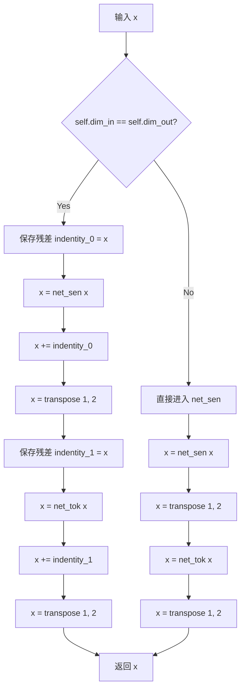
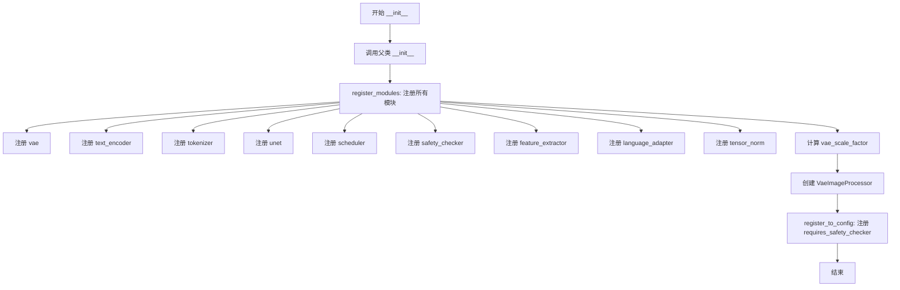
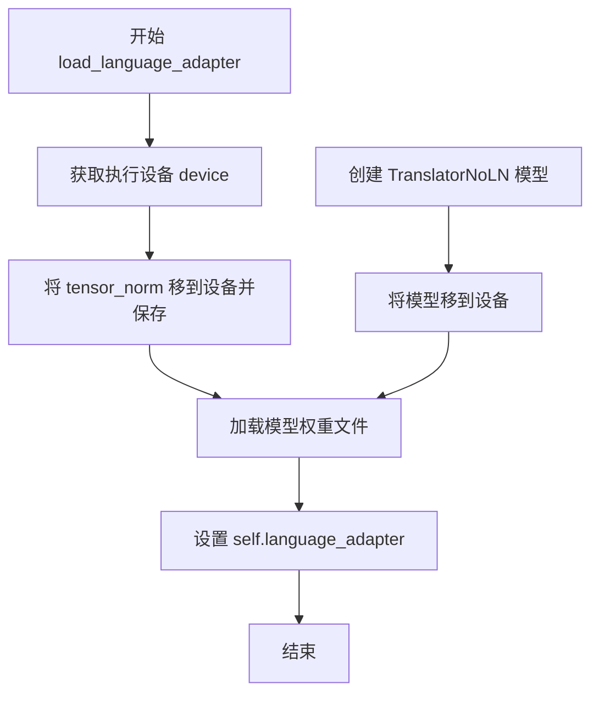
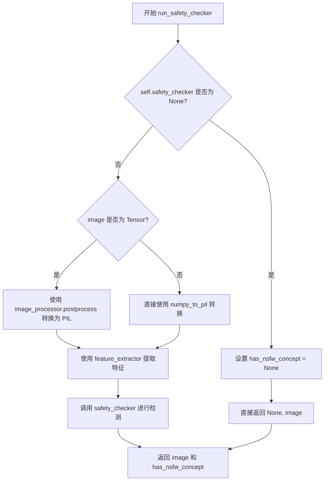
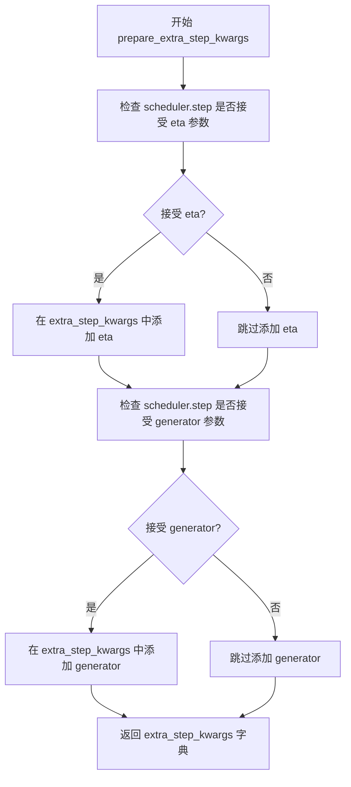
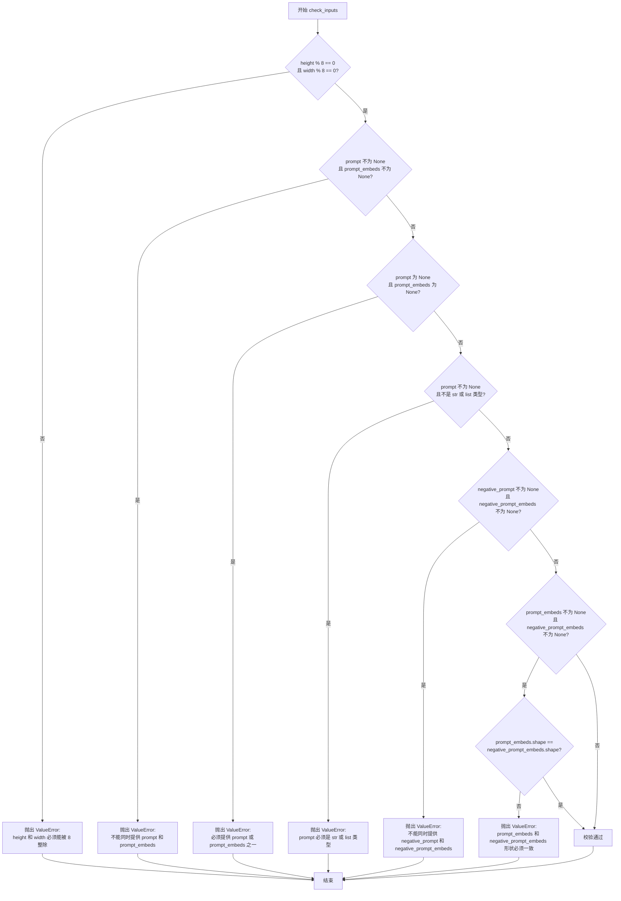
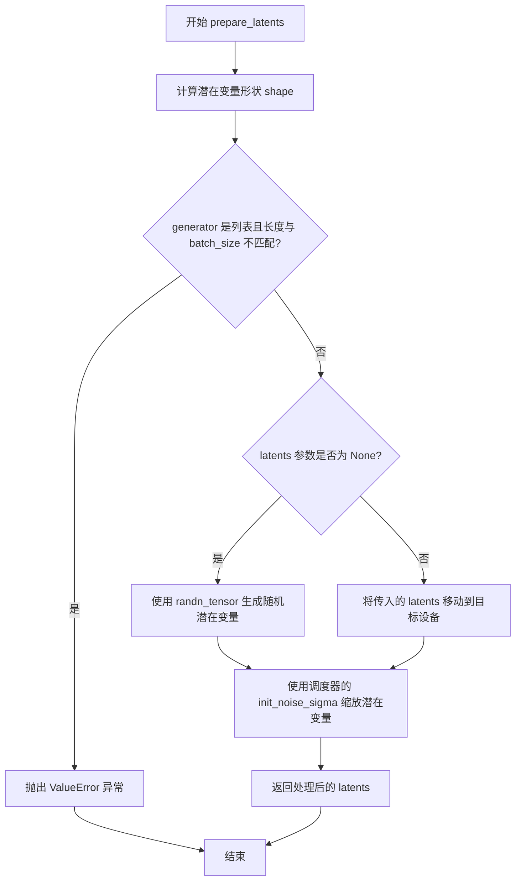
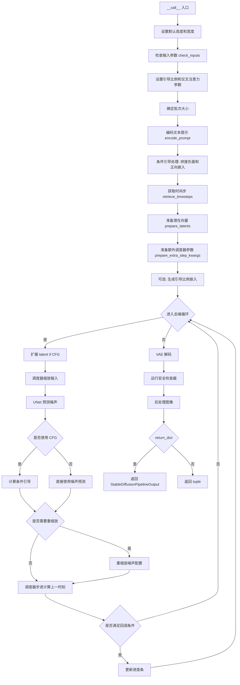

# `diffusers\examples\community\gluegen.py` 详细设计文档

这是一个集成了自定义语言适配器（Language Adapter）的 Stable Diffusion 扩散管道。该代码通过一个轻量级的神经网络（TranslatorNoLN）对文本编码器生成的嵌入向量（prompt_embeds）进行转换和调优，以支持特定的语义理解或多语言处理能力，随后利用 Stable Diffusion 模型进行图像生成。

## 整体流程

```mermaid
graph TD
    Start((开始)) --> Init[初始化管道]
    Init --> Call[调用 __call__ 方法]
    Call --> Check[check_inputs 校验输入]
    Check --> Encode[encode_prompt 编码提示词]
    Encode --> Adapter{是否加载了 Language Adapter?}
    Adapter -- 是 --> Adapt[_adapt_language 转换嵌入向量]
    Adapter -- 否 --> SkipAdapt[跳过适配器]
    Adapt --> PrepareLatents[prepare_latents 准备潜在变量]
    SkipAdapt --> PrepareLatents
    PrepareLatents --> Denoise[Denoising Loop 去噪循环 (UNet)]
    Denoise --> Decode[vae.decode 解码潜在变量]
    Decode --> Safety[run_safety_checker 安全检查]
    Safety --> PostProcess[图像后处理]
    PostProcess --> End((结束))
```

## 类结构

```
TranslatorBase (nn.Module - 基础转换块)
├── dim_in (输入维度)
├── dim_out (输出维度)
├── net_tok (Token网络)
├── net_sen (Sentence网络)
└── forward (前向传播)
TranslatorBaseNoLN (nn.Module - 无LayerNorm转换块)
├── dim_in
├── dim_out
├── net_tok
├── net_sen
└── forward
TranslatorNoLN (nn.Module - 组合适配器)
├── blocks (多层TranslatorBase)
├── gelu (激活函数)
├── tail (TranslatorBaseNoLN尾模块)
└── forward
GlueGenStableDiffusionPipeline (DiffusionPipeline - 主管道)
├── vae (AutoencoderKL)
├── text_encoder (AutoModel)
├── tokenizer (AutoTokenizer)
├── unet (UNet2DConditionModel)
├── scheduler (KarrasDiffusionSchedulers)
├── safety_checker (StableDiffusionSafetyChecker)
├── feature_extractor (CLIPImageProcessor)
├── language_adapter (TranslatorNoLN - 自定义组件)
├── tensor_norm (张量归一化参数)
└── __call__ (主生成逻辑)
```

## 全局变量及字段


### `logger`
    
模块级日志记录器，用于记录运行时信息

类型：`logging.Logger`
    


### `TranslatorBase.dim_in`
    
输入维度

类型：`int`
    


### `TranslatorBase.dim_out`
    
输出维度

类型：`int`
    


### `TranslatorBase.net_tok`
    
Token变换网络，用于处理序列维度

类型：`nn.Sequential`
    


### `TranslatorBase.net_sen`
    
Sentence变换网络，用于处理特征维度

类型：`nn.Sequential`
    


### `TranslatorBaseNoLN.dim_in`
    
输入维度

类型：`int`
    


### `TranslatorBaseNoLN.dim_out`
    
输出维度

类型：`int`
    


### `TranslatorBaseNoLN.net_tok`
    
Token变换网络，不带LayerNorm

类型：`nn.Sequential`
    


### `TranslatorBaseNoLN.net_sen`
    
Sentence变换网络，不带LayerNorm

类型：`nn.Sequential`
    


### `TranslatorNoLN.blocks`
    
多个TranslatorBase块组成的深层堆叠

类型：`nn.ModuleList`
    


### `TranslatorNoLN.gelu`
    
激活函数

类型：`nn.GELU`
    


### `TranslatorNoLN.tail`
    
尾部输出层，负责最终维度变换

类型：`TranslatorBaseNoLN`
    


### `GlueGenStableDiffusionPipeline.vae`
    
变分自编码器，用于图像编码和解码

类型：`AutoencoderKL`
    


### `GlueGenStableDiffusionPipeline.text_encoder`
    
文本编码器，将文本转换为嵌入向量

类型：`AutoModel`
    


### `GlueGenStableDiffusionPipeline.tokenizer`
    
分词器，用于将文本分词为token

类型：`AutoTokenizer`
    


### `GlueGenStableDiffusionPipeline.unet`
    
U-Net模型，用于去噪预测

类型：`UNet2DConditionModel`
    


### `GlueGenStableDiffusionPipeline.scheduler`
    
扩散调度器，控制去噪步骤

类型：`KarrasDiffusionSchedulers`
    


### `GlueGenStableDiffusionPipeline.safety_checker`
    
安全检查器，检测NSFW内容

类型：`StableDiffusionSafetyChecker`
    


### `GlueGenStableDiffusionPipeline.feature_extractor`
    
特征提取器，用于安全检查

类型：`CLIPImageProcessor`
    


### `GlueGenStableDiffusionPipeline.language_adapter`
    
语言适配器，对文本嵌入进行变换

类型：`TranslatorNoLN`
    


### `GlueGenStableDiffusionPipeline.tensor_norm`
    
归一化向量，用于语言适配器的缩放

类型：`torch.Tensor`
    


### `GlueGenStableDiffusionPipeline.vae_scale_factor`
    
VAE缩放因子，影响图像分辨率

类型：`int`
    


### `GlueGenStableDiffusionPipeline.image_processor`
    
图像处理器，用于图像前后处理

类型：`VaeImageProcessor`
    
    

## 全局函数及方法


### `rescale_noise_cfg`

该函数根据 guidance_rescale 参数重新缩放噪声预测配置（noise_cfg），基于论文 Common Diffusion Noise Schedules and Sample Steps are Flawed (Section 3.4) 的发现，通过计算噪声预测的标准差来进行缩放，并混合原始结果以避免图像过度平淡。

参数：

- `noise_cfg`：`torch.Tensor`，需要重新缩放的噪声预测配置
- `noise_pred_text`：`torch.Tensor`，文本引导的噪声预测结果，用于计算标准差
- `guidance_rescale`：`float`，重新缩放因子，默认为 0.0，用于控制混合程度

返回值：`torch.Tensor`，重新缩放后的噪声预测配置

#### 流程图

```mermaid
flowchart TD
    A[开始] --> B[计算 noise_pred_text 的标准差 std_text]
    B --> C[计算 noise_cfg 的标准差 std_cfg]
    C --> D[计算重新缩放后的噪声预测: noise_pred_rescaled = noise_cfg * std_text / std_cfg]
    D --> E[根据 guidance_rescale 混合: noise_cfg = guidance_rescale * noise_pred_rescaled + (1 - guidance_rescale) * noise_cfg]
    E --> F[返回重新缩放后的 noise_cfg]
```

#### 带注释源码

```python
def rescale_noise_cfg(noise_cfg, noise_pred_text, guidance_rescale=0.0):
    """
    Rescale `noise_cfg` according to `guidance_rescale`. Based on findings of [Common Diffusion Noise Schedules and
    Sample Steps are Flawed](https://huggingface.co/papers/2305.08891). See Section 3.4
    
    该函数用于解决扩散模型中的过度曝光问题，通过重新缩放噪声预测配置来改善生成图像质量。
    """
    # 计算文本引导噪声预测的标准差，保留维度用于后续广播
    std_text = noise_pred_text.std(dim=list(range(1, noise_pred_text.ndim)), keepdim=True)
    
    # 计算噪声配置的标准差，保留维度用于后续广播
    std_cfg = noise_cfg.std(dim=list(range(1, noise_cfg.ndim)), keepdim=True)
    
    # 重新缩放结果以修复过度曝光问题
    # 通过将 noise_cfg 的标准差调整到与 noise_pred_text 相同的水平
    noise_pred_rescaled = noise_cfg * (std_text / std_cfg)
    
    # 通过 guidance_rescale 因子混合原始结果，避免生成"plain looking"图像
    # 当 guidance_rescale 为 0 时，返回原始 noise_cfg
    # 当 guidance_rescale 为 1 时，返回完全重新缩放的结果
    noise_cfg = guidance_rescale * noise_pred_rescaled + (1 - guidance_rescale) * noise_cfg
    
    return noise_cfg
```


### `retrieve_timesteps`

获取并设置调度器的时间步。该函数负责调用调度器的 `set_timesteps` 方法并从中检索时间步，支持自定义时间步和标准推理步骤数两种模式，并将任何额外的关键字参数传递给调度器的 `set_timesteps` 方法。

参数：

- `scheduler`：`SchedulerMixin`，调度器对象，用于获取时间步
- `num_inference_steps`：`Optional[int]`，生成样本时使用的扩散步数，如果使用此参数，则 `timesteps` 必须为 `None`
- `device`：`Optional[Union[str, torch.device]]`，时间步要移动到的设备，如果为 `None`，则时间步不会移动
- `timesteps`：`Optional[List[int]]`，用于支持任意时间步间距的自定义时间步列表，如果为 `None`，则使用调度器的默认时间步间距策略
- `**kwargs`：任意关键字参数，将传递给 `scheduler.set_timesteps`

返回值：`Tuple[torch.Tensor, int]`，第一个元素是调度器的时间步张量，第二个元素是推理步数

#### 流程图

```mermaid
flowchart TD
    A[开始] --> B{检查 timesteps 是否为 None}
    B -->|否| C[检查调度器是否支持自定义 timesteps]
    B -->|是| F[调用 scheduler.set_timesteps<br/>参数: num_inference_steps, device, **kwargs]
    
    C --> D[调度器支持?]
    D -->|否| E[抛出 ValueError 异常]
    D -->|是| G[调用 scheduler.set_timesteps<br/>参数: timesteps, device, **kwargs]
    
    F --> H[获取 scheduler.timesteps]
    G --> I[获取 scheduler.timesteps<br/>计算 num_inference_steps = len(timesteps)]
    H --> J[返回 timesteps, num_inference_steps]
    I --> J
    
    E --> K[结束]
    J --> K
```

#### 带注释源码

```python
def retrieve_timesteps(
    scheduler,
    num_inference_steps: Optional[int] = None,
    device: Optional[Union[str, torch.device]] = None,
    timesteps: Optional[List[int]] = None,
    **kwargs,
):
    """
    Calls the scheduler's `set_timesteps` method and retrieves timesteps from the scheduler after the call. Handles
    custom timesteps. Any kwargs will be supplied to `scheduler.set_timesteps`.

    Args:
        scheduler (`SchedulerMixin`):
            The scheduler to get timesteps from.
        num_inference_steps (`int`):
            The number of diffusion steps used when generating samples with a pre-trained model. If used,
            `timesteps` must be `None`.
        device (`str` or `torch.device`, *optional*):
            The device to which the timesteps should be moved to. If `None`, the timesteps are not moved.
        timesteps (`List[int]`, *optional*):
                Custom timesteps used to support arbitrary spacing between timesteps. If `None`, then the default
                timestep spacing strategy of the scheduler is used. If `timesteps` is passed, `num_inference_steps`
                must be `None`.

    Returns:
        `Tuple[torch.Tensor, int]`: A tuple where the first element is the timestep schedule from the scheduler and the
        second element is the number of inference steps.
    """
    # 检查是否提供了自定义时间步
    if timesteps is not None:
        # 使用 inspect 检查调度器的 set_timesteps 方法是否支持 timesteps 参数
        accepts_timesteps = "timesteps" in set(inspect.signature(scheduler.set_timesteps).parameters.keys())
        
        # 如果不支持自定义时间步，抛出 ValueError 异常
        if not accepts_timesteps:
            raise ValueError(
                f"The current scheduler class {scheduler.__class__}'s `set_timesteps` does not support custom"
                f" timestep schedules. Please check whether you are using the correct scheduler."
            )
        
        # 使用自定义时间步调用调度器的 set_timesteps 方法
        scheduler.set_timesteps(timesteps=timesteps, device=device, **kwargs)
        
        # 从调度器获取设置后的时间步
        timesteps = scheduler.timesteps
        
        # 计算推理步数（时间步列表的长度）
        num_inference_steps = len(timesteps)
    else:
        # 使用推理步数调用调度器的 set_timesteps 方法
        scheduler.set_timesteps(num_inference_steps, device=device, **kwargs)
        
        # 从调度器获取时间步
        timesteps = scheduler.timesteps
    
    # 返回时间步和推理步数
    return timesteps, num_inference_steps
```


### `TranslatorBase.forward`

该方法实现了一个带残差连接和维度变换的前向传播逻辑，根据输入输出维度是否相同决定是否应用残差连接（identity shortcut），通过两个子网络分别处理语义维度和token维度的特征变换，并在处理完成后进行维度转置以适应后续处理。

参数：

- `x`：`torch.Tensor`，输入张量，形状为 (batch, seq_len, dim)，其中 dim 应与 self.dim_in 匹配

返回值：`torch.Tensor`，输出张量，形状为 (batch, dim_out, seq_len) 或 (batch, dim, seq_len)，取决于维度变换

#### 流程图

```mermaid
flowchart TD
    A[输入 x: torch.Tensor] --> B{dim_in == dim_out?}
    B -->|是| C[保存 identity_0 = x]
    B -->|否| D[x = net_sen(x)]
    C --> E[x = net_sen(x)]
    E --> F[x += identity_0 残差连接]
    F --> G[x = transpose(1, 2)]
    G --> H[保存 identity_1 = x]
    H --> I[x = net_tok(x)]
    I --> J[x += identity_1 残差连接]
    J --> K[x = transpose(1, 2)]
    K --> L[返回 x]
    D --> M[x = transpose(1, 2)]
    M --> N[x = net_tok(x)]
    N --> O[x = transpose(1, 2)]
    O --> L
```

#### 带注释源码

```python
def forward(self, x):
    """
    带残差连接和维度变换的前向传播
    
    Args:
        x: 输入张量，形状为 (batch, seq_len, dim)
    
    Returns:
        处理后的张量，形状根据维度变换而定
    """
    # 判断输入输出维度是否相同，以决定是否使用残差连接
    if self.dim_in == self.dim_out:
        # ---------- 维度相同分支：启用残差连接 ----------
        
        # 保存原始输入用于残差连接
        indentity_0 = x
        
        # 第一步：通过语义网络 (net_sen) 处理
        # 输入: (batch, seq_len, dim) -> 输出: (batch, seq_len, dim_out/dim)
        x = self.net_sen(x)
        
        # 残差连接：将网络输出与原始输入相加
        x += indentity_0
        
        # 转置维度：将 (batch, seq_len, dim) 转为 (batch, dim, seq_len)
        # 这一步改变了数据的组织方式，便于后续在 token 维度上进行处理
        x = x.transpose(1, 2)
        
        # 保存转置后的结果用于第二次残差连接
        indentity_1 = x
        
        # 第二步：通过 token 网络 (net_tok) 处理
        # 输入: (batch, dim, seq_len) -> 输出: (batch, num_tok, seq_len)
        x = self.net_tok(x)
        
        # 残差连接
        x += indentity_1
        
        # 再次转置：恢复为 (batch, seq_len, num_tok) 的形式
        x = x.transpose(1, 2)
    else:
        # ---------- 维度不同分支：跳过残差连接 ----------
        
        # 直接通过语义网络处理
        x = self.net_sen(x)
        
        # 转置维度
        x = x.transpose(1, 2)
        
        # 通过 token 网络处理
        x = self.net_tok(x)
        
        # 转置维度
        x = x.transpose(1, 2)
    
    return x
```

---

#### 技术债务与优化建议

1. **变量名拼写错误**：代码中使用了 `indentity_0` 和 `indentity_1`，正确拼写应为 `identity_0` 和 `identity_1`。这不影响功能，但影响代码可读性和维护性。

2. **转置操作的双重标准**：两种分支（维度相同/不同）都执行了 `transpose(1, 2)` 操作，但逻辑上维度不同时可能需要不同的处理策略。当前实现可能导致维度对齐问题。

3. **残差连接的维度假设**：当 `dim_in == dim_out` 时，代码假设 `net_sen` 的输出维度与输入相同，但在 `TranslatorBaseNoLN` 的实现中 `net_sen` 最后一线性层的输出是 `dim_out`，这可能导致维度不匹配的错误。

4. **重复代码**：两个分支中都有 `transpose(1, 2)` 操作，可以考虑重构以减少重复。

5. **缺乏输入验证**：方法未对输入张量的形状和类型进行显式验证，可能在运行时产生难以追踪的错误。


### `TranslatorBaseNoLN.forward`

该方法实现了不带 LayerNorm 的特征转换模块的前向传播，根据输入输出维度是否相同决定是否使用残差连接。先对语义维度（dim）进行特征变换，再对 token 维度（num_tok）进行变换，最后返回变换后的张量。

参数：

- `x`：`torch.Tensor`，输入张量，形状为 `(batch_size, seq_len, dim)` 或 `(batch_size, dim, seq_len)`，表示经过编码的文本嵌入或特征表示

返回值：`torch.Tensor`，变换后的输出张量，形状取决于输入维度和是否进行残差连接

#### 流程图



#### 带注释源码

```python
def forward(self, x):
    """
    前向传播函数，实现不带 LayerNorm 的特征变换

    参数:
        x: 输入张量，形状为 (batch_size, seq_len, dim)

    返回:
        变换后的张量
    """
    # 判断输入输出维度是否相同
    if self.dim_in == self.dim_out:
        # --- 分支1: 维度相同，使用残差连接 ---
        
        # 保存原始输入作为残差连接
        indentity_0 = x
        
        # 语义维度变换: dim -> dim_out (当 dim_in == dim_out 时，dim_out == dim)
        x = self.net_sen(x)  # (batch, seq, dim) -> (batch, seq, dim_out)
        
        # 残差连接: F(x) + x
        x += indentity_0
        
        # 交换维度: (batch, seq, dim) -> (batch, dim, seq)
        x = x.transpose(1, 2)
        
        # 保存变换后的张量作为第二次残差连接
        indentity_1 = x
        
        # Token 维度变换: num_tok -> num_tok
        x = self.net_tok(x)  # (batch, dim, seq) -> (batch, dim_out, seq)
        
        # 残差连接
        x += indentity_1
        
        # 再次交换维度: (batch, dim_out, seq) -> (batch, seq, dim_out)
        x = x.transpose(1, 2)
    else:
        # --- 分支2: 维度不同，不使用残差连接 ---
        
        # 语义维度变换
        x = self.net_sen(x)  # (batch, seq, dim) -> (batch, seq, dim_out)
        
        # 交换维度
        x = x.transpose(1, 2)  # (batch, seq, dim_out) -> (batch, dim_out, seq)
        
        # Token 维度变换
        x = self.net_tok(x)  # (batch, dim_out, seq) -> (batch, dim_out, num_tok)
        
        # 交换维度
        x = x.transpose(1, 2)  # (batch, dim_out, num_tok) -> (batch, num_tok, dim_out)
    
    return x
```


### TranslatorNoLN.forward

该方法实现了一个深层堆叠的变换器网络，通过多个TranslatorBase块进行特征提取，并使用TranslatorBaseNoLN进行最终输出变换。核心思想是使用残差连接和GELU激活函数来增强模型的表达能力，适用于语言适配器的特征转换任务。

参数：

- `x`：`torch.Tensor`，输入张量，形状为 (batch_size, seq_len, dim)，表示经过文本编码器处理的嵌入向量序列

返回值：`torch.Tensor`，变换后的张量，形状为 (batch_size, seq_len, dim_out)，经过深层堆叠变换和最终投影后的输出

#### 流程图

```mermaid
flowchart TD
    A[输入 x: torch.Tensor] --> B[遍历 self.blocks 列表]
    B --> C{blocks 中还有未处理的 block?}
    C -->|是| D[block = blocks[i]]
    D --> E[x = block(x)]
    E --> F[x = x + 跳跃连接]
    F --> G[x = GELU(x)]
    G --> C
    C -->|否| H[x = self.tail(x)]
    H --> I[返回输出 x]
    
    style A fill:#e1f5fe
    style I fill:#e8f5e8
    style E fill:#fff3e0
    style G fill:#f3e5f5
```

#### 带注释源码

```python
def forward(self, x):
    """
    前向传播方法，实现深层堆叠变换

    处理流程：
    1. 遍历多个TranslatorBase块进行特征提取
    2. 每次迭代使用残差连接和GELU激活
    3. 最后通过TranslatorBaseNoLN进行输出变换

    参数:
        x: 输入张量，形状 (batch_size, seq_len, dim)
           - batch_size: 批次大小
           - seq_len: 序列长度（token数量）
           - dim: 输入特征维度

    返回:
        输出张量，形状 (batch_size, seq_len, dim_out)
           - dim_out: 输出特征维度
    """
    # 步骤1：深层堆叠特征提取
    # 遍历depth个TranslatorBase块，每个块包含：
    # - 词序网络(net_tok): 对序列维度进行变换
    # - 语义网络(net_sen): 对特征维度进行变换
    for block in self.blocks:
        # 调用TranslatorBase块的前向传播
        # 输入x经过块内部变换：(batch, seq, dim) -> (batch, seq, dim)
        x = block(x)
        
        # 残差连接：将块的输出与输入相加
        # 这有助于梯度流动并缓解深层网络梯度消失问题
        x = x + x
        
        # GELU激活函数：引入非线性变换
        # GELU相比ReLU更平滑，能够提供更好的梯度流
        x = self.gelu(x)

    # 步骤2：最终输出变换
    # 使用TranslatorBaseNoLN（无LayerNorm版本）进行最终投影
    # 将特征维度从dim变换到dim_out
    x = self.tail(x)
    
    # 返回变换后的张量
    return x
```


### `GlueGenStableDiffusionPipeline.__init__`

该构造函数是 GlueGenStableDiffusionPipeline 类的初始化方法，负责注册并初始化 Stable Diffusion 流程中的所有核心模块，包括 VAE、文本编码器、分词器、UNet、调度器、安全检查器等，并配置图像处理器和语言适配器。

参数：

-  `vae`：`AutoencoderKL`，变分自编码器模型，用于将潜在空间编码/解码为图像
-  `text_encoder`：`AutoModel`，文本编码器模型，用于将文本提示转换为嵌入向量
-  `tokenizer`：`AutoTokenizer`，分词器，用于将文本分割为 token 序列
-  `unet`：`UNet2DConditionModel`，UNet 条件模型，用于在去噪过程中预测噪声
-  `scheduler`：`KarrasDiffusionSchedulers`，扩散调度器，用于控制去噪步骤和时间步
-  `safety_checker`：`StableDiffusionSafetyChecker`，安全检查器，用于检测和过滤不安全内容
-  `feature_extractor`：`CLIPImageProcessor`，特征提取器，用于提取图像特征供安全检查器使用
-  `language_adapter`：`TranslatorNoLN`，语言适配器（可选），用于对文本嵌入进行语言适配
-  `tensor_norm`：`torch.Tensor`，张量归一化值（可选），用于语言适配器的归一化处理
-  `requires_safety_checker`：`bool`，是否启用安全检查器，默认为 True

返回值：`None`，该方法为构造函数，不返回任何值

#### 流程图



#### 带注释源码

```
def __init__(
    self,
    vae: AutoencoderKL,
    text_encoder: AutoModel,
    tokenizer: AutoTokenizer,
    unet: UNet2DConditionModel,
    scheduler: KarrasDiffusionSchedulers,
    safety_checker: StableDiffusionSafetyChecker,
    feature_extractor: CLIPImageProcessor,
    language_adapter: TranslatorNoLN = None,
    tensor_norm: torch.Tensor = None,
    requires_safety_checker: bool = True,
):
    """
    初始化 GlueGenStableDiffusionPipeline
    
    参数:
        vae: 变分自编码器 (AutoencoderKL)
        text_encoder: 文本编码器 (AutoModel)
        tokenizer: 分词器 (AutoTokenizer)
        unet: UNet2DConditionModel
        scheduler: KarrasDiffusionSchedulers
        safety_checker: StableDiffusionSafetyChecker
        feature_extractor: CLIPImageProcessor
        language_adapter: 可选的语言适配器 TranslatorNoLN
        tensor_norm: 可选的张量归一化值
        requires_safety_checker: 是否启用安全检查器
    """
    # 1. 调用父类 DiffusionPipeline 的初始化方法
    super().__init__()

    # 2. 注册所有模块到 Pipeline 中，使其可被保存/加载
    #    这会为每个模块设置属性（如 self.vae, self.text_encoder 等）
    self.register_modules(
        vae=vae,
        text_encoder=text_encoder,
        tokenizer=tokenizer,
        unet=unet,
        scheduler=scheduler,
        safety_checker=safety_checker,
        feature_extractor=feature_extractor,
        language_adapter=language_adapter,
        tensor_norm=tensor_norm,
    )
    
    # 3. 计算 VAE 缩放因子
    #    基于 VAE 的 block_out_channels 数量计算下采样因子
    #    如果 vae 存在: 2^(len(block_out_channels) - 1)，否则默认为 8
    self.vae_scale_factor = 2 ** (len(self.vae.config.block_out_channels) - 1) if getattr(self, "vae", None) else 8
    
    # 4. 创建图像处理器，用于预处理/后处理 VAE 图像
    self.image_processor = VaeImageProcessor(vae_scale_factor=self.vae_scale_factor)
    
    # 5. 将 requires_safety_checker 注册到配置中
    self.register_to_config(requires_safety_checker=requires_safety_checker)
```


### `GlueGenStableDiffusionPipeline.load_language_adapter`

该方法用于加载语言适配器（Language Adapter）的权重和配置，将预训练的 TranslatorNoLN 模型加载到当前执行设备，并初始化张量归一化参数，使pipeline能够对不同语言的文本嵌入进行适配处理。

参数：

- `model_path`：`str`，模型权重文件路径，指向保存的 TranslatorNoLN 模型权重
- `num_token`：`int`，目标语言的 token 数量，用于初始化适配器的 token 维度
- `dim`：`int`，文本嵌入的输入维度，对应文本编码器的隐藏层维度
- `dim_out`：`int`，文本嵌入的输出维度，适配后希望得到的嵌入维度
- `tensor_norm`：`torch.Tensor`，用于归一化的张量权重，用于对适配后的嵌入进行尺度调整
- `mult`：`int`，前馈网络中间层的扩展倍数，默认为2
- `depth`：`int`，适配器块的堆叠深度，默认为5

返回值：`None`，该方法无返回值，直接修改实例属性

#### 流程图



#### 带注释源码

```python
def load_language_adapter(
    self,
    model_path: str,           # 模型权重文件路径
    num_token: int,            # 目标语言token数量
    dim: int,                  # 输入维度（文本编码器隐藏层维度）
    dim_out: int,              # 输出维度（适配后的嵌入维度）
    tensor_norm: torch.Tensor, # 归一化张量权重
    mult: int = 2,             # 前馈网络扩展倍数
    depth: int = 5,            # 适配器深度
):
    # 获取当前执行设备（CPU/CUDA/MPS等）
    device = self._execution_device
    
    # 将归一化张量移动到目标设备并保存到实例属性
    self.tensor_norm = tensor_norm.to(device)
    
    # 创建 TranslatorNoLN 适配器模型并移动到目标设备
    # 参数: num_tok=token数, dim=输入维, dim_out=输出维, mult=扩展倍数, depth=深度
    self.language_adapter = TranslatorNoLN(
        num_tok=num_token, 
        dim=dim, 
        dim_out=dim_out, 
        mult=mult, 
        depth=depth
    ).to(device)
    
    # 从磁盘加载预训练的模型权重字典
    self.language_adapter.load_state_dict(torch.load(model_path))
```


### `GlueGenStableDiffusionPipeline._adapt_language`

该方法是一个私有方法，用于对文本嵌入（prompt embeddings）进行缩放和适配处理。它首先将输入的提示嵌入除以3，然后通过语言适配器（language_adapter）进行处理，最后乘以归一化张量（tensor_norm）的一半，以实现多语言支持的嵌入转换。

参数：

- `prompt_embeds`：`torch.Tensor`，输入的文本嵌入，通常来自文本编码器的输出

返回值：`torch.Tensor`，经过缩放和适配处理后的文本嵌入

#### 流程图

```mermaid
flowchart TD
    A[开始: _adapt_language] --> B[输入: prompt_embeds]
    B --> C[prompt_embeds = prompt_embeds / 3]
    C --> D[调用 language_adapter]
    D --> E[输出: 处理后的嵌入]
    E --> F[prompt_embeds = 处理结果 * (tensor_norm / 2)]
    F --> G[返回: 缩放后的 prompt_embeds]
```

#### 带注释源码

```python
def _adapt_language(self, prompt_embeds: torch.Tensor):
    """
    对提示嵌入进行缩放和适配。
    
    该方法执行以下操作：
    1. 将提示嵌入除以3进行初步缩放
    2. 通过语言适配器（TranslatorNoLN）转换嵌入
    3. 乘以归一化张量的一半进行最终缩放
    
    Args:
        prompt_embeds: torch.Tensor - 来自文本编码器的嵌入向量
        
    Returns:
        torch.Tensor - 经过语言适配和缩放处理后的嵌入向量
    """
    # 第一步：将嵌入向量除以3，进行初步缩放
    # 这是一个经验性的缩放因子，有助于平衡语言适配器的影响
    prompt_embeds = prompt_embeds / 3
    
    # 第二步：通过语言适配器处理嵌入
    # language_adapter 是一个 TranslatorNoLN 模型，用于将一种语言的嵌入
    # 映射到目标语言的嵌入空间
    prompt_embeds = self.language_adapter(prompt_embeds) * (self.tensor_norm / 2)
    
    # 第三步：乘以归一化张量的一半进行最终缩放
    # tensor_norm 是预先计算的张量归一化参数，用于确保嵌入的尺度合适
    
    return prompt_embeds
```


### `GlueGenStableDiffusionPipeline.encode_prompt`

该函数是Stable Diffusion管道中的核心提示编码方法，负责将文本提示转换为文本编码器的隐藏状态，并集成了语言适配器（Language Adapter）用于跨语言生成任务支持。函数处理了提示嵌入的生成、条件与无条件嵌入的拼接（用于Classifier-Free Guidance）、LoRA权重调整以及批处理扩展等逻辑。

参数：

- `prompt`：`Union[str, List[str]]`，可选，要编码的文本提示，可以是单个字符串或字符串列表
- `device`：`torch.device`，torch设备，用于将计算结果移动到指定设备
- `num_images_per_prompt`：`int`，每个提示需要生成的图像数量，用于复制提示嵌入
- `do_classifier_free_guidance`：`bool`，是否执行无分类器自由引导（CFG），为True时需要生成无条件嵌入
- `negative_prompt`：`Union[str, List[str]]`，可选，不希望出现在生成图像中的描述文本
- `prompt_embeds`：`Optional[torch.Tensor]`，可选，预计算的文本嵌入，若提供则直接使用，跳过tokenizer编码
- `negative_prompt_embeds`：`Optional[torch.Tensor]`，可选，预计算的无条件文本嵌入
- `lora_scale`：`Optional[float]`，可选，LoRA层的缩放因子，用于调整Adapter权重
- `clip_skip`：`Optional[int]`，可选，从CLIP模型末尾跳过的层数，用于获取不同层次的特征表示

返回值：`Tuple[torch.Tensor, torch.Tensor]`，返回两个张量——第一个是处理后的提示嵌入（prompt_embeds），第二个是对应的负面提示嵌入（negative_prompt_embeds）。当不启用CFG时，negative_prompt_embeds可能为None。

#### 流程图

```mermaid
flowchart TD
    A[开始 encode_prompt] --> B{检查 lora_scale}
    B -->|非空| C[设置 self._lora_scale]
    C --> D{USE_PEFT_BACKEND?}
    D -->|是| E[scale_lora_layers]
    D -->|否| F[adjust_lora_scale_text_encoder]
    B -->|空| G
    E --> G
    F --> G
    
    G{确定 batch_size} --> H{prompt 是 str?}
    H -->|是| I[batch_size = 1]
    H -->|否| J{prompt 是 list?}
    J -->|是| K[batch_size = len]
    J -->|否| L[batch_size = prompt_embeds.shape[0]]
    I --> M
    K --> M
    L --> M
    
    M{prompt_embeds 为空?}
    M -->|是| N[调用 tokenizer 编码]
    N --> O[检查截断情况]
    O --> P{use_attention_mask?}
    P -->|是| Q[使用 attention_mask]
    P -->|否| R{language_adapter 存在?}
    R -->|是| Q
    R -->|否| S[attention_mask = None]
    Q --> T
    S --> T
    
    T{clip_skip 为空?}
    T -->|是| U[text_encoder forward]
    T -->|否| V[output_hidden_states=True]
    V --> W[提取指定层]
    W --> X[final_layer_norm]
    U --> Y
    X --> Y
    
    Y{language_adapter 存在?}
    Y -->|是| Z[_adapt_language 处理]
    Y -->|否| AA
    Z --> AA
    
    M -->|否| AB
    AB --> AC[确定 prompt_embeds_dtype]
    AC --> AD[移动到正确设备和dtype]
    
    AA --> AD
    AD --> AE[重复嵌入 num_images_per_prompt 次]
    AE --> AF{do_classifier_free_guidance?}
    AF -->|是| AG{negative_prompt_embeds 为空?}
    AF -->|否| AJ[返回结果]
    
    AG -->|是| AH[处理 negative_prompt]
    AH --> AI[tokenizer 编码]
    AI --> AJ
    
    AJ --> AK{使用 PEFT?}
    AK -->|是| AL[unscale_lora_layers]
    AK -->|否| AM
    AL --> AM
    AM[返回 prompt_embeds, negative_prompt_embeds] --> AN[结束]
```

#### 带注释源码

```python
def encode_prompt(
    self,
    prompt,
    device,
    num_images_per_prompt,
    do_classifier_free_guidance,
    negative_prompt=None,
    prompt_embeds: Optional[torch.Tensor] = None,
    negative_prompt_embeds: Optional[torch.Tensor] = None,
    lora_scale: Optional[float] = None,
    clip_skip: Optional[int] = None,
):
    r"""
    Encodes the prompt into text encoder hidden states.

    Args:
        prompt (`str` or `List[str]`, *optional*):
            prompt to be encoded
        device: (`torch.device`):
            torch device
        num_images_per_prompt (`int`):
            number of images that should be generated per prompt
        do_classifier_free_guidance (`bool`):
            whether to use classifier free guidance or not
        negative_prompt (`str` or `List[str]`, *optional*):
            The prompt or prompts not to guide the image generation. If not defined, one has to pass
            `negative_prompt_embeds` instead. Ignored when not using guidance (i.e., ignored if `guidance_scale` is
            less than `1`).
        prompt_embeds (`torch.Tensor`, *optional*):
            Pre-generated text embeddings. Can be used to easily tweak text inputs, *e.g.* prompt weighting. If not
            provided, text embeddings will be generated from `prompt` input argument.
        negative_prompt_embeds (`torch.Tensor`, *optional*):
            Pre-generated negative text embeddings. Can be used to easily tweak text inputs, *e.g.* prompt
            weighting. If not provided, negative_prompt_embeds will be generated from `negative_prompt` input
            argument.
        lora_scale (`float`, *optional*):
            A LoRA scale that will be applied to all LoRA layers of the text encoder if LoRA layers are loaded.
        clip_skip (`int`, *optional*):
            Number of layers to be skipped from CLIP while computing the prompt embeddings. A value of 1 means that
            the output of the pre-final layer will be used for computing the prompt embeddings.
    """
    # 设置 lora scale 以便 text encoder 的 monkey patched LoRA 函数可以正确访问
    if lora_scale is not None and isinstance(self, StableDiffusionLoraLoaderMixin):
        self._lora_scale = lora_scale

        # 动态调整 LoRA scale
        if not USE_PEFT_BACKEND:
            adjust_lora_scale_text_encoder(self.text_encoder, lora_scale)
        else:
            scale_lora_layers(self.text_encoder, lora_scale)

    # 确定批次大小：根据 prompt 类型或已提供的 prompt_embeds
    if prompt is not None and isinstance(prompt, str):
        batch_size = 1
    elif prompt is not None and isinstance(prompt, list):
        batch_size = len(prompt)
    else:
        batch_size = prompt_embeds.shape[0]

    # 如果未提供 prompt_embeds，则需要从 prompt 生成
    if prompt_embeds is None:
        # 使用 tokenizer 将文本转换为 token IDs
        text_inputs = self.tokenizer(
            prompt,
            padding="max_length",
            max_length=self.tokenizer.model_max_length,
            truncation=True,
            return_tensors="pt",
        )
        text_input_ids = text_inputs.input_ids
        # 获取未截断的 IDs 用于检测截断
        untruncated_ids = self.tokenizer(prompt, padding="longest", return_tensors="pt").input_ids

        # 检测并警告截断的文本
        if untruncated_ids.shape[-1] >= text_input_ids.shape[-1] and not torch.equal(
            text_input_ids, untruncated_ids
        ):
            removed_text = self.tokenizer.batch_decode(
                untruncated_ids[:, self.tokenizer.model_max_length - 1 : -1]
            )
            logger.warning(
                "The following part of your input was truncated because CLIP can only handle sequences up to"
                f" {self.tokenizer.model_max_length} tokens: {removed_text}"
            )

        # 处理 attention mask：优先使用 text_encoder 配置中的 mask，否则使用 tokenizer 的结果
        if hasattr(self.text_encoder.config, "use_attention_mask") and self.text_encoder.config.use_attention_mask:
            attention_mask = text_inputs.attention_mask.to(device)
        elif self.language_adapter is not None:
            # 语言适配器需要 attention mask
            attention_mask = text_inputs.attention_mask.to(device)
        else:
            attention_mask = None

        # 根据 clip_skip 参数决定如何获取 embeddings
        if clip_skip is None:
            # 直接获取最后一层的输出
            prompt_embeds = self.text_encoder(text_input_ids.to(device), attention_mask=attention_mask)
            prompt_embeds = prompt_embeds[0]
        else:
            # 获取所有隐藏状态，选择指定层
            prompt_embeds = self.text_encoder(
                text_input_ids.to(device), attention_mask=attention_mask, output_hidden_states=True
            )
            # 访问隐藏状态元组，index into 获取目标层
            prompt_embeds = prompt_embeds[-1][-(clip_skip + 1)]
            # 应用 final_layer_norm 以保证表示的正确性
            prompt_embeds = self.text_encoder.text_model.final_layer_norm(prompt_embeds)

        # 运行语言适配器（如果存在）
        if self.language_adapter is not None:
            prompt_embeds = self._adapt_language(prompt_embeds)

    # 确定 prompt_embeds 的数据类型（优先使用 text_encoder 的 dtype）
    if self.text_encoder is not None:
        prompt_embeds_dtype = self.text_encoder.dtype
    elif self.unet is not None:
        prompt_embeds_dtype = self.unet.dtype
    else:
        prompt_embeds_dtype = prompt_embeds.dtype

    # 将 prompt_embeds 移动到正确的设备和 dtype
    prompt_embeds = prompt_embeds.to(dtype=prompt_embeds_dtype, device=device)

    # 复制 embeddings 以支持每个 prompt 生成多张图像
    bs_embed, seq_len, _ = prompt_embeds.shape
    prompt_embeds = prompt_embeds.repeat(1, num_images_per_prompt, 1)
    prompt_embeds = prompt_embeds.view(bs_embed * num_images_per_prompt, seq_len, -1)

    # 获取无分类器自由引导所需的无条件 embeddings
    if do_classifier_free_guidance and negative_prompt_embeds is None:
        uncond_tokens: List[str]
        if negative_prompt is None:
            uncond_tokens = [""] * batch_size  # 使用空字符串
        elif prompt is not None and type(prompt) is not type(negative_prompt):
            raise TypeError(
                f"`negative_prompt` should be the same type to `prompt`, but got {type(negative_prompt)} !="
                f" {type(prompt)}."
            )
        elif isinstance(negative_prompt, str):
            uncond_tokens = [negative_prompt]
        elif batch_size != len(negative_prompt):
            raise ValueError(
                f"`negative_prompt`: {negative_prompt} has batch size {len(negative_prompt)}, but `prompt`:"
                f" {prompt} has batch size {batch_size}. Please make sure that passed `negative_prompt` matches"
                " the batch size of `prompt`."
            )
        else:
            uncond_tokens = negative_prompt

        # 对 negative_prompt 进行分词
        max_length = prompt_embeds.shape[1]
        uncond_input = self.tokenizer(
            uncond_tokens,
            padding="max_length",
            max_length=max_length,
            truncation=True,
            return_tensors="pt",
        )

        # 处理 negative_prompt 的 attention mask
        if hasattr(self.text_encoder.config, "use_attention_mask") and self.text_encoder.config.use_attention_mask:
            attention_mask = uncond_input.attention_mask.to(device)
        else:
            attention_mask = None

        # 获取无条件 embeddings
        negative_prompt_embeds = self.text_encoder(
            uncond_input.input_ids.to(device),
            attention_mask=attention_mask,
        )
        negative_prompt_embeds = negative_prompt_embeds[0]
        
        # 对 negative_prompt_embeds 也运行语言适配器
        if self.language_adapter is not None:
            negative_prompt_embeds = self._adapt_language(negative_prompt_embeds)

    # 如果使用 CFG，复制无条件 embeddings
    if do_classifier_free_guidance:
        seq_len = negative_prompt_embeds.shape[1]

        negative_prompt_embeds = negative_prompt_embeds.to(dtype=prompt_embeds_dtype, device=device)

        negative_prompt_embeds = negative_prompt_embeds.repeat(1, num_images_per_prompt, 1)
        negative_prompt_embeds = negative_prompt_embeds.view(batch_size * num_images_per_prompt, seq_len, -1)

    # 如果使用 PEFT backend，恢复 LoRA 层的原始 scale
    if isinstance(self, StableDiffusionLoraLoaderMixin) and USE_PEFT_BACKEND:
        unscale_lora_layers(self.text_encoder, lora_scale)

    return prompt_embeds, negative_prompt_embeds
```


### `GlueGenStableDiffusionPipeline.run_safety_checker`

该方法用于在图像生成完成后执行NSFW（Not Safe For Work）安全检查，通过调用Stable Diffusion Safety Checker对生成的图像进行内容安全检测，判断是否包含不当内容，并返回处理后的图像及NSFW检测结果。

参数：

- `image`：`Union[torch.Tensor, np.ndarray]`，待检测的图像数据，可以是PyTorch张量或NumPy数组格式
- `device`：`torch.device`，执行安全检查的设备（如CPU或GPU）
- `dtype`：`torch.dtype`，图像数据的数据类型（如float32）

返回值：`Tuple[Union[torch.Tensor, np.ndarray], Optional[torch.Tensor]]`，返回一个元组，包含处理后的图像（可能经过安全过滤处理）和NSFW概念检测结果（如果未检测到则为None）

#### 流程图



#### 带注释源码

```python
def run_safety_checker(self, image, device, dtype):
    """
    运行安全检查器对生成的图像进行NSFW内容检测
    
    Args:
        image: 生成的图像，可以是torch.Tensor或numpy数组
        device: 运行安全检查的设备
        dtype: 图像数据类型
    
    Returns:
        Tuple: (处理后的图像, NSFW检测结果)
    """
    # 检查安全检查器是否已加载
    if self.safety_checker is None:
        # 如果未配置安全检查器，直接返回None
        has_nsfw_concept = None
    else:
        # 将图像转换为PIL格式供feature_extractor使用
        if torch.is_tensor(image):
            # 如果是PyTorch张量，使用postprocess方法转换为PIL
            feature_extractor_input = self.image_processor.postprocess(image, output_type="pil")
        else:
            # 如果是numpy数组，直接转换为PIL
            feature_extractor_input = self.image_processor.numpy_to_pil(image)
        
        # 使用特征提取器提取图像特征并转换为张量
        safety_checker_input = self.feature_extractor(
            feature_extractor_input, 
            return_tensors="pt"
        ).to(device)
        
        # 调用安全检查器进行NSFW检测
        # 将像素值转换为指定的数据类型(dtype)
        image, has_nsfw_concept = self.safety_checker(
            images=image, 
            clip_input=safety_checker_input.pixel_values.to(dtype)
        )
    
    # 返回处理后的图像和NSFW检测结果
    return image, has_nsfw_concept
```


### `GlueGenStableDiffusionPipeline.prepare_extra_step_kwargs`

该方法用于准备调度器（scheduler）的额外参数。由于不同的调度器具有不同的签名，该方法通过检查调度器的 `step` 方法是否接受特定参数（`eta` 和 `generator`），动态构建需要传递给调度器的额外关键字参数字典。

参数：

- `self`：`GlueGenStableDiffusionPipeline` 实例，隐式参数，表示当前的扩散管道对象
- `generator`：`Optional[Union[torch.Generator, List[torch.Generator]]]`，用于生成确定性随机数的 PyTorch 生成器，可为 None
- `eta`：`float`，DDIM 调度器参数 η（Eta），取值范围应在 [0, 1] 之间，仅对 DDIMScheduler 有效，其他调度器会忽略此参数

返回值：`Dict[str, Any]`，包含额外关键字参数的字典，将被传递给调度器的 `step` 方法。如果调度器支持则包含 `eta` 和/或 `generator` 键，否则返回空字典。

#### 流程图



#### 带注释源码

```python
def prepare_extra_step_kwargs(self, generator, eta):
    # 准备调度器步骤的额外参数，因为并非所有调度器都具有相同的签名
    # eta (η) 仅与 DDIMScheduler 一起使用，其他调度器将忽略它
    # eta 对应于 DDIM 论文中的 η：https://huggingface.co/papers/2010.02502
    # 取值应在 [0, 1] 范围内

    # 使用 inspect 模块检查 scheduler.step 方法的签名
    # 判断该调度器是否接受 'eta' 参数
    accepts_eta = "eta" in set(inspect.signature(self.scheduler.step).parameters.keys())
    
    # 初始化空字典用于存储额外参数
    extra_step_kwargs = {}
    
    # 如果调度器接受 eta 参数，则将其添加到 extra_step_kwargs
    if accepts_eta:
        extra_step_kwargs["eta"] = eta

    # 检查调度器是否接受 generator 参数
    accepts_generator = "generator" in set(inspect.signature(self.scheduler.step).parameters.keys())
    
    # 如果调度器接受 generator 参数，则将其添加到 extra_step_kwargs
    if accepts_generator:
        extra_step_kwargs["generator"] = generator
    
    # 返回构建好的额外参数字典
    return extra_step_kwargs
```


### `GlueGenStableDiffusionPipeline.check_inputs`

该方法用于校验 Stable Diffusion 扩散管道在执行推理前的输入参数合法性，确保 height 和 width 是 8 的倍数、prompt 与 prompt_embeds 不能同时提供也不能同时为空、negative_prompt 与 negative_prompt_embeds 不能同时提供、prompt_embeds 与 negative_prompt_embeds 的形状必须一致，否则抛出相应的 ValueError 异常。

参数：

- `self`：`GlueGenStableDiffusionPipeline` 实例，隐式参数，表示当前管道对象本身
- `prompt`：`Union[str, List[str], None]`，用户输入的文本提示，用于指导图像生成，可以是字符串或字符串列表，若提供则不能与 prompt_embeds 同时提供
- `height`：`int`，生成的图像高度（像素），必须能被 8 整除
- `width`：`int`，生成的图像宽度（像素），必须能被 8 整除
- `negative_prompt`：`Union[str, List[str], None]`，可选的反向提示，用于指导图像中不应包含的内容，不能与 negative_prompt_embeds 同时提供
- `prompt_embeds`：`Optional[torch.Tensor]`，预生成的文本嵌入向量，若提供则不能与 prompt 同时提供
- `negative_prompt_embeds`：`Optional[torch.Tensor]`，预生成的负面文本嵌入向量，必须与 prompt_embeds 形状一致

返回值：`None`，该方法不返回任何值，仅通过抛出 ValueError 异常来指示输入参数校验失败

#### 流程图



#### 带注释源码

```python
def check_inputs(
    self,
    prompt,
    height,
    width,
    negative_prompt=None,
    prompt_embeds=None,
    negative_prompt_embeds=None,
):
    """
    检查输入参数的合法性，验证后才能进行后续的图像生成操作。
    
    参数:
        prompt: 文本提示，可以是字符串或字符串列表
        height: 生成的图像高度
        width: 生成的图像宽度
        negative_prompt: 反向提示文本
        prompt_embeds: 预生成的文本嵌入
        negative_prompt_embeds: 预生成的负面文本嵌入
    """
    
    # 检查 1: 图像尺寸必须是 8 的倍数，因为 VAE 使用 8 倍下采样
    if height % 8 != 0 or width % 8 != 0:
        raise ValueError(f"`height` and `width` have to be divisible by 8 but are {height} and {width}.")

    # 检查 2: prompt 和 prompt_embeds 不能同时提供，只能选择其中一种输入方式
    if prompt is not None and prompt_embeds is not None:
        raise ValueError(
            f"Cannot forward both `prompt`: {prompt} and `prompt_embeds`: {prompt_embeds}. Please make sure to"
            " only forward one of the two."
        )
    # 检查 3: prompt 和 prompt_embeds 不能同时为空，至少需要提供一种
    elif prompt is None and prompt_embeds is None:
        raise ValueError(
            "Provide either `prompt` or `prompt_embeds`. Cannot leave both `prompt` and `prompt_embeds` undefined."
        )
    # 检查 4: prompt 的类型必须是字符串或字符串列表
    elif prompt is not None and (not isinstance(prompt, str) and not isinstance(prompt, list)):
        raise ValueError(f"`prompt` has to be of type `str` or `list` but is {type(prompt)}")

    # 检查 5: negative_prompt 和 negative_prompt_embeds 不能同时提供
    if negative_prompt is not None and negative_prompt_embeds is not None:
        raise ValueError(
            f"Cannot forward both `negative_prompt`: {negative_prompt} and `negative_prompt_embeds`:"
            f" {negative_prompt_embeds}. Please make sure to only forward one of the two."
        )

    # 检查 6: 如果同时提供了 prompt_embeds 和 negative_prompt_embeds，它们的形状必须一致
    if prompt_embeds is not None and negative_prompt_embeds is not None:
        if prompt_embeds.shape != negative_prompt_embeds.shape:
            raise ValueError(
                "`prompt_embeds` and `negative_prompt_embeds` must have the same shape when passed directly, but"
                f" got: `prompt_embeds` {prompt_embeds.shape} != `negative_prompt_embeds`"
                f" {negative_prompt_embeds.shape}."
            )
```


### `GlueGenStableDiffusionPipeline.prepare_latents`

该方法用于为 Stable Diffusion Pipeline 准备初始潜在噪声（latents），即在去噪过程开始前生成的随机噪声张量。它根据指定的批次大小、图像尺寸和数据类型创建或处理潜在变量，并依据调度器的初始化噪声标准差进行缩放，以适配不同的噪声调度策略。

参数：

- `batch_size`：`int`，生成的图像数量，决定了潜在变量的批次维度
- `num_channels_latents`：`int`，潜在变量的通道数，通常对应于 UNet 的输入通道数（in_channels）
- `height`：`int`，目标输出图像的高度（像素），用于计算潜在变量的空间尺寸
- `width`：`int`，目标输出图像的宽度（像素），用于计算潜在变量的空间尺寸
- `dtype`：`torch.dtype`，潜在变量的数据类型，通常与文本嵌入的数据类型保持一致
- `device`：`torch.device`，潜在变量存放的设备（CPU 或 CUDA）
- `generator`：`torch.Generator` 或 `List[torch.Generator]`，可选的随机数生成器，用于确保生成的可重复性
- `latents`：`Optional[torch.Tensor]`，可选的预生成潜在变量，如果为 None 则随机生成，否则使用传入的潜在变量

返回值：`torch.Tensor`，处理后的潜在变量张量，形状为 (batch_size, num_channels_latents, height//vae_scale_factor, width//vae_scale_factor)，已按照调度器的初始噪声标准差进行缩放

#### 流程图



#### 带注释源码

```python
def prepare_latents(
    self,
    batch_size: int,
    num_channels_latents: int,
    height: int,
    width: int,
    dtype: torch.dtype,
    device: torch.device,
    generator: Optional[Union[torch.Generator, List[torch.Generator]]],
    latents: Optional[torch.Tensor] = None
) -> torch.Tensor:
    """
    准备用于图像生成的初始潜在变量（噪声）。

    Args:
        batch_size: 生成的图像数量
        num_channels_latents: UNet 输入通道数，决定潜在变量的特征维度
        height: 输出图像高度（像素）
        width: 输出图像宽度（像素）
        dtype: 潜在变量的数据类型
        device: 潜在变量存放的设备
        generator: 随机数生成器，用于可重复生成
        latents: 可选的预生成潜在变量

    Returns:
        处理后的潜在变量张量，已按调度器要求缩放
    """
    # 计算潜在变量的形状：批次大小 × 通道数 × 潜在空间高度 × 潜在空间宽度
    # 其中潜在空间尺寸 = 图像尺寸 / VAE 缩放因子（通常为 8）
    shape = (
        batch_size,
        num_channels_latents,
        int(height) // self.vae_scale_factor,
        int(width) // self.vae_scale_factor,
    )

    # 验证生成器列表长度与批次大小是否匹配
    # 如果不匹配则抛出明确的错误信息
    if isinstance(generator, list) and len(generator) != batch_size:
        raise ValueError(
            f"You have passed a list of generators of length {len(generator)}, but requested an effective batch"
            f" size of {batch_size}. Make sure the batch size matches the length of the generators."
        )

    # 根据是否有预生成的潜在变量采取不同的处理策略
    if latents is None:
        # 未提供潜在变量时，使用 randn_tensor 从标准正态分布随机采样生成
        # generator 参数确保可重复性（如果提供）
        latents = randn_tensor(shape, generator=generator, device=device, dtype=dtype)
    else:
        # 已提供潜在变量时，仅将其移动到目标设备
        # 假设潜在变量的形状已经正确
        latents = latents.to(device)

    # 使用调度器的初始噪声标准差对潜在变量进行缩放
    # 不同的调度器（如 DDIM、PNDM、KarrasVS 等）有不同的初始化噪声策略
    # 这一步确保潜在变量符合调度器期望的噪声分布范围
    latents = latents * self.scheduler.init_noise_sigma

    return latents
```


### `GlueGenStableDiffusionPipeline.get_guidance_scale_embedding`

该函数用于计算引导比例嵌入（Guidance Scale Embedding），将引导比例值（guidance scale）转换为高维嵌入向量，供UNet的时间条件投影层使用。这是实现Classifier-Free Guidance（无分类器引导）的关键组件，通过将guidance scale编码为位置编码形式的嵌入，使模型能够根据不同的引导强度动态调整生成过程。

参数：

- `w`：`torch.Tensor`，输入的引导比例值张量，通常是 (batch_size,) 形状的一维张量
- `embedding_dim`：`int`，嵌入向量的维度，默认为512，对应UNet的time_cond_proj_dim参数
- `dtype`：`torch.dtype`，生成嵌入的数据类型，默认为torch.float32

返回值：`torch.Tensor`，形状为 (len(w), embedding_dim) 的嵌入向量

#### 流程图

```mermaid
flowchart TD
    A[输入引导比例 w] --> B[断言 w 为一维张量]
    B --> C[将 w 乘以 1000 进行缩放]
    C --> D[计算半维度 half_dim = embedding_dim // 2]
    D --> E[计算对数基础: log(10000) / (half_dim - 1)]
    E --> F[生成指数衰减序列 emb = exp(-emb * arange(half_dim))]
    F --> G[计算外积: w[:, None] * emb[None, :]]
    G --> H[拼接 sin 和 cos 编码]
    H --> I{embedding_dim 是否为奇数?}
    I -->|是| J[在末尾补零填充]
    I -->|否| K[跳过填充]
    J --> L[断言输出形状正确]
    K --> L
    L --> M[返回嵌入向量]
```

#### 带注释源码

```python
def get_guidance_scale_embedding(self, w, embedding_dim=512, dtype=torch.float32):
    """
    生成引导比例嵌入向量，基于正弦余弦位置编码方式
    
    参考: https://github.com/google-research/vdm/blob/dc27b98a554f65cdc654b800da5aa1846545d41b/model_vdm.py#L298
    
    参数:
        w (torch.Tensor): 
            输入的引导比例值张量，通常是 (batch_size,) 形状
            这些值通常在 [0, 1] 范围内，表示guidance scale - 1
        embedding_dim (int, optional): 
            嵌入向量的维度，默认为512
            对应UNet的time_cond_proj_dim配置
        dtype (torch.dtype, optional): 
            生成嵌入的数据类型，默认为torch.float32
    
    返回:
        torch.Tensor: 
            形状为 (len(w), embedding_dim) 的嵌入向量
            用于UNet的时间条件投影层
    """
    # 断言输入是一维张量，确保维度正确
    assert len(w.shape) == 1
    
    # 将引导比例值缩放1000倍，将[0,1]范围映射到[0,1000]
    # 这是因为原始实现使用了较大的时间步范围
    w = w * 1000.0
    
    # 计算嵌入维度的一半，用于生成sin和cos两组编码
    half_dim = embedding_dim // 2
    
    # 计算对数基础值，用于生成指数衰减的频率序列
    # 使用 log(10000) / (half_dim - 1) 确保频率从大到小指数衰减
    emb = torch.log(torch.tensor(10000.0)) / (half_dim - 1)
    
    # 生成从 0 到 half_dim-1 的指数衰减序列
    # 序列形状: (half_dim,)
    emb = torch.exp(torch.arange(half_dim, dtype=dtype) * -emb)
    
    # 计算外积: w 的每个元素乘以 emb 的每个频率
    # 结果形状: (len(w), half_dim)
    emb = w.to(dtype)[:, None] * emb[None, :]
    
    # 沿最后一维拼接 sin 和 cos 编码
    # 结果形状: (len(w), half_dim * 2) = (len(w), embedding_dim 或 embedding_dim-1)
    emb = torch.cat([torch.sin(emb), torch.cos(emb)], dim=1)
    
    # 如果嵌入维度为奇数，需要在最后补零填充到目标维度
    # 这是为了兼容某些需要偶数维度的操作
    if embedding_dim % 2 == 1:
        emb = torch.nn.functional.pad(emb, (0, 1))
    
    # 最终断言确保输出形状正确
    assert emb.shape == (w.shape[0], embedding_dim)
    
    return emb
```


### `GlueGenStableDiffusionPipeline.__call__`

管道的主入口方法，执行完整的图像生成流程。接收文本提示或其他条件输入，经过潜在向量生成、UNet去噪、VAE解码等步骤，输出最终生成的图像。该方法支持条件引导（Classifier-Free Guidance）、LoRA权重、IP-Adapter等多种高级功能，并集成了NSFW安全检查器。

参数：

- `prompt`：`Union[str, List[str]]`，需要生成图像的文本提示。若未定义，则需提供 `prompt_embeds`。
- `height`：`Optional[int]`，生成图像的高度（像素），默认值为 `self.unet.config.sample_size * self.vae_scale_factor`。
- `width`：`Optional[int]`，生成图像的宽度（像素），默认值为 `self.unet.config.sample_size * self.vae_scale_factor`。
- `num_inference_steps`：`int`，去噪迭代步数，步数越多通常图像质量越高，但推理速度越慢，默认值为 50。
- `timesteps`：`List[int]`，自定义去噪过程的时间步列表，支持任意间隔设置。若为 `None`，则使用调度器的默认策略。
- `guidance_scale`：`float`，条件引导比例，控制生成图像与文本提示的关联程度，默认值为 7.5。值越大越忠于提示，但可能降低图像质量。
- `negative_prompt`：`Optional[Union[str, List[str]]]`，负面提示，用于指定生成图像时应避免的内容。
- `num_images_per_prompt`：`Optional[int]`，每个提示生成的图像数量，默认值为 1。
- `eta`：`float`，DDIM 调度器参数 η，对应 DDIM 论文中的参数，仅在使用 DDIMScheduler 时有效，默认值为 0.0。
- `generator`：`Optional[Union[torch.Generator, List[torch.Generator]]]`，PyTorch 随机数生成器，用于确保生成过程可复现。
- `latents`：`Optional[torch.Tensor]`，预生成的噪声潜在向量，若提供则使用该向量而非随机生成，便于相同 latent 不同提示的生成。
- `prompt_embeds`：`Optional[torch.Tensor]`，预生成的文本嵌入，可用于替代 `prompt` 参数，方便文本输入的权重调整。
- `negative_prompt_embeds`：`Optional[torch.Tensor]`，预生成的负面文本嵌入，用于替代 `negative_prompt`。
- `output_type`：`str | None`，输出格式，可选 `"pil"`（PIL 图像）、`"np"`（NumPy 数组）或 `"latent"`（潜在向量），默认值为 `"pil"`。
- `return_dict`：`bool`，是否返回 `StableDiffusionPipelineOutput` 字典格式，默认值为 `True`。
- `cross_attention_kwargs`：`Optional[Dict[str, Any]]`，传递给注意力处理器的额外关键字参数，如 LoRA 权重、IP-Adapter 等。
- `guidance_rescale`：`float`，引导重缩放因子，用于修复过曝问题，默认值为 0.0。
- `clip_skip`：`Optional[int]`，CLIP 模型跳过的层数，用于获取不同层次的文本特征，默认值为 `None`。
- `**kwargs`：其他未明确列出的关键字参数，会被传递给调度器或内部组件。

返回值：`StableDiffusionPipelineOutput` 或 `tuple`，若 `return_dict` 为 `True`，返回包含 `images`（生成的图像列表）和 `nsfw_content_detected`（NSFW 检测布尔列表）的管道输出对象；否则返回元组 `(image, has_nsfw_concept)`。

#### 流程图



#### 带注释源码

```python
@torch.no_grad()
def __call__(
    self,
    prompt: Union[str, List[str]] = None,
    height: Optional[int] = None,
    width: Optional[int] = None,
    num_inference_steps: int = 50,
    timesteps: List[int] = None,
    guidance_scale: float = 7.5,
    negative_prompt: Optional[Union[str, List[str]]] = None,
    num_images_per_prompt: Optional[int] = 1,
    eta: float = 0.0,
    generator: Optional[Union[torch.Generator, List[torch.Generator]]] = None,
    latents: Optional[torch.Tensor] = None,
    prompt_embeds: Optional[torch.Tensor] = None,
    negative_prompt_embeds: Optional[torch.Tensor] = None,
    output_type: str | None = "pil",
    return_dict: bool = True,
    cross_attention_kwargs: Optional[Dict[str, Any]] = None,
    guidance_rescale: float = 0.0,
    clip_skip: Optional[int] = None,
    **kwargs,
):
    r"""
    The call function to the pipeline for generation.

    Args:
        prompt (`str` or `List[str]`, *optional*):
            The prompt or prompts to guide image generation. If not defined, you need to pass `prompt_embeds`.
        height (`int`, *optional*, defaults to `self.unet.config.sample_size * self.vae_scale_factor`):
            The height in pixels of the generated image.
        width (`int`, *optional*, defaults to `self.unet.config.sample_size * self.vae_scale_factor`):
            The width in pixels of the generated image.
        num_inference_steps (`int`, *optional*, defaults to 50):
            The number of denoising steps. More denoising steps usually lead to a higher quality image at the
            expense of slower inference.
        timesteps (`List[int]`, *optional*):
            Custom timesteps to use for the denoising process with schedulers which support a `timesteps` argument
            in their `set_timesteps` method. If not defined, the default behavior when `num_inference_steps` is
            passed will be used. Must be in descending order.
        guidance_scale (`float`, *optional*, defaults to 7.5):
            A higher guidance scale value encourages the model to generate images closely linked to the text
            `prompt` at the expense of lower image quality. Guidance scale is enabled when `guidance_scale > 1`.
        negative_prompt (`str` or `List[str]`, *optional*):
            The prompt or prompts to guide what to not include in image generation. If not defined, you need to
            pass `negative_prompt_embeds` instead. Ignored when not using guidance (`guidance_scale < 1`).
        num_images_per_prompt (`int`, *optional*, defaults to 1):
            The number of images to generate per prompt.
        eta (`float`, *optional*, defaults to 0.0):
            Corresponds to parameter eta (η) from the [DDIM](https://huggingface.co/papers/2010.02502) paper. Only applies
            to the [`~schedulers.DDIMScheduler`], and is ignored in other schedulers.
        generator (`torch.Generator` or `List[torch.Generator]`, *optional*):
            A [`torch.Generator`](https://pytorch.org/docs/stable/generated/torch.Generator.html) to make
            generation deterministic.
        latents (`torch.Tensor`, *optional*):
            Pre-generated noisy latents sampled from a Gaussian distribution, to be used as inputs for image
            generation. Can be used to tweak the same generation with different prompts. If not provided, a latents
            tensor is generated by sampling using the supplied random `generator`.
        prompt_embeds (`torch.Tensor`, *optional*):
            Pre-generated text embeddings. Can be used to easily tweak text inputs (prompt weighting). If not
            provided, text embeddings are generated from the `prompt` input argument.
        negative_prompt_embeds (`torch.Tensor`, *optional*):
            Pre-generated negative text embeddings. Can be used to easily tweak text inputs (prompt weighting). If
            not provided, `negative_prompt_embeds` are generated from the `negative_prompt` input argument.
        ip_adapter_image: (`PipelineImageInput`, *optional*): Optional image input to work with IP Adapters.
        output_type (`str`, *optional*, defaults to `"pil"`):
            The output format of the generated image. Choose between `PIL.Image` or `np.array`.
        return_dict (`bool`, *optional*, defaults to `True`):
            Whether or not to return a [`~pipelines.stable_diffusion.StableDiffusionPipelineOutput`] instead of a
            plain tuple.
        cross_attention_kwargs (`dict`, *optional*):
            A kwargs dictionary that if specified is passed along to the [`AttentionProcessor`] as defined in
            [`self.processor`](https://github.com/huggingface/diffusers/blob/main/src/diffusers/models/attention_processor.py).
        guidance_rescale (`float`, *optional*, defaults to 0.0):
            Guidance rescale factor from [Common Diffusion Noise Schedules and Sample Steps are
            Flawed](https://huggingface.co/papers/2305.08891). Guidance rescale factor should fix overexposure when
            using zero terminal SNR.
        clip_skip (`int`, *optional*):
            Number of layers to be skipped from CLIP while computing the prompt embeddings. A value of 1 means that
            the output of the pre-final layer will be used for computing the prompt embeddings.

    Examples:

    Returns:
        [`~pipelines.stable_diffusion.StableDiffusionPipelineOutput`] or `tuple`:
            If `return_dict` is `True`, [`~pipelines.stable_diffusion.StableDiffusionPipelineOutput`] is returned,
            otherwise a `tuple` is returned where the first element is a list with the generated images and the
            second element is a list of `bool`s indicating whether the corresponding generated image contains
            "not-safe-for-work" (nsfw) content.
    """

    # 0. Default height and width to unet
    # 如果未指定高度和宽度，则使用 UNet 配置的样本大小乘以 VAE 缩放因子作为默认值
    height = height or self.unet.config.sample_size * self.vae_scale_factor
    width = width or self.unet.config.sample_size * self.vae_scale_factor
    # to deal with lora scaling and other possible forward hooks

    # 1. Check inputs. Raise error if not correct
    # 验证输入参数的合法性，确保 prompt 和 prompt_embeds 不同时提供，且必要参数已提供
    self.check_inputs(
        prompt,
        height,
        width,
        negative_prompt,
        prompt_embeds,
        negative_prompt_embeds,
    )

    # 保存引导相关参数到实例变量，供后续属性方法使用
    self._guidance_scale = guidance_scale
    self._guidance_rescale = guidance_rescale
    self._clip_skip = clip_skip
    self._cross_attention_kwargs = cross_attention_kwargs
    self._interrupt = False

    # 2. Define call parameters
    # 根据 prompt 或 prompt_embeds 确定批次大小
    if prompt is not None and isinstance(prompt, str):
        batch_size = 1
    elif prompt is not None and isinstance(prompt, list):
        batch_size = len(prompt)
    else:
        batch_size = prompt_embeds.shape[0]

    # 获取执行设备（CPU 或 GPU）
    device = self._execution_device

    # 3. Encode input prompt
    # 从 cross_attention_kwargs 中提取 LoRA 缩放因子
    lora_scale = (
        self.cross_attention_kwargs.get("scale", None) if self.cross_attention_kwargs is not None else None
    )

    # 调用 encode_prompt 方法将文本 prompt 转换为文本嵌入向量
    # 该方法内部会处理 LoRA 权重应用、语言适配器等逻辑
    prompt_embeds, negative_prompt_embeds = self.encode_prompt(
        prompt,
        device,
        num_images_per_prompt,
        self.do_classifier_free_guidance,
        negative_prompt,
        prompt_embeds=prompt_embeds,
        negative_prompt_embeds=negative_prompt_embeds,
        lora_scale=lora_scale,
        clip_skip=self.clip_skip,
    )

    # For classifier free guidance, we need to do two forward passes.
    # Here we concatenate the unconditional and text embeddings into a single batch
    # to avoid doing two forward passes
    # 如果启用无分类器引导，将负面嵌入和正向嵌入拼接在一起以并行计算
    if self.do_classifier_free_guidance:
        prompt_embeds = torch.cat([negative_prompt_embeds, prompt_embeds])

    # 4. Prepare timesteps
    # 获取去噪调度器的时间步列表，支持自定义时间步
    timesteps, num_inference_steps = retrieve_timesteps(self.scheduler, num_inference_steps, device, timesteps)

    # 5. Prepare latent variables
    # 获取 UNet 输入通道数，准备初始噪声 latent
    num_channels_latents = self.unet.config.in_channels
    latents = self.prepare_latents(
        batch_size * num_images_per_prompt,
        num_channels_latents,
        height,
        width,
        prompt_embeds.dtype,
        device,
        generator,
        latents,
    )

    # 6. Prepare extra step kwargs. TODO: Logic should ideally just be moved out of the pipeline
    # 准备调度器步骤所需的额外参数，如 eta 和 generator
    extra_step_kwargs = self.prepare_extra_step_kwargs(generator, eta)

    # 6.2 Optionally get Guidance Scale Embedding
    # 如果 UNet 配置了时间条件投影维度，则生成引导比例嵌入用于时间步条件
    timestep_cond = None
    if self.unet.config.time_cond_proj_dim is not None:
        guidance_scale_tensor = torch.tensor(self.guidance_scale - 1).repeat(batch_size * num_images_per_prompt)
        timestep_cond = self.get_guidance_scale_embedding(
            guidance_scale_tensor, embedding_dim=self.unet.config.time_cond_proj_dim
        ).to(device=device, dtype=latents.dtype)

    # 7. Denoising loop
    # 计算预热步数（用于进度条显示）
    num_warmup_steps = len(timesteps) - num_inference_steps * self.scheduler.order
    self._num_timesteps = len(timesteps)
    # 启用进度条跟踪去噪过程
    with self.progress_bar(total=num_inference_steps) as progress_bar:
        # 遍历每个时间步进行去噪
        for i, t in enumerate(timesteps):
            # 检查是否中断（支持外部中断机制）
            if self.interrupt:
                continue

            # expand the latents if we are doing classifier free guidance
            # 如果启用 CFG，将 latent 复制两份（一份无条件，一份有条件）
            latent_model_input = torch.cat([latents] * 2) if self.do_classifier_free_guidance else latents
            # 调度器缩放输入（根据噪声调度策略）
            latent_model_input = self.scheduler.scale_model_input(latent_model_input, t)

            # predict the noise residual
            # UNet 预测噪声残差
            noise_pred = self.unet(
                latent_model_input,
                t,
                encoder_hidden_states=prompt_embeds,
                timestep_cond=timestep_cond,
                cross_attention_kwargs=self.cross_attention_kwargs,
                return_dict=False,
            )[0]

            # perform guidance
            # 执行分类器自由引导：uncond + scale * (cond - uncond)
            if self.do_classifier_free_guidance:
                noise_pred_uncond, noise_pred_text = noise_pred.chunk(2)
                noise_pred = noise_pred_uncond + self.guidance_scale * (noise_pred_text - noise_pred_uncond)

            # 根据论文 2305.08891 的发现，对噪声配置进行重缩放以修复过曝问题
            if self.do_classifier_free_guidance and self.guidance_rescale > 0.0:
                # Based on 3.4. in https://huggingface.co/papers/2305.08891
                noise_pred = rescale_noise_cfg(noise_pred, noise_pred_text, guidance_rescale=self.guidance_rescale)

            # compute the previous noisy sample x_t -> x_t-1
            # 调度器执行单步去噪，计算 x_{t-1}
            latents = self.scheduler.step(noise_pred, t, latents, **extra_step_kwargs, return_dict=False)[0]

            # call the callback, if provided
            # 进度条更新回调
            if i == len(timesteps) - 1 or ((i + 1) > num_warmup_steps and (i + 1) % self.scheduler.order == 0):
                progress_bar.update()

    # 8. Decode latents to image
    # 如果不需要 latent 输出，则通过 VAE 解码器将潜在向量转换为图像
    if not output_type == "latent":
        image = self.vae.decode(latents / self.vae.config.scaling_factor, return_dict=False, generator=generator)[
            0
        ]
        # 运行安全检查器检测 NSFW 内容
        image, has_nsfw_concept = self.run_safety_checker(image, device, prompt_embeds.dtype)
    else:
        # 直接返回 latent
        image = latents
        has_nsfw_concept = None

    # 9. Post-process images
    # 处理去归一化标志
    if has_nsfw_concept is None:
        do_denormalize = [True] * image.shape[0]
    else:
        do_denormalize = [not has_nsfw for has_nsfw in has_nsfw_concept]

    # 后处理图像：转换格式、归一化等
    image = self.image_processor.postprocess(image, output_type=output_type, do_denormalize=do_denormalize)

    # Offload all models
    # 释放模型内存（如果启用了模型卸载钩子）
    self.maybe_free_model_hooks()

    # 10. Return output
    if not return_dict:
        return (image, has_nsfw_concept)

    return StableDiffusionPipelineOutput(images=image, nsfw_content_detected=has_nsfw_concept)
```

## 关键组件


### TranslatorBase

带LayerNorm的神经网络模块，用于在token和句子维度上进行特征转换，支持残差连接和维度映射。

### TranslatorBaseNoLN

不带LayerNorm的TranslatorBase变体，使用更简单的线性层堆叠进行特征转换。

### TranslatorNoLN

深层语言适配器，由多个TranslatorBase块堆叠组成，尾部通过TranslatorBaseNoLN输出目标维度，用于将文本嵌入转换为特定语言的表示。

### rescale_noise_cfg

根据guidance_rescale因子重新缩放噪声预测的函数，基于Common Diffusion Noise Schedules论文的发现，用于解决过度曝光问题。

### retrieve_timesteps

从调度器获取推理时间步的辅助函数，支持自定义时间步列表，并返回时间步张量和推理步数。

### GlueGenStableDiffusionPipeline

继承自DiffusionPipeline的主扩散管道类，集成了VAE、文本编码器、UNet、调度器、安全检查器等核心组件，并包含自定义的language_adapter用于语言适配。

### _adapt_language

对提示嵌入进行语言适配的核心方法，通过除以3、应用language_adapter、乘以tensor_norm来调整文本特征表示。

### encode_prompt

编码文本提示为嵌入向量的方法，支持LoRA、clip_skip、无分类器自由引导等高级功能，并集成了language_adapter进行语言适配。

### run_safety_checker

运行安全检查器以检测生成图像中是否包含不安全内容的方法。

### prepare_latents

准备初始潜在变量的方法，用于生成随机噪声或使用提供的潜在变量，并按调度器的要求进行缩放。

### get_guidance_scale_embedding

生成指导_scale嵌入向量的方法，用于基于时间步的条件引导。

### language_adapter (TranslatorNoLN实例)

自定义的语言适配器模块，加载预训练权重后用于将原始文本嵌入转换为目标语言的特征空间。

### tensor_norm

用于语言适配过程中特征归一化的张量，确保适配后的特征分布稳定。

### VAE (AutoencoderKL)

变分自编码器，负责将潜在空间表示解码为图像，或将图像编码为潜在表示。

### Text Encoder (AutoModel)

CLIP文本编码器，将文本提示转换为文本嵌入向量，供UNet在去噪过程中使用。

### UNet (UNet2DConditionModel)

条件UNet模型，负责预测噪声残差，是扩散模型的核心去噪组件。

### Scheduler (KarrasDiffusionSchedulers)

扩散调度器，管理去噪过程中的时间步和噪声调度策略。

### Safety Checker (StableDiffusionSafetyChecker)

安全检查器，用于过滤掉可能包含不安全内容的生成图像。


## 问题及建议


### 已知问题

- **拼写错误**：类字段 `indentity_0` 和 `indentity_1` 应为 `identity`，这会导致代码可读性和维护性降低
- **重复代码**：TranslatorBase 和 TranslatorBaseNoLN 类结构高度相似，仅在 LayerNorm 的使用上有差异，可通过继承或组合模式重构
- **魔法数字**：_adapt_language 方法中除以 3 和乘以 2 的操作使用硬编码值，缺乏可配置性
- **职责过重**：encode_prompt 方法代码量过大（约 200 行），违反单一职责原则，难以测试和维护
- **资源加载风险**：load_language_adapter 方法未检查模型文件是否存在就直接加载，可能导致运行时错误
- **冗余计算**：TranslatorNoLN 类中 self.gelu 在 forward 中被调用，但每个 block 内部已有 GELU 激活函数，造成冗余计算
- **类型注解不足**：多处方法缺少参数和返回值的类型注解，影响代码可读性和 IDE 支持
- **设备转换效率**：encode_prompt 中多次执行 to(device) 和 to(dtype) 操作，可优化为批量转换

### 优化建议

- 重构 TranslatorBase 和 TranslatorBaseNoLN 类，使用组合或继承模式消除重复代码
- 将 _adapt_language 中的魔法数字提取为可配置参数
- 将 encode_prompt 方法拆分为多个私有方法，如 _encode_text_inputs、_encode_prompt_embeds、_encode_negative_prompt 等
- 在 load_language_adapter 中添加文件存在性检查和异常处理
- 移除 TranslatorNoLN 中冗余的 GELU 调用，或将其用于残差连接前的激活
- 完善所有方法的类型注解，使用 Python 3.10+ 的 union 语法（str | None）
- 优化设备转换逻辑，减少不必要的 tensor 复制操作
- 添加输入验证和默认值处理，提高 pipeline 的健壮性

## 其它


### 设计目标与约束

本pipeline的设计目标是在标准Stable Diffusion流程中集成语言适配器(TranslatorNoLN)，以增强对特定语言或领域的文本理解和生成能力。核心约束包括：(1) 仅支持DiffusionPipeline、StableDiffusionMixin和StableDiffusionLoraLoaderMixin的多重继承结构；(2) 语言适配器为可选组件，当为None时pipeline回退到标准Stable Diffusion流程；(3) 输入的height和width必须能被8整除；(4) 必须配合KarrasDiffusionSchedulers调度器使用。

### 错误处理与异常设计

代码中实现了多层次错误处理机制。在check_inputs方法中验证：height/width必须被8整除；prompt和prompt_embeds不能同时传递；negative_prompt和negative_prompt_embeds不能同时传递；prompt_embeds与negative_prompt_embeds形状必须一致。retrieve_timesteps方法检查调度器是否支持自定义timesteps。在prepare_latents方法中验证generator列表长度与batch_size是否匹配。所有关键操作都包含类型检查和异常抛出，确保pipeline在异常输入下能够给出明确的错误提示。

### 数据流与状态机

Pipeline的核心数据流如下：输入prompt → encode_prompt进行文本编码 → 可选的_adapt_language进行语言适配 → 与negative_prompt_embeds合并进行classifier-free guidance → prepare_latents生成初始噪声 → 去噪循环(UNet预测噪声 → scheduler步进) → VAE解码 → safety_checker检查 → 输出图像。在去噪循环中，latents从初始噪声逐步去噪为最终潜在表示，每一步都根据timestep和noise_pred计算下一步的latents。状态机主要体现在scheduler的timesteps管理、guidance_scale的控制以及interrupt标志位的中断机制。

### 外部依赖与接口契约

主要依赖包括：(1) diffusers库：DiffusionPipeline、StableDiffusionMixin、StableDiffusionLoraLoaderMixin、AutoencoderKL、UNet2DConditionModel等核心组件；(2) transformers库：AutoModel、AutoTokenizer、CLIPImageProcessor；(3) PyTorch：nn.Module、torch.Tensor等。外部模型加载通过load_language_adapter方法实现，需要提供模型路径(num_token、dim、dim_out、mult、depth等参数)和预训练的tensor_norm权重。Pipeline的__call__方法遵循diffusers标准接口契约，返回StableDiffusionPipelineOutput对象或tuple。

### 性能考虑与资源管理

关键性能优化点包括：(1) 使用@torch.no_grad()装饰器禁用梯度计算以减少显存占用；(2) 在encode_prompt中使用repeat方法复制embeddings而非重复计算；(3) 可能的情况下使用mps友好的tensor操作；(4) 通过maybe_free_model_hooks方法在完成后释放模型钩子。显存占用主要来自UNet的中间激活、VAE的编解码过程以及language_adapter的前向传播，建议在消费级GPU上使用半精度(FP16)推理。

### 安全性考虑

代码集成了StableDiffusionSafetyChecker用于NSFW内容检测，通过run_safety_checker方法对生成的图像进行审查。当safety_checker为None时，has_nsfw_concept返回None表示未检测。图像后处理时会根据has_nsfw_concept结果决定是否进行去归一化。需要注意的是，safety_checker的检测结果仅供参考，部署时仍需结合其他内容审核机制。

### 配置与参数说明

核心配置参数包括：(1) vae_scale_factor：根据VAE block_out_channels计算，默认8；(2) requires_safety_checker：是否启用安全检查器；(3) language_adapter：TranslatorNoLN实例，用于文本嵌入的领域适配；(4) tensor_norm：语言适配器的归一化张量。__call__方法的主要参数：guidance_scale(默认7.5)控制文本-图像对齐度；num_inference_steps(默认50)控制去噪步数；guidance_rescale(默认0.0)用于缓解过曝问题；clip_skip控制CLIP跳过的层数。

### 使用示例与最佳实践

典型使用流程：首先实例化pipeline并加载基础模型，然后通过load_language_adapter加载语言适配器权重，最后调用__call__方法生成图像。最佳实践包括：(1) 确保language_adapter与tokenizer的num_token匹配；(2) 使用FP16精度加速推理；(3) 对于多图生成，合理设置num_images_per_prompt参数；(4) 当不需要语言适配时，可将language_adapter设为None以获得标准SD效果；(5) 注意prompt长度不要超过tokenizer.model_max_length。

### 版本兼容性与升级考虑

代码基于diffusers库设计，需关注版本兼容性。主要依赖版本要求：Python ≥3.8、PyTorch ≥1.9、transformers、diffusers。LoRA支持通过StableDiffusionLoraLoaderMixin实现，支持PEFT和传统两种后端。升级时需注意：(1) diffusers API的潜在变化，特别是pipeline_output和scheduler接口；(2) StableDiffusionSafetyChecker和CLIPImageProcessor的版本差异；(3) 新版diffusers可能引入新的cross_attention_kwargs参数支持。

### 测试策略建议

建议的测试覆盖包括：(1) 单元测试：TranslatorBase/TranslatorBaseNoLN/TranslatorNoLN的前向传播正确性；(2) 集成测试：完整的pipeline调用流程，验证图像生成；(3) 语言适配器测试：验证load_language_adapter和_adapt_language的功能；(4) 错误处理测试：各种异常输入的抛出行为；(5) 性能测试：显存占用和推理速度基准测试；(6) 安全测试：NSFW检测功能的触发和屏蔽。测试数据应包含多样化的prompt和negative_prompt，以及不同分辨率和推理步数的组合。

    