# `diffusers\examples\community\hd_painter.py` 详细设计文档

HD-Painter是一个基于Stable Diffusion的图像修复（inpainting）Pipeline，通过引入RASG（Region-Aware Self-Guidance）和PAIntA两种自定义注意力处理器，在去噪过程中利用注意力图引导修复区域，实现高质量的图像修复效果。

## 整体流程

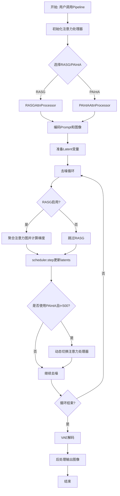

## 类结构

```
StableDiffusionInpaintPipeline (基类)
└── StableDiffusionHDPainterPipeline
    ├── RASGAttnProcessor (自定义注意力处理器)
    ├── PAIntAAttnProcessor (自定义注意力处理器)
    ├── GaussianSmoothing (工具类)
    └── get_attention_scores (全局函数)
```

## 全局变量及字段


### `get_attention_scores`
    
计算注意力分数的辅助函数，返回softmax之前的注意力矩阵

类型：`Callable[[Attention, torch.Tensor, torch.Tensor, Optional[torch.Tensor]], torch.Tensor]`
    


### `RASGAttnProcessor.attention_scores`
    
存储注意力分数矩阵，用于保存每层的相似度矩阵

类型：`Optional[torch.Tensor]`
    


### `RASGAttnProcessor.mask`
    
修复区域掩码，用于指定需要修复的区域

类型：`torch.Tensor`
    


### `RASGAttnProcessor.token_idx`
    
需要修改的token索引列表

类型：`List[int]`
    


### `RASGAttnProcessor.scale_factor`
    
缩放因子，用于计算分辨率

类型：`int`
    


### `RASGAttnProcessor.mask_resoltuion`
    
掩码分辨率，计算为mask的宽高乘积

类型：`int`
    


### `PAIntAAttnProcessor.transformer_block`
    
父transformer块引用，用于访问norm1、norm2等层

类型：`BasicTransformerBlock`
    


### `PAIntAAttnProcessor.mask`
    
修复区域掩码

类型：`torch.Tensor`
    


### `PAIntAAttnProcessor.scale_factors`
    
缩放因子列表，用于多分辨率处理

类型：`List[int]`
    


### `PAIntAAttnProcessor.do_classifier_free_guidance`
    
是否使用无分类器自由引导

类型：`bool`
    


### `PAIntAAttnProcessor.token_idx`
    
token索引，用于选择特定的token

类型：`List[int]`
    


### `PAIntAAttnProcessor.shape`
    
掩码的形状

类型：`torch.Size`
    


### `PAIntAAttnProcessor.mask_resoltuion`
    
掩码分辨率

类型：`int`
    


### `PAIntAAttnProcessor.default_processor`
    
默认的注意力处理器，当掩码不匹配时使用

类型：`AttnProcessor`
    


### `GaussianSmoothing.weight`
    
高斯核权重参数

类型：`torch.Tensor`
    


### `GaussianSmoothing.groups`
    
分组卷积的组数，等于通道数

类型：`int`
    


### `GaussianSmoothing.conv`
    
卷积函数引用(F.conv1d/2d/3d)

类型：`Callable`
    
    

## 全局函数及方法


### `get_attention_scores`

该函数用于计算注意力机制中的注意力分数（attention scores），即在softmax之前的原始相似度矩阵。它通过query和key的矩阵乘法得到原始注意力分数，并可选地应用注意力掩码。

参数：

- `self`：`Attention`，用于访问注意力机制的属性（如`upcast_attention`、`upcast_softmax`、`scale`）
- `query`：`torch.Tensor`，查询张量，形状为`(batch_size, num_heads, seq_len, head_dim)`
- `key`：`torch.Tensor`，键张量，形状为`(batch_size, num_heads, seq_len, head_dim)`
- `attention_mask`：`torch.Tensor`，可选的注意力掩码，用于遮盖特定的注意力位置

返回值：`torch.Tensor`，返回注意力分数矩阵，形状为`(batch_size, num_heads, seq_len, seq_len)`

#### 流程图

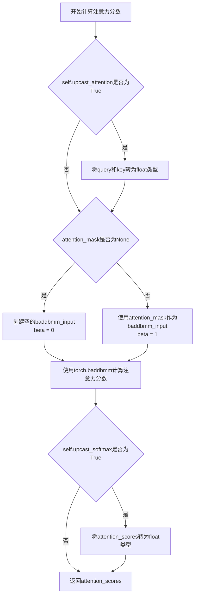

#### 带注释源码

```python
def get_attention_scores(
    self, query: torch.Tensor, key: torch.Tensor, attention_mask: torch.Tensor = None
) -> torch.Tensor:
    r"""
    Compute the attention scores.

    Args:
        query (`torch.Tensor`): The query tensor.
        key (`torch.Tensor`): The key tensor.
        attention_mask (`torch.Tensor`, *optional*): The attention mask to use. If `None`, no mask is applied.

    Returns:
        `torch.Tensor`: The attention probabilities/scores.
    """
    # 如果需要将注意力计算向上转型为float，则将query和key转换为float类型
    # 这有助于避免某些精度问题
    if self.upcast_attention:
        query = query.float()
        key = key.float()

    # 准备baddbmm的输入和beta参数
    # beta参数用于控制是否将baddbmm_input添加到结果中
    if attention_mask is None:
        # 如果没有提供注意力掩码，创建一个空的张量
        # 形状为(batch_size, num_heads, query_len, key_len)
        baddbmm_input = torch.empty(
            query.shape[0], query.shape[1], key.shape[1], dtype=query.dtype, device=query.device
        )
        beta = 0  # beta=0表示不添加baddbmm_input，结果完全由query和key的矩阵乘积决定
    else:
        # 如果提供了注意力掩码，使用它作为baddbmm的输入
        baddbmm_input = attention_mask
        beta = 1  # beta=1表示将baddbmm_input添加到结果中

    # 计算注意力分数: query @ key^T
    # baddbmm执行 batched matrix-matrix product
    # 公式: result = beta * baddbmm_input + alpha * (query @ key^T)
    attention_scores = torch.baddbmm(
        baddbmm_input,
        query,
        key.transpose(-1, -2),
        beta=beta,
        alpha=self.scale,  # 缩放因子，通常为1/sqrt(d_k)
    )
    del baddbmm_input  # 释放内存

    # 如果需要将softmax向上转型，则将注意力分数转换为float类型
    if self.upcast_softmax:
        attention_scores = attention_scores.float()

    # 返回softmax之前的原始注意力分数
    return attention_scores
```


### `GaussianSmoothing.__init__`

该方法是 `GaussianSmoothing` 类的构造函数，用于初始化高斯平滑过滤器。它根据输入的通道数、核大小、标准差和维度创建一个可学习的深度卷积核权重，支持 1D、2D 和 3D 数据的高斯模糊处理。

参数：

- `channels`：`int` 或 `sequence`，输入和输出张量的通道数
- `kernel_size`：`int` 或 `sequence`，高斯核的大小
- `sigma`：`float` 或 `sequence`，高斯核的标准差
- `dim`：`int`，数据的维度，默认为 2（空间维度）

返回值：无（构造函数）

#### 流程图

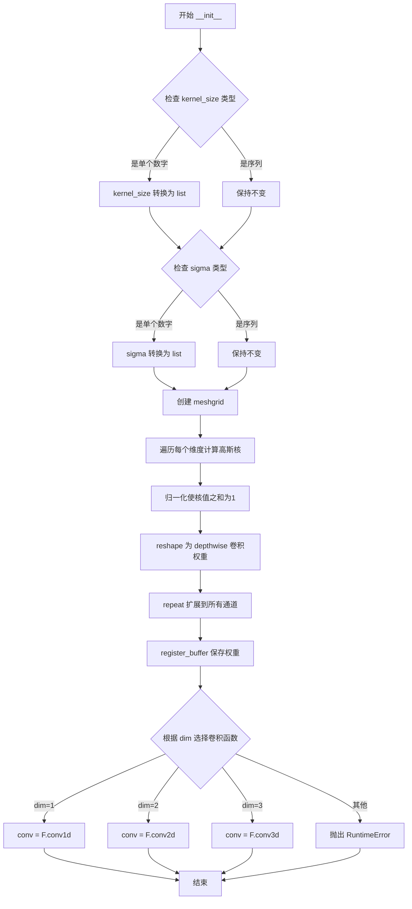

#### 带注释源码

```python
def __init__(self, channels, kernel_size, sigma, dim=2):
    # 调用父类 nn.Module 的构造函数
    super(GaussianSmoothing, self).__init__()
    
    # 如果 kernel_size 是单个数字，扩展为每个维度一个值的列表
    if isinstance(kernel_size, numbers.Number):
        kernel_size = [kernel_size] * dim
    
    # 如果 sigma 是单个数字，扩展为每个维度一个值的列表
    if isinstance(sigma, numbers.Number):
        sigma = [sigma] * dim

    # 高斯核是每个维度高斯函数的乘积
    # 初始化核值为1（用于累乘）
    kernel = 1
    
    # 创建网格坐标，用于计算高斯函数
    # torch.meshgrid 创建每个维度的坐标网格
    meshgrids = torch.meshgrid([torch.arange(size, dtype=torch.float32) for size in kernel_size])
    
    # 遍历每个维度，计算该维度的高斯核
    # 高斯函数: exp(-((x-mean)^2) / (2*std^2)) / (std * sqrt(2*pi))
    for size, std, mgrid in zip(kernel_size, sigma, meshgrids):
        # 计算当前维度的均值（中心点）
        mean = (size - 1) / 2
        # 计算高斯核值并累乘到 kernel
        kernel *= 1 / (std * math.sqrt(2 * math.pi)) * torch.exp(-(((mgrid - mean) / (2 * std)) ** 2))

    # 确保高斯核的值之和等于1（归一化）
    kernel = kernel / torch.sum(kernel)

    # 将核 reshape 为 depthwise 卷积权重格式
    # 形状: (1, 1, kernel_size[0], kernel_size[1], ...)
    kernel = kernel.view(1, 1, *kernel.size())
    
    # 重复核以匹配输入通道数
    # 每个通道独立有一个卷积核
    kernel = kernel.repeat(channels, *[1] * (kernel.dim() - 1))

    # 将核注册为 buffer（不参与训练但会保存到模型）
    self.register_buffer("weight", kernel)
    
    # 设置深度卷积的组数（等于通道数）
    self.groups = channels

    # 根据维度选择对应的卷积函数
    if dim == 1:
        self.conv = F.conv1d
    elif dim == 2:
        self.conv = F.conv2d
    elif dim == 3:
        self.conv = F.conv3d
    else:
        # 超出支持维度范围，抛出错误
        raise RuntimeError("Only 1, 2 and 3 dimensions are supported. Received {}.".format(dim))
```


### `GaussianSmoothing.forward`

该方法是GaussianSmoothing类的核心前向传播函数，用于对输入的张量（1D、2D或3D）应用高斯模糊滤波。该类通过深度可分离卷积的方式，分别对输入的每个通道应用高斯滤波器，适用于对注意力图进行平滑处理。

参数：

- `input`：`torch.Tensor`，形状为`(N, C, H, W)`或类似的维度组合，其中N是批量大小，C是通道数，H和W是空间维度（对于1D是序列长度，对于3D是深度、高度和宽度）。需要应用高斯滤波的输入张量。

返回值：`torch.Tensor`，滤波后的输出张量，与输入具有相同的形状。

#### 流程图

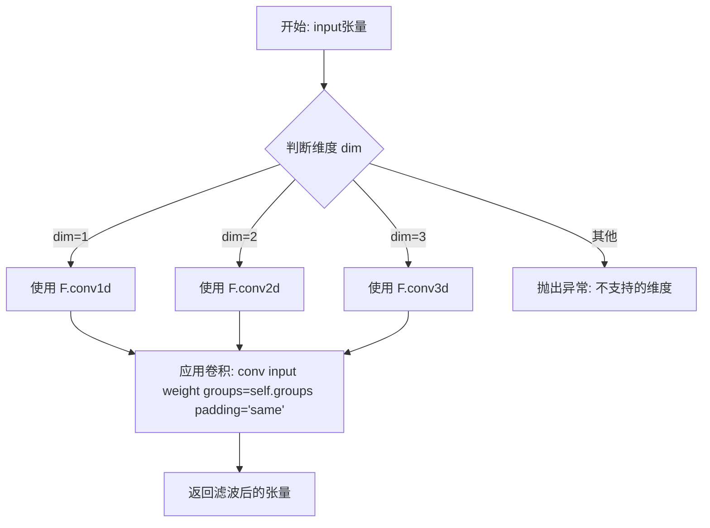

#### 带注释源码

```python
def forward(self, input):
    """
    Apply gaussian filter to input.

    Args:
        input (`torch.Tensor` of shape `(N, C, H, W)`):
            Input to apply Gaussian filter on.

    Returns:
        `torch.Tensor`:
            The filtered output tensor with the same shape as the input.
    """
    # 使用卷积函数对输入应用高斯滤波器
    # self.conv 根据维度自动选择 F.conv1d / F.conv2d / F.conv3d
    # weight 是预先计算好的高斯核，通过 register_buffer 注册
    # groups=self.groups 实现深度可分离卷积，每个通道独立滤波
    # padding='same' 保持输出尺寸与输入相同
    return self.conv(input, weight=self.weight.to(input.dtype), groups=self.groups, padding="same")
```


### `StableDiffusionHDPainterPipeline.get_tokenized_prompt`

该方法用于将文本提示（prompt）进行分词（tokenize），并将分词后的 token ID 解码为可读的文字字符串列表。在 HD-Painter 管道中，此方法主要用于定位特殊 token（如 `<|endoftext|>`）的位置，以确定需要修改的 token 索引范围。

参数：

- `prompt`：`Union[str, List[str]]`，需要分词的文本提示，可以是单个字符串或字符串列表

返回值：`List[str]`返回一个包含解码后 token 字符串的列表

#### 流程图

```mermaid
flowchart TD
    A[输入: prompt] --> B{判断prompt类型}
    B -->|str| C[调用 self.tokenizer prompt]
    B -->|List[str]| D[调用 self.tokenizer prompt]
    C --> E[获取 out['input_ids']]
    D --> E
    E --> F[遍历 input_ids]
    F --> G[对每个token调用 self.tokenizer.decode]
    G --> H[收集解码后的字符串]
    H --> I[返回 List[str]]
```

#### 带注释源码

```
def get_tokenized_prompt(self, prompt):
    # 使用类的 tokenizer 对输入的 prompt 进行分词
    # tokenizer 会将文本转换为 token ID 序列
    out = self.tokenizer(prompt)
    
    # 从分词结果中提取 input_ids（token ID 序列）
    # 遍历每个 token ID 并使用 tokenizer 的 decode 方法将其转换为对应的字符串
    # 返回一个包含所有解码后 token 的列表
    return [self.tokenizer.decode(x) for x in out["input_ids"]]
```

#### 补充说明

**调用位置**：
- 在 `__call__` 方法中被调用两次：
  1. `self.get_tokenized_prompt(prompt_no_positives)` - 用于获取不带正面提示的 token 列表
  2. `self.get_tokenized_prompt(prompt)` - 用于获取带正面提示的 token 列表

**用途**：
该方法的返回值用于确定 `<|endoftext|>` 特殊 token 的位置，从而构建 `token_idx` 列表。这个 `token_idx` 后续会被传递给 `RASGAttnProcessor` 和 `PAIntAAttnProcessor`，用于标识需要被注意力机制修改的 token 位置。

**示例**：
假设 prompt 为 "a photo of a cat"，则返回值可能为：
```
['<|startoftext|>', 'a', 'photo', 'of', 'a', 'cat', '</endoftext|>']
```


### `StableDiffusionHDPainterPipeline.init_attn_processors`

该方法用于初始化 Stable Diffusion HD Painter Pipeline 的注意力处理器。它根据配置为 UNet 的自注意力层和交叉注意力层分别设置 PAIntA（Painter Attention Integration）和 RASG（Regional Attention Score Guidance）自定义注意力处理器，以实现高质量的图像修复和增强。

参数：

- `mask`：`torch.Tensor`，掩码张量，用于控制注意力处理的区域
- `token_idx`：需要被 PAIntA 和 RASG 处理的 token 索引列表
- `use_painta`：`bool`，是否启用 PAIntA 注意力处理器，默认为 True
- `use_rasg`：`bool`，是否启用 RASG 注意力处理器，默认为 True
- `painta_scale_factors`：`List[int]`，PAIntA 的缩放因子列表，用于不同分辨率的掩码处理，默认值为 [2, 4]
- `rasg_scale_factor`：`int`，RASG 的缩放因子，默认值为 4
- `self_attention_layer_name`：`str`，自注意力层的名称标识符，默认为 "attn1"
- `cross_attention_layer_name`：`str`，交叉注意力层的名称标识符，默认为 "attn2"
- `list_of_painta_layer_names`：`Optional[List[str]]`，指定使用 PAIntA 的层名称列表，None 表示自动识别
- `list_of_rasg_layer_names`：`Optional[List[str]]`，指定使用 RASG 的层名称列表，None 表示自动识别

返回值：`None`，该方法无返回值，直接修改 UNet 的注意力处理器

#### 流程图

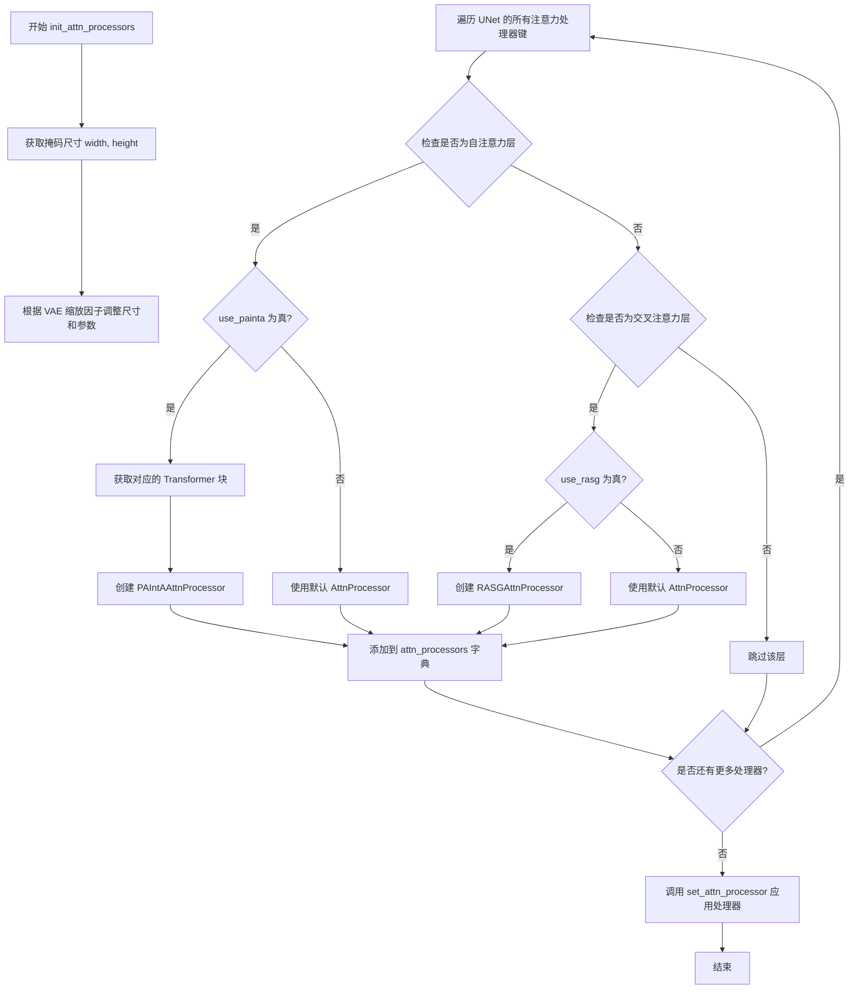

#### 带注释源码

```python
def init_attn_processors(
    self,
    mask,  # torch.Tensor: 掩码张量，用于控制注意力处理的区域
    token_idx,  # List[int]: 需要被PAIntA和RASG处理的token索引列表
    use_painta=True,  # bool: 是否启用PAIntA注意力处理器
    use_rasg=True,  # bool: 是否启用RASG注意力处理器
    painta_scale_factors=[2, 4],  # List[int]: PAIntA的缩放因子列表，用于不同分辨率的掩码处理
    rasg_scale_factor=4,  # int: RASG的缩放因子
    self_attention_layer_name="attn1",  # str: 自注意力层的名称标识符
    cross_attention_layer_name="attn2",  # str: 交叉注意力层的名称标识符
    list_of_painta_layer_names=None,  # Optional[List[str]]: 指定使用PAIntA的层名称列表
    list_of_rasg_layer_names=None,  # Optional[List[str]]: 指定使用RASG的层名称列表
):
    # 使用默认的注意力处理器
    default_processor = AttnProcessor()
    
    # 获取掩码的宽度和高度
    width, height = mask.shape[-2:]
    # 根据 VAE 缩放因子将尺寸转换为潜在空间维度
    width, height = width // self.vae_scale_factor, height // self.vae_scale_factor

    # 根据 VAE 缩放因子调整 PAIntA 和 RASG 的缩放因子
    painta_scale_factors = [x * self.vae_scale_factor for x in painta_scale_factors]
    rasg_scale_factor = self.vae_scale_factor * rasg_scale_factor

    # 创建注意力处理器字典
    attn_processors = {}
    
    # 遍历 UNet 中的所有注意力处理器
    for x in self.unet.attn_processors:
        # 检查是否为自注意力层 (attn1)
        if (list_of_painta_layer_names is None and self_attention_layer_name in x) or (
            list_of_painta_layer_names is not None and x in list_of_painta_layer_names
        ):
            if use_painta:
                # 获取对应的 Transformer 块模块
                transformer_block = self.unet.get_submodule(x.replace(".attn1.processor", ""))
                # 创建 PAIntA 注意力处理器，包含 transformer_block、mask、token_idx 等信息
                attn_processors[x] = PAIntAAttnProcessor(
                    transformer_block, mask, token_idx, self.do_classifier_free_guidance, painta_scale_factors
                )
            else:
                # 不使用 PAIntA 时使用默认处理器
                attn_processors[x] = default_processor
                
        # 检查是否为交叉注意力层 (attn2)
        elif (list_of_rasg_layer_names is None and cross_attention_layer_name in x) or (
            list_of_rasg_layer_names is not None and x in list_of_rasg_layer_names
        ):
            if use_rasg:
                # 创建 RASG 注意力处理器
                attn_processors[x] = RASGAttnProcessor(mask, token_idx, rasg_scale_factor)
            else:
                # 不使用 RASG 时使用默认处理器
                attn_processors[x] = default_processor

    # 将配置好的注意力处理器应用到 UNet
    self.unet.set_attn_processor(attn_processors)
```


### StableDiffusionHDPainterPipeline.__call__

主推理方法，负责执行HD图像修复管道的完整推理流程。该方法整合了文本编码、图像预处理、潜在变量准备、注意力处理器初始化、去噪循环（包括RASG和引导和PAIntA注意力增强）以及最终图像解码，是整个管道的主导方法。

参数：

- `prompt`：`Union[str, List[str]]`，文本提示，用于描述期望生成的图像内容
- `image`：`PipelineImageInput`，输入图像，作为修复的目标图像
- `mask_image`：`PipelineImageInput`，掩码图像，指示需要修复的区域
- `masked_image_latents`：`torch.Tensor`，掩码图像的潜在表示，可选
- `height`：`Optional[int]`，`Optional[int]`，输出图像的高度，默认为unet配置值
- `width`：`Optional[int]`，输出图像的宽度，默认为unet配置值
- `padding_mask_crop`：`Optional[int]`，裁剪掩码的填充值
- `strength`：`float`，修复强度，控制噪声添加比例，默认为1.0
- `num_inference_steps`：`int`，推理步数，控制去噪迭代次数，默认为50
- `timesteps`：`List[int]`，自定义时间步列表
- `guidance_scale`：`float`，引导尺度，控制文本引导强度，默认为7.5
- `positive_prompt`：`str | None`，额外的正向提示词
- `negative_prompt`：`Optional[Union[str, List[str]]]`，负向提示词
- `num_images_per_prompt`：`Optional[int]`，每个提示词生成的图像数量，默认为1
- `eta`：`float`，DDIM采样参数，默认为0.01
- `generator`：`Optional[torch.Generator]`，随机数生成器
- `latents`：`Optional[torch.Tensor]`，初始潜在变量
- `prompt_embeds`：`Optional[torch.Tensor]`，预计算的提示词嵌入
- `negative_prompt_embeds`：`Optional[torch.Tensor]`，预计算的负向提示词嵌入
- `ip_adapter_image`：`Optional[PipelineImageInput]`，IP-Adapter图像输入
- `output_type`：`str | None`，输出类型，默认为"pil"
- `return_dict`：`bool`，是否返回字典格式结果，默认为True
- `cross_attention_kwargs`：`Optional[Dict[str, Any]]`，交叉注意力额外参数
- `clip_skip`：`int`，CLIP跳过的层数
- `callback_on_step_end`：`Optional[Callable[[int, int, Dict], None]]`，每步结束时的回调函数
- `callback_on_step_end_tensor_inputs`：`List[str]`，回调函数需要使用的张量输入列表
- `use_painta`：`bool`，是否启用PAIntA注意力机制，默认为True
- `use_rasg`：`bool`，是否启用RASG注意力机制，默认为True
- `self_attention_layer_name`：`str`，自注意力层名称，默认为".attn1"
- `cross_attention_layer_name`：`str`，交叉注意力层名称，默认为".attn2"
- `painta_scale_factors`：`list`，PAIntA的缩放因子列表，默认为[2, 4]
- `rasg_scale_factor`：`int`，RASG的缩放因子，默认为4
- `list_of_painta_layer_names`：`list`，指定的PAIntA层名称列表
- `list_of_rasg_layer_names`：`list`，指定的RASG层名称列表

返回值：`Union[StableDiffusionPipelineOutput, Tuple]`，返回图像输出和NSFW内容检测结果，或按需返回元组

#### 流程图

```mermaid
flowchart TD
    A[开始 __call__] --> B[解析回调参数]
    B --> C[设置默认高度和宽度]
    C --> D[处理正向提示词]
    D --> E{检查输入参数}
    E -->|通过| F[定义批处理大小和设备]
    F --> G[编码输入提示词]
    G --> H[处理IP-Adapter图像嵌入]
    H --> I[设置时间步]
    I --> J[预处理图像和掩码]
    J --> K[准备潜在变量]
    K --> L[准备掩码潜在变量]
    L --> M[设置HD-Painter注意力处理器]
    M --> N{检查掩码和潜在变量尺寸}
    N -->|通过| O[准备额外步骤参数]
    O --> P[准备时间步条件嵌入]
    P --> Q[初始化进度条和PAIntA状态]
    Q --> R{去噪循环: i < num_inference_steps}
    R -->|是| S{t < 500 且 PAIntA激活}
    S -->|是| T[重新初始化注意力处理器,禁用PAIntA]
    S -->|否| U[启用梯度计算]
    T --> U
    U --> V[零梯度并设置潜在变量需要梯度]
    V --> W[扩展潜在变量用于分类器自由引导]
    W --> X[缩放模型输入]
    X --> Y{UNet输入通道数==9}
    Y -->|是| Z[连接潜在变量、掩码和掩码图像]
    Y -->|否| AA[设置调度器的潜在变量和编码器隐藏状态]
    Z --> AA
    AA --> AB[运行UNet预测噪声残差]
    AB --> AC{执行分类器自由引导}
    AC -->|是| AD[分割并重新组合噪声预测]
    AC -->|否| AE[使用RASG处理]
    AD --> AE
    AE --> AF{RASG启用}
    AF -->|是| AG[计算RASG注意力掩码和分数]
    AG --> AH[反向传播注意力分数]
    AG --> AI[计算方差噪声]
    AF -->|否| AJ[设置方差噪声为None]
    AH --> AK[调度器步进更新潜在变量]
    AI --> AK
    AJ --> AK
    AK --> AL{输出类型不是latent}
    AL -->|是| AM[解码潜在变量为图像]
    AL -->|否| AN[直接使用潜在变量作为图像]
    AM --> AO[运行安全检查器]
    AN --> AO
    AO --> AP[后处理图像]
    AP --> AQ{填充掩码裁剪}
    AQ -->|是| AR[应用覆盖层]
    AQ -->|否| AS[释放模型钩子]
    AR --> AS
    AS --> AT{return_dict为True}
    AT -->|是| AU[返回StableDiffusionPipelineOutput]
    AT -->|否| AV[返回元组]
    AU --> AV
    AV --> AX[结束]
    R -->|否| AX
    E -->|失败| AY[抛出异常]
```

#### 带注释源码

```python
@torch.no_grad()
def __call__(
    self,
    prompt: Union[str, List[str]] = None,
    image: PipelineImageInput = None,
    mask_image: PipelineImageInput = None,
    masked_image_latents: torch.Tensor = None,
    height: Optional[int] = None,
    width: Optional[int] = None,
    padding_mask_crop: Optional[int] = None,
    strength: float = 1.0,
    num_inference_steps: int = 50,
    timesteps: List[int] = None,
    guidance_scale: float = 7.5,
    positive_prompt: str | None = "",
    negative_prompt: Optional[Union[str, List[str]]] = None,
    num_images_per_prompt: Optional[int] = 1,
    eta: float = 0.01,
    generator: Optional[Union[torch.Generator, List[torch.Generator]]] = None,
    latents: Optional[torch.Tensor] = None,
    prompt_embeds: Optional[torch.Tensor] = None,
    negative_prompt_embeds: Optional[torch.Tensor] = None,
    ip_adapter_image: Optional[PipelineImageInput] = None,
    output_type: str | None = "pil",
    return_dict: bool = True,
    cross_attention_kwargs: Optional[Dict[str, Any]] = None,
    clip_skip: int = None,
    callback_on_step_end: Optional[Callable[[int, int, Dict], None]] = None,
    callback_on_step_end_tensor_inputs: List[str] = ["latents"],
    use_painta=True,
    use_rasg=True,
    self_attention_layer_name=".attn1",
    cross_attention_layer_name=".attn2",
    painta_scale_factors=[2, 4],
    rasg_scale_factor=4,
    list_of_painta_layer_names=None,
    list_of_rasg_layer_names=None,
    **kwargs,
):
    # ==================== 步骤1: 解析回调参数 ====================
    # 处理已废弃的callback参数
    callback = kwargs.pop("callback", None)
    callback_steps = kwargs.pop("callback_steps", None)

    if callback is not None:
        deprecate(
            "callback", "1.0.0",
            "Passing `callback` as an input argument to `__call__` is deprecated, consider use `callback_on_step_end`",
        )
    if callback_steps is not None:
        deprecate(
            "callback_steps", "1.0.0",
            "Passing `callback_steps` as an input argument to `__call__` is deprecated, consider use `callback_on_step_end`",
        )

    # ==================== 步骤2: 设置默认尺寸 ====================
    # 根据VAE缩放因子设置默认的高度和宽度
    height = height or self.unet.config.sample_size * self.vae_scale_factor
    width = width or self.unet.config.sample_size * self.vae_scale_factor

    # ==================== 步骤3: 处理提示词 ====================
    # 保存原始提示词用于后续token索引计算
    prompt_no_positives = prompt
    # 将正向提示词追加到每个提示词
    if isinstance(prompt, list):
        prompt = [x + positive_prompt for x in prompt]
    else:
        prompt = prompt + positive_prompt

    # ==================== 步骤4: 输入验证 ====================
    # 检查所有输入参数的有效性
    self.check_inputs(
        prompt, image, mask_image, height, width, strength, callback_steps,
        negative_prompt, prompt_embeds, negative_prompt_embeds,
        callback_on_step_end_tensor_inputs, padding_mask_crop,
    )

    # ==================== 步骤5: 设置全局配置 ====================
    # 存储引导尺度、CLIP跳过和交叉注意力参数
    self._guidance_scale = guidance_scale
    self._clip_skip = clip_skip
    self._cross_attention_kwargs = cross_attention_kwargs
    self._interrupt = False

    # ==================== 步骤6: 定义批处理参数 ====================
    # 根据输入类型确定批处理大小
    if prompt is not None and isinstance(prompt, str):
        batch_size = 1
    elif prompt is not None and isinstance(prompt, list):
        batch_size = len(prompt)
    else:
        batch_size = prompt_embeds.shape[0]

    # 获取执行设备
    device = self._execution_device

    # ==================== 步骤7: 编码提示词 ====================
    # 提取LoRA缩放因子
    text_encoder_lora_scale = (
        cross_attention_kwargs.get("scale", None) if cross_attention_kwargs is not None else None
    )
    # 编码正向和负向提示词
    prompt_embeds, negative_prompt_embeds = self.encode_prompt(
        prompt, device, num_images_per_prompt, self.do_classifier_free_guidance,
        negative_prompt, prompt_embeds, negative_prompt_embeds, lora_scale=text_encoder_lora_scale,
        clip_skip=self.clip_skip,
    )

    # 对于分类器自由引导，连接无条件嵌入和条件嵌入
    if self.do_classifier_free_guidance:
        prompt_embeds = torch.cat([negative_prompt_embeds, prompt_embeds])

    # ==================== 步骤8: 处理IP-Adapter图像 ====================
    if ip_adapter_image is not None:
        output_hidden_state = False if isinstance(self.unet.encoder_hid_proj, ImageProjection) else True
        image_embeds, negative_image_embeds = self.encode_image(
            ip_adapter_image, device, num_images_per_prompt, output_hidden_state
        )
        # 同样需要连接无条件嵌入和条件嵌入
        if self.do_classifier_free_guidance:
            image_embeds = torch.cat([negative_image_embeds, image_embeds])

    # ==================== 步骤9: 设置时间步 ====================
    # 从调度器获取时间步
    timesteps, num_inference_steps = retrieve_timesteps(self.scheduler, num_inference_steps, device, timesteps)
    # 根据强度调整时间步
    timesteps, num_inference_steps = self.get_timesteps(
        num_inference_steps=num_inference_steps, strength=strength, device=device
    )
    # 验证推理步数有效
    if num_inference_steps < 1:
        raise ValueError(
            f"After adjusting the num_inference_steps by strength parameter: {strength}, "
            f"the number of pipeline steps is {num_inference_steps} which is < 1."
        )
    # 计算初始潜在变量的时间步
    latent_timestep = timesteps[:1].repeat(batch_size * num_images_per_prompt)
    # 判断是否使用最大强度
    is_strength_max = strength == 1.0

    # ==================== 步骤10: 预处理图像和掩码 ====================
    # 处理裁剪坐标
    if padding_mask_crop is not None:
        crops_coords = self.mask_processor.get_crop_region(mask_image, width, height, pad=padding_mask_crop)
        resize_mode = "fill"
    else:
        crops_coords = None
        resize_mode = "default"

    # 保存原始图像用于后续覆盖
    original_image = image
    # 预处理输入图像
    init_image = self.image_processor.preprocess(
        image, height=height, width=width, crops_coords=crops_coords, resize_mode=resize_mode
    )
    init_image = init_image.to(dtype=torch.float32)

    # ==================== 步骤11: 准备潜在变量 ====================
    # 获取通道数配置
    num_channels_latents = self.vae.config.latent_channels
    num_channels_unet = self.unet.config.in_channels
    return_image_latents = num_channels_unet == 4

    # 准备潜在变量
    latents_outputs = self.prepare_latents(
        batch_size * num_images_per_prompt, num_channels_latents, height, width,
        prompt_embeds.dtype, device, generator, latents, image=init_image,
        timestep=latent_timestep, is_strength_max=is_strength_max,
        return_noise=True, return_image_latents=return_image_latents,
    )

    if return_image_latents:
        latents, noise, image_latents = latents_outputs
    else:
        latents, noise = latents_outputs

    # ==================== 步骤12: 准备掩码潜在变量 ====================
    # 预处理掩码图像
    mask_condition = self.mask_processor.preprocess(
        mask_image, height=height, width=width, resize_mode=resize_mode, crops_coords=crops_coords
    )

    # 准备被掩码覆盖的图像
    if masked_image_latents is None:
        masked_image = init_image * (mask_condition < 0.5)
    else:
        masked_image = masked_image_latents

    # 准备掩码潜在变量
    mask, masked_image_latents = self.prepare_mask_latents(
        mask_condition, masked_image, batch_size * num_images_per_prompt,
        height, width, prompt_embeds.dtype, device, generator,
        self.do_classifier_free_guidance,
    )

    # ==================== 步骤13: 设置HD-Painter注意力处理器 ====================
    # 获取需要修改的token索引
    token_idx = list(range(1, self.get_tokenized_prompt(prompt_no_positives).index("<|endoftext|>"))) + [
        self.get_tokenized_prompt(prompt).index("<|endoftext|>")
    ]

    # 初始化注意力处理器
    self.init_attn_processors(
        mask_condition, token_idx, use_painta, use_rasg,
        painta_scale_factors=painta_scale_factors,
        rasg_scale_factor=rasg_scale_factor,
        self_attention_layer_name=self_attention_layer_name,
        cross_attention_layer_name=cross_attention_layer_name,
        list_of_painta_layer_names=list_of_painta_layer_names,
        list_of_rasg_layer_names=list_of_rasg_layer_names,
    )

    # ==================== 步骤14: 验证尺寸匹配 ====================
    # 检查掩码、掩码图像和潜在变量的通道数是否匹配
    if num_channels_unet == 9:
        # 稳定扩散v1-5/修复的默认情况
        num_channels_mask = mask.shape[1]
        num_channels_masked_image = masked_image_latents.shape[1]
        if num_channels_latents + num_channels_mask + num_channels_masked_image != self.unet.config.in_channels:
            raise ValueError(
                f"Incorrect configuration settings! The config of `pipeline.unet`: {self.unet.config} expects"
                f" {self.unet.config.in_channels} but received `num_channels_latents`: {num_channels_latents} +"
                f" `num_channels_mask`: {num_channels_mask} + `num_channels_masked_image`: {num_channels_masked_image}"
            )
    elif num_channels_unet != 4:
        raise ValueError(f"The unet should have either 4 or 9 input channels, not {num_channels_unet}.")

    # ==================== 步骤15: 准备额外步骤参数 ====================
    extra_step_kwargs = self.prepare_extra_step_kwargs(generator, eta)

    # RASG需要禁用外部生成器
    if use_rasg:
        extra_step_kwargs["generator"] = None

    # ==================== 步骤16: 添加图像嵌入(IP-Adapter) ====================
    added_cond_kwargs = {"image_embeds": image_embeds} if ip_adapter_image is not None else None

    # ==================== 步骤17: 准备引导尺度嵌入 ====================
    timestep_cond = None
    if self.unet.config.time_cond_proj_dim is not None:
        guidance_scale_tensor = torch.tensor(self.guidance_scale - 1).repeat(batch_size * num_images_per_prompt)
        timestep_cond = self.get_guidance_scale_embedding(
            guidance_scale_tensor, embedding_dim=self.unet.config.time_cond_proj_dim
        ).to(device=device, dtype=latents.dtype)

    # ==================== 步骤18: 去噪循环 ====================
    # 计算预热步数
    num_warmup_steps = len(timesteps) - num_inference_steps * self.scheduler.order
    self._num_timesteps = len(timesteps)
    painta_active = True  # PAIntA激活标志

    with self.progress_bar(total=num_inference_steps) as progress_bar:
        for i, t in enumerate(timesteps):
            # 检查是否中断
            if self.interrupt:
                continue

            # 在特定时间步禁用PAIntA
            if t < 500 and painta_active:
                self.init_attn_processors(
                    mask_condition, token_idx, False, use_rasg,  # 禁用PAIntA
                    painta_scale_factors=painta_scale_factors,
                    rasg_scale_factor=rasg_scale_factor,
                    self_attention_layer_name=self_attention_layer_name,
                    cross_attention_layer_name=cross_attention_layer_name,
                    list_of_painta_layer_names=list_of_painta_layer_names,
                    list_of_rasg_layer_names=list_of_rasg_layer_names,
                )
                painta_active = False

            # 启用梯度计算用于RASG
            with torch.enable_grad():
                self.unet.zero_grad()
                latents = latents.detach()
                latents.requires_grad = True

                # 扩展潜在变量用于分类器自由引导
                latent_model_input = torch.cat([latents] * 2) if self.do_classifier_free_guidance else latents

                # 缩放模型输入
                latent_model_input = self.scheduler.scale_model_input(latent_model_input, t)

                # 连接潜在变量、掩码和掩码图像潜在变量
                if num_channels_unet == 9:
                    latent_model_input = torch.cat([latent_model_input, mask, masked_image_latents], dim=1)

                # 设置调度器的潜在变量和编码器隐藏状态
                self.scheduler.latents = latents
                self.encoder_hidden_states = prompt_embeds
                for attn_processor in self.unet.attn_processors.values():
                    attn_processor.encoder_hidden_states = prompt_embeds

                # 预测噪声残差
                noise_pred = self.unet(
                    latent_model_input, t, encoder_hidden_states=prompt_embeds,
                    timestep_cond=timestep_cond, cross_attention_kwargs=self.cross_attention_kwargs,
                    added_cond_kwargs=added_cond_kwargs, return_dict=False,
                )[0]

                # 执行分类器自由引导
                if self.do_classifier_free_guidance:
                    noise_pred_uncond, noise_pred_text = noise_pred.chunk(2)
                    noise_pred = noise_pred_uncond + self.guidance_scale * (noise_pred_text - noise_pred_uncond)

                # RASG处理
                if use_rasg:
                    # 计算缩放因子
                    _, _, height, width = mask_condition.shape
                    scale_factor = self.vae_scale_factor * rasg_scale_factor

                    # 插值RASG掩码
                    rasg_mask = F.interpolate(
                        mask_condition, (height // scale_factor, width // scale_factor), mode="bicubic"
                    )[0, 0]

                    # 聚合保存的注意力图
                    attn_map = []
                    for processor in self.unet.attn_processors.values():
                        if hasattr(processor, "attention_scores") and processor.attention_scores is not None:
                            if self.do_classifier_free_guidance:
                                attn_map.append(processor.attention_scores.chunk(2)[1])
                            else:
                                attn_map.append(processor.attention_scores)

                    # 重组注意力图
                    attn_map = (
                        torch.cat(attn_map).mean(0).permute(1, 0)
                        .reshape((-1, height // scale_factor, width // scale_factor))
                    )

                    # 计算注意力分数
                    attn_score = -sum(
                        [
                            F.binary_cross_entropy_with_logits(x - 1.0, rasg_mask.to(device))
                            for x in attn_map[token_idx]
                        ]
                    )

                    # 反向传播分数并计算梯度
                    attn_score.backward()

                    # 归一化梯度并计算噪声分量
                    variance_noise = latents.grad.detach()
                    variance_noise -= torch.mean(variance_noise, [1, 2, 3], keepdim=True)
                    variance_noise /= torch.std(variance_noise, [1, 2, 3], keepdim=True)
                else:
                    variance_noise = None

            # ==================== 步骤19: 调度器步进 ====================
            # 计算前一个噪声样本 x_t -> x_t-1
            latents = self.scheduler.step(
                noise_pred, t, latents, **extra_step_kwargs, return_dict=False, variance_noise=variance_noise
            )[0]

            # 处理潜在变量混合（仅用于修复）
            if num_channels_unet == 4:
                init_latents_proper = image_latents
                if self.do_classifier_free_guidance:
                    init_mask, _ = mask.chunk(2)
                else:
                    init_mask = mask

                if i < len(timesteps) - 1:
                    noise_timestep = timesteps[i + 1]
                    init_latents_proper = self.scheduler.add_noise(
                        init_latents_proper, noise, torch.tensor([noise_timestep])
                    )

                # 混合原始图像潜在和生成潜在
                latents = (1 - init_mask) * init_latents_proper + init_mask * latents

            # ==================== 步骤20: 回调处理 ====================
            if callback_on_step_end is not None:
                callback_kwargs = {}
                for k in callback_on_step_end_tensor_inputs:
                    callback_kwargs[k] = locals()[k]
                callback_outputs = callback_on_step_end(self, i, t, callback_kwargs)

                # 更新变量
                latents = callback_outputs.pop("latents", latents)
                prompt_embeds = callback_outputs.pop("prompt_embeds", prompt_embeds)
                negative_prompt_embeds = callback_outputs.pop("negative_prompt_embeds", negative_prompt_embeds)
                mask = callback_outputs.pop("mask", mask)
                masked_image_latents = callback_outputs.pop("masked_image_latents", masked_image_latents)

            # 进度更新和回调
            if i == len(timesteps) - 1 or ((i + 1) > num_warmup_steps and (i + 1) % self.scheduler.order == 0):
                progress_bar.update()
                if callback is not None and i % callback_steps == 0:
                    step_idx = i // getattr(self.scheduler, "order", 1)
                    callback(step_idx, t, latents)

    # ==================== 步骤21: 后处理 ====================
    # 解码潜在变量为图像
    if not output_type == "latent":
        condition_kwargs = {}
        if isinstance(self.vae, AsymmetricAutoencoderKL):
            # 处理非对称VAE
            init_image = init_image.to(device=device, dtype=masked_image_latents.dtype)
            init_image_condition = init_image.clone()
            init_image = self._encode_vae_image(init_image, generator=generator)
            mask_condition = mask_condition.to(device=device, dtype=masked_image_latents.dtype)
            condition_kwargs = {"image": init_image_condition, "mask": mask_condition}
        
        # 解码
        image = self.vae.decode(
            latents / self.vae.config.scaling_factor, return_dict=False,
            generator=generator, **condition_kwargs
        )[0]
        
        # 安全检查
        image, has_nsfw_concept = self.run_safety_checker(image, device, prompt_embeds.dtype)
    else:
        image = latents
        has_nsfw_concept = None

    # 归一化处理
    if has_nsfw_concept is None:
        do_denormalize = [True] * image.shape[0]
    else:
        do_denormalize = [not has_nsfw for has_nsfw in has_nsfw_concept]

    # 后处理图像
    image = self.image_processor.postprocess(image, output_type=output_type, do_denormalize=do_denormalize)

    # 应用覆盖层（如果需要）
    if padding_mask_crop is not None:
        image = [
            self.image_processor.apply_overlay(mask_image, original_image, i, crops_coords)
            for i in image
        ]

    # 释放模型钩子
    self.maybe_free_model_hooks()

    # ==================== 步骤22: 返回结果 ====================
    if not return_dict:
        return (image, has_nsfw_concept)

    return StableDiffusionPipelineOutput(images=image, nsfw_content_detected=has_nsfw_concept)
```


### `RASGAttnProcessor.__init__`

该函数是 `RASGAttnProcessor` 类的构造函数，负责初始化处理器的核心状态。它接收掩码、目标令牌索引和缩放因子，并将这些参数存储为实例变量，同时计算掩码的分辨率以供后续注意力计算使用。

参数：

- `mask`：`torch.Tensor`，输入的二进制掩码张量（通常为 Bx1xHxW），用于指示需要关注的图像区域。
- `token_idx`：`Union[int, List[int]]`，目标令牌在 prompt 嵌入中的索引（或索引列表），用于从注意力矩阵中筛选特定 token 的注意力分数。
- `scale_factor`：`int`，用于控制注意力图分辨率的缩放因子（例如，VAE 缩放因子与 RASG 缩放因子的乘积），用于动态匹配不同层的分辨率。

返回值：`None`，构造函数不返回值，仅初始化对象状态。

#### 流程图

```mermaid
graph TD
    A[开始 __init__] --> B[接收参数: mask, token_idx, scale_factor]
    B --> C[初始化 self.attention_scores = None]
    C --> D[存储 self.mask = mask]
    D --> E[存储 self.token_idx = token_idx]
    E --> F[存储 self.scale_factor = scale_factor]
    F --> G[计算掩码分辨率: self.mask_resoltuion = mask.shape[-1] * mask.shape[-2]]
    G --> H[结束]
```

#### 带注释源码

```python
def __init__(self, mask, token_idx, scale_factor):
    # 初始化注意力分数存储变量。
    # 每次前向传播时，每一层都会获得一个新的 RASGAttnProcessor 实例，
    # 因此这里将 attention_scores 初始化为 None，用于保存该层计算得到的相似度矩阵。
    self.attention_scores = None  

    # 保存输入的掩码，该掩码在后续的 __call__ 方法中用于生成 RASG (Regional Attention Score Guidance) 引导。
    self.mask = mask

    # 保存目标令牌的索引。在扩散模型的去噪过程中，我们希望根据这些特定 token 的注意力分布来引导噪声。
    self.token_idx = token_idx

    # 保存缩放因子。UNet 通常包含不同分辨率的层（如 32x32, 16x16, 8x8），该因子用于计算当前层对应的分辨率。
    self.scale_factor = scale_factor

    # 计算掩码的原始分辨率。
    # 假设输入图像为 512x512，VAE 缩放因子为 8，则掩码在 VAE 空间为 64x64。
    # 此处计算 64 * 64 = 4096，用于后续与 hidden_states 的序列长度进行对比，以判断当前层是否需要应用 RASG。
    self.mask_resoltuion = mask.shape[-1] * mask.shape[-2]  # 64 x 64 if the image is 512x512
```


### `RASGAttnProcessor.__call__`

该方法是 RASG（Regional Attention Score Guidance）注意力处理器的核心调用函数，负责在 Stable Diffusion 模型的注意力层中执行自定义的注意力计算。它通过保存注意力分数矩阵（softmax 之前）供后续的 RASG 梯度计算使用，同时支持根据输入分辨率动态调整处理逻辑。

参数：

- `self`：`RASGAttnProcessor`，RASGAttnProcessor 类实例，包含 mask、token_idx、scale_factor 等配置参数
- `attn`：`Attention`，Diffusers 库中的 Attention 模块，提供查询、键、值的线性变换层以及归一化和注意力掩码处理方法
- `hidden_states`：`torch.Tensor`，形状为 `(batch_size, channel, height, width)` 或 `(batch_size, sequence_length, channel)` 的输入隐藏状态
- `encoder_hidden_states`：`Optional[torch.Tensor]`，可选的编码器隐藏状态，用于跨注意力计算，默认为 None
- `attention_mask`：`Optional[torch.Tensor]`，可选的注意力掩码，用于控制注意力权重，默认为 None
- `temb`：`Optional[torch.Tensor]`，可选的时间嵌入，用于条件归一化，默认为 None
- `scale`：`float`，注意力输出的缩放因子，默认为 1.0

返回值：`torch.Tensor`，处理后的隐藏状态，形状与输入 hidden_states 相同

#### 流程图

```mermaid
flowchart TD
    A[开始 __call__] --> B[计算 downscale_factor]
    B --> C[保存 residual = hidden_states]
    C --> D{attn.spatial_norm 是否存在?}
    D -->|是| E[应用 attn.spatial_norm]
    D -->|否| F[跳过]
    E --> F
    F --> G{hidden_states.ndim == 4?}
    G -->|是| H[重塑为 B, C, H*W 并转置]
    G -->|否| I[保持不变]
    H --> J
    I --> J
    J[准备注意力掩码] --> K{attn.group_norm 是否存在?}
    K -->|是| L[应用 group_norm]
    K -->|否| M[跳过]
    L --> M
    M --> N[计算 query = attn.to_q]
    N --> O{encoder_hidden_states 为空?}
    O -->|是| P[encoder_hidden_states = hidden_states]
    O -->|否| Q[应用 attn.norm_encoder_hidden_states]
    P --> R
    Q --> R
    R[计算 key 和 value] --> S[将 query, key, value 转换到 batch 维度]
    S --> T{downscale_factor == scale_factor²?}
    T -->|是| U[保存注意力分数到 self.attention_scores]
    T -->|否| V[使用默认注意力计算]
    U --> W[应用 softmax]
    V --> X
    W --> Y[计算注意力输出: bmm]
    X --> Y
    Y --> Z[转换回原始维度]
    Z --> AA[线性投影 to_out[0]]
    AA --> AB[Dropout to_out[1]]
    AB -> AC{input_ndim == 4?}
    AC -->|是| AD[重塑为 B, C, H, W]
    AC -->|否| AE[保持]
    AD --> AF
    AE --> AF
    AF{attn.residual_connection?}
    AF -->|是| AG[hidden_states + residual]
    AF -->|否| AH[跳过]
    AG --> AI
    AH --> AI
    AI[除以 attn.rescale_output_factor]
    AI --> AJ[返回 hidden_states]
```

#### 带注释源码

```python
def __call__(
    self,
    attn: Attention,
    hidden_states: torch.Tensor,
    encoder_hidden_states: Optional[torch.Tensor] = None,
    attention_mask: Optional[torch.Tensor] = None,
    temb: Optional[torch.Tensor] = None,
    scale: float = 1.0,
) -> torch.Tensor:
    # 计算下采样因子，用于识别当前注意力层的分辨率
    # 如果 mask 是 64x64，hidden_states 序列长度是 16，则 downscale_factor = 4
    downscale_factor = self.mask_resoltuion // hidden_states.shape[1]
    # 保存输入用于残差连接
    residual = hidden_states

    # 如果存在空间归一化，则应用它（用于某些特殊的注意力变体）
    if attn.spatial_norm is not None:
        hidden_states = attn.spatial_norm(hidden_states, temb)

    # 获取输入维度
    input_ndim = hidden_states.ndim

    # 如果是 4D 张量 (B, C, H, W)，将其重塑为 3D (B, H*W, C)
    if input_ndim == 4:
        batch_size, channel, height, width = hidden_states.shape
        hidden_states = hidden_states.view(batch_size, channel, height * width).transpose(1, 2)

    # 确定序列长度：如果有编码器隐藏状态使用其形状，否则使用隐藏状态形状
    batch_size, sequence_length, _ = (
        hidden_states.shape if encoder_hidden_states is None else encoder_hidden_states.shape
    )
    # 准备注意力掩码，处理批量大小和序列长度
    attention_mask = attn.prepare_attention_mask(attention_mask, sequence_length, batch_size)

    # 如果存在分组归一化，则应用它
    if attn.group_norm is not None:
        hidden_states = attn.group_norm(hidden_states.transpose(1, 2)).transpose(1, 2)

    # 计算查询向量 Q
    query = attn.to_q(hidden_states)

    # 如果没有编码器隐藏状态，则使用隐藏状态本身（自注意力）
    if encoder_hidden_states is None:
        encoder_hidden_states = hidden_states
    # 如果需要归一化编码器隐藏状态，则应用归一化
    elif attn.norm_cross:
        encoder_hidden_states = attn.norm_encoder_hidden_states(encoder_hidden_states)

    # 计算键 K 和值 V 向量
    key = attn.to_k(encoder_hidden_states)
    value = attn.to_v(encoder_hidden_states)

    # 将 query, key, value 从 (batch, heads, seq, dim) 转换为 (batch*heads, seq, dim)
    query = attn.head_to_batch_dim(query)
    key = attn.head_to_batch_dim(key)
    value = attn.head_to_batch_dim(value)

    # ============================================================
    # 核心逻辑：自动识别分辨率并保存注意力相似度矩阵
    # 我们需要使用 softmax 之前的值，因此重写了 get_attention_scores 函数
    # ============================================================
    if downscale_factor == self.scale_factor**2:
        # 保存注意力分数（softmax 之前）供后续 RASG 梯度计算使用
        self.attention_scores = get_attention_scores(attn, query, key, attention_mask)
        # 手动应用 softmax
        attention_probs = self.attention_scores.softmax(dim=-1)
        attention_probs = attention_probs.to(query.dtype)
    else:
        # 对于不匹配分辨率的层，使用默认的注意力计算
        attention_probs = attn.get_attention_scores(query, key, attention_mask)  # Original code

    # 计算注意力输出：使用注意力概率加权值向量
    hidden_states = torch.bmm(attention_probs, value)
    # 转换回原始维度 (batch, seq, head*dim)
    hidden_states = attn.batch_to_head_dim(hidden_states)

    # 线性投影
    hidden_states = attn.to_out[0](hidden_states)
    # Dropout
    hidden_states = attn.to_out[1](hidden_states)

    # 如果是 4D 张量，重塑回 (B, C, H, W)
    if input_ndim == 4:
        hidden_states = hidden_states.transpose(-1, -2).reshape(batch_size, channel, height, width)

    # 残差连接
    if attn.residual_connection:
        hidden_states = hidden_states + residual

    # 重新缩放输出
    hidden_states = hidden_states / attn.rescale_output_factor

    return hidden_states
```


### `PAIntAAttnProcessor.__init__`

构造函数，用于初始化 PAIntA (Painting Attention) 注意力处理器实例。该处理器主要用于图像修复任务中的注意力机制调整，通过接收 transformer 块、掩码、token 索引等参数来定制注意力计算过程。

参数：

-  `transformer_block`：`torch.nn.Module`，父 transformer 块模块，用于访问其子模块（如 norm1, attn2 等）以实现自定义的注意力流。
-  `mask`：`torch.Tensor`，注意力掩码，用于指示需要关注的区域。
-  `token_idx`：`Union[int, List[int]]`，目标 token 的索引，用于在注意力矩阵中定位和调整特定的 token 响应。
-  `do_classifier_free_guidance`：`bool`，是否启用无分类器指导（Classifier-Free Guidance），影响条件与非条件分支的处理逻辑。
-  `scale_factors`：`List[int]`，掩码的缩放因子列表，用于匹配不同分辨率的注意力层（例如 [2, 4] 对应 64x64 到 16x16 或 32x32 的降采样）。

返回值：`None`，构造函数仅初始化实例状态，不返回任何值。

#### 流程图

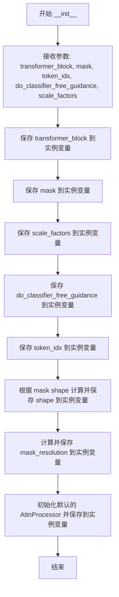

#### 带注释源码

```python
def __init__(self, transformer_block, mask, token_idx, do_classifier_free_guidance, scale_factors):
    # 保存父 transformer 块，以便在 __call__ 方法中访问其子模块（如 norm1, attn2）
    self.transformer_block = transformer_block
    # 保存输入的掩码
    self.mask = mask
    # 保存缩放因子列表，用于匹配不同层的分辨率
    self.scale_factors = scale_factors
    # 保存是否使用 classifier free guidance 的标志
    self.do_classifier_free_guidance = do_classifier_free_guidance
    # 保存目标 token 索引
    self.token_idx = token_idx
    # 获取掩码的空间形状（去除批次和通道维度后的高宽）
    self.shape = mask.shape[2:]
    # 计算掩码的分辨率（高乘宽），用于确定当前层对应的下采样因子
    self.mask_resoltuion = mask.shape[-1] * mask.shape[-2]  # 64 x 64
    # 初始化默认的注意力处理器，用于在条件不满足时回退
    self.default_processor = AttnProcessor()
```


### PAIntAAttnProcessor.__call__

PAIntAAttnProcessor.__call__ 是 HD-Painter 项目中的核心注意力处理方法，用于图像修复任务。它通过结合自注意力（Self-Attention）和交叉注意力（Cross-Attention）的特征，自适应地调整注意力分数，从而提升修复区域与原始图像的一致性和细节保留。

参数：

- `self`：PAIntAAttnProcessor 实例本身，包含 transformer_block、mask、scale_factors 等配置
- `attn: Attention`，注意力模块实例，负责执行 Q、K、V 变换和注意力计算
- `hidden_states: torch.Tensor`，输入的隐藏状态张量，形状为 (batch_size, channels, height, width) 或 (batch_size, sequence_length, hidden_dim)
- `encoder_hidden_states: Optional[torch.Tensor]`，编码器隐藏状态（文本嵌入），用于交叉注意力计算
- `attention_mask: Optional[torch.Tensor]`，注意力掩码，用于屏蔽无效位置
- `temb: Optional[torch.Tensor]`，时间嵌入，用于条件生成
- `scale: float = 1.0`，注意力输出的缩放因子

返回值：`torch.Tensor`，经过 PAIntA（Prior-Informed Attention）机制处理后的隐藏状态

#### 流程图

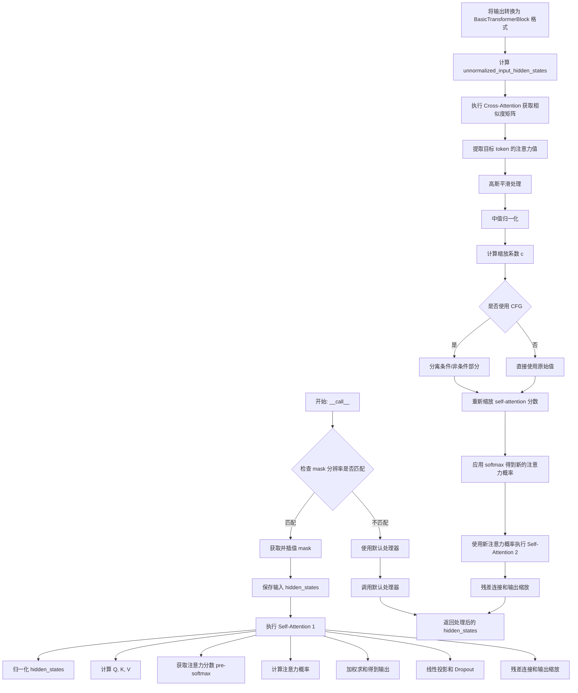

#### 带注释源码

```python
def __call__(
    self,
    attn: Attention,
    hidden_states: torch.Tensor,
    encoder_hidden_states: Optional[torch.Tensor] = None,
    attention_mask: Optional[torch.Tensor] = None,
    temb: Optional[torch.Tensor] = None,
    scale: float = 1.0,
) -> torch.Tensor:
    """
    PAIntA (Prior-Informed Attention) 处理器的主调用方法。
    该方法实现了改进的注意力机制，用于图像修复任务。
    
    工作流程：
    1. 根据当前层分辨率调整 mask 大小
    2. 执行自注意力计算并保存中间结果
    3. 执行交叉注意力获取文本-图像相关性
    4. 使用交叉注意力结果缩放自注意力分数
    5. 重新执行自注意力得到最终输出
    
    参数:
        attn: Attention 模块，包含 to_q, to_k, to_v, head_to_batch_dim 等方法
        hidden_states: 输入特征，形状为 (B, C, H, W) 或 (B, L, C)
        encoder_hidden_states: 文本编码器的输出，用于交叉注意力
        attention_mask: 注意力掩码
        temb: 时间嵌入，用于 AdaLN 等归一化
        scale: 注意力输出缩放因子
        
    返回:
        处理后的 hidden_states 张量
    """
    
    # ============= 1. 分辨率匹配和 Mask 准备 =============
    # 计算下采样因子，用于匹配当前注意力层的分辨率
    downscale_factor = self.mask_resoltuion // hidden_states.shape[1]

    mask = None
    # 遍历预定义的缩放因子列表，找到匹配的分辨率
    for factor in self.scale_factors:
        if downscale_factor == factor**2:
            # 计算目标分辨率并使用双三次插值调整 mask 大小
            shape = (self.shape[0] // factor, self.shape[1] // factor)
            mask = F.interpolate(self.mask, shape, mode="bicubic")  # B, 1, H, W
            break
    
    # 如果没有找到匹配的分辨率，使用默认处理器
    if mask is None:
        return self.default_processor(attn, hidden_states, encoder_hidden_states, attention_mask, temb, scale)

    # ============= 2. 保存输入并准备 Self-Attention 1 =============
    # 保存残差连接所需的原始输入
    residual = hidden_states
    # 保存输入用于后续的 BasicTransformerBlock 计算
    input_hidden_states = hidden_states

    # ============= 3. Self-Attention 1 (第一次自注意力) =============
    # 应用空间归一化（如果使用 AdaLN）
    if attn.spatial_norm is not None:
        hidden_states = attn.spatial_norm(hidden_states, temb)

    # 获取输入维度，处理 4D 和 3D 情况
    input_ndim = hidden_states.ndim

    # 将 4D 张量转换为 3D (B, C, H*W) -> (B, H*W, C)
    if input_ndim == 4:
        batch_size, channel, height, width = hidden_states.shape
        hidden_states = hidden_states.view(batch_size, channel, height * width).transpose(1, 2)

    # 确定序列长度（使用 hidden_states 或 encoder_hidden_states）
    batch_size, sequence_length, _ = (
        hidden_states.shape if encoder_hidden_states is None else encoder_hidden_states.shape
    )
    # 准备注意力掩码
    attention_mask = attn.prepare_attention_mask(attention_mask, sequence_length, batch_size)

    # 应用分组归一化
    if attn.group_norm is not None:
        hidden_states = attn.group_norm(hidden_states.transpose(1, 2)).transpose(1, 2)

    # 计算 Query 向量
    query = attn.to_q(hidden_states)

    # 处理 encoder_hidden_states
    if encoder_hidden_states is None:
        encoder_hidden_states = hidden_states
    elif attn.norm_cross:
        encoder_hidden_states = attn.norm_encoder_hidden_states(encoder_hidden_states)

    # 计算 Key 和 Value 向量
    key = attn.to_k(encoder_hidden_states)
    value = attn.to_v(encoder_hidden_states)

    # 转换为批次维度 (将头维度合并到批次维度)
    query = attn.head_to_batch_dim(query)
    key = attn.head_to_batch_dim(key)
    value = attn.head_to_batch_dim(value)

    # 获取注意力分数（softmax 之前的原始分数）
    # 使用自定义的 get_attention_scores 函数获取原始分数，以便后续缩放
    self_attention_scores = get_attention_scores(
        attn, query, key, attention_mask
    )  # 返回 pre-softmax 分数
    
    # 手动计算注意力概率
    self_attention_probs = self_attention_scores.softmax(
        dim=-1
    )  # 保存概率用于后续步骤，保留分数用于缩放
    self_attention_probs = self_attention_probs.to(query.dtype)

    # 执行注意力加权求和
    hidden_states = torch.bmm(self_attention_probs, value)
    hidden_states = attn.batch_to_head_dim(hidden_states)

    # 线性投影
    hidden_states = attn.to_out[0](hidden_states)
    # Dropout
    hidden_states = attn.to_out[1](hidden_states)

    # 恢复 4D 形状
    if input_ndim == 4:
        hidden_states = hidden_states.transpose(-1, -2).reshape(batch_size, channel, height, width)

    # 残差连接
    if attn.residual_connection:
        hidden_states = hidden_states + residual

    # 输出缩放
    self_attention_output_hidden_states = hidden_states / attn.rescale_output_factor

    # ============= 4. 准备 BasicTransformerBlock 中间状态 =============
    # 反归一化输入（因为 SelfAttention 接收的是归一化后的 latent，
    # 但输出的残差是未归一化的版本）
    unnormalized_input_hidden_states = (
        input_hidden_states + self.transformer_block.norm1.bias
    ) * self.transformer_block.norm1.weight

    # 组合 Transformer 隐藏状态
    transformer_hidden_states = self_attention_output_hidden_states + unnormalized_input_hidden_states
    
    # 处理 4D 情况
    if transformer_hidden_states.ndim == 4:
        transformer_hidden_states = transformer_hidden_states.squeeze(1)

    # 应用归一化（根据配置选择不同的归一化方式）
    if self.transformer_block.use_ada_layer_norm:
        raise NotImplementedError()
    elif self.transformer_block.use_ada_layer_norm_zero or self.transformer_block.use_layer_norm:
        transformer_norm_hidden_states = self.transformer_block.norm2(transformer_hidden_states)
    elif self.transformer_block.use_ada_layer_norm_single:
        # PixArt 不在这里应用 norm2
        transformer_norm_hidden_states = transformer_hidden_states
    elif self.transformer_block.use_ada_layer_norm_continuous:
        raise NotImplementedError()
    else:
        raise ValueError("Incorrect norm")

    # 应用位置嵌入（如果使用）
    if self.transformer_block.pos_embed is not None and self.transformer_block.use_ada_layer_norm_single is False:
        transformer_norm_hidden_states = self.transformer_block.pos_embed(transformer_norm_hidden_states)

    # ============= 5. Cross-Attention (获取相似度矩阵) =============
    # 准备交叉注意力的输入
    cross_attention_input_hidden_states = transformer_norm_hidden_states

    # 处理 Classifier-Free Guidance (CFG)
    if self.do_classifier_free_guidance:
        # 分离条件部分和非条件部分
        (
            _cross_attention_input_hidden_states_unconditional,
            cross_attention_input_hidden_states_conditional,
        ) = cross_attention_input_hidden_states.chunk(2)

        # 分离 encoder_hidden_states
        _encoder_hidden_states_unconditional, encoder_hidden_states_conditional = self.encoder_hidden_states.chunk(
            2
        )
    else:
        cross_attention_input_hidden_states_conditional = cross_attention_input_hidden_states
        encoder_hidden_states_conditional = self.encoder_hidden_states.chunk(2)

    # 重命名变量以提高可读性
    cross_attention_hidden_states = cross_attention_input_hidden_states_conditional
    cross_attention_encoder_hidden_states = encoder_hidden_states_conditional

    # 获取 cross-attention 模块
    attn2 = self.transformer_block.attn2

    # 交叉注意力前向传播（与 Self-Attention 类似）
    if attn2.spatial_norm is not None:
        cross_attention_hidden_states = attn2.spatial_norm(cross_attention_hidden_states, temb)

    input_ndim = cross_attention_hidden_states.ndim

    if input_ndim == 4:
        batch_size, channel, height, width = cross_attention_hidden_states.shape
        cross_attention_hidden_states = cross_attention_hidden_states.view(
            batch_size, channel, height * width
        ).transpose(1, 2)

    (
        batch_size,
        sequence_length,
        _,
    ) = cross_attention_hidden_states.shape
    attention_mask = attn2.prepare_attention_mask(
        None, sequence_length, batch_size
    )

    if attn2.group_norm is not None:
        cross_attention_hidden_states = attn2.group_norm(cross_attention_hidden_states.transpose(1, 2)).transpose(
            1, 2
        )

    query2 = attn2.to_q(cross_attention_hidden_states)

    if attn2.norm_cross:
        cross_attention_encoder_hidden_states = attn2.norm_encoder_hidden_states(
            cross_attention_encoder_hidden_states
        )

    key2 = attn2.to_k(cross_attention_encoder_hidden_states)
    query2 = attn2.head_to_batch_dim(query2)
    key2 = attn2.head_to_batch_dim(key2)

    # 获取交叉注意力概率（用于后续计算缩放系数）
    cross_attention_probs = attn2.get_attention_scores(query2, key2, attention_mask)

    # ============= 6. 计算缩放系数 =============
    # 处理 mask：二值化并调整维度
    mask = (mask > 0.5).to(self_attention_output_hidden_states.dtype)
    m = mask.to(self_attention_output_hidden_states.device)
    # 转换为 (B, HW, 1) 形状
    m = m.permute(0, 2, 3, 1).reshape((m.shape[0], -1, m.shape[1])).contiguous()  # B HW 1
    # 计算掩码相似度矩阵
    m = torch.matmul(m, m.permute(0, 2, 1)) + (1 - m)

    # 处理交叉注意力概率以提取目标 token 的注意力值
    batch_size, dims, channels = cross_attention_probs.shape
    batch_size = batch_size // attn.heads
    # 重塑为 (batch, heads, dims, channels)
    cross_attention_probs = cross_attention_probs.reshape((batch_size, attn.heads, dims, channels))

    # 对头维度求平均
    cross_attention_probs = cross_attention_probs.mean(dim=1)  # B, HW, T
    # 只选择目标 token 的注意力值并求和
    cross_attention_probs = cross_attention_probs[..., self.token_idx].sum(dim=-1)  # B, HW
    # 恢复形状为 (B, H, W)
    cross_attention_probs = cross_attention_probs.reshape((batch_size,) + shape)

    # 应用高斯平滑（可选）
    gaussian_smoothing = GaussianSmoothing(channels=1, kernel_size=3, sigma=0.5, dim=2).to(
        self_attention_output_hidden_states.device
    )
    cross_attention_probs = gaussian_smoothing(cross_attention_probs[:, None])[:, 0]  # B, H, W

    # 中值归一化
    cross_attention_probs = cross_attention_probs.reshape(batch_size, -1)  # B, HW
    cross_attention_probs = (
        cross_attention_probs - cross_attention_probs.median(dim=-1, keepdim=True).values
    ) / cross_attention_probs.max(dim=-1, keepdim=True).values
    cross_attention_probs = cross_attention_probs.clip(0, 1)

    # 计算最终的缩放系数 c
    c = (1 - m) * cross_attention_probs.reshape(batch_size, 1, -1) + m
    # 扩展到所有注意力头
    c = c.repeat_interleave(attn.heads, 0)  # BD, HW
    
    # 如果使用 CFG，复制系数以匹配批次大小
    if self.do_classifier_free_guidance:
        c = torch.cat([c, c])  # 2BD, HW

    # ============= 7. 使用缩放系数重新计算 Self-Attention =============
    # 缩放原始自注意力分数
    self_attention_scores_rescaled = self_attention_scores * c
    # 应用 softmax 得到新的注意力概率
    self_attention_probs_rescaled = self_attention_scores_rescaled.softmax(dim=-1)

    # 继续执行自注意力（使用新的注意力概率）
    hidden_states = torch.bmm(self_attention_probs_rescaled, value)
    hidden_states = attn.batch_to_head_dim(hidden_states)

    # 线性投影和 Dropout
    hidden_states = attn.to_out[0](hidden_states)
    hidden_states = attn.to_out[1](hidden_states)

    # 恢复形状
    if input_ndim == 4:
        hidden_states = hidden_states.transpose(-1, -2).reshape(batch_size, channel, height, width)

    # 残差连接
    if attn.residual_connection:
        hidden_states = hidden_states + input_hidden_states

    # 输出缩放
    hidden_states = hidden_states / attn.rescale_output_factor

    return hidden_states
```


### `RASGAttnProcessor.__init__`

初始化 RASG（Region-Aware Self-Guidance）注意力处理器，设置掩码、标记索引和缩放因子，用于后续注意力分数的计算和存储。

参数：

- `mask`：`torch.Tensor`，掩码张量，用于定义需要关注的区域
- `token_idx`：任意类型，标记索引，指定需要关注的 token 位置
- `scale_factor`：任意类型，缩放因子，用于计算分辨率匹配

返回值：无返回值，该方法为类的构造函数（`__init__`），不返回任何值。

#### 流程图

```mermaid
flowchart TD
    A[开始 __init__] --> B[初始化 self.attention_scores = None]
    B --> C[保存 mask 到 self.mask]
    C --> D[保存 token_idx 到 self.token_idx]
    D --> E[保存 scale_factor 到 self.scale_factor]
    E --> F[计算 mask_resolution = mask.shape[-1] * mask.shape[-2]]
    F --> G[结束初始化]
```

#### 带注释源码

```python
def __init__(self, mask, token_idx, scale_factor):
    # 初始化注意力分数为 None
    # 每次前向传播时，每一层都会有自己独立的 RASGAttnProcessor 实例
    # 用于存储该层的相似度矩阵（softmax 之前的分数）
    self.attention_scores = None  # Stores the last output of the similarity matrix here. Each layer will get its own RASGAttnProcessor assigned
    
    # 保存掩码张量，用于后续分辨率匹配和区域识别
    self.mask = mask
    
    # 保存标记索引，指定需要关注的 token 位置
    self.token_idx = token_idx
    
    # 保存缩放因子，用于计算分辨率下采样比例
    self.scale_factor = scale_factor
    
    # 计算掩码分辨率（总像素数）
    # 注释中举例：如果是 512x512 的图像，则掩码分辨率为 64x64（VAE 缩放后）
    self.mask_resoltuion = mask.shape[-1] * mask.shape[-2]  # 64 x 64 if the image is 512x512
```


### `RASGAttnProcessor.__call__`

该方法是 RASGAttnProcessor 类的核心调用方法，继承自 AttnProcessor 用于自定义注意力计算。它在执行标准注意力机制的同时，特殊之处在于当检测到特定的分辨率下采样因子时，会保存注意力分数（attention_scores）以供后续 RASG（Regional Attention Score Guidance）算法使用，实现对生成过程的区域引导控制。

参数：

- `self`：RASGAttnProcessor 自身实例，包含 mask、token_idx、scale_factor 等配置参数
- `attn`：`Attention`，注意力模块实例，提供 Q/K/V 投影和归一化方法
- `hidden_states`：`torch.Tensor`，输入的隐藏状态张量，形状为 (B, C, H, W) 或 (B, seq, C)
- `encoder_hidden_states`：`Optional[torch.Tensor]`，编码器隐藏状态，用于 cross-attention，为 None 时使用 hidden_states
- `attention_mask`：`Optional[torch.Tensor]`，注意力掩码，用于控制哪些位置参与注意力计算
- `temb`：`Optional[torch.Tensor]`，时间嵌入，用于 AdaLN 归一化
- `scale`：`float`，默认 1.0，注意力输出的缩放因子

返回值：`torch.Tensor`，经过注意力处理后的隐藏状态，形状与输入 hidden_states 相同

#### 流程图

```mermaid
flowchart TD
    A[开始 __call__] --> B[计算 downscale_factor = mask_resolution // hidden_states序列长度]
    B --> C[保存 residual = hidden_states]
    C --> D{attn.spatial_norm 是否存在?}
    D -->|是| E[应用 attn.spatial_norm(hidden_states, temb)]
    D -->|否| F[继续]
    E --> F
    F --> G{hidden_states 是 4D?}
    G -->|是| H[重塑为 B, C, H*W 并转置为 B, H*W, C]
    G -->|否| I[保持 2D/3D 形状]
    H --> J
    I --> J
    J --> K[准备 attention_mask]
    K --> L{attn.group_norm 是否存在?}
    L -->|是| M[应用 attn.group_norm]
    L -->|否| N
    M --> N
    N --> O[计算 query = attn.to_q(hidden_states)]
    O --> P{encoder_hidden_states 为 None?}
    P -->|是| Q[encoder_hidden_states = hidden_states]
    P -->|否| R[应用 attn.norm_encoder_hidden_states]
    Q --> S
    R --> S
    S --> T[计算 key 和 value]
    T --> U[将 Q/K/V 转换到 batch 维度]
    U --> V{downscale_factor == scale_factor²?}
    V -->|是| W[调用 get_attention_scores 保存到 self.attention_scores]
    V -->|否| X[调用 attn.get_attention_scores]
    W --> Y[对 attention_scores 应用 softmax]
    X --> Y
    Y --> Z[计算 hidden_states = attention_probs × value]
    Z --> AA[转换回原始维度]
    AA --> BB[应用 to_out 线性投影和 dropout]
    BB --> CC{输入是 4D?}
    CC -->|是| DD[重塑回 B, C, H, W]
    CC -->|否| EE
    DD --> FF
    EE --> FF
    FF --> GG{attn.residual_connection?}
    GG -->|是| HH[hidden_states = hidden_states + residual]
    GG -->|否| II
    HH --> II
    II --> JJ[除以 attn.rescale_output_factor]
    JJ --> KKK[返回 hidden_states]
```

#### 带注释源码

```python
def __call__(
    self,
    attn: Attention,
    hidden_states: torch.Tensor,
    encoder_hidden_states: Optional[torch.Tensor] = None,
    attention_mask: Optional[torch.Tensor] = None,
    temb: Optional[torch.Tensor] = None,
    scale: float = 1.0,
) -> torch.Tensor:
    # 计算下采样因子，用于判断当前层的分辨率
    # mask_resolution 通常是 64x64=4096，hidden_states.shape[1] 是当前序列长度
    # 例如：64x64 图像对应 4096 个 token，16x16 对应 256 个 token
    downscale_factor = self.mask_resoltuion // hidden_states.shape[1]
    
    # 保存输入的残差连接，后续会加回到输出
    residual = hidden_states

    # 如果存在空间归一化层（AdaLN），应用它
    if attn.spatial_norm is not None:
        hidden_states = attn.spatial_norm(hidden_states, temb)

    # 获取输入维度
    input_ndim = hidden_states.ndim

    # 处理 4D 输入 (B, C, H, W) -> (B, H*W, C)
    if input_ndim == 4:
        batch_size, channel, height, width = hidden_states.shape
        hidden_states = hidden_states.view(batch_size, channel, height * width).transpose(1, 2)

    # 确定序列长度（来自 hidden_states 或 encoder_hidden_states）
    batch_size, sequence_length, _ = (
        hidden_states.shape if encoder_hidden_states is None else encoder_hidden_states.shape
    )
    
    # 准备注意力掩码
    attention_mask = attn.prepare_attention_mask(attention_mask, sequence_length, batch_size)

    # 如果存在分组归一化，应用它
    if attn.group_norm is not None:
        hidden_states = attn.group_norm(hidden_states.transpose(1, 2)).transpose(1, 2)

    # 计算 Query
    query = attn.to_q(hidden_states)

    # 处理 Encoder Hidden States
    if encoder_hidden_states is None:
        encoder_hidden_states = hidden_states
    elif attn.norm_cross:
        encoder_hidden_states = attn.norm_encoder_hidden_states(encoder_hidden_states)

    # 计算 Key 和 Value
    key = attn.to_k(encoder_hidden_states)
    value = attn.to_v(encoder_hidden_states)

    # 将多头注意力转换为 batch 维度
    query = attn.head_to_batch_dim(query)
    key = attn.head_to_batch_dim(key)
    value = attn.head_to_batch_dim(value)

    # 关键逻辑：自动识别分辨率并保存注意力相似度矩阵
    # 需要使用 softmax 之前的值，所以重写了 get_attention_scores 函数
    if downscale_factor == self.scale_factor**2:
        # 自定义方法获取注意力分数（softmax 之前）
        self.attention_scores = get_attention_scores(attn, query, key, attention_mask)
        # 手动应用 softmax
        attention_probs = self.attention_scores.softmax(dim=-1)
        attention_probs = attention_probs.to(query.dtype)
    else:
        # 使用默认的注意力分数计算方法
        attention_probs = attn.get_attention_scores(query, key, attention_mask)

    # 应用注意力：attention_probs @ value
    hidden_states = torch.bmm(attention_probs, value)
    hidden_states = attn.batch_to_head_dim(hidden_states)

    # 线性投影
    hidden_states = attn.to_out[0](hidden_states)
    # Dropout
    hidden_states = attn.to_out[1](hidden_states)

    # 恢复 4D 形状
    if input_ndim == 4:
        hidden_states = hidden_states.transpose(-1, -2).reshape(batch_size, channel, height, width)

    # 残差连接
    if attn.residual_connection:
        hidden_states = hidden_states + residual

    # 重新缩放输出
    hidden_states = hidden_states / attn.rescale_output_factor

    return hidden_states
```


### PAIntAAttnProcessor.__init__

该方法是 `PAIntAAttnProcessor` 类的构造函数，用于初始化 PAIntA（Per-Attention Interaction）注意力处理器。该处理器是 HD-Painter 项目中的核心组件，用于在图像修复过程中实现自注意力与交叉注意力的交互，通过计算缩放系数来调整自注意力矩阵，从而增强生成图像的质量。

参数：

- `transformer_block`：`BasicTransformerBlock` 或模块类型，表示父级 transformer 块，用于获取归一化层和注意力层
- `mask`：`torch.Tensor`，修复区域的掩码，形状为 (B, 1, H, W)，用于标识需要修复的区域
- `token_idx`：`List[int]`，目标 token 的索引列表，用于从交叉注意力中提取相关特征
- `do_classifier_free_guidance`：`bool`，是否启用无分类器引导（CFG），影响后续处理逻辑
- `scale_factors`：`List[int]`，缩放因子列表，用于匹配不同分辨率的注意力层

返回值：`None`，该方法为构造函数，不返回任何值

#### 流程图

```mermaid
flowchart TD
    A[开始 __init__] --> B[保存 transformer_block 引用]
    B --> C[保存 mask 张量]
    C --> D[保存 scale_factors 列表]
    D --> E[保存 do_classifier_free_guidance 标志]
    E --> F[保存 token_idx 索引]
    F --> G[计算 mask 形状: shape = mask.shape[2:]]
    G --> H[计算 mask 分辨率: mask_resoltuion = mask.shape[-1] × mask.shape[-2]]
    H --> I[初始化默认注意力处理器: default_processor = AttnProcessor]
    I --> J[结束 __init__]
```

#### 带注释源码

```python
def __init__(self, transformer_block, mask, token_idx, do_classifier_free_guidance, scale_factors):
    # 保存父级 transformer 块引用，用于后续访问 norm1、norm2、attn2 等模块
    self.transformer_block = transformer_block  # Stores the parent transformer block.
    
    # 保存修复区域掩码，用于生成注意力缩放系数
    self.mask = mask
    
    # 保存缩放因子列表，用于匹配不同分辨率的注意力层
    self.scale_factors = scale_factors
    
    # 保存是否启用无分类器引导的标志
    self.do_classifier_free_guidance = do_classifier_free_guidance
    
    # 保存目标 token 索引，用于从交叉注意力中提取特征
    self.token_idx = token_idx
    
    # 提取 mask 的空间维度（不含批量和通道维度）
    self.shape = mask.shape[2:]
    
    # 计算 mask 的总分辨率（宽×高），如 64×64 的掩码对应 4096
    self.mask_resoltuion = mask.shape[-1] * mask.shape[-2]  # 64 x 64
    
    # 初始化默认注意力处理器，用于处理不匹配分辨率的情况
    self.default_processor = AttnProcessor()
```


### `PAIntAAttnProcessor.__call__`

执行自注意力和交叉注意力混合计算，结合交叉注意力得分来重新缩放自注意力权重，实现对特定区域的注意力增强，输出处理后的隐藏状态张量。

参数：

- `self`：`PAIntAAttnProcessor`，注意力处理器实例，包含转换器块、掩码、缩放因子等配置
- `attn`：`Attention`，Diffusers库中的注意力模块，包含query、key、value的投影层和归一化层
- `hidden_states`：`torch.Tensor`，输入的隐藏状态张量，形状为(B, C, H, W)或(B, L, C)
- `encoder_hidden_states`：`Optional[torch.Tensor] = None`，编码器的隐藏状态，用于跨注意力计算，形状为(B, L', C)
- `attention_mask`：`Optional[torch.Tensor] = None`，注意力掩码，用于掩盖特定位置的注意力权重
- `temb`：`Optional[torch.Tensor] = None`，时间嵌入，用于条件归一化
- `scale`：`float = 1.0`，应用于注意力输出的缩放因子

返回值：`torch.Tensor`，经过自注意力和交叉注意力混合计算处理后的隐藏状态张量

#### 流程图

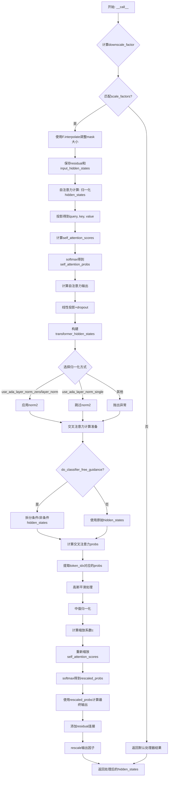

#### 带注释源码

```python
def __call__(
    self,
    attn: Attention,
    hidden_states: torch.Tensor,
    encoder_hidden_states: Optional[torch.Tensor] = None,
    attention_mask: Optional[torch.Tensor] = None,
    temb: Optional[torch.Tensor] = None,
    scale: float = 1.0,
) -> torch.Tensor:
    """
    PAIntA (Prompt-Aware Intersectional Attention) 处理器
    结合自注意力和交叉注意力，通过交叉注意力得分来调整自注意力权重
    
    参数:
        attn: Attention模块，包含to_q, to_k, to_v投影和归一化层
        hidden_states: 输入隐藏状态
        encoder_hidden_states: 编码器隐藏状态（文本嵌入）
        attention_mask: 注意力掩码
        temb: 时间嵌入
        scale: 缩放因子
    
    返回:
        处理后的隐藏状态张量
    """
    
    # -------------------------------------------------------------
    # 第一步: 自动识别分辨率并调整掩码大小
    # -------------------------------------------------------------
    # 根据当前层的分辨率计算下采样因子
    downscale_factor = self.mask_resoltuion // hidden_states.shape[1]

    # 根据scale_factors列表查找匹配的掩码尺寸并调整
    mask = None
    for factor in self.scale_factors:
        if downscale_factor == factor**2:
            # 计算目标形状并使用双线性插值调整掩码大小
            shape = (self.shape[0] // factor, self.shape[1] // factor)
            mask = F.interpolate(self.mask, shape, mode="bicubic")
            break
    
    # 如果没有匹配的scale_factor，使用默认处理器
    if mask is None:
        return self.default_processor(attn, hidden_states, encoder_hidden_states, attention_mask, temb, scale)

    # -------------------------------------------------------------
    # 第二步: 自注意力计算 (Self Attention 1)
    # -------------------------------------------------------------
    # 保存残差连接用的原始输入
    residual = hidden_states
    input_hidden_states = hidden_states

    # 空间归一化（如果存在）
    if attn.spatial_norm is not None:
        hidden_states = attn.spatial_norm(hidden_states, temb)

    # 处理4D张量: (B, C, H, W) -> (B, H*W, C)
    input_ndim = hidden_states.ndim
    if input_ndim == 4:
        batch_size, channel, height, width = hidden_states.shape
        hidden_states = hidden_states.view(batch_size, channel, height * width).transpose(1, 2)

    # 确定序列长度并准备注意力掩码
    batch_size, sequence_length, _ = (
        hidden_states.shape if encoder_hidden_states is None else encoder_hidden_states.shape
    )
    attention_mask = attn.prepare_attention_mask(attention_mask, sequence_length, batch_size)

    # 组归一化
    if attn.group_norm is not None:
        hidden_states = attn.group_norm(hidden_states.transpose(1, 2)).transpose(1, 2)

    # Query投影 (自注意力使用自身作为key和value的来源)
    query = attn.to_q(hidden_states)

    # 处理编码器隐藏状态
    if encoder_hidden_states is None:
        encoder_hidden_states = hidden_states
    elif attn.norm_cross:
        encoder_hidden_states = attn.norm_encoder_hidden_states(encoder_hidden_states)

    # Key和Value投影
    key = attn.to_k(encoder_hidden_states)
    value = attn.to_v(encoder_hidden_states)

    # 转换为多头维度: (B, L, C) -> (B, heads, L, head_dim)
    query = attn.head_to_batch_dim(query)
    key = attn.head_to_batch_dim(key)
    value = attn.head_to_batch_dim(value)

    # 获取注意力分数（softmax之前的原始分数）
    self_attention_scores = get_attention_scores(attn, query, key, attention_mask)
    # 手动计算softmax，保留分数供后续使用
    self_attention_probs = self_attention_scores.softmax(dim=-1)
    self_attention_probs = self_attention_probs.to(query.dtype)

    # 注意力加权求和: (B, heads, L, head_dim) -> (B, heads, L, head_dim)
    hidden_states = torch.bmm(self_attention_probs, value)
    hidden_states = attn.batch_to_head_dim(hidden_states)

    # 输出投影和dropout
    hidden_states = attn.to_out[0](hidden_states)
    hidden_states = attn.to_out[1](hidden_states)

    # 恢复4D张量形状: (B, H*W, C) -> (B, C, H, W)
    if input_ndim == 4:
        hidden_states = hidden_states.transpose(-1, -2).reshape(batch_size, channel, height, width)

    # 残差连接
    if attn.residual_connection:
        hidden_states = hidden_states + residual

    # 缩放输出
    self_attention_output_hidden_states = hidden_states / attn.rescale_output_factor

    # -------------------------------------------------------------
    # 第三步: BasicTransformerBlock中间处理
    # -------------------------------------------------------------
    # 反归一化输入hidden states（因为BasicTransformerBlock的残差是未归一化的）
    unnormalized_input_hidden_states = (
        input_hidden_states + self.transformer_block.norm1.bias
    ) * self.transformer_block.norm1.weight

    # 构建transformer hidden states
    transformer_hidden_states = self_attention_output_hidden_states + unnormalized_input_hidden_states
    if transformer_hidden_states.ndim == 4:
        transformer_hidden_states = transformer_hidden_states.squeeze(1)

    # 应用norm2（根据配置选择不同的归一化方式）
    if self.transformer_block.use_ada_layer_norm:
        raise NotImplementedError()
    elif self.transformer_block.use_ada_layer_norm_zero or self.transformer_block.use_layer_norm:
        transformer_norm_hidden_states = self.transformer_block.norm2(transformer_hidden_states)
    elif self.transformer_block.use_ada_layer_norm_single:
        # PixArt特殊处理：不做norm2
        transformer_norm_hidden_states = transformer_hidden_states
    elif self.transformer_block.use_ada_layer_norm_continuous:
        raise NotImplementedError()
    else:
        raise ValueError("Incorrect norm")

    # 应用位置嵌入（如果存在）
    if self.transformer_block.pos_embed is not None and self.transformer_block.use_ada_layer_norm_single is False:
        transformer_norm_hidden_states = self.transformer_block.pos_embed(transformer_norm_hidden_states)

    # -------------------------------------------------------------
    # 第四步: 交叉注意力计算 (Cross Attention)
    # -------------------------------------------------------------
    # 准备交叉注意力输入
    cross_attention_input_hidden_states = transformer_norm_hidden_states

    # 分类器自由引导时拆分条件/非条件部分
    if self.do_classifier_free_guidance:
        (
            _cross_attention_input_hidden_states_unconditional,
            cross_attention_input_hidden_states_conditional,
        ) = cross_attention_input_hidden_states.chunk(2)
        
        # 拆分encoder_hidden_states
        _encoder_hidden_states_unconditional, encoder_hidden_states_conditional = self.encoder_hidden_states.chunk(2)
    else:
        cross_attention_input_hidden_states_conditional = cross_attention_input_hidden_states
        encoder_hidden_states_conditional = self.encoder_hidden_states.chunk(2)

    # 简化变量名
    cross_attention_hidden_states = cross_attention_input_hidden_states_conditional
    cross_attention_encoder_hidden_states = encoder_hidden_states_conditional

    # 获取cross attention模块
    attn2 = self.transformer_block.attn2

    # 空间归一化
    if attn2.spatial_norm is not None:
        cross_attention_hidden_states = attn2.spatial_norm(cross_attention_hidden_states, temb)

    # 维度处理
    input_ndim = cross_attention_hidden_states.ndim
    if input_ndim == 4:
        batch_size, channel, height, width = cross_attention_hidden_states.shape
        cross_attention_hidden_states = cross_attention_hidden_states.view(
            batch_size, channel, height * width
        ).transpose(1, 2)

    batch_size, sequence_length, _ = cross_attention_hidden_states.shape
    
    # 准备注意力掩码
    attention_mask = attn2.prepare_attention_mask(None, sequence_length, batch_size)

    # 组归一化
    if attn2.group_norm is not None:
        cross_attention_hidden_states = attn2.group_norm(cross_attention_hidden_states.transpose(1, 2)).transpose(1, 2)

    # Query投影
    query2 = attn2.to_q(cross_attention_hidden_states)

    # Key归一化
    if attn2.norm_cross:
        cross_attention_encoder_hidden_states = attn2.norm_encoder_hidden_states(cross_attention_encoder_hidden_states)

    # Key投影和维度转换
    key2 = attn2.to_k(cross_attention_encoder_hidden_states)
    query2 = attn2.head_to_batch_dim(query2)
    key2 = attn2.head_to_batch_dim(key2)

    # 计算交叉注意力概率
    cross_attention_probs = attn2.get_attention_scores(query2, key2, attention_mask)

    # -------------------------------------------------------------
    # 第五步: 计算缩放系数 (Self Attention 2)
    # -------------------------------------------------------------
    # 二值化掩码
    mask = (mask > 0.5).to(self_attention_output_hidden_states.dtype)
    m = mask.to(self_attention_output_hidden_states.device)
    # (B, C, H, W) -> (B, H*W, C) -> (B, H*W, H*W)
    m = m.permute(0, 2, 3, 1).reshape((m.shape[0], -1, m.shape[1])).contiguous()
    m = torch.matmul(m, m.permute(0, 2, 1)) + (1 - m)

    # 从交叉注意力中提取指定token的注意力值
    batch_size, dims, channels = cross_attention_probs.shape
    batch_size = batch_size // attn.heads
    # 重塑为 (batch, heads, dims, channels)
    cross_attention_probs = cross_attention_probs.reshape((batch_size, attn.heads, dims, channels))
    # 对heads维度求平均
    cross_attention_probs = cross_attention_probs.mean(dim=1)
    # 提取指定token索引的注意力并求和
    cross_attention_probs = cross_attention_probs[..., self.token_idx].sum(dim=-1)
    # 恢复形状为 (B, H, W)
    cross_attention_probs = cross_attention_probs.reshape((batch_size,) + shape)

    # 高斯平滑处理
    gaussian_smoothing = GaussianSmoothing(channels=1, kernel_size=3, sigma=0.5, dim=2).to(
        self_attention_output_hidden_states.device
    )
    cross_attention_probs = gaussian_smoothing(cross_attention_probs[:, None])[:, 0]

    # 中值归一化
    cross_attention_probs = cross_attention_probs.reshape(batch_size, -1)
    cross_attention_probs = (
        cross_attention_probs - cross_attention_probs.median(dim=-1, keepdim=True).values
    ) / cross_attention_probs.max(dim=-1, keepdim=True).values
    cross_attention_probs = cross_attention_probs.clip(0, 1)

    # 计算最终缩放系数c
    c = (1 - m) * cross_attention_probs.reshape(batch_size, 1, -1) + m
    c = c.repeat_interleave(attn.heads, 0)  # 扩展到所有heads
    
    # 分类器自由引导时复制系数
    if self.do_classifier_free_guidance:
        c = torch.cat([c, c])

    # -------------------------------------------------------------
    # 第六步: 使用缩放系数重新计算自注意力
    # -------------------------------------------------------------
    # 使用缩放系数调整注意力分数
    self_attention_scores_rescaled = self_attention_scores * c
    self_attention_probs_rescaled = self_attention_scores_rescaled.softmax(dim=-1)

    # 重新计算注意力输出
    hidden_states = torch.bmm(self_attention_probs_rescaled, value)
    hidden_states = attn.batch_to_head_dim(hidden_states)

    # 输出投影
    hidden_states = attn.to_out[0](hidden_states)
    hidden_states = attn.to_out[1](hidden_states)

    # 恢复形状
    if input_ndim == 4:
        hidden_states = hidden_states.transpose(-1, -2).reshape(batch_size, channel, height, width)

    # 残差连接
    if attn.residual_connection:
        hidden_states = hidden_states + input_hidden_states

    # 最终缩放
    hidden_states = hidden_states / attn.rescale_output_factor

    return hidden_states
```


### `StableDiffusionHDPainterPipeline.get_tokenized_prompt`

该方法接收文本提示（prompt），通过内部绑定的分词器（tokenizer）进行分词处理，然后将分词后的 token IDs 解码为可读文本并返回字符串列表。该方法主要用于后续获取特定 token 索引，以便在 HD-Painter 管道中定位需要处理的 token 位置。

参数：

- `prompt`：`str`，输入的文本提示（prompt），需要进行分词处理的原始文本

返回值：`List[str]`，解码后的 token 文本列表，每个元素对应一个 token 的字符串表示

#### 流程图

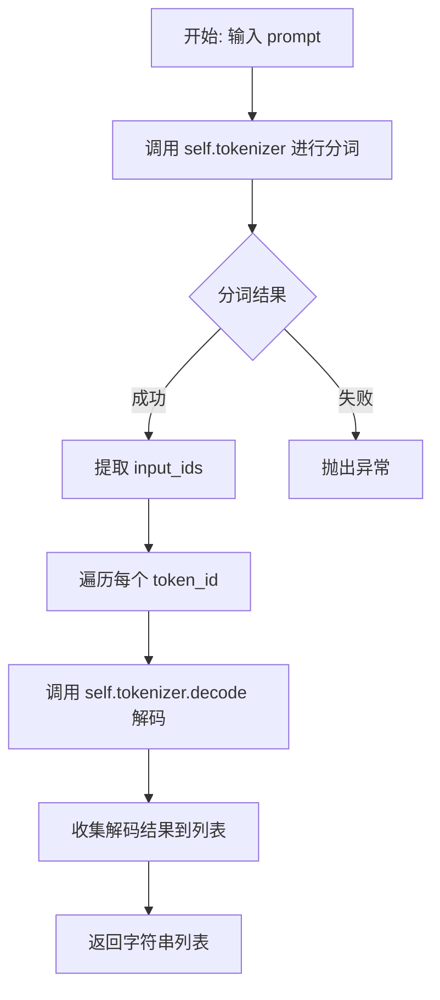

#### 带注释源码

```
def get_tokenized_prompt(self, prompt):
    """
    获取 tokenized 的 prompt，将分词后的 token IDs 解码为文本字符串列表
    
    参数:
        prompt: 输入的文本提示
    返回:
        解码后的 token 文本列表
    """
    # Step 1: 使用分词器对 prompt 进行分词
    # 返回结果包含 'input_ids' 和 'attention_mask' 等字段
    out = self.tokenizer(prompt)
    
    # Step 2: 遍历每个 token_id 并解码为可读文本
    # 使用列表推导式将所有 token ID 转换为字符串
    return [self.tokenizer.decode(x) for x in out["input_ids"]]
```


### `StableDiffusionHDPainterPipeline.init_attn_processors`

该方法用于初始化 Stable Diffusion HD-Painter 管道中的注意力处理器。它根据配置参数（是否启用 PAIntA 和 RASG）分别为 UNet 模型的自我注意力和交叉注意力层设置自定义的注意力处理器（`PAIntAAttnProcessor` 或 `RASGAttnProcessor`），以实现高质量的图像修复功能。

参数：

- `mask`：`torch.Tensor`，掩码张量，用于标识需要修复的区域
- `token_idx`：待修复 token 的索引列表，指定哪些文本 token 参与注意力计算
- `use_painta`：`bool`，是否启用 PAIntA（Paint Attention）注意力处理器，默认为 True
- `use_rasg`：`bool`，是否启用 RASG（Regional Attention Score Guidance）注意力处理器，默认为 True
- `painta_scale_factors`：`List[int]`或`List[float]`，PAIntA 的缩放因子列表，用于适配不同分辨率的注意力层，默认为 [2, 4]
- `rasg_scale_factor`：`int`或`float`，RASG 的缩放因子，用于计算掩码分辨率，默认为 4
- `self_attention_layer_name`：`str`，自我注意力层的名称标识符，默认为 "attn1"
- `cross_attention_layer_name`：`str`，交叉注意力层的名称标识符，默认为 "attn2"
- `list_of_painta_layer_names`：`Optional[List[str]]`，可选的 PAIntA 层名称列表，如果为 None 则根据 `self_attention_layer_name` 自动匹配
- `list_of_rasg_layer_names`：`Optional[List[str]]`，可选的 RASG 层名称列表，如果为 None 则根据 `cross_attention_layer_name` 自动匹配

返回值：`None`，该方法直接修改 `self.unet.attn_processors` 内部状态，不返回任何值

#### 流程图

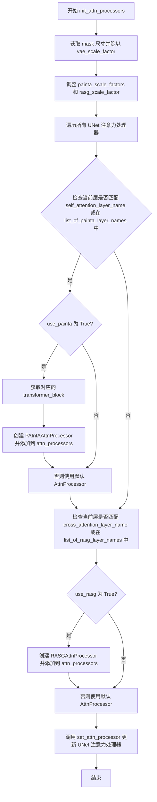

#### 带注释源码

```python
def init_attn_processors(
    self,
    mask,
    token_idx,
    use_painta=True,
    use_rasg=True,
    painta_scale_factors=[2, 4],  # 64x64 -> [16x16, 32x32]
    rasg_scale_factor=4,  # 64x64 -> 16x16
    self_attention_layer_name="attn1",
    cross_attention_layer_name="attn2",
    list_of_painta_layer_names=None,
    list_of_rasg_layer_names=None,
):
    """
    初始化注意力处理器，根据配置为 UNet 的不同层设置自定义处理器
    
    Args:
        mask: 掩码张量，用于标识需要修复的区域
        token_idx: 需要修改的 token 索引
        use_painta: 是否启用 PAIntA 注意力处理器
        use_rasg: 是否启用 RASG 注意力处理器
        painta_scale_factors: PAIntA 缩放因子列表
        rasg_scale_factor: RASG 缩放因子
        self_attention_layer_name: 自我注意力层名称标识符
        cross_attention_layer_name: 交叉注意力层名称标识符
        list_of_painta_layer_names: PAIntA 层名称列表
        list_of_rasg_layer_names: RASG 层名称列表
    """
    default_processor = AttnProcessor()  # 创建默认注意力处理器
    width, height = mask.shape[-2:]  # 获取掩码尺寸
    # 将掩码尺寸转换为 VAE  latent 空间的尺寸
    width, height = width // self.vae_scale_factor, height // self.vae_scale_factor

    # 根据 VAE 缩放因子调整缩放因子
    painta_scale_factors = [x * self.vae_scale_factor for x in painta_scale_factors]
    rasg_scale_factor = self.vae_scale_factor * rasg_scale_factor

    attn_processors = {}  # 存储注意力处理器的字典
    # 遍历 UNet 的所有注意力处理器
    for x in self.unet.attn_processors:
        # 检查是否是自我注意力层且需要使用 PAIntA
        if (list_of_painta_layer_names is None and self_attention_layer_name in x) or (
            list_of_painta_layer_names is not None and x in list_of_painta_layer_names
        ):
            if use_painta:
                # 获取对应的 transformer block 模块
                transformer_block = self.unet.get_submodule(x.replace(".attn1.processor", ""))
                # 创建 PAIntA 注意力处理器
                attn_processors[x] = PAIntAAttnProcessor(
                    transformer_block, mask, token_idx, self.do_classifier_free_guidance, painta_scale_factors
                )
            else:
                # 使用默认处理器
                attn_processors[x] = default_processor
        # 检查是否是交叉注意力层且需要使用 RASG
        elif (list_of_rasg_layer_names is None and cross_attention_layer_name in x) or (
            list_of_rasg_layer_names is not None and x in list_of_rasg_layer_names
        ):
            if use_rasg:
                # 创建 RASG 注意力处理器
                attn_processors[x] = RASGAttnProcessor(mask, token_idx, rasg_scale_factor)
            else:
                # 使用默认处理器
                attn_processors[x] = default_processor

    # 更新 UNet 的注意力处理器
    self.unet.set_attn_processor(attn_processors)
```


### `StableDiffusionHDPainterPipeline.__call__`

这是HD-Painter管道的主推理方法，集成了RASG（Region-Aware Self-Guidance）和PAIntA（Patch-wise Attention for Inpainting）两种创新注意力机制，通过在去噪过程中注入基于注意力的梯度来实现高质量的图像修复。

#### 参数

- `prompt`：`Union[str, List[str]]`，输入文本提示，用于指导图像修复内容
- `image`：`PipelineImageInput`，需要修复的原始图像
- `mask_image`：`PipelineImageInput`，修复区域的掩码图像
- `masked_image_latents`：`torch.Tensor`，可选，预处理的掩码图像潜在表示
- `height`：`Optional[int]`，输出图像高度，默认由unet配置和vae_scale_factor决定
- `width`：`Optional[int]`，输出图像宽度，默认由unet配置和vae_scale_factor决定
- `padding_mask_crop`：`Optional[int]`，可选的掩码裁剪填充值
- `strength`：`float`，修复强度，控制噪声添加到原始图像的程度，默认1.0
- `num_inference_steps`：`int`，去噪迭代步数，默认50
- `timesteps`：`List[int]`，可选的自定义时间步列表
- `guidance_scale`：`float`，分类器自由引导（CFG）比例，默认7.5
- `positive_prompt`：`str | None`，要添加到提示词的正向提示，默认""
- `negative_prompt`：`Optional[Union[str, List[str]]]`，负向提示，用于引导模型避免生成某些内容
- `num_images_per_prompt`：`Optional[int]`，每个提示生成的图像数量，默认1
- `eta`：`float`，DDIM采样器的随机性参数，默认0.01
- `generator`：`Optional[torch.Generator]`，随机数生成器，用于可重复性
- `latents`：`Optional[torch.Tensor]`，可选的初始潜在变量
- `prompt_embeds`：`Optional[torch.Tensor]`，可选的预计算提示嵌入
- `negative_prompt_embeds`：`Optional[torch.Tensor]`，可选的预计算负向提示嵌入
- `ip_adapter_image`：`Optional[PipelineImageInput]`，IP-Adapter图像输入
- `output_type`：`str | None`，输出类型，默认"pil"
- `return_dict`：`bool`，是否返回字典格式输出，默认True
- `cross_attention_kwargs`：`Optional[Dict[str, Any]]`，交叉注意力额外参数
- `clip_skip`：`int`，CLIP跳过的层数
- `callback_on_step_end`：`Optional[Callable[[int, int, Dict], None]]`，每步结束时的回调函数
- `callback_on_step_end_tensor_inputs`：`List[str]`，回调函数需要处理的张量输入，默认["latents"]
- `use_painta`：`bool`，是否启用PAIntA注意力机制，默认True
- `use_rasg`：`bool`，是否启用RASG注意力机制，默认True
- `self_attention_layer_name`：`.attn1`，自注意力层名称过滤器
- `cross_attention_layer_name`：`.attn2`，交叉注意力层名称过滤器
- `painta_scale_factors`：`[2, 4]`，PAIntA的缩放因子列表
- `rasg_scale_factor`：`int`，RASG的缩放因子，默认4
- `list_of_painta_layer_names`：可选的PAIntA层名称列表
- `list_of_rasg_layer_names`：可选的RASG层名称列表
- `**kwargs`：其他未明确列出的关键字参数

#### 返回值

`StableDiffusionPipelineOutput`，包含以下属性：
- `images`：`List[PIL.Image]` 或 `torch.Tensor`，修复后的图像列表
- `nsfw_content_detected`：`List[bool]`，检测到的NSFW内容标志

如果 `return_dict=False`，则返回元组 `(image, has_nsfw_concept)`

#### 流程图

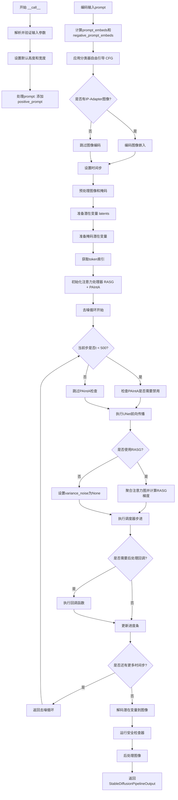

#### 带注释源码

```python
@torch.no_grad()
def __call__(
    self,
    prompt: Union[str, List[str]] = None,
    image: PipelineImageInput = None,
    mask_image: PipelineImageInput = None,
    masked_image_latents: torch.Tensor = None,
    height: Optional[int] = None,
    width: Optional[int] = None,
    padding_mask_crop: Optional[int] = None,
    strength: float = 1.0,
    num_inference_steps: int = 50,
    timesteps: List[int] = None,
    guidance_scale: float = 7.5,
    positive_prompt: str | None = "",
    negative_prompt: Optional[Union[str, List[str]]] = None,
    num_images_per_prompt: Optional[int] = 1,
    eta: float = 0.01,
    generator: Optional[Union[torch.Generator, List[torch.Generator]]] = None,
    latents: Optional[torch.Tensor] = None,
    prompt_embeds: Optional[torch.Tensor] = None,
    negative_prompt_embeds: Optional[torch.Tensor] = None,
    ip_adapter_image: Optional[PipelineImageInput] = None,
    output_type: str | None = "pil",
    return_dict: bool = True,
    cross_attention_kwargs: Optional[Dict[str, Any]] = None,
    clip_skip: int = None,
    callback_on_step_end: Optional[Callable[[int, int, Dict], None]] = None,
    callback_on_step_end_tensor_inputs: List[str] = ["latents"],
    use_painta: bool = True,
    use_rasg: bool = True,
    self_attention_layer_name: str = ".attn1",
    cross_attention_layer_name: str = ".attn2",
    painta_scale_factors: List[int] = [2, 4],
    rasg_scale_factor: int = 4,
    list_of_painta_layer_names: Optional[List[str]] = None,
    list_of_rasg_layer_names: Optional[List[str]] = None,
    **kwargs,
):
    # 1. 处理已废弃的回调参数
    callback = kwargs.pop("callback", None)
    callback_steps = kwargs.pop("callback_steps", None)
    # 对废弃的callback参数发出警告
    if callback is not None:
        deprecate("callback", "1.0.0", "Passing `callback` as an input argument to `__call__` is deprecated...")
    if callback_steps is not None:
        deprecate("callback_steps", "1.0.0", "Passing `callback_steps` as an input argument to `__call__` is deprecated...")

    # 2. 设置默认高度和宽度（基于UNet配置和VAE缩放因子）
    height = height or self.unet.config.sample_size * self.vae_scale_factor
    width = width or self.unet.config.sample_size * self.vae_scale_factor

    # 3. 保存原始prompt并添加正向提示
    prompt_no_positives = prompt  # 保存原始prompt用于tokenization
    if isinstance(prompt, list):
        prompt = [x + positive_prompt for x in prompt]
    else:
        prompt = prompt + positive_prompt

    # 4. 验证输入参数
    self.check_inputs(
        prompt, image, mask_image, height, width, strength, callback_steps,
        negative_prompt, prompt_embeds, negative_prompt_embeds,
        callback_on_step_end_tensor_inputs, padding_mask_crop
    )

    # 5. 设置引导相关配置
    self._guidance_scale = guidance_scale
    self._clip_skip = clip_skip
    self._cross_attention_kwargs = cross_attention_kwargs
    self._interrupt = False

    # 6. 确定批次大小
    if prompt is not None and isinstance(prompt, str):
        batch_size = 1
    elif prompt is not None and isinstance(prompt, list):
        batch_size = len(prompt)
    else:
        batch_size = prompt_embeds.shape[0]

    device = self._execution_device

    # 7. 编码输入prompt
    text_encoder_lora_scale = (
        cross_attention_kwargs.get("scale", None) if cross_attention_kwargs is not None else None
    )
    prompt_embeds, negative_prompt_embeds = self.encode_prompt(
        prompt, device, num_images_per_prompt, self.do_classifier_free_guidance,
        negative_prompt, prompt_embeds, negative_prompt_embeds,
        lora_scale=text_encoder_lora_scale, clip_skip=self.clip_skip,
    )
    
    # 8. 应用分类器自由引导（CFG）：将无条件嵌入和有条件嵌入拼接
    if self.do_classifier_free_guidance:
        prompt_embeds = torch.cat([negative_prompt_embeds, prompt_embeds])

    # 9. 处理IP-Adapter图像嵌入
    if ip_adapter_image is not None:
        output_hidden_state = False if isinstance(self.unet.encoder_hid_proj, ImageProjection) else True
        image_embeds, negative_image_embeds = self.encode_image(
            ip_adapter_image, device, num_images_per_prompt, output_hidden_state
        )
        if self.do_classifier_free_guidance:
            image_embeds = torch.cat([negative_image_embeds, image_embeds])

    # 10. 设置时间步和推理步数
    timesteps, num_inference_steps = retrieve_timesteps(self.scheduler, num_inference_steps, device, timesteps)
    timesteps, num_inference_steps = self.get_timesteps(
        num_inference_steps=num_inference_steps, strength=strength, device=device
    )
    # 验证步数有效性
    if num_inference_steps < 1:
        raise ValueError(f"After adjusting the num_inference_steps by strength: {strength}, steps is {num_inference_steps}...")
    
    # 初始噪声时间步（强度的50%对应于0.5的强度）
    latent_timestep = timesteps[:1].repeat(batch_size * num_images_per_prompt)
    is_strength_max = strength == 1.0

    # 11. 预处理掩码和图像
    if padding_mask_crop is not None:
        crops_coords = self.mask_processor.get_crop_region(mask_image, width, height, pad=padding_mask_crop)
        resize_mode = "fill"
    else:
        crops_coords = None
        resize_mode = "default"

    original_image = image
    init_image = self.image_processor.preprocess(
        image, height=height, width=width, crops_coords=crops_coords, resize_mode=resize_mode
    )
    init_image = init_image.to(dtype=torch.float32)

    # 12. 准备潜在变量
    num_channels_latents = self.vae.config.latent_channels
    num_channels_unet = self.unet.config.in_channels
    return_image_latents = num_channels_unet == 4

    latents_outputs = self.prepare_latents(
        batch_size * num_images_per_prompt, num_channels_latents, height, width,
        prompt_embeds.dtype, device, generator, latents, image=init_image,
        timestep=latent_timestep, is_strength_max=is_strength_max,
        return_noise=True, return_image_latents=return_image_latents,
    )

    if return_image_latents:
        latents, noise, image_latents = latents_outputs
    else:
        latents, noise = latents_outputs

    # 13. 准备掩码潜在变量
    mask_condition = self.mask_processor.preprocess(
        mask_image, height=height, width=width, resize_mode=resize_mode, crops_coords=crops_coords
    )

    if masked_image_latents is None:
        # 将未被掩码覆盖的图像区域保留
        masked_image = init_image * (mask_condition < 0.5)
    else:
        masked_image = masked_image_latents

    mask, masked_image_latents = self.prepare_mask_latents(
        mask_condition, masked_image, batch_size * num_images_per_prompt,
        height, width, prompt_embeds.dtype, device, generator,
        self.do_classifier_free_guidance,
    )

    # 14. HD-Painter特定设置：获取需要修改的token索引
    # 解析prompt获取token索引范围（从开始到结束标记）
    token_idx = list(range(1, self.get_tokenized_prompt(prompt_no_positives).index("<|endoftext|>"))) + [
        self.get_tokenized_prompt(prompt).index("<|endoftext|>")
    ]

    # 15. 初始化注意力处理器（RASG和PAIntA）
    self.init_attn_processors(
        mask_condition, token_idx, use_painta, use_rasg,
        painta_scale_factors=painta_scale_factors,
        rasg_scale_factor=rasg_scale_factor,
        self_attention_layer_name=self_attention_layer_name,
        cross_attention_layer_name=cross_attention_layer_name,
        list_of_painta_layer_names=list_of_painta_layer_names,
        list_of_rasg_layer_names=list_of_rasg_layer_names,
    )

    # 16. 验证掩码、掩码图像和潜在变量的尺寸匹配
    if num_channels_unet == 9:
        num_channels_mask = mask.shape[1]
        num_channels_masked_image = masked_image_latents.shape[1]
        if num_channels_latents + num_channels_mask + num_channels_masked_image != self.unet.config.in_channels:
            raise ValueError(f"Incorrect configuration settings!...")
    elif num_channels_unet != 4:
        raise ValueError(f"The unet {self.unet.__class__} should have either 4 or 9 input channels...")

    # 17. 准备额外步参数
    extra_step_kwargs = self.prepare_extra_step_kwargs(generator, eta)
    if use_rasg:
        extra_step_kwargs["generator"] = None  # RASG需要确定性生成

    # 18. IP-Adapter图像嵌入
    added_cond_kwargs = {"image_embeds": image_embeds} if ip_adapter_image is not None else None

    # 19. 可选：获取引导比例嵌入
    timestep_cond = None
    if self.unet.config.time_cond_proj_dim is not None:
        guidance_scale_tensor = torch.tensor(self.guidance_scale - 1).repeat(batch_size * num_images_per_prompt)
        timestep_cond = self.get_guidance_scale_embedding(
            guidance_scale_tensor, embedding_dim=self.unet.config.time_cond_proj_dim
        ).to(device=device, dtype=latents.dtype)

    # 20. 去噪循环
    num_warmup_steps = len(timesteps) - num_inference_steps * self.scheduler.order
    self._num_timesteps = len(timesteps)
    painta_active = True  # 标志：PAIntA是否活跃

    with self.progress_bar(total=num_inference_steps) as progress_bar:
        for i, t in enumerate(timesteps):
            if self.interrupt:
                continue

            # 当时间步小于500时，禁用PAIntA（早期阶段需要全局注意力）
            if t < 500 and painta_active:
                self.init_attn_processors(
                    mask_condition, token_idx, False, use_rasg,  # use_painta=False
                    painta_scale_factors=painta_scale_factors,
                    rasg_scale_factor=rasg_scale_factor,
                    self_attention_layer_name=self_attention_layer_name,
                    cross_attention_layer_name=cross_attention_layer_name,
                    list_of_painta_layer_names=list_of_painta_layer_names,
                    list_of_rasg_layer_names=list_of_rasg_layer_names,
                )
                painta_active = False

            # 启用梯度计算（用于RASG）
            with torch.enable_grad():
                self.unet.zero_grad()
                latents = latents.detach()
                latents.requires_grad = True

                # 扩展潜在变量（用于CFG）
                latent_model_input = torch.cat([latents] * 2) if self.do_classifier_free_guidance else latents

                # 在通道维度拼接：latents + mask + masked_image_latents
                latent_model_input = self.scheduler.scale_model_input(latent_model_input, t)

                if num_channels_unet == 9:
                    latent_model_input = torch.cat([latent_model_input, mask, masked_image_latents], dim=1)

                self.scheduler.latents = latents
                self.encoder_hidden_states = prompt_embeds
                # 为所有注意力处理器设置encoder_hidden_states
                for attn_processor in self.unet.attn_processors.values():
                    attn_processor.encoder_hidden_states = prompt_embeds

                # 预测噪声残差
                noise_pred = self.unet(
                    latent_model_input, t,
                    encoder_hidden_states=prompt_embeds,
                    timestep_cond=timestep_cond,
                    cross_attention_kwargs=self.cross_attention_kwargs,
                    added_cond_kwargs=added_cond_kwargs,
                    return_dict=False,
                )[0]

                # 应用分类器自由引导
                if self.do_classifier_free_guidance:
                    noise_pred_uncond, noise_pred_text = noise_pred.chunk(2)
                    noise_pred = noise_pred_uncond + self.guidance_scale * (noise_pred_text - noise_pred_uncond)

                # 21. RASG：基于注意力的梯度注入
                if use_rasg:
                    _, _, height, width = mask_condition.shape
                    scale_factor = self.vae_scale_factor * rasg_scale_factor  # 8 * 4 = 32

                    # 调整RASG掩码分辨率
                    rasg_mask = F.interpolate(
                        mask_condition, (height // scale_factor, width // scale_factor), mode="bicubic"
                    )[0, 0]

                    # 聚合保存的注意力图
                    attn_map = []
                    for processor in self.unet.attn_processors.values():
                        if hasattr(processor, "attention_scores") and processor.attention_scores is not None:
                            if self.do_classifier_free_guidance:
                                attn_map.append(processor.attention_scores.chunk(2)[1])
                            else:
                                attn_map.append(processor.attention_scores)

                    # 重组注意力图
                    attn_map = (
                        torch.cat(attn_map).mean(0).permute(1, 0)
                        .reshape((-1, height // scale_factor, width // scale_factor))
                    )

                    # 计算注意力分数（二元交叉熵）
                    attn_score = -sum(
                        [
                            F.binary_cross_entropy_with_logits(x - 1.0, rasg_mask.to(device))
                            for x in attn_map[token_idx]
                        ]
                    )

                    # 反向传播注意力分数
                    attn_score.backward()

                    # 标准化梯度
                    variance_noise = latents.grad.detach()
                    variance_noise -= torch.mean(variance_noise, [1, 2, 3], keepdim=True)
                    variance_noise /= torch.std(variance_noise, [1, 2, 3], keepdim=True)
                else:
                    variance_noise = None

            # 22. 调度器步进：x_t -> x_{t-1}
            latents = self.scheduler.step(
                noise_pred, t, latents, **extra_step_kwargs, return_dict=False, variance_noise=variance_noise
            )[0]

            # 23. 混合原始图像潜在变量（针对4通道UNet）
            if num_channels_unet == 4:
                init_latents_proper = image_latents
                if self.do_classifier_free_guidance:
                    init_mask, _ = mask.chunk(2)
                else:
                    init_mask = mask

                if i < len(timesteps) - 1:
                    noise_timestep = timesteps[i + 1]
                    init_latents_proper = self.scheduler.add_noise(
                        init_latents_proper, noise, torch.tensor([noise_timestep])
                    )

                # 按掩码混合：原始内容 + 修复内容
                latents = (1 - init_mask) * init_latents_proper + init_mask * latents

            # 24. 步结束回调
            if callback_on_step_end is not None:
                callback_kwargs = {}
                for k in callback_on_step_end_tensor_inputs:
                    callback_kwargs[k] = locals()[k]
                callback_outputs = callback_on_step_end(self, i, t, callback_kwargs)

                latents = callback_outputs.pop("latents", latents)
                prompt_embeds = callback_outputs.pop("prompt_embeds", prompt_embeds)
                negative_prompt_embeds = callback_outputs.pop("negative_prompt_embeds", negative_prompt_embeds)
                mask = callback_outputs.pop("mask", mask)
                masked_image_latents = callback_outputs.pop("masked_image_latents", masked_image_latents)

            # 25. 调用进度条和传统回调
            if i == len(timesteps) - 1 or ((i + 1) > num_warmup_steps and (i + 1) % self.scheduler.order == 0):
                progress_bar.update()
                if callback is not None and i % callback_steps == 0:
                    step_idx = i // getattr(self.scheduler, "order", 1)
                    callback(step_idx, t, latents)

    # 26. 后处理：将潜在变量解码为图像
    if not output_type == "latent":
        condition_kwargs = {}
        if isinstance(self.vae, AsymmetricAutoencoderKL):
            init_image = init_image.to(device=device, dtype=masked_image_latents.dtype)
            init_image_condition = init_image.clone()
            init_image = self._encode_vae_image(init_image, generator=generator)
            mask_condition = mask_condition.to(device=device, dtype=masked_image_latents.dtype)
            condition_kwargs = {"image": init_image_condition, "mask": mask_condition}
        
        image = self.vae.decode(
            latents / self.vae.config.scaling_factor,
            return_dict=False, generator=generator, **condition_kwargs
        )[0]
        
        # 运行NSFW安全检查
        image, has_nsfw_concept = self.run_safety_checker(image, device, prompt_embeds.dtype)
    else:
        image = latents
        has_nsfw_concept = None

    # 27. 去归一化
    if has_nsfw_concept is None:
        do_denormalize = [True] * image.shape[0]
    else:
        do_denormalize = [not has_nsfw for has_nsfw in has_nsfw_concept]

    image = self.image_processor.postprocess(image, output_type=output_type, do_denormalize=do_denormalize)

    # 28. 应用叠加（如需要）
    if padding_mask_crop is not None:
        image = [self.image_processor.apply_overlay(mask_image, original_image, i, crops_coords) for i in image]

    # 释放模型钩子
    self.maybe_free_model_hooks()

    # 29. 返回结果
    if not return_dict:
        return (image, has_nsfw_concept)

    return StableDiffusionPipelineOutput(images=image, nsfw_content_detected=has_nsfw_concept)
```


### GaussianSmoothing.__init__

初始化高斯平滑卷积核，用于对输入的张量应用高斯模糊滤波。该类通过深度卷积的方式分别对输入的每个通道进行高斯平滑处理，支持1D、2D和3D数据。

参数：

- `channels`：`int` 或 `sequence`，输入和输出张量的通道数
- `kernel_size`：`int` 或 `sequence`，高斯核的大小
- `sigma`：`float` 或 `sequence`，高斯核的标准差
- `dim`：`int`，数据的维度，默认为2（空间维度）

返回值：`None`，在对象内部初始化高斯核权重

#### 流程图

```mermaid
flowchart TD
    A[开始 __init__] --> B{检查 kernel_size 类型}
    B -->|是单个数字| C[将 kernel_size 扩展为 dim 维序列]
    B -->|是序列| D[保持原样]
    C --> E{检查 sigma 类型}
    D --> E
    E -->|是单个数字| F[将 sigma 扩展为 dim 维序列]
    E -->|是序列| G[保持原样]
    F --> H[初始化 kernel = 1]
    G --> H
    H --> I[使用 meshgrid 生成网格坐标]
    I --> J[遍历每个维度计算高斯函数]
    J --> K[kernel *= 1 / (std * sqrt(2*pi)) * exp(-((mgrid - mean) / (2*std))^2)]
    K --> L[归一化 kernel: kernel / sum(kernel)]
    L --> M[重塑为卷积权重形状]
    M --> N[重复权重到所有通道]
    N --> O[注册 buffer 'weight']
    O --> P[设置 groups = channels]
    P --> Q{根据 dim 选择卷积函数}
    Q -->|dim==1| R[self.conv = F.conv1d]
    Q -->|dim==2| S[self.conv = F.conv2d]
    Q -->|dim==3| T[self.conv = F.conv3d]
    Q -->|其他| U[抛出 RuntimeError]
    R --> V[结束]
    S --> V
    T --> V
    U --> V
```

#### 带注释源码

```python
def __init__(self, channels, kernel_size, sigma, dim=2):
    """
    初始化高斯平滑卷积核
    
    参数:
        channels: 输入通道数，输出也将具有相同的通道数
        kernel_size: 高斯核的大小，可以是单个数字或序列
        sigma: 高斯核的标准差，可以是单个数字或序列
        dim: 数据的维度，1/2/3，默认为2
    """
    # 调用父类 nn.Module 的初始化方法
    super(GaussianSmoothing, self).__init__()
    
    # 如果 kernel_size 是单个数字，扩展为 dim 维的列表
    # 例如: dim=2, kernel_size=3 -> [3, 3]
    if isinstance(kernel_size, numbers.Number):
        kernel_size = [kernel_size] * dim
    
    # 如果 sigma 是单个数字，扩展为 dim 维的列表
    # 例如: dim=2, sigma=0.5 -> [0.5, 0.5]
    if isinstance(sigma, numbers.Number):
        sigma = [sigma] * dim

    # 高斯核是每个维度的高斯函数的乘积
    # 初始化 kernel 为 1（用于累积乘积）
    kernel = 1
    
    # 生成网格坐标，用于计算每个维度的高斯函数值
    # torch.meshgrid 生成坐标网格，例如对于 3x3 的核，会生成两个 3x3 的坐标矩阵
    meshgrids = torch.meshgrid([torch.arange(size, dtype=torch.float32) for size in kernel_size])
    
    # 遍历每个维度，计算该维度的高斯函数值并累积到 kernel 中
    for size, std, mgrid in zip(kernel_size, sigma, meshgrids):
        # 计算该维度的均值（中心点）
        mean = (size - 1) / 2
        
        # 一维高斯函数: G(x) = 1/(std*sqrt(2*pi)) * exp(-((x-mean)/(2*std))^2)
        # 多维高斯核是各个维度高斯函数的乘积
        kernel *= 1 / (std * math.sqrt(2 * math.pi)) * torch.exp(-(((mgrid - mean) / (2 * std)) ** 2))

    # 确保高斯核的值之和等于1（归一化）
    kernel = kernel / torch.sum(kernel)

    # 将核重塑为深度卷积的权重格式
    # 形状从 [dim1, dim2, ...] 变为 [1, 1, dim1, dim2, ...]
    kernel = kernel.view(1, 1, *kernel.size())
    
    # 重复权重到所有通道，实现每个通道独立卷积
    # repeat(channels, 1, 1, ...) 将权重复制 channels 份
    kernel = kernel.repeat(channels, *[1] * (kernel.dim() - 1))

    # 注册缓冲区 'weight'，不会被视为模型参数但会被保存
    self.register_buffer("weight", kernel)
    
    # 设置分组数，等于通道数（实现深度卷积）
    self.groups = channels

    # 根据维度选择对应的卷积函数
    if dim == 1:
        self.conv = F.conv1d
    elif dim == 2:
        self.conv = F.conv2d
    elif dim == 3:
        self.conv = F.conv3d
    else:
        # 只支持1/2/3维数据
        raise RuntimeError("Only 1, 2 and 3 dimensions are supported. Received {}.".format(dim))
```


### GaussianSmoothing.forward

该方法执行高斯平滑操作，将高斯滤波器应用于输入张量（1D、2D或3D），通过对每个通道使用深度卷积分别处理输入。方法接收一个输入张量，应用预计算的高斯核进行卷积滤波，并返回与输入形状相同的滤波后张量。

参数：

- `input`：`torch.Tensor`，输入张量，形状为 `(N, C, H, W)`（2D情况）或相应的1D/3D形状，需要应用高斯滤波的输入数据

返回值：`torch.Tensor`，滤波后的输出张量，与输入具有相同的形状

#### 流程图

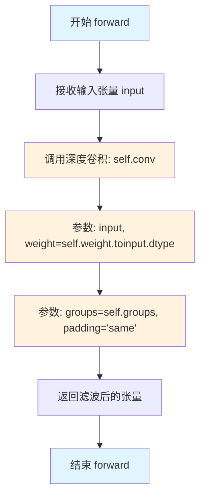

#### 带注释源码

```python
def forward(self, input):
    """
    Apply gaussian filter to input.

    Args:
        input (`torch.Tensor` of shape `(N, C, H, W)`):
            Input to apply Gaussian filter on.

    Returns:
        `torch.Tensor`:
            The filtered output tensor with the same shape as the input.
    """
    # 使用深度卷积（depthwise convolution）应用高斯核
    # self.conv 是在 __init__ 中根据维度选择的卷积函数（conv1d/conv2d/conv3d）
    # self.weight 是预计算的高斯核，已注册为 buffer
    # groups=self.groups 实现深度卷积，每个通道独立滤波
    # padding='same' 确保输出与输入空间尺寸相同
    return self.conv(input, weight=self.weight.to(input.dtype), groups=self.groups, padding="same")
```

## 关键组件


### StableDiffusionHDPainterPipeline

本代码实现了一个基于Stable Diffusion的图像修复(HDPainter)管道，核心功能是通过两种创新的注意力机制来提升图像修复质量：RASG(Regional Attention Score Generation)用于根据区域注意力分数生成梯度噪声，实现细粒度的区域感知去噪；PAIntA(Prioritized Attention in Attention)则通过交叉注意力图来调制自注意力，实现对修复区域的优先级控制。该管道继承自StableDiffusionInpaintPipeline，支持IP-Adapter、条件引导修复、动态分辨率处理等高级功能。

### 文件的整体运行流程

1. **初始化阶段**：管道接收prompt、图像、mask等输入参数，编码文本提示词为embeddings
2. **预处理阶段**：对输入图像和mask进行预处理，制备latent变量
3. **注意力处理器设置**：根据配置的scale factors初始化RASG和PAIntA注意力处理器
4. **去噪循环**：在每个timestep执行以下操作：
   - 扩展latents以支持classifier-free guidance
   - 通过UNet预测噪声残差
   - 若启用RASG，聚合保存的注意力图并计算梯度噪声
   - 根据预测结果和梯度噪声更新latents
   - 在timestep < 500时自动切换PAIntA处理器为默认处理器
5. **后处理阶段**：VAE解码latents为图像，进行安全检查和后处理

### 类的详细信息

### RASGAttnProcessor

用于捕获和保存注意力分数的处理器，支持RASG(Regional Attention Score Generation)技术

#### 类字段

| 名称 | 类型 | 描述 |
|------|------|------|
| attention_scores | torch.Tensor | 存储最后一层输出的相似度矩阵，用于后续RASG计算 |
| mask | torch.Tensor | 区域掩码，用于定义需要关注的区域 |
| token_idx | List[int] | 需要修改的token索引列表 |
| scale_factor | int | 缩放因子，用于计算下采样比例 |
| mask_resoltuion | int | 掩码分辨率(height * width) |

#### 类方法

##### __call__

```python
def __call__(
    self,
    attn: Attention,
    hidden_states: torch.Tensor,
    encoder_hidden_states: Optional[torch.Tensor] = None,
    attention_mask: Optional[torch.Tensor] = None,
    temb: Optional[torch.Tensor] = None,
    scale: float = 1.0,
) -> torch.Tensor
```

| 参数名称 | 参数类型 | 参数描述 |
|----------|----------|----------|
| attn | Attention | 注意力层实例 |
| hidden_states | torch.Tensor | 输入的隐藏状态张量 |
| encoder_hidden_states | Optional[torch.Tensor] | 编码器的隐藏状态(用于cross attention) |
| attention_mask | Optional[torch.Tensor] | 注意力掩码 |
| temb | Optional[torch.Tensor] | 时间嵌入 |
| scale | float | 缩放因子 |

| 返回值类型 | 返回值描述 |
|------------|------------|
| torch.Tensor | 经过注意力处理后的隐藏状态 |

```mermaid
flowchart TD
    A[输入 hidden_states] --> B[空间归一化]
    B --> C[形状变换 4D->3D]
    C --> D[准备注意力掩码]
    D --> E[组归一化]
    E --> F[计算 Q K V]
    F --> G{downscale_factor<br/>==scale_factor²?}
    G -->|是| H[获取attention_scores<br/>保存用于RASG]
    G -->|否| I[使用原始处理器]
    H --> J[Softmax归一化]
    I --> J
    J --> K[加权求和 value]
    K --> L[线性投影+Dropout]
    L --> M[形状变换 3D->4D]
    M --> N[残差连接+输出缩放]
    N --> O[输出 hidden_states]
```

##### 核心逻辑源码

```python
# 计算下采样比例
downscale_factor = self.mask_resoltuion // hidden_states.shape[1]
residual = hidden_states  # 保存输入用于残差连接

# 空间归一化
if attn.spatial_norm is not None:
    hidden_states = attn.spatial_norm(hidden_states, temb)

# 形状变换: (B, C, H, W) -> (B, H*W, C)
input_ndim = hidden_states.ndim
if input_ndim == 4:
    batch_size, channel, height, width = hidden_states.shape
    hidden_states = hidden_states.view(batch_size, channel, height * width).transpose(1, 2)

# 准备注意力掩码
batch_size, sequence_length, _ = (
    hidden_states.shape if encoder_hidden_states is None else encoder_hidden_states.shape
)
attention_mask = attn.prepare_attention_mask(attention_mask, sequence_length, batch_size)

# 组归一化
if attn.group_norm is not None:
    hidden_states = attn.group_norm(hidden_states.transpose(1, 2)).transpose(1, 2)

# 计算QKV
query = attn.to_q(hidden_states)

if encoder_hidden_states is None:
    encoder_hidden_states = hidden_states
elif attn.norm_cross:
    encoder_hidden_states = attn.norm_encoder_hidden_states(encoder_hidden_states)

key = attn.to_k(encoder_hidden_states)
value = attn.to_v(encoder_hidden_states)

# 维度变换以支持多头注意力
query = attn.head_to_batch_dim(query)
key = attn.head_to_batch_dim(key)
value = attn.head_to_batch_dim(value)

# 关键：根据分辨率匹配决定是否保存attention_scores
if downscale_factor == self.scale_factor**2:
    # 使用自定义函数获取softmax之前的分数并保存
    self.attention_scores = get_attention_scores(attn, query, key, attention_mask)
    attention_probs = self.attention_scores.softmax(dim=-1)
    attention_probs = attention_probs.to(query.dtype)
else:
    # 使用默认处理器
    attention_probs = attn.get_attention_scores(query, key, attention_mask)

# 注意力加权求和
hidden_states = torch.bmm(attention_probs, value)
hidden_states = attn.batch_to_head_dim(hidden_states)

# 输出投影
hidden_states = attn.to_out[0](hidden_states)
hidden_states = attn.to_out[1](hidden_states)

# 恢复形状
if input_ndim == 4:
    hidden_states = hidden_states.transpose(-1, -2).reshape(batch_size, channel, height, width)

# 残差连接
if attn.residual_connection:
    hidden_states = hidden_states + residual

hidden_states = hidden_states / attn.rescale_output_factor

return hidden_states
```

---

### PAIntAAttnProcessor

实现PAIntA(Prioritized Attention in Attention)算法的注意力处理器，通过交叉注意力图来调制自注意力

#### 类字段

| 名称 | 类型 | 描述 |
|------|------|------|
| transformer_block | BasicTransformerBlock | 父transformer块引用 |
| mask | torch.Tensor | 区域掩码 |
| scale_factors | List[int] | 缩放因子列表 |
| do_classifier_free_guidance | bool | 是否使用无分类器引导 |
| token_idx | List[int] | 需要关注的token索引 |
| shape | torch.Size | 掩码形状 |
| mask_resoltuion | int | 掩码分辨率 |
| default_processor | AttnProcessor | 默认处理器 |

#### 类方法

##### __call__

```python
def __call__(
    self,
    attn: Attention,
    hidden_states: torch.Tensor,
    encoder_hidden_states: Optional[torch.Tensor] = None,
    attention_mask: Optional[torch.Tensor] = None,
    temb: Optional[torch.Tensor] = None,
    scale: float = 1.0,
) -> torch.Tensor
```

| 参数名称 | 参数类型 | 参数描述 |
|----------|----------|----------|
| attn | Attention | 自注意力层实例 |
| hidden_states | torch.Tensor | 输入的隐藏状态 |
| encoder_hidden_states | Optional[torch.Tensor] | 编码器隐藏状态 |
| attention_mask | Optional[torch.Tensor] | 注意力掩码 |
| temb | Optional[torch.Tensor] | 时间嵌入 |
| scale | float | 缩放因子 |

| 返回值类型 | 返回值描述 |
|------------|------------|
| torch.Tensor | 经过PAIntA调制后的隐藏状态 |

```mermaid
flowchart TD
    A[输入 hidden_states] --> B[自动识别分辨率并调整mask]
    B --> C{找到匹配的scale_factor?}
    C -->|否| D[使用默认处理器]
    C -->|是| E[保存输入 hidden_states]
    E --> F[===== 自注意力1 =====]
    F --> G[标准注意力计算]
    G --> H[获取self_attention_scores]
    H --> I[手动softmax得到probabilities]
    I --> J[输出投影+残差]
    J --> K[===== BasicTransformerBlock模拟 =====]
    K --> L[反归一化输入]
    L --> M[norm2处理]
    M --> N[===== 交叉注意力 =====]
    N --> O[计算cross_attention_probs]
    O --> P[===== 自注意力2 =====]
    P --> Q[计算mask矩阵m]
    Q --> R[提取目标token的交叉注意力]
    R --> S[高斯平滑处理]
    S --> T[中值归一化]
    T --> U[计算缩放系数c]
    U --> V[重缩放self_attention_scores]
    V --> W[softmax+加权求和]
    W --> X[输出投影+残差]
    X --> Y[返回结果]
```

##### 核心逻辑源码

```python
# 自动识别分辨率并调整mask
downscale_factor = self.mask_resoltuion // hidden_states.shape[1]

mask = None
for factor in self.scale_factors:
    if downscale_factor == factor**2:
        shape = (self.shape[0] // factor, self.shape[1] // factor)
        mask = F.interpolate(self.mask, shape, mode="bicubic")
        break
if mask is None:
    return self.default_processor(attn, hidden_states, encoder_hidden_states, attention_mask, temb, scale)

# 保存输入用于残差
residual = hidden_states
input_hidden_states = hidden_states

# ===== 自注意力1 =====
# ... (标准注意力计算，得到 self_attention_scores)

# 获取softmax之前的分数
self_attention_scores = get_attention_scores(attn, query, key, attention_mask)
self_attention_probs = self_attention_scores.softmax(dim=-1)

# ===== BasicTransformerBlock模拟 =====
# 反归一化以获取未归一化的隐藏状态
unnormalized_input_hidden_states = (
    input_hidden_states + self.transformer_block.norm1.bias
) * self.transformer_block.norm1.weight

# 连接自注意力输出和未归一化输入
transformer_hidden_states = self_attention_output_hidden_states + unnormalized_input_hidden_states

# norm2处理
if self.transformer_block.use_ada_layer_norm:
    raise NotImplementedError()
elif self.transformer_block.use_ada_layer_norm_zero or self.transformer_block.use_layer_norm:
    transformer_norm_hidden_states = self.transformer_block.norm2(transformer_hidden_states)
elif self.transformer_block.use_ada_layer_norm_single:
    transformer_norm_hidden_states = transformer_hidden_states
elif self.transformer_block.use_ada_layer_norm_continuous:
    raise NotImplementedError()
else:
    raise ValueError("Incorrect norm")

# pos_embed处理
if self.transformer_block.pos_embed is not None and self.transformer_block.use_ada_layer_norm_single is False:
    transformer_norm_hidden_states = self.transformer_block.pos_embed(transformer_norm_hidden_states)

# ===== 交叉注意力 =====
# 处理classifier-free guidance的分割
if self.do_classifier_free_guidance:
    cross_attention_input_hidden_states_conditional = cross_attention_input_hidden_states.chunk(2)[1]
    encoder_hidden_states_conditional = self.encoder_hidden_states.chunk(2)[1]
else:
    cross_attention_input_hidden_states_conditional = cross_attention_input_hidden_states
    encoder_hidden_states_conditional = self.encoder_hidden_states

# 计算交叉注意力
cross_attention_probs = attn2.get_attention_scores(query2, key2, attention_mask)

# ===== 自注意力2 - PAIntA核心 =====
# 计算mask矩阵
mask = (mask > 0.5).to(self_attention_output_hidden_states.dtype)
m = mask.permute(0, 2, 3, 1).reshape((mask.shape[0], -1, mask.shape[1])).contiguous()
m = torch.matmul(m, m.permute(0, 2, 1)) + (1 - m)

# 提取目标token的交叉注意力并处理
batch_size, dims, channels = cross_attention_probs.shape
batch_size = batch_size // attn.heads
cross_attention_probs = cross_attention_probs.reshape((batch_size, attn.heads, dims, channels))
cross_attention_probs = cross_attention_probs.mean(dim=1)
cross_attention_probs = cross_attention_probs[..., self.token_idx].sum(dim=-1)
cross_attention_probs = cross_attention_probs.reshape((batch_size,) + shape)

# 高斯平滑
gaussian_smoothing = GaussianSmoothing(channels=1, kernel_size=3, sigma=0.5, dim=2).to(
    self_attention_output_hidden_states.device
)
cross_attention_probs = gaussian_smoothing(cross_attention_probs[:, None])[:, 0]

# 中值归一化
cross_attention_probs = cross_attention_probs.reshape(batch_size, -1)
cross_attention_probs = (
    cross_attention_probs - cross_attention_probs.median(dim=-1, keepdim=True).values
) / cross_attention_probs.max(dim=-1, keepdim=True).values
cross_attention_probs = cross_attention_probs.clip(0, 1)

# 计算最终缩放系数
c = (1 - m) * cross_attention_probs.reshape(batch_size, 1, -1) + m
c = c.repeat_interleave(attn.heads, 0)
if self.do_classifier_free_guidance:
    c = torch.cat([c, c])

# 重缩放自注意力分数
self_attention_scores_rescaled = self_attention_scores * c
self_attention_probs_rescaled = self_attention_scores_rescaled.softmax(dim=-1)

# 继续自注意力计算
hidden_states = torch.bmm(self_attention_probs_rescaled, value)
# ... (后续处理)
```

---

### StableDiffusionHDPainterPipeline

HDPainter的主管道类，继承自StableDiffusionInpaintPipeline

#### 类字段

| 名称 | 类型 | 描述 |
|------|------|------|
| _guidance_scale | float | 引导_scale |
| _clip_skip | int | CLIP跳过的层数 |
| _cross_attention_kwargs | Dict | 交叉注意力参数 |
| _interrupt | bool | 中断标志 |
| _num_timesteps | int | 时间步数 |

#### 类方法

##### get_tokenized_prompt

```python
def get_tokenized_prompt(self, prompt: str) -> List[str]
```

| 参数名称 | 参数类型 | 参数描述 |
|----------|----------|----------|
| prompt | str | 输入提示词 |

| 返回值类型 | 返回值描述 |
|------------|------------|
| List[str] | 分词后的token列表 |

##### init_attn_processors

```python
def init_attn_processors(
    self,
    mask: torch.Tensor,
    token_idx: List[int],
    use_painta: bool = True,
    use_rasg: bool = True,
    painta_scale_factors: List[int] = [2, 4],
    rasg_scale_factor: int = 4,
    self_attention_layer_name: str = "attn1",
    cross_attention_layer_name: str = "attn2",
    list_of_painta_layer_names: Optional[List[str]] = None,
    list_of_rasg_layer_names: Optional[List[str]] = None,
) -> None
```

| 参数名称 | 参数类型 | 参数描述 |
|----------|----------|----------|
| mask | torch.Tensor | 修复掩码 |
| token_idx | List[int] | 目标token索引 |
| use_painta | bool | 是否使用PAIntA |
| use_rasg | bool | 是否使用RASG |
| painta_scale_factors | List[int] | PAIntA缩放因子列表 |
| rasg_scale_factor | int | RASG缩放因子 |
| self_attention_layer_name | str | 自注意力层名称 |
| cross_attention_layer_name | str | 交叉注意力层名称 |
| list_of_painta_layer_names | Optional[List[str]] | PAIntA层名称列表 |
| list_of_rasg_layer_names | Optional[List[str]] | RASG层名称列表 |

| 返回值类型 | 返回值描述 |
|------------|------------|
| None | 无返回值 |

##### __call__

```python
@torch.no_grad()
def __call__(
    self,
    prompt: Union[str, List[str]] = None,
    image: PipelineImageInput = None,
    mask_image: PipelineImageInput = None,
    masked_image_latents: torch.Tensor = None,
    height: Optional[int] = None,
    width: Optional[int] = None,
    padding_mask_crop: Optional[int] = None,
    strength: float = 1.0,
    num_inference_steps: int = 50,
    timesteps: List[int] = None,
    guidance_scale: float = 7.5,
    positive_prompt: str | None = "",
    negative_prompt: Optional[Union[str, List[str]]] = None,
    num_images_per_prompt: Optional[int] = 1,
    eta: float = 0.0,
    generator: Optional[Union[torch.Generator, List[torch.Generator]]] = None,
    latents: Optional[torch.Tensor] = None,
    prompt_embeds: Optional[torch.Tensor] = None,
    negative_prompt_embeds: Optional[torch.Tensor] = None,
    ip_adapter_image: Optional[PipelineImageInput] = None,
    output_type: str | None = "pil",
    return_dict: bool = True,
    cross_attention_kwargs: Optional[Dict[str, Any]] = None,
    clip_skip: int = None,
    callback_on_step_end: Optional[Callable[[int, int, Dict], None]] = None,
    callback_on_step_end_tensor_inputs: List[str] = ["latents"],
    use_painta: bool = True,
    use_rasg: bool = True,
    self_attention_layer_name: str = ".attn1",
    cross_attention_layer_name: str = ".attn2",
    painta_scale_factors: List[int] = [2, 4],
    rasg_scale_factor: int = 4,
    list_of_painta_layer_names: Optional[List[str]] = None,
    list_of_rasg_layer_names: Optional[List[str]] = None,
    **kwargs,
) -> Union[StableDiffusionPipelineOutput, Tuple]
```

---

### GaussianSmoothing

高斯平滑滤波器，用于对注意力图进行平滑处理

#### 类字段

| 名称 | 类型 | 描述 |
|------|------|------|
| weight | torch.Tensor | 高斯核权重 |
| groups | int | 分组卷积的组数 |
| conv | Callable | 1D/2D/3D卷积函数 |

#### 类方法

##### __init__

```python
def __init__(self, channels: int, kernel_size: int, sigma: float, dim: int = 2)
```

##### forward

```python
def forward(self, input: torch.Tensor) -> torch.Tensor
```

---

### get_attention_scores

计算注意力分数(softmax之前)

#### 全局函数

```python
def get_attention_scores(
    self, query: torch.Tensor, key: torch.Tensor, attention_mask: torch.Tensor = None
) -> torch.Tensor
```

| 参数名称 | 参数类型 | 参数描述 |
|----------|----------|----------|
| self | Attention | 注意力层实例 |
| query | torch.Tensor | Query张量 |
| key | torch.Tensor | Key张量 |
| attention_mask | torch.Tensor | 注意力掩码 |

| 返回值类型 | 返回值描述 |
|------------|------------|
| torch.Tensor | 注意力分数(未归一化) |

---

### 关键组件信息

### RASG (Regional Attention Score Generation)

通过保存跨层注意力分数并根据区域掩码计算损失梯度，实现细粒度的区域感知去噪。在去噪循环中利用保存的attention_scores计算binary cross-entropy loss的梯度，生成variance_noise用于增强扩散模型的采样过程。

### PAIntA (Prioritized Attention in Attention)

通过交叉注意力图计算区域优先级系数，动态调制自注意力矩阵。首先提取目标token的交叉注意力，进行高斯平滑和中值归一化，然后计算缩放系数c来重缩放原始自注意力分数。

### 动态分辨率识别

系统自动识别当前注意力层的分辨率，根据mask_resolution和hidden_states.shape计算downscale_factor，与预设的scale_factors匹配以选择正确的mask进行插值处理。

### 潜在的技术债务或优化空间

1. **硬编码的timestep阈值**：PAIntA在timestep < 500时自动禁用的逻辑是硬编码的，应改为可配置参数
2. **梯度计算效率**：RASG中的梯度计算使用detach()后再requires_grad=True的方式，内存效率不高，可考虑使用torch.no_grad()上下文或checkpoint技术
3. **错误处理不足**：多处raise NotImplementedError()但未提供具体实现或错误提示
4. **Batch Size支持有限**：代码中存在TODO注释表明batch_size > 1的处理未完全测试
5. **重复代码**：PAIntA中自注意力计算部分与BasicTransformerBlock代码高度重复，可考虑重构为共用模块
6. **类型注解不完整**：部分函数参数缺少类型注解，如painta_scale_factors的类型应为List[int]

### 其它项目

#### 设计目标与约束

- **核心目标**：提升Stable Diffusion图像修复的质量，通过区域感知注意力机制
- **约束条件**：batch_size > 1的支持有限，需进一步测试
- **性能目标**：在保持修复质量的同时尽可能减少额外计算开销

#### 错误处理与异常设计

- 当mask分辨率不匹配任何scale_factor时，回退到默认处理器
- norm类型不匹配时抛出ValueError
- IP-Adapter相关功能未完全实现，ADA Layer Norm相关功能抛出NotImplementedError

#### 数据流与状态机

1. **初始化状态**：设置注意力处理器
2. **编码状态**：编码prompt和image embeddings
3. **准备状态**：制备latents和masks
4. **去噪状态**：循环处理各timestep
5. **解码状态**：VAE解码输出图像
6. **PAIntA切换**：在timestep 500时自动从PAIntA切换到默认处理器

#### 外部依赖与接口契约

- 依赖diffusers库：StableDiffusionInpaintPipeline、PipelineImageInput等
- 依赖torch.nn.functional：F.interpolate等
- 依赖模型组件：Attention、BasicTransformerBlock、UNet等
- 输入格式：标准Stable Diffusion修复管道的输入格式
- 输出格式：StableDiffusionPipelineOutput或Tuple

#### 已知限制

- batch_size > 1时RASG部分可能存在问题
- IP-Adapter和某些norm类型组合未完全支持
- 条件引导依赖于do_classifier_free_guidance标志
- 跨注意力层名称必须匹配"attn1"或"attn2"


## 问题及建议


### 已知问题

-   **拼写错误**：`mask_resoltuion` 在多处出现，应为 `mask_resolution`；`PAIntAAttnProcessor` 类名大小写混合可能导致跨平台导入问题
-   **代码重复**：`PAIntAAttnProcessor.__call__` 中 self-attention 和 cross-attention 计算逻辑与 `RASGAttnProcessor` 及默认 `AttnProcessor` 高度重复，可提取为共享函数
-   **硬编码值**：高斯平滑使用硬编码的 `kernel_size=3, sigma=0.5`，PAIntA 禁用阈值为硬编码的 `500`，这些应作为可配置参数
-   **重复初始化**：GaussianSmoothing 在 `PAIntAAttnProcessor.__call__` 的每次前向传播中重新实例化，应缓存为类属性或模块级对象
-   **缺少错误处理**：`get_tokenized_prompt` 可能在找不到 `<|endoftext|>` token 时抛出 `ValueError`，且 `token_idx` 计算逻辑在空 prompt 时会失败
-   **设计缺陷**：`PAIntAAttnProcessor` 依赖 `transformer_block` 的内部结构（如 `norm1.weight/bias`, `attn2`, `pos_embed` 等），与 `BasicTransformerBlock` 实现强耦合，diffusers 升级可能导致兼容性问题
-   **实例状态管理**：`encoder_hidden_states` 被存储为处理器实例变量而非通过函数参数传递，易导致状态污染；`_cross_attention_kwargs` 与实际使用的 `self.cross_attention_kwargs` 命名不一致
-   **变量命名歧义**：默认参数 `self_attention_layer_name=".attn1"` 和 `cross_attention_layer_name=".attn2"` 包含前导点号，但 `init_attn_processors` 中的字符串匹配逻辑未明确是否包含点号
-   **未使用变量**：代码中存在多个未使用变量（如 `_cross_attention_input_hidden_states_unconditional`, `_encoder_hidden_states_unconditional`, `gaussian_smoothing` 的部分返回值），增加内存开销
-   **batch_size 限制**：代码中多处存在 `# assert batch_size == 1` 的注释，表明当前实现可能不支持 batch_size > 1，但未做运行时检查

### 优化建议

-   修正拼写错误，统一命名规范（如 `mask_resolution`）
-   将重复的 attention 计算逻辑抽取为独立函数或基类，减少代码冗余
-   将硬编码的配置值（高斯平滑参数、阈值等）提取为 `__init__` 参数或配置文件
-   缓存 GaussianSmoothing 实例，避免每次前向传播重新创建
-   增加输入验证：检查 prompt 是否有效、mask 尺寸是否匹配、batch_size 是否支持
-   减少对内部实现的依赖：若必须访问 `transformer_block` 属性，考虑通过公共接口或添加显式的版本兼容性检查
-   统一状态管理：避免使用实例变量存储易变状态，优先通过函数参数传递
-   添加明确的 batch_size > 1 支持或显式抛出不支持的异常
-   清理未使用变量，减小内存占用

## 其它


### 设计目标与约束

本代码旨在实现HD-Painter，一个基于Stable Diffusion的图像修复（inpainting）管道。核心目标是通过RASG（Region-Aware Self-attention Guidance）和PAIntA（Post-Attention Interaction）两种注意力机制改进修复质量，使模型能够更准确地根据文本提示修复图像的指定区域。设计约束包括：仅支持batch_size=1的推理，不兼容多GPU并行推理，修复区域必须包含有效的掩码，且图像分辨率需为8的倍数（因VAE的下采样因子为8）。

### 错误处理与异常设计

代码中的错误处理主要体现在以下几个方面：1）在`retrieve_timesteps`调用后检查`num_inference_steps < 1`的情况，抛出`ValueError`；2）在UNet输入通道校验时，验证`num_channels_latents + num_channels_mask + num_channels_masked_image`是否与配置匹配；3）对不支持的norm类型（如`use_ada_layer_norm`和`use_ada_layer_norm_continuous`）抛出`NotImplementedError`；4）当mask分辨率与注意力层不匹配时，回退到默认处理器。潜在改进：增加对batch_size>1的警告，增加对无效token_idx的校验，增加对内存溢出的预检测。

### 数据流与状态机

数据流遵循以下路径：1）图像和掩码预处理 → 2）文本编码（prompt_embeds）→ 3）潜在变量初始化 → 4）去噪循环（迭代n次）→ 5）VAE解码 → 6）后处理输出。在去噪循环中，存在状态切换：当timestep < 500时，PAIntA处理器被禁用，仅保留RASG；RASG通过保存的attention_scores计算梯度并修改噪声预测。关键状态变量包括：`painta_active`（布尔值控制PAIntA开关）、`encoder_hidden_states`（在attn_processor中动态更新）、`self_attention_scores`（在RASGAttnProcessor中保存用于反向传播）。

### 外部依赖与接口契约

本代码依赖以下外部库和模块：1）diffusers库（StableDiffusionInpaintPipeline、PipelineImageInput、Attention、AttnProcessor等）；2）torch和torch.nn.functional；3）transformers的tokenizer（用于get_tokenized_prompt）。接口契约包括：输入图像和掩码需为PipelineImageInput格式；prompt需为字符串或字符串列表；mask_image分辨率需与image匹配；token_idx需为有效的token索引范围；scale_factor需为2的幂次方。输出格式遵循StableDiffusionPipelineOutput，包含images和nsfw_content_detected字段。

### 配置参数详解

关键配置参数包括：1）painta_scale_factors（默认[2,4]），控制PAIntA处理的分辨率层级；2）rasg_scale_factor（默认4），控制RASG的分辨率；3）self_attention_layer_name（默认".attn1"）和cross_attention_layer_name（默认".attn2"），指定要替换的注意力层；4）guidance_scale（默认7.5），控制CFG强度；5）num_inference_steps（默认50），去噪迭代次数；6）strength（默认1.0），控制初始噪声混合比例。这些参数直接影响修复效果和计算成本。

### 使用示例与最佳实践

典型使用流程：1）加载StableDiffusionInpaintPipeline；2）实例化StableDiffusionHDPainterPipeline；3）准备输入图像、掩码和文本提示；4）调用pipeline并传入相应参数。最佳实践：确保mask准确覆盖修复区域；positive_prompt应包含具体的修复内容描述；使用较高的guidance_scale（如7.5-9.0）可获得更好的文本一致性；在显存有限时减少painta_scale_factors或关闭PAIntA。

### 性能考虑与优化建议

性能瓶颈主要在于：1）PAIntA的双重注意力计算导致计算量翻倍；2）RASG需要在每步保存attention_scores并反向传播；3）高斯平滑操作在较大分辨率时较慢。优化建议：1）使用torch.cuda.amp混合精度加速；2）将painta_scale_factors限制为更少的层级；3）预先计算高斯核并缓存；4）对固定分辨率的mask进行预处理；5）考虑使用xFormers的注意力实现替代默认实现；6）对于batch_size>1的场景，需要重新设计token_idx的处理逻辑。

### 安全性与伦理考虑

本代码继承了Stable Diffusion的基础能力，因此需注意：1）生成的图像可能包含NSFW内容，代码内置了safety_checker；2）模型可能产生偏见或不当内容；3）图像修复技术可能被用于伪造或欺骗。防护措施：代码已集成`run_safety_checker`检测NSFW概念；建议在生产环境中添加水印或元数据标记；应对用户输入进行适当的过滤和验证。

### 版本兼容性与依赖管理

代码依赖diffusers库的特定组件，包括：StableDiffusionInpaintPipeline、Attention类结构、AttnProcessor接口。版本兼容性要求：diffusers >= 0.19.0（支持AttnProcessor接口）；torch >= 1.9.0（支持torch.baddbmm等操作）。当diffusers库更新导致接口变化时，需要同步更新init_attn_processors中的处理器初始化逻辑和get_attention_scores的调用方式。建议在requirements.txt中锁定兼容版本。

### 测试策略建议

建议补充以下测试用例：1）单元测试：测试GaussianSmoothing对不同维度输入的处理；测试get_attention_scores的输出形状和数值范围；测试token_idx的解析逻辑。2）集成测试：测试完整管道的输入输出形状；测试不同分辨率下的修复效果；测试PAIntA和RASG开关的不同组合。3）性能测试：测量不同配置下的显存占用和推理时间；对比开启/关闭优化器的性能差异。4）回归测试：确保修改后不破坏现有Stable Diffusion Inpainting的基准效果。


    