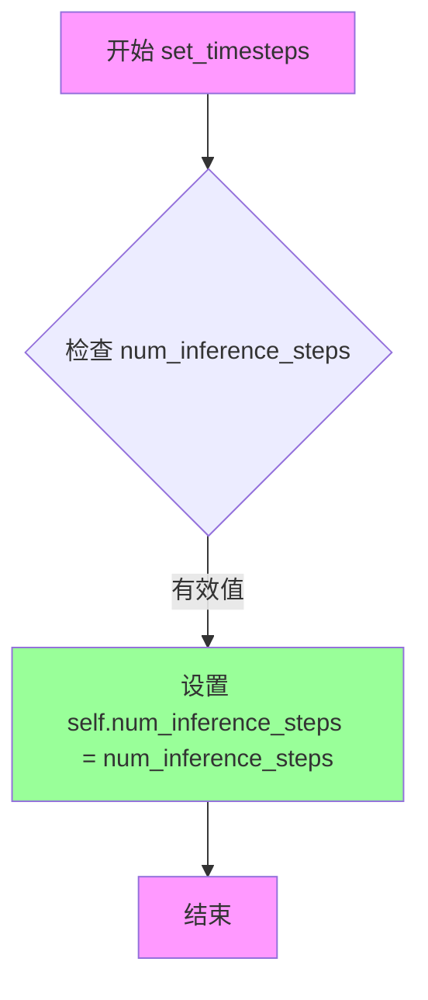
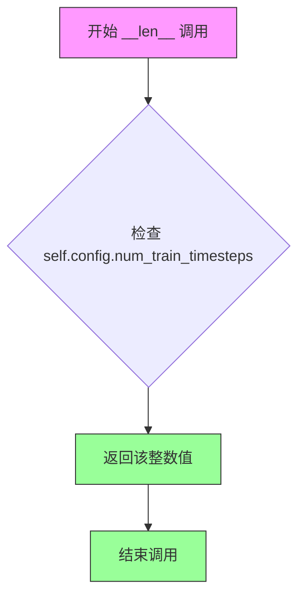

# `diffusers\examples\community\iadb.py` 详细设计文档

实现IADB(Iterative α-(de)Blending)去噪方法的扩散模型调度器和推理管道，包含自定义IADBScheduler调度器和IADBPipeline管道，用于基于U-Net的去噪图像生成

## 整体流程

```mermaid
graph TD
    A[开始推理] --> B[创建随机噪声图像]
B --> C[设置调度器时间步]
C --> D[迭代去噪循环]
D --> E{当前步 < 总步数?}
E -- 是 --> F[计算当前alpha值]
F --> G[U-Net预测噪声]
G --> H[调度器step更新x_alpha]
H --> I[更新循环计数]
I --> D
E -- 否 --> J[后处理: 归一化到[0,1]]
J --> K{output_type=='pil'?}
K -- 是 --> L[转换为PIL图像]
K -- 否 --> M[保持numpy数组]
L --> N[返回ImagePipelineOutput]
M --> N
```

## 类结构

```
SchedulerMixin (diffusers基类)
└── IADBScheduler (自定义调度器)

DiffusionPipeline (diffusers基类)
└── IADBPipeline (自定义推理管道)
    ├── unet: UNet2DModel
    └── scheduler: SchedulerMixin
```

## 全局变量及字段


### `IADBScheduler.num_inference_steps`
    
推理步数，控制扩散模型的去噪迭代次数

类型：`int`
    


### `IADBPipeline.unet`
    
U-Net去噪模型，用于预测噪声

类型：`UNet2DModel`
    


### `IADBPipeline.scheduler`
    
调度器实例，管理扩散过程的调度

类型：`SchedulerMixin`
    
    

## 全局函数及方法


### IADBScheduler.step

该方法是 IADBScheduler 类的核心方法，实现了 Iterative α-(de)Blending 去噪调度器的单步反向扩散过程。通过接收模型输出（噪声预测）和当前时间步，计算前一时间步的样本 x_alpha，其核心思想是利用线性插值在相邻时间步之间进行样本的渐进式更新。

参数：

- `model_output`：`torch.Tensor`，来自扩散模型的直接输出，表示从 x0 到 x1 的方向（即预测的噪声或去噪方向）
- `timestep`：`int`，扩散链中的当前时间步
- `x_alpha`：`torch.Tensor`，当前时间步的 x_alpha 样本

返回值：`torch.Tensor`，返回前一时间步的样本

#### 流程图

```mermaid
flowchart TD
    A[开始 step 方法] --> B{检查 num_inference_steps 是否为 None}
    B -->|是| C[抛出 ValueError 异常]
    B -->|否| D[计算当前时间步的 alpha 值: alpha = timestep / num_inference_steps]
    D --> E[计算下一时间步的 alpha 值: alpha_next = (timestep + 1) / num_inference_steps]
    E --> F[将 model_output 赋值给变量 d]
    F --> G[更新 x_alpha: x_alpha = x_alpha + (alpha_next - alpha) * d]
    G --> H[返回更新后的 x_alpha]
```

#### 带注释源码

```python
def step(
    self,
    model_output: torch.Tensor,
    timestep: int,
    x_alpha: torch.Tensor,
) -> torch.Tensor:
    """
    Predict the sample at the previous timestep by reversing the ODE. Core function to propagate the diffusion
    process from the learned model outputs (most often the predicted noise).

    Args:
        model_output (`torch.Tensor`): direct output from learned diffusion model. It is the direction from x0 to x1.
        timestep (`float`): current timestep in the diffusion chain.
        x_alpha (`torch.Tensor`): x_alpha sample for the current timestep

    Returns:
        `torch.Tensor`: the sample at the previous timestep

    """
    # 检查调度器是否已初始化时间步数，若未初始化则抛出明确的错误信息
    if self.num_inference_steps is None:
        raise ValueError(
            "Number of inference steps is 'None', you need to run 'set_timesteps' after creating the scheduler"
        )

    # 计算当前时间步的归一化进度 alpha，取值范围 [0, 1)
    alpha = timestep / self.num_inference_steps
    
    # 计算下一时间步的归一化进度 alpha_next，用于计算步长
    alpha_next = (timestep + 1) / self.num_inference_steps

    # 获取模型输出作为扩散方向向量 d
    d = model_output

    # 核心更新公式：根据 alpha 差值和模型输出方向更新样本
    # 这实现了线性插值式的样本演进：x_{t-1} = x_t + (α_{t+1} - α_t) * d
    x_alpha = x_alpha + (alpha_next - alpha) * d

    # 返回前一个时间步的样本
    return x_alpha
```


### `IADBScheduler.set_timesteps`

该方法用于设置扩散模型推理过程中的时间步数量，决定后续去噪迭代的次数。

参数：

- `num_inference_steps`：`int`，推理过程中需要执行的去噪步数

返回值：`None`，无返回值（该方法直接修改实例属性）

#### 流程图



#### 带注释源码

```python
def set_timesteps(self, num_inference_steps: int):
    """
    设置推理过程中的时间步数量。
    
    该方法必须在推理循环之前调用，用于确定扩散模型
    需要执行的去噪迭代次数。设置后会影响 step() 方法
    中 alpha 和 alpha_next 的计算。
    
    Args:
        num_inference_steps (int): 
            推理过程中需要执行的去噪步数。
            较大的值会产生更高质量的图像，但推理速度会更慢。
    
    Returns:
        None: 无返回值，直接修改实例属性
    
    Example:
        >>> scheduler = IADBScheduler.from_config(config)
        >>> scheduler.set_timesteps(50)  # 设置50步去噪
        >>> for t in range(50):
        ...     # 执行去噪循环
    """
    # 将推理步数存储到实例属性中，供 step() 方法使用
    self.num_inference_steps = num_inference_steps
```


### `IADBScheduler.add_noise`

该函数通过线性插值将原始样本与噪声按指定系数混合，是 IADB 扩散调度器中向样本添加噪声的核心操作，用于在去噪过程的不同阶段注入受控噪声。

参数：

- `self`：实例本身，隐式参数
- `original_samples`：`torch.Tensor`，原始样本张量，即待混合的干净数据
- `noise`：`torch.Tensor`，噪声张量，用于叠加到原始样本的高斯噪声
- `alpha`：`torch.Tensor`，混合系数，控制原始样本与噪声的混合比例，值为 0-1 之间

返回值：`torch.Tensor`，混合后的样本张量，计算公式为 `original_samples * alpha + noise * (1 - alpha)`

#### 流程图

```mermaid
flowchart TD
    A[开始 add_noise] --> B[输入 original_samples, noise, alpha]
    B --> C[计算乘积: original_samples × alpha]
    B --> D[计算乘积: noise × (1 - alpha)]
    C --> E[相加: result = original_samples × alpha + noise × (1 - alpha)]
    D --> E
    E --> F[返回混合结果]
```

#### 带注释源码

```python
def add_noise(
    self,
    original_samples: torch.Tensor,
    noise: torch.Tensor,
    alpha: torch.Tensor,
) -> torch.Tensor:
    """
    向原始样本添加噪声的函数，通过线性插值混合原始样本和噪声。

    Args:
        original_samples (torch.Tensor): 原始的干净样本张量
        noise (torch.Tensor): 要添加的高斯噪声张量
        alpha (torch.Tensor): 混合系数，控制原始样本的保留程度，
                             alpha=1 时保留原始样本，alpha=0 时完全使用噪声

    Returns:
        torch.Tensor: 混合后的样本张量，公式为：
                     result = original_samples * alpha + noise * (1 - alpha)
    """
    # 使用线性插值公式混合原始样本和噪声
    # 当 alpha 接近 1 时，结果更接近原始样本
    # 当 alpha 接近 0 时，结果更接近纯噪声
    return original_samples * alpha + noise * (1 - alpha)
```


### `IADBScheduler.__len__`

返回调度器在训练时使用的时间步总数，使得调度器可以被用于确定训练过程中的迭代次数。

参数：此方法无显式参数（隐式接收 `self` 实例）。

返回值：`int`，返回训练阶段所配置的总时间步数，来源于 `self.config.num_train_timesteps`。

#### 流程图



#### 带注释源码

```python
def __len__(self):
    """
    返回调度器在训练阶段的时间步总数。
    
    该特殊方法（Python 魔术方法）使调度器对象支持 len() 操作，
    从而可以方便地获取训练时配置的总迭代次数。
    
    Returns:
        int: 训练配置中的时间步总数，即 num_train_timesteps
    """
    return self.config.num_train_timesteps
```


### `IADBPipeline.__init__`

初始化 IADBPipeline 实例，通过调用父类 DiffusionPipeline 的构造函数并使用 `register_modules` 方法注册 UNet2DModel 和 SchedulerMixin 类型的组件。

参数：

- `unet`：`UNet2DModel`，U-Net 架构，用于去噪编码图像
- `scheduler`：`SchedulerMixin`，调度器，用于与 unet 结合去噪编码图像，可以是 DDPMScheduler、DDIMScheduler 或其他调度器

返回值：`None`，构造函数无显式返回值

#### 流程图

```mermaid
flowchart TD
    A[开始 __init__] --> B[调用 super().__init__]
    B --> C[调用 self.register_modules]
    C --> D[注册 unet 和 scheduler 模块]
    D --> E[结束]
```

#### 带注释源码

```
def __init__(self, unet, scheduler):
    """
    初始化 IADBPipeline
    
    参数:
        unet: U-Net 架构用于去噪
        scheduler: 调度器用于去噪过程
    """
    # 调用父类 DiffusionPipeline 的初始化方法
    super().__init__()

    # 将 unet 和 scheduler 注册为模块
    # 这使得它们可以被保存/加载并访问配置
    self.register_modules(unet=unet, scheduler=scheduler)
```


### IADBPipeline.__call__

该方法是 `IADBPipeline` 类的核心推理函数，负责通过预训练的 U-Net 模型和调度器（Scheduler）从随机噪声中迭代生成图像。它支持批量生成、可配置的推理步数、输出格式选择（ PIL 图像或 NumPy 数组）以及返回值的灵活格式。

参数：

- `batch_size`：`int`，可选，默认为 1。指定要生成的图像数量。
- `generator`：`Optional[Union[torch.Generator, List[torch.Generator]]]`，可选，默认为 `None`。用于控制随机数生成的设备。如果是一个列表，其长度必须与 `batch_size` 匹配。
- `num_inference_steps`：`int`，可选，默认为 50。指定去噪迭代的步数。步数越多，通常图像质量越高，但推理速度越慢。
- `output_type`：`str | None`，可选，默认为 `"pil"`。指定输出图像的格式，可选值为 `"pil"`（返回 PIL 图像）或 `None`（返回 NumPy 数组）。
- `return_dict`：`bool`，可选，默认为 `True`。如果为 `True`，返回 `ImagePipelineOutput` 对象（包含 `images` 属性）；否则返回元组 `(images,)`。

返回值：`Union[ImagePipelineOutput, Tuple]`，如果 `return_dict` 为 `True`，返回一个 `ImagePipelineOutput` 对象，其中 `images` 属性包含生成的图像列表（PIL 图像或 NumPy 数组，取决于 `output_type`）；否则返回一个元组，第一个元素是图像列表。

#### 流程图

```mermaid
flowchart TD
    Start([开始]) --> DetermineImageShape{根据 unet.config.sample_size 确定图像形状}
    DetermineImageShape --> ValidateGenerator[验证 generator 列表长度与 batch_size 是否匹配]
    ValidateGenerator --> GenerateNoise[生成初始高斯噪声图像]
    GenerateNoise --> SetTimesteps[调用 scheduler.set_timesteps 设置推理步数]
    SetTimesteps --> InitXAlpha[初始化 x_alpha 为噪声图像的克隆]
    InitXAlpha --> LoopStart{遍历每个推理步骤 t}
    LoopStart -- 是 --> CalcAlpha[计算当前 alpha 值: alpha = t / num_inference_steps]
    CalcAlpha --> PredictNoise[调用 UNet 预测噪声: model_output = self.unet(x_alpha, alpha).sample]
    PredictNoise --> SchedulerStep[调用 scheduler.step 更新 x_alpha: x_alpha = scheduler.step(model_output, t, x_alpha)]
    SchedulerStep --> LoopEnd{是否完成所有步骤}
    LoopEnd -- 否 --> LoopStart
    LoopEnd -- 是 --> PostProcess[后处理: 归一化 x_alpha 到 [0, 1] 并转换为 numpy 数组]
    PostProcess --> CheckOutputType{output_type == "pil"?}
    CheckOutputType -- 是 --> ConvertToPIL[使用 numpy_to_pil 转换为 PIL 图像]
    CheckOutputType -- 否 --> CheckReturnDict
    ConvertToPIL --> CheckReturnDict
    CheckReturnDict -- 是 --> ReturnDict[返回 ImagePipelineOutput 对象]
    CheckReturnDict -- 否 --> ReturnTuple[返回元组 (images,)]
    ReturnDict --> End([结束])
    ReturnTuple --> End
```

#### 带注释源码

```python
@torch.no_grad()
def __call__(
    self,
    batch_size: int = 1,
    generator: Optional[Union[torch.Generator, List[torch.Generator]]] = None,
    num_inference_steps: int = 50,
    output_type: str | None = "pil",
    return_dict: bool = True,
) -> Union[ImagePipelineOutput, Tuple]:
    r"""
    Args:
        batch_size (`int`, *optional*, defaults to 1):
            The number of images to generate.
        num_inference_steps (`int`, *optional*, defaults to 50):
            The number of denoising steps. More denoising steps usually lead to a higher quality image at the
            expense of slower inference.
        output_type (`str`, *optional*, defaults to `"pil"`):
            The output format of the generate image. Choose between
            [PIL](https://pillow.readthedocs.io/en/stable/): `PIL.Image.Image` or `np.array`.
        return_dict (`bool`, *optional*, defaults to `True`):
            Whether or not to return a [`~pipelines.ImagePipelineOutput`] instead of a plain tuple.

    Returns:
        [`~pipelines.ImagePipelineOutput`] or `tuple`: [`~pipelines.utils.ImagePipelineOutput`] if `return_dict` is
        True, otherwise a `tuple. When returning a tuple, the first element is a list with the generated images.
    """

    # 根据 unet 配置确定图像的形状 (batch_size, channels, height, width)
    # Sample gaussian noise to begin loop
    if isinstance(self.unet.config.sample_size, int):
        image_shape = (
            batch_size,
            self.unet.config.in_channels,
            self.unet.config.sample_size,
            self.unet.config.sample_size,
        )
    else:
        image_shape = (batch_size, self.unet.config.in_channels, *self.unet.config.sample_size)

    # 验证传入的 generator 列表长度是否与 batch_size 匹配
    if isinstance(generator, list) and len(generator) != batch_size:
        raise ValueError(
            f"You have passed a list of generators of length {len(generator)}, but requested an effective batch"
            f" size of {batch_size}. Make sure the batch size matches the length of the generators."
        )

    # 生成初始高斯噪声图像，作为迭代去噪的起点
    image = torch.randn(image_shape, generator=generator, device=self.device, dtype=self.unet.dtype)

    # 设置调度器的推理步数
    # set step values
    self.scheduler.set_timesteps(num_inference_steps)
    
    # 初始化 x_alpha 为噪声图像的克隆，x_alpha 代表当前迭代的图像状态
    x_alpha = image.clone()
    
    # 遍历每个推理步骤进行去噪
    for t in self.progress_bar(range(num_inference_steps)):
        # 计算当前的 alpha 值，表示去噪进度 (从 0 到 1)
        alpha = t / num_inference_steps

        # 1. 使用 U-Net 预测噪声或直接预测图像方向
        # predict noise model_output
        # 注意：model_output 的含义取决于模型实现，这里直接作为调度器的输入
        model_output = self.unet(x_alpha, torch.tensor(alpha, device=x_alpha.device)).sample

        # 2. 调用调度器进行单步去噪更新
        # step
        x_alpha = self.scheduler.step(model_output, t, x_alpha)

    # 后处理：将图像从 [-1, 1] 归一化到 [0, 1]
    image = (x_alpha * 0.5 + 0.5).clamp(0, 1)
    # 转换为 (batch_size, height, width, channels) 格式的 numpy 数组
    image = image.cpu().permute(0, 2, 3, 1).numpy()
    
    # 如果指定输出为 PIL 图像，则进行转换
    if output_type == "pil":
        image = self.numpy_to_pil(image)

    # 根据 return_dict 决定返回格式
    if not return_dict:
        return (image,)

    # 返回 ImagePipelineOutput 对象
    return ImagePipelineOutput(images=image)
```


## 关键组件


### IADBScheduler (调度器类)

IADBScheduler是Iterative α-(de)Blending去噪方法的调度器实现，继承自SchedulerMixin和ConfigMixin，提供扩散模型的反向扩散过程调度核心功能。

### IADBPipeline (管道类)

IADBPipeline是IADB方法的扩散管道实现，继承自DiffusionPipeline，封装了UNet模型和调度器，提供端到端的图像生成能力。

### step方法 (去噪步骤)

step方法是IADBScheduler的核心方法，实现了基于ODE反向求解的单步去噪逻辑，通过计算当前时间步和下一时间步的alpha值来更新样本。

### set_timesteps方法 (时间步设置)

set_timesteps方法用于设置推理过程中的时间步数量，为调度器配置去噪迭代的总数。

### add_noise方法 (噪声添加)

add_noise方法实现了线性噪声混合功能，通过alpha参数控制原始样本与噪声的混合比例。

### __call__方法 (管道调用)

__call__方法是IADBPipeline的主入口，实现了完整的图像生成流程：噪声采样、迭代去噪、后处理输出。

### 张量索引与alpha计算

在step方法和__call__方法中，通过timestep / num_inference_steps计算当前归一化时间进度(alpha)，用于控制去噪强度和模型输入。

### 反量化支持 (clamp操作)

在管道输出前，使用.clamp(0, 1)将生成的图像张量限制在[0,1]范围内，实现浮点数到有效像素值的反量化映射。

### 图像后处理流程

包含归一化反变换(乘0.5加0.5)、格式转换(permute + numpy)、PIL转换等后处理步骤。

### 进度条集成

使用self.progress_bar包装迭代循环，提供去噪进度的可视化反馈。

### 设备与dtype管理

管道自动处理模型设备(unet.device)和数据类型(unet.dtype)的迁移，确保计算资源正确分配。


## 问题及建议


### 已知问题

-   **timestep计算逻辑错误**：在`IADBScheduler.step`方法中，`alpha_next - alpha`的计算结果是常数`1/num_inference_steps`，这导致每一步的更新量都是相同的常数，而不是随timestep变化的衰减系数，这与标准扩散调度器的设计意图不符。
-   **alpha参数重复计算导致不一致**：在`IADBPipeline.__call__`方法中单独计算了`alpha = t / num_inference_steps`并传给unet，但调度器内部又重新计算了一次alpha，两处计算逻辑冗余且容易产生不同步的问题。
-   **缺少设备一致性管理**：直接使用`self.device`但未在类初始化时显式设置设备的优先级（如从unet获取），可能导致设备不匹配错误。
-   **调度器接口不完整**：IADBScheduler缺少标准调度器应具备的`scale_model_input`方法、状态管理属性等，与diffusers生态中的其他调度器不兼容。
-   **缺少输入验证**：未对`num_inference_steps <= 0`、`unet`或`scheduler`为`None`等边界情况进行检查。
-   **类型注解不够精确**：`output_type`参数应使用`Literal`类型限定合法值；`generator`参数类型注解可以更精确。
-   **__len__实现依赖可能不存在的配置**：依赖`self.config.num_train_timesteps`但未在代码中保证该配置一定存在。

### 优化建议

-   **修复alpha计算逻辑**：参考DDIMScheduler等标准调度器的实现，使用累积乘积或衰减系数来实现真正的渐进式去噪，而非恒定的步长。
-   **统一alpha参数传递**：将timestep归一化逻辑集中在调度器内部处理，pipeline只传递原始timestep值，避免重复计算和逻辑冗余。
-   **完善设备管理**：在`__init__`中显式设置`self.device = unet.device`，或在访问`self.device`前添加回退逻辑从unet获取。
-   **补充调度器接口实现**：添加`scale_model_input`方法、状态属性，以及与diffusers调度器协议兼容的其他必需方法。
-   **添加完整的输入验证**：在关键方法入口处添加参数校验，抛出具有明确信息的ValueError。
-   **优化性能**：预先创建progress_bar对象避免每次迭代开销；考虑将clamp操作融合到前续计算中；移除不必要的clone操作。
-   **改进类型注解**：使用`typing.Literal`限定`output_type`的取值范围，使用`Optional[torch.Generator]`而非`Union`以保持一致性。


## 其它


### 设计目标与约束

IADBScheduler的设计目标是实现Iterative α-(de)Blending (IADB) 去噪方法的调度器，遵循diffusers库的SchedulerMixin接口规范，提供轻量级、最小化的去噪调度实现。IADBPipeline的设计目标是将该调度器与UNet模型结合，构建完整的图像生成管道，支持批量生成、可控的去噪步骤数和灵活的输出格式选择。约束条件包括：必须继承diffusers库的DiffusionPipeline基类、调度器必须实现step、set_timesteps、add_noise和__len__方法、管道必须在无梯度上下文（torch.no_grad）下执行推理、输入的generator参数支持单个Generator或Generator列表、output_type仅支持"pil"和numpy数组格式。

### 错误处理与异常设计

IADBScheduler.step方法中，如果num_inference_steps为None，则抛出ValueError并提示需要先调用set_timesteps方法。IADBPipeline.__call__方法中，当传入的generator列表长度与batch_size不匹配时，抛出ValueError并详细说明期望的批次大小与实际Generator列表长度不一致。图像形状推断时，如果unet.config.sample_size不是整数类型，则将其解包为元组以支持非方形图像输入。所有设备转移使用self.device确保张量在正确的计算设备上运行，数据类型使用self.unet.dtype确保与UNet模型精度一致。

### 数据流与状态机

IADBPipeline的数据流分为以下阶段：初始化阶段从高斯分布采样生成初始噪声图像，形状由batch_size、in_channels和sample_size决定；调度初始化阶段调用scheduler.set_timesteps设置去噪步骤数量；迭代去噪阶段（状态机核心）执行num_inference_steps次迭代，每次迭代计算当前进度alpha = t / num_inference_steps，将alpha作为timestep传入UNet模型预测噪声，调用scheduler.step更新x_alpha状态；后处理阶段对最终x_alpha进行归一化处理（乘以0.5加0.5并clamp到[0,1]），转换为numpy数组并可选转换为PIL图像。状态转移公式为x_alpha_new = x_alpha + (alpha_next - alpha) * model_output，其中alpha_next = (t + 1) / num_inference_steps。

### 外部依赖与接口契约

IADBPipeline依赖以下外部组件：unet（UNet2DModel）必须提供config属性包含sample_size、in_channels等配置，以及sample方法接受(x, timestep)返回预测结果；scheduler必须实现SchedulerMixin接口，具体包括step(model_output, timestep, x_alpha)方法返回上一时刻样本、set_timesteps(num_inference_steps)方法设置推理步骤数、add_noise方法用于训练阶段；diffusers库提供基础类DiffusionPipeline、ImagePipelineOutput、ConfigMixin和numpy_to_pil工具函数。传入的generator参数可以是None（使用随机种子）、单个torch.Generator或torch.Generator列表，长度必须等于batch_size。batch_size为正整数，num_inference_steps为正整数，output_type为字符串且推荐值为"pil"或"numpy"，return_dict为布尔值控制返回格式。

### 配置与初始化信息

IADBScheduler继承ConfigMixin，支持通过config字典配置num_train_timesteps（训练时间步数）等参数，配置在__len__方法中用于返回训练阶段的总时间步数。IADBPipeline通过register_modules方法注册unet和scheduler子模块，使这两个组件可以被管道保存和加载。管道的device属性自动从注册模块推断，dtype从unet推断以确保计算一致性。推理时图像初始值为torch.randn生成的标准高斯噪声，设备与dtype均与UNet模型保持一致。

### 性能特征与资源消耗

内存消耗主要集中在三个部分：初始噪声图像内存占用为batch_size × in_channels × sample_size × sample_size × 4字节（float32），UNet前向传播的中间激活值内存（与模型规模正相关），以及调度器step计算的少量临时张量。时间复杂度为O(num_inference_steps × UNet_forward_cost)，其中UNet_forward_cost与图像分辨率和模型参数规模成正比。推理过程使用torch.no_grad()禁用梯度计算以降低显存占用，图像后处理涉及CPU-GPU数据传输可能成为性能瓶颈。

### 使用示例与调用模式

典型的IADBPipeline使用流程如下：首先实例化UNet模型和IADBScheduler，然后创建IADBPipeline实例并传入unet和scheduler，接着调用pipeline生成图像，最后处理返回的ImagePipelineOutput或元组。高级用法包括：传入torch.Generator控制随机种子实现可重复生成，传入generator列表为批次中每个图像设置不同种子，调整num_inference_steps在生成质量和推理速度间权衡，设置return_dict=False获取元组格式输出以提高兼容性，设置output_type="numpy"获取numpy数组以便后续图像处理。

### 版本兼容性注意事项

代码中使用了Python 3.10+的语法特性：str | None类型注解使用了联合类型的新的语法形式（pipe(..., output_type: str | None = "pil")），这要求Python版本至少为3.10。torch.randn函数在torch 1.8+版本中支持generator参数。DiffusionPipeline基类的具体接口可能随diffusers库版本更新而变化，建议使用diffusers 0.21.0或更高版本以确保兼容性。ImagePipelineOutput的导入路径（diffusers.pipelines.pipeline_utils）在不同版本中可能有所调整。

    