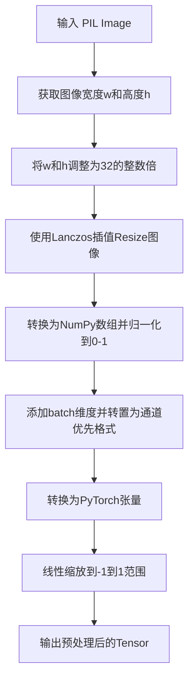
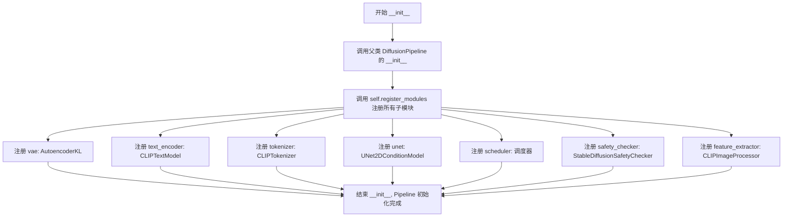
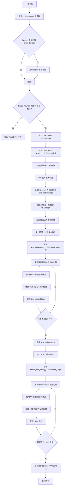
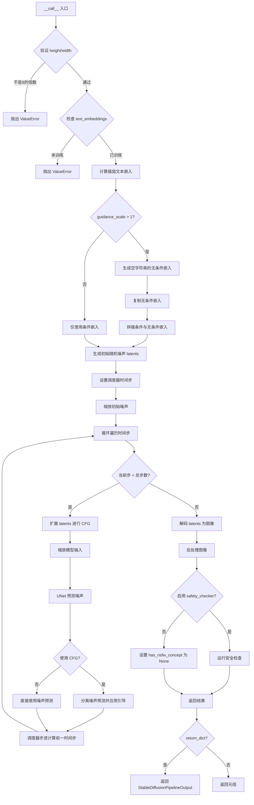

# `diffusers\examples\community\imagic_stable_diffusion.py` 详细设计文档

ImagicStableDiffusionPipeline实现了Imagic图像编辑算法，通过两阶段训练优化文本嵌入并微调UNet模型，实现基于文本引导的图像编辑功能。该管道继承自DiffusionPipeline，结合了VAE、CLIP文本编码器和条件U-Net等组件。

## 整体流程

```mermaid
graph TD
    A[开始] --> B[训练阶段]
    B --> B1[初始化Accelerator]
    B1 --> B2[冻结VAE/UNet/TextEncoder]
    B2 --> B3[获取文本嵌入并设置为可训练]
    B3 --> B4[编码输入图像到latent空间]
    B4 --> B5[第一阶段: 优化文本嵌入<br/>text_embedding_optimization_steps次]
    B5 --> B6[第二阶段: 解冻UNet并微调<br/>model_fine_tuning_optimization_steps次]
    B6 --> B7[保存原始和优化后的文本嵌入]
    B7 --> C[推理阶段]
    C --> C1[验证train已执行]
    C1 --> C2[插值计算文本嵌入<br/>alpha * orig + (1-alpha) * optimized]
    C2 --> C3[处理classifier-free guidance]
    C3 --> C4[初始化随机噪声latents]
    C4 --> C5[去噪循环<br/>num_inference_steps次]
    C5 --> C6[VAE解码latents到图像]
    C6 --> C7[安全检查器检查NSFW]
    C7 --> D[输出StableDiffusionPipelineOutput]
```

## 类结构

```
DiffusionPipeline (基类)
└── ImagicStableDiffusionPipeline
    ├── StableDiffusionMixin (混入)
    └── 组件模块:
        ├── vae (AutoencoderKL)
        ├── text_encoder (CLIPTextModel)
        ├── tokenizer (CLIPTokenizer)
        ├── unet (UNet2DConditionModel)
        ├── scheduler (DDIMScheduler/PNDMScheduler/LMSDiscreteScheduler)
        ├── safety_checker (StableDiffusionSafetyChecker)
        └── feature_extractor (CLIPImageProcessor)
```

## 全局变量及字段


### `PIL_INTERPOLATION`
    
PIL图像重采样方法字典，根据PIL版本选择不同的重采样模式

类型：`dict`
    


### `logger`
    
diffusers库的日志记录器实例

类型：`logging.Logger`
    


### `ImagicStableDiffusionPipeline.vae`
    
变分自编码器模型，用于图像与潜在表示之间的编码和解码

类型：`AutoencoderKL`
    


### `ImagicStableDiffusionPipeline.text_encoder`
    
冻结的CLIP文本编码器，用于将文本提示转换为向量表示

类型：`CLIPTextModel`
    


### `ImagicStableDiffusionPipeline.tokenizer`
    
CLIP分词器，用于将文本分割成token序列

类型：`CLIPTokenizer`
    


### `ImagicStableDiffusionPipeline.unet`
    
条件U-Net去噪模型，用于预测噪声残差并逐步去噪

类型：`UNet2DConditionModel`
    


### `ImagicStableDiffusionPipeline.scheduler`
    
噪声调度器，控制扩散过程中的噪声添加和去除策略

类型：`Union[DDIMScheduler, PNDMScheduler, LMSDiscreteScheduler]`
    


### `ImagicStableDiffusionPipeline.safety_checker`
    
NSFW内容检查器，用于检测生成图像是否包含不当内容

类型：`StableDiffusionSafetyChecker`
    


### `ImagicStableDiffusionPipeline.feature_extractor`
    
CLIP图像特征提取器，用于提取图像特征供安全检查器使用

类型：`CLIPImageProcessor`
    


### `ImagicStableDiffusionPipeline.text_embeddings`
    
训练优化后的文本嵌入张量，用于图像生成时的条件控制

类型：`Optional[torch.Tensor]`
    


### `ImagicStableDiffusionPipeline.text_embeddings_orig`
    
原始文本嵌入张量备份，用于推理时的插值混合

类型：`Optional[torch.Tensor]`
    
    

## 全局函数及方法


### `preprocess`

该函数用于将 PIL 图像预处理为符合 Stable Diffusion 模型输入要求的张量格式，包括将图像尺寸调整为 32 的整数倍、使用 Lanczos 插值 resize、归一化到 [0,1]、转换为通道优先的张量格式，最后线性缩放到 [-1,1] 范围。

参数：

- `image`：`PIL.Image.Image`，输入的 PIL 图像对象

返回值：`torch.Tensor`，预处理后的图像张量，形状为 (1, C, H, W)，数值范围在 [-1, 1]

#### 流程图



#### 带注释源码

```python
def preprocess(image):
    # 获取输入图像的宽度和高度
    w, h = image.size
    # 将宽度和高度调整为32的整数倍，确保后续处理的兼容性
    # 通过减去模32的余数来实现
    w, h = (x - x % 32 for x in (w, h))
    # 使用Lanczos插值方法将图像resize到调整后的尺寸
    image = image.resize((w, h), resample=PIL_INTERPOLATION["lanczos"])
    # 将PIL图像转换为NumPy数组，并归一化到[0, 1]范围（除以255）
    image = np.array(image).astype(np.float32) / 255.0
    # 添加batch维度 [H, W, C] -> [1, H, W, C]，然后转置为 [1, C, H, W] 通道优先格式
    image = image[None].transpose(0, 3, 1, 2)
    # 将NumPy数组转换为PyTorch张量
    image = torch.from_numpy(image)
    # 将图像数值从[0, 1]线性缩放到[-1, 1]范围，符合Stable Diffusion的输入要求
    return 2.0 * image - 1.0
```


### `ImagicStableDiffusionPipeline.__init__`

这是ImagicStableDiffusionPipeline类的构造函数，用于初始化Imagic图像编辑Pipeline的所有核心组件。该方法接收变分自编码器(VAE)、文本编码器、分词器、UNet模型、调度器、安全检查器和特征提取器等关键组件，并通过register_modules方法将它们注册到Pipeline中，使Pipeline具备文本到图像生成和图像编辑的能力。

参数：

- `self`：隐含参数，ImagicStableDiffusionPipeline类的实例本身
- `vae`：`AutoencoderKL`，变分自编码器模型，用于将图像编码到潜在空间并从潜在表示解码图像
- `text_encoder`：`CLIPTextModel`，冻结的文本编码器，Stable Diffusion使用CLIP的文本部分（clip-vit-large-patch14变体）
- `tokenizer`：`CLIPTokenizer`，CLIP分词器，用于将文本 prompts 转换为token ids
- `unet`：`UNet2DConditionModel`，条件U-Net架构，用于对编码后的图像潜在表示进行去噪
- `scheduler`：`Union[DDIMScheduler, PNDMScheduler, LMSDiscreteScheduler]`，调度器，用于与unet配合对编码图像潜在表示进行去噪
- `safety_checker`：`StableDiffusionSafetyChecker`，安全检查模块，用于评估生成的图像是否包含不当或有害内容
- `feature_extractor`：`CLIPImageProcessor`，特征提取器模型，用于从生成的图像中提取特征作为安全检查器的输入

返回值：`None`，构造函数不返回任何值，仅初始化对象状态

#### 流程图



#### 带注释源码

```python
def __init__(
    self,
    vae: AutoencoderKL,
    text_encoder: CLIPTextModel,
    tokenizer: CLIPTokenizer,
    unet: UNet2DConditionModel,
    scheduler: Union[DDIMScheduler, PNDMScheduler, LMSDiscreteScheduler],
    safety_checker: StableDiffusionSafetyChecker,
    feature_extractor: CLIPImageProcessor,
):
    """
    初始化 ImagicStableDiffusionPipeline。
    
    该构造函数接收Stable Diffusion的所有核心组件，并将它们注册到Pipeline中，
    使其能够执行Imagic图像编辑任务。
    
    参数:
        vae: 变分自编码器(VAE)模型，用于图像与潜在表示之间的编码和解码
        text_encoder: CLIP文本编码器，用于将文本提示转换为文本嵌入
        tokenizer: CLIP分词器，用于将文本分割为token序列
        unet: 条件U-Net模型，用于预测噪声残差并进行去噪
        scheduler: 噪声调度器，控制去噪过程中的噪声添加和移除
        safety_checker: 安全检查器，过滤可能的不当内容
        feature_extractor: CLIP图像处理器，用于提取图像特征供安全检查器使用
    """
    # 调用父类 DiffusionPipeline 的初始化方法
    # 父类负责基本的Pipeline设置和配置
    super().__init__()
    
    # 使用 register_modules 方法注册所有子模块
    # 这会将各个组件存储在 Pipeline 的内部属性中
    # 同时使这些组件可以通过 Pipeline 的属性访问
    self.register_modules(
        vae=vae,
        text_encoder=text_encoder,
        tokenizer=tokenizer,
        unet=unet,
        scheduler=scheduler,
        safety_checker=safety_checker,
        feature_extractor=feature_extractor,
    )
    # 注册后，各组件可通过 self.vae, self.text_encoder 等方式访问
```


### `ImagicStableDiffusionPipeline.train`

该方法是 Imagic 图像编辑管道的核心训练方法，通过两阶段优化过程实现对图像的语义编辑：首先优化文本嵌入（Text Embedding）以重建输入图像，然后微调 UNet 模型以进一步提升重建质量。整个过程不生成新图像，而是学习针对特定图像优化的嵌入向量和微调的模型参数。

参数：

- `prompt`：`Union[str, List[str]]`，用于指导图像生成的语言提示
- `image`：`Union[torch.Tensor, PIL.Image.Image]]`，需要进行编辑的输入图像
- `height`：`Optional[int] = 512`，生成图像的高度（像素）
- `width`：`Optional[int] = 512`，生成图像的宽度（像素）
- `generator`：`torch.Generator | None = None`，用于确保生成过程确定性的 PyTorch 随机数生成器
- `embedding_learning_rate`：`float = 0.001`，文本嵌入优化阶段的学习率
- `diffusion_model_learning_rate`：`float = 2e-6`，UNet 微调阶段的学习率
- `text_embedding_optimization_steps`：`int = 500`，文本嵌入优化的步数
- `model_fine_tuning_optimization_steps`：`int = 1000`，UNet 微调的步数
- `**kwargs`：其他关键字参数（如 `torch_device`，已废弃）

返回值：`None`，该方法直接在管道对象上存储训练得到的嵌入向量（`text_embeddings` 和 `text_embeddings_orig`），不返回任何值

#### 流程图



#### 带注释源码

```python
def train(
    self,
    prompt: Union[str, List[str]],
    image: Union[torch.Tensor, PIL.Image.Image],
    height: Optional[int] = 512,
    width: Optional[int] = 512,
    generator: torch.Generator | None = None,
    embedding_learning_rate: float = 0.001,
    diffusion_model_learning_rate: float = 2e-6,
    text_embedding_optimization_steps: int = 500,
    model_fine_tuning_optimization_steps: int = 1000,
    **kwargs,
):
    # 初始化 Accelerator 用于分布式训练和混合精度训练
    accelerator = Accelerator(
        gradient_accumulation_steps=1,
        mixed_precision="fp16",
    )

    # 处理废弃的 torch_device 参数
    if "torch_device" in kwargs:
        device = kwargs.pop("torch_device")
        warnings.warn(
            "`torch_device` is deprecated as an input argument to `__call__` and will be removed in v0.3.0."
            " Consider using `pipe.to(torch_device)` instead."
        )

        if device is None:
            device = "cuda" if torch.cuda.is_available() else "cpu"
        self.to(device)

    # 验证图像尺寸是否为 8 的倍数（UNet 的要求）
    if height % 8 != 0 or width % 8 != 0:
        raise ValueError(f"`height` and `width` have to be divisible by 8 but are {height} and {width}.")

    # 冻结 VAE、UNet 和 TextEncoder，训练过程中不更新这些模型参数
    self.vae.requires_grad_(False)
    self.unet.requires_grad_(False)
    self.text_encoder.requires_grad_(False)
    # 设置为评估模式（尽管不训练，但某些层如 Dropout 在 eval 模式下行为不同）
    self.unet.eval()
    self.vae.eval()
    self.text_encoder.eval()

    # 初始化训练跟踪器（仅主进程）
    if accelerator.is_main_process:
        accelerator.init_trackers(
            "imagic",
            config={
                "embedding_learning_rate": embedding_learning_rate,
                "text_embedding_optimization_steps": text_embedding_optimization_steps,
            },
        )

    # ========== 第一阶段：获取文本嵌入并初始化优化器 ==========
    # 对 prompt 进行 tokenize 处理
    text_input = self.tokenizer(
        prompt,
        padding="max_length",
        max_length=self.tokenizer.model_max_length,
        truncation=True,
        return_tensors="pt",
    )
    # 获取文本嵌入，并设置为可训练参数
    text_embeddings = torch.nn.Parameter(
        self.text_encoder(text_input.input_ids.to(self.device))[0], requires_grad=True
    )
    # 断开与计算图的连接，使其可以单独优化
    text_embeddings = text_embeddings.detach()
    # 重新启用梯度追踪
    text_embeddings.requires_grad_()
    # 保存原始嵌入的副本，用于后续插值生成
    text_embeddings_orig = text_embeddings.clone()

    # 初始化 Adam 优化器，仅优化文本嵌入
    optimizer = torch.optim.Adam(
        [text_embeddings],  # only optimize the embeddings
        lr=embedding_learning_rate,
    )

    # ========== 图像预处理和编码 ==========
    # 如果输入是 PIL 图像，进行预处理
    if isinstance(image, PIL.Image.Image):
        image = preprocess(image)

    # 获取潜在向量的数据类型（与文本嵌入保持一致）
    latents_dtype = text_embeddings.dtype
    # 将图像移动到指定设备并转换数据类型
    image = image.to(device=self.device, dtype=latents_dtype)
    # 使用 VAE 编码图像到潜在空间
    init_latent_image_dist = self.vae.encode(image).latent_dist
    # 从潜在分布中采样
    image_latents = init_latent_image_dist.sample(generator=generator)
    # 缩放潜在向量（VAE 的标准缩放因子）
    image_latents = 0.18215 * image_latents

    # ========== 第一阶段：优化文本嵌入 ==========
    progress_bar = tqdm(range(text_embedding_optimization_steps), disable=not accelerator.is_local_main_process)
    progress_bar.set_description("Steps")

    global_step = 0

    logger.info("First optimizing the text embedding to better reconstruct the init image")
    # 循环优化文本嵌入
    for _ in range(text_embedding_optimization_steps):
        with accelerator.accumulate(text_embeddings):
            # 采样噪声
            noise = torch.randn(image_latents.shape).to(image_latents.device)
            # 随机选择时间步
            timesteps = torch.randint(1000, (1,), device=image_latents.device)

            # 前向扩散过程：向潜在向量添加噪声
            noisy_latents = self.scheduler.add_noise(image_latents, noise, timesteps)

            # 使用 UNet 预测噪声残差
            noise_pred = self.unet(noisy_latents, timesteps, text_embeddings).sample

            # 计算预测噪声与真实噪声之间的 MSE 损失
            loss = F.mse_loss(noise_pred, noise, reduction="none").mean([1, 2, 3]).mean()
            # 反向传播
            accelerator.backward(loss)

            # 更新参数
            optimizer.step()
            # 清空梯度
            optimizer.zero_grad()

        # 检查是否执行了优化步骤
        if accelerator.sync_gradients:
            progress_bar.update(1)
            global_step += 1

        # 记录训练日志
        logs = {"loss": loss.detach().item()}
        progress_bar.set_postfix(**logs)
        accelerator.log(logs, step=global_step)

    # 等待所有进程完成
    accelerator.wait_for_everyone()

    # 冻结文本嵌入，停止优化
    text_embeddings.requires_grad_(False)

    # ========== 第二阶段：微调 UNet ==========
    # 解冻 UNet，设置其为训练模式
    self.unet.requires_grad_(True)
    self.unet.train()
    # 创建新的优化器，仅优化 UNet 参数
    optimizer = torch.optim.Adam(
        self.unet.parameters(),  # only optimize unet
        lr=diffusion_model_learning_rate,
    )
    # 新的进度条
    progress_bar = tqdm(range(model_fine_tuning_optimization_steps), disable=not accelerator.is_local_main_process)

    logger.info("Next fine tuning the entire model to better reconstruct the init image")
    # 循环微调 UNet
    for _ in range(model_fine_tuning_optimization_steps):
        with accelerator.accumulate(self.unet.parameters()):
            # 采样噪声
            noise = torch.randn(image_latents.shape).to(image_latents.device)
            # 随机选择时间步
            timesteps = torch.randint(1000, (1,), device=image_latents.device)

            # 前向扩散过程
            noisy_latents = self.scheduler.add_noise(image_latents, noise, timesteps)

            # 使用 UNet 和优化后的文本嵌入预测噪声残差
            noise_pred = self.unet(noisy_latents, timesteps, text_embeddings).sample

            # 计算损失并反向传播
            loss = F.mse_loss(noise_pred, noise, reduction="none").mean([1, 2, 3]).mean()
            accelerator.backward(loss)

            # 更新 UNet 参数
            optimizer.step()
            # 清空梯度
            optimizer.zero_grad()

        # 检查是否执行了优化步骤
        if accelerator.sync_gradients:
            progress_bar.update(1)
            global_step += 1

        # 记录训练日志
        logs = {"loss": loss.detach().item()}
        progress_bar.set_postfix(**logs)
        accelerator.log(logs, step=global_step)

    # 等待所有进程完成
    accelerator.wait_for_everyone()
    
    # 将原始和优化后的文本嵌入保存到管道对象属性中，供 __call__ 方法使用
    self.text_embeddings_orig = text_embeddings_orig
    self.text_embeddings = text_embeddings
```


### `ImagicStableDiffusionPipeline.__call__`

该方法是 Imagic 图像编辑管道的推理入口，通过接受训练阶段生成的原始和优化后的文本嵌入，利用插值因子 `alpha` 在两者之间进行线性插值，然后执行标准的 Stable Diffusion 去噪过程来生成编辑后的图像。

参数：

- `alpha`：`float`，可选，默认为 1.2，原始与优化文本嵌入之间的插值因子，值越接近 0 越接近原始输入图像
- `height`：`Optional[int]`，可选，默认为 512，生成图像的高度（像素）
- `width`：`Optional[int]`，可选，默认为 512，生成图像的宽度（像素）
- `num_inference_steps`：`Optional[int]`，可选，默认为 50，去噪步骤数，步数越多通常图像质量越高但推理越慢
- `generator`：`torch.Generator | None`，可选，用于使生成过程确定性的随机生成器
- `output_type`：`str | None`，可选，默认为 "pil"，生成图像的输出格式，可选 "pil" 或 "nd.array"
- `return_dict`：`bool`，可选，默认为 True，是否返回 `StableDiffusionPipelineOutput` 而非元组
- `guidance_scale`：`float`，可选，默认为 7.5，分类器自由引导（Classifier-Free Diffusion Guidance）权重
- `eta`：`float`，可选，默认为 0.0，仅 DDIM 调度器使用的参数，对应 DDIM 论文中的 η

返回值：`StableDiffusionPipelineOutput` 或 `tuple`，如果 `return_dict` 为 True，返回包含生成图像和 NSFW 检测结果的 `StableDiffusionPipelineOutput`，否则返回元组 (图像列表, NSFW 标记列表)

#### 流程图



#### 带注释源码

```python
@torch.no_grad()
def __call__(
    self,
    alpha: float = 1.2,
    height: Optional[int] = 512,
    width: Optional[int] = 512,
    num_inference_steps: Optional[int] = 50,
    generator: torch.Generator | None = None,
    output_type: str | None = "pil",
    return_dict: bool = True,
    guidance_scale: float = 7.5,
    eta: float = 0.0,
):
    """
    推理生成方法，用于在训练后生成编辑后的图像
    """
    # 验证图像尺寸是否为8的倍数（VAE下采样因子要求）
    if height % 8 != 0 or width % 8 != 0:
        raise ValueError(f"`height` and `width` have to be divisible by 8 but are {height} and {width}.")
    
    # 确保已执行训练阶段以获得文本嵌入
    if self.text_embeddings is None:
        raise ValueError("Please run the pipe.train() before trying to generate an image.")
    if self.text_embeddings_orig is None:
        raise ValueError("Please run the pipe.train() before trying to generate an image.")

    # 使用 alpha 因子对原始和优化后的文本嵌入进行线性插值
    # alpha=1.2 表示更偏向原始嵌入，alpha 值越小越接近优化后的嵌入
    text_embeddings = alpha * self.text_embeddings_orig + (1 - alpha) * self.text_embeddings

    # 确定是否启用分类器自由引导（Classifier-Free Guidance）
    # guidance_scale > 1.0 时启用，值越大越严格遵守文本提示
    do_classifier_free_guidance = guidance_scale > 1.0
    
    # 获取无条件嵌入用于分类器自由引导
    if do_classifier_free_guidance:
        # 使用空字符串作为无条件提示
        uncond_tokens = [""]
        max_length = self.tokenizer.model_max_length
        # 对空字符串进行分词
        uncond_input = self.tokenizer(
            uncond_tokens,
            padding="max_length",
            max_length=max_length,
            truncation=True,
            return_tensors="pt",
        )
        # 编码为空条件嵌入
        uncond_embeddings = self.text_encoder(uncond_input.input_ids.to(self.device))[0]

        # 将无条件嵌入reshape为适合拼接的形状
        seq_len = uncond_embeddings.shape[1]
        uncond_embeddings = uncond_embeddings.view(1, seq_len, -1)

        # 拼接无条件嵌入和条件嵌入以一次性完成前向传播
        text_embeddings = torch.cat([uncond_embeddings, text_embeddings])

    # 定义潜在空间形状（考虑VAE的8x下采样）
    latents_shape = (1, self.unet.config.in_channels, height // 8, width // 8)
    latents_dtype = text_embeddings.dtype
    
    # 初始化随机潜在向量
    # 处理MPS设备的兼容性（randn在MPS上不可用）
    if self.device.type == "mps":
        latents = torch.randn(latents_shape, generator=generator, device="cpu", dtype=latents_dtype).to(
            self.device
        )
    else:
        latents = torch.randn(latents_shape, generator=generator, device=self.device, dtype=latents_dtype)

    # 设置调度器的时间步
    self.scheduler.set_timesteps(num_inference_steps)

    # 将时间步转移到目标设备
    timesteps_tensor = self.scheduler.timesteps.to(self.device)

    # 根据调度器要求缩放初始噪声
    latents = latents * self.scheduler.init_noise_sigma

    # 准备调度器步进的额外参数
    # eta 仅用于 DDIM 调度器，其他调度器会忽略
    accepts_eta = "eta" in set(inspect.signature(self.scheduler.step).parameters.keys())
    extra_step_kwargs = {}
    if accepts_eta:
        extra_step_kwargs["eta"] = eta

    # 主去噪循环：遍历所有时间步
    for i, t in enumerate(self.progress_bar(timesteps_tensor)):
        # 如果使用 CFG，需要扩展 latents 以同时处理条件和无条件预测
        latent_model_input = torch.cat([latents] * 2) if do_classifier_free_guidance else latents
        # 根据当前时间步缩放输入
        latent_model_input = self.scheduler.scale_model_input(latent_model_input, t)

        # 使用 UNet 预测噪声残差
        noise_pred = self.unet(latent_model_input, t, encoder_hidden_states=text_embeddings).sample

        # 执行分类器自由引导
        if do_classifier_free_guidance:
            # 分离无条件预测和条件预测
            noise_pred_uncond, noise_pred_text = noise_pred.chunk(2)
            # 应用引导：uncond + scale * (text - uncond)
            noise_pred = noise_pred_uncond + guidance_scale * (noise_pred_text - noise_pred_uncond)

        # 使用调度器计算前一个时间步的潜在向量
        latents = self.scheduler.step(noise_pred, t, latents, **extra_step_kwargs).prev_sample

    # 解码潜在向量到图像空间
    # 使用 1/0.18215 进行反向缩放（VAE 编码时的缩放因子）
    latents = 1 / 0.18215 * latents
    image = self.vae.decode(latents).sample

    # 后处理：将图像值从 [-1, 1] 映射到 [0, 1]
    image = (image / 2 + 0.5).clamp(0, 1)

    # 转换为 NumPy 数组以进行安全检查和输出
    image = image.cpu().permute(0, 2, 3, 1).float().numpy()

    # 运行安全检查器（如果启用）
    if self.safety_checker is not None:
        # 准备安全检查器的输入
        safety_checker_input = self.feature_extractor(self.numpy_to_pil(image), return_tensors="pt").to(
            self.device
        )
        # 执行安全检查
        image, has_nsfw_concept = self.safety_checker(
            images=image, clip_input=safety_checker_input.pixel_values.to(text_embeddings.dtype)
        )
    else:
        has_nsfw_concept = None

    # 根据 output_type 转换图像格式
    if output_type == "pil":
        image = self.numpy_to_pil(image)

    # 根据 return_dict 返回结果
    if not return_dict:
        return (image, has_nsfw_concept)

    return StableDiffusionPipelineOutput(images=image, nsfw_content_detected=has_nsfw_concept)
```

## 关键组件


### ImagicStableDiffusionPipeline

基于Stable Diffusion的Imagic图像编辑管道实现，支持通过文本提示对图像进行编辑和生成。

### train 方法

两阶段训练方法：首先优化文本嵌入以重建输入图像，然后微调UNet模型以提高重建质量。

### __call__ 推理方法

生成方法，使用训练好的文本嵌入和alpha插值因子进行图像生成，支持分类器-free引导。

### preprocess 函数

图像预处理函数，将PIL图像转换为适合模型输入的张量格式，包含Resize到32的倍数、归一化等操作。

### 文本嵌入优化 (第一阶段训练)

在训练的第一阶段，通过优化文本嵌入向量使其能够更好地重建输入图像，使用MSE损失函数预测噪声。

### UNet微调 (第二阶段训练)

训练的第二阶段，解冻UNet并对其进行微调，进一步提高图像重建的质量。

### 分类器-Free引导 (Classifier-Free Guidance)

推理时使用的引导技术，通过插值条件和无条件噪声预测来增强文本条件的遵循度。

### VAE编解码

使用变分自编码器进行图像与潜在表示之间的转换，包括encode生成latents和decode从latents重建图像。

### 噪声调度器 (Scheduler)

集成的噪声调度器(DDIM/LMS/PNDM)，用于执行扩散过程的前向和反向步骤。

### 安全检查器 (Safety Checker)

用于检测生成图像是否包含不当内容的模块，基于CLIP特征进行NSFW检测。


## 问题及建议


### 已知问题

- **文档与实现不一致**：`train`方法的文档字符串中包含了`__call__`推理方法的参数说明（如`num_inference_steps`、`guidance_scale`等），而`train`方法实际使用的参数（如`embedding_learning_rate`、`diffusion_model_learning_rate`等）却未在文档中说明。
- **硬编码的VAE缩放因子**：代码中硬编码使用了`0.18215`作为VAE缩放因子（出现在`image_latents = 0.18215 * image_latents`和`latents = 1 / 0.18215 * latents`），这应该从VAE配置中动态获取或定义为常量。
- **TODO待办事项未完成**：代码中包含TODO注释`# TODO: remove and import from diffusers.utils when the new version of diffusers is released`，表明版本兼容性处理是临时性的。
- **未初始化的类属性**：`self.text_embeddings`和`self.text_embeddings_orig`在`__init__`方法中未初始化，仅在`train`方法执行后才存在，如果直接调用`__call__`会引发属性错误。
- **设备处理不一致**：`train`方法中通过`kwargs.pop("torch_device")`处理设备，但`__call__`方法中假设使用`self.device`，两种方式不统一。
- **MPS设备随机数问题**：代码中针对MPS设备有特殊处理（`latents`生成时先在CPU生成再移到MPS），但训练循环中的`torch.randn`未做类似处理，可能导致不支持的操作。

### 优化建议

- **完善文档字符串**：修正`train`方法的文档，移除不相关的推理参数说明，添加`embedding_learning_rate`、`diffusion_model_learning_rate`、`text_embedding_optimization_steps`、`model_fine_tuning_optimization_steps`等训练相关参数的说明。
- **提取配置常量**：将`0.18215`提取为类常量或从VAE配置中读取，提高代码可维护性。
- **初始化默认值**：在`__init__`方法中初始化`self.text_embeddings = None`和`self.text_embeddings_orig = None`，并在`__call__`方法中使用更清晰的检查逻辑。
- **统一设备管理**：移除`train`方法中通过`kwargs`处理设备的旧方式，统一使用`self.device`或通过`to()`方法传递设备。
- **优化梯度累积**：当前`gradient_accumulation_steps=1`可考虑根据显存情况调整，以提高训练效率。
- **添加输入验证**：增加对`prompt`为空、图像尺寸不合理等边界情况的验证处理。
- **代码重构**：将PIL插值模式映射逻辑提取为独立函数或工具类，减少重复代码。

## 其它


### 设计目标与约束

本Pipeline的设计目标是实现Imagic图像编辑技术，通过优化文本嵌入和微调UNet模型来编辑输入图像。核心约束包括：输入图像尺寸必须为32的倍数；支持DDIMScheduler、LMSDiscreteScheduler和PNDMScheduler三种调度器；训练过程分为两个阶段（文本嵌入优化和模型微调）；推理阶段支持classifier-free guidance。

### 错误处理与异常设计

代码在以下场景抛出ValueError：height或width不是8的倍数时；未执行train()方法直接调用__call__时。torch_device参数已废弃并在kwargs中弹出警告。PIL版本检测用于兼容不同版本的图像插值方法。accelerator的sync_gradients用于检查优化步骤是否执行。

### 数据流与状态机

Pipeline有两种状态：训练状态（train方法执行后，text_embeddings和text_embeddings_orig被保存）和推理状态（__call__方法执行）。训练阶段首先优化text_embeddings，然后冻结text_embeddings并微调unet。推理阶段通过alpha参数在原始和优化后的文本嵌入之间插值，生成编辑后的图像。

### 外部依赖与接口契约

依赖包括：diffusers库（DiffusionPipeline、StableDiffusionMixin等）；transformers库（CLIPTextModel、CLIPTokenizer、CLIPImageProcessor）；accelerate库（Accelerator）；torch及numpy；PIL；tqdm；packaging。输入图像支持torch.Tensor或PIL.Image.Image格式，输出支持PIL.Image.Image或numpy数组。

### 配置与参数说明

关键参数：embedding_learning_rate（默认0.001）控制文本嵌入优化学习率；diffusion_model_learning_rate（默认2e-6）控制UNet微调学习率；text_embedding_optimization_steps（默认500）和model_fine_tuning_optimization_steps（默认1000）控制两阶段训练步数；alpha（默认1.2）控制推理时原始与优化嵌入的插值。

### 性能考虑与优化建议

当前实现使用FP16混合精度训练。潜在优化空间：1）可添加梯度检查点以节省显存；2）可实现分布式训练支持；3）可添加Early Stopping机制；4）可使用torch.compile加速推理；5）可添加模型量化支持。

### 安全性考虑

代码集成了StableDiffusionSafetyChecker用于检测NSFW内容。图像生成后会自动进行安全检查，若检测到不当内容会标记返回。safety_checker_input使用与text_embeddings相同的dtype以保证兼容性。

### 版本兼容性与升级策略

代码通过packaging.version检查PIL版本以兼容9.1.0前后的API差异。torch_device参数已标记为废弃将在v0.3.0移除。建议后续版本：移除kwargs中的torch_device支持；使用最新diffusers.utils导入；添加对更多调度器的支持。

### 测试策略建议

建议添加单元测试覆盖：preprocess函数的各种输入尺寸；train方法的两个训练阶段；__call__方法的alpha插值逻辑；错误处理场景（尺寸不合规、未训练直接推理）。建议添加集成测试验证端到端的图像编辑流程。

### 部署与运维注意事项

部署时需注意：确保CUDA可用以获得最佳性能；混合精度训练需要兼容的GPU；模型文件较大需合理管理存储；训练过程显存需求较高建议使用至少16GB显存的GPU；推理阶段可考虑使用FP16推理加速。


    