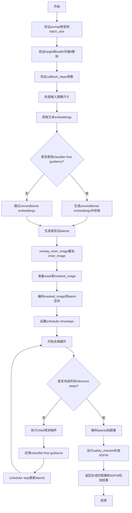
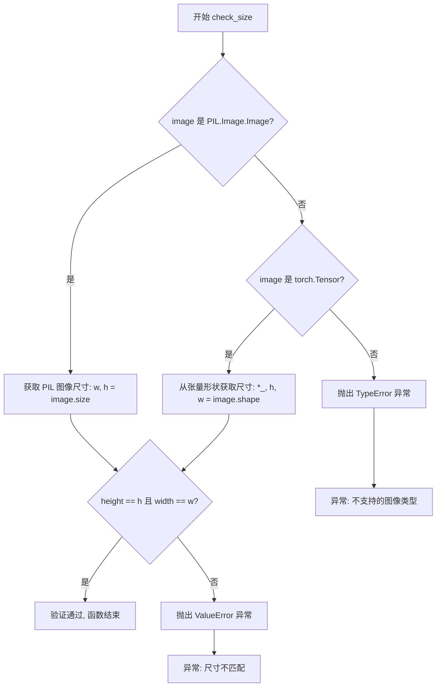
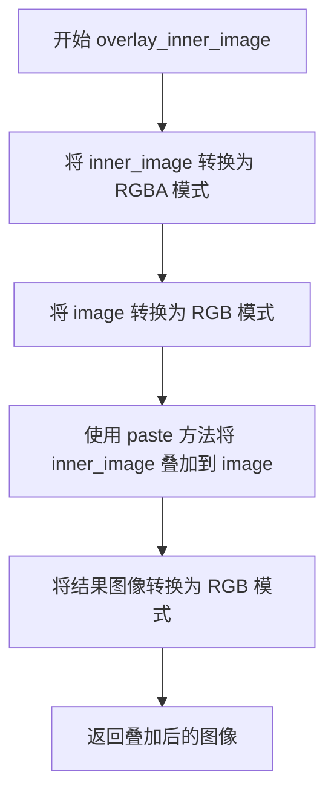

# `diffusers\examples\community\img2img_inpainting.py` 详细设计文档

这是一个基于Stable Diffusion的图像修复（inpainting）pipeline，允许用户通过文本提示（prompt）来修复图像的特定区域。该pipeline继承自DiffusionPipeline，支持图像到图像的修复工作流，可以将inner_image叠加到原始image上，并根据mask_image指定的区域进行重新生成。

## 整体流程



## 类结构

```
DiffusionPipeline (基类)
└── ImageToImageInpaintingPipeline
    ├── 依赖模块: AutoencoderKL, CLIPTextModel, CLIPTokenizer
    ├── 依赖模块: UNet2DConditionModel, StableDiffusionSafetyChecker
    └── 依赖模块: DDIMScheduler/LMSDiscreteScheduler/PNDMScheduler
```

## 全局变量及字段


### `logger`
    
用于记录模块日志的Logger实例，通过diffusers的logging模块获取

类型：`logging.Logger`
    


### `ImageToImageInpaintingPipeline.vae`
    
变分自编码器模型，用于将图像编码到潜在空间并从潜在表示解码图像

类型：`AutoencoderKL`
    


### `ImageToImageInpaintingPipeline.text_encoder`
    
冻结的CLIP文本编码器，用于将文本提示编码为文本嵌入向量

类型：`CLIPTextModel`
    


### `ImageToImageInpaintingPipeline.tokenizer`
    
CLIP分词器，用于将文本提示转换为token id序列

类型：`CLIPTokenizer`
    


### `ImageToImageInpaintingPipeline.unet`
    
条件U-Net网络架构，用于对编码后的图像潜在表示进行去噪

类型：`UNet2DConditionModel`
    


### `ImageToImageInpaintingPipeline.scheduler`
    
调度器，用于在去噪过程中逐步减少图像潜在表示的噪声

类型：`Union[DDIMScheduler, PNDMScheduler, LMSDiscreteScheduler]`
    


### `ImageToImageInpaintingPipeline.safety_checker`
    
安全检查模块，用于估计生成的图像是否包含违规或有害内容

类型：`StableDiffusionSafetyChecker`
    


### `ImageToImageInpaintingPipeline.feature_extractor`
    
CLIP图像特征提取器，用于从生成的图像中提取特征作为安全检查器的输入

类型：`CLIPImageProcessor`
    
    

## 全局函数及方法


### `prepare_mask_and_masked_image`

该函数用于将输入的图像和掩码转换为PyTorch张量格式，并对掩码进行二值化处理，同时生成被掩码覆盖的图像版本。它是Stable Diffusion图像修复（inpainting）pipeline中的关键预处理步骤。

参数：

- `image`：`PIL.Image.Image` 或 `torch.Tensor`，需要处理的原始RGB图像
- `mask`：`PIL.Image.Image` 或 `torch.Tensor`，用于标识需要修复区域的掩码图像（白色区域表示需要修复）

返回值：`Tuple[torch.Tensor, torch.Tensor]`，返回元组包含二值化掩码和被掩码覆盖的图像张量

#### 流程图

```mermaid
flowchart TD
    A[开始: 输入image和mask] --> B[将image转换为RGB模式]
    B --> C[转为numpy数组]
    C --> D[添加批次维度并转置: HWC to CHW]
    D --> E[转为float32张量并归一化到[-1, 1]]
    F[将mask转换为L模式] --> G[转为numpy数组]
    G --> H[转为float32并归一化到[0, 1]]
    H --> I[添加批次和通道维度]
    I --> J[二值化: <0.5设为0, >=0.5设为1]
    J --> K[转为torch.Tensor]
    E --> L[计算masked_image: image * (mask < 0.5)]
    K --> L
    L --> M[返回mask和masked_image]
```

#### 带注释源码

```python
def prepare_mask_and_masked_image(image, mask):
    """
    准备掩码和被掩码覆盖的图像，用于图像修复（inpainting）任务。
    
    参数:
        image: 输入的PIL图像或张量，需要被修复的图像
        mask: 输入的PIL掩码图像，白色区域表示需要修复
    
    返回:
        mask: 二值化后的torch.Tensor掩码，形状为(1, 1, H, W)
        masked_image: 被掩码覆盖的图像，形状为(1, 3, H, W)
    """
    
    # ========== 处理原始图像 ==========
    # 步骤1: 将PIL图像转换为RGB模式（确保3通道）
    image = np.array(image.convert("RGB"))
    
    # 步骤2: 添加批次维度并转置
    # 从 (H, W, C) 转换为 (1, C, H, W) 格式
    # [None] 相当于在前面添加一个维度，transpose(0, 3, 1, 2) 将通道维移到最后
    image = image[None].transpose(0, 3, 1, 2)
    
    # 步骤3: 转为PyTorch张量并归一化
    # 除以127.5并减1，将像素值从[0, 255]映射到[-1, 1]
    # 这是Stable Diffusion模型期望的输入范围
    image = torch.from_numpy(image).to(dtype=torch.float32) / 127.5 - 1.0
    
    # ========== 处理掩码 ==========
    # 步骤1: 将掩码转换为灰度（L）模式，只保留亮度信息
    mask = np.array(mask.convert("L"))
    
    # 步骤2: 转为float32并归一化到[0, 1]范围
    mask = mask.astype(np.float32) / 255.0
    
    # 步骤3: 添加批次和通道维度
    # 从 (H, W) 变为 (1, 1, H, W)
    mask = mask[None, None]
    
    # 步骤4: 二值化处理
    # 阈值0.5：小于0.5设为0，大于等于0.5设为1
    # 这创建了一个清晰的二值掩码，用于区分需要修复和保留的区域
    mask[mask < 0.5] = 0
    mask[mask >= 0.5] = 1
    
    # 步骤5: 转为PyTorch张量
    mask = torch.from_numpy(mask)
    
    # ========== 生成被掩码覆盖的图像 ==========
    # masked_image = image * (mask < 0.5)
    # (mask < 0.5) 创建了一个反向掩码：原掩码中为0的位置（需要修复的区域）设为1
    # 这样在需要修复的区域，图像像素保持原样；而在不需要修复的区域，图像被设为0
    # 这允许模型只关注需要修复的区域
    masked_image = image * (mask < 0.5)
    
    return mask, masked_image
```


### `check_size`

该函数是一个全局工具函数，用于验证输入图像的尺寸是否与指定的期望尺寸（height 和 width）相匹配。如果图像尺寸不符合要求，则抛出 ValueError 异常。这是图像处理管道中的验证步骤，确保后续处理（如 inpainting）能够正确执行。

参数：

- `image`：`Union[PIL.Image.Image, torch.Tensor]`，输入的图像对象，可以是 PIL 图像或 PyTorch 张量
- `height`：`int`，期望的图像高度（像素）
- `width`：`int`，期望的图像宽度（像素）

返回值：`None`，该函数不返回任何值，仅进行尺寸验证

#### 流程图



#### 带注释源码

```python
def check_size(image, height, width):
    """
    检查输入图像的尺寸是否与指定的期望尺寸匹配。
    
    参数:
        image: 输入的图像，可以是 PIL.Image.Image 或 torch.Tensor
        height: 期望的图像高度
        width: 期望的图像宽度
    
    异常:
        ValueError: 当图像尺寸与期望尺寸不匹配时抛出
        TypeError: 当图像类型既不是 PIL.Image.Image 也不是 torch.Tensor 时抛出
    """
    # 判断输入图像的类型
    if isinstance(image, PIL.Image.Image):
        # 如果是 PIL 图像，使用 .size 属性获取宽度和高度
        w, h = image.size
    elif isinstance(image, torch.Tensor):
        # 如果是 PyTorch 张量，从形状中解包获取高度和宽度
        # 假设张量形状为 (B, C, H, W)，提取最后的 H 和 W
        *_, h, w = image.shape
    else:
        # 如果不是支持的图像类型，抛出类型错误
        raise TypeError(f"Expected PIL.Image.Image or torch.Tensor, got {type(image)}")

    # 检查实际尺寸是否与期望尺寸匹配
    if h != height or w != width:
        # 尺寸不匹配时抛出详细的错误信息
        raise ValueError(f"Image size should be {height}x{width}, but got {h}x{w}")
```


### `overlay_inner_image`

该函数用于将内部图像（inner_image）叠加到主图像（image）上，利用PIL的paste方法实现基于alpha通道的图像混合。

参数：

- `image`：`PIL.Image.Image`，需要叠加的目标图像
- `inner_image`：`PIL.Image.Image`，要叠加的内部图像，将被转换为RGBA格式使用其alpha通道作为混合mask
- `paste_offset`：`Tuple[int, ...]`，可选参数，指定inner_image在image上的粘贴偏移位置，默认为(0, 0)

返回值：`PIL.Image.Image`，叠加后的RGB图像

#### 流程图



#### 带注释源码

```python
def overlay_inner_image(image, inner_image, paste_offset: Tuple[int, ...] = (0, 0)):
    """
    将内部图像叠加到主图像上
    
    参数:
        image: PIL.Image.Image - 目标图像
        inner_image: PIL.Image.Image - 要叠加的图像
        paste_offset: Tuple[int, ...] - 粘贴偏移量
    
    返回:
        PIL.Image.Image - 叠加后的图像
    """
    # 将inner_image转换为RGBA格式，确保包含alpha通道用于混合
    inner_image = inner_image.convert("RGBA")
    
    # 将主image转换为RGB格式，确保颜色模式一致
    image = image.convert("RGB")

    # 使用paste方法将inner_image粘贴到image上
    # 第三个参数inner_image作为mask，利用其alpha通道进行透明度混合
    image.paste(inner_image, paste_offset, inner_image)
    
    # 将结果转换回RGB模式返回
    image = image.convert("RGB")

    return image
```


### `ImageToImageInpaintingPipeline.__init__`

该方法是 `ImageToImageInpaintingPipeline` 类的构造函数，用于初始化图像修复管道。它接收并配置 VAE、文本编码器、分词器、U-Net、调度器、安全检查器和特征提取器等核心组件，同时处理调度器的过时配置并注册所有模块。

参数：

- `vae`：`AutoencoderKL`，用于将图像编码和解码到潜在表示的变分自编码器模型
- `text_encoder`：`CLIPTextModel`，冻结的文本编码器，Stable Diffusion 使用 CLIP 的文本部分
- `tokenizer`：`CLIPTokenizer`，CLIP Tokenizer 类的分词器
- `unet`：`UNet2DConditionModel`，条件 U-Net 架构，用于对编码的图像潜在表示进行去噪
- `scheduler`：`Union[DDIMScheduler, PNDMScheduler, LMSDiscreteScheduler]`，与 `unet` 结合使用的调度器，用于对编码的图像潜在表示进行去噪
- `safety_checker`：`StableDiffusionSafetyChecker`，分类模块，用于评估生成的图像是否被认为具有攻击性或有害
- `feature_extractor`：`CLIPImageProcessor`，用于从生成的图像中提取特征并作为 `safety_checker` 输入的模型

返回值：无（`None`），构造函数不返回值

#### 流程图

```mermaid
flowchart TD
    A[开始 __init__] --> B[调用 super().__init__]
    B --> C{scheduler.config.steps_offset != 1?}
    C -->|是| D[生成弃用警告消息]
    D --> E[创建新配置 dict, 设置 steps_offset=1]
    E --> F[更新 scheduler._internal_dict]
    C -->|否| G{safety_checker is None?}
    G -->|是| H[记录安全检查器禁用警告日志]
    G -->|否| I[调用 register_modules 注册所有组件]
    H --> I
    I --> J[结束 __init__]
```

#### 带注释源码

```python
def __init__(
    self,
    vae: AutoencoderKL,
    text_encoder: CLIPTextModel,
    tokenizer: CLIPTokenizer,
    unet: UNet2DConditionModel,
    scheduler: Union[DDIMScheduler, PNDMScheduler, LMSDiscreteScheduler],
    safety_checker: StableDiffusionSafetyChecker,
    feature_extractor: CLIPImageProcessor,
):
    """
    初始化 ImageToImageInpaintingPipeline 管道。
    
    参数:
        vae: 变分自编码器模型，用于图像编码/解码
        text_encoder: CLIP文本编码器
        tokenizer: CLIP分词器
        unet: 条件U-Net去噪模型
        scheduler: 去噪调度器
        safety_checker: 安全检查器
        feature_extractor: 图像特征提取器
    """
    # 调用父类 DiffusionPipeline 的初始化方法
    super().__init__()

    # 检查调度器的 steps_offset 配置是否正确
    # 如果不等于 1，说明配置已过时，需要发出警告并修复
    if scheduler is not None and getattr(scheduler.config, "steps_offset", 1) != 1:
        # 生成详细的弃用警告消息
        deprecation_message = (
            f"The configuration file of this scheduler: {scheduler} is outdated. `steps_offset`"
            f" should be set to 1 instead of {scheduler.config.steps_offset}. Please make sure "
            "to update the config accordingly as leaving `steps_offset` might led to incorrect results"
            " in future versions. If you have downloaded this checkpoint from the Hugging Face Hub,"
            " it would be very nice if you could open a Pull request for the `scheduler/scheduler_config.json`"
            " file"
        )
        # 调用 deprecate 函数记录警告
        deprecate("steps_offset!=1", "1.0.0", deprecation_message, standard_warn=False)
        
        # 创建新配置，将 steps_offset 修正为 1
        new_config = dict(scheduler.config)
        new_config["steps_offset"] = 1
        scheduler._internal_dict = FrozenDict(new_config)

    # 如果用户禁用了安全检查器，发出警告
    # 提醒用户遵守 Stable Diffusion 许可证条款
    if safety_checker is None:
        logger.warning(
            f"You have disabled the safety checker for {self.__class__} by passing `safety_checker=None`. Ensure"
            " that you abide to the conditions of the Stable Diffusion license and do not expose unfiltered"
            " results in services or applications open to the public. Both the diffusers team and Hugging Face"
            " strongly recommend to keep the safety filter enabled in all public facing circumstances, disabling"
            " it only for use-cases that involve analyzing network behavior or auditing its results. For more"
            " information, please have a look at https://github.com/huggingface/diffusers/pull/254 ."
        )

    # 注册所有模块到管道中，使其可以通过 self.xxx 访问
    self.register_modules(
        vae=vae,
        text_encoder=text_encoder,
        tokenizer=tokenizer,
        unet=unet,
        scheduler=scheduler,
        safety_checker=safety_checker,
        feature_extractor=feature_extractor,
    )
```


### `ImageToImageInpaintingPipeline.__call__`

执行文本引导的图像修复（inpainting）操作，通过接收待修复的图像、内嵌图像、掩码图像和文本提示，使用Stable Diffusion模型生成符合文本描述的修复后图像。该方法支持分类器自由引导（CFG）以提高生成质量，并可选地调用安全检查器过滤不当内容。

参数：

- `prompt`：`Union[str, List[str]]`，引导图像生成的文本提示或提示列表
- `image`：`Union[torch.Tensor, PIL.Image.Image]`，将被修复的输入图像或图像批次，掩码区域将根据prompt进行重绘
- `inner_image`：`Union[torch.Tensor, PIL.Image.Image]`，将叠加到image上的内嵌图像，其非透明区域必须位于mask_image的白色像素内，需包含alpha通道
- `mask_image`：`Union[torch.Tensor, PIL.Image.Image]`，用于遮盖image的掩码图像，白色像素区域将被重绘，黑色像素区域保留
- `height`：`int`，可选，默认为512，生成图像的高度（像素）
- `width`：`int`，可选，默认为512，生成图像的宽度（像素）
- `num_inference_steps`：`int`，可选，默认为50，去噪步数，更多步数通常产生更高质量的图像但推理更慢
- `guidance_scale`：`float`，可选，默认为7.5，分类器自由扩散引导比例，用于控制生成图像与文本提示的关联度
- `negative_prompt`：`Optional[Union[str, List[str]]]`，可选，不希望出现的文本提示，用于引导图像生成排除特定内容
- `num_images_per_prompt`：`Optional[int]`，可选，默认为1，每个提示生成的图像数量
- `eta`：`float`，可选，默认为0.0，DDIM论文中的η参数，仅对DDIM调度器有效
- `generator`：`torch.Generator | None`，可选，用于生成确定性结果的随机数生成器
- `latents`：`Optional[torch.Tensor]`，可选，预生成的噪声潜在向量，若未提供则使用generator生成
- `output_type`：`str | None`，可选，默认为"pil"，输出格式，可选"PIL"或"np.array"
- `return_dict`：`bool`，可选，默认为True，是否返回StableDiffusionPipelineOutput而非元组
- `callback`：`Optional[Callable[[int, int, torch.Tensor], None]]`，可选，每隔callback_steps步调用的回调函数
- `callback_steps`：`int`，可选，默认为1，回调函数被调用的频率

返回值：`StableDiffusionPipelineOutput` 或 `tuple`，当return_dict为True时返回包含生成图像列表和NSFW检测布尔值列表的对象，否则返回(image, has_nsfw_concept)元组

#### 流程图

```mermaid
flowchart TD
    A[开始 __call__] --> B{验证 prompt 类型}
    B -->|str| C[batch_size = 1]
    B -->|list| D[batch_size = len(prompt)]
    B -->|其他| E[抛出 ValueError]
    C --> F[验证 height/width 可被8整除]
    D --> F
    F --> G[验证 callback_steps 为正整数]
    G --> H[检查输入图像尺寸是否匹配 height/width]
    H --> I[Tokenize prompt 获取文本嵌入]
    I --> J{guidance_scale > 1?}
    J -->|是| K[获取 negative_prompt 的无条件嵌入]
    J -->|否| L[跳过无条件嵌入]
    K --> M[复制文本嵌入用于每图像生成]
    L --> M
    M --> N[初始化或验证 latents 张量]
    N --> O[叠加 inner_image 到 image]
    O --> P[准备 mask 和 masked_image]
    P --> Q[将 mask 和 masked_image 编码到潜在空间]
    Q --> R[设置调度器时间步]
    R --> S[缩放初始噪声]
    S --> T[遍历每个时间步]
    T --> U{执行分类器自由引导?}
    U -->|是| V[连接 latents x2 扩展维度]
    U -->|否| W[直接使用 latents]
    V --> X[连接 latent_model_input + mask + masked_image_latents]
    W --> X
    X --> Y[调度器缩放模型输入]
    Y --> Z[UNet 预测噪声残差]
    Z --> AA{使用引导?}
    AA -->|是| AB[分割噪声预测为无条件和有条件]
    AA -->|否| AC[直接使用噪声预测]
    AB --> AD[计算引导后的噪声预测]
    AC --> AD
    AD --> AE[调度器.step 更新 latents]
    AE --> AF{回调函数存在且到达回调步数?}
    AF -->|是| AG[调用回调函数]
    AF -->|否| AH[继续下一步]
    AG --> AH
    AH --> AI{是否还有时间步?}
    AI -->|是| T
    AI -->|否| AJ[反缩放 latents]
    AJ --> AK[VAE 解码生成最终图像]
    AK --> AL[归一化图像到 [0,1]]
    AL --> AM{安全检查器存在?}
    AM -->|是| AN[提取特征并进行安全检查]
    AM -->|否| AO[has_nsfw_concept = None]
    AN --> AO
    AO --> AP{output_type == 'pil'?}
    AP -->|是| AQ[转换为 PIL Image]
    AP -->|否| AR[保持 numpy 数组]
    AQ --> AS{return_dict == True?}
    AR --> AS
    AS -->|是| AT[返回 StableDiffusionPipelineOutput]
    AS -->|否| AU[返回 tuple]
    AT --> AV[结束]
    AU --> AV
```

#### 带注释源码

```python
@torch.no_grad()
def __call__(
    self,
    prompt: Union[str, List[str]],  # 文本提示，引导图像生成
    image: Union[torch.Tensor, PIL.Image.Image],  # 待修复的输入图像
    inner_image: Union[torch.Tensor, PIL.Image.Image],  # 叠加到图像上的内嵌图像
    mask_image: Union[torch.Tensor, PIL.Image.Image],  # 掩码图像，定义修复区域
    height: int = 512,  # 输出图像高度
    width: int = 512,  # 输出图像宽度
    num_inference_steps: int = 50,  # 去噪推理步数
    guidance_scale: float = 7.5,  # 分类器自由引导比例
    negative_prompt: Optional[Union[str, List[str]]] = None,  # 负面提示
    num_images_per_prompt: Optional[int] = 1,  # 每个提示生成的图像数
    eta: float = 0.0,  # DDIM 的 eta 参数
    generator: torch.Generator | None = None,  # 随机数生成器
    latents: Optional[torch.Tensor] = None,  # 预生成的噪声潜在向量
    output_type: str | None = "pil",  # 输出格式
    return_dict: bool = True,  # 是否返回字典格式
    callback: Optional[Callable[[int, int, torch.Tensor], None]] = None,  # 回调函数
    callback_steps: int = 1,  # 回调频率
    **kwargs,
):
    # ========== 第1步：验证输入参数 ==========
    # 根据 prompt 类型确定 batch_size
    if isinstance(prompt, str):
        batch_size = 1
    elif isinstance(prompt, list):
        batch_size = len(prompt)
    else:
        raise ValueError(f"`prompt` has to be of type `str` or `list` but is {type(prompt)}")

    # 验证图像尺寸可被8整除（VAE 下采样倍数）
    if height % 8 != 0 or width % 8 != 0:
        raise ValueError(f"`height` and `width` have to be divisible by 8 but are {height} and {width}.")

    # 验证 callback_steps 为正整数
    if (callback_steps is None) or (
        callback_steps is not None and (not isinstance(callback_steps, int) or callback_steps <= 0)
    ):
        raise ValueError(
            f"`callback_steps` has to be a positive integer but is {callback_steps} of type"
            f" {type(callback_steps)}."
        )

    # 检查输入图像尺寸是否与目标尺寸匹配
    check_size(image, height, width)
    check_size(inner_image, height, width)
    check_size(mask_image, height, width)

    # ========== 第2步：文本编码 ==========
    # 使用 tokenizer 将 prompt 转换为 token IDs
    text_inputs = self.tokenizer(
        prompt,
        padding="max_length",
        max_length=self.tokenizer.model_max_length,
        return_tensors="pt",
    )
    text_input_ids = text_inputs.input_ids

    # 截断超过最大长度的文本
    if text_input_ids.shape[-1] > self.tokenizer.model_max_length:
        removed_text = self.tokenizer.batch_decode(text_input_ids[:, self.tokenizer.model_max_length :])
        logger.warning(
            "The following part of your input was truncated because CLIP can only handle sequences up to"
            f" {self.tokenizer.model_max_length} tokens: {removed_text}"
        )
        text_input_ids = text_input_ids[:, : self.tokenizer.model_max_length]
    
    # 使用 text_encoder 获取文本嵌入
    text_embeddings = self.text_encoder(text_input_ids.to(self.device))[0]

    # 为每个图像复制文本嵌入（batch 扩展）
    bs_embed, seq_len, _ = text_embeddings.shape
    text_embeddings = text_embeddings.repeat(1, num_images_per_prompt, 1)
    text_embeddings = text_embeddings.view(bs_embed * num_images_per_prompt, seq_len, -1)

    # ========== 第3步：处理分类器自由引导（CFG） ==========
    do_classifier_free_guidance = guidance_scale > 1.0  # 判断是否启用 CFG
    
    if do_classifier_free_guidance:
        # 处理负面提示
        if negative_prompt is None:
            uncond_tokens = [""]
        elif type(prompt) is not type(negative_prompt):
            raise TypeError(...)
        elif isinstance(negative_prompt, str):
            uncond_tokens = [negative_prompt]
        elif batch_size != len(negative_prompt):
            raise ValueError(...)
        else:
            uncond_tokens = negative_prompt

        # 编码无条件嵌入
        max_length = text_input_ids.shape[-1]
        uncond_input = self.tokenizer(
            uncond_tokens,
            padding="max_length",
            max_length=max_length,
            truncation=True,
            return_tensors="pt",
        )
        uncond_embeddings = self.text_encoder(uncond_input.input_ids.to(self.device))[0]

        # 复制无条件嵌入
        seq_len = uncond_embeddings.shape[1]
        uncond_embeddings = uncond_embeddings.repeat(batch_size, num_images_per_prompt, 1)
        uncond_embeddings = uncond_embeddings.view(batch_size * num_images_per_prompt, seq_len, -1)

        # 拼接无条件嵌入和文本嵌入（用于单次前向传播）
        text_embeddings = torch.cat([uncond_embeddings, text_embeddings])

    # ========== 第4步：初始化潜在向量 ==========
    num_channels_latents = self.vae.config.latent_channels
    latents_shape = (batch_size * num_images_per_prompt, num_channels_latents, height // 8, width // 8)
    latents_dtype = text_embeddings.dtype
    
    if latents is None:
        # 使用随机噪声初始化 latents
        if self.device.type == "mps":
            # MPS 设备特殊处理（randn 在 mps 上不可用）
            latents = torch.randn(latents_shape, generator=generator, device="cpu", dtype=latents_dtype).to(
                self.device
            )
        else:
            latents = torch.randn(latents_shape, generator=generator, device=self.device, dtype=latents_dtype)
    else:
        # 验证提供的 latents 形状
        if latents.shape != latents_shape:
            raise ValueError(f"Unexpected latents shape, got {latents.shape}, expected {latents_shape}")
        latents = latents.to(self.device)

    # ========== 第5步：图像预处理 ==========
    # 将 inner_image 叠加到 image 上
    image = overlay_inner_image(image, inner_image)

    # 准备 mask 和 masked_image
    mask, masked_image = prepare_mask_and_masked_image(image, mask_image)
    mask = mask.to(device=self.device, dtype=text_embeddings.dtype)
    masked_image = masked_image.to(device=self.device, dtype=text_embeddings.dtype)

    # 调整 mask 大小到潜在空间尺寸
    mask = torch.nn.functional.interpolate(mask, size=(height // 8, width // 8))

    # 将 masked_image 编码到潜在空间
    masked_image_latents = self.vae.encode(masked_image).latent_dist.sample(generator=generator)
    masked_image_latents = 0.18215 * masked_image_latents  # VAE 缩放因子

    # 复制 mask 和 masked_image_latents
    mask = mask.repeat(batch_size * num_images_per_prompt, 1, 1, 1)
    masked_image_latents = masked_image_latents.repeat(batch_size * num_images_per_prompt, 1, 1, 1)

    # 为 CFG 复制 latent 信息
    mask = torch.cat([mask] * 2) if do_classifier_free_guidance else mask
    masked_image_latents = (
        torch.cat([masked_image_latents] * 2) if do_classifier_free_guidance else masked_image_latents
    )

    # 验证通道数配置
    num_channels_mask = mask.shape[1]
    num_channels_masked_image = masked_image_latents.shape[1]
    if num_channels_latents + num_channels_mask + num_channels_masked_image != self.unet.config.in_channels:
        raise ValueError(...)

    # ========== 第6步：去噪循环 ==========
    self.scheduler.set_timesteps(num_inference_steps)
    timesteps_tensor = self.scheduler.timesteps.to(self.device)

    # 使用调度器的初始噪声标准差缩放 latents
    latents = latents * self.scheduler.init_noise_sigma

    # 准备调度器的额外参数
    accepts_eta = "eta" in set(inspect.signature(self.scheduler.step).parameters.keys())
    extra_step_kwargs = {}
    if accepts_eta:
        extra_step_kwargs["eta"] = eta

    # 遍历每个时间步进行去噪
    for i, t in enumerate(self.progress_bar(timesteps_tensor)):
        # 扩展 latents（CFG 需要）
        latent_model_input = torch.cat([latents] * 2) if do_classifier_free_guidance else latents

        # 连接 latent、mask 和 masked_image_latents
        latent_model_input = torch.cat([latent_model_input, mask, masked_image_latents], dim=1)

        # 调度器缩放输入
        latent_model_input = self.scheduler.scale_model_input(latent_model_input, t)

        # UNet 预测噪声残差
        noise_pred = self.unet(latent_model_input, t, encoder_hidden_states=text_embeddings).sample

        # 执行 CFG 引导
        if do_classifier_free_guidance:
            noise_pred_uncond, noise_pred_text = noise_pred.chunk(2)
            noise_pred = noise_pred_uncond + guidance_scale * (noise_pred_text - noise_pred_uncond)

        # 调度器更新 latents
        latents = self.scheduler.step(noise_pred, t, latents, **extra_step_kwargs).prev_sample

        # 调用回调函数
        if callback is not None and i % callback_steps == 0:
            step_idx = i // getattr(self.scheduler, "order", 1)
            callback(step_idx, t, latents)

    # ========== 第7步：解码图像 ==========
    latents = 1 / 0.18215 * latents  # 反缩放
    image = self.vae.decode(latents).sample

    # 归一化到 [0, 1]
    image = (image / 2 + 0.5).clamp(0, 1)

    # 转换为 numpy 数组
    image = image.cpu().permute(0, 2, 3, 1).float().numpy()

    # ========== 第8步：安全检查 ==========
    if self.safety_checker is not None:
        safety_checker_input = self.feature_extractor(self.numpy_to_pil(image), return_tensors="pt").to(
            self.device
        )
        image, has_nsfw_concept = self.safety_checker(
            images=image, clip_input=safety_checker_input.pixel_values.to(text_embeddings.dtype)
        )
    else:
        has_nsfw_concept = None

    # ========== 第9步：输出处理 ==========
    if output_type == "pil":
        image = self.numpy_to_pil(image)

    if not return_dict:
        return (image, has_nsfw_concept)

    return StableDiffusionPipelineOutput(images=image, nsfw_content_detected=has_nsfw_concept)
```

## 关键组件


### 张量索引与拼接操作

代码中大量使用张量索引和拼接操作来实现分类器自由引导（Classifier-Free Guidance）。具体体现在：`text_embeddings = torch.cat([uncond_embeddings, text_embeddings])` 将无条件嵌入和有条件嵌入拼接在一起，以便在单次前向传播中完成两种预测；`latent_model_input = torch.cat([latent_model_input, mask, masked_image_latents], dim=1)` 将噪声latent、mask和masked图像的latent在通道维度拼接，作为UNet的输入。

### 设备与dtype惰性转换

代码实现了设备惰性加载策略，在处理mps设备时有特殊处理：`latents = torch.randn(latents_shape, generator=generator, device="cpu", dtype=latents_dtype).to(self.device)`；所有张量在需要时才转移到目标设备，且尽量保持dtype一致性以避免额外的类型转换开销。

### 反量化与Latent空间缩放

代码使用固定的缩放因子进行latent空间的反量化操作：`masked_image_latents = 0.18215 * masked_image_latents`（编码时）和 `latents = 1 / 0.18215 * latents`（解码时）。这是Stable Diffusion VAE的标准处理方式，将latent分布缩放到标准正态空间。

### 多调度器兼容设计

代码通过`inspect.signature`动态检查调度器是否支持`eta`参数，实现了对DDIMScheduler、LMSDiscreteScheduler和PNDMScheduler的兼容性：`accepts_eta = "eta" in set(inspect.signature(self.scheduler.step).parameters.keys())`。

### 安全检查器集成

可选的安全检查器通过`feature_extractor`提取图像特征后进行NSFW内容检测，检测结果通过`StableDiffusionSafetyChecker`返回，并在输出中标记`nsfw_content_detected`标志。

### 图像预处理管道

提供了完整的图像预处理流程：`prepare_mask_and_masked_image`将PIL图像转换为张量并归一化；`overlay_inner_image`使用alpha通道将内部图像叠加到主图像上；`check_size`验证输入图像尺寸是否符合要求。


## 问题及建议


### 已知问题

- **Magic Number 硬编码**：`0.18215`（VAE缩放因子）和 `0.5`（掩码阈值）等数值在代码中多处硬编码，缺乏常量定义，降低了可维护性和可配置性。
- **类型注解不完整**：`check_size()` 和 `overlay_inner_image()` 函数缺少返回类型注解，部分变量也缺少类型标注。
- **设备兼容性处理不完善**：对 `mps` 设备仅做了基础兼容（`randn` 不存在），但未考虑其他 mps 兼容性问题，可能在某些操作上导致运行时错误。
- **缺乏错误处理**：大量关键操作（如 `vae.encode()`、`unet()` 等）缺少 try-except 包裹，异常信息不够友好。
- **重复代码**：文本嵌入的复制逻辑在 `text_embeddings` 和 `uncond_embeddings` 处理中存在重复模式。
- **潜在的张量内存问题**：未对 `batch_size * num_images_per_prompt` 的大小做上限检查，可能导致 OOM。
- **API 过时风险**：使用 `scheduler._internal_dict = FrozenDict(new_config)` 这样的内部 API，依赖版本升级可能失效。
- **文档不完整**：类和方法缺少详细的使用示例和边界条件说明。

### 优化建议

- 将 Magic Number 提取为模块级常量（如 `VAE_SCALE_FACTOR = 0.18215`、`MASK_THRESHOLD = 0.5`），提高可维护性。
- 完善所有函数和方法的类型注解，使用 `typing.Optional` 等明确标注可选参数和返回值类型。
- 增加设备兼容性检查和更友好的错误提示，考虑添加 `torch.cuda.is_available()` 等多设备支持。
- 将重复的嵌入复制逻辑抽取为工具函数，减少代码冗余。
- 在内存密集型操作前添加批量大小限制检查，防止 OOM 错误。
- 使用公开 API 替代私有 API（如 `scheduler.config` 的直接修改），提高兼容性。
- 增加单元测试覆盖率和文档注释，特别是对输入格式、尺寸限制等的说明。
- 考虑将 `prepare_mask_and_masked_image` 和 `overlay_inner_image` 迁移为 Pipeline 类的静态方法或模块级工具函数，统一管理。


## 其它


### 设计目标与约束

该管道的设计目标是实现基于Stable Diffusion的文本引导图像到图像修复（inpainting）功能，允许用户通过文本提示来修复或替换图像中的特定区域。主要约束包括：1）输入图像尺寸必须为8的倍数；2）支持DDIMScheduler、LMSDiscreteScheduler和PNDMScheduler三种调度器；3）CLIP文本编码器最大序列长度为77个token；4）latents通道数必须与unet配置匹配；5）mps设备存在已知限制（randn操作不支持）。

### 错误处理与异常设计

代码中实现了多层错误处理机制：1）输入类型检查（prompt支持str或list类型）；2）图像尺寸验证（height和width必须能被8整除）；3）callback_steps参数验证（必须为正整数）；4）latents形状一致性检查；5）negative_prompt与prompt类型一致性检查；6）negative_prompt批次大小匹配验证；7）unet通道数配置验证。异常通过ValueError或TypeError抛出，并附带详细的错误信息和建议。

### 数据流与状态机

整体数据流如下：1）输入验证阶段：检查prompt类型、图像尺寸、callback_steps；2）文本编码阶段：tokenizer处理prompt生成text_embeddings；3）无分类器引导准备：若启用guidance则生成uncond_embeddings；4）latents初始化：生成或复用随机噪声；5）图像预处理：overlay_inner_image合并图像，prepare_mask_and_masked_image处理mask；6）masked_image编码：VAE编码到latent空间；7）去噪循环：UNet预测噪声，scheduler执行降噪步骤；8）VAE解码：latents解码为最终图像；9）安全检查：safety_checker检测NSFW内容；10）输出格式化：转换为PIL或numpy数组。

### 外部依赖与接口契约

主要依赖包括：1）transformers库提供CLIPTextModel、CLIPTokenizer和CLIPImageProcessor；2）diffusers库提供DiffusionPipeline基类、UNet2DConditionModel、AutoencoderKL、各类Scheduler和SafetyChecker；3）PIL用于图像处理；4）numpy用于数值运算；5）torch用于张量操作。接口契约要求：vae.encode()返回latent_dist对象；scheduler.step()返回包含prev_sample的对象；safety_checker返回(images, has_nsfw_concept)元组；所有模型需与self.device兼容。

### 性能考虑

性能优化点包括：1）使用torch.no_grad()装饰器禁用梯度计算；2）mps设备特殊处理（randn在mps上不可用，需在cpu生成后移动）；3）重复embeddings时使用repeat和view而非循环；4）scheduler的timesteps预先移动到目标设备；5）图像最终转换为float32以兼容bfloat16。性能瓶颈主要在于UNet去噪循环和VAE编解码过程，可通过减少num_inference_steps或使用更小的模型变体来加速。

### 安全性考虑

该管道集成了StableDiffusionSafetyChecker用于检测NSFW内容。当safety_checker为None时，会打印警告信息提示潜在风险。安全检查流程：1）将生成的图像转换为feature_extractor所需的格式；2）safety_checker同时接收图像和clip_input；3）返回检测结果has_nsfw_concept。默认推荐启用安全检查器，仅在分析网络行为或审核结果时考虑禁用。

### 使用示例

```python
from diffusers import StableDiffusionImg2ImgPipeline
import PIL.Image

pipe = ImageToImageInpaintingPipeline.from_pretrained(
    "runwayml/stable-diffusion-inpainting",
    safety_checker=StableDiffusionSafetyChecker.from_pretrained("CompVis/stable-diffusion-safety-checker"),
    feature_extractor=CLIPImageProcessor.from_pretrained("openai/clip-vit-large-patch14")
)

prompt = "a red rose"
image = PIL.Image.open("input.png")
inner_image = PIL.Image.open("overlay.png")
mask_image = PIL.Image.open("mask.png")

output = pipe(
    prompt=prompt,
    image=image,
    inner_image=inner_image,
    mask_image=mask_image,
    num_inference_steps=50,
    guidance_scale=7.5
)
```

### 版本兼容性

代码中包含版本兼容性检查：1）scheduler的steps_offset必须为1，否则会警告并自动修复；2）依赖Python 3.7+环境；3）torch版本需支持mps设备；4）diffusers库版本需支持StableDiffusionPipelineOutput；5）CLIP模型版本需匹配tokenizer的model_max_length。已知兼容性问题：mps设备上latents生成方式与cuda/cpu不同。

### 配置参数详解

关键配置参数包括：1）height/width：输出图像尺寸，必须为8倍数，默认512；2）num_inference_steps：去噪步数，默认50，值越大质量越高但速度越慢；3）guidance_scale：分类器自由引导权重，默认7.5，>1启用引导；4）num_images_per_prompt：每个prompt生成的图像数量；5）eta：DDIM论文中的η参数，仅DDIMScheduler有效；6）latents：预生成的噪声张量，用于可重复生成；7）output_type：输出格式，支持"pil"或"numpy"；8）return_dict：是否返回PipelineOutput对象；9）callback/callback_steps：进度回调机制。


    