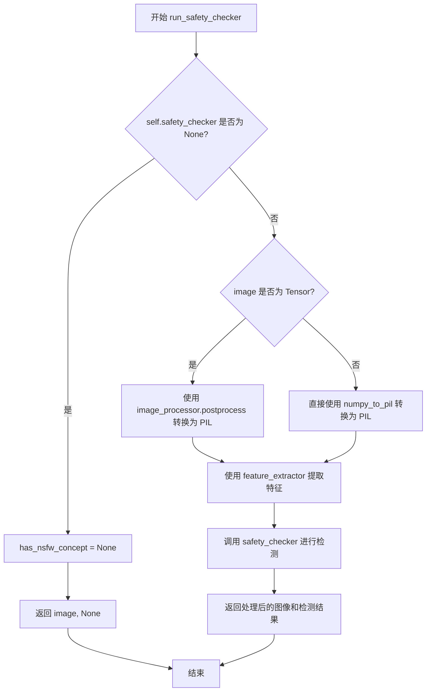
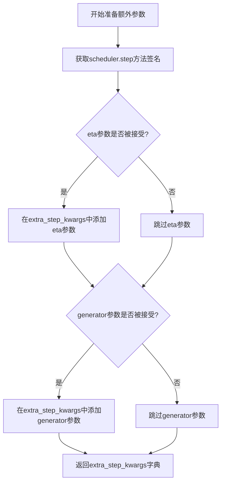
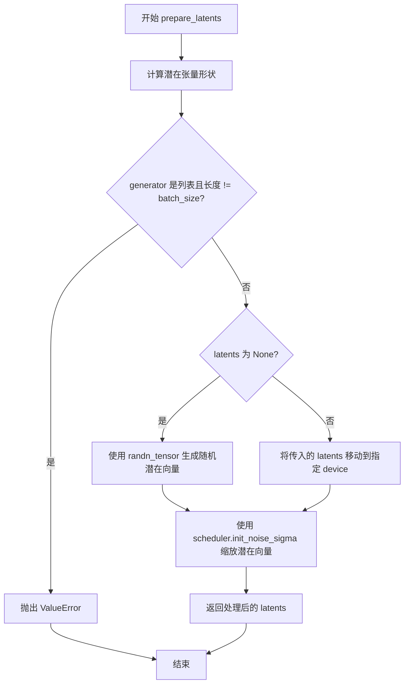
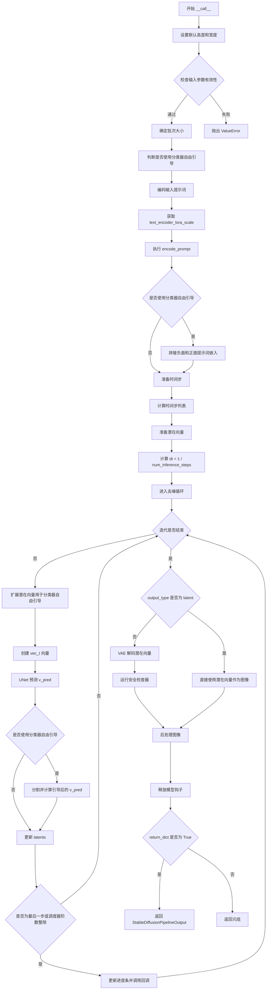

# `diffusers\examples\community\instaflow_one_step.py` 详细设计文档

InstaFlowPipeline是一个基于Rectified Flow和Euler离散化的文本到图像生成管道，继承自Diffusers库的StableDiffusionPipeline，支持LoRA、Textual Inversion、单文件加载等高级功能，用于根据文本提示生成图像。

## 整体流程

```mermaid
graph TD
A[开始 __call__] --> B[检查并设置默认高度和宽度]
B --> C{检查输入有效性 check_inputs}
C -->|失败| Z[抛出 ValueError]
C -->|成功| D[确定批次大小和设备]
D --> E[判断是否使用分类器自由引导]
E --> F[编码提示词 encode_prompt]
F --> G{do_classifier_free_guidance?}
G -->|是| H[拼接负向和正向提示词嵌入]
G -->|否| I[准备时间步 timesteps]
H --> I
I --> J[准备潜在变量 prepare_latents]
J --> K[计算步长 dt = 1/num_inference_steps]
K --> L[Euler去噪循环 for each timestep]
L --> M[扩展潜在变量（如果需要CF guidance）]
M --> N[UNet预测 v_pred]
N --> O{do_classifier_free_guidance?}
O -->|是| P[应用guidance_scale计算最终预测]
O -->|否| Q[更新潜在变量: latents += dt * v_pred]
P --> Q
Q --> R{循环结束?]
R -->|否| L
R -->|是| S{output_type == 'latent'?}
S -->|否| T[VAE解码潜在变量为图像]
S -->|是| U[图像 = latents]
T --> V[运行安全检查 run_safety_checker]
V --> W[后处理图像 postprocess]
U --> W
W --> X[释放模型钩子 maybe_free_model_hooks]
X --> Y[返回结果]
```

## 类结构

```
DiffusionPipeline (基类)
├── StableDiffusionMixin
├── TextualInversionLoaderMixin
├── StableDiffusionLoraLoaderMixin
├── FromSingleFileMixin
└── InstaFlowPipeline (本类)
```

## 全局变量及字段


### `logger`
    
模块级日志记录器，用于记录运行时的警告和信息

类型：`logging.Logger`
    


### `rescale_noise_cfg`
    
全局噪声配置重缩放函数，根据guidance_rescale参数调整噪声预测配置以修复过度曝光问题

类型：`function`
    


### `InstaFlowPipeline.vae`
    
VAE模型，用于编码和解码图像与潜在表示之间的转换

类型：`AutoencoderKL`
    


### `InstaFlowPipeline.text_encoder`
    
冻结的文本编码器，用于将文本提示转换为嵌入向量

类型：`CLIPTextModel`
    


### `InstaFlowPipeline.tokenizer`
    
CLIP分词器，用于将文本分割成token

类型：`CLIPTokenizer`
    


### `InstaFlowPipeline.unet`
    
条件去噪UNet模型，用于在给定文本条件下预测噪声

类型：`UNet2DConditionModel`
    


### `InstaFlowPipeline.scheduler`
    
Karras扩散调度器，用于控制去噪过程的噪声调度

类型：`KarrasDiffusionSchedulers`
    


### `InstaFlowPipeline.safety_checker`
    
安全检查器，用于检测生成的图像是否包含不当内容

类型：`StableDiffusionSafetyChecker`
    


### `InstaFlowPipeline.feature_extractor`
    
CLIP图像特征提取器，用于从生成的图像中提取特征供安全检查器使用

类型：`CLIPImageProcessor`
    


### `InstaFlowPipeline.vae_scale_factor`
    
VAE缩放因子，用于计算潜在表示的空间尺寸

类型：`int`
    


### `InstaFlowPipeline.image_processor`
    
VAE图像处理器，用于后处理VAE解码后的图像

类型：`VaeImageProcessor`
    


### `InstaFlowPipeline.model_cpu_offload_seq`
    
CPU卸载顺序字符串，定义模型组件卸载到CPU的顺序

类型：`str`
    


### `InstaFlowPipeline._optional_components`
    
可选组件列表，定义哪些组件是可选的

类型：`List[str]`
    


### `InstaFlowPipeline._exclude_from_cpu_offload`
    
需排除CPU卸载的组件列表

类型：`List[str]`
    
    

## 全局函数及方法


### `rescale_noise_cfg`

该函数根据 guidance_rescale 参数对噪声配置进行重缩放，基于论文 "Common Diffusion Noise Schedules and Sample Steps are Flawed" (Section 3.4) 的研究成果，用于解决过度曝光问题并避免生成过于平淡的图像。

参数：

- `noise_cfg`：`torch.Tensor`，需要重缩放的噪声配置
- `noise_pred_text`：`torch.Tensor`，文本预测的噪声
- `guidance_rescale`：`float`，重缩放因子，默认为 0.0，用于控制原始结果与重缩放结果的混合比例

返回值：`torch.Tensor`，重缩放后的噪声配置

#### 流程图

```mermaid
flowchart TD
    A[开始] --> B[计算 noise_pred_text 的标准差 std_text]
    B --> C[计算 noise_cfg 的标准差 std_cfg]
    C --> D[计算重缩放后的噪声: noise_pred_rescaled = noise_cfg × std_text / std_cfg]
    D --> E[混合原始噪声与重缩放噪声: noise_cfg = guidance_rescale × noise_pred_rescaled + (1 - guidance_rescale) × noise_cfg]
    E --> F[返回重缩放后的 noise_cfg]
```

#### 带注释源码

```
def rescale_noise_cfg(noise_cfg, noise_pred_text, guidance_rescale=0.0):
    """
    Rescale `noise_cfg` according to `guidance_rescale`. Based on findings of [Common Diffusion Noise Schedules and
    Sample Steps are Flawed](https://huggingface.co/papers/2305.08891). See Section 3.4
    """
    # 计算文本预测噪声在所有维度（除batch维度外）的标准差
    std_text = noise_pred_text.std(dim=list(range(1, noise_pred_text.ndim)), keepdim=True)
    
    # 计算噪声配置在所有维度（除batch维度外）的标准差
    std_cfg = noise_cfg.std(dim=list(range(1, noise_cfg.ndim)), keepdim=True)
    
    # 使用文本噪声的标准差对噪声配置进行重缩放（修复过度曝光问题）
    noise_pred_rescaled = noise_cfg * (std_text / std_cfg)
    
    # 将重缩放后的结果与原始guidance结果按guidance_rescale因子混合
    # 避免生成看起来"平淡"的图像
    noise_cfg = guidance_rescale * noise_pred_rescaled + (1 - guidance_rescale) * noise_cfg
    
    return noise_cfg
```


### InstaFlowPipeline.__init__

该方法是 InstaFlowPipeline 类的构造函数，负责初始化整个图像生成管道。它接收 VAE、文本编码器、Tokenizer、UNet、调度器、安全检查器和特征提取器等核心组件，并进行一系列配置验证和初始化工作，包括检查调度器的兼容性配置、设置 VAE 缩放因子、注册所有模块以及配置安全检查器选项。

参数：

- `vae`：`AutoencoderKL`，Variational Auto-Encoder 模型，用于编码和解码图像与潜在表示
- `text_encoder`：`CLIPTextModel`，冻结的文本编码器，用于将文本提示转换为嵌入向量
- `tokenizer`：`CLIPTokenizer`，CLIP 分词器，用于对文本进行分词
- `unet`：`UNet2DConditionModel`，UNet 条件模型，用于对编码后的图像潜在表示进行去噪
- `scheduler`：`KarrasDiffusionSchedulers`，调度器，用于与 UNet 结合对图像潜在表示进行去噪
- `safety_checker`：`StableDiffusionSafetyChecker`，安全检查器，用于评估生成的图像是否包含不当内容
- `feature_extractor`：`CLIPImageProcessor`，特征提取器，用于从生成的图像中提取特征作为安全检查器的输入
- `requires_safety_checker`：`bool`，是否需要安全检查器，默认为 True

返回值：无（`None`），构造函数不返回任何值

#### 流程图

```mermaid
flowchart TD
    A[开始 __init__] --> B[调用 super().__init__]
    B --> C{scheduler.config.steps_offset != 1?}
    C -->|是| D[发出警告并修正 steps_offset 为 1]
    C -->|否| E{scheduler.config.clip_sample == True?}
    D --> E
    E -->|是| F[发出警告并修正 clip_sample 为 False]
    E -->|否| G{safety_checker is None<br/>且 requires_safety_checker is True?}
    F --> G
    G -->|是| H[发出安全警告]
    G -->|否| I{safety_checker is not None<br/>且 feature_extractor is None?}
    H --> I
    I -->|是| J[抛出 ValueError]
    I -->|否| K{UNet 版本 < 0.9.0<br/>且 sample_size < 64?}
    J --> L[结束]
    K -->|是| M[发出警告并修正 sample_size 为 64]
    K -->|否| N[调用 register_modules 注册所有模块]
    M --> N
    N --> O[计算 vae_scale_factor]
    O --> P[创建 VaeImageProcessor]
    P --> Q[注册 requires_safety_checker 到配置]
    Q --> L
```

#### 带注释源码

```python
def __init__(
    self,
    vae: AutoencoderKL,
    text_encoder: CLIPTextModel,
    tokenizer: CLIPTokenizer,
    unet: UNet2DConditionModel,
    scheduler: KarrasDiffusionSchedulers,
    safety_checker: StableDiffusionSafetyChecker,
    feature_extractor: CLIPImageProcessor,
    requires_safety_checker: bool = True,
):
    """初始化 InstaFlowPipeline 管道"""
    # 调用父类构造函数进行基础初始化
    super().__init__()

    # 检查调度器的 steps_offset 配置
    # 如果不为 1，则说明配置过时，可能导致错误结果
    if scheduler is not None and getattr(scheduler.config, "steps_offset", 1) != 1:
        deprecation_message = (
            f"The configuration file of this scheduler: {scheduler} is outdated. `steps_offset`"
            f" should be set to 1 instead of {scheduler.config.steps_offset}. Please make sure "
            "to update the config accordingly as leaving `steps_offset` might led to incorrect results"
            " in future versions. If you have downloaded this checkpoint from the Hugging Face Hub,"
            " it would be very nice if you could open a Pull request for the `scheduler/scheduler_config.json`"
            " file"
        )
        deprecate("steps_offset!=1", "1.0.0", deprecation_message, standard_warn=False)
        new_config = dict(scheduler.config)
        new_config["steps_offset"] = 1
        scheduler._internal_dict = FrozenDict(new_config)

    # 检查调度器的 clip_sample 配置
    # 如果为 True，应该设置为 False 以避免错误结果
    if scheduler is not None and getattr(scheduler.config, "clip_sample", False) is True:
        deprecation_message = (
            f"The configuration file of this scheduler: {scheduler} has not set the configuration `clip_sample`."
            " `clip_sample` should be set to False in the configuration file. Please make sure to update the"
            " config accordingly as not setting `clip_sample` in the config might lead to incorrect results in"
            " future versions. If you have downloaded this checkpoint from the Hugging Face Hub, it would be very"
            " nice if you could open a Pull request for the `scheduler/scheduler_config.json` file"
        )
        deprecate("clip_sample not set", "1.0.0", deprecation_message, standard_warn=False)
        new_config = dict(scheduler.config)
        new_config["clip_sample"] = False
        scheduler._internal_dict = FrozenDict(new_config)

    # 如果 safety_checker 为 None 但 requires_safety_checker 为 True，发出警告
    # 建议在公共场合启用安全过滤器
    if safety_checker is None and requires_safety_checker:
        logger.warning(
            f"You have disabled the safety checker for {self.__class__} by passing `safety_checker=None`. Ensure"
            " that you abide to the conditions of the Stable Diffusion license and do not expose unfiltered"
            " results in services or applications open to the public. Both the diffusers team and Hugging Face"
            " strongly recommend to keep the safety filter enabled in all public facing circumstances, disabling"
            " it only for use-cases that involve analyzing network behavior or auditing its results. For more"
            " information, please have a look at https://github.com/huggingface/diffusers/pull/254 ."
        )

    # 如果提供了 safety_checker 但没有提供 feature_extractor，抛出错误
    if safety_checker is not None and feature_extractor is None:
        raise ValueError(
            "Make sure to define a feature extractor when loading {self.__class__} if you want to use the safety"
            " checker. If you do not want to use the safety checker, you can pass `'safety_checker=None'` instead."
        )

    # 检查 UNet 配置是否存在潜在的兼容性问题
    # 版本小于 0.9.0 且 sample_size 小于 64 是旧版 Stable Diffusion 的特征
    is_unet_version_less_0_9_0 = (
        unet is not None
        and hasattr(unet.config, "_diffusers_version")
        and version.parse(version.parse(unet.config._diffusers_version).base_version) < version.parse("0.9.0.dev0")
    )
    is_unet_sample_size_less_64 = (
        unet is not None and hasattr(unet.config, "sample_size") and unet.config.sample_size < 64
    )
    if is_unet_version_less_0_9_0 and is_unet_sample_size_less_64:
        deprecation_message = (
            "The configuration file of the unet has set the default `sample_size` to smaller than"
            " 64 which seems highly unlikely. If your checkpoint is a fine-tuned version of any of the"
            " following: \n- CompVis/stable-diffusion-v1-4 \n- CompVis/stable-diffusion-v1-3 \n-"
            " CompVis/stable-diffusion-v1-2 \n- CompVis/stable-diffusion-v1-1 \n- stable-diffusion-v1-5/stable-diffusion-v1-5"
            " \n- stable-diffusion-v1-5/stable-diffusion-inpainting \n you should change 'sample_size' to 64 in the"
            " configuration file. Please make sure to update the config accordingly as leaving `sample_size=32`"
            " in the config might lead to incorrect results in future versions. If you have downloaded this"
            " checkpoint from the Hugging Face Hub, it would be very nice if you could open a Pull request for"
            " the `unet/config.json` file"
        )
        deprecate("sample_size<64", "1.0.0", deprecation_message, standard_warn=False)
        new_config = dict(unet.config)
        new_config["sample_size"] = 64
        unet._internal_dict = FrozenDict(new_config)

    # 注册所有模块到管道，使它们可以通过 self.xxx 访问
    self.register_modules(
        vae=vae,
        text_encoder=text_encoder,
        tokenizer=tokenizer,
        unet=unet,
        scheduler=scheduler,
        safety_checker=safety_checker,
        feature_extractor=feature_extractor,
    )

    # 计算 VAE 缩放因子，用于图像后处理
    # 默认为 2^(len(block_out_channels) - 1)，通常为 8
    self.vae_scale_factor = 2 ** (len(self.vae.config.block_out_channels) - 1) if getattr(self, "vae", None) else 8

    # 创建图像处理器，用于 VAE 解码后的图像后处理
    self.image_processor = VaeImageProcessor(vae_scale_factor=self.vae_scale_factor)

    # 将 requires_safety_checker 配置注册到管道配置中
    self.register_to_config(requires_safety_checker=requires_safety_checker)
```


### `InstaFlowPipeline._encode_prompt`

该方法是一个**已废弃的提示编码方法**，用于将文本提示编码为文本编码器的隐藏状态。它通过调用新的 `encode_prompt` 方法来实现功能，但为了向后兼容性，将返回结果重新拼接为单个张量（而非新版本的元组格式）。

参数：

-  `self`：`InstaFlowPipeline`，Pipeline 实例本身
-  `prompt`：`Union[str, List[str], None]`，要编码的文本提示，可以是单个字符串或字符串列表
-  `device`：`torch.device`，用于编码的 PyTorch 设备
-  `num_images_per_prompt`：`int`，每个提示要生成的图像数量
-  `do_classifier_free_guidance`：`bool`，是否使用无分类器自由引导
-  `negative_prompt`：`Optional[Union[str, List[str]]]`，不引导图像生成的负面提示
-  `prompt_embeds`：`Optional[torch.Tensor]`，预生成的文本嵌入，可用于轻松调整文本输入
-  `negative_prompt_embeds`：`Optional[torch.Tensor]`，预生成的负面文本嵌入
-  `lora_scale`：`Optional[float]`，如果加载了 LoRA 层，将应用于文本编码器所有 LoRA 层的 LoRA 比例

返回值：`torch.Tensor`，拼接后的提示嵌入张量（为了向后兼容，将条件嵌入和非条件嵌入在通道维度上拼接）

#### 流程图

```mermaid
flowchart TD
    A[_encode_prompt 被调用] --> B[记录废弃警告]
    B --> C[调用 encode_prompt 方法]
    C --> D{是否提供 prompt_embeds?}
    D -->|否| E[处理 textual inversion 如果需要]
    E --> F[tokenizer 处理 prompt]
    F --> G[text_encoder 生成 embeddings]
    G --> H{是否需要 negative embeddings?}
    H -->|是 且无 negative_prompt_embeds| I[处理 negative_prompt]
    I --> J[生成 negative embeddings]
    H -->|否| K[跳过 negative embeddings]
    J --> L[重复 embeddings 以匹配 num_images_per_prompt]
    K --> L
    L --> M[返回 tuple: (prompt_embeds, negative_prompt_embeds)]
    M --> N[拼接 embeddings: torch.cat<br/>[tuple[1], tuple[0]]]
    N --> O[返回拼接后的张量]
```

#### 带注释源码

```python
def _encode_prompt(
    self,
    prompt,                          # Union[str, List[str], None] - 要编码的文本提示
    device,                         # torch.device - 计算设备
    num_images_per_prompt,          # int - 每个提示生成的图像数量
    do_classifier_free_guidance,    # bool - 是否使用无分类器自由引导
    negative_prompt=None,           # Optional[Union[str, List[str]]] - 负面提示
    prompt_embeds: Optional[torch.Tensor] = None,    # 预计算的提示嵌入
    negative_prompt_embeds: Optional[torch.Tensor] = None,  # 预计算的负面嵌入
    lora_scale: Optional[float] = None,  # Optional[float] - LoRA 缩放因子
):
    """
    已废弃的方法：将提示编码为文本编码器的隐藏状态。
    建议使用 encode_prompt() 替代。
    注意：输出格式已从拼接的张量更改为元组。
    """
    
    # 记录废弃警告，提示用户使用 encode_prompt() 方法
    deprecation_message = "`_encode_prompt()` is deprecated and it will be removed in a future version. Use `encode_prompt()` instead. Also, be aware that the output format changed from a concatenated tensor to a tuple."
    deprecate("_encode_prompt()", "1.0.0", deprecation_message, standard_warn=False)

    # 调用新的 encode_prompt 方法获取嵌入（返回元组格式）
    prompt_embeds_tuple = self.encode_prompt(
        prompt=prompt,
        device=device,
        num_images_per_prompt=num_images_per_prompt,
        do_classifier_free_guidance=do_classifier_free_guidance,
        negative_prompt=negative_prompt,
        prompt_embeds=prompt_embeds,
        negative_prompt_embeds=negative_prompt_embeds,
        lora_scale=lora_scale,
    )

    # 为了向后兼容性，将元组中的 embeddings 拼接回来
    # 新版本返回 (prompt_embeds, negative_prompt_embeds)
    # 旧版本返回拼接后的单个张量 [negative_prompt_embeds, prompt_embeds]
    prompt_embeds = torch.cat([prompt_embeds_tuple[1], prompt_embeds_tuple[0]])

    # 返回拼接后的张量以保持与旧版本的兼容性
    return prompt_embeds
```


### `InstaFlowPipeline.encode_prompt`

该方法负责将文本提示词编码为文本_encoder的隐藏状态（embedding），支持批量生成、分类器自由引导（Classifier-Free Guidance）和LoRA权重调整。如果传入的是原始提示词，会先通过tokenizer转换为token ids，然后通过text_encoder生成对应的embeddings；如果已存在预计算的embeddings，则直接使用。

参数：

- `prompt`：`Union[str, List[str], None]`，要编码的文本提示词，可以是单个字符串或字符串列表，为空时必须提供`prompt_embeds`
- `device`：`torch.device`，torch设备，用于将计算放在指定设备上（如CPU/CUDA）
- `num_images_per_prompt`：`int`，每个提示词需要生成的图像数量，用于复制embeddings以适配多图生成
- `do_classifier_free_guidance`：`bool`，是否启用分类器自由引导，若为True则需要生成负面embeddings
- `negative_prompt`：`Union[str, List[str], None]`，负面提示词，用于引导图像不包含指定内容，忽略时需提供`negative_prompt_embeds`
- `prompt_embeds`：`Optional[torch.Tensor]`，预生成的文本embeddings，若提供则跳过从prompt生成，可用于提示词调权
- `negative_prompt_embeds`：`Optional[torch.Tensor]`，预生成的负面文本embeddings，若提供则跳过从negative_prompt生成
- `lora_scale`：`Optional[float]`，LoRA缩放因子，用于动态调整LoRA层权重

返回值：`Tuple[torch.Tensor, torch.Tensor]`，返回元组包含（提示词embeddings，负面提示词embeddings），用于后续UNet去噪步骤

#### 流程图

```mermaid
flowchart TD
    A[开始 encode_prompt] --> B{检查 lora_scale 是否存在且为 LoRAMixin}
    B -->|是| C[设置 self._lora_scale 并动态调整 LoRA 权重]
    B -->|否| D{判断 batch_size}
    C --> D
    D -->|prompt 是 str| E[batch_size = 1]
    D -->|prompt 是 list| F[batch_size = len(prompt)]
    D -->|其他情况| G[batch_size = prompt_embeds.shape[0]]
    E --> H{prompt_embeds 为 None?}
    F --> H
    G --> I{do_classifier_free_guidance 为 True?}
    H -->|是| J[如果是 TextualInversionMixin, 转换 prompt]
    J --> K[tokenizer 编码 prompt]
    K --> L{检查 text_encoder 是否使用 attention_mask}
    L -->|是| M[使用 text_inputs.attention_mask]
    L -->|否| N[attention_mask = None]
    M --> O[text_encoder 生成 prompt_embeds]
    N --> O
    H -->|否| P[直接使用传入的 prompt_embeds]
    O --> P
    P --> Q[确定 prompt_embeds_dtype]
    Q --> R[转换 prompt_embeds 到正确 dtype 和 device]
    R --> S[重复 embeddings 以匹配 num_images_per_prompt]
    S --> I
    I -->|是| T{negative_prompt_embeds 为 None?}
    I -->|否| U[返回 prompt_embeds, negative_prompt_embeds]
    T -->|是| V[处理 uncond_tokens]
    V -->|negative_prompt 为 None| W[uncond_tokens = [''] * batch_size]
    V -->|negative_prompt 为 str| X[uncond_tokens = [negative_prompt]]
    V -->|其他| Y[使用 negative_prompt]
    W --> Z[tokenizer 编码 uncond_tokens]
    X --> Z
    Y --> Z
    Z --> AA[text_encoder 生成 negative_prompt_embeds]
    T -->|否| AB[直接使用传入的 negative_prompt_embeds]
    AA --> AC[重复 negative_prompt_embeds 以匹配 num_images_per_prompt]
    AB --> AC
    AC --> U
```

#### 带注释源码

```
def encode_prompt(
    self,
    prompt,
    device,
    num_images_per_prompt,
    do_classifier_free_guidance,
    negative_prompt=None,
    prompt_embeds: Optional[torch.Tensor] = None,
    negative_prompt_embeds: Optional[torch.Tensor] = None,
    lora_scale: Optional[float] = None,
):
    r"""
    Encodes the prompt into text encoder hidden states.

    Args:
        prompt (`str` or `List[str]`, *optional*):
            prompt to be encoded
        device: (`torch.device`):
            torch device
        num_images_per_prompt (`int`):
            number of images that should be generated per prompt
        do_classifier_free_guidance (`bool`):
            whether to use classifier free guidance or not
        negative_prompt (`str` or `List[str]`, *optional*):
            The prompt or prompts not to guide the image generation. If not defined, one has to pass
            `negative_prompt_embeds` instead. Ignored when not using guidance (i.e., ignored if `guidance_scale` is
            less than `1`).
        prompt_embeds (`torch.Tensor`, *optional*):
            Pre-generated text embeddings. Can be used to easily tweak text inputs, *e.g.* prompt weighting. If not
            provided, text embeddings will be generated from `prompt` input argument.
        negative_prompt_embeds (`torch.Tensor`, *optional*):
            Pre-generated negative text embeddings. Can be used to easily tweak text inputs, *e.g.* prompt
            weighting. If not provided, negative_prompt_embeds will be generated from `negative_prompt` input
            argument.
        lora_scale (`float`, *optional*):
            A lora scale that will be applied to all LoRA layers of the text encoder if LoRA layers are loaded.
    """
    # 如果传入了 lora_scale 且当前 pipeline 支持 LoRA，则设置并动态调整 LoRA 权重
    if lora_scale is not None and isinstance(self, StableDiffusionLoraLoaderMixin):
        self._lora_scale = lora_scale
        # 动态调整 text_encoder 的 LoRA 权重
        adjust_lora_scale_text_encoder(self.text_encoder, lora_scale)

    # 根据 prompt 类型确定 batch_size
    if prompt is not None and isinstance(prompt, str):
        batch_size = 1
    elif prompt is not None and isinstance(prompt, list):
        batch_size = len(prompt)
    else:
        # 如果没有 prompt，则从已提供的 prompt_embeds 获取 batch_size
        batch_size = prompt_embeds.shape[0]

    # 如果没有提供 prompt_embeds，则需要从 prompt 生成
    if prompt_embeds is None:
        # 如果是 TextualInversionLoaderMixin，处理多向量 token（如自定义词嵌入）
        if isinstance(self, TextualInversionLoaderMixin):
            prompt = self.maybe_convert_prompt(prompt, self.tokenizer)

        # 使用 tokenizer 将 prompt 转换为 token ids
        text_inputs = self.tokenizer(
            prompt,
            padding="max_length",
            max_length=self.tokenizer.model_max_length,
            truncation=True,
            return_tensors="pt",
        )
        text_input_ids = text_inputs.input_ids
        
        # 获取未截断的 token ids 用于检查是否被截断
        untruncated_ids = self.tokenizer(prompt, padding="longest", return_tensors="pt").input_ids

        # 检查是否发生了截断，如果是则记录警告
        if untruncated_ids.shape[-1] >= text_input_ids.shape[-1] and not torch.equal(
            text_input_ids, untruncated_ids
        ):
            removed_text = self.tokenizer.batch_decode(
                untruncated_ids[:, self.tokenizer.model_max_length - 1 : -1]
            )
            logger.warning(
                "The following part of your input was truncated because CLIP can only handle sequences up to"
                f" {self.tokenizer.model_max_length} tokens: {removed_text}"
            )

        # 检查 text_encoder 是否支持 attention_mask，不支持则设为 None
        if hasattr(self.text_encoder.config, "use_attention_mask") and self.text_encoder.config.use_attention_mask:
            attention_mask = text_inputs.attention_mask.to(device)
        else:
            attention_mask = None

        # 通过 text_encoder 生成 prompt embeddings
        prompt_embeds = self.text_encoder(
            text_input_ids.to(device),
            attention_mask=attention_mask,
        )
        # 提取第一项（hidden states），忽略 pooler_output 等
        prompt_embeds = prompt_embeds[0]

    # 确定 prompt_embeds 的数据类型（优先使用 text_encoder 的 dtype）
    if self.text_encoder is not None:
        prompt_embeds_dtype = self.text_encoder.dtype
    elif self.unet is not None:
        prompt_embeds_dtype = self.unet.dtype
    else:
        prompt_embeds_dtype = prompt_embeds.dtype

    # 将 prompt_embeds 转换为正确的 dtype 和 device
    prompt_embeds = prompt_embeds.to(dtype=prompt_embeds_dtype, device=device)

    # 获取当前 embeddings 的维度信息
    bs_embed, seq_len, _ = prompt_embeds.shape
    
    # 复制 embeddings 以支持每个 prompt 生成多张图像（MPS 友好的方法）
    prompt_embeds = prompt_embeds.repeat(1, num_images_per_prompt, 1)
    prompt_embeds = prompt_embeds.view(bs_embed * num_images_per_prompt, seq_len, -1)

    # 如果需要分类器自由引导且没有提供 negative_prompt_embeds，则生成无条件 embeddings
    if do_classifier_free_guidance and negative_prompt_embeds is None:
        uncond_tokens: List[str]
        if negative_prompt is None:
            # 默认使用空字符串
            uncond_tokens = [""] * batch_size
        elif prompt is not None and type(prompt) is not type(negative_prompt):
            raise TypeError(
                f"`negative_prompt` should be the same type to `prompt`, but got {type(negative_prompt)} !="
                f" {type(prompt)}."
            )
        elif isinstance(negative_prompt, str):
            uncond_tokens = [negative_prompt]
        elif batch_size != len(negative_prompt):
            raise ValueError(
                f"`negative_prompt`: {negative_prompt} has batch size {len(negative_prompt)}, but `prompt`:"
                f" {prompt} has batch size {batch_size}. Please make sure that passed `negative_prompt` matches"
                " the batch size of `prompt`."
            )
        else:
            uncond_tokens = negative_prompt

        # 处理 TextualInversion（如果有）
        if isinstance(self, TextualInversionLoaderMixin):
            uncond_tokens = self.maybe_convert_prompt(uncond_tokens, self.tokenizer)

        # 使用与 prompt_embeds 相同的长度进行 tokenize
        max_length = prompt_embeds.shape[1]
        uncond_input = self.tokenizer(
            uncond_tokens,
            padding="max_length",
            max_length=max_length,
            truncation=True,
            return_tensors="pt",
        )

        # 处理 attention_mask
        if hasattr(self.text_encoder.config, "use_attention_mask") and self.text_encoder.config.use_attention_mask:
            attention_mask = uncond_input.attention_mask.to(device)
        else:
            attention_mask = None

        # 生成 negative_prompt_embeds
        negative_prompt_embeds = self.text_encoder(
            uncond_input.input_ids.to(device),
            attention_mask=attention_mask,
        )
        negative_prompt_embeds = negative_prompt_embeds[0]

    # 如果使用分类器自由引导，复制 negative embeddings 以匹配生成的图像数量
    if do_classifier_free_guidance:
        seq_len = negative_prompt_embeds.shape[1]

        negative_prompt_embeds = negative_prompt_embeds.to(dtype=prompt_embeds_dtype, device=device)

        negative_prompt_embeds = negative_prompt_embeds.repeat(1, num_images_per_prompt, 1)
        negative_prompt_embeds = negative_prompt_embeds.view(batch_size * num_images_per_prompt, seq_len, -1)

    # 返回编码后的 prompt embeddings 和 negative prompt embeddings
    return prompt_embeds, negative_prompt_embeds
```


### `InstaFlowPipeline.run_safety_checker`

该方法用于对生成的图像进行安全检查（NSFW检测），通过特征提取器提取图像特征并调用安全检查器判断图像是否包含不当内容。

参数：

- `image`：`Union[torch.Tensor, numpy.ndarray]`，待检查的图像张量或数组
- `device`：`torch.device`，执行计算的设备（如CPU/CUDA）
- `dtype`：`torch.dtype`，图像数据类型（如float32）

返回值：`Tuple[Union[torch.Tensor, numpy.ndarray], Optional[List[bool]]]`，返回处理后的图像和NSFW检测结果列表

#### 流程图



#### 带注释源码

```
def run_safety_checker(self, image, device, dtype):
    # 检查安全检查器是否已配置
    if self.safety_checker is None:
        # 未配置安全检查器时，返回 None 表示无 NSFW 检测结果
        has_nsfw_concept = None
    else:
        # 将图像转换为 PIL 图像格式以供特征提取器使用
        if torch.is_tensor(image):
            # 如果是 PyTorch 张量，使用后处理器转换为 PIL 图像
            feature_extractor_input = self.image_processor.postprocess(image, output_type="pil")
        else:
            # 如果是 NumPy 数组，直接转换为 PIL 图像
            feature_extractor_input = self.image_processor.numpy_to_pil(image)
        
        # 使用特征提取器提取图像特征并移到指定设备
        safety_checker_input = self.feature_extractor(
            feature_extractor_input, 
            return_tensors="pt"
        ).to(device)
        
        # 调用安全检查器进行 NSFW 检测
        # 输入原始图像和提取的特征，返回检测结果
        image, has_nsfw_concept = self.safety_checker(
            images=image, 
            clip_input=safety_checker_input.pixel_values.to(dtype)
        )
    
    # 返回处理后的图像和 NSFW 检测结果
    return image, has_nsfw_concept
```


### `InstaFlowPipeline.decode_latents`

该方法用于将模型生成的潜在表示（latents）解码为实际的图像数据。它通过VAE解码器将缩放后的潜在向量转换为像素空间，并进行归一化处理使其值域在[0,1]范围内，最后转换为NumPy数组格式输出。

参数：

- `latents`：`torch.Tensor`，需要解码的潜在表示，通常来自UNet的输出

返回值：`numpy.ndarray`，解码后的图像数据，形状为(batch_size, height, width, channels)，值为[0,1]范围内的浮点数

#### 流程图

```mermaid
flowchart TD
    A[开始 decode_latents] --> B[记录弃用警告]
    B --> C[latents = 1 / scaling_factor * latents]
    C --> D[调用 VAE decode 方法]
    D --> E[image = (image / 2 + 0.5).clamp(0, 1)]
    E --> F[转换为 CPU float numpy 数组]
    F --> G[返回图像数组]
```

#### 带注释源码

```python
def decode_latents(self, latents):
    # 记录弃用警告，提示用户在未来版本中该方法将被移除
    deprecation_message = "The decode_latents method is deprecated and will be removed in 1.0.0. Please use VaeImageProcessor.postprocess(...) instead"
    deprecate("decode_latents", "1.0.0", deprecation_message, standard_warn=False)

    # 第一步：将潜在向量反缩放
    # VAE在编码时会乘以scaling_factor，这里需要除以它来还原
    latents = 1 / self.vae.config.scaling_factor * latents
    
    # 第二步：使用VAE解码器将潜在表示解码为图像
    # return_dict=False 返回元组，取第一个元素（图像张量）
    image = self.vae.decode(latents, return_dict=False)[0]
    
    # 第三步：将图像值从[-1,1]范围归一化到[0,1]范围
    # 这是因为训练时通常使用tanh激活函数将输出限制在[-1,1]
    image = (image / 2 + 0.5).clamp(0, 1)
    
    # 第四步：转换为NumPy数组以便后续处理
    # 1. 移动到CPU（避免GPU内存占用）
    # 2. 调整维度顺序从CHW改为HWC
    # 3. 转换为float32类型（兼容bfloat16且开销不大）
    # 5. 转换为NumPy数组
    image = image.cpu().permute(0, 2, 3, 1).float().numpy()
    
    return image
```


### `InstaFlowPipeline.merge_dW_to_unet`

该方法用于将差分权重更新（dW）合并到 UNet 模型中，通过对权重字典中的每个参数键值对进行加权求和，实现对预训练模型权重的在线微调（Online Learning）或模型融合。

参数：

- `pipe`：`InstaFlowPipeline`，Pipeline 实例，持有需要更新的 unet 模型
- `dW_dict`：`Dict[str, torch.Tensor]`，包含权重更新的字典，键为模型参数名称，值为对应的权重增量
- `alpha`：`float`，缩放因子，用于控制权重更新的强度，默认为 1.0

返回值：`InstaFlowPipeline`，返回更新后的 pipeline 实例（修改是原地的，但返回自身以支持链式调用）

#### 流程图

```mermaid
flowchart TD
    A[开始 merge_dW_to_unet] --> B[获取 pipe.unet 的当前状态字典 _tmp_sd]
    B --> C{遍历 dW_dict 的每个键}
    C -->|对于每个 key| D[_tmp_sd[key] += dW_dict[key] * alpha]
    D --> C
    C -->|遍历完成| E[调用 pipe.unet.load_state_dict 加载更新后的权重]
    E --> F[返回 pipe 实例]
```

#### 带注释源码

```python
def merge_dW_to_unet(pipe, dW_dict, alpha=1.0):
    """
    将差分权重更新合并到 UNet 模型中
    
    Args:
        pipe: InstaFlowPipeline 实例
        dW_dict: 包含权重更新的字典，键为参数名，值为权重增量
        alpha: 权重更新的缩放因子
    
    Returns:
        更新后的 pipe 实例
    """
    # 获取 UNet 的当前状态字典（包含所有模型参数）
    _tmp_sd = pipe.unet.state_dict()
    
    # 遍历权重更新字典，对每个参数进行加权累加
    for key in dW_dict.keys():
        # 将权重增量乘以 alpha 后累加到原有权重上
        _tmp_sd[key] += dW_dict[key] * alpha
    
    # 将更新后的权重字典加载回 UNet 模型
    # strict=False 允许部分匹配，适合 LoRA 等增量权重
    pipe.unet.load_state_dict(_tmp_sd, strict=False)
    
    # 返回更新后的 pipeline 实例
    return pipe
```


### `InstaFlowPipeline.prepare_extra_step_kwargs`

该方法用于准备调度器（scheduler）步骤所需的额外参数。由于不同的调度器（如 DDIMScheduler、LMSDiscreteScheduler 等）具有不同的签名，该方法通过动态检查当前调度器的 `step` 方法是否支持 `eta` 和 `generator` 参数来构建兼容的参数字典，确保 pipeline 可以在不同调度器之间无缝切换。

参数：

- `generator`：`Optional[Union[torch.Generator, List[torch.Generator]]]`，用于控制随机数生成以确保可重复性
- `eta`：`float`，DDIM 调度器的 eta 参数（仅当调度器支持时生效），对应 DDIM 论文中的 η 参数，取值范围为 [0, 1]

返回值：`Dict[str, Any]`，包含调度器 `step` 方法所需额外参数的字典，可能包含 `eta` 和/或 `generator` 键

#### 流程图



#### 带注释源码

```python
def prepare_extra_step_kwargs(self, generator, eta):
    # prepare extra kwargs for the scheduler step, since not all schedulers have the same signature
    # eta (η) is only used with the DDIMScheduler, it will be ignored for other schedulers.
    # eta corresponds to η in DDIM paper: https://huggingface.co/papers/2010.02502
    # and should be between [0, 1]

    # 通过inspect模块获取scheduler.step方法的签名参数
    accepts_eta = "eta" in set(inspect.signature(self.scheduler.step).parameters.keys())
    
    # 初始化空字典用于存储额外参数
    extra_step_kwargs = {}
    
    # 如果调度器接受eta参数，则将其添加到extra_step_kwargs中
    if accepts_eta:
        extra_step_kwargs["eta"] = eta

    # 检查调度器是否接受generator参数
    accepts_generator = "generator" in set(inspect.signature(self.scheduler.step).parameters.keys())
    
    # 如果调度器接受generator参数，则将其添加到extra_step_kwargs中
    if accepts_generator:
        extra_step_kwargs["generator"] = generator
    
    # 返回构建好的参数字典
    return extra_step_kwargs
```


### `InstaFlowPipeline.check_inputs`

该方法用于验证文本到图像生成管道的输入参数是否合法，确保高度和宽度符合8的倍数要求、回调步骤为正整数、提示词与提示词嵌入不同时提供，且正向与负向提示词嵌入的形状一致。若任何检查失败，该方法将抛出详细的 `ValueError` 以指导用户修正输入。

参数：

- `self`：`InstaFlowPipeline` 实例，管道对象本身
- `prompt`：`Union[str, List[str], None]`，要编码的提示词，可以是字符串或字符串列表
- `height`：`int`，生成图像的高度（像素），必须能被8整除
- `width`：`int`，生成图像的宽度（像素），必须能被8整除
- `callback_steps`：`int`，正向整数，指定回调函数被调用的频率
- `negative_prompt`：`Union[str, List[str], None]`，可选，用于指导不包含内容的负向提示词
- `prompt_embeds`：`Optional[torch.Tensor]`，可选，预生成的文本嵌入，与 prompt 互斥
- `negative_prompt_embeds`：`Optional[torch.Tensor]`，可选，预生成的负向文本嵌入

返回值：`None`，该方法不返回任何值，仅通过抛出 `ValueError` 来指示输入错误

#### 流程图

```mermaid
flowchart TD
    A[开始 check_inputs 验证] --> B{检查 height 和 width 是否为 8 的倍数}
    B -->|否| B1[抛出 ValueError: height 和 width 必须能被 8 整除]
    B -->|是| C{callback_steps 是否为正整数}
    C -->|否| C1[抛出 ValueError: callback_steps 必须为正整数]
    C -->|是| D{prompt 和 prompt_embeds 是否同时提供}
    D -->|是| D1[抛出 ValueError: 不能同时提供 prompt 和 prompt_embeds]
    D -->|否| E{prompt 和 prompt_embeds 是否都未提供}
    E -->|是| E1[抛出 ValueError: 必须提供 prompt 或 prompt_embeds 之一]
    E -->|否| F{prompt 类型是否合法]
    F -->|否| F1[抛出 ValueError: prompt 类型必须为 str 或 list]
    F -->|是| G{negative_prompt 和 negative_prompt_embeds 是否同时提供}
    G -->|是| G1[抛出 ValueError: 不能同时提供 negative_prompt 和 negative_prompt_embeds]
    G -->|否| H{prompt_embeds 和 negative_prompt_embeds 是否都提供]
    H -->|是| I{prompt_embeds 和 negative_prompt_embeds 形状是否相同]
    I -->|否| I1[抛出 ValueError: prompt_embeds 和 negative_prompt_embeds 形状必须相同]
    I -->|是| J[验证通过，方法结束]
    B1 --> K[结束并抛出异常]
    C1 --> K
    D1 --> K
    E1 --> K
    F1 --> K
    G1 --> K
    I1 --> K
```

#### 带注释源码

```python
def check_inputs(
    self,
    prompt,
    height,
    width,
    callback_steps,
    negative_prompt=None,
    prompt_embeds=None,
    negative_prompt_embeds=None,
):
    """
    检查文本到图像生成管道的输入参数是否合法。
    
    该方法执行一系列验证检查，确保用户提供的参数符合管道的要求。
    如果任何检查失败，将抛出详细的 ValueError 以指导用户修正输入。
    
    检查项包括：
    1. height 和 width 必须能被 8 整除（VAE 的下采样要求）
    2. callback_steps 必须为正整数
    3. prompt 和 prompt_embeds 互斥，不能同时提供
    4. prompt 和 prompt_embeds 至少提供一个
    5. prompt 类型必须为 str 或 list
    6. negative_prompt 和 negative_prompt_embeds 互斥
    7. 如果同时提供 prompt_embeds 和 negative_prompt_embeds，形状必须一致
    """
    
    # 检查 1: 验证图像尺寸是否符合 VAE 的 8 倍下采样要求
    # UNet 使用 8 倍下采样，因此生成的图像尺寸必须能被 8 整除
    if height % 8 != 0 or width % 8 != 0:
        raise ValueError(f"`height` and `width` have to be divisible by 8 but are {height} and {width}.")

    # 检查 2: 验证 callback_steps 参数的有效性
    # callback_steps 必须是正整数，用于控制回调函数的调用频率
    if (callback_steps is None) or (
        callback_steps is not None and (not isinstance(callback_steps, int) or callback_steps <= 0)
    ):
        raise ValueError(
            f"`callback_steps` has to be a positive integer but is {callback_steps} of type"
            f" {type(callback_steps)}."
        )

    # 检查 3: 验证 prompt 和 prompt_embeds 的互斥性
    # 用户不能同时提供原始提示词和预计算的提示词嵌入
    if prompt is not None and prompt_embeds is not None:
        raise ValueError(
            f"Cannot forward both `prompt`: {prompt} and `prompt_embeds`: {prompt_embeds}. Please make sure to"
            " only forward one of the two."
        )
    
    # 检查 4: 验证至少提供 prompt 或 prompt_embeds 之一
    # 管道需要文本信息来指导图像生成
    elif prompt is None and prompt_embeds is None:
        raise ValueError(
            "Provide either `prompt` or `prompt_embeds`. Cannot leave both `prompt` and `prompt_embeds` undefined."
        )
    
    # 检查 5: 验证 prompt 的类型合法性
    # prompt 必须是字符串或字符串列表
    elif prompt is not None and (not isinstance(prompt, str) and not isinstance(prompt, list)):
        raise ValueError(f"`prompt` has to be of type `str` or `list` but is {type(prompt)}")

    # 检查 6: 验证 negative_prompt 和 negative_prompt_embeds 的互斥性
    # 与正向提示词类似，负向提示词也不能同时提供两种形式
    if negative_prompt is not None and negative_prompt_embeds is not None:
        raise ValueError(
            f"Cannot forward both `negative_prompt`: {negative_prompt} and `negative_prompt_embeds`:"
            f" {negative_prompt_embeds}. Please make sure to only forward one of the two."
        )

    # 检查 7: 验证 prompt_embeds 和 negative_prompt_embeds 的形状一致性
    # 在分类器自由引导（Classifier-Free Guidance）中，正负嵌入需要形状匹配
    if prompt_embeds is not None and negative_prompt_embeds is not None:
        if prompt_embeds.shape != negative_prompt_embeds.shape:
            raise ValueError(
                "`prompt_embeds` and `negative_prompt_embeds` must have the same shape when passed directly, but"
                f" got: `prompt_embeds` {prompt_embeds.shape} != `negative_prompt_embeds`"
                f" {negative_prompt_embeds.shape}."
            )
```


### `InstaFlowPipeline.prepare_latents`

该方法负责为图像生成过程准备初始潜在向量（latents）。它根据指定的批次大小、通道数和图像尺寸计算潜在张量的形状，如果未提供预生成的潜在向量，则使用随机噪声初始化；否则使用提供的潜在向量。最后，根据调度器的初始噪声标准差对潜在向量进行缩放，以适配 Rectified Flow 或其他扩散模型的噪声调度。

参数：

- `batch_size`：`int`，要生成的图像批次大小
- `num_channels_latents`：`int`，潜在变量的通道数，通常对应于 UNet 的输入通道数
- `height`：`int`，生成图像的目标高度（像素）
- `width`：`int`，生成图像的目标宽度（像素）
- `dtype`：`torch.dtype`，潜在张量的数据类型（如 torch.float32）
- `device`：`torch.device`，计算设备（CPU 或 CUDA）
- `generator`：`torch.Generator` 或 `List[torch.Generator]`，可选，用于控制随机数生成以实现可重复性
- `latents`：`Optional[torch.Tensor]`，可选，预生成的噪声潜在向量，如果为 None 则自动生成

返回值：`torch.Tensor`，处理并缩放后的潜在张量，用于后续的去噪推理过程

#### 流程图



#### 带注释源码

```python
def prepare_latents(
    self,
    batch_size: int,
    num_channels_latents: int,
    height: int,
    width: int,
    dtype: torch.dtype,
    device: torch.device,
    generator: Optional[Union[torch.Generator, List[torch.Generator]]],
    latents: Optional[torch.Tensor] = None,
):
    """
    准备用于去噪过程的潜在变量张量。
    
    参数:
        batch_size: 批次大小，决定生成多少张图像
        num_channels_latents: UNet 输入通道数，决定潜在变量的通道维度
        height: 目标图像高度（像素），会被 VAE 缩放因子整除
        width: 目标图像宽度（像素），会被 VAE 缩放因子整除
        dtype: 潜在张量的数据类型
        device: 计算设备
        generator: 随机数生成器，用于可重复的生成结果
        latents: 可选的预生成潜在向量，如果为 None 则自动生成噪声
    
    返回:
        缩放后的潜在张量，可直接用于 UNet 去噪
    """
    # 计算潜在张量的形状：批次 × 通道 × (高度/VAE缩放因子) × (宽度/VAE缩放因子)
    # VAE 的缩放因子通常为 8，将图像分辨率降低到潜在空间
    shape = (
        batch_size,
        num_channels_latents,
        int(height) // self.vae_scale_factor,
        int(width) // self.vae_scale_factor,
    )
    
    # 验证生成器列表长度与批次大小是否匹配
    if isinstance(generator, list) and len(generator) != batch_size:
        raise ValueError(
            f"You have passed a list of generators of length {len(generator)}, but requested an effective batch"
            f" size of {batch_size}. Make sure the batch size matches the length of the generators."
        )

    # 如果没有提供潜在向量，则从随机分布采样生成
    if latents is None:
        latents = randn_tensor(shape, generator=generator, device=device, dtype=dtype)
    else:
        # 如果提供了潜在向量，确保它在正确的设备上
        latents = latents.to(device)

    # 根据调度器的初始噪声标准差缩放潜在向量
    # 不同调度器（如 Rectified Flow、DDPM 等）可能使用不同的噪声初始化策略
    # 这是 Rectified Flow 的关键步骤，将噪声适配到特定的调度器空间
    latents = latents * self.scheduler.init_noise_sigma
    
    return latents
```


### `InstaFlowPipeline.__call__`

该方法是 InstaFlowPipeline 的核心调用函数，用于通过 Rectified Flow 和 Euler 离散化实现文本到图像的生成。方法接收文本提示词和其他生成参数，经过编码提示词、准备潜在向量、Euler 离散化去噪循环等步骤，最终返回生成的图像或包含图像与 NSFW 检测结果的输出对象。

参数：

- `prompt`：`Union[str, List[str]] | None`，用于指导图像生成的文本提示词，若未定义则需传递 prompt_embeds
- `height`：`Optional[int]`，生成图像的高度（像素），默认为 unet.config.sample_size * vae_scale_factor
- `width`：`Optional[int]`，生成图像的宽度（像素），默认为 unet.config.sample_size * vae_scale_factor
- `num_inference_steps`：`int`，去噪步数，步数越多通常图像质量越高但推理越慢，默认值为 50
- `guidance_scale`：`float`，引导比例，用于控制生成图像与文本提示词的相关性，默认值为 7.5
- `negative_prompt`：`Optional[Union[str, List[str]]]`，用于指导不包含内容的负面提示词，默认值为 None
- `num_images_per_prompt`：`Optional[int]`，每个提示词生成的图像数量，默认值为 1
- `eta`：`float`，DDIM 调度器参数 eta，仅对 DDIMScheduler 有效，默认值为 0.0
- `generator`：`Optional[Union[torch.Generator, List[torch.Generator]]]`，用于使生成具有确定性的随机生成器，默认值为 None
- `latents`：`Optional[torch.Tensor]`，预生成的噪声潜在向量，可用于通过不同提示词微调相同生成，默认值为 None
- `prompt_embeds`：`Optional[torch.Tensor]`，预生成的文本嵌入，可用于轻松调整文本输入，默认值为 None
- `negative_prompt_embeds`：`Optional[torch.Tensor]`，预生成的负面文本嵌入，默认值为 None
- `output_type`：`str | None`，生成图像的输出格式，可选 "pil" 或 "np.array"，默认值为 "pil"
- `return_dict`：`bool`，是否返回 StableDiffusionPipelineOutput 而非普通元组，默认值为 True
- `callback`：`Optional[Callable[[int, int, torch.Tensor], None]]`，每 callback_steps 步调用的回调函数，参数为 step、timestep 和 latents，默认值为 None
- `callback_steps`：`int`，回调函数的调用频率，默认值为 1
- `cross_attention_kwargs`：`Optional[Dict[str, Any]]`，传递给 AttentionProcessor 的 kwargs 字典，默认值为 None
- `guidance_rescale`：`float`，引导重缩放因子，用于修复过度曝光问题，默认值为 0.0

返回值：`StableDiffusionPipelineOutput | tuple`，若 return_dict 为 True，返回包含生成图像列表和 NSFW 检测布尔值列表的 StableDiffusionPipelineOutput；否则返回元组

#### 流程图



#### 带注释源码

```python
@torch.no_grad()
def __call__(
    self,
    prompt: Union[str, List[str]] = None,
    height: Optional[int] = None,
    width: Optional[int] = None,
    num_inference_steps: int = 50,
    guidance_scale: float = 7.5,
    negative_prompt: Optional[Union[str, List[str]]] = None,
    num_images_per_prompt: Optional[int] = 1,
    eta: float = 0.0,
    generator: Optional[Union[torch.Generator, List[torch.Generator]]] = None,
    latents: Optional[torch.Tensor] = None,
    prompt_embeds: Optional[torch.Tensor] = None,
    negative_prompt_embeds: Optional[torch.Tensor] = None,
    output_type: str | None = "pil",
    return_dict: bool = True,
    callback: Optional[Callable[[int, int, torch.Tensor], None]] = None,
    callback_steps: int = 1,
    cross_attention_kwargs: Optional[Dict[str, Any]] = None,
    guidance_rescale: float = 0.0,
):
    r"""
    The call function to the pipeline for generation.

    Args:
        prompt (`str` or `List[str]`, *optional*):
            The prompt or prompts to guide image generation. If not defined, you need to pass `prompt_embeds`.
        height (`int`, *optional*, defaults to `self.unet.config.sample_size * self.vae_scale_factor`):
            The height in pixels of the generated image.
        width (`int`, *optional*, defaults to `self.unet.config.sample_size * self.vae_scale_factor`):
            The width in pixels of the generated image.
        num_inference_steps (`int`, *optional*, defaults to 50):
            The number of denoising steps. More denoising steps usually lead to a higher quality image at the
            expense of slower inference.
        guidance_scale (`float`, *optional*, defaults to 7.5):
            A higher guidance scale value encourages the model to generate images closely linked to the text
            `prompt` at the expense of lower image quality. Guidance scale is enabled when `guidance_scale > 1`.
        negative_prompt (`str` or `List[str]`, *optional*):
            The prompt or prompts to guide what to not include in image generation. If not defined, you need to
            pass `negative_prompt_embeds` instead. Ignored when not using guidance (`guidance_scale < 1`).
        num_images_per_prompt (`int`, *optional*, defaults to 1):
            The number of images to generate per prompt.
        eta (`float`, *optional*, defaults to 0.0):
            Corresponds to parameter eta (η) from the [DDIM](https://huggingface.co/papers/2010.02502) paper. Only applies
            to the [`~schedulers.DDIMScheduler`], and is ignored in other schedulers.
        generator (`torch.Generator` or `List[torch.Generator]`, *optional*):
            A [`torch.Generator`](https://pytorch.org/docs/stable/generated/torch.Generator.html) to make
            generation deterministic.
        latents (`torch.Tensor`, *optional*):
            Pre-generated noisy latents sampled from a Gaussian distribution, to be used as inputs for image
            generation. Can be used to tweak the same generation with different prompts. If not provided, a latents
            tensor is generated by sampling using the supplied random `generator`.
        prompt_embeds (`torch.Tensor`, *optional*):
            Pre-generated text embeddings. Can be used to easily tweak text inputs (prompt weighting). If not
            provided, text embeddings are generated from the `prompt` input argument.
        negative_prompt_embeds (`torch.Tensor`, *optional*):
            Pre-generated negative text embeddings. Can be used to easily tweak text inputs (prompt weighting). If
            not provided, `negative_prompt_embeds` are generated from the `negative_prompt` input argument.
        output_type (`str`, *optional*, defaults to `"pil"`):
            The output format of the generated image. Choose between `PIL.Image` or `np.array`.
        return_dict (`bool`, *optional*, defaults to `True`):
            Whether or not to return a [`~pipelines.stable_diffusion.StableDiffusionPipelineOutput`] instead of a
            plain tuple.
        callback (`Callable`, *optional*):
            A function that calls every `callback_steps` steps during inference. The function is called with the
            following arguments: `callback(step: int, timestep: int, latents: torch.Tensor)`.
        callback_steps (`int`, *optional*, defaults to 1):
            The frequency at which the `callback` function is called. If not specified, the callback is called at
            every step.
        cross_attention_kwargs (`dict`, *optional*):
            A kwargs dictionary that if specified is passed along to the [`AttentionProcessor`] as defined in
            [`self.processor`](https://github.com/huggingface/diffusers/blob/main/src/diffusers/models/attention_processor.py).
        guidance_rescale (`float`, *optional*, defaults to 0.7):
            Guidance rescale factor from [Common Diffusion Noise Schedules and Sample Steps are
            Flawed](https://huggingface.co/papers/2305.08891). Guidance rescale factor should fix overexposure when
            using zero terminal SNR.

    Examples:

    Returns:
        [`~pipelines.stable_diffusion.StableDiffusionPipelineOutput`] or `tuple`:
            If `return_dict` is `True`, [`~pipelines.stable_diffusion.StableDiffusionPipelineOutput`] is returned,
            otherwise a `tuple` is returned where the first element is a list with the generated images and the
            second element is a list of `bool`s indicating whether the corresponding generated image contains
            "not-safe-for-work" (nsfw) content.
    """
    # 0. Default height and width to unet
    # 如果未提供 height 和 width，则使用 UNet 配置的 sample_size 乘以 VAE 缩放因子作为默认值
    height = height or self.unet.config.sample_size * self.vae_scale_factor
    width = width or self.unet.config.sample_size * self.vae_scale_factor

    # 1. Check inputs. Raise error if not correct
    # 检查输入参数的有效性，包括 height、width、callback_steps 等
    self.check_inputs(
        prompt, height, width, callback_steps, negative_prompt, prompt_embeds, negative_prompt_embeds
    )

    # 2. Define call parameters
    # 根据 prompt 或 prompt_embeds 确定批次大小
    if prompt is not None and isinstance(prompt, str):
        batch_size = 1
    elif prompt is not None and isinstance(prompt, list):
        batch_size = len(prompt)
    else:
        batch_size = prompt_embeds.shape[0]

    # 获取执行设备
    device = self._execution_device
    # here `guidance_scale` is defined analog to the guidance weight `w` of equation (2)
    # of the Imagen paper: https://huggingface.co/papers/2205.11487 . `guidance_scale = 1`
    # corresponds to doing no classifier free guidance.
    # 判断是否使用分类器自由引导（CFG），当 guidance_scale > 1.0 时启用
    do_classifier_free_guidance = guidance_scale > 1.0

    # 3. Encode input prompt
    # 从 cross_attention_kwargs 中获取 LoRA 缩放因子
    text_encoder_lora_scale = (
        cross_attention_kwargs.get("scale", None) if cross_attention_kwargs is not None else None
    )
    # 调用 encode_prompt 方法生成文本嵌入
    prompt_embeds, negative_prompt_embeds = self.encode_prompt(
        prompt,
        device,
        num_images_per_prompt,
        do_classifier_free_guidance,
        negative_prompt,
        prompt_embeds=prompt_embeds,
        negative_prompt_embeds=negative_prompt_embeds,
        lora_scale=text_encoder_lora_scale,
    )
    # For classifier free guidance, we need to do two forward passes.
    # Here we concatenate the unconditional and text embeddings into a single batch
    # to avoid doing two forward passes
    # 如果使用分类器自由引导，将无条件嵌入和文本嵌入拼接在一起以避免两次前向传播
    if do_classifier_free_guidance:
        prompt_embeds = torch.cat([negative_prompt_embeds, prompt_embeds])

    # 4. Prepare timesteps
    # 准备时间步列表，从 1000 到 0 线性插值
    timesteps = [(1.0 - i / num_inference_steps) * 1000.0 for i in range(num_inference_steps)]

    # 5. Prepare latent variables
    # 获取 UNet 输入通道数
    num_channels_latents = self.unet.config.in_channels
    # 调用 prepare_latents 方法准备潜在向量
    latents = self.prepare_latents(
        batch_size * num_images_per_prompt,
        num_channels_latents,
        height,
        width,
        prompt_embeds.dtype,
        device,
        generator,
        latents,
    )

    # 6. Prepare extra step kwargs. TODO: Logic should ideally just be moved out of the pipeline
    # 计算每步的时间增量 dt（Euler 离散化中的步长）
    dt = 1.0 / num_inference_steps

    # 7. Denoising loop of Euler discretization from t = 0 to t = 1
    # 使用进度条显示去噪循环进度
    with self.progress_bar(total=num_inference_steps) as progress_bar:
        for i, t in enumerate(timesteps):
            # expand the latents if we are doing classifier free guidance
            # 如果使用 CFG，将潜在向量复制两份（一份用于无条件预测，一份用于文本条件预测）
            latent_model_input = torch.cat([latents] * 2) if do_classifier_free_guidance else latents

            # 创建当前时间步的向量
            vec_t = torch.ones((latent_model_input.shape[0],), device=latents.device) * t

            # 使用 UNet 预测速度向量 v_pred
            v_pred = self.unet(latent_model_input, vec_t, encoder_hidden_states=prompt_embeds).sample

            # perform guidance
            # 执行分类器自由引导
            if do_classifier_free_guidance:
                # 将预测分割为无条件预测和文本条件预测
                v_pred_neg, v_pred_text = v_pred.chunk(2)
                # 根据 guidance_scale 计算引导后的预测
                v_pred = v_pred_neg + guidance_scale * (v_pred_text - v_pred_neg)

            # Euler 离散化更新：latents = latents + dt * v_pred
            latents = latents + dt * v_pred

            # call the callback, if provided
            # 如果满足条件，调用回调函数
            if i == len(timesteps) - 1 or ((i + 1) % self.scheduler.order == 0):
                progress_bar.update()
                if callback is not None and i % callback_steps == 0:
                    step_idx = i // getattr(self.scheduler, "order", 1)
                    callback(step_idx, t, latents)

    # 检查是否需要解码潜在向量
    if not output_type == "latent":
        # 使用 VAE 将潜在向量解码为图像
        image = self.vae.decode(latents / self.vae.config.scaling_factor, return_dict=False)[0]
        # 运行安全检查器检测 NSFW 内容
        image, has_nsfw_concept = self.run_safety_checker(image, device, prompt_embeds.dtype)
    else:
        # 直接返回潜在向量
        image = latents
        has_nsfw_concept = None

    # 确定是否需要对图像进行反归一化
    if has_nsfw_concept is None:
        do_denormalize = [True] * image.shape[0]
    else:
        do_denormalize = [not has_nsfw for has_nsfw in has_nsfw_concept]

    # 后处理图像，转换为指定的输出类型
    image = self.image_processor.postprocess(image, output_type=output_type, do_denormalize=do_denormalize)

    # Offload all models
    # 释放所有模型以节省内存
    self.maybe_free_model_hooks()

    # 根据 return_dict 返回结果
    if not return_dict:
        return (image, has_nsfw_concept)

    # 返回 StableDiffusionPipelineOutput 对象
    return StableDiffusionPipelineOutput(images=image, nsfw_content_detected=has_nsfw_concept)
```

## 关键组件


### Rectified Flow 与 Euler 离散化

该 Pipeline 使用 Rectified Flow（整流流）方法进行图像生成，采用 Euler 离散化从 t=0 到 t=1 进行采样，通过 UNet 预测速度向量 v_pred 并使用公式 latents = latents + dt * v_pred 进行更新，替代了传统的噪声预测方式。

### 张量索引与批处理

代码中通过 `prompt_embeds.repeat(1, num_images_per_prompt, 1)` 和 `prompt_embeds.view(bs_embed * num_images_per_prompt, seq_len, -1)` 实现批处理扩展，使用 `torch.cat([negative_prompt_embeds, prompt_embeds])` 实现分类器自由引导的张量拼接。

### 多类型支持与动态dtype处理

代码通过 `prompt_embeds_dtype = self.text_encoder.dtype or self.unet.dtype` 动态获取目标dtype，使用 `prompt_embeds.to(dtype=prompt_embeds_dtype, device=device)` 确保不同模型组件间的dtype兼容性。

### LoRA 与文本反演支持

通过继承 `StableDiffusionLoraLoaderMixin` 和 `TextualInversionLoaderMixin`，在 `encode_prompt` 中使用 `adjust_lora_scale_text_encoder` 动态调整LoRA权重，支持 `maybe_convert_prompt` 处理多向量文本反演令牌。

### 安全检查器与NSFW过滤

`run_safety_checker` 方法使用 `feature_extractor` 提取图像特征，通过 `StableDiffusionSafetyChecker` 判断是否为不当内容，返回 `has_nsfw_concept` 标记并在后处理中根据该标记进行去归一化处理。

### VAE 图像处理与后处理

`VaeImageProcessor` 负责VAE缩放因子计算（`2 ** (len(self.vae.config.block_out_channels) - 1)`），在 `decode_latents` 中执行 1/scaling_factor 反缩放，并通过 `postprocess` 方法进行输出格式转换和去归一化。

### 调度器配置与兼容性处理

在 `__init__` 中对调度器的 `steps_offset` 和 `clip_sample` 配置进行兼容性检查和自动修复，使用 `prepare_extra_step_kwargs` 动态适配不同调度器的签名差异。

### 噪声配置重缩放

`rescale_noise_cfg` 函数实现基于论文《Common Diffusion Noise Schedules and Sample Steps are Flawed》的指导重缩放，通过计算std并混合原始结果避免过度曝光和图像过于平淡的问题。

### CPU 卸载与模型生命周期管理

通过 `model_cpu_offload_seq = "text_encoder->unet->vae"` 定义卸载顺序，使用 `maybe_free_model_hooks` 在推理完成后释放模型内存，支持可选组件的动态注册。

### 输入验证与错误处理

`check_inputs` 方法验证图像尺寸必须被8整除、callback_steps必须为正整数、prompt与prompt_embeds不能同时传递、负向提示与嵌入必须匹配等约束条件。


## 问题及建议


### 已知问题

-   **废弃方法仍被保留**: `_encode_prompt` 和 `decode_latents` 方法已标记为废弃但仍在类中保留，增加了代码复杂性和维护负担。`decode_latents` 中仍有对废弃方法的调用。
-   **硬编码的调度逻辑**: 在 `__call__` 方法中，timesteps 的计算是硬编码的 `[(1.0 - i / num_inference_steps) * 1000.0 for i in range(num_inference_steps)]`，这应该是调度器的职责，违反了关注点分离原则。
-   **未使用的参数 `eta`**: `prepare_extra_step_kwargs` 方法处理了 `eta` 参数，但在 `__call__` 方法的实际去噪循环中计算 `dt = 1.0 / num_inference_steps` 时完全忽略了 `eta`，导致 DDIM 调度器的 eta 参数不起作用。
-   **函数定义位置错误**: `merge_dW_to_unet` 被定义为模块级函数，但第一个参数是 `pipe` 且内部访问实例属性，看起来应该是类方法或静态方法，定义位置容易造成混淆。
-   **类型提示不一致**: `output_type: str | None = "pil"` 使用了新的 Python 3.10+ 联合类型语法，但其他参数如 `prompt_embeds` 仍使用传统的 `Optional` 语法，代码风格不统一。
-   **版本检查逻辑复杂**: 对 UNet 版本和 sample_size 的检查逻辑嵌套较深，包含大量字符串硬编码和版本解析逻辑，这些检查可能在较新版本的 Diffusers 中已不适用。
-   **内存优化不足**: 在 `encode_prompt` 中重复创建 tensor 时使用了多次 `.repeat()` 和 `.view()` 操作，可以进一步优化以减少中间 tensor 的创建。
-   **缺少参数验证**: 对于 `cross_attention_kwargs` 参数没有进行类型验证，如果传入无效参数可能导致运行时错误。
-   **日志警告使用字符串插值**: 部分日志使用 f-string 而非 `logger.warning("%s", msg)` 格式，在某些日志配置下可能导致性能问题。

### 优化建议

-   **移除废弃代码**: 完全移除 `_encode_prompt` 和 `decode_latents` 方法及其相关调用，如果需要向后兼容，应在文档中说明而非保留废弃代码。
-   **重构调度逻辑**: 移除硬编码的 timestep 计算，改用 `self.scheduler.set_timesteps(num_inference_steps)` 并通过 `self.scheduler.timesteps` 获取时间步，使用调度器提供的标准接口。
-   **修复 eta 参数传递**: 在去噪循环中正确使用 `prepare_extra_step_kwargs` 返回的 `extra_step_kwargs`，将其传递给 `scheduler.step()` 方法。
-   **将 merge_dW_to_unet 转为类方法**: 将 `merge_dW_to_unet` 改为类的实例方法 `merge_dw_to_unet(self, dw_dict, alpha=1.0)`，或在文档中明确说明其用途。
-   **统一类型提示风格**: 统一使用 `Union[str, List[str]]` 和 `Optional[torch.Tensor]` 等传统类型提示语法，或确保最低 Python 版本要求文档化。
-   **简化版本检查**: 移除或简化过时的版本检查逻辑，或将其移到配置验证阶段执行，保持 pipeline 代码的简洁性。
-   **优化 tensor 操作**: 在 `encode_prompt` 中使用更高效的 tensor 复制方式，如使用 `torch.repeat_interleave` 代替 `repeat` 和 `view` 的组合。
-   **添加参数验证**: 对 `cross_attention_kwargs` 和其他可选字典参数添加类型检查和验证逻辑。
-   **优化日志输出**: 将字符串插值日志改为参数化形式 `logger.warning("message %s", arg)` 以提高性能。
-   **考虑添加类型注解**: 为更多方法添加完整的类型注解，特别是内部辅助方法，提高代码可读性和 IDE 支持。


## 其它


### 设计目标与约束

本Pipeline的设计目标是实现基于Rectified Flow和Euler离散化的文本到图像生成功能，继承Stable Diffusion生态系统的能力并保持兼容性。核心约束包括：支持512x512默认分辨率（必须能被8整除），推理步数默认50步，guidance_scale默认7.5，支持分类器自由引导（CFG），兼容LoRA和Textual Inversion加载机制，支持单文件模型加载。

### 错误处理与异常设计

Pipeline实现了多层次的错误检查机制。输入验证方面：height和width必须能被8整除，callback_steps必须为正整数，prompt和prompt_embeds不能同时传递，negative_prompt和negative_prompt_embeds不能同时传递，prompt_embeds和negative_prompt_embeds形状必须一致。调度器配置兼容性检查：steps_offset必须为1，clip_sample必须为False。安全检查器配置验证：若启用safety_checker则必须提供feature_extractor。版本兼容性检查：检测UNet版本低于0.9.0且sample_size小于64的情况并发出警告。使用deprecate函数进行版本废弃警告。

### 数据流与状态机

Pipeline的数据流遵循以下状态转换：初始化状态（模型加载完成）→ 输入编码状态（文本编码）→ 潜在向量准备状态（噪声初始化）→ 去噪迭代状态（Euler离散化循环）→ 解码状态（VAE解码）→ 后处理状态（安全检查与图像转换）。核心状态变量包括：latents（潜在表示）、timesteps（时间步列表）、prompt_embeds和negative_prompt_embeds（文本嵌入）、v_pred（预测的速度向量）。

### 外部依赖与接口契约

主要依赖包括：torch（张量计算）、transformers（CLIPTextModel、CLIPTokenizer、CLIPImageProcessor）、diffusers核心库（DiffusionPipeline、AutoencoderKL、UNet2DConditionModel、各类Scheduler）、packaging（版本解析）。外部接口契约：encode_prompt返回(prompt_embeds, negative_prompt_embeds)元组，prepare_latents返回标准化后的潜在向量，run_safety_checker返回(image, has_nsfw_concept)元组，__call__返回StableDiffusionPipelineOutput或(image, nsfw_content_detected)元组。

### 性能考虑与资源管理

Pipeline实现了模型CPU卸载机制（model_cpu_offload_seq = "text_encoder->unet->vae"），支持梯度禁用（@torch.no_grad()装饰器），提供maybe_free_model_hooks用于显式卸载。性能优化点：使用mps友好的批量复制方法重复文本嵌入，支持批量生成（num_images_per_prompt），Euler离散化相比传统DDPM/DDIM更高效。内存考虑：分类器自由引导需要双倍内存处理无条件和条件嵌入，VAE解码阶段显存需求较高。

### 安全考虑与伦理约束

Pipeline集成了StableDiffusionSafetyChecker用于NSFW内容检测，默认启用安全检查器（requires_safety_checker=True）。当禁用安全检查器时会发出警告，建议仅在审计或研究场景下关闭。安全检查流程：图像解码后先经过feature_extractor提取特征，再送入safety_checker分类，检测到NSFW内容时has_nsfw_concept标记为True。最终输出可选择是否包含NSFW检测结果。

### 配置管理与版本兼容性

Pipeline通过register_modules注册所有模型组件，通过register_to_config保存配置参数。版本兼容性处理：检测UNet的_diffusers_version并解析版本号，支持从旧版本配置文件自动升级（steps_offset、clip_sample、sample_size）。支持从单个.ckpt文件加载模型（FromSingleFileMixin），支持LoRA权重加载与保存（StableDiffusionLoraLoaderMixin），支持Textual Inversion嵌入加载（TextualInversionLoaderMixin）。

### 并发与线程安全

Pipeline本身为无状态设计（每次调用独立），线程安全主要依赖底层PyTorch张量操作。需要注意的并发点：模型权重共享（多线程调用时应使用模型锁），随机数生成器（generator参数确保可复现性），进度回调callback的线程安全性需调用方保证。

### 测试策略建议

单元测试应覆盖：check_inputs的各种输入验证场景，encode_prompt的嵌入生成与形状，prepare_latents的形状与数据类型，run_safety_checker的NSFW检测。集成测试应覆盖：完整pipeline生成流程，不同调度器兼容性，LoRA权重加载与推理，Textual Inversion嵌入加载，单文件模型加载。

### 配置参数参考

默认配置：height=512，width=512，num_inference_steps=50，guidance_scale=7.5，eta=0.0，output_type="pil"，return_dict=True，callback_steps=1，guidance_rescale=0.0。VAE缩放因子：2^(len(vae.config.block_out_channels)-1)，默认值为8。

    