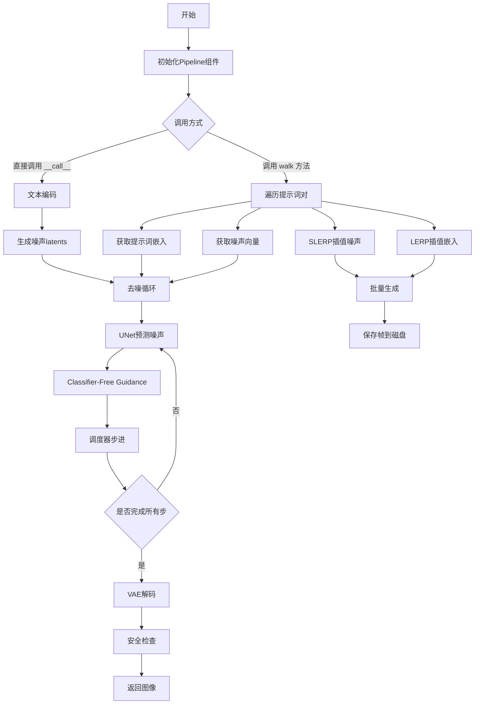
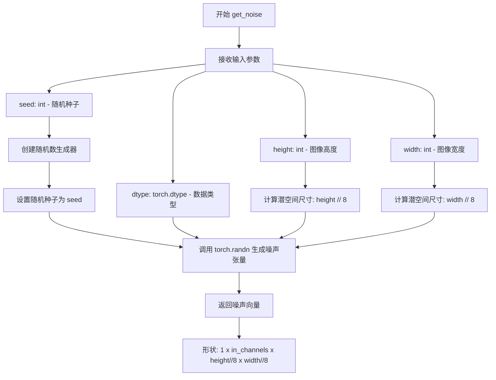
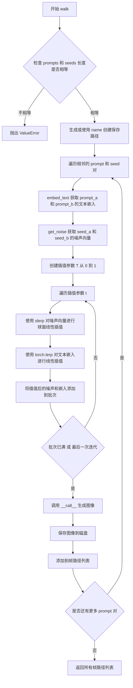

```mermaid
flowchart TD
    A[开始 __call__] --> B{验证参数}
    B --> C{height/width 是否能被8整除}
    C -->|否| D[抛出 ValueError]
    C -->|是| E{callback_steps 是否有效}
    E -->|否| F[抛出 ValueError]
    E -->|是| G{text_embeddings 是否提供}
    
    G -->|否| H[处理 prompt]
    G -->|是| I[使用提供的 text_embeddings]
    
    H --> J[Tokenize prompt]
    J --> K[编码为 text_embeddings]
    K --> L[计算 batch_size]
    I --> L
    
    L --> M[复制 embeddings 匹配 num_images_per_prompt]
    M --> N{guidance_scale > 1?}
    
    N -->|是| O[处理 negative_prompt]
    N -->|否| P[跳过 negative_prompt]
    
    O --> Q[生成 uncond_embeddings]
    Q --> R[拼接 uncond 和 text embeddings]
    P --> R
    
    R --> S{latents 是否提供?}
    S -->|否| T[生成随机 latents]
    S -->|是| U[验证 latents 形状]
    T --> V[设置 scheduler timesteps]
    U --> V
    
    V --> W[缩放初始噪声]
    W --> X[循环去噪]
    
    X --> Y{当前 timestep}
    Y --> Z[扩展 latents 用于 CFG]
    Z --> AA[Scheduler 缩放输入]
    AA --> AB[UNet 预测噪声]
    
    AB --> AC{使用 CFG?}
    AC -->|是| AD[分离噪声预测计算 guidance]
    AC -->|否| AE[直接使用噪声预测]
    
    AD --> AE --> AF[Scheduler step 更新 latents]
    
    AF --> AG{需要调用 callback?}
    AG -->|是| AH[调用 callback 函数]
    AG -->|否| AI[继续下一轮]
    
    AH --> AI --> AJ{是否还有 timestep?}
    AJ -->|是| X
    AJ -->|否| AK[缩放 latents]
    
    AK --> AL[VAE 解码为图像]
    AL --> AM[后处理图像]
    
    AM --> AN{Safety checker 是否存在?}
    AN -->|是| AO[运行 NSFW 检测]
    AN -->|否| AP[has_nsfw = None]
    
    AO --> AP --> AQ{output_type == 'pil'?}
    
    AQ -->|是| AR[转换为 PIL Image]
    AQ -->|否| AS[保持 numpy 数组]
    
    AR --> AT{return_dict == True?}
    AS --> AT
    
    AT -->|是| AU[返回 StableDiffusionPipelineOutput]
    AT -->|否| AV[返回 tuple]
```

# `diffusers\examples\community\interpolate_stable_diffusion.py` 详细设计文档

这是一个基于Stable Diffusion的文本到图像生成管道，通过在多个提示词和噪声向量之间进行球面插值(SLERP)和线性插值(lerp)，实现图像帧之间的平滑过渡动画生成。该管道继承自DiffusionPipeline，支持自定义调度器、安全检查器和多种推理参数。

## 整体流程



## 类结构

```
DiffusionPipeline (抽象基类)
└── StableDiffusionWalkPipeline (具体实现)
    ├── 依赖: StableDiffusionMixin
    ├── 依赖组件: AutoencoderKL (VAE)
    ├── 依赖组件: CLIPTextModel (文本编码器)
    ├── 依赖组件: CLIPTokenizer (分词器)
    ├── 依赖组件: UNet2DConditionModel (去噪网络)
    ├── 依赖组件: SchedulerMixin (调度器)
    ├── 依赖组件: StableDiffusionSafetyChecker (安全检查)
    └── 依赖组件: CLIPImageProcessor (特征提取)
```

## 全局变量及字段


### `logger`
    
模块级日志记录器,用于输出警告和信息

类型：`logging.Logger`
    


### `slerp`
    
球面线性插值函数,在两个向量之间进行球面插值生成中间向量

类型：`function`
    


### `StableDiffusionWalkPipeline.vae`
    
VAE模型,用于编码和解码图像与潜在表示

类型：`AutoencoderKL`
    


### `StableDiffusionWalkPipeline.text_encoder`
    
CLIP文本编码器,冻结的文本编码模型

类型：`CLIPTextModel`
    


### `StableDiffusionWalkPipeline.tokenizer`
    
CLIP分词器,用于文本分词

类型：`CLIPTokenizer`
    


### `StableDiffusionWalkPipeline.unet`
    
条件U-Net架构,去噪图像潜在表示

类型：`UNet2DConditionModel`
    


### `StableDiffusionWalkPipeline.scheduler`
    
调度器,用于去噪过程

类型：`Union[DDIMScheduler, PNDMScheduler, LMSDiscreteScheduler]`
    


### `StableDiffusionWalkPipeline.safety_checker`
    
安全检查器,检测生成的有害内容

类型：`StableDiffusionSafetyChecker`
    


### `StableDiffusionWalkPipeline.feature_extractor`
    
特征提取器,从生成图像中提取特征

类型：`CLIPImageProcessor`
    
    

## 全局函数及方法


### `slerp`

球面线性插值（Spherical Linear Interpolation）函数，用于在两个向量之间进行球面插值，生成平滑过渡的噪声向量。该函数通过计算向量间的夹角余弦值来判断插值方式，当两向量接近共线时使用线性插值，否则使用球面插值公式生成更平滑的过渡路径。

参数：

- `t`：`float`，插值参数，取值范围通常为 [0, 1]，表示从 v0 到 v1 的过渡比例
- `v0`：`Union[np.ndarray, torch.Tensor]`，起始向量，支持 NumPy 数组或 PyTorch 张量
- `v1`：`Union[np.ndarray, torch.Tensor]`，目标向量，支持 NumPy 数组或 PyTorch 张量
- `DOT_THRESHOLD`：`float`，默认值 0.9995，用于判断两向量是否接近共线的阈值

返回值：`Union[np.ndarray, torch.Tensor]`，球面插值后的结果向量，返回类型与输入类型一致

#### 流程图

```mermaid
flowchart TD
    A[开始 slerp] --> B{输入是否为 torch.Tensor}
    B -->|是| C[记录设备并转为 NumPy]
    B -->|否| D[直接使用 NumPy]
    C --> E[计算向量点积]
    D --> E
    E --> F[计算余弦相似度]
    F --> G{abs dot > DOT_THRESHOLD?}
    G -->|是| H[使用线性插值: v2 = (1-t)*v0 + t*v1]
    G -->|否| I[计算球面插值]
    I --> J[计算初始夹角 θ₀ = arccos(dot)]
    J --> K[计算 θt = θ₀ * t]
    K --> L[计算权重 s0, s1]
    L --> M[计算 v2 = s0*v0 + s1*v1]
    H --> N{输入是 torch.Tensor?}
    M --> N
    N -->|是| O[转回 torch.Tensor 并移到原设备]
    N -->|否| P[直接返回 NumPy 数组]
    O --> Q[返回结果向量 v2]
    P --> Q
```

#### 带注释源码

```python
def slerp(t, v0, v1, DOT_THRESHOLD=0.9995):
    """helper function to spherically interpolate two arrays v1 v2"""

    # 检查输入是否为 PyTorch 张量
    # 如果是，则记录设备并转换为 NumPy 数组以便进行数学运算
    if not isinstance(v0, np.ndarray):
        inputs_are_torch = True  # 标记输入为张量类型
        input_device = v0.device  # 记录原始设备（CPU/CUDA）
        v0 = v0.cpu().numpy()    # 转为 CPU NumPy 数组
        v1 = v1.cpu().numpy()

    # 计算两个向量的点积，并除以它们模的乘积得到余弦相似度
    dot = np.sum(v0 * v1 / (np.linalg.norm(v0) * np.linalg.norm(v1)))
    
    # 如果两向量夹角很小（接近共线），使用简单的线性插值
    # 这可以避免球面插值中除零或数值不稳定的问题
    if np.abs(dot) > DOT_THRESHOLD:
        v2 = (1 - t) * v0 + t * v1
    else:
        # 球面线性插值公式
        # 计算初始夹角 θ₀
        theta_0 = np.arccos(dot)
        sin_theta_0 = np.sin(theta_0)
        
        # 计算当前插值点的夹角 θt = θ₀ * t
        theta_t = theta_0 * t
        sin_theta_t = np.sin(theta_t)
        
        # 计算球面插值的权重系数
        # s0 = sin(θ₀ - θt) / sin(θ₀)
        # s1 = sin(θt) / sin(θ₀)
        s0 = np.sin(theta_0 - theta_t) / sin_theta_0
        s1 = sin_theta_t / sin_theta_0
        
        # 组合权重和原始向量得到插值结果
        v2 = s0 * v0 + s1 * v1

    # 如果原始输入是 PyTorch 张量，结果也转换回张量并放回原始设备
    if inputs_are_torch:
        v2 = torch.from_numpy(v2).to(input_device)

    return v2
```


### `StableDiffusionWalkPipeline.__init__`

初始化 `StableDiffusionWalkPipeline` 管道实例，注册所有必需的模型组件（VAE、文本编码器、Tokenizer、UNet、调度器、安全检查器、特征提取器），并对过时的调度器配置进行兼容性处理。

参数：

- `vae`：`AutoencoderKL`，Variational Auto-Encoder (VAE) 模型，用于编码和解码图像与潜在表示之间的转换
- `text_encoder`：`CLIPTextModel`，冻结的文本编码器，Stable Diffusion 使用 CLIP 的文本部分
- `tokenizer`：`CLIPTokenizer`，CLIP Tokenizer，用于将文本转换为 token
- `unet`：`UNet2DConditionModel`，条件 U-Net 架构，用于对编码后的图像潜在表示进行去噪
- `scheduler`：`Union[DDIMScheduler, PNDMScheduler, LMSDiscreteScheduler]`，调度器，用于与 `unet` 结合对图像潜在表示进行去噪
- `safety_checker`：`StableDiffusionSafetyChecker`，安全检查器模块，用于评估生成的图像是否包含不当或有害内容
- `feature_extractor`：`CLIPImageProcessor`，特征提取器，用于从生成的图像中提取特征并输入到安全检查器

返回值：无（`None`），构造函数通过 `self.register_modules` 注册组件到实例属性

#### 流程图

```mermaid
flowchart TD
    A[开始 __init__] --> B[调用 super().__init__]
    B --> C{scheduler.config.steps_offset != 1?}
    C -->|是| D[生成弃用警告消息]
    D --> E[更新 scheduler 配置 steps_offset=1]
    E --> F{safety_checker is None?}
    C -->|否| F
    F -->|是| G[输出安全警告日志]
    G --> H[调用 self.register_modules 注册所有组件]
    F -->|否| H
    H --> I[结束 __init__]
    
    style A fill:#e1f5fe
    style I fill:#e1f5fe
    style C fill:#fff3e0
    style F fill:#fff3e0
```

#### 带注释源码

```python
def __init__(
    self,
    vae: AutoencoderKL,
    text_encoder: CLIPTextModel,
    tokenizer: CLIPTokenizer,
    unet: UNet2DConditionModel,
    scheduler: Union[DDIMScheduler, PNDMScheduler, LMSDiscreteScheduler],
    safety_checker: StableDiffusionSafetyChecker,
    feature_extractor: CLIPImageProcessor,
):
    """
    初始化 StableDiffusionWalkPipeline 管道
    
    参数:
        vae: Variational Auto-Encoder (VAE) 模型，用于图像与潜在表示之间的编码和解码
        text_encoder: CLIP 文本编码器，用于将文本提示转换为嵌入向量
        tokenizer: CLIP Tokenizer，用于分词文本输入
        unet: 条件 U-Net，用于去噪图像潜在表示
        scheduler: 噪声调度器，控制去噪过程的步进
        safety_checker: 安全检查器，用于过滤不当内容
        feature_extractor: 图像特征提取器，用于安全检查
    """
    # 调用父类 DiffusionPipeline 的初始化方法
    # 继承基础管道功能（如设备管理、模块注册等）
    super().__init__()

    # 检查调度器的 steps_offset 配置是否正确
    # 如果不匹配 1，则发出弃用警告并自动修复配置
    if scheduler is not None and getattr(scheduler.config, "steps_offset", 1) != 1:
        # 构建详细的弃用警告消息
        deprecation_message = (
            f"The configuration file of this scheduler: {scheduler} is outdated. `steps_offset`"
            f" should be set to 1 instead of {scheduler.config.steps_offset}. Please make sure "
            "to update the config accordingly as leaving `steps_offset` might led to incorrect results"
            " in future versions. If you have downloaded this checkpoint from the Hugging Face Hub,"
            " it would be very nice if you could open a Pull request for the `scheduler/scheduler_config.json`"
            " file"
        )
        # 调用 deprecate 函数记录弃用信息
        deprecate("steps_offset!=1", "1.0.0", deprecation_message, standard_warn=False)
        
        # 创建新的配置字典并将 steps_offset 设置为 1
        new_config = dict(scheduler.config)
        new_config["steps_offset"] = 1
        # 使用 FrozenDict 冻结配置，防止意外修改
        scheduler._internal_dict = FrozenDict(new_config)

    # 如果用户禁用了安全检查器（传入 None），发出警告
    # 提醒用户遵守 Stable Diffusion 许可证，建议保持安全过滤器启用
    if safety_checker is None:
        logger.warning(
            f"You have disabled the safety checker for {self.__class__} by passing `safety_checker=None`. Ensure"
            " that you abide to the conditions of the Stable Diffusion license and do not expose unfiltered"
            " results in services or applications open to the public. Both the diffusers team and Hugging Face"
            " strongly recommend to keep the safety filter enabled in all public facing circumstances, disabling"
            " it only for use-cases that involve analyzing network behavior or auditing its results. For more"
            " information, please have a look at https://github.com/huggingface/diffusers/pull/254 ."
        )

    # 注册所有模型组件到管道实例
    # 这些组件将可以通过 self.vae, self.text_encoder 等方式访问
    self.register_modules(
        vae=vae,
        text_encoder=text_encoder,
        tokenizer=tokenizer,
        unet=unet,
        scheduler=scheduler,
        safety_checker=safety_checker,
        feature_extractor=feature_extractor,
    )
```


### `StableDiffusionWalkPipeline.__call__`

主生成方法，实现文本到图像的扩散生成，通过CLIP文本编码器编码提示词，U-Net去噪潜在表示，最后使用VAE解码生成图像。

参数：

- `prompt`：`Optional[Union[str, List[str]]]`，用于引导图像生成的提示词，未提供时必须指定`text_embeddings`
- `height`：`int`，生成图像的高度（像素），默认512
- `width`：`int`，生成图像的宽度（像素），默认512
- `num_inference_steps`：`int`，去噪步数，默认50，步数越多图像质量越高但推理越慢
- `guidance_scale`：`float`，无分类器自由引导（CFG）比例，默认7.5，值越大越符合文本描述
- `negative_prompt`：`Optional[Union[str, List[str]]]`，用于引导图像生成的负面提示词
- `num_images_per_prompt`：`int`，每个提示词生成的图像数量，默认1
- `eta`：`float`，DDIM论文中的η参数，仅DDIM调度器有效，默认0.0
- `generator`：`Optional[torch.Generator]`，用于生成确定性结果的随机数生成器
- `latents`：`Optional[torch.Tensor]`，预生成的噪声潜在向量，若不提供则随机生成
- `output_type`：`str`，输出格式，可选"pil"或"numpy"，默认"pil"
- `return_dict`：`bool`，是否返回`StableDiffusionPipelineOutput`对象，默认True
- `callback`：`Optional[Callable[[int, int, torch.Tensor], None]]`，推理过程中每`callback_steps`步调用的回调函数
- `callback_steps`：`int`，回调函数调用频率，默认1
- `text_embeddings`：`Optional[torch.Tensor]`，预生成的文本嵌入，用于避免重复计算

返回值：`Union[StableDiffusionPipelineOutput, Tuple]`，当`return_dict=True`时返回`StableDiffusionPipelineOutput`（包含图像列表和NSFW检测结果），否则返回元组

#### 流程图



#### 带注释源码

```python
@torch.no_grad()
def __call__(
    self,
    prompt: Optional[Union[str, List[str]]] = None,
    height: int = 512,
    width: int = 512,
    num_inference_steps: int = 50,
    guidance_scale: float = 7.5,
    negative_prompt: Optional[Union[str, List[str]]] = None,
    num_images_per_prompt: Optional[int] = 1,
    eta: float = 0.0,
    generator: torch.Generator | None = None,
    latents: Optional[torch.Tensor] = None,
    output_type: str | None = "pil",
    return_dict: bool = True,
    callback: Optional[Callable[[int, int, torch.Tensor], None]] = None,
    callback_steps: int = 1,
    text_embeddings: Optional[torch.Tensor] = None,
    **kwargs,
):
    """
    调用管道进行图像生成的主方法。
    
    参数:
        prompt: 文本提示词或提示词列表，用于引导图像生成
        height/width: 生成图像的尺寸，必须能被8整除
        num_inference_steps: 去噪迭代次数
        guidance_scale: Classifier-Free Guidance 权重
        negative_prompt: 负面提示词，用于排除不需要的元素
        num_images_per_prompt: 每个提示词生成的图像数量
        eta: DDIM 调度器的随机性参数
        generator: 随机数生成器，确保可重复性
        latents: 预计算的噪声潜在向量
        output_type: 输出格式 (pil 或 numpy)
        return_dict: 是否返回结构化输出对象
        callback: 迭代过程中的回调函数
        callback_steps: 回调函数调用频率
        text_embeddings: 预计算的文本嵌入向量
    """
    
    # === 参数验证 ===
    # 验证图像尺寸是否符合 VAE 的 8 倍下采样要求
    if height % 8 != 0 or width % 8 != 0:
        raise ValueError(f"`height` and `width` have to be divisible by 8 but are {height} and {width}.")

    # 验证 callback_steps 参数的有效性
    if (callback_steps is None) or (
        callback_steps is not None and (not isinstance(callback_steps, int) or callback_steps <= 0)
    ):
        raise ValueError(
            f"`callback_steps` has to be a positive integer but is {callback_steps} of type"
            f" {type(callback_steps)}."
        )

    # === 文本嵌入处理 ===
    # 如果没有提供预计算的文本嵌入，则从 prompt 生成
    if text_embeddings is None:
        # 确定 batch_size
        if isinstance(prompt, str):
            batch_size = 1
        elif isinstance(prompt, list):
            batch_size = len(prompt)
        else:
            raise ValueError(f"`prompt` has to be of type `str` or `list` but is {type(prompt)}")

        # Tokenize 处理：将文本转换为 token ID 序列
        text_inputs = self.tokenizer(
            prompt,
            padding="max_length",
            max_length=self.tokenizer.model_max_length,
            return_tensors="pt",
        )
        text_input_ids = text_inputs.input_ids

        # 截断处理：CLIP 模型有最大 token 长度限制
        if text_input_ids.shape[-1] > self.tokenizer.model_max_length:
            removed_text = self.tokenizer.batch_decode(text_input_ids[:, self.tokenizer.model_max_length :])
            print(
                "The following part of your input was truncated because CLIP can only handle sequences up to"
                f" {self.tokenizer.model_max_length} tokens: {removed_text}"
            )
            text_input_ids = text_input_ids[:, : self.tokenizer.model_max_length]
        
        # 使用 CLIP 文本编码器生成文本嵌入
        text_embeddings = self.text_encoder(text_input_ids.to(self.device))[0]
    else:
        # 使用提供的嵌入，直接获取 batch_size
        batch_size = text_embeddings.shape[0]

    # === 批量生成处理 ===
    # 为每个提示词复制对应的文本嵌入，以支持批量生成
    bs_embed, seq_len, _ = text_embeddings.shape
    text_embeddings = text_embeddings.repeat(1, num_images_per_prompt, 1)
    text_embeddings = text_embeddings.view(bs_embed * num_images_per_prompt, seq_len, -1)

    # === Classifier-Free Guidance (CFG) 设置 ===
    # guidance_scale > 1 时启用无分类器引导
    do_classifier_free_guidance = guidance_scale > 1.0
    
    if do_classifier_free_guidance:
        # 处理负面提示词
        uncond_tokens: List[str]
        if negative_prompt is None:
            uncond_tokens = [""] * batch_size  # 空字符串作为默认负面提示
        elif type(prompt) is not type(negative_prompt):
            raise TypeError(f"`negative_prompt` should be the same type to `prompt`...")
        elif isinstance(negative_prompt, str):
            uncond_tokens = [negative_prompt]
        elif batch_size != len(negative_prompt):
            raise ValueError(f"`negative_prompt` batch size mismatch with `prompt`...")
        else:
            uncond_tokens = negative_prompt

        # Tokenize 并编码负面提示词
        max_length = self.tokenizer.model_max_length
        uncond_input = self.tokenizer(
            uncond_tokens,
            padding="max_length",
            max_length=max_length,
            truncation=True,
            return_tensors="pt",
        )
        uncond_embeddings = self.text_encoder(uncond_input.input_ids.to(self.device))[0]

        # 复制无条件嵌入以匹配批量大小
        seq_len = uncond_embeddings.shape[1]
        uncond_embeddings = uncond_embeddings.repeat(1, num_images_per_prompt, 1)
        uncond_embeddings = uncond_embeddings.view(batch_size * num_images_per_prompt, seq_len, -1)

        # 拼接无条件嵌入和条件嵌入，避免两次前向传播
        text_embeddings = torch.cat([uncond_embeddings, text_embeddings])

    # === 潜在向量初始化 ===
    # 计算潜在空间形状：(batch, channels, height/8, width/8)
    latents_shape = (batch_size * num_images_per_prompt, self.unet.config.in_channels, height // 8, width // 8)
    latents_dtype = text_embeddings.dtype
    
    if latents is None:
        # 随机生成噪声潜在向量
        if self.device.type == "mps":
            # MPS 设备上的随机数生成器存在兼容性问题
            latents = torch.randn(latents_shape, generator=generator, device="cpu", dtype=latents_dtype).to(
                self.device
            )
        else:
            latents = torch.randn(latents_shape, generator=generator, device=self.device, dtype=latents_dtype)
    else:
        # 验证提供的 latents 形状是否正确
        if latents.shape != latents_shape:
            raise ValueError(f"Unexpected latents shape, got {latents.shape}, expected {latents_shape}")
        latents = latents.to(self.device)

    # === 调度器设置 ===
    self.scheduler.set_timesteps(num_inference_steps)
    
    # 将 timesteps 移动到目标设备
    timesteps_tensor = self.scheduler.timesteps.to(self.device)

    # 根据调度器要求缩放初始噪声
    latents = latents * self.scheduler.init_noise_sigma

    # === 准备调度器额外参数 ===
    # DDIM 调度器使用 eta 参数，其他调度器忽略
    accepts_eta = "eta" in set(inspect.signature(self.scheduler.step).parameters.keys())
    extra_step_kwargs = {}
    if accepts_eta:
        extra_step_kwargs["eta"] = eta

    # === 去噪主循环 ===
    for i, t in enumerate(self.progress_bar(timesteps_tensor)):
        # 扩展 latents 以同时处理条件和无条件预测 (CFG)
        latent_model_input = torch.cat([latents] * 2) if do_classifier_free_guidance else latents
        latent_model_input = self.scheduler.scale_model_input(latent_model_input, t)

        # 使用 UNet 预测噪声残差
        noise_pred = self.unet(latent_model_input, t, encoder_hidden_states=text_embeddings).sample

        # 执行 Classifier-Free Guidance
        if do_classifier_free_guidance:
            # 分离无条件预测和条件预测
            noise_pred_uncond, noise_pred_text = noise_pred.chunk(2)
            # 计算带引导的噪声预测
            noise_pred = noise_pred_uncond + guidance_scale * (noise_pred_text - noise_pred_uncond)

        # 使用调度器执行去噪步骤：x_t -> x_{t-1}
        latents = self.scheduler.step(noise_pred, t, latents, **extra_step_kwargs).prev_sample

        # 调用回调函数（如果提供）
        if callback is not None and i % callback_steps == 0:
            step_idx = i // getattr(self.scheduler, "order", 1)
            callback(step_idx, t, latents)

    # === VAE 解码 ===
    # 将潜在向量缩放回原始空间
    latents = 1 / 0.18215 * latents
    # 使用 VAE 解码潜在向量生成图像
    image = self.vae.decode(latents).sample

    # === 图像后处理 ===
    # 将图像值从 [-1, 1] 映射到 [0, 1]
    image = (image / 2 + 0.5).clamp(0, 1)

    # 转换为 float32 以兼容 bfloat16
    image = image.cpu().permute(0, 2, 3, 1).float().numpy()

    # === NSFW 安全检查 ===
    if self.safety_checker is not None:
        # 提取特征用于安全检查
        safety_checker_input = self.feature_extractor(self.numpy_to_pil(image), return_tensors="pt").to(
            self.device
        )
        image, has_nsfw_concept = self.safety_checker(
            images=image, clip_input=safety_checker_input.pixel_values.to(text_embeddings.dtype)
        )
    else:
        has_nsfw_concept = None

    # === 输出格式化 ===
    if output_type == "pil":
        image = self.numpy_to_pil(image)

    if not return_dict:
        return (image, has_nsfw_concept)

    return StableDiffusionPipelineOutput(images=image, nsfw_content_detected=has_nsfw_concept)
```


### `StableDiffusionWalkPipeline.embed_text`

该方法接收文本字符串作为输入，通过CLIP分词器将其转换为token ID序列，然后利用冻结的CLIP文本编码器将token序列编码为高维文本嵌入向量，返回的嵌入向量可直接用于Stable Diffusion模型的图像生成过程。

参数：

- `text`：`str`，要转换为文本嵌入的输入文本字符串

返回值：`torch.Tensor`，形状为 `(batch_size, seq_len, hidden_size)` 的文本嵌入向量，其中 `batch_size` 通常为1，`seq_len` 为tokenizer定义的最大长度，`hidden_size` 为文本编码器的隐藏层维度（通常为768维）

#### 流程图

```mermaid
flowchart TD
    A[开始: embed_text] --> B[输入文本字符串]
    B --> C[调用self.tokenizer进行分词]
    C --> D[配置参数: padding=max_length, truncation=True, return_tensors=pt]
    D --> E[生成token input_ids]
    E --> F[将input_ids移至目标设备]
    F --> G[使用torch.no_grad禁用梯度计算]
    G --> H[调用self.text_encoder编码token IDs]
    H --> I[提取嵌入向量[0]]
    I --> J[返回文本嵌入张量]
```

#### 带注释源码

```python
def embed_text(self, text):
    """takes in text and turns it into text embeddings"""
    # Step 1: 使用tokenizer将输入文本转换为模型所需的token格式
    # padding="max_length": 将序列填充到最大长度
    # max_length: tokenizer定义的最大序列长度 (通常为77)
    # truncation=True: 如果序列超过最大长度则截断
    # return_tensors="pt": 返回PyTorch张量
    text_input = self.tokenizer(
        text,
        padding="max_length",
        max_length=self.tokenizer.model_max_length,
        truncation=True,
        return_tensors="pt",
    )
    
    # Step 2: 推理阶段禁用梯度计算以节省显存和计算资源
    with torch.no_grad():
        # Step 3: 将token IDs移动到模型所在设备 (CPU/CUDA/MPS)
        # Step 4: 调用CLIP文本编码器获取嵌入向量
        # text_encoder返回元组 (last_hidden_state, pooler_output)
        # [0] 表示取 last_hidden_state，形状为 (batch, seq_len, hidden_dim)
        embed = self.text_encoder(text_input.input_ids.to(self.device))[0]
    
    # Step 5: 返回文本嵌入向量
    return embed
```


### `StableDiffusionWalkPipeline.get_noise`

根据随机种子生成确定性的噪声向量，用于图像生成过程中的初始潜空间表示。

参数：

- `seed`：`int`，随机种子，用于生成确定性的噪声向量
- `dtype`：`torch.dtype`，输出噪声张量的数据类型，默认为 `torch.float32`
- `height`：`int`，生成图像的高度（像素），默认为 512
- `width`：`int`，生成图像的宽度（像素），默认为 512

返回值：`torch.Tensor`，形状为 `(1, in_channels, height//8, width//8)` 的噪声向量

#### 流程图



#### 带注释源码

```python
def get_noise(self, seed, dtype=torch.float32, height=512, width=512):
    """Takes in random seed and returns corresponding noise vector"""
    # 使用 torch.randn 生成符合标准正态分布的随机噪声张量
    # 形状说明：
    #   - 第一个维度为 1，表示单张图像的噪声
    #   - self.unet.config.in_channels 表示 UNet 的输入通道数（通常是 4）
    #   - height // 8 和 width // 8 表示潜空间（latent space）的尺寸
    #     因为扩散模型通常在降采样的潜空间中进行处理
    return torch.randn(
        # 计算噪声张量的形状：批次大小为 1，通道数为 UNet 配置的输入通道数
        (1, self.unet.config.in_channels, height // 8, width // 8),
        # 创建随机数生成器并设置种子，确保噪声的可重复性
        generator=torch.Generator(device=self.device).manual_seed(seed),
        # 指定生成设备为当前管道设备
        device=self.device,
        # 指定输出数据类型
        dtype=dtype,
    )
```


### `StableDiffusionWalkPipeline.walk`

在多个提示词和种子间进行球面线性插值（slerp）和线性插值（lerp），生成图像动画帧序列，并保存到磁盘。

参数：

- `prompts`：`List[str]`，要生成图像的提示词列表
- `seeds`：`List[int]`，与提示词对应的随机种子列表，长度必须与 prompts 相同
- `num_interpolation_steps`：`Optional[int] = 6`，提示词之间的插值步数
- `output_dir`：`str | None = "./dreams"`，保存生成图像的目录
- `name`：`str | None = None`，保存图像的子目录名称，默认为当前时间
- `batch_size`：`Optional[int] = 1`，每次生成的图像数量
- `height`：`Optional[int] = 512`，生成图像的高度
- `width`：`Optional[int] = 512`，生成图像的宽度
- `guidance_scale`：`Optional[float] = 7.5`，分类器自由引导（Classifier-Free Guidance）参数
- `num_inference_steps`：`Optional[int] = 50`，去噪步数
- `eta`：`Optional[float] = 0.0`，DDIM 调度器的 eta 参数

返回值：`List[str]`，生成图像的文件路径列表

#### 流程图



#### 带注释源码

```python
def walk(
    self,
    prompts: List[str],
    seeds: List[int],
    num_interpolation_steps: Optional[int] = 6,
    output_dir: str | None = "./dreams",
    name: str | None = None,
    batch_size: Optional[int] = 1,
    height: Optional[int] = 512,
    width: Optional[int] = 512,
    guidance_scale: Optional[float] = 7.5,
    num_inference_steps: Optional[int] = 50,
    eta: Optional[float] = 0.0,
) -> List[str]:
    """
    Walks through a series of prompts and seeds, interpolating between them and saving the results to disk.

    Args:
        prompts (`List[str]`):
            List of prompts to generate images for.
        seeds (`List[int]`):
            List of seeds corresponding to provided prompts. Must be the same length as prompts.
        num_interpolation_steps (`int`, *optional*, defaults to 6):
            Number of interpolation steps to take between prompts.
        output_dir (`str`, *optional*, defaults to `./dreams`):
            Directory to save the generated images to.
        name (`str`, *optional*, defaults to `None`):
            Subdirectory of `output_dir` to save the generated images to. If `None`, the name will
            be the current time.
        batch_size (`int`, *optional*, defaults to 1):
            Number of images to generate at once.
        height (`int`, *optional*, defaults to 512):
            Height of the generated images.
        width (`int`, *optional*, defaults to 512):
            Width of the generated images.
        guidance_scale (`float`, *optional*, defaults to 7.5):
            Guidance scale as defined in [Classifier-Free Diffusion Guidance](https://huggingface.co/papers/2207.12598).
            `guidance_scale` is defined as `w` of equation 2. of [Imagen
            Paper](https://huggingface.co/papers/2205.11487). Guidance scale is enabled by setting `guidance_scale >
            1`. Higher guidance scale encourages to generate images that are closely linked to the text `prompt`,
            usually at the expense of lower image quality.
        num_inference_steps (`int`, *optional*, defaults to 50):
            The number of denoising steps. More denoising steps usually lead to a higher quality image at the
            expense of slower inference.
        eta (`float`, *optional*, defaults to 0.0):
            Corresponds to parameter eta (η) in the DDIM paper: https://huggingface.co/papers/2010.02502. Only applies to
            [`schedulers.DDIMScheduler`], will be ignored for others.

    Returns:
        `List[str]`: List of paths to the generated images.
    """
    # 验证 prompts 和 seeds 长度一致
    if not len(prompts) == len(seeds):
        raise ValueError(
            f"Number of prompts and seeds must be equalGot {len(prompts)} prompts and {len(seeds)} seeds"
        )

    # 生成子目录名称，默认为当前时间戳
    name = name or time.strftime("%Y%m%d-%H%M%S")
    # 构建完整保存路径并创建目录
    save_path = Path(output_dir) / name
    save_path.mkdir(exist_ok=True, parents=True)

    # 初始化帧索引和文件路径列表
    frame_idx = 0
    frame_filepaths = []
    
    # 遍历相邻的提示词和种子对
    for prompt_a, prompt_b, seed_a, seed_b in zip(prompts, prompts[1:], seeds, seeds[1:]):
        # 获取两个提示词的文本嵌入向量
        embed_a = self.embed_text(prompt_a)
        embed_b = self.embed_text(prompt_b)

        # 获取对应的噪声向量
        noise_dtype = embed_a.dtype
        noise_a = self.get_noise(seed_a, noise_dtype, height, width)
        noise_b = self.get_noise(seed_b, noise_dtype, height, width)

        # 初始化批次容器
        noise_batch, embeds_batch = None, None
        # 创建从 0 到 1 的插值参数数组
        T = np.linspace(0.0, 1.0, num_interpolation_steps)
        
        # 遍历每个插值点
        for i, t in enumerate(T):
            # 使用球面线性插值（slerp）处理噪声向量，保持方向一致性
            noise = slerp(float(t), noise_a, noise_b)
            # 使用线性插值（lerp）处理文本嵌入向量
            embed = torch.lerp(embed_a, embed_b, t)

            # 将当前噪声和嵌入添加到批次中
            noise_batch = noise if noise_batch is None else torch.cat([noise_batch, noise], dim=0)
            embeds_batch = embed if embeds_batch is None else torch.cat([embeds_batch, embed], dim=0)

            # 检查批次是否已准备好进行生成
            batch_is_ready = embeds_batch.shape[0] == batch_size or i + 1 == T.shape[0]
            if batch_is_ready:
                # 调用 pipeline 生成图像
                outputs = self(
                    latents=noise_batch,
                    text_embeddings=embeds_batch,
                    height=height,
                    width=width,
                    guidance_scale=guidance_scale,
                    eta=eta,
                    num_inference_steps=num_inference_steps,
                )
                # 重置批次容器
                noise_batch, embeds_batch = None, None

                # 保存生成的每张图像
                for image in outputs["images"]:
                    frame_filepath = str(save_path / f"frame_{frame_idx:06d}.png")
                    image.save(frame_filepath)
                    frame_filepaths.append(frame_filepath)
                    frame_idx += 1
    return frame_filepaths
```

## 关键组件


### 张量索引与惰性加载

在`__call__`方法和`walk`方法中，通过张量切片和重复操作实现批处理生成。`text_embeddings.repeat(1, num_images_per_prompt, 1)`和`text_embeddings.view(bs_embed * num_images_per_prompt, seq_len, -1)`用于扩展嵌入以匹配批量生成需求。`latents_shape`根据输入动态计算，实现惰性加载。

### 反量化支持

`latents = 1 / 0.18215 * latents`在解码前执行反量化操作，将潜在空间的值从VAE的缩放因子中恢复。`image = (image / 2 + 0.5).clamp(0, 1)`将输出从[-1,1]范围反量化到[0,1]的图像空间。

### SLERP插值

`slerp`函数实现球面线性插值，用于在两个噪声向量或嵌入之间生成平滑过渡路径。通过计算向量间的夹角余弦值判断是否超过阈值DOT_THRESHOLD，选择线性插值或球面插值，确保插值路径位于球面上。

### 分类器自由引导

`do_classifier_free_guidance = guidance_scale > 1.0`检测是否启用引导。通过`torch.cat([uncond_embeddings, text_embeddings])`合并无条件和有条件嵌入，在单次前向传播中同时预测噪声，实现高效引导。

### 安全检查器集成

在`__call__`方法末尾，通过`self.safety_checker`对生成的图像进行NSFW检测。`feature_extractor`提取图像特征，`safety_checker_input`构造检查器输入，根据`self.safety_checker`是否为None决定是否执行检查。

### 调度器兼容性

通过`inspect.signature(self.scheduler.step)`动态检测调度器参数，使用`extra_step_kwargs`字典传递`eta`等参数，实现对DDIMScheduler、PNDMScheduler、LMSDiscreteScheduler等多种调度器的兼容支持。

### 文本嵌入缓存

`text_embeddings`参数允许预先计算文本嵌入，避免重复编码。`embed_text`方法提供独立的文本编码接口，支持外部预计算嵌入的传入。

### 噪声生成与固定

`get_noise`方法使用`torch.Generator`和种子确保噪声可复现，支持确定性生成。`latents`参数允许用户传入预定义的噪声，实现对生成结果的控制。

### 进度回调机制

`callback`参数和`callback_steps`实现训练过程中的进度监控，每隔指定步数调用回调函数，传递当前步数、时间步和潜在向量，支持外部可视化或日志记录。


## 问题及建议


### 已知问题

-   **插值方法不一致**：在`walk`方法中，噪声向量使用`slerp`函数进行球面插值，而文本嵌入使用`torch.lerp`进行线性插值，这两种不同的插值方法可能导致语义和视觉上的一致性问题
-   **内存碎片化**：在`walk`方法的循环中使用`torch.cat`反复拼接`noise_batch`和`embeds_batch`，这会导致频繁的内存分配和复制，影响性能
-   **缺少进度条实现**：`__call__`方法中调用了`self.progress_bar(timesteps_tensor)`，但该方法在当前类中未定义，虽然可能继承自父类，但缺少显式依赖说明
-   **硬编码的VAE缩放因子**：代码中`latents = 1 / 0.18215 * latents`使用硬编码的VAE缩放因子，缺乏注释说明其来源和含义
-   **类型注解不一致**：`__call__`方法中部分参数使用了Python 3.10的联合类型注解（如`generator: torch.Generator | None`），但其他方法仍使用`Optional`语法
-   **负提示处理逻辑冗余**：在`do_classifier_free_guidance`分支中，负提示的类型检查和批处理逻辑可以简化
-   **缺乏错误恢复机制**：如果推理过程中出现CUDA内存不足错误，程序会直接崩溃而没有优雅的降级策略

### 优化建议

-   **统一插值方法**：将文本嵌入也改为使用`slerp`进行球面插值，或者在噪声上使用线性插值，确保语义空间和潜在空间的一致性
-   **批量构建优化**：预先分配固定大小的tensor，避免在循环中反复使用`cat`操作，可以显著提升性能
-   **提取硬编码值**：将`0.18215`等Magic Numbers定义为类属性或常量，并添加文档注释说明其物理意义
-   **添加内存管理**：在推理前检查可用显存，必要时使用`torch.cuda.empty_cache()`或实现自动降级策略（如减少batch size或图像分辨率）
-   **统一类型注解**：全面采用Python 3.10+的联合类型注解风格，提升代码一致性
-   **模块化slerp函数**：将`slerp`函数移至专门的工具模块或作为静态方法，提高代码组织性
-   **增强验证**：在`walk`方法中增加对`num_interpolation_steps`、`batch_size`等参数的有效性检查

## 其它


### 设计目标与约束

**设计目标：**
- 实现基于Stable Diffusion的文本到图像生成pipeline，支持在多个提示词和随机种子之间进行平滑插值生成连续帧图像
- 提供walk方法实现类似于"梦境漫游"的多提示词插值生成功能

**设计约束：**
- 输入图像尺寸必须能被8整除（height % 8 == 0, width % 8 == 0）
- num_inference_steps必须为正整数
- prompts和seeds列表长度必须一致
- 仅支持DDIMScheduler、LMSDiscreteScheduler、PNDMScheduler三种调度器
- CLIP文本编码器最大序列长度为tokenizer.model_max_length

### 错误处理与异常设计

- **参数验证**：在__call__方法中对height/width可被8整除、callback_steps为正整数进行显式检查
- **类型检查**：negative_prompt与prompt类型一致性检查，batch_size匹配验证
- **形状验证**：latents形状必须与预期的latents_shape一致
- **降级警告**：当safety_checker为None时输出警告日志，建议保持启用
- **截断处理**：当文本超过tokenizer最大长度时自动截断并打印警告信息

### 数据流与状态机

**主流程状态转换：**
```
初始化 → 文本编码 → 噪声初始化 → 调度器设置 → 迭代去噪 → VAE解码 → 后处理 → 输出
```

**walk方法插值流程：**
```
读取prompts/seeds → 嵌入文本A/B → 生成噪声A/B → 循环插值(t从0到1) → 批量生成 → 保存帧 → 返回文件路径列表
```

### 外部依赖与接口契约

- **transformers库**：CLIPTextModel、CLIPTokenizer、CLIPImageProcessor
- **diffusers库**：AutoencoderKL、UNet2DConditionModel、各类Scheduler、StableDiffusionSafetyChecker、DiffusionPipeline
- **numpy**：用于slerp插值计算
- **torch**：深度学习框架
- **pathlib**：文件路径操作
- **inspect模块**：用于动态检查调度器step方法签名

### 性能考虑与优化建议

- 文本嵌入在walk方法中预先计算并复用，避免重复编码
- 批量生成图像以提高GPU利用率
- 使用torch.no_grad()装饰器减少显存占用
- 在MPS设备上使用CPU生成随机噪声以保证可复现性

### 安全性考虑

- 内置StableDiffusionSafetyChecker进行NSFW内容检测
- 当禁用safety_checker时输出警告信息
- 建议在公开场景保持安全过滤器启用

### 版本兼容性

- 检查scheduler.config.steps_offset配置，过期配置会自动修复
- 支持torch.Generator进行确定性生成
- 兼容bfloat16和float32数据类型

### 配置与参数说明

- guidance_scale控制分类器自由引导强度，1.0表示不使用引导
- eta参数仅在DDIMScheduler中生效，控制随机性
- output_type支持"pil"或numpy数组格式输出
    