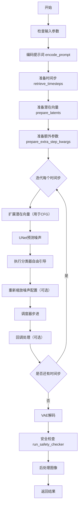
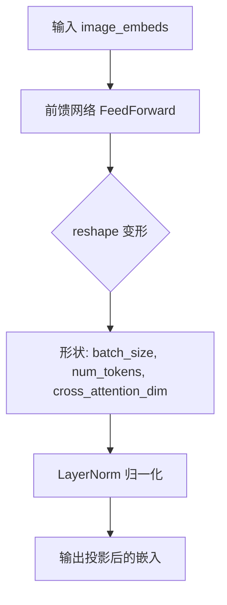
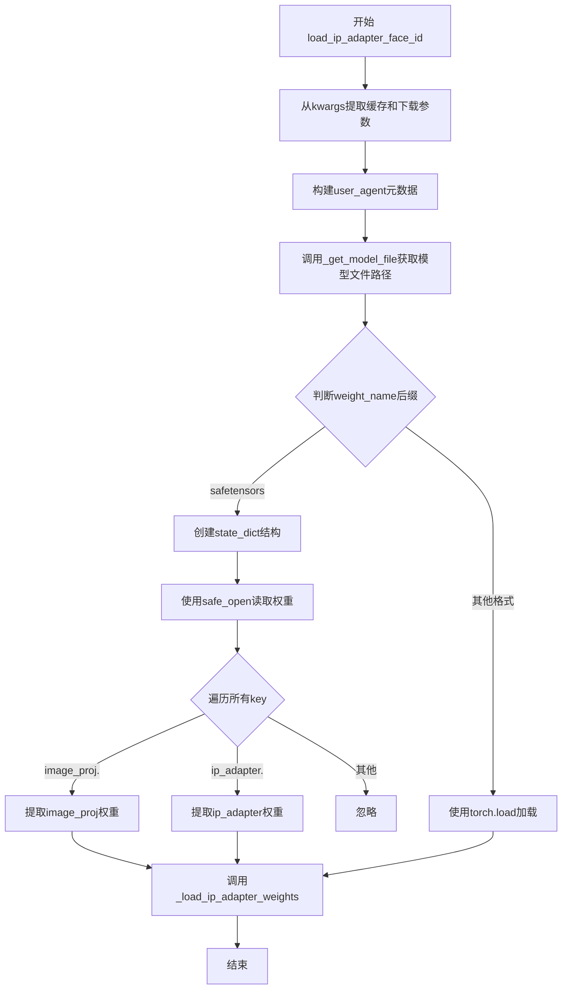
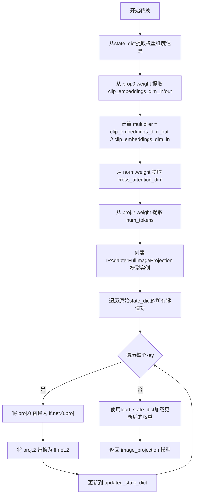
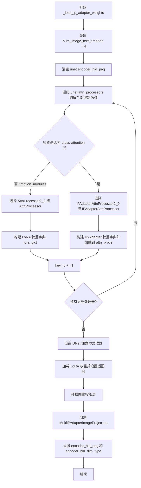
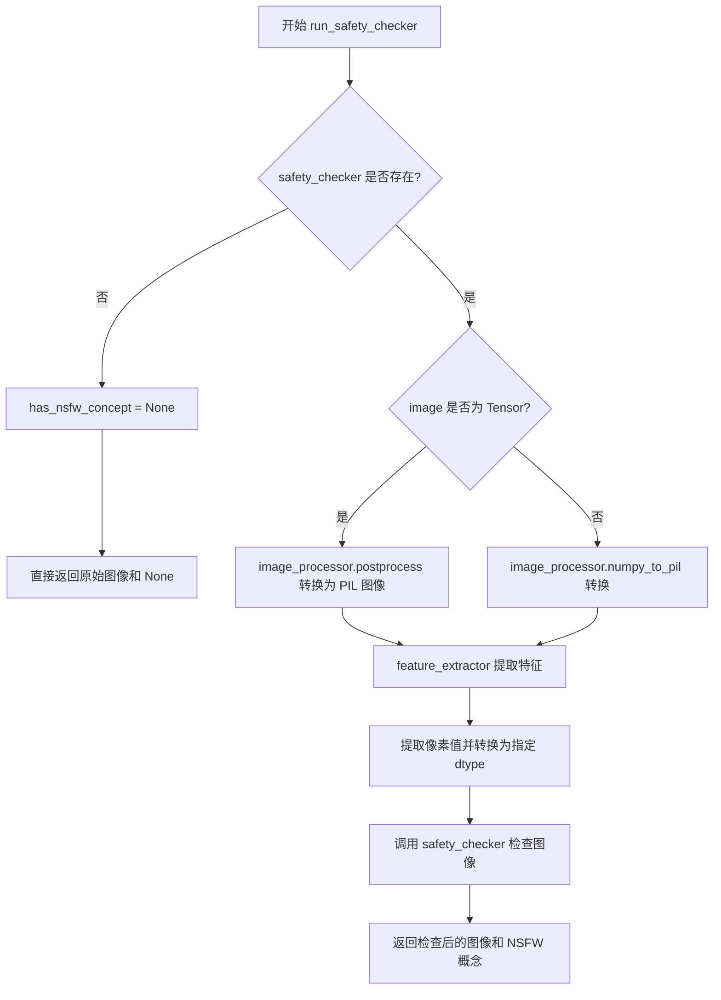
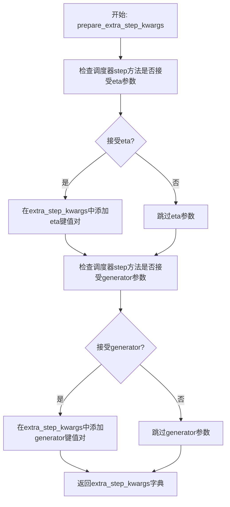
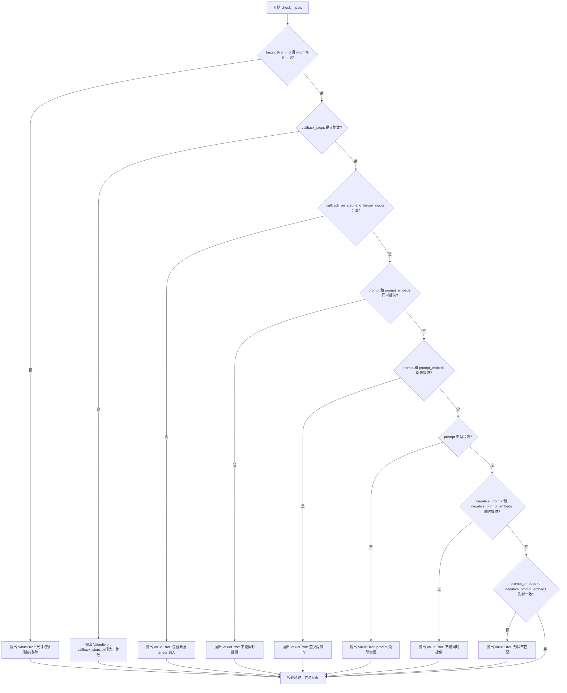
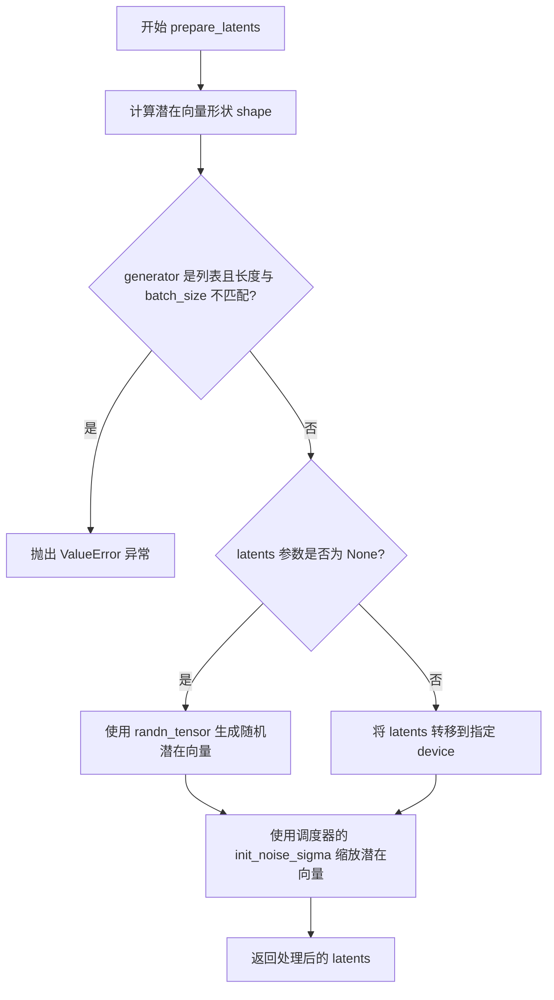
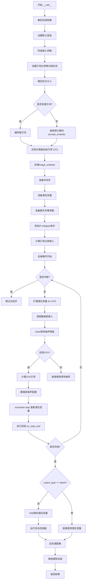

# `diffusers\examples\community\ip_adapter_face_id.py` 详细设计文档

这是一个集成了IP-Adapter Face-ID功能的Stable Diffusion文本到图像生成管道，支持根据人脸图像嵌入生成相似人脸的图像，同时保持文本提示的控制能力。该管道继承自多个Diffusers混合类，支持LoRA、Textual Inversion、单文件加载等高级功能。

## 整体流程



## 类结构

```
DiffusionPipeline (抽象基类)
├── IPAdapterFaceIDStableDiffusionPipeline
│   ├── 继承自: DiffusionPipeline
│   ├── 继承自: StableDiffusionMixin
│   ├── 继承自: TextualInversionLoaderMixin
│   ├── 继承自: StableDiffusionLoraLoaderMixin
│   ├── 继承自: IPAdapterMixin
│   ├── 继承自: FromSingleFileMixin
│   └── └── IPAdapterFullImageProjection (内部类/模块)
```

## 全局变量及字段


### `logger`
    
模块级日志记录器，用于记录管道运行过程中的信息、警告和错误

类型：`logging.Logger`
    


### `model_cpu_offload_seq`
    
定义模型组件CPU卸载顺序的字符串，按顺序指定text_encoder->image_encoder->unet->vae

类型：`str`
    


### `_optional_components`
    
可选组件列表，包含safety_checker、feature_extractor和image_encoder等可按需加载的模块

类型：`list`
    


### `_exclude_from_cpu_offload`
    
排除CPU卸载的组件列表，safety_checker被标记为不参与CPU卸载优化

类型：`list`
    


### `_callback_tensor_inputs`
    
回调函数中允许使用的张量输入名称列表，包括latents、prompt_embeds和negative_prompt_embeds

类型：`list`
    


### `IPAdapterFullImageProjection.num_tokens`
    
IP-Adapter令牌数量，决定图像嵌入投影输出的token数量

类型：`int`
    


### `IPAdapterFullImageProjection.cross_attention_dim`
    
交叉注意力维度，用于控制与文本特征交互的空间维度

类型：`int`
    


### `IPAdapterFullImageProjection.ff`
    
前馈神经网络，负责将图像嵌入投影到交叉注意力空间

类型：`FeedForward`
    


### `IPAdapterFullImageProjection.norm`
    
层归一化模块，用于稳定前馈网络输出的特征分布

类型：`nn.LayerNorm`
    


### `IPAdapterFaceIDStableDiffusionPipeline.vae`
    
变分自编码器模型，负责将图像编码到潜在空间并从潜在空间解码重建图像

类型：`AutoencoderKL`
    


### `IPAdapterFaceIDStableDiffusionPipeline.text_encoder`
    
CLIP文本编码器，将文本提示转换为文本嵌入向量用于条件生成

类型：`CLIPTextModel`
    


### `IPAdapterFaceIDStableDiffusionPipeline.tokenizer`
    
CLIP分词器，将文本字符串tokenize为模型可处理的token ID序列

类型：`CLIPTokenizer`
    


### `IPAdapterFaceIDStableDiffusionPipeline.unet`
    
条件UNet模型，在去噪过程中根据文本嵌入和图像嵌入预测噪声残差

类型：`UNet2DConditionModel`
    


### `IPAdapterFaceIDStableDiffusionPipeline.scheduler`
    
Karras扩散调度器，管理去噪过程中的时间步和噪声调度策略

类型：`KarrasDiffusionSchedulers`
    


### `IPAdapterFaceIDStableDiffusionPipeline.safety_checker`
    
安全检查器，检测并过滤可能包含不安全内容的生成图像

类型：`StableDiffusionSafetyChecker`
    


### `IPAdapterFaceIDStableDiffusionPipeline.feature_extractor`
    
CLIP图像特征提取器，从图像中提取特征用于安全检查

类型：`CLIPImageProcessor`
    


### `IPAdapterFaceIDStableDiffusionPipeline.image_encoder`
    
CLIP视觉编码器，将输入图像编码为图像嵌入向量用于IP-Adapter

类型：`CLIPVisionModelWithProjection`
    


### `IPAdapterFaceIDStableDiffusionPipeline.vae_scale_factor`
    
VAE缩放因子，用于计算潜在空间与像素空间的尺寸转换比例

类型：`int`
    


### `IPAdapterFaceIDStableDiffusionPipeline.image_processor`
    
VAE图像处理器，负责图像的前处理和后处理操作包括归一化和后处理

类型：`VaeImageProcessor`
    


### `IPAdapterFaceIDStableDiffusionPipeline.model_cpu_offload_seq`
    
CPU卸载顺序字符串，指定模型组件在推理过程中的内存卸载顺序

类型：`str`
    


### `IPAdapterFaceIDStableDiffusionPipeline._optional_components`
    
可选组件列表，定义哪些组件可以在初始化时省略

类型：`list`
    


### `IPAdapterFaceIDStableDiffusionPipeline._exclude_from_cpu_offload`
    
排除CPU卸载的组件列表，指定不参与模型内存优化的组件

类型：`list`
    


### `IPAdapterFaceIDStableDiffusionPipeline._callback_tensor_inputs`
    
回调张量输入列表，定义推理回调中可访问的张量变量名称

类型：`list`
    
    

## 全局函数及方法


### `rescale_noise_cfg`

根据引导重缩放因子重新调整噪声配置（noise_cfg），该方法基于论文《Common Diffusion Noise Schedules and Sample Steps are Flawed》的研究发现（Section 3.4），用于修复过度曝光问题并避免图像过于平淡。

参数：

- `noise_cfg`：`torch.Tensor`，经过分类器-free guidance 调整后的噪声预测配置
- `noise_pred_text`：`torch.Tensor`，文本引导的噪声预测（未经过 guidance 调整的部分）
- `guidance_rescale`：`float`，引导重缩放因子，默认为 0.0，用于控制重缩放后的噪声与原始噪声的混合比例

返回值：`torch.Tensor`，重缩放并混合后的噪声配置

#### 流程图

```mermaid
flowchart TD
    A[输入 noise_cfg 和 noise_pred_text] --> B[计算 noise_pred_text 的标准差 std_text]
    A --> C[计算 noise_cfg 的标准差 std_cfg]
    B --> D[计算重缩放因子: std_text / std_cfg]
    C --> D
    D --> E[重缩放 noise_cfg: noise_pred_rescaled = noise_cfg × (std_text / std_cfg)]
    E --> F{guidance_rescale > 0?}
    F -->|是| G[混合噪声: noise_cfg = guidance_rescale × noise_pred_rescaled + (1 - guidance_rescale) × noise_cfg]
    F -->|否| H[返回原始 noise_cfg]
    G --> I[返回重缩放后的 noise_cfg]
    H --> I
```

#### 带注释源码

```python
def rescale_noise_cfg(noise_cfg, noise_pred_text, guidance_rescale=0.0):
    """
    Rescale `noise_cfg` according to `guidance_rescale`. Based on findings of [Common Diffusion Noise Schedules and
    Sample Steps are Flawed](https://huggingface.co/papers/2305.08891). See Section 3.4
    """
    # 计算文本引导噪声预测在所有空间维度上的标准差
    # dim=list(range(1, noise_pred_text.ndim)) 排除 batch 维度
    # keepdim=True 保持维度以便广播运算
    std_text = noise_pred_text.std(dim=list(range(1, noise_pred_text.ndim)), keepdim=True)
    
    # 计算 noise_cfg 在所有空间维度上的标准差
    std_cfg = noise_cfg.std(dim=list(range(1, noise_cfg.ndim)), keepdim=True)
    
    # 根据论文 Section 3.4 的发现重缩放 noise_cfg
    # 这一步修复了过度曝光问题（overexposure）
    noise_pred_rescaled = noise_cfg * (std_text / std_cfg)
    
    # 将重缩放后的结果与原始 guidance 结果按 guidance_rescale 因子混合
    # guidance_rescale=0 时返回原始 noise_cfg（无重缩放效果）
    # guidance_rescale>0 时引入重缩放以避免"plain looking"图像
    noise_cfg = guidance_rescale * noise_pred_rescaled + (1 - guidance_rescale) * noise_cfg
    
    return noise_cfg
```


### `retrieve_timesteps`

该函数是扩散模型推理流程中的关键辅助函数，负责调用调度器的`set_timesteps`方法设置时间步长，并从调度器中检索生成的时间步长序列。支持自定义时间步（通过`timesteps`参数）或自动根据`num_inference_steps`生成时间步序列。

参数：

- `scheduler`：`SchedulerMixin`，要获取时间步的调度器对象
- `num_inference_steps`：`Optional[int]`，生成样本时使用的扩散步数，若使用此参数则`timesteps`必须为`None`
- `device`：`Optional[Union[str, torch.device]]`，时间步要移动到的设备，若为`None`则不移动时间步
- `timesteps`：`Optional[List[int]]`，用于支持任意时间步间隔的自定义时间步，若为`None`则使用调度器的默认时间步间隔策略
- `**kwargs`：任意关键字参数，将传递给调度器的`set_timesteps`方法

返回值：`Tuple[torch.Tensor, int]`，第一个元素是调度器的时间步序列，第二个元素是推理步数

#### 流程图

```mermaid
flowchart TD
    A[开始] --> B{是否提供timesteps?}
    B -->|Yes| C[检查scheduler.set_timesteps是否支持timesteps参数]
    C --> D{支持timesteps?}
    D -->|No| E[抛出ValueError异常]
    D -->|Yes| F[调用scheduler.set_timesteps<br/>timesteps=timesteps, device=device, **kwargs]
    F --> G[获取scheduler.timesteps]
    G --> H[计算num_inference_steps = len(timesteps)]
    B -->|No| I[调用scheduler.set_timesteps<br/>num_inference_steps, device=device, **kwargs]
    I --> J[获取scheduler.timesteps]
    H --> K[返回timesteps, num_inference_steps]
    J --> K
    E --> L[结束]
    K --> L
```

#### 带注释源码

```python
def retrieve_timesteps(
    scheduler,
    num_inference_steps: Optional[int] = None,
    device: Optional[Union[str, torch.device]] = None,
    timesteps: Optional[List[int]] = None,
    **kwargs,
):
    """
    Calls the scheduler's `set_timesteps` method and retrieves timesteps from the scheduler after the call. Handles
    custom timesteps. Any kwargs will be supplied to `scheduler.set_timesteps`.

    Args:
        scheduler (`SchedulerMixin`):
            The scheduler to get timesteps from.
        num_inference_steps (`int`):
            The number of diffusion steps used when generating samples with a pre-trained model. If used,
            `timesteps` must be `None`.
        device (`str` or `torch.device`, *optional*):
            The device to which the timesteps should be moved to. If `None`, the timesteps are not moved.
        timesteps (`List[int]`, *optional*):
                Custom timesteps used to support arbitrary spacing between timesteps. If `None`, then the default
                timestep spacing strategy of the scheduler is used. If `timesteps` is passed, `num_inference_steps`
                must be `None`.

    Returns:
        `Tuple[torch.Tensor, int]`: A tuple where the first element is the timestep schedule from the scheduler and the
        second element is the number of inference steps.
    """
    # 检查是否提供了自定义时间步
    if timesteps is not None:
        # 使用inspect模块检查scheduler.set_timesteps方法是否接受timesteps参数
        accepts_timesteps = "timesteps" in set(inspect.signature(scheduler.set_timesteps).parameters.keys())
        
        # 如果调度器不支持自定义时间步，抛出错误
        if not accepts_timesteps:
            raise ValueError(
                f"The current scheduler class {scheduler.__class__}'s `set_timesteps` does not support custom"
                f" timestep schedules. Please check whether you are using the correct scheduler."
            )
        
        # 使用自定义时间步调用调度器的set_timesteps方法
        scheduler.set_timesteps(timesteps=timesteps, device=device, **kwargs)
        
        # 从调度器获取设置后的时间步
        timesteps = scheduler.timesteps
        
        # 计算推理步数
        num_inference_steps = len(timesteps)
    else:
        # 没有提供自定义时间步，使用num_inference_steps生成默认时间步
        scheduler.set_timesteps(num_inference_steps, device=device, **kwargs)
        
        # 从调度器获取设置后的时间步
        timesteps = scheduler.timesteps
    
    # 返回时间步序列和推理步数
    return timesteps, num_inference_steps
```


### IPAdapterFullImageProjection.forward

该方法是 `IPAdapterFullImageProjection` 类的前向传播函数，负责将图像嵌入（image_embeds）通过前馈神经网络处理并经LayerNorm归一化后输出，核心作用是将CLIP图像编码器输出的特征投影到适配UNet交叉注意力机制的向量空间。

参数：

- `image_embeds`：`torch.Tensor`，输入的图像嵌入向量，通常来自CLIPVisionModelWithProjection的输出，形状为 `(batch_size, image_embed_dim)`

返回值：`torch.Tensor`，经过投影和归一化后的图像嵌入，形状为 `(batch_size, num_tokens, cross_attention_dim)`

#### 流程图



#### 带注释源码

```python
def forward(self, image_embeds: torch.Tensor):
    """
    前向传播：将图像嵌入投影到交叉注意力维度
    
    Args:
        image_embeds: 来自CLIP图像编码器的特征向量，形状为 (batch_size, image_embed_dim)
    
    Returns:
        投影并归一化后的图像嵌入，形状为 (batch_size, num_tokens, cross_attention_dim)
    """
    # Step 1: 通过前馈网络进行维度变换和特征提取
    # 输入: (batch_size, image_embed_dim)
    # 输出: (batch_size, cross_attention_dim * num_tokens)
    x = self.ff(image_embeds)
    
    # Step 2: reshape 为多头注意力的格式
    # -1 表示自动推断batch维度
    # 输出: (batch_size, num_tokens, cross_attention_dim)
    x = x.reshape(-1, self.num_tokens, self.cross_attention_dim)
    
    # Step 3: LayerNorm 归一化，稳定训练
    # 输出形状保持不变
    return self.norm(x)
```

---

### 类详细信息

#### 类字段

- `num_tokens`：`int`，注意力token数量，控制输出序列长度
- `cross_attention_dim`：`int`，交叉注意力维度，决定UNet交叉注意力输入的维度
- `ff`：`FeedForward`，前馈神经网络，负责将图像嵌入从 `image_embed_dim` 投影到 `cross_attention_dim * num_tokens` 维度
- `norm`：`nn.LayerNorm`，层归一化层，对投影后的嵌入进行归一化处理

#### 类方法

##### `__init__`

参数：

- `image_embed_dim`：`int = 1024`，输入图像嵌入的维度，默认1024（对应CLIP ViT-L/14）
- `cross_attention_dim`：`int = 1024`，UNet交叉注意力维度，默认1024
- `mult`：`int = 1`，前馈网络隐藏层扩展倍数
- `num_tokens`：`int = 1`，输出的token数量，默认1

##### `forward`

（见上文详细描述）


### `IPAdapterFaceIDStableDiffusionPipeline.__init__`

该方法是 `IPAdapterFaceIDStableDiffusionPipeline` 类的构造函数，负责初始化整个图像生成管道。它接收多个核心模型组件（VAE、文本编码器、分词器、UNet、调度器等），进行配置验证和兼容性检查，注册所有模块，并设置图像处理相关的参数。这是管道运行前的必要准备步骤。

参数：

- `vae`：`AutoencoderKL`，变分自编码器模型，用于编码和解码图像与潜在表示之间的转换
- `text_encoder`：`CLIPTextModel`，冻结的文本编码器（clip-vit-large-patch14），将文本转换为嵌入向量
- `tokenizer`：`CLIPTokenizer`，CLIP 分词器，用于将文本 token 化
- `unet`：`UNet2DConditionModel`，条件 UNet 模型，用于对编码后的图像潜在表示进行去噪
- `scheduler`：`KarrasDiffusionSchedulers`，调度器，与 UNet 结合用于对编码后的图像潜在表示进行去噪
- `safety_checker`：`StableDiffusionSafetyChecker`，安全检查器模块，用于评估生成的图像是否包含不当内容
- `feature_extractor`：`CLIPImageProcessor`，CLIP 图像处理器，用于从生成的图像中提取特征并作为安全检查器的输入
- `image_encoder`：`CLIPVisionModelWithProjection`（可选），图像编码器，用于处理 IP-Adapter 的图像嵌入
- `requires_safety_checker`：`bool`（默认为 `True`），是否需要启用安全检查器

返回值：`None`，构造函数无返回值，仅初始化对象状态

#### 流程图

```mermaid
flowchart TD
    A[开始 __init__] --> B[调用 super().__init__]
    B --> C{scheduler.steps_offset != 1?}
    C -->|是| D[发出废弃警告并修正配置]
    C -->|否| E{scheduler.clip_sample == True?}
    D --> E
    E -->|是| F[发出废弃警告并修正配置]
    E -->|否| G{safety_checker is None<br/>且 requires_safety_checker?}
    G -->|是| H[发出安全警告]
    G -->|否| I{safety_checker is not None<br/>且 feature_extractor is None?}
    H --> I
    I -->|是| J[抛出 ValueError]
    I -->|否| K{UNet版本 < 0.9.0<br/>且 sample_size < 64?}
    J --> L[结束]
    K -->|是| M[发出废弃警告并修正配置]
    K -->|否| N[调用 register_modules 注册所有模块]
    M --> N
    N --> O[计算 vae_scale_factor]
    O --> P[创建 VaeImageProcessor]
    P --> Q[调用 register_to_config 注册配置]
    Q --> L
```

#### 带注释源码

```python
def __init__(
    self,
    vae: AutoencoderKL,
    text_encoder: CLIPTextModel,
    tokenizer: CLIPTokenizer,
    unet: UNet2DConditionModel,
    scheduler: KarrasDiffusionSchedulers,
    safety_checker: StableDiffusionSafetyChecker,
    feature_extractor: CLIPImageProcessor,
    image_encoder: CLIPVisionModelWithProjection = None,
    requires_safety_checker: bool = True,
):
    """
    初始化 IPAdapterFaceIDStableDiffusionPipeline 管道
    
    参数:
        vae: 变分自编码器模型
        text_encoder: CLIP文本编码器
        tokenizer: CLIP分词器
        unet: 条件UNet去噪模型
        scheduler: 扩散调度器
        safety_checker: NSFW安全检查器
        feature_extractor: CLIP图像处理器
        image_encoder: 可选的图像编码器
        requires_safety_checker: 是否需要安全检查器
    """
    # 调用父类构造函数
    super().__init__()

    # 检查并修正 scheduler 的 steps_offset 配置（如果过时）
    if scheduler is not None and getattr(scheduler.config, "steps_offset", 1) != 1:
        deprecation_message = (
            f"The configuration file of this scheduler: {scheduler} is outdated. `steps_offset`"
            f" should be set to 1 instead of {scheduler.config.steps_offset}. Please make sure "
            "to update the config accordingly as leaving `steps_offset` might led to incorrect results"
            " in future versions. If you have downloaded this checkpoint from the Hugging Face Hub,"
            " it would be very nice if you could open a Pull request for the `scheduler/scheduler_config.json`"
            " file"
        )
        deprecate("steps_offset!=1", "1.0.0", deprecation_message, standard_warn=False)
        new_config = dict(scheduler.config)
        new_config["steps_offset"] = 1
        scheduler._internal_dict = FrozenDict(new_config)

    # 检查并修正 scheduler 的 clip_sample 配置（如果未设置）
    if scheduler is not None and getattr(scheduler.config, "clip_sample", False) is True:
        deprecation_message = (
            f"The configuration file of this scheduler: {scheduler} has not set the configuration `clip_sample`."
            " `clip_sample` should be set to False in the configuration file. Please make sure to update the"
            " config accordingly as not setting `clip_sample` in the config might lead to incorrect results in"
            " future versions. If you have downloaded this checkpoint from the Hugging Face Hub, it would be very"
            " nice if you could open a Pull request for the `scheduler/scheduler_config.json` file"
        )
        deprecate("clip_sample not set", "1.0.0", deprecation_message, standard_warn=False)
        new_config = dict(scheduler.config)
        new_config["clip_sample"] = False
        scheduler._internal_dict = FrozenDict(new_config)

    # 如果禁用了安全检查器但 requires_safety_checker 为 True，发出警告
    if safety_checker is None and requires_safety_checker:
        logger.warning(
            f"You have disabled the safety checker for {self.__class__} by passing `safety_checker=None`. Ensure"
            " that you abide to the conditions of the Stable Diffusion license and do not expose unfiltered"
            " results in services or applications open to the public. Both the diffusers team and Hugging Face"
            " strongly recommend to keep the safety filter enabled in all public facing circumstances, disabling"
            " it only for use-cases that involve analyzing network behavior or auditing its results. For more"
            " information, please have a look at https://github.com/huggingface/diffusers/pull/254 ."
        )

    # 如果有安全检查器但没有特征提取器，抛出错误
    if safety_checker is not None and feature_extractor is None:
        raise ValueError(
            "Make sure to define a feature extractor when loading {self.__class__} if you want to use the safety"
            " checker. If you do not want to use the safety checker, you can pass `'safety_checker=None'` instead."
        )

    # 检查 UNet 配置是否需要修正（版本和 sample_size）
    is_unet_version_less_0_9_0 = (
        unet is not None
        and hasattr(unet.config, "_diffusers_version")
        and version.parse(version.parse(unet.config._diffusers_version).base_version) < version.parse("0.9.0.dev0")
    )
    is_unet_sample_size_less_64 = (
        unet is not None and hasattr(unet.config, "sample_size") and unet.config.sample_size < 64
    )
    if is_unet_version_less_0_9_0 and is_unet_sample_size_less_64:
        deprecation_message = (
            "The configuration file of the unet has set the default `sample_size` to smaller than"
            " 64 which seems highly unlikely. If your checkpoint is a fine-tuned version of any of the"
            " following: \n- CompVis/stable-diffusion-v1-4 \n- CompVis/stable-diffusion-v1-3 \n-"
            " CompVis/stable-diffusion-v1-2 \n- CompVis/stable-diffusion-v1-1 \n- stable-diffusion-v1-5/stable-diffusion-v1-5"
            " \n- stable-diffusion-v1-5/stable-diffusion-inpainting \n you should change 'sample_size' to 64 in the"
            " configuration file. Please make sure to update the config accordingly as leaving `sample_size=32`"
            " in the config might lead to incorrect results in future versions. If you have downloaded this"
            " checkpoint from the Hugging Face Hub, it would be very nice if you could open a Pull request for"
            " the `unet/config.json` file"
        )
        deprecate("sample_size<64", "1.0.0", deprecation_message, standard_warn=False)
        new_config = dict(unet.config)
        new_config["sample_size"] = 64
        unet._internal_dict = FrozenDict(new_config)

    # 注册所有模型模块
    self.register_modules(
        vae=vae,
        text_encoder=text_encoder,
        tokenizer=tokenizer,
        unet=unet,
        scheduler=scheduler,
        safety_checker=safety_checker,
        feature_extractor=feature_extractor,
        image_encoder=image_encoder,
    )
    
    # 计算 VAE 缩放因子（基于块输出通道数）
    self.vae_scale_factor = 2 ** (len(self.vae.config.block_out_channels) - 1) if getattr(self, "vae", None) else 8
    
    # 创建图像处理器
    self.image_processor = VaeImageProcessor(vae_scale_factor=self.vae_scale_factor)
    
    # 注册配置项
    self.register_to_config(requires_safety_checker=requires_safety_checker)
```


### `IPAdapterFaceIDStableDiffusionPipeline.load_ip_adapter_face_id`

该方法用于加载IP-Adapter Face-ID模型的权重文件，支持从safetensors或PyTorch格式的权重文件中读取图像投影层和IP-Adapter注意力处理器的权重，并将其应用到UNet模型中。

参数：

- `pretrained_model_name_or_path_or_dict`：`Union[str, Dict, Path]` - 预训练模型的名称、路径或包含权重信息的字典
- `weight_name`：`str` - 权重文件的名称（如"ip-adapter-faceid.bin"或"ip-adapter-faceid.safetensors"）
- `**kwargs`：可选关键字参数，包括`cache_dir`（缓存目录）、`force_download`（强制下载）、`proxies`（代理）、`local_files_only`（仅本地文件）、`token`（认证令牌）、`revision`（版本号）、`subfolder`（子文件夹）

返回值：`None`，该方法直接修改Pipeline实例的状态

#### 流程图



#### 带注释源码

```python
def load_ip_adapter_face_id(self, pretrained_model_name_or_path_or_dict, weight_name, **kwargs):
    """
    加载IP-Adapter Face-ID权重到pipeline中
    
    该方法执行以下步骤：
    1. 解析并提取缓存、下载等配置参数
    2. 获取模型权重文件的路径
    3. 根据文件格式（safetensors或pickle）加载权重到state_dict
    4. 调用内部方法将权重应用到UNet模型
    """
    
    # 从kwargs中提取各种可选参数
    cache_dir = kwargs.pop("cache_dir", None)                    # 模型缓存目录
    force_download = kwargs.pop("force_download", False)         # 是否强制下载
    proxies = kwargs.pop("proxies", None)                         # 网络代理
    local_files_only = kwargs.pop("local_files_only", None)      # 是否仅使用本地文件
    token = kwargs.pop("token", None)                            # HuggingFace认证token
    revision = kwargs.pop("revision", None)                      # 模型版本号
    subfolder = kwargs.pop("subfolder", None)                    # 模型子目录
    
    # 构建用户代理信息，用于模型下载追踪
    user_agent = {"file_type": "attn_procs_weights", "framework": "pytorch"}
    
    # 获取模型权重文件的完整路径
    # 支持从本地路径、HuggingFace Hub或自定义URL加载
    model_file = _get_model_file(
        pretrained_model_name_or_path_or_dict,
        weights_name=weight_name,
        cache_dir=cache_dir,
        force_download=force_download,
        proxies=proxies,
        local_files_only=local_files_only,
        token=token,
        revision=revision,
        subfolder=subfolder,
        user_agent=user_agent,
    )
    
    # 根据权重文件格式选择加载方式
    if weight_name.endswith(".safetensors"):
        # safetensors格式：安全高效的张量存储格式
        # 创建分层级的state_dict结构
        state_dict = {"image_proj": {}, "ip_adapter": {}}
        
        # 使用safe_open逐键读取权重
        with safe_open(model_file, framework="pt", device="cpu") as f:
            for key in f.keys():
                # 提取图像投影层权重
                if key.startswith("image_proj."):
                    # 移除"image_proj."前缀，保留内部键名
                    state_dict["image_proj"][key.replace("image_proj.", "")] = f.get_tensor(key)
                # 提取IP-Adapter处理器权重
                elif key.startswith("ip_adapter."):
                    # 移除"ip_adapter."前缀
                    state_dict["ip_adapter"][key.replace("ip_adapter.", "")] = f.get_tensor(key)
    else:
        # PyTorch pickle格式：传统的.pt或.bin文件
        # 使用torch.load加载到CPU内存
        state_dict = torch.load(model_file, map_location="cpu")
    
    # 调用内部方法将权重应用到UNet模型
    # 这是实际完成IP-Adapter权重加载的核心逻辑
    self._load_ip_adapter_weights(state_dict)
```


### `IPAdapterFaceIDStableDiffusionPipeline.convert_ip_adapter_image_proj_to_diffusers`

该方法用于将 IP-Adapter 模型中预训练的图像投影层（Image Projection）权重从第三方格式（如原始 IP-Adapter 检查点）转换为 Diffusers 框架兼容的格式。通过解析原始状态字典的权重维度信息，构建对应的 `IPAdapterFullImageProjection` 模型，并将权重映射到新模型的对应层中，最终返回转换后的图像投影模型实例。

参数：

-  `self`：调用该方法的管道实例本身（`IPAdapterFaceIDStableDiffusionPipeline`）
-  `state_dict`：字典类型，包含原始 IP-Adapter 检查点中图像投影层的权重数据，键名格式为 `proj.0.*`、`proj.2.*`、`norm.*` 等

返回值：`IPAdapterFullImageProjection` 类型，返回转换并加载权重后的图像投影层模型实例

#### 流程图



#### 带注释源码

```python
def convert_ip_adapter_image_proj_to_diffusers(self, state_dict):
    """
    将 IP-Adapter 的图像投影层权重转换为 Diffusers 兼容格式
    
    参数:
        state_dict: 包含原始 IP-Adapter 检查点中 image_proj 部分的权重字典
    
    返回:
        IPAdapterFullImageProjection: 转换并加载权重后的图像投影模型
    """
    # 初始化用于存储转换后权重的字典
    updated_state_dict = {}
    
    # 从权重中提取输入输出维度信息
    # proj.0.weight 的形状为 [clip_embeddings_dim_out, clip_embeddings_dim_in]
    clip_embeddings_dim_in = state_dict["proj.0.weight"].shape[1]   # 输入维度 (如 1024)
    clip_embeddings_dim_out = state_dict["proj.0.weight"].shape[0] # 输出维度 (如 2048)
    
    # 计算扩展倍数，用于 FeedForward 层的缩放因子
    multiplier = clip_embeddings_dim_out // clip_embeddings_dim_in  # 例如: 2048 // 1024 = 2
    
    # 定义层归一化层的键名
    norm_layer = "norm.weight"
    
    # 从归一化层权重提取交叉注意力维度
    cross_attention_dim = state_dict[norm_layer].shape[0]  # 通常为 768 或 1024
    
    # 从投影层权重提取 token 数量
    # proj.2.weight 形状为 [num_tokens * cross_attention_dim, ...]
    num_tokens = state_dict["proj.2.weight"].shape[0] // cross_attention_dim  # 通常为 1 或 4
    
    # 创建 Diffusers 格式的图像投影模型
    # IPAdapterFullImageProjection 包含:
    # - FeedForward 网络 (ff): 用于将图像嵌入投影到交叉注意力空间
    # - LayerNorm 层 (norm): 用于归一化输出
    image_projection = IPAdapterFullImageProjection(
        cross_attention_dim=cross_attention_dim,      # 交叉注意力维度
        image_embed_dim=clip_embeddings_dim_in,       # 图像嵌入输入维度
        mult=multiplier,                                # 扩展倍数
        num_tokens=num_tokens,                         # 生成的 token 数量
    )
    
    # 遍历原始权重字典，将键名从 IP-Adapter 格式转换为 Diffusers 格式
    # IP-Adapter 格式键名: proj.0.weight, proj.2.weight, norm.weight
    # Diffusers 格式键名: ff.net.0.proj.weight, ff.net.2.weight, norm.weight
    for key, value in state_dict.items():
        diffusers_name = key.replace("proj.0", "ff.net.0.proj")  # 替换第一层投影
        diffusers_name = diffusers_name.replace("proj.2", "ff.net.2")  # 替换第二层投影
        updated_state_dict[diffusers_name] = value
    
    # 将转换后的权重加载到模型中
    image_projection.load_state_dict(updated_state_dict)
    
    # 返回转换后的图像投影模型，供后续集成到 UNet 的 encoder_hid_proj 使用
    return image_projection
```


### `IPAdapterFaceIDStableDiffusionPipeline._load_ip_adapter_weights`

该方法负责将预训练的 IP-Adapter 权重加载到 UNet 模型中，包括设置交叉注意力处理器、加载 LoRA 权重、转换图像投影层，并配置多适配器图像投影模块。

参数：

- `state_dict`：`Dict`，包含 IP-Adapter 的权重状态字典，包含 `image_proj` 和 `ip_adapter` 两个键

返回值：`None`，该方法直接修改实例状态，无返回值

#### 流程图



#### 带注释源码

```python
def _load_ip_adapter_weights(self, state_dict):
    """
    将 IP-Adapter 权重加载到 UNet 模型中。
    
    Args:
        state_dict: 包含 IP-Adapter 权重的字典，结构为 {
            "image_proj": {...},  # 图像投影层权重
            "ip_adapter": {...}   # IP-Adapter 注意力权重
        }
    """
    # 定义图像文本嵌入的数量
    num_image_text_embeds = 4

    # 首先清除已有的 encoder_hid_proj
    self.unet.encoder_hid_proj = None

    # 初始化注意力处理器字典和 LoRA 权重字典
    attn_procs = {}
    lora_dict = {}
    key_id = 0
    
    # 遍历 UNet 中所有的注意力处理器
    for name in self.unet.attn_processors.keys():
        # 确定交叉注意力维度：如果是以 attn1.processor 结尾的则为 None（自注意力）
        cross_attention_dim = None if name.endswith("attn1.processor") else self.unet.config.cross_attention_dim
        
        # 根据处理器名称确定隐藏层大小
        if name.startswith("mid_block"):
            hidden_size = self.unet.config.block_out_channels[-1]
        elif name.startswith("up_blocks"):
            block_id = int(name[len("up_blocks.")])
            hidden_size = list(reversed(self.unet.config.block_out_channels))[block_id]
        elif name.startswith("down_blocks"):
            block_id = int(name[len("down_blocks.")])
            hidden_size = self.unet.config.block_out_channels[block_id]
        
        # 判断是否为自注意力层或包含 motion_modules
        if cross_attention_dim is None or "motion_modules" in name:
            # 自注意力层使用标准注意力处理器
            attn_processor_class = (
                AttnProcessor2_0 if hasattr(F, "scaled_dot_product_attention") else AttnProcessor
            )
            attn_procs[name] = attn_processor_class()

            # 从 state_dict 加载 LoRA 权重
            lora_dict.update(
                {f"unet.{name}.to_k_lora.down.weight": state_dict["ip_adapter"][f"{key_id}.to_k_lora.down.weight"]}
            )
            lora_dict.update(
                {f"unet.{name}.to_q_lora.down.weight": state_dict["ip_adapter"][f"{key_id}.to_q_lora.down.weight"]}
            )
            lora_dict.update(
                {f"unet.{name}.to_v_lora.down.weight": state_dict["ip_adapter"][f"{key_id}.to_v_lora.down.weight"]}
            )
            lora_dict.update(
                {
                    f"unet.{name}.to_out_lora.down.weight": state_dict["ip_adapter"][
                        f"{key_id}.to_out_lora.down.weight"
                    ]
                }
            )
            lora_dict.update(
                {f"unet.{name}.to_k_lora.up.weight": state_dict["ip_adapter"][f"{key_id}.to_k_lora.up.weight"]}
            )
            lora_dict.update(
                {f"unet.{name}.to_q_lora.up.weight": state_dict["ip_adapter"][f"{key_id}.to_q_lora.up.weight"]}
            )
            lora_dict.update(
                {f"unet.{name}.to_v_lora.up.weight": state_dict["ip_adapter"][f"{key_id}.to_v_lora.up.weight"]}
            )
            lora_dict.update(
                {f"unet.{name}.to_out_lora.up.weight": state_dict["ip_adapter"][f"{key_id}.to_out_lora.up.weight"]}
            )
            key_id += 1
        else:
            # 交叉注意力层使用 IP-Adapter 注意力处理器
            attn_processor_class = (
                IPAdapterAttnProcessor2_0 if hasattr(F, "scaled_dot_product_attention") else IPAdapterAttnProcessor
            )
            attn_procs[name] = attn_processor_class(
                hidden_size=hidden_size,
                cross_attention_dim=cross_attention_dim,
                scale=1.0,
                num_tokens=num_image_text_embeds,
            ).to(dtype=self.dtype, device=self.device)

            # 加载 LoRA 权重
            lora_dict.update(
                {f"unet.{name}.to_k_lora.down.weight": state_dict["ip_adapter"][f"{key_id}.to_k_lora.down.weight"]}
            )
            lora_dict.update(
                {f"unet.{name}.to_q_lora.down.weight": state_dict["ip_adapter"][f"{key_id}.to_q_lora.down.weight"]}
            )
            lora_dict.update(
                {f"unet.{name}.to_v_lora.down.weight": state_dict["ip_adapter"][f"{key_id}.to_v_lora.down.weight"]}
            )
            lora_dict.update(
                {
                    f"unet.{name}.to_out_lora.down.weight": state_dict["ip_adapter"][
                        f"{key_id}.to_out_lora.down.weight"
                    ]
                }
            )
            lora_dict.update(
                {f"unet.{name}.to_k_lora.up.weight": state_dict["ip_adapter"][f"{key_id}.to_k_lora.up.weight"]}
            )
            lora_dict.update(
                {f"unet.{name}.to_q_lora.up.weight": state_dict["ip_adapter"][f"{key_id}.to_q_lora.up.weight"]}
            )
            lora_dict.update(
                {f"unet.{name}.to_v_lora.up.weight": state_dict["ip_adapter"][f"{key_id}.to_v_lora.up.weight"]}
            )
            lora_dict.update(
                {f"unet.{name}.to_out_lora.up.weight": state_dict["ip_adapter"][f"{key_id}.to_out_lora.up.weight"]}
            )

            # 加载 IP-Adapter 特定的权重（用于图像嵌入）
            value_dict = {}
            value_dict.update({"to_k_ip.0.weight": state_dict["ip_adapter"][f"{key_id}.to_k_ip.weight"]})
            value_dict.update({"to_v_ip.0.weight": state_dict["ip_adapter"][f"{key_id}.to_v_ip.weight"]})
            attn_procs[name].load_state_dict(value_dict)
            key_id += 1

    # 设置所有注意力处理器
    self.unet.set_attn_processor(attn_procs)

    # 加载 LoRA 权重并设置适配器
    self.load_lora_weights(lora_dict, adapter_name="faceid")
    self.set_adapters(["faceid"], adapter_weights=[1.0])

    # 将 IP-Adapter 图像投影层转换为 Diffusers 格式
    image_projection = self.convert_ip_adapter_image_proj_to_diffusers(state_dict["image_proj"])
    image_projection_layers = [image_projection.to(device=self.device, dtype=self.dtype)]

    # 设置 UNet 的多适配器图像投影
    self.unet.encoder_hid_proj = MultiIPAdapterImageProjection(image_projection_layers)
    self.unet.config.encoder_hid_dim_type = "ip_image_proj"
```


### `IPAdapterFaceIDStableDiffusionPipeline.set_ip_adapter_scale`

设置 IP-Adapter 的缩放因子，用于控制图像提示对生成过程的影响程度。

参数：

- `scale`：`float`，缩放因子，用于调整 IP-Adapter 图像嵌入在注意力机制中的权重

返回值：`None`，该方法直接修改内部状态，无返回值

#### 流程图

```mermaid
flowchart TD
    A[开始 set_ip_adapter_scale] --> B{检查 self 是否具有 unet 属性}
    B -->|是| C[直接使用 self.unet]
    B -->|否| D[通过 getattr 获取 self.unet_name 对应的属性]
    C --> E[遍历 unet.attn_processors.values]
    D --> E
    E --> F{当前处理器是否为 IPAdapterAttnProcessor 或 IPAdapterAttnProcessor2_0 类型?}
    F -->|是| G[设置 attn_processor.scale = [scale]]
    F -->|否| H[跳过当前处理器]
    G --> I{是否还有更多处理器?}
    H --> I
    I -->|是| E
    I -->|否| J[结束方法]
```

#### 带注释源码

```python
def set_ip_adapter_scale(self, scale):
    """
    设置 IP-Adapter 的缩放因子
    
    该方法遍历 UNet 的所有注意力处理器，将 IP-Adapter 相关的处理器
    的 scale 属性设置为指定的值，用于控制图像提示对生成结果的影响程度。
    
    Args:
        scale (float): 缩放因子，通常在 0.0 到 1.0 之间，
                      值越大表示图像提示的影响力越强
    """
    # 获取 UNet 实例：首先检查 self 是否有 unet 属性
    # 如果没有，则通过 getattr 获取 self.unet_name 对应的属性
    unet = getattr(self, self.unet_name) if not hasattr(self, "unet") else self.unet
    
    # 遍历 UNet 中所有的注意力处理器
    for attn_processor in unet.attn_processors.values():
        # 检查当前处理器是否为 IP-Adapter 类型的处理器
        # IPAdapterAttnProcessor 和 IPAdapterAttnProcessor2_0 是支持图像提示的处理器
        if isinstance(attn_processor, (IPAdapterAttnProcessor, IPAdapterAttnProcessor2_0)):
            # 将 scale 设置为列表形式 [scale]
            # 注意：这里使用列表而不是单一值，可能是为了支持多个图像提示的独立缩放
            attn_processor.scale = [scale]
```


### `IPAdapterFaceIDStableDiffusionPipeline._encode_prompt`

已弃用的提示词编码方法，用于将文本提示转换为文本编码器的隐藏状态。该方法已被 `encode_prompt` 替代，主要用于向后兼容。

参数：

- `self`：`IPAdapterFaceIDStableDiffusionPipeline` 实例，Pipeline 对象本身
- `prompt`：`Union[str, List[str], None]`，要编码的文本提示，可以是字符串或字符串列表
- `device`：`torch.device`，torch 设备，用于将计算放在指定设备上
- `num_images_per_prompt`：`int`，每个提示生成的图像数量
- `do_classifier_free_guidance`：`bool`，是否使用无分类器自由引导
- `negative_prompt`：`Union[str, List[str], None]`，用于引导不包含在图像中的提示
- `prompt_embeds`：`Optional[torch.Tensor]`，预生成的文本嵌入，可用于微调文本输入
- `negative_prompt_embeds`：`Optional[torch.Tensor]`，预生成的负向文本嵌入
- `lora_scale`：`Optional[float]`，应用于文本编码器所有 LoRA 层的 LoRA 缩放因子
- `**kwargs`：其他关键字参数，会传递给 `encode_prompt` 方法

返回值：`torch.Tensor`，连接后的提示词嵌入张量（为了向后兼容，将负向提示嵌入和正向提示嵌入连接在一起）

#### 流程图

```mermaid
flowchart TD
    A[开始 _encode_prompt] --> B[记录弃用警告]
    B --> C[调用 encode_prompt 方法]
    C --> D[获取返回的元组 prompt_embeds_tuple]
    D --> E[连接提示嵌入: torch.cat[prompt_embeds_tuple[1], prompt_embeds_tuple[0]]]
    E --> F[返回连接后的 prompt_embeds]
    F --> G[结束]
    
    style A fill:#f9f,color:#000
    style B fill:#ff9,color:#000
    style G fill:#9f9,color:#000
```

#### 带注释源码

```python
def _encode_prompt(
    self,
    prompt,
    device,
    num_images_per_prompt,
    do_classifier_free_guidance,
    negative_prompt=None,
    prompt_embeds: Optional[torch.Tensor] = None,
    negative_prompt_embeds: Optional[torch.Tensor] = None,
    lora_scale: Optional[float] = None,
    **kwargs,
):
    """
    已弃用的提示编码方法。
    警告: 此方法将在未来版本中移除，请使用 encode_prompt() 代替。
    同时注意输出格式已从连接的张量变为元组。
    """
    # 记录弃用警告，提示用户使用 encode_prompt() 方法
    deprecation_message = "`_encode_prompt()` is deprecated and it will be removed in a future version. Use `encode_prompt()` instead. Also, be aware that the output format changed from a concatenated tensor to a tuple."
    deprecate("_encode_prompt()", "1.0.0", deprecation_message, standard_warn=False)

    # 调用新的 encode_prompt 方法获取编码结果（返回元组格式）
    prompt_embeds_tuple = self.encode_prompt(
        prompt=prompt,
        device=device,
        num_images_per_prompt=num_images_per_prompt,
        do_classifier_free_guidance=do_classifier_free_guidance,
        negative_prompt=negative_prompt,
        prompt_embeds=prompt_embeds,
        negative_prompt_embeds=negative_prompt_embeds,
        lora_scale=lora_scale,
        **kwargs,
    )

    # 为了向后兼容性，将元组中的元素连接起来
    # encode_prompt 返回 (prompt_embeds, negative_prompt_embeds)
    # 这里需要按原来的顺序连接：[negative_prompt_embeds, prompt_embeds]
    # 即 prompt_embeds_tuple[1] 是 negative_prompt_embeds，prompt_embeds_tuple[0] 是 prompt_embeds
    prompt_embeds = torch.cat([prompt_embeds_tuple[1], prompt_embeds_tuple[0]])

    return prompt_embeds
```


### `IPAdapterFaceIDStableDiffusionPipeline.encode_prompt`

该方法负责将文本提示词（prompt）编码为文本编码器（CLIP Text Encoder）可处理的隐藏状态向量（hidden states），支持批量处理、LoRA权重调整、clip_skip层跳过等功能，同时在启用无分类器自由引导（classifier-free guidance）时生成对应的无条件嵌入向量。

参数：

- `prompt`：`Union[str, List[str], None]`，要编码的文本提示词，支持单字符串或字符串列表
- `device`：`torch.device`，指定的torch设备，用于将计算结果移动到相应设备
- `num_images_per_prompt`：`int`，每个提示词需要生成的图像数量，用于复制文本嵌入向量
- `do_classifier_free_guidance`：`bool`，是否启用无分类器自由引导，当为True时需要生成negative_prompt_embeds
- `negative_prompt`：`Union[str, List[str], None]`，负向提示词，用于引导图像生成时排除某些内容
- `prompt_embeds`：`Optional[torch.Tensor]`，预生成的文本嵌入向量，若提供则直接使用否则从prompt生成
- `negative_prompt_embeds`：`Optional[torch.Tensor]`，预生成的负向文本嵌入向量
- `lora_scale`：`Optional[float]`，LoRA缩放因子，用于调整文本编码器上LoRA层的影响权重
- `clip_skip`：`Optional[int]`，CLIP模型中需要跳过的层数，用于获取不同深度的特征表示

返回值：`Tuple[torch.Tensor, torch.Tensor]`，返回一个元组包含两个张量——第一个是编码后的提示词嵌入（prompt_embeds），第二个是编码后的负向提示词嵌入（negative_prompt_embeds）

#### 流程图

```mermaid
flowchart TD
    A[开始 encode_prompt] --> B{检查 lora_scale}
    B -->|非 None| C[设置 _lora_scale]
    B -->|None| D[跳过 LoRA 缩放]
    C --> D
    D --> E{确定 batch_size}
    E -->|prompt 是 str| F[batch_size = 1]
    E -->|prompt 是 list| G[batch_size = len prompt]
    E -->|否则| H[batch_size = prompt_embeds.shape[0]]
    F --> I{prompt_embeds 为 None?}
    G --> I
    H --> I
    I -->|Yes| J[调用 maybe_convert_prompt 处理 textual inversion]
    I -->|No| K[直接使用 prompt_embeds]
    J --> L[使用 tokenizer 分词]
    L --> M{检查 use_attention_mask}
    M -->|Yes| N[使用 attention_mask]
    M -->|No| O[attention_mask = None]
    N --> P
    O --> P
    P --> Q{clip_skip 为 None?}
    Q -->|Yes| R[直接调用 text_encoder 获取最后一层输出]
    Q -->|No| S[获取 hidden_states 并索引到目标层]
    S --> T[应用 final_layer_norm]
    R --> U
    T --> U
    U --> V[转换 dtype 和 device]
    V --> W[重复 prompt_embeds num_images_per_prompt 次]
    W --> X{do_classifier_free_guidance 为 True 且 negative_prompt_embeds 为 None?}
    X -->|Yes| Y[处理 negative_prompt]
    X -->|No| Z[直接返回结果]
    Y --> AA[使用 tokenizer 处理 uncond_tokens]
    AA --> AB[调用 text_encoder 获取负向嵌入]
    AB --> AC[重复 negative_prompt_embeds]
    AC --> Z
```

#### 带注释源码

```python
def encode_prompt(
    self,
    prompt,
    device,
    num_images_per_prompt,
    do_classifier_free_guidance,
    negative_prompt=None,
    prompt_embeds: Optional[torch.Tensor] = None,
    negative_prompt_embeds: Optional[torch.Tensor] = None,
    lora_scale: Optional[float] = None,
    clip_skip: Optional[int] = None,
):
    r"""
    Encodes the prompt into text encoder hidden states.

    Args:
        prompt (`str` or `List[str]`, *optional*):
            prompt to be encoded
        device: (`torch.device`):
            torch device
        num_images_per_prompt (`int`):
            number of images that should be generated per prompt
        do_classifier_free_guidance (`bool`):
            whether to use classifier free guidance or not
        negative_prompt (`str` or `List[str]`, *optional*):
            The prompt or prompts not to guide the image generation. If not defined, one has to pass
            `negative_prompt_embeds` instead. Ignored when not using guidance (i.e., ignored if `guidance_scale` is
            less than `1`).
        prompt_embeds (`torch.Tensor`, *optional*):
            Pre-generated text embeddings. Can be used to easily tweak text inputs, *e.g.* prompt weighting. If not
            provided, text embeddings will be generated from `prompt` input argument.
        negative_prompt_embeds (`torch.Tensor`, *optional*):
            Pre-generated negative text embeddings. Can be used to easily tweak text inputs, *e.g.* prompt
            weighting. If not provided, negative_prompt_embeds will be generated from `negative_prompt` input
            argument.
        lora_scale (`float`, *optional*):
            A LoRA scale that will be applied to all LoRA layers of the text encoder if LoRA layers are loaded.
        clip_skip (`int`, *optional*):
            Number of layers to be skipped from CLIP while computing the prompt embeddings. A value of 1 means that
            the output of the pre-final layer will be used for computing the prompt embeddings.
    """
    # 设置 lora scale 以便 text encoder 的 monkey patched LoRA 函数可以正确访问
    if lora_scale is not None and isinstance(self, StableDiffusionLoraLoaderMixin):
        self._lora_scale = lora_scale

        # 动态调整 LoRA scale
        if not USE_PEFT_BACKEND:
            adjust_lora_scale_text_encoder(self.text_encoder, lora_scale)
        else:
            scale_lora_layers(self.text_encoder, lora_scale)

    # 确定批量大小
    if prompt is not None and isinstance(prompt, str):
        batch_size = 1
    elif prompt is not None and isinstance(prompt, list):
        batch_size = len(prompt)
    else:
        batch_size = prompt_embeds.shape[0]

    # 如果未提供 prompt_embeds，则从 prompt 生成
    if prompt_embeds is None:
        # textual inversion: process multi-vector tokens if necessary
        if isinstance(self, TextualInversionLoaderMixin):
            prompt = self.maybe_convert_prompt(prompt, self.tokenizer)

        # 使用 tokenizer 将 prompt 转换为 token IDs
        text_inputs = self.tokenizer(
            prompt,
            padding="max_length",
            max_length=self.tokenizer.model_max_length,
            truncation=True,
            return_tensors="pt",
        )
        text_input_ids = text_inputs.input_ids
        untruncated_ids = self.tokenizer(prompt, padding="longest", return_tensors="pt").input_ids

        # 检查是否发生截断，记录警告信息
        if untruncated_ids.shape[-1] >= text_input_ids.shape[-1] and not torch.equal(
            text_input_ids, untruncated_ids
        ):
            removed_text = self.tokenizer.batch_decode(
                untruncated_ids[:, self.tokenizer.model_max_length - 1 : -1]
            )
            logger.warning(
                "The following part of your input was truncated because CLIP can only handle sequences up to"
                f" {self.tokenizer.model_max_length} tokens: {removed_text}"
            )

        # 获取 attention mask
        if hasattr(self.text_encoder.config, "use_attention_mask") and self.text_encoder.config.use_attention_mask:
            attention_mask = text_inputs.attention_mask.to(device)
        else:
            attention_mask = None

        # 根据 clip_skip 参数决定获取哪一层的 hidden states
        if clip_skip is None:
            prompt_embeds = self.text_encoder(text_input_ids.to(device), attention_mask=attention_mask)
            prompt_embeds = prompt_embeds[0]
        else:
            prompt_embeds = self.text_encoder(
                text_input_ids.to(device), attention_mask=attention_mask, output_hidden_states=True
            )
            # 访问 hidden_states 元组，索引到目标层
            prompt_embeds = prompt_embeds[-1][-(clip_skip + 1)]
            # 应用 final_layer_norm 以保持表示的一致性
            prompt_embeds = self.text_encoder.text_model.final_layer_norm(prompt_embeds)

    # 确定 prompt_embeds 的数据类型
    if self.text_encoder is not None:
        prompt_embeds_dtype = self.text_encoder.dtype
    elif self.unet is not None:
        prompt_embeds_dtype = self.unet.dtype
    else:
        prompt_embeds_dtype = prompt_embeds.dtype

    # 转换 prompt_embeds 到正确的 dtype 和 device
    prompt_embeds = prompt_embeds.to(dtype=prompt_embeds_dtype, device=device)

    # 为每个 prompt 复制多个文本嵌入（支持批量生成多张图像）
    bs_embed, seq_len, _ = prompt_embeds.shape
    prompt_embeds = prompt_embeds.repeat(1, num_images_per_prompt, 1)
    prompt_embeds = prompt_embeds.view(bs_embed * num_images_per_prompt, seq_len, -1)

    # 获取无分类器自由引导的无条件嵌入
    if do_classifier_free_guidance and negative_prompt_embeds is None:
        uncond_tokens: List[str]
        if negative_prompt is None:
            uncond_tokens = [""] * batch_size
        elif prompt is not None and type(prompt) is not type(negative_prompt):
            raise TypeError(
                f"`negative_prompt` should be the same type to `prompt`, but got {type(negative_prompt)} !="
                f" {type(prompt)}."
            )
        elif isinstance(negative_prompt, str):
            uncond_tokens = [negative_prompt]
        elif batch_size != len(negative_prompt):
            raise ValueError(
                f"`negative_prompt`: {negative_prompt} has batch size {len(negative_prompt)}, but `prompt`:"
                f" {prompt} has batch size {batch_size}. Please make sure that passed `negative_prompt` matches"
                " the batch size of `prompt`."
            )
        else:
            uncond_tokens = negative_prompt

        # textual inversion: process multi-vector tokens if necessary
        if isinstance(self, TextualInversionLoaderMixin):
            uncond_tokens = self.maybe_convert_prompt(uncond_tokens, self.tokenizer)

        max_length = prompt_embeds.shape[1]
        uncond_input = self.tokenizer(
            uncond_tokens,
            padding="max_length",
            max_length=max_length,
            truncation=True,
            return_tensors="pt",
        )

        if hasattr(self.text_encoder.config, "use_attention_mask") and self.text_encoder.config.use_attention_mask:
            attention_mask = uncond_input.attention_mask.to(device)
        else:
            attention_mask = None

        # 编码无条件输入
        negative_prompt_embeds = self.text_encoder(
            uncond_input.input_ids.to(device),
            attention_mask=attention_mask,
        )
        negative_prompt_embeds = negative_prompt_embeds[0]

    # 如果使用无分类器自由引导，复制无条件嵌入
    if do_classifier_free_guidance:
        seq_len = negative_prompt_embeds.shape[1]

        negative_prompt_embeds = negative_prompt_embeds.to(dtype=prompt_embeds_dtype, device=device)

        negative_prompt_embeds = negative_prompt_embeds.repeat(1, num_images_per_prompt, 1)
        negative_prompt_embeds = negative_prompt_embeds.view(batch_size * num_images_per_prompt, seq_len, -1)

    # 如果使用 PEFT backend，恢复 LoRA 层的原始缩放
    if isinstance(self, StableDiffusionLoraLoaderMixin) and USE_PEFT_BACKEND:
        unscale_lora_layers(self.text_encoder, lora_scale)

    return prompt_embeds, negative_prompt_embeds
```


### `IPAdapterFaceIDStableDiffusionPipeline.run_safety_checker`

该方法用于在图像生成后运行安全检查器（Safety Checker），检测生成图像是否包含不适合公开的内容（NSFW）。如果安全检查器被禁用，则直接返回原始图像和 None。

参数：

- `self`：`IPAdapterFaceIDStableDiffusionPipeline` 实例，隐式参数
- `image`：`Union[torch.Tensor, numpy.ndarray, PIL.Image]`，需要检查安全性的图像，通常是去噪后的潜在表示解码得到的图像
- `device`：`torch.device`，执行安全检查的计算设备
- `dtype`：`torch.dtype`，安全检查器的数据类型

返回值：

- `image`：经过安全检查处理后的图像（可能被过滤或修改）
- `has_nsfw_concept`：`Optional[torch.Tensor]`，检测结果张量，包含每个图像是否为 NSFW 的布尔值，若安全检查器未加载则为 None

#### 流程图



#### 带注释源码

```python
def run_safety_checker(self, image, device, dtype):
    """
    运行安全检查器来检测生成的图像是否包含不适合公开的内容 (NSFW)。

    Args:
        image: 需要检查的图像，可以是 PyTorch Tensor、NumPy 数组或 PIL 图像
        device: 运行安全检查的设备 (如 'cuda' 或 'cpu')
        dtype: 安全检查器使用的数据类型 (如 torch.float32)

    Returns:
        tuple: (处理后的图像, NSFW 检测结果)
               - 如果 safety_checker 为 None，返回 (原始图像, None)
               - 否则返回 (过滤后的图像, NSFW 概念布尔张量)
    """
    # 如果安全检查器未加载，直接返回，不进行任何检查
    if self.safety_checker is None:
        has_nsfw_concept = None
    else:
        # 将图像转换为特征提取器所需的 PIL 格式
        if torch.is_tensor(image):
            # 如果是 Tensor，通过后处理器转换为 PIL 图像
            feature_extractor_input = self.image_processor.postprocess(image, output_type="pil")
        else:
            # 如果是 NumPy 数组，直接转换为 PIL 图像
            feature_extractor_input = self.image_processor.numpy_to_pil(image)
        
        # 使用 CLIP 特征提取器提取图像特征
        safety_checker_input = self.feature_extractor(feature_extractor_input, return_tensors="pt").to(device)
        
        # 调用安全检查器进行 NSFW 检测
        # 输入：原始图像和 CLIP 特征
        # 输出：过滤后的图像和 NSFW 概念检测结果
        image, has_nsfw_concept = self.safety_checker(
            images=image, 
            clip_input=safety_checker_input.pixel_values.to(dtype)
        )
    
    # 返回处理后的图像和 NSFW 检测结果
    return image, has_nsfw_concept
```


### `IPAdapterFaceIDStableDiffusionPipeline.decode_latents`

该方法用于将Stable Diffusion模型输出的潜在向量解码为实际图像。该方法已被弃用，建议使用`VaeImageProcessor.postprocess(...)`替代。核心流程包括：缩放潜在向量→VAE解码→图像归一化→格式转换。

参数：

- `latents`：`torch.Tensor`，从UNet去噪过程输出的潜在向量，通常是形状为`(batch_size, channels, height, width)`的张量

返回值：`numpy.ndarray`，解码后的图像，形状为`(batch_size, height, width, channels)`，像素值范围[0, 1]

#### 流程图

```mermaid
flowchart TD
    A[输入: latents 潜在向量] --> B[缩放处理: latents = 1/scaling_factor * latents]
    B --> C[VAE解码: vae.decode]
    C --> D[图像归一化: (image/2 + 0.5).clamp]
    D --> E[转换为numpy: .cpu().permute(0, 2, 3, 1).float().numpy()]
    E --> F[输出: 图像数组]
    
    style A fill:#f9f,stroke:#333
    style F fill:#9f9,stroke:#333
```

#### 带注释源码

```python
def decode_latents(self, latents):
    """
    将潜在向量解码为图像。
    
    注意：此方法已弃用，将在1.0.0版本中移除。
    请使用 VaeImageProcessor.postprocess(...) 代替。
    """
    # 发出弃用警告
    deprecation_message = "The decode_latents method is deprecated and will be removed in 1.0.0. Please use VaeImageProcessor.postprocess(...) instead"
    deprecate("decode_latents", "1.0.0", deprecation_message, standard_warn=False)

    # 第一步：缩放潜在向量
    # VAE使用缩放因子将潜在空间映射到标准高斯分布
    # 这里需要反向缩放以恢复原始潜在空间
    latents = 1 / self.vae.config.scaling_factor * latents
    
    # 第二步：使用VAE解码器将潜在向量解码为图像
    # vae.decode返回一个元组，第一个元素是解码后的图像
    image = self.vae.decode(latents, return_dict=False)[0]
    
    # 第三步：图像归一化
    # 将图像从[-1, 1]范围映射到[0, 1]范围
    # 这是因为Stable Diffusion训练时使用[-1, 1]范围的图像
    image = (image / 2 + 0.5).clamp(0, 1)
    
    # 第四步：转换为numpy数组并调整维度顺序
    # 从 (batch, channels, height, width) 转换为 (batch, height, width, channels)
    # 转换为float32以确保兼容性（避免bfloat16相关问题）
    image = image.cpu().permute(0, 2, 3, 1).float().numpy()
    
    return image
```


### `IPAdapterFaceIDStableDiffusionPipeline.prepare_extra_step_kwargs`

该方法用于准备调度器（scheduler）的额外参数。由于不同的调度器可能有不同的签名（例如，并非所有调度器都支持 `eta` 或 `generator` 参数），该方法通过检查调度器 `step` 方法的签名，动态地构建并返回需要传递给调度器的额外参数字典。

参数：

- `self`：`IPAdapterFaceIDStableDiffusionPipeline`，隐式参数，表示管道实例本身，包含对调度器的引用
- `generator`：`Optional[Union[torch.Generator, List[torch.Generator]]]`，用于控制随机数生成的可选生成器，以实现可重现的采样过程
- `eta`：`float`，DDIM 调度器专用的参数（η），对应 DDIM 论文中的参数，取值范围应为 [0, 1]

返回值：`Dict[str, Any]`，包含调度器额外参数的字典，可能包含 `eta` 和/或 `generator` 键值对

#### 流程图



#### 带注释源码

```python
def prepare_extra_step_kwargs(self, generator, eta):
    """
    准备调度器的额外参数。

    由于并非所有调度器都具有相同的签名，该方法通过检查调度器的 step 方法
    来确定支持哪些额外参数。
    
    Args:
        generator: 可选的 PyTorch 生成器，用于控制随机数生成
        eta: DDIM 调度器使用的参数 η，其他调度器会忽略此参数

    Returns:
        包含调度器额外参数的字典
    """
    # 准备调度器额外参数的占位字典
    extra_step_kwargs = {}
    
    # 通过 inspect 模块检查调度器的 step 方法是否接受 'eta' 参数
    # eta (η) 仅在 DDIMScheduler 中使用，其他调度器会忽略此参数
    # eta 对应 DDIM 论文 https://huggingface.co/papers/2010.02502 中的参数
    accepts_eta = "eta" in set(inspect.signature(self.scheduler.step).parameters.keys())
    if accepts_eta:
        extra_step_kwargs["eta"] = eta

    # 检查调度器是否接受 generator 参数
    # 某些调度器支持使用生成器来控制随机过程
    accepts_generator = "generator" in set(inspect.signature(self.scheduler.step).parameters.keys())
    if accepts_generator:
        extra_step_kwargs["generator"] = generator
        
    return extra_step_kwargs
```


### `IPAdapterFaceIDStableDiffusionPipeline.check_inputs`

该方法用于验证 `IPAdapterFaceIDStableDiffusionPipeline` 管道在执行图像生成前的输入参数有效性，包括图像尺寸必须能被8整除、回调步骤为正整数、提示词与预计算嵌入不能同时提供、预计算嵌入维度一致性等核心校验逻辑，确保后续生成流程的稳定性和正确性。

#### 参数

- `prompt`：`Optional[Union[str, List[str]]]`，用户提供的文本提示词，用于指导图像生成方向
- `height`：`int`，生成图像的高度（像素），必须能被8整除
- `width`：`int`，生成图像的宽度（像素），必须能被8整除
- `callback_steps`：`Optional[int]`，回调函数执行步数间隔，必须为正整数
- `negative_prompt`：`Optional[Union[str, List[str]]]`，反向提示词，用于指定不希望出现在图像中的元素
- `prompt_embeds`：`Optional[torch.Tensor]`，预计算的文本嵌入向量，与 prompt 不能同时提供
- `negative_prompt_embeds`：`Optional[torch.Tensor]`，预计算的反向文本嵌入向量
- `callback_on_step_end_tensor_inputs`：`Optional[List[str]]`，步结束回调需要传递的 Tensor 输入列表

#### 返回值

`None`，该方法不返回任何值，仅通过抛出 `ValueError` 异常来表示校验失败

#### 流程图



#### 带注释源码

```python
def check_inputs(
    self,
    prompt,                     # Union[str, List[str]] - 文本提示词或提示词列表
    height,                     # int - 生成图像高度（像素）
    width,                      # int - 生成图像宽度（像素）
    callback_steps,             # int - 回调函数执行间隔步数
    negative_prompt=None,       # Optional[Union[str, List[str]]] - 反向提示词
    prompt_embeds=None,         # Optional[torch.Tensor] - 预计算文本嵌入
    negative_prompt_embeds=None, # Optional[torch.Tensor] - 预计算反向文本嵌入
    callback_on_step_end_tensor_inputs=None, # Optional[List[str]] - 回调tensor输入列表
):
    """
    检查并验证 pipeline 的输入参数有效性。
    
    该方法在图像生成流程开始前被调用，确保所有输入参数符合管道要求。
    主要校验维度包括：图像尺寸约束、回调参数合法性、提示词与嵌入的互斥关系、
    以及正负向嵌入的形状一致性。
    """
    
    # 校验1: 图像尺寸必须能被8整除（与VAE下采样因子相关）
    if height % 8 != 0 or width % 8 != 0:
        raise ValueError(
            f"`height` and `width` have to be divisible by 8 but are {height} and {width}."
        )

    # 校验2: callback_steps 必须为正整数
    if callback_steps is not None and (not isinstance(callback_steps, int) or callback_steps <= 0):
        raise ValueError(
            f"`callback_steps` has to be a positive integer but is {callback_steps} of type"
            f" {type(callback_steps)}."
        )
    
    # 校验3: callback_on_step_end_tensor_inputs 必须在允许列表中
    if callback_on_step_end_tensor_inputs is not None and not all(
        k in self._callback_tensor_inputs for k in callback_on_step_end_tensor_inputs
    ):
        raise ValueError(
            f"`callback_on_step_end_tensor_inputs` has to be in {self._callback_tensor_inputs}, "
            f"but found {[k for k in callback_on_step_end_tensor_inputs if k not in self._callback_tensor_inputs]}"
        )

    # 校验4: prompt 和 prompt_embeds 互斥，不能同时提供
    if prompt is not None and prompt_embeds is not None:
        raise ValueError(
            f"Cannot forward both `prompt`: {prompt} and `prompt_embeds`: {prompt_embeds}. "
            "Please make sure to only forward one of the two."
        )
    
    # 校验5: prompt 和 prompt_embeds 至少提供一个
    elif prompt is None and prompt_embeds is None:
        raise ValueError(
            "Provide either `prompt` or `prompt_embeds`. Cannot leave both `prompt` and `prompt_embeds` undefined."
        )
    
    # 校验6: prompt 类型必须是 str 或 list
    elif prompt is not None and (not isinstance(prompt, str) and not isinstance(prompt, list)):
        raise ValueError(f"`prompt` has to be of type `str` or `list` but is {type(prompt)}")

    # 校验7: negative_prompt 和 negative_prompt_embeds 互斥
    if negative_prompt is not None and negative_prompt_embeds is not None:
        raise ValueError(
            f"Cannot forward both `negative_prompt`: {negative_prompt} and `negative_prompt_embeds`:"
            f" {negative_prompt_embeds}. Please make sure to only forward one of the two."
        )

    # 校验8: 如果同时提供正向和负向嵌入，它们的形状必须一致
    if prompt_embeds is not None and negative_prompt_embeds is not None:
        if prompt_embeds.shape != negative_prompt_embeds.shape:
            raise ValueError(
                "`prompt_embeds` and `negative_prompt_embeds` must have the same shape when passed directly, but"
                f" got: `prompt_embeds` {prompt_embeds.shape} != `negative_prompt_embeds`"
                f" {negative_prompt_embeds.shape}."
            )
```


### `IPAdapterFaceIDStableDiffusionPipeline.prepare_latents`

该方法负责为图像生成过程准备潜在向量（latents）。它根据指定的批次大小、图像尺寸和潜在通道数构建潜在张量形状，如果未提供预生成的潜在向量，则使用随机噪声初始化，否则将已有的潜在向量转移到指定设备，最后根据调度器的初始噪声标准差对潜在向量进行缩放。

参数：

- `batch_size`：`int`，生成的图像批次大小
- `num_channels_latents`：`int`，潜在向量的通道数，对应 UNet 的输入通道数
- `height`：`int`，生成图像的高度（像素）
- `width`：`int`，生成图像的宽度（像素）
- `dtype`：`torch.dtype`，潜在张量的数据类型
- `device`：`torch.device`，潜在张量存放的设备
- `generator`：`torch.Generator` 或 `List[torch.Generator]`，可选的随机数生成器，用于确保生成的可重复性
- `latents`：`torch.Tensor`，可选的预生成潜在向量，如果为 `None` 则随机生成

返回值：`torch.Tensor`，处理后的潜在向量张量

#### 流程图



#### 带注释源码

```python
def prepare_latents(
    self,
    batch_size: int,
    num_channels_latents: int,
    height: int,
    width: int,
    dtype: torch.dtype,
    device: torch.device,
    generator: Optional[Union[torch.Generator, List[torch.Generator]]],
    latents: Optional[torch.Tensor] = None,
) -> torch.Tensor:
    """
    准备用于去噪过程的潜在向量张量。

    Args:
        batch_size: 生成的批次大小
        num_channels_latents: 潜在向量的通道数
        height: 输出图像高度
        width: 输出图像宽度
        dtype: 潜在向量数据类型
        device: 潜在向量存放设备
        generator: 随机数生成器
        latents: 预生成的潜在向量，如果为 None 则随机生成

    Returns:
        处理后的潜在向量张量
    """
    # 计算潜在向量形状：批次大小 × 通道数 × (高度/VAE缩放因子) × (宽度/VAE缩放因子)
    shape = (
        batch_size,
        num_channels_latents,
        int(height) // self.vae_scale_factor,
        int(width) // self.vae_scale_factor,
    )

    # 检查 generator 列表长度是否与批次大小匹配
    if isinstance(generator, list) and len(generator) != batch_size:
        raise ValueError(
            f"You have passed a list of generators of length {len(generator)}, but requested an effective batch"
            f" size of {batch_size}. Make sure the batch size matches the length of the generators."
        )

    # 如果未提供潜在向量，则随机生成；否则使用提供的潜在向量并转移到目标设备
    if latents is None:
        latents = randn_tensor(shape, generator=generator, device=device, dtype=dtype)
    else:
        latents = latents.to(device)

    # 根据调度器要求的初始噪声标准差缩放潜在向量
    # 这是扩散模型去噪过程的关键初始化步骤
    latents = latents * self.scheduler.init_noise_sigma

    return latents
```


### `IPAdapterFaceIDStableDiffusionPipeline.get_guidance_scale_embedding`

获取引导缩放嵌入（Guidance Scale Embedding），用于将引导缩放值（guidance scale）转换为高维嵌入向量，以便在UNet的时间条件投影层中使用，从而实现更精确的分类器-free引导控制。

参数：

- `self`：IPAdapterFaceIDStableDiffusionPipeline 实例本身
- `w`：`torch.Tensor`，一维张量，表示要生成嵌入向量的引导缩放值（通常为 guidance_scale - 1）
- `embedding_dim`：`int`（可选，默认为 512），生成的嵌入向量的维度
- `dtype`：`torch.dtype`（可选，默认为 torch.float32），生成的嵌入向量的数据类型

返回值：`torch.Tensor`，形状为 `(len(w), embedding_dim)` 的嵌入向量张量

#### 流程图

```mermaid
flowchart TD
    A[开始: 输入引导缩放值 w] --> B{验证输入}
    B -->|通过| C[将 w 乘以 1000.0 进行缩放]
    C --> D[计算半维 embedding_dim // 2]
    D --> E[计算对数基础: log(10000.0) / (half_dim - 1)]
    E --> F[生成频率向量: exp(-arange(half_dim) * log基础)]
    F --> G[计算嵌入: w[:, None] * 频率向量[None, :]]
    G --> H[拼接 sin 和 cos: torch.cat([sin, cos], dim=1)]
    H --> I{embedding_dim 为奇数?}
    I -->|是| J[零填充: torch.nn.functional.pad(emb, (0, 1))]
    I -->|否| K[直接返回嵌入]
    J --> K
    K --> L[验证输出形状: (len(w), embedding_dim)]
    L --> M[结束: 返回嵌入向量]
```

#### 带注释源码

```python
def get_guidance_scale_embedding(self, w, embedding_dim=512, dtype=torch.float32):
    """
    根据 VDM 论文生成引导缩放嵌入向量
    参考: https://github.com/google-research/vdm/blob/dc27b98a554f65cdc654b800da5aa1846545d41b/model_vdm.py#L298

    Args:
        timesteps (`torch.Tensor`):  # 参数文档有误，实际为 w
            generate embedding vectors at these timesteps
        embedding_dim (`int`, *optional*, defaults to 512):
            dimension of the embeddings to generate
        dtype:
            data type of the generated embeddings

    Returns:
        `torch.Tensor`: Embedding vectors with shape `(len(timesteps), embedding_dim)`
    """
    # 断言确保输入是一维张量
    assert len(w.shape) == 1
    
    # 将引导缩放值放大1000倍，以获得更好的数值范围
    w = w * 1000.0

    # 计算嵌入维度的一半（用于正弦和余弦的组合）
    half_dim = embedding_dim // 2
    
    # 计算对数基础值，用于生成指数衰减的频率
    # log(10000.0) / (half_dim - 1) 产生一个基础频率因子
    emb = torch.log(torch.tensor(10000.0)) / (half_dim - 1)
    
    # 生成频率向量：从 0 到 half_dim-1 的指数衰减序列
    # 这创建了不同频率的正弦/余弦基函数
    emb = torch.exp(torch.arange(half_dim, dtype=dtype) * -emb)
    
    # 将缩放后的引导值与频率向量相乘
    # 结果形状: (batch_size, half_dim)
    emb = w.to(dtype)[:, None] * emb[None, :]
    
    # 拼接正弦和余弦变换，形成完整的嵌入
    # 这创建了位置编码风格的嵌入
    # 结果形状: (batch_size, embedding_dim)
    emb = torch.cat([torch.sin(emb), torch.cos(emb)], dim=1)
    
    # 如果 embedding_dim 为奇数，进行零填充以达到指定维度
    if embedding_dim % 2 == 1:  # zero pad
        emb = torch.nn.functional.pad(emb, (0, 1))
    
    # 验证输出形状正确
    assert emb.shape == (w.shape[0], embedding_dim)
    
    # 返回生成的嵌入向量
    return emb
```


### `IPAdapterFaceIDStableDiffusionPipeline.__call__`

文本到图像生成的主方法，结合IP-Adapter的Face ID版本，通过人脸图像 embedding 条件引导Stable Diffusion模型生成符合人脸特征的图像。

参数：

- `prompt`：`Union[str, List[str]]`，用于引导图像生成的文本提示，若未定义则需传递`prompt_embeds`
- `height`：`Optional[int]`，生成图像的高度（像素），默认值为`self.unet.config.sample_size * self.vae_scale_factor`
- `width`：`Optional[int]`，生成图像的宽度（像素），默认值为`self.unet.config.sample_size * self.vae_scale_factor`
- `num_inference_steps`：`int`，去噪步数，默认为50，步数越多通常图像质量越高但推理越慢
- `timesteps`：`List[int]`，自定义去噪过程的时间步，支持任意间隔，需在降序排列
- `guidance_scale`：`float`，引导比例，默认为7.5，用于控制图像与文本提示的关联度
- `negative_prompt`：`Optional[Union[str, List[str]]]`，负面提示，用于引导排除的内容
- `num_images_per_prompt`：`Optional[int]`，每个提示生成的图像数量，默认为1
- `eta`：`float`，DDIM调度器的η参数，默认为0.0
- `generator`：`Optional[Union[torch.Generator, List[torch.Generator]]]`，随机数生成器，用于确保可重复生成
- `latents`：`Optional[torch.Tensor]`，预生成的高斯噪声潜在变量，可用于调整相同生成的不同提示
- `prompt_embeds`：`Optional[torch.Tensor]`，预生成的文本嵌入，可用于提示词加权
- `negative_prompt_embeds`：`Optional[torch.Tensor]`，预生成的负面文本嵌入
- `image_embeds`：`Optional[torch.Tensor]`，预生成的人脸图像嵌入，用于IP-Adapter条件引导
- `output_type`：`str | None`，输出格式，默认为"pil"，可选PIL.Image或np.array
- `return_dict`：`bool`，是否返回`StableDiffusionPipelineOutput`，默认为True
- `cross_attention_kwargs`：`Optional[Dict[str, Any]]`，传递给注意力处理器的关键字参数
- `guidance_rescale`：`float`，引导重缩放因子，用于修复过度曝光问题
- `clip_skip`：`Optional[int]`：从CLIP跳过层数来计算提示嵌入
- `callback_on_step_end`：`Optional[Callable[[int, int, Dict], None]]`，每个去噪步骤结束时调用的回调函数
- `callback_on_step_end_tensor_inputs`：`List[str]`，回调函数接收的张量输入列表

返回值：`Union[StableDiffusionPipelineOutput, Tuple[List[PIL.Image], List[bool]]]`，若`return_dict`为True返回`StableDiffusionPipelineOutput`（包含生成的图像列表和NSFW检测布尔列表），否则返回元组

#### 流程图



#### 带注释源码

```python
@torch.no_grad()
def __call__(
    self,
    prompt: Union[str, List[str]] = None,
    height: Optional[int] = None,
    width: Optional[int] = None,
    num_inference_steps: int = 50,
    timesteps: List[int] = None,
    guidance_scale: float = 7.5,
    negative_prompt: Optional[Union[str, List[str]]] = None,
    num_images_per_prompt: Optional[int] = 1,
    eta: float = 0.0,
    generator: Optional[Union[torch.Generator, List[torch.Generator]]] = None,
    latents: Optional[torch.Tensor] = None,
    prompt_embeds: Optional[torch.Tensor] = None,
    negative_prompt_embeds: Optional[torch.Tensor] = None,
    image_embeds: Optional[torch.Tensor] = None,
    output_type: str | None = "pil",
    return_dict: bool = True,
    cross_attention_kwargs: Optional[Dict[str, Any]] = None,
    guidance_rescale: float = 0.0,
    clip_skip: Optional[int] = None,
    callback_on_step_end: Optional[Callable[[int, int, Dict], None]] = None,
    callback_on_step_end_tensor_inputs: List[str] = ["latents"],
    **kwargs,
):
    """
    The call function to the pipeline for generation.
    """
    # 提取旧版回调参数并给出弃用警告
    callback = kwargs.pop("callback", None)
    callback_steps = kwargs.pop("callback_steps", None)

    if callback is not None:
        deprecate("callback", "1.0.0", "Passing `callback` as an input argument to `__call__` is deprecated, consider using `callback_on_step_end`")
    if callback_steps is not None:
        deprecate("callback_steps", "1.0.0", "Passing `callback_steps` as an input argument to `__call__` is deprecated, consider using `callback_on_step_end`")

    # 0. 默认高度和宽度使用unet配置
    height = height or self.unet.config.sample_size * self.vae_scale_factor
    width = width or self.unet.config.sample_size * self.vae_scale_factor

    # 1. 检查输入参数
    self.check_inputs(
        prompt, height, width, callback_steps,
        negative_prompt, prompt_embeds, negative_prompt_embeds,
        callback_on_step_end_tensor_inputs,
    )

    # 设置内部状态变量
    self._guidance_scale = guidance_scale
    self._guidance_rescale = guidance_rescale
    self._clip_skip = clip_skip
    self._cross_attention_kwargs = cross_attention_kwargs
    self._interrupt = False

    # 2. 定义批次大小
    if prompt is not None and isinstance(prompt, str):
        batch_size = 1
    elif prompt is not None and isinstance(prompt, list):
        batch_size = len(prompt)
    else:
        batch_size = prompt_embeds.shape[0]

    device = self._execution_device

    # 3. 编码输入提示词
    lora_scale = self.cross_attention_kwargs.get("scale", None) if self.cross_attention_kwargs is not None else None

    prompt_embeds, negative_prompt_embeds = self.encode_prompt(
        prompt, device, num_images_per_prompt,
        self.do_classifier_free_guidance, negative_prompt,
        prompt_embeds=prompt_embeds, negative_prompt_embeds=negative_prompt_embeds,
        lora_scale=lora_scale, clip_skip=self.clip_skip,
    )

    # 对分类器自由引导，将无条件嵌入和文本嵌入拼接以避免两次前向传播
    if self.do_classifier_free_guidance:
        prompt_embeds = torch.cat([negative_prompt_embeds, prompt_embeds])

    # 处理IP-Adapter的图像嵌入
    if image_embeds is not None:
        # 复制image_embeds以匹配num_images_per_prompt
        image_embeds = torch.stack([image_embeds] * num_images_per_prompt, dim=0).to(device=device, dtype=prompt_embeds.dtype)
        # 创建负向图像嵌入（全零）
        negative_image_embeds = torch.zeros_like(image_embeds)
        if self.do_classifier_free_guidance:
            image_embeds = torch.cat([negative_image_embeds, image_embeds])
    image_embeds = [image_embeds]  # 转换为列表格式

    # 4. 准备时间步
    timesteps, num_inference_steps = retrieve_timesteps(self.scheduler, num_inference_steps, device, timesteps)

    # 5. 准备潜在变量
    num_channels_latents = self.unet.config.in_channels
    latents = self.prepare_latents(
        batch_size * num_images_per_prompt, num_channels_latents,
        height, width, prompt_embeds.dtype, device, generator, latents,
    )

    # 6. 准备额外步骤参数
    extra_step_kwargs = self.prepare_extra_step_kwargs(generator, eta)

    # 6.1 添加IP-Adapter图像嵌入
    added_cond_kwargs = {"image_embeds": image_embeds} if image_embeds is not None else {}

    # 6.2 可选获取引导比例嵌入（用于时间条件投影）
    timestep_cond = None
    if self.unet.config.time_cond_proj_dim is not None:
        guidance_scale_tensor = torch.tensor(self.guidance_scale - 1).repeat(batch_size * num_images_per_prompt)
        timestep_cond = self.get_guidance_scale_embedding(
            guidance_scale_tensor, embedding_dim=self.unet.config.time_cond_proj_dim
        ).to(device=device, dtype=latents.dtype)

    # 7. 去噪循环
    num_warmup_steps = len(timesteps) - num_inference_steps * self.scheduler.order
    self._num_timesteps = len(timesteps)
    
    with self.progress_bar(total=num_inference_steps) as progress_bar:
        for i, t in enumerate(timesteps):
            # 检查中断标志
            if self.interrupt:
                continue

            # 扩展潜在变量用于分类器自由引导
            latent_model_input = torch.cat([latents] * 2) if self.do_classifier_free_guidance else latents
            latent_model_input = self.scheduler.scale_model_input(latent_model_input, t)

            # 预测噪声残差
            noise_pred = self.unet(
                latent_model_input, t,
                encoder_hidden_states=prompt_embeds,
                timestep_cond=timestep_cond,
                cross_attention_kwargs=self.cross_attention_kwargs,
                added_cond_kwargs=added_cond_kwargs,
                return_dict=False,
            )[0]

            # 执行分类器自由引导
            if self.do_classifier_free_guidance:
                noise_pred_uncond, noise_pred_text = noise_pred.chunk(2)
                noise_pred = noise_pred_uncond + self.guidance_scale * (noise_pred_text - noise_pred_uncond)

            # 应用引导重缩放
            if self.do_classifier_free_guidance and self.guidance_rescale > 0.0:
                noise_pred = rescale_noise_cfg(noise_pred, noise_pred_text, guidance_rescale=self.guidance_rescale)

            # 计算前一个噪声样本 x_t -> x_t-1
            latents = self.scheduler.step(noise_pred, t, latents, **extra_step_kwargs, return_dict=False)[0]

            # 步结束回调
            if callback_on_step_end is not None:
                callback_kwargs = {}
                for k in callback_on_step_end_tensor_inputs:
                    callback_kwargs[k] = locals()[k]
                callback_outputs = callback_on_step_end(self, i, t, callback_kwargs)
                latents = callback_outputs.pop("latents", latents)
                prompt_embeds = callback_outputs.pop("prompt_embeds", prompt_embeds)
                negative_prompt_embeds = callback_outputs.pop("negative_prompt_embeds", negative_prompt_embeds)

            # 调用进度回调
            if i == len(timesteps) - 1 or ((i + 1) > num_warmup_steps and (i + 1) % self.scheduler.order == 0):
                progress_bar.update()
                if callback is not None and i % callback_steps == 0:
                    step_idx = i // getattr(self.scheduler, "order", 1)
                    callback(step_idx, t, latents)

    # 8. 解码潜在变量为图像
    if not output_type == "latent":
        image = self.vae.decode(latents / self.vae.config.scaling_factor, return_dict=False, generator=generator)[0]
        image, has_nsfw_concept = self.run_safety_checker(image, device, prompt_embeds.dtype)
    else:
        image = latents
        has_nsfw_concept = None

    # 9. 反归一化处理
    if has_nsfw_concept is None:
        do_denormalize = [True] * image.shape[0]
    else:
        do_denormalize = [not has_nsfw for has_nsfw in has_nsfw_concept]

    # 10. 后处理图像
    image = self.image_processor.postprocess(image, output_type=output_type, do_denormalize=do_denormalize)

    # 释放所有模型资源
    self.maybe_free_model_hooks()

    # 11. 返回结果
    if not return_dict:
        return (image, has_nsfw_concept)

    return StableDiffusionPipelineOutput(images=image, nsfw_content_detected=has_nsfw_concept)
```

## 关键组件


### IPAdapterFullImageProjection

IP-Adapter的图像投影模块，负责将图像嵌入维度转换为跨注意力维度，支持多token输出

### rescale_noise_cfg

噪声配置重缩放函数，根据guidance_rescale参数对噪声预测进行重缩放，解决图像过度曝光问题

### retrieve_timesteps

从调度器检索时间步的通用函数，支持自定义时间步和标准时间步两种模式

### IPAdapterFaceIDStableDiffusionPipeline

Stable Diffusion IP-Adapter Face ID主pipeline类，集成文本到图像生成、IP-Adapter图像提示和LoRA功能

### load_ip_adapter_face_id

加载IP-Adapter Face ID预训练权重，支持safetensors和ckpt格式，自动处理缓存和下载

### convert_ip_adapter_image_proj_to_diffusers

将第三方IP-Adapter图像投影权重转换为Diffusers格式，映射层名称并重建投影模型

### _load_ip_adapter_weights

将IP-Adapter权重加载到UNet，设置跨注意力处理器和LoRA权重，配置图像投影层

### set_ip_adapter_scale

设置IP-Adapter的注意力处理器缩放比例，控制图像提示对生成的影响程度

### encode_prompt

将文本提示编码为文本encoder隐藏状态，支持LoRA缩放、clip_skip和文本反转嵌入

### run_safety_checker

运行NSFW安全检查器，检测生成图像是否包含不适内容

### prepare_latents

准备去噪过程的初始潜在变量，支持随机生成或使用预提供的潜在向量

### __call__

Pipeline的主推理方法，执行完整的文本到图像生成流程，包含去噪循环、guidance和后处理


## 问题及建议


### 已知问题

-   **硬编码的适配器参数**: `num_image_text_embeds = 4` 在 `_load_ip_adapter_weights` 方法中硬编码，缺乏灵活性且难以配置
-   **重复代码块**: `_load_ip_adapter_weights` 方法中存在大量重复的 LoRA 权重加载逻辑（to_k_lora、to_q_lora、to_v_lora、to_out_lora 的 up/down 权重），违反 DRY 原则
-   **缺少状态字典验证**: `load_ip_adapter_face_id` 方法在加载权重前未验证 `state_dict` 是否包含必需的键（如 "image_proj"、"ip_adapter"），可能导致运行时错误
-   **不安全的私有属性修改**: 代码中多处直接修改 `scheduler._internal_dict` 和 `unet._internal_dict` 私有属性，这种方式脆弱且易导致未来版本兼容性问题
-   **过时的方法仍被保留**: `_encode_prompt` 和 `decode_latents` 方法已标记为 deprecated 但仍在代码库中保留，增加维护负担
-   **类型注解不完整**: 某些方法参数和返回值缺少类型注解（如 `load_ip_adapter_face_id` 的部分参数），降低代码可读性和 IDE 支持
-   **魔法数字**: `IPAdapterFullImageProjection` 中的 `mult=1` 和 `num_tokens=1` 使用魔法数字，缺乏配置说明

### 优化建议

-   将 `num_image_text_embeds` 提取为类属性或构造函数参数，允许用户自定义
-   提取 LoRA 权重加载逻辑为独立方法，如 `_load_lora_weight(state_dict, key_id, name)`，减少代码重复
-   在加载权重前添加 `state_dict` 结构验证，检查必需键的存在性
-   使用官方公开的配置更新 API 替代直接修改 `_internal_dict`，或通过配置文件方式处理
-   制定废弃时间表，逐步移除 deprecated 方法，并在文档中明确迁移路径
-   完善类型注解，使用 `typing.Optional` 和 `typing.List` 等提供更精确的类型信息
-   将 `mult` 和 `num_tokens` 参数化，通过配置或构造函数传入，避免魔法数字
-   考虑将 `IPAdapterFullImageProjection` 移至类内部或专门的模块，提高代码组织性

## 其它


### 设计目标与约束

本管道的设计目标是实现基于IP-Adapter的FaceID Stable Diffusion图像生成能力，支持通过人脸图像嵌入引导文本到图像的生成过程。核心约束包括：遵循Apache 2.0开源许可证；兼容HuggingFace diffusers框架架构；支持LoRA、Textual Inversion、IP-Adapter等常用微调技术；支持从单个checkpoint文件加载模型。管道设计遵循Stable Diffusion标准的扩散模型流程，同时集成了IP-Adapter的人脸图像条件注入机制。

### 错误处理与异常设计

管道采用多层次的错误处理机制。在初始化阶段，通过deprecation函数对过时的配置参数（如steps_offset、clip_sample）进行警告，并通过FrozenDict修复配置。在参数验证阶段，check_inputs方法对输入的prompt、height、width、callback_steps等参数进行全面校验，不合法参数会抛出ValueError异常。在模型加载阶段，load_ip_adapter_face_id方法处理权重加载失败的情况。在推理阶段，通过try-except捕获潜在的运行时异常，并通过callback机制提供错误回调的能力。所有的弃用警告都遵循diffusers库的标准化格式。

### 数据流与状态机

管道的数据流主要分为以下几个阶段：首先是初始化阶段，各组件（VAE、Text Encoder、UNet、Scheduler等）被注册到管道中；然后是编码阶段，prompt被tokenize并通过text_encoder编码为prompt_embeds，同时人脸图像通过image_encoder编码为image_embeds；接着是去噪循环阶段，latents在多个timestep上通过UNet预测噪声并逐步去噪；最后是解码阶段，去噪后的latents通过VAE解码为最终图像。人脸图像嵌入通过IP-Adapter机制注入到UNet的cross-attention层中，实现人脸特征的引导。

### 外部依赖与接口契约

管道依赖以下核心外部组件：transformers库提供的CLIPTextModel、CLIPTokenizer、CLIPImageProcessor、CLIPVisionModelWithProjection；diffusers库提供的AutoencoderKL、UNet2DConditionModel、各类Scheduler和Processor；safetensors库用于安全加载权重文件；torch库提供基础张量操作。接口契约方面，管道实现了DiffusionPipeline标准接口，提供了from_single_file、save_pretrained、load_pretrained等标准方法。IP-Adapter的权重加载遵循特定的命名规范（image_proj.和ip_adapter.前缀），需要通过convert_ip_adapter_image_proj_to_diffusers方法进行格式转换。

### 性能优化与资源管理

管道实现了多项性能优化机制。模型CPU卸载序列（model_cpu_offload_seq）定义了推荐的模型卸载顺序："text_encoder->image_encoder->unet->vae"。支持启用torch.cuda.amp进行混合精度推理。VAE scale factor根据vae.config.block_out_channels自动计算。对于IP-Adapter的加载，优先使用AttnProcessor2_0（当支持SDPA时）以获得更好的性能。去噪循环中使用了progress_bar提供进度反馈，支持通过num_inference_steps控制推理步数平衡质量和速度。

### 安全性考虑

管道集成了StableDiffusionSafetyChecker用于NSFW内容检测。在__call__方法中，最后阶段会调用run_safety_checker对生成的图像进行检查。如果safety_checker被禁用（传入None），会输出警告信息提醒用户潜在的风险。管道支持通过requires_safety_checker参数控制是否必须加载安全检查器。对于输入的prompt和negative_prompt，系统会检查类型一致性，防止因类型不匹配导致的错误。生成的图像会经过postprocess处理，包括denormalization操作。

### 测试策略

管道应包含以下测试策略：单元测试覆盖各个独立方法（如check_inputs、prepare_latents、encode_prompt等）；集成测试覆盖完整的图像生成流程；IP-Adapter特定测试验证人脸图像嵌入的正确加载和注入；LoRA兼容性测试验证LoRA权重加载和scaling的正确性；安全检查器测试验证NSFW检测功能；参数边界测试覆盖各种异常输入的 error handling。

### 部署与运维注意事项

部署时需注意以下事项：确保安装了兼容版本的torch（支持CUDA）、transformers、diffusers和safetensors；对于GPU部署，建议显存至少16GB以获得流畅体验；可以通过传递safety_checker=None来减少内存占用，但需自行承担风险；支持通过torch_dtype参数指定精度（float32/bfloat16/float16）；支持通过device_map进行设备映射；建议使用PEFT后端（当可用时）进行LoRA管理以提高效率。

### 版本兼容性

管道考虑了多个版本的兼容性：对于UNet版本小于0.9.0的情况，会自动修复sample_size配置；Scheduler配置会自动修复steps_offset和clip_sample参数；AttnProcessor的选择会根据F.scaled_dot_product_attention的可用性动态决定；LoRA处理会根据USE_PEFT_BACKEND标志选择正确的后端；支持clip_skip参数以兼容不同版本的CLIP模型。管道设计为与diffusers 1.0.0+版本兼容。

### 配置管理

管道通过register_modules和register_to_config方法管理配置。构造函数中定义了多个可选组件（safety_checker、feature_extractor、image_encoder）。管道配置通过self.config存储，支持序列化保存。IP-Adapter的权重通过load_ip_adapter_face_id方法加载，支持从本地路径或HuggingFace Hub加载。管道支持通过from_single_file方法从单个checkpoint文件加载整个模型。所有的模型权重都支持safetensors格式以提高安全性和加载速度。


    