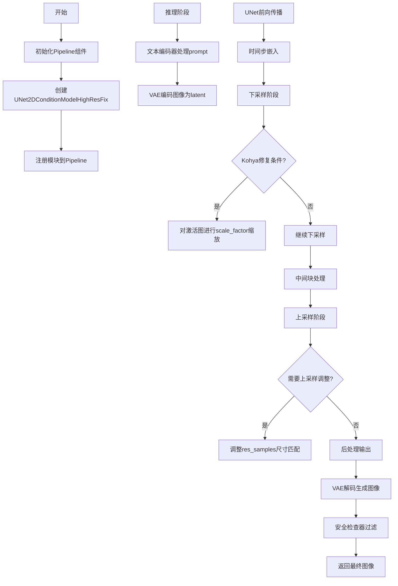
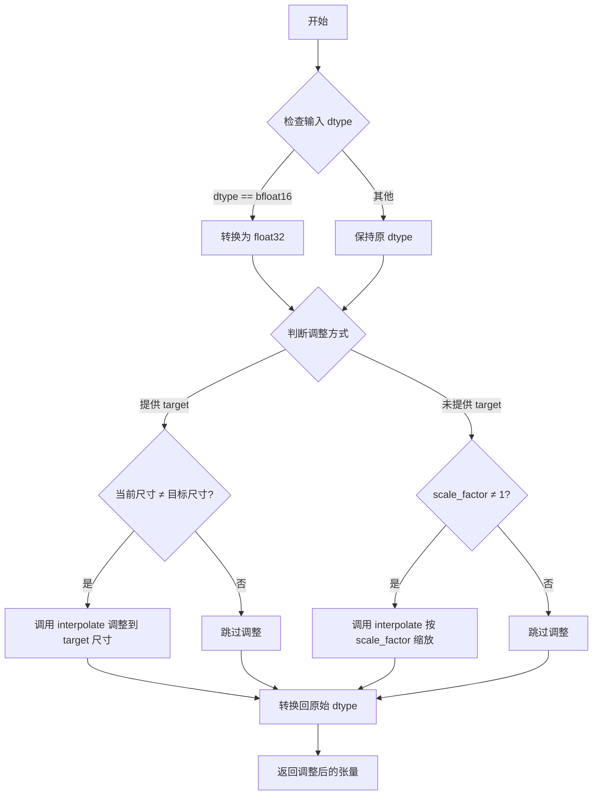
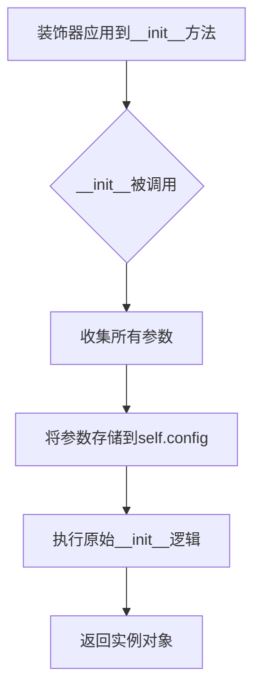
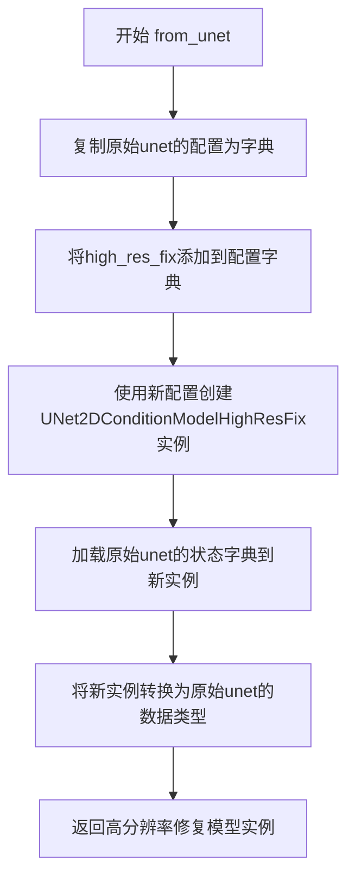

```mermaid
flowchart TD
    A[开始 forward] --> B[计算上采样因子<br/>检查sample尺寸是否需要转发上采样尺寸]
    B --> C[处理attention_mask<br/>转换为注意力偏置]
    C --> D[处理encoder_attention_mask<br/>转换为注意力偏置]
    D --> E{config.center_input_sample?<br/>是否中心化输入}
    E -->|Yes| F[sample = 2 * sample - 1.0]
    E -->|No| G[跳过中心化]
    F --> G
    G --> H[1. Time Embedding<br/>获取时间嵌入并处理类别嵌入和额外嵌入]
    H --> I[2. Pre-process<br/>conv_in处理输入]
    I --> J[2.5 GLIGEN处理<br/>如果存在gligen参数]
    J --> K[3. Down Blocks循环<br/>遍历下采样块]
    K --> L{当前块有CrossAttention?}
    L -->|Yes| M[处理T2I-Adapter额外残差<br/>调用downsample_block]
    L -->|No| N[调用downsample_block<br/>添加adapter残差]
    M --> O[ Kohya High Res Fix<br/>检查timestep和block_num<br/>按scale_factor缩放sample]
    N --> O
    O --> P{还有更多down_blocks?}
    P -->|Yes| K
    P -->|No| Q[添加ControlNet残差<br/>如果is_controlnet]
    Q --> R[4. Mid Block<br/>处理中间块]
    R --> S[添加mid_block残差<br/>如果is_controlnet]
    S --> T[5. Up Blocks循环<br/>遍历上采样块]
    T --> U{Kohya High Res Fix<br/>检查尺寸是否匹配?}
    U -->|Yes| V[上采样sample和res_samples<br/>调整到目标尺寸]
    U -->|No| W[跳过尺寸调整]
    V --> X[调用upsample_block]
    W --> X
    X --> Y{还有更多up_blocks?}
    Y -->|Yes| T
    Y -->|No| Z[6. Post-process<br/>conv_norm_out + conv_act + conv_out]
    Z --> AA{return_dict?}
    AA -->|Yes| BB[返回UNet2DConditionOutput]
    AA -->|No| CC[返回tuple]
    BB --> DD[结束]
    CC --> DD
```

# `diffusers\examples\community\kohya_hires_fix.py` 详细设计文档

这是一个基于Diffusers库的Stable Diffusion高分辨率修复Pipeline实现，通过集成Kohya高分辨率修复技术（在特定时间步对UNet的激活图进行缩放）来解决高分辨率图像生成时的失真问题，同时保持与标准Stable Diffusion Pipeline的兼容性。

## 整体流程



## 类结构

```
UNet2DConditionModel (基类)
└── UNet2DConditionModelHighResFix (继承UNet2DConditionModel)
StableDiffusionPipeline (基类)
└── StableDiffusionHighResFixPipeline (继承StableDiffusionPipeline)
```

## 全局变量及字段


### `logger`
    
Module-level logger for tracking runtime information and errors

类型：`logging.Logger`
    


### `EXAMPLE_DOC_STRING`
    
Documentation string containing usage examples for the high resolution fix pipeline

类型：`str`
    


### `UNet2DConditionModelHighResFix._supports_gradient_checkpointing`
    
Class attribute indicating support for gradient checkpointing to save memory

类型：`bool`
    


### `UNet2DConditionModelHighResFix.config.high_res_fix`
    
Configuration parameter storing high resolution fix settings including timestep, scale_factor, and block_num

类型：`List[Dict]`
    


### `StableDiffusionHighResFixPipeline.model_cpu_offload_seq`
    
String defining the sequence for CPU offload of model components

类型：`str`
    


### `StableDiffusionHighResFixPipeline._optional_components`
    
List of optional pipeline components that may not always be loaded

类型：`List[str]`
    


### `StableDiffusionHighResFixPipeline._exclude_from_cpu_offload`
    
List of components excluded from CPU offloading

类型：`List[str]`
    


### `StableDiffusionHighResFixPipeline._callback_tensor_inputs`
    
List of tensor inputs that can be passed to callbacks

类型：`List[str]`
    


### `StableDiffusionHighResFixPipeline.vae`
    
Variational Autoencoder for encoding images to latent space and decoding latents to images

类型：`AutoencoderKL`
    


### `StableDiffusionHighResFixPipeline.text_encoder`
    
CLIP text encoder for encoding text prompts into embeddings

类型：`CLIPTextModel`
    


### `StableDiffusionHighResFixPipeline.tokenizer`
    
CLIP tokenizer for tokenizing text inputs

类型：`CLIPTokenizer`
    


### `StableDiffusionHighResFixPipeline.unet`
    
Conditional UNet model for denoising latent representations

类型：`UNet2DConditionModel`
    


### `StableDiffusionHighResFixPipeline.scheduler`
    
Diffusion scheduler for controlling the denoising process

类型：`KarrasDiffusionSchedulers`
    


### `StableDiffusionHighResFixPipeline.safety_checker`
    
Safety checker for filtering inappropriate generated content

类型：`StableDiffusionSafetyChecker`
    


### `StableDiffusionHighResFixPipeline.feature_extractor`
    
CLIP image processor for extracting features from images

类型：`CLIPImageProcessor`
    


### `StableDiffusionHighResFixPipeline.image_encoder`
    
Optional CLIP vision encoder for image conditioning

类型：`CLIPVisionModelWithProjection`
    


### `StableDiffusionHighResFixPipeline.vae_scale_factor`
    
Scaling factor for VAE latent space calculations

类型：`int`
    


### `StableDiffusionHighResFixPipeline.image_processor`
    
Image processor for handling VAE input/output processing

类型：`VaeImageProcessor`
    


### `StableDiffusionHighResFixPipeline.config`
    
Pipeline configuration object storing all settings

类型：`Config`
    
    

## 全局函数及方法


# torch.nn.functional.interpolate 详细设计文档

### `torch.nn.functional.interpolate`

该函数是 PyTorch 的神经网络功能模块提供的插值函数，用于对输入张量进行上采样或下采样。在 `UNet2DConditionModelHighResFix` 类中，通过 `_resize` 类方法封装调用，以支持 Kohya 高分辨率修复方案中对特征图尺寸的动态调整。

#### 参数

-  `input`：`torch.Tensor`，输入的需要进行尺寸调整的张量，通常为 4D 特征图，形状为 `(batch, channel, height, width)`
-  `size`：`Optional[int or Tuple[int, int]]`，目标输出尺寸，当指定此参数时，函数会根据给定的尺寸进行调整
-  `scale_factor`：`Optional[float or Tuple[float, float]]`，缩放因子，当指定此参数时，函数会根据该因子对输入进行比例缩放
-  `mode`：`str`，插值模式，代码中使用 `"bicubic"` 双三次插值，其他可选值包括 `"nearest"`, `"linear"`, `"bilinear"`, `"trilinear"`, `"area"` 等
-  `align_corners`：`Optional[bool]`，对齐角点参数，代码中设置为 `False`，用于控制插值时边界对齐方式

#### 返回值

`torch.Tensor`，返回调整尺寸后的张量，维度与输入相同，但高度和宽度会根据 `size` 或 `scale_factor` 参数发生变化。

#### 流程图



#### 带注释源码

```python
@classmethod
def _resize(cls, sample, target=None, scale_factor=1, mode="bicubic"):
    """
    类方法：调整输入样本的空间尺寸
    
    参数:
        sample: 输入的张量，形状为 (batch, channel, height, width)
        target: 目标尺寸的元组 (height, width)，可选
        scale_factor: 缩放因子，默认为 1（不缩放）
        mode: 插值模式，默认为 "bicubic"
    
    返回:
        调整尺寸后的张量
    """
    # 获取输入张量的原始数据类型
    dtype = sample.dtype
    
    # PyTorch 的 interpolate 不直接支持 bfloat16，
    # 需要先转换为 float32 进行计算，避免精度问题
    if dtype == torch.bfloat16:
        sample = sample.to(torch.float32)

    # 方式一：通过 target 指定目标尺寸
    if target is not None:
        # 只有当尺寸不一致时才进行插值，避免不必要的计算
        if sample.shape[-2:] != target.shape[-2:]:
            # 调用 torch.nn.functional.interpolate 进行尺寸调整
            # 使用 align_corners=False 以保持与传统图像处理的一致性
            sample = nn.functional.interpolate(
                sample, 
                size=target.shape[-2:],  # 目标尺寸 (height, width)
                mode=mode,                # 插值模式
                align_corners=False       # 边界对齐方式
            )
    
    # 方式二：通过 scale_factor 指定缩放因子
    elif scale_factor != 1:
        # 只有当缩放因子不为 1 时才进行插值
        sample = nn.functional.interpolate(
            sample, 
            scale_factor=scale_factor,   # 缩放因子
            mode=mode,                   # 插值模式
            align_corners=False          # 边界对齐方式
        )

    # 转换回原始数据类型，保持模型的一致性
    return sample.to(dtype)
```

#### 在 `UNet2DConditionModelHighResFix.forward` 中的调用位置

```python
# 位置一：下采样阶段的高分辨率修复
# 当 timestep 大于配置的高分辨率修复阈值时，
# 对当前下采样阶段的特征图进行尺寸缩放
if self.config.high_res_fix:
    for high_res_fix in self.config.high_res_fix:
        if timestep > high_res_fix["timestep"] and down_i == high_res_fix["block_num"]:
            sample = self.__class__._resize(sample, scale_factor=high_res_fix["scale_factor"])
            break

# 位置二：上采样阶段的上采样尺寸调整
# 确保上采样特征图与对应的残差连接尺寸匹配
if self.config.high_res_fix is not None:
    if res_samples[0].shape[-2:] != sample.shape[-2:]:
        sample = self.__class__._resize(sample, target=res_samples[0])
        # 同时对所有残差连接进行相同的目标尺寸调整
        res_samples_up_sampled = (res_samples[0],)
        for res_sample in res_samples[1:]:
            res_samples_up_sampled += (self.__class__._resize(res_sample, target=res_samples[0]),)
        res_samples = res_samples_up_sampled
```


### `register_to_config`

`register_to_config` 是来自 `diffusers.configuration_utils` 模块的装饰器函数，用于自动将被装饰的 `__init__` 方法的参数注册到类的 `config` 属性中，实现配置参数的自动收集和持久化。

参数：

- `fn`：`Callable`，被装饰的初始化函数（通常是 `__init__` 方法）

返回值：`Callable`，装饰后的函数

#### 流程图



#### 带注释源码

```python
# register_to_config 是从 diffusers.configuration_utils 导入的装饰器
# 来源: from diffusers.configuration_utils import register_to_config

# 使用示例 - 在类定义中作为装饰器使用
@register_to_config  # 装饰器应用于__init__方法
def __init__(self, high_res_fix: List[Dict] = [{"timestep": 600, "scale_factor": 0.5, "block_num": 1}], **kwargs):
    super().__init__(**kwargs)
    if high_res_fix:
        # 将high_res_fix配置按timestep降序排序并存储到config中
        self.config.high_res_fix = sorted(high_res_fix, key=lambda x: x["timestep"], reverse=True)

# 装饰器工作原理：
# 1. 拦截__init__方法的调用
# 2. 提取所有参数名和值（除了self）
# 3. 将这些参数存储到self.config对象中
# 4. 然后执行原始的__init__方法逻辑

# 注意事项：
# - register_to_config 会自动处理 **kwargs 中的参数
# - 配置会被序列化并可被保存/加载
# - 支持配置验证和版本管理
```

#### 补充说明

在当前代码文件中的实际使用方式：

```python
class UNet2DConditionModelHighResFix(UNet2DConditionModel):
    """
    高分辨率修复的UNet条件模型，继承自UNet2DConditionModel
    """
    
    @register_to_config  # 使用装饰器注册配置
    def __init__(
        self, 
        high_res_fix: List[Dict] = [{"timestep": 600, "scale_factor": 0.5, "block_num": 1}], 
        **kwargs
    ):
        """
        初始化高分辨率修复UNet模型
        
        参数:
            high_res_fix: 高分辨率修复配置列表，包含timestep、scale_factor和block_num
        """
        super().__init__(**kwargs)
        if high_res_fix:
            # 排序配置并存储到self.config中
            self.config.high_res_fix = sorted(high_res_fix, key=lambda x: x["timestep"], reverse=True)
```

该装饰器的核心功能是实现配置与类的绑定，确保模型配置可序列化、可持久化，并支持从配置重建对象。


### `UNet2DConditionModelHighResFix.__init__`

这是 `UNet2DConditionModelHighResFix` 类的初始化方法，负责构造高分辨率修复（Kohya fix）功能的条件2D UNet模型。该方法继承自 `UNet2DConditionModel`，并对高分辨率修复配置进行排序以确保按时间步降序处理。

参数：

- `self`：隐式参数，表示类实例本身
- `high_res_fix`：`List[Dict]`，可选参数，默认值为 `[{"timestep": 600, "scale_factor": 0.5, "block_num": 1}]`，用于启用Kohya fix进行高分辨率生成，包含时间步、缩放因子和块编号的配置列表
- `**kwargs`：可变关键字参数，用于接收传递给父类 `UNet2DConditionModel` 的参数

返回值：`None`，该方法为构造函数，不返回任何值（隐式返回 `None`）

#### 流程图

```mermaid
flowchart TD
    A[开始 __init__] --> B[调用父类 super().__init__(**kwargs)]
    B --> C{high_res_fix 是否存在?}
    C -->|是| D[对 high_res_fix 按 timestep 降序排序]
    D --> E[将排序后的 high_res_fix 存入 self.config.high_res_fix]
    C -->|否| F[结束]
    E --> F
```

#### 带注释源码

```python
@register_to_config
def __init__(self, high_res_fix: List[Dict] = [{"timestep": 600, "scale_factor": 0.5, "block_num": 1}], **kwargs):
    """
    初始化 UNet2DConditionModelHighResFix 实例。
    
    参数:
        high_res_fix: 可选的 Kohya 高分辨率修复配置列表，包含时间步、缩放因子和块编号。
                      默认值为 [{'timestep': 600, 'scale_factor': 0.5, 'block_num': 1}]
        **kwargs: 传递给父类 UNet2DConditionModel 的关键字参数
    """
    # 调用父类的初始化方法，传递所有 kwargs 参数
    # 这会完成 UNet2DConditionModel 的标准初始化
    super().__init__(**kwargs)
    
    # 检查是否提供了 high_res_fix 配置
    if high_res_fix:
        # 使用 sorted 函数按 timestep 降序排序配置
        # reverse=True 确保时间步大的配置排在前面
        # 这样在 forward 过程中可以更高效地匹配条件
        self.config.high_res_fix = sorted(high_res_fix, key=lambda x: x["timestep"], reverse=True)
```


### `UNet2DConditionModelHighResFix._resize`

该函数是一个类方法，用于对输入样本进行上采样或下采样操作，支持基于目标尺寸或缩放因子进行双线性或双三次插值，同时处理 bfloat16 数据类型以避免精度问题。

参数：

- `cls`：类本身（classmethod 隐含参数），类型：`type`，表示当前类 `UNet2DConditionModelHighResFix`
- `sample`：需要调整大小的输入样本，类型：`torch.Tensor`，形状为 `(batch, channel, height, width)` 的张量
- `target`：目标尺寸张量，类型：`torch.Tensor` 或 `None`，用于指定输出的高度和宽度
- `scale_factor`：缩放因子，类型：`float`，默认为 `1`，当 `target` 为 `None` 时使用
- `mode`：插值模式，类型：`str`，默认为 `"bicubic"`，支持 `"nearest"`、`"bilinear"`、`"bicubic"` 等

返回值：`torch.Tensor`，调整大小后的样本张量，形状根据 `target` 或 `scale_factor` 而定，数据类型与输入 `sample` 相同

#### 流程图

```mermaid
flowchart TD
    A[开始 _resize] --> B[保存原始数据类型 dtype]
    B --> C{检查 dtype == torch.bfloat16?}
    C -->|是| D[将 sample 转为 float32]
    C -->|否| E[保持原 dtype]
    D --> F
    E --> F{target is not None?}
    F -->|是| G{sample.shape[-2:] != target.shape[-2:]?}
    G -->|是| H[使用 nn.functional.interpolate<br/>size=target.shape[-2:]]
    G -->|否| I[不进行插值]
    H --> J
    F -->|否| K{scale_factor != 1?}
    K -->|是| L[使用 nn.functional.interpolate<br/>scale_factor=scale_factor]
    K -->|否| M[不进行插值]
    I --> N
    L --> N
    J --> N[将结果转换回原始 dtype]
    M --> N
    N --> O[返回调整大小后的 sample]
```

#### 带注释源码

```python
@classmethod
def _resize(cls, sample, target=None, scale_factor=1, mode="bicubic"):
    """
    对输入样本进行上采样或下采样处理
    
    Args:
        sample: 需要调整大小的输入张量，形状为 (batch, channel, height, width)
        target: 目标尺寸张量，如果提供则使用其高度和宽度进行插值
        scale_factor: 缩放因子，当 target 为 None 时使用
        mode: 插值模式，默认为 bicubic
    
    Returns:
        调整大小后的张量，数据类型与输入相同
    """
    # 保存原始数据类型，用于后续恢复
    dtype = sample.dtype
    
    # bfloat16 在 interpolate 时可能有兼容性问题
    # 先转换为 float32 进行计算，计算完再转回原始类型
    if dtype == torch.bfloat16:
        sample = sample.to(torch.float32)

    # 优先使用 target 进行尺寸调整
    if target is not None:
        # 仅当尺寸不匹配时才进行插值
        if sample.shape[-2:] != target.shape[-2:]:
            # 使用指定的插值模式和 align_corners=False
            sample = nn.functional.interpolate(
                sample, 
                size=target.shape[-2:],  # 使用 target 的 (height, width)
                mode=mode, 
                align_corners=False
            )
    # 如果没有提供 target，则使用 scale_factor 进行缩放
    elif scale_factor != 1:
        sample = nn.functional.interpolate(
            sample, 
            scale_factor=scale_factor, 
            mode=mode, 
            align_corners=False
        )

    # 恢复原始数据类型
    return sample.to(dtype)
```


### `UNet2DConditionModelHighResFix.forward`

该方法是条件2D UNet模型的前向传播函数，继承自`UNet2DConditionModel`，并应用了Kohya高分辨率修复方案。模型接收带噪声的图像样本、时间步、编码器隐藏状态等条件信息，通过下采样 blocks、中间 block 和上采样 blocks 进行去噪处理，最终输出预测的噪声残差。在前向传播过程中，根据配置的高分辨率修复参数，对特定时间步和特定下采样块的激活图进行缩放，以解决高分辨率图像生成时的质量问题。

参数：

- `sample`：`torch.FloatTensor`，带噪声的输入张量，形状为`(batch, channel, height, width)`
- `timestep`：`Union[torch.Tensor, float, int]` - 要去噪输入的时间步数
- `encoder_hidden_states`：`torch.FloatTensor` - 编码器隐藏状态，形状为`(batch, sequence_length, feature_dim)`
- `class_labels`：`Optional[torch.Tensor]`，默认为`None` - 可选的类别标签，用于条件生成，其嵌入将与时间步嵌入相加
- `timestep_cond`：`Optional[torch.Tensor]`，默认为`None` - 时间步的条件嵌入，如果提供，这些嵌入将通过`self.time_embedding`层后与样本相加得到时间步嵌入
- `attention_mask`：`Optional[torch.Tensor]`，默认为`None` - 形状为`(batch, key_tokens)`的注意力掩码，应用于`encoder_hidden_states`，1表示保留，0表示丢弃，掩码将转换为偏置加到注意力分数上
- `cross_attention_kwargs`：`Optional[Dict[str, Any]]`，默认为`None` - 关键字参数字典，如果指定将传递给`AttentionProcessor`
- `added_cond_kwargs`：`Optional[Dict[str, torch.Tensor]]`，默认为`None` - 包含额外嵌入的关键字参数字典，如果指定将添加到传递给UNet块的嵌入中
- `down_block_additional_residuals`：`Optional[Tuple[torch.Tensor]]`，默认为`None` - 如果指定，将添加到UNet下采样块残差的张量元组
- `mid_block_additional_residual`：`Optional[torch.Tensor]`，默认为`None` - 如果指定，将添加到UNet中间块残差的张量
- `down_intrablock_additional_residuals`：`Optional[Tuple[torch.Tensor]]`，默认为`None` - 例如从T2I-Adapter侧模型添加的UNet下采样块内的额外残差
- `encoder_attention_mask`：`Optional[torch.Tensor]` - 形状为`(batch, sequence_length)`的交叉注意力掩码，应用于`encoder_hidden_states`，转换为偏置加到注意力分数上
- `return_dict`：`bool`，默认为`True` - 是否返回`UNet2DConditionOutput`而不是普通元组

返回值：`Union[UNet2DConditionOutput, Tuple]` - 如果`return_dict`为`True`，返回`UNet2DConditionOutput`，否则返回元组，第一个元素是样本张量

#### 流程图



#### 带注释源码

```python
def forward(
    self,
    sample: torch.FloatTensor,
    timestep: Union[torch.Tensor, float, int],
    encoder_hidden_states: torch.Tensor,
    class_labels: Optional[torch.Tensor] = None,
    timestep_cond: Optional[torch.Tensor] = None,
    attention_mask: Optional[torch.Tensor] = None,
    cross_attention_kwargs: Optional[Dict[str, Any]] = None,
    added_cond_kwargs: Optional[Dict[str, torch.Tensor]] = None,
    down_block_additional_residuals: Optional[Tuple[torch.Tensor]] = None,
    mid_block_additional_residual: Optional[torch.Tensor] = None,
    down_intrablock_additional_residuals: Optional[Tuple[torch.Tensor]] = None,
    encoder_attention_mask: Optional[torch.Tensor] = None,
    return_dict: bool = True,
) -> Union[UNet2DConditionOutput, Tuple]:
    # 默认情况下，样本至少是整体上采样因子的倍数
    # 整体上采样因子等于2 ** (# 上采样层数)
    # 但是，如果需要，可以强制上采样插值输出大小匹配任何上采样尺寸
    default_overall_up_factor = 2**self.num_upsamplers

    # 当sample不是default_overall_up_factor的倍数时，转发上采样大小以强制插值输出大小
    forward_upsample_size = False
    upsample_size = None

    # 检查sample的宽高是否需要转发上采样尺寸
    for dim in sample.shape[-2:]:
        if dim % default_overall_up_factor != 0:
            forward_upsample_size = True
            break

    # 确保attention_mask是一个偏置，并给它添加一个单例query_tokens维度
    # 期望掩码形状: [batch, key_tokens]
    # 添加单例query_tokens维度: [batch, 1, key_tokens]
    # 这有助于将其作为偏置广播到注意力分数，注意力分数将具有以下形状之一:
    # [batch, heads, query_tokens, key_tokens] (例如torch sdp attn)
    # [batch * heads, query_tokens, key_tokens] (例如xformers或经典attn)
    if attention_mask is not None:
        # 假设掩码表示为:
        # (1 = keep, 0 = discard)
        # 将掩码转换为可以加到注意力分数的偏置:
        # (keep = +0, discard = -10000.0)
        attention_mask = (1 - attention_mask.to(sample.dtype)) * -10000.0
        attention_mask = attention_mask.unsqueeze(1)

    # 按照与attention_mask相同的方式将encoder_attention_mask转换为偏置
    if encoder_attention_mask is not None:
        encoder_attention_mask = (1 - encoder_attention_mask.to(sample.dtype)) * -10000.0
        encoder_attention_mask = encoder_attention_mask.unsqueeze(1)

    # 0. 如果需要，中心化输入
    if self.config.center_input_sample:
        sample = 2 * sample - 1.0

    # 1. 时间嵌入
    t_emb = self.get_time_embed(sample=sample, timestep=timestep)
    emb = self.time_embedding(t_emb, timestep_cond)
    aug_emb = None

    # 获取类别嵌入
    class_emb = self.get_class_embed(sample=sample, class_labels=class_labels)
    if class_emb is not None:
        if self.config.class_embeddings_concat:
            emb = torch.cat([emb, class_emb], dim=-1)
        else:
            emb = emb + class_emb

    # 获取额外嵌入
    aug_emb = self.get_aug_embed(
        emb=emb, encoder_hidden_states=encoder_hidden_states, added_cond_kwargs=added_cond_kwargs
    )
    # 如果是image_hint类型，aug_emb包含提示信息
    if self.config.addition_embed_type == "image_hint":
        aug_emb, hint = aug_emb
        sample = torch.cat([sample, hint], dim=1)

    # 合并主嵌入和额外嵌入
    emb = emb + aug_emb if aug_emb is not None else emb

    # 应用时间嵌入激活函数
    if self.time_embed_act is not None:
        emb = self.time_embed_act(emb)

    # 处理编码器隐藏状态
    encoder_hidden_states = self.process_encoder_hidden_states(
        encoder_hidden_states=encoder_hidden_states, added_cond_kwargs=added_cond_kwargs
    )

    # 2. 预处理
    sample = self.conv_in(sample)

    # 2.5 GLIGEN位置网络处理
    if cross_attention_kwargs is not None and cross_attention_kwargs.get("gligen", None) is not None:
        cross_attention_kwargs = cross_attention_kwargs.copy()
        gligen_args = cross_attention_kwargs.pop("gligen")
        cross_attention_kwargs["gligen"] = {"objs": self.position_net(**gligen_args)}

    # 3. 下采样
    # 我们弹出'scale'而不是获取它，因为否则'scale'会被传播到内部块
    # 并引发弃用警告。这对我们的用户来说会很困惑。
    if cross_attention_kwargs is not None:
        cross_attention_kwargs = cross_attention_kwargs.copy()
        lora_scale = cross_attention_kwargs.pop("scale", 1.0)
    else:
        lora_scale = 1.0

    if USE_PEFT_BACKEND:
        # 通过为每个PEFT层设置'lora_scale'来加权lora层
        scale_lora_layers(self, lora_scale)

    # 检查是否为ControlNet模式
    is_controlnet = mid_block_additional_residual is not None and down_block_additional_residuals is not None
    # 使用新参数down_intrablock_additional_residuals用于T2I-Adapter，以与controlnet区分
    is_adapter = down_intrablock_additional_residuals is not None
    # 为了向后兼容，保留传统用法
    # T2I-Adapter和ControlNet都使用down_block_additional_residuals参数
    # 但只能使用其中一个
    if not is_adapter and mid_block_additional_residual is None and down_block_additional_residuals is not None:
        deprecate(
            "T2I should not use down_block_additional_residuals",
            "1.3.0",
            "Passing intrablock residual connections with `down_block_additional_residuals` is deprecated \
                   and will be removed in diffusers 1.3.0.  `down_block_additional_residuals` should only be used \
                   for ControlNet. Please make sure use `down_intrablock_additional_residuals` instead. ",
            standard_warn=False,
        )
        down_intrablock_additional_residuals = down_block_additional_residuals
        is_adapter = True

    # 初始化下采样块的残差列表
    down_block_res_samples = (sample,)
    
    # 遍历所有下采样块
    for down_i, downsample_block in enumerate(self.down_blocks):
        if hasattr(downsample_block, "has_cross_attention") and downsample_block.has_cross_attention:
            # 用于t2i-adapter的CrossAttnDownBlock2D
            additional_residuals = {}
            if is_adapter and len(down_intrablock_additional_residuals) > 0:
                additional_residuals["additional_residuals"] = down_intrablock_additional_residuals.pop(0)

            sample, res_samples = downsample_block(
                hidden_states=sample,
                temb=emb,
                encoder_hidden_states=encoder_hidden_states,
                attention_mask=attention_mask,
                cross_attention_kwargs=cross_attention_kwargs,
                encoder_attention_mask=encoder_attention_mask,
                **additional_residuals,
            )

        else:
            sample, res_samples = downsample_block(hidden_states=sample, temb=emb)
            if is_adapter and len(down_intrablock_additional_residuals) > 0:
                sample += down_intrablock_additional_residuals.pop(0)

        # 收集所有下采样块的残差
        down_block_res_samples += res_samples

        # Kohya高分辨率修复
        # 如果配置了高分辨率修复，在特定时间步和特定下采样块对特征图进行缩放
        if self.config.high_res_fix:
            for high_res_fix in self.config.high_res_fix:
                if timestep > high_res_fix["timestep"] and down_i == high_res_fix["block_num"]:
                    sample = self.__class__._resize(sample, scale_factor=high_res_fix["scale_factor"])
                    break

    # 如果是ControlNet模式，添加额外的残差
    if is_controlnet:
        new_down_block_res_samples = ()

        for down_block_res_sample, down_block_additional_residual in zip(
            down_block_res_samples, down_block_additional_residuals
        ):
            down_block_res_sample = down_block_res_sample + down_block_additional_residual
            new_down_block_res_samples = new_down_block_res_samples + (down_block_res_sample,)

        down_block_res_samples = new_down_block_res_samples

    # 4. 中间块处理
    if self.mid_block is not None:
        if hasattr(self.mid_block, "has_cross_attention") and self.mid_block.has_cross_attention:
            sample = self.mid_block(
                sample,
                emb,
                encoder_hidden_states=encoder_hidden_states,
                attention_mask=attention_mask,
                cross_attention_kwargs=cross_attention_kwargs,
                encoder_attention_mask=encoder_attention_mask,
            )
        else:
            sample = self.mid_block(sample, emb)

        # 支持T2I-Adapter-XL
        if (
            is_adapter
            and len(down_intrablock_additional_residuals) > 0
            and sample.shape == down_intrablock_additional_residuals[0].shape
        ):
            sample += down_intrablock_additional_residuals.pop(0)

    # 添加中间块残差（如果是ControlNet）
    if is_controlnet:
        sample = sample + mid_block_additional_residual

    # 5. 上采样
    for i, upsample_block in enumerate(self.up_blocks):
        is_final_block = i == len(self.up_blocks) - 1

        # 获取当前上采样块对应的残差
        res_samples = down_block_res_samples[-len(upsample_block.resnets) :]
        down_block_res_samples = down_block_res_samples[: -len(upsample_block.resnets)]

        # Kohya高分辨率修复的上采样
        # 如果配置了高分辨率修复，需要在此时对sample和残差进行上采样以匹配尺寸
        if self.config.high_res_fix is not None:
            if res_samples[0].shape[-2:] != sample.shape[-2:]:
                # 上采样sample到目标尺寸
                sample = self.__class__._resize(sample, target=res_samples[0])
                res_samples_up_sampled = (res_samples[0],)
                # 对所有残差进行上采样
                for res_sample in res_samples[1:]:
                    res_samples_up_sampled += (self.__class__._resize(res_sample, target=res_samples[0]),)
                res_samples = res_samples_up_sampled

        # 如果不是最后一个块且需要转发上采样尺寸，则在此处转发
        if not is_final_block and forward_upsample_size:
            upsample_size = down_block_res_samples[-1].shape[2:]

        if hasattr(upsample_block, "has_cross_attention") and upsample_block.has_cross_attention:
            sample = upsample_block(
                hidden_states=sample,
                temb=emb,
                res_hidden_states_tuple=res_samples,
                encoder_hidden_states=encoder_hidden_states,
                cross_attention_kwargs=cross_attention_kwargs,
                upsample_size=upsample_size,
                attention_mask=attention_mask,
                encoder_attention_mask=encoder_attention_mask,
            )
        else:
            sample = upsample_block(
                hidden_states=sample,
                temb=emb,
                res_hidden_states_tuple=res_samples,
                upsample_size=upsample_size,
            )

    # 6. 后处理
    if self.conv_norm_out:
        sample = self.conv_norm_out(sample)
        sample = self.conv_act(sample)
    sample = self.conv_out(sample)

    if USE_PEFT_BACKEND:
        # 从每个PEFT层移除'lora_scale'
        unscale_lora_layers(self, lora_scale)

    if not return_dict:
        return (sample,)

    return UNet2DConditionOutput(sample=sample)
```


### `UNet2DConditionModelHighResFix.from_unet`

该类方法用于将标准的`UNet2DConditionModel`实例转换为支持Kohya高分辨率修复功能的`UNet2DConditionModelHighResFix`模型，通过复制原始模型的配置和权重，并在配置中添加高分辨率修复参数来实现。

参数：

- `unet`：`UNet2DConditionModel`，原始的UNet2D条件模型实例，其配置和权重将被复制到新的高分辨率修复模型中
- `high_res_fix`：`list`，高分辨率修复配置列表，每个配置字典包含`timestep`（时间步阈值）、`scale_factor`（缩放因子）和`block_num`（块编号）

返回值：`UNet2DConditionModelHighResFix`，返回配置了高分辨率修复功能的新UNet模型实例

#### 流程图



#### 带注释源码

```python
@classmethod
def from_unet(cls, unet: UNet2DConditionModel, high_res_fix: list):
    """
    类方法：从现有UNet2DConditionModel创建带有高分辨率修复功能的模型实例
    
    参数:
        cls: 类本身（隐式参数）
        unet: UNet2DConditionModel - 原始UNet模型
        high_res_fix: list - 高分辨率修复配置列表
    
    返回:
        UNet2DConditionModelHighResFix - 配置了高分辨率修复的新模型
    """
    # 1. 复制原始unet的配置对象为字典
    config = dict((unet.config))
    
    # 2. 将high_res_fix配置添加到配置字典中
    config["high_res_fix"] = high_res_fix
    
    # 3. 使用新配置创建UNet2DConditionModelHighResFix实例
    unet_high_res = cls(**config)
    
    # 4. 加载原始unet的状态字典（权重）到新实例
    unet_high_res.load_state_dict(unet.state_dict())
    
    # 5. 确保新模型使用与原始模型相同的数据类型
    unet_high_res.to(unet.dtype)
    
    # 6. 返回配置了高分辨率修复功能的新模型
    return unet_high_res
```


### `StableDiffusionHighResFixPipeline.__init__`

该方法是`StableDiffusionHighResFixPipeline`类的构造函数，用于初始化一个支持Kohya高分辨率修复的Stable Diffusionpipeline。它继承自`StableDiffusionPipeline`，接收VAE、文本编码器、分词器、UNet、调度器等核心组件，并将传入的UNet替换为支持高分辨率修复的`UNet2DConditionModelHighResFix`版本，同时配置图像处理器和VAE缩放因子。

参数：

- `vae`：`AutoencoderKL`，Variational Auto-Encoder模型，用于编码和解码图像
- `text_encoder`：`CLIPTextModel`，冻结的文本编码器
- `tokenizer`：`CLIPTokenizer`，用于对文本进行分词
- `unet`：`UNet2DConditionModel`，用于对编码后的图像潜在表示进行去噪
- `scheduler`：`KarrasDiffusionSchedulers`，调度器，与unet结合用于去噪
- `safety_checker`：`StableDiffusionSafetyChecker`，分类模块，用于估计生成的图像是否具有攻击性或有害
- `feature_extractor`：`CLIPImageProcessor`，用于从生成的图像中提取特征
- `image_encoder`：`CLIPVisionModelWithProjection`，可选的图像编码器
- `requires_safety_checker`：`bool`，是否需要安全检查器，默认为True
- `high_res_fix`：`List[Dict]`，启用Kohya高分辨率修复的参数列表，默认为[{'timestep': 600, 'scale_factor': 0.5, 'block_num': 1}]

返回值：无（`None`），构造函数不返回值

#### 流程图

```mermaid
flowchart TD
    A[开始 __init__] --> B[调用 super().__init__ 初始化父类]
    B --> C[创建 UNet2DConditionModelHighResFix 实例]
    C --> D[调用 self.register_modules 注册所有模块]
    D --> E[计算 vae_scale_factor]
    E --> F[创建 VaeImageProcessor 实例]
    F --> G[调用 self.register_to_config 注册 requires_safety_checker]
    G --> H[结束 __init__]
```

#### 带注释源码

```python
def __init__(
    self,
    vae: AutoencoderKL,
    text_encoder: CLIPTextModel,
    tokenizer: CLIPTokenizer,
    unet: UNet2DConditionModel,
    scheduler: KarrasDiffusionSchedulers,
    safety_checker: StableDiffusionSafetyChecker,
    feature_extractor: CLIPImageProcessor,
    image_encoder: CLIPVisionModelWithProjection = None,
    requires_safety_checker: bool = True,
    high_res_fix: List[Dict] = [{"timestep": 600, "scale_factor": 0.5, "block_num": 1}],
):
    # 首先调用父类 StableDiffusionPipeline 的初始化方法
    # 父类会初始化 vae, text_encoder, tokenizer, unet, scheduler,
    # safety_checker, feature_extractor, image_encoder 等基础组件
    super().__init__(
        vae=vae,
        text_encoder=text_encoder,
        tokenizer=tokenizer,
        unet=unet,
        scheduler=scheduler,
        safety_checker=safety_checker,
        feature_extractor=feature_extractor,
        image_encoder=image_encoder,
        requires_safety_checker=requires_safety_checker,
    )

    # 使用支持高分辨率修复的 UNet2DConditionModelHighResFix 替换原来的 UNet
    # from_unet 方法会复制原始 unet 的权重并添加 high_res_fix 配置
    unet = UNet2DConditionModelHighResFix.from_unet(unet=unet, high_res_fix=high_res_fix)
    
    # 重新注册所有模块，确保 unet 使用的是新的 HighResFix 版本
    self.register_modules(
        vae=vae,
        text_encoder=text_encoder,
        tokenizer=tokenizer,
        unet=unet,
        scheduler=scheduler,
        safety_checker=safety_checker,
        feature_extractor=feature_extractor,
        image_encoder=image_encoder,
    )
    
    # 计算 VAE 的缩放因子，基于 VAE 配置中的 block_out_channels
    # 公式为 2 ** (len(block_out_channels) - 1)，默认为 2^(3-1)=4
    # 但代码中有 fallback: 8
    self.vae_scale_factor = 2 ** (len(self.vae.config.block_out_channels) - 1) if getattr(self, "vae", None) else 8
    
    # 创建图像处理器，用于处理 VAE 的输入和输出
    self.image_processor = VaeImageProcessor(vae_scale_factor=self.vae_scale_factor)
    
    # 将 requires_safety_checker 注册到配置中
    self.register_to_config(requires_safety_checker=requires_safety_checker)
```

## 关键组件


### UNet2DConditionModelHighResFix

继承自UNet2DConditionModel的条件2D UNet模型，添加了Kohya高分辨率修复功能。通过在特定时间步对激活映射进行缩放来解决高分辨率图像生成时的失真问题。

### StableDiffusionHighResFixPipeline

继承自StableDiffusionPipeline的文本到图像生成pipeline，集成了Kohya高分辨率修复功能，用于在保持图像质量的同时生成高分辨率图像。

### 张量索引与惰性加载

在forward方法的down block和up block处理中，通过索引访问down_block_res_samples元组（如`res_samples = down_block_res_samples[-len(upsample_block.resnets):]`），实现残差连接的张量延迟加载，避免一次性加载所有中间激活。

### 反量化支持

`_resize`类方法中处理了bfloat16到float32的反量化：`if dtype == torch.bfloat16: sample = sample.to(torch.float32)`，在操作完成后，再转回原始dtype（`return sample.to(dtype)`），确保在interpolate计算精度和内存效率之间的平衡。

### 量化策略（high_res_fix配置）

通过配置列表`[{'timestep': 600, 'scale_factor': 0.5, 'block_num': 1}]`控制高分辨率修复策略：在指定时间步（600）之前，对指定下采样块（block_num=1）的激活进行缩放（scale_factor=0.5），以修复高分辨率生成时的失真问题。

### from_unet 类方法

用于从已有UNet2DConditionModel创建带高分辨率修复的UNet模型，通过复制配置、加载权重并转换为相同dtype来实现模型转换。

### Kohya高分辨率修复机制

在down block循环中根据timestep和block_num条件触发激活缩放（`self.__class__._resize(sample, scale_factor=high_res_fix["scale_factor"])`），在up block中对残差连接进行上采样对齐（`self.__class__._resize(sample, target=res_samples[0])`），确保高低分辨率特征图尺寸匹配。


## 问题及建议


### 已知问题

-   **重复模块注册**：`StableDiffusionHighResFixPipeline.__init__`中先调用`super().__init__()`注册了模块，之后又调用`self.register_modules()`重复注册相同模块，造成冗余操作
-   **配置不一致风险**：高分辨率修复的配置（`high_res_fix`）同时存在于`UNet2DConditionModelHighResFix`和`StableDiffusionHighResFixPipeline`中，默认值重复定义在两处（均为`[{'timestep': 600, 'scale_factor': 0.5, 'block_num': 1}]`），容易导致配置不同步
-   **魔法数字硬编码**：代码中多处使用硬编码值，如注意力掩码转换用的`-10000.0`、timestep默认值`600`、scale_factor默认值`0.5`和block_num默认值`1`，这些应提取为配置常量
-   **`_resize`方法类型转换开销**：在`UNet2DConditionModelHighResFix._resize`方法中，为处理`bfloat16`需先转换为`float32`再转回，增加了不必要的计算开销和精度风险
-   **`from_unet`方法设计缺陷**：`from_unet`类方法使用`dict((unet.config))`浅拷贝配置，可能携带原UNet的冗余属性，且直接复制所有配置不够清晰
-   **循环内重复配置检查**：在`forward`方法的down_blocks循环中，每次迭代都检查`self.config.high_res_fix`是否存在，可在循环前进行一次检查
-   **缺失参数校验**：未对`high_res_fix`参数的结构（如`timestep`、`scale_factor`、`block_num`字段是否完整）进行校验，可能导致运行时错误
-   **类型注解不完整**：部分方法参数缺少类型注解，如`_resize`方法的`target`参数

### 优化建议

-   **移除重复模块注册**：删除`__init__`中多余的`self.register_modules()`调用，保留`super().__init__()`即可
-   **统一配置管理**：仅在`StableDiffusionHighResFixPipeline`级别定义`high_res_fix`默认值，并将其传递给`UNet2DConditionModelHighResFix.from_unet`方法
-   **提取常量**：将魔法数字提取为类属性或配置常量，如定义`DEFAULT_HIGH_RES_FIX = [{"timestep": 600, "scale_factor": 0.5, "block_num": 1}]`
-   **优化类型转换**：考虑使用`torch.autocast`或修改中间计算精度，避免手动进行`float32`转换
-   **缓存配置检查**：在`forward`方法开始时缓存`high_res_fix`配置，避免在循环中重复检查
-   **添加参数校验**：在`__init__`或`from_unet`方法中添加对`high_res_fix`参数的结构校验，确保包含必要字段
-   **完善类型注解**：补充所有参数的类型注解，提高代码可读性和静态检查能力

## 其它


### 设计目标与约束

本代码旨在解决Stable Diffusion在高分辨率图像生成时可能出现的质量问题，通过集成Kohya高分辨率修复方案，在UNet的去噪过程中对中间特征图进行动态缩放处理。设计约束包括：1) 必须保持与标准StableDiffusionPipeline的兼容性；2) high_res_fix参数为可选配置，默认启用Kohya修复；3) 仅支持Diffusers库中的UNet2DConditionModel及其子类；4) 修复操作仅在指定timestep范围内生效。

### 错误处理与异常设计

1) 参数验证错误：当high_res_fix列表中的timestep值不在有效范围(0-1000)内时，应抛出ValueError；2) 类型错误：若unet参数不是UNet2DConditionModel实例，from_unet方法应抛出TypeError；3) 尺寸不匹配错误：在特征图缩放过程中，若目标尺寸与源尺寸维度不兼容，应抛出RuntimeError；4) 兼容性问题：若检测到down_block_additional_residuals和down_intrablock_additional_residuals同时使用，应通过deprecation警告引导用户迁移。

### 数据流与状态机

数据流主要分为三个阶段：1) 初始化阶段：Pipeline接收文本提示、VAE、Text Encoder、UNet等组件，from_unet方法将原始UNet转换为UNet2DConditionModelHighResFix实例；2) 去噪阶段：UNet的forward方法接收噪声隐向量和时间步，在down_blocks循环中根据high_res_fix配置判断是否执行特征图下采样，在up_blocks中执行对应的上采样恢复；3) 输出阶段：VAE解码器将处理后的隐向量转换为最终图像。状态机涉及timestep从高到低的去噪过程，每个timestep触发一次UNet前向传播。

### 外部依赖与接口契约

本代码依赖以下核心外部组件：1) diffusers库：提供StableDiffusionPipeline、UNet2DConditionModel、VaeImageProcessor等基础类；2) transformers库：提供CLIPTextModel、CLIPTokenizer、CLIPImageProcessor、CLIPVisionModelWithProjection；3) PyTorch：提供张量运算和神经网络基础操作。接口契约包括：UNet2DConditionModelHighResFix.from_unet()接受unet和high_res_fix两个参数，返回转换后的UNet实例；StableDiffusionHighResFixPipeline.__init__()接受标准Stable Diffusion的所有组件参数加上high_res_fix参数。

### 性能考量与优化建议

1) 内存优化：high_res_fix中的scale_factor会显著影响中间特征的内存占用，建议在2GB以下显存的GPU上使用更大的scale_factor(如0.25)；2) 计算优化：特征图的插值操作使用nn.functional.interpolate，可考虑使用F.grid_sample获得更高质量的缩放效果；3) 并发支持：当前实现为单线程设计，若需支持多prompt并行生成，建议对UNet部分进行封装以支持模型并行；4) 缓存机制：high_res_fix配置在__init__中已排序，可直接使用无需重复排序操作。

### 配置管理与版本兼容性

1) 配置持久化：high_res_fix配置通过register_to_config装饰器注册到UNet的config中，支持通过save_pretrained和from_pretrained进行保存和加载；2) 版本兼容：代码中使用了deprecate函数标记了废弃警告，确保与旧版本T2I-Adapter接口的向后兼容；3) PEFT后端支持：通过USE_PEFT_BACKEND标志位支持LoRA权重的高效加载和卸载；4) 梯度检查点：支持_gradient_checkpointing以减少大模型训练时的显存占用。

### 安全与伦理考量

1) 安全检查器集成：Pipeline集成了StableDiffusionSafetyChecker，可选启用NSFW内容过滤；2) 权限控制：代码遵循Apache 2.0开源协议，包含完整的版权和许可声明；3) 模型偏见：生成的图像质量受底层CLIP文本编码器偏见影响，使用者需自行评估输出内容的合规性；4) 内存安全：所有张量操作均进行dtype转换检查，避免bfloat16与float32混用导致的精度问题。

    