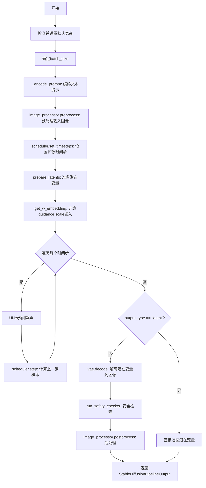
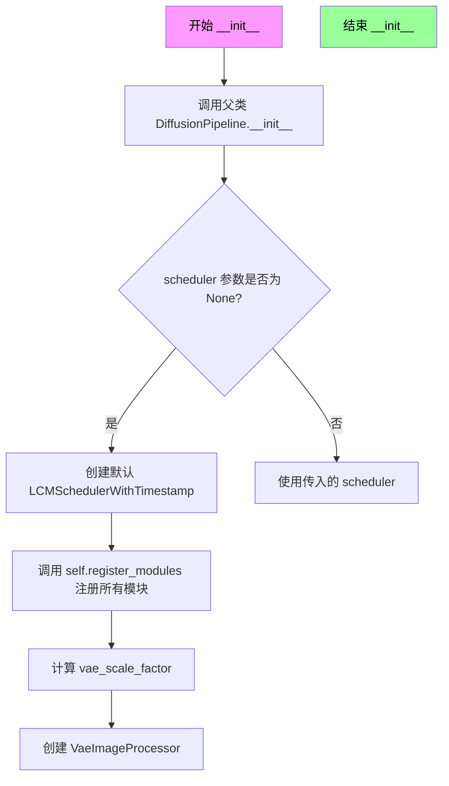
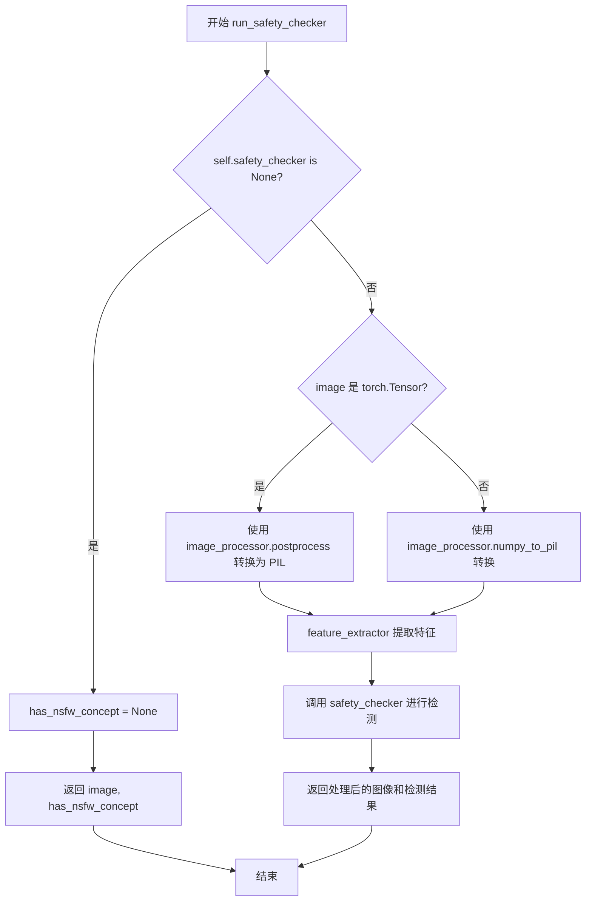
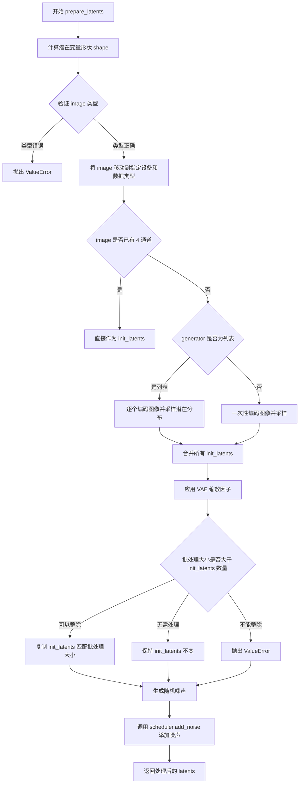
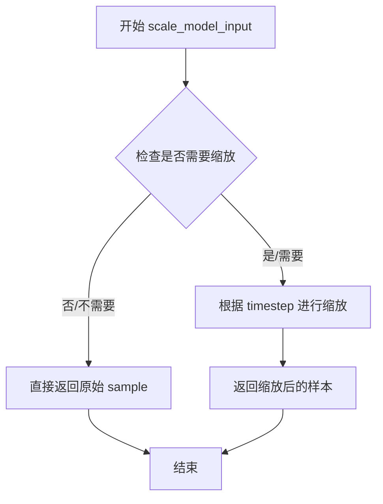
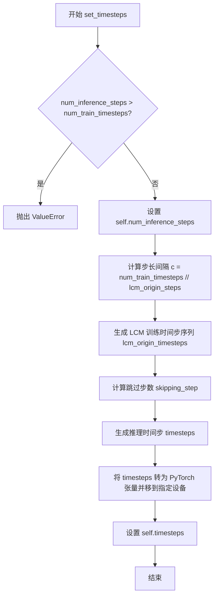
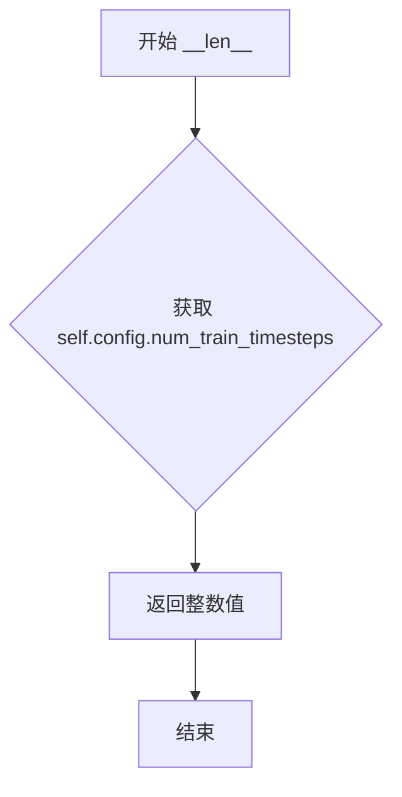

# `diffusers\examples\community\latent_consistency_img2img.py` 详细设计文档

这是一个基于Latent Consistency Model (LCM)的图像到图像生成pipeline，实现了从文本提示和输入图像生成目标图像的功能。该pipeline结合了VAE、CLIP文本编码器、UNet2DConditionModel和LCMScheduler，使用多步采样和引导蒸馏技术实现快速高质量的图像生成。

## 整体流程



## 类结构

```
DiffusionPipeline (基类)
└── LatentConsistencyModelImg2ImgPipeline
    ├── _encode_prompt()
    ├── run_safety_checker()
    ├── prepare_latents()
    ├── get_w_embedding()
    ├── get_timesteps()
    └── __call__()

SchedulerMixin + ConfigMixin (多重继承)
└── LCMSchedulerWithTimestamp
    ├── set_timesteps()
    ├── step()
    ├── scale_model_input()
    ├── _get_variance()
    ├── _threshold_sample()
    ├── get_scalings_for_boundary_condition_discrete()
    ├── add_noise()
    └── get_velocity()

BaseOutput
└── LCMSchedulerOutput

全局函数
├── betas_for_alpha_bar()
└── rescale_zero_terminal_snr()
```

## 全局变量及字段


### `logger`
    
模块级别的日志记录器，用于输出调试和运行时信息

类型：`logging.Logger`
    


### `num_train_timesteps`
    
扩散模型训练时使用的时间步总数，默认为1000

类型：`int`
    


### `beta_start`
    
Beta调度曲线的起始值，用于控制扩散过程的噪声添加速率，默认为0.0001

类型：`float`
    


### `beta_end`
    
Beta调度曲线的结束值，用于控制扩散过程的噪声添加速率，默认为0.02

类型：`float`
    


### `beta_schedule`
    
Beta值的时间表类型，可选linear、scaled_linear或squaredcos_cap_v2，默认为linear

类型：`str`
    


### `prediction_type`
    
模型预测类型，支持epsilon、sample或v_prediction，用于确定噪声预测方式，默认为epsilon

类型：`str`
    


### `clip_sample`
    
是否对预测样本进行裁剪以确保数值稳定性，默认为True

类型：`bool`
    


### `steps_offset`
    
推理步骤的偏移量，用于某些模型家族的特定需求，默认为0

类型：`int`
    


### `thresholding`
    
是否启用动态阈值方法，用于改善图像质量，默认为False

类型：`bool`
    


### `dynamic_thresholding_ratio`
    
动态阈值方法的分位数比率，用于确定阈值边界，默认为0.995

类型：`float`
    


### `clip_sample_range`
    
样本裁剪的最大幅度，用于控制裁剪范围，默认为1.0

类型：`float`
    


### `sample_max_value`
    
动态阈值方法的最大样本阈值，用于防止过度阈值化，默认为1.0

类型：`float`
    


### `timestep_spacing`
    
时间步的缩放方式，用于调整推理过程中的时间步分布，默认为leading

类型：`str`
    


### `rescale_betas_zero_snr`
    
是否重缩放beta值以实现零终端信噪比，用于生成更宽亮度范围的样本，默认为False

类型：`bool`
    


### `LatentConsistencyModelImg2ImgPipeline.vae`
    
变分自编码器模型，用于在潜在空间和图像空间之间进行编码和解码

类型：`AutoencoderKL`
    


### `LatentConsistencyModelImg2ImgPipeline.text_encoder`
    
CLIP文本编码器模型，用于将文本提示转换为文本嵌入向量

类型：`CLIPTextModel`
    


### `LatentConsistencyModelImg2ImgPipeline.tokenizer`
    
CLIP分词器，用于将文本字符串分词为token序列

类型：`CLIPTokenizer`
    


### `LatentConsistencyModelImg2ImgPipeline.unet`
    
条件UNet2D模型，用于在给定文本嵌入条件下预测噪声

类型：`UNet2DConditionModel`
    


### `LatentConsistencyModelImg2ImgPipeline.scheduler`
    
LCM调度器，用于管理扩散过程中的时间步和噪声调度

类型：`LCMSchedulerWithTimestamp`
    


### `LatentConsistencyModelImg2ImgPipeline.safety_checker`
    
安全检查器，用于检测和过滤不适宜生成的内容

类型：`StableDiffusionSafetyChecker`
    


### `LatentConsistencyModelImg2ImgPipeline.feature_extractor`
    
CLIP图像处理器，用于提取图像特征用于安全检查

类型：`CLIPImageProcessor`
    


### `LatentConsistencyModelImg2ImgPipeline.vae_scale_factor`
    
VAE缩放因子，用于计算潜在空间的尺寸，基于VAE块输出通道数

类型：`int`
    


### `LatentConsistencyModelImg2ImgPipeline.image_processor`
    
VAE图像处理器，用于图像的预处理和后处理操作

类型：`VaeImageProcessor`
    


### `LatentConsistencyModelImg2ImgPipeline._optional_components`
    
可选组件列表，用于存储可选的管道组件名称

类型：`list`
    


### `LCMSchedulerWithTimestamp.betas`
    
Beta值张量，用于定义扩散过程中的噪声调度

类型：`torch.Tensor`
    


### `LCMSchedulerWithTimestamp.alphas`
    
Alpha值张量，计算为1减去beta值，用于扩散过程

类型：`torch.Tensor`
    


### `LCMSchedulerWithTimestamp.alphas_cumprod`
    
累积Alpha乘积张量，用于计算扩散过程中的累积概率

类型：`torch.Tensor`
    


### `LCMSchedulerWithTimestamp.final_alpha_cumprod`
    
最终累积Alpha值，用于扩散链的最后一步

类型：`torch.Tensor`
    


### `LCMSchedulerWithTimestamp.init_noise_sigma`
    
初始噪声标准差，用于初始化噪声分布

类型：`float`
    


### `LCMSchedulerWithTimestamp.num_inference_steps`
    
推理步骤数，用于指定生成样本时的时间步数量

类型：`int`
    


### `LCMSchedulerWithTimestamp.timesteps`
    
时间步张量，包含推理过程中使用的时间步序列

类型：`torch.Tensor`
    


### `LCMSchedulerWithTimestamp.order`
    
调度器的阶数，用于多步采样时的顺序控制

类型：`int`
    


### `LCMSchedulerOutput.prev_sample`
    
前一个时间步的样本张量，用于扩散过程中的逆向步骤

类型：`torch.Tensor`
    


### `LCMSchedulerOutput.denoised`
    
去噪后的样本张量，包含模型预测的清洁图像

类型：`Optional[torch.Tensor]`
    
    

## 全局函数及方法


### `betas_for_alpha_bar`

该函数用于创建 Beta 调度表，通过离散化给定的 alpha_t_bar 函数来生成扩散过程的时间步 Beta 值。该函数定义了 alpha_bar 变换，接受参数 t 并将其转换为 (1-beta) 的累积乘积，支持余弦（cosine）和指数（exp）两种噪声调度类型。

参数：

- `num_diffusion_timesteps`：`int`，要生成的 Beta 数量，即扩散时间步的数量
- `max_beta`：`float`，可选参数，默认值为 0.999，最大 Beta 值，用于防止奇点
- `alpha_transform_type`：`str`，可选参数，默认值为 "cosine"，Alpha Bar 的噪声调度类型，可选 "cosine" 或 "exp"

返回值：`torch.Tensor`（float32 类型），返回用于调度器逐步模型输出的 Beta 列表

#### 流程图

```mermaid
flowchart TD
    A[开始 betas_for_alpha_bar] --> B{alpha_transform_type == 'cosine'?}
    B -->|Yes| C[定义 alpha_bar_fn = cos²((t+0.008)/1.008 × π/2)]
    B -->|No| D{alpha_transform_type == 'exp'?}
    D -->|Yes| E[定义 alpha_bar_fn = exp(t × -12.0)]
    D -->|No| F[抛出 ValueError 异常]
    C --> G[初始化空列表 betas]
    E --> G
    G --> H[循环 i 从 0 到 num_diffusion_timesteps-1]
    H --> I[计算 t1 = i / num_diffusion_timesteps]
    H --> J[计算 t2 = (i+1) / num_diffusion_timesteps]
    I --> K[计算 beta = min(1 - alpha_bar_fn(t2) / alpha_bar_fn(t1), max_beta)]
    J --> K
    K --> L[将 beta 添加到 betas 列表]
    L --> M{循环是否结束?}
    M -->|No| H
    M -->|Yes| N[将 betas 列表转换为 torch.Tensor float32]
    N --> O[返回 Beta 张量]
    F --> O
```

#### 带注释源码

```python
def betas_for_alpha_bar(
    num_diffusion_timesteps,
    max_beta=0.999,
    alpha_transform_type="cosine",
):
    """
    Create a beta schedule that discretizes the given alpha_t_bar function, which defines the cumulative product of
    (1-beta) over time from t = [0,1].
    Contains a function alpha_bar that takes an argument t and transforms it to the cumulative product of (1-beta) up
    to that part of the diffusion process.
    Args:
        num_diffusion_timesteps (`int`): the number of betas to produce.
        max_beta (`float`): the maximum beta to use; use values lower than 1 to
                     prevent singularities.
        alpha_transform_type (`str`, *optional*, default to `cosine`): the type of noise schedule for alpha_bar.
                     Choose from `cosine` or `exp`
    Returns:
        betas (`np.ndarray`): the betas used by the scheduler to step the model outputs
    """
    # 根据 alpha_transform_type 选择对应的 alpha_bar 变换函数
    # 余弦调度：使用 cos² 函数平滑过渡，适合大多数扩散模型
    if alpha_transform_type == "cosine":

        def alpha_bar_fn(t):
            # 余弦变换：通过偏移 0.008 和缩放 1.008 使 t=0 时不为 1，t=1 时不为 0
            return math.cos((t + 0.008) / 1.008 * math.pi / 2) ** 2

    # 指数调度：使用指数衰减函数
    elif alpha_transform_type == "exp":

        def alpha_bar_fn(t):
            # 指数变换：快速衰减，适合特定场景
            return math.exp(t * -12.0)

    else:
        # 不支持的变换类型则抛出异常
        raise ValueError(f"Unsupported alpha_transform_type: {alpha_transform_type}")

    # 初始化 Beta 列表
    betas = []
    # 遍历每个扩散时间步，计算对应的 Beta 值
    for i in range(num_diffusion_timesteps):
        # 计算当前时间步和下一个时间步的归一化位置 t1 和 t2
        t1 = i / num_diffusion_timesteps
        t2 = (i + 1) / num_diffusion_timesteps
        
        # 计算 Beta：基于 alpha_bar 函数的离散化
        # Beta = 1 - α(t+1)/α(t)，即当前时间步的噪声方差
        betas.append(min(1 - alpha_bar_fn(t2) / alpha_bar_fn(t1), max_beta))
    
    # 将 Beta 列表转换为 PyTorch float32 张量并返回
    return torch.tensor(betas, dtype=torch.float32)
```


### `rescale_zero_terminal_snr`

该函数用于重新缩放beta调度参数，使其具有零终端信噪比（SNR）。基于https://huggingface.co/papers/2305.08891 (Algorithm 1)实现，通过调整alphas_bar_sqrt使得最后一个时间步的SNR为零，从而避免生成过于明亮或过于暗沉的样本。

参数：

- `betas`：`torch.Tensor`， scheduler初始化时使用的beta值张量

返回值：`torch.Tensor`，经过零终端SNR重新缩放后的beta值

#### 流程图

```mermaid
flowchart TD
    A[开始: 输入 betas] --> B[计算 alphas = 1.0 - betas]
    B --> C[计算累积乘积 alphas_cumprod]
    C --> D[计算平方根 alphas_bar_sqrt = alphas_cumprod.sqrt()]
    D --> E[保存初始值: alphas_bar_sqrt_0 和最终值 alphas_bar_sqrt_T]
    E --> F[偏移操作: alphas_bar_sqrt -= alphas_bar_sqrt_T<br/>使最后一个时间步为零]
    F --> G[缩放操作: alphas_bar_sqrt *= alphas_bar_sqrt_0 / (alphas_bar_sqrt_0 - alphas_bar_sqrt_T)<br/>恢复第一个时间步的原始值]
    G --> H[逆平方操作: alphas_bar = alphas_bar_sqrt ** 2]
    H --> I[逆累积乘积: alphas = alphas_bar[1:] / alphas_bar[:-1]]
    I --> J[拼接: alphas = torch.cat([alphas_bar[0:1], alphas])]
    J --> K[计算新的betas: betas = 1 - alphas]
    K --> L[返回: 重新缩放后的 betas]
```

#### 带注释源码

```python
def rescale_zero_terminal_snr(betas):
    """
    Rescales betas to have zero terminal SNR Based on https://huggingface.co/papers/2305.08891 (Algorithm 1)
    Args:
        betas (`torch.Tensor`):
            the betas that the scheduler is being initialized with.
    Returns:
        `torch.Tensor`: rescaled betas with zero terminal SNR
    """
    # Convert betas to alphas_bar_sqrt
    # 第一步：将betas转换为alphas (α = 1 - β)
    alphas = 1.0 - betas
    
    # 计算累积乘积 ᾱₜ = ∏ᵢ₌₀ᵗ αᵢ
    alphas_cumprod = torch.cumprod(alphas, dim=0)
    
    # 取平方根得到 √ᾱₜ
    alphas_bar_sqrt = alphas_cumprod.sqrt()

    # Store old values.
    # 保存初始时间步的 √ᾱ₀ 值
    alphas_bar_sqrt_0 = alphas_bar_sqrt[0].clone()
    # 保存最终时间步的 √ᾱ_T 值
    alphas_bar_sqrt_T = alphas_bar_sqrt[-1].clone()

    # Shift so the last timestep is zero.
    # 偏移操作：减去最终时间步的值，使最后一个时间步的SNR为零
    # 这确保了当 t = T 时，ᾱₜ = 0，从而 SNR = ᾱₜ/(1-ᾱₜ) = 0
    alphas_bar_sqrt -= alphas_bar_sqrt_T

    # Scale so the first timestep is back to the old value.
    # 缩放操作：调整第一个时间步的值回到原始大小
    # 这是一个线性变换：y = a * (x - b)，其中 a = √ᾱ₀ / (√ᾱ₀ - √ᾱ_T)
    alphas_bar_sqrt *= alphas_bar_sqrt_0 / (alphas_bar_sqrt_0 - alphas_bar_sqrt_T)

    # Convert alphas_bar_sqrt to betas
    # 逆平方操作：从 √ᾱ 恢复 ᾱ
    alphas_bar = alphas_bar_sqrt**2  # Revert sqrt
    
    # 逆累积乘积：从 ᾱₜ 恢复 αₜ
    # αₜ = ᾱₜ / ᾱₜ₋₁
    alphas = alphas_bar[1:] / alphas_bar[:-1]  # Revert cumprod
    
    # 补上第一个时间步的 α₀ = ᾱ₀
    alphas = torch.cat([alphas_bar[0:1], alphas])
    
    # 最终转换回 betas：β = 1 - α
    betas = 1 - alphas

    return betas
```


### `LatentConsistencyModelImg2ImgPipeline.__init__`

该方法是 `LatentConsistencyModelImg2ImgPipeline` 类的构造函数，负责初始化整个图像到图像（img2img）扩散管道。它接收多个核心组件（VAE、文本编码器、分词器、UNet、调度器等），并将它们注册到管道中，同时配置图像处理参数。

参数：

- `self`：隐式参数，类的实例本身
- `vae`：`AutoencoderKL`，用于将图像编码到潜在空间和解码回图像
- `text_encoder`：`CLIPTextModel`，用于将文本提示编码为嵌入向量
- `tokenizer`：`CLIPTokenizer`，用于将文本提示分词
- `unet`：`UNet2DConditionModel`，用于在潜在空间中进行去噪预测
- `scheduler`：`LCMSchedulerWithTimestamp`，用于控制扩散过程的噪声调度（支持时间戳）
- `safety_checker`：`StableDiffusionSafetyChecker`，用于检查生成图像是否包含不安全内容
- `feature_extractor`：`CLIPImageProcessor`，用于提取图像特征以供安全检查器使用
- `requires_safety_checker`：`bool = True`，指示是否启用安全检查器

返回值：无（`None`），构造函数不返回任何值

#### 流程图



#### 带注释源码

```python
def __init__(
    self,
    vae: AutoencoderKL,
    text_encoder: CLIPTextModel,
    tokenizer: CLIPTokenizer,
    unet: UNet2DConditionModel,
    scheduler: "LCMSchedulerWithTimestamp",
    safety_checker: StableDiffusionSafetyChecker,
    feature_extractor: CLIPImageProcessor,
    requires_safety_checker: bool = True,
):
    # 调用父类 DiffusionPipeline 的初始化方法
    # 设置管道的基本结构和配置
    super().__init__()

    # 如果没有提供 scheduler，则创建一个默认的 LCMSchedulerWithTimestamp
    # 使用 LCM (Latent Consistency Models) 的默认参数
    # beta_start=0.00085, beta_end=0.0120 使用缩放线性调度
    # prediction_type="epsilon" 表示预测噪声
    scheduler = (
        scheduler
        if scheduler is not None
        else LCMSchedulerWithTimestamp(
            beta_start=0.00085, beta_end=0.012.0, beta_schedule="scaled_linear", prediction_type="epsilon"
        )
    )

    # 注册所有模块到管道中，使它们可以通过 self.xxx 访问
    # 这是 DiffusionPipeline 的核心机制，允许模块化设计
    self.register_modules(
        vae=vae,
        text_encoder=text_encoder,
        tokenizer=tokenizer,
        unet=unet,
        scheduler=scheduler,
        safety_checker=safety_checker,
        feature_extractor=feature_extractor,
    )

    # 计算 VAE 缩放因子，用于调整潜在空间的维度
    # 基于 VAE 的 block_out_channels 配置，通常是 2^(层数-1)
    # 例如: [128, 256, 512, 512] -> 2^(4-1) = 8
    # 如果没有 VAE，则默认使用 8
    self.vae_scale_factor = 2 ** (len(self.vae.config.block_out_channels) - 1) if getattr(self, "vae", None) else 8

    # 创建图像处理器，用于预处理输入图像和后处理输出图像
    # vae_scale_factor 用于调整图像尺寸以匹配 VAE 的潜在空间
    self.image_processor = VaeImageProcessor(vae_scale_factor=self.vae_scale_factor)
```


### `LatentConsistencyModelImg2ImgPipeline._encode_prompt`

该方法将文本提示（prompt）编码为文本编码器的隐藏状态（text encoder hidden states），用于后续的图像生成过程。如果未提供预计算的 prompt_embeds，则使用 CLIPTokenizer 对提示进行分词，并利用 CLIPTextModel 生成文本嵌入。同时，该方法会根据 num_images_per_prompt 参数复制文本嵌入以支持批量生成。

参数：

- `self`：隐式参数，指向 Pipeline 实例本身
- `prompt`：`Union[str, List[str], None]`，要编码的文本提示，可以是单个字符串、字符串列表或 None
- `device`：`torch.device`，torch 设备，用于将计算结果移动到指定设备
- `num_images_per_prompt`：`int`，每个提示需要生成的图像数量，用于复制文本嵌入
- `prompt_embeds`：`Optional[torch.Tensor]`，可选的预生成文本嵌入，如果提供则直接使用，否则从 prompt 生成

返回值：`torch.Tensor`，编码后的文本嵌入张量，形状为 `(batch_size * num_images_per_prompt, seq_len, hidden_dim)`

#### 流程图

```mermaid
flowchart TD
    A[开始 _encode_prompt] --> B{prompt_embeds 是否为 None?}
    B -->|是| C[使用 tokenizer 对 prompt 进行分词]
    B -->|否| K[跳过编码步骤]
    C --> D[获取 attention_mask]
    D --> E[调用 text_encoder 编码 text_input_ids]
    E --> F[获取 prompt_embeds[0]]
    F --> G{self.text_encoder 是否存在?}
    G -->|是| H[使用 text_encoder.dtype]
    G -->|否| I{self.unet 是否存在?}
    I -->|是| J[使用 unet.dtype]
    I -->|否| L[使用 prompt_embeds 本身的 dtype]
    H --> M[将 prompt_embeds 转换为对应 dtype 和 device]
    J --> M
    L --> M
    K --> M
    M --> N[获取 bs_embed, seq_len, _]
    N --> O[重复 prompt_embeds num_images_per_prompt 次]
    O --> P[重塑为 bs_embed * num_images_per_prompt, seq_len, -1]
    P --> Q[返回 prompt_embeds]
```

#### 带注释源码

```python
def _encode_prompt(
    self,
    prompt,
    device,
    num_images_per_prompt,
    prompt_embeds: None,
):
    r"""
    Encodes the prompt into text encoder hidden states.
    Args:
        prompt (`str` or `List[str]`, *optional*):
            prompt to be encoded
        device: (`torch.device`):
            torch device
        num_images_per_prompt (`int`):
            number of images that should be generated per prompt
        prompt_embeds (`torch.Tensor`, *optional*):
            Pre-generated text embeddings. Can be used to easily tweak text inputs, *e.g.* prompt weighting. If not
            provided, text embeddings will be generated from `prompt` input argument.
    """

    # 验证 prompt 的类型：str、list 或使用 prompt_embeds
    if prompt is not None and isinstance(prompt, str):
        pass  # 单个字符串，无需额外处理
    elif prompt is not None and isinstance(prompt, list):
        len(prompt)  # 获取列表长度（此处可能是遗留代码，未使用返回值）
    else:
        prompt_embeds.shape[0]  # 验证 prompt_embeds 是否已提供（此处可能是遗留代码，未使用返回值）

    # 如果未提供预计算的 prompt_embeds，则从 prompt 生成
    if prompt_embeds is None:
        # 使用 tokenizer 将文本转换为 token ID 序列
        text_inputs = self.tokenizer(
            prompt,
            padding="max_length",
            max_length=self.tokenizer.model_max_length,
            truncation=True,
            return_tensors="pt",
        )
        text_input_ids = text_inputs.input_ids  # 获取 token IDs
        
        # 获取未截断的 token 序列（用于检测是否发生了截断）
        untruncated_ids = self.tokenizer(prompt, padding="longest", return_tensors="pt").input_ids

        # 检查是否发生了截断，如果是则记录警告信息
        if untruncated_ids.shape[-1] >= text_input_ids.shape[-1] and not torch.equal(
            text_input_ids, untruncated_ids
        ):
            # 解码被截断的部分用于警告信息
            removed_text = self.tokenizer.batch_decode(
                untruncated_ids[:, self.tokenizer.model_max_length - 1 : -1]
            )
            logger.warning(
                "The following part of your input was truncated because CLIP can only handle sequences up to"
                f" {self.tokenizer.model_max_length} tokens: {removed_text}"
            )

        # 检查 text_encoder 配置是否需要 attention_mask
        if hasattr(self.text_encoder.config, "use_attention_mask") and self.text_encoder.config.use_attention_mask:
            attention_mask = text_inputs.attention_mask.to(device)  # 使用 tokenizer 生成的 attention mask
        else:
            attention_mask = None  # 不需要 attention mask

        # 调用 text_encoder 获取文本嵌入
        prompt_embeds = self.text_encoder(
            text_input_ids.to(device),
            attention_mask=attention_mask,
        )
        # text_encoder 返回可能是元组，取第一个元素为隐藏状态
        prompt_embeds = prompt_embeds[0]

    # 确定 prompt_embeds 应该转换到的数据类型
    if self.text_encoder is not None:
        prompt_embeds_dtype = self.text_encoder.dtype  # 优先使用 text_encoder 的 dtype
    elif self.unet is not None:
        prompt_embeds_dtype = self.unet.dtype  # 次选使用 unet 的 dtype
    else:
        prompt_embeds_dtype = prompt_embeds.dtype  # 最后使用 prompt_embeds 自身的 dtype

    # 将 prompt_embeds 转换到正确的 dtype 和 device
    prompt_embeds = prompt_embeds.to(dtype=prompt_embeds_dtype, device=device)

    # 获取当前的 batch 大小和序列长度
    bs_embed, seq_len, _ = prompt_embeds.shape
    
    # 复制 text embeddings 以匹配每个 prompt 生成的图像数量
    # 使用 MPS 友好的方法进行复制
    prompt_embeds = prompt_embeds.repeat(1, num_images_per_prompt, 1)  # 在序列维度重复
    prompt_embeds = prompt_embeds.view(bs_embed * num_images_per_prompt, seq_len, -1)  # 重塑为最终形状

    # LCM 不需要获取无条件 prompt embedding（因为使用 LCM Guided Distillation）
    return prompt_embeds
```


### `LatentConsistencyModelImg2ImgPipeline.run_safety_checker`

该方法用于对生成的图像进行安全检查（NSFW检测），通过安全检查器识别图像中是否包含不安全内容，并返回处理后的图像和检测结果。

参数：

- `self`：`LatentConsistencyModelImg2ImgPipeline` 实例本身
- `image`：`Union[torch.Tensor, PIL.Image.Image, np.ndarray]`，待检查的图像数据，可以是 PyTorch 张量、PIL 图像或 NumPy 数组
- `device`：`torch.device`，用于将特征提取器输入移动到指定设备
- `dtype`：`torch.dtype`，用于将像素值转换为指定数据类型

返回值：`Tuple[Union[torch.Tensor, PIL.Image.Image, np.ndarray], Optional[List[bool]]]`，返回两个元素的元组：
- 第一个元素是处理后的图像（类型与输入相同）
- 第二个元素是 NSFW 概念检测结果的列表，如果安全检查器为 None 则返回 None

#### 流程图



#### 带注释源码

```python
def run_safety_checker(self, image, device, dtype):
    """
    对生成的图像进行 NSFW 安全检查
    
    Args:
        image: 待检查的图像，支持 torch.Tensor, PIL.Image, np.ndarray 格式
        device: torch.device，用于将特征移动到指定设备
        dtype: torch.dtype，用于类型转换
    
    Returns:
        Tuple: (处理后的图像, NSFW检测结果列表或None)
    """
    # 检查是否存在安全检查器模块
    if self.safety_checker is None:
        # 如果没有配置安全检查器，直接返回 None 检测结果
        has_nsfw_concept = None
    else:
        # 根据图像类型进行预处理
        if torch.is_tensor(image):
            # 如果是 PyTorch 张量，通过后处理器转换为 PIL 图像
            feature_extractor_input = self.image_processor.postprocess(image, output_type="pil")
        else:
            # 如果是 numpy 数组或其他格式，转换为 PIL 图像
            feature_extractor_input = self.image_processor.numpy_to_pil(image)
        
        # 使用特征提取器提取图像特征，并移动到指定设备
        safety_checker_input = self.feature_extractor(
            feature_extractor_input, 
            return_tensors="pt"
        ).to(device)
        
        # 调用安全检查器进行 NSFW 检测
        # 将图像和特征提取器的像素值（转换为指定dtype）传入
        image, has_nsfw_concept = self.safety_checker(
            images=image, 
            clip_input=safety_checker_input.pixel_values.to(dtype)
        )
    
    # 返回处理后的图像和检测结果
    return image, has_nsfw_concept
```


### `LatentConsistencyModelImg2ImgPipeline.prepare_latents`

该方法负责为图像到图像（Img2Img）扩散管道准备潜在变量（latents）。它接收输入图像，将其编码为潜在空间表示，根据批处理大小处理图像复制，生成随机噪声，并通过调度器将噪声添加到初始潜在变量中，最终返回用于扩散去噪过程的潜在变量。

参数：

- `image`：`Union[torch.Tensor, PIL.Image.Image, List]`，输入的原始图像，可以是PyTorch张量、PIL图像或图像列表
- `timestep`：`torch.Tensor`，扩散过程的时间步，用于噪声调度
- `batch_size`：`int`，生成图像的批处理大小
- `num_channels_latents`：`int`，潜在变量的通道数，通常对应于UNet的输入通道数
- `height`：`int`，目标图像高度
- `width`：`int`，目标图像宽度
- `dtype`：`torch.dtype`，潜在变量的数据类型
- `device`：`torch.device`，计算设备（CPU或GPU）
- `latents`：`Optional[torch.Tensor]`，可选的预计算潜在变量，如果提供则直接使用
- `generator`：`Optional[torch.Generator]`，可选的随机数生成器，用于可复现的采样

返回值：`torch.Tensor`，处理后的潜在变量张量，形状为 (batch_size, num_channels_latents, height//vae_scale_factor, width//vae_scale_factor)

#### 流程图



#### 带注释源码

```python
def prepare_latents(
    self,
    image,
    timestep,
    batch_size,
    num_channels_latents,
    height,
    width,
    dtype,
    device,
    latents=None,
    generator=None,
):
    # 计算潜在变量的目标形状，基于批处理大小、通道数和调整后的图像尺寸
    shape = (
        batch_size,
        num_channels_latents,
        int(height) // self.vae_scale_factor,
        int(width) // self.vae_scale_factor,
    )

    # 验证输入图像类型是否合法，支持 torch.Tensor、PIL.Image.Image 或 list
    if not isinstance(image, (torch.Tensor, PIL.Image.Image, list)):
        raise ValueError(
            f"`image` has to be of type `torch.Tensor`, `PIL.Image.Image` or list but is {type(image)}"
        )

    # 将图像移动到指定的计算设备和数据类型
    image = image.to(device=device, dtype=dtype)

    # 判断输入图像是否已经是潜在空间表示（4通道）
    if image.shape[1] == 4:
        # 如果已经是潜在表示，直接使用作为初始潜在变量
        init_latents = image

    else:
        # 图像需要通过 VAE 编码到潜在空间
        # 检查 generator 是否为列表且长度与批处理大小匹配
        if isinstance(generator, list) and len(generator) != batch_size:
            raise ValueError(
                f"You have passed a list of generators of length {len(generator)}, but requested an effective batch"
                f" size of {batch_size}. Make sure the batch size matches the length of the generators."
            )

        elif isinstance(generator, list):
            # 逐个处理每个图像，使用对应的 generator
            init_latents = [
                self.vae.encode(image[i : i + 1]).latent_dist.sample(generator[i]) for i in range(batch_size)
            ]
            # 沿批次维度拼接所有潜在变量
            init_latents = torch.cat(init_latents, dim=0)
        else:
            # 一次性编码整个图像批次
            init_latents = self.vae.encode(image).latent_dist.sample(generator)

        # 应用 VAE 缩放因子，将潜在变量调整到正确的数值范围
        init_latents = self.vae.config.scaling_factor * init_latents

    # 处理批处理大小与初始潜在变量数量不匹配的情况
    if batch_size > init_latents.shape[0] and batch_size % init_latents.shape[0] == 0:
        # 当批处理大小是初始图像数量的整数倍时，复制潜在变量
        # 注意：此处代码有问题，f-string 未使用，被注释的 deprecate 也未激活
        (
            f"You have passed {batch_size} text prompts (`prompt`), but only {init_latents.shape[0]} initial"
            " images (`image`). Initial images are now duplicating to match the number of text prompts. Note"
            " that this behavior is deprecated and will be removed in a version 1.0.0. Please make sure to update"
            " your script to pass as many initial images as text prompts to suppress this warning."
        )
        # deprecate("len(prompt) != len(image)", "1.0.0", deprecation_message, standard_warn=False)
        additional_image_per_prompt = batch_size // init_latents.shape[0]
        init_latents = torch.cat([init_latents] * additional_image_per_prompt, dim=0)
    elif batch_size > init_latents.shape[0] and batch_size % init_latents.shape[0] != 0:
        # 无法均匀分配时抛出错误
        raise ValueError(
            f"Cannot duplicate `image` of batch size {init_latents.shape[0]} to {batch_size} text prompts."
        )
    else:
        # 正常情况：直接使用初始潜在变量
        init_latents = torch.cat([init_latents], dim=0)

    # 使用潜在变量的实际形状生成随机噪声
    shape = init_latents.shape
    noise = randn_tensor(shape, generator=generator, device=device, dtype=dtype)

    # 通过调度器将噪声添加到初始潜在变量中
    # add_noise 方法根据 timestep 计算 alpha 值并执行: noisy = sqrt(alpha) * x0 + sqrt(1-alpha) * noise
    init_latents = self.scheduler.add_noise(init_latents, noise, timestep)
    latents = init_latents

    return latents
```


### `LatentConsistencyModelImg2ImgPipeline.get_w_embedding`

该函数实现了基于Transformer位置编码的Guidance Scale嵌入层，通过对guidance_scale参数进行缩放、正弦余弦编码，生成用于引导扩散模型的条件嵌入向量。

参数：

- `w`：`torch.Tensor`，输入的guidance scale值张量，通常为一维张量
- `embedding_dim`：`int`，可选参数，默认为512，指定生成的嵌入向量维度
- `dtype`：`torch.dtype`，可选参数，默认为torch.float32，指定生成嵌入的数据类型

返回值：`torch.Tensor`，返回形状为`(len(w), embedding_dim)`的嵌入向量张量

#### 流程图

```mermaid
flowchart TD
    A[开始: 输入w] --> B{检查w维度}
    B -->|不是一维| C[断言失败]
    B -->|是一维| D[对w乘以1000进行缩放]
    D --> E[计算half_dim = embedding_dim // 2]
    E --> F[计算基础频率emb = log(10000.0) / (half_dim - 1)]
    F --> G[生成频率序列: exp.arange<br/>half_dim × -emb]
    G --> H[广播乘法: w[:, None] × emb[None, :]]
    H --> I[拼接sin和cos编码]
    I --> J{embedding_dim为奇数?}
    J -->|是| K[零填充最后维度]
    J -->|否| L[直接返回]
    K --> L
    L --> M[结束: 返回嵌入向量]
```

#### 带注释源码

```python
def get_w_embedding(self, w, embedding_dim=512, dtype=torch.float32):
    """
    基于正弦位置编码的Guidance Scale嵌入生成函数
    
    实现原理参考: https://github.com/google-research/vdm/blob/dc27b98a554f65cdc654b800da5aa1846545d41b/model_vdm.py#L298
    
    参数:
        w: torch.Tensor - 输入的guidance scale值（通常为guidance_scale复制batch_size次）
        embedding_dim: int - 嵌入向量的维度，默认为512
        dtype: torch.dtype - 输出张量的数据类型，默认为torch.float32
        
    返回:
        torch.Tensor - 形状为(len(w), embedding_dim)的嵌入向量
    """
    
    # 验证输入维度，确保w是一维张量
    assert len(w.shape) == 1
    
    # 将guidance scale缩放1000倍，以便与扩散模型的时间步对齐
    # LCM中使用较大的数值范围来编码guidance信息
    w = w * 1000.0

    # 计算嵌入维度的一半（因为sin和cos各占一半）
    half_dim = embedding_dim // 2
    
    # 计算对数空间中的频率基向量
    # 使用对数变换使频率在不同维度间呈指数衰减
    emb = torch.log(torch.tensor(10000.0)) / (half_dim - 1)
    
    # 生成从0到half_dim-1的频率序列，并取负指数
    # 这种设计确保高频成分随维度增加而衰减
    emb = torch.exp(torch.arange(half_dim, dtype=dtype) * -emb)
    
    # 对w进行广播乘法：
    # w: (batch_size,) -> (batch_size, 1)
    # emb: (half_dim,) -> (1, half_dim)
    # 结果: (batch_size, half_dim)
    emb = w.to(dtype)[:, None] * emb[None, :]
    
    # 拼接sin和cos编码，形成完整的position encoding
    # 结果形状: (batch_size, half_dim * 2) = (batch_size, embedding_dim)
    emb = torch.cat([torch.sin(emb), torch.cos(emb)], dim=1)
    
    # 如果embedding_dim为奇数，需要在最后维度进行零填充
    if embedding_dim % 2 == 1:  # zero pad
        emb = torch.nn.functional.pad(emb, (0, 1))
    
    # 最终验证输出形状是否符合预期
    assert emb.shape == (w.shape[0], embedding_dim)
    
    return emb
```


### `LatentConsistencyModelImg2ImgPipeline.get_timesteps`

该方法用于根据推理步数和强度参数计算图像到图像（Img2Img）转换过程中的时间步（Timesteps），通过从调度器的完整时间步序列中截取与强度对应的子序列来确定扩散过程的起始点。

参数：

- `num_inference_steps`：`int`，推理过程中采用的总步数，决定生成图像所需的去噪迭代次数
- `strength`：`float`，强度参数，取值范围通常为0到1之间，用于控制图像保留程度与噪声注入程度的平衡
- `device`：`torch.device`，计算设备，用于指定张量运算所在的硬件设备

返回值：`Tuple[torch.Tensor, int]`，返回一个元组，包含两个元素：
- 第一个元素是`torch.Tensor`类型的筛选后时间步序列，用于后续扩散过程的迭代
- 第二个元素是`int`类型的有效推理步数，表示实际执行的去噪迭代次数

#### 流程图

```mermaid
flowchart TD
    A[开始 get_timesteps] --> B[计算 init_timestep]
    B --> C{min int num_inference_steps * strength 小于 num_inference_steps?}
    C -->|是| D[init_timestep = int num_inference_steps * strength]
    C -->|否| E[init_timestep = num_inference_steps]
    D --> F[计算 t_start]
    E --> F
    F --> G[t_start = max num_inference_steps - init_timestep, 0]
    G --> H[从 scheduler.timesteps 切片获取 timesteps]
    H --> I[timesteps = scheduler.timesteps[t_start * order :]]
    I --> J[计算有效步数]
    J --> K[有效步数 = num_inference_steps - t_start]
    K --> L[返回 timesteps 和 有效步数]
```

#### 带注释源码

```python
def get_timesteps(self, num_inference_steps, strength, device):
    """
    根据推理步数和强度参数计算Img2Img过程的时间步序列
    
    参数:
        num_inference_steps: 推理时的总去噪步数
        strength: 图像变换的强度系数,决定了保留原图像信息的比例
        device: 计算设备
    
    返回:
        timesteps: 筛选后的时间步序列
        有效推理步数: 实际用于去噪的迭代次数
    """
    
    # 计算初始时间步数,基于强度参数和总推理步数
    # strength 越高, init_timestep 越大,意味着从更接近原始噪声的状态开始
    init_timestep = min(int(num_inference_steps * strength), num_inference_steps)

    # 计算起始索引,确保不为负数
    # t_start 表示从时间步序列的哪个位置开始采样
    t_start = max(num_inference_steps - init_timestep, 0)
    
    # 从调度器的时间步序列中提取子序列
    # 乘以 scheduler.order 是为了支持多步调度器(如 DDIM 的 order > 1)
    # 这里获取从 t_start 开始到末尾的所有时间步
    timesteps = self.scheduler.timesteps[t_start * self.scheduler.order :]

    # 返回时间步序列和实际有效的推理步数
    return timesteps, num_inference_steps - t_start
```


### `LatentConsistencyModelImg2ImgPipeline.__call__`

该方法是 LatentConsistencyModelImg2ImgPipeline 的核心推理入口，接收文本提示和输入图像，使用潜在一致性模型（LCM）进行快速图像到图像的生成任务。方法通过编码提示、预处理图像、准备潜在变量、执行多步去噪循环，最终返回生成的图像或潜在表示。

#### 参数

- `prompt`：`Union[str, List[str]]`，可选，文本提示，用于描述期望生成的图像内容
- `image`：`PipelineImageInput`，可选，输入图像，作为图像到图像转换的源图像
- `strength`：`float`，默认值 0.8，图像变换强度，决定保留原图像内容的程度
- `height`：`Optional[int]`，默认值 768，生成图像的高度像素值
- `width`：`Optional[int]`，默认值 768，生成图像的宽度像素值
- `guidance_scale`：`float`，默认值 7.5，分类器自由引导尺度，控制生成图像与提示的符合程度
- `num_images_per_prompt`：`Optional[int]`，默认值 1，每个提示生成的图像数量
- `latents`：`Optional[torch.Tensor]`，可选，预定义的潜在变量，用于自定义生成过程
- `num_inference_steps`：`int`，默认值 4，LCM推理步数，步数越少生成速度越快
- `lcm_origin_steps`：`int` ，默认值 50，LCM训练时的原始步数，用于调度器时间步计算
- `prompt_embeds`：`Optional[torch.Tensor]`，可选，预计算的文本嵌入，可用于避免重复编码
- `output_type`：`str | None`，默认值 "pil"，输出图像类型，支持 "pil"、"np" 或 "latent"
- `return_dict`：`bool`，默认值 True，是否以字典形式返回结果
- `cross_attention_kwargs`：`Optional[Dict[str, Any]]`，可选，传递给UNet的交叉注意力控制参数

#### 返回值

`Union[StableDiffusionPipelineOutput, Tuple]`，返回生成的图像及相关信息。若 `return_dict=True`，返回包含 `images`（生成的图像列表）和 `nsfw_content_detected`（NSFW检测结果）的 `StableDiffusionPipelineOutput` 对象；否则返回元组 `(image, has_nsfw_concept)`。

#### 流程图

```mermaid
flowchart TD
    A[__call__ 入口] --> B[设置默认高度宽度]
    B --> C{判断 prompt 类型}
    C -->|str| D[batch_size = 1]
    C -->|list| E[batch_size = len(prompt)]
    C -->|None| F[batch_size = prompt_embeds.shape[0]]
    D --> G[获取执行设备 device]
    E --> G
    F --> G
    G --> H[_encode_prompt 编码提示词]
    H --> I[preprocess 预处理输入图像]
    J[set_timesteps 设置调度器时间步]
    I --> J
    J --> K[prepare_latents 准备潜在变量]
    K --> L[get_w_embedding 计算引导尺度嵌入]
    L --> M[多步去噪循环开始]
    M --> N{遍历每个时间步 t}
    N -->|当前步| O[构建完整时间步张量 ts]
    O --> P[latents 转换类型]
    P --> Q[UNet 模型预测]
    Q --> R[scheduler.step 计算上一步潜在变量]
    R --> S[更新进度条]
    S --> N
    N -->|循环结束| T{output_type != 'latent'}
    T -->|是| U[vae.decode 解码潜在空间]
    T -->|否| V[直接使用 denoised]
    U --> W[run_safety_checker 安全检查]
    W --> X[postprocess 后处理图像]
    V --> X
    X --> Y{return_dict}
    Y -->|True| Z[返回 StableDiffusionPipelineOutput]
    Y -->|False| AA[返回元组]
```

#### 带注释源码

```python
@torch.no_grad()
def __call__(
    self,
    prompt: Union[str, List[str]] = None,
    image: PipelineImageInput = None,
    strength: float = 0.8,
    height: Optional[int] = 768,
    width: Optional[int] = 768,
    guidance_scale: float = 7.5,
    num_images_per_prompt: Optional[int] = 1,
    latents: Optional[torch.Tensor] = None,
    num_inference_steps: int = 4,
    lcm_origin_steps: int = 50,
    prompt_embeds: Optional[torch.Tensor] = None,
    output_type: str | None = "pil",
    return_dict: bool = True,
    cross_attention_kwargs: Optional[Dict[str, Any]] = None,
):
    # 0. Default height and width to unet
    # 如果未指定高度和宽度，则使用UNet配置中的sample_size乘以vae_scale_factor计算默认尺寸
    height = height or self.unet.config.sample_size * self.vae_scale_factor
    width = width or self.unet.config.sample_size * self.vae_scale_factor

    # 2. Define call parameters
    # 根据prompt类型确定批次大小：字符串为1，列表为长度，否则使用prompt_embeds的批次大小
    if prompt is not None and isinstance(prompt, str):
        batch_size = 1
    elif prompt is not None and isinstance(prompt, list):
        batch_size = len(prompt)
    else:
        batch_size = prompt_embeds.shape[0]

    device = self._execution_device
    # 注意：代码中注释掉了classifier free guidance的判断，LCM实现使用不同的引导方式
    # do_classifier_free_guidance = guidance_scale > 0.0

    # 3. Encode input prompt
    # 调用_encode_prompt方法将文本提示编码为文本嵌入向量
    prompt_embeds = self._encode_prompt(
        prompt,
        device,
        num_images_per_prompt,
        prompt_embeds=prompt_embeds,
    )

    # 3.5 encode image
    # 使用图像处理器预处理输入图像，转换为模型所需的格式
    image = self.image_processor.preprocess(image)

    # 4. Prepare timesteps
    # 设置调度器的时间步，包含strength、推理步数和LCM原始步数
    self.scheduler.set_timesteps(strength, num_inference_steps, lcm_origin_steps)
    # 获取调度器的时间步，并将其重复以匹配批次大小
    timesteps = self.scheduler.timesteps
    latent_timestep = timesteps[:1].repeat(batch_size * num_images_per_prompt)

    print("timesteps: ", timesteps)

    # 5. Prepare latent variable
    # 获取UNet的输入通道数，作为潜在变量的通道数
    num_channels_latents = self.unet.config.in_channels
    # 如果未提供latents，则调用prepare_latents方法准备初始潜在变量
    if latents is None:
        latents = self.prepare_latents(
            image,
            latent_timestep,
            batch_size * num_images_per_prompt,
            num_channels_latents,
            height,
            width,
            prompt_embeds.dtype,
            device,
            latents,
        )
    bs = batch_size * num_images_per_prompt

    # 6. Get Guidance Scale Embedding
    # 将guidance_scale重复bs次，并计算其嵌入向量用于时间条件
    w = torch.tensor(guidance_scale).repeat(bs)
    w_embedding = self.get_w_embedding(w, embedding_dim=256).to(device=device, dtype=latents.dtype)

    # 7. LCM MultiStep Sampling Loop:
    # LCM多步采样循环，使用进度条显示推理进度
    with self.progress_bar(total=num_inference_steps) as progress_bar:
        # 遍历每个时间步进行去噪
        for i, t in enumerate(timesteps):
            # 构建当前批次的时间步张量
            ts = torch.full((bs,), t, device=device, dtype=torch.long)
            # 确保latents与prompt_embeds数据类型一致
            latents = latents.to(prompt_embeds.dtype)

            # model prediction (v-prediction, eps, x)
            # 调用UNet进行模型预测，传入潜在变量、时间步、条件嵌入等
            model_pred = self.unet(
                latents,
                ts,
                timestep_cond=w_embedding,
                encoder_hidden_states=prompt_embeds,
                cross_attention_kwargs=cross_attention_kwargs,
                return_dict=False,
            )[0]

            # compute the previous noisy sample x_t -> x_t-1
            # 使用调度器根据模型预测计算上一步的去噪潜在变量
            latents, denoised = self.scheduler.step(model_pred, i, t, latents, return_dict=False)

            # 更新进度条
            progress_bar.update()

    # 8. Post-processing
    # 将denoised转换为prompt_embeds的数据类型
    denoised = denoised.to(prompt_embeds.dtype)
    # 如果输出类型不是latent，则需要解码为图像
    if not output_type == "latent":
        # 使用VAE解码器将潜在空间转换为图像
        image = self.vae.decode(denoised / self.vae.config.scaling_factor, return_dict=False)[0]
        # 运行安全检查器检测NSFW内容
        image, has_nsfw_concept = self.run_safety_checker(image, device, prompt_embeds.dtype)
    else:
        # 直接输出潜在表示
        image = denoised
        has_nsfw_concept = None

    # 根据是否有NSFW概念确定是否需要反归一化
    if has_nsfw_concept is None:
        do_denormalize = [True] * image.shape[0]
    else:
        do_denormalize = [not has_nsfw for has_nsfw in has_nsfw_concept]

    # 对图像进行后处理，转换为指定输出格式
    image = self.image_processor.postprocess(image, output_type=output_type, do_denormalize=do_denormalize)

    # 根据return_dict决定返回格式
    if not return_dict:
        return (image, has_nsfw_concept)

    # 返回标准化的管道输出对象
    return StableDiffusionPipelineOutput(images=image, nsfw_content_detected=has_nsfw_concept)
```


### `LCMSchedulerWithTimestamp.__init__`

初始化LCMSchedulerWithTimestamp调度器，设置扩散模型的时间步、噪声调度参数、采样配置等核心参数。

参数：

- `num_train_timesteps`：`int`，训练时的扩散步数，默认为1000
- `beta_start`：`float`，Beta噪声调度起始值，默认为0.0001
- `beta_end`：`float`，Beta噪声调度结束值，默认为0.02
- `beta_schedule`：`str`，Beta调度策略，可选"linear"、"scaled_linear"或"squaredcos_cap_v2"，默认为"linear"
- `trained_betas`：`Optional[Union[np.ndarray, List[float]]]`，直接指定的Beta值数组，默认为None
- `clip_sample`：`bool`，是否对预测样本进行裁剪以保证数值稳定性，默认为True
- `set_alpha_to_one`：`bool`，最终步是否将Alpha设为1，默认为True
- `steps_offset`：`int`，推理步数的偏移量，默认为0
- `prediction_type`：`str`，预测类型，可选"epsilon"、"sample"或"v_prediction"，默认为"epsilon"
- `thresholding`：`bool`，是否启用动态阈值处理，默认为False
- `dynamic_thresholding_ratio`：`float`，动态阈值比例，默认为0.995
- `clip_sample_range`：`float`，样本裁剪范围，默认为1.0
- `sample_max_value`：`float`，样本最大值，默认为1.0
- `timestep_spacing`：`str`，时间步间隔策略，默认为"leading"
- `rescale_betas_zero_snr`：`bool`，是否重新缩放Beta以实现零终端信噪比，默认为False

返回值：无（`None`），构造函数不返回值

#### 流程图

```mermaid
flowchart TD
    A[开始 __init__] --> B{trained_betas<br/>是否提供?}
    B -->|是| C[使用trained_betas<br/>创建betas]
    B -->|否| D{beta_schedule<br/>类型?}
    D -->|linear| E[torch.linspace<br/>beta_start→beta_end]
    D -->|scaled_linear| F[torch.linspace<br/>sqrt(beta_start)→sqrt(beta_end)<br/>然后平方]
    D -->|squaredcos_cap_v2| G[调用<br/>betas_for_alpha_bar]
    D -->|其他| H[抛出<br/>NotImplementedError]
    C --> I[rescale_betas_zero_snr<br/>为True?]
    E --> I
    F --> I
    G --> I
    I -->|是| J[调用<br/>rescale_zero_terminal_snr]
    I -->|否| K[alphas = 1 - betas]
    J --> K
    K --> L[alphas_cumprod =<br/>cumprod(alphas)]
    L --> M{final_alpha_cumprod<br/>设置}
    M -->|set_alpha_to_one=True| N[final_alpha_cumprod = 1.0]
    M -->|set_alpha_to_one=False| O[final_alpha_cumprod =<br/>alphas_cumprod[0]]
    N --> P[init_noise_sigma = 1.0]
    O --> P
    P --> Q[num_inference_steps = None]
    Q --> R[timesteps =<br/>arange(0, num_train_timesteps)<br/>逆序]
    R --> S[结束 __init__]
```

#### 带注释源码

```python
@register_to_config
def __init__(
    self,
    num_train_timesteps: int = 1000,
    beta_start: float = 0.0001,
    beta_end: float = 0.02,
    beta_schedule: str = "linear",
    trained_betas: Optional[Union[np.ndarray, List[float]]] = None,
    clip_sample: bool = True,
    set_alpha_to_one: bool = True,
    steps_offset: int = 0,
    prediction_type: str = "epsilon",
    thresholding: bool = False,
    dynamic_thresholding_ratio: float = 0.995,
    clip_sample_range: float = 1.0,
    sample_max_value: float = 1.0,
    timestep_spacing: str = "leading",
    rescale_betas_zero_snr: bool = False,
):
    # 如果直接提供了trained_betas，则直接使用
    if trained_betas is not None:
        self.betas = torch.tensor(trained_betas, dtype=torch.float32)
    # 根据beta_schedule选择不同的Beta调度策略
    elif beta_schedule == "linear":
        # 线性调度：从beta_start线性增加到beta_end
        self.betas = torch.linspace(beta_start, beta_end, num_train_timesteps, dtype=torch.float32)
    elif beta_schedule == "scaled_linear":
        # 缩放线性调度：先对beta_start和beta_end开根号，生成线性序列后再平方
        # 这对潜在扩散模型特别适用
        self.betas = torch.linspace(beta_start**0.5, beta_end**0.5, num_train_timesteps, dtype=torch.float32) ** 2
    elif beta_schedule == "squaredcos_cap_v2":
        # Glide余弦调度：使用alpha_bar函数生成betas
        self.betas = betas_for_alpha_bar(num_train_timesteps)
    else:
        raise NotImplementedError(f"{beta_schedule} is not implemented for {self.__class__}")

    # 如果启用了零终端SNR重新缩放
    if rescale_betas_zero_snr:
        self.betas = rescale_zero_terminal_snr(self.betas)

    # 计算alphas (1 - betas)
    self.alphas = 1.0 - self.betas
    # 计算alphas的累积乘积
    self.alphas_cumprod = torch.cumprod(self.alphas, dim=0)

    # 在DDIM的每一步，我们查看之前的alphas_cumprod
    # 对于最后一步，没有之前的alphas_cumprod（因为已达到0）
    # set_alpha_to_one决定是简单地设为1还是使用第0步的alpha值
    self.final_alpha_cumprod = torch.tensor(1.0) if set_alpha_to_one else self.alphas_cumprod[0]

    # 初始噪声分布的标准差
    self.init_noise_sigma = 1.0

    # 可设置的推理参数
    self.num_inference_steps = None
    # 生成从num_train_timesteps-1到0的时间步序列（逆序）
    self.timesteps = torch.from_numpy(np.arange(0, num_train_timesteps)[::-1].copy().astype(np.int64))
```


### `LCMSchedulerWithTimestamp.scale_model_input`

确保与需要根据当前时间步缩放去噪模型输入的调度器互换使用。

参数：

- `self`：`LCMSchedulerWithTimestamp`，类的实例本身
- `sample`：`torch.Tensor`，输入样本
- `timestep`：`Optional[int]`，扩散链中的当前时间步（可选）

返回值：`torch.Tensor`，缩放后的输入样本

#### 流程图



*注：当前实现中，该函数直接返回输入样本，未执行任何实际缩放操作，流程图展示的是一般调度器中该方法的典型逻辑。*

#### 带注释源码

```python
def scale_model_input(self, sample: torch.Tensor, timestep: Optional[int] = None) -> torch.Tensor:
    """
    Ensures interchangeability with schedulers that need to scale the denoising model input depending on the
    current timestep.
    
    此方法确保与需要根据当前时间步缩放去噪模型输入的调度器互换使用。
    某些调度器可能需要根据时间步对输入进行缩放（例如某些特定的噪声调度策略），
    但在本实现中，LCMSchedulerWithTimestamp 不需要对输入进行额外缩放。
    
    Args:
        sample (`torch.Tensor`):
            The input sample.
            输入样本，通常是潜在表示或噪声样本。
        timestep (`int`, *optional*):
            The current timestep in the diffusion chain.
            扩散链中的当前时间步。虽然当前实现未使用此参数，
            但保留此参数以保持与基类 SchedulerMixin 接口的一致性。
    Returns:
        `torch.Tensor`:
            A scaled input sample.
            返回处理后的样本。在当前实现中，直接返回原始输入样本。
    """
    # 当前实现直接返回原始样本，未做任何缩放处理
    # 这是因为 LCM Scheduler 不需要对输入进行额外的时间步相关缩放
    return sample
```


### `LCMSchedulerWithTimestamp._get_variance`

该方法用于计算扩散过程中的方差（variance），基于给定的当前时间步和前一时间步的alpha累积乘积（alpha_cumprod）来计算方差值。这是DDIM调度器中的核心计算逻辑，用于在去噪过程中确定噪声的缩放因子。

参数：

- `timestep`：`int`，当前扩散过程的时间步索引，用于获取对应的alpha累积乘积值
- `prev_timestep`：`int`，前一个时间步的索引，如果为负数则使用最终的alpha累积乘积值（final_alpha_cumprod）

返回值：`torch.Tensor` 或 `float`，计算得到的方差值，用于后续的采样步骤中确定噪声的添加量

#### 流程图

```mermaid
flowchart TD
    A[开始 _get_variance] --> B[获取 alpha_prod_t = alphas_cumprod[timestep]]
    B --> C{prev_timestep >= 0?}
    C -->|是| D[alpha_prod_t_prev = alphas_cumprod[prev_timestep]]
    C -->|否| E[alpha_prod_t_prev = final_alpha_cumprod]
    D --> F[beta_prod_t = 1 - alpha_prod_t]
    E --> F
    F --> G[beta_prod_t_prev = 1 - alpha_prod_t_prev]
    G --> H[计算 variance = (beta_prod_t_prev / beta_prod_t) * (1 - alpha_prod_t / alpha_prod_t_prev)]
    H --> I[返回 variance]
```

#### 带注释源码

```python
def _get_variance(self, timestep, prev_timestep):
    """
    计算给定时间步和前一时间步之间的方差。
    
    该方法基于扩散过程中的alpha累积乘积(alphas_cumprod)来计算方差。
    方差公式来源于DDIM采样算法的标准方差计算:
    variance = (beta_prod_t_prev / beta_prod_t) * (1 - alpha_prod_t / alpha_prod_t_prev)
    
    参数:
        timestep (int): 当前扩散过程的时间步索引
        prev_timestep (int): 前一个时间步的索引。如果为负数(例如-1),
                           则使用final_alpha_cumprod作为前一时刻的alpha乘积
    
    返回值:
        torch.Tensor 或 float: 计算得到的方差值，用于采样过程中的噪声缩放
    """
    # 获取当前时间步的alpha累积乘积
    alpha_prod_t = self.alphas_cumprod[timestep]
    
    # 获取前一时间步的alpha累积乘积
    # 如果prev_timestep为负数(表示初始时刻之前)，则使用final_alpha_cumprod
    alpha_prod_t_prev = self.alphas_cumprod[prev_timestep] if prev_timestep >= 0 else self.final_alpha_cumprod
    
    # 计算beta累积乘积 (1 - alpha)
    beta_prod_t = 1 - alpha_prod_t
    beta_prod_t_prev = 1 - alpha_prod_t_prev
    
    # 根据DDIM方差公式计算方差
    # 该公式确保了采样过程中的噪声分布符合扩散过程的理论推导
    variance = (beta_prod_t_prev / beta_prod_t) * (1 - alpha_prod_t / alpha_prod_t_prev)
    
    return variance
```


### `LCMSchedulerWithTimestamp._threshold_sample`

对输入样本进行动态阈值处理（Dynamic Thresholding），通过计算每个样本的特定百分位绝对像素值作为动态阈值，将像素值限制在 [-s, s] 范围内并除以 s 以实现归一化，从而防止在采样过程中像素饱和，提升图像真实感和文本-图像对齐度。

参数：

- `self`：`LCMSchedulerWithTimestamp`，调度器实例，包含动态阈值相关配置
- `sample`：`torch.Tensor`，形状为 (batch_size, channels, height, width)，当前采样步骤的预测样本（通常是预测的 x_0）

返回值：`torch.Tensor`，形状为 (batch_size, channels, height, width)，经过动态阈值处理后的样本

#### 流程图

```mermaid
flowchart TD
    A[开始: 输入 sample tensor] --> B[获取原始 dtype]
    B --> C{检查 dtype 是否为 float32/float64?}
    C -->|否| D[转换为 float32 以进行分位数计算]
    C -->|是| E[不转换]
    D --> F[将 sample reshape 为 batch_size x (C*H*W)]
    E --> F
    F --> G[计算绝对值: abs_sample]
    G --> H[沿 dim=1 计算 dynamic_thresholding_ratio 分位数得到阈值 s]
    H --> I[将 s 限制在 [1, sample_max_value] 范围内]
    I --> J[unsqueeze s 为 (batch_size, 1) 以便广播]
    J --> K[clamp sample 到 [-s, s] 范围并除以 s]
    K --> L[reshape 回原始 batch_size x C x H x W]
    L --> M[转换回原始 dtype]
    M --> N[返回处理后的 sample]
```

#### 带注释源码

```python
def _threshold_sample(self, sample: torch.Tensor) -> torch.Tensor:
    """
    "Dynamic thresholding: At each sampling step we set s to a certain percentile absolute pixel value in xt0 (the
    prediction of x_0 at timestep t), and if s > 1, then we threshold xt0 to the range [-s, s] and then divide by
    s. Dynamic thresholding pushes saturated pixels (those near -1 and 1) inwards, thereby actively preventing
    pixels from saturation at each step. We find that dynamic thresholding results in significantly better
    photorealism as well as better image-text alignment, especially when using very large guidance weights."
    https://huggingface.co/papers/2205.11487
    """
    # 保存原始数据类型以便后续恢复
    dtype = sample.dtype
    # 获取样本的形状维度信息
    batch_size, channels, height, width = sample.shape

    # 如果数据类型不是 float32 或 float64，则需要转换
    # 原因：torch.quantile 不支持 CPU 上的 half 类型，且 clamp 在 CPU half 上未实现
    if dtype not in (torch.float32, torch.float64):
        sample = sample.float()  # upcast for quantile calculation, and clamp not implemented for cpu half

    # 将样本展平以便沿每个图像进行分位数计算
    # 从 (batch, C, H, W) 变为 (batch, C*H*W)
    sample = sample.reshape(batch_size, channels * height * width)

    # 计算绝对像素值，用于确定动态阈值
    abs_sample = sample.abs()  # "a certain percentile absolute pixel value"

    # 计算动态阈值 s：取 dynamic_thresholding_ratio 百分位的绝对值
    # 默认 dynamic_thresholding_ratio = 0.995
    s = torch.quantile(abs_sample, self.config.dynamic_thresholding_ratio, dim=1)
    
    # 将阈值 s 限制在 [1, sample_max_value] 范围内
    # 当 min=1 时，等价于标准的 [-1, 1] 裁剪
    s = torch.clamp(
        s, min=1, max=self.config.sample_max_value
    )  # When clamped to min=1, equivalent to standard clipping to [-1, 1]

    # 为批量维度添加维度以便广播操作
    # 从 (batch_size,) 变为 (batch_size, 1)
    s = s.unsqueeze(1)  # (batch_size, 1) because clamp will broadcast along dim=0
    
    # 对样本进行动态阈值处理：限制到 [-s, s] 范围然后除以 s
    # 这实现了动态阈值处理的核心逻辑
    sample = torch.clamp(sample, -s, s) / s  # "we threshold xt0 to the range [-s, s] and then divide by s"

    # 恢复原始形状 (batch, C, H, W)
    sample = sample.reshape(batch_size, channels, height, width)
    
    # 恢复原始数据类型
    sample = sample.to(dtype)

    return sample
```


### LCMSchedulerWithTimestamp.set_timesteps

该方法用于设置扩散链中使用的离散时间步，是在进行推理之前调用的关键方法。它通过 LCM（Latent Consistency Model）特有的时间步调度策略，根据 strength、num_inference_steps 和 lcm_origin_steps 三个参数计算并生成推理过程中使用的 timesteps 数组。

参数：

- `strength`：`float`，控制推理强度/步数的缩放因子，决定实际使用的 LCM 原始步数
- `num_inference_steps`：`int`，生成样本时使用的扩散推理步数
- `lcm_origin_steps`：`int`，LCM 训练的原始总步数，用于计算时间步间隔
- `device`：`Union[str, torch.device]`，可选参数，指定生成的 timesteps 张量存储的设备

返回值：`None`，该方法直接修改 `self.timesteps` 和 `self.num_inference_steps` 属性，不返回任何值

#### 流程图



#### 带注释源码

```python
def set_timesteps(
    self, strength, num_inference_steps: int, lcm_origin_steps: int, device: Union[str, torch.device] = None
):
    """
    Sets the discrete timesteps used for the diffusion chain (to be run before inference).
    Args:
        num_inference_steps (`int`):
            The number of diffusion steps used when generating samples with a pre-trained model.
    """

    # 检查推理步数是否超过模型训练的步数，防止越界
    if num_inference_steps > self.config.num_train_timesteps:
        raise ValueError(
            f"`num_inference_steps`: {num_inference_steps} cannot be larger than `self.config.train_timesteps`:"
            f" {self.config.num_train_timesteps} as the unet model trained with this scheduler can only handle"
            f" maximal {self.config.num_train_timesteps} timesteps."
        )

    # 保存推理步数到实例属性
    self.num_inference_steps = num_inference_steps

    # LCM 时间步设置：线性间隔
    # 计算每个 LCM 训练步对应的扩散模型步数间隔
    c = self.config.num_train_timesteps // lcm_origin_steps
    
    # 生成 LCM 训练阶段的时间步序列
    # 公式：step_i = i * c - 1 (i 从 1 到 strength * lcm_origin_steps)
    # strength 参数控制实际使用的训练步数比例
    lcm_origin_timesteps = (
        np.asarray(list(range(1, int(lcm_origin_steps * strength) + 1))) * c - 1
    )  # LCM Training  Steps Schedule
    
    # 计算跳过步数，用于在推理时减少步数
    skipping_step = len(lcm_origin_timesteps) // num_inference_steps
    
    # 生成推理阶段的时间步序列
    # 通过反转并按 skipping_step 间隔采样，得到 num_inference_steps 个时间步
    timesteps = lcm_origin_timesteps[::-skipping_step][:num_inference_steps]  # LCM Inference Steps Schedule

    # 将时间步转换为 PyTorch 张量并移动到指定设备
    self.timesteps = torch.from_numpy(timesteps.copy()).to(device)
```


### `LCMSchedulerWithTimestamp.get_scalings_for_boundary_condition_discrete`

该函数用于计算LCM（Latent Consistency Model）推理中的边界条件缩放因子，根据当前时间步t计算c_skip和c_out两个缩放系数，用于在去噪过程中调整模型预测结果与原始样本的混合比例，实现一致性模型的边界条件处理。

参数：

- `self`：类的实例对象，包含调度器的配置参数
- `t`：int 或 torch.Tensor，当前时间步索引，表示扩散过程中的第t个时间步

返回值：`Tuple[torch.Tensor, torch.Tensor]`，返回两个张量——c_skip（跳过系数）和c_out（输出系数），用于后续去噪计算中的边界条件应用

#### 流程图

```mermaid
flowchart TD
    A[开始计算边界条件缩放因子] --> B[设置sigma_data = 0.5]
    B --> C[计算c_skip = sigma_data² / ((t/0.1)² + sigma_data²)]
    C --> D[计算c_out = (t/0.1) / sqrt((t/0.1)² + sigma_data²)]
    D --> E[返回c_skip和c_out]
```

#### 带注释源码

```python
def get_scalings_for_boundary_condition_discrete(self, t):
    """
    计算LCM边界条件的缩放因子
    
    该函数实现了LCM（Latent Consistency Model）中的边界条件缩放计算，
    用于在去噪过程中调整模型输出。根据时间步t计算两个缩放系数：
    c_skip用于保留原始样本信息的比例，c_out用于融合预测样本的部分。
    
    参数:
        t: 当前时间步，可以是整数或张量
        
    返回:
        c_skip: 跳过系数，控制原始样本信息的保留程度
        c_out: 输出系数，控制预测样本信息的融合程度
    """
    # 设置sigma_data为默认值0.5，这是LCM模型的典型数据标准差
    self.sigma_data = 0.5  # Default: 0.5

    # By dividing 0.1: This is almost a delta function at t=0.
    # 计算c_skip：用于从原始样本中保留信息
    # 当t接近0时，c_skip趋近于1，保留更多原始样本信息
    # 当t增大时，c_skip趋近于0，更多依赖模型预测
    c_skip = self.sigma_data**2 / ((t / 0.1) ** 2 + self.sigma_data**2)
    
    # 计算c_out：用于融合模型预测的样本
    # 这个系数与c_skip配合，确保在边界条件下正确处理去噪
    c_out = (t / 0.1) / ((t / 0.1) ** 2 + self.sigma_data**2) ** 0.5
    
    # 返回两个缩放系数供后续去噪计算使用
    return c_skip, c_out
```


### `LCMSchedulerWithTimestamp.step`

该方法是 LCM (Latent Consistency Model) 调度器的核心步骤函数，通过反转 SDE（随机微分方程）来预测前一个时间步的样本。它结合边界条件缩放和不同的参数化方式（epsilon/v-sample/v-prediction），在多步推理中生成去噪样本。

参数：

- `self`：`LCMSchedulerWithTimestamp`，调度器实例本身
- `model_output`：`torch.Tensor`，来自学习到的扩散模型的直接输出（通常为预测的噪声）
- `timeindex`：`int`，当前时间步在 `timesteps` 数组中的索引位置
- `timestep`：`int`，扩散链中的当前离散时间步
- `sample`：`torch.Tensor`，由扩散过程创建的当前样本实例
- `eta`：`float`，扩散步骤中噪声的权重，默认为 0.0（当前实现未使用）
- `use_clipped_model_output`：`bool`，是否使用剪裁后的模型输出进行校正，默认为 False（当前实现未使用）
- `generator`：`torch.Generator`，可选的随机数生成器
- `variance_noise`：`Optional[torch.Tensor]`，可选的方差噪声，默认为 None，用于直接提供噪声而非通过 generator 生成
- `return_dict`：`bool`，是否返回 `LCMSchedulerOutput` 或元组，默认为 True

返回值：`Union[LCMSchedulerOutput, Tuple]`

- 如果 `return_dict` 为 `True`，返回 `LCMSchedulerOutput`，包含 `prev_sample`（前一个样本）和 `denoised`（去噪后的样本）
- 否则返回元组 `(prev_sample, denoised)`

#### 流程图

```mermaid
flowchart TD
    A[step 方法开始] --> B{num_inference_steps 是否为 None?}
    B -->|是| C[抛出 ValueError: 需要先运行 set_timesteps]
    B -->|否| D[计算 prev_timeindex = timeindex + 1]
    
    D --> E{prev_timeindex < len(timesteps)?}
    E -->|是| F[prev_timestep = timesteps[prev_timeindex]]
    E -->|否| G[prev_timestep = timestep]
    
    F --> H[计算 alpha_prod_t 和 alpha_prod_t_prev]
    G --> H
    H --> I[计算 beta_prod_t 和 beta_prod_t_prev]
    
    I --> J[获取边界条件缩放系数 c_skip, c_out]
    J --> K{根据 prediction_type 参数化方式}
    
    K -->|epsilon| L[pred_x0 = (sample - beta_prod_t.sqrt() * model_output) / alpha_prod_t.sqrt()]
    K -->|sample| M[pred_x0 = model_output]
    K -->|v_prediction| N[pred_x0 = alpha_prod_t.sqrt() * sample - beta_prod_t.sqrt() * model_output]
    
    L --> O[denoised = c_out * pred_x0 + c_skip * sample]
    M --> O
    N --> O
    
    O --> P{len(timesteps) > 1?}
    P -->|是| Q[生成噪声并计算 prev_sample]
    P -->|否| R[prev_sample = denoised]
    
    Q --> S[prev_sample = alpha_prod_t_prev.sqrt() * denoised + beta_prod_t_prev.sqrt() * noise]
    R --> S
    
    S --> T{return_dict?}
    T -->|是| U[返回 LCMSchedulerOutput]
    T -->|否| V[返回元组 (prev_sample, denoised)]
    
    U --> W[step 方法结束]
    V --> W
```

#### 带注释源码

```python
def step(
    self,
    model_output: torch.Tensor,
    timeindex: int,
    timestep: int,
    sample: torch.Tensor,
    eta: float = 0.0,
    use_clipped_model_output: bool = False,
    generator=None,
    variance_noise: Optional[torch.Tensor] = None,
    return_dict: bool = True,
) -> Union[LCMSchedulerOutput, Tuple]:
    """
    通过反转 SDE 来预测前一个时间步的样本。此函数根据学习到的模型输出（通常为预测的噪声）推进扩散过程。
    
    参数:
        model_output (torch.Tensor): 学习到的扩散模型的直接输出
        timeindex (int): 当前离散时间步在扩散链中的索引
        timestep (float): 扩散链中的当前离散时间步
        sample (torch.Tensor): 扩散过程创建的当前样本实例
        eta (float): 扩散步骤中添加到噪声的权重
        use_clipped_model_output (bool): 若为True,计算来自剪裁预测原始样本的"校正"model_output
        generator (torch.Generator): 随机数生成器
        variance_noise (torch.Tensor): 直接提供方差噪声的替代方案
        return_dict (bool): 是否返回 LCMSchedulerOutput 或 tuple
    
    返回:
        LCMSchedulerOutput 或 tuple: 若return_dict为True返回LCMSchedulerOutput,否则返回元组
    """
    # 检查是否已设置推理步骤数
    if self.num_inference_steps is None:
        raise ValueError(
            "Number of inference steps is 'None', you need to run 'set_timesteps' after creating the scheduler"
        )

    # 1. 获取前一个时间步的值
    prev_timeindex = timeindex + 1  # 计算前一个时间步索引
    
    # 根据索引获取前一个时间步值
    if prev_timeindex < len(self.timesteps):
        prev_timestep = self.timesteps[prev_timeindex]
    else:
        prev_timestep = timestep  # 如果超出范围则使用当前时间步

    # 2. 计算 alpha 和 beta 参数
    # 获取当前时间步和前一个时间步的累积 alpha 值
    alpha_prod_t = self.alphas_cumprod[timestep]
    alpha_prod_t_prev = self.alphas_cumprod[prev_timestep] if prev_timestep >= 0 else self.final_alpha_cumprod

    # 计算 beta 参数
    beta_prod_t = 1 - alpha_prod_t
    beta_prod_t_prev = 1 - alpha_prod_t_prev

    # 3. 获取边界条件的缩放系数
    # 使用离散边界条件计算 c_skip 和 c_out
    c_skip, c_out = self.get_scalings_for_boundary_condition_discrete(timestep)

    # 4. 根据预测类型使用不同的参数化方式
    parameterization = self.config.prediction_type

    if parameterization == "epsilon":  # 噪声预测模式
        # epsilon 预测: x0 = (xt - sqrt(beta_t) * epsilon) / sqrt(alpha_t)
        pred_x0 = (sample - beta_prod_t.sqrt() * model_output) / alpha_prod_t.sqrt()

    elif parameterization == "sample":  # 样本预测模式
        # 直接使用模型输出作为预测的原始样本
        pred_x0 = model_output

    elif parameterization == "v_prediction":  # v 预测模式
        # v-prediction: x0 = sqrt(alpha_t) * xt - sqrt(beta_t) * v
        pred_x0 = alpha_prod_t.sqrt() * sample - beta_prod_t.sqrt() * model_output

    # 5. 使用边界条件对去噪模型输出进行缩放
    # 应用 c_skip 和 c_out 进行去噪
    denoised = c_out * pred_x0 + c_skip * sample

    # 6. 采样 z ~ N(0, I)，用于多步推理
    # 噪声不用于单步采样
    if len(self.timesteps) > 1:
        # 生成随机噪声
        noise = torch.randn(model_output.shape).to(model_output.device)
        # 根据 DDIM 采样公式计算前一个样本
        prev_sample = alpha_prod_t_prev.sqrt() * denoised + beta_prod_t_prev.sqrt() * noise
    else:
        # 单步推理时直接返回去噪样本
        prev_sample = denoised

    # 根据 return_dict 参数决定返回格式
    if not return_dict:
        return (prev_sample, denoised)

    # 返回包含前一个样本和去噪样本的输出对象
    return LCMSchedulerOutput(prev_sample=prev_sample, denoised=denoised)
```


### `LCMSchedulerWithTimestamp.add_noise`

该方法用于在扩散模型的逆向过程中向原始样本添加噪声，是扩散模型采样流程中的关键步骤。它根据给定的时间步，使用累积 alpha 值计算噪声的系数，将高斯噪声按指定比例混入原始样本中，生成带噪声的样本。

参数：

- `self`：`LCMSchedulerWithTimestamp` 类实例，调度器对象，包含 alpha 累积乘积等参数
- `original_samples`：`torch.Tensor`，原始干净样本，即需要被添加噪声的输入张量
- `noise`：`torch.Tensor`，高斯噪声，用于添加到原始样本的张量，其形状需与 original_samples 兼容
- `timesteps`：`torch.IntTensor`，时间步索引张量，指定在哪些时间步添加噪声，用于从 alphas_cumprod 中选取对应的系数

返回值：`torch.Tensor`，返回添加噪声后的样本，其形状与 original_samples 相同

#### 流程图

```mermaid
flowchart TD
    A[开始 add_noise] --> B[将 alphas_cumprod 移动到 original_samples 的设备和数据类型]
    B --> C[将 timesteps 移动到 original_samples 的设备上]
    C --> D[根据 timesteps 从 alphas_cumprod 中取值并开平方根得到 sqrt_alpha_prod]
    D --> E[将 sqrt_alpha_prod 展平并扩展维度以匹配 original_samples 的形状]
    E --> F[计算 sqrt_one_minus_alpha_prod = (1 - alphas_cumprod[timesteps]) ** 0.5]
    F --> G[将 sqrt_one_minus_alpha_prod 展平并扩展维度]
    G --> H[计算 noisy_samples = sqrt_alpha_prod * original_samples + sqrt_one_minus_alpha_prod * noise]
    H --> I[返回 noisy_samples]
```

#### 带注释源码

```python
# Copied from diffusers.schedulers.scheduling_ddpm.DDPMScheduler.add_noise
def add_noise(
    self,
    original_samples: torch.Tensor,
    noise: torch.Tensor,
    timesteps: torch.IntTensor,
) -> torch.Tensor:
    # 确保 alphas_cumprod 与 original_samples 在同一设备上且数据类型一致
    alphas_cumprod = self.alphas_cumprod.to(device=original_samples.device, dtype=original_samples.dtype)
    # 确保 timesteps 与 original_samples 在同一设备上
    timesteps = timesteps.to(original_samples.device)

    # 根据时间步从累积 alpha 值中取值并开平方根，得到 alpha 的平方根
    sqrt_alpha_prod = alphas_cumprod[timesteps] ** 0.5
    # 展平以便后续广播操作
    sqrt_alpha_prod = sqrt_alpha_prod.flatten()
    # 扩展维度直到与 original_samples 的维度数量匹配，以支持广播
    while len(sqrt_alpha_prod.shape) < len(original_samples.shape):
        sqrt_alpha_prod = sqrt_alpha_prod.unsqueeze(-1)

    # 计算 (1 - alpha_cumprod) 的平方根，即 beta 的累积乘积的平方根
    sqrt_one_minus_alpha_prod = (1 - alphas_cumprod[timesteps]) ** 0.5
    sqrt_one_minus_alpha_prod = sqrt_one_minus_alpha_prod.flatten()
    # 扩展维度以匹配 original_samples 的形状
    while len(sqrt_one_minus_alpha_prod.shape) < len(original_samples.shape):
        sqrt_one_minus_alpha_prod = sqrt_one_minus_alpha_prod.unsqueeze(-1)

    # 根据扩散过程的均值公式计算带噪声的样本
    # x_t = sqrt(alpha_prod) * x_0 + sqrt(1 - alpha_prod) * noise
    noisy_samples = sqrt_alpha_prod * original_samples + sqrt_one_minus_alpha_prod * noise
    return noisy_samples
```


### `LCMSchedulerWithTimestamp.get_velocity`

该方法用于计算扩散过程中的速度（velocity），基于扩散模型的噪声预测能力，通过线性组合原始样本和噪声来计算速度向量，这在某些扩散调度器中用于更精确的采样过程。

参数：

- `sample`：`torch.Tensor`，当前扩散过程中的样本（latent）
- `noise`：`torch.Tensor`，添加的噪声
- `timesteps`：`torch.IntTensor`，当前的时间步

返回值：`torch.Tensor`，计算得到的速度向量

#### 流程图

```mermaid
flowchart TD
    A[开始 get_velocity] --> B[确保 alphas_cumprod 与 sample 设备和数据类型一致]
    B --> C[将 timesteps 移到 sample 的设备上]
    C --> D[计算 sqrt_alpha_prod: alphas_cumprod[timesteps] 的平方根]
    D --> E[展开并扩展 sqrt_alpha_prod 以匹配 sample 的维度]
    F[计算 sqrt_one_minus_alpha_prod: 1 - alphas_cumprod[timesteps] 的平方根]
    F --> G[展开并扩展 sqrt_one_minus_alpha_prod 以匹配 sample 的维度]
    E --> H[计算速度: velocity = sqrt_alpha_prod * noise - sqrt_one_minus_alpha_prod * sample]
    G --> H
    H --> I[返回 velocity]
```

#### 带注释源码

```python
def get_velocity(self, sample: torch.Tensor, noise: torch.Tensor, timesteps: torch.IntTensor) -> torch.Tensor:
    # 确保 alphas_cumprod 与 sample 在同一设备上且数据类型一致
    alphas_cumprod = self.alphas_cumprod.to(device=sample.device, dtype=sample.dtype)
    # 确保 timesteps 与 sample 在同一设备上
    timesteps = timesteps.to(sample.device)

    # 计算 alpha 累积乘积的平方根，然后根据 timesteps 索引
    sqrt_alpha_prod = alphas_cumprod[timesteps] ** 0.5
    # 展平以便后续广播操作
    sqrt_alpha_prod = sqrt_alpha_prod.flatten()
    # 扩展维度以匹配 sample 的形状（支持批量处理）
    while len(sqrt_alpha_prod.shape) < len(sample.shape):
        sqrt_alpha_prod = sqrt_alpha_prod.unsqueeze(-1)

    # 计算 (1 - alpha) 的平方根，同样根据 timesteps 索引
    sqrt_one_minus_alpha_prod = (1 - alphas_cumprod[timesteps]) ** 0.5
    sqrt_one_minus_alpha_prod = sqrt_one_minus_alpha_prod.flatten()
    # 扩展维度以匹配 sample 的形状
    while len(sqrt_one_minus_alpha_prod.shape) < len(sample.shape):
        sqrt_one_minus_alpha_prod = sqrt_one_minus_alpha_prod.unsqueeze(-1)

    # 计算速度：这是扩散过程中噪声和样本的线性组合
    # v = √α * ε - √(1-α) * x
    velocity = sqrt_alpha_prod * noise - sqrt_one_minus_alpha_prod * sample
    return velocity
```


### `LCMSchedulerWithTimestamp.__len__`

这是一个魔术方法（dunder method），返回调度器配置的训练时间步数，使得调度器对象可以通过 Python 内置的 `len()` 函数获取时间步总数。

参数：

- 无显式参数（`self` 为隐式参数，表示调用此方法的实例本身）

返回值：`int`，返回 `self.config.num_train_timesteps`，即训练时间步数（默认为 1000）

#### 流程图



#### 带注释源码

```python
def __len__(self):
    """
    返回调度器配置的训练时间步数。
    
    该方法是 Python 魔术方法 __len__ 的实现，允许使用 len() 函数
    直接获取 LCMSchedulerWithTimestamp 实例的训练时间步数。
    
    返回值:
        int: 配置中定义的训练时间步数 (num_train_timesteps)，默认为 1000
    
    示例:
        >>> scheduler = LCMSchedulerWithTimestamp()
        >>> len(scheduler)
        1000
    """
    return self.config.num_train_timesteps
```

## 关键组件


### LatentConsistencyModelImg2ImgPipeline

主Pipeline类，继承自DiffusionPipeline，实现基于Latent Consistency Model (LCM) 的图像到图像生成功能。该类整合了VAE、文本编码器、UNet和调度器，支持从文本提示和输入图像生成对应的图像结果。

### LCMSchedulerWithTimestamp

定制调度器类，继承自SchedulerMixin和ConfigMixin。修改了LCMScheduler以支持timestamp参数，用于LCM推理过程中的多步采样。实现了基于alpha_bar的beta调度、噪声添加、采样步骤计算等核心功能，支持epsilon、sample、v_prediction三种预测类型。

### LCMSchedulerOutput

调度器输出数据类，继承自BaseOutput。包含prev_sample（前一时刻的样本）和denoised（去噪后的样本）两个张量字段，用于在推理过程中传递中间结果。

### 张量索引与惰性加载

在prepare_latents方法中实现，支持多种输入格式（torch.Tensor、PIL.Image.Image、list）的图像处理。采用批量处理和动态扩展策略，当batch_size大于初始图像数量时自动复制latents，避免一次性加载所有数据到内存。

### 反量化支持

通过VAE的encode和decode方法实现潜在空间与像素空间的转换。encode将图像编码为潜在表示（乘以scaling_factor），decode将潜在表示解码回图像（除以scaling_factor）。支持批量编码和可选的generator进行随机采样。

### LCM多步采样循环

在__call__方法的第7步实现，采用LCM特有的推理策略。通过w_embedding（guidance_scale的嵌入）作为timestep_cond输入UNet，使用调度器的step方法进行多步去噪，支持少于5步的快速推理。

### 图像预处理与后处理

通过VaeImageProcessor类实现图像的预处理（preprocess）和后处理（postprocess）。预处理将输入图像转换为模型所需的张量格式，后处理将输出张量转换为PIL图像或numpy数组，并支持去归一化操作。

### 安全检查器

run_safety_checker方法集成StableDiffusionSafetyChecker，对生成的图像进行NSFW内容检测。返回检测结果has_nsfw_concept并在输出中标记，支持在解码后或 latent 模式下运行。

### w embedding生成

get_w_embedding方法实现guidance_scale的向量嵌入，将标量guidance_scale扩展为512维或256维的嵌入向量，供UNet在timestep_cond中使用，实现Classifier-Free Guidance的改进版本。

### Beta调度与Zero SNR

betas_for_alpha_bar函数生成基于cosine或exponential的beta曲线，rescale_zero_terminal_snr函数将beta重缩放至零终端信噪比，用于生成更宽亮度范围的样本。


## 问题及建议


### 已知问题

-   `_encode_prompt` 方法中存在无效代码：条件分支 `if/elif/else` 仅访问变量但未执行任何操作，如 `len(prompt)` 和 `prompt_embeds.shape[0]` 结果未被使用
-   存在生产环境调试代码：`print("timesteps: ", timesteps)` 语句应移除或替换为日志记录
-   `get_w_embedding` 方法中每次调用都重新创建常量张量 `torch.tensor(10000.0)` 和 `torch.arange(...)`，可缓存以提升性能
-   类型注解不一致：`prompt_embeds: None` 应改为 `Optional[torch.Tensor]`
-   `output_type: str | None` 使用 Python 3.10+ 语法，但代码未明确声明最低 Python 版本要求
-   调度器在 `__init__` 中可能被重复初始化：当传入 `scheduler=None` 时会创建默认实例，若外部已传入实例则存在冗余
-   缺失参数验证：`__call__` 方法未对 `strength`、`num_inference_steps`、`guidance_scale` 等关键参数进行范围校验
-   `prepare_latents` 中 `batch_size` 计算被注释但未清理：`# batch_size = batch_size * num_images_per_prompt`
-   设备类型转换缺乏一致性处理：多处直接使用 `.to(device=device, dtype=dtype)` 而未考虑 Tensor 已存在于正确设备的情况
-   `feature_extractor` 在 `run_safety_checker` 调用时假设非空，但该组件在 `_optional_components` 中声明为可选

### 优化建议

-   清理 `_encode_prompt` 中的无效代码分支，保留实际的编码逻辑
-   移除所有 `print` 语句，改用 `logger.debug` 或 `logger.info` 进行调试输出
-   将 `get_w_embedding` 中的常量计算移至类初始化阶段或使用 `@lru_cache` 装饰器缓存
-   统一类型注解风格，使用 `typing.Optional` 替代 `str | None` 语法以保证兼容性
-   在 `__call__` 方法开头添加参数校验：检查 `0 <= strength <= 1`、`num_inference_steps > 0`、`guidance_scale >= 0` 等
-   优化调度器初始化逻辑：仅在 `scheduler is None` 时才创建默认实例
-   清理注释掉的代码行，保持代码仓库整洁
-   为 `run_safety_checker` 添加 `feature_extractor` 为 `None` 的防御性检查
-   考虑将 `bs = batch_size * num_images_per_prompt` 的计算提前到方法开头，避免重复计算

## 其它


### 设计目标与约束

该代码实现了一个基于Latent Consistency Model (LCM)的图像到图像（Img2Img）扩散pipeline，主要用于将输入图像转换为基于文本提示的生成图像。设计目标包括：(1) 通过LCM加速扩散模型的推理过程，将传统需要数十步的采样过程缩减至仅需4步；(2) 支持图像到图像的条件生成任务；(3) 集成NSFW内容安全检查机制；(4) 遵循HuggingFace diffusers库的Pipeline设计规范。约束条件包括：输入图像尺寸需与模型配置匹配、CLIP文本编码器最大序列长度为77个token、Guidance Scale参数需大于0才能启用条件生成、LCM推理步数需小于等于原始训练步数（lcm_origin_steps）。

### 错误处理与异常设计

代码采用多种错误处理机制。**参数验证**：在`prepare_latents`方法中，对输入图像类型进行严格检查，只接受`torch.Tensor`、`PIL.Image.Image`或`list`类型，否则抛出`ValueError`；对生成器列表长度与批次大小不匹配的情况进行验证。**调度器验证**：在`LCMSchedulerWithTimestamp.step`方法中，检查`num_inference_steps`是否为None，若为None则抛出`ValueError`提示需要先调用`set_timesteps`。**数值稳定性**：在`get_w_embedding`方法中使用`torch.log(torch.tensor(10000.0))`计算，避免对数运算出现零值或负值；在`_threshold_sample`方法中使用动态阈值防止数值溢出。**运行时警告**：当输入文本被截断时，通过`logger.warning`输出警告信息告知用户token数量限制。

### 数据流与状态机

数据流遵循以下顺序：**输入阶段** → **编码阶段** → **潜在空间准备阶段** → **采样循环阶段** → **后处理阶段** → **输出阶段**。具体流程为：(1) 接收文本提示(prompt)和输入图像(image)；(2) 使用CLIPTextModel将文本编码为prompt_embeds；(3) 使用VaeImageProcessor预处理输入图像；(4) 通过VAE encoder将图像编码到潜在空间；(5) 根据strength和num_inference_steps计算时间步；(6) 在LCM多步采样循环中，UNet模型根据当前latents、时间步和条件嵌入预测噪声；(7) 调度器根据预测结果计算去噪后的样本；(8) 循环结束后，将潜在空间表示解码为图像；(9) 运行安全检查器过滤NSFW内容；(10) 后处理并输出最终图像。状态机主要由`LCMSchedulerWithTimestamp`调度器控制，其状态包括：初始化状态（betas、alphas、alphas_cumprod）→ 时间步设置状态（set_timesteps设置推理时间步）→ 推理步进状态（step方法执行单步去噪）。

### 外部依赖与接口契约

该代码依赖以下外部组件：**transformers库**：提供CLIPTextModel（文本编码器）、CLIPTokenizer（分词器）、CLIPImageProcessor（图像特征提取）；**diffusers库**：提供AutoencoderKL（VAE编码器/解码器）、UNet2DConditionModel（去噪网络）、SchedulerMixin和ConfigMixin（调度器基类）、VaeImageProcessor（图像处理）、StableDiffusionSafetyChecker（安全检查）、StableDiffusionPipelineOutput（输出结构）；**torch和numpy**：提供张量运算和数值计算；**PIL**：提供图像处理；**math和dataclasses**：提供数学函数和数据类装饰器。接口契约方面：`__call__`方法接收Union[str, List[str]]类型的prompt和PipelineImageInput类型的image，返回StableDiffusionPipelineOutput；调度器接口遵循diffusers库的SchedulerMixin规范，需实现step、set_timesteps、add_noise等方法；UNet模型需支持timestep_cond参数以接受Guidance Scale嵌入。

### 配置与参数说明

**Pipeline主要参数**：prompt（文本提示）、image（输入图像）、strength（转换强度0.0-1.0）、height/width（输出分辨率）、guidance_scale（条件引导强度）、num_images_per_prompt（每提示生成图像数）、num_inference_steps（推理步数，默认4）、lcm_origin_steps（LCM原始训练步数，默认50）、output_type（输出类型，支持"pil"、"latent"等）、return_dict（是否返回字典格式）。**调度器配置参数**：num_train_timesteps（训练时间步数，默认1000）、beta_start/beta_end（beta范围）、beta_schedule（beta调度策略）、prediction_type（预测类型，支持epsilon/sample/v_prediction）、rescale_betas_zero_snr（是否重缩放beta以实现零终端SNR）。**内部配置**：vae_scale_factor（VAE缩放因子，基于VAE block_out_channels计算）、image_processor（图像处理器实例）。

### 性能考虑与优化空间

代码已包含若干性能优化措施：使用`torch.no_grad()`装饰器禁用梯度计算以减少内存占用；在LCM采样循环中使用mps友好的方法复制prompt_embeds以支持Apple Silicon；通过LCM算法将推理步骤从传统数十步降至4步，显著提升推理速度。**潜在优化空间**：(1) 当前在每个采样步都调用`latents.to(prompt_embeds.dtype)`进行张量类型转换，可考虑在循环外统一处理以减少开销；(2) `prepare_latents`方法中当batch_size大于init_latents.shape[0]时的复制操作可使用更高效的向量化操作；(3) 安全检查器可设置为可选组件以在不需要时跳过推理；(4) 可添加ONNX导出支持以进一步提升跨平台性能；(5) 调度器的`get_scalings_for_boundary_condition_discrete`方法每次调用都重新设置sigma_data，可缓存以减少重复计算。

### 安全与伦理设计

代码集成多层安全保障机制。**StableDiffusionSafetyChecker**：在图像生成完成后执行NSFW内容检测，使用CLIP模型判断生成图像是否包含不当内容。**输出控制**：通过`has_nsfw_concept`标志位标记可能包含NSFW内容的图像，允许调用者根据此标志进行过滤或处理。**denormalization控制**：在`postprocess`方法中使用`do_denormalize`列表控制是否对输出图像进行反规范化处理，该列表根据NSFW检测结果动态生成。**版本兼容性警告**：当batch_size与image数量不匹配时，输出警告信息说明行为已废弃并将在1.0.0版本中移除。

### 日志与监控

代码使用diffusers库的logging模块创建logger（`logger = logging.get_logger(__name__)`），主要用于输出非关键性警告信息。当前唯一的日志输出位于`_encode_prompt`方法中：当CLIP模型处理超出其最大token限制的文本时，输出警告信息告知用户被截断的文本内容。建议在生产环境中增加更多日志点，包括：推理开始/结束时间戳记录、推理步骤进度记录、内存使用情况监控、异常错误详情记录等。

### 测试策略建议

针对该pipeline，建议构建以下测试用例：**单元测试**：测试`_encode_prompt`方法对不同输入格式的处理；测试`get_w_embedding`方法的输出形状和数值范围；测试`LCMSchedulerWithTimestamp`调度器的时间步设置逻辑；测试`prepare_latents`方法对不同类型输入图像的处理。**集成测试**：使用小规模模型配置进行端到端推理测试；验证输出图像尺寸与预期一致；验证NSFW检查器的开关功能；测试多提示词批量生成场景。**性能测试**：测量不同num_inference_steps设置下的推理时间；测量内存占用情况；测试在CPU和GPU上的性能差异。**回归测试**：确保对diffusers库版本的兼容性；验证调度器输出与标准实现的数值一致性。

    