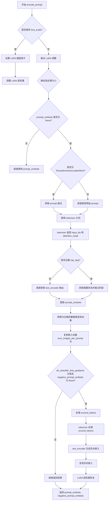
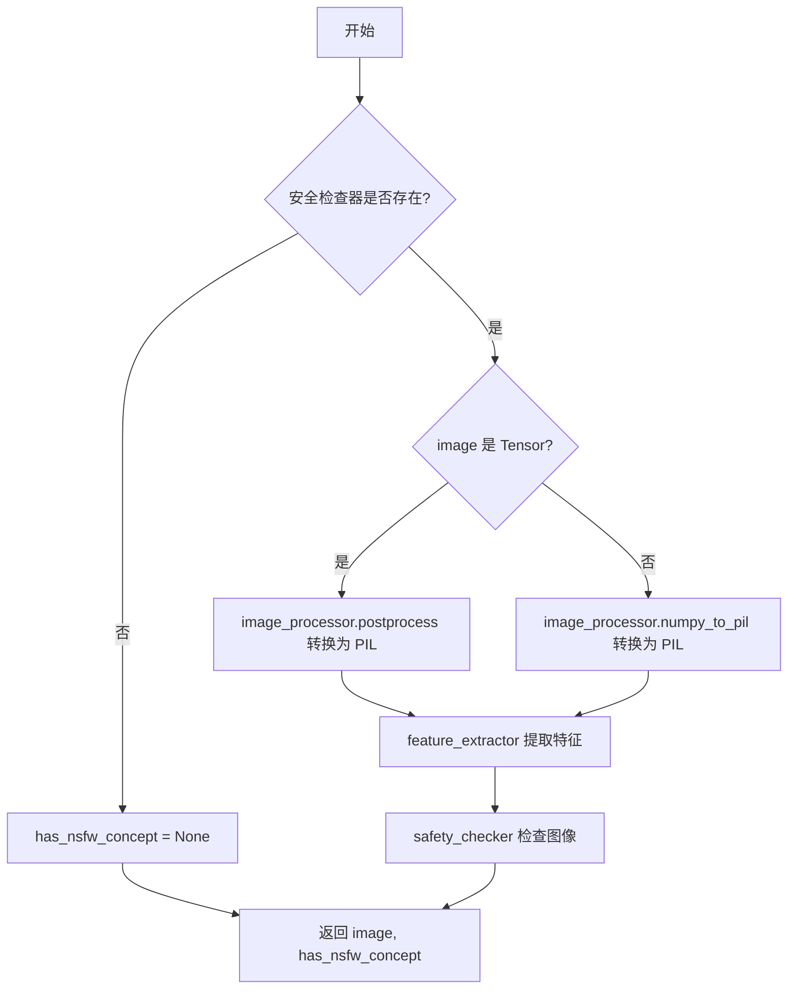
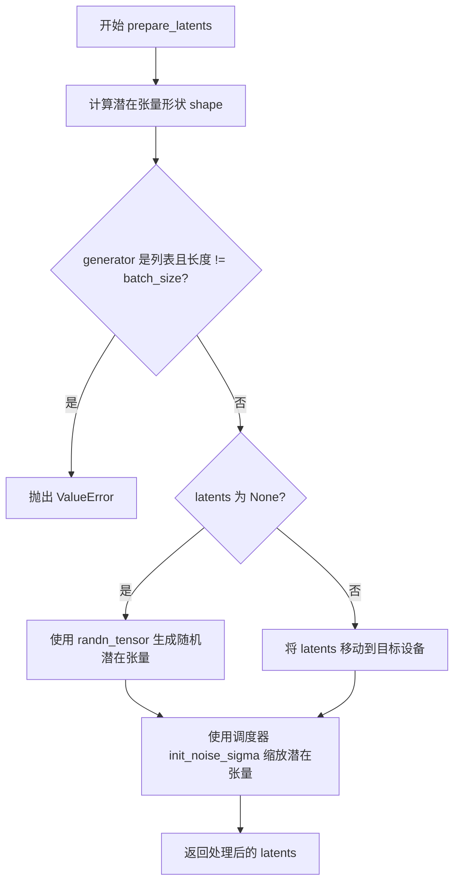
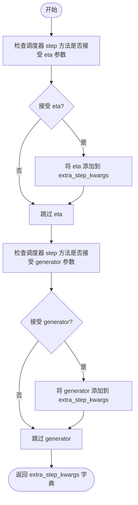
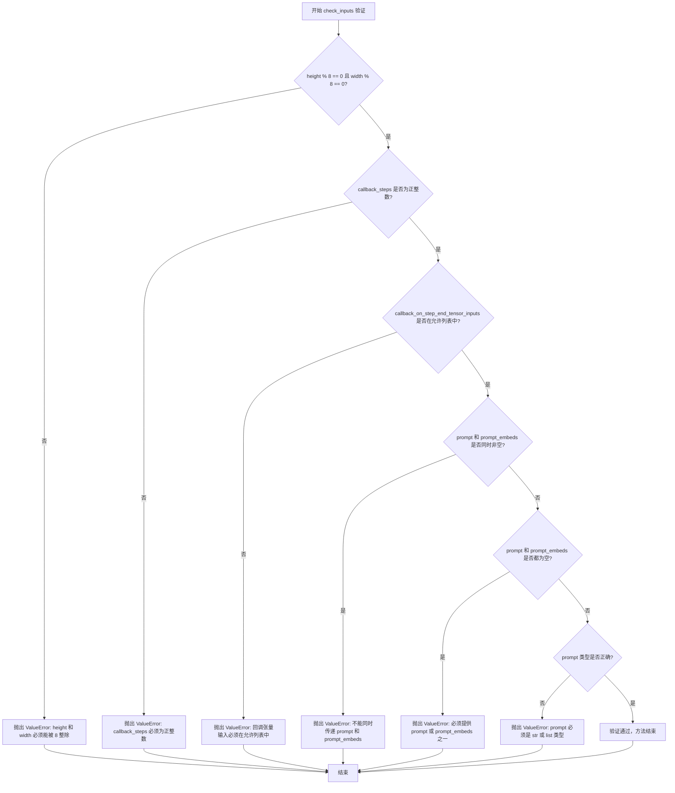
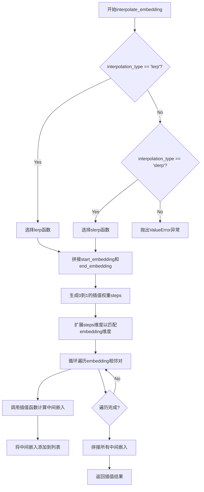
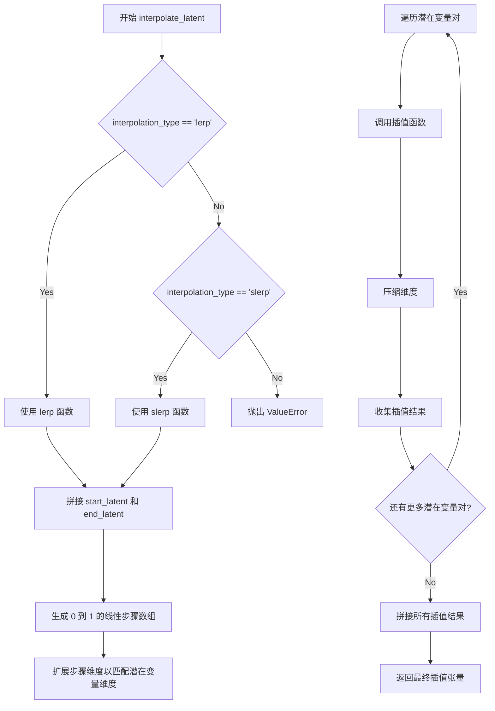

# `diffusers\examples\community\latent_consistency_interpolate.py` 详细设计文档

这是一个基于Latent Consistency Model (LCM)的文本到图像生成管道，支持在多个提示词之间进行潜在空间插值漫步，生成从一种图像风格平滑过渡到另一种风格的一系列图像。通过线性插值(lerp)和球面线性插值(slerp)技术在文本嵌入和潜在向量之间进行插值。

## 整体流程

```mermaid
graph TD
    A[开始: __call__] --> B[检查输入参数]
    B --> C[编码初始提示词 prompt[0]]
    C --> D[准备初始潜在变量 latents_1]
    D --> E{遍历后续提示词 i=1 to batch_size-1}
    E --> F[编码当前提示词 prompt[i]]
    F --> G[准备当前潜在变量 latents_2]
    G --> H[调用 interpolate_embedding 插值文本嵌入]
    H --> I[调用 interpolate_latent 插值潜在变量]
    I --> J{分批处理 inference_latents}
    J --> K[设置时间步 scheduler.set_timesteps]
    K --> L[生成 guidance_scale_embedding]
    L --> M{遍历时间步 t}
    M --> N[UNet模型预测 model_pred]
    M --> O[scheduler.step 去噪]
    O --> P[VAE解码生成图像]
    P --> Q[图像后处理 postprocess]
    Q --> R[保存图像到列表]
    R --> S{批处理完成?}
    S -- 否 --> J
    S -- 是 --> T[更新prompt_embeds和latents]
    T --> E
    E -- 遍历完成 --> U[最终处理输出格式]
    U --> V[返回图像或StableDiffusionPipelineOutput]
```

## 类结构

```
DiffusionPipeline (抽象基类)
├── StableDiffusionMixin
├── TextualInversionLoaderMixin
├── StableDiffusionLoraLoaderMixin
├── FromSingleFileMixin
└── LatentConsistencyModelWalkPipeline (主类)
```

## 全局变量及字段


### `logger`
    
用于记录管道运行过程中的日志信息

类型：`logging.Logger`
    


### `EXAMPLE_DOC_STRING`
    
包含管道使用示例的文档字符串

类型：`str`
    


### `LatentConsistencyModelWalkPipeline.vae`
    
VAE编码器解码器模型，用于在潜在表示和图像之间进行转换

类型：`AutoencoderKL`
    


### `LatentConsistencyModelWalkPipeline.text_encoder`
    
冻结的文本编码器，用于将文本提示转换为嵌入向量

类型：`CLIPTextModel`
    


### `LatentConsistencyModelWalkPipeline.tokenizer`
    
文本分词器，用于将文本分割为token

类型：`CLIPTokenizer`
    


### `LatentConsistencyModelWalkPipeline.unet`
    
去噪UNet条件模型，用于在给定条件下对潜在表示进行去噪

类型：`UNet2DConditionModel`
    


### `LatentConsistencyModelWalkPipeline.scheduler`
    
LCM调度器，用于控制去噪过程的步骤和时间步

类型：`LCMScheduler`
    


### `LatentConsistencyModelWalkPipeline.safety_checker`
    
安全检查器，用于检测生成图像是否包含不当内容

类型：`StableDiffusionSafetyChecker`
    


### `LatentConsistencyModelWalkPipeline.feature_extractor`
    
图像特征提取器，用于从生成的图像中提取特征供安全检查器使用

类型：`CLIPImageProcessor`
    


### `LatentConsistencyModelWalkPipeline.vae_scale_factor`
    
VAE缩放因子，用于调整潜在空间与像素空间之间的尺寸转换

类型：`int`
    


### `LatentConsistencyModelWalkPipeline.image_processor`
    
图像处理器，用于对图像进行后处理和格式转换

类型：`VaeImageProcessor`
    


### `LatentConsistencyModelWalkPipeline.model_cpu_offload_seq`
    
CPU卸载顺序，指定模型组件卸载到CPU的顺序

类型：`str`
    


### `LatentConsistencyModelWalkPipeline._optional_components`
    
可选组件列表，包含安全检查器和特征提取器

类型：`list`
    


### `LatentConsistencyModelWalkPipeline._exclude_from_cpu_offload`
    
排除CPU卸载的组件列表，安全检查器被排除在CPU卸载之外

类型：`list`
    


### `LatentConsistencyModelWalkPipeline._callback_tensor_inputs`
    
回调张量输入列表，指定哪些张量可以作为回调函数的参数

类型：`list`
    
    

## 全局函数及方法


### `lerp`

该函数是一个通用的线性插值（Linear Interpolation）工具函数，支持 `torch.Tensor` 和 `np.ndarray` 两种数据类型，能够根据插值因子 `t` 在两个向量或张量 `v0` 和 `v1` 之间生成线性过渡的结果。

参数：

- `v0`：`Union[torch.Tensor, np.ndarray]`，起始向量/张量。
- `v1`：`Union[torch.Tensor, np.ndarray]`，结束向量/张量。
- `t`：`Union[float, torch.Tensor, np.ndarray]`，插值系数。当为 float 时，值必须在 0 到 1 之间；当为数组时，必须是一维数组且值在 0 到 1 之间。

返回值：`Union[torch.Tensor, np.ndarray]`，返回插值后的向量/张量，其类型与输入类型保持一致。

#### 流程图

```mermaid
flowchart TD
    A([开始 lerp]) --> B{isinstance(v0, torch.Tensor)?}
    B -- Yes --> C[inputs_are_torch = True]
    C --> D[记录 input_device]
    D --> E[将 v0, v1 转为 NumPy 数组]
    B -- No --> F{isinstance(t, torch.Tensor)?}
    F -- Yes --> G[inputs_are_torch = True]
    G --> H[记录 input_device]
    H --> I[将 t 转为 NumPy 数组]
    F -- No --> J{isinstance(t, float)?}
    J -- Yes --> K[t_is_float = True]
    K --> L[t = np.array([t])]
    J -- No --> M[继续]
    E --> N
    I --> N
    L --> N
    M --> N
    N[广播维度: t[..., None], v0[None, ...], v1[None, ...]]
    N --> O[计算 v2 = (1 - t) * v0 + t * v1]
    O --> P{t_is_float 且 v0 原始维度 > 1?}
    P -- Yes --> Q[assert shape[0] == 1]
    Q --> R[np.squeeze 移除批次维度]
    P -- No --> S{inputs_are_torch?}
    R --> S
    S -- Yes --> T[torch.from_numpy 转为 Tensor 并移回原设备]
    S -- No --> U([返回 v2])
    T --> U
```

#### 带注释源码

```python
def lerp(
    v0: Union[torch.Tensor, np.ndarray],
    v1: Union[torch.Tensor, np.ndarray],
    t: Union[float, torch.Tensor, np.ndarray],
) -> Union[torch.Tensor, np.ndarray]:
    """
    Linearly interpolate between two vectors/tensors.

    Args:
        v0 (`torch.Tensor` or `np.ndarray`): First vector/tensor.
        v1 (`torch.Tensor` or `np.ndarray`): Second vector/tensor.
        t: (`float`, `torch.Tensor`, or `np.ndarray`):
            Interpolation factor. If float, must be between 0 and 1. If np.ndarray or
            torch.Tensor, must be one dimensional with values between 0 and 1.

    Returns:
        Union[torch.Tensor, np.ndarray]
            Interpolated vector/tensor between v0 and v1.
    """
    inputs_are_torch = False
    t_is_float = False

    # 检查 v0 是否为 PyTorch Tensor，如果是则标记并准备转换为 numpy 进行计算
    if isinstance(v0, torch.Tensor):
        inputs_are_torch = True
        input_device = v0.device
        v0 = v0.cpu().numpy()
        v1 = v1.cpu().numpy()

    # 检查 t 是否为 PyTorch Tensor
    if isinstance(t, torch.Tensor):
        inputs_are_torch = True
        input_device = t.device
        t = t.cpu().numpy()
    # 检查 t 是否为浮点数，如果是则转为 numpy 数组以便进行广播运算
    elif isinstance(t, float):
        t_is_float = True
        t = np.array([t])

    # 为了支持批量插值，对 t, v0, v1 进行维度扩展以支持广播
    # t 变为 (..., 1), v0 变为 (1, ...), v1 变为 (1, ...)
    t = t[..., None]
    v0 = v0[None, ...]
    v1 = v1[None, ...]
    # 线性插值公式: v0 + t * (v1 - v0)
    v2 = (1 - t) * v0 + t * v1

    # 如果输入是浮点数且原始向量是多维的，则挤压掉由于广播产生的批次维度
    if t_is_float and v0.ndim > 1:
        assert v2.shape[0] == 1
        v2 = np.squeeze(v2, axis=0)
        
    # 如果原始输入是 PyTorch Tensor，则将结果转回 Tensor 并移回原设备
    if inputs_are_torch:
        v2 = torch.from_numpy(v2).to(input_device)

    return v2
```


### `slerp`

球面线性插值（Spherical Linear Interpolation）函数，用于在两个向量或张量之间进行球面插值。当输入是 PyTorch 张量时返回张量，当输入是 NumPy 数组时返回数组。该函数通过计算向量之间的夹角余弦值来确定使用球面插值还是线性插值（当两向量接近平行时）。

参数：

- `v0`：`Union[torch.Tensor, np.ndarray]`，第一个向量/张量
- `v1`：`Union[torch.Tensor, np.ndarray]`，第二个向量/张量
- `t`：`Union[float, torch.Tensor, np.ndarray]`，插值因子，float 类型时必须在 0 到 1 之间；np.ndarray 或 torch.Tensor 时必须是一维的且值在 0 到 1 之间
- `DOT_THRESHOLD`：`float`，可选参数，默认值为 0.9995，当向量夹角余弦值的绝对值超过此阈值时改用线性插值

返回值：`Union[torch.Tensor, np.ndarray]`，返回 v0 和 v1 之间的插值向量/张量

#### 流程图

```mermaid
flowchart TD
    A[开始 slerp] --> B{判断 v0 是否为 torch.Tensor}
    B -->|是| C[标记 inputs_are_torch=True<br>记录设备并将 v0, v1 转为 numpy]
    B -->|否| D{判断 t 是否为 torch.Tensor}
    C --> D
    D -->|是| E[标记 inputs_are_torch=True<br>记录设备并将 t 转为 numpy]
    D -->|否| F{判断 t 是否为 float}
    E --> F
    F -->|是| G[标记 t_is_float=True<br>将 t 转为 numpy 数组]
    F -->|否| H[计算点积 dot = sum(v0*v1) / (norm(v0)*norm(v1))]
    G --> H
    H --> I{判断 |dot| > DOT_THRESHOLD}
    I -->|是| J[调用 lerp 函数进行线性插值]
    I -->|否| K[计算球面插值参数]
    K --> L[theta_0 = arccos(dot)<br>sin_theta_0 = sin(theta_0)<br>theta_t = theta_0 * t<br>sin_theta_t = sin(theta_t)<br>s0 = sin(theta_0 - theta_t) / sin_theta_0<br>s1 = sin_theta_t / sin_theta_0]
    L --> M[扩展维度并计算 v2 = s0*v0 + s1*v1]
    J --> N{判断 t_is_float 且 v0.ndim > 1}
    M --> N
    N -->|是| O[assert v2.shape[0] == 1<br>squeeze 掉第一维]
    N -->|否| P{判断 inputs_are_torch}
    O --> P
    P -->|是| Q[将 v2 转回 torch.Tensor<br>移动到原设备]
    P -->|否| R[返回 v2]
    Q --> R
    R --> S[结束]
```

#### 带注释源码

```python
def slerp(
    v0: Union[torch.Tensor, np.ndarray],
    v1: Union[torch.Tensor, np.ndarray],
    t: Union[float, torch.Tensor, np.ndarray],
    DOT_THRESHOLD=0.9995,
) -> Union[torch.Tensor, np.ndarray]:
    """
    Spherical linear interpolation between two vectors/tensors.

    Args:
        v0 (`torch.Tensor` or `np.ndarray`): First vector/tensor.
        v1 (`torch.Tensor` or `np.ndarray`): Second vector/tensor.
        t: (`float`, `torch.Tensor`, or `np.ndarray`):
            Interpolation factor. If float, must be between 0 and 1. If np.ndarray or
            torch.Tensor, must be one dimensional with values between 0 and 1.
        DOT_THRESHOLD (`float`, *optional*, default=0.9995):
            Threshold for when to use linear interpolation instead of spherical interpolation.

    Returns:
        `torch.Tensor` or `np.ndarray`:
            Interpolated vector/tensor between v0 and v1.
    """
    # 初始化标志位，用于记录输入类型
    inputs_are_torch = False  # 标记输入是否为 PyTorch 张量
    t_is_float = False        # 标记插值因子 t 是否为浮点数

    # 如果 v0 是 PyTorch 张量，转换为 NumPy 数组进行处理
    # 记录输入设备以便后续将结果转回原设备
    if isinstance(v0, torch.Tensor):
        inputs_are_torch = True
        input_device = v0.device
        v0 = v0.cpu().numpy()
        v1 = v1.cpu().numpy()

    # 如果 t 是 PyTorch 张量，同样转换为 NumPy 数组
    if isinstance(t, torch.Tensor):
        inputs_are_torch = True
        input_device = t.device
        t = t.cpu().numpy()
    # 如果 t 是浮点数，转换为 NumPy 数组以统一处理
    # 注意：这里使用 v0.dtype 确保类型一致
    elif isinstance(t, float):
        t_is_float = True
        t = np.array([t], dtype=v0.dtype)

    # 计算两个向量的点积归一化值（夹角余弦值）
    dot = np.sum(v0 * v1 / (np.linalg.norm(v0) * np.linalg.norm(v1)))
    
    # 如果两向量接近平行（夹角余弦值绝对值超过阈值），
    # 使用线性插值代替球面插值，以避免数值不稳定
    if np.abs(dot) > DOT_THRESHOLD:
        # v1 and v2 are close to parallel
        # Use linear interpolation instead
        v2 = lerp(v0, v1, t)
    else:
        # 执行球面线性插值（SLERP）算法
        # 计算初始角度 theta_0
        theta_0 = np.arccos(dot)
        sin_theta_0 = np.sin(theta_0)
        
        # 根据插值因子 t 计算当前角度 theta_t
        theta_t = theta_0 * t
        sin_theta_t = np.sin(theta_t)
        
        # 计算两个向量的权重系数
        # s0 表示 v0 的权重，s1 表示 v1 的权重
        s0 = np.sin(theta_0 - theta_t) / sin_theta_0
        s1 = sin_theta_t / sin_theta_0
        
        # 扩展维度以支持广播运算
        s0 = s0[..., None]
        s1 = s1[..., None]
        v0 = v0[None, ...]
        v1 = v1[None, ...]
        
        # 加权求和得到插值结果
        v2 = s0 * v0 + s1 * v1

    # 如果原始 t 是浮点数且输入维度大于 1，
    # 需要移除由于广播添加的第一维
    if t_is_float and v0.ndim > 1:
        assert v2.shape[0] == 1
        v2 = np.squeeze(v2, axis=0)
    
    # 如果原始输入是 PyTorch 张量，将结果转回 PyTorch
    if inputs_are_torch:
        v2 = torch.from_numpy(v2).to(input_device)

    return v2
```


### LatentConsistencyModelWalkPipeline.__init__

该方法是 `LatentConsistencyModelWalkPipeline` 类的构造函数，负责初始化管道所需的所有组件，包括 VAE、文本编码器、分词器、UNet、调度器、安全检查器和特征提取器，并配置相关的缩放因子和图像处理器。

参数：

- `vae`：`AutoencoderKL`，变分自编码器模型，用于在潜在表示和图像之间进行编码和解码
- `text_encoder`：`CLIPTextModel`，冻结的文本编码器，用于将文本提示转换为嵌入向量
- `tokenizer`：`CLIPTokenizer`，CLIP 分词器，用于对文本进行分词处理
- `unet`：`UNet2DConditionModel`，条件 UNet 模型，用于对编码后的图像潜在表示进行去噪
- `scheduler`：`LCMScheduler`，调度器，与 UNet 结合使用以对编码后的图像潜在表示进行去噪，目前仅支持 LCM 调度器
- `safety_checker`：`StableDiffusionSafetyChecker`，安全检查模块，用于评估生成的图像是否包含不当或有害内容
- `feature_extractor`：`CLIPImageProcessor`，CLIP 图像处理器，用于从生成的图像中提取特征，作为安全检查器的输入
- `requires_safety_checker`：`bool`，可选参数，默认为 True，表示管道是否需要安全检查器组件

返回值：`None`，该方法为构造函数，不返回任何值

#### 流程图

```mermaid
flowchart TD
    A[开始 __init__] --> B[调用父类构造函数 super().__init__]
    B --> C{safety_checker is None<br>且 requires_safety_checker 为 True?}
    C -->|是| D[记录警告日志:<br>安全检查器已被禁用]
    C -->|否| E{safety_checker is not None<br>且 feature_extractor 为 None?}
    E -->|是| F[抛出 ValueError:<br>必须定义特征提取器]
    E -->|否| G[调用 self.register_modules<br>注册所有模块]
    G --> H[计算并设置 self.vae_scale_factor<br>基于 VAE 的 block_out_channels]
    I[创建 VaeImageProcessor<br>并赋值给 self.image_processor]
    I --> J[调用 self.register_to_config<br>保存 requires_safety_checker 配置]
    J --> K[结束 __init__]
    
    D --> G
    F --> K
```

#### 带注释源码

```
def __init__(
    self,
    vae: AutoencoderKL,
    text_encoder: CLIPTextModel,
    tokenizer: CLIPTokenizer,
    unet: UNet2DConditionModel,
    scheduler: LCMScheduler,
    safety_checker: StableDiffusionSafetyChecker,
    feature_extractor: CLIPImageProcessor,
    requires_safety_checker: bool = True,
):
    """
    初始化 LatentConsistencyModelWalkPipeline 管道组件。
    
    参数:
        vae: 变分自编码器模型，用于编码和解码图像潜在表示
        text_encoder: 冻结的 CLIP 文本编码器
        tokenizer: CLIP 分词器
        unet: 条件 UNet 模型，用于去噪
        scheduler: LCM 调度器
        safety_checker: 安全检查器模块
        feature_extractor: CLIP 图像处理器
        requires_safety_checker: 是否需要安全检查器
    """
    # 调用父类 DiffusionPipeline 的初始化方法
    super().__init__()

    # 如果安全检查器为 None 但要求启用安全检查，则发出警告
    if safety_checker is None and requires_safety_checker:
        logger.warning(
            f"You have disabled the safety checker for {self.__class__} by passing `safety_checker=None`. Ensure"
            " that you abide to the conditions of the Stable Diffusion license and do not expose unfiltered"
            " results in services or applications open to the public. Both the diffusers team and Hugging Face"
            " strongly recommend to keep the safety filter enabled in all public facing circumstances, disabling"
            " it only for use-cases that involve analyzing network behavior or auditing its results. For more"
            " information, please have a look at https://github.com/huggingface/diffusers/pull/254 ."
        )

    # 如果提供了安全检查器但未提供特征提取器，则抛出错误
    if safety_checker is not None and feature_extractor is None:
        raise ValueError(
            "Make sure to define a feature extractor when loading {self.__class__} if you want to use the safety"
            " checker. If you do not want to use the safety checker, you can pass `'safety_checker=None'` instead."
        )

    # 注册所有模块到管道中，使其可以通过属性访问
    self.register_modules(
        vae=vae,
        text_encoder=text_encoder,
        tokenizer=tokenizer,
        unet=unet,
        scheduler=scheduler,
        safety_checker=safety_checker,
        feature_extractor=feature_extractor,
    )
    
    # 计算 VAE 缩放因子，基于 VAE 配置中的 block_out_channels 数量
    # 计算公式: 2^(len(block_out_channels) - 1)，通常为 8
    self.vae_scale_factor = 2 ** (len(self.vae.config.block_out_channels) - 1) if getattr(self, "vae", None) else 8
    
    # 创建图像后处理器，用于处理 VAE 输出的图像
    self.image_processor = VaeImageProcessor(vae_scale_factor=self.vae_scale_factor)
    
    # 将 requires_safety_checker 配置注册到管道的配置中
    self.register_to_config(requires_safety_checker=requires_safety_checker)
```


### `LatentConsistencyModelWalkPipeline.encode_prompt`

该方法负责将文本提示词（prompt）转换为文本嵌入（text embeddings），供后续的 UNet 模型在图像生成过程中使用。它支持单个或批量提示词处理、可选的 LoRA 权重调整、CLIP 层跳过（clip_skip）以及无分类器自由引导（Classifier-Free Guidance）所需的负面提示词嵌入计算。

参数：

- `prompt`：`Union[str, List[str], None]`，要编码的提示词，可以是单个字符串或字符串列表
- `device`：`torch.device`，执行编码的 torch 设备
- `num_images_per_prompt`：`int`，每个提示词需要生成的图像数量，用于复制嵌入向量
- `do_classifier_free_guidance`：`bool`，是否启用无分类器自由引导，当为 True 时需要生成负面提示词嵌入
- `negative_prompt`：`Union[str, List[str], None]`，负面提示词，用于引导图像生成远离不希望的内容
- `prompt_embeds`：`Optional[torch.Tensor]`，预生成的提示词嵌入，如果提供则直接使用，跳过文本编码过程
- `negative_prompt_embeds`：`Optional[torch.Tensor]`，预生成的负面提示词嵌入
- `lora_scale`：`Optional[float]`，LoRA 缩放因子，用于调整 LoRA 层的权重
- `clip_skip`：`Optional[int]`，CLIP 编码器跳过的层数，用于获取不同层次的文本特征

返回值：`Tuple[torch.Tensor, torch.Tensor]`，返回包含提示词嵌入和负面提示词嵌入的元组。如果 `do_classifier_free_guidance` 为 False，则第二个元素可能为 None。

#### 流程图



#### 带注释源码

```python
def encode_prompt(
    self,
    prompt,
    device,
    num_images_per_prompt,
    do_classifier_free_guidance,
    negative_prompt=None,
    prompt_embeds: Optional[torch.Tensor] = None,
    negative_prompt_embeds: Optional[torch.Tensor] = None,
    lora_scale: Optional[float] = None,
    clip_skip: Optional[int] = None,
):
    r"""
    Encodes the prompt into text encoder hidden states.

    Args:
        prompt (`str` or `List[str]`, *optional*):
            prompt to be encoded
        device: (`torch.device`):
            torch device
        num_images_per_prompt (`int`):
            number of images that should be generated per prompt
        do_classifier_free_guidance (`bool`):
            whether to use classifier free guidance or not
        negative_prompt (`str` or `List[str]`, *optional*):
            The prompt or prompts not to guide the image generation. If not defined, one has to pass
            `negative_prompt_embeds` instead. Ignored when not using guidance (i.e., ignored if `guidance_scale` is
            less than `1`).
        prompt_embeds (`torch.Tensor`, *optional*):
            Pre-generated text embeddings. Can be used to easily tweak text inputs, *e.g.* prompt weighting. If not
            provided, text embeddings will be generated from `prompt` input argument.
        negative_prompt_embeds (`torch.Tensor`, *optional*):
            Pre-generated negative text embeddings. Can be used to easily tweak text inputs, *e.g.* prompt
            weighting. If not provided, negative_prompt_embeds will be generated from `negative_prompt` input
            argument.
        lora_scale (`float`, *optional*):
            A LoRA scale that will be applied to all LoRA layers of the text encoder if LoRA layers are loaded.
        clip_skip (`int`, *optional*):
            Number of layers to be skipped from CLIP while computing the prompt embeddings. A value of 1 means that
            the output of the pre-final layer will be used for computing the prompt embeddings.
    """
    # 设置 LoRA 缩放因子，以便 text encoder 的 LoRA 函数可以正确访问
    # 这是为了让 text_encoder 能够动态调整 LoRA 权重
    if lora_scale is not None and isinstance(self, StableDiffusionLoraLoaderMixin):
        self._lora_scale = lora_scale

        # 动态调整 LoRA 缩放
        if not USE_PEFT_BACKEND:
            adjust_lora_scale_text_encoder(self.text_encoder, lora_scale)
        else:
            scale_lora_layers(self.text_encoder, lora_scale)

    # 确定批处理大小
    # 如果 prompt 是字符串，则批处理大小为 1
    # 如果 prompt 是列表，则批处理大小为列表长度
    # 否则使用 prompt_embeds 的批处理大小
    if prompt is not None and isinstance(prompt, str):
        batch_size = 1
    elif prompt is not None and isinstance(prompt, list):
        batch_size = len(prompt)
    else:
        batch_size = prompt_embeds.shape[0]

    # 如果未提供 prompt_embeds，则从 prompt 生成
    if prompt_embeds is None:
        # 文本反转：如果需要，处理多向量 token
        if isinstance(self, TextualInversionLoaderMixin):
            prompt = self.maybe_convert_prompt(prompt, self.tokenizer)

        # 使用 tokenizer 将文本转换为 token IDs
        text_inputs = self.tokenizer(
            prompt,
            padding="max_length",
            max_length=self.tokenizer.model_max_length,
            truncation=True,
            return_tensors="pt",
        )
        text_input_ids = text_inputs.input_ids
        # 获取未截断的 token IDs 用于比较
        untruncated_ids = self.tokenizer(prompt, padding="longest", return_tensors="pt").input_ids

        # 检查是否发生了截断，并记录警告信息
        if untruncated_ids.shape[-1] >= text_input_ids.shape[-1] and not torch.equal(
            text_input_ids, untruncated_ids
        ):
            removed_text = self.tokenizer.batch_decode(
                untruncated_ids[:, self.tokenizer.model_max_length - 1 : -1]
            )
            logger.warning(
                "The following part of your input was truncated because CLIP can only handle sequences up to"
                f" {self.tokenizer.model_max_length} tokens: {removed_text}"
            )

        # 获取 attention_mask
        if hasattr(self.text_encoder.config, "use_attention_mask") and self.text_encoder.config.use_attention_mask:
            attention_mask = text_inputs.attention_mask.to(device)
        else:
            attention_mask = None

        # 根据是否设置 clip_skip 来决定如何获取 prompt embeddings
        if clip_skip is None:
            # 直接获取 text_encoder 的输出
            prompt_embeds = self.text_encoder(text_input_ids.to(device), attention_mask=attention_mask)
            prompt_embeds = prompt_embeds[0]
        else:
            # 获取所有隐藏状态，然后跳过指定层数
            prompt_embeds = self.text_encoder(
                text_input_ids.to(device), attention_mask=attention_mask, output_hidden_states=True
            )
            # hidden_states 是一个元组，包含所有编码器层的隐藏状态
            # 通过索引获取指定层的输出 (clip_skip + 1 是因为索引从 0 开始)
            prompt_embeds = prompt_embeds[-1][-(clip_skip + 1)]
            # 应用最终的 LayerNorm 以确保表示正确
            prompt_embeds = self.text_encoder.text_model.final_layer_norm(prompt_embeds)

    # 确定 prompt_embeds 的数据类型
    # 优先使用 text_encoder 的数据类型，其次使用 unet 的数据类型
    if self.text_encoder is not None:
        prompt_embeds_dtype = self.text_encoder.dtype
    elif self.unet is not None:
        prompt_embeds_dtype = self.unet.dtype
    else:
        prompt_embeds_dtype = prompt_embeds.dtype

    # 将 prompt_embeds 转换为正确的设备和数据类型
    prompt_embeds = prompt_embeds.to(dtype=prompt_embeds_dtype, device=device)

    # 获取批处理大小、序列长度和特征维度
    bs_embed, seq_len, _ = prompt_embeds.shape
    # 为每个提示词生成多个图像复制对应的嵌入向量
    # 使用 MPS 友好的方法进行复制
    prompt_embeds = prompt_embeds.repeat(1, num_images_per_prompt, 1)
    prompt_embeds = prompt_embeds.view(bs_embed * num_images_per_prompt, seq_len, -1)

    # 获取无分类器自由引导的无条件嵌入
    if do_classifier_free_guidance and negative_prompt_embeds is None:
        uncond_tokens: List[str]
        if negative_prompt is None:
            # 如果没有提供负面提示词，使用空字符串
            uncond_tokens = [""] * batch_size
        elif prompt is not None and type(prompt) is not type(negative_prompt):
            raise TypeError(
                f"`negative_prompt` should be the same type to `prompt`, but got {type(negative_prompt)} !="
                f" {type(prompt)}."
            )
        elif isinstance(negative_prompt, str):
            uncond_tokens = [negative_prompt]
        elif batch_size != len(negative_prompt):
            raise ValueError(
                f"`negative_prompt`: {negative_prompt} has batch size {len(negative_prompt)}, but `prompt`:"
                f" {prompt} has batch size {batch_size}. Please make sure that passed `negative_prompt` matches"
                " the batch size of `prompt`."
            )
        else:
            uncond_tokens = negative_prompt

        # 文本反转：处理多向量 token（如果需要）
        if isinstance(self, TextualInversionLoaderMixin):
            uncond_tokens = self.maybe_convert_prompt(uncond_tokens, self.tokenizer)

        # 使用与 prompt_embeds 相同的序列长度
        max_length = prompt_embeds.shape[1]
        uncond_input = self.tokenizer(
            uncond_tokens,
            padding="max_length",
            max_length=max_length,
            truncation=True,
            return_tensors="pt",
        )

        # 获取 attention_mask
        if hasattr(self.text_encoder.config, "use_attention_mask") and self.text_encoder.config.use_attention_mask:
            attention_mask = uncond_input.attention_mask.to(device)
        else:
            attention_mask = None

        # 生成负面提示词嵌入
        negative_prompt_embeds = self.text_encoder(
            uncond_input.input_ids.to(device),
            attention_mask=attention_mask,
        )
        negative_prompt_embeds = negative_prompt_embeds[0]

    # 如果使用无分类器自由引导，处理负面提示词嵌入
    if do_classifier_free_guidance:
        # 复制无条件嵌入向量以匹配生成的图像数量
        seq_len = negative_prompt_embeds.shape[1]

        negative_prompt_embeds = negative_prompt_embeds.to(dtype=prompt_embeds_dtype, device=device)

        negative_prompt_embeds = negative_prompt_embeds.repeat(1, num_images_per_prompt, 1)
        negative_prompt_embeds = negative_prompt_embeds.view(batch_size * num_images_per_prompt, seq_len, -1)

    # 如果使用了 LoRA，恢复原始权重
    if isinstance(self, StableDiffusionLoraLoaderMixin) and USE_PEFT_BACKEND:
        # 通过取消缩放 LoRA 层来恢复原始权重
        unscale_lora_layers(self.text_encoder, lora_scale)

    return prompt_embeds, negative_prompt_embeds
```


### `LatentConsistencyModelWalkPipeline.run_safety_checker`

运行安全检查器，对生成的图像进行NSFW（不适合在工作场所查看）内容检测。如果安全检查器被禁用或不可用，则返回None。

参数：

- `self`：隐式参数，类实例本身
- `image`：`Union[torch.Tensor, np.ndarray]`，需要检查的生成图像，可以是PyTorch张量或NumPy数组
- `device`：`torch.device`，运行安全检查器的设备
- `dtype`：`torch.dtype`，安全检查器输入的数据类型

返回值：`Tuple[Union[torch.Tensor, np.ndarray], Optional[List[bool]]]`，
- 第一个元素为处理后的图像（与输入类型相同）
- 第二个元素为布尔列表，表示每张图像是否包含NSFW内容；如果安全检查器为None则返回None

#### 流程图



#### 带注释源码

```python
def run_safety_checker(self, image, device, dtype):
    """
    运行安全检查器检测NSFW内容
    
    Args:
        image: 生成的图像张量或数组
        device: 计算设备
        dtype: 数据类型
    
    Returns:
        处理后的图像和NSFW检测结果元组
    """
    # 检查安全检查器是否可用
    if self.safety_checker is None:
        # 安全检查器未配置，设置NSFW概念为None
        has_nsfw_concept = None
    else:
        # 安全检查器存在，进行NSFW检测
        # 根据图像类型选择不同的预处理方式
        if torch.is_tensor(image):
            # 如果是PyTorch张量，先转换为PIL图像供特征提取器使用
            feature_extractor_input = self.image_processor.postprocess(image, output_type="pil")
        else:
            # 如果是NumPy数组，直接转换为PIL图像
            feature_extractor_input = self.image_processor.numpy_to_pil(image)
        
        # 使用特征提取器提取图像特征并移至指定设备
        safety_checker_input = self.feature_extractor(feature_extractor_input, return_tensors="pt").to(device)
        
        # 调用安全检查器进行NSFW检测
        # 将像素值转换为指定数据类型以匹配检查器要求
        image, has_nsfw_concept = self.safety_checker(
            images=image, clip_input=safety_checker_input.pixel_values.to(dtype)
        )
    
    # 返回处理后的图像和NSFW检测结果
    return image, has_nsfw_concept
```


### `LatentConsistencyModelWalkPipeline.prepare_latents`

准备潜在变量函数用于在图像生成流程开始前，初始化或处理噪声潜在张量（latents），确保其形状、数据类型和设备符合模型要求，并根据调度器的初始噪声标准差进行缩放。

参数：

- `batch_size`：`int`，生成的图像批次大小，决定潜在张量的第一维维度
- `num_channels_latents`：`int`，潜在空间的通道数，对应 UNet 输入的通道维度
- `height`：`int`，生成图像的高度（像素），用于计算潜在张量的空间尺寸
- `width`：`int`，生成图像的宽度（像素），用于计算潜在张量的空间尺寸
- `dtype`：`torch.dtype`，潜在张量的目标数据类型（如 torch.float32）
- `device`：`torch.device`，潜在张量的目标设备（如 cuda:0）
- `generator`：`torch.Generator` 或 `List[torch.Generator]`，可选的随机数生成器，用于确保生成的可重复性
- `latents`：`torch.Tensor`，可选的预生成潜在张量，若为 None 则随机生成

返回值：`torch.Tensor`，处理后的潜在张量，形状为 (batch_size, num_channels_latents, height//vae_scale_factor, width//vae_scale_factor)，已按调度器初始噪声标准差缩放

#### 流程图



#### 带注释源码

```python
def prepare_latents(
    self,
    batch_size: int,
    num_channels_latents: int,
    height: int,
    width: int,
    dtype: torch.dtype,
    device: torch.device,
    generator: Optional[Union[torch.Generator, List[torch.Generator]]],
    latents: Optional[torch.Tensor] = None
) -> torch.Tensor:
    """
    准备用于图像生成的潜在变量（latents）。

    Args:
        batch_size: 批次大小
        num_channels_latents: 潜在通道数
        height: 图像高度
        width: 图像宽度
        dtype: 数据类型
        device: 设备
        generator: 随机数生成器
        latents: 可选的预生成潜在张量

    Returns:
        处理后的潜在张量
    """
    # 1. 计算潜在张量的形状，根据 VAE 缩放因子调整空间维度
    shape = (
        batch_size,
        num_channels_latents,
        int(height) // self.vae_scale_factor,
        int(width) // self.vae_scale_factor,
    )

    # 2. 验证 generator 列表长度与批次大小是否匹配
    if isinstance(generator, list) and len(generator) != batch_size:
        raise ValueError(
            f"You have passed a list of generators of length {len(generator)}, but requested an effective batch"
            f" size of {batch_size}. Make sure the batch size matches the length of the generators."
        )

    # 3. 如果未提供 latents，则随机生成；否则使用提供的 latents
    if latents is None:
        # 使用 randn_tensor 生成符合正态分布的随机潜在张量
        latents = randn_tensor(shape, generator=generator, device=device, dtype=dtype)
    else:
        # 确保 latent 张量在正确的设备上
        latents = latents.to(device)

    # 4. 根据调度器要求的初始噪声标准差缩放潜在张量
    # 这确保了噪声的尺度与调度器的扩散过程相匹配
    latents = latents * self.scheduler.init_noise_sigma

    return latents
```


### `LatentConsistencyModelWalkPipeline.get_guidance_scale_embedding`

该方法用于生成Guidance Scale（引导强度）的嵌入向量，采用正弦和余弦函数将标量引导值映射到高维向量空间，以供UNet的时间条件投影层使用。

参数：

- `w`：`torch.Tensor`，一维张量，表示需要生成嵌入向量的引导强度值（guidance scale）
- `embedding_dim`：`int`，可选，默认为 512，生成的嵌入向量的维度
- `dtype`：`torch.dtype`，可选，默认为 torch.float32，生成嵌入向量的数据类型

返回值：`torch.Tensor`，形状为 `(len(w), embedding_dim)` 的嵌入向量张量

#### 流程图

```mermaid
flowchart TD
    A[开始: 输入引导强度 w] --> B{验证输入}
    B -->|assert len(w.shape) == 1| C[将 w 乘以 1000]
    C --> D[计算 embedding_dim 一半的维度 half_dim]
    D --> E[计算对数基础: log10000 / (half_dim - 1)]
    E --> F[生成频率向量: exp(-arange(half_dim) * 对数基础)]
    F --> G[将 w 与频率向量外积相乘]
    G --> H[拼接 sin 和 cos 结果]
    H --> I{embedding_dim 为奇数?}
    I -->|是| J[零填充最后维度]
    I -->|否| K[验证输出形状]
    J --> K
    K --> L[返回嵌入向量]
```

#### 带注释源码

```python
def get_guidance_scale_embedding(self, w, embedding_dim=512, dtype=torch.float32):
    """
    生成Guidance Scale嵌入向量
    参考: https://github.com/google-research/vdm/blob/dc27b98a554f65cdc654b800da5aa1846545d41b/model_vdm.py#L298

    Args:
        w (`torch.Tensor`):
            输入的引导强度值，一维张量
        embedding_dim (`int`, *optional*, defaults to 512):
            嵌入向量的维度
        dtype:
            生成嵌入向量的数据类型

    Returns:
        `torch.Tensor`: 形状为 `(len(w), embedding_dim)` 的嵌入向量
    """
    # 验证输入为一维张量
    assert len(w.shape) == 1
    
    # 将引导强度缩放1000倍，以适配训练时的数值范围
    w = w * 1000.0

    # 计算嵌入维度的一半（因为使用sin和cos各占一半）
    half_dim = embedding_dim // 2
    
    # 计算对数基础频率: log(10000) / (half_dim - 1)
    # 这创建了一个从大到小的频率范围
    emb = torch.log(torch.tensor(10000.0)) / (half_dim - 1)
    
    # 生成指数衰减的频率向量: exp(-0), exp(-1*emb), exp(-2*emb), ...
    emb = torch.exp(torch.arange(half_dim, dtype=dtype) * -emb)
    
    # 将w与频率向量进行外积运算
    # w: [n] -> [n, 1], emb: [half_dim] -> [1, half_dim]
    # 结果: [n, half_dim]
    emb = w.to(dtype)[:, None] * emb[None, :]
    
    # 拼接sin和cos编码，形成完整的嵌入向量
    # 结果形状: [n, half_dim * 2] = [n, embedding_dim] (当embedding_dim为偶数时)
    emb = torch.cat([torch.sin(emb), torch.cos(emb)], dim=1)
    
    # 如果embedding_dim为奇数，需要在最后补零
    if embedding_dim % 2 == 1:
        emb = torch.nn.functional.pad(emb, (0, 1))
    
    # 验证输出形状正确
    assert emb.shape == (w.shape[0], embedding_dim)
    
    return emb
```


### LatentConsistencyModelWalkPipeline.prepare_extra_step_kwargs

该方法用于准备调度器（Scheduler）的额外参数。由于不同的调度器（例如 DDIM, Euler, LMS 等）其 `step` 方法的签名（参数列表）可能不同，此方法通过 Python 的 `inspect` 模块动态检查当前调度器是否支持 `eta`（DDIM 算法参数）和 `generator`（随机数生成器）这两个参数，并将支持的那些参数封装成字典返回给流水线使用。

参数：

- `self`：`LatentConsistencyModelWalkPipeline` 类实例。当前流水线对象，包含调度器（`scheduler`）。
- `generator`：`Optional[Union[torch.Generator, List[torch.Generator]]]`。用于控制生成随机数的生成器，以确保扩散过程的可重复性。
- `eta`：`float`。DDIM 调度器专用的 `eta` 参数（取值范围通常在 [0, 1] 之间），用于控制随机性。其他调度器会忽略此参数。

返回值：`Dict[str, Any]`，返回包含调度器所需额外参数（`eta` 和/或 `generator`）的字典。

#### 流程图



#### 带注释源码

```python
def prepare_extra_step_kwargs(self, generator, eta):
    # 准备调度器步骤所需的额外参数，因为并非所有调度器都具有相同的签名。
    # eta (η) 仅在 DDIMScheduler 中使用，对于其他调度器将被忽略。
    # eta 对应于 DDIM 论文中的 η：https://huggingface.co/papers/2010.02502
    # 并且应该介于 [0, 1] 之间。

    # 1. 使用 inspect 模块检查当前调度器 (self.scheduler) 的 step 方法签名中是否包含 'eta' 参数
    accepts_eta = "eta" in set(inspect.signature(self.scheduler.step).parameters.keys())
    
    # 2. 初始化一个空字典用于存储额外的关键字参数
    extra_step_kwargs = {}
    
    # 3. 如果调度器接受 eta，则将其加入参数字典
    if accepts_eta:
        extra_step_kwargs["eta"] = eta

    # 4. 检查调度器是否接受 generator 参数（有些调度器支持传入生成器以控制噪声生成）
    accepts_generator = "generator" in set(inspect.signature(self.scheduler.step).parameters.keys())
    if accepts_generator:
        extra_step_kwargs["generator"] = generator
        
    # 5. 返回构建好的参数字典，供 pipeline 主循环中调用 scheduler.step 时使用
    return extra_step_kwargs
```


### `LatentConsistencyModelWalkPipeline.check_inputs`

该方法用于验证图像生成管道的输入参数有效性，确保传入的提示词、高度、宽度、回调步长等参数符合模型要求，若参数无效则抛出相应的 ValueError 异常。

参数：

- `self`：`LatentConsistencyModelWalkPipeline` 实例本身
- `prompt`：`Union[str, List[str]]`，用户输入的文本提示词，可以是单个字符串或字符串列表
- `height`：`int`，生成图像的高度（像素），必须能被 8 整除
- `width`：`int`，生成图像的宽度（像素），必须能被 8 整除
- `callback_steps`：`int`，回调函数的调用步长，必须为正整数
- `prompt_embeds`：`Optional[torch.Tensor]`，可选的预计算文本嵌入向量，若提供则忽略 prompt 参数
- `callback_on_step_end_tensor_inputs`：`Optional[torch.Tensor]` 类型变量，实际上应该是 `Optional[List[str]]`，指定在每步结束时回调函数可以访问的张量输入列表

返回值：`None`，该方法不返回任何值，仅进行参数验证，若验证失败则抛出 ValueError 异常

#### 流程图



#### 带注释源码

```python
# 目前移除了负面提示词相关功能的 StableDiffusionPipeline.check_inputs
def check_inputs(
    self,
    prompt: Union[str, List[str]],
    height: int,
    width: int,
    callback_steps: int,
    prompt_embeds: Optional[torch.Tensor] = None,
    callback_on_step_end_tensor_inputs=None,
):
    """
    检查输入参数的有效性，确保符合流水线处理要求
    
    该方法会在图像生成流水线调用前执行，用于提前捕获潜在的参数错误，
    避免在后续处理过程中才暴露问题，提升调试效率
    
    参数说明:
        prompt: 文本提示词，支持单字符串或字符串列表形式
        height: 期望生成的图像高度，必须为8的倍数以适配VAE下采样
        width: 期望生成的图像宽度，必须为8的倍数以适配VAE下采样
        callback_steps: 回调函数触发频率，必须为正整数
        prompt_embeds: 可选的预计算文本嵌入，与prompt互斥
        callback_on_step_end_tensor_inputs: 指定回调可访问的张量列表
    """
    
    # 验证图像尺寸是否符合VAE的缩放因子要求
    # VAE通常会对图像进行8倍下采样，因此尺寸必须能被8整除
    if height % 8 != 0 or width % 8 != 0:
        raise ValueError(f"`height` and `width` have to be divisible by 8 but are {height} and {width}.")

    # 验证回调步长为正整数，确保回调逻辑正常工作
    if callback_steps is not None and (not isinstance(callback_steps, int) or callback_steps <= 0):
        raise ValueError(
            f"`callback_steps` has to be a positive integer but is {callback_steps} of type"
            f" {type(callback_steps)}."
        )

    # 验证回调张量输入是否在允许的列表中，防止越界访问
    # _callback_tensor_inputs 定义在类中，包含允许回调访问的变量名
    if callback_on_step_end_tensor_inputs is not None and not all(
        k in self._callback_tensor_inputs for k in callback_on_step_end_tensor_inputs
    ):
        raise ValueError(
            f"`callback_on_step_end_tensor_inputs` has to be in {self._callback_tensor_inputs}, but found {[k for k in callback_on_step_end_tensor_inputs if k not in self._callback_tensor_inputs]}"
        )

    # 验证prompt和prompt_embeds的互斥关系，避免重复传递
    if prompt is not None and prompt_embeds is not None:
        raise ValueError(
            f"Cannot forward both `prompt`: {prompt} and `prompt_embeds`: {prompt_embeds}. Please make sure to"
            " only forward one of the two."
        )
    
    # 验证至少提供了prompt或prompt_embeds之一
    elif prompt is None and prompt_embeds is None:
        raise ValueError(
            "Provide either `prompt` or `prompt_embeds`. Cannot leave both `prompt` and `prompt_embeds` undefined."
        )
    
    # 验证prompt的类型有效性
    elif prompt is not None and (not isinstance(prompt, str) and not isinstance(prompt, list)):
        raise ValueError(f"`prompt` has to be of type `str` or `list` but is {type(prompt)}")
```


### `LatentConsistencyModelWalkPipeline.interpolate_embedding`

该方法用于在两个文本嵌入向量之间进行插值，生成指定数量的中间嵌入向量。通过支持线性插值(lerp)和球面线性插值(slerp)两种方式，实现文本提示之间的平滑过渡，用于生成连续变化的图像。

参数：

- `self`：`LatentConsistencyModelWalkPipeline`，Pipeline实例本身
- `start_embedding`：`torch.Tensor`，起始文本嵌入向量
- `end_embedding`：`torch.Tensor`，结束文本嵌入向量
- `num_interpolation_steps`：`Union[int, List[int]]`，插值步数，生成中间嵌入的数量
- `interpolation_type`：`str`，插值类型，可选值为"lerp"（线性插值）或"slerp"（球面线性插值）

返回值：`torch.Tensor`，返回所有插值后的嵌入向量组成的张量

#### 流程图



#### 带注释源码

```python
@torch.no_grad()
def interpolate_embedding(
    self,
    start_embedding: torch.Tensor,
    end_embedding: torch.Tensor,
    num_interpolation_steps: Union[int, List[int]],
    interpolation_type: str,
) -> torch.Tensor:
    # 根据interpolation_type选择对应的插值函数
    if interpolation_type == "lerp":
        interpolation_fn = lerp  # 线性插值函数
    elif interpolation_type == "slerp":
        interpolation_fn = slerp  # 球面线性插值函数
    else:
        # 不支持的插值类型，抛出异常
        raise ValueError(
            f"embedding_interpolation_type must be one of ['lerp', 'slerp'], got {interpolation_type}."
        )

    # 将起始和结束嵌入拼接在一起，形成连续序列
    embedding = torch.cat([start_embedding, end_embedding])
    
    # 生成从0到1的等间距插值权重
    steps = torch.linspace(0, 1, num_interpolation_steps, dtype=embedding.dtype).cpu().numpy()
    
    # 扩展steps的维度，以便与embedding的高维张量进行广播运算
    steps = np.expand_dims(steps, axis=tuple(range(1, embedding.ndim)))
    
    # 用于存储所有插值结果的列表
    interpolations = []

    # 遍历embedding中的相邻嵌入对进行插值
    # TODO(aryan): Think of a better way of doing this
    # See if it can be done parallelly instead
    for i in range(embedding.shape[0] - 1):
        # 对每一对相邻嵌入进行插值，生成num_interpolation_steps个中间状态
        interpolations.append(interpolation_fn(embedding[i], embedding[i + 1], steps).squeeze(dim=1))

    # 将所有插值结果沿第一维拼接
    interpolations = torch.cat(interpolations)
    return interpolations
```


### `LatentConsistencyModelWalkPipeline.interpolate_latent`

该方法用于在两个潜在变量（start_latent 和 end_latent）之间进行插值，生成一系列中间潜在变量，以实现潜在空间的平滑过渡。支持线性插值（lerp）和球面线性插值（slerp）两种插值方式。

参数：

- `self`：`LatentConsistencyModelWalkPipeline`，管道实例本身
- `start_latent`：`torch.Tensor`，起始潜在变量张量
- `end_latent`：`torch.Tensor`，结束潜在变量张量
- `num_interpolation_steps`：`Union[int, List[int]]`，插值步骤数量，决定生成多少个中间帧
- `interpolation_type`：`str`，插值类型，支持 "lerp"（线性插值）或 "slerp"（球面线性插值）

返回值：`torch.Tensor`，返回拼接后的插值潜在变量张量

#### 流程图



#### 带注释源码

```python
@torch.no_grad()
def interpolate_latent(
    self,
    start_latent: torch.Tensor,
    end_latent: torch.Tensor,
    num_interpolation_steps: Union[int, List[int]],
    interpolation_type: str,
) -> torch.Tensor:
    """
    在两个潜在变量之间进行插值。

    Args:
        start_latent: 起始潜在变量张量
        end_latent: 结束潜在变量张量
        num_interpolation_steps: 插值步骤数量
        interpolation_type: 插值类型，"lerp" 或 "slerp"

    Returns:
        插值后的潜在变量张量
    """
    # 根据 interpolation_type 选择插值函数
    if interpolation_type == "lerp":
        interpolation_fn = lerp  # 线性插值函数
    elif interpolation_type == "slerp":
        interpolation_fn = slerp  # 球面线性插值函数

    # 拼接起始和结束潜在变量，形成 [start_latent, end_latent] 的形状
    latent = torch.cat([start_latent, end_latent])
    
    # 生成从 0 到 1 的线性步骤数组，用于控制插值进度
    steps = torch.linspace(0, 1, num_interpolation_steps, dtype=latent.dtype).cpu().numpy()
    
    # 扩展步骤数组的维度，以匹配潜在变量的维度
    # 例如：如果 latent 是 3D 张量，steps 将变成 [num_steps, 1, 1]
    steps = np.expand_dims(steps, axis=tuple(range(1, latent.ndim)))
    
    # 用于存储所有插值结果
    interpolations = []

    # 遍历潜在变量对（在本例中只有一对：start 和 end）
    # TODO: 思考更好的方法 - 看看是否可以并行处理
    for i in range(latent.shape[0] - 1):
        # 对每一对相邻潜在变量进行插值
        # interpolation_fn 可以是 lerp 或 slerp
        interpolated = interpolation_fn(latent[i], latent[i + 1], steps).squeeze(dim=1)
        interpolations.append(interpolated)

    # 将所有插值结果拼接在一起并返回
    return torch.cat(interpolations)
```


### `LatentConsistencyModelWalkPipeline.__call__`

这是 Latent Consistency Model (LCM) 潜空间行走流水线的主生成方法，核心功能是在多个文本提示词之间进行插值，通过在潜空间中对相邻提示词的嵌入和潜在变量进行线性或球面插值（lerp/slerp），逐步生成一系列过渡图像，实现从起始提示词到结束提示词的平滑视觉演变。

参数：

- `prompt`：`Union[str, List[str]]`，要引导图像生成的提示词，如果未定义则需要传递 `prompt_embeds`，必须至少包含2个元素
- `height`：`Optional[int]`，生成图像的高度（像素），默认值为 `self.unet.config.sample_size * self.vae_scale_factor`
- `width`：`Optional[int]`，生成图像的宽度（像素），默认值为 `self.unet.config.sample_size * self.vae_scale_factor`
- `num_inference_steps`：`int`，去噪步数，默认值为4
- `num_interpolation_steps`：`int`（或 `List[int]`），在相邻提示词之间的插值步数，默认值为8
- `original_inference_steps`：`Optional[int]`，用于生成线性间隔时间表的原始推理步数，如果未设置则默认使用调度器的 `original_inference_steps` 属性
- `guidance_scale`：`float`，引导比例值，值越高生成的图像与文本提示词相关性越高但质量可能降低，默认值为8.5
- `num_images_per_prompt`：`Optional[int]`，每个提示词生成的图像数量，目前仅支持1
- `generator`：`Optional[Union[torch.Generator, List[torch.Generator]]]`，用于生成确定性结果的随机生成器
- `latents`：`Optional[torch.Tensor]`，预生成的噪声潜在变量，目前必须为 None
- `prompt_embeds`：`Optional[torch.Tensor]`，预生成的文本嵌入，目前必须为 None
- `output_type`：`str | None`，输出格式，可选 `"pil"`、`"np"` 或 `"pt"`，默认值为 `"pil"`
- `return_dict`：`bool`，是否返回 `StableDiffusionPipelineOutput` 而非元组，默认值为 True
- `cross_attention_kwargs`：`Optional[Dict[str, Any]]`，传递给注意力处理器的 kwargs 字典
- `clip_skip`：`Optional[int]`（或 `List[int]`），CLIP 层跳跃数，用于计算提示词嵌入
- `callback_on_step_end`：`Optional[Callable[[int, int, Dict], None]]`，每个去噪步骤结束时调用的回调函数
- `callback_on_step_end_tensor_inputs`：`List[str]`，回调函数接收的张量输入列表，默认值为 `["latents"]`
- `embedding_interpolation_type`：`str`，文本嵌入插值类型，可选 `"lerp"` 或 `"slerp"`，默认值为 `"lerp"`
- `latent_interpolation_type`：`str`，潜在变量插值类型，可选 `"lerp"` 或 `"slerp"`，默认值为 `"slerp"`
- `process_batch_size`：`int`，处理图像时的批大小，用于控制推理批次大小以节省显存，默认值为4
- `**kwargs`：其他关键字参数，包括已弃用的 `callback` 和 `callback_steps`

返回值：`Union[StableDiffusionPipelineOutput, tuple]`，当 `return_dict` 为 True 时返回 `StableDiffusionPipelineOutput`（包含生成图像列表和 NSFW 检测布尔列表），否则返回元组

#### 流程图

```mermaid
flowchart TD
    A[开始 __call__] --> B[解析回调参数 callback 和 callback_steps]
    B --> C[设置默认 height 和 width]
    C --> D[检查输入 check_inputs]
    D --> E[设置 _guidance_scale, _clip_skip, _cross_attention_kwargs]
    E --> F[定义批次大小 batch_size]
    F --> G{验证 batch_size >= 2}
    G -->|否| H[抛出 ValueError]
    G -->|是| I[验证 num_images_per_prompt == 1]
    I -->|否| J[抛出 ValueError]
    I -->|是| K[获取执行设备 device]
    K --> L[设置调度器时间步 set_timesteps]
    L --> M[编码第一个提示词 encode_prompt]
    M --> N[准备初始潜在变量 prepare_latents]
    N --> O[准备额外步骤参数 prepare_extra_step_kwargs]
    O --> P[初始化进度条和图像列表]
    P --> Q[外层循环: 遍历提示词索引 i from 1 to batch_size-1]
    Q --> R[编码当前提示词 prompt[i]]
    R --> S[准备当前潜在变量 latents_2]
    S --> T[插值提示词嵌入 interpolate_embedding]
    T --> U[插值潜在变量 interpolate_latent]
    U --> V[提取下一个提示词嵌入和潜在变量]
    V --> W[内层循环: 分批处理 inference_latents 和 inference_embeddings]
    W --> X[设置当前批次的时间步]
    X --> Y[计算引导比例嵌入 get_guidance_scale_embedding]
    Y --> Z[中层循环: 遍历时间步 timesteps]
    Z --> AA[UNet 预测 model_pred]
    AA --> AB[调度器去噪 step]
    AB --> AC{检查 callback_on_step_end}
    AC -->|是| AD[调用回调函数]
    AC -->|否| AE{检查是否需要回调}
    AD --> AE
    AE --> AF{是否为最后一个时间步}
    AF -->|是| AG[VAE 解码 decode]
    AG --> AH[后处理图像 postprocess]
    AH --> AI[添加到图像列表]
    AI --> AJ[更新批次进度条]
    AJ --> AK[内层循环结束?]
    AK -->|否| W
    AK -->|是| AL[更新提示词嵌入和潜在变量为下一个]
    AL --> AM[更新外层进度条]
    AM --> AN[外层循环结束?]
    AN -->|否| Q
    AN -->|是| AO[整理输出格式]
    AO --> AP{output_type 检查}
    AP -->|"pil"| AQ[展平图像列表]
    AP -->|"np"| AR[concatenate 数组]
    AP -->|"pt"| AS[cat 张量]
    AO --> AT[释放模型钩子 maybe_free_model_hooks]
    AT --> AU{return_dict 检查}
    AU -->|True| AV[返回 StableDiffusionPipelineOutput]
    AU -->|False| AW[返回 tuple]
```

#### 带注释源码

```python
@torch.no_grad()
@replace_example_docstring(EXAMPLE_DOC_STRING)
def __call__(
    self,
    prompt: Union[str, List[str]] = None,
    height: Optional[int] = None,
    width: Optional[int] = None,
    num_inference_steps: int = 4,
    num_interpolation_steps: int = 8,
    original_inference_steps: int = None,
    guidance_scale: float = 8.5,
    num_images_per_prompt: Optional[int] = 1,
    generator: Optional[Union[torch.Generator, List[torch.Generator]]] = None,
    latents: Optional[torch.Tensor] = None,
    prompt_embeds: Optional[torch.Tensor] = None,
    output_type: str | None = "pil",
    return_dict: bool = True,
    cross_attention_kwargs: Optional[Dict[str, Any]] = None,
    clip_skip: Optional[int] = None,
    callback_on_step_end: Optional[Callable[[int, int, Dict], None]] = None,
    callback_on_step_end_tensor_inputs: List[str] = ["latents"],
    embedding_interpolation_type: str = "lerp",
    latent_interpolation_type: str = "slerp",
    process_batch_size: int = 4,
    **kwargs,
):
    r"""
    The call function to the pipeline for generation.
    
    此方法是 LCM 潜空间行走流水线的主生成入口，执行以下核心流程：
    1. 验证和解析输入参数
    2. 编码文本提示词为嵌入向量
    3. 在相邻提示词之间进行嵌入和潜在变量插值
    4. 分批执行 LCM 去噪推理
    5. 使用 VAE 解码潜在变量为图像
    6. 后处理并返回结果
    """
    
    # 解析 kwargs 中的已弃用参数 callback 和 callback_steps
    # 这些参数已被 callback_on_step_end 取代
    callback = kwargs.pop("callback", None)
    callback_steps = kwargs.pop("callback_steps", None)

    # 已弃用警告处理
    if callback is not None:
        deprecate(
            "callback",
            "1.0.0",
            "Passing `callback` as an input argument to `__call__` is deprecated, consider use `callback_on_step_end`",
        )
    if callback_steps is not None:
        deprecate(
            "callback_steps",
            "1.0.0",
            "Passing `callback_steps` as an input argument to `__call__` is deprecated, consider use `callback_on_step_end`",
        )

    # 0. 默认高度和宽度设置为 UNet 配置的样本大小乘以 VAE 缩放因子
    # VAE 缩放因子通常为 8 (2^(3-1) = 8)，因此默认尺寸为 512x512
    height = height or self.unet.config.sample_size * self.vae_scale_factor
    width = width or self.unet.config.sample_size * self.vae_scale_factor

    # 1. 检查输入参数有效性，如果无效则抛出错误
    self.check_inputs(prompt, height, width, callback_steps, prompt_embeds, callback_on_step_end_tensor_inputs)
    
    # 存储引导比例、CLIP 跳过层数和交叉注意力关键字参数到实例变量
    self._guidance_scale = guidance_scale
    self._clip_skip = clip_skip
    self._cross_attention_kwargs = cross_attention_kwargs

    # 2. 根据 prompt 类型或 prompt_embeds 确定批次大小
    # 注意：此流水线需要至少 2 个提示词才能进行插值
    if prompt is not None and isinstance(prompt, str):
        batch_size = 1
    elif prompt is not None and isinstance(prompt, list):
        batch_size = len(prompt)
    else:
        batch_size = prompt_embeds.shape[0]
    
    # 验证批次大小至少为 2（需要至少两个提示词进行插值）
    if batch_size < 2:
        raise ValueError(f"`prompt` must have length of at least 2 but found {batch_size}")
    
    # 验证每个提示词只能生成一张图像（当前实现限制）
    if num_images_per_prompt != 1:
        raise ValueError("`num_images_per_prompt` must be `1` as no other value is supported yet")
    
    # 验证 prompt_embeds 和 latents 必须为 None（当前版本不支持）
    if prompt_embeds is not None:
        raise ValueError("`prompt_embeds` must be None since it is not supported yet")
    if latents is not None:
        raise ValueError("`latents` must be None since it is not supported yet")

    # 获取执行设备（CPU/CUDA/MPS）
    device = self._execution_device

    # 3. 从交叉注意力 kwargs 中提取 LoRA 缩放因子
    lora_scale = (
        self.cross_attention_kwargs.get("scale", None) if self.cross_attention_kwargs is not None else None
    )

    # 设置调度器的时间步，包括原始推理步数（用于 LCM 的跳步方法）
    self.scheduler.set_timesteps(num_inference_steps, device, original_inference_steps=original_inference_steps)
    timesteps = self.scheduler.timesteps
    num_channels_latents = self.unet.config.in_channels

    # 4. 编码初始输入提示词（第一个提示词）
    # 不使用分类器自由引导（CFG），因为 LCM 有自己的 CFG 公式
    prompt_embeds_1, _ = self.encode_prompt(
        prompt[:1],
        device,
        num_images_per_prompt=num_images_per_prompt,
        do_classifier_free_guidance=False,
        negative_prompt=None,
        prompt_embeds=prompt_embeds,
        negative_prompt_embeds=None,
        lora_scale=lora_scale,
        clip_skip=self.clip_skip,
    )

    # 5. 准备初始潜在变量（用于第一个提示词）
    latents_1 = self.prepare_latents(
        1,  # 批次大小为 1
        num_channels_latents,
        height,
        width,
        prompt_embeds_1.dtype,
        device,
        generator,
        latents,
    )

    # 准备调度器步骤的额外参数（如 eta 和 generator）
    extra_step_kwargs = self.prepare_extra_step_kwargs(generator, None)
    
    # 计算预热步数（用于进度条显示）
    num_warmup_steps = len(timesteps) - num_inference_steps * self.scheduler.order
    self._num_timesteps = len(timesteps)
    images = []

    # 6. 外层循环：遍历提示词对，执行潜空间行走
    # 注意：一次处理两个提示词以避免内存占用过高
    with self.progress_bar(total=batch_size - 1) as prompt_progress_bar:
        for i in range(1, batch_size):
            # 7. 编码当前提示词（第 i 个提示词）
            prompt_embeds_2, _ = self.encode_prompt(
                prompt[i : i + 1],
                device,
                num_images_per_prompt=num_images_per_prompt,
                do_classifier_free_guidance=False,
                negative_prompt=None,
                prompt_embeds=prompt_embeds,
                negative_prompt_embeds=None,
                lora_scale=lora_scale,
                clip_skip=self.clip_skip,
            )

            # 8. 准备当前提示词对应的潜在变量
            latents_2 = self.prepare_latents(
                1,
                num_channels_latents,
                height,
                width,
                prompt_embeds_2.dtype,
                device,
                generator,
                latents,
            )

            # 9. 在前一个提示词和当前提示词之间进行插值
            # 插值文本嵌入
            inference_embeddings = self.interpolate_embedding(
                start_embedding=prompt_embeds_1,
                end_embedding=prompt_embeds_2,
                num_interpolation_steps=num_interpolation_steps,
                interpolation_type=embedding_interpolation_type,
            )
            
            # 插值潜在变量
            inference_latents = self.interpolate_latent(
                start_latent=latents_1,
                end_latent=latents_2,
                num_interpolation_steps=num_interpolation_steps,
                interpolation_type=latent_interpolation_type,
            )
            
            # 保存当前提示词的嵌入和潜在变量，用于下一次迭代
            next_prompt_embeds = inference_embeddings[-1:].detach().clone()
            next_latents = inference_latents[-1:].detach().clone()
            bs = num_interpolation_steps

            # 10. 内层循环：分批执行推理
            # 使用 process_batch_size 控制每批处理的大小，节省显存
            with self.progress_bar(
                total=(bs + process_batch_size - 1) // process_batch_size
            ) as batch_progress_bar:
                for batch_index in range(0, bs, process_batch_size):
                    # 提取当前批次的潜在变量和嵌入
                    batch_inference_latents = inference_latents[batch_index : batch_index + process_batch_size]
                    batch_inference_embeddings = inference_embeddings[
                        batch_index : batch_index + process_batch_size
                    ]

                    # 重新设置时间步（可能需要每个批次都重置）
                    self.scheduler.set_timesteps(
                        num_inference_steps, device, original_inference_steps=original_inference_steps
                    )
                    timesteps = self.scheduler.timesteps

                    current_bs = batch_inference_embeddings.shape[0]
                    
                    # 构建引导比例向量（LCM 的 CFG 公式：w = guidance_scale - 1）
                    w = torch.tensor(self.guidance_scale - 1).repeat(current_bs)
                    
                    # 获取引导比例的时间条件嵌入
                    w_embedding = self.get_guidance_scale_embedding(
                        w, embedding_dim=self.unet.config.time_cond_proj_dim
                    ).to(device=device, dtype=latents_1.dtype)

                    # 11. 执行去噪推理：遍历每个时间步
                    with self.progress_bar(total=num_inference_steps) as progress_bar:
                        for index, t in enumerate(timesteps):
                            # 确保潜在变量与嵌入数据类型一致
                            batch_inference_latents = batch_inference_latents.to(batch_inference_embeddings.dtype)

                            # 模型预测：v-prediction, epsilon, 或 x
                            # timestep_cond 包含引导比例的嵌入
                            model_pred = self.unet(
                                batch_inference_latents,
                                t,
                                timestep_cond=w_embedding,
                                encoder_hidden_states=batch_inference_embeddings,
                                cross_attention_kwargs=self.cross_attention_kwargs,
                                return_dict=False,
                            )[0]

                            # 计算前一个噪声样本：x_t -> x_t-1
                            batch_inference_latents, denoised = self.scheduler.step(
                                model_pred, t, batch_inference_latents, **extra_step_kwargs, return_dict=False
                            )
                            
                            # 如果提供了每步结束时的回调函数，则调用
                            if callback_on_step_end is not None:
                                callback_kwargs = {}
                                for k in callback_on_step_end_tensor_inputs:
                                    callback_kwargs[k] = locals()[k]
                                callback_outputs = callback_on_step_end(self, index, t, callback_kwargs)

                                # 更新回调返回的张量
                                batch_inference_latents = callback_outputs.pop("latents", batch_inference_latents)
                                batch_inference_embeddings = callback_outputs.pop(
                                    "prompt_embeds", batch_inference_embeddings
                                )
                                w_embedding = callback_outputs.pop("w_embedding", w_embedding)
                                denoised = callback_outputs.pop("denoised", denoised)

                            # 进度条更新和旧版回调调用
                            if index == len(timesteps) - 1 or (
                                (index + 1) > num_warmup_steps and (index + 1) % self.scheduler.order == 0
                            ):
                                progress_bar.update()
                                if callback is not None and index % callback_steps == 0:
                                    step_idx = index // getattr(self.scheduler, "order", 1)
                                    callback(step_idx, t, batch_inference_latents)

                    # 12. 解码去噪后的潜在变量为图像
                    denoised = denoised.to(batch_inference_embeddings.dtype)
                    
                    # 注意：此处禁用了 NSFW 检查，因为在潜空间行走中检测到 NSFW 会导致黑图
                    # 实际应用中可根据需求启用
                    image = self.vae.decode(denoised / self.vae.config.scaling_factor, return_dict=False)[0]
                    do_denormalize = [True] * image.shape[0]
                    has_nsfw_concept = None

                    # 后处理图像：归一化反处理并转换为指定输出格式
                    image = self.image_processor.postprocess(
                        image, output_type=output_type, do_denormalize=do_denormalize
                    )
                    images.append(image)

                    batch_progress_bar.update()

            # 13. 更新提示词嵌入和潜在变量，为下一次迭代做准备
            prompt_embeds_1 = next_prompt_embeds
            latents_1 = next_latents

            prompt_progress_bar.update()

    # 14. 根据输出类型整理图像
    if output_type == "pil":
        # 将嵌套列表展平为单一图像列表
        images = [image for image_list in images for image in image_list]
    elif output_type == "np":
        images = np.concatenate(images)
    elif output_type == "pt":
        images = torch.cat(images)
    else:
        raise ValueError("`output_type` must be one of 'pil', 'np' or 'pt'.")

    # 释放所有模型的 CPU 卸载钩子
    self.maybe_free_model_hooks()

    # 15. 返回结果
    if not return_dict:
        return (images, has_nsfw_concept)

    return StableDiffusionPipelineOutput(images=images, nsfw_content_detected=has_nsfw_concept)
```

## 关键组件


### LatentConsistencyModelWalkPipeline

主Pipeline类，继承自DiffusionPipeline、StableDiffusionMixin、TextualInversionLoaderMixin、StableDiffusionLoraLoaderMixin和FromSingleFileMixin，实现了基于潜在一致性模型的文本到图像生成和插值漫步功能。

### lerp 函数

线性插值函数，支持torch.Tensor和np.ndarray两种输入类型，用于在两个向量/张量之间进行线性插值。

### slerp 函数

球面线性插值函数，支持在两个向量/张量之间进行球面插值，当向量接近平行时自动退化为线性插值。

### encode_prompt 方法

将文本提示编码为文本编码器的隐藏状态，支持LoRA权重调整、clip_skip、分类器自由引导等高级功能。

### prepare_latents 方法

准备初始潜在变量，根据批次大小、通道数、高度和宽度生成随机噪声，并按照调度器的初始噪声标准差进行缩放。

### interpolate_embedding 方法

在文本嵌入之间进行插值，支持lerp和slerp两种插值方式，生成中间嵌入用于连续的视频帧生成。

### interpolate_latent 方法

在潜在空间中进行插值，生成潜在变量的中间帧，支持lerp和slerp两种插值策略。

### get_guidance_scale_embedding 方法

生成引导尺度嵌入向量，用于将引导尺度映射到与UNet时间条件投影维度相匹配的高维空间。

### __call__ 方法

主生成方法，执行完整的图像生成流程，包括提示编码、潜在变量准备、嵌入插值、潜在空间漫步、批量推理和VAE解码。

### VaeImageProcessor

VAE图像后处理器，负责将VAE解码后的潜在表示转换为PIL图像、NumPy数组或PyTorch张量格式。

### LCMScheduler

潜在一致性模型调度器，用于在推理过程中生成去噪时间步序列，支持跳过步骤的原始推理步数配置。


## 问题及建议


### 已知问题

-   **函数重复代码**：`lerp` 和 `slerp` 函数中包含大量重复的类型检查、设备处理和数据转换逻辑（CPU-GPU 转换、numpy/tensor 切换），未进行代码复用。
-   **类方法重复代码**：`interpolate_embedding` 和 `interpolate_latent` 方法实现几乎完全相同，仅处理的数据类型不同（embedding vs latent），存在明显的代码重复。
-   **方法过长**：`__call__` 方法超过 300 行，包含多个嵌套循环和复杂的业务逻辑，违反单一职责原则，难以维护和测试。
-   **硬编码阈值**：`slerp` 函数中的 `DOT_THRESHOLD=0.9995` 是硬编码的魔法数字，缺乏配置化。
-   **硬编码批处理大小**：`process_batch_size=4` 是硬编码的默认值，未根据 GPU 显存自动调整，可能导致 OOM 或资源利用率低。
-   **功能限制未充分说明**：代码中强制要求 `num_images_per_prompt=1`、`prompt_embeds=None`、`latents=None`，且不支持 classifier-free guidance 和 NSFW 检查，但这些限制在文档中未明确说明。
-   **TODO 未完成**：代码中存在两处 TODO 注释（`# TODO(aryan): Think of a better way of doing this` 和 `# TODO: Think of a better way of doing this`），建议使用并行化替代循环遍历，但一直未实现。
-   **数值稳定性风险**：`slerp` 函数中使用 `np.linalg.norm` 计算范数，对于大型张量可能存在数值稳定性问题，且除法未做零值检查。
-   **内存效率问题**：在循环中频繁进行 CPU-GPU 数据传输（`.cpu().numpy()` 和 `torch.from_numpy().to(device)`），影响性能。
-   **属性访问未初始化保护**：代码中使用了 `@property` 装饰器定义 `guidance_scale`、`cross_attention_kwargs`、`clip_skip`、`num_timesteps` 等属性，但在 `__call__` 方法外部访问这些属性时，如果未先调用 `__call__`，会抛出 `AttributeError`。

### 优化建议

-   **提取公共逻辑**：将 `lerp` 和 `slerp` 函数中的公共逻辑（类型检查、设备处理、数据转换）提取为私有辅助函数，减少重复代码。
-   **合并插值方法**：将 `interpolate_embedding` 和 `interpolate_latent` 合并为一个泛型方法 `interpolate`，通过参数区分处理数据类型。
-   **拆分 `__call__` 方法**：将 `__call__` 方法拆分为多个私有方法，例如 `_encode_prompts`、`_prepare_latents`、`_perform_inference_batch` 等，提高代码可读性和可维护性。
-   **配置化阈值**：将 `DOT_THRESHOLD` 和 `process_batch_size` 改为构造函数参数或从配置文件中读取，提高灵活性。
-   **完善文档和错误信息**：明确说明所有功能限制（如 `num_images_per_prompt` 必须为 1、不支持 CFG 等），并在用户传入不支持的参数时提供更友好的错误提示。
-   **实现 TODO**：使用向量化操作或 `torch.vmap` 替代循环遍历，实现并行插值计算，提高性能。
-   **数值稳定性增强**：在 `slerp` 中添加零值检查和数值稳定性处理（如使用 `np.linalg.norm(v0 + 1e-8)`）。
-   **减少数据传输**：尽量在 GPU 上进行操作，或使用 `pin_memory` 和异步传输优化 CPU-GPU 数据交换。
-   **属性初始化保护**：在属性 getter 中添加默认值或使用 `Optional` 类型，避免未初始化时抛出 `AttributeError`。

## 其它


### 设计目标与约束

本管道的设计目标是实现基于潜在一致性模型（LCM）的文本到图像插值生成，支持在多个文本提示之间生成平滑过渡的图像序列。核心约束包括：1) 仅支持batch_size≥2的多提示场景；2) num_images_per_prompt暂时固定为1；3) 不支持自定义prompt_embeds和latents输入；4) 仅支持LCMScheduler调度器；5) 图像分辨率必须能被8整除。

### 错误处理与异常设计

管道在多个关键点进行了输入验证：check_inputs方法检查height/width可被8整除、callback_steps为正整数、prompt与prompt_embeds互斥、prompt类型必须为str或list。encode_prompt方法验证negative_prompt与prompt类型一致性及batch_size匹配。prepare_latents方法检查generator列表长度与batch_size一致性。__call__方法在多处进行值检查，包括batch_size≥2、num_images_per_prompt==1、prompt_embeds和latents必须为None等。异常处理采用ValueError抛出，并通过logger.warning提示安全检查器相关警告。

### 数据流与状态机

管道的数据流遵循以下状态转换：1) 初始化状态：加载模型组件（VAE、Text Encoder、UNet、Scheduler等）；2) 编码状态：encode_prompt将文本提示转换为embedding；3) 潜在变量准备状态：prepare_latents生成初始噪声；4) 插值状态：interpolate_embedding和interpolate_latent在相邻提示间生成中间embedding和latent序列；5) 推理状态：遍历每个插值步骤执行UNet去噪；6) 解码状态：VAE decode将潜在表示转换为图像；7) 后处理状态：image_processor进行格式转换和去归一化。

### 外部依赖与接口契约

管道依赖以下核心外部组件：1) diffusers库：DiffusionPipeline基类、StableDiffusionMixin、各种加载器Mixin；2) transformers库：CLIPTextModel、CLIPTokenizer、CLIPImageProcessor；3) PyTorch：张量运算、神经网络模块；4) NumPy：数值计算和数组操作。接口契约方面：encode_prompt返回(prompt_embeds, negative_prompt_embeds)元组；prepare_latents返回标准化后的latents张量；__call__返回StableDiffusionPipelineOutput或(images, nsfw_content_detected)元组。

### 性能考量与优化空间

当前实现存在以下性能优化空间：1) 插值循环使用for循环而非向量化操作，interpolate_embedding和interpolate_latent方法中的TODO注释已指出此问题；2) 推理过程使用process_batch_size分批处理，但批内仍未充分利用GPU并行能力；3) 每对提示都重新编码和准备潜在变量，可考虑缓存机制；4) 未启用模型CPU卸载（尽管已配置model_cpu_offload_seq）；5) 安全检查器代码被注释但仍占用一定内存。

### 安全性与合规性

管道包含StableDiffusionSafetyChecker用于NSFW内容检测，但当前实现将has_nsfw_concept始终设为None（相关检测代码被注释）。requires_safety_checker参数控制是否需要安全检查器，默认为True。当safety_checker为None时，代码会发出警告提示遵守Stable Diffusion许可协议。管道输出包含nsfw_content_detected标志，供调用者判断内容安全性。

### 配置与可扩展性

管道通过register_modules注册所有可配置组件，支持VAE、Text Encoder、Tokenizer、UNet、Scheduler、Safety Checker、Feature Extractor的灵活替换。_optional_components定义了可选组件列表，_exclude_from_cpu_offload将safety_checker排除在CPU卸载之外。cross_attention_kwargs和clip_skip参数提供了注意力机制的可配置性。LoRA支持通过StableDiffusionLoraLoaderMixin实现，Textual Inversion通过TextualInversionLoaderMixin支持。

    