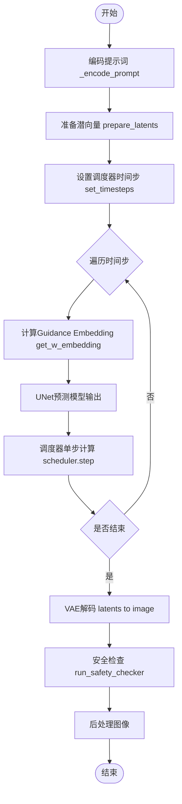
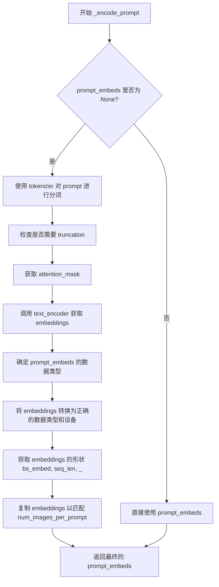
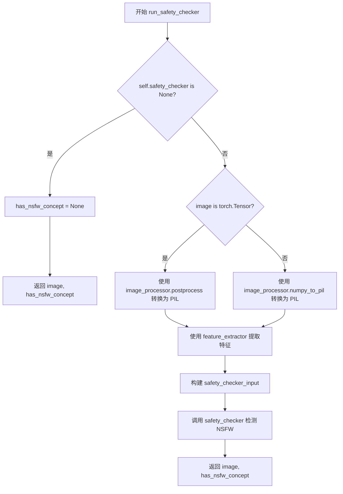
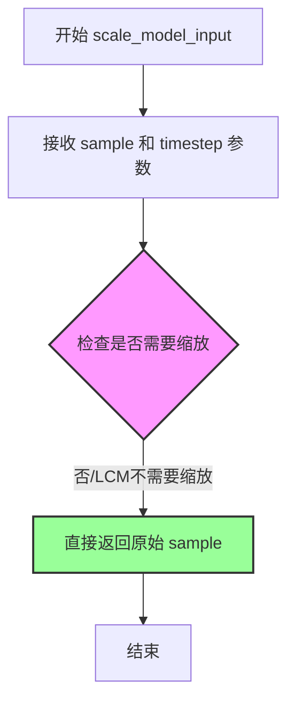
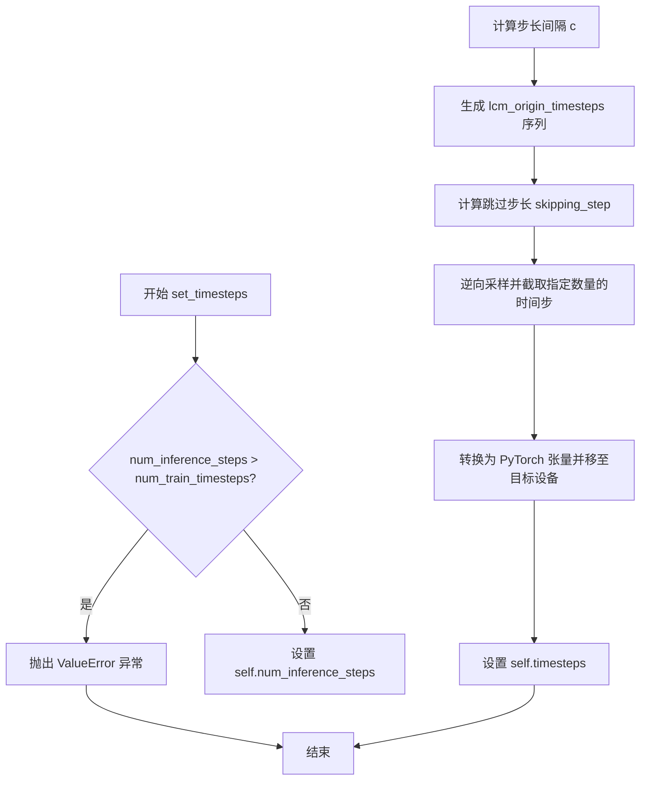
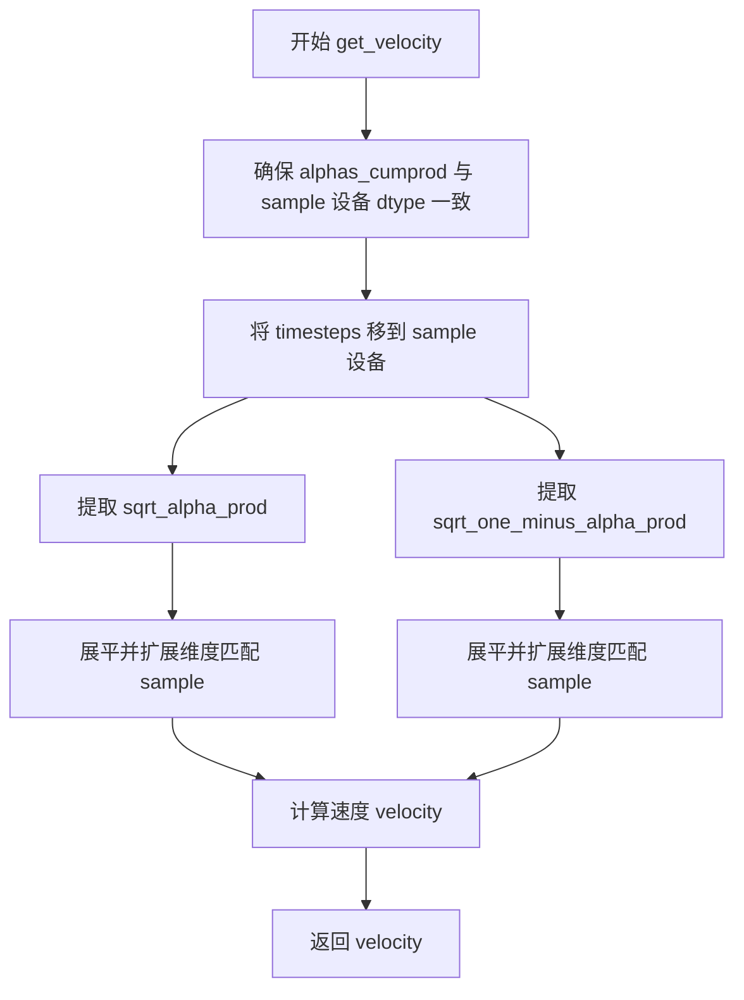
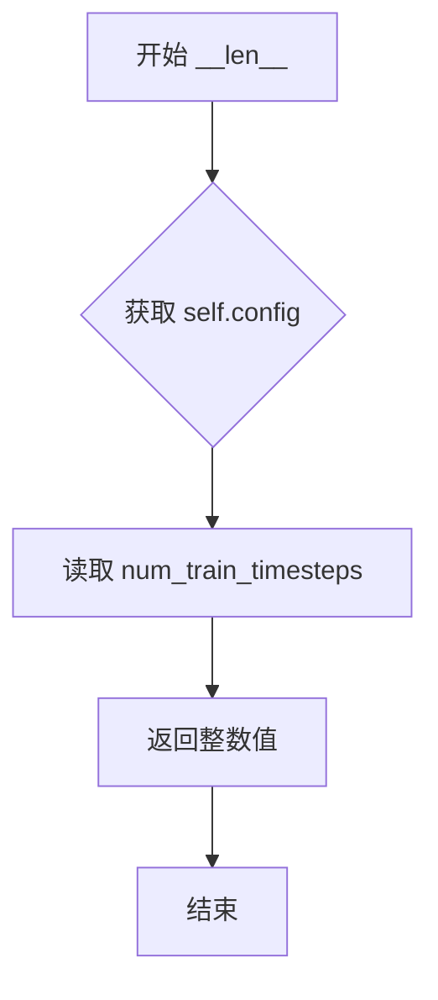

# `diffusers\examples\community\latent_consistency_txt2img.py` 详细设计文档

这是一个基于Stable Diffusion架构的Latent Consistency Model (LCM) 推理管道，包含用于快速图像生成的主 pipeline 类和自定义的 LCM 调度器类，旨在通过非马尔可夫引导实现少步数推理。

## 整体流程



## 类结构

```
LatentConsistencyModelPipeline (主推理类)
├── LCMScheduler (调度器类)
│   └── LCMSchedulerOutput (输出数据类)
└── 全局工具函数
    ├── betas_for_alpha_bar
    └── rescale_zero_terminal_snr
```

## 全局变量及字段


### `logger`
    
Logger instance for tracking runtime information and warnings

类型：`logging.Logger`
    


### `LatentConsistencyModelPipeline.vae`
    
Variational Autoencoder model for encoding and decoding images in latent space

类型：`AutoencoderKL`
    


### `LatentConsistencyModelPipeline.text_encoder`
    
CLIP text encoder for converting text prompts into embedding vectors

类型：`CLIPTextModel`
    


### `LatentConsistencyModelPipeline.tokenizer`
    
CLIP tokenizer for converting text prompts into token IDs

类型：`CLIPTokenizer`
    


### `LatentConsistencyModelPipeline.unet`
    
UNet model for predicting noise in the denoising diffusion process

类型：`UNet2DConditionModel`
    


### `LatentConsistencyModelPipeline.scheduler`
    
LCM scheduler managing the diffusion timesteps and noise scheduling

类型：`LCMScheduler`
    


### `LatentConsistencyModelPipeline.safety_checker`
    
Safety checker for detecting and filtering NSFW content in generated images

类型：`StableDiffusionSafetyChecker`
    


### `LatentConsistencyModelPipeline.feature_extractor`
    
CLIP image processor for extracting features used by the safety checker

类型：`CLIPImageProcessor`
    


### `LatentConsistencyModelPipeline.vae_scale_factor`
    
Scaling factor for the VAE latent space based on the number of output channels

类型：`int`
    


### `LatentConsistencyModelPipeline.image_processor`
    
Image processor for post-processing VAE decoded images

类型：`VaeImageProcessor`
    


### `LatentConsistencyModelPipeline._optional_components`
    
List of optional pipeline components that can be omitted during initialization

类型：`List`
    


### `LCMScheduler.betas`
    
Beta values defining the noise schedule for the diffusion process

类型：`torch.Tensor`
    


### `LCMScheduler.alphas`
    
Alpha values computed as 1 minus beta values

类型：`torch.Tensor`
    


### `LCMScheduler.alphas_cumprod`
    
Cumulative product of alpha values used for computing noise coefficients

类型：`torch.Tensor`
    


### `LCMScheduler.final_alpha_cumprod`
    
Final alpha cumulative product value for the last diffusion step

类型：`torch.Tensor`
    


### `LCMScheduler.init_noise_sigma`
    
Initial standard deviation of the noise distribution for the diffusion process

类型：`float`
    


### `LCMScheduler.num_inference_steps`
    
Number of inference steps to be used during the reverse diffusion process

类型：`int`
    


### `LCMScheduler.timesteps`
    
Tensor containing the discrete timesteps for the diffusion chain

类型：`torch.Tensor`
    


### `LCMScheduler.sigma_data`
    
Data-dependent sigma value for boundary condition scaling in LCM

类型：`float`
    


### `LCMSchedulerOutput.prev_sample`
    
The computed previous sample in the reverse diffusion process

类型：`torch.Tensor`
    


### `LCMSchedulerOutput.denoised`
    
The predicted denoised sample at the current timestep

类型：`Optional[torch.Tensor]`
    
    

## 全局函数及方法


### `betas_for_alpha_bar`

创建beta调度表，将给定的alpha_t_bar函数离散化。该函数定义了(1-beta)在时间t=[0,1]上的累积乘积，通过alpha_bar函数将参数t转换为扩散过程中(1-beta)的累积乘积。

参数：

- `num_diffusion_timesteps`：`int`，要生成的beta数量
- `max_beta`：`float`，使用的最大beta值，防止奇点（默认为0.999）
- `alpha_transform_type`：`str`，alpha_bar的噪声调度类型，可选"cosine"或"exp"（默认为"cosine"）

返回值：`torch.Tensor`，调度器用于逐步模型输出的beta值

#### 流程图

```mermaid
flowchart TD
    A[开始 betas_for_alpha_bar] --> B{alpha_transform_type == 'cosine'?}
    B -->|Yes| C[定义 alpha_bar_fn = cos²((t+0.008)/1.008*π/2)]
    B -->|No| D{alpha_transform_type == 'exp'?}
    D -->|Yes| E[定义 alpha_bar_fn = exp(t*-12.0)]
    D -->|No| F[raise ValueError 不支持的类型]
    C --> G[初始化空列表 betas]
    E --> G
    G --> H[循环 i 从 0 到 num_diffusion_timesteps-1]
    H --> I[计算 t1 = i / num_diffusion_timesteps]
    I --> J[计算 t2 = (i+1) / num_diffusion_timesteps]
    J --> K[计算 beta = min(1 - alpha_bar_fn(t2)/alpha_bar_fn(t1), max_beta)]
    K --> L[将 beta 添加到 betas 列表]
    L --> M{还有更多时间步?}
    M -->|Yes| H
    M -->|No| N[将 betas 转换为 torch.Tensor float32]
    N --> O[返回 betas 张量]
```

#### 带注释源码

```python
def betas_for_alpha_bar(
    num_diffusion_timesteps,
    max_beta=0.999,
    alpha_transform_type="cosine",
):
    """
    Create a beta schedule that discretizes the given alpha_t_bar function, which defines the cumulative product of
    (1-beta) over time from t = [0,1].
    Contains a function alpha_bar that takes an argument t and transforms it to the cumulative product of (1-beta) up
    to that part of the diffusion process.
    Args:
        num_diffusion_timesteps (`int`): the number of betas to produce.
        max_beta (`float`): the maximum beta to use; use values lower than 1 to
                     prevent singularities.
        alpha_transform_type (`str`, *optional*, default to `cosine`): the type of noise schedule for alpha_bar.
                     Choose from `cosine` or `exp`
    Returns:
        betas (`np.ndarray`): the betas used by the scheduler to step the model outputs
    """
    # 根据alpha_transform_type选择不同的alpha_bar变换函数
    if alpha_transform_type == "cosine":
        # cosine变换：使用余弦平方函数创建平滑的beta调度
        def alpha_bar_fn(t):
            return math.cos((t + 0.008) / 1.008 * math.pi / 2) ** 2

    elif alpha_transform_type == "exp":
        # 指数变换：使用指数衰减函数
        def alpha_bar_fn(t):
            return math.exp(t * -12.0)

    else:
        raise ValueError(f"Unsupported alpha_transform_type: {alpha_transform_type}")

    # 初始化beta列表
    betas = []
    # 遍历每个扩散时间步
    for i in range(num_diffusion_timesteps):
        # 计算当前时间步和下一个时间步的相对位置 [0, 1]
        t1 = i / num_diffusion_timesteps
        t2 = (i + 1) / num_diffusion_timesteps
        # 计算beta值：1 - alpha_bar(t2)/alpha_bar(t1)，并限制最大值为max_beta
        # 这确保了beta值不会超过max_beta，防止出现奇点
        betas.append(min(1 - alpha_bar_fn(t2) / alpha_bar_fn(t1), max_beta))
    
    # 返回PyTorch float32类型的beta张量
    return torch.tensor(betas, dtype=torch.float32)
```


### `rescale_zero_terminal_snr`

该函数用于根据论文 https://huggingface.co/papers/2305.08891 (Algorithm 1) 将 Scheduler 的 betas 重塑为零终端信噪比（Zero Terminal SNR），以使模型能够生成非常亮或非常暗的样本，而不是限制为中等亮度的样本。

参数：

-  `betas`：`torch.Tensor`，Scheduler 初始化时使用的 betas 张量

返回值：`torch.Tensor`，重塑后的具有零终端 SNR 的 betas 张量

#### 流程图

```mermaid
flowchart TD
    A[开始: 输入 betas] --> B[计算 alphas = 1.0 - betas]
    B --> C[计算累积乘积 alphas_cumprod]
    C --> D[计算平方根 alphas_bar_sqrt = alphas_cumprod.sqrt]
    D --> E[保存初始值: alphas_bar_sqrt_0 = alphas_bar_sqrt[0]]
    E --> F[保存终值: alphas_bar_sqrt_T = alphas_bar_sqrt[-1]]
    F --> G[移位: alphas_bar_sqrt -= alphas_bar_sqrt_T]
    G --> H[缩放: alphas_bar_sqrt *= alphas_bar_sqrt_0 / (alphas_bar_sqrt_0 - alphas_bar_sqrt_T)]
    H --> I[恢复平方: alphas_bar = alphas_bar_sqrt ** 2]
    I --> J[恢复累积乘积: alphas = alphas_bar[1:] / alphas_bar[:-1]]
    J --> K[拼接: alphas = torch.cat([alphas_bar[0:1], alphas])]
    K --> L[计算 betas = 1 - alphas]
    L --> M[返回重塑后的 betas]
```

#### 带注释源码

```
def rescale_zero_terminal_snr(betas):
    """
    Rescales betas to have zero terminal SNR Based on https://huggingface.co/papers/2305.08891 (Algorithm 1)
    Args:
        betas (`torch.Tensor`):
            the betas that the scheduler is being initialized with.
    Returns:
        `torch.Tensor`: rescaled betas with zero terminal SNR
    """
    # Convert betas to alphas_bar_sqrt
    # 第一步：将 betas 转换为 alphas (α = 1 - β)
    alphas = 1.0 - betas
    
    # 计算累积乘积 ᾱₜ = ∏ᵢ₌₁ᵗ αᵢ
    alphas_cumprod = torch.cumprod(alphas, dim=0)
    
    # 计算平方根形式 √ᾱₜ
    alphas_bar_sqrt = alphas_cumprod.sqrt()

    # Store old values.
    # 保存初始时间步的 √ᾱₜ 值（用于后续缩放）
    alphas_bar_sqrt_0 = alphas_bar_sqrt[0].clone()
    
    # 保存最终时间步的 √ᾱₜ 值（用于移位使最后为0）
    alphas_bar_sqrt_T = alphas_bar_sqrt[-1].clone()

    # Shift so the last timestep is zero.
    # 移位操作：将最终时间步的 √ᾱₜ 减去，使最后时间步的值为0
    alphas_bar_sqrt -= alphas_bar_sqrt_T

    # Scale so the first timestep is back to the old value.
    # 缩放操作：将初始时间步恢复到原始值，保持整体缩放比例
    alphas_bar_sqrt *= alphas_bar_sqrt_0 / (alphas_bar_sqrt_0 - alphas_bar_sqrt_T)

    # Convert alphas_bar_sqrt to betas
    # 将 √ᾱₜ 恢复为 ᾱₜ（平方操作）
    alphas_bar = alphas_bar_sqrt**2  # Revert sqrt
    
    # 从 ᾱₜ 恢复 αᵢ（相邻比值：αᵢ = ᾱᵢ / ᾱᵢ₋₁）
    alphas = alphas_bar[1:] / alphas_bar[:-1]  # Revert cumprod
    
    # 拼接上第一个时间步的 ᾱ₀（即 α₀）
    alphas = torch.cat([alphas_bar[0:1], alphas])
    
    # 从 alphas 恢复 betas（β = 1 - α）
    betas = 1 - alphas

    return betas
```


### `LatentConsistencyModelPipeline.__init__`

该方法是 `LatentConsistencyModelPipeline` 类的构造函数，用于初始化整个潜在一致性模型（LCM）推理管道。它接收多个深度学习组件（VAE、文本编码器、UNet等），并进行配置、调度器初始化、模块注册和图像处理器设置。

参数：

- `vae`：`AutoencoderKL`，变分自编码器，用于将图像编码到潜在空间和解码回图像空间
- `text_encoder`：`CLIPTextModel`，CLIP文本编码器，将文本提示转换为嵌入向量
- `tokenizer`：`CLIPTokenizer`，CLIP分词器，用于对文本提示进行分词
- `unet`：`UNet2DConditionModel`，条件UNet模型，根据潜在表示和时间步进行去噪预测
- `scheduler`：`LCMScheduler`，潜在一致性模型调度器，控制去噪过程的噪声调度（带引号的字符串类型提示）
- `safety_checker`：`StableDiffusionSafetyChecker`，安全检查器，用于检测和过滤不适当的内容
- `feature_extractor`：`CLIPImageProcessor`，CLIP图像处理器，用于预处理图像输入
- `requires_safety_checker`：`bool`，默认为 `True`，指示是否需要在推理过程中启用安全检查

返回值：无（`__init__` 方法通常不返回任何内容，该方法返回 `None`）

#### 流程图

```mermaid
flowchart TD
    A[__init__ 开始] --> B[调用 super().__init__ 初始化基类]
    B --> C{scheduler 参数是否为 None?}
    C -->|是| D[创建默认 LCMScheduler]
    C -->|否| E[使用传入的 scheduler]
    D --> F[调用 self.register_modules 注册所有模块]
    E --> F
    F --> G[计算 vae_scale_factor]
    G --> H[创建 VaeImageProcessor 实例]
    H --> I[__init__ 结束]
```

#### 带注释源码

```python
def __init__(
    self,
    vae: AutoencoderKL,
    text_encoder: CLIPTextModel,
    tokenizer: CLIPTokenizer,
    unet: UNet2DConditionModel,
    scheduler: "LCMScheduler",
    safety_checker: StableDiffusionSafetyChecker,
    feature_extractor: CLIPImageProcessor,
    requires_safety_checker: bool = True,
):
    # 1. 调用父类 DiffusionPipeline 的 __init__ 方法
    #    初始化基类的基础设施和配置
    super().__init__()

    # 2. 处理调度器：如果未提供 scheduler，则创建默认的 LCMScheduler
    #    默认参数：beta_start=0.00085, beta_end=0.0120, 
    #    beta_schedule="scaled_linear", prediction_type="epsilon"
    scheduler = (
        scheduler
        if scheduler is not None
        else LCMScheduler(
            beta_start=0.00085, beta_end=0.0120, beta_schedule="scaled_linear", prediction_type="epsilon"
        )
    )

    # 3. 注册所有模块到 pipeline 中
    #    这些模块将通过 self.xxx 访问（例如 self.vae, self.unet 等）
    #    同时也会被添加到 pipeline 的配置中以便序列化
    self.register_modules(
        vae=vae,
        text_encoder=text_encoder,
        tokenizer=tokenizer,
        unet=unet,
        scheduler=scheduler,
        safety_checker=safety_checker,
        feature_extractor=feature_extractor,
    )
    
    # 4. 计算 VAE 缩放因子
    #    基于 VAE 的 block_out_channels 配置，2^(len(channels) - 1)
    #    例如：channels=[128,256,512,512] -> scale_factor=8
    #    用于将像素空间坐标转换为潜在空间坐标
    self.vae_scale_factor = 2 ** (len(self.vae.config.block_out_channels) - 1) if getattr(self, "vae", None) else 8
    
    # 5. 创建 VAE 图像处理器
    #    用于将 VAE 输出转换为 PIL 图像或 numpy 数组
    #    同时处理图像的归一化和反归一化
    self.image_processor = VaeImageProcessor(vae_scale_factor=self.vae_scale_factor)
```


### `LatentConsistencyModelPipeline._encode_prompt`

该方法负责将文本提示（prompt）编码为文本encoder的隐藏状态（text encoder hidden states），用于后续的图像生成过程。如果提供了预计算的prompt_embeds，则直接使用；否则使用tokenizer和text_encoder生成embeddings，并对每个prompt生成多个图像的embeddings进行复制。

参数：

- `prompt`：`Union[str, List[str], None]`，要编码的文本提示，可以是单个字符串、字符串列表或None
- `device`：`torch.device`， torch设备，用于将tensor移动到指定设备
- `num_images_per_prompt`：`int`，每个prompt需要生成的图像数量，用于复制embeddings
- `prompt_embeds`：`Optional[torch.Tensor]`，预生成的文本embeddings，如果提供则直接使用，否则从prompt生成

返回值：`torch.Tensor`，编码后的文本embeddings，形状为 `(batch_size * num_images_per_prompt, sequence_length, hidden_dim)`

#### 流程图



#### 带注释源码

```python
def _encode_prompt(
    self,
    prompt,
    device,
    num_images_per_prompt,
    prompt_embeds: None,
):
    r"""
    Encodes the prompt into text encoder hidden states.
    Args:
        prompt (`str` or `List[str]`, *optional*):
            prompt to be encoded
        device: (`torch.device`):
            torch device
        num_images_per_prompt (`int`):
            number of images that should be generated per prompt
        prompt_embeds (`torch.Tensor`, *optional*):
            Pre-generated text embeddings. Can be used to easily tweak text inputs, *e.g.* prompt weighting. If not
            provided, text embeddings will be generated from `prompt` input argument.
    """

    # 检查 prompt 的类型，但实际未使用这些分支的结果
    if prompt is not None and isinstance(prompt, str):
        pass
    elif prompt is not None and isinstance(prompt, list):
        len(prompt)
    else:
        prompt_embeds.shape[0]

    # 如果没有提供 prompt_embeds，则从 prompt 生成
    if prompt_embeds is None:
        # 使用 tokenizer 将文本转换为 token IDs
        text_inputs = self.tokenizer(
            prompt,
            padding="max_length",  # 填充到最大长度
            max_length=self.tokenizer.model_max_length,  # 使用模型最大长度
            truncation=True,  # 截断超长序列
            return_tensors="pt",  # 返回 PyTorch tensors
        )
        text_input_ids = text_inputs.input_ids  # 获取 input IDs
        # 获取未截断的版本用于比较
        untruncated_ids = self.tokenizer(prompt, padding="longest", return_tensors="pt").input_ids

        # 检查是否发生了截断，如果是则发出警告
        if untruncated_ids.shape[-1] >= text_input_ids.shape[-1] and not torch.equal(
            text_input_ids, untruncated_ids
        ):
            # 解码被截断的部分
            removed_text = self.tokenizer.batch_decode(
                untruncated_ids[:, self.tokenizer.model_max_length - 1 : -1]
            )
            logger.warning(
                "The following part of your input was truncated because CLIP can only handle sequences up to"
                f" {self.tokenizer.model_max_length} tokens: {removed_text}"
            )

        # 获取 attention mask，如果 text_encoder 配置中指定了 use_attention_mask
        if hasattr(self.text_encoder.config, "use_attention_mask") and self.text_encoder.config.use_attention_mask:
            attention_mask = text_inputs.attention_mask.to(device)
        else:
            attention_mask = None

        # 调用 text_encoder 获取文本embeddings
        prompt_embeds = self.text_encoder(
            text_input_ids.to(device),
            attention_mask=attention_mask,
        )
        # 获取第一个元素（通常text_encoder返回tuple，第一个是hidden_states）
        prompt_embeds = prompt_embeds[0]

    # 确定 prompt_embeds 的数据类型
    # 优先使用 text_encoder 的数据类型，其次是 unet 的数据类型
    if self.text_encoder is not None:
        prompt_embeds_dtype = self.text_encoder.dtype
    elif self.unet is not None:
        prompt_embeds_dtype = self.unet.dtype
    else:
        prompt_embeds_dtype = prompt_embeds.dtype

    # 将 prompt_embeds 转换为正确的 dtype 和 device
    prompt_embeds = prompt_embeds.to(dtype=prompt_embeds_dtype, device=device)

    # 获取 embeddings 的形状
    bs_embed, seq_len, _ = prompt_embeds.shape
    # 复制 text embeddings 以匹配每个 prompt 生成的图像数量
    # 使用 MPS 友好的方法进行复制
    prompt_embeds = prompt_embeds.repeat(1, num_images_per_prompt, 1)
    # 重新 reshape 以合并 batch 维度
    prompt_embeds = prompt_embeds.view(bs_embed * num_images_per_prompt, seq_len, -1)

    # 不需要获取无条件 prompt embedding，因为 LCM 使用 Guided Distillation
    return prompt_embeds
```


### `LatentConsistencyModelPipeline.run_safety_checker`

该方法用于对生成的图像进行安全检查（NSFW内容检测）。如果配置了安全检查器，则使用 `feature_extractor` 提取图像特征，并调用 `safety_checker` 检测图像中是否包含不适内容。最后返回处理后的图像和NSFW检测结果。

参数：

- `self`：隐式参数，`LatentConsistencyModelPipeline` 类的实例
- `image`：`Union[torch.Tensor, np.ndarray]`，待检查的图像（通常是VAE解码后的图像）
- `device`：`torch.device`，执行安全检查的设备（如cuda或cpu）
- `dtype`：`torch.dtype`，安全检查器输入的数据类型

返回值：`Tuple[Union[torch.Tensor, np.ndarray], Optional[torch.Tensor]]`，返回处理后的图像和NSFW概念检测结果。若未配置安全检查器，则返回原始图像和 `None`。

#### 流程图



#### 带注释源码

```python
def run_safety_checker(self, image, device, dtype):
    """
    对生成的图像进行NSFW安全检查
    
    Args:
        image: 待检查的图像（torch.Tensor 或 np.ndarray）
        device: 执行安全检查的设备
        dtype: 安全检查器输入的数据类型
    
    Returns:
        tuple: (处理后的图像, NSFW检测结果)
               - 若未配置safety_checker，has_nsfw_concept为None
    """
    # 检查是否配置了安全检查器
    if self.safety_checker is None:
        # 未配置安全检查器，跳过检查
        has_nsfw_concept = None
    else:
        # 根据图像类型进行预处理
        if torch.is_tensor(image):
            # 将tensor图像转换为PIL图像供feature_extractor使用
            feature_extractor_input = self.image_processor.postprocess(image, output_type="pil")
        else:
            # numpy数组直接转换为PIL图像
            feature_extractor_input = self.image_processor.numpy_to_pil(image)
        
        # 使用CLIP feature_extractor提取图像特征
        safety_checker_input = self.feature_extractor(feature_extractor_input, return_tensors="pt").to(device)
        
        # 调用安全检查器进行NSFW检测
        # 参数:
        #   - images: 原始图像
        #   - clip_input: CLIP特征向量
        image, has_nsfw_concept = self.safety_checker(
            images=image, 
            clip_input=safety_checker_input.pixel_values.to(dtype)
        )
    
    # 返回处理后的图像和NSFW检测结果
    return image, has_nsfw_concept
```


### `LatentConsistencyModelPipeline.prepare_latents`

该方法是 Latent Consistency Model (LCM) 扩散流水线的核心组件之一，负责为去噪过程准备初始的潜在变量（latents）。它根据传入的批次大小、图像尺寸和潜在通道数计算潜在张量的目标形状；若未提供预计算的潜在变量，则使用指定的数据类型和设备生成随机噪声；最后，根据调度器（scheduler）配置的初始噪声标准差（init_noise_sigma）对潜在变量进行缩放，以确保其符合扩散过程的数值范围要求。

参数：

-  `batch_size`：`int`，生成的图像批次大小。
-  `num_channels_latents`：`int`，潜在空间的通道数，通常对应于 UNet 的输入通道数。
-  `height`：`int`，目标图像的高度（像素）。
-  `width`：`int`，目标图像的宽度（像素）。
-  `dtype`：`torch.dtype`，生成潜在张量的数据类型（如 `torch.float32`）。
-  `device`：`torch.device`，潜在张量存放的设备（如 `cuda` 或 `cpu`）。
-  `latents`：`Optional[torch.Tensor]`，可选参数。如果提供，则使用该张量作为初始潜在变量；否则生成新的随机潜在变量。

返回值：`torch.Tensor`，处理并缩放后的潜在变量张量，准备好进入扩散去噪循环。

#### 流程图

```mermaid
flowchart TD
    A[开始 prepare_latents] --> B[计算潜在张量形状<br>shape = (batch_size, num_channels_latents,<br>height // vae_scale_factor, width // vae_scale_factor)]
    B --> C{判断 latents 是否为 None}
    C -->|是| D[使用 torch.randn 生成随机噪声<br>latents = torch.randn(shape, dtype=dtype)]
    C -->|否| E[直接使用传入的 latents]
    D --> F[移动 latents 到指定设备<br>latents = latents.to(device)]
    E --> F
    F --> G[根据调度器配置缩放初始噪声<br>latents = latents * self.scheduler.init_noise_sigma]
    G --> H[返回处理后的 latents]
```

#### 带注释源码

```python
def prepare_latents(self, batch_size, num_channels_latents, height, width, dtype, device, latents=None):
    # 1. 计算潜在张量的形状
    # 潜在空间通常是原始图像尺寸的 1/vae_scale_factor (通常为 8)
    shape = (
        batch_size,
        num_channels_latents,
        int(height) // self.vae_scale_factor,
        int(width) // self.vae_scale_factor,
    )
    
    # 2. 初始化潜在变量
    if latents is None:
        # 如果没有提供潜在变量，则生成符合标准正态分布的随机噪声
        # dtype 和 device 在此处确定
        latents = torch.randn(shape, dtype=dtype).to(device)
    else:
        # 如果提供了潜在变量，确保它们位于正确的设备上
        latents = latents.to(device)
        
    # 3. 缩放初始噪声
    # 这是扩散模型的关键步骤之一。不同的调度器（scheduler）可能需要不同的初始噪声幅度。
    # LCM 调度器通常将 init_noise_sigma 设置为 1.0，但某些变体可能会有所不同。
    latents = latents * self.scheduler.init_noise_sigma
    
    return latents
```


### `LatentConsistencyModelPipeline.get_w_embedding`

将 guidance scale（指导强度）值转换为正弦/余弦位置编码形式的嵌入向量，用于 LCM（Latent Consistency Models）模型的 Classifier-Free Guidance 条件注入。该方法参考了 VDM（Variational Diffusion Models）的位置编码实现。

参数：

- `w`：`torch.Tensor`，输入的一维张量，包含 guidance scale 值（通常为单个浮点数重复多次以匹配 batch 大小）
- `embedding_dim`：`int`，嵌入向量的维度，默认值为 512
- `dtype`：`torch.dtype`，生成嵌入向量的数据类型，默认值为 `torch.float32`

返回值：`torch.Tensor`，形状为 `(w.shape[0], embedding_dim)` 的嵌入向量

#### 流程图

```mermaid
flowchart TD
    A[开始: 接收参数 w, embedding_dim, dtype] --> B{验证输入}
    B -->|len(w.shape) == 1| C[将 w 乘以 1000.0]
    B -->|否则| D[抛出断言错误]
    C --> E[计算半维长度: half_dim = embedding_dim // 2]
    E --> F[计算频率基向量: emb = log(10000.0) / (half_dim - 1)]
    F --> G[生成指数衰减频率: emb = exp(-arange(half_dim) * emb)]
    G --> H[外积计算: emb = w[:, None] * emb[None, :]]
    H --> I[拼接正弦和余弦编码: torch.cat([sin(emb), cos(emb)], dim=1)]
    I --> J{embedding_dim 为奇数?}
    J -->|是| K[填充零以对齐维度: torch.nn.functional.pad(emb, (0, 1))]
    J -->|否| L[跳过填充]
    K --> M[验证输出形状: assert emb.shape == (w.shape[0], embedding_dim)]
    L --> M
    M --> N[返回嵌入向量]
```

#### 带注释源码

```python
def get_w_embedding(self, w, embedding_dim=512, dtype=torch.float32):
    """
    将 guidance scale 值转换为正弦/余弦位置编码形式的嵌入向量
    参考: https://github.com/google-research/vdm/blob/dc27b98a554f65cdc654b800da5aa1846545d41b/model_vdm.py#L298
    
    参数:
        w: torch.Tensor - 输入的 guidance scale 值，应为一维张量
        embedding_dim: int - 嵌入向量的维度，默认 512
        dtype: torch.dtype - 生成嵌入的数据类型，默认 torch.float32
        
    返回:
        embedding vectors with shape `(len(timesteps), embedding_dim)`
    """
    # 验证输入 w 必须为一维张量
    assert len(w.shape) == 1
    
    # 将 guidance scale 缩放 1000 倍，以适配数值范围
    w = w * 1000.0

    # 计算半维长度（因为正弦和余弦各占一半）
    half_dim = embedding_dim // 2
    
    # 计算对数空间的频率基向量
    # 等价于: log(10000.0) / (half_dim - 1)
    emb = torch.log(torch.tensor(10000.0)) / (half_dim - 1)
    
    # 生成指数衰减的频率序列: [0, 1, 2, ..., half_dim-1] * -emb
    emb = torch.exp(torch.arange(half_dim, dtype=dtype) * -emb)
    
    # 计算外积: w 的每个元素乘以所有频率基向量
    # 结果形状: (batch_size, half_dim)
    emb = w.to(dtype)[:, None] * emb[None, :]
    
    # 拼接正弦和余弦编码，形成完整的 positional encoding
    # 结果形状: (batch_size, embedding_dim)
    emb = torch.cat([torch.sin(emb), torch.cos(emb)], dim=1)
    
    # 如果 embedding_dim 为奇数，需要在最后填充一个零以对齐维度
    if embedding_dim % 2 == 1:  # zero pad
        emb = torch.nn.functional.pad(emb, (0, 1))
    
    # 最终验证输出形状是否正确
    assert emb.shape == (w.shape[0], embedding_dim)
    
    return emb
```


### LatentConsistencyModelPipeline.__call__

该方法是 Latent Consistency Model (LCM) 扩散流水线的核心调用接口，通过接收文本提示或预计算的提示嵌入，结合 LCM 调度器和条件引导机制，在少量推理步骤（默认4步）内生成与文本对齐的图像，实现了高效的潜在一致性模型推理流程。

参数：

- `prompt`：`Union[str, List[str]]`，可选的文本提示，可以是单个字符串或字符串列表，用于描述期望生成的图像内容
- `height`：`Optional[int]`，生成图像的高度，默认为 768 像素
- `width`：`Optional[int]`，生成图像的宽度，默认为 768 像素
- `guidance_scale`：`float`，无分类器自由引导（CFG）强度，用于控制生成图像与文本提示的对齐程度，默认值为 7.5
- `num_images_per_prompt`：`Optional[int]`，每个提示词生成的图像数量，默认值为 1
- `latents`：`Optional[torch.Tensor]`，可选的初始潜在向量，若不提供则随机生成
- `num_inference_steps`：`int`，推理过程中的去噪步数，LCM 优势在于仅需少量步数即可生成高质量图像，默认值为 4
- `lcm_origin_steps`：`int`，LCM 训练的原始步数，用于调度器设置时间步，默认值为 50
- `prompt_embeds`：`Optional[torch.Tensor]`，可选的预计算文本嵌入，若提供则直接使用而不从 prompt 生成
- `output_type`：`str | None`，输出图像的格式类型，支持 "pil"、"latent" 等格式，默认为 "pil"
- `return_dict`：`bool`，是否返回字典格式的输出对象，默认为 True
- `cross_attention_kwargs`：`Optional[Dict[str, Any]]`，传递给 UNet 的交叉注意力层额外参数，用于控制生成细节

返回值：`StableDiffusionPipelineOutput`，包含生成图像列表和 NSFW 内容检测结果的输出对象，若 `return_dict` 为 False 则返回元组 (image, has_nsfw_concept)

#### 流程图

```mermaid
flowchart TD
    A[开始 __call__] --> B[设置默认高度和宽度]
    B --> C{判断 prompt 类型}
    C -->|字符串| D[batch_size = 1]
    C -->|列表| E[batch_size = len(prompt)]
    C -->|None| F[batch_size = prompt_embeds.shape[0]]
    D --> G[获取执行设备 device]
    E --> G
    F --> G
    G --> H[调用 _encode_prompt 编码输入提示]
    H --> I[调用 scheduler.set_timesteps 设置推理时间步]
    I --> J[调用 prepare_latents 准备潜在变量]
    J --> K[计算 batch_size * num_images_per_prompt]
    K --> L[生成 Guidance Scale Embedding]
    L --> M[进入 LCM 多步采样循环]
    M --> N{遍历 timesteps}
    N -->|未结束| O[构建当前时间步张量 ts]
    O --> P[将 latents 转换为 prompt_embeds dtype]
    P --> Q[调用 UNet 进行模型预测]
    Q --> R[调用 scheduler.step 计算前一时间步的 latents]
    R --> S[更新进度条]
    S --> N
    N -->|结束| T{output_type == 'latent'?}
    T -->|是| U[image = denoised]
    T -->|否| V[调用 vae.decode 解码潜在向量]
    V --> W[调用 run_safety_checker 进行安全检查]
    W --> X[后处理图像]
    U --> X
    X --> Y{return_dict?}
    Y -->|是| Z[返回 StableDiffusionPipelineOutput]
    Y -->|否| AA[返回元组 (image, has_nsfw_concept)]
    Z --> BB[结束]
    AA --> BB
```

#### 带注释源码

```python
@torch.no_grad()
def __call__(
    self,
    prompt: Union[str, List[str]] = None,
    height: Optional[int] = 768,
    width: Optional[int] = 768,
    guidance_scale: float = 7.5,
    num_images_per_prompt: Optional[int] = 1,
    latents: Optional[torch.Tensor] = None,
    num_inference_steps: int = 4,
    lcm_origin_steps: int = 50,
    prompt_embeds: Optional[torch.Tensor] = None,
    output_type: str | None = "pil",
    return_dict: bool = True,
    cross_attention_kwargs: Optional[Dict[str, Any]] = None,
):
    # 0. Default height and width to unet
    # 如果未指定高度和宽度，则使用 UNet 配置的样本大小乘以 VAE 缩放因子
    height = height or self.unet.config.sample_size * self.vae_scale_factor
    width = width or self.unet.config.sample_size * self.vae_scale_factor

    # 2. Define call parameters
    # 根据 prompt 类型确定 batch_size
    if prompt is not None and isinstance(prompt, str):
        batch_size = 1  # 单个字符串提示
    elif prompt is not None and isinstance(prompt, list):
        batch_size = len(prompt)  # 字符串列表提示
    else:
        batch_size = prompt_embeds.shape[0]  # 使用预计算嵌入的批次大小

    device = self._execution_device  # 获取执行设备（CPU/CUDA）

    # 3. Encode input prompt
    # 编码输入的文本提示为嵌入向量
    prompt_embeds = self._encode_prompt(
        prompt,
        device,
        num_images_per_prompt,
        prompt_embeds=prompt_embeds,
    )

    # 4. Prepare timesteps
    # 设置 LCM 调度器的时间步，使用较少的推理步数（LCM 优势）
    self.scheduler.set_timesteps(num_inference_steps, lcm_origin_steps)
    timesteps = self.scheduler.timesteps

    # 5. Prepare latent variable
    # 准备潜在变量，latents 是扩散模型的输入噪声
    num_channels_latents = self.unet.config.in_channels
    latents = self.prepare_latents(
        batch_size * num_images_per_prompt,  # 总批次大小
        num_channels_latents,  # 潜在通道数
        height,
        width,
        prompt_embeds.dtype,  # 使用与提示嵌入相同的 dtype
        device,
        latents,  # 可选的预提供 latents
    )
    bs = batch_size * num_images_per_prompt

    # 6. Get Guidance Scale Embedding
    # 生成引导强度嵌入，用于条件扩散过程
    w = torch.tensor(guidance_scale).repeat(bs)  # 扩展引导强度到整个批次
    w_embedding = self.get_w_embedding(w, embedding_dim=256).to(device=device, dtype=latents.dtype)

    # 7. LCM MultiStep Sampling Loop:
    # LCM 多步采样循环，相比传统扩散模型大幅减少推理步数
    with self.progress_bar(total=num_inference_steps) as progress_bar:
        for i, t in enumerate(timesteps):
            # 为当前批次创建完整的时间步张量
            ts = torch.full((bs,), t, device=device, dtype=torch.long)
            # 确保 latents 与 prompt_embeds 数据类型一致
            latents = latents.to(prompt_embeds.dtype)

            # model prediction (v-prediction, eps, x)
            # 调用 UNet 进行模型预测，返回预测的噪声或潜在表示
            model_pred = self.unet(
                latents,  # 当前潜在表示
                ts,  # 当前时间步
                timestep_cond=w_embedding,  # 条件引导嵌入
                encoder_hidden_states=prompt_embeds,  # 文本编码隐藏状态
                cross_attention_kwargs=cross_attention_kwargs,  # 额外注意力参数
                return_dict=False,
            )[0]

            # compute the previous noisy sample x_t -> x_t-1
            # 使用调度器计算前一时间步的去噪潜在表示
            latents, denoised = self.scheduler.step(model_pred, i, t, latents, return_dict=False)

            # 更新进度条
            progress_bar.update()

    # 8. Decode latents to image
    # 处理最终的去噪潜在表示
    denoised = denoised.to(prompt_embeds.dtype)
    
    # 根据输出类型决定是否需要解码到像素空间
    if not output_type == "latent":
        # 使用 VAE 解码器将潜在表示转换为图像像素
        image = self.vae.decode(denoised / self.vae.config.scaling_factor, return_dict=False)[0]
        # 运行安全检查器检测 NSFW 内容
        image, has_nsfw_concept = self.run_safety_checker(image, device, prompt_embeds.dtype)
    else:
        # 直接输出潜在表示（用于后续处理或特殊用途）
        image = denoised
        has_nsfw_concept = None

    # 9. Post-process images
    # 后处理图像，进行去归一化处理
    if has_nsfw_concept is None:
        do_denormalize = [True] * image.shape[0]
    else:
        # 根据 NSFW 检测结果决定是否去归一化
        do_denormalize = [not has_nsfw for has_nsfw in has_nsfw_concept]

    # 将图像转换为指定输出格式
    image = self.image_processor.postprocess(image, output_type=output_type, do_denormalize=do_denormalize)

    # 10. Return output
    # 根据 return_dict 参数返回结果
    if not return_dict:
        return (image, has_nsfw_concept)

    # 返回标准化的管道输出对象
    return StableDiffusionPipelineOutput(images=image, nsfw_content_detected=has_nsfw_concept)
```


### LCMScheduler.__init__

该方法是LCMScheduler类的构造函数，负责初始化扩散模型的噪声调度器参数。它根据传入的beta调度策略（线性、缩放线性或余弦）生成betas数组，计算alphas及其累积乘积，并设置推理所需的初始噪声标准差和时间步数组。

参数：

- `num_train_timesteps`：`int`，扩散模型训练的步数，默认为1000
- `beta_start`：`float`，beta调度起始值，默认为0.0001
- `beta_end`：`float`，beta调度结束值，默认为0.02
- `beta_schedule`：`str`，beta调度策略，可选"linear"、"scaled_linear"或"squaredcos_cap_v2"，默认为"linear"
- `trained_betas`：`Optional[Union[np.ndarray, List[float]]]`，可选的直接传入的betas数组，若提供则忽略beta_start和beta_end
- `clip_sample`：`bool`，是否裁剪预测样本以保证数值稳定性，默认为True
- `set_alpha_to_one`：`bool`，最终步的alpha乘积是否设为1，默认为True
- `steps_offset`：`int`，推理步数的偏移量，默认为0
- `prediction_type`：`str`，调度器函数预测类型，可选"epsilon"、"sample"或"v_prediction"，默认为"epsilon"
- `thresholding`：`bool`，是否启用动态阈值方法，默认为False
- `dynamic_thresholding_ratio`：`float`，动态阈值方法的比例，默认为0.995
- `clip_sample_range`：`float`，样本裁剪的最大幅度，仅当clip_sample为True时有效，默认为1.0
- `sample_max_value`：`float`，动态阈值方法的阈值，仅当thresholding为True时有效，默认为1.0
- `timestep_spacing`：`str`，时间步缩放方式，默认为"leading"
- `rescale_betas_zero_snr`：`bool`，是否重新缩放betas以实现零终端信噪比，默认为False

返回值：`None`，构造函数无返回值

#### 流程图

```mermaid
flowchart TD
    A[开始 __init__] --> B{trained_betas 是否为 None?}
    B -->|是| C{beta_schedule == 'linear'?}
    B -->|否| D[使用 trained_betas 创建 betas]
    C -->|是| E[创建线性 betas: torch.linspace]
    C -->|否| F{beta_schedule == 'scaled_linear'?}
    F -->|是| G[创建缩放线性 betas]
    F -->|否| H{beta_schedule == 'squaredcos_cap_v2'?}
    H -->|是| I[使用 betas_for_alpha_bar 创建 betas]
    H -->|否| J[抛出 NotImplementedError]
    D --> K[rescale_betas_zero_snr?]
    E --> K
    G --> K
    I --> K
    K -->|是| L[调用 rescale_zero_terminal_snr 重缩放 betas]
    K -->|否| M[计算 alphas = 1.0 - betas]
    L --> M
    M --> N[计算 alphas_cumprod = torch.cumprod]
    N --> O{set_alpha_to_one?]
    O -->|是| P[final_alpha_cumprod = 1.0]
    O -->|否| Q[final_alpha_cumprod = alphas_cumprod[0]]
    P --> R[init_noise_sigma = 1.0]
    Q --> R
    R --> S[初始化 num_inference_steps = None]
    S --> T[创建 timesteps 数组]
    T --> U[结束 __init__]
```

#### 带注释源码

```python
@register_to_config
def __init__(
    self,
    num_train_timesteps: int = 1000,              # 扩散模型训练的步数
    beta_start: float = 0.0001,                    # beta调度起始值
    beta_end: float = 0.02,                        # beta调度结束值
    beta_schedule: str = "linear",                 # beta调度策略
    trained_betas: Optional[Union[np.ndarray, List[float]]] = None,  # 可选的betas数组
    clip_sample: bool = True,                     # 是否裁剪样本
    set_alpha_to_one: bool = True,                 # 最终步alpha是否设为1
    steps_offset: int = 0,                         # 推理步数偏移量
    prediction_type: str = "epsilon",             # 预测类型
    thresholding: bool = False,                    # 动态阈值开关
    dynamic_thresholding_ratio: float = 0.995,    # 动态阈值比例
    clip_sample_range: float = 1.0,                # 样本裁剪范围
    sample_max_value: float = 1.0,                # 样本最大值
    timestep_spacing: str = "leading",             # 时间步缩放方式
    rescale_betas_zero_snr: bool = False,          # 零终端信噪比重缩放
):
    # 根据betas来源决定生成方式
    if trained_betas is not None:
        # 直接使用传入的betas数组
        self.betas = torch.tensor(trained_betas, dtype=torch.float32)
    elif beta_schedule == "linear":
        # 线性beta调度：从beta_start线性增加到beta_end
        self.betas = torch.linspace(beta_start, beta_end, num_train_timesteps, dtype=torch.float32)
    elif beta_schedule == "scaled_linear":
        # 缩放线性调度：先将起始和结束值开根号，再用线性插值，最后平方
        # 这种调度方式对潜在扩散模型更适用
        self.betas = torch.linspace(beta_start**0.5, beta_end**0.5, num_train_timesteps, dtype=torch.float32) ** 2
    elif beta_schedule == "squaredcos_cap_v2":
        # Glide余弦调度：使用alpha_bar函数生成更平滑的beta曲线
        self.betas = betas_for_alpha_bar(num_train_timesteps)
    else:
        # 不支持的调度策略
        raise NotImplementedError(f"{beta_schedule} is not implemented for {self.__class__}")

    # 如果需要，重缩放betas以实现零终端信噪比
    # 这允许模型生成非常亮或非常暗的样本，而不是限制在中等亮度范围
    if rescale_betas_zero_snr:
        self.betas = rescale_zero_terminal_snr(self.betas)

    # 计算alphas：1.0减去对应的betas值
    self.alphas = 1.0 - self.betas
    # 计算alphas的累积乘积，用于扩散过程的逐步去噪
    self.alphas_cumprod = torch.cumprod(self.alphas, dim=0)

    # 在DDIM中，我们需要查看之前的alphas_cumprod
    # 对于最后一步，没有之前的alphas_cumprod，因为已经为0
    # set_alpha_to_one决定是将此参数简单设为1，还是使用"非前一个"步的最终alpha
    self.final_alpha_cumprod = torch.tensor(1.0) if set_alpha_to_one else self.alphas_cumprod[0]

    # 初始噪声分布的标准差
    self.init_noise_sigma = 1.0

    # 可设置的推理参数
    self.num_inference_steps = None  # 推理步数，在set_timesteps中设置
    # 创建时间步数组：从num_train_timesteps-1倒序到0
    self.timesteps = torch.from_numpy(np.arange(0, num_train_timesteps)[::-1].copy().astype(np.int64))
```


### `LCMScheduler.scale_model_input`

该方法是 `LCMScheduler` 调度器类的一个方法，用于根据当前时间步调整去噪模型输入的缩放比例。在 LCM 调度器中，此方法直接返回输入样本，不进行任何缩放操作，以确保与其他需要缩放的调度器的接口兼容性。

参数：

-  `self`：调度器实例本身
-  `sample`：`torch.Tensor`，输入的样本张量（通常是噪声或部分去噪的图像）
-  `timestep`：`Optional[int]`，扩散链中的当前时间步（可选参数）

返回值：`torch.Tensor`，缩放后的输入样本（在本实现中直接返回原始样本）

#### 流程图



#### 带注释源码

```python
def scale_model_input(self, sample: torch.Tensor, timestep: Optional[int] = None) -> torch.Tensor:
    """
    确保与需要根据当前时间步缩放去噪模型输入的调度器之间的可互换性。
    Ensures interchangeability with schedulers that need to scale the denoising model input depending on the
    current timestep.
    
    参数:
        sample (torch.Tensor): 输入样本
        timestep (int, 可选): 扩散链中的当前时间步
    
    返回:
        torch.Tensor: 缩放后的输入样本
    """
    # 在 LCM (Latent Consistency Model) 调度器中，此方法直接返回原始样本
    # 因为 LCM 使用特殊的边界条件缩放（在 get_scalings_for_boundary_condition_discrete 方法中处理）
    # 而不是在这里对输入进行缩放
    return sample
```


### `LCMScheduler._get_variance`

该方法是非马尔可夫扩散采样（LCM）中计算噪声方差的关键辅助函数。它根据当前时间步和前一时间步的累积Alpha值（alpha products）计算用于反向扩散过程的方差项。

参数：

-  `timestep`：`int`，当前扩散链中的时间步索引（对应 `self.alphas_cumprod` 的索引）。
-  `prev_timestep`：`int`，前一个扩散时间步的索引。如果小于 0（例如为 -1），则使用 `final_alpha_cumprod`。

返回值：`float` 或 `torch.Tensor`，计算得到的方差值。

#### 流程图

```mermaid
flowchart TD
    A[Start _get_variance] --> B[获取 alpha_prod_t = alphas_cumprod[timestep]]
    B --> C{prev_timestep >= 0?}
    C -->|Yes| D[获取 alpha_prod_t_prev = alphas_cumprod[prev_timestep]]
    C -->|No| E[获取 alpha_prod_t_prev = final_alpha_cumprod]
    D --> F[计算 beta_prod_t = 1 - alpha_prod_t]
    E --> F
    F --> G[计算 beta_prod_t_prev = 1 - alpha_prod_t_prev]
    G --> H[计算方差 variance = (beta_prod_t_prev / beta_prod_t) * (1 - alpha_prod_t / alpha_prod_t_prev)]
    H --> I[Return variance]
```

#### 带注释源码

```python
def _get_variance(self, timestep, prev_timestep):
    # 获取当前时间步的累积Alpha值 (alpha_prod_t)
    alpha_prod_t = self.alphas_cumprod[timestep]
    
    # 获取前一时间步的累积Alpha值 (alpha_prod_t_prev)
    # 如果 prev_timestep 小于 0（例如到了最后一步），则使用最终的 alpha 累积值
    alpha_prod_t_prev = self.alphas_cumprod[prev_timestep] if prev_timestep >= 0 else self.final_alpha_cumprod
    
    # 计算 beta 累积乘积 (1 - alpha)
    beta_prod_t = 1 - alpha_prod_t
    beta_prod_t_prev = 1 - alpha_prod_t_prev

    # 计算方差
    # 公式来源：DDIM / LCM 采样器的方差计算
    # variance = (beta_prod_t_prev / beta_prod_t) * (1 - alpha_prod_t / alpha_prod_t_prev)
    variance = (beta_prod_t_prev / beta_prod_t) * (1 - alpha_prod_t / alpha_prod_t_prev)

    return variance
```


### `LCMScheduler._threshold_sample`

对输入样本执行动态阈值处理，用于防止像素饱和并提高生成图像的真实性。

参数：

- `self`：类实例本身
- `sample`：`torch.Tensor`，需要执行动态阈值处理的输入样本张量

返回值：`torch.Tensor`，经过动态阈值处理后的样本张量

#### 流程图

```mermaid
flowchart TD
    A[开始] --> B[获取样本dtype和形状信息]
    B --> C{检查dtype是否为float32或float64?}
    C -->|否| D[将sample转换为float32以进行分位数计算]
    C -->|是| E[跳过类型转换]
    D --> F[将sample重塑为batch_size x channels*height*width]
    E --> F
    F --> G[计算绝对值abs_sample]
    G --> H[计算动态阈值s: 使用torch.quantile]
    H --> I[将s限制在min=1和max=sample_max_value范围内]
    I --> J[对s进行unsqueeze操作扩展维度]
    J --> K[执行阈值操作: clamp到[-s, s]范围并除以s]
    K --> L[将sample重塑回原始形状]
    L --> M[将sample转换回原始dtype]
    M --> N[返回处理后的样本]
```

#### 带注释源码

```python
def _threshold_sample(self, sample: torch.Tensor) -> torch.Tensor:
    """
    "Dynamic thresholding: At each sampling step we set s to a certain percentile absolute pixel value in xt0 (the
    prediction of x_0 at timestep t), and if s > 1, then we threshold xt0 to the range [-s, s] and then divide by
    s. Dynamic thresholding pushes saturated pixels (those near -1 and 1) inwards, thereby actively preventing
    pixels from saturation at each step. We find that dynamic thresholding results in significantly better
    photorealism as well as better image-text alignment, especially when using very large guidance weights."
    https://huggingface.co/papers/2205.11487
    """
    # 保存原始数据类型以便后续恢复
    dtype = sample.dtype
    # 获取批次大小、通道数、高度和宽度
    batch_size, channels, height, width = sample.shape

    # 如果数据类型不是float32或float64，则需要转换为float32
    # 因为quantile计算和clamp操作在CPU上对半精度支持不完整
    if dtype not in (torch.float32, torch.float64):
        sample = sample.float()  # upcast for quantile calculation, and clamp not implemented for cpu half

    # 将样本展平以便沿每个图像维度进行分位数计算
    # 从 (batch, channels, h, w) 展平为 (batch, channels*h*w)
    sample = sample.reshape(batch_size, channels * height * width)

    # 计算绝对值，用于确定动态阈值s
    abs_sample = sample.abs()  # "a certain percentile absolute pixel value"

    # 计算动态阈值s：取绝对值的指定分位数
    # dynamic_thresholding_ratio 默认值为 0.995
    s = torch.quantile(abs_sample, self.config.dynamic_thresholding_ratio, dim=1)
    # 将s限制在[1, sample_max_value]范围内
    # 当min=1时，等价于标准clip到[-1, 1]
    s = torch.clamp(
        s, min=1, max=self.config.sample_max_value
    )  # When clamped to min=1, equivalent to standard clipping to [-1, 1]

    # 扩展s的维度为(batch_size, 1)以便沿dim=0进行广播
    s = s.unsqueeze(1)  # (batch_size, 1) because clamp will broadcast along dim=0
    # 执行动态阈值操作：将样本限制在[-s, s]范围内，然后除以s
    sample = torch.clamp(sample, -s, s) / s  # "we threshold xt0 to the range [-s, s] and then divide by s"

    # 将样本重塑回原始形状 (batch, channels, height, width)
    sample = sample.reshape(batch_size, channels, height, width)
    # 将数据类型转换回原始dtype
    sample = sample.to(dtype)

    return sample
```


### `LCMScheduler.set_timesteps`

设置扩散链中使用的离散时间步（在推理前运行），该方法实现了LCM（Latent Consistency Model）特有的时间步调度算法，通过对训练时间步进行线性间隔采样来生成推理时间步序列。

参数：

- `self`：`LCMScheduler`实例，调度器自身引用
- `num_inference_steps`：`int`，使用预训练模型生成样本时采用的扩散推理步数
- `lcm_origin_steps`：`int`，LCM原始训练步数，用于计算时间步间隔
- `device`：`Union[str, torch.device]`，可选参数，指定生成的时间步张量存放的设备

返回值：无（`None`），该方法直接修改调度器的内部状态（`self.timesteps`和`self.num_inference_steps`）

#### 流程图



#### 带注释源码

```python
def set_timesteps(self, num_inference_steps: int, lcm_origin_steps: int, device: Union[str, torch.device] = None):
    """
    Sets the discrete timesteps used for the diffusion chain (to be run before inference).
    Args:
        num_inference_steps (`int`):
            The number of diffusion steps used when generating samples with a pre-trained model.
    """
    # 验证推理步数不超过训练步数
    if num_inference_steps > self.config.num_train_timesteps:
        raise ValueError(
            f"`num_inference_steps`: {num_inference_steps} cannot be larger than `self.config.train_timesteps`:"
            f" {self.config.num_train_timesteps} as the unet model trained with this scheduler can only handle"
            f" maximal {self.config.num_train_timesteps} timesteps."
        )

    # 保存推理步数配置
    self.num_inference_steps = num_inference_steps

    # LCM 时间步设置：线性间距
    # 计算每个LCM训练步骤对应的时间步间隔
    c = self.config.num_train_timesteps // lcm_origin_steps
    # 生成 LCM 训练阶段的时间步序列 [0, c, 2c, ..., lcm_origin_steps*c - 1]
    lcm_origin_timesteps = np.asarray(list(range(1, lcm_origin_steps + 1))) * c - 1  # LCM Training Steps Schedule
    # 计算采样间隔，用于从训练时间步中跳过部分步
    skipping_step = len(lcm_origin_timesteps) // num_inference_steps
    # 逆向采样并截取前 num_inference_steps 个时间步，形成推理时间步序列
    timesteps = lcm_origin_timesteps[::-skipping_step][:num_inference_steps]  # LCM Inference Steps Schedule

    # 将时间步转换为 PyTorch 张量并移至目标设备
    self.timesteps = torch.from_numpy(timesteps.copy()).to(device)
```


### `LCMScheduler.get_scalings_for_boundary_condition_discrete`

该方法用于计算LCM（Latent Consistency Model）采样中的边界条件缩放因子，用于在去噪过程中对模型输出进行边界条件修正。它通过给定的时间步长t计算两个缩放因子c_skip和c_out，以实现对噪声预测的有效调整。

参数：

-  `t`：`int` 或 `torch.Tensor`，当前离散时间步（timestep），表示扩散过程中的当前步骤

返回值：`Tuple[torch.Tensor, torch.Tensor]`，返回两个缩放因子c_skip和c_out的元组。c_skip用于保留原始样本信息的权重，c_out用于合并预测去噪结果的权重。

#### 流程图

```mermaid
flowchart TD
    A[开始 get_scalings_for_boundary_condition_discrete] --> B[设置 sigma_data = 0.5]
    B --> C[计算 c_skip = sigma_data² / ((t/0.1)² + sigma_data²)]
    C --> D[计算 c_out = (t/0.1) / √((t/0.1)² + sigma_data²)]
    D --> E[返回 c_skip, c_out 元组]
```

#### 带注释源码

```python
def get_scalings_for_boundary_condition_discrete(self, t):
    """
    计算用于边界条件的缩放因子（LCM采样算法核心）
    
    该方法实现了LCM论文中的边界条件缩放计算，用于在去噪过程中
    动态调整模型输出的权重，使得采样过程更加稳定和高效。
    
    参数:
        t: 当前时间步，可以是整数或tensor
    """
    # 设置sigma_data为0.5，这是LCM模型的默认数据标准差参数
    # 用于归一化噪声预测
    self.sigma_data = 0.5  # Default: 0.5

    # By dividing 0.1: This is almost a delta function at t=0.
    # 计算c_skip：保留原始样本信息的权重
    # 公式: c_skip = σ_data² / ((t/0.1)² + σ_data²)
    # 当t接近0时，c_skip接近1，保留更多原始样本信息
    # 当t较大时，c_skip趋近于0，更多依赖模型预测
    c_skip = self.sigma_data**2 / ((t / 0.1) ** 2 + self.sigma_data**2)
    
    # 计算c_out：合并预测去噪结果的权重
    # 公式: c_out = (t/0.1) / √((t/0.1)² + σ_data²)
    # 这是一个单调递增的函数，随着t增加，c_out增大
    c_out = (t / 0.1) / ((t / 0.1) ** 2 + self.sigma_data**2) ** 0.5
    
    # 返回两个缩放因子，在step方法中用于:
    # denoised = c_out * pred_x0 + c_skip * sample
    return c_skip, c_out
```


### LCMScheduler.step

该方法是LCMScheduler类的核心步骤函数，用于在扩散链中从当前时间步预测前一个时间步的样本。它基于学习到的扩散模型输出（通常是预测的噪声）来反转SDE（随机微分方程），实现去噪过程。

参数：

- `self`：LCMScheduler实例本身
- `model_output`：`torch.Tensor`，直接从学习到的扩散模型的输出
- `timeindex`：`int`，当前推理步骤的索引
- `timestep`：`int`，扩散链中的当前离散时间步
- `sample`：`torch.Tensor`，扩散过程创建的当前样本实例
- `eta`：`float`，默认为0.0，扩散步骤中添加噪声的权重
- `use_clipped_model_output`：`bool`，默认为False，如果为True，则从剪切的预测原始样本计算"校正的"model_output
- `generator`：`torch.Generator`，可选，随机数生成器
- `variance_noise`：`Optional[torch.Tensor]`，可选，直接提供方差噪声的替代方案
- `return_dict`：`bool`，默认为True，是否返回LCMSchedulerOutput或tuple

返回值：`Union[LCMSchedulerOutput, Tuple]`，如果return_dict为True，返回LCMSchedulerOutput对象（包含prev_sample和denoised），否则返回元组

#### 流程图

```mermaid
flowchart TD
    A[开始 step 方法] --> B{检查 num_inference_steps 是否为 None}
    B -->|是| C[抛出 ValueError 异常]
    B -->|否| D[计算前一个时间步索引 prev_timeindex]
    D --> E{prev_timeindex < len timesteps?}
    E -->|是| F[prev_timestep = timesteps[prev_timeindex]]
    E -->|否| G[prev_timestep = timestep]
    F --> H[计算 alpha_prod_t 和 alpha_prod_t_prev]
    G --> H
    H --> I[计算 beta_prod_t 和 beta_prod_t_prev]
    I --> J[调用 get_scalings_for_boundary_condition_discrete 获取 c_skip 和 c_out]
    J --> K{根据 prediction_type 进行参数化}
    K -->|epsilon| L[pred_x0 = (sample - beta_prod_t.sqrt() * model_output) / alpha_prod_t.sqrt()]
    K -->|sample| M[pred_x0 = model_output]
    K -->|v_prediction| N[pred_x0 = alpha_prod_t.sqrt() * sample - beta_prod_t.sqrt() * model_output]
    L --> O[denoised = c_out * pred_x0 + c_skip * sample]
    M --> O
    N --> O
    O --> P{len timesteps > 1?}
    P -->|是| Q[生成噪声并计算 prev_sample]
    P -->|否| R[prev_sample = denoised]
    Q --> S{return_dict?}
    R --> S
    S -->|是| T[返回 LCMSchedulerOutput]
    S -->|否| U[返回元组 prev_sample, denoised]
```

#### 带注释源码

```python
def step(
    self,
    model_output: torch.Tensor,
    timeindex: int,
    timestep: int,
    sample: torch.Tensor,
    eta: float = 0.0,
    use_clipped_model_output: bool = False,
    generator=None,
    variance_noise: Optional[torch.Tensor] = None,
    return_dict: bool = True,
) -> Union[LCMSchedulerOutput, Tuple]:
    """
    通过反转SDE来预测前一个时间步的样本。此函数根据学习到的模型输出（最常见的是预测的噪声）推进扩散过程。
    
    参数:
        model_output (torch.Tensor): 学习到的扩散模型的直接输出
        timeindex (int): 当前推理步骤的索引
        timestep (float): 扩散链中的当前离散时间步
        sample (torch.Tensor): 扩散过程创建的当前样本实例
        eta (float): 扩散步骤中添加噪声的权重
        use_clipped_model_output (bool, 默认为 False): 
            如果为 True，则从剪切的预测原始样本计算"校正的"model_output。
            这是因为当 self.config.clip_sample 为 True 时，预测的原始样本被剪切到 [-1, 1]。
            如果没有发生剪切，"校正的"model_output 将与提供的输入一致，且 use_clipped_model_output 没有效果。
        generator (torch.Generator, 可选): 随机数生成器
        variance_noise (torch.Tensor): 
            通过直接提供方差噪声来替代使用 generator 生成噪声的替代方案。
            对于诸如 CycleDiffusion 等方法很有用。
        return_dict (bool, 可选, 默认为 True):
            是否返回 LCMSchedulerOutput 或 tuple。
    
    返回:
        LCMSchedulerOutput 或 tuple:
            如果 return_dict 为 True，返回 LCMSchedulerOutput，否则返回元组，其中第一个元素是样本张量。
    """
    # 1. 检查是否已设置推理步数
    if self.num_inference_steps is None:
        raise ValueError(
            "Number of inference steps is 'None', you need to run 'set_timesteps' after creating the scheduler"
        )

    # 2. 获取前一个时间步的值
    prev_timeindex = timeindex + 1  # 计算前一个时间步的索引
    if prev_timeindex < len(self.timesteps):
        # 如果前一个索引在有效范围内，获取对应的时间步
        prev_timestep = self.timesteps[prev_timeindex]
    else:
        # 否则使用当前时间步作为前一个时间步
        prev_timestep = timestep

    # 3. 计算 alphas 和 betas
    # alpha_prod_t: 当前时间步的累积 alpha 值
    alpha_prod_t = self.alphas_cumprod[timestep]
    # alpha_prod_t_prev: 前一个时间步的累积 alpha 值
    alpha_prod_t_prev = self.alphas_cumprod[prev_timestep] if prev_timestep >= 0 else self.final_alpha_cumprod

    # beta_prod_t: 当前时间步的累积 beta 值
    beta_prod_t = 1 - alpha_prod_t
    # beta_prod_t_prev: 前一个时间步的累积 beta 值
    beta_prod_t_prev = 1 - alpha_prod_t_prev

    # 4. 获取边界条件的缩放系数
    c_skip, c_out = self.get_scalings_for_boundary_condition_discrete(timestep)

    # 5. 根据预测类型进行不同的参数化
    parameterization = self.config.prediction_type

    if parameterization == "epsilon":  # 噪声预测
        # 从预测的噪声计算原始样本 x_0
        pred_x0 = (sample - beta_prod_t.sqrt() * model_output) / alpha_prod_t.sqrt()

    elif parameterization == "sample":  # x 预测
        # 直接使用模型输出作为原始样本
        pred_x0 = model_output

    elif parameterization == "v_prediction":  # v 预测
        # 根据 v-prediction 公式计算原始样本
        pred_x0 = alpha_prod_t.sqrt() * sample - beta_prod_t.sqrt() * model_output

    # 6. 使用边界条件对去噪模型输出进行去噪
    # 结合预测的原始样本和当前样本
    denoised = c_out * pred_x0 + c_skip * sample

    # 7. 采样 z ~ N(0, I)，用于多步推理
    # 对于单步采样，不使用噪声
    if len(self.timesteps) > 1:
        # 生成与模型输出形状相同的随机噪声
        noise = torch.randn(model_output).to(model_output.device)
        # 根据 DDIM 采样公式计算前一个样本
        prev_sample = alpha_prod_t_prev.sqrt() * denoised + beta_prod_t_prev.sqrt() * noise
    else:
        # 单步采样时，直接使用去噪后的样本
        prev_sample = denoised

    # 8. 根据 return_dict 返回结果
    if not return_dict:
        # 返回元组格式 (prev_sample, denoised)
        return (prev_sample, denoised)

    # 返回 LCMSchedulerOutput 对象
    return LCMSchedulerOutput(prev_sample=prev_sample, denoised=denoised)
```


### `LCMScheduler.add_noise`

该方法实现了扩散模型中的噪声添加过程（Forward Process），通过线性插值公式 $x_t = \sqrt{\alpha_t} \cdot x_0 + \sqrt{1-\alpha_t} \cdot \epsilon$ 将噪声按时间步权重混合到原始样本中，用于训练阶段的噪声调度。

参数：

- `self`：`LCMScheduler` 实例，调度器自身（包含 alpha 累积乘积等参数）
- `original_samples`：`torch.Tensor`，原始干净样本（未加噪的输入数据）
- `noise`：`torch.Tensor`，高斯噪声（通常为标准正态分布随机生成）
- `timesteps`：`torch.IntTensor`，时间步索引，用于从调度器中获取对应的 alpha 值

返回值：`torch.Tensor`，混合后的噪声样本

#### 流程图

```mermaid
flowchart TD
    A[输入: original_samples, noise, timesteps] --> B[将alphas_cumprod和timesteps移动到原始样本设备]
    B --> C[根据timesteps索引提取对应的alphas_cumprod值]
    C --> D[计算sqrt_alpha_prod = alphas_cumprod[timesteps] ** 0.5]
    D --> E[计算sqrt_one_minus_alpha_prod = (1 - alphas_cumprod[timesteps]) ** 0.5]
    E --> F[扩展sqrt_alpha_prod维度以匹配原始样本形状]
    F --> G[扩展sqrt_one_minus_alpha_prod维度以匹配原始样本形状]
    G --> H[计算 noisy_samples = sqrt_alpha_prod * original_samples + sqrt_one_minus_alpha_prod * noise]
    H --> I[返回: noisy_samples]
```

#### 带注释源码

```python
def add_noise(
    self,
    original_samples: torch.Tensor,
    noise: torch.Tensor,
    timesteps: torch.IntTensor,
) -> torch.Tensor:
    """
    向原始样本添加噪声，模拟扩散模型的前向过程（Forward Process）。
    使用公式: x_t = sqrt(alpha_cumprod[t]) * x_0 + sqrt(1 - alpha_cumprod[t]) * noise
    
    Args:
        original_samples: 原始干净样本张量
        noise: 要添加的高斯噪声张量
        timesteps: 时间步索引张量，决定每个样本添加的噪声水平
        
    Returns:
        混合噪声后的样本张量
    """
    
    # 确保alphas_cumprod与原始样本在同一设备上，且数据类型一致
    # alphas_cumprod: 累积alpha值，存储整个噪声调度计划
    alphas_cumprod = self.alphas_cumprod.to(
        device=original_samples.device, 
        dtype=original_samples.dtype
    )
    # 将timesteps移动到与原始样本相同的设备
    timesteps = timesteps.to(original_samples.device)

    # 从累积alpha值中提取对应时间步的alpha值，并开平方根
    # sqrt_alpha_prod = sqrt(alpha_cumprod[t])
    sqrt_alpha_prod = alphas_cumprod[timesteps] ** 0.5
    
    # 将其展平为一维向量，以便后续广播操作
    sqrt_alpha_prod = sqrt_alpha_prod.flatten()
    
    # 通过逐次unsqueeze扩展维度，直到与original_samples的维度数匹配
    # 这确保了alpha值可以正确地广播到样本的每个空间位置
    while len(sqrt_alpha_prod.shape) < len(original_samples.shape):
        sqrt_alpha_prod = sqrt_alpha_prod.unsqueeze(-1)

    # 计算 (1 - alpha_cumprod[t]) 的平方根，对应噪声的权重系数
    # sqrt_one_minus_alpha_prod = sqrt(1 - alpha_cumprod[t])
    sqrt_one_minus_alpha_prod = (1 - alphas_cumprod[timesteps]) ** 0.5
    sqrt_one_minus_alpha_prod = sqrt_one_minus_alpha_prod.flatten()
    
    # 同样扩展维度以匹配原始样本形状
    while len(sqrt_one_minus_alpha_prod.shape) < len(original_samples.shape):
        sqrt_one_minus_alpha_prod = sqrt_one_minus_alpha_prod.unsqueeze(-1)

    # 核心公式：前向扩散过程
    # x_t = sqrt(alpha) * x_0 + sqrt(1 - alpha) * noise
    # 其中 sqrt(alpha) 控制原始样本的保留程度
    # sqrt(1 - alpha) 控制添加的噪声强度
    noisy_samples = sqrt_alpha_prod * original_samples + sqrt_one_minus_alpha_prod * noise
    
    return noisy_samples
```


### `LCMScheduler.get_velocity`

计算扩散过程中的速度（velocity），即根据当前样本、噪声和时间步计算v-prediction形式的扩散速度。该方法用于从噪声样本生成目标样本的过程，常与 `add_noise` 方法配合使用来实现前向和逆向扩散。

参数：

- `self`：`LCMScheduler` 实例，隐式参数，调度器自身
- `sample`：`torch.Tensor`，当前样本（通常是加噪后的图像或潜在表示）
- `noise`：`torch.Tensor`，高斯噪声张量
- `timesteps`：`torch.IntTensor`，时间步索引，用于确定扩散过程的进度

返回值：`torch.Tensor`，计算得到的扩散速度向量，其维度与输入 sample 相同

#### 流程图



#### 带注释源码

```python
def get_velocity(self, sample: torch.Tensor, noise: torch.Tensor, timesteps: torch.IntTensor) -> torch.Tensor:
    # 确保累积Alpha值与样本在同一设备且数据类型一致，以确保后续计算正确
    alphas_cumprod = self.alphas_cumprod.to(device=sample.device, dtype=sample.dtype)
    # 确保时间步与样本在同一设备
    timesteps = timesteps.to(sample.device)

    # 获取当前时间步对应的Alpha累积值的平方根
    sqrt_alpha_prod = alphas_cumprod[timesteps] ** 0.5
    # 展平以便后续广播操作
    sqrt_alpha_prod = sqrt_alpha_prod.flatten()
    # 扩展维度以匹配sample的形状（支持批量处理和多维图像）
    while len(sqrt_alpha_prod.shape) < len(sample.shape):
        sqrt_alpha_prod = sqrt_alpha_prod.unsqueeze(-1)

    # 获取 (1 - Alpha累积值) 的平方根，对应噪声权重
    sqrt_one_minus_alpha_prod = (1 - alphas_cumprod[timesteps]) ** 0.5
    sqrt_one_minus_alpha_prod = sqrt_one_minus_alpha_prod.flatten()
    while len(sqrt_one_minus_alpha_prod.shape) < len(sample.shape):
        sqrt_one_minus_alpha_prod = sqrt_one_minus_alpha_prod.unsqueeze(-1)

    # 根据v-prediction公式计算速度：v = sqrt(alpha_prod) * noise - sqrt(1 - alpha_prod) * sample
    # 这是扩散过程中样本演变的速度向量
    velocity = sqrt_alpha_prod * noise - sqrt_one_minus_alpha_prod * sample
    return velocity
```


### `LCMScheduler.__len__`

该方法为 Python 魔术方法，返回 LCMScheduler 配置中定义的训练时间步总数，用于使调度器支持 `len()` 操作符并获取 diffusion 过程的离散时间步数量。

参数：なし（无参数，Python 魔术方法自动接收 `self`）

返回值：`int`，返回配置的训练时间步数（`num_train_timesteps`），通常默认为 1000，表示扩散模型训练时使用的时间步总数。

#### 流程图



#### 带注释源码

```python
def __len__(self):
    """
    返回调度器的训练时间步总数。
    
    该魔术方法使得可以使用 len(scheduler) 来获取调度器配置中定义的
    扩散过程训练时间步数量，通常用于确定采样循环的迭代次数上限。
    
    Returns:
        int: 配置中定义的训练时间步数，默认值为 1000
    """
    return self.config.num_train_timesteps
```

## 关键组件


### LatentConsistencyModelPipeline

核心推理Pipeline类，封装了LCM(Latent Consistency Model)的完整推理流程，包括文本编码、潜在变量准备、多步去噪采样、VAE解码和安全检查。

### LCMScheduler

自定义噪声调度器，继承自SchedulerMixin和ConfigMixin，实现LCM特有的非马尔可夫引导去噪过程，支持epsilon、sample、v_prediction三种预测类型。

### LCMSchedulerOutput

调度器步骤输出数据类，包含prev_sample(前一步去噪结果)和denoised(预测的原始样本)两个张量字段。

### _encode_prompt

文本提示编码方法，将输入文本转换为CLIP文本编码器的隐藏状态，支持批量生成和提示嵌入复用。

### prepare_latents

潜在变量准备方法，初始化随机噪声或使用提供的潜在变量，并根据调度器要求进行噪声尺度缩放。

### get_w_embedding

引导尺度嵌入生成方法，将guidance_scale转换为正弦余弦位置编码，用于条件扩散模型的引导强度控制。

### run_safety_checker

安全检查方法，使用StableDiffusionSafetyChecker检测NSFW内容，支持张量和PIL图像格式输入。

### betas_for_alpha_bar

Beta调度生成函数，根据alpha_bar函数离散化生成beta序列，支持cosine和exp两种变换类型。

### rescale_zero_terminal_snr

SNR重缩放函数，根据论文2305.08891算法将beta重缩放至零终端信噪比，用于生成更宽亮度范围的样本。

### get_scalings_for_boundary_condition_discrete

边界条件离散缩放方法，计算LCM边界条件所需的c_skip和c_out缩放系数，用于去噪输出调制。

### step

调度器核心去噪步骤方法，实现LCM多步采样逻辑，支持三种参数化方式(epsilon/sample/v_prediction)，并在多步推理时注入噪声。

### VaeImageProcessor

VAE图像处理器，负责VAE解码前后的图像预处理和后处理，包括归一化和格式转换。

### AutoencoderKL

变分自编码器KL散度模型，用于在潜在空间和像素空间之间进行双向转换(编码/解码)。


## 问题及建议


### 已知问题

- `_encode_prompt` 方法中存在无效代码：`len(prompt)` 和 `prompt_embeds.shape[0]` 语句没有实际作用或返回值未被使用
- `run_safety_checker` 方法签名包含 `dtype` 参数但方法体内未使用该参数
- `LCMScheduler.step` 方法中 `use_clipped_model_output`、`generator`、`variance_noise` 参数声明但未使用，导致函数签名与实际功能不匹配
- `LCMScheduler.set_timesteps` 方法接收 `device` 参数但未在方法体内使用
- `prompt_embeds: None` 类型注解不正确，应为 `Optional[torch.Tensor] = None`
- `output_type: str | None` 使用Python 3.10+的联合类型语法，与兼容性要求可能冲突
- `LCMScheduler` 继承了可能不需要的方法（`_threshold_sample`、`add_noise`、`get_velocity`），这些从DDPM复制过来但LCM可能未使用
- `LCMScheduler._compatibles` 被注释掉但类中保留 `order = 1`，代码意图不明确

### 优化建议

- 清理 `_encode_prompt` 中的无效代码语句，确保每个表达式都有实际用途
- 移除 `run_safety_checker` 中未使用的 `dtype` 参数，或在实现中使用它
- 简化 `LCMScheduler.step` 方法签名，移除未使用的参数或实现相应功能
- 修正类型注解：将 `prompt_embeds: None` 改为 `prompt_embeds: Optional[torch.Tensor] = None`，将 `str | None` 改为 `Optional[str]`
- 考虑移除或正确实现 `LCMScheduler` 中未使用的继承方法以减少代码复杂度
- 为 `LCMScheduler` 添加缺失的 `_compatibles` 声明或移除 `order` 属性的注释说明
- 在 `set_timesteps` 中实际使用 `device` 参数或将参数移除以避免误导
- 添加输入参数校验，如 `num_inference_steps` 和 `lcm_origin_steps` 的有效性检查

## 其它


### 设计目标与约束

本Pipeline旨在实现高效的Latent Consistency Model (LCM) 推理，能够在少量推理步骤（4-8步）内生成高质量图像，相较于传统Stable Diffusion需要数十步推理，显著降低延迟。设计约束包括：1）依赖HuggingFace Diffusers框架；2）仅支持FP32/FP16精度；3）需要CLIP文本编码器和VAE解码器；4）推理步骤数受限于lcm_origin_steps参数配置。

### 错误处理与异常设计

Pipeline采用分层错误处理策略：1）参数验证阶段检查num_inference_steps不超过num_train_timesteps；2）调度器未初始化时抛出ValueError提示需要先调用set_timesteps；3）不支持的beta_schedule类型抛出NotImplementedError；4）安全检查器可配置，当设为None时跳过NSFW检测；5）图像后处理阶段处理不同output_type的转换逻辑。

### 数据流与状态机

Pipeline执行状态转换遵循：初始化→编码提示词→设置时间步→准备潜在向量→多步采样循环→解码→后处理。主状态由timesteps数组控制，每个推理步骤执行一次UNet预测和调度器step操作。LCMScheduler内部维护alpha_cumprod和timesteps状态，通过get_scalings_for_boundary_condition_discrete实现边界条件缩放。

### 外部依赖与接口契约

核心依赖包括：transformers库提供CLIPTextModel和CLIPTokenizer；diffusers库提供AutoencoderKL、UNet2DConditionModel、DiffusionPipeline、SchedulerMixin等基础组件；numpy和torch提供数值计算能力。接口契约规定：prompt输入支持字符串或列表；latents可选自定义初始噪声；output_type支持"pil"、"latent"、None等类型；return_dict控制返回值格式。

### 性能考量与优化空间

当前实现存在以下优化空间：1）推理循环中每次迭代都执行latents.to(prompt_embeds.dtype)转换，可移至循环外；2）w_embedding在每步推理中保持不变，应在循环前计算一次；3）未使用torch.compile加速UNet推理；4）安全检查器在CPU执行，可考虑GPU加速；5）可添加批处理预热(pre-warm)机制减少首次推理延迟。

### 安全性与合规性设计

Pipeline集成StableDiffusionSafetyChecker进行NSFW内容检测，通过feature_extractor提取图像特征并使用CLIP模型判断。当检测到不当内容时，has_nsfw_concept标记为True，并在输出中返回检测结果。用户可通过设置requires_safety_checker=False或safety_checker=None禁用安全检查功能。设计遵循Apache 2.0开源许可证要求。

### 配置管理与扩展性设计

LCMScheduler采用@register_to_config装饰器实现配置序列化，支持save_pretrained和from_pretrained方法。Pipeline通过register_modules注册各组件，支持组件热替换。_optional_components列表定义可选调度器，允许运行时动态配置。未来扩展方向包括：支持更多调度器变体、添加LoRA权重加载能力、集成ControlNet条件控制。

### 版本兼容性与迁移指南

代码基于diffusers 0.20+版本设计，使用ConfigMixin和SchedulerMixin基类。LCMSchedulerOutput继承自BaseOutput确保兼容性。从DDPMScheduler复制的部分方法（add_noise、get_velocity）保持接口一致。迁移注意事项：1）LCM使用特殊的timestep调度策略；2）step方法签名与传统DDPM/DDIM不同，包含timeindex参数；3）v-prediction支持通过prediction_type配置。


    