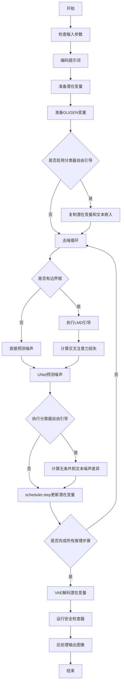
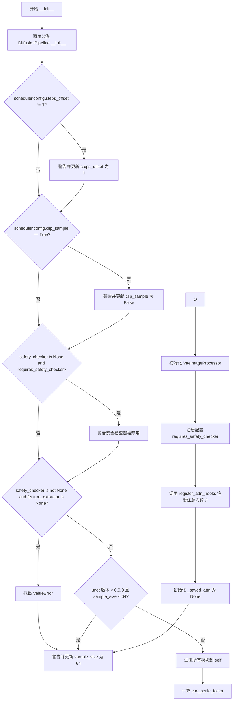
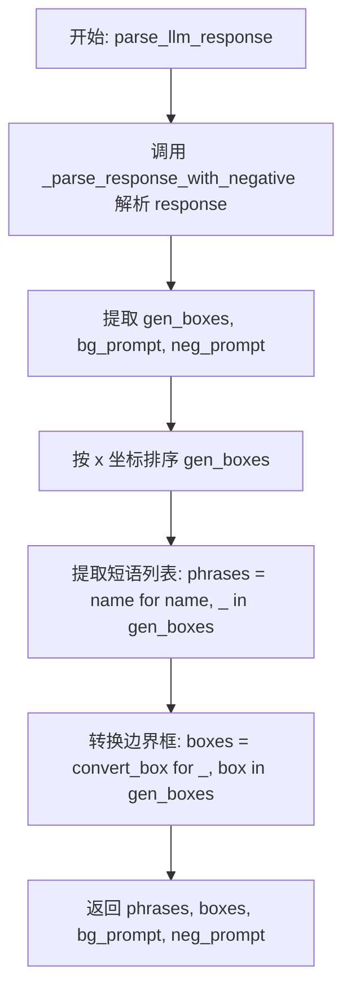
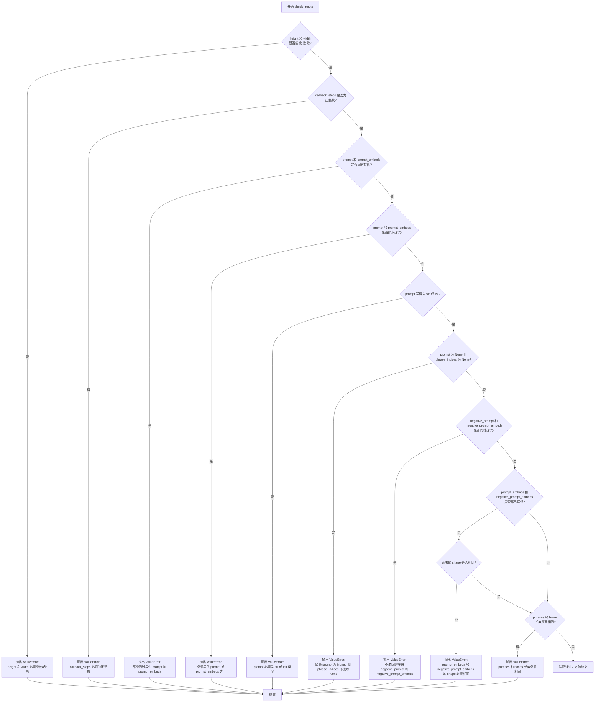
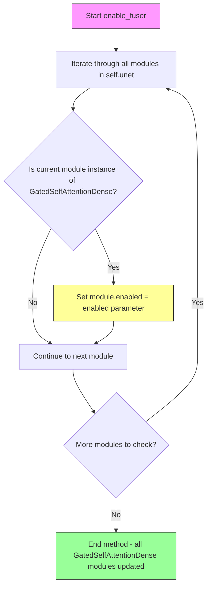
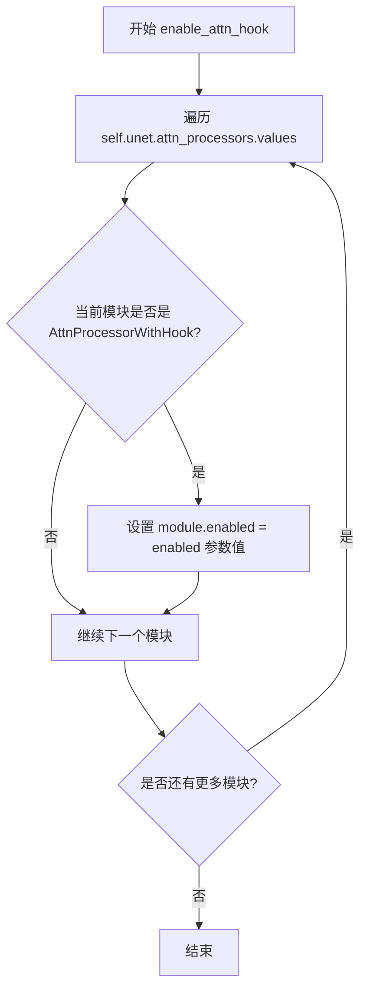
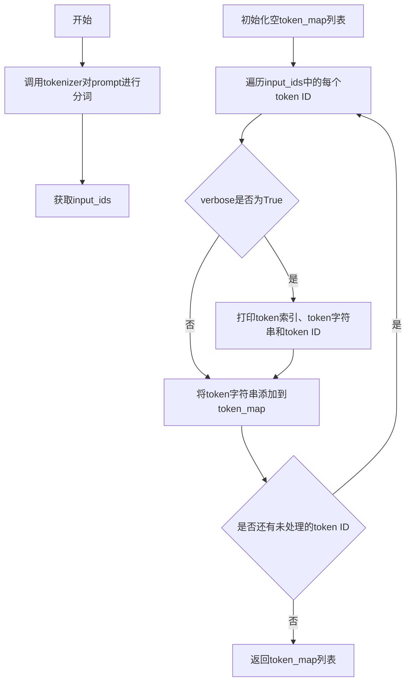
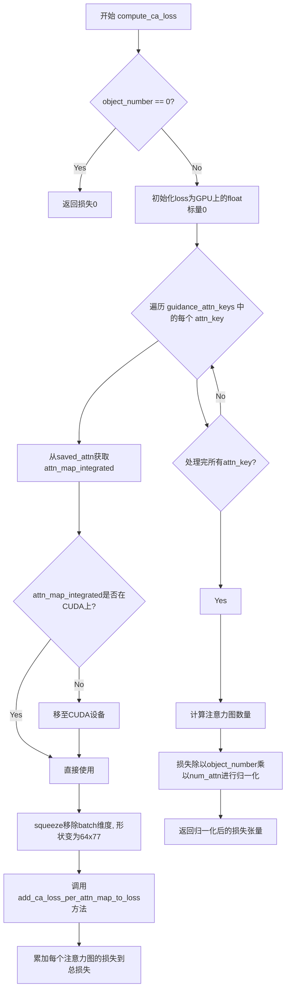
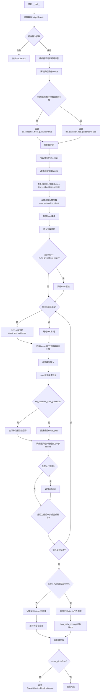
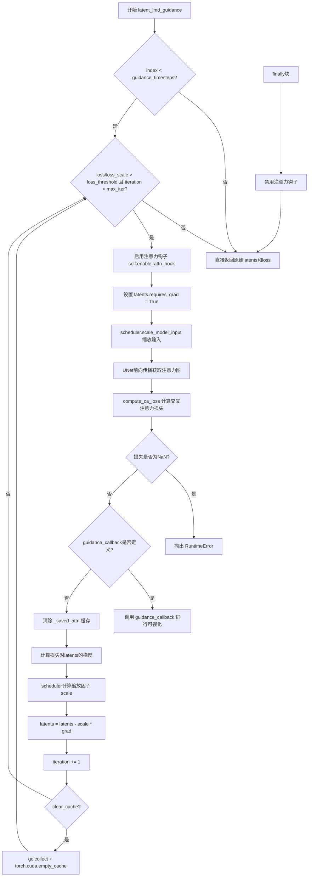

# `diffusers\examples\community\llm_grounded_diffusion.py` 详细设计文档

这是一个基于Stable Diffusion的LLM引导图像生成流水线(LMD+)，通过文本提示和边界框约束来控制图像生成，实现基于LLM响应的布局引导的文本到图像合成。

## 整体流程



## 类结构

```
AttnProcessorWithHook (自定义注意力处理器)
LLMGroundedDiffusionPipeline (主流水线类)
├── 继承自: DiffusionPipeline
├── 继承自: StableDiffusionMixin
├── 继承自: TextualInversionLoaderMixin
├── 继承自: StableDiffusionLoraLoaderMixin
├── 继承自: IPAdapterMixin
└── 继承自: FromSingleFileMixin
```

## 全局变量及字段


### `EXAMPLE_DOC_STRING`
    
示例文档字符串，包含管道使用示例和代码演示

类型：`str`
    


### `logger`
    
日志记录器，用于记录管道运行过程中的信息

类型：`logging.Logger`
    


### `DEFAULT_GUIDANCE_ATTN_KEYS`
    
转换后的默认引导注意力键列表，用于指定哪些注意力层用于引导

类型：`list`
    


### `AttnProcessorWithHook.attn_processor_key`
    
注意力处理器键，用于标识特定的注意力处理器

类型：`str`
    


### `AttnProcessorWithHook.hidden_size`
    
隐藏层大小，决定神经网络中间层的维度

类型：`int`
    


### `AttnProcessorWithHook.cross_attention_dim`
    
交叉注意力维度，控制跨模态注意力计算的维度

类型：`int`
    


### `AttnProcessorWithHook.hook`
    
钩子函数，用于在注意力计算过程中注入自定义逻辑

类型：`callable`
    


### `AttnProcessorWithHook.fast_attn`
    
是否使用快速注意力，启用后使用优化的注意力计算方式

类型：`bool`
    


### `AttnProcessorWithHook.enabled`
    
是否启用，当前处理器是否参与注意力计算

类型：`bool`
    


### `LLMGroundedDiffusionPipeline.model_cpu_offload_seq`
    
模型CPU卸载顺序，指定模型组件卸载到CPU的序列

类型：`str`
    


### `LLMGroundedDiffusionPipeline._optional_components`
    
可选组件列表，列出管道中非必需的组件

类型：`list`
    


### `LLMGroundedDiffusionPipeline._exclude_from_cpu_offload`
    
排除CPU卸载的组件，指定不应卸载到CPU的组件

类型：`list`
    


### `LLMGroundedDiffusionPipeline._callback_tensor_inputs`
    
回调张量输入，作为回调函数输入的张量列表

类型：`list`
    


### `LLMGroundedDiffusionPipeline.objects_text`
    
对象文本前缀，用于解析LLM响应中的对象描述

类型：`str`
    


### `LLMGroundedDiffusionPipeline.bg_prompt_text`
    
背景提示词前缀，用于标识背景描述的起始

类型：`str`
    


### `LLMGroundedDiffusionPipeline.bg_prompt_text_no_trailing_space`
    
无尾随空格背景提示词，去除尾部空格的前缀用于字符串分割

类型：`str`
    


### `LLMGroundedDiffusionPipeline.neg_prompt_text`
    
负面提示词前缀，用于标识负面提示的起始

类型：`str`
    


### `LLMGroundedDiffusionPipeline.neg_prompt_text_no_trailing_space`
    
无尾随空格负面提示词，去除尾部空格的前缀用于字符串分割

类型：`str`
    


### `LLMGroundedDiffusionPipeline.vae_scale_factor`
    
VAE缩放因子，用于调整VAE编码解码的空间维度

类型：`int`
    


### `LLMGroundedDiffusionPipeline.image_processor`
    
图像处理器，负责图像的预处理和后处理操作

类型：`VaeImageProcessor`
    


### `LLMGroundedDiffusionPipeline._saved_attn`
    
保存的注意力图，存储用于引导的注意力概率分布

类型：`dict`
    
    

## 全局函数及方法


### `convert_attn_keys`

该函数用于将注意力键从元组格式转换为 PyTorch UNet 模型状态格式的字符串路径，以便在 LMD+ Pipeline 中定位特定的注意力处理器。

参数：

-  `key`：`Tuple[str, int, int, int]`，表示 UNet 注意力模块的键，格式为 (block_type, block_id, attn_id, transformer_id)，例如 ("mid", 0, 0, 0) 或 ("up", 1, 0, 0)

返回值：`str`，转换后的注意力处理器路径字符串，用于在 UNet 的 attn_processors 字典中查找对应的处理器

#### 流程图

```mermaid
flowchart TD
    A[开始: convert_attn_keys] --> B{key[0] == 'mid'}
    B -->|Yes| C[断言 key[1] == 0]
    C --> D[返回 mid_block.attentions.{key[2]}.transformer_blocks.{key[3]}.attn2.processor]
    B -->|No| E[返回 {key[0]}_blocks.{key[1]}.attentions.{key[2]}.transformer_blocks.{key[3]}.attn2.processor]
    D --> F[结束]
    E --> F
```

#### 带注释源码

```python
def convert_attn_keys(key):
    """Convert the attention key from tuple format to the torch state format"""
    # 参数 key 是一个元组，格式为 (block_type, block_id, attn_id, transformer_id)
    # 例如：("mid", 0, 0, 0) 表示中间块的第0个注意力层，第0个transformer块
    # 例如：("up", 1, 0, 0) 表示上采样块的第1个块，第0个注意力层，第0个transformer块

    # 判断是否为中间块 (mid block)
    if key[0] == "mid":
        # 中间块只有一个，因此断言 key[1] 必须为 0
        assert key[1] == 0, f"mid block only has one block but the index is {key[1]}"
        # 构建中间块的注意力处理器路径
        # 格式: mid_block.attentions.{attn_id}.transformer_blocks.{transformer_id}.attn2.processor
        return f"{key[0]}_block.attentions.{key[2]}.transformer_blocks.{key[3]}.attn2.processor"

    # 对于上采样块 (up blocks) 或下采样块 (down blocks)
    # 构建对应块的注意力处理器路径
    # 格式: {block_type}_blocks.{block_id}.attentions.{attn_id}.transformer_blocks.{transformer_id}.attn2.processor
    return f"{key[0]}_blocks.{key[1]}.attentions.{key[2]}.transformer_blocks.{key[3]}.attn2.processor"
```


### `scale_proportion`

该函数用于将归一化（范围0-1）的边界框坐标转换为实际图像像素坐标。它分别对宽度和高度进行四舍五入处理，以确保边界框尺寸具有平移不变性，并确保坐标不超出图像边界。

参数：

- `obj_box`：`List[float]`，归一化边界框，格式为 [x_min, y_min, x_max, y_max]，所有值在 [0, 1] 范围内
- `H`：`int`，目标图像的高度（像素）
- `W`：`int`，目标图像的宽度（像素）

返回值：`Tuple[int, int, int, int]`，转换后的像素坐标 (x_min, y_min, x_max, y_max)

#### 流程图

```mermaid
flowchart TD
    A[开始: scale_proportion] --> B[输入: obj_box, H, W]
    B --> C[计算x_min = round(obj_box[0] × W)]
    B --> D[计算y_min = round(obj_box[1] × H)]
    B --> E[计算box_w = round((obj_box[2] - obj_box[0]) × W)]
    B --> F[计算box_h = round((obj_box[3] - obj_box[1]) × H)]
    C --> G[计算x_max = x_min + box_w]
    D --> G
    E --> G
    F --> G
    G --> H[边界裁剪: x_min = max(x_min, 0)]
    H --> I[边界裁剪: y_min = max(y_min, 0)]
    I --> J[边界裁剪: x_max = min(x_max, W)]
    J --> K[边界裁剪: y_max = min(y_max, H)]
    K --> L[返回: x_min, y_min, x_max, y_max]
```

#### 带注释源码

```python
def scale_proportion(obj_box, H, W):
    """
    将归一化边界框（0-1范围）转换为实际像素坐标
    
    参数:
        obj_box: 归一化边界框 [x_min, y_min, x_max, y_max]，值在[0,1]
        H: 图像高度（像素）
        W: 图像宽度（像素）
    
    返回:
        像素坐标 (x_min, y_min, x_max, y_max)
    """
    
    # 分别对 box_w 和 box_h 进行四舍五入，以保持边界框尺寸的平移不变性
    # 如果对两个坐标同时四舍五入，当两者都ending with ".5"时，边界框尺寸可能会发生变化
    x_min, y_min = round(obj_box[0] * W), round(obj_box[1] * H)
    box_w, box_h = round((obj_box[2] - obj_box[0]) * W), round((obj_box[3] - obj_box[1]) * H)
    
    # 计算右下角坐标
    x_max, y_max = x_min + box_w, y_min + box_h

    # 边界检查：确保坐标不超出图像范围
    x_min, y_min = max(x_min, 0), max(y_min, 0)
    x_max, y_max = min(x_max, W), min(y_max, H)

    return x_min, y_min, x_max, y_max
```


### `AttnProcessorWithHook.__init__`

该方法是 `AttnProcessorWithHook` 类的构造函数，用于初始化带有钩子功能的注意力处理器。它继承自 `AttnProcessor2_0`，并设置了注意力处理器的关键参数，包括处理器键、隐藏层维度、交叉注意力维度、钩子函数、快速注意力开关和启用状态。

参数：

- `attn_processor_key`：`str`，表示注意力处理器的唯一标识键，用于标识在 UNet 中注册的特定注意力处理器。
- `hidden_size`：`int`，隐藏层维度大小，通常对应于模型中注意力层的特征维度。
- `cross_attention_dim`：`int` 或 `None`，交叉注意力的维度，如果为 `None` 则表示自注意力模式。
- `hook`：`Callable` 或 `None`，可选的钩子函数，用于在注意力计算过程中介入并处理注意力概率图。
- `fast_attn`：`bool`，是否使用快速注意力实现（`F.scaled_dot_product_attention`），默认为 `True`。
- `enabled`：`bool`，是否启用钩子功能，默认为 `True`。

返回值：`None`，构造函数不返回任何值。

#### 流程图

```mermaid
flowchart TD
    A[开始 __init__] --> B[调用父类构造函数 super().__init__]
    B --> C[设置 self.attn_processor_key = attn_processor_key]
    C --> D[设置 self.hidden_size = hidden_size]
    D --> E[设置 self.cross_attention_dim = cross_attention_dim]
    E --> F[设置 self.hook = hook]
    F --> G[设置 self.fast_attn = fast_attn]
    G --> H[设置 self.enabled = enabled]
    H --> I[结束 __init__]
```

#### 带注释源码

```python
def __init__(
    self,
    attn_processor_key,      # str: 注意力处理器的标识键，用于在UNet中定位特定的注意力层
    hidden_size,              # int: 隐藏层维度，决定注意力计算的特征空间大小
    cross_attention_dim,      # int|None: 交叉注意力维度，None时表示自注意力
    hook=None,                # Callable|None: 可选的回调钩子，用于拦截和处理注意力图
    fast_attn=True,           # bool: 是否启用快速注意力实现（SDPA），提升推理速度
    enabled=True,             # bool: 是否启用钩子功能，关闭时可跳过钩子逻辑
):
    # 调用父类 AttnProcessor2_0 的初始化方法
    super().__init__()
    
    # 保存注意力处理器的标识键，用于后续钩子调用时识别处理器
    self.attn_processor_key = attn_processor_key
    
    # 保存隐藏层维度，用于注意力计算中的维度变换
    self.hidden_size = hidden_size
    
    # 保存交叉注意力维度，None 表示自注意力模式
    self.cross_attention_dim = cross_attention_dim
    
    # 保存钩子函数，该函数会在注意力概率计算后被调用
    self.hook = hook
    
    # 保存快速注意力开关，控制使用 SDPA 还是标准注意力计算
    self.fast_attn = fast_attn
    
    # 保存启用状态，用于动态控制是否执行钩子逻辑
    self.enabled = enabled
```


### `AttnProcessorWithHook.__call__`

该方法是自定义注意力处理器，继承自 `AttnProcessor2_0`，在标准注意力计算基础上增加了 hook 机制，允许在注意力计算过程中捕获查询、键、值和注意力图，以支持 LLM 引导的图像生成任务中的细粒度控制。

参数：

- `attn`：`Attention`，注意力机制对象，提供查询、键、值的投影矩阵及归一化层
- `hidden_states`：Tensor，输入的隐藏状态张量，形状为 (batch, channel, height, width) 或 (batch, sequence, hidden_dim)
- `encoder_hidden_states`：Optional[Tensor]，编码器隐藏状态，用于跨注意力计算，默认为 None 时使用 hidden_states
- `attention_mask`：Optional[Tensor]，注意力掩码，用于屏蔽特定位置的注意力计算
- `temb`：Optional[Tensor]，时间嵌入，用于空间归一化
- `scale`：float = 1.0，注意力输出的缩放因子

返回值：`Tensor`，处理后的隐藏状态，形状与输入 hidden_states 相同

#### 流程图

```mermaid
flowchart TD
    A[开始 __call__] --> B[保存残差 hidden_states]
    B --> C{检查 spatial_norm}
    C -->|是| D[应用 spatial_norm 到 hidden_states]
    C -->|否| E[继续]
    D --> E
    E --> F{检查 hidden_states 维度}
    F -->|4维| G[将 hidden_states 展平为 batch×seq×dim]
    F -->|3维| H[保持 3 维]
    G --> I[获取 batch_size 和 sequence_length]
    H --> I
    I --> J{检查 attention_mask}
    J -->|存在| K[调用 prepare_attention_mask]
    J -->|不存在| L[继续]
    K --> M
    L --> M{检查 group_norm}
    M -->|是| N[应用 group_norm]
    M -->|否| O
    N --> O
    O --> P[计算 query: attn.to_q]
    P --> Q{encoder_hidden_states 为空?}
    Q -->|是| R[使用 hidden_states]
    Q -->|否| S{检查 norm_cross}
    S -->|是| T[归一化 encoder_hidden_states]
    S -->|否| U
    R --> U
    T --> U
    U --> V[计算 key 和 value]
    V --> W{hook 启用或非快速注意力?}
    W -->|是| X[将 qkv 转换到 batch 维度并计算注意力分数]
    W -->|否| Y
    X --> Z{check hook 启用}
    Z -->|是| AA[调用 hook 回调函数]
    Z -->|否| AB
    AA --> AB
    AB --> AC{快速注意力启用?}
    AC -->|是| AD[使用 scaled_dot_product_attention]
    AC -->|否| AE[使用 torch.bmm 计算注意力]
    AD --> AF[重塑输出 hidden_states]
    AE --> AG[重塑输出 hidden_states]
    AF --> AH
    AG --> AH
    AH --> AI[应用输出投影 attn.to_out[0]]
    AI --> AJ[应用 dropout attn.to_out[1]]
    AJ --> AK{输入是 4 维?}
    AK -->|是| AL[重塑回 batch×channel×height×width]
    AK -->|否| AM
    AL --> AM
    AM --> AN{检查 residual_connection?}
    AN -->|是| AO[加上残差]
    AN -->|否| AP
    AO --> AP
    AP --> AQ[除以 rescale_output_factor]
    AQ --> AR[返回 hidden_states]
```

#### 带注释源码

```python
def __call__(
    self,
    attn: Attention,
    hidden_states,
    encoder_hidden_states=None,
    attention_mask=None,
    temb=None,
    scale: float = 1.0,
):
    """
    执行注意力计算的核心方法，支持 hook 机制以捕获中间变量
    
    参数:
        attn: Attention 对象，包含 to_q, to_k, to_v, to_out 等线性层
        hidden_states: 输入张量，扩散模型中的隐藏状态
        encoder_hidden_states: 跨注意力用的条件隐藏状态
        attention_mask: 注意力遮罩
        temb: 时间嵌入，用于空间归一化
        scale: 注意力输出的缩放因子
    
    返回:
        处理后的 hidden_states
    """
    # 保存输入用于残差连接
    residual = hidden_states

    # 应用空间归一化（如果存在）
    if attn.spatial_norm is not None:
        hidden_states = attn.spatial_norm(hidden_states, temb)

    # 获取输入张量维度
    input_ndim = hidden_states.ndim

    # 如果是 4D 张量 (B, C, H, W)，转换为 3D (B, H*W, C)
    if input_ndim == 4:
        batch_size, channel, height, width = hidden_states.shape
        hidden_states = hidden_states.view(batch_size, channel, height * width).transpose(1, 2)

    # 获取 batch 大小和序列长度
    batch_size, sequence_length, _ = (
        hidden_states.shape if encoder_hidden_states is None else encoder_hidden_states.shape
    )

    # 准备注意力掩码
    if attention_mask is not None:
        attention_mask = attn.prepare_attention_mask(attention_mask, sequence_length, batch_size)

    # 应用分组归一化（如果存在）
    if attn.group_norm is not None:
        hidden_states = attn.group_norm(hidden_states.transpose(1, 2)).transpose(1, 2)

    # 准备参数：PEFT 后端不使用 scale 参数
    args = () if USE_PEFT_BACKEND else (scale,)
    # 计算查询向量
    query = attn.to_q(hidden_states, *args)

    # 处理编码器隐藏状态
    if encoder_hidden_states is None:
        encoder_hidden_states = hidden_states
    elif attn.norm_cross:
        encoder_hidden_states = attn.norm_encoder_hidden_states(encoder_hidden_states)

    # 计算键和值向量
    key = attn.to_k(encoder_hidden_states, *args)
    value = attn.to_v(encoder_hidden_states, *args)

    # 获取内部维度和头维度
    inner_dim = key.shape[-1]
    head_dim = inner_dim // attn.heads

    # 如果启用了 hook 或未使用快速注意力，需要手动计算注意力分数
    if (self.hook is not None and self.enabled) or not self.fast_attn:
        # 将查询、键、值转换到 batch 维度
        query_batch_dim = attn.head_to_batch_dim(query)
        key_batch_dim = attn.head_to_batch_dim(key)
        value_batch_dim = attn.head_to_batch_dim(value)
        # 计算注意力分数
        attention_probs = attn.get_attention_scores(query_batch_dim, key_batch_dim, attention_mask)

    # 如果启用了 hook，调用回调函数捕获中间变量
    if self.hook is not None and self.enabled:
        # 使用捕获的 qkv 和注意力图调用 hook
        self.hook(
            self.attn_processor_key,   # 注意力处理器的键标识
            query_batch_dim,            # 批处理后的查询
            key_batch_dim,              # 批处理后的键
            value_batch_dim,            # 批处理后的值
            attention_probs,            # 注意力概率图
        )

    # 根据快速注意力开关选择计算方式
    if self.fast_attn:
        # 重塑查询为 (batch, heads, seq, head_dim)
        query = query.view(batch_size, -1, attn.heads, head_dim).transpose(1, 2)
        key = key.view(batch_size, -1, attn.heads, head_dim).transpose(1, 2)
        value = value.view(batch_size, -1, attn.heads, head_dim).transpose(1, 2)

        # 调整注意力掩码形状以匹配 scaled_dot_product_attention 格式
        if attention_mask is not None:
            attention_mask = attention_mask.view(batch_size, attn.heads, -1, attention_mask.shape[-1])

        # 使用 PyTorch 的 scaled_dot_product_attention 计算注意力
        # 输出形状: (batch, num_heads, seq_len, head_dim)
        hidden_states = F.scaled_dot_product_attention(
            query,
            key,
            value,
            attn_mask=attention_mask,
            dropout_p=0.0,
            is_causal=False,
        )
        # 恢复形状为 (batch, seq, heads * head_dim)
        hidden_states = hidden_states.transpose(1, 2).reshape(batch_size, -1, attn.heads * head_dim)
        hidden_states = hidden_states.to(query.dtype)
    else:
        # 使用标准注意力计算: 注意力分数加权值
        hidden_states = torch.bmm(attention_probs, value)
        hidden_states = attn.batch_to_head_dim(hidden_states)

    # 应用输出线性投影
    hidden_states = attn.to_out[0](hidden_states, *args)
    # 应用 dropout
    hidden_states = attn.to_out[1](hidden_states)

    # 如果输入是 4D，恢复原始形状
    if input_ndim == 4:
        hidden_states = hidden_states.transpose(-1, -2).reshape(batch_size, channel, height, width)

    # 添加残差连接
    if attn.residual_connection:
        hidden_states = hidden_states + residual

    # 应用输出缩放因子
    hidden_states = hidden_states / attn.rescale_output_factor

    return hidden_states
```


### `LLMGroundedDiffusionPipeline.__init__`

这是 `LLMGroundedDiffusionPipeline` 类的构造函数，负责初始化整个 LLM 引导的文本到图像生成管道。该方法继承自 `DiffusionPipeline`，并集成了 VAE、文本编码器、UNet、调度器等核心组件，同时为 LMD+（LLM-grounded Diffusion）功能注册了注意力钩子。

参数：

- `vae`：`AutoencoderKL`， variational auto-encoder 模型，用于将图像编码到潜在表示并从中解码
- `text_encoder`：`CLIPTextModel`，冻结的 CLIP 文本编码器（clip-vit-large-patch14）
- `tokenizer`：`CLIPTokenizer`，用于将文本分词为 token
- `unet`：`UNet2DConditionModel`，条件 UNet 模型，用于对编码后的图像潜在表示进行去噪
- `scheduler`：`KarrasDiffusionSchedulers`，扩散调度器，用于在去噪过程中生成时间步
- `safety_checker`：`StableDiffusionSafetyChecker`，安全检查器，用于检测生成图像是否包含不当内容
- `feature_extractor`：`CLIPImageProcessor`，CLIP 图像处理器，用于从生成的图像中提取特征
- `image_encoder`：`CLIPVisionModelWithProjection`，可选的 CLIP 视觉模型，用于 IP-Adapter 功能
- `requires_safety_checker`：`bool`，指定是否需要安全检查器

返回值：`None`，构造函数不返回任何值

#### 流程图



#### 带注释源码

```python
def __init__(
    self,
    vae: AutoencoderKL,
    text_encoder: CLIPTextModel,
    tokenizer: CLIPTokenizer,
    unet: UNet2DConditionModel,
    scheduler: KarrasDiffusionSchedulers,
    safety_checker: StableDiffusionSafetyChecker,
    feature_extractor: CLIPImageProcessor,
    image_encoder: CLIPVisionModelWithProjection = None,
    requires_safety_checker: bool = True,
):
    # 调用父类 DiffusionPipeline 的初始化方法
    super().__init__()

    # 检查 scheduler 的 steps_offset 配置，如果不为 1 则发出警告并修正
    if scheduler is not None and getattr(scheduler.config, "steps_offset", 1) != 1:
        deprecation_message = (
            f"The configuration file of this scheduler: {scheduler} is outdated. `steps_offset`"
            f" should be set to 1 instead of {scheduler.config.steps_offset}. Please make sure "
            "to update the config accordingly as leaving `steps_offset` might led to incorrect results"
            " in future versions. If you have downloaded this checkpoint from the Hugging Face Hub,"
            " it would be very nice if you could open a Pull request for the `scheduler/scheduler_config.json`"
            " file"
        )
        deprecate("steps_offset!=1", "1.0.0", deprecation_message, standard_warn=False)
        new_config = dict(scheduler.config)
        new_config["steps_offset"] = 1
        scheduler._internal_dict = FrozenDict(new_config)

    # 检查 scheduler 的 clip_sample 配置，如果为 True 则发出警告并修正为 False
    if scheduler is not None and getattr(scheduler.config, "clip_sample", False) is True:
        deprecation_message = (
            f"The configuration file of this scheduler: {scheduler} has not set the configuration `clip_sample`."
            " `clip_sample` should be set to False in the configuration file. Please make sure to update the"
            " config accordingly as not setting `clip_sample` in the config might lead to incorrect results in"
            " future versions. If you have downloaded this checkpoint from the Hugging Face Hub, it would be very"
            " nice if you could open a Pull request for the `scheduler/scheduler_config.json` file"
        )
        deprecate("clip_sample not set", "1.0.0", deprecation_message, standard_warn=False)
        new_config = dict(scheduler.config)
        new_config["clip_sample"] = False
        scheduler._internal_dict = FrozenDict(new_config)

    # 如果 safety_checker 为 None 但 requires_safety_checker 为 True，发出警告
    if safety_checker is None and requires_safety_checker:
        logger.warning(
            f"You have disabled the safety checker for {self.__class__} by passing `safety_checker=None`. Ensure"
            " that you abide to the conditions of the Stable Diffusion license and do not expose unfiltered"
            " results in services or applications open to the public. Both the diffusers team and Hugging Face"
            " strongly recommend to keep the safety filter enabled in all public facing circumstances, disabling"
            " it only for use-cases that involve analyzing network behavior or auditing its results. For more"
            " information, please have a look at https://github.com/huggingface/diffusers/pull/254 ."
        )

    # 如果有 safety_checker 但没有 feature_extractor，抛出错误
    if safety_checker is not None and feature_extractor is None:
        raise ValueError(
            "Make sure to define a feature extractor when loading {self.__class__} if you want to use the safety"
            " checker. If you do not want to use the safety checker, you can pass `'safety_checker=None'` instead."
        )

    # 检查 unet 配置，如果版本小于 0.9.0 且 sample_size 小于 64，发出警告并修正
    is_unet_version_less_0_9_0 = (
        unet is not None
        and hasattr(unet.config, "_diffusers_version")
        and version.parse(version.parse(unet.config._diffusers_version).base_version) < version.parse("0.9.0.dev0")
    )
    is_unet_sample_size_less_64 = (
        unet is not None and hasattr(unet.config, "sample_size") and unet.config.sample_size < 64
    )
    if is_unet_version_less_0_9_0 and is_unet_sample_size_less_64:
        deprecation_message = (
            "The configuration file of the unet has set the default `sample_size` to smaller than"
            " 64 which seems highly unlikely. If your checkpoint is a fine-tuned version of any of the"
            " following: \n- CompVis/stable-diffusion-v1-4 \n- CompVis/stable-diffusion-v1-3 \n-"
            " CompVis/stable-diffusion-v1-2 \n- CompVis/stable-diffusion-v1-1 \n- stable-diffusion-v1-5/stable-diffusion-v1-5"
            " \n- stable-diffusion-v1-5/stable-diffusion-inpainting \n you should change 'sample_size' to 64 in the"
            " configuration file. Please make sure to update the config accordingly as leaving `sample_size=32`"
            " in the config might lead to incorrect results in future versions. If you have downloaded this"
            " checkpoint from the Hugging Face Hub, it would be very nice if you could open a Pull request for"
            " the `unet/config.json` file"
        )
        deprecate("sample_size<64", "1.0.0", deprecation_message, standard_warn=False)
        new_config = dict(unet.config)
        new_config["sample_size"] = 64
        unet._internal_dict = FrozenDict(new_config)

    # 将所有模块注册到 self，包括 vae、text_encoder、tokenizer、unet、scheduler 等
    self.register_modules(
        vae=vae,
        text_encoder=text_encoder,
        tokenizer=tokenizer,
        unet=unet,
        scheduler=scheduler,
        safety_checker=safety_checker,
        feature_extractor=feature_extractor,
        image_encoder=image_encoder,
    )
    
    # 计算 VAE 缩放因子，基于 VAE 块输出通道数
    self.vae_scale_factor = 2 ** (len(self.vae.config.block_out_channels) - 1) if getattr(self, "vae", None) else 8
    
    # 初始化 VAE 图像处理器
    self.image_processor = VaeImageProcessor(vae_scale_factor=self.vae_scale_factor)
    
    # 注册 requires_safety_checker 到配置
    self.register_to_config(requires_safety_checker=requires_safety_checker)

    # 为 LLM-grounded Diffusion 初始化注意力钩子
    self.register_attn_hooks(unet)
    # 初始化保存注意力的字典为 None
    self._saved_attn = None
```


### `LLMGroundedDiffusionPipeline.attn_hook`

该方法是 LLMGroundedDiffusionPipeline 类中的一个注意力钩子函数，用于在扩散模型的推理过程中捕获特定交叉注意力层的注意力概率图，以便后续计算布局引导损失（CA Loss）。

参数：

- `name`：`str`，注意力处理器的键名，用于标识注意力层的位置
- `query`：`torch.Tensor`，注意力机制中的查询向量
- `key`：`torch.Tensor`，注意力机制中的键向量
- `value`：`torch.Tensor`，注意力机制中的值向量
- `attention_probs`：`torch.Tensor`，注意力概率分布，形状为 (batch, heads, seq_len, seq_len)

返回值：`None`，该方法无返回值，通过修改实例属性 `_saved_attn` 来保存注意力概率

#### 流程图

```mermaid
flowchart TD
    A[开始 attn_hook] --> B{检查 name 是否在 DEFAULT_GUIDANCE_ATTN_KEYS 中}
    B -->|是| C[将 attention_probs 保存到 self._saved_attn[name]]
    B -->|否| D[不做任何操作]
    C --> E[结束]
    D --> E
```

#### 带注释源码

```python
def attn_hook(self, name, query, key, value, attention_probs):
    """
    注意力钩子函数，用于在 UNet 的前向传播过程中捕获注意力概率图
    
    参数:
        name: 注意力处理器的键名，格式如 'mid_block.attentions.0.transformer_blocks.0.attn2.processor'
        query: 来自 Attention 层的查询张量
        key: 来自 Attention 层的键张量
        value: 来自 Attention 层的值张量
        attention_probs: 计算得到的注意力概率分布
    
    返回:
        无返回值，结果保存在 self._saved_attn 字典中
    """
    # 只保存默认引导注意力键对应的注意力概率
    # DEFAULT_GUIDANCE_ATTN_KEYS 定义了需要进行布局引导的注意力层
    if name in DEFAULT_GUIDANCE_ATTN_KEYS:
        # 将注意力概率图保存到实例变量中，供后续 compute_ca_loss 使用
        self._saved_attn[name] = attention_probs
```


### `LLMGroundedDiffusionPipeline.convert_box`

该函数是一个类方法，用于将 bounding box 从中心坐标格式 (x, y, w, h) 转换为角点坐标格式 (x_min, y_min, x_max, y_max)。在 LLM 解析响应后生成图像时，需要将 LLM 返回的 512x512 画布上的坐标转换为归一化的 [0,1] 范围内的角点坐标，以便于后续的图像生成和注意力引导。

参数：

- `box`：列表或元组，包含 4 个浮点数 `[x, y, w, h]`，表示目标的中心 x 坐标、中心 y 坐标、宽度和高度（在 512x512 格式下）
- `height`：整数，目标画布的高度（通常为 512）
- `width`：整数，目标画布的宽度（通常为 512）

返回值：元组，包含 4 个浮点数 `(x_min, y_min, x_max, y_max)`，表示归一化后的边界框左上角和右下角坐标，值域在 [0, 1] 范围内

#### 流程图

```mermaid
flowchart TD
    A[开始 convert_box] --> B[输入: box列表 x,y,w,h 和 height, width]
    B --> C[计算 x_min = box[0] / width]
    C --> D[计算 y_min = box[1] / height]
    D --> E[计算 w_box = box[2] / width]
    E --> F[计算 h_box = box[3] / height]
    F --> G[计算 x_max = x_min + w_box]
    G --> H[计算 y_max = y_min + h_box]
    H --> I[返回 (x_min, y_min, x_max, y_max)]
```

#### 带注释源码

```python
@classmethod
def convert_box(cls, box, height, width):
    """
    将 bounding box 从 512 格式 (x, y, w, h) 转换为归一化角点格式 (x_min, y_min, x_max, y_max)
    
    参数:
        box: 列表或元组 [x, y, w, h]，表示中心点坐标和宽高
        height: 画布高度（通常为 512）
        width: 画布宽度（通常为 512）
    
    返回:
        元组 (x_min, y_min, x_max, y_max)，归一化到 [0, 1] 范围
    """
    # 解析输入的 box: x, y 为中心点坐标，w, h 为宽高
    # 计算归一化后的左上角坐标
    x_min, y_min = box[0] / width, box[1] / height
    
    # 计算归一化后的宽高
    w_box, h_box = box[2] / width, box[3] / height
    
    # 计算归一化后的右下角坐标
    x_max, y_max = x_min + w_box, y_min + h_box
    
    # 返回归一化的角点坐标格式
    return x_min, y_min, x_max, y_max
```


### `LLMGroundedDiffusionPipeline._parse_response_with_negative`

该方法是一个类方法，用于解析大型语言模型（LLM）返回的文本响应，提取其中的对象边界框、背景提示词和负面提示词。

参数：

- `cls`：类型 `cls`（类方法），表示类本身
- `text`：类型 `str`，需要解析的 LLM 响应文本

返回值：`Tuple[List, str, str]`，返回一个元组，包含：
- `gen_boxes`：解析出的对象边界框列表
- `bg_prompt`：背景提示词字符串
- `neg_prompt`：负面提示词字符串

#### 流程图

```mermaid
flowchart TD
    A[开始: 接收text参数] --> B{text是否为空?}
    B -->|是| C[抛出ValueError: LLM response is empty]
    B -->|否| D{text中是否包含'Objects: '?}
    D -->|是| E[分割text取'Objects: '之后的部分]
    D -->|否| F[使用'Background prompt: '分割]
    E --> F
    F --> G{能否分割成2部分?}
    G -->|否| H[抛出ValueError: LLM response is incomplete]
    G -->|是| I[得到gen_boxes和text_rem]
    I --> J[使用'Negative prompt: '分割text_rem]
    J --> K{能否分割成2部分?}
    K -->|否| L[抛出ValueError: LLM response is incomplete]
    K -->|是| M[得到bg_prompt和neg_prompt]
    M --> N{尝试ast.literal_eval解析gen_boxes}
    N --> O{解析是否成功?}
    O -->|是| P[清理空白字符]
    O -->|否| Q{包含'No objects'或为空?}
    Q -->|是| R[gen_boxes设为空列表]
    Q -->|否| S[重新抛出SyntaxError异常]
    P --> T{neg_prompt == 'None'?]
    R --> T
    S --> T
    T -->|是| U[neg_prompt设为空字符串]
    T -->|否| V[返回gen_boxes, bg_prompt, neg_prompt]
    U --> V
```

#### 带注释源码

```python
@classmethod
def _parse_response_with_negative(cls, text):
    """
    解析LLM响应文本，提取对象边界框、背景提示词和负面提示词
    
    参数:
        text: LLM返回的响应文本，格式通常为:
              "Objects: [('phrase', [x1, y1, x2, y2]), ...]\nBackground prompt: ...\nNegative prompt: ..."
    
    返回:
        Tuple: (gen_boxes, bg_prompt, neg_prompt)
        - gen_boxes: 解析后的对象边界框列表
        - bg_prompt: 背景提示词
        - neg_prompt: 负面提示词
    """
    # 1. 检查输入是否为空
    if not text:
        raise ValueError("LLM response is empty")

    # 2. 如果文本包含"Objects: "，则提取其后的内容
    # 这会移除可能出现在响应开头的任何前缀
    if cls.objects_text in text:
        text = text.split(cls.objects_text)[1]

    # 3. 使用"Background prompt: "分割文本
    # 分割后应该得到: [gen_boxes部分, 剩余部分]
    text_split = text.split(cls.bg_prompt_text_no_trailing_space)
    if len(text_split) == 2:
        gen_boxes, text_rem = text_split
    else:
        raise ValueError(f"LLM response is incomplete: {text}")

    # 4. 使用"Negative prompt: "分割剩余部分
    # 分割后应该得到: [bg_prompt, neg_prompt]
    text_split = text_rem.split(cls.neg_prompt_text_no_trailing_space)

    if len(text_split) == 2:
        bg_prompt, neg_prompt = text_split
    else:
        raise ValueError(f"LLM response is incomplete: {text}")

    # 5. 尝试将gen_boxes字符串解析为Python对象
    # gen_boxes应该是类似 "[('phrase', [x1, y1, x2, y2]), ...]" 的列表格式
    try:
        gen_boxes = ast.literal_eval(gen_boxes)
    except SyntaxError as e:
        # 6. 解析失败时，检查是否是"No objects"或空字符串的情况
        # 有时LLM可能返回纯文本而非Python列表
        if "No objects" in gen_boxes or gen_boxes.strip() == "":
            gen_boxes = []
        else:
            raise e
    
    # 7. 清理背景提示词和负面提示词的空白字符
    bg_prompt = bg_prompt.strip()
    neg_prompt = neg_prompt.strip()

    # 8. 处理LLM返回"None"表示无负面提示的情况
    # LLM可能返回字符串"None"来表示没有负面提示
    if neg_prompt == "None":
        neg_prompt = ""

    # 9. 返回解析结果
    return gen_boxes, bg_prompt, neg_prompt
```


### `LLMGroundedDiffusionPipeline.parse_llm_response`

该方法是一个类方法，用于解析大语言模型（LLM）的响应文本，从中提取生成对象的信息（短语和边界框）、背景提示词以及负面提示词。它将这些信息转换为管道后续处理所需的格式，以便进行布局引导的文本到图像生成。

参数：

-   `cls`：类方法隐式参数，代表类本身
-   `response`：`str`，LLM 返回的原始响应文本，包含对象描述、边界框、背景提示词和负面提示词
-   `canvas_height`：`int`，画布高度，默认为 512，用于将边界框坐标从相对比例转换为绝对像素坐标
-   `canvas_width`：`int`，画布宽度，默认为 512，用于将边界框坐标从相对比例转换为绝对像素坐标

返回值：`tuple`，包含四个元素的元组：

-   `phrases`：`List[str]`，从 LLM 响应中提取的对象描述短语列表
-   `boxes`：`List[tuple[float, float, float, float]]`，转换后的边界框列表，每个边界框为 (x_min, y_min, x_max, y_max) 格式
-   `bg_prompt`：`str`，背景提示词
-   `neg_prompt`：`str`，负面提示词

#### 流程图



#### 带注释源码

```python
@classmethod
def parse_llm_response(cls, response, canvas_height=512, canvas_width=512):
    """
    解析 LLM 响应，提取对象短语、边界框、背景提示词和负面提示词
    
    参数:
        response: LLM 返回的字符串，包含对象信息和提示词
        canvas_height: 画布高度，用于坐标转换
        canvas_width: 画布宽度，用于坐标转换
    
    返回:
        短语列表、边界框列表、背景提示词、负面提示词
    """
    # 1. 首先调用内部方法 _parse_response_with_negative 解析文本
    #    该方法会识别 "Objects: ", "Background prompt: ", "Negative prompt:" 等标记
    gen_boxes, bg_prompt, neg_prompt = cls._parse_response_with_negative(text=response)

    # 2. 按 x 坐标对边界框进行排序，确保顺序一致性
    gen_boxes = sorted(gen_boxes, key=lambda gen_box: gen_box[0])

    # 3. 从 (name, box) 元组列表中提取所有对象名称作为短语
    phrases = [name for name, _ in gen_boxes]

    # 4. 将边界框从 (x, y, w, h) 格式转换为 (x_min, y_min, x_max, y_max) 格式
    #    同时考虑画布尺寸进行归一化
    boxes = [cls.convert_box(box, height=canvas_height, width=canvas_width) for _, box in gen_boxes]

    # 5. 返回解析结果：短语、边界框、背景提示词、负面提示词
    return phrases, boxes, bg_prompt, neg_prompt
```


### `LLMGroundedDiffusionPipeline.check_inputs`

该方法负责验证图像生成管道的输入参数是否合法，包括检查图像尺寸是否能被8整除、回调步骤是否为正整数、提示词与提示词嵌入的互斥关系、负提示词与负提示词嵌入的互斥关系、以及短语与边界框的长度一致性等。如果任何检查失败，将抛出相应的 ValueError 异常。

参数：

- `prompt`：`Union[str, List[str], None]`，用户提供的文本提示词，用于指导图像生成
- `height`：`int`，生成图像的高度（像素），必须能被8整除
- `width`：`int`，生成图像的宽度（像素），必须能被8整除
- `callback_steps`：`int`，回调函数的调用步数，必须为正整数
- `phrases`：`List[str]`，短语列表，每个短语对应一个边界框定义的区域
- `boxes`：`List[List[float]]`，边界框列表，每个边界框定义为 [xmin, ymin, xmax, ymax]，且每个值在 [0,1] 范围内
- `negative_prompt`：`Union[str, List[str], None]`，负向提示词，用于指导图像生成时排除的内容
- `prompt_embeds`：`Optional[torch.Tensor]`，预生成的文本嵌入向量，与 prompt 互斥
- `negative_prompt_embeds`：`Optional[torch.Tensor]`，预生成的负向文本嵌入向量，与 negative_prompt 互斥
- `phrase_indices`：`Optional[List[int]]`，短语在提示词中的 token 索引位置

返回值：`None`，该方法仅进行参数验证，不返回任何值

#### 流程图



#### 带注释源码

```python
def check_inputs(
    self,
    prompt,
    height,
    width,
    callback_steps,
    phrases,
    boxes,
    negative_prompt=None,
    prompt_embeds=None,
    negative_prompt_embeds=None,
    phrase_indices=None,
):
    # 检查生成的图像尺寸是否合法，UNet 要求尺寸能被8整除
    if height % 8 != 0 or width % 8 != 0:
        raise ValueError(f"`height` and `width` have to be divisible by 8 but are {height} and {width}.")

    # 检查 callback_steps 参数是否为正整数，用于控制回调函数的调用频率
    if (callback_steps is None) or (
        callback_steps is not None and (not isinstance(callback_steps, int) or callback_steps <= 0)
    ):
        raise ValueError(
            f"`callback_steps` has to be a positive integer but is {callback_steps} of type"
            f" {type(callback_steps)}."
        )

    # 检查 prompt 和 prompt_embeds 的互斥关系，不能同时提供
    if prompt is not None and prompt_embeds is not None:
        raise ValueError(
            f"Cannot forward both `prompt`: {prompt} and `prompt_embeds`: {prompt_embeds}. Please make sure to"
            " only forward one of the two."
        )
    # 检查是否至少提供了 prompt 或 prompt_embeds 之一
    elif prompt is None and prompt_embeds is None:
        raise ValueError(
            "Provide either `prompt` or `prompt_embeds`. Cannot leave both `prompt` and `prompt_embeds` undefined."
        )
    # 检查 prompt 的类型是否为 str 或 list
    elif prompt is not None and (not isinstance(prompt, str) and not isinstance(prompt, list)):
        raise ValueError(f"`prompt` has to be of type `str` or `list` but is {type(prompt)}")
    # 当 prompt 为 None 时，必须提供 phrase_indices 用于定位短语位置
    elif prompt is None and phrase_indices is None:
        raise ValueError("If the prompt is None, the phrase_indices cannot be None")

    # 检查 negative_prompt 和 negative_prompt_embeds 的互斥关系
    if negative_prompt is not None and negative_prompt_embeds is not None:
        raise ValueError(
            f"Cannot forward both `negative_prompt`: {negative_prompt} and `negative_prompt_embeds`:"
            f" {negative_prompt_embeds}. Please make sure to only forward one of the two."
        )

    # 如果同时提供了 prompt_embeds 和 negative_prompt_embeds，检查它们的 shape 是否一致
    if prompt_embeds is not None and negative_prompt_embeds is not None:
        if prompt_embeds.shape != negative_prompt_embeds.shape:
            raise ValueError(
                "`prompt_embeds` and `negative_prompt_embeds` must have the same shape when passed directly, but"
                f" got: `prompt_embeds` {prompt_embeds.shape} != `negative_prompt_embeds`"
                f" {negative_prompt_embeds.shape}."
            )

    # 检查 phrases 和 boxes 列表长度是否一致，每个短语应对应一个边界框
    if len(phrases) != len(boxes):
        raise ValueError(
            "length of `phrases` and `boxes` has to be same, but"
            f" got: `phrases` {len(phrases)} != `boxes` {len(boxes)}"
        )
```


### `LLMGroundedDiffusionPipeline.register_attn_hooks`

该方法用于在 UNet 模型中注册注意力钩子（hooks），以获取用于 LLM 引导生成（LLM-grounded Generation）的注意力图。它遍历 UNet 的所有注意力处理器，对交叉注意力层替换为自定义的 `AttnProcessorWithHook`，该处理器可以在前向传播过程中捕获注意力概率图，供后续的注意力损失计算使用。

参数：

- `self`：`LLMGroundedDiffusionPipeline` 实例，隐式参数，表示当前管道对象
- `unet`：`UNet2DConditionModel`，需要注册注意力钩子的 UNet 模型实例

返回值：`None`，该方法直接修改 UNet 模型的注意力处理器，不返回任何值

#### 流程图

```mermaid
flowchart TD
    A[开始 register_attn_hooks] --> B[初始化空字典 attn_procs]
    B --> C{遍历 unet.attn_processors.keys()}
    C --> D{检查处理器名称}
    D -->|以 attn1.processor 或 fuser.attn.processor 结尾| E[保留原处理器]
    E --> C
    D -->|其他| F[计算 cross_attention_dim]
    F --> G{判断模块位置}
    G -->|mid_block| H[hidden_size = block_out_channels[-1]]
    G -->|up_blocks| I[block_id = int(name[len'up_blocks.']) <br/> hidden_size = reversed(block_out_channels)[block_id]]
    G -->|down_blocks| J[block_id = int(name[len'down_blocks.']) <br/> hidden_size = block_out_channels[block_id]]
    H --> K[创建 AttnProcessorWithHook 实例]
    I --> K
    J --> K
    K --> L[设置 enabled=False]
    L --> M[attn_procs[name] = AttnProcessorWithHook]
    M --> C
    C -->|遍历完成| N[调用 unet.set_attn_procs attn_procs]
    N --> O[结束]
```

#### 带注释源码

```python
def register_attn_hooks(self, unet):
    """Registering hooks to obtain the attention maps for guidance"""
    # 创建一个字典来存储自定义的注意力处理器
    attn_procs = {}

    # 遍历 UNet 中所有的注意力处理器名称
    for name in unet.attn_processors.keys():
        # 仅从交叉注意力（attn2）中获取查询和键
        # 自注意力（attn1）和融合器注意力不需要挂钩
        if name.endswith("attn1.processor") or name.endswith("fuser.attn.processor"):
            # 为自注意力保留相同的处理器（不挂钩自注意力）
            attn_procs[name] = unet.attn_processors[name]
            continue

        # 确定交叉注意力的维度
        # 如果是自注意力则为 None，否则使用 UNet 配置中的 cross_attention_dim
        cross_attention_dim = None if name.endswith("attn1.processor") else unet.config.cross_attention_dim

        # 根据模块位置确定隐藏层大小
        if name.startswith("mid_block"):
            # 中间块的隐藏大小取最后一个输出通道
            hidden_size = unet.config.block_out_channels[-1]
        elif name.startswith("up_blocks"):
            # 上采样块：需要反转通道顺序来对应正确的层级
            block_id = int(name[len("up_blocks.")])
            hidden_size = list(reversed(unet.config.block_out_channels))[block_id]
        elif name.startswith("down_blocks"):
            # 下采样块：直接使用对应索引的输出通道
            block_id = int(name[len("down_blocks.")])
            hidden_size = unet.config.block_out_channels[block_id]

        # 创建带钩子的注意力处理器
        # hook 指向 self.attn_hook 方法，用于捕获注意力图
        # fast_attn=True 启用快速注意力计算
        # enabled=False 默认不启用，需要通过 enable_attn_hook 方法激活
        attn_procs[name] = AttnProcessorWithHook(
            attn_processor_key=name,
            hidden_size=hidden_size,
            cross_attention_dim=cross_attention_dim,
            hook=self.attn_hook,
            fast_attn=True,
            # Not enabled by default
            enabled=False,
        )

    # 将自定义的注意力处理器应用到 UNet 模型
    unet.set_attn_processor(attn_procs)
```


### `LLMGroundedDiffusionPipeline.enable_fuser`

该方法用于启用或禁用 UNet 中的 GatedSelfAttentionDense（门控自注意力密集）模块。GatedSelfAttentionDense 是 GLIGEN/Grounded Diffusion 中用于实现空间控制的关键组件，通过该方法可以在推理过程中动态开启或关闭基于边界框的注意力引导机制。

参数：

- `self`：`LLMGroundedDiffusionPipeline`，Pipeline 实例本身
- `enabled`：`bool`，默认为 `True`，控制是否启用 GatedSelfAttentionDense 模块。设为 `True` 时启用空间引导，设为 `False` 时禁用

返回值：`None`，该方法不返回任何值，直接修改 GatedSelfAttentionDense 模块的内部状态

#### 流程图



#### 带注释源码

```python
def enable_fuser(self, enabled=True):
    """
    Enable or disable the GatedSelfAttentionDense modules in the UNet.
    
    GatedSelfAttentionDense modules are used for spatial grounding in GLIGEN-style
    text-to-image generation. They allow the model to attend to specific spatial
    regions defined by bounding boxes.
    
    Args:
        enabled (bool): If True, enable the fuser modules; if False, disable them.
                       Default is True.
    """
    # Iterate through all modules in the UNet model
    # self.unet.modules() returns all sub-modules recursively
    for module in self.unet.modules():
        # Check if the current module is an instance of GatedSelfAttentionDense
        # GatedSelfAttentionDense is a special attention processor from diffusers
        # that implements gated self-attention for spatial control
        if isinstance(module, GatedSelfAttentionDense):
            # Set the enabled flag of the module to control whether
            # it participates in the attention computation
            module.enabled = enabled
```


### `LLMGroundedDiffusionPipeline.enable_attn_hook`

该方法用于启用或禁用UNet中所有已注册的`AttnProcessorWithHook`注意力处理器，从而控制是否在推理过程中捕获注意力图以进行LLM引导的图像生成。

参数：

- `enabled`：`bool`，默认为`True`。当设置为`True`时启用注意力钩子，允许捕获注意力图用于引导；当设置为`False`时禁用注意力钩子。

返回值：`None`，无返回值（隐式返回`None`）。

#### 流程图



#### 带注释源码

```python
def enable_attn_hook(self, enabled=True):
    """
    启用或禁用注意力钩子。
    
    该方法遍历UNet的所有注意力处理器，将其中的AttnProcessorWithHook实例的enabled标志设置为指定值。
    这允许在推理过程中动态控制是否启用注意力捕获功能，用于LLM引导的扩散模型。
    
    参数:
        enabled (bool): 是否启用注意力钩子。默认为True。
                       True表示启用（允许捕获注意力图进行引导），
                       False表示禁用（不捕获注意力图，提高推理速度）。
    
    返回:
        None: 无返回值，直接修改UNet的注意力处理器状态。
    """
    # 遍历UNet中所有已注册的注意力处理器
    for module in self.unet.attn_processors.values():
        # 检查当前处理器是否是AttnProcessorWithHook类型
        # 只有AttnProcessorWithHook支持注意力钩子功能
        if isinstance(module, AttnProcessorWithHook):
            # 设置该处理器的enabled标志
            # 当enabled=True时，AttnProcessorWithHook会调用hook回调函数
            # 当enabled=False时，跳过hook调用，提高推理效率
            module.enabled = enabled
```


### `LLMGroundedDiffusionPipeline.get_token_map`

该方法用于将输入的提示词文本转换为对应的Token字符串列表，实现从提示词索引到Token字符串的映射功能。

参数：

- `prompt`：`str`，输入的提示词文本，用于生成对应的token映射
- `padding`：`str`，分词器的填充策略，默认为"do_not_pad"，控制是否对输入进行填充
- `verbose`：`bool`，是否输出详细的调试信息，默认为False，开启时会打印每个token的索引和对应的token字符串

返回值：`List[str]`，返回提示词对应的Token字符串列表，列表中的每个元素代表对应位置的Token

#### 流程图



#### 带注释源码

```python
def get_token_map(self, prompt, padding="do_not_pad", verbose=False):
    """Get a list of mapping: prompt index to str (prompt in a list of token str)"""
    # 使用tokenizer对输入的prompt进行分词处理
    # 参数说明：
    #   - [prompt]: 将prompt包装为列表，因为tokenizer期望批量输入
    #   - padding: 填充策略，"do_not_pad"表示不进行填充
    #   - max_length: 最大长度为77，这是CLIP tokenizer的标准最大长度
    #   - return_tensors: 返回numpy格式的张量
    fg_prompt_tokens = self.tokenizer([prompt], padding=padding, max_length=77, return_tensors="np")
    
    # 获取分词后的input_ids，形状为[1, sequence_length]
    # 取第一个元素是因为批量大小为1
    input_ids = fg_prompt_tokens["input_ids"][0]
    
    # 初始化用于存储token字符串的列表
    token_map = []
    
    # 遍历input_ids中的每个token ID
    # enumerate返回(index, item)元组，其中index是位置索引，item是token ID
    for ind, item in enumerate(input_ids.tolist()):
        # 将token ID转换为其对应的token字符串
        # 使用tokenizer的_convert_id_to_token方法进行转换
        token = self.tokenizer._convert_id_to_token(item)
        
        # 如果verbose为True，打印详细的调试信息
        if verbose:
            # 打印格式：索引, token字符串 (token ID)
            logger.info(f"{ind}, {token} ({item})")
        
        # 将转换后的token字符串添加到列表中
        token_map.append(token)
    
    # 返回完整的token字符串列表
    return token_map
```


### `LLMGroundedDiffusionPipeline.get_phrase_indices`

该方法用于在文本提示（prompt）的token序列中定位给短语（phrases）对应的token索引位置，支持自动将未在prompt中的短语追加到prompt末尾（以"| "分隔），以便进行注意力引导。

参数：

- `self`：`LLMGroundedDiffusionPipeline` 实例对象，调用该方法的对象本身
- `prompt`：`str`，原始输入的文本提示词，用于定位短语所在的token位置
- `phrases`：`List[str]`，需要定位的短语列表，每个短语对应一个 bounding box 描述的对象
- `token_map`：`Optional[List[str]]`，可选参数，预计算的token映射表。如果为 `None`，则该方法会自动调用 `get_token_map` 生成
- `add_suffix_if_not_found`：`bool`，默认为 `False`。当设为 `True` 时，如果短语不在原始prompt中，会将短语追加到prompt末尾（格式为 `"| " + obj`），并同时返回更新后的prompt
- `verbose`：`bool`，默认为 `False`。设为 `True` 时会输出详细的token映射和位置信息用于调试

返回值：

- 当 `add_suffix_if_not_found=False` 时：返回 `List[List[int]]`，每个子列表包含对应短语在prompt token序列中的连续索引范围
- 当 `add_suffix_if_not_found=True` 时：返回 `Tuple[List[List[int]], str]` 元组，第一个元素为短语索引列表，第二个元素为追加短语后更新过的prompt

#### 流程图

```mermaid
flowchart TD
    A[开始 get_phrase_indices] --> B{add_suffix_if_not_found?}
    B -->|True| C[遍历 phrases]
    B -->|False| C
    C --> D{obj not in prompt?}
    D -->|Yes| E[prompt += '| ' + obj]
    D -->|No| F[继续下一个 obj]
    E --> F
    F --> G{token_map is None?}
    G -->|Yes| H[调用 get_token_map 生成 token_map]
    G -->|No| I[使用传入的 token_map]
    H --> J[拼接 token_map 为字符串]
    I --> J
    J --> K[遍历每个 phrase]
    K --> L[获取 phrase 的 token_map 并去掉 <bos> 和 <eos>]
    L --> M[在 token_map_str 中查找 phrase_token_map_str 的起始位置]
    M --> N[计算 phrase 在 token 序列中的起始索引]
    N --> O[生成 phrase 对应的连续索引范围 list]
    O --> P{所有 phrases 遍历完成?}
    P -->|No| K
    P -->|Yes| Q{add_suffix_if_not_found?}
    Q -->|Yes| R[返回 phrase_indices 和 更新后的 prompt]
    Q -->|No| S[返回 phrase_indices]
    R --> T[结束]
    S --> T
```

#### 带注释源码

```python
def get_phrase_indices(
    self,
    prompt,
    phrases,
    token_map=None,
    add_suffix_if_not_found=False,
    verbose=False,
):
    """
    在 prompt 的 token 序列中定位 phrases 对应的 token 索引位置。
    如果短语不在 prompt 中，会自动将其追加到 prompt 末尾（用 '| ' 分隔），
    以便后续进行注意力引导（Attention Guidance）。
    """
    # 第一步：如果短语不在原始 prompt 中，则追加到 prompt 末尾
    # 这是为了确保每个 phrase 都有对应的 token 可以用于注意力控制
    for obj in phrases:
        # Suffix the prompt with object name for attention guidance if object is not in the prompt
        # 使用 "|" 作为分隔符，将缺失的 phrase 追加到 prompt 后面
        if obj not in prompt:
            prompt += "| " + obj

    # 第二步：获取 prompt 的 token 映射表
    # token_map 是一个列表，索引对应 token 在序列中的位置，值是对应的 token 字符串
    # 可以传入预计算的 token_map 以避免重复计算
    if token_map is None:
        # We allow using a pre-computed token map.
        token_map = self.get_token_map(prompt=prompt, padding="do_not_pad", verbose=verbose)
    
    # 将 token 列表转换为空格分隔的字符串，便于子串查找
    token_map_str = " ".join(token_map)

    # 第三步：对每个 phrase 进行定位
    phrase_indices = []

    for obj in phrases:
        # 获取当前 phrase 的 token 映射
        phrase_token_map = self.get_token_map(prompt=obj, padding="do_not_pad", verbose=verbose)
        
        # 移除 <bos> (Begin of Sequence) 和 <eos> (End of Sequence) token
        # 因为这些是添加的标记，不属于实际内容
        phrase_token_map = phrase_token_map[1:-1]
        phrase_token_map_len = len(phrase_token_map)
        
        # 转换为字符串用于子串匹配
        phrase_token_map_str = " ".join(phrase_token_map)

        if verbose:
            logger.info(
                "Full str:",
                token_map_str,
                "Substr:",
                phrase_token_map_str,
                "Phrase:",
                phrases,
            )

        # 计算子串在完整 token 字符串中的起始位置
        # 减1是为了去掉子串后面可能存在的空格带来的偏移
        # The substring comes with a trailing space that needs to be removed by minus one in the index.
        obj_first_index = len(token_map_str[: token_map_str.index(phrase_token_map_str) - 1].split(" "))

        # 生成连续的索引范围 [start, start + length)
        obj_position = list(range(obj_first_index, obj_first_index + phrase_token_map_len))
        phrase_indices.append(obj_position)

    # 根据参数决定返回值格式
    if add_suffix_if_not_found:
        return phrase_indices, prompt

    return phrase_indices
```


### `LLMGroundedDiffusionPipeline.add_ca_loss_per_attn_map_to_loss`

该方法用于计算基于交叉注意力图（Cross-Attention Map）的损失函数，通过对每个对象（phrase）的注意力图进行前景和背景区域的top-k pooling操作，实现对生成图像中特定区域的定位引导控制。该方法是 LMD+ (LLM-Grounded Diffusion) 流水线中实现布局引导图像生成的核心组件。

参数：

- `loss`：`torch.Tensor`，累积的损失张量，初始值通常为零张量
- `attn_map`：`torch.Tensor`，注意力图张量，形状为 (b, i, j)，其中 b 是注意力头数，i 和 j 是空间维度（通常为 H×W）
- `object_number`：`int`，需要处理的对象（phrase/边界框）数量
- `bboxes`：`List[List[float]]`，对象的边界框列表，每个边界框为 [x_min, y_min, x_max, y_max]，坐标范围 [0, 1]
- `phrase_indices`：`List[List[int]]`，每个短语在文本提示中的 token 索引列表
- `fg_top_p`：`float`，前景区域的 top-p 比例（默认 0.2），用于选择前景区域中最高注意力值的位置
- `bg_top_p`：`float`，背景区域的 top-p 比例（默认 0.2），用于选择背景区域中最高注意力值的位置
- `fg_weight`：`float`，前景损失的权重系数（默认 1.0）
- `bg_weight`：`float`，背景损失的权重系数（默认 1.0）

返回值：`torch.Tensor`，更新后的累积损失张量

#### 流程图

```mermaid
flowchart TD
    A[开始 add_ca_loss_per_attn_map_to_loss] --> B[获取注意力图维度 b, i, j]
    B --> C[计算空间尺寸 H = W = sqrt{i}]
    C --> D[遍历每个对象 obj_idx in range object_number]
    D --> E[初始化 obj_loss = 0 和 mask = zeros H×W]
    E --> F{检查 obj_boxes 格式}
    F -->|单层| G[obj_boxes 转为列表]
    F -->|多层| H[保持原样]
    G --> I
    H --> I[遍历每个 obj_box]
    I --> J[调用 scale_proportion 计算绝对坐标]
    J --> K[在 mask 上标记 obj_box 区域为1]
    K --> L{phrase_indices 遍历完成?}
    L -->|否| M[获取当前 obj_position 的注意力图]
    L -->|是| N[计算 fg_top_k 和 bg_top_k]
    M --> L
    N --> O[展平 mask 为 1D]
    O --> P[计算前景损失: topk of ca_map_obj × mask]
    P --> Q[计算背景损失: topk of ca_map_obj × (1-mask)]
    Q --> R[加权累加到 obj_loss]
    R --> S{所有对象遍历完成?}
    S -->|否| T[obj_loss 累加到总 loss]
    S -->|是| U[返回更新后的 loss]
    T --> D
```

#### 带注释源码

```python
def add_ca_loss_per_attn_map_to_loss(
    self,
    loss,                          # 累积的损失张量，初始为零
    attn_map,                      # 注意力图，形状 (b, i, j)，b=头数，i=j=H*W
    object_number,                # 对象数量
    bboxes,                       # 边界框列表 [[x_min,y_min,x_max,y_max], ...]
    phrase_indices,               # 短语token索引列表
    fg_top_p=0.2,                  # 前景区域top-p比例
    bg_top_p=0.2,                  # 背景区域top-p比例
    fg_weight=1.0,                # 前景损失权重
    bg_weight=1.0,                # 背景损失权重
):
    # 获取注意力图的维度信息
    # b: 注意力头数量, i: 查询位置数, j: 键位置数
    b, i, j = attn_map.shape
    # 计算空间维度 H 和 W（假设为正方形特征图）
    H = W = int(math.sqrt(i))
    
    # 遍历每个需要处理的对象（短语/边界框）
    for obj_idx in range(object_number):
        obj_loss = 0  # 当前对象的损失初始化
        # 创建与特征图尺寸相同的二进制掩码，初始全0
        mask = torch.zeros(size=(H, W), device="cuda")
        obj_boxes = bboxes[obj_idx]  # 获取当前对象的边界框
        
        # 支持两种格式：单层（单个box）和多层（多个box）
        # 如果第一个元素不可迭代，则为单层格式，转为列表
        if not isinstance(obj_boxes[0], Iterable):
            obj_boxes = [obj_boxes]
        
        # 遍历该对象的所有边界框（在多层格式下可能有多个）
        for obj_box in obj_boxes:
            # 使用 scale_proportion 将归一化坐标 [0,1] 转换为像素坐标
            # 处理边界情况，确保坐标在有效范围内
            x_min, y_min, x_max, y_max = scale_proportion(obj_box, H=H, W=W)
            # 在掩码上将对应区域标记为1（前景区域）
            mask[y_min:y_max, x_min:x_max] = 1
        
        # 遍历该对象对应的所有 token 位置（一个短语可能有多个 token）
        for obj_position in phrase_indices[obj_idx]:
            # 提取当前 token 位置的注意力图
            # shape: (b, H, W) - 获取所有头在所有空间位置的注意力值
            ca_map_obj = attn_map[:, :, obj_position].reshape(b, H, W)
            
            # 另一种等效的获取方式（注释中保留）
            # ca_map_obj = attn_map[:, :, obj_position]
            
            # 根据掩码面积计算 top-k 值
            # fg_top_p 比例的点用于前景区域
            k_fg = (mask.sum() * fg_top_p).long().clamp_(min=1)
            # bg_top_p 比例的点用于背景区域
            k_bg = ((1 - mask).sum() * bg_top_p).long().clamp_(min=1)
            
            # 将2D掩码展平为1D，用于与注意力图进行元素级运算
            mask_1d = mask.view(1, -1)
            
            # ========== 前景损失计算 ==========
            # 1. (ca_map_obj * mask_1d): 只保留前景区域的注意力值
            # 2. .topk(k=k_fg): 选择注意力值最高的 k_fg 个位置
            # 3. .values.mean(dim=1): 对所有头取平均
            # 4. (1 - ...): 目标是让前景区域的注意力值接近1
            # 5. .sum(dim=0): 对所有空间位置求和
            obj_loss += (1 - (ca_map_obj * mask_1d).topk(k=k_fg).values.mean(dim=1)).sum(dim=0) * fg_weight
            
            # ========== 背景损失计算 ==========
            # 1. (ca_map_obj * (1 - mask_1d)): 只保留背景区域的注意力值
            # 2. 目标是让背景区域的注意力值接近0（因为我们关注前景）
            obj_loss += ((ca_map_obj * (1 - mask_1d)).topk(k=k_bg).values.mean(dim=1)).sum(dim=0) * bg_weight
        
        # 将当前对象的损失累加到总损失
        # 需要除以该对象的 token 数量，以归一化损失
        loss += obj_loss / len(phrase_indices[obj_idx])
    
    return loss
```


### `LLMGroundedDiffusionPipeline.compute_ca_loss`

该方法用于计算基于交叉注意力图的损失（Cross-Attention Loss），是LMD+（LLM-grounded Diffusion） pipeline的核心组成部分。它通过分析UNet中间层和上层的交叉注意力图，引导生成过程按照指定的边界框和短语描述来生成图像内容，实现布局引导的文本到图像生成。

参数：

- `self`：隐式参数，指向`LLMGroundedDiffusionPipeline`类的实例
- `saved_attn`：`Dict[str, torch.Tensor]`类型的字典，保存由`AttnProcessorWithHook`钩子捕获的交叉注意力图，键为注意力处理器键（如"mid_block.attentions.0.transformer_blocks.0.attn2.processor"），值为注意力张量，形状通常为[batch_size, seq_len, seq_len]
- `bboxes`：`List[List[float]]`类型的列表，每个元素表示一个对象的边界框，格式为[x_min, y_min, x_max, y_max]，值范围在[0,1]之间，表示相对于图像宽高的比例
- `phrase_indices`：`List[List[int]]`类型的列表，表示每个短语在完整prompt中的token索引位置，用于定位需要关注的对象词汇在文本嵌入中的位置
- `guidance_attn_keys`：`List[str]`类型的列表，指定需要计算损失的注意力层键，默认为`DEFAULT_GUIDANCE_ATTN_KEYS`（包含mid block和up blocks的某些层）
- `verbose`：`bool`类型，控制是否输出详细的调试信息，默认为`False`
- `**kwargs`：可变关键字参数，会传递给`add_ca_loss_per_attn_map_to_loss`方法，包括`fg_top_p`、`bg_top_p`、`fg_weight`、`bg_weight`等控制损失权重的参数

返回值：`torch.Tensor`，返回一个GPU上的float类型标量张量，表示归一化后的交叉注意力损失值。如果`bboxes`为空，则返回0。

#### 流程图



#### 带注释源码

```python
def compute_ca_loss(
    self,
    saved_attn,
    bboxes,
    phrase_indices,
    guidance_attn_keys,
    verbose=False,
    **kwargs,
):
    """
    计算基于交叉注意力图的损失，用于LMD+的布局引导生成。
    
    参数说明:
        saved_attn: 由AttnProcessorWithHook钩子保存的交叉注意力图字典
        bboxes: 对象的边界框列表，格式为[x_min, y_min, x_max, y_max]
        phrase_indices: 每个短语在prompt中的token索引列表
        guidance_attn_keys: 需要计算损失的注意力层键列表
        verbose: 是否输出调试信息
        **kwargs: 传递给add_ca_loss_per_attn_map_to_loss的额外参数
    """
    # 初始化损失为GPU上的float类型标量0
    # 使用tensor(0)创建标量张量而非Python浮点数，确保梯度计算正确
    loss = torch.tensor(0).float().cuda()
    
    # 获取对象数量（边界框数量）
    object_number = len(bboxes)
    
    # 如果没有对象，直接返回零损失，避免不必要的计算
    if object_number == 0:
        return loss

    # 遍历所有需要指导的注意力层键
    # guidance_attn_keys通常包含mid_block和部分up_blocks的交叉注意力层
    for attn_key in guidance_attn_keys:
        # We only have 1 cross attention for mid.
        # mid block只有一个交叉注意力层，而up blocks可能有多个

        # 从保存的注意力字典中获取该层的注意力图
        # 形状通常为[batch_size, num_heads, seq_len, seq_len]
        # 对于集成注意力图，形状可能是[1, num_heads, seq_len, seq_len]
        attn_map_integrated = saved_attn[attn_key]
        
        # 确保注意力图在GPU上，以便后续计算
        if not attn_map_integrated.is_cuda:
            attn_map_integrated = attn_map_integrated.cuda()
        
        # Example dimension: [20, 64, 77]
        # 20 = num_heads * 2 (包含uncond和cond), 64 = spatial tokens (8x8), 77 = text tokens
        # squeeze移除batch维度，从[1, 20, 64, 77]变为[20, 64, 77]
        attn_map = attn_map_integrated.squeeze(dim=0)

        # 调用方法为每个注意力图添加损失
        # 该方法根据对象边界框和短语位置计算空间和语义对齐损失
        loss = self.add_ca_loss_per_attn_map_to_loss(
            loss, attn_map, object_number, bboxes, phrase_indices, **kwargs
        )

    # 获取处理的注意力图数量
    num_attn = len(guidance_attn_keys)

    # 如果有处理注意力图，则对损失进行归一化
    # 归一化因子为对象数量乘以注意力图数量，确保损失在不同配置下可比
    if num_attn > 0:
        loss = loss / (object_number * num_attn)

    return loss
```


### `LLMGroundedDiffusionPipeline.__call__`

该方法是LMD+（LLM-Grounded Diffusion）管道的主入口函数，用于实现基于布局引导的文本到图像生成。它结合了Stable Diffusion模型与LLM解析的物体位置信息，通过交叉注意力损失（Cross-Attention Loss）引导生成过程，使图像中特定区域生成与文本描述相符的内容。

参数：

- `prompt`：`Union[str, List[str]]`，要引导图像生成的提示词，若未定义则需传递`prompt_embeds`
- `height`：`Optional[int]`，生成图像的高度（像素），默认为`self.unet.config.sample_size * self.vae_scale_factor`
- `width`：`Optional[int]`，生成图像的宽度（像素），默认为`self.unet.config.sample_size * self.vae_scale_factor`
- `num_inference_steps`：`int`，去噪步数，默认为50
- `guidance_scale`：`float`，引导比例值，>1时启用无分类器引导，默认为7.5
- `gligen_scheduled_sampling_beta`：`float`，GLIGEN调度采样因子，默认为0.3
- `phrases`：`List[str]`，要引导放入对应边界框区域的短语列表
- `boxes`：`List[List[float]]`，定义图像中待填充区域的边界框，格式为`[xmin, ymin, xmax, ymax]`，每个值在[0,1]范围内
- `negative_prompt`：`Optional[Union[str, List[str]]]`，负面提示词，用于引导不包含在图像中的内容
- `num_images_per_prompt`：`Optional[int]`，每个提示词生成的图像数量，默认为1
- `eta`：`float`，DDIM调度器的eta参数，默认为0.0
- `generator`：`Optional[Union[torch.Generator, List[torch.Generator]]]`，用于生成确定性结果的随机数生成器
- `latents`：`Optional[torch.Tensor]`，预生成的噪声潜在向量
- `prompt_embeds`：`Optional[torch.Tensor]`，预生成的文本嵌入
- `negative_prompt_embeds`：`Optional[torch.Tensor]`，预生成的负面文本嵌入
- `ip_adapter_image`：`Optional[PipelineImageInput]`，IP-Adapter的可选图像输入
- `output_type`：`str | None`，生成图像的输出格式，默认为"pil"
- `return_dict`：`bool`，是否返回`StableDiffusionPipelineOutput`，默认为True
- `callback`：`Optional[Callable[[int, int, torch.Tensor], None]]`，推理过程中每步调用的回调函数
- `callback_steps`：`int`，回调函数调用频率，默认为1
- `cross_attention_kwargs`：`Optional[Dict[str, Any]]`，传递给注意力处理器的kwargs字典
- `clip_skip`：`Optional[int]`，计算提示嵌入时从CLIP跳过的层数
- `lmd_guidance_kwargs`：`Optional[Dict[str, Any]]`，传递给`latent_lmd_guidance`函数的kwargs字典
- `phrase_indices`：`Optional[List[int]]`，提示词中每个短语对应的token索引

返回值：`StableDiffusionPipelineOutput`或`tuple`，当`return_dict=True`时返回包含生成图像列表和NSFW检测布尔列表的`StableDiffusionPipelineOutput`，否则返回元组

#### 流程图



#### 带注释源码

```python
@torch.no_grad()
@replace_example_docstring(EXAMPLE_DOC_STRING)
def __call__(
    self,
    prompt: Union[str, List[str]] = None,
    height: Optional[int] = None,
    width: Optional[int] = None,
    num_inference_steps: int = 50,
    guidance_scale: float = 7.5,
    gligen_scheduled_sampling_beta: float = 0.3,
    phrases: List[str] = None,
    boxes: List[List[float]] = None,
    negative_prompt: Optional[Union[str, List[str]]] = None,
    num_images_per_prompt: Optional[int] = 1,
    eta: float = 0.0,
    generator: Optional[Union[torch.Generator, List[torch.Generator]]] = None,
    latents: Optional[torch.Tensor] = None,
    prompt_embeds: Optional[torch.Tensor] = None,
    negative_prompt_embeds: Optional[torch.Tensor] = None,
    ip_adapter_image: Optional[PipelineImageInput] = None,
    output_type: str | None = "pil",
    return_dict: bool = True,
    callback: Optional[Callable[[int, int, torch.Tensor], None]] = None,
    callback_steps: int = 1,
    cross_attention_kwargs: Optional[Dict[str, Any]] = None,
    clip_skip: Optional[int] = None,
    lmd_guidance_kwargs: Optional[Dict[str, Any]] = {},
    phrase_indices: Optional[List[int]] = None,
):
    r"""
    The call function to the pipeline for generation.
    ...
    """
    # 0. Default height and width to unet
    # 如果未指定height/width，则使用UNet配置中的sample_size乘以VAE缩放因子作为默认值
    height = height or self.unet.config.sample_size * self.vae_scale_factor
    width = width or self.unet.config.sample_size * self.vae_scale_factor

    # 1. Check inputs. Raise error if not correct
    # 验证所有输入参数的合法性，包括尺寸、可被8整除、回调步数有效性等
    self.check_inputs(
        prompt,
        height,
        width,
        callback_steps,
        phrases,
        boxes,
        negative_prompt,
        prompt_embeds,
        negative_prompt_embeds,
        phrase_indices,
    )

    # 2. Define call parameters
    # 处理提示词，确定批次大小，并计算短语在提示词中的token索引位置
    if prompt is not None and isinstance(prompt, str):
        batch_size = 1
        # 如果未提供phrase_indices，自动解析短语在提示词中的位置
        if phrase_indices is None:
            phrase_indices, prompt = self.get_phrase_indices(prompt, phrases, add_suffix_if_not_found=True)
    elif prompt is not None and isinstance(prompt, list):
        batch_size = len(prompt)
        if phrase_indices is None:
            phrase_indices = []
            prompt_parsed = []
            for prompt_item in prompt:
                (
                    phrase_indices_parsed_item,
                    prompt_parsed_item,
                ) = self.get_phrase_indices(prompt_item, add_suffix_if_not_found=True)
                phrase_indices.append(phrase_indices_parsed_item)
                prompt_parsed.append(prompt_parsed_item)
            prompt = prompt_parsed
    else:
        # 如果prompt为None，则使用预计算的prompt_embeds，其批次大小由embeddings决定
        batch_size = prompt_embeds.shape[0]

    device = self._execution_device
    
    # 判断是否启用分类器自由引导（CFG），当guidance_scale > 1.0时启用
    # CFG通过在无条件嵌入和有条件嵌入之间进行插值来改善图像-文本对齐
    do_classifier_free_guidance = guidance_scale > 1.0

    # 3. Encode input prompt
    # 编码提示词生成文本嵌入，包括正向和负向提示词的嵌入
    prompt_embeds, negative_prompt_embeds = self.encode_prompt(
        prompt,
        device,
        num_images_per_prompt,
        do_classifier_free_guidance,
        negative_prompt,
        prompt_embeds=prompt_embeds,
        negative_prompt_embeds=negative_prompt_embeds,
        clip_skip=clip_skip,
    )

    # 保存条件提示词嵌入，用于后续LMD引导
    cond_prompt_embeds = prompt_embeds

    # For classifier free guidance, we need to do two forward passes.
    # Here we concatenate the unconditional and text embeddings into a single batch
    # to avoid doing two forward passes
    # 如果启用CFG，将无条件嵌入和条件嵌入拼接在一起，一次前向传播完成两类预测
    if do_classifier_free_guidance:
        prompt_embeds = torch.cat([negative_prompt_embeds, prompt_embeds])

    # 处理IP-Adapter图像嵌入（如果提供）
    if ip_adapter_image is not None:
        image_embeds, negative_image_embeds = self.encode_image(ip_adapter_image, device, num_images_per_prompt)
        if self.do_classifier_free_guidance:
            image_embeds = torch.cat([negative_image_embeds, image_embeds])

    # 4. Prepare timesteps
    # 根据推理步数设置调度器的时间步
    self.scheduler.set_timesteps(num_inference_steps, device=device)
    timesteps = self.scheduler.timesteps

    # 5. Prepare latent variables
    # 准备潜在变量（噪声），用于去噪过程的起点
    num_channels_latents = self.unet.config.in_channels
    latents = self.prepare_latents(
        batch_size * num_images_per_prompt,
        num_channels_latents,
        height,
        width,
        prompt_embeds.dtype,
        device,
        generator,
        latents,
    )

    # 5.1 Prepare GLIGEN variables
    # 准备GLIGEN/GLIGEN所需的物体位置和文本特征嵌入
    max_objs = 30
    if len(boxes) > max_objs:
        warnings.warn(
            f"More that {max_objs} objects found. Only first {max_objs} objects will be processed.",
            FutureWarning,
        )
        phrases = phrases[:max_objs]
        boxes = boxes[:max_objs]

    n_objs = len(boxes)
    if n_objs:
        # 使用CLIPTokenizer获取短语的token，然后使用text_encoder获取文本特征
        tokenizer_inputs = self.tokenizer(phrases, padding=True, return_tensors="pt").to(device)
        _text_embeddings = self.text_encoder(**tokenizer_inputs).pooler_output

    # 初始化位置嵌入和文本嵌入矩阵
    # 位置信息表示为(xmin, ymin, xmax, ymax)格式
    cond_boxes = torch.zeros(max_objs, 4, device=device, dtype=self.text_encoder.dtype)
    if n_objs:
        cond_boxes[:n_objs] = torch.tensor(boxes)
    
    text_embeddings = torch.zeros(
        max_objs,
        self.unet.config.cross_attention_dim,
        device=device,
        dtype=self.text_encoder.dtype,
    )
    if n_objs:
        text_embeddings[:n_objs] = _text_embeddings
        
    # 生成每个物体的掩码
    masks = torch.zeros(max_objs, device=device, dtype=self.text_encoder.dtype)
    masks[:n_objs] = 1

    # 扩展批次维度以匹配生成的图像数量和CFG
    repeat_batch = batch_size * num_images_per_prompt
    cond_boxes = cond_boxes.unsqueeze(0).expand(repeat_batch, -1, -1).clone()
    text_embeddings = text_embeddings.unsqueeze(0).expand(repeat_batch, -1, -1).clone()
    masks = masks.unsqueeze(0).expand(repeat_batch, -1).clone()
    
    # 如果启用CFG，将条件和 unconditional 变量都扩展一倍
    if do_classifier_free_guidance:
        repeat_batch = repeat_batch * 2
        cond_boxes = torch.cat([cond_boxes] * 2)
        text_embeddings = torch.cat([text_embeddings] * 2)
        masks = torch.cat([masks] * 2)
        masks[: repeat_batch // 2] = 0  # 前一半为无条件（mask=0）
    
    # 将GLIGEN参数放入cross_attention_kwargs传递给UNet
    if cross_attention_kwargs is None:
        cross_attention_kwargs = {}
    cross_attention_kwargs["gligen"] = {
        "boxes": cond_boxes,
        "positive_embeddings": text_embeddings,
        "masks": masks,
    }

    # 计算用于引导的步数（调度采样）
    num_grounding_steps = int(gligen_scheduled_sampling_beta * len(timesteps))
    self.enable_fuser(True)  # 启用门控自注意力模块

    # 6. Prepare extra step kwargs
    # 准备调度器的额外参数（如eta和generator）
    extra_step_kwargs = self.prepare_extra_step_kwargs(generator, eta)

    # 6.1 Add image embeds for IP-Adapter
    added_cond_kwargs = {"image_embeds": image_embeds} if ip_adapter_image is not None else None

    # 初始化注意力损失（用于LMD引导）
    loss_attn = torch.tensor(10000.0)

    # 7. Denoising loop
    # 去噪主循环：逐步从噪声图像重建目标图像
    num_warmup_steps = len(timesteps) - num_inference_steps * self.scheduler.order
    with self.progress_bar(total=num_inference_steps) as progress_bar:
        for i, t in enumerate(timesteps):
            # Scheduled sampling：当达到调度采样步数时禁用fuser
            if i == num_grounding_steps:
                self.enable_fuser(False)

            # 确保latents有正确的通道数（处理某些特殊情况）
            if latents.shape[1] != 4:
                latents = torch.randn_like(latents[:, :4])

            # 7.1 Perform LMD guidance
            # 如果提供了边界框，执行LMD引导（基于交叉注意力的布局引导）
            if boxes:
                latents, loss_attn = self.latent_lmd_guidance(
                    cond_prompt_embeds,
                    index=i,
                    boxes=boxes,
                    phrase_indices=phrase_indices,
                    t=t,
                    latents=latents,
                    loss=loss_attn,
                    **lmd_guidance_kwargs,
                )

            # expand the latents if we are doing classifier free guidance
            # 为CFG扩展latents（前半部分为无条件，后半部分为有条件）
            latent_model_input = torch.cat([latents] * 2) if do_classifier_free_guidance else latents
            latent_model_input = self.scheduler.scale_model_input(latent_model_input, t)

            # predict the noise residual
            # 使用UNet预测噪声残差
            noise_pred = self.unet(
                latent_model_input,
                t,
                encoder_hidden_states=prompt_embeds,
                cross_attention_kwargs=cross_attention_kwargs,
                added_cond_kwargs=added_cond_kwargs,
            ).sample

            # perform guidance
            # 执行分类器自由引导
            if do_classifier_free_guidance:
                noise_pred_uncond, noise_pred_text = noise_pred.chunk(2)
                noise_pred = noise_pred_uncond + guidance_scale * (noise_pred_text - noise_pred_uncond)

            # compute the previous noisy sample x_t -> x_t-1
            # 调度器执行一步去噪，从x_t得到x_{t-1}
            latents = self.scheduler.step(noise_pred, t, latents, **extra_step_kwargs).prev_sample

            # call the callback, if provided
            # 在特定步数调用回调函数
            if i == len(timesteps) - 1 or ((i + 1) > num_warmup_steps and (i + 1) % self.scheduler.order == 0):
                progress_bar.update()
                if callback is not None and i % callback_steps == 0:
                    step_idx = i // getattr(self.scheduler, "order", 1)
                    callback(step_idx, t, latents)

    # 8. Post-processing
    # 去噪完成后，将latents解码为图像
    if not output_type == "latent":
        image = self.vae.decode(latents / self.vae.config.scaling_factor, return_dict=False)[0]
        # 运行安全检查器检测NSFW内容
        image, has_nsfw_concept = self.run_safety_checker(image, device, prompt_embeds.dtype)
    else:
        image = latents
        has_nsfw_concept = None

    # 处理去归一化
    if has_nsfw_concept is None:
        do_denormalize = [True] * image.shape[0]
    else:
        do_denormalize = [not has_nsfw for has_nsfw in has_nsfw_concept]

    # 后处理图像（转换为PIL或numpy数组）
    image = self.image_processor.postprocess(image, output_type=output_type, do_denormalize=do_denormalize)

    # Offload last model to CPU
    # 如果启用了最终模型卸载，将模型从GPU卸载到CPU
    if hasattr(self, "final_offload_hook") and self.final_offload_hook is not None:
        self.final_offload_hook.offload()

    if not return_dict:
        return (image, has_nsfw_concept)

    # 返回标准输出格式
    return StableDiffusionPipelineOutput(images=image, nsfw_content_detected=has_nsfw_concept)
```


### `LLMGroundedDiffusionPipeline.latent_lmd_guidance`

该方法是LMD+（LLM-Grounded Diffusion）管道中的核心引导函数，用于在扩散模型的去噪过程中对潜在表示（latents）进行基于交叉注意力图的引导控制。它通过计算文本短语与指定边界框区域之间的注意力损失，并使用梯度下降方法更新潜在表示，使生成图像能够精确符合用户指定的空间布局和对象位置关系。

参数：

- `self`：隐式参数，Pipeline实例本身
- `cond_embeddings`：`torch.Tensor`，条件文本嵌入（conditional embeddings），来自文本编码器的文本特征表示
- `index`：`int`，当前去噪步骤的索引（timestep index），用于判断是否在引导时间步范围内
- `boxes`：`List[List[float]]`，对象边界框列表，每个框为`[xmin, ymin, xmax, ymax]`格式，值为0-1之间的归一化坐标
- `phrase_indices`：`List[List[int]]`，每个短语在prompt中的token索引列表，用于定位交叉注意力图中的相关位置
- `t`：`torch.Tensor`或`int`，当前的扩散时间步（timestep），用于调度器缩放和噪声预测
- `latents`：`torch.Tensor`，当前的潜在表示张量，形状为`(batch, channels, height, width)`，是可以被梯度修改的
- `loss`：`torch.Tensor`，上一次迭代的损失值，用于判断是否继续迭代
- `loss_scale`：`float`，损失缩放因子，默认值为20，用于放大损失值以便更好地观察收敛情况
- `loss_threshold`：`float`，损失阈值，默认值为5.0，当损失除以缩放因子后小于此值时停止迭代
- `max_iter`：`list`或`int`，最大迭代次数列表，默认值为`[3]*5 + [2]*5 + [1]*5`，对应不同去噪阶段的迭代次数
- `guidance_timesteps`：`int`，引导应用的时间步数，默认值为15，只在扩散过程的前15步进行引导
- `cross_attention_kwargs`：`dict`或`None`，传递给UNet的交叉注意力额外参数，如GLIGEN的位置嵌入等
- `guidance_attn_keys`：`list`，引导使用的注意力键列表，默认值为`DEFAULT_GUIDANCE_ATTN_KEYS`，指定从哪些注意力层获取注意力图
- `verbose`：`bool`，是否打印详细日志信息，默认值为`False`
- `clear_cache`：`bool`，是否在每次迭代后清除GPU缓存，默认值为`False`
- `unet_additional_kwargs`：`dict`，传递给UNet的额外关键字参数字典
- `guidance_callback`：`callable`或`None`，可选的回调函数，用于可视化引导过程，签名为`callback(pipeline, latents, loss, iteration, index)`
- `**kwargs`：其他未命名关键字参数，会传递给`compute_ca_loss`函数

返回值：`Tuple[torch.Tensor, torch.Tensor]`，返回两个张量组成的元组：
- 第一个是更新后的`latents`（`torch.Tensor`），经过梯度下降更新后的潜在表示
- 第二个是更新后的`loss`（`torch.Tensor`），最后一次迭代计算的损失值，用于下一次调用时判断是否继续

#### 流程图



#### 带注释源码

```python
@torch.set_grad_enabled(True)  # 启用梯度计算，用于反向传播
def latent_lmd_guidance(
    self,
    cond_embeddings,          # 条件文本嵌入，来自文本编码器
    index,                    # 当前去噪步骤的索引
    boxes,                    # 边界框列表 [xmin, ymin, xmax, ymax]
    phrase_indices,           # 短语在prompt中的token索引
    t,                       # 扩散时间步
    latents,                 # 当前潜在表示，可训练
    loss,                    # 上一次迭代的损失值
    *,
    loss_scale=20,           # 损失缩放因子，放大损失值以便观察
    loss_threshold=5.0,      # 损失阈值，低于此值停止引导
    max_iter=[3] * 5 + [2] * 5 + [1] * 5,  # 各阶段的 max_iter
    guidance_timesteps=15,   # 执行引导的时间步数
    cross_attention_kwargs=None,  # 传递给UNet的额外参数
    guidance_attn_keys=DEFAULT_GUIDANCE_ATTN_KEYS,  # 引导使用的注意力层
    verbose=False,            # 是否打印详细日志
    clear_cache=False,       # 是否清除GPU缓存
    unet_additional_kwargs={},  # UNet额外参数
    guidance_callback=None,  # 可视化回调函数
    **kwargs,                # 传递给 compute_ca_loss 的参数
):
    """
    LMD+ 核心引导函数：在去噪过程中通过交叉注意力损失引导潜在表示
    
    工作原理：
    1. 在指定的时间步范围内运行
    2. 启用注意力钩子捕获交叉注意力图
    3. 计算短语token与目标边界框区域的注意力损失
    4. 通过梯度下降更新latents，使注意力集中在指定区域
    """
    scheduler, unet = self.scheduler, self.unet

    iteration = 0  # 当前迭代计数

    # 只有在引导时间步范围内才执行引导
    if index < guidance_timesteps:
        # 处理 max_iter，可能是列表形式（不同阶段不同值）
        if isinstance(max_iter, list):
            max_iter = max_iter[index]

        if verbose:
            logger.info(
                f"time index {index}, loss: {loss.item() / loss_scale:.3f} "
                f"(de-scaled with scale {loss_scale:.1f}), loss threshold: {loss_threshold:.3f}"
            )

        try:
            # 启用注意力钩子以捕获交叉注意力图
            self.enable_attn_hook(enabled=True)

            # 迭代优化：直到损失收敛或达到最大迭代次数
            while (
                loss.item() / loss_scale > loss_threshold 
                and iteration < max_iter 
                and index < guidance_timesteps
            ):
                # 清空上一次保存的注意力图
                self._saved_attn = {}

                # 启用梯度计算
                latents.requires_grad_(True)
                latent_model_input = latents
                # 根据调度器要求缩放输入
                latent_model_input = scheduler.scale_model_input(latent_model_input, t)

                # UNet 前向传播，注意力钩子会捕获交叉注意力图
                unet(
                    latent_model_input,
                    t,
                    encoder_hidden_states=cond_embeddings,
                    cross_attention_kwargs=cross_attention_kwargs,
                    **unet_additional_kwargs,
                )

                # 计算交叉注意力损失：衡量短语token在目标区域的注意力强度
                loss = (
                    self.compute_ca_loss(
                        saved_attn=self._saved_attn,
                        bboxes=boxes,
                        phrase_indices=phrase_indices,
                        guidance_attn_keys=guidance_attn_keys,
                        verbose=verbose,
                        **kwargs,
                    )
                    * loss_scale  # 应用损失缩放
                )

                # 检查损失是否为NaN
                if torch.isnan(loss):
                    raise RuntimeError("**Loss is NaN**")

                # 可视化回调，允许用户观察引导过程
                if guidance_callback is not None:
                    guidance_callback(self, latents, loss, iteration, index)

                # 清除保存的注意力图以释放内存
                self._saved_attn = None

                # 计算损失对latents的梯度
                grad_cond = torch.autograd.grad(loss.requires_grad_(True), [latents])[0]

                latents.requires_grad_(False)  # 禁用梯度

                # 计算分类器引导缩放因子
                alpha_prod_t = scheduler.alphas_cumprod[t]
                # 分类器引导公式参考: https://huggingface.co/papers/2105.05233
                # DDIM参考: https://huggingface.co/papers/2010.02502
                scale = (1 - alpha_prod_t) ** (0.5)
                
                # 梯度下降更新：latents = latents - scale * gradient
                latents = latents - scale * grad_cond

                iteration += 1

                # 可选：清除GPU缓存以释放内存
                if clear_cache:
                    gc.collect()
                    torch.cuda.empty_cache()

                if verbose:
                    logger.info(
                        f"time index {index}, loss: {loss.item() / loss_scale:.3f}, "
                        f"loss threshold: {loss_threshold:.3f}, iteration: {iteration}"
                    )

        finally:
            # 确保即使发生异常也禁用注意力钩子
            self.enable_attn_hook(enabled=False)

    # 返回更新后的latents和loss
    return latents, loss
```


### `LLMGroundedDiffusionPipeline._encode_prompt`

该方法是 `encode_prompt` 的弃用包装器，用于将提示词编码为文本编码器的隐藏状态。它已被标记为弃用，建议使用 `encode_prompt` 替代。

参数：

- `prompt`：`str` 或 `List[str]`，要编码的提示词
- `device`：`torch.device`，torch设备
- `num_images_per_prompt`：`int`，每个提示词生成的图像数量
- `do_classifier_free_guidance`：`bool`，是否使用无分类器引导
- `negative_prompt`：`str` 或 `List[str]`，可选，用于指导图像生成的负面提示词
- `prompt_embeds`：`Optional[torch.Tensor]`，预生成的文本嵌入
- `negative_prompt_embeds`：`Optional[torch.Tensor]`，预生成的负面文本嵌入
- `lora_scale`：`Optional[float]`，LoRA缩放因子
- `**kwargs`：其他关键字参数

返回值：`torch.Tensor`，连接后的提示词嵌入（已弃用格式）

#### 流程图

```mermaid
flowchart TD
    A[开始 _encode_prompt] --> B[记录弃用警告]
    B --> C[调用 encode_prompt 方法]
    C --> D[获取返回的元组 prompt_embeds_tuple]
    E[提取 negative_prompt_embeds] --> F[连接: torch.cat[negative_prompt_embeds, prompt_embeds]]
    D --> E
    F --> G[返回连接后的 prompt_embeds]
```

#### 带注释源码

```python
# Copied from diffusers.pipelines.stable_diffusion.pipeline_stable_diffusion.StableDiffusionPipeline._encode_prompt
def _encode_prompt(
    self,
    prompt,
    device,
    num_images_per_prompt,
    do_classifier_free_guidance,
    negative_prompt=None,
    prompt_embeds: Optional[torch.Tensor] = None,
    negative_prompt_embeds: Optional[torch.Tensor] = None,
    lora_scale: Optional[float] = None,
    **kwargs,
):
    """
    弃用警告：_encode_prompt() 方法已被弃用，将在未来的版本中移除。
    请使用 encode_prompt() 替代。同时请注意输出格式已从连接的张量改为元组。
    """
    deprecation_message = "`_encode_prompt()` is deprecated and it will be removed in a future version. Use `encode_prompt()` instead. Also, be aware that the output format changed from a concatenated tensor to a tuple."
    deprecate("_encode_prompt()", "1.0.0", deprecation_message, standard_warn=False)

    # 调用新的 encode_prompt 方法获取元组格式的嵌入
    prompt_embeds_tuple = self.encode_prompt(
        prompt=prompt,
        device=device,
        num_images_per_prompt=num_images_per_prompt,
        do_classifier_free_guidance=do_classifier_free_guidance,
        negative_prompt=negative_prompt,
        prompt_embeds=prompt_embeds,
        negative_prompt_embeds=negative_prompt_embeds,
        lora_scale=lora_scale,
        **kwargs,
    )

    # 为了向后兼容性，将元组格式重新连接为单个张量
    # 注意：这里是负向嵌入在前，正向嵌入在后（与旧格式一致）
    prompt_embeds = torch.cat([prompt_embeds_tuple[1], prompt_embeds_tuple[0]])

    return prompt_embeds
```


### `LLMGroundedDiffusionPipeline.encode_prompt`

该方法负责将文本提示词编码为文本编码器的隐藏状态，是文生图管道中的核心组件。它处理提示词和负面提示词，进行文本标记化、文本编码、嵌入重复（支持每提示词生成多张图像）以及无分类器自由引导（CFG）的条件嵌入准备。

参数：

- `prompt`：`Union[str, List[str], None]`，要编码的提示词，支持单字符串或字符串列表，若为 `None` 则需提供 `prompt_embeds`
- `device`：`torch.device`，PyTorch 设备，用于将计算结果放到指定设备上（如 CPU 或 CUDA）
- `num_images_per_prompt`：`int`，每个提示词需要生成的图像数量，用于对提示词嵌入进行重复以匹配批量大小
- `do_classifier_free_guidance`：`bool`，是否启用无分类器自由引导，若为 `True` 则需要生成负面提示词嵌入
- `negative_prompt`：`Union[str, List[str], None]`，负面提示词，用于指导图像生成时排除的内容，若为 `None` 且启用 CFG，则使用空字符串
- `prompt_embeds`：`Optional[torch.Tensor]`，预生成的文本嵌入，若提供则直接使用，跳过文本编码步骤
- `negative_prompt_embeds`：`Optional[torch.Tensor]`，预生成的负面文本嵌入，若提供则直接使用
- `lora_scale`：`Optional[float]`，LoRA 缩放因子，用于调整已加载的 LoRA 层权重
- `clip_skip`：`Optional[int]`，从 CLIP 文本编码器末尾跳过的层数，用于获取不同层次的特征表示

返回值：`Tuple[torch.Tensor, torch.Tensor]`，返回一个元组，包含：
- `prompt_embeds`：`torch.Tensor`，编码后的提示词嵌入，形状为 `(batch_size * num_images_per_prompt, seq_len, hidden_dim)`
- `negative_prompt_embeds`：`torch.Tensor`，编码后的负面提示词嵌入，形状与 `prompt_embeds` 相同

#### 流程图

```mermaid
flowchart TD
    A[开始 encode_prompt] --> B{检查 lora_scale 是否设置}
    B -->|是| C[设置 LoRA 缩放因子]
    B -->|否| D{判断 prompt 类型}
    C --> D
    D -->|str| E[batch_size = 1]
    D -->|list| F[batch_size = len&#40;prompt&#41;]
    D -->|None| G[batch_size = prompt_embeds.shape[0]]
    E --> H{prompt_embeds 为空?}
    F --> H
    G --> H
    H -->|是| I{检查 TextualInversion}
    H -->|否| J[复制嵌入]
    I -->|是| K[转换提示词]
    I -->|否| L[tokenizer 处理]
    K --> L
    L --> M[检查 attention_mask]
    M --> N{clip_skip 是否为 None?}
    N -->|是| O[直接获取编码器输出]
    N -->|否| P[获取隐藏状态并选择特定层]
    O --> Q[转换数据类型和设备]
    P --> Q
    J --> R{do_classifier_free_guidance 为真且 negative_prompt_embeds 为空?}
    Q --> R
    R -->|是| S[处理 uncond_tokens]
    R -->|否| T{是否使用 LoRA?}
    S --> U[tokenizer 处理 uncond_tokens]
    U --> V[编码负面提示词]
    V --> W[复制负面嵌入]
    T -->|是| X[取消 LoRA 层缩放]
    T -->|否| Y[返回最终结果]
    W --> X
    X --> Y
    Y --> Z[结束]
```

#### 带注释源码

```python
def encode_prompt(
    self,
    prompt,
    device,
    num_images_per_prompt,
    do_classifier_free_guidance,
    negative_prompt=None,
    prompt_embeds: Optional[torch.Tensor] = None,
    negative_prompt_embeds: Optional[torch.Tensor] = None,
    lora_scale: Optional[float] = None,
    clip_skip: Optional[int] = None,
):
    r"""
    Encodes the prompt into text encoder hidden states.

    Args:
        prompt (`str` or `List[str]`, *optional*):
            prompt to be encoded
        device: (`torch.device`):
            torch device
        num_images_per_prompt (`int`):
            number of images that should be generated per prompt
        do_classifier_free_guidance (`bool`):
            whether to use classifier free guidance or not
        negative_prompt (`str` or `List[str]`, *optional*):
            The prompt or prompts not to guide the image generation. If not defined, one has to pass
            `negative_prompt_embeds` instead. Ignored when not using guidance (i.e., ignored if `guidance_scale` is
            less than `1`).
        prompt_embeds (`torch.Tensor`, *optional*):
            Pre-generated text embeddings. Can be used to easily tweak text inputs, *e.g.* prompt weighting. If not
            provided, text embeddings will be generated from `prompt` input argument.
        negative_prompt_embeds (`torch.Tensor`, *optional*):
            Pre-generated negative text embeddings. Can be used to easily tweak text inputs, *e.g.* prompt
            weighting. If not provided, negative_prompt_embeds will be generated from `negative_prompt` input
            argument.
        lora_scale (`float`, *optional*):
            A LoRA scale that will be applied to all LoRA layers of the text encoder if LoRA layers are loaded.
        clip_skip (`int`, *optional*):
            Number of layers to be skipped from CLIP while computing the prompt embeddings. A value of 1 means that
            the output of the pre-final layer will be used for computing the prompt embeddings.
    """
    # 设置 LoRA 缩放因子，以便文本编码器的 LoRA 函数可以正确访问
    # 如果未使用 PEFT 后端，则动态调整 LoRA 缩放；否则直接缩放 LoRA 层
    if lora_scale is not None and isinstance(self, StableDiffusionLoraLoaderMixin):
        self._lora_scale = lora_scale

        # 动态调整 LoRA 缩放
        if not USE_PEFT_BACKEND:
            adjust_lora_scale_text_encoder(self.text_encoder, lora_scale)
        else:
            scale_lora_layers(self.text_encoder, lora_scale)

    # 根据 prompt 类型确定批量大小
    if prompt is not None and isinstance(prompt, str):
        batch_size = 1
    elif prompt is not None and isinstance(prompt, list):
        batch_size = len(prompt)
    else:
        batch_size = prompt_embeds.shape[0]

    # 如果未提供 prompt_embeds，则需要从 prompt 生成
    if prompt_embeds is None:
        # 文本反转：必要时处理多向量 token
        if isinstance(self, TextualInversionLoaderMixin):
            prompt = self.maybe_convert_prompt(prompt, self.tokenizer)

        # 使用 tokenizer 将文本转换为 token IDs
        text_inputs = self.tokenizer(
            prompt,
            padding="max_length",
            max_length=self.tokenizer.model_max_length,
            truncation=True,
            return_tensors="pt",
        )
        text_input_ids = text_inputs.input_ids
        
        # 获取未截断的 token IDs，用于检测截断情况
        untruncated_ids = self.tokenizer(prompt, padding="longest", return_tensors="pt").input_ids

        # 检测并警告截断
        if untrounded_ids.shape[-1] >= text_input_ids.shape[-1] and not torch.equal(
            text_input_ids, untruncated_ids
        ):
            removed_text = self.tokenizer.batch_decode(
                untruncated_ids[:, self.tokenizer.model_max_length - 1 : -1]
            )
            logger.warning(
                "The following part of your input was truncated because CLIP can only handle sequences up to"
                f" {self.tokenizer.model_max_length} tokens: {removed_text}"
            )

        # 获取 attention mask
        if hasattr(self.text_encoder.config, "use_attention_mask") and self.text_encoder.config.use_attention_mask:
            attention_mask = text_inputs.attention_mask.to(device)
        else:
            attention_mask = None

        # 根据 clip_skip 参数决定如何获取文本嵌入
        if clip_skip is None:
            # 直接获取文本编码器输出
            prompt_embeds = self.text_encoder(text_input_ids.to(device), attention_mask=attention_mask)
            prompt_embeds = prompt_embeds[0]
        else:
            # 获取所有隐藏状态，选择指定层
            prompt_embeds = self.text_encoder(
                text_input_ids.to(device),
                attention_mask=attention_mask,
                output_hidden_states=True,
            )
            # 访问隐藏状态元组，选择期望的层（从末尾往前数）
            prompt_embeds = prompt_embeds[-1][-(clip_skip + 1)]
            # 应用最终的 LayerNorm 以获得正确的表示
            prompt_embeds = self.text_encoder.text_model.final_layer_norm(prompt_embeds)

    # 确定嵌入的数据类型（优先使用文本编码器类型，其次 UNet，最后用嵌入自身类型）
    if self.text_encoder is not None:
        prompt_embeds_dtype = self.text_encoder.dtype
    elif self.unet is not None:
        prompt_embeds_dtype = self.unet.dtype
    else:
        prompt_embeds_dtype = prompt_embeds.dtype

    # 转换嵌入到正确的数据类型和设备
    prompt_embeds = prompt_embeds.to(dtype=prompt_embeds_dtype, device=device)

    # 复制嵌入以匹配每个提示词生成的图像数量
    bs_embed, seq_len, _ = prompt_embeds.shape
    prompt_embeds = prompt_embeds.repeat(1, num_images_per_prompt, 1)
    prompt_embeds = prompt_embeds.view(bs_embed * num_images_per_prompt, seq_len, -1)

    # 获取无分类器自由引导的负面嵌入
    if do_classifier_free_guidance and negative_prompt_embeds is None:
        uncond_tokens: List[str]
        if negative_prompt is None:
            # 默认使用空字符串
            uncond_tokens = [""] * batch_size
        elif prompt is not None and type(prompt) is not type(negative_prompt):
            raise TypeError(
                f"`negative_prompt` should be the same type to `prompt`, but got {type(negative_prompt)} !="
                f" {type(prompt)}."
            )
        elif isinstance(negative_prompt, str):
            uncond_tokens = [negative_prompt]
        elif batch_size != len(negative_prompt):
            raise ValueError(
                f"`negative_prompt`: {negative_prompt} has batch size {len(negative_prompt)}, but `prompt`:"
                f" {prompt} has batch size {batch_size}. Please make sure that passed `negative_prompt` matches"
                " the batch size of `prompt`."
            )
        else:
            uncond_tokens = negative_prompt

        # 文本反转：必要时处理多向量 token
        if isinstance(self, TextualInversionLoaderMixin):
            uncond_tokens = self.maybe_convert_prompt(uncond_tokens, self.tokenizer)

        max_length = prompt_embeds.shape[1]
        uncond_input = self.tokenizer(
            uncond_tokens,
            padding="max_length",
            max_length=max_length,
            truncation=True,
            return_tensors="pt",
        )

        # 处理 attention mask
        if hasattr(self.text_encoder.config, "use_attention_mask") and self.text_encoder.config.use_attention_mask:
            attention_mask = uncond_input.attention_mask.to(device)
        else:
            attention_mask = None

        # 编码负面提示词
        negative_prompt_embeds = self.text_encoder(
            uncond_input.input_ids.to(device),
            attention_mask=attention_mask,
        )
        negative_prompt_embeds = negative_prompt_embeds[0]

    # 如果启用 CFG，复制无条件嵌入
    if do_classifier_free_guidance:
        seq_len = negative_prompt_embeds.shape[1]

        negative_prompt_embeds = negative_prompt_embeds.to(dtype=prompt_embeds_dtype, device=device)

        negative_prompt_embeds = negative_prompt_embeds.repeat(1, num_images_per_prompt, 1)
        negative_prompt_embeds = negative_prompt_embeds.view(batch_size * num_images_per_prompt, seq_len, -1)

    # 如果使用 PEFT 后端，恢复 LoRA 层的原始缩放
    if isinstance(self, StableDiffusionLoraLoaderMixin) and USE_PEFT_BACKEND:
        unscale_lora_layers(self.text_encoder, lora_scale)

    return prompt_embeds, negative_prompt_embeds
```


### `LLMGroundedDiffusionPipeline.encode_image`

该方法用于将输入图像编码为图像嵌入（image embeddings），以便在图像生成过程中作为IP-Adapter的条件输入。它通过图像编码器（CLIP Vision Model）提取图像特征，并生成用于分类器-free guidance的无条件图像嵌入。

参数：

- `image`：`Union[PipelineImageInput, torch.Tensor]`，要编码的输入图像，可以是PIL图像、numpy数组或torch张量
- `device`：`torch.device`，用于计算的目标设备
- `num_images_per_prompt`：`int`，每个提示词生成的图像数量，用于复制图像嵌入

返回值：`Tuple[torch.Tensor, torch.Tensor]`，返回两个张量——第一个是条件图像嵌入，第二个是无条件图像嵌入（用于classifier-free guidance）

#### 流程图

```mermaid
flowchart TD
    A[开始 encode_image] --> B{image 是否为 torch.Tensor}
    B -->|否| C[使用 feature_extractor 提取像素值]
    B -->|是| D[直接使用 image]
    C --> E[将图像移到指定设备并转换数据类型]
    D --> E
    E --> F[通过 image_encoder 获取图像嵌入]
    F --> G[根据 num_images_per_prompt 重复图像嵌入]
    G --> H[创建与图像嵌入形状相同的零张量作为无条件嵌入]
    H --> I[返回条件嵌入和无条件嵌入的元组]
```

#### 带注释源码

```python
# Copied from diffusers.pipelines.stable_diffusion.pipeline_stable_diffusion.StableDiffusionPipeline.encode_image
def encode_image(self, image, device, num_images_per_prompt):
    """
    Encode image to image embeddings for IP-Adapter conditioning.
    
    Args:
        image: The input image to encode (PIL Image, numpy array, or torch.Tensor)
        device: The torch device to run computation on
        num_images_per_prompt: Number of images to generate per prompt
    
    Returns:
        Tuple of (image_embeds, uncond_image_embeds) for classifier-free guidance
    """
    # 获取图像编码器的参数数据类型
    dtype = next(self.image_encoder.parameters()).dtype

    # 如果输入不是torch张量，则使用特征提取器将其转换为张量
    if not isinstance(image, torch.Tensor):
        # 使用CLIPImageProcessor提取像素值
        image = self.feature_extractor(image, return_tensors="pt").pixel_values

    # 将图像移动到目标设备并转换为正确的dtype
    image = image.to(device=device, dtype=dtype)
    
    # 通过图像编码器获取图像嵌入
    image_embeds = self.image_encoder(image).image_embeds
    
    # 根据每个提示词生成的图像数量重复图像嵌入
    # repeat_interleave 在 dim=0 上重复每个图像嵌入
    image_embeds = image_embeds.repeat_interleave(num_images_per_prompt, dim=0)

    # 创建与条件嵌入形状相同的零张量作为无条件嵌入
    # 用于classifier-free guidance
    uncond_image_embeds = torch.zeros_like(image_embeds)
    
    # 返回条件嵌入和无条件嵌入
    return image_embeds, uncond_image_embeds
```


### `LLMGroundedDiffusionPipeline.run_safety_checker`

该方法用于检查生成图像是否包含不安全内容（NSFW），通过安全检查器对图像进行分类，返回处理后的图像和是否检测到不安全内容的标志。

参数：

- `self`：`LLMGroundedDiffusionPipeline` 实例本身
- `image`：`Union[torch.Tensor, Any]` - 待检查的图像（可以是 PyTorch 张量或其他格式）
- `device`：`torch.device` - 执行检查的设备
- `dtype`：`torch.dtype` - 用于处理的数据类型

返回值：`(Union[torch.Tensor, Any], Optional[torch.Tensor]])` - 返回处理后的图像和 NSFW 检测结果元组

#### 流程图

```mermaid
flowchart TD
    A[开始 run_safety_checker] --> B{safety_checker 是否为 None?}
    B -->|是| C[设置 has_nsfw_concept = None]
    B -->|否| D{image 是否为 Tensor?}
    D -->|是| E[使用 image_processor postprocess 转换为 PIL]
    D -->|否| F[使用 image_processor numpy_to_pil 转换]
    E --> G[使用 feature_extractor 提取特征]
    F --> G
    G --> H[调用 safety_checker 检查图像]
    H --> I[返回处理后的图像和检测结果]
    C --> J[直接返回原图像和 None]
    I --> K[结束]
    J --> K
```

#### 带注释源码

```python
def run_safety_checker(self, image, device, dtype):
    """
    运行安全检查器以检测生成图像中的不安全内容
    
    该方法复制自 StableDiffusionPipeline，用于检查生成的图像是否包含
    不适当或有害内容。如果未配置安全检查器，则直接返回原图像和 None。
    
    参数:
        image: 待检查的图像，可以是 PyTorch 张量或 numpy 数组等格式
        device: 执行检查的设备（CPU/CUDA）
        dtype: 用于处理的数据类型
        
    返回:
        tuple: (处理后的图像, NSFW检测结果)
            - 如果安全检查器为 None，has_nsfw_concept 为 None
            - 否则返回检测结果张量
    """
    # 如果没有配置安全检查器，直接返回
    if self.safety_checker is None:
        has_nsfw_concept = None
    else:
        # 根据图像类型进行预处理
        if torch.is_tensor(image):
            # 将张量转换为 PIL 图像供特征提取器使用
            feature_extractor_input = self.image_processor.postprocess(image, output_type="pil")
        else:
            # 将 numpy 数组转换为 PIL 图像
            feature_extractor_input = self.image_processor.numpy_to_pil(image)
        
        # 使用特征提取器提取图像特征
        safety_checker_input = self.feature_extractor(feature_extractor_input, return_tensors="pt").to(device)
        
        # 调用安全检查器进行 NSFW 检测
        image, has_nsfw_concept = self.safety_checker(
            images=image, 
            clip_input=safety_checker_input.pixel_values.to(dtype)
        )
    
    return image, has_nsfw_concept
```


### `LLMGroundedDiffusionPipeline.decode_latents`

该方法是将VAE的潜在表示解码为图像的已弃用方法，通过缩放潜在向量、使用VAE解码、归一化像素值到[0,1]范围，并转换为NumPy数组格式输出。

参数：

- `self`：`LLMGroundedDiffusionPipeline` 实例，隐式参数，表示当前管道对象
- `latents`：`torch.Tensor`，需要解码的VAE潜在表示张量，通常形状为 (batch_size, channels, height, width)

返回值：`numpy.ndarray`，解码后的图像数组，形状为 (batch_size, height, width, channels)，像素值范围 [0, 1]

#### 流程图

```mermaid
flowchart TD
    A[接收 latents 输入] --> B[调用 deprecate 警告]
    B --> C[缩放 latents: latents / scaling_factor]
    C --> D[使用 VAE.decode 解码]
    D --> E[归一化图像: (image / 2 + 0.5).clamp(0, 1)]
    E --> F[转移到CPU并转换为NumPy]
    F --> G[返回图像数组]
```

#### 带注释源码

```python
# Copied from diffusers.pipelines.stable_diffusion.pipeline_stable_diffusion.StableDiffusionPipeline.decode_latents
def decode_latents(self, latents):
    # 发出弃用警告，提示用户改用 VaeImageProcessor.postprocess 方法
    deprecation_message = "The decode_latents method is deprecated and will be removed in 1.0.0. Please use VaeImageProcessor.postprocess(...) instead"
    deprecate("decode_latents", "1.0.0", deprecation_message, standard_warn=False)

    # 第一步：缩放潜在向量
    # VAE在编码时会对潜在表示进行缩放(scaling_factor)，解码时需要反向缩放
    latents = 1 / self.vae.config.scaling_factor * latents
    
    # 第二步：使用VAE解码器将潜在表示解码为图像
    # return_dict=False 返回元组，取第一个元素即解码后的图像张量
    image = self.vae.decode(latents, return_dict=False)[0]
    
    # 第三步：归一化图像到 [0, 1] 范围
    # VAE输出的图像通常在 [-1, 1] 范围，通过 (image / 2 + 0.5) 转换到 [0, 1]
    # clamp(0, 1) 确保值不会超出有效范围
    image = (image / 2 + 0.5).clamp(0, 1)
    
    # 第四步：转换为NumPy数组
    # 移动到CPU -> 调整维度顺序 (C, H, W) -> (H, W, C) -> 转换为float32 NumPy数组
    # 使用float32不会造成显著性能开销，且与bfloat16兼容
    image = image.cpu().permute(0, 2, 3, 1).float().numpy()
    
    # 返回解码后的图像数组
    return image
```


### `LLMGroundedDiffusionPipeline.prepare_extra_step_kwargs`

该方法用于为调度器（scheduler）的步骤执行准备额外的关键字参数。由于不同调度器具有不同的签名，该方法通过动态检查调度器的 `step` 方法是否接受特定参数（如 `eta` 和 `generator`），来构建兼容的参数字典并返回。

参数：

- `self`：`LLMGroundedDiffusionPipeline` 实例，调用此方法的管道对象
- `generator`：`Optional[Union[torch.Generator, List[torch.Generator]]]`，用于生成确定性噪声的 PyTorch 生成器
- `eta`：`float`，DDIM 调度器的 eta 参数（η），对应 DDIM 论文中的参数，应在 [0, 1] 范围内；其他调度器会忽略此参数

返回值：`Dict[str, Any]`，包含调度器 `step` 方法所需的关键字参数的字典，可能包含 `eta` 和/或 `generator` 键

#### 流程图

```mermaid
flowchart TD
    A[开始: prepare_extra_step_kwargs] --> B[获取scheduler.step的签名]
    B --> C{"eta"是否在签名中?}
    C -->|是| D[创建extra_step_kwargs并添加eta]
    C -->|否| E[创建空extra_step_kwargs]
    D --> F{"generator"是否在签名中?}
    E --> F
    F -->|是| G[向extra_step_kwargs添加generator]
    F -->|否| H[返回extra_step_kwargs]
    G --> H
```

#### 带注释源码

```python
def prepare_extra_step_kwargs(self, generator, eta):
    # 准备调度器步骤所需的额外参数，因为并非所有调度器都具有相同的函数签名
    # eta (η) 仅用于 DDIMScheduler，对于其他调度器将被忽略
    # eta 对应 DDIM 论文 (https://huggingface.co/papers/2010.02502) 中的 η，应在 [0, 1] 范围内

    # 使用 inspect 模块获取 scheduler.step 方法的签名参数
    accepts_eta = "eta" in set(inspect.signature(self.scheduler.step).parameters.keys())
    
    # 初始化空字典用于存储额外参数
    extra_step_kwargs = {}
    
    # 如果调度器接受 eta 参数，则将其添加到参数字典中
    if accepts_eta:
        extra_step_kwargs["eta"] = eta

    # 检查调度器是否接受 generator 参数
    accepts_generator = "generator" in set(inspect.signature(self.scheduler.step).parameters.keys())
    
    # 如果调度器接受 generator 参数，则将其添加到参数字典中
    if accepts_generator:
        extra_step_kwargs["generator"] = generator
    
    # 返回构建好的参数字典，供 scheduler.step() 调用使用
    return extra_step_kwargs
```


### `LLMGroundedDiffusionPipeline.prepare_latents`

该方法用于为扩散模型准备初始潜在向量（latents）。它根据指定的批量大小、通道数、高度和宽度创建噪声张量，或者使用提供的潜在向量，并按照调度器的初始噪声标准差进行缩放。

参数：

- `batch_size`：`int`，生成的图像批量大小
- `num_channels_latents`：`int`，潜在向量的通道数，通常为4（对应RGB通道）
- `height`：`int`，生成图像的高度（像素）
- `width`：`int`，生成图像的宽度（像素）
- `dtype`：`torch.dtype`，潜在向量的数据类型
- `device`：`torch.device`，计算设备（CPU或GPU）
- `generator`：`torch.Generator` 或 `List[torch.Generator]`，可选的随机数生成器，用于确保可重复性
- `latents`：`torch.Tensor`，可选的预生成潜在向量，如果为None则随机生成

返回值：`torch.Tensor`，处理后的潜在向量张量，形状为 (batch_size, num_channels_latents, height // vae_scale_factor, width // vae_scale_factor)

#### 流程图

```mermaid
flowchart TD
    A[开始准备潜在向量] --> B[计算潜在向量形状]
    B --> C{generator是列表且长度不匹配?}
    C -->|是| D[抛出ValueError异常]
    C -->|否| E{latents参数是否为None?}
    E -->|是| F[使用randn_tensor生成随机噪声]
    E -->|否| G[将latents移动到指定设备]
    F --> H[使用scheduler.init_noise_sigma缩放初始噪声]
    G --> H
    H --> I[返回处理后的latents]
```

#### 带注释源码

```python
def prepare_latents(
    self,
    batch_size,               # int: 批量大小
    num_channels_latents,    # int: 潜在向量通道数
    height,                  # int: 图像高度
    width,                   # int: 图像宽度
    dtype,                   # torch.dtype: 数据类型
    device,                  # torch.device: 计算设备
    generator,               # torch.Generator: 随机数生成器
    latents=None,            # torch.Tensor: 可选的预生成潜在向量
):
    # 计算潜在向量的形状，考虑VAE的缩放因子
    # VAE通常会将图像尺寸减半，所以需要除以vae_scale_factor
    shape = (
        batch_size,                          # 批量大小
        num_channels_latents,                # 通道数（通常为4）
        height // self.vae_scale_factor,     # 潜在空间高度
        width // self.vae_scale_factor,      # 潜在空间宽度
    )
    
    # 检查generator列表长度是否与batch_size匹配
    if isinstance(generator, list) and len(generator) != batch_size:
        raise ValueError(
            f"You have passed a list of generators of length {len(generator)}, but requested an effective batch"
            f" size of {batch_size}. Make sure the batch size matches the length of the generators."
        )

    # 如果没有提供latents，则使用randn_tensor生成随机噪声
    if latents is None:
        latents = randn_tensor(shape, generator=generator, device=device, dtype=dtype)
    else:
        # 如果提供了latents，则将其移动到指定设备
        latents = latents.to(device)

    # 使用调度器的初始噪声标准差缩放初始噪声
    # 这是扩散模型采样的标准做法，确保噪声幅度与调度器一致
    latents = latents * self.scheduler.init_noise_sigma
    
    return latents
```


### `LLMGroundedDiffusionPipeline.get_guidance_scale_embedding`

该函数用于生成指导比例（guidance scale）的嵌入向量，通过将输入值映射到高频正弦和余弦特征空间，实现对扩散模型引导强度的条件编码。

参数：

- `self`：`LLMGroundedDiffusionPipeline` 实例本身，隐式参数
- `w`：`torch.Tensor`，一维张量，表示需要生成嵌入向量的指导比例值（对应于 Imagen 论文中的权重参数 w）
- `embedding_dim`：`int`，可选，默认值为 512，表示生成的嵌入向量的维度
- `dtype`：`torch.dtype`，可选，默认值为 `torch.float32`，生成嵌入向量的数据类型

返回值：`torch.Tensor`，形状为 `(len(w), embedding_dim)` 的嵌入向量张量

#### 流程图

```mermaid
flowchart TD
    A[开始: 接收输入 w, embedding_dim, dtype] --> B{验证输入维度}
    B -->|是| C[将 w 乘以 1000.0 进行缩放]
    B -->|否| H[抛出断言错误]
    C --> D[计算半维度 half_dim = embedding_dim // 2]
    D --> E[计算对数基础 emb = log(10000.0) / (half_dim - 1)]
    E --> F[生成指数衰减序列: exp(-emb * arange(half_dim))]
    F --> G[计算输入与嵌入的外积: w[:, None] * emb[None, :]]
    G --> I[拼接正弦和余弦变换: concat[sin(emb), cos(emb)]]
    I --> J{embedding_dim 为奇数?}
    J -->|是| K[零填充至目标维度: pad emb]
    J -->|否| L[验证输出形状]
    K --> L
    L --> M[返回嵌入向量]
```

#### 带注释源码

```python
def get_guidance_scale_embedding(self, w, embedding_dim=512, dtype=torch.float32):
    """
    See https://github.com/google-research/vdm/blob/dc27b98a554f65cdc654b800da5aa1846545d41b/model_vdm.py#L298

    Args:
        timesteps (`torch.Tensor`):
            generate embedding vectors at these timesteps
        embedding_dim (`int`, *optional*, defaults to 512):
            dimension of the embeddings to generate
        dtype:
            data type of the generated embeddings

    Returns:
        `torch.Tensor`: Embedding vectors with shape `(len(timesteps), embedding_dim)`
    """
    # 验证输入 w 必须是一维张量
    assert len(w.shape) == 1
    
    # 将引导比例缩放 1000 倍，将小数值转换为更大的数值范围
    # 以便在正弦/余弦函数中产生更有意义的周期性特征
    w = w * 1000.0

    # 计算嵌入维度的一半，用于生成正弦和余弦两个部分
    half_dim = embedding_dim // 2
    
    # 计算对数基础值，用于生成指数衰减的频率系数
    # log(10000) / (half_dim - 1) 产生从大到小的频率范围
    emb = torch.log(torch.tensor(10000.0)) / (half_dim - 1)
    
    # 生成指数衰减序列: [0, -emb, -2*emb, ..., -(half_dim-1)*emb]
    # 这个序列决定了不同频率成分的缩放因子
    emb = torch.exp(torch.arange(half_dim, dtype=dtype) * -emb)
    
    # 计算外积: 将缩放后的 w 与频率系数相乘
    # w[:, None] 形状: (n, 1), emb[None, :] 形状: (1, half_dim)
    # 结果形状: (n, half_dim)，每个 w 值都乘以所有频率系数
    emb = w.to(dtype)[:, None] * emb[None, :]
    
    # 拼接正弦和余弦变换，形成完整的频率域嵌入
    # 结果形状: (n, half_dim * 2) = (n, embedding_dim)，如果 embedding_dim 为偶数
    emb = torch.cat([torch.sin(emb), torch.cos(emb)], dim=1)
    
    # 如果 embedding_dim 为奇数，需要在最后填充一个零
    # 这是因为 half_dim = embedding_dim // 2 会向下取整
    if embedding_dim % 2 == 1:  # zero pad
        emb = torch.nn.functional.pad(emb, (0, 1))
    
    # 最终验证输出形状是否符合预期
    assert emb.shape == (w.shape[0], embedding_dim)
    
    return emb
```


### `LLMGroundedDiffusionPipeline.guidance_scale`

该属性是 `guidance_scale` 的 getter 方法，用于获取图像生成过程中的指导比例因子（Classifier-Free Guidance 的权重）。该值控制文本提示对生成图像的影响程度，值越大生成的图像与文本提示越相关，但可能降低图像质量。

参数： 无（属性访问不需要参数）

返回值：`float`，返回当前设置的指导比例因子数值。

#### 流程图

```mermaid
flowchart TD
    A[访问 guidance_scale 属性] --> B{属性类型检查}
    B -->|@property 装饰器| C[调用 getter 方法]
    C --> D[返回 self._guidance_scale]
    D --> E[调用处使用返回值进行 CFG 判断]
    
    E --> F["do_classifier_free_guidance = guidance_scale > 1.0"]
    E --> G["noise_pred = noise_pred_uncond + guidance_scale * (noise_pred_text - noise_pred_uncond)"]
```

#### 带注释源码

```python
@property
# Copied from diffusers.pipelines.stable_diffusion.pipeline_stable_diffusion.StableDiffusionPipeline.guidance_scale
def guidance_scale(self):
    """
    返回当前pipeline的guidance_scale值。
    guidance_scale是用于分类器自由引导(CFG)的权重参数，
    类似于Imagen论文中的w参数，用于平衡文本条件和图像质量。
    
    返回:
        float: guidance_scale的当前值
    """
    return self._guidance_scale
```


### `LLMGroundedDiffusionPipeline.guidance_rescale`

该属性是Stable Diffusion Pipeline的guidance_rescale属性的副本，用于返回guidance_rescale参数的值，该参数用于调整分类器自由引导的强度，以修复过度曝光问题。

参数： 无

返回值：`float`，返回guidance rescale因子，用于修复使用零终端SNR时的过度曝光问题。

#### 流程图

```mermaid
flowchart TD
    A[访问 guidance_rescale 属性] --> B{检查 _guidance_rescale 是否存在}
    B -->|是| C[返回 self._guidance_rescale]
    B -->|否| D[返回默认值或 AttributeError]
    
    C --> E[用于 __call__ 方法中的噪声预测调整]
    E --> F[应用公式: noise_pred = noise_pred_uncond + guidance_scale * (noise_pred_text - noise_pred_uncond)]
    F --> G[可选应用 guidance_rescale 调整]
```

#### 带注释源码

```python
@property
# Copied from diffusers.pipelines.stable_diffusion.pipeline_stable_diffusion.StableDiffusionPipeline.guidance_rescale
def guidance_rescale(self):
    """
    返回 guidance_rescale 参数的值。
    
    guidance_rescale 参数来自论文 "Common Diffusion Noise Schedules and Sample Steps are Flawed"
    (https://huggingface.co/papers/2305.08891)，用于在使用零终端SNR时修复过度曝光问题。
    
    返回值:
        float: guidance rescale 因子，默认值为 0.0
    """
    return self._guidance_rescale
```

#### 备注

该属性是从 `StableDiffusionPipeline` 复制过来的简单属性访问器。在 `__call__` 方法的文档字符串中有所提及：

```python
guidance_rescale (`float`, *optional*, defaults to 0.0):
    Guidance rescale factor from [Common Diffusion Noise Schedules and Sample Steps are
    Flawed](https://huggingface.co/papers/2305.08891). Guidance rescale factor should fix overexposure when
    using zero terminal SNR.
```

该属性通常在 `__call__` 方法中配合 `guidance_scale` 使用，用于更精细地控制图像生成过程中分类器自由引导的效果。


### `LLMGroundedDiffusionPipeline.clip_skip`

该属性是 `LLMGroundedDiffusionPipeline` 类中的一个属性 getter，用于获取在 CLIP 文本编码器中跳过的层数。该值决定了在计算提示词嵌入时使用 CLIP 模型的哪一层隐藏状态。当需要获取倒数第 N 层（而非最后一层）的表示时，可以通过设置此属性来实现，这对于某些特定的生成任务可能有帮助。

参数：
- 无

返回值：`int` 或 `None`，返回 CLIP 编码器要跳过的层数。

#### 流程图

```mermaid
flowchart TD
    A[访问 clip_skip 属性] --> B{检查 _clip_skip 是否已设置}
    B -->|已设置| C[返回 self._clip_skip]
    B -->|未设置| D[返回 None]
    C --> E[调用 encode_prompt 时使用 clip_skip 值]
    D --> E
    E --> F{clip_skip 为 None?}
    F -->|是| G[使用 CLIP 最后一层的输出作为 prompt_embeds]
    F -->|否| H[使用倒数第 clip_skip+1 层的隐藏状态]
    H --> I[通过 final_layer_norm 处理]
    G --> J[完成提示词嵌入编码]
    I --> J
```

#### 带注释源码

```python
@property
# Copied from diffusers.pipelines.stable_diffusion.pipeline_stable_diffusion.StableDiffusionPipeline.clip_skip
def clip_skip(self):
    """
    属性 getter：获取 CLIP 文本编码器跳过层数
    
    该属性控制从 CLIP 文本编码器的哪个层次获取提示词嵌入。
    - 当 clip_skip 为 None 时，使用 CLIP 最后一层的输出
    - 当 clip_skip >= 0 时，使用倒数第 (clip_skip + 1) 层的隐藏状态
    
    这个功能允许用户选择不同深度的文本特征，对于某些需要
    不同语义层次的生成任务非常有用。
    
    Returns:
        int 或 None: CLIP 编码器要跳过的层数
    """
    return self._clip_skip
```

#### 关联使用示例（来自 encode_prompt 方法）

```python
# 在 encode_prompt 方法中 clip_skip 的使用逻辑：
if clip_skip is None:
    # 不跳过任何层，使用最后一层的输出
    prompt_embeds = self.text_encoder(text_input_ids.to(device), attention_mask=attention_mask)
    prompt_embeds = prompt_embeds[0]
else:
    # 跳过 clip_skip 层，获取倒数第 clip_skip+1 层的隐藏状态
    prompt_embeds = self.text_encoder(
        text_input_ids.to(device),
        attention_mask=attention_mask,
        output_hidden_states=True,  # 请求返回所有隐藏状态
    )
    # hidden_states 是一个元组，包含所有 encoder 层的输出
    # 索引到倒数第 (clip_skip + 1) 层
    prompt_embeds = prompt_embeds[-1][-(clip_skip + 1)]
    # 应用最终的 LayerNorm 以确保表示的正确性
    prompt_embeds = self.text_encoder.text_model.final_layer_norm(prompt_embeds)
```


### `LLMGroundedDiffusionPipeline.do_classifier_free_guidance`

该属性用于判断当前管道是否启用无分类器自由引导（Classifier-Free Guidance，CFG）。它通过检查`guidance_scale`参数是否大于1以及UNet的时间条件投影维度是否为`None`来返回布尔值。当满足条件时，管道会在推理过程中同时生成带条件和不带条件的噪声预测，从而提升生成图像与文本提示的一致性。

参数：无（该属性只接收隐式参数`self`）

返回值：`bool`，返回`True`表示启用无分类器自由引导，返回`False`表示不启用

#### 流程图

```mermaid
flowchart TD
    A[开始] --> B[获取 self._guidance_scale]
    B --> C{_guidance_scale > 1?}
    C -->|是| D[获取 self.unet.config.time_cond_proj_dim]
    C -->|否| E[返回 False]
    D --> F{time_cond_proj_dim is None?}
    F -->|是| G[返回 True]
    F -->|否| E
```

#### 带注释源码

```python
@property
# Copied from diffusers.pipelines.stable_diffusion.pipeline_stable_diffusion.StableDiffusionPipeline.do_classifier_free_guidance
def do_classifier_free_guidance(self):
    """
    属性方法：判断是否启用无分类器自由引导（Classifier-Free Guidance）
    
    无分类器自由引导是一种在扩散模型推理阶段提升生成质量的技术。
    它通过同时预测有条件噪声（基于文本嵌入）和无条件噪声（基于空嵌入），
    然后按照 guidance_scale 加权组合两者来引导生成更符合文本描述的图像。
    
    启用条件：
    1. guidance_scale > 1：引导强度大于1时才启用CFG
    2. unet.config.time_cond_proj_dim is None：UNet不包含时间条件投影维度时启用
    
    返回值：
        bool: 是否启用无分类器自由引导
    """
    return self._guidance_scale > 1 and self.unet.config.time_cond_proj_dim is None
```


### `LLMGroundedDiffusionPipeline.cross_attention_kwargs`

获取管道中存储的交叉注意力关键字参数（cross_attention_kwargs）。该属性返回在 `__call__` 方法中设置的 `_cross_attention_kwargs` 字典，其中包含 GLIGEN 相关的参数（如 boxes、positive_embeddings、masks）以及其他可能传递给注意力处理器的自定义参数。

参数：

- 无（仅包含 `self` 参数）

返回值：`Optional[Dict[str, Any]]`，返回存储在管道实例中的交叉注意力关键字参数字典。如果未设置，则返回 `None`。

#### 流程图

```mermaid
flowchart TD
    A[访问 cross_attention_kwargs 属性] --> B{self._cross_attention_kwargs 是否已设置?}
    B -->|已设置| C[返回 self._cross_attention_kwargs 字典]
    B -->|未设置| D[返回 None]
    
    C --> E[包含 gligen 参数: boxes, positive_embeddings, masks]
    C --> F[可能包含其他自定义参数]
```

#### 带注释源码

```python
@property
# Copied from diffusers.pipelines.stable_diffusion.pipeline_stable_diffusion.StableDiffusionPipeline.cross_attention_kwargs
def cross_attention_kwargs(self):
    """
    属性 getter: 获取交叉注意力关键字参数
    
    该属性返回在管道调用(__call__方法)期间设置的交叉注意力参数字典。
    典型结构为:
    {
        'gligen': {
            'boxes': ...,           # 条件边界框张量
            'positive_embeddings': ...,  # 正向文本嵌入
            'masks': ...            # 对象掩码
        },
        # 可能包含其他自定义参数
    }
    
    Returns:
        Optional[Dict[str, Any]]: 存储的交叉注意力 kwargs，如果未设置则返回 None
    """
    return self._cross_attention_kwargs
```


### `LLMGroundedDiffusionPipeline.num_timesteps`

该属性是 `LLMGroundedDiffusionPipeline` 类的只读属性，用于返回扩散管道执行推理时的总时间步数。它继承自 `StableDiffusionPipeline`，通过返回内部变量 `_num_timesteps` 来获取该值。

参数：
- 无（除 `self` 外）

返回值：`int`，返回扩散管道配置的总时间步数（即推理步数）。

#### 流程图

```mermaid
flowchart TD
    A[访问 num_timesteps 属性] --> B{检查 _num_timesteps 是否已设置}
    B -->|已设置| C[返回 self._num_timesteps]
    B -->|未设置| D[返回默认值或抛出异常]
    
    style C fill:#90EE90
    style D fill:#FFB6C1
```

#### 带注释源码

```python
@property
# Copied from diffusers.pipelines.stable_diffusion.pipeline_stable_diffusion.StableDiffusionPipeline.num_timesteps
def num_timesteps(self):
    """
    返回扩散管道推理的总时间步数。
    
    该属性继承自 StableDiffusionPipeline，用于获取在图像生成过程中
    使用的去噪步骤数量。该值通常在调用 pipeline 时通过 num_inference_steps 参数设置，
    并由调度器（scheduler）的 set_timesteps 方法初始化。
    
    Returns:
        int: 推理过程中的时间步总数
    """
    return self._num_timesteps
```

## 关键组件


### AttnProcessorWithHook

带有Hook的注意力处理器，继承自AttnProcessor2_0，用于在注意力计算过程中通过hook机制捕获注意力图，以便进行LMD（LLM-Grounded Diffusion）引导。

### LLMGroundedDiffusionPipeline

主要的布局grounded文本到图像生成管道，继承自DiffusionPipeline和多个LoaderMixin，支持LoRA、Textual Inversion、IP-Adapter等功能，实现基于LLM响应的图像生成。

### attn_hook

注意力Hook回调方法，用于在UNet的交叉注意力层中捕获注意力概率图，并将其保存到_saved_attn字典中，仅对DEFAULT_GUIDANCE_ATTN_KEYS中的键生效。

### register_attn_hooks

注册注意力处理器Hook的方法，遍历UNet的所有注意力处理器，为交叉注意力层替换为AttnProcessorWithHook，以支持LMD引导过程中的注意力图捕获。

### latent_lmd_guidance

LMD潜在空间引导方法，在去噪循环中对latents进行梯度下降优化，根据短语位置和边界框计算交叉注意力损失，实现布局引导的图像生成。

### compute_ca_loss

计算交叉注意力损失的方法，遍历所有指导注意力键，从保存的注意力图中提取相关注意力概率，并调用add_ca_loss_per_attn_map_to_loss计算每个对象的损失。

### add_ca_loss_per_attn_map_to_loss

为单个注意力图添加损失的方法，根据对象边界框创建mask，然后分别计算前景（box内）和背景（box外）的注意力损失，实现空间感知的布局引导。

### parse_llm_response

解析LLM响应的静态方法，从LLM生成的文本中提取对象短语、边界框、背景提示和负面提示，返回结构化的解析结果。

### get_phrase_indices

获取短语在prompt中token索引的方法，通过tokenizer将短语转换为token，并查找其在完整prompt token映射中的位置，支持对象不在原始prompt中时自动追加。

### scale_proportion

将归一化边界框坐标转换为像素坐标的辅助函数，考虑了四舍五入的shift不变性，确保box尺寸在坐标舍入时保持稳定。

### convert_attn_keys

将元组格式的注意力键转换为PyTorch状态格式的函数，用于将UNet的层次结构信息转换为实际的模块路径字符串。

### DEFAULT_GUIDANCE_ATTN_KEYS

默认的注意力引导键列表，指定了需要捕获注意力图的UNet位置（mid block和up blocks的部分层次），用于LMD引导过程中的空间控制。

### enable_fuser

启用/禁用GatedSelfAttentionDense模块的方法，用于Scheduled Sampling，在推理过程中根据gligen_scheduled_sampling_beta参数控制fuser的开关。

### enable_attn_hook

全局启用/禁用注意力Hook的方法，用于在LMD引导过程中控制是否捕获注意力图，默认情况下Hook是禁用的。

### check_inputs

验证输入参数合法性的方法，检查prompt、phrases、boxes等参数的类型和维度一致性，确保管道运行的合法性。

### convert_box

将边界框从(x, y, w, h)格式转换为(x_min, y_min, x_max, y_max)格式的类方法，用于坐标标准化。


## 问题及建议


### 已知问题

- **CUDA设备硬编码**：`add_ca_loss_per_attn_map_to_loss` 方法中 `device="cuda"` 被硬编码，导致代码无法在非CUDA设备上运行。
- **可变默认参数**：多处使用 `unet_additional_kwargs={}` 和 `lmd_guidance_kwargs={}` 作为默认参数，这会导致Python可变对象共享的潜在bug。
- **硬编码魔数**：代码中存在多个硬编码的常量如 `max_objs=30`、`max_iter=[3]*5+[2]*5+[1]*5`，缺乏配置灵活性。
- **设备管理不一致**：部分地方使用 `self._execution_device`，部分地方隐式假设使用CUDA，设备管理逻辑不统一。
- **弃用方法仍保留**：`encode_prompt` 返回tuple格式，但 `_encode_prompt` 仍返回concatenated tensor并已标记弃用，增加代码维护负担。
- **hook状态管理复杂**：`AttnProcessorWithHook` 的 `enabled` 标志和 `fast_attn` 逻辑交错，可能导致意外行为。
- **重复计算**：在 `add_ca_loss_per_attn_map_to_loss` 中 `ca_map_obj` 被计算两次（reshape前后），存在冗余计算。
- **缺失类型注解**：部分方法参数缺少类型注解，如 `unet_additional_kwargs`、`guidance_callback` 等。
- **错误处理不完整**：`parse_llm_response` 的AST解析异常处理较为简单，无法覆盖所有边缘情况。

### 优化建议

- **动态设备检测**：使用 `latents.device` 或 `torch.cuda.is_available()` 动态确定设备，而非硬编码CUDA。
- **使用None作为默认参数**：将 `unet_additional_kwargs={}` 改为 `unet_additional_kwargs=None`，在方法内部 `or {}` 处理。
- **配置化常量**：将硬编码的 `max_objs`、`max_iter` 等提取为 `__init__` 参数或配置文件。
- **统一设备管理**：在 `Pipeline` 类中封装设备获取逻辑，所有子模块调用统一使用。
- **移除弃用代码**：删除 `_encode_prompt` 方法及其调用，保持API一致性。
- **简化hook逻辑**：考虑使用 `torch.nn.Module.register_hook` 或 `forward_pre_hook` 替代自定义 `AttnProcessorWithHook`。
- **消除重复计算**：将 `ca_map_obj` 的计算移出循环，保存中间结果。
- **完善类型注解**：为所有公开方法添加完整的类型注解，提高代码可维护性。
- **增强错误处理**：在 `parse_llm_response` 中增加更健壮的解析逻辑和更具体的错误信息。
- **内存优化**：在 `latent_lmd_guidance` 中使用 `torch.no_grad()` 包裹非梯度计算部分，减少显存占用。

## 其它


### 设计目标与约束

本Pipeline实现LMD+ (LLM-Grounded Diffusion) 模型，旨在实现基于大语言模型响应的布局引导式文本到图像生成。核心设计目标包括：1) 通过LLM解析自然语言响应获取对象位置和描述，实现开放词汇对象放置；2) 使用跨注意力损失(CA Loss)进行细粒度对象位置控制；3) 保持与标准Stable Diffusion Pipeline的兼容性。约束条件包括：输入图像尺寸必须能被8整除；boxes和phrases数量必须一致；最大支持30个对象；依赖diffusers库的核心组件。

### 错误处理与异常设计

代码采用多层错误处理机制：1) **输入验证**：check_inputs方法对prompt、height、width、callback_steps、phrases、boxes等参数进行完整性、一致性和类型检查；2) **配置校验**：__init__中对scheduler的steps_offset和clip_sample进行兼容性检查和自动修复；3) **运行时异常捕获**：latent_lmd_guidance中使用try-finally确保hook状态正确恢复；4) **NaN检测**：检测到loss为NaN时抛出RuntimeError；5) **警告机制**：超过最大对象数量时发出FutureWarning；6) **默认值处理**：safety_checker为None时记录warning但允许运行。

### 数据流与状态机

Pipeline数据流分为三个主要阶段：**初始化阶段**创建并注册各组件(VAE、Text Encoder、UNet、Scheduler)，初始化attention hooks；**推理前准备阶段**包括输入编码(prompt→embeddings)、latent初始化、GLIGEN变量准备(boxes、text_embeddings、masks)；**去噪循环阶段**执行迭代降噪，在前guidance_timesteps内执行LMD guidance(计算CA loss并反向传播更新latents)，之后执行标准Classifier-Free Guidance。状态转换由gligen_scheduled_sampling_beta控制何时禁用GatedSelfAttention。

### 外部依赖与接口契约

核心依赖包括：1) **diffusers库**：DiffusionPipeline基类、各类模型(AutoencoderKL、UNet2DConditionModel)、Scheduler、AttentionProcessor；2) **transformers库**：CLIPTextModel、CLIPTokenizer、CLIPImageProcessor、CLIPVisionModelWithProjection；3) **torch**：张量运算与自动求导；4) **packaging**：版本解析。接口契约：__call__方法接受prompt/phrase_indices二选一，返回StableDiffusionPipelineOutput；encode_prompt返回(prompt_embeds, negative_prompt_embeds)元组；latent_lmd_guidance返回更新后的(latents, loss)。

### 配置参数详解

关键配置参数包括：1) **gligen_scheduled_sampling_beta**(默认0.3)：控制有多少比例的 timesteps 启用Gated Self-Attention，越高则布局控制越强；2) **guidance_scale**(默认7.5)：CFG权重，越高越忠于prompt；3) **lmd_guidance_kwargs**：包含loss_scale(默认20)、loss_threshold(默认5.0)、max_iter(默认[3]*5+[2]*5+[1]*5)、guidance_timesteps(默认15)；4) **phrase_indices**：手动指定token位置，若不提供则自动匹配；5) **ip_adapter_image**：可选图像提示；6) **clip_skip**：CLIP跳过层数。

### 性能考虑与优化空间

当前实现存在以下性能考量：1) **内存占用**：CA Loss计算中attention map可能较大，可通过分块处理降低显存；2) **迭代优化**：latent_lmd_guidance中每次迭代都执行完整UNet前向传播，可考虑缓存中间结果；3) **Hook开销**：AttnProcessorWithHook对每个attention层添加hook，有一定开销，可通过仅对关键层启用减少开销；4) **批量处理**：当前实现对batch支持有限，多prompt时phrase_indices处理可优化。优化方向：实现attention map的稀疏化存储、引入梯度 checkpointing、支持更高效的CUDA kernels。

### 安全性考虑

1) **NSFW检测**：集成了StableDiffusionSafetyChecker，可选启用；2) **Prompt注入防护**：parse_llm_response中对LLM响应进行结构化解析，防止恶意指令；3) **内存安全**：boxes边界使用max/min裁剪确保不越界；4) **版本兼容性**：对不同diffusers版本进行兼容性检查。潜在风险：若禁用safety_checker可能生成不当内容；LLM解析依赖外部模型响应格式。

### 兼容性说明

本实现继承自StableDiffusionPipeline并实现了多个Mixin接口(TextualInversionLoaderMixin、StableDiffusionLoraLoaderMixin、IPAdapterMixin、FromSingleFileMixin)，支持：1) LoRA权重加载；2) Textual Inversion；3) IP-Adapter图像提示；4) 单文件模型加载；5) CPU offload。版本要求：unet配置_diffusers_version需≥0.9.0，sample_size建议≥64。调度器支持KarrasDiffusionSchedulers中的所有类型。


    