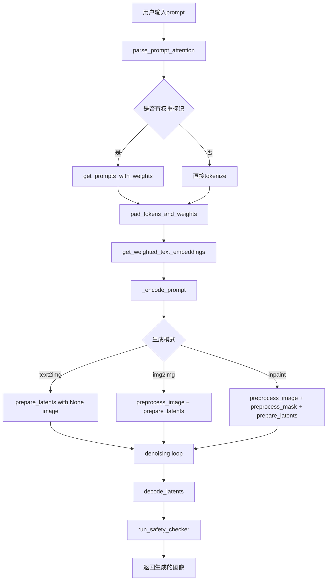
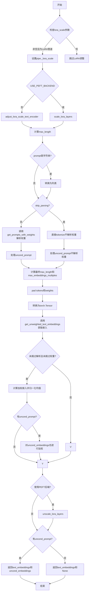
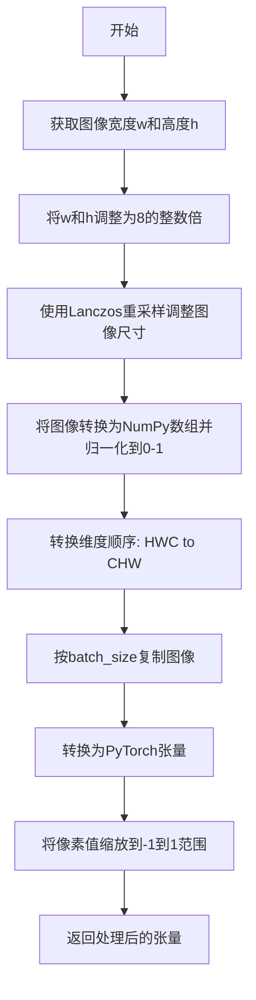
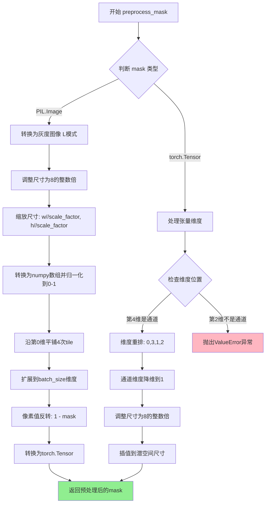
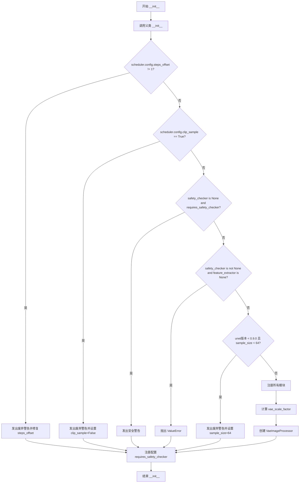
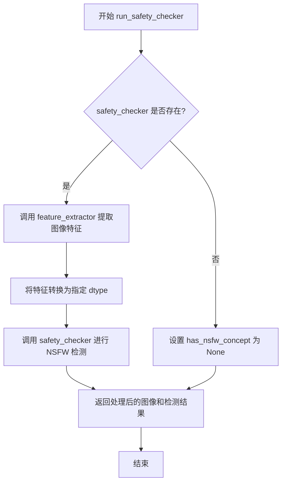
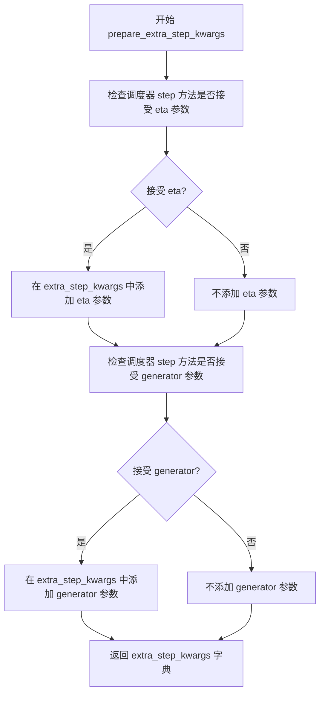
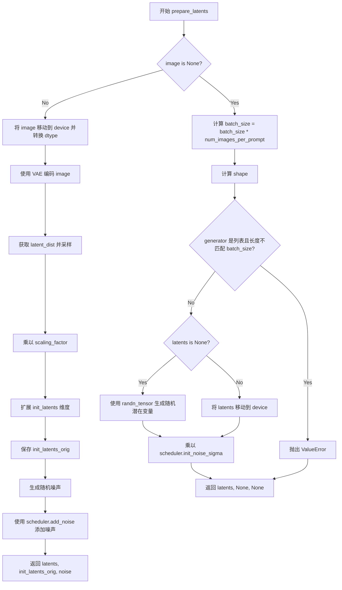
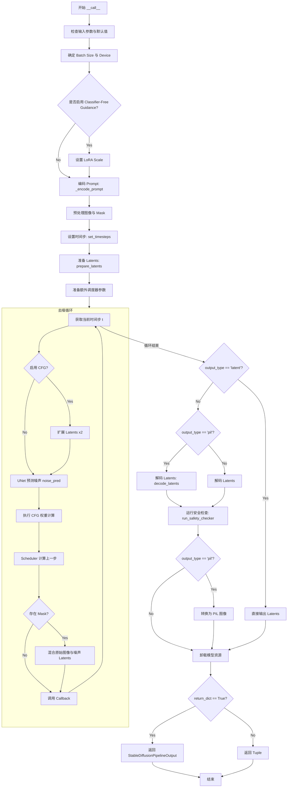
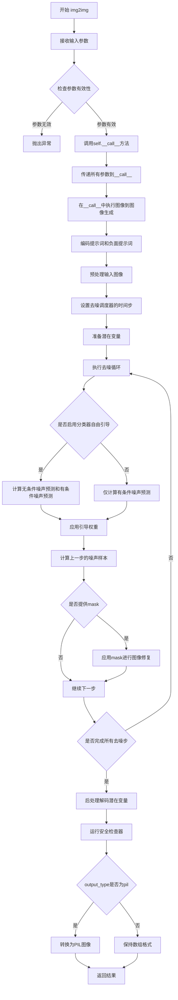

# `diffusers\examples\community\lpw_stable_diffusion.py` 详细设计文档

这是一个支持无限制token长度和prompt权重解析的Stable Diffusion Pipeline，通过解析prompt中的括号标记（如 '(word:1.5)' 增加权重、'[word]' 减少权重）来控制生成图像时各词汇的注意力权重，支持文本到图像、图像到图像和inpainting三种生成模式。

## 整体流程



## 类结构

```
DiffusionPipeline (基类)
├── StableDiffusionMixin
├── TextualInversionLoaderMixin
├── StableDiffusionLoraLoaderMixin
├── FromSingleFileMixin
└── StableDiffusionLongPromptWeightingPipeline (主类)
```

## 全局变量及字段


### `logger`
    
Logger instance for the module, used for logging warnings and messages

类型：`logging.Logger`
    


### `re_attention`
    
Compiled regex pattern for parsing attention tokens in prompts

类型：`re.Pattern`
    


### `StableDiffusionLongPromptWeightingPipeline.vae`
    
Variational Auto-Encoder model for encoding and decoding images to and from latent representations

类型：`AutoencoderKL`
    


### `StableDiffusionLongPromptWeightingPipeline.text_encoder`
    
Frozen CLIP text encoder for converting text prompts into embeddings

类型：`CLIPTextModel`
    


### `StableDiffusionLongPromptWeightingPipeline.tokenizer`
    
CLIP tokenizer for tokenizing text prompts into token IDs

类型：`CLIPTokenizer`
    


### `StableDiffusionLongPromptWeightingPipeline.unet`
    
Conditional U-Net architecture for denoising encoded image latents

类型：`UNet2DConditionModel`
    


### `StableDiffusionLongPromptWeightingPipeline.scheduler`
    
Diffusion scheduler for controlling the denoising process

类型：`KarrasDiffusionSchedulers`
    


### `StableDiffusionLongPromptWeightingPipeline.safety_checker`
    
Safety checker module for detecting potentially harmful generated content

类型：`StableDiffusionSafetyChecker`
    


### `StableDiffusionLongPromptWeightingPipeline.feature_extractor`
    
CLIP image processor for extracting features from images for safety checking

类型：`CLIPImageProcessor`
    


### `StableDiffusionLongPromptWeightingPipeline.vae_scale_factor`
    
Scale factor derived from VAE block output channels, used for computing latent dimensions

类型：`int`
    


### `StableDiffusionLongPromptWeightingPipeline.image_processor`
    
VAE image processor for pre-processing and post-processing images

类型：`VaeImageProcessor`
    
    

## 全局函数及方法


### `parse_prompt_attention`

解析带有注意力权重的提示字符串，将其转换为文本-权重对列表。该函数是 Stable Diffusion 长提示加权管道的核心组件，用于处理用户通过圆括号和方括号指定的词语权重。

**参数：**

- `text`：`str`，要解析的提示字符串，支持以下语法：
  - `(abc)` - 将 abc 的注意力权重增加 1.1 倍
  - `(abc:3.12)` - 将 abc 的注意力权重增加 3.12 倍
  - `[abc]` - 将 abc 的注意力权重减少为 1/1.1 倍
  - `\\(`, `\\)` - 转义字符，表示字面意义上的括号

**返回值：**`List[List[Union[str, float]]]`，返回嵌套列表，每个元素为 `[文本片段, 权重值]` 的形式

#### 流程图

```mermaid
flowchart TD
    A[开始: 输入提示文本] --> B[初始化结果列表和括号栈]
    B --> C[定义默认权重乘数: 圆括号1.1, 方括号1/1.1]
    C --> D{遍历正则匹配结果}
    
    D -->|遇到转义字符 \\| E[提取转义后的字符, 权重1.0]
    E --> D
    
    D -->|遇到开圆括号 (| F[将当前位置加入圆括号栈]
    F --> D
    
    D -->|遇到开方括号 [| G[将当前位置加入方括号栈]
    G --> D
    
    D -->|遇到带权重的圆括号 abc:1.5| H[弹出栈顶位置, 应用权重到该位置之后的所有文本]
    H --> D
    
    D -->|遇到闭圆括号 )| I[弹出栈顶位置, 应用圆括号乘数]
    I --> D
    
    D -->|遇到闭方括号 ]| J[弹出栈顶位置, 应用方括号乘数]
    J --> D
    
    D -->|其他文本| K[直接添加到结果, 权重1.0]
    K --> D
    
    D -->|遍历结束| L{结果为空?}
    L -->|是| M[返回 [['', 1.0]]]
    L -->|否| N{存在未匹配的括号?}
    N -->|是| O[对未匹配的括号应用默认乘数]
    O --> P
    N -->|否| P{存在相同权重的连续文本?}
    
    P -->|是| Q[合并相邻的相同权重文本]
    Q --> R[返回最终结果]
    P -->|否| R
    
    M --> R
    
    style A fill:#e1f5fe
    style R fill:#c8e6c9
```

#### 带注释源码

```python
def parse_prompt_attention(text):
    """
    Parses a string with attention tokens and returns a list of pairs: text and its associated weight.
    Accepted tokens are:
      (abc) - increases attention to abc by a multiplier of 1.1
      (abc:3.12) - increases attention to abc by a multiplier of 3.12
      [abc] - decreases attention to abc by a multiplier of 1.1
      \\( - literal character '('
      \\[ - literal character '['
      \\) - literal character ')'
      \\] - literal character ']'
      \\ - literal character '\'
      anything else - just text
    >>> parse_prompt_attention('normal text')
    [['normal text', 1.0]]
    >>> parse_prompt_attention('an (important) word')
    [['an ', 1.0], ['important', 1.1], [' word', 1.0]]
    >>> parse_prompt_attention('(unbalanced')
    [['unbalanced', 1.1]]
    >>> parse_prompt_attention('\\(literal\\]')
    [['(literal]', 1.0]]
    >>> parse_prompt_attention('(unnecessary)(parens)')
    [['unnecessaryparens', 1.1]]
    >>> parse_prompt_attention('a (((house:1.3)) [on] a (hill:0.5), sun, (((sky))).')
    [['a ', 1.0],
     ['house', 1.5730000000000004],
     [' ', 1.1],
     ['on', 1.0],
     [' a ', 1.1],
     ['hill', 0.55],
     [', sun, ', 1.1],
     ['sky', 1.4641000000000006],
     ['.', 1.1]]
    """
    # 初始化结果列表，用于存储解析后的文本-权重对
    res = []
    # 栈用于追踪未匹配的圆括号位置
    round_brackets = []
    # 栈用于追踪未匹配的方括号位置
    square_brackets = []

    # 定义默认权重乘数：圆括号增加权重，方括号减少权重
    round_bracket_multiplier = 1.1
    square_bracket_multiplier = 1 / 1.1

    def multiply_range(start_position, multiplier):
        """
        内部函数：将指定位置之后的所有文本权重乘以给定乘数
        用于实现括号对文本权重的影响范围
        """
        for p in range(start_position, len(res)):
            res[p][1] *= multiplier

    # 使用正则表达式遍历输入文本的每个匹配项
    for m in re_attention.finditer(text):
        # 获取当前匹配的完整文本
        text = m.group(0)
        # 获取捕获的权重值（如果存在）
        weight = m.group(1)

        # 处理转义字符：以反斜杠开头的字符视为字面字符
        if text.startswith("\\"):
            res.append([text[1:], 1.0])
        # 处理开圆括号：将其位置入栈
        elif text == "(":
            round_brackets.append(len(res))
        # 处理开方括号：将其位置入栈
        elif text == "[":
            square_brackets.append(len(res))
        # 处理带权重的圆括号，如 (abc:1.5)
        elif weight is not None and len(round_brackets) > 0:
            multiply_range(round_brackets.pop(), float(weight))
        # 处理闭圆括号：应用圆括号乘数
        elif text == ")" and len(round_brackets) > 0:
            multiply_range(round_brackets.pop(), round_bracket_multiplier)
        # 处理闭方括号：应用方括号乘数
        elif text == "]" and len(square_brackets) > 0:
            multiply_range(square_brackets.pop(), square_bracket_multiplier)
        # 其他情况：普通文本，权重为1.0
        else:
            res.append([text, 1.0])

    # 处理未匹配的括号：将其视为闭括号处理
    for pos in round_brackets:
        multiply_range(pos, round_bracket_multiplier)

    for pos in square_brackets:
        multiply_range(pos, square_bracket_multiplier)

    # 如果结果为空，返回默认值
    if len(res) == 0:
        res = [["", 1.0]]

    # 合并相邻的相同权重文本，优化结果
    i = 0
    while i + 1 < len(res):
        if res[i][1] == res[i + 1][1]:
            # 合并文本
            res[i][0] += res[i + 1][0]
            # 移除相邻项
            res.pop(i + 1)
        else:
            i += 1

    return res
```


### `get_prompts_with_weights`

该函数用于将提示词列表进行分词，并根据提示词中的注意力权重标记对每个token进行权重分配。它通过解析提示词中的括号语法（如 `(word:1.5)` 或 `[word]`）来提取权重，然后对每个分词后的token复制相应的权重值，最后返回tokens和weights两个列表。

参数：

- `pipe`：`DiffusionPipeline`，用于访问tokenizer进行分词
- `prompt`：`List[str]`要进行分词并提取权重的提示词列表
- `max_length`：`int`，token的最大长度限制，超过此长度会被截断

返回值：`Tuple[List[List[int]], List[List[float]]]`，返回两个列表——第一个是token列表的列表，第二个是对应token权重列表的列表

#### 流程图

```mermaid
flowchart TD
    A[开始] --> B[初始化空列表 tokens, weights 和 truncated 标志]
    B --> C{遍历 prompt 中的每个 text}
    C --> D[调用 parse_prompt_attention 解析 text]
    D --> E[初始化 text_token, text_weight]
    E --> F{遍历解析结果中的每个 word 和 weight}
    F --> G[使用 pipe.tokenizer 对 word 分词, 去掉首尾token]
    G --> H[将分词结果追加到 text_token]
    H --> I[将 weight 复制 len(token) 次追加到 text_weight]
    I --> J{检查 text_token 长度是否超过 max_length}
    J -->|是| K[设置 truncated=True, 跳出内层循环]
    J -->|否| F
    K --> L{检查 text_token 长度是否超过 max_length}
    L -->|是| M[truncated=True, 截断到 max_length]
    L -->|否| N[将 text_token 和 text_weight 加入列表]
    M --> N
    N --> C
    C -->|遍历完成| O{truncated 为 True?}
    O -->|是| P[记录警告日志: Prompt was truncated...]
    O -->|否| Q[返回 tokens, weights]
    P --> Q
```

#### 带注释源码

```python
def get_prompts_with_weights(pipe: DiffusionPipeline, prompt: List[str], max_length: int):
    r"""
    Tokenize a list of prompts and return its tokens with weights of each token.

    No padding, starting or ending token is included.
    """
    # 初始化结果列表和截断标志
    tokens = []
    weights = []
    truncated = False
    
    # 遍历提示词列表中的每个文本
    for text in prompt:
        # 解析提示词中的注意力权重标记，返回 [[word, weight], ...] 格式
        texts_and_weights = parse_prompt_attention(text)
        
        # 初始化当前文本的token和权重列表
        text_token = []
        text_weight = []
        
        # 遍历解析后的每个词及其权重
        for word, weight in texts_and_weights:
            # 使用tokenizer分词，并去掉起始和结束token（索引1:-1）
            token = pipe.tokenizer(word).input_ids[1:-1]
            
            # 将分词结果追加到当前token列表
            text_token += token
            
            # 将权重复制与token数量相同的次数，实现权重到每个token的映射
            text_weight += [weight] * len(token)
            
            # 如果token长度超过限制，提前停止处理当前文本
            if len(text_token) > max_length:
                truncated = True
                break
        
        # 截断处理：如果token仍超过最大长度，进行截断
        if len(text_token) > max_length:
            truncated = True
            text_token = text_token[:max_length]
            text_weight = text_weight[:max_length]
        
        # 将当前文本的处理结果添加到结果列表
        tokens.append(text_token)
        weights.append(text_weight)
    
    # 如果发生过截断，记录警告日志
    if truncated:
        logger.warning("Prompt was truncated. Try to shorten the prompt or increase max_embeddings_multiples")
    
    # 返回tokens和对应的权重列表
    return tokens, weights
```


### `pad_tokens_and_weights`

该函数用于将输入的 token 列表和权重列表填充（padding）到指定的最大长度，在 token 序列的首尾添加起始符（BOS）、结束符（EOS）和填充符（PAD），同时将权重在首尾位置设置为默认值 1.0，以适配 Stable Diffusion 文本编码器的固定输入长度要求。

参数：

- `tokens`：`List[List[int]]`，待填充的 token 列表，每个内部列表代表一个 prompt 解析后的 token 序列
- `weights`：`List[List[float]]`，与 tokens 对应的权重列表，每个内部列表包含各 token 对应的权重值
- `max_length`：`int`，填充后的最大长度目标
- `bos`：`int`，起始符（Beginning of Sequence）的 token ID
- `eos`：`int`，结束符（End of Sequence）的 token ID
- `pad`：`int`，填充符（Padding）的 token ID
- `no_boseos_middle`：`bool`，默认为 True，控制在多个 chunk 拼接时是否在中间 chunk 保留 BOS/EOS
- `chunk_length`：`int`，默认为 77，单个 chunk 的长度限制（通常为 CLIP 文本编码器的最大长度）

返回值：`Tuple[List[List[int]], List[List[float]]]`，返回填充后的 tokens 和 weights 列表

#### 流程图

```mermaid
flowchart TD
    A[开始: pad_tokens_and_weights] --> B[计算 max_embeddings_multiples 和 weights_length]
    B --> C{遍历每个 token 列表}
    C --> D[添加 BOS + tokens[i] + padding + EOS]
    D --> E{no_boseos_middle == True?}
    E -->|Yes| F[weights: 1.0 + weights[i] + 1.0 填充到长度]
    E -->|No| G{weights[i] 为空?}
    G -->|Yes| H[weights: 全 1.0 填充到 weights_length]
    G -->|No| I[为每个 chunk 添加 1.0 权重]
    I --> J[剩余位置用 1.0 填充]
    F --> K{所有 tokens 处理完毕?}
    H --> K
    J --> K
    K -->|No| C
    K -->|Yes| L[返回 tokens, weights]
```

#### 带注释源码

```python
def pad_tokens_and_weights(tokens, weights, max_length, bos, eos, pad, no_boseos_middle=True, chunk_length=77):
    r"""
    Pad the tokens (with starting and ending tokens) and weights (with 1.0) to max_length.
    
    该函数确保每个 token 序列都被填充到统一的最大长度，以便能够批量送入文本编码器。
    同时确保权重数组与 token 数组长度一致，并在首尾位置设置默认权重值 1.0。
    """
    # 计算可以容纳的 chunk 数量（每个 chunk 长度为 chunk_length）
    # 减去 2 是因为首尾需要保留 BOS 和 EOS
    max_embeddings_multiples = (max_length - 2) // (chunk_length - 2)
    
    # 确定权重的目标长度：若 no_boseos_middle 为 True，则权重长度等于 max_length
    # 否则，权重长度等于 chunk 数量乘以单个 chunk 长度
    weights_length = max_length if no_boseos_middle else max_embeddings_multiples * chunk_length
    
    # 遍历每个 prompt 对应的 token 和权重列表
    for i in range(len(tokens)):
        # 构造完整的 token 序列：[BOS] + 原始 tokens + [PAD...] + [EOS]
        # 需要保证总长度为 max_length，因此需要填充 (max_length - 1 - len(tokens[i]) - 1) 个 PAD
        tokens[i] = [bos] + tokens[i] + [pad] * (max_length - 1 - len(tokens[i]) - 1) + [eos]
        
        # 根据 no_boseos_middle 参数决定权重的填充方式
        if no_boseos_middle:
            # 简单模式：首尾权重设为 1.0，中间保持原始权重，不足部分用 1.0 填充
            weights[i] = [1.0] + weights[i] + [1.0] * (max_length - 1 - len(weights[i]))
        else:
            # 复杂模式：处理多个 chunk 的情况
            w = []
            if len(weights[i]) == 0:
                # 若原始权重为空，则全部填充为 1.0
                w = [1.0] * weights_length
            else:
                # 为每个 chunk 添加起始和结束权重（均为 1.0）
                for j in range(max_embeddings_multiples):
                    w.append(1.0)  # weight for starting token in this chunk
                    # 提取当前 chunk 对应的权重片段
                    w += weights[i][j * (chunk_length - 2) : min(len(weights[i]), (j + 1) * (chunk_length - 2))]
                    w.append(1.0)  # weight for ending token in this chunk
                # 剩余位置用 1.0 填充至目标长度
                w += [1.0] * (weights_length - len(w))
            weights[i] = w[:]

    return tokens, weights
```


### `get_unweighted_text_embeddings`

该函数用于处理长文本提示的嵌入计算。当文本token长度超过文本编码器的容量（如77）时，将文本分割为多个块分别编码，最后拼接成完整的文本嵌入向量。支持通过`clip_skip`参数跳过CLIP的若干层以获取不同层次的表示。

参数：

- `pipe`：`DiffusionPipeline`，管道对象，提供对text_encoder和tokenizer的访问
- `text_input`：`torch.Tensor`，文本输入的张量（token IDs），形状为(batch_size, seq_len)
- `chunk_length`：`int`，文本编码器的最大长度，通常为77（CLIP模型的固定长度）
- `no_boseos_middle`：`Optional[bool] = True`，是否在中间块中保留开始（BOS）和结束（EOS）标记；为True时中间块去除首尾标记
- `clip_skip`：`Optional[int] = None`，跳过CLIP编码器的最后N层，使用倒数第N+1层的输出

返回值：`torch.Tensor`，文本嵌入向量，形状为(batch_size, seq_len, hidden_size)

#### 流程图

```mermaid
flowchart TD
    A[开始] --> B{计算max_embeddings_multiples}
    B --> C{max_embeddings_multiples > 1?}
    
    C -->|Yes| D[遍历每个块 i in range{max_embeddings_multiples}]
    D --> E[提取第i个文本块]
    E --> F[设置块的首尾标记为原始输入的首尾标记]
    F --> G{clip_skip is None?}
    
    G -->|Yes| H[直接调用text_encoder获取嵌入]
    G -->|No| I[获取隐藏状态并应用clip_skip]
    I --> J[应用final_layer_norm归一化]
    
    H --> K{no_boseos_middle?}
    J --> K
    
    K -->|i==0| L[去除末尾标记]
    K -->|i==max-1| M[去除开头标记]
    K -->|中间块| N[去除首尾标记]
    
    L --> O[将块嵌入添加到列表]
    M --> O
    N --> O
    
    O --> P{还有更多块?}
    P -->|Yes| D
    P -->|No| Q[拼接所有块嵌入]
    Q --> R[返回完整嵌入]
    
    C -->|No| S{clip_skip is None?}
    S -->|Yes| T[设置clip_skip=0]
    S -->|No| U[获取隐藏状态并应用clip_skip]
    T --> V[获取最后一层隐藏状态]
    U --> V
    V --> W[应用final_layer_norm归一化]
    W --> R
```

#### 带注释源码

```python
def get_unweighted_text_embeddings(
    pipe: DiffusionPipeline,
    text_input: torch.Tensor,
    chunk_length: int,
    no_boseos_middle: Optional[bool] = True,
    clip_skip: Optional[int] = None,
):
    """
    当文本token长度是文本编码器容量的倍数时，需要将其分割成多个块，
    分别送入文本编码器，然后拼接结果。
    
    参数:
        pipe: DiffusionPipeline - 管道对象，提供text_encoder和tokenizer
        text_input: torch.Tensor - token IDs张量，形状为(batch_size, seq_len)
        chunk_length: int - 文本编码器最大长度，通常为77
        no_boseos_middle: bool - 是否在中间块保留BOS/EOS标记
        clip_skip: int - 跳过的CLIP层数
    
    返回:
        torch.Tensor - 文本嵌入向量
    """
    # 计算最大嵌入倍数：(seq_len - 2) // (chunk_length - 2)
    # 减去2是因为首尾各有一个特殊标记(BOS和EOS)
    max_embeddings_multiples = (text_input.shape[1] - 2) // (chunk_length - 2)
    
    # 如果需要分块处理
    if max_embeddings_multiples > 1:
        text_embeddings = []  # 存储所有块的嵌入
        
        # 遍历每个文本块
        for i in range(max_embeddings_multiples):
            # 提取第i个块：从i*(chunk_length-2)到(i+1)*(chunk_length-2)+2
            # +2是为了包含BOS和EOS标记
            text_input_chunk = text_input[:, i * (chunk_length - 2) : (i + 1) * (chunk_length - 2) + 2].clone()
            
            # 用原始输入的首尾标记覆盖当前块的首尾标记
            # 确保每个块都有正确的BOS和EOS
            text_input_chunk[:, 0] = text_input[0, 0]
            text_input_chunk[:, -1] = text_input[0, -1]
            
            # 根据clip_skip参数决定如何获取嵌入
            if clip_skip is None:
                # 直接获取最后一层隐藏状态
                prompt_embeds = pipe.text_encoder(text_input_chunk.to(pipe.device))
                text_embedding = prompt_embeds[0]
            else:
                # 获取所有隐藏状态，选择倒数第(clip_skip+1)层
                prompt_embeds = pipe.text_encoder(text_input_chunk.to(pipe.device), output_hidden_states=True)
                # prompt_embeds[-1]是元组，包含所有层的隐藏状态
                # [-(clip_skip + 1)]选择倒数第N层
                prompt_embeds = prompt_embeds[-1][-(clip_skip + 1)]
                # 应用最终层归一化，这是原始CLIP获取最终嵌入的标准做法
                text_embedding = pipe.text_encoder.text_model.final_layer_norm(prompt_embeds)
            
            # 根据no_boseos_middle处理首尾标记
            if no_boseos_middle:
                if i == 0:
                    # 第一个块：保留开头，去除结尾
                    text_embedding = text_embedding[:, :-1]
                elif i == max_embeddings_multiples - 1:
                    # 最后一个块：去除开头，保留结尾
                    text_embedding = text_embedding[:, 1:]
                else:
                    # 中间块：去除首尾
                    text_embedding = text_embedding[:, 1:-1]
            
            # 将当前块的嵌入添加到列表
            text_embeddings.append(text_embedding)
        
        # 沿序列维度拼接所有块的嵌入
        text_embeddings = torch.concat(text_embeddings, axis=1)
    else:
        # 不需要分块，直接处理整个输入
        if clip_skip is None:
            clip_skip = 0
        
        # 获取倒数第(clip_skip+1)层的隐藏状态
        prompt_embeds = pipe.text_encoder(text_input, output_hidden_states=True)[-1][-(clip_skip + 1)]
        # 应用最终层归一化
        text_embeddings = pipe.text_encoder.text_model.final_layer_norm(prompt_embeds)
    
    return text_embeddings
```


### `get_weighted_text_embeddings`

该函数是Stable Diffusion长提示加权管道的核心函数，负责解析带权重的文本提示（如`(word)`或`[word]`语法），将其token化并通过文本编码器生成加权文本嵌入向量，同时支持无条件和条件提示的嵌入计算，用于后续的图像生成任务。

参数：

- `pipe`：`DiffusionPipeline`，提供访问tokenizer和text_encoder的管道实例
- `prompt`：`Union[str, List[str]]`，用于引导图像生成的文本提示，支持单个字符串或字符串列表
- `uncond_prompt`：`Optional[Union[str, List[str]]]`，无条件提示，用于无分类器引导生成，若提供则返回的嵌入将包含条件和条件两部分
- `max_embeddings_multiples`：`Optional[int]`，默认值为3，提示嵌入相对于文本编码器最大输出长度的倍数
- `no_boseos_middle`：`Optional[bool]`，默认值为False，当token长度是文本编码器容量的倍数时，是否在每个中间块的开始和结束位置保留特殊token
- `skip_parsing`：`Optional[bool]`，默认值为False，是否跳过括号权重解析
- `skip_weighting`：`Optional[bool]`，默认值为False，是否跳过权重应用，当跳过解析时该参数会被强制为True
- `clip_skip`：`Optional[int]`，CLIP编码时跳过的层数，用于获取不同层的隐藏状态
- `lora_scale`：`Optional[float]`，LoRA权重缩放因子，用于动态调整LoRA层的影响

返回值：`Tuple[torch.Tensor, Optional[torch.Tensor]]`，返回加权后的文本嵌入张量和无条件文本嵌入（若提供了uncond_prompt则返回其嵌入，否则返回None）

#### 流程图



#### 带注释源码

```python
def get_weighted_text_embeddings(
    pipe: DiffusionPipeline,
    prompt: Union[str, List[str]],
    uncond_prompt: Optional[Union[str, List[str]]] = None,
    max_embeddings_multiples: Optional[int] = 3,
    no_boseos_middle: Optional[bool] = False,
    skip_parsing: Optional[bool] = False,
    skip_weighting: Optional[bool] = False,
    clip_skip=None,
    lora_scale=None,
):
    r"""
    Prompts can be assigned with local weights using brackets. For example,
    prompt 'A (very beautiful) masterpiece' highlights the words 'very beautiful',
    and the embedding tokens corresponding to the words get multiplied by a constant, 1.1.

    Also, to regularize of the embedding, the weighted embedding would be scaled to preserve the original mean.

    Args:
        pipe (`DiffusionPipeline`):
            Pipe to provide access to the tokenizer and the text encoder.
        prompt (`str` or `List[str]`):
            The prompt or prompts to guide the image generation.
        uncond_prompt (`str` or `List[str]`):
            The unconditional prompt or prompts for guide the image generation. If unconditional prompt
            is provided, the embeddings of prompt and uncond_prompt are concatenated.
        max_embeddings_multiples (`int`, *optional*, defaults to `3`):
            The max multiple length of prompt embeddings compared to the max output length of text encoder.
        no_boseos_middle (`bool`, *optional*, defaults to `False`):
            If the length of text token is multiples of the capacity of text encoder, whether reserve the starting and
            ending token in each of the chunk in the middle.
        skip_parsing (`bool`, *optional*, defaults to `False`):
            Skip the parsing of brackets.
        skip_weighting (`bool`, *optional*, defaults to `False`):
            Skip the weighting. When the parsing is skipped, it is forced True.
    """
    # 设置lora scale以便文本编码器的LoRA函数可以正确访问
    # 如果提供了lora_scale且pipe支持LoRA，则动态调整LoRA scale
    if lora_scale is not None and isinstance(pipe, StableDiffusionLoraLoaderMixin):
        pipe._lora_scale = lora_scale

        # 动态调整LoRA scale
        if not USE_PEFT_BACKEND:
            adjust_lora_scale_text_encoder(pipe.text_encoder, lora_scale)
        else:
            scale_lora_layers(pipe.text_encoder, lora_scale)
    
    # 计算最大长度：基于tokenizer的model_max_length和倍数
    max_length = (pipe.tokenizer.model_max_length - 2) * max_embeddings_multiples + 2
    
    # 如果prompt是字符串，转换为列表统一处理
    if isinstance(prompt, str):
        prompt = [prompt]

    # 根据skip_parsing标志决定是否解析权重
    if not skip_parsing:
        # 解析提示词中的权重标记，生成带权重的tokens和weights
        prompt_tokens, prompt_weights = get_prompts_with_weights(pipe, prompt, max_length - 2)
        
        # 处理无条件提示
        if uncond_prompt is not None:
            if isinstance(uncond_prompt, str):
                uncond_prompt = [uncond_prompt]
            uncond_tokens, uncond_weights = get_prompts_with_weights(pipe, uncond_prompt, max_length - 2)
    else:
        # 跳过解析时，直接tokenize并设置权重为1.0
        prompt_tokens = [
            token[1:-1] for token in pipe.tokenizer(prompt, max_length=max_length, truncation=True).input_ids
        ]
        prompt_weights = [[1.0] * len(token) for token in prompt_tokens]
        
        # 处理无条件提示（无权重）
        if uncond_prompt is not None:
            if isinstance(uncond_prompt, str):
                uncond_prompt = [uncond_prompt]
            uncond_tokens = [
                token[1:-1]
                for token in pipe.tokenizer(uncond_prompt, max_length=max_length, truncation=True).input_ids
            ]
            uncond_weights = [[1.0] * len(token) for token in uncond_tokens]

    # 计算最终的max_length（所有token中最长的长度）
    max_length = max([len(token) for token in prompt_tokens])
    if uncond_prompt is not None:
        max_length = max(max_length, max([len(token) for token in uncond_tokens]))

    # 调整max_embeddings_multiples，确保不超过实际token长度
    max_embeddings_multiples = min(
        max_embeddings_multiples,
        (max_length - 1) // (pipe.tokenizer.model_max_length - 2) + 1,
    )
    max_embeddings_multiples = max(1, max_embeddings_multiples)
    max_length = (pipe.tokenizer.model_max_length - 2) * max_embeddings_multiples + 2

    # 获取特殊token的id
    bos = pipe.tokenizer.bos_token_id  # 开始token
    eos = pipe.tokenizer.eos_token_id  # 结束token
    pad = getattr(pipe.tokenizer, "pad_token_id", eos)  # 填充token
    
    # 对tokens和weights进行padding，使其长度一致
    prompt_tokens, prompt_weights = pad_tokens_and_weights(
        prompt_tokens,
        prompt_weights,
        max_length,
        bos,
        eos,
        pad,
        no_boseos_middle=no_boseos_middle,
        chunk_length=pipe.tokenizer.model_max_length,
    )
    
    # 转换为torch tensor并移动到设备
    prompt_tokens = torch.tensor(prompt_tokens, dtype=torch.long, device=pipe.device)
    
    # 处理无条件prompt的tokens和weights
    if uncond_prompt is not None:
        uncond_tokens, uncond_weights = pad_tokens_and_weights(
            uncond_tokens,
            uncond_weights,
            max_length,
            bos,
            eos,
            pad,
            no_boseos_middle=no_boseos_middle,
            chunk_length=pipe.tokenizer.model_max_length,
        )
        uncond_tokens = torch.tensor(uncond_tokens, dtype=torch.long, device=pipe.device)

    # 获取不带权重的文本嵌入（处理chunked编码）
    text_embeddings = get_unweighted_text_embeddings(
        pipe, prompt_tokens, pipe.tokenizer.model_max_length, no_boseos_middle=no_boseos_middle, clip_skip=clip_skip
    )
    
    # 转换weights为tensor并与embeddings设备一致
    prompt_weights = torch.tensor(prompt_weights, dtype=text_embeddings.dtype, device=text_embeddings.device)
    
    # 获取无条件嵌入
    if uncond_prompt is not None:
        uncond_embeddings = get_unweighted_text_embeddings(
            pipe,
            uncond_tokens,
            pipe.tokenizer.model_max_length,
            no_boseos_middle=no_boseos_middle,
            clip_skip=clip_skip,
        )
        uncond_weights = torch.tensor(uncond_weights, dtype=uncond_embeddings.dtype, device=uncond_embeddings.device)

    # 为提示分配权重并按均值归一化
    # TODO: 应该按chunk还是整体归一化（当前实现是整体）？
    if (not skip_parsing) and (not skip_weighting):
        # 对prompt embeddings进行加权
        previous_mean = text_embeddings.float().mean(axis=[-2, -1]).to(text_embeddings.dtype)
        text_embeddings *= prompt_weights.unsqueeze(-1)  # 应用权重
        current_mean = text_embeddings.float().mean(axis=[-2, -1]).to(text_embeddings.dtype)
        text_embeddings *= (previous_mean / current_mean).unsqueeze(-1).unsqueeze(-1)  # 归一化保持均值
        
        # 对uncond_embeddings也进行相同的加权处理
        if uncond_prompt is not None:
            previous_mean = uncond_embeddings.float().mean(axis=[-2, -1]).to(uncond_embeddings.dtype)
            uncond_embeddings *= uncond_weights.unsqueeze(-1)
            current_mean = uncond_embeddings.float().mean(axis=[-2, -1]).to(uncond_embeddings.dtype)
            uncond_embeddings *= (previous_mean / current_mean).unsqueeze(-1).unsqueeze(-1)

    # 如果使用了PEFT后端，需要恢复原始的LoRA scale
    if pipe.text_encoder is not None:
        if isinstance(pipe, StableDiffusionLoraLoaderMixin) and USE_PEFT_BACKEND:
            # 通过unscaling LoRA layers恢复原始scale
            unscale_lora_layers(pipe.text_encoder, lora_scale)

    # 返回结果：如果有uncond_prompt则返回两个embeddings，否则返回(None,)
    if uncond_prompt is not None:
        return text_embeddings, uncond_embeddings
    return text_embeddings, None
```


### `preprocess_image`

该函数用于将输入的PIL图像对象进行预处理，包括调整图像尺寸使其为8的整数倍、归一化像素值到[0,1]范围、转换为PyTorch张量格式，并进行批次复制以适应批量处理需求。

参数：

- `image`：`PIL.Image.Image`，输入的PIL图像对象，需要进行调整和转换
- `batch_size`：`int`，批次大小，指定需要将图像复制多少次以形成批次

返回值：`torch.Tensor`，处理后的图像张量，形状为(batch_size, C, H, W)，像素值已缩放至[-1, 1]范围

#### 流程图



#### 带注释源码

```python
def preprocess_image(image, batch_size):
    """
    预处理输入的PIL图像，将其转换为适合Stable Diffusion模型的张量格式。
    
    处理步骤：
    1. 调整图像尺寸为8的倍数（UNet的要求）
    2. 使用Lanczos重采样进行高质量缩放
    3. 归一化像素值到[0, 1]范围
    4. 转换维度从HWC到CHW格式（PyTorch标准）
    5. 按批次大小复制图像
    6. 转换为PyTorch张量
    7. 将像素值缩放到[-1, 1]范围（Stable Diffusion模型的输入要求）
    
    参数:
        image: 输入的PIL图像对象
        batch_size: 批次大小，用于生成多个相同的图像样本
    
    返回:
        预处理后的PyTorch张量，形状为(batch_size, 3, height, width)
    """
    # 获取原始图像的宽度和高度
    w, h = image.size
    
    # 将宽度和高度调整为8的整数倍，确保能被UNet下采样整除
    # 例如: 512 -> 512, 513 -> 512, 510 -> 504
    w, h = (x - x % 8 for x in (w, h))
    
    # 使用Lanczos重采样方法调整图像尺寸（高质量的图像缩放算法）
    image = image.resize((w, h), resample=PIL_INTERPOLATION["lanczos"])
    
    # 将PIL图像转换为NumPy数组，并归一化像素值到[0, 1]范围
    image = np.array(image).astype(np.float32) / 255.0
    
    # 转换维度顺序：从HWC (Height, Width, Channel) 转换为CHW (Channel, Height, Width)
    # image[None] 添加批次维度，transpose(0, 3, 1, 2) 重新排列维度顺序
    image = np.vstack([image[None].transpose(0, 3, 1, 2)] * batch_size)
    
    # 将NumPy数组转换为PyTorch张量
    image = torch.from_numpy(image)
    
    # 将像素值从[0, 1]范围缩放到[-1, 1]范围，这是Stable Diffusion模型的输入要求
    return 2.0 * image - 1.0
```


### `preprocess_mask`

该函数负责将输入的掩码（mask）图像预处理为适合Stable Diffusion模型输入格式的张量。支持两种输入类型：PIL图像或PyTorch张量，并进行尺寸调整、归一化、通道处理等操作，以确保掩码与潜空间尺寸匹配。

参数：

- `mask`：`Union[PIL.Image.Image, torch.Tensor]`，待预处理的掩码图像，可以是PIL图像或PyTorch张量
- `batch_size`：`int`，批次大小，用于将掩码扩展到对应的批次维度
- `scale_factor`：`int`，缩放因子，默认为8，用于将掩码尺寸缩小到潜空间维度

返回值：`torch.Tensor`，预处理后的掩码张量，形状为 `(batch_size, 4, H // scale_factor, W // scale_factor)`

#### 流程图



#### 带注释源码

```python
def preprocess_mask(mask, batch_size, scale_factor=8):
    """
    预处理掩码图像,将其转换为适合Stable Diffusion的潜空间尺寸
    
    Args:
        mask: 输入的掩码,可以是PIL.Image或torch.Tensor
        batch_size: 批次大小
        scale_factor: 缩放因子,用于将像素空间尺寸转换为潜空间尺寸
    
    Returns:
        处理后的torch.Tensor掩码,形状为 (batch_size, 4, H//scale_factor, W//scale_factor)
    """
    # ============================================================
    # 处理PIL.Image类型的掩码
    # ============================================================
    if not isinstance(mask, torch.Tensor):
        # 将图像转换为灰度模式(L通道)
        mask = mask.convert("L")
        
        # 获取图像宽高,并调整为8的整数倍
        w, h = mask.size
        w, h = (x - x % 8 for x in (w, h))  # resize to integer multiple of 8
        
        # 缩放图像尺寸到潜空间大小
        mask = mask.resize(
            (w // scale_factor, h // scale_factor), 
            resample=PIL_INTERPOLATION["nearest"]
        )
        
        # 转换为numpy数组并归一化到[0, 1]范围
        mask = np.array(mask).astype(np.float32) / 255.0
        
        # 沿第0维平铺4次(对应VAE的4个通道)
        mask = np.tile(mask, (4, 1, 1))
        
        # 扩展到batch_size维度
        mask = np.vstack([mask[None]] * batch_size)
        
        # 反转像素值:将白色(需重绘)变为黑色,黑色(保留)变为白色
        # 这样符合Stable Diffusion inpainting的习惯
        mask = 1 - mask  # repaint white, keep black
        
        # 转换为PyTorch张量
        mask = torch.from_numpy(mask)
        return mask

    # ============================================================
    # 处理torch.Tensor类型的掩码
    # ============================================================
    else:
        valid_mask_channel_sizes = [1, 3]
        
        # 如果掩码通道在第4维(PIL图像格式: B,H,W,C),则转换为PyTorch标准格式(B,C,H,W)
        if mask.shape[3] in valid_mask_channel_sizes:
            mask = mask.permute(0, 3, 1, 2)
        
        # 检查通道维度是否在正确位置
        elif mask.shape[1] not in valid_mask_channel_sizes:
            raise ValueError(
                f"Mask channel dimension of size in {valid_mask_channel_sizes} should be second or fourth dimension,"
                f" but received mask of shape {tuple(mask.shape)}"
            )
        
        # 将3通道掩码降维到1通道,以便广播到潜空间形状
        mask = mask.mean(dim=1, keepdim=True)
        
        # 获取高宽并调整为8的整数倍
        h, w = mask.shape[-2:]
        h, w = (x - x % 8 for x in (h, w))  # resize to integer multiple of 8
        
        # 使用插值调整到潜空间尺寸
        mask = torch.nn.functional.interpolate(
            mask, 
            (h // scale_factor, w // scale_factor)
        )
        return mask
```


### `StableDiffusionLongPromptWeightingPipeline.__init__`

这是Stable Diffusion长提示词加权管道的初始化方法，负责接收并验证所有必要的组件（如VAE、文本编码器、Tokenizer、UNet、调度器等），并进行配置检查和兼容性处理，确保管道能够正确运行。

参数：

- `vae`：`AutoencoderKL`，变分自编码器模型，用于编码和解码图像与潜在表示
- `text_encoder`：`CLIPTextModel`，冻结的文本编码器，Stable Diffusion使用CLIP的文本部分
- `tokenizer`：`CLIPTokenizer`，CLIP分词器，用于将文本转换为token
- `unet`：`UNet2DConditionModel`，条件U-Net架构，用于去噪编码后的图像潜在表示
- `scheduler`：`KarrasDiffusionSchedulers`，调度器，用于与U-Net一起去噪图像潜在表示
- `safety_checker`：`StableDiffusionSafetyChecker`，分类模块，用于估计生成的图像是否被认为具有攻击性或有害
- `feature_extractor`：`CLIPImageProcessor`，用于从生成的图像中提取特征，作为`safety_checker`的输入
- `requires_safety_checker`：`bool`，是否需要安全检查器，默认为True

返回值：`None`，初始化方法不返回任何值

#### 流程图



#### 带注释源码

```python
def __init__(
    self,
    vae: AutoencoderKL,
    text_encoder: CLIPTextModel,
    tokenizer: CLIPTokenizer,
    unet: UNet2DConditionModel,
    scheduler: KarrasDiffusionSchedulers,
    safety_checker: StableDiffusionSafetyChecker,
    feature_extractor: CLIPImageProcessor,
    requires_safety_checker: bool = True,
):
    """
    初始化 StableDiffusionLongPromptWeightingPipeline。
    
    参数:
        vae: 变分自编码器(VAE)模型，用于编码和解码图像到潜在表示
        text_encoder: 冻结的文本编码器(CLIP)
        tokenizer: CLIP分词器
        unet: 条件U-Net架构，用于去噪图像潜在表示
        scheduler: 调度器，用于去噪过程
        safety_checker: 安全检查器，用于过滤不安全内容
        feature_extractor: 图像特征提取器
        requires_safety_checker: 是否需要安全检查器
    """
    # 调用父类DiffusionPipeline的初始化方法
    super().__init__()

    # 检查scheduler的steps_offset配置，如果不为1则发出警告并修复
    if scheduler is not None and getattr(scheduler.config, "steps_offset", 1) != 1:
        deprecation_message = (
            f"The configuration file of this scheduler: {scheduler} is outdated. `steps_offset`"
            f" should be set to 1 instead of {scheduler.config.steps_offset}. Please make sure "
            "to update the config accordingly as leaving `steps_offset` might led to incorrect results"
            " in future versions. If you have downloaded this checkpoint from the Hugging Face Hub,"
            " it would be very nice if you could open a Pull request for the `scheduler/scheduler_config.json`"
            " file"
        )
        deprecate("steps_offset!=1", "1.0.0", deprecation_message, standard_warn=False)
        new_config = dict(scheduler.config)
        new_config["steps_offset"] = 1
        scheduler._internal_dict = FrozenDict(new_config)

    # 检查scheduler的clip_sample配置，如果为True则发出警告并修复
    if scheduler is not None and getattr(scheduler.config, "clip_sample", False) is True:
        deprecation_message = (
            f"The configuration file of this scheduler: {scheduler} has not set the configuration `clip_sample`."
            " `clip_sample` should be set to False in the configuration file. Please make sure to update the"
            " config accordingly as not setting `clip_sample` in the config might lead to incorrect results in"
            " future versions. If you have downloaded this checkpoint from the Hugging Face Hub, it would be very"
            " nice if you could open a Pull request for the `scheduler/scheduler_config.json` file"
        )
        deprecate("clip_sample not set", "1.0.0", deprecation_message, standard_warn=False)
        new_config = dict(scheduler.config)
        new_config["clip_sample"] = False
        scheduler._internal_dict = FrozenDict(new_config)

    # 如果safety_checker为None但requires_safety_checker为True，发出警告
    if safety_checker is None and requires_safety_checker:
        logger.warning(
            f"You have disabled the safety checker for {self.__class__} by passing `safety_checker=None`. Ensure"
            " that you abide to the conditions of the Stable Diffusion license and do not expose unfiltered"
            " results in services or applications open to the public. Both the diffusers team and Hugging Face"
            " strongly recommend to keep the safety filter enabled in all public facing circumstances, disabling"
            " it only for use-cases that involve analyzing network behavior or auditing its results. For more"
            " information, please have a look at https://github.com/huggingface/diffusers/pull/254 ."
        )

    # 如果有safety_checker但没有feature_extractor，抛出错误
    if safety_checker is not None and feature_extractor is None:
        raise ValueError(
            "Make sure to define a feature extractor when loading {self.__class__} if you want to use the safety"
            " checker. If you do not want to use the safety checker, you can pass `'safety_checker=None'` instead."
        )

    # 检查UNet版本和sample_size的兼容性
    is_unet_version_less_0_9_0 = (
        unet is not None
        and hasattr(unet.config, "_diffusers_version")
        and version.parse(version.parse(unet.config._diffusers_version).base_version) < version.parse("0.9.0.dev0")
    )
    is_unet_sample_size_less_64 = (
        unet is not None and hasattr(unet.config, "sample_size") and unet.config.sample_size < 64
    )
    # 如果是旧版本且sample_size小于64，发出警告并修复
    if is_unet_version_less_0_9_0 and is_unet_sample_size_less_64:
        deprecation_message = (
            "The configuration file of the unet has set the default `sample_size` to smaller than"
            " 64 which seems highly unlikely. If your checkpoint is a fine-tuned version of any of the"
            " following: \n- CompVis/stable-diffusion-v1-4 \n- CompVis/stable-diffusion-v1-3 \n-"
            " CompVis/stable-diffusion-v1-2 \n- CompVis/stable-diffusion-v1-1 \n- stable-diffusion-v1-5/stable-diffusion-v1-5"
            " \n- stable-diffusion-v1-5/stable-diffusion-inpainting \n you should change 'sample_size' to 64 in the"
            " configuration file. Please make sure to update the config accordingly as leaving `sample_size=32`"
            " in the config might lead to incorrect results in future versions. If you have downloaded this"
            " checkpoint from the Hugging Face Hub, it would be very nice if you could open a Pull request for"
            " the `unet/config.json` file"
        )
        deprecate("sample_size<64", "1.0.0", deprecation_message, standard_warn=False)
        new_config = dict(unet.config)
        new_config["sample_size"] = 64
        unet._internal_dict = FrozenDict(new_config)

    # 注册所有模块到管道
    self.register_modules(
        vae=vae,
        text_encoder=text_encoder,
        tokenizer=tokenizer,
        unet=unet,
        scheduler=scheduler,
        safety_checker=safety_checker,
        feature_extractor=feature_extractor,
    )

    # 计算VAE缩放因子，基于VAE块通道数
    self.vae_scale_factor = 2 ** (len(self.vae.config.block_out_channels) - 1) if getattr(self, "vae", None) else 8

    # 创建图像处理器
    self.image_processor = VaeImageProcessor(vae_scale_factor=self.vae_scale_factor)

    # 注册配置到管道
    self.register_to_config(
        requires_safety_checker=requires_safety_checker,
    )
```


### `StableDiffusionLongPromptWeightingPipeline._encode_prompt`

该方法负责将文本提示（prompt）编码为文本编码器的隐藏状态（hidden states），支持长提示处理、提示加权、LoRA 权重调整以及 classifier-free guidance。

参数：

- `prompt`：`str` 或 `list(int)`，要编码的提示
- `device`：`torch.device`，PyTorch 设备
- `num_images_per_prompt`：`int`，每个提示要生成的图像数量
- `do_classifier_free_guidance`：`bool`，是否使用 classifier-free guidance
- `negative_prompt`：`str` 或 `List[str]`，不引导图像生成的提示
- `max_embeddings_multiples`：`int`，可选，默认为 3，提示嵌入相对于文本编码器最大输出长度的最大倍数
- `prompt_embeds`：`Optional[torch.Tensor]`，预生成的文本嵌入
- `negative_prompt_embeds`：`Optional[torch.Tensor]`，预生成的负面文本嵌入
- `clip_skip`：`Optional[int]`，计算提示嵌入时要从 CLIP 跳过的层数
- `lora_scale`：`Optional[float]`，LoRA 缩放因子

返回值：`torch.Tensor`，编码后的提示嵌入

#### 流程图

```mermaid
flowchart TD
    A[开始 _encode_prompt] --> B{判断 batch_size}
    B -->|prompt 是 str| C[batch_size = 1]
    B -->|prompt 是 list| D[batch_size = len(prompt)]
    B -->|其他情况| E[batch_size = prompt_embeds.shape[0]]
    
    F{negative_prompt_embeds 为空?} -->|是| G{negative_prompt 为空?}
    F -->|否| H[直接使用 negative_prompt_embeds]
    
    G -->|是| I[negative_prompt = [''] * batch_size]
    G -->|否| J{negative_prompt 是 str?}
    J -->|是| K[negative_prompt = [negative_prompt] * batch_size]
    J -->|否| L[保持原 negative_prompt]
    
    M{验证 batch_size 一致性} --> N{prompt_embeds 或 negative_prompt_embeds 为空?}
    N -->|是| O{是 TextualInversionLoaderMixin?}
    N -->|否| P[使用已有的 embeds]
    
    O -->|是| Q[maybe_convert_prompt 转换提示]
    O -->|否| R[跳过转换]
    
    S{do_classifier_free_guidance?} -->|是| T[uncond_prompt = negative_prompt]
    S -->|否| U[uncond_prompt = None]
    
    V[get_weighted_text_embeddings 生成嵌入] --> W[重复 embeddings]
    W --> X[view 调整形状]
    
    Y{do_classifier_free_guidance?} -->|是| Z[重复 negative_prompt_embeds]
    Y -->|否| AA[跳过]
    
    Z --> AB[view 调整形状]
    AB --> AC[torch.cat 合并 embeddings]
    AA --> AD[直接返回 prompt_embeds]
    
    AC --> AE[返回合并后的 embeddings]
    AD --> AE
    P --> AE
```

#### 带注释源码

```python
def _encode_prompt(
    self,
    prompt,                         # str 或 list(int): 要编码的提示
    device,                         # torch.device: PyTorch 设备
    num_images_per_prompt,          # int: 每个提示生成的图像数量
    do_classifier_free_guidance,    # bool: 是否使用 classifier-free guidance
    negative_prompt=None,           # str 或 List[str]: 负面提示
    max_embeddings_multiples=3,     # int: 嵌入倍数
    prompt_embeds: Optional[torch.Tensor] = None,   # 预计算的提示嵌入
    negative_prompt_embeds: Optional[torch.Tensor] = None,  # 预计算的负面嵌入
    clip_skip: Optional[int] = None,  # int: CLIP 跳过的层数
    lora_scale: Optional[float] = None,  # float: LoRA 缩放因子
):
    """
    Encodes the prompt into text encoder hidden states.
    """
    # 1. 确定 batch_size
    if prompt is not None and isinstance(prompt, str):
        batch_size = 1
    elif prompt is not None and isinstance(prompt, list):
        batch_size = len(prompt)
    else:
        batch_size = prompt_embeds.shape[0]

    # 2. 处理负面提示
    if negative_prompt_embeds is None:
        if negative_prompt is None:
            negative_prompt = [""] * batch_size
        elif isinstance(negative_prompt, str):
            negative_prompt = [negative_prompt] * batch_size
        
        # 验证 batch_size 一致性
        if batch_size != len(negative_prompt):
            raise ValueError(
                f"`negative_prompt`: {negative_prompt} has batch size {len(negative_prompt)}, but `prompt`:"
                f" {prompt} has batch size {batch_size}. Please make sure that passed `negative_prompt` matches"
                " the batch size of `prompt`."
            )

    # 3. 计算或获取 prompt embeddings
    if prompt_embeds is None or negative_prompt_embeds is None:
        # 如果支持 TextualInversion，转换提示格式
        if isinstance(self, TextualInversionLoaderMixin):
            prompt = self.maybe_convert_prompt(prompt, self.tokenizer)
            if do_classifier_free_guidance and negative_prompt_embeds is None:
                negative_prompt = self.maybe_convert_prompt(negative_prompt, self.tokenizer)

        # 调用加权文本嵌入函数生成嵌入
        prompt_embeds1, negative_prompt_embeds1 = get_weighted_text_embeddings(
            pipe=self,
            prompt=prompt,
            uncond_prompt=negative_prompt if do_classifier_free_guidance else None,
            max_embeddings_multiples=max_embeddings_multiples,
            clip_skip=clip_skip,
            lora_scale=lora_scale,
        )
        
        # 保存生成的嵌入
        if prompt_embeds is None:
            prompt_embeds = prompt_embeds1
        if negative_prompt_embeds is None:
            negative_prompt_embeds = negative_prompt_embeds1

    # 4. 为每个提示生成多个图像复制 embeddings
    bs_embed, seq_len, _ = prompt_embeds.shape
    # 重复 embeddings 以支持多个图像生成
    prompt_embeds = prompt_embeds.repeat(1, num_images_per_prompt, 1)
    # 调整形状为 (bs * num_images, seq_len, hidden_dim)
    prompt_embeds = prompt_embeds.view(bs_embed * num_images_per_prompt, seq_len, -1)

    # 5. 如果使用 classifier-free guidance，处理 negative prompt
    if do_classifier_free_guidance:
        bs_embed, seq_len, _ = negative_prompt_embeds.shape
        negative_prompt_embeds = negative_prompt_embeds.repeat(1, num_images_per_prompt, 1)
        negative_prompt_embeds = negative_prompt_embeds.view(bs_embed * num_images_per_prompt, seq_len, -1)
        # 拼接: [negative_prompt_embeds, prompt_embeds]
        prompt_embeds = torch.cat([negative_prompt_embeds, prompt_embeds])

    # 6. 返回最终的 prompt embeddings
    return prompt_embeds
```


### `StableDiffusionLongPromptWeightingPipeline.check_inputs`

该方法用于验证Stable Diffusion长提示词加权流水线的输入参数合法性，检查高度、宽度、强度、回调步数、提示词和提示词嵌入等参数是否符合要求，确保在执行推理前所有输入都是有效的。

参数：

- `prompt`：`Union[str, List[str], None]`，用户提供的文本提示词，用于指导图像生成
- `height`：`int`，生成图像的高度（像素），必须能被8整除
- `width`：`int`，生成图像的宽度（像素），必须能被8整除
- `strength`：`float`，图像变换强度，值必须在0.0到1.0之间
- `callback_steps`：`int`，回调函数调用频率，必须为正整数
- `negative_prompt`：`Union[str, List[str], None]`，负向提示词，用于引导图像生成方向
- `prompt_embeds`：`Optional[torch.Tensor]`，预生成的提示词嵌入向量
- `negative_prompt_embeds`：`Optional[torch.Tensor]`，预生成的负向提示词嵌入向量

返回值：`None`，该方法不返回任何值，仅通过抛出异常来处理无效输入

#### 流程图

```mermaid
flowchart TD
    A[开始检查输入] --> B{height和width是否被8整除?}
    B -->|否| B1[抛出ValueError: 高度和宽度必须能被8整除]
    B -->|是| C{strength是否在[0, 1]范围内?}
    C -->|否| C1[抛出ValueError: strength值必须在0.0到1.0之间]
    C -->|是| D{callback_steps是否为正整数?}
    D -->|否| D1[抛出ValueError: callback_steps必须是正整数]
    D -->|是| E{prompt和prompt_embeds是否同时提供?}
    E -->|是| E1[抛出ValueError: 不能同时提供prompt和prompt_embeds]
    E -->|否| F{prompt和prompt_embeds是否都未提供?}
    F -->|是| F1[抛出ValueError: 必须提供prompt或prompt_embeds之一]
    F -->|否| G{prompt是否为str或list类型?}
    G -->|否| G1[抛出ValueError: prompt必须是str或list类型]
    G -->|是| H{negative_prompt和negative_prompt_embeds是否同时提供?}
    H -->|是| H1[抛出ValueError: 不能同时提供negative_prompt和negative_prompt_embeds]
    H -->|否| I{prompt_embeds和negative_prompt_embeds是否都提供?}
    I -->|是| J{两者的shape是否相同?}
    J -->|否| J1[抛出ValueError: prompt_embeds和negative_prompt_embeds的shape必须相同]
    J -->|是| K[检查通过，方法结束]
    I -->|否| K
    B1 --> K
    C1 --> K
    D1 --> K
    E1 --> K
    F1 --> K
    G1 --> K
    H1 --> K
    J1 --> K
```

#### 带注释源码

```python
def check_inputs(
    self,
    prompt,
    height,
    width,
    strength,
    callback_steps,
    negative_prompt=None,
    prompt_embeds=None,
    negative_prompt_embeds=None,
):
    """
    检查输入参数的合法性，在流水线执行前进行验证
    
    参数:
        prompt: 文本提示词，字符串或字符串列表
        height: 生成图像的高度
        width: 生成图像的宽度
        strength: 图像变换强度
        callback_steps: 回调步数
        negative_prompt: 负向提示词
        prompt_embeds: 预计算的提示词嵌入
        negative_prompt_embeds: 预计算的负向提示词嵌入
    """
    # 检查图像尺寸是否为8的倍数（VAE的要求）
    if height % 8 != 0 or width % 8 != 0:
        raise ValueError(f"`height` and `width` have to be divisible by 8 but are {height} and {width}.")

    # 检查强度值是否在有效范围内[0, 1]
    if strength < 0 or strength > 1:
        raise ValueError(f"The value of strength should in [0.0, 1.0] but is {strength}")

    # 检查callback_steps是否为正整数
    if (callback_steps is None) or (
        callback_steps is not None and (not isinstance(callback_steps, int) or callback_steps <= 0)
    ):
        raise ValueError(
            f"`callback_steps` has to be a positive integer but is {callback_steps} of type"
            f" {type(callback_steps)}."
        )

    # 检查prompt和prompt_embeds不能同时提供（互斥）
    if prompt is not None and prompt_embeds is not None:
        raise ValueError(
            f"Cannot forward both `prompt`: {prompt} and `prompt_embeds`: {prompt_embeds}. Please make sure to"
            " only forward one of the two."
        )
    # 检查至少提供prompt或prompt_embeds之一
    elif prompt is None and prompt_embeds is None:
        raise ValueError(
            "Provide either `prompt` or `prompt_embeds`. Cannot leave both `prompt` and `prompt_embeds` undefined."
        )
    # 检查prompt的类型是否合法
    elif prompt is not None and (not isinstance(prompt, str) and not isinstance(prompt, list)):
        raise ValueError(f"`prompt` has to be of type `str` or `list` but is {type(prompt)}")

    # 检查negative_prompt和negative_prompt_embeds不能同时提供（互斥）
    if negative_prompt is not None and negative_prompt_embeds is not None:
        raise ValueError(
            f"Cannot forward both `negative_prompt`: {negative_prompt} and `negative_prompt_embeds`:"
            f" {negative_prompt_embeds}. Please make sure to only forward one of the two."
        )

    # 如果同时提供了prompt_embeds和negative_prompt_embeds，检查它们的shape是否一致
    if prompt_embeds is not None and negative_prompt_embeds is not None:
        if prompt_embeds.shape != negative_prompt_embeds.shape:
            raise ValueError(
                "`prompt_embeds` and `negative_prompt_embeds` must have the same shape when passed directly, but"
                f" got: `prompt_embeds` {prompt_embeds.shape} != `negative_prompt_embeds`"
                f" {negative_prompt_embeds.shape}."
            )
```


### `StableDiffusionLongPromptWeightingPipeline.get_timesteps`

根据传入的模式（text2img 或 img2img）计算并返回扩散过程的时间步（timesteps）。对于 text2img 模式，直接使用调度器的完整时间步；对于 img2img 模式，根据 strength 参数计算初始时间步，并返回从该位置开始的时间步序列，以实现对原图的保留程度控制。

参数：

- `num_inference_steps`：`int`，推理步骤数，即去噪过程的迭代次数
- `strength`：`float`，强度参数，取值范围 [0, 1]，用于 img2img 模式，表示对原图的保留程度，值越大保留越少
- `device`：`torch.device`，计算设备（如 CPU 或 CUDA）
- `is_text2img`：`bool`，是否为文本到图像模式，True 表示 text2img，False 表示 img2img/inpainting

返回值：

- `torch.Tensor`：调整后的时间步序列
- `int`：实际执行的推理步骤数

#### 流程图

```mermaid
flowchart TD
    A[开始 get_timesteps] --> B{is_text2img?}
    B -->|True| C[返回完整时间步和推理步数]
    B -->|False| D[计算 init_timestep = min(num_inference_steps * strength, num_inference_steps)]
    D --> E[t_start = max(num_inference_steps - init_timestep, 0)]
    E --> F[timesteps = scheduler.timesteps[t_start * order:]]
    F --> G[返回截断时间步和调整后的步数]
```

#### 带注释源码

```python
def get_timesteps(self, num_inference_steps, strength, device, is_text2img):
    """
    根据生成模式计算并返回扩散过程的时间步。
    
    参数:
        num_inference_steps: 推理步骤数
        strength: 强度参数，用于控制 img2img 模式下对原图的保留程度
        device: 计算设备
        is_text2img: 是否为文本到图像模式
    
    返回:
        timesteps: 时间步张量
        num_inference_steps: 调整后的推理步骤数
    """
    # Text2img 模式：直接使用调度器预设的完整时间步
    if is_text2img:
        return self.scheduler.timesteps.to(device), num_inference_steps
    else:
        # Img2img/Inpainting 模式：根据 strength 计算初始时间步
        # init_timestep 表示从时间步序列的末尾开始保留多少步
        # 较大的 strength 意味着更多的噪声（更少的原图保留）
        init_timestep = min(int(num_inference_steps * strength), num_inference_steps)

        # 计算起始位置：从完整时间步的哪个位置开始去噪
        t_start = max(num_inference_steps - init_timestep, 0)
        
        # 截取时间步序列（考虑调度器的阶数 order）
        timesteps = self.scheduler.timesteps[t_start * self.scheduler.order :]

        # 返回截断后的时间步和实际需要执行的步数
        return timesteps, num_inference_steps - t_start
```


### `StableDiffusionLongPromptWeightingPipeline.run_safety_checker`

该方法负责对生成的图像进行安全检查，通过调用安全检查器（safety_checker）识别图像中是否包含不适合工作内容（NSFW），并返回检查结果和经过处理的图像。

参数：

- `image`：`torch.Tensor`，需要进行安全检查的图像张量，通常是经过解码后的图像数据
- `device`：`torch.device`，指定运行安全检查的设备（如 CPU 或 CUDA 设备）
- `dtype`：`torch.dtype`，用于指定数据类型（通常为 float32 或 bfloat16）

返回值：`Tuple[torch.Tensor, Optional[List[bool]]]`，返回一个元组，包含：
- `image`：经过安全检查处理后的图像张量
- `has_nsfw_concept`：检测结果列表，若存在安全检查器则返回布尔值列表表示每张图像是否包含 NSFW 内容；若安全检查器为 None 则返回 None

#### 流程图



#### 带注释源码

```python
def run_safety_checker(self, image, device, dtype):
    """
    运行安全检查器以检测生成的图像是否包含不适内容（NSFW）。
    
    参数:
        image: 需要检查的图像张量
        device: 运行检查的设备
        dtype: 输入数据的数据类型
    
    返回:
        tuple: (处理后的图像, NSFW检测结果)
    """
    # 检查安全检查器是否已加载
    if self.safety_checker is not None:
        # 使用特征提取器将图像转换为安全检查器所需的输入格式
        # 先将 numpy 数组转换为 PIL 图像
        safety_checker_input = self.feature_extractor(
            self.numpy_to_pil(image),  # 将图像转换为 PIL 格式
            return_tensors="pt"         # 返回 PyTorch 张量
        ).to(device)                    # 移动到指定设备
        
        # 调用安全检查器进行 NSFW 检测
        # 传入图像和经过类型转换的 CLIP 输入
        image, has_nsfw_concept = self.safety_checker(
            images=image, 
            clip_input=safety_checker_input.pixel_values.to(dtype)
        )
    else:
        # 如果未配置安全检查器，返回 None 表示未进行检测
        has_nsfw_concept = None
    
    # 返回处理后的图像和检测结果
    return image, has_nsfw_concept
```


### `StableDiffusionLongPromptWeightingPipeline.decode_latents`

该方法将扩散模型输出的潜在表示（latents）通过 VAE 解码器转换为实际图像，并进行后处理（归一化到 [0, 1] 范围、格式转换）最终以 NumPy 数组形式返回。

参数：

- `latents`：`torch.Tensor`，从 UNet 扩散模型输出的潜在表示张量，通常是经过去噪处理的潜在空间数据

返回值：`numpy.ndarray`，解码后的图像数组，形状为 (batch_size, height, width, channels)，像素值范围 [0, 1]

#### 流程图

```mermaid
flowchart TD
    A[输入 latents] --> B[缩放 latents: latents / scaling_factor]
    B --> C[VAE decode: vae.decode latents]
    C --> D[获取 sample]
    D --> E[归一化到 [0, 1]: (image / 2 + 0.5).clamp]
    E --> F[移到 CPU]
    F --> G[维度转换: permute 0,2,3,1]
    G --> H[转换为 float32]
    H --> I[转换为 numpy 数组]
    I --> J[返回图像数组]
```

#### 带注释源码

```python
def decode_latents(self, latents):
    """
    将潜在表示解码为实际图像。
    
    参数:
        latents: 从扩散模型得到的潜在表示张量
        
    返回:
        解码后的图像，形状为 (batch, height, width, channels)，值范围 [0, 1]
    """
    # 第一步：缩放 latents
    # VAE 使用缩放因子来调整潜在空间的尺度，需要先除以该因子进行反缩放
    latents = 1 / self.vae.config.scaling_factor * latents
    
    # 第二步：使用 VAE 解码器将潜在表示解码为图像
    # VAE.decode 接受潜在张量并返回解码后的图像分布，然后取样得到具体图像
    image = self.vae.decode(latents).sample
    
    # 第三步：归一化图像到 [0, 1] 范围
    # VAE 输出的图像范围是 [-1, 1]，通过 (image / 2 + 0.5) 转换到 [0, 1]
    # .clamp(0, 1) 确保所有值都在有效范围内
    image = (image / 2 + 0.5).clamp(0, 1)
    
    # 第四步：转换为 NumPy 数组以便于后续处理和返回
    # 1. .cpu() 将张量从 GPU 移到 CPU（如果需要）
    # 2. .permute(0, 2, 3, 1) 调整维度顺序，从 (B, C, H, W) 变为 (B, H, W, C)
    # 3. .float() 转换为 float32，确保兼容性（bfloat16 可能在某些操作中不兼容）
    # 4. .numpy() 转换为 NumPy 数组
    image = image.cpu().permute(0, 2, 3, 1).float().numpy()
    
    return image
```


### `StableDiffusionLongPromptWeightingPipeline.prepare_extra_step_kwargs`

该方法用于为调度器（scheduler）的步进函数准备额外的关键字参数。由于不同的调度器具有不同的签名，该方法通过检查调度器的 `step` 函数签名，动态地决定是否需要传递 `eta` 和 `generator` 参数，从而实现对多种调度器的兼容支持。

参数：

- `generator`：`Optional[Union[torch.Generator, List[torch.Generator]]]`，用于控制随机数生成的生成器，以确保图像生成的可重复性。如果为 `None`，则使用随机噪声。
- `eta`：`float`，DDIM 调度器（DDIMScheduler）专用的参数，对应 DDIM 论文中的 η 参数，用于控制随机性与确定性的平衡，取值范围应在 [0, 1] 之间。对于其他调度器，该参数会被忽略。

返回值：`Dict[str, Any]`，返回一个字典，包含调度器 `step` 方法所需的额外关键字参数。如果调度器支持 `eta` 参数，则字典中包含 `eta` 键；如果调度器支持 `generator` 参数，则字典中包含 `generator` 键。

#### 流程图



#### 带注释源码

```python
def prepare_extra_step_kwargs(self, generator, eta):
    """
    为调度器步骤准备额外的关键字参数，因为并非所有调度器都具有相同的签名。
    eta (η) 仅在 DDIMScheduler 中使用，对于其他调度器将被忽略。
    eta 对应 DDIM 论文中的 η 参数：https://huggingface.co/papers/2010.02502
    取值应在 [0, 1] 之间。
    """
    
    # 使用 inspect 模块检查调度器 step 方法的签名参数
    # 判断该调度器是否支持 eta 参数
    accepts_eta = "eta" in set(inspect.signature(self.scheduler.step).parameters.keys())
    
    # 初始化空字典用于存储额外的调度器参数
    extra_step_kwargs = {}
    
    # 如果调度器接受 eta 参数，则将其添加到 extra_step_kwargs 中
    if accepts_eta:
        extra_step_kwargs["eta"] = eta

    # 检查调度器 step 方法是否接受 generator 参数
    accepts_generator = "generator" in set(inspect.signature(self.scheduler.step).parameters.keys())
    
    # 如果调度器接受 generator 参数，则将其添加到 extra_step_kwargs 中
    if accepts_generator:
        extra_step_kwargs["generator"] = generator
    
    # 返回包含调度器所需参数的字典
    return extra_step_kwargs
```


### `StableDiffusionLongPromptWeightingPipeline.prepare_latents`

该方法负责为扩散模型准备潜在变量（latents）。根据是否有输入图像，它有两种处理模式：当无图像时，直接生成随机噪声潜在变量并根据调度器的初始噪声标准差进行缩放；当有图像时，将图像编码到潜在空间，添加噪声后返回加噪后的潜在变量、原始潜在变量和噪声。

参数：

-  `image`：`Optional[Union[torch.Tensor, PIL.Image.Image]]`，输入图像，用于图像到图像或修复任务，如果为 None 则进行纯文本到图像生成
-  `timestep`：`torch.Tensor`，当前扩散时间步，用于在图像模式下添加噪声
-  `num_images_per_prompt`：`int`，每个提示词生成的图像数量
-  `batch_size`：`int`，批处理大小
-  `num_channels_latents`：`int`，潜在变量的通道数，通常对应于 UNet 的输入通道数
-  `height`：`int`，生成图像的高度（像素）
-  `width`：`int`，生成图像的宽度（像素）
-  `dtype`：`torch.dtype`，潜在变量的数据类型
-  `device`：`torch.device`，计算设备
-  `generator`：`Optional[torch.Generator]`，随机数生成器，用于确保可重复性
-  `latents`：`Optional[torch.Tensor]` ，可选的预生成潜在变量，如果提供则直接使用，否则生成新的

返回值：`Tuple[torch.Tensor, Optional[torch.Tensor], Optional[torch.Tensor]]`，返回元组 (latents, init_latents_orig, noise)。当 image 为 None 时，返回 (latents, None, None)；当 image 不为 None 时，返回 (加噪后的 latents, 原始 init_latents, 噪声)

#### 流程图



#### 带注释源码

```python
def prepare_latents(
    self,
    image,
    timestep,
    num_images_per_prompt,
    batch_size,
    num_channels_latents,
    height,
    width,
    dtype,
    device,
    generator,
    latents=None,
):
    """
    为扩散模型准备潜在变量。
    
    根据是否有输入图像有两种处理模式：
    1. 无图像：直接生成随机噪声潜在变量
    2. 有图像：将图像编码到潜在空间并添加噪声
    """
    # 分支1: 纯文本到图像生成（无图像输入）
    if image is None:
        # 计算有效批处理大小
        batch_size = batch_size * num_images_per_prompt
        shape = (
            batch_size,
            num_channels_latents,
            int(height) // self.vae_scale_factor,  # 除以 VAE 缩放因子得到潜在空间尺寸
            int(width) // self.vae_scale_factor,
        )
        
        # 验证 generator 列表长度是否与批处理大小匹配
        if isinstance(generator, list) and len(generator) != batch_size:
            raise ValueError(
                f"You have passed a list of generators of length {len(generator)}, but requested an effective batch"
                f" size of {batch_size}. Make sure the batch size matches the length of the generators."
            )

        # 生成随机潜在变量或使用提供的潜在变量
        if latents is None:
            latents = randn_tensor(shape, generator=generator, device=device, dtype=dtype)
        else:
            latents = latents.to(device)

        # 根据调度器的初始噪声标准差缩放初始噪声
        latents = latents * self.scheduler.init_noise_sigma
        return latents, None, None
    
    # 分支2: 图像到图像/修复模式（有图像输入）
    else:
        # 将图像移动到指定设备并转换数据类型
        image = image.to(device=self.device, dtype=dtype)
        
        # 使用 VAE 编码图像到潜在空间
        init_latent_dist = self.vae.encode(image).latent_dist
        init_latents = init_latent_dist.sample(generator=generator)
        
        # 应用 VAE 缩放因子
        init_latents = self.vae.config.scaling_factor * init_latents

        # 为批处理和每提示图像数量扩展初始潜在变量
        init_latents = torch.cat([init_latents] * num_images_per_prompt, dim=0)
        init_latents_orig = init_latents  # 保存原始潜在变量用于后续处理

        # 使用时间步生成噪声并添加到潜在变量
        noise = randn_tensor(init_latents.shape, generator=generator, device=self.device, dtype=dtype)
        init_latents = self.scheduler.add_noise(init_latents, noise, timestep)
        latents = init_latents
        
        # 返回: 加噪后的潜在变量, 原始潜在变量, 噪声
        return latents, init_latents_orig, noise
```


### `StableDiffusionLongPromptWeightingPipeline.__call__`

该方法是 `StableDiffusionLongPromptWeightingPipeline` 类的核心调用接口，实现了基于文本提示的图像生成（Text-to-Image）、图像到图像的转换（Image-to-Image）以及图像修复（Inpainting）。它支持超长文本提示的权重解析、Classifier-Free Guidance 引导、LoRA 权重调整，并包含了完整的去噪循环、后处理（VAE 解码、安全检查）和回调机制。

参数：

-  `prompt`：`Union[str, List[str]]`，用于指导图像生成的核心提示词。
-  `negative_prompt`：`Optional[Union[str, List[str]]]`，用于指导图像生成的负面提示词，用于避免生成不想要的内容。
-  `image`：`Union[torch.Tensor, PIL.Image.Image]`，可选。用于 Image-to-Image 或 Inpainting 的起始图像或蒙版区域参考图像。
-  `mask_image`：`Union[torch.Tensor, PIL.Image.Image]`，可选。用于 Inpainting 的掩码图像，白色像素区域将被重绘，黑色像素区域保留。
-  `height`：`int`，可选，默认为 512。生成图像的高度（像素）。
-  `width`：`int`，可选，默认为 512。生成图像的宽度（像素）。
-  `num_inference_steps`：`int`，可选，默认为 50。去噪步数，步数越多通常图像质量越高，但推理速度越慢。
-  `guidance_scale`：`float`，可选，默认为 7.5。引导强度，数值越大生成的图像与提示词关联度越高，但可能降低图像质量。
-  `strength`：`float`，可选，默认为 0.8。指示对参考图像的变换程度（仅在 Image-to-Image 和 Inpainting 中有效），值越大变换越大。
-  `num_images_per_prompt`：`Optional[int]`，可选，默认为 1。每个提示词生成的图像数量。
-  `add_predicted_noise`：`Optional[bool]`，可选，默认为 False。在 Inpainting 过程中，是否使用预测噪声而非随机噪声来构建噪声版本图像。
-  `eta`：`float`，可选，默认为 0.0。DDIM 调度器的随机性参数 (η)。
-  `generator`：`Optional[Union[torch.Generator, List[torch.Generator]]]`，可选。用于控制生成过程的随机数生成器，以确保结果可复现。
-  `latents`：`Optional[torch.Tensor]`，可选。预先生成的噪声潜在变量，如果未提供则使用随机生成器生成。
-  `prompt_embeds`：`Optional[torch.Tensor]`，可选。预先生成的文本嵌入向量，可用于微调文本输入。
-  `negative_prompt_embeds`：`Optional[torch.Tensor]`，可选。预先生成的负面文本嵌入向量。
-  `max_embeddings_multiples`：`Optional[int]`，可选，默认为 3。提示词嵌入的最大倍数长度，用于处理超长文本。
-  `output_type`：`str | None`，可选，默认为 "pil"。输出格式，可选 "pil" (PIL 图像), "latent" (潜在向量), 或 "numpy" (数组)。
-  `return_dict`：`bool`，可选，默认为 True。是否返回 `StableDiffusionPipelineOutput` 对象而非元组。
-  `callback`：`Optional[Callable[[int, int, torch.Tensor], None]]`，可选。每隔 `callback_steps` 步调用的回调函数，用于监控生成过程。
-  `is_cancelled_callback`：`Optional[Callable[[], bool]]`，可选。用于检查是否取消生成的回调函数，如果返回 True 则停止生成。
-  `clip_skip`：`Optional[int]`，可选。CLIP 文本编码器跳过层数，用于调整嵌入特征的细节层次。
-  `callback_steps`：`int`，可选，默认为 1。回调函数被调用的频率步数。
-  `cross_attention_kwargs`：`Optional[Dict[str, Any]]`，可选。传递给注意力处理器（如 LoRA）的额外关键字参数。

返回值：`None` | `StableDiffusionPipelineOutput` | `tuple`，如果被 `is_cancelled_callback` 取消则返回 `None`；如果 `return_dict` 为 True，则返回包含生成图像和 NSFW 检测结果的 `StableDiffusionPipelineOutput`；否则返回包含图像列表和 NSFW 标记列表的元组。

#### 流程图



#### 带注释源码

```python
@torch.no_grad()
def __call__(
    self,
    prompt: Union[str, List[str]],
    negative_prompt: Optional[Union[str, List[str]]] = None,
    image: Union[torch.Tensor, PIL.Image.Image] = None,
    mask_image: Union[torch.Tensor, PIL.Image.Image] = None,
    height: int = 512,
    width: int = 512,
    num_inference_steps: int = 50,
    guidance_scale: float = 7.5,
    strength: float = 0.8,
    num_images_per_prompt: Optional[int] = 1,
    add_predicted_noise: Optional[bool] = False,
    eta: float = 0.0,
    generator: Optional[Union[torch.Generator, List[torch.Generator]]] = None,
    latents: Optional[torch.Tensor] = None,
    prompt_embeds: Optional[torch.Tensor] = None,
    negative_prompt_embeds: Optional[torch.Tensor] = None,
    max_embeddings_multiples: Optional[int] = 3,
    output_type: str | None = "pil",
    return_dict: bool = True,
    callback: Optional[Callable[[int, int, torch.Tensor], None]] = None,
    is_cancelled_callback: Optional[Callable[[], bool]] = None,
    clip_skip: Optional[int] = None,
    callback_steps: int = 1,
    cross_attention_kwargs: Optional[Dict[str, Any]] = None,
):
    r"""
    Pipeline 调用的核心方法，用于生成图像。
    """
    # 0. 默认高度和宽度设置为 UNet 的配置值（如果未指定）
    height = height or self.unet.config.sample_size * self.vae_scale_factor
    width = width or self.unet.config.sample_size * self.vae_scale_factor

    # 1. 检查输入参数的合法性
    self.check_inputs(
        prompt, height, width, strength, callback_steps, negative_prompt, prompt_embeds, negative_prompt_embeds
    )

    # 2. 定义调用参数
    # 根据 prompt 的类型（字符串或列表）确定批处理大小
    if prompt is not None and isinstance(prompt, str):
        batch_size = 1
    elif prompt is not None and isinstance(prompt, list):
        batch_size = len(prompt)
    else:
        batch_size = prompt_embeds.shape[0]

    # 获取执行设备 (CPU/CUDA)
    device = self._execution_device
    
    # 判断是否使用 Classifier-Free Guidance (CFG)
    # guidance_scale > 1.0 时启用
    do_classifier_free_guidance = guidance_scale > 1.0
    
    # 从 cross_attention_kwargs 中提取 LoRA scale
    lora_scale = cross_attention_kwargs.get("scale", None) if cross_attention_kwargs is not None else None

    # 3. 编码输入的 Prompt
    # 调用内部方法 _encode_prompt 生成文本嵌入
    prompt_embeds = self._encode_prompt(
        prompt,
        device,
        num_images_per_prompt,
        do_classifier_free_guidance,
        negative_prompt,
        max_embeddings_multiples,
        prompt_embeds=prompt_embeds,
        negative_prompt_embeds=negative_prompt_embeds,
        clip_skip=clip_skip,
        lora_scale=lora_scale,
    )
    # 获取数据类型，通常与 prompt_embeds 一致
    dtype = prompt_embeds.dtype

    # 4. 预处理图像和 Mask
    # 如果是 PIL 图像，转换为 Tensor 格式
    if isinstance(image, PIL.Image.Image):
        image = preprocess_image(image, batch_size)
    # 将图像移动到指定设备
    if image is not None:
        image = image.to(device=self.device, dtype=dtype)
        
    # 处理 Mask 图像
    if isinstance(mask_image, PIL.Image.Image):
        mask_image = preprocess_mask(mask_image, batch_size, self.vae_scale_factor)
    if mask_image is not None:
        mask = mask_image.to(device=self.device, dtype=dtype)
        # 为每个生成的图像复制一份 mask
        mask = torch.cat([mask] * num_images_per_prompt)
    else:
        mask = None

    # 5. 设置时间步
    self.scheduler.set_timesteps(num_inference_steps, device=device)
    # 获取去噪的时间步序列和实际步数
    timesteps, num_inference_steps = self.get_timesteps(num_inference_steps, strength, device, image is None)
    # 创建一个用于初始化 latent 的时间步副本
    latent_timestep = timesteps[:1].repeat(batch_size * num_images_per_prompt)

    # 6. 准备 Latent 变量
    # 如果没有提供图像，则生成随机噪声；如果有图像，则编码图像到潜在空间
    latents, init_latents_orig, noise = self.prepare_latents(
        image,
        latent_timestep,
        num_images_per_prompt,
        batch_size,
        self.unet.config.in_channels,
        height,
        width,
        dtype,
        device,
        generator,
        latents,
    )

    # 7. 准备额外的调度器参数 (如 eta)
    extra_step_kwargs = self.prepare_extra_step_kwargs(generator, eta)

    # 8. 去噪循环
    # 计算预热步数
    num_warmup_steps = len(timesteps) - num_inference_steps * self.scheduler.order
    # 进度条
    with self.progress_bar(total=num_inference_steps) as progress_bar:
        for i, t in enumerate(timesteps):
            # 8.1 扩展 Latents (如果启用 CFG，需要同时处理条件和无条件)
            latent_model_input = torch.cat([latents] * 2) if do_classifier_free_guidance else latents
            # 8.2 缩放输入以适应 Scheduler
            latent_model_input = self.scheduler.scale_model_input(latent_model_input, t)

            # 8.3 预测噪声残差
            noise_pred = self.unet(
                latent_model_input,
                t,
                encoder_hidden_states=prompt_embeds,
                cross_attention_kwargs=cross_attention_kwargs,
            ).sample

            # 8.4 执行 Classifier-Free Guidance
            if do_classifier_free_guidance:
                # 分离无条件预测和条件预测
                noise_pred_uncond, noise_pred_text = noise_pred.chunk(2)
                # 应用引导权重
                noise_pred = noise_pred_uncond + guidance_scale * (noise_pred_text - noise_pred_uncond)

            # 8.5 计算上一步的样本 x_t -> x_t-1
            latents = self.scheduler.step(noise_pred, t, latents, **extra_step_kwargs).prev_sample

            # 8.6 Mask 处理 (用于 Inpainting/Image2Image)
            if mask is not None:
                # 如果使用预测噪声，向原始潜在变量添加预测噪声
                if add_predicted_noise:
                    init_latents_proper = self.scheduler.add_noise(
                        init_latents_orig, noise_pred_uncond, torch.tensor([t])
                    )
                else:
                    # 否则添加原始随机噪声
                    init_latents_proper = self.scheduler.add_noise(init_latents_orig, noise, torch.tensor([t]))
                    
                # 混合：mask 区域保留 init_latents_proper，非 mask 区域保留去噪后的 latents
                latents = (init_latents_proper * mask) + (latents * (1 - mask))

            # 8.7 回调处理
            # 在最后一步或预热步之后每隔 callback_steps 步调用
            if i == len(timesteps) - 1 or ((i + 1) > num_warmup_steps and (i + 1) % self.scheduler.order == 0):
                progress_bar.update()
                if i % callback_steps == 0:
                    if callback is not None:
                        step_idx = i // getattr(self.scheduler, "order", 1)
                        callback(step_idx, t, latents)
                    # 检查是否取消生成
                    if is_cancelled_callback is not None and is_cancelled_callback():
                        return None

    # 9. 后处理：根据 output_type 处理结果
    if output_type == "latent":
        image = latents
        has_nsfw_concept = None
    elif output_type == "pil":
        # 9.1 解码 Latents 到图像
        image = self.decode_latents(latents)

        # 9.2 运行安全检查器
        image, has_nsfw_concept = self.run_safety_checker(image, device, prompt_embeds.dtype)

        # 9.3 转换为 PIL 图像
        image = self.numpy_to_pil(image)
    else:
        # 9.1 解码 Latents
        image = self.decode_latents(latents)

        # 9.2 运行安全检查器
        image, has_nsfw_concept = self.run_safety_checker(image, device, prompt_embeds.dtype)

    # 10. 卸载模型 (如果启用了 CPU offload)
    if hasattr(self, "final_offload_hook") and self.final_offload_hook is not None:
        self.final_offload_hook.offload()

    # 11. 返回结果
    if not return_dict:
        return image, has_nsfw_concept

    return StableDiffusionPipelineOutput(images=image, nsfw_content_detected=has_nsfw_concept)
```


### `StableDiffusionLongPromptWeightingPipeline.text2img`

该方法是 `StableDiffusionLongPromptWeightingPipeline` 类的一个便捷方法，专门用于文本到图像（text-to-image）生成。它通过调用内部的 `__call__` 方法实现，实际上是对主 pipeline 调用的一种封装，支持长提示词加权功能，能够处理超长文本提示而不会受到 CLIP tokenizer 77  token 限制的影响。

参数：

- `self`：实例本身，包含 pipeline 的所有组件（vae, text_encoder, tokenizer, unet, scheduler 等）
- `prompt`：`Union[str, List[str]]`，要引导图像生成的核心提示词
- `negative_prompt`：`Optional[Union[str, List[str]]]`，不引导图像生成的提示词，当不使用引导（即 guidance_scale < 1）时被忽略
- `height`：`int`，默认 512，生成图像的高度（像素）
- `width`：`int`，默认 512，生成图像的宽度（像素）
- `num_inference_steps`：`int`，默认 50，去噪步数，越多通常图像质量越高但推理越慢
- `guidance_scale`：`float`，默认 7.5，分类器自由扩散引导（Classifier-Free Diffusion Guidance）中的引导比例
- `num_images_per_prompt`：`Optional[int]`，默认 1，每个提示词生成的图像数量
- `eta`：`float`，默认 0.0，对应 DDIM 论文中的参数 eta (η)，仅适用于 DDIMScheduler
- `generator`：`Optional[Union[torch.Generator, List[torch.Generator]]]`，用于使生成具有确定性
- `latents`：`Optional[torch.Tensor]`，预生成的噪声潜在向量，可用于调整相同生成的不同提示词
- `prompt_embeds`：`Optional[torch.Tensor]`，预生成的文本嵌入，可用于轻松调整文本输入
- `negative_prompt_embeds`：`Optional[torch.Tensor]`，预生成的负面文本嵌入
- `max_embeddings_multiples`：`Optional[int]`，默认 3，提示词嵌入相对于文本编码器最大输出长度的最大倍数
- `output_type`：`str | None`，默认 "pil"，生成图像的输出格式，可选 PIL.Image.Image 或 np.array
- `return_dict`：`bool`，默认 True，是否返回 StableDiffusionPipelineOutput 而不是元组
- `callback`：`Optional[Callable[[int, int, torch.Tensor], None]]`，推理每 callback_steps 步调用的回调函数
- `is_cancelled_callback`：`Optional[Callable[[], bool]]`，推理每 callback_steps 步调用的回调函数，如果返回 True 则取消推理
- `clip_skip`：`Optional[int]`，计算提示词嵌入时从 CLIP 跳过的层数
- `callback_steps`：`int`，默认 1，callback 函数被调用的频率
- `cross_attention_kwargs`：`Optional[Dict[str, Any]]`，传递给 AttentionProcessor 的参数字典

返回值：`None`（如果被 is_cancelled_callback 取消）、`StableDiffusionPipelineOutput`（如果 return_dict 为 True）或 `tuple`（包含生成的图像列表和 NSFW 内容检测布尔列表）

#### 流程图

```mermaid
flowchart TD
    A[开始 text2img] --> B{检查输入参数}
    B -->|参数有效| C[获取执行设备 device]
    B -->|参数无效| Z[抛出 ValueError]
    
    C --> D[编码输入提示词<br/>_encode_prompt]
    D --> E{guidance_scale > 1.0?}
    E -->|是| F[设置 do_classifier_free_guidance = True]
    E -->|否| G[设置 do_classifier_free_guidance = False]
    
    F --> H[设置 lora_scale]
    G --> H
    
    H --> I[预处理图像和掩码<br/>preprocess_image<br/>preprocess_mask]
    I --> J[设置时间步<br/>scheduler.set_timesteps]
    J --> K[获取时间步和推理步数<br/>get_timesteps]
    
    K --> L[准备潜在变量<br/>prepare_latents]
    L --> M[准备额外步进参数<br/>prepare_extra_step_kwargs]
    
    M --> N[进入去噪循环]
    N --> O{是否完成所有推理步?}
    O -->|否| P[扩展潜在变量<br/>classifier free guidance]
    P --> Q[缩放模型输入<br/>scheduler.scale_model_input]
    Q --> R[预测噪声残差<br/>unet]
    
    R --> S{do_classifier_free_guidance?}
    S -->|是| T[执行分类器自由引导<br/>noise_pred = noise_pred_uncond + guidance_scale * (noise_pred_text - noise_pred_uncond)]
    S -->|否| U[跳过引导]
    
    T --> V[计算上一步噪声样本<br/>scheduler.step]
    U --> V
    
    V --> W{有掩码?}
    W -->|是| X[应用掩码混合]
    W -->|否| Y[跳过掩码应用]
    
    X --> O
    Y --> O
    
    O -->|是| AA{output_type == 'latent'?}
    AA -->|是| AB[直接返回 latents]
    AA -->|否| AC{output_type == 'pil'?}
    
    AC -->|是| AD[解码潜在变量<br/>decode_latents]
    AC -->|否| AE[解码潜在变量<br/>decode_latents]
    
    AD --> AF[运行安全检查<br/>run_safety_checker]
    AE --> AF
    
    AF --> AG{output_type == 'pil'?}
    AG -->|是| AH[转换为 PIL 图像<br/>numpy_to_pil]
    AG -->|否| AI[保持为 numpy 数组]
    
    AH --> AJ[返回结果]
    AI --> AJ
    
    Z --> K[结束]
    
    AJ --> AK{return_dict == True?}
    AK -->|是| AL[返回 StableDiffusionPipelineOutput]
    AK -->|否| AM[返回 tuple]
    
    AL --> AN[结束]
    AM --> AN
```

#### 带注释源码

```python
def text2img(
    self,
    prompt: Union[str, List[str]],
    negative_prompt: Optional[Union[str, List[str]]] = None,
    height: int = 512,
    width: int = 512,
    num_inference_steps: int = 50,
    guidance_scale: float = 7.5,
    num_images_per_prompt: Optional[int] = 1,
    eta: float = 0.0,
    generator: Optional[Union[torch.Generator, List[torch.Generator]]] = None,
    latents: Optional[torch.Tensor] = None,
    prompt_embeds: Optional[torch.Tensor] = None,
    negative_prompt_embeds: Optional[torch.Tensor] = None,
    max_embeddings_multiples: Optional[int] = 3,
    output_type: str | None = "pil",
    return_dict: bool = True,
    callback: Optional[Callable[[int, int, torch.Tensor], None]] = None,
    is_cancelled_callback: Optional[Callable[[], bool]] = None,
    clip_skip=None,
    callback_steps: int = 1,
    cross_attention_kwargs: Optional[Dict[str, Any]] = None,
):
    r"""
    Function for text-to-image generation.
    Args:
        prompt (`str` or `List[str]`):
            The prompt or prompts to guide the image generation.
        negative_prompt (`str` or `List[str]`, *optional*):
            The prompt or prompts not to guide the image generation. Ignored when not using guidance (i.e., ignored
            if `guidance_scale` is less than `1`).
        height (`int`, *optional*, defaults to 512):
            The height in pixels of the generated image.
        width (`int`, *optional*, defaults to 512):
            The width in pixels of the generated image.
        num_inference_steps (`int`, *optional*, defaults to 50):
            The number of denoising steps. More denoising steps usually lead to a higher quality image at the
            expense of slower inference.
        guidance_scale (`float`, *optional*, defaults to 7.5):
            Guidance scale as defined in [Classifier-Free Diffusion Guidance](https://huggingface.co/papers/2207.12598).
            `guidance_scale` is defined as `w` of equation 2. of [Imagen
            Paper](https://huggingface.co/papers/2205.11487). Guidance scale is enabled by setting `guidance_scale >
            1`. Higher guidance scale encourages to generate images that are closely linked to the text `prompt`,
            usually at the expense of lower image quality.
        num_images_per_prompt (`int`, *optional*, defaults to 1):
            The number of images to generate per prompt.
        eta (`float`, *optional*, defaults to 0.0):
            Corresponds to parameter eta (η) in the DDIM paper: https://huggingface.co/papers/2010.02502. Only applies to
            [`schedulers.DDIMScheduler`], will be ignored for others.
        generator (`torch.Generator` or `List[torch.Generator]`, *optional*):
            One or a list of [torch generator(s)](https://pytorch.org/docs/stable/generated/torch.Generator.html)
            to make generation deterministic.
        latents (`torch.Tensor`, *optional*):
            Pre-generated noisy latents, sampled from a Gaussian distribution, to be used as inputs for image
            generation. Can be used to tweak the same generation with different prompts. If not provided, a latents
            tensor will be generated by sampling using the supplied random `generator`.
        prompt_embeds (`torch.Tensor`, *optional*):
            Pre-generated text embeddings. Can be used to easily tweak text inputs, *e.g.* prompt weighting. If not
            provided, text embeddings will be generated from `prompt` input argument.
        negative_prompt_embeds (`torch.Tensor`, *optional*):
            Pre-generated negative text embeddings. Can be used to easily tweak text inputs, *e.g.* prompt
            weighting. If not provided, negative_prompt_embeds will be generated from `negative_prompt` input
            argument.
        max_embeddings_multiples (`int`, *optional*, defaults to `3`):
            The max multiple length of prompt embeddings compared to the max output length of text encoder.
        output_type (`str`, *optional*, defaults to `"pil"`):
            The output format of the generate image. Choose between
            [PIL](https://pillow.readthedocs.io/en/stable/): `PIL.Image.Image` or `np.array`.
        return_dict (`bool`, *optional*, defaults to `True`):
            Whether or not to return a [`~pipelines.stable_diffusion.StableDiffusionPipelineOutput`] instead of a
            plain tuple.
        callback (`Callable`, *optional*):
            A function that will be called every `callback_steps` steps during inference. The function will be
            called with the following arguments: `callback(step: int, timestep: int, latents: torch.Tensor)`.
        is_cancelled_callback (`Callable`, *optional*):
            A function that will be called every `callback_steps` steps during inference. If the function returns
            `True`, the inference will be cancelled.
        clip_skip (`int`, *optional*):
            Number of layers to be skipped from CLIP while computing the prompt embeddings. A value of 1 means that
            the output of the pre-final layer will be used for computing the prompt embeddings.
        callback_steps (`int`, *optional*, defaults to 1):
            The frequency at which the `callback` function will be called. If not specified, the callback will be
            called at every step.
        cross_attention_kwargs (`dict`, *optional*):
            A kwargs dictionary that if specified is passed along to the `AttentionProcessor` as defined under
            `self.processor` in
            [diffusers.models.attention_processor](https://github.com/huggingface/diffusers/blob/main/src/diffusers/models/attention_processor.py).

    Returns:
        `None` if cancelled by `is_cancelled_callback`,
        [`~pipelines.stable_diffusion.StableDiffusionPipelineOutput`] or `tuple`:
        [`~pipelines.stable_diffusion.StableDiffusionPipelineOutput`] if `return_dict` is True, otherwise a `tuple.
        When returning a tuple, the first element is a list with the generated images, and the second element is a
        list of `bool`s denoting whether the corresponding generated image likely represents "not-safe-for-work"
        (nsfw) content, according to the `safety_checker`.
    """
    # 该方法是对 __call__ 方法的封装，专门用于文本到图像生成
    # 内部直接调用 __call__ 方法，传递除 image 和 mask_image 外的所有参数
    # image 和 mask_image 默认为 None，表示纯文本到图像生成
    return self.__call__(
        prompt=prompt,
        negative_prompt=negative_prompt,
        height=height,
        width=width,
        num_inference_steps=num_inference_steps,
        guidance_scale=guidance_scale,
        num_images_per_prompt=num_images_per_prompt,
        eta=eta,
        generator=generator,
        latents=latents,
        prompt_embeds=prompt_embeds,
        negative_prompt_embeds=negative_prompt_embeds,
        max_embeddings_multiples=max_embeddings_multiples,
        output_type=output_type,
        return_dict=return_dict,
        callback=callback,
        is_cancelled_callback=is_cancelled_callback,
        clip_skip=clip_skip,
        callback_steps=callback_steps,
        cross_attention_kwargs=cross_attention_kwargs,
    )
```


### StableDiffusionLongPromptWeightingPipeline.img2img

img2img方法是StableDiffusionLongPromptWeightingPipeline类中的一个成员方法，用于执行图像到图像（image-to-image）的生成任务。该方法允许用户基于输入图像进行风格迁移、内容修改或局部重绘等操作，同时支持通过文本提示词来指导生成过程。该方法是__call__方法的包装器，专门为img2img场景设计，自动设置image参数。

参数：

- `self`：StableDiffusionLongPromptWeightingPipeline类实例，代表当前pipeline对象
- `image`：`Union[torch.Tensor, PIL.Image.Image]`，输入图像，作为图像到图像处理的起点，可以是PyTorch张量或PIL图像对象
- `prompt`：`Union[str, List[str]]`，引导图像生成的文本提示词，可以是单个字符串或字符串列表
- `negative_prompt`：`Optional[Union[str, List[str]]]`，可选的负面提示词，用于指定不希望出现在生成图像中的元素，默认为None
- `strength`：`float = 0.8`，概念上表示对参考图像的转换程度，取值范围为0到1，值越大表示转换程度越高，默认为0.8
- `num_inference_steps`：`Optional[int] = 50`，去噪步数，更多步数通常能获得更高质量的图像，但推理速度会变慢，默认为50
- `guidance_scale`：`Optional[float] = 7.5`，分类器自由扩散引导（Classifier-Free Diffusion Guidance）中的引导尺度，用于控制生成图像与文本提示词的相关性，默认为7.5
- `num_images_per_prompt`：`Optional[int] = 1`，每个提示词生成的图像数量，默认为1
- `eta`：`Optional[float] = 0.0`，DDIM论文中的eta参数，仅对DDIMScheduler生效，用于控制随机性，默认为0.0
- `generator`：`Optional[Union[torch.Generator, List[torch.Generator]]]`，可选的PyTorch生成器或生成器列表，用于控制生成过程的随机性，默认为None
- `prompt_embeds`：`Optional[torch.Tensor]`，可选的预生成文本嵌入，可用于方便地调整文本输入，默认为None
- `negative_prompt_embeds`：`Optional[torch.Tensor]`，可选的预生成负面文本嵌入，默认为None
- `max_embeddings_multiples`：`Optional[int] = 3`，文本嵌入最大倍数长度，相对于文本编码器的最大输出长度，默认为3
- `output_type`：`str | None = "pil"`，生成图像的输出格式，可选择"pil"（PIL.Image.Image）或"np.array"，默认为"pil"
- `return_dict`：`bool = True`，是否返回StableDiffusionPipelineOutput对象而不是普通元组，默认为True
- `callback`：`Optional[Callable[[int, int, torch.Tensor], None]]`，可选的回调函数，每隔callback_steps步被调用，用于监控推理过程，默认为None
- `is_cancelled_callback`：`Optional[Callable[[], bool]]`，可选的取消回调函数，如果返回True则取消推理，默认为None
- `callback_steps`：`int = 1`，回调函数被调用的频率，默认为每步调用
- `cross_attention_kwargs`：`Optional[Dict[str, Any]]`，可选的关键字参数字典，用于传递给注意力处理器，默认为None

返回值：`返回self.__call__方法的执行结果`，根据return_dict参数的不同，返回None（当被is_cancelled_callback取消时）、StableDiffusionPipelineOutput对象（当return_dict为True时）或元组（当return_dict为False时）。返回的元组包含生成的图像列表和NSFW内容检测布尔值列表。

#### 流程图



#### 带注释源码

```python
def img2img(
    self,
    image: Union[torch.Tensor, PIL.Image.Image],
    prompt: Union[str, List[str]],
    negative_prompt: Optional[Union[str, List[str]]] = None,
    strength: float = 0.8,
    num_inference_steps: Optional[int] = 50,
    guidance_scale: Optional[float] = 7.5,
    num_images_per_prompt: Optional[int] = 1,
    eta: Optional[float] = 0.0,
    generator: Optional[Union[torch.Generator, List[torch.Generator]]] = None,
    prompt_embeds: Optional[torch.Tensor] = None,
    negative_prompt_embeds: Optional[torch.Tensor] = None,
    max_embeddings_multiples: Optional[int] = 3,
    output_type: str | None = "pil",
    return_dict: bool = True,
    callback: Optional[Callable[[int, int, torch.Tensor], None]] = None,
    is_cancelled_callback: Optional[Callable[[], bool]] = None,
    callback_steps: int = 1,
    cross_attention_kwargs: Optional[Dict[str, Any]] = None,
):
    r"""
    图像到图像生成函数。
    
    此方法用于基于输入图像进行生成，可以实现风格迁移、内容修改或局部重绘等功能。
    用户可以通过文本提示词来指导生成过程，也可以使用负面提示词来排除不需要的元素。
    
    参数说明：
        image: 输入图像，作为图像到图像处理的起点
        prompt: 引导图像生成的文本提示词
        negative_prompt: 可选的负面提示词，用于指定不希望出现的元素
        strength: 转换强度，范围0-1，值越大转换越多
        num_inference_steps: 去噪步数，影响生成质量
        guidance_scale: 引导尺度，控制与提示词的相关性
        num_images_per_prompt: 每个提示词生成的图像数量
        eta: DDIM调度器的eta参数，控制随机性
        generator: PyTorch生成器，用于可控的随机生成
        prompt_embeds: 预计算的文本嵌入
        negative_prompt_embeds: 预计算的负面文本嵌入
        max_embeddings_multiples: 文本嵌入的最大倍数
        output_type: 输出格式，pil或numpy数组
        return_dict: 是否返回字典格式的结果
        callback: 推理过程中的回调函数
        is_cancelled_callback: 取消回调函数
        callback_steps: 回调函数调用频率
        cross_attention_kwargs: 传递给注意力处理器的参数
    
    返回：
        如果return_dict为True，返回StableDiffusionPipelineOutput对象
        否则返回元组(图像列表, NSFW检测结果列表)
        如果被取消回调中断，返回None
    """
    # 直接调用__call__方法，将img2img场景所需的参数传递过去
    # 这种设计模式允许代码复用，同时提供更清晰的API接口
    return self.__call__(
        prompt=prompt,
        negative_prompt=negative_prompt,
        image=image,  # 关键区别：img2img需要提供image参数
        num_inference_steps=num_inference_steps,
        guidance_scale=guidance_scale,
        strength=strength,  # img2img特有的参数，控制转换程度
        num_images_per_prompt=num_images_per_prompt,
        eta=eta,
        generator=generator,
        prompt_embeds=prompt_embeds,
        negative_prompt_embeds=negative_prompt_embeds,
        max_embeddings_multiples=max_embeddings_multiples,
        output_type=output_type,
        return_dict=return_dict,
        callback=callback,
        is_cancelled_callback=is_cancelled_callback,
        callback_steps=callback_steps,
        cross_attention_kwargs=cross_attention_kwargs,
    )
```


### `StableDiffusionLongPromptWeightingPipeline.inpaint`

该方法是 `StableDiffusionLongPromptWeightingPipeline` 类的成员方法，用于执行图像修复（inpainting）任务。它接收原始图像、掩码图像和文本提示，利用预训练的对齐文本编码器、U-Net 和 VAE 模型，在掩码区域生成符合文本描述的新内容，同时保留非掩码区域的原始信息。该方法是 `__call__` 方法的封装，通过传递 `mask_image` 参数来区分图像修复与图像到图像的生成模式。

参数：

- `image`：`Union[torch.Tensor, PIL.Image.Image]`，用于作为修复过程的起始点，将对掩码区域进行重绘
- `mask_image`：`Union[torch.Tensor, PIL.Image.Image]`，用于遮盖原始图像，白色像素将被噪声替换并重绘，黑色像素将被保留
- `prompt`：`Union[str, List[str]]`，引导图像生成的文本提示
- `negative_prompt`：`Optional[Union[str, List[str]]]`，用于不引导图像生成的负面提示，当 guidance_scale 小于 1 时将被忽略
- `strength`：`float`，表示对掩码区域进行修复的程度，值在 0 到 1 之间，值为 1 时将对掩码区域进行最大程度的噪声添加和完整的迭代去噪
- `num_inference_steps`：`Optional[int]`，去噪步骤的参考数量，更多步骤通常以牺牲推理速度为代价获得更高质量的图像
- `guidance_scale`：`Optional[float]`，分类器自由引导（Classifier-Free Diffusion Guidance）中的引导尺度，设置为大于 1 时启用
- `num_images_per_prompt`：`Optional[int]`，每个提示生成的图像数量
- `add_predicted_noise`：`Optional[bool]`，在反向扩散过程中是否使用预测噪声代替随机噪声来构建原始图像的噪声版本
- `eta`：`Optional[float]`，对应 DDIM 论文中的 eta 参数，仅适用于 DDIMScheduler
- `generator`：`Optional[Union[torch.Generator, List[torch.Generator]]]`，用于使生成具有确定性
- `prompt_embeds`：`Optional[torch.Tensor]`，预生成的文本嵌入，用于轻松调整文本输入
- `negative_prompt_embeds`：`Optional[torch.Tensor]`，预生成的负面文本嵌入
- `max_embeddings_multiples`：`Optional[int]`，与文本编码器最大输出长度相比的提示嵌入的最大倍数
- `output_type`：`str | None`，生成图像的输出格式，可选 "pil" 或 "np.array"
- `return_dict`：`bool`，是否返回 `StableDiffusionPipelineOutput` 而不是元组
- `callback`：`Optional[Callable[[int, int, torch.Tensor], None]]`，每 callback_steps 步调用的回调函数
- `is_cancelled_callback`：`Optional[Callable[[], bool]]`，每 callback_steps 步调用的取消回调函数
- `callback_steps`：`int`，调用回调函数的频率
- `cross_attention_kwargs`：`Optional[Dict[str, Any]]`，传递给 AttentionProcessor 的参数字典

返回值：`None` 如果被 `is_cancelled_callback` 取消；`StableDiffusionPipelineOutput` 如果 `return_dict` 为 True，否则返回元组（图像列表，可能包含 NSFW 内容的布尔值列表）

#### 流程图

```mermaid
flowchart TD
    A[开始 inpaint] --> B{参数校验}
    B -->|校验失败| B1[抛出异常]
    B -->|校验通过| C[获取执行设备 device]
    C --> D[编码输入提示词<br/>调用 _encode_prompt]
    D --> E[预处理图像和掩码<br/>preprocess_image<br/>preprocess_mask]
    E --> F[设置去噪时间步<br/>scheduler.set_timesteps]
    F --> G[获取时间步和推理步数<br/>get_timesteps]
    G --> H[准备潜在变量<br/>prepare_latents]
    H --> I[准备额外步骤参数<br/>prepare_extra_step_kwargs]
    I --> J[去噪循环开始]
    J --> K{当前步 &lt; 总步数?}
    K -->|否| L[去噪循环结束]
    K -->|是| M[扩展潜在变量<br/>classifier-free guidance]
    M --> N[调度器缩放模型输入<br/>scale_model_input]
    N --> O[U-Net 预测噪声残差]
    O --> P{启用 guidance?}
    P -->|是| Q[分离噪声预测<br/>执行 classifier-free guidance]
    P -->|否| R[直接使用噪声预测]
    Q --> S[计算前一时间步的噪声样本]
    R --> S
    S --> T{存在掩码?}
    T -->|是| U[掩码处理<br/>init_latents_proper * mask + latents * (1-mask)]
    T -->|否| V[调用回调函数]
    U --> V
    V --> W[更新进度条]
    W --> J
    L --> X{output_type == 'latent'?}
    X -->|是| Y[直接使用 latents 作为图像]
    X -->|否| Z[解码潜在变量<br/>decode_latents]
    Z --> AA[运行安全检查器<br/>run_safety_checker]
    AA --> AB{output_type == 'pil'?}
    AB -->|是| AC[转换为 PIL 图像]
    AB -->|否| AD[保持为 numpy 数组]
    AC --> AE[返回结果]
    AD --> AE
    Y --> AE
    AE --> AF{return_dict == True?}
    AF -->|是| AG[返回 StableDiffusionPipelineOutput]
    AF -->|否| AH[返回 tuple]
```

#### 带注释源码

```python
def inpaint(
    self,
    image: Union[torch.Tensor, PIL.Image.Image],
    mask_image: Union[torch.Tensor, PIL.Image.Image],
    prompt: Union[str, List[str]],
    negative_prompt: Optional[Union[str, List[str]]] = None,
    strength: float = 0.8,
    num_inference_steps: Optional[int] = 50,
    guidance_scale: Optional[float] = 7.5,
    num_images_per_prompt: Optional[int] = 1,
    add_predicted_noise: Optional[bool] = False,
    eta: Optional[float] = 0.0,
    generator: Optional[Union[torch.Generator, List[torch.Generator]]] = None,
    prompt_embeds: Optional[torch.Tensor] = None,
    negative_prompt_embeds: Optional[torch.Tensor] = None,
    max_embeddings_multiples: Optional[int] = 3,
    output_type: str | None = "pil",
    return_dict: bool = True,
    callback: Optional[Callable[[int, int, torch.Tensor], None]] = None,
    is_cancelled_callback: Optional[Callable[[], bool]] = None,
    callback_steps: int = 1,
    cross_attention_kwargs: Optional[Dict[str, Any]] = None,
):
    r"""
    Function for inpaint.
    Args:
        image (`torch.Tensor` or `PIL.Image.Image`):
            `Image`, or tensor representing an image batch, that will be used as the starting point for the
            process. This is the image whose masked region will be inpainted.
        mask_image (`torch.Tensor` or `PIL.Image.Image`):
            `Image`, or tensor representing an image batch, to mask `image`. White pixels in the mask will be
            replaced by noise and therefore repainted, while black pixels will be preserved. If `mask_image` is a
            PIL image, it will be converted to a single channel (luminance) before use. If it's a tensor, it should
            contain one color channel (L) instead of 3, so the expected shape would be `(B, H, W, 1)`.
        prompt (`str` or `List[str]`):
            The prompt or prompts to guide the image generation.
        negative_prompt (`str` or `List[str]`, *optional*):
            The prompt or prompts not to guide the image generation. Ignored when not using guidance (i.e., ignored
            if `guidance_scale` is less than `1`).
        strength (`float`, *optional*, defaults to 0.8):
            Conceptually, indicates how much to inpaint the masked area. Must be between 0 and 1. When `strength`
            is 1, the denoising process will be run on the masked area for the full number of iterations specified
            in `num_inference_steps`. `image` will be used as a reference for the masked area, adding more
            noise to that region the larger the `strength`. If `strength` is 0, no inpainting will occur.
        num_inference_steps (`int`, *optional*, defaults to 50):
            The reference number of denoising steps. More denoising steps usually lead to a higher quality image at
            the expense of slower inference. This parameter will be modulated by `strength`, as explained above.
        guidance_scale (`float`, *optional*, defaults to 7.5):
            Guidance scale as defined in [Classifier-Free Diffusion Guidance](https://huggingface.co/papers/2207.12598).
            `guidance_scale` is defined as `w` of equation 2. of [Imagen
            Paper](https://huggingface.co/papers/2205.11487). Guidance scale is enabled by setting `guidance_scale >
            1`. Higher guidance scale encourages to generate images that are closely linked to the text `prompt`,
            usually at the expense of lower image quality.
        num_images_per_prompt (`int`, *optional*, defaults to 1):
            The number of images to generate per prompt.
        add_predicted_noise (`bool`, *optional*, defaults to True):
            Use predicted noise instead of random noise when constructing noisy versions of the original image in
            the reverse diffusion process
        eta (`float`, *optional*, defaults to 0.0):
            Corresponds to parameter eta (η) in the DDIM paper: https://huggingface.co/papers/2010.02502. Only applies to
            [`schedulers.DDIMScheduler`], will be ignored for others.
        generator (`torch.Generator` or `List[torch.Generator]`, *optional*):
            One or a list of [torch generator(s)](https://pytorch.org/docs/stable/generated/torch.Generator.html)
            to make generation deterministic.
        prompt_embeds (`torch.Tensor`, *optional*):
            Pre-generated text embeddings. Can be used to easily tweak text inputs, *e.g.* prompt weighting. If not
            provided, text embeddings will be generated from `prompt` input argument.
        negative_prompt_embeds (`torch.Tensor`, *optional*):
            Pre-generated negative text embeddings. Can be used to easily tweak text inputs, *e.g.* prompt
            weighting. If not provided, negative_prompt_embeds will be generated from `negative_prompt` input
            argument.
        max_embeddings_multiples (`int`, *optional*, defaults to `3`):
            The max multiple length of prompt embeddings compared to the max output length of text encoder.
        output_type (`str`, *optional*, defaults to `"pil"`):
            The output format of the generate image. Choose between
            [PIL](https://pillow.readthedocs.io/en/stable/): `PIL.Image.Image` or `np.array`.
        return_dict (`bool`, *optional*, defaults to `True`):
            Whether or not to return a [`~pipelines.stable_diffusion.StableDiffusionPipelineOutput`] instead of a
            plain tuple.
        callback (`Callable`, *optional*):
            A function that will be called every `callback_steps` steps during inference. The function will be
            called with the following arguments: `callback(step: int, timestep: int, latents: torch.Tensor)`.
        is_cancelled_callback (`Callable`, *optional*):
            A function that will be called every `callback_steps` steps during inference. If the function returns
            `True`, the inference will be cancelled.
        callback_steps (`int`, *optional*, defaults to 1):
            The frequency at which the `callback` function will be called. If not specified, the callback will be
            called at every step.
        cross_attention_kwargs (`dict`, *optional*):
            A kwargs dictionary that if specified is passed along to the `AttentionProcessor` as defined under
            `self.processor` in
            [diffusers.models.attention_processor](https://github.com/huggingface/diffusers/blob/main/src/diffusers/models/attention_processor.py).

    Returns:
        `None` if cancelled by `is_cancelled_callback`,
        [`~pipelines.stable_diffusion.StableDiffusionPipelineOutput`] if `return_dict` is True, otherwise a `tuple.
        When returning a tuple, the first element is a list with the generated images, and the second element is a
        list of `bool`s denoting whether the corresponding generated image likely represents "not-safe-for-work"
        (nsfw) content, according to the `safety_checker`.
    """
    # 调用 __call__ 方法执行实际的图像修复逻辑
    # 通过传递 image 和 mask_image 参数来区分修复任务与其他生成任务
    return self.__call__(
        prompt=prompt,
        negative_prompt=negative_prompt,
        image=image,
        mask_image=mask_image,
        num_inference_steps=num_inference_steps,
        guidance_scale=guidance_scale,
        strength=strength,
        num_images_per_prompt=num_images_per_prompt,
        add_predicted_noise=add_predicted_noise,
        eta=eta,
        generator=generator,
        prompt_embeds=prompt_embeds,
        negative_prompt_embeds=negative_prompt_embeds,
        max_embeddings_multiples=max_embeddings_multiples,
        output_type=output_type,
        return_dict=return_dict,
        callback=callback,
        is_cancelled_callback=is_cancelled_callback,
        callback_steps=callback_steps,
        cross_attention_kwargs=cross_attention_kwargs,
    )
```

## 关键组件


### 张量索引与惰性加载

在`get_unweighted_text_embeddings`函数中，当文本长度超过文本编码器容量时，采用分块处理策略。通过张量切片`text_input[:, i * (chunk_length - 2) : (i + 1) * (chunk_length - 2) + 2]`实现惰性加载，按需提取每个分块进行编码，最后通过`torch.concat`合并结果，避免一次性加载全部嵌入导致内存溢出。

### 反量化支持

`decode_latents`函数中实现反量化逻辑：`latents = 1 / self.vae.config.scaling_factor * latents`。通过除以VAE的缩放因子将潜在空间从量化状态还原到原始分布，再通过`self.vae.decode`解码生成图像，最后使用`clamp(0, 1)`将输出限制在[0,1]范围。

### 量化策略

`prepare_latents`函数处理图像到潜在空间的量化编码：`init_latents = self.vae.encode(image).latent_dist.sample(generator=generator)`和`init_latents = self.vae.config.scaling_factor * init_latents`。使用潜在分布的采样方法进行前向扩散，同时通过`scaling_factor`将编码结果量化到潜在空间。

### 提示词注意力权重解析

`parse_prompt_attention`函数实现自定义语法解析：(abc)增加注意力1.1倍，(abc:3.12)增加3.12倍，[abc]减少注意力1/1.1倍。使用正则表达式`re_attention`匹配括号和权重，结合栈结构管理嵌套括号的作用域，实现对提示词不同区域的精细控制。

### 文本嵌入分块与合并

`get_weighted_text_embeddings`函数处理超长提示词时，通过`max_embeddings_multiples`计算分块数量，将提示词嵌入分割为多个chunk分别编码。在`no_boseos_middle=True`模式下，每个chunk的首尾token需要特殊处理以避免重复编码起始/结束标记，最后通过拼接得到完整嵌入。

### LoRA权重调整

在`get_weighted_text_embeddings`和`_encode_prompt`中集成LoRA支持：通过`adjust_lora_scale_text_encoder`或`scale_lora_layers`动态调整LoRA权重，并在处理完成后使用`unscale_lora_layers`恢复原始尺度，确保文本编码器的输出与预期权重一致。

### 图像/掩码预处理管道

`preprocess_image`和`preprocess_mask`函数将PIL图像转换为模型可用的张量格式。图像被缩放到8的整数倍并归一化到[-1,1]，掩码被降采样并转换为单通道，确保与VAE的潜在空间维度匹配。

### 安全检查器集成

`run_safety_checker`函数使用CLIP特征提取器对生成图像进行NSFW内容检测，返回处理后的图像和标志位。在管道中通过`check_inputs`验证参数合法性，并在生成完成后调用安全检查器过滤不当内容。

### 多功能生成接口

管道支持三种生成模式：text2img（纯文本生成）、img2img（图生图）、inpaint（局部重绘）。通过`__call__`方法统一调度，根据传入的image和mask_image参数自动判断执行哪种模式，实现参数共享和代码复用。


## 问题及建议


### 已知问题

-   **代码重复**：text2img、img2img、inpaint 三个方法几乎完全相同，只是调用 `__call__` 时传入的参数略有不同，违反了 DRY（Don't Repeat Yourself）原则，增加了维护成本。
-   **参数过多**：`get_weighted_text_embeddings` 和 `_encode_prompt` 等函数接收过多参数（超过 10 个），导致函数签名复杂，难以测试和使用。
-   **TODO 未完成**：代码中存在 `# TODO: should we normalize by chunk or in a whole (current implementation)?` 注释，表明权重归一化逻辑尚未确定，可能导致不符合预期的行为。
-   **硬编码值**：多处使用硬编码的数值（如 `1.1`、`1 / 1.1`、`77`、`8` 等），缺乏配置化管理，降低了代码的灵活性。
-   **错误处理不完善**：`parse_prompt_attention` 在处理不匹配的括号时可能产生意外结果（如 `'(unbalanced'` 会被当作增加权重的标记处理）。
-   **类型提示不够精确**：部分参数使用 `Union` 类型但可以进一步细化，如 `output_type: str | None` 应改为字面量类型。
-   **魔法数字**：权重计算中的 `1.1` 倍数和 `1 / 1.1` 倍数没有明确常量定义，容易混淆。
-   **冗余计算**：在 `get_weighted_text_embeddings` 中，`max_length` 被多次计算和调整，存在不必要的重复操作。

### 优化建议

-   **提取通用逻辑**：将 text2img、img2img、inpaint 中的公共逻辑提取为私有方法，减少代码重复。
-   **参数封装**：使用 dataclass 或 TypedDict 将相关参数分组（如 `PromptConfig`、`GenerationConfig`），减少函数签名长度。
-   **添加配置类**：创建配置类或枚举来管理硬编码值（如 `BracketMultiplier`、`DefaultChunkLength`），提高可维护性。
-   **完善错误处理**：为 `parse_prompt_attention` 添加更严格的括号匹配验证，对不完整的括号对给出警告或异常。
-   **完成 TODO**：明确权重归一化的实现策略（按块或整体），并添加相应文档说明。
-   **优化类型提示**：使用 `Literal` 类型限制 `output_type` 等参数的可能值，提高类型安全性。
-   **缓存计算结果**：对重复使用的计算结果（如 `max_length`、`max_embeddings_multiples`）进行缓存，避免重复计算。
-   **添加性能监控**：在关键路径（如去噪循环、文本嵌入计算）添加性能日志或指标收集，便于优化。

## 其它


### 设计目标与约束

本管道的设计目标是突破标准Stable Diffusion的提示词长度限制（77个token），通过自定义的提示词解析和加权机制，实现更灵活的长文本提示词处理。同时支持文本到图像、图像到图像和修复三种生成模式，并兼容LoRA和Textual Inversion等微调技术。主要约束包括：1) 需要与diffusers库的核心组件（VAE、UNet、Text Encoder、Scheduler）紧密配合；2) 提示词加权解析基于正则表达式实现，对复杂嵌套语法的支持有限；3) 长提示词会导致推理时间增加，需通过max_embeddings_multiples参数控制 embeddings 长度。

### 错误处理与异常设计

管道在多个环节实现了完善的错误检查和异常处理：1) check_inputs方法验证height/width能被8整除、strength在[0,1]范围内、callback_steps为正整数、prompt与prompt_embeds不能同时提供；2) __init__方法对scheduler的steps_offset和clip_sample配置进行兼容性检查并自动修复；3) get_weighted_text_embeddings在提示词被截断时输出警告日志；4) 异常处理涵盖类型检查（str/list/tensor）、形状匹配验证、设备兼容性检查等。潜在改进点：可增加对模型输出NaN/Inf值的检测和处理。

### 数据流与状态机

管道的数据流主要分为三个阶段：1) 编码阶段（_encode_prompt）：将原始文本提示词解析、加权、tokenize、填充，然后通过Text Encoder生成 embeddings；2) 潜在空间处理（prepare_latents）：根据是否提供原图决定是生成随机噪声还是编码原图到潜在空间；3) 去噪循环（denoising loop）：通过UNet多次迭代预测噪声并逐步去除，最终通过VAE解码器将潜在表示转换为图像。状态机转换：Text2Img模式（image=None）直接生成噪声；Img2Img模式（提供image）需要编码原图并根据strength添加噪声；Inpaint模式（同时提供image和mask_image）在去噪过程中应用mask进行区域修复。

### 外部依赖与接口契约

本管道依赖以下核心外部组件：1) diffusers库：提供DiffusionPipeline基类、各类调度器（KarrasDiffusionSchedulers）、模型加载器Mixin、图像处理工具；2) transformers库：提供CLIPTextModel、CLIPTokenizer、CLIPImageProcessor；3) PyTorch与NumPy：用于张量运算和数值计算；4) PIL/Pillow：用于图像加载和预处理；5) packaging库：用于版本比较。接口契约包括：pipeline的__call__方法接受标准化参数（prompt、height、width、num_inference_steps等），返回StableDiffusionPipelineOutput或tuple；模型组件通过register_modules注册，支持from_single_file和LoRA权重加载。

### 性能考虑与优化空间

当前实现存在以下性能优化空间：1) 提示词embedding计算在长文本时采用分块处理（chunk_length=77），可考虑并行化；2) 去噪循环中每次迭代都进行classifier-free guidance的chunk操作，可优化内存复制；3) 未使用torch.compile加速；4) 安全检查器（safety_checker）在每张图上运行，可考虑批量处理；5) 未实现CPU offload的细粒度控制（虽然已注册model_cpu_offload_seq）。建议优化：1) 使用enable_model_cpu_offload()进行设备管理；2) 对重复调用的函数（如parse_prompt_attention）进行结果缓存；3) 考虑使用xformers加速注意力计算。

### 安全考虑与潜在风险

本管道涉及以下安全考量：1) safety_checker为可选组件，默认启用以过滤NSFW内容，但可通过传入None禁用；2) 生成的图像可能包含偏见或不当内容，需注意使用条款和伦理规范；3) 管道支持加载外部LoRA权重和Textual Inversion向量，存在潜在的安全风险（恶意权重可能导致模型行为异常）；4) 未实现对用户输入的过滤和消毒处理。风险缓解建议：保持safety_checker启用、对加载的外部权重进行来源验证、在公共服务中实施内容过滤策略。

### 配置管理与版本兼容性

管道通过以下机制处理配置管理：1) 使用FrozenDict确保配置不可变，防止运行时修改导致不一致；2) __init__方法对过时的scheduler配置（steps_offset、clip_sample）进行自动修复和警告提示；3) 通过version.parse进行版本比较，确保与UNet 0.9.0以下版本的兼容性；4) _optional_components和_exclude_from_cpu_offload类属性定义可选组件和需排除offload的模块；5) register_to_config保存关键配置参数（requires_safety_checker）。版本兼容性风险：随着diffusers库更新，部分内部API（如AttentionProcessor接口）可能变化，需定期测试和更新。

### 测试策略与验证方法

建议的测试策略包括：1) 单元测试：验证parse_prompt_attention对各种语法（圆括号、方括号、转义字符、嵌套结构）的解析正确性；2) 集成测试：使用标准提示词测试text2img/img2img/inpaint三种模式的输出质量；3) 边界条件测试：测试超长提示词、多提示词、负提示词、极端参数值（strength=0/1、guidance_scale=0）的情况；4) 回归测试：确保修改后输出与baseline一致；5) 性能基准测试：测量不同提示词长度和推理步数下的延迟和内存占用。验证指标：FID score、CLIP score、用户满意度调查。

    