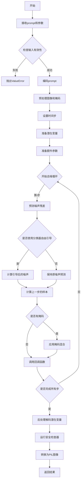
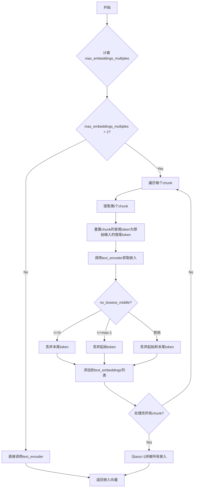
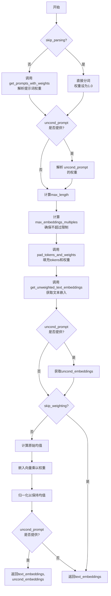
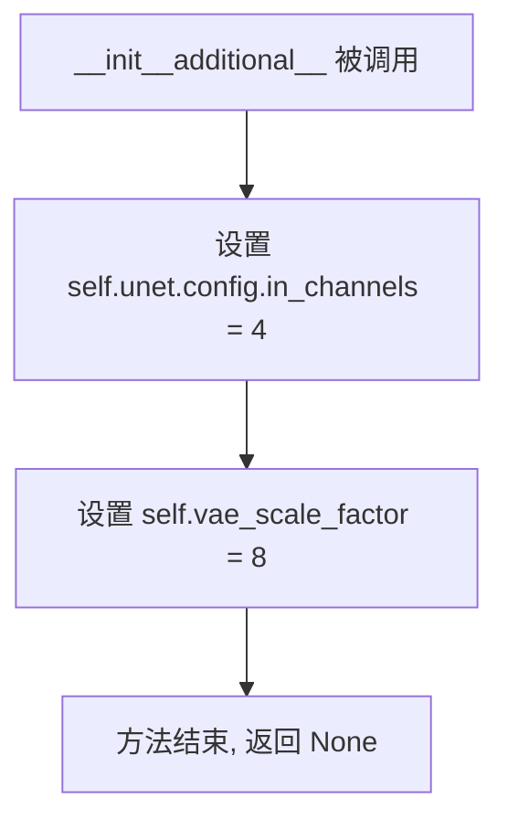
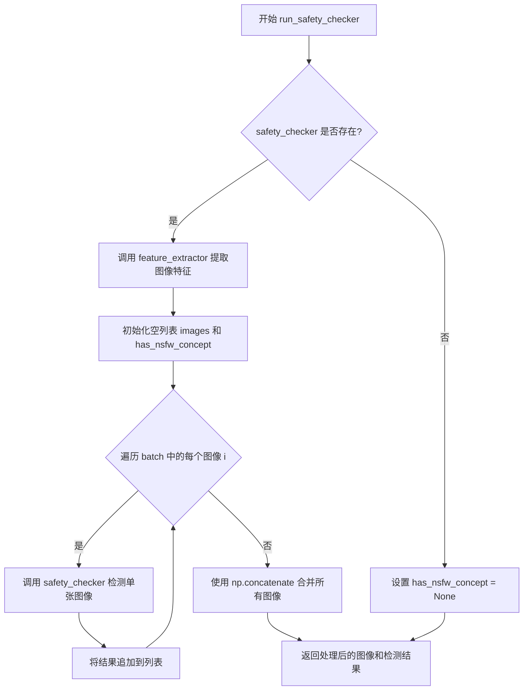
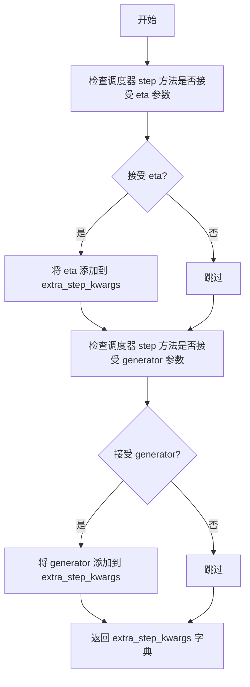
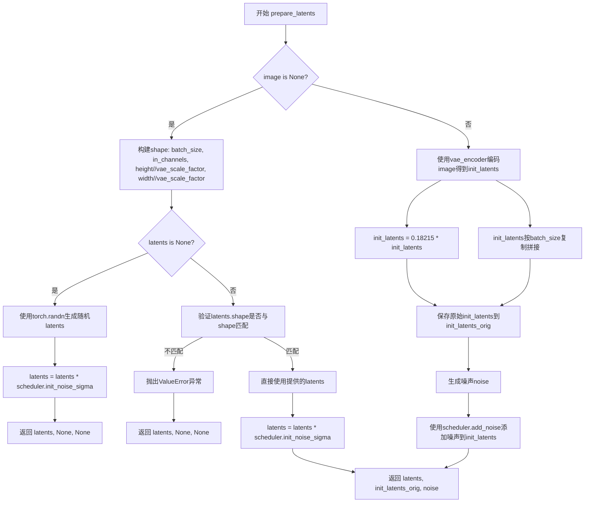
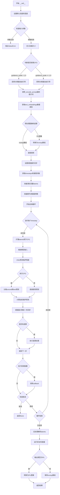
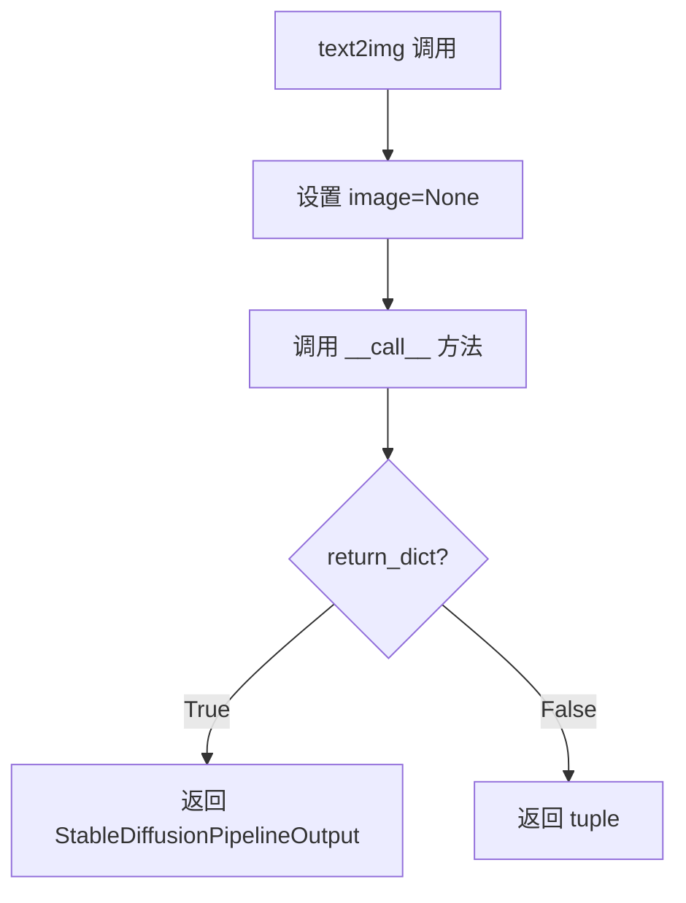
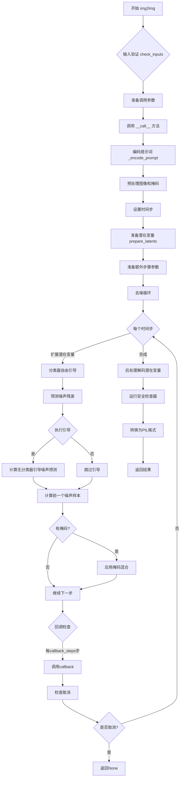

# `diffusers\examples\community\lpw_stable_diffusion_onnx.py` 详细设计文档

这是一个基于ONNX Runtime的Stable Diffusion长提示词加权管道，支持无限制长度的提示词和提示词内权重解析，实现了文本到图像、图像到图像和修复三种生成模式。

## 整体流程



## 类结构

```
DiffusionPipeline (基类)
└── OnnxStableDiffusionPipeline (ONNX稳定扩散管道)
    └── OnnxStableDiffusionLongPromptWeightingPipeline (长提示词加权管道)
        ├── __init__ (初始化)
        ├── __init__additional__ (额外初始化)
        ├── _encode_prompt (编码提示词)
        ├── check_inputs (检查输入)
        ├── get_timesteps (获取时间步)
        ├── run_safety_checker (运行安全检查)
        ├── decode_latents (解码潜在变量)
        ├── prepare_extra_step_kwargs (准备额外参数)
        ├── prepare_latents (准备潜在变量)
        ├── __call__ (主调用方法)
        ├── text2img (文本到图像)
        ├── img2img (图像到图像)
        └── inpaint (修复)
```

## 全局变量及字段


### `logger`
    
Logger instance for the module, used for warning and error messages

类型：`logging.Logger`
    


### `re_attention`
    
Compiled regular expression pattern for parsing prompt attention tokens with weights

类型：`re.Pattern`
    


### `ORT_TO_NP_TYPE`
    
Dictionary mapping ONNX tensor type strings to NumPy dtype objects

类型：`Dict[str, np.dtype]`
    


### `PIL_INTERPOLATION`
    
Dictionary mapping interpolation method names to PIL Image Resampling modes

类型：`Dict[str, Any]`
    


### `OnnxStableDiffusionLongPromptWeightingPipeline.vae_encoder`
    
ONNX VAE encoder model for encoding images to latent space

类型：`OnnxRuntimeModel`
    


### `OnnxStableDiffusionLongPromptWeightingPipeline.vae_decoder`
    
ONNX VAE decoder model for decoding latents to images

类型：`OnnxRuntimeModel`
    


### `OnnxStableDiffusionLongPromptWeightingPipeline.text_encoder`
    
ONNX text encoder model for converting text to embeddings

类型：`OnnxRuntimeModel`
    


### `OnnxStableDiffusionLongPromptWeightingPipeline.tokenizer`
    
CLIP tokenizer for tokenizing text prompts

类型：`CLIPTokenizer`
    


### `OnnxStableDiffusionLongPromptWeightingPipeline.unet`
    
ONNX UNet model for predicting noise in denoising process

类型：`OnnxRuntimeModel`
    


### `OnnxStableDiffusionLongPromptWeightingPipeline.scheduler`
    
Diffusion scheduler for managing denoising steps and noise scheduling

类型：`SchedulerMixin`
    


### `OnnxStableDiffusionLongPromptWeightingPipeline.safety_checker`
    
ONNX safety checker model for detecting NSFW content

类型：`OnnxRuntimeModel`
    


### `OnnxStableDiffusionLongPromptWeightingPipeline.feature_extractor`
    
CLIP image processor for preparing images for safety checker

类型：`CLIPImageProcessor`
    


### `OnnxStableDiffusionLongPromptWeightingPipeline.requires_safety_checker`
    
Boolean flag indicating whether safety checker is required for pipeline

类型：`bool`
    


### `OnnxStableDiffusionLongPromptWeightingPipeline.unet.config.in_channels`
    
Number of input channels for UNet model, set to 4 for latent channels

类型：`int`
    


### `OnnxStableDiffusionLongPromptWeightingPipeline.vae_scale_factor`
    
Scaling factor for VAE encoding/decoding, used for computing latent dimensions

类型：`int`
    
    

## 全局函数及方法


### `parse_prompt_attention`

该函数用于解析包含注意力权重的提示文本字符串。它能识别圆括号 `(abc)` 用于增强注意力、方括号 `[abc]` 用于降低注意力、以及带自定义权重值的语法如 `(abc:3.12)`，并将解析后的文本片段与其对应的权重值以列表形式返回，同时合并具有相同权重的连续片段。

参数：

- `text`：`str`，需要解析的提示文本字符串，包含可选的注意力控制语法

返回值：`List[List[Union[str, float]]]`，返回文本片段及其权重的二维列表，每个元素为 `[文本内容, 权重值]` 的形式

#### 流程图

```mermaid
flowchart TD
    A[开始: 接收text字符串] --> B[初始化空列表: res, round_brackets, square_brackets]
    B --> C[设置权重乘数: round_bracket_multiplier=1.1, square_bracket_multiplier=1/1.1]
    C --> D{遍历re_attention正则匹配结果}
    
    D -->|text以\\开头| E[转义字符处理: 提取text[1:], 权重1.0, 加入res]
    D -->|text == "("| F[记录位置: round_brackets.appendlenres]
    D -->|text == "["| G[记录位置: square_brackets.appendlenres]
    D -->|weight不为空 且 round_brackets非空| H[应用权重: multiply_range权重值]
    D -->|text == ")" 且 round_brackets非空| I[应用round_bracket_multiplier]
    D -->|text == "]" 且 square_brackets非空| J[应用square_bracket_multiplier]
    D -->|其他情况| K[普通文本: 加入res, 权重1.0]
    
    E --> L[继续遍历]
    F --> L
    G --> L
    H --> L
    I --> L
    J --> L
    K --> L
    
    L -->|还有未匹配的圆括号| M[对剩余round_brackets应用round_bracket_multiplier]
    L -->|还有未匹配的方括号| N[对剩余square_brackets应用square_bracket_multiplier]
    M --> O{res是否为空?}
    N --> O
    O -->|是| P[返回 [[, 1.0]]]
    O -->|否| Q{合并相同权重?}
    
    Q -->|是| R[将相邻相同权重的文本合并]
    Q -->|否| S[保持原样]
    R --> T[返回res]
    S --> T
    
    P --> T
```

#### 带注释源码

```python
def parse_prompt_attention(text):
    """
    Parses a string with attention tokens and returns a list of pairs: text and its associated weight.
    Accepted tokens are:
      (abc) - increases attention to abc by a multiplier of 1.1
      (abc:3.12) - increases attention to abc by a multiplier of 3.12
      [abc] - decreases attention to abc by a multiplier of 1.1
      \\( - literal character '('
      \\[ - literal character '['
      \\) - literal character ')'
      \\] - literal character ']'
      \\ - literal character '\'
      anything else - just text
    
    Examples:
    >>> parse_prompt_attention('normal text')
    [['normal text', 1.0]]
    >>> parse_prompt_attention('an (important) word')
    [['an ', 1.0], ['important', 1.1], [' word', 1.0]]
    >>> parse_prompt_attention('(unbalanced')
    [['unbalanced', 1.1]]
    >>> parse_prompt_attention('\\(literal\\]')
    [['(literal]', 1.0]]
    """
    
    # 存储最终的文本-权重对列表
    res = []
    # 栈结构：记录未闭合圆括号的位置索引
    round_brackets = []
    # 栈结构：记录未闭合方括号的位置索引
    square_brackets = []
    
    # 圆括号默认权重乘数：增强注意力1.1倍
    round_bracket_multiplier = 1.1
    # 方括号默认权重乘数：降低注意力为1/1.1倍
    square_bracket_multiplier = 1 / 1.1
    
    def multiply_range(start_position, multiplier):
        """
        内部函数：将res列表中从start_position到末尾的所有元素的权重值乘以multiplier
        用于批量修改多个文本片段的注意力权重
        """
        for p in range(start_position, len(res)):
            res[p][1] *= multiplier
    
    # 使用预编译的正则表达式遍历文本中的所有匹配项
    for m in re_attention.finditer(text):
        # 获取当前匹配的完整文本
        text = m.group(0)
        # 获取捕获组1（如果存在），即权重值如 :3.12
        weight = m.group(1)
        
        # 处理转义字符：以反斜杠开头的字符被识别为字面字符
        if text.startswith("\\"):
            # 去掉反斜杠，添加字面字符，权重为1.0
            res.append([text[1:], 1.0])
        # 处理左圆括号：入栈当前位置
        elif text == "(":
            round_brackets.append(len(res))
        # 处理左方括号：入栈当前位置
        elif text == "[":
            square_brackets.append(len(res))
        # 处理带权重的圆括号语法：(abc:3.12)
        # 权重值不为空且圆括号栈非空时应用权重
        elif weight is not None and len(round_brackets) > 0:
            # 弹出栈顶位置并应用指定权重值
            multiply_range(round_brackets.pop(), float(weight))
        # 处理右圆括号：应用默认增强权重1.1
        elif text == ")" and len(round_brackets) > 0:
            multiply_range(round_brackets.pop(), round_bracket_multiplier)
        # 处理右方括号：应用默认降低权重1/1.1
        elif text == "]" and len(square_brackets) > 0:
            multiply_range(square_brackets.pop(), square_bracket_multiplier)
        # 处理普通文本：直接添加，权重为1.0
        else:
            res.append([text, 1.0])
    
    # 处理未闭合的括号：遍历结束后栈中可能还有未匹配的括号
    for pos in round_brackets:
        multiply_range(pos, round_bracket_multiplier)
    
    for pos in square_brackets:
        multiply_range(pos, square_bracket_multiplier)
    
    # 边界情况：如果解析结果为空，返回默认的空字符串权重对
    if len(res) == 0:
        res = [["", 1.0]]
    
    # 后处理：合并具有相同权重的连续文本片段
    # 例如 [['a', 1.0], ['b', 1.0]] 合并为 [['ab', 1.0]]
    i = 0
    while i + 1 < len(res):
        if res[i][1] == res[i + 1][1]:
            # 拼接相邻文本
            res[i][0] += res[i + 1][0]
            # 删除相邻元素
            res.pop(i + 1)
        else:
            i += 1
    
    return res
```


### `get_prompts_with_weights`

该函数用于将多个文本提示（prompts）进行分词处理，并返回每个token对应的权重值。它解析提示中的注意力权重标记（如括号语法），然后使用分词器将文本转换为token序列，同时保留每个token对应的权重信息。

参数：

- `pipe`：`OnnxStableDiffusionPipeline` 或类似对象，提供分词器（tokenizer）用于将文本转换为token
- `prompt`：`List[str]`，待处理的文本提示列表
- `max_length`：`int`，token序列的最大长度限制，用于截断过长的提示

返回值：`(List[List[int]], List[List[float]])`，返回一个元组，包含两个列表——第一个是token列表的列表，第二个是对应权重的列表。如果提示被截断，会记录警告日志。

#### 流程图

```mermaid
flowchart TD
    A[开始: get_prompts_with_weights] --> B[初始化空列表: tokens, weights]
    B --> C[设置 truncated = False]
    C --> D{遍历 prompt 列表}
    
    D -->|对每个 text| E[调用 parse_prompt_attention 解析权重]
    E --> F[初始化空列表: text_token, text_weight]
    F --> G{遍历 texts_and_weights}
    
    G -->|对每个 word, weight| H[使用 pipe.tokenizer 分词]
    H --> I[提取 token 去掉首尾: input_ids[0, 1:-1]]
    I --> J[将 token 添加到 text_token]
    J --> K[将 weight 复制 len(token) 次添加到 text_weight]
    K --> L{检查长度是否超过 max_length}
    
    L -->|是| M[设置 truncated = True]
    M --> N[跳出内层循环]
    L -->|否| G
    
    G -->|遍历完成| O{检查 text_token 长度}
    O -->|超过 max_length| P[截断到 max_length]
    P --> Q[同时截断 text_weight]
    O -->|未超过| Q
    
    Q --> R[将 text_token 添加到 tokens]
    R --> S[将 text_weight 添加到 weights]
    S --> D
    
    D -->|遍历完成| T{truncated 为 True?}
    T -->|是| U[记录警告日志]
    T -->|否| V[返回 tokens 和 weights]
    U --> V
```

#### 带注释源码

```python
def get_prompts_with_weights(pipe, prompt: List[str], max_length: int):
    r"""
    Tokenize a list of prompts and return its tokens with weights of each token.

    No padding, starting or ending token is included.
    """
    # 初始化结果列表，用于存储所有提示的token和权重
    tokens = []
    weights = []
    # 标记是否发生了截断
    truncated = False
    
    # 遍历每个提示文本
    for text in prompt:
        # 使用解析函数提取文本片段及其对应的权重
        # 解析括号语法: (word) 增加权重, [word] 降低权重
        texts_and_weights = parse_prompt_attention(text)
        
        # 初始化当前文本的token和权重列表
        text_token = []
        text_weight = []
        
        # 遍历解析后的每个词及其权重
        for word, weight in texts_and_weights:
            # 使用分词器将单词转换为token，返回numpy数组
            # .input_ids[0, 1:-1] 去掉起始和结束token (BOS和EOS)
            token = pipe.tokenizer(word, return_tensors="np").input_ids[0, 1:-1]
            
            # 将token添加到当前文本的token列表
            text_token += list(token)
            
            # 将权重复制与token数量相同的次数
            # 因为一个词可能对应多个token
            text_weight += [weight] * len(token)
            
            # 如果 token 数量超过最大长度限制，提前停止
            if len(text_token) > max_length:
                truncated = True
                break
        
        # 截断处理：确保token和权重列表不超过最大长度
        if len(text_token) > max_length:
            truncated = True
            text_token = text_token[:max_length]
            text_weight = text_weight[:max_length]
        
        # 将当前文本的处理结果添加到总列表
        tokens.append(text_token)
        weights.append(text_weight)
    
    # 如果发生了截断，记录警告日志建议用户缩短提示或增加max_embeddings_multiples
    if truncated:
        logger.warning("Prompt was truncated. Try to shorten the prompt or increase max_embeddings_multiples")
    
    # 返回token列表和权重列表
    return tokens, weights
```


### `pad_tokens_and_weights`

该函数用于将token列表和对应的权重列表填充（padding）到指定的最大长度，在token序列的首尾添加起始符（bos）和结束符（eos），并在权重序列的首尾填充权重值1.0，以满足文本编码器的输入要求。

参数：

- `tokens`：`List[List[int]]`，待填充的token列表，每个元素是一个token ID列表
- `weights`：`List[List[float]]`，与tokens对应的权重列表，每个元素是一个权重值列表
- `max_length`：`int`，填充后的最大长度
- `bos`：`int`，起始符（beginning of sequence）的token ID
- `eos`：`int`，结束符（end of sequence）的token ID
- `pad`：`int`，填充符（padding）的token ID
- `no_boseos_middle`：`bool`，默认为True，表示是否在每个chunk的中间保留起始符和结束符
- `chunk_length`：`int`，默认为77，表示文本编码器的最大输入长度

返回值：`Tuple[List[List[int]], List[List[float]]]`，返回填充后的tokens和weights

#### 流程图

```mermaid
flowchart TD
    A[开始] --> B[计算max_embeddings_multiples和weights_length]
    B --> C{遍历tokens列表}
    C -->|当前索引i| D[为tokens[i]添加bos和eos]
    D --> E{no_boseos_middle为True?}
    E -->|Yes| F[weights[i]首尾添加1.0权重]
    E -->|No| G{weights[i]为空?}
    G -->|Yes| H[weights_length个1.0]
    G -->|No| I[按chunk分片添加权重]
    F --> J[返回tokens和weights]
    H --> J
    I --> J
    J --> K[结束]
```

#### 带注释源码

```python
def pad_tokens_and_weights(tokens, weights, max_length, bos, eos, pad, no_boseos_middle=True, chunk_length=77):
    r"""
    Pad the tokens (with starting and ending tokens) and weights (with 1.0) to max_length.
    
    该函数将token列表和权重列表填充到统一的最大长度，以便于批量处理。
    1. 计算最大嵌入倍数：max_embeddings_multiples = (max_length - 2) // (chunk_length - 2)
    2. 根据是否保留bos/eos中间位置来确定权重长度
    3. 为每个token序列添加起始符(bos)和结束符(eos)
    4. 为每个权重序列添加默认权重1.0
    """
    # 计算最大嵌入倍数，用于处理超过单个chunk长度的提示词
    max_embeddings_multiples = (max_length - 2) // (chunk_length - 2)
    # 根据no_boseos_middle参数确定权重序列的目标长度
    weights_length = max_length if no_boseos_middle else max_embeddings_multiples * chunk_length
    
    # 遍历每个token序列进行填充
    for i in range(len(tokens)):
        # 填充token序列：[bos] + 原始tokens + [pad]填充 + [eos]
        # 填充数量 = max_length - 1 - len(tokens[i]) - 1 = max_length - len(tokens[i]) - 2
        tokens[i] = [bos] + tokens[i] + [pad] * (max_length - 1 - len(tokens[i]) - 1) + [eos]
        
        if no_boseos_middle:
            # 简单模式：在权重序列首尾添加默认权重1.0
            weights[i] = [1.0] + weights[i] + [1.0] * (max_length - 1 - len(weights[i]))
        else:
            # 复杂模式：按chunk分片处理权重，用于超长提示词
            w = []
            if len(weights[i]) == 0:
                # 空权重序列，全部填充为1.0
                w = [1.0] * weights_length
            else:
                # 按chunk分片，每段添加起始和结束权重
                for j in range(max_embeddings_multiples):
                    w.append(1.0)  # 当前chunk的起始权重
                    # 提取对应chunk的权重片段
                    w += weights[i][j * (chunk_length - 2) : min(len(weights[i]), (j + 1) * (chunk_length - 2))]
                    w.append(1.0)  # 当前chunk的结束权重
                # 填充到目标长度
                w += [1.0] * (weights_length - len(w))
            weights[i] = w[:]

    return tokens, weights
```


### `get_unweighted_text_embeddings`

该函数用于在文本标记长度超过文本编码器容量时，将输入的文本嵌入分割成多个块并分别送入文本编码器处理，最后将结果拼接返回。

参数：

- `pipe`：`OnnxStableDiffusionPipeline`（或类似对象），提供对文本编码器（`text_encoder`）的访问
- `text_input`：`np.array`，已tokenized的文本输入，形状为`(batch_size, seq_len)`
- `chunk_length`：`int`，文本编码器的最大序列长度（通常是77）
- `no_boseos_middle`：`Optional[bool] = True`，当为True时，在每个chunk中保留起始和结束标记

返回值：`np.array`，文本编码器输出的嵌入向量，形状为`(batch_size, seq_len, hidden_size)`

#### 流程图



#### 带注释源码

```python
def get_unweighted_text_embeddings(
    pipe,  # OnnxStableDiffusionPipeline对象，提供text_encoder访问
    text_input: np.array,  # tokenized文本输入，形状为(batch_size, seq_len)
    chunk_length: int,  # 文本编码器最大长度，通常为77
    no_boseos_middle: Optional[bool] = True,  # 是否在每个chunk中保留bos/eos token
):
    """
    When the length of tokens is a multiple of the capacity of the text encoder,
    it should be split into chunks and sent to the text encoder individually.
    """
    # 计算需要分割的块数
    # 例如：如果text_input长度为154，chunk_length为77，则max_embeddings_multiples为2
    max_embeddings_multiples = (text_input.shape[1] - 2) // (chunk_length - 2)
    
    if max_embeddings_multiples > 1:
        # 需要分块处理
        text_embeddings = []
        
        for i in range(max_embeddings_multiples):
            # 提取第i个chunk
            # 每次滑动(chunk_length - 2)个token，但保留首尾2个token
            text_input_chunk = text_input[:, i * (chunk_length - 2) : (i + 1) * (chunk_length - 2) + 2].copy()

            # 用原始输入的起始和结束token覆盖当前chunk的首尾
            # 确保每个chunk都有正确的bos和eos token
            text_input_chunk[:, 0] = text_input[0, 0]  # bos_token_id
            text_input_chunk[:, -1] = text_input[0, -1]  # eos_token_id

            # 调用text_encoder获取该chunk的嵌入
            text_embedding = pipe.text_encoder(input_ids=text_input_chunk)[0]

            if no_boseos_middle:
                # 处理中间chunk的token边界问题，避免重复计算bos/eos
                if i == 0:
                    # 第一个chunk：保留开头，丢弃末尾（避免重复计算末尾token）
                    text_embedding = text_embedding[:, :-1]
                elif i == max_embeddings_multiples - 1:
                    # 最后一个chunk：丢弃开头，保留末尾
                    text_embedding = text_embedding[:, 1:]
                else:
                    # 中间chunk：同时丢弃开头和末尾
                    text_embedding = text_embedding[:, 1:-1]

            text_embeddings.append(text_embedding)
        
        # 沿序列维度拼接所有chunk的嵌入
        text_embeddings = np.concatenate(text_embeddings, axis=1)
    else:
        # 长度未超过限制，直接处理
        text_embeddings = pipe.text_encoder(input_ids=text_input)[0]
    
    return text_embeddings
```


### `get_weighted_text_embeddings`

该函数用于根据带权重的提示词生成文本嵌入向量，支持通过括号语法调整提示词中不同词段的注意力权重，并可处理无条件和有条件的提示词以实现分类器自由引导。

参数：

- `pipe`：`OnnxStableDiffusionPipeline`，提供分词器和文本编码器的管道对象
- `prompt`：`Union[str, List[str]]`，要引导图像生成的提示词或提示词列表
- `uncond_prompt`：`Optional[Union[str, List[str]]]`，用于引导图像生成的无条件提示词，若提供则返回提示词和无条件提示词的嵌入向量
- `max_embeddings_multiples`：`Optional[int]`，提示词嵌入向量与文本编码器最大输出长度的最大倍数，默认为 4
- `no_boseos_middle`：`Optional[bool]`，当文本标记长度是文本编码器容量的倍数时，是否在中间每个块中保留起始和结束标记
- `skip_parsing`：`Optional[bool]`，是否跳过括号的解析
- `skip_weighting`：`Optional[bool]`，是否跳过权重应用，当解析被跳过时强制为 True

返回值：`Union[np.ndarray, Tuple[np.ndarray, np.ndarray]]`，返回文本嵌入向量，若提供了 `uncond_prompt` 则返回包含条件和无条件嵌入向量的元组

#### 流程图



#### 带注释源码

```python
def get_weighted_text_embeddings(
    pipe,
    prompt: Union[str, List[str]],
    uncond_prompt: Optional[Union[str, List[str]]] = None,
    max_embeddings_multiples: Optional[int] = 4,
    no_boseos_middle: Optional[bool] = False,
    skip_parsing: Optional[bool] = False,
    skip_weighting: Optional[bool] = False,
    **kwargs,
):
    r"""
    Prompts can be assigned with local weights using brackets. For example,
    prompt 'A (very beautiful) masterpiece' highlights the words 'very beautiful',
    and the embedding tokens corresponding to the words get multiplied by a constant, 1.1.

    Also, to regularize of the embedding, the weighted embedding would be scaled to preserve the original mean.

    Args:
        pipe (`OnnxStableDiffusionPipeline`):
            Pipe to provide access to the tokenizer and the text encoder.
        prompt (`str` or `List[str]`):
            The prompt or prompts to guide the image generation.
        uncond_prompt (`str` or `List[str]`):
            The unconditional prompt or prompts for guide the image generation. If unconditional prompt
            is provided, the embeddings of prompt and uncond_prompt are concatenated.
        max_embeddings_multiples (`int`, *optional*, defaults to `1`):
            The max multiple length of prompt embeddings compared to the max output length of text encoder.
        no_boseos_middle (`bool`, *optional*, defaults to `False`):
            If the length of text token is multiples of the capacity of text encoder, whether reserve the starting and
            ending token in each of the chunk in the middle.
        skip_parsing (`bool`, *optional*, defaults to `False`):
            Skip the parsing of brackets.
        skip_weighting (`bool`, *optional*, defaults to `False`):
            Skip the weighting. When the parsing is skipped, it is forced True.
    """
    # 计算最大长度：(tokenizer最大长度 - 2) * 倍数 + 2
    max_length = (pipe.tokenizer.model_max_length - 2) * max_embeddings_multiples + 2
    
    # 将单个字符串转换为列表以便统一处理
    if isinstance(prompt, str):
        prompt = [prompt]

    # 根据skip_parsing标志决定是否解析提示词中的权重标记
    if not skip_parsing:
        # 解析提示词中的括号权重，返回tokens和对应的weights
        prompt_tokens, prompt_weights = get_prompts_with_weights(pipe, prompt, max_length - 2)
        
        # 如果提供了无条件提示词，也进行解析
        if uncond_prompt is not None:
            if isinstance(uncond_prompt, str):
                uncond_prompt = [uncond_prompt]
            uncond_tokens, uncond_weights = get_prompts_with_weights(pipe, uncond_prompt, max_length - 2)
    else:
        # 跳过解析时，直接分词，权重设为1.0
        prompt_tokens = [
            token[1:-1]  # 去掉起始和结束token
            for token in pipe.tokenizer(prompt, max_length=max_length, truncation=True, return_tensors="np").input_ids
        ]
        prompt_weights = [[1.0] * len(token) for token in prompt_tokens]
        
        # 同样处理无条件提示词
        if uncond_prompt is not None:
            if isinstance(uncond_prompt, str):
                uncond_prompt = [uncond_prompt]
            uncond_tokens = [
                token[1:-1]
                for token in pipe.tokenizer(
                    uncond_prompt,
                    max_length=max_length,
                    truncation=True,
                    return_tensors="np",
                ).input_ids
            ]
            uncond_weights = [[1.0] * len(token) for token in uncond_tokens]

    # 计算实际最大长度（token列表中最长的长度）
    max_length = max([len(token) for token in prompt_tokens])
    if uncond_prompt is not None:
        max_length = max(max_length, max([len(token) for token in uncond_tokens]))

    # 重新计算最大倍数，确保不超过实际需要的长度
    max_embeddings_multiples = min(
        max_embeddings_multiples,
        (max_length - 1) // (pipe.tokenizer.model_max_length - 2) + 1,
    )
    max_embeddings_multiples = max(1, max_embeddings_multiples)
    max_length = (pipe.tokenizer.model_max_length - 2) * max_embeddings_multiples + 2

    # 获取特殊token的ID
    bos = pipe.tokenizer.bos_token_id  # 起始token
    eos = pipe.tokenizer.eos_token_id  # 结束token
    pad = getattr(pipe.tokenizer, "pad_token_id", eos)  # 填充token

    # 填充tokens和weights到统一长度
    prompt_tokens, prompt_weights = pad_tokens_and_weights(
        prompt_tokens,
        prompt_weights,
        max_length,
        bos,
        eos,
        pad,
        no_boseos_middle=no_boseos_middle,
        chunk_length=pipe.tokenizer.model_max_length,
    )
    # 转换为numpy数组
    prompt_tokens = np.array(prompt_tokens, dtype=np.int32)
    
    # 处理无条件提示词的tokens和weights
    if uncond_prompt is not None:
        uncond_tokens, uncond_weights = pad_tokens_and_weights(
            uncond_tokens,
            uncond_weights,
            max_length,
            bos,
            eos,
            pad,
            no_boseos_middle=no_boseos_middle,
            chunk_length=pipe.tokenizer.model_max_length,
        )
        uncond_tokens = np.array(uncond_tokens, dtype=np.int32)

    # 获取文本嵌入向量（不带权重）
    text_embeddings = get_unweighted_text_embeddings(
        pipe,
        prompt_tokens,
        pipe.tokenizer.model_max_length,
        no_boseos_middle=no_boseos_middle,
    )
    
    # 将权重转换为与嵌入向量相同的数据类型
    prompt_weights = np.array(prompt_weights, dtype=text_embeddings.dtype)
    
    # 获取无条件嵌入向量
    if uncond_prompt is not None:
        uncond_embeddings = get_unweighted_text_embeddings(
            pipe,
            uncond_tokens,
            pipe.tokenizer.model_max_length,
            no_boseos_middle=no_boseos_middle,
        )
        uncond_weights = np.array(uncond_weights, dtype=uncond_embeddings.dtype)

    # 为提示词分配权重并进行均值归一化
    # TODO: 应该按块归一化还是整体归一化（当前实现）？
    if (not skip_parsing) and (not skip_weighting):
        # 计算应用权重前的原始均值
        previous_mean = text_embeddings.mean(axis=(-2, -1))
        # 将权重应用到嵌入向量
        text_embeddings *= prompt_weights[:, :, None]
        # 归一化以保持原始均值
        text_embeddings *= (previous_mean / text_embeddings.mean(axis=(-2, -1)))[:, None, None]
        
        # 对无条件嵌入向量进行相同的处理
        if uncond_prompt is not None:
            previous_mean = uncond_embeddings.mean(axis=(-2, -1))
            uncond_embeddings *= uncond_weights[:, :, None]
            uncond_embeddings *= (previous_mean / uncond_embeddings.mean(axis=(-2, -1)))[:, None, None]

    # 对于分类器自由引导，需要两次前向传播
    # 这里将无条件嵌入和文本嵌入拼接成单个batch
    # 以避免两次前向传播
    if uncond_prompt is not None:
        return text_embeddings, uncond_embeddings

    return text_embeddings
```


### `preprocess_image`

该函数负责将输入的 PIL 图像对象进行预处理，包括尺寸调整（对齐到32的整数倍）、数据类型转换和像素值归一化，使其符合 Stable Diffusion 模型的输入要求。

参数：

- `image`：`PIL.Image.Image`，待处理的原始 PIL 图像对象

返回值：`np.ndarray`，形状为 (1, C, H, W) 的图像数组，像素值归一化到 [-1, 1] 范围

#### 流程图

```mermaid
flowchart TD
    A[开始: 输入 PIL 图像] --> B[获取图像宽度 w 和高度 h]
    B --> C[将 w 和 h 调整为 32 的整数倍: x - x % 32]
    C --> D[使用 Lanczos 重采样调整图像大小到 (w, h)]
    D --> E[将图像转换为 NumPy 数组并转换为 float32 类型]
    E --> F[将像素值归一化到 [0, 1] 范围: 除以 255.0]
    F --> G[在数组开头添加批次维度: image[None]]
    G --> H[转换维度顺序: transpose(0, 3, 1, 2) 从 HWC 转为 CHW]
    H --> I[将像素值映射到 [-1, 1] 范围: 2.0 * image - 1.0]
    I --> J[返回处理后的图像数组]
```

#### 带注释源码

```python
def preprocess_image(image):
    """
    预处理 PIL 图像以适配 Stable Diffusion 模型的输入格式。
    
    处理步骤：
    1. 将图像尺寸调整为 32 的整数倍（VAE 的下采样因子）
    2. 使用 Lanczos 重采样进行高质量缩放
    3. 归一化像素值到 [-1, 1] 范围（模型期望的输入区间）
    4. 转换维度顺序从 HWC (H Height, W Width, C Channel) 到 CHW
    
    Args:
        image (PIL.Image.Image): 输入的 PIL 图像对象
        
    Returns:
        np.ndarray: 预处理后的图像数组，形状为 (1, C, H, W)，类型为 float32
    """
    # 获取原始图像的宽度和高度
    w, h = image.size
    
    # 计算调整为 32 的整数倍后的尺寸
    # 使用列表推导式对 w 和 h 同时进行处理
    # 例如: 512 -> 512, 513 -> 512, 514 -> 512
    w, h = (x - x % 32 for x in (w, h))
    
    # 使用 Lanczos 重采样方法调整图像大小
    # Lanczos 在缩小图像时能较好地保留细节
    image = image.resize((w, h), resample=PIL_INTERPOLATION["lanczos"])
    
    # 将 PIL 图像转换为 NumPy 数组，并转换为 float32 类型以支持后续计算
    image = np.array(image).astype(np.float32)
    
    # 将像素值从 [0, 255] 范围归一化到 [0, 1] 范围
    image = image / 255.0
    
    # 在数组最前面添加批次维度，将图像从 (H, W, C) 变为 (1, H, W, C)
    # 这里使用 image[None] 与 np.expand_dims(image, axis=0) 效果相同
    image = image[None].transpose(0, 3, 1, 2)
    
    # 将像素值从 [0, 1] 范围映射到 [-1, 1] 范围
    # 这是 Stable Diffusion 系列模型的标准输入预处理方式
    return 2.0 * image - 1.0
```


### `preprocess_mask`

该函数负责将输入的掩码图像（mask）转换为适合 Stable Diffusion 模型处理的格式，包括灰度转换、尺寸调整（对齐到 32 的倍数）、缩放、归一化、通道扩展以及颜色反转等操作。

参数：

- `mask`：`PIL.Image.Image`，输入的掩码图像（PIL 图像对象）
- `scale_factor`：`int`，掩码缩放因子，默认值为 8，用于将掩码尺寸缩小到原来的 1/scale_factor

返回值：`np.ndarray`，处理后的掩码数组，形状为 (1, 4, H/8, W/8)，其中 H 和 W 分别是调整后的图像高度和宽度

#### 流程图

```mermaid
flowchart TD
    A[开始: 输入 PIL 掩码图像] --> B[转换为灰度图像 L 模式]
    B --> C[获取图像宽度 w 和高度 h]
    C --> D[将 w 和 h 调整为 32 的整数倍]
    D --> E[使用最近邻插值缩放图像<br/>尺寸变为 w//scale_factor x h//scale_factor]
    E --> F[转换为 NumPy 数组并归一化到 0-1 范围]
    F --> G[将掩码平铺 4 次<br/>在第一维度复制]
    G --> H[转置数组<br/>从 (4, H, W) 转为 (1, 4, H, W)]
    H --> I[颜色反转: 1 - mask<br/>白色变黑色，黑色变白色]
    I --> J[返回处理后的掩码数组]
```

#### 带注释源码

```python
def preprocess_mask(mask, scale_factor=8):
    """
    预处理掩码图像，将其转换为适合 Stable Diffusion 模型输入的格式。
    
    参数:
        mask: PIL.Image.Image - 输入的掩码图像
        scale_factor: int - 缩放因子，默认值为 8
    
    返回:
        np.ndarray - 处理后的掩码数组，形状为 (1, 4, H//8, W//8)
    """
    # Step 1: 将掩码图像转换为灰度模式（L 模式）
    # 掩码通常是黑白的，转换为灰度可以统一处理
    mask = mask.convert("L")
    
    # Step 2: 获取掩码图像的宽度和高度
    w, h = mask.size
    
    # Step 3: 将尺寸调整为 32 的整数倍
    # Stable Diffusion 模型要求输入尺寸是 32 的倍数
    w, h = (x - x % 32 for x in (w, h))
    
    # Step 4: 调整掩码尺寸，使用最近邻插值
    # 注意：这里使用 scale_factor 缩小尺寸，因为 VAE 的下采样因子通常是 8
    # 掩码需要与潜空间(latent space)的尺寸对齐
    mask = mask.resize((w // scale_factor, h // scale_factor), resample=PIL_INTERPOLATION["nearest"])
    
    # Step 5: 转换为 NumPy 数组并归一化
    # 将像素值从 [0, 255] 归一化到 [0.0, 1.0]
    mask = np.array(mask).astype(np.float32) / 255.0
    
    # Step 6: 将掩码平铺 4 次
    # Stable Diffusion 的潜空间有 4 个通道，这里复制掩码以匹配通道数
    mask = np.tile(mask, (4, 1, 1))
    
    # Step 7: 转置数组维度
    # 从 (4, H, W) 转换为 (1, 4, H, W)，添加批次维度
    mask = mask[None].transpose(0, 1, 2, 3)
    
    # Step 8: 颜色反转
    # 在 Stable Diffusion 中，白色像素表示需要重新绘制的区域（被噪声替换）
    # 黑色像素表示需要保留的区域
    # 当前处理后白色为 1.0，黑色为 0.0
    # 反转后：白色 -> 0.0（保留），黑色 -> 1.0（重绘）
    mask = 1 - mask
    
    return mask
```


### OnnxStableDiffusionLongPromptWeightingPipeline.__init__

这是一个构造函数，用于初始化基于ONNX的Stable Diffusion管道，支持长提示词和提示词权重。该构造函数接收VAE编码器/解码器、文本编码器、分词器、UNet、调度器和安全检查器等组件，并根据diffusers版本选择性地调用父类构造函数，最后调用`__init__additional__`方法进行额外的配置。

参数（适用于 diffusers >= 0.9.0 的版本）：

- `vae_encoder`：`OnnxRuntimeModel`，VAE编码器模型，用于编码输入图像
- `vae_decoder`：`OnnxRuntimeModel`，VAE解码器模型，用于将潜在表示解码为图像
- `text_encoder`：`OnnxRuntimeModel`，文本编码器模型，将文本提示转换为嵌入向量
- `tokenizer`：`CLIPTokenizer`，CLIP分词器，用于对文本进行分词
- `unet`：`OnnxRuntimeModel`，UNet模型，用于去噪潜在表示
- `scheduler`：`SchedulerMixin`，调度器，用于控制去噪过程的时间步
- `safety_checker`：`OnnxRuntimeModel`，安全检查器模型，用于检测不当内容
- `feature_extractor`：`CLIPImageProcessor`，特征提取器，用于处理安全检查器的输入
- `requires_safety_checker`：`bool`，默认为`True`，指示是否需要安全检查器

参数（适用于 diffusers < 0.9.0 的版本）：

- `vae_encoder`：`OnnxRuntimeModel`，VAE编码器模型
- `vae_decoder`：`OnnxRuntimeModel`，VAE解码器模型
- `text_encoder`：`OnnxRuntimeModel`，文本编码器模型
- `tokenizer`：`CLIPTokenizer`，CLIP分词器
- `unet`：`OnnxRuntimeModel`，UNet模型
- `scheduler`：`SchedulerMixin`，调度器
- `safety_checker`：`OnnxRuntimeModel`，安全检查器模型
- `feature_extractor`：`CLIPImageProcessor`，特征提取器

返回值：`None`，构造函数无返回值

#### 流程图

```mermaid
flowchart TD
    A[开始 __init__] --> B{检查 diffusers 版本}
    B -->|版本 >= 0.9.0| C[使用带 requires_safety_checker 参数的签名]
    B -->|版本 < 0.9.0| D[使用不带 requires_safety_checker 参数的签名]
    C --> E[调用 super().__init__ 传递所有参数]
    D --> E
    E --> F[调用 __init__additional__]
    F --> G[设置 unet.config.in_channels = 4]
    G --> H[设置 vae_scale_factor = 8]
    H --> I[结束]
```

#### 带注释源码

```python
# 适用于 diffusers >= 0.9.0 的版本
def __init__(
    self,
    vae_encoder: OnnxRuntimeModel,          # VAE编码器，ONNX格式
    vae_decoder: OnnxRuntimeModel,          # VAE解码器，ONNX格式
    text_encoder: OnnxRuntimeModel,          # 文本编码器，ONNX格式
    tokenizer: CLIPTokenizer,                # CLIP分词器
    unet: OnnxRuntimeModel,                  # UNet模型，ONNX格式
    scheduler: SchedulerMixin,                # 噪声调度器
    safety_checker: OnnxRuntimeModel,       # 安全检查器，ONNX格式
    feature_extractor: CLIPImageProcessor,  # CLIP图像特征提取器
    requires_safety_checker: bool = True,    # 是否需要安全检查器
):
    # 调用父类 OnnxStableDiffusionPipeline 的构造函数
    super().__init__(
        vae_encoder=vae_encoder,
        vae_decoder=vae_decoder,
        text_encoder=text_encoder,
        tokenizer=tokenizer,
        unet=unet,
        scheduler=scheduler,
        safety_checker=safety_checker,
        feature_extractor=feature_extractor,
        requires_safety_checker=requires_safety_checker,
    )
    # 调用额外的初始化方法
    self.__init__additional__()

# 适用于 diffusers < 0.9.0 的版本
def __init__(
    self,
    vae_encoder: OnnxRuntimeModel,
    vae_decoder: OnnxRuntimeModel,
    text_encoder: OnnxRuntimeModel,
    tokenizer: CLIPTokenizer,
    unet: OnnxRuntimeModel,
    scheduler: SchedulerMixin,
    safety_checker: OnnxRuntimeModel,
    feature_extractor: CLIPImageProcessor,
):
    super().__init__(
        vae_encoder=vae_encoder,
        vae_decoder=vae_decoder,
        text_encoder=text_encoder,
        tokenizer=tokenizer,
        unet=unet,
        scheduler=scheduler,
        safety_checker=safety_checker,
        feature_extractor=feature_extractor,
    )
    self.__init__additional__()

# 额外的初始化配置
def __init__additional__(self):
    # 设置UNet的输入通道数为4（对应RGB+Alpha通道或潜在空间的4个通道）
    self.unet.config.in_channels = 4
    # 设置VAE的缩放因子为8，用于计算潜在空间与像素空间的尺寸转换
    self.vae_scale_factor = 8
```


### `OnnxStableDiffusionLongPromptWeightingPipeline.__init__additional__`

该方法是 `OnnxStableDiffusionLongPromptWeightingPipeline` 类的初始化辅助方法，在父类 `OnnxStableDiffusionPipeline` 初始化完成后被调用，用于配置 UNet 的输入通道数和 VAE 的缩放因子，以支持标准的 Stable Diffusion 4 通道潜在空间操作。

参数：
- `self`：实例方法隐含的当前对象参数，无需显式传入

返回值：`None`，该方法无显式返回值，仅修改对象内部状态

#### 流程图



#### 带注释源码

```python
def __init__additional__(self):
    """
    初始化额外的配置参数。
    在父类 OnnxStableDiffusionPipeline 初始化完成后被调用，
    用于设置 Stable Diffusion 特定的配置项。
    """
    # 设置 UNet 的输入通道数为 4
    # Stable Diffusion 使用 4 通道的潜在表示 (RGB = 3 + alpha = 1)
    self.unet.config.in_channels = 4
    
    # 设置 VAE 的缩放因子为 8
    # VAE 将潜在空间映射到像素空间时的缩放系数
    # 用于计算图像的实际尺寸 (height/width // vae_scale_factor)
    self.vae_scale_factor = 8
```


### `OnnxStableDiffusionLongPromptWeightingPipeline._encode_prompt`

该方法负责将文本提示词（prompt）编码为文本编码器的隐藏状态（embeddings），支持长提示词加权和无分类器自由引导（classifier-free guidance）。

参数：

- `prompt`：`str` 或 `list`，要编码的提示词
- `num_images_per_prompt`：`int`，每个提示词要生成的图像数量
- `do_classifier_free_guidance`：`bool`，是否使用无分类器自由引导
- `negative_prompt`：`str` 或 `List[str]`，不用于引导图像生成的提示词
- `max_embeddings_multiples`：`int`，提示词嵌入相对于文本编码器最大输出的最大倍数

返回值：`np.ndarray`，文本编码器的隐藏状态

#### 流程图

```mermaid
flowchart TD
    A[开始 _encode_prompt] --> B{判断 prompt 类型}
    B -->|list| C[batch_size = len(prompt)]
    B -->|str| D[batch_size = 1]
    C --> E{negative_prompt 是否为 None}
    D --> E
    E -->|是| F[negative_prompt = [''] * batch_size]
    E -->|否| G{negative_prompt 是 str?}
    F --> H{negative_prompt 与 batch_size 长度是否匹配}
    G -->|是| I[negative_prompt = [negative_prompt] * batch_size]
    G -->|否| H
    H -->|匹配| J[调用 get_weighted_text_embeddings]
    H -->|不匹配| K[抛出 ValueError]
    J --> L[text_embeddings 重复 num_images_per_prompt 次]
    L --> M{do_classifier_free_guidance?}
    M -->|是| N[uncond_embeddings 重复 num_images_per_prompt 次并拼接]
    M -->|否| O[返回 text_embeddings]
    N --> P[返回拼接后的 embeddings]
```

#### 带注释源码

```python
def _encode_prompt(
    self,
    prompt,
    num_images_per_prompt,
    do_classifier_free_guidance,
    negative_prompt,
    max_embeddings_multiples,
):
    r"""
    Encodes the prompt into text encoder hidden states.

    Args:
        prompt (`str` or `list(int)`):
            prompt to be encoded
        num_images_per_prompt (`int`):
            number of images that should be generated per prompt
        do_classifier_free_guidance (`bool`):
            whether to use classifier free guidance or not
        negative_prompt (`str` or `List[str]`):
            The prompt or prompts not to guide the image generation. Ignored when not using guidance (i.e., ignored
            if `guidance_scale` is less than `1`).
        max_embeddings_multiples (`int`, *optional*, defaults to `3`):
            The max multiple length of prompt embeddings compared to the max output length of text encoder.
    """
    # 确定批次大小：如果 prompt 是列表则取其长度，否则为 1
    batch_size = len(prompt) if isinstance(prompt, list) else 1

    # 处理 negative_prompt
    if negative_prompt is None:
        # 如果未提供 negative_prompt，使用空字符串填充批次
        negative_prompt = [""] * batch_size
    elif isinstance(negative_prompt, str):
        # 如果是单个字符串，扩展为与 prompt 相同数量的列表
        negative_prompt = [negative_prompt] * batch_size
    
    # 验证 negative_prompt 与 prompt 的批次大小是否匹配
    if batch_size != len(negative_prompt):
        raise ValueError(
            f"`negative_prompt`: {negative_prompt} has batch size {len(negative_prompt)}, but `prompt`:"
            f" {prompt} has batch size {batch_size}. Please make sure that passed `negative_prompt` matches"
            " the batch size of `prompt`."
        )

    # 调用辅助函数获取带权重的文本嵌入
    # 如果启用 classifier-free guidance 则传入 negative_prompt，否则传 None
    text_embeddings, uncond_embeddings = get_weighted_text_embeddings(
        pipe=self,
        prompt=prompt,
        uncond_prompt=negative_prompt if do_classifier_free_guidance else None,
        max_embeddings_multiples=max_embeddings_multiples,
    )

    # 根据每个提示词生成的图像数量重复 embeddings
    text_embeddings = text_embeddings.repeat(num_images_per_prompt, 0)
    
    # 如果启用 classifier-free guidance，需要拼接无条件 embeddings 和条件 embeddings
    if do_classifier_free_guidance:
        # 重复无条件 embeddings 以匹配生成的图像数量
        uncond_embeddings = uncond_embeddings.repeat(num_images_per_prompt, 0)
        # 拼接：[uncond_embeddings, text_embeddings] 形成批量
        text_embeddings = np.concatenate([uncond_embeddings, text_embeddings])

    return text_embeddings
```


### `OnnxStableDiffusionLongPromptWeightingPipeline.check_inputs`

该方法用于验证文本到图像生成pipeline的输入参数有效性，确保prompt、height、width、strength和callback_steps符合要求。如果任何参数不符合约束条件，将抛出相应的ValueError异常。

参数：

- `prompt`：`Union[str, List[str]]`，用户提供的文本提示，可以是单个字符串或字符串列表
- `height`：`int`，生成图像的高度（像素），必须能被8整除
- `width`：`int`，生成图像的宽度（像素），必须能被8整除
- `strength`：`float`，图像变换强度，必须在[0.0, 1.0]范围内
- `callback_steps`：`int`，回调函数调用频率，必须为正整数

返回值：`None`，该方法仅进行参数验证，不返回任何值

#### 流程图

```mermaid
flowchart TD
    A[开始 check_inputs] --> B{prompt 是否为 str 或 list 类型}
    B -- 否 --> C[抛出 ValueError: prompt 类型错误]
    B -- 是 --> D{strength 是否在 [0, 1] 范围内}
    D -- 否 --> E[抛出 ValueError: strength 范围错误]
    D -- 是 --> F{height 和 width 是否都能被8整除}
    F -- 否 --> G[抛出 ValueError: height/width 整除错误]
    F -- 是 --> H{callback_steps 是否为正整数}
    H -- 否 --> I[抛出 ValueError: callback_steps 错误]
    H -- 是 --> J[验证通过, 方法结束]
    C --> J
    E --> J
    G --> J
    I --> J
```

#### 带注释源码

```python
def check_inputs(self, prompt, height, width, strength, callback_steps):
    """
    检查并验证输入参数的有效性
    
    参数:
        prompt: 文本提示，字符串或字符串列表
        height: 生成图像的高度
        width: 生成图像的宽度
        strength: 图像变换强度
        callback_steps: 回调步数
    """
    # 检查prompt类型是否为字符串或字符串列表
    if not isinstance(prompt, str) and not isinstance(prompt, list):
        raise ValueError(f"`prompt` has to be of type `str` or `list` but is {type(prompt)}")

    # 检查strength是否在有效范围内 [0, 1]
    if strength < 0 or strength > 1:
        raise ValueError(f"The value of strength should in [0.0, 1.0] but is {strength}")

    # 检查图像尺寸是否为8的倍数（VAE要求）
    if height % 8 != 0 or width % 8 != 0:
        raise ValueError(f"`height` and `width` have to be divisible by 8 but are {height} and {width}.")

    # 检查callback_steps是否为正整数
    if (callback_steps is None) or (
        callback_steps is not None and (not isinstance(callback_steps, int) or callback_steps <= 0)
    ):
        raise ValueError(
            f"`callback_steps` has to be a positive integer but is {callback_steps} of type"
            f" {type(callback_steps)}."
        )
```


### `OnnxStableDiffusionLongPromptWeightingPipeline.get_timesteps`

该方法用于根据推理步数、图像转换强度和生成模式（文本到图像或图像到图像）计算扩散模型的时间步（timesteps）。在文本到图像模式下，直接返回调度器的全部时间步；在图像到图像模式下，根据强度参数计算起始时间步，实现对原始图像的噪声控制。

参数：

- `num_inference_steps`：`int`，推理过程中需要的去噪步数
- `strength`：`float`，图像到图像转换的强度（0.0 到 1.0 之间），值越大表示加入的噪声越多
- `is_text2img`：`bool`，标志位，True 表示文本到图像生成，False 表示图像到图像或修复任务

返回值：`Tuple[np.ndarray, int]`，返回时间步数组和实际使用的推理步数

#### 流程图

```mermaid
flowchart TD
    A[开始 get_timesteps] --> B{is_text2img?}
    B -- True --> C[返回 scheduler.timesteps]
    C --> D[返回 num_inference_steps]
    B -- False --> E[获取 steps_offset 偏移量]
    E --> F[计算 init_timestep = num_inference_steps * strength + offset]
    F --> G[init_timestep = min(init_timestep, num_inference_steps)]
    G --> H[t_start = max(num_inference_steps - init_timestep + offset, 0)]
    H --> I[从 scheduler.timesteps 中切片获取 timesteps]
    I --> J[返回 timesteps 和 num_inference_steps - t_start]
```

#### 带注释源码

```python
def get_timesteps(self, num_inference_steps, strength, is_text2img):
    """
    计算并返回扩散模型的时间步序列。
    
    参数:
        num_inference_steps: 推理的总步数
        strength: 图像转换强度 (0.0-1.0)
        is_text2img: 是否为文本到图像模式
    
    返回:
        (timesteps, actual_steps): 时间步数组和实际推理步数
    """
    # 文本到图像模式：直接使用调度器的全部时间步
    if is_text2img:
        return self.scheduler.timesteps, num_inference_steps
    else:
        # 图像到图像/修复模式：根据强度计算起始时间步
        # 获取调度器配置中的步数偏移量
        offset = self.scheduler.config.get("steps_offset", 0)
        
        # 根据强度计算初始时间步
        # strength 越大，加入的噪声越多，起始时间步越靠前
        init_timestep = int(num_inference_steps * strength) + offset
        init_timestep = min(init_timestep, num_inference_steps)
        
        # 计算从哪个时间步开始去噪
        # 确保不为负数
        t_start = max(num_inference_steps - init_timestep + offset, 0)
        
        # 从调度器的时间步序列中获取后续的时间步
        timesteps = self.scheduler.timesteps[t_start:]
        
        # 返回时间步和实际需要执行的步数
        return timesteps, num_inference_steps - t_start
```


### `OnnxStableDiffusionLongPromptWeightingPipeline.run_safety_checker`

该方法用于对生成的图像进行安全检查（NSFW检测），通过feature_extractor提取图像特征，然后使用safety_checker模型判断图像是否包含不当内容。由于ONNX Runtime的safety_checker在batch_size > 1时存在bug，该方法采用逐个图像处理的方式以保证兼容性。

参数：

- `self`：`OnnxStableDiffusionLongPromptWeightingPipeline` 实例，隐式参数
- `image`：`numpy.ndarray`，待检测的图像批次，形状为 (batch_size, channels, height, width)

返回值：`tuple`，包含两个元素：
- `image`：`numpy.ndarray`，处理后的图像（若safety_checker为None则保持原样）
- `has_nsfw_concept`：`Optional[List[bool]]`，每个图像的NSFW检测结果列表，若无safety_checker则返回None

#### 流程图



#### 带注释源码

```python
def run_safety_checker(self, image):
    """
    对生成的图像进行安全检查（NSFW检测）
    
    注意：由于ONNX Runtime的safety_checker在batch_size > 1时会抛出错误，
    这里采用逐个图像处理的方式以保证兼容性。
    """
    # 检查safety_checker模型是否已加载
    if self.safety_checker is not None:
        # 使用feature_extractor将numpy数组格式的图像转换为特征向量
        # 首先将图像转换为PIL格式供feature_extractor使用
        safety_checker_input = self.feature_extractor(
            self.numpy_to_pil(image), return_tensors="np"
        ).pixel_values.astype(image.dtype)
        
        # 初始化结果列表
        # There will throw an error if use safety_checker directly and batchsize>1
        images, has_nsfw_concept = [], []
        
        # 遍历batch中的每个图像，单独调用safety_checker
        for i in range(image.shape[0]):
            # 对每个图像单独调用safety_checker，避免batch>1时的错误
            image_i, has_nsfw_concept_i = self.safety_checker(
                clip_input=safety_checker_input[i : i + 1], images=image[i : i + 1]
            )
            # 收集处理后的图像和NSFW检测结果
            images.append(image_i)
            has_nsfw_concept.append(has_nsfw_concept_i[0])
        
        # 将处理后的图像重新合并为batch
        image = np.concatenate(images)
    else:
        # 如果没有配置safety_checker，返回None表示未进行检测
        has_nsfw_concept = None
    
    # 返回处理后的图像和NSFW检测结果
    return image, has_nsfw_concept
```


### `OnnxStableDiffusionLongPromptWeightingPipeline.decode_latents`

该方法负责将 VAE 编码后的潜在表示（latents）解码为最终的图像数据。它首先对 latents 进行缩放以匹配 VAE 的训练尺度，然后通过 VAE 解码器逐步处理每个样本，接着将像素值从 [-1, 1] 范围映射到 [0, 1] 范围，最后调整维度顺序以适配标准的图像格式（NCHW 转 NHWC）。

参数：

- `self`：`OnnxStableDiffusionLongPromptWeightingPipeline`，隐含的实例参数，表示当前 pipeline 对象
- `latents`：`np.ndarray`，经过扩散模型处理后的潜在表示，形状通常为 (batch_size, channels, height, width)，数值范围未确定

返回值：`np.ndarray`，解码后的图像数组，形状为 (batch_size, height, width, channels)，数值范围已归一化到 [0, 1]

#### 流程图

```mermaid
flowchart TD
    A[输入 latents] --> B[缩放 latents: latents = 1 / 0.18215 * latents]
    B --> C{批次大小 > 1?}
    C -->|是| D[逐个调用 vae_decoder 避免半精度问题]
    C -->|否| E[直接调用 vae_decoder]
    D --> F[拼接所有解码结果: np.concatenate]
    E --> F
    F --> G[像素值归一化: np.clip(image / 2 + 0.5, 0, 1)]
    G --> H[维度转换: transpose (0, 2, 3, 1) - NCHW转NHWC]
    H --> I[输出图像数组]
```

#### 带注释源码

```python
def decode_latents(self, latents):
    """
    将潜在表示解码为图像。

    Args:
        latents (np.ndarray): 经过扩散模型处理后的潜在表示，
                             形状为 (batch_size, channels, height, width)

    Returns:
        np.ndarray: 解码后的图像，形状为 (batch_size, height, width, channels)，
                   数值范围 [0, 1]
    """
    # 第一步：缩放 latents
    # 0.18215 是 VAE 的缩放因子，需要将 latents 恢复到正确的尺度
    latents = 1 / 0.18215 * latents

    # 第二步：VAE 解码
    # 注意：当批次大小大于 1 时，直接调用 vae_decoder 可能会产生奇怪的结果（特别是半精度情况下）
    # 因此这里采用逐个样本解码再拼接的方式
    image = np.concatenate(
        [self.vae_decoder(latent_sample=latents[i : i + 1])[0] for i in range(latents.shape[0])]
    )

    # 第三步：像素值归一化
    # VAE 输出范围是 [-1, 1]，需要转换到 [0, 1]
    # 公式: (x + 1) / 2  等价于 x / 2 + 0.5，然后截断到 [0, 1]
    image = np.clip(image / 2 + 0.5, 0, 1)

    # 第四步：维度转换
    # 将形状从 (batch, channels, height, width) 转换为 (batch, height, width, channels)
    # 以符合标准的图像格式（NHWC）
    image = image.transpose((0, 2, 3, 1))

    return image
```


### `OnnxStableDiffusionLongPromptWeightingPipeline.prepare_extra_step_kwargs`

该方法用于准备调度器（scheduler）步骤所需的额外参数。由于不同的调度器具有不同的签名，此方法通过检查调度器的 `step` 方法是否接受 `eta` 和 `generator` 参数，动态地将这些参数添加到返回的字典中传递给调度器。

参数：

- `self`：`OnnxStableDiffusionLongPromptWeightingPipeline` 实例，管道对象本身
- `generator`：`torch.Generator | None`，可选的 PyTorch 生成器，用于使去噪过程具有确定性
- `eta`：`float`，DDIM 调度器的 eta 参数（η），对应 DDIM 论文中的参数，应在 [0, 1] 范围内；对于其他调度器此参数将被忽略

返回值：`Dict[str, Any]`，包含调度器 `step` 方法所需额外参数（`eta` 和/或 `generator`）的字典

#### 流程图



#### 带注释源码

```python
def prepare_extra_step_kwargs(self, generator, eta):
    # 准备调度器步骤的额外参数，因为并非所有调度器都具有相同的签名
    # eta (η) 仅用于 DDIMScheduler，对于其他调度器将被忽略
    # eta 对应 DDIM 论文中的 η: https://huggingface.co/papers/2010.02502
    # 取值范围应为 [0, 1]

    # 通过 inspect 模块检查调度器的 step 方法签名中是否包含 'eta' 参数
    accepts_eta = "eta" in set(inspect.signature(self.scheduler.step).parameters.keys())
    # 初始化空字典用于存储额外参数
    extra_step_kwargs = {}
    # 如果调度器接受 eta 参数，则将其添加到 extra_step_kwargs
    if accepts_eta:
        extra_step_kwargs["eta"] = eta

    # 检查调度器是否接受 generator 参数
    accepts_generator = "generator" in set(inspect.signature(self.scheduler.step).parameters.keys())
    # 如果调度器接受 generator 参数，则将其添加到 extra_step_kwargs
    if accepts_generator:
        extra_step_kwargs["generator"] = generator
    
    # 返回包含调度器所需额外参数的字典
    return extra_step_kwargs
```


### `OnnxStableDiffusionLongPromptWeightingPipeline.prepare_latents`

该方法用于准备扩散过程的潜在向量（latents），根据是否有输入图像分别处理：如果没有输入图像，则直接生成随机潜在向量；如果有输入图像，则使用VAE编码器将图像编码为潜在向量，并添加噪声。

参数：

- `image`：`Optional[Union[np.ndarray, PIL.Image.Image]]`，输入图像，用于图像到图像的生成或修复任务。如果为`None`，则从头生成潜在向量
- `timestep`：`Union[torch.Tensor, np.ndarray]`，扩散过程的时间步，用于确定添加多少噪声
- `batch_size`：`int`，批量大小，即每次生成图像的数量
- `height`：`int`，生成图像的高度（像素）
- `width`：`int`，生成图像的宽度（像素）
- `dtype`：`np.dtype`，潜在向量的数据类型
- `generator`：`torch.Generator | None`，用于生成确定性随机数的PyTorch生成器
- `latents`：`Optional[np.ndarray]`，可选的预生成潜在向量，如果提供则直接使用，否则随机生成

返回值：`Tuple[np.ndarray, Optional[np.ndarray], Optional[np.ndarray]]`，返回一个三元组`(latents, init_latents_orig, noise)`：
- `latents`：准备好的潜在向量（numpy数组）
- `init_latents_orig`：原始初始化潜在向量（仅在有输入图像时返回，否则为`None`）
- `noise`：添加的噪声（仅在有输入图像时返回，否则为`None`）

#### 流程图



#### 带注释源码

```python
def prepare_latents(
    self,
    image,
    timestep,
    batch_size,
    height,
    width,
    dtype,
    generator,
    latents=None,
):
    """
    准备扩散过程的潜在向量（latents）
    
    参数:
        image: 输入图像，用于img2img或inpainting；为None时表示text2img模式
        timestep: 扩散时间步
        batch_size: 批量大小
        height: 图像高度
        width: 图像宽度
        dtype: 数据类型
        generator: 随机生成器
        latents: 可选的预生成latents
    
    返回:
        (latents, init_latents_orig, noise) 三元组
    """
    # 情况1：无输入图像（text2img模式）
    if image is None:
        # 计算latents的shape：batch_size x 通道数(4) x (height/vae_scale_factor) x (width/vae_scale_factor)
        shape = (
            batch_size,
            self.unet.config.in_channels,  # 通常为4
            height // self.vae_scale_factor,  # vae_scale_factor = 8
            width // self.vae_scale_factor,
        )
        
        # 如果没有提供latents，则随机生成
        if latents is None:
            # 使用CPU生成随机数，然后转换为指定dtype的numpy数组
            latents = torch.randn(shape, generator=generator, device="cpu").numpy().astype(dtype)
        else:
            # 验证提供的latents形状是否匹配预期
            if latents.shape != shape:
                raise ValueError(f"Unexpected latents shape, got {latents.shape}, expected {shape}")
        
        # 根据scheduler要求的初始噪声标准差缩放latents
        # scheduler.init_noise_sigma 是调度器定义的初始噪声水平
        latents = (torch.from_numpy(latents) * self.scheduler.init_noise_sigma).numpy()
        
        # 返回latents，后两个值为None（因为没有原始图像）
        return latents, None, None
    
    # 情况2：有输入图像（img2img或inpainting模式）
    else:
        # 使用VAE编码器将图像编码为潜在空间表示
        init_latents = self.vae_encoder(sample=image)[0]
        
        # VAE缩放因子：0.18215是Stable Diffusion VAE的标准缩放因子
        init_latents = 0.18215 * init_latents
        
        # 为每个批量复制latents
        init_latents = np.concatenate([init_latents] * batch_size, axis=0)
        
        # 保存原始latents用于后续处理（如mask混合）
        init_latents_orig = init_latents
        shape = init_latents.shape
        
        # 生成与latents形状相同的噪声
        noise = torch.randn(shape, generator=generator, device="cpu").numpy().astype(dtype)
        
        # 在init_latents上添加噪声，使用scheduler的add_noise方法
        latents = self.scheduler.add_noise(
            torch.from_numpy(init_latents),
            torch.from_numpy(noise),
            timestep,
        ).numpy()
        
        # 返回：加噪后的latents、原始latents、噪声
        return latents, init_latents_orig, noise
```


### OnnxStableDiffusionLongPromptWeightingPipeline.__call__

该方法是OnnxStableDiffusionLongPromptWeightingPipeline类的核心调用方法，用于实现基于Stable Diffusion的文本到图像生成、图像到图像转换和图像修复功能。该方法支持长提示词权重分配，允许用户通过括号语法调整提示词中不同部分的注意力权重，同时支持分类器自由引导（CFG）来提高生成质量。

参数：

- `prompt`：`Union[str, List[str]]`，指导图像生成的提示词或提示词列表
- `negative_prompt`：`Optional[Union[str, List[str]]]`，不指导图像生成的提示词，当guidance_scale小于1时被忽略
- `image`：`Union[np.ndarray, PIL.Image.Image]`，用作图像生成起点的图像（用于img2img或inpaint）
- `mask_image`：`Union[np.ndarray, PIL.Image.Image]`，用于遮罩的图像，白色像素将被噪声替换并重新绘制，黑色像素将被保留
- `height`：`int`，生成图像的高度，默认为512像素
- `width`：`int`，生成图像的宽度，默认为512像素
- `num_inference_steps`：`int`，去噪步数，越多通常质量越高但推理越慢，默认为50步
- `guidance_scale`：`float`，分类器自由引导的权重，定义为Imagen论文中的w参数，大于1时启用引导，默认7.5
- `strength`：`float`，概念上表示对参考图像的转换程度，必须在0到1之间，默认0.8
- `num_images_per_prompt`：`Optional[int]`，每个提示词生成的图像数量，默认为1
- `eta`：`float`，DDIM论文中的eta参数，仅适用于DDIMScheduler，其他调度器忽略，默认0.0
- `generator`：`torch.Generator | None`，用于使生成确定性的随机数生成器
- `latents`：`Optional[np.ndarray]`，预生成的噪声潜在向量，用于图像生成，可用于通过不同提示词调整相同生成
- `max_embeddings_multiples`：`Optional[int]`，提示词嵌入相对于文本编码器最大输出长度的最大倍数，默认3
- `output_type`：`str | None`，生成图像的输出格式，可选"pil"或"np.array"，默认"pil"
- `return_dict`：`bool`，是否返回StableDiffusionPipelineOutput而非普通元组，默认为True
- `callback`：`Optional[Callable[[int, int, np.ndarray], None]]`，推理过程中每callback_steps步调用的函数，参数为step、timestep和latents
- `is_cancelled_callback`：`Optional[Callable[[], bool]]`，推理过程中每callback_steps步调用的函数，若返回True则取消推理
- `callback_steps`：`int`，callback函数的调用频率，默认为每步调用

返回值：`Union[None, StableDiffusionPipelineOutput, tuple]`，如果被is_cancelled_callback取消则返回None；如果return_dict为True返回StableDiffusionPipelineOutput（包含生成的图像和nsfw_content_detected列表），否则返回元组（图像列表, nsfw检测结果列表）

#### 流程图



#### 带注释源码

```python
@torch.no_grad()
def __call__(
    self,
    prompt: Union[str, List[str]],
    negative_prompt: Optional[Union[str, List[str]]] = None,
    image: Union[np.ndarray, PIL.Image.Image] = None,
    mask_image: Union[np.ndarray, PIL.Image.Image] = None,
    height: int = 512,
    width: int = 512,
    num_inference_steps: int = 50,
    guidance_scale: float = 7.5,
    strength: float = 0.8,
    num_images_per_prompt: Optional[int] = 1,
    eta: float = 0.0,
    generator: torch.Generator | None = None,
    latents: Optional[np.ndarray] = None,
    max_embeddings_multiples: Optional[int] = 3,
    output_type: str | None = "pil",
    return_dict: bool = True,
    callback: Optional[Callable[[int, int, np.ndarray], None]] = None,
    is_cancelled_callback: Optional[Callable[[], bool]] = None,
    callback_steps: int = 1,
    **kwargs,
):
    r"""
    Function invoked when calling the pipeline for generation.

    Args:
        prompt (`str` or `List[str]`):
            The prompt or prompts to guide the image generation.
        negative_prompt (`str` or `List[str]`, *optional*):
            The prompt or prompts not to guide the image generation. Ignored when not using guidance (i.e., ignored
            if `guidance_scale` is less than `1`).
        image (`np.ndarray` or `PIL.Image.Image`):
            `Image`, or tensor representing an image batch, that will be used as the starting point for the
            process.
        mask_image (`np.ndarray` or `PIL.Image.Image`):
            `Image`, or tensor representing an image batch, to mask `image`. White pixels in the mask will be
            replaced by noise and therefore repainted, while black pixels will be preserved. If `mask_image` is a
            PIL image, it will be converted to a single channel (luminance) before use. If it's a tensor, it should
            contain one color channel (L) instead of 3, so the expected shape would be `(B, H, W, 1)`.
        height (`int`, *optional*, defaults to 512):
            The height in pixels of the generated image.
        width (`int`, *optional*, defaults to 512):
            The width in pixels of the generated image.
        num_inference_steps (`int`, *optional*, defaults to 50):
            The number of denoising steps. More denoising steps usually lead to a higher quality image at the
            expense of slower inference.
        guidance_scale (`float`, *optional*, defaults to 7.5):
            Guidance scale as defined in [Classifier-Free Diffusion Guidance](https://huggingface.co/papers/2207.12598).
            `guidance_scale` is defined as `w` of equation 2. of [Imagen
            Paper](https://huggingface.co/papers/2205.11487). Guidance scale is enabled by setting `guidance_scale >
            1`. Higher guidance scale encourages to generate images that are closely linked to the text `prompt`,
            usually at the expense of lower image quality.
        strength (`float`, *optional*, defaults to 0.8):
            Conceptually, indicates how much to transform the reference `image`. Must be between 0 and 1.
            `image` will be used as a starting point, adding more noise to it the larger the `strength`. The
            number of denoising steps depends on the amount of noise initially added. When `strength` is 1, added
            noise will be maximum and the denoising process will run for the full number of iterations specified in
            `num_inference_steps`. A value of 1, therefore, essentially ignores `image`.
        num_images_per_prompt (`int`, *optional*, defaults to 1):
            The number of images to generate per prompt.
        eta (`float`, *optional*, defaults to 0.0):
            Corresponds to parameter eta (η) in the DDIM paper: https://huggingface.co/papers/2010.02502. Only applies to
            [`schedulers.DDIMScheduler`], will be ignored for others.
        generator (`torch.Generator`, *optional*):
            A [torch generator](https://pytorch.org/docs/stable/generated/torch.Generator.html) to make generation
            deterministic.
        latents (`np.ndarray`, *optional*):
            Pre-generated noisy latents, sampled from a Gaussian distribution, to be used as inputs for image
            generation. Can be used to tweak the same generation with different prompts. If not provided, a latents
            tensor will be generated by sampling using the supplied random `generator`.
        max_embeddings_multiples (`int`, *optional*, defaults to `3`):
            The max multiple length of prompt embeddings compared to the max output length of text encoder.
        output_type (`str`, *optional*, defaults to `"pil"`):
            The output format of the generate image. Choose between
            [PIL](https://pillow.readthedocs.io/en/stable/): `PIL.Image.Image` or `np.array`.
        return_dict (`bool`, *optional*, defaults to `True`):
            Whether or not to return a [`~pipelines.stable_diffusion.StableDiffusionPipelineOutput`] instead of a
            plain tuple.
        callback (`Callable`, *optional*):
            A function that will be called every `callback_steps` steps during inference. The function will be
            called with the following arguments: `callback(step: int, timestep: int, latents: np.ndarray)`.
        is_cancelled_callback (`Callable`, *optional*):
            A function that will be called every `callback_steps` steps during inference. If the function returns
            `True`, the inference will be cancelled.
        callback_steps (`int`, *optional*, defaults to 1):
            The frequency at which the `callback` function will be called. If not specified, the callback will be
            called at every step.

    Returns:
        `None` if cancelled by `is_cancelled_callback`,
        [`~pipelines.stable_diffusion.StableDiffusionPipelineOutput`] or `tuple`:
        [`~pipelines.stable_diffusion.StableDiffusionPipelineOutput`] if `return_dict` is True, otherwise a `tuple.
        When returning a tuple, the first element is a list with the generated images, and the second element is a
        list of `bool`s denoting whether the corresponding generated image likely represents "not-safe-for-work"
        (nsfw) content, according to the `safety_checker`.
    """
    # 0. Default height and width to unet
    # 使用UNet配置设置默认的高度和宽度，如果未提供则使用VAE缩放因子乘以样本大小
    height = height or self.unet.config.sample_size * self.vae_scale_factor
    width = width or self.unet.config.sample_size * self.vae_scale_factor

    # 1. Check inputs. Raise error if not correct
    # 验证输入参数的有效性，包括提示词类型、强度范围、尺寸可整除性和回调步数
    self.check_inputs(prompt, height, width, strength, callback_steps)

    # 2. Define call parameters
    # 确定批量大小：如果提示词是字符串则为1，否则为列表长度
    batch_size = 1 if isinstance(prompt, str) else len(prompt)
    # here `guidance_scale` is defined analog to the guidance weight `w` of equation (2)
    # of the Imagen paper: https://huggingface.co/papers/2205.11487 . `guidance_scale = 1`
    # corresponds to doing no classifier free guidance.
    # 判断是否启用分类器自由引导：当guidance_scale大于1时启用
    do_classifier_free_guidance = guidance_scale > 1.0

    # 3. Encode input prompt
    # 对输入提示词进行编码，生成文本嵌入向量
    text_embeddings = self._encode_prompt(
        prompt,
        num_images_per_prompt,
        do_classifier_free_guidance,
        negative_prompt,
        max_embeddings_multiples,
    )
    # 获取文本嵌入的数据类型，用于后续计算
    dtype = text_embeddings.dtype

    # 4. Preprocess image and mask
    # 预处理输入图像：如果PIL图像则转换为numpy数组
    if isinstance(image, PIL.Image.Image):
        image = preprocess_image(image)
    # 确保图像数据类型与文本嵌入一致
    if image is not None:
        image = image.astype(dtype)
    # 预处理遮罩图像
    if isinstance(mask_image, PIL.Image.Image):
        mask_image = preprocess_mask(mask_image, self.vae_scale_factor)
    # 处理遮罩数据
    if mask_image is not None:
        mask = mask_image.astype(dtype)
        # 将遮罩扩展到与批量大小和每提示词图像数量相匹配
        mask = np.concatenate([mask] * batch_size * num_images_per_prompt)
    else:
        mask = None

    # 5. set timesteps
    # 设置调度器的时间步长
    self.scheduler.set_timesteps(num_inference_steps)
    # 获取UNet输入中timestep的数据类型
    timestep_dtype = next(
        (input.type for input in self.unet.model.get_inputs() if input.name == "timestep"), "tensor(float)"
    )
    # 转换为numpy类型
    timestep_dtype = ORT_TO_NP_TYPE[timestep_dtype]
    # 获取时间步和调整后的推理步数
    timesteps, num_inference_steps = self.get_timesteps(num_inference_steps, strength, image is None)
    # 为每个生成的图像重复初始时间步
    latent_timestep = timesteps[:1].repeat(batch_size * num_images_per_prompt)

    # 6. Prepare latent variables
    # 准备潜在变量，包括初始化噪声和处理图像到潜在变量的转换
    latents, init_latents_orig, noise = self.prepare_latents(
        image,
        latent_timestep,
        batch_size * num_images_per_prompt,
        height,
        width,
        dtype,
        generator,
        latents,
    )

    # 7. Prepare extra step kwargs. TODO: Logic should ideally just be moved out of the pipeline
    # 准备调度器步骤的额外参数，如eta和generator
    extra_step_kwargs = self.prepare_extra_step_kwargs(generator, eta)

    # 8. Denoising loop
    # 迭代去噪循环，对应扩散模型的逆向过程
    for i, t in enumerate(self.progress_bar(timesteps)):
        # expand the latents if we are doing classifier free guidance
        # 如果启用CFG，将latents复制两份用于unconditional和text条件预测
        latent_model_input = np.concatenate([latents] * 2) if do_classifier_free_guidance else latents
        # 缩放模型输入以匹配调度器要求
        latent_model_input = self.scheduler.scale_model_input(torch.from_numpy(latent_model_input), t)
        latent_model_input = latent_model_input.numpy()

        # predict the noise residual
        # 使用UNet预测噪声残差
        noise_pred = self.unet(
            sample=latent_model_input,
            timestep=np.array([t], dtype=timestep_dtype),
            encoder_hidden_states=text_embeddings,
        )
        noise_pred = noise_pred[0]

        # perform guidance
        # 执行分类器自由引导：计算无条件和文本条件的加权组合
        if do_classifier_free_guidance:
            noise_pred_uncond, noise_pred_text = np.split(noise_pred, 2)
            noise_pred = noise_pred_uncond + guidance_scale * (noise_pred_text - noise_pred_uncond)

        # compute the previous noisy sample x_t -> x_t-1
        # 使用调度器计算前一个时间步的样本（去噪步骤）
        scheduler_output = self.scheduler.step(
            torch.from_numpy(noise_pred), t, torch.from_numpy(latents), **extra_step_kwargs
        )
        latents = scheduler_output.prev_sample.numpy()

        # 处理遮罩：如果提供了遮罩，则保留原始图像的某些部分
        if mask is not None:
            # masking
            # 对原始潜在变量添加噪声
            init_latents_proper = self.scheduler.add_noise(
                torch.from_numpy(init_latents_orig),
                torch.from_numpy(noise),
                t,
            ).numpy()
            # 根据遮罩混合原始和去噪后的潜在变量
            latents = (init_latents_proper * mask) + (latents * (1 - mask))

        # call the callback, if provided
        # 在指定步数调用回调函数
        if i % callback_steps == 0:
            if callback is not None:
                step_idx = i // getattr(self.scheduler, "order", 1)
                callback(step_idx, t, latents)
            # 检查是否取消推理
            if is_cancelled_callback is not None and is_cancelled_callback():
                return None

    # 9. Post-processing
    # 潜在变量解码为图像
    image = self.decode_latents(latents)

    # 10. Run safety checker
    # 运行安全检查器检测NSFW内容
    image, has_nsfw_concept = self.run_safety_checker(image)

    # 11. Convert to PIL
    # 根据输出类型转换图像格式
    if output_type == "pil":
        image = self.numpy_to_pil(image)

    # 返回结果：根据return_dict决定返回格式
    if not return_dict:
        return image, has_nsfw_concept

    return StableDiffusionPipelineOutput(images=image, nsfw_content_detected=has_nsfw_concept)
```


### OnnxStableDiffusionLongPromptWeightingPipeline.text2img

该方法是 `OnnxStableDiffusionLongPromptWeightingPipeline` 类的一个便捷方法，专门用于文本到图像（text-to-image）生成任务。它封装了对主 `__call__` 方法的调用，自动设置图像为 None 以执行纯文本到图像的生成流程，支持长提示词加权和无需标记长度限制。

#### 参数

- `prompt`：`Union[str, List[str]]`，用于指导图像生成的提示词或提示词列表
- `negative_prompt`：`Optional[Union[str, List[str]]]`，可选，用于指定不希望出现在图像中的内容
- `height`：`int`，默认为 512，生成图像的高度（像素）
- `width`：`int`，默认为 512，生成图像的宽度（像素）
- `num_inference_steps`：`int`，默认为 50，去噪迭代的步数
- `guidance_scale`：`float`，默认为 7.5，分类器自由引导（Classifier-Free Guidance）的权重
- `num_images_per_prompt`：`Optional[int]`，默认为 1，每个提示词生成的图像数量
- `eta`：`float`，默认为 0.0，DDIM 调度器的 eta 参数
- `generator`：`torch.Generator | None`，可选，用于确保生成可重复性的随机数生成器
- `latents`：`Optional[np.ndarray]`，可选，预生成的噪声潜在向量
- `max_embeddings_multiples`：`Optional[int]`，默认为 3，提示词嵌入相对于文本编码器最大输出长度的倍数
- `output_type`：`str | None`，默认为 "pil"，输出格式，可选 "pil" 或 "np.array"
- `return_dict`：`bool`，默认为 True，是否返回 `StableDiffusionPipelineOutput` 对象
- `callback`：`Optional[Callable[[int, int, np.ndarray], None]]`，可选，每隔 `callback_steps` 步调用的回调函数
- `callback_steps`：`int`，默认为 1，回调函数被调用的频率

#### 返回值

- `Union[StableDiffusionPipelineOutput, tuple]`，如果 `return_dict` 为 True，返回 `StableDiffusionPipelineOutput` 对象（包含生成的图像列表和 NSFW 检测结果列表）；否则返回元组，第一个元素是图像列表，第二个元素是布尔值列表

#### 流程图



#### 带注释源码

```python
def text2img(
    self,
    prompt: Union[str, List[str]],
    negative_prompt: Optional[Union[str, List[str]]] = None,
    height: int = 512,
    width: int = 512,
    num_inference_steps: int = 50,
    guidance_scale: float = 7.5,
    num_images_per_prompt: Optional[int] = 1,
    eta: float = 0.0,
    generator: torch.Generator | None = None,
    latents: Optional[np.ndarray] = None,
    max_embeddings_multiples: Optional[int] = 3,
    output_type: str | None = "pil",
    return_dict: bool = True,
    callback: Optional[Callable[[int, int, np.ndarray], None]] = None,
    callback_steps: int = 1,
    **kwargs,
):
    """
    文本到图像生成的便捷方法
    Args:
        prompt: 指导图像生成的提示词
        negative_prompt: 不指导图像生成的提示词
        height: 生成的图像高度（像素）
        width: 生成的图像宽度（像素）
        num_inference_steps: 去噪步数
        guidance_scale: 引导_scale
        num_images_per_prompt: 每个提示词生成的图像数量
        eta: DDIM调度器参数
        generator: 随机数生成器
        latents: 预生成的噪声潜在向量
        max_embeddings_multiples: 提示词嵌入倍数
        output_type: 输出格式
        return_dict: 是否返回字典格式
        callback: 推理过程中的回调函数
        callback_steps: 回调函数调用频率
    """
    # 通过调用 __call__ 方法实现，传入 image=None 表示纯文本到图像生成
    return self.__call__(
        prompt=prompt,
        negative_prompt=negative_prompt,
        height=height,
        width=width,
        num_inference_steps=num_inference_steps,
        guidance_scale=guidance_scale,
        num_images_per_prompt=num_images_per_prompt,
        eta=eta,
        generator=generator,
        latents=latents,
        max_embeddings_multiples=max_embeddings_multiples,
        output_type=output_type,
        return_dict=return_dict,
        callback=callback,
        callback_steps=callback_steps,
        **kwargs,
    )
```


### `OnnxStableDiffusionLongPromptWeightingPipeline.img2img`

图像到图像（img2img）生成方法，通过Stable Diffusion模型和ONNX运行时实现，支持带权重的长提示词功能。该方法接收初始图像和文本提示，根據`strength`參數在原始圖像上添加噪聲，然後通過去噪過程生成新圖像。

参数：

- `image`：`Union[np.ndarray, PIL.Image.Image]`，用作生成过程起点的图像或图像批次
- `prompt`：`Union[str, List[str]]`，指导图像生成的提示词
- `negative_prompt`：`Optional[Union[str, List[str]]]`，不指导图像生成的提示词
- `strength`：`float`（默认0.8），概念上表示对参考图像的转换程度，值越大转换越多
- `num_inference_steps`：`Optional[int]`（默认50），去噪步数
- `guidance_scale`：`Optional[float]`（默认7.5），无分类器引导扩散指导的scale参数
- `num_images_per_prompt`：`Optional[int]`（默认1），每个提示词生成的图像数量
- `eta`：`Optional[float]`（默认0.0），DDIM论文中的eta参数
- `generator`：`torch.Generator | None`，用于生成确定性结果的torch生成器
- `max_embeddings_multiples`：`Optional[int]`（默认3），提示词嵌入相对于文本编码器最大输出长度的倍数
- `output_type`：`str | None`（默认"pil"），生成图像的输出格式
- `return_dict`：`bool`（默认True），是否返回StableDiffusionPipelineOutput
- `callback`：`Optional[Callable[[int, int, np.ndarray], None]]`，每callback_steps步调用的回调函数
- `callback_steps`：`int`（默认1），回调函数被调用的频率

返回值：`Union[StableDiffusionPipelineOutput, tuple]`，如果return_dict为True返回StableDiffusionPipelineOutput，否则返回元组（生成的图像列表，NSFW内容检测布尔列表）

#### 流程图



#### 带注释源码

```python
def img2img(
    self,
    image: Union[np.ndarray, PIL.Image.Image],
    prompt: Union[str, List[str]],
    negative_prompt: Optional[Union[str, List[str]]] = None,
    strength: float = 0.8,
    num_inference_steps: Optional[int] = 50,
    guidance_scale: Optional[float] = 7.5,
    num_images_per_prompt: Optional[int] = 1,
    eta: Optional[float] = 0.0,
    generator: torch.Generator | None = None,
    max_embeddings_multiples: Optional[int] = 3,
    output_type: str | None = "pil",
    return_dict: bool = True,
    callback: Optional[Callable[[int, int, np.ndarray], None]] = None,
    callback_steps: int = 1,
    **kwargs,
):
    r"""
    图像到图像生成功能。
    
    参数:
        image: 用作生成过程起点的图像或图像数组
        prompt: 指导图像生成的提示词
        negative_prompt: 不指导图像生成的提示词（当不使用引导时被忽略）
        strength: 概念上表示对参考图像的转换程度，值必须在0到1之间。
            图像将作为起点，strength越大添加的噪声越多
        num_inference_steps: 去噪步数，更多步数通常导致更高质量的图像
        guidance_scale: 无分类器引导扩散指导中的guidance scale
        num_images_per_prompt: 每个提示词生成的图像数量
        eta: DDIM论文中的eta参数
        generator: 用于使生成具有确定性的torch生成器
        max_embeddings_multiples: 提示词嵌入的最大倍数
        output_type: 输出格式，可选"pil"或"np"
        return_dict: 是否返回StableDiffusionPipelineOutput
        callback: 每callback_steps步调用的回调函数
        callback_steps: 回调函数被调用的频率
        
    返回:
        StableDiffusionPipelineOutput或tuple（图像列表，NSFW检测结果列表）
    """
    # 调用主__call__方法，将image作为起始图像传入
    return self.__call__(
        prompt=prompt,
        negative_prompt=negative_prompt,
        image=image,  # 传入原始图像用于img2img处理
        num_inference_steps=num_inference_steps,
        guidance_scale=guidance_scale,
        strength=strength,  # 关键参数：控制图像转换程度
        num_images_per_prompt=num_images_per_prompt,
        eta=eta,
        generator=generator,
        max_embeddings_multiples=max_embeddings_multiples,
        output_type=output_type,
        return_dict=return_dict,
        callback=callback,
        callback_steps=callback_steps,
        **kwargs,
    )
```


### `OnnxStableDiffusionLongPromptWeightingPipeline.inpaint`

该方法是 `OnnxStableDiffusionLongPromptWeightingPipeline` 类的图像修复（inpainting）方法，通过接收原图、掩码图和文本提示，利用Stable Diffusion模型对图像中被掩码覆盖的区域进行重绘或生成，支持长文本提示的注意力权重解析。

参数：

- `self`：`OnnxStableDiffusionLongPromptWeightingPipeline` 类实例
- `image`：`Union[np.ndarray, PIL.Image.Image]`，用于作为修复参考的原始图像，掩码区域将被替换
- `mask_image`：`Union[np.ndarray, PIL.Image.Image]`，掩码图像，白色像素表示需要修复的区域，黑色像素表示保留区域
- `prompt`：`Union[str, List[str]]`，引导图像生成的文本提示
- `negative_prompt`：`Optional[Union[str, List[str]]]`，不引导图像生成的负面提示
- `strength`：`float`，默认为0.8，表示对掩码区域的修复程度，值越大修复程度越高
- `num_inference_steps`：`Optional[int]`，默认为50，推理步数越多通常图像质量越高
- `guidance_scale`：`Optional[float]`，默认为7.5，分类器无关引导的权重
- `num_images_per_prompt`：`Optional[int]`，默认为1，每个提示生成的图像数量
- `eta`：`Optional[float]`，默认为0.0，DDIM调度器的参数
- `generator`：`torch.Generator | None`，用于生成确定性随机数的生成器
- `max_embeddings_multiples`：`Optional[int]`，默认为3，文本嵌入的最大倍数
- `output_type`：`str | None`，默认为"pil"，输出格式，可选"pil"或"np"
- `return_dict`：`bool`，默认为True，是否返回字典格式结果
- `callback`：`Optional[Callable[[int, int, np.ndarray], None]]`，每步推理的回调函数
- `callback_steps`：`int`，默认为1，回调函数调用频率

返回值：`Union[StableDiffusionPipelineOutput, Tuple[List[PIL.Image.Image | np.ndarray], List[bool]]]`，返回修复后的图像和NSFW内容检测标志

#### 流程图

```mermaid
flowchart TD
    A[开始 inpaint] --> B{检查 image 和 mask_image 类型}
    B -->|PIL.Image| C[预处理图像和掩码]
    B -->|np.ndarray| D[直接使用]
    C --> E[调用 __call__ 方法]
    D --> E
    E --> F[_encode_prompt: 编码文本提示]
    F --> G[prepare_latents: 准备潜在变量]
    G --> H[去噪循环]
    H --> I[decode_latents: 解码潜在变量]
    I --> J[run_safety_checker: 安全检查]
    J --> K{return_dict?}
    K -->|True| L[返回 StableDiffusionPipelineOutput]
    K -->|False| M[返回元组]
    L --> N[结束]
    M --> N
```

#### 带注释源码

```python
def inpaint(
    self,
    image: Union[np.ndarray, PIL.Image.Image],
    mask_image: Union[np.ndarray, PIL.Image.Image],
    prompt: Union[str, List[str]],
    negative_prompt: Optional[Union[str, List[str]]] = None,
    strength: float = 0.8,
    num_inference_steps: Optional[int] = 50,
    guidance_scale: Optional[float] = 7.5,
    num_images_per_prompt: Optional[int] = 1,
    eta: Optional[float] = 0.0,
    generator: torch.Generator | None = None,
    max_embeddings_multiples: Optional[int] = 3,
    output_type: str | None = "pil",
    return_dict: bool = True,
    callback: Optional[Callable[[int, int, np.ndarray], None]] = None,
    callback_steps: int = 1,
    **kwargs,
):
    r"""
    Function for inpaint.
    Args:
        image (`np.ndarray` or `PIL.Image.Image`):
            `Image`, or tensor representing an image batch, that will be used as the starting point for the
            process. This is the image whose masked region will be inpainted.
        mask_image (`np.ndarray` or `PIL.Image.Image`):
            `Image`, or tensor representing an image batch, to mask `image`. White pixels in the mask will be
            replaced by noise and therefore repainted, while black pixels will be preserved. If `mask_image` is a
            PIL image, it will be converted to a single channel (luminance) before use. If it's a tensor, it should
            contain one color channel (L) instead of 3, so the expected shape would be `(B, H, W, 1)`.
        prompt (`str` or `List[str]`):
            The prompt or prompts to guide the image generation.
        negative_prompt (`str` or `List[str]`, *optional*):
            The prompt or prompts not to guide the image generation. Ignored when not using guidance (i.e., ignored
            if `guidance_scale` is less than `1`).
        strength (`float`, *optional*, defaults to 0.8):
            Conceptually, indicates how much to inpaint the masked area. Must be between 0 and 1. When `strength`
            is 1, the denoising process will be run on the masked area for the full number of iterations specified
            in `num_inference_steps`. `image` will be used as a reference for the masked area, adding more
            noise to that region the larger the `strength`. If `strength` is 0, no inpainting will occur.
        num_inference_steps (`int`, *optional*, defaults to 50):
            The reference number of denoising steps. More denoising steps usually lead to a higher quality image at
            the expense of slower inference. This parameter will be modulated by `strength`, as explained above.
        guidance_scale (`float`, *optional*, defaults to 7.5):
            Guidance scale as defined in [Classifier-Free Diffusion Guidance](https://huggingface.co/papers/2207.12598).
            `guidance_scale` is defined as `w` of equation 2. of [Imagen
            Paper](https://huggingface.co/papers/2205.11487). Guidance scale is enabled by setting `guidance_scale >
            1`. Higher guidance scale encourages to generate images that are closely linked to the text `prompt`,
            usually at the expense of lower image quality.
        num_images_per_prompt (`int`, *optional*, defaults to 1):
            The number of images to generate per prompt.
        eta (`float`, *optional*, defaults to 0.0):
            Corresponds to parameter eta (η) in the DDIM paper: https://huggingface.co/papers/2010.02502. Only applies to
            [`schedulers.DDIMScheduler`], will be ignored for others.
        generator (`torch.Generator`, *optional*):
            A [torch generator](https://pytorch.org/docs/stable/generated/torch.Generator.html) to make generation
            deterministic.
        max_embeddings_multiples (`int`, *optional*, defaults to `3`):
            The max multiple length of prompt embeddings compared to the max output length of text encoder.
        output_type (`str`, *optional*, defaults to `"pil"`):
            The output format of the generate image. Choose between
            [PIL](https://pillow.readthedocs.io/en/stable/): `PIL.Image.Image` or `np.array`.
        return_dict (`bool`, *optional*, defaults to `True`):
            Whether or not to return a [`~pipelines.stable_diffusion.StableDiffusionPipelineOutput`] instead of a
            plain tuple.
        callback (`Callable`, *optional*):
            A function that will be called every `callback_steps` steps during inference. The function will be
            called with the following arguments: `callback(step: int, timestep: int, latents: np.ndarray)`.
        callback_steps (`int`, *optional*, defaults to 1):
            The frequency at which the `callback` function will be called. If not specified, the callback will be
            called at every step.
    Returns:
        [`~pipelines.stable_diffusion.StableDiffusionPipelineOutput`] or `tuple`:
        [`~pipelines.stable_diffusion.StableDiffusionPipelineOutput`] if `return_dict` is True, otherwise a `tuple.
        When returning a tuple, the first element is a list with the generated images, and the second element is a
        list of `bool`s denoting whether the corresponding generated image likely represents "not-safe-for-work"
        (nsfw) content, according to the `safety_checker`.
    """
    # 内部调用 __call__ 方法，将 inpaint 逻辑委托给主调用方法
    return self.__call__(
        prompt=prompt,
        negative_prompt=negative_prompt,
        image=image,
        mask_image=mask_image,
        num_inference_steps=num_inference_steps,
        guidance_scale=guidance_scale,
        strength=strength,
        num_images_per_prompt=num_images_per_prompt,
        eta=eta,
        generator=generator,
        max_embeddings_multiples=max_embeddings_multiples,
        output_type=output_type,
        return_dict=return_dict,
        callback=callback,
        callback_steps=callback_steps,
        **kwargs,
    )
```

## 关键组件


### 提示词注意力解析器 (parse_prompt_attention)

解析字符串中的注意力标记并返回文本及其关联权重的列表对，支持`(word)`增加权重1.1倍、`(word:3.12)`指定权重倍数、`[word]`降低权重，以及转义字符处理。

### 提示词分块嵌入权重处理 (get_weighted_text_embeddings)

处理超长提示词的核心函数，将提示词按文本编码器最大长度分块，支持局部权重分配（如"A (very beautiful) masterpiece"），并对加权嵌入进行均值归一化以保持原始均值。支持无条件提示词用于无分类器引导。

### 文本嵌入分块处理 (get_unweighted_text_embeddings)

当令牌长度是文本编码器容量的倍数时，将文本嵌入分割成多个块并分别发送到文本编码器，支持处理超长提示词场景。

### 图像预处理函数 (preprocess_image)

将PIL图像预处理为适合模型输入的格式，将图像尺寸调整为32的整数倍，使用Lanczos重采样，转换为浮点数组并归一化到[-1, 1]范围。

### 掩码预处理函数 (preprocess_mask)

将掩码图像转换为模型所需格式，调整尺寸为8的整数倍（VAE下采样因子），转换为单通道并反转掩码（白色区域被重绘，黑色区域保留）。

### OnnxStableDiffusionLongPromptWeightingPipeline 类

继承自OnnxStableDiffusionPipeline的Pipeline类，支持文本到图像、图像到图像、修复三种生成模式，突破原始Stable Diffusion的令牌长度限制，并支持在提示词中使用括号语法进行权重控制。

### 潜在表示解码器 (decode_latents)

将VAE潜在表示解码为图像，使用固定的缩放因子(1/0.18215)，通过VAE解码器处理，处理批量推理时的精度问题。

### 潜在变量准备器 (prepare_latents)

准备用于去噪的潜在变量，支持从图像编码或随机噪声生成，处理图像到图像和修复任务中的噪声添加。

### 提示词编码器 (_encode_prompt)

编码提示词为文本编码器隐藏状态，处理批处理、负面提示词、分类器自由引导，并调用加权嵌入函数生成带权重的文本嵌入。

### 文本到图像生成方法 (text2img)

专门用于文本到图像生成的便捷方法，内部调用`__call__`方法，不传递图像参数。

### 图像到图像生成方法 (img2img)

专门用于图像到图像生成的便捷方法，接收起始图像和提示词，通过噪声强度参数控制变换程度。

### 修复生成方法 (inpaint)

专门用于修复（Inpainting）任务的便捷方法，接收待修复图像和掩码，掩码白色区域将被重绘。

### 安全检查器运行器 (run_safety_checker)

运行NSFW内容检查，由于ONNX运行时限制，使用逐个样本处理方式，处理批量推理时的兼容性问题。


## 问题及建议


### 已知问题

- **版本检查重复执行**：`version.parse(version.parse(diffusers.__version__).base_version)` 在 `__init__` 中被重复执行两次，增加了不必要的计算开销。
- **硬编码数值分散**：`0.18215`（VAE缩放因子）在 `decode_latents` 和 `prepare_latents` 方法中被重复硬编码，违反了DRY原则。
- **类型注解不一致**：混用了新旧类型注解语法，如 `generator: torch.Generator | None` 与 `Optional[Union[str, List[str]]]` 混用，降低了代码可读性。
- **权重合并逻辑重复**：`parse_prompt_attention` 函数中的权重合并代码与后续处理逻辑存在冗余，可以更清晰地重构。
- **错误处理不完整**：`get_weighted_text_embeddings` 函数中 `skip_parsing=True` 时强制 `skip_weighting=True` 的逻辑缺少显式验证，可能导致意外行为。
- **正则表达式编译位置**：`re_attention` 在模块顶层编译，但如果该模块未被使用则会浪费资源，建议使用延迟编译或模块级常量缓存。
- **文档字符串冗余**：`text2img`、`img2img`、`inpaint` 方法与 `__call__` 方法的文档字符串大量重复，维护成本高。
- **潜在的类型转换问题**：混用 `torch.Tensor` 和 `np.ndarray` 进行计算，可能引入隐式的设备或类型转换开销。

### 优化建议

- 将版本检查结果缓存到模块级变量，避免重复解析。
- 将 VAE 缩放因子提取为类属性或配置常量，如 `self.vae_scale_factor` 一样统一管理。
- 统一类型注解风格，推荐使用 Python 3.10+ 的联合类型语法 `|` 替代 `Union` 和 `Optional`。
- 抽取权重合并逻辑为独立函数或在类中统一实现，减少重复代码。
- 在 `get_weighted_text_embeddings` 中添加显式的参数校验逻辑，确保 `skip_weighting` 在 `skip_parsing=True` 时被正确设置。
- 将 `text2img`、`img2img`、`inpaint` 方法简化为对 `__call__` 的包装，移除冗余的文档字符串，或使用模板生成文档。
- 考虑在 Pipeline 初始化时建立 `torch` 和 `numpy` 之间的类型转换工具方法，减少散落在各处的类型转换逻辑。

## 其它


### 设计目标与约束

设计目标：
- 支持无限制长度的提示词（通过max_embeddings_multiples参数扩展）
- 支持提示词权重解析，使用括号语法(xxx)和[xxx]调整注意力权重
- 提供文本到图像、图像到图像和inpainting三种生成模式
- 基于ONNX Runtime实现跨平台推理

约束：
- 需要ONNX Runtime支持
- 提示词长度受max_embeddings_multiples和模型最大长度限制
- 需要diffusers >= 0.9.0版本支持
- 图像尺寸必须能被8整除

### 错误处理与异常设计

输入验证（check_inputs方法）：
- prompt类型检查：仅接受str或list类型
- strength范围检查：必须在[0.0, 1.0]之间
- 图像尺寸检查：height和width必须能被8整除
- callback_steps检查：必须为正整数

类型检查：
- 使用isinstance进行类型验证
- 批量大小不匹配时抛出ValueError
- latents形状不匹配时抛出ValueError

### 数据流与状态机

主流程状态机：
1. 初始化状态 → 2. 输入验证 → 3. 提示词编码 → 4. 图像/mask预处理 → 5. 设置时间步 → 6. 准备latents → 7. 去噪循环（重复）→ 8. 后处理 → 9. 安全检查 → 10. 输出转换

去噪循环内部状态转换：
- 扩展latents（classifier-free guidance）→ 预测噪声 → 执行guidance → 计算上一步 → mask处理 → 调用回调

### 外部依赖与接口契约

核心依赖：
- numpy：数值计算
- PIL (Pillow)：图像处理，需根据版本适配Resampling方法
- torch：张量操作
- diffusers：扩散模型pipeline
- transformers：CLIP分词器和图像处理器
- packaging：版本解析
- onnxruntime (OnnxRuntimeModel)：ONNX推理

版本约束：
- diffusers >= 0.9.0（条件分支）
- PIL >= 9.1.0（适配Resampling枚举）

### 性能考虑

- 批量处理：支持num_images_per_prompt批量生成
- Latents复用：支持传入预生成的latents
- 内存优化：VAE解码采用逐个batch处理避免半精度问题
- 安全检查器：逐个图像处理避免批处理错误

### 安全性考虑

- NSFW内容检测：通过safety_checker过滤不当内容
- 取消机制：is_cancelled_callback支持中断推理
- 安全检查器可配置：requires_safety_checker参数控制是否启用

### 兼容性考虑

- Diffusers版本兼容：通过version.parse适配不同版本API
- PIL版本兼容：根据版本选择PIL_INTERPOLATION映射
- ONNX类型映射：ORT_TO_NP_TYPE处理ONNX到NumPy类型转换
- 输出格式兼容：支持PIL和numpy数组两种输出

### 配置参数说明

关键配置参数：
- max_embeddings_multiples：提示词嵌入倍数，默认3
- guidance_scale：引导尺度，默认7.5
- strength：变换强度（img2img/inpaint），默认0.8
- num_inference_steps：推理步数，默认50
- vae_scale_factor：VAE缩放因子，默认8

### 已知限制

- 提示词权重归一化可能导致语义偏移
- 长提示词可能超过模型处理能力需截断
- 半精度VAE解码器批处理存在已知问题需逐个处理
- 安全检查器不支持批处理


    