# `diffusers\examples\community\lpw_stable_diffusion_xl.py` 详细设计文档

这是一个支持无限权重提示词的 Stable Diffusion XL (SDXL) 自定义 Pipeline，通过解析提示词中的注意力权重标记(如 (word:1.5) 或 [word])，将其转换为带权重的文本嵌入，实现对生成图像的精细控制。

## 整体流程

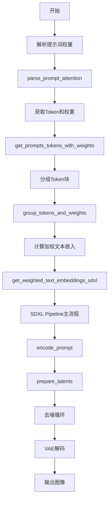

## 类结构

```
DiffusionPipeline (抽象基类)
└── SDXLLongPromptWeightingPipeline (主类)
    ├── StableDiffusionMixin
    ├── FromSingleFileMixin
    ├── IPAdapterMixin
    ├── StableDiffusionXLLoraLoaderMixin
    └── TextualInversionLoaderMixin
```

## 全局变量及字段


### `logger`
    
模块级别的日志记录器，用于输出调试和运行信息

类型：`logging.Logger`
    


### `EXAMPLE_DOC_STRING`
    
包含pipeline使用示例的文档字符串，用于__call__方法的文档

类型：`str`
    


### `is_invisible_watermark_available`
    
检查是否可用不可见水印功能的函数

类型：`Callable`
    


### `SDXLLongPromptWeightingPipeline.vae`
    
变分自编码器，用于编码和解码图像与潜在表示

类型：`AutoencoderKL`
    


### `SDXLLongPromptWeightingPipeline.text_encoder`
    
第一个冻结的文本编码器，用于将文本转换为嵌入向量

类型：`CLIPTextModel`
    


### `SDXLLongPromptWeightingPipeline.text_encoder_2`
    
第二个冻结的文本编码器，包含投影层用于池化嵌入

类型：`CLIPTextModelWithProjection`
    


### `SDXLLongPromptWeightingPipeline.tokenizer`
    
第一个CLIP分词器，用于将文本分割为token

类型：`CLIPTokenizer`
    


### `SDXLLongPromptWeightingPipeline.tokenizer_2`
    
第二个CLIP分词器，配合text_encoder_2使用

类型：`CLIPTokenizer`
    


### `SDXLLongPromptWeightingPipeline.unet`
    
条件U-Net架构，用于对编码图像潜在表示进行去噪

类型：`UNet2DConditionModel`
    


### `SDXLLongPromptWeightingPipeline.scheduler`
    
扩散调度器，用于控制去噪过程的步骤和时间步

类型：`KarrasDiffusionSchedulers`
    


### `SDXLLongPromptWeightingPipeline.feature_extractor`
    
CLIP图像处理器，用于从生成的图像中提取特征（可选组件）

类型：`CLIPImageProcessor`
    


### `SDXLLongPromptWeightingPipeline.image_encoder`
    
CLIP视觉编码器，用于IP-Adapter图像条件输入（可选组件）

类型：`CLIPVisionModelWithProjection`
    


### `SDXLLongPromptWeightingPipeline.vae_scale_factor`
    
VAE缩放因子，基于VAE块输出通道数计算，用于潜在空间与像素空间的转换

类型：`int`
    


### `SDXLLongPromptWeightingPipeline.image_processor`
    
VAE图像处理器，用于图像的预处理和后处理

类型：`VaeImageProcessor`
    


### `SDXLLongPromptWeightingPipeline.mask_processor`
    
掩码图像处理器，用于处理inpainting任务的掩码图像

类型：`VaeImageProcessor`
    


### `SDXLLongPromptWeightingPipeline.default_sample_size`
    
默认采样尺寸，基于UNet配置的sample_size和VAE缩放因子计算

类型：`int`
    


### `SDXLLongPromptWeightingPipeline.watermark`
    
不可见水印施加器，用于在生成的图像上添加水印（可选）

类型：`StableDiffusionXLWatermarker`
    
    

## 全局函数及方法


### `parse_prompt_attention`

该函数用于解析带有注意力权重标记的提示文本字符串，识别圆括号 `(...)`、方括号 `[...]` 以及转义字符，并将它们转换为文本片段及其对应权重的列表。圆括号用于增加注意力（默认1.1倍），方括号用于降低注意力（默认除以1.1），支持自定义权重如 `(text:1.5)`。

参数：

- `text`：`str`，输入的提示文本，包含可选的注意力权重标记

返回值：`List[List[Union[str, float]]]`，返回嵌套列表，其中每个元素是一个包含 `[文本片段, 权重]` 的列表对

#### 流程图

```mermaid
flowchart TD
    A[开始] --> B[编译正则表达式<br/>re_attention 和 re_break]
    B --> C[初始化结果列表和括号堆栈<br/>round_brackets, square_brackets]
    C --> D[设置默认权重乘数<br/>round_bracket_multiplier=1.1<br/>square_bracket_multiplier=1/1.1]
    D --> E{遍历正则匹配结果}
    
    E -->|以反斜杠开头| F[添加转义字符<br/>res.append[text[1:], 1.0]]
    F --> E
    
    E -->|"(" 左圆括号| G[记录当前位置<br/>round_brackets.appendlenres]
    G --> E
    
    E -->|"[" 左方括号| H[记录当前位置<br/>square_brackets.appendlenres]
    H --> E
    
    E -->|有权重值且圆括号非空| I[应用权重到范围<br/>multiply_rangeround_brackets.pop, floatweight]
    I --> E
    
    E -->|")" 右圆括号| J[应用默认圆括号乘数<br/>multiply_rounderound_brackets.pop, round_bracket_multiplier]
    J --> E
    
    E -->|"]" 右方括号| K[应用默认方括号乘数<br/>multiply_rangesquare_brackets.pop, square_bracket_multiplier]
    K --> E
    
    E -->|其他情况| L[按BREAK分割文本<br/>re.splitre_break, text]
    L --> M[逐个添加片段和权重]
    M --> E
    
    E -->|遍历完成| N{检查未闭合的括号}
    N -->|有未闭合圆括号| O[应用round_bracket_multiplier]
    N -->|有未闭合方括号| P[应用square_bracket_multiplier]
    O --> Q
    P --> Q
    
    Q{结果为空?}
    Q -->|是| R[返回 [["", 1.0]]
    Q -->|否| S[合并相邻相同权重的片段]
    S --> T[返回最终结果]
```

#### 带注释源码

```python
def parse_prompt_attention(text):
    """
    Parses a string with attention tokens and returns a list of pairs: text and its associated weight.
    Accepted tokens are:
      (abc) - increases attention to abc by a multiplier of 1.1
      (abc:3.12) - increases attention to abc by a multiplier of 3.12
      [abc] - decreases attention to abc by a multiplier of 1.1
      \\( - literal character '('
      \\[ - literal character '['
      \\) - literal character ')'
      \\] - literal character ']'
      \\ - literal character '\'
      anything else - just text

    >>> parse_prompt_attention('normal text')
    [['normal text', 1.0]]
    >>> parse_prompt_attention('an (important) word')
    [['an ', 1.0], ['important', 1.1], [' word', 1.0]]
    >>> parse_prompt_attention('(unbalanced')
    [['unbalanced', 1.1]]
    >>> parse_prompt_attention('\\(literal\\]')
    [['(literal]', 1.0]]
    >>> parse_prompt_attention('(unnecessary)(parens)')
    [['unnecessaryparens', 1.1]]
    >>> parse_prompt_attention('a (((house:1.3)) [on] a (hill:0.5), sun, (((sky))).')
    [['a ', 1.0],
     ['house', 1.5730000000000004],
     [' ', 1.1],
     ['on', 1.0],
     [' a ', 1.1],
     ['hill', 0.55],
     [', sun, ', 1.1],
     ['sky', 1.4641000000000006],
     ['.', 1.1]]
    """
    import re

    # 编译正则表达式用于匹配各种注意力标记和普通文本
    # 支持: \\( \\) \\] \\[ \\\\ 以及普通字符
    # 带权重的格式: (text:数值) 或 [text:数值]
    re_attention = re.compile(
        r"""
            \\\(|\\\)|\\\[|\\]|\\\\|\\|\(|\[|:([+-]?[.\d]+)\)|
            \)|]|[^\\()\[\]:]+|:
        """,
        re.X,
    )

    # 编译正则表达式用于匹配BREAK分隔符
    re_break = re.compile(r"\s*\bBREAK\b\s*", re.S)

    res = []              # 存储最终结果 [[text, weight], ...]
    round_brackets = []   # 圆括号位置栈
    square_brackets = []  # 方括号位置栈

    # 默认乘数
    round_bracket_multiplier = 1.1      # 圆括号默认增加10%注意力
    square_bracket_multiplier = 1 / 1.1 # 方括号默认减少约9.09%注意力

    def multiply_range(start_position, multiplier):
        """
        将指定位置之后的所有权重乘以给定乘数
        用于实现括号内文本的注意力权重调整
        """
        for p in range(start_position, len(res)):
            res[p][1] *= multiplier

    # 遍历文本中的所有注意力标记
    for m in re_attention.finditer(text):
        text = m.group(0)    # 匹配的完整文本
        weight = m.group(1)  # 捕获的权重数值（如果有）

        # 处理转义字符：以反斜杠开头的字符被当作字面字符
        if text.startswith("\\"):
            res.append([text[1:], 1.0])
        # 记录圆括号开始位置
        elif text == "(":
            round_brackets.append(len(res))
        # 记录方括号开始位置
        elif text == "[:
            square_brackets.append(len(res))
        # 处理带权重的圆括号: (text:1.5)
        elif weight is not None and len(round_brackets) > 0:
            multiply_range(round_brackets.pop(), float(weight))
        # 处理圆括号结束，应用默认乘数
        elif text == ")" and len(round_brackets) > 0:
            multiply_range(round_brackets.pop(), round_bracket_multiplier)
        # 处理方括号结束，应用默认乘数
        elif text == "]" and len(square_brackets) > 0:
            multiply_range(square_brackets.pop(), square_bracket_multiplier)
        else:
            # 处理普通文本，可能包含BREAK分隔符
            parts = re.split(re_break, text)
            for i, part in enumerate(parts):
                if i > 0:
                    res.append(["BREAK", -1])  # BREAK标记
                res.append([part, 1.0])

    # 处理未闭合的括号（应用默认乘数到剩余位置）
    for pos in round_brackets:
        multiply_range(pos, round_bracket_multiplier)

    for pos in square_brackets:
        multiply_range(pos, square_bracket_multiplier)

    # 如果结果为空，返回默认空文本
    if len(res) == 0:
        res = [["", 1.0]]

    # 合并相邻的相同权重片段
    i = 0
    while i + 1 < len(res):
        if res[i][1] == res[i + 1][1]:
            # 合并文本
            res[i][0] += res[i + 1][0]
            # 移除重复项
            res.pop(i + 1)
        else:
            i += 1

    return res
```


### `get_prompts_tokens_with_weights`

该函数是一个全局工具函数，用于将带有权重标记的文本提示词解析为Token ID列表和对应的权重列表。它支持Stable Diffusion XL pipeline中的加权提示词功能，能够处理如`(word:1.5)`或`[word]`等权重语法，并将其转换为文本编码器所需的格式。

**参数：**

- `clip_tokenizer`：`CLIPTokenizer`，CLIP分词器实例，用于将文本分割为token
- `prompt`：`str`，包含权重标记的提示词字符串，例如 `"a (red:1.5) cat"`

**返回值：**

- `text_tokens`：`list`，包含所有token ID的列表
- `text_weights`：`list`，与token ID列表对应的权重列表

#### 流程图

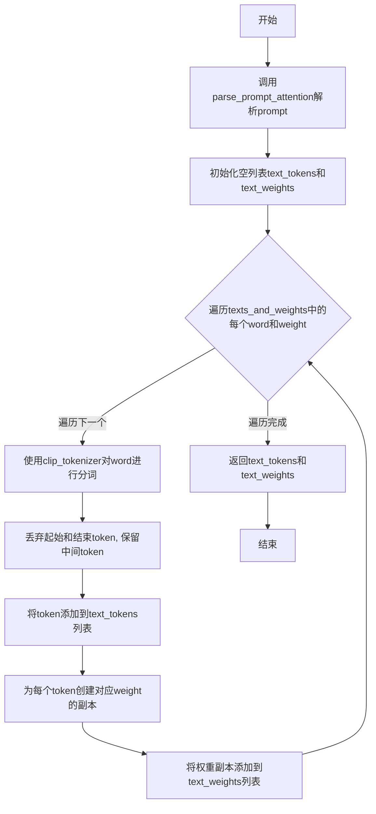

#### 带注释源码

```python
def get_prompts_tokens_with_weights(clip_tokenizer: CLIPTokenizer, prompt: str):
    """
    Get prompt token ids and weights, this function works for both prompt and negative prompt

    Args:
        pipe (CLIPTokenizer)
            A CLIPTokenizer
        prompt (str)
            A prompt string with weights

    Returns:
        text_tokens (list)
            A list contains token ids
        text_weight (list)
            A list contains the correspondent weight of token ids

    Example:
        import torch
        from transformers import CLIPTokenizer

        clip_tokenizer = CLIPTokenizer.from_pretrained(
            "stablediffusionapi/deliberate-v2"
            , subfolder = "tokenizer"
            , dtype = torch.float16
        )

        token_id_list, token_weight_list = get_prompts_tokens_with_weights(
            clip_tokenizer = clip_tokenizer
            ,prompt = "a (red:1.5) cat"*70
        )
    """
    # 首先调用parse_prompt_attention函数解析带有权重的提示词
    # 返回格式为[[word1, weight1], [word2, weight2], ...]的列表
    texts_and_weights = parse_prompt_attention(prompt)
    
    # 初始化用于存储所有token和对应权重的空列表
    text_tokens, text_weights = [], []
    
    # 遍历解析后的每个词块及其权重
    for word, weight in texts_and_weights:
        # 使用CLIP分词器对当前词进行分词,truncation=False允许处理任意长度的提示词
        # input_ids返回格式为[起始token, token1, token2, ..., 结束token]
        token = clip_tokenizer(word, truncation=False).input_ids[1:-1]  # 丢弃起始和结束token
        
        # 合并新tokens到tokens持有列表中
        # 例如: text_tokens = [*text_tokens, *token]
        text_tokens = [*text_tokens, *token]

        # 每个token块对应一个权重,需要为每个token展开权重
        # 例如: 如果word='red cat'被tokenize为[320, 1125, 539, 320]共4个token
        # weight=2.0, 则chunk_weights = [2.0, 2.0, 2.0, 2.0]
        chunk_weights = [weight] * len(token)

        # 将权重追加到权重持有列表中
        text_weights = [*text_weights, *chunk_weights]
    
    # 返回token ID列表和对应的权重列表
    return text_tokens, text_weights
```


### `group_tokens_and_weights`

该函数用于将长序列的token ids和对应的权重按每77个token一组进行分组（SDXL模型的输入限制），并在最后不足77个token时进行padding填充处理。

参数：

- `token_ids`：`list`，由tokenizer产生的token id列表
- `weights`：`list`，与token ids对应的权重列表
- `pad_last_block`：`bool`，控制是否在最后一个token块不足75个token时用EOS填充，默认为False

返回值：`Tuple[List[List[int]], List[List[float]]]`，返回两个二维列表——分组后的token ids二维列表和对应的权重二维列表

#### 流程图

```mermaid
flowchart TD
    A[开始: token_ids, weights] --> B{len(token_ids) >= 75?}
    B -->|Yes| C[取出前75个token和权重]
    C --> D[在前后添加BOS和EOS, 组成77个token]
    D --> E[权重前后添加1.0, 组成77个权重]
    E --> F[添加到new_token_ids和new_weights]
    F --> B
    B -->|No| G{len(token_ids) > 0?}
    G -->|Yes| H{pad_last_block?}
    H -->|Yes| I[计算padding_len = 75 - len(token_ids)]
    H -->|No| J[padding_len = 0]
    I --> K[添加BOS + token_ids + padding个EOS + 最后一个EOS]
    J --> K
    K --> L[权重添加1.0 + weights + padding个1.0 + 1.0]
    L --> M[添加到new_token_ids和new_weights]
    G -->|No| N[返回new_token_ids, new_weights]
    M --> N
```

#### 带注释源码

```python
def group_tokens_and_weights(token_ids: list, weights: list, pad_last_block=False):
    """
    Produce tokens and weights in groups and pad the missing tokens
    
    Args:
        token_ids (list): The token ids from tokenizer
        weights (list): The weights list from function get_prompts_tokens_with_weights
        pad_last_block (bool): Control if fill the last token list to 75 tokens with eos
    Returns:
        new_token_ids (2d list): Grouped token ids
        new_weights (2d list): Grouped weights
    """
    # 定义SDXL的BOS(开始)和EOS(结束)token ID
    bos, eos = 49406, 49407

    # 初始化二维列表用于存储分组后的结果
    new_token_ids = []
    new_weights = []
    
    # 当token数量大于等于75时，持续分组
    # 每次取75个token，加上BOS和EOS后正好是77个
    while len(token_ids) >= 75:
        # 取出前75个token和对应权重
        head_75_tokens = [token_ids.pop(0) for _ in range(75)]
        head_75_weights = [weights.pop(0) for _ in range(75)]

        # 构建77个token的序列: [BOS] + 75 tokens + [EOS]
        temp_77_token_ids = [bos] + head_75_tokens + [eos]
        # 构建77个权重的序列: [1.0] + 75 weights + [1.0]
        temp_77_weights = [1.0] + head_75_weights + [1.0]

        # 添加到结果列表
        new_token_ids.append(temp_77_token_ids)
        new_weights.append(temp_77_weights)

    # 处理剩余不足75个token的情况
    if len(token_ids) > 0:
        # 计算需要padding的长度
        padding_len = 75 - len(token_ids) if pad_last_block else 0

        # 构建最后的token序列
        # 格式: [BOS] + 剩余tokens + [EOS] * padding_len + [EOS]
        temp_77_token_ids = [bos] + token_ids + [eos] * padding_len + [eos]
        new_token_ids.append(temp_77_token_ids)

        # 构建最后的权重序列
        # 格式: [1.0] + 剩余weights + [1.0] * padding_len + [1.0]
        temp_77_weights = [1.0] + weights + [1.0] * padding_len + [1.0]
        new_weights.append(temp_77_weights)

    return new_token_ids, new_weights
```


### `get_weighted_text_embeddings_sdxl`

该函数是SDXL长提示词加权的核心处理函数，能够处理带有注意力权重标记的长提示词（如 `(word:1.5)` 或 `[word]`），通过分块处理和双文本编码器生成带权重的文本嵌入向量，解决了SDXL模型提示词长度限制的问题。

参数：

- `pipe`：`StableDiffusionXLPipeline`，SDXL管道实例，提供tokenizer和text_encoder
- `prompt`：`str`，正向提示词，支持加权标记
- `prompt_2`：`str`，第二个正向提示词（可选），用于双文本编码器
- `neg_prompt`：`str`，负向提示词，支持加权标记
- `neg_prompt_2`：`str`，第二个负向提示词（可选）
- `num_images_per_prompt`：`int`，每个提示词生成的图像数量
- `device`：`Optional[torch.device]`，计算设备，默认为pipe的执行设备
- `clip_skip`：`Optional[int]`，跳过的CLIP层数，用于控制嵌入层选择
- `lora_scale`：`Optional[int]`，LoRA权重缩放因子

返回值：`Tuple[torch.Tensor, torch.Tensor, torch.Tensor, torch.Tensor]`，返回四个张量：
- `prompt_embeds`：正向提示词嵌入
- `negative_prompt_embeds`：负向提示词嵌入
- `pooled_prompt_embeds`：池化后的正向提示词嵌入
- `negative_pooled_prompt_embeds`：池化后的负向提示词嵌入

#### 流程图

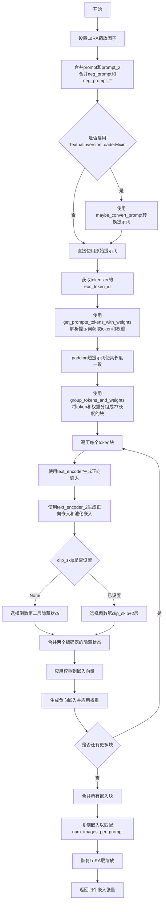

#### 带注释源码

```python
def get_weighted_text_embeddings_sdxl(
    pipe: StableDiffusionXLPipeline,
    prompt: str = "",
    prompt_2: str = None,
    neg_prompt: str = "",
    neg_prompt_2: str = None,
    num_images_per_prompt: int = 1,
    device: Optional[torch.device] = None,
    clip_skip: Optional[int] = None,
    lora_scale: Optional[int] = None,
):
    """
    处理带有权重标记的长提示词，为SDXL生成文本嵌入向量
    
    支持的权重标记语法：
    - (word) - 增加注意力权重1.1倍
    - (word:1.5) - 增加注意力权重1.5倍
    - [word] - 降低注意力权重1/1.1倍
    """
    # 确定计算设备，默认为管道的执行设备
    device = device or pipe._execution_device

    # 设置LoRA缩放因子，以便文本编码器的LoRA函数可以正确访问
    if lora_scale is not None and isinstance(pipe, StableDiffusionXLLoraLoaderMixin):
        pipe._lora_scale = lora_scale

        # 动态调整LoRA缩放
        if pipe.text_encoder is not None:
            if not USE_PEFT_BACKEND:
                adjust_lora_scale_text_encoder(pipe.text_encoder, lora_scale)
            else:
                scale_lora_layers(pipe.text_encoder, lora_scale)

        if pipe.text_encoder_2 is not None:
            if not USE_PEFT_BACKEND:
                adjust_lora_scale_text_encoder(pipe.text_encoder_2, lora_scale)
            else:
                scale_lora_layers(pipe.text_encoder_2, lora_scale)

    # 合并两个正向提示词
    if prompt_2:
        prompt = f"{prompt} {prompt_2}"

    # 合并两个负向提示词
    if neg_prompt_2:
        neg_prompt = f"{neg_prompt} {neg_prompt_2}"

    # 初始化提示词变量，用于后续处理
    prompt_t1 = prompt_t2 = prompt
    neg_prompt_t1 = neg_prompt_t2 = neg_prompt

    # 如果管道支持TextualInversion，加载自定义提示词转换
    if isinstance(pipe, TextualInversionLoaderMixin):
        prompt_t1 = pipe.maybe_convert_prompt(prompt_t1, pipe.tokenizer)
        neg_prompt_t1 = pipe.maybe_convert_prompt(neg_prompt_t1, pipe.tokenizer)
        prompt_t2 = pipe.maybe_convert_prompt(prompt_t2, pipe.tokenizer_2)
        neg_prompt_t2 = pipe.maybe_convert_prompt(neg_prompt_t2, pipe.tokenizer_2)

    # 获取结束token ID，用于padding
    eos = pipe.tokenizer.eos_token_id

    # 使用tokenizer 1处理正向和负向提示词，获取token和权重
    prompt_tokens, prompt_weights = get_prompts_tokens_with_weights(pipe.tokenizer, prompt_t1)
    neg_prompt_tokens, neg_prompt_weights = get_prompts_tokens_with_weights(pipe.tokenizer, neg_prompt_t1)

    # 使用tokenizer 2处理正向和负向提示词
    prompt_tokens_2, prompt_weights_2 = get_prompts_tokens_with_weights(pipe.tokenizer_2, prompt_t2)
    neg_prompt_tokens_2, neg_prompt_weights_2 = get_prompts_tokens_with_weights(pipe.tokenizer_2, neg_prompt_t2)

    # 对token set 1进行padding，使正向和负向提示词长度一致
    prompt_token_len = len(prompt_tokens)
    neg_prompt_token_len = len(neg_prompt_tokens)

    if prompt_token_len > neg_prompt_token_len:
        # 用eos token填充负向提示词
        neg_prompt_tokens = neg_prompt_tokens + [eos] * abs(prompt_token_len - neg_prompt_token_len)
        neg_prompt_weights = neg_prompt_weights + [1.0] * abs(prompt_token_len - neg_prompt_token_len)
    else:
        # 用eos token填充正向提示词
        prompt_tokens = prompt_tokens + [eos] * abs(prompt_token_len - neg_prompt_token_len)
        prompt_weights = prompt_weights + [1.0] * abs(prompt_token_len - neg_prompt_token_len)

    # 对token set 2进行相同的padding处理
    prompt_token_len_2 = len(prompt_tokens_2)
    neg_prompt_token_len_2 = len(neg_prompt_tokens_2)

    if prompt_token_len_2 > neg_prompt_token_len_2:
        neg_prompt_tokens_2 = neg_prompt_tokens_2 + [eos] * abs(prompt_token_len_2 - neg_prompt_token_len_2)
        neg_prompt_weights_2 = neg_prompt_weights_2 + [1.0] * abs(prompt_token_len_2 - neg_prompt_token_len_2)
    else:
        prompt_tokens_2 = prompt_tokens_2 + [eos] * abs(prompt_token_len_2 - neg_prompt_token_len_2)
        prompt_weights_2 = prompt_weights + [1.0] * abs(prompt_token_len_2 - neg_prompt_token_len_2)  # 注意：此处有bug，应为prompt_weights_2

    # 初始化嵌入向量列表
    embeds = []
    neg_embeds = []

    # 将token和权重分组，每组77个（1个bos + 75个token + 1个eos）
    prompt_token_groups, prompt_weight_groups = group_tokens_and_weights(prompt_tokens.copy(), prompt_weights.copy())

    neg_prompt_token_groups, neg_prompt_weight_groups = group_tokens_and_weights(
        neg_prompt_tokens.copy(), neg_prompt_weights.copy()
    )

    prompt_token_groups_2, prompt_weight_groups_2 = group_tokens_and_weights(
        prompt_tokens_2.copy(), prompt_weights_2.copy()
    )

    neg_prompt_token_groups_2, neg_prompt_weight_groups_2 = group_tokens_and_weights(
        neg_prompt_tokens_2.copy(), neg_prompt_weights_2.copy()
    )

    # 逐块处理token，生成带权重的嵌入向量
    for i in range(len(prompt_token_groups)):
        # 获取正向提示词嵌入（带权重）
        token_tensor = torch.tensor([prompt_token_groups[i]], dtype=torch.long, device=device)
        weight_tensor = torch.tensor(prompt_weight_groups[i], dtype=torch.float16, device=device)

        token_tensor_2 = torch.tensor([prompt_token_groups_2[i]], dtype=torch.long, device=device)

        # 使用第一个文本编码器生成嵌入
        prompt_embeds_1 = pipe.text_encoder(token_tensor.to(device), output_hidden_states=True)

        # 使用第二个文本编码器生成嵌入
        prompt_embeds_2 = pipe.text_encoder_2(token_tensor_2.to(device), output_hidden_states=True)
        pooled_prompt_embeds = prompt_embeds_2[0]  # 获取池化输出

        # 根据clip_skip选择隐藏状态层
        if clip_skip is None:
            prompt_embeds_1_hidden_states = prompt_embeds_1.hidden_states[-2]
            prompt_embeds_2_hidden_states = prompt_embeds_2.hidden_states[-2]
        else:
            # SDXL总是从倒数第二层索引
            prompt_embeds_1_hidden_states = prompt_embeds_1.hidden_states[-(clip_skip + 2)]
            prompt_embeds_2_hidden_states = prompt_embeds_2.hidden_states[-(clip_skip + 2)]

        # 合并两个编码器的隐藏状态
        prompt_embeds_list = [prompt_embeds_1_hidden_states, prompt_embeds_2_hidden_states]
        token_embedding = torch.concat(prompt_embeds_list, dim=-1).squeeze(0)

        # 应用权重到每个token的嵌入
        for j in range(len(weight_tensor)):
            if weight_tensor[j] != 1.0:
                # 使用线性插值应用权重：embedding = last + (current - last) * weight
                token_embedding[j] = (
                    token_embedding[-1] + (token_embedding[j] - token_embedding[-1]) * weight_tensor[j]
                )

        token_embedding = token_embedding.unsqueeze(0)
        embeds.append(token_embedding)

        # 获取负向提示词嵌入（带权重）- 处理逻辑同上
        neg_token_tensor = torch.tensor([neg_prompt_token_groups[i]], dtype=torch.long, device=device)
        neg_token_tensor_2 = torch.tensor([neg_prompt_token_groups_2[i]], dtype=torch.long, device=device)
        neg_weight_tensor = torch.tensor(neg_prompt_weight_groups[i], dtype=torch.float16, device=device)

        neg_prompt_embeds_1 = pipe.text_encoder(neg_token_tensor.to(device), output_hidden_states=True)
        neg_prompt_embeds_1_hidden_states = neg_prompt_embeds_1.hidden_states[-2]

        neg_prompt_embeds_2 = pipe.text_encoder_2(neg_token_tensor_2.to(device), output_hidden_states=True)
        neg_prompt_embeds_2_hidden_states = neg_prompt_embeds_2.hidden_states[-2]
        negative_pooled_prompt_embeds = neg_prompt_embeds_2[0]

        neg_prompt_embeds_list = [neg_prompt_embeds_1_hidden_states, neg_prompt_embeds_2_hidden_states]
        neg_token_embedding = torch.concat(neg_prompt_embeds_list, dim=-1).squeeze(0)

        for z in range(len(neg_weight_tensor)):
            if neg_weight_tensor[z] != 1.0:
                neg_token_embedding[z] = (
                    neg_token_embedding[-1] + (neg_token_embedding[z] - neg_token_embedding[-1]) * neg_weight_tensor[z]
                )

        neg_token_embedding = neg_token_embedding.unsqueeze(0)
        neg_embeds.append(neg_token_embedding)

    # 合并所有块的嵌入
    prompt_embeds = torch.cat(embeds, dim=1)
    negative_prompt_embeds = torch.cat(neg_embeds, dim=1)

    # 复制embeddings以匹配生成的图像数量
    bs_embed, seq_len, _ = prompt_embeds.shape
    prompt_embeds = prompt_embeds.repeat(1, num_images_per_prompt, 1)
    prompt_embeds = prompt_embeds.view(bs_embed * num_images_per_prompt, seq_len, -1)

    seq_len = negative_prompt_embeds.shape[1]
    negative_prompt_embeds = negative_prompt_embeds.repeat(1, num_images_per_prompt, 1)
    negative_prompt_embeds = negative_prompt_embeds.view(bs_embed * num_images_per_prompt, seq_len, -1)

    pooled_prompt_embeds = pooled_prompt_embeds.repeat(1, num_images_per_prompt, 1).view(
        bs_embed * num_images_per_prompt, -1
    )
    negative_pooled_prompt_embeds = negative_pooled_prompt_embeds.repeat(1, num_images_per_prompt, 1).view(
        bs_embed * num_images_per_prompt, -1
    )

    # 恢复LoRA层缩放（反向操作）
    if pipe.text_encoder is not None:
        if isinstance(pipe, StableDiffusionXLLoraLoaderMixin) and USE_PEFT_BACKEND:
            unscale_lora_layers(pipe.text_encoder, lora_scale)

    if pipe.text_encoder_2 is not None:
        if isinstance(pipe, StableDiffusionXLLoraLoaderMixin) and USE_PEFT_BACKEND:
            unscale_lora_layers(pipe.text_encoder_2, lora_scale)

    return prompt_embeds, negative_prompt_embeds, pooled_prompt_embeds, negative_pooled_prompt_embeds
```


### `rescale_noise_cfg`

该函数用于根据 guidance_rescale 参数重新缩放噪声预测配置（noise_cfg），基于论文 "Common Diffusion Noise Schedules and Sample Steps are Flawed" 的发现，通过调整噪声预测的标准差来修复过度曝光问题，并通过混合因子避免生成过于平淡的图像。

参数：

- `noise_cfg`：`torch.Tensor`，原始的噪声预测配置（即 classifier-free guidance 后的噪声预测）
- `noise_pred_text`：`torch.Tensor`，文本引导的噪声预测（guidance 中条件预测部分）
- `guidance_rescale`：`float`，重新缩放因子，用于混合原始结果和重新缩放后的结果，默认为 0.0

返回值：`torch.Tensor`，重新缩放后的噪声预测配置

#### 流程图

```mermaid
flowchart TD
    A[开始] --> B[计算 noise_pred_text 的标准差 std_text]
    B --> C[计算 noise_cfg 的标准差 std_cfg]
    C --> D[计算重新缩放后的噪声预测 noise_pred_rescaled = noise_cfg × (std_text / std_cfg)]
    D --> E[根据 guidance_rescale 混合结果: noise_cfg = guidance_rescale × noise_pred_rescaled + (1 - guidance_rescale) × noise_cfg]
    E --> F[返回重新缩放后的 noise_cfg]
```

#### 带注释源码

```python
# Copied from diffusers.pipelines.stable_diffusion.pipeline_stable_diffusion.rescale_noise_cfg
def rescale_noise_cfg(noise_cfg, noise_pred_text, guidance_rescale=0.0):
    """
    Rescale `noise_cfg` according to `guidance_rescale`. Based on findings of [Common Diffusion Noise Schedules and
    Sample Steps are Flawed](https://huggingface.co/papers/2305.08891). See Section 3.4
    
    该函数实现了论文中提出的噪声预测重新缩放方法，旨在修复过度曝光问题并避免生成过于平淡的图像。
    """
    # 计算文本引导噪声预测在所有维度（除batch维度外）的标准差
    # dim参数指定计算标准差的维度，keepdim保持维度以便后续广播操作
    std_text = noise_pred_text.std(dim=list(range(1, noise_pred_text.ndim)), keepdim=True)
    
    # 计算噪声配置在所有维度（除batch维度外）的标准差
    std_cfg = noise_cfg.std(dim=list(range(1, noise_cfg.ndim)), keepdim=True)
    
    # 重新缩放guidance结果以修复过度曝光
    # 通过将noise_cfg乘以文本预测标准差与配置标准差的比率来实现
    noise_pred_rescaled = noise_cfg * (std_text / std_cfg)
    
    # 通过guidance_rescale因子混合原始guidance结果，避免生成"plain looking"图像
    # 当guidance_rescale为0时，返回原始noise_cfg；为1时，返回完全重新缩放的结果
    noise_cfg = guidance_rescale * noise_pred_rescaled + (1 - guidance_rescale) * noise_cfg
    
    return noise_cfg
```


### `retrieve_latents`

从 VAE 编码器输出中检索潜在向量（latents），支持多种采样模式。

参数：

- `encoder_output`：`torch.Tensor`，VAE 编码器的输出对象，通常包含 `latent_dist` 或 `latents` 属性
- `generator`：`torch.Generator | None`，可选的随机数生成器，用于采样模式下的随机性控制
- `sample_mode`：`str`，采样模式，默认为 `"sample"`，可选值为 `"sample"`（随机采样）或 `"argmax"`（取众数）

返回值：`torch.Tensor`，检索到的潜在向量

#### 流程图

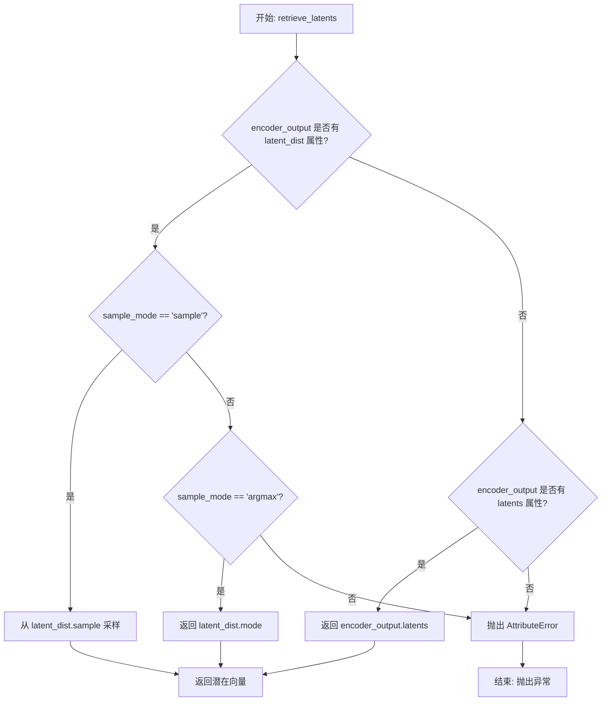

#### 带注释源码

```python
# Copied from diffusers.pipelines.stable_diffusion.pipeline_stable_diffusion_img2img.retrieve_latents
def retrieve_latents(
    encoder_output: torch.Tensor, generator: torch.Generator | None = None, sample_mode: str = "sample"
):
    """
    从 VAE 编码器输出中检索潜在向量。
    
    Args:
        encoder_output: VAE 编码器的输出，包含潜在分布或预计算的潜在向量
        generator: 可选的随机数生成器，用于采样模式下的确定性采样
        sample_mode: 采样模式，"sample" 为随机采样，"argmax" 为取分布的众数
    
    Returns:
        torch.Tensor: 检索到的潜在向量
    """
    # 检查编码器输出是否有 latent_dist 属性且模式为采样
    if hasattr(encoder_output, "latent_dist") and sample_mode == "sample":
        # 从潜在分布中随机采样
        return encoder_output.latent_dist.sample(generator)
    # 检查编码器输出是否有 latent_dist 属性且模式为 argmax
    elif hasattr(encoder_output, "latent_dist") and sample_mode == "argmax":
        # 返回潜在分布的模式（众数）
        return encoder_output.latent_dist.mode()
    # 检查编码器输出是否直接包含 latents 属性
    elif hasattr(encoder_output, "latents"):
        # 直接返回预计算的潜在向量
        return encoder_output.latents
    else:
        # 如果无法访问潜在向量，抛出属性错误
        raise AttributeError("Could not access latents of provided encoder_output")
```


### `retrieve_timesteps`

该函数用于调用调度器的 `set_timesteps` 方法并从调度器中获取时间步，处理自定义时间步。任何 kwargs 将传递给 `scheduler.set_timesteps`。

**参数：**

- `scheduler`：`SchedulerMixin`，要获取时间步的调度器
- `num_inference_steps`：`Optional[int]`，生成样本时使用的扩散步数。如果使用此参数，`timesteps` 必须为 `None`
- `device`：`Optional[Union[str, torch.device]]`，时间步要移动到的设备。如果为 `None`，则不移动时间步
- `timesteps`：`Optional[List[int]]`，用于支持任意时间步间隔的自定义时间步。如果为 `None`，则使用调度器的默认时间步间隔策略。如果传递了 `timesteps`，则 `num_inference_steps` 必须为 `None`
- `**kwargs`：传递给 `scheduler.set_timesteps` 的其他关键字参数

**返回值：** `Tuple[torch.Tensor, int]`，元组，其中第一个元素是调度器的时间步计划，第二个元素是推理步数。

#### 流程图

```mermaid
flowchart TD
    A[开始] --> B{是否有自定义 timesteps?}
    B -->|是| C[检查调度器是否支持 timesteps 参数]
    B -->|否| D[调用 scheduler.set_timesteps 使用 num_inference_steps]
    C --> E{调度器支持 timesteps?}
    E -->|否| F[抛出 ValueError 异常]
    E -->|是| G[调用 scheduler.set_timesteps 使用 timesteps]
    D --> H[获取 scheduler.timesteps]
    G --> H
    H --> I[计算 num_inference_steps = len(timesteps)]
    I --> J[返回 timesteps 和 num_inference_steps]
    F --> J
```

#### 带注释源码

```python
# Copied from diffusers.pipelines.stable_diffusion.pipeline_stable_diffusion.retrieve_timesteps
def retrieve_timesteps(
    scheduler,
    num_inference_steps: Optional[int] = None,
    device: Optional[Union[str, torch.device]] = None,
    timesteps: Optional[List[int]] = None,
    **kwargs,
):
    """
    Calls the scheduler's `set_timesteps` method and retrieves timesteps from the scheduler after the call. Handles
    custom timesteps. Any kwargs will be supplied to `scheduler.set_timesteps`.

    Args:
        scheduler (`SchedulerMixin`):
            The scheduler to get timesteps from.
        num_inference_steps (`int`):
            The number of diffusion steps used when generating samples with a pre-trained model. If used,
            `timesteps` must be `None`.
        device (`str` or `torch.device`, *optional*):
            The device to which the timesteps should be moved to. If `None`, the timesteps are not moved.
        timesteps (`List[int]`, *optional*):
                Custom timesteps used to support arbitrary spacing between timesteps. If `None`, then the default
                timestep spacing strategy of the scheduler is used. If `timesteps` is passed, `num_inference_steps`
                must be `None`.

    Returns:
        `Tuple[torch.Tensor, int]`: A tuple where the first element is the timestep schedule from the scheduler and the
        second element is the number of inference steps.
    """
    # 检查是否提供了自定义时间步
    if timesteps is not None:
        # 检查调度器的 set_timesteps 方法是否接受 timesteps 参数
        accepts_timesteps = "timesteps" in set(inspect.signature(scheduler.set_timesteps).parameters.keys())
        if not accepts_timesteps:
            raise ValueError(
                f"The current scheduler class {scheduler.__class__}'s `set_timesteps` does not support custom"
                f" timestep schedules. Please check whether you are using the correct scheduler."
            )
        # 使用自定义时间步设置调度器
        scheduler.set_timesteps(timesteps=timesteps, device=device, **kwargs)
        # 获取调度器的时间步
        timesteps = scheduler.timesteps
        # 计算推理步数
        num_inference_steps = len(timesteps)
    else:
        # 使用 num_inference_steps 设置调度器
        scheduler.set_timesteps(num_inference_steps, device=device, **kwargs)
        # 获取调度器的时间步
        timesteps = scheduler.timesteps
    # 返回时间步和推理步数
    return timesteps, num_inference_steps
```


### `SDXLLongPromptWeightingPipeline.__init__`

该方法是SDXL长提示权重管道的构造函数，负责初始化所有核心组件（VAE、文本编码器、分词器、UNet、调度器等），并配置图像处理器、掩码处理器和水印处理器，为后续的图像生成任务做好准备。

参数：

- `vae`：`AutoencoderKL`，Variational Auto-Encoder (VAE) 模型，用于在潜在表示之间编码和解码图像
- `text_encoder`：`CLIPTextModel`，第一个冻结的文本编码器，SDXL 使用 CLIP 的文本部分
- `text_encoder_2`：`CLIPTextModelWithProjection`，第二个冻结的文本编码器，包含文本和池化部分
- `tokenizer`：`CLIPTokenizer`，第一个分词器
- `tokenizer_2`：`CLIPTokenizer`，第二个分词器
- `unet`：`UNet2DConditionModel`，条件 U-Net 架构，用于对编码的图像潜在表示进行去噪
- `scheduler`：`KarrasDiffusionSchedulers`，与 `unet` 结合使用以对编码图像潜在表示进行去噪的调度器
- `feature_extractor`：`Optional[CLIPImageProcessor]`，从生成的图像中提取特征的处理器，用于安全检查器
- `image_encoder`：`Optional[CLIPVisionModelWithProjection]`，可选的图像编码器，用于 IP Adapter
- `force_zeros_for_empty_prompt`：`bool`，当提示为空时是否强制为零
- `add_watermarker`：`Optional[bool]`，是否添加不可见水印

返回值：无（构造函数）

#### 流程图

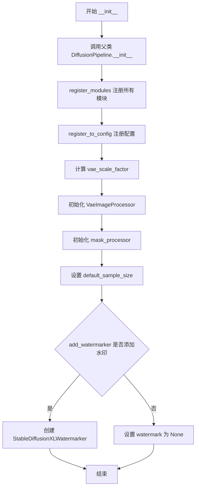

#### 带注释源码

```python
def __init__(
    self,
    vae: AutoencoderKL,
    text_encoder: CLIPTextModel,
    text_encoder_2: CLIPTextModelWithProjection,
    tokenizer: CLIPTokenizer,
    tokenizer_2: CLIPTokenizer,
    unet: UNet2DConditionModel,
    scheduler: KarrasDiffusionSchedulers,
    feature_extractor: Optional[CLIPImageProcessor] = None,
    image_encoder: Optional[CLIPVisionModelWithProjection] = None,
    force_zeros_for_empty_prompt: bool = True,
    add_watermarker: Optional[bool] = None,
):
    """初始化 SDXLLongPromptWeightingPipeline 管道"""
    
    # 调用父类 DiffusionPipeline 的初始化方法
    super().__init__()
    
    # 注册所有模块到管道中
    self.register_modules(
        vae=vae,
        text_encoder=text_encoder,
        text_encoder_2=text_encoder_2,
        tokenizer=tokenizer,
        tokenizer_2=tokenizer_2,
        unet=unet,
        scheduler=scheduler,
        feature_extractor=feature_extractor,
        image_encoder=image_encoder,
    )
    
    # 将 force_zeros_for_empty_prompt 配置注册到管道配置中
    self.register_to_config(force_zeros_for_empty_prompt=force_zeros_for_empty_prompt)
    
    # 计算 VAE 缩放因子，基于 VAE 块输出通道数的幂
    # 例如：如果 VAE 有 [128, 256, 512, 512] 四个块，则缩放因子为 2^(4-1) = 8
    self.vae_scale_factor = 2 ** (len(self.vae.config.block_out_channels) - 1) if getattr(self, "vae", None) else 8
    
    # 初始化图像处理器，用于预处理和后处理图像
    self.image_processor = VaeImageProcessor(vae_scale_factor=self.vae_scale_factor)
    
    # 初始化掩码处理器，配置为归一化=False，二值化=True，灰度转换=True
    self.mask_processor = VaeImageProcessor(
        vae_scale_factor=self.vae_scale_factor, 
        do_normalize=False, 
        do_binarize=True, 
        do_convert_grayscale=True
    )
    
    # 设置默认采样大小，从 UNet 配置中获取，如果不存在则默认为 128
    self.default_sample_size = (
        self.unet.config.sample_size
        if hasattr(self, "unet") and self.unet is not None and hasattr(self.unet.config, "sample_size")
        else 128
    )
    
    # 确定是否添加水印：使用传入值或检查是否可用不可见水印
    add_watermarker = add_watermarker if add_watermarker is not None else is_invisible_watermark_available()
    
    # 如果需要添加水印，创建水印处理器
    if add_watermarker:
        self.watermark = StableDiffusionXLWatermarker()
    else:
        self.watermark = None
```


### `SDXLLongPromptWeightingPipeline.encode_prompt`

该方法是 `SDXLLongPromptWeightingPipeline` 类的核心方法之一，负责将文本提示编码为文本编码器的隐藏状态（embedding）。它支持标准 SDXL 的双文本编码器架构，处理正面提示、负面提示，以及可选的 LoRA 权重调节。在管线调用时，该方法由 `get_weighted_text_embeddings_sdxl` 函数调用（该函数支持长提示加权），而 `encode_prompt` 本身则用于标准提示处理场景。

#### 参数

- `self`：`SDXLLongPromptWeightingPipeline` 实例，隐含参数
- `prompt`：`str`，要编码的主提示文本，支持字符串或字符串列表
- `prompt_2`：`str | None`，发送给第二个分词器和文本编码器的提示，若为 `None` 则使用 `prompt`
- `device`：`Optional[torch.device]`，计算设备，若为 `None` 则使用执行设备
- `num_images_per_prompt`：`int`，每个提示生成的图像数量，用于复制 embeddings
- `do_classifier_free_guidance`：`bool`，是否启用分类器自由引导（CFG）
- `negative_prompt`：`str | None`，负面提示，用于引导生成过程避开相关内容
- `negative_prompt_2`：`str | None`，第二个负面提示，若为 `None` 则使用 `negative_prompt`
- `prompt_embeds`：`Optional[torch.Tensor]`，预生成的文本嵌入，可用于微调输入
- `negative_prompt_embeds`：`Optional[torch.Tensor]`，预生成的负面文本嵌入
- `pooled_prompt_embeds`：`Optional[torch.Tensor]`，预生成的汇聚文本嵌入
- `negative_pooled_prompt_embeds`：`Optional[torch.Tensor]`，预生成的负面汇聚嵌入
- `lora_scale`：`Optional[float]`，LoRA 层的缩放因子

#### 返回值

`Tuple[torch.Tensor, torch.Tensor, torch.Tensor, torch.Tensor]`，包含以下四个张量：

- `prompt_embeds`：编码后的正面提示嵌入，形状为 `(batch_size * num_images_per_prompt, seq_len, hidden_dim)`
- `negative_prompt_embeds`：编码后的负面提示嵌入，形状与 `prompt_embeds` 相同
- `pooled_prompt_embeds`：汇聚后的正面提示嵌入，用于 UNet 条件输入
- `negative_pooled_prompt_embeds`：汇聚后的负面提示嵌入

#### 流程图

```mermaid
flowchart TD
    A[开始 encode_prompt] --> B{device 是否为 None?}
    B -- 是 --> C[使用 self._execution_device]
    B -- 否 --> D[使用传入的 device]
    C --> E{设置 LoRA scale]
    E --> F{prompt_embeds 是否已提供?}
    F -- 是 --> G[直接使用提供的 embeddings]
    F -- 否 --> H{处理双文本编码器架构]
    H --> I[获取 tokenizers 和 text_encoders 列表]
    I --> J[遍历 prompts 和 encoders]
    J --> K{prompt_2 是否为 None?}
    K -- 是 --> L[prompt_2 = prompt]
    K -- 否 --> M[使用 prompt_2]
    L --> N{是否为 TextualInversionLoaderMixin?}
    M --> N
    N -- 是 --> O[调用 maybe_convert_prompt]
    N -- 否 --> P[直接使用原始 prompt]
    O --> Q[调用 tokenizer 进行分词]
    P --> Q
    Q --> R[检查是否被截断]
    R -- 是 --> S[记录警告日志]
    R -- 否 --> T[调用 text_encoder 获取隐藏状态]
    S --> T
    T --> U[提取 pooled_prompt_embeds]
    U --> V[提取倒数第二层隐藏状态]
    V --> W[添加到 prompt_embeds_list]
    W --> X{是否处理完所有 encoder?}
    X -- 否 --> J
    X -- 是 --> Y[沿最后一个维度拼接 embeddings]
    Y --> Z{do_classifier_free_guidance 为真且 negative_prompt_embeds 为 None?}
    Z -- 是 --> AA[检查是否需要强制零嵌入]
    AA --> AB{force_zeros_for_empty_prompt 为真?]
    AB -- 是 --> AC[创建全零 embeddings]
    AB -- 否 --> AD[处理负面提示编码]
    AC --> AE[返回结果]
    AD --> AF[遍历 uncond_tokens]
    AF --> AG[类似正面提示的处理流程]
    AG --> AE
    Z -- 否 --> AE
    G --> AE
```

#### 带注释源码

```python
def encode_prompt(
    self,
    prompt: str,
    prompt_2: str | None = None,
    device: Optional[torch.device] = None,
    num_images_per_prompt: int = 1,
    do_classifier_free_guidance: bool = True,
    negative_prompt: str | None = None,
    negative_prompt_2: str | None = None,
    prompt_embeds: Optional[torch.Tensor] = None,
    negative_prompt_embeds: Optional[torch.Tensor] = None,
    pooled_prompt_embeds: Optional[torch.Tensor] = None,
    negative_pooled_prompt_embeds: Optional[torch.Tensor] = None,
    lora_scale: Optional[float] = None,
):
    r"""
    Encodes the prompt into text encoder hidden states.

    Args:
        prompt (`str` or `List[str]`, *optional*):
            prompt to be encoded
        prompt_2 (`str` or `List[str]`, *optional*):
            The prompt or prompts to be sent to the `tokenizer_2` and `text_encoder_2`. If not defined, `prompt` is
            used in both text-encoders
        device: (`torch.device`):
            torch device
        num_images_per_prompt (`int`):
            number of images that should be generated per prompt
        do_classifier_free_guidance (`bool`):
            whether to use classifier free guidance or not
        negative_prompt (`str` or `List[str]`, *optional*):
            The prompt or prompts not to guide the image generation. If not defined, one has to pass
            `negative_prompt_embeds` instead. Ignored when not using guidance (i.e., ignored if `guidance_scale` is
            less than `1`).
        negative_prompt_2 (`str` or `List[str]`, *optional*):
            The prompt or prompts not to guide the image generation to be sent to `tokenizer_2` and
            `text_encoder_2`. If not defined, `negative_prompt` is used in both text-encoders
        prompt_embeds (`torch.Tensor`, *optional*):
            Pre-generated text embeddings. Can be used to easily tweak text inputs, *e.g.* prompt weighting. If not
            provided, text embeddings will be generated from `prompt` input argument.
        negative_prompt_embeds (`torch.Tensor`, *optional*):
            Pre-generated negative text embeddings. Can be used to easily tweak text inputs, *e.g.* prompt
            weighting. If not provided, negative_prompt_embeds will be generated from `negative_prompt` input
            argument.
        pooled_prompt_embeds (`torch.Tensor`, *optional*):
            Pre-generated pooled text embeddings. Can be used to easily tweak text inputs, *e.g.* prompt weighting.
            If not provided, pooled text embeddings will be generated from `prompt` input argument.
        negative_pooled_prompt_embeds (`torch.Tensor`, *optional*):
            Pre-generated negative pooled text embeddings. Can be used to easily tweak text inputs, *e.g.* prompt
            weighting. If not provided, pooled negative_prompt_embeds will be generated from `negative_prompt`
            input argument.
        lora_scale (`float`, *optional*):
            A lora scale that will be applied to all LoRA layers of the text encoder if LoRA layers are loaded.
    """
    # 确定计算设备，优先使用传入的 device，否则使用管线的执行设备
    device = device or self._execution_device

    # 设置 LoRA 缩放因子，以便文本编码器的 monkey patched LoRA 函数可以正确访问
    if lora_scale is not None and isinstance(self, StableDiffusionXLLoraLoaderMixin):
        self._lora_scale = lora_scale

    # 确定批次大小：根据 prompt 类型或已提供的 prompt_embeds 形状
    if prompt is not None and isinstance(prompt, str):
        batch_size = 1
    elif prompt is not None and isinstance(prompt, list):
        batch_size = len(prompt)
    else:
        batch_size = prompt_embeds.shape[0]

    # 定义分词器和文本编码器列表（支持双编码器架构）
    tokenizers = [self.tokenizer, self.tokenizer_2] if self.tokenizer is not None else [self.tokenizer_2]
    text_encoders = (
        [self.text_encoder, self.text_encoder_2] if self.text_encoder is not None else [self.text_encoder_2]
    )

    # 如果未提供预计算的 embeddings，则从 prompt 生成
    if prompt_embeds is None:
        # prompt_2 默认为 prompt
        prompt_2 = prompt_2 or prompt
        # textual inversion：如有需要处理多向量 token
        prompt_embeds_list = []
        prompts = [prompt, prompt_2]
        
        # 遍历两个 prompt 和对应的 tokenizer、text_encoder
        for prompt, tokenizer, text_encoder in zip(prompts, tokenizers, text_encoders):
            # 如果支持 TextualInversion，进行 prompt 转换
            if isinstance(self, TextualInversionLoaderMixin):
                prompt = self.maybe_convert_prompt(prompt, tokenizer)

            # 对 prompt 进行分词
            text_inputs = tokenizer(
                prompt,
                padding="max_length",
                max_length=tokenizer.model_max_length,
                truncation=True,
                return_tensors="pt",
            )

            text_input_ids = text_inputs.input_ids
            # 获取未截断的 token ids 用于检测截断
            untruncated_ids = tokenizer(prompt, padding="longest", return_tensors="pt").input_ids

            # 检测并警告截断情况
            if untruncated_ids.shape[-1] >= text_input_ids.shape[-1] and not torch.equal(
                text_input_ids, untruncated_ids
            ):
                removed_text = tokenizer.batch_decode(untruncated_ids[:, tokenizer.model_max_length - 1 : -1])
                logger.warning(
                    "The following part of your input was truncated because CLIP can only handle sequences up to"
                    f" {tokenizer.model_max_length} tokens: {removed_text}"
                )

            # 通过文本编码器获取隐藏状态
            prompt_embeds = text_encoder(
                text_input_ids.to(device),
                output_hidden_states=True,
            )

            # 获取汇聚输出（pooled output），用于 UNet 条件
            if pooled_prompt_embeds is None and prompt_embeds[0].ndim == 2:
                pooled_prompt_embeds = prompt_embeds[0]

            # 使用倒数第二层隐藏状态（standard practice for SD）
            prompt_embeds = prompt_embeds.hidden_states[-2]

            prompt_embeds_list.append(prompt_embeds)

        # 沿最后一个维度拼接两个文本编码器的输出
        prompt_embeds = torch.concat(prompt_embeds_list, dim=-1)

    # 处理分类器自由引导的负向 embeddings
    zero_out_negative_prompt = negative_prompt is None and self.config.force_zeros_for_empty_prompt
    
    if do_classifier_free_guidance and negative_prompt_embeds is None and zero_out_negative_prompt:
        # 如果配置要求对空 prompt 使用零向量
        negative_prompt_embeds = torch.zeros_like(prompt_embeds)
        negative_pooled_prompt_embeds = torch.zeros_like(pooled_prompt_embeds)
    elif do_classifier_free_guidance and negative_prompt_embeds is None:
        # 需要从 negative_prompt 生成 embeddings
        negative_prompt = negative_prompt or ""
        negative_prompt_2 = negative_prompt_2 or negative_prompt

        # 类型检查
        uncond_tokens: List[str]
        if prompt is not None and type(prompt) is not type(negative_prompt):
            raise TypeError(
                f"`negative_prompt` should be the same type to `prompt`, but got {type(negative_prompt)} !="
                f" {type(prompt)}."
            )
        elif isinstance(negative_prompt, str):
            uncond_tokens = [negative_prompt, negative_prompt_2]
        elif batch_size != len(negative_prompt):
            raise ValueError(
                f"`negative_prompt`: {negative_prompt} has batch size {len(negative_prompt)}, but `prompt`:"
                f" {prompt} has batch size {batch_size}. Please make sure that passed `negative_prompt` matches"
                " the batch size of `prompt`."
            )
        else:
            uncond_tokens = [negative_prompt, negative_prompt_2]

        # 处理负向 prompt embeddings
        negative_prompt_embeds_list = []
        for negative_prompt, tokenizer, text_encoder in zip(uncond_tokens, tokenizers, text_encoders):
            if isinstance(self, TextualInversionLoaderMixin):
                negative_prompt = self.maybe_convert_prompt(negative_prompt, tokenizer)

            # 使用与正向 prompt 相同的长度进行 padding
            max_length = prompt_embeds.shape[1]
            uncond_input = tokenizer(
                negative_prompt,
                padding="max_length",
                max_length=max_length,
                truncation=True,
                return_tensors="pt",
            )

            negative_prompt_embeds = text_encoder(
                uncond_input.input_ids.to(device),
                output_hidden_states=True,
            )
            # 获取汇聚输出
            if negative_pooled_prompt_embeds is None and negative_prompt_embeds[0].ndim == 2:
                negative_pooled_prompt_embeds = negative_prompt_embeds[0]
            negative_prompt_embeds = negative_prompt_embeds.hidden_states[-2]

            negative_prompt_embeds_list.append(negative_prompt_embeds)

        negative_prompt_embeds = torch.concat(negative_prompt_embeds_list, dim=-1)

    # 转换数据类型并移动到目标设备
    prompt_embeds = prompt_embeds.to(dtype=self.text_encoder_2.dtype, device=device)
    
    # 复制 embeddings 以匹配 num_images_per_prompt
    bs_embed, seq_len, _ = prompt_embeds.shape
    prompt_embeds = prompt_embeds.repeat(1, num_images_per_prompt, 1)
    prompt_embeds = prompt_embeds.view(bs_embed * num_images_per_prompt, seq_len, -1)

    # 处理 CFG 的负向 embeddings
    if do_classifier_free_guidance:
        seq_len = negative_prompt_embeds.shape[1]
        negative_prompt_embeds = negative_prompt_embeds.to(dtype=self.text_encoder_2.dtype, device=device)
        negative_prompt_embeds = negative_prompt_embeds.repeat(1, num_images_per_prompt, 1)
        negative_prompt_embeds = negative_prompt_embeds.view(batch_size * num_images_per_prompt, seq_len, -1)

    # 处理汇聚 embeddings
    pooled_prompt_embeds = pooled_prompt_embeds.repeat(1, num_images_per_prompt).view(
        bs_embed * num_images_per_prompt, -1
    )
    if do_classifier_free_guidance:
        negative_pooled_prompt_embeds = negative_pooled_prompt_embeds.repeat(1, num_images_per_prompt).view(
            bs_embed * num_images_per_prompt, -1
        )

    return prompt_embeds, negative_prompt_embeds, pooled_prompt_embeds, negative_pooled_prompt_embeds
```


### `SDXLLongPromptWeightingPipeline.encode_image`

该方法用于将输入图像编码为图像嵌入向量，支持两种输出模式：当 `output_hidden_states=True` 时返回图像编码器的隐藏状态；当 `output_hidden_states=False` 时返回图像嵌入向量。同时会生成对应的无条件（unconditional）图像嵌入，用于无分类器自由引导（classifier-free guidance）。

参数：

- `self`：`SDXLLongPromptWeightingPipeline` 实例，Pipeline 对象本身
- `image`：`Union[PIL.Image.Image, torch.Tensor, np.ndarray, List[PIL.Image.Image]]`，待编码的输入图像，可以是 PIL 图像、torch 张量或图像列表
- `device`：`torch.device`，用于计算的目标设备（如 CUDA 或 CPU）
- `num_images_per_prompt`：`int`，每个 prompt 生成的图像数量，用于复制embeddings
- `output_hidden_states`：`Optional[bool]`，可选参数，指定是否返回图像编码器的隐藏状态，默认为 None（False）

返回值：`Tuple[torch.Tensor, torch.Tensor]`，返回两个张量组成的元组：

- 第一个元素：`image_embeds` 或 `image_enc_hidden_states`，有条件（conditioned）的图像嵌入或隐藏状态
- 第二个元素：`uncond_image_embeds` 或 `uncond_image_enc_hidden_states`，无条件（unconditioned）的图像嵌入或隐藏状态

#### 流程图

```mermaid
flowchart TD
    A[开始 encode_image] --> B{image 是否为 torch.Tensor?}
    B -->|否| C[使用 feature_extractor 提取特征]
    B -->|是| D[直接使用]
    C --> E[将图像移动到指定设备并转换 dtype]
    D --> E
    E --> F{output_hidden_states == True?}
    F -->|是| G[调用 image_encoder 获取隐藏状态]
    G --> H[提取倒数第二层隐藏状态 hidden_states[-2]]
    H --> I[repeat_interleave 复制 embeddings]
    I --> J[生成零张量作为无条件 embeddings]
    J --> K[返回隐藏状态元组]
    F -->|否| L[调用 image_encoder 获取 image_embeds]
    L --> M[repeat_interleave 复制 embeddings]
    M --> N[生成零张量作为无条件 embeddings]
    N --> O[返回 embeddings 元组]
    K --> Z[结束]
    O --> Z
```

#### 带注释源码

```python
def encode_image(self, image, device, num_images_per_prompt, output_hidden_states=None):
    """
    Encode image to image embeddings for IP-Adapter support.
    
    该方法将输入图像编码为图像嵌入向量，用于支持 IP-Adapter 功能。
    方法会生成有条件和无条件两种图像嵌入，用于 classifier-free guidance。
    
    Args:
        image: 输入图像，支持 PIL Image、torch.Tensor 或图像列表
        device: 计算设备
        num_images_per_prompt: 每个 prompt 生成的图像数量
        output_hidden_states: 是否返回隐藏状态而非直接 embeddings
    
    Returns:
        Tuple of (conditioned_embeddings, unconditioned_embeddings)
    """
    # 获取 image_encoder 的 dtype（通常为 float32）
    dtype = next(self.image_encoder.parameters()).dtype

    # 如果输入不是 torch.Tensor，则使用 feature_extractor 进行预处理
    # 将 PIL Image 或其他格式转换为 tensor
    if not isinstance(image, torch.Tensor):
        image = self.feature_extractor(image, return_tensors="pt").pixel_values

    # 将图像移动到指定设备并转换为正确的 dtype
    image = image.to(device=device, dtype=dtype)
    
    # 根据 output_hidden_states 参数决定输出格式
    if output_hidden_states:
        # 模式1：返回图像编码器的隐藏状态
        # 使用倒数第二层隐藏状态（-2），这是 CLIP 常用的做法
        image_enc_hidden_states = self.image_encoder(image, output_hidden_states=True).hidden_states[-2]
        # 沿第一维（batch 维）重复 embeddings，以匹配 num_images_per_prompt
        image_enc_hidden_states = image_enc_hidden_states.repeat_interleave(num_images_per_prompt, dim=0)
        
        # 生成零张量作为无条件的隐藏状态（用于 classifier-free guidance）
        # 使用 torch.zeros_like 创建与输入形状相同的零张量
        uncond_image_enc_hidden_states = self.image_encoder(
            torch.zeros_like(image), output_hidden_states=True
        ).hidden_states[-2]
        uncond_image_enc_hidden_states = uncond_image_enc_hidden_states.repeat_interleave(
            num_images_per_prompt, dim=0
        )
        # 返回隐藏状态元组
        return image_enc_hidden_states, uncond_image_enc_hidden_states
    else:
        # 模式2：返回图像 embeddings（直接获取 image_embeds 属性）
        image_embeds = self.image_encoder(image).image_embeds
        # 重复 embeddings 以匹配 num_images_per_prompt
        image_embeds = image_embeds.repeat_interleave(num_images_per_prompt, dim=0)
        
        # 创建零张量作为无条件 embeddings
        # 这是 classifier-free guidance 的标准做法
        uncond_image_embeds = torch.zeros_like(image_embeds)

        # 返回 embeddings 元组
        return image_embeds, uncond_image_embeds
```


### `SDXLLongPromptWeightingPipeline.prepare_extra_step_kwargs`

该方法用于为调度器（scheduler）的 `step` 方法准备额外的关键字参数。由于不同的调度器可能支持不同的参数签名，该方法动态检查调度器是否接受 `eta` 和 `generator` 参数，并返回相应的参数字典。

参数：

- `self`：`SDXLLongPromptWeightingPipeline`，pipeline 实例本身
- `generator`：`torch.Generator` 或 `List[torch.Generator]` 或 `None`，用于控制生成过程的随机数生成器
- `eta`：`float`，DDIM 调度器的 eta 参数（η），对应 DDIM 论文中的参数，应在 [0, 1] 范围内；对于其他调度器此参数会被忽略

返回值：`Dict[str, Any]`，包含调度器 `step` 方法所需额外参数的字典，可能包含 `eta` 和/或 `generator` 键

#### 流程图

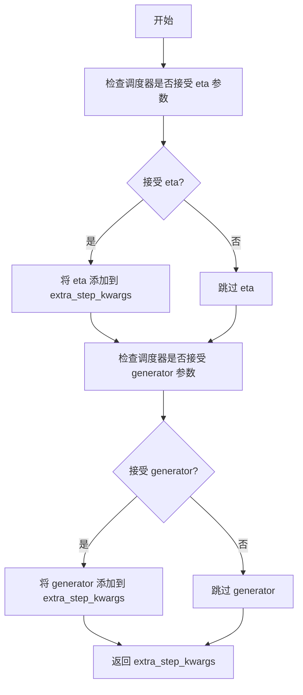

#### 带注释源码

```python
def prepare_extra_step_kwargs(self, generator, eta):
    """
    准备调度器步骤所需的额外关键字参数
    
    由于并非所有调度器都具有相同的签名，此方法用于动态检查并准备
    调度器 step 方法所需的参数。
    
    Args:
        generator: torch.Generator 或 None，用于控制随机数生成
        eta: float，DDIM 调度器的 eta 参数，应在 [0, 1] 范围内
    
    Returns:
        dict: 包含调度器额外参数的字典
    """
    # 使用 inspect 检查调度器的 step 方法是否接受 eta 参数
    # eta (η) 仅在 DDIMScheduler 中使用，其他调度器会忽略此参数
    # eta 对应 DDIM 论文 https://huggingface.co/papers/2010.02502
    accepts_eta = "eta" in set(inspect.signature(self.scheduler.step).parameters.keys())
    
    # 初始化空字典用于存储额外参数
    extra_step_kwargs = {}
    
    # 如果调度器接受 eta 参数，则添加到 extra_step_kwargs
    if accepts_eta:
        extra_step_kwargs["eta"] = eta

    # 检查调度器是否接受 generator 参数
    # 不同的调度器可能支持或不支持随机生成器
    accepts_generator = "generator" in set(inspect.signature(self.scheduler.step).parameters.keys())
    
    # 如果调度器接受 generator 参数，则添加到 extra_step_kwargs
    if accepts_generator:
        extra_step_kwargs["generator"] = generator
    
    # 返回准备好的参数字典
    return extra_step_kwargs
```


### `SDXLLongPromptWeightingPipeline.check_inputs`

该方法用于验证 Stable Diffusion XL 长提示词加权管道的输入参数是否合法，确保用户在调用生成方法时提供的参数符合模型要求，包括检查提示词与嵌入向量的互斥性、尺寸对齐、强度值范围、以及回调张量输入的有效性等。

参数：

- `self`：`SDXLLongPromptWeightingPipeline` 实例本身，隐式传递
- `prompt`：`Union[str, List[str], None]`，主提示词，用于指导图像生成
- `prompt_2`：`Union[str, List[str], None]`，发送给第二个分词器和文本编码器的提示词，若不定义则使用 prompt
- `height`：`int`，生成图像的高度（像素），必须能被 8 整除
- `width`：`int`，生成图像的宽度（像素），必须能被 8 整除
- `strength`：`float`，图像变换强度，值必须在 [0.0, 1.0] 范围内
- `callback_steps`：`int, Optional`，回调函数调用间隔步数，必须为正整数
- `negative_prompt`：`Union[str, List[str], None]`，负向提示词，用于指导图像生成时避免的内容
- `negative_prompt_2`：`Union[str, List[str], None]`，发送给第二个分词器和文本编码器的负向提示词
- `prompt_embeds`：`torch.Tensor, Optional`，预生成的文本嵌入向量，不能与 prompt 同时提供
- `negative_prompt_embeds`：`torch.Tensor, Optional`，预生成的负向文本嵌入向量
- `pooled_prompt_embeds`：`torch.Tensor, Optional`，预生成的池化文本嵌入向量，若提供 prompt_embeds 则必须提供
- `negative_pooled_prompt_embeds`：`torch.Tensor, Optional`，预生成的负向池化文本嵌入向量
- `callback_on_step_end_tensor_inputs`：`List[str], Optional`，回调函数在每步结束时可访问的张量输入列表

返回值：`None`，该方法不返回任何值，仅通过抛出 ValueError 来指示参数验证失败

#### 流程图

```mermaid
flowchart TD
    A[开始 check_inputs] --> B{检查 height 和 width}
    B -->|不能被 8 整除| C[抛出 ValueError]
    B -->|通过| D{检查 strength}
    D -->|不在 [0, 1] 范围| E[抛出 ValueError]
    D -->|通过| F{检查 callback_steps}
    F -->|不是正整数| G[抛出 ValueError]
    F -->|通过| H{检查 callback_on_step_end_tensor_inputs}
    H -->|包含非法键| I[抛出 ValueError]
    H -->|通过| J{prompt 和 prompt_embeds 互斥}
    J -->|同时提供| K[抛出 ValueError]
    J -->|通过| L{prompt_2 和 prompt_embeds 互斥}
    L -->|同时提供| M[抛出 ValueError]
    L -->|通过| N{prompt 和 prompt_embeds 必须提供一个}
    N -->|都未提供| O[抛出 ValueError]
    N -->|通过| P{检查 prompt 类型}
    P -->|不是 str 或 list| Q[抛出 ValueError]
    P -->|通过| R{检查 prompt_2 类型}
    R -->|不是 str 或 list| S[抛出 ValueError]
    R -->|通过| T{negative_prompt 和 negative_prompt_embeds 互斥}
    T -->|同时提供| U[抛出 ValueError]
    T -->|通过| V{negative_prompt_2 和 negative_prompt_embeds 互斥}
    V -->|同时提供| W[抛出 ValueError]
    V -->|通过| X{prompt_embeds 和 negative_prompt_embeds 形状一致性}
    X -->|形状不同| Y[抛出 ValueError]
    X -->|通过| Z{prompt_embeds 必须配合 pooled_prompt_embeds}
    Z -->|只提供前者| AA[抛出 ValueError]
    Z -->|通过| AB{negative_prompt_embeds 必须配合 negative_pooled_prompt_embeds}
    AB -->|只提供前者| AC[抛出 ValueError]
    AB -->|通过| AD[验证通过]
```

#### 带注释源码

```python
def check_inputs(
    self,
    prompt,                      # 主提示词，str 或 list，或 None
    prompt_2,                    # 第二提示词，str 或 list，或 None
    height,                      # 输出图像高度，必须能被 8 整除
    width,                       # 输出图像宽度，必须能被 8 整除
    strength,                    # 图像变换强度，必须在 [0.0, 1.0]
    callback_steps,              # 回调步数，必须为正整数
    negative_prompt=None,        # 负向提示词
    negative_prompt_2=None,      # 第二负向提示词
    prompt_embeds=None,          # 预计算的提示词嵌入
    negative_prompt_embeds=None, # 预计算的负向提示词嵌入
    pooled_prompt_embeds=None,  # 预计算的池化提示词嵌入
    negative_pooled_prompt_embeds=None, # 预计算的池化负向嵌入
    callback_on_step_end_tensor_inputs=None, # 回调可用的张量输入
):
    # 验证图像尺寸必须能被 8 整除（VAE 要求）
    if height % 8 != 0 or width % 8 != 0:
        raise ValueError(f"`height` and `width` have to be divisible by 8 but are {height} and {width}.")

    # 验证强度值必须在有效范围内
    if strength < 0 or strength > 1:
        raise ValueError(f"The value of strength should in [0.0, 1.0] but is {strength}")

    # 验证回调步数为正整数
    if callback_steps is not None and (not isinstance(callback_steps, int) or callback_steps <= 0):
        raise ValueError(
            f"`callback_steps` has to be a positive integer but is {callback_steps} of type"
            f" {type(callback_steps)}."
        )

    # 验证回调张量输入是否在允许列表中
    if callback_on_step_end_tensor_inputs is not None and not all(
        k in self._callback_tensor_inputs for k in callback_on_step_end_tensor_inputs
    ):
        raise ValueError(
            f"`callback_on_step_end_tensor_inputs` has to be in {self._callback_tensor_inputs}, but found {[k for k in callback_on_step_end_tensor_inputs if k not in self._callback_tensor_inputs]}"
        )

    # 提示词和预计算嵌入不能同时提供（互斥）
    if prompt is not None and prompt_embeds is not None:
        raise ValueError(
            f"Cannot forward both `prompt`: {prompt} and `prompt_embeds`: {prompt_embeds}. Please make sure to"
            " only forward one of the two."
        )
    elif prompt_2 is not None and prompt_embeds is not None:
        raise ValueError(
            f"Cannot forward both `prompt_2`: {prompt_2} and `prompt_embeds`: {prompt_embeds}. Please make sure to"
            " only forward one of the two."
        )
    elif prompt is None and prompt_embeds is None:
        raise ValueError(
            "Provide either `prompt` or `prompt_embeds`. Cannot leave both `prompt` and `prompt_embeds` undefined."
        )

    # 验证提示词类型
    elif prompt is not None and (not isinstance(prompt, str) and not isinstance(prompt, list)):
        raise ValueError(f"`prompt` has to be of type `str` or `list` but is {type(prompt)}")
    elif prompt_2 is not None and (not isinstance(prompt_2, str) and not isinstance(prompt_2, list)):
        raise ValueError(f"`prompt_2` has to be of type `str` or `list` but is {type(prompt_2)}")

    # 负向提示词和预计算嵌入不能同时提供
    if negative_prompt is not None and negative_prompt_embeds is not None:
        raise ValueError(
            f"Cannot forward both `negative_prompt`: {negative_prompt} and `negative_prompt_embeds`:"
            f" {negative_prompt_embeds}. Please make sure to only forward one of the two."
        )
    elif negative_prompt_2 is not None and negative_prompt_embeds is not None:
        raise ValueError(
            f"Cannot forward both `negative_prompt_2`: {negative_prompt_2} and `prompt_embeds`:"
            f" {negative_prompt_embeds}. Please make sure to only forward one of the two."
        )

    # 验证正负嵌入形状一致性
    if prompt_embeds is not None and negative_prompt_embeds is not None:
        if prompt_embeds.shape != negative_prompt_embeds.shape:
            raise ValueError(
                "`prompt_embeds` and `negative_prompt_embeds` must have the same shape when passed directly, but"
                f" got: `prompt_embeds` {prompt_embeds.shape} != `negative_prompt_embeds`"
                f" {negative_prompt_embeds.shape}."
            )

    # 如果提供 prompt_embeds，必须同时提供 pooled_prompt_embeds
    if prompt_embeds is not None and pooled_prompt_embeds is None:
        raise ValueError(
            "If `prompt_embeds` are provided, `pooled_prompt_embeds` also have to be passed. Make sure to generate `pooled_prompt_embeds` from the same text encoder that was used to generate `prompt_embeds`."
        )

    # 如果提供 negative_prompt_embeds，必须同时提供 negative_pooled_prompt_embeds
    if negative_prompt_embeds is not None and negative_pooled_prompt_embeds is None:
        raise ValueError(
            "If `negative_prompt_embeds` are provided, `negative_pooled_prompt_embeds` also have to be passed. Make sure to generate `negative_pooled_prompt_embeds` from the same text encoder that was used to generate `negative_prompt_embeds`."
        )
```


### `SDXLLongPromptWeightingPipeline.get_timesteps`

该方法用于根据去噪强度（strength）或指定的去噪起始点（denoising_start）计算扩散模型推理过程中的时间步（timesteps），支持图像到图像（img2img）和修复（inpainting）等任务中的时间步调度。

参数：

- `num_inference_steps`：`int`，推理过程中的去噪步数，决定生成图像所需的迭代次数
- `strength`：`float`，去噪强度，值为 0 到 1 之间，控制原始图像与噪声的混合比例，值越大表示保留的原始图像信息越少
- `device`：`torch.device`，计算设备（CPU 或 CUDA），用于指定张量存放的设备
- `denoising_start`：`Optional[float]`，可选参数，指定去噪过程的起始点（0 到 1 之间的浮点数），用于支持多去噪器混合（Mixture of Denoisers）场景，当设置此参数时 strength 参数将被忽略

返回值：`Tuple[torch.Tensor, int]`，返回两个元素：第一个是时间步张量（torch.Tensor），包含调度器的时间步序列；第二个是调整后的推理步数（int）

#### 流程图

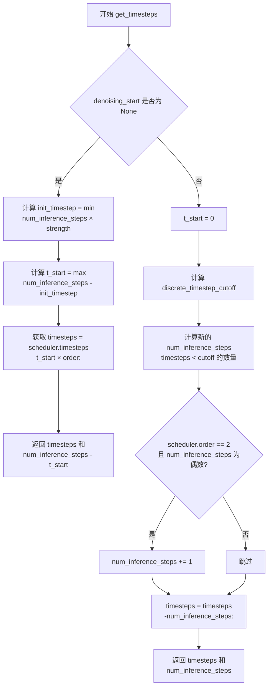

#### 带注释源码

```python
def get_timesteps(self, num_inference_steps, strength, device, denoising_start=None):
    """
    根据去噪强度或指定的去噪起始点计算时间步序列
    
    参数:
        num_inference_steps: 推理步数
        strength: 去噪强度 (0-1)
        device: 计算设备
        denoising_start: 可选的去噪起始点 (0-1)
    
    返回:
        (timesteps, adjusted_num_inference_steps) 元组
    """
    
    # 获取原始时间步使用 init_timestep
    # 如果没有指定 denoising_start，则根据 strength 计算起始时间步
    if denoising_start is None:
        # 计算初始时间步数量，受 strength 和 num_inference_steps 限制
        init_timestep = min(int(num_inference_steps * strength), num_inference_steps)
        # 计算起始索引，确保不为负数
        t_start = max(num_inference_steps - init_timestep, 0)
    else:
        # 如果指定了 denoising_start，则从 0 开始
        t_start = 0

    # 从调度器获取时间步序列，乘以 order 是为了支持多步调度器
    timesteps = self.scheduler.timesteps[t_start * self.scheduler.order :]

    # 如果直接指定了 denoising_start，则 strength 参数无关
    # 此时由 denoising_start 决定去噪强度
    if denoising_start is not None:
        # 计算离散时间步截止点
        # 将 denoising_start (0-1) 转换为对应的训练时间步索引
        discrete_timestep_cutoff = int(
            round(
                self.scheduler.config.num_train_timesteps
                - (denoising_start * self.scheduler.config.num_train_timesteps)
            )
        )

        # 计算小于截止点的时间步数量，即实际推理步数
        num_inference_steps = (timesteps < discrete_timestep_cutoff).sum().item()
        
        # 如果调度器是二阶调度器且步数为偶数，需要加 1
        # 这是因为每个时间步（除最高外）会被复制一次
        # 如果步数为偶数，意味着我们在去噪步骤中间截断
        # （在一阶和二阶导数之间），会导致错误结果
        # 加 1 确保去噪过程总是在二阶导数步骤之后结束
        if self.scheduler.order == 2 and num_inference_steps % 2 == 0:
            num_inference_steps = num_inference_steps + 1

        # 因为 t_n+1 >= t_n，从末尾切片获取时间步
        timesteps = timesteps[-num_inference_steps:]
        return timesteps, num_inference_steps

    # 返回时间步和调整后的推理步数
    return timesteps, num_inference_steps - t_start
```


### SDXLLongPromptWeightingPipeline.prepare_latents

该方法用于准备潜在变量（latents），根据输入的图像、掩码和噪声参数，生成或处理用于扩散模型去噪的潜在表示。该方法支持三种模式：纯文本到图像生成（无图像输入）、图像到图像转换（有图像无掩码）、以及图像修复/扩展（有图像有掩码）。

参数：

- `image`：`Optional[PipelineImageInput]`，输入图像，用于图像到图像或修复任务
- `mask`：`Optional[PipelineImageInput]`，掩码图像，用于指定需要重绘的区域
- `width`：`int`，生成图像的宽度
- `height`：`int`，生成图像的高度
- `num_channels_latents`：`int`，潜在变量的通道数，通常等于UNet的输入通道数
- `timestep`：`torch.Tensor`，扩散过程的时间步
- `batch_size`：`int`，批次大小
- `num_images_per_prompt`：`int`，每个提示生成的图像数量
- `dtype`：`torch.dtype`，数据类型（通常为float16）
- `device`：`torch.device`，计算设备
- `generator`：`Optional[torch.Generator]`，随机数生成器，用于确保可重复性
- `add_noise`：`bool`，是否向初始潜在变量添加噪声
- `latents`：`Optional[torch.Tensor]`，预生成的噪声潜在变量
- `is_strength_max`：`bool`，指示扩散强度是否为最大值（1.0）
- `return_noise`：`bool`，是否在返回值中包含噪声
- `return_image_latents`：`bool`，是否在返回值中包含图像潜在变量

返回值：`Union[torch.Tensor, Tuple[torch.Tensor, ...]]`，返回处理后的潜在变量，可选包含噪声和图像潜在变量

#### 流程图

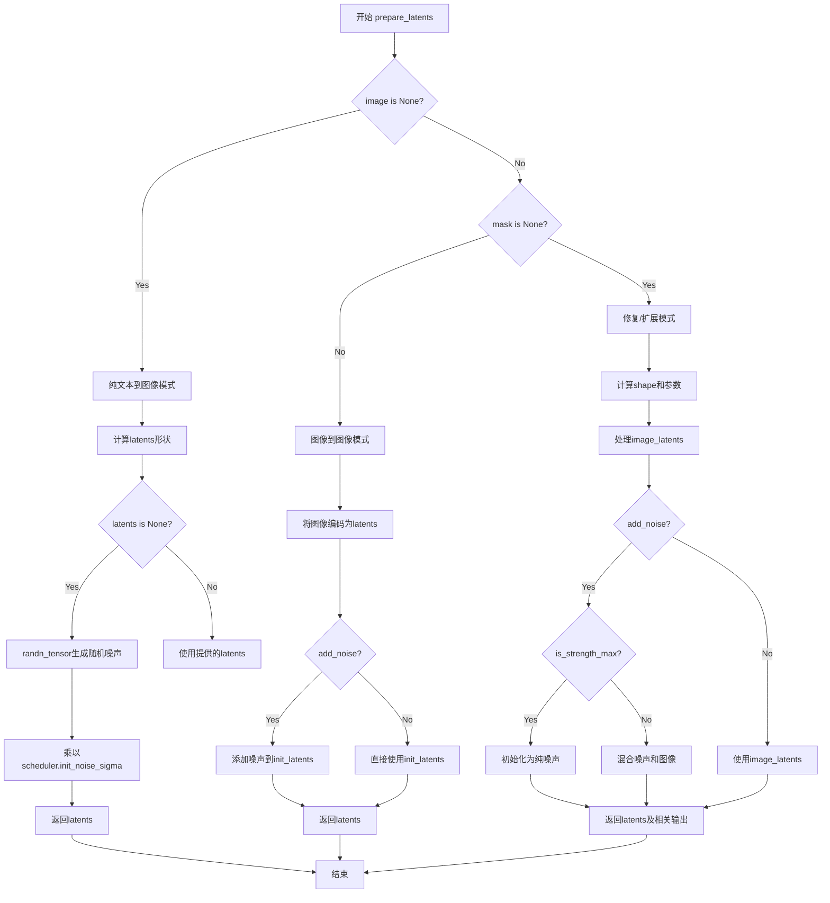

#### 带注释源码

```python
def prepare_latents(
    self,
    image,                      # 输入图像，可为None（纯文本生成）
    mask,                       # 掩码，用于修复任务
    width,                      # 输出宽度
    height,                     # 输出高度
    num_channels_latents,      # latent通道数（通常为UNet的in_channels）
    timestep,                   # 时间步
    batch_size,                 # 批次大小
    num_images_per_prompt,      # 每个prompt生成的图像数
    dtype,                      # 数据类型
    device,                     # 设备
    generator=None,             # 随机生成器
    add_noise=True,             # 是否添加噪声
    latents=None,               # 预提供的latents
    is_strength_max=True,       # 是否为最大强度
    return_noise=False,         # 是否返回噪声
    return_image_latents=False, # 是否返回图像latents
):
    # 根据每个prompt的图像数扩展批次大小
    batch_size *= num_images_per_prompt

    # 模式1：纯文本到图像生成（无输入图像）
    if image is None:
        # 计算所需latent形状：batch x channels x height/vae_scale x width/vae_scale
        shape = (
            batch_size,
            num_channels_latents,
            int(height) // self.vae_scale_factor,
            int(width) // self.vae_scale_factor,
        )
        
        # 验证generator列表长度与batch大小匹配
        if isinstance(generator, list) and len(generator) != batch_size:
            raise ValueError(
                f"You have passed a list of generators of length {len(generator)}, but requested an effective batch"
                f" size of {batch_size}. Make sure the batch size matches the length of the generators."
            )

        # 生成随机噪声或使用提供的latents
        if latents is None:
            latents = randn_tensor(shape, generator=generator, device=device, dtype=dtype)
        else:
            latents = latents.to(device)

        # 根据scheduler的初始噪声标准差缩放
        latents = latents * self.scheduler.init_noise_sigma
        return latents

    # 模式2：图像到图像转换（有图像但无掩码）
    elif mask is None:
        # 验证image类型
        if not isinstance(image, (torch.Tensor, Image.Image, list)):
            raise ValueError(
                f"`image` has to be of type `torch.Tensor`, `PIL.Image.Image` or list but is {type(image)}"
            )

        # 如果启用了模型CPU卸载，卸载text_encoder_2
        if hasattr(self, "final_offload_hook") and self.final_offload_hook is not None:
            self.text_encoder_2.to("cpu")
            torch.cuda.empty_cache()

        # 将图像移到设备上
        image = image.to(device=device, dtype=dtype)

        # 如果图像已经在latent空间（4通道）
        if image.shape[1] == 4:
            init_latents = image
        else:
            # 确保VAE使用float32模式（避免float16溢出）
            if self.vae.config.force_upcast:
                image = image.float()
                self.vae.to(dtype=torch.float32)

            # 使用VAE编码图像
            if isinstance(generator, list) and len(generator) != batch_size:
                raise ValueError(...)
            elif isinstance(generator, list):
                init_latents = [
                    retrieve_latents(self.vae.encode(image[i : i + 1]), generator=generator[i])
                    for i in range(batch_size)
                ]
                init_latents = torch.cat(init_latents, dim=0)
            else:
                init_latents = retrieve_latents(self.vae.encode(image), generator=generator)

            # 恢复VAE的dtype
            if self.vae.config.force_upcast:
                self.vae.to(dtype)

            # 应用VAE缩放因子
            init_latents = init_latents.to(dtype)
            init_latents = self.vae.config.scaling_factor * init_latents

        # 扩展init_latents以匹配batch大小
        if batch_size > init_latents.shape[0] and batch_size % init_latents.shape[0] == 0:
            additional_image_per_prompt = batch_size // init_latents.shape[0]
            init_latents = torch.cat([init_latents] * additional_image_per_prompt, dim=0)
        elif batch_size > init_latents.shape[0] and batch_size % init_latents.shape[0] != 0:
            raise ValueError(...)
        else:
            init_latents = torch.cat([init_latents], dim=0)

        # 可选：添加噪声
        if add_noise:
            shape = init_latents.shape
            noise = randn_tensor(shape, generator=generator, device=device, dtype=dtype)
            init_latents = self.scheduler.add_noise(init_latents, noise, timestep)

        latents = init_latents
        return latents

    # 模式3：修复/扩展任务（有图像和有掩码）
    else:
        shape = (
            batch_size,
            num_channels_latents,
            int(height) // self.vae_scale_factor,
            int(width) // self.vae_scale_factor,
        )
        
        # 验证generator
        if isinstance(generator, list) and len(generator) != batch_size:
            raise ValueError(...)

        # 验证参数完整性
        if (image is None or timestep is None) and not is_strength_max:
            raise ValueError(
                "Since strength < 1. initial latents are to be initialised as a combination of Image + Noise."
                "However, either the image or the noise timestep has not been provided."
            )

        # 处理图像latents
        if image.shape[1] == 4:
            image_latents = image.to(device=device, dtype=dtype)
            image_latents = image_latents.repeat(batch_size // image_latents.shape[0], 1, 1, 1)
        elif return_image_latents or (latents is None and not is_strength_max):
            image = image.to(device=device, dtype=dtype)
            image_latents = self._encode_vae_image(image=image, generator=generator)
            image_latents = image_latents.repeat(batch_size // image_latents.shape[0], 1, 1, 1)

        # 生成或处理latents
        if latents is None and add_noise:
            noise = randn_tensor(shape, generator=generator, device=device, dtype=dtype)
            # 根据强度决定初始化方式
            latents = noise if is_strength_max else self_scheduler.add_noise(image_latents, noise, timestep)
            # 如果是纯噪声，使用scheduler的初始sigma
            latents = latents * self.scheduler.init_noise_sigma if is_strength_max else latents
        elif add_noise:
            noise = latents.to(device)
            latents = noise * self.scheduler.init_noise_sigma
        else:
            noise = randn_tensor(shape, generator=generator, device=device, dtype=dtype)
            latents = image_latents.to(device)

        # 准备返回值
        outputs = (latents,)
        
        if return_noise:
            outputs += (noise,)
        
        if return_image_latents:
            outputs += (image_latents,)

        return outputs
```


### `SDXLLongPromptWeightingPipeline._encode_vae_image`

该方法负责将输入图像编码为 VAE  latent 表示。它处理图像数据类型的转换、VAE 的强制向上转换以避免精度溢出，并对批量图像或单个生成器进行不同的处理，最后通过 VAE 配置的缩放因子返回归一化的 latent。

参数：

- `image`：`torch.Tensor`，输入的要编码为 latent 的图像张量，通常是经过预处理的图像数据
- `generator`：`torch.Generator`，可选的随机数生成器，用于确保生成过程的可重复性

返回值：`torch.Tensor`，编码后的图像 latent 表示

#### 流程图

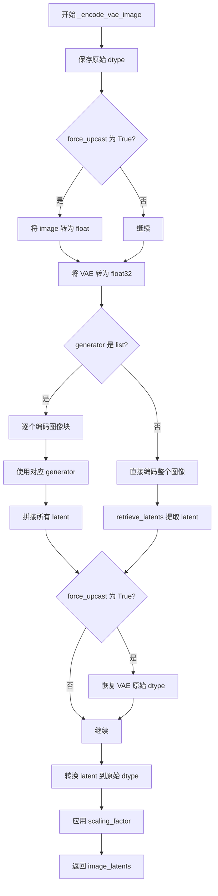

#### 带注释源码

```python
def _encode_vae_image(self, image: torch.Tensor, generator: torch.Generator):
    """
    将图像编码为 VAE latent 表示
    
    Args:
        image: 输入图像张量
        generator: 随机生成器，用于确定性生成
    
    Returns:
        编码后的图像 latent
    """
    # 保存原始输入数据类型
    dtype = image.dtype
    
    # 如果 VAE 配置要求强制向上转换（避免 float16 溢出）
    if self.vae.config.force_upcast:
        # 将图像数据转为 float32
        image = image.float()
        # 将 VAE 转为 float32 以提高精度
        self.vae.to(dtype=torch.float32)

    # 处理批量生成器或单个生成器的情况
    if isinstance(generator, list):
        # 批量处理：逐个图像编码，每个使用对应的 generator
        image_latents = [
            retrieve_latents(self.vae.encode(image[i : i + 1]), generator=generator[i])
            for i in range(image.shape[0])
        ]
        # 将所有 latent 沿批次维度拼接
        image_latents = torch.cat(image_latents, dim=0)
    else:
        # 单个生成器：直接编码整个批次
        image_latents = retrieve_latents(self.vae.encode(image), generator=generator)

    # 如果之前进行了强制向上转换，现在恢复 VAE 的原始 dtype
    if self.vae.config.force_upcast:
        self.vae.to(dtype)

    # 确保 latent 使用与输入相同的 dtype
    image_latents = image_latents.to(dtype)
    # 应用 VAE 的缩放因子，这是 SDXL VAE 的标准操作
    image_latents = self.vae.config.scaling_factor * image_latents

    return image_latents
```


### `SDXLLongPromptWeightingPipeline.prepare_mask_latents`

该方法用于准备掩码（mask）和被掩码覆盖的图像（masked image）的潜在表示（latents），在 Stable Diffusion XL 的图像修复（inpainting）任务中至关重要。它负责调整掩码尺寸以匹配 VAE 编码后的潜在空间大小，处理批量大小不匹配的情况，并在需要时为无分类器自由引导（classifier-free guidance）复制掩码和被掩码图像的潜在表示。

参数：

- `mask`：`torch.Tensor`，输入的掩码张量，用于指示图像中需要重绘的区域
- `masked_image`：`torch.Tensor`，被掩码覆盖的原始图像，作为图像修复的参考输入
- `batch_size`：`int`，生成图像的批处理大小，用于确定需要复制多少个掩码和潜在表示
- `height`：`int`，生成图像的目标高度（像素单位）
- `width`：`int`，生成图像的目标宽度（像素单位）
- `dtype`：`torch.dtype`，指定返回张量的数据类型（通常为 float16 或 float32）
- `device`：`torch.device`，指定计算设备（CPU 或 CUDA GPU）
- `generator`：`torch.Generator` 或 `List[torch.Generator]`，可选的随机数生成器，用于确保可重复的采样过程
- `do_classifier_free_guidance`：`bool`，标志位，指示是否执行无分类器自由引导（CFG），若为 True 则需要复制掩码和潜在表示以同时处理条件和非条件输入

返回值：`Tuple[torch.Tensor, torch.Tensor]`，返回两个张量组成的元组——第一个是处理后的掩码张量，第二个是处理后的被掩码图像潜在表示张量（可为 None）

#### 流程图

```mermaid
flowchart TD
    A[开始: prepare_mask_latents] --> B{输入验证}
    
    B --> C[使用 torch.nn.functional.interpolate 调整掩码尺寸]
    C --> D[将掩码转移到目标设备和数据类型]
    
    D --> E{掩码批次大小 < 要求的批次大小?}
    E -->|是| F{掩码数量能否被批次大小整除?}
    F -->|是| G[使用 repeat 复制掩码]
    F -->|否| H[抛出 ValueError 异常]
    E -->|否| I[跳过复制步骤]
    
    G --> J{do_classifier_free_guidance 为真?}
    I --> J
    
    J -->|是| K[使用 torch.cat 将掩码复制一份]
    J -->|否| L[保持掩码不变]
    
    K --> M{masked_image 存在且形状正确?}
    L --> M
    
    M -->|是且 shape[1]==4| N[直接作为 masked_image_latents]
    M -->|否| O[设置 masked_image_latents 为 None]
    M -->|否| P[跳过此分支]
    
    O --> Q{第一次编码?}
    Q -->|是| R[将 masked_image 转移至目标设备和数据类型]
    R --> S[调用 _encode_vae_image 编码图像获取潜在表示]
    Q -->|否| T[跳过编码步骤]
    
    S --> U{masked_image_latents 批次大小 < 要求的批次大小?}
    T --> U
    
    U -->|是| V{图像数量能否被批次大小整除?}
    V -->|是| W[使用 repeat 复制 masked_image_latents]
    V -->|否| X[抛出 ValueError 异常]
    U -->|否| Y[跳过复制步骤]
    
    W --> Z{do_classifier_free_guidance 为真?}
    Y --> Z
    
    Z -->|是| AA[使用 torch.cat 将 masked_image_latents 复制一份]
    Z -->|否| AB[保持 masked_image_latents 不变]
    
    AA --> AC[将 masked_image_latents 转移至目标设备和数据类型]
    AB --> AC
    N --> AC
    P --> AD
    
    AC --> AD[返回 (mask, masked_image_latents) 元组]
    
    O -->|否| AD
```

#### 带注释源码

```python
def prepare_mask_latents(
    self, mask, masked_image, batch_size, height, width, dtype, device, generator, do_classifier_free_guidance
):
    """
    准备掩码和被掩码图像的潜在表示，用于图像修复（inpainting）流程。
    
    该方法执行以下关键操作：
    1. 调整掩码尺寸至 VAE 潜在空间对应的分辨率
    2. 根据批次大小复制掩码以匹配生成数量
    3. 若启用无分类器自由引导（CFG），则复制掩码以同时处理条件/非条件输入
    4. 对被掩码图像进行 VAE 编码获取潜在表示
    5. 同样处理图像潜在表示的批次大小和 CFG 复制
    """
    
    # 步骤 1: 调整掩码尺寸
    # 将掩码从图像空间插值到潜在空间尺寸（除以 VAE 缩放因子）
    # 在转换为 dtype 之前执行此操作，以避免在使用 cpu_offload 和半精度时出现问题
    mask = torch.nn.functional.interpolate(
        mask, size=(height // self.vae_scale_factor, width // self.vae_scale_factor)
    )
    # 将掩码转移至目标设备和指定数据类型
    mask = mask.to(device=device, dtype=dtype)

    # 步骤 2: 处理批次大小不匹配情况
    # 为每个提示词复制掩码，使用 MPS 友好的方法
    if mask.shape[0] < batch_size:
        # 验证掩码数量能否被批次大小整除
        if not batch_size % mask.shape[0] == 0:
            raise ValueError(
                "The passed mask and the required batch size don't match. Masks are supposed to be duplicated to"
                f" a total batch size of {batch_size}, but {mask.shape[0]} masks were passed. Make sure the number"
                " of masks that you pass is divisible by the total requested batch size."
            )
        # 重复掩码以匹配批次大小
        mask = mask.repeat(batch_size // mask.shape[0], 1, 1, 1)

    # 步骤 3: 处理无分类器自由引导（CFG）
    # 如果启用 CFG，需要为无条件输入复制一份掩码
    mask = torch.cat([mask] * 2) if do_classifier_free_guidance else mask

    # 步骤 4: 处理被掩码的图像
    # 检查 masked_image 是否已经是潜在表示（shape[1] == 4 表示通道数为 4）
    if masked_image is not None and masked_image.shape[1] == 4:
        # 已经是潜在表示格式，直接使用
        masked_image_latents = masked_image
    else:
        # 不是潜在表示，标记为 None，稍后需要编码
        masked_image_latents = None

    # 步骤 5: 编码被掩码图像（如果需要）
    if masked_image is not None:
        # 需要进行编码处理
        if masked_image_latents is None:
            # 转移至目标设备和数据类型
            masked_image = masked_image.to(device=device, dtype=dtype)
            # 使用 VAE 编码图像获取潜在表示
            masked_image_latents = self._encode_vae_image(masked_image, generator=generator)

        # 步骤 6: 处理图像潜在表示的批次大小
        if masked_image_latents.shape[0] < batch_size:
            if not batch_size % masked_image_latents.shape[0] == 0:
                raise ValueError(
                    "The passed images and the required batch size don't match. Images are supposed to be duplicated"
                    f" to a total batch size of {batch_size}, but {masked_image_latents.shape[0]} images were passed."
                    " Make sure the number of images that you pass is divisible by the total requested batch size."
                )
            # 重复图像潜在表示以匹配批次大小
            masked_image_latents = masked_image_latents.repeat(
                batch_size // masked_image_latents.shape[0], 1, 1, 1
            )

        # 步骤 7: 处理 CFG（复制图像潜在表示）
        masked_image_latents = (
            torch.cat([masked_image_latents] * 2) if do_classifier_free_guidance else masked_image_latents
        )

        # 步骤 8: 对齐设备以防止连接时出现设备错误
        # 确保与潜在模型输入的设备一致
        masked_image_latents = masked_image_latents.to(device=device, dtype=dtype)

    # 返回处理后的掩码和被掩码图像潜在表示
    return mask, masked_image_latents
```


### `SDXLLongPromptWeightingPipeline._get_add_time_ids`

该方法用于生成Stable Diffusion XL pipeline中的"add time IDs"（附加时间标识），这些标识是SDXL微条件（micro-conditioning）机制的一部分，用于将图像的原始尺寸、裁剪坐标和目标尺寸信息嵌入到UNet的时间嵌入中。

参数：

- `self`：隐式参数，SDXLLongPromptWeightingPipeline实例本身
- `original_size`：`Tuple[int, int]`，原始图像尺寸，格式为(height, width)
- `crops_coords_top_left`：`Tuple[int, int]`，裁剪坐标左上角位置，格式为(y, x)
- `target_size`：`Tuple[int, int]`，目标图像尺寸，格式为(height, width)
- `dtype`：`torch.dtype`，输出张量的数据类型

返回值：`torch.Tensor`，形状为(1, 6)的张量，包含原始尺寸、裁剪坐标和目标尺寸的展平信息

#### 流程图

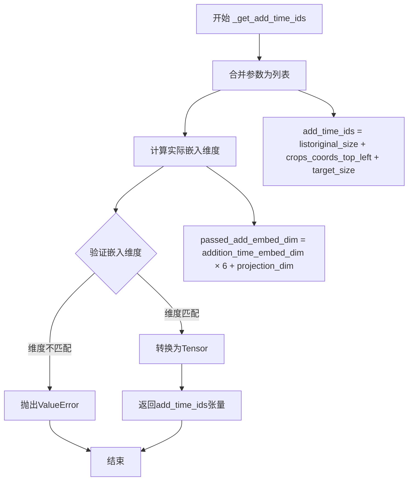

#### 带注释源码

```python
def _get_add_time_ids(self, original_size, crops_coords_top_left, target_size, dtype):
    """
    生成用于SDXL微条件的附加时间标识
    
    该方法将原始图像尺寸、裁剪坐标和目标尺寸合并为一个列表，
    然后验证其嵌入维度是否与UNet期望的维度匹配，
    最后将列表转换为PyTorch张量返回。
    
    参数:
        original_size: 原始图像尺寸 (height, width)
        crops_coords_top_left: 裁剪左上角坐标 (y, x)  
        target_size: 目标图像尺寸 (height, width)
        dtype: 输出张量的数据类型
    
    返回:
        包含6个元素的1D张量，形状为 (1, 6)
    """
    # Step 1: 将三个元组参数合并为一个列表
    # original_size, crops_coords_top_left, target_size 都是 (h, w) 格式
    # 展平后得到 [orig_h, orig_w, crop_y, crop_x, target_h, target_w]
    add_time_ids = list(original_size + crops_coords_top_left + target_size)

    # Step 2: 计算实际传入的嵌入维度
    # UNet的addition_time_embed_dim乘以参数数量(3个元组=6个值)
    # 加上text_encoder_2的projection_dim
    passed_add_embed_dim = (
        self.unet.config.addition_time_embed_dim * len(add_time_ids) + self.text_encoder_2.config.projection_dim
    )
    
    # Step 3: 获取UNet期望的嵌入维度
    # 从UNet的add_embedding.linear_1层的输入特征数获取
    expected_add_embed_dim = self.unet.add_embedding.linear_1.in_features

    # Step 4: 验证维度是否匹配
    if expected_add_embed_dim != passed_add_embed_dim:
        raise ValueError(
            f"Model expects an added time embedding vector of length {expected_add_embed_dim}, but a vector of {passed_add_embed_dim} was created. The model has an incorrect config. Please check `unet.config.time_embedding_type` and `text_encoder_2.config.projection_dim`."
        )

    # Step 5: 将列表转换为PyTorch张量
    # 形状: (1, 6) - 批量大小为1，6个时间id值
    add_time_ids = torch.tensor([add_time_ids], dtype=dtype)
    return add_time_ids
```


### `SDXLLongPromptWeightingPipeline.upcast_vae`

将VAE模型转换为float32数据类型。该方法已弃用，建议直接使用 `pipe.vae.to(torch.float32)` 替代。

参数：

- 无参数（仅包含 `self`）

返回值：`None`，无返回值（方法执行副作用）

#### 流程图

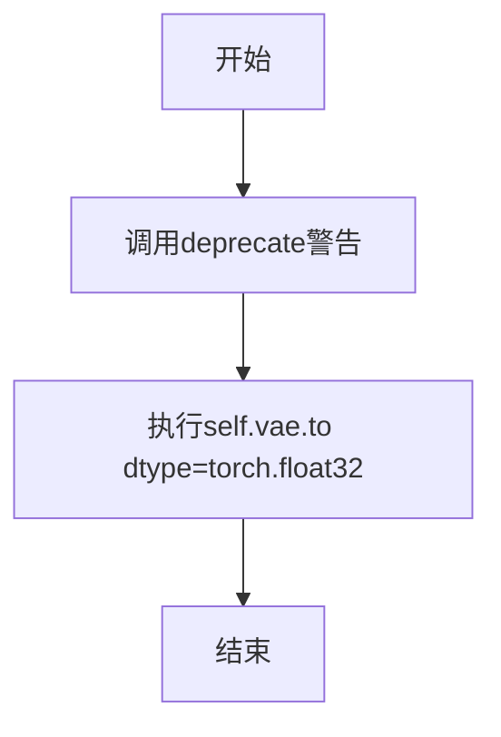

#### 带注释源码

```python
# Copied from diffusers.pipelines.stable_diffusion.pipeline_stable_diffusion_upscale.StableDiffusionUpscalePipeline.upcast_vae
def upcast_vae(self):
    """
    将VAE模型上转换为float32类型。
    
    该方法已弃用（deprecated），将在版本1.0.0中移除。
    建议直接使用 pipe.vae.to(torch.float32) 替代此方法。
    """
    # 发出弃用警告，提醒用户该方法将在未来版本中移除
    deprecate("upcast_vae", "1.0.0", "`upcast_vae` is deprecated. Please use `pipe.vae.to(torch.float32)`")
    
    # 将VAE模型转换为float32数据类型，以避免在某些操作中出现溢出问题
    self.vae.to(dtype=torch.float32)
```


### `SDXLLongPromptWeightingPipeline.get_guidance_scale_embedding`

该方法用于生成引导比例（guidance scale）的嵌入向量，基于正弦和余弦函数的位置编码方式，将 guidance_scale 转换为高维向量，供 UNet 的时间条件投影层使用，以实现更精细的生成控制。

参数：

- `w`：`torch.Tensor`，1维张量，表示引导比例值（通常为 guidance_scale - 1）
- `embedding_dim`：`int`，可选，默认为 512，表示生成的嵌入向量维度
- `dtype`：`torch.dtype`，可选，默认为 torch.float32，表示生成嵌入向量的数据类型

返回值：`torch.Tensor`，形状为 `(len(w), embedding_dim)` 的嵌入向量

#### 流程图

```mermaid
flowchart TD
    A[开始: 输入 w, embedding_dim, dtype] --> B{检查 w 形状}
    B -->|len(w.shape) == 1| C[将 w 乘以 1000.0]
    B -->|否则| E[抛出断言错误]
    
    C --> F[计算半维: half_dim = embedding_dim // 2]
    F --> G[计算基础频率: emb = log(10000.0) / (half_dim - 1)]
    G --> H[生成频率向量: emb = exp(arange(half_dim) * -emb)]
    H --> I[缩放输入: emb = w[:, None] * emb[None, :]]
    I --> J[拼接正弦余弦: torch.cat([sin(emb), cos(emb)], dim=1)]
    
    J --> K{embedding_dim 为奇数?}
    K -->|是| L[零填充: pad emb with (0, 1)]
    K -->|否| M[直接返回]
    
    L --> M
    
    M --> N[验证输出形状: assert emb.shape == (w.shape[0], embedding_dim)]
    N --> O[返回嵌入向量]
```

#### 带注释源码

```python
def get_guidance_scale_embedding(self, w, embedding_dim=512, dtype=torch.float32):
    """
    See https://github.com/google-research/vdm/blob/dc27b98a554f65cdc654b800da5aa1846545d41b/model_vdm.py#L298

    Args:
        timesteps (`torch.Tensor`):
            generate embedding vectors at these timesteps
        embedding_dim (`int`, *optional*, defaults to 512):
            dimension of the embeddings to generate
        dtype:
            data type of the generated embeddings

    Returns:
        `torch.Tensor`: Embedding vectors with shape `(len(timesteps), embedding_dim)`
    """
    # 断言确保输入 w 是一维张量
    assert len(w.shape) == 1
    # 将引导比例缩放1000倍，与训练时的尺度对齐
    w = w * 1000.0

    # 计算半维，用于生成正弦和余弦两部分嵌入
    half_dim = embedding_dim // 2
    # 计算对数基础频率: log(10000.0) / (half_dim - 1)
    # 这创建了一个从大到小的频率范围
    emb = torch.log(torch.tensor(10000.0)) / (half_dim - 1)
    # 生成指数衰减的频率向量: exp(-emb * i) for i in [0, half_dim-1]
    emb = torch.exp(torch.arange(half_dim, dtype=dtype) * -emb)
    # 将输入 w 与频率向量相乘，创建不同频率的调制
    # w[:, None] 将 w 变为列向量，emb[None, :] 将 emb 变为行向量
    # 结果形状: (len(w), half_dim)
    emb = w.to(dtype)[:, None] * emb[None, :]
    # 拼接正弦和余弦编码，形成完整的嵌入向量
    # 形状: (len(w), embedding_dim)
    emb = torch.cat([torch.sin(emb), torch.cos(emb)], dim=1)
    # 如果嵌入维度为奇数，需要进行零填充
    if embedding_dim % 2 == 1:  # zero pad
        emb = torch.nn.functional.pad(emb, (0, 1))
    # 验证输出形状正确
    assert emb.shape == (w.shape[0], embedding_dim)
    return emb
```


### `SDXLLongPromptWeightingPipeline.__call__`

这是 SDXL 长提示词加权管道的主生成方法，支持文生图、图生图和重绘等多种任务。该方法通过加权提示词处理、潜在变量准备、去噪循环等步骤，最终生成与文本提示对齐的图像。支持条件无分类器引导（CFG）、IP-Adapter、LoRA 微调等多种高级功能，并能处理超长提示词（通过自定义分块和加权机制突破 77 token 限制）。

参数：

- `self`：`SDXLLongPromptWeightingPipeline`，Pipeline 实例本身
- `prompt`：`str | None`，要引导图像生成的主提示词，若不提供则必须传递 `prompt_embeds`
- `prompt_2`：`str | None`，发送给第二个 tokenizer 和 text_encoder_2 的提示词，未定义时使用 `prompt`
- `image`：`Optional[PipelineImageInput]`，用作图生图或重绘起始点的图像（Image 或 tensor 批次）
- `mask_image`：`Optional[PipelineImageInput]`，用于重绘的掩码图像，白色像素将被噪声替换并重绘，黑色像素保留
- `masked_image_latents`：`Optional[torch.Tensor]`，预计算的重绘掩码潜在变量
- `height`：`Optional[int]`，生成图像的高度（像素），默认 `self.unet.config.sample_size * self.vae_scale_factor`
- `width`：`Optional[int]`，生成图像的宽度（像素），默认 `self.unet.config.sample_size * self.vae_scale_factor`
- `strength`：`float`，图像变换强度，值在 0 到 1 之间，越大表示添加噪声越多、变换越显著
- `num_inference_steps`：`int`，去噪步数，默认 50，步数越多通常图像质量越高但推理越慢
- `timesteps`：`List[int]`，自定义去噪时间步，用于支持任意间隔的时间步调度
- `denoising_start`：`Optional[float]`，指定去噪过程的起始分数（0.0 到 1.0），用于跳过初始部分
- `denoising_end`：`Optional[float]`，指定去噪过程的结束分数，用于提前终止
- `guidance_scale`：`float`，分类器自由引导尺度，默认 5.0，值越大生成的图像与提示词越相关
- `negative_prompt`：`str | None`，不引导图像生成的负面提示词，在不使用引导时被忽略
- `negative_prompt_2`：`str | None`，发送给第二个编码器的负面提示词，未定义时使用 `negative_prompt`
- `num_images_per_prompt`：`Optional[int]`，每个提示词生成的图像数量，默认 1
- `eta`：`float`，DDIM 论文中的 eta 参数，仅对 DDIMScheduler 有效
- `generator`：`Optional[Union[torch.Generator, List[torch.Generator]]]`，随机数生成器，用于确保生成的可重复性
- `latents`：`Optional[torch.Tensor]`，预生成的噪声潜在变量，可用于通过不同提示词微调相同生成
- `ip_adapter_image`：`Optional[PipelineImageInput]`，用于 IP Adapter 的可选图像输入
- `prompt_embeds`：`Optional[torch.Tensor]`，预生成的文本嵌入，可用于轻松调整文本输入（如提示词加权）
- `negative_prompt_embeds`：`Optional[torch.Tensor]`，预生成的负面文本嵌入
- `pooled_prompt_embeds`：`Optional[torch.Tensor]`，预生成的池化文本嵌入
- `negative_pooled_prompt_embeds`：`Optional[torch.Tensor]`，预生成的负面池化文本嵌入
- `output_type`：`str | None`，生成图像的输出格式，默认 "pil"，可选 "pil" 或 "np.array"
- `return_dict`：`bool`，是否返回 `StableDiffusionXLPipelineOutput`，默认 True
- `cross_attention_kwargs`：`Optional[Dict[str, Any]]`，传递给 AttentionProcessor 的参数字典
- `guidance_rescale`：`float`，引导重缩放因子，用于修复过度曝光问题
- `original_size`：`Optional[Tuple[int, int]]`，原始尺寸，用于 SDXL 微条件处理
- `crops_coords_top_left`：`Tuple[int, int]`，裁剪坐标起始点，用于生成"裁剪"效果的图像
- `target_size`：`Optional[Tuple[int, int]]`，目标尺寸，用于 SDXL 微条件处理
- `clip_skip`：`Optional[int`，CLIP 隐藏层层数跳过数量，用于计算提示词嵌入
- `callback_on_step_end`：`Optional[Callable[[int, int, Dict], None]]`，每个去噪步骤结束时调用的回调函数
- `callback_on_step_end_tensor_inputs`：`List[str]`，回调函数使用的张量输入列表
- `**kwargs`：其他关键字参数

返回值：`Union[StableDiffusionXLPipelineOutput, Tuple]`，`StableDiffusionXLPipelineOutput`（包含生成图像列表）或元组（第一个元素为图像列表）

#### 流程图

```mermaid
flowchart TD
    A[开始 __call__] --> B[解析回调参数和默认值]
    B --> C[检查输入参数有效性]
    C --> D{是否有 ip_adapter_image}
    D -->|是| E[编码 IP Adapter 图像获取图像嵌入]
    D -->|否| F[跳过 IP Adapter 处理]
    E --> G[准备 LoRA 缩放因子]
    F --> G
    G --> H[调用 get_weighted_text_embeddings_sdxl 获取加权文本嵌入]
    H --> I{是否有图像输入}
    I -->|是| J[预处理图像和掩码]
    I -->|否| K[准备空图像和掩码]
    J --> L[准备时间步和去噪参数]
    K --> L
    L --> M[准备潜在变量 prepare_latents]
    M --> N{是否有掩码}
    N -->|是| O[准备掩码潜在变量 prepare_mask_latents]
    N -->|否| P[跳过掩码准备]
    O --> Q[准备额外步骤参数和 IP Adapter 条件]
    P --> Q
    Q --> R[准备时间 ID 和文本嵌入]
    R --> S[应用分类器自由引导 CFG]
    S --> T[进入去噪循环 for each timestep]
    T --> U[扩展潜在变量用于 CFG]
    U --> V[缩放模型输入]
    V --> W{是否需要掩码和 inpainting}
    W -->|是| X[拼接掩码和被掩码图像]
    W -->|否| Y[跳过拼接]
    X --> Z[UNet 预测噪声残差]
    Y --> Z
    Z --> AA[执行分类器自由引导]
    AA --> AB{是否需要引导重缩放}
    AB -->|是| AC[重缩放噪声预测]
    AB -->|否| AD[跳过重缩放]
    AC --> AE[调度器步骤计算前一潜在变量]
    AD --> AE
    AE --> AF{是否有掩码和 inpainting}
    AF -->|是| AG[应用掩码混合]
    AF -->|否| AH[跳过掩码混合]
    AG --> AI[执行回调函数]
    AH --> AI
    AI --> AJ{是否是最后一步或需要更新进度条}
    AJ -->|是| AK[更新进度条和旧版回调]
    AJ -->|否| AL[继续下一时间步]
    AK --> AM{是否完成所有时间步}
    AL --> T
    AM -->|是| AN{output_type 是否为 latent}
    AN -->|否| AO[反归一化潜在变量并用 VAE 解码]
    AN -->|是| AP[直接返回潜在变量]
    AO --> AQ[应用水印后处理]
    AP --> AR[后处理图像]
    AQ --> AR
    AR --> AS{是否返回字典格式}
    AS -->|是| AT[返回 StableDiffusionXLPipelineOutput]
    AS -->|否| AU[返回元组]
    AT --> AV[结束]
    AU --> AV
```

#### 带注释源码

```python
@torch.no_grad()
@replace_example_docstring(EXAMPLE_DOC_STRING)
def __call__(
    self,
    prompt: str = None,
    prompt_2: str | None = None,
    image: Optional[PipelineImageInput] = None,
    mask_image: Optional[PipelineImageInput] = None,
    masked_image_latents: Optional[torch.Tensor] = None,
    height: Optional[int] = None,
    width: Optional[int] = None,
    strength: float = 0.8,
    num_inference_steps: int = 50,
    timesteps: List[int] = None,
    denoising_start: Optional[float] = None,
    denoising_end: Optional[float] = None,
    guidance_scale: float = 5.0,
    negative_prompt: str | None = None,
    negative_prompt_2: str | None = None,
    num_images_per_prompt: Optional[int] = 1,
    eta: float = 0.0,
    generator: Optional[Union[torch.Generator, List[torch.Generator]]] = None,
    latents: Optional[torch.Tensor] = None,
    ip_adapter_image: Optional[PipelineImageInput] = None,
    prompt_embeds: Optional[torch.Tensor] = None,
    negative_prompt_embeds: Optional[torch.Tensor] = None,
    pooled_prompt_embeds: Optional[torch.Tensor] = None,
    negative_pooled_prompt_embeds: Optional[torch.Tensor] = None,
    output_type: str | None = "pil",
    return_dict: bool = True,
    cross_attention_kwargs: Optional[Dict[str, Any]] = None,
    guidance_rescale: float = 0.0,
    original_size: Optional[Tuple[int, int]] = None,
    crops_coords_top_left: Tuple[int, int] = (0, 0),
    target_size: Optional[Tuple[int, int]] = None,
    clip_skip: Optional[int] = None,
    callback_on_step_end: Optional[Callable[[int, int, Dict], None]] = None,
    callback_on_step_end_tensor_inputs: List[str] = ["latents"],
    **kwargs,
):
    r"""
    # 解析回调参数，处理旧版 API 的弃用警告
    callback = kwargs.pop("callback", None)
    callback_steps = kwargs.pop("callback_steps", None)

    if callback is not None:
        deprecate("callback", "1.0.0", "Passing `callback` as an input argument to `__call__` is deprecated, consider using `callback_on_step_end`")
    if callback_steps is not None:
        deprecate("callback_steps", "1.0.0", "Passing `callback_steps` as an input argument to `__call__` is deprecated, consider using `callback_on_step_end`")

    # 步骤 0: 设置默认高度和宽度
    height = height or self.default_sample_size * self.vae_scale_factor
    width = width or self.default_sample_size * self.vae_scale_factor

    original_size = original_size or (height, width)
    target_size = target_size or (height, width)

    # 步骤 1: 检查输入参数有效性
    self.check_inputs(
        prompt, prompt_2, height, width, strength, callback_steps,
        negative_prompt, negative_prompt_2, prompt_embeds, negative_prompt_embeds,
        pooled_prompt_embeds, negative_pooled_prompt_embeds,
        callback_on_step_end_tensor_inputs,
    )

    # 保存引导参数到实例变量
    self._guidance_scale = guidance_scale
    self._guidance_rescale = guidance_rescale
    self._clip_skip = clip_skip
    self._cross_attention_kwargs = cross_attention_kwargs
    self._denoising_end = denoising_end
    self._denoising_start = denoising_start

    # 步骤 2: 定义调用参数，确定批次大小
    if prompt is not None and isinstance(prompt, str):
        batch_size = 1
    elif prompt is not None and isinstance(prompt, list):
        batch_size = len(prompt)
    else:
        batch_size = prompt_embeds.shape[0]

    device = self._execution_device

    # 处理 IP Adapter 图像编码
    if ip_adapter_image is not None:
        output_hidden_state = False if isinstance(self.unet.encoder_hid_proj, ImageProjection) else True
        image_embeds, negative_image_embeds = self.encode_image(
            ip_adapter_image, device, num_images_per_prompt, output_hidden_state
        )
        if self.do_classifier_free_guidance:
            image_embeds = torch.cat([negative_image_embeds, image_embeds])

    # 步骤 3: 编码输入提示词（使用自定义加权函数处理长提示词）
    lora_scale = (
        self._cross_attention_kwargs.get("scale", None) if self._cross_attention_kwargs is not None else None
    )

    negative_prompt = negative_prompt if negative_prompt is not None else ""

    # 核心：调用自定义的加权文本嵌入函数，支持长提示词和权重
    (
        prompt_embeds,
        negative_prompt_embeds,
        pooled_prompt_embeds,
        negative_pooled_prompt_embeds,
    ) = get_weighted_text_embeddings_sdxl(
        pipe=self,
        prompt=prompt,
        neg_prompt=negative_prompt,
        num_images_per_prompt=num_images_per_prompt,
        clip_skip=clip_skip,
        lora_scale=lora_scale,
    )
    dtype = prompt_embeds.dtype

    # 预处理输入图像
    if isinstance(image, Image.Image):
        image = self.image_processor.preprocess(image, height=height, width=width)
    if image is not None:
        image = image.to(device=self.device, dtype=dtype)

    # 预处理掩码图像
    if isinstance(mask_image, Image.Image):
        mask = self.mask_processor.preprocess(mask_image, height=height, width=width)
    else:
        mask = mask_image
    if mask_image is not None:
        mask = mask.to(device=self.device, dtype=dtype)

        if masked_image_latents is not None:
            masked_image = masked_image_latents
        elif image.shape[1] == 4:
            # 图像在潜在空间时无法掩码
            masked_image = None
        else:
            masked_image = image * (mask < 0.5)
    else:
        mask = None

    # 步骤 4: 准备时间步
    def denoising_value_valid(dnv):
        return isinstance(dnv, float) and 0 < dnv < 1

    timesteps, num_inference_steps = retrieve_timesteps(self.scheduler, num_inference_steps, device, timesteps)
    if image is not None:
        timesteps, num_inference_steps = self.get_timesteps(
            num_inference_steps, strength, device,
            denoising_start=self.denoising_start if denoising_value_valid(self.denoising_start) else None,
        )

        if num_inference_steps < 1:
            raise ValueError(
                f"After adjusting the num_inference_steps by strength parameter: {strength}, the number of pipeline"
                f"steps is {num_inference_steps} which is < 1 and not appropriate for this pipeline."
            )

    latent_timestep = timesteps[:1].repeat(batch_size * num_images_per_prompt)
    is_strength_max = strength == 1.0
    add_noise = True if self.denoising_start is None else False

    # 步骤 5: 准备潜在变量
    num_channels_latents = self.vae.config.latent_channels
    num_channels_unet = self.unet.config.in_channels
    return_image_latents = num_channels_unet == 4

    latents = self.prepare_latents(
        image=image, mask=mask, width=width, height=height,
        num_channels_latents=num_channels_unet,
        timestep=latent_timestep, batch_size=batch_size,
        num_images_per_prompt=num_images_per_prompt,
        dtype=prompt_embeds.dtype, device=device, generator=generator,
        add_noise=add_noise, latents=latents,
        is_strength_max=is_strength_max, return_noise=True,
        return_image_latents=return_image_latents,
    )

    if mask is not None:
        if return_image_latents:
            latents, noise, image_latents = latents
        else:
            latents, noise = latents

    # 步骤 5.1: 准备掩码潜在变量（用于 inpainting）
    if mask is not None:
        mask, masked_image_latents = self.prepare_mask_latents(
            mask=mask, masked_image=masked_image,
            batch_size=batch_size * num_images_per_prompt,
            height=height, width=width,
            dtype=prompt_embeds.dtype, device=device, generator=generator,
            do_classifier_free_guidance=self.do_classifier_free_guidance,
        )

        # 验证掩码配置
        if num_channels_unet == 9:
            num_channels_mask = mask.shape[1]
            num_channels_masked_image = masked_image_latents.shape[1]
            if num_channels_latents + num_channels_mask + num_channels_masked_image != num_channels_unet:
                raise ValueError(
                    f"Incorrect configuration settings! The config of `pipeline.unet`: {self.unet.config} expects"
                    f" {self.unet.config.in_channels} but received `num_channels_latents`: {num_channels_latents} +"
                    f" `num_channels_mask`: {num_channels_mask} + `num_channels_masked_image`: {num_channels_masked_image}"
                    f" = {num_channels_latents + num_channels_masked_image + num_channels_mask}."
                )
        elif num_channels_unet != 4:
            raise ValueError(
                f"The unet {self.unet.__class__} should have either 4 or 9 input channels, not {self.unet.config.in_channels}."
            )

    # 步骤 6: 准备额外步骤参数
    extra_step_kwargs = self.prepare_extra_step_kwargs(generator, eta)

    # 步骤 6.1: 为 IP-Adapter 添加图像嵌入
    added_cond_kwargs = {"image_embeds": image_embeds} if ip_adapter_image is not None else {}

    height, width = latents.shape[-2:]
    height = height * self.vae_scale_factor
    width = width * self.vae_scale_factor

    original_size = original_size or (height, width)
    target_size = target_size or (height, width)

    # 步骤 7: 准备添加的时间 ID 和嵌入
    add_text_embeds = pooled_prompt_embeds
    add_time_ids = self._get_add_time_ids(
        original_size, crops_coords_top_left, target_size, dtype=prompt_embeds.dtype
    )

    # 应用分类器自由引导：拼接负面和正面嵌入
    if self.do_classifier_free_guidance:
        prompt_embeds = torch.cat([negative_prompt_embeds, prompt_embeds], dim=0)
        add_text_embeds = torch.cat([negative_pooled_prompt_embeds, add_text_embeds], dim=0)
        add_time_ids = torch.cat([add_time_ids, add_time_ids], dim=0)

    prompt_embeds = prompt_embeds.to(device)
    add_text_embeds = add_text_embeds.to(device)
    add_time_ids = add_time_ids.to(device).repeat(batch_size * num_images_per_prompt, 1)

    num_warmup_steps = max(len(timesteps) - num_inference_steps * self.scheduler.order, 0)

    # 步骤 7.1: 应用 denoising_end
    if (
        self.denoising_end is not None
        and self.denoising_start is not None
        and denoising_value_valid(self.denoising_end)
        and denoising_value_valid(self.denoising_start)
        and self.denoising_start >= self.denoising_end
    ):
        raise ValueError(
            f"`denoising_start`: {self.denoising_start} cannot be larger than or equal to `denoising_end`: "
            + f" {self.denoising_end} when using type float."
        )
    elif self.denoising_end is not None and denoising_value_valid(self.denoising_end):
        discrete_timestep_cutoff = int(
            round(
                self.scheduler.config.num_train_timesteps
                - (self.denoising_end * self.scheduler.config.num_train_timesteps)
            )
        )
        num_inference_steps = len(list(filter(lambda ts: ts >= discrete_timestep_cutoff, timesteps)))
        timesteps = timesteps[:num_inference_steps]

    # 步骤 8: 可选获取引导尺度嵌入
    timestep_cond = None
    if self.unet.config.time_cond_proj_dim is not None:
        guidance_scale_tensor = torch.tensor(self.guidance_scale - 1).repeat(batch_size * num_images_per_prompt)
        timestep_cond = self.get_guidance_scale_embedding(
            guidance_scale_tensor, embedding_dim=self.unet.config.time_cond_proj_dim
        ).to(device=device, dtype=latents.dtype)

    self._num_timesteps = len(timesteps)

    # 步骤 9: 去噪循环
    with self.progress_bar(total=num_inference_steps) as progress_bar:
        for i, t in enumerate(timesteps):
            # 扩展潜在变量用于分类器自由引导
            latent_model_input = torch.cat([latents] * 2) if self.do_classifier_free_guidance else latents

            latent_model_input = self.scheduler.scale_model_input(latent_model_input, t)

            if mask is not None and num_channels_unet == 9:
                latent_model_input = torch.cat([latent_model_input, mask, masked_image_latents], dim=1)

            # 预测噪声残差
            added_cond_kwargs.update({"text_embeds": add_text_embeds, "time_ids": add_time_ids})
            noise_pred = self.unet(
                latent_model_input, t,
                encoder_hidden_states=prompt_embeds,
                timestep_cond=timestep_cond,
                cross_attention_kwargs=self.cross_attention_kwargs,
                added_cond_kwargs=added_cond_kwargs,
                return_dict=False,
            )[0]

            # 执行分类器自由引导
            if self.do_classifier_free_guidance:
                noise_pred_uncond, noise_pred_text = noise_pred.chunk(2)
                noise_pred = noise_pred_uncond + self.guidance_scale * (noise_pred_text - noise_pred_uncond)

            # 应用引导重缩放
            if self.do_classifier_free_guidance and guidance_rescale > 0.0:
                noise_pred = rescale_noise_cfg(noise_pred, noise_pred_text, guidance_rescale=guidance_rescale)

            # 计算前一个噪声样本 x_t -> x_t-1
            latents = self.scheduler.step(noise_pred, t, latents, **extra_step_kwargs, return_dict=False)[0]

            # 应用掩码混合（用于 inpainting）
            if mask is not None and num_channels_unet == 4:
                init_latents_proper = image_latents

                if self.do_classifier_free_guidance:
                    init_mask, _ = mask.chunk(2)
                else:
                    init_mask = mask

                if i < len(timesteps) - 1:
                    noise_timestep = timesteps[i + 1]
                    init_latents_proper = self.scheduler.add_noise(
                        init_latents_proper, noise, torch.tensor([noise_timestep])
                    )

                latents = (1 - init_mask) * init_latents_proper + init_mask * latents

            # 步骤结束回调
            if callback_on_step_end is not None:
                callback_kwargs = {}
                for k in callback_on_step_end_tensor_inputs:
                    callback_kwargs[k] = locals()[k]
                callback_outputs = callback_on_step_end(self, i, t, callback_kwargs)

                latents = callback_outputs.pop("latents", latents)
                prompt_embeds = callback_outputs.pop("prompt_embeds", prompt_embeds)
                negative_prompt_embeds = callback_outputs.pop("negative_prompt_embeds", negative_prompt_embeds)
                add_text_embeds = callback_outputs.pop("add_text_embeds", add_text_embeds)
                negative_pooled_prompt_embeds = callback_outputs.pop(
                    "negative_pooled_prompt_embeds", negative_pooled_prompt_embeds
                )
                add_time_ids = callback_outputs.pop("add_time_ids", add_time_ids)

            # 调用旧版回调
            if i == len(timesteps) - 1 or ((i + 1) > num_warmup_steps and (i + 1) % self.scheduler.order == 0):
                progress_bar.update()
                if callback is not None and i % callback_steps == 0:
                    step_idx = i // getattr(self.scheduler, "order", 1)
                    callback(step_idx, t, latents)

    # 后处理：VAE 解码
    if not output_type == "latent":
        # 确保 VAE 在 float32 模式以防止溢出
        needs_upcasting = self.vae.dtype == torch.float16 and self.vae.config.force_upcast

        if needs_upcasting:
            self.upcast_vae()
            latents = latents.to(next(iter(self.vae.post_quant_conv.parameters())).dtype)

        # 反归一化潜在变量
        has_latents_mean = hasattr(self.vae.config, "latents_mean") and self.vae.config.latents_mean is not None
        has_latents_std = hasattr(self.vae.config, "latents_std") and self.vae.config.latents_std is not None
        if has_latents_mean and has_latents_std:
            latents_mean = (
                torch.tensor(self.vae.config.latents_mean).view(1, 4, 1, 1).to(latents.device, latents.dtype)
            )
            latents_std = (
                torch.tensor(self.vae.config.latents_std).view(1, 4, 1, 1).to(latents.device, latents.dtype)
            )
            latents = latents * latents_std / self.vae.config.scaling_factor + latents_mean
        else:
            latents = latents / self.vae.config.scaling_factor

        # VAE 解码
        image = self.vae.decode(latents, return_dict=False)[0]

        # 转换回 fp16
        if needs_upcasting:
            self.vae.to(dtype=torch.float16)
    else:
        image = latents
        return StableDiffusionXLPipelineOutput(images=image)

    # 应用水印
    if self.watermark is not None:
        image = self.watermark.apply_watermark(image)

    # 后处理图像
    image = self.image_processor.postprocess(image, output_type=output_type)

    # 卸载最后一个模型到 CPU
    if hasattr(self, "final_offload_hook") and self.final_offload_hook is not None:
        self.final_offload_hook.offload()

    if not return_dict:
        return (image,)

    return StableDiffusionXLPipelineOutput(images=image)
```


### `SDXLLongPromptWeightingPipeline.text2img`

该方法是 `SDXLLongPromptWeightingPipeline` 类的文本到图像生成接口，专门用于处理带有权重标记的长文本提示词（支持如 `(word:1.5)` 或 `[word]` 等语法），并将其转换为Stable Diffusion XL模型的嵌入表示，最终生成对应的图像。

参数：

- `prompt`：`str | None`，主提示词，支持带权重的文本标记
- `prompt_2`：`str | None`，第二个提示词，用于双文本编码器
- `height`：`Optional[int]`，生成图像的高度（像素），默认根据模型配置自动确定
- `width`：`Optional[int]`，生成图像的宽度（像素），默认根据模型配置自动确定
- `num_inference_steps`：`int`，去噪迭代次数，默认50，步数越多图像质量越高
- `timesteps`：`List[int] | None`，自定义去噪时间步调度
- `denoising_start`：`Optional[float]`，去噪开始时刻的分数（0.0-1.0）
- `denoising_end`：`Optional[float]`，去噪结束时刻的分数（0.0-1.0）
- `guidance_scale`：`float`，引导强度，默认5.0，值越高越贴近提示词
- `negative_prompt`：`str | None`，负面提示词，用于引导模型避免生成相关内容
- `negative_prompt_2`：`str | None`，第二个负面提示词
- `num_images_per_prompt`：`Optional[int]`，每个提示词生成的图像数量，默认1
- `eta`：`float`，DDIM调度器的随机性参数，默认0.0
- `generator`：`Optional[Union[torch.Generator, List[torch.Generator]]]`，随机数生成器，用于可重复生成
- `latents`：`Optional[torch.Tensor]`，预先生成的噪声潜在向量
- `ip_adapter_image`：`Optional[PipelineImageInput]`，IP-Adapter图像输入
- `prompt_embeds`：`Optional[torch.Tensor]`，预生成的提示词嵌入
- `negative_prompt_embeds`：`Optional[torch.Tensor]`，预生成的负面提示词嵌入
- `pooled_prompt_embeds`：`Optional[torch.Tensor]`，预生成的池化提示词嵌入
- `negative_pooled_prompt_embeds`：`Optional[torch.Tensor]`，预生成的负面池化提示词嵌入
- `output_type`：`str | None`，输出类型，默认"pil"，可选"latent"等
- `return_dict`：`bool`，是否返回字典格式结果，默认True
- `cross_attention_kwargs`：`Optional[Dict[str, Any]]`，交叉注意力额外参数
- `guidance_rescale`：`float`，引导重缩放因子，默认0.0，用于修复过曝
- `original_size`：`Optional[Tuple[int, int]]`，原始尺寸，用于微条件
- `crops_coords_top_left`：`Tuple[int, int]`，裁剪坐标左上角，默认(0, 0)
- `target_size`：`Optional[Tuple[int, int]]`，目标尺寸，用于微条件
- `clip_skip`：`Optional[int]`，CLIP跳过的层数
- `callback_on_step_end`：`Optional[Callable[[int, int, Dict], None]]`，每步结束时的回调函数
- `callback_on_step_end_tensor_inputs`：`List[str]`，回调函数可访问的张量输入列表

返回值：`Union[StableDiffusionXLPipelineOutput, Tuple]`，返回生成的图像或包含图像的元组，默认返回 `StableDiffusionXLPipelineOutput` 对象

#### 流程图

```mermaid
flowchart TD
    A[调用 text2img 方法] --> B[参数预处理与校验]
    B --> C{检查 prompt_embeds 是否存在}
    C -->|否| D[调用 get_weighted_text_embeddings_sdxl 生成加权嵌入]
    C -->|是| E[直接使用预计算的嵌入]
    D --> F[准备潜在变量 latents]
    F --> G[准备时间步 timesteps]
    G --> H[去噪循环 Denoising Loop]
    H --> I{执行分类器自由引导 CFG}
    I -->|是| J[计算无条件和条件噪声预测]
    I -->|否| K[直接使用噪声预测]
    J --> L[调度器步进更新 latents]
    K --> L
    L --> M{是否到达最后一步}
    M -->|否| H
    M -->|是| N{output_type 是否为 latent}
    N -->|否| O[VAE 解码生成图像]
    N -->|是| P[直接返回 latents]
    O --> Q[后处理：应用水印等]
    Q --> R[返回结果]
```

#### 带注释源码

```python
def text2img(
    self,
    prompt: str = None,
    prompt_2: str | None = None,
    height: Optional[int] = None,
    width: Optional[int] = None,
    num_inference_steps: int = 50,
    timesteps: List[int] = None,
    denoising_start: Optional[float] = None,
    denoising_end: Optional[float] = None,
    guidance_scale: float = 5.0,
    negative_prompt: str | None = None,
    negative_prompt_2: str | None = None,
    num_images_per_prompt: Optional[int] = 1,
    eta: float = 0.0,
    generator: Optional[Union[torch.Generator, List[torch.Generator]]] = None,
    latents: Optional[torch.Tensor] = None,
    ip_adapter_image: Optional[PipelineImageInput] = None,
    prompt_embeds: Optional[torch.Tensor] = None,
    negative_prompt_embeds: Optional[torch.Tensor] = None,
    pooled_prompt_embeds: Optional[torch.Tensor] = None,
    negative_pooled_prompt_embeds: Optional[torch.Tensor] = None,
    output_type: str | None = "pil",
    return_dict: bool = True,
    cross_attention_kwargs: Optional[Dict[str, Any]] = None,
    guidance_rescale: float = 0.0,
    original_size: Optional[Tuple[int, int]] = None,
    crops_coords_top_left: Tuple[int, int] = (0, 0),
    target_size: Optional[Tuple[int, int]] = None,
    clip_skip: Optional[int] = None,
    callback_on_step_end: Optional[Callable[[int, int, Dict], None]] = None,
    callback_on_step_end_tensor_inputs: List[str] = ["latents"],
    **kwargs,
):
    r"""
    Function invoked when calling pipeline for text-to-image.
    Refer to the documentation of the `__call__` method for parameter descriptions.
    """
    # 核心实现：直接调用 __call__ 方法，text2img 是 __call__ 的别名/便捷入口
    # 该方法内部会：
    # 1. 解析并处理带权重的提示词（通过 get_weighted_text_embeddings_sdxl）
    # 2. 对提示词进行分词和嵌入处理，支持超长文本（超过模型最大长度时会自动分组）
    # 3. 准备噪声潜在变量
    # 4. 执行多步去噪过程
    # 5. 使用 VAE 将潜在变量解码为图像
    # 6. 可选地应用水印等后处理
    return self.__call__(
        prompt=prompt,
        prompt_2=prompt_2,
        height=height,
        width=width,
        num_inference_steps=num_inference_steps,
        timesteps=timesteps,
        denoising_start=denoising_start,
        denoising_end=denoising_end,
        guidance_scale=guidance_scale,
        negative_prompt=negative_prompt,
        negative_prompt_2=negative_prompt_2,
        num_images_per_prompt=num_images_per_prompt,
        eta=eta,
        generator=generator,
        latents=latents,
        ip_adapter_image=ip_adapter_image,
        prompt_embeds=prompt_embeds,
        negative_prompt_embeds=negative_prompt_embeds,
        pooled_prompt_embeds=pooled_prompt_embeds,
        negative_pooled_prompt_embeds=negative_pooled_prompt_embeds,
        output_type=output_type,
        return_dict=return_dict,
        cross_attention_kwargs=cross_attention_kwargs,
        guidance_rescale=guidance_rescale,
        original_size=original_size,
        crops_coords_top_left=crops_coords_top_left,
        target_size=target_size,
        clip_skip=clip_skip,
        callback_on_step_end=callback_on_step_end,
        callback_on_step_end_tensor_inputs=callback_on_step_end_tensor_inputs,
        **kwargs,
    )
```


### `SDXLLongPromptWeightingPipeline.img2img`

描述：该方法是SDXLLongPromptWeightingPipeline类的一个成员方法，用于执行图像到图像（image-to-image）的生成任务。它通过接收一个输入图像，根据prompt中的文本描述和一系列控制参数，对图像进行去噪和重生成，生成与文本提示相符的图像。该方法内部调用了__call__方法来实现具体的生成逻辑。

参数：

- `prompt`：`str | None`，主要的文本提示，用于指导图像生成的方向
- `prompt_2`：`str | None`，第二个文本提示，发送给第二个tokenizer和text_encoder_2，若不指定则使用prompt
- `image`：`Optional[PipelineImageInput]`，输入的图像，将作为图像到图像转换的起点
- `height`：`Optional[int]`，生成图像的高度（像素），默认为self.unet.config.sample_size * self.vae_scale_factor
- `width`：`Optional[int]`，生成图像的宽度（像素），默认为self.unet.config.sample_size * self.vae_scale_factor
- `strength`：`float`，变换强度，值在0到1之间，决定了对原始图像的变换程度，默认为0.8
- `num_inference_steps`：`int`，去噪迭代次数，默认为50
- `timesteps`：`List[int] | None`，自定义去噪时间步，用于支持任意时间步间隔
- `denoising_start`：`Optional[float]`，去噪开始时的时间分数（0.0到1.0之间）
- `denoising_end`：`Optional[float]`，去噪结束时的时间分数（0.0到1.0之间）
- `guidance_scale`：`float`，引导比例，用于无分类器自由引导，默认为5.0
- `negative_prompt`：`str | None`，负向提示，用于指导不生成的内容
- `negative_prompt_2`：`str | None`，发送给tokenizer_2和text_encoder_2的负向提示
- `num_images_per_prompt`：`Optional[int]`，每个提示生成的图像数量，默认为1
- `eta`：`float`，DDIM调度器的eta参数，默认为0.0
- `generator`：`Optional[Union[torch.Generator, List[torch.Generator]]]`，随机生成器，用于确保可重复生成
- `latents`：`Optional[torch.Tensor]`，预生成的噪声潜在向量
- `ip_adapter_image`：`Optional[PipelineImageInput]`，IP-Adapter的图像输入
- `prompt_embeds`：`Optional[torch.Tensor]`，预生成的文本嵌入
- `negative_prompt_embeds`：`Optional[torch.Tensor]`，预生成的负向文本嵌入
- `pooled_prompt_embeds`：`Optional[torch.Tensor]`，预生成的池化文本嵌入
- `negative_pooled_prompt_embeds`：`Optional[torch.Tensor]`，预生成的负向池化文本嵌入
- `output_type`：`str | None`，输出格式，默认为"pil"
- `return_dict`：`bool`，是否返回字典格式的结果，默认为True
- `cross_attention_kwargs`：`Optional[Dict[str, Any]]`，传递给注意力处理器的额外关键字参数
- `guidance_rescale`：`float`，引导重缩放因子，默认为0.0
- `original_size`：`Optional[Tuple[int, int]]`，原始图像尺寸，默认为(height, width)
- `crops_coords_top_left`：`Tuple[int, int]`，裁剪坐标左上角，默认为(0, 0)
- `target_size`：`Optional[Tuple[int, int]]`，目标图像尺寸，默认为(height, width)
- `clip_skip`：`Optional[int]，CLIP层跳过的层数，用于计算提示嵌入
- `callback_on_step_end`：`Optional[Callable[[int, int, Dict], None]]`，每个去噪步骤结束时调用的回调函数
- `callback_on_step_end_tensor_inputs`：`List[str]`，回调函数使用的张量输入列表，默认为["latents"]
- `**kwargs`：其他关键字参数

返回值：`Union[StableDiffusionXLPipelineOutput, tuple]`，当return_dict为True时返回StableDiffusionXLPipelineOutput对象，否则返回元组，第一个元素是生成的图像列表

#### 流程图

```mermaid
flowchart TD
    A[开始 img2img] --> B[接收参数并验证]
    B --> C[调用 self.__call__ 方法]
    C --> D{return_dict?}
    D -->|True| E[返回 StableDiffusionXLPipelineOutput]
    D -->|False| F[返回 tuple]
    E --> G[结束]
    F --> G
```

#### 带注释源码

```python
def img2img(
    self,
    prompt: str = None,
    prompt_2: str | None = None,
    image: Optional[PipelineImageInput] = None,
    height: Optional[int] = None,
    width: Optional[int] = None,
    strength: float = 0.8,
    num_inference_steps: int = 50,
    timesteps: List[int] = None,
    denoising_start: Optional[float] = None,
    denoising_end: Optional[float] = None,
    guidance_scale: float = 5.0,
    negative_prompt: str | None = None,
    negative_prompt_2: str | None = None,
    num_images_per_prompt: Optional[int] = 1,
    eta: float = 0.0,
    generator: Optional[Union[torch.Generator, List[torch.Generator]]] = None,
    latents: Optional[torch.Tensor] = None,
    ip_adapter_image: Optional[PipelineImageInput] = None,
    prompt_embeds: Optional[torch.Tensor] = None,
    negative_prompt_embeds: Optional[torch.Tensor] = None,
    pooled_prompt_embeds: Optional[torch.Tensor] = None,
    negative_pooled_prompt_embeds: Optional[torch.Tensor] = None,
    output_type: str | None = "pil",
    return_dict: bool = True,
    cross_attention_kwargs: Optional[Dict[str, Any]] = None,
    guidance_rescale: float = 0.0,
    original_size: Optional[Tuple[int, int]] = None,
    crops_coords_top_left: Tuple[int, int] = (0, 0),
    target_size: Optional[Tuple[int, int]] = None,
    clip_skip: Optional[int] = None,
    callback_on_step_end: Optional[Callable[[int, int, Dict], None]] = None,
    callback_on_step_end_tensor_inputs: List[str] = ["latents"],
    **kwargs,
):
    r"""
    Function invoked when calling pipeline for image-to-image.

    Refer to the documentation of the `__call__` method for parameter descriptions.
    """
    # 内部调用 __call__ 方法，将所有参数传递给它
    # image 参数是 img2img 特有的，用于指定要转换的输入图像
    return self.__call__(
        prompt=prompt,
        prompt_2=prompt_2,
        image=image,  # 传递输入图像
        height=height,
        width=width,
        strength=strength,  # 传递图像转换强度
        num_inference_steps=num_inference_steps,
        timesteps=timesteps,
        denoising_start=denoising_start,
        denoising_end=denoising_end,
        guidance_scale=guidance_scale,
        negative_prompt=negative_prompt,
        negative_prompt_2=negative_prompt_2,
        num_images_per_prompt=num_images_per_prompt,
        eta=eta,
        generator=generator,
        latents=latents,
        ip_adapter_image=ip_adapter_image,
        prompt_embeds=prompt_embeds,
        negative_prompt_embeds=negative_prompt_embeds,
        pooled_prompt_embeds=pooled_prompt_embeds,
        negative_pooled_prompt_embeds=negative_pooled_prompt_embeds,
        output_type=output_type,
        return_dict=return_dict,
        cross_attention_kwargs=cross_attention_kwargs,
        guidance_rescale=guidance_rescale,
        original_size=original_size,
        crops_coords_top_left=crops_coords_top_left,
        target_size=target_size,
        clip_skip=clip_skip,
        callback_on_step_end=callback_on_step_end,
        callback_on_step_end_tensor_inputs=callback_on_step_end_tensor_inputs,
        **kwargs,
    )
```


### `SDXLLongPromptWeightingPipeline.inpaint`

该方法是 `SDXLLongPromptWeightingPipeline` 类的成员方法，用于执行图像修复（inpainting）任务。它是一个便捷的调用入口，内部实际调用 `__call__` 方法来处理完整的扩散推理流程，包括对带权重的长提示词的特殊处理。

参数：

- `prompt`：`str | None`，主要提示词，用于指导图像修复生成内容
- `prompt_2`：`str | None`，发送给第二个 tokenizer 和 text_encoder_2 的提示词，未定义时使用 prompt
- `image`：`Optional[PipelineImageInput]`，用于修复的原始图像
- `mask_image`：`Optional[PipelineImageInput]`，遮罩图像，白色像素将被噪声替换并重绘，黑色像素将被保留
- `masked_image_latents`：`Optional[torch.Tensor]`，预生成的遮罩图像潜在表示
- `height`：`Optional[int]`，生成图像的高度（像素），默认基于 unet.config.sample_size * vae_scale_factor
- `width`：`Optional[int]`，生成图像的宽度（像素），默认基于 unet.config.sample_size * vae_scale_factor
- `strength`：`float`，概念上表示对参考图像的转换程度，值在 0 到 1 之间
- `num_inference_steps`：`int`，去噪步数，默认为 50
- `timesteps`：`List[int]`，自定义去噪时间步
- `denoising_start`：`Optional[float]`，指定要跳过总去噪过程的比例（0.0 到 1.0）
- `denoising_end`：`Optional[float]`，指定要完成总去噪过程的比例（0.0 到 1.0）
- `guidance_scale`：`float`，分类器自由引导（CFG）guidance_scale，默认为 5.0
- `negative_prompt`：`str | None`，不引导图像生成的提示词
- `negative_prompt_2`：`str | None`，发送给第二个 tokenizer 和 text_encoder_2 的负面提示词
- `num_images_per_prompt`：`Optional[int]`，每个提示词生成的图像数量
- `eta`：`float`，DDIM 论文中的 eta 参数，仅适用于 DDIMScheduler
- `generator`：`Optional[Union[torch.Generator, List[torch.Generator]]]`，随机生成器，用于确保可重复生成
- `latents`：`Optional[torch.Tensor]`，预生成的噪声潜在表示
- `ip_adapter_image`：`Optional[PipelineImageInput]`，用于 IP Adapters 的可选图像输入
- `prompt_embeds`：`Optional[torch.Tensor]`，预生成的文本嵌入
- `negative_prompt_embeds`：`Optional[torch.Tensor]`，预生成的负面文本嵌入
- `pooled_prompt_embeds`：`Optional[torch.Tensor]`，预生成的池化文本嵌入
- `negative_pooled_prompt_embeds`：`Optional[torch.Tensor]`，预生成的负面池化文本嵌入
- `output_type`：`str | None`，生成图像的输出格式，默认为 "pil"
- `return_dict`：`bool`，是否返回 StableDiffusionXLPipelineOutput，默认为 True
- `cross_attention_kwargs`：`Optional[Dict[str, Any]]`，传递给 AttentionProcessor 的 kwargs
- `guidance_rescale`：`float`，引导重缩放因子，用于修复过度曝光
- `original_size`：`Optional[Tuple[int, int]]`，原始尺寸，默认为 (1024, 1024)
- `crops_coords_top_left`：`Tuple[int, int]`，裁剪坐标左上角，默认为 (0, 0)
- `target_size`：`Optional[Tuple[int, int]]`，目标尺寸，默认为 (height, width)
- `clip_skip`：`Optional[int]`，CLIP 跳过的层数
- `callback_on_step_end`：`Optional[Callable[[int, int, Dict], None]]`，每步结束后调用的回调函数
- `callback_on_step_end_tensor_inputs`：`List[str]`，回调函数接收的 tensor 输入列表

返回值：`返回 self.__call__(...) 的结果`，即 `StableDiffusionXLPipelineOutput` 或 `tuple`，包含生成的图像列表

#### 流程图

```mermaid
flowchart TD
    A[调用 inpaint 方法] --> B[收集所有参数]
    B --> C{参数校验}
    C -->|通过| D[设置默认高度和宽度]
    C -->|失败| E[抛出 ValueError]
    D --> F[调用 self.__call__ 方法]
    F --> G[内部执行文本嵌入编码]
    G --> H[准备图像和遮罩潜在变量]
    H --> I[准备时间步]
    I --> J[去噪循环]
    J --> K[VAE 解码潜在表示]
    K --> L[后处理生成图像]
    L --> M[返回结果]
    
    G -.->|使用 get_weighted_text_embeddings_sdxl| N[处理带权重的长提示词]
    N --> G
```

#### 带注释源码

```python
def inpaint(
    self,
    prompt: str = None,
    prompt_2: str | None = None,
    image: Optional[PipelineImageInput] = None,
    mask_image: Optional[PipelineImageInput] = None,
    masked_image_latents: Optional[torch.Tensor] = None,
    height: Optional[int] = None,
    width: Optional[int] = None,
    strength: float = 0.8,
    num_inference_steps: int = 50,
    timesteps: List[int] = None,
    denoising_start: Optional[float] = None,
    denoising_end: Optional[float] = None,
    guidance_scale: float = 5.0,
    negative_prompt: str | None = None,
    negative_prompt_2: str | None = None,
    num_images_per_prompt: Optional[int] = 1,
    eta: float = 0.0,
    generator: Optional[Union[torch.Generator, List[torch.Generator]]] = None,
    latents: Optional[torch.Tensor] = None,
    ip_adapter_image: Optional[PipelineImageInput] = None,
    prompt_embeds: Optional[torch.Tensor] = None,
    negative_prompt_embeds: Optional[torch.Tensor] = None,
    pooled_prompt_embeds: Optional[torch.Tensor] = None,
    negative_pooled_prompt_embeds: Optional[torch.Tensor] = None,
    output_type: str | None = "pil",
    return_dict: bool = True,
    cross_attention_kwargs: Optional[Dict[str, Any]] = None,
    guidance_rescale: float = 0.0,
    original_size: Optional[Tuple[int, int]] = None,
    crops_coords_top_left: Tuple[int, int] = (0, 0),
    target_size: Optional[Tuple[int, int]] = None,
    clip_skip: Optional[int] = None,
    callback_on_step_end: Optional[Callable[[int, int, Dict], None]] = None,
    callback_on_step_end_tensor_inputs: List[str] = ["latents"],
    **kwargs,
):
    r"""
    Function invoked when calling pipeline for inpainting.

    Refer to the documentation of the `__call__` method for parameter descriptions.
    """
    # inpaint 方法是一个便捷方法，内部委托给 __call__ 方法执行完整的推理流程
    # 它将所有接收到的参数传递给 __call__，包括 image、mask_image 和 masked_image_latents
    # 这些参数对于 inpainting 任务至关重要，用于指定要修复的图像和遮罩区域
    return self.__call__(
        prompt=prompt,
        prompt_2=prompt_2,
        image=image,  # 传入原始图像用于修复
        mask_image=mask_image,  # 传入遮罩图像指定修复区域
        masked_image_latents=masked_image_latents,  # 可选的预计算遮罩潜在表示
        height=height,
        width=width,
        strength=strength,
        num_inference_steps=num_inference_steps,
        timesteps=timesteps,
        denoising_start=denoising_start,
        denoising_end=denoising_end,
        guidance_scale=guidance_scale,
        negative_prompt=negative_prompt,
        negative_prompt_2=negative_prompt_2,
        num_images_per_prompt=num_images_per_prompt,
        eta=eta,
        generator=generator,
        latents=latents,
        ip_adapter_image=ip_adapter_image,
        prompt_embeds=prompt_embeds,
        negative_prompt_embeds=negative_prompt_embeds,
        pooled_prompt_embeds=pooled_prompt_embeds,
        negative_pooled_prompt_embeds=negative_pooled_prompt_embeds,
        output_type=output_type,
        return_dict=return_dict,
        cross_attention_kwargs=cross_attention_kwargs,
        guidance_rescale=guidance_rescale,
        original_size=original_size,
        crops_coords_top_left=crops_coords_top_left,
        target_size=target_size,
        clip_skip=clip_skip,
        callback_on_step_end=callback_on_step_end,
        callback_on_step_end_tensor_inputs=callback_on_step_end_tensor_inputs,
        **kwargs,
    )
```


### `SDXLLongPromptWeightingPipeline.load_lora_weights`

该方法用于将LoRA权重加载到SDXL Pipeline的各个组件中（UNet、Text Encoder和Text Encoder 2）。它是`StableDiffusionXLLoraLoaderMixin`的继承方法，覆盖了原始实现以正确处理SDXL的两个文本编码器。

参数：

- `pretrained_model_name_or_path_or_dict`：`Union[str, Dict[str, torch.Tensor]]`，预训练模型的路径或包含LoRA权重的状态字典
- `**kwargs`：可选关键字参数，将传递给`lora_state_dict`方法

返回值：无返回值（`None`），该方法直接修改Pipeline对象的内部状态

#### 流程图

```mermaid
flowchart TD
    A[开始加载LoRA权重] --> B[调用lora_state_dict获取state_dict和network_alphas]
    B --> C[调用load_lora_into_unet加载UNet的LoRA权重]
    C --> D{state_dict中是否包含text_encoder权重?}
    D -->|是| E[提取text_encoder权重到text_encoder_state_dict]
    D -->|否| F{state_dict中是否包含text_encoder_2权重?}
    E --> G[调用load_lora_into_text_encoder加载text_encoder权重]
    G --> F
    F -->|是| H[提取text_encoder_2权重到text_encoder_2_state_dict]
    F -->|否| I[结束]
    H --> J[调用load_lora_into_text_encoder加载text_encoder_2权重]
    J --> I
```

#### 带注释源码

```python
def load_lora_weights(self, pretrained_model_name_or_path_or_dict: Union[str, Dict[str, torch.Tensor]], **kwargs):
    """
    加载LoRA权重到SDXL Pipeline的各个组件中
    
    参数:
        pretrained_model_name_or_path_or_dict: 预训练LoRA权重路径或状态字典
        **kwargs: 传递给lora_state_dict的额外参数
    """
    # 获取LoRA状态字典和网络alpha值
    # self.lora_state_dict继承自StableDiffusionXLLoraLoaderMixin
    # unet_config参数用于标识权重来源于SDXL pipeline
    state_dict, network_alphas = self.lora_state_dict(
        pretrained_model_name_or_path_or_dict,
        unet_config=self.unet.config,
        **kwargs,
    )
    
    # 加载UNet的LoRA权重
    self.load_lora_into_unet(state_dict, network_alphas=network_alphas, unet=self.unet)

    # 筛选出text_encoder相关的权重（键中包含"text_encoder."）
    text_encoder_state_dict = {k: v for k, v in state_dict.items() if "text_encoder." in k}
    
    # 如果存在text_encoder的LoRA权重，则加载
    if len(text_encoder_state_dict) > 0:
        self.load_lora_into_text_encoder(
            text_encoder_state_dict,
            network_alphas=network_alphas,
            text_encoder=self.text_encoder,
            prefix="text_encoder",
            lora_scale=self.lora_scale,
        )

    # 筛选出text_encoder_2相关的权重（键中包含"text_encoder_2."）
    text_encoder_2_state_dict = {k: v for k, v in state_dict.items() if "text_encoder_2." in k}
    
    # 如果存在text_encoder_2的LoRA权重，则加载
    if len(text_encoder_2_state_dict) > 0:
        self.load_lora_into_text_encoder(
            text_encoder_2_state_dict,
            network_alphas=network_alphas,
            text_encoder=self.text_encoder_2,
            prefix="text_encoder_2",
            lora_scale=self.lora_scale,
        )
```


### `SDXLLongPromptWeightingPipeline.save_lora_weights`

该方法用于将SDXL Pipeline的LoRA权重保存到指定目录，支持保存UNet和文本编码器的LoRA权重。

参数：

- `save_directory`：`Union[str, os.PathLike]`，要保存LoRA权重的目标目录路径
- `unet_lora_layers`：`Dict[str, Union[torch.nn.Module, torch.Tensor]] = None`，UNet的LoRA层权重字典或模块
- `text_encoder_lora_layers`：`Dict[str, Union[torch.nn.Module, torch.Tensor]] = None`，第一个文本编码器的LoRA层权重
- `text_encoder_2_lora_layers`：`Dict[str, Union[torch.nn.Module, torch.Tensor]] = None`，第二个文本编码器的LoRA层权重
- `is_main_process`：`bool = True`，标记当前是否为主进程，用于分布式训练场景
- `weight_name`：`str = None`，保存的权重文件名
- `save_function`：`Callable = None`，自定义的保存函数，默认为`torch.save`
- `safe_serialization`：`bool = False`，是否使用安全序列化（防止pickle攻击）

返回值：`None`，该方法无返回值，直接将权重写入磁盘

#### 流程图

```mermaid
flowchart TD
    A[开始 save_lora_weights] --> B[初始化空state_dict]
    B --> C[定义pack_weights内部函数]
    C --> D{检查参数}
    
    D -->|unet_lora_layers存在| E[调用pack_weights封装unet权重]
    E --> F{检查text_encoder_lora_layers和text_encoder_2_lora_layers}
    
    D -->|unet_lora_layers不存在| F
    
    F -->|两者都存在| G[调用pack_weights封装text_encoder权重]
    G --> H[调用pack_weights封装text_encoder_2权重]
    
    F -->|任一不存在| I[跳过文本编码器权重保存]
    
    H --> J[调用write_lora_layers写入磁盘]
    I --> J
    
    J --> K[结束]
    
    subgraph "pack_weights函数内部"
        L[判断layers是Module还是Tensor] --> M[调用state_dict获取参数字典]
        M --> N[遍历参数字典添加前缀]
        N --> O[返回封装后的state_dict]
    end
```

#### 带注释源码

```python
@classmethod
def save_lora_weights(
    cls,
    save_directory: Union[str, os.PathLike],
    unet_lora_layers: Dict[str, Union[torch.nn.Module, torch.Tensor]] = None,
    text_encoder_lora_layers: Dict[str, Union[torch.nn.Module, torch.Tensor]] = None,
    text_encoder_2_lora_layers: Dict[str, Union[torch.nn.Module, torch.Tensor]] = None,
    is_main_process: bool = True,
    weight_name: str = None,
    save_function: Callable = None,
    safe_serialization: bool = False,
):
    """
    保存LoRA权重到指定目录
    
    Args:
        save_directory: 保存目标目录
        unet_lora_layers: UNet的LoRA权重
        text_encoder_lora_layers: 第一个文本编码器的LoRA权重
        text_encoder_2_lora_layers: 第二个文本编码器的LoRA权重
        is_main_process: 是否为主进程
        weight_name: 权重文件名
        save_function: 自定义保存函数
        safe_serialization: 是否使用安全序列化
    """
    # 初始化用于存储所有LoRA权重的字典
    state_dict = {}

    def pack_weights(layers, prefix):
        """
        内部函数：将LoRA层打包成标准格式的state_dict
        
        Args:
            layers: LoRA层模块或参数字典
            prefix: 模块前缀（如unet、text_encoder等）
        Returns:
            带有前缀的参数字典
        """
        # 如果是Module则获取其state_dict，否则直接使用
        layers_weights = layers.state_dict() if isinstance(layers, torch.nn.Module) else layers
        # 为每个参数名添加前缀，便于后续区分来源
        layers_state_dict = {f"{prefix}.{module_name}": param for module_name, param in layers_weights.items()}
        return layers_state_dict

    # 打包UNet的LoRA权重，添加"unet."前缀
    state_dict.update(pack_weights(unet_lora_layers, "unet"))

    # 只有当两个文本编码器的LoRA权重都存在时才保存
    if text_encoder_lora_layers and text_encoder_2_lora_layers:
        # 打包第一个文本编码器的权重，添加"text_encoder."前缀
        state_dict.update(pack_weights(text_encoder_lora_layers, "text_encoder"))
        # 打包第二个文本编码器的权重，添加"text_encoder_2."前缀
        state_dict.update(pack_weights(text_encoder_2_lora_layers, "text_encoder_2"))

    # 调用类方法将权重写入磁盘
    cls.write_lora_layers(
        state_dict=state_dict,
        save_directory=save_directory,
        is_main_process=is_main_process,
        weight_name=weight_name,
        save_function=save_function,
        safe_serialization=safe_serialization,
    )
```


### `SDXLLongPromptWeightingPipeline._remove_text_encoder_monkey_patch`

该方法用于移除文本编码器的猴子补丁（monkey patch），恢复文本编码器的原始实现。它遍历两个文本编码器（主文本编码器和第二个文本编码器），分别调用内部方法来解除它们的 monkey patch。

参数：
- 该方法没有显式参数（除了隐式的 `self`）

返回值：无返回值（`None`）

#### 流程图

```mermaid
flowchart TD
    A[开始 _remove_text_encoder_monkey_patch] --> B{text_encoder 是否存在}
    B -->|是| C[调用 _remove_text_encoder_monkey_patch_classmethod 移除 text_encoder 的补丁]
    B -->|否| D{text_encoder_2 是否存在}
    C --> D
    D -->|是| E[调用 _remove_text_encoder_monkey_patch_classmethod 移除 text_encoder_2 的补丁]
    D -->|否| F[结束]
    E --> F
```

#### 带注释源码

```python
def _remove_text_encoder_monkey_patch(self):
    """
    移除文本编码器的猴子补丁，恢复原始实现。
    
    该方法遍历两个文本编码器（text_encoder 和 text_encoder_2），
    对每个编码器调用内部方法以移除可能存在的 monkey patch。
    """
    # 移除主文本编码器的 monkey patch
    # _remove_text_encoder_monkey_patch_classmethod 是继承自父类的方法
    # 用于恢复 text_encoder 的原始 forward 实现
    self._remove_text_encoder_monkey_patch_classmethod(self.text_encoder)
    
    # 移除第二个文本编码器的 monkey patch
    # 第二个文本编码器通常用于 SDXL 模型的 CLIP ViT-bigG 部分
    self._remove_text_encoder_monkey_patch_classmethod(self.text_encoder_2)
```

## 关键组件


### 张量索引与令牌组块处理

该组件负责将超长提示词分解为多个77个token的块，以便适应CLIP模型的输入限制。通过group_tokens_and_weights函数实现令牌分组，并在get_weighted_text_embeddings_sdxl中循环处理每个块，支持无限长度的提示词输入。

### 提示词注意力权重解析

parse_prompt_attention函数实现了自定义的提示词权重语法，支持圆括号(xxx)增加权重1.1倍、方括号[xxx]降低权重、以及带具体数值的权重调整(xxx:1.5)。该解析器还处理转义字符，支持BREAK关键字来分割文本段。

### 惰性加载与模型卸载

SDXLLongPromptWeightingPipeline类通过enable_model_cpu_offload方法实现模型惰性加载，使用accelerate库的cpu_offload_with_hook将模型逐个加载到GPU，减少显存占用。模型序列按照text_encoder->text_encoder_2->unet->vae的顺序管理。

### 双文本编码器融合

该组件使用两个文本编码器(text_encoder和text_encoder_2)分别处理提示词，并通过torch.concat合并它们的隐藏状态。在get_weighted_text_embeddings_sdxl中实现了对两个编码器输出的加权融合，支持通过权重张量调整每个token的嵌入值。

### LoRA权重动态调整

通过adjust_lora_scale_text_encoder和scale_lora_layers/unscale_lora_layers函数实现LoRA权重的动态调整。在get_weighted_text_embeddings_sdxl中根据传入的lora_scale参数动态调整文本编码器的LoRA权重，支持PEFT后端和非PEFT后端两种模式。

### 反量化与精度管理

代码中多处使用torch.float16进行计算，包括weight_tensor使用float16、文本嵌入使用文本编码器的dtype。在prepare_latents中处理VAE的强制上浮(force_upcast)到float32以避免溢出，最后再转回原始精度。

### 条件图像生成支持

Pipeline支持IP-Adapter条件图像输入，通过encode_image方法提取图像嵌入，并与文本嵌入结合用于指导UNet去噪过程。同时支持图像到图像(img2img)和修复(inpaint)任务。

### 调度器与时间步管理

通过retrieve_timesteps和get_timesteps函数管理扩散调度器的时间步，支持自定义timesteps和denoising_start/denoising_end参数，实现多去噪器混合的流水线设置。


## 问题及建议


### 已知问题

-   **严重Bug**: 在 `get_weighted_text_embeddings_sdxl` 函数中，第265行存在变量名错误：`prompt_weights_2 = prompt_weights + [1.0] * abs(prompt_token_len_2 - neg_prompt_token_len_2)` 应该是 `prompt_weights_2 = prompt_weights_2 + ...`，这会导致权重计算错误。
-   **代码重复**: `text2img`、`img2img`、`inpaint` 三个方法几乎完全相同，只是参数不同，违反了 DRY 原则，应该合并或重构为一个通用方法。
-   **Magic Numbers**: 代码中硬编码了 `75`、`77`、`1.1`、`1/1.1` 等数值作为 token 块大小和权重乘数，应该提取为常量或配置参数。
-   **性能问题**: 在 `get_weighted_text_embeddings_sdxl` 中，正向和负向提示词的嵌入是逐个 token group 串行计算的，没有利用批量处理优化性能。
-   **不必要的重复逻辑**: `group_tokens_and_weights` 函数内部已经处理了 padding，但调用前又对 token 列表进行了 padding 操作，导致重复计算。

### 优化建议

-   **修复Bug**: 立即修复 `prompt_weights_2` 的赋值错误，并添加单元测试验证权重计算的准确性。
-   **重构代码**: 将 `text2img`、`img2img`、`inpaint` 合并为一个入口方法，通过参数区分不同模式，或者创建一个基类方法让子类继承。
-   **性能优化**: 
  - 使用批量编码替代循环中的逐个编码
  - 考虑使用 `torch.compile` 或 JIT 编译优化推理
  - 预先分配 tensor 容器而非在循环中不断 append
-   **提取常量**: 将 token 块大小、权重乘数等 magic numbers 定义为类常量或模块级常量，提高可维护性。
-   **简化逻辑**: 移除 `get_weighted_text_embeddings_sdxl` 中的重复 padding 逻辑，仅保留 `group_tokens_and_weights` 中的处理。
-   **类型提示**: 完善函数参数的类型提示，使用更具体的类型（如 `StableDiffusionXLPipeline` 而非 `Any`）。
-   **文档完善**: 为关键函数添加更详细的文档字符串，说明边界条件和异常情况。
-   **代码复用**: 对于 `rescale_noise_cfg`、`retrieve_latents` 等辅助函数，考虑从 diffusers 库直接导入而非复制粘贴。

## 其它


### 设计目标与约束

**设计目标**：
- 实现对Stable Diffusion XL (SDXL) pipeline的无限制加权提示词（weighted prompt）支持，允许用户通过语法如`(word:1.5)`或`[word]`来调整特定词汇的注意力权重
- 提供完整的文本到图像（text2img）、图像到图像（img2img）和图像修复（inpaint）功能
- 兼容diffusers库的各种加载器功能，包括LoRA、Textual Inversion、IP-Adapter等

**约束条件**：
- tokenizer单次处理上限为75个token，超过需分块处理
- 需要同时支持两个text encoder（CLIPTextModel和CLIPTextModelWithProjection）
- 必须遵循SDXL的77 token块结构（bos + 75 tokens + eos）
- 生成的图像尺寸必须能被8整除

### 错误处理与异常设计

**参数验证**：
- `check_inputs`方法验证height/width必须被8整除
- strength参数必须在[0, 1]范围内
- callback_steps必须为正整数
- prompt和prompt_embeds不能同时传递
- negative_prompt_embeds和pooled_prompt_embeds必须成对提供

**运行时错误**：
- `retrieve_timesteps`检查scheduler是否支持自定义timesteps
- `get_weighted_text_embeddings_sdxl`中使用try-except处理tokenizer截断警告
- 图像类型检查支持torch.Tensor、PIL.Image.Image和list类型

**弃用处理**：
- 使用`deprecate`函数提示旧API（如callback、callback_steps参数）

### 数据流与状态机

**主流程状态机**：
1. **初始化状态**：加载模型组件（vae, text_encoder, text_encoder_2, tokenizer, tokenizer_2, unet, scheduler）
2. **输入验证状态**：调用check_inputs验证所有输入参数
3. **编码状态**：通过get_weighted_text_embeddings_sdxl将加权prompt转换为embeddings
4. **潜在向量准备状态**：prepare_latents准备噪声或图像latents
5. **去噪循环状态**：遍历timesteps执行UNet预测和scheduler.step
6. **解码状态**：VAE decoder将latents转换为图像
7. **后处理状态**：应用水印、图像后处理、模型offload

**条件分支**：
- text2img：直接使用随机噪声初始化latents
- img2img：使用原图编码后的latents加噪
- inpaint：额外准备mask和masked_image_latents

### 外部依赖与接口契约

**核心依赖**：
- `diffusers`：DiffusionPipeline, StableDiffusionXLPipeline, StableDiffusionMixin, 各种loader mixins
- `transformers`：CLIPTextModel, CLIPTextModelWithProjection, CLIPTokenizer, CLIPVisionModelWithProjection
- `torch`：张量操作、模型推理
- `PIL`：图像处理

**关键接口契约**：
- `encode_prompt`：返回prompt_embeds, negative_prompt_embeds, pooled_prompt_embeds, negative_pooled_prompt_embeds
- `prepare_latents`：根据image/mask情况返回latents，可选返回noise和image_latents
- `__call__`：主生成接口，返回StableDiffusionXLPipelineOutput
- LoRA加载/保存：遵循diffusers标准的load_lora_weights和save_lora_weights接口

### 配置与参数管理

**配置项**：
- `force_zeros_for_empty_prompt`：空prompt时是否强制零embeddings
- `vae_scale_factor`：VAE缩放因子，基于vae.config.block_out_channels计算
- `default_sample_size`：默认采样尺寸（通常为128）
- `model_cpu_offload_seq`：模型offload顺序序列

**可选组件**：
- tokenizer, tokenizer_2, text_encoder, text_encoder_2, image_encoder, feature_extractor

### 性能优化策略

**内存优化**：
- `enable_model_cpu_offload`：使用accelerate库实现模型按需加载
- `torch.no_grad()`：禁用梯度计算减少显存占用
- VAE fp32强制转换：避免float16溢出问题

**计算优化**：
- LoRA动态缩放：根据lora_scale动态调整LoRA权重
- clip_skip支持：允许跳过CLIP的最后一层以调整prompt表示
- guidance_rescale：缓解过度曝光问题

### 并发与线程安全

**当前设计**：
- Pipeline实例通常为单次使用，不支持多线程并发调用同一实例
- 建议每个线程/请求创建独立的Pipeline实例

**潜在改进**：
- 可考虑添加实例锁或使用threading.local()存储状态

### 兼容性考虑

**SDXL特性兼容**：
- 支持SDXL的双text encoder架构
- 支持SDXL的micro-conditioning（original_size, crops_coords_top_left, target_size）
- 支持SDXL的denoising_start/denoising_end参数实现多pipeline混合

**向后兼容**：
- 通过kwargs传递未知参数避免破坏性变更
- 保持与标准StableDiffusionXLPipeline相似的API结构

    