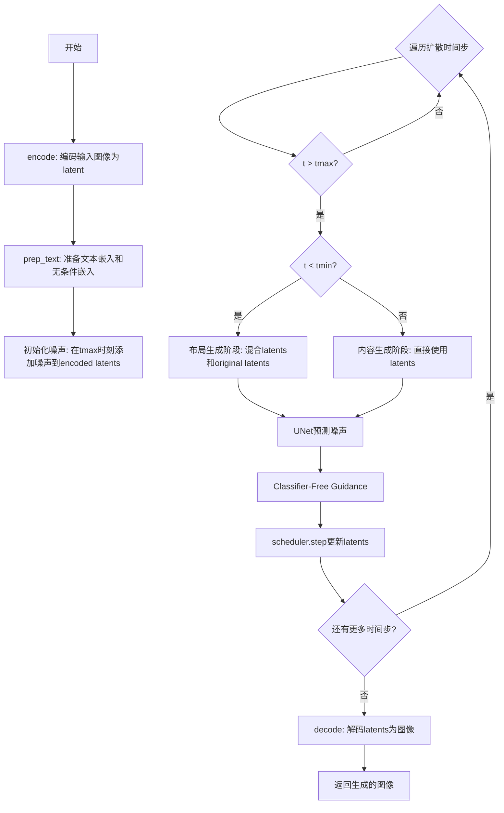
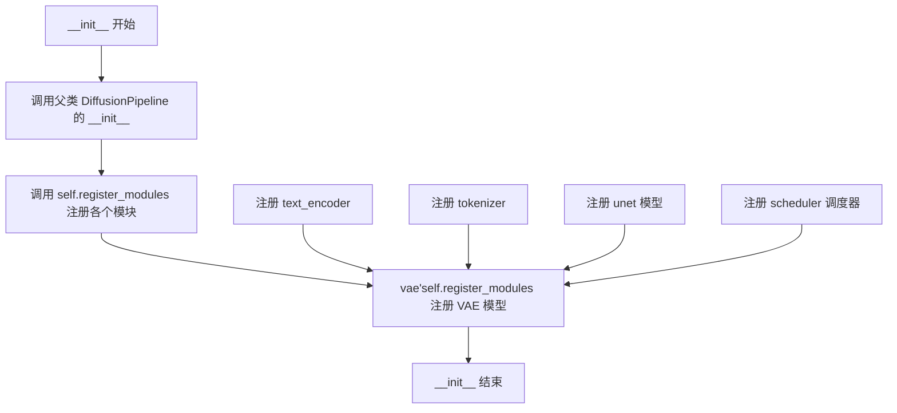
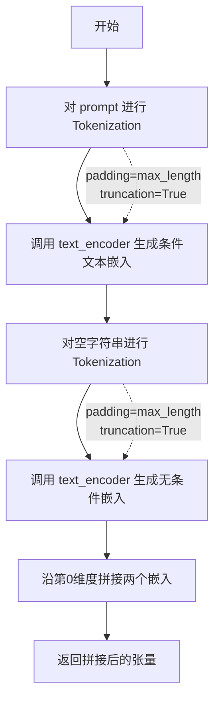

# `diffusers\examples\community\magic_mix.py` 详细设计文档

MagicMixPipeline是一个基于扩散模型的图像语义操作管道，通过将图像编码为潜在表示，在扩散过程中分阶段混合布局噪声和条件生成噪声，实现对图像布局和内容的精细控制生成。

## 整体流程



## 类结构

```
DiffusionPipeline (diffusers基类)
└── MagicMixPipeline (自定义图像语义操作管道)
```

## 全局变量及字段


### `torch`
    
PyTorch 库，提供张量计算和神经网络模块

类型：`module`
    


### `Image`
    
PIL Image 模块，用于图像的读取、处理和保存

类型：`module`
    


### `tfms`
    
torchvision.transforms 模块，提供图像变换操作

类型：`module`
    


### `tqdm`
    
tqdm 进度条类，用于在循环中显示进度

类型：`class`
    


### `CLIPTextModel`
    
CLIP 文本编码模型，将文本转换为向量嵌入

类型：`class`
    


### `CLIPTokenizer`
    
CLIP 分词器，将文本转换为 token ID

类型：`class`
    


### `AutoencoderKL`
    
变分自编码器 (VAE)，用于将图像编码为潜在向量并解码

类型：`class`
    


### `DDIMScheduler`
    
DDIM 调度器，用于扩散模型的逐步去噪

类型：`class`
    


### `DiffusionPipeline`
    
diffusers 库的基类，提供扩散模型的执行框架

类型：`class`
    


### `LMSDiscreteScheduler`
    
LMS 离散调度器，用于扩散模型的逐步去噪

类型：`class`
    


### `PNDMScheduler`
    
PNDM 调度器，用于扩散模型的逐步去噪

类型：`class`
    


### `UNet2DConditionModel`
    
带条件的 UNet2D 模型，用于在潜在空间中进行去噪预测

类型：`class`
    


### `MagicMixPipeline.vae`
    
变分自编码器，用于图像编码和解码

类型：`AutoencoderKL`
    


### `MagicMixPipeline.text_encoder`
    
文本编码器，将文本转换为嵌入

类型：`CLIPTextModel`
    


### `MagicMixPipeline.tokenizer`
    
分词器，处理文本输入

类型：`CLIPTokenizer`
    


### `MagicMixPipeline.unet`
    
UNet网络，用于去噪预测

类型：`UNet2DConditionModel`
    


### `MagicMixPipeline.scheduler`
    
扩散调度器

类型：`Union[PNDMScheduler, LMSDiscreteScheduler, DDIMScheduler]`
    
    

## 全局函数及方法


### `MagicMixPipeline.__init__`

这是 MagicMixPipeline 类的构造函数，负责初始化扩散管道的各个核心组件，包括变分自编码器(VAE)、文本编码器、分词器、UNet模型和调度器，并将这些模块注册到管道中以便统一管理。

参数：

- `self`：`MagicMixPipeline`，类的实例本身
- `vae`：`AutoencoderKL`，变分自编码器模型，负责将PIL图像编码为潜在表示(latent)，以及将潜在表示解码回图像
- `text_encoder`：`CLIPTextModel`，CLIP文本编码器模型，负责将文本提示(prompt)转换为文本嵌入向量，供UNet在去噪过程中进行条件控制
- `tokenizer`：`CLIPTokenizer`，CLIP分词器，负责将文本提示 token 化并转换为模型需要的输入ID序列
- `unet`：`UNet2DConditionModel`，条件UNet2D模型，负责在去噪过程中根据文本嵌入预测噪声
- `scheduler`：`Union[PNDMScheduler, LMSDiscreteScheduler, DDIMScheduler]`，噪声调度器，负责控制扩散过程中的时间步安排和去噪策略

返回值：`None`，该方法为构造函数，不返回任何值，仅初始化实例属性

#### 流程图



#### 带注释源码

```python
def __init__(
    self,
    vae: AutoencoderKL,
    text_encoder: CLIPTextModel,
    tokenizer: CLIPTokenizer,
    unet: UNet2DConditionModel,
    scheduler: Union[PNDMScheduler, LMSDiscreteScheduler, DDIMScheduler],
):
    """
    MagicMixPipeline 类的初始化方法
    
    参数:
        vae: AutoencoderKL, 变分自编码器，用于图像编码和解码
        text_encoder: CLIPTextModel, 文本编码器，用于生成文本嵌入
        tokenizer: CLIPTokenizer, 分词器，用于处理文本输入
        unet: UNet2DConditionModel, UNet模型，用于噪声预测
        scheduler: 调度器，支持 PNDMScheduler、LMSDiscreteScheduler 或 DDIMScheduler
    """
    # 调用父类 DiffusionPipeline 的初始化方法
    # 父类会进行一些基础设置，如设备分配等
    super().__init__()

    # 使用 register_modules 方法注册所有模块
    # 这个方法来自 DiffusionPipeline 父类，会将各个模块保存到 self 属性中
    # 同时会进行一些额外的初始化工作，如移动到正确设备等
    self.register_modules(
        vae=vae,              # 注册 VAE 模型
        text_encoder=text_encoder,  # 注册文本编码器
        tokenizer=tokenizer, # 注册分词器
        unet=unet,            # 注册 UNet 模型
        scheduler=scheduler  # 注册调度器
    )
```


### `MagicMixPipeline.encode`

将 PIL 图像编码为 VAE 潜在空间中的潜在表示（latent representation），用于后续的扩散模型处理。该方法首先将 PIL 图像转换为张量格式，进行归一化处理，然后通过 VAE 编码器提取图像特征，最后从潜在分布中采样并返回缩放后的潜在向量。

参数：

- `img`：`PIL.Image.Image`，输入的 PIL 格式图像，待编码的图像数据

返回值：`torch.Tensor`，编码后的潜在表示，形状为 (1, latent_channels, height//8, width//8)，其中 latent_channels 通常为 4

#### 流程图

```mermaid
flowchart TD
    A[接收 PIL 图像 img] --> B[ToTensor 转换为张量]
    B --> C[unsqueeze 添加 batch 维度]
    C --> D[to 移动到计算设备]
    D --> E[乘以 2 减 1 归一化到 [-1, 1]]
    E --> F[vae.encode 编码到潜在空间]
    F --> G[latent_dist.sample 从分布采样]
    G --> H[乘以 0.18215 缩放因子]
    H --> I[返回 latent 张量]
```

#### 带注释源码

```python
def encode(self, img):
    # 使用 torch.no_grad() 上下文管理器，禁用梯度计算以节省显存和提高推理速度
    with torch.no_grad():
        # 步骤1: 将 PIL 图像转换为 PyTorch 张量
        # 步骤2: unsqueeze(0) 添加 batch 维度，从 (C, H, W) 变为 (1, C, H, W)
        # 步骤3: to(self.device) 将张量移动到指定的计算设备（CPU/CUDA）
        # 步骤4: * 2 - 1 将图像像素值从 [0, 1] 归一化到 [-1, 1]，符合 VAE 的输入要求
        # 步骤5: self.vae.encode() 将图像编码到潜在空间，返回潜在分布参数
        # 步骤6: latent.latent_dist.sample() 从预测的潜在分布中采样一个潜在向量
        # 步骤7: 乘以缩放因子 0.18215，这是 VAE 潜在空间的常用缩放系数，用于对齐潜在空间的方差
        latent = self.vae.encode(tfms.ToTensor()(img).unsqueeze(0).to(self.device) * 2 - 1)
        latent = 0.18215 * latent.latent_dist.sample()
    
    # 返回编码后的潜在表示，用于后续的噪声添加和扩散过程
    return latent
```


### `MagicMixPipeline.decode`

该方法将 VAE 编码后的 latent 空间表示解码恢复为可显示的 PIL Image 图像，是扩散模型推理流程的最终输出环节，负责将处理后的噪声 latent 转换回 RGB 图像。

参数：

- `latent`：`torch.Tensor`，输入的 latent 张量，通常来自扩散过程的中间结果，需要通过 VAE 解码器进行上采样和重建

返回值：`PIL.Image`，解码后的图像对象，RGB 格式，可直接显示或保存

#### 流程图

```mermaid
flowchart TD
    A[开始 decode] --> B[反归一化 latent: latent = (1 / 0.18215) * latent]
    B --> C[使用 VAE decode: img = self.vae.decode(latent).sample]
    C --> D[图像后处理: img = (img / 2 + 0.5).clamp(0, 1)]
    D --> E[转换为 numpy: img = img.detach().cpu().permute(0, 2, 3, 1).numpy()]
    E --> F[像素值归一化到 0-255: img = (img * 255).round().astype('uint8')]
    F --> G[转换为 PIL Image: return Image.fromarray(img[0])]
    G --> H[结束 decode]
```

#### 带注释源码

```python
# 将 latents 解码为 PIL 图像
def decode(self, latent):
    # 第一步：反归一化 latent
    # 原始编码时乘以了 0.18215 以保持数值稳定，解码时需要除以该值恢复
    latent = (1 / 0.18215) * latent
    
    # 第二步：使用 VAE 的 decode 方法将 latent 解码为图像特征
    # .sample() 表示从分布中采样得到具体的 latent 向量
    with torch.no_grad():  # 解码过程不需要计算梯度，减少内存消耗
        img = self.vae.decode(latent).sample
    
    # 第三步：将图像值从 [-1, 1] 范围映射到 [0, 1] 范围
    # 扩散模型通常使用 tanh 输出，范围在 [-1, 1]
    # 这里进行反向操作：img / 2 + 0.5 将 [-1, 1] -> [0, 1]
    img = (img / 2 + 0.5).clamp(0, 1)
    
    # 第四步：转换为 numpy 数组格式
    # .detach() 断开梯度连接
    # .cpu() 将张量移至 CPU（如果之前在 GPU 上）
    # .permute(0, 2, 3, 1) 调整维度顺序：从 (B, C, H, W) -> (B, H, W, C)
    img = img.detach().cpu().permute(0, 2, 3, 1).numpy()
    
    # 第五步：将浮点数像素值转换为 uint8 类型 [0, 255]
    img = (img * 255).round().astype("uint8")
    
    # 第六步：使用 PIL 从 numpy 数组创建图像对象
    # img[0] 取第一个 batch 的图像（因为输入是单张图像）
    return Image.fromarray(img[0])
```


### `MagicMixPipeline.prep_text`

该方法将用户输入的文本提示（prompt）转换为扩散模型所需的文本嵌入向量（text embeddings），同时生成对应的无条件嵌入（unconditional embeddings）用于 Classifier-free Guidance 采样。

参数：

- `prompt`：`str`，用户输入的文本提示，用于生成对应的文本嵌入向量

返回值：`torch.Tensor`，返回一个由无条件嵌入（unconditional embedding）和条件文本嵌入（text embedding）沿第一维度拼接而成的张量，形状为 `(2, seq_len, hidden_dim)`，用于后续的扩散采样过程。

#### 流程图



#### 带注释源码

```python
def prep_text(self, prompt):
    """
    将文本提示转换为文本嵌入向量，同时生成无条件嵌入用于 Classifier-free Guidance
    
    Args:
        prompt: 用户输入的文本提示
        
    Returns:
        torch.Tensor: 包含 [unconditional_embedding, text_embedding] 沿第一维度拼接的张量
    """
    # 使用分词器将 prompt 转换为 token IDs 并进行填充和截断
    # padding="max_length": 填充到最大长度
    # truncation=True: 超过最大长度的部分进行截断
    # return_tensors="pt": 返回 PyTorch 张量
    text_input = self.tokenizer(
        prompt,
        padding="max_length",
        max_length=self.tokenizer.model_max_length,
        truncation=True,
        return_tensors="pt",
    )

    # 将 token IDs 传入文本编码器，生成条件文本嵌入
    # [0] 表示获取隐藏状态（hidden states）
    text_embedding = self.text_encoder(text_input.input_ids.to(self.device))[0]

    # 对空字符串进行相同的处理，生成无条件嵌入
    # 空字符串用于 Classifier-free Guidance 中的无分类器指导
    uncond_input = self.tokenizer(
        "",
        padding="max_length",
        max_length=self.tokenizer.model_max_length,
        truncation=True,
        return_tensors="pt",
    )

    # 生成无条件嵌入向量
    uncond_embedding = self.text_encoder(uncond_input.input_ids.to(self.device))[0]

    # 将无条件嵌入和条件文本嵌入沿第0维度拼接
    # 拼接后的形状: (2, seq_len, hidden_dim)
    # 索引0位置是无条件嵌入，索引1位置是条件文本嵌入
    # 在后续推理时，通过索引区分用于无分类器指导的两种嵌入
    return torch.cat([uncond_embedding, text_embedding])
```


### MagicMixPipeline.__call__

该方法是 MagicMixPipeline 的核心推理方法，实现了一种基于扩散模型的图像生成与编辑pipeline。它通过接收一张输入图像和文本提示，利用混合潜在空间表示技术，在保持原图布局语义的同时生成符合文本描述的新图像。方法首先将图像编码为潜在表示，然后在指定的时间步范围内进行去噪扩散过程，其中layout generation阶段使用混合因子插值布局噪声与条件生成噪声，content generation阶段进行纯条件生成，最后将潜在表示解码为PIL图像。

参数：

- `self`：MagicMixPipeline，pipeline实例本身
- `img`：`Image.Image`，输入的PIL图像，作为生成的基础图像
- `prompt`：`str`，文本提示，描述期望生成的内容
- `kmin`：`float`，最小比例系数，默认为0.3，用于计算布局生成阶段的起始时间步
- `kmax`：`float`，最大比例系数，默认为0.6，用于计算初始噪声添加的时间步位置
- `mix_factor`：`float`，混合因子，默认为0.5，控制布局生成阶段潜在表示的插值权重
- `seed`：`int`，随机种子，默认为42，用于控制噪声生成的随机性以保证可复现性
- `steps`：`int`，扩散总步数，默认为50，决定去噪过程的迭代次数
- `guidance_scale`：`float`，引导尺度，默认为7.5，控制文本条件对生成过程的影响程度

返回值：`Image.Image`，生成的PIL图像，最终从去噪后的潜在表示解码得到

#### 流程图

```mermaid
flowchart TD
    A[开始 __call__] --> B[计算 tmin 和 tmax]
    B --> C[调用 prep_text 生成文本嵌入]
    C --> D[配置调度器时间步]
    D --> E[编码输入图像为潜在表示]
    E --> F[设置随机种子并生成噪声]
    F --> G[在 tmax 时间步添加噪声到编码潜在表示]
    G --> H[执行初始预测]
    H --> I{遍历所有时间步]
    I --> J{i > tmax?}
    J -->|否| K[跳过当前步]
    J -->|是| L{i < tmin?}
    L -->|是| M[Layout Generation Phase]
    L -->|否| N[Content Generation Phase]
    M --> O[计算混合潜在表示: mix_factor * latents + (1-mix_factor) * orig_latents]
    O --> P[执行UNet预测]
    N --> Q[直接执行UNet预测]
    P --> R[应用分类器自由引导]
    Q --> R
    R --> S[调度器单步去噪]
    S --> T[更新 latents]
    T --> U{是否还有下一个时间步]
    U -->|是| I
    U -->|否| V[解码 latents 为图像]
    V --> W[返回生成的图像]
    K --> U
```

#### 带注释源码

```python
def __call__(
    self,
    img: Image.Image,
    prompt: str,
    kmin: float = 0.3,
    kmax: float = 0.6,
    mix_factor: float = 0.5,
    seed: int = 42,
    steps: int = 50,
    guidance_scale: float = 7.5,
) -> Image.Image:
    """
    MagicMixPipeline 的主推理方法，实现图像到图像的扩散生成
    
    参数:
        img: 输入的PIL图像
        prompt: 文本提示，描述期望生成的内容
        kmin: 布局生成阶段的起始比例（相对于总步数）
        kmax: 初始噪声添加位置的比例
        mix_factor: 潜在表示混合权重
        seed: 随机种子
        steps: 扩散模型的总推理步数
        guidance_scale: 文本引导强度
    
    返回:
        生成的PIL图像
    """
    # 根据kmin和kmax计算具体的时间步索引
    # tmin: 布局生成阶段结束的时间步索引
    # tmax: 初始噪声添加和开始条件生成的时间步索引
    tmin = steps - int(kmin * steps)
    tmax = steps - int(kmax * steps)

    # 调用文本预处理方法，将prompt转换为文本嵌入向量
    # 同时生成无条件嵌入用于分类器自由引导
    text_embeddings = self.prep_text(prompt)

    # 配置调度器的去噪时间步序列
    self.scheduler.set_timesteps(steps)

    # 获取输入图像的宽高
    width, height = img.size
    
    # 将PIL图像编码为扩散模型的潜在表示空间
    encoded = self.encode(img)

    # 设置PyTorch随机种子以确保噪声可复现
    torch.manual_seed(seed)
    # 生成与潜在表示形状匹配的高斯噪声
    # 潜在表示的空间尺寸是原图的1/8（因为VAE的缩放因子为8）
    noise = torch.randn(
        (1, self.unet.config.in_channels, height // 8, width // 8),
    ).to(self.device)

    # 在指定的时间步tmax将噪声添加到编码后的潜在表示
    # 这个时间步的选择决定了保留多少原始图像信息
    latents = self.scheduler.add_noise(
        encoded,
        noise,
        timesteps=self.scheduler.timesteps[tmax],
    )

    # 为批量处理准备输入，复制latents用于条件和无条件预测
    input = torch.cat([latents] * 2)

    # 调度器缩放输入（用于某些调度器的特定处理）
    input = self.scheduler.scale_model_input(input, self.scheduler.timesteps[tmax])

    # 执行初始时间步的去噪预测
    with torch.no_grad():
        pred = self.unet(
            input,
            self.scheduler.timesteps[tmax],
            encoder_hidden_states=text_embeddings,
        ).sample

    # 分离无条件预测和条件预测，执行分类器自由引导
    # 这增加了文本prompt对生成结果的控制力
    pred_uncond, pred_text = pred.chunk(2)
    pred = pred_uncond + guidance_scale * (pred_text - pred_uncond)

    # 执行单步去噪更新，获得当前的潜在表示
    latents = self.scheduler.step(pred, self.scheduler.timesteps[tmax], latents).prev_sample

    # 主扩散循环：遍历所有时间步进行去噪
    for i, t in enumerate(tqdm(self.scheduler.timesteps)):
        # 仅处理tmax之后的时间步（已经过了初始噪声添加点）
        if i > tmax:
            # 布局生成阶段：在tmin之前，保持布局语义
            if i < tmin:
                # 在当前时间步t重新添加噪声到原始编码
                # 这样可以在保持原图结构的同时进行条件生成
                orig_latents = self.scheduler.add_noise(
                    encoded,
                    noise,
                    timesteps=t,
                )

                # 潜在表示插值：在条件生成噪声和原始布局噪声之间混合
                # mix_factor控制混合程度，平衡原始布局和目标内容
                input = (
                    (mix_factor * latents) + (1 - mix_factor) * orig_latents
                )  # interpolating between layout noise and conditionally generated noise to preserve layout semantics
                
                # 准备批量输入用于UNet预测
                input = torch.cat([input] * 2)

            else:  # 内容生成阶段：在tmin及之后，完全基于文本条件生成
                # 直接使用当前潜在表示，无需混合
                input = torch.cat([latents] * 2)

            # 调度器缩放输入
            input = self.scheduler.scale_model_input(input, t)

            # 执行UNet去噪预测
            with torch.no_grad():
                pred = self.unet(
                    input,
                    t,
                    encoder_hidden_states=text_embeddings,
                ).sample

            # 分类器自由引导
            pred_uncond, pred_text = pred.chunk(2)
            pred = pred_uncond + guidance_scale * (pred_text - pred_uncond)

            # 执行单步去噪，更新潜在表示
            latents = self.scheduler.step(pred, t, latents).prev_sample

    # 完成所有去噪步骤后，将潜在表示解码为最终的PIL图像
    return self.decode(latents)
```

## 关键组件


### MagicMixPipeline 类

继承自 DiffusionPipeline 的图像生成管道类，封装了 VAE、文本编码器、Tokenizer、UNet 和调度器，用于实现基于扩散模型的图像混合生成。

### encode 方法

将 PIL 图像编码为潜在空间表示，通过 VAE 的 latent_dist.sample() 采样获取潜在向量，并应用缩放因子 0.18215。

### decode 方法

将潜在向量解码为 PIL 图像，执行反量化（1/0.18215）、像素值归一化（0-1）、转换为 numpy 数组并最终转换为 uint8 格式的图像。

### prep_text 方法

将文本提示转换为文本嵌入向量，同时生成条件嵌入和无条件嵌入（空字符串），用于 Classifier-free guidance。

### __call__ 方法

主生成流程，控制整个扩散推理过程，包括：噪声调度、潜在向量初始化、布局生成阶段（tmax 到 tmin 的混合噪声插值）和内容生成阶段（tmin 之后的纯条件生成）。

### VAE (AutoencoderKL)

变分自编码器组件，负责图像与潜在空间之间的相互转换，支持基于 latent_dist 的采样。

### Text Encoder (CLIPTextModel)

CLIP 文本编码器，将文本提示转换为高维语义嵌入，供 UNet 进行条件生成。

### UNet (UNet2DConditionModel)

条件 UNet 模型，负责预测噪声残差，接受潜在向量、时间步和文本嵌入作为输入。

### Scheduler (PNDMScheduler/LMSDiscreteScheduler/DDIMScheduler)

扩散调度器，管理噪声调度时间步、执行噪声添加（add_noise）和去噪步骤（step），支持多种采样策略。

### 张量索引与潜在空间操作

代码中大量使用张量切片和索引操作（如 pred.chunk(2)、latents[0]），以及潜在空间的缩放与反量化（0.18215 因子），实现图像到潜在空间的映射。

### Classifier-free Guidance

在推理过程中通过拼接无条件嵌入和条件嵌入，利用 pred_uncond + guidance_scale * (pred_text - pred_uncond) 公式提升生成质量。

### 布局生成与混合机制

在 tmax 到 tmin 阶段，通过 mix_factor 对条件生成的潜在向量和原始编码潜在向量进行线性插值，实现布局语义保持与内容生成的平衡。


## 问题及建议


### 已知问题

- **硬编码的缩放因子**：数值 `0.18215` 在 `encode` 和 `decode` 方法中被硬编码，该值是 VAE 的缩放因子，应该作为可配置参数或从 VAE 配置中读取
- **设备管理不一致**：代码多次使用 `self.device`，但未在类中定义该属性，可能导致 AttributeError
- **类型注解不完整**：`encode`、`decode`、`prep_text` 方法的参数缺少类型注解，`encode` 方法缺少返回类型注解
- **缺少输入验证**：未对输入图像尺寸、prompt 长度、参数范围（如 kmin、kmax、mix_factor）进行有效性检查
- **随机种子管理不完整**：仅使用 `torch.manual_seed(seed)`，在多线程或 CUDA 环境下可能无法保证可复现性
- **循环内重复代码**：`__call__` 方法的主要循环中存在大量重复的 unet 推理和 classifier-free guidance 计算逻辑
- **设备传输冗余**：在循环外部已经传输到设备的张量，在循环内部重复调用 `.to(self.device)`
- **魔法数字缺乏文档**：kmin、kmax、mix_factor 等关键参数的作用和取值依据未在代码中说明
- **缺少错误处理**：PIL 图像处理、模型推理等操作均无异常捕获机制

### 优化建议

- 将 `0.18215` 提取为类属性或从 VAE 配置中读取，增加代码可维护性
- 在 `__init__` 方法中明确设置 `self.device = unet.device`，确保设备一致性
- 为所有方法添加完整的类型注解，提升代码可读性和静态检查能力
- 在 `__call__` 方法入口添加输入验证：检查图像尺寸是否为 8 的倍数、验证 kmin < kmax、确保 mix_factor 在 [0,1] 范围内
- 使用 `torch.manual_seed(seed)` 结合 `torch.cuda.manual_seed_all(seed)` 提升随机性可复现性
- 将循环内的重复逻辑抽取为私有方法如 `_predict_noise`，减少代码冗余
- 在循环外预先计算 `torch.cat([latents] * 2)` 等重复张量，减少循环内的内存分配
- 为关键参数添加文档字符串，说明 kmin/kmax 控制布局/内容生成阶段的机制
- 添加 try-except 块处理可能的图像转换异常和模型推理错误

## 其它


### 设计目标与约束

本Pipeline的设计目标是在保持输入图像布局语义的同时，根据文本提示生成新的图像内容。核心约束包括：1) 仅支持PIL Image格式输入输出；2) 图像尺寸需为8的倍数以适配VAE和UNet的下采样率；3) 支持三种调度器（PNDM、LMS、DDIM）但不支持自定义调度器；4) 文本提示长度受tokenizer.model_max_length限制；5) 推理步骤数影响生成质量与速度的权衡。

### 错误处理与异常设计

代码缺乏显式的错误处理机制。潜在异常包括：1) 图像尺寸不是8的倍数导致维度不匹配；2) prompt过长被truncation可能导致语义丢失；3) 设备内存不足时vae.encode和unet推理可能抛出OOM错误；4) 调度器类型不匹配时可能引发运行时错误；5) seed设置仅使用torch.manual_seed，未设置CUDA seed。建议添加：图像尺寸验证、内存检查、调度器类型断言、详细的错误日志记录。

### 数据流与状态机

数据流如下：输入图像→encode()进行VAE编码得到latent→初始化噪声→文本提示通过prep_text()生成条件和无条件embedding→主循环分为两个阶段（layout generation: tmax到tmin，content generation: tmin到0）→每步执行UNet预测、CFG分类器自由引导、调度器step更新latent→最终decode()将latent解码为PIL图像。状态机包含三个主要状态：初始化状态、布局生成阶段（保持原始图像结构）、内容生成阶段（根据文本生成新内容）。

### 外部依赖与接口契约

核心依赖包括：torch>=1.9、transformers（CLIPTextModel和CLIPTokenizer）、diffusers（AutoencoderKL、UNet2DConditionModel、各类Scheduler）、PIL、tqdm、torchvision。接口契约：__init__需要注入所有模型组件；encode()接受PIL.Image返回torch.Tensor latent；decode()接受torch.Tensor latent返回PIL.Image；prep_text()接受str返回torch.Tensor；__call__是主入口接受图像、提示词及多个浮点/整型参数返回PIL.Image。所有方法需在相同设备上执行，隐式依赖self.device属性。

### 配置参数说明

关键参数：kmin/kmax控制布局保留程度（0.3-0.6为推荐范围），mix_factor控制layout和content阶段噪声混合比例，seed决定随机噪声可复现，steps影响迭代次数与质量，guidance_scale控制文本引导强度（7.5为典型值）。参数间存在约束：kmax必须大于kmin，steps必须为正整数，mix_factor建议在0.3-0.7范围。

### 性能考虑

性能瓶颈：1) VAE编码和解码计算量大；2) UNet每步推理两次（CFG需要条件和非条件）；3) 文本编码在每帧调用时重复执行可预先计算；4) tqdm进度条可能在某些环境导致输出缓冲问题。优化建议：预先计算text_embeddings、混合精度推理（fp16）、启用xFormers加速、批处理多张图像、梯度检查点技术。

### 安全性考虑

潜在风险：1) 该模型可生成受版权保护的艺术风格内容；2) 恶意提示词可能诱导生成不当内容；3) 模型权重来源需验证合法性；4) 部署时需考虑输入验证防止prompt注入攻击；5) 生成图像的元数据可能包含模型信息。建议：添加内容安全过滤器、用户输入验证、输出水印。

### 资源管理

显存占用估算：输入图像尺寸为512x512时，latent为64x64x4，UNet中间层显存占用约数GB。建议：1) 使用torch.cuda.empty_cache()定期清理缓存；2) 采用gradient checkpointing减少显存；3) 及时释放不需要的tensor；4) 支持CPU offloading；5) 上下文管理器确保推理后自动清理。

### 使用示例与调用方式

基础调用：`pipeline(img, "a cat sitting on a sofa")`；自定义参数：`pipeline(img, "waterfall", kmin=0.2, kmax=0.7, mix_factor=0.6, steps=50, guidance_scale=8.0)`；固定种子：`pipeline(img, "landscape", seed=12345)`。建议封装为CLI工具或API服务，支持批量处理。

### 版本兼容性

依赖版本约束：Python>=3.8、torch>=1.9.0、transformers>=4.20、diffusers>=0.3.0。已知兼容性：CLIPTextModel需确保与tokenizer版本匹配；不同diffusers版本Scheduler API可能有细微差异；CUDA版本影响GPU加速效果。升级前需进行回归测试。

### 测试考虑

建议测试用例：1) 不同尺寸图像输入的边界情况；2) 空字符串和超长prompt处理；3) 三种调度器功能一致性验证；4) 相同seed的确定性结果验证；5) 内存泄漏检测；6) CPU和GPU环境兼容性；7) 混合精度模式稳定性；8) 多线程并发安全性。


    