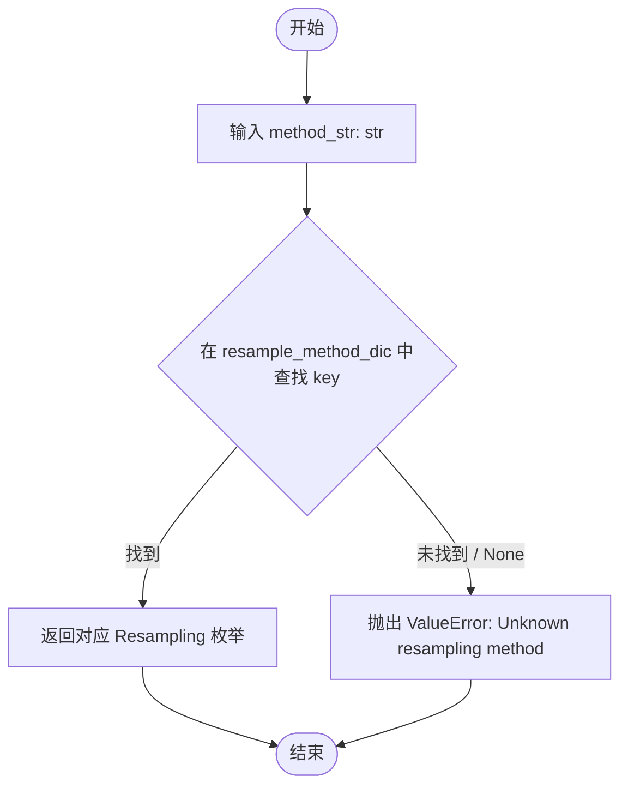
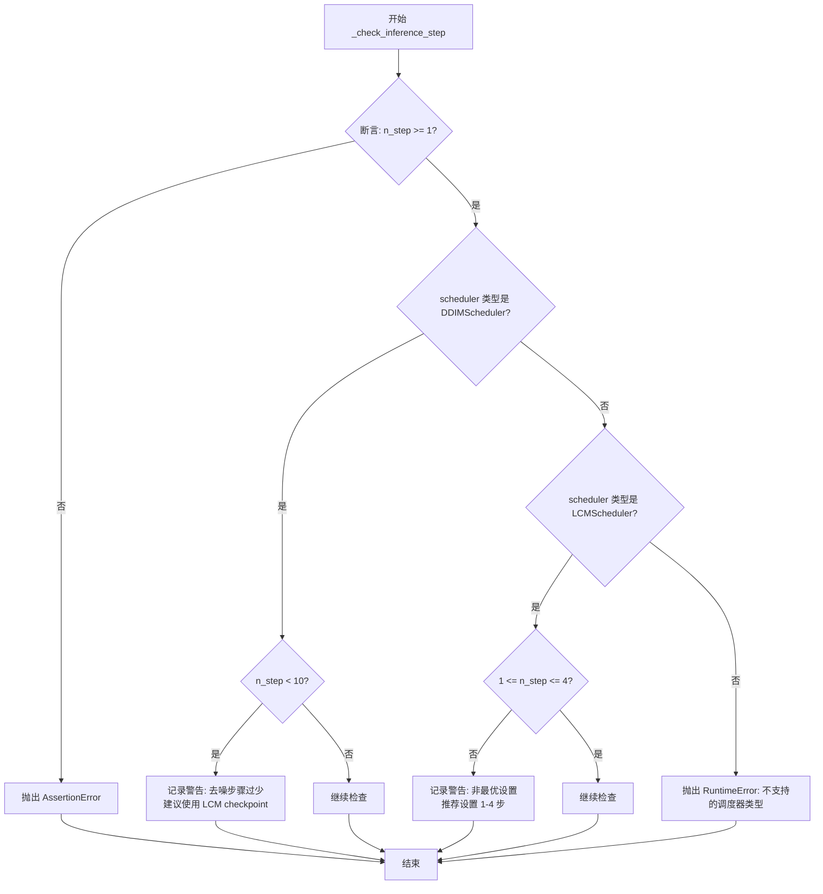
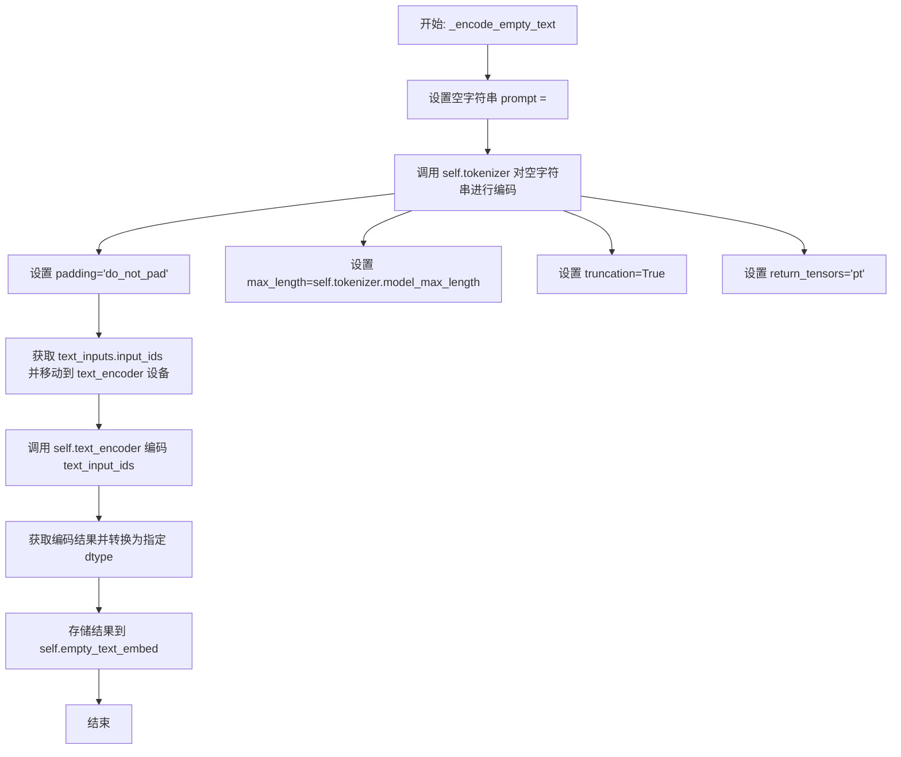
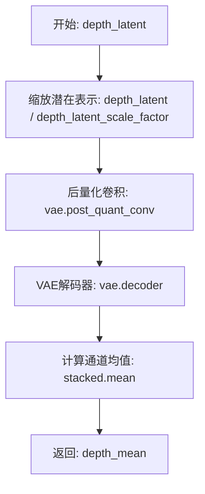
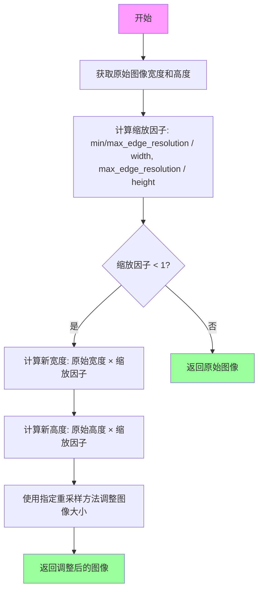
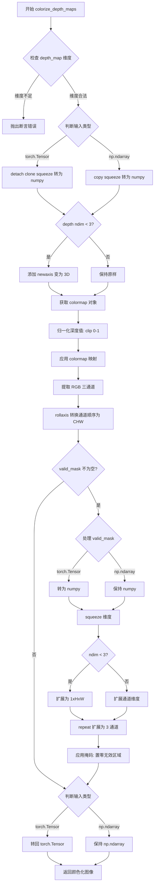
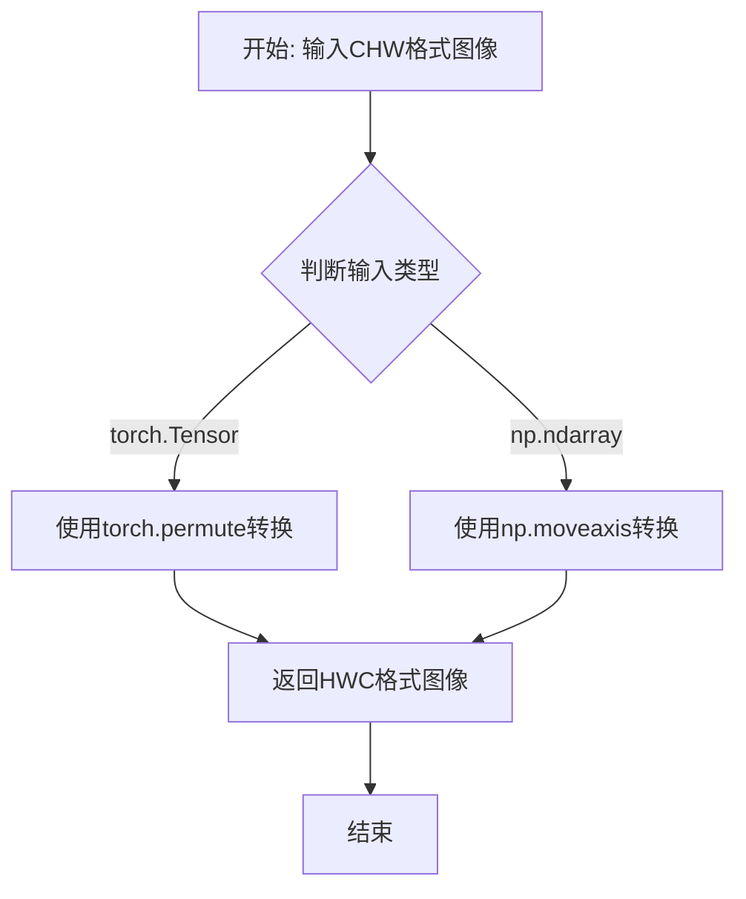

# `diffusers\examples\community\marigold_depth_estimation.py` 详细设计文档

Marigold是一个基于扩散模型的单目深度估计流水线，通过接收RGB图像输入，使用条件U-Net进行去噪处理，结合VAE编码器和解码器来预测深度图，并支持测试时集成（ensemble）来提高预测精度，最终输出归一化的深度图、着色后的深度图和不确定性估计。

## 整体流程

```mermaid
graph TD
    A[开始: 输入RGB图像] --> B{processing_res > 0?}
    B -- 是 --> C[resize_max_res: 调整图像大小]
    B -- 否 --> D[保持原始分辨率]
    C --> D
    D --> E[convert RGB: 转换为RGB]
    E --> F[normalize: 归一化到[-1, 1]]
    F --> G[stack: 复制ensemble_size份]
    G --> H[DataLoader: 批量加载]
    H --> I{遍历每个batch}
    I -- batch --> J[single_infer: 单次推理]
    J --> K[encode_rgb: 编码RGB到latent]
    K --> L[初始化depth_latent为噪声]
    L --> M[encode_empty_text: 编码空文本]
    M --> N{迭代timesteps}
    N --> O[UNet预测噪声残差]
    O --> P[Scheduler计算上一步]
    N --> Q[decode_depth: 解码深度latent]
    Q --> R[归一化到[0, 1]]
    I --> S{ensemble_size > 1?}
    S -- 是 --> T[ensemble_depths: 集成深度图]
    S -- 否 --> U[直接使用预测结果]
    T --> U
    U --> V{匹配输入分辨率?}
    V -- 是 --> W[resize_back: 调整回原分辨率]
    V -- 否 --> X[不调整]
    W --> X
    X --> Y{color_map != None?}
    Y -- 是 --> Z[colorize_depth_maps: 着色深度图]
    Y -- 否 --> AA[depth_colored = None]
    Z --> AB
    AA --> AB
    AB --> AC[返回MarigoldDepthOutput]
```

## 类结构

```
BaseOutput (diffusers)
└── MarigoldDepthOutput (输出数据类)

DiffusionPipeline (diffusers)
└── MarigoldPipeline (主流水线类)
```

## 全局变量及字段


### `rgb_latent_scale_factor`
    
RGB潜在空间缩放因子(0.18215)

类型：`float`
    


### `depth_latent_scale_factor`
    
深度潜在空间缩放因子(0.18215)

类型：`float`
    


### `MarigoldDepthOutput.depth_np`
    
预测的深度图，值域[0, 1]

类型：`np.ndarray`
    


### `MarigoldDepthOutput.depth_colored`
    
着色后的深度图

类型：`Union[None, Image.Image]`
    


### `MarigoldDepthOutput.uncertainty`
    
未校准的不确定性(MAD)

类型：`Union[None, np.ndarray]`
    


### `MarigoldPipeline.rgb_latent_scale_factor`
    
RGB潜在空间缩放因子(0.18215)

类型：`float`
    


### `MarigoldPipeline.depth_latent_scale_factor`
    
深度潜在空间缩放因子(0.18215)

类型：`float`
    


### `MarigoldPipeline.unet`
    
条件U-Net去噪模型

类型：`UNet2DConditionModel`
    


### `MarigoldPipeline.vae`
    
VAE编码解码器

类型：`AutoencoderKL`
    


### `MarigoldPipeline.scheduler`
    
调度器

类型：`DDIMScheduler`
    


### `MarigoldPipeline.text_encoder`
    
文本编码器

类型：`CLIPTextModel`
    


### `MarigoldPipeline.tokenizer`
    
分词器

类型：`CLIPTokenizer`
    


### `MarigoldPipeline.empty_text_embed`
    
空文本嵌入

类型：`None`
    
    

## 全局函数及方法


### `get_pil_resample_method`

该函数是一个工具函数，用于将用户友好的字符串类型重采样方法名称（如 "bilinear"）转换为 PIL（Python Imaging Library）所需的 `Resampling` 枚举类型。它通过内部预定义的映射字典进行查找和转换，如果传入不支持的方法名，则抛出 `ValueError` 以确保管道执行的健壮性。

参数：

-  `method_str`：`str`，要使用的重采样方法的名称（如 "bilinear", "bicubic", "nearest"）。

返回值：`Resampling`，PIL 图像处理模块 `PIL.Image.Resampling` 的枚举常量。

#### 流程图



#### 带注释源码

```python
def get_pil_resample_method(method_str: str) -> Resampling:
    """
    将字符串形式的采样方法转换为 PIL 的 Resampling 枚举。

    参数:
        method_str (str): 期望的重采样方法名称 ("bilinear", "bicubic", "nearest")。

    返回:
        Resampling: PIL.Image.Resampling 枚举值。

    异常:
        ValueError: 如果 method_str 不在支持的方法列表中。
    """
    # 定义映射表：将字符串名称映射到 PIL 枚举常量
    resample_method_dic = {
        "bilinear": Resampling.BILINEAR,
        "bicubic": Resampling.BICUBIC,
        "nearest": Resampling.NEAREST,
    }
    
    # 使用字典的 get 方法进行查找，如果不存在则返回 None
    resample_method = resample_method_dic.get(method_str, None)
    
    # 验证查找结果
    if resample_method is None:
        # 输入不合法时抛出明确的错误信息
        raise ValueError(f"Unknown resampling method: {resample_method}")
    else:
        # 返回合法的 PIL 枚举对象
        return resample_method
```


### `MarigoldPipeline.__init__`

这是 `MarigoldPipeline` 类的构造函数，用于初始化单目深度估计管道的所有核心组件。该方法继承自 `DiffusionPipeline`，并注册了 U-Net、VAE、调度器、文本编码器和分词器等关键模块，同时初始化空文本嵌入为 `None` 以实现延迟加载。

参数：

- `self`：隐式参数，类的实例本身
- `unet`：`UNet2DConditionModel`，条件 U-Net 模型，用于在图像潜在条件的下去噪深度潜在变量
- `vae`：`AutoencoderKL`，变分自编码器模型，用于将图像和深度图编码/解码到潜在表示
- `scheduler`：`DDIMScheduler`，DDIM 调度器，与 `unet` 配合使用以去噪编码后的图像潜在变量
- `text_encoder`：`CLIPTextModel`，CLIP 文本编码器，用于生成空文本嵌入
- `tokenizer`：`CLIPTokenizer`，CLIP 分词器

返回值：`None`，构造函数无显式返回值

#### 流程图

```mermaid
flowchart TD
    A[开始 __init__] --> B[调用父类构造函数 super().__init__]
    B --> C[调用 register_modules 注册子模块]
    C --> C1[注册 unet]
    C --> C2[注册 vae]
    C --> C3[注册 scheduler]
    C --> C4[注册 text_encoder]
    C --> C5[注册 tokenizer]
    C --> D[初始化 self.empty_text_embed = None]
    D --> E[结束]
```

#### 带注释源码

```python
def __init__(
    self,
    unet: UNet2DConditionModel,
    vae: AutoencoderKL,
    scheduler: DDIMScheduler,
    text_encoder: CLIPTextModel,
    tokenizer: CLIPTokenizer,
):
    """
    初始化 Marigold 单目深度估计管道。

    Args:
        unet (UNet2DConditionModel): 条件 U-Net，用于去噪深度潜在变量
        vae (AutoencoderKL): VAE 模型，用于图像/深度图的编码和解码
        scheduler (DDIMScheduler): DDIM 调度器
        text_encoder (CLIPTextModel): CLIP 文本编码器
        tokenizer (CLIPTokenizer): CLIP 分词器
    """
    # 调用父类 DiffusionPipeline 的初始化方法
    # 继承基础管道功能（如设备管理、状态保存等）
    super().__init__()

    # 注册所有子模块，使管道能够正确保存/加载、移到指定设备等
    self.register_modules(
        unet=unet,
        vae=vae,
        scheduler=scheduler,
        text_encoder=text_encoder,
        tokenizer=tokenizer,
    )

    # 初始化空文本嵌入为 None，实现延迟编码（lazy encoding）
    # 首次推理时才会编码空文本，提升初始化速度并支持自定义调度器
    self.empty_text_embed = None
```


### MarigoldPipeline.__call__

单目深度估计管道的主入口方法，接收输入图像并通过扩散模型预测深度图。支持批量推理、测试时集成和可选的深度图彩色化，最终返回包含深度值、不确定性估计和彩色深度图的输出对象。

参数：

- `input_image`：`Image`，输入RGB（或灰度）图像
- `denoising_steps`：`int`，可选，默认值10，扩散去噪步数（DDIM）
- `ensemble_size`：`int`，可选，默认值10，用于集成的预测数量
- `processing_res`：`int`，可选，默认值768，处理的最大分辨率，设为0则不调整大小
- `match_input_res`：`bool`，可选，默认值True，将深度预测调整回输入分辨率
- `resample_method`：`str`，可选，默认值"bilinear"，重采样方法（bilinear/bicubic/nearest）
- `batch_size`：`int`，可选，默认值0，推理批量大小，若为0则自动决定
- `seed`：`Union[int, None]`，可选，默认值None，用于可重现性的种子
- `color_map`：`str`，可选，默认值"Spectral"，深度图着色方案，设为None则跳过彩色化
- `show_progress_bar`：`bool`，可选，默认值True，显示扩散去噪进度条
- `ensemble_kwargs`：`Dict`，可选，默认值None，集成详细设置参数

返回值：`MarigoldDepthOutput`，包含：
- `depth_np`：`np.ndarray`，范围在[0,1]的预测深度图
- `depth_colored`：`Union[None, Image.Image]`，形状[3, H, W]、值范围[0,1]的彩色深度图，若color_map为None则为None
- `uncertainty`：`Union[None, np.ndarray]`，来自集成的未校准不确定性（MAD），若ensemble_size=1则为None

#### 流程图

```mermaid
flowchart TD
    A[开始: __call__] --> B[验证参数: 检查processing_res、ensemble_size等]
    B --> C{processing_res > 0?}
    C -->|Yes| D[调用resize_max_res调整图像大小]
    C -->|No| E[跳过调整大小]
    D --> F[将图像转换为RGB]
    E --> F
    F --> G[归一化RGB: [0,255] → [-1,1]]
    G --> H[堆叠图像ensemble_size次创建批次]
    H --> I[创建DataLoader]
    I --> J[推理循环: 遍历每个批次]
    J --> K[调用single_infer执行单次深度预测]
    K --> L{show_progress_bar?}
    L -->|Yes| M[显示进度条]
    L -->|No| N[不显示进度条]
    M --> J
    N --> J
    J --> O{ensemble_size > 1?}
    O -->|Yes| P[调用ensemble_depths进行测试时集成]
    O -->|No| Q[跳过集成]
    P --> R[获取集成后的深度和不确定性]
    Q --> R
    R --> S[缩放深度到[0,1]范围]
    S --> T[转换为NumPy数组]
    T --> U{match_input_res?}
    U -->|Yes| V[调整回原始输入分辨率]
    U -->|No| W[跳过分辨率调整]
    V --> X[裁剪到[0,1]范围]
    W --> X
    X --> Y{color_map is not None?}
    Y -->|Yes| Z[调用colorize_depth_maps进行彩色化]
    Y -->|No| AA[depth_colored设为None]
    Z --> AB[返回MarigoldDepthOutput]
    AA --> AB
```

#### 带注释源码

```python
@torch.no_grad()
def __call__(
    self,
    input_image: Image,
    denoising_steps: int = 10,
    ensemble_size: int = 10,
    processing_res: int = 768,
    match_input_res: bool = True,
    resample_method: str = "bilinear",
    batch_size: int = 0,
    seed: Union[int, None] = None,
    color_map: str = "Spectral",
    show_progress_bar: bool = True,
    ensemble_kwargs: Dict = None,
) -> MarigoldDepthOutput:
    """
    管道调用主入口，用于单目深度估计。
    
    Args:
        input_image: 输入RGB或灰度图像
        processing_res: 最大处理分辨率，0表示不调整大小
        match_input_res: 是否将深度图调整回输入分辨率
        resample_method: 重采样方法
        denoising_steps: DDIM去噪步数
        ensemble_size: 集成预测数量
        batch_size: 推理批量大小，0自动决定
        seed: 随机种子
        show_progress_bar: 是否显示进度条
        color_map: 颜色映射方案
        ensemble_kwargs: 集成参数
    
    Returns:
        MarigoldDepthOutput: 包含depth_np、depth_colored和uncertainty的输出对象
    """
    
    # ----------------- 参数验证与预处理 -----------------
    device = self.device  # 获取设备
    input_size = input_image.size  # 保存原始输入尺寸
    
    # 验证参数合法性
    if not match_input_res:
        assert processing_res is not None, "Value error: `resize_output_back` is only valid with "
    assert processing_res >= 0
    assert ensemble_size >= 1
    
    # 检查去噪步数是否合理
    self._check_inference_step(denoising_steps)
    
    # 获取PIL重采样方法
    resample_method: Resampling = get_pil_resample_method(resample_method)
    
    # ----------------- 图像预处理 -----------------
    # 调整图像大小到最大边长限制
    if processing_res > 0:
        input_image = self.resize_max_res(
            input_image,
            max_edge_resolution=processing_res,
            resample_method=resample_method,
        )
    
    # 转换为RGB（移除alpha通道、灰度转3通道）
    input_image = input_image.convert("RGB")
    image = np.asarray(input_image)
    
    # 归一化RGB值: [0,255] → [-1,1]
    rgb = np.transpose(image, (2, 0, 1))  # [H, W, rgb] -> [rgb, H, W]
    rgb_norm = rgb / 255.0 * 2.0 - 1.0   # [0, 255] -> [-1, 1]
    rgb_norm = torch.from_numpy(rgb_norm).to(self.dtype)
    rgb_norm = rgb_norm.to(device)
    assert rgb_norm.min() >= -1.0 and rgb_norm.max() <= 1.0
    
    # ----------------- 深度预测 -----------------
    # 批量重复输入图像
    duplicated_rgb = torch.stack([rgb_norm] * ensemble_size)
    single_rgb_dataset = TensorDataset(duplicated_rgb)
    
    # 确定批量大小
    if batch_size > 0:
        _bs = batch_size
    else:
        _bs = self._find_batch_size(
            ensemble_size=ensemble_size,
            input_res=max(rgb_norm.shape[1:]),
            dtype=self.dtype,
        )
    
    # 创建DataLoader
    single_rgb_loader = DataLoader(single_rgb_dataset, batch_size=_bs, shuffle=False)
    
    # 批量预测深度图
    depth_pred_ls = []
    if show_progress_bar:
        iterable = tqdm(single_rgb_loader, desc=" " * 2 + "Inference batches", leave=False)
    else:
        iterable = single_rgb_loader
    
    # 遍历每个批次进行推理
    for batch in iterable:
        (batched_img,) = batch
        depth_pred_raw = self.single_infer(
            rgb_in=batched_img,
            num_inference_steps=denoising_steps,
            show_pbar=show_progress_bar,
            seed=seed,
        )
        depth_pred_ls.append(depth_pred_raw.detach())
    
    # 合并所有批次结果
    depth_preds = torch.concat(depth_pred_ls, dim=0).squeeze()
    torch.cuda.empty_cache()  # 清理显存缓存
    
    # ----------------- 测试时集成 -----------------
    if ensemble_size > 1:
        # 使用affine-invariant深度图集成方法
        depth_pred, pred_uncert = self.ensemble_depths(depth_preds, **(ensemble_kwargs or {}))
    else:
        depth_pred = depth_preds
        pred_uncert = None
    
    # ----------------- 后处理 -----------------
    # 缩放预测值到[0,1]
    min_d = torch.min(depth_pred)
    max_d = torch.max(depth_pred)
    depth_pred = (depth_pred - min_d) / (max_d - min_d)
    
    # 转换为NumPy数组
    depth_pred = depth_pred.cpu().numpy().astype(np.float32)
    
    # 调整回原始输入分辨率
    if match_input_res:
        pred_img = Image.fromarray(depth_pred)
        pred_img = pred_img.resize(input_size, resample=resample_method)
        depth_pred = np.asarray(pred_img)
    
    # 裁剪输出范围
    depth_pred = depth_pred.clip(0, 1)
    
    # 彩色化深度图
    if color_map is not None:
        depth_colored = self.colorize_depth_maps(
            depth_pred, 0, 1, cmap=color_map
        ).squeeze()  # [3, H, W], 值在(0,1)
        depth_colored = (depth_colored * 255).astype(np.uint8)
        depth_colored_hwc = self.chw2hwc(depth_colored)
        depth_colored_img = Image.fromarray(depth_colored_hwc)
    else:
        depth_colored_img = None
    
    # 返回结果
    return MarigoldDepthOutput(
        depth_np=depth_pred,
        depth_colored=depth_colored_img,
        uncertainty=pred_uncert,
    )
```


### `MarigoldPipeline._check_inference_step`

验证去噪步骤数是否合理，根据不同的调度器类型检查并给出相应的警告或异常。

参数：

- `self`：`MarigoldPipeline`，Marigold 管道实例本身
- `n_step`：`int`，去噪步骤数（denoising steps）

返回值：`None`，该方法无返回值，仅进行参数校验和日志警告

#### 流程图



#### 带注释源码

```python
def _check_inference_step(self, n_step: int):
    """
    Check if denoising step is reasonable
    Args:
        n_step (`int`): denoising steps
    """
    # 断言：去噪步骤必须至少为 1
    assert n_step >= 1

    # 根据调度器类型进行不同的验证逻辑
    if isinstance(self.scheduler, DDIMScheduler):
        # DDIMScheduler 建议使用至少 10 步去噪
        if n_step < 10:
            logging.warning(
                f"Too few denoising steps: {n_step}. Recommended to use the LCM checkpoint for few-step inference."
            )
    elif isinstance(self.scheduler, LCMScheduler):
        # LCMScheduler 专为少步推理设计，推荐 1-4 步
        if not 1 <= n_step <= 4:
            logging.warning(f"Non-optimal setting of denoising steps: {n_step}. Recommended setting is 1-4 steps.")
    else:
        # 不支持的调度器类型，抛出运行时错误
        raise RuntimeError(f"Unsupported scheduler type: {type(self.scheduler)}")
```


### `MarigoldPipeline._encode_empty_text`

该方法用于编码空文本提示，生成并缓存空文本嵌入（empty text embedding），以便在单次推理时重复使用，避免每次推理都重新编码空文本。

参数：此方法无显式参数（隐式参数为 `self`）

返回值：无返回值（`None`），该方法通过实例变量 `self.empty_text_embed` 存储编码后的空文本嵌入

#### 流程图



#### 带注释源码

```python
def _encode_empty_text(self):
    """
    Encode text embedding for empty prompt.
    """
    # 定义空字符串作为空提示词（empty prompt）
    prompt = ""
    
    # 使用 tokenizer 对空字符串进行编码
    # padding="do_not_pad": 不进行填充
    # max_length: 使用 tokenizer 的最大长度限制
    # truncation=True: 超过最大长度时进行截断
    # return_tensors="pt": 返回 PyTorch 张量
    text_inputs = self.tokenizer(
        prompt,
        padding="do_not_pad",
        max_length=self.tokenizer.model_max_length,
        truncation=True,
        return_tensors="pt",
    )
    
    # 将输入 ID 移动到文本编码器所在的设备上
    text_input_ids = text_inputs.input_ids.to(self.text_encoder.device)
    
    # 使用文本编码器对输入 ID 进行编码，获取文本嵌入
    # [0] 表示获取隐藏状态（hidden states）
    # 转换为管道使用的数据类型（dtype）
    self.empty_text_embed = self.text_encoder(text_input_ids)[0].to(self.dtype)
```


### `MarigoldPipeline.single_infer`

执行单次深度预测推理，不进行集成。该方法接收RGB图像，通过扩散模型去噪过程预测深度图。

参数：

- `self`：隐式参数，MarigoldPipeline实例本身
- `rgb_in`：`torch.Tensor`，输入RGB图像张量，形状为[B, C, H, W]，值域为[-1, 1]
- `num_inference_steps`：`int`，扩散去噪步数（DDIM）
- `seed`：`Union[int, None]`，随机种子，用于生成可复现的噪声；为None时使用随机噪声
- `show_pbar`：`bool`，是否显示扩散去噪过程的进度条

返回值：`torch.Tensor`，预测的深度图，形状为[B, 1, H, W]，值域为[0, 1]

#### 流程图

```mermaid
flowchart TD
    A[开始 single_infer] --> B[获取设备 device]
    B --> C[设置去噪时间步 set_timesteps]
    C --> D[获取时间步序列 timesteps]
    D --> E[编码RGB图像到Latent空间 encode_rgb]
    E --> F{seed是否为None?}
    F -->|是| G[rand_num_generator = None]
    F -->|否| H[创建随机数生成器并设置种子]
    H --> I[初始化深度Latent为随机噪声]
    G --> I
    I --> J{empty_text_embed是否为None?}
    J -->|是| K[编码空文本嵌入 _encode_empty_text]
    J -->|否| L[跳过编码]
    K --> M[重复空文本嵌入以匹配批次大小]
    L --> M
    M --> N[遍历时间步进行去噪]
    N --> O{是否显示进度条?}
    O -->|是| P[创建带描述的tqdm迭代器]
    O -->|否| Q[创建普通迭代器]
    P --> R[去噪循环]
    Q --> R
    R --> S[拼接rgb_latent和depth_latent]
    S --> T[UNet预测噪声残差]
    T --> U[Scheduler执行去噪步骤]
    U --> V[更新depth_latent]
    V --> W{是否还有更多时间步?}
    W -->|是| R
    W -->|否| X[解码深度Latent到深度图 decode_depth]
    X --> Y[裁剪深度值到[-1, 1]]
    Y --> Z[转换到[0, 1]范围: depth = (depth + 1.0) / 2.0]
    Z --> AA[返回深度图]
```

#### 带注释源码

```python
@torch.no_grad()
def single_infer(
    self,
    rgb_in: torch.Tensor,
    num_inference_steps: int,
    seed: Union[int, None],
    show_pbar: bool,
) -> torch.Tensor:
    """
    Perform an individual depth prediction without ensembling.

    Args:
        rgb_in (`torch.Tensor`):
            Input RGB image.
        num_inference_steps (`int`):
            Number of diffusion denoisign steps (DDIM) during inference.
        show_pbar (`bool`):
            Display a progress bar of diffusion denoising.
    Returns:
        `torch.Tensor`: Predicted depth map.
    """
    # 获取输入张量所在的设备（CPU或CUDA）
    device = rgb_in.device

    # ----------------- 设置时间步 -----------------
    # 根据去噪步数设置调度器的时间步
    self.scheduler.set_timesteps(num_inference_steps, device=device)
    timesteps = self.scheduler.timesteps  # [T]

    # ----------------- 编码图像 -----------------
    # 将RGB图像编码到潜在空间，得到rgb_latent
    rgb_latent = self.encode_rgb(rgb_in)

    # ----------------- 初始化深度潜在向量 -----------------
    # 使用随机噪声作为初始深度图
    if seed is None:
        rand_num_generator = None  # 不使用固定种子，完全随机
    else:
        # 创建随机数生成器并设置种子以确保可复现性
        rand_num_generator = torch.Generator(device=device)
        rand_num_generator.manual_seed(seed)
    
    # 生成与rgb_latent形状相同的随机噪声作为初始深度latent
    # 形状: [B, 4, h, w]，其中4是潜在空间的通道数
    depth_latent = torch.randn(
        rgb_latent.shape,
        device=device,
        dtype=self.dtype,
        generator=rand_num_generator,
    )  # [B, 4, h, w]

    # ----------------- 准备空文本嵌入 -----------------
    # 批量复制空文本嵌入以匹配批次大小
    if self.empty_text_embed is None:
        self._encode_empty_text()  # 如果为空，先编码空文本
    # 重复空文本嵌入: [1, 2, 1024] -> [B, 2, 1024]
    batch_empty_text_embed = self.empty_text_embed.repeat((rgb_latent.shape[0], 1, 1))  # [B, 2, 1024]

    # ----------------- 去噪循环 -----------------
    # 遍历每个时间步进行迭代去噪
    if show_pbar:
        iterable = tqdm(
            enumerate(timesteps),
            total=len(timesteps),
            leave=False,
            desc=" " * 4 + "Diffusion denoising",
        )
    else:
        iterable = enumerate(timesteps)

    for i, t in iterable:
        # 拼接RGB latent和深度latent作为UNet输入
        # 注意：顺序很重要，RGB在前，深度在后
        unet_input = torch.cat([rgb_latent, depth_latent], dim=1)  # this order is important

        # 使用UNet预测噪声残差
        # 输入: 拼接的latent + 时间步 + 文本嵌入
        # 输出: 预测的噪声
        noise_pred = self.unet(unet_input, t, encoder_hidden_states=batch_empty_text_embed).sample  # [B, 4, h, w]

        # 计算前一个噪声样本: x_t -> x_t-1
        # 使用调度器执行去噪步骤
        depth_latent = self.scheduler.step(noise_pred, t, depth_latent, generator=rand_num_generator).prev_sample

    # ----------------- 解码深度 -----------------
    # 将深度latent解码为最终的深度图
    depth = self.decode_depth(depth_latent)

    # ----------------- 后处理 -----------------
    # 裁剪预测值到[-1, 1]范围
    depth = torch.clip(depth, -1.0, 1.0)
    # 偏移并缩放到[0, 1]范围: [-1, 1] -> [0, 1]
    depth = (depth + 1.0) / 2.0

    return depth
```


### `MarigoldPipeline.encode_rgb`

将RGB图像编码为潜在空间表示（latent representation）。

参数：

- `rgb_in`：`torch.Tensor`，输入的要编码的RGB图像张量

返回值：`torch.Tensor`，编码后的图像潜在表示（latent）

#### 流程图

```mermaid
flowchart TD
    A[输入: rgb_in<br/>torch.Tensor [B, 3, H, W]] --> B[VAE Encoder<br/>self.vae.encoder]
    B --> C[中间表示 h<br/>torch.Tensor]
    C --> D[Quant Conv<br/>self.vae.quant_conv]
    D --> E[moments<br/>torch.Tensor [B, 8, h, w]]
    E --> F[Split moments<br/>torch.chunk]
    F --> G[mean, logvar<br/>各为[B, 4, h, w]]
    G --> H[缩放因子<br/>self.rgb_latent_scale_factor<br/>0.18215]
    H --> I[rgb_latent = mean × scale<br/>torch.Tensor [B, 4, h, w]]
    I --> J[输出: rgb_latent<br/>torch.Tensor]
    
    style A fill:#e1f5fe
    style J fill:#e8f5e8
    style H fill:#fff3e0
```

#### 带注释源码

```python
def encode_rgb(self, rgb_in: torch.Tensor) -> torch.Tensor:
    """
    Encode RGB image into latent.

    将RGB图像编码为潜在空间表示（latent representation）。
    使用VAE的编码器将输入图像转换为隐变量表示。

    Args:
        rgb_in (`torch.Tensor`):
            Input RGB image to be encoded.
            输入的RGB图像张量，形状为 [B, 3, H, W]，值域为 [-1, 1]

    Returns:
        `torch.Tensor`: Image latent.
            编码后的图像潜在表示，形状为 [B, 4, h, w]
            其中 h = H // 8, w = W // 8（VAE的下采样比例）
    """
    # Step 1: 使用VAE编码器将RGB图像编码为中间表示
    # VAE encoder processes the input RGB image to produce hidden representation
    h = self.vae.encoder(rgb_in)
    # h shape: [B, 8, h, w] - 8 channels output from encoder

    # Step 2: 通过量化卷积层处理中间表示
    # quant_conv transforms the encoder output to get distribution parameters
    moments = self.vae.quant_conv(h)
    # moments shape: [B, 8, h, w] - contains both mean and logvar

    # Step 3: 将moments分割为均值和方差
    # Split the moments into mean and logvar (each takes 4 channels)
    mean, logvar = torch.chunk(moments, 2, dim=1)
    # mean shape: [B, 4, h, w]
    # logvar shape: [B, 4, h, w] - we only use mean for deterministic encoding

    # Step 4: 使用缩放因子缩放潜在表示
    # Scale the latent representation to match the expected variance
    # This scale factor is specific to the Marigold model's training
    rgb_latent = mean * self.rgb_latent_scale_factor
    # rgb_latent shape: [B, 4, h, w]

    # 返回编码后的潜在表示
    return rgb_latent
```


### `MarigoldPipeline.decode_depth`

将深度潜在表示解码为深度图。

参数：

- `depth_latent`：`torch.Tensor`，需要解码的深度潜在表示

返回值：`torch.Tensor`，解码后的深度图

#### 流程图



#### 带注释源码

```python
def decode_depth(self, depth_latent: torch.Tensor) -> torch.Tensor:
    """
    Decode depth latent into depth map.

    Args:
        depth_latent (`torch.Tensor`):
            Depth latent to be decoded.

    Returns:
        `torch.Tensor`: Decoded depth map.
    """
    # 使用缩放因子对深度潜在表示进行反缩放，恢复到原始潜在空间
    depth_latent = depth_latent / self.depth_latent_scale_factor
    
    # 通过VAE的后量化卷积层处理潜在表示
    z = self.vae.post_quant_conv(depth_latent)
    
    # 使用VAE解码器将潜在表示解码为图像空间
    stacked = self.vae.decoder(z)
    
    # 计算输出通道的均值，将多通道深度信息聚合为单通道深度图
    depth_mean = stacked.mean(dim=1, keepdim=True)
    
    return depth_mean
```


### `MarigoldPipeline.resize_max_res`

该方法是一个静态方法，用于将输入图像调整到指定的最大边缘长度，同时保持图像的宽高比。当图像的宽度或高度超过最大边缘分辨率时，会按比例缩小图像；如果图像尺寸已经小于最大边缘分辨率，则保持原样。

参数：

- `img`：`PIL.Image.Image`，要调整大小的输入图像
- `max_edge_resolution`：`int`，图像的最大边缘长度（像素）
- `resample_method`：`PIL.Image.Resampling`，用于调整图像大小的重采样方法，默认为双线性插值（BILINEAR）

返回值：`PIL.Image.Image`，调整大小后的图像

#### 流程图



#### 带注释源码

```python
@staticmethod
def resize_max_res(img: Image.Image, max_edge_resolution: int, resample_method=Resampling.BILINEAR) -> Image.Image:
    """
    Resize image to limit maximum edge length while keeping aspect ratio.

    Args:
        img (`Image.Image`):
            Image to be resized.
        max_edge_resolution (`int`):
            Maximum edge length (pixel).
        resample_method (`PIL.Image.Resampling`):
            Resampling method used to resize images.

    Returns:
        `Image.Image`: Resized image.
    """
    # 获取原始图像的宽度和高度
    original_width, original_height = img.size
    
    # 计算缩放因子：取宽度和高度缩放比例中的较小值，确保两者都不超过最大分辨率
    # 这样可以保持宽高比不变
    downscale_factor = min(max_edge_resolution / original_width, max_edge_resolution / original_height)

    # 计算调整后的新宽度和新高度（取整）
    new_width = int(original_width * downscale_factor)
    new_height = int(original_height * downscale_factor)

    # 使用PIL的resize方法进行图像缩放，传入目标尺寸和重采样方法
    resized_img = img.resize((new_width, new_height), resample_method=resample_method)
    
    # 返回调整大小后的图像
    return resized_img
```


### `MarigoldPipeline.colorize_depth_maps`

该方法是一个静态方法，用于将深度图（depth map）进行颜色映射处理。它接受深度图数组、最小/最大深度值、颜色映射名称和有效掩码，将深度值归一化到 [0, 1] 范围后应用 matplotlib colormap 生成彩色图像，并可根据 valid_mask 将无效区域置零。

参数：

- `depth_map`：`Union[torch.Tensor, np.ndarray]`，输入的深度图，可以是 PyTorch 张量或 NumPy 数组
- `min_depth`：`float`，深度值的最小值，用于归一化
- `max_depth`：`float`，深度值的最大值，用于归一化
- `cmap`：`str`，颜色映射名称，默认为 "Spectral"，支持 matplotlib 的所有 colormap
- `valid_mask`：`Union[torch.Tensor, np.ndarray, None]`，可选的有效区域掩码，用于标记有效的深度像素

返回值：`Union[torch.Tensor, np.ndarray]`，返回颜色化后的图像，与输入的 depth_map 类型保持一致，形状为 [3, H, W]（通道在前），值范围为 [0, 1]

#### 流程图



#### 带注释源码

```python
@staticmethod
def colorize_depth_maps(depth_map, min_depth, max_depth, cmap="Spectral", valid_mask=None):
    """
    Colorize depth maps.
    
    将深度图转换为彩色可视化图像，使用 matplotlib colormap 进行颜色映射。
    支持 torch.Tensor 和 np.ndarray 两种输入类型，返回与输入类型一致的结果。
    
    Args:
        depth_map: 输入深度图，形状为 [H, W] 或 [B, H, W]
        min_depth: 深度最小值，用于归一化
        max_depth: 深度最大值，用于归一化
        cmap: 颜色映射名称，默认 "Spectral"
        valid_mask: 可选的有效区域掩码
    
    Returns:
        颜色化后的图像，形状为 [3, H, W]，值范围 [0, 1]
    """
    # 断言检查：深度图至少是 2 维的 (H, W) 或更多
    assert len(depth_map.shape) >= 2, "Invalid dimension"

    # ----------- 类型转换：将输入转为 numpy 数组 -----------
    if isinstance(depth_map, torch.Tensor):
        # PyTorch 张量: detach 断开计算图，clone 复制，squeeze 移除大小为 1 的维度
        depth = depth_map.detach().clone().squeeze().numpy()
    elif isinstance(depth_map, np.ndarray):
        # NumPy 数组: copy 复制，squeeze 移除大小为 1 的维度
        depth = depth_map.copy().squeeze()
    
    # ----------- 维度调整：确保是 3 维 [B, H, W] -----------
    # reshape to [ (B,) H, W ]
    if depth.ndim < 3:
        # 单张图像: 添加批次维度 [H, W] -> [1, H, W]
        depth = depth[np.newaxis, :, :]

    # ----------- 颜色映射处理 -----------
    # 获取 matplotlib colormap 对象
    cm = matplotlib.colormaps[cmap]
    
    # 归一化深度值到 [0, 1] 范围
    depth = ((depth - min_depth) / (max_depth - min_depth)).clip(0, 1)
    
    # 应用 colormap: 返回 RGBA 值，取前 3 个通道 RGB
    # 输出形状: [(B,), H, W, 4] -> 只取 RGB 前三通道
    img_colored_np = cm(depth, bytes=False)[:, :, :, 0:3]  # value from 0 to 1
    
    # 转换通道顺序: 从 HWC (高度, 宽度, 通道) 转为 CHW (通道, 高度, 宽度)
    img_colored_np = np.rollaxis(img_colored_np, 3, 1)

    # ----------- 有效掩码处理 -----------
    if valid_mask is not None:
        # 处理掩码类型转换
        if isinstance(depth_map, torch.Tensor):
            valid_mask = valid_mask.detach().numpy()
        # squeeze 移除单维度
        valid_mask = valid_mask.squeeze()  # [H, W] or [B, H, W]
        
        # 调整掩码维度以匹配图像
        if valid_mask.ndim < 3:
            # [H, W] -> [1, 1, H, W]
            valid_mask = valid_mask[np.newaxis, np.newaxis, :, :]
        else:
            # [B, H, W] -> [B, 1, H, W]
            valid_mask = valid_mask[:, np.newaxis, :, :]
        
        # 扩展掩码到 3 通道: [B, 1, H, W] -> [B, 3, H, W]
        valid_mask = np.repeat(valid_mask, 3, axis=1)
        
        # 应用掩码: 将无效区域置零
        img_colored_np[~valid_mask] = 0

    # ----------- 输出类型转换 -----------
    if isinstance(depth_map, torch.Tensor):
        # 转回 PyTorch 张量，保持与输入类型一致
        img_colored = torch.from_numpy(img_colored_np).float()
    elif isinstance(depth_map, np.ndarray):
        # 直接返回 NumPy 数组
        img_colored = img_colored_np

    return img_colored
```


### MarigoldPipeline.chw2hwc

该方法是一个静态工具方法，用于将图像数据从CHW（通道-高度-宽度）格式转换为HWC（高度-宽度-通道）格式，常用于深度学习模型输出与图像处理库（如PIL）之间的格式兼容。

参数：

- `chw`：`torch.Tensor` 或 `np.ndarray`，输入的CHW格式图像数据，通常为shape为[3, H, W]的图像张量

返回值：`torch.Tensor` 或 `np.ndarray`，转换后的HWC格式图像数据，shape为[H, W, 3]

#### 流程图



#### 带注释源码

```python
@staticmethod
def chw2hwc(chw):
    """
    将CHW格式的图像转换为HWC格式
    
    CHW格式: [channels, height, width] - 深度学习框架常用格式
    HWC格式: [height, width, channels] - 图像处理库常用格式
    
    Args:
        chw: CHW格式的图像数据，支持torch.Tensor或np.ndarray
        
    Returns:
        HWC格式的图像数据，与输入类型一致
    """
    # 验证输入维度，确保是3维数据
    assert 3 == len(chw.shape)
    
    # 根据输入类型选择不同的转换方法
    if isinstance(chw, torch.Tensor):
        # PyTorch张量使用permute进行维度重排
        # 将维度从(0,1,2)转换为(1,2,0)，即从[channels, height, width]变为[height, width, channels]
        hwc = torch.permute(chw, (1, 2, 0))
    elif isinstance(chw, np.ndarray):
        # NumPy数组使用moveaxis将第0轴移动到最后
        hwc = np.moveaxis(chw, 0, -1)
    
    return hwc
```


### `MarigoldPipeline._find_batch_size`

自动搜索适合当前硬件配置（GPU显存、数据类型）和输入分辨率的最佳推理批处理大小。

参数：

- `ensemble_size`：`int`，要集成的预测数量
- `input_res`：`int`，输入图像的运行分辨率（最大边长）
- `dtype`：`torch.dtype`，模型使用的数据类型（float32 或 float16）

返回值：`int`，适合当前硬件和输入的批处理大小

#### 流程图

```mermaid
flowchart TD
    A[开始] --> B{torch.cuda.is_available}
    B -->|False| C[返回 1]
    B -->|True| D[获取GPU总显存: total_vram]
    D --> E[过滤bs_search_table<br/>只保留dtype匹配的项]
    E --> F[排序: 按res升序, total_vram降序]
    F --> G[遍历settings]
    G --> H{input_res <= settings.res<br/>且 total_vram >= settings.total_vram}
    H -->|False| I[下一个setting]
    H -->|True| J[bs = settings.bs]
    J --> K{bs > ensemble_size}
    K -->|是| L[bs = ensemble_size]
    K -->|否| M{bs > ceil<br/>(ensemble_size/2)<br/>且 bs < ensemble_size}
    M -->|是| N[bs = ceil<br/>(ensemble_size/2)]
    M -->|否| O[返回 bs]
    L --> O
    N --> O
    I --> P{还有更多setting?}
    P -->|是| G
    P -->|否| Q[返回 1]
```

#### 带注释源码

```python
@staticmethod
def _find_batch_size(ensemble_size: int, input_res: int, dtype: torch.dtype) -> int:
    """
    Automatically search for suitable operating batch size.

    Args:
        ensemble_size (`int`):
            Number of predictions to be ensembled.
        input_res (`int`):
            Operating resolution of the input image.

    Returns:
        `int`: Operating batch size.
    """
    # Search table for suggested max. inference batch size
    # 预定义的搜索表，包含不同GPU型号、分辨率、显存、数据类型的推荐批处理大小
    bs_search_table = [
        # tested on A100-PCIE-80GB
        {"res": 768, "total_vram": 79, "bs": 35, "dtype": torch.float32},
        {"res": 1024, "total_vram": 79, "bs": 20, "dtype": torch.float32},
        # tested on A100-PCIE-40GB
        {"res": 768, "total_vram": 39, "bs": 15, "dtype": torch.float32},
        {"res": 1024, "total_vram": 39, "bs": 8, "dtype": torch.float32},
        {"res": 768, "total_vram": 39, "bs": 30, "dtype": torch.float16},
        {"res": 1024, "total_vram": 39, "bs": 15, "dtype": torch.float16},
        # tested on RTX3090, RTX4090
        {"res": 512, "total_vram": 23, "bs": 20, "dtype": torch.float32},
        {"res": 768, "total_vram": 23, "bs": 7, "dtype": torch.float32},
        {"res": 1024, "total_vram": 23, "bs": 3, "dtype": torch.float32},
        {"res": 512, "total_vram": 23, "bs": 40, "dtype": torch.float16},
        {"res": 768, "total_vram": 23, "bs": 18, "dtype": torch.float16},
        {"res": 1024, "total_vram": 23, "bs": 10, "dtype": torch.float16},
        # tested on GTX1080Ti
        {"res": 512, "total_vram": 10, "bs": 5, "dtype": torch.float32},
        {"res": 768, "total_vram": 10, "bs": 2, "dtype": torch.float32},
        {"res": 512, "total_vram": 10, "bs": 10, "dtype": torch.float16},
        {"res": 768, "total_vram": 10, "bs": 5, "dtype": torch.float16},
        {"res": 1024, "total_vram": 10, "bs": 3, "dtype": torch.float16},
    ]

    # 检查CUDA是否可用
    if not torch.cuda.is_available():
        return 1

    # 获取GPU总显存（单位：GB）
    total_vram = torch.cuda.mem_get_info()[1] / 1024.0**3
    # 过滤搜索表，只保留与当前dtype匹配的设置
    filtered_bs_search_table = [s for s in bs_search_table if s["dtype"] == dtype]
    # 遍历过滤后的设置，按分辨率升序、显存降序排序
    for settings in sorted(
        filtered_bs_search_table,
        key=lambda k: (k["res"], -k["total_vram"]),
    ):
        # 检查当前输入分辨率和显存是否满足该设置的要求
        if input_res <= settings["res"] and total_vram >= settings["total_vram"]:
            bs = settings["bs"]
            # 确保批处理大小不超过ensemble_size
            if bs > ensemble_size:
                bs = ensemble_size
            # 如果批处理大小大于ensemble_size的一半但小于ensemble_size，则调整为一半
            elif bs > math.ceil(ensemble_size / 2) and bs < ensemble_size:
                bs = math.ceil(ensemble_size / 2)
            return bs

    # 没有找到合适的设置，返回最小批处理大小1
    return 1
```


### `MarigoldPipeline.ensemble_depths`

对多个深度图进行仿射不变集成，通过估计尺度和平移参数来对齐深度图（支持尺度和平移不变性），最终输出对齐后的深度图及其不确定性估计。

参数：

- `input_images`：`torch.Tensor`，输入的多个深度图张量，形状为 [n_img, H, W]，其中 n_img 是深度图数量
- `regularizer_strength`：`float`，正则化强度，默认为 0.02，用于约束预测深度图在 [0, 1] 范围内
- `max_iter`：`int`，BFGS 优化器的最大迭代次数，默认为 2
- `tol`：`float`，优化收敛的容差阈值，默认为 1e-3
- `reduction`：`str`，集成 reduction 方法，可选 "mean" 或 "median"，默认为 "median"
- `max_res`：`int`，可选的最大分辨率，用于下采样大尺寸输入以加速计算，默认为 None

返回值：`Tuple[torch.Tensor, torch.Tensor]`，返回一个元组：
- 第一个元素为对齐并集成后的深度图 `torch.Tensor`
- 第二个元素为不确定性估计 `torch.Tensor`（使用 std 或 MAD 计算）

#### 流程图

```mermaid
flowchart TD
    A[输入多个深度图 input_images] --> B{是否设置 max_res?}
    B -->|是| C[计算下采样因子]
    C --> D[下采样输入图像]
    D --> E
    B -->|否| E[初始化: 计算每张图的 min/max]
    E --> F[计算初始尺度 s_init 和平移 t_init]
    F --> G[构建优化目标函数 closure]
    G --> H{BFGS 优化}
    H -->|迭代| I[计算变换后的深度图]
    I --> J[计算两两深度图间距离]
    J --> K[计算 mean/median 预测]
    K --> L[计算 near/far 误差]
    L --> M[返回总误差]
    H --> N[优化结束]
    N --> O[应用最优变换: aligned = original * s + t]
    O --> P{reduction == 'mean'?}
    P -->|是| Q[计算 mean 和 std 作为 uncertainty]
    P -->|否| R[计算 median 和 MAD 作为 uncertainty]
    Q --> S
    R --> S[归一化到 [0, 1]]
    S --> T[返回 aligned_images, uncertainty]
```

#### 带注释源码

```python
@staticmethod
def ensemble_depths(
    input_images: torch.Tensor,
    regularizer_strength: float = 0.02,
    max_iter: int = 2,
    tol: float = 1e-3,
    reduction: str = "median",
    max_res: int = None,
):
    """
    对多个仿射不变深度图进行集成（支持尺度和平移不变性）
    通过估计尺度和平移参数来对齐深度图
    
    参数:
        input_images: 多个深度图像张量，形状 [n_img, H, W]
        regularizer_strength: 正则化强度，约束深度图在 [0,1] 范围
        max_iter: BFGS 优化器最大迭代次数
        tol: 优化收敛容差
        reduction: 集成方法，可选 'mean' 或 'median'
        max_res: 可选的最大分辨率，用于下采样加速
    
    返回:
        aligned_images: 对齐并集成后的深度图
        uncertainty: 不确定性估计（std 或 MAD）
    """
    
    def inter_distances(tensors: torch.Tensor):
        """
        计算每对深度图之间的距离
        用于后续优化目标函数
        """
        distances = []
        # 遍历所有两两组合
        for i, j in torch.combinations(torch.arange(tensors.shape[0])):
            arr1 = tensors[i : i + 1]
            arr2 = tensors[j : j + 1]
            distances.append(arr1 - arr2)
        dist = torch.concatenate(distances, dim=0)
        return dist

    # 获取设备、数据类型
    device = input_images.device
    dtype = input_images.dtype
    np_dtype = np.float32

    # 保存原始输入用于最终变换
    original_input = input_images.clone()
    n_img = input_images.shape[0]  # 深度图数量
    ori_shape = input_images.shape

    # 如果设置了 max_res，则下采样输入以加速计算
    if max_res is not None:
        scale_factor = torch.min(max_res / torch.tensor(ori_shape[-2:]))
        if scale_factor < 1:
            # 使用最近邻插值进行下采样
            downscaler = torch.nn.Upsample(scale_factor=scale_factor, mode="nearest")
            input_images = downscaler(torch.from_numpy(input_images)).numpy()

    # ---------- 初始化猜测 ----------
    # 基于 min-max 归一化计算初始尺度和平移
    _min = np.min(input_images.reshape((n_img, -1)).cpu().numpy(), axis=1)
    _max = np.max(input_images.reshape((n_img, -1)).cpu().numpy(), axis=1)
    # 初始尺度：1 / (max - min)
    s_init = 1.0 / (_max - _min).reshape((-1, 1, 1))
    # 初始平移：-1 * s * min
    t_init = (-1 * s_init.flatten() * _min.flatten()).reshape((-1, 1, 1))
    # 拼接初始参数 [s1, s2, ..., sn, t1, t2, ..., tn]
    x = np.concatenate([s_init, t_init]).reshape(-1).astype(np_dtype)

    # 将输入移到指定设备
    input_images = input_images.to(device)

    # ---------- 目标函数定义 ----------
    def closure(x):
        """
        BFGS 优化器的目标函数
        最小化深度图之间的距离 + 正则化误差
        """
        l = len(x)
        # 分离尺度和平移参数
        s = x[: int(l / 2)]
        t = x[int(l / 2) :]
        # 转换为 torch 张量
        s = torch.from_numpy(s).to(dtype=dtype).to(device)
        t = torch.from_numpy(t).to(dtype=dtype).to(device)

        # 应用仿射变换: y = s * x + t
        transformed_arrays = input_images * s.view((-1, 1, 1)) + t.view((-1, 1, 1))
        
        # 计算两两深度图之间的距离
        dists = inter_distances(transformed_arrays)
        sqrt_dist = torch.sqrt(torch.mean(dists**2))

        # 根据 reduction 方法计算集成预测
        if "mean" == reduction:
            pred = torch.mean(transformed_arrays, dim=0)
        elif "median" == reduction:
            pred = torch.median(transformed_arrays, dim=0).values
        else:
            raise ValueError

        # ---------- 正则化项 ----------
        # 惩罚预测值超出 [0, 1] 范围的情况
        near_err = torch.sqrt((0 - torch.min(pred)) ** 2)
        far_err = torch.sqrt((1 - torch.max(pred)) ** 2)

        # 总误差 = 距离误差 + 正则化误差
        err = sqrt_dist + (near_err + far_err) * regularizer_strength
        err = err.detach().cpu().numpy().astype(np_dtype)
        return err

    # ---------- 执行优化 ----------
    res = minimize(
        closure,
        x,
        method="BFGS",
        tol=tol,
        options={"maxiter": max_iter, "disp": False},
    )
    x = res.x
    
    # 提取优化后的参数
    l = len(x)
    s = x[: int(l / 2)]
    t = x[int(l / 2) :]

    # ---------- 生成预测 ----------
    # 将参数转为 torch 张量并应用到原始输入
    s = torch.from_numpy(s).to(dtype=dtype).to(device)
    t = torch.from_numpy(t).to(dtype=dtype).to(device)
    transformed_arrays = original_input * s.view(-1, 1, 1) + t.view(-1, 1, 1)
    
    # 根据 reduction 方法计算集成结果和不确定性
    if "mean" == reduction:
        aligned_images = torch.mean(transformed_arrays, dim=0)
        std = torch.std(transformed_arrays, dim=0)
        uncertainty = std  # 使用标准差作为不确定性
    elif "median" == reduction:
        aligned_images = torch.median(transformed_arrays, dim=0).values
        # MAD (Median Absolute Deviation) 作为不确定性指标
        abs_dev = torch.abs(transformed_arrays - aligned_images)
        mad = torch.median(abs_dev, dim=0).values
        uncertainty = mad
    else:
        raise ValueError(f"Unknown reduction method: {reduction}")

    # ---------- 归一化到 [0, 1] ----------
    _min = torch.min(aligned_images)
    _max = torch.max(aligned_images)
    aligned_images = (aligned_images - _min) / (_max - _min)
    # 归一化不确定性
    uncertainty /= _max - _min

    return aligned_images, uncertainty
```

## 关键组件


### MarigoldDepthOutput

输出数据类，包含单目深度预测管道的输出结果，包括深度图numpy数组、着色深度图PIL图像和不确定性值

### MarigoldPipeline

主深度预测管道类，继承自DiffusionPipeline，整合UNet、VAE、scheduler、text_encoder和tokenizer，用于端到端的单目深度估计

### 图像预处理模块

负责将输入图像调整到合适分辨率、转换为RGB格式、归一化到[-1,1]范围，为后续深度预测准备输入数据

### encode_rgb 方法

使用VAE编码器将RGB图像编码到潜在空间，通过quant_conv提取均值和方差，并应用rgb_latent_scale_factor缩放潜在表示

### decode_depth 方法

将深度潜在向量解码为深度图，应用depth_latent_scale_factor逆缩放，通过VAE解码器重建并取通道均值作为最终深度值

### single_infer 方法

执行单次深度预测的去噪循环，设置时间步、编码图像、采样初始噪声潜在向量，通过UNet预测噪声残差并使用scheduler逐步去噪，最后解码得到深度图

### ensemble_depths 方法

实现测试时集成，通过优化仿射不变深度图像的尺度和平移参数对齐多个预测，支持mean和median reduction方式，计算MAD作为不确定性指标

### colorize_depth_maps 方法

将深度图转换为彩色可视化，支持自定义colormap，应用valid_mask过滤无效区域，处理torch.Tensor和np.ndarray两种输入格式

### _find_batch_size 方法

基于GPU显存和输入分辨率自动搜索最佳推理批量大小，预定义了多种GPU配置（RTX3090、A100等）的批量大小查找表

### 潜在空间缩放因子

rgb_latent_scale_factor和depth_latent_scale_factor用于VAE潜在空间的缩放，确保RGB和深度潜在表示的数值稳定性


## 问题及建议


```json
{
  "已知问题": [
    "类型注解不一致：`__call__`方法中`resample_method`参数先接收str类型，随后被重新赋值为Resampling枚举类型，类型注解与实际使用不一致",
    "使用assert进行参数验证：代码中多处使用assert进行输入验证（如processing_res、ensemble_size、n_step等），在生产环境中使用-O标志时assert会被跳过，导致验证失效",
    "VAE编码不完整：`encode_rgb`方法仅使用了latent分布的mean值，忽略了logvar部分，未使用重参数化技巧进行采样，可能影响输出多样性",
    "魔法数字：rgb_latent_scale_factor和depth_latent_scale_factor的0.18215值缺乏注释说明其来源和用途",
    "内存管理不彻底：虽然调用了torch.cuda.empty_cache()，但缺少对GPU内存的上下文管理器，且未在finally块中确保资源释放",
    "ensemble_depths中存在类型转换问题：downscaler先将tensor转为numpy再转回tensor，类型处理不一致且容易出错",
    "空文本嵌入缓存未清理：self.empty_text_embed在首次编码后永久存储，若pipeline被用于不同batch但需要重置文本嵌入时可能出现问题",
    "硬编码的批大小查找表：_find_batch_size方法中的硬件配置表是硬编码的，未考虑新硬件或用户自定义配置"
  ],
  "优化建议": [
    "将assert验证替换为raise ValueError/TypeError的显式验证方式，确保在生产环境中始终执行",
    "为scale_factor添加文档注释，说明其来自Stable Diffusion的 VAE scaling factor",
    "使用torch.no_grad()上下文管理器包装GPU内存敏感操作，并考虑使用contextlib.contextmanager管理CUDA缓存",
    "将ensemble_depths中的numpy/tensor混合操作统一为torch操作，使用torch.nn.functional.interpolate替代自定义downscaler",
    "考虑在encode_rgb中实现完整的VAE重参数化，或至少添加一个可选参数允许用户选择是否使用随机采样",
    "将硬件批大小配置外部化为配置文件或构造函数参数，提高可维护性和灵活性",
    "添加pipeline重置方法或支持在每次调用时可选地重新编码空文本嵌入",
    "考虑使用dataclass或attrs库重构MarigoldDepthOutput，提供更严格的类型检查和默认值处理"
  ]
}
```

## 其它


### 设计目标与约束

本Pipeline的设计目标是实现高质量的单目深度估计（Monocular Depth Estimation），通过预训练的Diffusion Model（DDIM或LCM）预测输入图像的深度信息。核心约束包括：1）输入图像需为PIL.Image或RGB格式；2）处理分辨率默认为768，最大支持1024；3）仅支持DDIMScheduler或LCMScheduler两种调度器；4）深度输出范围强制归一化至[0,1]；5）ensemble_size≥1，当>1时执行测试时增强（TTA）策略。

### 错误处理与异常设计

代码采用多层错误处理机制：1）参数校验阶段通过assert语句检查processing_res≥0、ensemble_size≥1、denoising_steps≥1等前置条件；2）调度器类型检查在`_check_inference_step`中实现，仅支持DDIMScheduler和LCMScheduler，否则抛出RuntimeError；3）重采样方法验证通过`get_pil_resample_method`函数，若传入无效method_str则抛出ValueError；4）warning级别日志用于建议性提示，如denoising_steps过少时的LCM_checkpoint推荐；5）CUDA可用性检查在`_find_batch_size`中处理，无GPU时默认返回batch_size=1。

### 数据流与状态机

主数据流遵循以下状态转换：**初始化态**→**图像预处理态**→**批量复制态**→**推理态**→**集成态**→**后处理态**→**输出态**。具体流程：输入Image经resize_max_res和RGB转换后归一化至[-1,1]，复制ensemble_size份构建TensorDataset，通过DataLoader批量加载送入single_infer；single_infer内部经历：RGB编码→latent初始化→去噪循环（UNet预测噪声→scheduler.step更新latent）→深度解码；ensemble_size>1时调用ensemble_depths进行仿射不变深度融合；最终输出经min-max归一化、numpy转换、可选着色处理。

### 外部依赖与接口契约

核心依赖包括：1）diffusers库（≥0.37.0.dev0）提供DiffusionPipeline、UNet2DConditionModel、AutoencoderKL、DDIMScheduler、LCMScheduler；2）transformers库提供CLIPTextModel和CLIPTokenizer用于空文本嵌入；3）torch与numpy提供张量计算；4）PIL/Pillow用于图像IO和resize；5）scipy.optimize.minimize用于深度融合优化；6）matplotlib.colormaps用于深度图着色。接口契约：输入必须是PIL.Image实例，输出为MarigoldDepthOutput（包含depth_np、depth_colored、uncertainty三个字段）。

### 配置参数说明

关键参数配置：denoising_steps默认10（DDIM模式）或1-4（LCM模式）；ensemble_size默认10用于TTA增强；processing_res默认768控制输入resize；match_input_res=True保证输出尺寸匹配原图；resample_method默认bilinear；batch_size=0时自动计算最优批次；seed=None时每次推理随机；color_map="Spectral"启用深度着色；ensemble_kwargs用于传递融合正则化参数（regularizer_strength=0.02, max_iter=2, tol=1e-3, reduction="median"）。

### 性能特征与基准

`_find_batch_size`提供了针对不同GPU显存的基准测试表：1）A100-80GB：768分辨率batch_size=35，1024分辨率batch_size=20（fp32）；2）A100-40GB：768分辨率batch_size=15（fp32）或30（fp16）；3）RTX3090/4090：768分辨率batch_size=7（fp32）或18（fp16）；4）GTX1080Ti：768分辨率batch_size=2（fp32）或5（fp16）。集成深度融合使用BFGS优化器，仅需2次迭代即可收敛。

### 版本兼容性要求

check_min_version("0.37.0.dev0")强制要求diffusers库版本不低于0.37.0开发版。torch版本需支持.cuda.mem_get_info()和float16计算。Python版本建议3.8+以支持所有类型注解特性。CI/测试环境推荐使用CUDA 11.0+以获得最佳兼容性。

### 使用示例与最佳实践

典型调用方式：
```python
pipeline = MarigoldPipeline.from_pretrained("prs-eth/marigold-v1-0", torch_dtype=torch.float16)
pipeline.to("cuda")
image = Image.open("input.jpg")
output = pipeline(image, denoising_steps=10, ensemble_size=10)
depth = output.depth_np  # [H, W] numpy数组，值域[0,1]
```
最佳实践：1）使用LCMScheduler配合1-4步推理可大幅加速；2）fp16精度可在消费级GPU上提升吞吐量；3）ensemble_size=10提供最佳精度-速度平衡；4）处理4K以上图像建议先分块预测再拼接。

### 内存管理与资源释放

代码在推理完成后调用`torch.cuda.empty_cache()`显式释放VRAM缓存。DataLoader和TensorDataset在每次batch推理后自动释放中间张量。depth_pred_ls列表存储的tensor使用detach()切断计算图。VAE和UNet的中间激活在单次inference结束后自动释放（无持久化缓存）。长时间运行场景建议定期手动调用empty_cache防止碎片化。

### 调度器兼容性说明

DDIMScheduler：推荐denoising_steps≥10，推理质量高但速度较慢，支持self-attention辅助输出。LCMScheduler：专为大少步数推理设计（1-4步），需配合LCM专用checkpoint使用，推理速度极快。其他调度器（如DPMSolverMultistepScheduler）未通过类型检查，会触发RuntimeError。

### 精度与数值格式支持

支持torch.float32和torch.float16两种dtype。float16可显著减少显存占用和推理时间，但可能引入数值精度损失导致深度图出现条纹伪影。rgb_latent_scale_factor和depth_latent_scale_factor均为0.18215（来自Stable Diffusion标准），用于VAE latents的缩放对齐。深度输出经clip(0,1)强制截断至[0,1]有效范围。

    