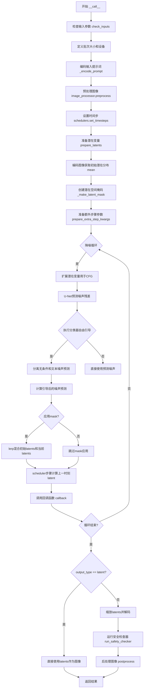
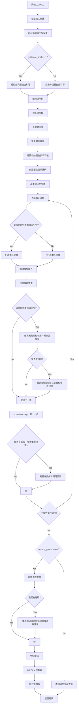

# `diffusers\examples\community\masked_stable_diffusion_img2img.py` 详细设计文档

这是一个基于 Stable Diffusion Img2Img Pipeline 的扩展实现，通过添加 mask 支持实现了图像的局部重绘（inpainting）功能。该类继承自 diffusers 库的 StableDiffusionImg2ImgPipeline，在去噪过程中利用 mask 对不同区域应用不同的噪声混合策略，从而实现对图像特定区域的精准编辑和重建。

## 整体流程



## 类结构

```
StableDiffusionImg2ImgPipeline (diffusers基类)
└── MaskedStableDiffusionImg2ImgPipeline (自定义扩展类)
    ├── debug_save: bool (类属性)
    ├── __call__ (重写方法)
    └── _make_latent_mask (新增方法)
```

## 全局变量及字段


### `MaskedStableDiffusionImg2ImgPipeline.debug_save`
    
调试标志，控制是否保存中间结果图像

类型：`bool`
    
    

## 全局函数及方法


### MaskedStableDiffusionImg2ImgPipeline.__call__

该方法是MaskedStableDiffusionImg2ImgPipeline的核心推理方法，继承自StableDiffusionImg2ImgPipeline，通过引入mask参数实现局部重绘（inpainting）功能。在去噪循环中，使用torch.lerp函数根据mask对潜在变量进行插值，使mask覆盖的区域从原始图像潜在表示逐渐过渡到新生成的内容，未覆盖区域保持原始特征，从而实现精确的图像局部编辑与重绘。

参数：

- **prompt**：`Union[str, List[str]]`，可选，用于引导图像生成的文本提示。如果未定义，则需要传递prompt_embeds
- **image**：`Union[torch.Tensor, PIL.Image.Image, np.ndarray, List[torch.Tensor], List[PIL.Image.Image], List[np.ndarray]]`，用作起点的图像或图像批次，也可接受图像潜在表示
- **strength**：`float`，可选，默认0.8，表示转换参考图像的程度，值在0到1之间，值越大添加的噪声越多
- **num_inference_steps**：`int`，可选，默认50，去噪步数越多通常图像质量越高但推理越慢
- **guidance_scale**：`float`，可选，默认7.5，文本引导比例，大于1时启用分类器自由引导
- **negative_prompt**：`Optional[Union[str, List[str]]]`，可选，引导不包含内容的负面提示
- **num_images_per_prompt**：`int`，可选，默认1，每个提示生成的图像数量
- **eta**：`float`，可选，默认0.0，DDIM调度器的ETA参数
- **generator**：`Optional[Union[torch.Generator, List[torch.Generator]]]`，可选，用于生成确定性结果的随机数生成器
- **prompt_embeds**：`Optional[torch.Tensor]`，可选，预生成的文本嵌入
- **negative_prompt_embeds**：`Optional[torch.Tensor]`，可选，预生成的负面文本嵌入
- **output_type**：`str | None`，可选，默认"pil"，输出格式，可选"pil"或"np.array"
- **return_dict**：`bool`，可选，默认True，是否返回PipelineOutput而不是元组
- **callback**：`Optional[Callable[[int, int, torch.Tensor], None]]`，可选，每隔callback_steps步调用的回调函数
- **callback_steps**：`int`，可选，默认1，回调函数调用频率
- **cross_attention_kwargs**：`Optional[Dict[str, Any]]`，可选，传递给注意力处理器的kwargs字典
- **mask**：`Union[torch.Tensor, PIL.Image.Image, np.ndarray, List[torch.Tensor], List[PIL.Image.Image], List[np.ndarray]]`，可选，非零元素表示需要重绘的区域掩码

返回值：`StableDiffusionPipelineOutput` 或 `tuple`，如果return_dict为True返回包含生成图像列表和NSFW检测布尔列表的PipelineOutput，否则返回元组

#### 流程图



#### 带注释源码

```python
@torch.no_grad()
def __call__(
    self,
    prompt: Union[str, List[str]] = None,
    image: Union[
        torch.Tensor,
        PIL.Image.Image,
        np.ndarray,
        List[torch.Tensor],
        List[PIL.Image.Image],
        List[np.ndarray],
    ] = None,
    strength: float = 0.8,
    num_inference_steps: Optional[int] = 50,
    guidance_scale: Optional[float] = 7.5,
    negative_prompt: Optional[Union[str, List[str]]] = None,
    num_images_per_prompt: Optional[int] = 1,
    eta: Optional[float] = 0.0,
    generator: Optional[Union[torch.Generator, List[torch.Generator]]] = None,
    prompt_embeds: Optional[torch.Tensor] = None,
    negative_prompt_embeds: Optional[torch.Tensor] = None,
    output_type: str | None = "pil",
    return_dict: bool = True,
    callback: Optional[Callable[[int, int, torch.Tensor], None]] = None,
    callback_steps: int = 1,
    cross_attention_kwargs: Optional[Dict[str, Any]] = None,
    mask: Union[
        torch.Tensor,
        PIL.Image.Image,
        np.ndarray,
        List[torch.Tensor],
        List[PIL.Image.Image],
        List[np.ndarray],
    ] = None,
):
    r"""
    Pipeline调用函数，用于生成图像。
    
    参数:
        prompt: 文本提示或提示列表
        image: 起点图像或图像批次
        strength: 转换程度，0-1之间
        num_inference_steps: 去噪步数
        guidance_scale: 引导比例
        negative_prompt: 负面提示
        num_images_per_prompt: 每个提示生成的图像数
        eta: DDIM调度器参数
        generator: 随机数生成器
        prompt_embeds: 预计算的文本嵌入
        negative_prompt_embeds: 预计算的负面文本嵌入
        output_type: 输出格式
        return_dict: 是否返回dict格式
        callback: 推理过程中的回调函数
        callback_steps: 回调调用频率
        cross_attention_kwargs: 交叉注意力参数
        mask: 重绘区域的掩码
    
    返回:
        StableDiffusionPipelineOutput或tuple
    """
    # 0. 检查输入参数合法性
    self.check_inputs(prompt, strength, callback_steps, negative_prompt, prompt_embeds, negative_prompt_embeds)

    # 1. 定义调用参数
    # 根据prompt类型确定批次大小
    if prompt is not None and isinstance(prompt, str):
        batch_size = 1
    elif prompt is not None and isinstance(prompt, list):
        batch_size = len(prompt)
    else:
        # 如果没有prompt，则使用prompt_embeds的批次大小
        batch_size = prompt_embeds.shape[0]
    
    # 获取执行设备
    device = self._execution_device
    
    # 判断是否启用分类器自由引导（CFG）
    # guidance_scale > 1 时启用
    do_classifier_free_guidance = guidance_scale > 1.0

    # 2. 编码输入提示词
    # 获取Lora缩放因子
    text_encoder_lora_scale = (
        cross_attention_kwargs.get("scale", None) if cross_attention_kwargs is not None else None
    )
    # 编码提示词生成文本嵌入
    prompt_embeds = self._encode_prompt(
        prompt,
        device,
        num_images_per_prompt,
        do_classifier_free_guidance,
        negative_prompt,
        prompt_embeds=prompt_embeds,
        negative_prompt_embeds=negative_prompt_embeds,
        lora_scale=text_encoder_lora_scale,
    )

    # 3. 预处理图像
    # 将各种格式的图像转换为tensor
    image = self.image_processor.preprocess(image)

    # 4. 设置时间步
    self.scheduler.set_timesteps(num_inference_steps, device=device)
    # 根据strength计算实际使用的时间步
    timesteps, num_inference_steps = self.get_timesteps(num_inference_steps, strength, device)
    # 为每个图像重复初始时间步
    latent_timestep = timesteps[:1].repeat(batch_size * num_images_per_prompt)

    # 5. 准备潜在变量
    # 从VAE的潜在分布中采样
    latents = self.prepare_latents(
        image, latent_timestep, batch_size, num_images_per_prompt, prompt_embeds.dtype, device, generator
    )

    # 计算潜在分布的均值（用于后续掩码混合）
    # 将每张图像编码为潜在表示并取均值
    init_latents = [
        self.vae.encode(image.to(device=device, dtype=prompt_embeds.dtype)[i : i + 1]).latent_dist.mean
        for i in range(batch_size)
    ]
    init_latents = torch.cat(init_latents, dim=0)

    # 6. 创建潜在空间掩码
    # 将输入掩码转换为与潜在空间匹配的形式
    latent_mask = self._make_latent_mask(latents, mask)

    # 7. 准备额外步参数
    extra_step_kwargs = self.prepare_extra_step_kwargs(generator, eta)

    # 8. 去噪循环
    num_warmup_steps = len(timesteps) - num_inference_steps * self.scheduler.order
    with self.progress_bar(total=num_inference_steps) as progress_bar:
        for i, t in enumerate(timesteps):
            # 如果启用CFG，扩展潜在变量（一份无条件，一份有条件）
            latent_model_input = torch.cat([latents] * 2) if do_classifier_free_guidance else latents
            # 缩放模型输入
            latent_model_input = self.scheduler.scale_model_input(latent_model_input, t)

            # 预测噪声残差
            noise_pred = self.unet(
                latent_model_input,
                t,
                encoder_hidden_states=prompt_embeds,
                cross_attention_kwargs=cross_attention_kwargs,
                return_dict=False,
            )[0]

            # 执行分类器自由引导
            if do_classifier_free_guidance:
                # 分离无条件预测和条件预测
                noise_pred_uncond, noise_pred_text = noise_pred.chunk(2)
                # 根据guidance_scale加权
                noise_pred = noise_pred_uncond + guidance_scale * (noise_pred_text - noise_pred_uncond)

            # 如果有掩码，使用lerp进行混合
            # 将原始潜在表示与当前预测的潜在表示根据掩码进行线性插值
            if latent_mask is not None:
                # 潜在变量从原始状态向新生成状态过渡
                latents = torch.lerp(init_latents * self.vae.config.scaling_factor, latents, latent_mask)
                # 噪声预测也被掩码处理，非重绘区域噪声置零
                noise_pred = torch.lerp(torch.zeros_like(noise_pred), noise_pred, latent_mask)

            # 计算上一步的潜在变量 x_t -> x_t-1
            latents = self.scheduler.step(noise_pred, t, latents, **extra_step_kwargs, return_dict=False)[0]

            # 回调处理
            if i == len(timesteps) - 1 or ((i + 1) > num_warmup_steps and (i + 1) % self.scheduler.order == 0):
                progress_bar.update()
                if callback is not None and i % callback_steps == 0:
                    step_idx = i // getattr(self.scheduler, "order", 1)
                    callback(step_idx, t, latents)

    # 9. 后处理
    if not output_type == "latent":
        # 缩放潜在变量
        scaled = latents / self.vae.config.scaling_factor
        # 如果有掩码，混合初始潜在和生成潜在
        if latent_mask is not None:
            scaled = torch.lerp(init_latents, scaled, latent_mask)
        # VAE解码得到图像
        image = self.vae.decode(scaled, return_dict=False)[0]
        # 调试保存
        if self.debug_save:
            image_gen = self.vae.decode(latents / self.vae.config.scaling_factor, return_dict=False)[0]
            image_gen = self.image_processor.postprocess(image_gen, output_type=output_type, do_denormalize=[True])
            image_gen[0].save("from_latent.png")
        # 运行安全检查器
        image, has_nsfw_concept = self.run_safety_checker(image, device, prompt_embeds.dtype)
    else:
        # 直接返回潜在变量
        image = latents
        has_nsfw_concept = None

    # 处理去归一化
    if has_nsfw_concept is None:
        do_denormalize = [True] * image.shape[0]
    else:
        do_denormalize = [not has_nsfw for has_nsfw in has_nsfw_concept]

    # 后处理图像
    image = self.image_processor.postprocess(image, output_type=output_type, do_denormalize=do_denormalize)

    # 卸载最后一个模型到CPU
    if hasattr(self, "final_offload_hook") and self.final_offload_hook is not None:
        self.final_offload_hook.offload()

    # 返回结果
    if not return_dict:
        return (image, has_nsfw_concept)

    return StableDiffusionPipelineOutput(images=image, nsfw_content_detected=has_nsfw_concept)


def _make_latent_mask(self, latents, mask):
    """
    将输入掩码转换为潜在空间掩码
    
    参数:
        latents: 潜在变量张量
        mask: 输入掩码（图像或数组）
    
    返回:
        转换后的潜在空间掩码张量
    """
    if mask is not None:
        latent_mask = []
        # 统一为列表处理
        if not isinstance(mask, list):
            tmp_mask = [mask]
        else:
            tmp_mask = mask
        
        # 获取潜在变量的维度信息
        _, l_channels, l_height, l_width = latents.shape
        
        for m in tmp_mask:
            # 转换为PIL图像
            if not isinstance(m, PIL.Image.Image):
                if len(m.shape) == 2:
                    # 如果是2D数组，扩展为3D
                    m = m[..., np.newaxis]
                if m.max() > 1:
                    # 归一化到0-1
                    m = m / 255.0
                m = self.image_processor.numpy_to_pil(m)[0]
            
            # 转换为灰度图
            if m.mode != "L":
                m = m.convert("L")
            
            # 调整大小以匹配潜在空间维度
            resized = self.image_processor.resize(m, l_height, l_width)
            
            # 调试保存
            if self.debug_save:
                resized.save("latent_mask.png")
            
            # 重复通道数以匹配潜在变量通道数
            latent_mask.append(np.repeat(np.array(resized)[np.newaxis, :, :], l_channels, axis=0))
        
        # 堆叠并转换为tensor
        latent_mask = torch.as_tensor(np.stack(latent_mask)).to(latents)
        # 归一化
        latent_mask = latent_mask / latent_mask.max()
    
    return latent_mask
```

#### 关键组件信息

- **MaskedStableDiffusionImg2ImgPipeline**：继承StableDiffusionImg2ImgPipeline的局部重绘Pipeline类
- **init_latents**：原始图像的VAE潜在表示均值，用于保持非重绘区域
- **latent_mask**：转换到潜在空间的掩码，用于控制重绘区域
- **torch.lerp**：线性插值函数，用于混合原始和生成内容
- **self.vae.encode().latent_dist.mean**：提取图像的潜在表示均值
- **self._make_latent_mask**：将图像掩码转换为潜在空间掩码的辅助方法
- **debug_save**：类级别调试标志，控制是否保存中间结果

#### 潜在技术债务与优化空间

1. **重复编码问题**：init_latents的计算与prepare_latents中已有编码逻辑重复，可考虑复用
2. **掩码处理效率**：_make_latent_mask中使用循环逐个处理掩码，可向量化优化
3. **硬编码调试逻辑**：debug_save和中间图像保存硬编码在推理流程中，应提取为独立的回调或钩子
4. **类型提示不完整**：部分参数类型使用了Python 3.10的`str | None`语法，可能影响兼容性
5. **混合操作时机**：在去噪循环中每次都执行lerp操作，即使掩码不变，可考虑优化
6. **内存占用**：CFG时潜在变量翻倍可能导致大图像时内存压力

#### 其它项目

**设计目标与约束**：
- 目标：实现基于mask的局部图像重绘功能
- 约束：必须继承现有StableDiffusionImg2ImgPipeline以保持API兼容性
- 掩码区域使用线性插值从原始图像潜在表示过渡到生成结果

**错误处理与异常设计**：
- 通过check_inputs方法验证输入参数合法性
- VAE安全检查器检测NSFW内容
- 回调函数异常由调用方处理

**数据流与状态机**：
- 输入：prompt + image + mask → 文本嵌入 + 图像潜在表示 + 潜在掩码
- 处理：去噪循环（U-Net预测噪声 → CFG加权 → 掩码混合 → scheduler步进）
- 输出：图像潜在表示或最终图像

**外部依赖与接口契约**：
- 依赖diffusers库的StableDiffusionImg2ImgPipeline
- 依赖PIL/numpy/torch进行图像和張量处理
- 返回类型遵循StableDiffusionPipelineOutput规范


### `MaskedStableDiffusionImg2ImgPipeline._make_latent_mask`

该方法负责将用户输入的图像掩码（mask）转换为与扩散模型潜在变量（latents）具有相同尺寸和类型的张量，以便在去噪循环中对图像的特定区域进行选择性处理（如局部重绘或修复）。

参数：
- `self`：类实例，包含图像处理器 (`image_processor`) 和调试开关 (`debug_save`)。
- `latents`：`torch.Tensor`，形状为 `(Batch, Channels, Height, Width)` 的潜在空间张量，用于获取目标掩码的尺寸（高、宽、通道数）。
- `mask`：`Union[torch.Tensor, PIL.Image.Image, np.ndarray, List[torch.Tensor], List[PIL.Image.Image], List[np.ndarray]]`，输入的掩码图像，用于指示需要修改的区域（通常白色区域为目标区域）。

返回值：`Optional[torch.Tensor]`，返回归一化后的潜在空间掩码，形状为 `(Batch, Channels, Height, Width)`，值域在 `[0, 1]`。如果输入 `mask` 为 `None`，则返回 `None`。

#### 流程图

```mermaid
graph TD
    A[Start _make_latent_mask] --> B{mask is not None?}
    B -- Yes --> C[Normalize mask to list]
    B -- No --> Z[Return None]
    C --> D[Extract latents shape: (_, C, H, W)]
    D --> E[Loop through each mask]
    E --> F{Is mask PIL Image?}
    F -- No --> G[Convert to PIL Image<br>Normalize 0-255 to 0-1]
    F -- Yes --> H[Convert to Grayscale 'L']
    G --> H
    H --> I[Resize to H x W]
    I --> J[Expand to (C, H, W)<br>Repeat channel times]
    J --> K[Append to latent_mask list]
    E --> L{More masks?}
    L -- Yes --> E
    L -- No --> M[Stack list to Tensor]
    M --> N[Move to latents device]
    N --> O[Normalize: mask / mask.max]
    O --> P[Return latent_mask]
```

#### 带注释源码

```python
def _make_latent_mask(self, latents, mask):
    """
    将输入的mask转换为与latents形状匹配的张量掩码。
    """
    if mask is not None:
        latent_mask = []
        # 标准化输入：如果mask不是列表，则包装为列表；如果是列表则直接使用
        if not isinstance(mask, list):
            tmp_mask = [mask]
        else:
            tmp_mask = mask
        
        # 从latents获取目标尺寸信息：忽略batch维度，获取通道数、高度和宽度
        _, l_channels, l_height, l_width = latents.shape
        
        # 遍历列表中的每一个mask（通常对应batch中的每一张图）
        for m in tmp_mask:
            # 步骤1：如果还不是PIL图像对象，尝试将其转换为PIL图像
            if not isinstance(m, PIL.Image.Image):
                # 对于numpy数组或张量，如果它是2D (H, W)，则扩展为3D (H, W, 1)
                if len(m.shape) == 2:
                    m = m[..., np.newaxis]
                # 如果像素值范围在0-255之间，归一化到0-1
                if m.max() > 1:
                    m = m / 255.0
                # 使用图像处理器将数组转换为PIL图像列表，并取第一张
                m = self.image_processor.numpy_to_pil(m)[0]
            
            # 步骤2：确保掩码为灰度图（L模式），以保证数据一致性
            if m.mode != "L":
                m = m.convert("L")
            
            # 步骤3：调整掩码大小以匹配潜在空间的高宽
            resized = self.image_processor.resize(m, l_height, l_width)
            
            # 调试用：保存生成的潜在掩码图片
            if self.debug_save:
                resized.save("latent_mask.png")
            
            # 步骤4：扩展掩码维度以匹配latents的通道数
            # 将 (1, H, W) 的掩码在第0维重复 C 次，得到 (C, H, W)
            # np.array(resized) shape is (H, W)
            # [np.newaxis, :, :] -> (1, H, W)
            # repeat(..., axis=0) -> (C, H, W)
            latent_mask.append(np.repeat(np.array(resized)[np.newaxis, :, :], l_channels, axis=0))
        
        # 步骤5：将列表中的掩码堆叠成一个大数组，并转换为torch张量
        # np.stack(latent_mask) -> (Batch, C, H, W)
        latent_mask = torch.as_tensor(np.stack(latent_mask)).to(latents)
        
        # 步骤6：归一化掩码，将其像素值映射到 [0, 1] 区间
        # 避免除以零错误（如果mask全为0）
        if latent_mask.max() > 0:
            latent_mask = latent_mask / latent_mask.max()
    
    # 如果输入没有mask，直接返回None
    return latent_mask
```


## 关键组件


### MaskedStableDiffusionImg2ImgPipeline 类

继承自 StableDiffusionImg2ImgPipeline 的图像修复管道类，通过添加掩码（mask）支持实现有区域的图像生成与修复功能，允许用户指定需要修改的图像区域。

### __call__ 方法（主生成方法）

管道的主调用方法，执行完整的图像到图像扩散过程，并在去噪循环中应用掩码进行局部修改。参数包括 prompt、image、strength、mask 等，返回生成图像或 StableDiffusionPipelineOutput。

### _make_latent_mask 私有方法

将输入的各种格式掩码（Tensor、PIL.Image、numpy array）转换为潜在空间掩码的关键方法，包含图像 resize、格式转换、归一化等操作。

### latent_mask 潜在空间掩码

在去噪循环中使用的掩码张量，用于控制哪些区域保留原始图像特征、哪些区域进行重新生成，通过 torch.lerp 实现平滑过渡。

### debug_save 类变量

布尔类型类变量，控制是否保存中间调试图像（如 latent_mask.png、from_latent.png），用于开发和调试目的。

### 图像预处理与后处理

使用 self.image_processor.preprocess() 和 self.postprocess() 处理输入输出图像，支持多种格式（torch.Tensor、PIL.Image、numpy array）的相互转换。

### 反量化支持

在 _make_latent_mask 方法中，将 0-255 范围的掩码值归一化到 0-1 范围，确保与潜在空间的值域匹配。

### DDIM 调度器集成

通过 self.scheduler 进行去噪步骤调度，支持 eta 参数配置，使用户能够控制噪声去除过程中的随机性。

### 分类器自由引导（Classifier-Free Guidance）

在去噪循环中实现的条件生成技术，通过 guidance_scale 参数控制文本提示对生成结果的影响程度。

### 安全检查器集成

通过 self.run_safety_checker() 方法检测生成图像是否包含不适当内容（NSFW），并返回检测结果。


## 问题及建议


### 已知问题

- **重复编码计算**：代码第78-82行在循环外部对image进行VAE编码获取`init_latents`，但这部分计算可能与`prepare_latents`中已有的处理重复，导致不必要的计算开销。
- **mask处理逻辑复杂且冗余**：`_make_latent_mask`方法中包含大量类型检查和转换（如第158-177行），存在多次类型判断、重复的归一化操作（`m.max() > 1`判断后又除以255），以及不必要的numpy与PIL转换。
- **循环内重复计算**：在去噪循环中（第127-130行），每次迭代都执行`torch.lerp`操作计算`latents`和`noise_pred`，当mask存在时这些计算在每一步都会重复，可考虑预先计算或优化。
- **调试方式不优雅**：使用类变量`debug_save`控制调试保存，这种硬编码的调试方式不够灵活，且会污染生产代码。
- **变量命名与注释不一致**：第130-132行存在注释掉的代码`# scaled = latents / self.vae.config.scaling_factor * latent_mask + init_latents * (1 - latent_mask)`，与实际执行的`torch.lerp`功能相同但写法不同，容易造成混淆。
- **类型转换效率问题**：在`_make_latent_mask`中多次进行numpy、PIL.Image和torch.Tensor之间的转换（第168-177行），这些转换在处理大批量数据时可能成为性能瓶颈。
- **缺少对mask形状的验证**：未检查mask的高宽是否与输入图像匹配，可能导致隐藏的运行时错误。

### 优化建议

- **消除重复编码**：检查`prepare_latents`方法是否已计算类似的latent表示，考虑复用结果或重构以避免重复的VAE编码。
- **简化mask处理逻辑**：将类型检查和转换提取为独立的辅助方法，使用`isinstance`的高效检查顺序，并缓存归一化结果。
- **预计算mask变换**：在去噪循环开始前预先计算好需要用到的mask相关变量，减少循环内的计算量。
- **使用日志框架替代debug标志**：考虑使用Python的`logging`模块或配置式的调试输出管理，将调试功能与业务逻辑分离。
- **清理注释代码**：删除第130-132行注释掉的代码，或添加明确说明解释为何保留。
- **添加输入验证**：在`_make_latent_mask`或`__call__`方法开头添加mask形状验证，确保mask尺寸与图像匹配。
- **缓存类型转换结果**：对于需要多次使用的numpy/PIL转换结果进行缓存，减少重复转换开销。


## 其它


### 设计目标与约束

**设计目标：**
实现一个支持掩码（mask）的图像到图像（Img2Img）扩散管道，允许用户对图像的特定区域进行选择性修改，而非对整张图像进行全局转换。通过引入latent mask机制，在潜在空间中对不同区域应用不同的处理强度，实现精细化的图像编辑。

**主要约束：**
- 继承自`StableDiffusionImg2ImgPipeline`，需保持与父类API的兼容性
- mask参数支持多种输入格式（torch.Tensor, PIL.Image, np.ndarray, list）
- 输出格式需支持PIL.Image和np.array两种模式
- 需遵循diffusers库的安全检查机制

### 错误处理与异常设计

**输入验证：**
- 通过父类的`check_inputs`方法验证prompt、strength、callback_steps、negative_prompt、prompt_embeds和negative_prompt_embeds等参数
- 隐式依赖diffusers库的参数校验机制

**运行时错误处理：**
- NSFW内容检测：使用`run_safety_checker`检测生成图像是否包含不当内容，若检测到则返回警告标记
- 设备兼容性：依赖PyTorch的device管理，通过`_execution_device`获取执行设备
- 数据类型转换：PIL Image与numpy array、torch tensor之间的转换由`image_processor`统一处理

**异常情况：**
- mask与图像尺寸不匹配时，可能导致不可预期的结果
- 当`output_type="latent"`时，跳过VAE解码但仍返回NSFW检查结果

### 外部依赖与接口契约

**核心依赖：**
- `diffusers`：StableDiffusionImg2ImgPipeline基类
- `torch`：张量计算与深度学习框架
- `PIL (Pillow)`：图像处理
- `numpy`：数值计算与数组操作

**接口契约：**
- 输入：支持多种图像格式和mask格式
- 输出：返回`StableDiffusionPipelineOutput`或tuple（images, nsfw_content_detected）
- 回调机制：支持通过callback函数在推理过程中获取中间结果（step, timestep, latents）

### 数据流与状态机

**主数据流：**
```
输入(prompt, image, mask)
  → 输入验证(check_inputs)
  → 编码提示词(_encode_prompt)
  → 图像预处理(image_processor.preprocess)
  → 设置时间步(scheduler.set_timesteps)
  → 准备潜在变量(prepare_latents)
  → 创建潜在掩码(_make_latent_mask)
  → 去噪循环(denoising loop):
      → 潜在模型输入扩展
      → UNet噪声预测
      → 分类器自由引导
      → 应用潜在掩码(lerp操作)
      → 调度器步进
  → VAE解码
  → 后处理(postprocess)
  → 安全检查(run_safety_checker)
  → 输出
```

**状态转换：**
- 图像状态：原始图像 → 预处理后tensor → 潜在变量 → 去噪后潜在变量 → 解码后图像 → 后处理图像
- Mask状态：用户输入mask → 统一转换为PIL.Image → 调整尺寸 → 转换为latent空间尺寸 → 应用lerp混合

### 性能考虑与优化空间

**当前实现的问题：**
1. **重复计算**：在去噪循环中每次迭代都进行`torch.lerp`操作，可考虑优化
2. **内存占用**：init_latents在循环外部计算但未缓存，若batch较大可能导致内存压力
3. **调试保存**：debug_save功能使用CPU同步保存，可能影响性能

**优化建议：**
- 将mask预处理移至循环外部，避免重复处理
- 对于多图像batch，考虑分批处理以控制内存
- 异步保存调试图像或使用内存映射

### 安全性考虑

**NSFW检测：**
- 使用`run_safety_checker`对生成的图像进行内容安全检查
- 返回`nsfw_content_detected`标志，供调用者过滤不当内容
- 支持denormalize参数控制图像反标准化

**安全策略：**
- 当检测到NSFW内容时，相关图像将被标记
- 调用者可选择是否返回NSFW检测结果或过滤相关图像

### 配置与参数说明

**新增参数：**
- `mask`：掩码图像/张量，指定需要修改的区域。非零元素表示需要inpaint的区域

**关键配置属性：**
- `debug_save`：类属性，控制是否保存调试图像（默认False）
- `vae.config.scaling_factor`：VAE缩放因子，用于潜在空间与像素空间的转换

### 使用示例与调用模式

**基础调用：**
```python
pipeline = MaskedStableDiffusionImg2ImgPipeline.from_pretrained("model_path")
image = pipeline(prompt="a cat", image=input_image, mask=mask_image).images[0]
```

**高级调用（带完整参数）：**
```python
output = pipeline(
    prompt="your prompt",
    image=input_image,
    mask=mask_image,
    strength=0.75,
    num_inference_steps=50,
    guidance_scale=7.5,
    negative_prompt="bad quality",
    output_type="pil",
    return_dict=True
)
```

### 版本与兼容性

**依赖版本要求：**
- diffusers >= 0.14.0（StableDiffusionImg2ImgPipeline）
- torch >= 1.9.0
- numpy >= 1.21.0
- Pillow >= 8.0.0

**兼容性说明：**
- 继承自StableDiffusionImg2ImgPipeline，需配合Stable Diffusion模型使用
- 与diffusers库的最新版本保持API兼容

### 测试计划建议

**单元测试：**
- 测试_mask的不同输入格式转换
- 测试latent mask尺寸计算
- 测试mask与图像的混合逻辑

**集成测试：**
- 端到端图像生成测试
- NSFW检测功能测试
- 多图像batch处理测试

**性能测试：**
- 大batch处理内存占用
- 推理时间对比（有无mask）


    