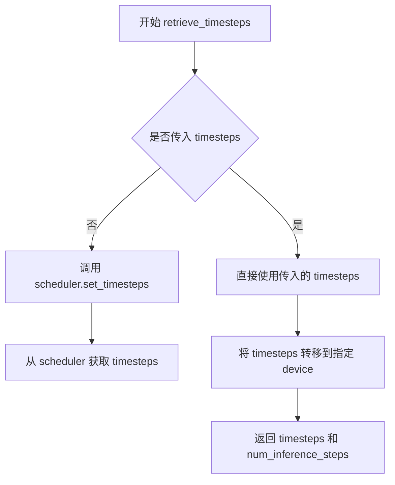
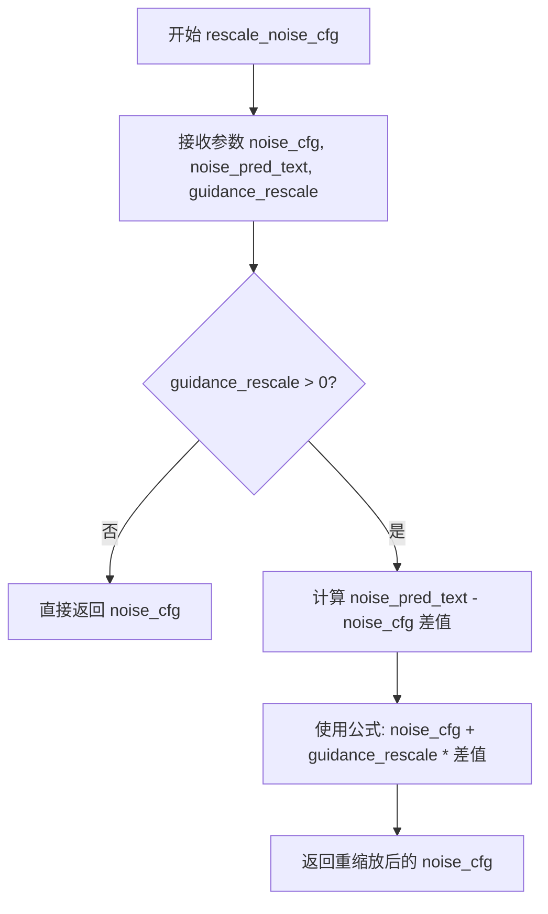
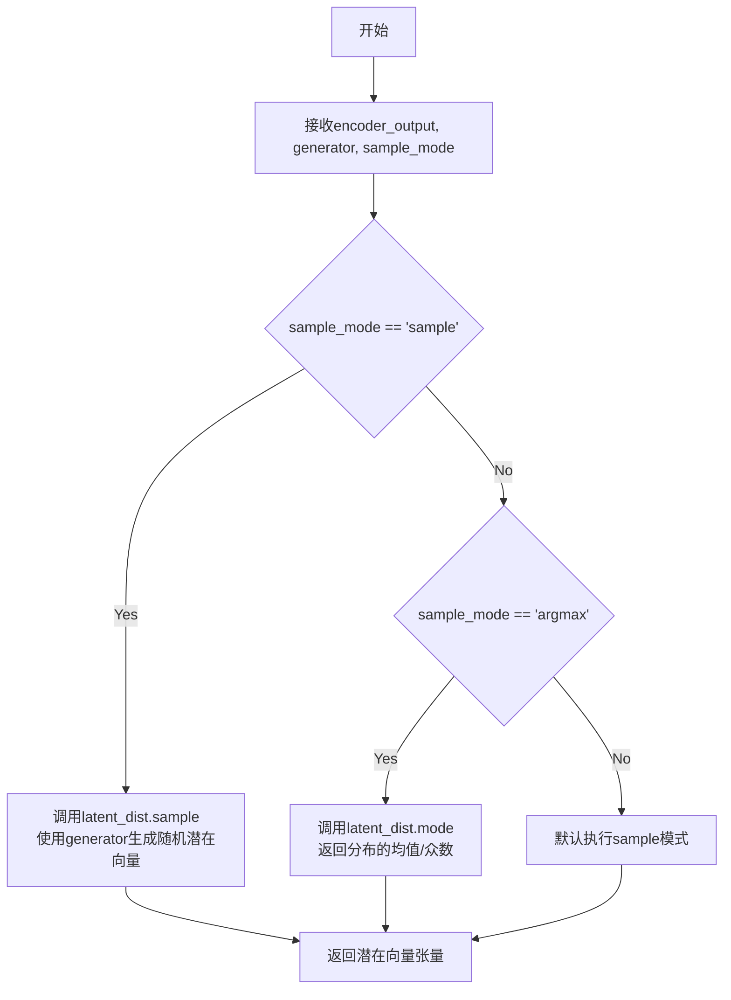
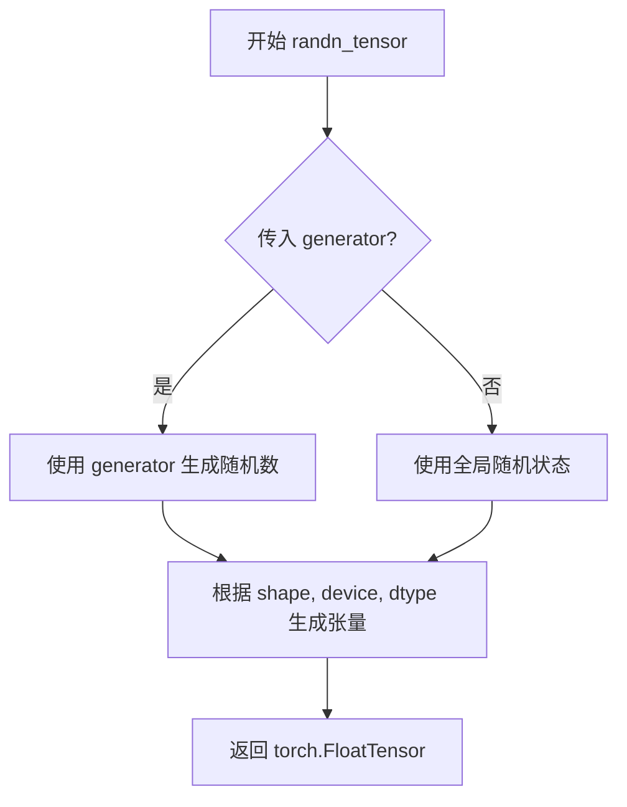
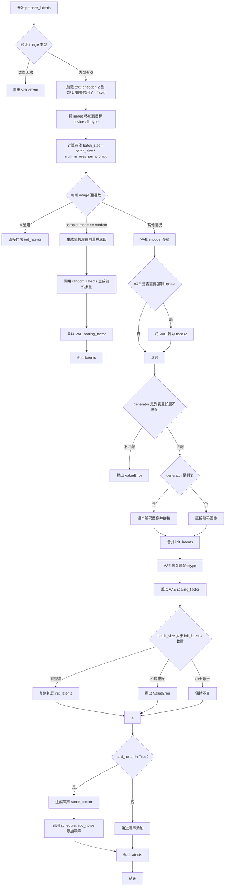
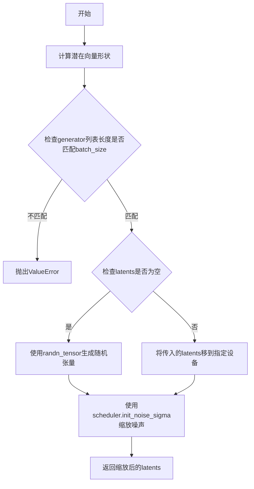
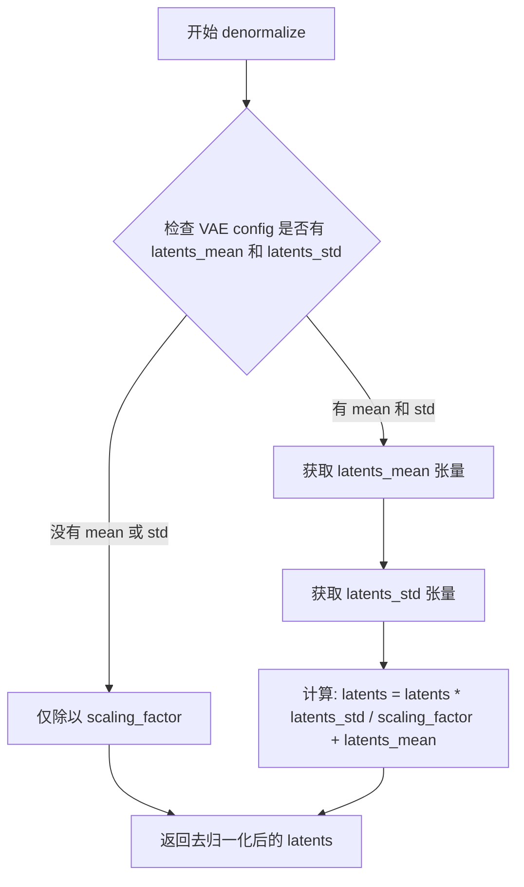
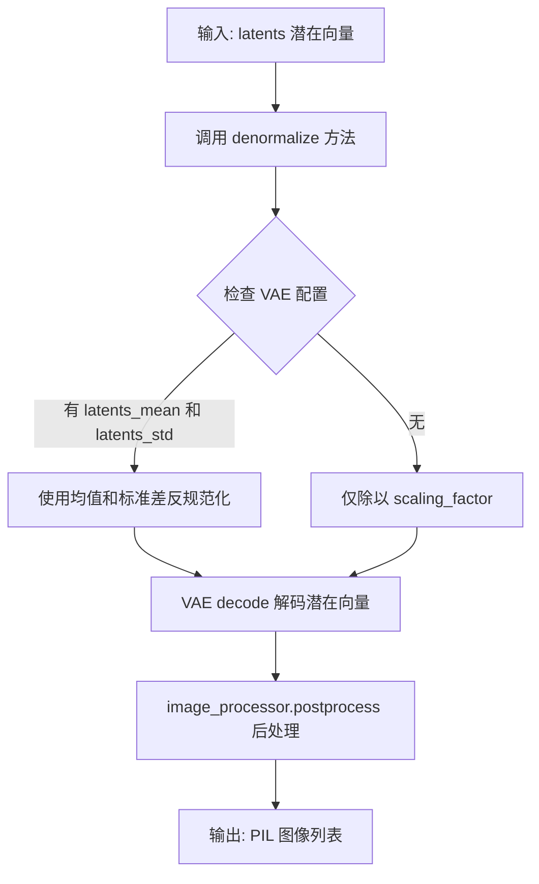

```mermaid
flowchart TD
    A[开始 __call__] --> B[检查并处理回调参数]
    B --> C[检查输入参数有效性]
    C --> D[设置内部状态变量<br/>_guidance_scale, _guidance_rescale等]
    D --> E[计算mask<br/>如果未提供则从image和original_image差值计算]
    E --> F[模糊处理mask<br/>blur_mask和blur_compose]
    F --> G[确定batch_size]
    G --> H[编码文本提示<br/>encode_prompt生成embeds]
    H --> I[预处理图像<br/>image_processor.preprocess]
    I --> J[设置时间步<br/>retrieve_timesteps, get_timesteps]
    J --> K[准备latent变量<br/>prepare_latents用于重绘区域]
    K --> L[准备原始图像latent<br/>prepare_latents使用argmax模式]
    L --> M[创建latent空间mask<br/>_make_latent_mask]
    M --> N[准备额外步骤参数<br/>prepare_extra_step_kwargs]
    N --> O[准备时间ID和嵌入<br/>_get_add_time_ids]
    O --> P{是否使用CFG?}
    P -->|Yes| Q[拼接negative和positive embeds]
    P -->|No| R[直接使用prompt_embeds]
    Q --> S[准备IP适配器图像嵌入]
    R --> S
    S --> T[进入去噪循环]
    T --> U[添加噪声到原始图像latent]
    U --> V[lerp混合原始latent和重绘latent]
    V --> W[扩展latents用于CFG<br/>torch.cat复制]
    W --> X[scheduler缩放模型输入]
    X --> Y[UNet预测噪声残差]
    Y --> Z{是否使用CFG?}
    Z -->|Yes| AA[计算guidance后的noise_pred]
    Z -->|No| AB[直接使用noise_pred]
    AA --> AC[可选guidance_rescale]
    AB --> AD[scheduler.step计算上一步]
    AD --> AE[回调函数处理<br/>callback_on_step_end]
    AE --> AF{是否最后一步或完成warmup?}
    AF -->|Yes| AG[更新进度条]
    AF -->|No| AH[继续循环]
    AG --> AI{XLA可用?}
    AI -->|Yes| AJ[mark_step]
    AI -->|No| AK{还有更多timesteps?}
    AH --> AK
    AJ --> AK
    AK -->|Yes| T
    AK -->|No| AL{output_type != 'latent'?}
    AL -->|Yes| AM[VAE解码latents到图像]
    AL -->|No| AN[直接使用latents作为图像]
    AM --> AO[使用latent_mask插值混合]
    AO --> AP[mask组合原始图像和生成图像]
    AP --> AQ[后处理图像<br/>postprocess]
    AQ --> AR[应用水印]
    AR --> AS[释放模型内存]
    AS --> AT{return_dict?}
    AT -->|Yes| AU[返回StableDiffusionXLPipelineOutput]
    AT -->|No| AV[返回tuple]
    AN --> AT
```

# `diffusers\examples\community\masked_stable_diffusion_xl_img2img.py` 详细设计文档

一个基于Stable Diffusion XL的图像到图像（img2img）处理管道，通过引入掩码机制实现对图像局部区域的重绘。继承自StableDiffusionXLImg2ImgPipeline，增加了掩码生成、潜在空间插值和图像合成功能，支持通过blur参数控制掩码边缘模糊程度，以及sample_mode控制潜在变量的初始化方式。

## 整体流程

```mermaid
graph TD
    A[开始] --> B[验证输入参数]
    B --> C{image是否为空?}
    C -- 否 --> D[通过image和original_image计算掩码]
    C -- 是 --> E[使用传入的mask]
    D --> F[对掩码进行模糊处理]
    F --> G[编码输入提示词]
    G --> H[预处理图像]
    H --> I[设置时间步]
    I --> J[准备潜在变量]
    J --> K[创建潜在空间掩码]
    K --> L[准备额外步骤参数]
    L --> M[进入去噪循环]
    M --> N{循环结束?}
    N -- 否 --> O[添加噪声到原始图像latents]
    O --> P[潜在空间插值: latents = lerp(orig_latents_t, latents, latent_mask)]
    P --> Q[UNet预测噪声残差]
    Q --> R[执行分类器自由引导]
    R --> S[调度器步进]
    S --> T[回调处理]
    T --> M
    N -- 是 --> U[VAE解码]
    U --> V[潜在空间合成: img = m * image + (1-m) * original_image]
    V --> W[后处理图像]
    W --> X[释放模型钩子]
    X --> Y[返回结果]
```

## 类结构

```
StableDiffusionXLImg2ImgPipeline (父类)
└── MaskedStableDiffusionXLImg2ImgPipeline (子类)
```

## 全局变量及字段


### `logger`
    
模块级日志记录器，用于输出调试和运行信息

类型：`logging.Logger`
    


### `XLA_AVAILABLE`
    
标记torch_xla是否可用的布尔标志

类型：`bool`
    


### `MaskedStableDiffusionXLImg2ImgPipeline.debug_save`
    
控制是否保存调试图像的类字段，0表示不保存，1表示保存

类型：`int`
    


### `MaskedStableDiffusionXLImg2ImgPipeline.XLA_AVAILABLE`
    
标记torch_xla是否可用的类字段

类型：`bool`
    
    

## 全局函数及方法


### `retrieve_timesteps`

该函数用于根据给定的调度器配置和推理参数获取或生成去噪过程的时间步序列。它是 Stable Diffusion XL Img2Img 管道中的核心工具函数，负责将用户指定的推理步数转换为具体的时间步数组。

参数：

-  `scheduler`：调度器对象，提供时间步生成逻辑（如 DDIM、PNDM 等）
-  `num_inference_steps`：`int`，用户期望的推理步数，用于确定去噪过程的迭代次数
-  `device`：`torch.device`，计算设备（CPU 或 GPU），用于返回的张量存放位置
-  `timesteps`：`List[int]`，可选参数，直接指定的时间步列表，如果提供则优先使用

返回值：`Tuple[List[int], int]`，返回调整后的时间步列表和实际的推理步数

#### 流程图



#### 带注释源码

```
# 该函数定义在 diffusers 库中，以下为基于调用的推断
def retrieve_timesteps(
    scheduler,
    num_inference_steps: int,
    device: torch.device,
    timesteps: Optional[List[int]] = None,
    **kwargs
):
    """
    获取去噪过程的时间步序列。
    
    Args:
        scheduler: 调度器实例，包含时间步生成逻辑
        num_inference_steps: 期望的推理步数
        device: 目标设备
        timesteps: 可选的时间步列表
        
    Returns:
        timesteps: 调整后的时间步列表
        num_inference_steps: 实际使用的推理步数
    """
    # 如果直接指定了时间步，直接使用
    if timesteps is not None:
        # 将时间步转移到目标设备
        timesteps = torch.tensor(timesteps).to(device)
        return timesteps, len(timesteps)
    
    # 否则根据调度器配置生成时间步
    # 调用调度器的 set_timesteps 方法
    scheduler.set_timesteps(num_inference_steps, device=device)
    
    # 获取生成的时间步
    timesteps = scheduler.timesteps
    
    return timesteps, num_inference_steps
```

> **注意**：由于 `retrieve_timesteps` 函数定义在外部库 `diffusers` 中，以上源码为基于代码调用方式的推断，实际实现可能略有差异。该函数在当前代码的 `__call__` 方法第 207 行被调用，用于生成图像去噪过程的时间步序列。


### `rescale_noise_cfg`

该函数是从父类 `StableDiffusionXLImg2ImgPipeline` 继承的重缩放噪声配置方法，用于在 classifier-free guidance 过程中根据 guidance_rescale 参数调整噪声预测配置，以减少过度饱和问题。该函数通过重新缩放噪声预测_CFG 值来平衡文本引导和分类器自由引导的贡献。

参数：

-  `noise_cfg`：`torch.FloatTensor`，原始噪声预测配置（unconditional + text guidance 的组合结果）
-  `noise_pred_text`：`torch.FloatTensor`，文本条件的噪声预测结果
-  `guidance_rescale`：`float`，guidance 重缩放因子，用于控制噪声配置的缩放程度

返回值：`torch.FloatTensor`，重缩放后的噪声预测配置

#### 流程图



#### 带注释源码

```python
# 该函数定义在 diffusers.pipelines.stable_diffusion_xl.pipeline_stable_diffusion_xl_img2img 模块中
# 在此类中通过继承获得，并非本类实现
# 调用位置在 denoising loop 中：

# perform guidance
if self.do_classifier_free_guidance:
    noise_pred_uncond, noise_pred_text = noise_pred.chunk(2)
    noise_pred = noise_pred_uncond + guidance_scale * (noise_pred_text - noise_pred_uncond)

# 重缩放噪声配置以减少过度饱和
if self.do_classifier_free_guidance and self.guidance_rescale > 0.0:
    # Based on 3.4. in https://huggingface.co/papers/2305.08891
    # 论文: "Common Diffusion Noise Schedules and Sample Steps are Flawed"
    # 该方法通过重新缩放 noise_cfg 来解决 classifier-free guidance 中的过度饱和问题
    noise_pred = rescale_noise_cfg(noise_pred, noise_pred_text, guidance_rescale=self.guidance_rescale)
```

**注意**：该函数的实际实现源码不在当前代码文件中，它是从 `diffusers` 库的父类 `StableDiffusionXLImg2ImgPipeline` 继承而来。根据其用途和调用方式，该函数实现了论文 *Common Diffusion Noise Schedules and Sample Steps are Flawed* 中第 3.4 节描述的重缩放方法，旨在解决 classifier-free guidance 中常见的图像过度饱和/过度平滑问题。


### `retrieve_latents`

从VAE编码器输出中检索潜在向量，根据sample_mode参数从潜在分布中采样或返回均值。

参数：
- `encoder_output`：从VAE的encode方法返回的编码器输出对象，通常包含潜在向量分布（latent_dist）
- `generator`：`Optional[Union[torch.Generator, List[torch.Generator]]]`，用于生成随机数的torch生成器，确保可重复性
- `sample_mode`：`str`，采样模式，控制如何从潜在分布中获取向量（如"sample"随机采样，"argmax"返回均值模式）

返回值：`torch.FloatTensor`，从VAE编码器输出中检索到的潜在向量张量

#### 流程图



#### 带注释源码

```python
def retrieve_latents(encoder_output, generator=None, sample_mode="sample"):
    r"""
    从VAE编码器输出中检索潜在向量。
    
    参数:
        encoder_output: VAE编码器的输出对象，包含latent_dist属性
        generator: 可选的torch生成器，用于随机采样
        sample_mode: 采样模式，"sample"从分布采样，"argmax"返回均值
    
    返回:
        torch.FloatTensor: 潜在向量
    """
    # 获取编码器输出中的潜在向量分布
    latent_dist = encoder_output.latent_dist
    
    # 根据sample_mode决定采样策略
    if sample_mode == "sample":
        # 随机从分布中采样潜在向量
        latents = latent_dist.sample(generator=generator)
    elif sample_mode == "argmax":
        # 返回分布的模式（均值），即最可能的潜在向量
        latents = latent_dist.mode()
    else:
        # 默认行为：随机采样
        latents = latent_dist.sample(generator=generator)
    
    return latents
```

**注意**：该函数定义在`diffusers`库的`StableDiffusionXLImg2ImgPipeline`模块中，通过导入在当前类中使用。上面提供的源码是基于diffusers库常见实现的推断，供理解其功能使用。


### `randn_tensor`

该函数是 `diffusers` 库中的工具函数，用于生成符合标准正态分布（均值为0，方差为1）的随机张量，常用于为扩散模型的去噪过程添加噪声或初始化潜在变量。

参数：

-  `shape`：`Tuple[int, ...]` 或 `torch.Size`，要生成的随机张量的形状
-  `generator`：`Optional[torch.Generator]`，可选的 PyTorch 随机数生成器，用于控制随机性
-  `device`：`torch.device`，生成张量应该放置的设备（如 CPU 或 CUDA 设备）
-  `dtype`：`torch.dtype`，生成张量的数据类型（如 torch.float32、torch.float16 等）

返回值：`torch.FloatTensor`，返回符合标准正态分布的随机张量

#### 流程图



#### 带注释源码

```python
# 从 diffusers.utils.torch_utils 导入的函数
from diffusers.utils.torch_utils import randn_tensor

# 在 MaskedStableDiffusionXLImg2ImgPipeline.__call__ 方法中使用示例：
# 用于为原始图像的潜在表示添加噪声
shape = non_paint_latents.shape  # 获取形状元组
noise = randn_tensor(shape, generator=generator, device=device, dtype=latents.dtype)
# 生成形状为 shape，设备为 device，数据类型为 latents.dtype 的随机噪声张量

# 在 prepare_latents 方法中使用示例：
# 用于在潜在空间中为输入图像添加噪声
shape = init_latents.shape
noise = randn_tensor(shape, generator=generator, device=device, dtype=dtype)
# 将噪声添加到初始潜在变量

# 在 random_latents 方法中使用示例：
# 用于初始化随机潜在变量
shape = (batch_size, num_channels_latents, height // self.vae_scale_factor, width // self.vae_scale_factor)
latents = randn_tensor(shape, generator=generator, device=device, dtype=dtype)
# 生成用于去噪过程的初始随机潜在变量
latents = latents * self.scheduler.init_noise_sigma  # 根据调度器要求缩放初始噪声
```

#### 关键使用场景

1. **噪声添加**：在扩散模型的推理过程中，为当前潜在状态添加随机噪声
2. **潜在变量初始化**：初始化用于图像生成的随机潜在向量
3. **DDIM/DDIMScheduler**：与调度器配合使用，实现逐步去噪的过程

#### 技术债务与优化空间

- **优化建议**：可以考虑使用更高效的随机数生成方法，如 CUDA 原生的随机数生成，以提升大规模批处理的性能
- **潜在问题**：当前实现依赖于 PyTorch 的默认随机数生成器，在多线程环境下可能存在潜在的竞争条件
- **兼容性**：函数需要处理不同设备（CPU/CUDA/MPS）的兼容性，当前代码已有部分针对 MPS 的特殊处理


### MaskedStableDiffusionXLImg2ImgPipeline.__call__

这是Stable Diffusion XL图像到图像生成管线的主推理方法，接收文本提示和输入图像，通过计算输入图像与原始图像的差异自动生成mask，实现局部重绘功能，并返回生成的图像。

参数：

- `prompt`：`Union[str, List[str]]`，文本提示，引导图像生成，如不定义需传入prompt_embeds
- `prompt_2`：`Optional[Union[str, List[str]]]`，可选的第二个文本提示，用于XL双文本编码器
- `image`：`PipelineImageImageInput`，作为起点的图像或张量，可包含mask信息
- `original_image`：`PipelineImageInput`，用于与image混合的原始图像
- `strength`：`float`，图像变换程度，0-1之间，值越大变换越多
- `num_inference_steps`：`Optional[int]`，去噪步数，默认50
- `timesteps`：`List[int]`，
- `denoising_start`：`Optional[float]`，
- `denoising_end`：`Optional[float]`，
- `guidance_scale`：`Optional[float]`，引导 scale，>1时启用，默认5.0
- `negative_prompt`：`Optional[Union[str, List[str]]]`，负面提示，引导不包含的内容
- `negative_prompt_2`：`Optional[Union[str, List[str]]]`，可选的第二个负面提示
- `num_images_per_prompt`：`Optional[int]`，每个提示生成的图像数量，默认1
- `eta`：`Optional[float]`，DDIM论文参数η，默认0.0
- `generator`：`Optional[Union[torch.Generator, List[torch.Generator]]]`，随机生成器，用于确定性生成
- `latents`：`Optional[torch.FloatTensor]`，预定义的潜在变量
- `prompt_embeds`：`Optional[torch.FloatTensor]`，预生成的文本嵌入
- `negative_prompt_embeds`：`Optional[torch.FloatTensor]`，预生成的负面文本嵌入
- `pooled_prompt_embeds`：`Optional[torch.FloatTensor]`，池化后的文本嵌入
- `negative_pooled_prompt_embeds`：`Optional[torch.FloatTensor]`，池化后的负面文本嵌入
- `ip_adapter_image`：`Optional[PipelineImageInput]`，IP适配器图像
- `ip_adapter_image_embeds`：`Optional[List[torch.FloatTensor]]`，IP适配器图像嵌入
- `output_type`：`str | None`，输出格式，"pil"或np.array，默认"pil"
- `return_dict`：`bool`，是否返回PipelineOutput，默认True
- `cross_attention_kwargs`：`Optional[Dict[str, Any]]`，传给注意力处理器的参数字典
- `guidance_rescale`：`float`，引导重新缩放参数，默认0.0
- `original_size`：`Tuple[int, int]`，原始图像尺寸
- `crops_coords_top_left`：`Tuple[int, int]`，裁剪坐标左上角，默认(0, 0)
- `target_size`：`Tuple[int, int]`，目标图像尺寸
- `negative_original_size`：`Optional[Tuple[int, int]]`，负面提示的原始尺寸
- `negative_crops_coords_top_left`：`Tuple[int, int]`，负面提示的裁剪坐标，默认(0, 0)
- `negative_target_size`：`Optional[Tuple[int, int]]`，负面提示的目标尺寸
- `aesthetic_score`：`float`，美学评分，默认6.0
- `negative_aesthetic_score`：`float`，负面美学评分，默认2.5
- `clip_skip`：`Optional[int]`，跳过的CLIP层数
- `callback_on_step_end`：`Optional[Callable[[int, int, Dict], None]]`，每步结束时的回调函数
- `callback_on_step_end_tensor_inputs`：`List[str]`，回调函数需要接收的张量输入列表，默认["latents"]
- `mask`：`Union[torch.FloatTensor, Image.Image, np.ndarray, List[torch.FloatTensor], List[Image.Image], List[np.ndarray]]`，重绘区域的mask
- `blur`：`int`，mask模糊半径，默认24
- `blur_compose`：`int`，组合用mask模糊半径，默认4
- `sample_mode`：`str`，latents初始化模式，可选"sample", "argmax", "random"，默认"sample"
- `**kwargs`：其他关键字参数

返回值：`StableDiffusionXLPipelineOutput`或`tuple`，返回生成的图像列表或包含图像列表和NSFW标志的元组

#### 流程图



#### 带注释源码

```python
@torch.no_grad()
def __call__(
    self,
    prompt: Union[str, List[str]] = None,
    prompt_2: Optional[Union[str, List[str]]] = None,
    image: PipelineImageInput = None,
    original_image: PipelineImageInput = None,
    strength: float = 0.3,
    num_inference_steps: Optional[int] = 50,
    timesteps: List[int] = None,
    denoising_start: Optional[float] = None,
    denoising_end: Optional[float] = None,
    guidance_scale: Optional[float] = 5.0,
    negative_prompt: Optional[Union[str, List[str]]] = None,
    negative_prompt_2: Optional[Union[str, List[str]]] = None,
    num_images_per_prompt: Optional[int] = 1,
    eta: Optional[float] = 0.0,
    generator: Optional[Union[torch.Generator, List[torch.Generator]]] = None,
    latents: Optional[torch.FloatTensor] = None,
    prompt_embeds: Optional[torch.FloatTensor] = None,
    negative_prompt_embeds: Optional[torch.FloatTensor] = None,
    pooled_prompt_embeds: Optional[torch.FloatTensor] = None,
    negative_pooled_prompt_embeds: Optional[torch.FloatTensor] = None,
    ip_adapter_image: Optional[PipelineImageInput] = None,
    ip_adapter_image_embeds: Optional[List[torch.FloatTensor]] = None,
    output_type: str | None = "pil",
    return_dict: bool = True,
    cross_attention_kwargs: Optional[Dict[str, Any]] = None,
    guidance_rescale: float = 0.0,
    original_size: Tuple[int, int] = None,
    crops_coords_top_left: Tuple[int, int] = (0, 0),
    target_size: Tuple[int, int] = None,
    negative_original_size: Optional[Tuple[int, int]] = None,
    negative_crops_coords_top_left: Tuple[int, int] = (0, 0),
    negative_target_size: Optional[Tuple[int, int]] = None,
    aesthetic_score: float = 6.0,
    negative_aesthetic_score: float = 2.5,
    clip_skip: Optional[int] = None,
    callback_on_step_end: Optional[Callable[[int, int, Dict], None]] = None,
    callback_on_step_end_tensor_inputs: List[str] = ["latents"],
    mask: Union[
        torch.FloatTensor,
        Image.Image,
        np.ndarray,
        List[torch.FloatTensor],
        List[Image.Image],
        List[np.ndarray],
    ] = None,
    blur=24,
    blur_compose=4,
    sample_mode="sample",
    **kwargs,
):
    r"""
    The call function to the pipeline for generation.
    ...
    """
    # 0. 处理已废弃的callback参数
    callback = kwargs.pop("callback", None)
    callback_steps = kwargs.pop("callback_steps", None)

    if callback is not None:
        deprecate("callback", "1.0.0", "Passing `callback` as an input argument to `__call__` is deprecated, consider use `callback_on_step_end`")
    if callback_steps is not None:
        deprecate("callback_steps", "1.0.0", "Passing `callback_steps` as an input argument to `__call__` is deprecated, consider use `callback_on_step_end`")

    # 0. 检查输入参数有效性
    self.check_inputs(
        prompt, prompt_2, strength, num_inference_steps, callback_steps,
        negative_prompt, negative_prompt_2, prompt_embeds, negative_prompt_embeds,
        ip_adapter_image, ip_adapter_image_embeds, callback_on_step_end_tensor_inputs,
    )

    # 设置内部状态变量
    self._guidance_scale = guidance_scale
    self._guidance_rescale = guidance_rescale
    self._clip_skip = clip_skip
    self._cross_attention_kwargs = cross_attention_kwargs
    self._denoising_end = denoising_end
    self._denoising_start = denoising_start
    self._interrupt = False

    # 1. 定义调用参数，计算或获取mask
    if image is not None:
        # 通过比较image和original_image的差异自动计算mask
        neq = np.any(np.array(original_image) != np.array(image), axis=-1)
        mask = neq.astype(np.uint8) * 255
    else:
        # 如果没有image，则必须提供mask
        assert mask is not None

    # 转换mask为PIL Image并确保是L模式
    if not isinstance(mask, Image.Image):
        pil_mask = Image.fromarray(mask)
        if pil_mask.mode != "L":
            pil_mask = pil_mask.convert("L")
    
    # 对mask进行模糊处理，用于不同的组合阶段
    mask_blur = self.blur_mask(pil_mask, blur)
    mask_compose = self.blur_mask(pil_mask, blur_compose)
    
    # 如果没有提供original_image，默认使用image
    if original_image is None:
        original_image = image

    # 确定batch_size
    if prompt is not None and isinstance(prompt, str):
        batch_size = 1
    elif prompt is not None and isinstance(prompt, list):
        batch_size = len(prompt)
    else:
        batch_size = prompt_embeds.shape[0]

    device = self._execution_device

    # 2. 编码输入文本提示
    text_encoder_lora_scale = (
        self.cross_attention_kwargs.get("scale", None) if self.cross_attention_kwargs is not None else None
    )
    (
        prompt_embeds,
        negative_prompt_embeds,
        pooled_prompt_embeds,
        negative_pooled_prompt_embeds,
    ) = self.encode_prompt(
        prompt=prompt, prompt_2=prompt_2, device=device,
        num_images_per_prompt=num_images_per_prompt,
        do_classifier_free_guidance=self.do_classifier_free_guidance,
        negative_prompt=negative_prompt, negative_prompt_2=negative_prompt_2,
        prompt_embeds=prompt_embeds, negative_prompt_embeds=negative_prompt_embeds,
        pooled_prompt_embeds=pooled_prompt_embeds,
        negative_pooled_prompt_embeds=negative_pooled_prompt_embeds,
        lora_scale=text_encoder_lora_scale, clip_skip=self.clip_skip,
    )

    # 3. 预处理图像
    input_image = image if image is not None else original_image
    image = self.image_processor.preprocess(input_image)
    original_image = self.image_processor.preprocess(original_image)

    # 4. 设置时间步
    def denoising_value_valid(dnv):
        return isinstance(dnv, float) and 0 < dnv < 1

    timesteps, num_inference_steps = retrieve_timesteps(self.scheduler, num_inference_steps, device, timesteps)
    timesteps, num_inference_steps = self.get_timesteps(
        num_inference_steps, strength, device,
        denoising_start=self.denoising_start if denoising_value_valid(self.denoising_start) else None,
    )
    latent_timestep = timesteps[:1].repeat(batch_size * num_images_per_prompt)

    add_noise = True if self.denoising_start is None else False

    # 5. 准备latent变量（用于重绘区域）
    latents = self.prepare_latents(
        image, latent_timestep, batch_size, num_images_per_prompt,
        prompt_embeds.dtype, device, generator, add_noise,
        sample_mode=sample_mode,
    )

    # 准备原始图像的latent（用于非重绘区域）
    non_paint_latents = self.prepare_latents(
        original_image, latent_timestep, batch_size, num_images_per_prompt,
        prompt_embeds.dtype, device, generator, add_noise=False,
        sample_mode="argmax",
    )

    if self.debug_save:
        init_img_from_latents = self.latents_to_img(non_paint_latents)
        init_img_from_latents[0].save("non_paint_latents.png")

    # 6. 创建latent空间的mask
    latent_mask = self._make_latent_mask(latents, mask)

    # 7. 准备额外步骤参数
    extra_step_kwargs = self.prepare_extra_step_kwargs(generator, eta)

    height, width = latents.shape[-2:]
    height = height * self.vae_scale_factor
    width = width * self.vae_scale_factor

    original_size = original_size or (height, width)
    target_size = target_size or (height, width)

    # 8. 准备添加的时间ID和嵌入
    if negative_original_size is None:
        negative_original_size = original_size
    if negative_target_size is None:
        negative_target_size = target_size

    add_text_embeds = pooled_prompt_embeds
    if self.text_encoder_2 is None:
        text_encoder_projection_dim = int(pooled_prompt_embeds.shape[-1])
    else:
        text_encoder_projection_dim = self.text_encoder_2.config.projection_dim

    add_time_ids, add_neg_time_ids = self._get_add_time_ids(
        original_size, crops_coords_top_left, target_size,
        aesthetic_score, negative_aesthetic_score,
        negative_original_size, negative_crops_coords_top_left, negative_target_size,
        dtype=prompt_embeds.dtype, text_encoder_projection_dim=text_encoder_projection_dim,
    )
    add_time_ids = add_time_ids.repeat(batch_size * num_images_per_prompt, 1)

    # 9. Classifier Free Guidance处理
    if self.do_classifier_free_guidance:
        prompt_embeds = torch.cat([negative_prompt_embeds, prompt_embeds], dim=0)
        add_text_embeds = torch.cat([negative_pooled_prompt_embeds, add_text_embeds], dim=0)
        add_neg_time_ids = add_neg_time_ids.repeat(batch_size * num_images_per_prompt, 1)
        add_time_ids = torch.cat([add_neg_time_ids, add_time_ids], dim=0)

    prompt_embeds = prompt_embeds.to(device)
    add_text_embeds = add_text_embeds.to(device)
    add_time_ids = add_time_ids.to(device)

    # 准备IP适配器图像嵌入
    if ip_adapter_image is not None or ip_adapter_image_embeds is not None:
        image_embeds = self.prepare_ip_adapter_image_embeds(
            ip_adapter_image, ip_adapter_image_embeds, device,
            batch_size * num_images_per_prompt, self.do_classifier_free_guidance,
        )

    # 10. 去噪循环
    num_warmup_steps = max(len(timesteps) - num_inference_steps * self.scheduler.order, 0)

    # 10.1 应用denoising_end
    if (
        self.denoising_end is not None
        and self.denoising_start is not None
        and denoising_value_valid(self.denoising_end)
        and denoising_value_valid(self.denoising_start)
        and self.denoising_start >= self.denoising_end
    ):
        raise ValueError(
            f"`denoising_start`: {self.denoising_start} cannot be larger than or equal to `denoising_end`: "
            + f" {self.denoising_end} when using type float."
        )
    elif self.denoising_end is not None and denoising_value_valid(self.denoising_end):
        discrete_timestep_cutoff = int(
            round(
                self.scheduler.config.num_train_timesteps
                - (self.denoising_end * self.scheduler.config.num_train_timesteps)
            )
        )
        num_inference_steps = len(list(filter(lambda ts: ts >= discrete_timestep_cutoff, timesteps)))
        timesteps = timesteps[:num_inference_steps]

    # 10.2 可选获取Guidance Scale Embedding
    timestep_cond = None
    if self.unet.config.time_cond_proj_dim is not None:
        guidance_scale_tensor = torch.tensor(self.guidance_scale - 1).repeat(batch_size * num_images_per_prompt)
        timestep_cond = self.get_guidance_scale_embedding(
            guidance_scale_tensor, embedding_dim=self.unet.config.time_cond_proj_dim
        ).to(device=device, dtype=latents.dtype)

    self._num_timesteps = len(timesteps)
    with self.progress_bar(total=num_inference_steps) as progress_bar:
        for i, t in enumerate(timesteps):
            if self.interrupt:
                continue

            # 为原始图像latent添加噪声
            shape = non_paint_latents.shape
            noise = randn_tensor(shape, generator=generator, device=device, dtype=latents.dtype)
            orig_latents_t = non_paint_latents
            orig_latents_t = self.scheduler.add_noise(non_paint_latents, noise, t.unsqueeze(0))

            # 使用lerp根据mask混合原始latent和重绘latent
            latents = torch.lerp(orig_latents_t, latents, latent_mask)

            if self.debug_save:
                img1 = self.latents_to_img(latents)
                t_str = str(t.int().item())
                for i in range(3 - len(t_str)):
                    t_str = "0" + t_str
                img1[0].save(f"step{t_str}.png")

            # 扩展latents用于classifier free guidance
            latent_model_input = torch.cat([latents] * 2) if self.do_classifier_free_guidance else latents
            latent_model_input = self.scheduler.scale_model_input(latent_model_input, t)

            # 预测噪声残差
            added_cond_kwargs = {"text_embeds": add_text_embeds, "time_ids": add_time_ids}
            if ip_adapter_image is not None or ip_adapter_image_embeds is not None:
                added_cond_kwargs["image_embeds"] = image_embeds

            noise_pred = self.unet(
                latent_model_input, t, encoder_hidden_states=prompt_embeds,
                timestep_cond=timestep_cond, cross_attention_kwargs=self.cross_attention_kwargs,
                added_cond_kwargs=added_cond_kwargs, return_dict=False,
            )[0]

            # 执行guidance
            if self.do_classifier_free_guidance:
                noise_pred_uncond, noise_pred_text = noise_pred.chunk(2)
                noise_pred = noise_pred_uncond + guidance_scale * (noise_pred_text - noise_pred_uncond)

            # 可选的guidance_rescale
            if self.do_classifier_free_guidance and self.guidance_rescale > 0.0:
                noise_pred = rescale_noise_cfg(noise_pred, noise_pred_text, guidance_rescale=self.guidance_rescale)

            # 计算上一步的latents
            latents_dtype = latents.dtype
            latents = self.scheduler.step(noise_pred, t, latents, **extra_step_kwargs, return_dict=False)[0]

            if latents.dtype != latents_dtype:
                if torch.backends.mps.is_available():
                    latents = latents.to(latents_dtype)

            # 步结束回调处理
            if callback_on_step_end is not None:
                callback_kwargs = {}
                for k in callback_on_step_end_tensor_inputs:
                    callback_kwargs[k] = locals()[k]
                callback_outputs = callback_on_step_end(self, i, t, callback_kwargs)

                latents = callback_outputs.pop("latents", latents)
                prompt_embeds = callback_outputs.pop("prompt_embeds", prompt_embeds)
                negative_prompt_embeds = callback_outputs.pop("negative_prompt_embeds", negative_prompt_embeds)
                add_text_embeds = callback_outputs.pop("add_text_embeds", add_text_embeds)
                negative_pooled_prompt_embeds = callback_outputs.pop("negative_pooled_prompt_embeds", negative_pooled_prompt_embeds)
                add_time_ids = callback_outputs.pop("add_time_ids", add_time_ids)
                add_neg_time_ids = callback_outputs.pop("add_neg_time_ids", add_neg_time_ids)

            # 进度更新和旧式callback
            if i == len(timesteps) - 1 or ((i + 1) > num_warmup_steps and (i + 1) % self.scheduler.order == 0):
                progress_bar.update()
                if callback is not None and i % callback_steps == 0:
                    step_idx = i // getattr(self.scheduler, "order", 1)
                    callback(step_idx, t, latents)

            if XLA_AVAILABLE:
                xm.mark_step()

    # 11. 后处理：VAE解码
    if not output_type == "latent":
        # 确保VAE在float32模式
        needs_upcasting = self.vae.dtype == torch.float16 and self.vae.config.force_upcast

        if needs_upcasting:
            self.upcast_vae()
        elif latents.dtype != self.vae.dtype:
            if torch.backends.mps.is_available():
                self.vae = self.vae.to(latents.dtype)

        if self.debug_save:
            image_gen = self.latents_to_img(latents)
            image_gen[0].save("from_latent.png")

        # 使用latent_mask进行插值混合
        if latent_mask is not None:
            latents = torch.lerp(non_paint_latents, latents, latent_mask)

        # 反归一化latents
        latents = self.denormalize(latents)
        
        # VAE解码
        image = self.vae.decode(latents, return_dict=False)[0]
        
        # 使用模糊后的mask组合原始图像和生成图像
        m = mask_compose.permute(2, 0, 1).unsqueeze(0).to(image)
        img_compose = m * image + (1 - m) * original_image.to(image)
        image = img_compose

        # 恢复fp16
        if needs_upcasting:
            self.vae.to(dtype=torch.float16)
    else:
        image = latents

    # 12. 应用水印
    if self.watermark is not None:
        image = self.watermark.apply_watermark(image)

    # 13. 后处理输出
    image = self.image_processor.postprocess(image, output_type=output_type)

    # 14. 释放模型内存
    self.maybe_free_model_hooks()

    if not return_dict:
        return (image,)

    return StableDiffusionXLPipelineOutput(images=image)
```


### `MaskedStableDiffusionXLImg2ImgPipeline._make_latent_mask`

将图像掩码（mask）转换为与潜在空间（latent space）相同尺寸的掩码，以便在图像修复过程中精确控制需要重绘的区域。

参数：

- `self`：类的实例对象，隐式参数，用于访问类的属性和方法
- `latents`：`torch.FloatTensor`，表示潜在空间的图像数据，用于获取目标尺寸（通道数、高度、宽度）
- `mask`：`torch.FloatTensor`、`PIL.Image.Image`、`np.ndarray`、`List[torch.FloatTensor]`、`List[PIL.Image.Image]` 或 `List[np.ndarray]`，表示需要转换的图像掩码，非零元素表示需要重绘的区域

返回值：`torch.FloatTensor` 或 `None`，返回转换后的潜在空间掩码，尺寸为 (batch_size, latent_channels, latent_height, latent_width)，值为 0-1 之间的浮点数。如果输入 mask 为 None，则返回 None。

#### 流程图

```mermaid
flowchart TD
    A[开始] --> B{mask is not None?}
    B -->|否| C[返回 None]
    B -->|是| D[初始化空列表 latent_mask]
    E{mask is list?}
    D --> E
    E -->|否| F[tmp_mask = [mask]]
    E -->|是| G[tmp_mask = mask]
    F --> H[获取 latents 形状: _, l_channels, l_height, l_width]
    G --> H
    H --> I[遍历 tmp_mask 中的每个 m]
    I --> J{m is PIL.Image?}
    J -->|否| K{m is numpy array?}
    J -->|是| L{m.mode == 'L'?}
    K --> M[shape == 2?]
    M -->|是| N[m = m[..., np.newaxis]]
    M -->|否| O{m.max > 1?}
    N --> O
    O -->|是| P[m = m / 255.0]
    O -->|否| Q[m = numpy_to_pil(m)[0]]
    P --> Q
    Q --> R[转换为 'L' 模式]
    L -->|否| R
    R --> S[resize 到 l_height x l_width]
    S --> T{debug_save?}
    T -->|是| U[保存 latent_mask.png]
    T -->|否| V[扩展维度并重复 l_channels 次]
    U --> V
    V --> W[添加到 latent_mask 列表]
    W --> X{还有更多 mask?}
    X -->|是| I
    X -->|否| Y[stack 为 tensor 并移到 latents 设备]
    Y --> Z[归一化: latent_mask / max(latent_mask.max, 1)]
    Z --> AA[返回 latent_mask]
```

#### 带注释源码

```python
def _make_latent_mask(self, latents, mask):
    """
    将图像掩码转换为潜在空间掩码
    
    此方法将输入的图像掩码（可以是 PIL Image、numpy array 或 tensor）转换为与潜在空间
    相同尺寸的掩码，用于在图像修复（inpainting）过程中控制哪些区域需要重绘。
    
    参数:
        latents: torch.FloatTensor，潜在空间张量，形状为 (batch, channels, height, width)
        mask: 输入的图像掩码，支持多种格式
    
    返回:
        torch.FloatTensor，转换后的潜在空间掩码，值域 [0, 1]
    """
    # 检查掩码是否为空，如果为空则返回 None
    if mask is not None:
        latent_mask = []
        # 统一将 mask 转换为列表格式，方便统一处理
        if not isinstance(mask, list):
            tmp_mask = [mask]
        else:
            tmp_mask = mask
        
        # 从 latents 获取目标尺寸信息
        # latents 形状: (batch_size, channels, height, width)
        _, l_channels, l_height, l_width = latents.shape
        
        # 遍历每个掩码进行处理
        for m in tmp_mask:
            # 如果不是 PIL Image，需要先转换为 PIL Image
            if not isinstance(m, Image.Image):
                # 处理 numpy array 格式
                if len(m.shape) == 2:
                    # 灰度图扩展为 3 通道
                    m = m[..., np.newaxis]
                # 归一化到 [0, 1] 范围
                if m.max() > 1:
                    m = m / 255.0
                # 转换为 PIL Image
                m = self.image_processor.numpy_to_pil(m)[0]
            
            # 确保掩码为灰度图模式 (L 模式)
            if m.mode != "L":
                m = m.convert("L")
            
            # 调整掩码大小以匹配潜在空间的尺寸
            # 这是关键步骤：将原始图像尺寸的掩码缩放到 latent 尺寸
            resized = self.image_processor.resize(m, l_height, l_width)
            
            # 调试保存中间结果
            if self.debug_save:
                resized.save("latent_mask.png")
            
            # 扩展掩码维度以匹配 latent 的通道数
            # resized 形状: (height, width) -> (1, channels, height, width)
            latent_mask.append(np.repeat(np.array(resized)[np.newaxis, :, :], l_channels, axis=0))
        
        # 将列表中的所有掩码堆叠为一个 tensor
        latent_mask = torch.as_tensor(np.stack(latent_mask)).to(latents)
        
        # 归一化掩码，确保值在 [0, 1] 范围内
        # 使用 max(latent_mask.max(), 1) 避免除零错误
        latent_mask = latent_mask / max(latent_mask.max(), 1)
    
    # 如果 mask 为 None，返回 None
    return latent_mask
```


### `MaskedStableDiffusionXLImg2ImgPipeline.prepare_latents`

该方法负责将输入图像编码为潜在向量（latents），支持多种采样模式（sample/argmax/random），并根据`add_noise`参数决定是否向潜在向量添加噪声。这是Stable Diffusion XL图像到图像转换管道的核心组件，用于初始化扩散过程的起始点。

参数：

- `self`：`MaskedStableDiffusionXLImg2ImgPipeline`，管道实例自身
- `image`：`Union[torch.Tensor, Image.Image, List[torch.Tensor]]`，输入图像，可以是PyTorch张量、PIL图像或列表
- `timestep`：`torch.Tensor`，扩散过程的时间步，用于调度噪声添加
- `batch_size`：`int`，批处理大小，考虑了每个prompt生成的图像数量
- `num_images_per_prompt`：`int`，每个prompt生成的图像数量
- `dtype`：`torch.dtype`，目标数据类型（如torch.float16）
- `device`：`torch.device`，目标设备（CPU/CUDA）
- `generator`：`Optional[torch.Generator]`，可选的随机数生成器，用于确保可重复性
- `add_noise`：`bool`，是否向潜在向量添加噪声，默认为True
- `sample_mode`：`str`，采样模式，支持"sample"（采样）、"argmax"（取均值）、"random"（随机潜在向量）

返回值：`torch.FloatTensor`，处理后的潜在向量，可直接用于扩散模型的去噪过程

#### 流程图



#### 带注释源码

```python
def prepare_latents(
    self,
    image,
    timestep,
    batch_size,
    num_images_per_prompt,
    dtype,
    device,
    generator=None,
    add_noise=True,
    sample_mode: str = "sample",
):
    """
    准备潜在向量（latents）用于扩散模型的去噪过程。
    
    该方法将输入图像编码为潜在空间表示，支持多种采样模式：
    - "sample": 从VAE潜在分布中采样
    - "argmax": 使用VAE编码后的均值（不添加噪声）
    - "random": 生成完全随机的潜在向量
    
    Args:
        image: 输入图像，支持torch.Tensor, PIL.Image.Image或list类型
        timestep: 时间步，决定添加的噪声量
        batch_size: 批处理大小
        num_images_per_prompt: 每个prompt生成的图像数量
        dtype: 目标数据类型
        device: 目标设备
        generator: 可选的随机数生成器
        add_noise: 是否添加噪声
        sample_mode: 采样模式，"sample", "argmax" 或 "random"
    
    Returns:
        torch.FloatTensor: 处理后的潜在向量
    """
    
    # 类型检查：确保image是支持的类型
    if not isinstance(image, (torch.Tensor, Image.Image, list)):
        raise ValueError(
            f"`image` has to be of type `torch.Tensor`, `PIL.Image.Image` or list but is {type(image)}"
        )

    # 如果启用了模型offload，将text_encoder_2移至CPU以节省显存
    if hasattr(self, "final_offload_hook") and self.final_offload_hook is not None:
        self.text_encoder_2.to("cpu")
        torch.cuda.empty_cache()

    # 将图像转移到目标设备和数据类型
    image = image.to(device=device, dtype=dtype)

    # 计算有效批处理大小（考虑每个prompt生成多张图像）
    batch_size = batch_size * num_images_per_prompt

    # 情况1：图像已经是4通道（已编码的latents）
    if image.shape[1] == 4:
        init_latents = image
    
    # 情况2：sample_mode为"random"时，生成随机潜在向量
    # 这种模式不依赖输入图像，完全随机初始化
    elif sample_mode == "random":
        height, width = image.shape[-2:]
        num_channels_latents = self.unet.config.in_channels
        # 调用random_latents生成随机张量
        latents = self.random_latents(
            batch_size,
            num_channels_latents,
            height,
            width,
            dtype,
            device,
            generator,
        )
        # 乘以VAE的缩放因子并返回
        return self.vae.config.scaling_factor * latents
    
    # 情况3：使用VAE编码图像
    else:
        # 确保VAE在float32模式，避免float16溢出
        if self.vae.config.force_upcast:
            image = image.float()
            self.vae.to(dtype=torch.float32)

        # 验证generator列表长度
        if isinstance(generator, list) and len(generator) != batch_size:
            raise ValueError(
                f"You have passed a list of generators of length {len(generator)}, but requested an effective batch"
                f" size of {batch_size}. Make sure the batch size matches the length of the generators."
            )

        # 根据sample_mode使用不同的编码方式
        # 支持"sample"（采样）和"argmax"（均值）模式
        if isinstance(generator, list):
            # 逐个处理列表中的generator
            init_latents = [
                retrieve_latents(
                    self.vae.encode(image[i : i + 1]), generator=generator[i], sample_mode=sample_mode
                )
                for i in range(batch_size)
            ]
            init_latents = torch.cat(init_latents, dim=0)
        else:
            # 使用单个generator或None
            init_latents = retrieve_latents(self.vae.encode(image), generator=generator, sample_mode=sample_mode)

        # VAE恢复原始数据类型
        if self.vae.config.force_upcast:
            self.vae.to(dtype)

        # 转换为目标dtype并应用VAE缩放因子
        init_latents = init_latents.to(dtype)
        init_latents = self.vae.config.scaling_factor * init_latents

    # 处理batch_size与init_latents形状不匹配的情况
    # 场景1：batch_size更大且可以整除，复制扩展latents
    if batch_size > init_latents.shape[0] and batch_size % init_latents.shape[0] == 0:
        additional_image_per_prompt = batch_size // init_latents.shape[0]
        init_latents = torch.cat([init_latents] * additional_image_per_prompt, dim=0)
    # 场景2：batch_size更大但不能整除，抛出错误
    elif batch_size > init_latents.shape[0] and batch_size % init_latents.shape[0] != 0:
        raise ValueError(
            f"Cannot duplicate `image` of batch size {init_latents.shape[0]} to {batch_size} text prompts."
        )
    # 场景3：batch_size小于等于init_latents数量，保持不变
    else:
        init_latents = torch.cat([init_latents], dim=0)

    # 如果需要添加噪声（默认行为），则根据timestep添加噪声
    if add_noise:
        shape = init_latents.shape
        # 使用randn_tensor生成标准正态分布噪声
        noise = randn_tensor(shape, generator=generator, device=device, dtype=dtype)
        # 使用调度器将噪声添加到初始latents
        init_latents = self.scheduler.add_noise(init_latents, noise, timestep)

    # 返回最终的latents
    latents = init_latents

    return latents
```


### `MaskedStableDiffusionXLImg2ImgPipeline.random_latents`

该方法用于生成随机潜在向量（latents），是Stable Diffusion XL图像到图像转换管道的核心组件。通过使用随机张量生成器创建符合指定形状的噪声，并根据调度器的初始噪声标准差进行缩放，为后续的去噪过程提供初始随机潜在表示。

参数：

- `batch_size`：`int`，生成图像的批次大小
- `num_channels_latents`：`int`，潜在空间的通道数，通常对应于VAE的潜在维度
- `height`：`int`，目标图像的高度（像素单位）
- `width`：`int`，目标图像的宽度（像素单位）
- `dtype`：`torch.dtype`，生成张量的数据类型（如torch.float32）
- `device`：`torch.device`，生成张量所在的设备（CPU或CUDA）
- `generator`：`torch.Generator`，可选的随机数生成器，用于确保可重复性
- `latents`：`Optional[torch.FloatTensor]`，可选的预定义潜在向量，如果提供则直接使用，否则随机生成

返回值：`torch.FloatTensor`，生成的随机潜在向量，形状为 `(batch_size, num_channels_latents, height // vae_scale_factor, width // vae_scale_factor)`，已根据调度器的初始噪声标准差进行缩放

#### 流程图



#### 带注释源码

```python
def random_latents(
    self,
    batch_size: int,
    num_channels_latents: int,
    height: int,
    width: int,
    dtype: torch.dtype,
    device: torch.device,
    generator: torch.Generator,
    latents: Optional[torch.FloatTensor] = None
):
    """
    生成随机潜在向量用于Stable Diffusion的去噪过程
    
    参数:
        batch_size: 批次大小
        num_channels_latents: 潜在空间通道数
        height: 图像高度
        width: 图像宽度
        dtype: 张量数据类型
        device: 计算设备
        generator: 随机数生成器
        latents: 可选的预定义潜在向量
    """
    # 计算潜在向量的形状，除以vae_scale_factor将像素空间转换为潜在空间
    # VAE的scale factor通常为0.18215，用于缩放潜在表示
    shape = (
        batch_size,
        num_channels_latents,
        height // self.vae_scale_factor,
        width // self.vae_scale_factor
    )
    
    # 验证generator列表长度与batch_size是否匹配
    # 如果不匹配则抛出明确的错误信息
    if isinstance(generator, list) and len(generator) != batch_size:
        raise ValueError(
            f"You have passed a list of generators of length {len(generator)}, but requested an effective batch"
            f" size of {batch_size}. Make sure the batch size matches the length of the generators."
        )

    # 如果未提供latents，则使用randn_tensor生成随机噪声
    # randn_tensor生成服从标准正态分布的张量
    if latents is None:
        latents = randn_tensor(shape, generator=generator, device=device, dtype=dtype)
    else:
        # 如果提供了latents，确保其位于正确的设备上
        latents = latents.to(device)

    # 使用调度器的初始噪声标准差缩放噪声
    # 不同的调度器（如DDPM、DDIM等）可能使用不同的噪声缩放策略
    # 这确保了潜在向量符合调度器的噪声分布假设
    latents = latents * self.scheduler.init_noise_sigma
    
    return latents
```


### `MaskedStableDiffusionXLImg2ImgPipeline.denormalize`

对潜在向量进行去归一化处理，将VAE编码后的潜在向量从归一化状态恢复为原始状态，以便后续进行VAE解码。

参数：

- `latents`：`torch.FloatTensor`，需要去归一化的潜在向量张量，通常是经过VAE编码并乘以scaling_factor的潜在表示

返回值：`torch.FloatTensor`，去归一化后的潜在向量张量

#### 流程图



#### 带注释源码

```python
def denormalize(self, latents):
    # 对潜在向量进行去归一化处理
    # 如果VAE配置中包含latents_mean和latents_std，则使用它们进行去归一化
    
    # 检查VAE配置是否定义了latents_mean且不为None
    has_latents_mean = hasattr(self.vae.config, "latents_mean") and self.vae.config.latents_mean is not None
    # 检查VAE配置是否定义了latents_std且不为None
    has_latents_std = hasattr(self.vae.config, "latents_std") and self.vae.config.latents_std is not None
    
    # 如果同时存在均值和标准差，则使用它们进行去归一化
    if has_latents_mean and has_latents_std:
        # 将mean配置转换为(1,4,1,1)形状的张量，以匹配latents的维度
        latents_mean = (
            torch.tensor(self.vae.config.latents_mean).view(1, 4, 1, 1).to(latents.device, latents.dtype)
        )
        # 将std配置转换为(1,4,1,1)形状的张量
        latents_std = torch.tensor(self.vae.config.latents_std).view(1, 4, 1, 1).to(latents.device, latents.dtype)
        # 应用去归一化公式: (latents * std / scaling_factor) + mean
        # 这是encode过程的逆操作
        latents = latents * latents_std / self.vae.config.scaling_factor + latents_mean
    else:
        # 如果没有预定义的mean和std，仅除以scaling_factor进行简单去归一化
        latents = latents / self.vae.config.scaling_factor

    return latents
```


### `MaskedStableDiffusionXLImg2ImgPipeline.latents_to_img`

该方法将潜在向量（latents）通过去规范化操作和VAE解码器转换为最终的PIL图像格式。

参数：

- `latents`：`torch.FloatTensor`，待解码的潜在向量张量，通常来自扩散模型的输出

返回值：`List[PIL.Image.Image]`，解码并后处理后的PIL图像列表

#### 流程图



#### 带注释源码

```python
def latents_to_img(self, latents):
    """
    将潜在向量解码为图像
    
    参数:
        latents: torch.FloatTensor - VAE 编码后的潜在表示
        
    返回:
        List[PIL.Image.Image] - 解码后的图像列表
    """
    # 步骤1: 对潜在向量进行反规范化处理
    # 如果 VAE 配置了 latents_mean 和 latents_std，则使用它们进行反规范化和缩放
    # 否则简单地除以 scaling_factor 进行反缩放
    l1 = self.denormalize(latents)
    
    # 步骤2: 使用 VAE 解码器将潜在向量解码为图像
    # decode 方法返回元组，第一个元素是解码后的图像张量
    img1 = self.vae.decode(l1, return_dict=False)[0]
    
    # 步骤3: 对解码后的图像进行后处理
    # 转换为 PIL 图像格式，并执行反规范化
    img1 = self.image_processor.postprocess(img1, output_type="pil", do_denormalize=[True])
    
    # 返回处理后的 PIL 图像列表
    return img1
```


### `MaskedStableDiffusionXLImg2ImgPipeline.blur_mask`

该方法用于对输入的PIL格式掩码图像进行高斯模糊处理，将模糊后的图像转换为PyTorch张量格式返回，以便后续在图像混合过程中使用。

参数：

- `pil_mask`：`PIL.Image.Image`，输入的PIL格式掩码图像
- `blur`：`int`，高斯模糊的半径值，值越大模糊效果越强

返回值：`torch.FloatTensor`，返回模糊处理后的掩码张量，形状为 (height, width, 3)，已归一化到 [0, 1] 范围

#### 流程图

```mermaid
flowchart TD
    A[输入 PIL 掩码图像] --> B[应用高斯模糊滤波器]
    B --> C[转换为 NumPy 数组]
    C --> D[归一化处理: mask_blur / mask_blur.max]
    D --> E[平铺为3通道: np.tile[..., (3,1,1))]
    E --> F[转置维度: transpose(1,2,0)]
    F --> G[转换为 PyTorch 张量]
    G --> H[返回 torch.FloatTensor]
```

#### 带注释源码

```python
def blur_mask(self, pil_mask, blur):
    # 使用 PIL 的 GaussianBlur 滤波器对掩码图像进行高斯模糊
    # 参数 blur 控制模糊半径，半径越大模糊效果越强
    mask_blur = pil_mask.filter(ImageFilter.GaussianBlur(radius=blur))
    
    # 将模糊后的 PIL 图像转换为 NumPy 数组
    mask_blur = np.array(mask_blur)
    
    # 对掩码进行归一化处理，将像素值除以最大值，确保范围在 [0, 1]
    # 这样可以保证不同掩码的尺度一致性，便于后续混合操作
    normalized_mask = mask_blur / mask_blur.max()
    
    # 将单通道掩码平铺为3通道，以便与彩色图像进行逐像素混合
    # tile 操作将 (H, W) 的掩码扩展为 (3, H, W) 然后转置为 (H, W, 3)
    tiled_mask = np.tile(normalized_mask, (3, 1, 1)).transpose(1, 2, 0)
    
    # 将 NumPy 数组转换为 PyTorch FloatTensor 并返回
    return torch.from_numpy(tiled_mask)
```

## 关键组件


### MaskedStableDiffusionXLImg2ImgPipeline

核心类，继承自 StableDiffusionXLImg2ImgPipeline，通过掩码机制实现图像修复与融合功能，支持基于图像差异自动生成掩码、潜在空间掩码转换、高斯模糊掩码处理以及多种潜在变量采样模式。

### 掩码生成与差异计算

在 `__call__` 方法中，通过 `np.any(np.array(original_image) != np.array(image), axis=-1)` 计算原始图像与输入图像的差异，自动生成修复区域的二值掩码，支持用户自定义掩码或自动推断。

### 潜在空间掩码转换 (_make_latent_mask)

将像素空间掩码转换为潜在空间掩码，处理图像掩码的尺寸调整、通道重复与归一化，确保掩码维度与潜在变量维度对齐，用于后续潜在变量的线性插值融合。

### 高斯模糊掩码处理 (blur_mask)

使用 PIL 的 GaussianBlur 对掩码进行模糊处理，支持 `blur` 和 `blur_compose` 两个模糊半径参数，分别用于潜在空间融合权重计算和最终图像合成。

### 多模式潜在变量初始化 (prepare_latents/sample_mode)

支持三种潜在变量采样模式：「sample」从 VAE 分布采样、「argmax」使用解码器输出均值、「random」使用随机噪声，适用于不同修复策略的初始化需求。

### 原始图像潜在变量保留 (non_paint_latents)

通过 `sample_mode="argmax"` 获取原始图像的潜在表示，用于在去噪过程中保留未修复区域的原始特征，实现精确的区域修复与内容融合。

### 潜在变量融合策略 (torch.lerp)

在去噪循环中利用 `torch.lerp(orig_latents_t, latents, latent_mask)` 对修复区域与原始区域进行线性插值，结合潜在空间掩码实现无缝的内容过渡。

### 图像合成与融合 (img_compose)

在 VAE 解码后，使用 `mask_compose` 掩码将生成内容与原始图像进行加权融合，通过 `m * image + (1 - m) * original_image` 实现最终的修复结果输出。

### 调试保存功能 (debug_save)

通过类属性 `debug_save = 0` 控制调试模式，保存中间结果如「non_paint_latents.png」、「latent_mask.png」、去噪过程步骤图等，便于算法调试与可视化分析。


## 问题及建议


### 已知问题

- **图像比较逻辑风险高**：使用`np.array(original_image) != np.array(image)`进行图像差异计算，当输入为不同类型（如PIL Image vs numpy array）或不同尺寸时，可能产生不可预期的结果或内存溢出
- **使用assert进行参数验证**：`assert mask is not None`不是合适的参数校验方式，在Python中运行`python -O`时会被跳过，应使用`raise ValueError`替代
- **代码注释编号错误**：注释从8直接跳到10，缺少步骤9的说明，降低了代码可读性和可维护性
- **多次类型转换开销大**：`mask_blur`在PIL Image、numpy array、torch tensor之间反复转换，增加不必要的计算开销
- **硬编码的调试标志**：`debug_save = 0`作为类属性硬编码，不便于运行时动态调整调试行为
- **mask计算内存问题**：对大尺寸图像执行`np.any(..., axis=-1)`可能产生巨大的中间数组，导致内存峰值过高
- **参数校验不足**：`sample_mode`参数未做枚举校验，允许任意字符串传入可能导致后续逻辑异常
- **未使用负采样掩码处理**：虽然接收了`negative_prompt_embeds`等参数，但对非重绘区域的噪声添加逻辑未完全利用这些嵌入

### 优化建议

- 将`assert mask is not None`改为`if mask is None and image is None: raise ValueError(...)`
- 优化图像比较逻辑，先统一图像类型和尺寸，或使用更内存高效的方式（如PIL Image的逐像素比较）
- 减少类型转换次数，在`_make_latent_mask`和`blur_mask`中尽量保持单一数据类型
- 使用`typing.Literal`或枚举类约束`sample_mode`等字符串参数的可能取值
- 将调试相关功能改为日志级别控制或配置对象，而非硬编码的类属性
- 在图像处理前添加输入尺寸一致性检查，避免后续维度不匹配错误
- 补充完整的步骤注释，保持代码注释的连续性和完整性

## 其它


### 设计目标与约束

本Pipeline的设计目标是扩展StableDiffusionXLImg2ImgPipeline，实现带掩码的图像到图像生成功能，支持自动从输入图像与原始图像的差异计算掩码，并支持对掩码进行模糊处理以实现更平滑的边缘过渡效果。核心约束包括：(1) 必须继承自StableDiffusionXLImg2ImgPipeline以保持与现有SDXL生态的兼容性；(2) 掩码计算基于图像像素级差异，非零元素区域视为需要重绘的区域；(3) 支持多种掩码输入格式（torch.Tensor、PIL.Image、np.ndarray及其列表形式）；(4) 通过sample_mode参数控制潜在空间的初始化方式，支持sample、argmax、random三种模式。

### 错误处理与异常设计

Pipeline采用分层错误处理策略。在参数校验阶段，通过check_inputs方法（继承自父类）验证prompt、strength、num_inference_steps等关键参数的合法性。在运行时阶段，denoising_start和denoising_end的逻辑校验会抛出ValueError当denoising_start >= denoising_end时。对于不合法的时间步参数，使用denoising_value_valid函数进行float类型和范围的校验。图像类型校验在prepare_latents方法中实现，当image类型不符合torch.Tensor、PIL.Image.Image或list时会抛出ValueError。生成器数量与批处理大小不匹配时也会触发ValueError。已废弃的callback和callback_steps参数通过deprecate函数发出警告提示。对于MPS设备的特殊处理体现了对不同硬件平台的兼容性考虑。

### 数据流与状态机

Pipeline的执行流程遵循严格的顺序状态机模式。状态流转如下：初始状态（检查输入参数）→ 编码提示词（调用encode_prompt）→ 图像预处理（调用image_processor.preprocess）→ 时间步设置（调用retrieve_timesteps和get_timesteps）→ 潜在变量准备（调用prepare_latents生成两个潜在变量：用于重绘的latents和用于保持原样的non_paint_latents）→ 潜在掩码生成（调用_make_latent_mask将图像掩码转换为潜在空间掩码）→ 去噪循环（遍历timesteps进行迭代去噪，在每步中混合non_paint_latents和latents）→ VAE解码（将潜在变量解码为图像）→ 图像合成（使用mask_compose将生成图像与原始图像混合）→ 后处理（调用image_processor.postprocess）→ 输出结果。每个去噪步骤中，通过torch.lerp函数实现基于latent_mask的潜在空间混合，实现精确的区域重绘控制。

### 外部依赖与接口契约

本Pipeline依赖以下核心外部组件：diffusers库（StableDiffusionXLImg2ImgPipeline基类、PipelineImageInput类型、StableDiffusionXLPipelineOutput输出类）、torch（张量运算、神经网络推理）、PIL（图像处理、滤镜应用）、numpy（数组操作）。关键接口契约包括：__call__方法接受Union[str, List[str]]类型的prompt和PipelineImageInput类型的image/original_image，返回StableDiffusionXLPipelineOutput或tuple；_make_latent_mask方法负责将图像空间掩码转换为潜在空间掩码，返回torch.Tensor；prepare_latents方法支持sample_mode参数控制潜在变量采样策略；blur_mask方法使用PIL.ImageFilter.GaussianBlur实现高斯模糊。Pipeline还通过cross_attention_kwargs和ip_adapter相关参数保持与社区AttentionProcessor和IP-Adapter的扩展兼容性。


    