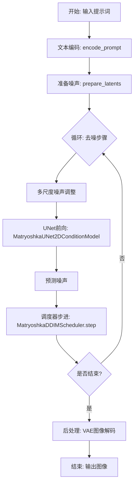
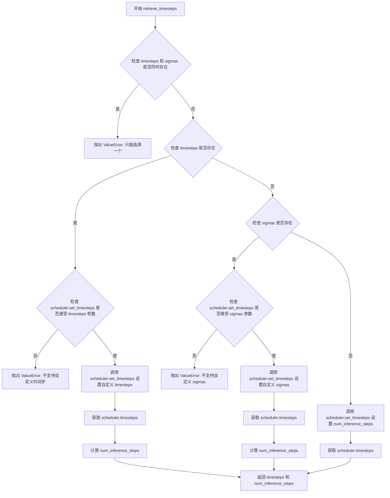
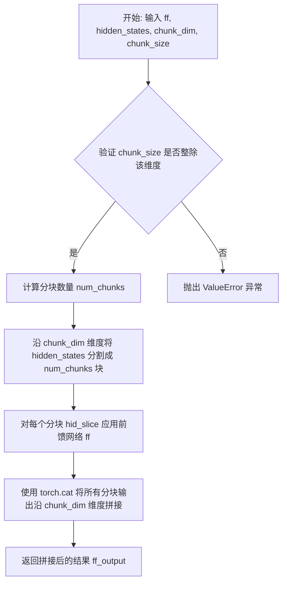
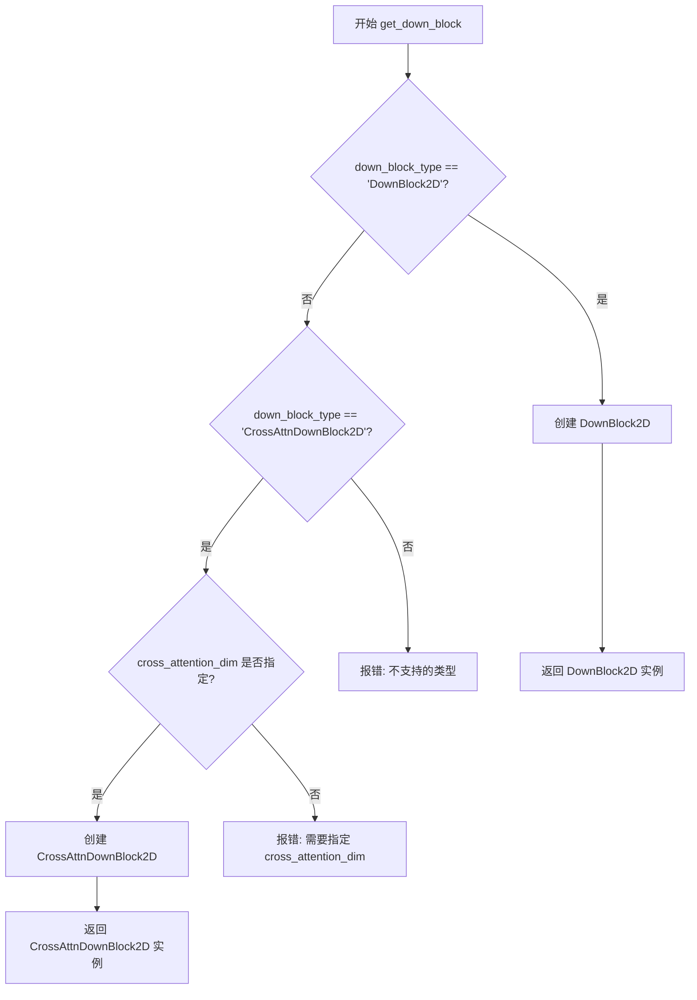
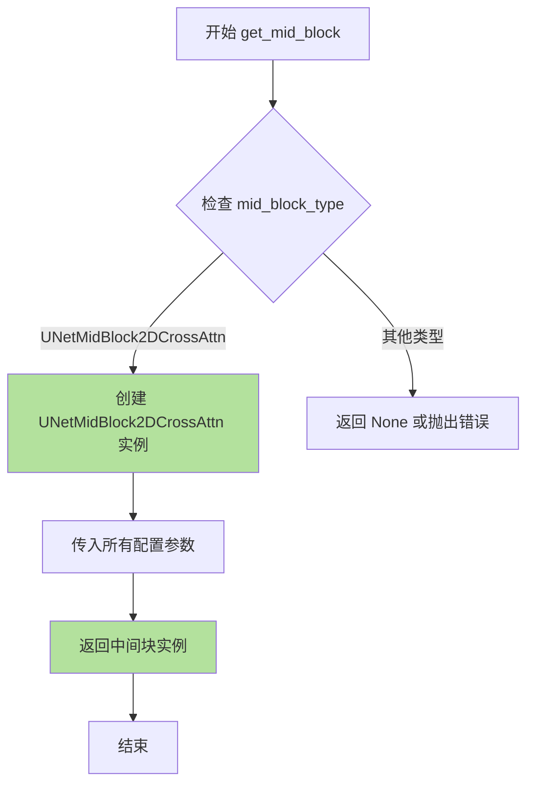
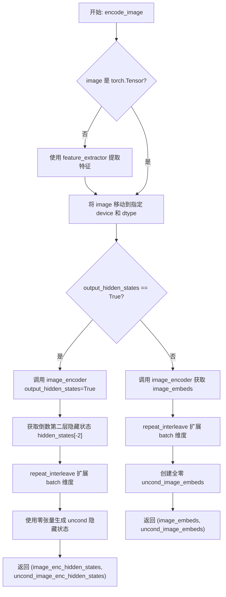
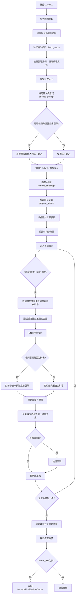

```mermaid
flowchart TD
    A[开始 forward] --> B[检查输入维度]
    B --> C{config.nesting?}
    C -->|Yes| D[解包 sample 和 sample_feat]
    C -->|No| E[继续处理]
    D --> E
    E --> F{attention_mask 存在?}
    F -->|Yes| G[转换为注意力偏置]
    F -->|No| H[跳过注意力掩码处理]
    G --> H
    H --> I{center_input_sample?}
    I -->|Yes| J[中心化输入样本]
    I -->|No| K[跳过中心化]
    J --> K
    K --> L[获取时间嵌入: get_time_embed]
    L --> M[时间嵌入层: time_embedding]
    M --> N[获取类别嵌入: get_class_embed]
    N --> O{class_emb 存在?}
    O -->|Yes| P[合并或相加类别嵌入]
    O -->|No| Q[处理 added_cond_kwargs]
    P --> Q
    Q --> R[处理编码器隐藏状态]
    R --> S[获取增强嵌入: get_aug_embed]
    S --> T[处理 encoder_attention_mask]
    T --> U{addition_embed_type == 'image_hint'?}
    U -->|Yes| V[连接提示和样本]
    U -->|No| W[合并所有嵌入]
    V --> W
    W --> X[应用 time_embed_act 激活函数]
    X --> Y[卷积预处理: conv_in]
    Y --> Z{config.nesting?}
    Z -->|Yes| AA[加上 sample_feat]
    Z -->|No| AB[下采样阶段开始]
    AA --> AB
    AB --> AC[遍历 down_blocks]
    AC --> AD{has_cross_attention?}
    AD -->|Yes| AE[调用 CrossAttnDownBlock2D]
    AD -->|No| AF[调用普通 DownBlock2D]
    AE --> AG[收集残差]
    AF --> AG
    AG --> AH{还有更多下采样块?}
    AH -->|Yes| AC
    AH -->|No| AI[中间块处理]
    AI --> AJ{mid_block 存在且 has_cross_attention?}
    AJ -->|Yes| AK[调用 UNetMidBlock2DCrossAttn]
    AJ -->|No| AL[调用普通中间块]
    AK --> AM[添加 mid_block_additional_residual]
    AL --> AM
    AM --> AN[上采样阶段开始]
    AN --> AO[遍历 up_blocks]
    AO --> AP[获取对应的残差]
    AP --> AQ{has_cross_attention?}
    AQ -->|Yes| AR[调用 CrossAttnUpBlock2D]
    AQ -->|No| AS[调用普通 UpBlock2D]
    AR --> AT[收集输出]
    AS --> AT
    AT --> AU{还有更多上采样块?}
    AU -->|Yes| AO
    AU -->|No| AV[保存 sample_inner]
    AV --> AW[后处理: conv_norm_out + conv_act + conv_out]
    AW --> AX{return_dict?}
    AX -->|Yes| AY[返回 MatryoshkaUNet2DConditionOutput]
    AX -->|No| AZ[返回元组]
    AY --> BA[结束]
    AZ --> BA
```

# `diffusers\examples\community\matryoshka.py` 详细设计文档

该代码实现了一个基于Matryoshka（套娃）扩散模型的分层图像生成管道。它通过嵌套的UNet架构（NestedUNet）和多尺度噪声调度策略，支持在单一模型权重下生成不同分辨率（nesting level）的图像，实现了从低分辨率到高分辨率的高效级联扩散过程。

## 整体流程



## 类结构

```
MatryoshkaPipeline (主管道类)
├── MatryoshkaUNet2DConditionModel (主UNet模型)
│   ├── CrossAttnDownBlock2D (下采样块)
│   │   └── MatryoshkaTransformer2DModel
│   │       └── MatryoshkaTransformerBlock
│   ├── UNetMidBlock2DCrossAttn (中间块)
│   │   └── MatryoshkaTransformer2DModel
│   ├── CrossAttnUpBlock2D (上采样块)
│   │   └── MatryoshkaTransformer2DModel
│   └── MatryoshkaCombinedTimestepTextEmbedding (时间文本嵌入)
├── NestedUNet2DConditionModel (嵌套UNet模型)
│   └── MatryoshkaUNet2DConditionModel (递归调用内部UNet)
└── MatryoshkaDDIMScheduler (定制调度器)
```

## 全局变量及字段


### `logger`
    
模块级日志记录器，用于输出调试和运行时信息

类型：`logging.Logger`
    


### `EXAMPLE_DOC_STRING`
    
包含Matryoshka模型使用示例的文档字符串，展示pipeline调用方式

类型：`str`
    


### `XLA_AVAILABLE`
    
标识PyTorch XLA是否可用，用于TPU加速的设备检查

类型：`bool`
    


### `MatryoshkaPipeline.text_encoder`
    
Flan-T5-XL文本编码器，将文本提示转换为嵌入向量

类型：`T5EncoderModel`
    


### `MatryoshkaPipeline.tokenizer`
    
T5分词器，用于将文本分割为token序列

类型：`T5TokenizerFast`
    


### `MatryoshkaPipeline.unet`
    
去噪UNet模型，根据时间步和文本嵌入预测噪声

类型：`Union[MatryoshkaUNet2DConditionModel, NestedUNet2DConditionModel]`
    


### `MatryoshkaPipeline.scheduler`
    
DDIM调度器，管理扩散过程的噪声调度

类型：`MatryoshkaDDIMScheduler`
    


### `MatryoshkaPipeline.feature_extractor`
    
CLIP图像处理器，用于提取图像特征

类型：`CLIPImageProcessor`
    


### `MatryoshkaPipeline.image_encoder`
    
CLIP视觉编码器，用于IP-Adapter图像条件

类型：`CLIPVisionModelWithProjection`
    


### `MatryoshkaUNet2DConditionModel.conv_in`
    
输入卷积层，将噪声图像映射到隐藏空间

类型：`nn.Conv2d`
    


### `MatryoshkaUNet2DConditionModel.time_embedding`
    
时间步嵌入层，将扩散时间转换为向量表示

类型：`TimestepEmbedding`
    


### `MatryoshkaUNet2DConditionModel.down_blocks`
    
下采样块列表，逐步降低特征分辨率

类型：`nn.ModuleList`
    


### `MatryoshkaUNet2DConditionModel.mid_block`
    
中间块，处理UNet最底层特征

类型：`nn.Module`
    


### `MatryoshkaUNet2DConditionModel.up_blocks`
    
上采样块列表，逐步恢复特征分辨率

类型：`nn.ModuleList`
    


### `MatryoshkaUNet2DConditionModel.conv_out`
    
输出卷积层，将隐藏特征映射回图像空间

类型：`nn.Conv2d`
    


### `NestedUNet2DConditionModel.inner_unet`
    
嵌套内部UNet，处理低分辨率特征

类型：`Union[MatryoshkaUNet2DConditionModel, NestedUNet2DConditionModel]`
    


### `NestedUNet2DConditionModel.in_adapter`
    
输入适配器，连接外部和内部UNet的特征

类型：`nn.Conv2d`
    


### `NestedUNet2DConditionModel.out_adapter`
    
输出适配器，将内部UNet输出融合回主网络

类型：`nn.Conv2d`
    


### `NestedUNet2DConditionModel.nest_ratio`
    
嵌套比例列表，定义不同层级的分辨率缩放因子

类型：`list`
    


### `MatryoshkaTransformer2DModel.transformer_blocks`
    
Transformer块列表，实现自注意力和交叉注意力

类型：`nn.ModuleList`
    


### `MatryoshkaTransformerBlock.attn1`
    
自注意力层，处理特征内部关系

类型：`Attention`
    


### `MatryoshkaTransformerBlock.attn2`
    
交叉注意力层，整合文本条件信息

类型：`Attention`
    


### `MatryoshkaTransformerBlock.ff`
    
前馈网络层，进行特征非线性变换

类型：`MatryoshkaFeedForward`
    


### `MatryoshkaTransformerBlock.proj_out`
    
输出投影层，将特征维度映射回原始大小

类型：`nn.Linear`
    


### `CrossAttnDownBlock2D.resnets`
    
残差网络块列表，用于特征提取和下采样

类型：`nn.ModuleList`
    


### `CrossAttnDownBlock2D.attentions`
    
注意力模块列表，处理交叉注意力

类型：`nn.ModuleList`
    


### `CrossAttnDownBlock2D.downsamplers`
    
下采样器列表，降低特征图分辨率

类型：`nn.ModuleList`
    


### `CrossAttnUpBlock2D.resnets`
    
残差网络块列表，用于特征重建和上采样

类型：`nn.ModuleList`
    


### `CrossAttnUpBlock2D.attentions`
    
注意力模块列表，处理上采样中的交叉注意力

类型：`nn.ModuleList`
    


### `CrossAttnUpBlock2D.upsamplers`
    
上采样器列表，增加特征图分辨率

类型：`nn.ModuleList`
    


### `MatryoshkaDDIMScheduler.betas`
    
Beta值序列，控制扩散过程的噪声添加

类型：`torch.Tensor`
    


### `MatryoshkaDDIMScheduler.alphas`
    
Alpha值序列，计算累积乘积

类型：`torch.Tensor`
    


### `MatryoshkaDDIMScheduler.alphas_cumprod`
    
累积Alpha乘积，用于采样计算

类型：`torch.Tensor`
    


### `MatryoshkaDDIMScheduler.timesteps`
    
时间步张量，定义扩散过程的离散步骤

类型：`torch.Tensor`
    


### `MatryoshkaDDIMScheduler.scales`
    
多尺度缩放因子，用于Matryoshka风格噪声调度

类型：`list`
    


### `MatryoshkaFeedForward.group_norm`
    
分组归一化层，稳定前馈网络训练

类型：`nn.GroupNorm`
    


### `MatryoshkaFeedForward.linear_gelu`
    
GELU激活层，扩展特征维度并进行非线性变换

类型：`GELU`
    


### `MatryoshkaFeedForward.linear_out`
    
输出投影层，将特征维度映射回原始大小

类型：`nn.Linear`
    
    

## 全局函数及方法


### `rescale_noise_cfg`

该函数用于根据`guidance_rescale`参数对噪声预测配置进行重新缩放，以解决扩散模型采样过程中可能出现的过度曝光或图像过于平淡的问题。该实现基于论文"Common Diffusion Noise Schedules and Sample Steps are Flawed"第3.4节的发现，通过调整噪声预测的标准差来平衡无条件和有条件噪声预测的贡献。

参数：

- `noise_cfg`：`torch.Tensor`，经过分类器自由引导（Classifier-Free Guidance）缩放后的噪声预测张量
- `noise_pred_text`：`torch.Tensor`，文本条件下的噪声预测张量，用于计算参考标准差
- `guidance_rescale`：`float`，默认为0.0，引导重缩放因子，用于控制重缩放后的噪声预测与原始噪声预测的混合比例

返回值：`torch.Tensor`，重缩放后的噪声预测张量

#### 流程图

```mermaid
flowchart TD
    A[开始] --> B[计算noise_pred_text的标准差std_text]
    B --> C[计算noise_cfg的标准差std_cfg]
    C --> D[计算缩放因子std_text/std_cfg]
    D --> E[重缩放noise_cfg<br/>noise_pred_rescaled = noise_cfg × 缩放因子]
    E --> F[根据guidance_rescale混合<br/>noise_cfg = guidance_rescale × noise_pred_rescaled<br/>+ (1 - guidance_rescale) × noise_cfg]
    F --> G[返回重缩放后的noise_cfg]
```

#### 带注释源码

```python
def rescale_noise_cfg(noise_cfg, noise_pred_text, guidance_rescale=0.0):
    """
    Rescale `noise_cfg` according to `guidance_rescale`. Based on findings of [Common Diffusion Noise Schedules and
    Sample Steps are Flawed](https://huggingface.co/papers/2305.08891). See Section 3.4
    
    该函数通过重缩放噪声预测来解决过度曝光问题。当guidance_rescale大于0时，
    会将基于文本条件的噪声预测标准差应用到CFG预测上，然后与原始预测按比例混合。
    """
    # 计算文本条件噪声预测在空间维度上的标准差（保留维度以便广播）
    # dim=1开始是为了保留batch维度，只对空间/通道维度求标准差
    std_text = noise_pred_text.std(dim=list(range(1, noise_pred_text.ndim)), keepdim=True)
    
    # 计算CFG噪声预测在空间维度上的标准差
    std_cfg = noise_cfg.std(dim=list(range(1, noise_cfg.ndim)), keepdim=True)
    
    # rescale the results from guidance (fixes overexposure)
    # 使用文本条件噪声的标准差对CFG噪声进行归一化重缩放
    # 这一步修复了高引导权重下的过度曝光问题
    noise_pred_rescaled = noise_cfg * (std_text / std_cfg)
    
    # mix with the original results from guidance by factor guidance_rescale to avoid "plain looking" images
    # 将重缩放后的预测与原始CFG预测按guidance_rescale因子混合
    # 当guidance_rescale=0时，完全使用原始noise_cfg
    # 当guidance_rescale=1时，完全使用重缩放后的noise_pred_rescaled
    noise_cfg = guidance_rescale * noise_pred_rescaled + (1 - guidance_rescale) * noise_cfg
    
    return noise_cfg
```


### `retrieve_timesteps`

该函数是 Matryoshka Diffusion Models 管道中的时间步检索工具函数，负责调用调度器的 `set_timesteps` 方法并从调度器中获取时间步序列。它支持自定义时间步（timesteps）或自定义 sigmas 来覆盖调度器的默认时间间隔策略，并将任何额外的关键字参数传递给调度器的 `set_timesteps` 方法。

**参数：**

- `scheduler`：`SchedulerMixin`，要获取时间步的调度器实例
- `num_inference_steps`：`Optional[int]`，生成样本时使用的扩散步数。如果使用此参数，则 `timesteps` 必须为 `None`
- `device`：`Optional[Union[str, torch.device]]`，时间步应移动到的设备。如果为 `None`，则不移动时间步
- `timesteps`：`Optional[List[int]]`，用于覆盖调度器时间间隔策略的自定义时间步。如果传入 `timesteps`，则 `num_inference_steps` 和 `sigmas` 必须为 `None`
- `sigmas`：`Optional[List[float]]`，用于覆盖调度器时间间隔策略的自定义 sigmas。如果传入 `sigmas`，则 `num_inference_steps` 和 `timesteps` 必须为 `None`
- `**kwargs`：任意关键字参数，将传递给 `scheduler.set_timesteps`

**返回值：** `Tuple[torch.Tensor, int]`，元组中第一个元素是调度器的时间步计划，第二个元素是推理步数

#### 流程图



#### 带注释源码

```python
# Copied from diffusers.pipelines.stable_diffusion.pipeline_stable_diffusion.retrieve_timesteps
def retrieve_timesteps(
    scheduler,  # 调度器对象，用于生成时间步
    num_inference_steps: Optional[int] = None,  # 推理步数
    device: Optional[Union[str, torch.device]] = None,  # 目标设备
    timesteps: Optional[List[int]] = None,  # 自定义时间步列表
    sigmas: Optional[List[float]] = None,  # 自定义 sigmas 列表
    **kwargs,  # 传递给 scheduler.set_timesteps 的额外参数
):
    """
    Calls the scheduler's `set_timesteps` method and retrieves timesteps from the scheduler after the call. Handles
    custom timesteps. Any kwargs will be supplied to `scheduler.set_timesteps`.

    Args:
        scheduler (`SchedulerMixin`):
            The scheduler to get timesteps from.
        num_inference_steps (`int`):
            The number of diffusion steps used when generating samples with a pre-trained model. If used, `timesteps`
            must be `None`.
        device (`str` or `torch.device`, *optional*):
            The device to which the timesteps should be moved to. If `None`, the timesteps are not moved.
        timesteps (`List[int]`, *optional*):
            Custom timesteps used to override the timestep spacing strategy of the scheduler. If `timesteps` is passed,
            `num_inference_steps` and `sigmas` must be `None`.
        sigmas (`List[float]`, *optional*):
            Custom sigmas used to override the timestep spacing strategy of the scheduler. If `sigmas` is passed,
            `num_inference_steps` and `timesteps` must be `None`.

    Returns:
        `Tuple[torch.Tensor, int]`: A tuple where the first element is the timestep schedule from the scheduler and the
        second element is the number of inference steps.
    """
    # 验证输入参数：timesteps 和 sigmas 不能同时存在
    if timesteps is not None and sigmas is not None:
        raise ValueError("Only one of `timesteps` or `sigmas` can be passed. Please choose one to set custom values")
    
    # 处理自定义 timesteps
    if timesteps is not None:
        # 检查 scheduler.set_timesteps 是否支持 timesteps 参数
        accepts_timesteps = "timesteps" in set(inspect.signature(scheduler.set_timesteps).parameters.keys())
        if not accepts_timesteps:
            raise ValueError(
                f"The current scheduler class {scheduler.__class__}'s `set_timesteps` does not support custom"
                f" timestep schedules. Please check whether you are using the correct scheduler."
            )
        # 调用调度器的 set_timesteps 方法设置自定义时间步
        scheduler.set_timesteps(timesteps=timesteps, device=device, **kwargs)
        # 从调度器获取生成的时间步
        timesteps = scheduler.timesteps
        # 计算推理步数
        num_inference_steps = len(timesteps)
    
    # 处理自定义 sigmas
    elif sigmas is not None:
        # 检查 scheduler.set_timesteps 是否支持 sigmas 参数
        accept_sigmas = "sigmas" in set(inspect.signature(scheduler.set_timesteps).parameters.keys())
        if not accept_sigmas:
            raise ValueError(
                f"The current scheduler class {scheduler.__class__}'s `set_timesteps` does not support custom"
                f" sigmas schedules. Please check whether you are using the correct scheduler."
            )
        # 调用调度器的 set_timesteps 方法设置自定义 sigmas
        scheduler.set_timesteps(sigmas=sigmas, device=device, **kwargs)
        # 从调度器获取生成的时间步
        timesteps = scheduler.timesteps
        # 计算推理步数
        num_inference_steps = len(timesteps)
    
    # 使用默认的 num_inference_steps
    else:
        scheduler.set_timesteps(num_inference_steps, device=device, **kwargs)
        timesteps = scheduler.timesteps
    
    # 返回时间步序列和推理步数
    return timesteps, num_inference_steps
```


### `_chunked_feed_forward`

该函数实现分块前馈传播，通过将隐藏状态在指定维度上分割成多个块，分别对每个块执行前馈网络计算，最后将结果拼接回原始维度。这种分块策略可以有效降低内存占用，适用于大规模模型的推理优化。

参数：

- `ff`：`nn.Module`，前馈神经网络模块，负责对每个分块进行计算
- `hidden_states`：`torch.Tensor`，输入的隐藏状态张量，形状为 (batch, channels, *spatial_dims)
- `chunk_dim`：`int`，指定要分割的维度索引
- `chunk_size`：`int`，每个分块的大小，必须能整除该维度的长度

返回值：`torch.Tensor`，经过分块前馈计算后的输出张量，形状与输入相同

#### 流程图



#### 带注释源码

```python
# Copied from diffusers.models.attention._chunked_feed_forward
def _chunked_feed_forward(ff: nn.Module, hidden_states: torch.Tensor, chunk_dim: int, chunk_size: int):
    # "feed_forward_chunk_size" can be used to save memory
    # 验证输入维度是否能被 chunk_size 整除，确保分割操作有效
    if hidden_states.shape[chunk_dim] % chunk_size != 0:
        raise ValueError(
            f"`hidden_states` dimension to be chunked: {hidden_states.shape[chunk_dim]} has to be divisible by chunk size: {chunk_size}. Make sure to set an appropriate `chunk_size` when calling `unet.enable_forward_chunking`."
        )

    # 计算需要分割的块数量
    num_chunks = hidden_states.shape[chunk_dim] // chunk_size
    # 使用列表推导式对每个分块分别执行前馈网络计算，然后沿原维度拼接
    # chunk 方法将张量在指定维度上均匀分割，返回分割后的张量元组
    # torch.cat 将分割后的多个输出重新拼接为原始形状
    ff_output = torch.cat(
        [ff(hid_slice) for hid_slice in hidden_states.chunk(num_chunks, dim=chunk_dim)],
        dim=chunk_dim,
    )
    return ff_output
```


### `betas_for_alpha_bar`

该函数用于创建 beta 调度表，将给定的 alpha_t_bar 函数进行离散化处理。alpha_t_bar 函数定义了扩散过程中 (1-beta) 的累积乘积，函数接受参数 t 并将其转换为到扩散过程该点为止的 (1-beta) 的累积乘积。这是 Matryoshka DDIM 调度器的核心组成部分，用于生成高质量的图像扩散过程。

**参数：**

- `num_diffusion_timesteps`：`int`，要生成的 beta 数量
- `max_beta`：`float`，可选，默认 0.999，使用的最大 beta 值；使用低于 1 的值以防止奇点
- `alpha_transform_type`：`str`，可选，默认 "cosine"，alpha_bar 的噪声调度类型，可选 "cosine" 或 "exp"

**返回值：** `torch.Tensor`，调度器用于逐步模型输出的 beta 值（float32 类型的张量）

#### 流程图

```mermaid
flowchart TD
    A[开始] --> B{alpha_transform_type == 'cosine'?}
    B -->|Yes| C[定义 alpha_bar_fn<br/>cos(t+0.008)/1.008\*π/2²]
    B -->|No| D{alpha_transform_type == 'exp'?}
    D -->|Yes| E[定义 alpha_bar_fn<br/>exp(t\*-12.0)]
    D -->|No| F[抛出 ValueError]
    F --> Z[结束]
    C --> G[循环 i 从 0 到 num_diffusion_timesteps-1]
    E --> G
    G --> H[计算 t1 = i / num_diffusion_timesteps]
    H --> I[计算 t2 = (i+1) / num_diffusion_timesteps]
    I --> J[beta_i = min(1 - alpha_bar_fn(t2)/alpha_bar_fn(t1), max_beta)]
    J --> K[添加到 betas 列表]
    K --> L{循环结束?}
    L -->|No| G
    L -->|Yes| M[返回 torch.tensor(betas, dtype=torch.float32)]
    M --> Z
```

#### 带注释源码

```python
# Copied from diffusers.schedulers.scheduling_ddpm.betas_for_alpha_bar
def betas_for_alpha_bar(
    num_diffusion_timesteps,  # int: 要生成的 beta 数量
    max_beta=0.999,           # float: 最大 beta 上限，防止奇点
    alpha_transform_type="cosine",  # str: alpha_bar 的类型，cosine 或 exp
):
    """
    Create a beta schedule that discretizes the given alpha_t_bar function,
    which defines the cumulative product of (1-beta) over time from t = [0,1].

    创建一个 beta 调度表，将给定的 alpha_t_bar 函数进行离散化。
    alpha_t_bar 定义了扩散过程中 (1-beta) 的累积乘积。

    Args:
        num_diffusion_timesteps (`int`): the number of betas to produce.
        max_beta (`float`): the maximum beta to use; use values lower than 1 to
                     prevent singularities.
        alpha_transform_type (`str`, *optional*, default to `cosine`): the type of noise schedule for alpha_bar.
                     Choose from `cosine` or `exp`

    Returns:
        betas (`np.ndarray`): the betas used by the scheduler to step the model outputs
    """
    # 根据 alpha_transform_type 选择不同的 alpha_bar 函数
    if alpha_transform_type == "cosine":
        # 余弦调度：使用余弦函数创建平滑的噪声调度
        def alpha_bar_fn(t):
            # 使用余弦函数结合偏移量 0.008 和缩放因子 1.008
            # 这创建了一个 S 形的调度曲线
            return math.cos((t + 0.008) / 1.008 * math.pi / 2) ** 2

    elif alpha_transform_type == "exp":
        # 指数调度：使用指数衰减函数
        def alpha_bar_fn(t):
            # 指数衰减调度，衰减率为 -12.0
            return math.exp(t * -12.0)

    else:
        # 不支持的调度类型，抛出错误
        raise ValueError(f"Unsupported alpha_transform_type: {alpha_transform_type}")

    betas = []  # 存储计算得到的 beta 值
    # 遍历每个扩散时间步
    for i in range(num_diffusion_timesteps):
        # 计算当前时间步和下一个时间步的归一化位置 [0, 1]
        t1 = i / num_diffusion_timesteps      # 当前时间步位置
        t2 = (i + 1) / num_diffusion_timesteps # 下一个时间步位置
        
        # 计算 beta: 1 - alpha_bar(t2) / alpha_bar(t1)
        # 这基于 alpha_bar 的变化率计算 beta
        # 同时使用 max_beta 限制最大 beta 值，防止数值不稳定
        betas.append(min(1 - alpha_bar_fn(t2) / alpha_bar_fn(t1), max_beta))
    
    # 返回 float32 类型的 PyTorch 张量
    return torch.tensor(betas, dtype=torch.float32)
```


### `rescale_zero_terminal_snr`

该函数用于将扩散调度器的beta值重新缩放，使其具有零终端SNR（Signal-to-Noise Ratio，信号与噪声比）。基于论文[Common Diffusion Noise Schedules and Sample Steps are Flawed](https://haggleface.co/papers/2305.08891)的算法1，通过平移和缩放alpha_bar_sqrt值，使得最后一个时间步的SNR为零，从而解决扩散模型在生成极亮或极暗图像时的限制问题。

**参数：**

- `betas`：`torch.Tensor`，调度器初始化时使用的beta值张量

**返回值：** `torch.Tensor`，经过零终端SNR重新缩放后的beta值

#### 流程图

```mermaid
flowchart TD
    A[开始: 输入 betas] --> B[计算 alphas = 1.0 - betas]
    B --> C[计算累积乘积 alphas_cumprod]
    C --> D[计算 alphas_bar_sqrt = sqrt(alphas_cumprod)]
    D --> E[保存初始值: alphas_bar_sqrt_0 和最终值: alphas_bar_sqrt_T]
    E --> F[平移: alphas_bar_sqrt -= alphas_bar_sqrt_T<br/>使最后时间步为零]
    F --> G[缩放: alphas_bar_sqrt *= alphas_bar_sqrt_0<br/>/ alphas_bar_sqrt_0 - alphas_bar_sqrt_T]
    G --> H[恢复: alphas_bar = alphas_bar_sqrt ** 2]
    H --> I[反向累积乘积: alphas = alphas_bar[1:] / alphas_bar[:-1]]
    I --> J[拼接: alphas = torch.cat<br/>[alphas_bar[0:1], alphas]]
    J --> K[计算 betas = 1 - alphas]
    K --> L[返回: 重新缩放后的 betas]
```

#### 带注释源码

```python
# Copied from diffusers.schedulers.scheduling_ddim.rescale_zero_terminal_snr
def rescale_zero_terminal_snr(betas):
    """
    Rescales betas to have zero terminal SNR Based on https://huggingface.co/papers/2305.08891 (Algorithm 1)

    Args:
        betas (`torch.Tensor`):
            the betas that the scheduler is being initialized with.

    Returns:
        `torch.Tensor`: rescaled betas with zero terminal SNR
    """
    # 将 betas 转换为 alphas (1 - beta)
    alphas = 1.0 - betas
    
    # 计算累积乘积 alpha_cumprod_t = ∏αᵢ
    alphas_cumprod = torch.cumprod(alphas, dim=0)
    
    # 取平方根得到 alpha_bar_sqrt
    alphas_bar_sqrt = alphas_cumprod.sqrt()

    # 保存原始值用于后续缩放
    alphas_bar_sqrt_0 = alphas_bar_sqrt[0].clone()   # 第一个时间步的 sqrt(ᾱ)
    alphas_bar_sqrt_T = alphas_bar_sqrt[-1].clone()  # 最后一个时间步的 sqrt(ᾱ)

    # 步骤1: 平移使得最后时间步的 SNR 为零
    # 即: ᾱ_sqrt(t) = ᾱ_sqrt(t) - ᾱ_sqrt(T)
    alphas_bar_sqrt -= alphas_bar_sqrt_T

    # 步骤2: 缩放以恢复第一个时间步的原始值
    # 通过乘以 (ᾱ_sqrt(0) / (ᾱ_sqrt(0) - ᾱ_sqrt(T))) 实现
    alphas_bar_sqrt *= alphas_bar_sqrt_0 / (alphas_bar_sqrt_0 - alphas_bar_sqrt_T)

    # 将 alpha_bar_sqrt 转换回 alpha_bar (平方)
    alphas_bar = alphas_bar_sqrt ** 2

    # 通过相邻元素的比值恢复 alphas (反向累积乘积)
    alphas = alphas_bar[1:] / alphas_bar[:-1]
    
    # 拼接第一个 alpha 值 (alpha_bar[0])
    alphas = torch.cat([alphas_bar[0:1], alphas])
    
    # 计算最终的 betas
    betas = 1 - alphas

    return betas
```


### `get_down_block`

该函数是一个工厂函数，用于根据传入的 `down_block_type` 参数创建并返回不同类型的下采样（down）模块。在 Matryoshka UNet 架构中，它主要用于构建编码器（encoder）部分的下采样块，支持普通下采样块和带交叉注意力机制的下采样块。

参数：

- `down_block_type`：`str`，指定要创建的下采样块类型（如 "DownBlock2D" 或 "CrossAttnDownBlock2D"）
- `num_layers`：`int`，下采样块中 ResNet 层的数量
- `in_channels`：`int`，输入特征图的通道数
- `out_channels`：`int`，输出特征图的通道数
- `temb_channels`：`int`，时间嵌入（timestep embedding）通道数
- `add_downsample`：`bool`，是否添加下采样层
- `resnet_eps`：`float`，ResNet 块中 GroupNorm 的 epsilon 值
- `resnet_act_fn`：`str`，ResNet 块中使用的激活函数名称
- `norm_type`：`str`，归一化类型，默认为 "layer_norm"
- `transformer_layers_per_block`：`int`，每个块中 transformer 层的数量
- `num_attention_heads`：`Optional[int]`，注意力头的数量
- `resnet_groups`：`Optional[int]`，ResNet 中 GroupNorm 的组数
- `cross_attention_dim`：`Optional[int]`，交叉注意力机制中 query 的维度
- `downsample_padding`：`Optional[int]`，下采样卷积的填充值
- `dual_cross_attention`：`bool`，是否使用双交叉注意力
- `use_linear_projection`：`bool`，是否使用线性投影
- `only_cross_attention`：`bool`，是否只使用交叉注意力
- `upcast_attention`：`bool`，是否上cast 注意力计算
- `resnet_time_scale_shift`：`str`，ResNet 时间尺度移位方式
- `attention_type`：`str`，注意力机制类型
- `attention_pre_only`：`bool`，是否只在注意力前进行操作
- `resnet_skip_time_act`：`bool`，是否跳过时间激活
- `resnet_out_scale_factor`：`float`，ResNet 输出缩放因子
- `cross_attention_norm`：`str | None`，交叉注意力归一化类型
- `attention_head_dim`：`Optional[int]`，注意力头的维度
- `use_attention_ffn`：`bool`，是否使用注意力前馈网络
- `downsample_type`：`str | None`，下采样类型
- `dropout`：`float`，dropout 概率

返回值：`nn.Module`，返回创建的下采样块实例（`DownBlock2D` 或 `CrossAttnDownBlock2D`）

#### 流程图



#### 带注释源码

```python
def get_down_block(
    down_block_type: str,
    num_layers: int,
    in_channels: int,
    out_channels: int,
    temb_channels: int,
    add_downsample: bool,
    resnet_eps: float,
    resnet_act_fn: str,
    norm_type: str = "layer_norm",
    transformer_layers_per_block: int = 1,
    num_attention_heads: Optional[int] = None,
    resnet_groups: Optional[int] = None,
    cross_attention_dim: Optional[int] = None,
    downsample_padding: Optional[int] = None,
    dual_cross_attention: bool = False,
    use_linear_projection: bool = False,
    only_cross_attention: bool = False,
    upcast_attention: bool = False,
    resnet_time_scale_shift: str = "default",
    attention_type: str = "default",
    attention_pre_only: bool = False,
    resnet_skip_time_act: bool = False,
    resnet_out_scale_factor: float = 1.0,
    cross_attention_norm: str | None = None,
    attention_head_dim: Optional[int] = None,
    use_attention_ffn: bool = True,
    downsample_type: str | None = None,
    dropout: float = 0.0,
):
    # 如果未指定注意力头维度，则默认使用注意力头数量
    if attention_head_dim is None:
        logger.warning(
            f"It is recommended to provide `attention_head_dim` when calling `get_down_block`. Defaulting `attention_head_dim` to {num_attention_heads}."
        )
        attention_head_dim = num_attention_heads

    # 如果 block 类型以 "UNetRes" 开头，则去掉前缀
    down_block_type = down_block_type[7:] if down_block_type.startswith("UNetRes") else down_block_type
    
    # 根据类型创建对应的下采样块
    if down_block_type == "DownBlock2D":
        # 创建普通的下采样块（仅包含 ResNet）
        return DownBlock2D(
            num_layers=num_layers,
            in_channels=in_channels,
            out_channels=out_channels,
            temb_channels=temb_channels,
            dropout=dropout,
            add_downsample=add_downsample,
            resnet_eps=resnet_eps,
            resnet_act_fn=resnet_act_fn,
            resnet_groups=resnet_groups,
            downsample_padding=downsample_padding,
            resnet_time_scale_shift=resnet_time_scale_shift,
        )
    elif down_block_type == "CrossAttnDownBlock2D":
        # 创建带交叉注意力的下采样块（包含 ResNet 和 Transformer）
        if cross_attention_dim is None:
            raise ValueError("cross_attention_dim must be specified for CrossAttnDownBlock2D")
        return CrossAttnDownBlock2D(
            num_layers=num_layers,
            transformer_layers_per_block=transformer_layers_per_block,
            in_channels=in_channels,
            out_channels=out_channels,
            temb_channels=temb_channels,
            dropout=dropout,
            add_downsample=add_downsample,
            resnet_eps=resnet_eps,
            resnet_act_fn=resnet_act_fn,
            norm_type=norm_type,
            resnet_groups=resnet_groups,
            downsample_padding=downsample_padding,
            cross_attention_dim=cross_attention_dim,
            cross_attention_norm=cross_attention_norm,
            num_attention_heads=num_attention_heads,
            dual_cross_attention=dual_cross_attention,
            use_linear_projection=use_linear_projection,
            only_cross_attention=only_cross_attention,
            upcast_attention=upcast_attention,
            resnet_time_scale_shift=resnet_time_scale_shift,
            attention_type=attention_type,
            attention_pre_only=attention_pre_only,
            use_attention_ffn=use_attention_ffn,
        )
```


### `get_mid_block`

获取 UNet 的中间块（middle block），根据 `mid_block_type` 参数创建并返回对应的中间块实例，用于构建 Matryoshka UNet 2D 条件扩散模型。

参数：

- `mid_block_type`：`str`，中间块的类型标识符，用于确定创建哪种类型的中间块（如 "UNetMidBlock2DCrossAttn"）
- `temb_channels`：`int`，时间嵌入（timestep embedding）的通道数
- `in_channels`：`int`，输入数据的通道数
- `resnet_eps`：`float`，ResNet 块的 epsilon 值，用于数值稳定性
- `resnet_act_fn`：`str`，ResNet 块使用的激活函数名称
- `resnet_groups`：`int`，ResNet 块中 GroupNorm 的组数
- `norm_type`：`str`（可选，默认值为 "layer_norm"），归一化类型
- `output_scale_factor`：`float`（可选，默认值为 1.0），输出缩放因子
- `transformer_layers_per_block`：`int`（可选，默认值为 1），每个块的 Transformer 层数
- `num_attention_heads`：`Optional[int]`（可选），注意力头的数量
- `cross_attention_dim`：`Optional[int]`（可选），交叉注意力的维度
- `dual_cross_attention`：`bool`（可选，默认值为 False），是否使用双交叉注意力
- `use_linear_projection`：`bool`（可选，默认值为 False），是否使用线性投影
- `mid_block_only_cross_attention`：`bool`（可选，默认值为 False），中间块是否仅使用交叉注意力
- `upcast_attention`：`bool`（可选，默认值为 False），是否向上转换注意力计算
- `resnet_time_scale_shift`：`str`（可选，默认值为 "default"），ResNet 的时间尺度偏移配置
- `attention_type`：`str`（可选，默认值为 "default"），注意力机制的类型
- `attention_pre_only`：`bool`（可选，默认值为 False），是否仅在注意力前进行操作
- `resnet_skip_time_act`：`bool`（可选，默认值为 False），是否跳过 ResNet 的时间激活
- `cross_attention_norm`：`str | None`（可选），交叉注意力归一化类型
- `attention_head_dim`：`Optional[int]`（可选，默认值为 1），注意力头的维度
- `dropout`：`float`（可选，默认值为 0.0），Dropout 概率

返回值：`nn.Module`，返回创建的中间块实例（如 `UNetMidBlock2DCrossAttn`），用于 UNet 模型的中间层

#### 流程图



#### 带注释源码

```python
def get_mid_block(
    mid_block_type: str,
    temb_channels: int,
    in_channels: int,
    resnet_eps: float,
    resnet_act_fn: str,
    resnet_groups: int,
    norm_type: str = "layer_norm",
    output_scale_factor: float = 1.0,
    transformer_layers_per_block: int = 1,
    num_attention_heads: Optional[int] = None,
    cross_attention_dim: Optional[int] = None,
    dual_cross_attention: bool = False,
    use_linear_projection: bool = False,
    mid_block_only_cross_attention: bool = False,
    upcast_attention: bool = False,
    resnet_time_scale_shift: str = "default",
    attention_type: str = "default",
    attention_pre_only: bool = False,
    resnet_skip_time_act: bool = False,
    cross_attention_norm: str | None = None,
    attention_head_dim: Optional[int] = 1,
    dropout: float = 0.0,
):
    """
    获取 UNet 的中间块，根据 mid_block_type 创建相应的中间块实例。
    
    Args:
        mid_block_type: 中间块的类型字符串， Currently only supports "UNetMidBlock2DCrossAttn"
        temb_channels: 时间嵌入的通道维度
        in_channels: 输入特征图的通道数
        resnet_eps: ResNet 块归一化的 epsilon 参数
        resnet_act_fn: ResNet 块激活函数名称
        resnet_groups: ResNet 块 GroupNorm 的组数
        norm_type: 归一化层类型
        output_scale_factor: 输出特征图的缩放因子
        transformer_layers_per_block: 每个 Transformer 块的层数
        num_attention_heads: 多头注意力的头数
        cross_attention_dim: 交叉注意力机制中 key/value 的维度
        dual_cross_attention: 是否使用双交叉注意力机制
        use_linear_projection: 是否在注意力中使用线性投影
        mid_block_only_cross_attention: 中间块是否仅使用交叉注意力
        upcast_attention: 是否向上转换注意力计算精度
        resnet_time_scale_shift: ResNet 时间尺度偏移配置
        attention_type: 注意力机制的类型
        attention_pre_only: 是否仅在注意力前应用归一化
        resnet_skip_time_act: 是否跳过 ResNet 的时间激活
        cross_attention_norm: 交叉注意力归一化方式
        attention_head_dim: 每个注意力头的维度
        dropout: Dropout 概率
    
    Returns:
        UNetMidBlock2DCrossAttn: 配置好的中间块实例
    """
    # 检查中间块类型，目前仅支持 UNetMidBlock2DCrossAttn
    if mid_block_type == "UNetMidBlock2DCrossAttn":
        # 创建带交叉注意力的 UNet 中间块
        return UNetMidBlock2DCrossAttn(
            transformer_layers_per_block=transformer_layers_per_block,
            in_channels=in_channels,
            temb_channels=temb_channels,
            dropout=dropout,
            resnet_eps=resnet_eps,
            resnet_act_fn=resnet_act_fn,
            norm_type=norm_type,
            output_scale_factor=output_scale_factor,
            resnet_time_scale_shift=resnet_time_scale_shift,
            cross_attention_dim=cross_attention_dim,
            cross_attention_norm=cross_attention_norm,
            num_attention_heads=num_attention_heads,
            resnet_groups=resnet_groups,
            dual_cross_attention=dual_cross_attention,
            use_linear_projection=use_linear_projection,
            upcast_attention=upcast_attention,
            attention_type=attention_type,
            attention_pre_only=attention_pre_only,
        )
    # 注意：原代码中没有处理其他类型的情况，若传入不支持的类型会返回 None
```


### `get_up_block`

该函数是一个工厂函数，用于根据传入的 `up_block_type` 参数创建并返回对应的上采样块（UpBlock2D 或 CrossAttnUpBlock2D）。它负责实例化 UNet 模型中上采样阶段所需的模块，支持普通上采样块和带交叉注意力机制的上采样块。

参数：

- `up_block_type`：`str`，上采样块的类型标识符，如 "UpBlock2D" 或 "CrossAttnUpBlock2D"
- `num_layers`：`int`，该块中包含的 ResNet 层数量
- `in_channels`：`int`，输入特征图的通道数
- `out_channels`：`int`，输出特征图的通道数
- `prev_output_channel`：`int`，来自上一层的输出通道数，用于残差连接
- `temb_channels`：`int`，时间嵌入（timestep embedding）的通道数
- `add_upsample`：`bool`，是否添加上采样操作
- `resnet_eps`：`float`，ResNet 块中 LayerNorm 的 epsilon 值
- `resnet_act_fn`：`str`，ResNet 块中激活函数的名称
- `norm_type`：`str`，归一化类型，默认为 "layer_norm"
- `resolution_idx`：`Optional[int]`，分辨率索引，用于 FreeU 等机制
- `transformer_layers_per_block`：`int`，每个块的 Transformer 层数
- `num_attention_heads`：`Optional[int]`，注意力头的数量
- `resnet_groups`：`Optional[int]`，ResNet 中 GroupNorm 的组数
- `cross_attention_dim`：`Optional[int]`，交叉注意力机制的维度
- `dual_cross_attention`：`bool`，是否使用双交叉注意力
- `use_linear_projection`：`bool`，是否使用线性投影
- `only_cross_attention`：`bool`，是否仅使用交叉注意力
- `upcast_attention`：`bool`，是否向上转型注意力计算
- `resnet_time_scale_shift`：`str`，ResNet 时间尺度偏移方式
- `attention_type`：`str`，注意力机制类型
- `attention_pre_only`：`bool`，是否仅在前置阶段使用注意力
- `resnet_skip_time_act`：`bool`，是否跳过 ResNet 时间激活
- `resnet_out_scale_factor`：`float`，ResNet 输出缩放因子
- `cross_attention_norm`：`Optional[str]`，交叉注意力归一化类型
- `attention_head_dim`：`Optional[int]`，注意力头的维度
- `use_attention_ffn`：`bool`，是否使用注意力前馈网络
- `upsample_type`：`Optional[str]`，上采样类型
- `dropout`：`float`，Dropout 概率

返回值：`nn.Module`，返回创建的上采样块实例（UpBlock2D 或 CrossAttnUpBlock2D）

#### 流程图

```mermaid
flowchart TD
    A[开始 get_up_block] --> B{attention_head_dim is None?}
    B -->|Yes| C[logger.warning: 建议提供 attention_head_dim]
    C --> D[attention_head_dim = num_attention_heads]
    B -->|No| E{up_block_type starts with 'UNetRes'?}
    D --> E
    E -->|Yes| F[up_block_type = up_block_type[7:]]
    E -->|No| G{up_block_type == 'UpBlock2D'?}
    F --> G
    G -->|Yes| H[return UpBlock2D(...)]
    G -->|No| I{up_block_type == 'CrossAttnUpBlock2D'?}
    I -->|Yes| J{cross_attention_dim is None?}
    J -->|Yes| K[raise ValueError: cross_attention_dim must be specified]
    J -->|No| L[return CrossAttnUpBlock2D(...)]
    I -->|No| M[未支持的类型，返回 None]
    H --> N[结束]
    L --> N
    K --> N
    M --> N
```

#### 带注释源码

```python
def get_up_block(
    up_block_type: str,
    num_layers: int,
    in_channels: int,
    out_channels: int,
    prev_output_channel: int,
    temb_channels: int,
    add_upsample: bool,
    resnet_eps: float,
    resnet_act_fn: str,
    norm_type: str = "layer_norm",
    resolution_idx: Optional[int] = None,
    transformer_layers_per_block: int = 1,
    num_attention_heads: Optional[int] = None,
    resnet_groups: Optional[int] = None,
    cross_attention_dim: Optional[int] = None,
    dual_cross_attention: bool = False,
    use_linear_projection: bool = False,
    only_cross_attention: bool = False,
    upcast_attention: bool = False,
    resnet_time_scale_shift: str = "default",
    attention_type: str = "default",
    attention_pre_only: bool = False,
    resnet_skip_time_act: bool = False,
    resnet_out_scale_factor: float = 1.0,
    cross_attention_norm: str | None = None,
    attention_head_dim: Optional[int] = None,
    use_attention_ffn: bool = True,
    upsample_type: str | None = None,
    dropout: float = 0.0,
) -> nn.Module:
    """
    Factory function to create upsample blocks for UNet.
    
    根据 up_block_type 参数创建对应的上采样块，支持 UpBlock2D 和 CrossAttnUpBlock2D 两种类型。
    该函数是 MatryoshkaUNet2DConditionModel 构建过程中的关键组件，用于构建 UNet 的上采样路径。
    
    Args:
        up_block_type: 上采样块的类型标识符
        num_layers: ResNet 层数量
        in_channels: 输入通道数
        out_channels: 输出通道数
        prev_output_channel: 上一输出通道数
        temb_channels: 时间嵌入通道数
        add_upsample: 是否添加上采样
        resnet_eps: ResNet epsilon 值
        resnet_act_fn: 激活函数名称
        norm_type: 归一化类型
        resolution_idx: 分辨率索引
        transformer_layers_per_block: Transformer 层数
        num_attention_heads: 注意力头数
        resnet_groups: ResNet 组数
        cross_attention_dim: 交叉注意力维度
        dual_cross_attention: 双交叉注意力
        use_linear_projection: 线性投影
        only_cross_attention: 仅交叉注意力
        upcast_attention: 向上转型注意力
        resnet_time_scale_shift: 时间尺度偏移
        attention_type: 注意力类型
        attention_pre_only: 仅前置注意力
        resnet_skip_time_act: 跳过时间激活
        resnet_out_scale_factor: 输出缩放因子
        cross_attention_norm: 交叉注意力归一化
        attention_head_dim: 注意力头维度
        use_attention_ffn: 使用注意力前馈
        upsample_type: 上采样类型
        dropout: Dropout 概率
    
    Returns:
        返回上采样块实例 (UpBlock2D 或 CrossAttnUpBlock2D)
    """
    # If attn head dim is not defined, we default it to the number of heads
    # 如果未定义注意力头维度，则默认使用注意力头的数量
    if attention_head_dim is None:
        logger.warning(
            f"It is recommended to provide `attention_head_dim` when calling `get_up_block`. Defaulting `attention_head_dim` to {num_attention_heads}."
        )
        attention_head_dim = num_attention_heads

    # Strip "UNetRes" prefix if present
    # 如果类型前缀是 "UNetRes"，则去除该前缀
    up_block_type = up_block_type[7:] if up_block_type.startswith("UNetRes") else up_block_type
    
    # 根据 block_type 创建对应的上采样块
    if up_block_type == "UpBlock2D":
        # 创建普通的 2D 上采样块
        return UpBlock2D(
            num_layers=num_layers,
            in_channels=in_channels,
            out_channels=out_channels,
            prev_output_channel=prev_output_channel,
            temb_channels=temb_channels,
            resolution_idx=resolution_idx,
            dropout=dropout,
            add_upsample=add_upsample,
            resnet_eps=resnet_eps,
            resnet_act_fn=resnet_act_fn,
            resnet_groups=resnet_groups,
            resnet_time_scale_shift=resnet_time_scale_shift,
        )
    elif up_block_type == "CrossAttnUpBlock2D":
        # 带交叉注意力的上采样块，需要验证 cross_attention_dim
        if cross_attention_dim is None:
            raise ValueError("cross_attention_dim must be specified for CrossAttnUpBlock2D")
        return CrossAttnUpBlock2D(
            num_layers=num_layers,
            transformer_layers_per_block=transformer_layers_per_block,
            in_channels=in_channels,
            out_channels=out_channels,
            prev_output_channel=prev_output_channel,
            temb_channels=temb_channels,
            resolution_idx=resolution_idx,
            dropout=dropout,
            add_upsample=add_upsample,
            resnet_eps=resnet_eps,
            resnet_act_fn=resnet_act_fn,
            norm_type=norm_type,
            resnet_groups=resnet_groups,
            cross_attention_dim=cross_attention_dim,
            cross_attention_norm=cross_attention_norm,
            num_attention_heads=num_attention_heads,
            dual_cross_attention=dual_cross_attention,
            use_linear_projection=use_linear_projection,
            only_cross_attention=only_cross_attention,
            upcast_attention=upcast_attention,
            resnet_time_scale_shift=resnet_time_scale_shift,
            attention_type=attention_type,
            attention_pre_only=attention_pre_only,
            use_attention_ffn=use_attention_ffn,
        )
```


### `MatryoshkaPipeline.__init__`

该方法是 `MatryoshkaPipeline` 类的构造函数，负责初始化整个 Matryoshka Diffusion Models 管道。它根据 `nesting_level` 参数加载对应的 UNet 模型（普通 UNet 或嵌套 UNet），配置调度器，处理各种配置验证，并注册所有模块组件。

参数：

- `text_encoder`：`T5EncoderModel`，用于将文本提示编码为嵌入向量的 T5 编码器模型
- `tokenizer`：`T5TokenizerFast`，用于将文本提示 token 化的 T5 分词器
- `scheduler`：`MatryoshkaDDIMScheduler`，用于控制扩散过程噪声调度的时间步调度器
- `unet`：`MatryoshkaUNet2DConditionModel`，去噪网络模型，默认为 None，会根据 nesting_level 从预训练模型加载
- `feature_extractor`：`CLIPImageProcessor`，可选的图像特征提取器，用于安全检查器
- `image_encoder`：`CLIPVisionModelWithProjection`，可选的 CLIP 视觉编码器，用于 IP-Adapter
- `trust_remote_code`：`bool`，是否信任远程代码执行，默认为 False
- `nesting_level`：`int`，嵌套层级，决定使用哪个预训练模型（0、1 或 2），默认为 0

返回值：无（构造函数）

#### 流程图

```mermaid
flowchart TD
    A[开始 __init__] --> B[调用父类 super().__init__]
    B --> C{判断 nesting_level == 0?}
    C -->|Yes| D[加载 MatryoshkaUNet2DConditionModel<br/>from_pretrained nesting_level_0]
    C -->|No| E{判断 nesting_level == 1?}
    E -->|Yes| F[加载 NestedUNet2DConditionModel<br/>from_pretrained nesting_level_1]
    E -->|No| G{判断 nesting_level == 2?}
    G -->|Yes| H[加载 NestedUNet2DConditionModel<br/>from_pretrained nesting_level_2]
    G -->|No| I[抛出 ValueError<br/>仅支持 0, 1, 2]
    D --> J[检查 scheduler.config.steps_offset]
    F --> J
    H --> J
    I --> J
    J --> K{steps_offset != 1?}
    K -->|Yes| L[发出 deprecation 警告<br/>更新 config.steps_offset 为 1]
    K -->|No| M[检查 unet 版本和 sample_size]
    L --> M
    M --> N{版本 < 0.9.0 且 sample_size < 64?}
    N -->|Yes| O[发出 deprecation 警告<br/>更新 sample_size 为 64]
    N -->|No| P[检查 unet 是否有 nest_ratio]
    O --> P
    P --> Q{有 nest_ratio?}
    Q -->|Yes| R[设置 scheduler.scales = unet.nest_ratio + [1]<br/>如果是 level 2 设置 schedule_shifted_power = 2.0]
    Q -->|No| S[注册所有模块组件]
    R --> S
    S --> T[调用 register_to_config<br/>保存 nesting_level]
    T --> U[初始化 image_processor]
    U --> V[结束 __init__]
```

#### 带注释源码

```python
def __init__(
    self,
    text_encoder: T5EncoderModel,
    tokenizer: T5TokenizerFast,
    scheduler: MatryoshkaDDIMScheduler,
    unet: MatryoshkaUNet2DConditionModel = None,
    feature_extractor: CLIPImageProcessor = None,
    image_encoder: CLIPVisionModelWithProjection = None,
    trust_remote_code: bool = False,
    nesting_level: int = 0,
):
    # 调用父类 DiffusionPipeline 的初始化方法
    super().__init__()

    # 根据 nesting_level 加载对应的 UNet 模型
    # nesting_level=0: 使用标准的 MatryoshkaUNet2DConditionModel (64x64)
    # nesting_level=1: 使用 NestedUNet2DConditionModel (256x256 - 64x64)
    # nesting_level=2: 使用 NestedUNet2DConditionModel (1024x1024 - 256x256 - 64x64)
    if nesting_level == 0:
        unet = MatryoshkaUNet2DConditionModel.from_pretrained(
            "tolgacangoz/matryoshka-diffusion-models", subfolder="unet/nesting_level_0"
        )
    elif nesting_level == 1:
        unet = NestedUNet2DConditionModel.from_pretrained(
            "tolgacangoz/matryoshka-diffusion-models", subfolder="unet/nesting_level_1"
        )
    elif nesting_level == 2:
        unet = NestedUNet2DConditionModel.from_pretrained(
            "tolgacangoz/matryoshka-diffusion-models", subfolder="unet/nesting_level_2"
        )
    else:
        raise ValueError("Currently, nesting levels 0, 1, and 2 are supported.")

    # 检查并更新 scheduler 配置中的 steps_offset
    # 如果 steps_offset 不为 1，发出废弃警告并修正配置
    if scheduler is not None and getattr(scheduler.config, "steps_offset", 1) != 1:
        deprecation_message = (
            f"The configuration file of this scheduler: {scheduler} is outdated. `steps_offset`"
            f" should be set to 1 instead of {scheduler.config.steps_offset}. Please make sure "
            "to update the config accordingly as leaving `steps_offset` might led to incorrect results"
            " in future versions. If you have downloaded this checkpoint from the Hugging Face Hub,"
            " it would be very nice if you could open a Pull request for the `scheduler/scheduler_config.json`"
            " file"
        )
        deprecate("steps_offset!=1", "1.0.0", deprecation_message, standard_warn=False)
        new_config = dict(scheduler.config)
        new_config["steps_offset"] = 1
        scheduler._internal_dict = FrozenDict(new_config)

    # 检查 UNet 版本和 sample_size 配置
    # 旧版本 (< 0.9.0) 的 UNet 默认 sample_size 可能小于 64，需要修正
    is_unet_version_less_0_9_0 = (
        unet is not None
        and hasattr(unet.config, "_diffusers_version")
        and version.parse(version.parse(unet.config._diffusers_version).base_version) < version.parse("0.9.0.dev0")
    )
    is_unet_sample_size_less_64 = (
        unet is not None and hasattr(unet.config, "sample_size") and unet.config.sample_size < 64
    )
    if is_unet_version_less_0_9_0 and is_unet_sample_size_less_64:
        deprecation_message = (
            "The configuration file of the unet has set the default `sample_size` to smaller than"
            " 64 which seems highly unlikely. If your checkpoint is a fine-tuned version of any of the"
            " following: \n- CompVis/stable-diffusion-v1-4 \n- CompVis/stable-diffusion-v1-3 \n-"
            " CompVis/stable-diffusion-v1-2 \n- CompVis/stable-diffusion-v1-1 \n- stable-diffusion-v1-5/stable-diffusion-v1-5"
            " \n- stable-diffusion-v1-5/stable-diffusion-v1-5-inpainting \n you should change 'sample_size' to 64 in the"
            " configuration file. Please make sure to update the config accordingly as leaving `sample_size=32`"
            " in the config might lead to incorrect results in future versions. If you have downloaded this"
            " checkpoint from the Hugging Face Hub, it would be very nice if you could open a Pull request for"
            " the `unet/config.json` file"
        )
        deprecate("sample_size<64", "1.0.0", deprecation_message, standard_warn=False)
        new_config = dict(unet.config)
        new_config["sample_size"] = 64
        unet._internal_dict = FrozenDict(new_config)

    # 配置调度器的 scales，用于多尺度噪声调度
    # nest_ratio 表示不同嵌套层之间的分辨率比例
    if hasattr(unet, "nest_ratio"):
        scheduler.scales = unet.nest_ratio + [1]
        # 对于最高嵌套层级 (level 2)，使用更大的 schedule shift power
        if nesting_level == 2:
            scheduler.schedule_shifted_power = 2.0

    # 注册所有模块到管道中
    self.register_modules(
        text_encoder=text_encoder,
        tokenizer=tokenizer,
        unet=unet,
        scheduler=scheduler,
        feature_extractor=feature_extractor,
        image_encoder=image_encoder,
    )
    # 将 nesting_level 注册到配置中
    self.register_to_config(nesting_level=nesting_level)
    # 初始化图像处理器
    self.image_processor = VaeImageProcessor(do_resize=False)
```


### `MatryoshkaPipeline.change_nesting_level`

该方法用于动态切换 Matryoshka 扩散模型的嵌套层级（nesting level），在运行时加载不同分辨率的 UNet 模型（0 级对应 64x64，1 级对应 256x256，2 级对应 1024x1024），并相应更新调度器的缩放参数和设备配置，同时清理 GPU 内存以确保模型切换的平稳进行。

参数：

- `nesting_level`：`int`，目标嵌套层级，支持 0、1、2 三个级别（0 为最底层，2 为最顶层）

返回值：`None`，该方法直接修改实例属性，不返回任何值

#### 流程图

```mermaid
flowchart TD
    A[开始 change_nesting_level] --> B{nesting_level == 0?}
    B -- 是 --> C[清空 scheduler.scales]
    C --> D[加载 MatryoshkaUNet2DConditionModel nesting_level_0]
    D --> E[设置 config.nesting_level = 0]
    E --> M[执行垃圾回收和 CUDA 缓存清理]
    M --> Z[结束]
    
    B -- 否 --> F{nesting_level == 1?}
    F -- 是 --> G[加载 NestedUNet2DConditionModel nesting_level_1]
    G --> H[设置 config.nesting_level = 1]
    H --> I[设置 scheduler.scales = nest_ratio + [1]]
    I --> J[设置 scheduler.schedule_shifted_power = 1.0]
    J --> M
    
    F -- 否 --> K{nesting_level == 2?}
    K -- 是 --> L[加载 NestedUNet2DConditionModel nesting_level_2]
    L --> N[设置 config.nesting_level = 2]
    N --> O[设置 scheduler.scales = nest_ratio + [1]]
    O --> P[设置 scheduler.schedule_shifted_power = 2.0]
    P --> M
    
    K -- 否 --> Q[抛出 ValueError]
    Q --> Z
```

#### 带注释源码

```python
def change_nesting_level(self, nesting_level: int):
    """
    动态切换 Matryoshka 模型的嵌套层级。
    
    该方法允许在运行时切换不同分辨率的 UNet 模型：
    - nesting_level=0: 64x64 分辨率，使用 MatryoshkaUNet2DConditionModel
    - nesting_level=1: 256x256 分辨率，使用 NestedUNet2DConditionModel
    - nesting_level=2: 1024x1024 分辨率，使用 NestedUNet2DConditionModel
    
    Args:
        nesting_level (int): 目标嵌套层级，取值范围为 0, 1, 2
        
    Raises:
        ValueError: 当 nesting_level 不在支持的范围时抛出
    """
    # 处理 nesting_level=0 的情况：最低分辨率级别
    if nesting_level == 0:
        # 如果当前模型有 nest_ratio 属性，说明之前可能处于更高层级
        # 需要清空调度器的缩放比例
        if hasattr(self.unet, "nest_ratio"):
            self.scheduler.scales = None
        # 从预训练模型加载 0 层级的 UNet
        self.unet = MatryoshkaUNet2DConditionModel.from_pretrained(
            "tolgancangoz/matryoshka-diffusion-models", subfolder="unet/nesting_level_0"
        ).to(self.device)
        # 更新配置中的嵌套层级
        self.config.nesting_level = 0
    
    # 处理 nesting_level=1 的情况：中等分辨率级别
    elif nesting_level == 1:
        # 加载 1 层级的嵌套 UNet 模型
        self.unet = NestedUNet2DConditionModel.from_pretrained(
            "tolgancangoz/matryoshka-diffusion-models", subfolder="unet/nesting_level_1"
        ).to(self.device)
        self.config.nesting_level = 1
        # 设置调度器的缩放比例（包含嵌套比例和基础比例）
        self.scheduler.scales = self.unet.nest_ratio + [1]
        # 设置调度器的偏移功率为 1.0
        self.scheduler.schedule_shifted_power = 1.0
    
    # 处理 nesting_level=2 的情况：最高分辨率级别
    elif nesting_level == 2:
        # 加载 2 层级的嵌套 UNet 模型
        self.unet = NestedUNet2DConditionModel.from_pretrained(
            "tolgancangoz/matryoshka-diffusion-models", subfolder="unet/nesting_level_2"
        ).to(self.device)
        self.config.nesting_level = 2
        # 设置调度器的缩放比例
        self.scheduler.scales = self.unet.nest_ratio + [1]
        # 设置调度器的偏移功率为 2.0（用于更高分辨率的噪声调度）
        self.scheduler.schedule_shifted_power = 2.0
    
    # 处理无效的嵌套层级
    else:
        raise ValueError("Currently, nesting levels 0, 1, and 2 are supported.")
    
    # 清理 Python 垃圾回收和 GPU 缓存，释放切换前的模型内存
    gc.collect()
    torch.cuda.empty_cache()
```


### MatryoshkaPipeline.encode_prompt

该方法负责将文本提示（prompt）编码为文本编码器的隐藏状态（embeddings），支持分类器自由引导（Classifier-Free Guidance）、LORA权重缩放以及CLIP层跳过功能。

参数：

- `self`：`MatryoshkaPipeline`，Pipeline 实例本身
- `prompt`：`str` 或 `List[str]`，需要编码的文本提示，支持单字符串或字符串列表
- `device`：`torch.device`，计算设备（CPU/CUDA）
- `num_images_per_prompt`：`int`，每个提示生成的图像数量，用于embeddings的重复扩展
- `do_classifier_free_guidance`：`bool`，是否启用分类器自由引导（CFG）
- `negative_prompt`：`str` 或 `List[str]` 或 `None`，负面提示，用于无分类器引导的对比提示
- `prompt_embeds`：`Optional[torch.Tensor]`，预生成的提示embeddings，若提供则直接使用
- `negative_prompt_embeds`：`Optional[torch.Tensor]`，预生成的负面提示embeddings
- `lora_scale`：`Optional[float]`，LORA层的缩放因子
- `clip_skip`：`Optional[int]`，CLIP编码器从倒数第几层获取隐藏状态

返回值：`Tuple[torch.Tensor, torch.Tensor, torch.Tensor, torch.Tensor]`，返回一个包含四个元素的元组：
- 第一个元素：提示的embeddings（正向条件）
- 第二个元素：负面提示的embeddings（或None）
- 第三个元素：提示的attention mask
- 第四个元素：负面提示的attention mask（或None）

#### 流程图

```mermaid
flowchart TD
    A[encode_prompt 开始] --> B{检查 lora_scale}
    B -->|非 None| C[应用 LORA 缩放]
    B -->|None| D[跳过 LORA 缩放]
    C --> E{判断 prompt 类型}
    D --> E
    
    E -->|str| F[batch_size = 1]
    E -->|list| G[batch_size = len(prompt)]
    E -->|prompt_embeds| H[batch_size = prompt_embeds.shape[0]]
    
    F --> I{prompt_embeds 是否为 None}
    G --> I
    H --> I
    
    I -->|Yes| J{是否为 TextualInversionLoaderMixin}
    I -->|No| L[使用已有的 embeddings]
    
    J -->|Yes| K[调用 maybe_convert_prompt 转换]
    J -->|No| M[直接使用原始 prompt]
    K --> N[调用 tokenizer]
    M --> N
    
    N --> O[获取 text_input_ids 和 attention_mask]
    O --> P{do_classifier_free_guidance 为真<br/>且 negative_prompt_embeds 为 None}
    
    P -->|Yes| Q[处理 negative_prompt]
    P -->|No| R{clip_skip 是否为 None}
    
    Q --> S[tokenize negative_prompt]
    S --> T[获取 uncond_input_ids 和 attention_mask]
    T --> U[确定 embeddings 数据类型]
    
    R -->|Yes| V[使用最后一层输出]
    R -->|No| W[根据 clip_skip 选择中间层]
    V --> X[调用 text_encoder 获取 embeddings]
    W --> X
    
    U --> X
    
    X --> Y{是否需要 unscale LoRA}
    Y -->|Yes| Z[恢复 LoRA 原始缩放]
    Y -->|No| AA[跳过恢复]
    
    Z --> AB{do_classifier_free_guidance}
    AA --> AB
    
    AB -->|No| AC[返回 prompt_embeds, None, prompt_attention_mask, None]
    AB -->|Yes| AD[返回 prompt_embeds[1], prompt_embeds[0], prompt_attention_mask, negative_prompt_attention_mask]
    
    L --> AB
```

#### 带注释源码

```python
def encode_prompt(
    self,
    prompt,
    device,
    num_images_per_prompt,
    do_classifier_free_guidance,
    negative_prompt=None,
    prompt_embeds: Optional[torch.Tensor] = None,
    negative_prompt_embeds: Optional[torch.Tensor] = None,
    lora_scale: Optional[float] = None,
    clip_skip: Optional[int] = None,
):
    r"""
    Encodes the prompt into text encoder hidden states.

    Args:
        prompt (`str` or `List[str]`, *optional*):
            prompt to be encoded
        device: (`torch.device`):
            torch device
        num_images_per_prompt (`int`):
            number of images that should be generated per prompt
        do_classifier_free_guidance (`bool`):
            whether to use classifier free guidance or not
        negative_prompt (`str` or `List[str]`, *optional*):
            The prompt or prompts not to guide the image generation. If not defined, one has to pass
            `negative_prompt_embeds` instead. Ignored when not using guidance (i.e., ignored if `guidance_scale` is
            less than `1`).
        prompt_embeds (`torch.Tensor`, *optional*):
            Pre-generated text embeddings. Can be used to easily tweak text inputs, *e.g.* prompt weighting. If not
            provided, text embeddings will be generated from `prompt` input argument.
        negative_prompt_embeds (`torch.Tensor`, *optional*):
            Pre-generated negative text embeddings. Can be used to easily tweak text inputs, *e.g.* prompt
            weighting. If not provided, negative_prompt_embeds will be generated from `negative_prompt` input
            argument.
        lora_scale (`float`, *optional*):
            A LoRA scale that will be applied to all LoRA layers of the text encoder if LoRA layers are loaded.
        clip_skip (`int`, *optional*):
            Number of layers to be skipped from CLIP while computing the prompt embeddings. A value of 1 means that
            the output of the pre-final layer will be used for computing the prompt embeddings.
    """
    # 设置 lora scale 以便 text encoder 的 LoRA 函数能正确访问
    # 当传入 lora_scale 参数时，保存到实例变量 _lora_scale
    if lora_scale is not None and isinstance(self, StableDiffusionLoraLoaderMixin):
        self._lora_scale = lora_scale

        # 动态调整 LoRA scale
        # 根据是否使用 PEFT backend 采用不同的缩放方式
        if not USE_PEFT_BACKEND:
            adjust_lora_scale_text_encoder(self.text_encoder, lora_scale)
        else:
            scale_lora_layers(self.text_encoder, lora_scale)

    # 根据 prompt 的类型确定 batch size
    # 如果 prompt 是字符串，batch_size = 1
    if prompt is not None and isinstance(prompt, str):
        batch_size = 1
    # 如果 prompt 是列表，batch_size = 列表长度
    elif prompt is not None and isinstance(prompt, list):
        batch_size = len(prompt)
    # 如果既不是字符串也不是列表，则使用已有的 prompt_embeds 的 batch 大小
    else:
        batch_size = prompt_embeds.shape[0]

    # 如果没有提供 prompt_embeds，则需要从 prompt 生成
    if prompt_embeds is None:
        # 处理 textual inversion：转换多向量 token（如果需要）
        # TextualInversionLoaderMixin 提供了 maybe_convert_prompt 方法
        if isinstance(self, TextualInversionLoaderMixin):
            prompt = self.maybe_convert_prompt(prompt, self.tokenizer)

        # 使用 tokenizer 将文本转换为 token IDs
        text_inputs = self.tokenizer(
            prompt,
            return_tensors="pt",
        )
        text_input_ids = text_inputs.input_ids
        
        # 使用最长填充方式获取未截断的 token 序列
        untruncated_ids = self.tokenizer(prompt, padding="longest", return_tensors="pt").input_ids

        # 检查是否发生截断，如果发生则记录警告
        # FLAN-T5-XL 只能处理 model_max_length 长度的序列
        if untruncated_ids.shape[-1] >= text_input_ids.shape[-1] and not torch.equal(
            text_input_ids, untruncated_ids
        ):
            removed_text = self.tokenizer.batch_decode(
                untruncated_ids[:, self.tokenizer.model_max_length - 1 : -1]
            )
            logger.warning(
                "The following part of your input was truncated because FLAN-T5-XL for this pipeline can only handle sequences up to"
                f" {self.tokenizer.model_max_length} tokens: {removed_text}"
            )

        # 获取 attention mask（如果 text_encoder 需要）
        if hasattr(self.text_encoder.config, "use_attention_mask") and self.text_encoder.config.use_attention_mask:
            prompt_attention_mask = text_inputs.attention_mask.to(device)
        else:
            prompt_attention_mask = None

    # 确定 prompt embeddings 的数据类型
    # 优先使用 text_encoder 的 dtype，其次是 unet 的 dtype，最后使用 embeddings 本身的 dtype
    if self.text_encoder is not None:
        prompt_embeds_dtype = self.text_encoder.dtype
    elif self.unet is not None:
        prompt_embeds_dtype = self.unet.dtype
    else:
        prompt_embeds_dtype = prompt_embeds.dtype

    # 获取分类器自由引导所需的 unconditional embeddings
    # 只有在启用 CFG 且没有提供 negative_prompt_embeds 时才需要处理 negative_prompt
    if do_classifier_free_guidance and negative_prompt_embeds is None:
        uncond_tokens: List[str]
        
        # 如果没有提供 negative_prompt，使用空字符串
        if negative_prompt is None:
            uncond_tokens = [""] * batch_size
        # 类型检查：negative_prompt 必须与 prompt 类型相同
        elif prompt is not None and type(prompt) is not type(negative_prompt):
            raise TypeError(
                f"`negative_prompt` should be the same type to `prompt`, but got {type(negative_prompt)} !="
                f" {type(prompt)}."
            )
        # 如果 negative_prompt 是字符串，转换为单元素列表
        elif isinstance(negative_prompt, str):
            uncond_tokens = [negative_prompt]
        # batch 大小不匹配检查
        elif batch_size != len(negative_prompt):
            raise ValueError(
                f"`negative_prompt`: {negative_prompt} has batch size {len(negative_prompt)}, but `prompt`:"
                f" {prompt} has batch size {batch_size}. Please make sure that passed `negative_prompt` matches"
                " the batch size of `prompt`."
            )
        else:
            uncond_tokens = negative_prompt

        # 处理 textual inversion（如需要）
        if isinstance(self, TextualInversionLoaderMixin):
            uncond_tokens = self.maybe_convert_prompt(uncond_tokens, self.tokenizer)

        # tokenize negative_prompt
        uncond_input = self.tokenizer(
            uncond_tokens,
            return_tensors="pt",
        )
        uncond_input_ids = uncond_input.input_ids

        # 获取 negative_prompt 的 attention mask
        if hasattr(self.text_encoder.config, "use_attention_mask") and self.text_encoder.config.use_attention_mask:
            negative_prompt_attention_mask = uncond_input.attention_mask.to(device)
        else:
            negative_prompt_attention_mask = None

    # 调用 text_encoder 获取 embeddings
    if not do_classifier_free_guidance:
        # 不使用 CFG 时，直接编码 prompt
        if clip_skip is None:
            # 使用 text_encoder 编码，output 为 (last_hidden_state, ...)
            prompt_embeds = self.text_encoder(text_input_ids.to(device), attention_mask=prompt_attention_mask)
            prompt_embeds = prompt_embeds[0]  # 取 hidden states
        else:
            # 使用 clip_skip 时，获取中间隐藏层
            prompt_embeds = self.text_encoder(
                text_input_ids.to(device), attention_mask=prompt_attention_mask, output_hidden_states=True
            )
            # hidden_states 是一个 tuple，包含所有层的输出
            # -1 表示最后一层，-(clip_skip+1) 表示倒数第 clip_skip+1 层
            prompt_embeds = prompt_embeds[-1][-(clip_skip + 1)]
            # 应用 final_layer_norm 以获得正确的表示
            prompt_embeds = self.text_encoder.text_model.final_layer_norm(prompt_embeds)
    else:
        # 使用 CFG 时，需要同时编码 unconditional 和 text embeddings
        # 为支持批量处理，需要将 negative 和 positive tokens/prompts 拼接
        # 首先确定最大长度，对较短的进行 padding
        max_len = max(len(text_input_ids[0]), len(uncond_input_ids[0]))
        
        # 对 text_input_ids 和 prompt_attention_mask 进行 padding
        if len(text_input_ids[0]) < max_len:
            text_input_ids = torch.cat(
                [text_input_ids, torch.zeros(batch_size, max_len - len(text_input_ids[0]), dtype=torch.long)],
                dim=1,
            )
            prompt_attention_mask = torch.cat(
                [
                    prompt_attention_mask,
                    torch.zeros(
                        batch_size, max_len - len(prompt_attention_mask[0]), dtype=torch.long, device=device
                    ),
                ],
                dim=1,
            )
        # 对 uncond_input_ids 和 negative_prompt_attention_mask 进行 padding
        elif len(uncond_input_ids[0]) < max_len:
            uncond_input_ids = torch.cat(
                [uncond_input_ids, torch.zeros(batch_size, max_len - len(uncond_input_ids[0]), dtype=torch.long)],
                dim=1,
            )
            negative_prompt_attention_mask = torch.cat(
                [
                    negative_prompt_attention_mask,
                    torch.zeros(
                        batch_size,
                        max_len - len(negative_prompt_attention_mask[0]),
                        dtype=torch.long,
                        device=device,
                    ),
                ],
                dim=1,
            )
        
        # 拼接：前面是 unconditional (negative)，后面是 conditional (positive)
        cfg_input_ids = torch.cat([uncond_input_ids, text_input_ids], dim=0)
        cfg_attention_mask = torch.cat([negative_prompt_attention_mask, prompt_attention_mask], dim=0)
        
        # 一次性编码，然后会在外部进行分割（chunk）
        prompt_embeds = self.text_encoder(
            cfg_input_ids.to(device),
            attention_mask=cfg_attention_mask,
        )
        prompt_embeds = prompt_embeds[0]

    # 将 embeddings 转换为正确的 dtype 并移动到指定设备
    prompt_embeds = prompt_embeds.to(dtype=prompt_embeds_dtype, device=device)

    # 如果使用了 PEFT backend，需要恢复 LoRA 的原始缩放
    # 因为在前面我们应用了缩放，现在需要恢复以便后续使用
    if self.text_encoder is not None:
        if isinstance(self, StableDiffusionLoraLoaderMixin) and USE_PEFT_BACKEND:
            # 通过 unscale 恢复原始 scale
            unscale_lora_layers(self.text_encoder, lora_scale)

    # 根据是否使用 CFG 返回不同的结果
    if not do_classifier_free_guidance:
        # 不使用 CFG 时，返回单条件 embeddings
        return prompt_embeds, None, prompt_attention_mask, None
    else:
        # 使用 CFG 时，返回分割后的 embeddings
        # prompt_embeds[0] 是 negative/unconditional，prompt_embeds[1] 是 positive/conditional
        # 这里返回的顺序是 (positive, negative, positive_mask, negative_mask)
        return prompt_embeds[1], prompt_embeds[0], prompt_attention_mask, negative_prompt_attention_mask
```


### `MatryoshkaPipeline.encode_image`

该方法用于将输入图像编码为图像嵌入向量（image embeddings），支持两种模式：直接输出图像嵌入向量，或输出隐藏状态（hidden states）。当使用 classifier-free guidance 时，该方法会返回条件嵌入和无条件嵌入（全零）。

参数：

- `image`：输入图像，可以是 PIL Image、numpy 数组或已预处理为张量的图像数据。
- `device`：`torch.device`，指定将图像和张量移动到的目标设备（如 CUDA 或 CPU）。
- `num_images_per_prompt`：每个 prompt 生成的图像数量，用于对嵌入向量进行重复扩展以匹配批量大小。
- `output_hidden_states`：布尔值（可选），默认为 `None`。当设为 `True` 时，方法返回编码器的中间隐藏状态；否则返回最终的图像嵌入向量。

返回值：元组 `(image_embeds, uncond_image_embeds)`，包含以下两个张量：

- `image_embeds`：`torch.Tensor`，形状为 `(batch_size * num_images_per_prompt, embed_dim)` 的条件图像嵌入。
- `uncond_image_embeds`：`torch.Tensor`，形状相同的无条件图像嵌入（全零向量，用于 classifier-free guidance）。

#### 流程图



#### 带注释源码

```python
def encode_image(self, image, device, num_images_per_prompt, output_hidden_states=None):
    """
    将输入图像编码为图像嵌入向量。

    参数:
        image: 输入图像 (PIL Image, numpy array 或 torch.Tensor)
        device: 目标设备 (torch.device)
        num_images_per_prompt: 每个 prompt 生成的图像数量
        output_hidden_states: 是否返回隐藏状态而非最终嵌入

    返回:
        (image_embeds, uncond_image_embeds): 条件嵌入和无条件嵌入的元组
    """
    # 获取 image_encoder 的参数数据类型，用于后续转换
    dtype = next(self.image_encoder.parameters()).dtype

    # 如果输入不是张量，则使用特征提取器进行预处理
    # 将 PIL Image 或 numpy array 转换为 pixel_values 张量
    if not isinstance(image, torch.Tensor):
        image = self.feature_extractor(image, return_tensors="pt").pixel_values

    # 将图像数据移动到指定设备，并转换数据类型以匹配模型权重
    image = image.to(device=device, dtype=dtype)

    # 根据 output_hidden_states 标志选择不同的处理路径
    if output_hidden_states:
        # 路径1: 返回编码器的中间隐藏状态（用于更精细的控制）
        
        # 前向传播获取隐藏状态，output_hidden_states=True 启用隐藏状态输出
        # hidden_states[-2] 通常是倒数第二层，能提供更好的特征表示
        image_enc_hidden_states = self.image_encoder(image, output_hidden_states=True).hidden_states[-2]
        
        # 扩展 batch 维度以匹配 num_images_per_prompt
        # repeat_interleave 在 batch 维度(0)上重复数据
        image_enc_hidden_states = image_enc_hidden_states.repeat_interleave(num_images_per_prompt, dim=0)
        
        # 生成无条件隐藏状态：使用与输入相同形状的零张量
        # 这用于 classifier-free guidance 中的无条件生成
        uncond_image_enc_hidden_states = self.image_encoder(
            torch.zeros_like(image), output_hidden_states=True
        ).hidden_states[-2]
        uncond_image_enc_hidden_states = uncond_image_enc_hidden_states.repeat_interleave(
            num_images_per_prompt, dim=0
        )
        
        # 返回隐藏状态元组
        return image_enc_hidden_states, uncond_image_enc_hidden_states
    else:
        # 路径2: 返回最终的图像嵌入向量（默认行为）
        
        # 直接获取图像嵌入（image_embeds 是模型输出的池化特征）
        image_embeds = self.image_encoder(image).image_embeds
        
        # 扩展 batch 维度
        image_embeds = image_embeds.repeat_interleave(num_images_per_prompt, dim=0)
        
        # 创建与条件嵌入形状相同的无条件嵌入（全零向量）
        # 这是 classifier-free guidance 的标准做法
        uncond_image_embeds = torch.zeros_like(image_embeds)

        # 返回嵌入向量元组
        return image_embeds, uncond_image_embeds
```


### MatryoshkaPipeline.prepare_latents

该方法用于为 Matryoshka 扩散模型准备初始潜在变量（latents），支持多尺度（嵌套）生成。根据是否提供 scales 参数，它会生成单一尺度的噪声或多个尺度的噪声列表，并将其乘以调度器的初始噪声标准差。

参数：

- `batch_size`：`int`，批次大小，指定要生成的图像数量
- `num_channels_latents`：`int`，潜在变量的通道数，通常对应于 UNet 的输入通道数
- `height`：`int`，生成图像的高度（以像素为单位）
- `width`：`int`，生成图像的宽度（以像素为单位）
- `dtype`：`torch.dtype`，潜在变量的数据类型
- `device`：`torch.device`，潜在变量所在的设备（CPU 或 CUDA）
- `generator`：`torch.Generator` 或 `List[torch.Generator]`，可选的随机数生成器，用于确保生成的可重复性
- `scales`：`Optional[List[int]]`，可选的尺度列表，用于多尺度/嵌套扩散模型。如果提供，将生成多个尺度的潜在变量
- `latents`：`Optional[torch.Tensor]`，可选的预生成潜在变量。如果为 None，则随机生成噪声

返回值：`torch.Tensor` 或 `List[torch.Tensor]]`，处理后的潜在变量（已缩放）。如果 scales 为 None，返回单个张量；否则返回张量列表

#### 流程图

```mermaid
flowchart TD
    A[开始 prepare_latents] --> B[构建 shape: (batch_size, num_channels_latents, height, width)]
    B --> C{latents 是否为 None?}
    C -->|是| D[使用 randn_tensor 生成随机噪声]
    C -->|否| E{scales 是否为 None?}
    
    D --> F{scales 是否为 None?}
    F -->|是| G[直接使用生成的噪声作为 latents]
    F -->|否| H[生成多尺度噪声列表]
    H --> I[遍历 scales[1:]]
    I --> J[计算缩放比例 ratio = scales[0] // s]
    J --> K[使用平均池化下采样并乘以比例]
    K --> L[对下采样结果重新标准化]
    L --> M[添加到输出列表]
    I --> N{遍历结束?}
    M --> N
    N -->|否| I
    N -->|是| O[将多尺度噪声列表赋值给 latents]
    
    E -->|是| P[将 latents 移到指定设备]
    E -->|否| Q[将每个 latent 移到指定设备]
    Q --> R[继续]
    O --> R
    G --> R
    P --> R
    
    R --> S{scales 是否为 None?}
    S -->|是| T[latents = latents * scheduler.init_noise_sigma]
    S -->|否| U[对列表中每个 latent 乘以 scheduler.init_noise_sigma]
    U --> V[返回处理后的 latents]
    T --> V
    V --> Z[结束]
```

#### 带注释源码

```python
def prepare_latents(
    self,
    batch_size: int,
    num_channels_latents: int,
    height: int,
    width: int,
    dtype: torch.dtype,
    device: torch.device,
    generator: Optional[Union[torch.Generator, List[torch.Generator]]],
    scales: Optional[List[int]],
    latents: Optional[torch.Tensor] = None,
):
    """
    为扩散模型准备初始潜在变量。
    
    该方法负责：
    1. 确定潜在变量的形状
    2. 如果未提供 latents，则随机生成噪声（支持多尺度生成）
    3. 将潜在变量移到指定设备
    4. 根据调度器的 init_noise_sigma 进行缩放
    
    Args:
        batch_size: 批次大小
        num_channels_latents: 潜在变量的通道数
        height: 图像高度
        width: 图像宽度
        dtype: 数据类型
        device: 设备
        generator: 随机数生成器
        scales: 多尺度列表，用于嵌套扩散
        latents: 可选的预生成潜在变量
    
    Returns:
        处理后的潜在变量（单张量或张量列表）
    """
    # 构建潜在变量的形状元组
    shape = (
        batch_size,
        num_channels_latents,
        int(height),
        int(width),
    )
    
    # 验证生成器列表长度与批次大小是否匹配
    if isinstance(generator, list) and len(generator) != batch_size:
        raise ValueError(
            f"You have passed a list of generators of length {len(generator)}, but requested an effective batch"
            f" size of {batch_size}. Make sure the batch size matches the length of the generators."
        )

    # 如果未提供 latents，则生成随机噪声
    if latents is None:
        # 使用 randn_tensor 生成标准正态分布的随机噪声
        latents = randn_tensor(shape, generator=generator, device=device, dtype=dtype)
        
        # 如果提供了 scales 参数，生成多尺度噪声列表
        # 这对应于 Matryoshka（嵌套）扩散模型的多分辨率生成
        if scales is not None:
            out = [latents]  # 第一个元素是原始分辨率的噪声
            # 为每个额外的尺度生成下采样的噪声
            for s in scales[1:]:
                # 计算当前尺度与目标尺度的比例
                ratio = scales[0] // s
                # 使用平均池化进行下采样，然后乘以比例恢复原始方差
                sample_low = F.avg_pool2d(latents, ratio) * ratio
                # 重新标准化以确保正确的分布
                sample_low = sample_low.normal_(generator=generator)
                out += [sample_low]
            latents = out  # latents 变为噪声列表
    else:
        # 如果已提供 latents，只需将其移到正确设备
        if scales is not None:
            # 多尺度情况下，每个 latent 单独移动
            latents = [latent.to(device=device) for latent in latents]
        else:
            # 单尺度情况
            latents = latents.to(device)

    # 根据调度器的要求缩放初始噪声
    # 这是扩散过程中的标准做法，确保噪声幅度与调度器配置一致
    if scales is not None:
        # 多尺度：对列表中每个 latent 分别缩放
        latents = [latent * self.scheduler.init_noise_sigma for latent in latents]
    else:
        # 单尺度：直接缩放
        latents = latents * self.scheduler.init_noise_sigma
        
    return latents
```


### MatryoshkaPipeline.__call__

该方法是 Matryoshka 扩散模型管道的核心推理方法，负责根据文本提示生成图像。该方法执行完整的扩散推理流程，包括：输入验证、文本编码、潜在变量准备、去噪循环（UNet 预测噪声并通过调度器逐步去噪）、最终图像后处理。

参数：

- `prompt`：`Union[str, List[str]]`，要引导图像生成的提示词，若未定义则需传递 prompt_embeds
- `height`：`Optional[int]`，生成图像的高度（像素），默认使用 self.unet.config.sample_size
- `width`：`Optional[int]`，生成图像的宽度（像素），默认使用 self.unet.config.sample_size
- `num_inference_steps`：`int`，去噪步骤数，默认 50
- `timesteps`：`List[int]`，可选，自定义去噪过程的时间步
- `sigmas`：`List[float]`，可选，自定义去噪过程的 sigma 值
- `guidance_scale`：`float`，引导比例，控制图像与文本提示的关联度，默认 7.5
- `negative_prompt`：`Optional[Union[str, List[str]]]`，负面提示词，用于引导图像不包含的内容
- `num_images_per_prompt`：`Optional[int]`，每个提示词生成的图像数量，默认 1
- `eta`：`float`，DDIM 调度器的 eta 参数，默认 0.0
- `generator`：`Optional[Union[torch.Generator, List[torch.Generator]]]`，随机数生成器，用于可重复生成
- `latents`：`Optional[torch.Tensor]`，预生成的噪声潜在变量
- `prompt_embeds`：`Optional[torch.Tensor]`，预生成的文本嵌入
- `negative_prompt_embeds`：`Optional[torch.Tensor]`，预生成的负面文本嵌入
- `ip_adapter_image`：`Optional[PipelineImageInput]`，IP-Adapter 图像输入
- `ip_adapter_image_embeds`：`Optional[List[torch.Tensor]]`，IP-Adapter 图像嵌入
- `output_type`：`str | None`，输出格式，默认 "pil"
- `return_dict`：`bool`，是否返回字典格式结果，默认 True
- `cross_attention_kwargs`：`Optional[Dict[str, Any]]`，交叉注意力参数
- `guidance_rescale`：`float`，引导重缩放因子，默认 0.0
- `clip_skip`：`Optional[int]`，CLIP 跳过的层数
- `callback_on_step_end`：`Optional[Union[Callable, PipelineCallback, MultiPipelineCallbacks]]`，每步结束时的回调函数
- `callback_on_step_end_tensor_inputs`：`List[str]`，回调函数需要传递的张量输入列表

返回值：`MatryoshkaPipelineOutput`，包含生成的图像列表

#### 流程图



#### 带注释源码

```python
@torch.no_grad()
@replace_example_docstring(EXAMPLE_DOC_STRING)
def __call__(
    self,
    prompt: Union[str, List[str]] = None,
    height: Optional[int] = None,
    width: Optional[int] = None,
    num_inference_steps: int = 50,
    timesteps: List[int] = None,
    sigmas: List[float] = None,
    guidance_scale: float = 7.5,
    negative_prompt: Optional[Union[str, List[str]]] = None,
    num_images_per_prompt: Optional[int] = 1,
    eta: float = 0.0,
    generator: Optional[Union[torch.Generator, List[torch.Generator]]] = None,
    latents: Optional[torch.Tensor] = None,
    prompt_embeds: Optional[torch.Tensor] = None,
    negative_prompt_embeds: Optional[torch.Tensor] = None,
    ip_adapter_image: Optional[PipelineImageInput] = None,
    ip_adapter_image_embeds: Optional[List[torch.Tensor]] = None,
    output_type: str | None = "pil",
    return_dict: bool = True,
    cross_attention_kwargs: Optional[Dict[str, Any]] = None,
    guidance_rescale: float = 0.0,
    clip_skip: Optional[int] = None,
    callback_on_step_end: Optional[
        Union[Callable[[int, int, Dict], None], PipelineCallback, MultiPipelineCallbacks]
    ] = None,
    callback_on_step_end_tensor_inputs: List[str] = ["latents"],
    **kwargs,
):
    r"""
    The call function to the pipeline for generation.

    Args:
        prompt (`str` or `List[str]`, *optional*):
            The prompt or prompts to guide image generation. If not defined, you need to pass `prompt_embeds`.
        height (`int`, *optional*, defaults to `self.unet.config.sample_size`):
            The height in pixels of the generated image.
        width (`int`, *optional*, defaults to `self.unet.config.sample_size`):
            The width in pixels of the generated image.
        num_inference_steps (`int`, *optional*, defaults to 50):
            The number of denoising steps. More denoising steps usually lead to a higher quality image at the
            expense of slower inference.
        timesteps (`List[int]`, *optional*):
            Custom timesteps to use for the denoising process with schedulers which support a `timesteps` argument
            in their `set_timesteps` method. If not defined, the default behavior when `num_inference_steps` is
            passed will be used. Must be in descending order.
        sigmas (`List[float]`, *optional*):
            Custom sigmas to use for the denoising process with schedulers which support a `sigmas` argument in
            their `set_timesteps` method. If not defined, the default behavior when `num_inference_steps` is passed
            will be used.
        guidance_scale (`float`, *optional*, defaults to 7.5):
            A higher guidance scale value encourages the model to generate images closely linked to the text
            `prompt` at the expense of lower image quality. Guidance scale is enabled when `guidance_scale > 1`.
        negative_prompt (`str` or `List[str]`, *optional*):
            The prompt or prompts to guide what to not include in image generation. If not defined, you need to
            pass `negative_prompt_embeds` instead. Ignored when not using guidance (`guidance_scale < 1`).
        num_images_per_prompt (`int`, *optional*, defaults to 1):
            The number of images to generate per prompt.
        eta (`float`, *optional*, defaults to 0.0):
            Corresponds to parameter eta (η) from the [DDIM](https://huggingface.co/papers/2010.02502) paper. Only applies
            to the [`~schedulers.DDIMScheduler`], and is ignored in other schedulers.
        generator (`torch.Generator` or `List[torch.Generator]`, *optional*):
            A [`torch.Generator`](https://pytorch.org/docs/stable/generated/torch.Generator.html) to make
            generation deterministic.
        latents (`torch.Tensor`, *optional*):
            Pre-generated noisy latents sampled from a Gaussian distribution, to be used as inputs for image
            generation. Can be used to tweak the same generation with different prompts. If not provided, a latents
            tensor is generated by sampling using the supplied random `generator`.
        prompt_embeds (`torch.Tensor`, *optional*):
            Pre-generated text embeddings. Can be used to easily tweak text inputs (prompt weighting). If not
            provided, text embeddings are generated from the `prompt` input argument.
        negative_prompt_embeds (`torch.Tensor`, *optional*):
            Pre-generated negative text embeddings. Can be used to easily tweak text inputs (prompt weighting). If
            not provided, `negative_prompt_embeds` are generated from the `negative_prompt` input argument.
        ip_adapter_image: (`PipelineImageInput`, *optional*): Optional image input to work with IP Adapters.
        ip_adapter_image_embeds (`List[torch.Tensor]`, *optional*):
            Pre-generated image embeddings for IP-Adapter. It should be a list of length same as number of
            IP-adapters. Each element should be a tensor of shape `(batch_size, num_images, emb_dim)`. It should
            contain the negative image embedding if `do_classifier_free_guidance` is set to `True`. If not
            provided, embeddings are computed from the `ip_adapter_image` input argument.
        output_type (`str`, *optional*, defaults to `"pil"`):
            The output format of the generated image. Choose between `PIL.Image` or `np.array`.
        return_dict (`bool`, *optional*, defaults to `True`):
            Whether or not to return a [`~pipelines.stable_diffusion.StableDiffusionPipelineOutput`] instead of a
            plain tuple.
        cross_attention_kwargs (`dict`, *optional*):
            A kwargs dictionary that if specified is passed along to the [`AttentionProcessor`] as defined in
            [`self.processor`](https://github.com/huggingface/diffusers/blob/main/src/diffusers/models/attention_processor.py).
        guidance_rescale (`float`, *optional*, defaults to 0.0):
            Guidance rescale factor from [Common Diffusion Noise Schedules and Sample Steps are
            Flawed](https://huggingface.co/papers/2305.08891). Guidance rescale factor should fix overexposure when
            using zero terminal SNR.
        clip_skip (`int`, *optional*):
            Number of layers to be skipped from CLIP while computing the prompt embeddings. A value of 1 means that
            the output of the pre-final layer will be used for computing the prompt embeddings.
        callback_on_step_end (`Callable`, `PipelineCallback`, `MultiPipelineCallbacks`, *optional*):
            A function or a subclass of `PipelineCallback` or `MultiPipelineCallbacks` that is called at the end of
            each denoising step during the inference. with the following arguments: `callback_on_step_end(self:
            DiffusionPipeline, step: int, timestep: int, callback_kwargs: Dict)`. `callback_kwargs` will include a
            list of all tensors as specified by `callback_on_step_end_tensor_inputs`.
        callback_on_step_end_tensor_inputs (`List`, *optional*):
            The list of tensor inputs for the `callback_on_step_end` function. The tensors specified in the list
            will be passed as `callback_kwargs` argument. You will only be able to include variables listed in the
            `._callback_tensor_inputs` attribute of your pipeline class.
    """

    # 从 kwargs 中提取已废弃的回调参数
    callback = kwargs.pop("callback", None)
    callback_steps = kwargs.pop("callback_steps", None)

    # 处理已废弃的回调参数警告
    if callback is not None:
        deprecate(
            "callback",
            "1.0.0",
            "Passing `callback` as an input argument to `__call__` is deprecated, consider using `callback_on_step_end`",
        )
    if callback_steps is not None:
        deprecate(
            "callback_steps",
            "1.0.0",
            "Passing `callback_steps` as an input argument to `__call__` is deprecated, consider using `callback_on_step_end`",
        )

    # 处理回调对象和对应的张量输入
    if isinstance(callback_on_step_end, (PipelineCallback, MultiPipelineCallbacks)):
        callback_on_step_end_tensor_inputs = callback_on_step_end.tensor_inputs

    # 0. 默认高度和宽度为 unet 配置值
    height = height or self.unet.config.sample_size
    width = width or self.unet.config.sample_size

    # 1. 验证输入参数
    self.check_inputs(
        prompt,
        height,
        width,
        callback_steps,
        negative_prompt,
        prompt_embeds,
        negative_prompt_embeds,
        ip_adapter_image,
        ip_adapter_image_embeds,
        callback_on_step_end_tensor_inputs,
    )

    # 设置引导相关属性
    self._guidance_scale = guidance_scale
    self._guidance_rescale = guidance_rescale
    self._clip_skip = clip_skip
    self._cross_attention_kwargs = cross_attention_kwargs
    self._interrupt = False

    # 2. 确定批次大小
    if prompt is not None and isinstance(prompt, str):
        batch_size = 1
    elif prompt is not None and isinstance(prompt, list):
        batch_size = len(prompt)
    else:
        batch_size = prompt_embeds.shape[0]

    device = self._execution_device

    # 3. 编码输入提示词
    lora_scale = (
        self.cross_attention_kwargs.get("scale", None) if self.cross_attention_kwargs is not None else None
    )

    (
        prompt_embeds,
        negative_prompt_embeds,
        prompt_attention_mask,
        negative_prompt_attention_mask,
    ) = self.encode_prompt(
        prompt,
        device,
        num_images_per_prompt,
        self.do_classifier_free_guidance,
        negative_prompt,
        prompt_embeds=prompt_embeds,
        negative_prompt_embeds=negative_prompt_embeds,
        lora_scale=lora_scale,
        clip_skip=self.clip_skip,
    )

    # 对于分类器自由引导，需要进行两次前向传播
    # 将无条件嵌入和文本嵌入拼接成单个批次以避免两次前向传播
    if self.do_classifier_free_guidance:
        prompt_embeds = torch.cat([negative_prompt_embeds.unsqueeze(0), prompt_embeds.unsqueeze(0)])
        attention_masks = torch.cat([negative_prompt_attention_mask, prompt_attention_mask])
    else:
        attention_masks = prompt_attention_mask

    # 应用注意力掩码
    prompt_embeds = prompt_embeds * attention_masks.unsqueeze(-1)

    # 处理 IP-Adapter 图像嵌入
    if ip_adapter_image is not None or ip_adapter_image_embeds is not None:
        image_embeds = self.prepare_ip_adapter_image_embeds(
            ip_adapter_image,
            ip_adapter_image_embeds,
            device,
            batch_size * num_images_per_prompt,
            self.do_classifier_free_guidance,
        )

    # 4. 准备时间步
    timesteps, num_inference_steps = retrieve_timesteps(
        self.scheduler, num_inference_steps, device, timesteps, sigmas
    )
    timesteps = timesteps[:-1]

    # 5. 准备潜在变量
    num_channels_latents = self.unet.config.in_channels
    latents = self.prepare_latents(
        batch_size * num_images_per_prompt,
        num_channels_latents,
        height,
        width,
        prompt_embeds.dtype,
        device,
        generator,
        self.scheduler.scales,
        latents,
    )

    # 6. 准备额外步骤参数
    extra_step_kwargs = self.prepare_extra_step_kwargs(generator, eta)
    extra_step_kwargs |= {"use_clipped_model_output": True}

    # 6.1 为 IP-Adapter 添加图像嵌入
    added_cond_kwargs = (
        {"image_embeds": image_embeds}
        if (ip_adapter_image is not None or ip_adapter_image_embeds is not None)
        else None
    )

    # 6.2 可选获取引导比例嵌入
    timestep_cond = None
    if self.unet.config.time_cond_proj_dim is not None:
        guidance_scale_tensor = torch.tensor(self.guidance_scale - 1).repeat(batch_size * num_images_per_prompt)
        timestep_cond = self.get_guidance_scale_embedding(
            guidance_scale_tensor, embedding_dim=self.unet.config.time_cond_proj_dim
        ).to(device=device, dtype=latents.dtype)

    # 7. 去噪循环
    num_warmup_steps = len(timesteps) - num_inference_steps * self.scheduler.order
    self._num_timesteps = len(timesteps)
    with self.progress_bar(total=num_inference_steps) as progress_bar:
        for i, t in enumerate(timesteps):
            # 检查是否中断
            if self.interrupt:
                continue

            # 扩展潜在变量以进行分类器自由引导
            if self.do_classifier_free_guidance and isinstance(latents, list):
                latent_model_input = [latent.repeat(2, 1, 1, 1) for latent in latents]
            elif self.do_classifier_free_guidance:
                latent_model_input = latents.repeat(2, 1, 1, 1)
            else:
                latent_model_input = latents
            
            # 通过调度器缩放潜在变量
            latent_model_input = self.scheduler.scale_model_input(latent_model_input, t)

            # 预测噪声残差
            noise_pred = self.unet(
                latent_model_input,
                t - 1,
                encoder_hidden_states=prompt_embeds,
                timestep_cond=timestep_cond,
                cross_attention_kwargs=self.cross_attention_kwargs,
                added_cond_kwargs=added_cond_kwargs,
                encoder_attention_mask=attention_masks,
                return_dict=False,
            )[0]

            # 执行引导
            if isinstance(noise_pred, list) and self.do_classifier_free_guidance:
                for i, (noise_pred_uncond, noise_pred_text) in enumerate(noise_pred):
                    noise_pred[i] = noise_pred_uncond + self.guidance_scale * (noise_pred_text - noise_pred_uncond)
            elif self.do_classifier_free_guidance:
                noise_pred_uncond, noise_pred_text = noise_pred.chunk(2)
                noise_pred = noise_pred_uncond + self.guidance_scale * (noise_pred_text - noise_pred_uncond)

            # 应用引导重缩放
            if self.do_classifier_free_guidance and self.guidance_rescale > 0.0:
                # 基于 https://huggingface.co/papers/2305.08891 第3.4节
                noise_pred = rescale_noise_cfg(noise_pred, noise_pred_text, guidance_rescale=self.guidance_rescale)

            # 计算前一噪声样本 x_t -> x_t-1
            latents = self.scheduler.step(noise_pred, t, latents, **extra_step_kwargs, return_dict=False)[0]

            # 步结束回调
            if callback_on_step_end is not None:
                callback_kwargs = {}
                for k in callback_on_step_end_tensor_inputs:
                    callback_kwargs[k] = locals()[k]
                callback_outputs = callback_on_step_end(self, i, t, callback_kwargs)

                latents = callback_outputs.pop("latents", latents)
                prompt_embeds = callback_outputs.pop("prompt_embeds", prompt_embeds)
                negative_prompt_embeds = callback_outputs.pop("negative_prompt_embeds", negative_prompt_embeds)

            # 步结束时的回调（进度条更新）
            if i == len(timesteps) - 1 or ((i + 1) > num_warmup_steps and (i + 1) % self.scheduler.order == 0):
                progress_bar.update()
                if callback is not None and i % callback_steps == 0:
                    step_idx = i // getattr(self.scheduler, "order", 1)
                    callback(step_idx, t, latents)

            # XLA 设备支持
            if XLA_AVAILABLE:
                xm.mark_step()

    # 8. 后处理潜在变量为图像
    image = latents

    if self.scheduler.scales is not None:
        for i, img in enumerate(image):
            image[i] = self.image_processor.postprocess(img, output_type=output_type)[0]
    else:
        image = self.image_processor.postprocess(image, output_type=output_type)

    # 9. 释放所有模型
    self.maybe_free_model_hooks()

    # 10. 返回结果
    if not return_dict:
        return (image,)

    return MatryoshkaPipelineOutput(images=image)
```


### MatryoshkaUNet2DConditionModel.__init__

初始化一个用于图像去噪的条件2D UNet模型（MatryoshkaUNet2DConditionModel），该模型接收带噪声的样本、条件状态和时间步，并返回样本形状的输出。它是Matryoshka Diffusion Models的核心组件，支持嵌套（nesting）结构和多尺度去噪。

参数：

- `sample_size`：`Optional[int]`，输入/输出样本的高度和宽度，默认为None
- `in_channels`：`int`，输入样本的通道数，默认为3
- `out_channels`：`int`，输出样本的通道数，默认为3
- `center_input_sample`：`bool`，是否对输入样本进行居中处理，默认为False
- `flip_sin_to_cos`：`bool`，是否在时间嵌入中将sin转换为cos，默认为True
- `freq_shift`：`int`，时间嵌入的频率偏移，默认为0
- `down_block_types`：`Tuple[str, ...]`，下采样块的类型元组，默认为("CrossAttnDownBlock2D", "CrossAttnDownBlock2D", "CrossAttnDownBlock2D", "DownBlock2D")
- `mid_block_type`：`str | None`，UNet中间块的类型，默认为"UNetMidBlock2DCrossAttn"
- `up_block_types`：`Tuple[str, ...]`，上采样块的类型元组，默认为("UpBlock2D", "CrossAttnUpBlock2D", "CrossAttnUpBlock2D", "CrossAttnUpBlock2D")
- `only_cross_attention`：`Union[bool, Tuple[bool]]`，是否在基本transformer块中包含自注意力，默认为False
- `block_out_channels`：`Tuple[int, ...]`，每个块的输出通道数元组，默认为(320, 640, 1280, 1280)
- `layers_per_block`：`Union[int, Tuple[int]]`，每个块的层数，默认为2
- `downsample_padding`：`int`，下采样卷积使用的填充，默认为1
- `mid_block_scale_factor`：`float`，中间块的缩放因子，默认为1
- `dropout`：`float`，丢弃概率，默认为0.0
- `act_fn`：`str`，激活函数，默认为"silu"
- `norm_type`：`str`，归一化类型，默认为"layer_norm"
- `norm_num_groups`：`Optional[int]`，归一化的组数，默认为32
- `norm_eps`：`float`，归一化的epsilon，默认为1e-5
- `cross_attention_dim`：`Union[int, Tuple[int]]`，交叉注意力特征的维度，默认为1280
- `transformer_layers_per_block`：`Union[int, Tuple[int], Tuple[Tuple]]`，每个块的transformer块数量，默认为1
- `reverse_transformer_layers_per_block`：`Optional[Tuple[Tuple[int]]]，上采样块中transformer块的数量，默认为None
- `encoder_hid_dim`：`Optional[int]`，编码器隐藏层维度，默认为None
- `encoder_hid_dim_type`：`str | None`，编码器隐藏层维度类型，默认为None
- `attention_head_dim`：`Union[int, Tuple[int]]`，注意力头的维度，默认为8
- `num_attention_heads`：`Optional[Union[int, Tuple[int]]]`，注意力头的数量，默认为None
- `dual_cross_attention`：`bool`，是否使用双重交叉注意力，默认为False
- `use_attention_ffn`：`bool`，是否使用注意力前馈网络，默认为True
- `use_linear_projection`：`bool`，是否使用线性投影，默认为False
- `class_embed_type`：`str | None`，类嵌入类型，默认为None
- `addition_embed_type`：`str | None`，附加嵌入类型，默认为None
- `addition_time_embed_dim`：`Optional[int]`，附加时间嵌入维度，默认为None
- `num_class_embeds`：`Optional[int]`，类嵌入数量，默认为None
- `upcast_attention`：`bool`，是否向上转换注意力，默认为False
- `resnet_time_scale_shift`：`str`，ResNet块的时间缩放偏移配置，默认为"default"
- `resnet_skip_time_act`：`bool`，是否跳过ResNet时间激活，默认为False
- `resnet_out_scale_factor`：`float`，ResNet输出缩放因子，默认为1.0
- `time_embedding_type`：`str`，时间嵌入类型，默认为"positional"
- `time_embedding_dim`：`Optional[int]`，时间嵌入维度，默认为None
- `time_embedding_act_fn`：`str | None`，时间嵌入激活函数，默认为None
- `timestep_post_act`：`str | None`，时间步后激活函数，默认为None
- `time_cond_proj_dim`：`Optional[int]`，时间条件投影维度，默认为None
- `conv_in_kernel`：`int`，conv_in层的卷积核大小，默认为3
- `conv_out_kernel`：`int`，conv_out层的卷积核大小，默认为3
- `projection_class_embeddings_input_dim`：`Optional[int]`，投影类嵌入输入维度，默认为None
- `attention_type`：`str`，注意力类型，默认为"default"
- `attention_pre_only`：`bool`，是否仅使用预注意力，默认为False
- `masked_cross_attention`：`bool`，是否使用掩码交叉注意力，默认为False
- `micro_conditioning_scale`：`int`，微条件缩放，默认为None
- `class_embeddings_concat`：`bool`，是否将类嵌入与时间嵌入拼接，默认为False
- `mid_block_only_cross_attention`：`Optional[bool]`，是否仅在中间块使用交叉注意力，默认为None
- `cross_attention_norm`：`str | None`，交叉注意力归一化，默认为None
- `addition_embed_type_num_heads`：`int`，附加嵌入类型的注意力头数，默认为64
- `temporal_mode`：`bool`，是否使用时间模式，默认为False
- `temporal_spatial_ds`：`bool`，是否使用时间和空间下采样，默认为False
- `skip_cond_emb`：`bool`，是否跳过条件嵌入，默认为False
- `nesting`：`Optional[int]`，嵌套层级，默认为False

返回值：无（`None`），构造函数初始化模型实例的内部状态。

#### 流程图

```mermaid
flowchart TD
    A[开始 __init__] --> B[调用 super().__init__]
    B --> C[设置 sample_size]
    C --> D[验证 num_attention_heads 参数]
    D --> E[修正 num_attention_heads 与 attention_head_dim 关系]
    E --> F[调用 _check_config 验证配置]
    F --> G[创建 conv_in 卷积层]
    G --> H[调用 _set_time_proj 设置时间投影]
    H --> I[创建 time_embedding 时间嵌入层]
    I --> J[调用 _set_encoder_hid_proj 设置编码器隐藏投影]
    J --> K[调用 _set_class_embedding 设置类嵌入]
    K --> L[调用 _set_add_embedding 设置附加嵌入]
    L --> M[设置 time_embed_act 激活函数]
    M --> N[初始化 down_blocks 和 up_blocks 模块列表]
    N --> O[处理 only_cross_attention 参数]
    O --> P[标准化 num_attention_heads, attention_head_dim, cross_attention_dim, layers_per_block, transformer_layers_per_block 为元组]
    P --> Q[根据 class_embeddings_concat 设置 blocks_time_embed_dim]
    Q --> R[创建下采样块 for i, down_block_type in enumerate(down_block_types)]
    R --> S[创建中间块 get_mid_block]
    S --> T[创建上采样块 for i, up_block_type in enumerate(up_block_types)]
    T --> U[创建输出归一化层 conv_norm_out 和激活函数 conv_act]
    U --> V[创建输出卷积层 conv_out]
    V --> W[调用 _set_pos_net_if_use_gligen 设置GLIGEN位置网络]
    W --> X[初始化 is_temporal 列表]
    X --> Y[结束 __init__]
```

#### 带注释源码

```python
@register_to_config
def __init__(
    self,
    sample_size: Optional[int] = None,
    in_channels: int = 3,
    out_channels: int = 3,
    center_input_sample: bool = False,
    flip_sin_to_cos: bool = True,
    freq_shift: int = 0,
    down_block_types: Tuple[str, ...] = (
        "CrossAttnDownBlock2D",
        "CrossAttnDownBlock2D",
        "CrossAttnDownBlock2D",
        "DownBlock2D",
    ),
    mid_block_type: str | None = "UNetMidBlock2DCrossAttn",
    up_block_types: Tuple[str, ...] = (
        "UpBlock2D",
        "CrossAttnUpBlock2D",
        "CrossAttnUpBlock2D",
        "CrossAttnUpBlock2D",
    ),
    only_cross_attention: Union[bool, Tuple[bool]] = False,
    block_out_channels: Tuple[int, ...] = (320, 640, 1280, 1280),
    layers_per_block: Union[int, Tuple[int]] = 2,
    downsample_padding: int = 1,
    mid_block_scale_factor: float = 1,
    dropout: float = 0.0,
    act_fn: str = "silu",
    norm_type: str = "layer_norm",
    norm_num_groups: Optional[int] = 32,
    norm_eps: float = 1e-5,
    cross_attention_dim: Union[int, Tuple[int]] = 1280,
    transformer_layers_per_block: Union[int, Tuple[int], Tuple[Tuple]] = 1,
    reverse_transformer_layers_per_block: Optional[Tuple[Tuple[int]]] = None,
    encoder_hid_dim: Optional[int] = None,
    encoder_hid_dim_type: str | None = None,
    attention_head_dim: Union[int, Tuple[int]] = 8,
    num_attention_heads: Optional[Union[int, Tuple[int]]] = None,
    dual_cross_attention: bool = False,
    use_attention_ffn: bool = True,
    use_linear_projection: bool = False,
    class_embed_type: str | None = None,
    addition_embed_type: str | None = None,
    addition_time_embed_dim: Optional[int] = None,
    num_class_embeds: Optional[int] = None,
    upcast_attention: bool = False,
    resnet_time_scale_shift: str = "default",
    resnet_skip_time_act: bool = False,
    resnet_out_scale_factor: float = 1.0,
    time_embedding_type: str = "positional",
    time_embedding_dim: Optional[int] = None,
    time_embedding_act_fn: str | None = None,
    timestep_post_act: str | None = None,
    time_cond_proj_dim: Optional[int] = None,
    conv_in_kernel: int = 3,
    conv_out_kernel: int = 3,
    projection_class_embeddings_input_dim: Optional[int] = None,
    attention_type: str = "default",
    attention_pre_only: bool = False,
    masked_cross_attention: bool = False,
    micro_conditioning_scale: int = None,
    class_embeddings_concat: bool = False,
    mid_block_only_cross_attention: Optional[bool] = None,
    cross_attention_norm: str | None = None,
    addition_embed_type_num_heads: int = 64,
    temporal_mode: bool = False,
    temporal_spatial_ds: bool = False,
    skip_cond_emb: bool = False,
    nesting: Optional[int] = False,
):
    super().__init__()

    # 保存样本大小
    self.sample_size = sample_size

    # 验证 num_attention_heads 参数（已弃用，需通过 attention_head_dim 指定）
    if num_attention_heads is not None:
        raise ValueError(
            "At the moment it is not possible to define the number of attention heads via `num_attention_heads` because of a naming issue as described in https://github.com/huggingface/diffusers/issues/2011#issuecomment-1547958131. Passing `num_attention_heads` will only be supported in diffusers v0.19."
        )

    # 如果未定义 num_attention_heads，则默认为 attention_head_dim
    # 这是为了兼容早期错误命名的变量
    num_attention_heads = num_attention_heads or attention_head_dim

    # 验证配置参数
    self._check_config(
        down_block_types=down_block_types,
        up_block_types=up_block_types,
        only_cross_attention=only_cross_attention,
        block_out_channels=block_out_channels,
        layers_per_block=layers_per_block,
        cross_attention_dim=cross_attention_dim,
        transformer_layers_per_block=transformer_layers_per_block,
        reverse_transformer_layers_per_block=reverse_transformer_layers_per_block,
        attention_head_dim=attention_head_dim,
        num_attention_heads=num_attention_heads,
    )

    # 输入卷积层
    conv_in_padding = (conv_in_kernel - 1) // 2
    self.conv_in = nn.Conv2d(
        in_channels, block_out_channels[0], kernel_size=conv_in_kernel, padding=conv_in_padding
    )

    # 时间嵌入设置
    time_embed_dim, timestep_input_dim = self._set_time_proj(
        time_embedding_type,
        block_out_channels=block_out_channels,
        flip_sin_to_cos=flip_sin_to_cos,
        freq_shift=freq_shift,
        time_embedding_dim=time_embedding_dim,
    )

    self.time_embedding = TimestepEmbedding(
        time_embedding_dim // 4 if time_embedding_dim is not None else timestep_input_dim,
        time_embed_dim,
        act_fn=act_fn,
        post_act_fn=timestep_post_act,
        cond_proj_dim=time_cond_proj_dim,
    )

    # 编码器隐藏投影设置
    self._set_encoder_hid_proj(
        encoder_hid_dim_type,
        cross_attention_dim=cross_attention_dim,
        encoder_hid_dim=encoder_hid_dim,
    )

    # 类嵌入设置
    self._set_class_embedding(
        class_embed_type,
        act_fn=act_fn,
        num_class_embeds=num_class_embeds,
        projection_class_embeddings_input_dim=projection_class_embeddings_input_dim,
        time_embed_dim=time_embed_dim,
        timestep_input_dim=timestep_input_dim,
    )

    # 附加嵌入设置
    self._set_add_embedding(
        addition_embed_type,
        addition_embed_type_num_heads=addition_embed_type_num_heads,
        addition_time_embed_dim=timestep_input_dim,
        cross_attention_dim=cross_attention_dim,
        encoder_hid_dim=encoder_hid_dim,
        flip_sin_to_cos=flip_sin_to_cos,
        freq_shift=freq_shift,
        projection_class_embeddings_input_dim=projection_class_embeddings_input_dim,
        time_embed_dim=time_embed_dim,
    )

    # 时间嵌入激活函数
    if time_embedding_act_fn is None:
        self.time_embed_act = None
    else:
        self.time_embed_act = get_activation(time_embedding_act_fn)

    # 初始化下采样和上采样块列表
    self.down_blocks = nn.ModuleList([])
    self.up_blocks = nn.ModuleList([])

    # 处理 only_cross_attention 参数
    if isinstance(only_cross_attention, bool):
        if mid_block_only_cross_attention is None:
            mid_block_only_cross_attention = only_cross_attention
        only_cross_attention = [only_cross_attention] * len(down_block_types)

    if mid_block_only_cross_attention is None:
        mid_block_only_cross_attention = False

    # 标准化参数为元组
    if isinstance(num_attention_heads, int):
        num_attention_heads = (num_attention_heads,) * len(down_block_types)

    if isinstance(attention_head_dim, int):
        attention_head_dim = (attention_head_dim,) * len(down_block_types)

    if isinstance(cross_attention_dim, int):
        cross_attention_dim = (cross_attention_dim,) * len(down_block_types)

    if isinstance(layers_per_block, int):
        layers_per_block = [layers_per_block] * len(down_block_types)

    if isinstance(transformer_layers_per_block, int):
        transformer_layers_per_block = [transformer_layers_per_block] * len(down_block_types)

    # 设置块的 时间嵌入维度
    if class_embeddings_concat:
        # 时间嵌入与类嵌入拼接时，维度翻倍
        blocks_time_embed_dim = time_embed_dim * 2
    else:
        blocks_time_embed_dim = time_embed_dim

    # 创建下采样块
    output_channel = block_out_channels[0]
    for i, down_block_type in enumerate(down_block_types):
        input_channel = output_channel
        output_channel = block_out_channels[i]
        is_final_block = i == len(block_out_channels) - 1

        down_block = get_down_block(
            down_block_type,
            num_layers=layers_per_block[i],
            transformer_layers_per_block=transformer_layers_per_block[i],
            in_channels=input_channel,
            out_channels=output_channel,
            temb_channels=blocks_time_embed_dim,
            add_downsample=not is_final_block,
            resnet_eps=norm_eps,
            resnet_act_fn=act_fn,
            norm_type=norm_type,
            resnet_groups=norm_num_groups,
            cross_attention_dim=cross_attention_dim[i],
            num_attention_heads=num_attention_heads[i],
            downsample_padding=downsample_padding,
            dual_cross_attention=dual_cross_attention,
            use_linear_projection=use_linear_projection,
            only_cross_attention=only_cross_attention[i],
            upcast_attention=upcast_attention,
            resnet_time_scale_shift=resnet_time_scale_shift,
            attention_type=attention_type,
            attention_pre_only=attention_pre_only,
            resnet_skip_time_act=resnet_skip_time_act,
            resnet_out_scale_factor=resnet_out_scale_factor,
            cross_attention_norm=cross_attention_norm,
            use_attention_ffn=use_attention_ffn,
            attention_head_dim=attention_head_dim[i] if attention_head_dim[i] is not None else output_channel,
            dropout=dropout,
        )
        self.down_blocks.append(down_block)

    # 创建中间块
    self.mid_block = get_mid_block(
        mid_block_type,
        temb_channels=blocks_time_embed_dim,
        in_channels=block_out_channels[-1],
        resnet_eps=norm_eps,
        resnet_act_fn=act_fn,
        norm_type=norm_type,
        resnet_groups=norm_num_groups,
        output_scale_factor=mid_block_scale_factor,
        transformer_layers_per_block=1,
        num_attention_heads=num_attention_heads[-1],
        cross_attention_dim=cross_attention_dim[-1],
        dual_cross_attention=dual_cross_attention,
        use_linear_projection=use_linear_projection,
        mid_block_only_cross_attention=mid_block_only_cross_attention,
        upcast_attention=upcast_attention,
        resnet_time_scale_shift=resnet_time_scale_shift,
        attention_type=attention_type,
        attention_pre_only=attention_pre_only,
        resnet_skip_time_act=resnet_skip_time_act,
        cross_attention_norm=cross_attention_norm,
        attention_head_dim=attention_head_dim[-1],
        dropout=dropout,
    )

    # 初始化上采样计数
    self.num_upsamplers = 0

    # 反转通道配置用于上采样
    reversed_block_out_channels = list(reversed(block_out_channels))
    reversed_num_attention_heads = list(reversed(num_attention_heads))
    reversed_layers_per_block = list(reversed(layers_per_block))
    reversed_cross_attention_dim = list(reversed(cross_attention_dim))
    reversed_transformer_layers_per_block = (
        list(reversed(transformer_layers_per_block))
        if reverse_transformer_layers_per_block is None
        else reverse_transformer_layers_per_block
    )
    only_cross_attention = list(reversed(only_cross_attention))

    # 创建上采样块
    output_channel = reversed_block_out_channels[0]
    for i, up_block_type in enumerate(up_block_types):
        is_final_block = i == len(block_out_channels) - 1

        prev_output_channel = output_channel
        output_channel = reversed_block_out_channels[i]
        input_channel = reversed_block_out_channels[min(i + 1, len(block_out_channels) - 1)]

        # 非最终层添加上采样
        if not is_final_block:
            add_upsample = True
            self.num_upsamplers += 1
        else:
            add_upsample = False

        up_block = get_up_block(
            up_block_type,
            num_layers=reversed_layers_per_block[i] + 1,
            transformer_layers_per_block=reversed_transformer_layers_per_block[i],
            in_channels=input_channel,
            out_channels=output_channel,
            prev_output_channel=prev_output_channel,
            temb_channels=blocks_time_embed_dim,
            add_upsample=add_upsample,
            resnet_eps=norm_eps,
            resnet_act_fn=act_fn,
            norm_type=norm_type,
            resolution_idx=i,
            resnet_groups=norm_num_groups,
            cross_attention_dim=reversed_cross_attention_dim[i],
            num_attention_heads=reversed_num_attention_heads[i],
            dual_cross_attention=dual_cross_attention,
            use_linear_projection=use_linear_projection,
            only_cross_attention=only_cross_attention[i],
            upcast_attention=upcast_attention,
            resnet_time_scale_shift=resnet_time_scale_shift,
            attention_type=attention_type,
            attention_pre_only=attention_pre_only,
            resnet_skip_time_act=resnet_skip_time_act,
            resnet_out_scale_factor=resnet_out_scale_factor,
            cross_attention_norm=cross_attention_norm,
            use_attention_ffn=use_attention_ffn,
            attention_head_dim=attention_head_dim[i] if attention_head_dim[i] is not None else output_channel,
            dropout=dropout,
        )
        self.up_blocks.append(up_block)

    # 输出处理层
    if norm_num_groups is not None:
        self.conv_norm_out = nn.GroupNorm(
            num_channels=block_out_channels[0], num_groups=norm_num_groups, eps=norm_eps
        )
        self.conv_act = get_activation(act_fn)
    else:
        self.conv_norm_out = None
        self.conv_act = None

    conv_out_padding = (conv_out_kernel - 1) // 2
    self.conv_out = nn.Conv2d(
        block_out_channels[0], out_channels, kernel_size=conv_out_kernel, padding=conv_out_padding
    )

    # GLIGEN 位置网络设置
    self._set_pos_net_if_use_gligen(attention_type=attention_type, cross_attention_dim=cross_attention_dim)

    # 初始化时间模式列表
    self.is_temporal = []
```


### `MatryoshkaUNet2DConditionModel.forward`

该方法是 Matryoshka UNet 2D 条件模型的前向传播函数，接收带噪声的输入样本、时间步、编码器隐藏状态等条件信息，通过下采样块、中间块和上采样块组成的U-Net结构进行去噪处理，最终输出预测的噪声或去噪后的样本。

参数：

- `sample`：`torch.Tensor`，带噪声的输入张量，形状为 `(batch, channel, height, width)`
- `timestep`：`Union[torch.Tensor, float, int]`：去噪的时间步
- `encoder_hidden_states`：`torch.Tensor`：编码器隐藏状态，形状为 `(batch, sequence_length, feature_dim)`
- `cond_emb`：`Optional[torch.Tensor] = None`：条件嵌入向量
- `class_labels`：`Optional[torch.Tensor] = None`：类别标签，用于类别条件
- `timestep_cond`：`Optional[torch.Tensor] = None`：时间步的条件嵌入
- `attention_mask`：`Optional[torch.Tensor] = None`：注意力掩码，用于 encoder_hidden_states
- `cross_attention_kwargs`：`Optional[Dict[str, Any]] = None`：交叉注意力处理器的额外参数
- `added_cond_kwargs`：`Optional[Dict[str, torch.Tensor]] = None`：额外的条件嵌入字典
- `down_block_additional_residuals`：`Optional[Tuple[torch.Tensor]] = None`：下采样块的额外残差（用于 ControlNet）
- `mid_block_additional_residual`：`Optional[torch.Tensor] = None`：中间块的额外残差（用于 ControlNet）
- `down_intrablock_additional_residuals`：`Optional[Tuple[torch.Tensor]] = None`：下采样块内部的额外残差（用于 T2I-Adapter）
- `encoder_attention_mask`：`Optional[torch.Tensor] = None`：编码器注意力掩码
- `return_dict`：`bool = True`：是否返回字典格式的输出
- `from_nested`：`bool = False`：是否来自嵌套 UNet

返回值：`Union[MatryoshkaUNet2DConditionOutput, Tuple]`，返回去噪后的样本或包含样本的元组

#### 流程图



#### 带注释源码

```python
def forward(
    self,
    sample: torch.Tensor,
    timestep: Union[torch.Tensor, float, int],
    encoder_hidden_states: torch.Tensor,
    cond_emb: Optional[torch.Tensor] = None,
    class_labels: Optional[torch.Tensor] = None,
    timestep_cond: Optional[torch.Tensor] = None,
    attention_mask: Optional[torch.Tensor] = None,
    cross_attention_kwargs: Optional[Dict[str, Any]] = None,
    added_cond_kwargs: Optional[Dict[str, torch.Tensor]] = None,
    down_block_additional_residuals: Optional[Tuple[torch.Tensor]] = None,
    mid_block_additional_residual: Optional[torch.Tensor] = None,
    down_intrablock_additional_residuals: Optional[Tuple[torch.Tensor]] = None,
    encoder_attention_mask: Optional[torch.Tensor] = None,
    return_dict: bool = True,
    from_nested: bool = False,
) -> Union[MatryoshkaUNet2DConditionOutput, Tuple]:
    r"""
    The [`NestedUNet2DConditionModel`] forward method.

    Args:
        sample (`torch.Tensor`): The noisy input tensor with the following shape `(batch, channel, height, width)`.
        timestep (`torch.Tensor` or `float` or `int`): The number of timesteps to denoise an input.
        encoder_hidden_states (`torch.Tensor`): The encoder hidden states with shape `(batch, sequence_length, feature_dim)`.
        class_labels (`torch.Tensor`, *optional*, defaults to `None`): Optional class labels for conditioning.
        timestep_cond: (`torch.Tensor`, *optional*, defaults to `None`): Conditional embeddings for timestep.
        attention_mask (`torch.Tensor`, *optional*, defaults to `None`): An attention mask of shape `(batch, key_tokens)`.
        cross_attention_kwargs (`dict`, *optional*): A kwargs dictionary for attention processor.
        added_cond_kwargs: (`dict`, *optional*): A kwargs dictionary containing additional embeddings.
        down_block_additional_residuals: (`tuple` of `torch.Tensor`, *optional`): Additional residuals for down blocks.
        mid_block_additional_residual: (`torch.Tensor`, *optional`): Additional residual for middle block.
        down_intrablock_additional_residuals (`tuple` of `torch.Tensor`, *optional`): Additional residuals within down blocks.
        encoder_attention_mask (`torch.Tensor`): A cross-attention mask for encoder hidden states.
        return_dict (`bool`, *optional*, defaults to `True`): Whether to return a dictionary or tuple.
    """
    # 获取上采样因子的默认值，用于检查输入是否是倍数
    default_overall_up_factor = 2**self.num_upsamplers

    # 确定是否需要转发上采样尺寸
    forward_upsample_size = False
    upsample_size = None

    # 如果是嵌套模式，解包样本和样本特征
    if self.config.nesting:
        sample, sample_feat = sample
    # 处理单元素列表
    if isinstance(sample, list) and len(sample) == 1:
        sample = sample[0]

    # 检查输入维度是否能被上采样因子整除
    for dim in sample.shape[-2:]:
        if dim % default_overall_up_factor != 0:
            forward_upsample_size = True
            break

    # 将注意力掩码转换为偏置格式，便于广播到注意力分数
    # 形状: [batch, key_tokens] -> [batch, 1, key_tokens]
    if attention_mask is not None:
        # (1 = keep, 0 = discard) -> (keep = +0, discard = -10000.0)
        attention_mask = (1 - attention_mask.to(sample.dtype)) * -10000.0
        attention_mask = attention_mask.unsqueeze(1)

    # 0. 如果需要，对输入进行中心化处理
    if self.config.center_input_sample:
        sample = 2 * sample - 1.0

    # 1. 时间嵌入处理
    t_emb = self.get_time_embed(sample=sample, timestep=timestep)
    emb = self.time_embedding(t_emb, timestep_cond)

    # 获取类别嵌入
    class_emb = self.get_class_embed(sample=sample, class_labels=class_labels)
    if class_emb is not None:
        if self.config.class_embeddings_concat:
            emb = torch.cat([emb, class_emb], dim=-1)
        else:
            emb = emb + class_emb

    # 设置额外的条件参数
    added_cond_kwargs = added_cond_kwargs or {}
    added_cond_kwargs["masked_cross_attention"] = self.config.masked_cross_attention
    added_cond_kwargs["micro_conditioning_scale"] = self.config.micro_conditioning_scale
    added_cond_kwargs["from_nested"] = from_nested
    added_cond_kwargs["conditioning_mask"] = encoder_attention_mask

    # 处理编码器隐藏状态
    if not from_nested:
        encoder_hidden_states = self.process_encoder_hidden_states(
            encoder_hidden_states=encoder_hidden_states, added_cond_kwargs=added_cond_kwargs
        )

        aug_emb, encoder_attention_mask, cond_emb = self.get_aug_embed(
            emb=emb, encoder_hidden_states=encoder_hidden_states, added_cond_kwargs=added_cond_kwargs
        )
    else:
        aug_emb, encoder_attention_mask, _ = self.get_aug_embed(
            emb=emb, encoder_hidden_states=encoder_hidden_states, added_cond_kwargs=added_cond_kwargs
        )

    # 将编码器注意力掩码转换为偏置
    if encoder_attention_mask is not None:
        encoder_attention_mask = (1 - encoder_attention_mask.to(sample[0][0].dtype)) * -10000.0
        encoder_attention_mask = encoder_attention_mask.unsqueeze(1)

    # 如果是 image_hint 类型，需要将提示和样本连接
    if self.config.addition_embed_type == "image_hint":
        aug_emb, hint = aug_emb
        sample = torch.cat([sample, hint], dim=1)

    # 合并所有嵌入：时间嵌入 + 增强嵌入 + 条件嵌入
    emb = emb + aug_emb + cond_emb if aug_emb is not None else emb

    # 应用时间嵌入激活函数
    if self.time_embed_act is not None:
        emb = self.time_embed_act(emb)

    # 2. 预处理：通过卷积层处理输入
    sample = self.conv_in(sample)
    # 如果是嵌套模式，加上样本特征
    if self.config.nesting:
        sample = sample + sample_feat

    # 2.5 GLIGEN 位置网络处理
    if cross_attention_kwargs is not None and cross_attention_kwargs.get("gligen", None) is not None:
        cross_attention_kwargs = cross_attention_kwargs.copy()
        gligen_args = cross_attention_kwargs.pop("gligen")
        cross_attention_kwargs["gligen"] = {"objs": self.position_net(**gligen_args)}

    # 3. 下采样阶段
    # 提取 lora 缩放因子
    if cross_attention_kwargs is not None:
        cross_attention_kwargs = cross_attention_kwargs.copy()
        lora_scale = cross_attention_kwargs.pop("scale", 1.0)
    else:
        lora_scale = 1.0

    # 如果使用 PEFT 后端，应用 lora 缩放
    if USE_PEFT_BACKEND:
        scale_lora_layers(self, lora_scale)

    # 检测是否为 ControlNet 或 Adapter 模式
    is_controlnet = mid_block_additional_residual is not None and down_block_additional_residuals is not None
    is_adapter = down_intrablock_additional_residuals is not None

    # 兼容旧版本用法
    if not is_adapter and mid_block_additional_residual is None and down_block_additional_residuals is not None:
        down_intrablock_additional_residuals = down_block_additional_residuals
        is_adapter = True

    # 初始化残差列表
    down_block_res_samples = (sample,)
    
    # 遍历所有下采样块
    for downsample_block in self.down_blocks:
        if hasattr(downsample_block, "has_cross_attention") and downsample_block.has_cross_attention:
            # 处理 T2I-Adapter
            additional_residuals = {}
            if is_adapter and len(down_intrablock_additional_residuals) > 0:
                additional_residuals["additional_residuals"] = down_intrablock_additional_residuals.pop(0)

            sample, res_samples = downsample_block(
                hidden_states=sample,
                temb=emb,
                encoder_hidden_states=encoder_hidden_states,
                attention_mask=attention_mask,
                cross_attention_kwargs=cross_attention_kwargs,
                encoder_attention_mask=encoder_attention_mask,
                **additional_residuals,
            )
        else:
            sample, res_samples = downsample_block(hidden_states=sample, temb=emb)
            if is_adapter and len(down_intrablock_additional_residuals) > 0:
                sample += down_intrablock_additional_residuals.pop(0)

        down_block_res_samples += res_samples

    # 如果是 ControlNet 模式，添加额外的残差
    if is_controlnet:
        new_down_block_res_samples = ()
        for down_block_res_sample, down_block_additional_residual in zip(
            down_block_res_samples, down_block_additional_residuals
        ):
            down_block_res_sample = down_block_res_sample + down_block_additional_residual
            new_down_block_res_samples = new_down_block_res_samples + (down_block_res_sample,)
        down_block_res_samples = new_down_block_res_samples

    # 4. 中间块处理
    if self.mid_block is not None:
        if hasattr(self.mid_block, "has_cross_attention") and self.mid_block.has_cross_attention:
            sample = self.mid_block(
                sample,
                emb,
                encoder_hidden_states=encoder_hidden_states,
                attention_mask=attention_mask,
                cross_attention_kwargs=cross_attention_kwargs,
                encoder_attention_mask=encoder_attention_mask,
            )
        else:
            sample = self.mid_block(sample, emb)

        # 支持 T2I-Adapter-XL
        if is_adapter and len(down_intrablock_additional_residuals) > 0 and sample.shape == down_intrablock_additional_residuals[0].shape:
            sample += down_intrablock_additional_residuals.pop(0)

    # 如果是 ControlNet 模式，添加中间块残差
    if is_controlnet:
        sample = sample + mid_block_additional_residual

    # 5. 上采样阶段
    for i, upsample_block in enumerate(self.up_blocks):
        is_final_block = i == len(self.up_blocks) - 1

        # 获取对应的残差
        res_samples = down_block_res_samples[-len(upsample_block.resnets):]
        down_block_res_samples = down_block_res_samples[:-len(upsample_block.resnets)]

        # 如果需要转发上采样尺寸
        if not is_final_block and forward_upsample_size:
            upsample_size = down_block_res_samples[-1].shape[2:]

        if hasattr(upsample_block, "has_cross_attention") and upsample_block.has_cross_attention:
            sample = upsample_block(
                hidden_states=sample,
                temb=emb,
                res_hidden_states_tuple=res_samples,
                encoder_hidden_states=encoder_hidden_states,
                cross_attention_kwargs=cross_attention_kwargs,
                upsample_size=upsample_size,
                attention_mask=attention_mask,
                encoder_attention_mask=encoder_attention_mask,
            )
        else:
            sample = upsample_block(
                hidden_states=sample,
                temb=emb,
                res_hidden_states_tuple=res_samples,
                upsample_size=upsample_size,
            )

    # 保存内部样本（用于嵌套 UNet）
    sample_inner = sample

    # 6. 后处理阶段
    if self.conv_norm_out:
        sample = self.conv_norm_out(sample_inner)
        sample = self.conv_act(sample)
    sample = self.conv_out(sample)

    # 移除 lora 缩放
    if USE_PEFT_BACKEND:
        unscale_lora_layers(self, lora_scale)

    # 根据返回类型返回结果
    if not return_dict:
        return (sample,)

    # 如果是嵌套模式，返回包含内部样本的输出
    if self.config.nesting:
        return MatryoshkaUNet2DConditionOutput(sample=sample, sample_inner=sample_inner)

    return MatryoshkaUNet2DConditionOutput(sample=sample)
```


### MatryoshkaUNet2DConditionModel._set_time_proj

该方法用于初始化时间嵌入投影层（time embedding projection layer），根据配置选择 Fourier 或 Positional 两种时间嵌入方式，并返回时间嵌入维度和时间步输入维度。

参数：

- `self`：实例本身，MatryoshkaUNet2DConditionModel 类的实例
- `time_embedding_type`：`str`，时间嵌入类型，可选值为 `"fourier"` 或 `"positional"`
- `block_out_channels`：`int`，UNet 块的输出通道数列表
- `flip_sin_to_cos`：`bool`，是否将正弦函数翻转余弦函数
- `freq_shift`：`float`，频率偏移量
- `time_embedding_dim`：`int`，时间嵌入维度，如果为 None 则自动计算

返回值：`Tuple[int, int]`，返回包含两个整数的元组：
- 第一个元素：`time_embed_dim`，时间嵌入的最终维度
- 第二个元素：`timestep_input_dim`，时间步输入的维度

#### 流程图

```mermaid
flowchart TD
    A[_set_time_proj 被调用] --> B{time_embedding_type == 'fourier'}
    B -->|Yes| C[计算 time_embed_dim<br/>time_embedding_dim 或 block_out_channels[0]*2]
    C --> D{time_embed_dim % 2 != 0?}
    D -->|Yes| E[抛出 ValueError]
    D -->|No| F[创建 GaussianFourierProjection]
    F --> G[timestep_input_dim = time_embed_dim]
    B -->|No| H{time_embedding_type == 'positional'}
    H -->|Yes| I[计算 time_embed_dim<br/>time_embedding_dim 或 block_out_channels[0]*4]
    I --> J{model_type == 'unet'?}
    J -->|Yes| K[创建 Timesteps<br/>block_out_channels[0]]
    J -->|No| L{model_type == 'nested_unet'<br/>micro_conditioning_scale == 256?}
    L -->|Yes| M[创建 Timesteps<br/>block_out_channels[0]*4]
    L -->|No| N{model_type == 'nested_unet'<br/>micro_conditioning_scale == 1024?}
    N -->|Yes| O[创建 Timesteps<br/>block_out_channels[0]*4*2]
    N -->|No| P[timestep_input_dim = block_out_channels[0]]
    K --> P
    M --> P
    O --> P
    H -->|No| Q[抛出 ValueError<br/>不支持的时间嵌入类型]
    G --> R[返回 Tuple[time_embed_dim, timestep_input_dim]]
    P --> R
    E --> S[结束]
    Q --> S
    R --> S
```

#### 带注释源码

```python
def _set_time_proj(
    self,
    time_embedding_type: str,
    block_out_channels: int,
    flip_sin_to_cos: bool,
    freq_shift: float,
    time_embedding_dim: int,
) -> Tuple[int, int]:
    """
    初始化时间嵌入投影层（time projection layer）
    
    根据 time_embedding_type 选择不同的时间嵌入方式：
    - 'fourier': 使用高斯傅里叶投影（GaussianFourierProjection）
    - 'positional': 使用位置时间嵌入（Timesteps）
    
    Args:
        time_embedding_type: 时间嵌入类型，"fourier" 或 "positional"
        block_out_channels: UNet 块的输出通道数列表
        flip_sin_to_cos: 是否翻转 sin/cos 编码
        freq_shift: 频率偏移量
        time_embedding_dim: 指定的时间嵌入维度（可选）
    
    Returns:
        Tuple[int, int]: (time_embed_dim, timestep_input_dim)
    """
    # 处理 Fourier 类型的时间嵌入
    if time_embedding_type == "fourier":
        # 计算时间嵌入维度：如果未指定则使用 block_out_channels[0] * 2
        time_embed_dim = time_embedding_dim or block_out_channels[0] * 2
        
        # 验证维度必须能被2整除（傅里叶投影要求）
        if time_embed_dim % 2 != 0:
            raise ValueError(f"`time_embed_dim` should be divisible by 2, but is {time_embed_dim}.")
        
        # 创建高斯傅里叶投影层
        # 参数：维度设为 time_embed_dim // 2，因为傅里叶使用 sin/cos 对
        self.time_proj = GaussianFourierProjection(
            time_embed_dim // 2, 
            set_W_to_weight=False,  # 不将权重设为固定值
            log=False,               # 不使用对数缩放
            flip_sin_to_cos=flip_sin_to_cos  # 是否翻转 sin/cos
        )
        
        # 对于 Fourier 类型，输入维度等于嵌入维度
        timestep_input_dim = time_embed_dim
        
    # 处理 Positional 类型的时间嵌入
    elif time_embedding_type == "positional":
        # 计算时间嵌入维度：如果未指定则使用 block_out_channels[0] * 4
        time_embed_dim = time_embedding_dim or block_out_channels[0] * 4

        # 根据模型类型和微调条件（micro_conditioning_scale）选择不同的投影维度
        if self.model_type == "unet":
            # 标准 UNet 模型：使用 block_out_channels[0] 作为输入维度
            self.time_proj = Timesteps(block_out_channels[0], flip_sin_to_cos, freq_shift)
            
        elif self.model_type == "nested_unet" and self.config.micro_conditioning_scale == 256:
            # 嵌套 UNet + 256 尺度：使用 block_out_channels[0] * 4
            self.time_proj = Timesteps(block_out_channels[0] * 4, flip_sin_to_cos, freq_shift)
            
        elif self.model_type == "nested_unet" and self.config.micro_conditioning_scale == 1024:
            # 嵌套 UNet + 1024 尺度：使用 block_out_channels[0] * 4 * 2
            self.time_proj = Timesteps(block_out_channels[0] * 4 * 2, flip_sin_to_cos, freq_shift)
        
        # 对于 Positional 类型，输入维度始终等于 block_out_channels[0]
        timestep_input_dim = block_out_channels[0]
        
    else:
        # 不支持的时间嵌入类型
        raise ValueError(
            f"{time_embedding_type} does not exist. Please make sure to use one of `fourier` or `positional`."
        )

    # 返回时间嵌入维度和时间步输入维度
    return time_embed_dim, timestep_input_dim
```


### `MatryoshkaUNet2DConditionModel.enable_freeu`

该方法用于启用 FreeU 机制，通过为 UNet 的上采样块设置特定的缩放因子来减轻去噪过程中的"过度平滑效应"。

参数：

- `s1`：`float`，第1阶段的缩放因子，用于衰减跳过特征的贡献
- `s2`：`float`，第2阶段的缩放因子，用于衰减跳过特征的贡献
- `b1`：`float`，第1阶段的缩放因子，用于放大主干特征的贡献
- `b2`：`float`，第2阶段的缩放因子，用于放大主干特征的贡献

返回值：`None`，无返回值

#### 流程图

```mermaid
flowchart TD
    A[开始 enable_freeu] --> B[遍历 self.up_blocks]
    B --> C{遍历每个 upsample_block}
    C --> D[setattr(upsample_block, 's1', s1)]
    D --> E[setattr(upsample_block, 's2', s2)]
    E --> F[setattr(upsample_block, 'b1', b1)]
    F --> G[setattr(upsample_block, 'b2', b2)]
    G --> H{是否还有更多 upsample_block}
    H -->|是| C
    H -->|否| I[结束]
```

#### 带注释源码

```python
def enable_freeu(self, s1: float, s2: float, b1: float, b2: float):
    r"""Enables the FreeU mechanism from https://huggingface.co/papers/2309.11497.

    The suffixes after the scaling factors represent the stage blocks where they are being applied.

    Please refer to the [official repository](https://github.com/ChenyangSi/FreeU) for combinations of values that
    are known to work well for different pipelines such as Stable Diffusion v1, v2, and Stable Diffusion XL.

    Args:
        s1 (`float`):
            Scaling factor for stage 1 to attenuate the contributions of the skip features. This is done to
            mitigate the "oversmoothing effect" in the enhanced denoising process.
        s2 (`float`):
            Scaling factor for stage 2 to attenuate the contributions of the skip features. This is done to
            mitigate the "oversmoothing effect" in the enhanced denoising process.
        b1 (`float`): Scaling factor for stage 1 to amplify the contributions of backbone features.
        b2 (`float`): Scaling factor for stage 2 to amplify the contributions of backbone features.
    """
    # 遍历所有上采样块
    for i, upsample_block in enumerate(self.up_blocks):
        # 为每个上采样块设置 FreeU 所需的缩放因子属性
        # s1, s2: 用于衰减跳过特征的贡献（第1、2阶段）
        # b1, b2: 用于放大主干特征的贡献（第1、2阶段）
        setattr(upsample_block, "s1", s1)
        setattr(upsample_block, "s2", s2)
        setattr(upsample_block, "b1", b1)
        setattr(upsample_block, "b2", b2)
```


### `MatryoshkaUNet2DConditionModel.fuse_qkv_projections`

启用融合的QKV投影。对于自注意力模块，所有投影矩阵（即query、key、value）都会被融合；对于交叉注意力模块，key和value投影矩阵会被融合。

参数：

- 无参数（仅`self`）

返回值：`None`，该方法无返回值，用于启用模型中的融合QKV投影功能。

#### 流程图

```mermaid
flowchart TD
    A[开始 fuse_qkv_projections] --> B[初始化 original_attn_processors = None]
    B --> C{检查是否存在 Added KV 处理器}
    C -->|是| D[抛出 ValueError 异常]
    C -->|否| E[保存原始注意力处理器到 original_attn_processors]
    E --> F[遍历所有模块]
    F --> G{当前模块是 Attention 类型?}
    G -->|是| H[调用 module.fuse_projections(fuse=True)]
    G -->|否| I[继续遍历下一个模块]
    H --> F
    I --> F
    F --> J[设置注意力处理器为 FusedAttnProcessor2_0]
    J --> K[结束]
    D --> K
```

#### 带注释源码

```python
def fuse_qkv_projections(self):
    """
    启用融合 QKV 投影。对于自注意力模块，所有投影矩阵（即 query、key、value）
    都会被融合。对于交叉注意力模块，key 和 value 投影矩阵会被融合。

    > [!WARNING]
    > 此 API 为实验性质。
    """
    # 初始化 original_attn_processors 为 None
    self.original_attn_processors = None

    # 遍历所有注意力处理器，检查是否存在 Added KV 处理器
    for _, attn_processor in self.attn_processors.items():
        # 如果存在 Added KV 处理器，抛出异常，因为不支持融合
        if "Added" in str(attn_processor.__class__.__name__):
            raise ValueError("`fuse_qkv_projections()` is not supported for models having added KV projections.")

    # 保存原始注意力处理器到 original_attn_processors
    self.original_attn_processors = self.attn_processors

    # 遍历模型中的所有模块
    for module in self.modules():
        # 如果模块是 Attention 类型，调用 fuse_projections 方法进行融合
        if isinstance(module, Attention):
            module.fuse_projections(fuse=True)

    # 设置注意力处理器为 FusedAttnProcessor2_0
    self.set_attn_processor(FusedAttnProcessor2_0())
```


### NestedUNet2DConditionModel.__init__

这是 NestedUNet2DConditionModel 类的构造函数，用于初始化嵌套的 UNet 条件扩散模型。该类是 MatryoshkaUNet2DConditionModel 的子类，实现了一个嵌套的 UNet 架构，用于图像去噪任务，支持多层级分辨率处理。

参数：

- `in_channels`：`int`，输入图像的通道数，默认为 3
- `out_channels`：`int`，输出图像的通道数，默认为 3
- `block_out_channels`：`Tuple[int, ...]`，各模块的输出通道数，默认为 (64, 128, 256)
- `cross_attention_dim`：`int`，交叉注意力维度，默认为 2048
- `resnet_time_scale_shift`：`str`，ResNet 时间尺度偏移方式，默认为 "scale_shift"
- `down_block_types`：`Tuple[str, ...]`，下采样块类型，默认为 ("DownBlock2D", "DownBlock2D", "DownBlock2D")
- `up_block_types`：`Tuple[str, ...]`，上采样块类型，默认为 ("UpBlock2D", "UpBlock2D", "UpBlock2D")
- `mid_block_type`：`str | None`，中间块类型，默认为 None
- `nesting`：`bool`，是否启用嵌套，默认为 False
- `flip_sin_to_cos`：`bool`，是否翻转 sin 到 cos，默认为 False
- `transformer_layers_per_block`：`List[int]`，每个块的 Transformer 层数，默认为 [0, 0, 0]
- `layers_per_block`：`List[int]`，每个块的层数，默认为 [2, 2, 1]
- `masked_cross_attention`：`bool`，是否使用掩码交叉注意力，默认为 True
- `micro_conditioning_scale`：`int`，微条件缩放，默认为 256
- `addition_embed_type`：`str`，附加嵌入类型，默认为 "matryoshka"
- `skip_normalization`：`bool`，是否跳过归一化，默认为 True
- `time_embedding_dim`：`int`，时间嵌入维度，默认为 1024
- `skip_inner_unet_input`：`bool`，是否跳过内部 UNet 输入，默认为 False
- `temporal_mode`：`bool`，是否启用时间模式，默认为 False
- `temporal_spatial_ds`：`bool`，是否使用时间空间下采样，默认为 False
- `initialize_inner_with_pretrained`：`Any`，是否使用预训练权重初始化内部模型，默认为 None
- `use_attention_ffn`：`bool`，是否使用注意力前馈网络，默认为 False
- `act_fn`：`str`，激活函数，默认为 "silu"
- `addition_embed_type_num_heads`：`int`，附加嵌入的注意力头数，默认为 64
- `addition_time_embed_dim`：`int | None`，附加时间嵌入维度，默认为 None
- `attention_head_dim`：`int`，注意力头维度，默认为 8
- `attention_pre_only`：`bool`，是否仅使用预注意力，默认为 False
- `attention_type`：`str`，注意力类型，默认为 "default"
- `center_input_sample`：`bool`，是否中心化输入样本，默认为 False
- `class_embed_type`：`str | None`，类别嵌入类型，默认为 None
- `class_embeddings_concat`：`bool`，是否拼接类别嵌入，默认为 False
- `conv_in_kernel`：`int`，输入卷积核大小，默认为 3
- `conv_out_kernel`：`int`，输出卷积核大小，默认为 3
- `cross_attention_norm`：`str | None`，交叉注意力归一化类型，默认为 None
- `downsample_padding`：`int`，下采样填充，默认为 1
- `dropout`：`float`，Dropout 概率，默认为 0.0
- `dual_cross_attention`：`bool`，是否使用双交叉注意力，默认为 False
- `encoder_hid_dim`：`int | None`，编码器隐藏层维度，默认为 None
- `encoder_hid_dim_type`：`str | None`，编码器隐藏层类型，默认为 None
- `freq_shift`：`int`，频率偏移，默认为 0
- `mid_block_only_cross_attention`：`bool | None`，中间块是否仅使用交叉注意力，默认为 None
- `mid_block_scale_factor`：`float`，中间块缩放因子，默认为 1
- `norm_eps`：`float`，归一化 epsilon，默认为 1e-05
- `norm_num_groups`：`int`，归一化组数，默认为 32
- `norm_type`：`str`，归一化类型，默认为 "layer_norm"
- `num_attention_heads`：`int | None`，注意力头数，默认为 None
- `num_class_embeds`：`int | None`，类别嵌入数，默认为 None
- `only_cross_attention`：`bool`，是否仅使用交叉注意力，默认为 False
- `projection_class_embeddings_input_dim`：`int | None`，投影类别嵌入输入维度，默认为 None
- `resnet_out_scale_factor`：`float`，ResNet 输出缩放因子，默认为 1.0
- `resnet_skip_time_act`：`bool`，是否跳过 ResNet 时间激活，默认为 False
- `reverse_transformer_layers_per_block`：`Tuple[Tuple[int]] | None`，反向 Transformer 层数，默认为 None
- `sample_size`：`int | None`，样本大小，默认为 None
- `skip_cond_emb`：`bool`，是否跳过条件嵌入，默认为 False
- `time_cond_proj_dim`：`int | None`，时间条件投影维度，默认为 None
- `time_embedding_act_fn`：`str | None`，时间嵌入激活函数，默认为 None
- `time_embedding_type`：`str`，时间嵌入类型，默认为 "positional"
- `timestep_post_act`：`str | None`，时间步后激活函数，默认为 None
- `upcast_attention`：`bool`，是否上转注意力，默认为 False
- `use_linear_projection`：`bool`，是否使用线性投影，默认为 False
- `is_temporal`：`List[bool] | None`，是否为时间模式，默认为 None
- `inner_config`：`Dict`，内部配置字典，默认为 {}

返回值：`None`，构造函数无返回值

#### 流程图

```mermaid
flowchart TD
    A[开始 __init__] --> B[调用父类 MatryoshkaUNet2DConditionModel.__init__]
    B --> C{检查 inner_config 键是否存在}
    C -->|不存在| D[创建 MatryoshkaUNet2DConditionModel]
    C -->|存在| E[创建 NestedUNet2DConditionModel]
    D --> F[赋值给 self.inner_unet]
    E --> F
    F --> G{skip_inner_unet_input}
    G -->|False| H[创建 self.in_adapter 卷积层]
    G -->|True| I[设置 self.in_adapter = None]
    H --> J[创建 self.out_adapter 卷积层]
    I --> J
    J --> K[设置 self.is_temporal 列表]
    K --> L[计算嵌套比例 nest_ratio]
    L --> M{检查 temporal_mode}
    M -->|True| N[nest_ratio = sqrt]
    M -->|False| O[保持原始 nest_ratio]
    N --> P{检查 inner_unet.nesting 和 model_type}
    O --> P
    P -->|True| Q[设置 self.nest_ratio 包含嵌套比例]
    P -->|False| R[设置 self.nest_ratio 为单元素列表]
    Q --> S[结束 __init__]
    R --> S
```

#### 带注释源码

```python
@register_to_config
def __init__(
    self,
    in_channels=3,
    out_channels=3,
    block_out_channels=(64, 128, 256),
    cross_attention_dim=2048,
    resnet_time_scale_shift="scale_shift",
    down_block_types=("DownBlock2D", "DownBlock2D", "DownBlock2D"),
    up_block_types=("UpBlock2D", "UpBlock2D", "UpBlock2D"),
    mid_block_type=None,
    nesting=False,
    flip_sin_to_cos=False,
    transformer_layers_per_block=[0, 0, 0],
    layers_per_block=[2, 2, 1],
    masked_cross_attention=True,
    micro_conditioning_scale=256,
    addition_embed_type="matryoshka",
    skip_normalization=True,
    time_embedding_dim=1024,
    skip_inner_unet_input=False,
    temporal_mode=False,
    temporal_spatial_ds=False,
    initialize_inner_with_pretrained=None,
    use_attention_ffn=False,
    act_fn="silu",
    addition_embed_type_num_heads=64,
    addition_time_embed_dim=None,
    attention_head_dim=8,
    attention_pre_only=False,
    attention_type="default",
    center_input_sample=False,
    class_embed_type=None,
    class_embeddings_concat=False,
    conv_in_kernel=3,
    conv_out_kernel=3,
    cross_attention_norm=None,
    downsample_padding=1,
    dropout=0.0,
    dual_cross_attention=False,
    encoder_hid_dim=None,
    encoder_hid_dim_type=None,
    freq_shift=0,
    mid_block_only_cross_attention=None,
    mid_block_scale_factor=1,
    norm_eps=1e-05,
    norm_num_groups=32,
    norm_type="layer_norm",
    num_attention_heads=None,
    num_class_embeds=None,
    only_cross_attention=False,
    projection_class_embeddings_input_dim=None,
    resnet_out_scale_factor=1.0,
    resnet_skip_time_act=False,
    reverse_transformer_layers_per_block=None,
    sample_size=None,
    skip_cond_emb=False,
    time_cond_proj_dim=None,
    time_embedding_act_fn=None,
    time_embedding_type="positional",
    timestep_post_act=None,
    upcast_attention=False,
    use_linear_projection=False,
    is_temporal=None,
    inner_config={},
):
    # 调用父类构造函数初始化基础 UNet 结构
    super().__init__(
        in_channels=in_channels,
        out_channels=out_channels,
        block_out_channels=block_out_channels,
        cross_attention_dim=cross_attention_dim,
        resnet_time_scale_shift=resnet_time_scale_shift,
        down_block_types=down_block_types,
        up_block_types=up_block_types,
        mid_block_type=mid_block_type,
        nesting=nesting,
        flip_sin_to_cos=flip_sin_to_cos,
        transformer_layers_per_block=transformer_layers_per_block,
        layers_per_block=layers_per_block,
        masked_cross_attention=masked_cross_attention,
        micro_conditioning_scale=micro_conditioning_scale,
        addition_embed_type=addition_embed_type,
        time_embedding_dim=time_embedding_dim,
        temporal_mode=temporal_mode,
        temporal_spatial_ds=temporal_spatial_ds,
        use_attention_ffn=use_attention_ffn,
        sample_size=sample_size,
    )
    
    # 根据 inner_config 是否存在，决定内部 UNet 的类型
    # 如果没有提供 inner_config，则创建默认的 MatryoshkaUNet2DConditionModel
    # 否则创建嵌套的 NestedUNet2DConditionModel
    if "inner_config" not in self.config.inner_config:
        self.inner_unet = MatryoshkaUNet2DConditionModel(**self.config.inner_config)
    else:
        self.inner_unet = NestedUNet2DConditionModel(**self.config.inner_config)

    # 如果不跳过内部 UNet 输入，则创建输入适配器卷积层
    # 用于将外层 UNet 的输出通道转换为内部 UNet 的输入通道
    if not self.config.skip_inner_unet_input:
        self.in_adapter = nn.Conv2d(
            self.config.block_out_channels[-1],  # 外层最后通道数
            self.config.inner_config["block_out_channels"][0],  # 内层首通道数
            kernel_size=3,
            padding=1,
        )
    else:
        self.in_adapter = None  # 跳过输入适配器
    
    # 创建输出适配器卷积层
    # 用于将内层 UNet 的输出转换为外层需要的通道数
    self.out_adapter = nn.Conv2d(
        self.config.inner_config["block_out_channels"][0],  # 内层首通道数
        self.config.block_out_channels[-1],  # 外层最后通道数
        kernel_size=3,
        padding=1,
    )

    # 设置时间模式标志
    # 第一个元素基于外层配置，后续元素来自内部 UNet
    self.is_temporal = [self.config.temporal_mode and (not self.config.temporal_spatial_ds)]
    if hasattr(self.inner_unet, "is_temporal"):
        self.is_temporal = self.is_temporal + self.inner_unet.is_temporal

    # 计算嵌套比例，用于多分辨率处理
    # 基础比例为 2 的 (层数-1) 次方
    nest_ratio = int(2 ** (len(self.config.block_out_channels) - 1))
    
    # 如果启用时间模式，使用平方根调整比例
    if self.is_temporal[0]:
        nest_ratio = int(np.sqrt(nest_ratio))
    
    # 根据内部 UNet 的配置进一步调整嵌套比例
    if self.inner_unet.config.nesting and self.inner_unet.model_type == "nested_unet":
        self.nest_ratio = [nest_ratio * self.inner_unet.nest_ratio[0]] + self.inner_unet.nest_ratio
    else:
        self.nest_ratio = [nest_ratio]
```


### `NestedUNet2DConditionModel.forward`

该方法是嵌套UNet模型的前向传播函数，用于在Matryoshka扩散模型中执行图像去噪任务。它通过嵌套的内部UNet结构处理多分辨率特征，实现分层级的图像生成与特征融合。

参数：

- `sample`：`torch.Tensor`，噪声输入张量，形状为 `(batch, channel, height, width)`
- `timestep`：`Union[torch.Tensor, float, int]`，去噪过程中的时间步
- `encoder_hidden_states`：`torch.Tensor`，编码器隐藏状态，形状为 `(batch, sequence_length, feature_dim)`
- `cond_emb`：`Optional[torch.Tensor]`，(可选) 条件嵌入向量
- `from_nested`：`bool`，是否从嵌套模型调用
- `class_labels`：`Optional[torch.Tensor]`，(可选) 类别标签，用于条件生成
- `timestep_cond`：`Optional[torch.Tensor]`，(可选) 时间步的条件嵌入
- `attention_mask`：`Optional[torch.Tensor]`，(可选) 注意力掩码，形状为 `(batch, key_tokens)`
- `cross_attention_kwargs`：`Optional[Dict[str, Any]]`，(可选) 跨注意力处理的额外参数字典
- `added_cond_kwargs`：`Optional[Dict[str, torch.Tensor]]`，(可选) 额外嵌入的参数字典
- `down_block_additional_residuals`：`Optional[Tuple[torch.Tensor]]`，(可选) 下采样块的残差连接
- `mid_block_additional_residual`：`Optional[torch.Tensor]`，(可选) 中间块的残差连接
- `down_intrablock_additional_residuals`：`Optional[Tuple[torch.Tensor]]`，(可选) 下采样块内部的额外残差（如T2I-Adapter）
- `encoder_attention_mask`：`Optional[torch.Tensor]`，(可选) 编码器注意力掩码
- `return_dict`：`bool`，默认为 True，是否返回字典格式的输出

返回值：`Union[MatryoshkaUNet2DConditionOutput, Tuple]`，当 return_dict 为 True 时返回 MatryoshkaUNet2DConditionOutput 对象，包含 sample（去噪后的样本列表）和 sample_inner（内部UNet输出）属性；否则返回元组

#### 流程图

```mermaid
flowchart TD
    A[输入: sample, timestep, encoder_hidden_states] --> B{检查nesting配置}
    B -->|nesting=True| C[分离sample和sample_feat]
    C --> D[提取batch尺寸 bsz, bh, bl]
    D --> E[分离低分辨率x_t_low和高分辨率sample]
    E --> F[准备attention mask]
    F --> G[中心化输入sample]
    G --> H[时间嵌入: get_time_embed + time_embedding]
    H --> I[类别嵌入: get_class_embed]
    I --> J{inner_unet.model_type判断}
    J -->|unet| K[处理encoder_hidden_states]
    J -->|nested_unet| L[使用inner_unet处理encoder_hidden_states]
    K --> M[获取增强嵌入: get_aug_embed]
    L --> M
    M --> N[融合嵌入: emb + aug_emb + cond_emb]
    N --> O[应用time_embed_act激活函数]
    O --> P{是否skip_normalization}
    P -->|No| Q[标准化sample]
    P -->|Yes| R[直接卷积输入]
    Q --> R
    R --> S[卷积: conv_in]
    S --> T[添加sample_feat到sample]
    T --> U[处理cross_attention_kwargs和lora_scale]
    U --> V[遍历down_blocks进行下采样]
    V --> W[保存残差: down_block_res_samples]
    W --> X[通过in_adapter处理sample得到x_inner]
    X --> Y[padding零向量以匹配低分辨率]
    Y --> Z[调用inner_unet去噪]
    Z --> AA[获取inner输出: x_low, x_inner]
    AA --> AB[通过out_adapter处理x_inner]
    AB --> AC[融合sample和x_inner]
    AC --> AD[遍历up_blocks进行上采样]
    AD --> AE[后处理: conv_norm_out + conv_act + conv_out]
    AE --> AF[输出: sample_out + x_low]
    AF --> AG{return_dict判断}
    AG -->|True| AH[返回NestedUNet2DConditionOutput]
    AG -->|False| AI[返回tuple]
```

#### 带注释源码

```python
def forward(
    self,
    sample: torch.Tensor,
    timestep: Union[torch.Tensor, float, int],
    encoder_hidden_states: torch.Tensor,
    cond_emb: Optional[torch.Tensor] = None,
    from_nested: bool = False,
    class_labels: Optional[torch.Tensor] = None,
    timestep_cond: Optional[torch.Tensor] = None,
    attention_mask: Optional[torch.Tensor] = None,
    cross_attention_kwargs: Optional[Dict[str, Any]] = None,
    added_cond_kwargs: Optional[Dict[str, torch.Tensor]] = None,
    down_block_additional_residuals: Optional[Tuple[torch.Tensor]] = None,
    mid_block_additional_residual: Optional[torch.Tensor] = None,
    down_intrablock_additional_residuals: Optional[Tuple[torch.Tensor]] = None,
    encoder_attention_mask: Optional[torch.Tensor] = None,
    return_dict: bool = True,
) -> Union[MatryoshkaUNet2DConditionOutput, Tuple]:
    # 默认情况下，样本必须至少是整体上采样因子的倍数
    # 整体上采样因子等于 2 ** (# 上采样层数)
    default_overall_up_factor = 2**self.num_upsamplers

    # 当sample不是default_overall_up_factor的倍数时，需要转发upsample size
    forward_upsample_size = False
    upsample_size = None

    # 如果配置了nesting，分离sample和sample_feat
    if self.config.nesting:
        sample, sample_feat = sample
    # 处理单元素列表
    if isinstance(sample, list) and len(sample) == 1:
        sample = sample[0]

    # 2. 输入层（归一化输入）
    bsz = [x.size(0) for x in sample]
    bh, bl = bsz[0], bsz[1]  # bh: 批次高分辨率, bl: 批次低分辨率
    x_t_low, sample = sample[1:], sample[0]  # 分离低分辨率特征和高分辨率输入

    # 检查维度是否满足上采样要求
    for dim in sample.shape[-2:]:
        if dim % default_overall_up_factor != 0:
            forward_upsample_size = True
            break

    # 确保attention_mask是bias格式，并添加单例query_tokens维度
    if attention_mask is not None:
        # (1 = keep, 0 = discard) 转换为bias: (keep = +0, discard = -10000.0)
        attention_mask = (1 - attention_mask.to(sample.dtype)) * -10000.0
        attention_mask = attention_mask.unsqueeze(1)

    # 0. 中心化输入（如果需要）
    if self.config.center_input_sample:
        sample = 2 * sample - 1.0

    # 1. 时间嵌入
    t_emb = self.get_time_embed(sample=sample, timestep=timestep)
    emb = self.time_embedding(t_emb, timestep_cond)

    # 类别嵌入
    class_emb = self.get_class_embed(sample=sample, class_labels=class_labels)
    if class_emb is not None:
        if self.config.class_embeddings_concat:
            emb = torch.cat([emb, class_emb], dim=-1)
        else:
            emb = emb + class_emb

    # 根据inner_unet的模型类型处理不同的嵌入逻辑
    if self.inner_unet.model_type == "unet":
        added_cond_kwargs = added_cond_kwargs or {}
        added_cond_kwargs["masked_cross_attention"] = self.inner_unet.config.masked_cross_attention
        added_cond_kwargs["micro_conditioning_scale"] = self.config.micro_conditioning_scale
        added_cond_kwargs["conditioning_mask"] = encoder_attention_mask

        if not self.config.nesting:
            encoder_hidden_states = self.inner_unet.process_encoder_hidden_states(
                encoder_hidden_states=encoder_hidden_states, added_cond_kwargs=added_cond_kwargs
            )

            aug_emb_inner_unet, cond_mask, cond_emb = self.inner_unet.get_aug_embed(
                emb=emb, encoder_hidden_states=encoder_hidden_states, added_cond_kwargs=added_cond_kwargs
            )
            added_cond_kwargs["masked_cross_attention"] = self.config.masked_cross_attention
            aug_emb, __, _ = self.get_aug_embed(
                emb=emb, encoder_hidden_states=encoder_hidden_states, added_cond_kwargs=added_cond_kwargs
            )
        else:
            aug_emb, cond_mask, _ = self.get_aug_embed(
                emb=emb, encoder_hidden_states=encoder_hidden_states, added_cond_kwargs=added_cond_kwargs
            )

    elif self.inner_unet.model_type == "nested_unet":
        added_cond_kwargs = added_cond_kwargs or {}
        added_cond_kwargs["masked_cross_attention"] = self.inner_unet.inner_unet.config.masked_cross_attention
        added_cond_kwargs["micro_conditioning_scale"] = self.config.micro_conditioning_scale
        added_cond_kwargs["conditioning_mask"] = encoder_attention_mask

        encoder_hidden_states = self.inner_unet.inner_unet.process_encoder_hidden_states(
            encoder_hidden_states=encoder_hidden_states, added_cond_kwargs=added_cond_kwargs
        )

        aug_emb_inner_unet, cond_mask, cond_emb = self.inner_unet.inner_unet.get_aug_embed(
            emb=emb, encoder_hidden_states=encoder_hidden_states, added_cond_kwargs=added_cond_kwargs
        )

        aug_emb, __, _ = self.get_aug_embed(
            emb=emb, encoder_hidden_states=encoder_hidden_states, added_cond_kwargs=added_cond_kwargs
        )

    # 转换encoder_attention_mask为bias格式
    if encoder_attention_mask is not None:
        encoder_attention_mask = (1 - encoder_attention_mask.to(sample.dtype)) * -10000.0
        encoder_attention_mask = encoder_attention_mask.unsqueeze(1)

    # image_hint类型需要拼接hint
    if self.config.addition_embed_type == "image_hint":
        aug_emb, hint = aug_emb
        sample = torch.cat([sample, hint], dim=1)

    # 融合所有嵌入
    emb = emb + aug_emb + cond_emb if aug_emb is not None else emb

    if self.time_embed_act is not None:
        emb = self.time_embed_act(emb)

    # 归一化处理（如果未跳过）
    if not self.config.skip_normalization:
        sample = sample / sample.std((1, 2, 3), keepdims=True)
    if isinstance(sample, list) and len(sample) == 1:
        sample = sample[0]
    
    # 2.5 卷积输入
    sample = self.conv_in(sample)
    if self.config.nesting:
        sample = sample + sample_feat

    # 处理cross_attention_kwargs和lora scale
    if cross_attention_kwargs is not None:
        cross_attention_kwargs = cross_attention_kwargs.copy()
        lora_scale = cross_attention_kwargs.pop("scale", 1.0)
    else:
        lora_scale = 1.0

    if USE_PEFT_BACKEND:
        scale_lora_layers(self, lora_scale)

    # 检测是否为adapter模式
    is_adapter = down_intrablock_additional_residuals is not None

    # 3. 外层下采样块
    down_block_res_samples = (sample,)
    for downsample_block in self.down_blocks:
        if hasattr(downsample_block, "has_cross_attention") and downsample_block.has_cross_attention:
            additional_residuals = {}
            if is_adapter and len(down_intrablock_additional_residuals) > 0:
                additional_residuals["additional_residuals"] = down_intrablock_additional_residuals.pop(0)

            sample, res_samples = downsample_block(
                hidden_states=sample,
                temb=emb[:bh],
                encoder_hidden_states=encoder_hidden_states[:bh],
                attention_mask=attention_mask,
                cross_attention_kwargs=cross_attention_kwargs,
                encoder_attention_mask=cond_mask[:bh] if cond_mask is not None else cond_mask,
                **additional_residuals,
            )
        else:
            sample, res_samples = downsample_block(hidden_states=sample, temb=emb)
            if is_adapter and len(down_intrablock_additional_residuals) > 0:
                sample += down_intrablock_additional_residuals.pop(0)

        down_block_res_samples += res_samples

    # 4. 运行内部UNet
    x_inner = self.in_adapter(sample) if self.in_adapter is not None else None
    # 为低分辨率填充零向量
    x_inner = (
        torch.cat([x_inner, x_inner.new_zeros(bl - bh, *x_inner.size()[1:])], 0) if bh < bl else x_inner
    )
    inner_unet_output = self.inner_unet(
        (x_t_low, x_inner),
        timestep,
        cond_emb=cond_emb,
        encoder_hidden_states=encoder_hidden_states,
        encoder_attention_mask=cond_mask,
        from_nested=True,
    )
    x_low, x_inner = inner_unet_output.sample, inner_unet_output.sample_inner
    x_inner = self.out_adapter(x_inner)
    # 融合主分支和内部UNet输出
    sample = sample + x_inner[:bh] if bh < bl else sample + x_inner

    # 5. 外层上采样块
    for i, upsample_block in enumerate(self.up_blocks):
        is_final_block = i == len(self.up_blocks) - 1

        res_samples = down_block_res_samples[-len(upsample_block.resnets) :]
        down_block_res_samples = down_block_res_samples[: -len(upsample_block.resnets)]

        if not is_final_block and forward_upsample_size:
            upsample_size = down_block_res_samples[-1].shape[2:]

        if hasattr(upsample_block, "has_cross_attention") and upsample_block.has_cross_attention:
            sample = upsample_block(
                hidden_states=sample,
                temb=emb[:bh],
                res_hidden_states_tuple=res_samples,
                encoder_hidden_states=encoder_hidden_states[:bh],
                cross_attention_kwargs=cross_attention_kwargs,
                upsample_size=upsample_size,
                attention_mask=attention_mask,
                encoder_attention_mask=cond_mask[:bh] if cond_mask is not None else cond_mask,
            )
        else:
            sample = upsample_block(
                hidden_states=sample,
                temb=emb,
                res_hidden_states_tuple=res_samples,
                upsample_size=upsample_size,
            )

    # 6. 后处理
    if self.conv_norm_out:
        sample_out = self.conv_norm_out(sample)
        sample_out = self.conv_act(sample_out)
    sample_out = self.conv_out(sample_out)

    if USE_PEFT_BACKEND:
        unscale_lora_layers(self, lora_scale)

    # 7. 输出低分辨率和高分辨率结果
    if isinstance(x_low, list):
        out = [sample_out] + x_low
    else:
        out = [sample_out, x_low]
    
    if self.config.nesting:
        return NestedUNet2DConditionOutput(sample=out, sample_inner=sample)
    if not return_dict:
        return (out,)
    else:
        return NestedUNet2DConditionOutput(sample=out)
```


### MatryoshkaTransformer2DModel.__init__

该方法是 `MatryoshkaTransformer2DModel` 类的构造函数，用于初始化 Matryoshka Transformer 2D 模型的核心组件。它根据配置参数创建注意力头维度、初始化梯度检查点开关，并构建由多个 `MatryoshkaTransformerBlock` 组成的模块列表，这些块构成了模型的核心变换器结构。

参数：

- `num_attention_heads`：`int`，默认值 16，注意力头的数量
- `attention_head_dim`：`int`，默认值 88，每个注意力头的维度
- `in_channels`：`Optional[int]`，输入通道数，如果为 None 则从配置中计算
- `num_layers`：`int`，默认值 1，变换器块的数量
- `cross_attention_dim`：`Optional[int]`，交叉注意力的维度，用于条件生成
- `upcast_attention`：`bool`，默认值 False，是否向上转型注意力计算
- `use_attention_ffn`：`bool`，默认值 True，是否在注意力块中使用前馈网络

返回值：无（`None`），构造函数不返回值

#### 流程图

```mermaid
flowchart TD
    A[开始 __init__] --> B[调用 super().__init__]
    B --> C[计算 self.in_channels<br/>num_attention_heads × attention_head_dim]
    C --> D[初始化 self.gradient_checkpointing = False]
    D --> E[创建 transformer_blocks 列表<br/>循环 num_layers 次]
    E --> F[为每次循环创建 MatryoshkaTransformerBlock]
    F --> G[传入参数: in_channels, num_attention_heads, attention_head_dim<br/>cross_attention_dim, upcast_attention, use_attention_ffn]
    G --> H[将所有 Block 包装为 nn.ModuleList]
    H --> I[结束 __init__]
```

#### 带注释源码

```python
@register_to_config
def __init__(
    self,
    num_attention_heads: int = 16,
    attention_head_dim: int = 88,
    in_channels: Optional[int] = None,
    num_layers: int = 1,
    cross_attention_dim: Optional[int] = None,
    upcast_attention: bool = False,
    use_attention_ffn: bool = True,
):
    """
    初始化 MatryoshkaTransformer2DModel 模型。
    
    参数:
        num_attention_heads: 注意力头的数量
        attention_head_dim: 每个注意力头的维度
        in_channels: 输入通道数，可选
        num_layers: 变换器层的数量
        cross_attention_dim: 交叉注意力维度
        upcast_attention: 是否向上转型注意力
        use_attention_ffn: 是否使用注意力前馈网络
    """
    # 调用父类初始化方法，完成基础模型初始化
    super().__init__()
    
    # 计算输入通道数：从注意力头数 × 注意力头维度得到
    # 这是 Transformer 模型中常见的通道数计算方式
    self.in_channels = self.config.num_attention_heads * self.config.attention_head_dim
    
    # 初始化梯度检查点开关，默认为关闭状态
    # 梯度检查点可用于节省显存，但会增加计算时间
    self.gradient_checkpointing = False

    # 创建变换器块列表，使用 ModuleList 以便 PyTorch 正确追踪参数
    self.transformer_blocks = nn.ModuleList(
        [
            # 为每一层创建一个 MatryoshkaTransformerBlock
            MatryoshkaTransformerBlock(
                self.in_channels,                          # 输入维度
                self.config.num_attention_heads,           # 注意力头数
                self.config.attention_head_dim,            # 注意力头维度
                cross_attention_dim=self.config.cross_attention_dim,  # 交叉注意力维度
                upcast_attention=self.config.upcast_attention,        # 是否向上转型
                use_attention_ffn=self.config.use_attention_ffn,      # 是否使用前馈网络
            )
            # 根据 num_layers 配置重复创建相应数量的块
            for _ in range(self.config.num_layers)
        ]
    )
```


### MatryoshkaTransformer2DModel.forward

该方法是 Matryoshka Transformer 2D 模型的前向传播函数，负责对输入的隐藏状态进行一系列 Transformer 块的处理，通过自注意力机制和交叉注意力机制（可选）来提取特征，并支持梯度检查点以节省显存。方法接受隐藏状态、编码器隐藏状态、时间步长、类别标签等条件信息，最终输出经过处理后的特征表示。

参数：

- `hidden_states`：`torch.Tensor`，输入的隐藏状态，形状为 `(batch size, channel, height, width)` 的连续形式或 `(batch size, num latent pixels)` 的离散形式
- `encoder_hidden_states`：`Optional[torch.Tensor]`，条件嵌入向量，用于交叉注意力层，形状为 `(batch size, sequence len, embed dims)`，如果不提供则默认为自注意力
- `timestep`：`Optional[torch.LongTensor]`，用于指示去噪步骤的可选时间步长，可作为嵌入添加到 `AdaLayerNorm` 中
- `added_cond_kwargs`：`Dict[str, torch.Tensor]`，包含额外条件嵌入的字典，这些嵌入会被添加到传递给 UNet 块的嵌入中
- `class_labels`：`Optional[torch.LongTensor]`，用于条件处理的类别标签，形状为 `(batch size, num classes)`，可选作为嵌入添加到 `AdaLayerZeroNorm` 中
- `cross_attention_kwargs`：`Dict[str, Any]`，可选的 kwargs 字典，如果指定则传递给 `AttentionProcessor`
- `attention_mask`：`Optional[torch.Tensor]`，应用于 `encoder_hidden_states` 的注意力掩码，形状为 `(batch, key_tokens)`，1 表示保留，0 表示丢弃
- `encoder_attention_mask`：`Optional[torch.Tensor]`，应用于 `encoder_hidden_states` 的交叉注意力掩码，支持两种格式：掩码格式或偏置格式
- `return_dict`：`bool`，可选，默认为 `True`，是否返回 `MatryoshkaTransformer2DModelOutput` 而不是普通元组

返回值：`Union[MatryoshkaTransformer2DModelOutput, Tuple]`，如果 `return_dict` 为 True，返回 `MatryoshkaTransformer2DModelOutput` 对象，其中包含处理后的样本张量；否则返回元组，第一个元素是样本张量

#### 流程图

```mermaid
flowchart TD
    A[开始 forward] --> B{检查 cross_attention_kwargs}
    B -->|有 scale| C[警告: scale 已被忽略]
    B -->|无 scale| D[继续处理]
    C --> D
    D --> E{attention_mask 维度为 2?}
    E -->|是| F[将 mask 转换为偏置: (1-mask)*-10000, 添加单例维度]
    E -->|否| G[保持原样]
    F --> H
    G --> H
    H --> I{encoder_attention_mask 维度为 2?}
    I -->|是| J[转换为偏置格式]
    I -->|否| K[保持原样]
    J --> L
    K --> L
    L --> M[遍历 transformer_blocks]
    M --> N{梯度检查点启用?}
    N -->|是| O[使用 _gradient_checkpointing_func 执行 block]
    N -->|否| P[直接执行 block]
    O --> Q
    P --> Q
    Q --> R{还有更多 blocks?}
    R -->|是| M
    R -->|否| S[获取输出 hidden_states]
    S --> T{return_dict 为 True?}
    T -->|是| U[返回 MatryoshkaTransformer2DModelOutput]
    T -->|否| V[返回元组 (output,)]
    U --> W[结束]
    V --> W
```

#### 带注释源码

```python
def forward(
    self,
    hidden_states: torch.Tensor,
    encoder_hidden_states: Optional[torch.Tensor] = None,
    timestep: Optional[torch.LongTensor] = None,
    added_cond_kwargs: Dict[str, torch.Tensor] = None,
    class_labels: Optional[torch.LongTensor] = None,
    cross_attention_kwargs: Dict[str, Any] = None,
    attention_mask: Optional[torch.Tensor] = None,
    encoder_attention_mask: Optional[torch.Tensor] = None,
    return_dict: bool = True,
):
    """
    The [`MatryoshkaTransformer2DModel`] forward method.

    Args:
        hidden_states (`torch.LongTensor` of shape `(batch size, num latent pixels)` if discrete, `torch.Tensor` of shape `(batch size, channel, height, width)` if continuous):
            Input `hidden_states`.
        encoder_hidden_states ( `torch.Tensor` of shape `(batch size, sequence len, embed dims)`, *optional*):
            Conditional embeddings for cross attention layer. If not given, cross-attention defaults to
            self-attention.
        timestep ( `torch.LongTensor`, *optional*):
            Used to indicate denoising step. Optional timestep to be applied as an embedding in `AdaLayerNorm`.
        class_labels ( `torch.LongTensor` of shape `(batch size, num classes)`, *optional*):
            Used to indicate class labels conditioning. Optional class labels to be applied as an embedding in
            `AdaLayerZeroNorm`.
        cross_attention_kwargs ( `Dict[str, Any]`, *optional*):
            A kwargs dictionary that if specified is passed along to the `AttentionProcessor` as defined under
            `self.processor` in
            [diffusers.models.attention_processor](https://github.com/huggingface/diffusers/blob/main/src/diffusers/models/attention_processor.py).
        attention_mask ( `torch.Tensor`, *optional*):
            An attention mask of shape `(batch, key_tokens)` is applied to `encoder_hidden_states`. If `1` the mask
            is kept, otherwise if `0` it is discarded. Mask will be converted into a bias, which adds large
            negative values to the attention scores corresponding to "discard" tokens.
        encoder_attention_mask ( `torch.Tensor`, *optional*):
            Cross-attention mask applied to `encoder_hidden_states`. Two formats supported:

                * Mask `(batch, sequence_length)` True = keep, False = discard.
                * Bias `(batch, 1, sequence_length)` 0 = keep, -10000 = discard.

            If `ndim == 2`: will be interpreted as a mask, then converted into a bias consistent with the format
            above. This bias will be added to the cross-attention scores.
        return_dict (`bool`, *optional*, defaults to `True`):
            Whether or not to return a [`~NestedUNet2DConditionOutput`] instead of a plain
            tuple.

    Returns:
        If `return_dict` is True, an [`~MatryoshkaTransformer2DModelOutput`] is returned,
        otherwise a `tuple` where the first element is the sample tensor.
    """
    # 检查 cross_attention_kwargs 中是否包含 scale 参数，如果包含则发出警告并忽略
    if cross_attention_kwargs is not None:
        if cross_attention_kwargs.get("scale", None) is not None:
            logger.warning("Passing `scale` to `cross_attention_kwargs` is deprecated. `scale` will be ignored.")
    
    # 确保 attention_mask 是一个偏置，并添加单例 query_tokens 维度
    # 可能已经完成了转换，例如如果是通过 UNet2DConditionModel#forward 来到这里
    # 可以通过计算维度来判断；如果是 ndim == 2: 它是一个 mask 而不是偏置
    # 期望 mask 形状:
    #   [batch, key_tokens]
    # 添加单例 query_tokens 维度:
    #   [batch,                    1, key_tokens]
    # 这有助于将其作为偏置广播到注意力分数，注意力分数将是以下形状之一:
    #   [batch,  heads, query_tokens, key_tokens] (例如 torch sdp attn)
    #   [batch * heads, query_tokens, key_tokens] (例如 xformers 或经典 attn)
    if attention_mask is not None and attention_mask.ndim == 2:
        # 假设 mask 表示为:
        #   (1 = keep,      0 = discard)
        # 将 mask 转换为可以添加到注意力分数的偏置:
        #       (keep = +0,     discard = -10000.0)
        attention_mask = (1 - attention_mask.to(hidden_states.dtype)) * -10000.0
        attention_mask = attention_mask.unsqueeze(1)  # 添加单例维度用于广播

    # 以与 attention_mask 相同的方式将 encoder_attention_mask 转换为偏置
    if encoder_attention_mask is not None and encoder_attention_mask.ndim == 2:
        encoder_attention_mask = (1 - encoder_attention_mask.to(hidden_states.dtype)) * -10000.0
        encoder_attention_mask = encoder_attention_mask.unsqueeze(1)

    # 遍历所有 Transformer 块进行处理
    for block in self.transformer_blocks:
        # 如果启用了梯度检查点，则使用检查点函数来节省显存
        if torch.is_grad_enabled() and self.gradient_checkpointing:
            hidden_states = self._gradient_checkpointing_func(
                block,
                hidden_states,
                attention_mask,
                encoder_hidden_states,
                encoder_attention_mask,
                timestep,
                cross_attention_kwargs,
                class_labels,
            )
        else:
            # 直接执行 Transformer 块
            hidden_states = block(
                hidden_states,
                attention_mask=attention_mask,
                encoder_hidden_states=encoder_hidden_states,
                encoder_attention_mask=encoder_attention_mask,
                timestep=timestep,
                cross_attention_kwargs=cross_attention_kwargs,
                class_labels=class_labels,
            )

    # 获取输出
    output = hidden_states

    # 根据 return_dict 参数决定返回格式
    if not return_dict:
        return (output,)

    return MatryoshkaTransformer2DModelOutput(sample=output)
```


### `MatryoshkaTransformerBlock.__init__`

该方法是 MatryoshkaTransformerBlock 类的初始化函数，负责构建一个 Matryoshka Transformer 块，该块包含自注意力机制、条件交叉注意力机制（前两者融合投影）以及一个可选的前馈神经网络（Feed-Forward Network）。

参数：

- `dim`：`int`，输入特征维度（hidden size）
- `num_attention_heads`：`int`，注意力头的数量
- `attention_head_dim`：`int`，每个注意力头的维度
- `cross_attention_dim`：`Optional[int]`，交叉注意力的条件嵌入维度，若为 None 或 <=0 则不创建交叉注意力模块
- `upcast_attention`：`bool`，是否将注意力计算提升到更高精度（默认 `False`）
- `use_attention_ffn`：`bool`，是否使用前馈神经网络模块（默认 `True`）

返回值：无（`None`），构造函数仅初始化对象状态

#### 流程图

```mermaid
flowchart TD
    A[开始 __init__] --> B[调用 super().__init__]
    B --> C[保存基础参数: dim, num_attention_heads, attention_head_dim, cross_attention_dim]
    C --> D[创建自注意力模块 attn1]
    D --> E[fuse_projections 融合 QKV 投影]
    E --> F[删除冗余的 to_q, to_k, to_v]
    F --> G{检查 cross_attention_dim}
    G -->|有效| H[创建交叉注意力模块 attn2]
    H --> I[fuse_projections 融合 KV 投影]
    I --> J[删除冗余的 to_q, to_k, to_v]
    G -->|无效| K[跳过交叉注意力模块]
    K --> L[创建输出投影层 proj_out]
    L --> M{检查 use_attention_ffn}
    M -->|True| N[创建 MatryoshkaFeedForward 模块]
    M -->|False| O[ff 设置为 None]
    N --> P[初始化 chunk 相关参数]
    O --> P
    P --> Q[结束 __init__]
```

#### 带注释源码

```python
def __init__(
    self,
    dim: int,
    num_attention_heads: int,
    attention_head_dim: int,
    cross_attention_dim: Optional[int] = None,
    upcast_attention: bool = False,
    use_attention_ffn: bool = True,
):
    """
    初始化 MatryoshkaTransformerBlock。

    参数:
        dim: 输入特征的维度 (hidden size)
        num_attention_heads: 注意力头的数量
        attention_head_dim: 每个注意力头的维度
        cross_attention_dim: 交叉注意力的条件嵌入维度，若不需交叉注意力则传 None
        upcast_attention: 是否在注意力计算时提升数据类型
        use_attention_ffn: 是否使用前馈神经网络
    """
    # 调用父类 nn.Module 的初始化方法
    super().__init__()
    
    # 保存基础配置参数，供 forward 方法使用
    self.dim = dim
    self.num_attention_heads = num_attention_heads
    self.attention_head_dim = attention_head_dim
    self.cross_attention_dim = cross_attention_dim

    # ---------- 1. 自注意力模块 (Self-Attention) ----------
    # 创建自注意力模块，cross_attention_dim 设为 None 表示不使用条件嵌入
    self.attn1 = Attention(
        query_dim=dim,
        cross_attention_dim=None,          # 自注意力不接收外部条件
        heads=num_attention_heads,
        dim_head=attention_head_dim,
        norm_num_groups=32,               # GroupNorm 分组数
        bias=True,                         # 允许偏置
        upcast_attention=upcast_attention,
        pre_only=True,                     # 只使用 pre-norm 架构
        processor=MatryoshkaFusedAttnProcessor2_0(),  # 使用融合的注意力处理器
    )
    
    # 融合 QKV 投影以提升计算效率
    self.attn1.fuse_projections()
    
    # 删除冗余的方法引用，减少内存占用
    del self.attn1.to_q
    del self.attn1.to_k
    del self.attn1.to_v

    # ---------- 2. 交叉注意力模块 (Cross-Attention) ----------
    # 仅当提供了有效的 cross_attention_dim 时才创建
    if cross_attention_dim is not None and cross_attention_dim > 0:
        self.attn2 = Attention(
            query_dim=dim,
            cross_attention_dim=cross_attention_dim,
            cross_attention_norm="layer_norm",  # 对条件嵌入进行 LayerNorm
            heads=num_attention_heads,
            dim_head=attention_head_dim,
            bias=True,
            upcast_attention=upcast_attention,
            pre_only=True,
            processor=MatryoshkaFusedAttnProcessor2_0(),
        )
        
        # 融合 Key 和 Value 的投影（Cross-Attention 通常只融合 KV）
        self.attn2.fuse_projections()
        
        del self.attn2.to_q
        del self.attn2.to_k
        del self.attn2.to_v
    else:
        # 若不需交叉注意力，将 attn2 设为 None
        self.attn2 = None

    # ---------- 3. 输出投影层 ----------
    # 用于对注意力输出进行线性变换后残差连接
    self.proj_out = nn.Linear(dim, dim)

    # ---------- 4. 前馈神经网络 (Feed-Forward Network) ----------
    if use_attention_ffn:
        # 创建 Matryoshka 专用的前馈网络（包含 GroupNorm + GELU + Linear）
        self.ff = MatryoshkaFeedForward(dim)
    else:
        self.ff = None  # 可选地禁用 FFN

    # ---------- 5. 分块计算配置 ----------
    # 用于设置前馈网络是否分块计算（以节省显存）
    self._chunk_size = None
    self._chunk_dim = 0
```


### `MatryoshkaTransformerBlock.forward`

实现 Matryoshka Transformer 块的前向传播，执行自注意力、交叉注意力和前馈网络计算，完成特征变换并返回增强的隐藏状态。

**参数：**

- `hidden_states`：`torch.Tensor`，输入的隐藏状态张量，形状为 (batch, channel, *spatial_dims)
- `attention_mask`：`Optional[torch.Tensor]`，自注意力掩码，用于控制注意力计算
- `encoder_hidden_states`：`Optional[torch.Tensor]`，编码器输出的隐藏状态，用于交叉注意力计算
- `encoder_attention_mask`：`Optional[torch.Tensor]`，交叉注意力掩码
- `timestep`：`Optional[torch.LongTensor]`，时间步信息（当前未被使用）
- `cross_attention_kwargs`：`Dict[str, Any]`，交叉注意力额外参数
- `class_labels`：`Optional[torch.LongTensor]`，类别标签（当前未被使用）
- `added_cond_kwargs`：`Optional[Dict[str, torch.Tensor]]`，额外条件参数（当前未被使用）

**返回值：** `torch.Tensor`，经过自注意力、交叉注意力和前馈网络处理后的隐藏状态

#### 流程图

```mermaid
flowchart TD
    A[输入 hidden_states] --> B[解析 batch_size 和 channels]
    B --> C[自注意力计算: attn1]
    C --> D[获取 query 输出]
    D --> E{cross_attention_dim > 0?}
    E -->|是| F[交叉注意力计算: attn2]
    E -->|否| G[使用 attn_output]
    F --> G
    G --> H[投影输出: proj_out]
    H --> I[维度重排列和残差连接]
    I --> J{use_attention_ffn?}
    J -->|是| K[前馈网络计算: ff]
    J -->|否| L[跳过前馈网络]
    K --> M[残差连接]
    L --> M
    M --> N[输出 hidden_states]
```

#### 带注释源码

```python
def forward(
    self,
    hidden_states: torch.Tensor,
    attention_mask: Optional[torch.Tensor] = None,
    encoder_hidden_states: Optional[torch.Tensor] = None,
    encoder_attention_mask: Optional[torch.Tensor] = None,
    timestep: Optional[torch.LongTensor] = None,
    cross_attention_kwargs: Dict[str, Any] = None,
    class_labels: Optional[torch.LongTensor] = None,
    added_cond_kwargs: Optional[Dict[str, torch.Tensor]] = None,
) -> torch.Tensor:
    # 检查并警告 cross_attention_kwargs 中的 scale 参数已弃用
    if cross_attention_kwargs is not None:
        if cross_attention_kwargs.get("scale", None) is not None:
            logger.warning("Passing `scale` to `cross_attention_kwargs` is deprecated. `scale` will be ignored.")

    # ========== 1. 自注意力计算 ==========
    # 解析输入张量的形状
    batch_size, channels, *spatial_dims = hidden_states.shape

    # 执行自注意力，attn1 是预融合的注意力处理器
    # 返回注意力输出和查询向量用于后续交叉注意力
    attn_output, query = self.attn1(
        hidden_states,
        # **cross_attention_kwargs,  # 注释掉，参数不传递
    )

    # ========== 2. 交叉注意力计算 ==========
    # 如果存在交叉注意力维度，则执行交叉注意力
    if self.cross_attention_dim is not None and self.cross_attention_dim > 0:
        attn_output_cond = self.attn2(
            hidden_states,
            encoder_hidden_states=encoder_hidden_states,
            attention_mask=encoder_attention_mask,
            self_attention_output=attn_output,  # 传入自注意力输出
            self_attention_query=query,           # 传入查询向量
            # **cross_attention_kwargs,  # 注释掉，参数不传递
        )
    else:
        # 若无交叉注意力，直接使用自注意力输出
        attn_output_cond = attn_output

    # ========== 3. 投影输出并重排列 ==========
    # 投影到输出维度
    attn_output_cond = self.proj_out(attn_output_cond)
    # 维度变换: (batch, seq, channel) -> (batch, channel, seq) -> (batch, channel, *spatial)
    attn_output_cond = attn_output_cond.permute(0, 2, 1).reshape(batch_size, channels, *spatial_dims)
    # 残差连接: hidden_states + attention_output
    hidden_states = hidden_states + attn_output_cond

    # ========== 4. 前馈网络计算（可选）============
    if self.ff is not None:
        # 如果设置了分块前馈网络大小，则使用分块计算以节省显存
        if self._chunk_size is not None:
            # "feed_forward_chunk_size" can be used to save memory
            ff_output = _chunked_feed_forward(self.ff, hidden_states, self._chunk_dim, self._chunk_size)
        else:
            ff_output = self.ff(hidden_states)

        # 残差连接: hidden_states + feed_forward_output
        hidden_states = ff_output + hidden_states

    # 返回最终的隐藏状态
    return hidden_states
```


### CrossAttnDownBlock2D.__init__

该方法是 `CrossAttnDownBlock2D` 类的构造函数，用于初始化一个带有交叉注意力机制的下采样模块。它构建了多个 ResNet 残差块和 Transformer 注意力块，用于在 UNet 架构中执行下采样操作，同时融合来自编码器的条件信息。

参数：

- `in_channels`：`int`，输入特征图的通道数
- `out_channels`：`int`，输出特征图的通道数
- `temb_channels`：`int`，时间嵌入（timestep embedding）的通道数，用于条件注入
- `dropout`：`float`，默认值 0.0，Dropout 概率，用于正则化
- `num_layers`：`int`，默认值 1，块中包含的层数（ResNet + Attention 对的数量）
- `transformer_layers_per_block`：`Union[int, Tuple[int]]`，默认值 1，每个 Transformer 块的层数，可以是整数或整数元组
- `resnet_eps`：`float`，默认值 1e-6，ResNet 块中 Group Normalization 的 epsilon 值
- `resnet_time_scale_shift`：`str`，默认值 "default"，ResNet 块的时间嵌入缩放方式
- `resnet_act_fn`：`str`，默认值 "swish"，ResNet 块中使用的激活函数
- `resnet_groups`：`int`，默认值 32，Group Normalization 的组数
- `resnet_pre_norm`：`bool`，默认值 True，是否在 ResNet 块中使用预归一化
- `norm_type`：`str`，默认值 "layer_norm"，归一化类型
- `num_attention_heads`：`int`，默认值 1，注意力头的数量
- `cross_attention_dim`：`int`，默认值 1280，交叉注意力中编码器隐藏状态的维度
- `cross_attention_norm`：`str | None`，交叉注意力层的归一化类型
- `output_scale_factor`：`float`，默认值 1.0，输出特征图的缩放因子
- `downsample_padding`：`int`，默认值 1，下采样卷积的填充大小
- `add_downsample`：`bool`，默认值 True，是否添加下采样层
- `dual_cross_attention`：`bool`，默认值 False，是否使用双交叉注意力
- `use_linear_projection`：`bool`，默认值 False，是否使用线性投影
- `only_cross_attention`：`bool`，默认值 False，是否只使用交叉注意力
- `upcast_attention`：`bool`，默认值 False，是否将注意力计算升级到更高精度
- `attention_type`：`str`，默认值 "default"，注意力机制的类型
- `attention_pre_only`：`bool`，默认值 False，是否只使用预注意力归一化
- `attention_bias`：`bool`，默认值 False，注意力层是否使用偏置
- `use_attention_ffn`：`bool`，默认值 True，是否在注意力层后使用前馈网络

返回值：无（`None`），构造函数不返回值，仅初始化对象状态

#### 流程图

```mermaid
flowchart TD
    A[开始 __init__] --> B[调用 super().__init__]
    B --> C[初始化空列表 resnets 和 attentions]
    C --> D[设置 has_cross_attention = True]
    D --> E[设置 num_attention_heads]
    E --> F{transformer_layers_per_block 是整数?}
    F -->|是| G[转换为列表: [transformer_layers_per_block] * num_layers]
    F -->|否| H[保持原样]
    G --> I
    H --> I[循环 for i in range(num_layers)]
    I --> J{当前是第0层?}
    J -->|是| K[使用 in_channels]
    J -->|否| L[使用 out_channels]
    K --> M
    L --> M[创建 ResnetBlock2D]
    M --> N[创建 MatryoshkaTransformer2DModel]
    N --> O[添加到 attentions 列表]
    O --> P[添加到 resnets 列表]
    P --> Q{循环未结束?}
    Q -->|是| I
    Q -->|否| R[转换为 nn.ModuleList]
    R --> S{add_downsample 为真?}
    S -->|是| T[创建 Downsample2D]
    S -->|否| U[设置 downsamplers = None]
    T --> V
    U --> V[设置 gradient_checkpointing = False]
    V --> W[结束 __init__]
```

#### 带注释源码

```python
def __init__(
    self,
    in_channels: int,                           # 输入特征图的通道数
    out_channels: int,                           # 输出特征图的通道数
    temb_channels: int,                          # 时间嵌入的通道数
    dropout: float = 0.0,                        # Dropout 概率
    num_layers: int = 1,                         # ResNet + Attention 层的数量
    transformer_layers_per_block: Union[int, Tuple[int]] = 1,  # 每个块的 Transformer 层数
    resnet_eps: float = 1e-6,                   # GroupNorm 的 epsilon
    resnet_time_scale_shift: str = "default",  # 时间嵌入的缩放方式
    resnet_act_fn: str = "swish",               # 激活函数类型
    resnet_groups: int = 32,                     # GroupNorm 的组数
    resnet_pre_norm: bool = True,               # 是否使用预归一化
    norm_type: str = "layer_norm",              # 归一化类型
    num_attention_heads: int = 1,               # 注意力头数量
    cross_attention_dim: int = 1280,            # 交叉注意力维度
    cross_attention_norm: str | None = None,    # 交叉注意力归一化
    output_scale_factor: float = 1.0,          # 输出缩放因子
    downsample_padding: int = 1,                # 下采样填充
    add_downsample: bool = True,                 # 是否添加下采样层
    dual_cross_attention: bool = False,         # 双交叉注意力标志
    use_linear_projection: bool = False,        # 线性投影标志
    only_cross_attention: bool = False,         # 仅交叉注意力标志
    upcast_attention: bool = False,             # 注意力精度升级标志
    attention_type: str = "default",            # 注意力类型
    attention_pre_only: bool = False,            # 仅预注意力标志
    attention_bias: bool = False,                # 注意力偏置标志
    use_attention_ffn: bool = True,             # 注意力前馈网络标志
):
    super().__init__()                          # 调用父类 nn.Module 的初始化
    
    resnets = []                                # 初始化 ResNet 块列表
    attentions = []                              # 初始化注意力模块列表

    self.has_cross_attention = True             # 标记该块支持交叉注意力
    self.num_attention_heads = num_attention_heads  # 保存注意力头数量
    
    # 如果 transformer_layers_per_block 是单个整数，转换为列表
    if isinstance(transformer_layers_per_block, int):
        transformer_layers_per_block = [transformer_layers_per_block] * num_layers

    # 遍历每一层，构建 ResNet 块和注意力块
    for i in range(num_layers):
        # 确定当前层的输入通道数：首层使用 in_channels，后续层使用 out_channels
        in_channels = in_channels if i == 0 else out_channels
        
        # 创建 ResNet 残差块
        resnets.append(
            ResnetBlock2D(
                in_channels=in_channels,           # 输入通道数
                out_channels=out_channels,          # 输出通道数
                temb_channels=temb_channels,        # 时间嵌入通道
                eps=resnet_eps,                    # GroupNorm epsilon
                groups=resnet_groups,               # GroupNorm 组数
                dropout=dropout,                   # Dropout 概率
                time_embedding_norm=resnet_time_scale_shift,  # 时间嵌入缩放
                non_linearity=resnet_act_fn,       # 激活函数
                output_scale_factor=output_scale_factor,  # 输出缩放
                pre_norm=resnet_pre_norm,          # 预归一化标志
            )
        )
        
        # 创建 Transformer 注意力块（Matryoshka 专用）
        attentions.append(
            MatryoshkaTransformer2DModel(
                num_attention_heads,                 # 注意力头数
                out_channels // num_attention_heads, # 每个头的维度
                in_channels=out_channels,            # 输入通道数
                num_layers=transformer_layers_per_block[i],  # Transformer 层数
                cross_attention_dim=cross_attention_dim,  # 交叉注意力维度
                upcast_attention=upcast_attention,   # 注意力精度升级
                use_attention_ffn=use_attention_ffn, # 注意力前馈网络
            )
        )
    
    # 将列表转换为 nn.ModuleList 以便 PyTorch 正确管理参数
    self.attentions = nn.ModuleList(attentions)
    self.resnets = nn.ModuleList(resnets)

    # 可选：添加下采样层
    if add_downsample:
        self.downsamplers = nn.ModuleList(
            [
                Downsample2D(
                    out_channels,                    # 输出通道数
                    use_conv=True,                   # 使用卷积下采样
                    out_channels=out_channels,       # 输出通道数
                    padding=downsample_padding,      # 填充大小
                    name="op"                        # 名称标识
                )
            ]
        )
    else:
        self.downsamplers = None                  # 不添加下采样层

    # 初始化梯度检查点标志（默认关闭）
    self.gradient_checkpointing = False
```


### CrossAttnDownBlock2D.forward

该方法是 `CrossAttnDownBlock2D` 类的前向传播函数，负责在 UNet 架构中进行下采样操作。它通过交替应用残差网络块（ResNet）和交叉注意力模块来处理隐藏状态，并在必要时执行下采样操作。

参数：

- `hidden_states`：`torch.Tensor`，输入的隐藏状态张量，形状为 (batch_size, channels, height, width)
- `temb`：`Optional[torch.Tensor]`，可选的时间嵌入向量，用于条件化处理
- `encoder_hidden_states`：`Optional[torch.Tensor]`，可选的编码器隐藏状态，用于交叉注意力机制
- `attention_mask`：`Optional[torch.Tensor]`，可选的注意力掩码，用于控制注意力计算
- `cross_attention_kwargs`：`Optional[Dict[str, Any]]`，可选的交叉注意力关键字参数
- `encoder_attention_mask`：`Optional[torch.Tensor]`，可选的编码器注意力掩码
- `additional_residuals`：`Optional[torch.Tensor]`，可选的额外残差值，会加到最后一个注意力块的输出上

返回值：`Tuple[torch.Tensor, Tuple[torch.Tensor, ...]]`，返回最终的隐藏状态和所有中间输出状态的元组

#### 流程图

```mermaid
flowchart TD
    A[开始 forward] --> B{检查 cross_attention_kwargs}
    B -->|有 'scale'| C[警告并忽略 scale]
    B -->|无 scale| D[继续]
    
    D --> E[初始化 output_states 为空元组]
    E --> F[将 resnets 和 attentions 配对为 blocks]
    
    G[遍历每个 resnet 和 attn 块] --> H{是否启用梯度检查点}
    
    H -->|是| I[使用梯度检查点执行 resnet]
    I --> J[使用梯度检查点执行 attn]
    
    H -->|否| K[直接执行 resnet]
    K --> L[直接执行 attn]
    
    J --> M{当前是最后一个块且有 additional_residuals?}
    L --> M
    
    M -->|是| N[将 additional_residuals 加到 hidden_states]
    M -->|否| O[跳过]
    
    N --> P[将 hidden_states 加入 output_states]
    O --> P
    
    P --> Q{还有更多块要处理?}
    Q -->|是| G
    Q -->|否| R{有 downsamplers?}
    
    R -->|是| S[对每个 downsampler 执行下采样]
    S --> T[将下采样后的 hidden_states 加入 output_states]
    R -->|否| U[直接返回]
    
    T --> U
    U --> V[返回 hidden_states 和 output_states]
```

#### 带注释源码

```python
def forward(
    self,
    hidden_states: torch.Tensor,
    temb: Optional[torch.Tensor] = None,
    encoder_hidden_states: Optional[torch.Tensor] = None,
    attention_mask: Optional[torch.Tensor] = None,
    cross_attention_kwargs: Optional[Dict[str, Any]] = None,
    encoder_attention_mask: Optional[torch.Tensor] = None,
    additional_residuals: Optional[torch.Tensor] = None,
) -> Tuple[torch.Tensor, Tuple[torch.Tensor, ...]]:
    # 检查是否在 cross_attention_kwargs 中传递了已弃用的 'scale' 参数
    if cross_attention_kwargs is not None:
        if cross_attention_kwargs.get("scale", None) is not None:
            logger.warning("Passing `scale` to `cross_attention_kwargs` is deprecated. `scale` will be ignored.")

    # 初始化输出状态元组，用于存储每个块后的中间隐藏状态
    output_states = ()

    # 将残差块和注意力块配对，以便依次处理
    blocks = list(zip(self.resnets, self.attentions))

    # 遍历每一对残差块和注意力块
    for i, (resnet, attn) in enumerate(blocks):
        # 如果启用了梯度检查点，则使用梯度检查点来节省内存
        if torch.is_grad_enabled() and self.gradient_checkpointing:
            hidden_states = self._gradient_checkpointing_func(resnet, hidden_states, temb)
            hidden_states = attn(
                hidden_states,
                encoder_hidden_states=encoder_hidden_states,
                cross_attention_kwargs=cross_attention_kwargs,
                attention_mask=attention_mask,
                encoder_attention_mask=encoder_attention_mask,
                return_dict=False,
            )[0]
        else:
            # 直接执行残差块
            hidden_states = resnet(hidden_states, temb)
            # 执行注意力块（交叉注意力）
            hidden_states = attn(
                hidden_states,
                encoder_hidden_states=encoder_hidden_states,
                cross_attention_kwargs=cross_attention_kwargs,
                attention_mask=attention_mask,
                encoder_attention_mask=encoder_attention_mask,
                return_dict=False,
            )[0]

        # 如果是最后一对块，并且有额外的残差需要添加
        # 将额外残差加到当前隐藏状态的输出上
        if i == len(blocks) - 1 and additional_residuals is not None:
            hidden_states = hidden_states + additional_residuals

        # 将当前隐藏状态添加到输出状态元组中
        output_states = output_states + (hidden_states,)

    # 如果存在下采样器，则对隐藏状态进行下采样
    if self.downsamplers is not None:
        for downsampler in self.downsamplers:
            hidden_states = downsampler(hidden_states)

        # 将下采样后的隐藏状态也添加到输出状态元组
        output_states = output_states + (hidden_states,)

    # 返回最终的隐藏状态和所有中间输出状态
    return hidden_states, output_states
```


### CrossAttnUpBlock2D.__init__

该方法是 `CrossAttnUpBlock2D` 类的构造函数，用于初始化一个包含交叉注意力机制的UNet上采样块。该类继承自 `nn.Module`，主要用于扩散模型（如Matryoshka Diffusion Models）的上采样路径，包含多个ResNet块和Transformer块，用于从低分辨率特征逐步恢复高分辨率特征。

参数：

- `in_channels`：`int`，输入特征图的通道数
- `out_channels`：`int`，输出特征图的通道数
- `prev_output_channel`：`int`，前一输出通道数，用于残差连接
- `temb_channels`：`int`，时间嵌入（timestep embedding）的通道数
- `resolution_idx`：`Optional[int]`，上采样块的分辨率索引，用于FreeU机制
- `dropout`：`float`，Dropout概率，默认为0.0
- `num_layers`：`int`，ResNet和注意力层数量，默认为1
- `transformer_layers_per_block`：`Union[int, Tuple[int]]`，每个块的Transformer层数，默认为1
- `resnet_eps`：`float`，ResNet块的epsilon值，默认为1e-6
- `resnet_time_scale_shift`：`str`，ResNet时间尺度偏移类型，默认为"default"
- `resnet_act_fn`：`str`，ResNet激活函数，默认为"swish"
- `resnet_groups`：`int`，ResNet组归一化的组数，默认为32
- `resnet_pre_norm`：`bool`，是否在ResNet中使用预归一化，默认为True
- `norm_type`：`str`，归一化类型，默认为"layer_norm"
- `num_attention_heads`：`int`，注意力头的数量，默认为1
- `cross_attention_dim`：`int`，交叉注意力的维度，默认为1280
- `cross_attention_norm`：`str | None`，交叉注意力归一化类型
- `output_scale_factor`：`float`，输出缩放因子，默认为1.0
- `add_upsample`：`bool`，是否添加上采样层，默认为True
- `dual_cross_attention`：`bool`，是否使用双交叉注意力，默认为False
- `use_linear_projection`：`bool`，是否使用线性投影，默认为False
- `only_cross_attention`：`bool`，是否只使用交叉注意力，默认为False
- `upcast_attention`：`bool`，是否上cast注意力，默认为False
- `attention_type`：`str`，注意力类型，默认为"default"
- `attention_pre_only`：`bool`，是否只使用预注意力，默认为False
- `attention_bias`：`bool`，注意力偏置，默认为False
- `use_attention_ffn`：`bool`，是否使用注意力前馈网络，默认为True

返回值：无（构造函数）

#### 流程图

```mermaid
flowchart TD
    A[开始 __init__] --> B[调用 super().__init__]
    B --> C[初始化空列表 resnets 和 attentions]
    C --> D[设置 has_cross_attention = True]
    D --> E[设置 num_attention_heads]
    E --> F{transformer_layers_per_block 是 int?}
    F -->|是| G[转换为列表: [transformer_layers_per_block] * num_layers]
    F -->|否| H[保持原样]
    G --> I[循环 num_layers 次]
    H --> I
    I --> J[计算 res_skip_channels]
    J --> K[计算 resnet_in_channels]
    K --> L[创建 ResnetBlock2D 并添加到 resnets]
    L --> M[创建 MatryoshkaTransformer2DModel 并添加到 attentions]
    M --> N{循环未结束?}
    N -->|是| I
    N -->|否| O[将 resnets 转换为 nn.ModuleList]
    O --> P[将 attentions 转换为 nn.ModuleList]
    P --> Q{add_upsample == True?}
    Q -->|是| R[创建 Upsample2D 并赋值给 upsamplers]
    Q -->|否| S[设置 upsamplers = None]
    R --> T[设置 gradient_checkpointing = False]
    S --> T
    T --> U[设置 resolution_idx]
    U --> V[结束 __init__]
```

#### 带注释源码

```python
def __init__(
    self,
    in_channels: int,
    out_channels: int,
    prev_output_channel: int,
    temb_channels: int,
    resolution_idx: Optional[int] = None,
    dropout: float = 0.0,
    num_layers: int = 1,
    transformer_layers_per_block: Union[int, Tuple[int]] = 1,
    resnet_eps: float = 1e-6,
    resnet_time_scale_shift: str = "default",
    resnet_act_fn: str = "swish",
    resnet_groups: int = 32,
    resnet_pre_norm: bool = True,
    norm_type: str = "layer_norm",
    num_attention_heads: int = 1,
    cross_attention_dim: int = 1280,
    cross_attention_norm: str | None = None,
    output_scale_factor: float = 1.0,
    add_upsample: bool = True,
    dual_cross_attention: bool = False,
    use_linear_projection: bool = False,
    only_cross_attention: bool = False,
    upcast_attention: bool = False,
    attention_type: str = "default",
    attention_pre_only: bool = False,
    attention_bias: bool = False,
    use_attention_ffn: bool = True,
):
    # 调用父类 nn.Module 的初始化方法
    super().__init__()
    
    # 初始化空列表用于存储 ResNet 块和注意力模块
    resnets = []
    attentions = []

    # 设置交叉注意力标志和注意力头数量
    self.has_cross_attention = True
    self.num_attention_heads = num_attention_heads

    # 如果 transformer_layers_per_block 是单个整数，则转换为列表
    if isinstance(transformer_layers_per_block, int):
        transformer_layers_per_block = [transformer_layers_per_block] * num_layers

    # 遍历每一层，创建 ResNet 块和注意力模块
    for i in range(num_layers):
        # 计算跳跃连接的通道数：最后一层使用输入通道，其他层使用输出通道
        res_skip_channels = in_channels if (i == num_layers - 1) else out_channels
        # 计算 ResNet 输入通道数：第一层使用 prev_output_channel，其他层使用输出通道
        resnet_in_channels = prev_output_channel if i == 0 else out_channels

        # 创建 ResNet 块，输入通道 = 跳跃连接通道 + ResNet输入通道
        resnets.append(
            ResnetBlock2D(
                in_channels=resnet_in_channels + res_skip_channels,
                out_channels=out_channels,
                temb_channels=temb_channels,
                eps=resnet_eps,
                groups=resnet_groups,
                dropout=dropout,
                time_embedding_norm=resnet_time_scale_shift,
                non_linearity=resnet_act_fn,
                output_scale_factor=output_scale_factor,
                pre_norm=resnet_pre_norm,
            )
        )
        
        # 创建 Transformer 注意力模块（MatryoshkaTransformer2DModel）
        attentions.append(
            MatryoshkaTransformer2DModel(
                num_attention_heads,
                out_channels // num_attention_heads,
                in_channels=out_channels,
                num_layers=transformer_layers_per_block[i],
                cross_attention_dim=cross_attention_dim,
                upcast_attention=upcast_attention,
                use_attention_ffn=use_attention_ffn,
            )
        )
    
    # 将列表转换为 nn.ModuleList 以便 PyTorch 管理
    self.attentions = nn.ModuleList(attentions)
    self.resnets = nn.ModuleList(resnets)

    # 根据 add_upsample 决定是否添加上采样层
    if add_upsample:
        self.upsamplers = nn.ModuleList([Upsample2D(out_channels, use_conv=True, out_channels=out_channels)])
    else:
        self.upsamplers = None

    # 禁用梯度检查点（默认）
    self.gradient_checkpointing = False
    # 存储分辨率索引，用于 FreeU 机制
    self.resolution_idx = resolution_idx
```


### CrossAttnUpBlock2D.forward

该方法是 `CrossAttnUpBlock2D` 类的核心前向传播方法，负责在 UNet 上采样阶段处理隐藏状态，通过残差连接和交叉注意力机制逐步恢复图像分辨率，同时融合来自编码器的条件信息。

参数：

- `hidden_states`：`torch.Tensor`，当前层的隐藏状态张量，形状为 (batch, channel, height, width)
- `res_hidden_states_tuple`：`Tuple[torch.Tensor, ...]`，来自下采样阶段的残差特征元组，按从大到小顺序排列
- `temb`：`Optional[torch.Tensor]`，时间嵌入向量，用于条件注入
- `encoder_hidden_states`：`Optional[torch.Tensor]`，编码器输出的条件隐藏状态，用于交叉注意力计算
- `cross_attention_kwargs`：`Optional[Dict[str, Any]]`，交叉注意力模块的额外参数字典
- `upsample_size`：`Optional[int]`，上采样输出尺寸，用于可选的上采样操作
- `attention_mask`：`Optional[torch.Tensor]`，自注意力掩码，用于控制注意力计算
- `encoder_attention_mask`：`Optional[torch.Tensor]`，编码器交叉注意力掩码

返回值：`torch.Tensor`，经过上采样块处理后的最终隐藏状态张量

#### 流程图

```mermaid
flowchart TD
    A[开始 forward] --> B{检查 cross_attention_kwargs}
    B -->|包含 scale| C[记录警告并忽略 scale]
    B -->|不包含 scale| D[继续执行]
    
    D --> E{检查 FreeU 是否启用}
    E -->|启用| F[获取 s1, s2, b1, b2 参数]
    E -->|未启用| G[跳过 FreeU 处理]
    
    F --> H[应用 FreeU 变换到 hidden_states 和 res_hidden_states]
    G --> I[遍历 resnets 和 attentions]
    
    H --> I
    
    I --> J[弹出最后一个残差状态]
    J --> K{is_freeu_enabled}
    K -->|是| L[对当前残差应用 FreeU]
    K -->|否| M[跳过 FreeU]
    
    L --> N[拼接 hidden_states 和 res_hidden_states]
    M --> N
    
    N --> O{梯度检查点启用}
    O -->|是| P[使用梯度检查点计算 resnet]
    O -->|否| Q[直接计算 resnet]
    
    P --> R[使用梯度检查点计算 attn]
    Q --> S[直接计算 attn]
    
    R --> T[获取 attn 输出]
    S --> T
    
    T --> U{还有更多层}
    U -->|是| J
    U -->|否| V{upsamplers 存在}
    
    V -->|是| W[遍历 upsamplers]
    V -->|否| X[返回 hidden_states]
    
    W --> Y[执行上采样]
    Y --> X
    
    X --> Z[结束 forward]
```

#### 带注释源码

```python
def forward(
    self,
    hidden_states: torch.Tensor,
    res_hidden_states_tuple: Tuple[torch.Tensor, ...],
    temb: Optional[torch.Tensor] = None,
    encoder_hidden_states: Optional[torch.Tensor] = None,
    cross_attention_kwargs: Optional[Dict[str, Any]] = None,
    upsample_size: Optional[int] = None,
    attention_mask: Optional[torch.Tensor] = None,
    encoder_attention_mask: Optional[torch.Tensor] = None,
) -> torch.Tensor:
    """
    上采样块的前向传播方法。
    
    该方法执行以下操作：
    1. 处理交叉注意力参数（提取并忽略已弃用的 scale 参数）
    2. 检测 FreeU 机制是否启用
    3. 遍历每个 ResNet 和注意力层：
       - 提取对应的残差特征
       - （可选）应用 FreeU 特征变换
       - 拼接隐藏状态和残差特征
       - 通过 ResNet 块进行特征提取
       - 通过交叉注意力模块融合编码器信息
    4. 应用上采样（如果配置了上采样器）
    
    Args:
        hidden_states: 当前层的输入隐藏状态
        res_hidden_states_tuple: 来自下采样阶段的残差特征元组
        temb: 时间嵌入向量，用于条件注入
        encoder_hidden_states: 编码器输出的条件隐藏状态
        cross_attention_kwargs: 交叉注意力模块的额外参数
        upsample_size: 上采样输出尺寸
        attention_mask: 自注意力掩码
        encoder_attention_mask: 编码器注意力掩码
    
    Returns:
        处理后的隐藏状态张量
    """
    # 检查交叉注意力参数，提取并忽略已弃用的 scale 参数
    if cross_attention_kwargs is not None:
        if cross_attention_kwargs.get("scale", None) is not None:
            logger.warning("Passing `scale` to `cross_attention_kwargs` is deprecated. `scale` will be ignored.")

    # 检测 FreeU 机制是否启用（需要同时存在 s1, s2, b1, b2 四个参数）
    is_freeu_enabled = (
        getattr(self, "s1", None)
        and getattr(self, "s2", None)
        and getattr(self, "b1", None)
        and getattr(self, "b2", None)
    )

    # 遍历所有的 ResNet 和注意力层对
    for resnet, attn in zip(self.resnets, self.attentions):
        # 从残差元组中弹出最后一个元素（按倒序处理）
        res_hidden_states = res_hidden_states_tuple[-1]
        res_hidden_states_tuple = res_hidden_states_tuple[:-1]

        # FreeU 机制：仅在前两个阶段操作
        if is_freeu_enabled:
            hidden_states, res_hidden_states = apply_freeu(
                self.resolution_idx,  # 当前块的分辨率索引
                hidden_states,         # 当前隐藏状态
                res_hidden_states,     # 残差隐藏状态
                s1=self.s1,            # 阶段1的缩放因子
                s2=self.s2,            # 阶段2的缩放因子
                b1=self.b1,            # 阶段1的骨干特征放大系数
                b2=self.b2,            # 阶段2的骨干特征放大系数
            )

        # 将隐藏状态与残差状态在通道维度拼接
        hidden_states = torch.cat([hidden_states, res_hidden_states], dim=1)

        # 根据是否启用梯度检查点选择不同的计算路径
        if torch.is_grad_enabled() and self.gradient_checkpointing:
            # 使用梯度检查点节省显存（以时间换空间）
            hidden_states = self._gradient_checkpointing_func(resnet, hidden_states, temb)
            hidden_states = attn(
                hidden_states,
                encoder_hidden_states=encoder_hidden_states,
                cross_attention_kwargs=cross_attention_kwargs,
                attention_mask=attention_mask,
                encoder_attention_mask=encoder_attention_mask,
                return_dict=False,
            )[0]
        else:
            # 直接计算（标准前向传播）
            hidden_states = resnet(hidden_states, temb)
            hidden_states = attn(
                hidden_states,
                encoder_hidden_states=encoder_hidden_states,
                cross_attention_kwargs=cross_attention_kwargs,
                attention_mask=attention_mask,
                encoder_attention_mask=encoder_attention_mask,
                return_dict=False,
            )[0]

    # 如果配置了上采样器，则执行上采样操作
    if self.upsamplers is not None:
        for upsampler in self.upsamplers:
            hidden_states = upsampler(hidden_states, upsample_size)

    return hidden_states
```


### `MatryoshkaDDIMScheduler.__init__`

该方法是 MatryoshkaDDIMScheduler 类的构造函数，用于初始化 DDIM 调度器的参数，包括 beta 调度、alpha 计算、训练时间步设置等核心扩散模型参数。

参数：

- `num_train_timesteps`：`int`，默认为 1000，训练模型的扩散步数
- `beta_start`：`float`，默认为 0.0001，推理的起始 beta 值
- `beta_end`：`float`，默认为 0.02，最终的 beta 值
- `beta_schedule`：`str`，默认为 "linear"，beta 调度策略，可选 "linear"、"scaled_linear"、"squaredcos_cap_v2"
- `trained_betas`：`Optional[Union[np.ndarray, List[float]]]`，可选，直接传递的 beta 数组以跳过 beta_start 和 beta_end
- `clip_sample`：`bool`，默认为 True，是否对预测样本进行裁剪以保持数值稳定性
- `clip_sample_range`：`float`，默认为 1.0，样本裁剪的最大幅度，仅当 clip_sample=True 时有效
- `set_alpha_to_one`：`bool`，默认为 True，是否将最终 alpha 积设为 1
- `steps_offset`：`int`，默认为 0，推理步数的偏移量
- `prediction_type`：`str`，默认为 "epsilon"，调度器函数预测类型，可选 "epsilon"、"sample"、"v_prediction"
- `thresholding`：`bool`，默认为 False，是否使用动态阈值方法
- `dynamic_thresholding_ratio`：`float`，默认为 0.995，动态阈值方法的比率，仅当 thresholding=True 时有效
- `sample_max_value`：`float`，默认为 1.0，动态阈值的阈值，仅当 thresholding=True 时有效
- `timestep_spacing`：`str`，默认为 "leading"，时间步的缩放方式
- `rescale_betas_zero_snr`：`bool`，默认为 False，是否重新缩放 beta 以实现零终端 SNR

返回值：`None`，构造函数无返回值

#### 流程图

```mermaid
flowchart TD
    A[开始 __init__] --> B{trained_betas 是否为 None}
    B -->|否| C[使用 trained_betas 创建 self.betas]
    B -->|是| D{beta_schedule == 'linear'}
    D -->|是| E[torch.linspace 创建线性 beta]
    D -->|否| F{beta_schedule == 'scaled_linear'}
    F -->|是| G[创建缩放线性 beta]
    F -->|否| H{beta_schedule == 'squaredcos_cap_v2'}
    H -->|是| I{ timestep_spacing == 'matryoshka_style'}
    I -->|是| J[创建 Matryoshka 风格 beta]
    I -->|否| K[创建 Glide cosine beta]
    H -->|否| L[抛出 NotImplementedError]
    E --> M[rescale_betas_zero_snr 检查]
    G --> M
    J --> M
    K --> M
    C --> M
    M -->|是| N[调用 rescale_zero_terminal_snr]
    M -->|否| O[跳过]
    N --> P
    O --> P[计算 self.alphas 和 self.alphas_cumprod]
    P --> Q[设置 self.final_alpha_cumprod]
    Q --> R[设置 self.init_noise_sigma = 1.0]
    R --> S[初始化 self.num_inference_steps = None]
    S --> T[创建 self.timesteps 数组]
    T --> U[初始化 self.scales = None]
    U --> V[初始化 self.schedule_shifted_power = 1.0]
    V --> W[结束 __init__]
```

#### 带注释源码

```python
@register_to_config
def __init__(
    self,
    num_train_timesteps: int = 1000,
    beta_start: float = 0.0001,
    beta_end: float = 0.02,
    beta_schedule: str = "linear",
    trained_betas: Optional[Union[np.ndarray, List[float]]] = None,
    clip_sample: bool = True,
    set_alpha_to_one: bool = True,
    steps_offset: int = 0,
    prediction_type: str = "epsilon",
    thresholding: bool = False,
    dynamic_thresholding_ratio: float = 0.995,
    clip_sample_range: float = 1.0,
    sample_max_value: float = 1.0,
    timestep_spacing: str = "leading",
    rescale_betas_zero_snr: bool = False,
):
    # 如果提供了 trained_betas，直接使用它创建 betas 张量
    if trained_betas is not None:
        self.betas = torch.tensor(trained_betas, dtype=torch.float32)
    # 根据 beta_schedule 选择不同的 beta 调度策略
    elif beta_schedule == "linear":
        # 线性调度：从 beta_start 线性插值到 beta_end
        self.betas = torch.linspace(beta_start, beta_end, num_train_timesteps, dtype=torch.float32)
    elif beta_schedule == "scaled_linear":
        # 缩放线性调度：先在 sqrt 空间线性插值，再平方
        # 常用于潜在扩散模型
        self.betas = torch.linspace(beta_start**0.5, beta_end**0.5, num_train_timesteps, dtype=torch.float32) ** 2
    elif beta_schedule == "squaredcos_cap_v2":
        # 余弦调度，使用 alpha_bar 函数
        if self.config.timestep_spacing == "matryoshka_style":
            # Matryoshka 风格：前面加一个 0
            self.betas = torch.cat((torch.tensor([0]), betas_for_alpha_bar(num_train_timesteps)))
        else:
            # Glide 余弦调度
            self.betas = betas_for_alpha_bar(num_train_timesteps)
    else:
        raise NotImplementedError(f"{beta_schedule} is not implemented for {self.__class__}")

    # 零 SNR 重新缩放
    if rescale_betas_zero_snr:
        self.betas = rescale_zero_terminal_snr(self.betas)

    # 计算 alphas = 1 - betas
    self.alphas = 1.0 - self.betas
    # 计算累积乘积 alphas_cumprod
    self.alphas_cumprod = torch.cumprod(self.alphas, dim=0)

    # 在 DDIM 的每一步，我们查看之前的 alphas_cumprod
    # 对于最后一步，没有之前的 alphas_cumprod，因为我们已经在 0
    # set_alpha_to_one 决定是简单地将其设置为 1
    # 还是使用 "非先前" 的最后一个 alpha 值
    self.final_alpha_cumprod = torch.tensor(1.0) if set_alpha_to_one else self.alphas_cumprod[0]

    # 初始噪声分布的标准差
    self.init_noise_sigma = 1.0

    # 可设置的值
    self.num_inference_steps = None
    # 创建时间步数组，从 num_train_timesteps-1 到 0，倒序
    self.timesteps = torch.from_numpy(np.arange(0, num_train_timesteps)[::-1].copy().astype(np.int64))

    self.scales = None
    self.schedule_shifted_power = 1.0
```


### `MatryoshkaDDIMScheduler.set_timesteps`

设置扩散链中使用的离散时间步（在推理前运行）。该方法根据不同的`timestep_spacing`策略（linspace、leading、trailing或matryoshka_style）生成时间步序列，并将其转换为PyTorch张量存储在`self.timesteps`中。

参数：

-  `num_inference_steps`：`int`，生成样本时使用的扩散步数
-  `device`：`Union[str, torch.device]`，可选，时间步要移动到的设备

返回值：`None`，该方法直接修改实例状态，不返回任何内容

#### 流程图

```mermaid
flowchart TD
    A[开始 set_timesteps] --> B{num_inference_steps > num_train_timesteps?}
    B -->|是| C[抛出 ValueError]
    B -->|否| D[设置 self.num_inference_steps]
    D --> E{timestep_spacing == 'linspace'?}
    E -->|是| F[使用 np.linspace 生成时间步]
    E -->|否| G{timestep_spacing == 'leading'?}
    G -->|是| H[使用步长比率生成时间步]
    G -->|否| I{timestep_spacing == 'trailing'?}
    I -->|是| J[使用反向步长比率生成时间步]
    I -->|否| K{timestep_spacing == 'matryoshka_style'?}
    K -->|是| L[使用 matryoshka 专用公式生成]
    K -->|否| M[抛出 ValueError 不支持的 spacing]
    F --> N[反转并转为 int64]
    H --> N
    J --> N
    L --> N
    M --> O[结束]
    C --> O
    N --> P[转换为 torch.Tensor 并移到 device]
    P --> Q[设置 self.timesteps]
    Q --> O
```

#### 带注释源码

```python
def set_timesteps(self, num_inference_steps: int, device: Union[str, torch.device] = None):
    """
    设置扩散链中使用的离散时间步（在推理前运行）。

    Args:
        num_inference_steps (`int`):
            生成样本时使用的扩散步数。
    """

    # 验证步数不超过训练时的时间步数
    if num_inference_steps > self.config.num_train_timesteps:
        raise ValueError(
            f"`num_inference_steps`: {num_inference_steps} cannot be larger than `self.config.train_timesteps`:"
            f" {self.config.num_train_timesteps} as the unet model trained with this scheduler can only handle"
            f" maximal {self.config.num_train_timesteps} timesteps."
        )

    # 保存推理步数
    self.num_inference_steps = num_inference_steps

    # 根据 timestep_spacing 配置选择不同的时间步生成策略
    # "linspace", "leading", "trailing" 对应于 https://huggingface.co/papers/2305.08891 的表2注释
    if self.config.timestep_spacing == "linspace":
        # 线性间距策略：在 [0, num_train_timesteps-1] 范围内均匀生成 num_inference_steps 个点
        timesteps = (
            np.linspace(0, self.config.num_train_timesteps - 1, num_inference_steps)
            .round()[::-1]  # 反转顺序（从大到小）
            .copy()
            .astype(np.int64)
        )
    elif self.config.timestep_spacing == "leading":
        # 前导策略：创建整数时间步，乘以步长比率
        step_ratio = self.config.num_train_timesteps // self.num_inference_steps
        # 乘以比率创建整数时间步
        # 转换为 int 以避免 num_inference_steps 是 3 的幂次时出现问题
        timesteps = (np.arange(0, num_inference_steps) * step_ratio).round()[::-1].copy().astype(np.int64)
        timesteps += self.config.steps_offset  # 添加偏移量
    elif self.config.timestep_spacing == "trailing":
        # 尾随策略：反向生成时间步
        step_ratio = self.config.num_train_timesteps / self.num_inference_steps
        # 乘以比率创建整数时间步
        # 转换为 int 以避免 num_inference_steps 是 3 的幂次时出现问题
        timesteps = np.round(np.arange(self.config.num_train_timesteps, 0, -step_ratio)).astype(np.int64)
        timesteps -= 1
    elif self.config.timestep_spacing == "matryoshka_style":
        # Matryoshka 专用策略：专为嵌套扩散模型设计
        step_ratio = (self.config.num_train_timesteps + 1) / (num_inference_steps + 1)
        timesteps = (np.arange(0, num_inference_steps + 1) * step_ratio).round()[::-1].copy().astype(np.int64)
    else:
        raise ValueError(
            f"{self.config.timestep_spacing} is not supported. Please make sure to choose one of 'leading' or 'trailing'."
        )

    # 将 numpy 数组转换为 PyTorch 张量并移动到指定设备
    self.timesteps = torch.from_numpy(timesteps).to(device)
```


### MatryoshkaDDIMScheduler.step

该方法是 MatryoshkaDDIMScheduler 类的核心方法，实现了 DDIM（Denoising Diffusion Implicit Models）采样调度算法。它通过反转扩散过程，从当前时间步预测前一个时间步的样本，支持多种预测类型（epsilon、sample、v_prediction）和动态阈值处理。

参数：

- `model_output`：`torch.Tensor`，学习到的扩散模型的直接输出（通常为预测的噪声）
- `timestep`：`int`，扩散链中的当前离散时间步
- `sample`：`torch.Tensor`，扩散过程产生的当前样本实例
- `eta`：`float`，扩散步骤中添加噪声的权重（默认值为 0.0）
- `use_clipped_model_output`：`bool`，若为 True，则从裁剪后的原始样本计算"修正"的 model_output（默认值为 False）
- `generator`：`torch.Generator`，随机数生成器（可选）
- `variance_noise`：`torch.Tensor`，方差的替代噪声输入（可选）
- `return_dict`：`bool`，是否返回字典格式的结果（默认值为 True）

返回值：`Union[MatryoshkaDDIMSchedulerOutput, Tuple]`，若 return_dict 为 True，返回 MatryoshkaDDIMSchedulerOutput 对象（包含 prev_sample 和 pred_original_sample）；否则返回元组。

#### 流程图

```mermaid
flowchart TD
    A[开始 step 方法] --> B{num_inference_steps 是否为 None?}
    B -->|是| C[抛出 ValueError]
    B -->|否| D[计算前一步 prev_timestep]
    D --> E[计算 alpha_prod_t 和 alpha_prod_t_prev]
    E --> F{model_output 是否为多尺度输出?}
    F -->|是| G[使用 get_schedule_shifted 调整 alpha 值]
    F -->|否| H[直接使用原始 alpha 值]
    G --> I
    H --> I[计算 beta_prod_t]
    I --> J{根据 prediction_type 计算 pred_original_sample}
    J --> K{prediction_type == epsilon?}
    K -->|是| L[pred_original_sample = (sample - sqrt(beta_prod_t) * model_output) / sqrt(alpha_prod_t)]
    K -->|否| M{prediction_type == sample?}
    M -->|是| N[pred_original_sample = model_output]
    M -->|否| O{prediction_type == v_prediction?}
    O -->|是| P[根据 v_prediction 公式计算]
    O -->|否| Q[抛出 ValueError]
    L --> R[是否启用 thresholding?]
    N --> R
    P --> R
    R -->|是| S[对 pred_original_sample 进行动态阈值处理]
    R -->|否| T{是否启用 clip_sample?}
    T -->|是| U[将 pred_original_sample 裁剪到 [-clip_sample_range, clip_sample_range]]
    T -->|否| V[计算方差 variance 和 std_dev_t]
    S --> V
    U --> V
    V --> W{use_clipped_model_output 为真?}
    W -->|是| X[从裁剪后的 x_0 重新推导 pred_epsilon]
    W -->|否| Y[计算 pred_sample_direction]
    X --> Y
    Y --> Z[计算 prev_sample 不含随机噪声部分]
    Z --> AA{eta > 0?}
    AA -->|是| BB[生成或使用 variance_noise]
    AA -->|否| GG[是否 return_dict?]
    BB --> CC{variance_noise 是否为 None?}
    CC -->|是| DD[使用 generator 生成随机噪声]
    CC -->|否| EE[直接使用传入的 variance_noise]
    DD --> FF[prev_sample = prev_sample + std_dev_t * variance_noise]
    EE --> FF
    FF --> GG
    GG -->|是| HH[返回 MatryoshkaDDIMSchedulerOutput 对象]
    GG -->|否| II[返回元组 (prev_sample,)]
```

#### 带注释源码

```python
def step(
    self,
    model_output: torch.Tensor,
    timestep: int,
    sample: torch.Tensor,
    eta: float = 0.0,
    use_clipped_model_output: bool = False,
    generator=None,
    variance_noise: Optional[torch.Tensor] = None,
    return_dict: bool = True,
) -> Union[MatryoshkaDDIMSchedulerOutput, Tuple]:
    """
    通过逆转 SDE 来预测前一个时间步的样本。此函数根据学习到的模型输出（通常为预测噪声）推进扩散过程。

    参数:
        model_output (torch.Tensor): 学习到的扩散模型的直接输出。
        timestep (float): 扩散链中的当前离散时间步。
        sample (torch.Tensor): 扩散过程创建的当前样本实例。
        eta (float): 扩散步骤中添加噪声的权重。
        use_clipped_model_output (bool): 若为 True，则从裁剪后的预测原始样本计算修正的 model_output。
        generator (torch.Generator): 随机数生成器。
        variance_noise (torch.Tensor): 方差噪声的替代输入。
        return_dict (bool): 是否返回字典格式。

    返回:
        MatryoshkaDDIMSchedulerOutput 或 Tuple: 调度器输出。
    """
    # 检查是否已设置推理步数
    if self.num_inference_steps is None:
        raise ValueError(
            "Number of inference steps is 'None', you need to run 'set_timesteps' after creating the scheduler"
        )

    # 变量说明（参考 DDIM 论文公式）
    # pred_noise_t -> e_theta(x_t, t)
    # pred_original_sample -> f_theta(x_t, t) 或 x_0
    # std_dev_t -> sigma_t
    # eta -> η
    # pred_sample_direction -> 指向 x_t 的方向
    # pred_prev_sample -> x_t-1

    # 1. 获取前一步值 (= t-1)
    if self.config.timestep_spacing != "matryoshka_style":
        # 非 Matryoshka 风格：按固定步长递减
        prev_timestep = timestep - self.config.num_train_timesteps // self.num_inference_steps
    else:
        # Matryoshka 风格：通过查找 timesteps 数组获取下一步
        prev_timestep = self.timesteps[torch.nonzero(self.timesteps == timestep).item() + 1]

    # 2. 计算 alpha 和 beta 值
    alpha_prod_t = self.alphas_cumprod[timestep]
    # 获取前一步的 alpha_cumprod，若 prev_timestep < 0 则使用 final_alpha_cumprod
    alpha_prod_t_prev = self.alphas_cumprod[prev_timestep] if prev_timestep >= 0 else self.final_alpha_cumprod

    # Matryoshka 风格下，如果模型输出是多尺度的，需要调整 alpha 值
    if self.config.timestep_spacing == "matryoshka_style" and len(model_output) > 1:
        alpha_prod_t = torch.tensor([self.get_schedule_shifted(alpha_prod_t, s) for s in self.scales])
        alpha_prod_t_prev = torch.tensor([self.get_schedule_shifted(alpha_prod_t_prev, s) for s in self.scales])

    beta_prod_t = 1 - alpha_prod_t

    # 3. 从预测噪声计算预测的原始样本（也称为 "predicted x_0"）
    if self.config.prediction_type == "epsilon":
        # epsilon 预测：直接预测噪声
        pred_original_sample = (sample - beta_prod_t ** (0.5) * model_output) / alpha_prod_t ** (0.5)
        pred_epsilon = model_output
    elif self.config.prediction_type == "sample":
        # sample 预测：直接预测带噪样本
        pred_original_sample = model_output
        pred_epsilon = (sample - alpha_prod_t ** (0.5) * pred_original_sample) / beta_prod_t ** (0.5)
    elif self.config.prediction_type == "v_prediction":
        # v-prediction：预测速度向量
        if len(model_output) > 1:
            pred_original_sample = []
            pred_epsilon = []
            for m_o, s, a_p_t, b_p_t in zip(model_output, sample, alpha_prod_t, beta_prod_t):
                pred_original_sample.append((a_p_t**0.5) * s - (b_p_t**0.5) * m_o)
                pred_epsilon.append((a_p_t**0.5) * m_o + (b_p_t**0.5) * s)
        else:
            pred_original_sample = (alpha_prod_t**0.5) * sample - (beta_prod_t**0.5) * model_output
            pred_epsilon = (alpha_prod_t**0.5) * model_output + (beta_prod_t**0.5) * sample
    else:
        raise ValueError(
            f"prediction_type given as {self.config.prediction_type} must be one of `epsilon`, `sample`, or"
            " `v_prediction`"
        )

    # 4. 对 "predicted x_0" 进行裁剪或阈值处理
    if self.config.thresholding:
        # 动态阈值处理
        if len(model_output) > 1:
            pred_original_sample = [self._threshold_sample(p_o_s) for p_o_s in pred_original_sample]
        else:
            pred_original_sample = self._threshold_sample(pred_original_sample)
    elif self.config.clip_sample:
        # 固定范围裁剪
        if len(model_output) > 1:
            pred_original_sample = [
                p_o_s.clamp(-self.config.clip_sample_range, self.config.clip_sample_range)
                for p_o_s in pred_original_sample
            ]
        else:
            pred_original_sample = pred_original_sample.clamp(
                -self.config.clip_sample_range, self.config.clip_sample_range
            )

    # 5. 计算方差: "sigma_t(η)" -> 公式 (16)
    # σ_t = sqrt((1 − α_t−1)/(1 − α_t)) * sqrt(1 − α_t/α_t−1)
    variance = self._get_variance(timestep, prev_timestep)
    std_dev_t = eta * variance ** (0.5)

    if use_clipped_model_output:
        # 从裁剪后的 x_0 重新推导 pred_epsilon
        if len(model_output) > 1:
            pred_epsilon = []
            for s, a_p_t, p_o_s, b_p_t in zip(sample, alpha_prod_t, pred_original_sample, beta_prod_t):
                pred_epsilon.append((s - a_p_t ** (0.5) * p_o_s) / b_p_t ** (0.5))
        else:
            pred_epsilon = (sample - alpha_prod_t ** (0.5) * pred_original_sample) / beta_prod_t ** (0.5)

    # 6. 计算指向 x_t 的方向（公式 12）
    if len(model_output) > 1:
        pred_sample_direction = []
        for p_e, a_p_t_p in zip(pred_epsilon, alpha_prod_t_prev):
            pred_sample_direction.append((1 - a_p_t_p - std_dev_t**2) ** (0.5) * p_e)
    else:
        pred_sample_direction = (1 - alpha_prod_t_prev - std_dev_t**2) ** (0.5) * pred_epsilon

    # 7. 计算不含随机噪声的 x_t-1（公式 12）
    if len(model_output) > 1:
        prev_sample = []
        for p_o_s, p_s_d, a_p_t_p in zip(pred_original_sample, pred_sample_direction, alpha_prod_t_prev):
            prev_sample.append(a_p_t_p ** (0.5) * p_o_s + p_s_d)
    else:
        prev_sample = alpha_prod_t_prev ** (0.5) * pred_original_sample + pred_sample_direction

    # 如果 eta > 0，添加随机噪声
    if eta > 0:
        # 检查参数冲突
        if variance_noise is not None and generator is not None:
            raise ValueError(
                "Cannot pass both generator and variance_noise. Please make sure that either `generator` or"
                " `variance_noise` stays `None`."
            )

        # 生成或使用传入的方差噪声
        if variance_noise is None:
            if len(model_output) > 1:
                variance_noise = []
                for m_o in model_output:
                    variance_noise.append(
                        randn_tensor(m_o.shape, generator=generator, device=m_o.device, dtype=m_o.dtype)
                    )
            else:
                variance_noise = randn_tensor(
                    model_output.shape, generator=generator, device=model_output.device, dtype=model_output.dtype
                )
        
        # 将噪声添加到样本
        if len(model_output) > 1:
            prev_sample = [p_s + std_dev_t * v_n for v_n, p_s in zip(variance_noise, prev_sample)]
        else:
            variance = std_dev_t * variance_noise
            prev_sample = prev_sample + variance

    # 返回结果
    if not return_dict:
        return (prev_sample,)

    return MatryoshkaDDIMSchedulerOutput(prev_sample=prev_sample, pred_original_sample=pred_original_sample)
```


### `MatryoshkaDDIMScheduler.add_noise`

该方法实现了前向扩散过程（Forward Diffusion Process），即根据给定的时间步（timesteps）将噪声（noise）添加到原始样本（original_samples）中。它利用预计算的 alpha 累积乘积（alphas_cumprod）来计算每一步的信噪比系数。

参数：

-  `original_samples`：`torch.Tensor`，需要进行噪声处理的原始干净数据。
-  `noise`：`torch.Tensor`，要添加的随机噪声。
-  `timesteps`：`torch.IntTensor`，用于指定每个样本所对应的扩散时间步索引。

返回值：`torch.Tensor`，返回添加噪声后的样本。

#### 流程图

```mermaid
graph TD
    A[Start add_noise] --> B[将 alphas_cumprod 移动到 original_samples 的设备与 dtype]
    B --> C[将 timesteps 移动到 original_samples 的设备]
    C --> D[根据 timesteps 索引从 alphas_cumprod 中提取 sqrt_alpha_prod]
    D --> E[根据 timesteps 索引计算 sqrt_one_minus_alpha_prod]
    E --> F[展平并扩充 sqrt 因子的维度以匹配 original_samples 的形状]
    F --> G[计算 noisy_samples = sqrt_alpha_prod * original_samples + sqrt_one_minus_alpha_prod * noise]
    G --> H[Return noisy_samples]
```

#### 带注释源码

```python
def add_noise(
    self,
    original_samples: torch.Tensor,
    noise: torch.Tensor,
    timesteps: torch.IntTensor,
) -> torch.Tensor:
    # 确保 alphas_cumprod 和 timestep 与 original_samples 在同一设备上且数据类型一致
    # 移动 self.alphas_cumprod 到指定设备，以避免后续 add_noise 调用时重复的 CPU 到 GPU 数据移动
    self.alphas_cumprod = self.alphas_cumprod.to(device=original_samples.device)
    alphas_cumprod = self.alphas_cumprod.to(dtype=original_samples.dtype)
    timesteps = timesteps.to(original_samples.device)

    # 获取当前时间步对应的 alpha 累积乘积的平方根 (sqrt(α_t))
    sqrt_alpha_prod = alphas_cumprod[timesteps] ** 0.5
    # 展平维度以便后续广播
    sqrt_alpha_prod = sqrt_alpha_prod.flatten()
    # 如果维度不足，扩展维度以匹配 original_samples 的形状
    while len(sqrt_alpha_prod.shape) < len(original_samples.shape):
        sqrt_alpha_prod = sqrt_one_minus_alpha_prod.unsqueeze(-1)

    # 获取当前时间步对应的 (1 - alpha) 的平方根 (sqrt(1-α_t))
    sqrt_one_minus_alpha_prod = (1 - alphas_cumprod[timesteps]) ** 0.5
    sqrt_one_minus_alpha_prod = sqrt_one_minus_alpha_prod.flatten()
    while len(sqrt_one_minus_alpha_prod.shape) < len(original_samples.shape):
        sqrt_one_minus_alpha_prod = sqrt_one_minus_alpha_prod.unsqueeze(-1)

    # 根据 DDPM/DDIM 公式计算加噪后的样本: x_t = sqrt(α_t) * x_0 + sqrt(1-α_t) * ε
    noisy_samples = sqrt_alpha_prod * original_samples + sqrt_one_minus_alpha_prod * noise
    return noisy_samples
```


### MatryoshkaDDIMScheduler.get_velocity

该方法用于计算扩散过程中的速度（velocity），这是 DDIM（Denoising Diffusion Implicit Models）调度器的一个功能，通常用于在给定噪声和样本的情况下计算数据演变的速度向量。在扩散模型中，速度定义为 $\sqrt{\bar{\alpha}_t} \cdot \epsilon - \sqrt{1-\bar{\alpha}_t} \cdot x_t$，用于从噪声预测原始样本。

参数：

- `self`：`MatryoshkaDDIMScheduler` 实例，调度器对象本身
- `sample`：`torch.Tensor`，当前扩散步骤的样本 $x_t$
- `noise`：`torch.Tensor`，添加到样本的噪声 $\epsilon$
- `timesteps`：`torch.IntTensor`，当前的时间步索引

返回值：`torch.Tensor`，计算得到的速度向量

#### 流程图

```mermaid
flowchart TD
    A[开始 get_velocity] --> B[确保 alphas_cumprod 与 sample 设备一致]
    B --> C[将 alphas_cumprod 转换为 sample 的 dtype]
    C --> D[将 timesteps 移到 sample 设备上]
    D --> E[获取 timesteps 对应的 sqrt_alpha_prod]
    E --> F[展开并扩展 sqrt_alpha_prod 维度]
    F --> G[计算 sqrt_one_minus_alpha_prod]
    G --> H[展开并扩展 sqrt_one_minus_alpha_prod 维度]
    H --> I[计算速度: velocity = sqrt_alpha_prod * noise - sqrt_one_minus_alpha_prod * sample]
    I --> J[返回 velocity]
```

#### 带注释源码

```python
def get_velocity(self, sample: torch.Tensor, noise: torch.Tensor, timesteps: torch.IntTensor) -> torch.Tensor:
    # 确保 alphas_cumprod 与 sample 在同一设备上，避免 CPU-GPU 数据移动
    self.alphas_cumprod = self.alphas_cumprod.to(device=sample.device)
    
    # 将 alphas_cumprod 转换为与 sample 相同的数据类型（float32/float64）
    alphas_cumprod = self.alphas_cumprod.to(dtype=sample.dtype)
    
    # 确保 timesteps 与 sample 在同一设备上
    timesteps = timesteps.to(sample.device)

    # 获取时间步对应的 alpha 累积乘积的平方根 sqrt(ᾱ_t)
    sqrt_alpha_prod = alphas_cumprod[timesteps] ** 0.5
    
    # 展平以便后续广播操作
    sqrt_alpha_prod = sqrt_alpha_prod.flatten()
    
    # 扩展维度以匹配 sample 的形状，支持多维张量
    while len(sqrt_alpha_prod.shape) < len(sample.shape):
        sqrt_alpha_prod = sqrt_alpha_prod.unsqueeze(-1)

    # 计算 sqrt(1 - ᾱ_t)，即 1 - α 的累积乘积的平方根
    sqrt_one_minus_alpha_prod = (1 - alphas_cumprod[timesteps]) ** 0.5
    sqrt_one_minus_alpha_prod = sqrt_one_minus_alpha_prod.flatten()
    
    # 同样扩展维度以匹配 sample 的形状
    while len(sqrt_one_minus_alpha_prod.shape) < len(sample.shape):
        sqrt_one_minus_alpha_prod = sqrt_one_minus_alpha_prod.unsqueeze(-1)

    # 根据扩散公式计算速度: v = √(ᾱ_t) * ε - √(1-ᾱ_t) * x_t
    velocity = sqrt_alpha_prod * noise - sqrt_one_minus_alpha_prod * sample
    
    # 返回计算得到的速度向量
    return velocity
```


### `MatryoshkaFusedAttnProcessor2_0.__call__`

实现融合投影层的缩放点积注意力（SDPA），支持自注意力和交叉注意力模块。该处理器使用 PyTorch 2.0 的 `F.scaled_dot_product_attention` 进行高效计算，并处理残差连接、归一化和输出重缩放。

参数：

-  `attn`：`Attention`，注意力模块实例，提供归一化层和投影方法
-  `hidden_states`：`torch.Tensor`，输入的隐藏状态张量
-  `encoder_hidden_states`：`Optional[torch.Tensor]`，编码器的隐藏状态，用于交叉注意力；若为 `None` 则执行自注意力
-  `attention_mask`：`Optional[torch.Tensor]`，注意力掩码，用于屏蔽特定位置
-  `temb`：`Optional[torch.Tensor]`，时间嵌入，用于空间归一化
-  `self_attention_query`：`Optional[torch.Tensor]`，可选的自注意力查询，用于从外部传入查询
-  `self_attention_output`：`Optional[torch.Tensor]`，可选的自注意力输出，用于交叉注意力模块的残差连接

返回值：`torch.Tensor`，经过注意力计算并处理残差后的隐藏状态；若 `self_attention_output` 为 `None`，则返回元组 `(hidden_states, query)`

#### 流程图

```mermaid
flowchart TD
    A[开始] --> B{检查scale参数是否废弃}
    B -->|是| C[发出废弃警告]
    B -->|否| D[保存残差 hidden_states]
    D --> E{spatial_norm存在?}
    E -->|是| F[应用 spatial_norm]
    E -->|否| G[input_ndim = hidden_states.ndim]
    F --> G
    G --> H{group_norm存在?}
    H -->|是| I[应用 group_norm]
    H -->|否| J{input_ndim == 4?}
    I --> J
    J -->|是| K[reshape: B C H*W -> B H*W C]
    J -->|否| L{encoder_hidden_states为None?}
    K --> L
    L -->|是| M[执行 to_qkv 融合投影]
    L -->|否| N{存在 encoder_hidden_states?}
    M --> O[split qkv 获取 query, key, value]
    N --> P[应用 norm_encoder_hidden_states]
    P --> Q{self_attention_query存在?}
    Q -->|是| R[使用 self_attention_query 作为 query]
    Q -->|否| S[执行 to_q 投影]
    R --> T[执行 to_kv 融合投影]
    S --> T
    O --> U{attn.norm_q 存在?}
    T --> U
    U -->|是| V[应用 norm_q]
    U -->|否| W{attn.norm_k 存在?}
    V --> W
    W -->|是| X[应用 norm_k]
    W -->|否| Y[计算 inner_dim 和 head_dim]
    X --> Y
    Y --> Z{self_attention_output为None?}
    Z -->|是| AA[reshape query: B -1 heads head_dim]
    Z -->|否| AB[reshape key/value: B -1 heads head_dim]
    AA --> AC[transpose: B heads -1 head_dim]
    AB --> AC
    AC --> AD[执行 F.scaled_dot_product_attention]
    AD --> AE[转换 dtype]
    AE --> AF{self_attention_output存在?}
    AF -->|是| AG[hidden_states + self_attention_output]
    AF -->|否| AH[reshape 为 B -1 heads*head_dim]
    AG --> AI[transpose + reshape]
    AH --> AJ{residual_connection?}
    AI --> AJ
    AJ -->|是| AK[hidden_states + residual]
    AJ -->|否| AL[除以 rescale_output_factor]
    AK --> AL
    AL --> AM{self_attention_output存在?}
    AM -->|是| AN[返回 hidden_states]
    AM -->|否| AO[返回 tuple hidden_states query]
    AN --> AP[结束]
    AO --> AP
```

#### 带注释源码

```python
def __call__(
    self,
    attn: Attention,
    hidden_states: torch.Tensor,
    encoder_hidden_states: Optional[torch.Tensor] = None,
    attention_mask: Optional[torch.Tensor] = None,
    temb: Optional[torch.Tensor] = None,
    self_attention_query: Optional[torch.Tensor] = None,
    self_attention_output: Optional[torch.Tensor] = None,
    *args,
    **kwargs,
) -> torch.Tensor:
    # 检查废弃的 scale 参数
    if len(args) > 0 or kwargs.get("scale", None) is not None:
        deprecation_message = "The `scale` argument is deprecated and will be ignored..."
        deprecate("scale", "1.0.0", deprecation_message)

    # 1. 保存残差连接，用于后续相加
    residual = hidden_states
    
    # 2. 应用空间归一化（如果存在）
    if attn.spatial_norm is not None:
        hidden_states = attn.spatial_norm(hidden_states, temb)

    # 3. 获取输入维度并应用组归一化
    input_ndim = hidden_states.ndim
    if attn.group_norm is not None:
        hidden_states = attn.group_norm(hidden_states)

    # 4. 对于 4D 输入 (B, C, H, W)，转换为序列格式 (B, Seq, C)
    if input_ndim == 4:
        batch_size, channel, height, width = hidden_states.shape
        hidden_states = hidden_states.view(batch_size, channel, height * width).transpose(1, 2).contiguous()

    # 5. 根据是否有 encoder_hidden_states 决定执行自注意力还是交叉注意力
    if encoder_hidden_states is None:
        # === 自注意力路径 ===
        # 使用融合投影同时计算 q, k, v
        qkv = attn.to_qkv(hidden_states)
        split_size = qkv.shape[-1] // 3
        query, key, value = torch.split(qkv, split_size, dim=-1)
    else:
        # === 交叉注意力路径 ===
        # 对 encoder_hidden_states 应用归一化
        if attn.norm_cross:
            encoder_hidden_states = attn.norm_encoder_hidden_states(encoder_hidden_states)
        
        # 获取 query（可能来自外部传入或自行计算）
        if self_attention_query is not None:
            query = self_attention_query
        else:
            query = attn.to_q(hidden_states)

        # 使用融合投影计算 k, v
        kv = attn.to_kv(encoder_hidden_states)
        split_size = kv.shape[-1] // 2
        key, value = torch.split(kv, split_size, dim=-1)

    # 6. 对 query 和 key 应用归一化（可选）
    if attn.norm_q is not None:
        query = attn.norm_q(query)
    if attn.norm_k is not None:
        key = attn.norm_k(key)

    # 7. 计算头的维度信息
    inner_dim = key.shape[-1]
    head_dim = inner_dim // attn.heads

    # 8. 将 q, k, v reshape 为多头格式 (B, Heads, Seq, HeadDim)
    if self_attention_output is None:
        # query 只有在没有外部传入时才需要 reshape
        query = query.view(batch_size, -1, attn.heads, head_dim).transpose(1, 2)
    
    key = key.view(batch_size, -1, attn.heads, head_dim).transpose(1, 2)
    value = value.view(batch_size, -1, attn.heads, head_dim).transpose(1, 2)

    # 9. 再次应用归一化（可能是为了兼容某些特殊配置）
    if attn.norm_q is not None:
        query = attn.norm_q(query)
    if attn.norm_k is not None:
        key = attn.norm_k(key)

    # 10. 执行 PyTorch 2.0 的缩放点积注意力
    hidden_states = F.scaled_dot_product_attention(
        query, key, value, 
        attn_mask=attention_mask, 
        dropout_p=0.0, 
        is_causal=False
    )

    # 11. 转换输出 dtype 以匹配 query 的类型
    hidden_states = hidden_states.to(query.dtype)

    # 12. 如果存在自注意力输出（交叉注意力场景），加上残差并恢复形状
    if self_attention_output is not None:
        hidden_states = hidden_states + self_attention_output
        hidden_states = hidden_states.transpose(1, 2).reshape(batch_size, -1, attn.heads * head_dim)

    # 13. 应用残差连接
    if attn.residual_connection:
        hidden_states = hidden_states + residual

    # 14. 应用输出重缩放因子
    hidden_states = hidden_states / attn.rescale_output_factor

    # 15. 根据是否有 self_attention_output 返回不同结果
    #    若存在，返回最终 hidden_states
    #    若不存在，返回 (hidden_states, query) 元组供交叉注意力使用
    return hidden_states if self_attention_output is not None else (hidden_states, query)
```


### MatryoshkaFeedForward.forward

该方法实现了 Matryoshka 模型的前馈网络层，包含 GroupNorm 归一化、GELU 激活的线性变换和输出投影，将输入特征维度从 dim 扩展到 dim*4 再压缩回 dim。

参数：

- `x`：`torch.Tensor`，形状为 (batch_size, channels, *spatial_dims) 的输入张量，通常是注意力模块的输出特征

返回值：`torch.Tensor`，与输入形状相同的输出张量

#### 流程图

```mermaid
flowchart TD
    A[输入 x: torch.Tensor] --> B[获取形状信息<br/>batch_size, channels, spatial_dims]
    B --> C[GroupNorm 归一化<br/>self.group_norm(x)]
    C --> D[视图变换与维度重排<br/>view → permute]
    D --> E[线性变换 + GELU 激活<br/>linear_gelu = GELU(dim, dim*4)<br/>hidden = linear_gelu(x)]
    E --> F[输出投影<br/>self.linear_out(hidden)]
    F --> G[维度重排与视图恢复<br/>permute → view]
    G --> H[输出 x: torch.Tensor]
```

#### 带注释源码

```python
def forward(self, x):
    # 获取输入张量的形状信息
    # x 形状: (batch_size, channels, height, width) 或更高维
    batch_size, channels, *spatial_dims = x.shape
    
    # 1. GroupNorm 归一化
    # 对通道维度进行分组归一化，有助于训练稳定性和梯度流动
    x = self.group_norm(x)
    
    # 2. 视图变换与维度重排
    # 将 (batch, channels, H*W) 转换为 (batch, H*W, channels)
    # 便于后续的全连接层处理
    x = x.view(batch_size, channels, -1).permute(0, 2, 1)
    
    # 3. 线性变换 + GELU 激活
    # 第一次线性变换: dim -> dim*4，使用 GELU 激活函数
    # GELU 相比 ReLU 能提供更好的性能和更平滑的梯度
    x = self.linear_out(self.linear_gelu(x))
    
    # 4. 维度重排与视图恢复
    # 将 (batch, H*W, channels) 转换回 (batch, channels, H*W)
    # 然后 reshape 回原始的空间维度
    x = x.permute(0, 2, 1).view(batch_size, channels, *spatial_dims)
    
    # 返回与输入形状相同的输出张量
    return x
```

## 关键组件


# Matryoshka Diffusion Models 设计文档

## 概述

该代码实现了一个多层次嵌套的Matryoshka Diffusion Models（Matryoshka DM），用于渐进式图像生成。该模型通过嵌套UNet架构和独特的时间步调度策略，实现从64x64到1024x1024分辨率的多尺度生成能力。

---

## 关键组件

### MatryoshkaDDIMScheduler

Matryoshka风格的DDIM调度器，支持多种时间步间距策略（linspace、leading、trailing、matryoshka_style），并提供多尺度噪声调度功能。

### MatryoshkaUNet2DConditionModel

主要的条件UNet模型，支持嵌套架构和时间步嵌入。通过MatryoshkaCombinedTimestepTextEmbedding实现文本和时间的联合嵌入。

### NestedUNet2DConditionModel

嵌套UNet模型，继承自MatryoshkaUNet2DConditionModel。内部包含inner_unet，用于处理多尺度特征融合。

### MatryoshkaTransformer2DModel

2D Transformer模型，用于处理图像latent表示。包含多个MatryoshkaTransformerBlock，支持自注意力和交叉注意力机制。

### MatryoshkaTransformerBlock

Transformer块，包含自注意力（attn1）、交叉注意力（attn2）和前馈网络（ff）三个部分。

### MatryoshkaFusedAttnProcessor2_0

融合的注意力处理器，使用PyTorch 2.0的scaled_dot_product_attention，支持融合的QKV投影以提高计算效率。

### MatryoshkaFeedForward

Matryoshka专用前馈网络，包含GroupNorm、GELU激活和线性投影。

### CrossAttnDownBlock2D / CrossAttnUpBlock2D

包含交叉注意力的下采样和上采样块，用于UNet的编码器和解码器部分。

### UNetMidBlock2DCrossAttn

UNet中间块，包含Transformer层和ResNet块的组合。

### MatryoshkaPipeline

完整的推理管道，封装了文本编码器、UNet、调度器和图像后处理功能。支持IP-Adapter、LoRA等扩展功能。

### MatryoshkaCombinedTimestepTextEmbedding

联合时间步和文本嵌入层，支持masked_cross_attention和micro_conditioning_scale。

---

## 设计目标与约束

### 设计目标

- 支持多尺度渐进式生成（64x64、256x256、1024x1024）
- 通过嵌套UNet实现高效的跨尺度特征传递
- 支持文本到图像的生成任务

### 技术约束

- 依赖PyTorch 2.0及以上版本（用于Fused Attention）
- 需要T5文本编码器作为文本主干网络

---

## 错误处理与异常设计

- 参数验证：在Pipeline初始化和调用时进行输入验证
- 兼容性检查：检测PyTorch版本、CUDA可用性
- 废弃警告：通过deprecate函数提示即将废弃的API

---

## 外部依赖与接口

- **transformers**: T5EncoderModel, CLIPVisionModelWithProjection
- **diffusers**: 调度器、UNet基类、图像处理器
- **torch**: 核心深度学习框架

## 问题及建议


### 已知问题

-   **硬编码模型路径**：在 `MatryoshkaPipeline.__init__` 和 `change_nesting_level` 方法中硬编码了 `"tolgancangoz/matryoshka-diffusion-models"` 路径，降低了代码的可配置性和可移植性
-   **大量注释代码未清理**：存在大段被注释掉的代码块（如 `clip_sample` 配置检查等），增加了代码理解和维护的难度
-   **重复代码**：`_chunked_feed_forward`、`rescale_noise_cfg`、`retrieve_timesteps` 等函数从其他模块复制而来，存在重复定义，应提取为共享工具函数
-   **魔法数字与字符串**：代码中散布着硬编码的数值（如 `num_inference_steps` 默认值、阈值等）和字符串（如 `"leading"`、`"trailing"`），应提取为常量或配置项
-   **类型注解不够精确**：大量使用 `Any`、`Dict[str, Any]` 等宽泛类型，应使用更具体的类型定义提升代码可读性和类型安全
-   **条件分支复杂**：`MatryoshkaDDIMScheduler.step` 方法中处理多尺度输出的条件判断（`if len(model_output) > 1`）重复出现多次，导致代码冗长且难以维护
-   **缺失错误处理**：某些关键操作（如 `timesteps[torch.nonzero(...)]`）未进行边界检查，可能引发索引越界异常
-   **文档不完整**：部分复杂逻辑（如 FreeU 机制、Matryoshka 风格的 timestep spacing）缺少足够的代码注释和文档说明

### 优化建议

-   **抽取配置常量**：将硬编码的路径、默认值、阈值等提取为模块级常量或配置类
-   **清理注释代码**：移除所有被注释掉的代码块，或使用特性开关（如环境变量）控制是否启用
-   **重构重复逻辑**：将 `step` 方法中针对多尺度输出的重复处理逻辑封装为私有方法（如 `_compute_pred_original_sample`、`_compute_variance` 等）
-   **增强类型注解**：为函数参数和返回值使用更精确的类型定义，替换 `Any` 为具体类型
-   **添加边界检查**：在数组索引访问处增加安全检查，防止越界异常
-   **补充文档注释**：为关键类和复杂方法添加详细的 docstring，说明算法原理和参数含义
-   **考虑资源管理**：在 `MatryoshkaPipeline` 中显式管理 GPU 内存，及时释放不需要的中间张量

## 其它


### 设计目标与约束

本项目旨在实现Matryoshka Diffusion Models（MDM）的Diffusers适配版本，支持嵌套式多分辨率图像生成。核心设计目标包括：支持三种嵌套层级（nesting_level 0/1/2）分别对应64x64、256x256、1024x1024分辨率；实现非马尔可夫导向的DDIM采样策略；支持文本到图像的端到端生成流程。技术约束方面，需要PyTorch 2.x以上版本支持Fused Attention，要求CUDA计算设备以获得最佳性能，显存需求随嵌套层级增加呈指数增长（建议8GB/16GB/24GB分别对应层级0/1/2）。

### 错误处理与异常设计

代码中包含多处参数校验逻辑。在MatryoshkaPipeline.__init__中验证nesting_level仅支持0、1、2三个取值，超出范围将抛出ValueError。UNet模型初始化时进行_config检查，确保down_block_types与up_block_types数量一致、block_out_channels维度匹配。set_timesteps方法限制num_inference_steps不超过num_train_timesteps。check_inputs方法全面验证prompt与prompt_embeds的互斥关系、height/width的8倍数约束、callback_steps的正整数要求。异常处理采用deprecate函数提供版本兼容性警告，如steps_offset!=1、sample_size<64等配置问题的渐进式提示。

### 数据流与状态机

Pipeline执行遵循标准Diffusion流程：encode_prompt生成文本嵌入→prepare_latents初始化噪声→denoising_loop迭代去噪→postprocess输出图像。Scheduler状态转换核心在step方法：接收noise_pred、timestep、sample后，依据prediction_type计算pred_original_sample，进而推导prev_sample。matryoshka_style时间间隔采用特殊步长计算公式，允许非均匀采样以适配嵌套结构的层级特性。UNet前向传播包含三个阶段：down_blocks提取多尺度特征→mid_block融合中央信息→up_blocks逐步上采样重建，NestedUNet额外包含inner_unet的递归调用形成双层U-Net结构。

### 外部依赖与接口契约

核心依赖包括：transformers库提供T5EncoderModel和CLIPVisionModelWithProjection；diffusers库提供基础Pipeline、Scheduler和ModelMixin；torch和numpy进行数值计算；PIL处理图像输出。文本编码器必须实现encode方法返回hidden_states，注意力处理器需支持MatryoshkaFusedAttnProcessor2_0的融合投影机制。UNet模型需暴露config属性包含nesting、sample_size、in_channels等关键参数，Scheduler需实现set_timesteps和step方法并支持scales属性用于多分辨率噪声调度。

### 性能优化策略

代码集成多项优化技术：gradient_checkpointing通过_checkpionting_func减少反向传播显存占用；FreeU机制在upsample_block中应用s1/s2/b1/b2缩放因子减轻过平滑；enable_attention_slice支持注意力计算分片处理；fuse_qkv_projections合并QKV投影矩阵为单一线性层。MatryoshkaTransformerBlock支持_chunk_size配置实现FFN的分块计算，VaeImageProcessor.do_resize=False避免多余的上采样操作。XLA设备通过xm.mark_step()实现JIT编译加速。

### 安全性考虑

代码遵循Apache 2.0许可证。Pipeline继承SafetyChecker相关内容但当前实现中feature_extractor和image_encoder标记为可选组件。prompt_embeds和negative_prompt_embeds的形状校验防止维度错配攻击。encode_prompt中对tokenizer输出的截断处理防止超长输入导致的缓冲区溢出。device和dtype的显式管理避免隐式的CPU-GPU数据传输带来的性能抖动。

### 配置管理与版本兼容性

采用@register_to_config装饰器实现配置冻结，MatryoshkaDDIMScheduler和MatryoshkaUNet2DConditionModel均支持序列化。nesting_level通过register_to_config持久化并在Pipeline初始化时动态加载对应预训练权重。版本检测逻辑检查unet.config._diffusers_version，对0.9.0之前版本自动调整sample_size=64。PEFT后端支持通过USE_PEFT_BACKEND标志动态切换Lora层权重管理方式。

### 测试策略建议

应覆盖nesting_level三个层级的端到端生成验证；scheduler的set_timesteps与step循环正确性测试；UNet前向传播的输出shape一致性检验；encode_prompt对中英文prompt的编码鲁棒性；多设备（CUDA/CPU）的推理兼容性；梯度checkpointing的内存占用对比测试；FreeU开启前后的图像质量主观评估。

### 监控与日志指标

建议监控：denoising_loop每步的latents范数变化趋势；推理阶段的GPU显存峰值占用；encode_prompt的文本编码延迟；scheduler.step的累计执行时间；图像输出的分辨率与请求参数的一致性校验。代码中通过progress_bar展示迭代进度，logger.warning记录参数不匹配的警告信息。

    