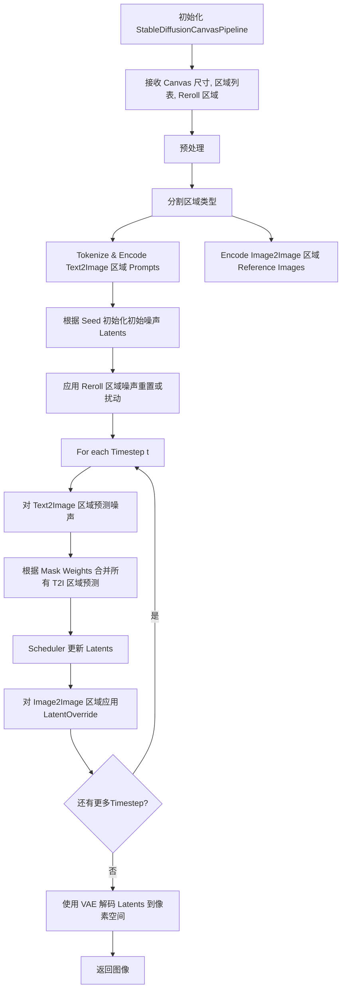
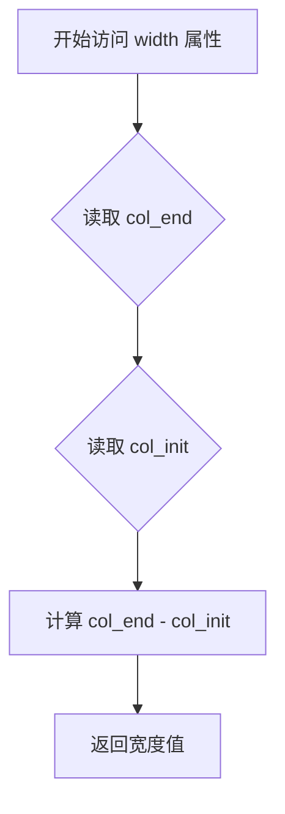
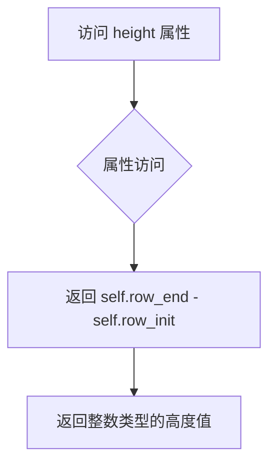
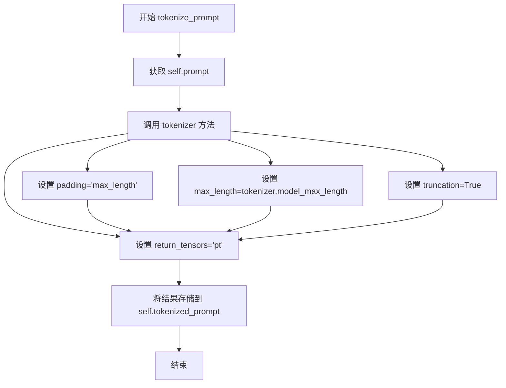
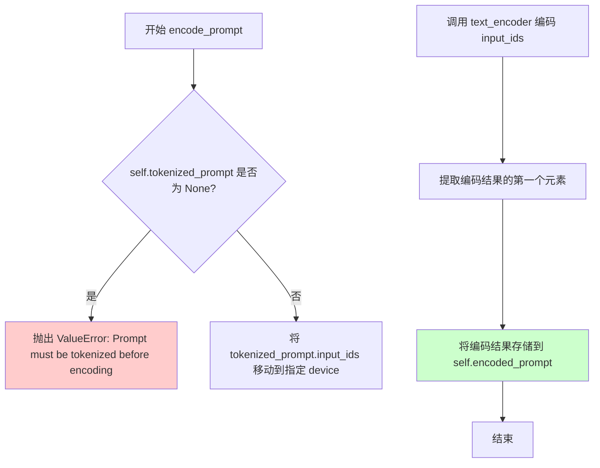
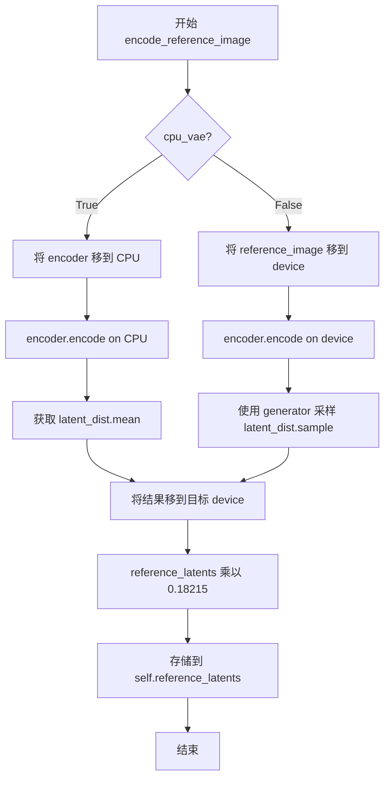
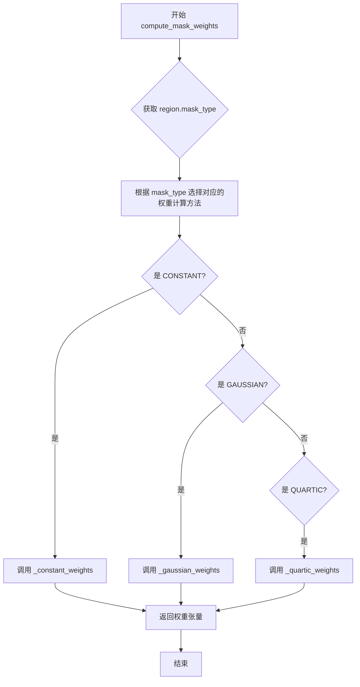
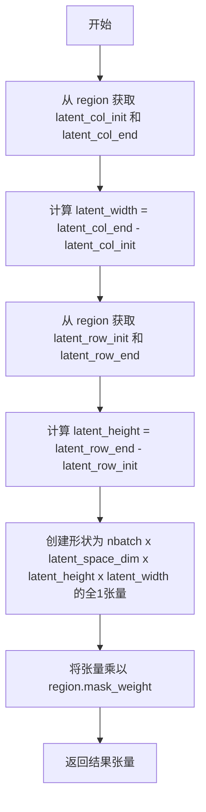
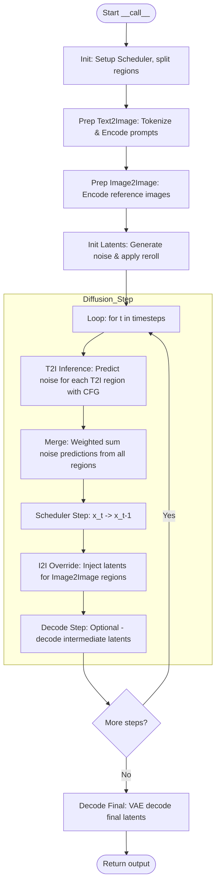

# `diffusers\examples\community\mixture_canvas.py` 详细设计文档

A Stable Diffusion pipeline that enables the creation of a single image by orchestrating multiple localized diffusion processes (Text-to-Image and Image-to-Image) within specific rectangular regions of a canvas, handling region-specific prompting, masking, noise rerolling, and latent merging.

## 整体流程



## 类结构

```
CanvasRegion (Dataclass/基类)
├── DiffusionRegion (Dataclass/抽象类)
│   ├── Text2ImageRegion (Dataclass)
│   └── Image2ImageRegion (Dataclass)
└── RerollRegion (Dataclass)
MaskWeightsBuilder (Helper Class)
StableDiffusionCanvasPipeline (Main Pipeline Class)
MaskModes (Enum)
RerollModes (Enum)
```

## 全局变量及字段


### `latents_shape`
    
Shape of the latent tensor (batch, channels, height//8, width//8)

类型：`tuple`
    


### `batch_size`
    
Number of samples processed in a single forward pass, fixed to 1

类型：`int`
    


### `text2image_regions`
    
List of text-guided diffusion regions in the canvas

类型：`List[Text2ImageRegion]`
    


### `image2image_regions`
    
List of image-guided diffusion regions in the canvas

类型：`List[Image2ImageRegion]`
    


### `mask_weights`
    
List of weight tensors for each text2image region masking

类型：`List[torch.Tensor]`
    


### `init_noise`
    
Initial random noise tensor for the latent canvas

类型：`torch.Tensor`
    


### `latents`
    
Current latent tensor being denoised during diffusion process

类型：`torch.Tensor`
    


### `noise_pred`
    
Predicted noise from the U-net model for current timestep

类型：`torch.Tensor`
    


### `CanvasRegion.row_init`
    
Region starting row in pixel space (included)

类型：`int`
    


### `CanvasRegion.row_end`
    
Region end row in pixel space (not included)

类型：`int`
    


### `CanvasRegion.col_init`
    
Region starting column in pixel space (included)

类型：`int`
    


### `CanvasRegion.col_end`
    
Region end column in pixel space (not included)

类型：`int`
    


### `CanvasRegion.region_seed`
    
Seed for random operations in this region

类型：`int`
    


### `CanvasRegion.noise_eps`
    
Standard deviation of zero-mean Gaussian noise to apply over latents

类型：`float`
    


### `CanvasRegion.latent_row_init`
    
Region starting row in latent space (computed as row_init // 8)

类型：`int`
    


### `CanvasRegion.latent_row_end`
    
Region end row in latent space (computed as row_end // 8)

类型：`int`
    


### `CanvasRegion.latent_col_init`
    
Region starting column in latent space (computed as col_init // 8)

类型：`int`
    


### `CanvasRegion.latent_col_end`
    
Region end column in latent space (computed as col_end // 8)

类型：`int`
    


### `MaskModes.CONSTANT`
    
Constant mask mode with uniform weights

类型：`str`
    


### `MaskModes.GAUSSIAN`
    
Gaussian mask mode with bell-curve weights

类型：`str`
    


### `MaskModes.QUARTIC`
    
Quartic kernel mask mode with smooth decay

类型：`str`
    


### `Text2ImageRegion.prompt`
    
Text prompt guiding the diffusion process in this region

类型：`str`
    


### `Text2ImageRegion.guidance_scale`
    
Guidance scale for classifier-free guidance (higher = more adherence to prompt)

类型：`float`
    


### `Text2ImageRegion.mask_type`
    
Type of weight mask applied to this diffusion region

类型：`str`
    


### `Text2ImageRegion.mask_weight`
    
Global multiplier for the mask weights

类型：`float`
    


### `Text2ImageRegion.tokenized_prompt`
    
Tokenized prompt in tensor format for encoder input

类型：`dict`
    


### `Text2ImageRegion.encoded_prompt`
    
Encoded prompt embeddings from text encoder

类型：`torch.Tensor`
    


### `Image2ImageRegion.reference_image`
    
Reference image tensor for image-to-image diffusion

类型：`torch.Tensor`
    


### `Image2ImageRegion.strength`
    
Strength of image influence (0.0 to 1.0)

类型：`float`
    


### `Image2ImageRegion.reference_latents`
    
Encoded reference image in latent space

类型：`torch.Tensor`
    


### `RerollModes.RESET`
    
Reroll mode that completely resets random noise in the region

类型：`str`
    


### `RerollModes.EPSILON`
    
Reroll mode that slightly alters latents with epsilon noise

类型：`str`
    


### `RerollRegion.reroll_mode`
    
Mode specifying how to reroll noise in this region

类型：`str`
    


### `MaskWeightsBuilder.latent_space_dim`
    
Size of the U-net latent space (number of channels)

类型：`int`
    


### `MaskWeightsBuilder.nbatch`
    
Batch size for mask weight computation

类型：`int`
    


### `StableDiffusionCanvasPipeline.vae`
    
Variational Autoencoder for encoding/decoding images to latent space

类型：`AutoencoderKL`
    


### `StableDiffusionCanvasPipeline.text_encoder`
    
CLIP text encoder for converting prompts to embeddings

类型：`CLIPTextModel`
    


### `StableDiffusionCanvasPipeline.tokenizer`
    
CLIP tokenizer for converting text to token IDs

类型：`CLIPTokenizer`
    


### `StableDiffusionCanvasPipeline.unet`
    
U-Net model for predicting noise in latent space

类型：`UNet2DConditionModel`
    


### `StableDiffusionCanvasPipeline.scheduler`
    
Diffusion scheduler for controlling denoising process

类型：`Union[DDIMScheduler, LMSDiscreteScheduler, PNDMScheduler]`
    


### `StableDiffusionCanvasPipeline.safety_checker`
    
Safety checker for filtering inappropriate outputs

类型：`StableDiffusionSafetyChecker`
    


### `StableDiffusionCanvasPipeline.feature_extractor`
    
CLIP image processor for preparing images as features

类型：`CLIPImageProcessor`
    
    

## 全局函数及方法


### `preprocess_image`

该函数负责将输入的 PIL 图像对象进行预处理，使其适配 Stable Diffusion 模型的输入要求。具体操作包括：将图像尺寸调整为 32 的整数倍、以 LANCZOS 重采样方式调整大小、转换为 float32 类型的 NumPy 数组并归一化到 [0, 1] 范围、调整维度顺序以适应 PyTorch 的通道排列规则（C、H、W 格式）、转换为 PyTorch 张量，最后将像素值线性变换到 [-1, 1] 区间以匹配模型的预期输入分布。

参数：

- `image`：`PIL.Image`，输入的原始图像对象，需要具备 `size` 属性和可转换为数组的能力

返回值：`torch.Tensor`，预处理后的图像张量，形状为 (1, C, H, W)，数值范围在 [-1, 1] 之间

#### 流程图

```mermaid
flowchart TD
    A[开始: 输入 PIL Image] --> B[获取图像宽度 w 和高度 h]
    B --> C{计算新的尺寸}
    C --> D[计算 w 和 h 减去其对 32 的余数]
    D --> E[将图像 resize 到 (w, h) 使用 LANCZOS 重采样]
    E --> F[将图像转换为 NumPy 数组, 类型为 float32]
    F --> G[归一化: 除以 255.0, 映射到 [0, 1]]
    G --> H[添加批次维度: image[None]]
    H --> I[转置维度: 从 HWC 变为 CHW]
    I --> J[从 NumPy 数组转换为 PyTorch 张量]
    J --> K[线性变换: 2.0 * image - 1.0, 映射到 [-1, 1]]
    K --> L[结束: 返回处理后的张量]
```

#### 带注释源码

```python
def preprocess_image(image):
    from PIL import Image  # 导入 PIL.Image, 避免顶层导入冲突

    """Preprocess an input image

    Same as
    https://github.com/huggingface/diffusers/blob/1138d63b519e37f0ce04e027b9f4a3261d27c628/src/diffusers/pipelines/stable_diffusion/pipeline_stable_diffusion_img2img.py#L44
    """
    # Step 1: 获取原始图像的宽度和高度
    w, h = image.size
    
    # Step 2: 将尺寸调整为 32 的整数倍, 确保与 VAE 的 8 倍下采样兼容
    # 这避免了潜在的四舍五入错误, 因为 UNet 在潜在空间中以 8 为因子进行下采样
    w, h = (x - x % 32 for x in (w, h))
    
    # Step 3: 使用 LANCZOS 重采样算法将图像调整到计算后的尺寸
    # LANCZOS 是一种高质量的重采样滤波器, 适合缩小图像
    image = image.resize((w, h), resample=Image.LANCZOS)
    
    # Step 4: 将 PIL 图像转换为 NumPy 数组, 并转换为 float32 类型以进行数值计算
    image = np.array(image).astype(np.float32)
    
    # Step 5: 归一化像素值到 [0, 1] 范围 (原始范围是 [0, 255])
    image = image / 255.0
    
    # Step 6: 添加批次维度, 从 (H, W, C) 变为 (1, H, W, C)
    # 然后转置维度, 从 (1, H, W, C) 变为 (1, C, H, W) 以适应 PyTorch 的 NCHW 格式
    image = image[None].transpose(0, 3, 1, 2)
    
    # Step 7: 将 NumPy 数组转换为 PyTorch 张量
    image = torch.from_numpy(image)
    
    # Step 8: 将 [0, 1] 范围的像素值线性变换到 [-1, 1] 范围
    # 这是因为 Stable Diffusion 的变分自编码器在 [-1, 1] 范围内训练
    return 2.0 * image - 1.0
```


### `CanvasRegion.get_region_generator`

该方法用于基于当前区域（`CanvasRegion`）内部存储的随机种子（`region_seed`）创建一个 PyTorch 随机数生成器（`torch.Generator`），以确保该区域的随机操作（如噪声重置）具有确定性和可重复性。

参数：

- `device`：`str`，默认为 `"cpu"`。指定生成器所在的设备（例如 "cpu" 或 "cuda"）。

返回值：`torch.Generator`，返回一个配置了特定种子的 PyTorch 生成器对象。

#### 流程图

```mermaid
graph TD
    A([开始 get_region_generator]) --> B{输入: device}
    B --> C[创建 torch.Generator(device)]
    C --> D[调用 manual_seed(self.region_seed)]
    D --> E([返回 Generator 对象])
```

#### 带注释源码

```python
def get_region_generator(self, device="cpu"):
    """Creates a torch.Generator based on the random seed of this region"""
    # Initialize region generator
    # 使用传入的 device (默认为 cpu) 创建一个生成器，
    # 并使用实例属性 self.region_seed (在 __post_init__ 中初始化) 设置其随机种子。
    return torch.Generator(device).manual_seed(self.region_seed)
```


### `CanvasRegion.width`

该属性方法用于计算画布区域的宽度，通过返回列结束坐标与列起始坐标的差值得到。

参数：無

返回值：`int`，返回画布区域在列方向上的像素宽度。

#### 流程图



#### 带注释源码

```python
@dataclass
class CanvasRegion:
    """Class defining a rectangular region in the canvas"""

    row_init: int  # Region starting row in pixel space (included)
    row_end: int  # Region end row in pixel space (not included)
    col_init: int  # Region starting column in pixel space (included)
    col_end: int  # Region end column in pixel space (not included)
    region_seed: int = None  # Seed for random operations in this region
    noise_eps: float = 0.0  # Deviation of a zero-mean gaussian noise to be applied over the latents in this region. Useful for slightly "rerolling" latents

    def __post_init__(self):
        # Initialize arguments if not specified
        if self.region_seed is None:
            self.region_seed = np.random.randint(9999999999)
        # Check coordinates are non-negative
        for coord in [self.row_init, self.row_end, self.col_init, self.col_end]:
            if coord < 0:
                raise ValueError(
                    f"A CanvasRegion must be defined with non-negative indices, found ({self.row_init}, {self.row_end}, {self.col_init}, {self.col_end})"
                )
        # Check coordinates are divisible by 8, else we end up with nasty rounding error when mapping to latent space
        for coord in [self.row_init, self.row_end, self.col_init, self.col_end]:
            if coord // 8 != coord / 8:
                raise ValueError(
                    f"A CanvasRegion must be defined with locations divisible by 8, found ({self.row_init}-{self.row_end}, {self.col_init}-{self.col_end})"
                )
        # Check noise eps is non-negative
        if self.noise_eps < 0:
            raise ValueError(f"A CanvasRegion must be defined noises eps non-negative, found {self.noise_eps}")
        # Compute coordinates for this region in latent space
        self.latent_row_init = self.row_init // 8
        self.latent_row_end = self.row_end // 8
        self.latent_col_init = self.col_init // 8
        self.latent_col_end = self.col_end // 8

    @property
    def width(self):
        """计算区域宽度（列方向上的像素数）
        
        通过返回列结束坐标与列起始坐标的差值来计算宽度。
        这是像素空间中的宽度，不是潜在空间（latent space）的宽度。
        
        Returns:
            int: 区域的列方向宽度 (col_end - col_init)
        """
        return self.col_end - self.col_init

    @property
    def height(self):
        return self.row_end - self.row_init

    def get_region_generator(self, device="cpu"):
        """Creates a torch.Generator based on the random seed of this region"""
        # Initialize region generator
        return torch.Generator(device).manual_seed(self.region_seed)

    @property
    def __dict__(self):
        return asdict(self)
```


### `CanvasRegion.height`

该属性用于计算并返回 CanvasRegion 区域在像素空间中的高度（行数），通过计算区域结束行与起始行的差值得到。

参数： 无

返回值：`int`，返回区域的高度（以像素为单位），即 `row_end - row_init`

#### 流程图



#### 带注释源码

```python
@property
def height(self):
    """计算并返回 CanvasRegion 区域在像素空间中的高度
    
    该属性是一个只读的计算属性，通过返回区域结束行与起始行的差值
    来得到区域的高度。高度以像素为单位，不包含结束行（半开区间 [row_init, row_end)）。
    
    Returns:
        int: 区域的高度，即 row_end - row_init
    """
    return self.row_end - self.row_init
```


### `Text2ImageRegion.tokenize_prompt`

该方法使用指定的 `CLIPTokenizer` 将文本提示（prompt）转换为模型可处理的 token 序列，并将结果存储在实例的 `tokenized_prompt` 属性中，以供后续编码使用。

参数：

- `self`：`Text2ImageRegion` 实例本身（隐含参数）
- `tokenizer`：`CLIPTokenizer`，Hugging Face Transformers 库中的分词器，用于将文本字符串转换为 token ID 序列

返回值：`None`（无显式返回值），该方法直接修改 `self.tokenized_prompt` 属性

#### 流程图



#### 带注释源码

```python
def tokenize_prompt(self, tokenizer):
    """Tokenizes the prompt for this diffusion region using a given tokenizer"""
    # 使用传入的 tokenizer 对 prompt 进行分词处理
    # 参数说明:
    #   - self.prompt: 要分词的文本提示，来自 Text2ImageRegion 实例的 prompt 属性
    #   - padding="max_length": 将序列填充到最大长度，确保批次中所有序列长度一致
    #   - max_length=tokenizer.model_max_length: 使用 tokenizer 支持的最大长度（通常为77）
    #   - truncation=True: 如果序列超过最大长度则截断
    #   - return_tensors="pt": 返回 PyTorch 张量格式而非 Python 字典
    self.tokenized_prompt = tokenizer(
        self.prompt,
        padding="max_length",
        max_length=tokenizer.model_max_length,
        truncation=True,
        return_tensors="pt",
    )
    # 分词后的结果是一个包含 'input_ids' 和 'attention_mask' 的字典
    # 存储在 self.tokenized_prompt 属性中，供后续 encode_prompt 方法使用
```


### `Text2ImageRegion.encode_prompt`

该方法用于将已经分词的文本提示（tokenized prompt）通过文本编码器（text_encoder）编码成文本嵌入（text embeddings），以便在扩散模型的推理过程中使用。

参数：

- `text_encoder`：`CLIPTextModel`，用于将分词后的提示编码为文本嵌入的模型
- `device`：`torch.device` 或 `str`，执行编码操作的设备（如 "cuda" 或 "cpu"）

返回值：`None`（无返回值），结果直接存储在实例的 `self.encoded_prompt` 属性中

#### 流程图



#### 带注释源码

```python
def encode_prompt(self, text_encoder, device):
    """Encodes the previously tokenized prompt for this diffusion region using a given encoder"""
    # 检查 prompt 是否已经完成分词
    # 如果未分词，抛出 ValueError 异常
    assert self.tokenized_prompt is not None, ValueError(
        "Prompt in diffusion region must be tokenized before encoding"
    )
    
    # 将分词后的 input_ids 移动到指定设备（CPU/CUDA）
    # 然后使用 text_encoder 进行编码，获取文本嵌入
    # text_encoder 返回一个元组，索引 [0] 提取隐藏状态
    self.encoded_prompt = text_encoder(self.tokenized_prompt.input_ids.to(device))[0]
```


### `Image2ImageRegion.encode_reference_image`

将参考图像编码到潜在空间（latent space），供图像到图像（Image2Image）扩散过程使用。该方法使用 VAE 编码器对参考图像进行编码，并根据 `cpu_vae` 参数决定编码器在 CPU 还是 GPU 上运行，最终将潜在表示乘以缩放因子 0.18215。

参数：

- `self`：`Image2ImageRegion`，隐含的实例参数，表示当前图像到图像扩散区域对象
- `encoder`：`Union[AutoencoderKL, torch.nn.Module]`，VAE 编码器模型，用于将图像像素空间转换到潜在空间
- `device`：`torch.device`，目标设备，用于将编码后的潜在变量移到指定设备
- `generator`：`torch.Generator`，随机数生成器，用于在潜在空间中进行采样（当 `cpu_vae=False` 时使用）
- `cpu_vae`：`bool`，默认为 `False`，布尔标志，指示是否将 VAE 编码器放在 CPU 上运行以节省显存

返回值：`None`，无显式返回值，但该方法会更新实例属性 `self.reference_latents`（类型：`torch.Tensor`），存储编码后的参考图像潜在表示

#### 流程图



#### 带注释源码

```python
def encode_reference_image(self, encoder, device, generator, cpu_vae=False):
    """Encodes the reference image for this Image2Image region into the latent space"""
    # Place encoder in CPU or not following the parameter cpu_vae
    if cpu_vae:
        # Note here we use mean instead of sample, to avoid moving also generator to CPU, which is troublesome
        # 当 cpu_vae 为 True 时，将编码器移到 CPU 进行编码
        # 使用 .mean() 而不是 .sample()，避免将 generator 也移到 CPU（这会很麻烦）
        self.reference_latents = encoder.cpu().encode(self.reference_image).latent_dist.mean.to(device)
    else:
        # 当 cpu_vae 为 False 时，将参考图像移到目标设备，使用 generator 进行随机采样
        self.reference_latents = encoder.encode(self.reference_image.to(device)).latent_dist.sample(
            generator=generator
        )
    # VAE 缩放因子：将潜在空间的值缩放到与 UNet 期望的范围一致
    # 这是 Stable Diffusion 中 VAE 的标准缩放系数
    self.reference_latents = 0.18215 * self.reference_latents
```


### `MaskWeightsBuilder.compute_mask_weights`

该方法是`MaskWeightsBuilder`类的核心方法，用于根据不同的掩码模式（常量、高斯、四次）计算给定扩散区域的权重张量。它采用策略模式根据`region.mask_type`属性动态选择合适的权重计算方法，并返回与U-Net潜在空间维度匹配的PyTorch张量。

参数：

- `region`：`DiffusionRegion`，需要计算掩码权重的扩散区域对象，包含区域坐标、掩码类型和权重系数等信息

返回值：`torch.tensor`，计算得到的权重张量，形状为`(nbatch, latent_space_dim, latent_height, latent_width)`

#### 流程图



#### 带注释源码

```
def compute_mask_weights(self, region: DiffusionRegion) -> torch.tensor:
    """Computes a tensor of weights for a given diffusion region
    
    该方法根据扩散区域的mask_type属性，选择并调用对应的权重计算方法。
    采用策略模式实现，支持三种掩码模式：
    - CONSTANT: 常数权重，所有位置权重相同
    - GAUSSIAN: 高斯权重，中心权重高，边缘权重低
    - QUARTIC: 四次核权重，具有平滑衰减特性
    
    Args:
        region: DiffusionRegion对象，包含以下关键属性：
            - mask_type: MaskModes枚举值，指定权重计算方式
            - mask_weight: 全局权重乘数
            - latent_row_init/end, latent_col_init/end: 潜在空间坐标
    
    Returns:
        torch.tensor: 形状为 (nbatch, latent_space_dim, latent_height, latent_width)
                     的权重张量，用于后续扩散过程中的区域加权
    """
    # 建立掩码类型到对应处理方法的映射字典
    # 这种设计模式允许轻松扩展新的掩码类型，而无需修改主逻辑
    MASK_BUILDERS = {
        MaskModes.CONSTANT.value: self._constant_weights,
        MaskModes.GAUSSIAN.value: self._gaussian_weights,
        MaskModes.QUARTIC.value: self._quartic_weights,
    }
    # 根据region.mask_type选择合适的权重计算方法并执行
    # 返回值是一个PyTorch张量，其维度与U-Net的潜在空间匹配
    return MASK_BUILDERS[region.mask_type](region)
```


### `MaskWeightsBuilder._constant_weights`

该方法用于为给定的扩散区域计算一个常数权重张量，张量中所有元素的值都相同，等于区域指定的mask_weight值。

参数：

- `self`：MaskWeightsBuilder 实例（隐式参数）
- `region`：`DiffusionRegion`，定义扩散区域的坐标和属性，用于计算该区域在潜在空间中的权重张量

返回值：`torch.tensor`，形状为 `(nbatch, latent_space_dim, latent_height, latent_width)` 的常数权重张量，所有元素值均为 `region.mask_weight`

#### 流程图



#### 带注释源码

```python
def _constant_weights(self, region: DiffusionRegion) -> torch.tensor:
    """Computes a tensor of constant for a given diffusion region"""
    # 计算潜在空间中的宽度：区域结束列索引减去起始列索引
    latent_width = region.latent_col_end - region.latent_col_init
    
    # 计算潜在空间中的高度：区域结束行索引减去起始行索引
    latent_height = region.latent_row_end - region.latent_row_init
    
    # 创建一个形状为 (nbatch, latent_space_dim, latent_height, latent_width) 的全1张量
    # 然后乘以区域的 mask_weight，得到常数权重张量
    # 所有位置的权重值都相同，等于 mask_weight
    return torch.ones(self.nbatch, self.latent_space_dim, latent_height, latent_width) * region.mask_weight
```


### `MaskWeightsBuilder._gaussian_weights`

生成一个高斯权重掩膜，用于对给定扩散区域中的瓦片贡献进行加权。

参数：

- `self`：`MaskWeightsBuilder` 实例，方法所属的对象
- `region`：`DiffusionRegion`，需要生成高斯权重掩膜的扩散区域对象

返回值：`torch.tensor`，形状为 `(nbatch, latent_space_dim, latent_height, latent_width)` 的权重张量，用于在潜在空间中对扩散区域进行高斯加权

#### 流程图

```mermaid
flowchart TD
    A[开始] --> B[计算 latent_width = region.latent_col_end - region.latent_col_init]
    B --> C[计算 latent_height = region.latent_row_end - region.latent_row_init]
    C --> D[设置方差 var = 0.01]
    D --> E[计算 x 方向中点 midpoint_x = (latent_width - 1) / 2]
    E --> F[使用高斯函数计算 x_probs 数组]
    F --> G[计算 y 方向中点 midpoint_y = (latent_height - 1) / 2]
    G --> H[使用高斯函数计算 y_probs 数组]
    H --> I[使用 np.outer 生成二维权重矩阵 weights]
    I --> J[weights 乘以 region.mask_weight 进行全局缩放]
    J --> K[使用 torch.tile 扩展权重张量到 batch 和 latent_space_dim 维度]
    K --> L[返回权重张量]
```

#### 带注释源码

```python
def _gaussian_weights(self, region: DiffusionRegion) -> torch.tensor:
    """Generates a gaussian mask of weights for tile contributions"""
    # 计算潜在空间中的宽度（列数）
    latent_width = region.latent_col_end - region.latent_col_init
    # 计算潜在空间中的高度（行数）
    latent_height = region.latent_row_end - region.latent_row_init

    # 设置高斯分布的方差为 0.01，控制权重衰减速度
    var = 0.01
    # 计算 x 方向的中点，-1 是因为索引从 0 到 latent_width - 1
    midpoint = (latent_width - 1) / 2
    # 使用高斯概率密度函数计算 x 方向每个位置的概率权重
    # 公式: exp(-(x-midpoint)^2 / (2 * var * latent_width^2)) / sqrt(2*pi*var)
    x_probs = [
        exp(-(x - midpoint) * (x - midpoint) / (latent_width * latent_width) / (2 * var)) / sqrt(2 * pi * var)
        for x in range(latent_width)
    ]
    # 计算 y 方向的中点
    midpoint = (latent_height - 1) / 2
    # 使用高斯概率密度函数计算 y 方向每个位置的概率权重
    y_probs = [
        exp(-(y - midpoint) * (y - midpoint) / (latent_height * latent_height) / (2 * var)) / sqrt(2 * pi * var)
        for y in range(latent_height)
    ]

    # 使用外积生成二维高斯权重矩阵，再乘以 mask_weight 进行全局缩放
    weights = np.outer(y_probs, x_probs) * region.mask_weight
    # 将权重张量平铺到批次维度和潜在空间维度
    # 最终形状: (nbatch, latent_space_dim, latent_height, latent_width)
    return torch.tile(torch.tensor(weights), (self.nbatch, self.latent_space_dim, 1, 1))
```


### `MaskWeightsBuilder._quartic_weights`

生成分配给扩散区域的四次（Quartic）核权重掩码tensor。该方法利用四次核函数在扩散区域内产生有界支持且平滑衰减到区域边界的权重分布，适用于需要对tile贡献进行平滑加权的场景。

参数：

- `self`：`MaskWeightsBuilder`类实例，隐含参数
- `region`：`DiffusionRegion`，目标扩散区域对象，包含区域的潜在空间坐标（latent_row_init, latent_row_end, latent_col_init, latent_col_end）和掩码权重（mask_weight）

返回值：`torch.tensor`，形状为 `(nbatch, latent_space_dim, latent_height, latent_width)` 的四维权重张量

#### 流程图

```mermaid
flowchart TD
    A[开始 _quartic_weights] --> B[设置 quartic_constant = 15.0 / 16.0]
    B --> C[计算列方向支撑向量 support_x]
    C --> D[计算 x_probs = quartic_constant * (1 - support_x²)²]
    D --> E[计算行方向支撑向量 support_y]
    E --> F[计算 y_probs = quartic_constant * (1 - support_y²)²]
    F --> G[计算外积 weights = y_probs ⊗ x_probs]
    G --> H[应用区域掩码权重 weights = weights * region.mask_weight]
    H --> I[转换为 PyTorch Tensor 并平铺]
    I --> J[返回最终权重张量]
```

#### 带注释源码

```python
def _quartic_weights(self, region: DiffusionRegion) -> torch.tensor:
    """Generates a quartic mask of weights for tile contributions

    The quartic kernel has bounded support over the diffusion region, and a smooth decay to the region limits.
    """
    # 四次核函数常数，基于四次核的积分性质得出
    # Quartic kernel constant derived from the integral properties of quartic kernel
    quartic_constant = 15.0 / 16.0

    # 计算列方向（x轴）的支撑向量
    # Support vector for columns (x-axis), normalized to [-0.995, 0.995]
    support = (np.array(range(region.latent_col_init, region.latent_col_end)) - region.latent_col_init) / (
        region.latent_col_end - region.latent_col_init - 1
    ) * 1.99 - (1.99 / 2.0)
    # 四次核函数: K(u) = (15/16) * (1 - u²)² for |u| <= 1
    x_probs = quartic_constant * np.square(1 - np.square(support))

    # 计算行方向（y轴）的支撑向量
    # Support vector for rows (y-axis), normalized to [-0.995, 0.995]
    support = (np.array(range(region.latent_row_init, region.latent_row_end)) - region.latent_row_init) / (
        region.latent_row_end - region.latent_row_init - 1
    ) * 1.99 - (1.99 / 2.0)
    # 应用四次核函数
    y_probs = quartic_constant * np.square(1 - np.square(support))

    # 计算二维权重矩阵：y_probs 和 x_probs 的外积
    # Compute 2D weight matrix: outer product of y_probs and x_probs
    weights = np.outer(y_probs, x_probs) * region.mask_weight

    # 将numpy数组转换为PyTorch张量，并平铺到批次维度和潜在空间维度
    # Convert to PyTorch tensor and tile to batch and latent space dimensions
    return torch.tile(torch.tensor(weights), (self.nbatch, self.latent_space_dim, 1, 1))
```


### `StableDiffusionCanvasPipeline.decode_latents`

该方法负责将潜在空间（latent space）中的向量解码为像素空间的图像。它首先根据`cpu_vae`参数决定是否将VAE模型和潜在向量移至CPU进行解码，然后通过VAE解码器将缩放后的潜在向量转换为图像张量，最后对图像进行归一化、格式转换并返回PIL图像列表。

参数：

- `self`：隐式参数，当前StableDiffusionCanvasPipeline实例
- `latents`：`torch.Tensor`，待解码的潜在表示向量，形状为(batch_size, channels, height, width)
- `cpu_vae`：`bool`，是否在CPU上运行VAE解码（默认为False），设为True时可避免GPU显存溢出

返回值：`List[PIL.Image]`或`PIL.Image`，解码后的PIL图像列表（当batch_size>1时）或单个图像

#### 流程图

```mermaid
flowchart TD
    A[开始 decode_latents] --> B{cpu_vae?}
    B -->|True| C[深拷贝latents到CPU]
    B -->|False| D[直接引用latents]
    C --> E[深拷贝VAE到CPU]
    D --> F[直接引用self.vae]
    E --> G[latents = latents / 0.18215]
    F --> G
    G --> H[vae.decode(lat)获取解码结果]
    H --> I[image = (image / 2 + 0.5).clamp(0, 1)]
    I --> J[转换为CPU张量并调整维度顺序]
    J --> K[转为NumPy数组]
    K --> L[numpy_to_pil转换为PIL图像]
    L --> M[返回PIL图像]
```

#### 带注释源码

```python
def decode_latents(self, latents, cpu_vae=False):
    """Decodes a given array of latents into pixel space"""
    # 根据cpu_vae参数决定解码设备
    if cpu_vae:
        # 为避免GPU显存溢出，深拷贝latents到CPU
        lat = deepcopy(latents).cpu()
        # 深拷贝VAE模型到CPU
        vae = deepcopy(self.vae).cpu()
    else:
        # 直接使用GPU上的latents和VAE（默认高性能路径）
        lat = latents
        vae = self.vae

    # VAE编码时使用了0.18215缩放因子，此处逆向还原
    lat = 1 / 0.18215 * lat
    # 使用VAE解码器将潜在向量解码为图像张量
    image = vae.decode(lat).sample

    # 将图像从[-1,1]范围线性变换到[0,1]范围
    # (image / 2 + 0.5) 实现从[-1,1]到[0,1]的映射
    # .clamp(0, 1) 确保数值不超出[0,1]有效范围
    image = (image / 2 + 0.5).clamp(0, 1)
    
    # 将图像张量移至CPU，变换维度顺序从(CHW)到(HWC)
    # permute(0, 2, 3, 1) 将(batch, channel, height, width)转为(batch, height, width, channel)
    image = image.cpu().permute(0, 2, 3, 1).numpy()

    # 调用pipeline工具方法将NumPy数组转换为PIL图像并返回
    return self.numpy_to_pil(image)
```


### `StableDiffusionCanvasPipeline.get_latest_timestep_img2img`

该方法用于根据 img2img 的推理步数和强度（strength）计算 diffusion 流程中最后一个需要强制使用原始图像潜在表示的时间步。在 diffusion 过程的早期时间步中，会使用参考图像的潜在表示来影响生成结果，而在该时间步之后，则完全由模型自由生成。

参数：

- `num_inference_steps`：`int`，推理的总步数，即 diffusion 过程的完整迭代次数
- `strength`：`float`，img2img 强度，范围 0.0 到 1.0，值越大表示保留原图特征越多

返回值：`torch.Tensor`，返回 scheduler 中最新的时间步（timestep），类型为张量

#### 流程图

```mermaid
flowchart TD
    A[开始 get_latest_timestep_img2img] --> B[获取 scheduler 的 steps_offset, 默认值为 0]
    B --> C[计算 init_timestep = int num_inference_steps × (1 - strength) + offset]
    C --> D[init_timestep = min init_timestep, num_inference_steps]
    D --> E[计算 t_start = min max num_inference_steps - init_timestep + offset, 0, num_inference_steps - 1]
    E --> F[从 scheduler.timesteps 中获取索引为 t_start 的时间步]
    F --> G[返回 latest_timestep]
```

#### 带注释源码

```python
def get_latest_timestep_img2img(self, num_inference_steps, strength):
    """Finds the latest timesteps where an img2img strength does not impose latents anymore"""
    # 从 scheduler 配置中获取步数偏移量，默认为 0
    # 这个偏移量用于调整时间步的起始位置
    offset = self.scheduler.config.get("steps_offset", 0)
    
    # 计算初始时间步：基于 strength 计算需要保留原图特征的时间步数
    # strength 越大，init_timestep 越小，保留原图特征的时间步越少
    # 例如：num_inference_steps=50, strength=0.8, offset=0
    # init_timestep = int(50 * (1 - 0.8)) + 0 = int(10) = 10
    init_timestep = int(num_inference_steps * (1 - strength)) + offset
    
    # 确保 init_timestep 不超过总推理步数
    init_timestep = min(init_timestep, num_inference_steps)
    
    # 计算在 scheduler 时间步数组中的起始索引
    # t_start 表示从哪个时间步开始需要强制使用原图的潜在表示
    # 使用 min/max 确保索引在有效范围内 [0, num_inference_steps - 1]
    t_start = min(max(num_inference_steps - init_timestep + offset, 0), num_inference_steps - 1)
    
    # 从 scheduler 的时间步数组中获取对应索引的时间步值
    latest_timestep = self.scheduler.timesteps[t_start]
    
    # 返回计算出的最新时间步，后续在 diffusion 过程中
    # 只有当当前时间步 t > latest_timestep 时才保留原图影响
    return latest_timestep
```


### `StableDiffusionCanvasPipeline.__call__`

该方法是 `StableDiffusionCanvasPipeline` 的核心调用接口，用于在同一画布上协调多个不同类型的扩散区域（Text2Image 和 Image2Image）的生成。它通过分割潜在空间、应用特定的掩码权重合并多区域噪声预测，并处理图像重绘（img2img）与噪声重置（reroll），最终生成合成图像。

参数：

- `canvas_height`：`int`，生成图像的像素高度。
- `canvas_width`：`int`，生成图像的像素宽度。
- `regions`：`List[DiffusionRegion]`，包含所有扩散区域的列表（如 `Text2ImageRegion`, `Image2ImageRegion`）。
- `num_inference_steps`：`Optional[int] = 50`，扩散模型的推理步数。
- `seed`：`Optional[int] = 12345`，用于生成初始潜在噪声的随机种子。
- `reroll_regions`：`Optional[List[RerollRegion]] = None`，指定需要重新随机化噪声的区域列表。
- `cpu_vae`：`Optional[bool] = False`，是否在 CPU 上运行 VAE 解码（以节省显存）。
- `decode_steps`：`Optional[bool] = False`，是否将推理过程中的每个时间步都解码为图像并返回。

返回值：`Dict`，返回一个字典，包含：
- `images`：最终生成的图像列表（PIL Images）。
- `steps_images`（可选）：如果 `decode_steps` 为 True，则包含推理过程中每个时间步的图像列表。

#### 流程图



#### 带注释源码

```python
@torch.no_grad()
def __call__(
    self,
    canvas_height: int,
    canvas_width: int,
    regions: List[DiffusionRegion],
    num_inference_steps: Optional[int] = 50,
    seed: Optional[int] = 12345,
    reroll_regions: Optional[List[RerollRegion]] = None,
    cpu_vae: Optional[bool] = False,
    decode_steps: Optional[bool] = False,
):
    # 1. 初始化与预处理
    if reroll_regions is None:
        reroll_regions = []
    batch_size = 1

    # 用于存储中间步骤的图像（如果开启decode_steps）
    if decode_steps:
        steps_images = []

    # 设置调度器的推理步骤
    self.scheduler.set_timesteps(num_inference_steps, device=self.device)

    # 根据类型分割扩散区域
    text2image_regions = [region for region in regions if isinstance(region, Text2ImageRegion)]
    image2image_regions = [region for region in regions if isinstance(region, Image2ImageRegion)]

    # 2. 处理 Text2Image 区域：分词与编码
    for region in text2image_regions:
        region.tokenize_prompt(self.tokenizer)
        region.encode_prompt(self.text_encoder, self.device)

    # 3. 初始化潜在变量 (Latents)
    # 计算潜在空间的形状 (H/8, W/8)
    latents_shape = (batch_size, self.unet.config.in_channels, canvas_height // 8, canvas_width // 8)
    # 创建随机数生成器
    generator = torch.Generator(self.device).manual_seed(seed)
    # 生成初始噪声
    init_noise = torch.randn(latents_shape, generator=generator, device=self.device)

    # 4. 处理重绘区域 (Reroll Regions)
    # 重置特定区域的噪声
    for region in reroll_regions:
        if region.reroll_mode == RerollModes.RESET.value:
            region_shape = (
                latents_shape[0],
                latents_shape[1],
                region.latent_row_end - region.latent_row_init,
                region.latent_col_end - region.latent_col_init,
            )
            # 在指定区域重新生成噪声
            init_noise[
                :,
                :,
                region.latent_row_init : region.latent_row_end,
                region.latent_col_init : region.latent_col_end,
            ] = torch.randn(region_shape, generator=region.get_region_generator(self.device), device=self.device)

    # 应用 epsilon 噪声扰动（针对扩散区域和 epsilon 模式的 reroll 区域）
    all_eps_rerolls = regions + [r for r in reroll_regions if r.reroll_mode == RerollModes.EPSILON.value]
    for region in all_eps_rerolls:
        if region.noise_eps > 0:
            region_noise = init_noise[
                :,
                :,
                region.latent_row_init : region.latent_row_end,
                region.latent_col_init : region.latent_col_end,
            ]
            eps_noise = (
                torch.randn(
                    region_noise.shape, generator=region.get_region_generator(self.device), device=self.device
                )
                * region.noise_eps
            )
            init_noise[
                :,
                :,
                region.latent_row_init : region.latent_row_end,
                region.latent_col_init : region.latent_col_end,
            ] += eps_noise

    # 根据调度器的要求缩放初始噪声
    latents = init_noise * self.scheduler.init_noise_sigma

    # 5. 准备无分类器引导 (CFG) 的无条件嵌入
    for region in text2image_regions:
        max_length = region.tokenized_prompt.input_ids.shape[-1]
        # 创建空字符串作为无条件输入
        uncond_input = self.tokenizer(
            [""] * batch_size, padding="max_length", max_length=max_length, return_tensors="pt"
        )
        uncond_embeddings = self.text_encoder(uncond_input.input_ids.to(self.device))[0]

        # 将无条件嵌入和条件嵌入拼接，以同时进行两次前向传播
        region.encoded_prompt = torch.cat([uncond_embeddings, region.encoded_prompt])

    # 6. 处理 Image2Image 区域的参考图像
    for region in image2image_regions:
        region.encode_reference_image(self.vae, device=self.device, generator=generator)

    # 7. 准备掩码权重
    mask_builder = MaskWeightsBuilder(latent_space_dim=self.unet.config.in_channels, nbatch=batch_size)
    mask_weights = [mask_builder.compute_mask_weights(region).to(self.device) for region in text2image_regions]

    # 8. 核心推理循环
    for i, t in tqdm(enumerate(self.scheduler.timesteps)):
        # --- A. Text2Image 推理 ---
        noise_preds_regions = []
        
        # 遍历每个文本引导区域进行预测
        for region in text2image_regions:
            region_latents = latents[
                :,
                :,
                region.latent_row_init : region.latent_row_end,
                region.latent_col_init : region.latent_col_end,
            ]
            # 扩展 latent 以进行 CFG
            latent_model_input = torch.cat([region_latents] * 2)
            # 根据调度器规则缩放输入
            latent_model_input = self.scheduler.scale_model_input(latent_model_input, t)
            # 预测噪声残差
            noise_pred = self.unet(latent_model_input, t, encoder_hidden_states=region.encoded_prompt)["sample"]
            # 执行引导：分离无条件和文本预测，计算差值
            noise_pred_uncond, noise_pred_text = noise_pred.chunk(2)
            noise_pred_region = noise_pred_uncond + region.guidance_scale * (noise_pred_text - noise_pred_uncond)
            noise_preds_regions.append(noise_pred_region)

        # --- B. 合并噪声预测 ---
        # 初始化用于聚合的 tensor
        noise_pred = torch.zeros(latents.shape, device=self.device)
        contributors = torch.zeros(latents.shape, device=self.device)
        
        # 累加每个区域的加权噪声预测
        for region, noise_pred_region, mask_weights_region in zip(
            text2image_regions, noise_preds_regions, mask_weights
        ):
            noise_pred[
                :,
                :,
                region.latent_row_init : region.latent_row_end,
                region.latent_col_init : region.latent_col_end,
            ] += noise_pred_region * mask_weights_region
            contributors[
                :,
                :,
                region.latent_row_init : region.latent_row_end,
                region.latent_col_init : region.latent_col_end,
            ] += mask_weights_region
            
        # 处理重叠区域：取平均值
        noise_pred /= contributors
        noise_pred = torch.nan_to_num(noise_pred) # 处理未被任何区域覆盖的位置（避免 NaN）

        # --- C. 更新 Latents ---
        # 使用调度器根据预测的噪声更新 latents
        latents = self.scheduler.step(noise_pred, t, latents).prev_sample

        # --- D. Image2Image 覆盖 ---
        # 对图像引导区域，用参考图像的潜在变量覆盖当前 latents
        for region in image2image_regions:
            # 根据 strength 计算该区域开始生效的时间步
            influence_step = self.get_latest_timestep_img2img(num_inference_steps, region.strength)
            # 仅在当前时间步大于生效时间步时进行覆盖（意味着越接近初始时刻，影响越大）
            if t > influence_step:
                timestep = t.repeat(batch_size)
                region_init_noise = init_noise[
                    :,
                    :,
                    region.latent_row_init : region.latent_row_end,
                    region.latent_col_init : region.latent_col_end,
                ]
                # 对参考图像潜在变量添加噪声
                region_latents = self.scheduler.add_noise(region.reference_latents, region_init_noise, timestep)
                # 覆盖全局 latents 中的对应区域
                latents[
                    :,
                    :,
                    region.latent_row_init : region.latent_row_end,
                    region.latent_col_init : region.latent_col_end,
                ] = region_latents

        # --- E. 记录中间步骤 ---
        if decode_steps:
            steps_images.append(self.decode_latents(latents, cpu_vae))

    # 9. 最终解码
    # 循环结束后，将最终的潜在变量解码为图像
    image = self.decode_latents(latents, cpu_vae)

    # 10. 返回结果
    output = {"images": image}
    if decode_steps:
        output = {**output, "steps_images": steps_images}
    return output
```

## 关键组件


### CanvasRegion

定义画布上矩形区域的基础类，负责管理区域的坐标（行/列的起始和结束位置）、随机种子以及高斯噪声偏差，并提供坐标验证和潜在空间转换功能。

### DiffusionRegion

继承自CanvasRegion的抽象类，用于定义某种扩散过程作用的区域，作为Text2ImageRegion和Image2ImageRegion的基类。

### Text2ImageRegion

文本引导的扩散区域类，支持自定义提示词、引导_scale、掩码类型和权重，提供提示词分词和编码功能。

### Image2ImageRegion

图像引导的扩散区域类，包含参考图像张量和强度参数，负责将参考图像编码到潜在空间。

### RerollRegion

用于重置画布区域初始潜在噪声的类，支持两种重置模式（RESET完全重置，EPSILON轻微扰动）。

### MaskModes

掩码模式的枚举类，包含CONSTANT（常数权重）、GAUSSIAN（高斯权重）和QUARTIC（四次权重）三种模式，用于控制扩散区域的影响力衰减。

### RerollModes

重置区域的运行模式枚举，RESET模式完全重置随机噪声，EPSILON模式对潜在表示进行轻微扰动。

### MaskWeightsBuilder

辅助计算类，根据不同的掩码模式为扩散区域生成权重张量，支持常数、高斯和四次核权重的计算。

### StableDiffusionCanvasPipeline

主扩散管道类，继承DiffusionPipeline和StableDiffusionMixin，在同一画布上混合多个扩散器，支持文本到图像和图像到图像的多区域扩散推理。


## 问题及建议


### 已知问题

-   **decode_latents方法中过度使用deepcopy**：当cpu_vae=True时，代码使用`deepcopy(latents).cpu()`和`deepcopy(self.vae).cpu()`，这在处理高分辨率图像时会产生严重的性能问题和内存占用
-   **Image2ImageRegion的encode_reference_image中cpu_vae逻辑不一致**：当cpu_vae=True时使用mean采样，当cpu_vae=False时使用sample采样，这种行为差异可能导致结果不一致
-   **mask_type验证逻辑不一致**：在Text2ImageRegion中使用`self.mask_type not in [e.value for e in MaskModes]`检查，但MaskModes本身是枚举值，比较时有时用.value有时不用
-   **重复的坐标验证代码**：CanvasRegion.__post_init__中验证坐标是否为8的倍数，代码重复遍历坐标列表两次
- **潜在的空值问题**：在Text2ImageRegion.encode_prompt中使用assert而不是if检查，如果tokenized_prompt为None会抛出AssertionError而不是更友好的ValueError
- **MaskWeightsBuilder权重计算混合使用numpy和torch**：在高频率调用时会产生不必要的CPU-GPU数据传输开销
- **decode_latents方法不支持batch处理**：当cpu_vae=True时，将整个VAE和latents复制到CPU，无法有效利用batch并行
- **Scheduler配置依赖steps_offset**：get_latest_timestep_img2img方法依赖scheduler.config.get("steps_offset", 0)，但未处理可能缺失的配置

### 优化建议

-   **优化内存拷贝**：使用torch.cuda.Stream或直接创建新的tensor而不是deepcopy，或考虑使用torch.no_grad()上下文管理器
-   **统一枚举使用方式**：定义枚举时直接使用枚举值，或在使用时统一调用.value方法
-   **重构坐标验证**：将两次遍历合并为一次，使用all()函数进行验证
-   **优化权重计算**：直接在torch上计算高斯和四次权重，避免numpy和torch之间的转换
-   **改进错误处理**：将assert改为if-raise模式，提供更友好的错误信息
-   **添加类型注解**：为部分函数参数和返回值添加详细的类型注解，提高代码可读性
-   **考虑使用__slots__**：对于数据类如CanvasRegion，可以考虑使用__slots__减少内存占用
-   **缓存重复计算**：mask_weights可以预计算并缓存，避免每次推理时重复计算
-   **解耦cpu_vae逻辑**：将VAE的CPU/GPU移动逻辑封装成独立方法，提高代码可维护性


## 其它


### 设计目标与约束

本代码旨在实现一个混合多区域扩散的Stable Diffusion画布管道，支持在同一画布上同时进行多个文本到图像和图像到图像的扩散过程。主要设计目标包括：(1) 支持任意数量的文本引导和图像引导扩散区域；(2) 提供灵活的区域遮罩权重机制（常量、高斯、四次）；(3) 支持区域级别的噪声重置和微调；(4) 兼容多种调度器（DDIM、LMS、PNDM）；(5) 支持CPU和GPU的VAE解码。约束条件包括：输入图像尺寸必须能被8整除（对应潜在空间转换），文本提示长度受tokenizer.model_max_length限制，单次推理的批处理大小为1。

### 错误处理与异常设计

代码采用分层级的错误验证机制。CanvasRegion在__post_init__中验证坐标非负、坐标能被8整除、噪声eps非负；Text2ImageRegion额外验证mask_weight非负、mask_type在枚举范围内、guidance_scale为None时随机化；Image2ImageRegion验证reference_image存在且strength在[0,1]范围内。encode_prompt方法使用assert检查tokenized_prompt不为None。decode_latents方法通过deepcopy实现CPU/GPU VAE的安全切换，避免设备不匹配异常。潜在的技术债务包括：部分assert语句未使用自定义异常类、错误信息可进一步细化区分具体失败原因。

### 数据流与状态机

整体数据流遵循以下状态转换：初始化阶段（加载模型、创建管道）→ 区域准备阶段（tokenize/encode提示、encode参考图像）→ 潜在空间初始化（创建噪声、应用reroll）→ 扩散循环（多步迭代，每步包含：区域噪声预测 → 合并预测 → 调度器步进 → img2img区域覆盖）→ 解码阶段（VAE解码潜在向量到像素空间）。状态机涉及的关键状态包括：latents（潜在向量）、noise_pred（预测噪声）、mask_weights（区域权重）、timestep（当前时间步）。text2image和image2image区域在循环中并行处理但通过mask机制合并结果。

### 外部依赖与接口契约

本代码依赖以下核心外部库：diffusers（StableDiffusionMixin、DiffusionPipeline、AutoencoderKL、UNet2DConditionModel、各类Scheduler）、transformers（CLIPTextModel、CLIPTokenizer、CLIPImageProcessor）、torch、numpy、PIL、tqdm。管道初始化需要传入7个组件：vae、text_encoder、tokenizer、unet、scheduler、safety_checker、feature_extractor。用户接口__call__方法接受canvas_height、canvas_width、regions（DiffusionRegion列表）、num_inference_steps、seed、reroll_regions、cpu_vae、decode_steps参数，返回包含images的字典，可选包含steps_images（中间解码结果）。

### 性能考虑与优化空间

当前实现存在以下性能瓶颈：(1) 每步扩散循环中，对每个text2image区域重复调用unet.forward，可考虑批量处理；(2) mask_weights在每步循环中未被缓存，导致重复计算；(3) image2img区域的add_noise操作在每步都执行，可优化判断逻辑；(4) decode_steps=True时会每步都调用decode_latents，带来显著内存开销。优化方向包括：实现区域批处理以提高GPU利用率、缓存静态mask权重、添加Early Stopping机制、支持混合精度推理（FP16）、实现动态VAE tiling以处理超大分辨率图像。

### 配置参数与常量

关键配置常量包括：latent_space_downscale_factor=8（潜在空间降采样比例）、vae_scaling_factor=0.18215（VAE缩放因子）、default_guidance_scale=7.5（默认文本引导强度）、default_strength=0.8（默认图像引导强度）、random_seed_range=(5, 30)（随机guidance_scale范围）、noise_eps_default=0.0（默认噪声微调量）。调度器配置通过diffusers库的config字典获取steps_offset参数，支持不同调度器的灵活配置。

### 使用示例与API契约

典型使用流程如下：首先实例化StableDiffusionCanvasPipeline并传入预训练模型组件；然后创建CanvasRegion定义画布区域；接着创建Text2ImageRegion或Image2ImageRegion指定具体扩散参数；最后调用__call__方法执行推理。返回值格式为{"images": List[PIL.Image]}，当decode_steps=True时额外返回{"steps_images": List[List[PIL.Image]]}。region.get_region_generator方法为每个区域提供独立的随机数生成器，确保结果可复现。

### 安全性与伦理考虑

代码集成了StableDiffusionSafetyChecker用于内容过滤，该组件在diffusers.pipeline中通过register_modules注册。潜在的安全风险包括：用户可能通过精心构造的提示词生成不当内容；图像到图像模式可能被用于修改已有图像；区域遮罩机制可能被利用生成混合内容。建议在生产环境中添加额外的输入过滤层和输出审核机制。

### 扩展性设计

代码采用模块化设计，支持多维度扩展：(1) 新增区域类型：继承DiffusionRegion即可实现自定义扩散区域，需实现相应的encode和decode逻辑；(2) 新增遮罩模式：在MaskModes枚举中添加新类型，并在MaskWeightsBuilder.compute_mask_weights中实现对应权重计算方法；(3) 新增调度器：支持任何继承自SchedulerMixin的调度器实现；(4) 自定义Reroll模式：在RerollModes中添加新模式并在主循环中实现对应逻辑。CanvasRegion的__post_init__钩子设计便于添加验证逻辑。


    