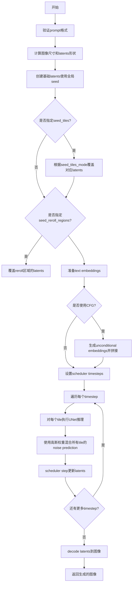
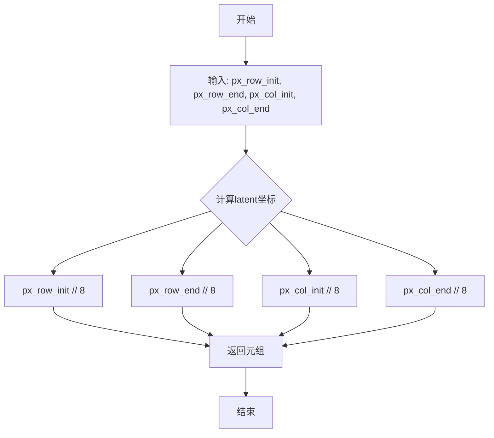
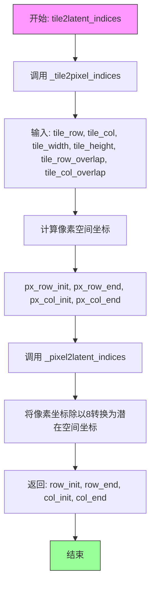
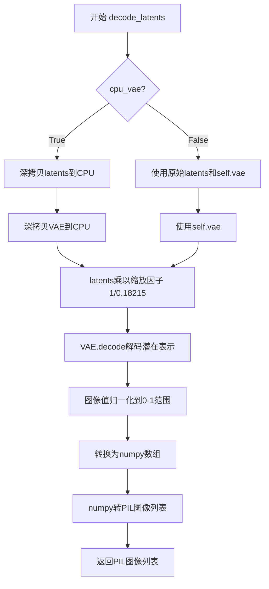
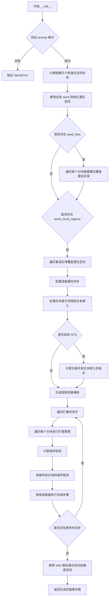
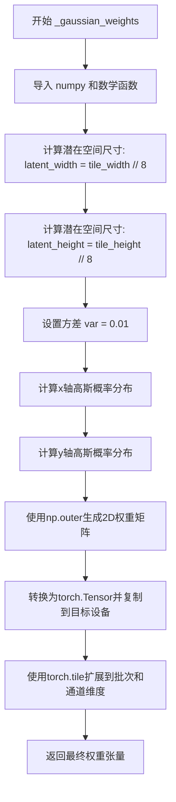
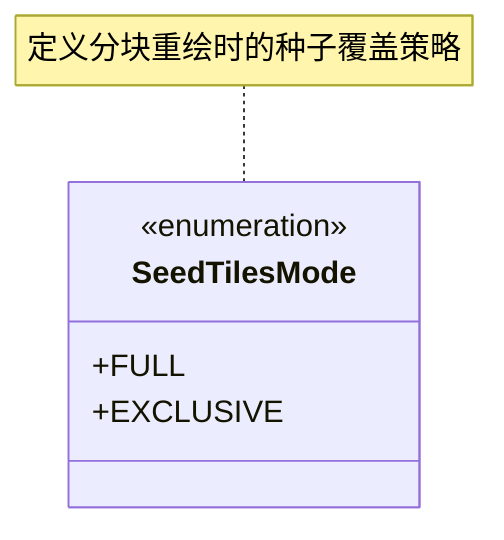

# `diffusers\examples\community\mixture_tiling.py` 详细设计文档

这是一个Stable Diffusion tiling pipeline实现，通过将大图像生成任务分解为多个重叠的tiles分别进行处理，然后使用高斯权重混合各tile的噪声预测，最后解码合并成完整图像。支持灵活的tiling策略、独立种子控制和分类器自由引导。

## 整体流程



## 类结构

```
DiffusionPipeline (抽象基类)
├── StableDiffusionExtrasMixin
│   └── decode_latents()
└── StableDiffusionTilingPipeline
    ├── SeedTilesMode (内部枚举类)
    ├── __init__()
    ├── __call__()
    └── _gaussian_weights()

全局辅助函数 (独立模块)
├── _tile2pixel_indices()
├── _pixel2latent_indices()
├── _tile2latent_indices()
└── _tile2latent_exclusive_indices()
```

## 全局变量及字段


### `logger`
    
模块级别的日志记录器，用于输出调试和信息日志

类型：`logging.Logger`
    


### `EXAMPLE_DOC_STRING`
    
包含代码使用示例的文档字符串，展示如何调用StableDiffusionTilingPipeline

类型：`str`
    


### `StableDiffusionTilingPipeline.vae`
    
用于将潜在表示解码到像素空间的变分自编码器模型

类型：`AutoencoderKL`
    


### `StableDiffusionTilingPipeline.text_encoder`
    
将文本提示编码为文本嵌入向量的CLIP文本编码器

类型：`CLIPTextModel`
    


### `StableDiffusionTilingPipeline.tokenizer`
    
将文本提示分词为token序列的CLIP分词器

类型：`CLIPTokenizer`
    


### `StableDiffusionTilingPipeline.unet`
    
用于预测噪声残差的条件UNet2D模型，执行扩散过程的核心去噪网络

类型：`UNet2DConditionModel`
    


### `StableDiffusionTilingPipeline.scheduler`
    
控制扩散采样过程中噪声调度的时间步调度器

类型：`Union[DDIMScheduler, PNDMScheduler]`
    


### `StableDiffusionTilingPipeline.safety_checker`
    
检查生成图像是否包含不安全内容的safety checker模型

类型：`StableDiffusionSafetyChecker`
    


### `StableDiffusionTilingPipeline.feature_extractor`
    
从图像中提取CLIP特征的特征提取器，用于safety checking

类型：`CLIPImageProcessor`
    
    

## 全局函数及方法


### `_tile2pixel_indices`

该函数负责将瓦片（Tile）的行列索引转换为对应的像素空间坐标范围。通过考虑瓦片尺寸和相邻瓦片之间的重叠像素，计算该瓦片在整体图像中覆盖的像素区域起始和结束位置。

参数：

- `tile_row`：`int`，瓦片的行索引，表示当前处理的是第几行瓦片
- `tile_col`：`int`，瓦片的列索引，表示当前处理的是第几列瓦片
- `tile_width`：`int`，单个瓦片的宽度（像素）
- `tile_height`：`int`，单个瓦片的高度（像素）
- `tile_row_overlap`：`int`，相邻行瓦片之间的垂直重叠像素数
- `tile_col_overlap`：`int`，相邻列瓦片之间的水平重叠像素数

返回值：`Tuple[int, int, int, int]`，返回一个包含四个整数的元组，分别是像素空间中行的起始坐标、行的结束坐标、列的起始坐标、列的结束坐标

#### 流程图

```mermaid
flowchart TD
    A[开始] --> B[输入: tile_row, tile_col, tile_width, tile_height, tile_row_overlap, tile_col_overlap]
    
    B --> C{tile_row == 0?}
    C -->|是| D[px_row_init = 0]
    C -->|否| E[px_row_init = tile_row * (tile_height - tile_row_overlap)]
    
    D --> F[px_row_end = px_row_init + tile_height]
    E --> F
    
    F --> G{tile_col == 0?}
    G -->|是| H[px_col_init = 0]
    G -->|否| I[px_col_init = tile_col * (tile_width - tile_col_overlap)]
    
    H --> J[px_col_end = px_col_init + tile_width]
    I --> J
    
    J --> K[返回: (px_row_init, px_row_end, px_col_init, px_col_end)]
    K --> L[结束]
```

#### 带注释源码

```python
def _tile2pixel_indices(tile_row, tile_col, tile_width, tile_height, tile_row_overlap, tile_col_overlap):
    """Given a tile row and column numbers returns the range of pixels affected by that tiles in the overall image

    Returns a tuple with:
        - Starting coordinates of rows in pixel space
        - Ending coordinates of rows in pixel space
        - Starting coordinates of columns in pixel space
        - Ending coordinates of columns in pixel space
    
    参数说明:
        tile_row: 瓦片的行索引，从0开始
        tile_col: 瓦片的列索引，从0开始
        tile_width: 瓦片的宽度（像素）
        tile_height: 瓦片的高度（像素）
        tile_row_overlap: 行方向上相邻瓦片的重叠像素数
        tile_col_overlap: 列方向上相邻瓦片的重叠像素数
    
    返回值说明:
        px_row_init: 瓦片在像素空间中覆盖区域的行起始坐标
        px_row_end: 瓦片在像素空间中覆盖区域的行结束坐标
        px_col_init: 瓦片在像素空间中覆盖区域的列起始坐标
        px_col_end: 瓦片在像素空间中覆盖区域的列结束坐标
    """
    # 计算行方向的起始像素坐标
    # 如果是第一行瓦片（tile_row == 0），起始位置为0
    # 否则，每增加一行瓦片，起始位置需要减去重叠区域的像素数
    px_row_init = 0 if tile_row == 0 else tile_row * (tile_height - tile_row_overlap)
    
    # 计算行方向的结束像素坐标
    # 结束坐标等于起始坐标加上瓦片高度
    px_row_end = px_row_init + tile_height
    
    # 计算列方向的起始像素坐标
    # 如果是第一列瓦片（tile_col == 0），起始位置为0
    # 否则，每增加一列瓦片，起始位置需要减去重叠区域的像素数
    px_col_init = 0 if tile_col == 0 else tile_col * (tile_width - tile_col_overlap)
    
    # 计算列方向的结束像素坐标
    # 结束坐标等于起始坐标加上瓦片宽度
    px_col_end = px_col_init + tile_width
    
    # 返回四个坐标值：行起始、行结束、列起始、列结束
    return px_row_init, px_row_end, px_col_init, px_col_end
```


### `_pixel2latent_indices`

将像素空间坐标转换为latent空间坐标（由于VAE的8倍下采样因子，像素坐标除以8）

参数：

- `px_row_init`：`int`，像素空间中行的起始坐标
- `px_row_end`：`int`，像素空间中行的结束坐标
- `px_col_init`：`int`，像素空间中列的起始坐标
- `px_col_end`：`int`，像素空间中列的结束坐标

返回值：`Tuple[int, int, int, int]`，latent空间中的坐标元组（行起始、行结束、列起始、列结束）

#### 流程图



#### 带注释源码

```
def _pixel2latent_indices(px_row_init, px_row_end, px_col_init, px_col_end):
    """Translates coordinates in pixel space to coordinates in latent space"""
    # 将像素坐标除以8（VAE的下采样因子）转换为latent空间坐标
    # latent空间的尺寸是像素空间的1/8
    return px_row_init // 8, px_row_end // 8, px_col_init // 8, px_col_end // 8
```


### `_tile2latent_indices`

该函数将瓦片（tile）的行列索引转换为潜在空间（latent space）中的坐标范围，通过先调用 `_tile2pixel_indices` 获取像素空间坐标，再调用 `_pixel2latent_indices` 将像素坐标除以 8（VAE 下采样因子）转换为潜在空间坐标。

参数：

- `tile_row`：`int`，瓦片的行索引，表示第几行瓦片
- `tile_col`：`int`，瓦片的列索引，表示第几列瓦片
- `tile_width`：`int`，每个瓦片的宽度，以像素为单位
- `tile_height`：`int`，每个瓦片的高度，以像素为单位
- `tile_row_overlap`：`int`，相邻瓦片行之间的重叠像素数
- `tile_col_overlap`：`int`，相邻瓦片列之间的重叠像素数

返回值：`Tuple[int, int, int, int]`，返回四个整数组成的元组，分别是潜在空间中行起始坐标、行结束坐标、列起始坐标、列结束坐标

#### 流程图



#### 带注释源码

```python
def _tile2latent_indices(tile_row, tile_col, tile_width, tile_height, tile_row_overlap, tile_col_overlap):
    """Given a tile row and column numbers returns the range of latents affected by that tiles in the overall image

    Returns a tuple with:
        - Starting coordinates of rows in latent space
        - Ending coordinates of rows in latent space
        - Starting coordinates of columns in latent space
        - Ending coordinates of columns in latent space
    """
    # Step 1: 将瓦片坐标转换为像素空间坐标
    # 调用 _tile2pixel_indices 函数，根据瓦片的行列索引和重叠参数
    # 计算该瓦片在整体图像像素空间中的覆盖区域
    px_row_init, px_row_end, px_col_init, px_col_end = _tile2pixel_indices(
        tile_row, tile_col, tile_width, tile_height, tile_row_overlap, tile_col_overlap
    )
    
    # Step 2: 将像素空间坐标转换为潜在空间坐标
    # VAE 模型通常使用 8 倍下采样，因此需要将像素坐标除以 8
    # 潜在空间的尺寸 = 像素空间尺寸 // 8
    return _pixel2latent_indices(px_row_init, px_row_end, px_col_init, px_col_end)
```


### `_tile2latent_exclusive_indices`

该函数用于计算在分块（tiling）扩散模型中，给定瓦片在潜在空间（latent space）中独占影响的区域范围。通过遍历所有其他瓦片并使用集合减法操作，排除该瓦片与其他瓦片的重叠部分，从而得到仅由当前瓦片独占的潜在空间坐标。

参数：

- `tile_row`：`int`，瓦片的行索引，表示当前处理的是第几行瓦片
- `tile_col`：`int`，瓦片的列索引，表示当前处理的是第几列瓦片
- `tile_width`：`int`，瓦片的宽度，单位为像素
- `tile_height`：`int`，瓦片的高度，单位为像素
- `tile_row_overlap`：`int`，相邻瓦片在行方向上的重叠像素数
- `tile_col_overlap`：`int`，相邻瓦片在列方向上的重叠像素数
- `rows`：`int`，瓦片网格的总行数
- `columns`：`int`，瓦片网格的总列数

返回值：`Tuple[int, int, int, int]`，返回四个整数元组，包含独占区域的行起始坐标、行结束坐标、列起始坐标、列结束坐标（均在潜在空间坐标系中）

#### 流程图

```mermaid
flowchart TD
    A[开始: _tile2latent_exclusive_indices] --> B[调用 _tile2latent_indices 获取当前瓦片的潜在空间范围]
    B --> C[创建 row_segment 和 col_segment 表示行列范围]
    C --> D[外层循环: 遍历所有行 row 0 到 rows-1]
    D --> E[内层循环: 遍历所有列 column 0 到 columns-1]
    E --> F{判断条件: row != tile_row 或 column != tile_col?}
    F -->|是| G[调用 _tile2latent_indices 获取其他瓦片的潜在范围]
    G --> H[row_segment = row_segment - clip_row_segment]
    H --> I[col_segment = col_segment - clip_col_segment]
    F -->|否| J[跳过当前瓦片, 继续下一个]
    I --> K{行列遍历是否完成?}
    K -->|否| E
    K -->|是| L[返回 row_segment[0], row_segment[1], col_segment[0], col_segment[1]]
    L --> M[结束]
```

#### 带注释源码

```python
def _tile2latent_exclusive_indices(
    tile_row, tile_col, tile_width, tile_height, tile_row_overlap, tile_col_overlap, rows, columns
):
    """Given a tile row and column numbers returns the range of latents affected only by that tile in the overall image

    Returns a tuple with:
        - Starting coordinates of rows in latent space
        - Ending coordinates of rows in latent space
        - Starting coordinates of columns in latent space
        - Ending coordinates of columns in latent space
    """
    # Step 1: 首先获取当前瓦片在潜在空间的完整影响范围（包括重叠区域）
    # 调用 _tile2latent_indices 获取该瓦片覆盖的行范围 [row_init, row_end) 和列范围 [col_init, col_end)
    row_init, row_end, col_init, col_end = _tile2latent_indices(
        tile_row, tile_col, tile_width, tile_height, tile_row_overlap, tile_col_overlap
    )
    
    # Step 2: 使用 ligo.segments 的 segment 对象来表示行列范围
    # segment 对象支持集合操作（如减法），便于计算独占区域
    row_segment = segment(row_init, row_end)
    col_segment = segment(col_init, col_end)
    
    # Step 3: 遍历所有其他瓦片，计算每个瓦片的影响范围并从当前瓦片中减去
    # 这样可以排除重叠区域，只保留当前瓦片独占的部分
    for row in range(rows):
        for column in range(columns):
            # 跳过当前瓦片本身，只处理其他瓦片
            if row != tile_row and column != tile_col:
                # 获取其他瓦片的潜在空间范围
                clip_row_init, clip_row_end, clip_col_init, clip_col_end = _tile2latent_indices(
                    row, column, tile_width, tile_height, tile_row_overlap, tile_col_overlap
                )
                # 使用集合减法排除其他瓦片的影响区域
                # segment 对象会自动处理区间重叠的情况
                row_segment = row_segment - segment(clip_row_init, clip_row_end)
                col_segment = col_segment - segment(clip_col_init, clip_col_end)
    
    # Step 4: 返回独占区域的起始和结束坐标
    # row_segment[0] 表示行起始坐标, row_segment[1] 表示行结束坐标
    # col_segment[0] 表示列起始坐标, col_segment[1] 表示列结束坐标
    # return row_init, row_end, col_init, col_end
    return row_segment[0], row_segment[1], col_segment[0], col_segment[1]
```


### `StableDiffusionExtrasMixin.decode_latents`

将给定的潜在表示（latents）数组解码为像素空间图像，支持可选的CPU VAE解码以节省GPU显存。

参数：

- `self`：`StableDiffusionExtrasMixin`，mixin类实例，包含VAE模型等组件
- `latents`：`torch.Tensor`，需要解码的潜在表示张量，形状为 (batch_size, channels, height/8, width/8)
- `cpu_vae`：`bool`，可选参数，默认为False，指定是否在CPU上运行VAE解码器以节省GPU显存

返回值：`List[PIL.Image]`，解码后的PIL图像列表

#### 流程图



#### 带注释源码

```python
def decode_latents(self, latents, cpu_vae=False):
    """Decodes a given array of latents into pixel space"""
    # 根据cpu_vae标志决定是否将latents和VAE模型移到CPU
    # 这样可以避免GPU显存不足的问题，但会降低处理速度
    if cpu_vae:
        lat = deepcopy(latents).cpu()
        vae = deepcopy(self.vae).cpu()
    else:
        lat = latents
        vae = self.vae

    # 对latents进行缩放，这是Stable Diffusion VAE的标准缩放因子
    # 用于将latents调整到适当的数值范围
    lat = 1 / 0.18215 * lat
    
    # 使用VAE解码器将latents解码为图像
    # decode方法返回包含sample属性的输出对象
    image = vae.decode(lat).sample

    # 将图像值从[-1, 1]范围归一化到[0, 1]范围
    # VAE输出的原始值通常在-1到1之间
    image = (image / 2 + 0.5).clamp(0, 1)
    
    # 将图像从PyTorch张量格式转换为NumPy数组
    # permute操作将通道维度从C/H/W位置移到最后，变为H/W/C格式
    image = image.cpu().permute(0, 2, 3, 1).numpy()

    # 调用pipeline的numpy_to_pil方法将NumPy数组转换为PIL图像
    return self.numpy_to_pil(image)
```


### `StableDiffusionTilingPipeline.__init__`

初始化Stable Diffusion平铺管道，注册所有必要的模块（VAE、文本编码器、分词器、UNet、调度器、安全检查器和特征提取器）以支持平铺推理功能。

参数：

- `self`：`StableDiffusionTilingPipeline`，实例本身
- `vae`：`AutoencoderKL`，VAE模型，用于将图像编码到潜在空间并从潜在空间解码
- `text_encoder`：`CLIPTextModel`，CLIP文本编码器，用于将文本提示编码为嵌入向量
- `tokenizer`：`CLIPTokenizer`，CLIP分词器，用于将文本分词为token
- `unet`：`UNet2DConditionModel`，UNet条件模型，用于去噪潜在表示
- `scheduler`：`Union[DDIMScheduler, PNDMScheduler]`，
- `safety_checker`：`StableDiffusionSafetyChecker`，安全检查器，用于过滤不适当的内容
- `feature_extractor`：`CLIPImageProcessor`，CLIP图像处理器，用于为安全检查器提取特征

返回值：`None`，无返回值（构造函数）

#### 流程图

```mermaid
flowchart TD
    A[开始 __init__] --> B[调用 super().__init__ 初始化基础类]
    B --> C[调用 self.register_modules 注册所有模块]
    C --> D[注册 vae: AutoencoderKL]
    D --> E[注册 text_encoder: CLIPTextModel]
    E --> F[注册 tokenizer: CLIPTokenizer]
    F --> G[注册 unet: UNet2DConditionModel]
    G --> H[注册 scheduler: 调度器]
    H --> I[注册 safety_checker: 安全检查器]
    I --> J[注册 feature_extractor: 特征提取器]
    J --> K[结束 __init__ 返回 None]
```

#### 带注释源码

```python
def __init__(
    self,
    vae: AutoencoderKL,                    # VAE模型，用于图像编码/解码
    text_encoder: CLIPTextModel,           # CLIP文本编码器，处理文本提示
    tokenizer: CLIPTokenizer,             # 分词器，将文本转为token IDs
    unet: UNet2DConditionModel,            # UNet去噪模型
    scheduler: Union[DDIMScheduler, PNDMScheduler],  # 扩散调度器
    safety_checker: StableDiffusionSafetyChecker,    # 安全检查器
    feature_extractor: CLIPImageProcessor, # CLIP图像处理器
):
    # 首先调用父类 DiffusionPipeline 的初始化方法
    # 设置管道的基本属性和配置
    super().__init__()
    
    # 使用 register_modules 方法注册所有管道组件
    # 这些模块将被打包并可以通过 self.module_name 访问
    self.register_modules(
        vae=vae,
        text_encoder=text_encoder,
        tokenizer=tokenizer,
        unet=unet,
        scheduler=scheduler,
        safety_checker=safety_checker,
        feature_extractor=feature_extractor,
    )
```


### `StableDiffusionTilingPipeline.__call__`

这是Stable Diffusion图像生成管道的核心方法，支持通过分块（tiling）技术生成高分辨率图像。该方法将大图像分割成多个重叠的小块分别进行扩散处理，最后通过加权平均拼接成完整图像，支持独立的提示词、引导强度和随机种子控制每个分块，从而实现更灵活的高分辨率图像生成。

参数：

- `prompt`：`Union[str, List[List[str]]]`，提示词。可以是单个字符串（无分块）或列表的列表（每个子列表对应一行分块），定义了分块的结构和每个分块使用的提示词。
- `num_inference_steps`：`Optional[int] = 50`，扩散推理步数。决定图像生成的迭代次数，步数越多图像质量越高但生成速度越慢。
- `guidance_scale`：`Optional[float] = 7.5`，无分类器引导（CFG）权重。值越大生成图像与提示词相关性越高，值为1时禁用CFG。
- `eta`：`Optional[float] = 0.0`，DDIM调度器参数。用于控制DDIM采样时的随机性，取值范围[0,1]，仅对DDIM调度器有效。
- `seed`：`Optional[int] = None`，全局随机种子。用于初始化整个潜在空间的随机数生成，确保结果可复现。
- `tile_height`：`Optional[int] = 512`，分块高度（像素）。每个图像分块的高度，默认为512像素。
- `tile_width`：`Optional[int] = 512`，分块宽度（像素）。每个图像分块的宽度，默认为512像素。
- `tile_row_overlap`：`Optional[int] = 256`，行方向重叠像素数。相邻行分块之间的重叠区域高度，用于减少拼接伪影。
- `tile_col_overlap`：`Optional[int] = 256`，列方向重叠像素数。相邻列分块之间的重叠区域宽度，用于减少拼接伪影。
- `guidance_scale_tiles`：`Optional[List[List[float]]] = None`，分块级引导权重。可选地为每个分块指定不同的CFG权重覆盖全局设置。
- `seed_tiles`：`Optional[List[List[int]]] = None`，分块级随机种子。可选地为每个分块指定独立的初始化种子，覆盖全局seed参数。
- `seed_tiles_mode`：`Optional[Union[str, List[List[str]]]] = "full"`，分块种子模式。值为"full"时覆盖分块影响的所有潜在区域，值为"exclusive"时仅覆盖该分块独有的区域。
- `seed_reroll_regions`：`Optional[List[Tuple[int, int, int, int, int]]] = None`，种子重滚区域。定义像素空间的区域元组(start_row, end_row, start_col, end_col, seed)，对该区域使用指定种子重新生成，优先级高于seed_tiles。
- `cpu_vae`：`Optional[bool] = False`，CPU VAE解码标记。设为True时将VAE解码器移至CPU执行以节省显存，但速度较慢，适用于生成大图像时显存不足的情况。

返回值：`Dict[str, Any]`，返回包含生成图像的字典，键为"images"，值为PIL图像对象。

#### 流程图



#### 带注释源码

```python
@torch.no_grad()
def __call__(
    self,
    prompt: Union[str, List[List[str]]],
    num_inference_steps: Optional[int] = 50,
    guidance_scale: Optional[float] = 7.5,
    eta: Optional[float] = 0.0,
    seed: Optional[int] = None,
    tile_height: Optional[int] = 512,
    tile_width: Optional[int] = 512,
    tile_row_overlap: Optional[int] = 256,
    tile_col_overlap: Optional[int] = 256,
    guidance_scale_tiles: Optional[List[List[float]]] = None,
    seed_tiles: Optional[List[List[int]]] = None,
    seed_tiles_mode: Optional[Union[str, List[List[str]]]] = "full",
    seed_reroll_regions: Optional[List[Tuple[int, int, int, int, int]]] = None,
    cpu_vae: Optional[bool] = False,
):
    r"""
    Function to run the diffusion pipeline with tiling support.

    Args:
        prompt: either a single string (no tiling) or a list of lists with all the prompts to use (one list for each row of tiles). This will also define the tiling structure.
        num_inference_steps: number of diffusions steps.
        guidance_scale: classifier-free guidance.
        seed: general random seed to initialize latents.
        tile_height: height in pixels of each grid tile.
        tile_width: width in pixels of each grid tile.
        tile_row_overlap: number of overlap pixels between tiles in consecutive rows.
        tile_col_overlap: number of overlap pixels between tiles in consecutive columns.
        guidance_scale_tiles: specific weights for classifier-free guidance in each tile.
        guidance_scale_tiles: specific weights for classifier-free guidance in each tile. If None, the value provided in guidance_scale will be used.
        seed_tiles: specific seeds for the initialization latents in each tile. These will override the latents generated for the whole canvas using the standard seed parameter.
        seed_tiles_mode: either "full" "exclusive". If "full", all the latents affected by the tile be overridden. If "exclusive", only the latents that are affected exclusively by this tile (and no other tiles) will be overridden.
        seed_reroll_regions: a list of tuples in the form (start row, end row, start column, end column, seed) defining regions in pixel space for which the latents will be overridden using the given seed. Takes priority over seed_tiles.
        cpu_vae: the decoder from latent space to pixel space can require too much GPU RAM for large images. If you find out of memory errors at the end of the generation process, try setting this parameter to True to run the decoder in CPU. Slower, but should run without memory issues.

    Examples:

    Returns:
        A PIL image with the generated image.

    """
    # 验证 prompt 必须为嵌套列表结构，确保可以构建分块网格
    if not isinstance(prompt, list) or not all(isinstance(row, list) for row in prompt):
        raise ValueError(f"`prompt` has to be a list of lists but is {type(prompt)}")
    
    # 获取网格的行数和列数
    grid_rows = len(prompt)
    grid_cols = len(prompt[0])
    
    # 验证所有行的列数一致，确保网格结构规则
    if not all(len(row) == grid_cols for row in prompt):
        raise ValueError("All prompt rows must have the same number of prompt columns")
    
    # 验证 seed_tiles_mode 格式
    if not isinstance(seed_tiles_mode, str) and (
        not isinstance(seed_tiles_mode, list) or not all(isinstance(row, list) for row in seed_tiles_mode)
    ):
        raise ValueError(f"`seed_tiles_mode` has to be a string or list of lists but is {type(prompt)}")
    
    # 如果是字符串，扩展为二维列表
    if isinstance(seed_tiles_mode, str):
        seed_tiles_mode = [[seed_tiles_mode for _ in range(len(row))] for row in prompt]

    # 验证所有分块的模式是否有效
    modes = [mode.value for mode in self.SeedTilesMode]
    if any(mode not in modes for row in seed_tiles_mode for mode in row):
        raise ValueError(f"Seed tiles mode must be one of {modes}")
    
    # 初始化空的重滚区域列表
    if seed_reroll_regions is None:
        seed_reroll_regions = []
    batch_size = 1

    # 计算最终图像的尺寸：考虑重叠区域的拼接
    # 高度 = 第一个分块高度 + (行数-1) * (分块高度 - 行重叠)
    height = tile_height + (grid_rows - 1) * (tile_height - tile_row_overlap)
    # 宽度 = 第一个分块宽度 + (列数-1) * (分块宽度 - 列重叠)
    width = tile_width + (grid_cols - 1) * (tile_width - tile_col_overlap)
    
    # 计算潜在空间的形状：图像尺寸除以8（VAE下采样因子）
    latents_shape = (batch_size, self.unet.config.in_channels, height // 8, width // 8)
    
    # 使用全局种子初始化潜在空间
    generator = torch.Generator("cuda").manual_seed(seed)
    latents = torch.randn(latents_shape, generator=generator, device=self.device)

    # 步骤1: 覆盖特定分块的潜在区域（如果提供了 seed_tiles）
    if seed_tiles is not None:
        for row in range(grid_rows):
            for col in range(grid_cols):
                # 检查该分块是否指定了种子
                if (seed_tile := seed_tiles[row][col]) is not None:
                    mode = seed_tiles_mode[row][col]
                    
                    # 根据模式计算该分块影响的潜在区域索引
                    if mode == self.SeedTilesMode.FULL.value:
                        # FULL 模式：覆盖分块影响的所有区域（包括重叠）
                        row_init, row_end, col_init, col_end = _tile2latent_indices(
                            row, col, tile_width, tile_height, tile_row_overlap, tile_col_overlap
                        )
                    else:
                        # EXCLUSIVE 模式：仅覆盖该分块独有的区域（去除重叠部分）
                        row_init, row_end, col_init, col_end = _tile2latent_exclusive_indices(
                            row,
                            col,
                            tile_width,
                            tile_height,
                            tile_row_overlap,
                            tile_col_overlap,
                            grid_rows,
                            grid_cols,
                        )
                    
                    # 使用分块特定种子生成潜在区域
                    tile_generator = torch.Generator("cuda").manual_seed(seed_tile)
                    tile_shape = (latents_shape[0], latents_shape[1], row_end - row_init, col_end - col_init)
                    latents[:, :, row_init:row_end, col_init:col_end] = torch.randn(
                        tile_shape, generator=tile_generator, device=self.device
                    )

    # 步骤2: 覆盖种子重滚区域（优先级最高）
    for row_init, row_end, col_init, col_end, seed_reroll in seed_reroll_regions:
        # 将像素坐标转换为潜在空间坐标（除以8）
        row_init, row_end, col_init, col_end = _pixel2latent_indices(
            row_init, row_end, col_init, col_end
        )
        reroll_generator = torch.Generator("cuda").manual_seed(seed_reroll)
        region_shape = (latents_shape[0], latents_shape[1], row_end - row_init, col_end - col_init)
        latents[:, :, row_init:row_end, col_init:col_end] = torch.randn(
            region_shape, generator=reroll_generator, device=self.device
        )

    # 步骤3: 配置调度器
    # 检查调度器是否支持 offset 参数
    accepts_offset = "offset" in set(inspect.signature(self.scheduler.set_timesteps).parameters.keys())
    extra_set_kwargs = {}
    if accepts_offset:
        extra_set_kwargs["offset"] = 1
    self.scheduler.set_timesteps(num_inference_steps, **extra_set_kwargs)
    
    # 如果使用 LMSDiscreteScheduler，将潜在空间乘以 sigmas
    if isinstance(self.scheduler, LMSDiscreteScheduler):
        latents = latents * self.scheduler.sigmas[0]

    # 步骤4: 处理文本提示词得到嵌入向量
    # 对每个分块的每个提示词进行tokenize
    text_input = [
        [
            self.tokenizer(
                col,
                padding="max_length",
                max_length=self.tokenizer.model_max_length,
                truncation=True,
                return_tensors="pt",
            )
            for col in row
        ]
        for row in prompt
    ]
    
    # 使用文本编码器得到文本嵌入
    text_embeddings = [[self.text_encoder(col.input_ids.to(self.device))[0] for col in row] for row in text_input]

    # 步骤5: 处理无分类器引导（CFG）
    # guidance_scale > 1.0 时启用 CFG
    do_classifier_free_guidance = guidance_scale > 1.0  # TODO: also active if any tile has guidance scale
    
    # 如果启用 CFG，为每个分块计算无条件嵌入并拼接
    if do_classifier_free_guidance:
        for i in range(grid_rows):
            for j in range(grid_cols):
                max_length = text_input[i][j].input_ids.shape[-1]
                # 创建空字符串的无条件输入
                uncond_input = self.tokenizer(
                    [""] * batch_size, padding="max_length", max_length=max_length, return_tensors="pt"
                )
                uncond_embeddings = self.text_encoder(uncond_input.input_ids.to(self.device))[0]

                # 拼接无条件嵌入和文本嵌入以避免两次前向传播
                text_embeddings[i][j] = torch.cat([uncond_embeddings, text_embeddings[i][j]])

    # 步骤6: 准备调度器额外参数
    accepts_eta = "eta" in set(inspect.signature(self.scheduler.step).parameters.keys())
    extra_step_kwargs = {}
    if accepts_eta:
        extra_step_kwargs["eta"] = eta

    # 步骤7: 生成高斯权重掩码用于分块拼接
    tile_weights = self._gaussian_weights(tile_width, tile_height, batch_size)

    # 步骤8: 扩散推理主循环
    for i, t in tqdm(enumerate(self.scheduler.timesteps)):
        # 对每个分块进行扩散处理
        noise_preds = []
        for row in range(grid_rows):
            noise_preds_row = []
            for col in range(grid_cols):
                # 获取当前分块在潜在空间中的坐标
                px_row_init, px_row_end, px_col_init, px_col_end = _tile2latent_indices(
                    row, col, tile_width, tile_height, tile_row_overlap, tile_col_overlap
                )
                
                # 提取当前分块的潜在区域
                tile_latents = latents[:, :, px_row_init:px_row_end, px_col_init:px_col_end]
                
                # 扩展潜在空间用于 CFG（复制为条件和无条件两份）
                latent_model_input = torch.cat([tile_latents] * 2) if do_classifier_free_guidance else tile_latents
                latent_model_input = self.scheduler.scale_model_input(latent_model_input, t)
                
                # 使用 UNet 预测噪声残差
                noise_pred = self.unet(latent_model_input, t, encoder_hidden_states=text_embeddings[row][col])[
                    "sample"
                ]
                
                # 应用 CFG 引导
                if do_classifier_free_guidance:
                    noise_pred_uncond, noise_pred_text = noise_pred.chunk(2)
                    # 确定该分块的引导权重
                    guidance = (
                        guidance_scale
                        if guidance_scale_tiles is None or guidance_scale_tiles[row][col] is None
                        else guidance_scale_tiles[row][col]
                    )
                    # 应用引导公式: noise_pred = noise_uncond + guidance * (noise_text - noise_uncond)
                    noise_pred_tile = noise_pred_uncond + guidance * (noise_pred_text - noise_pred_uncond)
                    noise_preds_row.append(noise_pred_tile)
            
            noise_preds.append(noise_preds_row)
        
        # 步骤9: 拼接所有分块的噪声预测
        noise_pred = torch.zeros(latents.shape, device=self.device)
        contributors = torch.zeros(latents.shape, device=self.device)
        
        # 累加每个分块贡献的加权噪声预测
        for row in range(grid_rows):
            for col in range(grid_cols):
                px_row_init, px_row_end, px_col_init, px_col_end = _tile2latent_indices(
                    row, col, tile_width, tile_height, tile_row_overlap, tile_col_overlap
                )
                noise_pred[:, :, px_row_init:px_row_end, px_col_init:px_col_end] += (
                    noise_preds[row][col] * tile_weights
                )
                contributors[:, :, px_row_init:px_row_end, px_col_init:px_col_end] += tile_weights
        
        # 对重叠区域进行加权平均
        noise_pred /= contributors

        # 步骤10: 使用调度器执行去噪步骤，从 x_t 计算 x_t-1
        latents = self.scheduler.step(noise_pred, t, latents).prev_sample

    # 步骤11: 使用 VAE 解码潜在空间到像素空间
    image = self.decode_latents(latents, cpu_vae)

    # 返回生成的图像
    return {"images": image}
```


### `StableDiffusionTilingPipeline._gaussian_weights`

该方法生成一个高斯权重掩码，用于在图像拼接时对瓦片（tile）贡献进行加权处理，确保重叠区域过渡平滑。

参数：

- `tile_width`：`int`，瓦片的宽度（以像素为单位）
- `tile_height`：`int`，瓦片的高度（以像素为单位）
- `nbatches`：`int`，要生成的权重批次数

返回值：`torch.Tensor`，形状为 (nbatches, in_channels, latent_height, latent_width) 的高斯权重掩码，用于对瓦片贡献进行加权

#### 流程图



#### 带注释源码

```python
def _gaussian_weights(self, tile_width, tile_height, nbatches):
    """Generates a gaussian mask of weights for tile contributions"""
    # 导入数值计算库
    import numpy as np
    from numpy import exp, pi, sqrt

    # 将像素空间的瓦片尺寸转换为潜在空间尺寸（除以8）
    latent_width = tile_width // 8
    latent_height = tile_height // 8

    # 设置高斯分布的方差，值越小，中心权重越高，边缘衰减越快
    var = 0.01
    # 计算x轴中心点，-1是因为索引从0到latent_width-1
    midpoint = (latent_width - 1) / 2  # -1 because index goes from 0 to latent_width - 1
    # 计算x轴上每个位置的高斯概率
    x_probs = [
        exp(-(x - midpoint) * (x - midpoint) / (latent_width * latent_width) / (2 * var)) / sqrt(2 * pi * var)
        for x in range(latent_width)
    ]
    # 计算y轴中心点
    midpoint = latent_height / 2
    # 计算y轴上每个位置的高斯概率
    y_probs = [
        exp(-(y - midpoint) * (y - midpoint) / (latent_height * latent_height) / (2 * var)) / sqrt(2 * pi * var)
        for y in range(latent_height)
    ]

    # 使用外积生成二维高斯权重矩阵
    weights = np.outer(y_probs, x_probs)
    # 将权重转换为torch张量并移动到目标设备，然后扩展到批次和通道维度
    # 输出形状: (nbatches, in_channels, latent_height, latent_width)
    return torch.tile(torch.tensor(weights, device=self.device), (nbatches, self.unet.config.in_channels, 1, 1))
```


### `StableDiffusionTilingPipeline.SeedTilesMode`

这是一个内部枚举类（Inner Enum），定义了 Stable Diffusion 分块（tiling）流水线中针对特定分块重新生成潜在向量（latents）的种子策略模式。

#### 类字段（成员）详情

- **`FULL`**：`String` ("full")，全量模式。指定该分块的种子将覆盖该分块影响的所有潜在区域，包括与其他分块重叠的部分。
- **`EXCLUSIVE`**：`String` ("exclusive")，独占模式。指定该分块的种子仅覆盖完全属于该分块的潜在区域，排除重叠部分，适用于需要精确控制局部噪声而不影响周围分块的场景。

#### 流程图



#### 带注释源码

```python
class SeedTilesMode(Enum):
    """Modes in which the latents of a particular tile can be re-seeded"""

    FULL = "full"
    # 策略：覆盖分块在潜在空间中的全部影响范围（包括重叠区域）。
    # 对应逻辑：调用 _tile2latent_indices 计算包含重叠的矩形区域。

    EXCLUSIVE = "exclusive"
    # 策略：仅覆盖分块在潜在空间中的独占区域（排除重叠部分）。
    # 对应逻辑：调用 _tile2latent_exclusive_indices 计算排除重叠后的不规则区域。
```

#### 关键组件信息与设计意图

- **设计目标**：为了在分块生成高分辨率图像时，允许用户对特定区域的噪声分布进行精细控制（例如固定某一块的随机性，或尝试不同的种子），同时提供两种不同程度的覆盖策略以适应不同的融合需求。
- **使用场景**：在 `StableDiffusionTilingPipeline.__call__` 方法中，通过 `seed_tiles_mode` 参数接收此枚举，用于决定是使用 `_tile2latent_indices` 还是 `_tile2latent_exclusive_indices` 来计算需要重写入 latents 的区域坐标。

#### 潜在的技术债务与优化空间

1.  **扩展性限制**：目前只支持 "full" 和 "exclusive" 两种硬编码模式。如果未来需要更复杂的混合策略（如加权覆盖），需要重构此枚举或设计更通用的策略模式。
2.  **与外部库耦合**：虽然此类是一个简单的 Enum，但它依赖于 `DiffusionPipeline` 的上下文逻辑来执行具体的索引计算函数（`_tile2latent_indices` 等），这使得逻辑分散在 Pipeline 主类中，降低了内聚性。

#### 其它项目说明

- **错误处理**：在 `__call__` 方法中，对 `seed_tiles_mode` 进行了严格的校验（必须是字符串或字符串列表，且值必须属于 `SeedTilesMode` 的有效值），确保传入的模式合法。

## 关键组件


### 张量索引与惰性加载

通过`_tile2pixel_indices`、`_pixel2latent_indices`、`_tile2latent_indices`等函数实现瓦片坐标到像素空间和潜空间的转换，支持按需加载和处理大尺寸图像的局部区域。

### 反量化支持

`StableDiffusionExtrasMixin`类中的`decode_latents`方法负责将潜变量数组解码为像素空间图像，支持CPU VAE模式以解决大图像生成的显存问题。

### 量化策略与条件引导

通过`guidance_scale`和`guidance_scale_tiles`参数实现分类器自由引导（CFG）的细粒度控制，支持每个瓦片使用不同的引导权重。

### 高斯权重混合

`_gaussian_weights`方法生成高斯权重掩码，用于在瓦片重叠区域进行平滑过渡和加权平均，避免接缝伪影。

### 种子管理与区域重roll

`SeedTilesMode`枚举定义两种种子模式（FULL和EXCLUSIVE），结合`seed_tiles`和`seed_reroll_regions`参数实现对特定瓦片和区域的latent重新初始化控制。

### 瓦片扩散推理流程

在主`__call__`方法中实现完整的分瓦片推理逻辑，包括分别处理每个瓦片的noise prediction、权重叠加和跨瓦片平均。


## 问题及建议


### 已知问题

- **硬编码设备**：代码中多处硬编码 `"cuda"`，例如 `torch.Generator("cuda")` 和 `generator = torch.Generator("cuda")`，未使用 `self.device`，导致不支持 CPU 或其他设备
- **重复索引计算**：`_tile2latent_indices` 函数在每个扩散步骤的内外层循环中被多次调用，每次都重新计算相同瓦片的坐标，造成计算浪费
- **高斯权重重复计算**：`_gaussian_weights` 方法在每次推理时都重新计算高斯权重矩阵，未进行缓存或预计算
- **深拷贝内存开销**：`decode_latents` 方法中使用 `deepcopy(self.vae).cpu()` 进行 CPU VAE 推理，会产生显著的内存开销和性能损耗
- **复杂且脆弱的模式验证**：`seed_tiles_mode` 的验证逻辑分支较多（字符串或列表），容易引入 bug 且难以维护
- **调度器兼容性检查方式粗糙**：使用 `inspect.signature` 检查调度器参数的方式不够稳健，应使用调度器类的属性或方法进行判断
- **外部依赖使用不当**：引入了 `ligo.segments` 库来实现区间运算（`segment` 类），功能简单可用原生 Python 实现替代，增加项目依赖负担
- **边界条件处理缺失**：未对 `grid_rows`、`grid_cols`、`tile_height`、`tile_width` 为 0 或负数的情况进行验证
- **参数过多**：`__call__` 方法包含超过 15 个参数，违反了良好的 API 设计原则，降低了可读性和可维护性

### 优化建议

- **统一设备管理**：将所有 `torch.Generator("cuda")` 替换为 `torch.Generator(self.device)`，确保跨设备兼容性
- **预计算瓦片索引**：在扩散循环前预先计算并缓存所有瓦片的 latent 索引，避免重复计算
- **缓存高斯权重**：在 `__call__` 方法开始时一次性计算 `tile_weights`，避免在每个时间步重复生成
- **优化 CPU VAE 推理**：考虑使用 `torch.no_grad()` 包装 VAE 解码过程，或实现延迟拷贝策略以减少内存占用
- **简化区间运算**：移除 `ligo.segments` 依赖，使用 Python 内置的 `range` 对象或简单的元组列表实现区间减法运算
- **封装配置对象**：将 `__call__` 的多个参数封装为 `TilingConfig` 或 `GenerationConfig` 数据类，提高 API 清晰度
- **增强边界检查**：添加对 `tile_height`、`tile_width`、`tile_row_overlap`、`tile_col_overlap` 的合法性验证（如非负、overlap 小于尺寸等）
- **改进调度器检查**：使用调度器类的标准属性（如 `scheduler.config`）或 `hasattr` 方法进行兼容性判断，提高代码健壮性

## 其它


### 设计目标与约束

该代码旨在实现一个支持平铺（Tiling）策略的Stable Diffusion推理管道，解决标准Stable Diffusion模型无法生成高分辨率大尺寸图像的内存限制问题。通过将大图像分割为多个重叠的瓦片（Tiles）分别进行去噪处理，最后拼接融合各瓦片的结果，实现高分辨率图像的生成。设计约束包括：依赖diffusers库的核心组件（VAE、UNet、Scheduler等）、需要CUDA支持的GPU进行加速、必须安装transformers和ligo-segments库。

### 错误处理与异常设计

代码中的错误处理主要通过参数验证实现。在`__call__`方法中，首先对输入参数进行严格校验：`prompt`必须为嵌套列表结构且每行列数一致；`seed_tiles_mode`必须为字符串或符合格式的列表；`seed_tiles_mode`中的每个模式值必须是`SeedTilesMode`枚举中的有效值。若校验失败，抛出`ValueError`并附带详细的错误信息说明。潜在改进空间：当前缺少对`tile_height`、`tile_width`为0或负数的校验，缺少对`tile_row_overlap`和`tile_col_overlap`超过瓦片尺寸的校验，缺少对不支持的Scheduler类型的处理。

### 数据流与状态机

整个推理流程可划分为以下主要状态：初始化状态（接收参数并验证）→ 潜在空间初始化状态（创建带噪声的潜在向量并根据种子和瓦片覆盖策略进行重写）→ 文本编码状态（将提示词转换为文本嵌入向量）→ 去噪迭代状态（对每个时间步遍历所有瓦片进行噪声预测和融合）→ 解码状态（将最终潜在向量解码为像素空间图像）。数据流遵循：Prompt → Tokenizer → Text Encoder → 文本嵌入 → UNet噪声预测 → Scheduler更新潜在向量 → VAE解码 → 图像。

### 外部依赖与接口契约

核心依赖包括：`diffusers`库（提供DiffusionPipeline基类、AutoencoderKL、UNet2DConditionModel、各类Scheduler）；`transformers`库（提供CLIPTextModel、CLIPTokenizer、CLIPImageProcessor）；`ligo.segments`库（提供segment类用于计算瓦片重叠区域的排除）；`torch`（张量运算和随机数生成）；`numpy`（高斯权重计算）；`tqdm`（进度条显示）。接口契约：Pipeline必须接收符合格式的嵌套列表Prompt；必须返回包含"images"键的字典；tile_height和tile_width应为8的倍数以确保潜在空间对齐。

### 性能考虑

该实现存在以下性能特征：内存方面，通过瓦片处理机制显著降低峰值显存需求，但`cpu_vae`参数提供进一步降低内存的选项；计算方面，存在重叠区域的重复计算（通过权重融合缓解），每个时间步需要对所有瓦片进行独立的UNet前向传播；并行化方面，当前实现为串行遍历瓦片，可考虑批处理多个瓦片以提升GPU利用率。优化建议：对互不重叠的瓦片进行批处理以提高吞吐量；缓存文本嵌入避免每步重新编码；使用xFormers等优化库加速UNet计算。

### 安全性考虑

代码集成了`StableDiffusionSafetyChecker`用于过滤不当内容，但安全检查器的具体实现和调用位置需根据基类行为确认。文本编码过程可能受到提示词注入攻击，建议在实际部署时对用户输入进行内容过滤。种子（Seed）参数的使用可确保结果可复现，但也可能被用于生成特定类型的图像。GPU内存管理：使用`torch.no_grad()`装饰器确保推理过程不计算梯度，大幅降低显存占用。

### 配置参数说明

关键配置参数包括：`tile_height/tile_width`：瓦片尺寸，默认512像素，需为8的倍数；`tile_row_overlap/tile_col_overlap`：相邻瓦片重叠像素数，默认256，用于平滑拼接过渡区域；`guidance_scale`：分类器自由引导强度，默认7.5，值越大与文本相关性越高；`seed_tiles`：为每个瓦片指定独立种子的二维列表；`seed_tiles_mode`："full"模式覆盖瓦片影响的所有潜在区域，"exclusive"模式仅覆盖该瓦片独占的区域；`seed_reroll_regions`：以(行起始,行结束,列起始,列结束,种子)元组格式指定的像素区域重绘；`cpu_vae`：是否在CPU上运行VAE解码器以节省GPU显存。

### 局限性说明

当前实现存在以下局限性：仅支持特定的Scheduler类型（DDIMScheduler、PNDMScheduler、LMSDiscreteScheduler），使用其他Scheduler可能导致运行时错误；文本嵌入按瓦片独立计算，未实现跨瓦片的信息传递，可能导致边界处语义不一致；高斯权重矩阵在每次调用时重新计算，可考虑缓存；不支持批量处理多个提示词（batch_size固定为1）；未实现动态调整瓦片尺寸以适应不同分辨率图像的智能策略；重叠区域的融合采用简单的高斯加权平均，未考虑内容感知的混合策略。

### 版本兼容性提示

代码使用了`inspect.signature`动态检查Scheduler是否支持特定参数（如offset和eta），这是良好的兼容性实践。但需注意：不同版本的diffusers库可能改变Pipeline基类的接口；CLIP模型的版本可能影响文本编码的结果一致性；ligo-segments库的API稳定性；PyTorch版本对CUDA随机数生成器的影响。建议在生产环境中锁定依赖版本并进行全面测试。

    