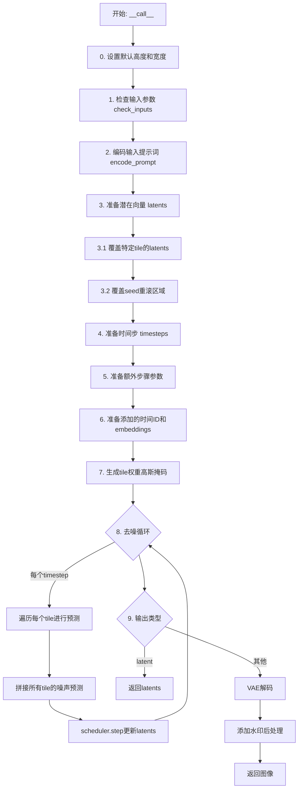
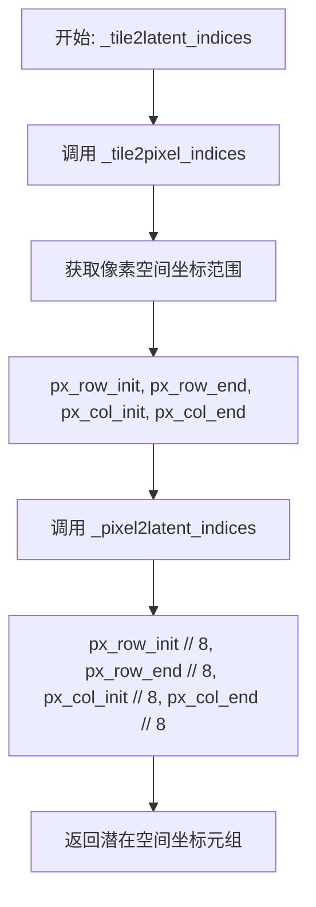
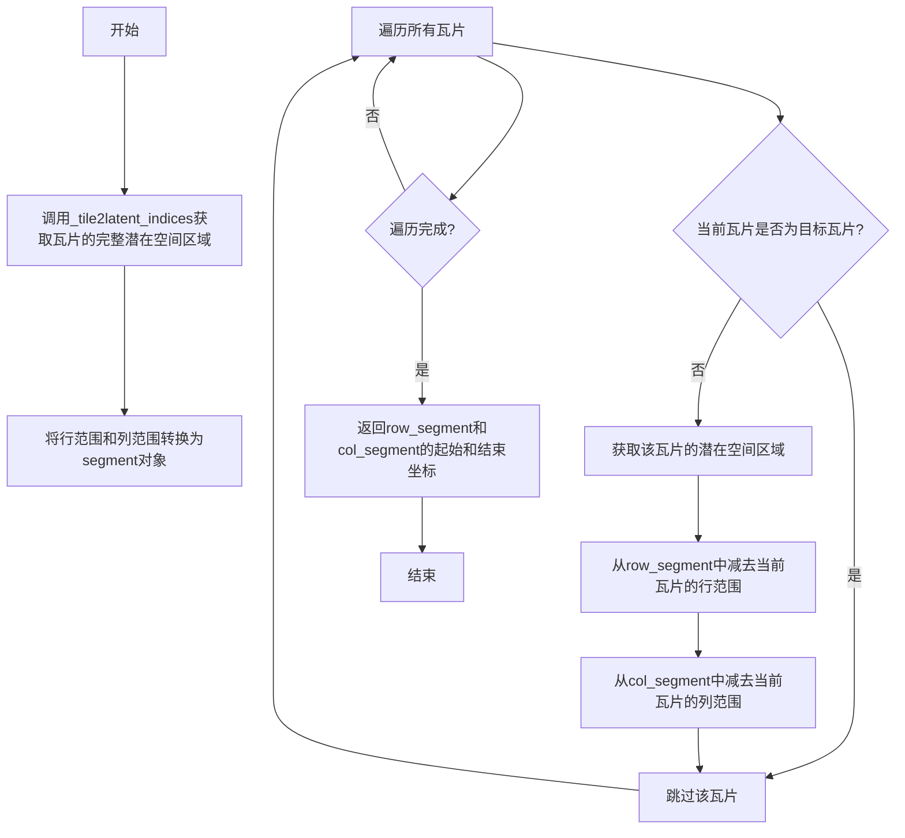
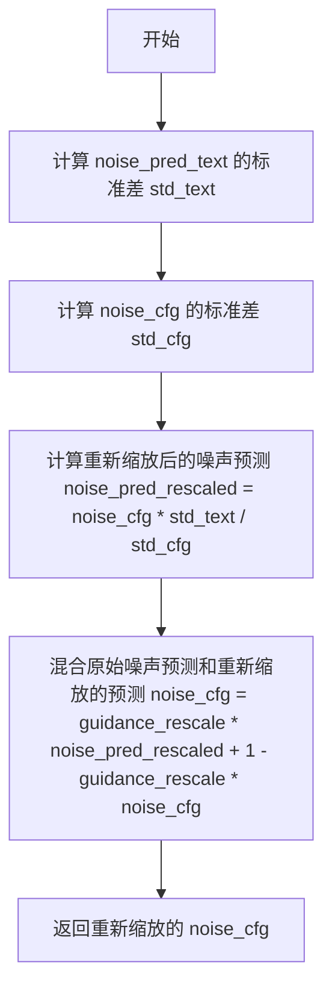
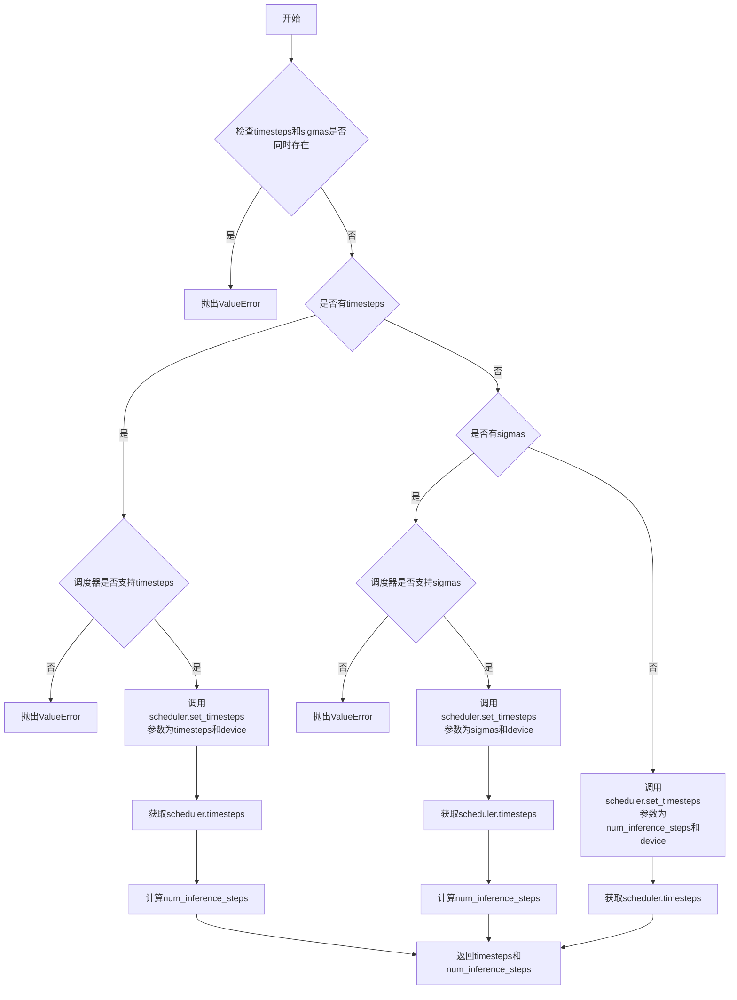
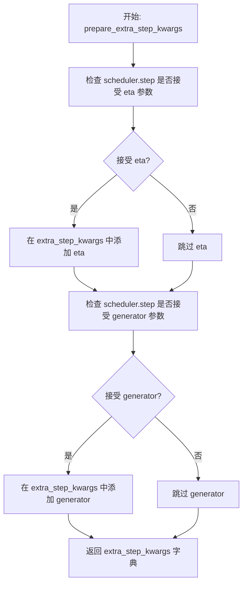
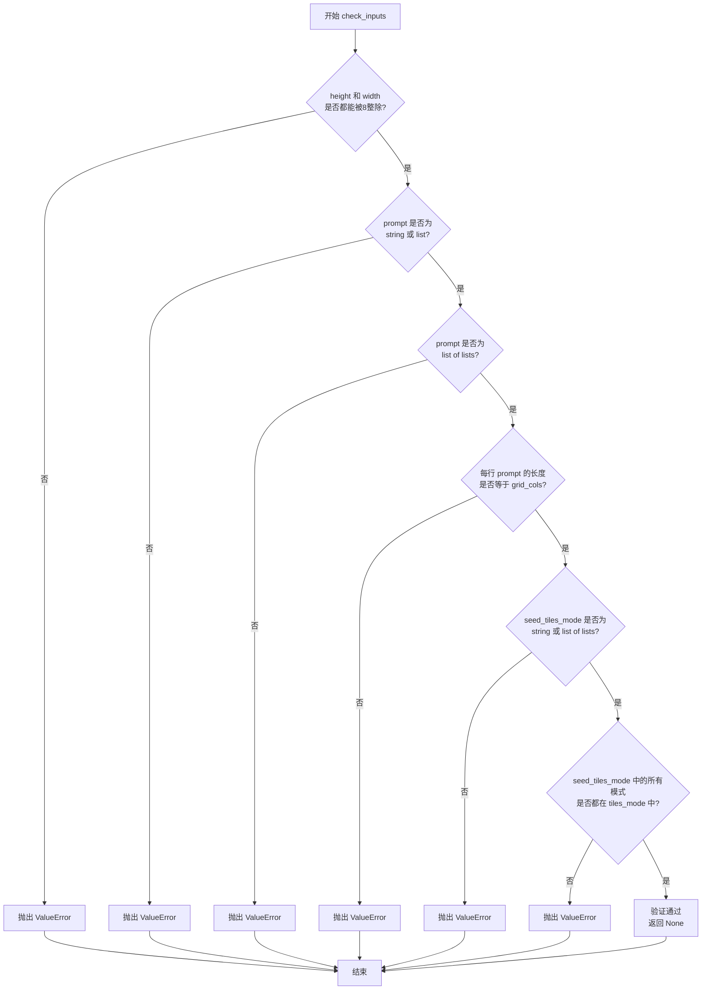
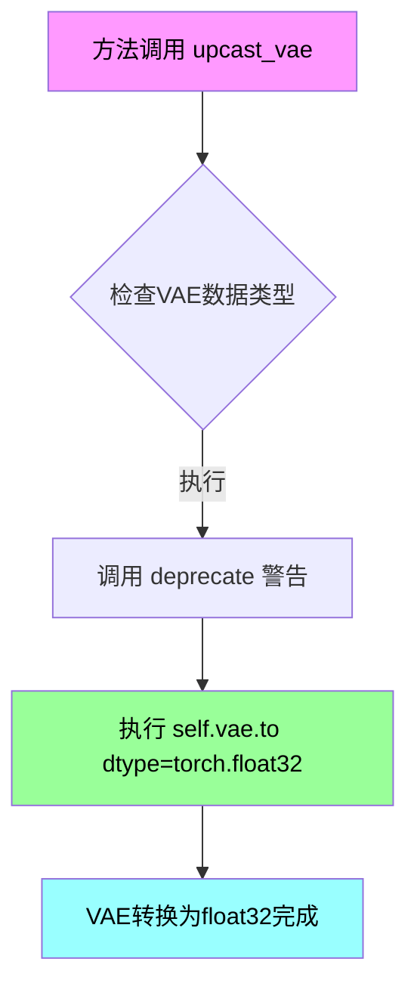
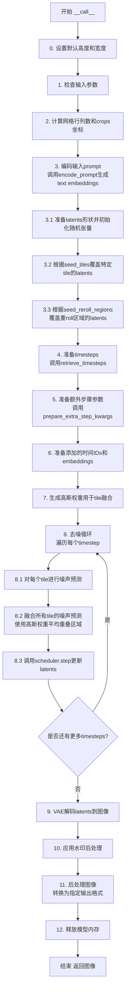

# `diffusers\examples\community\mixture_tiling_sdxl.py` 详细设计文档

这是一个Stable Diffusion XL平铺管道（StableDiffusionXLTilingPipeline），用于生成分块的大尺寸图像。该管道通过将图像分割成多个瓦片（tiles）来处理高分辨率图像生成，解决了显存限制问题，支持tile级别的guidance scale、seed控制、种子重滚区域等高级功能。

## 整体流程



## 类结构

```
DiffusionPipeline (基类)
├── StableDiffusionMixin
├── FromSingleFileMixin
├── StableDiffusionXLLoraLoaderMixin
├── TextualInversionLoaderMixin
└── StableDiffusionXLTilingPipeline (主类)
    └── SeedTilesMode (内部枚举类)
```

## 全局变量及字段


### `logger`
    
日志记录器

类型：`logging.Logger`
    


### `EXAMPLE_DOC_STRING`
    
示例文档字符串

类型：`str`
    


### `XLA_AVAILABLE`
    
XLA可用性标志

类型：`bool`
    


### `StableDiffusionXLTilingPipeline.vae`
    
VAE模型用于编码和解码图像

类型：`AutoencoderKL`
    


### `StableDiffusionXLTilingPipeline.text_encoder`
    
第一个文本编码器

类型：`CLIPTextModel`
    


### `StableDiffusionXLTilingPipeline.text_encoder_2`
    
第二个文本编码器

类型：`CLIPTextModelWithProjection`
    


### `StableDiffusionXLTilingPipeline.tokenizer`
    
第一个分词器

类型：`CLIPTokenizer`
    


### `StableDiffusionXLTilingPipeline.tokenizer_2`
    
第二个分词器

类型：`CLIPTokenizer`
    


### `StableDiffusionXLTilingPipeline.unet`
    
条件U-Net去噪模型

类型：`UNet2DConditionModel`
    


### `StableDiffusionXLTilingPipeline.scheduler`
    
扩散调度器

类型：`KarrasDiffusionSchedulers`
    


### `StableDiffusionXLTilingPipeline.vae_scale_factor`
    
VAE缩放因子

类型：`int`
    


### `StableDiffusionXLTilingPipeline.image_processor`
    
图像处理器

类型：`VaeImageProcessor`
    


### `StableDiffusionXLTilingPipeline.default_sample_size`
    
默认采样尺寸

类型：`int`
    


### `StableDiffusionXLTilingPipeline.watermark`
    
水印器

类型：`StableDiffusionXLWatermarker`
    


### `StableDiffusionXLTilingPipeline._guidance_scale`
    
引导强度

类型：`float`
    


### `StableDiffusionXLTilingPipeline._clip_skip`
    
CLIP跳过的层数

类型：`int`
    


### `StableDiffusionXLTilingPipeline._cross_attention_kwargs`
    
交叉注意力参数

类型：`dict`
    


### `StableDiffusionXLTilingPipeline._num_timesteps`
    
时间步数

类型：`int`
    


### `StableDiffusionXLTilingPipeline._interrupt`
    
中断标志

类型：`bool`
    
    

## 全局函数及方法


### `_tile2pixel_indices`

该函数用于将瓦片（Tile）的行列坐标转换为对应的像素坐标范围，考虑了瓦片尺寸和相邻瓦片之间的重叠区域。

参数：

- `tile_row`：`int`，瓦片的行索引，表示第几行瓦片
- `tile_col`：`int`，瓦片的列索引，表示第几列瓦片
- `tile_width`：`int`，每个瓦片的宽度（像素）
- `tile_height`：`int`，每个瓦片的高度（像素）
- `tile_row_overlap`：`int`，相邻瓦片行之间的重叠像素数
- `tile_col_overlap`：`int`，相邻瓦片列之间的重叠像素数

返回值：`Tuple[int, int, int, int]`，返回四个整数元组，分别是像素空间中行的起始坐标、行的结束坐标、列的起始坐标、列的结束坐标

#### 流程图

```mermaid
flowchart TD
    A[开始] --> B{判断 tile_row == 0?}
    B -->|是| C[px_row_init = 0]
    B -->|否| D[px_row_init = tile_row * (tile_height - tile_row_overlap)]
    C --> E[px_row_end = px_row_init + tile_height]
    D --> E
    E --> F{判断 tile_col == 0?}
    F -->|是| G[px_col_init = 0]
    F -->|否| H[px_col_init = tile_col * (tile_width - tile_col_overlap)]
    G --> I[px_col_end = px_col_init + tile_width]
    H --> I
    I --> J[返回 px_row_init, px_row_end, px_col_init, px_col_end]
```

#### 带注释源码

```python
def _tile2pixel_indices(tile_row, tile_col, tile_width, tile_height, tile_row_overlap, tile_col_overlap):
    """Given a tile row and column numbers returns the range of pixels affected by that tiles in the overall image

    Returns a tuple with:
        - Starting coordinates of rows in pixel space
        - Ending coordinates of rows in pixel space
        - Starting coordinates of columns in pixel space
        - Ending coordinates of columns in pixel space
    """
    # 计算行方向的起始像素坐标
    # 如果是第一行瓦片（tile_row == 0），起始坐标为0
    # 否则，起始坐标 = 瓦片行索引 * (瓦片高度 - 行重叠像素数)
    px_row_init = 0 if tile_row == 0 else tile_row * (tile_height - tile_row_overlap)
    
    # 结束坐标 = 起始坐标 + 瓦片高度
    px_row_end = px_row_init + tile_height
    
    # 计算列方向的起始像素坐标
    # 如果是第一列瓦片（tile_col == 0），起始坐标为0
    # 否则，起始坐标 = 瓦片列索引 * (瓦片宽度 - 列重叠像素数)
    px_col_init = 0 if tile_col == 0 else tile_col * (tile_width - tile_col_overlap)
    
    # 结束坐标 = 起始坐标 + 瓦片宽度
    px_col_end = px_col_init + tile_width
    
    # 返回像素坐标范围：(行起始, 行结束, 列起始, 列结束)
    return px_row_init, px_row_end, px_col_init, px_col_end
```


### `_pixel2latent_indices`

该函数是一个全局辅助函数，用于将图像像素空间中的坐标转换为潜在空间（latent space）中的坐标。由于Stable Diffusion中的VAE编码器通常具有8倍的下采样率，因此需要将像素坐标除以8来获取对应的潜在空间索引。

参数：

- `px_row_init`：`int`，像素空间中行的起始坐标
- `px_row_end`：`int`，像素空间中行的结束坐标
- `px_col_init`：`int`，像素空间中列的起始坐标
- `px_col_end`：`int`，像素空间中列的结束坐标

返回值：`Tuple[int, int, int, int]`，返回潜在空间中的 (行起始索引, 行结束索引, 列起始索引, 列结束索引)

#### 流程图

```mermaid
flowchart TD
    A[开始] --> B[输入: px_row_init, px_row_end, px_col_init, px_col_end]
    B --> C{验证输入是否为整数}
    C -->|是| D[计算: row_init = px_row_init // 8]
    C -->|否| E[抛出类型错误]
    D --> F[计算: row_end = px_row_end // 8]
    F --> G[计算: col_init = px_col_init // 8]
    G --> H[计算: col_end = px_col_end // 8]
    H --> I[返回元组: (row_init, row_end, col_init, col_end)]
    I --> J[结束]
    
    style D fill:#e1f5fe
    style F fill:#e1f5fe
    style G fill:#e1f5fe
    style H fill:#e1f5fe
```

#### 带注释源码

```python
def _pixel2latent_indices(px_row_init, px_row_end, px_col_init, px_col_end):
    """Translates coordinates in pixel space to coordinates in latent space
    
    将像素空间坐标转换为潜在空间坐标。
    由于VAE的下采样因子为8（通常是2^(num_layers-1)），
    因此像素坐标需要除以8来映射到潜在空间。
    
    Args:
        px_row_init (int): 像素空间中行的起始坐标
        px_row_end (int): 像素空间中行的结束坐标  
        px_col_init (int): 像素空间中列的起始坐标
        px_col_end (int): 像素空间中列的结束坐标
    
    Returns:
        Tuple[int, int, int, int]: 潜在空间中的坐标元组
            - row_init: 潜在空间行的起始索引
            - row_end: 潜在空间行的结束索引
            - col_init: 潜在空间列的起始索引
            - col_end: 潜在空间列的结束索引
    """
    # 使用整数除法//8进行坐标转换，这是由于VAE的8倍下采样率
    return px_row_init // 8, px_row_end // 8, px_col_init // 8, px_col_end // 8
```


### `_tile2latent_indices`

该函数将瓦片（Tile）在图像中的行列坐标转换为潜在空间（Latent Space）的坐标范围。它首先调用 `_tile2pixel_indices` 获取像素空间的范围，然后通过除以8（VAE的下采样因子）转换为潜在空间坐标。

参数：

- `tile_row`：`int`，瓦片的行索引
- `tile_col`：`int`，瓦片的列索引
- `tile_height`：`int`，瓦片的高度（像素）
- `tile_width`：`int`，瓦片的宽度（像素）
- `tile_row_overlap`：`int`，相邻瓦片行之间的重叠像素数
- `tile_col_overlap`：`int`，相邻瓦片列之间的重叠像素数

返回值：`Tuple[int, int, int, int]`，返回四个整数的元组，分别是：潜在空间中的起始行坐标、结束行坐标、起始列坐标、结束列坐标

#### 流程图



#### 带注释源码

```python
def _tile2latent_indices(tile_row, tile_col, tile_width, tile_height, tile_row_overlap, tile_col_overlap):
    """Given a tile row and column numbers returns the range of latents affected by that tiles in the overall image

    Returns a tuple with:
        - Starting coordinates of rows in latent space
        - Ending coordinates of rows in latent space
        - Starting coordinates of columns in latent space
        - Ending coordinates of columns in latent space
    """
    # 第一步：将瓦片坐标转换为像素空间坐标
    # 调用 _tile2pixel_indices 函数，传入瓦片的行列索引、尺寸和重叠信息
    # 该函数会计算该瓦片在完整图像中对应的像素范围
    px_row_init, px_row_end, px_col_init, px_col_end = _tile2pixel_indices(
        tile_row, tile_col, tile_width, tile_height, tile_row_overlap, tile_col_overlap
    )
    
    # 第二步：将像素空间坐标转换为潜在空间坐标
    # VAE 模型通常有 8x 的下采样因子，因此需要将像素坐标除以 8
    # 返回的坐标直接用于潜在空间的切片操作
    return _pixel2latent_indices(px_row_init, px_row_end, px_col_init, px_col_end)
```


### `_tile2latent_exclusive_indices`

计算仅被单个瓦片影响的潜在空间区域，排除与其他瓦片重叠的部分。该函数通过迭代所有其他瓦片并从当前瓦片的潜在空间区域中减去其重叠区域，生成仅属于该瓦片的独占潜在空间坐标。

参数：

- `tile_row`：`int`，目标瓦片的行索引
- `tile_col`：`int`，目标瓦片的列索引
- `tile_width`：`int`，瓦片的宽度（像素单位）
- `tile_height`：`int`，瓦片的高度（像素单位）
- `tile_row_overlap`：`int`，相邻瓦片行之间的重叠像素数
- `tile_col_overlap`：`int`，相邻瓦片列之间的重叠像素数
- `rows`：`int`，瓦片网格的总行数
- `columns`：`int`，瓦片网格的总列数

返回值：`Tuple[int, int, int, int]`，返回四个整数组成的元组，分别是：独占区域的行起始坐标、行结束坐标、列起始坐标、列结束坐标（均在潜在空间坐标系中）

#### 流程图



#### 带注释源码

```
def _tile2latent_exclusive_indices(
    tile_row, tile_col, tile_width, tile_height, tile_row_overlap, tile_col_overlap, rows, columns
):
    """Given a tile row and column numbers returns the range of latents affected only by that tile in the overall image

    Returns a tuple with:
        - Starting coordinates of rows in latent space
        - Ending coordinates of rows in latent space
        - Starting coordinates of columns in latent space
        - Ending coordinates of columns in latent space
    """
    # 首先获取该瓦片在潜在空间中的完整影响区域（包括重叠部分）
    row_init, row_end, col_init, col_end = _tile2latent_indices(
        tile_row, tile_col, tile_width, tile_height, tile_row_overlap, tile_col_overlap
    )
    
    # 将行范围和列范围转换为segment对象（来自ligo.segments库）
    # segment对象支持集合运算（减法）用于计算重叠区域的排除
    row_segment = segment(row_init, row_end)
    col_segment = segment(col_init, col_end)
    
    # 遍历网格中的所有其他瓦片
    for row in range(rows):
        for column in range(columns):
            # 跳过当前目标瓦片本身，只处理其他瓦片
            if row != tile_row and column != tile_col:
                # 获取其他瓦片的潜在空间区域
                clip_row_init, clip_row_end, clip_col_init, clip_col_end = _tile2latent_indices(
                    row, column, tile_width, tile_height, tile_row_overlap, tile_col_overlap
                )
                # 从当前瓦片的区域中减去其他瓦片的影响区域
                # 这一步会排除所有重叠部分，只保留当前瓦片的独占区域
                row_segment = row_segment - segment(clip_row_init, clip_row_end)
                col_segment = col_segment - segment(clip_col_init, clip_col_end)
    
    # 返回独占区域的边界坐标
    # row_segment[0]和row_segment[1]分别是行范围的起始和结束
    # col_segment[0]和col_segment[1]分别是列范围的起始和结束
    return row_segment[0], row_segment[1], col_segment[0], col_segment[1]
```


### `_get_crops_coords_list`

该函数用于生成裁剪坐标列表，根据指定的行数和列数将输出图像宽度划分为多个水平焦点区域，并返回嵌套的裁剪坐标元组列表。

参数：

- `num_rows`：`int`，目标输出列表中外层列表的行数，即水平焦点列表需要重复的次数。
- `num_cols`：`int`，水平焦点点的数量（列数），决定基于 `output_width` 划分多少个水平焦点变体。
- `output_width`：`int`，输出图像的期望宽度，用于计算每个水平焦点的横向偏移量。

返回值：`list[list[tuple[int, int]]]`，嵌套的元组列表。外层列表包含 `num_rows` 个内层列表，每个内层列表包含 `num_cols` 个 `(ctop, cleft)` 元组，表示裁剪区域的左上角坐标。

#### 流程图

```mermaid
flowchart TD
    A[开始] --> B{num_cols <= 0?}
    B -->|是| C[返回空列表]
    B -->|否| D{num_cols == 1?}
    D -->|是| E[添加单个元组 (0, 0)]
    D -->|否| F[计算 section_width = output_width / num_cols]
    F --> G[循环 i 从 0 到 num_cols-1]
    G --> H[计算 cleft = round(i * section_width)]
    H --> I[添加元组 (0, cleft) 到列表]
    I --> G
    G --> J[循环 num_rows 次]
    J --> K[复制 crops_coords_list 并添加到 result_list]
    K --> L[返回 result_list]
    C --> L
    E --> L
```

#### 带注释源码

```
def _get_crops_coords_list(num_rows, num_cols, output_width):
    """
    生成一个嵌套的裁剪坐标列表，用于聚焦图像的不同水平部分，
    并根据指定的行数重复该列表。

    该函数根据 output_width 和 num_cols（代表水平焦点数量/列数）
    计算 crops_coords_top_left 元组，以创建水平焦点变体（如左、中、右焦点）。
    然后将水平焦点元组列表重复 num_rows 次，创建最终的嵌套列表输出结构。

    参数:
        num_rows (int): 输出列表中外层列表的期望行数。
                        这决定了水平焦点变体列表被重复的次数。
        num_cols (int): 要生成的水平焦点（列）的数量。
                        这决定了基于 output_width 划分创建多少个水平焦点变体。
        output_width (int): 输出图像的期望宽度。

    返回:
        list[list[tuple[int, int]]]: 嵌套元组列表。每个内层列表包含 num_cols 个
                                     (ctop, cleft) 元组，表示水平焦点坐标。
                                     外层列表包含 num_rows 个这样的内层列表。
    """
    # 初始化结果列表
    crops_coords_list = []
    
    # 处理无效的列数（零或负数）
    if num_cols <= 0:
        crops_coords_list = []
    # 处理单列情况：返回单个原点坐标
    elif num_cols == 1:
        crops_coords_list = [(0, 0)]
    else:
        # 计算每个水平部分的宽度
        section_width = output_width / num_cols
        # 遍历每个列索引，计算对应的横向偏移量
        for i in range(num_cols):
            # 计算当前列的左上角横向坐标（左侧偏移）
            cleft = int(round(i * section_width))
            # 添加 (0, cleft) 元组，0 表示顶部偏移为0（仅水平分割）
            crops_coords_list.append((0, cleft))

    # 创建最终结果列表，将水平焦点列表重复 num_rows 次
    result_list = []
    for _ in range(num_rows):
        result_list.append(list(crops_coords_list))

    return result_list
```


### `rescale_noise_cfg`

该函数用于根据 guidance_rescale 参数重新缩放噪声配置张量，以改善图像质量并修复过度曝光问题。实现基于论文 Common Diffusion Noise Schedules and Sample Steps are Flawed 中的 Section 3.4。

参数：

- `noise_cfg`：`torch.Tensor`，引导扩散过程中预测的噪声张量
- `noise_pred_text`：`torch.Tensor`，文本引导扩散过程中预测的噪声张量
- `guidance_rescale`：`float`，可选参数，默认为 0.0应用于噪声预测的重新缩放因子

返回值：`torch.Tensor`，重新缩放后的噪声预测张量

#### 流程图



#### 带注释源码

```python
# Copied from diffusers.pipelines.stable_diffusion.pipeline_stable_diffusion.rescale_noise_cfg
def rescale_noise_cfg(noise_cfg, noise_pred_text, guidance_rescale=0.0):
    r"""
    Rescales `noise_cfg` tensor based on `guidance_rescale` to improve image quality and fix overexposure. Based on
    Section 3.4 from [Common Diffusion Noise Schedules and Sample Steps are
    Flawed](https://huggingface.co/papers/2305.08891).

    Args:
        noise_cfg (`torch.Tensor`):
            The predicted noise tensor for the guided diffusion process.
        noise_pred_text (`torch.Tensor`):
            The predicted noise tensor for the text-guided diffusion process.
        guidance_rescale (`float`, *optional*, defaults to 0.0):
            A rescale factor applied to the noise predictions.

    Returns:
        noise_cfg (`torch.Tensor`): The rescaled noise prediction tensor.
    """
    # 计算文本预测噪声的标准差，保留维度以支持广播
    std_text = noise_pred_text.std(dim=list(range(1, noise_pred_text.ndim)), keepdim=True)
    # 计算噪声配置的标准差，保留维度以支持广播
    std_cfg = noise_cfg.std(dim=list(range(1, noise_cfg.ndim)), keepdim=True)
    # 重新缩放引导结果以修复过度曝光
    noise_pred_rescaled = noise_cfg * (std_text / std_cfg)
    # 通过 guidance_rescale 因子混合原始引导结果，避免图像看起来"平淡无奇"
    noise_cfg = guidance_rescale * noise_pred_rescaled + (1 - guidance_rescale) * noise_cfg
    return noise_cfg
```


### `retrieve_timesteps`

该函数是 Stable Diffusion XL 管道中的全局辅助函数，用于从调度器（Scheduler）获取扩散过程的时间步序列。它通过调用调度器的 `set_timesteps` 方法来设置时间步，并返回生成的时间步张量及实际的推理步数。该函数支持自定义时间步（timesteps）或自定义 sigma 值（sigmas），并提供参数验证以确保正确使用。

参数：

- `scheduler`：`SchedulerMixin`，diffusers 库中的调度器实例，用于生成和管理扩散过程的时间步。
- `num_inference_steps`：`Optional[int]`，生成图像时使用的扩散步数。如果使用此参数，`timesteps` 必须为 `None`。
- `device`：`Optional[Union[str, torch.device]]`，时间步要移动到的设备。如果为 `None`，时间步不会移动。
- `timesteps`：`Optional[List[int]]`，自定义时间步列表，用于覆盖调度器的时间步间隔策略。如果传递此参数，`num_inference_steps` 和 `sigmas` 必须为 `None`。
- `sigmas`：`Optional[List[float]]`，自定义 sigma 列表，用于覆盖调度器的 sigma 间隔策略。如果传递此参数，`num_inference_steps` 和 `timesteps` 必须为 `None`。
- `**kwargs`：其他关键字参数，将传递给调度器的 `set_timesteps` 方法。

返回值：`Tuple[torch.Tensor, int]`，第一个元素是调度器生成的时间步张量，第二个元素是实际的推理步数。

#### 流程图



#### 带注释源码

```python
# Copied from diffusers.pipelines.stable_diffusion.pipeline_stable_diffusion.retrieve_timesteps
def retrieve_timesteps(
    scheduler,
    num_inference_steps: Optional[int] = None,
    device: Optional[Union[str, torch.device]] = None,
    timesteps: Optional[List[int]] = None,
    sigmas: Optional[List[float]] = None,
    **kwargs,
):
    r"""
    Calls the scheduler's `set_timesteps` method and retrieves timesteps from the scheduler after the call. Handles
    custom timesteps. Any kwargs will be supplied to `scheduler.set_timesteps`.

    Args:
        scheduler (`SchedulerMixin`):
            The scheduler to get timesteps from.
        num_inference_steps (`int`):
            The number of diffusion steps used when generating samples with a pre-trained model. If used, `timesteps`
            must be `None`.
        device (`str` or `torch.device`, *optional*):
            The device to which the timesteps should be moved to. If `None`, the timesteps are not moved.
        timesteps (`List[int]`, *optional*):
            Custom timesteps used to override the timestep spacing strategy of the scheduler. If `timesteps` is passed,
            `num_inference_steps` and `sigmas` must be `None`.
        sigmas (`List[float]`, *optional*):
            Custom sigmas used to override the timestep spacing strategy of the scheduler. If `sigmas` is passed,
            `num_inference_steps` and `timesteps` must be `None`.

    Returns:
        `Tuple[torch.Tensor, int]`: A tuple where the first element is the timestep schedule from the scheduler and the
        second element is the number of inference steps.
    """

    # 检查不能同时传递timesteps和sigmas，只能选择其中一种自定义方式
    if timesteps is not None and sigmas is not None:
        raise ValueError("Only one of `timesteps` or `sigmas` can be passed. Please choose one to set custom values")
    
    # 处理自定义timesteps的情况
    if timesteps is not None:
        # 检查调度器是否支持自定义timesteps参数
        accepts_timesteps = "timesteps" in set(inspect.signature(scheduler.set_timesteps).parameters.keys())
        if not accepts_timesteps:
            raise ValueError(
                f"The current scheduler class {scheduler.__class__}'s `set_timesteps` does not support custom"
                f" timestep schedules. Please check whether you are using the correct scheduler."
            )
        # 调用调度器的set_timesteps方法设置自定义时间步
        scheduler.set_timesteps(timesteps=timesteps, device=device, **kwargs)
        # 从调度器获取生成的时间步
        timesteps = scheduler.timesteps
        # 计算实际的推理步数
        num_inference_steps = len(timesteps)
    # 处理自定义sigmas的情况
    elif sigmas is not None:
        # 检查调度器是否支持自定义sigmas参数
        accept_sigmas = "sigmas" in set(inspect.signature(scheduler.set_timesteps).parameters.keys())
        if not accept_sigmas:
            raise ValueError(
                f"The current scheduler class {scheduler.__class__}'s `set_timesteps` does not support custom"
                f" sigmas schedules. Please check whether you are using the correct scheduler."
            )
        # 调用调度器的set_timesteps方法设置自定义sigmas
        scheduler.set_timesteps(sigmas=sigmas, device=device, **kwargs)
        # 从调度器获取生成的时间步
        timesteps = scheduler.timesteps
        # 计算实际的推理步数
        num_inference_steps = len(timesteps)
    # 默认情况：使用num_inference_steps设置时间步
    else:
        scheduler.set_timesteps(num_inference_steps, device=device, **kwargs)
        timesteps = scheduler.timesteps
    
    # 返回时间步张量和推理步数
    return timesteps, num_inference_steps
```


### `StableDiffusionXLTilingPipeline.__init__`

该方法是`StableDiffusionXLTilingPipeline`类的构造函数，用于初始化Stable Diffusion XL平铺管道。它接收VAE模型、文本编码器、分词器、UNet和调度器等核心组件，并进行注册、配置VAE缩放因子、初始化图像处理器和设置水印等初始化工作。

参数：

- `vae`：`AutoencoderKL`，Variational Auto-Encoder (VAE) 模型，用于编码和解码图像与潜在表示
- `text_encoder`：`CLIPTextModel`，冻结的文本编码器，Stable Diffusion XL 使用 CLIP 的文本部分
- `text_encoder_2`：`CLIPTextModelWithProjection`，第二个冻结的文本编码器，包含文本和池化部分
- `tokenizer`：`CLIPTokenizer`，第一个分词器
- `tokenizer_2`：`CLIPTokenizer`，第二个分词器
- `unet`：`UNet2DConditionModel`，条件 U-Net 架构，用于去噪编码后的图像潜在表示
- `scheduler`：`KarrasDiffusionSchedulers`，与 `unet` 结合使用以去噪图像潜在表示的调度器
- `force_zeros_for_empty_prompt`：`bool`，可选，是否强制将空提示的负提示嵌入设为零，默认值为 `True`
- `add_watermarker`：`Optional[bool]`，可选，是否使用不可见水印库为输出图像加水印

返回值：`None`，无返回值（构造函数）

#### 流程图

```mermaid
flowchart TD
    A[开始 __init__] --> B[调用父类构造函数 super().__init__]
    B --> C[register_modules 注册所有模块]
    C --> D[register_to_config 注册配置参数 force_zeros_for_empty_prompt]
    D --> E{检查 vae 是否存在}
    E -->|是| F[计算 vae_scale_factor = 2^(len(vae.config.block_out_channels) - 1)]
    E -->|否| G[设置 vae_scale_factor = 8]
    F --> H[创建 VaeImageProcessor]
    G --> H
    H --> I[设置 default_sample_size]
    I --> J{add_watermarker 参数检查}
    J -->|为 None| K[检查 is_invisible_watermark_available]
    J -->|不为 None| L{add_watermarker 为 True?}
    K --> M[使用检查结果]
    M --> L
    L -->|是| N[创建 StableDiffusionXLWatermarker 实例]
    L -->|否| O[设置 watermark 为 None]
    N --> P[结束]
    O --> P
```

#### 带注释源码

```python
def __init__(
    self,
    vae: AutoencoderKL,
    text_encoder: CLIPTextModel,
    text_encoder_2: CLIPTextModelWithProjection,
    tokenizer: CLIPTokenizer,
    tokenizer_2: CLIPTokenizer,
    unet: UNet2DConditionModel,
    scheduler: KarrasDiffusionSchedulers,
    force_zeros_for_empty_prompt: bool = True,
    add_watermarker: Optional[bool] = None,
):
    """
    初始化 StableDiffusionXLTilingPipeline 管道
    
    参数:
        vae: Variational Auto-Encoder (VAE) 模型，用于编码和解码图像
        text_encoder: 第一个冻结的文本编码器 (CLIP)
        text_encoder_2: 第二个冻结的文本编码器 (CLIP with projection)
        tokenizer: 第一个 CLIP 分词器
        tokenizer_2: 第二个 CLIP 分词器
        unet: 条件 U-Net 架构，用于去噪图像潜在表示
        scheduler: 调度器，用于控制去噪过程
        force_zeros_for_empty_prompt: 是否强制将空提示的嵌入设为零
        add_watermarker: 是否添加水印（默认自动检测）
    """
    # 调用父类 DiffusionPipeline 的构造函数进行基础初始化
    super().__init__()
    
    # 注册所有模块到管道中，使它们可以通过 self.xxx 访问
    self.register_modules(
        vae=vae,
        text_encoder=text_encoder,
        text_encoder_2=text_encoder_2,
        tokenizer=tokenizer,
        tokenizer_2=tokenizer_2,
        unet=unet,
        scheduler=scheduler,
    )
    
    # 将 force_zeros_for_empty_prompt 注册到配置中
    self.register_to_config(force_zeros_for_empty_prompt=force_zeros_for_empty_prompt)
    
    # 计算 VAE 缩放因子，用于潜在空间和像素空间之间的转换
    # VAE 通常有多个下采样层，每层下采样 2 倍
    self.vae_scale_factor = 2 ** (len(self.vae.config.block_out_channels) - 1) if getattr(self, "vae", None) else 8
    
    # 创建图像处理器，用于 VAE 编解码后的图像后处理
    self.image_processor = VaeImageProcessor(vae_scale_factor=self.vae_scale_factor)
    
    # 设置默认采样大小，用于确定生成图像的默认尺寸
    self.default_sample_size = (
        self.unet.config.sample_size
        if hasattr(self, "unet") and self.unet is not None and hasattr(self.unet.config, "sample_size")
        else 128
    )
    
    # 处理水印参数：如果未指定，则自动检测是否可用
    add_watermarker = add_watermarker if add_watermarker is not None else is_invisible_watermark_available()
    
    # 根据配置决定是否创建水印处理器
    if add_watermarker:
        self.watermark = StableDiffusionXLWatermarker()
    else:
        self.watermark = None
```


### `StableDiffusionXLTilingPipeline.encode_prompt`

该方法将文本提示词编码为文本编码器的隐藏状态，支持双文本编码器（CLIP Text Encoder 和 CLIP Text Encoder with Projection），并处理 Classifier-Free Guidance 所需的正向和负向嵌入。

参数：

- `prompt`：`str` 或 `List[str]`，要编码的主提示词
- `prompt_2`：`str` 或 `List[str]`，Optional，发送给第二 tokenizer 和 text_encoder_2 的提示词，若不指定则使用 prompt
- `device`：`torch.device`，Optional，torch 设备，若不指定则使用执行设备
- `num_images_per_prompt`：`int`，每个提示词要生成的图像数量，默认为 1
- `do_classifier_free_guidance`：`bool`，是否使用无分类器自由引导，默认为 True
- `negative_prompt`：`str` 或 `List[str]`，Optional，不引导图像生成的负面提示词
- `negative_prompt_2`：`str` 或 `List[str]`，Optional，发送给第二 tokenizer 和 text_encoder_2 的负面提示词
- `prompt_embeds`：`torch.Tensor`，Optional，预生成的文本嵌入，若提供则直接使用
- `negative_prompt_embeds`：`torch.Tensor`，Optional，预生成的负面文本嵌入
- `pooled_prompt_embeds`：`torch.Tensor`，Optional，预生成的池化文本嵌入
- `negative_pooled_prompt_embeds`：`torch.Tensor`，Optional，预生成的负面池化文本嵌入
- `lora_scale`：`float`，Optional，LoRA 缩放因子，若提供则调整 LoRA 层权重
- `clip_skip`：`int`，Optional，跳过的 CLIP 层数，用于从中间层获取提示词嵌入

返回值：`Tuple[torch.Tensor, torch.Tensor, torch.Tensor, torch.Tensor]`，包含四个张量：
- `prompt_embeds`：编码后的提示词嵌入
- `negative_prompt_embeds`：编码后的负面提示词嵌入
- `pooled_prompt_embeds`：池化后的提示词嵌入
- `negative_pooled_prompt_embeds`：池化后的负面提示词嵌入

#### 流程图

```mermaid
flowchart TD
    A[开始 encode_prompt] --> B{设置 LoRA 缩放因子}
    B --> C{检查 prompt 是否为字符串}
    C -->|是| D[将 prompt 转为列表]
    C -->|否| E[使用已有 prompt]
    D --> F[获取 batch_size]
    F --> G{定义 tokenizers 和 text_encoders 列表}
    G --> H{prompt_embeds 是否为 None?}
    H -->|是| I[处理 prompt 和 prompt_2]
    H -->|否| J[跳过文本编码步骤]
    I --> K{遍历 tokenizers 和 text_encoders]
    K --> L[调用 maybe_convert_prompt 处理 textual inversion]
    L --> M[tokenizer 编码文本]
    M --> N[text_encoder 生成嵌入]
    N --> O{获取 pooled_prompt_embeds]
    O --> P{clip_skip 是否为 None?]
    P -->|是| Q[使用倒数第二层隐藏状态]
    P -->|否| R[使用倒数第 clip_skip+2 层]
    Q --> S[收集所有 prompt_embeds]
    R --> S
    S --> T[concat 所有嵌入]
    J --> U{do_classifier_free_guidance 为真且 negative_prompt_embeds 为空?}
    T --> U
    U -->|是| V{zero_out_negative_prompt 为真?}
    U -->|否| W[处理 negative_prompt 生成负向嵌入]
    V --> X[创建零张量]
    V --> W
    X --> Y[重复嵌入以匹配 num_images_per_prompt]
    W --> Y
    Y --> Z[重复 pooled_prompt_embeds]
    Z --> AA{使用 PEFT 后端?]
    AA -->|是| BB[unscale LoRA layers]
    AA -->|否| CC[不做处理]
    BB --> DD[返回四个嵌入张量]
    CC --> DD
```

#### 带注释源码

```python
def encode_prompt(
    self,
    prompt: str,
    prompt_2: str | None = None,
    device: Optional[torch.device] = None,
    num_images_per_prompt: int = 1,
    do_classifier_free_guidance: bool = True,
    negative_prompt: str | None = None,
    negative_prompt_2: str | None = None,
    prompt_embeds: Optional[torch.Tensor] = None,
    negative_prompt_embeds: Optional[torch.Tensor] = None,
    pooled_prompt_embeds: Optional[torch.Tensor] = None,
    negative_pooled_prompt_embeds: Optional[torch.Tensor] = None,
    lora_scale: Optional[float] = None,
    clip_skip: Optional[int] = None,
):
    r"""
    Encodes the prompt into text encoder hidden states.

    Args:
        prompt (`str` or `List[str]`, *optional*):
            prompt to be encoded
        prompt_2 (`str` or `List[str]`, *optional*):
            The prompt or prompts to be sent to the `tokenizer_2` and `text_encoder_2`. If not defined, `prompt` is
            used in both text-encoders
        device: (`torch.device`):
            torch device
        num_images_per_prompt (`int`):
            number of images that should be generated per prompt
        do_classifier_free_guidance (`bool`):
            whether to use classifier free guidance or not
        negative_prompt (`str` or `List[str]`, *optional*):
            The prompt or prompts not to guide the image generation. If not defined, one has to pass
            `negative_prompt_embeds` instead. Ignored when not using guidance (i.e., ignored if `guidance_scale` is
            less than `1`).
        negative_prompt_2 (`str` or `List[str]`, *optional*):
            The prompt or prompts not to guide the image generation to be sent to `tokenizer_2` and
            `text_encoder_2`. If not defined, `negative_prompt` is used in both text-encoders
        prompt_embeds (`torch.Tensor`, *optional*):
            Pre-generated text embeddings. Can be used to easily tweak text inputs, *e.g.* prompt weighting. If not
            provided, text embeddings will be generated from `prompt` input argument.
        negative_prompt_embeds (`torch.Tensor`, *optional*):
            Pre-generated negative text embeddings. Can be used to easily tweak text inputs, *e.g.* prompt
            weighting. If not provided, negative_prompt_embeds will be generated from `negative_prompt` input
            argument.
        pooled_prompt_embeds (`torch.Tensor`, *optional*):
            Pre-generated pooled text embeddings. Can be used to easily tweak text inputs, *e.g.* prompt weighting.
            If not provided, pooled text embeddings will be generated from `prompt` input argument.
        negative_pooled_prompt_embeds (`torch.Tensor`, *optional*):
            Pre-generated negative pooled text embeddings. Can be used to easily tweak text inputs, *e.g.* prompt
            weighting. If not provided, pooled negative_prompt_embeds will be generated from `negative_prompt`
            input argument.
        lora_scale (`float`, *optional*):
            A lora scale that will be applied to all LoRA layers of the text encoder if LoRA layers are loaded.
        clip_skip (`int`, *optional*):
            Number of layers to be skipped from CLIP while computing the prompt embeddings. A value of 1 means that
            the output of the pre-final layer will be used for computing the prompt embeddings.
    """
    # 确定设备，默认为执行设备
    device = device or self._execution_device

    # 设置 lora scale，以便 text encoder 的 monkey patched LoRA 函数可以正确访问
    if lora_scale is not None and isinstance(self, StableDiffusionXLLoraLoaderMixin):
        self._lora_scale = lora_scale

        # 动态调整 LoRA scale
        if self.text_encoder is not None:
            if not USE_PEFT_BACKEND:
                adjust_lora_scale_text_encoder(self.text_encoder, lora_scale)
            else:
                scale_lora_layers(self.text_encoder, lora_scale)

        if self.text_encoder_2 is not None:
            if not USE_PEFT_BACKEND:
                adjust_lora_scale_text_encoder(self.text_encoder_2, lora_scale)
            else:
                scale_lora_layers(self.text_encoder_2, lora_scale)

    # 将 prompt 转换为列表，统一处理
    prompt = [prompt] if isinstance(prompt, str) else prompt

    # 获取 batch_size
    if prompt is not None:
        batch_size = len(prompt)
    else:
        batch_size = prompt_embeds.shape[0]

    # 定义 tokenizers 和 text encoders 列表
    tokenizers = [self.tokenizer, self.tokenizer_2] if self.tokenizer is not None else [self.tokenizer_2]
    text_encoders = (
        [self.text_encoder, self.text_encoder_2] if self.text_encoder is not None else [self.text_encoder_2]
    )

    # 如果未提供 prompt_embeds，则从 prompt 生成
    if prompt_embeds is None:
        # prompt_2 默认为 prompt
        prompt_2 = prompt_2 or prompt
        prompt_2 = [prompt_2] if isinstance(prompt_2, str) else prompt_2

        # textual inversion: process multi-vector tokens if necessary
        prompt_embeds_list = []
        prompts = [prompt, prompt_2]
        
        # 遍历两个 prompt、tokenizer 和 text_encoder
        for prompt, tokenizer, text_encoder in zip(prompts, tokenizers, text_encoders):
            # 如果支持 TextualInversionLoaderMixin，转换 prompt
            if isinstance(self, TextualInversionLoaderMixin):
                prompt = self.maybe_convert_prompt(prompt, tokenizer)

            # tokenizer 编码文本
            text_inputs = tokenizer(
                prompt,
                padding="max_length",
                max_length=tokenizer.model_max_length,
                truncation=True,
                return_tensors="pt",
            )

            text_input_ids = text_inputs.input_ids
            # 获取未截断的 token ids，用于检测截断
            untruncated_ids = tokenizer(prompt, padding="longest", return_tensors="pt").input_ids

            # 检测是否发生了截断，并记录警告
            if untruncated_ids.shape[-1] >= text_input_ids.shape[-1] and not torch.equal(
                text_input_ids, untruncated_ids
            ):
                removed_text = tokenizer.batch_decode(untruncated_ids[:, tokenizer.model_max_length - 1 : -1])
                logger.warning(
                    "The following part of your input was truncated because CLIP can only handle sequences up to"
                    f" {tokenizer.model_max_length} tokens: {removed_text}"
                )

            # text_encoder 生成嵌入
            prompt_embeds = text_encoder(text_input_ids.to(device), output_hidden_states=True)

            # 获取 pooled output（最后一层的 pooled 输出）
            if pooled_prompt_embeds is None and prompt_embeds[0].ndim == 2:
                pooled_prompt_embeds = prompt_embeds[0]

            # 根据 clip_skip 选择隐藏状态层
            if clip_skip is None:
                prompt_embeds = prompt_embeds.hidden_states[-2]  # 使用倒数第二层
            else:
                # "2" because SDXL always indexes from the penultimate layer.
                prompt_embeds = prompt_embeds.hidden_states[-(clip_skip + 2)]

            prompt_embeds_list.append(prompt_embeds)

        # 拼接两个 text_encoder 的输出
        prompt_embeds = torch.concat(prompt_embeds_list, dim=-1)

    # 获取无条件嵌入，用于 classifier free guidance
    zero_out_negative_prompt = negative_prompt is None and self.config.force_zeros_for_empty_prompt
    
    if do_classifier_free_guidance and negative_prompt_embeds is None and zero_out_negative_prompt:
        # 如果没有 negative prompt 且配置要求强制为零，则创建零张量
        negative_prompt_embeds = torch.zeros_like(prompt_embeds)
        negative_pooled_prompt_embeds = torch.zeros_like(pooled_prompt_embeds)
    elif do_classifier_free_guidance and negative_prompt_embeds is None:
        # 处理 negative prompt
        negative_prompt = negative_prompt or ""
        negative_prompt_2 = negative_prompt_2 or negative_prompt

        # 规范化字符串为列表
        negative_prompt = batch_size * [negative_prompt] if isinstance(negative_prompt, str) else negative_prompt
        negative_prompt_2 = (
            batch_size * [negative_prompt_2] if isinstance(negative_prompt_2, str) else negative_prompt_2
        )

        uncond_tokens: List[str]
        
        # 类型检查
        if prompt is not None and type(prompt) is not type(negative_prompt):
            raise TypeError(
                f"`negative_prompt` should be the same type to `prompt`, but got {type(negative_prompt)} !="
                f" {type(prompt)}."
            )
        elif batch_size != len(negative_prompt):
            raise ValueError(
                f"`negative_prompt`: {negative_prompt} has batch size {len(negative_prompt)}, but `prompt`:"
                f" {prompt} has batch size {batch_size}. Please make sure that passed `negative_prompt` matches"
                " the batch size of `prompt`."
            )
        else:
            uncond_tokens = [negative_prompt, negative_prompt_2]

        negative_prompt_embeds_list = []
        
        # 生成 negative prompt embeddings
        for negative_prompt, tokenizer, text_encoder in zip(uncond_tokens, tokenizers, text_encoders):
            if isinstance(self, TextualInversionLoaderMixin):
                negative_prompt = self.maybe_convert_prompt(negative_prompt, tokenizer)

            max_length = prompt_embeds.shape[1]
            uncond_input = tokenizer(
                negative_prompt,
                padding="max_length",
                max_length=max_length,
                truncation=True,
                return_tensors="pt",
            )

            negative_prompt_embeds = text_encoder(
                uncond_input.input_ids.to(device),
                output_hidden_states=True,
            )

            # 获取 pooled output
            if negative_pooled_prompt_embeds is None and negative_prompt_embeds[0].ndim == 2:
                negative_pooled_prompt_embeds = negative_prompt_embeds[0]
            negative_prompt_embeds = negative_prompt_embeds.hidden_states[-2]

            negative_prompt_embeds_list.append(negative_prompt_embeds)

        negative_prompt_embeds = torch.concat(negative_prompt_embeds_list, dim=-1)

    # 转换 prompt_embeds 的 dtype 和 device
    if self.text_encoder_2 is not None:
        prompt_embeds = prompt_embeds.to(dtype=self.text_encoder_2.dtype, device=device)
    else:
        prompt_embeds = prompt_embeds.to(dtype=self.unet.dtype, device=device)

    # 复制 text embeddings 以匹配每个 prompt 生成的图像数量
    bs_embed, seq_len, _ = prompt_embeds.shape
    prompt_embeds = prompt_embeds.repeat(1, num_images_per_prompt, 1)
    prompt_embeds = prompt_embeds.view(bs_embed * num_images_per_prompt, seq_len, -1)

    if do_classifier_free_guidance:
        # 复制无条件 embeddings
        seq_len = negative_prompt_embeds.shape[1]

        if self.text_encoder_2 is not None:
            negative_prompt_embeds = negative_prompt_embeds.to(dtype=self.text_encoder_2.dtype, device=device)
        else:
            negative_prompt_embeds = negative_prompt_embeds.to(dtype=self.unet.dtype, device=device)

        negative_prompt_embeds = negative_prompt_embeds.repeat(1, num_images_per_prompt, 1)
        negative_prompt_embeds = negative_prompt_embeds.view(batch_size * num_images_per_prompt, seq_len, -1)

    # 复制 pooled prompt embeddings
    pooled_prompt_embeds = pooled_prompt_embeds.repeat(1, num_images_per_prompt).view(
        bs_embed * num_images_per_prompt, -1
    )
    
    if do_classifier_free_guidance:
        negative_pooled_prompt_embeds = negative_pooled_prompt_embeds.repeat(1, num_images_per_prompt).view(
            bs_embed * num_images_per_prompt, -1
        )

    # 如果使用 PEFT backend，恢复 LoRA 层的原始缩放
    if self.text_encoder is not None:
        if isinstance(self, StableDiffusionXLLoraLoaderMixin) and USE_PEFT_BACKEND:
            # Retrieve the original scale by scaling back the LoRA layers
            unscale_lora_layers(self.text_encoder, lora_scale)

    if self.text_encoder_2 is not None:
        if isinstance(self, StableDiffusionXLLoraLoaderMixin) and USE_PEFT_BACKEND:
            # Retrieve the original scale by scaling back the LoRA layers
            unscale_lora_layers(self.text_encoder_2, lora_scale)

    return prompt_embeds, negative_prompt_embeds, pooled_prompt_embeds, negative_pooled_prompt_embeds
```


### `StableDiffusionXLTilingPipeline.prepare_extra_step_kwargs`

该方法用于为调度器（scheduler）准备额外的关键字参数。由于不同的调度器可能有不同的签名，该方法通过检查调度器 `step` 方法是否接受 `eta` 和 `generator` 参数来动态构建所需的额外参数字典。

参数：

- `self`：`StableDiffusionXLTilingPipeline`，Pipeline 实例（隐式参数）
- `generator`：`Optional[torch.Generator]`，用于使生成过程具有确定性的 PyTorch 生成器对象
- `eta`：`float`，DDIM 论文中的参数 η，仅在使用 DDIMScheduler 时有效，其他调度器会忽略该参数。取值范围应为 [0, 1]

返回值：`Dict[str, Any]`，包含调度器 `step` 方法所需的关键字参数字典，可能包含 `eta` 和/或 `generator`

#### 流程图



#### 带注释源码

```python
def prepare_extra_step_kwargs(self, generator, eta):
    # 准备调度器步骤的额外参数，因为并非所有调度器都具有相同的签名
    # eta (η) 仅在 DDIMScheduler 中使用，对于其他调度器将被忽略。
    # eta 对应于 DDIM 论文中的 η: https://huggingface.co/papers/2010.02502
    # 取值应在 [0, 1] 之间

    # 使用 inspect 模块检查 scheduler.step 方法的签名，判断是否接受 eta 参数
    accepts_eta = "eta" in set(inspect.signature(self.scheduler.step).parameters.keys())
    # 初始化空字典用于存储额外参数
    extra_step_kwargs = {}
    # 如果调度器接受 eta 参数，则将其添加到 extra_step_kwargs 中
    if accepts_eta:
        extra_step_kwargs["eta"] = eta

    # 检查调度器是否接受 generator 参数
    accepts_generator = "generator" in set(inspect.signature(self.scheduler.step).parameters.keys())
    # 如果调度器接受 generator 参数，则将其添加到 extra_step_kwargs 中
    if accepts_generator:
        extra_step_kwargs["generator"] = generator
    
    # 返回包含调度器所需额外参数的字典
    return extra_step_kwargs
```


### `StableDiffusionXLTilingPipeline.check_inputs`

检查输入参数的有效性，确保传递给生成管道的参数符合要求，防止在后续处理过程中出现错误。

参数：

- `prompt`：Union[str, List[List[str]]]，提示词参数，必须是字符串或字符串的列表的列表（即二维列表），用于指定每个tile的生成提示词
- `height`：int，生成图像的高度（像素），必须能被8整除
- `width`：int，生成图像的宽度（像素），必须能被8整除
- `grid_cols`：int，网格的列数（即tile的列数），用于验证prompt二维列表的结构
- `seed_tiles_mode`：Union[str, List[List[str]]]，种子tile模式，可以是字符串（如"full"）或二维字符串列表
- `tiles_mode`：List[SeedTilesMode]，允许的tile模式枚举列表，用于验证seed_tiles_mode中的模式值是否合法

返回值：`None`，该方法不返回任何值，仅通过抛出ValueError来指示验证失败

#### 流程图



#### 带注释源码

```python
def check_inputs(self, prompt, height, width, grid_cols, seed_tiles_mode, tiles_mode):
    """
    检查输入参数的有效性，确保传递给生成管道的参数符合要求
    
    参数:
        prompt: 提示词，可以是字符串或二维列表（每个元素对应一个tile）
        height: 生成图像的高度
        width: 生成图像的宽度
        grid_cols: 网格列数
        seed_tiles_mode: 种子tile模式，字符串或二维列表
        tiles_mode: 允许的tile模式枚举列表
    """
    # 验证图像尺寸是否为8的倍数（VAE的潜在空间下采样因子为8）
    if height % 8 != 0 or width % 8 != 0:
        raise ValueError(f"`height` and `width` have to be divisible by 8 but are {height} and {width}.")

    # 验证prompt类型是否为字符串或列表
    if prompt is not None and (not isinstance(prompt, str) and not isinstance(prompt, list)):
        raise ValueError(f"`prompt` has to be of type `str` or `list` but is {type(prompt)}")

    # 验证prompt是否为二维列表（list of lists），因为需要为每个tile提供独立的prompt
    if not isinstance(prompt, list) or not all(isinstance(row, list) for row in prompt):
        raise ValueError(f"`prompt` has to be a list of lists but is {type(prompt)}")

    # 验证每行prompt的长度是否与grid_cols一致
    if not all(len(row) == grid_cols for row in prompt):
        raise ValueError("All prompt rows must have the same number of prompt columns")

    # 验证seed_tiles_mode的类型（字符串或二维列表）
    if not isinstance(seed_tiles_mode, str) and (
        not isinstance(seed_tiles_mode, list) or not all(isinstance(row, list) for row in seed_tiles_mode)
    ):
        raise ValueError(f"`seed_tiles_mode` has to be a string or list of lists but is {type(prompt)}")

    # 验证seed_tiles_mode中的所有模式值是否都在允许的tiles_mode列表中
    if any(mode not in tiles_mode for row in seed_tiles_mode for mode in row):
        raise ValueError(f"Seed tiles mode must be one of {tiles_mode}")
```


### `StableDiffusionXLTilingPipeline._get_add_time_ids`

该方法用于生成 Stable Diffusion XL 模型所需的时间ID（add_time_ids），这些时间ID包含了原始图像尺寸、裁剪坐标和目标尺寸等微条件信息，用于控制图像生成的尺寸和裁剪效果。

参数：

- `original_size`：`Tuple[int, int]`，原始图像尺寸 (height, width)
- `crops_coords_top_left`：`Tuple[int, int]`，裁剪左上角坐标 (top, left)
- `target_size`：`Tuple[int, int]`，目标图像尺寸 (height, width)
- `dtype`：`torch.dtype`，输出张量的数据类型
- `text_encoder_projection_dim`：`int`，文本编码器投影维度，用于计算期望的嵌入维度

返回值：`torch.Tensor`，包含时间ID的张量，形状为 (1, n)，其中 n 取决于模型配置

#### 流程图

```mermaid
flowchart TD
    A[开始] --> B[组合参数为列表<br/>add_time_ids = original_size + crops_coords_top_left + target_size]
    B --> C[计算实际嵌入维度<br/>passed_add_embed_dim = addition_time_embed_dim * len + text_encoder_projection_dim]
    C --> D[获取模型期望嵌入维度<br/>expected_add_embed_dim = unet.add_embedding.linear_1.in_features]
    D --> E{维度是否匹配?}
    E -->|否| F[抛出ValueError<br/>说明模型配置错误]
    E -->|是| G[转换为PyTorch张量<br/>torch.tensor([add_time_ids], dtype=dtype)]
    G --> H[返回add_time_ids张量]
    F --> I[结束]
    H --> I
```

#### 带注释源码

```python
def _get_add_time_ids(
    self, original_size, crops_coords_top_left, target_size, dtype, text_encoder_projection_dim=None
):
    """
    生成用于SDXL微条件的时间ID嵌入
    
    参数:
        original_size: 原始图像尺寸元组 (height, width)
        crops_coords_top_left: 裁剪左上角坐标 (top, left)
        target_size: 目标图像尺寸元组 (height, width)
        dtype: 输出张量的数据类型
        text_encoder_projection_dim: 文本编码器投影维度，可选
    """
    # 将三个尺寸参数合并为一个列表: [orig_h, orig_w, crop_top, crop_left, target_h, target_w]
    add_time_ids = list(original_size + crops_coords_top_left + target_size)

    # 计算实际传入的嵌入维度
    # addition_time_embed_dim * 3 (三个参数组) + text_encoder_projection_dim
    passed_add_embed_dim = (
        self.unet.config.addition_time_embed_dim * len(add_time_ids) + text_encoder_projection_dim
    )
    # 获取模型配置中期望的嵌入维度
    expected_add_embed_dim = self.unet.add_embedding.linear_1.in_features

    # 验证嵌入维度是否匹配
    if expected_add_embed_dim != passed_add_embed_dim:
        raise ValueError(
            f"Model expects an added time embedding vector of length {expected_add_embed_dim}, but a vector of {passed_add_embed_dim} was created. The model has an incorrect config. Please check `unet.config.time_embedding_type` and `text_encoder_2.config.projection_dim`."
        )

    # 将列表转换为PyTorch张量，形状为 (1, num_time_ids)
    add_time_ids = torch.tensor([add_time_ids], dtype=dtype)
    return add_time_ids
```


### `StableDiffusionXLTilingPipeline._gaussian_weights`

生成高斯权重掩码，用于在分块拼接时对各分块的噪声预测进行加权融合，确保重叠区域平滑过渡。

参数：

- `tile_width`：`int`，分块的像素宽度
- `tile_height`：`int`，分块的像素高度
- `nbatches`：`int`，批次数量，用于生成对应批次数量的权重掩码
- `device`：`torch.device`，权重张量存放的设备
- `dtype`：`torch.dtype`，权重张量的数据类型

返回值：`torch.Tensor`，形状为 `(nbatches, in_channels, latent_height, latent_width)` 的高斯权重掩码，用于加权合并各分块的噪声预测结果

#### 流程图

```mermaid
flowchart TD
    A[开始: 输入tile_width, tile_height, nbatches, device, dtype] --> B[计算潜在空间尺寸: latent_width = tile_width // 8]
    B --> C[计算潜在空间高度: latent_height = tile_height // 8]
    C --> D[设置高斯方差: var = 0.01]
    D --> E[计算x方向中点: midpoint_x = (latent_width - 1) / 2]
    E --> F[生成x方向高斯概率向量 x_probs]
    F --> G[计算y方向中点: midpoint_y = latent_height / 2]
    G --> H[生成y方向高斯概率向量 y_probs]
    H --> I[使用np.outer生成二维权重矩阵 weights_np]
    I --> J[转换为torch张量 weights_torch]
    J --> K[转换为指定dtype]
    K --> L[使用torch.tile扩展为批量掩码]
    L --> M[返回: (nbatches, in_channels, latent_height, latent_width)权重张量]
```

#### 带注释源码

```python
def _gaussian_weights(self, tile_width, tile_height, nbatches, device, dtype):
    """Generates a gaussian mask of weights for tile contributions"""
    import numpy as np
    from numpy import exp, pi, sqrt

    # 将像素空间尺寸转换为潜在空间尺寸（VAE编码时8倍下采样）
    latent_width = tile_width // 8
    latent_height = tile_height // 8

    # 设置高斯分布的方差，控制权重衰减速度
    var = 0.01
    
    # 计算x方向的高斯中点（索引从0到latent_width-1，所以用-1）
    midpoint = (latent_width - 1) / 2  # -1 because index goes from 0 to latent_width - 1
    
    # 生成x方向的高斯概率分布（1D数组）
    x_probs = [
        exp(-(x - midpoint) * (x - midpoint) / (latent_width * latent_width) / (2 * var)) / sqrt(2 * pi * var)
        for x in range(latent_width)
    ]
    
    # 计算y方向的高斯中点
    midpoint = latent_height / 2
    
    # 生成y方向的高斯概率分布（1D数组）
    y_probs = [
        exp(-(y - midpoint) * (y - midpoint) / (latent_height * latent_height) / (2 * var)) / sqrt(2 * pi * var)
        for y in range(latent_height)
    ]

    # 使用外积生成2D高斯权重矩阵
    weights_np = np.outer(y_probs, x_probs)
    
    # 转换为PyTorch张量并移动到指定设备
    weights_torch = torch.tensor(weights_np, device=device)
    
    # 转换为指定数据类型
    weights_torch = weights_torch.to(dtype)
    
    # 扩展为批量掩码：(nbatches, in_channels, height, width)
    # 匹配UNet的输入通道数，以便后续与噪声预测进行逐元素相乘
    return torch.tile(weights_torch, (nbatches, self.unet.config.in_channels, 1, 1))
```


### `StableDiffusionXLTilingPipeline.upcast_vae`

将 VAE（变分自编码器）的数据类型转换为 float32，以避免在解码过程中出现数值溢出问题。该方法已被弃用，建议直接使用 `pipe.vae.to(torch.float32)` 替代。

参数：

- 该方法无参数（仅包含隐式参数 `self`）

返回值：`None`，无返回值（该方法直接修改 VAE 的设备数据类型）

#### 流程图



#### 带注释源码

```python
def upcast_vae(self):
    """
    将 VAE 模型转换为 float32 数据类型。
    
    此方法用于将 VAE（变分自编码器）的参数转换为 float32 类型，
    以避免在解码过程中出现数值溢出（特别是当 VAE 为 float16 时）。
    该方法已被弃用，推荐直接使用 pipe.vae.to(torch.float32) 替代。
    
    注意:
        此方法仅在 VAE 配置了 force_upcast=True 且当前为 float16 时才有必要调用。
        在 __call__ 方法中会根据 needs_upcasting 条件自动调用此方法。
    """
    # 发出弃用警告，提示用户使用新方法
    deprecate("upcast_vae", "1.0.0", "`upcast_vae` is deprecated. Please use `pipe.vae.to(torch.float32)`")
    
    # 将 VAE 的所有参数和缓冲区转换为 float32 类型
    # 这是为了避免在解码时 float16 类型的计算溢出
    self.vae.to(dtype=torch.float32)
```

---

#### 附加信息

| 项目 | 说明 |
|------|------|
| **所属类** | `StableDiffusionXLTilingPipeline` |
| **方法类型** | 实例方法 |
| **弃用版本** | 1.0.0 |
| **推荐替代** | `self.vae.to(dtype=torch.float32)` |
| **使用场景** | 在 `__call__` 方法中，当 `needs_upcasting = self.vae.dtype == torch.float16 and self.vae.config.force_upcast` 为 True 时调用 |
| **潜在问题** | 该方法已被弃用，但在某些旧代码中可能仍有调用；在 float16 VAE 解码大图像时可能出现数值溢出 |


### `StableDiffusionXLTilingPipeline.get_guidance_scale_embedding`

获取引导缩放嵌入（Guidance Scale Embedding），根据指定的引导比例生成用于增强时间步嵌入的向量表示。该方法基于正弦和余弦函数的位置编码技术，将标量引导比例值映射到高维向量空间。

参数：

- `self`：`StableDiffusionXLTilingPipeline` 类实例，隐式参数
- `w`：`torch.Tensor`，一维张量，表示引导比例（guidance scale），用于生成嵌入向量
- `embedding_dim`：`int`，可选，默认值为 `512`，生成嵌入向量的维度
- `dtype`：`torch.dtype`，可选，默认值为 `torch.float32`，生成嵌入向量的数据类型

返回值：`torch.Tensor`，形状为 `(len(w), embedding_dim)` 的嵌入向量张量

#### 流程图

```mermaid
flowchart TD
    A[开始: 输入 w, embedding_dim, dtype] --> B{验证 w 形状}
    B -->|一维张量| C[将 w 乘以 1000.0]
    B -->|非一维| D[抛出断言错误]
    C --> E[计算半维度: half_dim = embedding_dim // 2]
    F[计算基础频率: emb = log10000 / (half_dim - 1)] --> G[生成指数衰减序列]
    G --> H[创建角度数组: arange half_dim]
    H --> I[计算角度: emb = exp -emb × angle]
    I --> J[广播乘法: w[:, None] × emb[None, :]]
    J --> K[拼接: sin + cos]
    K --> L{embedding_dim 为奇数?}
    L -->|是| M[补零填充]
    L -->|否| N[跳过填充]
    M --> O{验证输出形状}
    N --> O
    O -->|形状正确| P[返回嵌入向量]
    O -->|形状错误| Q[抛出断言错误]
```

#### 带注释源码

```python
def get_guidance_scale_embedding(
    self, w: torch.Tensor, embedding_dim: int = 512, dtype: torch.dtype = torch.float32
) -> torch.Tensor:
    """
    生成引导比例嵌入向量，用于增强时间步嵌入。
    参考: https://github.com/google-research/vdm/blob/dc27b98a554f65cdc654b800da5aa1846545d41b/model_vdm.py#L298
    
    参数:
        w: 引导比例张量，形状为 (n,)
        embedding_dim: 嵌入向量维度，默认512
        dtype: 输出数据类型，默认torch.float32
    
    返回:
        嵌入向量，形状为 (n, embedding_dim)
    """
    # 验证输入 w 是一维张量
    assert len(w.shape) == 1
    
    # 将引导比例缩放1000倍，以获得更细粒度的控制
    w = w * 1000.0
    
    # 计算半维度，用于生成正弦和余弦两部分
    half_dim = embedding_dim // 2
    
    # 计算基础频率因子: log(10000) / (half_dim - 1)
    # 这创建了一个从大到小的频率衰减序列
    emb = torch.log(torch.tensor(10000.0)) / (half_dim - 1)
    
    # 生成指数衰减的角度序列
    # 形状: (half_dim,)
    emb = torch.exp(torch.arange(half_dim, dtype=dtype) * -emb)
    
    # 广播乘法: w[:, None] * emb[None, :]
    # 将每个引导比例值与所有频率因子相乘
    # 结果形状: (len(w), half_dim)
    emb = w.to(dtype)[:, None] * emb[None, :]
    
    # 拼接正弦和余弦部分，生成完整的位置编码
    # 形状: (len(w), half_dim * 2) = (len(w), embedding_dim 或 embedding_dim - 1)
    emb = torch.cat([torch.sin(emb), torch.cos(emb)], dim=1)
    
    # 如果嵌入维度为奇数，需要在最后补零
    # 这是为了兼容某些模型对维度对齐的要求
    if embedding_dim % 2 == 1:
        emb = torch.nn.functional.pad(emb, (0, 1))
    
    # 最终验证输出形状是否正确
    assert emb.shape == (w.shape[0], embedding_dim)
    
    return emb
```


### `StableDiffusionXLTilingPipeline.__call__`

该方法是Stable Diffusion XL Tiling Pipeline的核心调用函数，用于通过分块（tiling）方式生成分辨率较高的图像。方法支持网格化的多prompt输入、针对每个tile的独立种子和guidance scale配置，以及tile重叠区域的噪声预测融合，适用于生成超大尺寸图像而不出现内存溢出。

参数：

- `prompt`：`Union[str, List[str]]`，要引导图像生成的prompt。如果未定义，则必须传入`prompt_embeds`。支持网格化的多prompt输入（List[List[str]]），用于生成分块图像。
- `height`：`Optional[int]`，生成图像的高度（像素），默认值为`self.unet.config.sample_size * self.vae_scale_factor`。
- `width`：`Optional[int]`，生成图像的宽度（像素），默认值为`self.unet.config.sample_size * self.vae_scale_factor`。
- `num_inference_steps`：`int`，去噪步数，默认值为50。步数越多通常图像质量越高，但推理速度越慢。
- `guidance_scale`：`float`，分类器自由引导（CFG）比例，默认值为5.0。值越大生成的图像与prompt越相关，但可能牺牲图像质量。
- `negative_prompt`：`Optional[Union[str, List[str]]]`，不引导图像生成的prompt，仅在guidance_scale >= 1时生效。
- `num_images_per_prompt`：`int`，每个prompt生成的图像数量，默认值为1。
- `eta`：`float`，DDIM调度器的eta参数，默认值为0.0，仅对DDIMScheduler有效。
- `generator`：`Optional[Union[torch.Generator, List[torch.Generator]]]`，用于生成确定性输出的随机数生成器。
- `output_type`：`str`，输出格式，默认值为"pil"，可选"pil"或"np.array"。
- `return_dict`：`bool`，是否返回`StableDiffusionXLTilingPipelineOutput`，默认值为True。
- `cross_attention_kwargs`：`Optional[Dict[str, Any]]`，传递给AttentionProcessor的额外参数字典。
- `original_size`：`Optional[Tuple[int, int]]`，原始尺寸，默认值为(1024, 1024)，用于SDXL微条件处理。
- `crops_coords_top_left`：`Optional[List[List[Tuple[int, int]]]]`，裁剪坐标，用于控制图像生成区域。
- `target_size`：`Optional[Tuple[int, int]]`，目标尺寸，默认值为(1024, 1024)。
- `negative_original_size`：`Optional[Tuple[int, int]]`，负面条件处理的原始尺寸。
- `negative_crops_coords_top_left`：`Optional[List[List[Tuple[int, int]]]]`，负面条件处理的裁剪坐标。
- `negative_target_size`：`Optional[Tuple[int, int]]`，负面条件处理的目标尺寸。
- `clip_skip`：`Optional[int]`，CLIP层跳过数量，用于计算prompt embeddings。
- `tile_height`：`Optional[int]`，每个tile的高度（像素），默认值为1024。
- `tile_width`：`Optional[int]`，每个tile的宽度（像素），默认值为1024。
- `tile_row_overlap`：`Optional[int]`，连续tile行之间的重叠像素数，默认值为128。
- `tile_col_overlap`：`Optional[int]`，连续tile列之间的重叠像素数，默认值为128。
- `guidance_scale_tiles`：`Optional[List[List[float]]]`，每个tile的独立guidance scale权重。
- `seed_tiles`：`Optional[List[List[int]]]`，每个tile的独立随机种子，用于覆盖全局生成的latents。
- `seed_tiles_mode`：`Optional[Union[str, List[List[str]]]]`，种子tile模式，可选"full"或"exclusive"，默认值为"full"。
- `seed_reroll_regions`：`Optional[List[Tuple[int, int, int, int, int]]]`，像素空间中的区域列表，格式为(start_row, end_row, start_column, end_column, seed)，用于重新roll特定区域的latents。

返回值：`StableDiffusionXLPipelineOutput` 或 `tuple`，当`return_dict`为True时返回`StableDiffusionXLPipelineOutput`，否则返回包含生成图像列表的元组。

#### 流程图



#### 带注释源码

```python
@torch.no_grad()
@replace_example_docstring(EXAMPLE_DOC_STRING)
def __call__(
    self,
    prompt: Union[str, List[str]] = None,
    height: Optional[int] = None,
    width: Optional[int] = None,
    num_inference_steps: int = 50,
    guidance_scale: float = 5.0,
    negative_prompt: Optional[Union[str, List[str]]] = None,
    num_images_per_prompt: Optional[int] = 1,
    eta: float = 0.0,
    generator: Optional[Union[torch.Generator, List[torch.Generator]]] = None,
    output_type: str | None = "pil",
    return_dict: bool = True,
    cross_attention_kwargs: Optional[Dict[str, Any]] = None,
    original_size: Optional[Tuple[int, int]] = None,
    crops_coords_top_left: Optional[List[List[Tuple[int, int]]]] = None,
    target_size: Optional[Tuple[int, int]] = None,
    negative_original_size: Optional[Tuple[int, int]] = None,
    negative_crops_coords_top_left: Optional[List[List[Tuple[int, int]]]] = None,
    negative_target_size: Optional[Tuple[int, int]] = None,
    clip_skip: Optional[int] = None,
    tile_height: Optional[int] = 1024,
    tile_width: Optional[int] = 1024,
    tile_row_overlap: Optional[int] = 128,
    tile_col_overlap: Optional[int] = 128,
    guidance_scale_tiles: Optional[List[List[float]]] = None,
    seed_tiles: Optional[List[List[int]]] = None,
    seed_tiles_mode: Optional[Union[str, List[List[str]]]] = "full",
    seed_reroll_regions: Optional[List[Tuple[int, int, int, int, int]]] = None,
    **kwargs,
):
    # 0. Default height and width to unet
    # 如果未指定height和width，则使用UNet的默认sample_size乘以VAE缩放因子
    height = height or self.default_sample_size * self.vae_scale_factor
    width = width or self.default_sample_size * self.vae_scale_factor

    # 设置默认的original_size、target_size和negative条件参数
    original_size = original_size or (height, width)
    target_size = target_size or (height, width)
    negative_original_size = negative_original_size or (height, width)
    negative_target_size = negative_target_size or (height, width)

    # 存储引导比例、clip跳过数和交叉注意力参数
    self._guidance_scale = guidance_scale
    self._clip_skip = clip_skip
    self._cross_attention_kwargs = cross_attention_kwargs
    self._interrupt = False

    # 从prompt计算网格的行列数
    grid_rows = len(prompt)
    grid_cols = len(prompt[0])

    # 获取支持的seed tiles模式枚举值
    tiles_mode = [mode.value for mode in self.SeedTilesMode]

    # 如果seed_tiles_mode是字符串，则扩展为网格形式的二维列表
    if isinstance(seed_tiles_mode, str):
        seed_tiles_mode = [[seed_tiles_mode for _ in range(len(row))] for row in prompt]

    # 1. Check inputs. Raise error if not correct
    # 验证输入参数的有效性（高度宽度可被8整除、prompt格式正确等）
    self.check_inputs(
        prompt,
        height,
        width,
        grid_cols,
        seed_tiles_mode,
        tiles_mode,
    )

    # 初始化seed_reroll_regions为空列表（如果未提供）
    if seed_reroll_regions is None:
        seed_reroll_regions = []

    batch_size = 1

    # 获取执行设备
    device = self._execution_device

    # 2. 更新crops坐标列表
    # 根据网格行列数和tile宽度生成每个tile的裁剪坐标
    crops_coords_top_left = _get_crops_coords_list(grid_rows, grid_cols, tile_width)
    if negative_original_size is not None and negative_target_size is not None:
        negative_crops_coords_top_left = _get_crops_coords_list(grid_rows, grid_cols, tile_width)

    # 3. 更新height和width为tile大小和重叠大小
    # 计算总图像尺寸：tile大小 + (tile数量-1) * (tile大小-重叠大小)
    height = tile_height + (grid_rows - 1) * (tile_height - tile_row_overlap)
    width = tile_width + (grid_cols - 1) * (tile_width - tile_col_overlap)

    # 4. Encode input prompt
    # 获取LoRA scale参数
    lora_scale = (
        self.cross_attention_kwargs.get("scale", None) if self.cross_attention_kwargs is not None else None
    )
    # 对网格中的每个prompt分别编码，生成text embeddings
    # 返回结构: [row][col] = (prompt_embeds, negative_prompt_embeds, pooled_prompt_embeds, negative_pooled_prompt_embeds)
    text_embeddings = [
        [
            self.encode_prompt(
                prompt=col,
                device=device,
                num_images_per_prompt=num_images_per_prompt,
                do_classifier_free_guidance=self.do_classifier_free_guidance,
                negative_prompt=negative_prompt,
                prompt_embeds=None,
                negative_prompt_embeds=None,
                pooled_prompt_embeds=None,
                negative_pooled_prompt_embeds=None,
                lora_scale=lora_scale,
                clip_skip=self.clip_skip,
            )
            for col in row
        ]
        for row in prompt
    ]

    # 5. Prepare latents
    # 计算latents的形状：(batch_size, 通道数, 高度//8, 宽度//8)
    latents_shape = (batch_size, self.unet.config.in_channels, height // 8, width // 8)
    dtype = text_embeddings[0][0][0].dtype
    # 使用随机张量初始化latents
    latents = randn_tensor(latents_shape, generator=generator, device=device, dtype=dtype)

    # 5.1 根据seed_tiles覆盖特定tile的latents
    if seed_tiles is not None:
        for row in range(grid_rows):
            for col in range(grid_cols):
                if (seed_tile := seed_tiles[row][col]) is not None:
                    mode = seed_tiles_mode[row][col]
                    # 根据模式计算该tile对应的latent坐标范围
                    if mode == self.SeedTilesMode.FULL.value:
                        # FULL模式：覆盖该tile影响的所有latents（包括重叠区域）
                        row_init, row_end, col_init, col_end = _tile2latent_indices(
                            row, col, tile_width, tile_height, tile_row_overlap, tile_col_overlap
                        )
                    else:
                        # EXCLUSIVE模式：仅覆盖该tile独占的latents（排除其他tile的影响）
                        row_init, row_end, col_init, col_end = _tile2latent_exclusive_indices(
                            row,
                            col,
                            tile_width,
                            tile_height,
                            tile_row_overlap,
                            tile_col_overlap,
                            grid_rows,
                            grid_cols,
                        )
                    # 使用指定种子生成新的latent
                    tile_generator = torch.Generator(device).manual_seed(seed_tile)
                    tile_shape = (latents_shape[0], latents_shape[1], row_end - row_init, col_end - col_init)
                    latents[:, :, row_init:row_end, col_init:col_end] = torch.randn(
                        tile_shape, generator=tile_generator, device=device
                    )

    # 5.2 再次根据seed_reroll_regions覆盖指定区域
    for row_init, row_end, col_init, col_end, seed_reroll in seed_reroll_regions:
        # 将像素坐标转换为latent空间坐标
        row_init, row_end, col_init, col_end = _pixel2latent_indices(
            row_init, row_end, col_init, col_end
        )
        reroll_generator = torch.Generator(device).manual_seed(seed_reroll)
        region_shape = (latents_shape[0], latents_shape[1], row_end - row_init, col_end - col_init)
        latents[:, :, row_init:row_end, col_init:col_end] = torch.randn(
            region_shape, generator=reroll_generator, device=device
        )

    # 6. Prepare timesteps
    # 检查scheduler是否支持offset参数
    accepts_offset = "offset" in set(inspect.signature(self.scheduler.set_timesteps).parameters.keys())
    extra_set_kwargs = {}
    if accepts_offset:
        extra_set_kwargs["offset"] = 1
    # 获取timesteps和推理步数
    timesteps, num_inference_steps = retrieve_timesteps(
        self.scheduler, num_inference_steps, device, None, None, **extra_set_kwargs
    )

    # 如果使用LMSDiscreteScheduler，将latents乘以sigmas
    if isinstance(self.scheduler, LMSDiscreteScheduler):
        latents = latents * self.scheduler.sigmas[0]

    # 7. Prepare extra step kwargs
    # 准备调度器步骤的额外参数（eta、generator等）
    extra_step_kwargs = self.prepare_extra_step_kwargs(generator, eta)

    # 8. Prepare added time ids & embeddings
    # 为每个tile准备text embeddings和添加的时间IDs
    embeddings_and_added_time = []
    for row in range(grid_rows):
        addition_embed_type_row = []
        for col in range(grid_cols):
            # 提取生成的embeddings
            prompt_embeds = text_embeddings[row][col][0]
            negative_prompt_embeds = text_embeddings[row][col][1]
            pooled_prompt_embeds = text_embeddings[row][col][2]
            negative_pooled_prompt_embeds = text_embeddings[row][col][3]

            add_text_embeds = pooled_prompt_embeds
            # 获取text encoder的projection维度
            if self.text_encoder_2 is None:
                text_encoder_projection_dim = int(pooled_prompt_embeds.shape[-1])
            else:
                text_encoder_projection_dim = self.text_encoder_2.config.projection_dim
            
            # 获取添加的时间IDs
            add_time_ids = self._get_add_time_ids(
                original_size,
                crops_coords_top_left[row][col],
                target_size,
                dtype=prompt_embeds.dtype,
                text_encoder_projection_dim=text_encoder_projection_dim,
            )
            # 处理negative条件
            if negative_original_size is not None and negative_target_size is not None:
                negative_add_time_ids = self._get_add_time_ids(
                    negative_original_size,
                    negative_crops_coords_top_left[row][col],
                    negative_target_size,
                    dtype=prompt_embeds.dtype,
                    text_encoder_projection_dim=text_encoder_projection_dim,
                )
            else:
                negative_add_time_ids = add_time_ids

            # 如果使用CFG，将negative和positive embeddings拼接
            if self.do_classifier_free_guidance:
                prompt_embeds = torch.cat([negative_prompt_embeds, prompt_embeds], dim=0)
                add_text_embeds = torch.cat([negative_pooled_prompt_embeds, add_text_embeds], dim=0)
                add_time_ids = torch.cat([negative_add_time_ids, add_time_ids], dim=0)

            # 将embeddings移动到设备上
            prompt_embeds = prompt_embeds.to(device)
            add_text_embeds = add_text_embeds.to(device)
            add_time_ids = add_time_ids.to(device).repeat(batch_size * num_images_per_prompt, 1)
            addition_embed_type_row.append((prompt_embeds, add_text_embeds, add_time_ids))
        embeddings_and_added_time.append(addition_embed_type_row)

    # 计算预热步数
    num_warmup_steps = max(len(timesteps) - num_inference_steps * self.scheduler.order, 0)

    # 9. Mask for tile weights strength
    # 生成高斯权重用于tile贡献度的加权融合
    tile_weights = self._gaussian_weights(tile_width, tile_height, batch_size, device, torch.float32)

    # 10. Denoising loop
    self._num_timesteps = len(timesteps)
    with self.progress_bar(total=num_inference_steps) as progress_bar:
        for i, t in enumerate(timesteps):
            # 对每个tile进行噪声预测
            noise_preds = []
            for row in range(grid_rows):
                noise_preds_row = []
                for col in range(grid_cols):
                    # 检查是否中断
                    if self.interrupt:
                        continue
                    
                    # 获取当前tile在latent空间中的像素范围
                    px_row_init, px_row_end, px_col_init, px_col_end = _tile2latent_indices(
                        row, col, tile_width, tile_height, tile_row_overlap, tile_col_overlap
                    )
                    # 提取当前tile的latents
                    tile_latents = latents[:, :, px_row_init:px_row_end, px_col_init:px_col_end]
                    
                    # 如果使用CFG，扩展latents
                    latent_model_input = (
                        torch.cat([tile_latents] * 2) if self.do_classifier_free_guidance else tile_latents
                    )
                    latent_model_input = self.scheduler.scale_model_input(latent_model_input, t)

                    # 准备额外的条件参数
                    added_cond_kwargs = {
                        "text_embeds": embeddings_and_added_time[row][col][1],
                        "time_ids": embeddings_and_added_time[row][col][2],
                    }
                    
                    # 使用UNet预测噪声残差
                    with torch.amp.autocast(device.type, dtype=dtype, enabled=dtype != self.unet.dtype):
                        noise_pred = self.unet(
                            latent_model_input,
                            t,
                            encoder_hidden_states=embeddings_and_added_time[row][col][0],
                            cross_attention_kwargs=self.cross_attention_kwargs,
                            added_cond_kwargs=added_cond_kwargs,
                            return_dict=False,
                        )[0]

                    # 执行guidance
                    if self.do_classifier_free_guidance:
                        noise_pred_uncond, noise_pred_text = noise_pred.chunk(2)
                        # 使用tile特定的guidance_scale（如果提供）
                        guidance = (
                            guidance_scale
                            if guidance_scale_tiles is None or guidance_scale_tiles[row][col] is None
                            else guidance_scale_tiles[row][col]
                        )
                        noise_pred_tile = noise_pred_uncond + guidance * (noise_pred_text - noise_pred_uncond)
                        noise_preds_row.append(noise_pred_tile)
                noise_preds.append(noise_preds_row)

            # 融合所有tile的噪声预测
            noise_pred = torch.zeros(latents.shape, device=device)
            contributors = torch.zeros(latents.shape, device=device)

            # 将每个tile的贡献添加到整体latents
            for row in range(grid_rows):
                for col in range(grid_cols):
                    px_row_init, px_row_end, px_col_init, px_col_end = _tile2latent_indices(
                        row, col, tile_width, tile_height, tile_row_overlap, tile_col_overlap
                    )
                    # 使用高斯权重加权融合
                    noise_pred[:, :, px_row_init:px_row_end, px_col_init:px_col_end] += (
                        noise_preds[row][col] * tile_weights
                    )
                    contributors[:, :, px_row_init:px_row_end, px_col_init:px_col_end] += tile_weights

            # 对重叠区域进行平均（贡献者数量大于1的区域）
            noise_pred /= contributors
            noise_pred = noise_pred.to(dtype)

            # 计算前一个噪声样本 x_t -> x_t-1
            latents_dtype = latents.dtype
            latents = self.scheduler.step(noise_pred, t, latents, **extra_step_kwargs, return_dict=False)[0]
            # 处理数据类型不匹配（特别是Apple MPS平台）
            if latents.dtype != latents_dtype:
                if torch.backends.mps.is_available():
                    latents = latents.to(latents_dtype)

            # 更新进度条
            if i == len(timesteps) - 1 or ((i + 1) > num_warmup_steps and (i + 1) % self.scheduler.order == 0):
                progress_bar.update()

            # 如果使用XLA，加速执行
            if XLA_AVAILABLE:
                xm.mark_step()

    # 11. 解码latents到图像
    if not output_type == "latent":
        # 确保VAE在float32模式下运行（避免float16溢出）
        needs_upcasting = self.vae.dtype == torch.float16 and self.vae.config.force_upcast

        if needs_upcasting:
            self.upcast_vae()
            latents = latents.to(next(iter(self.vae.post_quant_conv.parameters())).dtype)
        elif latents.dtype != self.vae.dtype:
            if torch.backends.mps.is_available():
                self.vae = self.vae.to(latents.dtype)

        # 反归一化latents
        has_latents_mean = hasattr(self.vae.config, "latents_mean") and self.vae.config.latents_mean is not None
        has_latents_std = hasattr(self.vae.config, "latents_std") and self.vae.config.latents_std is not None
        if has_latents_mean and has_latents_std:
            latents_mean = (
                torch.tensor(self.vae.config.latents_mean).view(1, 4, 1, 1).to(latents.device, latents.dtype)
            )
            latents_std = (
                torch.tensor(self.vae.config.latents_std).view(1, 4, 1, 1).to(latents.device, latents.dtype)
            )
            latents = latents * latents_std / self.vae.config.scaling_factor + latents_mean
        else:
            latents = latents / self.vae.config.scaling_factor

        # 使用VAE解码
        image = self.vae.decode(latents, return_dict=False)[0]

        # 如果需要上采样，则恢复float16
        if needs_upcasting:
            self.vae.to(dtype=torch.float16)
    else:
        image = latents

    # 12. 后处理
    if not output_type == "latent":
        # 应用水印（如果可用）
        if self.watermark is not None:
            image = self.watermark.apply_watermark(image)

        # 后处理图像到指定输出格式
        image = self.image_processor.postprocess(image, output_type=output_type)

    # 13. 释放所有模型内存
    self.maybe_free_model_hooks()

    # 14. 返回结果
    if not return_dict:
        return (image,)

    return StableDiffusionXLPipelineOutput(images=image)
```

## 关键组件


### 张量索引与坐标转换

负责将tile的行列索引转换为像素空间和潜在空间的坐标范围，支持有重叠的tile计算，包括`_tile2pixel_indices`、`_pixel2latent_indices`、`_tile2latent_indices`和`_tile2latent_exclusive_indices`四个核心函数。

### 分块生成模式（SeedTilesMode）

定义tile的种子模式枚举，包括FULL（完全覆盖模式）和EXCLUSIVE（独占覆盖模式），用于控制每个tile对潜在空间的覆盖策略。

### 图像分块推理流程

通过`__call__`方法实现的核心推理流程，将大图像分割为多个tiles分别推理，使用高斯权重合并tiles，支持tile重叠和引导尺度独立控制。

### 高斯权重生成（_gaussian_weights）

为每个tile生成高斯权重mask，用于在合并多个tile的噪声预测时进行加权平均，确保边缘平滑过渡。

### 种子重Roll机制

支持通过`seed_tiles`和`seed_reroll_regions`参数对特定tile或像素区域重新设定随机种子，实现对生成结果局部区域的精细控制。

### VAE数据类型管理

在解码阶段处理float16到float32的转换，避免VAE在float16下溢出，并支持latents的标准化/反标准化处理。

### 多tile引导尺度独立控制

通过`guidance_scale_tiles`参数为每个tile独立设置分类器自由引导强度，实现不同区域差异化引导效果。

### 文本嵌入与条件编码

`encode_prompt`方法处理双文本编码器（text_encoder和text_encoder_2），支持LoRA权重、文本反转嵌入和CLIP跳过层设置。

### 时间步与调度器集成

`retrieve_timesteps`函数封装调度器的`timesteps`设置逻辑，支持自定义时间步和sigma参数。

### 水印处理

可选的`StableDiffusionXLWatermarker`用于在输出图像上添加不可见水印，支持通过`add_watermarker`参数控制。


## 问题及建议


### 已知问题

- **numpy导入位置不当**: `_gaussian_weights`函数内部导入numpy，这会导致每次调用时都执行导入操作，且如果在某些环境下numpy未安装，错误信息会不够清晰
- **长方法复杂度**: `encode_prompt`方法代码行数超过200行，包含多个职责（LoRA缩放、tokenization、embedding生成、条件处理等），违反单一职责原则
- **硬编码值**: `var = 0.01`（高斯权重方差）、`offset = 1`等关键参数被硬编码，缺乏配置化
- **重复计算**: 在denoising循环中，`_tile2latent_indices`被重复调用多次计算相同的坐标，可以预先计算并缓存
- **缺失边界检查**: `tile_height`和`tile_width`未验证是否小于等于最终图像尺寸，可能导致内存分配问题
- **类型提示不完整**: 部分参数如`prompt`接受`str | List[str]`但内部处理逻辑复杂，容易产生类型相关错误
- **Watermark处理**: `self.watermark`可能为None但仍在`__call__`末尾进行if检查，逻辑可前置
- **GPU内存潜在泄漏**: 中间tensor（如`noise_pred`、`contributors`）在循环中重复创建，未使用`del`及时释放
- **XLA支持不完整**: 仅有`xm.mark_step()`但缺少完整的XLA设备处理逻辑

### 优化建议

- 将numpy导入移至文件顶部，并添加try-except包装以提供清晰的安装提示
- 拆分`encode_prompt`为多个私有方法：`encode_prompt_single`、`encode_negative_prompt`、`prepare_embeddings`
- 将高斯方差、offset等关键参数提取为`__init__`参数或使用配置对象
- 在`__call__`开始前预计算所有tile的坐标索引，避免循环中重复计算
- 在`check_inputs`中添加tile尺寸验证：`if tile_height > height or tile_width > width: raise ValueError(...)`
- 为复杂参数（如prompt）添加更严格的类型检查和默认值处理逻辑
- 将watermark检查前置到图像处理阶段之前，减少不必要的条件判断
- 在denoising循环中显式删除不再使用的tensor，或使用`torch.cuda.empty_cache()`（如适用）
- 完善XLA支持，添加设备迁移和跨设备同步的完整处理逻辑

## 其它


### 设计目标与约束

本Pipeline的设计目标是实现Stable Diffusion XL的大尺寸图像分块生成能力，支持将大图像分割为多个tiles进行独立推理，最后通过加权融合拼接成完整图像。主要约束包括：1) 图像尺寸必须能被8整除；2) tile尺寸和重叠区域需合理配置以避免接缝痕迹；3) 支持两种seed模式（full/exclusive）控制latent初始化的粒度；4) 仅支持SDXL系列模型。

### 错误处理与异常设计

代码中包含多处输入验证：1) `check_inputs`方法验证height/width可被8整除、prompt格式正确、seed_tiles_mode合法；2) `retrieve_timesteps`检查timesteps和sigmas不能同时传递，验证scheduler是否支持自定义参数；3) encode_prompt阶段进行batch_size匹配校验；4) 异常主要通过ValueError抛出，deprecation警告使用`deprecate`函数。潜在改进：可增加更详细的错误上下文信息、统一的异常类层次结构。

### 数据流与状态机

数据流遵循以下路径：prompt(二维列表) → encode_prompt(生成text_embeds) → 初始化latents → 逐tile进行UNet推理 → 加权融合noise_pred → scheduler.step更新latents → VAE decode → 后处理输出。状态机隐含在pipeline的__call__方法中：初始化阶段(0) → 输入验证(1) → prompt编码(2) → latents准备(3) → timesteps准备(4) → 去噪循环(5) → VAE解码(6) → 后处理(7)。状态转换由timesteps驱动，每步执行tile级别的UNet推理和全局融合。

### 外部依赖与接口契约

核心依赖包括：1) diffusers库（DiffusionPipeline, AutoencoderKL, UNet2DConditionModel等）；2) transformers（CLIPTextModel, CLIPTokenizer）；3) ligo.segments（用于区间运算）；4) torch及torch_xla（可选）。可选依赖：invisible_watermark（水印）。接口契约：1) 输入prompt必须是二维列表结构；2) 输出返回StableDiffusionXLPipelineOutput；3) 支持LoRA加载和Textual Inversion；4) 模型序列遵循model_cpu_offload_seq配置。

### 性能考虑

性能关键点：1) tile级别的并行推理（当前为串行遍历）；2) 高斯权重预计算减少运行时代价；3) 支持torch_xla加速；4) 模型offload机制；5) 混合精度autocast。潜在优化空间：1) tile推理可并行化；2) 梯度 checkpoint 减少显存；3) VAE tile decode；4) 缓存编码后的prompt embeds。

### 并发与异步处理

当前实现为同步顺序执行，无内置并发机制。可改进方向：1) tile推理可使用torch.multiprocessing或asyncio并行；2) XLA支持通过xm.mark_step()进行轻度异步；3) 可引入threading处理独立的tile批次。Generator参数支持确定性生成，但多tile情况下的seed控制需谨慎处理以确保可复现性。

### 安全性考虑

1) 模型加载需验证来源可靠性；2) prompt内容通过CLIPTokenizer处理，存在潜在prompt injection风险；3) watermark可选用于图像溯源；4) LoRA权重加载需验证签名；5) MPS设备存在已知pytorch bug需特殊处理。敏感数据处理：generator种子和用户输入的prompt需妥善管理。

### 配置与参数说明

关键配置参数：1) tile_height/tile_width默认1024；2) tile_row_overlap/tile_col_overlap默认128；3) guidance_scale默认5.0；4) num_inference_steps默认50；5) seed_tiles_mode支持"full"/"exclusive"。配置来源：1) 构造器注入；2) 配置文件；3) 环境变量（USE_PEFT_BACKEND）。这些参数影响生成质量、内存占用和处理速度。

### 测试策略建议

建议测试覆盖：1) 单元测试验证各helper函数（_tile2pixel_indices等）；2) 集成测试验证完整pipeline；3) 边界条件测试（大尺寸图像、无重叠、极端重叠）；4) seed一致性测试；5) 不同scheduler兼容性测试；6) LoRA加载/卸载测试；7) 多设备兼容性测试（CUDA/MPS/CPU）。

    