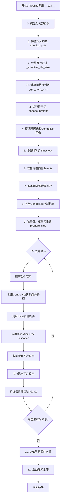
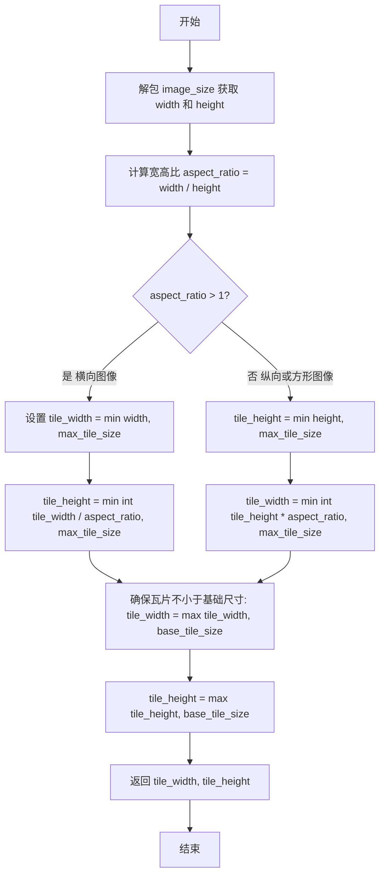
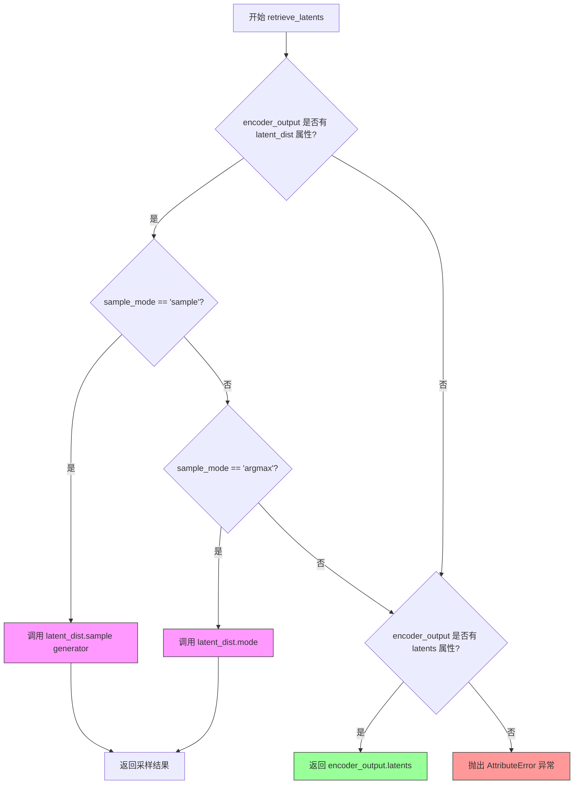
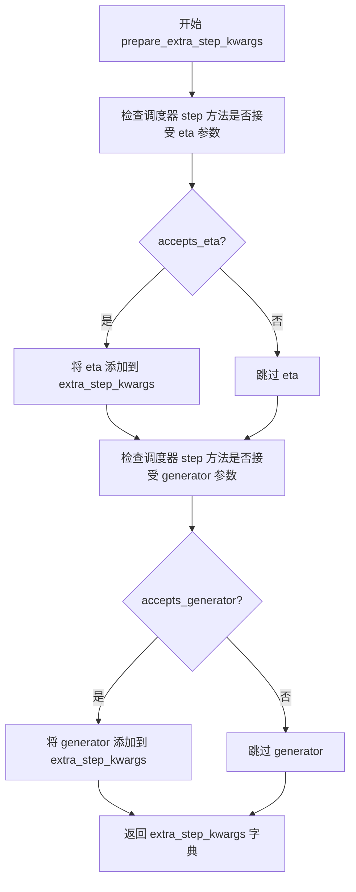
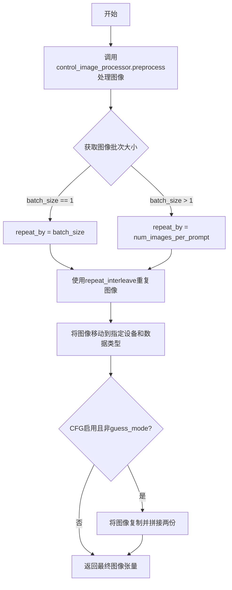
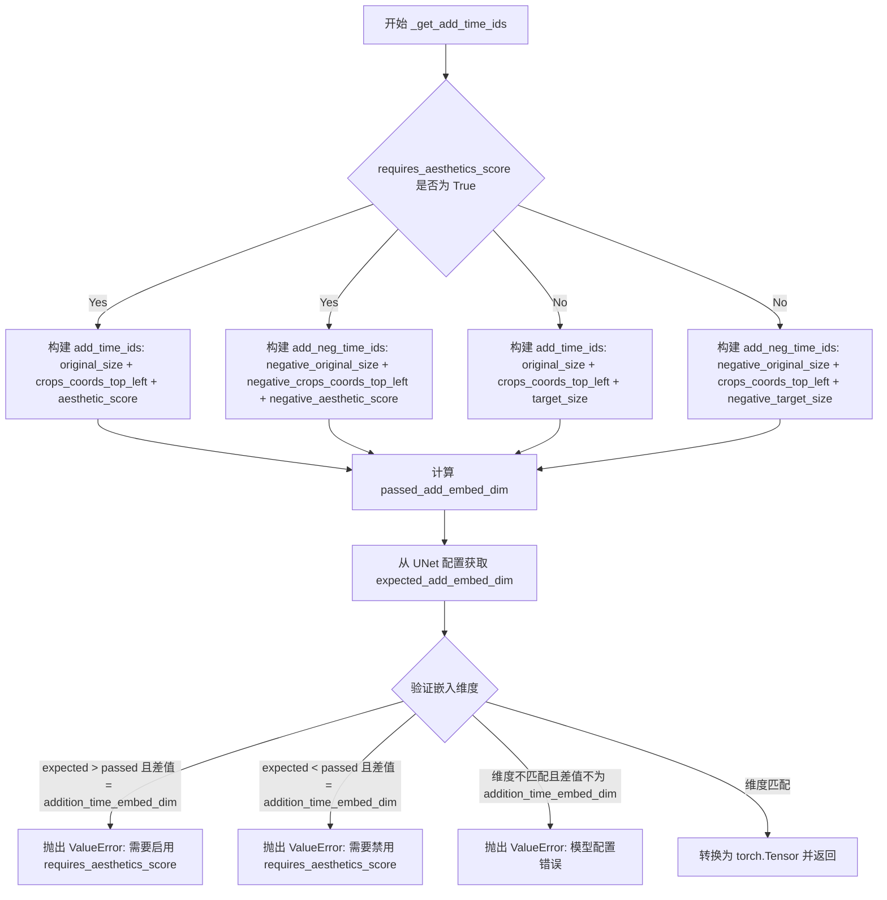
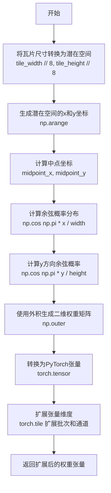
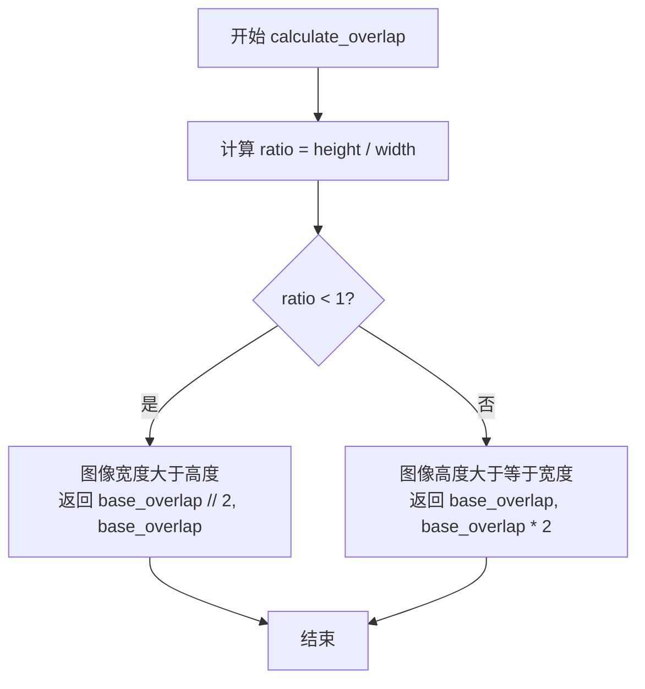
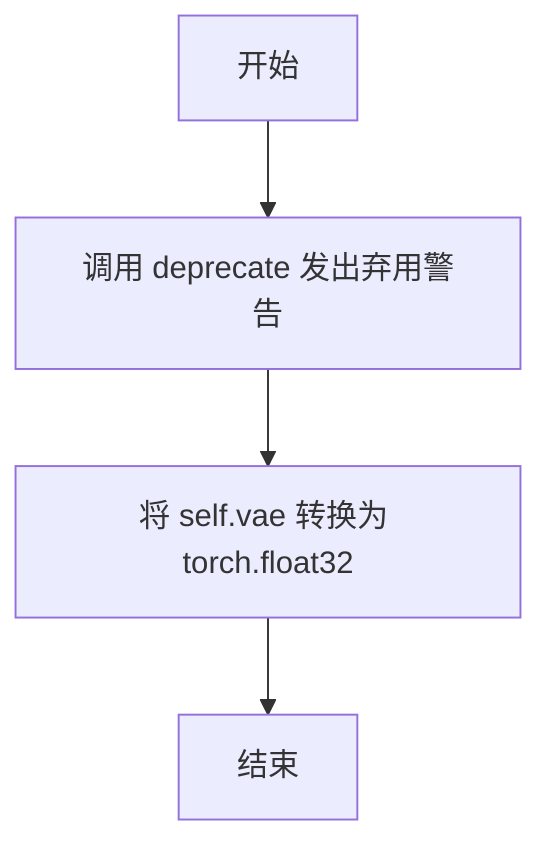

# `diffusers\examples\community\mod_controlnet_tile_sr_sdxl.py` 详细设计文档

这是一个基于Stable Diffusion XL的ControlNet Tile Super-Resolution pipeline，通过将高分辨率图像分割为多个重叠的瓦片（tiles）进行去噪处理，然后使用加权混合方法将瓦片结果拼接成完整的高分辨率图像。该pipeline支持ControlNet条件引导、可配置的重叠策略和高斯/余弦权重混合，适用于高分辨率图像生成和放大任务。

## 整体流程



## 类结构

```
StableDiffusionXLControlNetTileSRPipeline (主Pipeline类)
├── 继承自: DiffusionPipeline, StableDiffusionMixin, TextualInversionLoaderMixin, StableDiffusionXLLoraLoaderMixin, FromSingleFileMixin
├── TileWeightingMethod (枚举类: COSINE, GAUSSIAN)
└── 主要方法:
    ├── __call__ (主生成方法)
    ├── encode_prompt
    ├── check_inputs
    ├── prepare_tiles
    ├── _get_num_tiles
    ├── _generate_cosine_weights
    ├── _generate_gaussian_weights
    ├── calculate_overlap
    └── ... (其他辅助方法)
```

## 全局变量及字段


### `logger`
    
日志记录器

类型：`logging.Logger`
    


### `EXAMPLE_DOC_STRING`
    
示例文档字符串

类型：`str`
    


### `XLA_AVAILABLE`
    
PyTorch XLA可用性标志

类型：`bool`
    


### `_adaptive_tile_size`
    
根据图像尺寸计算自适应瓦片大小

类型：`function`
    


### `_tile2pixel_indices`
    
将瓦片索引转换为像素空间索引

类型：`function`
    


### `_tile2latent_indices`
    
将瓦片索引转换为潜在空间索引

类型：`function`
    


### `retrieve_latents`
    
从编码器输出中检索潜在向量

类型：`function`
    


### `全局变量.logger`
    
日志记录器

类型：`logging.Logger`
    


### `全局变量.EXAMPLE_DOC_STRING`
    
示例文档字符串

类型：`str`
    


### `全局变量.XLA_AVAILABLE`
    
PyTorch XLA可用性标志

类型：`bool`
    


### `StableDiffusionXLControlNetTileSRPipeline.vae`
    
VAE编码器/解码器模型

类型：`AutoencoderKL`
    


### `StableDiffusionXLControlNetTileSRPipeline.text_encoder`
    
第一个文本编码器

类型：`CLIPTextModel`
    


### `StableDiffusionXLControlNetTileSRPipeline.text_encoder_2`
    
第二个文本编码器(带projection)

类型：`CLIPTextModelWithProjection`
    


### `StableDiffusionXLControlNetTileSRPipeline.tokenizer`
    
第一个分词器

类型：`CLIPTokenizer`
    


### `StableDiffusionXLControlNetTileSRPipeline.tokenizer_2`
    
第二个分词器

类型：`CLIPTokenizer`
    


### `StableDiffusionXLControlNetTileSRPipeline.unet`
    
条件U-Net去噪模型

类型：`UNet2DConditionModel`
    


### `StableDiffusionXLControlNetTileSRPipeline.controlnet`
    
ControlNet联合模型

类型：`ControlNetUnionModel`
    


### `StableDiffusionXLControlNetTileSRPipeline.scheduler`
    
扩散调度器

类型：`KarrasDiffusionSchedulers`
    


### `StableDiffusionXLControlNetTileSRPipeline.image_processor`
    
图像处理器

类型：`VaeImageProcessor`
    


### `StableDiffusionXLControlNetTileSRPipeline.control_image_processor`
    
ControlNet图像处理器

类型：`VaeImageProcessor`
    


### `StableDiffusionXLControlNetTileSRPipeline.mask_processor`
    
掩码处理器

类型：`VaeImageProcessor`
    


### `StableDiffusionXLControlNetTileSRPipeline.watermark`
    
水印处理器

类型：`Optional[StableDiffusionXLWatermarker]`
    


### `StableDiffusionXLControlNetTileSRPipeline.vae_scale_factor`
    
VAE缩放因子

类型：`int`
    


### `StableDiffusionXLControlNetTileSRPipeline._guidance_scale`
    
引导尺度

类型：`float`
    


### `StableDiffusionXLControlNetTileSRPipeline._clip_skip`
    
CLIP跳过的层数

类型：`int`
    


### `StableDiffusionXLControlNetTileSRPipeline._cross_attention_kwargs`
    
交叉注意力参数

类型：`Dict[str, Any]`
    


### `StableDiffusionXLControlNetTileSRPipeline._num_timesteps`
    
时间步数

类型：`int`
    


### `StableDiffusionXLControlNetTileSRPipeline._interrupt`
    
中断标志

类型：`bool`
    


### `StableDiffusionXLControlNetTileSRPipeline.model_cpu_offload_seq`
    
CPU卸载顺序

类型：`str`
    


### `StableDiffusionXLControlNetTileSRPipeline._optional_components`
    
可选组件列表

类型：`List[str]`
    


### `TileWeightingMethod.COSINE`
    
瓦片余弦权重方法

类型：`TileWeightingMethod`
    


### `TileWeightingMethod.GAUSSIAN`
    
瓦片高斯权重方法

类型：`TileWeightingMethod`
    
    

## 全局函数及方法


### `_adaptive_tile_size`

根据图像尺寸计算自适应瓦片大小，确保瓦片保持宽高比的同时不超过指定的最大尺寸限制，同时保证瓦片不小于基础尺寸。

参数：

- `image_size`：`Tuple[int, int]`，图像尺寸，格式为 (宽度, 高度)
- `base_tile_size`：`int`，基础瓦片大小，默认为 512，用于确保瓦片不会过小
- `max_tile_size`：`int`，最大瓦片大小，默认为 1280，用于限制瓦片的最大尺寸

返回值：`Tuple[int, int]`，返回计算后的瓦片尺寸，格式为 (瓦片宽度, 瓦片高度)

#### 流程图



#### 带注释源码

```
def _adaptive_tile_size(image_size, base_tile_size=512, max_tile_size=1280):
    """
    Calculate the adaptive tile size based on the image dimensions, ensuring the tile
    respects the aspect ratio and stays within the specified size limits.
    
    Args:
        image_size: Tuple of (width, height) representing the image dimensions
        base_tile_size: Minimum tile size in pixels (default: 512)
        max_tile_size: Maximum tile size in pixels (default: 1280)
    
    Returns:
        Tuple of (tile_width, tile_height) representing the calculated tile dimensions
    """
    # 解包图像尺寸
    width, height = image_size
    
    # 计算图像宽高比
    aspect_ratio = width / height

    # 根据宽高比判断图像方向并计算瓦片尺寸
    if aspect_ratio > 1:
        # 横向图像：宽度大于高度
        # 瓦片宽度取图像宽度和最大瓦片大小的较小值
        tile_width = min(width, max_tile_size)
        # 瓦片高度根据宽高比计算，同时不超过最大瓦片大小
        tile_height = min(int(tile_width / aspect_ratio), max_tile_size)
    else:
        # 纵向或方形图像：高度大于等于宽度
        # 瓦片高度取图像高度和最大瓦片大小的较小值
        tile_height = min(height, max_tile_size)
        # 瓦片宽度根据宽高比计算，同时不超过最大瓦片大小
        tile_width = min(int(tile_height * aspect_ratio), max_tile_size)

    # 确保计算出的瓦片尺寸不小于基础瓦片大小
    tile_width = max(tile_width, base_tile_size)
    tile_height = max(tile_height, base_tile_size)

    return tile_width, tile_height
```


### `_tile2pixel_indices`

将瓦片（Tile）的行号和列号转换为对应像素坐标范围的函数，用于确定该瓦片在完整图像中影响的像素区域。

参数：

- `tile_row`：`int`，瓦片在网格中的行索引，从0开始计数
- `tile_col`：`int`，瓦片在网格中的列索引，从0开始计数
- `tile_width`：`int`，瓦片的宽度（以像素为单位）
- `tile_height`：`int`，瓦片的高度（以像素为单位）
- `tile_row_overlap`：`int`，相邻瓦片之间在垂直方向的重叠像素数
- `tile_col_overlap`：`int`，相邻瓦片之间在水平方向的重叠像素数
- `image_width`：`int`，完整图像的宽度（以像素为单位）
- `image_height`：`int`，完整图像的高度（以像素为单位）

返回值：`Tuple[int, int, int, int]`，返回一个包含四个整数的元组，分别是：
- 像素空间中行方向的起始坐标
- 像素空间中行方向的结束坐标
- 像素空间中列方向的起始坐标
- 像素空间中列方向的结束坐标

#### 流程图

```mermaid
flowchart TD
    A[开始] --> B{判断 tile_row == 0?}
    B -->|是| C[px_row_init = 0]
    B -->|否| D[px_row_init = tile_row × (tile_height - tile_row_overlap)]
    
    E{判断 tile_col == 0?}
    C --> E
    D --> E
    E -->|是| F[px_col_init = 0]
    E -->|否| G[px_col_init = tile_col × (tile_width - tile_col_overlap)]
    
    H[px_row_end = px_row_init + tile_height]
    F --> H
    G --> H
    
    I[px_col_end = px_col_init + tile_width]
    H --> I
    
    J{px_row_end > image_height?}
    I --> J
    J -->|是| K[px_row_end = image_height]
    J -->|否| L[px_row_end 保持不变]
    
    M{px_col_end > image_width?}
    K --> M
    L --> M
    M -->|是| N[px_col_end = image_width]
    M -->|否| O[px_col_end 保持不变]
    
    P[返回 (px_row_init, px_row_end, px_col_init, px_col_end)]
    N --> P
    O --> P
```

#### 带注释源码

```python
def _tile2pixel_indices(
    tile_row, tile_col, tile_width, tile_height, tile_row_overlap, tile_col_overlap, image_width, image_height
):
    """Given a tile row and column numbers returns the range of pixels affected by that tiles in the overall image

    Returns a tuple with:
        - Starting coordinates of rows in pixel space
        - Ending coordinates of rows in pixel space
        - Starting coordinates of columns in pixel space
        - Ending coordinates of columns in pixel space
    """
    # 计算起始行索引：如果是第一行（tile_row == 0），则从0开始；
    # 否则，根据瓦片高度和重叠区域计算起始位置
    # 例如：第2个瓦片的起始位置 = 1 × (tile_height - tile_row_overlap)
    px_row_init = 0 if tile_row == 0 else tile_row * (tile_height - tile_row_overlap)
    
    # 计算起始列索引：逻辑与行索引相同
    px_col_init = 0 if tile_col == 0 else tile_col * (tile_width - tile_col_overlap)

    # 计算结束行索引：起始位置 + 瓦片高度
    px_row_end = px_row_init + tile_height
    
    # 计算结束列索引：起始位置 + 瓦片宽度
    px_col_end = px_col_init + tile_width

    # 确保最后一个瓦片不超过图像边界
    # 如果计算出的结束位置超出图像高度，则截断到图像高度
    px_row_end = min(px_row_end, image_height)
    
    # 如果计算出的结束位置超出图像宽度，则截断到图像宽度
    px_col_end = min(px_col_end, image_width)

    # 返回元组：(行起始, 行结束, 列起始, 列结束)
    return px_row_init, px_row_end, px_col_init, px_col_end
```


### `_tile2latent_indices`

该函数将瓦片（tile）的像素坐标转换为潜在空间（latent space）的坐标范围。在图像生成过程中，VAE的潜在空间通常将图像尺寸缩小8倍，因此该函数通过除以8来完成坐标转换，并确保最后一个瓦片不超过潜在维度的边界。

参数：

- `tile_row`：`int`，瓦片在网格中的行索引
- `tile_col`：`int`，瓦片在网格中的列索引
- `tile_width`：`int`，瓦片的宽度（像素）
- `tile_height`：`int`，瓦片的高度（像素）
- `tile_row_overlap`：`int`，相邻瓦片行之间的重叠像素数
- `tile_col_overlap`：`int`，相邻瓦片列之间的重叠像素数
- `image_width`：`int`，图像宽度（像素）
- `image_height`：`int`，图像高度（像素）

返回值：`Tuple[int, int, int, int]`，返回四个整数元组，包含潜在空间中行起始坐标、行结束坐标、列起始坐标、列结束坐标

#### 流程图

```mermaid
flowchart TD
    A[开始] --> B[调用_tile2pixel_indices获取像素坐标]
    B --> C[px_row_init, px_row_end, px_col_init, px_col_end]
    C --> D{转换到潜在空间}
    D --> E[latent_row_init = px_row_init // 8]
    D --> F[latent_row_end = px_row_end // 8]
    D --> G[latent_col_init = px_col_init // 8]
    D --> H[latent_col_end = px_col_end // 8]
    E --> I[计算整体潜在尺寸]
    F --> I
    G --> I
    H --> I
    I --> J[latent_height = image_height // 8]
    I --> K[latent_width = image_width // 8]
    J --> L{边界检查}
    K --> L
    L --> M[latent_row_end = min(latent_row_end, latent_height)]
    L --> N[latent_col_end = min(latent_col_end, latent_width)]
    M --> O[返回tuple]
    N --> O
    O --> P[结束]
```

#### 带注释源码

```python
def _tile2latent_indices(
    tile_row, tile_col, tile_width, tile_height, tile_row_overlap, tile_col_overlap, image_width, image_height
):
    """Given a tile row and column numbers returns the range of latents affected by that tiles in the overall image

    Returns a tuple with:
        - Starting coordinates of rows in latent space
        - Ending coordinates of rows in latent space
        - Starting coordinates of columns in latent space
        - Ending coordinates of columns in latent space
    """
    # Step 1: 首先调用_tile2pixel_indices函数获取该瓦片在像素空间中的坐标范围
    # 这会考虑瓦片的大小、重叠以及图像尺寸
    px_row_init, px_row_end, px_col_init, px_col_end = _tile2pixel_indices(
        tile_row, tile_col, tile_width, tile_height, tile_row_overlap, tile_col_overlap, image_width, image_height
    )

    # Step 2: 将像素坐标转换为潜在空间坐标
    # 由于VAE的潜在空间将图像尺寸缩小了8倍，因此需要除以8
    latent_row_init = px_row_init // 8
    latent_row_end = px_row_end // 8
    latent_col_init = px_col_init // 8
    latent_col_end = px_col_end // 8
    
    # 计算整个图像在潜在空间中的尺寸
    latent_height = image_height // 8
    latent_width = image_width // 8

    # Step 3: 确保最后一个瓦片不会超出潜在空间的边界
    # 这对于处理图像边缘的瓦片尤为重要
    latent_row_end = min(latent_row_end, latent_height)
    latent_col_end = min(latent_col_end, latent_width)

    # Step 4: 返回潜在空间中的坐标范围
    # 格式: (行起始, 行结束, 列起始, 列结束)
    return latent_row_init, latent_row_end, latent_col_init, latent_col_end
```


### `retrieve_latents`

从编码器输出中检索潜在向量，根据采样模式从VAE的潜在分布中采样潜在向量，或直接返回预计算的潜在向量。

参数：

- `encoder_output`：`torch.Tensor`，编码器输出对象，可能包含 `latent_dist` 或 `latents` 属性
- `generator`：`torch.Generator | None`，可选的随机生成器，用于确保采样过程的可重复性
- `sample_mode`：`str`，采样模式，可选值为 "sample"（从分布采样）或 "argmax"（取分布的众数），默认为 "sample"

返回值：`torch.Tensor`，检索到的潜在向量

#### 流程图



#### 带注释源码

```python
# Copied from diffusers.pipelines.stable_diffusion.pipeline_stable_diffusion_img2img.retrieve_latents
def retrieve_latents(
    encoder_output: torch.Tensor, generator: torch.Generator | None = None, sample_mode: str = "sample"
):
    # 检查 encoder_output 是否具有 latent_dist 属性，并且采样模式为 "sample"
    if hasattr(encoder_output, "latent_dist") and sample_mode == "sample":
        # 从潜在分布中采样得到潜在向量
        return encoder_output.latent_dist.sample(generator)
    # 检查 encoder_output 是否具有 latent_dist 属性，并且采样模式为 "argmax"
    elif hasattr(encoder_output, "latent_dist") and sample_mode == "argmax":
        # 获取潜在分布的众数（最可能的值）作为潜在向量
        return encoder_output.latent_dist.mode()
    # 检查 encoder_output 是否直接具有 latents 属性
    elif hasattr(encoder_output, "latents"):
        # 直接返回预计算的潜在向量
        return encoder_output.latents
    else:
        # 如果无法访问潜在向量，抛出属性错误异常
        raise AttributeError("Could not access latents of provided encoder_output")
```


### `StableDiffusionXLControlNetTileSRPipeline.__init__`

初始化 Stable Diffusion XL ControlNet Tile SR Pipeline，用于基于图像和 ControlNet 条件进行高分辨率图像生成与超分辨率处理。

参数：

- `vae`：`AutoencoderKL`，Variational Auto-Encoder (VAE) 模型，用于编码和解码图像与潜在表示
- `text_encoder`：`CLIPTextModel`，冻结的文本编码器，Stable Diffusion 使用 CLIP 的文本部分
- `text_encoder_2`：`CLIPTextModelWithProjection`，第二个冻结的文本编码器，SDXL 使用 CLIP 的文本和池化部分
- `tokenizer`：`CLIPTokenizer`，第一个分词器
- `tokenizer_2`：`CLIPTokenizer`，第二个分词器
- `unet`：`UNet2DConditionModel`，条件 U-Net 架构，用于对编码的图像潜在表示进行去噪
- `controlnet`：`ControlNetUnionModel`，提供额外的条件信息给 unet
- `scheduler`：`KarrasDiffusionSchedulers`，与 unet 配合使用的调度器
- `requires_aesthetics_score`：`bool`，可选，是否需要 aesthetic_score 条件进行推理，默认为 False
- `force_zeros_for_empty_prompt`：`bool`，可选，是否强制将空提示的负嵌入设为零，默认为 True
- `add_watermarker`：`bool | None`，可选，是否使用隐形水印，默认为 None（如果包可用则启用）

返回值：无（`None`），构造函数初始化实例状态

#### 流程图

```mermaid
flowchart TD
    A[开始 __init__] --> B[调用 super().__init__]
    B --> C{controlnet 是 ControlNetUnionModel?}
    C -->|否| D[抛出 ValueError]
    C -->|是| E[register_modules 注册所有模块]
    E --> F[计算 vae_scale_factor]
    F --> G[创建 VaeImageProcessor]
    G --> H[创建 control_image_processor]
    H --> I[创建 mask_processor]
    I --> J{add_watermarker 是否为 None?}
    J -->|是| K[检查 is_invisible_watermark_available]
    J -->|否| L
    K --> L{add_watermarker 为 True?}
    L -->|是| M[实例化 StableDiffusionXLWatermarker]
    L -->|否| N[设置 self.watermark = None]
    M --> O[register_to_config force_zeros_for_empty_prompt]
    N --> O
    O --> P[register_to_config requires_aesthetics_score]
    P --> Q[结束 __init__]
```

#### 带注释源码

```python
def __init__(
    self,
    vae: AutoencoderKL,
    text_encoder: CLIPTextModel,
    text_encoder_2: CLIPTextModelWithProjection,
    tokenizer: CLIPTokenizer,
    tokenizer_2: CLIPTokenizer,
    unet: UNet2DConditionModel,
    controlnet: ControlNetUnionModel,
    scheduler: KarrasDiffusionSchedulers,
    requires_aesthetics_score: bool = False,
    force_zeros_for_empty_prompt: bool = True,
    add_watermarker: Optional[bool] = None,
):
    """
    初始化 StableDiffusionXLControlNetTileSRPipeline
    
    参数:
        vae: VAE 模型，用于图像编解码
        text_encoder: 第一个文本编码器 (CLIP)
        text_encoder_2: 第二个文本编码器 (CLIP with projection)
        tokenizer: 第一个分词器
        tokenizer_2: 第二个分词器
        unet: 条件去噪 U-Net
        controlnet: ControlNet 联合模型
        scheduler: 扩散调度器
        requires_aesthetics_score: 是否需要美学评分条件
        force_zeros_for_empty_prompt: 空提示是否强制为零嵌入
        add_watermarker: 是否添加水印
    """
    # 调用父类 DiffusionPipeline 的初始化
    super().__init__()

    # 类型检查：controlnet 必须是 ControlNetUnionModel 类型
    if not isinstance(controlnet, ControlNetUnionModel):
        raise ValueError("Expected `controlnet` to be of type `ControlNetUnionModel`.")

    # 注册所有模块到 Pipeline，使其可被保存/加载
    self.register_modules(
        vae=vae,
        text_encoder=text_encoder,
        text_encoder_2=text_encoder_2,
        tokenizer=tokenizer,
        tokenizer_2=tokenizer_2,
        unet=unet,
        controlnet=controlnet,
        scheduler=scheduler,
    )
    
    # 计算 VAE 缩放因子，基于 VAE block_out_channels 数量
    # 默认为 2^(len(block_out_channels)-1)，SDXL 通常为 8
    self.vae_scale_factor = 2 ** (len(self.vae.config.block_out_channels) - 1) if getattr(self, "vae", None) else 8
    
    # 创建图像处理器：用于预处理输入图像和后处理输出图像
    self.image_processor = VaeImageProcessor(vae_scale_factor=self.vae_scale_factor, do_convert_rgb=True)
    
    # 创建 ControlNet 图像处理器：不需要归一化
    self.control_image_processor = VaeImageProcessor(
        vae_scale_factor=self.vae_scale_factor, do_convert_rgb=True, do_normalize=False
    )
    
    # 创建掩码处理器：需要二值化和灰度转换
    self.mask_processor = VaeImageProcessor(
        vae_scale_factor=self.vae_scale_factor, do_normalize=False, do_binarize=True, do_convert_grayscale=True
    )
    
    # 确定是否添加水印：默认为启用（如果包可用）
    add_watermarker = add_watermarker if add_watermarker is not None else is_invisible_watermark_available()

    # 如果启用水印，创建水印器实例
    if add_watermarker:
        self.watermark = StableDiffusionXLWatermarker()
    else:
        self.watermark = None

    # 注册配置项
    self.register_to_config(force_zeros_for_empty_prompt=force_zeros_for_empty_prompt)
    self.register_to_config(requires_aesthetics_score=requires_aesthetics_score)
```


### `StableDiffusionXLControlNetTileSRPipeline.encode_prompt`

该方法负责将文本提示（prompt）编码为文本编码器的隐藏状态（hidden states），支持 Stable Diffusion XL 的双文本编码器架构。它处理 LoRA 缩放、正向提示和负向提示的编码，并返回用于后续去噪过程的文本嵌入向量。

参数：

- `prompt`：`str` 或 `List[str]`，要编码的主提示文本
- `prompt_2`：`str` 或 `List[str]` 或 `None`，发送给第二个分词器和文本编码器的提示，若为 None 则使用 `prompt`
- `device`：`Optional[torch.device]`，torch 设备，默认为执行设备
- `num_images_per_prompt`：`int`，每个提示生成的图像数量，默认为 1
- `do_classifier_free_guidance`：`bool`，是否使用分类器自由引导，默认为 True
- `negative_prompt`：`str` 或 `List[str]` 或 `None`，负向提示，用于引导图像生成远离特定内容
- `negative_prompt_2`：`str` 或 `List[str]` 或 `None`，第二个负向提示，若为 None 则使用 `negative_prompt`
- `prompt_embeds`：`Optional[torch.Tensor]`，预生成的文本嵌入，可用于轻松调整文本输入
- `negative_prompt_embeds`：`Optional[torch.Tensor]`，预生成的负向文本嵌入
- `pooled_prompt_embeds`：`Optional[torch.Tensor]`，预生成的池化文本嵌入
- `negative_pooled_prompt_embeds`：`Optional[torch.Tensor]`，预生成的负向池化文本嵌入
- `lora_scale`：`Optional[float]`，应用于文本编码器所有 LoRA 层的 LoRA 缩放因子
- `clip_skip`：`Optional[int]`，计算提示嵌入时从 CLIP 跳过的层数

返回值：`Tuple[torch.Tensor, torch.Tensor, torch.Tensor, torch.Tensor]`，包含四个张量：
- `prompt_embeds`：编码后的正向提示嵌入
- `negative_prompt_embeds`：编码后的负向提示嵌入
- `pooled_prompt_embeds`：池化的正向提示嵌入
- `negative_pooled_prompt_embeds`：池化的负向提示嵌入

#### 流程图

```mermaid
flowchart TD
    A[开始 encode_prompt] --> B{检查 lora_scale}
    B -->|不为 None| C[设置 self._lora_scale]
    B -->|为 None| D[跳过 LoRA 缩放]
    C --> E{是否使用 PEFT 后端}
    E -->|否| F[adjust_lora_scale_text_encoder]
    E -->|是| G[scale_lora_layers]
    D --> H[标准化 prompt 为列表]
    H --> I[确定 batch_size]
    I --> J[获取分词器和文本编码器列表]
    J --> K{prompt_embeds 是否为 None}
    K -->|是| L[处理 prompt_2]
    L --> M[遍历两个分词器/编码器对]
    M --> N{是否 TextualInversionLoaderMixin}
    N -->|是| O[maybe_convert_prompt]
    N -->|否| P[直接分词]
    O --> P
    P --> Q[tokenizer 返回 tensor]
    Q --> R[文本编码器前向传播]
    R --> S[获取 pooled_prompt_embeds]
    S --> T{clip_skip 是否为 None}
    T -->|是| U[使用倒数第二层隐藏状态]
    T -->|否| V[根据 clip_skip 选择隐藏状态层]
    U --> W[添加到 prompt_embeds_list]
    V --> W
    M --> X[合并 prompt_embeds_list]
    K -->|否| Y[使用预生成的 prompt_embeds]
    X --> Z{是否需要 CFG}
    Z -->|是 且无 negative_prompt_embeds| AA{force_zeros_for_empty_prompt}
    AA -->|是| AB[生成零张量]
    AA -->|否| AC[处理 negative_prompt]
    Z -->|否| AD[跳过负向嵌入处理]
    AB --> AE[设置 negative_pooled_prompt_embeds 为零]
    AC --> AF[标准化 negative_prompt 为列表]
    AF --> AG[遍历负向提示]
    AG --> AH[分词和编码负向提示]
    AH --> AI[获取 negative_pooled_prompt_embeds]
    AI --> AJ[添加到 negative_prompt_embeds_list]
    AG --> AK[合并 negative_prompt_embeds_list]
    AE --> AL[数据类型转换]
    AK --> AL
    AD --> AL
    Y --> AL
    AL --> AM{do_classifier_free_guidance}
    AM -->|是| AN[重复 prompt_embeds]
    AN --> AO[重复 negative_prompt_embeds]
    AM -->|否| AP[仅重复 prompt_embeds]
    AO --> AQ[重复 pooled_prompt_embeds]
    AP --> AQ
    AQ --> AR{需要恢复 LoRA]
    AR -->|是| AS[unscale_lora_layers]
    AR -->|否| AT[返回结果]
    AS --> AT
    AT --> AU[结束]
```

#### 带注释源码

```python
def encode_prompt(
    self,
    prompt: str,
    prompt_2: str | None = None,
    device: Optional[torch.device] = None,
    num_images_per_prompt: int = 1,
    do_classifier_free_guidance: bool = True,
    negative_prompt: str | None = None,
    negative_prompt_2: str | None = None,
    prompt_embeds: Optional[torch.Tensor] = None,
    negative_prompt_embeds: Optional[torch.Tensor] = None,
    pooled_prompt_embeds: Optional[torch.Tensor] = None,
    negative_pooled_prompt_embeds: Optional[torch.Tensor] = None,
    lora_scale: Optional[float] = None,
    clip_skip: Optional[int] = None,
):
    r"""
    Encodes the prompt into text encoder hidden states.

    Args:
        prompt (`str` or `List[str]`, *optional*):
            prompt to be encoded
        prompt_2 (`str` or `List[str]`, *optional*):
            The prompt or prompts to be sent to the `tokenizer_2` and `text_encoder_2`. If not defined, `prompt` is
            used in both text-encoders
        device: (`torch.device`):
            torch device
        num_images_per_prompt (`int`):
            number of images that should be generated per prompt
        do_classifier_free_guidance (`bool`):
            whether to use classifier free guidance or not
        negative_prompt (`str` or `List[str]`, *optional*):
            The prompt or prompts not to guide the image generation. If not defined, one has to pass
            `negative_prompt_embeds` instead. Ignored when not using guidance (i.e., ignored if `guidance_scale` is
            less than `1`).
        negative_prompt_2 (`str` or `List[str]`, *optional*):
            The prompt or prompts not to guide the image generation to be sent to `tokenizer_2` and
            `text_encoder_2`. If not defined, `negative_prompt` is used in both text-encoders
        prompt_embeds (`torch.Tensor`, *optional*):
            Pre-generated text embeddings. Can be used to easily tweak text inputs, *e.g.* prompt weighting. If not
            provided, text embeddings will be generated from `prompt` input argument.
        negative_prompt_embeds (`torch.Tensor`, *optional*):
            Pre-generated negative text embeddings. Can be used to easily tweak text inputs, *e.g.* prompt
            weighting. If not provided, negative_prompt_embeds will be generated from `negative_prompt` input
            argument.
        pooled_prompt_embeds (`torch.Tensor`, *optional*):
            Pre-generated pooled text embeddings. Can be used to easily tweak text inputs, *e.g.* prompt weighting.
            If not provided, pooled text embeddings will be generated from `prompt` input argument.
        negative_pooled_prompt_embeds (`torch.Tensor`, *optional*):
            Pre-generated negative pooled text embeddings. Can be used to easily tweak text inputs, *e.g.* prompt
            weighting. If not provided, pooled negative_prompt_embeds will be generated from `negative_prompt`
            input argument.
        lora_scale (`float`, *optional*):
            A lora scale that will be applied to all LoRA layers of the text encoder if LoRA layers are loaded.
        clip_skip (`int`, *optional*):
            Number of layers to be skipped from CLIP while computing the prompt embeddings. A value of 1 means that
            the output of the pre-final layer will be used for computing the prompt embeddings.
    """
    # 确定执行设备，默认为当前执行设备
    device = device or self._execution_device

    # 设置 LoRA 缩放，以便文本编码器的 LoRA 函数可以正确访问
    if lora_scale is not None and isinstance(self, StableDiffusionXLLoraLoaderMixin):
        self._lora_scale = lora_scale

        # 动态调整 LoRA 缩放
        if self.text_encoder is not None:
            if not USE_PEFT_BACKEND:
                adjust_lora_scale_text_encoder(self.text_encoder, lora_scale)
            else:
                scale_lora_layers(self.text_encoder, lora_scale)

        if self.text_encoder_2 is not None:
            if not USE_PEFT_BACKEND:
                adjust_lora_scale_text_encoder(self.text_encoder_2, lora_scale)
            else:
                scale_lora_layers(self.text_encoder_2, lora_scale)

    # 将 prompt 标准化为列表
    prompt = [prompt] if isinstance(prompt, str) else prompt

    # 确定批次大小
    if prompt is not None:
        batch_size = len(prompt)
    else:
        batch_size = prompt_embeds.shape[0]

    # 定义分词器和文本编码器
    tokenizers = [self.tokenizer, self.tokenizer_2] if self.tokenizer is not None else [self.tokenizer_2]
    text_encoders = (
        [self.text_encoder, self.text_encoder_2] if self.text_encoder is not None else [self.text_encoder_2]
    )
    dtype = text_encoders[0].dtype
    
    # 如果未提供 prompt_embeds，则从 prompt 生成
    if prompt_embeds is None:
        # prompt_2 默认为 prompt
        prompt_2 = prompt_2 or prompt
        prompt_2 = [prompt_2] if isinstance(prompt_2, str) else prompt_2

        # 文本反转：如有需要，处理多向量标记
        prompt_embeds_list = []
        prompts = [prompt, prompt_2]
        
        # 遍历两个分词器/编码器对
        for prompt, tokenizer, text_encoder in zip(prompts, tokenizers, text_encoders):
            # 如果是 TextualInversionLoaderMixin，转换 prompt
            if isinstance(self, TextualInversionLoaderMixin):
                prompt = self.maybe_convert_prompt(prompt, tokenizer)

            # 分词处理
            text_inputs = tokenizer(
                prompt,
                padding="max_length",
                max_length=tokenizer.model_max_length,
                truncation=True,
                return_tensors="pt",
            )

            text_input_ids = text_inputs.input_ids
            
            # 检查是否需要截断
            untruncated_ids = tokenizer(prompt, padding="longest", return_tensors="pt").input_ids
            if untruncated_ids.shape[-1] >= text_input_ids.shape[-1] and not torch.equal(
                text_input_ids, untruncated_ids
            ):
                removed_text = tokenizer.batch_decode(untruncated_ids[:, tokenizer.model_max_length - 1 : -1])
                logger.warning(
                    "The following part of your input was truncated because CLIP can only handle sequences up to"
                    f" {tokenizer.model_max_length} tokens: {removed_text}"
                )
            
            # 文本编码器转换为指定 dtype
            text_encoder.to(dtype)
            
            # 前向传播获取隐藏状态
            prompt_embeds = text_encoder(text_input_ids.to(device), output_hidden_states=True)

            # 始终获取最后一个文本编码器的池化输出
            if pooled_prompt_embeds is None and prompt_embeds[0].ndim == 2:
                pooled_prompt_embeds = prompt_embeds[0]

            # 根据 clip_skip 选择隐藏状态层
            if clip_skip is None:
                prompt_embeds = prompt_embeds.hidden_states[-2]  # 倒数第二层
            else:
                # "2" 因为 SDXL 总是从倒数第二层索引
                prompt_embeds = prompt_embeds.hidden_states[-(clip_skip + 2)]

            prompt_embeds_list.append(prompt_embeds)

        # 沿最后一维连接两个文本编码器的嵌入
        prompt_embeds = torch.concat(prompt_embeds_list, dim=-1)

    # 获取分类器自由引导的无条件嵌入
    zero_out_negative_prompt = negative_prompt is None and self.config.force_zeros_for_empty_prompt
    
    # 处理负向提示嵌入
    if do_classifier_free_guidance and negative_prompt_embeds is None and zero_out_negative_prompt:
        # 如果配置要求对空提示强制为零，则生成零张量
        negative_prompt_embeds = torch.zeros_like(prompt_embeds)
        negative_pooled_prompt_embeds = torch.zeros_like(pooled_prompt_embeds)
    elif do_classifier_free_guidance and negative_prompt_embeds is None:
        # 需要从 negative_prompt 生成负向嵌入
        negative_prompt = negative_prompt or ""
        negative_prompt_2 = negative_prompt_2 or negative_prompt

        # 标准化为列表
        negative_prompt = batch_size * [negative_prompt] if isinstance(negative_prompt, str) else negative_prompt
        negative_prompt_2 = (
            batch_size * [negative_prompt_2] if isinstance(negative_prompt_2, str) else negative_prompt_2
        )

        uncond_tokens: List[str]
        
        # 类型检查
        if prompt is not None and type(prompt) is not type(negative_prompt):
            raise TypeError(
                f"`negative_prompt` should be the same type to `prompt`, but got {type(negative_prompt)} !="
                f" {type(prompt)}."
            )
        elif batch_size != len(negative_prompt):
            raise ValueError(
                f"`negative_prompt`: {negative_prompt} has batch size {len(negative_prompt)}, but `prompt`:"
                f" {prompt} has batch size {batch_size}. Please make sure that passed `negative_prompt` matches"
                " the batch size of `prompt`."
            )
        else:
            uncond_tokens = [negative_prompt, negative_prompt_2]

        # 处理负向提示
        negative_prompt_embeds_list = []
        for negative_prompt, tokenizer, text_encoder in zip(uncond_tokens, tokenizers, text_encoders):
            if isinstance(self, TextualInversionLoaderMixin):
                negative_prompt = self.maybe_convert_prompt(negative_prompt, tokenizer)

            max_length = prompt_embeds.shape[1]
            uncond_input = tokenizer(
                negative_prompt,
                padding="max_length",
                max_length=max_length,
                truncation=True,
                return_tensors="pt",
            )

            negative_prompt_embeds = text_encoder(
                uncond_input.input_ids.to(device),
                output_hidden_states=True,
            )

            # 始终获取池化输出
            if negative_pooled_prompt_embeds is None and negative_prompt_embeds[0].ndim == 2:
                negative_pooled_prompt_embeds = negative_prompt_embeds[0]
            negative_prompt_embeds = negative_prompt_embeds.hidden_states[-2]

            negative_prompt_embeds_list.append(negative_prompt_embeds)

        negative_prompt_embeds = torch.concat(negative_prompt_embeds_list, dim=-1)

    # 确保嵌入类型一致
    if self.text_encoder_2 is not None:
        prompt_embeds = prompt_embeds.to(dtype=self.text_encoder_2.dtype, device=device)
    else:
        prompt_embeds = prompt_embeds.to(dtype=self.unet.dtype, device=device)

    # 复制文本嵌入以支持每个提示生成多个图像
    bs_embed, seq_len, _ = prompt_embeds.shape
    prompt_embeds = prompt_embeds.repeat(1, num_images_per_prompt, 1)
    prompt_embeds = prompt_embeds.view(bs_embed * num_images_per_prompt, seq_len, -1)

    # 如果使用分类器自由引导，也复制无条件嵌入
    if do_classifier_free_guidance:
        seq_len = negative_prompt_embeds.shape[1]

        if self.text_encoder_2 is not None:
            negative_prompt_embeds = negative_prompt_embeds.to(dtype=self.text_encoder_2.dtype, device=device)
        else:
            negative_prompt_embeds = negative_prompt_embeds.to(dtype=self.unet.dtype, device=device)

        negative_prompt_embeds = negative_prompt_embeds.repeat(1, num_images_per_prompt, 1)
        negative_prompt_embeds = negative_prompt_embeds.view(batch_size * num_images_per_prompt, seq_len, -1)

    # 处理池化嵌入
    pooled_prompt_embeds = pooled_prompt_embeds.repeat(1, num_images_per_prompt).view(
        bs_embed * num_images_per_prompt, -1
    )
    if do_classifier_free_guidance:
        negative_pooled_prompt_embeds = negative_pooled_prompt_embeds.repeat(1, num_images_per_prompt).view(
            bs_embed * num_images_per_prompt, -1
        )

    # 如果使用 PEFT 后端，恢复 LoRA 层原始缩放
    if self.text_encoder is not None:
        if isinstance(self, StableDiffusionXLLoraLoaderMixin) and USE_PEFT_BACKEND:
            # 通过反向缩放 LoRA 层恢复原始缩放
            unscale_lora_layers(self.text_encoder, lora_scale)

    if self.text_encoder_2 is not None:
        if isinstance(self, StableDiffusionXLLoraLoaderMixin) and USE_PEFT_BACKEND:
            unscale_lora_layers(self.text_encoder_2, lora_scale)

    # 返回四个嵌入张量
    return prompt_embeds, negative_prompt_embeds, pooled_prompt_embeds, negative_pooled_prompt_embeds
```


### `StableDiffusionXLControlNetTileSRPipeline.prepare_extra_step_kwargs`

准备调度器步骤所需的额外关键字参数。由于并非所有调度器都具有相同的签名，此方法通过检查调度器的 `step` 方法是否接受特定参数（如 `eta` 和 `generator`）来动态构建额外的参数字典。

参数：

- `generator`：`torch.Generator | None`，用于生成确定性输出的随机生成器
- `eta`：`float`，DDIM 论文中的 η 参数，仅在使用 DDIMScheduler 时有效，应在 [0, 1] 范围内

返回值：`Dict[str, Any]`，包含调度器 step 方法所需额外参数（如 `eta` 和/或 `generator`）的字典

#### 流程图



#### 带注释源码

```python
# Copied from diffusers.pipelines.stable_diffusion.pipeline_stable_diffusion.StableDiffusionPipeline.prepare_extra_step_kwargs
def prepare_extra_step_kwargs(self, generator, eta):
    """
    准备调度器步骤所需的额外参数。

    由于并非所有调度器都具有相同的签名，此方法通过检查调度器的 step 方法
    是否接受特定参数来动态构建额外的参数字典。

    参数:
        generator: torch.Generator 或 None，用于生成确定性输出的随机生成器
        eta: float，DDIM 论文中的 η 参数，仅在使用 DDIMScheduler 时有效

    返回:
        包含调度器 step 方法所需额外参数的字典
    """
    # 准备调度器步骤的额外参数，因为并非所有调度器都有相同的签名
    # eta (η) 仅在 DDIMScheduler 中使用，其他调度器会忽略它
    # eta 对应 DDIM 论文中的 η: https://huggingface.co/papers/2010.02502
    # 取值应在 [0, 1] 之间

    # 检查调度器的 step 方法是否接受 eta 参数
    accepts_eta = "eta" in set(inspect.signature(self.scheduler.step).parameters.keys())
    extra_step_kwargs = {}
    if accepts_eta:
        extra_step_kwargs["eta"] = eta

    # 检查调度器是否接受 generator 参数
    accepts_generator = "generator" in set(inspect.signature(self.scheduler.step).parameters.keys())
    if accepts_generator:
        extra_step_kwargs["generator"] = generator
    
    return extra_step_kwargs
```


### `StableDiffusionXLControlNetTileSRPipeline.check_inputs`

该函数是StableDiffusionXLControlNetTileSRPipeline管道类的输入验证方法，用于在执行图像生成之前全面验证所有输入参数的有效性，包括图像尺寸、提示词格式、瓦片参数、控制网配置等，确保所有参数符合管道要求，否则抛出相应的异常。

参数：

- `prompt`：提示词参数，支持字符串或字符串列表形式，用于指导图像生成的内容。若提供必须为指定类型，否则会触发类型错误。
- `height`：生成图像的高度（像素），必须能被8整除，以确保与潜空间维度兼容。
- `width`：生成图像的宽度（像素），必须能被8整除，以确保与潜空间维度兼容。
- `image`：输入的控制图像，支持PIL图像、torch张量、numpy数组或这些类型的列表，用于提供ControlNet的条件输入。
- `strength`：去噪强度参数，取值范围为[0.0, 1.0]，控制对原始图像的变换程度，值越大变换越显著。
- `num_inference_steps`：推理步数，必须为正整数，指定去噪过程的迭代次数，影响生成图像的质量和细节。
- `normal_tile_overlap`：普通瓦片之间的重叠像素数，必须为整数且大于等于64，用于确保瓦片之间的平滑过渡。
- `border_tile_overlap`：边界瓦片之间的重叠像素数，必须为整数且大于等于128，用于处理图像边缘的过渡效果。
- `max_tile_size`：瓦片的最大尺寸，必须为1024或1280之一，限制单个瓦片的最大像素边长。
- `tile_gaussian_sigma`：高斯加权的sigma参数，必须为正浮点数，控制高斯权重分布的平滑程度。
- `tile_weighting_method`：瓦片权重方法，必须为字符串且值为"Cosine"或"Gaussian"之一，决定如何计算瓦片混合权重。
- `controlnet_conditioning_scale`：ControlNet条件缩放因子，类型根据ControlNet数量可以是float或list，控制ControlNet对生成过程的影响程度。
- `control_guidance_start`：ControlNet应用的起始比例，指定ControlNet从去噪过程的哪个阶段开始生效，取值范围[0.0, 1.0]。
- `control_guidance_end`：ControlNet应用的结束比例，指定ControlNet在去噪过程的哪个阶段停止生效，取值范围[0.0, 1.0]。

返回值：`None`（无返回值），该函数通过抛出异常来处理无效输入，不返回任何值。

#### 流程图

```mermaid
flowchart TD
    A[开始 check_inputs 验证] --> B{height 和 width 是否能被8整除?}
    B -->|否| B1[抛出 ValueError]
    B -->|是| C{prompt 类型是否正确?}
    C -->|否| C1[抛出 ValueError]
    C -->|是| D{strength 是否在 [0, 1] 范围内?}
    D -->|否| D1[抛出 ValueError]
    D -->|是| E{num_inference_steps 是否为正整数?}
    E -->|否| E1[抛出 ValueError]
    E -->|是| F{normal_tile_overlap 是否 >= 64?}
    F -->|否| F1[抛出 ValueError]
    F -->|是| G{border_tile_overlap 是否 >= 128?}
    G -->|否| G1[抛出 ValueError]
    G -->|是| H{max_tile_size 是否为 1024 或 1280?}
    H -->|否| H1[抛出 ValueError]
    H -->|是| I{tile_gaussian_sigma 是否为正浮点数?}
    I -->|否| I1[抛出 ValueError]
    I -->|是| J{tile_weighting_method 是否为有效枚举值?}
    J -->|否| J1[抛出 ValueError]
    J -->|是| K{image 格式是否正确?}
    K -->|否| K1[抛出 TypeError]
    K -->|是| L{controlnet_conditioning_scale 类型是否正确?}
    L -->|否| L1[抛出 TypeError 或 ValueError]
    L -->|是| M{control_guidance_start 和 end 是否有效?}
    M -->|否| M1[抛出 ValueError]
    M -->|是| N[验证通过，函数结束]
    
    B1 --> N
    C1 --> N
    D1 --> N
    E1 --> N
    F1 --> N
    G1 --> N
    H1 --> N
    I1 --> N
    J1 --> N
    K1 --> N
    L1 --> N
    M1 --> N
```

#### 带注释源码

```python
def check_inputs(
    self,
    prompt,                       # 提示词：str 或 list[str]，指导图像生成内容
    height,                       # 输出图像高度，必须能被8整除
    width,                        # 输出图像宽度，必须能被8整除
    image,                        # 控制图像输入，支持多种格式
    strength,                     # 去噪强度，范围[0.0, 1.0]
    num_inference_steps,         # 推理步数，必须为正整数
    normal_tile_overlap,          # 普通瓦片重叠，像素值，需>=64
    border_tile_overlap,          # 边界瓦片重叠，像素值，需>=128
    max_tile_size,                # 最大瓦片尺寸，仅支持1024或1280
    tile_gaussian_sigma,          # 高斯sigma参数，正浮点数
    tile_weighting_method,        # 瓦片权重方法，字符串枚举值
    controlnet_conditioning_scale=1.0,  # ControlNet条件缩放因子
    control_guidance_start=0.0,    # ControlNet起始应用比例
    control_guidance_end=1.0,     # ControlNet结束应用比例
):
    # 验证图像尺寸是否满足潜空间对齐要求
    # Stable Diffusion 的 VAE 通常将图像下采样8倍，因此尺寸必须能被8整除
    if height % 8 != 0 or width % 8 != 0:
        raise ValueError(f"`height` and `width` have to be divisible by 8 but are {height} and {width}.")

    # 验证提示词格式，支持单字符串或字符串列表
    if prompt is not None and (not isinstance(prompt, str) and not isinstance(prompt, list)):
        raise ValueError(f"`prompt` has to be of type `str` or `list` but is {type(prompt)}")

    # 验证去噪强度是否在有效范围内
    # strength 控制原始图像与噪声之间的混合比例
    if strength < 0 or strength > 1:
        raise ValueError(f"The value of strength should in [0.0, 1.0] but is {strength}")
    
    # 验证推理步数存在且为正整数
    if num_inference_steps is None:
        raise ValueError("`num_inference_steps` cannot be None.")
    elif not isinstance(num_inference_steps, int) or num_inference_steps <= 0:
        raise ValueError(
            f"`num_inference_steps` has to be a positive integer but is {num_inference_steps} of type"
            f" {type(num_inference_steps)}."
        )
    
    # 验证普通瓦片重叠参数，确保瓦片之间有足够的重叠区域进行平滑融合
    # 64像素的最小值确保了足够的重叠以避免接缝 artifact
    if normal_tile_overlap is None:
        raise ValueError("`normal_tile_overlap` cannot be None.")
    elif not isinstance(normal_tile_overlap, int) or normal_tile_overlap < 64:
        raise ValueError(
            f"`normal_tile_overlap` has to be greater than 64 but is {normal_tile_overlap} of type"
            f" {type(normal_tile_overlap)}."
        )
    
    # 验证边界瓦片重叠参数，边界需要更大的重叠以确保边缘过渡自然
    if border_tile_overlap is None:
        raise ValueError("`border_tile_overlap` cannot be None.")
    elif not isinstance(border_tile_overlap, int) or border_tile_overlap < 128:
        raise ValueError(
            f"`border_tile_overlap` has to be greater than 128 but is {border_tile_overlap} of type"
            f" {type(border_tile_overlap)}."
        )
    
    # 验证最大瓦片尺寸，限制为特定值以确保与模型架构兼容
    if max_tile_size is None:
        raise ValueError("`max_tile_size` cannot be None.")
    elif not isinstance(max_tile_size, int) or max_tile_size not in (1024, 1280):
        raise ValueError(
            f"`max_tile_size` has to be in 1024 or 1280 but is {max_tile_size} of type {type(max_tile_size)}."
        )
    
    # 验证高斯sigma参数，控制权重分布的衰减速率
    if tile_gaussian_sigma is None:
        raise ValueError("`tile_gaussian_sigma` cannot be None.")
    elif not isinstance(tile_gaussian_sigma, float) or tile_gaussian_sigma <= 0:
        raise ValueError(
            f"`tile_gaussian_sigma` has to be a positive float but is {tile_gaussian_sigma} of type"
            f" {type(tile_gaussian_sigma)}."
        )
    
    # 验证瓦片权重方法，确保使用预定义的枚举值之一
    if tile_weighting_method is None:
        raise ValueError("`tile_weighting_method` cannot be None.")
    elif not isinstance(tile_weighting_method, str) or tile_weighting_method not in [
        t.value for t in self.TileWeightingMethod
    ]:
        raise ValueError(
            f"`tile_weighting_method` has to be a string in ({[t.value for t in self.TileWeightingMethod]}) but is {tile_weighting_method} of type"
            f" {type(tile_weighting_method)}."
        )

    # 检查控制图像格式，调用专门的图像验证方法
    # 需要判断controlnet的具体类型以选择合适的验证逻辑
    is_compiled = hasattr(F, "scaled_dot_product_attention") and isinstance(
        self.controlnet, torch._dynamo.eval_frame.OptimizedModule
    )
    if (
        isinstance(self.controlnet, ControlNetModel)
        or is_compiled
        and isinstance(self.controlnet._orig_mod, ControlNetModel)
    ):
        self.check_image(image, prompt)  # 单ControlNet验证
    elif (
        isinstance(self.controlnet, ControlNetUnionModel)
        or is_compiled
        and isinstance(self.controlnet._orig_mod, ControlNetUnionModel)
    ):
        self.check_image(image, prompt)  # Union ControlNet验证
    else:
        assert False  # 不支持的ControlNet类型

    # 验证ControlNet条件缩放因子，根据ControlNet数量类型有不同的要求
    if (
        isinstance(self.controlnet, ControlNetUnionModel)
        or is_compiled
        and isinstance(self.controlnet._orig_mod, ControlNetUnionModel)
    ) or (
        isinstance(self.controlnet, MultiControlNetModel)
        or is_compiled
        and isinstance(self.controlnet._orig_mod, MultiControlNetModel)
    ):
        # 单ControlNet或Union模型：scale必须为float
        if not isinstance(controlnet_conditioning_scale, float):
            raise TypeError("For single controlnet: `controlnet_conditioning_scale` must be type `float`.")
    elif (
        isinstance(self.controlnet, MultiControlNetModel)
        or is_compiled
        and isinstance(self.controlnet._orig_mod, MultiControlNetModel)
    ):
        # 多ControlNet：scale可以是list，长度需匹配ControlNet数量
        if isinstance(controlnet_conditioning_scale, list):
            if any(isinstance(i, list) for i in controlnet_conditioning_scale):
                raise ValueError("A single batch of multiple conditionings are supported at the moment.")
        elif isinstance(controlnet_conditioning_scale, list) and len(controlnet_conditioning_scale) != len(
            self.controlnet.nets
        ):
            raise ValueError(
                "For multiple controlnets: When `controlnet_conditioning_scale` is specified as `list`, it must have"
                " the same length as the number of controlnets"
            )
    else:
        assert False

    # 验证ControlNet应用的时间范围参数
    # 允许传入单个值或列表，但需要确保起始和结束点配对正确
    if not isinstance(control_guidance_start, (tuple, list)):
        control_guidance_start = [control_guidance_start]  # 转换为列表以便统一处理

    if not isinstance(control_guidance_end, (tuple, list)):
        control_guidance_end = [control_guidance_end]

    # 确保起始和结束点数量一致
    if len(control_guidance_start) != len(control_guidance_end):
        raise ValueError(
            f"`control_guidance_start` has {len(control_guidance_start)} elements, but `control_guidance_end` has {len(control_guidance_end)} elements. Make sure to provide the same number of elements to each list."
        )

    # 验证每对起始/结束点的有效性
    for start, end in zip(control_guidance_start, control_guidance_end):
        if start >= end:
            raise ValueError(
                f"control guidance start: {start} cannot be larger or equal to control guidance end: {end}."
            )
        if start < 0.0:
            raise ValueError(f"control guidance start: {start} can't be smaller than 0.")
        if end > 1.0:
            raise ValueError(f"control guidance end: {end} can't be larger than 1.0.")
```


### `StableDiffusionXLControlNetTileSRPipeline.check_image`

该方法用于验证输入图像和提示词的格式与批次大小是否匹配，确保ControlNet管线能够正确处理各种图像输入类型（PIL图像、PyTorch张量、NumPy数组或它们的列表），并检查批次维度的一致性。

参数：

- `image`：`PipelineImageInput`（可以是 `Image.Image`、`torch.Tensor`、`np.ndarray` 或它们的列表），待验证的输入图像
- `prompt`：`str` 或 `List[str]` 或 `None`，与图像关联的文本提示词

返回值：`None`，该方法仅进行验证，不返回任何值

#### 流程图

```mermaid
flowchart TD
    A[开始 check_image] --> B{检查 image 类型}
    B --> C{image 是 PIL.Image?}
    C -->|是| D[设置 image_batch_size = 1]
    C -->|否| E[设置 image_batch_size = len(image)]
    D --> F{检查 prompt 类型}
    E --> F
    F --> G{prompt 是 str?}
    G -->|是| H[设置 prompt_batch_size = 1]
    G -->|否| I{prompt 是 list?}
    I -->|是| J[设置 prompt_batch_size = len(prompt)]
    I -->|否| K[不设置 prompt_batch_size]
    H --> L{验证批次大小}
    J --> L
    K --> L
    L --> M{image_batch_size != 1<br/>且 != prompt_batch_size?}
    M -->|是| N[抛出 ValueError]
    M -->|否| O[验证通过]
    N --> P[结束]
    O --> P
    
    B --> Q{检查是否为非法类型}
    Q -->|非法类型| R[抛出 TypeError]
    R --> P
```

#### 带注释源码

```python
def check_image(self, image, prompt):
    """
    验证输入图像和提示词的格式与批次大小是否匹配。
    
    该方法执行以下验证：
    1. 检查 image 是否为支持的类型（PIL Image、torch.Tensor、np.ndarray 或它们的列表）
    2. 确定图像的批次大小
    3. 确定提示词的批次大小
    4. 验证两者批次大小的一致性（当两者都不为1时必须相等）
    
    Args:
        image: 输入图像，支持类型见下方类型检查
        prompt: 文本提示词，str 或 List[str] 或 None
    
    Raises:
        TypeError: 当 image 不是支持的类型时抛出
        ValueError: 当 image_batch_size 不为1且与 prompt_batch_size 不相等时抛出
    """
    # 检查 image 是否为 PIL Image 类型
    image_is_pil = isinstance(image, Image.Image)
    # 检查 image 是否为 PyTorch Tensor 类型
    image_is_tensor = isinstance(image, torch.Tensor)
    # 检查 image 是否为 NumPy Array 类型
    image_is_np = isinstance(image, np.ndarray)
    # 检查 image 是否为 PIL Image 列表
    image_is_pil_list = isinstance(image, list) and isinstance(image[0], Image.Image)
    # 检查 image 是否为 Tensor 列表
    image_is_tensor_list = isinstance(image, list) and isinstance(image[0], torch.Tensor)
    # 检查 image 是否为 NumPy Array 列表
    image_is_np_list = isinstance(image, list) and isinstance(image[0], np.ndarray)

    # 如果 image 不是任何支持的类型，抛出 TypeError
    if (
        not image_is_pil
        and not image_is_tensor
        and not image_is_np
        and not image_is_pil_list
        and not image_is_tensor_list
        and not image_is_np_list
    ):
        raise TypeError(
            f"image must be passed and be one of PIL image, numpy array, torch tensor, list of PIL images, list of numpy arrays or list of torch tensors, but is {type(image)}"
        )

    # 确定图像批次大小：单张 PIL 图像批次为1，否则为列表长度
    if image_is_pil:
        image_batch_size = 1
    else:
        image_batch_size = len(image)

    # 确定提示词批次大小
    if prompt is not None and isinstance(prompt, str):
        prompt_batch_size = 1
    elif prompt is not None and isinstance(prompt, list):
        prompt_batch_size = len(prompt)

    # 验证批次大小一致性：当图像批次不为1时，必须与提示词批次相等
    if image_batch_size != 1 and image_batch_size != prompt_batch_size:
        raise ValueError(
            f"If image batch size is not 1, image batch size must be same as prompt batch size. image batch size: {image_batch_size}, prompt batch size: {prompt_batch_size}"
        )
```


### `StableDiffusionXLControlNetTileSRPipeline.prepare_control_image`

该方法用于预处理控制图像（ControlNet输入条件图像），将其调整为指定的宽高尺寸，处理批次维度，并准备好用于ControlNet推理的图像张量。

参数：

- `self`：隐含参数，StableDiffusionXLControlNetTileSRPipeline类的实例
- `image`：`PipelineImageInput`，输入的控制图像，支持PIL.Image、torch.Tensor、np.ndarray或它们的列表
- `width`：`int`，目标图像宽度（像素）
- `height`：`int`，目标图像高度（像素）
- `batch_size`：`int`，批处理大小
- `num_images_per_prompt`：`int`，每个提示词生成的图像数量
- `device`：`torch.device`，目标设备（如cuda或cpu）
- `dtype`：`torch.dtype`，目标数据类型
- `do_classifier_free_guidance`：`bool`，可选，是否启用无分类器引导（CFG），默认为False
- `guess_mode`：`bool`，可选，猜测模式，默认为False

返回值：`torch.Tensor`，预处理后的控制图像张量，形状为 [batch, channels, height, width]

#### 流程图



#### 带注释源码

```python
def prepare_control_image(
    self,
    image,
    width,
    height,
    batch_size,
    num_images_per_prompt,
    device,
    dtype,
    do_classifier_free_guidance=False,
    guess_mode=False,
):
    """
    预处理控制图像以供ControlNet使用。
    
    该方法执行以下操作：
    1. 使用控制图像处理器将输入图像预处理为指定尺寸
    2. 根据批次大小和每提示词图像数量确定重复次数
    3. 将图像移动到目标设备和数据类型
    4. 如果启用CFG，则复制图像用于条件和非条件输入
    """
    # 使用控制图像预处理器将图像调整为目标宽高，并转换为float32
    image = self.control_image_processor.preprocess(image, height=height, width=width).to(dtype=torch.float32)
    
    # 获取预处理后图像的批次大小
    image_batch_size = image.shape[0]

    # 确定重复次数：如果原始图像批次为1，则按总batch_size重复；否则按num_images_per_prompt重复
    if image_batch_size == 1:
        repeat_by = batch_size
    else:
        # image batch size is the same as prompt batch size
        repeat_by = num_images_per_prompt

    # 在批次维度上重复图像
    image = image.repeat_interleave(repeat_by, dim=0)

    # 将图像移动到指定设备和数据类型
    image = image.to(device=device, dtype=dtype)

    # 如果启用无分类器引导且不是猜测模式，则复制图像用于条件和非条件分支
    # 这在CFG中需要同时考虑无条件（噪声）预测和条件（文本引导）预测
    if do_classifier_free_guidance and not guess_mode:
        image = torch.cat([image] * 2)

    return image
```


### `StableDiffusionXLControlNetTileSRPipeline.get_timesteps`

该方法用于根据去噪强度（strength）计算并返回扩散过程的时间步（timesteps），是图像到图像生成流程中的关键步骤，通过调整时间步范围来实现不同程度的图像转换。

参数：

- `num_inference_steps`：`int`，总去噪步数，表示整个扩散过程将执行的迭代次数
- `strength`：`float`，去噪强度，范围 0 到 1 之间，控制图像从初始噪声状态到最终清晰图像的转换程度

返回值：`Tuple[torch.Tensor, int]`，返回元组包含：
- `timesteps`：torch.Tensor，筛选后的时间步序列，用于后续去噪循环
- `num_inference_steps - t_start`：int，实际将执行的去噪步数

#### 流程图

```mermaid
flowchart TD
    A[开始 get_timesteps] --> B[计算 init_timestep = min(num_inference_steps × strength, num_inference_steps)]
    B --> C[计算 t_start = max(num_inference_steps - init_timestep, 0)]
    C --> D[从 scheduler.timesteps 切片获取时间步序列]
    D --> E{scheduler 是否有 set_begin_index 方法?}
    E -->|是| F[调用 scheduler.set_begin_index(t_start × order)]
    E -->|否| G[跳过此步骤]
    F --> H[返回 timesteps 和 num_inference_steps - t_start]
    G --> H
```

#### 带注释源码

```python
# Copied from diffusers.pipelines.stable_diffusion.pipeline_stable_diffusion_img2img.StableDiffusionImg2ImgPipeline.get_timesteps
def get_timesteps(self, num_inference_steps, strength):
    """
    根据去噪强度计算并返回扩散过程的时间步。
    
    参数:
        num_inference_steps: 总的去噪步数
        strength: 去噪强度，范围 [0, 1]，值越大表示保留的原始图像信息越少
    
    返回:
        timesteps: 筛选后的时间步序列
        实际去噪步数
    """
    # 计算初始时间步数（基于强度）
    # 取步数乘积与总步数的较小值，确保不超过总步数
    init_timestep = min(int(num_inference_steps * strength), num_inference_steps)

    # 计算起始索引（从时间步序列的末尾开始计数）
    # 如果 strength=1，t_start=0，使用全部时间步
    # 如果 strength<1，t_start>0，跳过前面的时间步
    t_start = max(num_inference_steps - init_timestep, 0)
    
    # 从调度器获取时间步序列
    # 使用调度器的 order 属性进行切片
    timesteps = self.scheduler.timesteps[t_start * self.scheduler.order :]
    
    # 如果调度器支持 set_begin_index，设置起始索引
    # 这是某些调度器的优化，可以避免处理不需要的时间步
    if hasattr(self.scheduler, "set_begin_index"):
        self.scheduler.set_begin_index(t_start * self.scheduler.order)

    # 返回时间步和实际使用的步数
    return timesteps, num_inference_steps - t_start
```


### StableDiffusionXLControlNetTileSRPipeline.prepare_latents

该方法负责为图像生成过程准备潜在表示（latents）。它接受输入图像，通过VAE编码将图像转换为潜在空间，并根据add_noise参数决定是否添加噪声。此外，该方法还处理批次大小扩展、VAE向上转换以及潜在表示的标准化等关键步骤。

参数：

- `self`：类实例，隐含参数
- `image`：`torch.Tensor | PIL.Image.Image | list`，输入图像，用于生成潜在表示的原始图像数据
- `timestep`：`int`，去噪过程中的当前时间步，用于噪声调度
- `batch_size`：`int`，批次大小，每个提示词处理的图像数量
- `num_images_per_prompt`：`int`，每个提示词生成的图像数量，用于扩展批次
- `dtype`：`torch.dtype`，张量的数据类型（如torch.float32、torch.float16）
- `device`：`torch.device`，计算设备（CPU或CUDA）
- `generator`：`torch.Generator | None`，可选的随机数生成器，用于确保可重复性
- `add_noise`：`bool`，是否向初始潜在表示添加噪声，默认为True

返回值：`torch.Tensor`，处理后的潜在表示，用于后续的去噪过程

#### 流程图

```mermaid
flowchart TD
    A[开始 prepare_latents] --> B{检查 image 类型}
    B --> C{image 是 torch.Tensor/PIL.Image/list?}
    C -->|否| D[抛出 ValueError]
    C -->|是| E{image.shape[1] == 4?}
    E -->|是| F[直接使用 image 作为 init_latents]
    E -->|否| G{需要 VAE 编码}
    G -->|是| H{force_upcast 为真?}
    H -->|是| I[VAE 转为 float32]
    H -->|否| J{generator 是 list?}
    J -->|是| K[逐个编码图像块]
    J -->|否| L[整体编码图像]
    I --> J
    K --> M[合并 init_latents]
    L --> M
    M --> N{应用标准化因子}
    N -->|有 mean/std| O[应用 scaling_factor 和标准化]
    N -->|无 mean/std| P[仅应用 scaling_factor]
    O --> Q
    P --> Q
    Q --> R{扩展批次大小]
    R -->|需要扩展| S[复制 init_latents]
    R -->|不需扩展| T[保持不变]
    S --> U
    T --> U
    U --> V{add_noise 为真?}
    V -->|是| W[生成噪声并添加到 init_latents]
    V -->|否| X[直接返回 init_latents]
    W --> Y
    X --> Y
    Y --> Z[返回 latents]
```

#### 带注释源码

```python
def prepare_latents(
    self, image, timestep, batch_size, num_images_per_prompt, dtype, device, generator=None, add_noise=True
):
    """
    准备图像生成所需的潜在表示（latents）。
    
    该方法负责：
    1. 验证输入图像类型
    2. 将图像编码为潜在空间表示
    3. 处理批次大小和标准化
    4. 根据需要添加噪声
    """
    # 1. 验证输入图像类型是否合法
    if not isinstance(image, (torch.Tensor, Image.Image, list)):
        raise ValueError(
            f"`image` has to be of type `torch.Tensor`, `PIL.Image.Image` or list but is {type(image)}"
        )

    # 2. 获取 VAE 的潜在表示统计参数（均值和标准差）
    # 用于归一化潜在表示
    latents_mean = latents_std = None
    if hasattr(self.vae.config, "latents_mean") and self.vae.config.latents_mean is not None:
        # 将配置中的均值转换为张量并reshape为(1,4,1,1)以便于广播
        latents_mean = torch.tensor(self.vae.config.latents_mean).view(1, 4, 1, 1)
    if hasattr(self.vae.config, "latents_std") and self.vae.config.latents_std is not None:
        # 将配置中的标准差转换为张量并reshape为(1,4,1,1)以便于广播
        latents_std = torch.tensor(self.vae.config.latents_std).view(1, 4, 1, 1)

    # 3. 如果启用了模型CPU卸载，将text_encoder_2移至CPU以释放显存
    if hasattr(self, "final_offload_hook") and self.final_offload_hook is not None:
        self.text_encoder_2.to("cpu")
        torch.cuda.empty_cache()

    # 4. 将图像移至指定设备并转换为指定数据类型
    image = image.to(device=device, dtype=dtype)

    # 5. 计算有效批次大小（基础批次 × 每提示词图像数）
    batch_size = batch_size * num_images_per_prompt

    # 6. 判断输入图像是否已经是潜在表示
    # 如果图像通道数为4，说明已经是latent格式
    if image.shape[1] == 4:
        init_latents = image
    else:
        # 7. 需要通过VAE编码将图像转换为潜在空间
        # 检查VAE是否需要强制向上转换（避免float16溢出）
        if self.vae.config.force_upcast:
            image = image.float()  # 转换为float32
            self.vae.to(dtype=torch.float32)  # VAE转为float32模式

        # 8. 处理随机生成器列表与批次大小不匹配的情况
        if isinstance(generator, list) and len(generator) != batch_size:
            raise ValueError(
                f"You have passed a list of generators of length {len(generator)}, but requested an effective batch"
                f" size of {batch_size}. Make sure the batch size matches the length of the generators."
            )

        # 9. 编码图像为潜在表示
        elif isinstance(generator, list):
            # 多个生成器：逐个编码图像块
            if image.shape[0] < batch_size and batch_size % image.shape[0] == 0:
                # 复制图像以匹配批次大小
                image = torch.cat([image] * (batch_size // image.shape[0]), dim=0)
            elif image.shape[0] < batch_size and batch_size % image.shape[0] != 0:
                raise ValueError(
                    f"Cannot duplicate `image` of batch size {image.shape[0]} to effective batch_size {batch_size} "
                )

            # 逐个图像编码并检索潜在表示
            init_latents = [
                retrieve_latents(self.vae.encode(image[i : i + 1]), generator=generator[i])
                for i in range(batch_size)
            ]
            init_latents = torch.cat(init_latents, dim=0)
        else:
            # 单个生成器：整体编码
            init_latents = retrieve_latents(self.vae.encode(image), generator=generator)

        # 10. VAE编码完成后恢复原始数据类型
        if self.vae.config.force_upcast:
            self.vae.to(dtype)

        # 11. 转换潜在表示的数据类型
        init_latents = init_latents.to(dtype)
        
        # 12. 应用标准化因子进行归一化
        if latents_mean is not None and latents_std is not None:
            latents_mean = latents_mean.to(device=device, dtype=dtype)
            latents_std = latents_std.to(device=device, dtype=dtype)
            # 公式: (latents - mean) * scaling_factor / std
            init_latents = (init_latents - latents_mean) * self.vae.config.scaling_factor / latents_std
        else:
            # 仅应用scaling_factor（默认情况）
            init_latents = self.vae.config.scaling_factor * init_latents

    # 13. 扩展init_latents以匹配目标批次大小
    if batch_size > init_latents.shape[0] and batch_size % init_latents.shape[0] == 0:
        # 复制以匹配批次大小
        additional_image_per_prompt = batch_size // init_latents.shape[0]
        init_latents = torch.cat([init_latents] * additional_image_per_prompt, dim=0)
    elif batch_size > init_latents.shape[0] and batch_size % init_latents.shape[0] != 0:
        raise ValueError(
            f"Cannot duplicate `image` of batch size {init_latents.shape[0]} to {batch_size} text prompts."
        )
    else:
        init_latents = torch.cat([init_latents], dim=0)

    # 14. 根据add_noise参数决定是否添加噪声
    if add_noise:
        # 生成与init_latents形状相同的随机噪声
        shape = init_latents.shape
        noise = randn_tensor(shape, generator=generator, device=device, dtype=dtype)
        # 使用调度器将噪声添加到初始潜在表示
        init_latents = self.scheduler.add_noise(init_latents, noise, timestep)

    # 15. 返回处理后的潜在表示
    latents = init_latents

    return latents
```


### `StableDiffusionXLControlNetTileSRPipeline._get_add_time_ids`

该方法用于生成Stable Diffusion XL模型的时间嵌入ID（time IDs），根据原始尺寸、裁剪坐标、目标尺寸、美学评分等信息构建正负样本的时间嵌入向量，并进行维度验证以确保与UNet模型的期望嵌入维度匹配。

参数：

- `self`：类的实例方法隐含参数。
- `original_size`：`Tuple[int, int]`，原始图像尺寸，格式为 (宽度, 高度)。
- `crops_coords_top_left`：`Tuple[int, int]`，裁剪坐标左上角位置，格式为 (x, y)。
- `target_size`：`Tuple[int, int]`，目标图像尺寸，格式为 (宽度, 高度)。
- `aesthetic_score`：`float`，美学评分，用于正向提示的美学条件。
- `negative_aesthetic_score`：`float`，负向美学评分，用于负向提示的美学条件。
- `negative_original_size`：`Tuple[int, int]`，负向提示的原始图像尺寸。
- `negative_crops_coords_top_left`：`Tuple[int, int]`，负向提示的裁剪坐标左上角位置。
- `negative_target_size`：`Tuple[int, int]`，负向提示的目标图像尺寸。
- `dtype`：`torch.dtype`，返回张量的数据类型。
- `text_encoder_projection_dim`：`Optional[int]`，文本编码器的投影维度，默认为 None。

返回值：`Tuple[torch.Tensor, torch.Tensor]`，返回两个张量：第一个是正向时间嵌入 `add_time_ids`，第二个是负向时间嵌入 `add_neg_time_ids`。

#### 流程图



#### 带注释源码

```python
# Copied from diffusers.pipelines.stable_diffusion_xl.pipeline_stable_diffusion_xl_img2img.StableDiffusionXLImg2ImgPipeline._get_add_time_ids
def _get_add_time_ids(
    self,
    original_size,
    crops_coords_top_left,
    target_size,
    aesthetic_score,
    negative_aesthetic_score,
    negative_original_size,
    negative_crops_coords_top_left,
    negative_target_size,
    dtype,
    text_encoder_projection_dim=None,
):
    """
    生成 Stable Diffusion XL 模型的时间嵌入 ID。

    根据模型配置（requires_aesthetics_score），构建包含尺寸信息和美学评分的时间嵌入向量，
    并验证其维度是否与 UNet 模型的期望维度匹配。

    参数:
        original_size: 原始图像尺寸 (宽, 高)
        crops_coords_top_left: 裁剪左上角坐标 (x, y)
        target_size: 目标图像尺寸 (宽, 高)
        aesthetic_score: 正向美学评分
        negative_aesthetic_score: 负向美学评分
        negative_original_size: 负向提示的原始尺寸
        negative_crops_coords_top_left: 负向提示的裁剪坐标
        negative_target_size: 负向提示的目标尺寸
        dtype: 输出张量的数据类型
        text_encoder_projection_dim: 文本编码器投影维度

    返回:
        (add_time_ids, add_neg_time_ids): 正向和负向时间嵌入张量
    """
    # 根据配置决定是否包含美学评分
    if self.config.requires_aesthetics_score:
        # 包含美学评分的时间嵌入：原始尺寸 + 裁剪坐标 + 美学评分
        add_time_ids = list(original_size + crops_coords_top_left + (aesthetic_score,))
        add_neg_time_ids = list(
            negative_original_size + negative_crops_coords_top_left + (negative_aesthetic_score,)
        )
    else:
        # 包含目标尺寸的时间嵌入：原始尺寸 + 裁剪坐标 + 目标尺寸
        add_time_ids = list(original_size + crops_coords_top_left + target_size)
        add_neg_time_ids = list(negative_original_size + crops_coords_top_left + negative_target_size)

    # 计算实际传入的嵌入维度
    passed_add_embed_dim = (
        self.unet.config.addition_time_embed_dim * len(add_time_ids) + text_encoder_projection_dim
    )
    # 获取模型期望的嵌入维度
    expected_add_embed_dim = self.unet.add_embedding.linear_1.in_features

    # 验证维度匹配性，处理不同的模型配置需求
    if (
        expected_add_embed_dim > passed_add_embed_dim
        and (expected_add_embed_dim - passed_add_embed_dim) == self.unet.config.addition_time_embed_dim
    ):
        raise ValueError(
            f"Model expects an added time embedding vector of length {expected_add_embed_dim}, but a vector of {passed_add_embed_dim} was created. Please make sure to enable `requires_aesthetics_score` with `pipe.register_to_config(requires_aesthetics_score=True)` to make sure `aesthetic_score` {aesthetic_score} and `negative_aesthetic_score` {negative_aesthetic_score} is correctly used by the model."
        )
    elif (
        expected_add_embed_dim < passed_add_embed_dim
        and (passed_add_embed_dim - expected_add_embed_dim) == self.unet.config.addition_time_embed_dim
    ):
        raise ValueError(
            f"Model expects an added time embedding vector of length {expected_add_embed_dim}, but a vector of {passed_add_embed_dim} was created. Please make sure to disable `requires_aesthetics_score` with `pipe.register_to_config(requires_aesthetics_score=False)` to make sure `target_size` {target_size} is correctly used by the model."
        )
    elif expected_add_embed_dim != passed_add_embed_dim:
        raise ValueError(
            f"Model expects an added time embedding vector of length {expected_add_embed_dim}, but a vector of {passed_add_embed_dim} was created. The model has an incorrect config. Please check `unet.config.time_embedding_type` and `text_encoder_2.config.projection_dim`."
        )

    # 转换为 PyTorch 张量
    add_time_ids = torch.tensor([add_time_ids], dtype=dtype)
    add_neg_time_ids = torch.tensor([add_neg_time_ids], dtype=dtype)

    return add_time_ids, add_neg_time_ids
```


### `StableDiffusionXLControlNetTileSRPipeline._generate_cosine_weights`

该函数用于生成余弦权重张量，以便在图像 tiling（分块）处理过程中对各个瓦片进行平滑混合。它将像素空间的瓦片尺寸转换为潜在空间，计算基于余弦函数的权重分布，并扩展张量以匹配批次和通道维度。

参数：

- `self`：`StableDiffusionXLControlNetTileSRPipeline`，Pipeline 实例本身
- `tile_width`：`int`，瓦片的宽度（像素单位）
- `tile_height`：`int`，瓦片的高度（像素单位）
- `nbatches`：`int`，批次数量，用于扩展权重的批次维度
- `device`：`torch.device`，张量要分配到的设备（如 'cuda' 或 'cpu'）
- `dtype`：`torch.dtype`，张量的数据类型（如 torch.float32）

返回值：`torch.Tensor`，包含用于混合瓦片的余弦权重的张量，已扩展为匹配批次和通道维度

#### 流程图



#### 带注释源码

```python
def _generate_cosine_weights(self, tile_width, tile_height, nbatches, device, dtype):
    """
    生成用于混合瓦片的余弦权重作为PyTorch张量。

    Args:
        tile_width (int): 瓦片的宽度（像素）。
        tile_height (int): 瓦片的高度（像素）。
        nbatches (int): 批次数量。
        device (torch.device): 张量将分配到的设备（例如 'cuda' 或 'cpu'）。
        dtype (torch.dtype): 张量的数据类型（例如 torch.float32）。

    Returns:
        torch.Tensor: 包含用于混合瓦片的余弦权重的张量，已扩展以匹配批次和通道维度。
    """
    # 将瓦片尺寸从像素空间转换为潜在空间
    # 在Stable Diffusion中，潜在空间是像素空间的1/8
    latent_width = tile_width // 8
    latent_height = tile_height // 8

    # 在潜在空间中生成x和y坐标
    x = np.arange(0, latent_width)
    y = np.arange(0, latent_height)

    # 计算中点，用于创建对称的余弦衰减
    midpoint_x = (latent_width - 1) / 2
    midpoint_y = (latent_height - 1) / 2

    # 计算x和y方向的余弦概率
    # 使用余弦函数创建从中心到边缘平滑衰减的权重
    x_probs = np.cos(np.pi * (x - midpoint_x) / latent_width)
    y_probs = np.cos(np.pi * (y - midpoint_y) / latent_height)

    # 使用外积创建二维权重矩阵
    # 这将生成一个在中心权重最大，向边缘逐渐衰减的2D权重图
    weights_np = np.outer(y_probs, x_probs)

    # 转换为PyTorch张量，使用指定的设备和数据类型
    weights_torch = torch.tensor(weights_np, device=device, dtype=dtype)

    # 扩展张量以匹配批次和通道维度
    # 形状从 [latent_height, latent_width] 扩展为 [nbatches, in_channels, latent_height, latent_width]
    tile_weights_expanded = torch.tile(weights_torch, (nbatches, self.unet.config.in_channels, 1, 1))

    return tile_weights_expanded
```


### `StableDiffusionXLControlNetTileSRPipeline._generate_gaussian_weights`

生成高斯权重张量，用于在潜在空间中融合图像块。该方法通过计算二维高斯分布权重，实现tiles之间的平滑过渡，避免拼接痕迹。

参数：

- `tile_width`：`int`，瓦片的宽度（像素）
- `tile_height`：`int`，瓦片的高度（像素）
- `nbatches`：`int`，批次数量
- `device`：`torch.device`，张量分配设备（如'cuda'或'cpu'）
- `dtype`：`torch.dtype`，张量数据类型（如torch.float32）
- `sigma`：`float`，高斯分布标准差，控制权重的平滑程度，默认值为0.05

返回值：`torch.Tensor`，包含用于融合瓦片的高斯权重张量，已扩展为匹配批次和通道维度。

#### 流程图

```mermaid
flowchart TD
    A[开始] --> B[将瓦片尺寸转换为潜在空间尺寸]
    B --> C[latent_width = tile_width // 8]
    C --> D[latent_height = tile_height // 8]
    D --> E[生成潜在空间坐标向量]
    E --> F[x = np.linspace -1 to 1, latent_width]
    F --> G[y = np.linspace -1 to 1, latent_height]
    G --> H[创建二维网格]
    H --> I[xx, yy = np.meshgrid x, y]
    I --> J[计算高斯权重]
    J --> K[gaussian_weight = exp - (xx² + yy²) / (2σ²)]
    K --> L[转换为PyTorch张量]
    L --> M[weights_torch = torch.tensor gaussian_weight]
    M --> N[添加批次和通道维度]
    N --> O[weights_expanded = weights_torch.unsqueeze 0, 1]
    O --> P[扩展到nbatches维度]
    P --> Q[weights_expanded.expand nbatches, -1, -1, -1]
    Q --> R[返回权重张量]
```

#### 带注释源码

```python
def _generate_gaussian_weights(self, tile_width, tile_height, nbatches, device, dtype, sigma=0.05):
    """
    Generates Gaussian weights as a PyTorch tensor for blending tiles in latent space.

    Args:
        tile_width (int): Width of the tile in pixels.
        tile_height (int): Height of the tile in pixels.
        nbatches (int): Number of batches.
        device (torch.device): Device where the tensor will be allocated (e.g., 'cuda' or 'cpu').
        dtype (torch.dtype): Data type of the tensor (e.g., torch.float32).
        sigma (float, optional): Standard deviation of the Gaussian distribution. 
                                 Controls the smoothness of the weights. Defaults to 0.05.

    Returns:
        torch.Tensor: A tensor containing Gaussian weights for blending tiles, 
                      expanded to match batch and channel dimensions.
    """
    # Step 1: Convert tile dimensions from pixel space to latent space
    # Since VAE typically has a compression factor of 8 (2^3 for 3 decoder layers)
    latent_width = tile_width // 8
    latent_height = tile_height // 8

    # Step 2: Generate coordinate vectors in latent space, ranging from -1 to 1
    # This creates a normalized coordinate system centered at 0
    x = np.linspace(-1, 1, latent_width)
    y = np.linspace(-1, 1, latent_height)
    
    # Step 3: Create a 2D meshgrid from the coordinate vectors
    # xx and yy will have shape (latent_height, latent_width)
    xx, yy = np.meshgrid(x, y)

    # Step 4: Calculate Gaussian weights using the formula:
    # weight = exp(-(x² + y²) / (2σ²))
    # This creates a bell-curve shaped weight distribution centered at the tile center
    gaussian_weight = np.exp(-(xx**2 + yy**2) / (2 * sigma**2))

    # Step 5: Convert the numpy array to a PyTorch tensor
    # Specify device and dtype for proper tensor allocation
    weights_torch = torch.tensor(gaussian_weight, device=device, dtype=dtype)

    # Step 6: Expand dimensions to match batch and channel requirements
    # unsqueeze(0) adds batch dimension, unsqueeze(1) adds channel dimension
    # Resulting shape: (1, 1, latent_height, latent_width)
    weights_expanded = weights_torch.unsqueeze(0).unsqueeze(0)

    # Step 7: Expand to match the number of batches
    # Final shape: (nbatches, in_channels, latent_height, latent_width)
    # -1 means don't change the last three dimensions
    weights_expanded = weights_expanded.expand(nbatches, -1, -1, -1)

    return weights_expanded
```


### `StableDiffusionXLControlNetTileSRPipeline._get_num_tiles`

该方法用于计算覆盖图像所需的瓦片数量，根据图像尺寸与瓦片尺寸的比例自动选择合适的计算公式：当比例大于6:1时使用含边界重叠的专用公式以确保图像边缘完整覆盖，否则使用通用公式。

参数：

- `height`：`int`，图像高度（像素）
- `width`：`int`，图像宽度（像素）
- `tile_height`：`int`，每个瓦片的高度（像素）
- `tile_width`：`int`，每个瓦片的宽度（像素）
- `normal_tile_overlap`：`int`，普通（非边界）瓦片之间的重叠像素数
- `border_tile_overlap`：`int`，边界瓦片之间的重叠像素数

返回值：`tuple[int, int]`，包含 `grid_rows`（瓦片网格的行数）和 `grid_cols`（瓦片网格的列数）

#### 流程图

```mermaid
flowchart TD
    A[开始] --> B[计算高度比: height_ratio = height / tile_height]
    B --> C[计算宽度比: width_ratio = width / tile_width]
    C --> D{height_ratio > 6 或 width_ratio > 6?}
    D -->|是| E[使用边界重叠公式]
    D -->|否| F[使用通用公式]
    E --> G[grid_rows = ceil((height - border_tile_overlap) / (tile_height - normal_tile_overlap)) + 1]
    E --> H[grid_cols = ceil((width - border_tile_overlap) / (tile_width - normal_tile_overlap)) + 1]
    F --> I[grid_rows = ceil((height - normal_tile_overlap) / (tile_height - normal_tile_overlap))]
    F --> J[grid_cols = ceil((width - normal_tile_overlap) / (tile_width - normal_tile_overlap))]
    G --> K[返回 (grid_rows, grid_cols)]
    H --> K
    I --> K
    J --> K
```

#### 带注释源码

```python
def _get_num_tiles(self, height, width, tile_height, tile_width, normal_tile_overlap, border_tile_overlap):
    """
    Calculates the number of tiles needed to cover an image, choosing the appropriate formula based on the
    ratio between the image size and the tile size.

    This function automatically selects between two formulas:
    1. A universal formula for typical cases (image-to-tile ratio <= 6:1).
    2. A specialized formula with border tile overlap for larger or atypical cases (image-to-tile ratio > 6:1).

    Args:
        height (int): Height of the image in pixels.
        width (int): Width of the image in pixels.
        tile_height (int): Height of each tile in pixels.
        tile_width (int): Width of each tile in pixels.
        normal_tile_overlap (int): Overlap between tiles in pixels for normal (non-border) tiles.
        border_tile_overlap (int): Overlap between tiles in pixels for border tiles.

    Returns:
        tuple: A tuple containing:
            - grid_rows (int): Number of rows in the tile grid.
            - grid_cols (int): Number of columns in the tile grid.

    Notes:
        - The function uses the universal formula (without border_tile_overlap) for typical cases where the
        image-to-tile ratio is 6:1 or smaller.
        - For larger or atypical cases (image-to-tile ratio > 6:1), it uses a specialized formula that includes
        border_tile_overlap to ensure complete coverage of the image, especially at the edges.
    """
    # Calculate the ratio between the image size and the tile size
    height_ratio = height / tile_height
    width_ratio = width / tile_width

    # If the ratio is greater than 6:1, use the formula with border_tile_overlap
    if height_ratio > 6 or width_ratio > 6:
        # 使用边界重叠公式：适用于大尺寸图像或长宽比较大的情况
        # 公式中减去border_tile_overlap并加1，确保图像边缘能被完整覆盖
        grid_rows = int(np.ceil((height - border_tile_overlap) / (tile_height - normal_tile_overlap))) + 1
        grid_cols = int(np.ceil((width - border_tile_overlap) / (tile_width - normal_tile_overlap))) + 1
    else:
        # 使用通用公式：适用于普通情况（图像与瓦片比例 <= 6:1）
        # 直接使用normal_tile_overlap计算所需瓦片数量
        grid_rows = int(np.ceil((height - normal_tile_overlap) / (tile_height - normal_tile_overlap)))
        grid_cols = int(np.ceil((width - normal_tile_overlap) / (tile_width - normal_tile_overlap)))

    return grid_rows, grid_cols
```


### `StableDiffusionXLControlNetTileSRPipeline.prepare_tiles`

该方法用于处理图像瓦片（tiles），通过动态调整瓦片间的重叠区域并计算高斯或余弦权重，为后续的分块去噪和拼接过程准备必要的权重数据和重叠信息。

参数：

- `grid_rows`：`int`，瓦片网格的行数
- `grid_cols`：`int`，瓦片网格的列数
- `tile_weighting_method`：`str`，瓦片加权方法，可选值为 "Gaussian" 或 "Cosine"
- `tile_width`：`int`，每个瓦片的宽度（像素）
- `tile_height`：`int`，每个瓦片的高度（像素）
- `normal_tile_overlap`：`int`，普通瓦片之间的重叠像素数
- `border_tile_overlap`：`int`，边界瓦片之间的重叠像素数
- `width`：`int`，图像的宽度（像素）
- `height`：`int`，图像的高度（像素）
- `tile_sigma`：`float`，高斯加权方法的 sigma 参数
- `batch_size`：`int`，权重瓦片的批次大小
- `device`：`torch.device`，张量将被分配到的设备（如 'cuda' 或 'cpu'）
- `dtype`：`torch.dtype`，张量的数据类型（如 torch.float32）

返回值：`tuple`，包含三个 numpy 数组：
- `tile_weights`：`np.ndarray`，每个瓦片的权重数组
- `tile_row_overlaps`：`np.ndarray`，每个瓦片的行方向重叠量数组
- `tile_col_overlaps`：`np.ndarray`，每个瓦片的列方向重叠量数组

#### 流程图

```mermaid
flowchart TD
    A[开始 prepare_tiles] --> B[初始化 tile_row_overlaps 和 tile_col_overlaps 数组]
    B --> C[初始化 tile_weights 数组]
    C --> D[外层循环: 遍历每一行 grid_rows]
    D --> E{row < grid_rows?}
    E -->|Yes| F[内层循环: 遍历每一列 grid_cols]
    E -->|No| M[返回 tile_weights, tile_row_overlaps, tile_col_overlaps]
    F --> G[调用 _tile2pixel_indices 计算瓦片像素坐标]
    G --> H{current_tile_width < tile_width?}
    H -->|Yes| I[使用 border_tile_overlap 重新计算, 调整 sigma]
    H -->|No| J{current_tile_height < tile_height?}
    J -->|Yes| K[使用 border_tile_overlap 重新计算, 调整 sigma]
    J -->|No| L[使用 normal_tile_overlap]
    I --> L
    K --> L
    L --> N{根据 tile_weighting_method 生成权重}
    N -->|Cosine| O[调用 _generate_cosine_weights]
    N -->|Gaussian| P[调用 _generate_gaussian_weights]
    O --> Q[存储权重到 tile_weights[row, col]]
    P --> Q
    Q --> F
    F -.->|列遍历完成| D
```

#### 带注释源码

```python
def prepare_tiles(
    self,
    grid_rows,
    grid_cols,
    tile_weighting_method,
    tile_width,
    tile_height,
    normal_tile_overlap,
    border_tile_overlap,
    width,
    height,
    tile_sigma,
    batch_size,
    device,
    dtype,
):
    """
    处理图像瓦片，通过动态调整重叠区域并计算高斯或余弦权重。

    参数:
        grid_rows: 瓦片网格的行数
        grid_cols: 瓦片网格的列数
        tile_weighting_method: 瓦片加权方法，"Gaussian" 或 "Cosine"
        tile_width: 每个瓦片的宽度（像素）
        tile_height: 每个瓦片的高度（像素）
        normal_tile_overlap: 普通瓦片之间的重叠像素数
        border_tile_overlap: 边界瓦片之间的重叠像素数
        width: 图像的宽度（像素）
        height: 图像的高度（像素）
        tile_sigma: 高斯加权的 sigma 参数
        batch_size: 权重瓦片的批次大小
        device: 张量分配的设备
        dtype: 张量的数据类型

    返回:
        包含瓦片权重、行重叠和列重叠的元组
    """

    # 创建数组存储动态重叠和权重
    # 使用 normal_tile_overlap 初始化所有瓦片的行/列重叠
    tile_row_overlaps = np.full((grid_rows, grid_cols), normal_tile_overlap)
    tile_col_overlaps = np.full((grid_rows, grid_cols), normal_tile_overlap)
    # 存储高斯或余弦权重的数组
    tile_weights = np.empty((grid_rows, grid_cols), dtype=object)

    # 遍历每个瓦片以调整重叠并计算权重
    for row in range(grid_rows):
        for col in range(grid_cols):
            # 计算当前瓦片的尺寸
            # 调用辅助函数获取瓦片在像素空间中的起始和结束坐标
            px_row_init, px_row_end, px_col_init, px_col_end = _tile2pixel_indices(
                row, col, tile_width, tile_height, normal_tile_overlap, normal_tile_overlap, width, height
            )
            # 计算当前瓦片的实际宽高
            current_tile_width = px_col_end - px_col_init
            current_tile_height = px_row_end - px_row_init
            # 默认使用输入的 sigma 值
            sigma = tile_sigma

            # 对于较小的瓦片调整重叠
            # 如果瓦片宽度小于预期，使用更大的边界重叠
            if current_tile_width < tile_width:
                px_row_init, px_row_end, px_col_init, px_col_end = _tile2pixel_indices(
                    row, col, tile_width, tile_height, border_tile_overlap, border_tile_overlap, width, height
                )
                current_tile_width = px_col_end - px_col_init
                # 更新列重叠为边界重叠
                tile_col_overlaps[row, col] = border_tile_overlap
                # 增大 sigma 值以适应更大的重叠区域
                sigma = tile_sigma * 1.2
            
            # 如果瓦片高度小于预期，同样调整
            if current_tile_height < tile_height:
                px_row_init, px_row_end, px_col_init, px_col_end = _tile2pixel_indices(
                    row, col, tile_width, tile_height, border_tile_overlap, border_tile_overlap, width, height
                )
                current_tile_height = px_row_end - px_row_init
                # 更新行重叠为边界重叠
                tile_row_overlaps[row, col] = border_tile_overlap
                # 增大 sigma 值
                sigma = tile_sigma * 1.2

            # 根据加权方法为当前瓦片计算权重
            if tile_weighting_method == self.TileWeightingMethod.COSINE.value:
                # 使用余弦加权方法生成权重
                tile_weights[row, col] = self._generate_cosine_weights(
                    tile_width=current_tile_width,
                    tile_height=current_tile_height,
                    nbatches=batch_size,
                    device=device,
                    dtype=torch.float32,
                )
            else:
                # 使用高斯加权方法生成权重
                tile_weights[row, col] = self._generate_gaussian_weights(
                    tile_width=current_tile_width,
                    tile_height=current_tile_height,
                    nbatches=batch_size,
                    device=device,
                    dtype=dtype,
                    sigma=sigma,
                )

    # 返回权重数组和重叠数组
    return tile_weights, tile_row_overlaps, tile_col_overlaps
```


### `StableDiffusionXLControlNetTileSRPipeline.calculate_overlap`

该方法根据图像的宽高比动态计算瓦片（tile）之间的重叠区域大小，确保在图像的不同方向上采用合适的重叠策略，以优化 tiled 处理时的边缘过渡效果。

参数：

- `self`：`StableDiffusionXLControlNetTileSRPipeline` 实例，隐式参数，表示调用该方法的对象本身
- `width`：`int`，图像的宽度（像素）
- `height`：`int`，图像的高度（像素）
- `base_overlap`：`int`，可选，基础重叠值（像素），默认值为 128

返回值：`Tuple[int, int]`，返回包含两个整数的元组：
- 第一个元素 `row_overlap`（`int`）：连续行瓦片之间的重叠像素数
- 第二个元素 `col_overlap`（`int`）：连续列瓦片之间的重叠像素数

#### 流程图



#### 带注释源码

```python
def calculate_overlap(self, width, height, base_overlap=128):
    """
    Calculates dynamic overlap based on the image's aspect ratio.

    根据图像的宽高比动态计算瓦片之间的重叠区域大小。对于宽高比小于1的图像
    （即宽度大于高度），行方向重叠较小，列方向重叠较大；对于高度大于等于
    宽度的图像，则相反。这种不对称的重叠策略有助于在处理不同方向图像时
    获得更好的边缘融合效果。

    Args:
        width (int): Width of the image in pixels.
            目标图像的宽度，以像素为单位
        height (int): Height of the image in pixels.
            目标图像的高度，以像素为单位
        base_overlap (int, optional): Base overlap value in pixels. Defaults to 128.
            基础重叠值（像素），用于计算不同方向的重叠量，默认128像素

    Returns:
        tuple: A tuple containing:
            - row_overlap (int): Overlap between tiles in consecutive rows.
                连续行瓦片之间的重叠像素数
            - col_overlap (int): Overlap between tiles in consecutive columns.
                连续列瓦片之间的重叠像素数
    """
    # 计算图像的宽高比（高度除以宽度）
    # ratio < 1 表示图像宽度大于高度（横向图像）
    # ratio >= 1 表示图像高度大于等于宽度（纵向或正方形图像）
    ratio = height / width
    
    # 根据宽高比确定重叠策略
    if ratio < 1:  # Image is wider than tall
        # 横向图像：行方向重叠减半，列方向使用完整base_overlap
        # 这样可以减少行方向（垂直方向）的计算量，同时保证列方向（水平方向）的平滑过渡
        return base_overlap // 2, base_overlap
    else:  # Image is taller than wide
        # 纵向图像：行方向使用完整base_overlap，列方向使用翻倍的重叠
        # 这样可以更好地处理纵向图像的垂直边缘过渡
        return base_overlap, base_overlap * 2
```


### `StableDiffusionXLControlNetTileSRPipeline.upcast_vae`

该方法是一个已弃用的辅助方法，用于将 VAE（变分自编码器）模型强制转换为 float32 数据类型，以防止在 float16 推理时发生溢出。该方法已被标记为弃用，建议用户直接调用 `pipe.vae.to(torch.float32)`。

参数：

- 该方法无参数（仅包含 `self`）

返回值：`None`，无返回值

#### 流程图



#### 带注释源码

```python
def upcast_vae(self):
    """
    将 VAE 模型转换为 float32 类型以防止溢出。
    
    注意：此方法已弃用，建议直接使用 pipe.vae.to(torch.float32) 代替。
    """
    # 发出弃用警告，提示用户该方法将在 1.0.0 版本被移除
    deprecate("upcast_vae", "1.0.0", "`upcast_vae` is deprecated. Please use `pipe.vae.to(torch.float32)`")
    
    # 将 VAE 模型的所有参数和缓冲区转换为 float32 类型
    self.vae.to(dtype=torch.float32)
```


### `StableDiffusionXLControlNetTileSRPipeline.__call__`

该函数是Stable Diffusion XL与ControlNet结合的图像生成管道的主入口方法，支持瓦片（Tile）处理和超分辨率功能。它将高分辨率图像分割为多个重叠的瓦片，分别进行去噪处理后再拼接融合，以支持任意分辨率的图像生成，同时利用ControlNet提供额外的条件控制。

参数：

- `prompt`：`Union[str, List[str]]`，可选，用于引导图像生成的文本提示词
- `image`：`PipelineImageInput`，可选，作为图像生成起点的初始图像
- `control_image`：`PipelineImageInput`，可选，ControlNet的条件输入图像，用于指导生成过程
- `height`：`Optional[int]`，可选，生成图像的高度像素值
- `width`：`Optional[int]`，可选，生成图像的宽度像素值
- `strength`：`float`，默认值0.9999，指示对参考图像的变换程度，值越高添加噪声越多
- `num_inference_steps`：`int`，默认值50，去噪迭代的步数
- `guidance_scale`：`float`，默认值5.0，分类器自由引导的权重参数
- `negative_prompt`：`Optional[Union[str, List[str]]]`，可选，不希望出现的提示词
- `num_images_per_prompt`：`Optional[int]`，默认值1，每个提示词生成的图像数量
- `eta`：`float`，默认值0.0，DDIM调度器的eta参数
- `generator`：`Optional[Union[torch.Generator, List[torch.Generator]]]`，可选，随机生成器用于确保可重复性
- `latents`：`Optional[torch.Tensor]`，可选，预生成的噪声潜在向量
- `output_type`：`str | None`，默认值"pil"，输出格式选择
- `return_dict`：`bool`，默认值True，是否返回字典格式结果
- `cross_attention_kwargs`：`Optional[Dict[str, Any]]`，可选，传递给注意力处理器的参数字典
- `controlnet_conditioning_scale`：`Union[float, List[float]]`，默认值1.0，ControlNet输出的缩放因子
- `guess_mode`：`bool`，默认值False，ControlNet识别模式
- `control_guidance_start`：`Union[float, List[float]]`，默认值0.0，ControlNet开始应用的步骤百分比
- `control_guidance_end`：`Union[float, List[float]]`，默认值1.0，ControlNet停止应用的步骤百分比
- `control_mode`：`Optional[Union[int, List[int]]]`，必需参数，ControlNet的引导模式
- `original_size`：`Tuple[int, int]`，可选，原始图像尺寸
- `crops_coords_top_left`：`Tuple[int, int]`，默认值(0, 0)，裁剪起始坐标
- `target_size`：`Tuple[int, int]`，可选，目标图像尺寸
- `negative_original_size`：`Optional[Tuple[int, int]]`，可选，负向条件原始尺寸
- `negative_crops_coords_top_left`：`Tuple[int, int]`，默认值(0, 0)，负向裁剪坐标
- `negative_target_size`：`Optional[Tuple[int, int]]`，可选，负向目标尺寸
- `aesthetic_score`：`float`，默认值6.0，用于模拟生成图像美学评分
- `negative_aesthetic_score`：`float`，默认值2.5，负向美学评分
- `clip_skip`：`Optional[int]`，可选，跳过的CLIP层数
- `normal_tile_overlap`：`int`，默认值64，相邻瓦片间的重叠像素数
- `border_tile_overlap`：`int`，默认值128，边界瓦片重叠像素数
- `max_tile_size`：`int`，默认值1024，瓦片最大像素尺寸
- `tile_gaussian_sigma`：`float`，默认值0.05，高斯加权方法的sigma参数
- `tile_weighting_method`：`str`，默认值"Cosine"，瓦片权重计算方法

返回值：`StableDiffusionXLPipelineOutput`或`tuple`，包含生成的图像列表

#### 流程图

```mermaid
flowchart TD
    A[开始 __call__] --> B[获取controlnet并对齐控制引导格式]
    B --> C{验证control_mode参数}
    C -->|无效| D[抛出ValueError异常]
    C -->|有效| E[设置默认尺寸参数]
    E --> F{遍历control_image检查输入}
    F --> G[调用check_inputs验证参数]
    G --> H[计算瓦片尺寸和数量]
    H --> I[展开prompt到瓦片网格]
    I --> J[调整宽高适应瓦片]
    J --> K[编码输入提示词]
    K --> L[预处理输入图像]
    L --> M[准备ControlNet条件图像]
    M --> N[设置推理时间步]
    N --> O[准备潜在向量]
    O --> P[创建ControlNet控制开关]
    P --> Q[准备时间嵌入和文本嵌入]
    Q --> R[准备瓦片权重和重叠]
    R --> S[进入去噪循环]
    
    S --> T[遍历每个时间步]
    T --> U[遍历瓦片网格行]
    U --> V[遍历瓦片网格列]
    V --> W[提取瓦片潜在向量]
    W --> X[执行ControlNet推理]
    X --> Y[执行UNet噪声预测]
    Y --> Z[执行分类器自由引导]
    Z --> AA[收集噪声预测]
    AA --> AB{是否还有更多列}
    AB -->|是| V
    AB -->|否| AC{是否还有更多行}
    AC -->|是| U
    AC -->|否| AD[拼接所有瓦片噪声预测]
    AD --> AE[计算加权平均]
    AE --> AF[更新潜在向量]
    AF --> AG{是否完成所有时间步}
    AG -->|否| T
    AG -->|是| AH[VAE解码潜在向量]
    AH --> AI[后处理图像]
    AI --> AJ[返回结果]
```

#### 带注释源码

```python
@torch.no_grad()
@replace_example_docstring(EXAMPLE_DOC_STRING)
def __call__(
    self,
    prompt: Union[str, List[str]] = None,
    image: PipelineImageInput = None,
    control_image: PipelineImageInput = None,
    height: Optional[int] = None,
    width: Optional[int] = None,
    strength: float = 0.9999,
    num_inference_steps: int = 50,
    guidance_scale: float = 5.0,
    negative_prompt: Optional[Union[str, List[str]]] = None,
    num_images_per_prompt: Optional[int] = 1,
    eta: float = 0.0,
    generator: Optional[Union[torch.Generator, List[torch.Generator]]] = None,
    latents: Optional[torch.Tensor] = None,
    output_type: str | None = "pil",
    return_dict: bool = True,
    cross_attention_kwargs: Optional[Dict[str, Any]] = None,
    controlnet_conditioning_scale: Union[float, List[float]] = 1.0,
    guess_mode: bool = False,
    control_guidance_start: Union[float, List[float]] = 0.0,
    control_guidance_end: Union[float, List[float]] = 1.0,
    control_mode: Optional[Union[int, List[int]]] = None,
    original_size: Tuple[int, int] = None,
    crops_coords_top_left: Tuple[int, int] = (0, 0),
    target_size: Tuple[int, int] = None,
    negative_original_size: Optional[Tuple[int, int]] = None,
    negative_crops_coords_top_left: Tuple[int, int] = (0, 0),
    negative_target_size: Optional[Tuple[int, int]] = None,
    aesthetic_score: float = 6.0,
    negative_aesthetic_score: float = 2.5,
    clip_skip: Optional[int] = None,
    normal_tile_overlap: int = 64,
    border_tile_overlap: int = 128,
    max_tile_size: int = 1024,
    tile_gaussian_sigma: float = 0.05,
    tile_weighting_method: str = "Cosine",
    **kwargs,
):
    # 1. 获取原始controlnet模块，处理torch.compile情况
    controlnet = self.controlnet._orig_mod if is_compiled_module(self.controlnet) else self.controlnet

    # 2. 对齐控制引导参数格式，确保start和end都是列表
    if not isinstance(control_guidance_start, list) and isinstance(control_guidance_end, list):
        control_guidance_start = len(control_guidance_end) * [control_guidance_start]
    elif not isinstance(control_guidance_end, list) and isinstance(control_guidance_start, list):
        control_guidance_end = len(control_guidance_start) * [control_guidance_end]

    # 3. 将control_image转换为列表格式
    if not isinstance(control_image, list):
        control_image = [control_image]
    else:
        control_image = control_image.copy()

    # 4. 验证control_mode参数有效性
    if control_mode is None or isinstance(control_mode, list) and len(control_mode) == 0:
        raise ValueError("The value for `control_mode` is expected!")

    if not isinstance(control_mode, list):
        control_mode = [control_mode]

    if len(control_image) != len(control_mode):
        raise ValueError("Expected len(control_image) == len(control_mode)")

    # 5. 获取ControlNet的配置参数
    num_control_type = controlnet.config.num_control_type

    # 6. 设置默认尺寸参数（高度、宽度、原始尺寸、目标尺寸）
    height = height or self.unet.config.sample_size * self.vae_scale_factor
    width = width or self.unet.config.sample_size * self.vae_scale_factor
    original_size = original_size or (height, width)
    target_size = target_size or (height, width)
    negative_original_size = negative_original_size or original_size
    negative_target_size = negative_target_size or target_size

    # 7. 创建control_type张量用于标识启用的ControlNet类型
    control_type = [0 for _ in range(num_control_type)]
    control_type = torch.Tensor(control_type)

    # 8. 设置内部参数
    self._guidance_scale = guidance_scale
    self._clip_skip = clip_skip
    self._cross_attention_kwargs = cross_attention_kwargs
    self._interrupt = False
    batch_size = 1
    device = self._execution_device
    global_pool_conditions = controlnet.config.global_pool_conditions
    guess_mode = guess_mode or global_pool_conditions

    # 9. 遍历每个control_image进行输入检查
    for _image, control_idx in zip(control_image, control_mode):
        control_type[control_idx] = 1  # 标记启用的ControlNet类型
        self.check_inputs(
            prompt, height, width, _image, strength, num_inference_steps,
            normal_tile_overlap, border_tile_overlap, max_tile_size,
            tile_gaussian_sigma, tile_weighting_method,
            controlnet_conditioning_scale, control_guidance_start, control_guidance_end,
        )

    # 10. 计算自适应瓦片尺寸
    tile_width, tile_height = _adaptive_tile_size((width, height), max_tile_size=max_tile_size)

    # 11. 计算瓦片网格行列数
    grid_rows, grid_cols = self._get_num_tiles(
        height, width, tile_height, tile_width, normal_tile_overlap, border_tile_overlap
    )

    # 12. 将prompt展开为瓦片网格格式
    if not isinstance(prompt, list):
        prompt = [[prompt] * grid_cols] * grid_rows

    # 13. 根据瓦片数量调整最终输出尺寸
    width = (grid_cols - 1) * (tile_width - normal_tile_overlap) + min(
        tile_width, width - (grid_cols - 1) * (tile_width - normal_tile_overlap)
    )
    height = (grid_rows - 1) * (tile_height - normal_tile_overlap) + min(
        tile_height, height - (grid_rows - 1) * (tile_height - normal_tile_overlap)
    )

    # 14. 编码输入提示词，生成文本嵌入
    text_encoder_lora_scale = (
        self.cross_attention_kwargs.get("scale", None) if self.cross_attention_kwargs is not None else None
    )
    text_embeddings = [
        [
            self.encode_prompt(
                prompt=col,
                device=device,
                num_images_per_prompt=num_images_per_prompt,
                do_classifier_free_guidance=self.do_classifier_free_guidance,
                negative_prompt=negative_prompt,
                prompt_embeds=None,
                negative_prompt_embeds=None,
                pooled_prompt_embeds=None,
                negative_pooled_prompt_embeds=None,
                lora_scale=text_encoder_lora_scale,
                clip_skip=self.clip_skip,
            )
            for col in row
        ]
        for row in prompt
    ]

    # 15. 预处理输入图像为张量
    image_tensor = self.image_processor.preprocess(image, height=height, width=width).to(dtype=torch.float32)

    # 16. 准备ControlNet条件图像
    control_image = self.prepare_control_image(
        image=image,
        width=width,
        height=height,
        batch_size=batch_size * num_images_per_prompt,
        num_images_per_prompt=num_images_per_prompt,
        device=device,
        dtype=controlnet.dtype,
        do_classifier_free_guidance=self.do_classifier_free_guidance,
        guess_mode=guess_mode,
    )
    # 扩展control_type以适应批量大小和分类器自由引导
    control_type = (
        control_type.reshape(1, -1)
        .to(device, dtype=controlnet.dtype)
        .repeat(batch_size * num_images_per_prompt * 2, 1)
    )

    # 17. 设置推理时间步
    accepts_offset = "offset" in set(inspect.signature(self.scheduler.set_timesteps).parameters.keys())
    extra_set_kwargs = {}
    if accepts_offset:
        extra_set_kwargs["offset"] = 1
    self.scheduler.set_timesteps(num_inference_steps, device=device, **kwargs)
    timesteps, num_inference_steps = self.get_timesteps(num_inference_steps, strength)
    latent_timestep = timesteps[:1].repeat(batch_size * num_images_per_prompt)
    self._num_timesteps = len(timesteps)

    # 18. 准备潜在向量
    dtype = text_embeddings[0][0][0].dtype
    if latents is None:
        latents = self.prepare_latents(
            image_tensor,
            latent_timestep,
            batch_size,
            num_images_per_prompt,
            dtype,
            device,
            generator,
            True,
        )

    # 如果使用LMSDiscreteScheduler，将latents乘以sigma
    if isinstance(self.scheduler, LMSDiscreteScheduler):
        latents = latents * self.scheduler.sigmas[0]

    # 19. 准备额外步骤参数
    extra_step_kwargs = self.prepare_extra_step_kwargs(generator, eta)

    # 20. 创建ControlNet控制开关数组
    controlnet_keep = []
    for i in range(len(timesteps)):
        controlnet_keep.append(
            1.0
            - float(i / len(timesteps) < control_guidance_start or (i + 1) / len(timesteps) > control_guidance_end)
        )

    # 21. 准备添加的时间ID和嵌入
    embeddings_and_added_time = []
    crops_coords_top_left = negative_crops_coords_top_left = (tile_width, tile_height)
    for row in range(grid_rows):
        addition_embed_type_row = []
        for col in range(grid_cols):
            # 提取预生成的嵌入
            prompt_embeds = text_embeddings[row][col][0]
            negative_prompt_embeds = text_embeddings[row][col][1]
            pooled_prompt_embeds = text_embeddings[row][col][2]
            negative_pooled_prompt_embeds = text_embeddings[row][col][3]

            if negative_original_size is None:
                negative_original_size = original_size
            if negative_target_size is None:
                negative_target_size = target_size
            add_text_embeds = pooled_prompt_embeds

            if self.text_encoder_2 is None:
                text_encoder_projection_dim = int(pooled_prompt_embeds.shape[-1])
            else:
                text_encoder_projection_dim = self.text_encoder_2.config.projection_dim

            add_time_ids, add_neg_time_ids = self._get_add_time_ids(
                original_size,
                crops_coords_top_left,
                target_size,
                aesthetic_score,
                negative_aesthetic_score,
                negative_original_size,
                negative_crops_coords_top_left,
                negative_target_size,
                dtype=prompt_embeds.dtype,
                text_encoder_projection_dim=text_encoder_projection_dim,
            )
            add_time_ids = add_time_ids.repeat(batch_size * num_images_per_prompt, 1)

            # 处理分类器自由引导
            if self.do_classifier_free_guidance:
                prompt_embeds = torch.cat([negative_prompt_embeds, prompt_embeds], dim=0)
                add_text_embeds = torch.cat([negative_pooled_prompt_embeds, add_text_embeds], dim=0)
                add_neg_time_ids = add_neg_time_ids.repeat(batch_size * num_images_per_prompt, 1)
                add_time_ids = torch.cat([add_neg_time_ids, add_time_ids], dim=0)

            prompt_embeds = prompt_embeds.to(device)
            add_text_embeds = add_text_embeds.to(device)
            add_time_ids = add_time_ids.to(device)
            addition_embed_type_row.append((prompt_embeds, add_text_embeds, add_time_ids))

        embeddings_and_added_time.append(addition_embed_type_row)

    # 22. 准备瓦片权重和重叠大小
    tile_weights, tile_row_overlaps, tile_col_overlaps = self.prepare_tiles(
        grid_rows, grid_cols, tile_weighting_method, tile_width, tile_height,
        normal_tile_overlap, border_tile_overlap, width, height, tile_gaussian_sigma,
        batch_size, device, dtype,
    )

    # 23. 去噪循环
    num_warmup_steps = max(len(timesteps) - num_inference_steps * self.scheduler.order, 0)
    with self.progress_bar(total=num_inference_steps) as progress_bar:
        for i, t in enumerate(timesteps):
            # 遍历每个瓦片
            noise_preds = []
            for row in range(grid_rows):
                noise_preds_row = []
                for col in range(grid_cols):
                    if self.interrupt:
                        continue
                    
                    # 获取当前瓦片重叠
                    tile_row_overlap = tile_row_overlaps[row, col]
                    tile_col_overlap = tile_col_overlaps[row, col]

                    # 获取瓦片在潜在空间的索引
                    px_row_init, px_row_end, px_col_init, px_col_end = _tile2latent_indices(
                        row, col, tile_width, tile_height, tile_row_overlap, tile_col_overlap, width, height
                    )

                    # 提取瓦片潜在向量
                    tile_latents = latents[:, :, px_row_init:px_row_end, px_col_init:px_col_end]

                    # 扩展潜在向量用于分类器自由引导
                    latent_model_input = (
                        torch.cat([tile_latents] * 2)
                        if self.do_classifier_free_guidance
                        else tile_latents
                    )
                    latent_model_input = self.scheduler.scale_model_input(latent_model_input, t)

                    # 准备条件参数
                    added_cond_kwargs = {
                        "text_embeds": embeddings_and_added_time[row][col][1],
                        "time_ids": embeddings_and_added_time[row][col][2],
                    }

                    # ControlNet推理
                    if guess_mode and self.do_classifier_free_guidance:
                        control_model_input = tile_latents
                        control_model_input = self.scheduler.scale_model_input(control_model_input, t)
                        controlnet_prompt_embeds = embeddings_and_added_time[row][col][0].chunk(2)[1]
                        controlnet_added_cond_kwargs = {
                            "text_embeds": embeddings_and_added_time[row][col][1].chunk(2)[1],
                            "time_ids": embeddings_and_added_time[row][col][2].chunk(2)[1],
                        }
                    else:
                        control_model_input = latent_model_input
                        controlnet_prompt_embeds = embeddings_and_added_time[row][col][0]
                        controlnet_added_cond_kwargs = added_cond_kwargs

                    # 计算ControlNet条件缩放
                    if isinstance(controlnet_keep[i], list):
                        cond_scale = [c * s for c, s in zip(controlnet_conditioning_scale, controlnet_keep[i])]
                    else:
                        controlnet_cond_scale = controlnet_conditioning_scale
                        if isinstance(controlnet_cond_scale, list):
                            controlnet_cond_scale = controlnet_cond_scale[0]
                        cond_scale = controlnet_cond_scale * controlnet_keep[i]

                    # 获取瓦片的像素空间索引并提取控制图像
                    px_row_init_pixel, px_row_end_pixel, px_col_init_pixel, px_col_end_pixel = _tile2pixel_indices(
                        row, col, tile_width, tile_height, tile_row_overlap, tile_col_overlap, width, height
                    )
                    tile_control_image = control_image[
                        :, :, px_row_init_pixel:px_row_end_pixel, px_col_init_pixel:px_col_end_pixel
                    ]

                    # 执行ControlNet
                    down_block_res_samples, mid_block_res_sample = self.controlnet(
                        control_model_input,
                        t,
                        encoder_hidden_states=controlnet_prompt_embeds,
                        controlnet_cond=[tile_control_image],
                        control_type=control_type,
                        control_type_idx=control_mode,
                        conditioning_scale=cond_scale,
                        guess_mode=guess_mode,
                        added_cond_kwargs=controlnet_added_cond_kwargs,
                        return_dict=False,
                    )

                    # guess_mode处理
                    if guess_mode and self.do_classifier_free_guidance:
                        down_block_res_samples = [
                            torch.cat([torch.zeros_like(d), d]) for d in down_block_res_samples
                        ]
                        mid_block_res_sample = torch.cat(
                            [torch.zeros_like(mid_block_res_sample), mid_block_res_sample]
                        )

                    # UNet噪声预测
                    with torch.amp.autocast(device.type, dtype=dtype, enabled=dtype != self.unet.dtype):
                        noise_pred = self.unet(
                            latent_model_input,
                            t,
                            encoder_hidden_states=embeddings_and_added_time[row][col][0],
                            cross_attention_kwargs=self.cross_attention_kwargs,
                            down_block_additional_residuals=down_block_res_samples,
                            mid_block_additional_residual=mid_block_res_sample,
                            added_cond_kwargs=added_cond_kwargs,
                            return_dict=False,
                        )[0]

                    # 执行分类器自由引导
                    if self.do_classifier_free_guidance:
                        noise_pred_uncond, noise_pred_text = noise_pred.chunk(2)
                        noise_pred_tile = noise_pred_uncond + guidance_scale * (
                            noise_pred_text - noise_pred_uncond
                        )
                        noise_preds_row.append(noise_pred_tile)
                noise_preds.append(noise_preds_row)

            # 拼接所有瓦片的噪声预测
            noise_pred = torch.zeros(latents.shape, device=device)
            contributors = torch.zeros(latents.shape, device=device)

            # 将每个瓦片的贡献添加到整体潜在向量
            for row in range(grid_rows):
                for col in range(grid_cols):
                    tile_row_overlap = tile_row_overlaps[row, col]
                    tile_col_overlap = tile_col_overlaps[row, col]
                    px_row_init, px_row_end, px_col_init, px_col_end = _tile2latent_indices(
                        row, col, tile_width, tile_height, tile_row_overlap, tile_col_overlap, width, height
                    )
                    tile_weights_resized = tile_weights[row, col]

                    noise_pred[:, :, px_row_init:px_row_end, px_col_init:px_col_end] += (
                        noise_preds[row][col] * tile_weights_resized
                    )
                    contributors[:, :, px_row_init:px_row_end, px_col_init:px_col_end] += tile_weights_resized

            # 对重叠区域进行加权平均
            noise_pred /= contributors
            noise_pred = noise_pred.to(dtype)

            # 执行调度器步骤
            latents_dtype = latents.dtype
            latents = self.scheduler.step(noise_pred, t, latents, **extra_step_kwargs, return_dict=False)[0]
            if latents.dtype != latents_dtype:
                if torch.backends.mps.is_available():
                    latents = latents.to(latents_dtype)

            # 更新进度条
            if i == len(timesteps) - 1 or ((i + 1) > num_warmup_steps and (i + 1) % self.scheduler.order == 0):
                progress_bar.update()

            if XLA_AVAILABLE:
                xm.mark_step()

    # 24. 模型卸载
    if hasattr(self, "final_offload_hook") and self.final_offload_hook is not None:
        self.unet.to("cpu")
        self.controlnet.to("cpu")
        torch.cuda.empty_cache()

    # 25. VAE解码
    if not output_type == "latent":
        # 检查是否需要上投射VAE
        needs_upcasting = self.vae.dtype == torch.float16 and self.vae.config.force_upcast

        if needs_upcasting:
            self.upcast_vae()
            latents = latents.to(next(iter(self.vae.post_quant_conv.parameters())).dtype)

        # 反归一化latents
        has_latents_mean = hasattr(self.vae.config, "latents_mean") and self.vae.config.latents_mean is not None
        has_latents_std = hasattr(self.vae.config, "latents_std") and self.vae.config.latents_std is not None
        if has_latents_mean and has_latents_std:
            latents_mean = (
                torch.tensor(self.vae.config.latents_mean).view(1, 4, 1, 1).to(latents.device, latents.dtype)
            )
            latents_std = (
                torch.tensor(self.vae.config.latents_std).view(1, 4, 1, 1).to(latents.device, latents.dtype)
            )
            latents = latents * latents_std / self.vae.config.scaling_factor + latents_mean
        else:
            latents = latents / self.vae.config.scaling_factor

        # VAE解码
        image = self.vae.decode(latents, return_dict=False)[0]

        # 恢复fp16
        if needs_upcasting:
            self.vae.to(dtype=torch.float16)

        # 应用水印
        if self.watermark is not None:
            image = self.watermark.apply_watermark(image)

        # 后处理图像
        image = self.image_processor.postprocess(image, output_type=output_type)
    else:
        image = latents

    # 26. 卸载所有模型
    self.maybe_free_model_hooks()

    # 27. 返回结果
    result = StableDiffusionXLPipelineOutput(images=image)
    if not return_dict:
        return (image,)

    return result
```

## 关键组件


### 张量索引与惰性加载

该组件负责将图像分割为重叠的瓦片（tiles），并支持在像素空间和潜在空间之间的索引转换。通过`_tile2pixel_indices`和`_tile2latent_indices`函数实现瓦片到像素/潜在空间的映射，支持动态重叠计算，实现了对大图像的惰性处理，仅在需要时加载和处理对应瓦片区域。

### 反量化支持

该组件处理不同精度数据类型之间的转换，包括VAE模型的float16到float32上转换、潜在变量的归一化与反归一化、以及混合精度推理。通过`prepare_latents`方法中的`latents_mean/latents_std`处理和`vae.decode`前的类型转换，确保在不同硬件上的数值稳定性。

### 量化策略

该组件定义了数据类型的处理流程，包括模型权重的float16/float32切换、LoRA权重的缩放与反缩放、以及VAE的强制上浮点转换。通过`enable_model_cpu_offload`和`enable_vae_tiling`等方法支持低显存场景下的量化推理，采用动态瓦片权重（余弦/高斯）进行潜在空间融合。

### 瓦片权重生成

该组件包含`_generate_cosine_weights`和`_generate_gaussian_weights`两个方法，分别生成用于瓦片融合的余弦和高斯权重。这些权重在潜在空间（除以8）中计算，用于平滑多个瓦片之间的重叠区域，避免明显的接缝伪影。

### 动态重叠计算

该组件通过`calculate_overlap`方法根据图像宽高比动态计算普通瓦片和边界瓦片的重叠像素。宽高比小于1时返回较小的行重叠和较大的列重叠，反之亦然。这种自适应策略优化了不同形状图像的瓦片划分效果。

### 瓦片网格计算

该组件通过`_get_num_tiles`方法根据图像尺寸、瓦片尺寸和重叠大小计算所需瓦片的行列数。当图像与瓦片比例超过6:1时，采用包含边界重叠的专用公式以确保边缘覆盖完整。

### 文本提示编码

该组件负责将文本提示编码为嵌入向量，支持双文本编码器（CLIP和CLIP with Projection）架构，处理正面提示和负面提示，支持LoRA权重缩放，并可选择跳过CLIP的若干层以调整嵌入质量。

### 控制网络处理

该组件处理ControlNet的条件输入，包括图像预处理、条件类型编码、多ControlNet支持以及guess_mode推理模式。支持通过`control_mode`参数指定不同的ControlNet引导策略，并能在推理过程中动态调整ControlNet的启用比例。

### 潜在变量准备

该组件负责准备噪声潜在变量，包括从输入图像编码潜在表示、添加噪声、执行时间步调整、处理批量生成和分类器自由引导所需的潜在变量扩展。

### 去噪循环

该组件实现主要的对潜在空间进行去噪的循环逻辑，遍历每个时间步和每个瓦片，执行UNet噪声预测、ControlNet辅助预测、瓦片预测融合、分类器自由引导计算和调度器步骤更新。


## 问题及建议


### 已知问题

- **硬编码参数缺乏灵活性**：`max_tile_size` 在 `check_inputs` 方法中被限制为仅支持 1024 或 1280 两种值，限制了模型在不同硬件配置上的适用性；`base_overlap=128` 在 `calculate_overlap` 方法中硬编码，无法根据实际需求动态调整；`_generate_gaussian_weights` 方法中的 `sigma=0.05` 也是硬编码。
- **代码重复与冗余**：`encode_prompt`、`prepare_extra_step_kwargs`、`check_image` 等方法直接从其他 Pipeline 复制而来，增加了代码维护成本；辅助函数 `_adaptive_tile_size`、`_tile2pixel_indices`、`_tile2latent_indices` 从外部项目复制，缺少统一的引用管理。
- **内存与性能瓶颈**：在 `__call__` 方法的去噪循环中，tile 处理采用串行方式（双重 for 循环），未充分利用 GPU 并行能力；`text_embeddings` 使用嵌套列表存储，每次访问都需要嵌套索引 `text_embeddings[row][col][x]`，效率较低。
- **输入验证不足**：`__call__` 方法中未对 `generator` 参数的类型和长度进行验证，而 `prepare_latents` 方法中对 generator 列表有长度检查，但实际调用时可能存在不一致。
- **类型注解不完整**：部分方法参数缺少类型注解，如 `calculate_overlap` 方法的返回值类型未明确声明；`TileWeightingMethod` 枚举类定义在类内部，降低了代码可读性和可复用性。
- **异常处理缺失**：在处理 `control_image` 和 `control_mode` 长度不匹配时，仅抛出 ValueError，但未提供具体的调试信息；在 tile 处理循环中，`continue` 语句直接跳过被中断的 tile，可能导致输出图像不完整。
- **潜在的除零错误**：在 `prepare_latents` 方法中，当 `batch_size % init_latents.shape[0] != 0` 时会抛出异常，但某些条件分支的计算逻辑可能导致除零或数组维度不匹配。

### 优化建议

- **参数配置化**：将硬编码的 `max_tile_size`、`base_overlap`、`sigma` 等参数提取为类的默认属性或构造函数参数，支持用户通过配置文件或初始化参数自定义；扩展 `max_tile_size` 支持更多尺寸选项。
- **代码重构与抽象**：将复用的方法提取到基类或工具类中，使用组合模式替代继承带来的代码重复；将 `TileWeightingMethod` 枚举类移至模块级别，提高代码可读性。
- **性能优化**：实现 tile 批处理机制，将多个 tile 的推理合并执行，减少 GPU 调度开销；使用张量替代嵌套列表存储 `text_embeddings`，优化内存访问模式；考虑使用 `torch.compile` 或 JIT 编译关键计算路径。
- **增强输入验证**：在 `__call__` 方法开头添加 `generator` 参数的验证逻辑；增强 `control_image` 与 `control_mode` 的类型兼容性检查；添加对极端分辨率（如 8192x8192）输入的边界测试。
- **错误处理改进**：为关键异常添加上下文信息（如输入维度、tile 索引等），便于调试；实现更优雅的中断处理机制，支持部分结果返回而非直接跳过。
- **文档与类型注解完善**：为所有公共方法添加完整的类型注解和文档字符串；明确 `control_type` 变量的用途和取值范围；添加示例代码展示不同配置下的使用方法。

## 其它


### 设计目标与约束

本pipeline的设计目标是实现基于Stable Diffusion XL的高分辨率图像tile-wise生成与超分辨率处理，通过ControlNet提供额外的条件控制，实现对大尺寸图像的分布式处理与高质量重建。核心约束包括：1) 输入图像尺寸必须能被8整除；2) tile_weighting_method仅支持"Cosine"和"Gaussian"两种权重计算方式；3) normal_tile_overlap必须大于等于64像素，border_tile_overlap必须大于等于128像素；4) max_tile_size仅支持1024或1280两种配置；5) 所有tile操作在latent space进行，空间下采样比例为8倍。

### 错误处理与异常设计

主要异常类型及处理方式包括：1) ValueError - 输入参数验证失败时抛出，包括图像尺寸不符、overlap值不满足最小要求、strength超出[0,1]范围、tile_weighting_method不支持等；2) TypeError - 类型不匹配时抛出，如controlnet_conditioning_scale类型错误；3) AttributeError - encoder_output无法获取latents时抛出；4) RuntimeError - 当使用不支持的调度器时可能触发。所有异常均携带明确的错误信息，便于快速定位问题。关键验证点集中在check_inputs方法和各预处理方法中，采用早失败策略。

### 数据流与状态机

Pipeline的核心数据流如下：1) 初始化阶段 - 加载VAE、Text Encoder(2个)、UNet、ControlNet、Scheduler；2) 输入预处理阶段 - 对prompt编码生成embeddings，对image和control_image进行预处理并encode为latents；3) Tile规划阶段 - 计算自适应tile尺寸、grid行列数、overlap值；4) 权重计算阶段 - 为每个tile生成cosine或gaussian权重矩阵；5) 循环去噪阶段 - 遍历每个tile进行denoise，最后通过权重拼接融合；6) 后处理阶段 - VAE decode、watermark应用、图像格式转换。状态转换由scheduler的timesteps驱动，每个timestep执行一次完整的tile-wise UNet推理和ControlNet推理。

### 外部依赖与接口契约

核心依赖包括：1) diffusers库 - DiffusionPipeline基类、调度器、图像处理器；2) transformers库 - CLIPTextModel、CLIPTextModelWithProjection、CLIPTokenizer；3) PIL库 - 图像加载与预处理；4) numpy - 数值计算；5) torch - 深度学习框架；6) torch_xla (可选) - TPU支持。外部接口契约：from_pretrained方法接受model_id、controlnet、vae等模型参数；__call__方法接受prompt、image、control_image及众多超参数，返回StableDiffusionXLPipelineOutput或tuple。模型文件通过HuggingFace Hub加载，支持safetensors格式和fp16变体。

### 版本兼容性要求

Python版本需支持3.8+；PyTorch版本需1.11.0+以支持torch.amp.autocast；diffusers版本需0.21.0+以支持ControlNetUnionModel和StableDiffusionXLPipelineOutput；transformers版本需4.30.0+以支持CLIPTextModelWithProjection。当启用VAE tiling或slicing时需要更多VRAM，建议至少16GB显存。XLA支持为可选，检测通过is_torch_xla_available函数。

### 性能优化建议

当前实现可通过以下方式进一步优化：1) 使用compile()加速UNet推理；2) 启用enable_model_cpu_offload()减少显存占用；3) 对超大规模图像可考虑混合精度推理；4) tile处理采用并行化策略（如ThreadPoolExecutor）可加速多tile推理；5) 权重预计算可缓存以避免重复计算；6) 中间结果可考虑分块写回以降低显存峰值。当前实现已采用梯度关闭(@torch.no_grad())和batch维度优化。

### 配置参数说明

关键配置参数分组说明：1) 图像尺寸参数 - height、width、original_size、target_size、crops_coords_top_left；2) 去噪参数 - num_inference_steps、strength、guidance_scale；3) Tile处理参数 - normal_tile_overlap、border_tile_overlap、max_tile_size、tile_gaussian_sigma、tile_weighting_method；4) ControlNet参数 - controlnet_conditioning_scale、control_mode、control_guidance_start、control_guidance_end、guess_mode；5) 美学参数 - aesthetic_score、negative_aesthetic_score；6) 输出控制 - output_type、return_dict。所有参数均有默认值，check_inputs方法在推理前进行完整校验。

### 使用示例与注意事项

典型使用流程：1) 加载模型并配置device和dtype；2) 启用CPU offload和VAE tiling/slicing（显存受限场景）；3) 预上采样control_image到目标分辨率；4) 计算overlap参数；5) 调用pipeline进行推理。注意事项：1) 必须提供control_mode参数指定ControlNet模式；2) image和control_image建议预先resize到目标尺寸；3) 建议使用UniPCMultistepScheduler以获得更好效果；4) tile_weighting_method为"Gaussian"时sigma建议在0.3-0.5范围，"Cosine"效果通常更稳定。


    