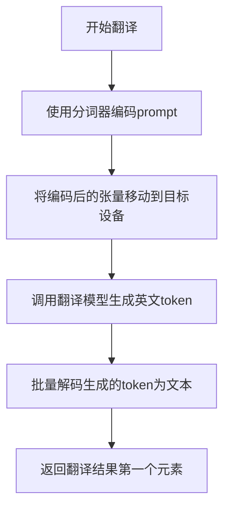

# `diffusers\examples\community\multilingual_stable_diffusion.py` 详细设计文档

一个多语言文本到图像生成管道，集成语言检测和机器翻译功能，支持将非英语提示翻译成英语后使用Stable Diffusion模型生成图像

## 整体流程

```mermaid
graph TD
    A[开始] --> B{检查prompt类型}
    B -- str --> C[batch_size = 1]
    B -- list --> D[batch_size = len(prompt)]
    B -- other --> E[抛出ValueError]
    C --> F[检测语言]
    D --> F
    F --> G{语言 != 英语?}
    G -- 是 --> H[翻译为英语]
    G -- 否 --> I[继续下一步]
    H --> I
    I --> J[获取text embeddings]
    J --> K{guidance_scale > 1?}
    K -- 是 --> L[获取unconditional embeddings]
    K -- 否 --> M[跳过unconditional]
    L --> N[拼接embeddings]
    M --> N
    N --> O[生成latents]
    O --> P[设置timesteps]
    P --> Q[循环denoising]
    Q --> R[U-Net预测噪声]
    R --> S[执行guidance]
    S --> T[Scheduler step更新latents]
    T --> U{还有更多step?]
    U -- 是 --> Q
    U -- 否 --> V[VAE解码latents到图像]
    V --> W[安全检查]
    W --> X[返回结果]
```

## 类结构

```
DiffusionPipeline (抽象基类)
└── MultilingualStableDiffusion (主类)
```

## 全局变量及字段


### `logger`
    
模块级日志记录器，用于记录管道运行时的信息

类型：`logging.Logger`
    


### `MultilingualStableDiffusion.detection_pipeline`
    
语言检测管道，用于识别输入提示的语言类型

类型：`pipeline`
    


### `MultilingualStableDiffusion.translation_model`
    
翻译模型，用于将非英语提示翻译成英语

类型：`MBartForConditionalGeneration`
    


### `MultilingualStableDiffusion.translation_tokenizer`
    
翻译模型的分词器，用于对翻译输入进行编码

类型：`MBart50TokenizerFast`
    


### `MultilingualStableDiffusion.vae`
    
变分自编码器，用于在潜在空间和图像空间之间进行编码和解码

类型：`AutoencoderKL`
    


### `MultilingualStableDiffusion.text_encoder`
    
CLIP文本编码器，用于将文本提示转换为特征向量

类型：`CLIPTextModel`
    


### `MultilingualStableDiffusion.tokenizer`
    
CLIP分词器，用于对文本提示进行tokenize

类型：`CLIPTokenizer`
    


### `MultilingualStableDiffusion.unet`
    
条件U-Net去噪模型，用于在去噪过程中预测噪声

类型：`UNet2DConditionModel`
    


### `MultilingualStableDiffusion.scheduler`
    
噪声调度器，用于控制去噪过程中的噪声调度

类型：`Union[DDIMScheduler, PNDMScheduler, LMSDiscreteScheduler]`
    


### `MultilingualStableDiffusion.safety_checker`
    
安全检查器，用于检测生成的图像是否包含不当内容

类型：`StableDiffusionSafetyChecker`
    


### `MultilingualStableDiffusion.feature_extractor`
    
图像特征提取器，用于从生成的图像中提取特征供安全检查器使用

类型：`CLIPImageProcessor`
    
    

## 全局函数及方法


### `detect_language`

检测输入提示词（prompt）的语言类型，使用提供的语言检测管道模型进行识别，支持单条和批量处理。

参数：

- `pipe`：`pipeline`，Transformers 语言检测管道，用于对 prompt 进行语言分类
- `prompt`：`Union[str, List[str]]`，待检测语言的提示词，可以是单条字符串或字符串列表
- `batch_size`：`int`，批处理大小，用于决定是单条处理还是批量处理

返回值：`Union[str, List[str]]`，当 batch_size 为 1 时返回单条语言标签字符串；当 batch_size 大于 1 时返回语言标签列表

#### 流程图

```mermaid
flowchart TD
    A[开始 detect_language] --> B{batch_size == 1?}
    B -->|Yes| C[调用 pipe&#40;prompt, top_k=1, truncation=True, max_length=128&#41;]
    C --> D[获取 preds[0]['label']]
    D --> E[返回语言标签字符串]
    B -->|No| F[创建空列表 detected_languages]
    F --> G{遍历 prompt 中的每个元素 p}
    G -->|每次迭代| H[调用 pipe&#40;p, top_k=1, truncation=True, max_length=128&#41;]
    H --> I[获取 preds[0]['label']]
    I --> J[将标签追加到 detected_languages]
    J --> G
    G -->|遍历完成| K[返回 detected_languages 列表]
    E --> L[结束]
    K --> L
```

#### 带注释源码

```python
def detect_language(pipe, prompt, batch_size):
    """
    Helper function to detect language(s) of prompt
    
    使用 Transformers pipeline 对输入的 prompt 进行语言检测。
    根据 batch_size 决定是单条处理还是批量处理。
    
    参数:
        pipe: 语言检测管道对象（transformers pipeline）
        prompt: 待检测的提示词，str 或 List[str] 类型
        batch_size: 整数，表示批处理大小
    
    返回:
        当 batch_size==1 时返回 str 类型的语言标签；
        当 batch_size>1 时返回 List[str] 类型的语言标签列表
    """
    
    # 单条处理：直接对 prompt 进行语言检测
    if batch_size == 1:
        # 调用语言检测管道，获取 top_k=1 的预测结果
        # truncation=True 截断超过 max_length 的输入
        # max_length=128 限制输入序列最大长度
        preds = pipe(prompt, top_k=1, truncation=True, max_length=128)
        # 返回预测概率最高的语言标签
        return preds[0]["label"]
    
    # 批量处理：遍历每个 prompt 单独检测
    else:
        # 初始化结果列表
        detected_languages = []
        # 逐个处理列表中的每个 prompt
        for p in prompt:
            # 对每个 prompt 单独调用语言检测管道
            preds = pipe(p, top_k=1, truncation=True, max_length=128)
            # 将检测结果追加到列表中
            detected_languages.append(preds[0]["label"])
        
        # 返回所有检测结果的列表
        return detected_languages
```


### `translate_prompt`

该函数是一个辅助函数，用于将输入的提示词（prompt）翻译成英文。它使用 MBart50TokenizerFast 分词器对输入进行编码，然后通过 MBartForConditionalGeneration 翻译模型生成英文翻译，最后将生成的 token 解码为文本并返回翻译结果。

参数：

- `prompt`：需要翻译的文本，输入类型为字符串
- `translation_tokenizer`：MBart50TokenizerFast 类型的分词器，用于对输入和输出进行编码和解码
- `translation_model`：MBartForConditionalGeneration 类型的翻译模型，用于生成目标语言（英语）的文本
- `device`：torch.device 类型，指定模型运行的目标设备（CPU 或 CUDA 设备）

返回值：返回翻译后的英文文本，类型为字符串

#### 流程图



#### 带注释源码

```python
def translate_prompt(prompt, translation_tokenizer, translation_model, device):
    """
    helper function to translate prompt to English
    
    该函数接受待翻译的文本和翻译模型组件，将非英语文本翻译成英语。
    使用 MBart 多语言翻译模型完成翻译任务。
    
    参数:
        prompt (str): 需要翻译的文本字符串
        translation_tokenizer (MBart50TokenizerFast): MBart分词器，用于编码输入和解码输出
        translation_model (MBartForConditionalGeneration): MBart翻译模型，用于生成翻译文本
        device (torch.device): 运行设备，用于指定模型计算的目标设备
    
    返回:
        str: 翻译后的英文文本字符串
    """
    
    # 步骤1: 使用分词器对输入的prompt进行编码
    # return_tensors="pt" 指定返回PyTorch张量格式
    # .to(device) 将张量移动到指定的计算设备（CPU/CUDA）
    encoded_prompt = translation_tokenizer(prompt, return_tensors="pt").to(device)
    
    # 步骤2: 调用翻译模型生成目标语言的token序列
    # max_new_tokens=1000 限制生成的最大token数量
    # **encoded_prompt 解包字典作为命名参数传递
    generated_tokens = translation_model.generate(**encoded_prompt, max_new_tokens=1000)
    
    # 步骤3: 使用分词器将生成的token解码为文本
    # skip_special_tokens=True 跳过特殊token（如BOS/EOS/PAD等）
    # batch_decode处理批量生成的token，返回字符串列表
    en_trans = translation_tokenizer.batch_decode(generated_tokens, skip_special_tokens=True)
    
    # 步骤4: 返回翻译结果列表中的第一个元素
    # 因为输入是单个字符串，输出列表也只有一个元素
    return en_trans[0]
```


### `MultilingualStableDiffusion.__init__`

该方法是`MultilingualStableDiffusion`多语言稳定扩散管道的构造函数，负责初始化管道的所有核心组件，包括检测模型、翻译模型、VAE、文本编码器、UNet、调度器、安全检查器等，并进行配置验证和兼容性处理。

参数：

- `detection_pipeline`：`pipeline`，Transformers pipeline，用于检测prompt的语言种类
- `translation_model`：`MBartForConditionalGeneration`，多语言到英语的翻译模型，负责将非英语prompt翻译为英语
- `translation_tokenizer`：`MBart50TokenizerFast`，翻译模型的tokenizer
- `vae`：`AutoencoderKL`，变分自编码器模型，用于编码和解码图像与潜在表示之间的转换
- `text_encoder`：`CLIPTextModel`，冻结的文本编码器，Stable Diffusion使用CLIP的文本部分
- `tokenizer`：`CLIPTokenizer`，CLIP的tokenizer，用于将文本转换为token
- `unet`：`UNet2DConditionModel`，条件U-Net架构，用于对编码后的图像潜在表示进行去噪
- `scheduler`：`Union[DDIMScheduler, PNDMScheduler, LMSDiscreteScheduler]`，去噪调度器，与UNet配合使用对图像潜在表示进行去噪
- `safety_checker`：`StableDiffusionSafetyChecker`，安全检查模块，用于评估生成图像是否包含不当或有害内容
- `feature_extractor`：`CLIPImageProcessor`，从生成图像中提取特征的模型，用于安全检查器输入

返回值：`None`，构造函数不返回任何值，仅初始化对象状态

#### 流程图

```mermaid
flowchart TD
    A[开始 __init__] --> B[调用父类构造函数 super().__init__]
    B --> C{scheduler.config.steps_offset != 1?}
    C -->|是| D[生成弃用警告消息]
    D --> E[创建新配置 dict]
    E --> F[设置 steps_offset = 1]
    F --> G[更新 scheduler._internal_dict]
    C -->|否| H[跳过配置更新]
    G --> I{safety_checker is None?}
    H --> I
    I -->|是| J[记录安全警告日志]
    I -->|否| K[跳过警告]
    J --> L[调用 self.register_modules 注册所有模块]
    K --> L
    L --> M[结束 __init__]
```

#### 带注释源码

```python
def __init__(
    self,
    detection_pipeline: pipeline,                                    # 语言检测pipeline
    translation_model: MBartForConditionalGeneration,                # 翻译模型 (MBart)
    translation_tokenizer: MBart50TokenizerFast,                     # 翻译模型的tokenizer
    vae: AutoencoderKL,                                               # VAE变分自编码器
    text_encoder: CLIPTextModel,                                      # CLIP文本编码器
    tokenizer: CLIPTokenizer,                                         # CLIP tokenizer
    unet: UNet2DConditionModel,                                       # 条件U-Net去噪模型
    scheduler: Union[DDIMScheduler, PNDMScheduler, LMSDiscreteScheduler],  # 去噪调度器
    safety_checker: StableDiffusionSafetyChecker,                    # 安全检查器
    feature_extractor: CLIPImageProcessor,                           # 特征提取器
):
    # 调用父类DiffusionPipeline的初始化方法
    super().__init__()

    # ============ 调度器配置兼容性检查 ============
    # 检查scheduler的steps_offset配置是否为1
    # 旧版本的配置可能导致错误结果，此处进行自动修复
    if scheduler is not None and getattr(scheduler.config, "steps_offset", 1) != 1:
        # 生成弃用警告信息
        deprecation_message = (
            f"The configuration file of this scheduler: {scheduler} is outdated. `steps_offset`"
            f" should be set to 1 instead of {scheduler.config.steps_offset}. Please make sure "
            "to update the config accordingly as leaving `steps_offset` might led to incorrect results"
            " in future versions. If you have downloaded this checkpoint from the Hugging Face Hub,"
            " it would be very nice if you could open a Pull request for the `scheduler/scheduler_config.json`"
            " file"
        )
        # 记录弃用警告
        deprecate("steps_offset!=1", "1.0.0", deprecation_message, standard_warn=False)
        
        # 创建新配置并将steps_offset设置为1
        new_config = dict(scheduler.config)
        new_config["steps_offset"] = 1
        scheduler._internal_dict = FrozenDict(new_config)

    # ============ 安全检查器警告 ============
    # 如果未启用安全检查器，记录警告信息提醒用户注意合规性
    if safety_checker is None:
        logger.warning(
            f"You have disabled the safety checker for {self.__class__} by passing `safety_checker=None`. Ensure"
            " that you abide to the conditions of the Stable Diffusion license and do not expose unfiltered"
            " results in services or applications open to the public. Both the diffusers team and Hugging Face"
            " strongly recommend to keep the safety filter enabled in all public facing circumstances, disabling"
            " it only for use-cases that involve analyzing network behavior or auditing its results. For more"
            " information, please have a look at https://github.com/huggingface/diffusers/pull/254 ."
        )

    # ============ 注册所有模块 ============
    # 将所有组件注册到pipeline中，使其可以通过self.xxx访问
    self.register_modules(
        detection_pipeline=detection_pipeline,
        translation_model=translation_model,
        translation_tokenizer=translation_tokenizer,
        vae=vae,
        text_encoder=text_encoder,
        tokenizer=tokenizer,
        unet=unet,
        scheduler=scheduler,
        safety_checker=safety_checker,
        feature_extractor=feature_extractor,
    )
```


### `MultilingualStableDiffusion.__call__`

执行多语言文本到图像生成的主方法。该方法首先检测输入提示词的语言，对于非英语提示词进行翻译，然后利用Stable Diffusion模型进行图像生成，包括文本编码、噪声预测、图像解码和安全检查等步骤。

参数：

- `prompt`：`Union[str, List[str]]`，要引导图像生成的提示词，可以是不同的语言
- `height`：`int`，可选，默认为 512，生成图像的高度（像素）
- `width`：`int`，可选，默认为 512，生成图像的宽度（像素）
- `num_inference_steps`：`int`，可选，默认为 50，去噪步数，越多通常图像质量越高但推理越慢
- `guidance_scale`：`float`，可选，默认为 7.5，分类器自由引导尺度，用于平衡图像与提示词的相关性
- `negative_prompt`：`Optional[Union[str, List[str]]]`，可选，默认为 None，不引导图像生成的提示词
- `num_images_per_prompt`：`Optional[int]`，可选，默认为 1，每个提示词生成的图像数量
- `eta`：`float`，可选，默认为 0.0，仅适用于DDIM调度器
- `generator`：`torch.Generator | None`，可选，默认为 None，用于生成确定性结果的随机生成器
- `latents`：`Optional[torch.Tensor]`，可选，默认为 None，预生成的噪声潜在变量
- `output_type`：`str | None`，可选，默认为 "pil"，生成图像的输出格式（PIL或numpy数组）
- `return_dict`：`bool`，可选，默认为 True，是否返回StableDiffusionPipelineOutput而不是元组
- `callback`：`Optional[Callable[[int, int, torch.Tensor], None]]`，可选，默认为 None，每隔callback_steps步调用的回调函数
- `callback_steps`：`int`，可选，默认为 1，调用回调函数的频率
- `**kwargs`：其他参数

返回值：`Union[StableDiffusionPipelineOutput, tuple]`，当return_dict为True时返回StableDiffusionPipelineOutput（包含生成图像和NSFW检测标志），否则返回元组(image, nsfw_content_detected)

#### 流程图

```mermaid
flowchart TD
    A[开始 __call__] --> B{检查 prompt 类型}
    B -->|str| C[batch_size = 1]
    B -->|list| D[batch_size = len(prompt)]
    B -->|其他| E[抛出 ValueError]
    C --> F{检查 height/width 可被8整除}
    D --> F
    F -->|否| G[抛出 ValueError]
    F -->|是| H{检查 callback_steps 有效性}
    H -->|否| I[抛出 ValueError]
    H -->|是| J[语言检测: detect_language]
    J --> K{prompt_language == 'en'?}
    K -->|是| L[跳过翻译]
    K -->|否| M[翻译为英语: translate_prompt]
    L --> N[获取文本嵌入: text_encoder]
    M --> N
    N --> O{guidance_scale > 1?}
    O -->|是| P[获取无条件嵌入: negative_prompt]
    O -->|否| Q[跳过无条件嵌入]
    P --> R[处理 negative_prompt 语言翻译]
    R --> S[连接无条件嵌入和文本嵌入]
    Q --> S
    S --> T[初始化或验证 latents]
    T --> U[设置调度器时间步]
    V{遍历时间步} --> W[扩展 latents 进行分类器自由引导]
    W --> X[缩放模型输入]
    X --> Y[UNet预测噪声]
    Y --> Z{guidance_scale > 1?}
    Z -->|是| AA[执行引导计算]
    Z -->|否| AB[跳过引导]
    AA --> AC[调度器步骤计算前一潜在变量]
    AB --> AC
    AC --> AD{callback provided?}
    AD -->|是| AE[调用回调函数]
    AD -->|否| AF[继续下一时间步]
    V -->|时间步完成| AG[缩放 latents: 1/0.18215]
    AE --> AG
    AF --> AG
    AG --> AH[VAE解码: vae.decode]
    AH --> AI[归一化图像: /2 + 0.5, clamp 0-1]
    AI --> AJ[转换为numpy数组]
    AJ --> AK{safety_checker enabled?}
    AK -->|是| AL[运行安全检查器]
    AK -->|否| AM[has_nsfw = None]
    AL --> AN[返回结果]
    AM --> AN
    AN --> AO{return_dict?}
    AO -->|是| AP[返回 StableDiffusionPipelineOutput]
    AO -->|否| AQ[返回 tuple]
```

#### 带注释源码

```python
@torch.no_grad()
def __call__(
    self,
    prompt: Union[str, List[str]],
    height: int = 512,
    width: int = 512,
    num_inference_steps: int = 50,
    guidance_scale: float = 7.5,
    negative_prompt: Optional[Union[str, List[str]]] = None,
    num_images_per_prompt: Optional[int] = 1,
    eta: float = 0.0,
    generator: torch.Generator | None = None,
    latents: Optional[torch.Tensor] = None,
    output_type: str | None = "pil",
    return_dict: bool = True,
    callback: Optional[Callable[[int, int, torch.Tensor], None]] = None,
    callback_steps: int = 1,
    **kwargs,
):
    # 确定批次大小
    if isinstance(prompt, str):
        batch_size = 1
    elif isinstance(prompt, list):
        batch_size = len(prompt)
    else:
        raise ValueError(f"`prompt` has to be of type `str` or `list` but is {type(prompt)}")

    # 验证图像尺寸能被8整除
    if height % 8 != 0 or width % 8 != 0:
        raise ValueError(f"`height` and `width` have to be divisible by 8 but are {height} and {width}.")

    # 验证回调步长有效性
    if (callback_steps is None) or (
        callback_steps is not None and (not isinstance(callback_steps, int) or callback_steps <= 0)
    ):
        raise ValueError(
            f"`callback_steps` has to be a positive integer but is {callback_steps} of type"
            f" {type(callback_steps)}."
        )

    # 检测语言并翻译（如果需要）
    prompt_language = detect_language(self.detection_pipeline, prompt, batch_size)
    
    # 单个提示词且非英语则翻译
    if batch_size == 1 and prompt_language != "en":
        prompt = translate_prompt(prompt, self.translation_tokenizer, self.translation_model, self.device)

    # 批量提示词逐一翻译非英语内容
    if isinstance(prompt, list):
        for index in range(batch_size):
            if prompt_language[index] != "en":
                p = translate_prompt(
                    prompt[index], self.translation_tokenizer, self.translation_model, self.device
                )
                prompt[index] = p

    # 获取提示词文本嵌入
    text_inputs = self.tokenizer(
        prompt,
        padding="max_length",
        max_length=self.tokenizer.model_max_length,
        return_tensors="pt",
    )
    text_input_ids = text_inputs.input_ids

    # 截断超长文本
    if text_input_ids.shape[-1] > self.tokenizer.model_max_length:
        removed_text = self.tokenizer.batch_decode(text_input_ids[:, self.tokenizer.model_max_length :])
        logger.warning(
            "The following part of your input was truncated because CLIP can only handle sequences up to"
            f" {self.tokenizer.model_max_length} tokens: {removed_text}"
        )
        text_input_ids = text_input_ids[:, : self.tokenizer.model_max_length]
    
    # 编码得到文本嵌入
    text_embeddings = self.text_encoder(text_input_ids.to(self.device))[0]

    # 为每个提示词复制文本嵌入
    bs_embed, seq_len, _ = text_embeddings.shape
    text_embeddings = text_embeddings.repeat(1, num_images_per_prompt, 1)
    text_embeddings = text_embeddings.view(bs_embed * num_images_per_prompt, seq_len, -1)

    # 判断是否使用分类器自由引导
    do_classifier_free_guidance = guidance_scale > 1.0
    
    # 获取无条件嵌入用于分类器自由引导
    if do_classifier_free_guidance:
        uncond_tokens: List[str]
        
        if negative_prompt is None:
            uncond_tokens = [""] * batch_size
        elif type(prompt) is not type(negative_prompt):
            raise TypeError(
                f"`negative_prompt` should be the same type to `prompt`, but got {type(negative_prompt)} !="
                f" {type(prompt)}."
            )
        elif isinstance(negative_prompt, str):
            # 检测语言并翻译（如果需要）
            negative_prompt_language = detect_language(self.detection_pipeline, negative_prompt, batch_size)
            if negative_prompt_language != "en":
                negative_prompt = translate_prompt(
                    negative_prompt, self.translation_tokenizer, self.translation_model, self.device
                )
            if isinstance(negative_prompt, str):
                uncond_tokens = [negative_prompt]
        elif batch_size != len(negative_prompt):
            raise ValueError(
                f"`negative_prompt`: {negative_prompt} has batch size {len(negative_prompt)}, but `prompt`:"
                f" {prompt} has batch size {batch_size}. Please make sure that passed `negative_prompt` matches"
                " the batch size of `prompt`."
            )
        else:
            # 批量negative_prompt处理
            if isinstance(negative_prompt, list):
                negative_prompt_languages = detect_language(self.detection_pipeline, negative_prompt, batch_size)
                for index in range(batch_size):
                    if negative_prompt_languages[index] != "en":
                        p = translate_prompt(
                            negative_prompt[index], self.translation_tokenizer, self.translation_model, self.device
                        )
                        negative_prompt[index] = p
            uncond_tokens = negative_prompt

        # 对无条件提示词进行编码
        max_length = text_input_ids.shape[-1]
        uncond_input = self.tokenizer(
            uncond_tokens,
            padding="max_length",
            max_length=max_length,
            truncation=True,
            return_tensors="pt",
        )
        uncond_embeddings = self.text_encoder(uncond_input.input_ids.to(self.device))[0]

        # 复制无条件嵌入
        seq_len = uncond_embeddings.shape[1]
        uncond_embeddings = uncond_embeddings.repeat(1, num_images_per_prompt, 1)
        uncond_embeddings = uncond_embeddings.view(batch_size * num_images_per_prompt, seq_len, -1)

        # 拼接无条件嵌入和文本嵌入
        text_embeddings = torch.cat([uncond_embeddings, text_embeddings])

    # 初始化潜在变量形状
    latents_shape = (batch_size * num_images_per_prompt, self.unet.config.in_channels, height // 8, width // 8)
    latents_dtype = text_embeddings.dtype
    
    # 生成随机噪声或使用提供的latents
    if latents is None:
        if self.device.type == "mps":
            # MPS上随机数不可重现
            latents = torch.randn(latents_shape, generator=generator, device="cpu", dtype=latents_dtype).to(
                self.device
            )
        else:
            latents = torch.randn(latents_shape, generator=generator, device=self.device, dtype=latents_dtype)
    else:
        if latents.shape != latents_shape:
            raise ValueError(f"Unexpected latents shape, got {latents.shape}, expected {latents_shape}")
        latents = latents.to(self.device)

    # 设置调度器时间步
    self.scheduler.set_timesteps(num_inference_steps)
    timesteps_tensor = self.scheduler.timesteps.to(self.device)

    # 根据调度器要求缩放初始噪声
    latents = latents * self.scheduler.init_noise_sigma

    # 准备调度器额外参数
    accepts_eta = "eta" in set(inspect.signature(self.scheduler.step).parameters.keys())
    extra_step_kwargs = {}
    if accepts_eta:
        extra_step_kwargs["eta"] = eta

    # 迭代去噪过程
    for i, t in enumerate(self.progress_bar(timesteps_tensor)):
        # 扩展latents用于分类器自由引导
        latent_model_input = torch.cat([latents] * 2) if do_classifier_free_guidance else latents
        latent_model_input = self.scheduler.scale_model_input(latent_model_input, t)

        # 预测噪声残差
        noise_pred = self.unet(latent_model_input, t, encoder_hidden_states=text_embeddings).sample

        # 执行引导
        if do_classifier_free_guidance:
            noise_pred_uncond, noise_pred_text = noise_pred.chunk(2)
            noise_pred = noise_pred_uncond + guidance_scale * (noise_pred_text - noise_pred_uncond)

        # 计算前一时间步的噪声样本
        latents = self.scheduler.step(noise_pred, t, latents, **extra_step_kwargs).prev_sample

        # 调用回调函数
        if callback is not None and i % callback_steps == 0:
            step_idx = i // getattr(self.scheduler, "order", 1)
            callback(step_idx, t, latents)

    # 将latents转换到图像空间
    latents = 1 / 0.18215 * latents
    image = self.vae.decode(latents).sample

    # 归一化图像到[0,1]
    image = (image / 2 + 0.5).clamp(0, 1)

    # 转换为numpy数组（float32）
    image = image.cpu().permute(0, 2, 3, 1).float().numpy()

    # 运行安全检查器
    if self.safety_checker is not None:
        safety_checker_input = self.feature_extractor(self.numpy_to_pil(image), return_tensors="pt").to(
            self.device
        )
        image, has_nsfw_concept = self.safety_checker(
            images=image, clip_input=safety_checker_input.pixel_values.to(text_embeddings.dtype)
        )
    else:
        has_nsfw_concept = None

    # 转换为PIL图像（如果需要）
    if output_type == "pil":
        image = self.numpy_to_pil(image)

    # 返回结果
    if not return_dict:
        return (image, has_nsfw_concept)

    return StableDiffusionPipelineOutput(images=image, nsfw_content_detected=has_nsfw_concept)
```

## 关键组件


### 语言检测组件

使用transformers的pipeline进行语言识别，支持单句和批量检测，返回ISO语言代码（如"en"表示英语）。

### 翻译组件

基于MBart-50多语言翻译模型，将非英语提示词翻译成英语，支持批量翻译处理。

### 多语言Stable Diffusion Pipeline

继承自DiffusionPipeline的主类，整合了语言检测、翻译和Stable Diffusion图像生成功能，支持文本到图像的多语言生成。

### 安全检查器

StableDiffusionSafetyChecker用于检测生成图像是否包含不当内容，确保输出符合安全标准。

### 调度器组件

支持DDIMScheduler、LMSDiscreteScheduler和PNDMScheduler三种噪声调度器，用于控制去噪过程。

### 文本编码器

CLIPTextModel将翻译后的英语提示词转换为文本嵌入向量，供UNet去噪模型使用。

### VAE解码器

AutoencoderKL将潜在空间的噪声解码为最终图像，执行从latent到像素空间的转换。

### UNet去噪模型

UNet2DConditionModel根据文本嵌入和时间步预测噪声残差，执行主要的图像生成计算。


## 问题及建议


### 已知问题

- **语言检测效率低下**：`detect_language` 函数在批量处理时，对每个 prompt 单独调用语言检测管道，没有利用批量处理能力，导致 O(n) 次 API 调用而非 O(1)。
- **语言检测与翻译逻辑不一致**：代码中 `detect_language` 返回的语言标签直接与字符串 "en" 比较，但对于批量输入 `prompt_language` 是列表，而后续代码未正确处理这种类型差异，可能导致翻译逻辑在某些分支不被执行。
- **negative_prompt 语言处理不完整**：当 `negative_prompt` 是字符串时，语言检测后只处理了单个字符串的情况，但代码逻辑分支较多且存在遗漏处理的风险。
- **重复的设备转换**：代码中多次使用 `.to(self.device)` 进行张量设备转换，没有预先缓存设备引用，增加了额外的开销。
- **未使用的变量**：callback 中的 `step_idx` 变量被计算但未在错误日志或其他场景中使用，造成计算资源浪费。
- **硬编码的 Magic Number**：VAE 解码时使用的 `1 / 0.18215` 系数是硬编码的魔法数字，没有解释其来源或提取为常量。
- **类型检查不严谨**：使用 `type(prompt) is not type(negative_prompt)` 进行类型比较，而非使用 `isinstance()`，不符合 Python 最佳实践。
- **缺少输入验证**：对 `prompt` 的类型检查后，其他参数如 `height`、`width` 等虽然有除法验证，但未检查是否为正数。

### 优化建议

- **批量语言检测**：修改 `detect_language` 函数以支持批量输入，一次性检测所有 prompt 的语言，减少 API 调用次数。
- **统一语言处理逻辑**：重构语言检测和翻译逻辑，使用统一的接口处理单字符串和字符串列表的情况，避免类型不一致导致的逻辑错误。
- **缓存设备引用**：在 `__call__` 方法开始时缓存 `self.device` 到局部变量，减少属性查找开销。
- **提取魔法数字**：将 `0.18215` 和 `1 / 0.18215` 提取为类常量或配置参数，并添加文档说明其物理含义（VAE 缩放因子）。
- **优化张量操作**：合并重复的张量重塑操作（如 `text_embeddings` 和 `uncond_embeddings` 的重复扩展），减少内存分配。
- **完善错误处理**：为更多边界情况添加输入验证，如 `num_inference_steps` 为负数、`guidance_scale` 超出合理范围等。
- **使用 isinstance 替代 type**：将 `type(prompt) is not type(negative_prompt)` 改为 `isinstance()` 进行类型检查。
- **异步语言检测**：考虑使用异步方式处理语言检测和翻译，使其与主生成流程解耦，提高整体吞吐量。


## 其它


### 设计目标与约束

**设计目标**：实现一个支持多语言的文本到图像生成Pipeline，能够自动检测输入提示的语言并将其翻译为英语，然后使用Stable Diffusion模型生成对应的图像。

**设计约束**：
- 输入的height和width必须能被8整除
- prompt只能是str或list类型
- callback_steps必须为正整数
- 负向提示必须与prompt类型相同
- 负向提示的batch_size必须与prompt一致
- 翻译模型仅支持翻译为英语(en)

### 错误处理与异常设计

**类型检查错误**：
- prompt类型必须是str或list，否则抛出ValueError
- callback_steps必须是正整数，否则抛出ValueError
- negative_prompt类型必须与prompt类型一致，否则抛出TypeError

**尺寸验证错误**：
- height和width必须能被8整除，否则抛出ValueError
- latents形状必须匹配预期形状，否则抛出ValueError

**警告处理**：
- 当safety_checker为None时发出警告，建议保持启用安全过滤器
- 当文本长度超过tokenizer最大长度时发出警告并截断
- 当scheduler的steps_offset不等于1时发出警告并自动修正

### 数据流与状态机

**主数据流**：
1. 接收prompt（可能是单字符串或字符串列表）
2. 检测语言并翻译为英语（如需要）
3. 使用tokenizer将文本转换为token IDs
4. 使用text_encoder生成文本嵌入
5. 生成随机latents（或使用提供的latents）
6. 迭代去噪过程：latents → scheduler.step → noise_pred → 新的latents
7. 使用VAE解码latents为图像
8. 通过safety_checker检查NSFW内容
9. 返回最终图像和NSFW检测结果

**状态转换**：
- 初始状态：raw_prompt → 语言检测/翻译 → english_prompt
- 嵌入状态：english_prompt → text_embeddings
- 潜在空间：random_noise → latents → denoised_latents
- 图像空间：latents → vae.decode → image

### 外部依赖与接口契约

**核心依赖**：
- diffusers库：DiffusionPipeline, StableDiffusionMixin, StableDiffusionPipelineOutput
- transformers库：CLIPTextModel, CLIPTokenizer, MBartForConditionalGeneration, MBart50TokenizerFast, pipeline, CLIPImageProcessor
- torch库：Tensor, Generator
- PIL库：图像处理

**模块接口契约**：
- detection_pipeline：接受str或List[str]，返回包含label的字典列表
- translation_model：接受tokenized tensors，返回generated tokens
- translation_tokenizer：支持batch_decode和encode
- tokenizer：必须具有model_max_length属性
- text_encoder：返回包含hidden_states的元组
- scheduler：必须具有step方法、set_timesteps方法、init_noise_sigma属性
- vae：必须具有decode方法
- safety_checker：接受images和clip_input，返回(images, has_nsfw_concept)

### 安全性考虑

**NSFW内容过滤**：
- 使用StableDiffusionSafetyChecker检测生成图像是否包含不当内容
- 可通过将safety_checker设置为None来禁用（但不推荐）
- safety_checker_input使用feature_extractor提取图像特征

**用户提示安全**：
- 对negative_prompt同样进行语言检测和翻译处理
- 确保正向和负向提示的语言处理一致性

### 性能优化空间

**批处理优化**：
- 支持批量生成多个图像（num_images_per_prompt）
- text_embeddings和uncond_embeddings使用repeat和view进行批处理扩展

**设备兼容性**：
- 对mps设备特殊处理：先在cpu上生成随机数再移到mps设备
- 支持指定generator以实现可重复生成

**内存优化**：
- 使用torch.no_grad()装饰器禁用梯度计算
- 图像最终转换为float32以兼容bfloat16
- 在不需要时及时释放中间变量

### 版本兼容性考虑

**Scheduler兼容性**：
- 自动检测scheduler的step方法是否接受eta参数
- 通过inspect.signature动态获取参数列表

**设备兼容性**：
- 自动检测当前设备类型（cuda, mps, cpu）
- 针对不同设备采用不同的随机数生成策略

### 配置管理

**Pipeline注册**：
- 使用register_modules方法注册所有子模块
- 支持通过config字典序列化和反序列化

**Scheduler配置**：
- 自动检查并修正steps_offset配置
- 将配置转换为FrozenDict以防止意外修改


    