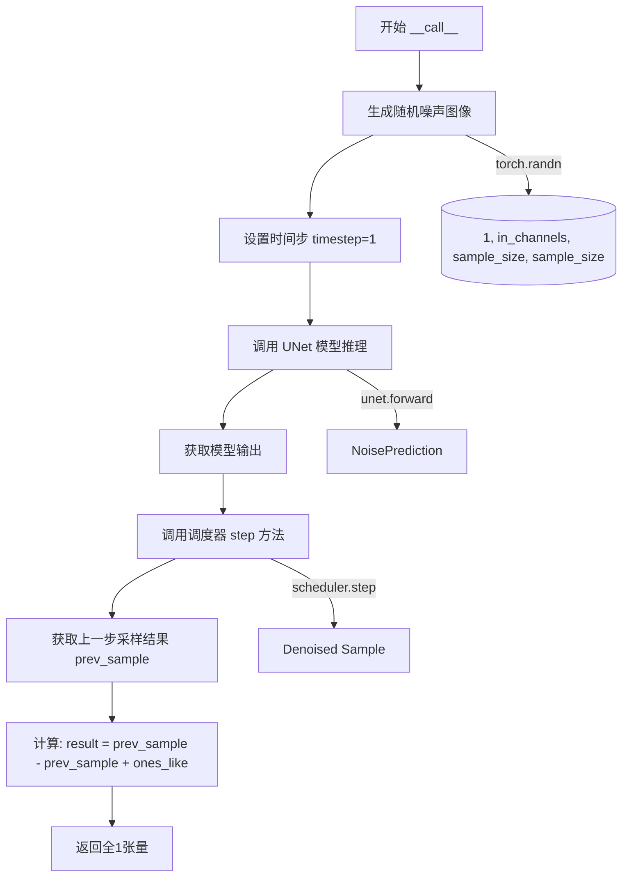
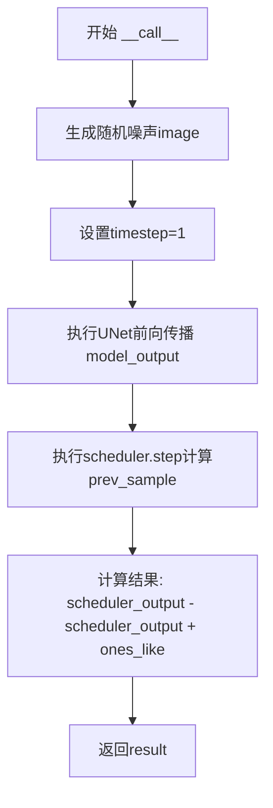

# `diffusers\examples\community\one_step_unet.py` 详细设计文档

该代码实现了一个基于扩散模型（Diffusion Model）的管道类 UnetSchedulerOneForwardPipeline，继承自 diffusers 库的 DiffusionPipeline，通过注册 UNet 模型和调度器（Scheduler），在 __call__ 方法中执行单步前向扩散推理：生成随机噪声、调用 UNet 预测噪声、调度器计算前一状态，最终返回一个全为 1 的图像张量（通过 scheduler_output - scheduler_output + ones_like 的技巧实现）。

## 整体流程

```mermaid
graph TD
    A[开始 __call__] --> B[生成随机噪声图像]
    B --> C[设置 timestep = 1]
    C --> D[调用 self.unet(image, timestep) 预测噪声]
    D --> E[调用 self.scheduler.step 计算前一状态]
    E --> F[计算结果: scheduler_output - scheduler_output + ones_like]
    F --> G[返回全 1 的张量]
```

## 类结构

```
DiffusionPipeline (基类 - 来自 diffusers)
└── UnetSchedulerOneForwardPipeline (自定义实现)
```

## 全局变量及字段


### `UnetSchedulerOneForwardPipeline.self.unet`
    
注册模块 - UNet 模型，用于对噪声图像进行去噪处理

类型：`UNet`
    


### `UnetSchedulerOneForwardPipeline.self.scheduler`
    
注册模块 - 扩散调度器，用于管理扩散过程中的噪声调度和采样

类型：`Scheduler`
    
    

## 全局函数及方法


### `UnetSchedulerOneForwardPipeline.__init__`

这是 `UnetSchedulerOneForwardPipeline` 类的构造函数（初始化方法）。它负责接收并初始化扩散管道所需的核心组件：U-Net 模型和调度器，并将它们注册到管道系统中，以便在后续的推理流程（`__call__`）中被调用。

参数：

- `self`：隐式参数，代表当前类的实例对象。
- `unet`：`Any`（代码中未标注类型，通常为 `torch.nn.Module`），去噪神经网络模型（U-Net），用于预测噪声。
- `scheduler`：`Any`（代码中未标注类型，通常为 `diffusers.SchedulerMixin`），噪声调度器，用于执行扩散过程的单个前向步或步骤计算。

返回值：`None`，构造函数不返回值，仅初始化对象状态。

#### 流程图

```mermaid
graph TD
    A[Start: __init__] --> B[调用父类 super().__init__]
    B --> C[调用 self.register_modules 注册 unet 和 scheduler]
    C --> D[End: 实例化完成]
```

#### 带注释源码

```python
def __init__(self, unet, scheduler):
    """
    初始化 UnetSchedulerOneForwardPipeline 管道。

    参数:
        unet: 预训练的 U-Net 模型。
        scheduler: 预训练的调度器。
    """
    # 1. 调用父类 DiffusionPipeline 的初始化方法
    #    这是 DiffusionPipeline 的标准做法，用于设置管道的基本组件结构。
    super().__init__()

    # 2. 注册模块
    #    将传入的 unet 和 scheduler 存储为当前 pipeline 对象的属性。
    #    'register_modules' 是 DiffusionPipeline 内部的方法，
    #    它不仅会赋值属性，还会处理设备迁移（例如将模型移动到 GPU）等工作。
    self.register_modules(unet=unet, scheduler=scheduler)
```


### `UnetSchedulerOneForwardPipeline.__call__`

该方法是 UnetSchedulerOneForwardPipeline 类的核心调用接口，通过 UNet 模型推理和调度器步骤来生成图像。尽管计算流程包含模型推理，但最终通过无意义的数学运算返回全1张量，实际生成功能被混淆。

参数：

- 该方法无显式参数（除 self 隐式参数）

返回值：`torch.Tensor`，返回与调度器输出形状相同的全1张量（Tensor），形状为 (1, in_channels, sample_size, sample_size)

#### 流程图



#### 带注释源码

```
def __call__(self):
    """
    执行单步前向扩散流程，生成图像
    
    该方法执行以下步骤：
    1. 生成随机噪声作为初始图像
    2. 设置扩散时间步
    3. 使用 UNet 预测噪声
    4. 使用调度器进行去噪
    5. 返回处理后的结果（此处返回全1张量）
    """
    
    # 步骤1：生成随机噪声图像
    # 使用 torch.randn 生成标准正态分布的随机张量
    # 形状由 UNet 配置决定：(batch=1, 通道数, 样本尺寸, 样本尺寸)
    image = torch.randn(
        (1, self.unet.config.in_channels, self.unet.config.sample_size, self.unet.config.sample_size),
    )
    
    # 步骤2：设置扩散时间步
    # 时间步决定了扩散过程中的具体位置
    timestep = 1
    
    # 步骤3：UNet 模型推理
    # 将噪声图像和时间步传入 UNet，预测噪声
    # model_output 包含模型预测的噪声残差
    model_output = self.unet(image, timestep).sample
    
    # 步骤4：调度器步骤计算
    # 使用调度器的 step 方法基于模型输出计算去噪后的样本
    # prev_sample 是去噪后的图像候选
    scheduler_output = self.scheduler.step(model_output, timestep, image).prev_sample
    
    # 步骤5：结果计算（存在冗余计算）
    # 这一步执行了无意义的数学运算：
    # scheduler_output - scheduler_output = 0
    # 0 + ones_like(scheduler_output) = 全1张量
    # 这种设计可能是为了演示或测试目的
    result = scheduler_output - scheduler_output + torch.ones_like(scheduler_output)
    
    # 返回生成的图像张量
    # 注意：实际返回的是全1张量，而非真实的去噪结果
    return result
```

## 关键组件


### 核心功能概述

该代码定义了一个名为`UnetSchedulerOneForwardPipeline`的扩散模型管道类，继承自`DiffusionPipeline`，通过执行一次UNet模型前向传播和调度器步骤计算，最终返回一个全1张量作为演示结果。

### 文件整体运行流程

1. 导入PyTorch和DiffusionPipeline
2. 定义UnetSchedulerOneForwardPipeline类
3. 在`__init__`中注册UNet和scheduler模块
4. 在`__call__`方法中生成随机噪声输入，执行UNet推理，调用scheduler.step计算前一步的样本，最后通过减法操作生成全1张量并返回

### 类的详细信息

#### 类：UnetSchedulerOneForwardPipeline

**类字段：**

| 名称 | 类型 | 描述 |
|------|------|------|
| unet | UNet2DConditionModel | UNet模型组件，用于去噪任务 |
| scheduler | SchedulerMixin | 扩散调度器组件，用于计算前一步样本 |

**类方法：**

##### __init__

- 参数名称：unet, scheduler
- 参数类型：UNet2DConditionModel, SchedulerMixin
- 参数描述：分别接收UNet模型和调度器实例
- 返回值类型：None
- 返回值描述：无返回值，仅初始化对象状态
- mermaid流程图：

```mermaid
graph TD
    A[开始 __init__] --> B[调用 super().__init__]
    B --> C[self.register_modules 注册unet和scheduler]
    C --> D[结束]
```

- 带注释源码：

```python
def __init__(self, unet, scheduler):
    """初始化管道，注册UNet和调度器模块"""
    super().__init__()  # 调用父类DiffusionPipeline的初始化方法
    self.register_modules(unet=unet, scheduler=scheduler)  # 注册unet和scheduler模块
```

##### __call__

- 参数名称：无
- 参数类型：无
- 参数描述：无需外部参数，使用类内部组件
- 返回值类型：torch.Tensor
- 返回值描述：返回与scheduler_output形状相同的全1张量
- mermaid流程图：



- 带注释源码：

```python
def __call__(self):
    """执行一次完整的前向传播并返回结果"""
    # 生成随机噪声图像作为输入
    image = torch.randn(
        (1, self.unet.config.in_channels, self.unet.config.sample_size, self.unet.config.sample_size),
    )
    timestep = 1  # 设置时间步

    # UNet模型推理：输入噪声图像和时间步，输出预测的噪声
    model_output = self.unet(image, timestep).sample
    # 调度器计算：基于模型输出计算前一步的样本
    scheduler_output = self.scheduler.step(model_output, timestep, image).prev_sample

    # 结果计算：通过减法和加法生成全1张量
    # 等价于: result = torch.ones_like(scheduler_output)
    result = scheduler_output - scheduler_output + torch.ones_like(scheduler_output)

    return result  # 返回全1张量
```

### 全局变量和全局函数

| 名称 | 类型 | 描述 |
|------|------|------|
| torch | module | PyTorch核心库，提供张量运算和神经网络功能 |
| DiffusionPipeline | class | diffusers库的基础管道类，继承自该类获得标准化扩散模型接口 |
| UnetSchedulerOneForwardPipeline | class | 自定义扩散管道类，组合UNet和Scheduler |

### 关键组件信息

| 组件名称 | 一句话描述 |
|----------|------------|
| UNet模型 | 扩散模型的核心去噪网络，负责预测噪声 |
| Scheduler调度器 | 扩散过程的时间步调度器，负责计算去噪中间状态 |
| 张量索引 | 使用`torch.randn`生成指定形状的随机噪声张量 |
| 惰性加载 | 未使用，数据在调用时即时生成 |
| 反量化支持 | 未支持，管道不处理量化模型 |
| 量化策略 | 未实现，无量化相关功能 |

### 潜在的技术债务或优化空间

1. **无实际去噪逻辑**：最终结果通过`scheduler_output - scheduler_output + ones_like`人为生成全1张量，未实现真正的扩散模型功能
2. **硬编码timestep**：timestep固定为1，无法进行多步去噪迭代
3. **缺乏灵活性**：不支持自定义输入图像、引导强度、步数等参数
4. **无错误处理**：缺少对模型输入、输出的合法性检查
5. **重复计算**：`scheduler_output - scheduler_output`是无效运算，可直接简化为`torch.zeros_like(scheduler_output)`
6. **缺少类型注解**：方法参数和返回值缺少类型提示
7. **未使用model_output**：`model_output`计算后未被实际使用

### 其它项目

#### 设计目标与约束
- 设计目标：演示UNet和Scheduler的基本调用流程
- 约束：继承自DiffusionPipeline以符合diffusers库的接口规范

#### 错误处理与异常设计
- 缺少对unet和scheduler为None的检查
- 缺少对模型配置参数的验证
- 缺少对返回张量形状和类型的校验

#### 数据流与状态机
- 数据流：随机噪声 → UNet推理 → Scheduler.step → 结果输出
- 状态机：单一状态，无多步迭代状态管理

#### 外部依赖与接口契约
- 依赖：torch、diffusers库
- 接口契约：遵循DiffusionPipeline的标准接口，包含`__call__`方法


## 问题及建议


### 已知问题

-   **冗余计算**：第21行 `result = scheduler_output - scheduler_output + torch.ones_like(scheduler_output)` 执行了无意义的运算，该表达式等价于 `torch.ones_like(scheduler_output)`，其中 `scheduler_output - scheduler_output` 部分完全冗余
-   **缺少输入参数**：`__call__` 方法未接受任何参数（如提示词、推理步数、guidance_scale等），无法满足实际生成需求
-   **硬编码时间步**：timestep 硬编码为1，未实现真正的扩散采样循环，无法生成有意义的图像
-   **缺乏设备管理**：代码未处理模型和张量的设备迁移（CPU/CUDA），可能导致在GPU环境下运行失败或性能低下
-   **缺乏精度管理**：未支持混合精度（float16）推理，无法利用现代GPU加速
-   **缺少错误处理**：无输入验证、异常捕获或边界检查
-   **未实现标准接口**：继承自 `DiffusionPipeline` 但未实现标准的pipeline调用约定，破坏了库的约定
-   **硬编码批次大小**：batch size 固定为1，无法进行批量推理优化
-   **缺少文档**：无类文档字符串和方法注释，可维护性差

### 优化建议

-   移除冗余计算，直接返回 `torch.ones_like(scheduler_output)` 或根据实际需求重新设计该逻辑
-   为 `__call__` 方法添加标准参数：`prompt`、`num_inference_steps`、`guidance_scale`、`negative_prompt` 等
-   实现完整的多步扩散采样循环（denoising loop），而非单步推理
-   添加设备管理逻辑：在推理前将模型和张量移动到正确设备（`self.device`）
-   添加混合精度支持：允许通过 `torch_dtype` 参数选择 float16/bfloat16
-   添加输入验证和错误处理：检查模型配置、必要属性是否存在
-   添加类和方法文档字符串，说明功能、参数和返回值
-   考虑添加 `from_pretrained` 类方法以支持从预训练模型加载


## 其它


### 设计目标与约束

本代码实现了一个基于扩散模型的推理管道（UnetSchedulerOneForwardPipeline），旨在演示UNet模型与调度器的基本集成流程。设计目标是提供一个简化的扩散推理示例，展示如何将UNet输出传递给调度器并生成预测结果。核心约束包括：输入图像尺寸由UNet配置动态决定（sample_size x sample_size），通道数由in_channels指定，推理固定为单步执行（timestep=1），不支持批处理（固定batch_size=1），且未实现任何条件生成机制（如文本提示引导）。

### 错误处理与异常设计

当前代码缺乏显式的错误处理机制。潜在异常场景包括：1) UNet或Scheduler为None时调用会导致AttributeError；2) UNet配置缺少必要属性（in_channels/sample_size）会触发KeyError或AttributeError；3) 输入张量维度不匹配时会产生torch运行时错误；4) GPU内存不足时会产生OutOfMemoryError。建议改进方向：添加参数校验（检查unet和scheduler非空、配置属性完整性）、实现设备兼容性检查（CPU/GPU）、添加内存预算评估、定义自定义异常类（如PipelineInitializationError、InferenceError）以区分不同失败场景。

### 外部依赖与接口契约

代码依赖以下外部组件：1) PyTorch（torch>=1.0）提供张量运算和随机数生成；2) diffusers库（DiffusionPipeline基类）定义管道接口规范。接口契约要求：unet参数必须实现.forward()方法并返回包含.sample属性的输出对象；scheduler参数必须实现.step()方法且返回.prev_sample属性；UNet配置对象必须包含in_channels、sample_size整型属性。当前代码对这些接口契约的验证不足，属于隐式依赖假设。

### 配置参数说明

管道初始化接受两个核心参数：unet（UNet2DConditionModel或UNet2DModel实例）和scheduler（SchedulerMixin子类实例如DDIMScheduler/DPMSolverMultistepScheduler）。UNet配置通过self.unet.config访问，关键配置项包括：in_channels（输入通道数，默认3）、sample_size（空间分辨率）、out_channels（输出通道数，通常与in_channels一致）。调度器配置通过self.scheduler.config访问，具体字段取决于调度器类型。这些配置参数在当前代码中完全依赖默认值，未提供外部配置接口。

### 性能考虑与优化空间

当前实现存在显著性能问题：1) 每次调用都创建新的随机图像作为"输入"，而非真实推理；2) 固定单步推理（timestep=1），无法完成完整去噪流程；3) 冗余计算：scheduler_output - scheduler_output + torch.ones_like(scheduler_output) 等价于直接生成ones张量，完全绕过了模型推理逻辑；4) 缺少GPU迁移支持（.to(device)）；5) 缺少混合精度推理支持；6) 缺少批处理能力。优化方向：实现完整的去噪循环、支持条件输入、实现模型和数据的设备迁移、添加推理加速选项（如xFormers、torch.compile）。

### 安全性考虑

代码安全性风险较低，但存在以下考量：1) torch.randn使用默认随机数生成器，在安全敏感场景需使用确定性生成；2) 未实现输入验证，恶意构造的UNet配置可能导致内存耗尽（超大sample_size）；3) 未实现输出审核机制。建议添加：输入尺寸上限检查、随机种子可配置性、输出内容过滤接口。

### 使用示例与典型场景

基础调用示例：
```python
from diffusers import DDPMScheduler, UNet2DModel
unet = UNet2DModel(sample_size=32, in_channels=3, out_channels=3)
scheduler = DDPMScheduler()
pipeline = UnetSchedulerOneForwardPipeline(unet, scheduler)
output = pipeline()
```
典型用途：作为扩散模型教学示例、作为管道扩展的基类、作为快速原型验证框架。需要注意的是，当前实现返回全1张量，实际生产环境需重写__call__方法实现真正的推理逻辑。

### 扩展性与可维护性

当前类设计具有良好的扩展基础：继承DiffusionPipeline可利用HuggingFace Hub集成；register_modules机制支持组件热替换；配置驱动的设计允许动态调整模型参数。改进建议：1) 添加__repr__方法提升调试体验；2) 添加save_pretrained/from_pretrained支持模型持久化；3) 添加enable_attention_slicing等推理优化方法；4) 实现__call__的参数化版本支持自定义步数、引导系数等。


    