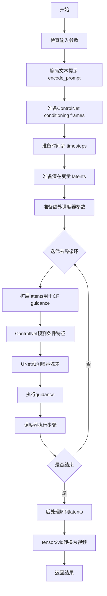
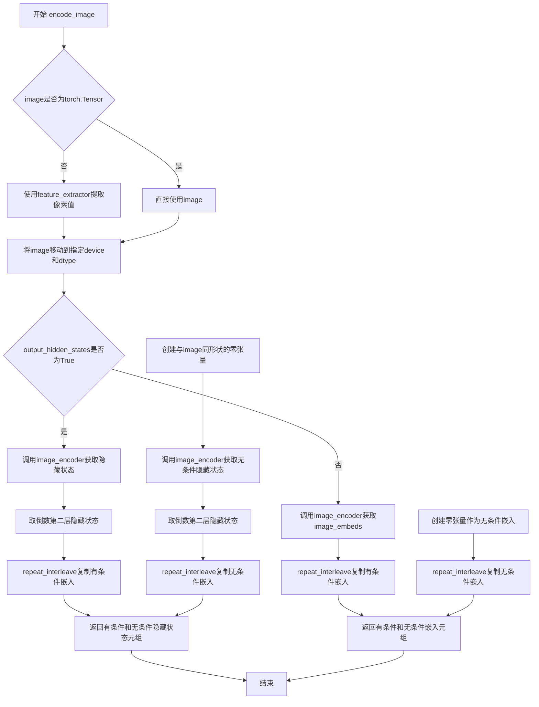
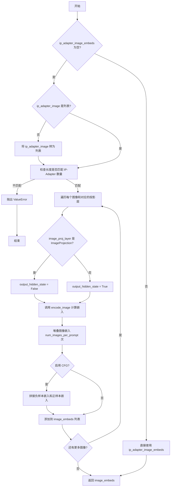
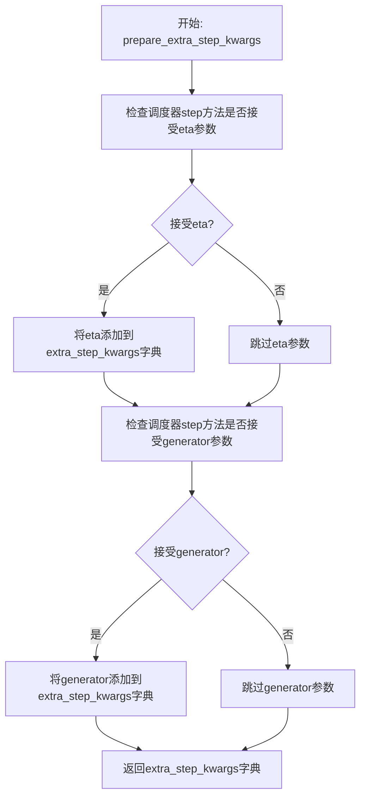
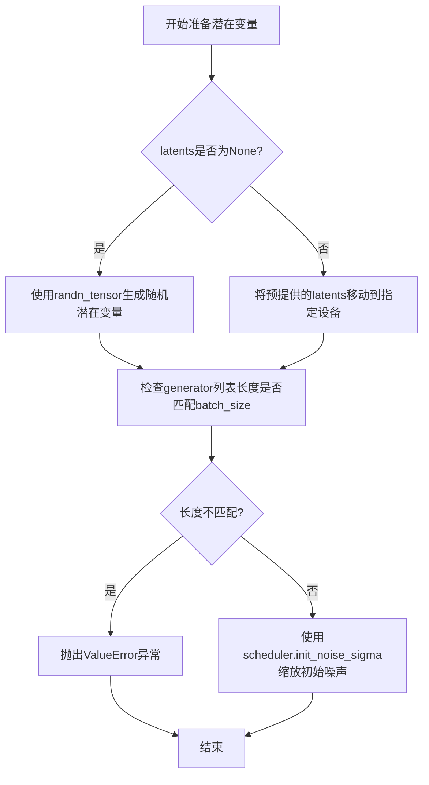
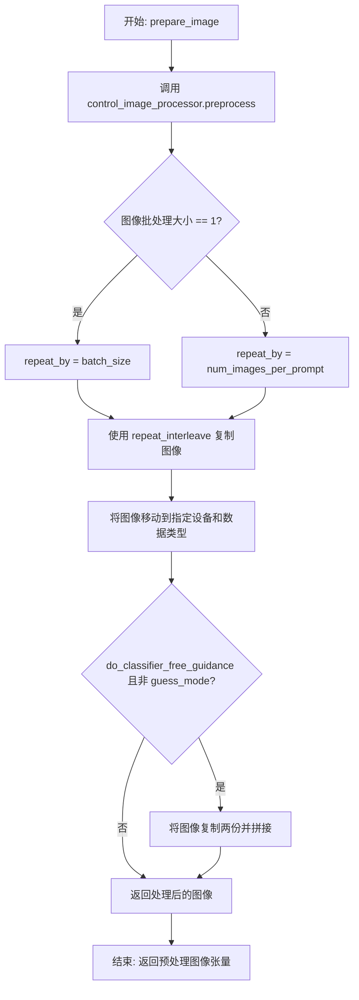

```mermaid
flowchart TD
    A[开始 __call__] --> B[解析 callback 和 callback_steps 参数]
    B --> C[获取原始 controlnet 模块]
    C --> D[对齐 control_guidance_start/end 格式]
    D --> E[设置默认 height 和 width]
    E --> F[检查输入参数 check_inputs]
    F --> G[设置 guidance_scale, clip_skip, cross_attention_kwargs]
    G --> H[确定 batch_size]
    H --> I[处理 controlnet_conditioning_scale]
    I --> J[处理 global_pool_conditions]
    J --> K[编码输入提示 encode_prompt]
    K --> L{do_classifier_free_guidance?}
    L -->|Yes| M[拼接 negative 和 prompt embeds]
    L -->|No| N[继续]
    M --> O[准备 IP Adapter 图像嵌入]
    N --> O
    O --> P{controlnet 类型?}
    P -->|ControlNetModel| Q[prepare_image 处理 conditioning_frames]
    P -->|MultiControlNetModel| R[遍历处理每个 frame_]
    Q --> S[设置时间步 timesteps]
    R --> S
    S --> T[准备潜在变量 prepare_latents]
    T --> U[准备额外步骤参数 prepare_extra_step_kwargs]
    U --> V[添加 IP-Adapter 条件]
    V --> W[创建 controlnet_keep 列表]
    W --> X[进入去噪循环]
    X --> Y{遍历 timesteps}
    Y -->|每步| Z[扩展 latents 进行 classifier free guidance]
    Z --> AA[缩放模型输入]
    AA --> AB{guess_mode?}
    AB -->|Yes| AC[仅推断条件批次]
    AB -->|No| AD[使用 latent_model_input]
    AC --> AE[重复 prompt_embeds num_frames 次]
    AD --> AE
    AE --> AF[计算 controlnet_keep 加权]
    AF --> AG[调用 controlnet 预测]
    AG --> AH[调用 unet 预测噪声残差]
    AH --> AI{do_classifier_free_guidance?}
    AI -->|Yes| AJ[执行 guidance]
    AI -->|No| AK[执行 scheduler.step]
    AJ --> AL[计算 x_t-1]
    AK --> AL
    AL --> AM[执行 callback_on_step_end]
    AM --> AN{完成去噪?}
    AN -->|否| Y
    AN -->|是| AO[后处理: decode_latents]
    AO --> AP{output_type == 'latent'?}
    AP -->|Yes| AQ[video = latents]
    AP -->|No| AR[tensor2vid 转换为视频]
    AQ --> AS[卸载模型 maybe_free_model_hooks]
    AR --> AS
    AS --> AT{return_dict?}
    AT -->|Yes| AU[返回 AnimateDiffPipelineOutput]
    AT -->|No| AV[返回元组]
    AU --> AV --> AX[结束]
```

# `diffusers\examples\community\pipeline_animatediff_controlnet.py` 详细设计文档

这是一个结合了AnimateDiff运动适配器和ControlNet条件的文本到视频生成扩散管道。该管道允许用户通过文本提示生成动画视频，同时利用姿态检测等条件帧来控制视频生成，实现了对生成内容的精细控制。

## 整体流程



## 类结构

```
DiffusionPipeline (基类)
├── StableDiffusionMixin
├── TextualInversionLoaderMixin
├── IPAdapterMixin
├── StableDiffusionLoraLoaderMixin
└── AnimateDiffControlNetPipeline
```

## 全局变量及字段


### `logger`
    
模块级别的日志记录器，用于输出调试和运行时信息

类型：`logging.Logger`
    


### `EXAMPLE_DOC_STRING`
    
包含管道使用示例的文档字符串，展示如何调用AnimateDiffControlNetPipeline生成视频

类型：`str`
    


### `tensor2vid`
    
将视频张量转换为视频输出的函数，支持np、pt和pil格式

类型：`Callable`
    


### `AnimateDiffControlNetPipeline.vae`
    
变分自编码器，用于将图像编码到潜在空间并从潜在空间解码重建图像

类型：`AutoencoderKL`
    


### `AnimateDiffControlNetPipeline.text_encoder`
    
冻结的CLIP文本编码器，将文本提示转换为文本嵌入向量

类型：`CLIPTextModel`
    


### `AnimateDiffControlNetPipeline.tokenizer`
    
CLIP分词器，用于将文本分割成token序列

类型：`CLIPTokenizer`
    


### `AnimateDiffControlNetPipeline.unet`
    
结合MotionAdapter的UNet2DConditionModel，用于在潜在空间中对视频帧进行去噪

类型：`UNetMotionModel`
    


### `AnimateDiffControlNetPipeline.motion_adapter`
    
运动适配器模块，为UNet添加时间维度处理能力以生成视频

类型：`MotionAdapter`
    


### `AnimateDiffControlNetPipeline.controlnet`
    
ControlNet模型或多个ControlNet的组合，用于根据条件帧引导生成过程

类型：`Union[ControlNetModel, MultiControlNetModel]`
    


### `AnimateDiffControlNetPipeline.scheduler`
    
扩散调度器，管理去噪过程中的噪声调度和时间步长

类型：`SchedulerMixin`
    


### `AnimateDiffControlNetPipeline.feature_extractor`
    
CLIP图像处理器，用于预处理IP-Adapter的输入图像

类型：`Optional[CLIPImageProcessor]`
    


### `AnimateDiffControlNetPipeline.image_encoder`
    
CLIP视觉编码器，用于生成IP-Adapter的图像嵌入

类型：`Optional[CLIPVisionModelWithProjection]`
    


### `AnimateDiffControlNetPipeline.vae_scale_factor`
    
VAE缩放因子，用于计算潜在空间的尺寸

类型：`int`
    


### `AnimateDiffControlNetPipeline.image_processor`
    
VAE图像处理器，用于处理VAE的输入输出图像

类型：`VaeImageProcessor`
    


### `AnimateDiffControlNetPipeline.control_image_processor`
    
ControlNet图像处理器，专门处理ControlNet条件帧的预处理

类型：`VaeImageProcessor`
    


### `AnimateDiffControlNetPipeline.model_cpu_offload_seq`
    
模型CPU卸载顺序，指定各模型从GPU卸载到CPU的顺序

类型：`str`
    


### `AnimateDiffControlNetPipeline._optional_components`
    
可选组件列表，包含feature_extractor和image_encoder

类型：`List[str]`
    


### `AnimateDiffControlNetPipeline._callback_tensor_inputs`
    
回调函数可用的张量输入名称列表

类型：`List[str]`
    


### `AnimateDiffControlNetPipeline._guidance_scale`
    
无分类器引导尺度，控制文本提示对生成结果的影响程度

类型：`float`
    


### `AnimateDiffControlNetPipeline._clip_skip`
    
CLIP跳过的层数，用于控制使用CLIP哪一层输出作为提示嵌入

类型：`int`
    


### `AnimateDiffControlNetPipeline._cross_attention_kwargs`
    
交叉注意力 kwargs 字典，用于传递额外的注意力控制参数

类型：`Optional[Dict[str, Any]]`
    


### `AnimateDiffControlNetPipeline._num_timesteps`
    
扩散过程的总时间步数，记录推理过程中的步数

类型：`int`
    
    

## 全局函数及方法


### `tensor2vid`

该函数用于将视频张量（tensor）转换为可视化格式（numpy数组、PyTorch张量或PIL图像）。它遍历批次中的每个视频，对每个视频帧进行维度重排，然后使用提供的图像处理器进行后处理，最终根据输出类型返回堆叠后的结果。

参数：

- `video`：`torch.Tensor`，输入的视频张量，形状为 (batch_size, channels, num_frames, height, width)
- `processor`：图像处理器，用于对视频帧进行后处理（如解码、归一化等）
- `output_type`：`str`，输出格式类型，可选值为 "np"（numpy数组）、"pt"（PyTorch张量）或 "pil"（PIL图像列表），默认为 "np"

返回值：`Union[np.ndarray, torch.Tensor, List[PIL.Image]]`，根据 output_type 参数返回对应的视频格式

#### 流程图

```mermaid
flowchart TD
    A[输入: video tensor] --> B[获取批次大小 batch_size]
    B --> C{遍历 batch_idx 从 0 到 batch_size-1}
    C --> D[提取单个视频: video[batch_idx]]
    D --> E[维度重排: permute(1, 0, 2, 3)]
    E --> F[后处理: processor.postprocess]
    F --> G[添加到 outputs 列表]
    G --> C
    C --> H{output_type == 'np'?}
    H -->|Yes| I[numpy.stack]
    H -->|No| J{output_type == 'pt'?}
    J -->|Yes| K[torch.stack]
    J -->|No| L{output_type == 'pil'?}
    L -->|Yes| M[直接返回列表]
    L -->|No| N[抛出 ValueError]
    I --> O[返回结果]
    K --> O
    M --> O
```

#### 带注释源码

```python
# 从 diffusers.pipelines.animatediff.pipeline_animatediff 复制而来的函数
def tensor2vid(video: torch.Tensor, processor, output_type="np"):
    """
    将视频张量转换为可视化格式
    
    参数:
        video: 输入视频张量，形状为 (batch_size, channels, num_frames, height, width)
        processor: 图像处理器，用于后处理视频帧
        output_type: 输出格式，可选 'np', 'pt', 'pil'
    """
    # 解包视频张量的形状维度
    batch_size, channels, num_frames, height, width = video.shape
    
    # 初始化输出列表
    outputs = []
    
    # 遍历批次中的每个视频
    for batch_idx in range(batch_size):
        # 提取当前索引的视频批次
        batch_vid = video[batch_idx].permute(1, 0, 2, 3)
        # 重新排列维度: (channels, num_frames, height, width) -> (num_frames, channels, height, width)
        
        # 使用处理器对视频进行后处理
        batch_output = processor.postprocess(batch_vid, output_type)
        
        # 将处理后的结果添加到输出列表
        outputs.append(batch_output)

    # 根据输出类型进行相应的堆叠操作
    if output_type == "np":
        # 如果输出类型是 numpy 数组，使用 np.stack 堆叠
        outputs = np.stack(outputs)

    elif output_type == "pt":
        # 如果输出类型是 PyTorch 张量，使用 torch.stack 堆叠
        outputs = torch.stack(outputs)

    elif not output_type == "pil":
        # 如果不是 'pil' 类型且不是上述两种类型，抛出错误
        raise ValueError(f"{output_type} does not exist. Please choose one of ['np', 'pt', 'pil']")

    # 返回最终处理后的视频输出
    return outputs
```


### `AnimateDiffControlNetPipeline.__init__`

该方法是 `AnimateDiffControlNetPipeline` 类的构造函数，负责初始化文本到视频生成管道所需的所有核心组件，包括 VAE、文本编码器、UNet、动作适配器、ControlNet 和调度器等，并配置图像处理器。

#### 参数

- `vae`：`AutoencoderKL`，用于将图像编码和解码到潜在表示的变分自编码器模型。
- `text_encoder`：`CLIPTextModel`，冻结的文本编码器（clip-vit-large-patch14），用于将文本提示转换为嵌入向量。
- `tokenizer`：`CLIPTokenizer`，用于对文本进行分词的 CLIP 分词器。
- `unet`：`UNet2DConditionModel`，用于去噪编码视频潜在表示的 UNet 条件模型。
- `motion_adapter`：`MotionAdapter`，与 `unet` 结合使用以去噪编码视频潜在表示的动作适配器。
- `controlnet`：`Union[ControlNetModel, List[ControlNetModel], Tuple[ControlNetModel], MultiControlNetModel]`，ControlNet 模型，用于提供额外的条件控制，可以是单个模型或多个模型的列表/元组。
- `scheduler`：`Union[DDIMScheduler, PNDMScheduler, LMSDiscreteScheduler, EulerDiscreteScheduler, EulerAncestralDiscreteScheduler, DPMSolverMultistepScheduler]`，用于与 `unet` 结合去噪图像潜在表示的调度器。
- `feature_extractor`：`Optional[CLIPImageProcessor] = None`，用于处理图像输入的特征提取器（可选）。
- `image_encoder`：`Optional[CLIPVisionModelWithProjection] = None`，用于编码图像的 CLIP 视觉模型（可选，用于 IP-Adapter）。

#### 返回值

无返回值（`None`），该方法仅初始化实例属性。

#### 流程图

```mermaid
flowchart TD
    A[开始 __init__] --> B[调用 super().__init__]
    B --> C[将 unet 和 motion_adapter 组合为 UNetMotionModel]
    C --> D{controlnet 是 list 或 tuple?}
    D -->|是| E[将 controlnet 包装为 MultiControlNetModel]
    D -->|否| F[保持原样]
    E --> G[注册所有模块]
    F --> G
    G --> H[计算 vae_scale_factor]
    H --> I[创建 VaeImageProcessor]
    I --> J[创建 control_image_processor]
    J --> K[结束 __init__]
```

#### 带注释源码

```python
def __init__(
    self,
    vae: AutoencoderKL,
    text_encoder: CLIPTextModel,
    tokenizer: CLIPTokenizer,
    unet: UNet2DConditionModel,
    motion_adapter: MotionAdapter,
    controlnet: Union[ControlNetModel, List[ControlNetModel], Tuple[ControlNetModel], MultiControlNetModel],
    scheduler: Union[
        DDIMScheduler,
        PNDMScheduler,
        LMSDiscreteScheduler,
        EulerDiscreteScheduler,
        EulerAncestralDiscreteScheduler,
        DPMSolverMultistepScheduler,
    ],
    feature_extractor: Optional[CLIPImageProcessor] = None,
    image_encoder: Optional[CLIPVisionModelWithProjection] = None,
):
    """
    初始化 AnimateDiffControlNetPipeline 管道。

    参数:
        vae: 用于编码/解码图像的变分自编码器
        text_encoder: 冻结的 CLIP 文本编码器
        tokenizer: CLIP 分词器
        unet: 2D 条件 UNet 模型
        motion_adapter: 动作适配器模块
        controlnet: ControlNet 模型或多个 ControlNet 的集合
        scheduler: 去噪调度器
        feature_extractor: 可选的 CLIP 图像处理器
        image_encoder: 可选的 CLIP 视觉编码器
    """
    # 调用父类 DiffusionPipeline 的初始化方法
    super().__init__()
    
    # 将基础 UNet2DConditionModel 与 MotionAdapter 组合为 UNetMotionModel
    # 这为 UNet 增加了时间维度的处理能力，使其能够处理视频
    unet = UNetMotionModel.from_unet2d(unet, motion_adapter)

    # 如果 controlnet 是列表或元组，则将其包装为 MultiControlNetModel
    # MultiControlNetModel 可以同时使用多个 ControlNet 进行条件控制
    if isinstance(controlnet, (list, tuple)):
        controlnet = MultiControlNetModel(controlnet)

    # 注册所有模块到管道中，使它们可以通过 self.xxx 访问
    # 这也是保存/加载管道时需要序列化的组件
    self.register_modules(
        vae=vae,
        text_encoder=text_encoder,
        tokenizer=tokenizer,
        unet=unet,
        motion_adapter=motion_adapter,
        controlnet=controlnet,
        scheduler=scheduler,
        feature_extractor=feature_extractor,
        image_encoder=image_encoder,
    )
    
    # 计算 VAE 缩放因子，用于调整图像尺寸
    # 基于 VAE 配置中的 block_out_channels 数量计算
    # 通常 VAE 有 [128, 256, 512, 512] 四个块，缩放因子为 2^(4-1) = 8
    self.vae_scale_factor = 2 ** (len(self.vae.config.block_out_channels) - 1) if getattr(self, "vae", None) else 8
    
    # 创建图像处理器，用于处理 VAE 的输入和输出
    self.image_processor = VaeImageProcessor(vae_scale_factor=self.vae_scale_factor)
    
    # 创建 ControlNet 专用的图像处理器
    # do_convert_rgb=True: 将输入图像转换为 RGB 格式
    # do_normalize=False: 不进行归一化，因为 ControlNet 需要原始像素值
    self.control_image_processor = VaeImageProcessor(
        vae_scale_factor=self.vae_scale_factor, do_convert_rgb=True, do_normalize=False
    )
```


### `AnimateDiffControlNetPipeline.encode_prompt`

该方法负责将文本提示（prompt）编码为文本编码器的隐藏状态（hidden states），支持LoRA权重调整、CLIP跳层（clip_skip）以及无分类器自由引导（classifier-free guidance）。

参数：

- `prompt`：`Union[str, List[str]]`，可选，要编码的提示词
- `device`：`torch.device`，torch 设备
- `num_images_per_prompt`：`int`，每个提示词生成的图像数量
- `do_classifier_free_guidance`：`bool`，是否使用无分类器自由引导
- `negative_prompt`：`Union[str, List[str]]`，可选，用于引导不包含在图像生成中的提示词
- `prompt_embeds`：`Optional[torch.Tensor]`，可选，预生成的文本嵌入
- `negative_prompt_embeds`：`Optional[torch.Tensor]`，可选，预生成的负面文本嵌入
- `lora_scale`：`Optional[float]`，可选，将应用于文本编码器所有LoRA层的LoRA缩放因子
- `clip_skip`：`Optional[int]`，可选，在计算提示嵌入时要从CLIP跳过的层数

返回值：`Tuple[torch.Tensor, torch.Tensor]`，返回编码后的提示嵌入和负面提示嵌入

#### 流程图

```mermaid
flowchart TD
    A[开始 encode_prompt] --> B{检查 lora_scale}
    B -->|非空且是 StableDiffusionLoraLoaderMixin| C[设置 self._lora_scale]
    C --> D{是否使用 PEFT}
    D -->|是| E[scale_lora_layers]
    D -->|否| F[adjust_lora_scale_text_encoder]
    B -->|空或非 StableDiffusionLoraLoaderMixin| G[确定 batch_size]
    
    E --> G
    F --> G
    
    G --> H{prompt_embeds 是否为空}
    
    H -->|是| I{是否是 TextualInversionLoaderMixin}
    I -->|是| J[maybe_convert_prompt 处理 prompt]
    I -->|否| K[直接使用 prompt]
    J --> K
    
    K --> L[tokenizer 编码 prompt]
    L --> M{是否有 attention_mask}
    M -->|是| N[获取 attention_mask]
    M -->|否| O[attention_mask 设为 None]
    N --> O
    
    O --> P{clip_skip 是否为空}
    P -->|是| Q[直接编码获取 prompt_embeds]
    P -->|否| R[获取 hidden_states 并应用 clip_skip]
    R --> S[应用 final_layer_norm]
    Q --> T
    
    S --> T[确定 prompt_embeds_dtype]
    T --> U[转换 prompt_embeds 到正确 dtype 和 device]
    U --> V[重复 prompt_embeds num_images_per_prompt 次]
    
    H -->|否| W[直接使用传入的 prompt_embeds]
    W --> T
    
    V --> X{do_classifier_free_guidance 且 negative_prompt_embeds 为空}
    
    X -->|是| Y{处理 negative_prompt]
    Y -->|None| Z[uncond_tokens = [''] * batch_size]
    Y -->|类型不匹配| AA[抛出 TypeError]
    Y -->|是 str| AB[uncond_tokens = [negative_prompt]]
    Y -->|长度不匹配| AC[抛出 ValueError]
    Y -->|其他| AD[uncond_tokens = negative_prompt]
    
    Z --> AE
    AB --> AE
    AD --> AE
    
    AE --> AF{是 TextualInversionLoaderMixin}
    AF -->|是| AG[maybe_convert_prompt 处理 uncond_tokens]
    AF -->|否| AH[直接使用 uncond_tokens]
    AG --> AH
    
    AH --> AI[tokenizer 编码 uncond_tokens]
    AI --> AJ[编码获取 negative_prompt_embeds]
    
    X -->|否| AK[结束准备]
    
    AJ --> AL{do_classifier_free_guidance}
    AL -->|是| AM[重复 negative_prompt_embeds]
    AL -->|否| AN
    
    AM --> AO[转换为正确 dtype 和 device]
    AO --> AP[调整形状]
    AP --> AQ
    
    AN --> AQ[处理 LoRA 缩放回退]
    AQ --> AR[返回 prompt_embeds, negative_prompt_embeds]
```

#### 带注释源码

```python
def encode_prompt(
    self,
    prompt,  # Union[str, List[str]], optional - 要编码的提示词
    device,  # torch.device - torch 设备
    num_images_per_prompt,  # int - 每个提示词生成的图像数量
    do_classifier_free_guidance,  # bool - 是否使用无分类器自由引导
    negative_prompt=None,  # Union[str, List[str]], optional - 负面提示词
    prompt_embeds: Optional[torch.Tensor] = None,  # 可选的预生成文本嵌入
    negative_prompt_embeds: Optional[torch.Tensor] = None,  # 可选的预生成负面文本嵌入
    lora_scale: Optional[float] = None,  # 可选的 LoRA 缩放因子
    clip_skip: Optional[int] = None,  # 可选的 CLIP 跳层数
):
    r"""
    Encodes the prompt into text encoder hidden states.

    Args:
        prompt (`str` or `List[str]`, *optional*):
            prompt to be encoded
        device: (`torch.device`):
            torch device
        num_images_per_prompt (`int`):
            number of images that should be generated per prompt
        do_classifier_free_guidance (`bool`):
            whether to use classifier free guidance or not
        negative_prompt (`str` or `List[str]`, *optional*):
            The prompt or prompts not to guide the image generation. If not defined, one has to pass
            `negative_prompt_embeds` instead. Ignored when not using guidance (i.e., ignored if `guidance_scale` is
            less than `1`).
        prompt_embeds (`torch.Tensor`, *optional*):
            Pre-generated text embeddings. Can be used to easily tweak text inputs, *e.g.* prompt weighting. If not
            provided, text embeddings will be generated from `prompt` input argument.
        negative_prompt_embeds (`torch.Tensor`, *optional*):
            Pre-generated negative text embeddings. Can be used to easily tweak text inputs, *e.g.* prompt
            weighting. If not provided, negative_prompt_embeds will be generated from `negative_prompt` input
            argument.
        lora_scale (`float`, *optional*):
            A LoRA scale that will be applied to all LoRA layers of the text encoder if LoRA layers are loaded.
        clip_skip (`int`, *optional*):
            Number of layers to be skipped from CLIP while computing the prompt embeddings. A value of 1 means that
            the output of the pre-final layer will be used for computing the prompt embeddings.
    """
    # 如果提供了 lora_scale 且对象是 StableDiffusionLoraLoaderMixin 的实例，
    # 设置 _lora_scale 以便 text encoder 的 monkey patched LoRA 函数可以正确访问
    if lora_scale is not None and isinstance(self, StableDiffusionLoraLoaderMixin):
        self._lora_scale = lora_scale

        # 动态调整 LoRA scale
        if not USE_PEFT_BACKEND:
            adjust_lora_scale_text_encoder(self.text_encoder, lora_scale)
        else:
            scale_lora_layers(self.text_encoder, lora_scale)

    # 根据 prompt 或 prompt_embeds 确定 batch_size
    if prompt is not None and isinstance(prompt, str):
        batch_size = 1
    elif prompt is not None and isinstance(prompt, list):
        batch_size = len(prompt)
    else:
        batch_size = prompt_embeds.shape[0]

    # 如果没有提供 prompt_embeds，则需要从 prompt 生成
    if prompt_embeds is None:
        # 如果是 TextualInversionLoaderMixin，处理多向量 token（如果有）
        if isinstance(self, TextualInversionLoaderMixin):
            prompt = self.maybe_convert_prompt(prompt, self.tokenizer)

        # 使用 tokenizer 将 prompt 转换为 token IDs
        text_inputs = self.tokenizer(
            prompt,
            padding="max_length",
            max_length=self.tokenizer.model_max_length,
            truncation=True,
            return_tensors="pt",
        )
        text_input_ids = text_inputs.input_ids
        # 获取未截断的 token IDs 用于检测截断
        untruncated_ids = self.tokenizer(prompt, padding="longest", return_tensors="pt").input_ids

        # 检测并警告截断的文本
        if untruncated_ids.shape[-1] >= text_input_ids.shape[-1] and not torch.equal(
            text_input_ids, untruncated_ids
        ):
            removed_text = self.tokenizer.batch_decode(
                untruncated_ids[:, self.tokenizer.model_max_length - 1 : -1]
            )
            logger.warning(
                "The following part of your input was truncated because CLIP can only handle sequences up to"
                f" {self.tokenizer.model_max_length} tokens: {removed_text}"
            )

        # 获取 attention_mask
        if hasattr(self.text_encoder.config, "use_attention_mask") and self.text_encoder.config.use_attention_mask:
            attention_mask = text_inputs.attention_mask.to(device)
        else:
            attention_mask = None

        # 根据 clip_skip 参数决定如何编码
        if clip_skip is None:
            # 直接编码获取 hidden states
            prompt_embeds = self.text_encoder(text_input_ids.to(device), attention_mask=attention_mask)
            prompt_embeds = prompt_embeds[0]
        else:
            # 获取所有 hidden states
            prompt_embeds = self.text_encoder(
                text_input_ids.to(device), attention_mask=attention_mask, output_hidden_states=True
            )
            # hidden_states 是一个包含所有 encoder 层输出的元组
            # 根据 clip_skip 获取对应层的输出
            prompt_embeds = prompt_embeds[-1][-(clip_skip + 1)]
            # 应用 final LayerNorm 以保持表示的一致性
            prompt_embeds = self.text_encoder.text_model.final_layer_norm(prompt_embeds)

    # 确定 prompt_embeds 的数据类型
    if self.text_encoder is not None:
        prompt_embeds_dtype = self.text_encoder.dtype
    elif self.unet is not None:
        prompt_embeds_dtype = self.unet.dtype
    else:
        prompt_embeds_dtype = prompt_embeds.dtype

    # 将 prompt_embeds 转换为正确的 dtype 和 device
    prompt_embeds = prompt_embeds.to(dtype=prompt_embeds_dtype, device=device)

    bs_embed, seq_len, _ = prompt_embeds.shape
    # 为每个 prompt 的每次生成复制 text embeddings
    prompt_embeds = prompt_embeds.repeat(1, num_images_per_prompt, 1)
    prompt_embeds = prompt_embeds.view(bs_embed * num_images_per_prompt, seq_len, -1)

    # 为 classifier free guidance 获取无条件 embeddings
    if do_classifier_free_guidance and negative_prompt_embeds is None:
        uncond_tokens: List[str]
        if negative_prompt is None:
            uncond_tokens = [""] * batch_size
        elif prompt is not None and type(prompt) is not type(negative_prompt):
            raise TypeError(
                f"`negative_prompt` should be the same type to `prompt`, but got {type(negative_prompt)} !="
                f" {type(prompt)}."
            )
        elif isinstance(negative_prompt, str):
            uncond_tokens = [negative_prompt]
        elif batch_size != len(negative_prompt):
            raise ValueError(
                f"`negative_prompt`: {negative_prompt} has batch size {len(negative_prompt)}, but `prompt`:"
                f" {prompt} has batch size {batch_size}. Please make sure that passed `negative_prompt` matches"
                " the batch size of `prompt`."
            )
        else:
            uncond_tokens = negative_prompt

        # 处理多向量 token（如果是 TextualInversionLoaderMixin）
        if isinstance(self, TextualInversionLoaderMixin):
            uncond_tokens = self.maybe_convert_prompt(uncond_tokens, self.tokenizer)

        max_length = prompt_embeds.shape[1]
        uncond_input = self.tokenizer(
            uncond_tokens,
            padding="max_length",
            max_length=max_length,
            truncation=True,
            return_tensors="pt",
        )

        # 获取 attention_mask
        if hasattr(self.text_encoder.config, "use_attention_mask") and self.text_encoder.config.use_attention_mask:
            attention_mask = uncond_input.attention_mask.to(device)
        else:
            attention_mask = None

        # 编码获取 negative_prompt_embeds
        negative_prompt_embeds = self.text_encoder(
            uncond_input.input_ids.to(device),
            attention_mask=attention_mask,
        )
        negative_prompt_embeds = negative_prompt_embeds[0]

    # 如果使用 classifier free guidance，复制无条件 embeddings
    if do_classifier_free_guidance:
        seq_len = negative_prompt_embeds.shape[1]

        negative_prompt_embeds = negative_prompt_embeds.to(dtype=prompt_embeds_dtype, device=device)

        negative_prompt_embeds = negative_prompt_embeds.repeat(1, num_images_per_prompt, 1)
        negative_prompt_embeds = negative_prompt_embeds.view(batch_size * num_images_per_prompt, seq_len, -1)

    # 如果使用了 LoRA 且使用 PEFT backend，恢复原始 scale
    if isinstance(self, StableDiffusionLoraLoaderMixin) and USE_PEFT_BACKEND:
        # 通过 unscale LoRA layers 恢复原始 scale
        unscale_lora_layers(self.text_encoder, lora_scale)

    return prompt_embeds, negative_prompt_embeds
```


### `AnimateDiffControlNetPipeline.encode_image`

该方法用于将输入图像编码为图像嵌入向量或隐藏状态，支持有条件和无条件的图像嵌入生成，常用于IP-Adapter图像条件引导。它首先通过feature_extractor将图像转换为张量，然后使用image_encoder进行编码，根据output_hidden_states参数决定返回隐藏状态还是图像嵌入，并为每个prompt生成多个图像的嵌入副本。

参数：

- `image`：`Union[PipelineImageInput, torch.Tensor]` ，输入图像，可以是PIL图像、numpy数组、torch张量或它们的列表
- `device`：`torch.device`，目标设备，用于将图像张量移动到指定设备
- `num_images_per_prompt`：`int`，每个prompt生成的图像数量，用于对嵌入进行复制以匹配批量大小
- `output_hidden_states`：`Optional[bool]`，可选参数，指定是否返回图像编码器的隐藏状态而非图像嵌入

返回值：`Tuple[torch.Tensor, torch.Tensor]`，返回两个张量元组——第一个是有条件图像嵌入（或隐藏状态），第二个是无条件图像嵌入（或隐藏状态）。无条件嵌入在output_hidden_states为False时为零张量，为True时使用零图像生成。

#### 流程图



#### 带注释源码

```python
def encode_image(self, image, device, num_images_per_prompt, output_hidden_states=None):
    """
    将输入图像编码为图像嵌入向量或隐藏状态。
    
    该方法支持两种输出模式：
    1. output_hidden_states=True: 返回图像编码器的倒数第二层隐藏状态
    2. output_hidden_states=False: 返回图像嵌入（image_embeds）
    
    同时生成对应的无条件嵌入用于classifier-free guidance。
    
    参数:
        image: 输入图像，支持PIL Image、numpy array、torch.Tensor或它们的列表
        device: 目标计算设备
        num_images_per_prompt: 每个prompt生成的图像数量
        output_hidden_states: 是否返回隐藏状态而非图像嵌入
        
    返回:
        (有条件嵌入, 无条件嵌入)的元组
    """
    # 获取图像编码器的参数dtype，确保输入图像使用相同的精度
    dtype = next(self.image_encoder.parameters()).dtype

    # 如果输入不是torch.Tensor，则使用feature_extractor进行预处理
    # feature_extractor会将PIL图像或numpy数组转换为pixel_values张量
    if not isinstance(image, torch.Tensor):
        image = self.feature_extractor(image, return_tensors="pt").pixel_values

    # 将图像张量移动到指定设备，并转换为与image_encoder相同的dtype
    image = image.to(device=device, dtype=dtype)
    
    # 根据output_hidden_states参数决定编码路径
    if output_hidden_states:
        # 路径1: 返回隐藏状态（用于更细粒度的图像特征控制）
        
        # 有条件图像编码：获取倒数第二层隐藏状态
        # hidden_states是一个元组，取[-2]获取倒数第二层（通常是倒数第二层特征更丰富）
        image_enc_hidden_states = self.image_encoder(image, output_hidden_states=True).hidden_states[-2]
        
        # 重复嵌入以匹配num_images_per_prompt
        # repeat_interleave在dim=0（batch维度）复制，保留其他维度不变
        image_enc_hidden_states = image_enc_hidden_states.repeat_interleave(num_images_per_prompt, dim=0)
        
        # 无条件图像编码：创建与输入图像形状相同的零张量
        # 零张量代表"无图像"的条件，用于classifier-free guidance
        uncond_image_enc_hidden_states = self.image_encoder(
            torch.zeros_like(image), output_hidden_states=True
        ).hidden_states[-2]
        
        # 同样对无条件嵌入进行复制
        uncond_image_enc_hidden_states = uncond_image_enc_hidden_states.repeat_interleave(
            num_images_per_prompt, dim=0
        )
        
        # 返回隐藏状态元组
        return image_enc_hidden_states, uncond_image_enc_hidden_states
    else:
        # 路径2: 返回图像嵌入（默认模式）
        
        # 有条件图像编码：直接获取image_embeds
        image_embeds = self.image_encoder(image).image_embeds
        
        # 重复嵌入以匹配num_images_per_prompt
        image_embeds = image_embeds.repeat_interleave(num_images_per_prompt, dim=0)
        
        # 无条件图像嵌入：创建与有条件嵌入形状相同的零张量
        uncond_image_embeds = torch.zeros_like(image_embeds)

        # 返回嵌入元组
        return image_embeds, uncond_image_embeds
```


### `AnimateDiffControlNetPipeline.prepare_ip_adapter_image_embeds`

该方法用于准备 IP-Adapter 的图像嵌入（image embeddings）。它处理输入的 IP-Adapter 图像或预计算的图像嵌入，将其转换为适合扩散管道使用的格式，支持分类器-free guidance（无分类器引导）。

参数：

- `self`：`AnimateDiffControlNetPipeline` 实例本身
- `ip_adapter_image`：`PipelineImageInput`，可选的 IP-Adapter 图像输入，用于从图像计算嵌入
- `ip_adapter_image_embeds`：`Optional[PipelineImageInput]`，可选的预计算 IP-Adapter 图像嵌入列表
- `device`：`torch.device`，计算设备
- `num_images_per_prompt`：`int`，每个提示词生成的图像数量

返回值：`List[torch.Tensor]`，处理后的图像嵌入列表，每个元素是形状为 `(num_images_per_prompt, emb_dim)` 或在启用 CFG 时为 `(2 * num_images_per_prompt, emb_dim)` 的张量

#### 流程图



#### 带注释源码

```python
def prepare_ip_adapter_image_embeds(
    self, ip_adapter_image, ip_adapter_image_embeds, device, num_images_per_prompt
):
    """
    准备 IP-Adapter 的图像嵌入。
    
    如果未提供预计算的图像嵌入，则对输入图像进行编码；
    如果提供了预计算的嵌入，则直接使用。
    支持分类器-free guidance，需要同时返回条件和非条件嵌入。
    
    参数:
        ip_adapter_image: IP-Adapter 图像输入
        ip_adapter_image_embeds: 预计算的图像嵌入（可选）
        device: 计算设备
        num_images_per_prompt: 每个提示生成的图像数量
    
    返回:
        图像嵌入列表
    """
    # 如果没有提供预计算的嵌入，则需要从图像计算
    if ip_adapter_image_embeds is None:
        # 确保图像是列表格式（便于批量处理多个 IP-Adapter）
        if not isinstance(ip_adapter_image, list):
            ip_adapter_image = [ip_adapter_image]

        # 验证图像数量与 IP-Adapter 数量是否匹配
        if len(ip_adapter_image) != len(self.unet.encoder_hid_proj.image_projection_layers):
            raise ValueError(
                f"`ip_adapter_image` must have same length as the number of IP Adapters. "
                f"Got {len(ip_adapter_image)} images and "
                f"{len(self.unet.encoder_hid_proj.image_projection_layers)} IP Adapters."
            )

        # 存储处理后的图像嵌入
        image_embeds = []
        
        # 遍历每个 IP-Adapter 图像和对应的图像投影层
        for single_ip_adapter_image, image_proj_layer in zip(
            ip_adapter_image, self.unet.encoder_hid_proj.image_projection_layers
        ):
            # 确定是否需要输出隐藏状态：
            # 如果投影层不是 ImageProjection 类型，则需要输出隐藏状态
            output_hidden_state = not isinstance(image_proj_layer, ImageProjection)
            
            # 编码单个图像，获取条件和非条件嵌入
            single_image_embeds, single_negative_image_embeds = self.encode_image(
                single_ip_adapter_image, device, 1, output_hidden_state
            )
            
            # 为每个提示生成的图像数量复制嵌入
            single_image_embeds = torch.stack([single_image_embeds] * num_images_per_prompt, dim=0)
            single_negative_image_embeds = torch.stack(
                [single_negative_image_embeds] * num_images_per_prompt, dim=0
            )

            # 如果启用分类器-free guidance，需要拼接负样本和正样本嵌入
            if self.do_classifier_free_guidance:
                # 格式: [负样本嵌入, 正样本嵌入]
                single_image_embeds = torch.cat([single_negative_image_embeds, single_image_embeds])
                single_image_embeds = single_image_embeds.to(device)

            # 将处理后的嵌入添加到列表
            image_embeds.append(single_image_embeds)
    else:
        # 如果已提供预计算的嵌入，直接使用
        image_embeds = ip_adapter_image_embeds
    
    return image_embeds
```


### `AnimateDiffControlNetPipeline.decode_latents`

该方法负责将 VAE 潜在表示解码为视频张量。它首先对潜在向量进行缩放以匹配 VAE 的缩放因子，然后重新组织张量维度以适应 VAE 的 2D 图像解码需求，最后将解码后的图像序列重新排列为 5D 视频张量格式。

参数：

- `latents`：`torch.Tensor`，形状为 `(batch_size, channels, num_frames, height, width)` 的潜在表示张量，需要进行解码处理

返回值：`torch.Tensor`，形状为 `(batch_size, channels, num_frames, height, width)` 的解码后视频张量

#### 流程图

```mermaid
flowchart TD
    A[输入 latents<br/>shape: (B, C, F, H, W)] --> B[缩放操作<br/>latents = 1/scaling_factor * latents]
    B --> C[维度重排<br/>permute: (0,2,1,3,4)]
    C --> D[reshape 合并帧和批量<br/>shape: (B*F, C, H, W)]
    D --> E[VAE 解码<br/>vae.decode(latents).sample]
    E --> F[恢复视频维度<br/>reshape 回 (B, F, -1, H, W)]
    F --> G[最终维度重排<br/>permute: (0,2,1,3,4)]
    G --> H[转换为 float32<br/>video.float()]
    H --> I[输出 video<br/>shape: (B, C, F, H, W)]
```

#### 带注释源码

```python
def decode_latents(self, latents):
    # 步骤1: 缩放潜在向量 - 将潜在表示反缩放以匹配 VAE 的缩放因子
    # 这是为了将潜在空间的值域转换到 VAE 训练时的合适范围
    latents = 1 / self.vae.config.scaling_factor * latents

    # 步骤2: 获取输入张量的维度信息
    # batch_size: 批量大小
    # channels: 通道数
    # num_frames: 视频帧数
    # height/width: 潜在空间的高度和宽度
    batch_size, channels, num_frames, height, width = latents.shape

    # 步骤3: 维度重排和reshape
    # 将 (B, C, F, H, W) 转换为 (B, F, C, H, W) 再展平为 (B*F, C, H, W)
    # 这样可以将所有帧作为独立的图像批量进行处理，适应 VAE 的 2D 图像解码接口
    latents = latents.permute(0, 2, 1, 3, 4).reshape(batch_size * num_frames, channels, height, width)

    # 步骤4: 使用 VAE 解码器将潜在向量解码为图像
    # decode 方法接受 4D 张量 (batch*frames, channels, height, width)
    # 返回解码后的图像张量
    image = self.vae.decode(latents).sample

    # 步骤5: 重建视频张量结构
    # 首先在第0维添加一个维度，然后reshape回 (batch_size, num_frames, -1, height, width)
    # 最后再通过permute调整回标准的视频格式 (batch_size, channels, num_frames, height, width)
    video = (
        image[None, :]
        .reshape(
            (
                batch_size,
                num_frames,
                -1,
            )
            + image.shape[2:]
        )
        .permute(0, 2, 1, 3, 4)
    )

    # 步骤6: 转换为 float32 类型
    # 这样做不会导致显著的性能开销，并且与 bfloat16 兼容
    # 因为某些后续操作可能不支持 bfloat16
    video = video.float()

    # 返回解码后的视频张量
    return video
```


### `AnimateDiffControlNetPipeline.prepare_extra_step_kwargs`

该方法用于为调度器（scheduler）准备额外的关键字参数。由于不同调度器的签名不完全相同（例如只有DDIMScheduler支持eta参数），该方法通过检查当前调度器的step函数签名来动态构建所需的参数字典。

参数：

- `generator`：`Optional[Union[torch.Generator, List[torch.Generator]]]`，用于控制随机数生成的确定性，可以是一个Generator或Generator列表
- `eta`：`float`，DDIM调度器专用的噪声参数（η），对应DDIM论文中的参数，取值范围应为[0,1]

返回值：`Dict`，返回一个包含调度器step方法所需额外参数（如eta和generator）的字典

#### 流程图



#### 带注释源码

```python
def prepare_extra_step_kwargs(self, generator, eta):
    # 准备调度器的额外参数，因为并非所有调度器都具有相同的函数签名
    # eta (η) 仅在 DDIMScheduler 中使用，其他调度器会忽略该参数
    # eta 对应 DDIM 论文 (https://huggingface.co/papers/2010.02502) 中的 η，取值范围应为 [0, 1]
    
    # 使用 inspect 模块检查调度器的 step 方法签名，判断是否支持 eta 参数
    accepts_eta = "eta" in set(inspect.signature(self.scheduler.step).parameters.keys())
    
    # 初始化空字典用于存储额外的调度器参数
    extra_step_kwargs = {}
    
    # 如果调度器接受 eta 参数，则将其添加到参数字典中
    if accepts_eta:
        extra_step_kwargs["eta"] = eta

    # 检查调度器是否接受 generator 参数（用于控制随机数生成的确定性）
    accepts_generator = "generator" in set(inspect.signature(self.scheduler.step).parameters.keys())
    
    # 如果调度器接受 generator 参数，则将其添加到参数字典中
    if accepts_generator:
        extra_step_kwargs["generator"] = generator
    
    # 返回包含调度器所需额外参数的字典
    return extra_step_kwargs
```


### AnimateDiffControlNetPipeline.check_inputs

该方法用于验证传入文本转视频生成管道的各种输入参数的有效性，包括图像尺寸、回调步数、提示词、ControlNet条件图像和引导参数等，确保所有参数符合管道要求，否则抛出相应的错误信息。

参数：

- `prompt`：`Union[str, List[str], None]`，要生成视频的文本提示词
- `height`：`int`，生成视频的高度（像素）
- `width`：`int`，生成视频的宽度（像素）
- `num_frames`：`int`，要生成的视频帧数
- `callback_steps`：`int`，每多少步执行一次回调函数
- `negative_prompt`：`Union[str, List[str], None]`，不包含在生成中的提示词
- `prompt_embeds`：`Optional[torch.Tensor]`，预生成的文本嵌入向量
- `negative_prompt_embeds`：`Optional[torch.Tensor]`，预生成的负面文本嵌入向量
- `callback_on_step_end_tensor_inputs`：`Optional[List[str]]`，在每步结束时回调的张量输入列表
- `image`：`Optional[PipelineImageInput]`，ControlNet的条件图像输入
- `controlnet_conditioning_scale`：`Union[float, List[float]]`，ControlNet输出到UNet残差的乘数
- `control_guidance_start`：`Union[float, List[float]]`，ControlNet开始应用的总体步数百分比
- `control_guidance_end`：`Union[float, List[float]]`，ControlNet停止应用的总体步数百分比

返回值：`None`，该方法不返回任何值，仅进行参数验证

#### 流程图

```mermaid
flowchart TD
    A[开始 check_inputs] --> B{height % 8 == 0 && width % 8 == 0?}
    B -->|否| B1[抛出 ValueError: height和width必须能被8整除]
    B -->|是| C{callback_steps是>0的整数?}
    C -->|否| C1[抛出 ValueError: callback_steps必须是正整数]
    C -->|是| D{callback_on_step_end_tensor_inputs在允许列表中?}
    D -->|否| D1[抛出 ValueError]
    D -->|是| E{prompt和prompt_embeds都非空?}
    E -->|是| E1[抛出 ValueError: 不能同时提供两者]
    E -->|否| F{prompt和prompt_embeds都为空?}
    F -->|是| F1[抛出 ValueError: 必须提供至少一个]
    F -->|否| G{prompt是str或list?}
    G -->|否| G1[抛出 ValueError: prompt类型错误]
    G -->|是| H{negative_prompt和negative_prompt_embeds都非空?}
    H -->|是| H1[抛出 ValueError: 不能同时提供两者]
    H -->|否| I{prompt_embeds和negative_prompt_embeds形状相同?}
    I -->|否| I1[抛出 ValueError: 形状不匹配]
    I -->|是| J{ControlNet是单模型还是多模型?}
    J -->|单模型| K{image是list类型?}
    J -->|多模型| L{image是list of lists?}
    K -->|否| K1[抛出 TypeError]
    K -->|是| M{len(image) == num_frames?}
    L -->|否| L1[抛出 TypeError]
    L -->|是| N{image子列表长度 == num_frames?}
    M -->|否| M1[抛出 ValueError: 图像数量与帧数不匹配]
    M -->|是| O{controlnet_conditioning_scale类型正确?}
    N -->|否| N1[抛出 ValueError]
    N -->|是| O
    O -->|否| O1[抛出 TypeError]
    O -->|是| P{control_guidance_start和control_guidance_end长度相同?}
    P -->|否| P1[抛出 ValueError: 长度不匹配]
    P -->|是| Q{control_guidance_start[i] < control_guidance_end[i]?}
    Q -->|否| Q1[抛出 ValueError: start >= end]
    Q -->|是| R[验证通过]
    B1 --> Z[结束]
    C1 --> Z
    D1 --> Z
    E1 --> Z
    F1 --> Z
    G1 --> Z
    H1 --> Z
    I1 --> Z
    K1 --> Z
    M1 --> Z
    O1 --> Z
    P1 --> Z
    Q1 --> Z
    R --> Z
```

#### 带注释源码

```python
def check_inputs(
    self,
    prompt,                       # Union[str, List[str], None] - 文本提示词
    height,                       # int - 生成视频的高度
    width,                        # int - 生成视频的宽度
    num_frames,                   # int - 要生成的帧数
    callback_steps,               # int - 回调步数间隔
    negative_prompt=None,         # Union[str, List[str], None] - 负面提示词
    prompt_embeds=None,          # Optional[torch.Tensor] - 预生成提示词嵌入
    negative_prompt_embeds=None, # Optional[torch.Tensor] - 预生成负面嵌入
    callback_on_step_end_tensor_inputs=None, # Optional[List[str]] - 回调张量输入
    image=None,                   # Optional[PipelineImageInput] - ControlNet条件图像
    controlnet_conditioning_scale=1.0,  # Union[float, List[float]] - ControlNet缩放因子
    control_guidance_start=0.0,  # Union[float, List[float]] - 控制引导开始
    control_guidance_end=1.0,    # Union[float, List[float]] - 控制引导结束
):
    # 验证高度和宽度必须是8的倍数
    if height % 8 != 0 or width % 8 != 0:
        raise ValueError(f"`height` and `width` have to be divisible by 8 but are {height} and {width}.")

    # 验证callback_steps必须是正整数
    if callback_steps is not None and (not isinstance(callback_steps, int) or callback_steps <= 0):
        raise ValueError(
            f"`callback_steps` has to be a positive integer but is {callback_steps} of type"
            f" {type(callback_steps)}."
        )
    
    # 验证回调张量输入是否在允许的列表中
    if callback_on_step_end_tensor_inputs is not None and not all(
        k in self._callback_tensor_inputs for k in callback_on_step_end_tensor_inputs
    ):
        raise ValueError(
            f"`callback_on_step_end_tensor_inputs` has to be in {self._callback_tensor_inputs}, but found {[k for k in callback_on_step_end_tensor_inputs if k not in self._callback_tensor_inputs]}"
        )

    # 验证prompt和prompt_embeds不能同时提供
    if prompt is not None and prompt_embeds is not None:
        raise ValueError(
            f"Cannot forward both `prompt`: {prompt} and `prompt_embeds`: {prompt_embeds}. Please make sure to"
            " only forward one of the two."
        )
    # 验证至少提供一个prompt或prompt_embeds
    elif prompt is None and prompt_embeds is None:
        raise ValueError(
            "Provide either `prompt` or `prompt_embeds`. Cannot leave both `prompt` and `prompt_embeds` undefined."
        )
    # 验证prompt类型必须是str或list
    elif prompt is not None and (not isinstance(prompt, str) and not isinstance(prompt, list)):
        raise ValueError(f"`prompt` has to be of type `str` or `list` but is {type(prompt)}")

    # 验证negative_prompt和negative_prompt_embeds不能同时提供
    if negative_prompt is not None and negative_prompt_embeds is not None:
        raise ValueError(
            f"Cannot forward both `negative_prompt`: {negative_prompt} and `negative_prompt_embeds`:"
            f" {negative_prompt_embeds}. Please make sure to only forward one of the two."
        )

    # 验证prompt_embeds和negative_prompt_embeds形状必须匹配
    if prompt_embeds is not None and negative_prompt_embeds is not None:
        if prompt_embeds.shape != negative_prompt_embeds.shape:
            raise ValueError(
                "`prompt_embeds` and `negative_prompt_embeds` must have the same shape when passed directly, but"
                f" got: `prompt_embeds` {prompt_embeds.shape} != `negative_prompt_embeds`"
                f" {negative_prompt_embeds.shape}."
            )

    # 检查多ControlNet情况下的提示词警告
    if isinstance(self.controlnet, MultiControlNetModel):
        if isinstance(prompt, list):
            logger.warning(
                f"You have {len(self.controlnet.nets)} ControlNets and you have passed {len(prompt)}"
                " prompts. The conditionings will be fixed across the prompts."
            )

    # 检查image参数的类型和长度
    is_compiled = hasattr(F, "scaled_dot_product_attention") and isinstance(
        self.controlnet, torch._dynamo.eval_frame.OptimizedModule
    )
    # 单ControlNet模型验证
    if (
        isinstance(self.controlnet, ControlNetModel)
        or is_compiled
        and isinstance(self.controlnet._orig_mod, ControlNetModel)
    ):
        if not isinstance(image, list):
            raise TypeError(f"For single controlnet, `image` must be of type `list` but got {type(image)}")
        if len(image) != num_frames:
            raise ValueError(f"Excepted image to have length {num_frames} but got {len(image)=}")
    # 多ControlNet模型验证
    elif (
        isinstance(self.controlnet, MultiControlNetModel)
        or is_compiled
        and isinstance(self.controlnet._orig_mod, MultiControlNetModel)
    ):
        if not isinstance(image, list) or not isinstance(image[0], list):
            raise TypeError(f"For multiple controlnets: `image` must be type list of lists but got {type(image)=}")
        if len(image[0]) != num_frames:
            raise ValueError(f"Expected length of image sublist as {num_frames} but got {len(image[0])=}")
        if any(len(img) != len(image[0]) for img in image):
            raise ValueError("All conditioning frame batches for multicontrolnet must be same size")
    else:
        assert False

    # 验证controlnet_conditioning_scale类型和长度
    if (
        isinstance(self.controlnet, ControlNetModel)
        or is_compiled
        and isinstance(self.controlnet._orig_mod, ControlNetModel)
    ):
        if not isinstance(controlnet_conditioning_scale, float):
            raise TypeError("For single controlnet: `controlnet_conditioning_scale` must be type `float`.")
    elif (
        isinstance(self.controlnet, MultiControlNetModel)
        or is_compiled
        and isinstance(self.controlnet._orig_mod, MultiControlNetModel)
    ):
        if isinstance(controlnet_conditioning_scale, list):
            if any(isinstance(i, list) for i in controlnet_conditioning_scale):
                raise ValueError("A single batch of multiple conditionings are supported at the moment.")
        elif isinstance(controlnet_conditioning_scale, list) and len(controlnet_conditioning_scale) != len(
            self.controlnet.nets
        ):
            raise ValueError(
                "For multiple controlnets: When `controlnet_conditioning_scale` is specified as `list`, it must have"
                " the same length as the number of controlnets"
            )
    else:
        assert False

    # 将control_guidance_start和end转换为列表（如果不是）
    if not isinstance(control_guidance_start, (tuple, list)):
        control_guidance_start = [control_guidance_start]

    if not isinstance(control_guidance_end, (tuple, list)):
        control_guidance_end = [control_guidance_end]

    # 验证start和end列表长度相同
    if len(control_guidance_start) != len(control_guidance_end):
        raise ValueError(
            f"`control_guidance_start` has {len(control_guidance_start)} elements, but `control_guidance_end` has {len(control_guidance_end)} elements. Make sure to provide the same number of elements to each list."
        )

    # 多ControlNet情况下验证长度匹配
    if isinstance(self.controlnet, MultiControlNetModel):
        if len(control_guidance_start) != len(self.controlnet.nets):
            raise ValueError(
                f"`control_guidance_start`: {control_guidance_start} has {len(control_guidance_start)} elements but there are {len(self.controlnet.nets)} controlnets available. Make sure to provide {len(self.controlnet.nets)}."
            )

    # 验证每个start-end对的有效性
    for start, end in zip(control_guidance_start, control_guidance_end):
        if start >= end:
            raise ValueError(
                f"control guidance start: {start} cannot be larger or equal to control guidance end: {end}."
            )
        if start < 0.0:
            raise ValueError(f"control guidance start: {start} can't be smaller than 0.")
        if end > 1.0:
            raise ValueError(f"control guidance end: {end} can't be larger than 1.0.")
```


### AnimateDiffControlNetPipeline.check_image

该方法用于验证输入图像的类型和批次大小是否合法，确保 conditioning_frames（控制网输入图像）与 prompt 的批次大小匹配，防止因输入维度不一致导致的运行时错误。

参数：

- `self`：`AnimateDiffControlNetPipeline`，调用此方法的管道实例本身
- `image`：任意类型，输入的控制网 conditioning 图像，支持 PIL.Image、torch.Tensor、np.ndarray 及其列表形式
- `prompt`：str 或 List[str]，可选的文本提示，用于确定 prompt 的批次大小
- `prompt_embeds`：torch.Tensor，可选的预生成文本嵌入，用于确定 prompt 的批次大小

返回值：`None`，该方法仅执行验证逻辑，不返回任何值

#### 流程图

```mermaid
flowchart TD
    A[开始 check_image] --> B{检查 image 类型}
    B --> B1[image_is_pil = isinstance(image, Image.Image)]
    B --> B2[image_is_tensor = isinstance(image, torch.Tensor)]
    B --> B3[image_is_np = isinstance(image, np.ndarray)]
    B --> B4[image_is_pil_list = isinstance(image, list) and isinstance(image[0], Image.Image)]
    B --> B5[image_is_tensor_list = isinstance(image, list) and isinstance(image[0], torch.Tensor)]
    B --> B6[image_is_np_list = isinstance(image, list) and isinstance(image[0], np.ndarray)]
    
    B --> C{所有类型检查均为 False?}
    C -->|是| D[raise TypeError: image 类型不合法]
    C -->|否| E{image_is_pil?}
    
    E -->|是| F[image_batch_size = 1]
    E -->|否| G[image_batch_size = len(image)]
    
    G --> H{prompt 非空且为 str?}
    H -->|是| I[prompt_batch_size = 1]
    H -->|否| J{prompt 为 list?}
    J -->|是| K[prompt_batch_size = len(prompt)]
    J -->|否| L{prompt_embeds 非空?}
    L -->|是| M[prompt_batch_size = prompt_embeds.shape[0]]
    L -->|否| N[prompt_batch_size 未定义]
    
    I --> O{image_batch_size != 1 且 != prompt_batch_size?}
    K --> O
    M --> O
    N --> O
    
    O -->|是| P[raise ValueError: 批次大小不匹配]
    O -->|否| Q[验证通过，方法结束]
    D --> R[异常处理]
    P --> R
```

#### 带注释源码

```python
# Copied from diffusers.pipelines.controlnet.pipeline_controlnet.StableDiffusionControlNetPipeline.check_image
def check_image(self, image, prompt, prompt_embeds):
    # 检查 image 是否为 PIL.Image 类型
    image_is_pil = isinstance(image, Image.Image)
    # 检查 image 是否为 torch.Tensor 类型
    image_is_tensor = isinstance(image, torch.Tensor)
    # 检查 image 是否为 np.ndarray 类型
    image_is_np = isinstance(image, np.ndarray)
    # 检查 image 是否为 PIL.Image 列表
    image_is_pil_list = isinstance(image, list) and isinstance(image[0], Image.Image)
    # 检查 image 是否为 torch.Tensor 列表
    image_is_tensor_list = isinstance(image, list) and isinstance(image[0], torch.Tensor)
    # 检查 image 是否为 np.ndarray 列表
    image_is_np_list = isinstance(image, list) and isinstance(image[0], np.ndarray)

    # 如果 image 不是以上任何一种合法类型，抛出 TypeError
    if (
        not image_is_pil
        and not image_is_tensor
        and not image_is_np
        and not image_is_pil_list
        and not image_is_tensor_list
        and not image_is_np_list
    ):
        raise TypeError(
            f"image must be passed and be one of PIL image, numpy array, torch tensor, list of PIL images, list of numpy arrays or list of torch tensors, but is {type(image)}"
        )

    # 确定 image 的批次大小：如果是单张 PIL 图片则为 1，否则为列表长度
    if image_is_pil:
        image_batch_size = 1
    else:
        image_batch_size = len(image)

    # 确定 prompt 的批次大小
    if prompt is not None and isinstance(prompt, str):
        prompt_batch_size = 1
    elif prompt is not None and isinstance(prompt, list):
        prompt_batch_size = len(prompt)
    elif prompt_embeds is not None:
        prompt_batch_size = prompt_embeds.shape[0]

    # 验证批次大小一致性：如果 image 批次大小不为 1，则必须与 prompt 批次大小相同
    if image_batch_size != 1 and image_batch_size != prompt_batch_size:
        raise ValueError(
            f"If image batch size is not 1, image batch size must be same as prompt batch size. image batch size: {image_batch_size}, prompt batch size: {prompt_batch_size}"
        )
```


### AnimateDiffControlNetPipeline.prepare_latents

该方法用于准备视频生成的潜在变量（latents），包括计算正确的潜在变量形状、初始化随机噪声或处理预提供的潜在变量，并根据调度器的要求对初始噪声进行缩放。

参数：

- `self`：`AnimateDiffControlNetPipeline` 实例，Pipeline 对象本身
- `batch_size`：`int`，批量大小，即一次生成多少个视频
- `num_channels_latents`：`int`，潜在变量的通道数，通常对应于 UNet 的输入通道数
- `num_frames`：`int`，要生成的视频帧数
- `height`：`int`，生成视频的高度（像素）
- `width`：`int`，生成视频的宽度（像素）
- `dtype`：`torch.dtype`，潜在变量的数据类型（如 torch.float16）
- `device`：`torch.device`，潜在变量所在的设备（如 cuda:0）
- `generator`：`Union[torch.Generator, List[torch.Generator]]`，可选的随机数生成器，用于确保生成的可重复性
- `latents`：`Optional[torch.Tensor]`，可选的预生成潜在变量，如果为 None 则随机生成

返回值：`torch.Tensor`，处理后的潜在变量张量，形状为 (batch_size, num_channels_latents, num_frames, height//vae_scale_factor, width//vae_scale_factor)

#### 流程图



#### 带注释源码

```python
def prepare_latents(
    self, 
    batch_size: int, 
    num_channels_latents: int, 
    num_frames: int, 
    height: int, 
    width: int, 
    dtype: torch.dtype, 
    device: torch.device, 
    generator: Union[torch.Generator, List[torch.Generator]], 
    latents: Optional[torch.Tensor] = None
) -> torch.Tensor:
    """
    准备用于视频生成的潜在变量。
    
    该方法根据提供的参数计算潜在变量的形状，然后：
    1. 如果没有提供latents，则使用随机噪声初始化
    2. 如果提供了latents，则将其移动到指定设备
    3. 最后根据调度器的init_noise_sigma进行缩放
    """
    
    # 计算潜在变量的形状：batch_size x 通道数 x 帧数 x (高度/vae缩放因子) x (宽度/vae缩放因子)
    shape = (
        batch_size,
        num_channels_latents,
        num_frames,
        height // self.vae_scale_factor,
        width // self.vae_scale_factor,
    )
    
    # 验证：如果传入的是生成器列表，其长度必须与batch_size匹配
    if isinstance(generator, list) and len(generator) != batch_size:
        raise ValueError(
            f"You have passed a list of generators of length {len(generator)}, but requested an effective batch"
            f" size of {batch_size}. Make sure the batch size matches the length of the generators."
        )

    # 根据是否有预提供的潜在变量采取不同处理
    if latents is None:
        # 使用randn_tensor生成符合标准正态分布的随机潜在变量
        # generator参数用于确保可重复性
        latents = randn_tensor(shape, generator=generator, device=device, dtype=dtype)
    else:
        # 将预提供的潜在变量移动到指定设备
        latents = latents.to(device)

    # 根据调度器的要求缩放初始噪声
    # 不同的调度器可能有不同的初始噪声标准差要求
    latents = latents * self.scheduler.init_noise_sigma
    
    return latents
```


### `AnimateDiffControlNetPipeline.prepare_image`

该方法用于预处理 ControlNet 的输入图像，将图像调整到指定的宽高，复制以匹配批处理大小，并在需要时为 classifier-free guidance 准备条件图像。

参数：

- `image`：`PipelineImageInput`，输入的控制图像，支持 PIL Image、numpy array、torch tensor 或它们的列表
- `width`：`int`，目标图像宽度（像素）
- `height`：`int`，目标图像高度（像素）
- `batch_size`：`int`，提示的批处理大小，用于确定图像重复次数
- `num_images_per_prompt`：`int`，每个提示生成的图像数量
- `device`：`torch.device`，图像处理的目标设备
- `dtype`：`torch.dtype`，图像的目标数据类型
- `do_classifier_free_guidance`：`bool`，是否执行 classifier-free guidance（默认为 False）
- `guess_mode`：`bool`，ControlNet guess 模式标志（默认为 False）

返回值：`torch.Tensor`，预处理后的图像张量，形状为 (batch_size, channels, height, width)

#### 流程图



#### 带注释源码

```python
def prepare_image(
    self,
    image,                          # 输入控制图像
    width,                          # 目标宽度
    height,                         # 目标高度
    batch_size,                     # 提示批处理大小
    num_images_per_prompt,          # 每个提示的图像数量
    device,                         # 目标设备
    dtype,                          # 目标数据类型
    do_classifier_free_guidance=False,  # 是否使用CFG
    guess_mode=False,               # 是否为guess模式
):
    # 步骤1: 使用控制图像处理器预处理图像
    # 将图像调整为指定宽高，转换为float32
    image = self.control_image_processor.preprocess(image, height=height, width=width).to(dtype=torch.float32)
    image_batch_size = image.shape[0]

    # 步骤2: 确定图像复制次数
    if image_batch_size == 1:
        # 如果图像批处理大小为1，按照提示批处理大小复制
        repeat_by = batch_size
    else:
        # 图像批处理大小与提示批处理大小相同，按每提示图像数复制
        # image batch size is the same as prompt batch size
        repeat_by = num_images_per_prompt

    # 步骤3: 按维度0复制图像以匹配批处理
    image = image.repeat_interleave(repeat_by, dim=0)

    # 步骤4: 将图像移动到指定设备和数据类型
    image = image.to(device=device, dtype=dtype)

    # 步骤5: 如果启用classifier-free guidance且非guess模式，复制图像用于无条件和条件输入
    if do_classifier_free_guidance and not guess_mode:
        image = torch.cat([image] * 2)

    # 返回预处理后的图像张量
    return image
```


### `AnimateDiffControlNetPipeline.__call__`

该方法是 AnimateDiffControlNetPipeline 的核心调用函数，用于根据文本提示（prompt）和控制帧（conditioning_frames）生成视频（animation）。该方法集成了 ControlNet 控制能力与 AnimateDiff 运动适配器，实现基于文本提示和姿态/边缘等条件的多帧视频生成。

参数：

- `prompt`：`Union[str, List[str]]`，要引导图像生成的提示词。如果未定义，则需要传递 `prompt_embeds`。
- `num_frames`：`Optional[int]`，要生成的视频帧数，默认为 16 帧。
- `height`：`Optional[int]`，生成视频的高度（像素），默认值为 `self.unet.config.sample_size * self.vae_scale_factor`。
- `width`：`Optional[int]`，生成视频的宽度（像素），默认值为 `self.unet.config.sample_size * self.vae_scale_factor`。
- `num_inference_steps`：`int`，去噪步数，默认为 50 步。
- `guidance_scale`：`float`，引导比例，用于控制文本提示与生成图像的相关性，默认为 7.5。
- `negative_prompt`：`Optional[Union[str, List[str]]]`，负面提示词，用于指定不包含的内容。
- `num_videos_per_prompt`：`Optional[int]`，每个提示词生成的视频数量，默认为 1。
- `eta`：`float`，DDIM 调度器的 eta 参数，默认为 0.0。
- `generator`：`Optional[Union[torch.Generator, List[torch.Generator]]]`，随机数生成器，用于生成确定性结果。
- `latents`：`Optional[torch.Tensor]`，预生成的噪声潜在向量，用于视频生成。
- `prompt_embeds`：`Optional[torch.Tensor]`，预生成的文本嵌入。
- `negative_prompt_embeds`：`Optional[torch.Tensor]`，预生成的负面文本嵌入。
- `ip_adapter_image`：`Optional[PipelineImageInput]`：可选图像输入，用于 IP Adapter。
- `ip_adapter_image_embeds`：`Optional[PipelineImageInput]`：预生成的 IP-Adapter 图像嵌入。
- `conditioning_frames`：`Optional[List[PipelineImageInput]]`，ControlNet 输入条件帧，用于指导 unet 生成。
- `output_type`：`str | None`，输出格式，可选 "pil"、"np"、"pt" 或 "latent"，默认为 "pil"。
- `return_dict`：`bool`，是否返回字典格式的输出，默认为 True。
- `cross_attention_kwargs`：`Optional[Dict[str, Any]]`，交叉注意力关键参数。
- `controlnet_conditioning_scale`：`Union[float, List[float]]`，ControlNet 输出乘数，默认为 1.0。
- `guess_mode`：`bool`，ControlNet 编码器尝试识别输入图像内容，默认为 False。
- `control_guidance_start`：`Union[float, List[float]]`，ControlNet 开始应用的步骤百分比，默认为 0.0。
- `control_guidance_end`：`Union[float, List[float]]`，ControlNet 停止应用的步骤百分比，默认为 1.0。
- `clip_skip`：`Optional[int]`，CLIP 计算提示嵌入时跳过的层数。
- `callback_on_step_end`：`Optional[Callable[[int, int, Dict], None]]`，每步结束后调用的回调函数。
- `callback_on_step_end_tensor_inputs`：`List[str]`，回调函数使用的张量输入列表，默认为 ["latents"]。
- `**kwargs`：其他关键字参数。

返回值：`Union[AnimateDiffPipelineOutput, Tuple[List[Union[torch.Tensor, np.ndarray, PIL.Image.Image]]]]`，当 `return_dict` 为 True 时返回 `AnimateDiffPipelineOutput`，否则返回元组，第一个元素是生成的帧列表。

#### 流程图



#### 带注释源码

```python
@torch.no_grad()
def __call__(
    self,
    prompt: Union[str, List[str]] = None,
    num_frames: Optional[int] = 16,
    height: Optional[int] = None,
    width: Optional[int] = None,
    num_inference_steps: int = 50,
    guidance_scale: float = 7.5,
    negative_prompt: Optional[Union[str, List[str]]] = None,
    num_videos_per_prompt: Optional[int] = 1,
    eta: float = 0.0,
    generator: Optional[Union[torch.Generator, List[torch.Generator]]] = None,
    latents: Optional[torch.Tensor] = None,
    prompt_embeds: Optional[torch.Tensor] = None,
    negative_prompt_embeds: Optional[torch.Tensor] = None,
    ip_adapter_image: Optional[PipelineImageInput] = None,
    ip_adapter_image_embeds: Optional[PipelineImageInput] = None,
    conditioning_frames: Optional[List[PipelineImageInput]] = None,
    output_type: str | None = "pil",
    return_dict: bool = True,
    cross_attention_kwargs: Optional[Dict[str, Any]] = None,
    controlnet_conditioning_scale: Union[float, List[float]] = 1.0,
    guess_mode: bool = False,
    control_guidance_start: Union[float, List[float]] = 0.0,
    control_guidance_end: Union[float, List[float]] = 1.0,
    clip_skip: Optional[int] = None,
    callback_on_step_end: Optional[Callable[[int, int, Dict], None]] = None,
    callback_on_step_end_tensor_inputs: List[str] = ["latents"],
    **kwargs,
):
    r"""The call function to the pipeline for generation."""
    
    # 1. 处理已废弃的 callback 参数
    callback = kwargs.pop("callback", None)
    callback_steps = kwargs.pop("callback_steps", None)
    
    if callback is not None:
        deprecate("callback", "1.0.0", "Passing `callback` as an input argument to `__call__` is deprecated, consider using `callback_on_step_end`")
    if callback_steps is not None:
        deprecate("callback_steps", "1.0.0", "Passing `callback_steps` as an input argument to `__call__` is deprecated, consider using `callback_on_step_end`")
    
    # 2. 获取原始 controlnet 模块（处理 torch.compile 情况）
    controlnet = self.controlnet._orig_mod if is_compiled_module(self.controlnet) else self.controlnet
    
    # 3. 对齐 control_guidance 格式（确保是列表）
    if not isinstance(control_guidance_start, list) and isinstance(control_guidance_end, list):
        control_guidance_start = len(control_guidance_end) * [control_guidance_start]
    elif not isinstance(control_guidance_end, list) and isinstance(control_guidance_start, list):
        control_guidance_end = len(control_guidance_start) * [control_guidance_end]
    elif not isinstance(control_guidance_start, list) and not isinstance(control_guidance_end, list):
        mult = len(controlnet.nets) if isinstance(controlnet, MultiControlNetModel) else 1
        control_guidance_start, control_guidance_end = mult * [control_guidance_start], mult * [control_guidance_end]
    
    # 4. 设置默认高度和宽度
    height = height or self.unet.config.sample_size * self.vae_scale_factor
    width = width or self.unet.config.sample_size * self.vae_scale_factor
    
    # 强制设置为 1（视频生成不支持多视频/提示）
    num_videos_per_prompt = 1
    
    # 5. 检查输入参数
    self.check_inputs(
        prompt=prompt, height=height, width=width, num_frames=num_frames,
        callback_steps=callback_steps, negative_prompt=negative_prompt,
        callback_on_step_end_tensor_inputs=callback_on_step_end_tensor_inputs,
        prompt_embeds=prompt_embeds, negative_prompt_embeds=negative_prompt_embeds,
        image=conditioning_frames, controlnet_conditioning_scale=controlnet_conditioning_scale,
        control_guidance_start=control_guidance_start, control_guidance_end=control_guidance_end,
    )
    
    # 6. 设置内部属性
    self._guidance_scale = guidance_scale
    self._clip_skip = clip_skip
    self._cross_attention_kwargs = cross_attention_kwargs
    
    # 7. 确定 batch_size
    if prompt is not None and isinstance(prompt, str):
        batch_size = 1
    elif prompt is not None and isinstance(prompt, list):
        batch_size = len(prompt)
    else:
        batch_size = prompt_embeds.shape[0]
    
    device = self._execution_device
    
    # 8. 处理 controlnet_conditioning_scale（如果是单个 float 转为列表）
    if isinstance(controlnet, MultiControlNetModel) and isinstance(controlnet_conditioning_scale, float):
        controlnet_conditioning_scale = [controlnet_conditioning_scale] * len(controlnet.nets)
    
    # 9. 处理 global_pool_conditions
    global_pool_conditions = (
        controlnet.config.global_pool_conditions
        if isinstance(controlnet, ControlNetModel)
        else controlnet.nets[0].config.global_pool_conditions
    )
    guess_mode = guess_mode or global_pool_conditions
    
    # 10. 编码提示词
    text_encoder_lora_scale = (
        cross_attention_kwargs.get("scale", None) if cross_attention_kwargs is not None else None
    )
    prompt_embeds, negative_prompt_embeds = self.encode_prompt(
        prompt, device, num_videos_per_prompt, self.do_classifier_free_guidance,
        negative_prompt, prompt_embeds=prompt_embeds, negative_prompt_embeds=negative_prompt_embeds,
        lora_scale=text_encoder_lora_scale, clip_skip=self.clip_skip,
    )
    
    # 11. Classifier Free Guidance: 拼接无条件和有条件 embeddings
    if self.do_classifier_free_guidance:
        prompt_embeds = torch.cat([negative_prompt_embeds, prompt_embeds])
    
    # 12. 准备 IP Adapter 图像嵌入
    if ip_adapter_image is not None:
        image_embeds = self.prepare_ip_adapter_image_embeds(
            ip_adapter_image, ip_adapter_image_embeds, device, batch_size * num_videos_per_prompt
        )
    
    # 13. 准备 conditioning_frames
    if isinstance(controlnet, ControlNetModel):
        conditioning_frames = self.prepare_image(
            image=conditioning_frames, width=width, height=height,
            batch_size=batch_size * num_videos_per_prompt * num_frames,
            num_images_per_prompt=num_videos_per_prompt, device=device,
            dtype=controlnet.dtype, do_classifier_free_guidance=self.do_classifier_free_guidance,
            guess_mode=guess_mode,
        )
    elif isinstance(controlnet, MultiControlNetModel):
        cond_prepared_frames = []
        for frame_ in conditioning_frames:
            prepared_frame = self.prepare_image(
                image=frame_, width=width, height=height,
                batch_size=batch_size * num_videos_per_prompt * num_frames,
                num_images_per_prompt=num_videos_per_prompt, device=device,
                dtype=controlnet.dtype, do_classifier_free_guidance=self.do_classifier_free_guidance,
                guess_mode=guess_mode,
            )
            cond_prepared_frames.append(prepared_frame)
        conditioning_frames = cond_prepared_frames
    
    # 14. 准备时间步
    self.scheduler.set_timesteps(num_inference_steps, device=device)
    timesteps = self.scheduler.timesteps
    self._num_timesteps = len(timesteps)
    
    # 15. 准备潜在变量
    num_channels_latents = self.unet.config.in_channels
    latents = self.prepare_latents(
        batch_size * num_videos_per_prompt, num_channels_latents, num_frames,
        height, width, prompt_embeds.dtype, device, generator, latents,
    )
    
    # 16. 准备额外步骤参数
    extra_step_kwargs = self.prepare_extra_step_kwargs(generator, eta)
    
    # 17. IP-Adapter 条件
    added_cond_kwargs = (
        {"image_embeds": image_embeds}
        if ip_adapter_image is not None or ip_adapter_image_embeds is not None
        else None
    )
    
    # 17.1 创建 controlnet_keep 列表（控制每步是否启用 ControlNet）
    controlnet_keep = []
    for i in range(len(timesteps)):
        keeps = [
            1.0 - float(i / len(timesteps) < s or (i + 1) / len(timesteps) > e)
            for s, e in zip(control_guidance_start, control_guidance_end)
        ]
        controlnet_keep.append(keeps[0] if isinstance(controlnet, ControlNetModel) else keeps)
    
    # 18. 去噪循环
    num_warmup_steps = len(timesteps) - num_inference_steps * self.scheduler.order
    with self.progress_bar(total=num_inference_steps) as progress_bar:
        for i, t in enumerate(timesteps):
            # 扩展 latents（用于 classifier free guidance）
            latent_model_input = torch.cat([latents] * 2) if self.do_classifier_free_guidance else latents
            latent_model_input = self.scheduler.scale_model_input(latent_model_input, t)
            
            # guess_mode 处理
            if guess_mode and self.do_classifier_free_guidance:
                control_model_input = latents
                control_model_input = self.scheduler.scale_model_input(control_model_input, t)
                controlnet_prompt_embeds = prompt_embeds.chunk(2)[1]
            else:
                control_model_input = latent_model_input
                controlnet_prompt_embeds = prompt_embeds
            
            # 重复 num_frames 次以匹配视频帧
            controlnet_prompt_embeds = controlnet_prompt_embeds.repeat_interleave(num_frames, dim=0)
            
            # 计算 controlnet 权重
            if isinstance(controlnet_keep[i], list):
                cond_scale = [c * s for c, s in zip(controlnet_conditioning_scale, controlnet_keep[i])]
            else:
                controlnet_cond_scale = controlnet_conditioning_scale
                if isinstance(controlnet_cond_scale, list):
                    controlnet_cond_scale = controlnet_cond_scale[0]
                cond_scale = controlnet_cond_scale * controlnet_keep[i]
            
            # 调整形状以适应 ControlNet
            control_model_input = torch.transpose(control_model_input, 1, 2)
            control_model_input = control_model_input.reshape(
                (-1, control_model_input.shape[2], control_model_input.shape[3], control_model_input.shape[4])
            )
            
            # 调用 ControlNet
            down_block_res_samples, mid_block_res_sample = self.controlnet(
                control_model_input, t, encoder_hidden_states=controlnet_prompt_embeds,
                controlnet_cond=conditioning_frames, conditioning_scale=cond_scale,
                guess_mode=guess_mode, return_dict=False,
            )
            
            # 调用 UNet 预测噪声残差
            noise_pred = self.unet(
                latent_model_input, t, encoder_hidden_states=prompt_embeds,
                cross_attention_kwargs=self.cross_attention_kwargs,
                added_cond_kwargs=added_cond_kwargs,
                down_block_additional_residuals=down_block_res_samples,
                mid_block_additional_residual=mid_block_res_sample,
            ).sample
            
            # 执行 guidance
            if self.do_classifier_free_guidance:
                noise_pred_uncond, noise_pred_text = noise_pred.chunk(2)
                noise_pred = noise_pred_uncond + guidance_scale * (noise_pred_text - noise_pred_uncond)
            
            # 计算上一步的 latents
            latents = self.scheduler.step(noise_pred, t, latents, **extra_step_kwargs).prev_sample
            
            # 回调函数
            if callback_on_step_end is not None:
                callback_kwargs = {}
                for k in callback_on_step_end_tensor_inputs:
                    callback_kwargs[k] = locals()[k]
                callback_outputs = callback_on_step_end(self, i, t, callback_kwargs)
                latents = callback_outputs.pop("latents", latents)
                prompt_embeds = callback_outputs.pop("prompt_embeds", prompt_embeds)
                negative_prompt_embeds = callback_outputs.pop("negative_prompt_embeds", negative_prompt_embeds)
            
            # 进度条更新
            if i == len(timesteps) - 1 or ((i + 1) > num_warmup_steps and (i + 1) % self.scheduler.order == 0):
                progress_bar.update()
                if callback is not None and i % callback_steps == 0:
                    callback(i, t, latents)
    
    # 19. 后处理
    if output_type == "latent":
        video = latents
    else:
        video_tensor = self.decode_latents(latents)
        video = tensor2vid(video_tensor, self.image_processor, output_type=output_type)
    
    # 20. 卸载模型
    self.maybe_free_model_hooks()
    
    if not return_dict:
        return (video,)
    
    return AnimateDiffPipelineOutput(frames=video)
```

## 关键组件


### tensor2vid

将视频张量转换为视频输出的工具函数，支持多种输出格式（numpy数组、PyTorch张量、PIL图像），通过permute和postprocess实现批量视频帧的格式转换。

### AnimateDiffControlNetPipeline

核心管道类，继承自DiffusionPipeline、StableDiffusionMixin、TextualInversionLoaderMixin、IPAdapterMixin和StableDiffusionLoraLoaderMixin，负责整合VAE、文本编码器、UNet、ControlNet和运动适配器实现带控制条件的文本到视频生成。

### encode_prompt

将文本提示编码为文本编码器隐藏状态的函数，支持LoRA权重调整、CLIP跳层、分类器自由引导，处理文本反转多向量token，生成无条件嵌入用于CFG。

### encode_image

将输入图像编码为图像嵌入的函数，支持可选输出隐藏状态，使用image_encoder和feature_extractor处理图像，支持IP-Adapter的图像提示。

### prepare_ip_adapter_image_embeds

准备IP-Adapter图像嵌入的函数，处理单个或多个IP-Adapter图像输入，为每个图像投影层编码图像，生成条件和无条件图像嵌入。

### decode_latents

将潜在表示解码为视频张量的函数，通过反转VAE缩放因子、重塑张量维度（batch×frames交换）、调用VAE decode，最后重建5D视频张量。

### prepare_latents

准备初始噪声潜在变量的函数，根据指定形状生成随机张量或使用提供的latents，应用scheduler的初始噪声标准差进行缩放。

### prepare_image

预处理ControlNet条件图像的函数，使用control_image_processor进行预处理，处理批量大小和引导参数，支持分类器自由引导的图像复制。

### check_inputs

验证管道输入参数合法性的函数，检查height/width可被8整除、callback_steps有效性、prompt和prompt_embeds互斥、图像与帧数匹配、ControlNet条件参数等。

### check_image

验证ControlNet输入图像类型和批次的函数，支持PIL图像、numpy数组、PyTorch张量及其列表形式，检查图像与prompt的批次一致性。

### __call__

主管道调用函数，执行完整的文本到视频生成流程，包括：输入检查、提示编码、条件帧准备、时间步设置、潜在变量初始化、去噪循环（包含ControlNet推理和UNet噪声预测）、CFG引导、潜在变量更新、后处理解码、模型卸载。

### 张量索引模式

代码中采用多种张量索引策略：`chunk(2)`分离条件/无条件预测、`repeat(1, num_images_per_prompt)`复制文本嵌入、`repeat_interleave`处理图像嵌入和帧维度、`view`重塑张量形状、`permute`调整维度顺序实现BCTHW到BTCHW的转换。

### 惰性加载

通过`register_modules`延迟加载模型组件，支持可选组件（feature_extractor、image_encoder），使用`_optional_components`定义，使用时通过属性访问触发实际加载。


## 问题及建议


### 已知问题

-   **参数忽略bug**: `__call__`方法接收`num_videos_per_prompt`参数但在第732行直接将其重新赋值为1，导致用户传入的值被完全忽略，这可能是一个遗留bug。
-   **类型标注不一致**: 混合使用了旧版`Optional[Union[str, List[str]]]`和Python 3.10+的`str | None`语法，如`output_type: str | None`和其他参数的标注风格不统一。
-   **方法过长**: `__call__`方法超过500行，包含了过多的职责（输入检查、编码、调度、循环去噪、后处理等），违反了单一职责原则。
-   **重复代码**: 大量从其他Pipeline复制的方法（通过"Copied from"注释可见），导致代码冗余且维护困难。
-   **魔法数字**: `vae_scale_factor`计算有硬编码默认值8；`num_frames`默认16硬编码在多处。
-   **低效的张量操作**: 在去噪循环中（第797-801行），每次迭代都执行`torch.transpose`和`reshape`操作，可以在循环前预处理以减少开销。
-   **不必要的`locals()`调用**: 在`callback_on_step_end`处理中使用`locals()[k]`获取变量，这在闭包中可能引入隐藏的bug且性能不佳。
-   **ControlNet处理分支冗余**: Single ControlNet和MultiControlNet的处理逻辑分散在多处，可以抽象统一处理。
-   **IP-Adapter与ControlNet共存时的潜在冲突**: 当同时使用IP-Adapter和ControlNet时，`added_cond_kwargs`和`conditioning_frames`的处理路径未充分测试。
-   **缺少输入验证**: `motion_adapter`参数没有在`__init__`中进行类型验证。

### 优化建议

-   **修复num_videos_per_prompt**: 删除第732行的强制赋值，或明确注释为何需要覆盖用户输入。
-   **提取子方法**: 将`__call__`中的去噪循环逻辑、ControlNet处理逻辑、IP-Adapter处理逻辑拆分为独立私有方法。
-   **统一类型标注**: 统一使用`Optional`或`Union`语法，或迁移到Python 3.10+的类型标注风格。
-   **性能优化**: 将`control_model_input`的transpose和reshape操作移到循环外；考虑使用`torch.no_grad()`上下文管理器装饰器；使用`functools.lru_cache`缓存不变的张量形状计算。
-   **减少代码复制**: 考虑创建一个基类或混合类(mixin)来共享AnimateDiff和ControlNet的公共逻辑。
-   **添加类型检查和断言**: 在`__init__`中添加对`motion_adapter`类型的验证；增加对`conditioning_frames`与`num_frames`匹配性的显式检查。
-   **文档完善**: 补充类属性（property）的文档字符串，说明其用途和可能的取值范围。
-   **错误处理增强**: 在`check_inputs`中添加更多上下文信息，帮助用户定位输入错误的具体原因。

## 其它


### 设计目标与约束

该管道的设计目标是实现基于文本提示和ControlNet条件控制的高质量文本到视频生成。主要约束包括：1) 仅支持8的倍数分辨率（高度和宽度必须能被8整除）；2) 默认生成16帧视频（约2秒@8fps）；3) 依赖CLIP文本编码器处理文本提示；4) 必须配合MotionAdapter使用以实现视频生成能力；5) 控制网引导时间比例必须在0到1之间且开始时间小于结束时间。

### 错误处理与异常设计

管道在多个位置实现了输入验证和错误处理。在`check_inputs`方法中检查：分辨率是否被8整除、callback_steps是否为正整数、prompt和prompt_embeds不能同时提供、negative_prompt和negative_prompt_embeds不能同时提供、prompt_embeds和negative_prompt_embeds形状必须一致、控制网条件图像数量必须与帧数匹配、控制引导参数的有效性范围等。在`encode_prompt`中对文本倒置和多向量令牌进行处理，在`check_image`中验证图像类型支持PIL、torch.Tensor、numpy数组及其列表形式。异常类型主要包括ValueError、TypeError和deprecation警告。

### 数据流与状态机

管道的数据流如下：1) 初始化阶段加载VAE、文本编码器、分词器、UNet、动作适配器、控制网和调度器；2) 输入验证阶段调用check_inputs验证所有输入参数；3) 编码阶段将文本提示编码为prompt_embeds和negative_prompt_embeds，处理IP-Adapter图像嵌入，准备控制网条件帧；4) 潜在变量准备阶段生成初始噪声或使用提供的latents；5) 去噪循环阶段迭代执行UNet预测噪声残差并进行调度器步骤；6) 后处理阶段解码latents为视频帧并转换为指定输出格式。状态转换由调度器管理，典型流程为：初始化→验证→编码→潜在准备→去噪循环→后处理→完成。

### 外部依赖与接口契约

主要外部依赖包括：transformers库提供CLIPTextModel、CLIPTokenizer、CLIPImageProcessor、CLIPVisionModelWithProjection；diffusers库提供AutoencoderKL、ControlNetModel、UNet2DConditionModel、MotionAdapter、各类调度器和加载器混合类；PIL库处理图像；numpy进行数组操作；torch提供张量计算。接口契约方面：prompt参数接受str或List[str]；conditioning_frames接受图像列表；num_frames默认为16；output_type支持"pil"、"np"、"pt"和"latent"；所有张量设备必须一致。

### 性能考虑与优化建议

当前实现了VAE切片（vae_slicing）支持，可通过enable_vae_slicing()启用以减少显存占用。潜在改进方向：1) 支持注意力分块（attention slicing）进一步降低显存；2) 实现xformers等高效注意力实现；3) 支持ONNX导出以提升推理速度；4) 考虑实现VAE瓦片解码处理超长视频；5) 当前num_videos_per_prompt被硬编码为1，可考虑支持批量视频生成；6) 控制网和UNet的模型卸载（model offloading）可进一步优化显存使用。

### 安全性考虑

管道本身不直接处理敏感数据，但需注意：1) 文本编码器可能产生与训练数据相关的偏见输出；2) 生成的视频内容可能受版权训练数据影响；3) 大型模型加载需要充足显存，建议使用float16半精度；4) 外部模型加载需验证来源可靠性，建议使用HuggingFace官方或可信来源的预训练模型。

### 版本兼容性

该管道依赖Python 3.8+和PyTorch 1.9+环境。关键依赖版本要求：diffusers>=0.19.0（支持MotionAdapter）、transformers>=4.30.0（支持CLIP）、torch>=1.9.0（支持控制网功能）。调度器支持DDIMScheduler、PNDMScheduler、LMSDiscreteScheduler、EulerDiscreteScheduler、EulerAncestralDiscreteScheduler和DPMSolverMultistepScheduler。LoRA支持需配合PEFT后端或传统LoRA实现。

### 测试策略建议

建议针对以下场景编写测试：1) 单元测试验证各个编码和解码方法；2) 集成测试验证完整管道运行；3) 输入验证测试覆盖各类错误输入；4) 调度器兼容性测试验证不同调度器组合；5) 控制网配置测试覆盖单控制网和多控制网场景；6) IP-Adapter功能测试；7) LoRA权重加载保存测试；8) 输出格式测试验证各类output_type；9) 显存占用测试确保大分辨率长视频生成可行性。

    