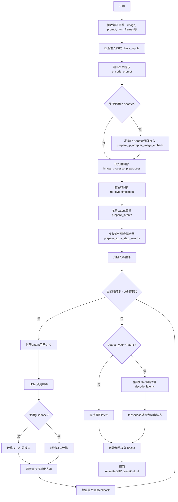
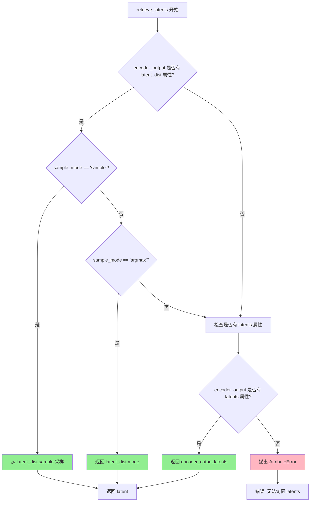
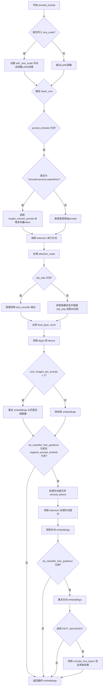
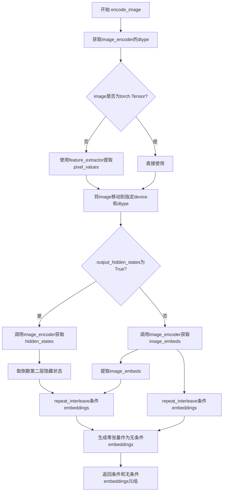
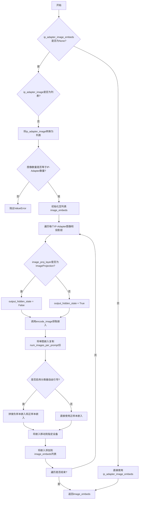
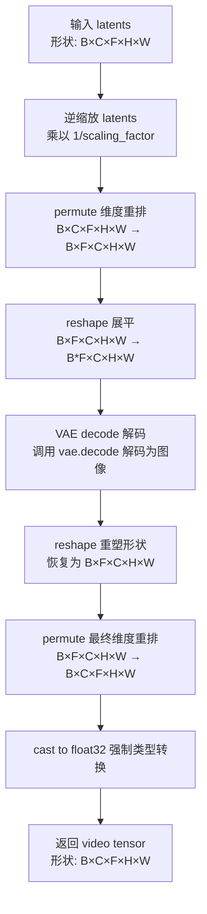
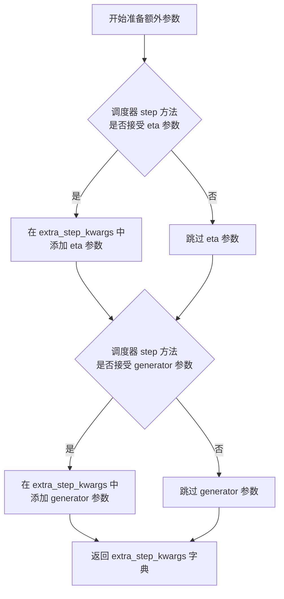
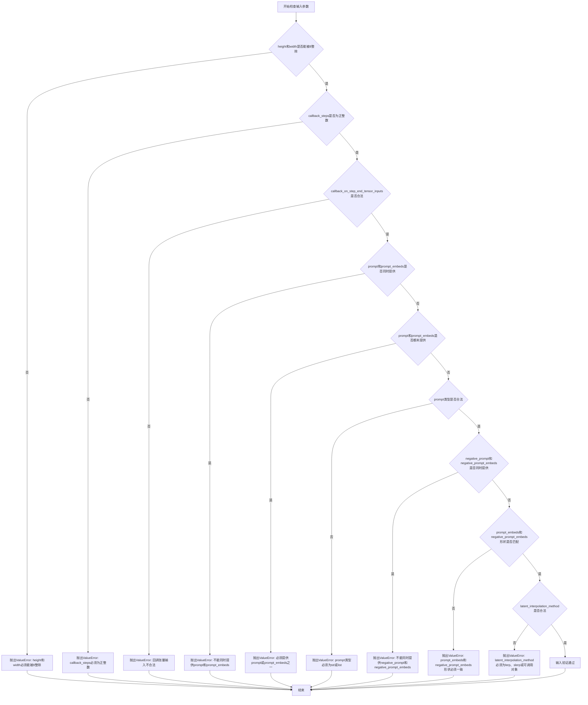
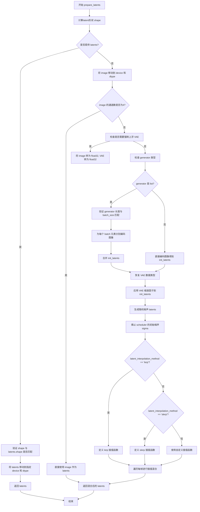
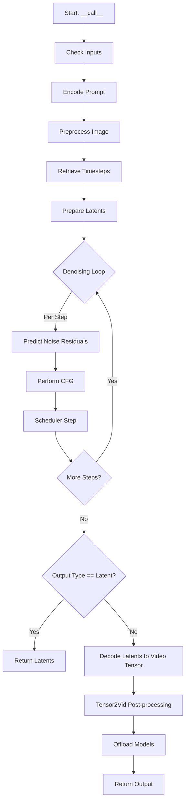

# `diffusers\examples\community\pipeline_animatediff_img2video.py` 详细设计文档

这是一个基于AnimateDiff技术的图像到视频生成Pipeline，通过接收输入图像和文本提示，利用VAE、文本编码器、UNet2DConditionModel和MotionAdapter等组件，结合噪声调度器和Latent插值方法（lerp/slerp），在去噪循环中逐步生成视频帧，最终输出符合条件的视频。

## 整体流程



## 类结构

```
DiffusionPipeline (抽象基类)
├── StableDiffusionMixin
├── TextualInversionLoaderMixin
├── IPAdapterMixin
├── StableDiffusionLoraLoaderMixin
└── AnimateDiffImgToVideoPipeline (主实现类)
```

## 全局变量及字段


### `logger`
    
模块级日志记录器，用于记录管道运行时的日志信息

类型：`logging.Logger`
    


### `EXAMPLE_DOC_STRING`
    
使用示例文档字符串，包含图像到视频生成的代码示例

类型：`str`
    


### `lerp`
    
线性插值函数，用于在两个张量之间进行线性插值

类型：`function`
    


### `slerp`
    
球面线性插值函数，用于在两个张量之间进行球面线性插值

类型：`function`
    


### `tensor2vid`
    
将张量转换为视频的函数，处理视频帧的排列和后处理

类型：`function`
    


### `retrieve_latents`
    
从编码器输出中检索潜在向量的辅助函数

类型：`function`
    


### `retrieve_timesteps`
    
从调度器检索时间步的辅助函数，支持自定义时间步

类型：`function`
    


### `AnimateDiffImgToVideoPipeline.vae`
    
变分自编码器模型，用于图像与潜在空间之间的编码和解码

类型：`AutoencoderKL`
    


### `AnimateDiffImgToVideoPipeline.text_encoder`
    
冻结的文本编码器，用于将文本提示转换为文本嵌入向量

类型：`CLIPTextModel`
    


### `AnimateDiffImgToVideoPipeline.tokenizer`
    
CLIP文本分词器，用于将文本分割为token序列

类型：`CLIPTokenizer`
    


### `AnimateDiffImgToVideoPipeline.unet`
    
结合运动适配器的去噪UNet模型，用于预测噪声残差

类型：`UNetMotionModel`
    


### `AnimateDiffImgToVideoPipeline.motion_adapter`
    
运动适配器模块，为UNet添加时间维度的运动建模能力

类型：`MotionAdapter`
    


### `AnimateDiffImgToVideoPipeline.scheduler`
    
噪声调度器，用于控制去噪过程中的噪声调度策略

类型：`SchedulerMixin`
    


### `AnimateDiffImgToVideoPipeline.feature_extractor`
    
CLIP图像特征提取器，用于从图像中提取特征（可选组件）

类型：`CLIPImageProcessor`
    


### `AnimateDiffImgToVideoPipeline.image_encoder`
    
CLIP图像编码器，用于生成图像嵌入向量（可选组件，支持IP-Adapter）

类型：`CLIPVisionModelWithProjection`
    


### `AnimateDiffImgToVideoPipeline.vae_scale_factor`
    
VAE缩放因子，用于计算潜在空间的尺寸

类型：`int`
    


### `AnimateDiffImgToVideoPipeline.image_processor`
    
VAE图像处理器，用于图像的预处理和后处理

类型：`VaeImageProcessor`
    


### `AnimateDiffImgToVideoPipeline.model_cpu_offload_seq`
    
类属性，定义模型组件的CPU卸载顺序

类型：`str`
    


### `AnimateDiffImgToVideoPipeline._optional_components`
    
类属性，列出可选的组件名称列表

类型：`List[str]`
    
    

## 全局函数及方法


### `lerp`

线性插值函数，用于在 Latent 空间中对两个张量进行线性插值，支持标量和张量形式的插值因子，并确保输出张量保持在输入设备上。

参数：

- `v0`：`torch.Tensor`，第一个张量（起始点）
- `v1`：`torch.Tensor`，第二个张量（结束点）
- `t`：`float` 或 `torch.Tensor`，插值因子，范围通常在 [0, 1] 之间，其中 0 返回 v0，1 返回 v1

返回值：`torch.Tensor`，插值后的张量，形状与输入张量相同，设备与 v0 相同

#### 流程图

```mermaid
flowchart TD
    A[开始 lerp] --> B[记录输入设备 device]
    B --> C[将 v0, v1 转为 NumPy]
    C --> D{判断 t 是否为张量?}
    D -->|是| E[将 t 转为 NumPy]
    D -->|否| F[标记 t_is_float=True, 将 t 包装为 NumPy 数组]
    E --> G[扩展 t 的维度以支持广播]
    F --> G
    G --> H[扩展 v0, v1 的维度以支持广播]
    H --> I[计算插值结果: v2 = (1-t)*v0 + t*v1]
    I --> J{t_is_float 为真且 v0 维度大于 1?}
    J -->|是| K[压缩 v2 的批次维度]
    J -->|否| L[将 v2 转回 torch.Tensor]
    K --> L
    L --> M[将结果移到原始设备]
    M --> N[返回插值结果]
```

#### 带注释源码

```python
def lerp(
    v0: torch.Tensor,
    v1: torch.Tensor,
    t: Union[float, torch.Tensor],
) -> torch.Tensor:
    r"""
    Linear Interpolation between two tensors.

    Args:
        v0 (`torch.Tensor`): First tensor.
        v1 (`torch.Tensor`): Second tensor.
        t: (`float` or `torch.Tensor`): Interpolation factor.
    """
    # 标记 t 是否为浮点数（标量），用于后续处理输出形状
    t_is_float = False
    # 记录输入张量所在的设备（CPU/CUDA），最后需要将结果移回该设备
    input_device = v0.device
    # 将 PyTorch 张量转换为 NumPy 数组以进行数值计算
    v0 = v0.cpu().numpy()
    v1 = v1.cpu().numpy()

    # 处理插值因子 t
    if isinstance(t, torch.Tensor):
        # 如果 t 是张量，也转换为 NumPy 数组
        t = t.cpu().numpy()
    else:
        # 如果 t 是标量，标记并包装为 NumPy 数组
        t_is_float = True
        t = np.array([t], dtype=v0.dtype)

    # 通过添加末尾维度扩展 t，以支持广播操作
    # 例如：t 从 shape (batch,) 变为 shape (batch, 1, 1, ...)
    t = t[..., None]
    # 在开头添加批次维度，以支持广播操作
    # 例如：v0 从 shape (C, H, W) 变为 shape (1, C, H, W)
    v0 = v0[None, ...]
    v1 = v1[None, ...]
    # 线性插值公式：v2 = (1 - t) * v0 + t * v1
    v2 = (1 - t) * v0 + t * v1

    # 如果输入 t 是标量且输入张量是多维的，确保输出维度正确
    if t_is_float and v0.ndim > 1:
        # 断言批次维度为 1
        assert v2.shape[0] == 1
        # 移除添加的批次维度
        v2 = np.squeeze(v2, axis=0)

    # 将结果从 NumPy 转换回 PyTorch 张量，并移回原始设备
    v2 = torch.from_numpy(v2).to(input_device)
    return v2
```


### slerp

球面线性插值函数，用于在Latent空间中对两个张量进行球面线性插值。当输入向量接近平行（点积绝对值超过阈值）时，自动切换到线性插值以避免数值不稳定。

参数：

-  `v0`：`torch.Tensor`，第一个输入张量
-  `v1`：`torch.Tensor`，第二个输入张量
-  `t`：`Union[float, torch.Tensor]`，插值因子，范围通常在[0, 1]之间
-  `DOT_THRESHOLD`：`float`，点积阈值，默认值为0.9995，当点积绝对值超过此阈值时使用线性插值

返回值：`torch.Tensor`，插值后的张量

#### 流程图

```mermaid
flowchart TD
    A[开始: slerp函数] --> B[保存输入设备并转为NumPy]
    B --> C{判断t是否为float}
    C -->|是| D[将t转换为NumPy数组]
    C -->|否| E[保持t为Tensor的NumPy形式]
    D --> F[计算点积: dot = sum(v0 * v1) / (norm(v0) * norm(v1))]
    E --> F
    F --> G{判断: |dot| > DOT_THRESHOLD?}
    G -->|是| H[调用lerp函数进行线性插值]
    G -->|否| I[计算theta_0 = arccos(dot)]
    I --> J[计算sin_theta_0, theta_t, sin_theta_t]
    J --> K[计算权重系数: s0, s1]
    K --> L[计算球面插值结果: v2 = s0 * v0 + s1 * v1]
    H --> M{判断: t_is_float且v0维度>1?}
    L --> M
    M -->|是| N[压缩结果维度]
    M -->|否| O[返回原始形状结果]
    N --> P[转为Tensor并移回原设备]
    O --> P
    P --> Q[返回插值结果]
```

#### 带注释源码

```python
def slerp(
    v0: torch.Tensor,
    v1: torch.Tensor,
    t: Union[float, torch.Tensor],
    DOT_THRESHOLD: float = 0.9995,
) -> torch.Tensor:
    r"""
    Spherical Linear Interpolation between two tensors.

    Args:
        v0 (`torch.Tensor`): First tensor.
        v1 (`torch.Tensor`): Second tensor.
        t: (`float` or `torch.Tensor`): Interpolation factor.
        DOT_THRESHOLD (`float`):
            Dot product threshold exceeding which linear interpolation will be used
            because input tensors are close to parallel.
    """
    # 标记t是否为浮点数，以便后续处理返回值的形状
    t_is_float = False
    # 保存原始输入设备，以便最后将结果转回该设备
    input_device = v0.device
    
    # 将PyTorch张量转换为NumPy数组进行计算
    v0 = v0.cpu().numpy()
    v1 = v1.cpu().numpy()

    # 处理插值因子t
    if isinstance(t, torch.Tensor):
        t = t.cpu().numpy()
    else:
        t_is_float = True
        t = np.array([t], dtype=v0.dtype)

    # 调整张量维度以便进行广播计算
    t = t[..., None]        # 在最后添加一个维度
    v0 = v0[None, ...]      # 在开头添加一个维度
    v1 = v1[None, ...]      # 在开头添加一个维度

    # 计算两个向量的点积（归一化后）
    dot = np.sum(v0 * v1 / (np.linalg.norm(v0) * np.linalg.norm(v1)))

    # 判断是否需要使用线性插值（当向量接近平行时）
    if np.abs(dot) > DOT_THRESHOLD:
        # v0和v1接近平行，使用线性插值
        v2 = lerp(v0, v1, t)
    else:
        # 使用球面线性插值（slerp）
        # 计算初始角度theta_0
        theta_0 = np.arccos(dot)
        sin_theta_0 = np.sin(theta_0)
        
        # 计算当前角度theta_t
        theta_t = theta_0 * t
        sin_theta_t = np.sin(theta_t)
        
        # 计算球面插值的权重系数
        # s0 = sin(theta_0 - theta_t) / sin(theta_0)
        # s1 = sin(theta_t) / sin(theta_0)
        s0 = np.sin(theta_0 - theta_t) / sin_theta_0
        s1 = sin_theta_t / sin_theta_0
        
        # 调整权重维度以便广播
        s0 = s0[..., None]
        s1 = s1[..., None]
        
        # 计算最终的球面插值结果
        v2 = s0 * v0 + s1 * v1

    # 如果输入是浮点数且原张量维度大于1，则压缩结果维度
    if t_is_float and v0.ndim > 1:
        assert v2.shape[0] == 1
        v2 = np.squeeze(v2, axis=0)

    # 将结果转换回PyTorch张量并移回原始设备
    v2 = torch.from_numpy(v2).to(input_device)
    return v2
```


### `tensor2vid`

该函数用于将视频tensor转换为多种视频输出格式（如NumPy数组、PyTorch张量或PIL图像），支持批量处理并根据指定的输出类型返回相应的数据格式。

参数：

- `video`：`torch.Tensor`，输入的视频tensor，形状为 (batch_size, channels, num_frames, height, width)
- `processor`：图像处理器，用于将视频tensor后处理为指定格式
- `output_type`：`str`，输出类型，可选值为 "np"（NumPy数组）、"pt"（PyTorch张量）或 "pil"（PIL图像列表），默认为 "np"

返回值：`Union[np.ndarray, torch.Tensor, List[PIL.Image]]`，根据 output_type 返回对应的视频格式

#### 流程图

```mermaid
flowchart TD
    A[开始: 输入 video tensor, processor, output_type] --> B[获取 video 形状: batch_size, channels, num_frames, height, width]
    B --> C[初始化空列表 outputs]
    C --> D[遍历 batch_idx 从 0 到 batch_size-1]
    D --> E[提取单个视频: video[batch_idx]]
    E --> F[维度重排: permute(1, 0, 2, 3) 变为 (num_frames, channels, height, width)]
    F --> G[调用 processor.postprocess 进行后处理]
    G --> H[将处理结果添加到 outputs 列表]
    H --> I{batch_idx 是否遍历完成?}
    I -- 否 --> D
    I -- 是 --> J{output_type == 'np'?}
    J -- 是 --> K[使用 np.stack 堆叠 outputs]
    J -- 否 --> L{output_type == 'pt'?}
    L -- 是 --> M[使用 torch.stack 堆叠 outputs]
    L -- 否 --> N{output_type == 'pil'?}
    N -- 否 --> O[抛出 ValueError 异常]
    N -- 是 --> P[直接返回 outputs 列表]
    K --> Q[返回最终结果]
    M --> Q
    O --> Q
    P --> Q
```

#### 带注释源码

```python
# Copied from diffusers.pipelines.animatediff.pipeline_animatediff.tensor2vid
def tensor2vid(video: torch.Tensor, processor, output_type="np"):
    """
    将视频tensor转换为视频输出格式
    
    Args:
        video (torch.Tensor): 输入视频tensor，形状为 (batch_size, channels, num_frames, height, width)
        processor: 图像处理器，用于将tensor后处理为指定格式
        output_type (str): 输出类型，可选 "np", "pt", "pil"，默认为 "np"
    
    Returns:
        根据 output_type 返回 np.ndarray, torch.Tensor, 或 List[PIL.Image]
    """
    # 解包视频tensor的形状信息
    batch_size, channels, num_frames, height, width = video.shape
    
    # 初始化输出列表，用于存储每个batch的处理结果
    outputs = []
    
    # 遍历每个batch
    for batch_idx in range(batch_size):
        # 提取当前batch的视频数据
        batch_vid = video[batch_idx].permute(1, 0, 2, 3)
        # 维度重排: 从 (channels, num_frames, height, width) 变为 (num_frames, channels, height, width)
        
        # 调用处理器的后处理方法将tensor转换为指定格式
        batch_output = processor.postprocess(batch_vid, output_type)
        
        # 将当前batch的输出添加到结果列表
        outputs.append(batch_output)

    # 根据输出类型进行相应的堆叠操作
    if output_type == "np":
        # 如果输出类型为NumPy数组，使用np.stack堆叠
        outputs = np.stack(outputs)

    elif output_type == "pt":
        # 如果输出类型为PyTorch张量，使用torch.stack堆叠
        outputs = torch.stack(outputs)

    elif not output_type == "pil":
        # 如果不是PIL图像且不是上述两种合法类型，抛出异常
        raise ValueError(f"{output_type} does not exist. Please choose one of ['np', 'pt', 'pil']")
    
    # 返回最终处理后的视频输出
    return outputs
```


### `retrieve_latents`

从编码器输出中检索latent向量，根据采样模式从潜在分布中采样或直接返回预计算的latent。

参数：

- `encoder_output`：`torch.Tensor`，编码器输出对象，可能包含 `latent_dist` 或 `latents` 属性
- `generator`：`torch.Generator | None`，可选的随机生成器，用于控制采样过程中的随机性
- `sample_mode`：`str`，采样模式，默认为 "sample"，可选值为 "sample"（从分布采样）或 "argmax"（返回分布的众数）

返回值：`torch.Tensor`，检索到的latent向量

#### 流程图



#### 带注释源码

```python
# Copied from diffusers.pipelines.stable_diffusion.pipeline_stable_diffusion.retrieve_latents
def retrieve_latents(
    encoder_output: torch.Tensor, generator: torch.Generator | None = None, sample_mode: str = "sample"
):
    """
    从encoder输出中检索latent向量。
    
    该函数支持多种获取latent的方式：
    1. 从VAE的latent分布中采样（随机）
    2. 从VAE的latent分布中取众数（确定性）
    3. 直接返回预计算的latent
    
    Args:
        encoder_output: 编码器输出，通常来自VAE的encode方法
        generator: 可选的随机生成器，用于采样时的随机性控制
        sample_mode: 采样模式，'sample'表示随机采样，'argmax'表示取众数
    
    Returns:
        检索到的latent张量
    """
    # 检查encoder_output是否有latent_dist属性，并且请求的采样模式为'sample'
    if hasattr(encoder_output, "latent_dist") and sample_mode == "sample":
        # 从潜在分布中随机采样，这是VAE的标准采样方式
        return encoder_output.latent_dist.sample(generator)
    # 检查encoder_output是否有latent_dist属性，并且请求的采样模式为'argmax'
    elif hasattr(encoder_output, "latent_dist") and sample_mode == "argmax":
        # 返回潜在分布的众数，这是一种确定性采样方式
        return encoder_output.latent_dist.mode()
    # 检查encoder_output是否直接有latents属性（某些模型的输出格式）
    elif hasattr(encoder_output, "latents"):
        return encoder_output.latents
    # 如果以上都不满足，抛出属性错误
    else:
        raise AttributeError("Could not access latents of provided encoder_output")
```


### `retrieve_timesteps`

该函数是图像转视频（Image-to-Video）扩散管道的辅助函数，用于从调度器获取时间步。它支持自定义时间步列表或通过推理步数自动生成时间步，并返回时间步张量和实际推理步数。

参数：

- `scheduler`：`SchedulerMixin`，要获取时间步的调度器对象
- `num_inference_steps`：`Optional[int]`，生成样本时使用的扩散步数，若使用此参数则`timesteps`必须为`None`
- `device`：`Optional[Union[str, torch.device]]`，时间步要移动到的设备，若为`None`则不移动
- `timesteps`：`Optional[List[int]]`，自定义时间步列表，用于支持任意间隔的时间步，若为`None`则使用调度器的默认策略
- `**kwargs`：任意关键字参数，将传递给调度器的`set_timesteps`方法

返回值：`Tuple[torch.Tensor, int]`，第一个元素是调度器的时间步张量，第二个元素是推理步数

#### 流程图

```mermaid
flowchart TD
    A[开始: retrieve_timesteps] --> B{是否提供 timesteps?}
    B -- 是 --> C[检查调度器是否支持自定义时间步]
    C --> D{调度器支持 timesteps?}
    D -- 否 --> E[抛出 ValueError 异常]
    D -- 是 --> F[调用 scheduler.set_timesteps<br/>传入 timesteps, device, **kwargs]
    F --> G[从调度器获取 timesteps]
    G --> H[计算 num_inference_steps = len(timesteps)]
    H --> K[返回 timesteps, num_inference_steps]
    B -- 否 --> I[调用 scheduler.set_timesteps<br/>传入 num_inference_steps, device, **kwargs]
    I --> J[从调度器获取 timesteps]
    J --> K
```

#### 带注释源码

```python
def retrieve_timesteps(
    scheduler,
    num_inference_steps: Optional[int] = None,
    device: Optional[Union[str, torch.device]] = None,
    timesteps: Optional[List[int]] = None,
    **kwargs,
):
    """
    Calls the scheduler's `set_timesteps` method and retrieves timesteps from the scheduler after the call. Handles
    custom timesteps. Any kwargs will be supplied to `scheduler.set_timesteps`.

    Args:
        scheduler (`SchedulerMixin`):
            The scheduler to get timesteps from.
        num_inference_steps (`int`):
            The number of diffusion steps used when generating samples with a pre-trained model. If used,
            `timesteps` must be `None`.
        device (`str` or `torch.device`, *optional*):
            The device to which the timesteps should be moved to. If `None`, the timesteps are not moved.
        timesteps (`List[int]`, *optional*):
                Custom timesteps used to support arbitrary spacing between timesteps. If `None`, then the default
                timestep spacing strategy of the scheduler is used. If `timesteps` is passed, `num_inference_steps`
                must be `None`.

    Returns:
        `Tuple[torch.Tensor, int]`: A tuple where the first element is the timestep schedule from the scheduler and the
        second element is the number of inference steps.
    """
    # 如果提供了自定义时间步
    if timesteps is not None:
        # 检查调度器的 set_timesteps 方法是否支持 timesteps 参数
        accepts_timesteps = "timesteps" in set(inspect.signature(scheduler.set_timesteps).parameters.keys())
        if not accepts_timesteps:
            raise ValueError(
                f"The current scheduler class {scheduler.__class__}'s `set_timesteps` does not support custom"
                f" timestep schedules. Please check whether you are using the correct scheduler."
            )
        # 使用自定义时间步设置调度器
        scheduler.set_timesteps(timesteps=timesteps, device=device, **kwargs)
        # 从调度器获取设置后的时间步
        timesteps = scheduler.timesteps
        # 计算实际推理步数
        num_inference_steps = len(timesteps)
    else:
        # 使用推理步数设置调度器（默认行为）
        scheduler.set_timesteps(num_inference_steps, device=device, **kwargs)
        # 从调度器获取设置后的时间步
        timesteps = scheduler.timesteps
    # 返回时间步张量和推理步数
    return timesteps, num_inference_steps
```


### AnimateDiffImgToVideoPipeline.__init__

初始化 AnimateDiffImgToVideoPipeline 管道，注册所有模型组件（VAE、文本编码器、分词器、UNet、motion adapter、调度器等），并将标准的 UNet2DConditionModel 与 MotionAdapter 结合创建 UNetMotionModel，同时初始化 VAE 缩放因子和图像处理器，为图像到视频生成任务做好准备工作。

参数：

- `vae`：`AutoencoderKL`，用于将图像编码和解码到潜在表示的变分自编码器模型
- `text_encoder`：`CLIPTextModel`，冻结的文本编码器（clip-vit-large-patch14）
- `tokenizer`：`CLIPTokenizer`，用于对文本进行分词的 CLIP 分词器
- `unet`：`UNet2DConditionModel`，用于去噪编码视频潜在变量的 UNet 条件模型
- `motion_adapter`：`MotionAdapter`，与 unet 结合用于去噪编码视频潜在变量的运动适配器
- `scheduler`：调度器，用于与 unet 结合去噪编码图像潜在变量，可为 DDIMScheduler、PNDMScheduler、LMSDiscreteScheduler、EulerDiscreteScheduler、EulerAncestralDiscreteScheduler 或 DPMSolverMultistepScheduler 之一
- `feature_extractor`：`CLIPImageProcessor`（可选），用于提取图像特征的处理器
- `image_encoder`：`CLIPVisionModelWithProjection`（可选），用于编码图像的视觉模型

返回值：无（`None`），构造函数不返回值，仅初始化实例属性

#### 流程图

```mermaid
flowchart TD
    A[开始 __init__] --> B[调用 super().__init__]
    B --> C[使用 UNetMotionModel.from_unet2d 包装 unet 和 motion_adapter]
    C --> D[调用 self.register_modules 注册所有模型组件]
    D --> E[计算 vae_scale_factor: 2^(len(vae.config.block_out_channels) - 1)]
    E --> F[创建 VaeImageProcessor 并赋值给 self.image_processor]
    F --> G[结束 __init__]
```

#### 带注释源码

```python
def __init__(
    self,
    vae: AutoencoderKL,
    text_encoder: CLIPTextModel,
    tokenizer: CLIPTokenizer,
    unet: UNet2DConditionModel,
    motion_adapter: MotionAdapter,
    scheduler: Union[
        DDIMScheduler,
        PNDMScheduler,
        LMSDiscreteScheduler,
        EulerDiscreteScheduler,
        EulerAncestralDiscreteScheduler,
        DPMSolverMultistepScheduler,
    ],
    feature_extractor: CLIPImageProcessor = None,
    image_encoder: CLIPVisionModelWithProjection = None,
):
    """
    初始化 AnimateDiffImgToVideoPipeline 管道
    
    参数:
        vae: Variational Auto-Encoder (VAE) Model to encode and decode images
        text_encoder: Frozen text-encoder (clip-vit-large-patch14)
        tokenizer: CLIPTokenizer to tokenize text
        unet: UNet2DConditionModel used to create a UNetMotionModel
        motion_adapter: MotionAdapter to be used with unet
        scheduler: Scheduler for denoising encoded video latents
        feature_extractor: Optional CLIPImageProcessor for feature extraction
        image_encoder: Optional CLIPVisionModelWithProjection for image encoding
    """
    # 调用父类 DiffusionPipeline 的初始化方法
    # 设置基本的管道配置和设备管理
    super().__init__()
    
    # 将标准的 UNet2DConditionModel 与 MotionAdapter 结合
    # 创建支持动画生成的 UNetMotionModel
    # 这是 AnimateDiff 视频生成的核心组件
    unet = UNetMotionModel.from_unet2d(unet, motion_adapter)

    # 注册所有模型组件到管道中
    # 使得这些组件可以通过 self.xxx 访问
    # 并支持模型的保存和加载功能
    self.register_modules(
        vae=vae,
        text_encoder=text_encoder,
        tokenizer=tokenizer,
        unet=unet,
        motion_adapter=motion_adapter,
        scheduler=scheduler,
        feature_extractor=feature_extractor,
        image_encoder=image_encoder,
    )
    
    # 计算 VAE 缩放因子
    # 基于 VAE 配置中的 block_out_channels 数量
    # 用于在潜在空间和像素空间之间进行转换
    # 默认值为 8 (2^(3-1) = 4, 但代码中有 fallback)
    self.vae_scale_factor = 2 ** (len(self.vae.config.block_out_channels) - 1) if getattr(self, "vae", None) else 8
    
    # 创建图像处理器，用于预处理输入图像和后处理输出图像
    # 根据 vae_scale_factor 进行适当的图像缩放
    self.image_processor = VaeImageProcessor(vae_scale_factor=self.vae_scale_factor)
```


### `AnimateDiffImgToVideoPipeline.encode_prompt`

该方法负责将文本提示（prompt）编码为文本编码器的隐藏状态（embedding），支持文本反转（Textual Inversion）、LoRA权重加载和无分类器自由引导（Classifier-Free Guidance），是图像到视频生成流程中的关键步骤，用于生成与文本提示相关的条件嵌入。

参数：

- `self`：`AnimateDiffImgToVideoPipeline`，管道实例本身
- `prompt`：`str` 或 `List[str]`，要编码的文本提示，可以是单个字符串或字符串列表
- `device`：`torch.device`，torch设备，用于将张量移动到指定设备
- `num_images_per_prompt`：`int`，每个提示生成的图像数量，用于批量生成时复制embeddings
- `do_classifier_free_guidance`：`bool`，是否使用无分类器自由引导，若为True则需要生成负向embeddings
- `negative_prompt`：`str` 或 `List[str]`，可选，用于指导不包含在图像生成中的提示
- `prompt_embeds`：`Optional[torch.Tensor]`，可选，预生成的文本嵌入，若提供则直接从该参数计算
- `negative_prompt_embeds`：`Optional[torch.Tensor]`，可选，预生成的负向文本嵌入
- `lora_scale`：`Optional[float]`，可选，LoRA缩放因子，用于调整LoRA层的权重
- `clip_skip`：`Optional[int]`，可选，从CLIP倒数第二层获取embedding的层数跳过设置

返回值：`Tuple[torch.Tensor, torch.Tensor]`，返回一个元组，第一个元素是编码后的提示embeddings，第二个元素是编码后的负向提示embeddings（若未生成则为None）

#### 流程图



#### 带注释源码

```python
def encode_prompt(
    self,
    prompt,
    device,
    num_images_per_prompt,
    do_classifier_free_guidance,
    negative_prompt=None,
    prompt_embeds: Optional[torch.Tensor] = None,
    negative_prompt_embeds: Optional[torch.Tensor] = None,
    lora_scale: Optional[float] = None,
    clip_skip: Optional[int] = None,
):
    r"""
    Encodes the prompt into text encoder hidden states.

    Args:
        prompt (`str` or `List[str]`, *optional*):
            prompt to be encoded
        device: (`torch.device`):
            torch device
        num_images_per_prompt (`int`):
            number of images that should be generated per prompt
        do_classifier_free_guidance (`bool`):
            whether to use classifier free guidance or not
        negative_prompt (`str` or `List[str]`, *optional*):
            The prompt or prompts not to guide the image generation. If not defined, one has to pass
            `negative_prompt_embeds` instead. Ignored when not using guidance (i.e., ignored if `guidance_scale` is
            less than `1`).
        prompt_embeds (`torch.Tensor`, *optional*):
            Pre-generated text embeddings. Can be used to easily tweak text inputs, *e.g.* prompt weighting. If not
            provided, text embeddings will be generated from `prompt` input argument.
        negative_prompt_embeds (`torch.Tensor`, *optional*):
            Pre-generated negative text embeddings. Can be used to easily tweak text inputs, *e.g.* prompt
            weighting. If not provided, negative_prompt_embeds will be generated from `negative_prompt` input
            argument.
        lora_scale (`float`, *optional*):
            A LoRA scale that will be applied to all LoRA layers of the text encoder if LoRA layers are loaded.
        clip_skip (`int`, *optional*):
            Number of layers to be skipped from CLIP while computing the prompt embeddings. A value of 1 means that
            the output of the pre-final layer will be used for computing the prompt embeddings.
    """
    # 设置 lora scale 以便 text encoder 的 monkey patched LoRA 函数可以正确访问
    if lora_scale is not None and isinstance(self, StableDiffusionLoraLoaderMixin):
        self._lora_scale = lora_scale

        # 动态调整 LoRA scale
        if not USE_PEFT_BACKEND:
            adjust_lora_scale_text_encoder(self.text_encoder, lora_scale)
        else:
            scale_lora_layers(self.text_encoder, lora_scale)

    # 根据传入的 prompt 或 prompt_embeds 确定批量大小
    if prompt is not None and isinstance(prompt, str):
        batch_size = 1
    elif prompt is not None and isinstance(prompt, list):
        batch_size = len(prompt)
    else:
        batch_size = prompt_embeds.shape[0]

    # 如果没有提供 prompt_embeds，则从 prompt 生成
    if prompt_embeds is None:
        # 文本反转：必要时处理多向量 tokens
        if isinstance(self, TextualInversionLoaderMixin):
            prompt = self.maybe_convert_prompt(prompt, self.tokenizer)

        # 使用 tokenizer 将文本转换为 token IDs
        text_inputs = self.tokenizer(
            prompt,
            padding="max_length",
            max_length=self.tokenizer.model_max_length,
            truncation=True,
            return_tensors="pt",
        )
        text_input_ids = text_inputs.input_ids
        # 获取未截断的 token IDs 用于检查是否被截断
        untruncated_ids = self.tokenizer(prompt, padding="longest", return_tensors="pt").input_ids

        # 检查是否发生了截断，并记录警告信息
        if untruncated_ids.shape[-1] >= text_input_ids.shape[-1] and not torch.equal(
            text_input_ids, untruncated_ids
        ):
            removed_text = self.tokenizer.batch_decode(
                untruncated_ids[:, self.tokenizer.model_max_length - 1 : -1]
            )
            logger.warning(
                "The following part of your input was truncated because CLIP can only handle sequences up to"
                f" {self.tokenizer.model_max_length} tokens: {removed_text}"
            )

        # 处理 attention mask
        if hasattr(self.text_encoder.config, "use_attention_mask") and self.text_encoder.config.use_attention_mask:
            attention_mask = text_inputs.attention_mask.to(device)
        else:
            attention_mask = None

        # 根据 clip_skip 参数决定如何获取 embeddings
        if clip_skip is None:
            # 直接获取 text_encoder 输出
            prompt_embeds = self.text_encoder(text_input_ids.to(device), attention_mask=attention_mask)
            prompt_embeds = prompt_embeds[0]
        else:
            # 获取所有隐藏状态，根据 clip_skip 选取对应层的输出
            prompt_embeds = self.text_encoder(
                text_input_ids.to(device), attention_mask=attention_mask, output_hidden_states=True
            )
            # 访问 hidden_states，这是一个包含所有编码器层隐藏状态的元组
            # 然后根据 clip_skip 选取对应层的隐藏状态
            prompt_embeds = prompt_embeds[-1][-(clip_skip + 1)]
            # 需要应用 final_layer_norm 以保持表示的一致性
            prompt_embeds = self.text_encoder.text_model.final_layer_norm(prompt_embeds)

    # 确定 prompt_embeds 的 dtype（优先使用 text_encoder 的 dtype）
    if self.text_encoder is not None:
        prompt_embeds_dtype = self.text_encoder.dtype
    elif self.unet is not None:
        prompt_embeds_dtype = self.unet.dtype
    else:
        prompt_embeds_dtype = prompt_embeds.dtype

    # 将 prompt_embeds 转换为适当的 dtype 和 device
    prompt_embeds = prompt_embeds.to(dtype=prompt_embeds_dtype, device=device)

    # 重复 embeddings 以匹配每个提示生成的图像数量
    bs_embed, seq_len, _ = prompt_embeds.shape
    prompt_embeds = prompt_embeds.repeat(1, num_images_per_prompt, 1)
    prompt_embeds = prompt_embeds.view(bs_embed * num_images_per_prompt, seq_len, -1)

    # 获取无分类器自由引导的 unconditional embeddings
    if do_classifier_free_guidance and negative_prompt_embeds is None:
        uncond_tokens: List[str]
        if negative_prompt is None:
            uncond_tokens = [""] * batch_size
        elif prompt is not None and type(prompt) is not type(negative_prompt):
            raise TypeError(
                f"`negative_prompt` should be the same type to `prompt`, but got {type(negative_prompt)} !="
                f" {type(prompt)}."
            )
        elif isinstance(negative_prompt, str):
            uncond_tokens = [negative_prompt]
        elif batch_size != len(negative_prompt):
            raise ValueError(
                f"`negative_prompt`: {negative_prompt} has batch size {len(negative_prompt)}, but `prompt`:"
                f" {prompt} has batch size {batch_size}. Please make sure that passed `negative_prompt` matches"
                " the batch size of `prompt`."
            )
        else:
            uncond_tokens = negative_prompt

        # 文本反转：必要时处理多向量 tokens
        if isinstance(self, TextualInversionLoaderMixin):
            uncond_tokens = self.maybe_convert_prompt(uncond_tokens, self.tokenizer)

        max_length = prompt_embeds.shape[1]
        uncond_input = self.tokenizer(
            uncond_tokens,
            padding="max_length",
            max_length=max_length,
            truncation=True,
            return_tensors="pt",
        )

        # 处理负向提示的 attention mask
        if hasattr(self.text_encoder.config, "use_attention_mask") and self.text_encoder.config.use_attention_mask:
            attention_mask = uncond_input.attention_mask.to(device)
        else:
            attention_mask = None

        # 获取负向 embeddings
        negative_prompt_embeds = self.text_encoder(
            uncond_input.input_ids.to(device),
            attention_mask=attention_mask,
        )
        negative_prompt_embeds = negative_prompt_embeds[0]

    # 如果使用无分类器自由引导，重复负向 embeddings
    if do_classifier_free_guidance:
        seq_len = negative_prompt_embeds.shape[1]

        negative_prompt_embeds = negative_prompt_embeds.to(dtype=prompt_embeds_dtype, device=device)

        negative_prompt_embeds = negative_prompt_embeds.repeat(1, num_images_per_prompt, 1)
        negative_prompt_embeds = negative_prompt_embeds.view(batch_size * num_images_per_prompt, seq_len, -1)

    # 如果使用 PEFT_BACKEND，通过 unscale 恢复 LoRA 层的原始缩放
    if isinstance(self, StableDiffusionLoraLoaderMixin) and USE_PEFT_BACKEND:
        # 通过取消缩放 LoRA 层来检索原始缩放
        unscale_lora_layers(self.text_encoder, lora_scale)

    return prompt_embeds, negative_prompt_embeds
```


### `AnimateDiffImgToVideoPipeline.encode_image`

该方法将输入图像编码为图像embedding或隐藏状态，用于后续的视频生成过程。它支持两种输出模式：当`output_hidden_states`为True时返回CLIP编码器的中间隐藏状态（用于IP-Adapter等高级功能），当为False时返回标准的image embeddings。同时会生成对应的无条件embeddings以支持classifier-free guidance。

参数：

- `image`：`PipelineImageInput`，输入的图像，可以是PIL.Image、numpy数组、torch.Tensor或列表形式
- `device`：`torch.device`，指定计算设备（CPU/CUDA）
- `num_images_per_prompt`：`int`，每个prompt生成的图像数量，用于批量生成时复制embeddings
- `output_hidden_states`：`bool`（可选），是否返回CLIP编码器的隐藏状态，默认为None（即False）

返回值：`Tuple[torch.Tensor, torch.Tensor]`，返回两个张量元组：
- 第一个是条件图像embeddings或隐藏状态
- 第二个是无条件图像embeddings或隐藏状态（用于classifier-free guidance）

#### 流程图



#### 带注释源码

```
def encode_image(self, image, device, num_images_per_prompt, output_hidden_states=None):
    """
    将输入图像编码为embedding向量，用于视频生成管线。
    
    参数:
        image: 输入图像，支持多种格式（PIL.Image, np.ndarray, torch.Tensor, list）
        device: 计算设备
        num_images_per_prompt: 每个prompt生成的视频数量
        output_hidden_states: 是否返回CLIP中间层隐藏状态（用于IP-Adapter）
    
    返回:
        (条件embedding, 无条件embedding) 元组
    """
    # 1. 获取image_encoder的参数dtype，确保输入数据类型一致
    dtype = next(self.image_encoder.parameters()).dtype

    # 2. 如果输入不是torch.Tensor，使用feature_extractor进行预处理
    #    将各种格式的图像转换为pixel_values张量
    if not isinstance(image, torch.Tensor):
        image = self.feature_extractor(image, return_tensors="pt").pixel_values

    # 3. 将图像移动到指定设备并转换为正确的dtype
    image = image.to(device=device, dtype=dtype)
    
    # 4. 根据output_hidden_states决定输出模式
    if output_hidden_states:
        # 模式A: 返回CLIP编码器的隐藏状态（用于IP-Adapter等高级控制）
        # 获取倒数第二层隐藏状态（通常效果较好）
        image_enc_hidden_states = self.image_encoder(image, output_hidden_states=True).hidden_states[-2]
        # 扩展维度以匹配num_images_per_prompt
        image_enc_hidden_states = image_enc_hidden_states.repeat_interleave(num_images_per_prompt, dim=0)
        
        # 生成零张量作为无条件隐藏状态（对应classifier-free guidance中的空白条件）
        uncond_image_enc_hidden_states = self.image_encoder(
            torch.zeros_like(image), output_hidden_states=True
        ).hidden_states[-2]
        uncond_image_enc_hidden_states = uncond_image_enc_hidden_states.repeat_interleave(
            num_images_per_prompt, dim=0
        )
        return image_enc_hidden_states, uncond_image_enc_hidden_states
    else:
        # 模式B: 返回标准的image_embeds（图像嵌入向量）
        image_embeds = self.image_encoder(image).image_embeds
        # 扩展维度以匹配num_images_per_prompt
        image_embeds = image_embeds.repeat_interleave(num_images_per_prompt, dim=0)
        # 生成零张量作为无条件embedding
        uncond_image_embeds = torch.zeros_like(image_embeds)

        return image_embeds, uncond_image_embeds
```


### `AnimateDiffImgToVideoPipeline.prepare_ip_adapter_image_embeds`

该方法用于准备IP-Adapter的图像嵌入，将输入的图像或预计算的图像嵌入转换为适合UNet模型使用的格式，支持分类器自由引导（Classifier-Free Guidance）。

参数：

- `ip_adapter_image`：`PipelineImageInput`，可选的IP-Adapter图像输入，用于生成图像嵌入
- `ip_adapter_image_embeds`：`Optional[PipelineImageInput]`，预生成的IP-Adapter图像嵌入列表，长度应与IP-Adapter数量相同
- `device`：`torch.device`，计算设备
- `num_images_per_prompt`：`int`，每个prompt生成的图像数量

返回值：`List[torch.Tensor]`，返回处理后的图像嵌入列表，每个元素对应一个IP-Adapter

#### 流程图



#### 带注释源码

```python
def prepare_ip_adapter_image_embeds(
    self, ip_adapter_image, ip_adapter_image_embeds, device, num_images_per_prompt
):
    """
    准备IP-Adapter图像嵌入。
    
    如果未提供预计算的嵌入，则对输入图像进行编码；
    如果提供了嵌入，则直接使用。
    支持分类器自由引导以提高生成质量。
    
    参数:
        ip_adapter_image: PipelineImageInput - IP-Adapter图像输入
        ip_adapter_image_embeds: Optional[PipelineImageInput] - 预计算的图像嵌入
        device: torch.device - 计算设备
        num_images_per_prompt: int - 每个prompt生成的图像数量
    
    返回:
        List[torch.Tensor]: 处理后的图像嵌入列表
    """
    # 如果没有预计算的嵌入，则需要从图像生成
    if ip_adapter_image_embeds is None:
        # 确保图像是列表格式，便于批量处理
        if not isinstance(ip_adapter_image, list):
            ip_adapter_image = [ip_adapter_image]

        # 验证图像数量与IP-Adapter数量是否匹配
        if len(ip_adapter_image) != len(self.unet.encoder_hid_proj.image_projection_layers):
            raise ValueError(
                f"`ip_adapter_image` must have same length as the number of IP Adapters. Got {len(ip_adapter_image)} images and {len(self.unet.encoder_hid_proj.image_projection_layers)} IP Adapters."
            )

        # 存储每个IP-Adapter的图像嵌入
        image_embeds = []
        
        # 遍历每个IP-Adapter的图像和对应的投影层
        for single_ip_adapter_image, image_proj_layer in zip(
            ip_adapter_image, self.unet.encoder_hid_proj.image_projection_layers
        ):
            # 判断是否需要输出隐藏状态（ImageProjection类型不需要）
            output_hidden_state = not isinstance(image_proj_layer, ImageProjection)
            
            # 编码单张图像，获取正负样本嵌入
            single_image_embeds, single_negative_image_embeds = self.encode_image(
                single_ip_adapter_image, device, 1, output_hidden_state
            )
            
            # 为每个prompt复制对应的嵌入数量
            single_image_embeds = torch.stack([single_image_embeds] * num_images_per_prompt, dim=0)
            single_negative_image_embeds = torch.stack(
                [single_negative_image_embeds] * num_images_per_prompt, dim=0
            )

            # 如果启用分类器自由引导，则拼接负样本和正样本
            if self.do_classifier_free_guidance:
                single_image_embeds = torch.cat([single_negative_image_embeds, single_image_embeds])
                single_image_embeds = single_image_embeds.to(device)

            # 将处理后的嵌入添加到列表
            image_embeds.append(single_image_embeds)
    else:
        # 如果已提供预计算的嵌入，直接使用
        image_embeds = ip_adapter_image_embeds
    
    return image_embeds
```


### `AnimateDiffImgToVideoPipeline.decode_latents`

该方法负责将VAE编码后的潜在表示（latents）解码为实际的视频tensor，通过逆缩放、维度重排、VAE解码和维度重塑等步骤，将潜在空间中的特征转换为可供可视化的视频帧序列。

参数：

- `self`：类的实例，隐含参数
- `latents`：`torch.Tensor`，输入的潜在表示张量，形状为 (batch_size, channels, num_frames, height, width)，来源于UNet去噪过程中的噪声预测输出

返回值：`torch.Tensor`，解码后的视频张量，形状为 (batch_size, channels, num_frames, height, width)

#### 流程图



#### 带注释源码

```python
def decode_latents(self, latents):
    # 步骤1: 逆缩放 - 将潜在表示从潜在空间缩放回原始空间
    # VAE在编码时会乘以scaling_factor，这里需要除以回来
    latents = 1 / self.vae.config.scaling_factor * latents

    # 步骤2: 获取输入张量的形状信息
    # batch_size: 批次大小
    # channels: 通道数（通常为4，对应VAE的潜在空间维度）
    # num_frames: 视频帧数
    # height/width: 潜在空间的高度和宽度
    batch_size, channels, num_frames, height, width = latents.shape
    
    # 步骤3: 维度重排和展平
    # permute(0, 2, 1, 3, 4): 将形状从 B×C×F×H×W 变为 B×F×C×H×W
    # 这样做是为了将帧维度前置，便于后续reshape成单帧序列
    # reshape: 将 B×F×C×H×W 展平为 (B*F)×C×H×W
    # 这是因为VAE的decode方法每次只能处理单帧图像
    latents = latents.permute(0, 2, 1, 3, 4).reshape(batch_size * num_frames, channels, height, width)

    # 步骤4: VAE解码
    # 调用VAE的decode方法将潜在表示解码为实际图像
    # 返回的image形状为 (B*F)×C×H×W
    image = self.vae.decode(latents).sample
    
    # 步骤5: 维度重塑 - 恢复视频结构
    # 先在第0维添加一个维度用于后续操作
    # reshape: 将 (B*F)×C×H×W 恢复为 B×F×C×H×W
    # 这里使用 -1 自动计算通道维度的大小
    video = (
        image[None, :]
        .reshape(
            (
                batch_size,
                num_frames,
                -1,
            )
            + image.shape[2:]  # 保留原始的空间维度 H×W
        )
        .permute(0, 2, 1, 3, 4)  # 最终重排为 B×C×F×H×W
    )
    
    # 步骤6: 类型转换
    # 始终转换为float32，因为：
    # 1. float32不会导致显著的额外开销
    # 2. float32与bfloat16兼容，避免精度问题
    video = video.float()
    
    # 返回解码后的视频张量
    return video
```


### `AnimateDiffImgToVideoPipeline.prepare_extra_step_kwargs`

准备调度器额外参数，用于处理不同调度器签名的差异性，确保 DDIMScheduler 所需的 eta 参数和 generator 参数能正确传递给调度器的 step 方法。

参数：

- `self`：`AnimateDiffImgToVideoPipeline` 实例，管道对象本身
- `generator`：`torch.Generator` 或 `List[torch.Generator]` 或 `None`，可选的随机数生成器，用于确保生成过程的可重复性
- `eta`：`float`，DDIM 论文中的 eta (η) 参数，仅被 DDIMScheduler 使用，其他调度器会忽略该参数，取值范围应为 [0, 1]

返回值：`Dict[str, Any]`，包含调度器 step 方法所需的额外关键字参数字典，可能包含 `eta` 和/或 `generator` 键

#### 流程图



#### 带注释源码

```python
def prepare_extra_step_kwargs(self, generator, eta):
    """
    准备调度器额外参数。

    由于不同调度器的 step 方法签名不同，此方法用于动态检测并添加
    调度器所需的额外参数。目前主要处理 DDIMScheduler 的 eta 参数
    和部分调度器的 generator 参数。

    参数:
        generator: 可选的 torch.Generator，用于生成确定性结果
        eta: float，对应 DDIM 论文中的 η 参数，范围 [0, 1]

    返回:
        Dict[str, Any]: 包含调度器额外参数的字典
    """
    # 使用 inspect 模块检查调度器 step 方法的签名参数
    # 动态判断当前调度器是否支持特定的参数
    accepts_eta = "eta" in set(inspect.signature(self.scheduler.step).parameters.keys())
    
    # 初始化额外参数字典
    extra_step_kwargs = {}
    
    # 如果调度器支持 eta 参数，则添加该参数
    # eta 仅在 DDIMScheduler 中使用，其他调度器会忽略此参数
    if accepts_eta:
        extra_step_kwargs["eta"] = eta

    # 检查调度器是否接受 generator 参数
    # 部分调度器（如 DDIMScheduler, DPMSolverMultistepScheduler）支持确定性生成
    accepts_generator = "generator" in set(inspect.signature(self.scheduler.step).parameters.keys())
    if accepts_generator:
        extra_step_kwargs["generator"] = generator
    
    # 返回构建好的参数字典，供 scheduler.step() 方法使用
    return extra_step_kwargs
```


### AnimateDiffImgToVideoPipeline.check_inputs

该方法负责验证图像转视频管道的输入参数有效性，确保传入的参数符合模型要求，包括图像尺寸、回调步骤、提示词和嵌入向量的合法性检查。

参数：

- `self`：隐式参数，指向类实例本身。
- `prompt`：`Union[str, List[str], None]`，用户提供的文本提示，用于指导视频生成。
- `height`：`int`，生成视频的高度（像素），必须能被8整除。
- `width`：`int`，生成视频的宽度（像素），必须能被8整除。
- `callback_steps`：`int`，回调函数被调用的频率步数，必须为正整数。
- `negative_prompt`：`Union[str, List[str], None]`，可选的反向提示词，用于指导不包含在生成视频中的内容。
- `prompt_embeds`：`Optional[torch.Tensor]`，预生成的文本嵌入向量，不能与prompt同时提供。
- `negative_prompt_embeds`：`Optional[torch.Tensor]`，预生成的负面文本嵌入向量，不能与negative_prompt同时提供。
- `callback_on_step_end_tensor_inputs`：`Optional[List[str]]`，可选的回调张量输入列表，必须属于预定义的回调张量集合。
- `latent_interpolation_method`：`Optional[Union[str, FunctionType]]`，潜在空间插值方法，可为"lerp"、"slerp"或自定义可调用对象。

返回值：`None`，该方法不返回任何值，仅通过抛出ValueError异常来处理无效输入。

#### 流程图



#### 带注释源码

```python
def check_inputs(
    self,
    prompt,                      # 文本提示，支持字符串或字符串列表
    height,                      # 输出视频高度，必须能被8整除
    width,                       # 输出视频宽度，必须能被8整除
    callback_steps,              # 回调函数调用频率，必须为正整数
    negative_prompt=None,        # 可选的负面提示词
    prompt_embeds=None,          # 可选的预生成文本嵌入
    negative_prompt_embeds=None, # 可选的预生成负面文本嵌入
    callback_on_step_end_tensor_inputs=None, # 可选的回调张量输入列表
    latent_interpolation_method=None, # 潜在空间插值方法
):
    # 检查图像尺寸是否满足VAE的缩放要求
    if height % 8 != 0 or width % 8 != 0:
        raise ValueError(f"`height` and `width` have to be divisible by 8 but are {height} and {width}.")

    # 验证回调步骤参数的有效性
    if callback_steps is not None and (not isinstance(callback_steps, int) or callback_steps <= 0):
        raise ValueError(
            f"`callback_steps` has to be a positive integer but is {callback_steps} of type"
            f" {type(callback_steps)}."
        )
    
    # 验证回调张量输入是否在允许的列表中
    if callback_on_step_end_tensor_inputs is not None and not all(
        k in self._callback_tensor_inputs for k in callback_on_step_end_tensor_inputs
    ):
        raise ValueError(
            f"`callback_on_step_end_tensor_inputs` has to be in {self._callback_tensor_inputs}, but found {[k for k in callback_on_step_end_tensor_inputs if k not in self._callback_tensor_inputs]}"
        )

    # 确保prompt和prompt_embeds不同时提供
    if prompt is not None and prompt_embeds is not None:
        raise ValueError(
            f"Cannot forward both `prompt`: {prompt} and `prompt_embeds`: {prompt_embeds}. Please make sure to"
            " only forward one of the two."
        )
    # 确保至少提供prompt或prompt_embeds之一
    elif prompt is None and prompt_embeds is None:
        raise ValueError(
            "Provide either `prompt` or `prompt_embeds`. Cannot leave both `prompt` and `prompt_embeds` undefined."
        )
    # 验证prompt的类型合法性
    elif prompt is not None and (not isinstance(prompt, str) and not isinstance(prompt, list)):
        raise ValueError(f"`prompt` has to be of type `str` or `list` but is {type(prompt)}")

    # 确保negative_prompt和negative_prompt_embeds不同时提供
    if negative_prompt is not None and negative_prompt_embeds is not None:
        raise ValueError(
            f"Cannot forward both `negative_prompt`: {negative_prompt} and `negative_prompt_embeds`:"
            f" {negative_prompt_embeds}. Please make sure to only forward one of the two."
        )

    # 验证prompt_embeds和negative_prompt_embeds形状一致性
    if prompt_embeds is not None and negative_prompt_embeds is not None:
        if prompt_embeds.shape != negative_prompt_embeds.shape:
            raise ValueError(
                "`prompt_embeds` and `negative_prompt_embeds` must have the same shape when passed directly, but"
                f" got: `prompt_embeds` {prompt_embeds.shape} != `negative_prompt_embeds`"
                f" {negative_prompt_embeds.shape}."
            )

    # 验证潜在空间插值方法的合法性
    if latent_interpolation_method is not None:
        if latent_interpolation_method not in ["lerp", "slerp"] and not isinstance(
            latent_interpolation_method, FunctionType
        ):
            raise ValueError(
                "`latent_interpolation_method` must be one of `lerp`, `slerp` or a Callable[[torch.Tensor, torch.Tensor, int], torch.Tensor]"
            )
```


### `AnimateDiffImgToVideoPipeline.prepare_latents`

该方法负责准备用于视频生成的初始Latent变量。它首先计算所需的latent形状，然后根据是否传入预生成的latents进行处理：当未提供latents时，方法会对输入图像进行VAE编码得到初始latent，并结合随机噪声通过lerp或slerp插值方法在帧间进行混合，最终返回包含多帧的latent张量。

参数：

- `self`：隐式参数，管道实例本身
- `image`：`PipelineImageInput`，输入图像，用于条件生成视频
- `strength`：`float`，控制原图与生成视频之间的差异程度，值越大差异越大
- `batch_size`：`int`，生成的视频批次大小
- `num_channels_latents`：`int`，latent通道数，通常由UNet配置决定
- `num_frames`：`int`，生成的视频帧数
- `height`：`int`，生成视频的高度（像素）
- `width`：`int`，生成视频的宽度（像素）
- `dtype`：`torch.dtype`，latent的数据类型
- `device`：`torch.device`，计算设备
- `generator`：`torch.Generator` 或 `List[torch.Generator]`，随机数生成器，用于确保可重复性
- `latents`：`torch.Tensor`，可选，预生成的噪声latent，若为None则自动生成
- `latent_interpolation_method`：`str` 或 `Callable`，latent插值方法，可选"lerp"（线性插值）、"slerp"（球面线性插值）或自定义函数

返回值：`torch.Tensor`，形状为 `(batch_size, num_channels_latents, num_frames, height//vae_scale_factor, width//vae_scale_factor)` 的5D张量，包含用于去噪的初始latent变量

#### 流程图



#### 带注释源码

```python
def prepare_latents(
    self,
    image,
    strength,
    batch_size,
    num_channels_latents,
    num_frames,
    height,
    width,
    dtype,
    device,
    generator,
    latents=None,
    latent_interpolation_method="slerp",
):
    """
    准备用于视频生成的初始 latent 变量。
    
    该方法的核心逻辑：
    1. 计算期望的 latent 形状
    2. 如果没有提供 latents，则：
       - 对输入图像进行 VAE 编码得到初始 latent
       - 生成随机噪声 latent
       - 使用 lerp/slerp 在帧间混合噪声 latent 和图像 latent
    3. 如果提供了 latents，则验证形状并返回
    
    参数:
        image: 输入图像
        strength: 混合强度，控制噪声和图像 latent 的比例
        batch_size: 批次大小
        num_channels_latents: latent 通道数
        num_frames: 视频帧数
        height: 视频高度
        width: 视频宽度
        dtype: 数据类型
        device: 计算设备
        generator: 随机数生成器
        latents: 可选的预生成 latents
        latent_interpolation_method: 插值方法，"lerp" 或 "slerp"
    
    返回:
        5D 张量 [B, C, F, H, W]，包含初始 latent 变量
    """
    # 计算期望的 latent 形状: [batch_size, channels, frames, height/vae_scale, width/vae_scale]
    shape = (
        batch_size,
        num_channels_latents,
        num_frames,
        height // self.vae_scale_factor,
        width // self.vae_scale_factor,
    )

    if latents is None:
        # 将图像移动到目标设备和数据类型
        image = image.to(device=device, dtype=dtype)

        # 如果图像已经是 4 通道 latent 格式，直接使用
        if image.shape[1] == 4:
            latents = image
        else:
            # 需要通过 VAE 编码图像得到 latent
            # 确保 VAE 使用 float32 模式，避免 float16 溢出
            if self.vae.config.force_upcast:
                image = image.float()
                self.vae.to(dtype=torch.float32)

            # 处理多个 generator 的情况（每个 batch 元素一个）
            if isinstance(generator, list):
                if len(generator) != batch_size:
                    raise ValueError(
                        f"You have passed a list of generators of length {len(generator)}, but requested an effective batch"
                        f" size of {batch_size}. Make sure the batch size matches the length of the generators."
                    )

                # 为每个图像分别编码，保持随机性
                init_latents = [
                    retrieve_latents(self.vae.encode(image[i : i + 1]), generator=generator[i])
                    for i in range(batch_size)
                ]
                # 合并结果: [B, C, H, W]
                init_latents = torch.cat(init_latents, dim=0)
            else:
                # 单一 generator，对整个图像编码
                init_latents = retrieve_latents(self.vae.encode(image), generator=generator)

            # 恢复 VAE 的原始数据类型
            if self.vae.config.force_upcast:
                self.vae.to(dtype)

            # 转换数据类型并应用 VAE 缩放因子
            init_latents = init_latents.to(dtype)
            init_latents = self.vae.config.scaling_factor * init_latents
            
            # 生成随机噪声 latent，使用 scheduler 的初始噪声 sigma
            latents = randn_tensor(shape, generator=generator, device=device, dtype=dtype)
            latents = latents * self.scheduler.init_noise_sigma

            # 根据插值方法选择对应的混合函数
            # lerp: 线性插值，slerp: 球面线性插值
            if latent_interpolation_method == "lerp":

                def latent_cls(v0, v1, index):
                    # 随着帧索引增加，图像 latent 的权重逐渐减小
                    # 权重 = (1 - index/num_frames) * (1 - strength)
                    return lerp(v0, v1, index / num_frames * (1 - strength))
            elif latent_interpolation_method == "slerp":

                def latent_cls(v0, v1, index):
                    return slerp(v0, v1, index / num_frames * (1 - strength))
            else:
                # 支持自定义插值函数
                latent_cls = latent_interpolation_method

            # 对每一帧进行插值混合
            # 初始帧更多使用图像 latent，后续帧逐渐过渡到纯噪声
            for i in range(num_frames):
                latents[:, :, i, :, :] = latent_cls(latents[:, :, i, :, :], init_latents, i)
    else:
        # 验证提供的 latents 形状是否正确
        if shape != latents.shape:
            # [B, C, F, H, W]
            raise ValueError(f"`latents` expected to have {shape=}, but found {latents.shape=}")
        latents = latents.to(device, dtype=dtype)

    return latents
```


### `AnimateDiffImgToVideoPipeline.__call__`

#### 描述
这是 AnimateDiff 图片转视频 Pipeline 的核心调用方法（主生成方法）。该方法接收一张输入图像（`image`）和文本提示（`prompt`），通过以下关键步骤生成视频：
1. **图像编码与潜在空间准备**：将输入图像编码为潜在向量，并根据 `strength`（强度）和 `latent_interpolation_method`（潜在空间插值方法，如 SLERP 或 LERP）将噪声潜在变量与图像潜在变量进行混合/插值，这是实现图像到视频动态效果的核心“技巧”。
2. **去噪循环**：使用 Motion-Adapter 增强的 UNet 模型和调度器（Scheduler）进行多步去噪。
3. **视频解码**：将去噪后的潜在变量解码为视频帧序列。
4. **后处理**：将张量转换为指定格式（PIL, Numpy 或 PyTorch）的帧并返回。

#### 参数

-  `image`：`PipelineImageInput`，输入的初始图像，用于生成视频的起始条件。
-  `prompt`：`Optional[Union[str, List[str]]]`，引导视频生成的文本提示词。
-  `height`：`Optional[int]`，生成视频的高度（像素），默认为 UNet 配置尺寸 * VAE 缩放因子。
-  `width`：`Optional[int]`，生成视频的宽度（像素），默认为 UNet 配置尺寸 * VAE 缩放因子。
-  `num_frames`：`int`，生成视频的帧数，默认为 16（2秒@8fps）。
-  `num_inference_steps`：`int`，去噪推理步数，步数越多视频质量越高，默认 50。
-  `timesteps`：`Optional[List[int]]`，自定义的时间步长列表。
-  `guidance_scale`：`float`，分类器自由引导（CFG）比例，>1 时启用引导，默认 7.5。
-  `strength`：`float`，图像到视频的变化强度（值越大变化越大），默认 0.8。
-  `negative_prompt`：`Optional[Union[str, List[str]]]`，反向提示词，用于引导视频不包含的内容。
-  `num_videos_per_prompt`：`Optional[int]`，每个提示词生成的视频数量（当前代码中硬编码为 1）。
-  `eta`：`float`，DDIM 调度器的 eta 参数，用于控制随机性。
-  `generator`：`Optional[Union[torch.Generator, List[torch.Generator]]]`，随机数生成器，用于确保结果可复现。
-  `latents`：`Optional[torch.Tensor]`，预先生成的噪声潜在变量，若未提供则自动生成。
-  `prompt_embeds`：`Optional[torch.Tensor]`，预生成的文本嵌入。
-  `negative_prompt_embeds`：`Optional[torch.Tensor]`，预生成的反向文本嵌入。
-  `ip_adapter_image`：`Optional[PipelineImageInput]`，用于 IP-Adapter 的输入图像。
-  `ip_adapter_image_embeds`：`Optional[PipelineImageInput]`，预生成的 IP-Adapter 图像嵌入。
-  `output_type`：`str`，输出格式，可选 "pil", "np", "pt", "latent"，默认 "pil"。
-  `return_dict`：`bool`，是否返回字典格式对象而非元组，默认 True。
-  `callback`：`Optional[Callable]`，每一步推理调用的回调函数。
-  `callback_steps`：`int`，回调函数被调用的频率。
-  `cross_attention_kwargs`：`Optional[Dict[str, Any]]`，传给注意力处理器的额外参数。
-  `clip_skip`：`Optional[int]`，CLIP 模型跳过的层数。
-  `latent_interpolation_method`：`Union[str, Callable]`，潜在空间插值方法，可选 "lerp" (线性) 或 "slerp" (球面线性)，默认为 "slerp"。

#### 返回值

-  `AnimateDiffPipelineOutput` 或 `tuple`，如果 `return_dict` 为 True，返回包含生成帧列表（`frames`）的 `AnimateDiffPipelineOutput` 对象；否则返回元组，第一个元素为视频帧列表。

#### 全局变量与函数说明

在 `__call__` 方法的运行过程中，依赖以下模块级全局函数进行数据处理：

-  `lerp(v0, v1, t)`：线性插值函数，用于在两个潜在向量间进行线性过渡。
-  `slerp(v0, v1, t)`：球面线性插值函数，通常用于在方向变化较大的潜在空间中提供更平滑的过渡。
-  `tensor2vid(video, processor, output_type)`：将模型输出的张量转换为可视化的视频帧格式。

#### 流程图



#### 带注释源码

```python
@torch.no_grad()
def __call__(
    self,
    image: PipelineImageInput,
    prompt: Optional[Union[str, List[str]]] = None,
    height: Optional[int] = None,
    width: Optional[int] = None,
    num_frames: int = 16,
    num_inference_steps: int = 50,
    timesteps: Optional[List[int]] = None,
    guidance_scale: float = 7.5,
    strength: float = 0.8,
    negative_prompt: Optional[Union[str, List[str]]] = None,
    num_videos_per_prompt: Optional[int] = 1,
    eta: float = 0.0,
    generator: Optional[Union[torch.Generator, List[torch.Generator]]] = None,
    latents: Optional[torch.Tensor] = None,
    prompt_embeds: Optional[torch.Tensor] = None,
    negative_prompt_embeds: Optional[torch.Tensor] = None,
    ip_adapter_image: Optional[PipelineImageInput] = None,
    ip_adapter_image_embeds: Optional[PipelineImageInput] = None,
    output_type: str | None = "pil",
    return_dict: bool = True,
    callback: Optional[Callable[[int, int, torch.Tensor], None]] = None,
    callback_steps: Optional[int] = 1,
    cross_attention_kwargs: Optional[Dict[str, Any]] = None,
    clip_skip: Optional[int] = None,
    latent_interpolation_method: Union[str, Callable[[torch.Tensor, torch.Tensor, int], torch.Tensor]] = "slerp",
):
    r"""
    ... (docstring omitted for brevity, see original code) ...
    """
    # 1. 默认高度和宽度设置为 UNet 的样本尺寸乘以 VAE 缩放因子
    height = height or self.unet.config.sample_size * self.vae_scale_factor
    width = width or self.unet.config.sample_size * self.vae_scale_factor

    # 注意：此处将 num_videos_per_prompt 硬编码为 1，忽略了传入的参数
    num_videos_per_prompt = 1

    # 2. 检查输入参数的有效性（尺寸、类型等）
    self.check_inputs(
        prompt=prompt,
        height=height,
        width=width,
        callback_steps=callback_steps,
        negative_prompt=negative_prompt,
        prompt_embeds=prompt_embeds,
        negative_prompt_embeds=negative_prompt_embeds,
        latent_interpolation_method=latent_interpolation_method,
    )

    # 3. 确定批次大小
    if prompt is not None and isinstance(prompt, str):
        batch_size = 1
    elif prompt is not None and isinstance(prompt, list):
        batch_size = len(prompt)
    else:
        batch_size = prompt_embeds.shape[0]

    device = self._execution_device

    # 4. 确定是否启用分类器自由引导 (CFG)
    do_classifier_free_guidance = guidance_scale > 1.0

    # 5. 编码输入的文本提示
    text_encoder_lora_scale = (
        cross_attention_kwargs.get("scale", None) if cross_attention_kwargs is not None else None
    )
    prompt_embeds, negative_prompt_embeds = self.encode_prompt(
        prompt,
        device,
        num_videos_per_prompt,
        do_classifier_free_guidance,
        negative_prompt,
        prompt_embeds=prompt_embeds,
        negative_prompt_embeds=negative_prompt_embeds,
        lora_scale=text_encoder_lora_scale,
        clip_skip=clip_skip,
    )

    # 6. 如果启用 CFG，将无条件嵌入和有条件嵌入连接起来，以一次性完成前向传播
    if do_classifier_free_guidance:
        prompt_embeds = torch.cat([negative_prompt_embeds, prompt_embeds])

    # 7. 处理 IP-Adapter 图像嵌入
    if ip_adapter_image is not None:
        image_embeds = self.prepare_ip_adapter_image_embeds(
            ip_adapter_image, ip_adapter_image_embeds, device, batch_size * num_videos_per_prompt
        )

    # 8. 预处理图像（调整大小、归一化）
    image = self.image_processor.preprocess(image, height=height, width=width)

    # 9. 从调度器获取时间步
    timesteps, num_inference_steps = retrieve_timesteps(self.scheduler, num_inference_steps, device, timesteps)

    # 10. 准备潜在变量 (核心逻辑：图像编码 + 噪声混合)
    num_channels_latents = self.unet.config.in_channels
    latents = self.prepare_latents(
        image=image,
        strength=strength,
        batch_size=batch_size * num_videos_per_prompt,
        num_channels_latents=num_channels_latents,
        num_frames=num_frames,
        height=height,
        width=width,
        dtype=prompt_embeds.dtype,
        device=device,
        generator=generator,
        latents=latents,
        latent_interpolation_method=latent_interpolation_method,
    )

    # 11. 准备额外的调度器参数
    extra_step_kwargs = self.prepare_extra_step_kwargs(generator, eta)

    # 12. 为 IP-Adapter 添加条件参数
    added_cond_kwargs = (
        {"image_embeds": image_embeds}
        if ip_adapter_image is not None or ip_adapter_image_embeds is not None
        else None
    )

    # 13. 去噪循环
    num_warmup_steps = len(timesteps) - num_inference_steps * self.scheduler.order
    with self.progress_bar(total=num_inference_steps) as progress_bar:
        for i, t in enumerate(timesteps):
            # 扩展潜在变量以进行 CFG
            latent_model_input = torch.cat([latents] * 2) if do_classifier_free_guidance else latents
            latent_model_input = self.scheduler.scale_model_input(latent_model_input, t)

            # 预测噪声残差
            noise_pred = self.unet(
                latent_model_input,
                t,
                encoder_hidden_states=prompt_embeds,
                cross_attention_kwargs=cross_attention_kwargs,
                added_cond_kwargs=added_cond_kwargs,
            ).sample

            # 执行引导
            if do_classifier_free_guidance:
                noise_pred_uncond, noise_pred_text = noise_pred.chunk(2)
                noise_pred = noise_pred_uncond + guidance_scale * (noise_pred_text - noise_pred_uncond)

            # 计算上一步的样本 x_t -> x_t-1
            latents = self.scheduler.step(noise_pred, t, latents, **extra_step_kwargs).prev_sample

            # 调用回调函数
            if i == len(timesteps) - 1 or ((i + 1) > num_warmup_steps and (i + 1) % self.scheduler.order == 0):
                progress_bar.update()
                if callback is not None and i % callback_steps == 0:
                    callback(i, t, latents)

    # 14. 如果输出类型是 latent，直接返回潜在变量
    if output_type == "latent":
        return AnimateDiffPipelineOutput(frames=latents)

    # 15. 后处理：解码潜在变量为视频
    if output_type == "latent":
        video = latents
    else:
        video_tensor = self.decode_latents(latents)
        video = tensor2vid(video_tensor, self.image_processor, output_type=output_type)

    # 16. 释放模型钩子
    self.maybe_free_model_hooks()

    if not return_dict:
        return (video,)

    return AnimateDiffPipelineOutput(frames=video)
```

#### 关键组件信息

-   **UNetMotionModel**: 继承自 `UNet2DConditionModel`，结合了 `MotionAdapter`，用于在去噪过程中预测噪声，是视频生成的核心模型。
-   **VAE (AutoencoderKL)**: 变分自编码器，负责将图像编码到潜在空间（`prepare_latents` 中使用）和将潜在空间解码回图像空间（`decode_latents` 中使用）。
-   **Scheduler (调度器)**: 如 DDIM, Euler 等，负责管理去噪过程的时间步和噪声更新策略。
-   **MotionAdapter**: 预训练的 Motion 模块，专门用于捕捉时间维度的动态信息，赋予模型生成视频的能力。

#### 潜在的技术债务或优化空间

1.  **硬编码参数**：`num_videos_per_prompt = 1` 被硬编码，忽略了用户传入的参数，这限制了批量生成的能力。如果需要支持批量生成视频，应移除此硬编码。
2.  **参数传递冗余**：`text_encoder_lora_scale` 从 `cross_attention_kwargs` 中提取并传递，逻辑略显繁琐，可考虑统一配置管理。
3.  **Prepare Latents 复杂度**：`prepare_latents` 方法内部逻辑复杂（处理图像编码、强制类型转换、循环插值等），未来可能难以扩展新的插值策略或潜在变量混合模式。
4.  **IP-Adapter 兼容性**：虽然代码包含 IP-Adapter 的准备逻辑，但未在 `__call__` 流程图中显式体现其与主去噪循环的具体交互细节，可能导致维护时忽略其状态管理。

#### 其它项目

**设计目标与约束**：
-   **目标**：通过单张图像和文本提示生成连贯的视频。
-   **约束**：输入图像尺寸必须能被 8 整除；`strength` 参数控制图像保真度与动态变化的平衡，过高可能导致图像内容完全丢失。

**错误处理与异常设计**：
-   依赖 `check_inputs` 方法进行参数预检，捕获尺寸错误、类型不匹配等常见问题。
-   `prepare_latents` 中对 Generator 列表长度进行了严格校验，防止因随机数生成器配置错误导致崩溃。

**数据流与状态机**：
-   数据流：`Image` -> `Latents` (编码+混合) -> `Denoised Latents` (UNet Loop) -> `Video Frames` (解码)。
-   状态机：主要由 `Scheduler` 控制，经历 `Init` (初始化噪声) -> `Scale` (缩放输入) -> `Step` (去噪迭代) -> `Decode` (解码)。

**外部依赖与接口契约**：
-   依赖 `diffusers` 库的核心组件（PipelineBase, ModelMixin 等）。
-   输入输出接口遵循 `DiffusionPipeline` 标准，允许与其它 Diffusers Pipeline 工具（如 `HuggingFaceHub` 加载器）无缝对接。


## 关键组件


### 张量索引与惰性加载

该管道使用惰性加载模式处理视频帧张量。在`prepare_latents`方法中，通过按需生成和插值latent张量实现高效的内存使用，避免一次性加载所有帧到内存中。`latents[:, :, i, :, :]`的索引方式实现了帧级别的惰性处理，仅在需要时访问特定帧的数据。

### 反量化支持

代码通过`retrieve_latents`函数支持从VAE编码器输出中提取latent分布，包括`sample`和`argmax`两种模式。该函数能够处理具有`latent_dist`属性的encoder_output，支持从潜在分布中采样或获取最可能值，实现 latent 空间的反量化操作。

### 量化策略

该管道实现了动态量化策略处理：在`encode_prompt`方法中，根据目标设备自动调整prompt embeddings的dtype；在`prepare_latents`中，当VAE配置启用`force_upcast`时，强制将VAE转换为float32模式以避免float16溢出；解码时始终将视频转换为float32以确保与bfloat16的兼容性。

### 插值方法

管道支持三种latent插值策略：线性插值(`lerp`)、球面线性插值(`slerp`)和自定义Callable函数。`lerp`实现标准的线性混合，`slerp`通过计算夹角和正弦值保持角度空间的平滑过渡，两者都支持tensor和float类型的插值因子`t`。

### Motion Adapter

`UNetMotionModel`组合了`UNet2DConditionModel`和`MotionAdapter`，在初始化时通过`from_unet2d`方法将两者融合，使标准Stable Diffusion UNet具备时序建模能力以生成视频帧序列。

### IP-Adapter集成

管道继承`IPAdapterMixin`并实现了`prepare_ip_adapter_image_embeds`方法，支持通过图像编码器提取图像特征并注入到UNet的交叉注意力层，实现基于参考图像的条件生成。

### VAE解码与视频重建

`decode_latents`方法将latent空间转换回像素空间，通过维度重排(`permute`和`reshape`)将批量帧的latent解码为视频张量，然后使用`tensor2vid`函数将解码后的张量转换为指定输出格式(PIL/np/pt)。


## 问题及建议


### 已知问题

-   **参数忽略Bug**：`num_videos_per_prompt`参数在`__call__`方法中被硬编码为1（第555行），完全忽略了用户传入的值，导致多视频生成功能失效。
-   **类型注解兼容性**：使用了Python 3.10+的联合类型语法（如`str | None`、`Union[str, List[str]]`），但未设置最低Python版本要求。
-   **张量转换效率低**：`lerp`和`slerp`函数中反复进行CPU-GPU数据传输（`v0.cpu().numpy()`→`torch.from_numpy().to(device)`），在大规模推理时会造成显著性能开销。
-   **循环内函数重复创建**：在`prepare_latents`方法中，每个推理批次都重新定义`latent_cls`内部函数，增加了内存分配开销。
-   **类型检查不严格**：`check_inputs`方法中`latent_interpolation_method`的类型检查使用了`FunctionType`，但用户可调用对象不一定是FunctionType（如lambda或partial函数）。
-   **拼写错误**：代码中存在"procecss"（应为"process"）等拼写错误，出现在注释和日志中。
-   **参数冗余**：`encode_prompt`等方法接收`num_images_per_prompt`参数，但在img2video场景下语义应为`num_videos_per_prompt`，命名不一致可能导致混淆。
-   **未使用的可选组件处理**：虽然定义了`_optional_components = ["feature_extractor", "image_encoder"]`，但在实际使用IP-Adapter时未严格检查这些组件是否为None。
-   **硬编码的设备顺序**：`model_cpu_offload_seq`是硬编码的字符串，没有考虑实际模型加载情况。

### 优化建议

-   **修复参数忽略**：删除`num_videos_per_prompt = 1`这行，使用用户传入的参数值，或添加明确注释说明为何固定为1。
-   **优化张量运算**：使用纯PyTorch操作重写`lerp`和`slerp`，避免CPU-GPU数据传输；利用`torch.lerp`和`torch.nn.functional.slerp`（如适用）。
-   **提取函数定义**：将`prepare_latents`中的`latent_cls`lambda/函数定义移到方法外部，避免每帧重复创建。
-   **添加类型注解转换**：使用`typing.Union`替代`|`操作符以兼容更低Python版本，或在文档中明确最低版本要求。
-   **统一参数命名**：考虑将`num_images_per_prompt`重命名为`num_videos_per_prompt`以符合该pipeline的语义。
-   **增强错误处理**：在`encode_image`等方法中添加对`feature_extractor`和`image_encoder`为None的显式检查，并给出友好错误提示。
-   **修复拼写错误**：更正代码中的拼写错误，提高代码可读性。
-   **性能监控**：在关键路径添加性能日志，监控张量设备转换开销。
-   **文档完善**：为`__call__`方法中部分参数添加更详细的使用说明，特别是`latent_interpolation_method`的自定义方式。


## 其它


### 设计目标与约束

该管道的设计目标是实现从静态图像到视频的生成，利用AnimateDiff技术通过噪声添加和潜在空间插值来创建动态效果。核心约束包括：输入图像高度和宽度必须能被8整除；支持多种调度器（DDIMScheduler、PNDMScheduler、LMSDiscreteScheduler等）；仅支持fp32和fp16（无bf16支持，因VAE解码需要float32）；LoRA权重和Textual Inversion嵌入可通过Mixin加载；IP-Adapter图像适配器支持条件图像嵌入。

### 错误处理与异常设计

管道在多个关键点进行了输入验证：check_inputs方法检查height/width能被8整除、callback_steps为正整数、prompt和prompt_embeds不能同时提供、latent_interpolation_method必须是"lerp"、"slerp"或可调用对象。VAE强制使用float32进行编码以避免溢出（通过force_upcast配置）。Generator列表长度必须与batch_size匹配。调度器参数通过inspect签名检查以支持不同调度器的差异化参数（如DDIMScheduler的eta参数）。所有异常都包含详细的错误消息和类型信息。

### 数据流与状态机

主处理流程分为11个阶段：1)检查输入合法性；2)定义调用参数并确定batch_size；3)编码文本提示生成prompt_embeds；4)预处理输入图像；5)准备时间步；6)准备潜在变量（包括噪声初始化和latent插值）；7)准备额外调度器参数；8)为IP-Adapter准备图像嵌入；9)去噪循环（UNet预测噪声残差并执行调度器步骤）；10)后处理（VAE解码和tensor转video）；11)模型卸载。状态转换由调度器管理，latent_interpolation_method控制初始噪声与图像latent的混合方式。

### 外部依赖与接口契约

主要依赖包括：transformers库（CLIPTextModel、CLIPTokenizer、CLIPImageProcessor、CLIPVisionModelWithProjection）；diffusers库（DiffusionPipeline、AutoencoderKL、UNet2DConditionModel、UNetMotionModel、MotionAdapter、各类Scheduler）；numpy和torch。接口契约要求：输入image为PipelineImageInput类型；prompt为str或List[str]；latents形状为(B,C,F,H,W)；输出为AnimateDiffPipelineOutput或tuple。MotionAdapter通过from_unet2d方法组合到UNet中形成UNetMotionModel。

### 配置参数说明

关键配置参数包括：num_frames（默认16帧，生成2秒@8fps视频）；num_inference_steps（默认50步去噪）；strength（默认0.8，控制原图与生成视频的差异程度）；guidance_scale（默认7.5，CFG权重）；latent_interpolation_method（默认"slerp"，球面线性插值）；vae_scale_factor（基于VAE block_out_channels计算，默认8）；model_cpu_offload_seq定义模型卸载顺序为"text_encoder->image_encoder->unet->vae"。

### 性能考虑与优化空间

管道支持模型CPU卸载（model_cpu_offload_seq）和梯度检查点（通过maybe_free_model_hooks）。性能优化方向：1)当前num_videos_per_prompt被硬编码为1，可扩展为多视频生成；2)VAE decode可使用enable_vae_slicing进一步优化显存；3)去噪循环中使用chunk(2)进行CFG分离，可考虑并行计算；4)图像预处理和latent准备可批量处理以提高吞吐量。技术债务：部分方法从其他pipeline复制过来（如encode_prompt、encode_image），存在代码重复；注释中有TODO提到extra_step_kwargs逻辑应移出pipeline。

### 安全性与隐私保护

管道不直接处理敏感数据，但涉及模型加载和推理。需要注意的是：1)文本编码器使用CLIP，可能继承其训练数据偏见；2)生成的视频内容责任由用户承担；3)LoRA和Textual Inversion加载需信任来源；4)IP-Adapter使用外部图像时需注意图像内容安全。建议在生产环境中添加内容过滤和审核机制。

### 测试策略建议

单元测试应覆盖：各调度器的兼容性测试；latent_interpolation_method的lerp/slerp插值正确性；check_inputs的各种错误输入验证；VAE编解码的图像保真度。集成测试应包含：端到端的图像到视频生成流程；LoRA权重加载和推理；IP-Adapter多图适配；不同输出类型（pil/np/pt）的兼容性。性能基准测试应测量不同分辨率和帧数下的推理时间和显存占用。

### 版本兼容性说明

该代码基于diffusers库设计，需关注版本兼容性：1)不同调度器的参数签名可能有变化（通过inspect动态检查）；2)UNetMotionModel的API可能随版本变化；3)PipelineImageInput的类型定义可能调整；4)PEFT后端的支持状态（USE_PEFT_BACKEND）影响LoRA处理方式。建议锁定diffusers版本并在CI中测试兼容性。

    