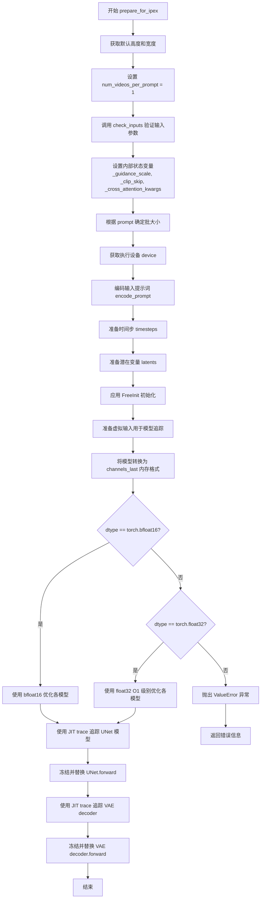
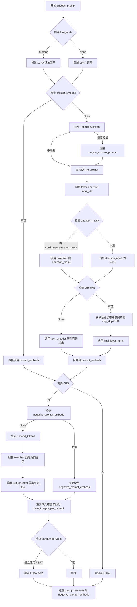
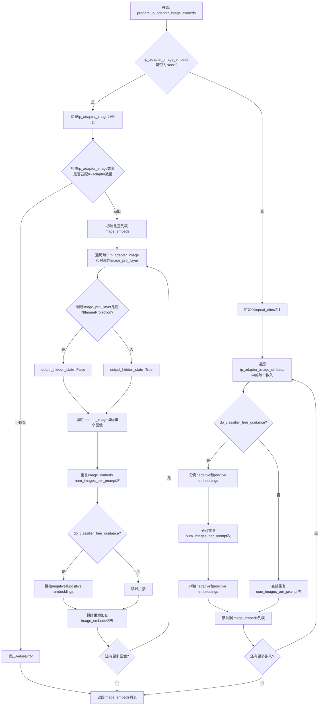
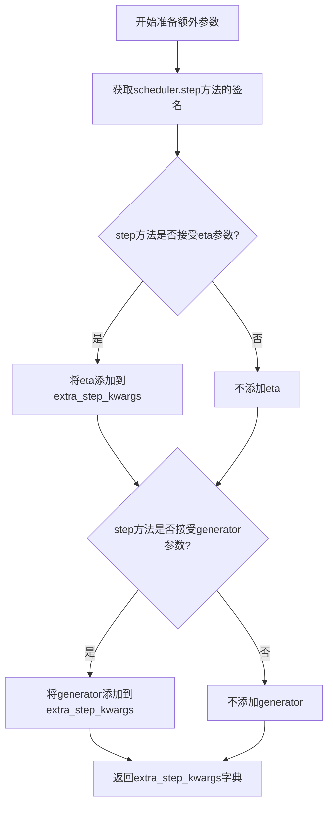
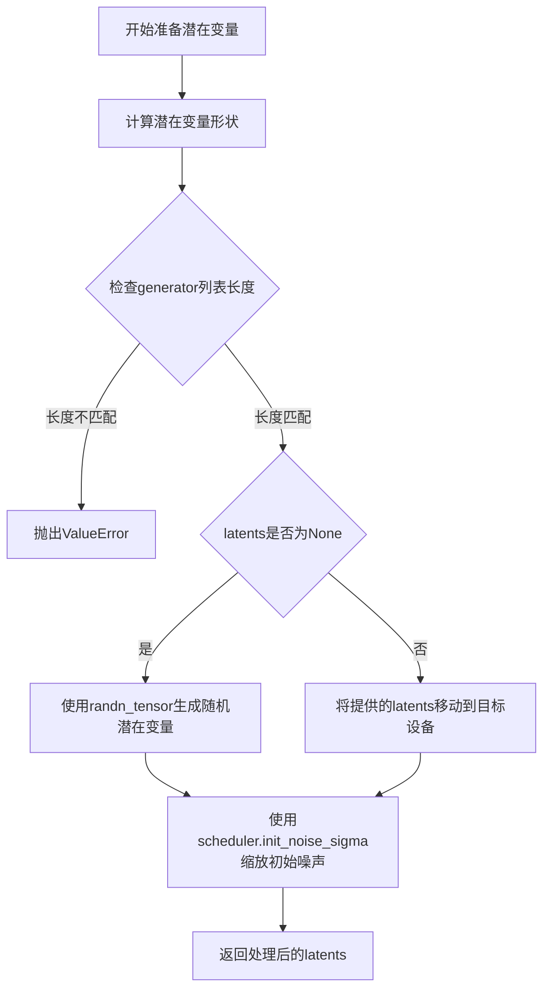
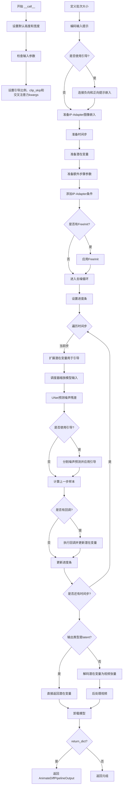
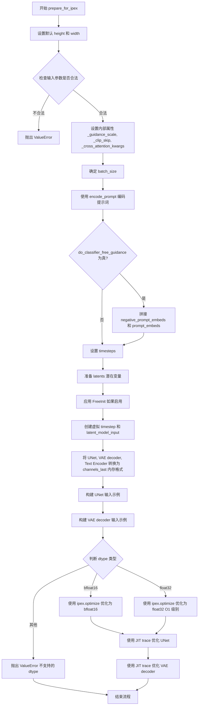

# `diffusers\examples\community\pipeline_animatediff_ipex.py` 详细设计文档

AnimateDiffPipelineIpex是一个针对Intel CPU优化的文本到视频生成Pipeline，基于Diffusion Models和AnimateDiff技术，通过IPEX加速库实现高效的模型推理，支持LoRA、Textual Inversion、IP-Adapter等高级功能，可生成指定帧数的动画视频。

## 整体流程

```mermaid
graph TD
A[开始] --> B[检查输入参数]
B --> C[编码提示词 encode_prompt]
C --> D{是否使用IP-Adapter?}
D -- 是 --> E[准备IP-Adapter图像嵌入 prepare_ip_adapter_image_embeds]
D -- 否 --> F[准备时间步 timesteps]
E --> F
F --> G[准备潜在变量 prepare_latents]
G --> H[准备额外步骤参数 prepare_extra_step_kwargs]
H --> I{是否启用FreeInit?}
I -- 是 --> J[应用FreeInit _apply_free_init]
I -- 否 --> K[开始去噪循环]
J --> K
K --> L{遍历每个时间步}
L --> M[扩展潜在变量(如果使用CFG)]
M --> N[缩放模型输入 scheduler.scale_model_input]
N --> O[UNet预测噪声]
O --> P{是否使用CFG?}
P -- 是 --> Q[执行分类器自由引导]
P -- 否 --> R[scheduler计算上一步]
Q --> R
R --> S[更新latents]
S --> T{是否执行回调?]
T -- 是 --> U[执行回调函数]
T -- 否 --> V[更新进度条]
U --> V
V --> W{是否还有时间步?}
W -- 是 --> L
W -- 否 --> X{output_type == 'latent'?}
X -- 是 --> Y[直接返回latents]
X -- 否 --> Z[解码潜在变量 decode_latents]
Z --> AA[后处理视频 video_processor.postprocess_video]
AA --> BB[释放模型hooks maybe_free_model_hooks]
BB --> CC[返回结果]
Y --> BB
```

## 类结构

```
DiffusionPipeline (抽象基类)
└── AnimateDiffPipelineIpex
    ├── StableDiffusionMixin
    ├── TextualInversionLoaderMixin
    ├── IPAdapterMixin
    ├── LoraLoaderMixin
    └── FreeInitMixin
```

## 全局变量及字段


### `logger`
    
模块级日志记录器，用于记录运行时信息

类型：`logging.Logger`
    


### `EXAMPLE_DOC_STRING`
    
使用示例文档字符串，包含AnimateDiffPipelineIpex的代码示例

类型：`str`
    


### `AnimateDiffPipelineIpex.vae`
    
VAE模型，用于编码和解码图像/视频潜在表示

类型：`AutoencoderKL`
    


### `AnimateDiffPipelineIpex.text_encoder`
    
冻结的文本编码器，将文本转换为嵌入

类型：`CLIPTextModel`
    


### `AnimateDiffPipelineIpex.tokenizer`
    
分词器，将文本转换为token

类型：`CLIPTokenizer`
    


### `AnimateDiffPipelineIpex.unet`
    
去噪UNet模型

类型：`Union[UNet2DConditionModel, UNetMotionModel]`
    


### `AnimateDiffPipelineIpex.motion_adapter`
    
运动适配器，添加时序建模能力

类型：`MotionAdapter`
    


### `AnimateDiffPipelineIpex.scheduler`
    
调度器，控制去噪过程

类型：`SchedulerMixin`
    


### `AnimateDiffPipelineIpex.feature_extractor`
    
图像特征提取器

类型：`CLIPImageProcessor`
    


### `AnimateDiffPipelineIpex.image_encoder`
    
图像编码器

类型：`CLIPVisionModelWithProjection`
    


### `AnimateDiffPipelineIpex.vae_scale_factor`
    
VAE缩放因子，用于计算潜在空间尺寸

类型：`int`
    


### `AnimateDiffPipelineIpex.video_processor`
    
视频后处理器

类型：`VideoProcessor`
    


### `AnimateDiffPipelineIpex.model_cpu_offload_seq`
    
模型CPU卸载顺序

类型：`str`
    


### `AnimateDiffPipelineIpex._optional_components`
    
可选组件列表

类型：`List[str]`
    


### `AnimateDiffPipelineIpex._callback_tensor_inputs`
    
回调张量输入列表

类型：`List[str]`
    


### `AnimateDiffPipelineIpex._guidance_scale`
    
引导scale，用于控制分类器自由引导强度

类型：`float`
    


### `AnimateDiffPipelineIpex._clip_skip`
    
CLIP跳过的层数

类型：`int`
    


### `AnimateDiffPipelineIpex._cross_attention_kwargs`
    
交叉注意力参数

类型：`Dict[str, Any]`
    


### `AnimateDiffPipelineIpex._num_timesteps`
    
时间步数

类型：`int`
    
    

## 全局函数及方法


### AnimateDiffPipelineIpex.prepare_for_ipex

该方法用于为 Intel Extension for PyTorch (IPEX) 优化准备 AnimateDiff 管道，通过 JIT 追踪和内存格式优化来提升推理性能。支持 float32 和 bfloat16 两种数据类型优化。

参数：

- `dtype`：`torch.dtype`，优化使用的数据类型，支持 torch.float32 或 torch.bfloat16
- `prompt`：`Union[str, List[str]]`，要编码的文本提示
- `num_frames`：`Optional[int]`，生成的视频帧数，默认为 16
- `height`：`Optional[int]`，生成视频的高度像素
- `width`：`Optional[int]`，生成视频的宽度像素
- `num_inference_steps`：`int`，去噪步数，默认为 50
- `guidance_scale`：`float`，引导比例，默认为 7.5
- `negative_prompt`：`Optional[Union[str, List[str]]]，负向提示词
- `num_videos_per_prompt`：`Optional[int]`，每个提示生成的视频数量
- `eta`：`float`，DDIM 调度器参数
- `generator`：`Optional[Union[torch.Generator, List[torch.Generator]]]`，随机数生成器
- `latents`：`Optional[torch.Tensor]`，预生成的噪声潜在变量
- `prompt_embeds`：`Optional[torch.Tensor]`，预生成的文本嵌入
- `negative_prompt_embeds`：`Optional[torch.Tensor]`，预生成的负向文本嵌入
- `ip_adapter_image`：`Optional[PipelineImageInput]`，IP Adapter 图像输入
- `ip_adapter_image_embeds`：`Optional[List[torch.Tensor]]`，IP Adapter 图像嵌入
- `output_type`：`str | None`，输出类型，默认为 "pil"
- `return_dict`：`bool`，是否返回字典格式
- `cross_attention_kwargs`：`Optional[Dict[str, Any]]`，交叉注意力参数
- `clip_skip`：`Optional[int]`，CLIP 跳过的层数
- `callback_on_step_end`：`Optional[Callable[[int, int, Dict], None]]，每步结束回调函数
- `callback_on_step_end_tensor_inputs`：`List[str]`，回调函数张量输入列表

返回值：`None`，该方法执行原地优化，不返回任何值

#### 流程图



#### 带注释源码

```python
@torch.no_grad()
def prepare_for_ipex(
    self,
    dtype=torch.float32,
    prompt: Union[str, List[str]] = None,
    num_frames: Optional[int] = 16,
    height: Optional[int] = None,
    width: Optional[int] = None,
    num_inference_steps: int = 50,
    guidance_scale: float = 7.5,
    negative_prompt: Optional[Union[str, List[str]]] = None,
    num_videos_per_prompt: Optional[int] = 1,
    eta: float = 0.0,
    generator: Optional[Union[torch.Generator, List[torch.Generator]]] = None,
    latents: Optional[torch.Tensor] = None,
    prompt_embeds: Optional[torch.Tensor] = None,
    negative_prompt_embeds: Optional[torch.Tensor] = None,
    ip_adapter_image: Optional[PipelineImageInput] = None,
    ip_adapter_image_embeds: Optional[List[torch.Tensor]] = None,
    output_type: str | None = "pil",
    return_dict: bool = True,
    cross_attention_kwargs: Optional[Dict[str, Any]] = None,
    clip_skip: Optional[int] = None,
    callback_on_step_end: Optional[Callable[[int, int, Dict], None]] = None,
    callback_on_step_end_tensor_inputs: List[str] = ["latents"],
):
    # 0. 如果未指定高度和宽度，则使用 UNet 配置的样本大小乘以 VAE 缩放因子作为默认值
    height = height or self.unet.config.sample_size * self.vae_scale_factor
    width = width or self.unet.config.sample_size * self.vae_scale_factor

    # 每个提示只生成一个视频
    num_videos_per_prompt = 1

    # 1. 检查输入参数的有效性，如果不符合要求则抛出异常
    self.check_inputs(
        prompt,
        height,
        width,
        negative_prompt,
        prompt_embeds,
        negative_prompt_embeds,
        ip_adapter_image,
        ip_adapter_image_embeds,
        callback_on_step_end_tensor_inputs,
    )

    # 设置内部状态变量，用于后续去噪循环
    self._guidance_scale = guidance_scale
    self._clip_skip = clip_skip
    self._cross_attention_kwargs = cross_attention_kwargs

    # 2. 根据输入确定批处理大小
    if prompt is not None and isinstance(prompt, str):
        batch_size = 1
    elif prompt is not None and isinstance(prompt, list):
        batch_size = len(prompt)
    else:
        batch_size = prompt_embeds.shape[0]

    # 获取执行设备
    device = self._execution_device

    # 3. 编码输入提示词，生成文本嵌入
    # 获取 LoRA 交叉注意力缩放因子
    text_encoder_lora_scale = (
        self.cross_attention_kwargs.get("scale", None) if self.cross_attention_kwargs is not None else None
    )
    # 调用 encode_prompt 方法生成正向和负向提示词嵌入
    prompt_embeds, negative_prompt_embeds = self.encode_prompt(
        prompt,
        device,
        num_videos_per_prompt,
        self.do_classifier_free_guidance,
        negative_prompt,
        prompt_embeds=prompt_embeds,
        negative_prompt_embeds=negative_prompt_embeds,
        lora_scale=text_encoder_lora_scale,
        clip_skip=self.clip_skip,
    )
    # 4. 准备时间步
    # 设置调度器的时间步
    self.scheduler.set_timesteps(num_inference_steps, device=device)
    timesteps = self.scheduler.timesteps

    # 5. 准备潜在变量
    # 获取 UNet 输入通道数
    num_channels_latents = self.unet.config.in_channels
    # 准备初始噪声潜在变量
    latents = self.prepare_latents(
        batch_size * num_videos_per_prompt,
        num_channels_latents,
        num_frames,
        height,
        width,
        prompt_embeds.dtype,
        device,
        generator,
        latents,
    )

    # 如果启用了 FreeInit，进行初始化处理
    num_free_init_iters = self._free_init_num_iters if self.free_init_enabled else 1
    for free_init_iter in range(num_free_init_iters):
        if self.free_init_enabled:
            latents, timesteps = self._apply_free_init(
                latents, free_init_iter, num_inference_steps, device, latents.dtype, generator
            )

    # 记录时间步总数
    self._num_timesteps = len(timesteps)

    # 6. 准备虚拟输入用于模型追踪
    # 选择一个虚拟时间步
    dummy = timesteps[0]
    # 如果使用无分类器引导，复制潜在变量
    latent_model_input = torch.cat([latents] * 2) if self.do_classifier_free_guidance else latents
    # 缩放模型输入
    latent_model_input = self.scheduler.scale_model_input(latent_model_input, dummy)

    # 7. 将模型转换为 channels_last 内存格式
    # 这是一种更适合某些 CPU 操作的内存布局
    self.unet = self.unet.to(memory_format=torch.channels_last)
    self.vae.decoder = self.vae.decoder.to(memory_format=torch.channels_last)
    self.text_encoder = self.text_encoder.to(memory_format=torch.channels_last)

    # 准备 UNet 的示例输入
    unet_input_example = {
        "sample": latent_model_input,
        "timestep": dummy,
        "encoder_hidden_states": prompt_embeds,
    }

    # 准备 VAE decoder 的示例输入
    fake_latents = 1 / self.vae.config.scaling_factor * latents
    batch_size, channels, num_frames, height, width = fake_latents.shape
    fake_latents = fake_latents.permute(0, 2, 1, 3, 4).reshape(batch_size * num_frames, channels, height, width)
    vae_decoder_input_example = fake_latents

    # 8. 根据数据类型使用 IPEX 优化模型
    if dtype == torch.bfloat16:
        # 使用 bfloat16 进行优化
        self.unet = ipex.optimize(self.unet.eval(), dtype=torch.bfloat16, inplace=True)
        self.vae.decoder = ipex.optimize(self.vae.decoder.eval(), dtype=torch.bfloat16, inplace=True)
        self.text_encoder = ipex.optimize(self.text_encoder.eval(), dtype=torch.bfloat16, inplace=True)
    elif dtype == torch.float32:
        # 使用 float32 和 O1 优化级别
        # O1 允许自动混合精度优化
        self.unet = ipex.optimize(
            self.unet.eval(),
            dtype=torch.float32,
            inplace=True,
            level="O1",
            weights_prepack=True,  # 预打包权重以提高性能
            auto_kernel_selection=False,
        )
        self.vae.decoder = ipex.optimize(
            self.vae.decoder.eval(),
            dtype=torch.float32,
            inplace=True,
            level="O1",
            weights_prepack=True,
            auto_kernel_selection=False,
        )
        self.text_encoder = ipex.optimize(
            self.text_encoder.eval(),
            dtype=torch.float32,
            inplace=True,
            level="O1",
            weights_prepack=True,
            auto_kernel_selection=False,
        )
    else:
        # 不支持的数据类型
        raise ValueError(" The value of 'dtype' should be 'torch.bfloat16' or 'torch.float32' !")

    # 9. 使用 JIT trace 追踪 UNet 模型以获得更好性能
    # 在 autocast 上下文中进行追踪
    with torch.cpu.amp.autocast(enabled=dtype == torch.bfloat16), torch.no_grad():
        unet_trace_model = torch.jit.trace(
            self.unet, example_kwarg_inputs=unet_input_example, check_trace=False, strict=False
        )
        # 冻结模型以消除动态操作
        unet_trace_model = torch.jit.freeze(unet_trace_model)
        # 替换原始 forward 方法
        self.unet.forward = unet_trace_model.forward

    # 10. 使用 JIT trace 追踪 VAE decoder 模型
    with torch.cpu.amp.autocast(enabled=dtype == torch.bfloat16), torch.no_grad():
        vae_decoder_trace_model = torch.jit.trace(
            self.vae.decoder, vae_decoder_input_example, check_trace=False, strict=False
        )
        vae_decoder_trace_model = torch.jit.freeze(vae_decoder_trace_model)
        self.vae.decoder.forward = vae_decoder_trace_model.forward
```

### AnimateDiffPipelineIpex.__call__

该方法是管道的主入口函数，负责执行完整的文本到视频生成流程。包含输入验证、提示词编码、潜在变量准备、去噪循环、解码和后处理等完整步骤。

参数：

- `prompt`：`Union[str, List[str]]`，要生成视频的文本描述
- `num_frames`：`Optional[int]`，生成视频的帧数，默认为 16
- `height`：`Optional[int]`，视频高度像素
- `width`：`Optional[int]`，视频宽度像素
- `num_inference_steps`：`int`，去噪迭代次数，默认为 50
- `guidance_scale`：`float`，无分类器引导比例，默认为 7.5
- `negative_prompt`：`Optional[Union[str, List[str]]]，不想要的内容描述
- `num_videos_per_prompt`：`Optional[int]`，每个提示生成的视频数，默认为 1
- `eta`：`float`，DDIM 调度器参数
- `generator`：`Optional[Union[torch.Generator, List[torch.Generator]]]`，随机数生成器
- `latents`：`Optional[torch.Tensor]`，预提供的潜在变量
- `prompt_embeds`：`Optional[torch.Tensor]`，预计算的文本嵌入
- `negative_prompt_embeds`：`Optional[torch.Tensor]`，预计算的负向嵌入
- `ip_adapter_image`：`Optional[PipelineImageInput]`，IP Adapter 图像
- `ip_adapter_image_embeds`：`Optional[List[torch.Tensor]]`，IP Adapter 嵌入
- `output_type`：`str | None`，输出格式，默认为 "pil"
- `return_dict`：`bool`，是否返回字典格式
- `cross_attention_kwargs`：`Optional[Dict[str, Any]]`，注意力控制参数
- `clip_skip`：`Optional[int]`，CLIP 跳过的层数
- `callback_on_step_end`：`Optional[Callable[[int, int, Dict], None]]，每步回调
- `callback_on_step_end_tensor_inputs`：`List[str]`，回调张量输入列表

返回值：`AnimateDiffPipelineOutput` 或 `tuple`，生成的视频 frames

#### 流程图

```mermaid
flowchart TD
    A[开始 __call__] --> B[设置默认高度和宽度]
    B --> C[设置 num_videos_per_prompt = 1]
    C --> D[调用 check_inputs 验证输入]
    D --> E[保存引导比例等参数]
    E --> F[确定批处理大小]
    F --> G[编码提示词]
    G --> H{是否使用 CFG?}
    H -->|是| I[连接负向和正向嵌入]
    H -->|否| J[准备 IP Adapter 图像嵌入]
    I --> J
    J --> K[设置调度器时间步]
    K --> L[准备潜在变量]
    L --> M[准备额外调度器参数]
    M --> N{是否有 IP Adapter?}
    N -->|是| O[添加条件参数]
    N --> |否| P[开始去噪循环]
    O --> P
    P --> Q[迭代每个时间步]
    Q --> R{当前步是否完成?]
    R -->|否| S[扩展潜在变量进行 CFG]
    S --> T[缩放模型输入]
    T --> U[UNet 预测噪声]
    U --> V{是否使用 CFG?}
    V -->|是| W[分离并加权预测]
    V -->|否| X[调度器步进]
    W --> X
    X --> Y[执行回调]
    Y --> Q
    R -->|是| Z[后处理]
    Z --> AA{output_type == latent?}
    AA -->|是| BB[直接返回潜在变量]
    AA -->|否| CC[解码潜在变量]
    CC --> DD[后处理视频格式]
    DD --> EE[卸载模型]
    EE --> FF{return_dict == True?}
    FF -->|是| GG[返回 AnimateDiffPipelineOutput]
    FF -->|否| HH[返回元组]
```

### AnimateDiffPipelineIpex.encode_prompt

该方法将文本提示编码为文本嵌入向量，供 UNet 在去噪过程中使用。支持 LoRA 权重调整、文本反转和 CLIP 层跳过等功能。

参数：

- `prompt`：`str` 或 `List[str]`，要编码的提示词
- `device`：`torch.device`，执行设备
- `num_images_per_prompt`：`int`，每个提示生成的图像数
- `do_classifier_free_guidance`：`bool`，是否使用无分类器引导
- `negative_prompt`：`Optional[str or List[str]]，负向提示词
- `prompt_embeds`：`Optional[torch.Tensor]`，预计算的提示嵌入
- `negative_prompt_embeds`：`Optional[torch.Tensor]`，预计算的负向嵌入
- `lora_scale`：`Optional[float]`，LoRA 缩放因子
- `clip_skip`：`Optional[int]`，CLIP 跳过的层数

返回值：`(torch.Tensor, torch.Tensor)`，正向和负向提示词嵌入

### AnimateDiffPipelineIpex.decode_latents

该方法将去噪后的潜在变量解码为实际视频帧。通过 VAE 解码器将潜在空间转换到像素空间。

参数：

- `latents`：`torch.Tensor`，去噪后的潜在变量，形状为 `(batch, channels, num_frames, height, width)`

返回值：`torch.Tensor`，解码后的视频张量，形状为 `(batch, channels, num_frames, height, width)`

### AnimateDiffPipelineIpex.prepare_latents

该方法初始化或处理用于视频生成的潜在变量。如果未提供潜在变量，则使用随机噪声初始化。

参数：

- `batch_size`：`int`，批处理大小
- `num_channels_latents`：`int`，潜在变量通道数
- `num_frames`：`int`，视频帧数
- `height`：`int`，视频高度
- `width`：`int`，视频宽度
- `dtype`：`torch.dtype`，数据类型
- `device`：`torch.device`，设备
- `generator`：`Optional[torch.Generator]`，随机生成器
- `latents`：`Optional[torch.Tensor]`，预提供的潜在变量

返回值：`torch.Tensor`，准备好的潜在变量


### `AnimateDiffPipelineIpex.__init__`

初始化AnimateDiffPipelineIpex管道及其所有核心组件（VAE、文本编码器、分词器、UNet、运动适配器、调度器等），并配置视频处理器。

参数：

- `vae`：`AutoencoderKL`，Variational Auto-Encoder模型，用于编码和解码图像与潜在表示
- `text_encoder`：`CLIPTextModel`，冻结的文本编码器（clip-vit-large-patch14）
- `tokenizer`：`CLIPTokenizer`，用于对文本进行分词
- `unet`：`Union[UNet2DConditionModel, UNetMotionModel]`，用于去噪编码视频潜在表示的UNet模型
- `motion_adapter`：`MotionAdapter`，与unet结合使用以去噪编码视频潜在表示的运动适配器
- `scheduler`：`Union[DDIMScheduler, PNDMScheduler, LMSDiscreteScheduler, EulerDiscreteScheduler, EulerAncestralDiscreteScheduler, DPMSolverMultistepScheduler]`，与unet结合使用以去噪编码图像潜在表示的调度器
- `feature_extractor`：`CLIPImageProcessor`（可选），图像特征提取器
- `image_encoder`：`CLIPVisionModelWithProjection`（可选），图像编码器

返回值：无（`None`），构造函数初始化实例属性

#### 流程图

```mermaid
flowchart TD
    A[开始 __init__] --> B[调用 super().__init__ 初始化基类]
    B --> C{unet 是否为 UNet2DConditionModel?}
    C -->|是| D[将 unet 转换为 UNetMotionModel]
    C -->|否| E[保持原 unet 不变]
    D --> F[注册所有模块到 pipeline]
    E --> F
    F --> G[计算 vae_scale_factor]
    G --> H[创建 VideoProcessor 实例]
    H --> I[结束 __init__]
```

#### 带注释源码

```python
def __init__(
    self,
    vae: AutoencoderKL,
    text_encoder: CLIPTextModel,
    tokenizer: CLIPTokenizer,
    unet: Union[UNet2DConditionModel, UNetMotionModel],
    motion_adapter: MotionAdapter,
    scheduler: Union[
        DDIMScheduler,
        PNDMScheduler,
        LMSDiscreteScheduler,
        EulerDiscreteScheduler,
        EulerAncestralDiscreteScheduler,
        DPMSolverMultistepScheduler,
    ],
    feature_extractor: CLIPImageProcessor = None,
    image_encoder: CLIPVisionModelWithProjection = None,
):
    # 调用父类 DiffusionPipeline 的初始化方法
    # 继承自多个 Mixin 类：StableDiffusionMixin, TextualInversionLoaderMixin, 
    # IPAdapterMixin, LoraLoaderMixin, FreeInitMixin
    super().__init__()
    
    # 如果 unet 是 UNet2DConditionModel，则将其与 motion_adapter 结合转换为 UNetMotionModel
    # UNetMotionModel 是支持动画生成的关键模型
    if isinstance(unet, UNet2DConditionModel):
        unet = UNetMotionModel.from_unet2d(unet, motion_adapter)

    # 将所有组件模块注册到 pipeline 中
    # 这些模块可以通过 self.xxx 访问
    self.register_modules(
        vae=vae,
        text_encoder=text_encoder,
        tokenizer=tokenizer,
        unet=unet,
        motion_adapter=motion_adapter,
        scheduler=scheduler,
        feature_extractor=feature_extractor,
        image_encoder=image_encoder,
    )
    
    # 计算 VAE 缩放因子，用于后续视频/图像处理
    # 基于 VAE 配置中的 block_out_channels 数量计算 (2^(层数-1))
    # 默认值为 8
    self.vae_scale_factor = 2 ** (len(self.vae.config.block_out_channels) - 1) if getattr(self, "vae", None) else 8
    
    # 创建视频处理器，用于后处理生成的视频帧
    # do_resize=False 表示不调整大小，使用原始 VAE 缩放因子
    self.video_processor = VideoProcessor(do_resize=False, vae_scale_factor=self.vae_scale_factor)
```


### `AnimateDiffPipelineIpex.encode_prompt`

该方法将文本提示（prompt）编码为文本编码器的隐藏状态向量（embedding），用于后续的视频生成过程。方法支持 LoRA 权重调整、文本反转（Textual Inversion）、CLIP 层跳过以及无分类器自由引导（Classifier-Free Guidance）。

参数：

- `prompt`：`Union[str, List[str]]`，要编码的文本提示，可以是单个字符串或字符串列表
- `device`：`torch.device`，PyTorch 设备，用于将计算放到指定设备上（如 CPU 或 CUDA）
- `num_images_per_prompt`：`int`，每个提示需要生成的图像/视频数量，用于扩增嵌入维度
- `do_classifier_free_guidance`：`bool`，是否启用无分类器自由引导，为 True 时会同时生成条件和非条件嵌入
- `negative_prompt`：`Union[str, List[str]]`，负向提示，用于引导模型避免生成提示中的内容
- `prompt_embeds`：`Optional[torch.Tensor]`，可选的预生成文本嵌入，如果有则直接使用而不重新编码
- `negative_prompt_embeds`：`Optional[torch.Tensor]`，可选的预生成负向文本嵌入
- `lora_scale`：`Optional[float]`，LoRA 层的缩放因子，用于调整 LoRA 权重的影响程度
- `clip_skip`：`Optional[int]`，CLIP 编码器跳过的层数，用于获取不同层次的特征表示

返回值：`Tuple[torch.Tensor, torch.Tensor]`，返回一个元组，包含编码后的提示嵌入（prompt_embeds）和负向提示嵌入（negative_prompt_embeds）

#### 流程图



#### 带注释源码

```python
def encode_prompt(
    self,
    prompt,
    device,
    num_images_per_prompt,
    do_classifier_free_guidance,
    negative_prompt=None,
    prompt_embeds: Optional[torch.Tensor] = None,
    negative_prompt_embeds: Optional[torch.Tensor] = None,
    lora_scale: Optional[float] = None,
    clip_skip: Optional[int] = None,
):
    r"""
    Encodes the prompt into text encoder hidden states.

    Args:
        prompt (`str` or `List[str]`, *optional*):
            prompt to be encoded
        device: (`torch.device`):
            torch device
        num_images_per_prompt (`int`):
            number of images that should be generated per prompt
        do_classifier_free_guidance (`bool`):
            whether to use classifier free guidance or not
        negative_prompt (`str` or `List[str]`, *optional*):
            The prompt or prompts not to guide the image generation. If not defined, one has to pass
            `negative_prompt_embeds` instead. Ignored when not using guidance (i.e., ignored if `guidance_scale` is
            less than `1`).
        prompt_embeds (`torch.Tensor`, *optional*):
            Pre-generated text embeddings. Can be used to easily tweak text inputs, *e.g.* prompt weighting. If not
            provided, text embeddings will be generated from `prompt` input argument.
        negative_prompt_embeds (`torch.Tensor`, *optional*):
            Pre-generated negative text embeddings. Can be used to easily tweak text inputs, *e.g.* prompt
            weighting. If not provided, negative_prompt_embeds will be generated from `negative_prompt` input
            argument.
        lora_scale (`float`, *optional*):
            A LoRA scale that will be applied to all LoRA layers of the text encoder if LoRA layers are loaded.
        clip_skip (`int`, *optional*):
            Number of layers to be skipped from CLIP while computing the prompt embeddings. A value of 1 means that
            the output of the pre-final layer will be used for computing the prompt embeddings.
    """
    # set lora scale so that monkey patched LoRA
    # function of text encoder can correctly access it
    # 如果传入 lora_scale 且当前类具有 LoraLoaderMixin 属性，则设置 LoRA 缩放因子
    if lora_scale is not None and isinstance(self, LoraLoaderMixin):
        self._lora_scale = lora_scale

        # dynamically adjust the LoRA scale
        # 根据是否使用 PEFT backend 来选择不同的缩放方法
        if not USE_PEFT_BACKEND:
            adjust_lora_scale_text_encoder(self.text_encoder, lora_scale)
        else:
            scale_lora_layers(self.text_encoder, lora_scale)

    # 确定 batch_size：如果 prompt 是字符串则为 1，如果是列表则为列表长度，否则使用 prompt_embeds 的第一维
    if prompt is not None and isinstance(prompt, str):
        batch_size = 1
    elif prompt is not None and isinstance(prompt, list):
        batch_size = len(prompt)
    else:
        batch_size = prompt_embeds.shape[0]

    # 如果没有提供 prompt_embeds，则需要从 prompt 编码生成
    if prompt_embeds is None:
        # textual inversion: process multi-vector tokens if necessary
        # 如果有 TextualInversionLoaderMixin，则处理多向量 token
        if isinstance(self, TextualInversionLoaderMixin):
            prompt = self.maybe_convert_prompt(prompt, self.tokenizer)

        # 使用 tokenizer 将文本转换为 token ids
        text_inputs = self.tokenizer(
            prompt,
            padding="max_length",
            max_length=self.tokenizer.model_max_length,
            truncation=True,
            return_tensors="pt",
        )
        text_input_ids = text_inputs.input_ids
        # 同时进行不截断的 tokenize，用于检测是否发生了截断
        untruncated_ids = self.tokenizer(prompt, padding="longest", return_tensors="pt").input_ids

        # 检查是否有内容被截断，如果是则发出警告
        if untruncated_ids.shape[-1] >= text_input_ids.shape[-1] and not torch.equal(
            text_input_ids, untruncated_ids
        ):
            removed_text = self.tokenizer.batch_decode(
                untruncated_ids[:, self.tokenizer.model_max_length - 1 : -1]
            )
            logger.warning(
                "The following part of your input was truncated because CLIP can only handle sequences up to"
                f" {self.tokenizer.model_max_length} tokens: {removed_text}"
            )

        # 检查 text_encoder 配置是否需要使用 attention_mask
        if hasattr(self.text_encoder.config, "use_attention_mask") and self.text_encoder.config.use_attention_mask:
            attention_mask = text_inputs.attention_mask.to(device)
        else:
            attention_mask = None

        # 根据是否需要跳过 CLIP 层来获取 prompt embeddings
        if clip_skip is None:
            # 直接获取 text_encoder 的输出
            prompt_embeds = self.text_encoder(text_input_ids.to(device), attention_mask=attention_mask)
            prompt_embeds = prompt_embeds[0]
        else:
            # 获取所有隐藏状态，然后选择倒数第 clip_skip+1 层
            prompt_embeds = self.text_encoder(
                text_input_ids.to(device), attention_mask=attention_mask, output_hidden_states=True
            )
            # Access the `hidden_states` first, that contains a tuple of
            # all the hidden states from the encoder layers. Then index into
            # the tuple to access the hidden states from the desired layer.
            prompt_embeds = prompt_embeds[-1][-(clip_skip + 1)]
            # We also need to apply the final LayerNorm here to not mess with the
            # representations. The `last_hidden_states` that we typically use for
            # obtaining the final prompt representations passes through the LayerNorm
            # layer.
            # 应用 final_layer_norm 以获得正确的表示
            prompt_embeds = self.text_encoder.text_model.final_layer_norm(prompt_embeds)

    # 确定 prompt_embeds 的数据类型，优先使用 text_encoder 或 unet 的 dtype
    if self.text_encoder is not None:
        prompt_embeds_dtype = self.text_encoder.dtype
    elif self.unet is not None:
        prompt_embeds_dtype = self.unet.dtype
    else:
        prompt_embeds_dtype = prompt_embeds.dtype

    # 将 prompt_embeds 转换为适当的 dtype 和 device
    prompt_embeds = prompt_embeds.to(dtype=prompt_embeds_dtype, device=device)

    # 获取嵌入的维度信息
    bs_embed, seq_len, _ = prompt_embeds.shape
    # duplicate text embeddings for each generation per prompt, using mps friendly method
    # 为每个提示的每次生成复制文本嵌入
    prompt_embeds = prompt_embeds.repeat(1, num_images_per_prompt, 1)
    prompt_embeds = prompt_embeds.view(bs_embed * num_images_per_prompt, seq_len, -1)

    # get unconditional embeddings for classifier free guidance
    # 如果启用 CFG 且没有提供 negative_prompt_embeds，则需要生成无条件嵌入
    if do_classifier_free_guidance and negative_prompt_embeds is None:
        uncond_tokens: List[str]
        if negative_prompt is None:
            uncond_tokens = [""] * batch_size
        elif prompt is not None and type(prompt) is not type(negative_prompt):
            raise TypeError(
                f"`negative_prompt` should be the same type to `prompt`, but got {type(negative_prompt)} !="
                f" {type(prompt)}."
            )
        elif isinstance(negative_prompt, str):
            uncond_tokens = [negative_prompt]
        elif batch_size != len(negative_prompt):
            raise ValueError(
                f"`negative_prompt`: {negative_prompt} has batch size {len(negative_prompt)}, but `prompt`:"
                f" {prompt} has batch size {batch_size}. Please make sure that passed `negative_prompt` matches"
                " the batch size of `prompt`."
            )
        else:
            uncond_tokens = negative_prompt

        # textual inversion: process multi-vector tokens if necessary
        if isinstance(self, TextualInversionLoaderMixin):
            uncond_tokens = self.maybe_convert_prompt(uncond_tokens, self.tokenizer)

        # 使用与 prompt_embeds 相同的长度进行 tokenize
        max_length = prompt_embeds.shape[1]
        uncond_input = self.tokenizer(
            uncond_tokens,
            padding="max_length",
            max_length=max_length,
            truncation=True,
            return_tensors="pt",
        )

        # 处理 attention_mask
        if hasattr(self.text_encoder.config, "use_attention_mask") and self.text_encoder.config.use_attention_mask:
            attention_mask = uncond_input.attention_mask.to(device)
        else:
            attention_mask = None

        # 编码无条件嵌入
        negative_prompt_embeds = self.text_encoder(
            uncond_input.input_ids.to(device),
            attention_mask=attention_mask,
        )
        negative_prompt_embeds = negative_prompt_embeds[0]

    # 如果启用 CFG，处理 negative_prompt_embeds
    if do_classifier_free_guidance:
        # duplicate unconditional embeddings for each generation per prompt, using mps friendly method
        seq_len = negative_prompt_embeds.shape[1]

        negative_prompt_embeds = negative_prompt_embeds.to(dtype=prompt_embeds_dtype, device=device)

        negative_prompt_embeds = negative_prompt_embeds.repeat(1, num_images_per_prompt, 1)
        negative_prompt_embeds = negative_prompt_embeds.view(batch_size * num_images_per_prompt, seq_len, -1)

    # 如果使用了 LoRA 且使用 PEFT backend，则需要恢复原始的 LoRA 缩放
    if self.text_encoder is not None:
        if isinstance(self, LoraLoaderMixin) and USE_PEFT_BACKEND:
            # Retrieve the original scale by scaling back the LoRA layers
            unscale_lora_layers(self.text_encoder, lora_scale)

    return prompt_embeds, negative_prompt_embeds
```


### `AnimateDiffPipelineIpex.encode_image`

该方法将输入图像编码为嵌入向量（image embeddings），用于后续的扩散模型推理过程。支持两种模式：返回图像嵌入或返回隐藏状态，以便在 IP-Adapter 等图像条件引导场景中使用。

参数：

- `image`：`PipelineImageInput`（图像输入），待编码的输入图像，可以是 PIL Image、numpy array、torch.Tensor 或列表
- `device`：`torch.device`，目标设备，用于将图像移动到指定设备
- `num_images_per_prompt`：`int`，每个 prompt 生成的图像数量，用于复制 embeddings
- `output_hidden_states`：`Optional[bool]`，是否返回隐藏状态，默认为 None

返回值：`Tuple[torch.Tensor, torch.Tensor]`，返回两个张量——条件图像嵌入（image_embeds）和无条件图像嵌入（uncond_image_embeds）。当 `output_hidden_states=True` 时返回隐藏状态，否则返回图像 embeddings。

#### 流程图

```mermaid
flowchart TD
    A[encode_image 开始] --> B{image 是否为 torch.Tensor?}
    B -- 否 --> C[使用 feature_extractor 提取特征]
    C --> D[获取 pixel_values]
    B -- 是 --> D
    D --> E[移动图像到指定 device 和 dtype]
    E --> F{output_hidden_states == True?}
    F -- 是 --> G[调用 image_encoder 获取隐藏状态]
    G --> H[取倒数第二层隐藏状态 hidden_states[-2]]
    H --> I[repeat_interleave 复制 embeddings]
    J[使用零图像获取 uncond embeddings]
    I --> K[返回两个隐藏状态]
    F -- 否 --> L[调用 image_encoder 获取 image_embeds]
    L --> M[repeat_interleave 复制 embeddings]
    M --> N[创建零张量作为 uncond_image_embeds]
    N --> O[返回两个 embeddings]
```

#### 带注释源码

```python
def encode_image(self, image, device, num_images_per_prompt, output_hidden_states=None):
    """
    将图像编码为嵌入向量
    
    参数:
        image: 输入图像，支持 PIL Image, numpy array, torch.Tensor 或列表
        device: 目标设备
        num_images_per_prompt: 每个 prompt 生成的图像数量
        output_hidden_states: 是否返回隐藏状态
    
    返回:
        Tuple[torch.Tensor, torch.Tensor]: (条件嵌入, 无条件嵌入)
    """
    # 获取 image_encoder 的数据类型
    dtype = next(self.image_encoder.parameters()).dtype

    # 如果输入不是 tensor，使用 feature_extractor 预处理
    if not isinstance(image, torch.Tensor):
        image = self.feature_extractor(image, return_tensors="pt").pixel_values

    # 将图像移动到目标设备并转换数据类型
    image = image.to(device=device, dtype=dtype)
    
    # 根据 output_hidden_states 决定返回类型
    if output_hidden_states:
        # 模式1: 返回隐藏状态 (用于 IP-Adapter)
        # 获取倒数第二层的隐藏状态
        image_enc_hidden_states = self.image_encoder(image, output_hidden_states=True).hidden_states[-2]
        # 复制 embeddings 以匹配 num_images_per_prompt
        image_enc_hidden_states = image_enc_hidden_states.repeat_interleave(num_images_per_prompt, dim=0)
        
        # 使用零图像生成无条件嵌入
        uncond_image_enc_hidden_states = self.image_encoder(
            torch.zeros_like(image), output_hidden_states=True
        ).hidden_states[-2]
        uncond_image_enc_hidden_states = uncond_image_enc_hidden_states.repeat_interleave(
            num_images_per_prompt, dim=0
        )
        return image_enc_hidden_states, uncond_image_enc_hidden_states
    else:
        # 模式2: 返回标准图像嵌入
        image_embeds = self.image_encoder(image).image_embeds
        # 复制 embeddings
        image_embeds = image_embeds.repeat_interleave(num_images_per_prompt, dim=0)
        # 创建零张量作为无条件嵌入 (用于 CFG)
        uncond_image_embeds = torch.zeros_like(image_embeds)

        return image_embeds, uncond_image_embeds
```


### `AnimateDiffPipelineIpex.prepare_ip_adapter_image_embeds`

该方法用于准备IP-Adapter的图像嵌入（image embeddings），支持两种模式：当未提供预计算的图像嵌入时，方法会调用 `encode_image` 方法从输入图像编码生成；当已提供预计算的图像嵌入时，方法会对其进行复制和拼接处理以适配批量生成和分类器自由引导的需求。

参数：

- `self`：类实例本身
- `ip_adapter_image`：`PipelineImageInput`，要用于IP-Adapter的输入图像，可以是单个图像或图像列表
- `ip_adapter_image_embeds`：`Optional[List[torch.Tensor]]`，预生成的图像嵌入列表，如果为None则需要从`ip_adapter_image`编码生成
- `device`：`torch.device`，计算设备
- `num_images_per_prompt`：`int`，每个提示生成的图像/视频数量
- `do_classifier_free_guidance`：`bool`，是否启用分类器自由引导（CFG）

返回值：`List[torch.Tensor]]`，处理后的图像嵌入列表，每个元素对应一个IP-Adapter

#### 流程图



#### 带注释源码

```python
def prepare_ip_adapter_image_embeds(
    self, 
    ip_adapter_image,  # PipelineImageInput: 输入的IP-Adapter图像
    ip_adapter_image_embeds,  # Optional[List[torch.Tensor]]: 预计算的图像嵌入
    device,  # torch.device: 计算设备
    num_images_per_prompt,  # int: 每个提示生成的图像数量
    do_classifier_free_guidance  # bool: 是否启用分类器自由引导
):
    """
    准备IP-Adapter的图像嵌入
    
    处理两种情况:
    1. 当ip_adapter_image_embeds为None时,从ip_adapter_image编码生成嵌入
    2. 当ip_adapter_image_embeds已提供时,对预计算的嵌入进行复制和拼接处理
    """
    
    # 情况1: 未提供预计算的嵌入,需要从图像编码生成
    if ip_adapter_image_embeds is None:
        # 确保ip_adapter_image是列表(即使是单张图像也转为列表)
        if not isinstance(ip_adapter_image, list):
            ip_adapter_image = [ip_adapter_image]
        
        # 验证图像数量与IP-Adapter数量是否匹配
        if len(ip_adapter_image) != len(self.unet.encoder_hid_proj.image_projection_layers):
            raise ValueError(
                f"`ip_adapter_image` must have same length as the number of IP Adapters. "
                f"Got {len(ip_adapter_image)} images and {len(self.unet.encoder_hid_proj.image_projection_layers)} IP Adapters."
            )
        
        # 遍历每个IP-Adapter的图像和对应的投影层
        image_embeds = []
        for single_ip_adapter_image, image_proj_layer in zip(
            ip_adapter_image, self.unet.encoder_hid_proj.image_projection_layers
        ):
            # 判断是否需要输出隐藏状态(ImageProjection不需要,CLIPVisionModel需要)
            output_hidden_state = not isinstance(image_proj_layer, ImageProjection)
            
            # 编码单个图像得到positive和negative embeddings
            single_image_embeds, single_negative_image_embeds = self.encode_image(
                single_ip_adapter_image, device, 1, output_hidden_state
            )
            
            # 为每个提示复制图像嵌入num_images_per_prompt次
            single_image_embeds = torch.stack([single_image_embeds] * num_images_per_prompt, dim=0)
            single_negative_image_embeds = torch.stack(
                [single_negative_image_embeds] * num_images_per_prompt, dim=0
            )
            
            # 如果启用CFG,将negative和positive embeddings拼接在一起
            if do_classifier_free_guidance:
                single_image_embeds = torch.cat([single_negative_image_embeds, single_image_embeds])
                single_image_embeds = single_image_embeds.to(device)
            
            # 将处理后的嵌入添加到列表
            image_embeds.append(single_image_embeds)
    
    # 情况2: 已提供预计算的嵌入,直接进行复制和拼接处理
    else:
        repeat_dims = [1]  # 用于控制复制维度
        image_embeds = []
        
        # 遍历每个预计算的嵌入
        for single_image_embeds in ip_adapter_image_embeds:
            if do_classifier_free_guidance:
                # 分离negative和positive embeddings(预计算时已拼接)
                single_negative_image_embeds, single_image_embeds = single_image_embeds.chunk(2)
                
                # 分别复制num_images_per_prompt次
                single_image_embeds = single_image_embeds.repeat(
                    num_images_per_prompt, *(repeat_dims * len(single_image_embeds.shape[1:]))
                )
                single_negative_image_embeds = single_negative_image_embeds.repeat(
                    num_images_per_prompt, *(repeat_dims * len(single_negative_image_embeds.shape[1:]))
                )
                
                # 重新拼接negative和positive embeddings
                single_image_embeds = torch.cat([single_negative_image_embeds, single_image_embeds])
            else:
                # 不启用CFG时,直接复制embeddings
                single_image_embeds = single_image_embeds.repeat(
                    num_images_per_prompt, *(repeat_dims * len(single_image_embeds.shape[1:]))
                )
            
            image_embeds.append(single_image_embeds)
    
    return image_embeds
```


### `AnimateDiffPipelineIpex.decode_latents`

将潜在表示（latents）解码为视频帧。该方法接收来自 UNet 输出的潜在表示，通过 VAE 解码器将其转换为实际的视频数据。

参数：

- `latents`：`torch.Tensor`，输入的潜在表示张量，形状为 (batch_size, channels, num_frames, height, width)

返回值：`torch.Tensor`，解码后的视频张量，形状为 (batch_size, channels, num_frames, height, width)

#### 流程图

```mermaid
flowchart TD
    A[输入 latents] --> B[除以 scaling_factor 进行缩放]
    B --> C[获取 shape: batch_size, channels, num_frames, height, width]
    C --> D[permute: (0,2,1,3,4) 重排维度]
    D --> E[reshape: 合并 batch 和 num_frames 维度]
    E --> F[vae.decode 解码为图像]
    F --> G[reshape: 恢复为 (batch_size, num_frames, -1, H, W)]
    G --> H[permute: (0,2,1,3,4) 恢复原始维度顺序]
    H --> I[cast to float32]
    I --> J[返回 video tensor]
```

#### 带注释源码

```python
def decode_latents(self, latents):
    """
    Decode latents to video using the VAE decoder.
    
    Args:
        latents: Latent representations from UNet, shape (batch_size, channels, num_frames, height, width)
    
    Returns:
        Decoded video tensor, shape (batch_size, channels, num_frames, height, width)
    """
    # Step 1: Scale latents by dividing by the VAE scaling factor
    # This reverses the scaling applied during the encoding process
    latents = 1 / self.vae.config.scaling_factor * latents

    # Step 2: Extract dimensions from latents tensor
    batch_size, channels, num_frames, height, width = latents.shape
    
    # Step 3: Reshape latents for VAE decoding
    # Permute dimensions: (B, C, T, H, W) -> (B, T, C, H, W)
    # Then reshape to merge batch and time dimensions: (B*T, C, H, W)
    # This prepares latents for the 2D VAE decoder which expects (batch, channels, height, width)
    latents = latents.permute(0, 2, 1, 3, 4).reshape(batch_size * num_frames, channels, height, width)

    # Step 4: Decode latents to image space using VAE decoder
    # The VAE decode method returns a DiagonalGaussianDistribution, 
    # and .sample extracts the actual decoded image tensor
    image = self.vae.decode(latents).sample
    
    # Step 5: Reshape decoded images back to video format
    # First add a new dimension at the front: (B*T, C, H, W) -> (1, B*T, C, H, W)
    # Then reshape to separate batch and time: (B, T, C*H*W, H, W)
    # Finally permute to get: (B, C, T, H, W)
    video = image[None, :].reshape((batch_size, num_frames, -1) + image.shape[2:]).permute(0, 2, 1, 3, 4)
    
    # Step 6: Cast to float32
    # This ensures compatibility with bfloat16 and prevents numerical issues
    # as mentioned in the comment: does not cause significant overhead
    video = video.float()
    
    return video
```


### AnimateDiffPipelineIpex.prepare_extra_step_kwargs

该方法用于准备调度器（scheduler）的额外参数。由于不同的调度器具有不同的签名，该方法通过检查调度器 `step` 方法的参数来决定是否添加 `eta` 和 `generator` 参数，以适配多种调度器（如 DDIMScheduler、DPMSolverMultistepScheduler 等）。

参数：

- `self`：`AnimateDiffPipelineIpex`，类的实例本身，包含对调度器的引用
- `generator`：`Optional[Union[torch.Generator, List[torch.Generator]]]`，用于控制生成过程的随机数生成器，可为单个生成器或生成器列表，用于确保扩散过程的可重复性
- `eta`：`float`，DDIM 调度器专用的噪声参数，对应 DDIM 论文中的 η (eta)，取值范围应为 [0, 1]，其他调度器会忽略此参数

返回值：`Dict[str, Any]`，返回包含调度器 `step` 方法所需额外参数（如 `eta` 和/或 `generator`）的字典

#### 流程图



#### 带注释源码

```python
# Copied from diffusers.pipelines.stable_diffusion.pipeline_stable_diffusion.StableDiffusionPipeline.prepare_extra_step_kwargs
def prepare_extra_step_kwargs(self, generator, eta):
    """
    准备调度器的额外参数。
    由于并非所有调度器都具有相同的签名，因此需要动态检查并添加相应的参数。
    
    参数:
        generator: 可选的PyTorch生成器，用于控制随机性
        eta: DDIM调度器专用的噪声参数，对应DDIM论文中的η值
    
    返回:
        包含调度器所需额外参数的字典
    """
    
    # 使用inspect模块检查scheduler.step方法的签名参数
    # 获取step方法所有参数名的集合
    accepts_eta = "eta" in set(inspect.signature(self.scheduler.step).parameters.keys())
    
    # 初始化空字典用于存储额外参数
    extra_step_kwargs = {}
    
    # 如果调度器接受eta参数，则将其添加到extra_step_kwargs中
    # eta (η) 仅在DDIMScheduler中使用，其他调度器会忽略此参数
    # eta 对应 DDIM 论文中的 η: https://huggingface.co/papers/2010.02502
    # 取值范围应为 [0, 1]
    if accepts_eta:
        extra_step_kwargs["eta"] = eta

    # 检查调度器是否接受generator参数
    # 某些调度器（如DPMSolverMultistepScheduler）支持传入生成器以确保可重复性
    accepts_generator = "generator" in set(inspect.signature(self.scheduler.step).parameters.keys())
    
    # 如果调度器接受generator参数，则将其添加到extra_step_kwargs中
    if accepts_generator:
        extra_step_kwargs["generator"] = generator
    
    # 返回包含额外参数的字典，供scheduler.step方法使用
    return extra_step_kwargs
```


### `AnimateDiffPipelineIpex.check_inputs`

验证 AnimateDiffPipelineIpex 管道输入参数的合法性，确保高度和宽度符合要求、prompt 和 prompt_embeds 不能同时提供、负向提示词参数一致性问题以及 IP Adapter 相关参数的合法性检查。

参数：

- `prompt`：`Union[str, List[str], None]`，用于指导视频生成的文本提示词
- `height`：`int`，生成视频的高度（像素），必须能被 8 整除
- `width`：`int`，生成视频的宽度（像素），必须能被 8 整除
- `negative_prompt`：`Union[str, List[str], None]`，不希望出现在视频中的负向提示词
- `prompt_embeds`：`Optional[torch.Tensor]`，预生成的文本嵌入，与 prompt 不能同时提供
- `negative_prompt_embeds`：`Optional[torch.Tensor]`，预生成的负向文本嵌入
- `ip_adapter_image`：`Optional[PipelineImageInput]`，IP Adapter 的输入图像
- `ip_adapter_image_embeds`：`Optional[List[torch.Tensor]]`，预生成的 IP Adapter 图像嵌入
- `callback_on_step_end_tensor_inputs`：`Optional[List[str]]`，在每个去噪步骤结束时回调的 Tensor 输入列表

返回值：`None`，该方法不返回值，通过抛出 ValueError 来表示验证失败

#### 流程图

```mermaid
flowchart TD
    A[开始 check_inputs] --> B{height % 8 == 0 且 width % 8 == 0?}
    B -->|否| C[抛出 ValueError: 高度和宽度必须能被8整除]
    B -->|是| D{callback_on_step_end_tensor_inputs 是否有效?}
    D -->|否| E[抛出 ValueError: 回调张量输入无效]
    D -->|是| F{prompt 和 prompt_embeds 是否同时提供?}
    F -->|是| G[抛出 ValueError: 不能同时提供]
    F -->|否| H{prompt 和 prompt_embeds 是否都未提供?}
    H -->|是| I[抛出 ValueError: 必须提供至少一个]
    H -->|否| J{prompt 类型是否正确?}
    J -->|否| K[抛出 ValueError: prompt 类型错误]
    J -->|是| L{negative_prompt 和 negative_prompt_embeds 同时提供?}
    L -->|是| M[抛出 ValueError: 不能同时提供]
    L -->|否| N{prompt_embeds 和 negative_prompt_embeds 形状是否一致?}
    N -->|否| O[抛出 ValueError: 形状不一致]
    N -->|是| P{ip_adapter_image 和 ip_adapter_image_embeds 同时提供?}
    P -->|是| Q[抛出 ValueError: 不能同时提供]
    P -->|否| R{ip_adapter_image_embeds 是否为列表?}
    R -->|否| S[抛出 ValueError: 必须是列表]
    R -->|是| T{ip_adapter_image_embeds[0] 维度是否3或4?}
    T -->|否| U[抛出 ValueError: 维度必须是3或4]
    T -->|是| V[验证通过]
    C --> W[结束]
    E --> W
    G --> W
    I --> W
    K --> W
    M --> W
    O --> W
    Q --> W
    S --> W
    U --> W
    V --> W
```

#### 带注释源码

```python
def check_inputs(
    self,
    prompt,
    height,
    width,
    negative_prompt=None,
    prompt_embeds=None,
    negative_prompt_embeds=None,
    ip_adapter_image=None,
    ip_adapter_image_embeds=None,
    callback_on_step_end_tensor_inputs=None,
):
    # 检查高度和宽度是否能够被8整除，因为VAE的缩放因子是8
    if height % 8 != 0 or width % 8 != 0:
        raise ValueError(f"`height` and `width` have to be divisible by 8 but are {height} and {width}.")

    # 验证回调张量输入是否在允许的列表中
    if callback_on_step_end_tensor_inputs is not None and not all(
        k in self._callback_tensor_inputs for k in callback_on_step_end_tensor_inputs
    ):
        raise ValueError(
            f"`callback_on_step_end_tensor_inputs` has to be in {self._callback_tensor_inputs}, but found {[k for k in callback_on_step_end_tensor_inputs if k not in self._callback_tensor_inputs]}"
        )

    # prompt 和 prompt_embeds 不能同时提供
    if prompt is not None and prompt_embeds is not None:
        raise ValueError(
            f"Cannot forward both `prompt`: {prompt} and `prompt_embeds`: {prompt_embeds}. Please make sure to"
            " only forward one of the two."
        )
    # 至少需要提供 prompt 或 prompt_embeds 其中之一
    elif prompt is None and prompt_embeds is None:
        raise ValueError(
            "Provide either `prompt` or `prompt_embeds`. Cannot leave both `prompt` and `prompt_embeds` undefined."
        )
    # prompt 必须是字符串或字符串列表
    elif prompt is not None and (not isinstance(prompt, str) and not isinstance(prompt, list)):
        raise ValueError(f"`prompt` has to be of type `str` or `list` but is {type(prompt)}")

    # negative_prompt 和 negative_prompt_embeds 不能同时提供
    if negative_prompt is not None and negative_prompt_embeds is not None:
        raise ValueError(
            f"Cannot forward both `negative_prompt`: {negative_prompt} and `negative_prompt_embeds`:"
            f" {negative_prompt_embeds}. Please make sure to only forward one of the two."
        )

    # 如果两者都提供了，检查形状是否一致
    if prompt_embeds is not None and negative_prompt_embeds is not None:
        if prompt_embeds.shape != negative_prompt_embeds.shape:
            raise ValueError(
                "`prompt_embeds` and `negative_prompt_embeds` must have the same shape when passed directly, but"
                f" got: `prompt_embeds` {prompt_embeds.shape} != `negative_prompt_embeds`"
                f" {negative_prompt_embeds.shape}."
            )

    # IP Adapter 图像和图像嵌入不能同时提供
    if ip_adapter_image is not None and ip_adapter_image_embeds is not None:
        raise ValueError(
            "Provide either `ip_adapter_image` or `ip_adapter_image_embeds`. Cannot leave both `ip_adapter_image` and `ip_adapter_image_embeds` defined."
        )

    # 验证 IP Adapter 图像嵌入的格式
    if ip_adapter_image_embeds is not None:
        if not isinstance(ip_adapter_image_embeds, list):
            raise ValueError(
                f"`ip_adapter_image_embeds` has to be of type `list` but is {type(ip_adapter_image_embeds)}"
            )
        elif ip_adapter_image_embeds[0].ndim not in [3, 4]:
            raise ValueError(
                f"`ip_adapter_image_embeds` has to be a list of 3D or 4D tensors but is {ip_adapter_image_embeds[0].ndim}D"
            )
```


### AnimateDiffPipelineIpex.prepare_latents

该方法用于准备视频生成的初始潜在变量（latents），通过计算正确的潜在变量形状，生成随机噪声或使用提供的潜在变量，并按照调度器的要求进行噪声缩放，为去噪过程提供初始输入。

参数：

- `batch_size`：`int`，批处理大小，决定生成潜在变量的数量
- `num_channels_latents`：`int`，潜在变量的通道数，通常对应于UNet的输入通道数
- `num_frames`：`int`，生成的视频帧数
- `height`：`int`，生成图像的高度（像素）
- `width`：`int`，生成图像的宽度（像素）
- `dtype`：`torch.dtype`，潜在变量的数据类型，通常与提示嵌入的数据类型一致
- `device`：`torch.device`，潜在变量存放的设备
- `generator`：`torch.Generator` 或 `List[torch.Generator]`，可选的随机数生成器，用于确保生成的可确定性
- `latents`：`torch.Tensor`，可选的预生成潜在变量，如果为None则随机生成

返回值：`torch.Tensor`，准备好的潜在变量张量，形状为 (batch_size, num_channels_latents, num_frames, height//vae_scale_factor, width//vae_scale_factor)

#### 流程图



#### 带注释源码

```python
def prepare_latents(
    self, 
    batch_size, 
    num_channels_latents, 
    num_frames, 
    height, 
    width, 
    dtype, 
    device, 
    generator, 
    latents=None
):
    """
    准备视频生成的初始潜在变量
    
    参数:
        batch_size: 批处理大小
        num_channels_latents: 潜在变量通道数
        num_frames: 视频帧数
        height: 图像高度
        width: 图像宽度
        dtype: 数据类型
        device: 计算设备
        generator: 随机数生成器
        latents: 可选的预生成潜在变量
    """
    # 计算潜在变量的形状，考虑VAE的缩放因子
    # 形状: (batch_size, channels, num_frames, height/vae_scale_factor, width/vae_scale_factor)
    shape = (
        batch_size,
        num_channels_latents,
        num_frames,
        height // self.vae_scale_factor,
        width // self.vae_scale_factor,
    )
    
    # 检查generator列表长度是否与batch_size匹配
    if isinstance(generator, list) and len(generator) != batch_size:
        raise ValueError(
            f"You have passed a list of generators of length {len(generator)}, but requested an effective batch"
            f" size of {batch_size}. Make sure the batch size matches the length of the generators."
        )

    # 如果没有提供latents，则随机生成
    if latents is None:
        # 使用randn_tensor生成标准正态分布的随机噪声
        # 注意：这里固定使用torch.float32生成，后续再转换
        latents = randn_tensor(shape, generator=generator, device=device, dtype=torch.float32)
    else:
        # 如果提供了latents，确保它在使用设备上
        latents = latents.to(device)

    # 根据调度器的初始噪声标准差缩放初始噪声
    # 不同调度器可能有不同的初始化策略（如DDIM使用不同的sigma）
    latents = latents * self.scheduler.init_noise_sigma
    
    return latents
```


### `AnimateDiffPipelineIpex.__call__`

执行完整的文本到视频生成流程，包括输入验证、文本编码、潜在变量初始化、去噪循环（UNet推理）、视频解码和后处理，最终输出生成的视频帧。

参数：

- `prompt`：`Union[str, List[str]]`，用于引导视频生成的文本提示，若未定义需传入 `prompt_embeds`
- `num_frames`：`Optional[int]`，生成视频的帧数，默认为16帧（即每秒8帧的2秒视频）
- `height`：`Optional[int]`，生成视频的高度（像素），默认使用 `self.unet.config.sample_size * self.vae_scale_factor`
- `width`：`Optional[int]`，生成视频的宽度（像素），默认使用 `self.unet.config.sample_size * self.vae_scale_factor`
- `num_inference_steps`：`int`，去噪步数，步数越多通常视频质量越高但推理速度越慢，默认为50
- `guidance_scale`：`float`，引导比例，用于控制文本提示对生成结果的影响程度，>1时启用无分类器引导，默认为7.5
- `negative_prompt`：`Optional[Union[str, List[str]]]`，用于引导排除内容的负向提示，若未定义需传入 `negative_prompt_embeds`
- `num_videos_per_prompt`：`Optional[int]`，每个提示生成的视频数量，默认为1
- `eta`：`float`，DDIM调度器的eta参数，仅DDIMScheduler生效，默认为0.0
- `generator`：`Optional[Union[torch.Generator, List[torch.Generator]]]`，用于确保生成确定性的随机数生成器
- `latents`：`Optional[torch.Tensor]`，预先生成的噪声潜在变量，可用于使用不同提示微调相同生成，若未提供则使用随机generator生成
- `prompt_embeds`：`Optional[torch.Tensor]`，预生成的文本嵌入，可用于轻松调整文本输入（提示加权）
- `negative_prompt_embeds`：`Optional[torch.Tensor]`，预生成的负向文本嵌入，可用于轻松调整文本输入
- `ip_adapter_image`：`Optional[PipelineImageInput]`，用于IP Adapter的可选图像输入
- `ip_adapter_image_embeds`：`Optional[List[torch.Tensor]]`，IP-Adapter的预生成图像嵌入列表
- `output_type`：`str | None`，生成视频的输出格式，可选 `torch.Tensor`、`PIL.Image` 或 `np.array`，默认为 "pil"
- `return_dict`：`bool`，是否返回 `AnimateDiffPipelineOutput` 而非元组，默认为 True
- `cross_attention_kwargs`：`Optional[Dict[str, Any]]`，传递给注意力处理器的 kwargs 字典
- `clip_skip`：`Optional[int]` ，CLIP计算提示嵌入时跳过的层数
- `callback_on_step_end`：`Optional[Callable[[int, int, Dict], None]]`，去噪步骤结束时调用的回调函数
- `callback_on_step_end_tensor_inputs`：`List[str]`，回调函数张量输入列表，默认为 ["latents"]

返回值：`AnimateDiffPipelineOutput` 或 `tuple`，若 `return_dict` 为 True 返回 `AnimateDiffPipelineOutput`，否则返回包含生成帧列表的元组

#### 流程图



#### 带注释源码

```python
@torch.no_grad()
@replace_example_docstring(EXAMPLE_DOC_STRING)
def __call__(
    self,
    prompt: Union[str, List[str]] = None,
    num_frames: Optional[int] = 16,
    height: Optional[int] = None,
    width: Optional[int] = None,
    num_inference_steps: int = 50,
    guidance_scale: float = 7.5,
    negative_prompt: Optional[Union[str, List[str]]] = None,
    num_videos_per_prompt: Optional[int] = 1,
    eta: float = 0.0,
    generator: Optional[Union[torch.Generator, List[torch.Generator]]] = None,
    latents: Optional[torch.Tensor] = None,
    prompt_embeds: Optional[torch.Tensor] = None,
    negative_prompt_embeds: Optional[torch.Tensor] = None,
    ip_adapter_image: Optional[PipelineImageInput] = None,
    ip_adapter_image_embeds: Optional[List[torch.Tensor]] = None,
    output_type: str | None = "pil",
    return_dict: bool = True,
    cross_attention_kwargs: Optional[Dict[str, Any]] = None,
    clip_skip: Optional[int] = None,
    callback_on_step_end: Optional[Callable[[int, int, Dict], None]] = None,
    callback_on_step_end_tensor_inputs: List[str] = ["latents"],
):
    r"""
    执行管道生成的主函数。

    参数:
        prompt: 文本提示或提示列表，用于引导视频生成。若未定义需传入prompt_embeds
        height: 生成视频的高度（像素），默认基于unet配置计算
        width: 生成视频的宽度（像素），默认基于unet配置计算
        num_frames: 生成的视频帧数，默认16帧
        num_inference_steps: 去噪步数，默认50步
        guidance_scale: 引导比例，>1时启用无分类器引导，默认7.5
        negative_prompt: 负向提示，用于排除不需要的内容
        eta: DDIM调度器参数，默认0.0
        generator: 随机数生成器，用于确保可重复性
        latents: 预生成的噪声潜在变量
        prompt_embeds: 预生成的文本嵌入
        negative_prompt_embeds: 预生成的负向文本嵌入
        ip_adapter_image: IP-Adapter图像输入
        ip_adapter_image_embeds: IP-Adapter图像嵌入列表
        output_type: 输出格式，可选torch.Tensor、PIL.Image或np.array
        return_dict: 是否返回PipelineOutput对象
        cross_attention_kwargs: 交叉注意力额外参数
        clip_skip: CLIP跳过的层数
        callback_on_step_end: 每步结束时的回调函数
        callback_on_step_end_tensor_inputs: 回调函数需要的张量输入列表

    返回:
        AnimateDiffPipelineOutput或tuple: 生成的视频帧
    """

    # 0. 默认高度和宽度为unet配置值
    height = height or self.unet.config.sample_size * self.vae_scale_factor
    width = width or self.unet.config.sample_size * self.vae_scale_factor

    # 强制设为1，忽略传入参数
    num_videos_per_prompt = 1

    # 1. 检查输入参数，若不正确则抛出错误
    self.check_inputs(
        prompt,
        height,
        width,
        negative_prompt,
        prompt_embeds,
        negative_prompt_embeds,
        ip_adapter_image,
        ip_adapter_image_embeds,
        callback_on_step_end_tensor_inputs,
    )

    # 保存引导比例、clip_skip和交叉注意力kwargs到实例变量
    self._guidance_scale = guidance_scale
    self._clip_skip = clip_skip
    self._cross_attention_kwargs = cross_attention_kwargs

    # 2. 定义调用参数
    if prompt is not None and isinstance(prompt, str):
        batch_size = 1
    elif prompt is not None and isinstance(prompt, list):
        batch_size = len(prompt)
    else:
        batch_size = prompt_embeds.shape[0]

    # 获取执行设备
    device = self._execution_device

    # 3. 编码输入提示
    text_encoder_lora_scale = (
        self.cross_attention_kwargs.get("scale", None) if self.cross_attention_kwargs is not None else None
    )
    prompt_embeds, negative_prompt_embeds = self.encode_prompt(
        prompt,
        device,
        num_videos_per_prompt,
        self.do_classifier_free_guidance,
        negative_prompt,
        prompt_embeds=prompt_embeds,
        negative_prompt_embeds=negative_prompt_embeds,
        lora_scale=text_encoder_lora_scale,
        clip_skip=self.clip_skip,
    )

    # 对于无分类器引导，需要进行两次前向传播
    # 将无条件嵌入和文本嵌入拼接为单个批次以避免两次前向传播
    if self.do_classifier_free_guidance:
        prompt_embeds = torch.cat([negative_prompt_embeds, prompt_embeds])

    # 如果存在IP-Adapter图像或嵌入，准备IP-Adapter图像嵌入
    if ip_adapter_image is not None or ip_adapter_image_embeds is not None:
        image_embeds = self.prepare_ip_adapter_image_embeds(
            ip_adapter_image,
            ip_adapter_image_embeds,
            device,
            batch_size * num_videos_per_prompt,
            self.do_classifier_free_guidance,
        )

    # 4. 准备时间步
    self.scheduler.set_timesteps(num_inference_steps, device=device)
    timesteps = self.scheduler.timesteps

    # 5. 准备潜在变量
    num_channels_latents = self.unet.config.in_channels
    latents = self.prepare_latents(
        batch_size * num_videos_per_prompt,
        num_channels_latents,
        num_frames,
        height,
        width,
        prompt_embeds.dtype,
        device,
        generator,
        latents,
    )

    # 6. 准备额外步骤参数
    extra_step_kwargs = self.prepare_extra_step_kwargs(generator, eta)

    # 7. 为IP-Adapter添加条件
    added_cond_kwargs = (
        {"image_embeds": image_embeds}
        if ip_adapter_image is not None or ip_adapter_image_embeds is not None
        else None
    )

    # 处理FreeInit（可选的初始化优化）
    num_free_init_iters = self._free_init_num_iters if self.free_init_enabled else 1
    for free_init_iter in range(num_free_init_iters):
        if self.free_init_enabled:
            latents, timesteps = self._apply_free_init(
                latents, free_init_iter, num_inference_steps, device, latents.dtype, generator
            )

    self._num_timesteps = len(timesteps)
    num_warmup_steps = len(timesteps) - num_inference_steps * self.scheduler.order

    # 8. 去噪循环
    with self.progress_bar(total=self._num_timesteps) as progress_bar:
        for i, t in enumerate(timesteps):
            # 如果进行无分类器引导则扩展潜在变量
            latent_model_input = torch.cat([latents] * 2) if self.do_classifier_free_guidance else latents
            latent_model_input = self.scheduler.scale_model_input(latent_model_input, t)

            # 预测噪声残差
            noise_pred = self.unet(
                latent_model_input,
                t,
                encoder_hidden_states=prompt_embeds,
            )["sample"]

            # 执行引导
            if self.do_classifier_free_guidance:
                noise_pred_uncond, noise_pred_text = noise_pred.chunk(2)
                noise_pred = noise_pred_uncond + guidance_scale * (noise_pred_text - noise_pred_uncond)

            # 计算上一步的噪声样本 x_t -> x_t-1
            latents = self.scheduler.step(noise_pred, t, latents, **extra_step_kwargs).prev_sample

            # 如果存在步结束回调则执行
            if callback_on_step_end is not None:
                callback_kwargs = {}
                for k in callback_on_step_end_tensor_inputs:
                    callback_kwargs[k] = locals()[k]
                callback_outputs = callback_on_step_end(self, i, t, callback_kwargs)

                # 更新回调返回的潜在变量和嵌入
                latents = callback_outputs.pop("latents", latents)
                prompt_embeds = callback_outputs.pop("prompt_embeds", prompt_embeds)
                negative_prompt_embeds = callback_outputs.pop("negative_prompt_embeds", negative_prompt_embeds)

            # 调用回调并更新进度条
            if i == len(timesteps) - 1 or ((i + 1) > num_warmup_steps and (i + 1) % self.scheduler.order == 0):
                progress_bar.update()

    # 9. 后处理
    if output_type == "latent":
        video = latents
    else:
        video_tensor = self.decode_latents(latents)
        video = self.video_processor.postprocess_video(video=video_tensor, output_type=output_type)

    # 10. 卸载所有模型
    self.maybe_free_model_hooks()

    if not return_dict:
        return (video,)

    return AnimateDiffPipelineOutput(frames=video)
```


### `AnimateDiffPipelineIpex.prepare_for_ipex`

为 Intel IPEX 优化准备模型和输入数据。该方法将模型的张量转换为 channels_last 内存格式以利用 CPU 优化，使用 IPEX 优化器对 UNet、VAE decoder 和 text_encoder 进行优化，并通过 JIT tracing 进一步提升推理性能。

参数：

- `dtype`：`torch.dtype`，数据类型，支持 torch.float32 或 torch.bfloat16，用于模型优化
- `prompt`：`Union[str, List[str]]`，可选，文本提示词，用于指导视频生成
- `num_frames`：`Optional[int]`，可选，生成的视频帧数，默认值为 16
- `height`：`Optional[int]`，可选，生成视频的高度，默认使用 UNet 配置的 sample_size
- `width`：`Optional[int]`，可选，生成视频的宽度，默认使用 UNet 配置的 sample_size
- `num_inference_steps`：`int`，可选，去噪推理步数，默认值为 50
- `guidance_scale`：`float`，可选，引导比例，用于 classifier-free guidance，默认值为 7.5
- `negative_prompt`：`Optional[Union[str, List[str]]]`，可选，不希望出现的提示词
- `num_videos_per_prompt`：`Optional[int]`，可选，每个提示词生成的视频数量
- `eta`：`float`，可选，DDIM 调度器参数 η
- `generator`：`Optional[Union[torch.Generator, List[torch.Generator]]]`，可选，用于生成确定性随机数的生成器
- `latents`：`Optional[torch.Tensor]`，可选，预生成的噪声潜在向量
- `prompt_embeds`：`Optional[torch.Tensor]`，可选，预生成的文本嵌入
- `negative_prompt_embeds`：`Optional[torch.Tensor]`，可选，预生成的负面文本嵌入
- `ip_adapter_image`：`Optional[PipelineImageInput]`，可选，IP 适配器图像输入
- `ip_adapter_image_embeds`：`Optional[List[torch.Tensor]]`，可选，IP 适配器图像嵌入列表
- `output_type`：`str | None`，可选，输出类型，默认值为 "pil"
- `return_dict`：`bool`，可选，是否返回字典格式的输出，默认值为 True
- `cross_attention_kwargs`：`Optional[Dict[str, Any]]`，可选，交叉注意力 kwargs
- `clip_skip`：`Optional[int]`，可选，跳过的 CLIP 层数
- `callback_on_step_end`：`Optional[Callable[[int, int, Dict], None]]`，可选，每步结束时的回调函数
- `callback_on_step_end_tensor_inputs`：`List[str]`，可选，回调函数使用的张量输入列表，默认值为 ["latents"]

返回值：`None`，该方法直接修改 Pipeline 对象的状态，不返回任何值

#### 流程图



#### 带注释源码

```python
@torch.no_grad()
def prepare_for_ipex(
    self,
    dtype=torch.float32,
    prompt: Union[str, List[str]] = None,
    num_frames: Optional[int] = 16,
    height: Optional[int] = None,
    width: Optional[int] = None,
    num_inference_steps: int = 50,
    guidance_scale: float = 7.5,
    negative_prompt: Optional[Union[str, List[str]]] = None,
    num_videos_per_prompt: Optional[int] = 1,
    eta: float = 0.0,
    generator: Optional[Union[torch.Generator, List[torch.Generator]]] = None,
    latents: Optional[torch.Tensor] = None,
    prompt_embeds: Optional[torch.Tensor] = None,
    negative_prompt_embeds: Optional[torch.Tensor] = None,
    ip_adapter_image: Optional[PipelineImageInput] = None,
    ip_adapter_image_embeds: Optional[List[torch.Tensor]] = None,
    output_type: str | None = "pil",
    return_dict: bool = True,
    cross_attention_kwargs: Optional[Dict[str, Any]] = None,
    clip_skip: Optional[int] = None,
    callback_on_step_end: Optional[Callable[[int, int, Dict], None]] = None,
    callback_on_step_end_tensor_inputs: List[str] = ["latents"],
):
    # 0. Default height and width to unet
    # 如果未提供 height 和 width，则使用 UNet 配置中的 sample_size 乘以 vae_scale_factor 计算默认值
    height = height or self.unet.config.sample_size * self.vae_scale_factor
    width = width or self.unet.config.sample_size * self.vae_scale_factor

    num_videos_per_prompt = 1

    # 1. Check inputs. Raise error if not correct
    # 验证输入参数的合法性，包括高度、宽度、提示词等的有效性检查
    self.check_inputs(
        prompt,
        height,
        width,
        negative_prompt,
        prompt_embeds,
        negative_prompt_embeds,
        ip_adapter_image,
        ip_adapter_image_embeds,
        callback_on_step_end_tensor_inputs,
    )

    # 设置内部状态变量，用于后续推理流程
    self._guidance_scale = guidance_scale
    self._clip_skip = clip_skip
    self._cross_attention_kwargs = cross_attention_kwargs

    # 2. Define call parameters
    # 根据 prompt 或 prompt_embeds 的类型确定批次大小
    if prompt is not None and isinstance(prompt, str):
        batch_size = 1
    elif prompt is not None and isinstance(prompt, list):
        batch_size = len(prompt)
    else:
        batch_size = prompt_embeds.shape[0]

    device = self._execution_device

    # 3. Encode input prompt
    # 提取文本注意力权重缩放因子
    text_encoder_lora_scale = (
        self.cross_attention_kwargs.get("scale", None) if self.cross_attention_kwargs is not None else None
    )
    # 编码输入的文本提示词为嵌入向量
    prompt_embeds, negative_prompt_embeds = self.encode_prompt(
        prompt,
        device,
        num_videos_per_prompt,
        self.do_classifier_free_guidance,
        negative_prompt,
        prompt_embeds=prompt_embeds,
        negative_prompt_embeds=negative_prompt_embeds,
        lora_scale=text_encoder_lora_scale,
        clip_skip=self.clip_skip,
    )
    # For classifier free guidance, we need to do two forward passes.
    # Here we concatenate the unconditional and text embeddings into a single batch
    # to avoid doing two forward passes
    # 如果启用无分类器引导，将负面和正面提示词嵌入拼接以提高效率
    if self.do_classifier_free_guidance:
        prompt_embeds = torch.cat([negative_prompt_embeds, prompt_embeds])

    # 4. Prepare timesteps
    # 设置推理调度器的时间步
    self.scheduler.set_timesteps(num_inference_steps, device=device)
    timesteps = self.scheduler.timesteps

    # 5. Prepare latent variables
    # 准备初始潜在变量，包含噪声的潜在表示
    num_channels_latents = self.unet.config.in_channels
    latents = self.prepare_latents(
        batch_size * num_videos_per_prompt,
        num_channels_latents,
        num_frames,
        height,
        width,
        prompt_embeds.dtype,
        device,
        generator,
        latents,
    )

    # 处理 FreeInit 迭代（如果启用）
    num_free_init_iters = self._free_init_num_iters if self.free_init_enabled else 1
    for free_init_iter in range(num_free_init_iters):
        if self.free_init_enabled:
            latents, timesteps = self._apply_free_init(
                latents, free_init_iter, num_inference_steps, device, latents.dtype, generator
            )

    self._num_timesteps = len(timesteps)

    # 创建虚拟输入用于模型优化
    dummy = timesteps[0]
    latent_model_input = torch.cat([latents] * 2) if self.do_classifier_free_guidance else latents
    latent_model_input = self.scheduler.scale_model_input(latent_model_input, dummy)

    # 将模型转换为 channels_last 内存格式（适用于 CPU 优化）
    self.unet = self.unet.to(memory_format=torch.channels_last)
    self.vae.decoder = self.vae.decoder.to(memory_format=torch.channels_last)
    self.text_encoder = self.text_encoder.to(memory_format=torch.channels_last)

    # 构建 UNet 的示例输入
    unet_input_example = {
        "sample": latent_model_input,
        "timestep": dummy,
        "encoder_hidden_states": prompt_embeds,
    }

    # 构建 VAE decoder 的示例输入
    fake_latents = 1 / self.vae.config.scaling_factor * latents
    batch_size, channels, num_frames, height, width = fake_latents.shape
    fake_latents = fake_latents.permute(0, 2, 1, 3, 4).reshape(batch_size * num_frames, channels, height, width)
    vae_decoder_input_example = fake_latents

    # optimize with ipex
    # 根据数据类型使用 IPEX 优化模型
    if dtype == torch.bfloat16:
        # 使用 bfloat16 进行优化
        self.unet = ipex.optimize(self.unet.eval(), dtype=torch.bfloat16, inplace=True)
        self.vae.decoder = ipex.optimize(self.vae.decoder.eval(), dtype=torch.bfloat16, inplace=True)
        self.text_encoder = ipex.optimize(self.text_encoder.eval(), dtype=torch.bfloat16, inplace=True)
    elif dtype == torch.float32:
        # 使用 float32 和 O1 优化级别进行优化
        self.unet = ipex.optimize(
            self.unet.eval(),
            dtype=torch.float32,
            inplace=True,
            # sample_input=unet_input_example,
            level="O1",
            weights_prepack=True,
            auto_kernel_selection=False,
        )
        self.vae.decoder = ipex.optimize(
            self.vae.decoder.eval(),
            dtype=torch.float32,
            inplace=True,
            level="O1",
            weights_prepack=True,
            auto_kernel_selection=False,
        )
        self.text_encoder = ipex.optimize(
            self.text_encoder.eval(),
            dtype=torch.float32,
            inplace=True,
            level="O1",
            weights_prepack=True,
            auto_kernel_selection=False,
        )
    else:
        raise ValueError(" The value of 'dtype' should be 'torch.bfloat16' or 'torch.float32' !")

    # trace unet model to get better performance on IPEX
    # 使用 JIT trace 进一步优化 UNet 模型性能
    with torch.cpu.amp.autocast(enabled=dtype == torch.bfloat16), torch.no_grad():
        unet_trace_model = torch.jit.trace(
            self.unet, example_kwarg_inputs=unet_input_example, check_trace=False, strict=False
        )
        unet_trace_model = torch.jit.freeze(unet_trace_model)
        self.unet.forward = unet_trace_model.forward

    # trace vae.decoder model to get better performance on IPEX
    # 使用 JIT trace 进一步优化 VAE decoder 模型性能
    with torch.cpu.amp.autocast(enabled=dtype == torch.bfloat16), torch.no_grad():
        vae_decoder_trace_model = torch.jit.trace(
            self.vae.decoder, vae_decoder_input_example, check_trace=False, strict=False
        )
        vae_decoder_trace_model = torch.jit.freeze(vae_decoder_trace_model)
        self.vae.decoder.forward = vae_decoder_trace_model.forward
```

## 关键组件


### 张量索引与惰性加载

在`decode_latents`方法中，通过张量索引和reshape操作实现视频潜在变量的解码。采用`latents.permute`和`reshape`操作将5D张量(B,C,F,H,W)转换为4D张量进行VAE解码，然后重新塑形回5D视频张量，实现惰性加载以减少内存开销。

### 反量化支持

`prepare_for_ipex`方法中的`fake_latents = 1 / self.vae.config.scaling_factor * latents`实现了潜在变量的反量化（反缩放），将潜在空间的值反变换回标准差范围，供VAE解码器使用。

### 量化策略

通过`prepare_for_ipex`方法支持两种量化策略：torch.bfloat16和torch.float32。对于bfloat16使用`ipex.optimize`直接指定dtype；对于float32使用O1优化级别、权重预打包和自动内核选择关闭，以在Intel CPU上获得最佳性能。

### MotionAdapter

用于将静态的UNet2DConditionModel转换为支持视频生成的UNetMotionModel，通过`UNetMotionModel.from_unet2d`方法在初始化时动态适配。

### IPEX优化与JIT追踪

在`prepare_for_ipex`方法中使用Intel Extension for PyTorch (ipex)进行模型优化，包括内存格式转换（channels_last）、jit.trace和jit.freeze来冻结模型，实现CPU上的高性能推理。

### VideoProcessor

用于视频后处理，将解码后的视频张量转换为指定输出格式（PIL、numpy数组或张量），通过`postprocess_video`方法处理。

### 多模态编码器集成

集成CLIPTextModel、CLIPTokenizer和CLIPVisionModelWithProjection分别处理文本提示和图像提示，实现跨模态的条件生成能力。

### FreeInitMixin支持

通过继承FreeInitMixin支持自由初始化策略，允许在去噪循环前应用自定义初始化方法，提高生成质量或实现特定采样策略。

### LoRA与TextualInversion加载

支持通过LoraLoaderMixin和TextualInversionLoaderMixin加载LoRA权重和文本反转嵌入，实现个性化的文本到视频生成。

## 问题及建议


### 已知问题

-   **重复代码严重**：`__call__` 方法和 `prepare_for_ipex` 方法存在大量重复的输入验证、prompt 编码、latent 准备等逻辑，违反了 DRY 原则，维护成本高。
-   **硬编码覆盖参数**：`__call__` 方法中 `num_videos_per_prompt = 1` 被硬编码覆盖，导致传入的 `num_videos_per_prompt` 参数无效，功能不完整。
-   **注释掉的代码**：`__call__` 方法中 `unet` 调用时注释了 `cross_attention_kwargs` 和 `added_cond_kwargs` 参数，导致 IP-Adapter 功能在推理循环中实际未被使用，是潜在的 bug。
-   **prepare_for_ipex 缺少 IP-Adapter 支持**：虽然检查了 `ip_adapter_image` 和 `ip_adapter_image_embeds` 参数，但未实际准备这些条件输入，与 `__call__` 方法逻辑不一致。
-   **类型提示不一致**：`output_type: str | None` 使用了 Python 3.10+ 的联合类型语法，但其他参数仍使用 `Optional`，风格不统一。
-   **缺少错误处理**：`ipex.optimize()` 和 `torch.jit.trace()` 等 IPEX 优化调用没有 try-except 保护，当 IPEX 不可用或优化失败时会直接崩溃。
-   **内存格式转换位置**：`prepare_for_ipex` 中对模型进行 `channels_last` 转换，但这部分逻辑与其他 pipeline 的模型准备流程可能不一致。
- **未使用的变量**：`callback_on_step_end` 参数在 `prepare_for_ipex` 中接收但未实际使用。

### 优化建议

-   **抽取公共逻辑**：将输入验证、prompt 编码、latent 准备等公共逻辑抽取为私有方法（如 `_prepare_inputs`、`_encode_prompt` 等），在两个方法中复用。
-   **修复参数覆盖问题**：移除 `num_videos_per_prompt = 1` 的硬编码，使用传入的参数值，或在不支持多视频生成时抛出明确异常。
-   **取消注释代码**：恢复 `unet` 调用中的 `cross_attention_kwargs` 和 `added_cond_kwargs` 参数传递，确保 IP-Adapter 功能正常工作。
-   **统一 IP-Adapter 逻辑**：在 `prepare_for_ipex` 中补充完整的 IP-Adapter 条件准备逻辑，或在不支持时显式禁用该功能并给出提示。
-   **添加错误处理**：为 IPEX 优化相关调用添加 try-except 块，捕获异常并给出友好的错误信息，或回退到非优化路径。
-   **类型提示统一**：考虑统一使用 `Optional` 或仅在 Python 3.10+ 环境中使用 `str | None` 语法，保持代码风格一致。
-   **模型转换抽象**：将 `channels_last` 内存格式转换封装为统一方法，与其他 pipeline 的模型准备流程保持一致。

## 其它


### 设计目标与约束

1. **功能目标**：实现基于AnimateDiff模型的文本到视频生成功能，支持通过文本提示词生成指定帧数的视频，并通过Intel Extension for PyTorch (IPEX)优化在Intel GPU上的推理性能。
2. **性能目标**：
   - 支持Float32和BFloat16两种精度模式
   - 通过IPEX的jit.trace和freeze技术优化模型推理
   - 支持多调度器（DDIMScheduler, PNDMScheduler, LMSDiscreteScheduler, EulerDiscreteScheduler等）
3. **兼容性约束**：
   - 输入高度和宽度必须能被8整除
   - 仅支持CPU设备运行
   - 依赖Intel Extension for PyTorch (ipex)库
4. **扩展性约束**：支持LoRA权重加载、Textual Inversion嵌入加载、IP-Adapter图像适配器

### 错误处理与异常设计

1. **输入验证异常**：
   - `check_inputs`方法验证height和width必须能被8整除，否则抛出ValueError
   - prompt和prompt_embeds不能同时存在，否则抛出ValueError
   - negative_prompt和negative_prompt_embeds不能同时存在，否则抛出ValueError
   - ip_adapter_image和ip_adapter_image_embeds不能同时定义，否则抛出ValueError
2. **数据类型异常**：
   - `prepare_for_ipex`方法仅接受torch.float32或torch.bfloat16作为dtype参数，其他类型抛出ValueError
3. **批次尺寸异常**：
   - generator列表长度与batch_size不匹配时抛出ValueError
   - negative_prompt批次大小与prompt不匹配时抛出ValueError
4. **调度器兼容性异常**：
   - `prepare_extra_step_kwargs`通过inspect动态检查调度器参数签名，支持eta和generator参数

### 数据流与状态机

1. **主生成流程 (__call__方法)**：
   ```
   输入验证 → 提示词编码 → 时间步准备 → 潜在变量准备 → 去噪循环 → 视频后处理 → 模型卸载
   ```
2. **IPEX优化流程 (prepare_for_ipex方法)**：
   ```
   输入验证 → 提示词编码 → 潜在变量准备 → 内存格式转换(channels_last) → IPEX优化(权重预打包) → 模型追踪与冻结 → 返回优化后的管道
   ```
3. **提示词编码流程**：
   ```
   文本输入 → Tokenize → CLIP编码 → 潜在空间映射 → 批量复制 → 条件/无条件嵌入拼接（用于CFG）
   ```
4. **视频解码流程**：
   ```
   潜在变量 → 缩放因子反变换 → 维度重排 → VAE解码 → 维度重组 → 视频格式转换
   ```

### 外部依赖与接口契约

1. **Intel Extension for PyTorch (ipex)**：
   - 用于模型优化和推理加速
   - `ipex.optimize()`: 接受model、dtype、inplace、level、weights_prepack等参数
   - `torch.jit.trace()`: 用于模型追踪，接受example_kwarg_inputs参数
   - `torch.jit.freeze()`: 用于冻结追踪后的模型
2. **Transformers库**：
   - CLIPTextModel: 文本编码器
   - CLIPTokenizer: 文本分词器
   - CLIPVisionModelWithProjection: 图像编码器（用于IP-Adapter）
   - CLIPImageProcessor: 图像特征提取器
3. **Diffusers库**：
   - DiffusionPipeline: 基础管道类
   - AutoencoderKL: VAE模型
   - UNet2DConditionModel/UNetMotionModel: 去噪网络
   - MotionAdapter: 运动适配器
   - 多种调度器：DDIMScheduler, PNDMScheduler, LMSDiscreteScheduler等
4. **Safetensors**：用于加载预训练权重文件

### 关键配置参数

1. **vae_scale_factor**: 基于VAE block_out_channels计算，默认8
2. **model_cpu_offload_seq**: 模型卸载顺序 "text_encoder->image_encoder->unet->vae"
3. **num_frames**: 默认16帧，对应2秒视频（8fps）
4. **_callback_tensor_inputs**: 支持回调的tensor输入列表 ["latents", "prompt_embeds", "negative_prompt_embeds"]
5. **_optional_components**: 可选组件 ["feature_extractor", "image_encoder", "motion_adapter"]

### 并发与异步设计

1. **FreeInit支持**：通过FreeInitMixin支持自由初始化迭代，可多次初始化潜在变量以提高生成质量
2. **Classifier-Free Guidance**：在去噪循环中通过拼接无条件嵌入实现，无需两次完整前向传播
3. **IP-Adapter支持**：通过prepare_ip_adapter_image_embeds方法支持图像条件注入，可与文本提示联合生成

### 资源管理

1. **内存优化**：
   - 使用torch.no_grad()禁用梯度计算
   - 支持CPU offload机制
   - IPEX优化时使用channels_last内存格式提升性能
2. **模型卸载**：
   - `maybe_free_model_hooks()`在生成完成后自动卸载模型释放显存
3. **随机性控制**：
   - 通过torch.Generator支持确定性生成
   - 支持预定义的latents输入以实现可复现生成

### 版本与兼容性

1. **Python版本**：代码注释显示版权年份2025，表明支持Python 3.8+
2. **PyTorch版本**：依赖torch库，支持PyTorch 2.0+特性
3. **Transformers版本**：依赖transformers库的CLIP模型
4. **Diffusers版本**：基于diffusers库的最新API设计

    