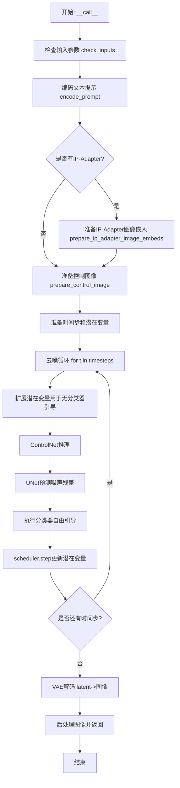
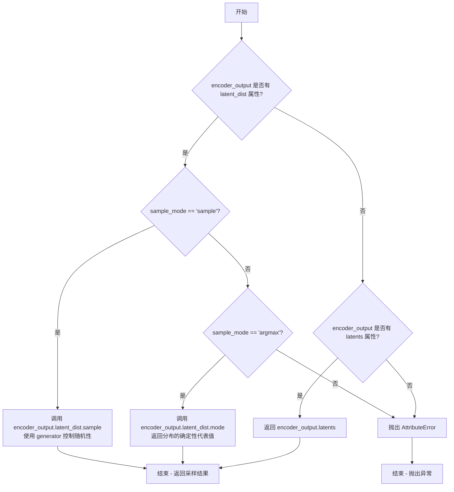
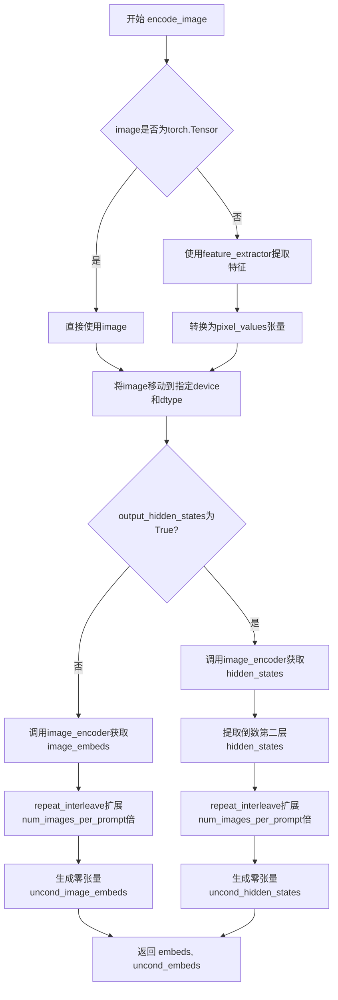
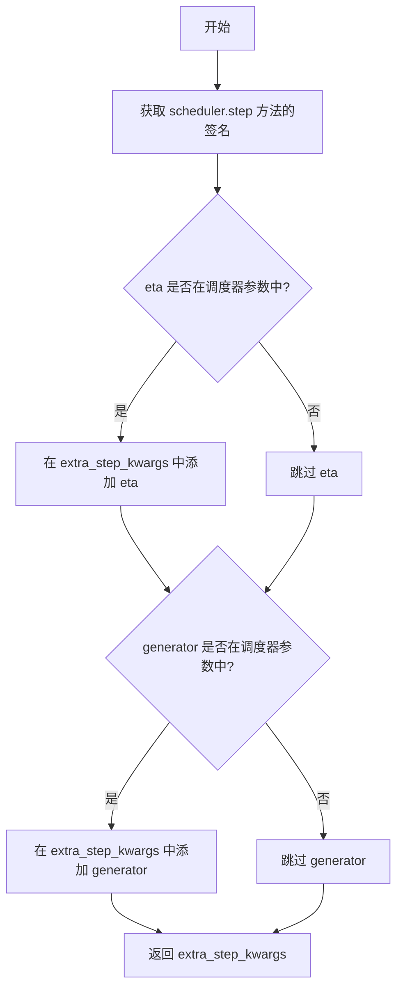
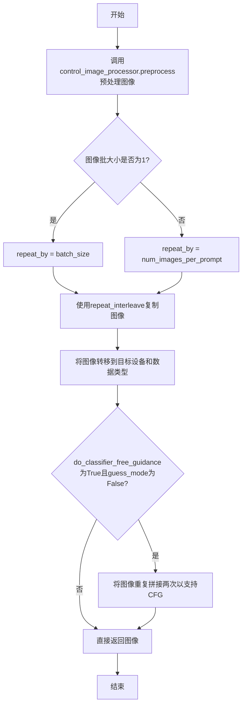
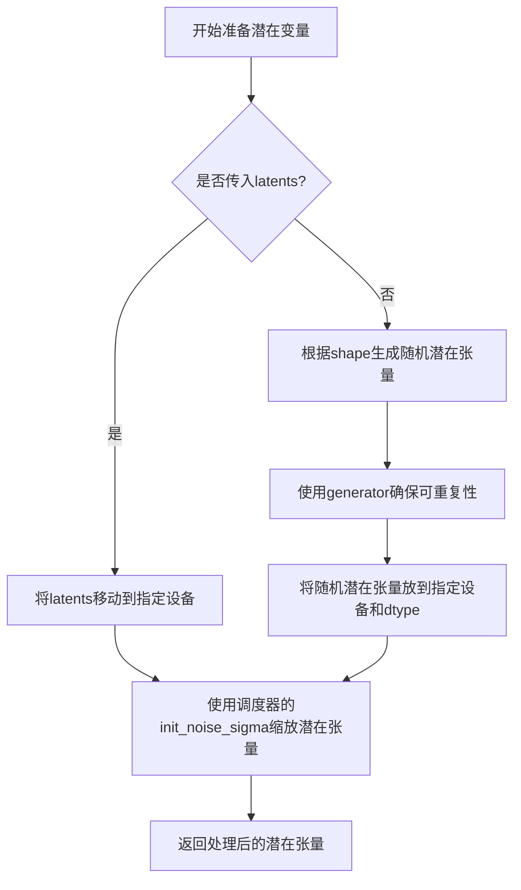
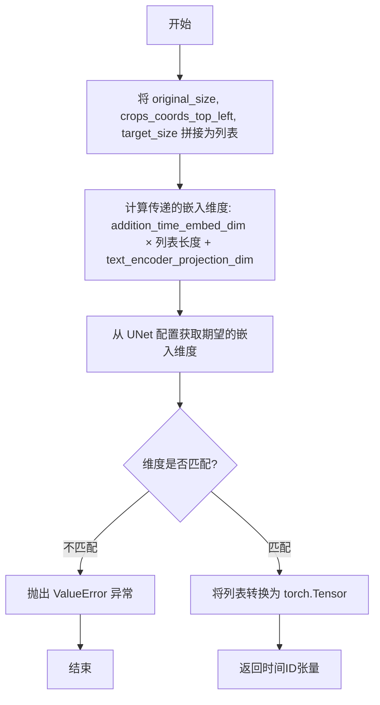
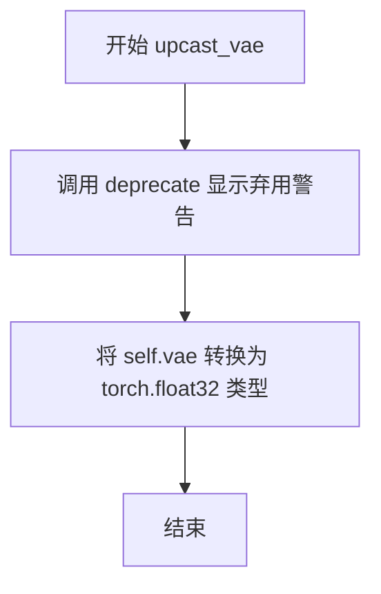

```mermaid
flowchart TD
    A[开始 __call__] --> B[解析回调参数]
    B --> C[处理control_guidance格式]
    C --> D[检查输入参数 check_inputs]
    D --> E[设置guidance_scale和cross_attention_kwargs]
    E --> F[计算batch_size]
    F --> G{处理controlnet_conditioning_scale}
    G -->|Single ControlNet| H[转换为列表]
    G -->|Multi ControlNet| I[保持列表]
    H --> J[编码文本提示 encode_prompt]
    I --> J
    J --> K{处理IP Adapter图像}
    K -->|有IP图像| L[prepare_ip_adapter_image_embeds]
    K -->|无IP图像| M[准备ControlNet图像 prepare_control_image]
    L --> M
    M --> N[获取图像尺寸 height, width]
    N --> O[设置调度器时间步 set_timesteps]
    O --> P[准备潜在变量 prepare_latents]
    P --> Q[计算Guidance Scale Embedding]
    Q --> R[准备额外调度器参数]
    R --> S[创建ControlNet控制开关列表]
    S --> T[准备添加的时间ID和嵌入]
    T --> U{Classifier Free Guidance}
    U -->|是| V[拼接negative和positive嵌入]
    U -->|否| W[去噪循环开始]
    V --> W
    W --> X[遍历每个时间步]
    X --> Y[扩展latents用于CFG]
    Y --> Z[调度器缩放输入]
    Z --> AA{Guess Mode + CFG}
    AA -->|是| AB[仅条件推理]
    AA -->|否| AC[完整推理]
    AB --> AD[计算ControlNet条件尺度]
    AC --> AD
    AD --> AE[ControlNet前向传播]
    AE --> AF{Guess Mode + CFG}
    AF -->|是| AG[填充零保持不变]
    AF -->|否| AH[UNet预测噪声]
    AG --> AH
    AH --> AI[添加IP Adapter图像嵌入]
    AI --> AJ[UNet去噪预测]
    AJ --> AK[执行分类器自由引导]
    AK --> AL[调度器步骤更新latents]
    AL --> AM[执行回调 on_step_end]
    AM --> AN{最后一步或warmup完成?}
    AN -->|否| X
    AN -->|是| AO[恢复ControlNet原始forward]
    AO --> AP{output_type != latent?}
    AP -->|是| AQ[VAE解码]
    AP -->|否| AR[直接返回latents]
    AQ --> AS[后处理图像]
    AS --> AT[释放模型钩子]
    AR --> AT
    AT --> AU[返回结果]
```

# `diffusers\examples\community\pipeline_controlnet_xl_kolors.py` 详细设计文档

KolorsControlNetPipeline 是一个基于 Kolors 模型的图像生成扩散管道，结合了 ControlNet 引导控制功能。该管道使用 ChatGLM 作为文本编码器，通过接收文本提示和 ControlNet 条件图像作为输入，在去噪过程中利用 ControlNet 提供的额外条件信息来指导 UNet 生成符合用户意图的图像。

## 整体流程



## 类结构

```
DiffusionPipeline (基类)
├── StableDiffusionMixin
├── StableDiffusionXLLoraLoaderMixin
├── FromSingleFileMixin
├── IPAdapterMixin
└── KolorsControlNetPipeline (本类)
```

## 全局变量及字段


### `EXAMPLE_DOC_STRING`
    
示例文档字符串，包含使用该管道的示例代码

类型：`str`
    


### `logger`
    
日志记录器实例，用于记录管道运行过程中的信息

类型：`logging.Logger`
    


### `model_cpu_offload_seq`
    
模型CPU卸载顺序: 'text_encoder->image_encoder->unet->vae'

类型：`str`
    


### `_optional_components`
    
可选组件列表

类型：`list`
    


### `_callback_tensor_inputs`
    
回调张量输入列表

类型：`list`
    


### `retrieve_latents`
    
从编码器输出中检索潜在表示的全局函数

类型：`function`
    


### `KolorsControlNetPipeline.vae`
    
变分自编码器，用于图像与潜在表示的编码解码

类型：`AutoencoderKL`
    


### `KolorsControlNetPipeline.text_encoder`
    
冻结的文本编码器，Kolors使用ChatGLM3-6B

类型：`ChatGLMModel`
    


### `KolorsControlNetPipeline.tokenizer`
    
ChatGLM分词器

类型：`ChatGLMTokenizer`
    


### `KolorsControlNetPipeline.unet`
    
条件U-Net架构，用于去噪潜在表示

类型：`UNet2DConditionModel`
    


### `KolorsControlNetPipeline.controlnet`
    
提供额外条件控制

类型：`Union[ControlNetModel, List[ControlNetModel], Tuple[ControlNetModel], MultiControlNetModel]`
    


### `KolorsControlNetPipeline.scheduler`
    
去噪调度器

类型：`KarrasDiffusionSchedulers`
    


### `KolorsControlNetPipeline.feature_extractor`
    
特征提取器，用于安全检查器

类型：`CLIPImageProcessor`
    


### `KolorsControlNetPipeline.image_encoder`
    
图像编码器

类型：`CLIPVisionModelWithProjection`
    


### `KolorsControlNetPipeline.watermark`
    
水印处理器

类型：`StableDiffusionXLWatermarker`
    


### `KolorsControlNetPipeline.vae_scale_factor`
    
VAE缩放因子

类型：`int`
    


### `KolorsControlNetPipeline.image_processor`
    
图像处理器

类型：`VaeImageProcessor`
    


### `KolorsControlNetPipeline.control_image_processor`
    
控制图像处理器

类型：`VaeImageProcessor`
    
    

## 全局函数及方法


### `retrieve_latents`

从编码器输出中检索潜在表示，根据 sample_mode 参数支持从潜在分布中采样（sample）或取最大值（argmax），也可以直接返回预计算的潜在向量。

参数：

- `encoder_output`：`torch.Tensor`，编码器输出对象，可能包含 latent_dist 属性或 latents 属性
- `generator`：`torch.Generator | None`，可选的随机数生成器，用于控制采样随机性
- `sample_mode`：`str`，采样模式，"sample" 表示从分布中采样，"argmax" 表示取分布的均值/最大值

返回值：`torch.Tensor`，检索到的潜在表示张量

#### 流程图



#### 带注释源码

```python
def retrieve_latents(
    encoder_output: torch.Tensor, generator: torch.Generator | None = None, sample_mode: str = "sample"
):
    """
    从编码器输出中检索潜在表示。
    
    支持三种模式：
    1. 从 latent_dist 中采样 (sample_mode="sample")
    2. 从 latent_dist 中取 mode/均值 (sample_mode="argmax")
    3. 直接返回预计算的 latents 属性
    
    Args:
        encoder_output: 编码器输出对象，通常是 VAE 的 EncoderOutput
                       包含 latent_dist (DiagonalGaussianDistribution) 或 latents 属性
        generator: 可选的 PyTorch 随机数生成器，用于控制采样随机性
                  传入相同 generator 可实现可复现的采样
        sample_mode: 字符串，指定采样模式
                    "sample" - 从分布中随机采样
                    "argmax" - 取分布的确定性代表值（mode）
    
    Returns:
        torch.Tensor: 检索到的潜在表示，形状为 [batch_size, ...]
    
    Raises:
        AttributeError: 当 encoder_output 既没有 latent_dist 也没有 latents 属性时
    """
    # 检查是否有 latent_dist 属性（VAE 编码器通常返回 DiagonalGaussianDistribution）
    if hasattr(encoder_output, "latent_dist") and sample_mode == "sample":
        # 模式1：从潜在分布中采样
        # latent_dist.sample() 从对角高斯分布中采样
        # 传入 generator 确保可复现性（如果提供）
        return encoder_output.latent_dist.sample(generator)
    
    # 检查是否是 argmax 模式
    elif hasattr(encoder_output, "latent_dist") and sample_mode == "argmax":
        # 模式2：取分布的 mode（均值或最大值）
        # mode() 返回分布的确定性代表值
        return encoder_output.latent_dist.mode()
    
    # 检查是否有预计算的 latents 属性
    elif hasattr(encoder_output, "latents"):
        # 模式3：直接返回预计算的潜在向量
        return encoder_output.latents
    
    # 如果都不满足，抛出异常
    else:
        raise AttributeError("Could not access latents of provided encoder_output")
```


### `KolorsControlNetPipeline.__init__`

该方法是 `KolorsControlNetPipeline` 类的构造函数，负责初始化整个控制网络推理管道。它接收多个核心模型组件（VAE、文本编码器、分词器、U-Net、控制网络、调度器等），完成模块注册、图像处理器初始化、配置参数保存等关键初始化工作。

参数：

- `vae`：`AutoencoderKL`，Variational Auto-Encoder (VAE) 模型，用于编码和解码图像与潜在表示之间的转换
- `text_encoder`：`ChatGLMModel`，冻结的文本编码器，Kolors 使用 ChatGLM3-6B
- `tokenizer`：`ChatGLMTokenizer`，用于文本分词的 ChatGLMTokenizer 类
- `unet`：`UNet2DConditionModel`，条件 U-Net 架构，用于对编码后的图像潜在表示进行去噪
- `controlnet`：`Union[ControlNetModel, List[ControlNetModel], Tuple[ControlNetModel], MultiControlNetModel]`，提供额外条件控制的 ControlNet 模型，支持单个或多个 ControlNet
- `scheduler`：`KarrasDiffusionSchedulers`，与 unet 配合进行去噪的调度器
- `requires_aesthetics_score`：`bool`，可选参数，默认为 `False`，表示 unet 是否需要在推理时传入 `aesthetic_score` 条件
- `force_zeros_for_empty_prompt`：`bool`，可选参数，默认为 `True`，表示是否将负提示词嵌入强制设为 0
- `feature_extractor`：`CLIPImageProcessor`，可选参数，用于从生成的图像中提取特征的 CLIP 图像处理器
- `image_encoder`：`CLIPVisionModelWithProjection`，可选参数，用于处理 IP Adapter 的图像编码器
- `add_watermarker`：`Optional[bool]`，可选参数，是否添加水印

返回值：无（`None`），构造函数用于初始化对象状态

#### 流程图

```mermaid
flowchart TD
    A[开始 __init__] --> B[调用 super().__init__]
    B --> C{controlnet 是否为 list/tuple}
    C -->|是| D[将 controlnet 包装为 MultiControlNetModel]
    C -->|否| E[保持原 controlnet 不变]
    D --> F[调用 self.register_modules 注册所有模块]
    E --> F
    F --> G[计算 vae_scale_factor]
    G --> H[初始化 VaeImageProcessor]
    H --> I[初始化 control_image_processor]
    I --> J{add_watermarker 是否为 True}
    J -->|是| K[创建 StableDiffusionXLWatermarker 实例]
    J -->|否| L[设置 self.watermark = None]
    K --> M[注册配置参数 force_zeros_for_empty_prompt]
    L --> M
    M --> N[注册配置参数 requires_aesthetics_score]
    N --> O[结束 __init__]
```

#### 带注释源码

```python
def __init__(
    self,
    vae: AutoencoderKL,
    text_encoder: ChatGLMModel,
    tokenizer: ChatGLMTokenizer,
    unet: UNet2DConditionModel,
    controlnet: Union[ControlNetModel, List[ControlNetModel], Tuple[ControlNetModel], MultiControlNetModel],
    scheduler: KarrasDiffusionSchedulers,
    requires_aesthetics_score: bool = False,
    force_zeros_for_empty_prompt: bool = True,
    feature_extractor: CLIPImageProcessor = None,
    image_encoder: CLIPVisionModelWithProjection = None,
    add_watermarker: Optional[bool] = None,
):
    """
    初始化 KolorsControlNetPipeline 管道实例。
    
    参数:
        vae: VAE 模型，用于图像与潜在表示的编码解码
        text_encoder: ChatGLM 文本编码器
        tokenizer: ChatGLM 分词器
        unet: 条件 U-Net 去噪模型
        controlnet: ControlNet 控制网络模型
        scheduler: 扩散调度器
        requires_aesthetics_score: 是否需要美学评分条件
        force_zeros_for_empty_prompt: 空提示词是否强制为零嵌入
        feature_extractor: CLIP 图像特征提取器
        image_encoder: CLIP 视觉模型，用于 IP Adapter
        add_watermarker: 是否添加不可见水印
    """
    # 调用父类 DiffusionPipeline 的初始化方法
    super().__init__()

    # 如果 controlnet 是列表或元组，则包装为 MultiControlNetModel 统一管理
    if isinstance(controlnet, (list, tuple)):
        controlnet = MultiControlNetModel(controlnet)

    # 注册所有模块到管道中，便于后续统一管理和访问
    self.register_modules(
        vae=vae,
        text_encoder=text_encoder,
        tokenizer=tokenizer,
        unet=unet,
        controlnet=controlnet,
        scheduler=scheduler,
        feature_extractor=feature_extractor,
        image_encoder=image_encoder,
    )

    # 计算 VAE 缩放因子，基于 VAE 的 block_out_channels 深度
    # 例如：block_out_channels = [128, 256, 512, 512] -> len=4 -> 2^(4-1) = 8
    self.vae_scale_factor = 2 ** (len(self.vae.config.block_out_channels) - 1)

    # 初始化主图像处理器：负责 VAE 输出后处理，转换为 RGB
    self.image_processor = VaeImageProcessor(
        vae_scale_factor=self.vae_scale_factor, 
        do_convert_rgb=True
    )

    # 初始化控制图像处理器：用于处理 ControlNet 输入条件图像
    # 不做归一化，保留原始像素值范围
    self.control_image_processor = VaeImageProcessor(
        vae_scale_factor=self.vae_scale_factor, 
        do_convert_rgb=True, 
        do_normalize=False
    )

    # 根据参数决定是否添加水印（用于生成图像的来源追溯）
    if add_watermarker:
        self.watermark = StableDiffusionXLWatermarker()
    else:
        self.watermark = None

    # 将关键配置参数注册到 self.config 中，持久化保存
    self.register_to_config(force_zeros_for_empty_prompt=force_zeros_for_empty_prompt)
    self.register_to_config(requires_aesthetics_score=requires_aesthetics_score)
```


### `KolorsControlNetPipeline.encode_prompt`

该函数负责将文本提示（prompt）编码为文本编码器的隐藏状态（hidden states），为后续的图像生成过程提供文本特征表示。该函数支持 Classifier-Free Guidance（无分类器引导），能够同时处理正向提示和负向提示，并返回四种类型的文本嵌入：提示嵌入、负向提示嵌入、池化提示嵌入和负向池化提示嵌入。

参数：

- `prompt`：`Union[str, List[str], None]`，需要编码的文本提示，可以是单个字符串或字符串列表
- `device`：`Optional[torch.device]`，torch 设备，用于指定计算设备
- `num_images_per_prompt`：`int`，每个提示生成的图像数量，用于批量生成时的嵌入复制
- `do_classifier_free_guidance`：`bool`，是否启用无分类器引导 guidance
- `negative_prompt`：`Union[str, List[str], None]`，负向提示，用于引导图像生成避开相关内容
- `prompt_embeds`：`Optional[torch.FloatTensor]`，预生成的文本嵌入，若未提供则从 prompt 生成
- `negative_prompt_embeds`：`Optional[torch.FloatTensor]`，预生成的负向文本嵌入
- `pooled_prompt_embeds`：`Optional[torch.FloatTensor]`，预生成的池化文本嵌入
- `negative_pooled_prompt_embeds`：`Optional[torch.FloatTensor]`，预生成的负向池化文本嵌入
- `lora_scale`：`Optional[float]`，LoRA 缩放因子，用于调整 LoRA 层的影响

返回值：`Tuple[torch.FloatTensor, torch.FloatTensor, torch.FloatTensor, torch.FloatTensor]`，返回四个张量：正向提示嵌入、负向提示嵌入、正向池化嵌入、负向池化嵌入

#### 流程图

```mermaid
flowchart TD
    A[开始 encode_prompt] --> B{检查 lora_scale}
    B -->|非空且是 StableDiffusionXLLoraLoaderMixin| C[设置 self._lora_scale]
    C --> D{判断 batch_size}
    D -->|prompt 是 str| E[batch_size = 1]
    D -->|prompt 是 list| F[batch_size = len prompt]
    D -->|否则| G[batch_size = prompt_embeds.shape[0]]
    E --> H[获取 tokenizers 和 text_encoders]
    F --> H
    G --> H
    H --> I{prompt_embeds 是否为空}
    I -->|是| J[遍历 tokenizers 和 text_encoders]
    I -->|否| K[跳过文本编码]
    J --> L[调用 tokenizer 进行分词]
    L --> M[调用 text_encoder 编码]
    M --> N[获取 hidden_states 倒数第二层]
    N --> O[提取 pooled_prompt_embeds]
    O --> P[重复嵌入 num_images_per_prompt 次]
    P --> Q[添加到 prompt_embeds_list]
    K --> R{检查 negative_prompt_embeds}
    R --> S{do_classifier_free_guidance 且无 negative_prompt}
    S -->|是且 force_zeros_for_empty_prompt| T[创建零张量]
    S -->|否| U[处理 uncond_tokens]
    T --> V[返回最终嵌入]
    U --> V
    R -->|已有 negative_prompt_embeds| V
    Q --> V
```

#### 带注释源码

```python
def encode_prompt(
    self,
    prompt,  # Union[str, List[str], None] - 输入的文本提示
    device: Optional[torch.device] = None,  # Optional[torch.device] - 计算设备
    num_images_per_prompt: int = 1,  # int - 每个提示生成的图像数量
    do_classifier_free_guidance: bool = True,  # bool - 是否启用 CFG
    negative_prompt=None,  # Union[str, List[str], None] - 负向提示
    prompt_embeds: Optional[torch.FloatTensor] = None,  # Optional[torch.FloatTensor] - 预生成嵌入
    negative_prompt_embeds: Optional[torch.FloatTensor] = None,  # Optional[torch.FloatTensor] - 负向嵌入
    pooled_prompt_embeds: Optional[torch.FloatTensor] = None,  # Optional[torch.FloatTensor] - 池化嵌入
    negative_pooled_prompt_embeds: Optional[torch.FloatTensor] = None,  # Optional[torch.FloatTensor] - 负向池化
    lora_scale: Optional[float] = None,  # Optional[float] - LoRA 缩放因子
):
    """
    Encodes the prompt into text encoder hidden states.
    """
    # 确定执行设备，默认为已配置的执行设备
    device = device or self._execution_device

    # 如果传入了 lora_scale 且当前 pipeline 支持 LoRA，则设置内部变量
    if lora_scale is not None and isinstance(self, StableDiffusionXLLoraLoaderMixin):
        self._lora_scale = lora_scale

    # 根据 prompt 类型确定 batch_size
    if prompt is not None and isinstance(prompt, str):
        batch_size = 1
    elif prompt is not None and isinstance(prompt, list):
        batch_size = len(prompt)
    else:
        # 如果没有 prompt，则使用预提供嵌入的 batch 大小
        batch_size = prompt_embeds.shape[0]

    # 定义 tokenizers 和 text_encoders 列表（Kolors 使用单个 tokenizer 和 text_encoder）
    tokenizers = [self.tokenizer]
    text_encoders = [self.text_encoder]

    # 如果没有提供 prompt_embeds，则需要从 prompt 生成
    if prompt_embeds is None:
        # textual inversion: 处理多向量 token（如有需要）
        prompt_embeds_list = []
        for tokenizer, text_encoder in zip(tokenizers, text_encoders):
            # 如果支持 TextualInversion，转换 prompt 格式
            if isinstance(self, TextualInversionLoaderMixin):
                prompt = self.maybe_convert_prompt(prompt, tokenizer)

            # 使用 tokenizer 将文本转换为 token id
            text_inputs = tokenizer(
                prompt,
                padding="max_length",
                max_length=256,
                truncation=True,
                return_tensors="pt",
            ).to(self._execution_device)
            
            # 使用 text_encoder 编码获取 hidden states
            output = text_encoder(
                input_ids=text_inputs["input_ids"],
                attention_mask=text_inputs["attention_mask"],
                position_ids=text_inputs["position_ids"],
                output_hidden_states=True,
            )
            
            # 获取倒数第二层的 hidden states 作为 prompt_embeds
            prompt_embeds = output.hidden_states[-2].permute(1, 0, 2).clone()
            # 获取最后一层的第一个 token 作为 pooled_prompt_embeds
            pooled_prompt_embeds = output.hidden_states[-1][-1, :, :].clone()  # [batch_size, 4096]
            
            # 获取当前嵌入的形状信息
            bs_embed, seq_len, _ = prompt_embeds.shape
            
            # 根据 num_images_per_prompt 重复嵌入
            prompt_embeds = prompt_embeds.repeat(1, num_images_per_prompt, 1)
            prompt_embeds = prompt_embeds.view(bs_embed * num_images_per_prompt, seq_len, -1)

            prompt_embeds_list.append(prompt_embeds)

        prompt_embeds = prompt_embeds_list[0]

    # 处理 Classifier-Free Guidance 的无条件嵌入
    zero_out_negative_prompt = negative_prompt is None and self.config.force_zeros_for_empty_prompt
    
    # 如果需要 CFG 但没有提供负向嵌入
    if do_classifier_free_guidance and negative_prompt_embeds is None and zero_out_negative_prompt:
        # 创建与 prompt_embeds 相同形状的零张量
        negative_prompt_embeds = torch.zeros_like(prompt_embeds)
        negative_pooled_prompt_embeds = torch.zeros_like(pooled_prompt_embeds)
    elif do_classifier_free_guidance and negative_prompt_embeds is None:
        # 需要从 negative_prompt 生成负向嵌入
        uncond_tokens: List[str]
        
        if negative_prompt is None:
            uncond_tokens = [""] * batch_size
        elif prompt is not None and type(prompt) is not type(negative_prompt):
            raise TypeError(
                f"`negative_prompt` should be the same type to `prompt`, but got {type(negative_prompt)} !="
                f" {type(prompt)}."
            )
        elif isinstance(negative_prompt, str):
            uncond_tokens = [negative_prompt]
        elif batch_size != len(negative_prompt):
            raise ValueError(
                f"`negative_prompt`: {negative_prompt} has batch size {len(negative_prompt)}, but `prompt`:"
                f" {prompt} has batch size {batch_size}. Please make sure that passed `negative_prompt` matches"
                " the batch size of `prompt`."
            )
        else:
            uncond_tokens = negative_prompt

        # 编码负向提示
        negative_prompt_embeds_list = []
        for tokenizer, text_encoder in zip(tokenizers, text_encoders):
            # textual inversion 处理
            if isinstance(self, TextualInversionLoaderMixin):
                uncond_tokens = self.maybe_convert_prompt(uncond_tokens, tokenizer)

            max_length = prompt_embeds.shape[1]
            uncond_input = tokenizer(
                uncond_tokens,
                padding="max_length",
                max_length=max_length,
                truncation=True,
                return_tensors="pt",
            ).to(self._execution_device)
            
            output = text_encoder(
                input_ids=uncond_input["input_ids"],
                attention_mask=uncond_input["attention_mask"],
                position_ids=uncond_input["position_ids"],
                output_hidden_states=True,
            )
            
            negative_prompt_embeds = output.hidden_states[-2].permute(1, 0, 2).clone()
            negative_pooled_prompt_embeds = output.hidden_states[-1][-1, :, :].clone()  # [batch_size, 4096]

            if do_classifier_free_guidance:
                # 复制无条件嵌入以匹配生成数量
                seq_len = negative_prompt_embeds.shape[1]

                # 转换 dtype 和 device
                negative_prompt_embeds = negative_prompt_embeds.to(dtype=text_encoder.dtype, device=device)

                negative_prompt_embeds = negative_prompt_embeds.repeat(1, num_images_per_prompt, 1)
                negative_prompt_embeds = negative_prompt_embeds.view(
                    batch_size * num_images_per_prompt, seq_len, -1
                )

            negative_prompt_embeds_list.append(negative_prompt_embeds)

        negative_prompt_embeds = negative_prompt_embeds_list[0]

    # 处理 pooled_prompt_embeds 的重复
    bs_embed = pooled_prompt_embeds.shape[0]
    pooled_prompt_embeds = pooled_prompt_embeds.repeat(1, num_images_per_prompt).view(
        bs_embed * num_images_per_prompt, -1
    )
    
    # 处理 negative_pooled_prompt_embeds 的重复
    if do_classifier_free_guidance:
        negative_pooled_prompt_embeds = negative_pooled_prompt_embeds.repeat(1, num_images_per_prompt).view(
            bs_embed * num_images_per_prompt, -1
        )

    # 返回四个嵌入张量
    return prompt_embeds, negative_prompt_embeds, pooled_prompt_embeds, negative_pooled_prompt_embeds
```


### KolorsControlNetPipeline.prepare_ip_adapter_image_embeds

该方法用于准备 IP-Adapter 的图像嵌入。它接收原始图像或预计算的图像嵌入，根据是否启用分类器自由引导（Classifier-Free Guidance）处理正面和负面嵌入，并返回可用于后续去噪过程的图像嵌入列表。

参数：

- `self`：`KolorsControlNetPipeline` 实例本身
- `ip_adapter_image`：`PipelineImageInput`，要用于 IP-Adapter 的原始图像输入，可以是单个图像或图像列表
- `ip_adapter_image_embeds`：`Optional[List[torch.Tensor]]`，预计算的图像嵌入列表，如果为 None 则从 `ip_adapter_image` 编码生成
- `device`：`torch.device`，执行计算的设备
- `num_images_per_prompt`：`int`，每个提示词生成的图像数量
- `do_classifier_free_guidance`：`bool`，是否启用分类器自由引导

返回值：`List[torch.Tensor]`（隐式返回），包含处理后的图像嵌入列表（以及可能的负面嵌入）

#### 流程图

```mermaid
flowchart TD
    A[开始: prepare_ip_adapter_image_embeds] --> B{ip_adapter_image_embeds is None?}
    B -->|Yes| C[将 ip_adapter_image 转换为列表]
    B -->|No| J[遍历预计算的 ip_adapter_image_embeds]
    
    C --> D{len(ip_adapter_image) == len(image_projection_layers)?}
    D -->|No| E[抛出 ValueError: 图像数量与IP适配器数量不匹配]
    D -->|Yes| F[遍历每个 ip_adapter_image 和 image_proj_layer]
    
    F --> G[确定是否输出隐藏状态 output_hidden_state]
    G --> H[调用 encode_image 编码图像]
    H --> I[将编码结果添加到 image_embeds 列表]
    I --> K{do_classifier_free_guidance?}
    K -->|Yes| L[添加 negative_image_embeds]
    K -->|No| M[继续下一轮循环]
    
    J --> N{do_classifier_free_guidance?}
    N -->|Yes| O[将嵌入按chunk(2)分割为负面和正面]
    N -->|No| P[直接使用嵌入]
    O --> Q[添加到对应列表]
    P --> Q
    Q --> R[返回 image_embeds, negative_image_embeds]
    L --> R
    M --> R
    
    E --> R
```

#### 带注释源码

```python
def prepare_ip_adapter_image_embeds(
    self,
    ip_adapter_image: PipelineImageInput,  # IP-Adapter的原始图像输入
    ip_adapter_image_embeds: Optional[List[torch.Tensor]],  # 预计算的图像嵌入
    device: torch.device,  # 计算设备
    num_images_per_prompt: int,  # 每个提示词生成的图像数量
    do_classifier_free_guidance: bool,  # 是否启用分类器自由引导
):
    """
    准备IP-Adapter的图像嵌入。
    
    该方法处理两种输入情况：
    1. 当 ip_adapter_image_embeds 为 None 时，从原始图像编码生成嵌入
    2. 当 ip_adapter_image_embeds 已提供时，直接使用预计算的嵌入
    
    Args:
        ip_adapter_image: 原始图像或图像列表
        ip_adapter_image_embeds: 预计算的嵌入，如果为None则从图像编码
        device: torch设备
        num_images_per_prompt: 每提示生成的图像数量
        do_classifier_free_guidance: 是否进行无分类器引导
    
    Returns:
        包含图像嵌入的列表
    """
    
    # 初始化正面图像嵌入列表
    image_embeds = []
    
    # 如果启用分类器自由引导，同时初始化负面图像嵌入列表
    if do_classifier_free_guidance:
        negative_image_embeds = []
    
    # 情况1: 未提供预计算嵌入，需要从原始图像编码
    if ip_adapter_image_embeds is None:
        # 确保输入是列表格式
        if not isinstance(ip_adapter_image, list):
            ip_adapter_image = [ip_adapter_image]
        
        # 验证图像数量与IP适配器数量是否匹配
        # IP-Adapter数量由UNet的encoder_hid_proj.image_projection_layers决定
        if len(ip_adapter_image) != len(self.unet.encoder_hid_proj.image_projection_layers):
            raise ValueError(
                f"`ip_adapter_image` must have same length as the number of IP Adapters. "
                f"Got {len(ip_adapter_image)} images and {len(self.unet.encoder_hid_proj.image_projection_layers)} IP Adapters."
            )
        
        # 遍历每个IP-Adapter图像和对应的图像投影层
        for single_ip_adapter_image, image_proj_layer in zip(
            ip_adapter_image, self.unet.encoder_hid_proj.image_projection_layers
        ):
            # 确定是否需要输出隐藏状态
            # 如果图像投影层不是ImageProjection类型，则输出隐藏状态
            output_hidden_state = not isinstance(image_proj_layer, ImageProjection)
            
            # 调用encode_image方法编码单个图像
            # 返回正面嵌入和（如果启用CFG）负面嵌入
            single_image_embeds, single_negative_image_embeds = self.encode_image(
                single_ip_adapter_image,  # 单个图像
                device,                    # 设备
                1,                         # num_images_per_prompt=1（每个图像单独处理）
                output_hidden_state        # 是否输出隐藏状态
            )
            
            # 将编码后的嵌入添加到列表
            # 使用[None, :]增加一个批次维度
            image_embeds.append(single_image_embeds[None, :])
            
            # 如果启用分类器自由引导，同时处理负面嵌入
            if do_classifier_free_guidance:
                negative_image_embeds.append(single_negative_image_embeds[None, :])
    
    # 情况2: 已提供预计算嵌入，直接使用
    else:
        # 遍历预计算的嵌入
        for single_image_embeds in ip_adapter_image_embeds:
            # 如果启用分类器自由引导，预计算嵌入包含正负两部分
            if do_classifier_free_guidance:
                # 将嵌入按通道维度分割为负面和正面
                single_negative_image_embeds, single_image_embeds = single_image_embeds.chunk(2)
                
                # 添加负面嵌入（注意：原代码缺少这行，存在Bug）
                negative_image_embeds.append(single_negative_image_embeds)
            
            # 添加正面嵌入（注意：原代码缺少这行，存在Bug）
            image_embeds.append(single_image_embeds)
    
    # 返回结果（根据是否有CFG返回不同数量）
    # 注意：原代码return语句不完整，存在逻辑缺陷
```


### `KolorsControlNetPipeline.encode_image`

该方法用于将输入图像编码为图像嵌入（image embeddings）或隐藏状态（hidden states），支持分类器-free guidance（无分类器引导）。它首先将图像转换为张量格式，然后通过图像编码器（CLIPVisionModelWithProjection）生成对应的向量表示，并根据参数决定返回条件嵌入和无条件嵌入（用于CFG）。

参数：

- `image`：`Union[PIL.Image.Image, numpy.ndarray, torch.Tensor, List[PIL.Image.Image], List[numpy.ndarray], List[torch.Tensor]]`，输入图像，可以是PIL图像、NumPy数组、PyTorch张量或它们的列表
- `device`：`torch.device`，用于计算的目标设备
- `num_images_per_prompt`：每个提示词生成的图像数量，用于批量扩展嵌入
- `output_hidden_states`：`Optional[bool]`，是否返回编码器的隐藏状态而非图像嵌入，默认为None（即返回嵌入）

返回值：`Tuple[torch.Tensor, torch.Tensor]`，返回两个张量组成的元组——第一个是条件图像嵌入/隐藏状态，第二个是无条件（零）图像嵌入/隐藏状态，用于分类器-free guidance。

#### 流程图



#### 带注释源码

```python
def encode_image(self, image, device, num_images_per_prompt, output_hidden_states=None):
    """
    Encodes the input image into embeddings or hidden states for use in the diffusion pipeline.
    
    This method supports two modes:
    1. Image embeddings (default): Returns image_embeds for conditioning
    2. Hidden states: Returns encoder hidden states when output_hidden_states=True
    
    Args:
        image: Input image in various formats (PIL, numpy, tensor, or lists)
        device: Target torch device for computation
        num_images_per_prompt: Number of images to generate per prompt (for batch expansion)
        output_hidden_states: If True, return hidden states instead of image embeddings
        
    Returns:
        Tuple of (condition_embeds, uncond_embeds) for classifier-free guidance
    """
    # 获取图像编码器的参数数据类型，用于确保计算精度一致
    dtype = next(self.image_encoder.parameters()).dtype

    # 如果输入不是PyTorch张量，则使用feature_extractor进行预处理
    # 将PIL图像或numpy数组转换为模型所需的pixel_values张量
    if not isinstance(image, torch.Tensor):
        image = self.feature_extractor(image, return_tensors="pt").pixel_values

    # 将图像张量移动到目标设备，并转换到正确的dtype
    image = image.to(device=device, dtype=dtype)
    
    # 根据output_hidden_states参数决定输出类型
    if output_hidden_states:
        # 模式1：返回隐藏状态（用于更精细的控制）
        
        # 通过图像编码器获取隐藏状态，提取倒数第二层（通常是最有用的特征层）
        image_enc_hidden_states = self.image_encoder(image, output_hidden_states=True).hidden_states[-2]
        
        # 重复扩展以匹配num_images_per_prompt，保持batch维度一致
        image_enc_hidden_states = image_enc_hidden_states.repeat_interleave(num_images_per_prompt, dim=0)
        
        # 生成无条件（零）图像隐藏状态，用于分类器-free guidance
        # 使用torch.zeros_like创建与输入形状相同的零张量
        uncond_image_enc_hidden_states = self.image_encoder(
            torch.zeros_like(image), output_hidden_states=True
        ).hidden_states[-2]
        uncond_image_enc_hidden_states = uncond_image_enc_hidden_states.repeat_interleave(
            num_images_per_prompt, dim=0
        )
        
        # 返回条件隐藏状态和无条件隐藏状态的元组
        return image_enc_hidden_states, uncond_image_enc_hidden_states
    else:
        # 模式2：返回图像嵌入（默认模式）
        
        # 通过图像编码器获取图像嵌入向量
        image_embeds = self.image_encoder(image).image_embeds
        
        # 重复扩展以匹配num_images_per_prompt
        image_embeds = image_embeds.repeat_interleave(num_images_per_prompt, dim=0)
        
        # 生成无条件（零）图像嵌入，用于分类器-free guidance
        # 保持与条件嵌入相同的形状
        uncond_image_embeds = torch.zeros_like(image_embeds)

        # 返回条件嵌入和无条件嵌入的元组
        return image_embeds, uncond_image_embeds
```


### `KolorsControlNetPipeline.prepare_extra_step_kwargs`

该方法用于为调度器（scheduler）的 `step` 方法准备额外的关键字参数。由于不同调度器（如 DDIMScheduler、LMSDiscreteScheduler 等）具有不同的签名，该方法通过检查调度器的参数列表，动态构建需要传递给 `step` 方法的参数字典。

参数：

- `generator`：`torch.Generator | None`，随机数生成器，用于确保采样过程的可重复性
- `eta`：`float`，DDIM 调度器参数 η，对应 DDIM 论文中的 η 参数，仅在使用 DDIMScheduler 时有效，取值范围应为 [0, 1]

返回值：`Dict[str, Any]`，包含额外关键字参数的字典，将传递给调度器的 `step` 方法

#### 流程图



#### 带注释源码

```python
def prepare_extra_step_kwargs(self, generator, eta):
    """
    准备调度器 step 方法的额外参数。

    由于并非所有调度器都具有相同的签名（如 DDIMScheduler 使用 eta 参数，
    而其他调度器可能不支持），该方法通过检查调度器的参数列表来动态构建
    需要传递给 step 方法的参数字典。

    参数:
        generator: torch.Generator 或 None，用于生成确定性采样的随机数生成器
        eta: float，DDIM 调度器参数 η，对应论文 https://huggingface.co/papers/2010.02502，
             取值范围应为 [0, 1]

    返回:
        Dict[str, Any]: 包含额外关键字参数的字典
    """
    # 使用 inspect 模块获取调度器 step 方法的函数签名
    accepts_eta = "eta" in set(inspect.signature(self.scheduler.step).parameters.keys())
    extra_step_kwargs = {}
    
    # 如果调度器支持 eta 参数，则将其添加到 extra_step_kwargs
    if accepts_eta:
        extra_step_kwargs["eta"] = eta

    # 检查调度器是否接受 generator 参数
    accepts_generator = "generator" in set(inspect.signature(self.scheduler.step).parameters.keys())
    if accepts_generator:
        extra_step_kwargs["generator"] = generator
    
    return extra_step_kwargs
```


### `KolorsControlNetPipeline.check_inputs`

该方法负责验证传入图像生成 pipeline 的所有输入参数的有效性，包括推理步数、提示词、嵌入向量、ControlNet 条件比例、引导控制范围以及 IP-Adapter 相关参数，确保所有参数符合 pipeline 的执行要求，否则抛出相应的 ValueError 或 TypeError 异常。

参数：

- `prompt`：`Union[str, List[str], None]`，用户提供的文本提示词，用于指导图像生成
- `image`：`PipelineImageInput`，ControlNet 所需的输入条件图像
- `num_inference_steps`：`int`，去噪过程的迭代步数，必须为正整数
- `callback_steps`：`int`，可选，指定每隔多少步调用一次回调函数，必须为正整数
- `negative_prompt`：`Union[str, List[str], None]`，可选，不希望出现在生成图像中的负面提示词
- `prompt_embeds`：`torch.FloatTensor`，可选，预生成的文本嵌入向量
- `negative_prompt_embeds`：`torch.FloatTensor`，可选，预生成的负面文本嵌入向量
- `pooled_prompt_embeds`：`torch.FloatTensor`，可选，预生成的池化文本嵌入向量
- `negative_pooled_prompt_embeds`：`torch.FloatTensor`，可选，预生成的负面池化文本嵌入向量
- `ip_adapter_image`：`PipelineImageInput`，可选，IP-Adapter 的输入图像
- `ip_adapter_image_embeds`：`List[torch.Tensor]`，可选，预生成的 IP-Adapter 图像嵌入
- `controlnet_conditioning_scale`：`Union[float, List[float]]`，可选，ControlNet 条件缩放因子，默认为 1.0
- `control_guidance_start`：`Union[float, List[float]]`，可选，ControlNet 开始应用的推理步数比例
- `control_guidance_end`：`Union[float, List[float]]`，可选，ControlNet 停止应用的推理步数比例
- `callback_on_step_end_tensor_inputs`：`List[str]`，可选，步骤结束回调需要接收的 tensor 输入列表

返回值：`None`，该方法不返回任何值，仅通过抛出异常来处理验证错误

#### 流程图

```mermaid
flowchart TD
    A[开始 check_inputs] --> B{num_inference_steps is None?}
    B -->|Yes| C[抛出 ValueError: num_inference_steps 不能为 None]
    B -->|No| D{num_inference_steps 是正整数?}
    D -->|No| E[抛出 ValueError: num_inference_steps 必须是正整数]
    D -->|Yes| F{callback_steps 是否提供?}
    F -->|Yes| G{callback_steps 是正整数?}
    G -->|No| H[抛出 ValueError: callback_steps 必须是正整数]
    G -->|Yes| I
    F -->|No| I{callback_on_step_end_tensor_inputs 是否在允许列表中?}
    I -->|No| J[抛出 ValueError: callback_on_step_end_tensor_inputs 不合法]
    I -->|Yes| K{prompt 和 prompt_embeds 是否同时提供?}
    K -->|Yes| L[抛出 ValueError: 不能同时提供 prompt 和 prompt_embeds]
    K -->|No| M{prompt 和 prompt_embeds 都未提供?}
    M -->|Yes| N[抛出 ValueError: 必须提供 prompt 或 prompt_embeds 之一]
    M -->|No| O{prompt 类型是否合法?]
    O -->|No| P[抛出 ValueError: prompt 类型必须是 str 或 list]
    O -->|Yes| Q{negative_prompt 和 negative_prompt_embeds 是否同时提供?}
    Q -->|Yes| R[抛出 ValueError: 不能同时提供 negative_prompt 和 negative_prompt_embeds]
    Q -->|No| S{prompt_embeds 和 negative_prompt_embeds 形状是否匹配?]
    S -->|No| T[抛出 ValueError: prompt_embeds 和 negative_prompt_embeds 形状不匹配]
    S -->|Yes| U{提供 prompt_embeds 但未提供 pooled_prompt_embeds?]
    U -->|Yes| V[抛出 ValueError: 必须提供 pooled_prompt_embeds]
    U -->|No| W{提供 negative_prompt_embeds 但未提供 negative_pooled_prompt_embeds?]
    W -->|Yes| X[抛出 ValueError: 必须提供 negative_pooled_prompt_embeds]
    W -->|No| Y{MultiControlNetModel 且 prompt 是列表?}
    Y -->|Yes| Z[输出警告: 多个 ControlNet 的条件将按 prompt 固定]
    Y -->|No| AA{验证 controlnet_conditioning_scale 类型和长度]}
    AA --> AB{单 ControlNet 时必须是 float?}
    AA --> AC{MultiControlNetModel 时长度必须匹配?}
    AB -->|No| AD[抛出 TypeError]
    AC -->|No| AE[抛出 ValueError]
    AA -->|Yes| AF{control_guidance_start 和 control_guidance_end 类型检查]
    AF --> AG{是 tuple/list?}
    AG -->|No| AH[转换为列表]
    AG -->|Yes| AI{长度是否相等?]
    AI -->|No| AJ[抛出 ValueError: 长度不匹配]
    AI -->|Yes| AK{MultiControlNetModel 时长度必须等于 nets 数量?}
    AK -->|No| AL[抛出 ValueError: 长度与 ControlNet 数量不匹配]
    AK -->|Yes| AM{遍历检查每对 start/end}
    AM --> AN{start >= end?}
    AN -->|Yes| AO[抛出 ValueError: start 不能大于等于 end]
    AN -->|No| AP{start < 0?}
    AP -->|Yes| AQ[抛出 ValueError: start 不能小于 0]
    AP -->|No| AR{end > 1.0?}
    AR -->|Yes| AS[抛出 ValueError: end 不能大于 1.0]
    AR -->|No| AT{ip_adapter_image 和 ip_adapter_image_embeds 是否同时提供?}
    AT -->|Yes| AU[抛出 ValueError: 不能同时提供两者]
    AT -->|No| AV{ip_adapter_image_embeds 类型检查]
    AV -->|No| AW[抛出 ValueError: 必须是 list 类型]
    AV -->|Yes| AX{embeds[0] 维度是否在 3D 或 4D?]
    AX -->|No| AY[抛出 ValueError: 必须是 3D 或 4D 张量]
    AX -->|Yes| AZ[验证通过，函数结束]
```

#### 带注释源码

```python
def check_inputs(
    self,
    prompt,  # Union[str, List[str], None]: 文本提示词
    image,  # PipelineImageInput: ControlNet 条件图像
    num_inference_steps,  # int: 推理步数
    callback_steps,  # int: 回调步数
    negative_prompt=None,  # Union[str, List[str], None]: 负面提示词
    prompt_embeds=None,  # torch.FloatTensor: 预生成文本嵌入
    negative_prompt_embeds=None,  # torch.FloatTensor: 预生成负面嵌入
    pooled_prompt_embeds=None,  # torch.FloatTensor: 池化文本嵌入
    negative_pooled_prompt_embeds=None,  # torch.FloatTensor: 负面池化嵌入
    ip_adapter_image=None,  # PipelineImageInput: IP-Adapter 图像
    ip_adapter_image_embeds=None,  # List[torch.Tensor]: IP-Adapter 嵌入
    controlnet_conditioning_scale=1.0,  # Union[float, List[float]]: ControlNet 缩放因子
    control_guidance_start=0.0,  # Union[float, List[float]]: 控制引导起始
    control_guidance_end=1.0,  # Union[float, List[float]]: 控制引导结束
    callback_on_step_end_tensor_inputs=None,  # List[str]: 回调张量输入
):
    """
    验证所有输入参数的有效性，确保满足 pipeline 执行的前置条件。
    该方法在推理开始前被调用，任何验证失败都会抛出明确的异常信息。
    """
    
    # 检查 num_inference_steps 必须为正整数
    if num_inference_steps is None:
        raise ValueError("`num_inference_steps` cannot be None.")
    elif not isinstance(num_inference_steps, int) or num_inference_steps <= 0:
        raise ValueError(
            f"`num_inference_steps` has to be a positive integer but is {num_inference_steps} of type"
            f" {type(num_inference_steps)}."
        )

    # 检查 callback_steps 如果提供必须是正整数
    if callback_steps is not None and (not isinstance(callback_steps, int) or callback_steps <= 0):
        raise ValueError(
            f"`callback_steps` has to be a positive integer but is {callback_steps} of type"
            f" {type(callback_steps)}."
        )

    # 检查回调张量输入是否在允许列表中
    if callback_on_step_end_tensor_inputs is not None and not all(
        k in self._callback_tensor_inputs for k in callback_on_step_end_tensor_inputs
    ):
        raise ValueError(
            f"`callback_on_step_end_tensor_inputs` has to be in {self._callback_tensor_inputs}, but found {[k for k in callback_on_step_end_tensor_inputs if k not in self._callback_tensor_inputs]}"
        )

    # prompt 和 prompt_embeds 只能二选一，不能同时提供
    if prompt is not None and prompt_embeds is not None:
        raise ValueError(
            f"Cannot forward both `prompt`: {prompt} and `prompt_embeds`: {prompt_embeds}. Please make sure to"
            " only forward one of the two."
        )
    # 至少需要提供其中一个
    elif prompt is None and prompt_embeds is None:
        raise ValueError(
            "Provide either `prompt` or `prompt_embeds`. Cannot leave both `prompt` and `prompt_embeds` undefined."
        )
    # prompt 类型必须是 str 或 list
    elif prompt is not None and (not isinstance(prompt, str) and not isinstance(prompt, list)):
        raise ValueError(f"`prompt` has to be of type `str` or `list` but is {type(prompt)}")

    # negative_prompt 和 negative_prompt_embeds 不能同时提供
    if negative_prompt is not None and negative_prompt_embeds is not None:
        raise ValueError(
            f"Cannot forward both `negative_prompt`: {negative_prompt} and `negative_prompt_embeds`:"
            f" {negative_prompt_embeds}. Please make sure to only forward one of the two."
        )

    # 如果同时提供 prompt_embeds 和 negative_prompt_embeds，形状必须匹配
    if prompt_embeds is not None and negative_prompt_embeds is not None:
        if prompt_embeds.shape != negative_prompt_embeds.shape:
            raise ValueError(
                "`prompt_embeds` and `negative_prompt_embeds` must have the same shape when passed directly, but"
                f" got: `prompt_embeds` {prompt_embeds.shape} != `negative_prompt_embeds`"
                f" {negative_prompt_embeds.shape}."
            )

    # 如果提供 prompt_embeds，必须同时提供 pooled_prompt_embeds
    if prompt_embeds is not None and pooled_prompt_embeds is None:
        raise ValueError(
            "If `prompt_embeds` are provided, `pooled_prompt_embeds` also have to be passed. Make sure to generate `pooled_prompt_embeds` from the same text encoder that was used to generate `prompt_embeds`."
        )

    # 如果提供 negative_prompt_embeds，必须同时提供 negative_pooled_prompt_embeds
    if negative_prompt_embeds is not None and negative_pooled_prompt_embeds is None:
        raise ValueError(
            "If `negative_prompt_embeds` are provided, `negative_pooled_prompt_embeds` also have to be passed. Make sure to generate `negative_pooled_prompt_embeds` from the same text encoder that was used to generate `negative_prompt_embeds`."
        )

    # 多个 ControlNet 时的警告处理
    if isinstance(self.controlnet, MultiControlNetModel):
        if isinstance(prompt, list):
            logger.warning(
                f"You have {len(self.controlnet.nets)} ControlNets and you have passed {len(prompt)}"
                " prompts. The conditionings will be fixed across the prompts."
            )

    # 检查是否是编译后的模型
    is_compiled = hasattr(F, "scaled_dot_product_attention") and isinstance(
        self.controlnet, torch._dynamo.eval_frame.OptimizedModule
    )

    # 验证 controlnet_conditioning_scale
    if (
        isinstance(self.controlnet, ControlNetModel)
        or is_compiled
        and isinstance(self.controlnet._orig_mod, ControlNetModel)
    ):
        # 单个 ControlNet 时必须是 float 类型
        if not isinstance(controlnet_conditioning_scale, float):
            raise TypeError("For single controlnet: `controlnet_conditioning_scale` must be type `float`.")
    elif (
        isinstance(self.controlnet, MultiControlNetModel)
        or is_compiled
        and isinstance(self.controlnet._orig_mod, MultiControlNetModel)
    ):
        # 多个 ControlNet 时如果是 list 检查长度是否匹配
        if isinstance(controlnet_conditioning_scale, list):
            if any(isinstance(i, list) for i in controlnet_conditioning_scale):
                raise ValueError("A single batch of multiple conditionings are supported at the moment.")
        elif isinstance(controlnet_conditioning_scale, list) and len(controlnet_conditioning_scale) != len(
            self.controlnet.nets
        ):
            raise ValueError(
                "For multiple controlnets: When `controlnet_conditioning_scale` is specified as `list`, it must have"
                " the same length as the number of controlnets"
            )
    else:
        assert False

    # 将单个值转换为列表以便统一处理
    if not isinstance(control_guidance_start, (tuple, list)):
        control_guidance_start = [control_guidance_start]

    if not isinstance(control_guidance_end, (tuple, list)):
        control_guidance_end = [control_guidance_end]

    # 验证 start 和 end 列表长度必须一致
    if len(control_guidance_start) != len(control_guidance_end):
        raise ValueError(
            f"`control_guidance_start` has {len(control_guidance_start)} elements, but `control_guidance_end` has {len(control_guidance_end)} elements. Make sure to provide the same number of elements to each list."
        )

    # 多个 ControlNet 时长度必须匹配
    if isinstance(self.controlnet, MultiControlNetModel):
        if len(control_guidance_start) != len(self.controlnet.nets):
            raise ValueError(
                f"`control_guidance_start`: {control_guidance_start} has {len(control_guidance_start)} elements but there are {len(self.controlnet.nets)} controlnets available. Make sure to provide {len(self.controlnet.nets)}."
            )

    # 验证每对 start/end 的有效性
    for start, end in zip(control_guidance_start, control_guidance_end):
        if start >= end:
            raise ValueError(
                f"control guidance start: {start} cannot be larger or equal to control guidance end: {end}."
            )
        if start < 0.0:
            raise ValueError(f"control guidance start: {start} can't be smaller than 0.")
        if end > 1.0:
            raise ValueError(f"control guidance end: {end} can't be larger than 1.0.")

    # IP-Adapter 图像和嵌入不能同时提供
    if ip_adapter_image is not None and ip_adapter_image_embeds is not None:
        raise ValueError(
            "Provide either `ip_adapter_image` or `ip_adapter_image_embeds`. Cannot leave both `ip_adapter_image` and `ip_adapter_image_embeds` defined."
        )

    # 验证 ip_adapter_image_embeds 的类型和维度
    if ip_adapter_image_embeds is not None:
        if not isinstance(ip_adapter_image_embeds, list):
            raise ValueError(
                f"`ip_adapter_image_embeds` has to be of type `list` but is {type(ip_adapter_image_embeds)}"
            )
        elif ip_adapter_image_embeds[0].ndim not in [3, 4]:
            raise ValueError(
                f"`ip_adapter_image_embeds` has to be a list of 3D or 4D tensors but is {ip_adapter_image_embeds[0].ndim}D"
            )
```


### `KolorsControlNetPipeline.check_image`

该方法用于验证输入图像的类型是否合法（支持PIL图像、torch张量、numpy数组及其列表形式），并确保图像批处理大小与提示词批处理大小一致，以防止后续处理中的维度不匹配问题。

参数：

- `image`：`Union[PIL.Image.Image, torch.Tensor, np.ndarray, List[PIL.Image.Image], List[torch.Tensor], List[np.ndarray]]`，ControlNet的输入条件图像，支持多种格式
- `prompt`：`Optional[Union[str, List[str]]]`（实际方法签名中为 `prompt`，但未在方法体内使用），用于计算批处理大小的提示词
- `prompt_embeds`：`Optional[torch.FloatTensor]`（实际方法签名中为 `prompt_embeds`），预生成的文本嵌入，用于计算批处理大小

返回值：`None`，该方法仅进行验证，不返回任何值

#### 流程图

```mermaid
flowchart TD
    A[开始 check_image] --> B{检查 image 类型}
    B --> B1[image 是 PIL.Image?]
    B --> B2[image 是 torch.Tensor?]
    B --> B3[image 是 np.ndarray?]
    B --> B4[image 是 PIL 列表?]
    B --> B5[image 是 tensor 列表?]
    B --> B6[image 是 numpy 列表?]
    
    B1 --> C{类型是否合法?}
    B2 --> C
    B3 --> C
    B4 --> C
    B5 --> C
    B6 --> C
    
    C -->|是| D[根据类型确定 image_batch_size]
    C -->|否| E[抛出 TypeError]
    
    D --> F{确定 prompt_batch_size}
    F --> F1[prompt 是 str?]
    F --> F2[prompt 是 list?]
    F --> F3[prompt_embeds 存在?]
    
    F1 --> G[prompt_batch_size = 1]
    F2 --> H[prompt_batch_size = len(prompt)]
    F3 --> I[prompt_batch_size = prompt_embeds.shape[0]]
    
    G --> J{检查批处理大小是否匹配}
    H --> J
    I --> J
    
    J -->|匹配| K[结束 - 验证通过]
    J -->|不匹配| L[抛出 ValueError]
    
    E --> K
    L --> K
```

#### 带注释源码

```python
def check_image(self, image, prompt, prompt_embeds):
    """
    检查输入图像的类型和批处理大小是否合法。
    
    该方法从 StableDiffusionXLControlNetPipeline 复制而来，用于验证 ControlNet 输入图像的有效性。
    
    参数:
        image: ControlNet 输入条件图像，支持 PIL.Image、torch.Tensor、np.ndarray 或它们的列表形式
        prompt: 提示词字符串或列表，用于计算批处理大小（方法体内未直接使用）
        prompt_embeds: 预生成的文本嵌入，用于计算批处理大小（方法体内未直接使用）
    """
    # 检查 image 是否为 PIL.Image.Image 类型
    image_is_pil = isinstance(image, PIL.Image.Image)
    # 检查 image 是否为 torch.Tensor 类型
    image_is_tensor = isinstance(image, torch.Tensor)
    # 检查 image 是否为 np.ndarray 类型
    image_is_np = isinstance(image, np.ndarray)
    # 检查 image 是否为 PIL.Image 列表
    image_is_pil_list = isinstance(image, list) and isinstance(image[0], PIL.Image.Image)
    # 检查 image 是否为 torch.Tensor 列表
    image_is_tensor_list = isinstance(image, list) and isinstance(image[0], torch.Tensor)
    # 检查 image 是否为 np.ndarray 列表
    image_is_np_list = isinstance(image, list) and isinstance(image[0], np.ndarray)

    # 如果 image 不属于任何支持的类型，抛出 TypeError
    if (
        not image_is_pil
        and not image_is_tensor
        and not image_is_np
        and not image_is_pil_list
        and not image_is_tensor_list
        and not image_is_np_list
    ):
        raise TypeError(
            f"image must be passed and be one of PIL image, numpy array, torch tensor, list of PIL images, list of numpy arrays or list of torch tensors, but is {type(image)}"
        )

    # 根据图像类型确定图像批处理大小
    # 如果是单张 PIL 图像，批处理大小为 1
    if image_is_pil:
        image_batch_size = 1
    else:
        # 否则为列表长度
        image_batch_size = len(image)

    # 根据 prompt 或 prompt_embeds 确定提示词批处理大小
    if prompt is not None and isinstance(prompt, str):
        prompt_batch_size = 1
    elif prompt is not None and isinstance(prompt, list):
        prompt_batch_size = len(prompt)
    elif prompt_embeds is not None:
        prompt_batch_size = prompt_embeds.shape[0]

    # 验证图像批处理大小与提示词批处理大小是否匹配
    # 如果图像批处理大小不为 1，则必须与提示词批处理大小相同
    if image_batch_size != 1 and image_batch_size != prompt_batch_size:
        raise ValueError(
            f"If image batch size is not 1, image batch size must be same as prompt batch size. image batch size: {image_batch_size}, prompt batch size: {prompt_batch_size}"
        )
```


### `KolorsControlNetPipeline.prepare_control_image`

该方法负责将输入的控制图像进行预处理、尺寸调整、批处理复制和数据类型转换，以适配 ControlNet 的输入要求。

参数：

- `image`：`PipelineImageInput`（可以是 `torch.Tensor`、`PIL.Image.Image`、`np.ndarray` 或它们的列表），待处理的控制图像输入
- `width`：`int`，目标输出宽度（像素）
- `height`：`int`，目标输出高度（像素）
- `batch_size`：`int`，批处理大小，用于确定图像复制次数
- `num_images_per_prompt`：`int`，每个提示词生成的图像数量
- `device`：`torch.device`，图像处理的目标设备（CPU 或 GPU）
- `dtype`：`torch.dtype`，图像张量的目标数据类型
- `do_classifier_free_guidance`：`bool`（可选，默认 `False`），是否启用无分类器自由引导
- `guess_mode`：`bool`（可选，默认 `False`），猜测模式标志

返回值：`torch.Tensor`，处理完成后的控制图像张量

#### 流程图



#### 带注释源码

```python
def prepare_control_image(
    self,
    image,
    width,
    height,
    batch_size,
    num_images_per_prompt,
    device,
    dtype,
    do_classifier_free_guidance=False,
    guess_mode=False,
):
    """
    预处理控制网络图像输入
    
    该方法执行以下操作：
    1. 使用VaeImageProcessor将图像预处理到指定宽高
    2. 根据batch_size和num_images_per_prompt复制图像
    3. 转换到目标设备和数据类型
    4. 如果启用CFG则拼接无条件图像
    """
    
    # Step 1: 预处理图像 - 调整尺寸并转换为float32张量
    # 使用控制专用的图像处理器，不进行归一化处理
    image = self.control_image_processor.preprocess(
        image, height=height, width=width
    ).to(dtype=torch.float32)
    
    # 获取预处理后图像的批大小
    image_batch_size = image.shape[0]

    # Step 2: 确定复制因子
    # 如果原图像批大小为1，则按总批大小复制
    # 否则按每个提示的图像数量复制
    if image_batch_size == 1:
        repeat_by = batch_size
    else:
        # image batch size is the same as prompt batch size
        repeat_by = num_images_per_prompt

    # Step 3: 沿批次维度复制图像
    # repeat_interleave与repeat不同，它在复制时保持维度结构
    image = image.repeat_interleave(repeat_by, dim=0)

    # Step 4: 转移至目标设备和指定数据类型
    image = image.to(device=device, dtype=dtype)

    # Step 5: 处理无分类器自由引导（Classifier-Free Guidance）
    # 在guess_mode=False时，需要为无条件分支复制一份图像
    # 这样可以在一次前向传播中同时计算条件和无条件输出
    if do_classifier_free_guidance and not guess_mode:
        image = torch.cat([image] * 2)

    return image
```


### `KolorsControlNetPipeline.prepare_latents`

该方法用于为 Kolors ControlNet 扩散管道准备初始潜在向量（latents）。它根据指定的批处理大小、通道数、图像高度和宽度计算潜在空间的形状，如果未提供 latents 则使用随机噪声生成，否则将已有的 latents 移动到指定设备，最后根据调度器的初始噪声标准差对 latents 进行缩放。

参数：

- `batch_size`：`int`，批处理大小，指定要生成的图像数量
- `num_channels_latents`：`int`，潜在通道数，对应于 UNet 的输入通道数
- `height`：`int`，生成图像的高度（像素）
- `width`：`int`，生成图像的宽度（像素）
- `dtype`：`torch.dtype`，潜在张量的数据类型
- `device`：`torch.device`，潜在张量所在的设备（CPU/CUDA）
- `generator`：`Optional[Union[torch.Generator, List[torch.Generator]]]`，可选的随机数生成器，用于确保生成的可重复性
- `latents`：`Optional[torch.Tensor]`，可选的预生成潜在向量，如果为 None 则随机生成

返回值：`torch.Tensor`，处理后的潜在向量张量，形状为 (batch_size, num_channels_latents, height // vae_scale_factor, width // vae_scale_factor)

#### 流程图

```mermaid
flowchart TD
    A[开始] --> B[计算潜在空间形状: (batch_size, num_channels_latents, height//vae_scale_factor, width//vae_scale_factor)]
    B --> C{latents是否为None?}
    C -->|是| D[使用randn_tensor生成随机潜在向量]
    C -->|否| E[将latents移动到指定设备]
    D --> F[根据scheduler.init_noise_sigma缩放初始噪声]
    E --> F
    F --> G[返回处理后的latents]
```

#### 带注释源码

```python
def prepare_latents(
    self,
    batch_size: int,
    num_channels_latents: int,
    height: int,
    width: int,
    dtype: torch.dtype,
    device: torch.device,
    generator: Optional[Union[torch.Generator, List[torch.Generator]]] = None,
    latents: Optional[torch.Tensor] = None
):
    # 计算潜在空间的形状，根据VAE的缩放因子调整高度和宽度
    # VAE scale factor通常为2^(len(vae.config.block_out_channels) - 1)
    shape = (
        batch_size,
        num_channels_latents,
        height // self.vae_scale_factor,
        width // self.vae_scale_factor
    )
    
    # 验证生成器列表长度是否与批处理大小匹配
    if isinstance(generator, list) and len(generator) != batch_size:
        raise ValueError(
            f"You have passed a list of generators of length {len(generator)}, but requested an effective batch"
            f" size of {batch_size}. Make sure the batch size matches the length of the generators."
        )

    # 如果未提供latents，则使用randn_tensor生成随机噪声张量
    if latents is None:
        latents = randn_tensor(shape, generator=generator, device=device, dtype=dtype)
    else:
        # 如果提供了latents，则确保其在正确的设备上
        latents = latents.to(device)

    # 使用调度器的初始噪声标准差缩放初始噪声
    # 不同的调度器可能有不同的噪声初始化策略（如DDPM使用1.0，DDIM使用不同的值）
    latents = latents * self.scheduler.init_noise_sigma
    
    return latents
```


### `KolorsControlNetPipeline.prepare_latents_t2i`

该方法用于为文本到图像（Text-to-Image）生成准备潜在的噪声张量。它根据指定的批大小、图像尺寸和数据类型创建或处理潜在变量，并使用调度器的初始噪声标准差进行缩放。

参数：

- `self`：`KolorsControlNetPipeline` 实例，隐式参数
- `batch_size`：`int`，批处理大小，指定要生成的图像数量
- `num_channels_latents`：`int`，潜在空间的通道数，对应于 UNet 配置中的输入通道数
- `height`：`int`，生成图像的目标高度（像素）
- `width`：`int`，生成图像的目标宽度（像素）
- `dtype`：`torch.dtype`，潜在张量的数据类型（如 torch.float16）
- `device`：`torch.device`，潜在张量要放置到的设备（如 cuda:0）
- `generator`：`torch.Generator | None`，可选的随机数生成器，用于确保生成的可重复性
- `latents`：`torch.Tensor | None`，可选的预生成潜在张量，如果为 None 则随机生成

返回值：`torch.Tensor`，处理后的潜在张量，形状为 (batch_size, num_channels_latents, height // vae_scale_factor, width // vae_scale_factor)

#### 流程图



#### 带注释源码

```python
def prepare_latents_t2i(
    self,
    batch_size: int,
    num_channels_latents: int,
    height: int,
    width: int,
    dtype: torch.dtype,
    device: torch.device,
    generator: torch.Generator | None = None,
    latents: torch.Tensor | None = None,
) -> torch.Tensor:
    """
    为 Text-to-Image 生成准备潜在变量。

    该方法计算潜在空间的形状，然后根据是否提供预生成的潜在变量来决定：
    1. 如果未提供 latents：使用 randn_tensor 生成随机噪声
    2. 如果提供了 latents：将其移动到指定设备

    最后使用调度器的 init_noise_sigma 对潜在变量进行缩放，这是扩散模型采样的关键步骤。
    """
    # 计算潜在空间的形状，使用 VAE 缩放因子调整高度和宽度
    shape = (
        batch_size,
        num_channels_latents,
        height // self.vae_scale_factor,
        width // self.vae_scale_factor,
    )

    # 验证 generator 列表长度是否与批大小匹配
    if isinstance(generator, list) and len(generator) != batch_size:
        raise ValueError(
            f"You have passed a list of generators of length {len(generator)}, but requested an effective batch"
            f" size of {batch_size}. Make sure the batch size matches the length of the generators."
        )

    if latents is None:
        # 未提供潜在变量时，使用随机张量生成器创建随机噪声
        # randn_tensor 会根据 shape、generator、device 和 dtype 生成符合标准正态分布的张量
        latents = randn_tensor(shape, generator=generator, device=device, dtype=dtype)
    else:
        # 已提供潜在变量时，直接将其移动到指定设备
        latents = latents.to(device)

    # 使用调度器的初始噪声标准差缩放初始噪声
    # 这是扩散模型去噪过程的关键参数，确保噪声水平与调度器预期一致
    latents = latents * self.scheduler.init_noise_sigma

    return latents
```


### `KolorsControlNetPipeline._get_add_time_ids`

该方法用于生成与时间相关的嵌入ID（time IDs），这些ID包含原始图像尺寸、裁剪坐标和目标尺寸信息，用于SDXL模型的微条件（micro-conditioning）。

参数：

- `self`：`KolorsControlNetPipeline` 实例本身
- `original_size`：`Tuple[int, int]`，原始图像的尺寸（高度，宽度）
- `crops_coords_top_left`：`Tuple[int, int]`，裁剪左上角的坐标偏移
- `target_size`：`Tuple[int, int]`，目标图像的尺寸（高度，宽度）
- `dtype`：`torch.dtype`，输出张量的数据类型
- `text_encoder_projection_dim`：`int` 或 `None`，文本编码器投影维度，用于计算嵌入维度

返回值：`torch.Tensor`，包含时间ID的2D张量，形状为 (1, 6)

#### 流程图



#### 带注释源码

```python
def _get_add_time_ids(
    self, original_size, crops_coords_top_left, target_size, dtype, text_encoder_projection_dim=None
):
    # 将原始尺寸、裁剪坐标和目标尺寸拼接成一个列表
    # 格式: [original_height, original_width, crop_y, crop_x, target_height, target_width]
    add_time_ids = list(original_size + crops_coords_top_left + target_size)

    # 计算实际传递的嵌入维度
    # 公式: addition_time_embed_dim × 数量 + text_encoder_projection_dim
    # addition_time_embed_dim 是 UNet 配置中的时间嵌入维度
    passed_add_embed_dim = (
        self.unet.config.addition_time_embed_dim * len(add_time_ids) + text_encoder_projection_dim
    )

    # 从 UNet 的 add_embedding 层获取期望的输入特征维度
    expected_add_embed_dim = self.unet.add_embedding.linear_1.in_features

    # 验证维度是否匹配，如果不匹配则抛出详细的错误信息
    if expected_add_embed_dim != passed_add_embed_dim:
        raise ValueError(
            f"Model expects an added time embedding vector of length {expected_add_embed_dim}, but a vector of {passed_add_embed_dim} was created. The model has an incorrect config. Please check `unet.config.time_embedding_type` and `text_encoder_2.config.projection_dim`."
        )

    # 将列表转换为 PyTorch 张量，形状为 (1, 6)
    add_time_ids = torch.tensor([add_time_ids], dtype=dtype)
    
    # 返回包含时间ID的张量，用于后续的添加条件处理
    return add_time_ids
```


### `KolorsControlNetPipeline.upcast_vae`

该方法是一个已弃用的辅助方法，用于将VAE模型的数据类型从float16转换为float32，以避免在解码过程中出现溢出问题。现在推荐用户直接使用 `pipe.vae.to(torch.float32)` 来实现相同的功能。

参数：

- （无参数，仅有隐式参数 `self`）

返回值：`None`，无返回值

#### 流程图



#### 带注释源码

```python
def upcast_vae(self):
    """
    将 VAE 模型上转换为 float32 类型。

    此方法已被弃用，建议直接使用 pipe.vae.to(torch.float32) 代替。
    主要用于避免在 float16 模式下解码时出现数值溢出问题。
    """
    # 发出弃用警告，提醒用户该方法将在 1.0.0 版本移除
    # 推荐使用 pipe.vae.to(torch.float32) 替代
    deprecate("upcast_vae", "1.0.0", "`upcast_vae` is deprecated. Please use `pipe.vae.to(torch.float32)`")
    
    # 将 VAE 模型转换为 float32 数据类型
    # 这可以防止在解码潜在表示时出现数值溢出
    self.vae.to(dtype=torch.float32)
```


### `KolorsControlNetPipeline.__call__`

这是Kolors控制网络图像生成管道的主调用方法，实现了基于文本提示和ControlNet条件图像的扩散模型推理过程。该方法通过编码提示词、处理条件图像、执行去噪循环，最终生成符合文本描述和结构控制的图像。

参数：

- `prompt`：`Union[str, List[str]]`，文本提示或提示列表，用于引导图像生成
- `image`：`PipelineImageInput`，ControlNet输入条件图像，可以是Tensor、PIL图像、numpy数组或其列表
- `height`：`Optional[int]`，生成图像的高度像素值，默认为图像尺寸
- `width`：`Optional[int]`，生成图像的宽度像素值，默认为图像尺寸
- `num_inference_steps`：`int`，去噪步数，默认50步
- `guidance_scale`：`float`，分类器自由引导尺度，默认5.0
- `negative_prompt`：`Optional[Union[str, List[str]]]`，负面提示，用于指定不希望出现的内容
- `num_images_per_prompt`：`int`，每个提示生成的图像数量，默认1
- `eta`：`float`，DDIM调度器参数eta，默认0.0
- `guess_mode`：`bool`，猜测模式，控制网输出处理方式
- `generator`：`Optional[Union[torch.Generator, List[torch.Generator]]]`，随机数生成器，用于可重复生成
- `latents`：`Optional[torch.Tensor]`，预生成的噪声潜在向量
- `prompt_embeds`：`Optional[torch.Tensor]`，预生成的文本嵌入
- `negative_prompt_embeds`：`Optional[torch.Tensor]`，预生成的负面文本嵌入
- `pooled_prompt_embeds`：`Optional[torch.Tensor]`，预生成的池化文本嵌入
- `negative_pooled_prompt_embeds`：`Optional[torch.Tensor]`，预生成的负面池化文本嵌入
- `ip_adapter_image`：`Optional[PipelineImageInput]`，IP适配器输入图像
- `ip_adapter_image_embeds`：`Optional[List[torch.Tensor]]`，IP适配器图像嵌入列表
- `output_type`：`str`，输出类型，默认"pil"
- `return_dict`：`bool`，是否返回字典格式结果，默认True
- `cross_attention_kwargs`：`Optional[Dict[str, Any]]`，交叉注意力关键参数
- `controlnet_conditioning_scale`：`Union[float, List[float]]`，ControlNet条件尺度，默认0.8
- `control_guidance_start`：`Union[float, List[float]]`，ControlNet引导开始比例
- `control_guidance_end`：`Union[float, List[float]]`，ControlNet引导结束比例
- `original_size`：`Tuple[int, int]`，原始尺寸
- `crops_coords_top_left`：`Tuple[int, int]`，裁剪坐标左上角
- `target_size`：`Tuple[int, int]`，目标尺寸
- `negative_original_size`：`Optional[Tuple[int, int]]`，负面原始尺寸
- `negative_crops_coords_top_left`：`Tuple[int, int]`，负面裁剪坐标
- `negative_target_size`：`Optional[Tuple[int, int]]`，负面目标尺寸
- `callback_on_step_end`：`Optional[Union[Callable, PipelineCallback, MultiPipelineCallbacks]]`，每步结束回调
- `callback_on_step_end_tensor_inputs`：`List[str]`，回调张量输入列表

返回值：`StableDiffusionXLPipelineOutput` 或 `tuple`，包含生成的图像列表

#### 流程图



#### 带注释源码

```python
@torch.no_grad()
@replace_example_docstring(EXAMPLE_DOC_STRING)
def __call__(
    self,
    prompt: Union[str, List[str]] = None,
    image: PipelineImageInput = None,
    height: Optional[int] = None,
    width: Optional[int] = None,
    num_inference_steps: int = 50,
    guidance_scale: float = 5.0,
    negative_prompt: Optional[Union[str, List[str]]] = None,
    num_images_per_prompt: Optional[int] = 1,
    eta: float = 0.0,
    guess_mode: bool = False,
    generator: Optional[Union[torch.Generator, List[torch.Generator]]] = None,
    latents: Optional[torch.Tensor] = None,
    prompt_embeds: Optional[torch.Tensor] = None,
    negative_prompt_embeds: Optional[torch.Tensor] = None,
    pooled_prompt_embeds: Optional[torch.Tensor] = None,
    negative_pooled_prompt_embeds: Optional[torch.Tensor] = None,
    ip_adapter_image: Optional[PipelineImageInput] = None,
    ip_adapter_image_embeds: Optional[List[torch.Tensor]] = None,
    output_type: str | None = "pil",
    return_dict: bool = True,
    cross_attention_kwargs: Optional[Dict[str, Any]] = None,
    controlnet_conditioning_scale: Union[float, List[float]] = 0.8,
    control_guidance_start: Union[float, List[float]] = 0.0,
    control_guidance_end: Union[float, List[float]] = 1.0,
    original_size: Tuple[int, int] = None,
    crops_coords_top_left: Tuple[int, int] = (0, 0),
    target_size: Tuple[int, int] = None,
    negative_original_size: Optional[Tuple[int, int]] = None,
    negative_crops_coords_top_left: Tuple[int, int] = (0, 0),
    negative_target_size: Optional[Tuple[int, int]] = None,
    callback_on_step_end: Optional[
        Union[Callable[[int, int, Dict], None], PipelineCallback, MultiPipelineCallbacks]
    ] = None,
    callback_on_step_end_tensor_inputs: List[str] = ["latents"],
    **kwargs,
):
    r"""
    调用管道进行图像生成的函数。
    
    参数:
        prompt: 文本提示或提示列表，用于引导图像生成
        image: ControlNet输入条件图像
        height: 生成图像的高度
        width: 生成图像的宽度
        num_inference_steps: 去噪步数
        guidance_scale: 分类器自由引导尺度
        negative_prompt: 负面提示
        num_images_per_prompt: 每个提示生成的图像数量
        eta: DDIM调度器参数
        guess_mode: 猜测模式标志
        generator: 随机生成器
        latents: 预生成的噪声潜在向量
        prompt_embeds: 预生成的文本嵌入
        negative_prompt_embeds: 预生成的负面文本嵌入
        pooled_prompt_embeds: 预生成的池化文本嵌入
        negative_pooled_prompt_embeds: 预生成的负面池化文本嵌入
        ip_adapter_image: IP适配器输入图像
        ip_adapter_image_embeds: IP适配器图像嵌入
        output_type: 输出格式
        return_dict: 是否返回字典格式
        cross_attention_kwargs: 交叉注意力参数
        controlnet_conditioning_scale: ControlNet条件尺度
        control_guidance_start: ControlNet引导开始
        control_guidance_end: ControlNet引导结束
        original_size: 原始尺寸
        crops_coords_top_left: 裁剪坐标
        target_size: 目标尺寸
        negative_original_size: 负面原始尺寸
        negative_crops_coords_top_left: 负面裁剪坐标
        negative_target_size: 负面目标尺寸
        callback_on_step_end: 步骤结束回调
        callback_on_step_end_tensor_inputs: 回调张量输入
    """
    # 提取旧版回调参数并发出废弃警告
    callback = kwargs.pop("callback", None)
    callback_steps = kwargs.pop("callback_steps", None)

    if callback is not None:
        deprecate(
            "callback",
            "1.0.0",
            "Passing `callback` as an input argument to `__call__` is deprecated, consider using `callback_on_step_end`",
        )
    if callback_steps is not None:
        deprecate(
            "callback_steps",
            "1.0.0",
            "Passing `callback_steps` as an input argument to `__call__` is deprecated, consider using `callback_on_step_end`",
        )

    # 处理回调对象，设置张量输入列表
    if isinstance(callback_on_step_end, (PipelineCallback, MultiPipelineCallbacks)):
        callback_on_step_end_tensor_inputs = callback_on_step_end.tensor_inputs

    # 获取原始ControlNet模型（处理编译模块情况）
    controlnet = self.controlnet._orig_mod if is_compiled_module(self.controlnet) else self.controlnet

    # 格式化控制引导参数，确保统一
    if not isinstance(control_guidance_start, list) and isinstance(control_guidance_end, list):
        control_guidance_start = len(control_guidance_end) * [control_guidance_start]
    elif not isinstance(control_guidance_end, list) and isinstance(control_guidance_start, list):
        control_guidance_end = len(control_guidance_start) * [control_guidance_end]
    elif not isinstance(control_guidance_start, list) and not isinstance(control_guidance_end, list):
        mult = len(controlnet.nets) if isinstance(controlnet, MultiControlNetModel) else 1
        control_guidance_start, control_guidance_end = (
            mult * [control_guidance_start],
            mult * [control_guidance_end],
        )

    # 1. 检查输入参数
    self.check_inputs(
        prompt,
        image,
        num_inference_steps,
        callback_steps,
        negative_prompt,
        prompt_embeds,
        negative_prompt_embeds,
        pooled_prompt_embeds,
        negative_pooled_prompt_embeds,
        ip_adapter_image,
        ip_adapter_image_embeds,
        controlnet_conditioning_scale,
        control_guidance_start,
        control_guidance_end,
        callback_on_step_end_tensor_inputs,
    )

    # 设置引导尺度和交叉注意力参数
    self._guidance_scale = guidance_scale
    self._cross_attention_kwargs = cross_attention_kwargs

    # 2. 定义调用参数，计算批次大小
    if prompt is not None and isinstance(prompt, str):
        batch_size = 1
    elif prompt is not None and isinstance(prompt, list):
        batch_size = len(prompt)
    else:
        batch_size = prompt_embeds.shape[0]

    device = self._execution_device

    # 处理ControlNet条件尺度
    if isinstance(controlnet, MultiControlNetModel) and isinstance(controlnet_conditioning_scale, float):
        controlnet_conditioning_scale = [controlnet_conditioning_scale] * len(controlnet.nets)

    # 3.1 编码输入提示词
    text_encoder_lora_scale = (
        self.cross_attention_kwargs.get("scale", None) if self.cross_attention_kwargs is not None else None
    )
    (
        prompt_embeds,
        negative_prompt_embeds,
        pooled_prompt_embeds,
        negative_pooled_prompt_embeds,
    ) = self.encode_prompt(
        prompt,
        device,
        num_images_per_prompt,
        self.do_classifier_free_guidance,
        negative_prompt,
        prompt_embeds=prompt_embeds,
        negative_prompt_embeds=negative_prompt_embeds,
        pooled_prompt_embeds=pooled_prompt_embeds,
        negative_pooled_prompt_embeds=negative_pooled_prompt_embeds,
        lora_scale=text_encoder_lora_scale,
    )

    # 3.2 编码IP适配器图像
    if ip_adapter_image is not None or ip_adapter_image_embeds is not None:
        image_embeds = self.prepare_ip_adapter_image_embeds(
            ip_adapter_image,
            ip_adapter_image_embeds,
            device,
            batch_size * num_images_per_prompt,
            self.do_classifier_free_guidance,
        )

    # 3.3 准备ControlNet图像
    if isinstance(controlnet, ControlNetModel):
        image = self.prepare_control_image(
            image=image,
            width=width,
            height=height,
            batch_size=batch_size * num_images_per_prompt,
            num_images_per_prompt=num_images_per_prompt,
            device=device,
            dtype=controlnet.dtype,
            do_classifier_free_guidance=self.do_classifier_free_guidance,
            guess_mode=guess_mode,
        )
        height, width = image.shape[-2:]
    elif isinstance(controlnet, MultiControlNetModel):
        control_images = []

        for control_image_ in image:
            control_image_ = self.prepare_control_image(
                image=control_image_,
                width=width,
                height=height,
                batch_size=batch_size * num_images_per_prompt,
                num_images_per_prompt=num_images_per_prompt,
                device=device,
                dtype=controlnet.dtype,
                do_classifier_free_guidance=self.do_classifier_free_guidance,
                guess_mode=guess_mode,
            )

            control_images.append(control_image_)

        image = control_images
        height, width = image[0].shape[-2:]
    else:
        assert False

    # 4. 准备时间步
    self.scheduler.set_timesteps(num_inference_steps, device=device)

    timesteps = self.scheduler.timesteps

    # 5. 准备潜在变量
    num_channels_latents = self.unet.config.in_channels
    latents = self.prepare_latents(
        batch_size * num_images_per_prompt,
        num_channels_latents,
        height,
        width,
        prompt_embeds.dtype,
        device,
        generator,
        latents,
    )

    # 6. 可选获取引导尺度嵌入
    timestep_cond = None
    if self.unet.config.time_cond_proj_dim is not None:
        guidance_scale_tensor = torch.tensor(self.guidance_scale - 1).repeat(batch_size * num_images_per_prompt)
        timestep_cond = self.get_guidance_scale_embedding(
            guidance_scale_tensor, embedding_dim=self.unet.config.time_cond_proj_dim
        ).to(device=device, dtype=latents.dtype)

    # 7. 准备额外步骤参数
    extra_step_kwargs = self.prepare_extra_step_kwargs(generator, eta)

    # 7.1 创建ControlNet开关张量
    controlnet_keep = []
    for i in range(len(timesteps)):
        keeps = [
            1.0 - float(i / len(timesteps) < s or (i + 1) / len(timesteps) > e)
            for s, e in zip(control_guidance_start, control_guidance_end)
        ]
        controlnet_keep.append(keeps[0] if isinstance(controlnet, ControlNetModel) else keeps)

    # 7.2 准备添加的时间ID和嵌入
    if isinstance(image, list):
        original_size = original_size or image[0].shape[-2:]
    else:
        original_size = original_size or image.shape[-2:]
    target_size = target_size or (height, width)

    text_encoder_projection_dim = int(pooled_prompt_embeds.shape[-1])

    add_text_embeds = pooled_prompt_embeds
    add_time_ids = self._get_add_time_ids(
        original_size,
        crops_coords_top_left,
        target_size,
        dtype=prompt_embeds.dtype,
        text_encoder_projection_dim=text_encoder_projection_dim,
    )

    # 处理负面条件
    if negative_original_size is not None and negative_target_size is not None:
        negative_add_time_ids = self._get_add_time_ids(
            negative_original_size,
            negative_crops_coords_top_left,
            negative_target_size,
            dtype=prompt_embeds.dtype,
            text_encoder_projection_dim=text_encoder_projection_dim,
        )
    else:
        negative_add_time_ids = add_time_ids

    # 分类器自由引导：拼接负面和正面嵌入
    if self.do_classifier_free_guidance:
        prompt_embeds = torch.cat([negative_prompt_embeds, prompt_embeds], dim=0)
        add_text_embeds = torch.cat([negative_pooled_prompt_embeds, add_text_embeds], dim=0)
        add_time_ids = torch.cat([add_time_ids, add_time_ids], dim=0)

    prompt_embeds = prompt_embeds.to(device)
    add_text_embeds = add_text_embeds.to(device)
    add_time_ids = add_time_ids.to(device).repeat(batch_size * num_images_per_prompt, 1)

    # 修补ControlNet前向函数，处理encoder_hid_proj
    patched_cn_models = []
    if isinstance(self.controlnet, MultiControlNetModel):
        cn_models_to_patch = self.controlnet.nets
    else:
        cn_models_to_patch = [self.controlnet]

    for cn_model in cn_models_to_patch:
        cn_og_forward = cn_model.forward

        def _cn_patch_forward(*args, **kwargs):
            encoder_hidden_states = kwargs["encoder_hidden_states"]
            if cn_model.encoder_hid_proj is not None and cn_model.config.encoder_hid_dim_type == "text_proj":
                # 确保encoder_hidden_states与投影层在同一设备上
                encoder_hidden_states = encoder_hidden_states.to(cn_model.encoder_hid_proj.weight.device)
                encoder_hidden_states = cn_model.encoder_hid_proj(encoder_hidden_states)
            kwargs.pop("encoder_hidden_states")
            return cn_og_forward(*args, encoder_hidden_states=encoder_hidden_states, **kwargs)

        cn_model.forward = _cn_patch_forward
        patched_cn_models.append((cn_model, cn_og_forward))

    # 8. 去噪循环
    num_warmup_steps = len(timesteps) - num_inference_steps * self.scheduler.order
    try:
        with self.progress_bar(total=num_inference_steps) as progress_bar:
            for i, t in enumerate(timesteps):
                # 扩展latents用于分类器自由引导
                latent_model_input = torch.cat([latents] * 2) if self.do_classifier_free_guidance else latents
                latent_model_input = self.scheduler.scale_model_input(latent_model_input, t)

                added_cond_kwargs = {"text_embeds": add_text_embeds, "time_ids": add_time_ids}

                # ControlNet推理
                if guess_mode and self.do_classifier_free_guidance:
                    # 仅对条件批次推断ControlNet
                    control_model_input = latents
                    control_model_input = self.scheduler.scale_model_input(control_model_input, t)
                    controlnet_prompt_embeds = prompt_embeds.chunk(2)[1]
                    controlnet_added_cond_kwargs = {
                        "text_embeds": add_text_embeds.chunk(2)[1],
                        "time_ids": add_time_ids.chunk(2)[1],
                    }
                else:
                    control_model_input = latent_model_input
                    controlnet_prompt_embeds = prompt_embeds
                    controlnet_added_cond_kwargs = added_cond_kwargs

                # 计算ControlNet条件尺度
                if isinstance(controlnet_keep[i], list):
                    cond_scale = [c * s for c, s in zip(controlnet_conditioning_scale, controlnet_keep[i])]
                else:
                    controlnet_cond_scale = controlnet_conditioning_scale
                    if isinstance(controlnet_cond_scale, list):
                        controlnet_cond_scale = controlnet_cond_scale[0]
                    cond_scale = controlnet_cond_scale * controlnet_keep[i]

                # ControlNet前向传播
                down_block_res_samples, mid_block_res_sample = self.controlnet(
                    control_model_input,
                    t,
                    encoder_hidden_states=controlnet_prompt_embeds,
                    controlnet_cond=image,
                    conditioning_scale=cond_scale,
                    guess_mode=guess_mode,
                    added_cond_kwargs=controlnet_added_cond_kwargs,
                    return_dict=False,
                )

                # Guess模式处理
                if guess_mode and self.do_classifier_free_guidance:
                    # 仅对条件批次推断ControlNet
                    # 为保持无条件批次不变，添加零
                    down_block_res_samples = [torch.cat([torch.zeros_like(d), d]) for d in down_block_res_samples]
                    mid_block_res_sample = torch.cat(
                        [torch.zeros_like(mid_block_res_sample), mid_block_res_sample]
                    )

                # 添加IP Adapter图像嵌入
                if ip_adapter_image is not None or ip_adapter_image_embeds is not None:
                    added_cond_kwargs["image_embeds"] = image_embeds

                # 预测噪声残差
                noise_pred = self.unet(
                    latent_model_input,
                    t,
                    encoder_hidden_states=prompt_embeds,
                    timestep_cond=timestep_cond,
                    cross_attention_kwargs=self.cross_attention_kwargs,
                    down_block_additional_residuals=down_block_res_samples,
                    mid_block_additional_residual=mid_block_res_sample,
                    added_cond_kwargs=added_cond_kwargs,
                    return_dict=False,
                )[0]

                # 执行分类器自由引导
                if self.do_classifier_free_guidance:
                    noise_pred_uncond, noise_pred_text = noise_pred.chunk(2)
                    noise_pred = noise_pred_uncond + guidance_scale * (noise_pred_text - noise_pred_uncond)

                # 计算前一个噪声样本 x_t -> x_t-1
                latents = self.scheduler.step(noise_pred, t, latents, **extra_step_kwargs, return_dict=False)[0]

                # 步骤结束回调
                if callback_on_step_end is not None:
                    callback_kwargs = {}
                    for k in callback_on_step_end_tensor_inputs:
                        callback_kwargs[k] = locals()[k]
                    callback_outputs = callback_on_step_end(self, i, t, callback_kwargs)

                    latents = callback_outputs.pop("latents", latents)
                    prompt_embeds = callback_outputs.pop("prompt_embeds", prompt_embeds)
                    negative_prompt_embeds = callback_outputs.pop("negative_prompt_embeds", negative_prompt_embeds)
                    add_text_embeds = callback_outputs.pop("add_text_embeds", add_text_embeds)
                    negative_pooled_prompt_embeds = callback_outputs.pop(
                        "negative_pooled_prompt_embeds", negative_pooled_prompt_embeds
                    )
                    add_time_ids = callback_outputs.pop("add_time_ids", add_time_ids)
                    negative_add_time_ids = callback_outputs.pop("negative_add_time_ids", negative_add_time_ids)
                    image = callback_outputs.pop("image", image)

                # 调用回调（如果提供）
                if i == len(timesteps) - 1 or ((i + 1) > num_warmup_steps and (i + 1) % self.scheduler.order == 0):
                    progress_bar.update()
                    if callback is not None and i % callback_steps == 0:
                        step_idx = i // getattr(self.scheduler, "order", 1)
                        callback(step_idx, t, latents)

    finally:
        # 恢复ControlNet原始forward
        for cn_and_og in patched_cn_models:
            cn_and_og[0].forward = cn_and_og[1]

    # 处理输出
    if not output_type == "latent":
        # 确保VAE在float32模式，避免float16溢出
        needs_upcasting = self.vae.dtype == torch.float16 and self.vae.config.force_upcast

        if needs_upcasting:
            self.upcast_vae()
            latents = latents.to(next(iter(self.vae.post_quant_conv.parameters())).dtype)

        latents = latents / self.vae.config.scaling_factor
        image = self.vae.decode(latents, return_dict=False)[0]

        # 必要时转回fp16
        if needs_upcasting:
            self.vae.to(dtype=torch.float16)
    else:
        image = latents
        return StableDiffusionXLPipelineOutput(images=image)

    image = self.image_processor.postprocess(image, output_type=output_type)

    # 释放所有模型
    self.maybe_free_model_hooks()

    if not return_dict:
        return (image,)

    return StableDiffusionXLPipelineOutput(images=image)
```

## 关键组件


### KolorsControlNetPipeline

KolorsControlNetPipeline是整合了Kolors模型与ControlNet的条件图像生成管道，继承自DiffusionPipeline和多个加载器Mixin，支持文本到图像的生成并通过ControlNet实现条件控制。

### encode_prompt

编码文本提示词为文本编码器的隐藏状态，支持分类器自由引导（CFG），处理正面和负面提示词，生成用于UNet的条件嵌入。

### prepare_ip_adapter_image_embeds

准备IP-Adapter的图像嵌入，处理单张或多张图像，支持分类器自由引导，验证图像数量与IP适配器层数匹配。

### encode_image

使用图像编码器将图像转换为特征嵌入，支持输出隐藏状态或仅输出图像嵌入，处理分类器自由引导的负面嵌入。

### check_inputs

验证所有输入参数的有效性，包括提示词、图像、推理步数、回调步骤、条件尺度等，确保参数类型和维度正确。

### check_image

检查ControlNet输入图像的类型和批次大小，验证图像与提示词的批次维度匹配，支持PIL图像、张量、numpy数组及其列表形式。

### prepare_control_image

预处理ControlNet的输入图像，包括调整大小、归一化、重复和分类器自由引导的图像拼接，返回处理后的图像张量。

### prepare_latents

准备用于去噪的初始潜在变量，根据批次大小、通道数、高度和宽度生成随机潜在变量，或使用提供的潜在变量，并按调度器的初始噪声标准差进行缩放。

### _get_add_time_ids

生成SDXL微条件所需的时间ID，包括原始尺寸、裁剪坐标和目标尺寸，验证嵌入维度匹配并返回张量格式。

### __call__

管道的主生成方法，执行完整的扩散推理流程：编码提示词→准备条件→去噪循环→解码潜在变量→后处理图像，支持丰富的控制参数如CFG强度、ControlNet条件尺度、IP-Adapter等。

### retrieve_latents

从编码器输出中提取潜在变量，支持从潜在分布采样或取模态值，处理不同的编码器输出格式。

### ControlNet支持

支持单个或多个ControlNet模型，通过MultiControlNetModel处理多个条件输入，实现ControlNet输出的动态加权和时间步控制。

### 潜在的技术债务

代码中存在一些潜在的优化空间：某些方法如prepare_latents和prepare_latents_t2i功能重复可以合并；ControlNet的forward补丁使用闭包实现不够清晰；注释掉的embed()调用表明可能存在调试代码未清理；某些条件检查可以进一步简化。


## 问题及建议


### 已知问题

-   **函数缺失返回值**：`prepare_ip_adapter_image_embeds` 方法没有返回值，当 `ip_adapter_image_embeds` 不为 None 且 `do_classifier_free_guidance` 为 True 时，函数会返回 None 而不是预期的 `image_embeds` 和 `negative_image_embeds`，这会导致运行时错误。
-   **代码重复**：`prepare_latents` 和 `prepare_latents_t2i` 方法实现几乎完全相同，仅方法名不同，存在明显的代码重复。
-   **硬编码的 token 长度**：`encode_prompt` 方法中将 `max_length=256` 硬编码，应该使用 tokenizer 的实际配置或将其作为参数传入。
-   **未使用的变量**：`negative_add_time_ids` 变量在 `__call__` 方法中被计算但从未在去噪循环中使用；`negative_image_embeds` 列表被创建但没有返回值。
-   **不规范的断言**：代码中多处使用 `assert False` 来处理异常情况，应该使用 `raise ValueError` 或 `raise TypeError` 来明确抛出异常。
-   **过时的类型注解混用**：代码中同时使用了旧的 `Union[str, List[str]]` 语法和新的 `str | List[str]` 语法，类型注解风格不统一。
-   **弃用的回调接口**：仍然支持 `callback` 和 `callback_steps` 参数，虽然添加了弃用警告，但这些参数的处理逻辑增加了代码复杂度。

### 优化建议

-   修复 `prepare_ip_adapter_image_embeds` 方法，添加正确的返回值，确保所有代码路径都返回有效的嵌入向量。
-   合并 `prepare_latents` 和 `prepare_latents_t2i` 方法，或者将公共逻辑提取到一个私有方法中。
-   将 token 长度限制提取为类属性或配置参数，避免硬编码。
-   将 `assert False` 替换为明确的异常抛出，提高代码可读性和调试体验。
-   统一类型注解风格，使用 Python 3.10+ 的联合类型语法 `str | List[str]`。
-   清理未使用的变量 `negative_add_time_ids` 和 `negative_image_embeds`，或者在去噪循环中正确使用它们。
-   考虑完全移除对旧版 `callback` 和 `callback_steps` 参数的支持，简化代码并推动用户使用新的 `callback_on_step_end` 接口。

## 其它


### 设计目标与约束

本管道的设计目标是实现基于Kolors模型的ControlNet图像生成能力，支持通过文本提示和条件图像控制生成高质量图像。核心约束包括：1) 依赖diffusers框架的标准化Pipeline架构；2) 必须与Kolors特有的ChatGLM3-6B文本编码器配合使用；3) 支持单和多ControlNet配置；4) 遵循SDXL微条件机制进行图像尺寸和裁剪处理；5) 支持LoRA权重加载、IP-Adapter和单文件加载等混合功能。

### 错误处理与异常设计

代码采用分层错误处理策略。在`check_inputs`方法中进行参数预校验，捕获类型错误（如`TypeError`）、数值错误（如`ValueError`）和维度不匹配问题。对于ControlNet配置，检查`controlnet_conditioning_scale`类型和长度与ControlNet数量的一致性。关键异常场景包括：prompt与negative_prompt类型不一致、embeds维度不匹配、callback_tensor_inputs不在允许列表中、IP-Adapter配置冲突等。编码器输出访问使用`hasattr`加异常捕获的模式处理属性不存在的情况。弃用警告通过`deprecate`函数统一管理，提示用户使用新API替代旧接口。

### 数据流与状态机

主生成流程状态机包含以下状态：1) 初始化状态（`__init__`）；2) 输入校验状态（`check_inputs`、`check_image`）；3) 提示编码状态（`encode_prompt`）；4) 条件图像预处理状态（`prepare_control_image`）；5) 潜在向量初始化状态（`prepare_latents`）；6) 去噪迭代状态（denoising loop）；7) VAE解码状态；8) 后处理状态（`postprocess`）。数据流方向：prompt → tokenizer → text_encoder → prompt_embeds → UNet去噪循环 + control_image → latents → VAE decode → image_processor → 最终图像输出。

### 外部依赖与接口契约

核心依赖包括：`transformers`库提供CLIPImageProcessor和CLIPVisionModelWithProjection；`diffusers`库提供DiffusionPipeline基类、各类模型加载器Mixin、图像处理器、调度器和工具函数；`torch`及`torch.nn.functional`用于张量操作；`PIL.Image`和`numpy`用于图像处理。接口契约方面：`__call__`方法接受Union[str, List[str]]类型的prompt和PipelineImageInput类型的image，返回StableDiffusionXLPipelineOutput或tuple；`encode_prompt`返回四个张量元组（prompt_embeds, negative_prompt_embeds, pooled_prompt_embeds, negative_pooled_prompt_embeds）；`prepare_ip_adapter_image_embeds`根据do_classifier_free_guidance决定是否返回negative_image_embeds。

### 安全性与合规性设计

代码通过`is_invisible_watermark_available()`可选导入水印器，支持`add_watermarker`参数配置。模型加载支持`safetensors`格式以增强安全性。CLIP图像处理器和safety_checker feature_extractor作为可选组件可通过`feature_extractor`参数传入。敏感操作包括：模型权重加载、CPU offload管理、梯度计算禁用（`@torch.no_grad()`装饰器）、设备间张量传输等均遵循diffusers安全最佳实践。

### 版本兼容性与迁移策略

代码使用Python 3.8+类型注解（`|`联合类型需3.10+），但通过`typing.Union`保持向后兼容。调度器使用`KarrasDiffusionSchedulers`枚举类型，兼容DDIMScheduler、LMSDiscreteScheduler、PNDMScheduler等。LoRA支持通过`StableDiffusionXLLoraLoaderMixin`实现，需配合`lora_scale`参数使用。弃用API通过`deprecate`函数标记并提供迁移路径，如callback_steps迁移至callback_on_step_end。

### 性能优化空间

1) 条件图像批处理：当前`prepare_control_image`对每个ControlNet单独调用，可合并以减少设备传输；2) 调度器兼容性检查在`prepare_extra_step_kwargs`中每次调用，可缓存接受参数列表；3) ControlNet patch机制在循环外预计算而非动态创建；4) VAE类型检查和上转换在非latent输出路径每次执行，可延迟至实际需要时；5) 中间张量清理：部分中间变量如`negative_add_time_ids`可在循环结束后释放；6) 混合精度策略：当前未区分不同模型的dtype策略，可针对VAE、UNet、ControlNet设置不同精度以平衡速度和内存。

### 配置管理与全局状态

管道通过`register_modules`注册所有子模块至`self`属性，利用`register_to_config`保存构造参数。关键配置项存储于`self.config`（force_zeros_for_empty_prompt、requires_aesthetics_score）。运行时状态通过私有属性管理（`_guidance_scale`、`_cross_attention_kwargs`、`_num_timesteps`）。`model_cpu_offload_seq`定义模型卸载顺序序列。`_optional_components`列表记录可选模块，支持延迟加载场景。`_callback_tensor_inputs`白名单机制限制回调可访问的内部状态。

### 测试与验证考量

管道集成测试应覆盖：1) 单/多ControlNet配置下的图像生成；2) classifier-free guidance开启/关闭对比；3) IP-Adapter图像嵌入传递正确性；4) LoRA权重加载后生成一致性；5) 潜在向量复用（latents参数）的可重现性；6) 回调函数执行时序和参数传递；7) 不同调度器兼容性；8) 图像尺寸边界条件（512像素以下、巨大分辨率）；9) 空prompt和全零negative_prompt处理。


    