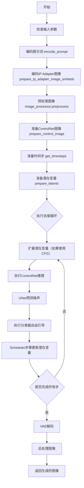
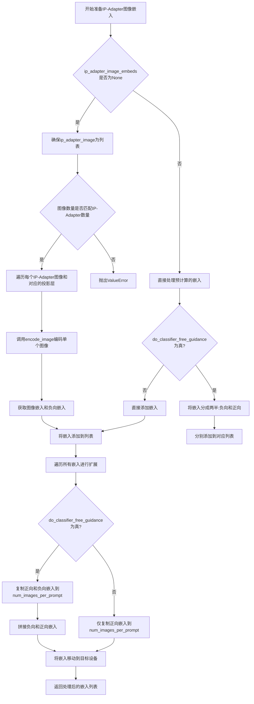
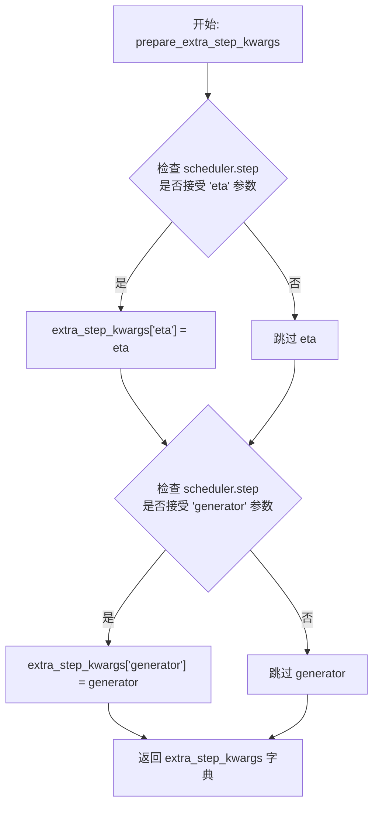
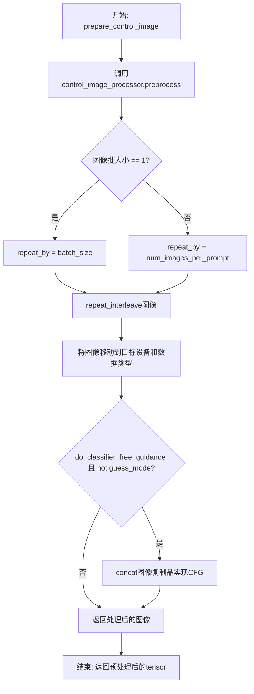
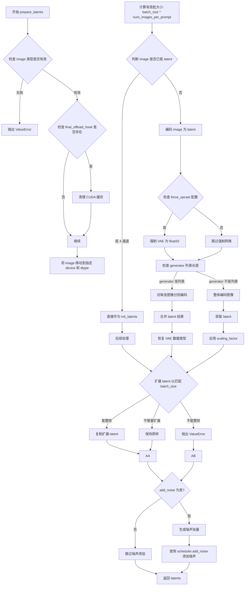
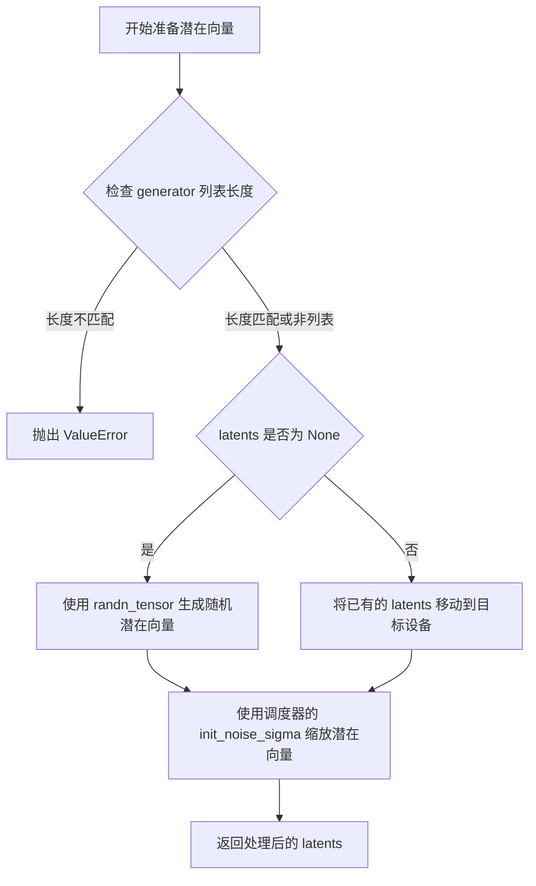
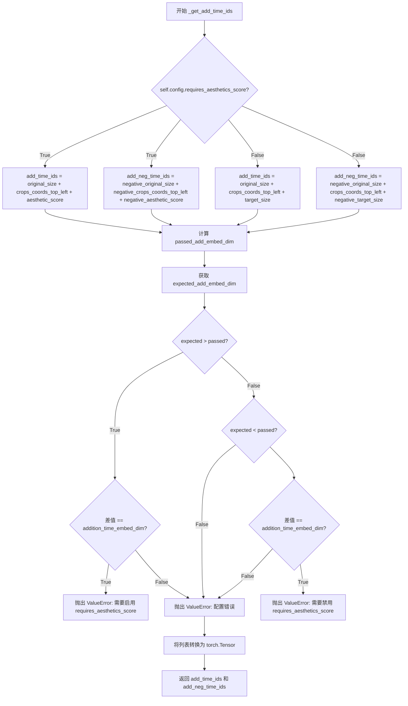

```mermaid
flowchart TD
    A[开始 __call__] --> B[检查回调参数兼容性]
    B --> C[对齐control guidance格式]
    C --> D[验证输入参数 check_inputs]
    D --> E[设置guidance_scale和cross_attention_kwargs]
    E --> F[定义批次大小和设备]
    F --> G{是否为多个ControlNet模型}
    G -->|是| H[将controlnet_conditioning_scale转换为列表]
    H --> I[编码输入提示词 encode_prompt]
    G -->|否| I
    I --> J[编码IP Adapter图像 prepare_ip_adapter_image_embeds]
    J --> K[预处理输入图像]
    K --> L{ControlNet类型}
    L -->|ControlNetModel| M[准备单个control_image]
    L -->|MultiControlNetModel| N[准备多个control_images]
    M --> O[设置timesteps]
    N --> O
    O --> P[准备latent变量]
    P --> Q[准备额外步进参数 prepare_extra_step_kwargs]
    Q --> R[创建controlnet_keep张量]
    R --> S[准备添加的时间ID和嵌入 _get_add_time_ids]
    S --> T[分类器自由引导时连接embeddings]
    T --> U[修补ControlNet前向函数]
    U --> V[去噪循环开始]
    V --> W[扩展latents用于分类器自由引导]
    W --> X[缩放模型输入]
    X --> Y[构建条件参数字典]
    Y --> Z{guess_mode且有引导}
    Z -->|是| AA[仅推断条件批次]
    Z -->|否| AB[使用完整输入]
    AA --> AC[运行ControlNet推断]
    AB --> AC
    AC --> AD[guess_mode时连接零张量]
    AD --> AE[添加IP Adapter图像嵌入]
    AE --> AF[UNet预测噪声残差]
    AF --> AG[执行分类器自由引导]
    AG --> AH[计算上一步样本]
    AH --> AI{有callback_on_step_end}
    AI -->|是| AJ[执行回调并更新变量]
    AI -->|否| AK{是否需要更新进度条}
    AJ --> AK
    AK --> AL{循环是否结束}
    AL -->|否| W
    AL -->|是| AM[恢复ControlNet前向函数]
    AM --> AN{output_type是否为latent}
    AN -->|否| AO[VAE解码]
    AN -->|是| AP[直接返回latents]
    AO --> AQ[后处理图像]
    AP --> AR[返回结果]
    AQ --> AR
```

# `diffusers\examples\community\pipeline_controlnet_xl_kolors_img2img.py` 详细设计文档

KolorsControlNetImg2ImgPipeline是一个基于Kolors模型的图像到图像生成管道，结合ControlNet进行条件控制。该管道继承自DiffusionPipeline，支持LoRA加载、IP Adapter、单文件加载等功能，通过文本提示和ControlNet条件图像生成目标图像。

## 整体流程



## 类结构

```
DiffusionPipeline (基类)
├── StableDiffusionMixin
├── StableDiffusionXLLoraLoaderMixin
├── FromSingleFileMixin
├── IPAdapterMixin
└── KolorsControlNetImg2ImgPipeline
```

## 全局变量及字段


### `EXAMPLE_DOC_STRING`
    
示例文档字符串，包含Kolors ControlNet图像到图像生成的代码示例和使用说明

类型：`str`
    


### `logger`
    
模块级日志记录器，用于输出管道运行时的日志信息

类型：`logging.Logger`
    


### `is_invisible_watermark_available`
    
检查当前环境是否可用不可见水印功能的布尔值标志

类型：`bool`
    


### `KolorsControlNetImg2ImgPipeline.vae`
    
变分自编码器模型，用于将图像编码到潜在空间并从潜在空间解码重建图像

类型：`AutoencoderKL`
    


### `KolorsControlNetImg2ImgPipeline.text_encoder`
    
冻结的文本编码器模型，将文本提示转换为文本嵌入向量，用于引导图像生成

类型：`ChatGLMModel`
    


### `KolorsControlNetImg2ImgPipeline.tokenizer`
    
分词器，将文本提示转换为token序列，供文本编码器处理

类型：`ChatGLMTokenizer`
    


### `KolorsControlNetImg2ImgPipeline.unet`
    
条件U-Net去噪模型，在潜在空间中根据文本嵌入和ControlNet条件进行图像去噪生成

类型：`UNet2DConditionModel`
    


### `KolorsControlNetImg2ImgPipeline.controlnet`
    
ControlNet模型或模型列表，提供额外的条件信息引导U-Net去噪过程，支持多种控制模式

类型：`Union[ControlNetModel, List[ControlNetModel], MultiControlNetModel]`
    


### `KolorsControlNetImg2ImgPipeline.scheduler`
    
扩散调度器，管理去噪过程中的时间步和噪声调度策略

类型：`KarrasDiffusionSchedulers`
    


### `KolorsControlNetImg2ImgPipeline.vae_scale_factor`
    
VAE缩放因子，用于计算潜在空间的尺寸，根据VAE块输出通道数确定

类型：`int`
    


### `KolorsControlNetImg2ImgPipeline.image_processor`
    
图像预处理器，负责输入图像的预处理和输出图像的后处理

类型：`VaeImageProcessor`
    


### `KolorsControlNetImg2ImgPipeline.control_image_processor`
    
ControlNet图像专用处理器，用于预处理控制条件图像

类型：`VaeImageProcessor`
    


### `KolorsControlNetImg2ImgPipeline.watermark`
    
可选的水印处理器，用于在生成的图像上添加不可见水印

类型：`Optional[StableDiffusionXLWatermarker]`
    


### `KolorsControlNetImg2ImgPipeline.model_cpu_offload_seq`
    
模型CPU卸载顺序字符串，定义模型组件从GPU卸载到CPU的顺序

类型：`str`
    


### `KolorsControlNetImg2ImgPipeline._optional_components`
    
可选组件列表，定义管道中可选的模型组件名称

类型：`List[str]`
    


### `KolorsControlNetImg2ImgPipeline._callback_tensor_inputs`
    
回调函数可访问的张量输入名称列表，用于自定义回调处理

类型：`List[str]`
    


### `KolorsControlNetImg2ImgPipeline._guidance_scale`
    
分类器自由引导比例，控制文本提示对生成图像的影响程度

类型：`float`
    


### `KolorsControlNetImg2ImgPipeline._cross_attention_kwargs`
    
交叉注意力关键参数字典，用于自定义注意力机制的额外选项

类型：`Dict[str, Any]`
    


### `KolorsControlNetImg2ImgPipeline._num_timesteps`
    
扩散过程的总时间步数，记录去噪迭代的步数

类型：`int`
    
    

## 全局函数及方法


### `retrieve_latents`

从 VAE（变分自编码器）编码器输出中检索潜在变量（latents），支持多种提取模式：采样（sample）、取模（argmax）或直接访问。

参数：

- `encoder_output`：`torch.Tensor`，VAE 编码器的输出，包含 latent_dist 或 latents 属性
- `generator`：`torch.Generator | None`，可选的随机数生成器，用于确保采样过程的可重复性
- `sample_mode`：`str`，采样模式，"sample" 表示从分布中采样，"argmax" 表示取分布的均值/模式

返回值：`torch.Tensor`，从编码器输出中提取的潜在变量张量

#### 流程图

```mermaid
flowchart TD
    A[开始: retrieve_latents] --> B{encoder_output 是否有 latent_dist 属性?}
    B -- 是 --> C{sample_mode == 'sample'?}
    C -- 是 --> D[返回 encoder_output.latent_dist.sample(generator)]
    C -- 否 --> E{sample_mode == 'argmax'?}
    E -- 是 --> F[返回 encoder_output.latent_dist.mode]
    E -- 否 --> G{encoder_output 是否有 latents 属性?}
    G -- 是 --> H[返回 encoder_output.lattens]
    G -- 否 --> I[抛出 AttributeError 异常]
    B -- 否 --> G
    I[错误: 无法访问 latent]
```

#### 带注释源码

```python
# 从 diffusers.pipelines.stable_diffusion.pipeline_stable_diffusion_img2img.retrieve_latents 复制
def retrieve_latents(
    encoder_output: torch.Tensor,  # VAE 编码器输出，包含潜在分布信息
    generator: torch.Generator | None = None,  # 可选的随机生成器，用于确定性采样
    sample_mode: str = "sample"  # 采样模式：'sample' 或 'argmax'
):
    """
    从 VAE 编码器输出中检索潜在变量。
    
    该函数支持三种提取潜在变量的方式：
    1. 从 latent_dist 中采样（sample_mode='sample'）
    2. 从 latent_dist 中取模式/均值（sample_mode='argmax'）
    3. 直接访问预计算的 latents 属性
    
    Args:
        encoder_output: VAE 编码器的输出，通常是 EncoderOutput 类型
        generator: 可选的 PyTorch 生成器，用于控制随机采样
        sample_mode: 字符串，指定采样模式
    
    Returns:
        torch.Tensor: 潜在变量张量
    
    Raises:
        AttributeError: 当无法从 encoder_output 中提取潜在变量时抛出
    """
    # 检查 encoder_output 是否有 latent_dist 属性，并且采样模式为 'sample'
    if hasattr(encoder_output, "latent_dist") and sample_mode == "sample":
        # 从潜在分布中采样，可选使用生成器确保可重复性
        return encoder_output.latent_dist.sample(generator)
    # 检查 encoder_output 是否有 latent_dist 属性，并且采样模式为 'argmax'
    elif hasattr(encoder_output, "latent_dist") and sample_mode == "argmax":
        # 返回潜在分布的模式（均值或最大概率值）
        return encoder_output.latent_dist.mode()
    # 检查 encoder_output 是否有预计算的 latents 属性
    elif hasattr(encoder_output, "latents"):
        # 直接返回预计算的潜在变量
        return encoder_output.latents
    # 如果无法识别潜在变量的格式，抛出异常
    else:
        raise AttributeError("Could not access latents of provided encoder_output")
```


### `KolorsControlNetImg2ImgPipeline.__init__`

该方法是 KolorsControlNetImg2ImgPipeline 类的初始化构造函数，负责初始化和控制Net图像到图像生成管道所需的所有核心组件，包括 VAE、文本编码器、分词器、UNet、ControlNet、调度器等，并配置图像处理器和水印处理器。

参数：

- `vae`：`AutoencoderKL`，用于将图像编码和解码到潜在表示的变分自编码器模型
- `text_encoder`：`ChatGLMModel`，Kolors 使用的冻结文本编码器（ChatGLM3-6B）
- `tokenizer`：`ChatGLMTokenizer`，用于对文本进行分词的 ChatGLM 分词器
- `unet`：`UNet2DConditionModel`，用于对编码图像潜在表示进行去噪的条件 UNet 架构
- `controlnet`：`Union[ControlNetModel, List[ControlNetModel], Tuple[ControlNetModel], MultiControlNetModel]`，提供额外条件引导的 ControlNet 模型，支持单个或多个 ControlNet
- `scheduler`：`KarrasDiffusionSchedulers`，与 unet 配合使用对编码图像潜在表示进行去噪的调度器
- `requires_aesthetics_score`：`bool`，可选，默认为 False，指示 unet 是否需要 aesthetic_score 条件
- `force_zeros_for_empty_prompt`：`bool`，可选，默认为 True，是否将负提示嵌入强制设置为 0
- `feature_extractor`：`CLIPImageProcessor`，可选，用于从生成的图像中提取特征的 CLIP 图像处理器
- `image_encoder`：`CLIPVisionModelWithProjection`，可选，用于 IP Adapter 的图像编码器
- `add_watermarker`：`Optional[bool]`，可选，是否添加水印

返回值：无（`None`），构造函数不返回任何值，仅初始化对象状态

#### 流程图

```mermaid
flowchart TD
    A[开始 __init__] --> B[调用 super().__init__]
    B --> C{controlnet 是 list 或 tuple?}
    C -->|Yes| D[将 controlnet 包装为 MultiControlNetModel]
    C -->|No| E[保持原 controlnet 不变]
    D --> F[register_modules 注册所有模块]
    E --> F
    F --> G[计算 vae_scale_factor = 2^(len(vae.config.block_out_channels) - 1)]
    G --> H[创建 image_processor: VaeImageProcessor]
    H --> I[创建 control_image_processor: VaeImageProcessor]
    I --> J{add_watermarker is True?}
    J -->|Yes| K[实例化 StableDiffusionXLWatermarker]
    J -->|No| L[设置 watermark = None]
    K --> M[register_to_config 注册 force_zeros_for_empty_prompt]
    L --> M
    M --> N[register_to_config 注册 requires_aesthetics_score]
    N --> O[结束 __init__]
```

#### 带注释源码

```python
def __init__(
    self,
    vae: AutoencoderKL,  # Variational Auto-Encoder，用于图像与潜在表示之间的编码解码
    text_encoder: ChatGLMModel,  # 冻结的文本编码器，Kolors使用ChatGLM3-6B
    tokenizer: ChatGLMTokenizer,  # 分词器，用于将文本转换为token
    unet: UNet2DConditionModel,  # 条件UNet架构，用于去噪潜在表示
    controlnet: Union[ControlNetModel, List[ControlNetModel], Tuple[ControlNetModel], MultiControlNetModel],  # ControlNet模型，提供额外条件引导
    scheduler: KarrasDiffusionSchedulers,  # 扩散调度器
    requires_aesthetics_score: bool = False,  # 是否需要美学评分条件
    force_zeros_for_empty_prompt: bool = True,  # 空提示时是否强制为零嵌入
    feature_extractor: CLIPImageProcessor = None,  # CLIP图像处理器，用于特征提取
    image_encoder: CLIPVisionModelWithProjection = None,  # CLIP视觉模型，用于IP Adapter
    add_watermarker: Optional[bool] = None,  # 是否添加水印
):
    # 调用父类DiffusionPipeline的初始化方法
    super().__init__()

    # 如果controlnet是list或tuple，则包装为MultiControlNetModel
    if isinstance(controlnet, (list, tuple)):
        controlnet = MultiControlNetModel(controlnet)

    # 注册所有模块到pipeline，使它们可以通过pipeline.xxx访问
    self.register_modules(
        vae=vae,
        text_encoder=text_encoder,
        tokenizer=tokenizer,
        unet=unet,
        controlnet=controlnet,
        scheduler=scheduler,
        feature_extractor=feature_extractor,
        image_encoder=image_encoder,
    )

    # 计算VAE的缩放因子，基于block_out_channels的数量
    # 例如对于典型的VAE，有[128, 256, 512, 512]四个通道，len=4
    # 则vae_scale_factor = 2^(4-1) = 8
    self.vae_scale_factor = 2 ** (len(self.vae.config.block_out_channels) - 1)

    # 创建图像处理器，用于预处理和后处理图像
    # do_convert_rgb=True表示将图像转换为RGB格式
    self.image_processor = VaeImageProcessor(vae_scale_factor=self.vae_scale_factor, do_convert_rgb=True)

    # 创建ControlNet图像处理器，do_normalize=False表示不进行归一化
    self.control_image_processor = VaeImageProcessor(
        vae_scale_factor=self.vae_scale_factor, do_convert_rgb=True, do_normalize=False
    )

    # 根据add_watermarker参数决定是否添加水印
    if add_watermarker:
        self.watermark = StableDiffusionXLWatermarker()
    else:
        self.watermark = None

    # 将force_zeros_for_empty_prompt注册到config中
    self.register_to_config(force_zeros_for_empty_prompt=force_zeros_for_empty_prompt)
    # 将requires_aesthetics_score注册到config中
    self.register_to_config(requires_aesthetics_score=requires_aesthetics_score)
```


### `KolorsControlNetImg2ImgPipeline.encode_prompt`

该方法负责将文本提示（prompt）编码为文本编码器的隐藏状态（hidden states），支持正向提示和负向提示的编码，并处理分类器自由引导（Classifier-Free Guidance）逻辑。它还支持LoRA权重的缩放，并返回四种嵌入向量：正向提示嵌入、负向提示嵌入、池化正向提示嵌入和池化负向提示嵌入。

参数：

- `self`：`KolorsControlNetImg2ImgPipeline` 实例本身，隐式参数
- `prompt`：`str` 或 `List[str]`，要编码的文本提示，可以是单个字符串或字符串列表
- `device`：`Optional[torch.device]`，可选的 torch 设备，用于执行编码操作，默认为执行设备
- `num_images_per_prompt`：`int`，每个提示要生成的图像数量，用于扩展嵌入维度
- `do_classifier_free_guidance`：`bool`，是否启用分类器自由引导，默认为 True
- `negative_prompt`：`str` 或 `List[str]`，可选的负向提示，用于引导图像生成不包含指定内容
- `prompt_embeds`：`Optional[torch.FloatTensor]`，可选的预生成正向提示嵌入，若提供则直接使用
- `negative_prompt_embeds`：`Optional[torch.FloatTensor]`，可选的预生成负向提示嵌入
- `pooled_prompt_embeds`：`Optional[torch.FloatTensor]`，可选的预生成池化正向提示嵌入
- `negative_pooled_prompt_embeds`：`Optional[torch.FloatTensor]`，可选的预生成池化负向提示嵌入
- `lora_scale`：`Optional[float]`，可选的 LoRA 缩放因子，用于调整 LoRA 层的影响

返回值：`Tuple[torch.FloatTensor, torch.FloatTensor, torch.FloatTensor, torch.FloatTensor]`，返回四个张量：正向提示嵌入、负向提示嵌入、池化正向提示嵌入、池化负向提示嵌入

#### 流程图

```mermaid
flowchart TD
    A[encode_prompt 开始] --> B{device 参数是否为空}
    B -->|是| C[使用执行设备 self._execution_device]
    B -->|否| D[使用传入的 device]
    C --> E{设置 LoRA scale}
    D --> E
    E --> F{确定 batch_size}
    F -->|prompt 是 str| G[batch_size = 1]
    F -->|prompt 是 list| H[batch_size = len(prompt)]
    F -->|否则| I[使用 prompt_embeds.shape[0]]
    G --> J[获取 tokenizers 和 text_encoders]
    H --> J
    I --> J
    J --> K{prompt_embeds 是否为空}
    K -->|是| L[遍历 tokenizers 和 text_encoders]
    K -->|否| M[跳过文本编码]
    L --> N[调用 maybe_convert_prompt 处理 TextualInversion]
    N --> O[tokenizer 处理 prompt]
    O --> P[text_encoder 编码获取 hidden_states]
    P --> Q[提取倒数第二层隐藏状态作为 prompt_embeds]
    Q --> R[提取最后一层隐藏状态的最后一个 token 作为 pooled_prompt_embeds]
    R --> S[重复 prompt_embeds num_images_per_prompt 次]
    S --> T[添加到 prompt_embeds_list]
    T --> U{prompt_embeds_list 长度处理}
    M --> U
    U --> V[获取 negative_prompt_embeds]
    V --> W{是否需要生成负向嵌入}
    W -->|do_classifier_free_guidance 为真<br/>且 negative_prompt_embeds 为空<br/>且 zero_out_negative_prompt 为真| X[创建全零负向嵌入]
    W -->|do_classifier_free_guidance 为真<br/>且 negative_prompt_embeds 为空<br/>但 zero_out_negative_prompt 为假| Y[处理 negative_prompt]
    W -->|否则| Z[使用提供的 negative_prompt_embeds]
    X --> AA[重复池化嵌入 num_images_per_prompt 次]
    Y --> AB[验证 negative_prompt 类型和长度]
    AB --> AC[遍历 tokenizers 和 text_encoders]
    AC --> AD[tokenizer 处理 uncond_tokens]
    AD --> AE[text_encoder 编码获取负向 hidden_states]
    AE --> AF[提取负向 prompt_embeds 和 pooled_prompt_embeds]
    AF --> AG{do_classifier_free_guidance 为真}
    AG -->|是| AH[重复负向嵌入 num_images_per_prompt 次]
    AG -->|否| AI[直接使用负向嵌入]
    AH --> AA
    AI --> AA
    Z --> AJ[返回四个嵌入向量]
    AA --> AJ
```

#### 带注释源码

```python
def encode_prompt(
    self,
    prompt,  # str 或 List[str]: 要编码的文本提示
    device: Optional[torch.device] = None,  # torch.device: 执行编码的设备
    num_images_per_prompt: int = 1,  # int: 每个提示生成的图像数量
    do_classifier_free_guidance: bool = True,  # bool: 是否启用分类器自由引导
    negative_prompt=None,  # str 或 List[str]: 负向提示
    prompt_embeds: Optional[torch.FloatTensor] = None,  # torch.FloatTensor: 预生成的提示嵌入
    negative_prompt_embeds: Optional[torch.FloatTensor] = None,  # torch.FloatTensor: 预生成的负向提示嵌入
    pooled_prompt_embeds: Optional[torch.FloatTensor] = None,  # torch.FloatTensor: 预生成的池化提示嵌入
    negative_pooled_prompt_embeds: Optional[torch.FloatTensor] = None,  # torch.FloatTensor: 预生成的池化负向提示嵌入
    lora_scale: Optional[float] = None,  # float: LoRA 缩放因子
):
    r"""
    Encodes the prompt into text encoder hidden states.

    Args:
         prompt (`str` or `List[str]`, *optional*):
            prompt to be encoded
        device: (`torch.device`):
            torch device
        num_images_per_prompt (`int`):
            number of images that should be generated per prompt
        do_classifier_free_guidance (`bool`):
            whether to use classifier free guidance or not
        negative_prompt (`str` or `List[str]`, *optional*):
            The prompt or prompts not to guide the image generation. If not defined, one has to pass
            `negative_prompt_embeds` instead. Ignored when not using guidance (i.e., ignored if `guidance_scale` is
            less than `1`).
        prompt_embeds (`torch.FloatTensor`, *optional*):
            Pre-generated text embeddings. Can be used to easily tweak text inputs, *e.g.* prompt weighting. If not
            provided, text embeddings will be generated from `prompt` input argument.
        negative_prompt_embeds (`torch.FloatTensor`, *optional*):
            Pre-generated negative text embeddings. Can be used to easily tweak text inputs, *e.g.* prompt
            weighting. If not provided, negative_prompt_embeds will be generated from `negative_prompt` input
            argument.
        pooled_prompt_embeds (`torch.FloatTensor`, *optional*):
            Pre-generated pooled text embeddings. Can be used to easily tweak text inputs, *e.g.* prompt weighting.
            If not provided, pooled text embeddings will be generated from `prompt` input argument.
        negative_pooled_prompt_embeds (`torch.FloatTensor`, *optional*):
            Pre-generated negative pooled text embeddings. Can be used to easily tweak text inputs, *e.g.* prompt
            weighting. If not provided, pooled negative_prompt_embeds will be generated from `negative_prompt`
            input argument.
        lora_scale (`float`, *optional*):
            A lora scale that will be applied to all LoRA layers of the text encoder if LoRA layers are loaded.
    """
    # 确定执行设备，如果未指定则使用管道默认的执行设备
    device = device or self._execution_device

    # 设置 LoRA 缩放因子，以便文本编码器的 LoRA 函数可以正确访问
    # 如果传入了 lora_scale 且管道支持 StableDiffusionXLLoraLoaderMixin
    if lora_scale is not None and isinstance(self, StableDiffusionXLLoraLoaderMixin):
        self._lora_scale = lora_scale

    # 根据 prompt 的类型确定 batch_size
    if prompt is not None and isinstance(prompt, str):
        batch_size = 1
    elif prompt is not None and isinstance(prompt, list):
        batch_size = len(prompt)
    else:
        # 如果 prompt 为空，则使用 prompt_embeds 的 batch size
        batch_size = prompt_embeds.shape[0]

    # 定义 tokenizers 和 text_encoders 列表
    # 在 Kolors 管道中只有一个 tokenizer 和 text_encoder
    tokenizers = [self.tokenizer]
    text_encoders = [self.text_encoder]

    # 如果未提供 prompt_embeds，则需要从 prompt 生成
    if prompt_embeds is None:
        # textual inversion: 如果需要，处理多向量 token
        prompt_embeds_list = []
        for tokenizer, text_encoder in zip(tokenizers, text_encoders):
            # 如果支持 TextualInversionLoaderMixin，转换 prompt
            if isinstance(self, TextualInversionLoaderMixin):
                prompt = self.maybe_convert_prompt(prompt, tokenizer)

            # 使用 tokenizer 将 prompt 转换为 token IDs
            text_inputs = tokenizer(
                prompt,
                padding="max_length",
                max_length=256,
                truncation=True,
                return_tensors="pt",
            ).to(self._execution_device)
            
            # 使用 text_encoder 编码，获取隐藏状态
            output = text_encoder(
                input_ids=text_inputs["input_ids"],
                attention_mask=text_inputs["attention_mask"],
                position_ids=text_inputs["position_ids"],
                output_hidden_states=True,
            )
            
            # 提取倒数第二层的隐藏状态作为 prompt_embeds
            # hidden_states[-2] 是倒数第二层，通常用于更精细的表示
            prompt_embeds = output.hidden_states[-2].permute(1, 0, 2).clone()
            
            # 提取最后一层隐藏状态的最后一个 token 作为 pooled_prompt_embeds
            # 这是一个全局表示，用于某些类型的条件注入
            pooled_prompt_embeds = output.hidden_states[-1][-1, :, :].clone()  # [batch_size, 4096]
            
            # 获取形状信息
            bs_embed, seq_len, _ = prompt_embeds.shape
            
            # 根据 num_images_per_prompt 重复 prompt_embeds
            # 这允许一次生成多个图像
            prompt_embeds = prompt_embeds.repeat(1, num_images_per_prompt, 1)
            prompt_embeds = prompt_embeds.view(bs_embed * num_images_per_prompt, seq_len, -1)

            prompt_embeds_list.append(prompt_embeds)

        # 取第一个（也是唯一的）encoder 的结果
        # 注意：原代码中有 torch.concat 的注释，但实际只取了第一个
        prompt_embeds = prompt_embeds_list[0]

    # 获取分类器自由引导所需的无条件 embeddings
    # 检查是否需要将负向提示强制设为零
    zero_out_negative_prompt = negative_prompt is None and self.config.force_zeros_for_empty_prompt
    
    # 如果启用 CFG 且没有提供负向嵌入，且配置要求将空提示强制为零
    if do_classifier_free_guidance and negative_prompt_embeds is None and zero_out_negative_prompt:
        # 创建与 prompt_embeds 形状相同的零张量
        negative_prompt_embeds = torch.zeros_like(prompt_embeds)
        negative_pooled_prompt_embeds = torch.zeros_like(pooled_prompt_embeds)
    elif do_classifier_free_guidance and negative_prompt_embeds is None:
        # 需要从 negative_prompt 生成负向嵌入
        
        # 处理不同类型的 negative_prompt
        uncond_tokens: List[str]
        if negative_prompt is None:
            # 如果没有负向提示，创建空字符串列表
            uncond_tokens = [""] * batch_size
        elif prompt is not None and type(prompt) is not type(negative_prompt):
            # 类型检查：negative_prompt 和 prompt 类型必须一致
            raise TypeError(
                f"`negative_prompt` should be the same type to `prompt`, but got {type(negative_prompt)} !="
                f" {type(prompt)}."
            )
        elif isinstance(negative_prompt, str):
            # 如果负向提示是字符串，转换为单元素列表
            uncond_tokens = [negative_prompt]
        elif batch_size != len(negative_prompt):
            # 批大小验证
            raise ValueError(
                f"`negative_prompt`: {negative_prompt} has batch size {len(negative_prompt)}, but `prompt`:"
                f" {prompt} has batch size {batch_size}. Please make sure that passed `negative_prompt` matches"
                " the batch size of `prompt`."
            )
        else:
            # 否则直接使用 negative_prompt 作为列表
            uncond_tokens = negative_prompt

        # 编码负向提示
        negative_prompt_embeds_list = []
        for tokenizer, text_encoder in zip(tokenizers, text_encoders):
            # textual inversion: 如果需要，处理多向量 tokens
            if isinstance(self, TextualInversionLoaderMixin):
                uncond_tokens = self.maybe_convert_prompt(uncond_tokens, tokenizer)

            # 获取与正向提示相同的长度
            max_length = prompt_embeds.shape[1]
            
            # tokenizer 处理无条件 tokens
            uncond_input = tokenizer(
                uncond_tokens,
                padding="max_length",
                max_length=max_length,
                truncation=True,
                return_tensors="pt",
            ).to(self._execution_device)
            
            # text_encoder 编码
            output = text_encoder(
                input_ids=uncond_input["input_ids"],
                attention_mask=uncond_input["attention_mask"],
                position_ids=uncond_input["position_ids"],
                output_hidden_states=True,
            )
            
            # 提取负向嵌入
            negative_prompt_embeds = output.hidden_states[-2].permute(1, 0, 2).clone()
            negative_pooled_prompt_embeds = output.hidden_states[-1][-1, :, :].clone()  # [batch_size, 4096]

            if do_classifier_free_guidance:
                # 复制无条件 embeddings 以便每个 prompt 生成多个图像
                # 使用对 MPS 友好的方法
                seq_len = negative_prompt_embeds.shape[1]

                # 转换 dtype 和 device
                negative_prompt_embeds = negative_prompt_embeds.to(dtype=text_encoder.dtype, device=device)

                # 重复 embeddings
                negative_prompt_embeds = negative_prompt_embeds.repeat(1, num_images_per_prompt, 1)
                negative_prompt_embeds = negative_prompt_embeds.view(
                    batch_size * num_images_per_prompt, seq_len, -1
                )

                # 对于分类器自由引导，需要做两次前向传播
                # 这里我们将有条件和无条件 embeddings 拼接成单个批次
                # 以避免执行两次前向传播

            negative_prompt_embeds_list.append(negative_prompt_embeds)

        # 取第一个（也是唯一的）encoder 的结果
        negative_prompt_embeds = negative_prompt_embeds_list[0]

    # 重复 pooled_prompt_embeds 以匹配 num_images_per_prompt
    bs_embed = pooled_prompt_embeds.shape[0]
    pooled_prompt_embeds = pooled_prompt_embeds.repeat(1, num_images_per_prompt).view(
        bs_embed * num_images_per_prompt, -1
    )
    
    # 如果启用 CFG，也重复负向池化嵌入
    if do_classifier_free_guidance:
        negative_pooled_prompt_embeds = negative_pooled_prompt_embeds.repeat(1, num_images_per_prompt).view(
            bs_embed * num_images_per_prompt, -1
        )

    # 返回四个嵌入向量
    return prompt_embeds, negative_prompt_embeds, pooled_prompt_embeds, negative_pooled_prompt_embeds
```


### `KolorsControlNetImg2ImgPipeline.encode_image`

该方法用于将输入图像编码为图像嵌入向量，支持两种模式：当 `output_hidden_states` 为 True 时返回编码器的中间隐藏状态，用于 IP-Adapter 等需要细粒度特征的模块；当为 False 时返回图像的语义嵌入（image_embeds），同时生成对应的无条件嵌入用于无分类器自由引导。

参数：

- `image`：`Union[torch.Tensor, PIL.Image, np.ndarray, List]` 输入图像，可以是 PyTorch 张量、PIL 图像、NumPy 数组或它们的列表
- `device`：`torch.device` 指定将图像张量移动到的目标设备（如 CUDA 或 CPU）
- `num_images_per_prompt`：`int` 每个提示词要生成的图像数量，用于批量嵌入的重复扩展
- `output_hidden_states`：`bool, optional` 是否返回编码器的隐藏状态，默认为 None（即 False）

返回值：`Tuple[torch.Tensor, torch.Tensor]` 返回两个张量组成的元组：
- 第一个是条件图像嵌入（或隐藏状态），维度为 `(batch_size * num_images_per_prompt, embedding_dim)`
- 第二个是无条件图像嵌入（或隐藏状态），维度与第一个相同，全零张量，用于无分类器自由引导

#### 流程图

```mermaid
flowchart TD
    A[开始 encode_image] --> B{image 是否为 torch.Tensor?}
    B -->|否| C[使用 feature_extractor 提取像素值]
    B -->|是| D[直接使用 image]
    C --> E[将 image 移动到指定 device 和 dtype]
    D --> E
    E --> F{output_hidden_states == True?}
    F -->|是| G[调用 image_encoder 获取隐藏状态]
    G --> H[提取倒数第二层隐藏状态 hidden_states[-2]]
    H --> I[repeat_interleave 扩展到 num_images_per_prompt]
    I --> J[生成零张量作为无条件隐藏状态]
    J --> K[repeat_interleave 扩展无条件隐藏状态]
    K --> L[返回条件和无条件隐藏状态元组]
    F -->|否| M[调用 image_encoder 获取 image_embeds]
    M --> N[repeat_interleave 扩展到 num_images_per_prompt]
    N --> O[生成与 image_embeds 相同大小的零张量]
    O --> P[返回条件和无条件嵌入元组]
    L --> Q[结束]
    P --> Q
```

#### 带注释源码

```python
def encode_image(self, image, device, num_images_per_prompt, output_hidden_states=None):
    """
    Encode image into embeddings for image-to-image generation with ControlNet.
    
    Args:
        image: Input image (PIL Image, numpy array, torch.Tensor, or list)
        device: Target device for computation
        num_images_per_prompt: Number of images to generate per prompt
        output_hidden_states: If True, return encoder hidden states instead of pooled embeddings
    
    Returns:
        Tuple of (image_embeds, uncond_image_embeds) or (hidden_states, uncond_hidden_states)
    """
    # 获取 image_encoder 的参数数据类型，用于确保输入数据类型一致
    dtype = next(self.image_encoder.parameters()).dtype

    # 如果输入不是 PyTorch 张量，使用特征提取器将其转换为张量
    if not isinstance(image, torch.Tensor):
        image = self.feature_extractor(image, return_tensors="pt").pixel_values

    # 将图像移动到目标设备并转换数据类型
    image = image.to(device=device, dtype=dtype)
    
    # 根据 output_hidden_states 参数选择不同的编码路径
    if output_hidden_states:
        # 路径1：返回编码器的中间隐藏状态（倒数第二层）
        # 这对于 IP-Adapter 等需要细粒度视觉特征的模块很有用
        
        # 获取条件图像的隐藏状态
        image_enc_hidden_states = self.image_encoder(image, output_hidden_states=True).hidden_states[-2]
        # 沿着批次维度重复，以匹配每个提示生成的图像数量
        image_enc_hidden_states = image_enc_hidden_states.repeat_interleave(num_images_per_prompt, dim=0)
        
        # 生成无条件（零）图像的隐藏状态，用于无分类器自由引导
        uncond_image_enc_hidden_states = self.image_encoder(
            torch.zeros_like(image), output_hidden_states=True
        ).hidden_states[-2]
        # 同样扩展无条件隐藏状态
        uncond_image_enc_hidden_states = uncond_image_enc_hidden_states.repeat_interleave(
            num_images_per_prompt, dim=0
        )
        
        # 返回隐藏状态元组
        return image_enc_hidden_states, uncond_image_enc_hidden_states
    else:
        # 路径2：返回池化的图像嵌入（默认行为）
        # 使用 image_embeds 属性获取经过投影的图像特征
        
        # 获取条件图像的嵌入向量
        image_embeds = self.image_encoder(image).image_embeds
        # 扩展到 num_images_per_prompt
        image_embeds = image_embeds.repeat_interleave(num_images_per_prompt, dim=0)
        
        # 生成全零的无条件图像嵌入，用于 CFG
        uncond_image_embeds = torch.zeros_like(image_embeds)

        # 返回嵌入向量元组
        return image_embeds, uncond_image_embeds
```


### `KolorsControlNetImg2ImgPipeline.prepare_ip_adapter_image_embeds`

该方法用于准备IP-Adapter的图像嵌入向量，处理输入图像或预计算的图像嵌入，根据是否启用分类器自由引导（classifier-free guidance）来生成条件和非条件图像嵌入，并将其扩展到与每个提示生成的图像数量相匹配。

参数：

- `ip_adapter_image`：`PipelineImageInput`，要处理的IP-Adapter输入图像，如果提供了`ip_adapter_image_embeds`则可以为空
- `ip_adapter_image_embeds`：`Optional[List[torch.Tensor]]`，预计算的图像嵌入列表，如果为None则从`ip_adapter_image`编码生成
- `device`：`torch.device`，目标设备，用于将张量移动到指定设备
- `num_images_per_prompt`：`int`，每个提示生成的图像数量，用于扩展嵌入维度
- `do_classifier_free_guidance`：`bool`，是否启用分类器自由引导，决定是否生成负向图像嵌入

返回值：`List[torch.Tensor]`，处理后的IP-Adapter图像嵌入列表，每个元素是一个张量，形状为`(num_images_per_prompt, emb_dim)`或当启用CFG时为`(2*num_images_per_prompt, emb_dim)`

#### 流程图



#### 带注释源码

```python
def prepare_ip_adapter_image_embeds(
    self,
    ip_adapter_image,
    ip_adapter_image_embeds,
    device,
    num_images_per_prompt,
    do_classifier_free_guidance
):
    """
    准备IP-Adapter的图像嵌入向量。
    
    该方法处理两种输入情况：
    1. 提供原始图像，需要编码为嵌入
    2. 提供预计算的嵌入，直接进行处理
    
    参数:
        ip_adapter_image: IP-Adapter输入图像
        ip_adapter_image_embeds: 预计算的图像嵌入（可选）
        device: 目标设备
        num_images_per_prompt: 每个提示生成的图像数量
        do_classifier_free_guidance: 是否启用分类器自由引导
    
    返回:
        处理后的IP-Adapter图像嵌入列表
    """
    # 初始化正向图像嵌入列表
    image_embeds = []
    
    # 如果启用分类器自由引导，同时初始化负向图像嵌入列表
    if do_classifier_free_guidance:
        negative_image_embeds = []
    
    # 情况1: 未提供预计算嵌入，需要从图像编码
    if ip_adapter_image_embeds is None:
        # 确保输入图像是列表格式（支持单张或多张图像）
        if not isinstance(ip_adapter_image, list):
            ip_adapter_image = [ip_adapter_image]
        
        # 验证图像数量与IP-Adapter数量是否匹配
        if len(ip_adapter_image) != len(self.unet.encoder_hid_proj.image_projection_layers):
            raise ValueError(
                f"`ip_adapter_image` must have same length as the number of IP Adapters. "
                f"Got {len(ip_adapter_image)} images and {len(self.unet.encoder_hid_proj.image_projection_layers)} IP Adapters."
            )
        
        # 遍历每个IP-Adapter的图像和对应的投影层
        for single_ip_adapter_image, image_proj_layer in zip(
            ip_adapter_image, self.unet.encoder_hid_proj.image_projection_layers
        ):
            # 判断是否需要输出隐藏状态（ImageProjection类不需要）
            output_hidden_state = not isinstance(image_proj_layer, ImageProjection)
            
            # 编码单个IP-Adapter图像
            single_image_embeds, single_negative_image_embeds = self.encode_image(
                single_ip_adapter_image, device, 1, output_hidden_state
            )
            
            # 添加批次维度 [1, emb_dim] 并添加到列表
            image_embeds.append(single_image_embeds[None, :])
            
            # 如果启用分类器自由引导，同时处理负向嵌入
            if do_classifier_free_guidance:
                negative_image_embeds.append(single_negative_image_embeds[None, :])
    
    # 情况2: 已提供预计算嵌入，直接处理
    else:
        for single_image_embeds in ip_adapter_image_embeds:
            # 如果启用分类器自由引导，需要将嵌入分成两半
            # 格式: [negative_embeds, positive_embeds]
            if do_classifier_free_guidance:
                single_negative_image_embeds, single_image_embeds = single_image_embeds.chunk(2)
                negative_image_embeds.append(single_negative_image_embeds)
            
            image_embeds.append(single_image_embeds)
    
    # 第二步：将嵌入扩展到与num_images_per_prompt匹配
    ip_adapter_image_embeds = []
    
    for i, single_image_embeds in enumerate(image_embeds):
        # 复制正向嵌入 num_images_per_prompt 次
        single_image_embeds = torch.cat([single_image_embeds] * num_images_per_prompt, dim=0)
        
        # 如果启用分类器自由引导，处理负向嵌入
        if do_classifier_free_guidance:
            # 复制负向嵌入 num_images_per_prompt 次
            single_negative_image_embeds = torch.cat([negative_image_embeds[i]] * num_images_per_prompt, dim=0)
            # 拼接: [negative, positive] 格式，用于后续的CFG处理
            single_image_embeds = torch.cat([single_negative_image_embeds, single_image_embeds], dim=0)
        
        # 将处理后的嵌入移动到目标设备
        single_image_embeds = single_image_embeds.to(device=device)
        
        # 添加到最终输出列表
        ip_adapter_image_embeds.append(single_image_embeds)
    
    return ip_adapter_image_embeds
```


### `KolorsControlNetImg2ImgPipeline.prepare_extra_step_kwargs`

该方法用于为调度器（scheduler）准备额外的关键字参数。由于不同的调度器具有不同的签名，该方法通过检查调度器的 `step` 方法是否接受 `eta` 和 `generator` 参数来动态构建所需的参数字典，确保与各种调度器兼容。

参数：

- `self`：隐式参数，类实例本身
- `generator`：`torch.Generator | None`，随机数生成器，用于生成确定性噪声。如果提供，调度器将使用该生成器来确保可重复的采样过程
- `eta`：`float`，DDIM 调度器的 eta 参数（η），对应论文 https://huggingface.co/papers/2010.02502，取值范围为 [0, 1]。仅当调度器支持时才会传递此参数

返回值：`Dict[str, Any]`，包含调度器 `step` 方法所需额外参数（`eta` 和/或 `generator`）的字典

#### 流程图



#### 带注释源码

```python
# Copied from diffusers.pipelines.stable_diffusion.pipeline_stable_diffusion.StableDiffusionPipeline.prepare_extra_step_kwargs
def prepare_extra_step_kwargs(self, generator, eta):
    # prepare extra kwargs for the scheduler step, since not all schedulers have the same signature
    # eta (η) is only used with the DDIMScheduler, it will be ignored for others.
    # eta corresponds to η in DDIM paper: https://huggingface.co/papers/2010.02502
    # and should be between [0, 1]

    # 使用 inspect 模块检查调度器的 step 方法签名
    # 判断该调度器是否接受 'eta' 参数
    accepts_eta = "eta" in set(inspect.signature(self.scheduler.step).parameters.keys())
    
    # 初始化空字典用于存储额外的调度器参数
    extra_step_kwargs = {}
    
    # 如果调度器接受 eta 参数，则将其添加到 extra_step_kwargs
    if accepts_eta:
        extra_step_kwargs["eta"] = eta

    # check if the scheduler accepts generator
    # 检查调度器的 step 方法是否接受 'generator' 参数
    accepts_generator = "generator" in set(inspect.signature(self.scheduler.step).parameters.keys())
    
    # 如果调度器接受 generator 参数，则将其添加到 extra_step_kwargs
    if accepts_generator:
        extra_step_kwargs["generator"] = generator
    
    # 返回构建好的参数字典，供调度器的 step 方法使用
    return extra_step_kwargs
```


### `KolorsControlNetImg2ImgPipeline.check_inputs`

该方法用于验证 KolorsControlNetImg2ImgPipeline 的输入参数有效性，确保传入的参数符合 pipeline 的要求。如果任何参数不符合要求，该方法会抛出详细的错误信息。

参数：

-  `self`：`KolorsControlNetImg2ImgPipeline` 实例，pipeline 自身引用
-  `prompt`：`Union[str, List[str], None]`，文本提示，用于指导图像生成。如果不为 None，则不能与 `prompt_embeds` 同时传递
-  `image`：`PipelineImageInput`，输入的初始图像，将作为图像生成过程的起点
-  `strength`：`float`，变换参考图像的程度，值必须在 [0.0, 1.0] 范围内
-  `num_inference_steps`：`int`，去噪步数，必须是正整数
-  `callback_steps`：`int`，可选，正整数，指定在哪些步骤调用回调函数
-  `negative_prompt`：`Union[str, List[str], None]`，可选，不引导图像生成的提示词
-  `prompt_embeds`：`Optional[torch.FloatTensor]`，可选，预生成的文本嵌入，不能与 `prompt` 同时传递
-  `negative_prompt_embeds`：`Optional[torch.FloatTensor]`，可选，预生成的负面文本嵌入
-  `pooled_prompt_embeds`：`Optional[torch.FloatTensor]`，可选，预生成的池化文本嵌入
-  `negative_pooled_prompt_embeds`：`Optional[torch.FloatTensor]`，可选，预生成的负面池化文本嵌入
-  `ip_adapter_image`：`Optional[PipelineImageInput]`，可选，用于 IP Adapter 的图像输入
-  `ip_adapter_image_embeds`：`Optional[List[torch.Tensor]]`，可选，IP Adapter 的预生成图像嵌入
-  `controlnet_conditioning_scale`：`Union[float, List[float]]`，可选，ControlNet 输出在添加到残差之前的乘数
-  `control_guidance_start`：`Union[float, List[float]]`，可选，ControlNet 开始应用的总步数百分比
-  `control_guidance_end`：`Union[float, List[float]]`，可选，ControlNet 停止应用的 total 步数百分比
-  `callback_on_step_end_tensor_inputs`：`Optional[List[str]]`，可选，步骤结束回调函数的张量输入列表

返回值：`None`，该方法不返回任何值，仅进行参数验证

#### 流程图

```mermaid
flowchart TD
    A[开始 check_inputs 验证] --> B{strength 是否在 [0, 1] 范围内}
    B -->|否| B1[抛出 ValueError]
    B -->|是| C{num_inference_steps 是否为正整数}
    C -->|否| C1[抛出 ValueError]
    C -->|是| D{callback_steps 是否为正整数}
    D -->|否| D1[抛出 ValueError]
    D -->|是| E{callback_on_step_end_tensor_inputs 是否合法}
    E -->|否| E1[抛出 ValueError]
    E -->|是| F{prompt 和 prompt_embeds 是否同时存在}
    F -->|是| F1[抛出 ValueError]
    F -->|否| G{prompt 和 prompt_embeds 是否都未定义}
    G -->|是| G1[抛出 ValueError]
    G -->|否| H{prompt 类型是否合法]
    H -->|否| H1[抛出 ValueError]
    H -->|是| I{negative_prompt 和 negative_prompt_embeds 是否同时存在}
    I -->|是| I1[抛出 ValueError]
    I -->|否| J{prompt_embeds 和 negative_prompt_embeds 形状是否匹配]
    J -->|否| J1[抛出 ValueError]
    J -->|是| K{prompt_embeds 是否存在但 pooled_prompt_embeds 未提供}
    K -->|是| K1[抛出 ValueError]
    K -->|否| L{negative_prompt_embeds 存在但 negative_pooled_prompt_embeds 未提供}
    L -->|是| L1[抛出 ValueError]
    L -->|否| M{MultiControlNetModel 下 prompt 是否为列表]
    M -->|是| M1[记录警告日志]
    M -->|否| N{检查 image 参数有效性]
    N --> N1[调用 check_image 验证图像]
    N1 --> O{检查 controlnet_conditioning_scale 有效性]
    O --> P{检查 control_guidance_start 和 control_guidance_end}
    P --> Q{检查 ip_adapter_image 和 ip_adapter_image_embeds}
    Q --> R[验证完成]
```

#### 带注释源码

```python
def check_inputs(
    self,
    prompt,
    image,
    strength,
    num_inference_steps,
    callback_steps,
    negative_prompt=None,
    prompt_embeds=None,
    negative_prompt_embeds=None,
    pooled_prompt_embeds=None,
    negative_pooled_prompt_embeds=None,
    ip_adapter_image=None,
    ip_adapter_image_embeds=None,
    controlnet_conditioning_scale=1.0,
    control_guidance_start=0.0,
    control_guidance_end=1.0,
    callback_on_step_end_tensor_inputs=None,
):
    # 验证 strength 参数必须在 [0.0, 1.0] 范围内
    if strength < 0 or strength > 1:
        raise ValueError(f"The value of strength should in [0.0, 1.0] but is {strength}")
    
    # 验证 num_inference_steps 不能为 None，且必须是正整数
    if num_inference_steps is None:
        raise ValueError("`num_inference_steps` cannot be None.")
    elif not isinstance(num_inference_steps, int) or num_inference_steps <= 0:
        raise ValueError(
            f"`num_inference_steps` has to be a positive integer but is {num_inference_steps} of type"
            f" {type(num_inference_steps)}."
        )

    # 验证 callback_steps 如果提供必须是正整数
    if callback_steps is not None and (not isinstance(callback_steps, int) or callback_steps <= 0):
        raise ValueError(
            f"`callback_steps` has to be a positive integer but is {callback_steps} of type"
            f" {type(callback_steps)}."
        )

    # 验证 callback_on_step_end_tensor_inputs 必须在允许的列表中
    if callback_on_step_end_tensor_inputs is not None and not all(
        k in self._callback_tensor_inputs for k in callback_on_step_end_tensor_inputs
    ):
        raise ValueError(
            f"`callback_on_step_end_tensor_inputs` has to be in {self._callback_tensor_inputs}, but found {[k for k in callback_on_step_end_tensor_inputs if k not in self._callback_tensor_inputs]}"
        )

    # 验证 prompt 和 prompt_embeds 不能同时提供
    if prompt is not None and prompt_embeds is not None:
        raise ValueError(
            f"Cannot forward both `prompt`: {prompt} and `prompt_embeds`: {prompt_embeds}. Please make sure to"
            " only forward one of the two."
        )
    # 验证 prompt 和 prompt_embeds 至少提供一个
    elif prompt is None and prompt_embeds is None:
        raise ValueError(
            "Provide either `prompt` or `prompt_embeds`. Cannot leave both `prompt` and `prompt_embeds` undefined."
        )
    # 验证 prompt 类型必须是 str 或 list
    elif prompt is not None and (not isinstance(prompt, str) and not isinstance(prompt, list)):
        raise ValueError(f"`prompt` has to be of type `str` or `list` but is {type(prompt)}")

    # 验证 negative_prompt 和 negative_prompt_embeds 不能同时提供
    if negative_prompt is not None and negative_prompt_embeds is not None:
        raise ValueError(
            f"Cannot forward both `negative_prompt`: {negative_prompt} and `negative_prompt_embeds`:"
            f" {negative_prompt_embeds}. Please make sure to only forward one of the two."
        )

    # 验证 prompt_embeds 和 negative_prompt_embeds 形状必须匹配
    if prompt_embeds is not None and negative_prompt_embeds is not None:
        if prompt_embeds.shape != negative_prompt_embeds.shape:
            raise ValueError(
                "`prompt_embeds` and `negative_prompt_embeds` must have the same shape when passed directly, but"
                f" got: `prompt_embeds` {prompt_embeds.shape} != `negative_prompt_embeds`"
                f" {negative_prompt_embeds.shape}."
            )

    # 如果提供 prompt_embeds 也必须提供 pooled_prompt_embeds
    if prompt_embeds is not None and pooled_prompt_embeds is None:
        raise ValueError(
            "If `prompt_embeds` are provided, `pooled_prompt_embeds` also have to be passed. Make sure to generate `pooled_prompt_embeds` from the same text encoder that was used to generate `prompt_embeds`."
        )

    # 如果提供 negative_prompt_embeds 也必须提供 negative_pooled_prompt_embeds
    if negative_prompt_embeds is not None and negative_pooled_prompt_embeds is None:
        raise ValueError(
            "If `negative_prompt_embeds` are provided, `negative_pooled_prompt_embeds` also have to be passed. Make sure to generate `negative_pooled_prompt_embeds` from the same text encoder that was used to generate `negative_prompt_embeds`."
        )

    # 多条件处理时对 prompt 的警告
    if isinstance(self.controlnet, MultiControlNetModel):
        if isinstance(prompt, list):
            logger.warning(
                f"You have {len(self.controlnet.nets)} ControlNets and you have passed {len(prompt)}"
                " prompts. The conditionings will be fixed across the prompts."
            )

    # 检查 image 参数的有效性
    is_compiled = hasattr(F, "scaled_dot_product_attention") and isinstance(
        self.controlnet, torch._dynamo.eval_frame.OptimizedModule
    )

    # 根据 ControlNet 类型（单个或多个）验证图像输入
    if (
        isinstance(self.controlnet, ControlNetModel)
        or is_compiled
        and isinstance(self.controlnet._orig_mod, ControlNetModel)
    ):
        self.check_image(image, prompt, prompt_embeds)
    elif (
        isinstance(self.controlnet, MultiControlNetModel)
        or is_compiled
        and isinstance(self.controlnet._orig_mod, MultiControlNetModel)
    ):
        if not isinstance(image, list):
            raise TypeError("For multiple controlnets: `image` must be type `list`")

        # 不支持嵌套列表形式的多条件输入
        elif any(isinstance(i, list) for i in image):
            raise ValueError("A single batch of multiple conditionings are supported at the moment.")
        elif len(image) != len(self.controlnet.nets):
            raise ValueError(
                f"For multiple controlnets: `image` must have the same length as the number of controlnets, but got {len(image)} images and {len(self.controlnet.nets)} ControlNets."
            )

        for image_ in image:
            self.check_image(image_, prompt, prompt_embeds)
    else:
        assert False

    # 验证 controlnet_conditioning_scale 参数
    if (
        isinstance(self.controlnet, ControlNetModel)
        or is_compiled
        and isinstance(self.controlnet._orig_mod, ControlNetModel)
    ):
        if not isinstance(controlnet_conditioning_scale, float):
            raise TypeError("For single controlnet: `controlnet_conditioning_scale` must be type `float`.")
    elif (
        isinstance(self.controlnet, MultiControlNetModel)
        or is_compiled
        and isinstance(self.controlnet._orig_mod, MultiControlNetModel)
    ):
        if isinstance(controlnet_conditioning_scale, list):
            if any(isinstance(i, list) for i in controlnet_conditioning_scale):
                raise ValueError("A single batch of multiple conditionings are supported at the moment.")
        elif isinstance(controlnet_conditioning_scale, list) and len(controlnet_conditioning_scale) != len(
            self.controlnet.nets
        ):
            raise ValueError(
                "For multiple controlnets: When `controlnet_conditioning_scale` is specified as `list`, it must have"
                " the same length as the number of controlnets"
            )
    else:
        assert False

    # 确保 control_guidance_start 和 control_guidance_end 是列表类型
    if not isinstance(control_guidance_start, (tuple, list)):
        control_guidance_start = [control_guidance_start]

    if not isinstance(control_guidance_end, (tuple, list)):
        control_guidance_end = [control_guidance_end]

    # 验证两个列表长度必须相同
    if len(control_guidance_start) != len(control_guidance_end):
        raise ValueError(
            f"`control_guidance_start` has {len(control_guidance_start)} elements, but `control_guidance_end` has {len(control_guidance_end)} elements. Make sure to provide the same number of elements to each list."
        )

    # 对于 MultiControlNetModel，验证列表长度与 ControlNet 数量匹配
    if isinstance(self.controlnet, MultiControlNetModel):
        if len(control_guidance_start) != len(self.controlnet.nets):
            raise ValueError(
                f"`control_guidance_start`: {control_guidance_start} has {len(control_guidance_start)} elements but there are {len(self.controlnet.nets)} controlnets available. Make sure to provide {len(self.controlnet.nets)}."
            )

    # 验证每个 start/end 对的有效性
    for start, end in zip(control_guidance_start, control_guidance_end):
        if start >= end:
            raise ValueError(
                f"control guidance start: {start} cannot be larger or equal to control guidance end: {end}."
            )
        if start < 0.0:
            raise ValueError(f"control guidance start: {start} can't be smaller than 0.")
        if end > 1.0:
            raise ValueError(f"control guidance end: {end} can't be larger than 1.0.")

    # 验证 IP Adapter 相关参数不能同时提供
    if ip_adapter_image is not None and ip_adapter_image_embeds is not None:
        raise ValueError(
            "Provide either `ip_adapter_image` or `ip_adapter_image_embeds`. Cannot leave both `ip_adapter_image` and `ip_adapter_image_embeds` defined."
        )

    # 验证 ip_adapter_image_embeds 的格式
    if ip_adapter_image_embeds is not None:
        if not isinstance(ip_adapter_image_embeds, list):
            raise ValueError(
                f"`ip_adapter_image_embeds` has to be of type `list` but is {type(ip_adapter_image_embeds)}"
            )
        elif ip_adapter_image_embeds[0].ndim not in [3, 4]:
            raise ValueError(
                f"`ip_adapter_image_embeds` has to be a list of 3D or 4D tensors but is {ip_adapter_image_embeds[0].ndim}D"
            )
```


### `KolorsControlNetImg2ImgPipeline.check_image`

该方法用于验证输入图像的类型和批次大小是否合法，确保图像数据符合 ControlNet pipeline 的要求。如果图像类型不在支持列表中或图像批次大小与提示词批次大小不匹配，则抛出相应的类型错误或数值错误。

参数：

- `image`：`Union[PIL.Image.Image, torch.Tensor, np.ndarray, List[PIL.Image.Image], List[torch.Tensor], List[np.ndarray]]`，输入的 ControlNet 条件图像，支持单张图像或图像列表
- `prompt`：`Union[str, List[str], None]`，用于引导图像生成的文本提示
- `prompt_embeds`：`Optional[torch.FloatTensor]`，预生成的文本嵌入

返回值：无返回值（方法内部通过抛出异常来处理验证失败的情况）

#### 流程图

```mermaid
flowchart TD
    A[开始 check_image] --> B{判断 image 类型}
    B -->|PIL.Image| C[标记 image_is_pil = True]
    B -->|torch.Tensor| D[标记 image_is_tensor = True]
    B -->|np.ndarray| E[标记 image_is_np = True]
    B -->|List[PIL.Image]| F[标记 image_is_pil_list = True]
    B -->|List[torch.Tensor]| G[标记 image_is_tensor_list = True]
    B -->|List[np.ndarray]| H[标记 image_is_np_list = True]
    B -->|其他类型| I[抛出 TypeError]
    
    C --> J{检查是否为合法类型}
    D --> J
    E --> J
    F --> J
    G --> J
    H --> J
    
    J -->|合法| K{确定 image_batch_size}
    J -->|不合法| I
    
    K -->|image_is_pil| L[image_batch_size = 1]
    K -->|其他| M[image_batch_size = len(image)]
    
    L --> N{确定 prompt_batch_size}
    M --> N
    
    N -->|prompt 是 str| O[prompt_batch_size = 1]
    N -->|prompt 是 list| P[prompt_batch_size = len(prompt)]
    N -->|prompt_embeds 不为 None| Q[prompt_batch_size = prompt_embeds.shape[0]]
    
    O --> R{验证批次大小}
    P --> R
    Q --> R
    
    R -->|image_batch_size != 1 且 != prompt_batch_size| S[抛出 ValueError]
    R -->|批次大小匹配| T[验证通过]
    
    S --> U[结束]
    T --> U
    I --> U
```

#### 带注释源码

```python
# Copied from diffusers.pipelines.controlnet.pipeline_controlnet_sd_xl.StableDiffusionXLControlNetPipeline.check_image
def check_image(self, image, prompt, prompt_embeds):
    # 检查 image 是否为 PIL.Image.Image 类型
    image_is_pil = isinstance(image, PIL.Image.Image)
    # 检查 image 是否为 torch.Tensor 类型
    image_is_tensor = isinstance(image, torch.Tensor)
    # 检查 image 是否为 np.ndarray 类型
    image_is_np = isinstance(image, np.ndarray)
    # 检查 image 是否为 PIL.Image 列表
    image_is_pil_list = isinstance(image, list) and isinstance(image[0], PIL.Image.Image)
    # 检查 image 是否为 torch.Tensor 列表
    image_is_tensor_list = isinstance(image, list) and isinstance(image[0], torch.Tensor)
    # 检查 image 是否为 np.ndarray 列表
    image_is_np_list = isinstance(image, list) and isinstance(image[0], np.ndarray)

    # 验证图像是否为支持的类型之一
    if (
        not image_is_pil
        and not image_is_tensor
        and not image_is_np
        and not image_is_pil_list
        and not image_is_tensor_list
        and not image_is_np_list
    ):
        raise TypeError(
            f"image must be passed and be one of PIL image, numpy array, torch tensor, list of PIL images, list of numpy arrays or list of torch tensors, but is {type(image)}"
        )

    # 确定图像批次大小：如果是 PIL 图像则为单张，否则为列表长度
    if image_is_pil:
        image_batch_size = 1
    else:
        image_batch_size = len(image)

    # 确定提示词批次大小
    if prompt is not None and isinstance(prompt, str):
        prompt_batch_size = 1
    elif prompt is not None and isinstance(prompt, list):
        prompt_batch_size = len(prompt)
    elif prompt_embeds is not None:
        prompt_batch_size = prompt_embeds.shape[0]

    # 验证图像批次大小与提示词批次大小是否匹配
    if image_batch_size != 1 and image_batch_size != prompt_batch_size:
        raise ValueError(
            f"If image batch size is not 1, image batch size must be same as prompt batch size. image batch size: {image_batch_size}, prompt batch size: {prompt_batch_size}"
        )
```


### `KolorsControlNetImg2ImgPipeline.prepare_control_image`

该方法用于对输入的ControlNet控制图像进行预处理，包括尺寸调整、批处理重复、类型转换以及在无分类器自由引导模式下进行图像复制，以适配扩散模型的输入格式要求。

参数：

- `image`：`PipelineImageInput`，待处理的ControlNet控制图像，支持PIL.Image、torch.Tensor、numpy.ndarray或它们的列表形式
- `width`：`int`，目标输出宽度（像素）
- `height`：`int`，目标输出高度（像素）
- `batch_size`：`int`，批处理大小，用于决定单张图像的重复次数
- `num_images_per_prompt`：`int`，每个提示词生成的图像数量
- `device`：`torch.device`，目标设备（CPU或GPU）
- `dtype`：`torch.dtype`，目标数据类型（如torch.float16或torch.float32）
- `do_classifier_free_guidance`：`bool`，是否启用无分类器自由引导（默认False）
- `guess_mode`：`bool`，猜测模式标志（默认False），用于ControlNet推理策略

返回值：`torch.Tensor`，预处理后的ControlNet图像张量，形状为(batch_size * num_images_per_prompt * [2 if do_classifier_free_guidance and not guess_mode else 1], C, H, W)

#### 流程图



#### 带注释源码

```python
def prepare_control_image(
    self,
    image,                          # 输入: PIL Image / torch.Tensor / np.ndarray / List
    width,                          # 输入: 目标宽度(像素)
    height,                         # 输入: 目标高度(像素)
    batch_size,                     # 输入: 批大小
    num_images_per_prompt,          # 输入: 每个prompt生成的图像数
    device,                         # 输入: 目标设备torch.device
    dtype,                          # 输入: 目标数据类型torch.dtype
    do_classifier_free_guidance=False,  # 输入: 是否启用CFG
    guess_mode=False,               # 输入: 猜测模式标志
):
    # Step 1: 使用control_image_processor进行预处理
    # - 调整图像尺寸到指定的width x height
    # - 转换为torch.Tensor并归一化到[0,1]
    # 强制转换为float32以保证预处理精度
    image = self.control_image_processor.preprocess(
        image, height=height, width=width
    ).to(dtype=torch.float32)
    
    # 获取预处理后图像的批次大小
    image_batch_size = image.shape[0]

    # Step 2: 确定需要重复的次数
    # 如果只有1张图像，则根据batch_size重复以匹配批处理
    # 如果有多张图像（已与prompt批次对齐），则按num_images_per_prompt重复
    if image_batch_size == 1:
        repeat_by = batch_size
    else:
        # image batch size is the same as prompt batch size
        repeat_by = num_images_per_prompt

    # Step 3: 沿batch维度重复图像
    # repeat_interleave可以高效地复制图像而不改变通道和空间维度
    image = image.repeat_interleave(repeat_by, dim=0)

    # Step 4: 将图像移动到目标设备和数据类型
    # 例如从CPU的float32转换到GPU的float16
    image = image.to(device=device, dtype=dtype)

    # Step 5: 处理无分类器自由引导(CFG)
    # 在CFG模式下，需要同时输入带条件和不带条件的图像
    # 但在guess_mode下，ControlNet只处理条件部分
    if do_classifier_free_guidance and not guess_mode:
        # 将图像复制一份并在batch维度拼接
        # 前面一半是unconditional(全零/噪声)，后面一半是conditional(实际控制图像)
        # 这样可以在一次前向传播中同时计算条件和非条件输出
        image = torch.cat([image] * 2)

    return image
```


### `KolorsControlNetImg2ImgPipeline.get_timesteps`

该方法用于根据推理步数和图像转换强度（strength）计算扩散模型的去噪时间步（timesteps）。它通过计算有效的时间步范围来确定从哪个时间点开始去噪，并返回相应的时间步序列和实际推理步数。

参数：

- `num_inference_steps`：`int`，推理过程中使用的去噪步数总数
- `strength`：`float`，图像转换强度，值在0到1之间，决定保留原图像信息的比例，值越大添加的噪声越多
- `device`：`torch.device`，执行计算的设备（如CPU或CUDA）

返回值：`Tuple[torch.Tensor, int]`，返回一个元组，包含 `timesteps`（时间步序列，类型为 `torch.Tensor`）和 `num_inference_steps - t_start`（实际用于去噪的步数，类型为 `int`）

#### 流程图

```mermaid
flowchart TD
    A[开始 get_timesteps] --> B[计算 init_timestep = min(num_inference_steps × strength, num_inference_steps)]
    B --> C[计算 t_start = max(num_inference_steps - init_timestep, 0)]
    C --> D[从 scheduler.timesteps 中切片获取 timesteps]
    D --> E{scheduler 是否有 set_begin_index 方法?}
    E -->|是| F[调用 scheduler.set_begin_index(t_start × scheduler.order)]
    E -->|否| G[跳过设置]
    F --> H[返回 timesteps 和 num_inference_steps - t_start]
    G --> H
```

#### 带注释源码

```python
def get_timesteps(self, num_inference_steps, strength, device):
    # 根据 strength 计算实际需要使用的初始时间步数
    # strength 越大，init_timestep 越大，意味着保留的原图像信息越少
    init_timestep = min(int(num_inference_steps * strength), num_inference_steps)

    # 计算从哪个时间步开始去噪
    # t_start 表示从 scheduler.timesteps 的第 t_start 个位置开始
    t_start = max(num_inference_steps - init_timestep, 0)

    # 从调度器中获取时间步序列，根据 t_start 和 scheduler.order 进行切片
    # 这确保了只使用与去噪过程相关的时间步
    timesteps = self.scheduler.timesteps[t_start * self.scheduler.order :]

    # 如果调度器支持 set_begin_index 方法，设置起始索引
    # 这对于某些调度器（如 DDIMScheduler）来说是必要的，以确保正确的时间步对齐
    if hasattr(self.scheduler, "set_begin_index"):
        self.scheduler.set_begin_index(t_start * self.scheduler.order)

    # 返回时间步序列和实际推理步数
    # num_inference_steps - t_start 表示剩余的有效推理步数
    return timesteps, num_inference_steps - t_start
```


### `KolorsControlNetImg2ImgPipeline.prepare_latents`

该方法用于在图像到图像（img2img）生成过程中准备潜在变量（latents），将输入图像编码为潜在表示，并可选地根据给定的时间步添加噪声。

参数：

- `self`：`KolorsControlNetImg2ImgPipeline` 实例，管道对象本身
- `image`：`torch.Tensor | PIL.Image.Image | list`，输入的初始图像，将被编码为潜在表示
- `timestep`：`torch.Tensor`，当前扩散过程的时间步，用于添加噪声
- `batch_size`：`int`，批处理大小
- `num_images_per_prompt`：`int`，每个提示词生成的图像数量
- `dtype`：`torch.dtype`，张量的数据类型
- `device`：`torch.device`，计算设备
- `generator`：`torch.Generator | None`，可选的随机数生成器，用于确保可重复性
- `add_noise`：`bool`，是否向潜在变量添加噪声，默认为 `True`

返回值：`torch.Tensor`，处理后的潜在变量张量

#### 流程图



#### 带注释源码

```python
# Copied from diffusers.pipelines.stable_diffusion_xl.pipeline_stable_diffusion_xl_img2img.StableDiffusionXLImg2ImgPipeline.prepare_latents
def prepare_latents(
    self, 
    image,  # 输入图像：torch.Tensor | PIL.Image.Image | list
    timestep,  # 当前时间步：torch.Tensor
    batch_size,  # 批处理大小：int
    num_images_per_prompt,  # 每个提示生成的图像数：int
    dtype,  # 数据类型：torch.dtype
    device,  # 计算设备：torch.device
    generator=None,  # 随机数生成器：torch.Generator | None
    add_noise=True  # 是否添加噪声：bool
):
    """
    准备图像到图像生成过程中的潜在变量。
    
    流程：
    1. 验证输入图像类型
    2. 将图像移动到目标设备和数据类型
    3. 如果图像不是潜在表示，则使用 VAE 编码
    4. 扩展 latent 以匹配批处理大小
    5. 可选地添加噪声
    """
    
    # 1. 验证输入图像类型
    if not isinstance(image, (torch.Tensor, PIL.Image.Image, list)):
        raise ValueError(
            f"`image` has to be of type `torch.Tensor`, `PIL.Image.Image` or list but is {type(image)}"
        )

    # 2. 如果启用了模型 CPU 卸载，清理 CUDA 缓存
    if hasattr(self, "final_offload_hook") and self.final_offload_hook is not None:
        torch.cuda.empty_cache()
        torch.cuda.ipc_collect()

    # 3. 将图像移动到指定设备和数据类型
    image = image.to(device=device, dtype=dtype)

    # 4. 计算有效批处理大小（考虑每提示图像数）
    batch_size = batch_size * num_images_per_prompt

    # 5. 判断图像是否已经是 latent 表示（4 通道）
    if image.shape[1] == 4:
        # 图像已经是 latent 格式，直接使用
        init_latents = image
    else:
        # 6. 需要使用 VAE 编码图像为 latent
        # 确保 VAE 处于 float32 模式，因为 float16 会溢出
        if self.vae.config.force_upcast:
            image = image.float()
            self.vae.to(dtype=torch.float32)

        # 7. 检查 generator 列表长度是否匹配批处理大小
        if isinstance(generator, list) and len(generator) != batch_size:
            raise ValueError(
                f"You have passed a list of generators of length {len(generator)}, but requested an effective batch"
                f" size of {batch_size}. Make sure the batch size matches the length of the generators."
            )

        # 8. 使用 VAE 编码图像
        elif isinstance(generator, list):
            # 如果有多个 generator，分别处理每张图像
            init_latents = [
                retrieve_latents(self.vae.encode(image[i : i + 1]), generator=generator[i])
                for i in range(batch_size)
            ]
            init_latents = torch.cat(init_latents, dim=0)
        else:
            # 单一 generator 或无 generator
            init_latents = retrieve_latents(self.vae.encode(image), generator=generator)

        # 9. 恢复 VAE 的原始数据类型
        if self.vae.config.force_upcast:
            self.vae.to(dtype)

        # 10. 转换 latent 数据类型
        init_latents = init_latents.to(dtype)

        # 11. 应用 VAE scaling_factor
        init_latents = self.vae.config.scaling_factor * init_latents

    # 12. 扩展 latent 以匹配批处理大小
    if batch_size > init_latents.shape[0] and batch_size % init_latents.shape[0] == 0:
        # 可以整除，复制扩展
        additional_image_per_prompt = batch_size // init_latents.shape[0]
        init_latents = torch.cat([init_latents] * additional_image_per_prompt, dim=0)
    elif batch_size > init_latents.shape[0] and batch_size % init_latents.shape[0] != 0:
        # 不能整除，抛出错误
        raise ValueError(
            f"Cannot duplicate `image` of batch size {init_latents.shape[0]} to {batch_size} text prompts."
        )
    else:
        # 批处理大小匹配或小于 latent 批大小
        init_latents = torch.cat([init_latents], dim=0)

    # 13. 可选地添加噪声
    if add_noise:
        shape = init_latents.shape
        # 使用 randn_tensor 生成随机噪声
        noise = randn_tensor(shape, generator=generator, device=device, dtype=dtype)
        # 使用 scheduler 添加噪声
        init_latents = self.scheduler.add_noise(init_latents, noise, timestep)

    # 14. 返回最终的 latent
    latents = init_latents
    return latents
```


### `KolorsControlNetImg2ImgPipeline.prepare_latents_t2i`

该方法用于在文本到图像（text-to-image）生成过程中准备初始的噪声潜在向量（latents）。它根据指定的批次大小、潜在通道数、图像高度和宽度创建形状，并通过随机张量生成或使用预提供的潜在向量来初始化潜在变量，最后根据调度器的初始噪声标准差对潜在向量进行缩放。

参数：

- `batch_size`：`int`，生成的图像批次大小
- `num_channels_latents`：`int`，潜在空间的通道数，通常对应于 UNet 的输入通道数
- `height`：`int`，目标图像的高度（像素）
- `width`：`int`，目标图像的宽度（像素）
- `dtype`：`torch.dtype`，潜在张量的数据类型（如 torch.float16）
- `device`：`torch.device`，潜在张量所在的设备（如 cuda:0）
- `generator`：`torch.Generator` 或 `List[torch.Generator]` 或 `None`，用于生成确定性随机噪声的生成器，若为列表则长度需与 batch_size 匹配
- `latents`：`torch.Tensor` 或 `None`，可选的预生成潜在向量，若提供则直接使用，否则随机生成

返回值：`torch.Tensor`，处理后的潜在向量，形状为 (batch_size, num_channels_latents, height // vae_scale_factor, width // vae_scale_factor)，已乘以调度器的初始噪声标准差

#### 流程图



#### 带注释源码

```python
def prepare_latents_t2i(
    self, batch_size, num_channels_latents, height, width, dtype, device, generator, latents=None
):
    # 计算潜在向量的形状，根据 VAE 缩放因子调整高度和宽度
    # VAE 缩放因子通常为 2^(num_decoder_layers-1)，用于将像素空间映射到潜在空间
    shape = (batch_size, num_channels_latents, height // self.vae_scale_factor, width // self.vae_scale_factor)
    
    # 检查传入的生成器列表长度是否与批次大小匹配
    if isinstance(generator, list) and len(generator) != batch_size:
        raise ValueError(
            f"You have passed a list of generators of length {len(generator)}, but requested an effective batch"
            f" size of {batch_size}. Make sure the batch size matches the length of the generators."
        )

    # 如果没有提供预生成的潜在向量，则使用 randn_tensor 生成随机噪声
    if latents is None:
        latents = randn_tensor(shape, generator=generator, device=device, dtype=dtype)
    else:
        # 如果提供了潜在向量，则确保其在正确的设备上
        latents = latents.to(device)

    # 使用调度器的初始噪声标准差对潜在向量进行缩放
    # 这是为了与调度器的噪声调度策略保持一致
    latents = latents * self.scheduler.init_noise_sigma
    
    return latents
```


### `KolorsControlNetImg2ImgPipeline._get_add_time_ids`

该方法用于生成图像生成过程中的附加时间标识（Additional Time IDs），这些标识包含了原始尺寸、裁剪坐标、目标尺寸以及美学评分等信息，用于SDXL模型的条件生成。

参数：

- `self`：`KolorsControlNetImg2ImgPipeline` 实例本身
- `original_size`：`Tuple[int, int]`，原始图像尺寸 (高度, 宽度)
- `crops_coords_top_left`：`Tuple[int, int]`，裁剪坐标左上角位置
- `target_size`：`Tuple[int, int]`，目标图像尺寸 (高度, 宽度)
- `aesthetic_score`：`float`，正向美学评分，用于影响生成图像的美学质量
- `negative_aesthetic_score`：`float`，负向美学评分
- `negative_original_size`：`Tuple[int, int]`，负向提示的原始图像尺寸
- `negative_crops_coords_top_left`：`Tuple[int, int]`，负向提示的裁剪坐标
- `negative_target_size`：`Tuple[int, int]`，负向提示的目标图像尺寸
- `dtype`：`torch.dtype`，输出张量的数据类型
- `text_encoder_projection_dim`：`Optional[int]`，文本编码器投影维度（当前代码中未使用）

返回值：`Tuple[torch.Tensor, torch.Tensor]`，返回两个张量——add_time_ids（正向附加时间标识）和 add_neg_time_ids（负向附加时间标识）

#### 流程图



#### 带注释源码

```python
def _get_add_time_ids(
    self,
    original_size,                    # 原始图像尺寸 (height, width)
    crops_coords_top_left,             # 裁剪坐标左上角 (y, x)
    target_size,                      # 目标图像尺寸 (height, width)
    aesthetic_score,                  # 正向美学评分
    negative_aesthetic_score,         # 负向美学评分
    negative_original_size,           # 负向原始尺寸
    negative_crops_coords_top_left,   # 负向裁剪坐标
    negative_target_size,            # 负向目标尺寸
    dtype,                            # 输出张量的数据类型
    text_encoder_projection_dim=None, # 文本编码器投影维度(当前未使用)
):
    """
    生成附加时间标识用于SDXL微条件生成。
    这些标识包含原始尺寸、裁剪坐标、目标尺寸和美学评分等信息。
    """
    
    # 根据配置决定是否包含美学评分
    if self.config.requires_aesthetics_score:
        # 包含美学评分的版本
        add_time_ids = list(original_size + crops_coords_top_left + (aesthetic_score,))
        add_neg_time_ids = list(
            negative_original_size + negative_crops_coords_top_left + (negative_aesthetic_score,)
        )
    else:
        # 不包含美学评分，使用目标尺寸的版本
        add_time_ids = list(original_size + crops_coords_top_left + target_size)
        add_neg_time_ids = list(negative_original_size + crops_coords_top_left + negative_target_size)

    # 计算实际传入的嵌入维度
    # addition_time_embed_dim * 时间ID数量 + 4096(文本投影维度)
    passed_add_embed_dim = self.unet.config.addition_time_embed_dim * len(add_time_ids) + 4096
    
    # 获取模型期望的嵌入维度
    expected_add_embed_dim = self.unet.add_embedding.linear_1.in_features

    # 验证维度匹配，不匹配时给出详细错误提示
    if (
        expected_add_embed_dim > passed_add_embed_dim
        and (expected_add_embed_dim - passed_add_embed_dim) == self.unet.config.addition_time_embed_dim
    ):
        raise ValueError(
            f"Model expects an added time embedding vector of length {expected_add_embed_dim}, but a vector of {passed_add_embed_dim} was created. Please make sure to enable `requires_aesthetics_score` with `pipe.register_to_config(requires_aesthetics_score=True)` to make sure `aesthetic_score` {aesthetic_score} and `negative_aesthetic_score` {negative_aesthetic_score} is correctly used by the model."
        )
    elif (
        expected_add_embed_dim < passed_add_embed_dim
        and (passed_add_embed_dim - expected_add_embed_dim) == self.unet.config.addition_time_embed_dim
    ):
        raise ValueError(
            f"Model expects an added time embedding vector of length {expected_add_embed_dim}, but a vector of {passed_add_embed_dim} was created. Please make sure to disable `requires_aesthetics_score` with `pipe.register_to_config(requires_aesthetics_score=False)` to make sure `target_size` {target_size} is correctly used by the model."
        )
    elif expected_add_embed_dim != passed_add_embed_dim:
        raise ValueError(
            f"Model expects an added time embedding vector of length {expected_add_embed_dim}, but a vector of {passed_add_embed_dim} was created. The model has an incorrect config. Please check `unet.config.time_embedding_type` and `text_encoder.config.projection_dim`."
        )

    # 将列表转换为PyTorch张量
    add_time_ids = torch.tensor([add_time_ids], dtype=dtype)
    add_neg_time_ids = torch.tensor([add_neg_time_ids], dtype=dtype)

    return add_time_ids, add_neg_time_ids
```


### `KolorsControlNetImg2ImgPipeline.upcast_vae`

该方法用于将 VAE（变分自编码器）模型强制转换为 float32 数据类型，以防止在 float16 模式下计算时出现溢出问题。这是一个已弃用的遗留方法，建议直接使用 `pipe.vae.to(torch.float32)` 代替。

参数：

- 该方法无参数（除隐式 `self` 参数外）

返回值：无返回值（`None`），该方法直接修改对象内部状态

#### 流程图

```mermaid
flowchart TD
    A[开始 upcast_vae] --> B[调用 deprecate 警告用户方法已弃用]
    B --> C{self.vae 是否需要转换}
    C -->|是| D[执行 self.vae.to(dtype=torch.float32)]
    C -->|否| E[跳过转换]
    D --> F[结束]
    E --> F
```

#### 带注释源码

```python
def upcast_vae(self):
    """
    将 VAE 模型上转换为 float32 类型。
    
    此方法主要用于解决在 float16 精度下 VAE 解码时可能出现的数值溢出问题。
    当 VAE 配置中的 force_upcast 为 True 时，在解码前需要将 VAE 转换为 float32。
    
    注意：
        此方法已被弃用，建议直接使用 pipe.vae.to(torch.float32) 代替。
    
    示例：
        >>> # 推荐的方式
        >>> pipe.vae.to(dtype=torch.float32)
        
        >>> # 已弃用的方式（功能相同）
        >>> pipe.upcast_vae()
    """
    # 发出弃用警告，提示用户该方法将在 1.0.0 版本被移除
    # 并建议使用新的替代方案
    deprecate(
        "upcast_vae",              # 方法名称
        "1.0.0",                   # 弃用版本号
        "`upcast_vae` is deprecated. Please use `pipe.vae.to(torch.float32)`"  # 警告消息
    )
    
    # 将 VAE 模型的所有参数和缓冲区转换为 float32 类型
    # 这样可以避免在解码过程中出现 NaN 或 Inf 等数值问题
    self.vae.to(dtype=torch.float32)
```

#### 技术债务与优化建议

1. **废弃方法清理**：该方法已被标记为废弃，建议在未来版本中完全移除，减少代码维护负担
2. **内联替代方案**：调用者可以直接使用 `self.vae.to(dtype=torch.float32)`，无需通过此封装方法
3. **文档完善**：可考虑在类级别文档中说明何时需要手动进行 VAE 类型转换，以及 `force_upcast` 配置的作用


### `KolorsControlNetImg2ImgPipeline.__call__`

这是Kolors图像到图像生成Pipeline的核心方法，结合了ControlNet控制功能。该方法接收提示词、输入图像和ControlNet控制图像，通过去噪扩散过程生成新的图像，支持文本提示控制、图像风格转换和条件控制生成。

参数：

- `prompt`：`Union[str, List[str]]`，要引导图像生成的提示词。如果未定义，则必须传递`prompt_embeds`
- `image`：`PipelineImageInput`，用作图像生成起点的初始图像，也可以接受图像潜在向量
- `control_image`：`PipelineImageInput`，ControlNet输入条件，用于生成对UNet的指导
- `height`：`Optional[int]`，生成图像的高度（像素），默认使用control_image的尺寸
- `width`：`Optional[int]`，生成图像的宽度（像素），默认使用control_image的尺寸
- `strength`：`float`，转换参考图像的程度，介于0和1之间，值越高转换越多
- `num_inference_steps`：`int`，去噪步数，越多通常图像质量越高
- `guidance_scale`：`float`，分类器自由引导比例，定义为Imagen论文中的w
- `negative_prompt`：`Optional[Union[str, List[str]]]`，不引导图像生成的提示词
- `num_images_per_prompt`：`int`，每个提示词生成的图像数量
- `eta`：`float`，DDIM论文中的η参数，仅适用于DDIMScheduler
- `guess_mode`：`bool`，ControlNet猜测模式
- `generator`：`Optional[Union[torch.Generator, List[torch.Generator]]]`，随机生成器，使生成具有确定性
- `latents`：`Optional[torch.Tensor]`，预生成的噪声潜在向量
- `prompt_embeds`：`Optional[torch.Tensor]`，预生成的文本嵌入
- `negative_prompt_embeds`：`Optional[torch.Tensor]`，预生成的负面文本嵌入
- `pooled_prompt_embeds`：`Optional[torch.Tensor]`，预生成的池化文本嵌入
- `negative_pooled_prompt_embeds`：`Optional[torch.Tensor]`，预生成的负面池化文本嵌入
- `ip_adapter_image`：`Optional[PipelineImageInput]`，IP Adapter可选图像输入
- `ip_adapter_image_embeds`：`Optional[List[torch.Tensor]]`，IP-Adapter预生成的图像嵌入
- `output_type`：`str`，生成图像的输出格式，默认为"pil"
- `return_dict`：`bool`，是否返回PipelineOutput而不是元组
- `cross_attention_kwargs`：`Optional[Dict[str, Any]]`，传递给注意力处理器的 kwargs 字典
- `controlnet_conditioning_scale`：`Union[float, List[float]]`，ControlNet输出乘数
- `control_guidance_start`：`Union[float, List[float]]`，ControlNet开始应用的总步数百分比
- `control_guidance_end`：`Union[float, List[float]]`，ControlNet停止应用的总步数百分比
- `original_size`：`Tuple[int, int]`，原始图像尺寸
- `crops_coords_top_left`：`Tuple[int, int]`，裁剪坐标左上角
- `target_size`：`Tuple[int, int]`，目标图像尺寸
- `negative_original_size`：`Optional[Tuple[int, int]]`，负面条件原始尺寸
- `negative_crops_coords_top_left`：`Tuple[int, int]`，负面裁剪坐标
- `negative_target_size`：`Optional[Tuple[int, int]]`，负面目标尺寸
- `aesthetic_score`：`float`，用于模拟生成图像美学分数
- `negative_aesthetic_score`：`float`，负面美学分数
- `callback_on_step_end`：`Optional[Union[Callable, PipelineCallback, MultiPipelineCallbacks]]`，每步结束时调用的回调函数
- `callback_on_step_end_tensor_inputs`：`List[str]`，回调函数张量输入列表
- `**kwargs`：其他关键字参数

返回值：`Union[StableDiffusionXLPipelineOutput, tuple]`，如果`return_dict`为True，返回`StableDiffusionXLPipelineOutput`，否则返回包含输出图像的元组

#### 流程图



#### 带注释源码

```python
@torch.no_grad()
@replace_example_docstring(EXAMPLE_DOC_STRING)
def __call__(
    self,
    prompt: Union[str, List[str]] = None,
    image: PipelineImageInput = None,
    control_image: PipelineImageInput = None,
    height: Optional[int] = None,
    width: Optional[int] = None,
    strength: float = 0.8,
    num_inference_steps: int = 50,
    guidance_scale: float = 5.0,
    negative_prompt: Optional[Union[str, List[str]]] = None,
    num_images_per_prompt: Optional[int] = 1,
    eta: float = 0.0,
    guess_mode: bool = False,
    generator: Optional[Union[torch.Generator, List[torch.Generator]]] = None,
    latents: Optional[torch.Tensor] = None,
    prompt_embeds: Optional[torch.Tensor] = None,
    negative_prompt_embeds: Optional[torch.Tensor] = None,
    pooled_prompt_embeds: Optional[torch.Tensor] = None,
    negative_pooled_prompt_embeds: Optional[torch.Tensor] = None,
    ip_adapter_image: Optional[PipelineImageInput] = None,
    ip_adapter_image_embeds: Optional[List[torch.Tensor]] = None,
    output_type: str | None = "pil",
    return_dict: bool = True,
    cross_attention_kwargs: Optional[Dict[str, Any]] = None,
    controlnet_conditioning_scale: Union[float, List[float]] = 0.8,
    control_guidance_start: Union[float, List[float]] = 0.0,
    control_guidance_end: Union[float, List[float]] = 1.0,
    original_size: Tuple[int, int] = None,
    crops_coords_top_left: Tuple[int, int] = (0, 0),
    target_size: Tuple[int, int] = None,
    negative_original_size: Optional[Tuple[int, int]] = None,
    negative_crops_coords_top_left: Tuple[int, int] = (0, 0),
    negative_target_size: Optional[Tuple[int, int]] = None,
    aesthetic_score: float = 6.0,
    negative_aesthetic_score: float = 2.5,
    callback_on_step_end: Optional[
        Union[Callable[[int, int, Dict], None], PipelineCallback, MultiPipelineCallbacks]
    ] = None,
    callback_on_step_end_tensor_inputs: List[str] = ["latents"],
    **kwargs,
):
    # 提取旧版回调参数并发出警告
    callback = kwargs.pop("callback", None)
    callback_steps = kwargs.pop("callback_steps", None)

    # 废弃警告处理
    if callback is not None:
        deprecate("callback", "1.0.0", "Passing `callback` as an input argument to `__call__` is deprecated, consider using `callback_on_step_end`")
    if callback_steps is not None:
        deprecate("callback_steps", "1.0.0", "Passing `callback_steps` as an input argument to `__call__` is deprecated, consider using `callback_on_step_end`")

    # 处理回调张量输入
    if isinstance(callback_on_step_end, (PipelineCallback, MultiPipelineCallbacks)):
        callback_on_step_end_tensor_inputs = callback_on_step_end.tensor_inputs

    # 获取原始ControlNet模型
    controlnet = self.controlnet._orig_mod if is_compiled_module(self.controlnet) else self.controlnet

    # 对齐control guidance格式
    if not isinstance(control_guidance_start, list) and isinstance(control_guidance_end, list):
        control_guidance_start = len(control_guidance_end) * [control_guidance_start]
    elif not isinstance(control_guidance_end, list) and isinstance(control_guidance_start, list):
        control_guidance_end = len(control_guidance_start) * [control_guidance_end]
    elif not isinstance(control_guidance_start, list) and not isinstance(control_guidance_end, list):
        mult = len(controlnet.nets) if isinstance(controlnet, MultiControlNetModel) else 1
        control_guidance_start, control_guidance_end = mult * [control_guidance_start], mult * [control_guidance_end]

    # 1. 检查输入参数
    self.check_inputs(
        prompt, control_image, strength, num_inference_steps, callback_steps,
        negative_prompt, prompt_embeds, negative_prompt_embeds, pooled_prompt_embeds,
        negative_pooled_prompt_embeds, ip_adapter_image, ip_adapter_image_embeds,
        controlnet_conditioning_scale, control_guidance_start, control_guidance_end,
        callback_on_step_end_tensor_inputs,
    )

    # 设置引导比例和交叉注意力参数
    self._guidance_scale = guidance_scale
    self._cross_attention_kwargs = cross_attention_kwargs

    # 2. 定义调用参数
    if prompt is not None and isinstance(prompt, str):
        batch_size = 1
    elif prompt is not None and isinstance(prompt, list):
        batch_size = len(prompt)
    else:
        batch_size = prompt_embeds.shape[0]

    device = self._execution_device

    # 处理多个ControlNet的conditioning scale
    if isinstance(controlnet, MultiControlNetModel) and isinstance(controlnet_conditioning_scale, float):
        controlnet_conditioning_scale = [controlnet_conditioning_scale] * len(controlnet.nets)

    # 3.1 编码输入提示词
    text_encoder_lora_scale = self.cross_attention_kwargs.get("scale", None) if self.cross_attention_kwargs is not None else None
    prompt_embeds, negative_prompt_embeds, pooled_prompt_embeds, negative_pooled_prompt_embeds = self.encode_prompt(
        prompt, device, num_images_per_prompt, self.do_classifier_free_guidance,
        negative_prompt, prompt_embeds, negative_prompt_embeds, pooled_prompt_embeds,
        negative_pooled_prompt_embeds, lora_scale=text_encoder_lora_scale,
    )

    # 3.2 编码IP Adapter图像
    if ip_adapter_image is not None or ip_adapter_image_embeds is not None:
        image_embeds = self.prepare_ip_adapter_image_embeds(
            ip_adapter_image, ip_adapter_image_embeds, device,
            batch_size * num_images_per_prompt, self.do_classifier_free_guidance,
        )

    # 4. 准备图像和controlnet条件图像
    image = self.image_processor.preprocess(image, height=height, width=width).to(dtype=torch.float32)

    # 根据ControlNet类型准备条件图像
    if isinstance(controlnet, ControlNetModel):
        control_image = self.prepare_control_image(
            image=control_image, width=width, height=height,
            batch_size=batch_size * num_images_per_prompt,
            num_images_per_prompt=num_images_per_prompt, device=device,
            dtype=controlnet.dtype,
            do_classifier_free_guidance=self.do_classifier_free_guidance,
            guess_mode=guess_mode,
        )
        height, width = control_image.shape[-2:]
    elif isinstance(controlnet, MultiControlNetModel):
        control_images = []
        for control_image_ in control_image:
            control_image_ = self.prepare_control_image(
                image=control_image_, width=width, height=height,
                batch_size=batch_size * num_images_per_prompt,
                num_images_per_prompt=num_images_per_prompt, device=device,
                dtype=controlnet.dtype,
                do_classifier_free_guidance=self.do_classifier_free_guidance,
                guess_mode=guess_mode,
            )
            control_images.append(control_image_)
        control_image = control_images
        height, width = control_image[0].shape[-2:]

    # 5. 准备timesteps
    self.scheduler.set_timesteps(num_inference_steps, device=device)
    timesteps, num_inference_steps = self.get_timesteps(num_inference_steps, strength, device)
    latent_timestep = timesteps[:1].repeat(batch_size * num_images_per_prompt)
    self._num_timesteps = len(timesteps)

    # 6. 准备latent变量
    num_channels_latents = self.unet.config.in_channels
    if latents is None:
        if strength >= 1.0:
            # 文本到图像模式
            latents = self.prepare_latents_t2i(
                batch_size * num_images_per_prompt, num_channels_latents,
                height, width, prompt_embeds.dtype, device, generator, latents,
            )
        else:
            # 图像到图像模式
            latents = self.prepare_latents(
                image, latent_timestep, batch_size, num_images_per_prompt,
                prompt_embeds.dtype, device, generator, True,
            )

    # 7. 准备额外步进参数
    extra_step_kwargs = self.prepare_extra_step_kwargs(generator, eta)

    # 7.1 创建tensor表示要保留的controlnets
    controlnet_keep = []
    for i in range(len(timesteps)):
        keeps = [
            1.0 - float(i / len(timesteps) < s or (i + 1) / len(timesteps) > e)
            for s, e in zip(control_guidance_start, control_guidance_end)
        ]
        controlnet_keep.append(keeps[0] if isinstance(controlnet, ControlNetModel) else keeps)

    # 7.2 准备添加的时间ID和嵌入
    if isinstance(control_image, list):
        original_size = original_size or control_image[0].shape[-2:]
    else:
        original_size = original_size or control_image.shape[-2:]
    target_size = target_size or (height, width)

    if negative_original_size is None:
        negative_original_size = original_size
    if negative_target_size is None:
        negative_target_size = target_size

    add_text_embeds = pooled_prompt_embeds
    text_encoder_projection_dim = int(pooled_prompt_embeds.shape[-1])

    add_time_ids, add_neg_time_ids = self._get_add_time_ids(
        original_size, crops_coords_top_left, target_size, aesthetic_score,
        negative_aesthetic_score, negative_original_size, negative_crops_coords_top_left,
        negative_target_size, dtype=prompt_embeds.dtype,
        text_encoder_projection_dim=text_encoder_projection_dim,
    )

    # 分类器自由引导时连接embeddings
    if self.do_classifier_free_guidance:
        prompt_embeds = torch.cat([negative_prompt_embeds, prompt_embeds], dim=0)
        add_text_embeds = torch.cat([negative_pooled_prompt_embeds, add_text_embeds], dim=0)
        add_time_ids = torch.cat([add_time_ids, add_time_ids], dim=0)
        add_neg_time_ids = torch.cat([add_neg_time_ids, add_neg_time_ids], dim=0)

    # 移动到设备
    prompt_embeds = prompt_embeds.to(device)
    add_text_embeds = add_text_embeds.to(device)
    add_time_ids = add_time_ids.to(device).repeat(batch_size * num_images_per_prompt, 1)
    add_neg_time_ids = add_neg_time_ids.to(device).repeat(batch_size * num_images_per_prompt, 1)

    # 修补ControlNet前向函数以处理encoder_hidden_states
    patched_cn_models = []
    if isinstance(self.controlnet, MultiControlNetModel):
        cn_models_to_patch = self.controlnet.nets
    else:
        cn_models_to_patch = [self.controlnet]

    for cn_model in cn_models_to_patch:
        cn_og_forward = cn_model.forward

        def _cn_patch_forward(*args, **kwargs):
            encoder_hidden_states = kwargs["encoder_hidden_states"]
            if cn_model.encoder_hid_proj is not None and cn_model.config.encoder_hid_dim_type == "text_proj":
                encoder_hidden_states = encoder_hidden_states.to(cn_model.encoder_hid_proj.weight.device)
                encoder_hidden_states = cn_model.encoder_hid_proj(encoder_hidden_states)
            kwargs.pop("encoder_hidden_states")
            return cn_og_forward(*args, encoder_hidden_states=encoder_hidden_states, **kwargs)

        cn_model.forward = _cn_patch_forward
        patched_cn_models.append((cn_model, cn_og_forward))

    # 8. 去噪循环
    num_warmup_steps = len(timesteps) - num_inference_steps * self.scheduler.order

    try:
        with self.progress_bar(total=num_inference_steps) as progress_bar:
            for i, t in enumerate(timesteps):
                # 扩展latents用于分类器自由引导
                latent_model_input = torch.cat([latents] * 2) if self.do_classifier_free_guidance else latents
                latent_model_input = self.scheduler.scale_model_input(latent_model_input, t)

                added_cond_kwargs = {
                    "text_embeds": add_text_embeds,
                    "time_ids": add_time_ids,
                    "neg_time_ids": add_neg_time_ids,
                }

                # ControlNet推断
                if guess_mode and self.do_classifier_free_guidance:
                    control_model_input = latents
                    control_model_input = self.scheduler.scale_model_input(control_model_input, t)
                    controlnet_prompt_embeds = prompt_embeds.chunk(2)[1]
                    controlnet_added_cond_kwargs = {
                        "text_embeds": add_text_embeds.chunk(2)[1],
                        "time_ids": add_time_ids.chunk(2)[1],
                        "neg_time_ids": add_neg_time_ids.chunk(2)[1],
                    }
                else:
                    control_model_input = latent_model_input
                    controlnet_prompt_embeds = prompt_embeds
                    controlnet_added_cond_kwargs = added_cond_kwargs

                # 计算conditioning scale
                if isinstance(controlnet_keep[i], list):
                    cond_scale = [c * s for c, s in zip(controlnet_conditioning_scale, controlnet_keep[i])]
                else:
                    controlnet_cond_scale = controlnet_conditioning_scale
                    if isinstance(controlnet_cond_scale, list):
                        controlnet_cond_scale = controlnet_cond_scale[0]
                    cond_scale = controlnet_cond_scale * controlnet_keep[i]

                # 运行ControlNet
                down_block_res_samples, mid_block_res_sample = self.controlnet(
                    control_model_input, t, encoder_hidden_states=controlnet_prompt_embeds,
                    controlnet_cond=control_image, conditioning_scale=cond_scale,
                    guess_mode=guess_mode, added_cond_kwargs=controlnet_added_cond_kwargs,
                    return_dict=False,
                )

                # guess_mode时填充零张量
                if guess_mode and self.do_classifier_free_guidance:
                    down_block_res_samples = [torch.cat([torch.zeros_like(d), d]) for d in down_block_res_samples]
                    mid_block_res_sample = torch.cat([torch.zeros_like(mid_block_res_sample), mid_block_res_sample])

                # 添加IP Adapter图像嵌入
                if ip_adapter_image is not None or ip_adapter_image_embeds is not None:
                    added_cond_kwargs["image_embeds"] = image_embeds

                # UNet预测噪声残差
                noise_pred = self.unet(
                    latent_model_input, t, encoder_hidden_states=prompt_embeds,
                    cross_attention_kwargs=self.cross_attention_kwargs,
                    down_block_additional_residuals=down_block_res_samples,
                    mid_block_additional_residual=mid_block_res_sample,
                    added_cond_kwargs=added_cond_kwargs,
                    return_dict=False,
                )[0]

                # 执行分类器自由引导
                if self.do_classifier_free_guidance:
                    noise_pred_uncond, noise_pred_text = noise_pred.chunk(2)
                    noise_pred = noise_pred_uncond + guidance_scale * (noise_pred_text - noise_pred_uncond)

                # 计算上一步样本
                latents = self.scheduler.step(noise_pred, t, latents, **extra_step_kwargs, return_dict=False)[0]

                # 步骤结束回调
                if callback_on_step_end is not None:
                    callback_kwargs = {}
                    for k in callback_on_step_end_tensor_inputs:
                        callback_kwargs[k] = locals()[k]
                    callback_outputs = callback_on_step_end(self, i, t, callback_kwargs)

                    # 更新可能被回调修改的变量
                    latents = callback_outputs.pop("latents", latents)
                    prompt_embeds = callback_outputs.pop("prompt_embeds", prompt_embeds)
                    negative_prompt_embeds = callback_outputs.pop("negative_prompt_embeds", negative_prompt_embeds)
                    add_text_embeds = callback_outputs.pop("add_text_embeds", add_text_embeds)
                    negative_pooled_prompt_embeds = callback_outputs.pop("negative_pooled_prompt_embeds", negative_pooled_prompt_embeds)
                    add_time_ids = callback_outputs.pop("add_time_ids", add_time_ids)
                    add_neg_time_ids = callback_outputs.pop("add_neg_time_ids", add_neg_time_ids)
                    control_image = callback_outputs.pop("control_image", control_image)

                # 进度条更新和旧版回调
                if i == len(timesteps) - 1 or ((i + 1) > num_warmup_steps and (i + 1) % self.scheduler.order == 0):
                    progress_bar.update()
                    if callback is not None and i % callback_steps == 0:
                        step_idx = i // getattr(self.scheduler, "order", 1)
                        callback(step_idx, t, latents)
    finally:
        # 恢复ControlNet前向函数
        for cn_and_og in patched_cn_models:
            cn_and_og[0].forward = cn_and_og[1]

    # 手动卸载模型以节省内存
    if hasattr(self, "final_offload_hook") and self.final_offload_hook is not None:
        self.unet.to("cpu")
        self.controlnet.to("cpu")
        torch.cuda.empty_cache()
        torch.cuda.ipc_collect()

    # 后处理输出
    if not output_type == "latent":
        # VAE需要float32模式
        needs_upcasting = self.vae.dtype == torch.float16 and self.vae.config.force_upcast

        if needs_upcasting:
            self.upcast_vae()
            latents = latents.to(next(iter(self.vae.post_quant_conv.parameters())).dtype)

        latents = latents / self.vae.config.scaling_factor
        image = self.vae.decode(latents, return_dict=False)[0]

        if needs_upcasting:
            self.vae.to(dtype=torch.float16)
    else:
        image = latents
        return StableDiffusionXLPipelineOutput(images=image)

    image = self.image_processor.postprocess(image, output_type=output_type)

    # 卸载所有模型
    self.maybe_free_model_hooks()

    if not return_dict:
        return (image,)

    return StableDiffusionXLPipelineOutput(images=image)
```

## 关键组件


### KolorsControlNetImg2ImgPipeline

Kolors模型的ControlNet图像到图像生成Pipeline，继承自DiffusionPipeline，支持ControlNet条件控制、IP-Adapter、LoRA权重加载和单文件加载。

### retrieve_latents

全局函数，用于从VAE编码器输出中检索latent变量。支持三种模式：从latent_dist采样、获取latent_dist的mode或直接访问latents属性。

### encode_prompt

将文本提示编码为文本编码器的隐藏状态。支持分类器自由引导（CFG），可处理正面和负面提示，生成pooled和unpooled的文本嵌入。

### encode_image

将输入图像编码为图像嵌入。提取图像特征并生成用于IP-Adapter的图像表示。

### prepare_ip_adapter_image_embeds

准备IP-Adapter的图像嵌入。处理图像嵌入的重复和条件/无条件批处理。

### prepare_extra_step_kwargs

准备调度器的额外参数。检查调度器是否支持eta和generator参数。

### check_inputs

验证Pipeline输入参数的有效性。检查提示词、图像、ControlNet条件等参数的合法性。

### check_image

验证ControlNet输入图像的有效性。支持PIL图像、torch张量、numpy数组及其列表形式。

### prepare_control_image

预处理ControlNet控制图像。执行图像缩放、重复和类型转换。

### get_timesteps

根据强度计算去噪时间步。确定从原始时间步序列中选择的时间步。

### prepare_latents

准备图像到图像转换的latent变量。对输入图像进行VAE编码，添加噪声，支持批量生成。

### prepare_latents_t2i

准备文本到图像的latent变量。从随机噪声初始化latent。

### _get_add_time_ids

生成SDXL微条件的时间嵌入。处理原始尺寸、裁剪坐标、目标尺寸和美学评分。

### upcast_vae

将VAE转换为float32以避免溢出。已弃用，建议直接使用vae.to(torch.float32)。

### __call__

主推理方法，执行完整的图像生成流程。包括：编码提示词、准备条件图像、去噪循环、VAE解码、后处理。

### VaeImageProcessor

图像预处理和后处理组件。负责图像的缩放、归一化和格式转换。

### MultiControlNetModel

多ControlNet支持。管理多个ControlNet模型的输出组合。

### IPAdapterMixin

IP-Adapter混合类。提供图像提示适配器的加载和推理支持。

### StableDiffusionXLLoraLoaderMixin

SDXL LoRA加载器混合类。提供LoRA权重的加载和保存功能。

### FromSingleFileMixin

单文件加载混合类。支持从单个safetensors文件加载模型。

### AutoencoderKL

变分自编码器模型。用于图像与latent表示之间的编码和解码。

### UNet2DConditionModel

条件U-Net架构。去噪过程中的核心神经网络模型。

### ControlNetModel

ControlNet模型。提供额外的条件控制信号。

### ChatGLMModel / ChatGLMTokenizer

Kolors专用的文本编码器。处理文本到嵌入向量的转换。


## 问题及建议


### 已知问题

- 存在调试代码遗留：`encode_prompt` 方法中包含 `# from IPython import embed; embed(); exit()` 注释，以及 `__call__` 方法中也有类似的调试注释
- `encode_prompt` 方法中存在未使用的代码：`prompt_embeds = torch.concat(prompt_embeds_list, dim=-1)` 被注释掉，表明代码重构未完成
- 硬编码的 tokenizer 长度：`max_length=256` 是硬编码的，应该从 tokenizer 配置中获取
- 魔法数值散布在代码中：默认的 `aesthetic_score=6.0`、`negative_aesthetic_score=2.5`、`strength=0.8`、`guidance_scale=5.0` 等值缺乏配置化
- ControlNet 前向方法动态补丁：使用闭包动态修改 `cn_model.forward` 的方式较为 hacky，可能导致调试困难和潜在的内存泄漏
- `retrieve_latents` 函数被复制使用而非通过继承或 mixin 复用
- 循环处理批量数据：在 `prepare_latents` 方法中使用列表推导式逐个处理 VAE 编码，可以向量化优化
- 错误处理可以更详细：例如 `check_inputs` 中的一些错误信息可以提供更多上下文

### 优化建议

- 移除所有调试遗留代码和注释掉的未使用代码
- 将硬编码的默认值提取为类级别或模块级别的配置常量
- 从 tokenizer 配置动态获取 `max_length` 而非硬编码
- 使用 `functools.wraps` 或更安全的方式处理 ControlNet 前向方法的补丁
- 考虑使用 `torch.no_grad()` 上下文管理器在非推理阶段减少内存占用
- 将 `prepare_latents` 中的循环改为批量 tensor 操作以提升性能
- 为复杂验证逻辑（如 `_get_add_time_ids`）提取独立的验证函数以提高可读性
- 添加更详细的类型注解以改善 IDE 支持和代码可维护性

## 其它


### 设计目标与约束

本管道的设计目标是实现基于Kolors模型的ControlNet引导的图像到图像（img2img）生成，支持高质量的图像转换任务。核心约束包括：1）仅支持Kolors特定的文本编码器（ChatGLM3-6B）和VAE模型；2）ControlNet引导强度必须在0-1之间；3）输入图像的尺寸必须与目标尺寸匹配或预先调整；4）图像强度参数（strength）控制在0-1范围内；5）由于采用float16推理优化，需注意显存限制；6）依赖SDXL微条件机制（original_size、target_size、crops_coords_top_left等）；7）支持多ControlNet并行处理但不支持多提示条件的动态绑定。

### 错误处理与异常设计

管道采用分层错误处理机制。在输入验证阶段（check_inputs方法），对所有关键参数进行类型和范围检查：strength必须在[0,1]区间；num_inference_steps必须为正整数；callback_steps必须为正整数；prompt和prompt_embeds不能同时传递；negative_prompt和negative_prompt_embeds不能同时传递；prompt_embeds和negative_prompt_embeds形状必须一致；图像批处理大小必须与提示批处理大小匹配。图像检查（check_image方法）支持PIL.Image、torch.Tensor、np.ndarray及其列表形式，不支持的类型将抛出TypeError。ControlNet配置检查确保单ControlNet时conditioning_scale为float，多ControlNet时为列表且长度匹配。控制引导起止点检查确保start<end且均在[0,1]范围内。IP适配器检查确保image和image_embeds不同时传递，且embeds为3D或4D张量。编码器输出属性访问采用try-except处理潜在的AttributeError。模型卸载和显存管理使用torch.cuda.empty_cache()和ipc_collect()进行资源释放。

### 数据流与状态机

管道的主状态机包含以下阶段：初始化阶段→输入验证→提示编码→IP适配器图像编码→图像预处理→ControlNet图像预处理→时间步准备→潜在变量准备→额外步骤参数准备→ControlNet保活掩码计算→时间ID准备→去噪循环→VAE解码→后处理→模型卸载。在去噪循环内部，每个时间步执行：潜在变量扩展→模型输入缩放→条件参数构建→ControlNet推理→UNet噪声预测→分类器自由引导→噪声调度器步进→回调执行。关键状态转换包括：strength≥1.0时从文本到图像（T2I）模式切换；guess_mode启用时仅对条件批进行ControlNet推理；多ControlNet时聚合中间残差；IP适配器存在时注入图像嵌入。状态存储于实例变量：_guidance_scale、_cross_attention_kwargs、_num_timesteps。

### 外部依赖与接口契约

核心依赖包括：transformers库提供CLIPImageProcessor和CLIPVisionModelWithProjection用于图像特征提取；diffusers库提供完整的管道基础设施（DiffusionPipeline、调度器、模型类）；torch和numpy用于张量运算；PIL用于图像处理。必需组件契约：vae（AutoencoderKL）必须包含config.scaling_factor和config.block_out_channels；text_encoder（ChatGLMModel）必须支持hidden_states输出；tokenizer（ChatGLMTokenizer）必须支持position_ids；unet（UNet2DConditionModel）必须配置in_channels和addition_time_embed_dim；controlnet（ControlNetModel/MultiControlNetModel）必须支持added_cond_kwargs参数。调度器契约要求实现step方法并接受eta和generator参数。图像处理器契约：VaeImageProcessor.preprocess接受image/height/width参数并返回float32张量；VaeImageProcessor.postprocess接受image和output_type参数。

### 性能优化策略

管道实现多项性能优化：模型CPU卸载序列（model_cpu_offload_seq）定义text_encoder→image_encoder→unet→vae的卸载顺序；float16推理支持（torch_dtype=torch.float16）；VAE强制上浮（force_upcast）以避免float16溢出；梯度禁用（@torch.no_grad()）应用于整个__call__方法；CUDA内存清理（empty_cache和ipc_collect）在模型卸载时调用；潜在变量批量处理支持list形式的generator；ControlNet模型修补避免重复编码器投影；序列模型卸载时手动卸载unet和controlnet以最大化显存节省。潜在优化方向包括：启用compile()进行图编译优化；使用xformers加速注意力计算；实现分块VAE解码处理大分辨率图像；添加混合精度自动转换。

### 兼容性设计

管道通过多重继承实现广泛的兼容性支持。DiffusionPipeline基类提供通用管道功能；StableDiffusionMixin提供SD/XL兼容接口；StableDiffusionXLLoraLoaderMixin支持LoRA权重加载/保存；FromSingleFileMixin支持单文件（.safetensors/.ckpt）加载；IPAdapterMixin支持IP-Adapter加载。文本反演兼容性通过TextualInversionLoaderMixin的maybe_convert_prompt方法实现。ControlNet编译模块兼容性通过is_compiled_module和_orig_mod属性检查处理。调度器兼容性通过inspect.signature动态检测step方法参数（eta、generator）实现。水印功能通过可选组件StableDiffusionXLWatermarker实现，使用is_invisible_watermark_available()进行条件导入。图像输入格式兼容PIL.Image、torch.Tensor、np.ndarray及其嵌套列表形式。

### 版本与迁移考虑

管道代码引用了多个被Copied的方法来源：retrieve_latents来自stable_diffusion.pipeline_stable_diffusion_img2img；encode_image、prepare_extra_step_kwargs来自stable_diffusion.pipeline_stable_diffusion；check_image、prepare_control_image来自controlnet.pipeline_controlnet_sd_xl；get_timesteps来自stable_diffusion_xl.pipeline_stable_diffusion_xl_img2img；prepare_latents来自stable_diffusion_xl.pipeline_stable_diffusion_xl_img2img；_get_add_time_ids来自stable_diffusion_xl.pipeline_stable_diffusion_xl_img2img；upcast_vae来自stable_diffusion.pipeline_stable_diffusion_upscale。版本迁移注意事项：callback和callback_steps参数已在1.0.0版本废弃，建议使用callback_on_step_end；upcast_vae方法已在1.0.0废弃，建议直接使用pipe.vae.to(torch.float32)；IP-Adapter的image_embeds格式要求随版本变化，需严格遵循(batch_size, num_images, emb_dim)维度要求。

    