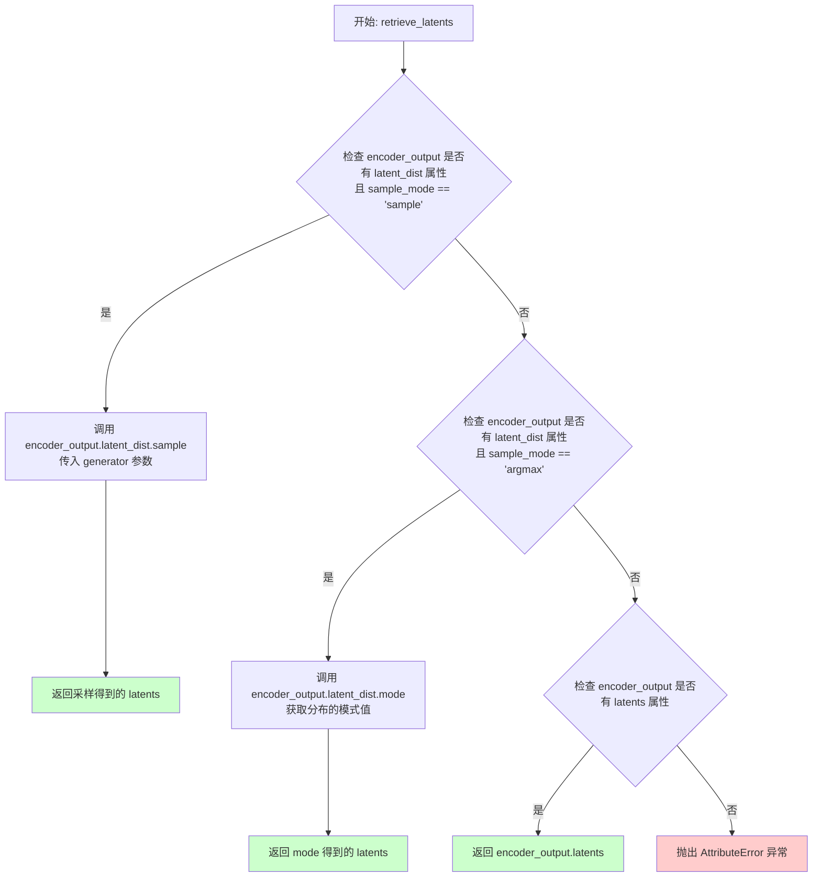
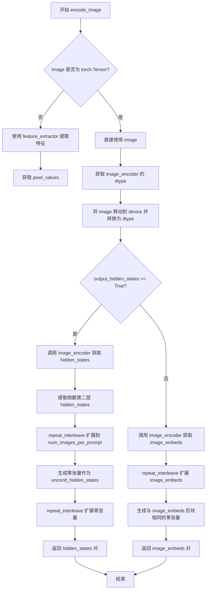
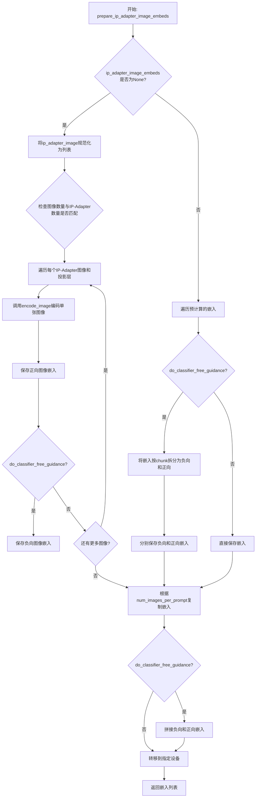
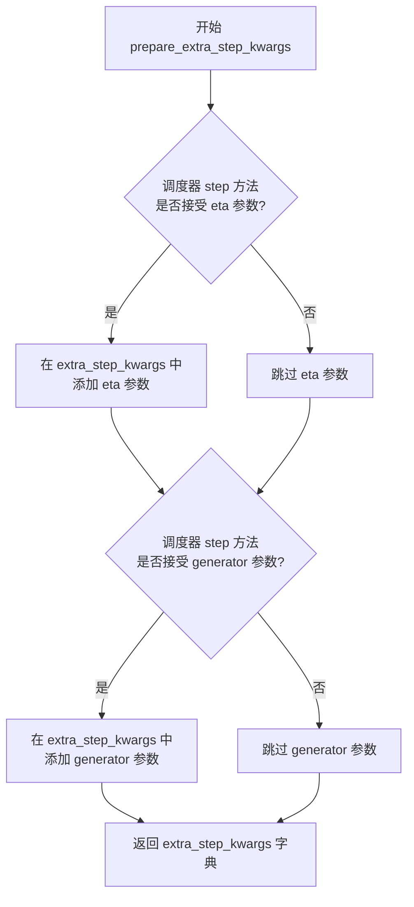
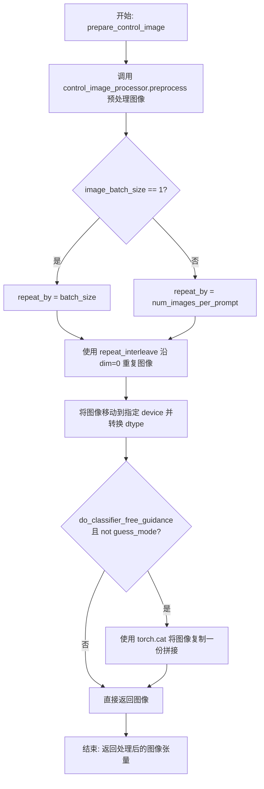
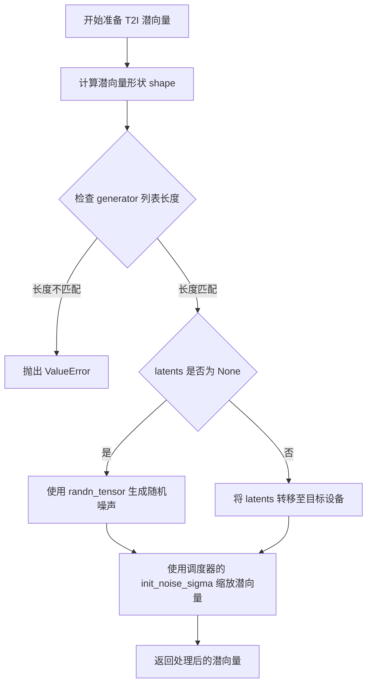
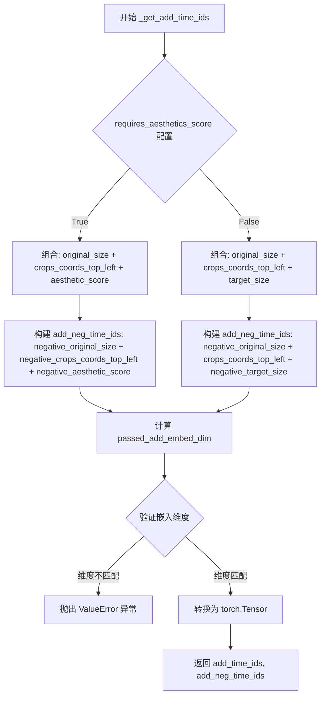
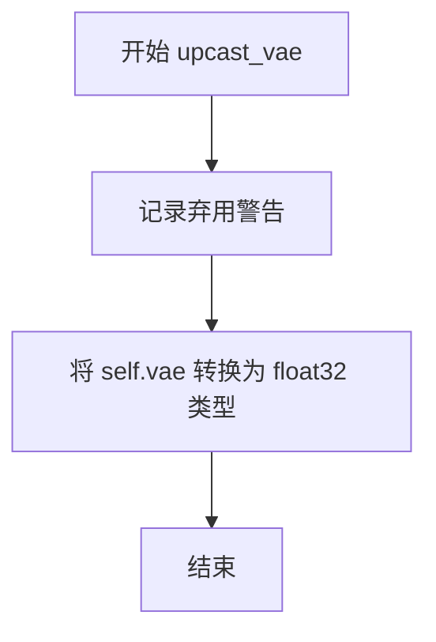
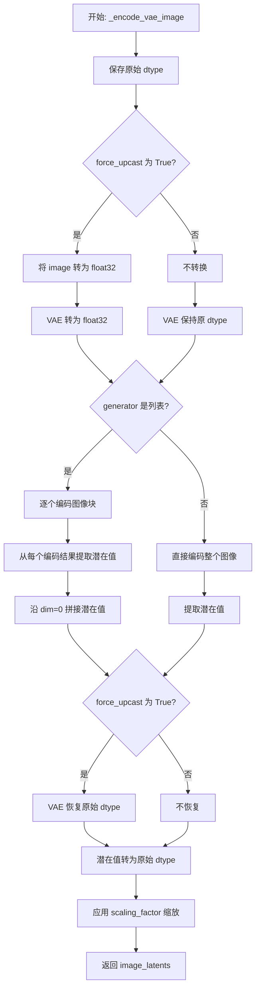
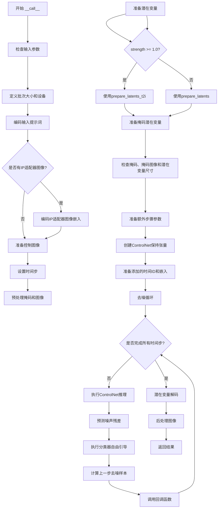

# `diffusers\examples\community\pipeline_controlnet_xl_kolors_inpaint.py` 详细设计文档

KolorsControlNetInpaintPipeline 是一个用于图像修复（Inpainting）的扩散管道。它结合了 Kolors 文本到图像模型、ControlNet 条件控制以及 VAE，能够根据文本提示、控制图（如 Canny 边缘）和掩码对图像进行修复和生成。

## 整体流程

```mermaid
graph TD
    Start([开始]) --> CheckInputs{检查输入参数}
    CheckInputs -->|不合法| Error[抛出异常]
    CheckInputs -->|合法
    EncodePrompt[encode_prompt: 编码文本提示]
    EncodePrompt --> PrepareIPAdapter[prepare_ip_adapter_image_embeds: 准备IP适配器]
    PrepareIPAdapter --> PrepareControlImage[prepare_control_image: 预处理控制图]
    PrepareControlImage --> RetrieveTimesteps[retrieve_timesteps & get_timesteps: 获取去噪步数]
    RetrieveTimesteps --> PreprocessImage[image_processor & mask_processor: 预处理图像与掩码]
    PreprocessImage --> PrepareLatents[prepare_latents: 准备初始潜向量]
    PrepareLatents --> PrepareMaskLatents[prepare_mask_latents: 准备掩码潜向量]
    PrepareMaskLatents --> DenoiseLoop{去噪循环}
    DenoiseLoop -->|每一步| ControlNetForward[controlnet: 运行ControlNet前向传播]
    ControlNetForward --> UNetForward[unet: 运行UNet预测噪声]
    UNetForward --> SchedulerStep[scheduler.step: 调度器步进]
    SchedulerStep -->|未结束| DenoiseLoop
    SchedulerStep -->|已结束
    Decode[vae.decode: VAE解码潜向量为图像]
    Decode --> PostProcess[image_processor.postprocess: 后处理图像]
    PostProcess --> Return[返回结果]
```

## 类结构

```
DiffusionPipeline (基类)
├── StableDiffusionMixin
├── StableDiffusionXLLoraLoaderMixin
├── FromSingleFileMixin
├── IPAdapterMixin
└── KolorsControlNetInpaintPipeline (当前类)
```

## 全局变量及字段


### `logger`
    
用于记录日志的日志记录器实例

类型：`logging.Logger`
    


### `EXAMPLE_DOC_STRING`
    
包含管道使用示例的文档字符串

类型：`str`
    


### `retrieve_latents`
    
从编码器输出中检索潜在向量的全局函数

类型：`Callable`
    


### `retrieve_timesteps`
    
从调度器中检索时间步的全局函数

类型：`Callable`
    


### `model_cpu_offload_seq`
    
定义模型CPU卸载顺序的类属性字符串

类型：`str`
    


### `_optional_components`
    
可选组件名称列表

类型：`List[str]`
    


### `_callback_tensor_inputs`
    
回调函数可用的张量输入名称列表

类型：`List[str]`
    


### `KolorsControlNetInpaintPipeline.vae`
    
VAE模型，用于编码和解码图像潜向量

类型：`AutoencoderKL`
    


### `KolorsControlNetInpaintPipeline.text_encoder`
    
文本编码器，用于将文本提示转换为嵌入向量

类型：`ChatGLMModel`
    


### `KolorsControlNetInpaintPipeline.tokenizer`
    
分词器，用于将文本转换为token序列

类型：`ChatGLMTokenizer`
    


### `KolorsControlNetInpaintPipeline.unet`
    
条件U-Net模型，用于去噪图像潜向量

类型：`UNet2DConditionModel`
    


### `KolorsControlNetInpaintPipeline.controlnet`
    
控制网络模型，提供额外的条件引导

类型：`Union[ControlNetModel, MultiControlNetModel]`
    


### `KolorsControlNetInpaintPipeline.scheduler`
    
扩散调度器，控制去噪过程的时间步

类型：`KarrasDiffusionSchedulers`
    


### `KolorsControlNetInpaintPipeline.vae_scale_factor`
    
VAE缩放因子，用于计算潜向量维度

类型：`int`
    


### `KolorsControlNetInpaintPipeline.image_processor`
    
图像预处理器，用于处理输入和输出图像

类型：`VaeImageProcessor`
    


### `KolorsControlNetInpaintPipeline.control_image_processor`
    
控制图像预处理器

类型：`VaeImageProcessor`
    


### `KolorsControlNetInpaintPipeline.mask_processor`
    
掩码预处理器，用于处理修复掩码

类型：`VaeImageProcessor`
    


### `KolorsControlNetInpaintPipeline.watermark`
    
水印添加器，用于添加不可见水印

类型：`Optional[StableDiffusionXLWatermarker]`
    
    

## 全局函数及方法


### `retrieve_latents`

该函数是一个工具函数，用于从变分自编码器（VAE）的encoder输出中提取潜变量表示。它通过检查encoder_output对象的属性，根据指定的采样模式（sample/argmax）从潜在分布中采样或获取模式值，或者直接返回预计算的latents属性。

参数：

- `encoder_output`：`torch.Tensor`，VAE编码器的输出对象，通常包含`latent_dist`属性（DiagonalGaussianDistribution类型）或`latents`属性
- `generator`：`torch.Generator | None`，可选的随机数生成器，用于确保采样过程的可重现性
- `sample_mode`：`str`，采样模式，支持"sample"（从分布中采样）、"argmax"（获取分布的模式值），默认为"sample"

返回值：`torch.Tensor`，提取的潜变量张量，形状为 `(batch_size, latent_channels, height, width)`

#### 流程图



#### 带注释源码

```python
# Copied from diffusers.pipelines.stable_diffusion.pipeline_stable_diffusion_img2img.retrieve_latents
def retrieve_latents(
    encoder_output: torch.Tensor, 
    generator: torch.Generator | None = None, 
    sample_mode: str = "sample"
):
    """
    从encoder输出中提取潜变量。
    
    该函数支持三种方式获取latents:
    1. 当encoder_output具有latent_dist属性且sample_mode为'sample'时，从分布中采样
    2. 当encoder_output具有latent_dist属性且sample_mode为'argmax'时，获取分布的模式值
    3. 当encoder_output具有latents属性时，直接返回该属性
    
    Args:
        encoder_output: VAE编码器的输出，包含latent_dist或latents属性
        generator: 可选的随机生成器，用于控制采样随机性
        sample_mode: 采样模式，'sample'或'argmax'
    
    Returns:
        潜变量张量
    
    Raises:
        AttributeError: 当encoder_output既没有latent_dist也没有latents属性时
    """
    # 场景1: 使用采样模式从潜在分布中采样
    if hasattr(encoder_output, "latent_dist") and sample_mode == "sample":
        return encoder_output.latent_dist.sample(generator)
    # 场景2: 使用argmax模式获取潜在分布的模式值
    elif hasattr(encoder_output, "latent_dist") and sample_mode == "argmax":
        return encoder_output.latent_dist.mode()
    # 场景3: 直接获取预计算的latents属性
    elif hasattr(encoder_output, "latents"):
        return encoder_output.latents
    # 错误处理: 无法从encoder_output中获取latents
    else:
        raise AttributeError("Could not access latents of provided encoder_output")
```


### `retrieve_timesteps`

该函数是 Diffusers 库中用于配置和检索扩散调度器（Scheduler）时间步（Timesteps）的核心工具函数。它充当了调度器配置的抽象层，支持三种配置方式：默认的推理步数、自定义的时间步列表或自定义的 Sigmas 列表，并确保返回标准格式的时间步张量供 Pipeline 使用。

#### 参数

- `scheduler`：`SchedulerMixin`，Diffusers 调度器对象（如 DDIM, LMS 等），用于生成时间步。
- `num_inference_steps`：`Optional[int]`，扩散模型的推理步数。如果指定了 `timesteps` 或 `sigmas`，此项必须为 `None`。
- `device`：`Optional[Union[str, torch.device]]`，时间步张量应放置的设备。如果为 `None`，则不移动张量。
- `timesteps`：`Optional[List[int]]`，用户自定义的时间步列表（例如 `[1000, 900, ...]`），用于覆盖调度器的默认间隔策略。
- `sigmas`：`Optional[List[float]]`，用户自定义的 Sigma 值列表，用于覆盖调度器的默认间隔策略。
- `**kwargs`：关键字参数，将传递给调度器的 `set_timesteps` 方法。

#### 返回值

`Tuple[torch.Tensor, int]`：返回一个元组。
- 第一个元素是 `torch.Tensor` 类型，表示调度后的时间步序列。
- 第二个元素是 `int` 类型，表示实际的推理步数（通常等于时间步列表的长度）。

#### 流程图

```mermaid
flowchart TD
    A[开始 retrieve_timesteps] --> B{检查 timesteps 和 sigmas}
    B -->|同时存在| C[抛出 ValueError: 只能选择一种]
    B -->|否| D{是否指定了 timesteps?}
    D -->|是| E[检查 scheduler.set_timesteps 是否支持 timesteps]
    E -->|不支持| F[抛出 ValueError: 不支持自定义 timesteps]
    E -->|支持| G[scheduler.set_timesteps(timesteps=timesteps, ...)]
    G --> H[timesteps = scheduler.timesteps]
    H --> I[num_inference_steps = len(timesteps)]
    D -->|否| J{是否指定了 sigmas?}
    J -->|是| K[检查 scheduler.set_timesteps 是否支持 sigmas]
    K -->|不支持| L[抛出 ValueError: 不支持自定义 sigmas]
    K -->|支持| M[scheduler.set_timesteps(sigmas=sigmas, ...)]
    M --> N[timesteps = scheduler.timesteps]
    N --> I
    J -->|否| O[scheduler.set_timesteps(num_inference_steps, ...)]
    O --> H
    I --> P[返回 timesteps, num_inference_steps]
```

#### 带注释源码

```python
def retrieve_timesteps(
    scheduler,
    num_inference_steps: Optional[int] = None,
    device: Optional[Union[str, torch.device]] = None,
    timesteps: Optional[List[int]] = None,
    sigmas: Optional[List[float]] = None,
    **kwargs,
):
    """
    调用调度器的 `set_timesteps` 方法并在调用后从中检索时间步。
    处理自定义时间步。任何 kwargs 将被传递给 `scheduler.set_timesteps`。

    参数:
        scheduler (`SchedulerMixin`):
            用于获取时间步的调度器。
        num_inference_steps (`int`):
            使用预训练模型生成样本时使用的扩散步数。如果使用此参数，`timesteps` 必须为 `None`。
        device (`str` 或 `torch.device`, *可选*):
            时间步应移动到的设备。如果为 `None`，则不移动时间步。
        timesteps (`List[int]`, *可选*):
            用于覆盖调度器时间步间隔策略的自定义时间步。如果传入 `timesteps`，则 `num_inference_steps` 和 `sigmas` 必须为 `None`。
        sigmas (`List[float]`, *可选*):
            用于覆盖调度器 Sigma 间隔策略的自定义 Sigmas。如果传入 `sigmas`，则 `num_inference_steps` 和 `timesteps` 必须为 `None`。

    返回:
        `Tuple[torch.Tensor, int]`：元组，第一个元素是调度器的时间步计划，第二个元素是推理步数。
    """
    # 校验：timesteps 和 sigmas 不能同时指定
    if timesteps is not None and sigmas is not None:
        raise ValueError("只能传入 `timesteps` 或 `sigmas` 之一。请选择一个来设置自定义值")
    
    # 分支1：使用自定义 timesteps
    if timesteps is not None:
        # 通过反射检查调度器是否支持 timesteps 参数
        accepts_timesteps = "timesteps" in set(inspect.signature(scheduler.set_timesteps).parameters.keys())
        if not accepts_timesteps:
            raise ValueError(
                f"当前调度器类 {scheduler.__class__} 的 `set_timesteps` 不支持自定义"
                f" 时间步计划。请检查您是否使用了正确的调度器。"
            )
        # 调用调度器接口
        scheduler.set_timesteps(timesteps=timesteps, device=device, **kwargs)
        timesteps = scheduler.timesteps
        # 动态计算实际的推理步数
        num_inference_steps = len(timesteps)
        
    # 分支2：使用自定义 sigmas
    elif sigmas is not None:
        # 检查调度器是否支持 sigmas 参数
        accept_sigmas = "sigmas" in set(inspect.signature(scheduler.set_timesteps).parameters.keys())
        if not accept_sigmas:
            raise ValueError(
                f"当前调度器类 {scheduler.__class__} 的 `set_timesteps` 不支持自定义"
                f" sigma 计划。请检查您是否使用了正确的调度器。"
            )
        scheduler.set_timesteps(sigmas=sigmas, device=device, **kwargs)
        timesteps = scheduler.timesteps
        num_inference_steps = len(timesteps)
        
    # 分支3：使用默认配置（根据 num_inference_steps）
    else:
        scheduler.set_timesteps(num_inference_steps, device=device, **kwargs)
        timesteps = scheduler.timesteps
        
    return timesteps, num_inference_steps
```

#### 关键组件信息

- **`scheduler.set_timesteps`**：调度器的核心方法，负责根据策略（Karras, normal 等）和参数生成离散的时间点序列。
- **`scheduler.timesteps`**：调度器对象上的属性，存储生成的 `torch.Tensor` 时间步。

#### 潜在技术债务与优化空间

1.  **反射检查的性能开销**：使用 `inspect.signature` 在每次调用时检查调度器是否支持特定参数。虽然在 `retrieve_timesteps` 中是必要的，但可以考虑在 Pipeline 初始化时缓存调度器的能力，以减少运行时的反射开销。
2.  **参数校验的脆弱性**：目前通过检查函数签名来判断功能支持性。如果调度器 API 变更（如改用 `**kwargs`），这种静态检查可能失效或产生误报。

#### 其它项目

- **设计目标**：提供统一的接口来处理不同调度器的配置差异（例如 DDIMScheduler 可能不支持 Karras sigmas），并允许高级用户进行微调。
- **错误处理**：该函数包含了明确的错误提示，指导用户选择正确的调度器或参数组合，防止在推理阶段因配置错误而崩溃。
- **在 Pipeline 中的角色**：在 `KolorsControlNetInpaintPipeline.__call__` 方法的步骤 5 ("set timesteps") 中被调用，用于初始化去噪循环的迭代计划。


### KolorsControlNetInpaintPipeline.__init__

初始化 Kolors 图像修复管道组件，包括 VAE、文本编码器、Tokenizer、U-Net、ControlNet、调度器等核心模型，并配置图像处理器和水印处理器。

参数：

-  `vae`：`AutoencoderKL`，Variational Auto-Encoder (VAE) 模型，用于编码和解码图像到潜在表示
-  `text_encoder`：`ChatGLMModel`，Kolors 使用的冻结文本编码器 (ChatGLM3-6B)
-  `tokenizer`：`ChatGLMTokenizer`，用于对文本进行分词
-  `unet`：`UNet2DConditionModel`，条件 U-Net 架构，用于去噪图像潜在表示
-  `controlnet`：`Union[ControlNetModel, List[ControlNetModel], Tuple[ControlNetModel], MultiControlNetModel]`，提供额外条件控制的 ControlNet 模型
-  `scheduler`：`KarrasDiffusionSchedulers`，与 unet 配合用于去噪图像潜在表示的调度器
-  `requires_aesthetics_score`：`bool`，可选，是否需要传递 aesthetic_score 条件，默认为 False
-  `force_zeros_for_empty_prompt`：`bool`，可选，是否强制将空提示的嵌入设为零，默认为 True
-  `feature_extractor`：`CLIPImageProcessor`，可选，用于从生成的图像中提取特征的 CLIP 图像处理器
-  `image_encoder`：`CLIPVisionModelWithProjection`，可选，用于 IP Adapter 的图像编码器
-  `add_watermarker`：`Optional[bool]`，可选，是否添加不可见水印

返回值：`None`，该方法为构造函数，无返回值

#### 流程图

```mermaid
flowchart TD
    A[开始 __init__] --> B[调用父类构造函数 super().__init__]
    B --> C{controlnet 是否为 list/tuple}
    C -->|是| D[将 controlnet 包装为 MultiControlNetModel]
    C -->|否| E[保持原样]
    D --> F
    E --> F
    F[调用 register_modules 注册所有模块] --> G[计算 vae_scale_factor]
    G --> H[创建 VaeImageProcessor 用于主图像处理]
    H --> I[创建 VaeImageProcessor 用于控制图像处理]
    I --> J[创建 VaeImageProcessor 用于掩码处理]
    J --> K{add_watermarker 是否为 True}
    K -->|是| L[创建 StableDiffusionXLWatermarker]
    K -->|否| M[设置 watermark 为 None]
    L --> N
    M --> N
    N[注册 force_zeros_for_empty_prompt 到配置] --> O[注册 requires_aesthetics_score 到配置]
    O --> P[结束 __init__]
```

#### 带注释源码

```python
def __init__(
    self,
    vae: AutoencoderKL,  # VAE 模型，用于图像编码/解码
    text_encoder: ChatGLMModel,  # 文本编码器 (ChatGLM3-6B)
    tokenizer: ChatGLMTokenizer,  # 分词器
    unet: UNet2DConditionModel,  # 条件 U-Net 去噪模型
    controlnet: Union[ControlNetModel, List[ControlNetModel], Tuple[ControlNetModel], MultiControlNetModel],  # ControlNet 模型
    scheduler: KarrasDiffusionSchedulers,  # 扩散调度器
    requires_aesthetics_score: bool = False,  # 是否需要美学评分条件
    force_zeros_for_empty_prompt: bool = True,  # 空提示是否强制为零嵌入
    feature_extractor: CLIPImageProcessor = None,  # CLIP 图像处理器
    image_encoder: CLIPVisionModelWithProjection = None,  # IP Adapter 图像编码器
    add_watermarker: Optional[bool] = None,  # 是否添加水印
):
    # 调用父类 DiffusionPipeline 的初始化方法
    super().__init__()

    # 如果 controlnet 是列表或元组，包装为 MultiControlNetModel
    if isinstance(controlnet, (list, tuple)):
        controlnet = MultiControlNetModel(controlnet)

    # 注册所有模块到管道中，使它们可以被管道管理
    self.register_modules(
        vae=vae,
        text_encoder=text_encoder,
        tokenizer=tokenizer,
        unet=unet,
        controlnet=controlnet,
        scheduler=scheduler,
        feature_extractor=feature_extractor,
        image_encoder=image_encoder,
    )

    # 计算 VAE 缩放因子，基于 VAE 的块输出通道数
    # 用于将像素空间图像转换为潜在空间
    self.vae_scale_factor = 2 ** (len(self.vae.config.block_out_channels) - 1)

    # 创建主图像处理器：RGB 转换，VAE 缩放
    self.image_processor = VaeImageProcessor(
        vae_scale_factor=self.vae_scale_factor, 
        do_convert_rgb=True
    )

    # 创建控制图像处理器：RGB 转换，不归一化
    self.control_image_processor = VaeImageProcessor(
        vae_scale_factor=self.vae_scale_factor, 
        do_convert_rgb=True, 
        do_normalize=False
    )

    # 创建掩码处理器：二值化，转换为灰度图
    self.mask_processor = VaeImageProcessor(
        vae_scale_factor=self.vae_scale_factor, 
        do_normalize=False, 
        do_binarize=True, 
        do_convert_grayscale=True
    )

    # 根据参数决定是否创建水印器
    if add_watermarker:
        self.watermark = StableDiffusionXLWatermarker()
    else:
        self.watermark = None

    # 将配置参数注册到管道配置中
    self.register_to_config(force_zeros_for_empty_prompt=force_zeros_for_empty_prompt)
    self.register_to_config(requires_aesthetics_score=requires_aesthetics_score)
```


### `KolorsControlNetInpaintPipeline.encode_prompt`

该方法将文本提示（prompt）编码为文本编码器的隐藏状态向量，支持批量生成、分类器自由引导（Classifier-Free Guidance）和 LoRA 缩放，并返回正负提示的嵌入向量及池化嵌入。

**参数：**

- `prompt`：`str` 或 `List[str]`，可选，要编码的提示文本
- `device`：`torch.device`，可选，指定计算设备，默认为执行设备
- `num_images_per_prompt`：`int`，每个提示生成的图像数量，默认为 1
- `do_classifier_free_guidance`：`bool`，是否启用分类器自由引导，默认为 True
- `negative_prompt`：`str` 或 `List[str]`，可选，不希望出现的负面提示
- `prompt_embeds`：`torch.FloatTensor`，可选，预生成的文本嵌入，用于微调输入
- `negative_prompt_embeds`：`torch.FloatTensor`，可选，预生成的负面文本嵌入
- `pooled_prompt_embeds`：`torch.FloatTensor`，可选，预生成的池化文本嵌入
- `negative_pooled_prompt_embeds`：`torch.FloatTensor`，可选，预生成的负面池化文本嵌入
- `lora_scale`：`float`，可选，应用于文本编码器所有 LoRA 层的缩放因子

**返回值：** `Tuple[torch.FloatTensor, torch.FloatTensor, torch.FloatTensor, torch.FloatTensor]`，包含四个张量：
- `prompt_embeds`：编码后的正向提示嵌入
- `negative_prompt_embeds`：编码后的负向提示嵌入
- `pooled_prompt_embeds`：池化后的正向提示嵌入
- `negative_pooled_prompt_embeds`：池化后的负向提示嵌入

#### 流程图

```mermaid
flowchart TD
    A[开始 encode_prompt] --> B{判断 batch_size}
    B -->|prompt 为 str| C[batch_size = 1]
    B -->|prompt 为 list| D[batch_size = len(prompt)]
    B -->|其他情况| E[batch_size = prompt_embeds.shape[0]]
    
    C --> F[设置 tokenizers 和 text_encoders]
    D --> F
    E --> F
    
    F --> G{prompt_embeds 是否为空?}
    G -->|是| H[遍历 tokenizers 和 text_encoders]
    G -->|否| I[跳过文本编码]
    
    H --> J[调用 maybe_convert_prompt 处理 textual inversion]
    J --> K[tokenizer 编码 prompt]
    K --> L[text_encoder 生成隐藏状态]
    L --> M[提取倒数第二层隐藏状态作为 prompt_embeds]
    M --> N[提取最后一层隐藏状态的最后一个 token 作为 pooled_prompt_embeds]
    N --> O[扩展 batch 维度以匹配 num_images_per_prompt]
    O --> P[保存到 prompt_embeds_list]
    
    I --> Q{是否需要分类器自由引导?}
    Q -->|是且 negative_prompt_embeds 为空| R[检查 force_zeros_for_empty_prompt]
    Q -->|否| S[直接返回结果]
    
    R -->|force_zeros_for_empty_prompt 为真| T[创建零张量作为 negative_prompt_embeds]
    R -->|force_zeros_for_empty_prompt 为假| U[处理 negative_prompt]
    
    T --> V[创建零张量作为 negative_pooled_prompt_embeds]
    U --> W{negative_prompt 类型检查}
    W -->|str| X[构建单元素列表]
    W -->|list| Y[直接使用]
    W -->|类型不匹配| Z[抛出 TypeError]
    W -->|batch_size 不匹配| AA[抛出 ValueError]
    
    X --> AB[遍历生成 negative_prompt_embeds]
    Y --> AB
    AB --> AC[tokenizer 编码 uncond_tokens]
    AC --> AD[text_encoder 编码获取隐藏状态]
    AD --> AE[扩展 negative_prompt_embeds 维度]
    AE --> AF[重复 num_images_per_prompt 次]
    AF --> AG[转换为正确 dtype 和 device]
    
    P --> AH[合并 prompt_embeds_list]
    V --> AI[扩展 pooled_prompt_embeds]
    AG --> AJ[扩展 negative_pooled_prompt_embeds]
    AH --> AI
    AJ --> AK[返回四个嵌入张量]
    S --> AK
```

#### 带注释源码

```python
def encode_prompt(
    self,
    prompt,
    device: Optional[torch.device] = None,
    num_images_per_prompt: int = 1,
    do_classifier_free_guidance: bool = True,
    negative_prompt=None,
    prompt_embeds: Optional[torch.FloatTensor] = None,
    negative_prompt_embeds: Optional[torch.FloatTensor] = None,
    pooled_prompt_embeds: Optional[torch.FloatTensor] = None,
    negative_pooled_prompt_embeds: Optional[torch.FloatTensor] = None,
    lora_scale: Optional[float] = None,
):
    """
    Encodes the prompt into text encoder hidden states.
    
    参数:
        prompt: 要编码的提示，可以是字符串或字符串列表
        device: torch 设备
        num_images_per_prompt: 每个提示生成的图像数量
        do_classifier_free_guidance: 是否使用分类器自由引导
        negative_prompt: 负面提示
        prompt_embeds: 预生成的文本嵌入
        negative_prompt_embeds: 预生成的负面文本嵌入
        pooled_prompt_embeds: 预生成的池化文本嵌入
        negative_pooled_prompt_embeds: 预生成的负面池化文本嵌入
        lora_scale: LoRA 缩放因子
    """
    # 确定设备，未指定则使用执行设备
    device = device or self._execution_device

    # 设置 LoRA 缩放，以便文本编码器的 LoRA 函数可以正确访问
    if lora_scale is not None and isinstance(self, StableDiffusionXLLoraLoaderMixin):
        self._lora_scale = lora_scale

    # 根据输入确定批处理大小
    if prompt is not None and isinstance(prompt, str):
        batch_size = 1
    elif prompt is not None and isinstance(prompt, list):
        batch_size = len(prompt)
    else:
        batch_size = prompt_embeds.shape[0]

    # 定义分词器和文本编码器列表
    tokenizers = [self.tokenizer]
    text_encoders = [self.text_encoder]

    # 如果未提供 prompt_embeds，则从 prompt 生成
    if prompt_embeds is None:
        # textual inversion: 如需要处理多向量标记
        prompt_embeds_list = []
        for tokenizer, text_encoder in zip(tokenizers, text_encoders):
            # 如果支持 textual inversion，转换 prompt
            if isinstance(self, TextualInversionLoaderMixin):
                prompt = self.maybe_convert_prompt(prompt, tokenizer)

            # 使用分词器将 prompt 转换为张量
            text_inputs = tokenizer(
                prompt,
                padding="max_length",
                max_length=256,
                truncation=True,
                return_tensors="pt",
            ).to(self._execution_device)
            
            # 文本编码器前向传播，获取隐藏状态
            output = text_encoder(
                input_ids=text_inputs["input_ids"],
                attention_mask=text_inputs["attention_mask"],
                position_ids=text_inputs["position_ids"],
                output_hidden_states=True,
            )
            
            # 提取倒数第二层隐藏状态作为 prompt_embeds [seq_len, batch_size, hidden_dim]
            prompt_embeds = output.hidden_states[-2].permute(1, 0, 2).clone()
            # 提取最后一层隐藏状态的最后一个 token 作为池化嵌入 [batch_size, 4096]
            pooled_prompt_embeds = output.hidden_states[-1][-1, :, :].clone()
            
            # 获取嵌入维度信息并扩展以匹配 num_images_per_prompt
            bs_embed, seq_len, _ = prompt_embeds.shape
            prompt_embeds = prompt_embeds.repeat(1, num_images_per_prompt, 1)
            prompt_embeds = prompt_embeds.view(bs_embed * num_images_per_prompt, seq_len, -1)
            prompt_embeds_list.append(prompt_embeds)

        # 合并所有文本编码器的嵌入（当前只使用第一个）
        prompt_embeds = prompt_embeds_list[0]

    # 处理分类器自由引导的无条件嵌入
    # 检查是否需要强制将负面提示设为零
    zero_out_negative_prompt = negative_prompt is None and self.config.force_zeros_for_empty_prompt
    
    if do_classifier_free_guidance and negative_prompt_embeds is None and zero_out_negative_prompt:
        # 创建与 prompt_embeds 相同形状的零张量
        negative_prompt_embeds = torch.zeros_like(prompt_embeds)
        negative_pooled_prompt_embeds = torch.zeros_like(pooled_prompt_embeds)
    elif do_classifier_free_guidance and negative_prompt_embeds is None:
        # 需要从 negative_prompt 生成嵌入
        uncond_tokens: List[str]
        if negative_prompt is None:
            # 如果未提供负面提示，使用空字符串
            uncond_tokens = [""] * batch_size
        elif prompt is not None and type(prompt) is not type(negative_prompt):
            # 类型检查
            raise TypeError(
                f"`negative_prompt` should be the same type to `prompt`, but got {type(negative_prompt)} !="
                f" {type(prompt)}."
            )
        elif isinstance(negative_prompt, str):
            uncond_tokens = [negative_prompt]
        elif batch_size != len(negative_prompt):
            # batch 大小不匹配检查
            raise ValueError(
                f"`negative_prompt`: {negative_prompt} has batch size {len(negative_prompt)}, but `prompt`:"
                f" {prompt} has batch size {batch_size}. Please make sure that passed `negative_prompt` matches"
                " the batch size of `prompt`."
            )
        else:
            uncond_tokens = negative_prompt

        # 生成负面提示嵌入
        negative_prompt_embeds_list = []
        for tokenizer, text_encoder in zip(tokenizers, text_encoders):
            # textual inversion 处理
            if isinstance(self, TextualInversionLoaderMixin):
                uncond_tokens = self.maybe_convert_prompt(uncond_tokens, tokenizer)

            # 使用与 prompt_embeds 相同的长度
            max_length = prompt_embeds.shape[1]
            uncond_input = tokenizer(
                uncond_tokens,
                padding="max_length",
                max_length=max_length,
                truncation=True,
                return_tensors="pt",
            ).to(self._execution_device)
            
            # 文本编码器前向传播
            output = text_encoder(
                input_ids=uncond_input["input_ids"],
                attention_mask=uncond_input["attention_mask"],
                position_ids=uncond_input["position_ids"],
                output_hidden_states=True,
            )
            
            # 提取嵌入
            negative_prompt_embeds = output.hidden_states[-2].permute(1, 0, 2).clone()
            negative_pooled_prompt_embeds = output.hidden_states[-1][-1, :, :].clone()

            if do_classifier_free_guidance:
                # 复制无条件嵌入以匹配每个提示的生成数量
                seq_len = negative_prompt_embeds.shape[1]
                # 转换为正确的 dtype 和 device
                negative_prompt_embeds = negative_prompt_embeds.to(dtype=text_encoder.dtype, device=device)
                # 重复扩展维度
                negative_prompt_embeds = negative_prompt_embeds.repeat(1, num_images_per_prompt, 1)
                negative_prompt_embeds = negative_prompt_embeds.view(
                    batch_size * num_images_per_prompt, seq_len, -1
                )

            negative_prompt_embeds_list.append(negative_prompt_embeds)

        # 合并负面嵌入
        negative_prompt_embeds = negative_prompt_embeds_list[0]

    # 扩展池化嵌入的 batch 维度
    bs_embed = pooled_prompt_embeds.shape[0]
    pooled_prompt_embeds = pooled_prompt_embeds.repeat(1, num_images_per_prompt).view(
        bs_embed * num_images_per_prompt, -1
    )
    
    # 如果使用分类器自由引导，也扩展负面池化嵌入
    if do_classifier_free_guidance:
        negative_pooled_prompt_embeds = negative_pooled_prompt_embeds.repeat(1, num_images_per_prompt).view(
            bs_embed * num_images_per_prompt, -1
        )

    # 返回四个嵌入张量
    return prompt_embeds, negative_prompt_embeds, pooled_prompt_embeds, negative_pooled_prompt_embeds
```


### `KolorsControlNetInpaintPipeline.encode_image`

该方法负责将输入图像编码为嵌入向量，用于IP-Adapter图像提示功能。它支持两种输出模式：返回图像嵌入（image_embeds）或隐藏状态（hidden states），并同时生成对应的无条件嵌入以支持Classifier-Free Guidance。

参数：

- `self`：`KolorsControlNetInpaintPipeline` 实例，pipeline 对象本身
- `image`：`Union[torch.Tensor, PIL.Image.Image, np.ndarray, List[Union[torch.Tensor, PIL.Image.Image, np.ndarray]]]`，待编码的输入图像，支持张量、PIL图像、numpy数组或它们的列表
- `device`：`torch.device`，目标计算设备
- `num_images_per_prompt`：`int`，每个提示词生成的图像数量，用于批量处理
- `output_hidden_states`：`Optional[bool]`，可选参数，指定是否返回隐藏状态而非图像嵌入，默认为 None

返回值：`Tuple[torch.Tensor, torch.Tensor]` 或 `Tuple[Tuple[torch.Tensor, torch.Tensor]]`，返回两个元素：条件嵌入（条件图像嵌入或隐藏状态）和无条件嵌入（零向量）。当 `output_hidden_states=True` 时返回隐藏状态元组，否则返回图像嵌入元组。

#### 流程图



#### 带注释源码

```python
def encode_image(self, image, device, num_images_per_prompt, output_hidden_states=None):
    """
    将图像编码为嵌入向量，用于IP-Adapter。
    
    参数:
        image: 输入图像，可以是 torch.Tensor, PIL.Image.Image, np.ndarray 或它们的列表
        device: 目标设备
        num_images_per_prompt: 每个提示词生成的图像数量
        output_hidden_states: 是否返回隐藏状态而非图像嵌入
    
    返回:
        (image_embeds, uncond_image_embeds) 或 (hidden_states, uncond_hidden_states)
    """
    # 获取 image_encoder 的参数 dtype，用于后续类型转换
    dtype = next(self.image_encoder.parameters()).dtype

    # 如果输入不是 tensor，则使用 feature_extractor 提取特征
    if not isinstance(image, torch.Tensor):
        image = self.feature_extractor(image, return_tensors="pt").pixel_values

    # 将图像移动到指定设备并转换 dtype
    image = image.to(device=device, dtype=dtype)
    
    # 根据 output_hidden_states 参数决定输出类型
    if output_hidden_states:
        # 模式1: 返回隐藏状态 (hidden states)
        # 获取条件图像的隐藏状态
        image_enc_hidden_states = self.image_encoder(image, output_hidden_states=True).hidden_states[-2]
        # 扩展到 num_images_per_prompt 维度
        image_enc_hidden_states = image_enc_hidden_states.repeat_interleave(num_images_per_prompt, dim=0)
        
        # 获取无条件图像的隐藏状态 (使用零张量)
        uncond_image_enc_hidden_states = self.image_encoder(
            torch.zeros_like(image), output_hidden_states=True
        ).hidden_states[-2]
        # 扩展到 num_images_per_prompt 维度
        uncond_image_enc_hidden_states = uncond_image_enc_hidden_states.repeat_interleave(
            num_images_per_prompt, dim=0
        )
        
        # 返回隐藏状态对
        return image_enc_hidden_states, uncond_image_enc_hidden_states
    else:
        # 模式2: 返回图像嵌入 (image embeddings)
        # 获取条件图像的嵌入
        image_embeds = self.image_encoder(image).image_embeds
        # 扩展到 num_images_per_prompt 维度
        image_embeds = image_embeds.repeat_interleave(num_images_per_prompt, dim=0)
        
        # 生成零嵌入作为无条件图像嵌入
        uncond_image_embeds = torch.zeros_like(image_embeds)

        # 返回图像嵌入对
        return image_embeds, uncond_image_embeds
```


### `KolorsControlNetInpaintPipeline.prepare_ip_adapter_image_embeds`

该方法负责准备 IP-Adapter 的图像嵌入（image embeds），用于在图像生成过程中注入参考图像的特征信息。它支持两种输入模式：直接输入图像或预计算的图像嵌入，并处理 classifier-free guidance 场景下的负向嵌入。

参数：

- `self`：`KolorsControlNetInpaintPipeline` 实例本身
- `ip_adapter_image`：`PipelineImageInput`，待处理的 IP-Adapter 参考图像，支持 PIL.Image.Tensor、numpy array 或它们的列表
- `ip_adapter_image_embeds`：`Optional[List[torch.Tensor]]`，预计算的图像嵌入列表，如果为 None 则从图像编码
- `device`：`torch.device`，计算设备
- `num_images_per_prompt`：`int`，每个 prompt 生成的图像数量
- `do_classifier_free_guidance`：`bool`，是否启用 classifier-free guidance

返回值：`List[torch.Tensor]`，处理后的 IP-Adapter 图像嵌入列表，每个元素对应一个 IP-Adapter

#### 流程图



#### 带注释源码

```python
def prepare_ip_adapter_image_embeds(
    self,
    ip_adapter_image: PipelineImageInput,                     # IP-Adapter参考图像输入
    ip_adapter_image_embeds: Optional[List[torch.Tensor]],   # 预计算的图像嵌入
    device: torch.device,                                     # 计算设备
    num_images_per_prompt: int,                               # 每个prompt生成的图像数
    do_classifier_free_guidance: bool                        # 是否启用CFG
):
    """
    准备IP-Adapter的图像嵌入。
    
    支持两种模式：
    1. 输入原始图像：通过encode_image编码
    2. 输入预计算的嵌入：直接使用
    
    当启用classifier-free guidance时，会生成正负两种嵌入用于无分类器指导。
    """
    
    # 初始化正向嵌入列表
    image_embeds = []
    
    # 如果启用CFG，同时初始化负向嵌入列表
    if do_classifier_free_guidance:
        negative_image_embeds = []
    
    # 模式1: 需要从图像编码生成嵌入
    if ip_adapter_image_embeds is None:
        # 规范化输入：确保是列表格式
        if not isinstance(ip_adapter_image, list):
            ip_adapter_image = [ip_adapter_image]
        
        # 验证：图像数量必须与IP-Adapter数量匹配
        # 通过unet的encoder_hid_proj获取已注册的IP-Adapter数量
        if len(ip_adapter_image) != len(self.unet.encoder_hid_proj.image_projection_layers):
            raise ValueError(
                f"`ip_adapter_image` must have same length as the number of IP Adapters. Got "
                f"{len(ip_adapter_image)} images and {len(self.unet.encoder_hid_proj.image_projection_layers)} IP Adapters."
            )
        
        # 遍历每个IP-Adapter的图像和对应的投影层
        for single_ip_adapter_image, image_proj_layer in zip(
            ip_adapter_image, self.unet.encoder_hid_proj.image_projection_layers
        ):
            # 判断是否需要输出hidden states
            # ImageProjection类型不需要，其他类型（如CLIPVisionModel）需要
            output_hidden_state = not isinstance(image_proj_layer, ImageProjection)
            
            # 编码单个图像得到嵌入
            # 参数1: 单张图像
            # 参数2: 设备
            # 参数3: num_images_per_prompt设为1（内部会处理复制）
            # 参数4: 是否输出hidden states
            single_image_embeds, single_negative_image_embeds = self.encode_image(
                single_ip_adapter_image, device, 1, output_hidden_state
            )
            
            # 添加批次维度 [batch] -> [1, batch]
            image_embeds.append(single_image_embeds[None, :])
            
            # 如果启用CFG，保存负向嵌入
            if do_classifier_free_guidance:
                negative_image_embeds.append(single_negative_image_embeds[None, :])
    
    # 模式2: 使用预计算的嵌入
    else:
        for single_image_embeds in ip_adapter_image_embeds:
            if do_classifier_free_guidance:
                # 预计算嵌入通常已包含正负两个部分，按chunk(2)拆分
                single_negative_image_embeds, single_image_embeds = single_image_embeds.chunk(2)
                negative_image_embeds.append(single_negative_image_embeds)
            
            image_embeds.append(single_image_embeds)
    
    # 后处理：对每个嵌入进行复制和拼接
    ip_adapter_image_embeds = []
    for i, single_image_embeds in enumerate(image_embeds):
        # 根据num_images_per_prompt复制正向嵌入
        # 例如: [1, dim] -> [num_images_per_prompt, dim]
        single_image_embeds = torch.cat([single_image_embeds] * num_images_per_prompt, dim=0)
        
        if do_classifier_free_guidance:
            # 复制负向嵌入
            single_negative_image_embeds = torch.cat([negative_image_embeds[i]] * num_images_per_prompt, dim=0)
            # 拼接: [neg_num, dim] + [pos_num, dim] -> [neg_num + pos_num, dim]
            # 顺序必须是负向在前，正向在后，符合CFG的实现逻辑
            single_image_embeds = torch.cat([single_negative_image_embeds, single_image_embeds], dim=0)
        
        # 确保嵌入在正确的设备上
        single_image_embeds = single_image_embeds.to(device=device)
        
        # 收集处理后的嵌入
        ip_adapter_image_embeds.append(single_image_embeds)
    
    return ip_adapter_image_embeds
```


### `KolorsControlNetInpaintPipeline.prepare_extra_step_kwargs`

该方法用于为调度器（scheduler）的 `step` 方法准备额外的关键字参数。由于不同的调度器具有不同的签名，该方法通过检查调度器的 `step` 方法是否接受特定参数（`eta` 和 `generator`）来动态构建参数字典，确保兼容性。

参数：

- `self`：`KolorsControlNetInpaintPipeline` 类的实例，隐式参数
- `generator`：`torch.Generator` 或 `None`，用于控制随机数生成以确保可重复性
- `eta`：`float`，DDIM 调度器中使用的 eta 参数（值应在 [0, 1] 范围内），其他调度器会忽略此参数

返回值：`Dict[str, Any]`，包含调度器 `step` 方法所需额外参数的字典，可能包含 `eta` 和/或 `generator` 键

#### 流程图



#### 带注释源码

```python
def prepare_extra_step_kwargs(self, generator, eta):
    """
    准备调度器 step 方法的额外参数。
    
    因为并非所有调度器都具有相同的签名，所以需要检查调度器是否接受
    特定的参数。eta (η) 仅在 DDIMScheduler 中使用，其他调度器会忽略它。
    eta 对应 DDIM 论文中的 η 参数：https://huggingface.co/papers/2010.02502
    取值应在 [0, 1] 范围内。
    
    参数:
        generator: torch.Generator 或 None，用于生成确定性随机数
        eta: float，DDIM 调度器的 eta 参数
    
    返回:
        包含额外参数的字典，可能包含 'eta' 和/或 'generator' 键
    """
    # 使用 inspect 模块检查调度器的 step 方法是否接受 eta 参数
    # 通过获取方法签名并检查参数键集合
    accepts_eta = "eta" in set(inspect.signature(self.scheduler.step).parameters.keys())
    
    # 初始化空字典用于存储额外参数
    extra_step_kwargs = {}
    
    # 如果调度器接受 eta 参数，则将其添加到参数字典中
    if accepts_eta:
        extra_step_kwargs["eta"] = eta

    # 检查调度器是否接受 generator 参数
    accepts_generator = "generator" in set(inspect.signature(self.scheduler.step).parameters.keys())
    
    # 如果调度器接受 generator 参数，则将其添加到参数字典中
    if accepts_generator:
        extra_step_kwargs["generator"] = generator
    
    # 返回构建好的参数字典，供调度器 step 方法使用
    return extra_step_kwargs
```


### `KolorsControlNetInpaintPipeline.check_inputs`

该方法用于验证 KolorsControlNetInpaintPipeline 管道在执行推理前的所有输入参数有效性，包括 prompt、image、strength、num_inference_steps、callback_steps、negative_prompt、prompt_embeds、negative_prompt_embeds、pooled_prompt_embeds、negative_pooled_prompt_embeds、ip_adapter_image、ip_adapter_image_embeds、controlnet_conditioning_scale、control_guidance_start、control_guidance_end 以及 callback_on_step_end_tensor_inputs 等，确保所有参数符合管道要求，若不符合则抛出相应的 ValueError 或 TypeError 异常。

参数：

- `self`：`KolorsControlNetInpaintPipeline` 实例本身，管道对象实例
- `prompt`：`Union[str, List[str], None]`，待生成的文本提示，可以是字符串或字符串列表
- `image`：`PipelineImageInput`，输入图像，用于 inpainting 过程
- `strength`：`float`，强度参数，控制对图像的变换程度，范围应在 [0, 1]
- `num_inference_steps`：`int`，推理步数，执行去噪的迭代次数，必须为正整数
- `callback_steps`：`int`，回调步数，每隔多少步调用一次回调函数，必须为正整数
- `negative_prompt`：`Union[str, List[str], None]`，负向提示，用于引导图像生成方向
- `prompt_embeds`：`torch.FloatTensor, optional`，预生成的文本嵌入，可选
- `negative_prompt_embeds`：`torch.FloatTensor, optional`，预生成的负向文本嵌入，可选
- `pooled_prompt_embeds`：`torch.FloatTensor, optional`，预生成的池化文本嵌入，可选
- `negative_pooled_prompt_embeds`：`torch.FloatTensor, optional`，预生成的负向池化文本嵌入，可选
- `ip_adapter_image`：`PipelineImageInput, optional`，IP Adapter 图像输入，可选
- `ip_adapter_image_embeds`：`List[torch.Tensor], optional`，IP Adapter 图像嵌入列表，可选
- `controlnet_conditioning_scale`：`Union[float, List[float]]`，ControlNet 条件缩放因子，默认为 1.0
- `control_guidance_start`：`Union[float, List[float]]`，ControlNet 引导开始时间，默认为 0.0
- `control_guidance_end`：`Union[float, List[float]]`，ControlNet 引导结束时间，默认为 1.0
- `callback_on_step_end_tensor_inputs`：`List[str], optional`，在每步结束时回调的张量输入列表，可选

返回值：`None`，该方法不返回任何值，仅通过抛出异常来处理无效输入

#### 流程图

```mermaid
flowchart TD
    A[开始检查输入参数] --> B{strength 在 [0, 1] 范围内?}
    B -- 否 --> B1[抛出 ValueError]
    B -- 是 --> C{num_inference_steps 是正整数?}
    C -- 否 --> C1[抛出 ValueError]
    C -- 是 --> D{callback_steps 是正整数?}
    D -- 否 --> D1[抛出 ValueError]
    D -- 是 --> E{callback_on_step_end_tensor_inputs 合法?}
    E -- 否 --> E1[抛出 ValueError]
    E -- 是 --> F{prompt 和 prompt_embeds 不能同时提供?}
    F -- 是 --> G{prompt 和 prompt_embeds 不能同时为空?}
    G -- 否 --> G1[抛出 ValueError]
    G -- 是 --> H{prompt 类型合法?}
    H -- 否 --> H1[抛出 ValueError]
    H -- 是 --> I{negative_prompt 和 negative_prompt_embeds 不同时提供?}
    I -- 是 --> J{prompt_embeds 和 negative_prompt_embeds 形状一致?}
    J -- 否 --> J1[抛出 ValueError]
    J -- 是 --> K{prompt_embeds 提供了但 pooled_prompt_embeds 没提供?}
    K -- 是 --> K1[抛出 ValueError]
    K -- 否 --> L{negative_prompt_embeds 提供了但 negative_pooled_prompt_embeds 没提供?}
    L -- 是 --> L1[抛出 ValueError]
    L -- 否 --> M{检查 controlnet 类型和 image 匹配?}
    M -- 否 --> M1[抛出异常]
    M -- 是 --> N{检查 controlnet_conditioning_scale 类型和长度?}
    N -- 否 --> N1[抛出异常]
    N -- 是 --> O{检查 control_guidance_start 和 control_guidance_end 配对?}
    O -- 否 --> O1[抛出 ValueError]
    O -- 是 --> P{检查每个 start < end 且在 [0, 1] 范围内?}
    P -- 否 --> P1[抛出 ValueError]
    P -- 是 --> Q{检查 ip_adapter_image 和 ip_adapter_image_embeds 不同时提供?}
    Q -- 是 --> R{检查 ip_adapter_image_embeds 格式?}
    R -- 否 --> R1[抛出 ValueError]
    R -- 是 --> S[检查完成, 输入参数有效]
    
    F -- 否 --> F1[抛出 ValueError]
    I -- 否 --> I1[抛出 ValueError]
    Q -- 否 --> Q1[抛出 ValueError]
```

#### 带注释源码

```python
def check_inputs(
    self,
    prompt,
    image,
    strength,
    num_inference_steps,
    callback_steps,
    negative_prompt=None,
    prompt_embeds=None,
    negative_prompt_embeds=None,
    pooled_prompt_embeds=None,
    negative_pooled_prompt_embeds=None,
    ip_adapter_image=None,
    ip_adapter_image_embeds=None,
    controlnet_conditioning_scale=1.0,
    control_guidance_start=0.0,
    control_guidance_end=1.0,
    callback_on_step_end_tensor_inputs=None,
):
    """
    检查输入参数的有效性，确保所有参数都符合管道要求。
    
    该方法会进行多项验证：
    1. strength 必须在 [0, 1] 范围内
    2. num_inference_steps 必须为正整数
    3. callback_steps 必须为正整数（如果提供）
    4. callback_on_step_end_tensor_inputs 必须在允许的列表中
    5. prompt 和 prompt_embeds 不能同时提供
    6. prompt 和 prompt_embeds 不能同时为空
    7. prompt 类型必须是 str 或 list
    8. negative_prompt 和 negative_prompt_embeds 不能同时提供
    9. prompt_embeds 和 negative_prompt_embeds 形状必须一致
    10. 如果提供 prompt_embeds，则必须提供 pooled_prompt_embeds
    11. 如果提供 negative_prompt_embeds，则必须提供 negative_pooled_prompt_embeds
    12. image 必须符合 ControlNet 类型要求
    13. controlnet_conditioning_scale 必须符合类型和长度要求
    14. control_guidance_start 和 control_guidance_end 必须配对且有效
    15. ip_adapter_image 和 ip_adapter_image_embeds 不能同时提供
    16. ip_adapter_image_embeds 格式必须正确
    
    如果任何检查失败，将抛出相应的 ValueError 或 TypeError 异常。
    
    参数:
        prompt: 待生成的文本提示
        image: 输入图像
        strength: 强度参数
        num_inference_steps: 推理步数
        callback_steps: 回调步数
        negative_prompt: 负向提示
        prompt_embeds: 预生成的文本嵌入
        negative_prompt_embeds: 预生成的负向文本嵌入
        pooled_prompt_embeds: 预生成的池化文本嵌入
        negative_pooled_prompt_embeds: 预生成的负向池化文本嵌入
        ip_adapter_image: IP Adapter 图像输入
        ip_adapter_image_embeds: IP Adapter 图像嵌入列表
        controlnet_conditioning_scale: ControlNet 条件缩放因子
        control_guidance_start: ControlNet 引导开始时间
        control_guidance_end: ControlNet 引导结束时间
        callback_on_step_end_tensor_inputs: 回调张量输入列表
    
    返回:
        None: 该方法不返回任何值，错误通过异常处理
    """
    
    # 1. 检查 strength 参数是否在有效范围内 [0, 1]
    if strength < 0 or strength > 1:
        raise ValueError(f"The value of strength should in [0.0, 1.0] but is {strength}")
    
    # 2. 检查 num_inference_steps 是否为有效正整数
    if num_inference_steps is None:
        raise ValueError("`num_inference_steps` cannot be None.")
    elif not isinstance(num_inference_steps, int) or num_inference_steps <= 0:
        raise ValueError(
            f"`num_inference_steps` has to be a positive integer but is {num_inference_steps} of type"
            f" {type(num_inference_steps)}."
        )

    # 3. 检查 callback_steps 是否为有效正整数（如果提供）
    if callback_steps is not None and (not isinstance(callback_steps, int) or callback_steps <= 0):
        raise ValueError(
            f"`callback_steps` has to be a positive integer but is {callback_steps} of type"
            f" {type(callback_steps)}."
        )

    # 4. 检查 callback_on_step_end_tensor_inputs 是否在允许的列表中
    if callback_on_step_end_tensor_inputs is not None and not all(
        k in self._callback_tensor_inputs for k in callback_on_step_end_tensor_inputs
    ):
        raise ValueError(
            f"`callback_on_step_end_tensor_inputs` has to be in {self._callback_tensor_inputs}, but found {[k for k in callback_on_step_end_tensor_inputs if k not in self._callback_tensor_inputs]}"
        )

    # 5. 检查 prompt 和 prompt_embeds 不能同时提供
    if prompt is not None and prompt_embeds is not None:
        raise ValueError(
            f"Cannot forward both `prompt`: {prompt} and `prompt_embeds`: {prompt_embeds}. Please make sure to"
            " only forward one of the two."
        )
    # 6. 检查 prompt 和 prompt_embeds 不能同时为空
    elif prompt is None and prompt_embeds is None:
        raise ValueError(
            "Provide either `prompt` or `prompt_embeds`. Cannot leave both `prompt` and `prompt_embeds` undefined."
        )
    # 7. 检查 prompt 类型是否合法
    elif prompt is not None and (not isinstance(prompt, str) and not isinstance(prompt, list)):
        raise ValueError(f"`prompt` has to be of type `str` or `list` but is {type(prompt)}")

    # 8. 检查 negative_prompt 和 negative_prompt_embeds 不能同时提供
    if negative_prompt is not None and negative_prompt_embeds is not None:
        raise ValueError(
            f"Cannot forward both `negative_prompt`: {negative_prompt} and `negative_prompt_embeds`:"
            f" {negative_prompt_embeds}. Please make sure to only forward one of the two."
        )

    # 9. 检查 prompt_embeds 和 negative_prompt_embeds 形状一致性
    if prompt_embeds is not None and negative_prompt_embeds is not None:
        if prompt_embeds.shape != negative_prompt_embeds.shape:
            raise ValueError(
                "`prompt_embeds` and `negative_prompt_embeds` must have the same shape when passed directly, but"
                f" got: `prompt_embeds` {prompt_embeds.shape} != `negative_prompt_embeds`"
                f" {negative_prompt_embeds.shape}."
            )

    # 10. 如果提供 prompt_embeds，必须同时提供 pooled_prompt_embeds
    if prompt_embeds is not None and pooled_prompt_embeds is None:
        raise ValueError(
            "If `prompt_embeds` are provided, `pooled_prompt_embeds` also have to be passed. Make sure to generate `pooled_prompt_embeds` from the same text encoder that was used to generate `prompt_embeds`."
        )

    # 11. 如果提供 negative_prompt_embeds，必须同时提供 negative_pooled_prompt_embeds
    if negative_prompt_embeds is not None and negative_pooled_prompt_embeds is None:
        raise ValueError(
            "If `negative_prompt_embeds` are provided, `negative_pooled_prompt_embeds` also have to be passed. Make sure to generate `negative_pooled_prompt_embeds` from the same text encoder that was used to generate `negative_prompt_embeds`."
        )

    # 12. 检查多个 conditionings 时的警告
    if isinstance(self.controlnet, MultiControlNetModel):
        if isinstance(prompt, list):
            logger.warning(
                f"You have {len(self.controlnet.nets)} ControlNets and you have passed {len(prompt)}"
                " prompts. The conditionings will be fixed across the prompts."
            )

    # 13. 检查 image 参数是否符合 ControlNet 类型要求
    is_compiled = hasattr(F, "scaled_dot_product_attention") and isinstance(
        self.controlnet, torch._dynamo.eval_frame.OptimizedModule
    )

    if (
        isinstance(self.controlnet, ControlNetModel)
        or is_compiled
        and isinstance(self.controlnet._orig_mod, ControlNetModel)
    ):
        # 单个 ControlNet 情况
        self.check_image(image, prompt, prompt_embeds)
    elif (
        isinstance(self.controlnet, MultiControlNetModel)
        or is_compiled
        and isinstance(self.controlnet._orig_mod, MultiControlNetModel)
    ):
        # 多个 ControlNet 情况
        if not isinstance(image, list):
            raise TypeError("For multiple controlnets: `image` must be type `list`")

        # 检查是否支持嵌套列表
        elif any(isinstance(i, list) for i in image):
            raise ValueError("A single batch of multiple conditionings are supported at the moment.")
        # 检查 image 数量与 ControlNet 数量是否匹配
        elif len(image) != len(self.controlnet.nets):
            raise ValueError(
                f"For multiple controlnets: `image` must have the same length as the number of controlnets, but got {len(image)} images and {len(self.controlnet.nets)} ControlNets."
            )

        # 对每个 image 调用 check_image
        for image_ in image:
            self.check_image(image_, prompt, prompt_embeds)
    else:
        assert False

    # 14. 检查 controlnet_conditioning_scale 参数
    if (
        isinstance(self.controlnet, ControlNetModel)
        or is_compiled
        and isinstance(self.controlnet._orig_mod, ControlNetModel)
    ):
        # 单个 ControlNet 必须是 float 类型
        if not isinstance(controlnet_conditioning_scale, float):
            raise TypeError("For single controlnet: `controlnet_conditioning_scale` must be type `float`.")
    elif (
        isinstance(self.controlnet, MultiControlNetModel)
        or is_compiled
        and isinstance(self.controlnet._orig_mod, MultiControlNetModel)
    ):
        # 多个 ControlNet 可能是 float 或 list
        if isinstance(controlnet_conditioning_scale, list):
            if any(isinstance(i, list) for i in controlnet_conditioning_scale):
                raise ValueError("A single batch of multiple conditionings are supported at the moment.")
        elif isinstance(controlnet_conditioning_scale, list) and len(controlnet_conditioning_scale) != len(
            self.controlnet.nets
        ):
            raise ValueError(
                "For multiple controlnets: When `controlnet_conditioning_scale` is specified as `list`, it must have"
                " the same length as the number of controlnets"
            )
    else:
        assert False

    # 15. 检查 control_guidance_start 和 control_guidance_end 转换为列表
    if not isinstance(control_guidance_start, (tuple, list)):
        control_guidance_start = [control_guidance_start]

    if not isinstance(control_guidance_end, (tuple, list)):
        control_guidance_end = [control_guidance_end]

    # 16. 检查 start 和 end 数量是否匹配
    if len(control_guidance_start) != len(control_guidance_end):
        raise ValueError(
            f"`control_guidance_start` has {len(control_guidance_start)} elements, but `control_guidance_end` has {len(control_guidance_end)} elements. Make sure to provide the same number of elements to each list."
        )

    # 17. 对于 MultiControlNet，检查数量是否匹配
    if isinstance(self.controlnet, MultiControlNetModel):
        if len(control_guidance_start) != len(self.controlnet.nets):
            raise ValueError(
                f"`control_guidance_start`: {control_guidance_start} has {len(control_guidance_start)} elements but there are {len(self.controlnet.nets)} controlnets available. Make sure to provide {len(self.controlnet.nets)}."
            )

    # 18. 检查每个 start < end 且在有效范围内
    for start, end in zip(control_guidance_start, control_guidance_end):
        if start >= end:
            raise ValueError(
                f"control guidance start: {start} cannot be larger or equal to control guidance end: {end}."
            )
        if start < 0.0:
            raise ValueError(f"control guidance start: {start} can't be smaller than 0.")
        if end > 1.0:
            raise ValueError(f"control guidance end: {end} can't be larger than 1.0.")

    # 19. 检查 ip_adapter_image 和 ip_adapter_image_embeds 不能同时提供
    if ip_adapter_image is not None and ip_adapter_image_embeds is not None:
        raise ValueError(
            "Provide either `ip_adapter_image` or `ip_adapter_image_embeds`. Cannot leave both `ip_adapter_image` and `ip_adapter_image_embeds` defined."
        )

    # 20. 检查 ip_adapter_image_embeds 格式
    if ip_adapter_image_embeds is not None:
        if not isinstance(ip_adapter_image_embeds, list):
            raise ValueError(
                f"`ip_adapter_image_embeds` has to be of type `list` but is {type(ip_adapter_image_embeds)}"
            )
        elif ip_adapter_image_embeds[0].ndim not in [3, 4]:
            raise ValueError(
                f"`ip_adapter_image_embeds` has to be a list of 3D or 4D tensors but is {ip_adapter_image_embeds[0].ndim}D"
            )
```


### `KolorsControlNetInpaintPipeline.check_image`

该方法用于验证控制图像的类型是否合法（PIL Image、torch.Tensor、numpy.ndarray 及其列表），并检查图像批次大小与提示词批次大小是否匹配，以确保后续处理的数据一致性。

参数：

- `image`：`PipelineImageInput`（PIL.Image.Image | torch.Tensor | np.ndarray | List[PIL.Image.Image] | List[torch.Tensor] | List[np.ndarray]），待检查的控制图像输入
- `prompt`：`str | List[str] | None`，提示词，用于计算批次大小
- `prompt_embeds`：`torch.Tensor | None`，预计算的提示词嵌入，用于计算批次大小

返回值：`None`，该方法无返回值，通过抛出异常来处理验证失败的情况

#### 流程图

```mermaid
flowchart TD
    A[开始 check_image] --> B{检查 image 类型}
    B --> C{image 是 PIL.Image?}
    C -->|是| D[设置 image_batch_size = 1]
    C -->|否| E[设置 image_batch_size = len(image)]
    D --> F{获取 prompt_batch_size}
    E --> F
    F --> G{prompt 是 str?}
    G -->|是| H[prompt_batch_size = 1]
    G -->|否| I{prompt 是 list?}
    I -->|是| J[prompt_batch_size = len(prompt)]
    I -->|否| K{prompt_embeds 不为空?}
    K -->|是| L[prompt_batch_size = prompt_embeds.shape[0]]
    K -->|否| M[prompt_batch_size = 1]
    H --> N{验证批次大小}
    J --> N
    L --> N
    M --> N
    N --> O{image_batch_size != 1 且 != prompt_batch_size?}
    O -->|是| P[抛出 ValueError]
    O -->|否| Q[验证通过，方法结束]
    P --> Q
    B --> R{类型不合法?}
    R -->|是| S[抛出 TypeError]
    S --> Q
```

#### 带注释源码

```python
def check_image(self, image, prompt, prompt_embeds):
    # 检查 image 是否为 PIL.Image.Image 类型
    image_is_pil = isinstance(image, PIL.Image.Image)
    # 检查 image 是否为 torch.Tensor 类型
    image_is_tensor = isinstance(image, torch.Tensor)
    # 检查 image 是否为 numpy.ndarray 类型
    image_is_np = isinstance(image, np.ndarray)
    # 检查 image 是否为 PIL.Image.Image 列表
    image_is_pil_list = isinstance(image, list) and isinstance(image[0], PIL.Image.Image)
    # 检查 image 是否为 torch.Tensor 列表
    image_is_tensor_list = isinstance(image, list) and isinstance(image[0], torch.Tensor)
    # 检查 image 是否为 numpy.ndarray 列表
    image_is_np_list = isinstance(image, list) and isinstance(image[0], np.ndarray)

    # 验证 image 是否为合法类型（支持单图和列表）
    if (
        not image_is_pil
        and not image_is_tensor
        and not image_is_np
        and not image_is_pil_list
        and not image_is_tensor_list
        and not image_is_np_list
    ):
        raise TypeError(
            f"image must be passed and be one of PIL image, numpy array, torch tensor, list of PIL images, list of numpy arrays or list of torch tensors, but is {type(image)}"
        )

    # 根据图像类型确定图像批次大小
    if image_is_pil:
        # 单张 PIL 图片，批次大小为 1
        image_batch_size = 1
    else:
        # 列表类型，批次大小为列表长度
        image_batch_size = len(image)

    # 根据 prompt 或 prompt_embeds 确定提示词批次大小
    if prompt is not None and isinstance(prompt, str):
        prompt_batch_size = 1
    elif prompt is not None and isinstance(prompt, list):
        prompt_batch_size = len(prompt)
    elif prompt_embeds is not None:
        prompt_batch_size = prompt_embeds.shape[0]

    # 验证图像批次大小与提示词批次大小的一致性
    if image_batch_size != 1 and image_batch_size != prompt_batch_size:
        raise ValueError(
            f"If image batch size is not 1, image batch size must be same as prompt batch size. image batch size: {image_batch_size}, prompt batch size: {prompt_batch_size}"
        )
```


### `KolorsControlNetInpaintPipeline.prepare_control_image`

该方法用于预处理控制网络（ControlNet）的输入图像，包括图像尺寸调整、批处理维度适配、设备与数据类型转换，以及在启用无分类器引导时的图像复制操作，确保图像符合后续ControlNet处理的格式要求。

参数：

- `self`：`KolorsControlNetInpaintPipeline` 实例本身
- `image`：`PipelineImageInput`（可接受 `torch.Tensor`、`PIL.Image.Image`、`np.ndarray` 或它们的列表），待处理的原始控制网络输入图像
- `width`：`int`，目标输出图像的宽度（像素）
- `height`：`int`，目标输出图像的高度（像素）
- `batch_size`：`int`，批处理大小，用于确定图像重复次数
- `num_images_per_prompt`：`int`，每个 prompt 生成的图像数量
- `device`：`torch.device`，目标计算设备（CPU/CUDA）
- `dtype`：`torch.dtype`，目标数据类型（如 `torch.float16`）
- `do_classifier_free_guidance`：`bool`（可选，默认 `False`），是否启用无分类器引导
- `guess_mode`：`bool`（可选，默认 `False`），是否为猜测模式

返回值：`torch.Tensor`，处理后的控制网络图像张量，形状为 `(N, C, H, W)`，其中 N 是最终批处理维度

#### 流程图



#### 带注释源码

```python
def prepare_control_image(
    self,
    image,
    width,
    height,
    batch_size,
    num_images_per_prompt,
    device,
    dtype,
    do_classifier_free_guidance=False,
    guess_mode=False,
):
    """
    预处理控制网络输入图像
    
    Args:
        image: 输入的原始图像，支持多种格式
        width: 目标宽度
        height: 目标高度
        batch_size: 批处理大小
        num_images_per_prompt: 每个prompt生成的图像数量
        device: 目标设备
        dtype: 目标数据类型
        do_classifier_free_guidance: 是否启用无分类器引导
        guess_mode: 是否为猜测模式
    
    Returns:
        处理后的图像张量
    """
    # 步骤1: 使用 control_image_processor 预处理图像
    # 包括调整尺寸到目标宽高、归一化等操作，输出为 float32 格式
    image = self.control_image_processor.preprocess(image, height=height, width=width).to(dtype=torch.float32)
    
    # 获取预处理后图像的批次大小
    image_batch_size = image.shape[0]

    # 步骤2: 确定图像重复次数
    # 如果原始图像批次大小为1，则按 batch_size 重复
    # 否则按 num_images_per_prompt 重复（与 prompt 批次对齐）
    if image_batch_size == 1:
        repeat_by = batch_size
    else:
        # image batch size is the same as prompt batch size
        repeat_by = num_images_per_prompt

    # 步骤3: 沿批次维度重复图像
    image = image.repeat_interleave(repeat_by, dim=0)

    # 步骤4: 转换到目标设备和数据类型
    image = image.to(device=device, dtype=dtype)

    # 步骤5: 如果启用无分类器引导且不在 guess_mode
    # 复制图像用于后续的 guidance 处理（条件/非条件对）
    if do_classifier_free_guidance and not guess_mode:
        image = torch.cat([image] * 2)

    return image
```


### `KolorsControlNetInpaintPipeline.get_timesteps`

根据传入的推理步数（num_inference_steps）和强度（strength）计算并返回用于去噪过程的时间步（timesteps），同时返回调整后的推理步数。该方法支持从指定的时间点开始去噪（denoising_start），并处理二阶调度器的特殊情况。

参数：

- `num_inference_steps`：`int`，总推理步数，指定去噪过程需要执行多少步
- `strength`：`float`，强度值，介于0和1之间，用于确定原始时间步和起始位置
- `device`：`torch.device`，设备参数（虽然在方法体内未直接使用，但保留用于兼容性）
- `denoising_start`：`Optional[float]`，可选参数，指定从去噪过程的哪个分数开始（0.0到1.0之间）

返回值：`Tuple[torch.Tensor, int]`，第一个元素是计算得到的时间步张量，第二个元素是调整后的推理步数

#### 流程图

```mermaid
flowchart TD
    A[开始] --> B{denoising_start是否为None}
    B -->|是| C[计算init_timestep = min(num_inference_steps × strength, num_inference_steps)]
    B -->|否| D[设置t_start = 0]
    C --> E[t_start = max(num_inference_steps - init_timestep, 0)]
    E --> F[从scheduler.timesteps中获取时间步<br/>timesteps = scheduler.timesteps[t_start × scheduler.order :]]
    D --> F
    F --> G{denoising_start是否不为None}
    G -->|是| H[计算discrete_timestep_cutoff]
    G -->|否| M[返回timesteps和num_inference_steps - t_start]
    H --> I{scheduler是二阶且步数为偶数?}
    I -->|是| J[num_inference_steps += 1]
    I -->|否| K[从末尾切片timesteps<br/>timesteps = timesteps[-num_inference_steps:]]
    J --> K
    K --> L[返回timesteps和num_inference_steps]
    M --> N[结束]
    L --> N
```

#### 带注释源码

```python
# Copied from diffusers.pipelines.stable_diffusion_xl.pipeline_stable_diffusion_xl_img2img.StableDiffusionXLImg2ImgPipeline.get_timesteps
def get_timesteps(self, num_inference_steps, strength, device, denoising_start=None):
    # 如果没有指定denoising_start，则根据strength计算初始时间步
    if denoising_start is None:
        # 计算初始时间步数：取推理步数和强度计算的步数中的较小值
        init_timestep = min(int(num_inference_steps * strength), num_inference_steps)
        # 计算起始索引：从推理步数的末尾开始向前计算
        t_start = max(num_inference_steps - init_timestep, 0)
    else:
        # 如果指定了denoising_start，则从0开始
        t_start = 0

    # 从调度器的时间步中获取切片
    # scheduler.order用于处理多阶调度器（如二阶调度器会重复时间步）
    timesteps = self.scheduler.timesteps[t_start * self.scheduler.order :]

    # 如果指定了denoising_start，强度就不重要了
    # 而是由denoising_start来决定强度
    if denoising_start is not None:
        # 计算离散时间步截止点
        # 将denoising_start（0-1的分数）转换为对应的时间步索引
        discrete_timestep_cutoff = int(
            round(
                self.scheduler.config.num_train_timesteps
                - (denoising_start * self.scheduler.config.num_train_timesteps)
            )
        )

        # 计算小于截止点的时间步数量
        num_inference_steps = (timesteps < discrete_timestep_cutoff).sum().item()
        
        # 如果调度器是二阶调度器且步数为偶数，需要加1
        # 因为除了最高时间步外，每个时间步都会被复制（偶数意味着刚好切在两步中间）
        # 这会导致在去噪步骤的中间（1阶和2阶导数之间）切分，造成错误结果
        # 加1确保去噪过程总是在调度器的2阶导数步骤之后结束
        if self.scheduler.order == 2 and num_inference_steps % 2 == 0:
            num_inference_steps = num_inference_steps + 1

        # 因为t_n+1 >= t_n，从末尾开始切片
        timesteps = timesteps[-num_inference_steps:]
        return timesteps, num_inference_steps

    # 返回时间步和调整后的推理步数（减去跳过的步数）
    return timesteps, num_inference_steps - t_start
```


### `KolorsControlNetInpaintPipeline.prepare_latents`

准备用于去噪的初始潜向量（latents），处理输入图像（如果需要则编码为潜向量），并根据时间步添加噪声以支持扩散模型的迭代去噪过程。

参数：

- `self`：隐含参数，类的实例本身
- `image`：`torch.Tensor | PIL.Image.Image | list`，要处理的输入图像，可以是张量、PIL图像或图像列表
- `timestep`：`torch.Tensor`，当前扩散过程的时间步，用于决定添加的噪声量
- `batch_size`：`int`，批次大小（原始提示词数量）
- `num_images_per_prompt`：`int`，每个提示词需要生成的图像数量
- `dtype`：`torch.dtype`，张量的目标数据类型
- `device`：`torch.device`，计算设备（CPU或CUDA）
- `generator`：`torch.Generator | None`，可选的随机生成器，用于确保噪声的可重复性
- `add_noise`：`bool`，是否向初始潜向量添加噪声，默认为 True

返回值：`torch.Tensor`，处理后的潜向量，用于后续的去噪扩散过程

#### 流程图

```mermaid
flowchart TD
    A[开始 prepare_latents] --> B{验证 image 类型}
    B -->|类型无效| C[抛出 ValueError]
    B -->|类型有效| D{是否存在 final_offload_hook}
    D -->|是| E[清空 CUDA 缓存]
    D -->|否| F[继续]
    E --> F
    F --> G[将 image 移动到 device 并转换 dtype]
    G --> H[计算有效批次大小: batch_size * num_images_per_prompt]
    H --> I{image.shape[1] == 4?}
    I -->|是| J[直接作为 init_latents]
    I -->|否| K{VAE 是否需要强制升频?}
    K -->|是| L[将 image 和 VAE 转为 float32]
    K -->|否| M{generator 是列表且长度不匹配?}
    M -->|是| N[抛出 ValueError]
    M -->|否| O{generator 是列表?}
    O -->|是| P[逐个编码图像并合并 latent]
    O -->|否| P
    P --> Q[retrieve_latents 提取 latent]
    Q --> R[VAE 恢复原始 dtype]
    R --> S[乘以 scaling_factor]
    J --> T
    S --> T
    T --> U{批次大小需要扩展?}
    U -->|是| V[重复 latent 以匹配批次大小]
    U -->|否| W[保持原样]
    V --> X
    W --> X
    X --> Y{add_noise 为 true?}
    Y -->|是| Z[生成随机噪声]
    Y -->|否| AA[跳过噪声添加]
    Z --> AB[scheduler.add_noise 添加噪声]
    AA --> AB
    AB --> AC[返回 latents]
```

#### 带注释源码

```python
def prepare_latents(
    self, image, timestep, batch_size, num_images_per_prompt, dtype, device, generator=None, add_noise=True
):
    # 1. 验证输入图像类型是否合法
    if not isinstance(image, (torch.Tensor, PIL.Image.Image, list)):
        raise ValueError(
            f"`image` has to be of type `torch.Tensor`, `PIL.Image.Image` or list but is {type(image)}"
        )

    # 2. 如果启用了 CPU 卸载，清空 CUDA 缓存以释放内存
    if hasattr(self, "final_offload_hook") and self.final_offload_hook is not None:
        torch.cuda.empty_cache()
        torch.cuda.ipc_collect()

    # 3. 将图像移动到指定设备并转换数据类型
    image = image.to(device=device, dtype=dtype)

    # 4. 计算实际批次大小（考虑每提示词生成的图像数）
    batch_size = batch_size * num_images_per_prompt

    # 5. 如果图像已在 latent 空间（4通道），直接使用
    if image.shape[1] == 4:
        init_latents = image
    else:
        # 6. 对于普通图像，需要通过 VAE 编码为 latent
        # 如果 VAE 配置要求强制升频，则使用 float32 避免溢出
        if self.vae.config.force_upcast:
            image = image.float()
            self.vae.to(dtype=torch.float32)

        # 7. 验证生成器列表长度与批次大小是否匹配
        if isinstance(generator, list) and len(generator) != batch_size:
            raise ValueError(
                f"You have passed a list of generators of length {len(generator)}, but requested an effective batch"
                f" size of {batch_size}. Make sure the batch size matches the length of the generators."
            )

        # 8. 使用 VAE 编码图像为 latent 向量
        elif isinstance(generator, list):
            # 多个生成器时，逐个编码并合并结果
            init_latents = [
                retrieve_latents(self.vae.encode(image[i : i + 1]), generator=generator[i])
                for i in range(batch_size)
            ]
            init_latents = torch.cat(init_latents, dim=0)
        else:
            init_latents = retrieve_latents(self.vae.encode(image), generator=generator)

        # 9. VAE 恢复原始数据类型
        if self.vae.config.force_upcast:
            self.vae.to(dtype)

        # 10. 转换数据类型并应用 VAE 缩放因子
        init_latents = init_latents.to(dtype)
        init_latents = self.vae.config.scaling_factor * init_latents

    # 11. 如果需要扩展批次大小（复制 latent）
    if batch_size > init_latents.shape[0] and batch_size % init_latents.shape[0] == 0:
        additional_image_per_prompt = batch_size // init_latents.shape[0]
        init_latents = torch.cat([init_latents] * additional_image_per_prompt, dim=0)
    elif batch_size > init_latents.shape[0] and batch_size % init_latents.shape[0] != 0:
        raise ValueError(
            f"Cannot duplicate `image` of batch size {init_latents.shape[0]} to {batch_size} text prompts."
        )
    else:
        init_latents = torch.cat([init_latents], dim=0)

    # 12. 如果需要添加噪声，使用调度器添加噪声
    if add_noise:
        shape = init_latents.shape
        # 生成与 latent 形状相同的随机噪声
        noise = randn_tensor(shape, generator=generator, device=device, dtype=dtype)
        # 使用调度器将噪声添加到初始 latent
        init_latents = self.scheduler.add_noise(init_latents, noise, timestep)

    latents = init_latents

    # 13. 返回处理后的 latent（可能已添加噪声）
    return latents
```


### `KolorsControlNetInpaintPipeline.prepare_latents_t2i`

准备文本到图像（Text-to-Image）生成的初始潜向量。该方法根据指定的批大小、通道数、高度和宽度计算潜向量形状，若未提供预生成的潜向量则使用随机噪声初始化，否则将已有潜向量转移至目标设备，最后根据调度器的初始噪声标准差对潜向量进行缩放。

参数：

- `self`：`KolorsControlNetInpaintPipeline` 实例本身
- `batch_size`：`int`，生成的图像批大小
- `num_channels_latents`：`int`，潜向量通道数，通常对应 VAE 的潜在空间维度
- `height`：`int`，目标图像的高度（像素单位）
- `width`：`int`，目标图像的宽度（像素单位）
- `dtype`：`torch.dtype`，潜向量的数据类型（如 `torch.float16`）
- `device`：`torch.device`，潜向量存放的设备（如 `cuda:0` 或 `cpu`）
- `generator`：`torch.Generator` 或 `List[torch.Generator]` 或 `None`，用于生成确定性随机噪声的生成器
- `latents`：`Optional[torch.Tensor]`，可选的预生成潜向量，若为 `None` 则随机生成

返回值：`torch.Tensor`，处理后的初始潜向量，形状为 `(batch_size, num_channels_latents, height // vae_scale_factor, width // vae_scale_factor)`

#### 流程图



#### 带注释源码

```python
def prepare_latents_t2i(
    self, batch_size, num_channels_latents, height, width, dtype, device, generator, latents=None
):
    # 计算潜向量的目标形状，根据 VAE 缩放因子调整高度和宽度
    # shape[0] = batch_size：批大小
    # shape[1] = num_channels_latents：潜在空间通道数（通常为 4）
    # shape[2] = height // self.vae_scale_factor：潜空间高度（VAE 下采样 2^(层数-1) 倍）
    # shape[3] = width // self.vae_scale_factor：潜空间宽度
    shape = (batch_size, num_channels_latents, height // self.vae_scale_factor, width // self.vae_scale_factor)
    
    # 检查传入的生成器列表长度是否与批大小匹配
    # 若不匹配则抛出明确的错误信息，避免隐式错误
    if isinstance(generator, list) and len(generator) != batch_size:
        raise ValueError(
            f"You have passed a list of generators of length {len(generator)}, but requested an effective batch"
            f" size of {batch_size}. Make sure the batch size matches the length of the generators."
        )

    # 若未提供预生成的潜向量，则随机生成
    if latents is None:
        # 使用 randn_tensor 生成标准正态分布的随机噪声
        # generator 参数确保可复现性（固定随机种子）
        # device 和 dtype 确保张量在正确的设备和数据类型上
        latents = randn_tensor(shape, generator=generator, device=device, dtype=dtype)
    else:
        # 已有潜向量时，仅确保其位于目标设备上
        latents = latents.to(device)

    # 使用调度器的初始噪声标准差对潜向量进行缩放
    # init_noise_sigma 是调度器配置中的参数，用于控制初始噪声的幅度
    # 不同调度器（如 DDIM、LMS、PNDM）有不同的初始噪声缩放策略
    latents = latents * self.scheduler.init_noise_sigma
    
    return latents
```


### `KolorsControlNetInpaintPipeline._get_add_time_ids`

该方法用于生成额外的时间ID嵌入（Additional Time Embeddings），这些嵌入包含原始尺寸、裁剪坐标、目标尺寸以及美学评分等信息，用于增强扩散模型的条件生成能力。

参数：

- `self`：`KolorsControlNetInpaintPipeline` 实例，pipeline 自身引用
- `original_size`：`Tuple[int, int]`，原始图像尺寸，格式为 (height, width)
- `crops_coords_top_left`：`Tuple[int, int]`，裁剪坐标起始点，格式为 (y, x)
- `target_size`：`Tuple[int, int]`，目标图像尺寸，格式为 (height, width)
- `aesthetic_score`：`float`，正向美学评分，用于影响生成图像的美学质量
- `negative_aesthetic_score`：`float`，负向美学评分，用于反向条件生成
- `negative_original_size`：`Tuple[int, int]`，负向条件的原始图像尺寸
- `negative_crops_coords_top_left`：`Tuple[int, int]`，负向条件的裁剪坐标起始点
- `negative_target_size`：`Tuple[int, int]`，负向条件的目标图像尺寸
- `dtype`：`torch.dtype`，返回张量的数据类型
- `text_encoder_projection_dim`：`int`，可选，文本编码器投影维度，当前未使用

返回值：`Tuple[torch.Tensor, torch.Tensor]`，返回两个张量——`add_time_ids` 为正向时间ID，`add_neg_time_ids` 为负向时间ID

#### 流程图



#### 带注释源码

```python
def _get_add_time_ids(
    self,
    original_size,
    crops_coords_top_left,
    target_size,
    aesthetic_score,
    negative_aesthetic_score,
    negative_original_size,
    negative_crops_coords_top_left,
    negative_target_size,
    dtype,
    text_encoder_projection_dim=None,
):
    """
    生成额外的时间ID嵌入，用于SDXL微条件调节。
    
    根据 requires_aesthetics_score 配置决定嵌入的组成：
    - 启用时：包含 original_size, crops_coords_top_left, aesthetic_score
    - 禁用时：包含 original_size, crops_coords_top_left, target_size
    """
    
    # 根据配置决定时间ID的组成结构
    if self.config.requires_aesthetics_score:
        # 启用美学评分时：original_size + crops_coords_top_left + (aesthetic_score,)
        add_time_ids = list(original_size + crops_coords_top_left + (aesthetic_score,))
        add_neg_time_ids = list(
            negative_original_size + negative_crops_coords_top_left + (negative_aesthetic_score,)
        )
    else:
        # 禁用美学评分时：original_size + crops_coords_top_left + target_size
        add_time_ids = list(original_size + crops_coords_top_left + target_size)
        add_neg_time_ids = list(negative_original_size + crops_coords_top_left + negative_target_size)

    # 计算实际传入的嵌入维度
    # 公式：addition_time_embed_dim * 时间ID数量 + 4096 (文本投影维度)
    passed_add_embed_dim = self.unet.config.addition_time_embed_dim * len(add_time_ids) + 4096
    
    # 获取模型期望的嵌入维度
    expected_add_embed_dim = self.unet.add_embedding.linear_1.in_features

    # 维度验证逻辑：检测配置不一致问题
    if (
        expected_add_embed_dim > passed_add_embed_dim
        and (expected_add_embed_dim - passed_add_embed_dim) == self.unet.config.addition_time_embed_dim
    ):
        # 模型期望美学评分但未启用
        raise ValueError(
            f"Model expects an added time embedding vector of length {expected_add_embed_dim}, but a vector of {passed_add_embed_dim} was created. "
            f"Please make sure to enable `requires_aesthetics_score` with `pipe.register_to_config(requires_aesthetics_score=True)` "
            f"to make sure `aesthetic_score` {aesthetic_score} and `negative_aesthetic_score` {negative_aesthetic_score} is correctly used by the model."
        )
    elif (
        expected_add_embed_dim < passed_add_embed_dim
        and (passed_add_embed_dim - expected_add_embed_dim) == self.unet.config.addition_time_embed_dim
    ):
        # 模型不期望美学评分但已启用
        raise ValueError(
            f"Model expects an added time embedding vector of length {expected_add_embed_dim}, but a vector of {passed_add_embed_dim} was created. "
            f"Please make sure to disable `requires_aesthetics_score` with `pipe.register_to_config(requires_aesthetics_score=False)` "
            f"to make sure `target_size` {target_size} is correctly used by the model."
        )
    elif expected_add_embed_dim != passed_add_embed_dim:
        # 其他维度不匹配情况
        raise ValueError(
            f"Model expects an added time embedding vector of length {expected_add_embed_dim}, but a vector of {passed_add_embed_dim} was created. "
            f"The model has an incorrect config. Please check `unet.config.time_embedding_type` and `text_encoder.config.projection_dim`."
        )

    # 转换为PyTorch张量
    add_time_ids = torch.tensor([add_time_ids], dtype=dtype)
    add_neg_time_ids = torch.tensor([add_neg_time_ids], dtype=dtype)

    return add_time_ids, add_neg_time_ids
```


### `KolorsControlNetInpaintPipeline.upcast_vae`

将VAE（变分自编码器）转换为float32数据类型，以防止在推理过程中发生数值溢出。该方法已被弃用，建议直接使用 `pipe.vae.to(torch.float32)` 代替。

参数：
- 该方法无显式参数（除 `self` 外）

返回值：`None`，无返回值（执行副作用：将VAE的dtype设置为torch.float32）

#### 流程图



#### 带注释源码

```python
def upcast_vae(self):
    """
    将VAE转换为float32以防止溢出。
    
    该方法已被弃用，建议直接使用 pipe.vae.to(torch.float32) 代替。
    原因：在float16模式下，VAE可能会发生数值溢出，因此需要转换为float32。
    """
    # 发出弃用警告，提醒用户使用新的方法
    deprecate("upcast_vae", "1.0.0", "`upcast_vae` is deprecated. Please use `pipe.vae.to(torch.float32)`")
    
    # 将VAE模型转换为float32类型，以防止推理时数值溢出
    self.vae.to(dtype=torch.float32)
```

#### 关键信息

- **方法类型**：实例方法
- **调用场景**：在需要将VAE从float16转换为float32时调用，通常在推理过程中当检测到VAE为float16且配置了`force_upcast`时使用
- **技术债务**：
  - 该方法已被弃用（deprecated），但仍保留在代码中以保持向后兼容性
  - 建议用户直接使用 `pipe.vae.to(torch.float32)` 替代
- **优化建议**：
  - 可以完全移除该方法，强制用户使用PyTorch原生的`.to(dtype=...)`方法
  - 或者将其转换为私有方法 `_upcast_vae` 并在内部使用


### `KolorsControlNetInpaintPipeline._encode_vae_image`

该函数是 KolorsControlNetInpaintPipeline 类的内部方法，用于将输入的图像张量编码为 VAE 潜在空间表示（latent representation）。函数处理了 VAE 上转换、批量编码、潜在值提取以及缩放因子应用等关键步骤，确保图像能够正确转换为潜在向量以供后续的去噪过程使用。

**参数：**

- `self`：隐式参数，Pipeline 实例本身，用于访问 `self.vae`（VAE 模型）和 `self.vae.config`（VAE 配置）。
- `image`：`torch.Tensor`，输入的图像张量，通常是经过预处理的图像数据，形状为 `(B, C, H, W)`。
- `generator`：`torch.Generator`，用于控制随机性的生成器，可以是单个生成器或生成器列表，用于确保潜在值采样的可重复性。

**返回值：** `torch.Tensor`，返回编码后的图像潜在表示，形状为 `(B, latent_channels, H // scale_factor, W // scale_factor)`，其中 `latent_channels` 是 VAE 配置中的潜在通道数，`scale_factor` 是 VAE 的缩放因子。

#### 流程图



#### 带注释源码

```python
def _encode_vae_image(self, image: torch.Tensor, generator: torch.Generator):
    """
    将输入图像编码为 VAE 潜在空间表示。
    
    参数:
        image: 输入图像张量，形状为 (B, C, H, W)
        generator: 随机生成器，用于潜在值采样，可为单个或列表
    
    返回:
        编码后的潜在表示，已应用 scaling_factor 缩放
    """
    # 保存原始图像数据类型，用于后续恢复
    dtype = image.dtype
    
    # 如果 VAE 配置要求强制上转换（防止 float16 溢出）
    if self.vae.config.force_upcast:
        # 将图像转为 float32 以避免精度问题
        image = image.float()
        # 将 VAE 也转为 float32
        self.vae.to(dtype=torch.float32)

    # 处理不同的 generator 类型
    if isinstance(generator, list):
        # 批量生成器：逐个编码图像的每个元素
        image_latents = [
            # 提取潜在分布的样本（使用对应索引的 generator）
            retrieve_latents(self.vae.encode(image[i : i + 1]), generator=generator[i])
            for i in range(image.shape[0])
        ]
        # 将所有潜在表示沿批次维度拼接
        image_latents = torch.cat(image_latents, dim=0)
    else:
        # 单个 generator：直接编码整个批次
        image_latents = retrieve_latents(self.vae.encode(image), generator=generator)

    # 如果之前进行了上转换，现在恢复 VAE 的原始数据类型
    if self.vae.config.force_upcast:
        self.vae.to(dtype)

    # 将潜在表示转换为原始输入的数据类型
    image_latents = image_latents.to(dtype)
    
    # 应用 VAE 的缩放因子（用于将潜在表示标准化到合适的数值范围）
    image_latents = self.vae.config.scaling_factor * image_latents

    return image_latents
```


### `KolorsControlNetInpaintPipeline.prepare_mask_latents`

该方法负责将输入的掩码（mask）和被掩码覆盖的图像（masked_image）转换为潜向量（latents）格式，以供 UNet 在去噪过程中使用。它对掩码进行尺寸调整、类型转换、批次复制，并对掩码图像进行 VAE 编码，最终返回处理后的掩码和掩码图像潜向量。

参数：

- `self`：`KolorsControlNetInpaintPipeline` 实例本身
- `mask`：`torch.Tensor` 或 `PIL.Image.Image`，输入的掩码图像，白色像素表示需要重绘的区域，黑色像素表示保留的区域
- `masked_image`：`torch.Tensor` 或 `PIL.Image.Image` 或 `None`，被掩码覆盖的原始图像，用于提供需要重绘区域的原始像素信息
- `batch_size`：`int`，生成图像的批次大小，用于确定掩码和掩码图像的复制数量
- `height`：`int`，目标图像的高度（像素单位），用于将掩码调整到与潜向量空间匹配的大小
- `width`：`int`，目标图像的宽度（像素单位），用于将掩码调整到与潜向量空间匹配的大小
- `dtype`：`torch.dtype`，张量的数据类型（如 `torch.float16`），用于确保掩码和掩码图像潜向量使用与模型一致的数据类型
- `device`：`torch.device`，计算设备（如 `"cuda"` 或 `"cpu"`），用于将张量移动到指定设备上进行计算
- `generator`：`torch.Generator` 或 `None`，随机数生成器，用于确保 VAE 编码过程的确定性
- `do_classifier_free_guidance`：`bool`，是否启用无分类器引导，如果为 `True` 则对掩码和掩码图像潜向量进行复制以同时处理条件和非条件输入

返回值：`Tuple[torch.Tensor, Optional[torch.Tensor]]`，返回一个元组，包含处理后的掩码张量（`mask`）和掩码图像潜向量（`masked_image_latents`，可能为 `None`）

#### 流程图

```mermaid
flowchart TD
    A[开始: prepare_mask_latents] --> B{检查masked_image是否为None且shape[1]==4?}
    B -->|是| C[masked_image_latents = masked_image]
    B -->|否| D{masked_image是否为None?}
    D -->|否| E[将masked_image移动到device并转换为dtype]
    D -->|是| F[masked_image_latents = None]
    E --> G[调用_encode_vae_image编码masked_image为潜向量]
    C --> H{masked_image_latents的batch_size < 要求的batch_size?}
    G --> H
    F --> H
    H -->|是| I{batch_size是否能被masked_image_latents.shape[0]整除?}
    I -->|是| J[复制masked_image_latents以匹配batch_size]
    I -->|否| K[抛出ValueError]
    H -->|否| L[不复制masked_image_latents]
    J --> M{do_classifier_free_guidance为True?}
    L --> M
    K --> M
    M -->|是| N[将masked_image_latents复制2份并拼接]
    M -->|否| O[保持masked_image_latents不变]
    N --> P[将masked_image_latents对齐到device和dtype]
    O --> P
    Q[开始: 调整mask大小] --> R[使用interpolate将mask调整到height//vae_scale_factor x width//vae_scale_factor]
    R --> S[将mask移动到device并转换为dtype]
    S --> T{mask的batch_size < 要求的batch_size?}
    T -->|是| U{batch_size是否能被mask.shape[0]整除?}
    U -->|是| V[复制mask以匹配batch_size]
    U -->|否| W[抛出ValueError]
    T -->|否| X[不复制mask]
    V --> Y{do_classifier_free_guidance为True?}
    X --> Y
    W --> Y
    Y -->|是| Z[将mask复制2份并拼接]
    Y -->|否| AA[保持mask不变]
    Z --> AB[返回: mask, masked_image_latents]
    AA --> AB
    P --> AB
```

#### 带注释源码

```python
def prepare_mask_latents(
    self, mask, masked_image, batch_size, height, width, dtype, device, generator, do_classifier_free_guidance
):
    # 使用双线性插值将掩码调整到与潜向量空间匹配的大小
    # VAE的缩放因子决定了潜向量空间与像素空间的大小比例
    # 例如：如果vae_scale_factor=8，则512x512的图像对应64x64的潜向量
    mask = torch.nn.functional.interpolate(
        mask, size=(height // self.vae_scale_factor, width // self.vae_scale_factor)
    )
    # 将掩码移动到指定的计算设备并转换为指定的数据类型
    # 这确保了掩码与模型其他部分使用相同的设备和精度
    mask = mask.to(device=device, dtype=dtype)

    # 如果掩码的批次大小小于要求的批次大小，则需要复制掩码以匹配批次
    # 这在单张图像生成多张图像时尤其重要
    if mask.shape[0] < batch_size:
        if not batch_size % mask.shape[0] == 0:
            raise ValueError(
                "The passed mask and the required batch size don't match. Masks are supposed to be duplicated to"
                f" a total batch size of {batch_size}, but {mask.shape[0]} masks were passed. Make sure the number"
                " of masks that you pass is divisible by the total requested batch size."
            )
        # 按批次大小整数倍复制掩码
        mask = mask.repeat(batch_size // mask.shape[0], 1, 1, 1)

    # 如果启用无分类器引导，需要同时保留条件和非条件版本的掩码
    # 这通过复制并拼接实现：第一个是 unconditional (零)，第二个是 conditional
    mask = torch.cat([mask] * 2) if do_classifier_free_guidance else mask

    # 处理被掩码覆盖的图像
    # 如果masked_image已经是潜向量格式（shape[1]==4），则直接使用
    if masked_image is not None and masked_image.shape[1] == 4:
        masked_image_latents = masked_image
    else:
        masked_image_latents = None

    # 如果存在被掩码覆盖的图像，则需要将其编码为潜向量
    if masked_image is not None:
        # 如果不是潜向量格式，先编码
        if masked_image_latents is None:
            masked_image = masked_image.to(device=device, dtype=dtype)
            masked_image_latents = self._encode_vae_image(masked_image, generator=generator)

        # 同样需要复制以匹配批次大小
        if masked_image_latents.shape[0] < batch_size:
            if not batch_size % masked_image_latents.shape[0] == 0:
                raise ValueError(
                    "The passed images and the required batch size don't match. Images are supposed to be duplicated"
                    f" to a total batch size of {batch_size}, but {masked_image_latents.shape[0]} images were passed."
                    " Make sure the number of images that you pass is divisible by the total requested batch size."
                )
            masked_image_latents = masked_image_latents.repeat(
                batch_size // masked_image_latents.shape[0], 1, 1, 1
            )

        # 无分类器引导：复制并拼接条件和非条件版本
        masked_image_latents = (
            torch.cat([masked_image_latents] * 2) if do_classifier_free_guidance else masked_image_latents
        )

        # 对齐设备以防止与潜在模型输入拼接时出现设备错误
        masked_image_latents = masked_image_latents.to(device=device, dtype=dtype)

    # 返回处理后的掩码和掩码图像潜向量
    # 这些将被拼接到UNet的输入中，用于引导去噪过程
    return mask, masked_image_latents
```


### `KolorsControlNetInpaintPipeline.__call__`

执行图像修复推理的主方法，结合Kolors生成模型和ControlNet条件控制，根据文本提示、掩码图像和控制图像生成修复后的图像。

参数：

- `prompt`：`Union[str, List[str]]`，用于指导图像生成的文本提示
- `image`：`PipelineImageInput`，将被修复的输入图像
- `mask_image`：`PipelineImageInput`，用于指示需要修复区域的掩码图像
- `control_image`：`PipelineImageInput`，ControlNet的条件输入图像（如Canny边缘图）
- `masked_image_latents`：`torch.Tensor`，可选，预计算的被掩码图像潜在表示
- `height`：`Optional[int]`，生成图像的高度，默认为unet配置值
- `width`：`Optional[int]`，生成图像的宽度，默认为unet配置值
- `padding_mask_crop`：`Optional[int]`，可选的裁剪边距
- `strength`：`float`，0.9999，图像变换强度，影响去噪步数
- `num_inference_steps`：`int`，50，去噪推理步数
- `timesteps`：`List[int]`，可选，自定义时间步调度
- `sigmas`：`List[float]`，可选，自定义sigma值
- `denoising_start`：`Optional[float]`，可选的去噪开始点
- `denoising_end`：`Optional[float]`，可选的去噪结束点
- `guidance_scale`：`float`，7.5，分类器自由引导强度
- `negative_prompt`：`Optional[Union[str, List[str]]]`，不引导图像生成的负面提示
- `num_images_per_prompt`：`Optional[int]`，1，每个提示生成的图像数量
- `eta`：`float`，0.0，DDIM调度器的η参数
- `guess_mode`：`bool`，False，ControlNet猜测模式
- `generator`：`Optional[Union[torch.Generator, List[torch.Generator]]]`，随机生成器
- `latents`：`Optional[torch.Tensor]`，可选的预生成噪声潜在表示
- `prompt_embeds`：`Optional[torch.Tensor]`，预生成的文本嵌入
- `negative_prompt_embeds`：`Optional[torch.Tensor]`，预生成的负面文本嵌入
- `pooled_prompt_embeds`：`Optional[torch.Tensor]`，预生成的池化文本嵌入
- `negative_pooled_prompt_embeds`：`Optional[torch.Tensor]`，预生成的负面池化文本嵌入
- `ip_adapter_image`：`Optional[PipelineImageInput]`，IP适配器图像输入
- `ip_adapter_image_embeds`：`Optional[List[torch.Tensor]]`，IP适配器图像嵌入
- `output_type`：`str | None`，"pil"，输出图像类型
- `return_dict`：`bool`，True，是否返回字典格式
- `cross_attention_kwargs`：`Optional[Dict[str, Any]]`，交叉注意力关键字参数
- `controlnet_conditioning_scale`：`Union[float, List[float]]`，0.8，ControlNet条件缩放
- `control_guidance_start`：`Union[float, List[float]]`，0.0，ControlNet应用开始时间
- `control_guidance_end`：`Union[float, List[float]]`，1.0，ControlNet应用结束时间
- `guidance_rescale`：`float`，0.0，引导重新缩放因子
- `original_size`：`Tuple[int, int]`，原始图像尺寸
- `crops_coords_top_left`：`Tuple[int, int]`，裁剪坐标左上角
- `target_size`：`Tuple[int, int]`，目标图像尺寸
- `negative_original_size`：`Optional[Tuple[int, int]]`，负面原始尺寸
- `negative_crops_coords_top_left`：`Tuple[int, int]`，负面裁剪坐标
- `negative_target_size`：`Optional[Tuple[int, int]]`，负面目标尺寸
- `aesthetic_score`：`float`，6.0，美学评分
- `negative_aesthetic_score`：`float`，2.5，负面美学评分
- `callback_on_step_end`：`Optional[Union[Callable, PipelineCallback, MultiPipelineCallbacks]]`，每步结束回调
- `callback_on_step_end_tensor_inputs`：`List[str]`，回调张量输入列表

返回值：`StableDiffusionXLPipelineOutput`，包含生成图像列表的管道输出对象

#### 流程图



#### 带注释源码

```python
@torch.no_grad()
@replace_example_docstring(EXAMPLE_DOC_STRING)
def __call__(
    self,
    prompt: Union[str, List[str]] = None,
    image: PipelineImageInput = None,
    mask_image: PipelineImageInput = None,
    control_image: PipelineImageInput = None,
    masked_image_latents: torch.Tensor = None,
    height: Optional[int] = None,
    width: Optional[int] = None,
    padding_mask_crop: Optional[int] = None,
    strength: float = 0.9999,
    num_inference_steps: int = 50,
    timesteps: List[int] = None,
    sigmas: List[float] = None,
    denoising_start: Optional[float] = None,
    denoising_end: Optional[float] = None,
    guidance_scale: float = 7.5,
    negative_prompt: Optional[Union[str, List[str]]] = None,
    num_images_per_prompt: Optional[int] = 1,
    eta: float = 0.0,
    guess_mode: bool = False,
    generator: Optional[Union[torch.Generator, List[torch.Generator]]] = None,
    latents: Optional[torch.Tensor] = None,
    prompt_embeds: Optional[torch.Tensor] = None,
    negative_prompt_embeds: Optional[torch.Tensor] = None,
    pooled_prompt_embeds: Optional[torch.Tensor] = None,
    negative_pooled_prompt_embeds: Optional[torch.Tensor] = None,
    ip_adapter_image: Optional[PipelineImageInput] = None,
    ip_adapter_image_embeds: Optional[List[torch.Tensor]] = None,
    output_type: str | None = "pil",
    return_dict: bool = True,
    cross_attention_kwargs: Optional[Dict[str, Any]] = None,
    controlnet_conditioning_scale: Union[float, List[float]] = 0.8,
    control_guidance_start: Union[float, List[float]] = 0.0,
    control_guidance_end: Union[float, List[float]] = 1.0,
    guidance_rescale: float = 0.0,
    original_size: Tuple[int, int] = None,
    crops_coords_top_left: Tuple[int, int] = (0, 0),
    target_size: Tuple[int, int] = None,
    negative_original_size: Optional[Tuple[int, int]] = None,
    negative_crops_coords_top_left: Tuple[int, int] = (0, 0),
    negative_target_size: Optional[Tuple[int, int]] = None,
    aesthetic_score: float = 6.0,
    negative_aesthetic_score: float = 2.5,
    callback_on_step_end: Optional[
        Union[Callable[[int, int, Dict], None], PipelineCallback, MultiPipelineCallbacks]
    ] = None,
    callback_on_step_end_tensor_inputs: List[str] = ["latents"],
    **kwargs,
):
    r"""
    执行图像修复推理的主方法，结合Kolors生成模型和ControlNet条件控制
    
    Args:
        prompt: 指导图像生成的文本提示
        image: 将被修复的输入图像
        mask_image: 指示需要修复区域的掩码图像
        control_image: ControlNet的条件输入图像
        masked_image_latents: 预计算的被掩码图像潜在表示
        height/width: 生成图像的尺寸
        strength: 图像变换强度
        num_inference_steps: 去噪推理步数
        guidance_scale: 分类器自由引导强度
        ... 其他参数见上方参数列表
    
    Returns:
        StableDiffusionXLPipelineOutput: 包含生成图像的输出对象
    """
    # 提取旧版回调参数并给出警告
    callback = kwargs.pop("callback", None)
    callback_steps = kwargs.pop("callback_steps", None)
    
    # 兼容旧版API
    if callback is not None:
        deprecate("callback", "1.0.0", "使用 callback_on_step_end 代替")
    if callback_steps is not None:
        deprecate("callback_steps", "1.0.0", "使用 callback_on_step_end 代替")
    
    # 设置回调张量输入
    if isinstance(callback_on_step_end, (PipelineCallback, MultiPipelineCallbacks)):
        callback_on_step_end_tensor_inputs = callback_on_step_end.tensor_inputs
    
    # 获取原始ControlNet模型（处理编译情况）
    controlnet = self.controlnet._orig_mod if is_compiled_module(self.controlnet) else self.controlnet
    
    # 对齐控制引导格式
    if not isinstance(control_guidance_start, list) and isinstance(control_guidance_end, list):
        control_guidance_start = len(control_guidance_end) * [control_guidance_start]
    elif not isinstance(control_guidance_end, list) and isinstance(control_guidance_start, list):
        control_guidance_end = len(control_guidance_start) * [control_guidance_end]
    elif not isinstance(control_guidance_start, list) and not isinstance(control_guidance_end, list):
        mult = len(controlnet.nets) if isinstance(controlnet, MultiControlNetModel) else 1
        control_guidance_start, control_guidance_end = mult * [control_guidance_start], mult * [control_guidance_end]
    
    # 1. 检查输入参数
    self.check_inputs(
        prompt, control_image, strength, num_inference_steps, callback_steps,
        negative_prompt, prompt_embeds, negative_prompt_embeds, pooled_prompt_embeds,
        negative_pooled_prompt_embeds, ip_adapter_image, ip_adapter_image_embeds,
        controlnet_conditioning_scale, control_guidance_start, control_guidance_end,
        callback_on_step_end_tensor_inputs,
    )
    
    # 设置内部状态
    self._guidance_scale = guidance_scale
    self._cross_attention_kwargs = cross_attention_kwargs
    self._denoising_end = denoising_end
    self._denoising_start = denoising_start
    
    # 2. 定义批次大小
    if prompt is not None and isinstance(prompt, str):
        batch_size = 1
    elif prompt is not None and isinstance(prompt, list):
        batch_size = len(prompt)
    else:
        batch_size = prompt_embeds.shape[0]
    
    device = self._execution_device
    
    # 处理ControlNet条件缩放
    if isinstance(controlnet, MultiControlNetModel) and isinstance(controlnet_conditioning_scale, float):
        controlnet_conditioning_scale = [controlnet_conditioning_scale] * len(controlnet.nets)
    
    # 3.1 编码输入提示词
    text_encoder_lora_scale = self.cross_attention_kwargs.get("scale", None) if self.cross_attention_kwargs else None
    prompt_embeds, negative_prompt_embeds, pooled_prompt_embeds, negative_pooled_prompt_embeds = self.encode_prompt(
        prompt, device, num_images_per_prompt, self.do_classifier_free_guidance,
        negative_prompt, prompt_embeds, negative_prompt_embeds, pooled_prompt_embeds,
        negative_pooled_prompt_embeds, lora_scale=text_encoder_lora_scale,
    )
    
    # 3.2 编码IP适配器图像
    if ip_adapter_image is not None or ip_adapter_image_embeds is not None:
        image_embeds = self.prepare_ip_adapter_image_embeds(
            ip_adapter_image, ip_adapter_image_embeds, device,
            batch_size * num_images_per_prompt, self.do_classifier_free_guidance,
        )
    
    # 4. 准备控制图像
    if isinstance(controlnet, ControlNetModel):
        control_image = self.prepare_control_image(
            image=control_image, width=width, height=height,
            batch_size=batch_size * num_images_per_prompt,
            num_images_per_prompt=num_images_per_prompt, device=device,
            dtype=controlnet.dtype,
            do_classifier_free_guidance=self.do_classifier_free_guidance,
            guess_mode=guess_mode,
        )
        height, width = control_image.shape[-2:]
    elif isinstance(controlnet, MultiControlNetModel):
        control_images = []
        for control_image_ in control_image:
            control_image_ = self.prepare_control_image(
                image=control_image_, width=width, height=height,
                batch_size=batch_size * num_images_per_prompt,
                num_images_per_prompt=num_images_per_prompt, device=device,
                dtype=controlnet.dtype,
                do_classifier_free_guidance=self.do_classifier_free_guidance,
                guess_mode=guess_mode,
            )
            control_images.append(control_image_)
        control_image = control_images
        height, width = control_image[0].shape[-2:]
    
    # 5. 设置时间步
    def denoising_value_valid(dnv):
        return isinstance(dnv, float) and 0 < dnv < 1
    
    timesteps, num_inference_steps = retrieve_timesteps(
        self.scheduler, num_inference_steps, device, timesteps, sigmas
    )
    timesteps, num_inference_steps = self.get_timesteps(
        num_inference_steps, strength, device,
        denoising_start=self.denoising_start if denoising_value_valid(self.denoising_start) else None,
    )
    
    # 验证推理步数
    if num_inference_steps < 1:
        raise ValueError(f"推理步数 {num_inference_steps} < 1")
    
    # 创建初始潜在变量
    latent_timestep = timesteps[:1].repeat(batch_size * num_images_per_prompt)
    is_strength_max = strength == 1.0
    
    # 6. 预处理掩码和图像
    if padding_mask_crop is not None:
        crops_coords = self.mask_processor.get_crop_region(mask_image, width, height, pad=padding_mask_crop)
        resize_mode = "fill"
    else:
        crops_coords = None
        resize_mode = "default"
    
    original_image = image
    init_image = self.image_processor.preprocess(
        image, height=height, width=width, crops_coords=crops_coords, resize_mode=resize_mode
    )
    init_image = init_image.to(dtype=torch.float32)
    
    mask = self.mask_processor.preprocess(
        mask_image, height=height, width=width, resize_mode=resize_mode, crops_coords=crops_coords
    )
    
    if masked_image_latents is not None:
        masked_image = masked_image_latents
    elif init_image.shape[1] == 4:
        masked_image = None
    else:
        masked_image = init_image * (mask < 0.5)
    
    # 7. 准备潜在变量
    num_channels_latents = self.vae.config.latent_channels
    num_channels_unet = self.unet.config.in_channels
    
    if latents is None:
        if strength >= 1.0:
            latents = self.prepare_latents_t2i(
                batch_size * num_images_per_prompt, num_channels_latents,
                height, width, prompt_embeds.dtype, device, generator, latents,
            )
        else:
            latents = self.prepare_latents(
                init_image, latent_timestep, batch_size, num_images_per_prompt,
                prompt_embeds.dtype, device, generator, True,
            )
    
    # 8. 准备掩码潜在变量
    mask, masked_image_latents = self.prepare_mask_latents(
        mask, masked_image, batch_size * num_images_per_prompt,
        height, width, prompt_embeds.dtype, device, generator,
        self.do_classifier_free_guidance,
    )
    
    # 9. 检查尺寸匹配
    if num_channels_unet == 9:
        num_channels_mask = mask.shape[1]
        num_channels_masked_image = masked_image_latents.shape[1]
        if num_channels_latents + num_channels_mask + num_channels_masked_image != self.unet.config.in_channels:
            raise ValueError("配置错误：通道数不匹配")
    elif num_channels_unet != 4:
        raise ValueError(f"UNet输入通道数应为4或9，实际为{self.unet.config.in_channels}")
    
    # 准备额外步骤参数
    extra_step_kwargs = self.prepare_extra_step_kwargs(generator, eta)
    
    # 创建ControlNet保持张量
    controlnet_keep = []
    for i in range(len(timesteps)):
        keeps = [
            1.0 - float(i / len(timesteps) < s or (i + 1) / len(timesteps) > e)
            for s, e in zip(control_guidance_start, control_guidance_end)
        ]
        controlnet_keep.append(keeps[0] if isinstance(controlnet, ControlNetModel) else keeps)
    
    # 准备添加的时间ID和嵌入
    if isinstance(control_image, list):
        original_size = original_size or control_image[0].shape[-2:]
    else:
        original_size = original_size or control_image.shape[-2:]
    target_size = target_size or (height, width)
    
    if negative_original_size is None:
        negative_original_size = original_size
    if negative_target_size is None:
        negative_target_size = target_size
    
    add_text_embeds = pooled_prompt_embeds
    text_encoder_projection_dim = int(pooled_prompt_embeds.shape[-1])
    
    add_time_ids, add_neg_time_ids = self._get_add_time_ids(
        original_size, crops_coords_top_left, target_size, aesthetic_score,
        negative_aesthetic_score, negative_original_size, negative_crops_coords_top_left,
        negative_target_size, dtype=prompt_embeds.dtype,
        text_encoder_projection_dim=text_encoder_projection_dim,
    )
    
    # 分类器自由引导：拼接负面和正面嵌入
    if self.do_classifier_free_guidance:
        prompt_embeds = torch.cat([negative_prompt_embeds, prompt_embeds], dim=0)
        add_text_embeds = torch.cat([negative_pooled_prompt_embeds, add_text_embeds], dim=0)
        add_time_ids = torch.cat([add_time_ids, add_time_ids], dim=0)
        add_neg_time_ids = torch.cat([add_neg_time_ids, add_neg_time_ids], dim=0)
    
    # 移动到设备
    prompt_embeds = prompt_embeds.to(device)
    add_text_embeds = add_text_embeds.to(device)
    add_time_ids = add_time_ids.to(device).repeat(batch_size * num_images_per_prompt, 1)
    add_neg_time_ids = add_neg_time_ids.to(device).repeat(batch_size * num_images_per_prompt, 1)
    
    # 10. 去噪循环
    num_warmup_steps = max(len(timesteps) - num_inference_steps * self.scheduler.order, 0)
    
    # 验证去噪开始/结束参数
    if (self.denoising_end is not None and self.denoising_start is not None
        and denoising_value_valid(self.denoising_end) and denoising_value_valid(self.denoising_start)
        and self.denoising_start >= self.denoising_end):
        raise ValueError("denoising_start不能大于或等于denoising_end")
    elif self.denoising_end is not None and denoising_value_valid(self.denoising_end):
        discrete_timestep_cutoff = int(
            round(self.scheduler.config.num_train_timesteps
                  - (self.denoising_end * self.scheduler.config.num_train_timesteps))
        )
        num_inference_steps = len(list(filter(lambda ts: ts >= discrete_timestep_cutoff, timesteps)))
        timesteps = timesteps[:num_inference_steps]
    
    # 准备引导缩放嵌入
    timestep_cond = None
    if self.unet.config.time_cond_proj_dim is not None:
        guidance_scale_tensor = torch.tensor(self.guidance_scale - 1).repeat(batch_size * num_images_per_prompt)
        timestep_cond = self.get_guidance_scale_embedding(
            guidance_scale_tensor, embedding_dim=self.unet.config.time_cond_proj_dim
        ).to(device=device, dtype=latents.dtype)
    
    # 打补丁ControlNet前向传播
    patched_cn_models = []
    cn_models_to_patch = self.controlnet.nets if isinstance(self.controlnet, MultiControlNetModel) else [self.controlnet]
    
    for cn_model in cn_models_to_patch:
        cn_og_forward = cn_model.forward
        def _cn_patch_forward(*args, **kwargs):
            encoder_hidden_states = kwargs["encoder_hidden_states"]
            if cn_model.encoder_hid_proj is not None and cn_model.config.encoder_hid_dim_type == "text_proj":
                encoder_hidden_states = encoder_hidden_states.to(cn_model.encoder_hid_proj.weight.device)
                encoder_hidden_states = cn_model.encoder_hid_proj(encoder_hidden_states)
            kwargs.pop("encoder_hidden_states")
            return cn_og_forward(*args, encoder_hidden_states=encoder_hidden_states, **kwargs)
        cn_model.forward = _cn_patch_forward
        patched_cn_models.append((cn_model, cn_og_forward))
    
    try:
        with self.progress_bar(total=num_inference_steps) as progress_bar:
            for i, t in enumerate(timesteps):
                # 扩展潜在变量用于分类器自由引导
                latent_model_input = torch.cat([latents] * 2) if self.do_classifier_free_guidance else latents
                latent_model_input = self.scheduler.scale_model_input(latent_model_input, t)
                
                # 拼接掩码和掩码图像潜在变量
                if num_channels_unet == 9:
                    latent_model_input = torch.cat([latent_model_input, mask, masked_image_latents], dim=1)
                
                added_cond_kwargs = {
                    "text_embeds": add_text_embeds,
                    "time_ids": add_time_ids,
                    "neg_time_ids": add_neg_time_ids,
                }
                
                # ControlNet推理
                if guess_mode and self.do_classifier_free_guidance:
                    control_model_input = latents
                    control_model_input = self.scheduler.scale_model_input(control_model_input, t)
                    controlnet_prompt_embeds = prompt_embeds.chunk(2)[1]
                    controlnet_added_cond_kwargs = {
                        "text_embeds": add_text_embeds.chunk(2)[1],
                        "time_ids": add_time_ids.chunk(2)[1],
                        "neg_time_ids": add_neg_time_ids.chunk(2)[1],
                    }
                else:
                    control_model_input = latent_model_input
                    controlnet_prompt_embeds = prompt_embeds
                    controlnet_added_cond_kwargs = added_cond_kwargs
                
                # 计算ControlNet条件缩放
                if isinstance(controlnet_keep[i], list):
                    cond_scale = [c * s for c, s in zip(controlnet_conditioning_scale, controlnet_keep[i])]
                else:
                    controlnet_cond_scale = controlnet_conditioning_scale
                    if isinstance(controlnet_cond_scale, list):
                        controlnet_cond_scale = controlnet_cond_scale[0]
                    cond_scale = controlnet_cond_scale * controlnet_keep[i]
                
                # 执行ControlNet
                down_block_res_samples, mid_block_res_sample = self.controlnet(
                    control_model_input, t,
                    encoder_hidden_states=controlnet_prompt_embeds,
                    controlnet_cond=control_image,
                    conditioning_scale=cond_scale,
                    guess_mode=guess_mode,
                    added_cond_kwargs=controlnet_added_cond_kwargs,
                    return_dict=False,
                )
                
                # 猜测模式处理
                if guess_mode and self.do_classifier_free_guidance:
                    down_block_res_samples = [torch.cat([torch.zeros_like(d), d]) for d in down_block_res_samples]
                    mid_block_res_sample = torch.cat([torch.zeros_like(mid_block_res_sample), mid_block_res_sample])
                
                # 添加IP适配器图像嵌入
                if ip_adapter_image is not None or ip_adapter_image_embeds is not None:
                    added_cond_kwargs["image_embeds"] = image_embeds
                
                # 预测噪声残差
                noise_pred = self.unet(
                    latent_model_input, t,
                    encoder_hidden_states=prompt_embeds,
                    cross_attention_kwargs=self.cross_attention_kwargs,
                    down_block_additional_residuals=down_block_res_samples,
                    mid_block_additional_residual=mid_block_res_sample,
                    added_cond_kwargs=added_cond_kwargs,
                    return_dict=False,
                )[0]
                
                # 执行分类器自由引导
                if self.do_classifier_free_guidance:
                    noise_pred_uncond, noise_pred_text = noise_pred.chunk(2)
                    noise_pred = noise_pred_uncond + guidance_scale * (noise_pred_text - noise_pred_uncond)
                
                # 计算上一步去噪样本
                latents = self.scheduler.step(noise_pred, t, latents, **extra_step_kwargs, return_dict=False)[0]
                
                # 步骤结束回调
                if callback_on_step_end is not None:
                    callback_kwargs = {k: locals()[k] for k in callback_on_step_end_tensor_inputs}
                    callback_outputs = callback_on_step_end(self, i, t, callback_kwargs)
                    latents = callback_outputs.pop("latents", latents)
                    prompt_embeds = callback_outputs.pop("prompt_embeds", prompt_embeds)
                    negative_prompt_embeds = callback_outputs.pop("negative_prompt_embeds", negative_prompt_embeds)
                    control_image = callback_outputs.pop("control_image", control_image)
                
                # 进度更新和旧版回调
                if i == len(timesteps) - 1 or ((i + 1) > num_warmup_steps and (i + 1) % self.scheduler.order == 0):
                    progress_bar.update()
                    if callback is not None and i % callback_steps == 0:
                        step_idx = i // getattr(self.scheduler, "order", 1)
                        callback(step_idx, t, latents)
    finally:
        # 恢复原始ControlNet前向传播
        for cn_and_og in patched_cn_models:
            cn_and_og[0].forward = cn_and_og[1]
    
    # 手动卸载模型以节省内存
    if hasattr(self, "final_offload_hook") and self.final_offload_hook is not None:
        self.unet.to("cpu")
        self.controlnet.to("cpu")
        torch.cuda.empty_cache()
        torch.cuda.ipc_collect()
    
    # 解码潜在变量到图像
    if not output_type == "latents":
        needs_upcasting = self.vae.dtype == torch.float16 and self.vae.config.force_upcast
        if needs_upcasting:
            self.upcast_vae()
            latents = latents.to(next(iter(self.vae.post_quant_conv.parameters())).dtype)
        
        latents = latents / self.vae.config.scaling_factor
        image = self.vae.decode(latents, return_dict=False)[0]
        
        if needs_upcasting:
            self.vae.to(dtype=torch.float16)
    else:
        image = latents
        return StableDiffusionXLPipelineOutput(images=image)
    
    # 后处理图像
    image = self.image_processor.postprocess(image, output_type=output_type)
    
    # 卸载所有模型
    self.maybe_free_model_hooks()
    
    if not return_dict:
        return (image,)
    
    return StableDiffusionXLPipelineOutput(images=image)
```

## 关键组件


### 张量索引与惰性加载

代码通过 `retrieve_latents` 函数实现张量索引与惰性加载，该函数从 VAE 编码器输出中提取潜在变量，支持样本模式（sample）、最大模式（argmax）或直接访问潜在变量，避免不必要的计算。

### 反量化支持

`upcast_vae` 方法和 `force_upcast` 配置用于反量化支持，当 VAE 处于 float16 模式时可能发生溢出，代码通过将 VAE 临时转换为 float32 来解决此问题，确保数值稳定性。

### 量化策略

代码中通过 `self.vae.config.force_upcast` 配置项实现量化策略，在编码图像前强制将 VAE 转换为 float32，编码完成后再转回原始数据类型，平衡了内存效率和数值精度。

### ControlNet 多模型支持

代码支持单个 `ControlNetModel` 和多个 `MultiControlNetModel`，通过 `prepare_control_image` 方法处理不同类型的 ControlNet 输入，并在去噪循环中动态应用控制网络的条件引导。

### IP-Adapter 图像适配器

`prepare_ip_adapter_image_embeds` 方法实现了 IP-Adapter 功能，允许通过图像而非文本进行条件引导，支持分类器自由引导（classifier-free guidance），增强了图像生成的可控性。

### 图像修复掩码处理

`prepare_mask_latents` 方法处理修复任务的掩码和被掩码图像，将其调整为潜在空间尺寸，并准备与噪声潜在变量拼接所需的格式，确保修复区域与原始图像的一致性。

### 时间步条件嵌入

`_get_add_time_ids` 方法生成 SDXL 微条件所需的时间嵌入，包括原始尺寸、裁剪坐标、目标尺寸和美学评分，这些嵌入被用于增强模型对图像结构的理解。

### 潜在变量准备

`prepare_latents` 和 `prepare_latents_t2i` 方法负责准备初始潜在变量，根据是否需要添加噪声以及修复强度参数，生成或处理用于去噪过程的初始潜在表示。


## 问题及建议


### 已知问题

- **代码冗余与死代码**：`encode_prompt` 方法中存在被注释掉的代码 `# prompt_embeds = torch.concat(prompt_embeds_list, dim=-1)` 和 `# negative_prompt_embeds = torch.concat(negative_prompt_embeds_list, dim=-1)`，以及 `__call__` 方法中有注释掉的 `# from IPImage import embed; embed()`，这些死代码应被清理
- **`assert False` 错误处理**：`check_inputs` 方法中使用 `assert False` 而非显式抛出 `NotImplementedError` 或 `ValueError`，不符合最佳实践
- **方法过长**：`__call__` 方法超过 500 行，包含大量逻辑块（输入检查、编码、去噪循环等），违反单一职责原则，难以维护和测试
- **代码重复**：多个方法带有 `# Copied from` 注释（如 `encode_image`、`prepare_ip_adapter_image_embeds`、`check_image` 等），表明存在跨模块的代码复制，应抽取到基类或工具模块
- **动态补丁的脆弱性**：在 `__call__` 中通过闭包动态修改 ControlNet 的 `forward` 方法（`_cn_patch_forward`），这种 monkey patching 方式容易出错且难以调试
- **魔法数字**：`encode_prompt` 中硬编码 `max_length=256`，`__call__` 中 `strength` 默认值 `0.9999`，缺乏常量定义
- **类型注解缺失**：多处参数和返回值缺少类型注解（如 `encode_prompt` 的 `prompt` 参数、`prepare_extra_step_kwargs` 的返回值等）
- **冗余计算**：在 `__call__` 中 `text_encoder_projection_dim = int(pooled_prompt_embeds.shape[-1])` 在每次调用时重新计算，可考虑缓存

### 优化建议

- **提取方法与模块化**：将 `__call__` 中的逻辑拆分为独立方法，如 `_prepare_control_images()`、`_prepare_latents()`、`_denoise()` 等，每个方法职责单一
- **清理死代码**：删除注释掉的代码行和调试语句，保持代码库整洁
- **重构 ControlNet 补丁机制**：使用 `torch.nn.Module.register_forward_hook` 替代动态闭包修改，或在 `ControlNetModel` 本身支持 `encoder_hid_proj`
- **提取常量**：将魔法数字定义为类常量或配置属性，如 `DEFAULT_MAX_LENGTH = 256`、`DEFAULT_STRENGTH = 0.9999`
- **添加类型注解**：为所有公开方法添加完整的类型注解，提升代码可读性和 IDE 支持
- **优化条件判断**：`check_inputs` 和 `check_image` 中的多层嵌套 if-else 可使用早期返回或策略模式简化
- **性能优化**：考虑在 `__init__` 中缓存 `text_encoder_projection_dim`，避免重复计算；对 `controlnet_keep` 列表推导式可预先计算
- **增强错误信息**：将 `assert False` 替换为具体的异常类型与描述信息，提供更友好的调试体验

## 其它


### 设计目标与约束

本管道的设计目标是为Kolors模型提供基于ControlNet的图像修复（inpainting）能力，支持使用文本提示、控制图像（边缘检测、姿态等）引导的图像修复任务。核心约束包括：1）仅支持Kolors系列模型（ChatGLM3-6B作为文本编码器）；2）图像分辨率默认1024x1024，低于512像素可能影响生成质量；3）必须配合支持KarrasDiffusionSchedulers的调度器使用；4）ControlNet支持单模型和多模型（MultiControlNetModel）两种模式。

### 错误处理与异常设计

代码中的错误处理主要通过以下机制实现：1）输入验证（check_inputs方法）：对strength、num_inference_steps、callback_steps、prompt类型、图像批处理大小匹配等进行校验；2）图像格式校验（check_image方法）：支持PIL.Image、torch.Tensor、np.ndarray及其列表格式；3）ControlNet配置校验：验证controlnet_conditioning_scale类型和长度与ControlNet数量匹配；4）调度器兼容性检查（retrieve_timesteps）：验证调度器是否支持自定义timesteps或sigmas；5）潜在变量复制校验：确保mask和masked_image_latents的batch size与生成的batch size兼容；6）设备管理：通过_model_cpu_offload_seq和final_offload_hook实现内存管理。

### 数据流与状态机

管道的数据流遵循以下状态转换：1）初始状态：加载模型组件（VAE、Text Encoder、UNet、ControlNet、Scheduler）；2）编码阶段：encode_prompt生成prompt_embeds和negative_prompt_embeds，encode_image生成图像嵌入；3）预处理阶段：prepare_control_image处理控制图像，image_processor预处理输入图像，mask_processor处理掩码；4）潜在变量准备阶段：prepare_latents生成初始噪声或编码图像，prepare_mask_latents准备掩码潜在变量；5）去噪循环阶段：对每个timestep执行UNet预测和Scheduler步骤更新；6）解码阶段：VAE decode将潜在变量转换为最终图像；7）后处理阶段：image_processor.postprocess转换为输出格式。

### 外部依赖与接口契约

管道依赖以下核心外部组件：1）transformers库：CLIPImageProcessor、CLIPVisionModelWithProjection用于图像特征提取；2）diffusers库：PipelineImageInput、VaeImageProcessor、MultiPipelineCallbacks等核心组件；3）Kolors专用组件：ChatGLMModel、ChatGLMTokenizer（Kwai-Kolors特定文本编码器）；4）ControlNet相关：ControlNetModel、MultiControlNetModel；5）可选水印：StableDiffusionXLWatermarker（当is_invisible_watermark_available为True时）。接口契约包括：输入图像支持多种格式，输出遵循StableDiffusionXLPipelineOutput格式，支持callback_on_step_end回调机制。

### 内存管理与性能优化

管道实现了多层内存优化策略：1）模型CPU卸载：通过model_cpu_offload_seq定义卸载顺序（text_encoder->image_encoder->unet->vae），enable_model_cpu_offload()实现自动卸载；2）VAE类型转换：force_upcast配置下将VAE临时转为float32以避免溢出；3）梯度禁用：@torch.no_grad()装饰器应用于__call__方法；4）最终卸载：final_offload_hook在去噪结束后显式卸载UNet和ControlNet到CPU；5）CUDA缓存清理：torch.cuda.empty_cache()和torch.cuda.ipc_collect()。

### 版本兼容性与弃用处理

代码遵循diffusers库的版本兼容性策略：1）旧版API弃用：通过deprecate函数标记callback和callback_steps参数的弃用，建议迁移至callback_on_step_end；2）upcast_vae方法弃用：推荐直接使用pipe.vae.to(torch.float32)；3）调度器兼容性：通过inspect.signature动态检查调度器支持的参数（如eta、generator）；4）编译模块处理：使用is_compiled_module和_orig_mod属性兼容torch.compile生成的模型。

### 调度器与时间步管理

管道支持灵活的调度器配置：1）retrieve_timesteps函数：处理自定义timesteps、sigmas或默认num_inference_steps三种模式；2）get_timesteps方法：根据strength参数计算实际去噪步数，处理denoising_start/denoising_end的精细控制；3）时间步裁剪：对2阶调度器（order==2）偶数步数进行+1处理以确保正确性；4）warmup步数计算：num_warmup_steps = max(len(timesteps) - num_inference_steps * scheduler.order, 0)。

### 多ControlNet支持

管道完整支持MultiControlNetModel场景：1）输入格式：control_image可以是list类型，每个元素对应一个ControlNet；2）条件缩放：controlnet_conditioning_scale支持float或list，list长度需与ControlNet数量匹配；3）Guidance区间：control_guidance_start和control_guidance_end支持list配置，每个ControlNet可独立设置应用区间；4）输出聚合：多个ControlNet的输出通过down_block_res_samples和mid_block_res_sample进行求和聚合。

    