# `diffusers\examples\community\pipeline_demofusion_sdxl.py` 详细设计文档

这是一个基于Stable Diffusion XL (SDXL)的DemoFusion实现，通过多阶段扩散过程（Phase 1到Phase N）实现高分辨率图像生成。该pipeline利用MultiDiffusion（多视图扩散）和Dilated Sampling（扩张采样）技术，在保持语义一致性的同时，将低分辨率的噪声潜在向量逐步上采样并细化为高分辨率图像。

## 整体流程

```mermaid
graph TD
    Start([开始]) --> Init[初始化 Pipeline]
    Init --> Call[调用 __call__]
    Call --> Check[调用 check_inputs]
    Call --> Encode[调用 encode_prompt]
    Encode --> PrepLatents[调用 prepare_latents (基础分辨率)]
    PrepLatents --> Phase1[Phase 1: 基础分辨率去噪]
    Phase1 --> Phase1Denoise[UNet 去噪循环]
    Phase1Denoise --> Phase1Decode[VAE Decode (基础分辨率)]
    Phase1Decode --> Phase2Loop{进入 Phase 2+ 循环?}
    Phase2Loop -- 是 --> Resize[调整 Latents 大小并添加噪声]
    Resize --> PhaseN_Denoise[多尺度去噪循环]
    PhaseN_Denoise --> MultiDiff[执行 MultiDiffusion]
    MultiDiff --> Dilated[执行 Dilated Sampling]
    Dilated --> Merge[合并多视图结果]
    Merge --> PhaseN_Decode{是否结束?}
    PhaseN_Decode -- 未结束 --> PhaseN_Denoise
    PhaseN_Decode -- 结束 --> TiledDecode[调用 tiled_decode]
    TiledDecode --> End([返回图像列表])
    Phase2Loop -- 否 --> End
```

## 类结构

```
DemoFusionSDXLPipeline (主类)
├── 继承自 DiffusionPipeline
├── 继承自 StableDiffusionMixin
├── 继承自 FromSingleFileMixin
├── 继承自 StableDiffusionLoraLoaderMixin
└── 继承自 TextualInversionLoaderMixin
```

## 全局变量及字段


### `logger`
    
Logger instance for the module, used for outputting warnings and information messages.

类型：`logging.Logger`
    


### `EXAMPLE_DOC_STRING`
    
Documentation string containing example usage of the pipeline for generating images from text prompts.

类型：`str`
    


### `DemoFusionSDXLPipeline.vae`
    
Variational Auto-Encoder model used for encoding images into latent representations and decoding latents back to images.

类型：`AutoencoderKL`
    


### `DemoFusionSDXLPipeline.text_encoder`
    
Frozen CLIP text encoder that converts text prompts into hidden state embeddings for image generation.

类型：`CLIPTextModel`
    


### `DemoFusionSDXLPipeline.text_encoder_2`
    
Second frozen CLIP text encoder with projection that provides pooled text embeddings for conditioning.

类型：`CLIPTextModelWithProjection`
    


### `DemoFusionSDXLPipeline.tokenizer`
    
CLIP tokenizer for converting text prompts into token IDs for the first text encoder.

类型：`CLIPTokenizer`
    


### `DemoFusionSDXLPipeline.tokenizer_2`
    
Second CLIP tokenizer for converting text prompts into token IDs for the second text encoder.

类型：`CLIPTokenizer`
    


### `DemoFusionSDXLPipeline.unet`
    
Conditional U-Net architecture that denoises latent representations guided by text embeddings.

类型：`UNet2DConditionModel`
    


### `DemoFusionSDXLPipeline.scheduler`
    
Diffusion scheduler that manages the noise scheduling and denoising steps during generation.

类型：`KarrasDiffusionSchedulers`
    


### `DemoFusionSDXLPipeline.image_processor`
    
Image processor for handling VAE input/output preprocessing and postprocessing operations.

类型：`VaeImageProcessor`
    


### `DemoFusionSDXLPipeline.watermark`
    
Optional watermarker for adding invisible watermarks to generated output images.

类型：`Optional[StableDiffusionXLWatermarker]`
    


### `DemoFusionSDXLPipeline.vae_scale_factor`
    
Scale factor derived from VAE block out channels, used for scaling between pixel and latent space.

类型：`int`
    


### `DemoFusionSDXLPipeline.default_sample_size`
    
Default sample size for the UNet, used when height or width parameters are not specified.

类型：`int`
    
    

## 全局函数及方法


### `gaussian_kernel`

该函数用于生成一个高斯卷积核，可用于图像或潜空间的模糊处理。它基于给定的高斯分布参数（kernel_size 和 sigma）计算 1D 高斯权重，然后扩展为 2D 可分离核，并重复扩展到指定通道数，以适用于深度学习框架中的分组卷积（grouped convolution）。

参数：

- `kernel_size`：`int`，卷积核的尺寸（宽度和高度），默认为 3
- `sigma`：`float`，高斯分布的标准差，控制模糊程度，默认为 1.0
- `channels`：`int`，输出卷积核的通道数，默认为 3

返回值：`torch.Tensor`，形状为 (channels, 1, kernel_size, kernel_size) 的 4D 张量，包含归一化的高斯卷积核

#### 流程图

```mermaid
flowchart TD
    A[开始] --> B[生成 x_coord: 0 到 kernel_size-1 的整数序列]
    B --> C[计算 1D 高斯权重: exp(-((x - (kernel_size-1)/2)² / (2σ²)))]
    C --> D[归一化 1D 高斯权重: gaussian_1d / gaussian_1d.sum]
    D --> E[扩展为 2D 高斯核: gaussian_1d[:, None] * gaussian_1d[None, :]]
    E --> F[扩展为 4D 张量: gaussian_2d[None, None, :, :] 和 repeat 操作]
    F --> G[返回高斯卷积核]
```

#### 带注释源码

```python
def gaussian_kernel(kernel_size=3, sigma=1.0, channels=3):
    """
    生成一个高斯卷积核，用于图像或潜空间的模糊处理。
    
    Args:
        kernel_size (int): 卷积核的尺寸（宽度和高度），默认值为 3
        sigma (float): 高斯分布的标准差，控制模糊程度，默认值为 1.0
        channels (int): 输出卷积核的通道数，默认值为 3
    
    Returns:
        torch.Tensor: 形状为 (channels, 1, kernel_size, kernel_size) 的 4D 张量
                      包含归一化的高斯卷积核，可用于分组卷积
    """
    # 步骤1: 生成卷积核坐标 [0, 1, 2, ..., kernel_size-1]
    x_coord = torch.arange(kernel_size)
    
    # 步骤2: 计算一维高斯权重
    # 使用高斯函数公式: exp(-(x - center)² / (2σ²))
    # 中心点设置为 (kernel_size - 1) / 2，确保核对称
    gaussian_1d = torch.exp(-((x_coord - (kernel_size - 1) / 2) ** 2) / (2 * sigma**2))
    
    # 步骤3: 归一化一维高斯权重，使所有权重之和为1
    gaussian_1d = gaussian_1d / gaussian_1d.sum()
    
    # 步骤4: 通过外积扩展为二维高斯核
    # gaussian_1d[:, None] * gaussian_1d[None, :] 相当于矩阵外积
    gaussian_2d = gaussian_1d[:, None] * gaussian_1d[None, :]
    
    # 步骤5: 扩展为4D张量并重复到指定通道数
    # [None, None, :, :] 将形状从 (kernel_size, kernel_size) 扩展为 (1, 1, kernel_size, kernel_size)
    # repeat(channels, 1, 1, 1) 复制到 (channels, 1, kernel_size, kernel_size)
    # 注意：repeat 的参数顺序是 (channels, 1, 1, 1)，对应 (batch, channel, height, width)
    kernel = gaussian_2d[None, None, :, :].repeat(channels, 1, 1, 1)

    return kernel
```


### `gaussian_filter`

对输入的 latents（潜在表示）进行高斯模糊处理，使用深度可分离卷积（groups=channels）对每个通道分别进行高斯滤波。

参数：

-  `latents`：`torch.Tensor`，输入的潜在表示张量，形状为 (batch, channels, height, width)
-  `kernel_size`：`int`，高斯核的大小，默认为 3
-  `sigma`：`float`，高斯核的标准差，默认为 1.0

返回值：`torch.Tensor`，模糊后的潜在表示张量，形状与输入相同

#### 流程图

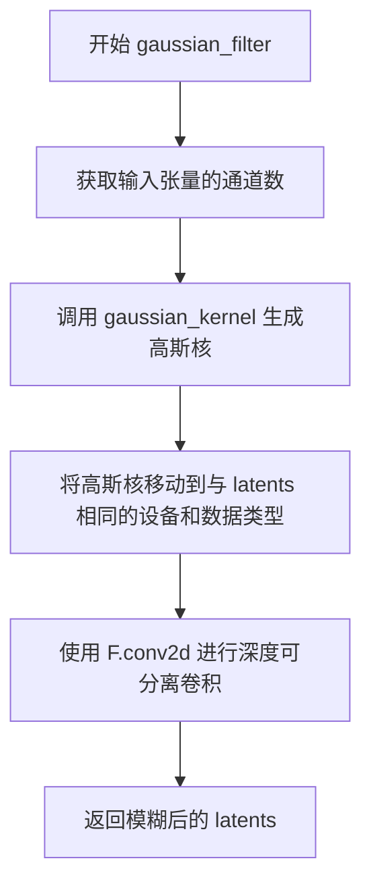

#### 带注释源码

```
def gaussian_filter(latents, kernel_size=3, sigma=1.0):
    """
    对输入的latents进行高斯模糊处理
    
    Args:
        latents: 输入的潜在表示张量，形状为 (batch, channels, height, width)
        kernel_size: 高斯核的大小
        sigma: 高斯核的标准差
    
    Returns:
        模糊后的潜在表示张量
    """
    # 1. 获取输入张量的通道数，用于深度可分离卷积
    channels = latents.shape[1]
    
    # 2. 生成高斯核，并移动到正确的设备和数据类型
    kernel = gaussian_kernel(kernel_size, sigma, channels).to(latents.device, latents.dtype)
    
    # 3. 使用深度可分离卷积（groups=channels）对每个通道分别进行卷积
    # padding设置为kernel_size // 2以保持输出尺寸与输入相同
    blurred_latents = F.conv2d(latents, kernel, padding=kernel_size // 2, groups=channels)

    # 4. 返回模糊后的结果
    return blurred_latents
```


### `rescale_noise_cfg`

该函数用于根据 `guidance_rescale` 参数对噪声预测配置进行重缩放，基于论文 "Common Diffusion Noise Schedules and Sample Steps are Flawed" (Section 3.4) 的发现，旨在修复过度曝光问题并避免图像看起来过于平淡。

参数：

- `noise_cfg`：`torch.Tensor`，噪声预测配置（即 CFG 下的噪声预测）
- `noise_pred_text`：`torch.Tensor`，文本条件下的噪声预测
- `guidance_rescale`：`float`，重缩放因子，默认为 0.0，用于混合原始结果以避免图像过于平淡

返回值：`torch.Tensor`，重缩放后的噪声预测配置

#### 流程图

```mermaid
flowchart TD
    A[输入 noise_cfg, noise_pred_text, guidance_rescale] --> B[计算 noise_pred_text 的标准差 std_text]
    B --> C[计算 noise_cfg 的标准差 std_cfg]
    C --> D[计算重缩放后的噪声预测: noise_pred_rescaled = noise_cfg * std_text / std_cfg]
    D --> E[混合原始和重缩放结果: noise_cfg = guidance_rescale * noise_pred_rescaled + (1 - guidance_rescale) * noise_cfg]
    E --> F[返回重缩放后的 noise_cfg]
```

#### 带注释源码

```python
# Copied from diffusers.pipelines.stable_diffusion.pipeline_stable_diffusion.rescale_noise_cfg
def rescale_noise_cfg(noise_cfg, noise_pred_text, guidance_rescale=0.0):
    """
    Rescale `noise_cfg` according to `guidance_rescale`. Based on findings of [Common Diffusion Noise Schedules and
    Sample Steps are Flawed](https://huggingface.co/papers/2305.08891). See Section 3.4
    """
    # 计算文本条件噪声预测在所有空间维度上的标准差
    # keepdim=True 保持维度以便后续广播操作
    std_text = noise_pred_text.std(dim=list(range(1, noise_pred_text.ndim)), keepdim=True)
    
    # 计算噪声预测配置在所有空间维度上的标准差
    std_cfg = noise_cfg.std(dim=list(range(1, noise_cfg.ndim)), keepdim=True)
    
    # 使用文本预测的标准差对噪声配置进行重缩放（修复过度曝光）
    # 这一步确保噪声预测的幅度与文本条件预测的幅度一致
    noise_pred_rescaled = noise_cfg * (std_text / std_cfg)
    
    # 根据 guidance_rescale 因子混合重缩放后的结果和原始结果
    # guidance_rescale=0 时返回原始 noise_cfg
    # guidance_rescale=1 时返回完全重缩放的结果
    # 适当的值（通常 0.7 左右）可以避免图像看起来过于平淡
    noise_cfg = guidance_rescale * noise_pred_rescaled + (1 - guidance_rescale) * noise_cfg
    
    return noise_cfg
```


### `DemoFusionSDXLPipeline.__init__`

这是 DemoFusionSDXLPipeline 类的构造函数，负责初始化整个 DemoFusion 扩散管道。它接收多个核心模型组件（VAE、文本编码器、Tokenizer、UNet、调度器等），并通过注册模块、配置参数、初始化图像处理器和水印处理器等步骤，完成管道的初始化工作。

参数：

- `vae`：`AutoencoderKL`，Variational Auto-Encoder (VAE) 模型，用于编码和解码图像与潜在表示之间的转换
- `text_encoder`：`CLIPTextModel`，冻结的文本编码器，Stable Diffusion XL 使用 CLIP 的文本部分
- `text_encoder_2`：`CLIPTextModelWithProjection`，第二个冻结的文本编码器，包含池化输出
- `tokenizer`：`CLIPTokenizer`，第一个分词器，用于将文本转换为 token
- `tokenizer_2`：`CLIPTokenizer`，第二个分词器
- `unet`：`UNet2DConditionModel`，条件 U-Net 架构，用于对编码后的图像潜在表示进行去噪
- `scheduler`：`KarrasDiffusionSchedulers`，调度器，与 unet 结合使用以去噪图像潜在表示
- `force_zeros_for_empty_prompt`：`bool`，可选参数，默认值为 `True`，表示是否将空提示的负提示嵌入强制设为零
- `add_watermarker`：`Optional[bool]`，可选参数，是否使用 invisible_watermark 库对输出图像加水印

返回值：无（`None`），构造函数不返回任何值，仅初始化实例属性

#### 流程图

```mermaid
flowchart TD
    A[开始 __init__] --> B[调用 super().__init__ 初始化基类]
    B --> C[调用 self.register_modules 注册所有模型组件]
    C --> D[调用 self.register_to_config 注册配置参数]
    D --> E[计算 vae_scale_factor<br>2 ** (len(vae.config.block_out_channels) - 1)]
    E --> F[创建 VaeImageProcessor 实例]
    F --> G[确定 default_sample_size<br>从 unet.config.sample_size 或默认 128]
    G --> H[检查是否需要添加水印<br>add_watermarker 为 None 时检查 is_invisible_watermark_available]
    H --> I{add_watermarker 为 True?}
    I -->|是| J[创建 StableDiffusionXLWatermarker 实例]
    I -->|否| K[设置 self.watermark = None]
    J --> L[结束 __init__]
    K --> L
```

#### 带注释源码

```python
def __init__(
    self,
    vae: AutoencoderKL,
    text_encoder: CLIPTextModel,
    text_encoder_2: CLIPTextModelWithProjection,
    token_izer: CLIPTokenizer,
    tokenizer_2: CLIPTokenizer,
    unet: UNet2DConditionModel,
    scheduler: KarrasDiffusionSchedulers,
    force_zeros_for_empty_prompt: bool = True,
    add_watermarker: Optional[bool] = None,
):
    """
    初始化 DemoFusionSDXLPipeline 管道
    
    参数:
        vae: Variational Auto-Encoder (VAE) 模型，用于编码和解码图像
        text_encoder: 第一个冻结的文本编码器 (CLIP)
        text_encoder_2: 第二个冻结的文本编码器 (CLIP with projection)
        tokenizer: 第一个 CLIP 分词器
        tokenizer_2: 第二个 CLIP 分词器
        unet: 条件 U-Net 去噪模型
        scheduler: 扩散调度器
        force_zeros_for_empty_prompt: 是否强制空提示为零
        add_watermarker: 是否添加水印
    """
    # 调用父类 DiffusionPipeline 的初始化方法
    super().__init__()

    # 注册所有模型组件到管道中，使其可以通过 self.component_name 访问
    self.register_modules(
        vae=vae,
        text_encoder=text_encoder,
        text_encoder_2=text_encoder_2,
        tokenizer=tokenizer,
        tokenizer_2=tokenizer_2,
        unet=unet,
        scheduler=scheduler,
    )
    
    # 将 force_zeros_for_empty_prompt 注册到配置中
    self.register_to_config(force_zeros_for_empty_prompt=force_zeros_for_empty_prompt)
    
    # 计算 VAE 缩放因子，基于 VAE 的块输出通道数
    # 例如：如果有 [128, 256, 512, 512] 四个通道，则 scale_factor = 2^(4-1) = 8
    self.vae_scale_factor = 2 ** (len(self.vae.config.block_out_channels) - 1) if getattr(self, "vae", None) else 8
    
    # 创建 VAE 图像处理器，用于图像的后处理
    self.image_processor = VaeImageProcessor(vae_scale_factor=self.vae_scale_factor)
    
    # 确定默认采样大小，用于确定生成图像的默认尺寸
    self.default_sample_size = (
        self.unet.config.sample_size
        if hasattr(self, "unet") and self.unet is not None and hasattr(self.unet.config, "sample_size")
        else 128
    )

    # 确定是否添加水印：如果未指定，则检查 invisible_watermark 包是否可用
    add_watermarker = add_watermarker if add_watermarker is not None else is_invisible_watermark_available()

    # 根据 add_watermarker 值决定是否创建水印器
    if add_watermarker:
        self.watermark = StableDiffusionXLWatermarker()
    else:
        self.watermark = None
```


### `DemoFusionSDXLPipeline.encode_prompt`

该方法将文本提示（prompt）编码为文本编码器的隐藏状态，支持双文本编码器（SDXL架构）、无分类器引导（Classifier-Free Guidance）、LoRA权重调整以及批量生成。是 DemoFusion 管道中处理文本输入的核心方法，负责将用户提供的文本描述转换为模型可处理的向量表示。

参数：

- `prompt`：`str | List[str] | None`，要编码的主提示文本
- `prompt_2`：`str | List[str] | None`，发送给第二个 tokenizer 和 text_encoder_2 的提示，若为 None 则使用 prompt
- `device`：`Optional[torch.device]`，执行计算的 torch 设备，若为 None 则使用 self._execution_device
- `num_images_per_prompt`：`int`，每个提示要生成的图像数量，默认为 1
- `do_classifier_free_guidance`：`bool`，是否启用无分类器引导，启用时会产生negative embeddings
- `negative_prompt`：`str | List[str] | None`，不引导图像生成的负面提示
- `negative_prompt_2`：`str | List[str] | None`，发送给第二个编码器的负面提示
- `prompt_embeds`：`Optional[torch.Tensor]`，预生成的文本嵌入，若提供则直接从该参数读取
- `negative_prompt_embeds`：`Optional[torch.Tensor]`，预生成的负面文本嵌入
- `pooled_prompt_embeds`：`Optional[torch.Tensor]`，预生成的池化文本嵌入
- `negative_pooled_prompt_embeds`：`Optional[torch.Tensor]`，预生成的负面池化文本嵌入
- `lora_scale`：`Optional[float]`，LoRA 层的缩放因子，用于调整 LoRA 权重的影响程度

返回值：`Tuple[torch.Tensor, torch.Tensor, torch.Tensor, torch.Tensor]`，包含四个张量：prompt_embeds（编码后的提示嵌入）、negative_prompt_embeds（负面提示嵌入）、pooled_prompt_embeds（池化后的提示嵌入）、negative_pooled_prompt_embeds（负面池化嵌入）

#### 流程图

```mermaid
flowchart TD
    A[开始 encode_prompt] --> B[设置 device]
    B --> C{检查 lora_scale}
    C -->|是| D[应用 LoRA scale 调整]
    C -->|否| E[跳过 LoRA 调整]
    D --> E
    E --> F{判断 batch_size}
    F -->|prompt 是 str| G[batch_size = 1]
    F -->|prompt 是 list| H[batch_size = len(prompt)]
    F -->|其他| I[batch_size = prompt_embeds.shape[0]]
    G --> J[准备 tokenizers 和 text_encoders 列表]
    H --> J
    I --> J
    J --> K{prompt_embeds 是否为 None}
    K -->|是| L[生成 prompt_embeds]
    K -->|否| M[跳过生成]
    L --> N{处理 textual inversion}
    N --> O[tokenize 处理]
    O --> P[text_encoder 编码]
    P --> Q[提取 pooled_prompt_embeds]
    Q --> R[提取 hidden_states[-2]]
    R --> S[合并 prompt_embeds_list]
    S --> M
    M --> T{是否需要 negative_prompt_embeds}
    T -->|zero_out| U[创建全零 negative embeddings]
    T -->|需要生成| V[生成 negative embeddings]
    T -->|已有| W[使用提供的 negative embeddings]
    U --> X
    V --> X
    W --> X
    X --> Y[转换 dtype 和 device]
    Y --> Z[重复 embeddings 到 num_images_per_prompt]
    Z --> AA[duplicate for CFG]
    AA --> BB[返回四个 embeddings]
```

#### 带注释源码

```python
def encode_prompt(
    self,
    prompt: str,
    prompt_2: str | None = None,
    device: Optional[torch.device] = None,
    num_images_per_prompt: int = 1,
    do_classifier_free_guidance: bool = True,
    negative_prompt: str | None = None,
    negative_prompt_2: str | None = None,
    prompt_embeds: Optional[torch.Tensor] = None,
    negative_prompt_embeds: Optional[torch.Tensor] = None,
    pooled_prompt_embeds: Optional[torch.Tensor] = None,
    negative_pooled_prompt_embeds: Optional[torch.Tensor] = None,
    lora_scale: Optional[float] = None,
):
    r"""
    Encodes the prompt into text encoder hidden states.

    Args:
        prompt (`str` or `List[str]`, *optional*):
            prompt to be encoded
        prompt_2 (`str` or `List[str]`, *optional*):
            The prompt or prompts to be sent to the `tokenizer_2` and `text_encoder_2`. If not defined, `prompt` is
            used in both text-encoders
        device: (`torch.device`):
            torch device
        num_images_per_prompt (`int`):
            number of images that should be generated per prompt
        do_classifier_free_guidance (`bool`):
            whether to use classifier free guidance or not
        negative_prompt (`str` or `List[str]`, *optional*):
            The prompt or prompts not to guide the image generation. If not defined, one has to pass
            `negative_prompt_embeds` instead. Ignored when not using guidance (i.e., ignored if `guidance_scale` is
            less than `1`).
        negative_prompt_2 (`str` or `List[str]`, *optional*):
            The prompt or prompts not to guide the image generation to be sent to `tokenizer_2` and
            `text_encoder_2`. If not defined, `negative_prompt` is used in both text-encoders
        prompt_embeds (`torch.Tensor`, *optional*):
            Pre-generated text embeddings. Can be used to easily tweak text inputs, *e.g.* prompt weighting. If not
            provided, text embeddings will be generated from `prompt` input argument.
        negative_prompt_embeds (`torch.Tensor`, *optional*):
            Pre-generated negative text embeddings. Can be used to easily tweak text inputs, *e.g.* prompt
            weighting. If not provided, negative_prompt_embeds will be generated from `negative_prompt` input
            argument.
        pooled_prompt_embeds (`torch.Tensor`, *optional*):
            Pre-generated pooled text embeddings. Can be used to easily tweak text inputs, *e.g.* prompt weighting.
            If not provided, pooled text embeddings will be generated from `prompt` input argument.
        negative_pooled_prompt_embeds (`torch.Tensor`, *optional*):
            Pre-generated negative pooled text embeddings. Can be used to easily tweak text inputs, *e.g.* prompt
            weighting. If not provided, pooled negative_prompt_embeds will be generated from `negative_prompt`
            input argument.
        lora_scale (`float`, *optional*):
            A lora scale that will be applied to all LoRA layers of the text encoder if LoRA layers are loaded.
    """
    # 确定执行设备，默认为 pipeline 的执行设备
    device = device or self._execution_device

    # 设置 lora scale，以便 text encoder 的 LoRA 函数可以正确访问
    # 如果传入了 lora_scale 且当前 pipeline 支持 LoRA
    if lora_scale is not None and isinstance(self, StableDiffusionLoraLoaderMixin):
        self._lora_scale = lora_scale

        # 动态调整 LoRA scale
        adjust_lora_scale_text_encoder(self.text_encoder, lora_scale)
        adjust_lora_scale_text_encoder(self.text_encoder_2, lora_scale)

    # 根据 prompt 类型确定 batch_size
    if prompt is not None and isinstance(prompt, str):
        batch_size = 1
    elif prompt is not None and isinstance(prompt, list):
        batch_size = len(prompt)
    else:
        # 如果 prompt 为 None，则从已提供的 prompt_embeds 获取 batch_size
        batch_size = prompt_embeds.shape[0]

    # 定义 tokenizers 和 text_encoders 列表
    # 支持可选的编码器（某些变体可能只有一个）
    tokenizers = [self.tokenizer, self.tokenizer_2] if self.tokenizer is not None else [self.tokenizer_2]
    text_encoders = (
        [self.text_encoder, self.text_encoder_2] if self.text_encoder is not None else [self.text_encoder_2]
    )

    # 如果没有提供 prompt_embeds，则从 prompt 生成
    if prompt_embeds is None:
        # prompt_2 默认为 prompt
        prompt_2 = prompt_2 or prompt
        
        # 用于存储生成的 prompt embeddings
        prompt_embeds_list = []
        # 需要处理的 prompts 列表 [prompt, prompt_2]
        prompts = [prompt, prompt_2]
        
        # 遍历两个 prompt、tokenizer 和 text_encoder
        for prompt, tokenizer, text_encoder in zip(prompts, tokenizers, text_encoders):
            # 如果支持 textual inversion，转换 prompt
            if isinstance(self, TextualInversionLoaderMixin):
                prompt = self.maybe_convert_prompt(prompt, tokenizer)

            # tokenize 处理
            text_inputs = tokenizer(
                prompt,
                padding="max_length",
                max_length=tokenizer.model_max_length,
                truncation=True,
                return_tensors="pt",
            )

            text_input_ids = text_inputs.input_ids
            
            # 获取未截断的 token IDs 用于检查是否被截断
            untruncated_ids = tokenizer(prompt, padding="longest", return_tensors="pt").input_ids

            # 检查是否发生了截断，并记录警告
            if untruncated_ids.shape[-1] >= text_input_ids.shape[-1] and not torch.equal(
                text_input_ids, untruncated_ids
            ):
                removed_text = tokenizer.batch_decode(untruncated_ids[:, tokenizer.model_max_length - 1 : -1])
                logger.warning(
                    "The following part of your input was truncated because CLIP can only handle sequences up to"
                    f" {tokenizer.model_max_length} tokens: {removed_text}"
                )

            # 使用 text_encoder 编码，获取隐藏状态
            prompt_embeds = text_encoder(
                text_input_ids.to(device),
                output_hidden_states=True,
            )

            # 获取 pooled output（第二个文本编码器的 pooled 输出）
            if pooled_prompt_embeds is None and prompt_embeds[0].ndim == 2:
                pooled_prompt_embeds = prompt_embeds[0]

            # 获取倒数第二个隐藏状态（SDXL 使用的层）
            prompt_embeds = prompt_embeds.hidden_states[-2]

            prompt_embeds_list.append(prompt_embeds)

        # 沿最后一个维度合并两个编码器的输出
        prompt_embeds = torch.concat(prompt_embeds_list, dim=-1)

    # 获取无分类器引导所需的无条件 embeddings
    # 如果配置要求对空 prompt 强制为零，则使用零向量
    zero_out_negative_prompt = negative_prompt is None and self.config.force_zeros_for_empty_prompt
    
    if do_classifier_free_guidance and negative_prompt_embeds is None and zero_out_negative_prompt:
        # 创建与 prompt_embeds 形状相同的零张量
        negative_prompt_embeds = torch.zeros_like(prompt_embeds)
        negative_pooled_prompt_embeds = torch.zeros_like(pooled_prompt_embeds)
    elif do_classifier_free_guidance and negative_prompt_embeds is None:
        # 需要从 negative_prompt 生成 embeddings
        negative_prompt = negative_prompt or ""
        negative_prompt_2 = negative_prompt_2 or negative_prompt

        # 类型检查
        uncond_tokens: List[str]
        if prompt is not None and type(prompt) is not type(negative_prompt):
            raise TypeError(
                f"`negative_prompt` should be the same type to `prompt`, but got {type(negative_prompt)} !="
                f" {type(prompt)}."
            )
        elif isinstance(negative_prompt, str):
            uncond_tokens = [negative_prompt, negative_prompt_2]
        elif batch_size != len(negative_prompt):
            raise ValueError(
                f"`negative_prompt`: {negative_prompt} has batch size {len(negative_prompt)}, but `prompt`:"
                f" {prompt} has batch size {batch_size}. Please make sure that passed `negative_prompt` matches"
                " the batch size of `prompt`."
            )
        else:
            uncond_tokens = [negative_prompt, negative_prompt_2]

        # 生成 negative prompt embeddings
        negative_prompt_embeds_list = []
        for negative_prompt, tokenizer, text_encoder in zip(uncond_tokens, tokenizers, text_encoders):
            # textual inversion 处理
            if isinstance(self, TextualInversionLoaderMixin):
                negative_prompt = self.maybe_convert_prompt(negative_prompt, tokenizer)

            # 使用与 prompt_embeds 相同的长度
            max_length = prompt_embeds.shape[1]
            uncond_input = tokenizer(
                negative_prompt,
                padding="max_length",
                max_length=max_length,
                truncation=True,
                return_tensors="pt",
            )

            # 编码
            negative_prompt_embeds = text_encoder(
                uncond_input.input_ids.to(device),
                output_hidden_states=True,
            )
            
            # 提取 pooled embeddings
            if negative_pooled_prompt_embeds is None and negative_prompt_embeds[0].ndim == 2:
                negative_pooled_prompt_embeds = negative_prompt_embeds[0]
            
            # 提取倒数第二个隐藏状态
            negative_prompt_embeds = negative_prompt_embeds.hidden_states[-2]

            negative_prompt_embeds_list.append(negative_prompt_embeds)

        # 合并 negative embeddings
        negative_prompt_embeds = torch.concat(negative_prompt_embeds_list, dim=-1)

    # 转换 dtype 和 device
    prompt_embeds = prompt_embeds.to(dtype=self.text_encoder_2.dtype, device=device)
    
    # 获取形状信息
    bs_embed, seq_len, _ = prompt_embeds.shape
    
    # 为每个 prompt 复制多个 embeddings（对应 num_images_per_prompt）
    # 使用 MPS 友好的方法
    prompt_embeds = prompt_embeds.repeat(1, num_images_per_prompt, 1)
    prompt_embeds = prompt_embeds.view(bs_embed * num_images_per_prompt, seq_len, -1)

    # 如果使用无分类器引导，同样处理 negative embeddings
    if do_classifier_free_guidance:
        seq_len = negative_prompt_embeds.shape[1]
        negative_prompt_embeds = negative_prompt_embeds.to(dtype=self.text_encoder_2.dtype, device=device)
        negative_prompt_embeds = negative_prompt_embeds.repeat(1, num_images_per_prompt, 1)
        negative_prompt_embeds = negative_prompt_embeds.view(batch_size * num_images_per_prompt, seq_len, -1)

    # 处理 pooled embeddings
    pooled_prompt_embeds = pooled_prompt_embeds.repeat(1, num_images_per_prompt).view(
        bs_embed * num_images_per_prompt, -1
    )
    
    if do_classifier_free_guidance:
        negative_pooled_prompt_embeds = negative_pooled_prompt_embeds.repeat(1, num_images_per_prompt).view(
            bs_embed * num_images_per_prompt, -1
        )

    # 返回四个 embeddings 元组
    return prompt_embeds, negative_prompt_embeds, pooled_prompt_embeds, negative_pooled_prompt_embeds
```


### `DemoFusionSDXLPipeline.prepare_extra_step_kwargs`

该方法用于为调度器（scheduler）的 `step` 函数准备额外的关键字参数。由于不同调度器具有不同的签名，该方法通过动态检查调度器 `step` 方法的参数列表，判断其是否接受 `eta` 和 `generator` 参数，从而构建兼容的额外参数字典。

参数：

- `generator`：`torch.Generator` 或 `List[torch.Generator]` 或 `None`，用于控制生成随机性的生成器对象
- `eta`：`float`，DDIM 调度器专用的 eta 参数（取值范围 [0, 1]），其他调度器会忽略此参数

返回值：`Dict[str, Any]`，包含调度器 `step` 方法所需额外参数的字典，可能包含 `eta` 和/或 `generator` 键

#### 流程图

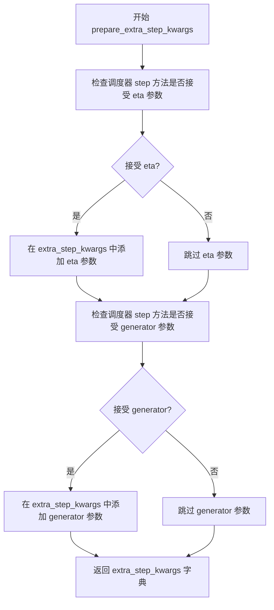

#### 带注释源码

```python
def prepare_extra_step_kwargs(self, generator, eta):
    """
    为调度器 step 准备额外的关键字参数。
    
    不同调度器（如 DDIMScheduler、LMSDiscreteScheduler 等）具有不同的签名，
    该方法通过 introspection 动态检测调度器支持的参数，避免因参数不兼容导致错误。
    
    Args:
        generator: 可选的 torch.Generator，用于控制随机数生成，确保可重复性
        eta (float): DDIM 调度器专用的 eta 参数 (η)，对应论文 https://huggingface.co/papers/2010.02502
                     取值范围 [0, 1]，其他调度器会忽略此参数
    
    Returns:
        Dict[str, Any]: 包含调度器 step 方法所需参数的字典
    """
    # 使用 inspect 模块检查调度器 step 方法的签名参数
    # 获取调度器 step 方法的所有参数名集合
    accepts_eta = "eta" in set(inspect.signature(self.scheduler.step).parameters.keys())
    
    # 初始化空字典用于存储额外参数
    extra_step_kwargs = {}
    
    # 如果调度器接受 eta 参数，则将其添加到 extra_step_kwargs
    if accepts_eta:
        extra_step_kwargs["eta"] = eta

    # 检查调度器 step 方法是否接受 generator 参数
    accepts_generator = "generator" in set(inspect.signature(self.scheduler.step).parameters.keys())
    
    # 如果调度器接受 generator 参数，则将其添加到 extra_step_kwargs
    if accepts_generator:
        extra_step_kwargs["generator"] = generator
    
    # 返回构建好的参数字典，供调度器 step 方法使用
    return extra_step_kwargs
```


### `DemoFusionSDXLPipeline.check_inputs`

该方法用于验证图像生成Pipeline的输入参数是否合法，包括检查高度和宽度是否为8的倍数、callback_steps是否为正整数、prompt和prompt_embeds等文本嵌入参数的有效性和一致性，以及DemoFusion特定的尺寸限制和多图生成约束。

参数：

- `self`：`DemoFusionSDXLPipeline` 实例本身
- `prompt`：`str` 或 `List[str]` 或 `None`，原始文本提示词
- `prompt_2`：`str` 或 `List[str]` 或 `None`，第二个文本提示词（用于双文本编码器）
- `height`：`int`，生成图像的高度
- `width`：`int`，生成图像的宽度
- `callback_steps`：`int`，回调函数调用间隔步数
- `negative_prompt`：`str` 或 `List[str]` 或 `None`，负向提示词
- `negative_prompt_2`：`str` 或 `List[str]` 或 `None`，第二个负向提示词
- `prompt_embeds`：`torch.Tensor` 或 `None`，预生成的文本嵌入
- `negative_prompt_embeds`：`torch.Tensor` 或 `None`，预生成的负向文本嵌入
- `pooled_prompt_embeds`：`torch.Tensor` 或 `None`，预生成的池化文本嵌入
- `negative_pooled_prompt_embeds`：`torch.Tensor` 或 `None`，预生成的负向池化文本嵌入
- `num_images_per_prompt`：`int` 或 `None`，每个提示词生成的图像数量

返回值：`None`，该方法不返回任何值，仅通过抛出 `ValueError` 来指示参数验证失败

#### 流程图

```mermaid
flowchart TD
    A[开始 check_inputs 验证] --> B{height 和 width<br/>是否能被8整除}
    B -->|否| B1[抛出 ValueError:<br/>高度和宽度必须能被8整除]
    B -->|是| C{callback_steps 是否有效}
    C -->|否| C1[抛出 ValueError:<br/>callback_steps 必须是正整数]
    C -->|是| D{prompt 和 prompt_embeds<br/>同时存在?}
    D -->|是| D1[抛出 ValueError:<br/>不能同时提供两者]
    D -->|否| E{prompt_2 和 prompt_embeds<br/>同时存在?}
    E -->|是| E1[抛出 ValueError:<br/>不能同时提供两者]
    E -->|否| F{prompt 和 prompt_embeds<br/>都未提供?}
    F -->|是| F1[抛出 ValueError:<br/>至少提供一个]
    F -->|否| G{prompt 类型是否合法<br/>str 或 list}
    G -->|否| G1[抛出 ValueError:<br/>prompt 类型不合法]
    G -->|是| H{prompt_2 类型是否合法<br/>str 或 list}
    H -->|否| H1[抛出 ValueError:<br/>prompt_2 类型不合法]
    H -->|是| I{negative_prompt 和<br/>negative_prompt_embeds<br/>同时存在?}
    I -->|是| I1[抛出 ValueError:<br/>不能同时提供两者]
    I -->|否| J{negative_prompt_2 和<br/>negative_prompt_embeds<br/>同时存在?}
    J -->|是| J1[抛出 ValueError:<br/>不能同时提供两者]
    J -->|否| K{prompt_embeds 和<br/>negative_prompt_embeds<br/>形状是否相同}
    K -->|否| K1[抛出 ValueError:<br/>形状必须一致]
    K -->|是| L{prompt_embeds 存在但<br/>pooled_prompt_embeds<br/>不存在?}
    L -->|是| L1[抛出 ValueError:<br/>必须提供 pooled_prompt_embeds]
    L -->|否| M{negative_prompt_embeds 存在但<br/>negative_pooled_prompt_embeds<br/>不存在?}
    M -->|是| M1[抛出 ValueError:<br/>必须提供 negative_pooled_prompt_embeds]
    M -->|否| N{max(height, width)<br/>是否能被1024整除}
    N -->|否| N1[抛出 ValueError:<br/>较大边必须能被1024整除]
    N -->|是| O{num_images_per_prompt != 1?}
    O -->|是| O1[警告:不支持多图生成<br/>强制设置为1]
    O -->|否| P[验证通过]
    
    B1 --> Z[结束:验证失败]
    C1 --> Z
    D1 --> Z
    E1 --> Z
    F1 --> Z
    G1 --> Z
    H1 --> Z
    I1 --> Z
    J1 --> Z
    K1 --> Z
    L1 --> Z
    M1 --> Z
    N1 --> Z
    O1 --> P
    P --> Z
```

#### 带注释源码

```python
def check_inputs(
    self,
    prompt,
    prompt_2,
    height,
    width,
    callback_steps,
    negative_prompt=None,
    negative_prompt_2=None,
    prompt_embeds=None,
    negative_prompt_embeds=None,
    pooled_prompt_embeds=None,
    negative_pooled_prompt_embeds=None,
    num_images_per_prompt=None,
):
    """
    验证Pipeline输入参数的有效性。
    
    该方法执行多项检查以确保用户提供的参数组合是有效的，
    包括尺寸约束、文本嵌入的一致性要求以及DemoFusion特定的约束。
    如果任何检查失败，将抛出详细的 ValueError 异常。
    """
    
    # 检查高度和宽度是否为8的倍数（SDXL的基础要求）
    if height % 8 != 0 or width % 8 != 0:
        raise ValueError(f"`height` and `width` have to be divisible by 8 but are {height} and {width}.")

    # 检查 callback_steps 是否为正整数
    if (callback_steps is None) or (
        callback_steps is not None and (not isinstance(callback_steps, int) or callback_steps <= 0)
    ):
        raise ValueError(
            f"`callback_steps` has to be a positive integer but is {callback_steps} of type"
            f" {type(callback_steps)}."
        )

    # 检查 prompt 和 prompt_embeds 不能同时提供
    if prompt is not None and prompt_embeds is not None:
        raise ValueError(
            f"Cannot forward both `prompt`: {prompt} and `prompt_embeds`: {prompt_embeds}. Please make sure to"
            " only forward one of the two."
        )
    # 检查 prompt_2 和 prompt_embeds 不能同时提供
    elif prompt_2 is not None and prompt_embeds is not None:
        raise ValueError(
            f"Cannot forward both `prompt_2`: {prompt_2} and `prompt_embeds`: {prompt_embeds}. Please make sure to"
            " only forward one of the two."
        )
    # 检查 prompt 和 prompt_embeds 至少提供一个
    elif prompt is None and prompt_embeds is None:
        raise ValueError(
            "Provide either `prompt` or `prompt_embeds`. Cannot leave both `prompt` and `prompt_embeds` undefined."
        )
    # 检查 prompt 的类型是否为 str 或 list
    elif prompt is not None and (not isinstance(prompt, str) and not isinstance(prompt, list)):
        raise ValueError(f"`prompt` has to be of type `str` or `list` but is {type(prompt)}")
    # 检查 prompt_2 的类型是否为 str 或 list
    elif prompt_2 is not None and (not isinstance(prompt_2, str) and not isinstance(prompt_2, list)):
        raise ValueError(f"`prompt_2` has to be of type `str` or `list` but is {type(prompt_2)}")

    # 检查 negative_prompt 和 negative_prompt_embeds 不能同时提供
    if negative_prompt is not None and negative_prompt_embeds is not None:
        raise ValueError(
            f"Cannot forward both `negative_prompt`: {negative_prompt} and `negative_prompt_embeds`:"
            f" {negative_prompt_embeds}. Please make sure to only forward one of the two."
        )
    # 检查 negative_prompt_2 和 negative_prompt_embeds 不能同时提供
    elif negative_prompt_2 is not None and negative_prompt_embeds is not None:
        raise ValueError(
            f"Cannot forward both `negative_prompt_2`: {negative_prompt_2} and `negative_prompt_embeds`:"
            f" {negative_prompt_embeds}. Please make sure to only forward one of the two."
        )

    # 检查 prompt_embeds 和 negative_prompt_embeds 形状必须一致
    if prompt_embeds is not None and negative_prompt_embeds is not None:
        if prompt_embeds.shape != negative_prompt_embeds.shape:
            raise ValueError(
                "`prompt_embeds` and `negative_prompt_embeds` must have the same shape when passed directly, but"
                f" got: `prompt_embeds` {prompt_embeds.shape} != `negative_prompt_embeds`"
                f" {negative_prompt_embeds.shape}."
            )

    # 如果提供了 prompt_embeds，则必须同时提供 pooled_prompt_embeds
    if prompt_embeds is not None and pooled_prompt_embeds is None:
        raise ValueError(
            "If `prompt_embeds` are provided, `pooled_prompt_embeds` also have to be passed. Make sure to generate `pooled_prompt_embeds` from the same text encoder that was used to generate `prompt_embeds`."
        )

    # 如果提供了 negative_prompt_embeds，则必须同时提供 negative_pooled_prompt_embeds
    if negative_prompt_embeds is not None and negative_pooled_prompt_embeds is None:
        raise ValueError(
            "If `negative_prompt_embeds` are provided, `negative_pooled_prompt_embeds` also have to be passed. Make sure to generate `negative_pooled_prompt_embeds` from the same text encoder that was used to generate `negative_prompt_embeds`."
        )

    # DemoFusion 特定检查：较大的尺寸必须能被 1024 整除
    if max(height, width) % 1024 != 0:
        raise ValueError(
            f"the larger one of `height` and `width` has to be divisible by 1024 but are {height} and {width}."
        )

    # DemoFusion 不支持每个提示词生成多张图像，发警告并强制设为1
    if num_images_per_prompt != 1:
        warnings.warn("num_images_per_prompt != 1 is not supported by DemoFusion and will be ignored.")
        num_images_per_prompt = 1
```


### `DemoFusionSDXLPipeline.prepare_latents`

该方法用于准备扩散模型的初始潜在向量（latents），根据指定的批次大小、图像尺寸和数据类型生成随机噪声，或将已有的潜在向量移动到目标设备，并按照调度器的初始噪声标准差进行缩放。

参数：

- `batch_size`：`int`，批次大小，指定生成图像的数量
- `num_channels_latents`：`int`，潜在向量的通道数，通常对应UNet的输入通道数
- `height`：`int`，生成图像的高度（像素单位）
- `width`：`int`，生成图像的宽度（像素单位）
- `dtype`：`torch.dtype`，潜在向量的数据类型（如torch.float16）
- `device`：`torch.device`，潜在向量存放的设备（如cuda或cpu）
- `generator`：`torch.Generator` 或 `List[torch.Generator]`，可选的随机数生成器，用于确保可重复性
- `latents`：`torch.Tensor`，可选的预生成潜在向量，如果为None则随机生成

返回值：`torch.Tensor`，处理后的潜在向量，已按调度器的初始噪声标准差进行缩放

#### 流程图

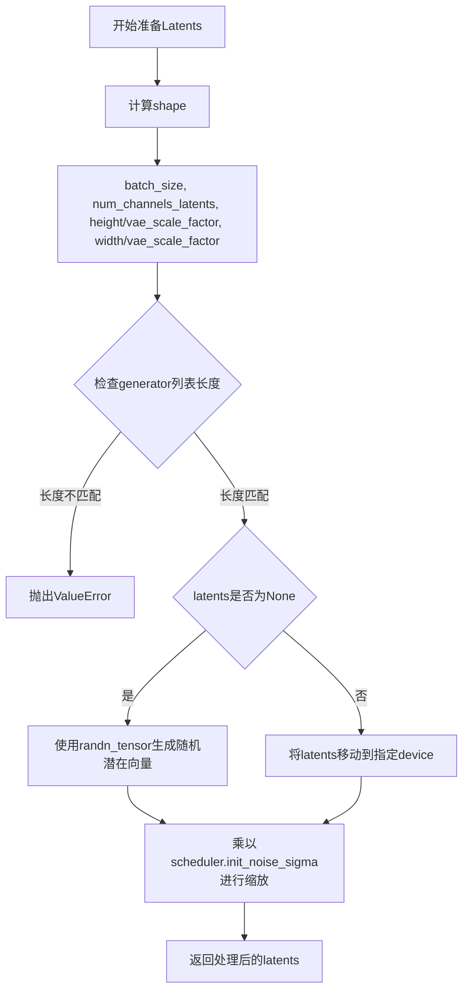

#### 带注释源码

```python
def prepare_latents(self, batch_size, num_channels_latents, height, width, dtype, device, generator, latents=None):
    # 计算潜在向量的形状：批次大小 × 通道数 × (高度/VAE缩放因子) × (宽度/VAE缩放因子)
    # VAE缩放因子用于将像素空间转换为潜在空间
    shape = (
        batch_size,
        num_channels_latents,
        int(height) // self.vae_scale_factor,
        int(width) // self.vae_scale_factor,
    )
    
    # 检查传入的生成器列表长度是否与批次大小匹配
    if isinstance(generator, list) and len(generator) != batch_size:
        raise ValueError(
            f"You have passed a list of generators of length {len(generator)}, but requested an effective batch"
            f" size of {batch_size}. Make sure the batch size matches the length of the generators."
        )

    # 如果未提供latents，则使用randn_tensor生成随机噪声张量
    if latents is None:
        latents = randn_tensor(shape, generator=generator, device=device, dtype=dtype)
    else:
        # 如果提供了latents，则确保其位于正确的设备上
        latents = latents.to(device)

    # 根据调度器的初始噪声标准差对潜在向量进行缩放
    # 这是扩散模型去噪过程的关键参数
    latents = latents * self.scheduler.init_noise_sigma
    return latents
```


### `DemoFusionSDXLPipeline._get_add_time_ids`

该方法用于生成 SDXL 模型所需的额外时间嵌入标识（add_time_ids），将原始尺寸、裁剪坐标左上角和目标尺寸合并为一个列表，并验证其嵌入维度是否符合模型的预期配置。

参数：

- `original_size`：元组或类似结构，原始图像尺寸（如 (height, width)）
- `crops_coords_top_left`：元组或类似结构，裁剪坐标的左上角位置（如 (top, left)）
- `target_size`：元组或类似结构，目标图像尺寸（如 (height, width)）
- `dtype`：torch.dtype，输出张量的数据类型，需与文本嵌入的数据类型一致

返回值：`torch.Tensor`，形状为 (1, n) 的张量，其中 n 是由 original_size、crops_coords_top_left 和 target_size 拼接后的元素数量加上 text_encoder_2 的 projection_dim，用于传递给 UNet 的时间嵌入层

#### 流程图

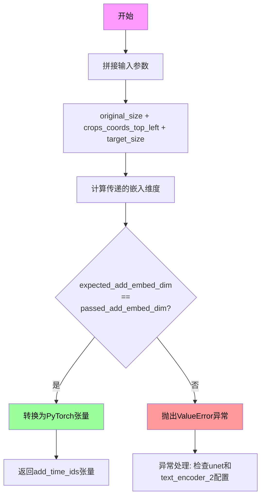

#### 带注释源码

```python
def _get_add_time_ids(self, original_size, crops_coords_top_left, target_size, dtype):
    """
    生成 SDXL 模型所需的额外时间嵌入标识
    
    该方法将原始尺寸、裁剪坐标左上角和目标尺寸合并为一个列表，
    用于作为 SDXL UNet 的额外条件输入，帮助模型理解图像的尺寸信息。
    
    参数:
        original_size: 原始图像尺寸 (height, width)
        crops_coords_top_left: 裁剪坐标左上角位置 (top, left)
        target_size: 目标图像尺寸 (height, width)
        dtype: 输出张量的数据类型
    
    返回:
        torch.Tensor: 包含时间标识的张量，形状为 (1, n)
    """
    
    # Step 1: 将三个尺寸参数拼接为一个列表
    # original_size, crops_coords_top_left, target_size 都是元组形式
    # 例如: (1024, 1024) + (0, 0) + (1024, 1024) -> [1024, 1024, 0, 0, 1024, 1024]
    add_time_ids = list(original_size + crops_coords_top_left + target_size)

    # Step 2: 计算实际传递的嵌入维度
    # 嵌入维度 = (addition_time_embed_dim * 输入元素数量) + projection_dim
    # addition_time_embed_dim 是 UNet 配置中定义的每个时间嵌入向量的维度
    # projection_dim 是第二个文本编码器的投影维度
    passed_add_embed_dim = (
        self.unet.config.addition_time_embed_dim * len(add_time_ids) + self.text_encoder_2.config.projection_dim
    )
    
    # Step 3: 获取 UNet 期望的嵌入维度
    # 从 UNet 的 add_embedding 层的第一个线性层获取输入特征数
    expected_add_embed_dim = self.unet.add_embedding.linear_1.in_features

    # Step 4: 验证维度是否匹配
    # 如果不匹配，抛出详细的错误信息，帮助用户诊断配置问题
    if expected_add_embed_dim != passed_add_embed_dim:
        raise ValueError(
            f"Model expects an added time embedding vector of length {expected_add_embed_dim}, but a vector of {passed_add_embed_dim} was created. The model has an incorrect config. Please check `unet.config.time_embedding_type` and `text_encoder_2.config.projection_dim`."
        )

    # Step 5: 将列表转换为 PyTorch 张量
    # 形状为 (1, 6)，其中 6 = 2 + 2 + 2 (original_size + crops_coords_top_left + target_size)
    add_time_ids = torch.tensor([add_time_ids], dtype=dtype)
    
    # 返回用于传递给 UNet 的额外时间条件嵌入
    return add_time_ids
```


### `DemoFusionSDXLPipeline.get_views`

该方法根据给定的高度、宽度、窗口大小和步长生成用于分块处理的视图坐标列表，支持可选的随机抖动来增加多样性。主要用于DemoFusion的多尺度推理过程中的视图分割。

参数：

- `height`：`int`，输入图像的高度（像素单位）
- `width`：`int`，输入图像的宽度（像素单位）
- `window_size`：`int`，窗口大小，默认为 128，表示每个视图块的尺寸
- `stride`：`int`，步长，默认为 64，控制相邻视图块之间的重叠程度
- `random_jitter`：`bool`，随机抖动开关，默认为 False，启用时会对视图坐标添加随机偏移

返回值：`List[Tuple[int, int, int, int]]`，返回视图坐标列表，每个元素为 (h_start, h_end, w_start, w_end) 元组

#### 流程图

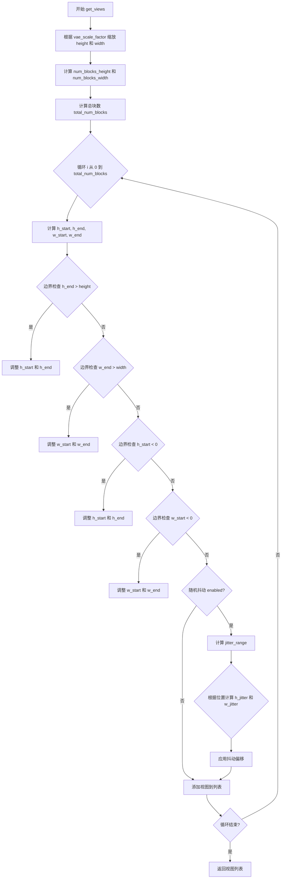

#### 带注释源码

```python
def get_views(self, height, width, window_size=128, stride=64, random_jitter=False):
    """
    生成用于分块处理的视图坐标列表
    
    参数:
        height: 输入图像高度
        width: 输入图像宽度  
        window_size: 窗口大小，默认128
        stride: 步长，默认64
        random_jitter: 是否启用随机抖动
    
    返回:
        视图坐标列表，每个元素为 (h_start, h_end, w_start, w_end)
    """
    # 1. 根据 VAE 缩放因子调整高度和宽度（从像素空间转换到潜在空间）
    height //= self.vae_scale_factor
    width //= self.vae_scale_factor
    
    # 2. 计算高度和宽度方向上的块数量
    # 如果尺寸大于窗口大小，则计算需要多少个块来覆盖
    # 使用 -1e-6 避免浮点数精度问题
    num_blocks_height = int((height - window_size) / stride - 1e-6) + 2 if height > window_size else 1
    num_blocks_width = int((width - window_size) / stride - 1e-6) + 2 if width > window_size else 1
    
    # 3. 计算总块数
    total_num_blocks = int(num_blocks_height * num_blocks_width)
    
    # 4. 初始化视图列表
    views = []
    
    # 5. 遍历每个块，计算其坐标
    for i in range(total_num_blocks):
        # 计算当前块在高度方向的起始位置
        h_start = int((i // num_blocks_width) * stride)
        h_end = h_start + window_size
        
        # 计算当前块在宽度方向的起始位置
        w_start = int((i % num_blocks_width) * stride)
        w_end = w_start + window_size
        
        # 6. 边界检查和调整 - 确保块不超出图像范围
        if h_end > height:
            h_start = int(h_start + height - h_end)
            h_end = int(height)
        if w_end > width:
            w_start = int(w_start + width - w_end)
            w_end = int(width)
        if h_start < 0:
            h_end = int(h_end - h_start)
            h_start = 0
        if w_start < 0:
            w_end = int(w_end - w_start)
            w_start = 0
        
        # 7. 可选的随机抖动 - 增加多样性
        if random_jitter:
            # 计算抖动范围：窗口大小和步长差值的四分之一
            jitter_range = (window_size - stride) // 4
            w_jitter = 0
            h_jitter = 0
            
            # 根据块位置确定抖动方向（避免边缘块的抖动导致越界）
            if (w_start != 0) and (w_end != width):
                w_jitter = random.randint(-jitter_range, jitter_range)
            elif (w_start == 0) and (w_end != width):
                w_jitter = random.randint(-jitter_range, 0)
            elif (w_start != 0) and (w_end == width):
                w_jitter = random.randint(0, jitter_range)
                
            if (h_start != 0) and (h_end != height):
                h_jitter = random.randint(-jitter_range, jitter_range)
            elif (h_start == 0) and (h_end != height):
                h_jitter = random.randint(-jitter_range, 0)
            elif (h_start != 0) and (h_end == height):
                h_jitter = random.randint(0, jitter_range)
            
            # 应用抖动偏移
            h_start += h_jitter + jitter_range
            h_end += h_jitter + jitter_range
            w_start += w_jitter + jitter_range
            w_end += w_jitter + jitter_range
        
        # 8. 将视图坐标添加到列表
        views.append((h_start, h_end, w_start, w_end))
    
    # 9. 返回所有视图坐标
    return views
```


### `DemoFusionSDXLPipeline.tiled_decode`

使用瓦片式解码策略，将大尺寸的latent向量分块解码为图像，通过重叠窗口和加权融合的方式避免拼接伪影。

参数：

- `latents`：`torch.Tensor`，输入的latent张量，形状为 (batch_size, channels, height, width)
- `current_height`：`int`，当前解码目标的高度（像素空间）
- `current_width`：`int`，当前解码目标的宽度（像素空间）

返回值：`torch.Tensor`，解码后的图像张量，形状为 (batch_size, 3, current_height, current_width)

#### 流程图

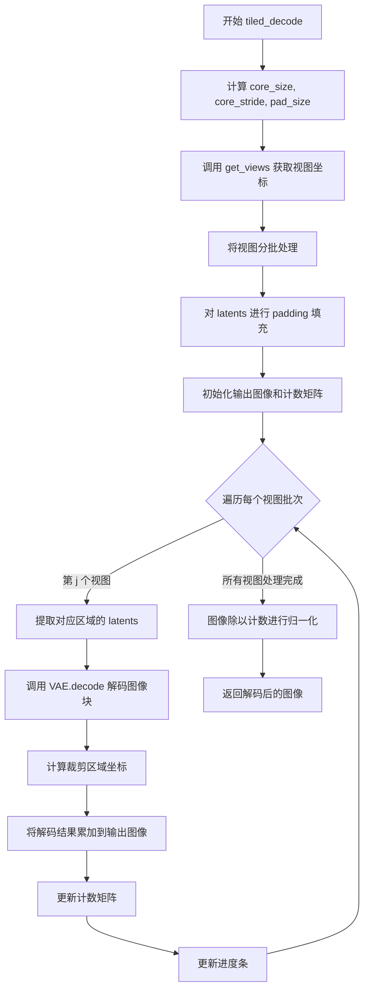

#### 带注释源码

```python
def tiled_decode(self, latents, current_height, current_width):
    """
    使用瓦片式解码策略将latent解码为图像。
    通过分块解码和重叠区域融合，实现高分辨率图像的无缝生成。
    
    Args:
        latents: 输入的latent张量
        current_height: 目标图像高度
        current_width: 目标图像宽度
    
    Returns:
        解码后的图像张量
    """
    # 计算核心块大小和步长，基于UNet配置
    core_size = self.unet.config.sample_size // 4
    core_stride = core_size
    
    # 计算填充大小，为解码时的重叠区域预留空间
    pad_size = self.unet.config.sample_size // 4 * 3
    
    # 每次只处理一个视图块
    decoder_view_batch_size = 1

    # 获取所有视图的坐标信息
    views = self.get_views(current_height, current_width, stride=core_stride, window_size=core_size)
    
    # 将视图列表分批
    views_batch = [views[i : i + decoder_view_batch_size] for i in range(0, len(views), decoder_view_batch_size)]
    
    # 对输入latents进行边界填充，扩展边缘区域
    latents_ = F.pad(latents, (pad_size, pad_size, pad_size, pad_size), "constant", 0)
    
    # 初始化输出图像矩阵和计数矩阵，用于后续的加权融合
    image = torch.zeros(latents.size(0), 3, current_height, current_width).to(latents.device)
    count = torch.zeros_like(image).to(latents.device)
    
    # 遍历每个视图批次进行解码
    with self.progress_bar(total=len(views_batch)) as progress_bar:
        for j, batch_view in enumerate(views_batch):
            # 提取当前视图对应的latent区域（包括填充区域）
            latents_for_view = torch.cat(
                [
                    latents_[:, :, h_start : h_end + pad_size * 2, w_start : w_end + pad_size * 2]
                    for h_start, h_end, w_start, w_end in batch_view
                ]
            )
            
            # 使用VAE解码器将latent转换为图像
            image_patch = self.vae.decode(latents_for_view / self.vae.config.scaling_factor, return_dict=False)[0]
            
            # 获取当前视图的坐标信息
            h_start, h_end, w_start, w_end = views[j]
            
            # 将坐标缩放到像素空间
            h_start, h_end, w_start, w_end = (
                h_start * self.vae_scale_factor,
                h_end * self.vae_scale_factor,
                w_start * self.vae_scale_factor,
                w_end * self.vae_scale_factor,
            )
            
            # 计算有效像素区域（去除填充边界）
            p_h_start, p_h_end, p_w_start, p_w_end = (
                pad_size * self.vae_scale_factor,
                image_patch.size(2) - pad_size * self.vae_scale_factor,
                pad_size * self.vae_scale_factor,
                image_patch.size(3) - pad_size * self.vae_scale_factor,
            )
            
            # 将解码的图像块累加到对应位置
            image[:, :, h_start:h_end, w_start:w_end] += image_patch[:, :, p_h_start:p_h_end, p_w_start:p_w_end]
            
            # 计数矩阵相应位置加1，记录该位置被多少个块覆盖
            count[:, :, h_start:h_end, w_start:w_end] += 1
            
            progress_bar.update()
    
    # 对图像进行归一化，除以每个位置的覆盖次数
    image = image / count

    return image
```


### `DemoFusionSDXLPipeline.upcast_vae`

该方法用于将VAE模型从当前数据类型（通常是float16）显式转换为float32类型，以避免在解码过程中发生数值溢出。该方法已被标记为废弃，推荐直接使用`pipe.vae.to(torch.float32)`。

参数：

- 该方法无显式参数（隐式参数`self`为Pipeline实例本身）

返回值：`None`，无返回值（该方法直接修改VAE模型的dtype属性）

#### 流程图

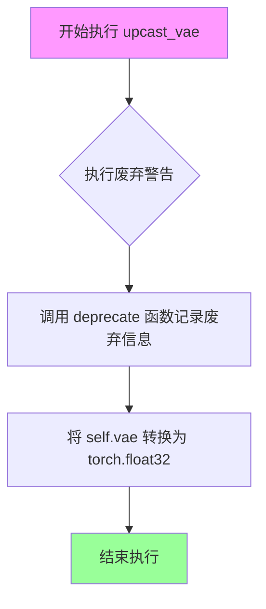

#### 带注释源码

```python
def upcast_vae(self):
    """
    将 VAE 模型转换为 float32 类型。
    
    此方法已被废弃，推荐直接使用 pipe.vae.to(torch.float32) 代替。
    原始设计目的：在 float16 模式下进行 VAE 解码时，为防止数值溢出，
    需要将 VAE 临时切换到 float32 模式进行解码操作。
    
    注意：此方法在 DemoFusionSDXLPipeline 中通过 deprecate 标记为废弃，
    实际项目中应避免调用此方法，改用 PyTorch 原生的 .to() 方法。
    """
    # 触发废弃警告，提醒调用者该方法将在版本 1.0.0 中移除
    # 参数说明：
    #   - "upcast_vae": 方法名称
    #   - "1.0.0": 计划移除的版本号
    #   - 第三个参数为建议的替代方案
    deprecate("upcast_vae", "1.0.0", "`upcast_vae` is deprecated. Please use `pipe.vae.to(torch.float32)`")
    
    # 执行实际的类型转换操作：将 VAE 的所有参数和缓冲区转换为 float32 类型
    # 这是一个in-place操作，会修改 self.vae 对象本身
    self.vae.to(dtype=torch.float32)
```


### `DemoFusionSDXLPipeline.__call__`

该方法是 DemoFusionSDXLPipeline 的核心调用函数，用于通过多阶段扩散过程生成高分辨率图像。它首先在基础分辨率进行去噪，然后逐步放大到目标分辨率，通过 MultiDiffusion 和 Dilated Sampling 技术实现高分辨率图像的无缝生成。

参数：

- `prompt`：`Union[str, List[str]]`，用于引导图像生成的主提示词，若未定义则需传入 prompt_embeds
- `prompt_2`：`Optional[Union[str, List[str]]]`，发送给第二个 tokenizer 和 text_encoder_2 的提示词，若未定义则使用 prompt
- `height`：`Optional[int]`，生成图像的高度（像素），默认值为 self.unet.config.sample_size * self.vae_scale_factor
- `width`：`Optional[int]`，生成图像的宽度（像素），默认值为 self.unet.config.sample_size * self.vae_scale_factor
- `num_inference_steps`：`int`，去噪步数，默认为 50
- `denoising_end`：`Optional[float]`，指定在总去噪过程的哪个分数（0.0 到 1.0 之间）时提前终止
- `guidance_scale`：`float`，无分类器引导比例，默认为 5.0
- `negative_prompt`：`Optional[Union[str, List[str]]]，不引导图像生成的负面提示词
- `negative_prompt_2`：`Optional[Union[str, List[str]]]`，发送给第二个文本编码器的负面提示词
- `num_images_per_prompt`：`Optional[int]`，每个提示词生成的图像数量，默认为 1
- `eta`：`float`，DDIM 论文中的参数 η，默认为 0.0
- `generator`：`Optional[Union[torch.Generator, List[torch.Generator]]]`，用于生成确定性结果的随机数生成器
- `latents`：`Optional[torch.Tensor]`，预先生成的噪声潜在向量
- `prompt_embeds`：`Optional[torch.Tensor]`，预生成的主提示词嵌入
- `negative_prompt_embeds`：`Optional[torch.Tensor]`，预生成的负面提示词嵌入
- `pooled_prompt_embeds`：`Optional[torch.Tensor]`，预生成的池化提示词嵌入
- `negative_pooled_prompt_embeds`：`Optional[torch.Tensor]`，预生成的负面池化提示词嵌入
- `output_type`：`str | None`，输出格式，默认为 "pil"
- `return_dict`：`bool`，是否返回字典格式结果，默认为 False
- `callback`：`Optional[Callable[[int, int, torch.Tensor], None]]`，每步调用的回调函数
- `callback_steps`：`int`，回调函数调用频率，默认为 1
- `cross_attention_kwargs`：`Optional[Dict[str, Any]]`，传递给注意力处理器的额外关键字参数
- `guidance_rescale`：`float`，引导重缩放因子，默认为 0.0
- `original_size`：`Optional[Tuple[int, int]]`，原始尺寸，默认为 (1024, 1024)
- `crops_coords_top_left`：`Tuple[int, int]`，裁剪坐标左上角，默认为 (0, 0)
- `target_size`：`Optional[Tuple[int, int]]`，目标尺寸，默认为 (1024, 1024)
- `negative_original_size`：`Optional[Tuple[int, int]]`，负面条件原始尺寸
- `negative_crops_coords_top_left`：`Tuple[int, int]`，负面裁剪坐标
- `negative_target_size`：`Optional[Tuple[int, int]]`，负面目标尺寸
- `view_batch_size`：`int`，多去噪路径的批处理大小，默认为 16
- `multi_decoder`：`bool`，是否使用瓦片解码器，默认为 True
- `stride`：`int`，局部瓦片移动步长，默认为 64
- `cosine_scale_1`：`Optional[float]`，控制跳过残差强度的参数，默认为 3.0
- `cosine_scale_2`：`Optional[float]`，控制扩张采样强度的参数，默认为 1.0
- `cosine_scale_3`：`Optional[float]`，控制高斯滤波器强度的参数，默认为 1.0
- `sigma`：`Optional[float]`，高斯滤波器的标准差，默认为 0.8
- `show_image`：`bool`，是否显示中间结果，默认为 False

返回值：`list`，返回每个阶段生成的图像列表

#### 流程图

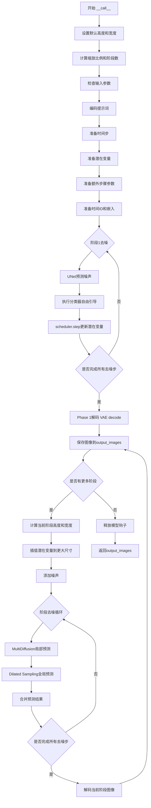

#### 带注释源码

```python
@torch.no_grad()
@replace_example_docstring(EXAMPLE_DOC_STRING)
def __call__(
    self,
    prompt: Union[str, List[str]] = None,
    prompt_2: Optional[Union[str, List[str]]] = None,
    height: Optional[int] = None,
    width: Optional[int] = None,
    num_inference_steps: int = 50,
    denoising_end: Optional[float] = None,
    guidance_scale: float = 5.0,
    negative_prompt: Optional[Union[str, List[str]]] = None,
    negative_prompt_2: Optional[Union[str, List[str]]] = None,
    num_images_per_prompt: Optional[int] = 1,
    eta: float = 0.0,
    generator: Optional[Union[torch.Generator, List[torch.Generator]]] = None,
    latents: Optional[torch.Tensor] = None,
    prompt_embeds: Optional[torch.Tensor] = None,
    negative_prompt_embeds: Optional[torch.Tensor] = None,
    pooled_prompt_embeds: Optional[torch.Tensor] = None,
    negative_pooled_prompt_embeds: Optional[torch.Tensor] = None,
    output_type: str | None = "pil",
    return_dict: bool = False,
    callback: Optional[Callable[[int, int, torch.Tensor], None]] = None,
    callback_steps: int = 1,
    cross_attention_kwargs: Optional[Dict[str, Any]] = None,
    guidance_rescale: float = 0.0,
    original_size: Optional[Tuple[int, int]] = None,
    crops_coords_top_left: Tuple[int, int] = (0, 0),
    target_size: Optional[Tuple[int, int]] = None,
    negative_original_size: Optional[Tuple[int, int]] = None,
    negative_crops_coords_top_left: Tuple[int, int] = (0, 0),
    negative_target_size: Optional[Tuple[int, int]] = None,
    ################### DemoFusion specific parameters ####################
    view_batch_size: int = 16,
    multi_decoder: bool = True,
    stride: Optional[int] = 64,
    cosine_scale_1: Optional[float] = 3.0,
    cosine_scale_2: Optional[float] = 1.0,
    cosine_scale_3: Optional[float] = 1.0,
    sigma: Optional[float] = 0.8,
    show_image: bool = False,
):
    r"""
    Function invoked when calling the pipeline for generation.
    """
    # 0. Default height and width to unet
    height = height or self.default_sample_size * self.vae_scale_factor
    width = width or self.default_sample_size * self.vae_scale_factor

    x1_size = self.default_sample_size * self.vae_scale_factor
    # 计算缩放比例用于多阶段处理
    height_scale = height / x1_size
    width_scale = width / x1_size
    scale_num = int(max(height_scale, width_scale))  # 总共需要放大的阶段数
    aspect_ratio = min(height_scale, width_scale) / max(height_scale, width_scale)

    original_size = original_size or (height, width)
    target_size = target_size or (height, width)

    # 1. Check inputs. Raise error if not correct
    self.check_inputs(
        prompt, prompt_2, height, width, callback_steps,
        negative_prompt, negative_prompt_2, prompt_embeds,
        negative_prompt_embeds, pooled_prompt_embeds,
        negative_pooled_prompt_embeds, num_images_per_prompt,
    )

    # 2. Define call parameters
    if prompt is not None and isinstance(prompt, str):
        batch_size = 1
    elif prompt is not None and isinstance(prompt, list):
        batch_size = len(prompt)
    else:
        batch_size = prompt_embeds.shape[0]

    device = self._execution_device

    # 判断是否使用分类器自由引导
    do_classifier_free_guidance = guidance_scale > 1.0

    # 3. Encode input prompt
    text_encoder_lora_scale = (
        cross_attention_kwargs.get("scale", None) if cross_attention_kwargs is not None else None
    )
    (
        prompt_embeds,
        negative_prompt_embeds,
        pooled_prompt_embeds,
        negative_pooled_prompt_embeds,
    ) = self.encode_prompt(...)

    # 4. Prepare timesteps
    self.scheduler.set_timesteps(num_inference_steps, device=device)
    timesteps = self.scheduler.timesteps

    # 5. Prepare latent variables
    num_channels_latents = self.unet.config.in_channels
    # 第一阶段使用基础分辨率
    latents = self.prepare_latents(
        batch_size * num_images_per_prompt,
        num_channels_latents,
        height // scale_num,  # 基础分辨率
        width // scale_num,
        prompt_embeds.dtype,
        device,
        generator,
        latents,
    )

    # 6. Prepare extra step kwargs
    extra_step_kwargs = self.prepare_extra_step_kwargs(generator, eta)

    # 7. Prepare added time ids & embeddings
    add_text_embeds = pooled_prompt_embeds
    add_time_ids = self._get_add_time_ids(
        original_size, crops_coords_top_left, target_size, dtype=prompt_embeds.dtype
    )
    # 处理负面条件的时间ID
    if negative_original_size is not None and negative_target_size is not None:
        negative_add_time_ids = self._get_add_time_ids(...)
    else:
        negative_add_time_ids = add_time_ids

    # 连接负面和正面提示词用于分类器自由引导
    if do_classifier_free_guidance:
        prompt_embeds = torch.cat([negative_prompt_embeds, prompt_embeds], dim=0)
        add_text_embeds = torch.cat([negative_pooled_prompt_embeds, add_text_embeds], dim=0)
        add_time_ids = torch.cat([negative_add_time_ids, add_time_ids], dim=0)

    prompt_embeds = prompt_embeds.to(device)
    add_text_embeds = add_text_embeds.to(device)
    add_time_ids = add_time_ids.to(device).repeat(batch_size * num_images_per_prompt, 1)

    # 8. Denoising loop
    num_warmup_steps = max(len(timesteps) - num_inference_steps * self.scheduler.order, 0)

    # 处理 denoising_end 参数
    if denoising_end is not None and isinstance(denoising_end, float) and denoising_end > 0 and denoising_end < 1:
        discrete_timestep_cutoff = int(...)
        num_inference_steps = len(list(filter(lambda ts: ts >= discrete_timestep_cutoff, timesteps)))
        timesteps = timesteps[:num_inference_steps]

    output_images = []

    # ==================== Phase 1 Denoising ====================
    print("### Phase 1 Denoising ###")
    with self.progress_bar(total=num_inference_steps) as progress_bar:
        for i, t in enumerate(timesteps):
            # 扩展潜在变量用于分类器自由引导
            latent_model_input = latents.repeat_interleave(2, dim=0) if do_classifier_free_guidance else latents
            latent_model_input = self.scheduler.scale_model_input(latent_model_input, t)

            # 使用UNet预测噪声残差
            added_cond_kwargs = {"text_embeds": add_text_embeds, "time_ids": add_time_ids}
            noise_pred = self.unet(
                latent_model_input, t,
                encoder_hidden_states=prompt_embeds,
                cross_attention_kwargs=cross_attention_kwargs,
                added_cond_kwargs=added_cond_kwargs,
                return_dict=False,
            )[0]

            # 执行分类器自由引导
            if do_classifier_free_guidance:
                noise_pred_uncond, noise_pred_text = noise_pred[::2], noise_pred[1::2]
                noise_pred = noise_pred_uncond + guidance_scale * (noise_pred_text - noise_pred_uncond)

            # 应用引导重缩放
            if do_classifier_free_guidance and guidance_rescale > 0.0:
                noise_pred = rescale_noise_cfg(noise_pred, noise_pred_text, guidance_rescale=guidance_rescale)

            # 计算上一步的去噪结果
            latents = self.scheduler.step(noise_pred, t, latents, **extra_step_kwargs, return_dict=False)[0]

            # 调用回调函数
            if callback is not None and i % callback_steps == 0:
                step_idx = i // getattr(self.scheduler, "order", 1)
                callback(step_idx, t, latents)

        # Phase 1 解码
        anchor_mean = latents.mean()
        anchor_std = latents.std()
        if not output_type == "latent":
            image = self.vae.decode(latents / self.vae.config.scaling_factor, return_dict=False)[0]
        image = self.image_processor.postprocess(image, output_type=output_type)
        output_images.append(image[0])

    # ==================== Phase 2+ (Higher Resolution) ====================
    for current_scale_num in range(2, scale_num + 1):
        print("### Phase {} Denoising ###".format(current_scale_num))
        # 计算当前阶段的高度和宽度
        current_height = self.unet.config.sample_size * self.vae_scale_factor * current_scale_num
        current_width = self.unet.config.sample_size * self.vae_scale_factor * current_scale_num
        if height > width:
            current_width = int(current_width * aspect_ratio)
        else:
            current_height = int(current_height * aspect_ratio)

        # 插值潜在变量到更大尺寸
        latents = F.interpolate(
            latents,
            size=(int(current_height / self.vae_scale_factor), int(current_width / self.vae_scale_factor)),
            mode="bicubic",
        )

        # 添加噪声用于后续的skip-residual操作
        noise_latents = []
        noise = torch.randn_like(latents)
        for timestep in timesteps:
            noise_latent = self.scheduler.add_noise(latents, noise, timestep.unsqueeze(0))
            noise_latents.append(noise_latent)
        latents = noise_latents[0]

        with self.progress_bar(total=num_inference_steps) as progress_bar:
            for i, t in enumerate(timesteps):
                count = torch.zeros_like(latents)
                value = torch.zeros_like(latents)
                
                # 计算余弦因子用于skip-residual和扩张采样
                cosine_factor = 0.5 * (1 + torch.cos(torch.pi * (self.scheduler.config.num_train_timesteps - t) / self.scheduler.config.num_train_timesteps)).cpu()
                
                c1 = cosine_factor**cosine_scale_1
                # Skip-residual: 混合原始噪声和去噪结果
                latents = latents * (1 - c1) + noise_latents[i] * c1

                # ==================== MultiDiffusion ====================
                # 获取局部视图用于多扩散
                views = self.get_views(current_height, current_width, stride=stride, window_size=self.unet.config.sample_size, random_jitter=True)
                views_batch = [views[i : i + view_batch_size] for i in range(0, len(views), view_batch_size)]

                jitter_range = (self.unet.config.sample_size - stride) // 4
                latents_ = F.pad(latents, (jitter_range, jitter_range, jitter_range, jitter_range), "constant", 0)
                
                count_local = torch.zeros_like(latents_)
                value_local = torch.zeros_like(latents_)

                for j, batch_view in enumerate(views_batch):
                    vb_size = len(batch_view)
                    # 获取当前视图对应的潜在变量
                    latents_for_view = torch.cat([latents_[:, :, h_start:h_end, w_start:w_end] for h_start, h_end, w_start, w_end in batch_view])
                    
                    # UNet预测
                    latent_model_input = latents_for_view.repeat_interleave(2, dim=0) if do_classifier_free_guidance else latents_for_view
                    latent_model_input = self.scheduler.scale_model_input(latent_model_input, t)
                    
                    # 处理每个视图的时间ID
                    add_time_ids_input = []
                    for h_start, h_end, w_start, w_end in batch_view:
                        add_time_ids_ = add_time_ids.clone()
                        add_time_ids_[:, 2] = h_start * self.vae_scale_factor
                        add_time_ids_[:, 3] = w_start * self.vae_scale_factor
                        add_time_ids_input.append(add_time_ids_)
                    add_time_ids_input = torch.cat(add_time_ids_input)
                    
                    added_cond_kwargs = {"text_embeds": add_text_embeds_input, "time_ids": add_time_ids_input}
                    noise_pred = self.unet(latent_model_input, t, encoder_hidden_states=prompt_embeds_input, cross_attention_kwargs=cross_attention_kwargs, added_cond_kwargs=added_cond_kwargs, return_dict=False)[0]
                    
                    # 引导和去噪
                    if do_classifier_free_guidance:
                        noise_pred_uncond, noise_pred_text = noise_pred[::2], noise_pred[1::2]
                        noise_pred = noise_pred_uncond + guidance_scale * (noise_pred_text - noise_pred_uncond)
                    
                    self.scheduler._init_step_index(t)
                    latents_denoised_batch = self.scheduler.step(noise_pred, t, latents_for_view, **extra_step_kwargs, return_dict=False)[0]
                    
                    # 累加结果
                    for latents_view_denoised, (h_start, h_end, w_start, w_end) in zip(latents_denoised_batch.chunk(vb_size), batch_view):
                        value_local[:, :, h_start:h_end, w_start:w_end] += latents_view_denoised
                        count_local[:, :, h_start:h_end, w_start:w_end] += 1

                # 裁剪回原始大小并合并
                value_local = value_local[:, :, jitter_range:jitter_range + current_height // self.vae_scale_factor, jitter_range:jitter_range + current_width // self.vae_scale_factor]
                count_local = count_local[:, :, jitter_range:jitter_range + current_height // self.vae_scale_factor, jitter_range:jitter_range + current_width // self.vae_scale_factor]
                
                c2 = cosine_factor**cosine_scale_2
                value += value_local / count_local * (1 - c2)
                count += torch.ones_like(value_local) * (1 - c2)

                # ==================== Dilated Sampling ====================
                # 全局扩张采样
                views = [[h, w] for h in range(current_scale_num) for w in range(current_scale_num)]
                views_batch = [views[i : i + view_batch_size] for i in range(0, len(views), view_batch_size)]

                h_pad = (current_scale_num - (latents.size(2) % current_scale_num)) % current_scale_num
                w_pad = (current_scale_num - (latents.size(3) % current_scale_num)) % current_scale_num
                latents_ = F.pad(latents, (w_pad, 0, h_pad, 0), "constant", 0)

                count_global = torch.zeros_like(latents_)
                value_global = torch.zeros_like(latents_)

                # 应用高斯滤波
                c3 = 0.99 * cosine_factor**cosine_scale_3 + 1e-2
                std_, mean_ = latents_.std(), latents_.mean()
                latents_gaussian = gaussian_filter(latents_, kernel_size=(2 * current_scale_num - 1), sigma=sigma * c3)
                latents_gaussian = (latents_gaussian - latents_gaussian.mean()) / latents_gaussian.std() * std_ + mean_

                for j, batch_view in enumerate(views_batch):
                    latents_for_view = torch.cat([latents_[:, :, h::current_scale_num, w::current_scale_num] for h, w in batch_view])
                    latents_for_view_gaussian = torch.cat([latents_gaussian[:, :, h::current_scale_num, w::current_scale_num] for h, w in batch_view])
                    
                    vb_size = latents_for_view.size(0)
                    latent_model_input = latents_for_view_gaussian.repeat_interleave(2, dim=0) if do_classifier_free_guidance else latents_for_view_gaussian
                    latent_model_input = self.scheduler.scale_model_input(latent_model_input, t)
                    
                    added_cond_kwargs = {"text_embeds": add_text_embeds_input, "time_ids": add_time_ids_input}
                    noise_pred = self.unet(latent_model_input, t, encoder_hidden_states=prompt_embeds_input, cross_attention_kwargs=cross_attention_kwargs, added_cond_kwargs=added_cond_kwargs, return_dict=False)[0]
                    
                    if do_classifier_free_guidance:
                        noise_pred_uncond, noise_pred_text = noise_pred[::2], noise_pred[1::2]
                        noise_pred = noise_pred_uncond + guidance_scale * (noise_pred_text - noise_pred_uncond)
                    
                    self.scheduler._init_step_index(t)
                    latents_denoised_batch = self.scheduler.step(noise_pred, t, latents_for_view, **extra_step_kwargs, return_dict=False)[0]
                    
                    for latents_view_denoised, (h, w) in zip(latents_denoised_batch.chunk(vb_size), batch_view):
                        value_global[:, :, h::current_scale_num, w::current_scale_num] += latents_view_denoised
                        count_global[:, :, h::current_scale_num, w::current_scale_num] += 1

                value_global = value_global[:, :, h_pad:, w_pad:]
                value += value_global * c2
                count += torch.ones_like(value_global) * c2

                # 合并MultiDiffusion和Dilated Sampling结果
                latents = torch.where(count > 0, value / count, value)

                # 回调
                if callback is not None and i % callback_steps == 0:
                    step_idx = i // getattr(self.scheduler, "order", 1)
                    callback(step_idx, t, latents)

            # 当前阶段解码
            latents = (latents - latents.mean()) / latents.std() * anchor_std + anchor_mean
            if not output_type == "latent":
                if multi_decoder:
                    image = self.tiled_decode(latents, current_height, current_width)
                else:
                    image = self.vae.decode(latents / self.vae.config.scaling_factor, return_dict=False)[0]
            
            image = self.image_processor.postprocess(image, output_type=output_type)
            output_images.append(image[0])

    # Offload all models
    self.maybe_free_model_hooks()

    return output_images
```


### `DemoFusionSDXLPipeline.load_lora_weights`

该方法用于加载LoRA（Low-Rank Adaptation）权重到DemoFusionSDXLPipeline中，支持将LoRA权重同时应用到UNet、text_encoder和text_encoder_2三个组件。它会自动检测并处理加速库的CPU卸载钩子，确保LoRA权重正确加载后重新应用之前可能存在的模型卸载策略。

参数：

- `self`：隐式参数，DemoFusionSDXLPipeline实例本身
- `pretrained_model_name_or_path_or_dict`：`Union[str, Dict[str, torch.Tensor]]`，预训练模型的名称、路径或包含状态字典的字典，用于指定LoRA权重来源
- `**kwargs`：可变关键字参数，会传递给`lora_state_dict`方法，用于指定额外的加载选项（如`weight_name`、`cache_dir`等）

返回值：`None`，该方法直接在实例上修改LoRA权重，不返回任何值

#### 流程图

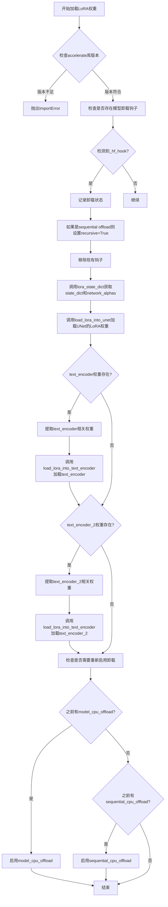

#### 带注释源码

```python
def load_lora_weights(self, pretrained_model_name_or_path_or_dict: Union[str, Dict[str, torch.Tensor]], **kwargs):
    # 该方法用于将LoRA权重加载到DemoFusionSDXLPipeline的各个组件中
    # 支持UNet、text_encoder和text_encoder_2的LoRA权重加载
    
    # 检查accelerate库是否可用，并验证版本是否>=0.17.0.dev0
    # 因为需要使用其中的hooks功能来管理模型卸载
    if is_accelerate_available() and is_accelerate_version(">=", "0.17.0.dev0"):
        # 导入accelerate的hooks相关模块
        from accelerate.hooks import AlignDevicesHook, CpuOffload, remove_hook_from_module
    else:
        # 如果accelerate版本不足，抛出导入错误
        raise ImportError("Offloading requires `accelerate v0.17.0` or higher.")

    # 初始化状态标志
    is_model_cpu_offload = False   # 标记是否有model级别的CPU卸载
    is_sequential_cpu_offload = False  # 标记是否有sequential级别的CPU卸载
    recursive = False  # 是否递归移除hooks

    # 遍历所有组件，检查是否有已存在的卸载钩子
    for _, component in self.components.items():
        if isinstance(component, torch.nn.Module):
            # 检查是否存在_hf_hook属性
            if hasattr(component, "_hf_hook"):
                # 检查是否是CpuOffload类型的hook
                is_model_cpu_offload = isinstance(getattr(component, "_hf_hook"), CpuOffload)
                # 检查是否是AlignDevicesHook类型的hook
                is_sequential_cpu_offload = (
                    isinstance(getattr(component, "_hf_hook"), AlignDevicesHook)
                    or hasattr(component._hf_hook, "hooks")
                    and isinstance(component._hf_hook.hooks[0], AlignDevicesHook)
                )
                # 记录日志信息
                logger.info(
                    "Accelerate hooks detected. Since you have called `load_lora_weights()`, "
                    "the previous hooks will be first removed. Then the LoRA parameters will be "
                    "loaded and the hooks will be applied again."
                )
                # 如果是sequential offload，需要递归处理子模块
                recursive = is_sequential_cpu_offload
                # 移除现有的hooks以避免冲突
                remove_hook_from_module(component, recurse=recursive)

    # 调用lora_state_dict方法获取LoRA状态字典和网络alpha值
    # 同时传入unet_config以便正确解析SDXL pipeline的权重
    state_dict, network_alphas = self.lora_state_dict(
        pretrained_model_name_or_path_or_dict,
        unet_config=self.unet.config,
        **kwargs,
    )
    
    # 将LoRA权重加载到UNet模型中
    self.load_lora_into_unet(state_dict, network_alphas=network_alphas, unet=self.unet)

    # 提取text_encoder相关的LoRA权重（通过过滤包含"text_encoder."的键）
    text_encoder_state_dict = {k: v for k, v in state_dict.items() if "text_encoder." in k}
    
    # 如果存在text_encoder的LoRA权重，则加载到text_encoder模型中
    if len(text_encoder_state_dict) > 0:
        self.load_lora_into_text_encoder(
            text_encoder_state_dict,
            network_alphas=network_alphas,
            text_encoder=self.text_encoder,
            prefix="text_encoder",
            lora_scale=self.lora_scale,
        )

    # 提取text_encoder_2相关的LoRA权重（通过过滤包含"text_encoder_2."的键）
    text_encoder_2_state_dict = {k: v for k, v in state_dict.items() if "text_encoder_2." in k}
    
    # 如果存在text_encoder_2的LoRA权重，则加载到text_encoder_2模型中
    if len(text_encoder_2_state_dict) > 0:
        self.load_lora_into_text_encoder(
            text_encoder_2_state_dict,
            network_alphas=network_alphas,
            text_encoder=self.text_encoder_2,
            prefix="text_encoder_2",
            lora_scale=self.lora_scale,
        )

    # 根据之前检测到的卸载状态，重新启用相应的卸载策略
    # 这样可以确保LoRA权重加载后，模型的内存管理策略保持一致
    if is_model_cpu_offload:
        self.enable_model_cpu_offload()
    elif is_sequential_cpu_offload:
        self.enable_sequential_cpu_offload()
```


### `DemoFusionSDXLPipeline.save_lora_weights`

保存LoRA权重到指定目录，支持保存U-Net和文本编码器的LoRA权重。

参数：

- `save_directory`：`Union[str, os.PathLike]`，保存LoRA权重的目标目录路径
- `unet_lora_layers`：`Dict[str, Union[torch.nn.Module, torch.Tensor]]`，可选，U-Net的LoRA层权重
- `text_encoder_lora_layers`：`Dict[str, Union[torch.nn.Module, torch.Tensor]]`，可选，第一个文本编码器的LoRA层权重
- `text_encoder_2_lora_layers`：`Dict[str, Union[torch.nn.Module, torch.Tensor]]`，可选，第二个文本编码器的LoRA层权重
- `is_main_process`：`bool`，默认为True，指定当前进程是否为主进程
- `weight_name`：`str`，可选，权重文件名
- `save_function`：`Callable`，可选，自定义的保存函数
- `safe_serialization`：`bool`，默认为True，是否使用安全序列化方式保存

返回值：无返回值

#### 流程图

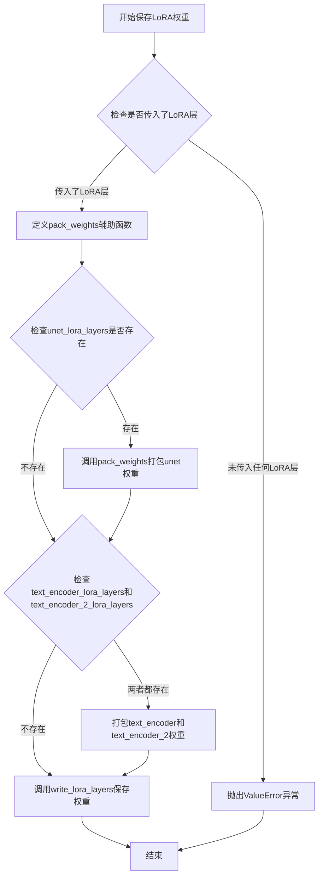

#### 带注释源码

```python
@classmethod
def save_lora_weights(
    cls,  # 类方法，第一个参数为类本身
    save_directory: Union[str, os.PathLike],  # 保存目录路径
    unet_lora_layers: Dict[str, Union[torch.nn.Module, torch.Tensor]] = None,  # U-Net的LoRA层
    text_encoder_lora_layers: Dict[str, Union[torch.nn.Module, torch.Tensor]] = None,  # 文本编码器1的LoRA层
    text_encoder_2_lora_layers: Dict[str, Union[torch.nn.Module, torch.Tensor]] = None,  # 文本编码器2的LoRA层
    is_main_process: bool = True,  # 是否为主进程
    weight_name: str = None,  # 权重文件名
    save_function: Callable = None,  # 自定义保存函数
    safe_serialization: bool = True,  # 是否安全序列化
):
    """
    保存LoRA权重到指定目录
    
    该方法将U-Net和文本编码器的LoRA权重打包并保存到磁盘。
    支持安全序列化（推荐）和不安全序列化两种方式。
    """
    
    # 初始化状态字典，用于存储所有LoRA权重
    state_dict = {}

    def pack_weights(layers, prefix):
        """
        辅助函数：将LoRA层打包成状态字典格式
        
        参数:
            layers: LoRA层（可以是nn.Module或字典）
            prefix: 权重键的前缀（如'unet'、'text_encoder'等）
        
        返回:
            带有前缀的权重状态字典
        """
        # 如果是nn.Module，提取其state_dict；否则直接使用字典
        layers_weights = layers.state_dict() if isinstance(layers, torch.nn.Module) else layers
        # 为每个权重键添加前缀，格式为"prefix.module_name"
        layers_state_dict = {f"{prefix}.{module_name}": param for module_name, param in layers_weights.items()}
        return layers_state_dict

    # 验证是否传入了至少一个LoRA层
    if not (unet_lora_layers or text_encoder_lora_layers or text_encoder_2_lora_layers):
        raise ValueError(
            "You must pass at least one of `unet_lora_layers`, `text_encoder_lora_layers` or `text_encoder_2_lora_layers`."
        )

    # 处理U-Net的LoRA权重
    if unet_lora_layers:
        state_dict.update(pack_weights(unet_lora_layers, "unet"))

    # 处理文本编码器的LoRA权重（两个文本编码器需要同时存在）
    if text_encoder_lora_layers and text_encoder_2_lora_layers:
        state_dict.update(pack_weights(text_encoder_lora_layers, "text_encoder"))
        state_dict.update(pack_weights(text_encoder_2_lora_layers, "text_encoder_2"))

    # 调用父类的write_lora_layers方法保存权重
    cls.write_lora_layers(
        state_dict=state_dict,
        save_directory=save_directory,
        is_main_process=is_main_process,
        weight_name=weight_name,
        save_function=save_function,
        safe_serialization=safe_serialization,
    )
```


### `DemoFusionSDXLPipeline._remove_text_encoder_monkey_patch`

该方法用于移除文本编码器上的 monkey patch（猴子补丁），通常在加载 LoRA 权重后调用，以清理对文本编码器的临时修改，恢复到原始状态。

参数：

- `self`：类的实例本身，无需显式传递

返回值：`None`，无返回值

#### 流程图

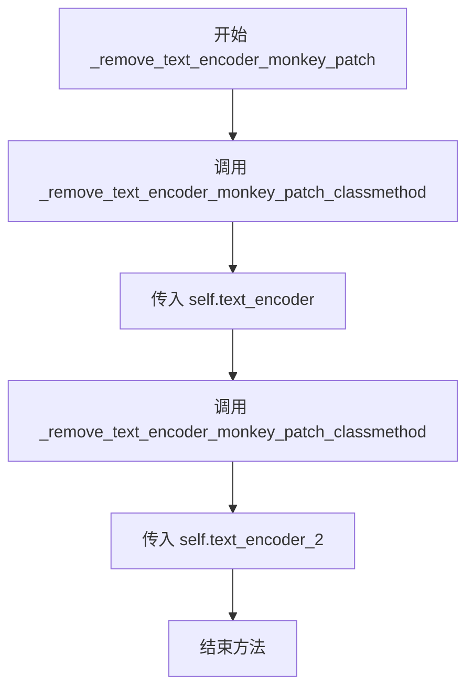

#### 带注释源码

```
def _remove_text_encoder_monkey_patch(self):
    """
    移除文本编码器上的 monkey patch。
    
    此方法用于清理在加载 LoRA 权重时对文本编码器所做的临时修改。
    它调用类方法 _remove_text_encoder_monkey_patch_classmethod 来恢复
    text_encoder 和 text_encoder_2 到原始状态。
    """
    # 移除第一个文本编码器的 monkey patch
    self._remove_text_encoder_monkey_patch_classmethod(self.text_encoder)
    
    # 移除第二个文本编码器的 monkey patch
    self._remove_text_encoder_monkey_patch_classmethod(self.text_encoder_2)
```

## 关键组件


### DemoFusionSDXLPipeline

基于Stable Diffusion XL的DemoFusion图像生成管道，支持高分辨率图像生成的多阶段扩散和解码策略。

### VAE瓦片式解码器 (tiled_decode)

将高分辨率latent分块解码并拼接的模块，通过窗口滑动和重叠区域加权融合解决VAE在大分辨率下的内存问题。

### 多视角扩散 (MultiDiffusion)

Phase 2+中使用的MultiDiffusion方法，将高分辨率图像分割为多个重叠窗口分别去噪，最后通过均值融合得到完整结果。

### 扩张采样 (Dilated Sampling)

通过下采样网格划分对latent进行多路径去噪，将每个网格单元作为独立子样本处理，最后重排合并以捕获全局信息。

### 高斯滤波器 (gaussian_filter)

对latent张量应用高斯模糊的函数，用于扩张采样阶段的噪声平滑处理，通过sigma参数控制模糊程度。

### 视图生成器 (get_views)

根据高度、宽度、窗口大小和步长生成用于分块处理的坐标视图列表，支持随机抖动增强边界连续性。

### Skip-residual机制

通过cosine_scale_1参数控制原始噪声与去噪结果的混合比例，实现浅层特征跳过连接以保留更多细节。

### 余弦退火调度

利用余弦函数计算各去噪阶段的混合因子(cosine_factor)，动态调整MultiDiffusion、扩张采样和高斯滤波的贡献权重。

### 噪声重缩放 (rescale_noise_cfg)

根据论文Common Diffusion Noise Schedules and Sample Steps are Flawed的发现，对噪声预测进行标准差重缩放以修复过曝问题。

### 双文本编码器支持

集成CLIPTextModel和CLIPTextModelWithProjection两个文本编码器，分别处理不同的文本嵌入需求以提升SDXL的文本理解能力。


## 问题及建议


### 已知问题

- **硬编码的魔法数字和参数**：多处使用硬编码值如 `stride=64`、`window_size=128`、`jitter_range = (self.unet.config.sample_size - stride) // 4` 中的除以4，以及 `c3 = 0.99 * cosine_factor**cosine_scale_3 + 1e-2` 中的0.99和1e-2，缺乏配置灵活性。
- **代码重复**：去噪循环中处理 `noise_pred` 的逻辑（CFG执行、guidance_rescale处理）在Phase 1和Phase 2+中几乎完全重复；`encode_prompt` 中处理 prompt 和 negative_prompt 的流程也存在重复代码。
- **潜在bug**：`tiled_decode` 方法中 `len(batch_view)` 被调用但结果未赋值给任何变量；变量 `c2` 在同一作用域内被重复赋值两次（先在MultiDiffusion块后，又在Dilated Sampling块中）。
- **内存效率问题**：每次循环迭代都创建新的张量（如 `torch.cat`、`torch.zeros_like`），在多阶段去噪中会产生大量中间张量，未及时释放。
- **除零风险**：`tiled_decode` 中 `count` 张量可能存在零值，虽然最终用 `image / count` 处理，但初始零值会导致NaN风险。
- **冗长方法**：`__call__` 方法超过600行，包含多个阶段的复杂逻辑，缺乏适当的子方法抽象，可读性和可维护性差。
- **类型提示不完整**：部分参数如 `prompt` 使用 `Union[str, List[str]]` 但内部处理时类型检查逻辑分散；`denoising_end` 参数类型为 `Optional[float]` 但在使用时进行多重类型检查。
- **错误处理不足**：`get_views` 方法中当 `height` 或 `width` 小于 `window_size` 时计算 `num_blocks` 的逻辑可能导致边界情况处理不一致；`gaussian_kernel` 函数创建的核未进行内存连续性检查。

### 优化建议

- **提取配置类**：将硬编码的魔法数字和超参数提取为配置类或初始化参数，提供默认值同时允许用户自定义。
- **重构重复代码**：将去噪循环中的通用逻辑（如CFG执行、noise rescaling）提取为私有方法如 `_perform_guidance`；将prompt编码的通用部分提取为方法。
- **修复bug**：删除 `tiled_decode` 中无用的 `len(batch_view)` 调用；为 `c2` 使用不同变量名或重构逻辑避免重复赋值。
- **优化内存管理**：使用 `torch.no_grad()` 上下文管理中间计算；在不需要保留中间结果时及时del或使用in-place操作；考虑使用 `torch.jit.script` 优化热点路径。
- **增强错误处理**：在 `tiled_decode` 中添加 `count` 零值检查和除零保护；对 `get_views` 方法的边界条件进行更严格的测试和验证。
- **方法分解**：将 `__call__` 方法分解为多个阶段方法，如 `_denoise_phase1`、`_denoise_phase2_plus`、`_decode_output` 等，提高可读性和可测试性。
- **完善类型提示**：使用 `TypedDict` 或 `dataclass` 增强复杂参数的类型安全；添加更多返回类型注解。
- **添加单元测试**：针对 `get_views`、`gaussian_kernel`、`gaussian_filter` 等纯函数添加边界条件测试用例。

## 其它


### 设计目标与约束

DemoFusion的核心设计目标是基于Stable Diffusion XL实现高分辨率文本到图像的生成。通过多阶段渐进式分辨率提升（Phase 1到Phase N）、MultiDiffusion、膨胀采样（Dilation Sampling）和Tiled Decoder等技术，突破SDXL原生1024x1024分辨率限制，支持生成任意高分辨率图像。设计约束包括：输入尺寸必须能被1024整除、仅支持单图生成（num_images_per_prompt强制为1）、需使用支持Karras噪声调度的调度器。

### 错误处理与异常设计

代码采用分层错误处理机制。在`check_inputs`方法中进行输入验证：检查height/width是否为8的倍数、检查callback_steps是否为正整数、验证prompt与prompt_embeds的互斥关系、确保pooled_prompt_embeds与prompt_embeds配套提供。DemoFusion特定检查包括验证最大边长能被1024整除。异常类型主要为ValueError，通过明确的错误消息指导用户修正输入。潜在改进：可增加更细粒度的GPU内存不足异常处理。

### 数据流与状态机

Pipeline的数据流遵循以下状态转换：初始状态（接收prompt）->编码状态（encode_prompt生成embeddings）->潜在空间状态（prepare_latents生成初始噪声）->去噪循环状态（多阶段迭代去噪）->解码状态（VAE decode）->输出状态（postprocess生成图像）。核心状态变量包括：latents（当前潜在表示）、timesteps（噪声调度时间步）、anchor_mean/anchor_std（用于中间阶段统计归一化）、count/value（MultiDiffusion累加器）。多阶段转换由scale_num控制，每个阶段内部包含完整的去噪循环。

### 外部依赖与接口契约

核心依赖包括：transformers库提供CLIPTextModel/CLIPTextModelWithProjection文本编码器；diffusers库提供AutoencoderKL、UNet2DConditionModel、KarrasDiffusionSchedulers、VaeImageProcessor等组件；matplotlib用于可选的中间结果可视化；torch提供张量运算。接口契约：encode_prompt返回(prompt_embeds, negative_prompt_embeds, pooled_prompt_embeds, negative_pooled_prompt_embeds)四元组；__call__方法接受Union[str, List[str]]类型的prompt，返回List[PIL.Image]或np.array；tiled_decode接收latents和目标尺寸，返回解码后的图像张量。

### 核心算法实现细节

DemoFusion采用三级增强策略提升高分辨率生成质量。第一级MultiDiffusion：将高分辨率潜在图分割为多个重叠窗口（由stride和window_size控制），分别去噪后加权融合，解决单次生成全局一致性问题。第二级Dilation Sampling：沿行列方向进行间隔采样降维处理，增强局部细节。第三级Gaussian Blur Integration：在去噪循环中混入高斯滤波后的潜在表示（由sigma和cosine_scale_3控制），改善高频噪声。三级增强的强度由cosine_factor（基于当前时间步的余弦衰减因子）动态调制。

### 配置与初始化信息

Pipeline通过register_modules注册六个核心组件：vae（AutoencoderKL）、text_encoder（CLIPTextModel）、text_encoder_2（CLIPTextModelWithProjection）、tokenizer（CLIPTokenizer）、tokenizer_2（CLIPTokenizer）、unet（UNet2DConditionModel）、scheduler（KarrasDiffusionSchedulers）。配置参数包括：force_zeros_for_empty_prompt（默认为True，控制空提示的负嵌入处理）、vae_scale_factor（基于VAE block_out_channels计算，默认8）、default_sample_size（从UNet配置读取，默认128）。模型卸载序列定义为"text_encoder->text_encoder_2->unet->vae"。

### 并行化与批处理策略

代码在两个层面实现并行化。在视图级别：get_views生成多个空间窗口，views_batch按view_batch_size分批处理，每批内的多个窗口拼接为单个张量输入UNet。在阶段级别：MultiDiffusion和Dilation Sampling在循环中顺序执行，但各自内部通过批处理提升效率。当前实现中decoder_view_batch_size固定为1，表明解码阶段未做批处理优化。潜在优化点：Dilation Sampling的间隔采样可进一步并行化、多GPU推理支持。

### 内存管理与资源释放

Pipeline实现多级内存管理：使用torch.no_grad()装饰器禁用推理阶段梯度计算；通过model_cpu_offload_seq定义模型卸载序列；VAE在float16和float32间动态切换以防止溢出（upcast_vae方法）；中间变量如latents_、value_local等在使用后及时释放。maybe_free_model_hooks()在生成完成后统一释放模型钩子。潜在风险：多阶段处理中latents累积可能引发内存峰值，建议增加显式torch.cuda.empty_cache()调用。

### 版本兼容性与弃用处理

代码通过deprecate函数标记弃用：upcast_vae方法标记为将在1.0.0版本移除，建议直接使用pipe.vae.to(torch.float32)。is_invisible_watermark_available()用于条件导入水印库，保持对无该库环境的兼容性。is_accelerate_available()和is_accelerate_version()用于版本检查，确保LoRA加载需要accelerate>=0.17.0。类型检查使用isinstance和type()组合，兼容Python 3.10+的联合类型语法。

### 性能特征与基准

根据代码结构分析，主要性能瓶颈依次为：UNet去噪推理（O(推理步数×分辨率)）、VAE解码（高分辨率下尤为耗时）、MultiDiffusion窗口遍历（O(窗口数)）、高斯滤波（O(潜在空间大小)）。典型生成流程耗时分布：Phase 1去噪约占总时间30-40%、Phase 1解码约占20-30%、后续各阶段去噪解码循环累计约占30-50%。内存占用估算：1024x1024约需2-3GB、2048x2048约需8-12GB、4096x4096可能超过20GB。

### 安全与伦理考量

代码支持negative_prompt和negative_prompt_embeds实现内容过滤，但未内置额外的安全审查机制。LoRA权重加载存在潜在风险：恶意构造的权重文件可能导致模型行为异常，建议在生产环境增加权重签名验证。水印功能（StableDiffusionXLWatermarker）为可选，用于追溯AI生成图像但非强制。代码未实现输出图像的NSFW检测，建议集成第三方安全过滤器。

    