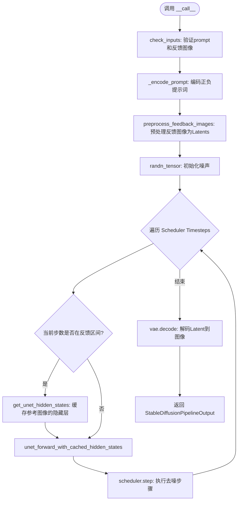
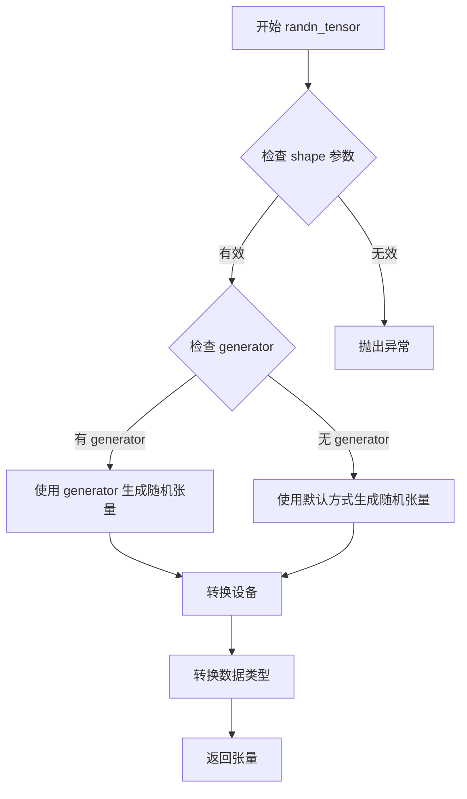
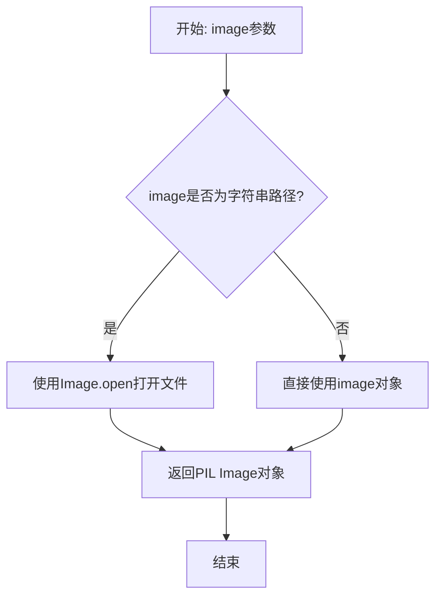
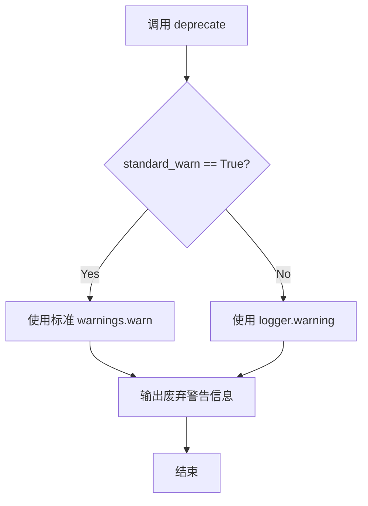
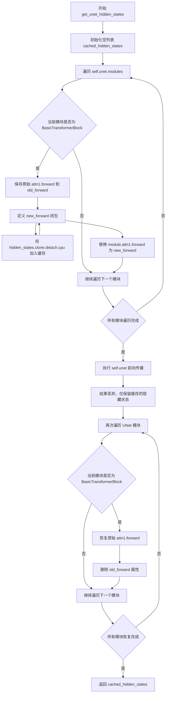
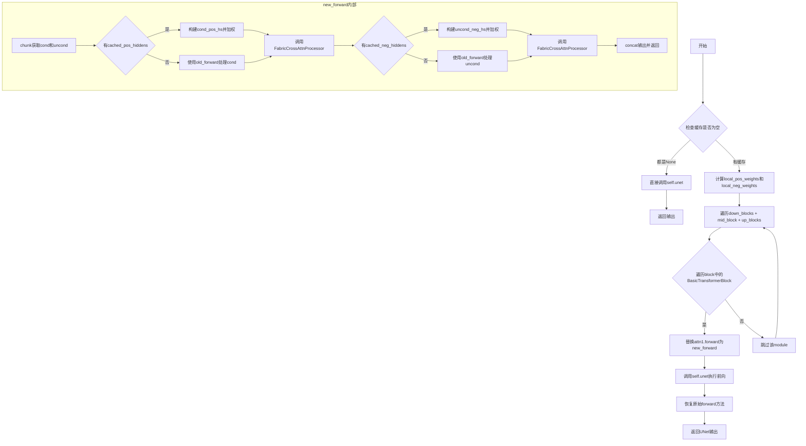
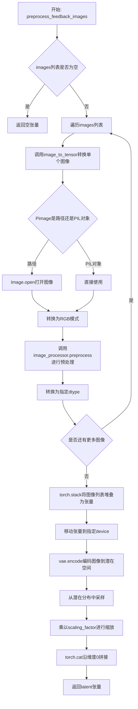
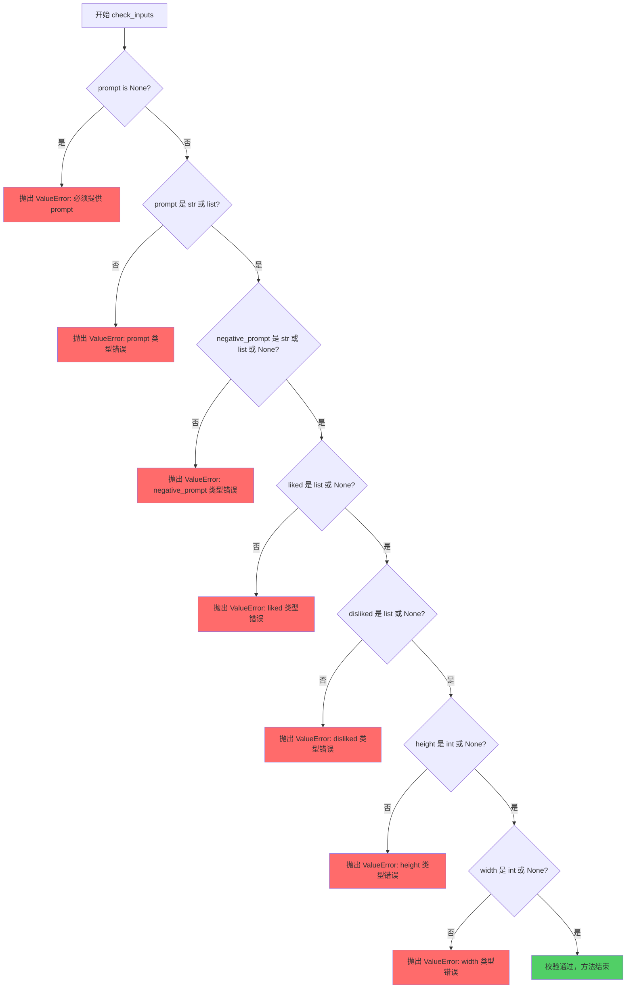
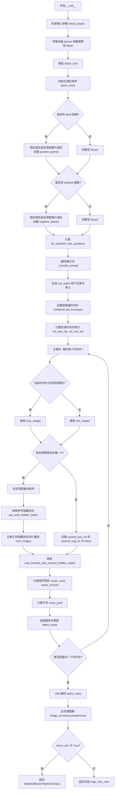
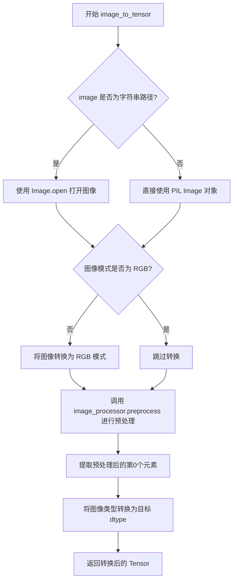

# `diffusers\examples\community\pipeline_fabric.py` 详细设计文档

这是一个基于Stable Diffusion的定制Pipeline（FABC），通过预处理用户反馈图像（喜欢/不喜欢）并在去噪过程中利用缓存的隐藏状态（Cached Hidden States）注入注意力权重，从而实现基于参考图像的风格引导生成。

## 整体流程



## 类结构

```
DiffusionPipeline (基类)
└── FabricPipeline (核心逻辑类)
    └── FabricCrossAttnProcessor (工具类: 自定义注意力处理器)
```

## 全局变量及字段


### `logger`
    
模块级日志记录器

类型：`logging.Logger`
    


### `EXAMPLE_DOC_STRING`
    
文档示例字符串

类型：`str`
    


### `FabricCrossAttnProcessor.attntion_probs`
    
用于存储注意力概率的占位字段

类型：`Any`
    


### `FabricPipeline.vae`
    
变分自编码器

类型：`AutoencoderKL`
    


### `FabricPipeline.text_encoder`
    
文本编码器

类型：`CLIPTextModel`
    


### `FabricPipeline.tokenizer`
    
分词器

类型：`CLIPTokenizer`
    


### `FabricPipeline.unet`
    
去噪网络

类型：`UNet2DConditionModel`
    


### `FabricPipeline.scheduler`
    
调度器

类型：`KarrasDiffusionSchedulers`
    


### `FabricPipeline.vae_scale_factor`
    
VAE缩放因子

类型：`int`
    


### `FabricPipeline.image_processor`
    
图像处理器

类型：`VaeImageProcessor`
    
    

## 全局函数及方法


### `randn_tensor`

生成随机张量函数，用于在扩散模型的潜在空间中生成噪声张量。该函数接受形状、设备、数据类型和可选的随机生成器，生成符合正态分布的随机张量供扩散过程使用。

参数：

- `shape`：`Union[tuple, int, list]`，张量的形状，可以是整数、元组或列表
- `device`：`Optional[torch.device]`，张量存放的设备（CPU/CUDA）
- `dtype`：`Optional[torch.dtype]`，张量的数据类型（如 float32、float16）
- `generator`：`Optional[torch.Generator]`，可选的 PyTorch 随机生成器，用于确保可复现性

返回值：`torch.Tensor`，生成的随机张量

#### 流程图



#### 带注释源码

```
# 位置：diffusers/utils/torch_utils.py
# randn_tensor 函数定义

def randn_tensor(
    shape: Union[tuple, int, list],  # 张量形状
    device: Optional[torch.device] = None,  # 目标设备
    dtype: Optional[torch.dtype] = None,  # 数据类型
    generator: Optional[torch.Generator] = None,  # 随机生成器
) -> torch.Tensor:
    """
    A helper function that follows the behavior of torch.randn to generate random tensors.
    
    Args:
        shape: The shape of the tensor to generate.
        device: The device on which to create the tensor.
        dtype: The dtype of the tensor to create.
        generator: A random generator to use for reproducible results.
        
    Returns:
        A randomly generated tensor.
    """
    # 如果未指定设备，从形状推断（如果有形状参数）
    if device is None:
        device = "cpu"
    
    # 如果未指定数据类型，默认使用 float32
    if dtype is None:
        dtype = torch.float32
    
    # 如果提供了生成器，使用生成器生成随机张量，确保可复现性
    # 否则使用 torch.randn 直接生成
    if generator is not None:
        tensor = torch.randn(generator=generator, *shape, device=device, dtype=dtype)
    else:
        tensor = torch.randn(*shape, device=device, dtype=dtype)
    
    return tensor
```

#### 在 FabricPipeline 中的调用示例

```
# 在 FabricPipeline.__call__ 方法中使用
latent_noise = randn_tensor(
    shape,              # 形状：(batch_size * num_images, in_channels, height//scale, width//scale)
    device=device,      # 执行设备
    dtype=dtype,        # 数据类型（通常与 UNet 相同）
    generator=generator,# 可选的随机生成器
)
```

---

## 补充说明

在 `FabricPipeline` 中，`randn_tensor` 用于：

1. **初始化潜在噪声**：在扩散过程的开始，生成初始的随机潜在向量
2. **参考图像加噪**：在反馈机制中，为参考图像（liked/disliked）添加噪声以匹配当前扩散步骤

该函数是 `diffusers` 库提供的工具函数，确保在不同设备和 PyTorch 版本间的兼容性。


### `Image.open`

打开图像文件或图像对象，并返回一个PIL Image对象。

参数：

-  `image`：`str` | `file object`，要打开的图像文件路径（字符串）或文件对象（如BytesIO）

返回值：`PIL.Image.Image`，打开后的PIL图像对象

#### 流程图



#### 带注释源码

```
# 在 FabricPipeline.image_to_tensor 方法中调用
# from PIL import Image  # 导入PIL库的Image模块

if isinstance(image, str):  # 如果image是字符串路径
    image = Image.open(image)  # 打开图像文件
```

> **注意**：此函数提取自代码中的实际调用位置（`FabricPipeline.image_to_tensor`方法），`Image`模块来自`from PIL import Image`导入。该函数是PIL（Python Imaging Library）库的标准函数，用于从文件路径或文件对象加载图像数据。


### `deprecate`

版本废弃警告函数，用于在代码中标记已废弃的功能并向用户发出警告。

参数：

-  `deprecated_name`：`str`，被废弃的参数或功能的名称
-  `deprecated_arg`：`str`，被废弃的参数名（如果有的话）
-  `version`：`str`，废弃生效的版本号
-  `message`：`str`，详细的废弃消息说明
-  `standard_warn`：`bool`，是否使用标准警告格式，默认为 True

返回值：`None`，该函数不返回值，仅发出警告

#### 流程图



#### 带注释源码

```python
# 从 diffusers.utils 导入 deprecate 函数
from diffusers.utils import (
    deprecate,
    logging,
    replace_example_docstring,
)

# 在 FabricPipeline.__init__ 中使用 deprecate 函数示例
# 检查 UNet 配置版本和 sample_size
is_unet_version_less_0_9_0 = (
    unet is not None
    and hasattr(unet.config, "_diffusers_version")
    and version.parse(version.parse(unet.config._diffusers_version).base_version) < version.parse("0.9.0.dev0")
)
is_unet_sample_size_less_64 = (
    unet is not None and hasattr(unet.config, "sample_size") and unet.config.sample_size < 64
)
if is_unet_version_less_0_9_0 and is_unet_sample_size_less_64:
    # 构建详细的废弃消息
    deprecation_message = (
        "The configuration file of the unet has set the default `sample_size` to smaller than"
        " 64 which seems highly unlikely. If your checkpoint is a fine-tuned version of any of the"
        " following: \n- CompVis/stable-diffusion-v1-4 \n- CompVis/stable-diffusion-v1-3 \n-"
        " CompVis/stable-diffusion-v1-2 \n- CompVis/stable-diffusion-v1-1 \n- stable-diffusion-v1-5/stable-diffusion-v1-5"
        " \n- stable-diffusion-v1-5/stable-diffusion-inpainting \n you should change 'sample_size' to 64 in the"
        " configuration file. Please make sure to update the config accordingly as leaving `sample_size=32`"
        " in the config might lead to incorrect results in future versions. If you have downloaded this"
        " checkpoint from the Hugging Face Hub, it would be very nice if you could open a Pull request for"
        " the `unet/config.json` file"
    )

    # 调用 deprecate 函数发出警告
    # 参数说明：
    # "sample_size<64" - 废弃的功能标识
    # "1.0.0" - 废弃生效的版本
    # deprecation_message - 详细的废弃说明
    # standard_warn=False - 使用 logger.warning 而非标准 warnings.warn
    deprecate("sample_size<64", "1.0.0", deprecation_message, standard_warn=False)
    
    # 更新配置，将 sample_size 修改为 64
    new_config = dict(unet.config)
    new_config["sample_size"] = 64
    unet._internal_dict = FrozenDict(new_config)
```


### FabricCrossAttnProcessor.__call__

该方法是FABRIC框架的核心注意力处理器实现，用于在Stable Diffusion的UNet网络中融合用户反馈（liked/disliked图像）信息。它重写了标准的注意力计算逻辑，通过引入权重张量（weights）来调整注意力分布，从而实现对生成图像的引导。

参数：

- `attn`：`BasicTransformerBlock`或类似的注意力模块，注意力处理器的主对象，提供to_q、to_k、to_v等线性层以及prepare_attention_mask、head_to_batch_dim等工具方法
- `hidden_states`：`torch.Tensor`，形状为(batch_size, sequence_length, hidden_dim)的输入隐藏状态，通常是UNet中间层的特征
- `encoder_hidden_states`：`Optional[torch.Tensor]`，编码器隐藏状态，默认为None，此时使用hidden_states作为cross-attention的上下文
- `attention_mask`：`Optional[torch.Tensor]`，注意力掩码，用于屏蔽无效位置，默认为None
- `weights`：`Optional[torch.Tensor]`，用于调整注意力概率分布的权重张量，其形状应与batch_size维度匹配，用于融合反馈特征
- `lora_scale`：`float`，LoRA适配器的缩放因子，默认为1.0，用于控制LoRA权重的影响程度

返回值：`torch.Tensor`，经过注意力加权计算后的输出隐藏状态，形状与输入hidden_states相同

#### 流程图

```mermaid
flowchart TD
    A[开始 __call__] --> B[获取batch_size和sequence_length]
    B --> C[准备attention_mask]
    C --> D{attn.processor是<br/>LoRAAttnProcessor?}
    D -->|Yes| E[计算query = to_q + lora_scale * to_q_lora]
    D -->|No| F[query = to_q]
    E --> G{encoder_hidden_states<br/>is None?}
    F --> G
    G -->|Yes| H[encoder_hidden_states = hidden_states]
    G -->|No| I{attn.norm_cross?}
    I -->|Yes| J[norm_encoder_hidden_states]
    I -->|No| K[保持原样]
    H --> L
    J --> L
    K --> L
    L{attn.processor是<br/>LoRAAttnProcessor?}
    L -->|Yes| M[key = to_k + lora_scale * to_k_lora<br/>value = to_v + lora_scale * to_v_lora]
    L -->|No| N[key = to_k<br/>value = to_v]
    M --> O[head_to_batch_dim转换]
    N --> O
    O --> P[计算attention_probs]
    P --> Q{weights is not None?}
    Q -->|Yes| R[重复weights到多头维度<br/>attention_probs *= weights<br/>归一化attention_probs]
    Q -->|No| S[跳过权重融合]
    R --> T[hidden_states = bmm attention_probs, value]
    S --> T
    T --> U[batch_to_head_dim转换]
    U --> V{attn.processor是<br/>LoRAAttnProcessor?}
    V -->|Yes| W[to_out[0] + lora_scale * to_out_lora]
    V -->|No| X[to_out[0]]
    W --> Y[to_out[1] dropout]
    X --> Y
    Y --> Z[返回hidden_states]
```

#### 带注释源码

```python
def __call__(
    self,
    attn,                          # BasicTransformerBlock的注意力模块
    hidden_states,                 # 输入隐藏状态 (batch_size, seq_len, hidden_dim)
    encoder_hidden_states=None,    # 交叉注意力编码状态，默认None则用hidden_states
    attention_mask=None,          # 注意力掩码，可选
    weights=None,                  # 用于融合反馈信息的权重张量
    lora_scale=1.0,                # LoRA缩放因子
):
    # 1. 获取batch_size和sequence_length
    # 根据encoder_hidden_states是否为空来决定使用哪个形状
    batch_size, sequence_length, _ = (
        hidden_states.shape if encoder_hidden_states is None else encoder_hidden_states.shape
    )
    
    # 2. 准备注意力掩码
    # 调用attn的prepare_attention_mask方法处理掩码
    attention_mask = attn.prepare_attention_mask(attention_mask, sequence_length, batch_size)

    # 3. 计算Query
    # 判断是否使用LoRA适配器
    if isinstance(attn.processor, LoRAAttnProcessor):
        # LoRA模式：query = 基础query + 缩放后的LoRA query
        query = attn.to_q(hidden_states) + lora_scale * attn.processor.to_q_lora(hidden_states)
    else:
        # 标准模式：直接使用基础query投影
        query = attn.to_q(hidden_states)

    # 4. 处理encoder_hidden_states（交叉注意力键值对来源）
    if encoder_hidden_states is None:
        # 自注意力模式：键值来自输入本身
        encoder_hidden_states = hidden_states
    elif attn.norm_cross:
        # 需要归一化时，对encoder_hidden_states进行归一化
        encoder_hidden_states = attn.norm_encoder_hidden_states(encoder_hidden_states)

    # 5. 计算Key和Value
    if isinstance(attn.processor, LoRAAttnProcessor):
        # LoRA模式：key/value = 基础 + 缩放后的LoRA
        key = attn.to_k(encoder_hidden_states) + lora_scale * attn.processor.to_k_lora(encoder_hidden_states)
        value = attn.to_v(encoder_hidden_states) + lora_scale * attn.processor.to_v_lora(encoder_hidden_states)
    else:
        # 标准模式：直接使用基础投影
        key = attn.to_k(encoder_hidden_states)
        value = attn.to_v(encoder_hidden_states)

    # 6. 将多头注意力转换为批量维度
    # 从 (batch, seq, heads, head_dim) -> (batch*heads, seq, head_dim)
    query = attn.head_to_batch_dim(query)
    key = attn.head_to_batch_dim(key)
    value = attn.head_to_batch_dim(value)

    # 7. 计算注意力分数（原始attention probabilities）
    attention_probs = attn.get_attention_scores(query, key, attention_mask)

    # 8. 融合反馈权重（FABRIC核心逻辑）
    if weights is not None:
        # 如果权重batch维度为1，需要扩展到多头维度
        if weights.shape[0] != 1:
            weights = weights.repeat_interleave(attn.heads, dim=0)
        
        # 将权重应用到注意力概率上
        attention_probs = attention_probs * weights[:, None]
        # 归一化确保概率和为1
        attention_probs = attention_probs / attention_probs.sum(dim=-1, keepdim=True)

    # 9. 计算注意力输出
    # hidden_states = attention_probs @ value
    hidden_states = torch.bmm(attention_probs, value)
    # 恢复从头维度到批量维度的转换
    hidden_states = attn.batch_to_head_dim(hidden_states)

    # 10. 输出投影（包含dropout）
    if isinstance(attn.processor, LoRAAttnProcessor):
        # LoRA模式：输出投影 + LoRA输出
        hidden_states = attn.to_out[0](hidden_states) + lora_scale * attn.processor.to_out_lora(hidden_states)
    else:
        # 标准模式：直接使用输出线性层
        hidden_states = attn.to_out[0](hidden_states)
    
    # dropout层
    hidden_states = attn.to_out[1](hidden_states)

    return hidden_states
```


### `FabricPipeline.__init__`

初始化FabricPipeline类，设置 Stable Diffusion pipeline 的各个组件（VAE、文本编码器、tokenizer、UNet、scheduler），并进行版本兼容性检查和配置。

参数：

- `vae`：`AutoencoderKL`，Variational Auto-Encoder (VAE) 模型，用于将图像编码和解码到潜在表示。
- `text_encoder`：`CLIPTextModel`，冻结的文本编码器（clip-vit-large-patch14），用于将文本提示转换为嵌入向量。
- `tokenizer`：`CLIPTokenizer`，CLIP 分词器，用于将文本分词为 token。
- `unet`：`UNet2DConditionModel`，条件 UNet 模型，用于对图像潜在表示进行去噪。
- `scheduler`：`KarrasDiffusionSchedulers`，调度器，与 unet 配合使用对编码后的图像潜在表示进行去噪。
- `requires_safety_checker`：`bool`，可选，是否需要安全检查器，默认为 True。

返回值：`None`，__init__ 方法不返回任何值，仅初始化实例属性。

#### 流程图

```mermaid
flowchart TD
    A[开始 __init__] --> B[调用 super().__init__]
    B --> C[检查 UNet 版本是否小于 0.9.0]
    C --> D{版本 < 0.9.0 且 sample_size < 64?}
    D -->|是| E[发出弃用警告]
    E --> F[更新 unet.config.sample_size 为 64]
    F --> G[使用 FrozenDict 保存新配置]
    D -->|否| H[跳过版本检查]
    H --> I[调用 self.register_modules 注册所有模块]
    I --> J[计算 vae_scale_factor]
    J --> K[初始化 VaeImageProcessor]
    K --> L[结束]
```

#### 带注释源码

```python
def __init__(
    self,
    vae: AutoencoderKL,
    text_encoder: CLIPTextModel,
    tokenizer: CLIPTokenizer,
    unet: UNet2DConditionModel,
    scheduler: KarrasDiffusionSchedulers,
    requires_safety_checker: bool = True,
):
    """
    初始化 FabricPipeline，设置所有必要的组件和配置。
    
    参数:
        vae: VAE 模型用于编解码图像
        text_encoder: CLIP 文本编码器
        tokenizer: CLIP 分词器
        unet: 条件去噪 UNet
        scheduler: 扩散调度器
        requires_safety_checker: 是否启用安全检查器
    """
    # 调用父类 DiffusionPipeline 的初始化方法
    super().__init__()

    # 检查 UNet 版本是否小于 0.9.0.dev0
    is_unet_version_less_0_9_0 = (
        unet is not None
        and hasattr(unet.config, "_diffusers_version")
        and version.parse(version.parse(unet.config._diffusers_version).base_version) < version.parse("0.9.0.dev0")
    )
    # 检查 UNet 的 sample_size 是否小于 64
    is_unet_sample_size_less_64 = (
        unet is not None and hasattr(unet.config, "sample_size") and unet.config.sample_size < 64
    )
    # 如果 UNet 版本较旧且 sample_size 小于 64，发出弃用警告并修正配置
    if is_unet_version_less_0_9_0 and is_unet_sample_size_less_64:
        deprecation_message = (
            "The configuration file of the unet has set the default `sample_size` to smaller than"
            " 64 which seems highly unlikely. If your checkpoint is a fine-tuned version of any of the"
            " following: \n- CompVis/stable-diffusion-v1-4 \n- CompVis/stable-diffusion-v1-3 \n-"
            " CompVis/stable-diffusion-v1-2 \n- CompVis/stable-diffusion-v1-1 \n- stable-diffusion-v1-5/stable-diffusion-v1-5"
            " \n- stable-diffusion-v1-5/stable-diffusion-inpainting \n you should change 'sample_size' to 64 in the"
            " configuration file. Please make sure to update the config accordingly as leaving `sample_size=32`"
            " in the config might lead to incorrect results in future versions. If you have downloaded this"
            " checkpoint from the Hugging Face Hub, it would be very nice if you could open a Pull request for"
            " the `unet/config.json` file"
        )

        # 发出弃用警告
        deprecate("sample_size<64", "1.0.0", deprecation_message, standard_warn=False)
        # 创建新配置字典并将 sample_size 修改为 64
        new_config = dict(unet.config)
        new_config["sample_size"] = 64
        # 使用 FrozenDict 冻结配置，防止后续修改
        unet._internal_dict = FrozenDict(new_config)

    # 注册所有模块到 pipeline，使它们可以通过 pipeline.xxx 访问
    self.register_modules(
        unet=unet,
        vae=vae,
        text_encoder=text_encoder,
        tokenizer=tokenizer,
        scheduler=scheduler,
    )
    # 计算 VAE 缩放因子，基于 VAE 的 block_out_channels 数量
    # 2^(len(block_out_channels)-1)，典型值为 8
    self.vae_scale_factor = 2 ** (len(self.vae.config.block_out_channels) - 1) if getattr(self, "vae", None) else 8
    # 初始化 VAE 图像处理器，用于预处理和后处理图像
    self.image_processor = VaeImageProcessor(vae_scale_factor=self.vae_scale_factor)
```


### FabricPipeline._encode_prompt

该方法负责将文本提示词编码为文本编码器的隐藏状态（embedding），支持LoRA和Textual Inversion技术，并处理分类器自由引导（Classifier-Free Guidance）的无条件嵌入生成。

参数：

- `self`：FabricPipeline实例本身
- `prompt`：`str` 或 `List[str]`，要编码的文本提示词
- `device`：`torch.device`，torch设备
- `num_images_per_prompt`：`int`，每个提示词要生成的图像数量
- `do_classifier_free_guidance`：`bool`，是否使用分类器自由引导
- `negative_prompt`：`str` 或 `List[str]`，可选，不希望出现的提示词
- `prompt_embeds`：`Optional[torch.Tensor]`，可选，预生成的文本嵌入
- `negative_prompt_embeds`：`Optional[torch.Tensor]`，可选，预生成的负面文本嵌入
- `lora_scale`：`Optional[float]`，可选，LoRA层的缩放因子

返回值：`torch.Tensor`，编码后的文本提示词嵌入向量

#### 流程图

```mermaid
flowchart TD
    A[开始 _encode_prompt] --> B{是否传入 lora_scale?}
    B -->|是| C[设置 self._lora_scale]
    B -->|否| D{判断 prompt 类型}
    C --> D
    D --> E{字符串?}
    D --> F{列表?}
    D --> G[使用 prompt_embeds.shape[0]]
    E --> H[batch_size = 1]
    F --> I[batch_size = len(prompt)]
    H --> J{prompt_embeds 为空?}
    I --> J
    G --> J
    J -->|是| K{是否为 TextualInversionLoaderMixin?}
    J -->|否| L[重复 prompt_embeds]
    K -->|是| M[调用 maybe_convert_prompt]
    K -->|否| N[直接使用 prompt]
    M --> N
    N --> O[tokenizer 处理 prompt]
    O --> P[检查 text_encoder 是否使用 attention_mask]
    P -->|使用| Q[获取 attention_mask]
    P -->|不使用| R[attention_mask = None]
    Q --> S[调用 text_encoder 生成 embeddings]
    R --> S
    S --> T[获取 prompt_embeds]
    T --> U{text_encoder 存在?}
    U -->|是| V[使用 text_encoder.dtype]
    U -->|否| W{unet 存在?}
    W -->|是| X[使用 unet.dtype]
    W -->|否| Y[使用 prompt_embeds.dtype]
    V --> Z[转换 prompt_embeds dtype 和 device]
    X --> Z
    Y --> Z
    Z --> AA[重复 prompt_embeds num_images_per_prompt 次]
    AA --> AB{do_classifier_free_guidance 为真?}
    AB -->|是| AC{negative_prompt_embeds 为空?}
    AB -->|否| AD[返回 prompt_embeds]
    AC -->|是| AE{negative_prompt 是否为空?}
    AE -->|是| AF[uncond_tokens = [''] * batch_size]
    AE -->|否| AG{类型检查 negative_prompt}
    AF --> AH[处理 Textual Inversion]
    AG --> AI[negative_prompt 是字符串?]
    AI -->|是| AJ[uncond_tokens = [negative_prompt]]
    AI -->|否| AK[检查 batch_size 匹配]
    AJ --> AH
    AK --> AH
    AH --> AL[tokenizer 处理 uncond_tokens]
    AL --> AM[调用 text_encoder]
    AM --> AN[获取 negative_prompt_embeds]
    AN --> AO[重复 negative_prompt_embeds]
    AO --> AP[与 prompt_embeds 拼接]
    AP --> AD
    L --> AD
```

#### 带注释源码

```python
def _encode_prompt(
    self,
    prompt,
    device,
    num_images_per_prompt,
    do_classifier_free_guidance,
    negative_prompt=None,
    prompt_embeds: Optional[torch.Tensor] = None,
    negative_prompt_embeds: Optional[torch.Tensor] = None,
    lora_scale: Optional[float] = None,
):
    r"""
    Encodes the prompt into text encoder hidden states.

    Args:
         prompt (`str` or `List[str]`, *optional*):
            prompt to be encoded
        device: (`torch.device`):
            torch device
        num_images_per_prompt (`int`):
            number of images that should be generated per prompt
        do_classifier_free_guidance (`bool`):
            whether to use classifier free guidance or not
        negative_prompt (`str` or `List[str]`, *optional*):
            The prompt or prompts not to guide the image generation. If not defined, one has to pass
            `negative_prompt_embeds` instead. Ignored when not using guidance (i.e., ignored if `guidance_scale` is
            less than `1`).
        prompt_embeds (`torch.Tensor`, *optional*):
            Pre-generated text embeddings. Can be used to easily tweak text inputs, *e.g.* prompt weighting. If not
            provided, text embeddings will be generated from `prompt` input argument.
        negative_prompt_embeds (`torch.Tensor`, *optional*):
            Pre-generated negative text embeddings. Can be used to easily tweak text inputs, *e.g.* prompt
            weighting. If not provided, negative_prompt_embeds will be generated from `negative_prompt` input
            argument.
        lora_scale (`float`, *optional*):
            A lora scale that will be applied to all LoRA layers of the text encoder if LoRA layers are loaded.
    """
    # 设置 lora scale 以便 text encoder 的 LoRA 函数可以正确访问
    # (这是为了兼容被 monkey patch 的 LoRA 函数)
    if lora_scale is not None and isinstance(self, StableDiffusionLoraLoaderMixin):
        self._lora_scale = lora_scale

    # 确定 batch_size
    if prompt is not None and isinstance(prompt, str):
        batch_size = 1
    elif prompt is not None and isinstance(prompt, list):
        batch_size = len(prompt)
    else:
        batch_size = prompt_embeds.shape[0]

    # 如果没有提供 prompt_embeds，则从 prompt 生成
    if prompt_embeds is None:
        # textual inversion: 如果需要，处理多向量 token
        if isinstance(self, TextualInversionLoaderMixin):
            prompt = self.maybe_convert_prompt(prompt, self.tokenizer)

        # 使用 tokenizer 将文本转换为 token id
        text_inputs = self.tokenizer(
            prompt,
            padding="max_length",
            max_length=self.tokenizer.model_max_length,
            truncation=True,
            return_tensors="pt",
        )
        text_input_ids = text_inputs.input_ids
        
        # 同时获取不截断的 token 以便检查是否被截断
        untruncated_ids = self.tokenizer(prompt, padding="longest", return_tensors="pt").input_ids

        # 检查是否发生了截断，并记录警告
        if untruncated_ids.shape[-1] >= text_input_ids.shape[-1] and not torch.equal(
            text_input_ids, untruncated_ids
        ):
            removed_text = self.tokenizer.batch_decode(
                untruncated_ids[:, self.tokenizer.model_max_length - 1 : -1]
            )
            logger.warning(
                "The following part of your input was truncated because CLIP can only handle sequences up to"
                f" {self.tokenizer.model_max_length} tokens: {removed_text}"
            )

        # 检查 text_encoder 是否配置了 use_attention_mask
        if hasattr(self.text_encoder.config, "use_attention_mask") and self.text_encoder.config.use_attention_mask:
            attention_mask = text_inputs.attention_mask.to(device)
        else:
            attention_mask = None

        # 调用 text_encoder 获取文本嵌入
        prompt_embeds = self.text_encoder(
            text_input_ids.to(device),
            attention_mask=attention_mask,
        )
        # 提取隐藏状态（第一个元素）
        prompt_embeds = prompt_embeds[0]

    # 确定 prompt_embeds 的数据类型
    if self.text_encoder is not None:
        prompt_embeds_dtype = self.text_encoder.dtype
    elif self.unet is not None:
        prompt_embeds_dtype = self.unet.dtype
    else:
        prompt_embeds_dtype = prompt_embeds.dtype

    # 将 prompt_embeds 转换为适当的 dtype 和 device
    prompt_embeds = prompt_embeds.to(dtype=prompt_embeds_dtype, device=device)

    # 获取嵌入的形状信息
    bs_embed, seq_len, _ = prompt_embeds.shape
    
    # 为每个提示词的每次生成复制文本嵌入（mps 友好的方法）
    prompt_embeds = prompt_embeds.repeat(1, num_images_per_prompt, 1)
    prompt_embeds = prompt_embeds.view(bs_embed * num_images_per_prompt, seq_len, -1)

    # 获取分类器自由引导的无条件嵌入
    if do_classifier_free_guidance and negative_prompt_embeds is None:
        # 确定无条件 token
        uncond_tokens: List[str]
        if negative_prompt is None:
            uncond_tokens = [""] * batch_size
        elif prompt is not None and type(prompt) is not type(negative_prompt):
            raise TypeError(
                f"`negative_prompt` should be the same type to `prompt`, but got {type(negative_prompt)} !="
                f" {type(prompt)}."
            )
        elif isinstance(negative_prompt, str):
            uncond_tokens = [negative_prompt]
        elif batch_size != len(negative_prompt):
            raise ValueError(
                f"`negative_prompt`: {negative_prompt} has batch size {len(negative_prompt)}, but `prompt`:"
                f" {prompt} has batch size {batch_size}. Please make sure that passed `negative_prompt` matches"
                " the batch size of `prompt`."
            )
        else:
            uncond_tokens = negative_prompt

        # textual inversion: 如果需要，处理多向量 token
        if isinstance(self, TextualInversionLoaderMixin):
            uncond_tokens = self.maybe_convert_prompt(uncond_tokens, self.tokenizer)

        # 计算最大长度（与 prompt_embeds 相同）
        max_length = prompt_embeds.shape[1]
        
        # 对无条件 token 进行 tokenize
        uncond_input = self.tokenizer(
            uncond_tokens,
            padding="max_length",
            max_length=max_length,
            truncation=True,
            return_tensors="pt",
        )

        # 获取 attention_mask
        if hasattr(self.text_encoder.config, "use_attention_mask") and self.text_encoder.config.use_attention_mask:
            attention_mask = uncond_input.attention_mask.to(device)
        else:
            attention_mask = None

        # 获取无条件嵌入
        negative_prompt_embeds = self.text_encoder(
            uncond_input.input_ids.to(device),
            attention_mask=attention_mask,
        )
        negative_prompt_embeds = negative_prompt_embeds[0]

    # 如果使用分类器自由引导
    if do_classifier_free_guidance:
        # 获取序列长度
        seq_len = negative_prompt_embeds.shape[1]

        # 转换 dtype 和 device
        negative_prompt_embeds = negative_prompt_embeds.to(dtype=prompt_embeds_dtype, device=device)

        # 复制无条件嵌入（mps 友好的方法）
        negative_prompt_embeds = negative_prompt_embeds.repeat(1, num_images_per_prompt, 1)
        negative_prompt_embeds = negative_prompt_embeds.view(batch_size * num_images_per_prompt, seq_len, -1)

        # 为了避免执行两次前向传播，我们将无条件嵌入和文本嵌入拼接成单个批次
        # 这里执行分类器自由引导需要两个前向传播的技巧
        prompt_embeds = torch.cat([negative_prompt_embeds, prompt_embeds])

    return prompt_embeds
```


### `FabricPipeline.get_unet_hidden_states`

该方法通过 monkey-patching 技术，在不破坏原有 UNet 前向传播的前提下，运行一次前向传播以捕获 UNet 中所有 `BasicTransformerBlock` 层的中间隐藏状态。这些缓存的隐藏状态随后可用于基于反馈的图像生成任务中。

参数：

- `z_all`：`torch.Tensor`，拼接后的带噪声 latent 张量，形状为 (batch_size * 2, channels, height, width)，其中包含条件和非条件 latent
- `t`：`torch.Tensor`，当前去噪过程的时间步张量
- `prompt_embd`：`torch.Tensor`，文本编码器生成的文本嵌入向量，用于条件生成

返回值：`List[torch.Tensor]`。返回 UNet 各 `BasicTransformerBlock` 层在一次前向传播中缓存的隐藏状态列表，每个元素对应一层的输出

#### 流程图



#### 带注释源码

```python
def get_unet_hidden_states(self, z_all, t, prompt_embd):
    """
    运行一次 UNet 前向传播以缓存中间层隐藏状态
    
    参数:
        z_all: 拼接后的噪声 latent (batch_size*2, C, H, W)
        t: 时间步
        prompt_embd: 文本嵌入
    
    返回:
        缓存的隐藏状态列表
    """
    # 1. 初始化存储列表
    cached_hidden_states = []
    
    # 2. 遍历 UNet 所有模块，查找 BasicTransformerBlock
    for module in self.unet.modules():
        if isinstance(module, BasicTransformerBlock):
            
            # 定义新的 forward 函数用于拦截隐藏状态
            def new_forward(self, hidden_states, *args, **kwargs):
                # 将当前层的隐藏状态克隆并转移到 CPU 后缓存
                cached_hidden_states.append(hidden_states.clone().detach().cpu())
                # 调用原始的 forward 方法，保持正常前向传播
                return self.old_forward(hidden_states, *args, **kwargs)
            
            # 保存原始 forward 方法的引用
            module.attn1.old_forward = module.attn1.forward
            # Monkey-patch: 替换为包装后的 new_forward
            module.attn1.forward = new_forward.__get__(module.attn1)

    # 3. 执行一次前向传播（输出被丢弃，仅用于触发隐藏状态缓存）
    _ = self.unet(z_all, t, encoder_hidden_states=prompt_embd)

    # 4. 恢复原始的 forward 方法，清理 monkey-patch
    for module in self.unet.modules():
        if isinstance(module, BasicTransformerBlock):
            module.attn1.forward = module.attn1.old_forward
            # 删除临时保存的 old_forward 属性
            del module.attn1.old_forward

    # 5. 返回缓存的所有中间层隐藏状态
    return cached_hidden_states
```


### `FabricPipeline.unet_forward_with_cached_hidden_states`

带缓存的UNet前向传播方法，根据权重混合条件与无条件特征，用于实现基于反馈的图像生成任务。

参数：

- `z_all`：`torch.Tensor`，级联的潜在表示，包含条件和无条件 latent
- `t`：`torch.Tensor` 或 `int`，去噪步骤的时间步
- `prompt_embd`：`torch.Tensor`，文本编码器生成的提示嵌入
- `cached_pos_hiddens`：`Optional[List[torch.Tensor]]`，可选，正面反馈图像的缓存隐藏状态列表
- `cached_neg_hiddens`：`Optional[List[torch.Tensor]]`，可选，负面反馈图像的缓存隐藏状态列表
- `pos_weights`：`tuple`，默认`(0.8, 0.8)`，正面反馈的权重范围
- `neg_weights`：`tuple`，默认`(0.5, 0.5)`，负面反馈的权重范围

返回值：`torch.Tensor`，UNet的去噪输出

#### 流程图



#### 带注释源码

```python
def unet_forward_with_cached_hidden_states(
    self,
    z_all,
    t,
    prompt_embd,
    cached_pos_hiddens: Optional[List[torch.Tensor]] = None,
    cached_neg_hiddens: Optional[List[torch.Tensor]] = None,
    pos_weights=(0.8, 0.8),
    neg_weights=(0.5, 0.5),
):
    # 如果没有提供任何缓存的隐藏状态，直接调用标准UNet前向传播
    if cached_pos_hiddens is None and cached_neg_hiddens is None:
        return self.unet(z_all, t, encoder_hidden_states=prompt_embd)

    # 根据UNet的down_blocks数量生成线性递增的权重列表
    # 例如: len(down_blocks)=4, pos_weights=(0.8, 0.8) -> [0.8, 0.8, 0.8, 0.8]
    local_pos_weights = torch.linspace(*pos_weights, steps=len(self.unet.down_blocks) + 1)[:-1].tolist()
    local_neg_weights = torch.linspace(*neg_weights, steps=len(self.unet.down_blocks) + 1)[:-1].tolist()
    
    # 组合所有块: down_blocks + mid_block + up_blocks
    # 权重: local_pos_weights + [pos_weights[1]] + local_pos_weights[::-1]
    for block, pos_weight, neg_weight in zip(
        self.unet.down_blocks + [self.unet.mid_block] + self.unet.up_blocks,
        local_pos_weights + [pos_weights[1]] + local_pos_weights[::-1],
        local_neg_weights + [neg_weights[1]] + local_neg_weights[::-1],
    ):
        # 遍历每个块中的模块，查找BasicTransformerBlock
        for module in block.modules():
            if isinstance(module, BasicTransformerBlock):
                # 定义新的前向函数，用于替换原始attention forward
                def new_forward(
                    self,
                    hidden_states,
                    pos_weight=pos_weight,
                    neg_weight=neg_weight,
                    **kwargs,
                ):
                    # 将hidden_states按batch维度分成条件和非条件两部分
                    cond_hiddens, uncond_hiddens = hidden_states.chunk(2, dim=0)
                    batch_size, d_model = cond_hiddens.shape[:2]
                    device, dtype = hidden_states.device, hidden_states.dtype

                    # 初始化权重张量，全1表示不修改注意力
                    weights = torch.ones(batch_size, d_model, device=device, dtype=dtype)
                    
                    # 保存原始forward的输出（备用）
                    out_pos = self.old_forward(hidden_states)
                    out_neg = self.old_forward(hidden_states)

                    # 处理正面反馈缓存
                    if cached_pos_hiddens is not None:
                        # 取出第一个缓存的隐藏状态并移到正确设备
                        cached_pos_hs = cached_pos_hiddens.pop(0).to(hidden_states.device)
                        # 将原始条件hidden states与缓存的正面特征拼接
                        cond_pos_hs = torch.cat([cond_hiddens, cached_pos_hs], dim=1)
                        # 扩展权重，对新拼接的部分使用pos_weight
                        pos_weights = weights.clone().repeat(1, 1 + cached_pos_hs.shape[1] // d_model)
                        pos_weights[:, d_model:] = pos_weight
                        # 使用自定义的注意力处理器应用权重
                        attn_with_weights = FabricCrossAttnProcessor()
                        out_pos = attn_with_weights(
                            self,
                            cond_hiddens,
                            encoder_hidden_states=cond_pos_hs,
                            weights=pos_weights,
                        )
                    else:
                        # 如果没有缓存，直接使用原始forward
                        out_pos = self.old_forward(cond_hiddens)

                    # 处理负面反馈缓存
                    if cached_neg_hiddens is not None:
                        cached_neg_hs = cached_neg_hiddens.pop(0).to(hidden_states.device)
                        uncond_neg_hs = torch.cat([uncond_hiddens, cached_neg_hs], dim=1)
                        neg_weights = weights.clone().repeat(1, 1 + cached_neg_hs.shape[1] // d_model)
                        neg_weights[:, d_model:] = neg_weight
                        attn_with_weights = FabricCrossAttnProcessor()
                        out_neg = attn_with_weights(
                            self,
                            uncond_hiddens,
                            encoder_hidden_states=uncond_neg_hs,
                            weights=neg_weights,
                        )
                    else:
                        out_neg = self.old_forward(uncond_hiddens)

                    # 拼接条件和非条件输出
                    out = torch.cat([out_pos, out_neg], dim=0)
                    return out

                # 保存原始forward方法并替换为自定义new_forward
                module.attn1.old_forward = module.attn1.forward
                module.attn1.forward = new_forward.__get__(module.attn1)

    # 执行UNet前向传播（此时attention已被hook）
    out = self.unet(z_all, t, encoder_hidden_states=prompt_embd)

    # 恢复原始forward方法，清理monkey-patch
    for module in self.unet.modules():
        if isinstance(module, BasicTransformerBlock):
            module.attn1.forward = module.attn1.old_forward
            del module.attn1.old_forward

    return out
```


### `FabricPipeline.preprocess_feedback_images`

将反馈图像列表（PIL图像或图像路径）转换为Latent向量，供后续的UNet处理使用。该方法首先将图像转换为张量，然后通过VAE编码器编码为潜在空间表示。

参数：

- `self`：`FabricPipeline`，隐含的实例引用
- `images`：`Union[List[Image.Image], List[str]]`，待处理的反馈图像列表，支持PIL图像对象或图像文件路径
- `vae`：`AutoencoderKL`，Variational Auto-Encoder模型，用于将图像编码到潜在空间
- `dim`：`Tuple[int, int]`，目标图像的尺寸（高度，宽度），用于图像预处理时的缩放
- `device`：`torch.device`，计算设备（CPU或CUDA），指定张量存放位置
- `dtype`：`torch.dtype`，张量数据类型，通常与UNet数据类型一致（如torch.float32）
- `generator`：`Optional[torch.Generator]`，随机数生成器，用于VAE编码时的采样过程，确保结果可复现

返回值：`torch.Tensor`，编码后的潜在空间向量张量，形状为 `[num_images, latent_channels, latent_height, latent_width]`

#### 流程图



#### 带注释源码

```python
def preprocess_feedback_images(self, images, vae, dim, device, dtype, generator) -> torch.tensor:
    """
    将反馈图像列表转换为Latent向量
    
    处理流程:
    1. 将每个图像转换为张量格式
    2. 堆叠为批量张量
    3. 通过VAE编码到潜在空间
    4. 返回缩放后的latent向量
    
    Args:
        images: 反馈图像列表（PIL Image或文件路径）
        vae: AutoencoderKL模型实例
        dim: 目标尺寸 (height, width)
        device: torch设备
        dtype: 数据类型
        generator: 随机生成器用于采样
    
    Returns:
        torch.Tensor: 编码后的latent向量
    """
    # 步骤1: 将图像列表中的每个图像转换为张量
    # 使用列表推导式遍历所有图像，调用image_to_tensor方法进行转换
    images_t = [self.image_to_tensor(img, dim, dtype) for img in images]
    
    # 步骤2: 将图像张量列表堆叠为单个批量张量
    # torch.stack会在维度0增加batch维度
    # 结果形状: [num_images, channels, height, width]
    images_t = torch.stack(images_t).to(device)
    
    # 步骤3: 使用VAE编码器将图像编码到潜在空间
    # vae.encode返回一个LatentDiffusionDiscreteDistribution对象
    # .latent_dist.sample(generator) 从分布中采样得到latent向量
    # VAE的latent空间通常比原始图像空间小很多（按vae_scale_factor因子下采样）
    latents = vae.config.scaling_factor * vae.encode(images_t).latent_dist.sample(generator)
    
    # 步骤4: 沿批次维度拼接latent向量并返回
    # 虽然这里只有一个元素，但使用torch.cat保持返回类型一致性
    # 返回形状: [num_images, latent_channels, latent_height, latent_width]
    return torch.cat([latents], dim=0)
```


### `FabricPipeline.check_inputs`

参数校验函数，用于验证文本到图像生成管道输入参数的有效性，确保 prompt、negative_prompt、liked、disliked、height 和 width 等参数符合要求。

参数：

- `prompt`：提示词，支持字符串或字符串列表，表示图像生成的内容描述
- `negative_prompt`：负面提示词，可选，字符串或字符串列表，指定不希望出现在图像中的元素
- `liked`：可选列表，包含用户喜欢的图像（Image.Image 或路径字符串），用于正向反馈
- `disliked`：可选列表，包含用户不喜欢的图像（Image.Image 或路径字符串），用于负向反馈
- `height`：可选整数，生成图像的高度，必须为 int 类型
- `width`：可选整数，生成图像的宽度，必须为 int 类型

返回值：`None`，该方法不返回任何值，仅通过抛出 ValueError 来处理校验失败的情况

#### 流程图



#### 带注释源码

```python
def check_inputs(
    self,
    prompt,                       # 必需的提示词，str 或 list 类型
    negative_prompt=None,         # 可选的负面提示词
    liked=None,                   # 可选的用户喜欢图像列表
    disliked=None,                # 可选的用户不喜欢图像列表
    height=None,                  # 可选的生成图像高度
    width=None,                   # 可选的生成图像宽度
):
    """
    校验所有输入参数的合法性，参数不符合要求时抛出 ValueError 异常。
    """
    
    # 检查 prompt 参数
    if prompt is None:
        # prompt 是必需的，不能为 None
        raise ValueError("Provide `prompt`. Cannot leave both `prompt` undefined.")
    elif prompt is not None and (not isinstance(prompt, str) and not isinstance(prompt, list)):
        # prompt 必须是 str 或 list 类型
        raise ValueError(f"`prompt` has to be of type `str` or `list` but is {type(prompt)}")

    # 检查 negative_prompt 参数（如果提供）
    if negative_prompt is not None and (
        not isinstance(negative_prompt, str) and not isinstance(negative_prompt, list)
    ):
        # negative_prompt 必须是 str 或 list 类型
        raise ValueError(f"`negative_prompt` has to be of type `str` or `list` but is {type(negative_prompt)}")

    # 检查 liked 参数（如果提供）
    if liked is not None and not isinstance(liked, list):
        # liked 必须是 list 类型
        raise ValueError(f"`liked` has to be of type `list` but is {type(liked)}")

    # 检查 disliked 参数（如果提供）
    if disliked is not None and not isinstance(disliked, list):
        # disliked 必须是 list 类型
        raise ValueError(f"`disliked` has to be of type `list` but is {type(disliked)}")

    # 检查 height 参数（如果提供）
    if height is not None and not isinstance(height, int):
        # height 必须是 int 类型
        raise ValueError(f"`height` has to be of type `int` but is {type(height)}")

    # 检查 width 参数（如果提供）
    if width is not None and not isinstance(width, int):
        # width 必须是 int 类型
        raise ValueError(f"`width` has to be of type `int` but is {type(width)}")
```


### `FabricPipeline.__call__`

主管道方法，执行文本到图像的生成逻辑。通过结合用户提供的正面反馈（liked）和负面反馈（disliked）图像，在去噪过程中动态调整注意力权重，从而引导生成更符合用户偏好的图像。

参数：

-  `prompt`：`Optional[Union[str, List[str]]]`，用于引导图像生成的文本提示
-  `negative_prompt`：`Optional[Union[str, List[str]]]`，负面提示词，引导生成时排除的内容
-  `liked`：`Optional[Union[List[str], List[Image.Image]]]`，喜欢的图像列表，用于正面反馈
-  `disliked`：`Optional[Union[List[str], List[Image.Image]]]`，不喜欢的图像列表，用于负面反馈
-  `generator`：`Optional[Union[torch.Generator, List[torch.Generator]]]`，随机数生成器，用于确保可复现性
-  `height`：`int`，生成图像的高度，默认 512
-  `width`：`int`，生成图像的宽度，默认 512
-  `return_dict`：`bool`，是否返回字典格式，默认 True
-  `num_images`：`int`，每个提示词生成的图像数量，默认 4
-  `guidance_scale`：`float`，引导尺度，控制图像与提示词的相关性，默认 7.0
-  `num_inference_steps`：`int`，去噪步数，默认 20
-  `output_type`：`str | None`，输出格式，可选 "pil" 或 "np.array"，默认 "pil"
-  `feedback_start_ratio`：`float`，反馈开始的时间步比例，默认 0.33
-  `feedback_end_ratio`：`float`，反馈结束的时间步比例，默认 0.66
-  `min_weight`：`float`，反馈权重的最小值，默认 0.05
-  `max_weight`：`float`，反馈权重的最大值，默认 0.8
-  `neg_scale`：`float`，负面反馈的缩放因子，默认 0.5
-  `pos_bottleneck_scale`：`float`，正面瓶颈的缩放因子，默认 1.0
-  `neg_bottleneck_scale`：`float`，负面瓶颈的缩放因子，默认 1.0
-  `latents`：`Optional[torch.Tensor]`，可选的初始潜在变量

返回值：`Union[StableDiffusionPipelineOutput, tuple]`，返回生成的图像列表和安全检查标志

#### 流程图



#### 带注释源码

```python
@torch.no_grad()
@replace_example_docstring(EXAMPLE_DOC_STRING)
def __call__(
    self,
    prompt: Optional[Union[str, List[str]]] = "",
    negative_prompt: Optional[Union[str, List[str]]] = "lowres, bad anatomy, bad hands, cropped, worst quality",
    liked: Optional[Union[List[str], List[Image.Image]]] = [],
    disliked: Optional[Union[List[str], List[Image.Image]]] = [],
    generator: Optional[Union[torch.Generator, List[torch.Generator]]] = None,
    height: int = 512,
    width: int = 512,
    return_dict: bool = True,
    num_images: int = 4,
    guidance_scale: float = 7.0,
    num_inference_steps: int = 20,
    output_type: str | None = "pil",
    feedback_start_ratio: float = 0.33,
    feedback_end_ratio: float = 0.66,
    min_weight: float = 0.05,
    max_weight: float = 0.8,
    neg_scale: float = 0.5,
    pos_bottleneck_scale: float = 1.0,
    neg_bottleneck_scale: float = 1.0,
    latents: Optional[torch.Tensor] = None,
):
    # 1. 检查输入参数的有效性
    self.check_inputs(prompt, negative_prompt, liked, disliked)

    # 2. 获取执行设备（CPU/CUDA）和 UNet 的数据类型
    device = self._execution_device
    dtype = self.unet.dtype

    # 3. 根据 prompt 类型确定 batch_size
    if isinstance(prompt, str) and prompt is not None:
        batch_size = 1
    elif isinstance(prompt, list) and prompt is not None:
        batch_size = len(prompt)
    else:
        raise ValueError(f"`prompt` has to be of type `str` or `list` but is {type(prompt)}")

    # 4. 处理 negative_prompt 确保类型一致
    if isinstance(negative_prompt, str):
        negative_prompt = negative_prompt
    elif isinstance(negative_prompt, list):
        negative_prompt = negative_prompt
    else:
        assert len(negative_prompt) == batch_size

    # 5. 计算潜在空间的形状: batch * num_images, channels, height/8, width/8
    shape = (
        batch_size * num_images,
        self.unet.config.in_channels,
        height // self.vae_scale_factor,
        width // self.vae_scale_factor,
    )
    # 6. 初始化随机潜在噪声，可使用 generator 复现
    latent_noise = randn_tensor(
        shape,
        device=device,
        dtype=dtype,
        generator=generator,
    )

    # 7. 预处理正面反馈图像（liked）转换为潜在向量
    positive_latents = (
        self.preprocess_feedback_images(liked, self.vae, (height, width), device, dtype, generator)
        if liked and len(liked) > 0
        else torch.tensor(
            [],
            device=device,
            dtype=dtype,
        )
    )
    # 8. 预处理负面反馈图像（disliked）转换为潜在向量
    negative_latents = (
        self.preprocess_feedback_images(disliked, self.vae, (height, width), device, dtype, generator)
        if disliked and len(disliked) > 0
        else torch.tensor(
            [],
            device=device,
            dtype=dtype,
        )
    )

    # 9. 确定是否使用无分类器引导
    do_classifier_free_guidance = guidance_scale > 0.1

    # 10. 编码提示词，返回分割后的正向和负向嵌入
    (prompt_neg_embs, prompt_pos_embs) = self._encode_prompt(
        prompt,
        device,
        num_images,
        do_classifier_free_guidance,
        negative_prompt,
    ).split([num_images * batch_size, num_images * batch_size])

    # 11. 拼接正向和负向提示嵌入用于双通道处理
    batched_prompt_embd = torch.cat([prompt_pos_embs, prompt_neg_embs], dim=0)

    # 12. 创建空提示词 token 用于无条件嵌入
    null_tokens = self.tokenizer(
        [""],
        return_tensors="pt",
        max_length=self.tokenizer.model_max_length,
        padding="max_length",
        truncation=True,
    )

    # 13. 处理注意力掩码
    if hasattr(self.text_encoder.config, "use_attention_mask") and self.text_encoder.config.use_attention_mask:
        attention_mask = null_tokens.attention_mask.to(device)
    else:
        attention_mask = None

    # 14. 编码空提示词获取无条件嵌入
    null_prompt_emb = self.text_encoder(
        input_ids=null_tokens.input_ids.to(device),
        attention_mask=attention_mask,
    ).last_hidden_state

    null_prompt_emb = null_prompt_emb.to(device=device, dtype=dtype)

    # 15. 设置调度器的时间步
    self.scheduler.set_timesteps(num_inference_steps, device=device)
    timesteps = self.scheduler.timesteps
    # 16. 根据调度器初始噪声 sigma 缩放潜在噪声
    latent_noise = latent_noise * self.scheduler.init_noise_sigma

    # 17. 计算预热步数
    num_warmup_steps = len(timesteps) - num_inference_steps * self.scheduler.order

    # 18. 计算反馈引入和结束的时间步索引
    ref_start_idx = round(len(timesteps) * feedback_start_ratio)
    ref_end_idx = round(len(timesteps) * feedback_end_ratio)

    # 19. 主去噪循环
    with self.progress_bar(total=num_inference_steps) as pbar:
        for i, t in enumerate(timesteps):
            # 计算当前 sigma 值
            sigma = self.scheduler.sigma_t[t] if hasattr(self.scheduler, "sigma_t") else 0
            if hasattr(self.scheduler, "sigmas"):
                sigma = self.scheduler.sigmas[i]

            # 计算 alpha_hat
            alpha_hat = 1 / (sigma**2 + 1)

            # 对单个样本进行缩放后复制为双份（条件+无条件）
            z_single = self.scheduler.scale_model_input(latent_noise, t)
            z_all = torch.cat([z_single] * 2, dim=0)
            # 拼接正负反馈潜在向量
            z_ref = torch.cat([positive_latents, negative_latents], dim=0)

            # 根据是否在反馈时间步范围内确定权重因子
            if i >= ref_start_idx and i <= ref_end_idx:
                weight_factor = max_weight
            else:
                weight_factor = min_weight

            # 计算正负反馈的权重元组
            pos_ws = (weight_factor, weight_factor * pos_bottleneck_scale)
            neg_ws = (weight_factor * neg_scale, weight_factor * neg_scale * neg_bottleneck_scale)

            # 20. 如果有反馈图像且权重因子 > 0，处理参考隐藏状态
            if z_ref.size(0) > 0 and weight_factor > 0:
                # 对参考图像添加噪声
                noise = torch.randn_like(z_ref)
                if isinstance(self.scheduler, EulerAncestralDiscreteScheduler):
                    z_ref_noised = (alpha_hat**0.5 * z_ref + (1 - alpha_hat) ** 0.5 * noise).type(dtype)
                else:
                    z_ref_noised = self.scheduler.add_noise(z_ref, noise, t)

                # 为参考图像创建 null prompt 嵌入
                ref_prompt_embd = torch.cat(
                    [null_prompt_emb] * (len(positive_latents) + len(negative_latents)), dim=0
                )
                # 获取 UNet 的参考隐藏状态
                cached_hidden_states = self.get_unet_hidden_states(z_ref_noised, t, ref_prompt_embd)

                # 分离正负隐藏状态并扩展到 num_images 份
                n_pos, n_neg = positive_latents.shape[0], negative_latents.shape[0]
                cached_pos_hs, cached_neg_hs = [], []
                for hs in cached_hidden_states:
                    cached_pos, cached_neg = hs.split([n_pos, n_neg], dim=0)
                    cached_pos = cached_pos.view(1, -1, *cached_pos.shape[2:]).expand(num_images, -1, -1)
                    cached_neg = cached_neg.view(1, -1, *cached_neg.shape[2:]).expand(num_images, -1, -1)
                    cached_pos_hs.append(cached_pos)
                    cached_neg_hs.append(cached_neg)

                # 处理没有正面或负面反馈的情况
                if n_pos == 0:
                    cached_pos_hs = None
                if n_neg == 0:
                    cached_neg_hs = None
            else:
                cached_pos_hs, cached_neg_hs = None, None

            # 21. 调用带缓存隐藏状态的 UNet 前向传播
            unet_out = self.unet_forward_with_cached_hidden_states(
                z_all,
                t,
                prompt_embd=batched_prompt_embd,
                cached_pos_hiddens=cached_pos_hs,
                cached_neg_hiddens=cached_neg_hs,
                pos_weights=pos_ws,
                neg_weights=neg_ws,
            )[0]

            # 22. 分离条件和无条件噪声预测，应用引导
            noise_cond, noise_uncond = unet_out.chunk(2)
            guidance = noise_cond - noise_uncond
            noise_pred = noise_uncond + guidance_scale * guidance
            # 23. 调度器单步更新
            latent_noise = self.scheduler.step(noise_pred, t, latent_noise)[0]

            # 24. 更新进度条
            if i == len(timesteps) - 1 or ((i + 1) > num_warmup_steps and (i + 1) % self.scheduler.order == 0):
                pbar.update()

    # 25. 解码最终潜在向量得到图像
    y = self.vae.decode(latent_noise / self.vae.config.scaling_factor, return_dict=False)[0]
    # 26. 后处理图像到指定格式
    imgs = self.image_processor.postprocess(
        y,
        output_type=output_type,
    )

    # 27. 返回结果
    if not return_dict:
        return imgs

    return StableDiffusionPipelineOutput(imgs, False)
```


### `FabricPipeline.image_to_tensor`

将输入的图像（PIL Image 或图像路径）转换为指定尺寸和数据类型的 PyTorch Tensor，以便后续处理。

参数：

- `image`：`Union[str, Image.Image]`，输入的图像，支持文件路径字符串或 PIL Image 对象
- `dim`：`tuple`，目标尺寸，格式为 (height, width)
- `dtype`：`torch.dtype`，目标数据类型，用于指定返回 Tensor 的数据类型

返回值：`torch.Tensor`，预处理后的图像张量，形状为 (C, H, W)

#### 流程图



#### 带注释源码

```python
def image_to_tensor(self, image: Union[str, Image.Image], dim: tuple, dtype):
    """
    Convert latent PIL image to a torch tensor for further processing.
    
    Args:
        image: 输入图像，可以是文件路径或 PIL Image 对象
        dim: 目标尺寸元组 (height, width)
        dtype: 目标 torch 数据类型
    
    Returns:
        预处理后的 torch Tensor
    """
    # 如果输入是字符串路径，则打开图像文件
    if isinstance(image, str):
        image = Image.open(image)
    
    # 确保图像为 RGB 模式（转换为三通道）
    if not image.mode == "RGB":
        image = image.convert("RGB")
    
    # 使用 VAE 图像处理器进行预处理，调整图像尺寸
    # 返回形状为 (1, C, H, W) 的张量
    image = self.image_processor.preprocess(image, height=dim[0], width=dim[1])[0]
    
    # 将图像转换为指定的数据类型并返回
    return image.type(dtype)
```

## 关键组件


### FabricCrossAttnProcessor

自定义注意力处理器，用于在文本到图像生成过程中应用反馈权重到注意力概率，支持LoRA权重集成。

### FabricPipeline

主pipeline类，继承自DiffusionPipeline，实现基于Stable Diffusion的文本到图像生成，并通过反馈图像（liked/disliked）进行条件引导。

### 张量索引与惰性加载

代码通过`cached_hidden_states`列表缓存UNet的中间隐藏状态，实现惰性加载机制；在`unet_forward_with_cached_hidden_states`中使用`chunk`方法分割条件与非条件隐藏状态，使用`torch.cat`进行状态拼接，使用`pop(0)`按序取出缓存的隐藏状态。

### 反量化支持

通过`preprocess_feedback_images`方法将PIL图像编码为潜在向量，利用VAE的`latent_dist.sample()`采样；在`__call__`中通过`scaling_factor`进行潜在空间缩放，并在解码时通过`vae.decode(latent_noise / self.vae.config.scaling_factor)`恢复原始空间。

### 量化策略

在`_encode_prompt`中通过`prompt_embeds.to(dtype=prompt_embeds_dtype, device=device)`保持嵌入与模型 dtype 一致；`image_to_tensor`中使用`.type(dtype)`确保张量类型转换；LoRA处理器通过`lora_scale`参数动态应用权重。

### _encode_prompt

编码文本提示为文本编码器的隐藏状态，支持批量处理、分类器自由引导和LoRA权重。

### get_unet_hidden_states

运行UNet前向传播以缓存所有BasicTransformerBlock的隐藏状态，用于后续反馈引导。

### unet_forward_with_cached_hidden_states

带缓存隐藏状态的UNet前向传播，通过FabricCrossAttnProcessor将缓存的正/负反馈隐藏状态与当前隐藏状态加权融合。

### preprocess_feedback_images

将反馈图像（liked/dislikiked）预处理为VAE潜在向量，支持图像路径或PIL.Image输入。

### check_inputs

验证pipeline输入参数的有效性，包括prompt类型、liked/disliked列表类型、图像尺寸类型等。

### image_to_tensor

将图像文件路径或PIL.Image转换为模型所需的torch张量格式，进行尺寸调整和类型转换。


## 问题及建议


### 已知问题

-   **变量命名拼写错误**：`FabricCrossAttnProcessor`类中的`self.attntion_probs`拼写错误（应为`attention_probs`），虽然该变量未被实际使用，但影响代码可读性。
-   **Monkey Patching风险**：`get_unet_hidden_states`和`unet_forward_with_cached_hidden_states`方法通过动态修改`module.attn1.forward`实现缓存功能，若在执行过程中发生异常，原始forward函数可能无法被正确恢复，导致内存泄漏或模型行为异常。
-   **冗余代码**：`preprocess_feedback_images`方法中使用`torch.cat([latents], dim=0)`对单元素列表进行拼接是冗余操作，直接返回`latents`即可。
-   **函数设计缺陷**：`check_inputs`方法中`liked`和`disliked`参数类型检查允许`None`或空列表，但后续代码中使用`if liked and len(liked) > 0`进行二次检查，逻辑不一致。
-   **资源清理不完善**：`__call__`方法中缓存的hidden states在推理完成后未显式释放，可能导致显存占用偏高。
-   **类型注解缺失**：多个方法如`preprocess_feedback_images`和`image_to_tensor`缺少完整的类型注解，影响代码可维护性。
-   **硬编码默认值**：pipeline的默认参数（如`num_images=4`、`height=512`、`width=512`）硬编码在方法签名中，缺乏配置灵活性。

### 优化建议

-   **修复拼写错误**：将`self.attntion_probs`重命名为`self.attention_probs`。
-   **替代Monkey Patching方案**：考虑使用`torch.nn.Module`的`forward_hook`或`register_forward_hook`机制来捕获中间层输出，避免直接修改原始forward函数。
-   **增强异常处理**：使用`try-finally`结构确保在任意情况下都能恢复原始forward函数，或采用上下文管理器（context manager）封装缓存逻辑。
-   **简化冗余逻辑**：移除`preprocess_feedback_images`中的冗余拼接操作。
-   **统一参数校验逻辑**：在`check_inputs`中统一处理`liked`和`disliked`的检查，或移除二次检查以避免逻辑混乱。
-   **完善类型注解**：为所有方法添加完整的类型注解，特别是`preprocess_feedback_images`的返回值类型。
-   **配置化设计**：将硬编码的默认值提取为类属性或构造函数参数，提供更灵活的配置能力。
-   **显存优化**：在推理完成后显式清理缓存的tensor，如调用`del`并配合`torch.cuda.empty_cache()`（如适用）。

## 其它


### 设计目标与约束

**设计目标**：
- 实现基于Stable Diffusion的文本到图像生成，并支持用户反馈机制（liked/disliked图像）来引导生成过程
- 通过注意力机制将反馈图像的特征融入UNet的去噪过程，实现精细化的图像风格控制
- 支持LoRA微调，保持与社区预训练模型的兼容性

**约束条件**：
- 依赖PyTorch 1.9+和Transformers库
- 需要支持CUDA加速的GPU设备
- 反馈机制仅在指定的推理步骤范围内生效（feedback_start_ratio到feedback_end_ratio）
- 图像分辨率需为64的倍数（受VAE下采样因子影响）

### 错误处理与异常设计

**输入验证**：
- `check_inputs`方法验证prompt、negative_prompt、liked、disliked的类型和合法性
- 高度和宽度必须为整数类型
- liked和disliked列表元素必须是PIL.Image或字符串路径

**关键异常处理**：
- 当prompt_embeds为None且prompt不符合字符串或列表类型时抛出TypeError
- negative_prompt与prompt类型不一致时抛出TypeError
- batch_size不匹配时抛出ValueError
- CLIP tokenizer处理超过最大长度token的序列时发出警告并截断

**版本兼容性检查**：
- 检测UNet版本是否低于0.9.0
- 检测sample_size是否小于64并发出降级警告

### 数据流与状态机

**主生成流程状态机**：
1. **初始化状态**：加载模型、tokenizer、scheduler
2. **输入预处理状态**：编码prompt、处理反馈图像为latent
3. **去噪循环状态**：迭代执行UNet前向传播，包含可选的反馈融合
4. **解码状态**：VAE解码latent到图像
5. **后处理状态**：图像格式转换和输出

**反馈机制状态**：
- 预热阶段（ref_start_idx之前）：不使用反馈权重
- 反馈激活阶段（ref_start_idx到ref_end_idx）：应用max_weight权重
- 后处理阶段：应用min_weight权重

### 外部依赖与接口契约

**核心依赖**：
- `diffusers`：DiffusionPipeline基类、UNet2DConditionModel、AutoencoderKL、调度器
- `transformers`：CLIPTextModel、CLIPTokenizer
- `PIL`：图像处理
- `torch`：张量操作和神经网络
- `packaging`：版本解析

**公共接口**：
- `__call__`方法：主生成接口，返回StableDiffusionPipelineOutput
- `check_inputs`方法：输入验证
- `preprocess_feedback_images`方法：将反馈图像转换为latent
- `_encode_prompt`方法：文本编码

**模型加载契约**：
- 自动注册vae、text_encoder、tokenizer、unet、scheduler模块
- 支持LoRA权重加载（通过StableDiffusionLoraLoaderMixin）
- 支持TextualInversion（通过TextualInversionLoaderMixin）

### 性能考虑

**计算优化**：
- 使用`torch.no_grad()`装饰器禁用梯度计算
- 反馈latent在首次计算后缓存，避免重复编码
- 隐藏状态缓存采用detach()和cpu()避免梯度追踪

**内存优化**：
- 批量处理多个图像（num_images参数）
- 隐藏状态按需加载到GPU设备
- 使用torch.cat而非重复创建新张量

**推理速度**：
- 支持EulerAncestralDiscreteScheduler等多种调度器
- 反馈机制仅在指定步骤范围激活，减少计算开销

### 安全性考虑

**NSFW检测**：
- 预留safety_checker接口（通过requires_safety_checker参数）
- 实际代码中未实现安全检查器调用，返回False占位

**输入安全**：
- CLIP tokenizer自动截断超长序列
- 支持negative_prompt引导避免不良生成

### 可扩展性设计

**模块化设计**：
- FabricCrossAttnProcessor可独立复用于其他管道
- 支持替换不同的调度器（KarrasDiffusionSchedulers）
- 反馈机制参数化（pos_weights、neg_weights可配置）

**扩展点**：
- 可继承FabricPipeline实现自定义反馈策略
- 可替换不同的注意力处理器
- 支持添加额外的条件编码器

### 配置管理

**模型配置**：
- 通过register_modules注册各组件
- VAE scale factor根据block_out_channels动态计算
- 支持从HuggingFace Hub加载预训练权重

**运行时配置**：
- guidance_scale：引导强度
- num_inference_steps：去噪步数
- feedback_start_ratio/end_ratio：反馈激活范围
- min_weight/max_weight：反馈权重范围

### 版本兼容性

**Diffusers版本**：
- 检测`_diffusers_version`配置属性
- 针对0.9.0以下版本进行特殊处理（sample_size修正）

**依赖版本**：
- PyTorch版本兼容性（通过torch.cuda.is_available()检测）
- PIL版本兼容性
- Transformers库版本要求

    