# `diffusers\examples\community\pipeline_faithdiff_stable_diffusion_xl.py` 详细设计文档

这是一个基于Stable Diffusion XL的自定义图像超分辨率pipeline，支持tiled VAE处理大分辨率图像，集成了自定义的denoise_encoder、information_transformer_layers和condition_embedding模块，实现低分辨率图像到高分辨率图像的高质量重建。

## 整体流程

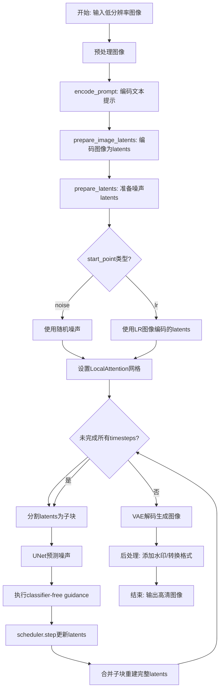

## 类结构

```
nn.Module (PyTorch基类)
├── Encoder (VAE编码器)
├── ControlNetConditioningEmbedding (条件embedding)
├── QuickGELU (激活函数)
├── LayerNorm (归一化层)
├── ResidualAttentionBlock (Transformer块)
└── UNet2DConditionModel (UNet模型)

DiffusionPipeline (Diffusers基类)
└── FaithDiffStableDiffusionXLPipeline (主pipeline)
    └── LocalAttention (本地注意力工具类)
```

## 全局变量及字段


### `logger`
    
Logger instance for the module to track runtime information and errors

类型：`logging.Logger`
    


### `EXAMPLE_DOC_STRING`
    
Documentation string containing example usage code for the pipeline

类型：`str`
    


### `XLA_AVAILABLE`
    
Flag indicating whether PyTorch XLA is available for accelerated computation

类型：`bool`
    


### `Encoder.layers_per_block`
    
Number of layers to process within each encoder block

类型：`int`
    


### `Encoder.conv_in`
    
Initial convolutional layer that processes the input tensor

类型：`nn.Conv2d`
    


### `Encoder.mid_block`
    
Middle processing block connecting down and up sampling paths

类型：`UNetMidBlock2D`
    


### `Encoder.down_blocks`
    
Collection of down-sampling encoder blocks for feature extraction

类型：`nn.ModuleList`
    


### `Encoder.use_rgb`
    
Boolean flag indicating whether RGB output conversion is enabled

类型：`bool`
    


### `Encoder.down_block_type`
    
Tuple specifying the type of each down-sampling block

类型：`Tuple[str, ...]`
    


### `Encoder.block_out_channels`
    
Tuple defining the output channel count for each block

类型：`Tuple[int, ...]`
    


### `Encoder.tile_sample_min_size`
    
Minimum dimension size for tile-based processing of samples

类型：`int`
    


### `Encoder.tile_latent_min_size`
    
Minimum dimension size for tile-based processing of latent representations

类型：`int`
    


### `Encoder.tile_overlap_factor`
    
Fractional overlap between adjacent tiles during encoding

类型：`float`
    


### `Encoder.use_tiling`
    
Flag enabling tile-based processing for large input images

类型：`bool`
    


### `Encoder.gradient_checkpointing`
    
Flag enabling gradient checkpointing to save memory during training

类型：`bool`
    


### `Encoder.to_rgbs`
    
List of convolutional layers for converting features to RGB output

类型：`nn.ModuleList`
    


### `ControlNetConditioningEmbedding.conv_in`
    
Input convolutional layer for processing conditioning information

类型：`nn.Conv2d`
    


### `ControlNetConditioningEmbedding.norm_in`
    
Group normalization layer for stabilizing conditioning input processing

类型：`nn.GroupNorm`
    


### `ControlNetConditioningEmbedding.conv_out`
    
Output convolutional layer producing conditioned embeddings with zero-initialized weights

类型：`nn.Conv2d`
    


### `ResidualAttentionBlock.attn`
    
Multi-head self-attention mechanism for transformer-style processing

类型：`nn.MultiheadAttention`
    


### `ResidualAttentionBlock.ln_1`
    
First layer normalization applied before self-attention

类型：`LayerNorm`
    


### `ResidualAttentionBlock.mlp`
    
Feed-forward MLP network with GELU activation

类型：`nn.Sequential`
    


### `ResidualAttentionBlock.ln_2`
    
Second layer normalization applied before MLP

类型：`LayerNorm`
    


### `ResidualAttentionBlock.attn_mask`
    
Optional attention mask for controlling attention patterns

类型：`torch.Tensor`
    


### `UNet2DConditionModel.denoise_encoder`
    
Custom encoder module for processing noisy input images into latent representations

类型：`Encoder`
    


### `UNet2DConditionModel.information_transformer_layes`
    
Sequential transformer layers for processing information embeddings

类型：`nn.Sequential`
    


### `UNet2DConditionModel.condition_embedding`
    
Network for preprocessing conditioning inputs based on ControlNet architecture

类型：`ControlNetConditioningEmbedding`
    


### `UNet2DConditionModel.agg_net`
    
Module list for aggregating additional network components

类型：`nn.ModuleList`
    


### `UNet2DConditionModel.spatial_ch_projs`
    
Linear projection layer for mapping spatial channel features with zero-initialized weights

类型：`nn.Linear`
    


### `LocalAttention.kernel_size`
    
Tuple specifying the height and width of grid tiles for local processing

类型：`tuple[int, int]`
    


### `LocalAttention.overlap`
    
Overlap ratio between adjacent grid tiles ranging from 0.0 to 1.0

类型：`float`
    


### `LocalAttention.original_size`
    
Original tensor shape before splitting into grids

类型：`tuple[int, int, int, int]`
    


### `LocalAttention.nr`
    
Number of rows in the grid partition

类型：`int`
    


### `LocalAttention.nc`
    
Number of columns in the grid partition

类型：`int`
    


### `LocalAttention.tile_weights`
    
Gaussian weight tensor for blending overlapping tile regions

类型：`torch.Tensor`
    


### `LocalAttention.idxes`
    
List of dictionaries storing grid tile coordinates for reconstruction

类型：`list[dict]`
    


### `FaithDiffStableDiffusionXLPipeline.vae`
    
Variational Autoencoder for encoding images to latent space and decoding generated latents

类型：`AutoencoderKL`
    


### `FaithDiffStableDiffusionXLPipeline.text_encoder`
    
Frozen CLIP text encoder for generating text embeddings from prompts

类型：`CLIPTextModel`
    


### `FaithDiffStableDiffusionXLPipeline.text_encoder_2`
    
Second frozen CLIP text encoder with projection for enhanced text understanding

类型：`CLIPTextModelWithProjection`
    


### `FaithDiffStableDiffusionXLPipeline.tokenizer`
    
CLIP tokenizer for converting text prompts to token IDs

类型：`CLIPTokenizer`
    


### `FaithDiffStableDiffusionXLPipeline.tokenizer_2`
    
Secondary CLIP tokenizer for dual encoder processing

类型：`CLIPTokenizer`
    


### `FaithDiffStableDiffusionXLPipeline.unet`
    
Conditional U-Net model for denoising latent representations

类型：`UNet2DConditionModel`
    


### `FaithDiffStableDiffusionXLPipeline.scheduler`
    
Diffusion scheduler managing noise scheduling and denoising steps

类型：`KarrasDiffusionSchedulers`
    


### `FaithDiffStableDiffusionXLPipeline.vae_scale_factor`
    
Scaling factor for VAE latent space based on number of downsample blocks

类型：`int`
    


### `FaithDiffStableDiffusionXLPipeline.image_processor`
    
Image processor for preprocessing input images and postprocessing outputs

类型：`VaeImageProcessor`
    


### `FaithDiffStableDiffusionXLPipeline.DDPMScheduler`
    
DDP scheduler instance for adding noise during image conditioning

类型：`DDPMScheduler`
    


### `FaithDiffStableDiffusionXLPipeline.default_sample_size`
    
Default sample resolution derived from UNet configuration

类型：`int`
    


### `FaithDiffStableDiffusionXLPipeline.watermark`
    
Invisible watermark applier for output images

类型：`StableDiffusionXLWatermarker`
    


### `FaithDiffStableDiffusionXLPipeline.tlc_vae_latents`
    
Local attention handler for processing latent tile overlaps during denoising

类型：`LocalAttention`
    


### `FaithDiffStableDiffusionXLPipeline.tlc_vae_img`
    
Local attention handler for processing image condition tile overlaps

类型：`LocalAttention`
    
    

## 全局函数及方法


### `zero_module`

该函数是一个工具函数，核心功能是接收一个 PyTorch 的 `nn.Module` 对象，遍历其内部所有的可学习参数（`parameters()`），并使用 `nn.init.zeros_` 方法将这些参数的值全部原地（in-place）修改为 0，最后返回该模块。这种零初始化通常用于模型输出层或 ControlNet 类型的连接层，以确保初始状态不引入额外的偏差。

参数：

- `module`：`torch.nn.Module`，需要被零初始化的神经网络模块。

返回值：`torch.nn.Module`，返回经过零初始化处理的输入模块（原地修改）。

#### 流程图

```mermaid
flowchart TD
    A([Start: zero_module]) --> B[Input: module]
    B --> C{Iterate over module.parameters}
    C -->|For each parameter p| D[p = zeros_(p)]
    D --> C
    C -->|No more parameters| E([Return: module])
```

#### 带注释源码

```python
def zero_module(module):
    """Zero out the parameters of a module and return it."""
    # 遍历传入模块的所有参数 (parameters)
    # 这些参数通常是权重矩阵 (weights) 或偏置 (biases)
    for p in module.parameters():
        # 使用 PyTorch 的原地操作将参数值设为 0
        # 这对于需要将某些层初始化为"无影响"状态的场景很有用
        nn.init.zeros_(p)
    # 返回已被修改的模块对象
    return module
```


### `rescale_noise_cfg`

该函数用于根据 guidance_rescale 参数重新缩放噪声配置（noise_cfg），基于论文 "Common Diffusion Noise Schedules and Sample Steps are Flawed" 的研究发现，通过标准化差值比率重新调整噪声预测结果，以修复过度曝光问题，并通过混合因子避免生成图像看起来过于平淡。

参数：

- `noise_cfg`：`torch.Tensor`，噪声配置张量，表示需要重新缩放的噪声预测
- `noise_pred_text`：`torch.Tensor`，来自文本条件模型的预测噪声，用于计算标准差比率
- `guidance_rescale`：`float`，引导重缩放因子，默认为 0.0，用于控制混合程度

返回值：`torch.Tensor`，重新缩放后的噪声配置

#### 流程图

```mermaid
flowchart TD
    A[开始] --> B[计算 noise_pred_text 的标准差 std_text]
    B --> C[计算 noise_cfg 的标准差 std_cfg]
    C --> D[计算重缩放后的噪声预测: noise_pred_rescaled = noise_cfg × (std_text / std_cfg)]
    D --> E[混合原始和重缩放结果: noise_cfg = guidance_rescale × noise_pred_rescaled + (1 - guidance_rescale) × noise_cfg]
    E --> F[返回重缩放后的 noise_cfg]
```

#### 带注释源码

```python
def rescale_noise_cfg(noise_cfg, noise_pred_text, guidance_rescale=0.0):
    """
    Rescale `noise_cfg` according to `guidance_rescale`. Based on findings of [Common Diffusion Noise Schedules and
    Sample Steps are Flawed](https://huggingface.co/papers/2305.08891). See Section 3.4

    Args:
        noise_cfg (torch.Tensor): Noise configuration tensor.
        noise_pred_text (torch.Tensor): Predicted noise from text-conditioned model.
        guidance_rescale (float): Rescaling factor for guidance. Defaults to 0.0.

    Returns:
        torch.Tensor: Rescaled noise configuration.
    """
    # 计算文本预测噪声在除batch维度外所有维度的标准差
    # keepdim=True 保持维度以便后续广播操作
    std_text = noise_pred_text.std(dim=list(range(1, noise_pred_text.ndim)), keepdim=True)
    
    # 计算噪声配置在除batch维度外所有维度的标准差
    std_cfg = noise_cfg.std(dim=list(range(1, noise_cfg.ndim)), keepdim=True)
    
    # 使用标准差比率重新缩放噪声预测结果（修复过度曝光问题）
    noise_pred_rescaled = noise_cfg * (std_text / std_cfg)
    
    # 根据 guidance_rescale 因子混合原始结果和重缩放结果
    # guidance_rescale=0 时保留原始 noise_cfg
    # guidance_rescale=1 时完全使用重缩放结果
    # 这种混合可以避免生成"平淡无奇"的图像
    noise_cfg = guidance_rescale * noise_pred_rescaled + (1 - guidance_rescale) * noise_cfg
    
    return noise_cfg
```


### `retrieve_latents`

从编码器输出中检索潜在向量（latents）。该函数是从 `diffusers` 库复制过来的工具函数，用于从 VAE（变分自编码器）的编码输出中提取潜在表示，支持两种采样模式：随机采样（sample）和取模（argmax）。

参数：

- `encoder_output`：`torch.Tensor`，编码器的输出（例如 VAE 编码后的输出对象，可能包含 `latent_dist` 或 `latents` 属性）
- `generator`：`torch.Generator | None`，可选的随机生成器，用于控制采样过程中的随机性，默认为 `None`
- `sample_mode`：`str`，采样模式，选项为 `"sample"`（随机采样）或 `"argmax"`（取模），默认为 `"sample"`

返回值：`torch.Tensor`，检索到的潜在向量张量

#### 流程图

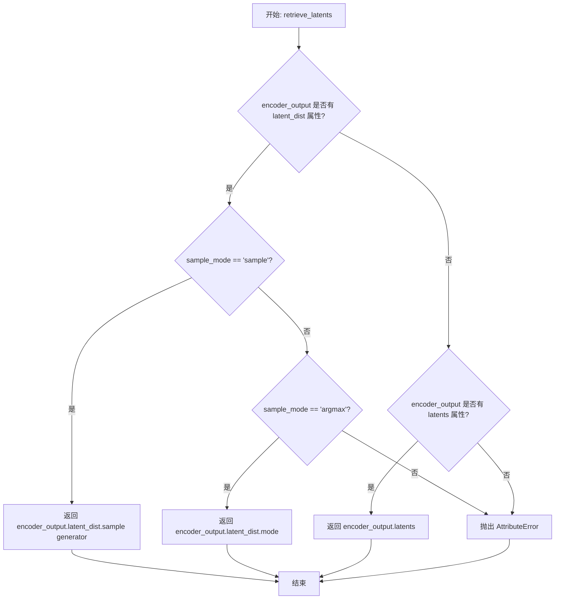

#### 带注释源码

```python
# 从 diffusers 库复制过来的函数，用于从编码器输出中检索潜在向量
def retrieve_latents(
    encoder_output: torch.Tensor,  # 编码器输出，通常是 VAE 的输出对象
    generator: torch.Generator | None = None,  # 可选的随机生成器，用于采样控制
    sample_mode: str = "sample"  # 采样模式：'sample' 或 'argmax'
):
    """Retrieve latents from an encoder output.

    Args:
        encoder_output (torch.Tensor): Output from an encoder (e.g., VAE).
        generator (torch.Generator, optional): Random generator for sampling. Defaults to None.
        sample_mode (str): Sampling mode ("sample" or "argmax"). Defaults to "sample".

    Returns:
        torch.Tensor: Retrieved latent tensor.
    """
    # 检查 encoder_output 是否有 latent_dist 属性（VAE 通常有）
    if hasattr(encoder_output, "latent_dist") and sample_mode == "sample":
        # 如果是采样模式，调用 latent_dist 的 sample 方法
        # sample 方法会从潜在分布中采样一个潜在向量
        return encoder_output.latent_dist.sample(generator)
    # 检查是否是取模模式
    elif hasattr(encoder_output, "latent_dist") and sample_mode == "argmax":
        # argmax 模式返回潜在分布的众数（即最可能的值）
        return encoder_output.latent_dist.mode()
    # 检查是否直接有 latents 属性（某些编码器可能直接输出 latents）
    elif hasattr(encoder_output, "latents"):
        return encoder_output.latents
    # 如果无法访问潜在向量，抛出属性错误
    else:
        raise AttributeError("Could not access latents of provided encoder_output")
```


### `retrieve_timesteps`

这是一个全局函数，用于调用调度器的 `set_timesteps` 方法并在调用后从调度器中检索时间步长。该函数支持自定义时间步，任何额外的关键字参数都会传递给 `scheduler.set_timesteps`。

参数：

- `scheduler`：`SchedulerMixin`，获取时间步的调度器
- `num_inference_steps`：`Optional[int]`，使用预训练模型生成样本时的扩散步数。如果使用此参数，则 `timesteps` 必须为 `None`
- `device`：`Optional[Union[str, torch.device]]`，时间步要移动到的设备。如果为 `None`，则时间步不会被移动
- `timesteps`：`Optional[List[int]]`，用于支持任意时间步间隔的自定义时间步。如果为 `None`，则使用调度器的默认时间步间隔策略。如果传入 `timesteps`，则 `num_inference_steps` 必须为 `None`
- `**kwargs`：任意关键字参数，将传递给 `scheduler.set_timesteps`

返回值：`Tuple[torch.Tensor, int]`，第一个元素是调度器的时间步调度，第二个元素是推理步数

#### 流程图

```mermaid
flowchart TD
    A[开始] --> B{timesteps is not None?}
    B -->|Yes| C[检查 scheduler.set_timesteps 是否支持 timesteps 参数]
    B -->|No| D[调用 scheduler.set_timesteps 使用 num_inference_steps]
    C --> E{支持 timesteps?}
    E -->|Yes| F[scheduler.set_timesteps&#40;timesteps=timesteps, device=device, \*\*kwargs&#41;]
    E -->|No| G[抛出 ValueError]
    F --> H[获取 scheduler.timesteps]
    H --> I[计算 num_inference_steps = len&#40;timesteps&#41;]
    D --> J[scheduler.set_timesteps&#40;num_inference_steps, device=device, \*\*kwargs&#41;]
    J --> K[获取 scheduler.timesteps]
    K --> L[返回 timesteps 和 num_inference_steps]
    I --> L
    G --> L
```

#### 带注释源码

```
def retrieve_timesteps(
    scheduler,
    num_inference_steps: Optional[int] = None,
    device: Optional[Union[str, torch.device]] = None,
    timesteps: Optional[List[int]] = None,
    **kwargs,
):
    """
    Calls the scheduler's `set_timesteps` method and retrieves timesteps from the scheduler after the call. Handles
    custom timesteps. Any kwargs will be supplied to `scheduler.set_timesteps`.

    Args:
        scheduler (`SchedulerMixin`):
            The scheduler to get timesteps from.
        num_inference_steps (`int`):
            The number of diffusion steps used when generating samples with a pre-trained model. If used, `timesteps`
            must be `None`.
        device (`str` or `torch.device`, *optional*):
            The device to which the timesteps should be moved to. If `None`, the timesteps are not moved.
        timesteps (`List[int]`, *optional*):
                Custom timesteps used to support arbitrary spacing between timesteps. If `None`, then the default
                timestep spacing strategy of the scheduler is used. If `timesteps` is passed, `num_inference_steps`
                must be `None`.

    Returns:
        `Tuple[torch.Tensor, int]`: A tuple where the first element is the timestep schedule from the scheduler and the
        second element is the number of inference steps.
    """
    # 如果传入了自定义 timesteps，则需要检查调度器是否支持该参数
    if timesteps is not None:
        # 检查 scheduler.set_timesteps 方法的签名中是否包含 'timesteps' 参数
        accepts_timesteps = "timesteps" in set(inspect.signature(scheduler.set_timesteps).parameters.keys())
        if not accepts_timesteps:
            raise ValueError(
                f"The current scheduler class {scheduler.__class__}'s `set_timesteps` does not support custom"
                f" timestep schedules. Please check whether you are using the correct scheduler."
            )
        # 调用 set_timesteps 并传入自定义 timesteps
        scheduler.set_timesteps(timesteps=timesteps, device=device, **kwargs)
        timesteps = scheduler.timesteps
        num_inference_steps = len(timesteps)
    else:
        # 否则使用 num_inference_steps 设置调度器的时间步
        scheduler.set_timesteps(num_inference_steps, device=device, **kwargs)
        timesteps = scheduler.timesteps
    return timesteps, num_inference_steps
```


### Encoder.__init__

这是 `Encoder` 类的构造函数，负责初始化变分自编码器（VAE）的编码器部分。该方法构建了一个基于 UNet 架构的编码器网络，包含输入卷积、多个下采样块和一个中间块，并设置了平铺（tiling）相关的参数以支持大尺寸图像的处理。

参数：

- `in_channels`：`int`，输入图像的通道数，默认为 3（RGB 图像）
- `out_channels`：`int`，输出潜在表示的通道数，默认为 4
- `down_block_types`：`Tuple[str, ...]`，下采样块的类型元组，默认为四个 `"DownEncoderBlock2D"` 块
- `block_out_channels`：`Tuple[int, ...]`，每个块的输出通道数元组，默认为 (128, 256, 512, 512)
- `layers_per_block`：`int`，每个块中的层数，默认为 2
- `norm_num_groups`：`int`，分组归一化的组数，默认为 32
- `act_fn`：`str`，激活函数名称，默认为 "silu"
- `double_z`：`bool`，是否使用双通道潜在表示，默认为 True
- `mid_block_add_attention`：`bool`，是否在中间块添加注意力机制，默认为 True

返回值：无（`None`），构造函数不返回值

#### 流程图

```mermaid
flowchart TD
    A[开始 __init__] --> B[调用 super().__init__]
    B --> C[初始化 layers_per_block]
    C --> D[创建 conv_in 卷积层]
    D --> E[初始化 down_blocks, mid_block, tiling 参数]
    E --> F{遍历 down_block_types}
    F -->|每次迭代| G[创建 DownEncoderBlock2D]
    G --> H[添加到 down_blocks]
    H --> F
    F -->|循环结束| I[创建 UNetMidBlock2D]
    I --> J[初始化 gradient_checkpointing = False]
    J --> K[结束 __init__]
```

#### 带注释源码

```python
def __init__(
    self,
    in_channels: int = 3,
    out_channels: int = 4,
    down_block_types: Tuple[str, ...] = (
        "DownEncoderBlock2D",
        "DownEncoderBlock2D",
        "DownEncoderBlock2D",
        "DownEncoderBlock2D",
    ),
    block_out_channels: Tuple[int, ...] = (128, 256, 512, 512),
    layers_per_block: int = 2,
    norm_num_groups: int = 32,
    act_fn: str = "silu",
    double_z: bool = True,
    mid_block_add_attention: bool = True,
):
    """初始化编码器网络结构"""
    super().__init__()  # 调用 nn.Module 的初始化方法
    
    # 保存每个块的层数配置
    self.layers_per_block = layers_per_block

    # 创建输入卷积层：将输入通道转换为第一个块的输出通道数
    # 使用 3x3 卷积核，步长为 1，填充为 1（保持空间维度）
    self.conv_in = nn.Conv2d(
        in_channels,
        block_out_channels[0],
        kernel_size=3,
        stride=1,
        padding=1,
    )

    # 初始化中间块和下采样块列表
    self.mid_block = None
    self.down_blocks = nn.ModuleList([])
    
    # RGB 相关配置（用于彩色图像输出）
    self.use_rgb = False
    
    # 保存块类型和输出通道配置，供后续使用
    self.down_block_type = down_block_types
    self.block_out_channels = block_out_channels

    # 平铺（tiling）参数设置，用于处理大尺寸图像
    self.tile_sample_min_size = 1024  # 瓦片采样的最小尺寸
    self.tile_latent_min_size = int(self.tile_sample_min_size / 8)  # 对应潜在空间的最小尺寸
    self.tile_overlap_factor = 0.25  # 瓦片重叠因子
    self.use_tiling = False  # 默认禁用平铺

    # 构建下采样块（Encoder blocks）
    output_channel = block_out_channels[0]  # 初始输出通道
    for i, down_block_type in enumerate(down_block_types):
        input_channel = output_channel  # 当前块的输入通道等于上一个块的输出通道
        output_channel = block_out_channels[i]  # 获取当前块的目标输出通道
        
        # 判断是否为最后一个块（最后一个块不需要下采样）
        is_final_block = i == len(block_out_channels) - 1

        # 创建下采样块
        down_block = get_down_block(
            down_block_type,
            num_layers=self.layers_per_block,
            in_channels=input_channel,
            out_channels=output_channel,
            add_downsample=not is_final_block,  # 非最后一块添加下采样
            resnet_eps=1e-6,
            downsample_padding=0,
            resnet_act_fn=act_fn,
            resnet_groups=norm_num_groups,
            attention_head_dim=output_channel,
            temb_channels=None,
        )
        # 将下采样块添加到模块列表
        self.down_blocks.append(down_block)

    # 创建中间块（Middle block），处理最深层级的特征
    self.mid_block = UNetMidBlock2D(
        in_channels=block_out_channels[-1],  # 使用最后一个块的输出通道数
        resnet_eps=1e-6,
        resnet_act_fn=act_fn,
        output_scale_factor=1,
        resnet_time_scale_shift="default",
        attention_head_dim=block_out_channels[-1],
        resnet_groups=norm_num_groups,
        temb_channels=None,
        add_attention=mid_block_add_attention,  # 可选添加注意力机制
    )

    # 梯度检查点标志（用于内存优化）
    self.gradient_checkpointing = False
```


### Encoder.to_rgb_init

初始化层以将特征转换为RGB格式。该方法为编码器的每个下采样块创建一个卷积层，用于将特征图转换为3通道RGB输出。

参数：

- 无参数（仅使用实例属性 `self`）

返回值：`None`，该方法无返回值，仅初始化实例属性

#### 流程图

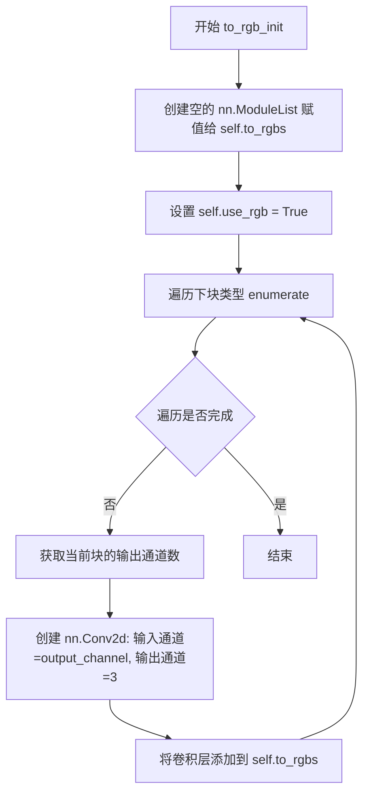

#### 带注释源码

```python
def to_rgb_init(self):
    """Initialize layers to convert features to RGB."""
    # 创建一个空的 ModuleList 用于存储 RGB 转换卷积层
    self.to_rgbs = nn.ModuleList([])
    
    # 标记已启用 RGB 转换功能
    self.use_rgb = True
    
    # 遍历所有下采样块的类型，为每个块创建一个卷积层
    for i, down_block_type in enumerate(self.down_block_type):
        # 获取当前下采样块对应的输出通道数
        output_channel = self.block_out_channels[i]
        
        # 创建一个卷积层:
        # - 输入通道: 当前块的输出通道数
        # - 输出通道: 3 (RGB)
        # - 卷积核大小: 3x3
        # - 填充: 1 (保持空间维度不变)
        self.to_rgbs.append(nn.Conv2d(output_channel, 3, kernel_size=3, padding=1))
```


### `Encoder.enable_tiling`

启用瓦片平铺（tiling）模式，用于处理大尺寸输入图像。通过设置 `use_tiling` 标志，使编码器在处理超过最小瓦片尺寸的输入时自动切换到分块编码模式，以减少内存占用并支持更大分辨率的图像处理。

参数：无

返回值：无返回值（`None`），该方法直接修改对象内部状态

#### 流程图

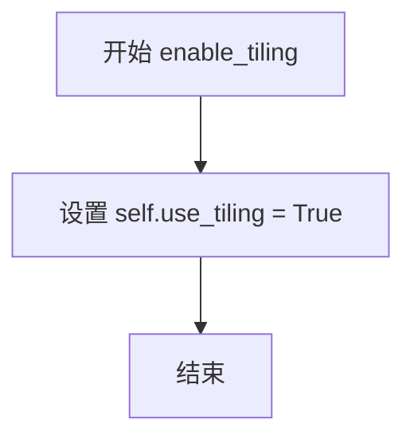

#### 带注释源码

```python
def enable_tiling(self):
    """Enable tiling for large inputs."""
    self.use_tiling = True
```

---

**补充说明：**

- **方法作用**：此方法是 Encoder 类的一个简单状态 setter，用于开启编码器的瓦片平铺功能。当 `self.use_tiling` 被设置为 `True` 后，Encoder 在 forward 时会检查输入尺寸，若超过 `tile_latent_min_size`（默认 128，即 `tile_sample_min_size / 8`），则会调用 `tiled_encode` 方法进行分块编码。
- **相关字段**：
  - `tile_sample_min_size`（int）：瓦片样本的最小尺寸，默认 1024
  - `tile_latent_min_size`（int）：潜在空间的最小瓦片尺寸，默认 128
  - `tile_overlap_factor`（float）：瓦片重叠因子，默认 0.25
  - `use_tiling`（bool）：标记是否启用平铺模式
- **关联方法**：
  - `tiled_encode`：实际执行分块编码的方法
  - `forward`：主forward方法，根据 `use_tiling` 决定是否调用分块编码
  - `blend_v` / `blend_h`：用于合并相邻瓦片的垂直/水平混合方法


### Encoder.encode

该方法是 `Encoder` 类的核心编码方法，用于将输入的张量编码为潜在表示（latent representation）。它通过一系列下采样块和中间块处理输入，并支持梯度检查点（gradient checkpointing）以节省显存。

参数：

- `sample`：`torch.FloatTensor`，输入的图像张量，形状为 `(batch, channel, height, width)`

返回值：`torch.FloatTensor`，编码后的潜在表示张量

#### 流程图

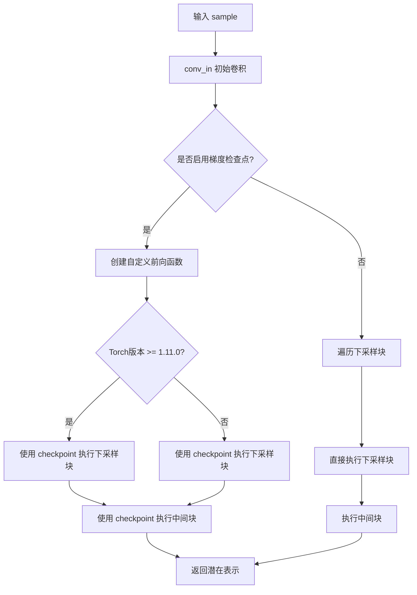

#### 带注释源码

```python
def encode(self, sample: torch.FloatTensor) -> torch.FloatTensor:
    """Encode the input tensor into a latent representation."""
    # 步骤1: 通过初始卷积层处理输入
    # 将输入通道数转换为第一个块输出通道数
    sample = self.conv_in(sample)
    
    # 步骤2: 判断是否启用梯度检查点
    # 梯度检查点可以显著减少显存占用，但会增加计算时间
    if self.training and self.gradient_checkpointing:
        # 定义一个辅助函数来创建自定义前向传播函数
        # 这是为了配合 torch.utils.checkpoint.checkpoint 使用
        def create_custom_forward(module):
            def custom_forward(*inputs):
                return module(*inputs)
            return custom_forward

        # 根据 PyTorch 版本选择不同的 checkpoint 调用方式
        if is_torch_version(">=", "1.11.0"):
            # 遍历所有下采样块，使用梯度检查点执行
            for down_block in self.down_blocks:
                sample = torch.utils.checkpoint.checkpoint(
                    create_custom_forward(down_block), sample, use_reentrant=False
                )
            # 使用梯度检查点执行中间块
            sample = torch.utils.checkpoint.checkpoint(
                create_custom_forward(self.mid_block), sample, use_reentrant=False
            )
        else:
            # 旧版本 PyTorch 的 checkpoint 调用方式（无 use_reentrant 参数）
            for down_block in self.down_blocks:
                sample = torch.utils.checkpoint.checkpoint(create_custom_forward(down_block), sample)
            sample = torch.utils.checkpoint.checkpoint(create_custom_forward(self.mid_block), sample)
        
        # 返回编码后的潜在表示
        return sample
    else:
        # 标准前向传播路径：直接执行所有模块
        # 遍历所有下采样块
        for down_block in self.down_blocks:
            sample = down_block(sample)
        
        # 执行中间块
        sample = self.mid_block(sample)
        
        # 返回编码后的潜在表示
        return sample
```


### Encoder.blend_v

该函数用于在垂直方向上对两个张量进行平滑过渡混合，通过线性插值实现两个图像块之间的无缝拼接。

参数：

- `a`：`torch.Tensor`，位于上方的原始张量，提供混合区域的基础像素
- `b`：`torch.Tensor`，位于下方的目标张量，待混合的像素将被覆盖
- `blend_extent`：`int`，混合区域的高度范围（像素数），用于控制过渡的平滑程度

返回值：`torch.Tensor`，混合后的张量（修改后的 b 张量）

#### 流程图

```mermaid
flowchart TD
    A[开始 blend_v] --> B[输入: a, b, blend_extent]
    B --> C[计算实际混合高度: min(a.shape[2], b.shape[2], blend_extent)]
    C --> D{遍历 y 从 0 到 blend_extent-1}
    D -->|第 y 行| E[计算权重: weight_a = 1 - y/blend_extent]
    E --> F[计算权重: weight_b = y/blend_extent]
    F --> G[混合像素: b[:,:,y,:] = a[:,:,-blend_extent+y,:] * weight_a + b[:,:,y,:] * weight_b]
    G --> H{是否还有未处理的行?}
    H -->|是| D
    H -->|否| I[返回混合后的 b]
    I --> J[结束]
```

#### 带注释源码

```python
def blend_v(self, a: torch.Tensor, b: torch.Tensor, blend_extent: int) -> torch.Tensor:
    """Blend two tensors vertically with a smooth transition.
    
    该方法通过垂直方向的线性插值实现两个张量块的平滑过渡混合。
    常用于图像分块处理时的边界融合，避免拼接处出现明显的接缝。
    
    参数:
        a: 位于上方的张量，形状为 (batch, channels, height, width)
        b: 位于下方的张量，形状与 a 相同
        blend_extent: 混合区域的高度（像素数）
    
    返回:
        混合后的张量（修改后的 b）
    """
    # 确定实际混合高度，取三者的最小值防止越界
    # a.shape[2]: 张量 a 的高度
    # b.shape[2]: 张量 b 的高度  
    # blend_extent: 指定的混合范围
    blend_extent = min(a.shape[2], b.shape[2], blend_extent)
    
    # 遍历混合区域内的每一行
    for y in range(blend_extent):
        # 计算线性插值权重
        # 当 y=0 时，weight_a=1, weight_b=0，完全使用 a 的像素
        # 当 y=blend_extent-1 时，weight_a 接近 0，weight_b 接近 1，主要使用 b 的像素
        # 这样实现从 a 到 b 的平滑过渡
        
        # a[:, :, -blend_extent + y, :] 获取 a 底部 blend_extent 行的对应行
        # b[:, :, y, :] 获取 b 顶部第 y 行
        # 通过权重加权平均实现混合
        b[:, :, y, :] = a[:, :, -blend_extent + y, :] * (1 - y / blend_extent) + b[:, :, y, :] * (y / blend_extent)
    
    # 返回混合后的张量（b 被修改）
    return b
```


### `Encoder.blend_h`

该方法实现水平方向（横向）的图像块融合，通过线性插值在两个张量的重叠区域创建平滑过渡效果。

参数：

- `a`：`torch.Tensor`，源张量，提供混合区域的原始像素值
- `b`：`torch.Tensor`，目标张量，待混合的接收张量
- `blend_extent`：`int`，混合区域的列数

返回值：`torch.Tensor`，混合后的目标张量

#### 流程图

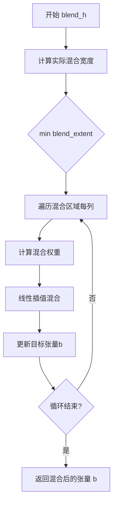

#### 带注释源码

```python
def blend_h(self, a: torch.Tensor, b: torch.Tensor, blend_extent: int) -> torch.Tensor:
    """Blend two tensors horizontally with a smooth transition.
    
    通过对两个张量的重叠区域应用线性插值来实现平滑的水平混合。
    该方法常用于图像分块编码时的边界融合，以避免明显的拼接痕迹。
    
    Args:
        a: 源张量，形状为 (batch, channels, height, width)，提供混合参考
        b: 目标张量，形状与a相同，将被修改并返回
        blend_extent: 混合列数上限，实际使用会取a、b宽度和blend_extent的最小值
    
    Returns:
        torch.Tensor: 混合后的目标张量b
    """
    # 取三者的最小值，确保不超出任一张量的宽度范围
    blend_extent = min(a.shape[3], b.shape[3], blend_extent)
    
    # 遍历混合区域的每一列
    for x in range(blend_extent):
        # 计算当前列的混合权重：从0到1线性递增
        # 左侧权重 (1 - x / blend_extent) 逐渐减小
        # 右侧权重 (x / blend_extent) 逐渐增大
        weight = x / blend_extent
        
        # 从源张量a取对应列（从右向左计数）
        # a[:, :, :, -blend_extent + x] 获取混合区域内的列
        # 使用权重 (1 - weight) * a + weight * b 进行线性插值
        b[:, :, :, x] = (
            a[:, :, :, -blend_extent + x] * (1 - weight) +  # 源张量贡献
            b[:, :, :, x] * weight                            # 目标张量贡献
        )
    
    return b
```


### Encoder.tiled_encode

该方法实现了一种平铺编码策略，用于处理大尺寸输入图像。通过将图像分割成重叠的小块分别编码，然后使用混合（blending）技术消除拼接 artifacts，最终拼接成完整的潜在表示。

参数：

- `x`：`torch.FloatTensor`，输入图像张量，形状为 (batch, channels, height, width)

返回值：`torch.FloatTensor`，编码后的潜在表示张量

#### 流程图

```mermaid
flowchart TD
    A[开始: 输入图像 x] --> B[计算平铺参数]
    B --> C[overlap_size = tile_sample_min_size × (1 - tile_overlap_factor)]
    B --> D[blend_extent = tile_latent_min_size × tile_overlap_factor]
    B --> E[row_limit = tile_latent_min_size - blend_extent]
    
    E --> F[外层循环: 按行遍历图像块]
    F --> G[内层循环: 按列遍历图像块]
    G --> H[提取小块: x[:, :, i:i+tile_sample_min_size, j:j+tile_sample_min_size]]
    H --> I[调用 self.encode 对小块进行编码]
    I --> J[将编码后的小块添加到当前行]
    J --> G
    G --> K{列遍历完成?}
    K -->|否| G
    K -->|是| L[将当前行添加到 rows 列表]
    L --> F
    F --> M{行遍历完成?}
    M -->|否| F
    M -->|是| N[开始拼接重建循环]
    
    N --> O[遍历每行的编码块]
    O --> P{当前行索引 i > 0?}
    P -->|是| Q[调用 blend_v 垂直混合当前块与上一行对应块]
    P -->|否| R
    Q --> R{当前列索引 j > 0?}
    R -->|是| S[调用 blend_h 水平混合当前块与同一行前一列块]
    R -->|否| T
    S --> T[裁剪到 row_limit 大小]
    T --> U[将处理后的块添加到 result_row]
    U --> O
    
    O --> V{所有行处理完成?}
    V -->|否| O
    V -->|是| W[沿宽度维度拼接 result_row]
    W --> X[沿高度维度拼接所有行得到最终结果]
    X --> Y[返回 moments 潜在表示]
```

#### 带注释源码

```python
def tiled_encode(self, x: torch.FloatTensor) -> torch.FloatTensor:
    """Encode the input tensor using tiling for large inputs.
    
    该方法通过将大图像分割成重叠的小块进行编码，然后使用混合技术
    消除拼接处的边界效应，最后将所有编码后的小块重新拼接成完整的
    潜在表示。
    
    Args:
        x: 输入图像张量，形状为 (batch, channels, height, width)
        
    Returns:
        编码后的潜在表示张量
    """
    # 计算块移动步长：块大小减去重叠区域
    # 例如: 1024 * (1 - 0.25) = 768
    overlap_size = int(self.tile_sample_min_size * (1 - self.tile_overlap_factor))
    
    # 计算混合区域大小（在潜在空间中的重叠像素数）
    # latent空间是原图的1/8，所以: 128 * 0.25 = 32
    blend_extent = int(self.tile_latent_min_size * self.tile_overlap_factor)
    
    # 计算每块最终保留的大小（去除混合区域后的有效区域）
    # 128 - 32 = 96
    row_limit = self.tile_latent_min_size - blend_extent

    # 第一次循环：对输入图像进行分块编码
    rows = []
    # 按高度方向遍历，步长为 overlap_size
    for i in range(0, x.shape[2], overlap_size):
        row = []
        # 按宽度方向遍历，步长为 overlap_size
        for j in range(0, x.shape[3], overlap_size):
            # 提取当前块：从(i,j)位置开始，提取 tile_sample_min_size 大小的块
            tile = x[:, :, i : i + self.tile_sample_min_size, j : j + self.tile_sample_min_size]
            # 调用encode方法对该块进行编码（基础编码器forward）
            tile = self.encode(tile)
            # 将编码后的块添加到当前行
            row.append(tile)
        # 将当前行（包含多个编码块）添加到rows列表
        rows.append(row)
    
    # 第二次循环：重建完整的潜在表示（处理边界混合）
    result_rows = []
    for i, row in enumerate(rows):
        result_row = []
        for j, tile in enumerate(row):
            # 如果不是第一行，则与上一行的对应块进行垂直混合
            # 混合可以消除水平拼接处的边界 artifacts
            if i > 0:
                tile = self.blend_v(rows[i - 1][j], tile, blend_extent)
            # 如果不是第一列，则与同一行前一列的块进行水平混合
            # 混合可以消除垂直拼接处的边界 artifacts
            if j > 0:
                tile = self.blend_h(row[j - 1], tile, blend_extent)
            # 裁剪到有效大小（去除混合区域）
            result_row.append(tile[:, :, :row_limit, :row_limit])
        # 沿宽度维度拼接当前行的所有块
        result_rows.append(torch.cat(result_row, dim=3))

    # 沿高度维度拼接所有行，得到最终的潜在表示
    # 最终形状: (batch, channels, height/8 * 块数量, width/8 * 块数量)
    moments = torch.cat(result_rows, dim=2)
    return moments
```


### Encoder.forward

该方法是变分自编码器（VAE）编码器层的前向传播接口，根据输入图像尺寸自动选择直接编码或分块平铺编码策略，以支持大分辨率图像的高效潜在表示提取。

参数：

- `sample`：`torch.FloatTensor`，输入图像张量，形状为 `(batch, channels, height, width)`

返回值：`torch.FloatTensor`，编码后的潜在表示张量

#### 流程图

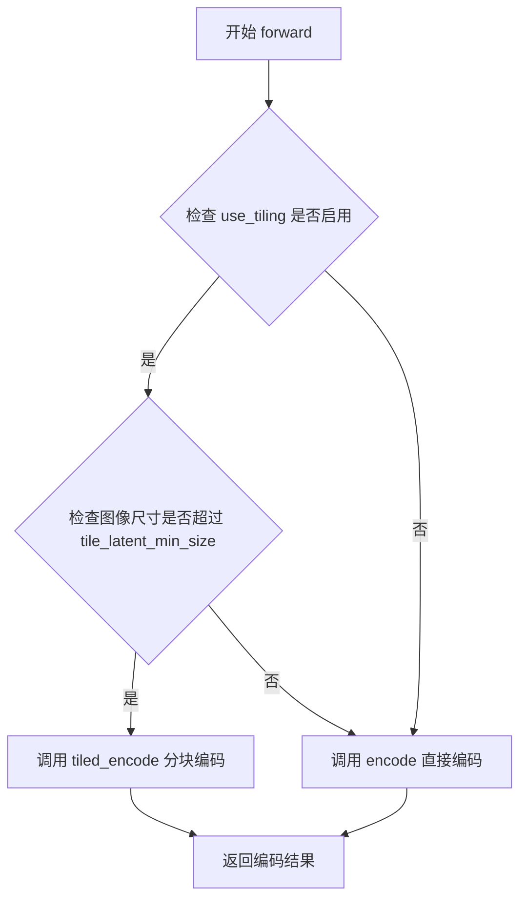

#### 带注释源码

```python
def forward(self, sample: torch.FloatTensor) -> torch.FloatTensor:
    """Forward pass of the encoder, using tiling if enabled for large inputs."""
    # 判断是否启用平铺模式且输入尺寸超过最小平铺阈值
    if self.use_tiling and (
        sample.shape[-1] > self.tile_latent_min_size or sample.shape[-2] > self.tile_latent_min_size
    ):
        # 当图像尺寸较大时，使用分块平铺编码策略处理
        return self.tiled_encode(sample)
    # 否则使用标准直接编码
    return self.encode(sample)
```


### ControlNetConditioningEmbedding.__init__

该方法是 `ControlNetConditioningEmbedding` 类的构造函数，用于初始化一个用于预处理条件输入的小型神经网络（灵感来自 ControlNet）。它初始化了三个核心组件：输入卷积层、GroupNorm 归一化层和输出卷积层（使用零初始化）。

参数：

- `conditioning_embedding_channels`：`int`，条件嵌入输出通道数，决定最终输出特征图的通道维度
- `conditioning_channels`：`int`，输入条件图像的通道数，默认为 4（例如 RGBA 图像的通道数）

返回值：`None`，该方法为构造函数，不返回任何值，仅初始化对象属性

#### 流程图

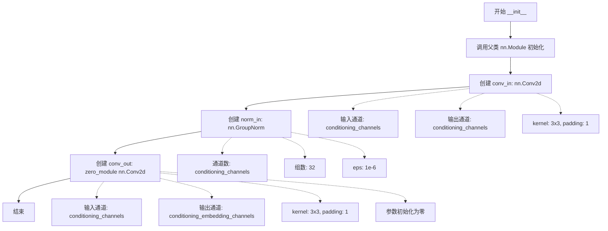

#### 带注释源码

```python
def __init__(self, conditioning_embedding_channels: int, conditioning_channels: int = 4):
    """
    初始化 ControlNetConditioningEmbedding 网络结构。
    
    该网络用于预处理条件输入，类似于 ControlNet 中的条件编码器。
    它将输入的条件图像转换为与 UNet 兼容的嵌入表示。
    
    Args:
        conditioning_embedding_channels (int): 输出嵌入的通道数，决定与 UNet 特征融合时的通道维度
        conditioning_channels (int): 输入条件图像的通道数，默认为 4（对应 RGBA 图像或单通道灰度图）
    """
    # 调用父类 nn.Module 的初始化方法，注册所有子模块
    super().__init__()
    
    # 输入卷积层：将条件图像从 conditioning_channels 通道映射到相同通道数
    # 使用 3x3 卷积核和 1 像素 padding（保持空间分辨率不变）
    self.conv_in = nn.Conv2d(conditioning_channels, conditioning_channels, kernel_size=3, padding=1)
    
    # GroupNorm 归一化层：对特征进行归一化处理
    # num_groups=32 将通道分成 32 组进行归一化，eps=1e-6 防止除零
    self.norm_in = nn.GroupNorm(num_channels=conditioning_channels, num_groups=32, eps=1e-6)
    
    # 输出卷积层：将特征映射到目标嵌入维度
    # 使用 zero_module 初始化，将所有参数置零（这是 ControlNet 的常见做法）
    # 将 conditioning_channels 通道映射到 conditioning_embedding_channels 通道
    self.conv_out = zero_module(
        nn.Conv2d(conditioning_channels, conditioning_embedding_channels, kernel_size=3, padding=1)
    )
```


### `ControlNetConditioningEmbedding.forward`

该方法实现了一个轻量级的前馈神经网络，用于预处理条件输入（Conditioning Input），类似于ControlNet中的条件嵌入层。输入的条件张量依次经过组归一化、卷积、SiLU激活和输出卷积，生成用于UNet的条件嵌入表示。

参数：

- `conditioning`：`torch.FloatTensor`，输入的条件张量，形状为 `(batch, conditioning_channels, height, width)`

返回值：`torch.FloatTensor`，处理后的条件嵌入张量，形状为 `(batch, conditioning_embedding_channels, height, width)`

#### 流程图

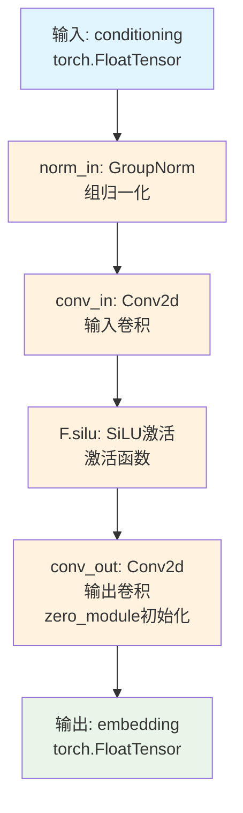

#### 带注释源码

```python
def forward(self, conditioning):
    """Process the conditioning input through the network.
    
    该方法对条件输入进行预处理，生成可用于UNet的条件嵌入。
    处理流程：GroupNorm → Conv2d → SiLU → Conv2d
    
    Args:
        conditioning: 输入的条件张量，形状为 (batch, conditioning_channels, H, W)
        
    Returns:
        embedding: 处理后的条件嵌入，形状为 (batch, conditioning_embedding_channels, H, W)
    """
    # Step 1: 组归一化
    # 对输入进行分组归一化，有助于稳定训练
    # 使用32个组，eps=1e-6防止除零
    conditioning = self.norm_in(conditioning)
    
    # Step 2: 输入卷积
    # 将条件输入从 conditioning_channels 通道映射到相同通道数
    # 使用3x3卷积核，padding=1保持空间尺寸不变
    embedding = self.conv_in(conditioning)
    
    # Step 3: SiLU激活
    # SiLU (Sigmoid Linear Unit) 也称为 Swish
    # 公式: x * sigmoid(x)
    # 相比ReLU具有更平滑的非线性特性
    embedding = F.silu(embedding)
    
    # Step 4: 输出卷积
    # 将特征从 conditioning_channels 映射到 conditioning_embedding_channels
    # 使用 zero_module 初始化，将权重置零（用于残差连接或控制信号）
    embedding = self.conv_out(embedding)
    
    # 返回处理后的条件嵌入
    return embedding
```


### QuickGELU.forward

对输入张量应用 QuickGELU 激活函数（一种快速的 GELU 近似），该激活函数使用 `x * sigmoid(1.702 * x)` 作为近似计算，相比标准 GELU 在保持相近效果的同时拥有更高的计算效率。

参数：

- `self`：QuickGELU，QuickGELU 类的实例，隐式参数，表示激活函数模块本身
- `x`：`torch.Tensor`，输入张量，待应用激活函数的原始输入值

返回值：`torch.Tensor`，应用 QuickGELU 激活后的输出张量，形状与输入相同

#### 流程图

```mermaid
flowchart TD
    A[输入张量 x] --> B[计算 1.702 * x]
    B --> C[计算 sigmoid<br/>sigmoid(1.702 * x)]
    C --> D[计算 x * sigmoid<br/>return x * torch.sigmoid(1.702 * x)]
    D --> E[输出激活后的张量]
    
    style A fill:#e1f5fe
    style E fill:#e8f5e8
```

#### 带注释源码

```python
class QuickGELU(nn.Module):
    """A fast approximation of the GELU activation function."""

    def forward(self, x: torch.Tensor):
        """Apply the QuickGELU activation to the input tensor."""
        # QuickGELU 使用 x * sigmoid(1.702 * x) 作为 GELU 的快速近似
        # 系数 1.702 是通过对 GELU 曲线进行拟合得出的常数
        # 这种近似在保持与原始 GELU 相似效果的同时，拥有更低的计算复杂度
        return x * torch.sigmoid(1.702 * x)
```


### `LayerNorm.forward`

对输入张量应用 LayerNorm 归一化操作，并确保输出张量的数据类型与输入张量的原始数据类型保持一致，以处理 fp16（半精度浮点数）场景。

参数：

-  `self`：类实例本身，包含归一化的参数（normalized_shape、eps 等继承自 nn.LayerNorm）
-  `x`：`torch.Tensor`，输入的需要进行层归一化的张量

返回值：`torch.Tensor`，返回与输入张量数据类型相同的归一化后的张量

#### 流程图

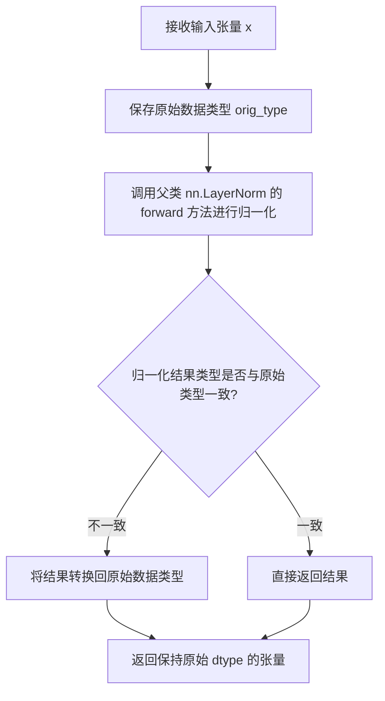

#### 带注释源码

```python
class LayerNorm(nn.LayerNorm):
    """Subclass torch's LayerNorm to handle fp16."""

    def forward(self, x: torch.Tensor):
        """Apply LayerNorm and preserve the input dtype."""
        # 步骤1：保存输入张量的原始数据类型（如 float16）
        orig_type = x.dtype
        
        # 步骤2：调用 PyTorch 原始的 LayerNorm 前向传播
        # 注意：父类 nn.LayerNorm 的 forward 可能会将输出转换为 float32
        ret = super().forward(x)
        
        # 步骤3：将归一化结果转换回原始数据类型
        # 这一步确保在 fp16 输入的情况下，输出仍然是 fp16
        return ret.type(orig_type)
```


### `ResidualAttentionBlock.__init__`

该方法是 `ResidualAttentionBlock` 类的构造函数，负责初始化一个 Transformer 风格的自注意力块，包含多头注意力机制、一个 MLP 前馈网络以及两个 LayerNorm 层。

参数：

-  `d_model`：`int`，模型的特征维度，指定输入张量的通道数
-  `n_head`：`int`，多头注意力的头数量
-  `attn_mask`：`torch.Tensor`，可选，注意力掩码，用于控制注意力机制中哪些位置可以被关注，默认为 None

返回值：无（`__init__` 方法不返回任何值）

#### 流程图

```mermaid
flowchart TD
    A[开始 __init__] --> B[调用 super().__init__ 初始化 nn.Module]
    C[初始化 self.attn] --> D[创建 nn.MultiheadAttention 注意力层]
    E[初始化 self.ln_1] --> F[创建 LayerNorm 层]
    G[初始化 self.mlp] --> H[创建 MLP 序列: c_fc -> gelu -> c_proj]
    I[初始化 self.ln_2] --> J[创建第二个 LayerNorm 层]
    K[保存 attn_mask] --> L[结束]
    
    B --> D
    D --> F
    F --> H
    H --> J
    J --> L
```

#### 带注释源码

```python
def __init__(self, d_model: int, n_head: int, attn_mask: torch.Tensor = None):
    """初始化 ResidualAttentionBlock 注意力块。
    
    Args:
        d_model (int): 模型的维度，即输入特征的通道数
        n_head (int): 多头注意力机制中注意力头的数量
        attn_mask (torch.Tensor, optional): 注意力掩码张量，用于在注意力计算时屏蔽某些位置
    """
    # 调用父类 nn.Module 的初始化方法，建立 PyTorch 模块的基本结构
    super().__init__()
    
    # 初始化多头自注意力层
    # d_model: 输入/输出维度，n_head: 注意力头数量
    self.attn = nn.MultiheadAttention(d_model, n_head)
    
    # 第一个 LayerNorm 层，用于自注意力之后的残差连接
    self.ln_1 = LayerNorm(d_model)
    
    # MLP 前馈网络，包含三个组件：
    # 1. c_fc: 从 d_model 扩展到 d_model * 2 的线性层
    # 2. gelu: QuickGELU 激活函数
    # 3. c_proj: 从 d_model * 2 投影回 d_model 的线性层
    self.mlp = nn.Sequential(
        OrderedDict(
            [
                ("c_fc", nn.Linear(d_model, d_model * 2)),  # 扩展维度
                ("gelu", QuickGELU()),                       # 激活函数
                ("c_proj", nn.Linear(d_model * 2, d_model)),  # 恢复维度
            ]
        )
    )
    
    # 第二个 LayerNorm 层，用于 MLP 之后的残差连接
    self.ln_2 = LayerNorm(d_model)
    
    # 保存注意力掩码，该掩码会在 forward 传播中的注意力计算时使用
    self.attn_mask = attn_mask
```


### ResidualAttentionBlock.attention

该方法实现了自注意力机制（Self-Attention），通过 PyTorch 的 MultiheadAttention 模块对输入张量进行注意力计算，并将注意力掩码（如果存在）转换为与输入张量相同的设备和数据类型。

参数：

-  `x`：`torch.Tensor`，输入张量，通常是经过 LayerNorm 处理的特征向量，形状为 `(seq_len, batch_size, d_model)`。

返回值：`torch.Tensor`，经过自注意力计算后的输出张量，形状与输入相同 `(seq_len, batch_size, d_model)`。

#### 流程图

```mermaid
flowchart TD
    A[输入 x] --> B{attn_mask 是否存在?}
    B -->|是| C[将 attn_mask 转换为 x 的 dtype 和 device]
    B -->|否| D[attn_mask 设为 None]
    C --> E[调用 self.attn 进行自注意力计算]
    D --> E
    E --> F[返回注意力输出 [0]]
```

#### 带注释源码

```python
def attention(self, x: torch.Tensor):
    """Apply self-attention to the input tensor.
    
    使用 PyTorch 的 MultiheadAttention 模块执行自注意力操作。
    自注意力允许序列中的每个位置关注序列中的所有其他位置。
    
    参数:
        x (torch.Tensor): 输入张量，形状为 (seq_len, batch_size, d_model)
                        seq_len: 序列长度
                        batch_size: 批次大小
                        d_model: 模型的维度
    
    返回:
        torch.Tensor: 自注意力模块的输出，形状与输入相同 (seq_len, batch_size, d_model)
    """
    # 确保注意力掩码与输入张量在相同的设备和数据类型上
    # 如果 attn_mask 不存在，则设为 None
    self.attn_mask = self.attn_mask.to(dtype=x.dtype, device=x.device) if self.attn_mask is not None else None
    
    # 调用 MultiheadAttention 的前向传播
    # 参数: (query, key, value, need_weights, attn_mask)
    # 这里 query, key, value 都是 x 本身，即自注意力
    # need_weights=False 表示不需要返回注意力权重
    # attn_mask 用于控制哪些位置可以相互注意
    return self.attn(x, x, x, need_weights=False, attn_mask=self.attn_mask)[0]
    # [0] 表示只取输出，忽略 attention weights
```


### `ResidualAttentionBlock.forward`

该方法是 ResidualAttentionBlock 类的前向传播函数，实现了 Transformer 风格的自注意力块，通过自注意力机制和 MLP 网络对输入进行处理，并采用残差连接来促进梯度流动。

参数：

- `x`：`torch.Tensor`，输入张量，形状为 `(seq_len, batch, d_model)` 或 `(batch, seq_len, d_model)` 的序列数据

返回值：`torch.Tensor`，经过自注意力和 MLP 处理后的输出张量，形状与输入相同

#### 流程图

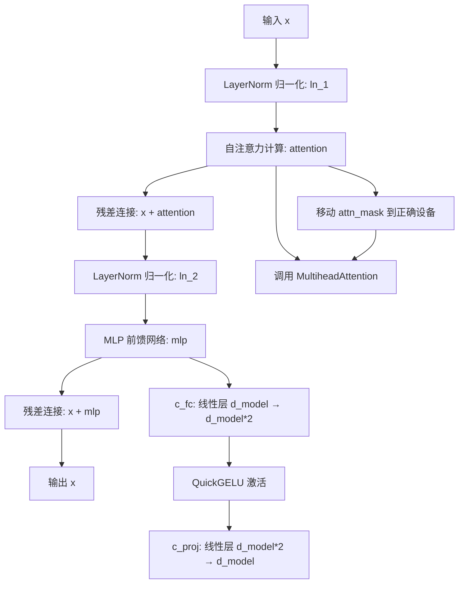

#### 带注释源码

```python
def forward(self, x: torch.Tensor):
    """Forward pass through the residual attention block.
    
    该方法实现了 Transformer 风格的基本结构：
    1. 对输入进行 LayerNorm 后通过自注意力机制
    2. 加上残差连接
    3. 再次 LayerNorm 后通过 MLP 网络
    4. 加上残差连接输出
    
    Args:
        x: 输入张量，形状为 (seq_len, batch, d_model) 或 (batch, seq_len, d_model)
        
    Returns:
        处理后的张量，形状与输入相同
    """
    # 第一阶段：自注意力机制
    # 1. 先对输入 x 进行 LayerNorm 归一化 (ln_1)
    # 2. 通过自注意力层计算注意力输出
    # 3. 加上原始输入 x 实现残差连接
    x = x + self.attention(self.ln_1(x))
    
    # 第二阶段：MLP 前馈网络
    # 1. 对上一步结果进行 LayerNorm 归一化 (ln_2)
    # 2. 通过 MLP 网络 (包含两个线性层和 QuickGELU 激活)
    # 3. 加上残差连接输出最终结果
    x = x + self.mlp(self.ln_2(x))
    
    return x
```


### `UNet2DConditionModel.__init__`

该方法是 `UNet2DConditionModel` 类的构造函数，负责初始化一个统一的 2D UNet 条件模型，继承自 `OriginalUNet2DConditionModel` 并添加了自定义功能（如去噪编码器、信息变换层、条件嵌入等）。

参数：

- `sample_size`：`Optional[int]`，输入样本的空间分辨率（高度/宽度），默认为 None
- `in_channels`：`int`，输入图像的通道数，默认为 4
- `out_channels`：`int`，输出图像的通道数，默认为 4
- `center_input_sample`：`bool`，是否对输入样本进行中心化处理（2 * sample - 1），默认为 False
- `flip_sin_to_cos`：`bool`，时间嵌入是否使用 cos 函数（否则使用 sin），默认为 True
- `freq_shift`：`int`，频率偏移量，用于时间嵌入，默认为 0
- `down_block_types`：`Tuple[str, ...]`，下采样块的类型列表，默认为 ("CrossAttnDownBlock2D", "CrossAttnDownBlock2D", "CrossAttnDownBlock2D", "DownBlock2D")
- `mid_block_type`：`str | None`，中间块的类型，默认为 "UNetMidBlock2DCrossAttn"
- `up_block_types`：`Tuple[str, ...]`，上采样块的类型列表，默认为 ("UpBlock2D", "CrossAttnUpBlock2D", "CrossAttnUpBlock2D", "CrossAttnUpBlock2D")
- `only_cross_attention`：`Union[bool, Tuple[bool]]`，是否只使用交叉注意力，默认为 False
- `block_out_channels`：`Tuple[int, ...]`，每个块的输出通道数，默认为 (320, 640, 1280, 1280)
- `layers_per_block`：`Union[int, Tuple[int]]`，每个块中的层数，默认为 2
- `downsample_padding`：`int`，下采样的填充大小，默认为 1
- `mid_block_scale_factor`：`float`，中间块的缩放因子，默认为 1
- `dropout`：`float`，Dropout 概率，默认为 0.0
- `act_fn`：`str`，激活函数类型，默认为 "silu"
- `norm_num_groups`：`Optional[int]`，归一化的组数，默认为 32
- `norm_eps`：`float`，归一化的 epsilon 值，默认为 1e-5
- `cross_attention_dim`：`Union[int, Tuple[int]]`，交叉注意力的维度，默认为 1280
- `transformer_layers_per_block`：`Union[int, Tuple[int], Tuple[Tuple]]`，每个块中的 Transformer 层数，默认为 1
- `reverse_transformer_layers_per_block`：`Optional[Tuple[Tuple[int]]]`，反向 Transformer 层数，默认为 None
- `encoder_hid_dim`：`Optional[int]`，编码器隐藏层维度，默认为 None
- `encoder_hid_dim_type`：`str | None`，[类型描述]
- `attention_head_dim`：`Union[int, Tuple[int]]`，注意力头维度，默认为 8
- `num_attention_heads`：`Optional[Union[int, Tuple[int]]]`，注意力头数量，默认继承 attention_head_dim
- `dual_cross_attention`：`bool`，是否使用双交叉注意力，默认为 False
- `use_linear_projection`：`bool`，是否使用线性投影，默认为 False
- `class_embed_type`：`str | None`，类别嵌入类型，默认为 None
- `addition_embed_type`：`str | None`，附加嵌入类型，默认为 None
- `addition_time_embed_dim`：`Optional[int]`，附加时间嵌入维度，默认为 None
- `num_class_embeds`：`Optional[int]`，类别嵌入数量，默认为 None
- `upcast_attention`：`bool`，是否向上转换注意力，默认为 False
- `resnet_time_scale_shift`：`str`，ResNet 时间尺度偏移类型，默认为 "default"
- `resnet_skip_time_act`：`bool`，是否跳过 ResNet 时间激活，默认为 False
- `resnet_out_scale_factor`：`float`，ResNet 输出缩放因子，默认为 1.0
- `time_embedding_type`：`str`，时间嵌入类型，默认为 "positional"
- `time_embedding_dim`：`Optional[int]`，时间嵌入维度，默认为 None
- `time_embedding_act_fn`：`str | None`，时间嵌入激活函数，默认为 None
- `timestep_post_act`：`str | None`，时间步后激活函数，默认为 None
- `time_cond_proj_dim`：`Optional[int]`，时间条件投影维度，默认为 None
- `conv_in_kernel`：`int`，输入卷积核大小，默认为 3
- `conv_out_kernel`：`int`，输出卷积核大小，默认为 3
- `projection_class_embeddings_input_dim`：`Optional[int]`，投影类别嵌入输入维度，默认为 None
- `attention_type`：`str`，注意力类型，默认为 "default"
- `class_embeddings_concat`：`bool`，是否拼接类别嵌入，默认为 False
- `mid_block_only_cross_attention`：`Optional[bool]`，中间块是否仅使用交叉注意力，默认为 None
- `cross_attention_norm`：`str | None`，交叉注意力归一化类型，默认为 None
- `addition_embed_type_num_heads`：`int`，附加嵌入类型的注意力头数，默认为 64

返回值：`None`（构造函数无返回值）

#### 流程图

```mermaid
flowchart TD
    A[开始 __init__] --> B[调用 super().__init__ 初始化父类]
    B --> C[注册配置到 config]
    C --> D[设置额外属性: denoise_encoder = None]
    D --> E[设置额外属性: information_transformer_layes = None]
    E --> F[设置额外属性: condition_embedding = None]
    F --> G[设置额外属性: agg_net = None]
    G --> H[设置额外属性: spatial_ch_projs = None]
    H --> I[结束 __init__]
```

#### 带注释源码

```python
@register_to_config
def __init__(
    self,
    sample_size: Optional[int] = None,
    in_channels: int = 4,
    out_channels: int = 4,
    center_input_sample: bool = False,
    flip_sin_to_cos: bool = True,
    freq_shift: int = 0,
    down_block_types: Tuple[str, ...] = (
        "CrossAttnDownBlock2D",
        "CrossAttnDownBlock2D",
        "CrossAttnDownBlock2D",
        "DownBlock2D",
    ),
    mid_block_type: str | None = "UNetMidBlock2DCrossAttn",
    up_block_types: Tuple[str, ...] = (
        "UpBlock2D",
        "CrossAttnUpBlock2D",
        "CrossAttnUpBlock2D",
        "CrossAttnUpBlock2D",
    ),
    only_cross_attention: Union[bool, Tuple[bool]] = False,
    block_out_channels: Tuple[int, ...] = (320, 640, 1280, 1280),
    layers_per_block: Union[int, Tuple[int]] = 2,
    downsample_padding: int = 1,
    mid_block_scale_factor: float = 1,
    dropout: float = 0.0,
    act_fn: str = "silu",
    norm_num_groups: Optional[int] = 32,
    norm_eps: float = 1e-5,
    cross_attention_dim: Union[int, Tuple[int]] = 1280,
    transformer_layers_per_block: Union[int, Tuple[int], Tuple[Tuple]] = 1,
    reverse_transformer_layers_per_block: Optional[Tuple[Tuple[int]]] = None,
    encoder_hid_dim: Optional[int] = None,
    encoder_hid_dim_type: str | None = None,
    attention_head_dim: Union[int, Tuple[int]] = 8,
    num_attention_heads: Optional[Union[int, Tuple[int]]] = None,
    dual_cross_attention: bool = False,
    use_linear_projection: bool = False,
    class_embed_type: str | None = None,
    addition_embed_type: str | None = None,
    addition_time_embed_dim: Optional[int] = None,
    num_class_embeds: Optional[int] = None,
    upcast_attention: bool = False,
    resnet_time_scale_shift: str = "default",
    resnet_skip_time_act: bool = False,
    resnet_out_scale_factor: float = 1.0,
    time_embedding_type: str = "positional",
    time_embedding_dim: Optional[int] = None,
    time_embedding_act_fn: str | None = None,
    timestep_post_act: str | None = None,
    time_cond_proj_dim: Optional[int] = None,
    conv_in_kernel: int = 3,
    conv_out_kernel: int = 3,
    projection_class_embeddings_input_dim: Optional[int] = None,
    attention_type: str = "default",
    class_embeddings_concat: bool = False,
    mid_block_only_cross_attention: Optional[bool] = None,
    cross_attention_norm: str | None = None,
    addition_embed_type_num_heads: int = 64,
):
    """Initialize the UnifiedUNet2DConditionModel."""
    # 调用父类构造函数进行基础初始化
    super().__init__(
        sample_size=sample_size,
        in_channels=in_channels,
        out_channels=out_channels,
        center_input_sample=center_input_sample,
        flip_sin_to_cos=flip_sin_to_cos,
        freq_shift=freq_shift,
        down_block_types=down_block_types,
        mid_block_type=mid_block_type,
        up_block_types=up_block_types,
        only_cross_attention=only_cross_attention,
        block_out_channels=block_out_channels,
        layers_per_block=layers_per_block,
        downsample_padding=downsample_padding,
        mid_block_scale_factor=mid_block_scale_factor,
        dropout=dropout,
        act_fn=act_fn,
        norm_num_groups=norm_num_groups,
        norm_eps=norm_eps,
        cross_attention_dim=cross_attention_dim,
        transformer_layers_per_block=transformer_layers_per_block,
        reverse_transformer_layers_per_block=reverse_transformer_layers_per_block,
        encoder_hid_dim=encoder_hid_dim,
        encoder_hid_dim_type=encoder_hid_dim_type,
        attention_head_dim=attention_head_dim,
        num_attention_heads=num_attention_heads,
        dual_cross_attention=dual_cross_attention,
        use_linear_projection=use_linear_projection,
        class_embed_type=class_embed_type,
        addition_embed_type=addition_embed_type,
        addition_time_embed_dim=addition_time_embed_dim,
        num_class_embeds=num_class_embeds,
        upcast_attention=upcast_attention,
        resnet_time_scale_shift=resnet_time_scale_shift,
        resnet_skip_time_act=resnet_skip_time_act,
        resnet_out_scale_factor=resnet_out_scale_factor,
        time_embedding_type=time_embedding_type,
        time_embedding_dim=time_embedding_dim,
        time_embedding_act_fn=time_embedding_act_fn,
        timestep_post_act=timestep_post_act,
        time_cond_proj_dim=time_cond_proj_dim,
        conv_in_kernel=conv_in_kernel,
        conv_out_kernel=conv_out_kernel,
        projection_class_embeddings_input_dim=projection_class_embeddings_input_dim,
        attention_type=attention_type,
        class_embeddings_concat=class_embeddings_concat,
        mid_block_only_cross_attention=mid_block_only_cross_attention,
        cross_attention_norm=cross_attention_norm,
        addition_embed_type_num_heads=addition_embed_type_num_heads,
    )

    # Additional attributes - 用于存储自定义组件的占位符
    # 这些组件会在后续通过专门的初始化方法或加载方法进行初始化
    self.denoise_encoder = None           # 去噪编码器（VAE编码器）
    self.information_transformer_layes = None  # 信息变换层
    self.condition_embedding = None      # 条件嵌入（类似ControlNet）
    self.agg_net = None                   # 聚合网络
    self.spatial_ch_projs = None          # 空间通道投影层
```


### `UNet2DConditionModel.init_vae_encoder`

该方法用于初始化UNet2DConditionModel中的去噪VAE编码器（denoise_encoder），创建一个新的Encoder实例，并根据需要设置其数据类型。

参数：

- `dtype`：`Optional[torch.dtype]`，指定编码器模型的数据类型（如torch.float16），如果为None则不设置

返回值：`None`，无返回值（该方法仅初始化对象属性）

#### 流程图

```mermaid
flowchart TD
    A[开始 init_vae_encoder] --> B{检查 dtype 是否为 None}
    B -->|否| C[创建 Encoder 实例]
    B -->|是| D[直接创建 Encoder 实例]
    C --> E[设置 denoise_encoder.dtype = dtype]
    D --> F[结束]
    E --> F
```

#### 带注释源码

```python
def init_vae_encoder(self, dtype):
    """初始化VAE编码器模块。
    
    Args:
        dtype: 指定编码器使用的数据类型，如果为None则不进行类型设置
    """
    # 创建一个新的Encoder实例并赋值给self.denoise_encoder
    # Encoder类是一个变分自编码器，负责将输入图像编码为潜在表示
    self.denoise_encoder = Encoder()
    
    # 如果传入了dtype参数，则将其设置为denoise_encoder的数据类型
    # 这对于将模型放置在GPU上或使用混合精度训练非常重要
    if dtype is not None:
        self.denoise_encoder.dtype = dtype
```


### `UNet2DConditionModel.init_information_transformer_layes`

该方法用于初始化信息变换器层（Information Transformer Layers），通过堆叠多个残差注意力块（ResidualAttentionBlock）来构建变换器结构，同时初始化空间通道投影层（spatial_ch_projs）用于将变换器输出投影到目标通道维度。

参数：

- 该方法无显式参数（隐式参数 `self`：类的实例）

返回值：`None`，无返回值（初始化操作）

#### 流程图

```mermaid
flowchart TD
    A[开始 init_information_transformer_layes] --> B[定义局部变量]
    B --> C[num_trans_channel = 640<br/>transformer通道数]
    B --> D[num_trans_head = 8<br/>transformer头数]
    B --> E[num_trans_layer = 2<br/>transformer层数]
    B --> F[num_proj_channel = 320<br/>投影通道数]
    
    C & D & E & F --> G[构建 ResidualAttentionBlock 序列]
    G --> H[创建 nn.Sequential 容器]
    H --> I[堆叠 num_trans_layer 个 ResidualAttentionBlock<br/>每个块: 640 维, 8 头]
    I --> J[赋值给 self.information_transformer_layes]
    
    J --> K[初始化空间通道投影层]
    K --> L[创建零初始化的线性层<br/>nn.Linear(640, 320)]
    L --> M[应用 zero_module 初始化]
    M --> N[赋值给 self.spatial_ch_projs]
    
    N --> O[结束]
```

#### 带注释源码

```python
def init_information_transformer_layes(self):
    """初始化信息变换器层和空间通道投影层。
    
    该方法创建用于处理条件输入的变换器结构，包括：
    1. 多个残差注意力块（ResidualAttentionBlock）组成的序列
    2. 一个零初始化的线性投影层，用于维度变换
    
    变换器配置：
    - 通道维度：640
    - 注意力头数：8
    - 层数：2
    - 投影输出通道：320
    """
    # 定义变换器模型的超参数
    num_trans_channel = 640  # 变换器输入/输出通道维度
    num_trans_head = 8       # 多头注意力机制的头数
    num_trans_layer = 2      # 残差注意力块的堆叠层数
    num_proj_channel = 320   # 空间投影层的输出通道数
    
    # 创建残差注意力块序列
    # 使用列表推导式创建多个 ResidualAttentionBlock
    # 每个块包含自注意力机制和前馈网络
    self.information_transformer_layes = nn.Sequential(
        *[ResidualAttentionBlock(num_trans_channel, num_trans_head) for _ in range(num_trans_layer)]
    )
    
    # 初始化空间通道投影层
    # 将变换器输出的 640 维特征投影到 320 维
    # zero_module 确保该层的参数初始为零，有助于稳定训练
    self.spatial_ch_projs = zero_module(nn.Linear(num_trans_channel, num_proj_channel))
```

#### 相关类信息

该方法属于 `UNet2DConditionModel` 类，该类继承自：
- `OriginalUNet2DConditionModel`（diffusers库）
- `ConfigMixin`
- `UNet2DConditionLoadersMixin`
- `PeftAdapterMixin`

该方法在 `load_additional_layers` 方法中被调用，用于加载额外的层和权重。


### `UNet2DConditionModel.init_ControlNetConditioningEmbedding`

初始化 UNet2DConditionModel 中的 ControlNet 条件嵌入模块，用于预处理条件输入（如低分辨率图像），使其能够被 UNet 主干网络使用。

参数：

-  `self`：`UNet2DConditionModel` 实例，隐式参数，表示当前模型对象
-  `channel`：`int`，条件嵌入输出通道数，默认为 512

返回值：`None`，无返回值（该方法直接修改实例属性 `self.condition_embedding`）

#### 流程图

```mermaid
flowchart TD
    A[开始 init_ControlNetConditioningEmbedding] --> B{检查 channel 参数}
    B -->|使用默认值 512| C[创建 ControlNetConditioningEmbedding 实例]
    B -->|使用自定义值| C
    C --> D[传入 conditioning_embedding_channels=320]
    C --> E[传入 conditioning_channels=channel]
    D --> F[实例化 ControlNetConditioningEmbedding]
    F --> G[将实例赋值给 self.condition_embedding]
    G --> H[结束]
```

#### 带注释源码

```python
def init_ControlNetConditioningEmbedding(self, channel=512):
    """初始化 ControlNet 条件嵌入模块。
    
    该方法创建一个 ControlNetConditioningEmbedding 实例，用于将条件输入
    （如低分辨率图像）预处理为与 UNet 兼容的嵌入表示。
    
    参数:
        channel (int, optional): 条件嵌入输出通道数。默认为 512。
            该值决定了输出嵌入的通道维度。
    
    返回:
        None: 直接修改实例属性 self.condition_embedding，不返回任何值。
    
    内部逻辑:
        - 使用固定的 conditioning_embedding_channels=320，这是 UNet 模型的常见通道数
        - 使用传入的 channel 参数作为 conditioning_channels，即输入条件的通道数
        - 将创建的 ControlNetConditioningEmbedding 实例赋值给 self.condition_embedding
    
    示例:
        >>> model = UNet2DConditionModel(...)
        >>> model.init_ControlNetConditioningEmbedding(channel=512)
        >>> # 之后可以在 forward 中使用 self.condition_embedding
    """
    # 创建 ControlNetConditioningEmbedding 模块
    # 参数说明:
    #   - conditioning_embedding_channels=320: 输出通道数，对应 UNet 中间层通道数
    #   - channel: 输入条件通道数（默认为 512）
    self.condition_embedding = ControlNetConditioningEmbedding(320, channel)
```

#### 关联类：`ControlNetConditioningEmbedding`

该方法内部创建的 `ControlNetConditioningEmbedding` 类结构如下：

```python
class ControlNetConditioningEmbedding(nn.Module):
    """一个用于预处理条件输入的小型网络，灵感来自 ControlNet。"""
    
    def __init__(self, conditioning_embedding_channels: int, conditioning_channels: int = 4):
        super().__init__()
        # 输入卷积层：将条件输入通道映射到相同通道数
        self.conv_in = nn.Conv2d(conditioning_channels, conditioning_channels, kernel_size=3, padding=1)
        # 输入归一化：GroupNorm，32 个组
        self.norm_in = nn.GroupNorm(num_channels=conditioning_channels, num_groups=32, eps=1e-6)
        # 输出卷积层：将通道映射到目标嵌入维度（使用 zero_module 初始化为 0）
        self.conv_out = zero_module(
            nn.Conv2d(conditioning_channels, conditioning_embedding_channels, kernel_size=3, padding=1)
        )
    
    def forward(self, conditioning):
        """处理条件输入通过网络。"""
        conditioning = self.norm_in(conditioning)    # 归一化
        embedding = self.conv_in(conditioning)         # 卷积 + SiLU 激活
        embedding = F.silu(embedding)
        embedding = self.conv_out(embedding)          # 输出卷积（权重初始化为 0）
        return embedding
```

#### 技术细节

| 属性 | 类型 | 描述 |
|------|------|------|
| `conditioning_embedding_channels` | `int` | 输出嵌入的通道数（固定为 320） |
| `conditioning_channels` | `int` | 输入条件的通道数（默认为 512） |
| `conv_in` | `nn.Conv2d` | 3x3 卷积，保持通道数不变 |
| `norm_in` | `nn.GroupNorm` | GroupNorm 归一化，32 个组 |
| `conv_out` | `nn.Conv2d` | 输出卷积，权重初始化为 0（通过 `zero_module`） |

#### 使用场景

该方法在 `load_additional_layers` 方法中被调用，用于加载额外的自定义层：

```python
if self.condition_embedding is None:
    self.init_ControlNetConditioningEmbedding(channel)
```

这表明该模块是可选的，只有在需要处理条件输入（如低分辨率图像引导）时才会被初始化。


### `UNet2DConditionModel.init_extra_weights`

该方法用于初始化UNet2DConditionModel类中的`agg_net`属性，创建一个空的`nn.ModuleList()`模块列表，为后续加载额外的聚合网络层做准备。

参数： 无

返回值： 无（该方法没有返回值，仅更新实例属性）

#### 流程图

```mermaid
flowchart TD
    A[开始 init_extra_weights] --> B[创建空的 nn.ModuleList]
    B --> C[将空的 ModuleList 赋值给 self.agg_net]
    C --> D[结束]
```

#### 带注释源码

```python
def init_extra_weights(self):
    """Initialize extra weights (agg_net) for the UNet model.
    
    This method creates an empty ModuleList to hold additional aggregation
    network layers that can be loaded from external weight files.
    """
    # 创建一个空的 nn.ModuleList 并赋值给 self.agg_net
    # ModuleList 是 PyTorch 的模块容器，用于存储多个子模块
    # 这样可以在后续通过 load_additional_layers 方法加载预训练的权重
    self.agg_net = nn.ModuleList()
```


### `UNet2DConditionModel.load_additional_layers`

该方法用于加载额外的模型层和权重文件，初始化去噪编码器、信息变换层、条件嵌入层和聚合网络，并将所有模块统一到相同的设备和数据类型上。

参数：

- `dtype`：`Optional[torch.dtype]`，可选参数，用于加载权重的数值类型，默认为 `torch.float16`
- `channel`：`int`，可选参数，条件嵌入层的输出通道数，默认为 512
- `weight_path`：`str | None`，可选参数，权重文件的路径，默认为 `None`

返回值：`None`，该方法无返回值

#### 流程图

```mermaid
flowchart TD
    A[开始 load_additional_layers] --> B{denoise_encoder 是否为 None}
    B -->|是| C[调用 init_vae_encoder 初始化去噪编码器]
    B -->|否| D{information_transformer_layes 是否为 None}
    C --> D
    D -->|是| E[调用 init_information_transformer_layes 初始化信息变换层]
    D -->|否| F{condition_embedding 是否为 None}
    E --> F
    F -->|是| G[调用 init_ControlNetConditioningEmbedding 初始化条件嵌入层]
    F -->|否| H{agg_net 是否为 None}
    G --> H
    H -->|是| I[调用 init_extra_weights 初始化聚合网络权重]
    H -->|否| J{weight_path 是否不为 None}
    I --> J
    J -->|是| K[使用 torch.load 加载权重文件]
    J -->|否| L[获取模型所在设备]
    K --> M[调用 load_state_dict 加载权重]
    M --> L
    L --> N[将所有模块移动到指定设备和数据类型]
    N --> O[结束]
```

#### 带注释源码

```python
def load_additional_layers(
    self, dtype: Optional[torch.dtype] = torch.float16, channel: int = 512, weight_path: str | None = None
):
    """Load additional layers and weights from a file.

    Args:
        weight_path (str): Path to the weight file.
        dtype (torch.dtype, optional): Data type for the loaded weights. Defaults to torch.float16.
        channel (int): Conditioning embedding channel out size. Defaults 512.
    """
    # 检查去噪编码器是否已初始化，若未初始化则初始化
    if self.denoise_encoder is None:
        self.init_vae_encoder(dtype)

    # 检查信息变换层是否已初始化，若未初始化则初始化
    if self.information_transformer_layes is None:
        self.init_information_transformer_layes()

    # 检查条件嵌入层是否已初始化，若未初始化则初始化
    if self.condition_embedding is None:
        self.init_ControlNetConditioningEmbedding(channel)

    # 检查聚合网络是否已初始化，若未初始化则初始化
    if self.agg_net is None:
        self.init_extra_weights()

    # 如果提供了权重文件路径，则加载权重
    if weight_path is not None:
        # 从指定路径加载状态字典，weights_only=False 允许加载任意对象
        state_dict = torch.load(weight_path, weights_only=False)
        # 将权重加载到模型中，strict=True 要求完全匹配键
        self.load_state_dict(state_dict, strict=True)

    # 获取模型参数所在的设备
    device = next(self.parameters()).device
    # 如果提供了 dtype 或 device，则将所有模块移动到指定设备和数据类型
    if dtype is not None or device is not None:
        # 使用指定的 dtype，若未指定则使用模型当前的 dtype
        self.to(device=device, dtype=dtype or next(self.parameters()).dtype)
```


### `UNet2DConditionModel.to`

重写PyTorch的`to()`方法，用于将UNet2DConditionModel模型及其所有附加模块（如denoise_encoder、information_transformer_layes、condition_embedding、agg_net、spatial_ch_projs）移动到指定的设备和数据类型。

参数：

- `*args`：可变位置参数，传递给PyTorch的`nn.Module.to()`方法，支持设备（device）和数据类型（dtype）参数。
- `**kwargs`：可变关键字参数，传递给PyTorch的`nn.Module.to()`方法。

返回值：`UNet2DConditionModel`，返回模型本身，支持链式调用。

#### 流程图

```mermaid
flowchart TD
    A[开始执行to方法] --> B{调用父类to方法}
    B --> C[super().to args kwargs]
    C --> D[遍历附加模块列表]
    D --> E{模块是否为空}
    E -->|是| F[跳过该模块]
    E -->|否| G[调用module.to args kwargs]
    G --> H{还有更多模块?}
    F --> H
    H -->|是| D
    H -->|否| I[返回self]
    I --> J[结束]
```

#### 带注释源码

```python
def to(self, *args, **kwargs):
    """Override to() to move all additional modules to the same device and dtype.
    
    此方法重写了PyTorch nn.Module的to()方法，除了将模型本身移动到指定设备和数据类型外，
    还会将所有附加的自定义模块一起移动，确保整个模型（包括自定义组件）位于同一设备上。
    
    Args:
        *args: 可变位置参数，传递给torch.nn.Module.to()，通常用于指定设备（如'torch.device("cuda")'）
               或数据类型（如torch.float16）
        **kwargs: 可变关键字参数，支持dtype、device等参数
    
    Returns:
        UNet2DConditionModel: 返回模型本身（self），支持链式调用
    """
    # 调用父类的to方法，将UNet2DConditionModel主体（继承自OriginalUNet2DConditionModel）移动到指定设备和数据类型
    super().to(*args, **kwargs)
    
    # 定义需要一起移动的所有附加模块列表
    for module in [
        self.denoise_encoder,      # VAE编码器模块（用于去噪）
        self.information_transformer_layes,  # 信息Transformer层
        self.condition_embedding,  # ControlNet条件嵌入
        self.agg_net,              # 聚合网络
        self.spatial_ch_projs,     # 空间通道投影
    ]:
        # 检查模块是否已初始化（不为None）
        if module is not None:
            # 将每个附加模块移动到相同的设备和数据类型
            module.to(*args, **kwargs)
    
    # 返回self以支持链式调用，例如：model = model.to(device).to(dtype)
    return self
```


### UNet2DConditionModel.load_state_dict

该方法是 UNet2DConditionModel 类的成员方法，用于将状态字典加载到模型中。与标准 PyTorch `load_state_dict` 不同的是，它支持将额外的自定义模块（如 denoise_encoder、information_transformer_layes 等）的权重与核心 UNet 权重分离并分别加载。

参数：

- `state_dict`：`dict`，包含模型权重的状态字典。
- `strict`：`bool`，可选参数，是否严格匹配状态字典中的键。默认为 True。

返回值：`None`，该方法直接修改模型状态，不返回任何值。

#### 流程图

```mermaid
flowchart TD
    A[开始加载状态字典] --> B[初始化 core_dict 和 additional_dicts]
    B --> C{遍历 state_dict 中的每个键值对}
    C --> D{键以 'denoise_encoder.' 开头?}
    D -->|是| E[提取键并添加到 additional_dicts['denoise_encoder']]
    D -->|否| F{键以 'information_transformer_layes.' 开头?}
    E --> C
    F -->|是| G[提取键并添加到 additional_dicts['information_transformer_layes']]
    F -->|否| H{键以 'condition_embedding.' 开头?}
    G --> C
    H -->|是| I[提取键并添加到 additional_dicts['condition_embedding']]
    H -->|否| J{键以 'agg_net.' 开头?}
    I --> C
    J -->|是| K[提取键并添加到 additional_dicts['agg_net']]
    J -->|否| L{键以 'spatial_ch_projs.' 开头?}
    K --> C
    L -->|是| M[提取键并添加到 additional_dicts['spatial_ch_projs']]
    L -->|否| N[添加到 core_dict]
    M --> C
    N --> C
    C --> O[调用父类 load_state_dict 加载 core_dict, strict=False]
    O --> P{遍历 additional_dicts 中的每个模块}
    P --> Q{模块存在且模块字典非空?}
    Q -->|是| R[调用模块的 load_state_dict 加载权重]
    Q -->|否| S[跳过该模块]
    R --> P
    S --> T[结束]
```

#### 带注释源码

```python
def load_state_dict(self, state_dict, strict=True):
    """Load state dictionary into the model.

    Args:
        state_dict (dict): State dictionary to load.
        strict (bool, optional): Whether to strictly enforce that all keys match. Defaults to True.
    """
    # 初始化核心字典，用于存储核心 UNet 模型的权重
    core_dict = {}
    
    # 初始化额外模块的字典，用于分类存储各模块的权重
    # 这些是 UNet2DConditionModel 新增的自定义模块
    additional_dicts = {
        "denoise_encoder": {},           # 去噪编码器模块
        "information_transformer_layes": {},  # 信息变换层模块
        "condition_embedding": {},      # 条件嵌入模块
        "agg_net": {},                  # 聚合网络模块
        "spatial_ch_projs": {},         # 空间通道投影模块
    }

    # 遍历传入的状态字典，根据键的前缀将权重分类到不同模块
    for key, value in state_dict.items():
        if key.startswith("denoise_encoder."):
            # 去除前缀 "denoise_encoder." 后提取键名
            additional_dicts["denoise_encoder"][key[len("denoise_encoder.") :]] = value
        elif key.startswith("information_transformer_layes."):
            additional_dicts["information_transformer_layes"][key[len("information_transformer_layes.") :]] = value
        elif key.startswith("condition_embedding."):
            additional_dicts["condition_embedding"][key[len("condition_embedding.") :]] = value
        elif key.startswith("agg_net."):
            additional_dicts["agg_net"][key[len("agg_net.") :]] = value
        elif key.startswith("spatial_ch_projs."):
            additional_dicts["spatial_ch_projs"][key[len("spatial_ch_projs.") :]] = value
        else:
            # 不属于任何自定义模块的键，归入核心字典
            core_dict[key] = value

    # 调用父类的 load_state_dict 方法加载核心权重
    # 使用 strict=False 以允许部分匹配（因为新增了额外模块）
    super().load_state_dict(core_dict, strict=False)
    
    # 遍历所有额外模块，分别加载它们的权重
    for module_name, module_dict in additional_dicts.items():
        # 使用 getattr 获取模块对象
        module = getattr(self, module_name, None)
        # 仅当模块存在且模块字典非空时才加载
        if module is not None and module_dict:
            module.load_state_dict(module_dict, strict=strict)
```


### `UNet2DConditionModel.forward`

该方法是 UNet2DConditionModel 的前向传播函数，接收带噪声的样本、时间步、编码器隐藏状态等条件信息，通过下采样块、中间块和上采样块进行处理，最终输出去噪后的样本张量。

参数：

- `sample`：`torch.FloatTensor`，带噪声的输入张量，形状为 `(batch, channel, height, width)`
- `timestep`：`Union[torch.Tensor, float, int]`，
- `encoder_hidden_states`：`torch.Tensor`，编码器隐藏状态，形状为 `(batch, sequence_length, feature_dim)`
- `class_labels`：`Optional[torch.Tensor]`，
- `timestep_cond`：`Optional[torch.Tensor]`，
- `attention_mask`：`Optional[torch.Tensor]`，
- `cross_attention_kwargs`：`Optional[Dict[str, Any]]`，
- `added_cond_kwargs`：`Optional[Dict[str, torch.Tensor]]`，
- `down_block_additional_residuals`：`Optional[Tuple[torch.Tensor]]`，
- `mid_block_additional_residual`：`Optional[torch.Tensor]`，
- `down_intrablock_additional_residuals`：`Optional[Tuple[torch.Tensor]]`，
- `encoder_attention_mask`：`Optional[torch.Tensor]`，
- `input_embedding`：`Optional[torch.Tensor]`，
- `add_sample`：`bool`，是否将样本添加到处理后的嵌入中，默认为 True
- `return_dict`：`bool`，是否返回 UNet2DConditionOutput，默认为 True
- `use_condition_embedding`：`bool`，是否使用条件嵌入，默认为 True

返回值：`Union[UNet2DConditionOutput, Tuple]`，处理后的样本张量

#### 流程图

```mermaid
flowchart TD
    A[Start: forward] --> B[检查sample尺寸是否需要forward_upsample_size]
    B --> C[处理attention_mask和encoder_attention_mask]
    C --> D{config.center_input_sample?}
    D -->|Yes| E[sample = 2 * sample - 1.0]
    D -->|No| F[跳过]
    E --> G[1. 时间嵌入: get_time_embed → time_embedding → get_class_embed → get_aug_embed]
    G --> H[处理encoder_hidden_states]
    H --> I[2. 预处理: conv_in卷积]
    I --> J{input_embedding存在且condition_embedding和信息transformer存在?}
    J -->|Yes| K[使用condition_embedding处理input_embedding并与sample融合]
    J -->|No| L[跳过条件嵌入融合]
    K --> M[2.5 GLIGEN位置网络处理]
    J --> M
    L --> M
    M --> N[3. 下采样: 遍历down_blocks]
    N --> O{检测is_controlnet和is_adapter?}
    O --> P[添加额外的残差连接]
    P --> Q[4. 中间块: mid_block处理]
    Q --> R[5. 上采样: 遍历up_blocks]
    R --> S[6. 后处理: conv_norm_out → conv_act → conv_out]
    S --> T{return_dict?}
    T -->|Yes| U[返回UNet2DConditionOutput]
    T -->|No| V[返回tuple]
```

#### 带注释源码

```python
def forward(
    self,
    sample: torch.FloatTensor,
    timestep: Union[torch.Tensor, float, int],
    encoder_hidden_states: torch.Tensor,
    class_labels: Optional[torch.Tensor] = None,
    timestep_cond: Optional[torch.Tensor] = None,
    attention_mask: Optional[torch.Tensor] = None,
    cross_attention_kwargs: Optional[Dict[str, Any]] = None,
    added_cond_kwargs: Optional[Dict[str, torch.Tensor]] = None,
    down_block_additional_residuals: Optional[Tuple[torch.Tensor]] = None,
    mid_block_additional_residual: Optional[torch.Tensor] = None,
    down_intrablock_additional_residuals: Optional[Tuple[torch.Tensor]] = None,
    encoder_attention_mask: Optional[torch.Tensor] = None,
    input_embedding: Optional[torch.Tensor] = None,
    add_sample: bool = True,
    return_dict: bool = True,
    use_condition_embedding: bool = True,
) -> Union[UNet2DConditionOutput, Tuple]:
    """Forward pass prioritizing the original modified implementation.

    Args:
        sample (torch.FloatTensor): The noisy input tensor with shape `(batch, channel, height, width)`.
        timestep (Union[torch.Tensor, float, int]): The number of timesteps to denoise an input.
        encoder_hidden_states (torch.Tensor): The encoder hidden states with shape `(batch, sequence_length, feature_dim)`.
        class_labels (torch.Tensor, optional): Optional class labels for conditioning.
        timestep_cond (torch.Tensor, optional): Conditional embeddings for timestep.
        attention_mask (torch.Tensor, optional): An attention mask of shape `(batch, key_tokens)`.
        cross_attention_kwargs (Dict[str, Any], optional): A kwargs dictionary for the AttentionProcessor.
        added_cond_kwargs (Dict[str, torch.Tensor], optional): Additional embeddings to add to the UNet blocks.
        down_block_additional_residuals (Tuple[torch.Tensor], optional): Residuals for down UNet blocks.
        mid_block_additional_residual (torch.Tensor, optional): Residual for the middle UNet block.
        down_intrablock_additional_residuals (Tuple[torch.Tensor], optional): Additional residuals within down blocks.
        encoder_attention_mask (torch.Tensor, optional): A cross-attention mask of shape `(batch, sequence_length)`.
        input_embedding (torch.Tensor, optional): Additional input embedding for preprocessing.
        add_sample (bool): Whether to add the sample to the processed embedding. Defaults to True.
        return_dict (bool): Whether to return a UNet2DConditionOutput. Defaults to True.
        use_condition_embedding (bool): Whether to use the condition embedding. Defaults to True.

    Returns:
        Union[UNet2DConditionOutput, Tuple]: The processed sample tensor, either as a UNet2DConditionOutput or tuple.
    """
    # 计算上采样因子，用于检查尺寸对齐
    default_overall_up_factor = 2**self.num_upsamplers
    forward_upsample_size = False
    upsample_size = None

    # 检查sample的尺寸是否能被上采样因子整除
    for dim in sample.shape[-2:]:
        if dim % default_overall_up_factor != 0:
            forward_upsample_size = True
            break

    # 处理注意力掩码，转换为适合attention的格式
    if attention_mask is not None:
        attention_mask = (1 - attention_mask.to(sample.dtype)) * -10000.0
        attention_mask = attention_mask.unsqueeze(1)

    # 处理编码器注意力掩码
    if encoder_attention_mask is not None:
        encoder_attention_mask = (1 - encoder_attention_mask.to(sample.dtype)) * -10000.0
        encoder_attention_mask = encoder_attention_mask.unsqueeze(1)

    # 中心化输入样本（如果配置中启用）
    if self.config.center_input_sample:
        sample = 2 * sample - 1.0

    # 1. 时间嵌入处理
    t_emb = self.get_time_embed(sample=sample, timestep=timestep)
    emb = self.time_embedding(t_emb, timestep_cond)
    aug_emb = None

    # 处理类别嵌入
    class_emb = self.get_class_embed(sample=sample, class_labels=class_labels)
    if class_emb is not None:
        if self.config.class_embeddings_concat:
            emb = torch.cat([emb, class_emb], dim=-1)
        else:
            emb = emb + class_emb

    # 获取增强的嵌入
    aug_emb = self.get_aug_embed(
        emb=emb, encoder_hidden_states=encoder_hidden_states, added_cond_kwargs=added_cond_kwargs
    )
    # 如果有image_hint类型，则分离aug_emb和hint
    if self.config.addition_embed_type == "image_hint":
        aug_emb, hint = aug_emb
        sample = torch.cat([sample, hint], dim=1)

    # 合并嵌入
    emb = emb + aug_emb if aug_emb is not None else emb

    # 应用时间嵌入激活函数
    if self.time_embed_act is not None:
        emb = self.time_embed_act(emb)

    # 处理编码器隐藏状态
    encoder_hidden_states = self.process_encoder_hidden_states(
        encoder_hidden_states=encoder_hidden_states, added_cond_kwargs=added_cond_kwargs
    )

    # 2. 预处理：卷积输入
    sample = self.conv_in(sample)  # [B, 4, H, W] -> [B, 320, H, W]
    
    # 2. 条件嵌入融合（自定义逻辑）
    if (
        input_embedding is not None
        and self.condition_embedding is not None
        and self.information_transformer_layes is not None
    ):
        if use_condition_embedding:
            input_embedding = self.condition_embedding(input_embedding)  # [B, 320, H, W]
        batch_size, channel, height, width = input_embedding.shape
        # 拼接并通过Transformer处理
        concat_feat = (
            torch.cat([sample, input_embedding], dim=1)
            .view(batch_size, 2 * channel, height * width)
            .transpose(1, 2)
        )
        concat_feat = self.information_transformer_layes(concat_feat)
        feat_alpha = self.spatial_ch_projs(concat_feat).transpose(1, 2).view(batch_size, channel, height, width)
        # 根据add_sample决定是相加还是替换
        sample = sample + feat_alpha if add_sample else feat_alpha

    # 2.5 GLIGEN位置网络（保留自原版）
    if cross_attention_kwargs is not None and cross_attention_kwargs.get("gligen", None) is not None:
        cross_attention_kwargs = cross_attention_kwargs.copy()
        gligen_args = cross_attention_kwargs.pop("gligen")
        cross_attention_kwargs["gligen"] = {"objs": self.position_net(**gligen_args)}

    # 3. 下采样阶段
    if cross_attention_kwargs is not None:
        cross_attention_kwargs = cross_attention_kwargs.copy()
        lora_scale = cross_attention_kwargs.pop("scale", 1.0)
    else:
        lora_scale = 1.0

    if USE_PEFT_BACKEND:
        scale_lora_layers(self, lora_scale)

    # 判断是否为controlnet或adapter模式
    is_controlnet = mid_block_additional_residual is not None and down_block_additional_residuals is not None
    is_adapter = down_intrablock_additional_residuals is not None
    # 处理废弃的参数
    if not is_adapter and mid_block_additional_residual is None and down_block_additional_residuals is not None:
        deprecate(
            "T2I should not use down_block_additional_residuals",
            "1.3.0",
            "Passing intrablock residual connections with `down_block_additional_residuals` is deprecated \
                   and will be removed in diffusers 1.3.0.  `down_block_additional_residuals` should only be used \
                   for ControlNet. Please make sure use `down_intrablock_additional_residuals` instead. ",
            standard_warn=False,
        )
        down_intrablock_additional_residuals = down_block_additional_residuals
        is_adapter = True

    # 收集下采样块的残差
    down_block_res_samples = (sample,)
    for downsample_block in self.down_blocks:
        if hasattr(downsample_block, "has_cross_attention") and downsample_block.has_cross_attention:
            additional_residuals = {}
            if is_adapter and len(down_intrablock_additional_residuals) > 0:
                additional_residuals["additional_residuals"] = down_intrablock_additional_residuals.pop(0)
            sample, res_samples = downsample_block(
                hidden_states=sample,
                temb=emb,
                encoder_hidden_states=encoder_hidden_states,
                attention_mask=attention_mask,
                cross_attention_kwargs=cross_attention_kwargs,
                encoder_attention_mask=encoder_attention_mask,
                **additional_residuals,
            )
        else:
            sample, res_samples = downsample_block(hidden_states=sample, temb=emb)
            if is_adapter and len(down_intrablock_additional_residuals) > 0:
                sample += down_intrablock_additional_residuals.pop(0)
        down_block_res_samples += res_samples

    # ControlNet额外的残差处理
    if is_controlnet:
        new_down_block_res_samples = ()
        for down_block_res_sample, down_block_additional_residual in zip(
            down_block_res_samples, down_block_additional_residuals
        ):
            down_block_res_sample = down_block_res_sample + down_block_additional_residual
            new_down_block_res_samples = new_down_block_res_samples + (down_block_res_sample,)
        down_block_res_samples = new_down_block_res_samples

    # 4. 中间块处理
    if self.mid_block is not None:
        if hasattr(self.mid_block, "has_cross_attention") and self.mid_block.has_cross_attention:
            sample = self.mid_block(
                sample,
                emb,
                encoder_hidden_states=encoder_hidden_states,
                attention_mask=attention_mask,
                cross_attention_kwargs=cross_attention_kwargs,
                encoder_attention_mask=encoder_attention_mask,
            )
        else:
            sample = self.mid_block(sample, emb)
        if (
            is_adapter
            and len(down_intrablock_additional_residuals) > 0
            and sample.shape == down_intrablock_additional_residuals[0].shape
        ):
            sample += down_intrablock_additional_residuals.pop(0)

    # ControlNet中间块残差
    if is_controlnet:
        sample = sample + mid_block_additional_residual

    # 5. 上采样阶段
    for i, upsample_block in enumerate(self.up_blocks):
        is_final_block = i == len(self.up_blocks) - 1
        res_samples = down_block_res_samples[-len(upsample_block.resnets) :]
        down_block_res_samples = down_block_res_samples[: -len(upsample_block.resnets)]
        if not is_final_block and forward_upsample_size:
            upsample_size = down_block_res_samples[-1].shape[2:]
        if hasattr(upsample_block, "has_cross_attention") and upsample_block.has_cross_attention:
            sample = upsample_block(
                hidden_states=sample,
                temb=emb,
                res_hidden_states_tuple=res_samples,
                encoder_hidden_states=encoder_hidden_states,
                cross_attention_kwargs=cross_attention_kwargs,
                upsample_size=upsample_size,
                attention_mask=attention_mask,
                encoder_attention_mask=encoder_attention_mask,
            )
        else:
            sample = upsample_block(
                hidden_states=sample,
                temb=emb,
                res_hidden_states_tuple=res_samples,
                upsample_size=upsample_size,
            )

    # 6. 后处理
    if self.conv_norm_out:
        sample = self.conv_norm_out(sample)
        sample = self.conv_act(sample)
    sample = self.conv_out(sample)

    if USE_PEFT_BACKEND:
        unscale_lora_layers(self, lora_scale)

    if not return_dict:
        return (sample,)
    return UNet2DConditionOutput(sample=sample)
```


### `LocalAttention.__init__`

初始化 LocalAttention 模块，设置网格大小和重叠系数，用于将张量分割成重叠的网格进行处理。

参数：

- `self`：隐式参数，类实例自身
- `kernel_size`：`tuple[int, int] | None`，网格的尺寸（高度，宽度），默认为 None
- `overlap`：`float`，相邻网格之间的重叠因子（0.0 到 1.0），默认为 0.5

返回值：`None`，无返回值（构造函数）

#### 流程图

```mermaid
flowchart TD
    A[开始 __init__] --> B[调用父类初始化 super().__init__]
    B --> C[设置 self.kernel_size = kernel_size]
    C --> D[设置 self.overlap = overlap]
    D --> E[结束 __init__]
```

#### 带注释源码

```python
def __init__(self, kernel_size=None, overlap=0.5):
    """Initialize the LocalAttention module.

    Args:
        kernel_size (tuple[int, int], optional): Size of the grid (height, width). Defaults to None.
        overlap (float): Overlap factor between adjacent grids (0.0 to 1.0). Defaults to 0.5.
    """
    # 调用父类的初始化方法，确保正确的继承行为
    # 虽然此类不是 nn.Module，但保持良好的继承初始化习惯
    super().__init__()
    
    # 保存网格尺寸，用于后续将输入张量分割成不重叠的块
    # 如果为 None，则在后续方法中会根据输入动态确定尺寸
    self.kernel_size = kernel_size
    
    # 保存重叠因子，用于控制相邻网格块之间的重叠程度
    # 值为 0.0 表示无重叠，值为 1.0 表示完全重叠
    # 该参数影响 grids 和 grids_list 方法中网格步长的计算
    self.overlap = overlap
```


### LocalAttention.grids_list

将输入张量分割成非重叠的网格块列表，用于局部注意力处理。

参数：

- `x`：`torch.Tensor`，输入张量，形状为 (batch, channels, height, width)

返回值：`list[torch.Tensor]`，[torch.Tensor, ...]，张量块列表

#### 流程图

```mermaid
flowchart TD
    A[输入张量 x] --> B[获取形状 b, c, h, w]
    B --> C[保存原始尺寸 original_size]
    C --> D{断言 batch == 1}
    D -->|否| E[抛出断言错误]
    D -->|是| F[获取 kernel_size k1, k2]
    F --> G{h < k1?}
    G -->|是| H[k1 = h]
    G -->|否| I[k1 保持不变]
    H --> J
    I --> J{w < k2?}
    J -->|是| K[k2 = w]
    J -->|否| L[k2 保持不变]
    K --> M
    L --> M[计算 num_row 和 num_col]
    M --> N[计算步长 step_i 和 step_j]
    N --> O[初始化循环 i = 0]
    O --> P{i < h 且 not last_i?}
    P -->|否| Q[返回 parts 列表]
    P -->|是| R{i + k1 >= h?]
    R -->|是| S[i = h - k1, last_i = True]
    R -->|否| T[i 保持不变]
    S --> U
    T --> U[初始化 j = 0]
    U --> V{j < w 且 not last_j?}
    V -->|否| W[i = i + step_i, 返回 P]
    V -->|是| X{j + k2 >= w?}
    X -->|是| Y[j = w - k2, last_j = True]
    X -->|否| Z[j 保持不变]
    Y --> AA[提取张量块 x[:, :, i:i+k1, j:j+k2]]
    Z --> AA
    AA --> AB[添加到 parts 和 idxes]
    AB --> AC[j = j + step_j, 返回 V]
```

#### 带注释源码

```python
def grids_list(self, x):
    """Split the input tensor into a list of non-overlapping grid patches.

    Args:
        x (torch.Tensor): Input tensor of shape (batch, channels, height, width).

    Returns:
        list[torch.Tensor]: List of tensor patches.
    """
    # 获取输入张量的形状信息
    b, c, h, w = x.shape
    
    # 保存原始尺寸供后续重建使用
    self.original_size = (b, c, h, w)
    
    # 断言批次大小为1（当前实现仅支持单样本）
    assert b == 1
    
    # 获取网格大小
    k1, k2 = self.kernel_size
    
    # 如果高度小于核大小，则调整为实际高度
    if h < k1:
        k1 = h
    # 如果宽度小于核大小，则调整为实际宽度
    if w < k2:
        k2 = w
    
    # 计算行和列的网格数量
    num_row = (h - 1) // k1 + 1
    num_col = (w - 1) // k2 + 1
    self.nr = num_row
    self.nc = num_col

    import math

    # 计算步长：如果只有一行/列，则步长为核大小；否则根据重叠因子计算
    step_j = k2 if num_col == 1 else math.ceil(k2 * self.overlap)
    step_i = k1 if num_row == 1 else math.ceil(k1 * self.overlap)
    
    # 初始化结果列表和索引列表
    parts = []
    idxes = []
    
    # 外层循环：遍历所有行块
    i = 0
    last_i = False
    while i < h and not last_i:
        j = 0
        # 如果到达底部边界，调整i以确保完整覆盖
        if i + k1 >= h:
            i = h - k1
            last_i = True
        
        last_j = False
        # 内层循环：遍历所有列块
        while j < w and not last_j:
            # 如果到达右边界，调整j以确保完整覆盖
            if j + k2 >= w:
                j = w - k2
                last_j = True
            
            # 提取当前网格对应的张量块
            parts.append(x[:, :, i : i + k1, j : j + k2])
            # 保存该块的坐标索引
            idxes.append({"i": i, "j": j})
            
            # 列方向步进
            j = j + step_j
        
        # 行方向步进
        i = i + step_i
    
    return parts
```


### LocalAttention.grids

将输入张量分割成重叠的网格 patches 并将它们沿新维度拼接起来，以便后续进行局部注意力处理。

参数：

- `x`：`torch.Tensor`，输入张量，形状为 (batch, channels, height, width)

返回值：`torch.Tensor`，所有网格 patches 沿新维度拼接后的张量

#### 流程图

```mermaid
graph TD
    A[开始: grids方法] --> B[获取输入张量形状 b, c, h, w]
    B --> C[保存原始尺寸 original_size]
    C --> D{检查 batch size == 1}
    D -->|是| E[获取 kernel_size k1, k2]
    E --> G{h < k1?}
    G -->|是| H[k1 = h]
    G -->|否| I[k1 保持不变]
    I --> J{w < k2?}
    J -->|是| K[k2 = w]
    J -->|否| L[k2 保持不变]
    K --> M[调用 _gaussian_weights 计算高斯权重]
    M --> N[计算网格行列数: num_row, num_col]
    N --> O[计算步长: step_j, step_i]
    O --> P[初始化空列表: parts, idxes]
    P --> Q[外层循环: i 从 0 到 h]
    Q --> R{判断是否到达最后一行}
    R -->|是| S[i = h - k1, last_i = True]
    R -->|否| T[继续]
    S --> U[内层循环: j 从 0 到 w]
    U --> V{判断是否到达最后一列}
    V -->|是| W[j = w - k2, last_j = True]
    V -->|否| X[继续]
    W --> Y[提取张量切片: x[:, :, i:i+k1, j:j+k2]]
    Y --> Z[添加到 parts 列表]
    Z --> AA[添加索引到 idxes: {'i': i, 'j': j}]
    AA --> AB[j = j + step_j]
    AB --> AC{检查 last_j}
    AC -->|否| V
    AC -->|是| AD[i = i + step_i]
    AD --> AE{检查 last_i}
    AE -->|否| Q
    AE -->|是| AF[保存 self.idxes = idxes]
    AF --> AG[torch.cat 拼接所有 patches]
    AG --> AH[返回结果张量]
```

#### 带注释源码

```python
def grids(self, x):
    """Split the input tensor into overlapping grid patches and concatenate them.

    Args:
        x (torch.Tensor): Input tensor of shape (batch, channels, height, width).

    Returns:
        torch.Tensor: Concatenated tensor of all grid patches.
    """
    # 获取输入张量的形状信息
    b, c, h, w = x.shape
    
    # 保存原始尺寸，用于后续重建原始张量
    self.original_size = (b, c, h, w)
    
    # 确保 batch size 为 1（当前实现仅支持单样本处理）
    assert b == 1
    
    # 获取网格大小
    k1, k2 = self.kernel_size
    
    # 如果图像尺寸小于网格尺寸，则调整网格大小
    if h < k1:
        k1 = h
    if w < k2:
        k2 = w
    
    # 生成高斯权重，用于后续重叠区域的加权融合
    self.tile_weights = self._gaussian_weights(k2, k1)
    
    # 计算网格的行列数
    num_row = (h - 1) // k1 + 1
    num_col = (w - 1) // k2 + 1
    self.nr = num_row
    self.nc = num_col

    import math

    # 计算滑动步长：若只有一行/列，则步长为完整网格大小；否则根据重叠因子计算步长
    step_j = k2 if num_col == 1 else math.ceil(k2 * self.overlap)
    step_i = k1 if num_row == 1 else math.ceil(k1 * self.overlap)
    
    # 初始化存储列表
    parts = []      # 存储提取的网格 patches
    idxes = []      # 存储每个 patch 的起始位置索引
    
    i = 0           # 垂直方向起始位置
    last_i = False  # 标记是否处理到最后一行
    
    # 外层循环：按行遍历图像
    while i < h and not last_i:
        j = 0       # 水平方向起始位置
        
        # 如果剩余高度小于网格高度，调整起始位置到图像底部
        if i + k1 >= h:
            i = h - k1
            last_i = True
            
        last_j = False  # 标记是否处理到最后一列
        
        # 内层循环：按列遍历图像
        while j < w and not last_j:
            # 如果剩余宽度小于网格宽度，调整起始位置到图像右侧
            if j + k2 >= w:
                j = w - k2
                last_j = True
                
            # 提取当前网格 patch 并添加到列表
            parts.append(x[:, :, i : i + k1, j : j + k2])
            
            # 记录当前 patch 的位置索引
            idxes.append({"i": i, "j": j})
            
            # 水平方向移动步长
            j = j + step_j
            
        # 垂直方向移动步长
        i = i + step_i
        
    # 保存所有 patch 的索引位置，供 grids_inverse 方法使用
    self.idxes = idxes
    
    # 将所有 grid patches 在新维度上拼接并返回
    return torch.cat(parts, dim=0)
```


### `LocalAttention._gaussian_weights`

生成基于高斯分布的权重掩码，用于处理分块图像时的权重分配，确保中心区域权重较高，边缘逐渐衰减。

参数：

- `tile_width`：`int`，瓦片的宽度尺寸
- `tile_height`：`int`，瓦片的高度尺寸

返回值：`torch.Tensor`，高斯权重张量，形状为 (4, height, width)，其中 height 和 width 分别对应 tile_height 和 tile_width

#### 流程图

```mermaid
flowchart TD
    A[开始] --> B[接收 tile_width 和 tile_height]
    B --> C[设置方差 var = 0.01]
    C --> D[计算 x 方向中心点 midpoint_x = (tile_width - 1) / 2]
    D --> E[计算 x 方向高斯概率分布 x_probs]
    E --> F[计算 y 方向中心点 midpoint_y = tile_height / 2]
    F --> G[计算 y 方向高斯概率分布 y_probs]
    G --> H[使用 np.outer 生成二维权重矩阵 weights]
    H --> I[转换为 torch.Tensor 并移动到 CUDA 设备]
    I --> J[使用 torch.tile 扩展到 4 个通道]
    K[返回权重张量]
    J --> K
```

#### 带注释源码

```python
def _gaussian_weights(self, tile_width, tile_height):
    """Generate a Gaussian weight mask for tile contributions.

    Args:
        tile_width (int): Width of the tile.
        tile_height (int): Height of the tile.

    Returns:
        torch.Tensor: Gaussian weight tensor of shape (channels, height, width).
    """
    # 导入数值计算库
    import numpy as np
    from numpy import exp, pi, sqrt

    # 将输入的瓦片尺寸赋给局部变量
    latent_width = tile_width
    latent_height = tile_height
    
    # 设置高斯分布的方差，值越小中心越集中
    var = 0.01
    
    # 计算 x 方向（宽度）的中心点
    # 使用 (latent_width - 1) / 2 使中心对称
    midpoint = (latent_width - 1) / 2
    
    # 计算 x 方向每个位置的高斯概率值
    # 公式: exp(-(x-center)^2 / (2 * width^2 * var)) / sqrt(2 * pi * var)
    x_probs = [
        exp(-(x - midpoint) * (x - midpoint) / (latent_width * latent_width) / (2 * var)) / sqrt(2 * pi * var)
        for x in range(latent_width)
    ]
    
    # 计算 y 方向（高度）的中心点
    # 注意：这里使用 latent_height / 2 而非 (latent_height - 1) / 2
    midpoint = latent_height / 2
    
    # 计算 y 方向每个位置的高斯概率值
    y_probs = [
        exp(-(y - midpoint) * (y - midpoint) / (latent_height * latent_height) / (2 * var)) / sqrt(2 * pi * var)
        for y in range(latent_height)
    ]
    
    # 使用外积运算生成二维高斯权重矩阵
    # y_probs 作为列向量，x_probs 作为行向量
    weights = np.outer(y_probs, x_probs)
    
    # 将权重矩阵转换为 PyTorch 张量并移动到 CUDA 设备
    # 使用 torch.tile 扩展为 4 个通道（对应 VAE 的 4 个潜在空间通道）
    return torch.tile(torch.tensor(weights, device=torch.device("cuda")), (4, 1, 1))
```


### `LocalAttention.grids_inverse`

该方法用于将经过分块处理并完成的网格补丁重新拼接回原始尺寸，通过高斯权重对重叠区域进行加权融合，实现无缝重建。

参数：

- `outs`：`torch.Tensor`，经过分块处理后的网格补丁张量

返回值：`torch.Tensor`，重建后的原始尺寸张量

#### 流程图

```mermaid
flowchart TD
    A[开始 grids_inverse] --> B[初始化零张量 preds 和 count_mt]
    B --> C[获取 original_size 和 kernel_size]
    C --> D{遍历 idxes 列表}
    D -->|每个网格| E[获取当前网格索引 i, j]
    E --> F[计算 preds 累加: outs[cnt] × tile_weights]
    F --> G[计算 count_mt 累加: tile_weights]
    D -->|完成| H[删除 outs 张量并释放 CUDA 缓存]
    H --> I[返回加权平均结果: preds / count_mt]
```

#### 带注释源码

```python
def grids_inverse(self, outs):
    """Reconstruct the original tensor from processed grid patches with overlap blending.

    Args:
        outs (torch.Tensor): Processed grid patches.

    Returns:
        torch.Tensor: Reconstructed tensor of original size.
    """
    # 1. 创建与原始输入尺寸相同的零张量，用于累加重建结果
    preds = torch.zeros(self.original_size).to(outs.device)
    
    # 2. 获取原始尺寸信息
    b, c, h, w = self.original_size
    
    # 3. 创建计数张量，用于记录每个位置被加权的次数（用于后续平均）
    count_mt = torch.zeros((b, 4, h, w)).to(outs.device)
    
    # 4. 获取网格尺寸
    k1, k2 = self.kernel_size

    # 5. 遍历所有网格补丁的索引信息
    for cnt, each_idx in enumerate(self.idxes):
        # 获取当前网格在原始图像中的起始位置
        i = each_idx["i"]
        j = each_idx["j"]
        
        # 6. 将处理后的网格补丁按位置累加到 preds 中，同时乘以高斯权重
        # tile_weights 用于对重叠区域进行平滑过渡
        preds[0, :, i : i + k1, j : j + k2] += outs[cnt, :, :, :] * self.tile_weights
        
        # 7. 累加权重到计数张量，用于后续计算加权平均
        count_mt[0, :, i : i + k1, j : j + k2] += self.tile_weights

    # 8. 删除输入张量并显式释放 CUDA 缓存，节省显存
    del outs
    torch.cuda.empty_cache()
    
    # 9. 返回加权平均后的重建结果
    return preds / count_mt
```


### LocalAttention._pad

该方法用于将输入张量填充（padding）至与核大小对齐，以便于局部注意力机制的分块处理。

参数：

- `x`：`torch.Tensor`，输入张量，形状为 (batch, channels, height, width)

返回值：`tuple[torch.Tensor, tuple[int, int, int, int]]`，返回填充后的张量以及填充值元组（左侧、右侧、顶部、底部的填充像素数）

#### 流程图

```mermaid
flowchart TD
    A[开始] --> B[获取输入张量形状 b, c, h, w]
    B --> C[获取核大小 k1, k2]
    C --> D[计算高度填充 mod_pad_h = (k1 - h % k1) % k1]
    D --> E[计算宽度填充 mod_pad_w = (k2 - w % k2) % k2]
    E --> F[计算填充元组 pad = (mod_pad_w // 2, mod_pad_w - mod_pad_w // 2, mod_pad_h // 2, mod_pad_h - mod_pad_h // 2)]
    F --> G[使用反射模式填充张量 x = F.pad(x, pad, 'reflect')]
    G --> H[返回填充后的张量和填充值]
    I[结束]
```

#### 带注释源码

```python
def _pad(self, x):
    """Pad the input tensor to align with kernel size.

    Args:
        x (torch.Tensor): Input tensor of shape (batch, channels, height, width).

    Returns:
        tuple: Padded tensor and padding values.
    """
    # 获取输入张量的维度信息：batch大小、通道数、高度、宽度
    b, c, h, w = x.shape
    # 从实例属性获取核的尺寸（高度和宽度）
    k1, k2 = self.kernel_size
    # 计算高度方向需要填充的像素数，使用模运算确保能够被核大小整除
    mod_pad_h = (k1 - h % k1) % k1
    # 计算宽度方向需要填充的像素数
    mod_pad_w = (k2 - w % k2) % k2
    # 计算填充分布：左右对称、上下对称
    # 格式为 (left, right, top, bottom)
    pad = (mod_pad_w // 2, mod_pad_w - mod_pad_w // 2, mod_pad_h // 2, mod_pad_h - mod_pad_h // 2)
    # 使用反射填充模式对输入张量进行填充
    x = F.pad(x, pad, "reflect")
    # 返回填充后的张量以及填充值（供后续去除填充使用）
    return x, pad
```


### `LocalAttention.forward`

该方法实现局部注意力机制，通过将输入张量分割成重叠的网格块，处理后再重建为原始尺寸，实现对大尺寸图像的分块处理。

参数：

- `x`：`torch.Tensor`，输入张量，形状为 `(batch, channels, height, width)`，表示批量大小的图像或特征图

返回值：`torch.Tensor`，处理后的张量，保持原始尺寸 `(batch, channels, height, width)`

#### 流程图

```mermaid
flowchart TD
    A[输入张量 x] --> B[获取张量形状 b, c, h, w]
    B --> C[grids 方法: 分割成重叠网格]
    C --> D[grids_inverse 方法: 加权重建原始尺寸]
    D --> E[返回处理后的张量]
    
    C --> C1[计算网格参数: kernel_size, overlap, step]
    C1 --> C2[遍历生成重叠patch块]
    C2 --> C3[存储patch和对应索引]
    C3 --> C4[cat所有patch成tensor]
    
    D --> D1[初始化零张量preds和count_mt]
    D1 --> D2[遍历每个patch索引]
    D2 --> D3[加权累加patch到对应位置]
    D3 --> D4[归一化处理: preds / count_mt]
```

#### 带注释源码

```python
def forward(self, x):
    """Apply local attention by splitting into grids and reconstructing.

    Args:
        x (torch.Tensor): Input tensor of shape (batch, channels, height, width).

    Returns:
        torch.Tensor: Processed tensor of original size.
    """
    # 获取输入张量的形状信息
    b, c, h, w = x.shape
    
    # 步骤1: 将输入分割成重叠的网格块
    # grids 方法内部逻辑:
    # - 根据 kernel_size 和 overlap 计算网格步长
    # - 遍历图像生成重叠的 patch 块
    # - 存储每个 patch 的位置索引 (i, j)
    # - 使用 _gaussian_weights 生成高斯权重 tile_weights
    # - 最后将所有 patch 在 batch 维度拼接返回
    qkv = self.grids(x)
    
    # 步骤2: 将处理后的网格块重建为原始尺寸
    # grids_inverse 方法内部逻辑:
    # - 初始化与原始尺寸相同的零张量 preds 和 count_mt
    # - 遍历之前存储的索引位置
    # - 使用高斯权重将每个 patch 累加到对应位置
    # - 使用 count_mt 记录每个位置的权重累加和
    # - 最后通过除法归一化得到重建结果
    out = self.grids_inverse(qkv)
    
    # 返回重建后的张量，保持原始尺寸
    return out
```


### FaithDiffStableDiffusionXLPipeline.__init__

初始化FaithDiffStableDiffusionXLPipeline类，用于基于Stable Diffusion XL的图像生成管道，包含VAE、文本编码器、UNet和调度器等核心组件。

参数：

- `vae`：`AutoencoderKL`，变分自编码器模型，用于编码和解码图像与潜在表示
- `text_encoder`：`CLIPTextModel`，冻结的文本编码器，SDXL使用CLIP模型
- `text_encoder_2`：`CLIPTextModelWithProjection`，第二个冻结的文本编码器
- `tokenizer`：`CLIPTokenizer`，第一个分词器
- `tokenizer_2`：`CLIPTokenizer`，第二个分词器
- `unet`：`OriginalUNet2DConditionModel`，条件U-Net架构，用于去噪潜在表示
- `scheduler`：`KarrasDiffusionSchedulers`，调度器，与unet配合去噪
- `force_zeros_for_empty_prompt`：`bool`，是否将空提示的负提示嵌入强制设为零，默认True
- `add_watermarker`：`Optional[bool]`，是否添加不可见水印，默认根据包是否安装决定

返回值：`None`，该方法为构造函数，无返回值

#### 流程图

```mermaid
flowchart TD
    A[开始 __init__] --> B[调用 super().__init__ 初始化基类]
    B --> C[register_modules 注册所有模块组件]
    C --> D[register_to_config 注册配置参数]
    D --> E[计算 vae_scale_factor = 2^(len(vae.config.block_out_channels) - 1)]
    E --> F[创建 VaeImageProcessor 图像处理器]
    F --> G[从调度器配置创建 DDPMScheduler]
    G --> H[获取 default_sample_size]
    H --> I{检查 is_invisible_watermark_available}
    I -->|可用| J[创建 StableDiffusionXLWatermarker]
    I -->|不可用| K[watermark 设为 None]
    J --> L[结束]
    K --> L
```

#### 带注释源码

```python
def __init__(
    self,
    vae: AutoencoderKL,
    text_encoder: CLIPTextModel,
    text_encoder_2: CLIPTextModelWithProjection,
    tokenizer: CLIPTokenizer,
    tokenizer_2: CLIPTokenizer,
    unet: OriginalUNet2DConditionModel,
    scheduler: KarrasDiffusionSchedulers,
    force_zeros_for_empty_prompt: bool = True,
    add_watermarker: Optional[bool] = None,
):
    """
    初始化FaithDiffStableDiffusionXLPipeline管道实例。
    
    参数:
        vae: AutoencoderKL - Variational Auto-Encoder模型，用于编码和解码图像
        text_encoder: CLIPTextModel - 第一个冻结的文本编码器(CLIP)
        text_encoder_2: CLIPTextModelWithProjection - 第二个文本编码器(带投影)
        tokenizer: CLIPTokenizer - 第一个分词器
        tokenizer_2: CLIPTokenizer - 第二个分词器
        unet: OriginalUNet2DConditionModel - 条件U-Net去噪模型
        scheduler: KarrasDiffusionSchedulers - 扩散调度器
        force_zeros_for_empty_prompt: bool - 空提示时负提示嵌入是否强制为零
        add_watermarker: Optional[bool] - 是否添加水印，None时自动检测
    """
    # 调用父类DiffusionPipeline的初始化方法
    super().__init__()

    # 注册所有模块组件，使管道能够追踪和管理这些组件
    self.register_modules(
        vae=vae,
        text_encoder=text_encoder,
        text_encoder_2=text_encoder_2,
        tokenizer=tokenizer,
        tokenizer_2=tokenizer_2,
        unet=unet,
        scheduler=scheduler,
    )
    
    # 将force_zeros_for_empty_prompt注册到配置中
    self.register_to_config(force_zeros_for_empty_prompt=force_zeros_for_empty_prompt)
    
    # 计算VAE缩放因子，用于潜在空间和像素空间之间的转换
    # VAE通常有多个下采样层，每层2倍下采样，总缩放因子为2^(层数-1)
    self.vae_scale_factor = 2 ** (len(self.vae.config.block_out_channels) - 1)
    
    # 创建图像处理器，用于预处理和后处理图像
    self.image_processor = VaeImageProcessor(vae_scale_factor=self.vae_scale_factor)
    
    # 创建DDPMScheduler，用于推理过程中的噪声调度
    # 从传入的scheduler配置中克隆创建，保持配置一致性
    self.DDPMScheduler = DDPMScheduler.from_config(self.scheduler.config, subfolder="scheduler")
    
    # 获取UNet的默认样本大小，用于确定生成图像的默认分辨率
    # 如果unet为None，则默认为128
    self.default_sample_size = self.unet.config.sample_size if unet is not None else 128
    
    # 如果add_watermarker为None，则根据水印库是否可用自动决定
    # 只有当is_invisible_watermark_available()返回True时才启用水印
    add_watermarker = add_watermarker if add_watermarker is not None else is_invisible_watermark_available()

    # 如果需要添加水印，创建水印处理器，否则设为None
    if add_watermarker:
        self.watermark = StableDiffusionXLWatermarker()
    else:
        self.watermark = None
```


### FaithDiffStableDiffusionXLPipeline.encode_prompt

该方法负责将文本提示（prompt）编码为文本编码器的隐藏状态（hidden states），支持双文本编码器架构、LoRA条件注入、Classifier-Free Guidance以及负面提示词处理。

参数：

- `self`：调用该方法的管道实例本身
- `prompt`：`str` 或 `List[str]`，需要编码的主提示词
- `prompt_2`：`str | None`，发送给第二个分词器和文本编码器的提示词，若为None则使用prompt
- `device`：`Optional[torch.device]`，计算设备（虽然代码中硬编码为"cuda"）
- `num_images_per_prompt`：`int`，每个提示词生成的图像数量
- `do_classifier_free_guidance`：`bool`，是否启用无分类器引导
- `negative_prompt`：`str | None`，不引导图像生成的负面提示词
- `negative_prompt_2`：`str | None`，第二个负面提示词
- `prompt_embeds`：`Optional[torch.FloatTensor]`，预生成的文本嵌入，若提供则跳过prompt编码
- `negative_prompt_embeds`：`Optional[torch.FloatTensor]`，预生成的负面文本嵌入
- `pooled_prompt_embeds`：`Optional[torch.FloatTensor]`，预生成的合并后文本嵌入
- `negative_pooled_prompt_embeds`：`Optional[torch.FloatTensor]`，预生成的负面合并文本嵌入
- `lora_scale`：`Optional[float]`，应用于所有LoRA层的缩放因子
- `clip_skip`：`Optional[int]`，计算提示嵌入时从CLIP跳过的层数

返回值：`Tuple[torch.FloatTensor, torch.FloatTensor, torch.FloatTensor, torch.FloatTensor]`，包含四个张量：提示嵌入、负面提示嵌入、合并提示嵌入、负面合并提示嵌入。

#### 流程图

```mermaid
flowchart TD
    A[开始 encode_prompt] --> B{检查 lora_scale}
    B -->|非None| C[设置 _lora_scale 并调整LoRA层]
    B -->|None| D[跳过LoRA调整]
    C --> D
    D --> E[规范化 prompt 为列表]
    E --> F{检查 prompt_embeds}
    F -->|None| G[处理 prompt 和 prompt_2]
    F -->|存在| H[直接使用提供的 embed]
    G --> I[初始化分词器和文本编码器列表]
    I --> J[遍历 prompts 和 encoders]
    J --> K[调用 maybe_convert_prompt 处理 textual inversion]
    K --> L[分词器编码文本]
    L --> M[文本编码器生成 hidden states]
    M --> N{检查 clip_skip}
    N -->|None| O[使用倒数第二层 hidden states]
    N -->|有值| P[根据 clip_skip 选择对应层]
    O --> Q
    P --> Q[收集所有 prompt_embeds]
    Q --> R[拼接 prompt_embeds 列表]
    R --> S{处理 negative_prompt}
    S --> T{do_classifier_free_guidance 且无 negative_prompt_embeds}
    T -->|是 且 force_zeros_for_empty_prompt| U[生成零嵌入]
    T -->|否| V[编码 negative_prompt]
    V --> W[收集 negative_prompt_embeds]
    U --> W
    W --> X[重复嵌入以匹配 num_images_per_prompt]
    X --> Y{do_classifier_free_guidance}
    Y -->|是| Z[复制 negative embeddings]
    Y -->|否| AA[保持原样]
    Z --> AB[调整维度]
    AA --> AB
    AB --> AC[移除LoRA scale]
    AC --> AD[返回四个嵌入张量]
    H --> AD
```

#### 带注释源码

```python
def encode_prompt(
    self,
    prompt: str,
    prompt_2: str | None = None,
    device: Optional[torch.device] = None,
    num_images_per_prompt: int = 1,
    do_classifier_free_guidance: bool = True,
    negative_prompt: str | None = None,
    negative_prompt_2: str | None = None,
    prompt_embeds: Optional[torch.FloatTensor] = None,
    negative_prompt_embeds: Optional[torch.FloatTensor] = None,
    pooled_prompt_embeds: Optional[torch.FloatTensor] = None,
    negative_pooled_prompt_embeds: Optional[torch.FloatTensor] = None,
    lora_scale: Optional[float] = None,
    clip_skip: Optional[int] = None,
):
    r"""
    Encodes the prompt into text encoder hidden states.

    Args:
        prompt (`str` or `List[str]`, *optional*):
            prompt to be encoded
        prompt_2 (`str` or `List[str]`, *optional*):
            The prompt or prompts to be sent to the `tokenizer_2` and `text_encoder_2`. If not defined, `prompt` is
            used in both text-encoders
        device: (`torch.device`):
            torch device
        num_images_per_prompt (`int`):
            number of images that should be generated per prompt
        do_classifier_free_guidance (`bool`):
            whether to use classifier free guidance or not
        negative_prompt (`str` or `List[str]`, *optional*):
            The prompt or prompts not to guide the image generation. If not defined, one has to pass
            `negative_prompt_embeds` instead. Ignored when not using guidance (i.e., ignored if `guidance_scale` is
            less than `1`).
        negative_prompt_2 (`str` or `List[str]`, *optional*):
            The prompt or prompts not to guide the image generation to be sent to `tokenizer_2` and
            `text_encoder_2`. If not defined, `negative_prompt` is used in both text-encoders
        prompt_embeds (`torch.FloatTensor`, *optional*):
            Pre-generated text embeddings. Can be used to easily tweak text inputs, *e.g.* prompt weighting. If not
            provided, text embeddings will be generated from `prompt` input argument.
        negative_prompt_embeds (`torch.FloatTensor`, *optional*):
            Pre-generated negative text embeddings. Can be used to easily tweak text inputs, *e.g.* prompt
            weighting. If not provided, negative_prompt_embeds will be generated from `negative_prompt` input
            argument.
        pooled_prompt_embeds (`torch.FloatTensor`, *optional*):
            Pre-generated pooled text embeddings. Can be used to easily tweak text inputs, *e.g.* prompt weighting.
            If not provided, pooled text embeddings will be generated from `prompt` input argument.
        negative_pooled_prompt_embeds (`torch.FloatTensor`, *optional*):
            Pre-generated negative pooled text embeddings. Can be used to easily tweak text inputs, *e.g.* prompt
            weighting. If not provided, pooled negative_prompt_embeds will be generated from `negative_prompt`
            input argument.
        lora_scale (`float`, *optional*):
            A lora scale that will be applied to all LoRA layers of the text encoder if LoRA layers are loaded.
        clip_skip (`int`, *optional*):
            Number of layers to be skipped from CLIP while computing the prompt embeddings. A value of 1 means that
            the output of the pre-final layer will be used for computing the prompt embeddings.
    """
    # 硬编码设备为cuda（虽然参数接受device但未使用）
    device = "cuda"  # device or self._execution_device

    # 设置LoRA scale以便文本编码器的LoRA函数可以正确访问
    if lora_scale is not None and isinstance(self, StableDiffusionXLLoraLoaderMixin):
        self._lora_scale = lora_scale

        # 动态调整LoRA scale
        if self.text_encoder is not None:
            if not USE_PEFT_BACKEND:
                adjust_lora_scale_text_encoder(self.text_encoder, lora_scale)
            else:
                scale_lora_layers(self.text_encoder, lora_scale)

        if self.text_encoder_2 is not None:
            if not USE_PEFT_BACKEND:
                adjust_lora_scale_text_encoder(self.text_encoder_2, lora_scale)
            else:
                scale_lora_layers(self.text_encoder_2, lora_scale)

    # 将prompt规范化为列表
    prompt = [prompt] if isinstance(prompt, str) else prompt

    # 确定batch_size
    if prompt is not None:
        batch_size = len(prompt)
    else:
        batch_size = prompt_embeds.shape[0]

    # 定义分词器和文本编码器
    tokenizers = [self.tokenizer, self.tokenizer_2] if self.tokenizer is not None else [self.tokenizer_2]
    text_encoders = (
        [self.text_encoder, self.text_encoder_2] if self.text_encoder is not None else [self.text_encoder_2]
    )
    dtype = text_encoders[0].dtype

    # 如果没有提供prompt_embeds，则从prompt生成
    if prompt_embeds is None:
        # prompt_2默认为prompt
        prompt_2 = prompt_2 or prompt
        prompt_2 = [prompt_2] if isinstance(prompt_2, str) else prompt_2

        # textual inversion: 如果需要则处理多向量token
        prompt_embeds_list = []
        prompts = [prompt, prompt_2]
        for prompt, tokenizer, text_encoder in zip(prompts, tokenizers, text_encoders):
            # 处理textual inversion
            if isinstance(self, TextualInversionLoaderMixin):
                prompt = self.maybe_convert_prompt(prompt, tokenizer)

            # 分词
            text_inputs = tokenizer(
                prompt,
                padding="max_length",
                max_length=tokenizer.model_max_length,
                truncation=True,
                return_tensors="pt",
            )

            text_input_ids = text_inputs.input_ids
            # 获取未截断的输入以检查是否被截断
            untruncated_ids = tokenizer(prompt, padding="longest", return_tensors="pt").input_ids

            # 检查是否发生了截断
            if untruncated_ids.shape[-1] >= text_input_ids.shape[-1] and not torch.equal(
                text_input_ids, untruncated_ids
            ):
                removed_text = tokenizer.batch_decode(untruncated_ids[:, tokenizer.model_max_length - 1 : -1])
                logger.warning(
                    "The following part of your input was truncated because CLIP can only handle sequences up to"
                    f" {tokenizer.model_max_length} tokens: {removed_text}"
                )
            
            # 将text_encoder移到正确dtype并编码
            text_encoder = text_encoder.to(dtype)
            prompt_embeds = text_encoder(text_input_ids.to(device), output_hidden_states=True)

            # 获取pooled输出（始终使用最后一个text encoder的pooled输出）
            pooled_prompt_embeds = prompt_embeds[0]
            
            # 根据clip_skip选择hidden states
            if clip_skip is None:
                # 使用倒数第二层
                prompt_embeds = prompt_embeds.hidden_states[-2]
            else:
                # SDXL总是从倒数第二层索引，"2"是因为这个原因
                prompt_embeds = prompt_embeds.hidden_states[-(clip_skip + 2)]

            prompt_embeds_list.append(prompt_embeds)

        # 拼接两个encoder的prompt_embeds
        prompt_embeds = torch.concat(prompt_embeds_list, dim=-1)

    # 获取无分类器引导的 unconditional embeddings
    zero_out_negative_prompt = negative_prompt is None and self.config.force_zeros_for_empty_prompt
    
    # 处理negative_prompt_embeds
    if do_classifier_free_guidance and negative_prompt_embeds is None and zero_out_negative_prompt:
        # 如果没有negative_prompt且配置要求zero out，则使用零张量
        negative_prompt_embeds = torch.zeros_like(prompt_embeds)
        negative_pooled_prompt_embeds = torch.zeros_like(pooled_prompt_embeds)
    elif do_classifier_free_guidance and negative_prompt_embeds is None:
        # 需要从negative_prompt生成embeddings
        negative_prompt = negative_prompt or ""
        negative_prompt_2 = negative_prompt_2 or negative_prompt

        # 规范化为列表
        negative_prompt = batch_size * [negative_prompt] if isinstance(negative_prompt, str) else negative_prompt
        negative_prompt_2 = (
            batch_size * [negative_prompt_2] if isinstance(negative_prompt_2, str) else negative_prompt_2
        )

        uncond_tokens: List[str]
        
        # 类型检查
        if prompt is not None and type(prompt) is not type(negative_prompt):
            raise TypeError(
                f"`negative_prompt` should be the same type to `prompt`, but got {type(negative_prompt)} !="
                f" {type(prompt)}."
            )
        elif batch_size != len(negative_prompt):
            raise ValueError(
                f"`negative_prompt`: {negative_prompt} has batch size {len(negative_prompt)}, but `prompt`:"
                f" {prompt} has batch size {batch_size}. Please make sure that passed `negative_prompt` matches"
                " the batch size of `prompt`."
            )
        else:
            uncond_tokens = [negative_prompt, negative_prompt_2]

        # 编码negative prompts
        negative_prompt_embeds_list = []
        for negative_prompt, tokenizer, text_encoder in zip(uncond_tokens, tokenizers, text_encoders):
            if isinstance(self, TextualInversionLoaderMixin):
                negative_prompt = self.maybe_convert_prompt(negative_prompt, tokenizer)

            max_length = prompt_embeds.shape[1]
            uncond_input = tokenizer(
                negative_prompt,
                padding="max_length",
                max_length=max_length,
                truncation=True,
                return_tensors="pt",
            )

            negative_prompt_embeds = text_encoder(
                uncond_input.input_ids.to(device),
                output_hidden_states=True,
            )
            # 获取pooled输出
            negative_pooled_prompt_embeds = negative_prompt_embeds[0]
            # 使用倒数第二层
            negative_prompt_embeds = negative_prompt_embeds.hidden_states[-2]

            negative_prompt_embeds_list.append(negative_prompt_embeds)

        negative_prompt_embeds = torch.concat(negative_prompt_embeds_list, dim=-1)

    # 将prompt_embeds移到正确的设备和dtype
    if self.text_encoder_2 is not None:
        prompt_embeds = prompt_embeds.to(dtype=self.text_encoder_2.dtype, device=device)
    else:
        prompt_embeds = prompt_embeds.to(dtype=self.unet.dtype, device=device)

    bs_embed, seq_len, _ = prompt_embeds.shape
    
    # 为每个prompt的生成复制text embeddings（使用mps友好的方法）
    prompt_embeds = prompt_embeds.repeat(1, num_images_per_prompt, 1)
    prompt_embeds = prompt_embeds.view(bs_embed * num_images_per_prompt, seq_len, -1)

    # 处理无分类器引导
    if do_classifier_free_guidance:
        # 为每个prompt的生成复制unconditional embeddings
        seq_len = negative_prompt_embeds.shape[1]

        if self.text_encoder_2 is not None:
            negative_prompt_embeds = negative_prompt_embeds.to(dtype=self.text_encoder_2.dtype, device=device)
        else:
            negative_prompt_embeds = negative_prompt_embeds.to(dtype=self.unet.dtype, device=device)

        negative_prompt_embeds = negative_prompt_embeds.repeat(1, num_images_per_prompt, 1)
        negative_prompt_embeds = negative_prompt_embeds.view(batch_size * num_images_per_prompt, seq_len, -1)

    # 处理pooled embeddings
    pooled_prompt_embeds = pooled_prompt_embeds.repeat(1, num_images_per_prompt).view(
        bs_embed * num_images_per_prompt, -1
    )
    if do_classifier_free_guidance:
        negative_pooled_prompt_embeds = negative_pooled_prompt_embeds.repeat(1, num_images_per_prompt).view(
            bs_embed * num_images_per_prompt, -1
        )

    # 如果使用了LoRA，则恢复原始scale
    if self.text_encoder is not None:
        if isinstance(self, StableDiffusionXLLoraLoaderMixin) and USE_PEFT_BACKEND:
            # 通过取消缩放LoRA层来恢复原始scale
            unscale_lora_layers(self.text_encoder, lora_scale)

    if self.text_encoder_2 is not None:
        if isinstance(self, StableDiffusionXLLoraLoaderMixin) and USE_PEFT_BACKEND:
            unscale_lora_layers(self.text_encoder_2, lora_scale)

    # 返回四个embeddings
    return prompt_embeds, negative_prompt_embeds, pooled_prompt_embeds, negative_pooled_prompt_embeds
```


### `FaithDiffStableDiffusionXLPipeline.prepare_extra_step_kwargs`

该方法用于准备调度器（scheduler）步骤所需的额外参数。由于不同的调度器具有不同的签名，该方法通过检查调度器的 `step` 方法是否接受特定参数（如 `eta` 和 `generator`），动态构建需要传递给调度器的参数字典。

参数：

- `self`：FaithDiffStableDiffusionXLPipeline 实例，隐式参数
- `generator`：`torch.Generator` 或 `List[torch.Generator]` 或 `None`，用于生成随机数的可选生成器，用于确保扩散过程的可重复性
- `eta`：`float`，DDIM 调度器专用的噪声因子（η），对应 DDIM 论文中的参数，取值范围为 [0, 1]，其他调度器会忽略此参数

返回值：`Dict[str, Any]`，包含调度器 `step` 方法所需额外参数（如 `eta` 和 `generator`）的字典

#### 流程图

```mermaid
flowchart TD
    A[开始: prepare_extra_step_kwargs] --> B[检查调度器 step 方法是否接受 eta 参数]
    B --> C{接受 eta?}
    C -->|是| D[在 extra_step_kwargs 中添加 eta]
    C -->|否| E[跳过 eta]
    D --> F[检查调度器 step 方法是否接受 generator 参数]
    E --> F
    F --> G{接受 generator?}
    G -->|是| H[在 extra_step_kwargs 中添加 generator]
    G -->|否| I[跳过 generator]
    H --> J[返回 extra_step_kwargs 字典]
    I --> J
```

#### 带注释源码

```python
def prepare_extra_step_kwargs(self, generator, eta):
    # prepare extra kwargs for the scheduler step, since not all schedulers have the same signature
    # eta (η) is only used with the DDIMScheduler, it will be ignored for other schedulers.
    # eta corresponds to η in DDIM paper: https://huggingface.co/papers/2010.02502
    # and should be between [0, 1]

    # 使用 inspect 模块检查调度器的 step 方法签名，判断是否接受 eta 参数
    accepts_eta = "eta" in set(inspect.signature(self.scheduler.step).parameters.keys())
    # 初始化空字典用于存储额外参数
    extra_step_kwargs = {}
    # 如果调度器接受 eta 参数，则将其添加到参数字典中
    if accepts_eta:
        extra_step_kwargs["eta"] = eta

    # 检查调度器是否接受 generator 参数（用于随机数生成）
    accepts_generator = "generator" in set(inspect.signature(self.scheduler.step).parameters.keys())
    # 如果调度器接受 generator，则将其添加到参数字典中
    if accepts_generator:
        extra_step_kwargs["generator"] = generator
    # 返回包含额外参数的字典，供调度器的 step 方法使用
    return extra_step_kwargs
```


### `FaithDiffStableDiffusionXLPipeline.check_image_size`

该方法用于检查并调整输入图像的尺寸，确保图像的宽度和高度能够被指定的填充倍数（默认为8）整除，以便于后续的图像处理操作（如VAE分块处理）。通过使用cv2.copyMakeBorder进行边缘填充，保持图像内容不变，同时满足模型输入的尺寸要求。

参数：

- `self`：隐式参数，FaithDiffStableDiffusionXLPipeline类的实例
- `x`：PIL.Image，输入的PIL格式图像对象
- `padder_size`：int，填充倍数，默认为8，用于确保图像尺寸能被该值整除

返回值：tuple，包含5个元素的元组：
- 第一个元素：PIL.Image - 填充后的图像
- 第二个元素：int - 原始图像宽度
- 第三个元素：int - 原始图像高度
- 第四个元素：int - 填充后的图像宽度
- 第五个元素：int - 填充后的图像高度

#### 流程图

```mermaid
flowchart TD
    A[开始 check_image_size] --> B[获取图像宽高: width, height = x.size]
    B --> C[计算高度填充量: mod_pad_h = (padder_size - height % padder_size) % padder_size]
    C --> D[计算宽度填充量: mod_pad_w = (padder_size - width % padder_size) % padder_size]
    D --> E[将PIL图像转换为numpy数组: x_np = np.array(x)]
    E --> F[使用cv2.copyMakeBorder进行边缘填充]
    F --> G[将numpy数组转回PIL图像: x = PIL.Image.fromarray(x_padded)]
    G --> H[返回结果元组: x, width, height, width+mod_pad_w, height+mod_pad_h]
    H --> I[结束]
```

#### 带注释源码

```python
def check_image_size(self, x, padder_size=8):
    """
    检查并调整输入图像尺寸，确保宽高能被padder_size整除
    
    Args:
        x: PIL.Image对象，输入的图像
        padder_size: int，填充倍数，默认为8
    
    Returns:
        tuple: (填充后的图像, 原始宽度, 原始高度, 填充后宽度, 填充后高度)
    """
    # 获取图像的宽高
    width, height = x.size
    padder_size = padder_size
    # 计算需要填充的高度和宽度
    # 使用模运算确保填充后尺寸能被padder_size整除
    mod_pad_h = (padder_size - height % padder_size) % padder_size
    mod_pad_w = (padder_size - width % padder_size) % padder_size
    # 将PIL图像转换为numpy数组以便使用OpenCV处理
    x_np = np.array(x)
    # 使用 ImageOps.expand 进行填充
    # cv2.BORDER_REPLICATE 表示使用边缘像素值进行填充
    x_padded = cv2.copyMakeBorder(
        x_np, 
        top=0,                     # 顶部不填充
        bottom=mod_pad_h,         # 底部填充mod_pad_h像素
        left=0,                   # 左侧不填充
        right=mod_pad_w,          # 右侧填充mod_pad_w像素
        borderType=cv2.BORDER_REPLICATE  # 边缘复制填充模式
    )
    
    # 将填充后的numpy数组转换回PIL图像
    x = PIL.Image.fromarray(x_padded)
    # x = x.resize((width + mod_pad_w, height + mod_pad_h))
    
    # 返回: 填充后的图像、原始宽高、填充后的宽高
    return x, width, height, width + mod_pad_w, height + mod_pad_h
```


### FaithDiffStableDiffusionXLPipeline.check_inputs

该方法用于验证 FaithDiffStableDiffusionXLPipeline 管道输入参数的有效性，确保所有必需的参数都已正确提供，且参数之间的组合逻辑合法。它在管道调用开始时被调用，以提前捕获潜在的输入错误，避免在后续处理过程中出现难以追踪的问题。

参数：

- `self`：`FaithDiffStableDiffusionXLPipeline` 实例，隐式参数，表示管道对象本身。
- `lr_img`：`PipelineImageInput`，低分辨率输入图像，该参数用于条件生成过程，不能为空。
- `prompt`：`str` 或 `List[str]` 或 `None`，主要的文本提示词，用于引导图像生成。与 `prompt_embeds` 互斥，不能同时提供。
- `prompt_2`：`str` 或 `List[str]` 或 `None`，第二个文本提示词，将发送给第二个 tokenizer 和 text_encoder_2。如果未定义，则 `prompt` 将用于两个文本编码器。与 `prompt_embeds` 互斥，不能同时提供。
- `height`：`int`，生成图像的高度（以像素为单位），必须能被 8 整除。
- `width`：`int`，生成图像的宽度（以像素为单位），必须能被 8 整除。
- `callback_steps`：`int` 或 `None`，执行回调函数的步数间隔。如果提供，必须是正整数。
- `negative_prompt`：`str` 或 `List[str]` 或 `None`，负面提示词，用于指导图像生成的排除内容。与 `negative_prompt_embeds` 互斥，不能同时提供。
- `negative_prompt_2`：`str` 或 `List[str]` 或 `None`，第二个负面提示词，发送给第二个 tokenizer 和 text_encoder_2。如果未定义，则使用 `negative_prompt`。与 `negative_prompt_embeds` 互斥，不能同时提供。
- `prompt_embeds`：`torch.FloatTensor` 或 `None`，预生成的文本嵌入向量。可以用来方便地调整文本输入，例如提示词加权。与 `prompt` 和 `prompt_2` 互斥。
- `negative_prompt_embeds`：`torch.FloatTensor` 或 `None`，预生成的负面文本嵌入向量。可以用来方便地调整文本输入。如果提供了 `prompt_embeds` 但没有提供 `pooled_prompt_embeds`，则抛出错误。
- `pooled_prompt_embeds`：`torch.FloatTensor` 或 `None`，预生成的池化文本嵌入向量。如果提供了 `prompt_embeds`，则必须同时提供 `pooled_prompt_embeds`，确保它们来自相同的文本编码器。
- `negative_pooled_prompt_embeds`：`torch.FloatTensor` 或 `None`，预生成的负面池化文本嵌入向量。如果提供了 `negative_prompt_embeds`，则必须同时提供 `negative_pooled_prompt_embeds`。
- `callback_on_step_end_tensor_inputs`：`List[str]` 或 `None`，在推理每步结束时调用的函数所允许的张量输入列表。必须是 `self._callback_tensor_inputs` 中的元素。

返回值：`None`，该方法没有返回值。它通过抛出 `ValueError` 来指示输入验证失败，如果所有检查通过则正常返回。

#### 流程图

```mermaid
flowchart TD
    A[开始 check_inputs 验证] --> B{检查 lr_img 是否为 None}
    B -- 是 --> B1[抛出 ValueError: lr_image 必须提供]
    B -- 否 --> C{检查 height 和 width 是否能被 8 整除}
    C -- 否 --> C1[抛出 ValueError: height/width 必须能被 8 整除]
    C -- 是 --> D{检查 callback_steps 是否有效}
    D -- 否 --> D1[抛出 ValueError: callback_steps 必须是正整数]
    D -- 是 --> E{检查 callback_on_step_end_tensor_inputs 是否有效}
    E -- 否 --> E1[抛出 ValueError: 输入必须有效]
    E -- 是 --> F{prompt 和 prompt_embeds 互斥检查}
    F -- 是 --> F1[抛出 ValueError: 不能同时提供]
    F -- 否 --> G{prompt_2 和 prompt_embeds 互斥检查}
    G -- 是 --> G1[抛出 ValueError: 不能同时提供]
    G -- 否 --> H{prompt 和 prompt_embeds 至少提供一个}
    H -- 否 --> H1[抛出 ValueError: 必须提供 prompt 或 prompt_embeds]
    H -- 是 --> I{prompt 类型检查]
    I -- 否 --> I1[抛出 ValueError: prompt 类型错误]
    I -- 是 --> J{prompt_2 类型检查]
    J -- 否 --> J1[抛出 ValueError: prompt_2 类型错误]
    J -- 是 --> K{negative_prompt 和 negative_prompt_embeds 互斥检查}
    K -- 是 --> K1[抛出 ValueError: 不能同时提供]
    K -- 否 --> L{negative_prompt_2 和 negative_prompt_embeds 互斥检查]
    L -- 是 --> L1[抛出 ValueError: 不能同时提供]
    L -- 否 --> M{prompt_embeds 和 negative_prompt_embeds 形状一致性检查}
    M -- 否 --> M1[抛出 ValueError: 形状不一致]
    M -- 是 --> N{prompt_embeds 提供时, pooled_prompt_embeds 必须提供}
    N -- 否 --> N1[抛出 ValueError: 必须提供 pooled_prompt_embeds]
    N -- 是 --> O{negative_prompt_embeds 提供时, negative_pooled_prompt_embeds 必须提供}
    O -- 否 --> O1[抛出 ValueError: 必须提供 negative_pooled_prompt_embeds]
    O -- 是 --> P[验证通过, 方法正常返回]
```

#### 带注释源码

```python
def check_inputs(
    self,
    lr_img,
    prompt,
    prompt_2,
    height,
    width,
    callback_steps,
    negative_prompt=None,
    negative_prompt_2=None,
    prompt_embeds=None,
    negative_prompt_embeds=None,
    pooled_prompt_embeds=None,
    negative_pooled_prompt_embeds=None,
    callback_on_step_end_tensor_inputs=None,
):
    """
    检查管道输入参数的有效性。
    
    该方法验证所有输入参数的合法性，包括：
    1. 必需参数的存在性
    2. 参数类型的一致性
    3. 参数间的互斥关系
    4. 嵌入向量的形状兼容性
    
    如果任何检查失败，将抛出详细的 ValueError 异常。
    """
    
    # 检查必需的低分辨率图像输入是否提供
    if lr_img is None:
        raise ValueError("`lr_image` must be provided!")
    
    # 检查生成图像的尺寸是否为 8 的倍数（VAE 和 UNet 的要求）
    if height % 8 != 0 or width % 8 != 0:
        raise ValueError(f"`height` and `width` have to be divisible by 8 but are {height} and {width}.")

    # 验证回调步数的有效性（如果提供）
    if callback_steps is not None and (not isinstance(callback_steps, int) or callback_steps <= 0):
        raise ValueError(
            f"`callback_steps` has to be a positive integer but is {callback_steps} of type"
            f" {type(callback_steps)}."
        )

    # 验证回调张量输入的有效性（如果提供）
    if callback_on_step_end_tensor_inputs is not None and not all(
        k in self._callback_tensor_inputs for k in callback_on_step_end_tensor_inputs
    ):
        raise ValueError(
            f"`callback_on_step_end_tensor_inputs` has to be in {self._callback_tensor_inputs}, but found {[k for k in callback_on_step_end_tensor_inputs if k not in self._callback_tensor_inputs]}"
        )

    # 检查 prompt 和 prompt_embeds 互斥（不能同时提供原始提示词和预计算嵌入）
    if prompt is not None and prompt_embeds is not None:
        raise ValueError(
            f"Cannot forward both `prompt`: {prompt} and `prompt_embeds`: {prompt_embeds}. Please make sure to"
            " only forward one of the two."
        )
    # 检查 prompt_2 和 prompt_embeds 互斥
    elif prompt_2 is not None and prompt_embeds is not None:
        raise ValueError(
            f"Cannot forward both `prompt_2`: {prompt_2} and `prompt_embeds`: {prompt_embeds}. Please make sure to"
            " only forward one of the two."
        )
    # 检查至少提供一个提示词输入方式
    elif prompt is None and prompt_embeds is None:
        raise ValueError(
            "Provide either `prompt` or `prompt_embeds`. Cannot leave both `prompt` and `prompt_embeds` undefined."
        )
    # 验证 prompt 的类型（必须是字符串或字符串列表）
    elif prompt is not None and (not isinstance(prompt, str) and not isinstance(prompt, list)):
        raise ValueError(f"`prompt` has to be of type `str` or `list` but is {type(prompt)}")
    # 验证 prompt_2 的类型
    elif prompt_2 is not None and (not isinstance(prompt_2, str) and not isinstance(prompt_2, list)):
        raise ValueError(f"`prompt_2` has to be of type `str` or `list` but is {type(prompt_2)}")

    # 检查 negative_prompt 和 negative_prompt_embeds 互斥
    if negative_prompt is not None and negative_prompt_embeds is not None:
        raise ValueError(
            f"Cannot forward both `negative_prompt`: {negative_prompt} and `negative_prompt_embeds`:"
            f" {negative_prompt_embeds}. Please make sure to only forward one of the two."
        )
    # 检查 negative_prompt_2 和 negative_prompt_embeds 互斥
    elif negative_prompt_2 is not None and negative_prompt_embeds is not None:
        raise ValueError(
            f"Cannot forward both `negative_prompt_2`: {negative_prompt_2} and `negative_prompt_embeds`:"
            f" {negative_prompt_embeds}. Please make sure to only forward one of the two."
        )

    # 如果同时提供了正向和负向提示词嵌入，验证它们的形状一致性
    if prompt_embeds is not None and negative_prompt_embeds is not None:
        if prompt_embeds.shape != negative_prompt_embeds.shape:
            raise ValueError(
                "`prompt_embeds` and `negative_prompt_embeds` must have the same shape when passed directly, but"
                f" got: `prompt_embeds` {prompt_embeds.shape} != `negative_prompt_embeds`"
                f" {negative_prompt_embeds.shape}."
            )

    # 如果提供了 prompt_embeds，必须同时提供 pooled_prompt_embeds
    if prompt_embeds is not None and pooled_prompt_embeds is None:
        raise ValueError(
            "If `prompt_embeds` are provided, `pooled_prompt_embeds` also have to be passed. Make sure to generate `pooled_prompt_embeds` from the same text encoder that was used to generate `prompt_embeds`."
        )

    # 如果提供了 negative_prompt_embeds，必须同时提供 negative_pooled_prompt_embeds
    if negative_prompt_embeds is not None and negative_pooled_prompt_embeds is None:
        raise ValueError(
            "If `negative_prompt_embeds` are provided, `negative_pooled_prompt_embeds` also have to be passed. Make sure to generate `negative_pooled_prompt_embeds` from the same text encoder that was used to generate `negative_prompt_embeds`."
        )
```


### FaithDiffStableDiffusionXLPipeline.prepare_latents

该方法用于为 Stable Diffusion XL 管道准备潜在向量（latents），即初始化或处理用于去噪过程的噪声张量。它根据指定的批量大小、图像尺寸和潜在通道数构建张量形状，并使用随机生成器初始化噪声（如果未提供预计算的 latents），最后根据调度器的初始噪声标准差对潜在向量进行缩放。

参数：

- `batch_size`：`int`，批量大小，指定要生成的图像数量
- `num_channels_latents`：`int`，潜在通道数，对应 VAE 潜在空间的通道数
- `height`：`int`，目标图像高度（像素单位）
- `width`：`int`，目标图像宽度（像素单位）
- `dtype`：`torch.dtype`，生成张量的数据类型（如 torch.float16）
- `device`：`torch.device`，生成张量的设备（如 cuda 或 cpu）
- `generator`：`torch.Generator` 或 `List[torch.Generator]` 或 `None`，随机数生成器，用于确保可重复性
- `latents`：`torch.FloatTensor` 或 `None`，可选的预生成潜在向量，如果为 None 则随机生成

返回值：`torch.FloatTensor`，准备好的潜在张量，形状为 (batch_size, num_channels_latents, height // vae_scale_factor, width // vae_scale_factor)，已根据调度器初始化噪声标准差进行缩放

#### 流程图

```mermaid
flowchart TD
    A[开始准备潜在向量] --> B{检查 generator 列表长度}
    B -->|长度不匹配| C[抛出 ValueError]
    B -->|长度匹配或非列表| D{latents 是否为 None}
    D -->|是| E[使用 randn_tensor 生成随机潜在向量]
    D -->|否| F[将提供的 latents 移动到目标设备]
    E --> G[使用调度器的 init_noise_sigma 缩放潜在向量]
    F --> G
    G --> H[返回准备好的潜在向量]
    C --> I[结束]
    H --> I
```

#### 带注释源码

```python
def prepare_latents(
    self,
    batch_size: int,
    num_channels_latents: int,
    height: int,
    width: int,
    dtype: torch.dtype,
    device: torch.device,
    generator: Optional[Union[torch.Generator, List[torch.Generator]]],
    latents: Optional[torch.FloatTensor] = None
) -> torch.FloatTensor:
    # 计算潜在向量的形状，使用 VAE 缩放因子将像素空间尺寸转换为潜在空间尺寸
    # 潜在空间尺寸 = 像素尺寸 / vae_scale_factor（通常为 8）
    shape = (
        batch_size,
        num_channels_latents,
        height // self.vae_scale_factor,
        width // self.vae_scale_factor
    )
    
    # 验证：如果提供了生成器列表，其长度必须与批处理大小匹配
    if isinstance(generator, list) and len(generator) != batch_size:
        raise ValueError(
            f"You have passed a list of generators of length {len(generator)}, but requested an effective batch"
            f" size of {batch_size}. Make sure the batch size matches the length of the generators."
        )

    # 如果未提供 latents，则使用.randn_tensor 从随机正态分布生成
    # 使用指定的生成器确保可重复性
    if latents is None:
        latents = randn_tensor(shape, generator=generator, device=device, dtype=dtype)
    else:
        # 如果提供了 latents，确保其位于正确的设备上
        latents = latents.to(device)

    # 根据调度器的初始化噪声标准差缩放初始噪声
    # 不同调度器（如 DDPM、DDIM）有不同的初始化噪声分布
    latents = latents * self.scheduler.init_noise_sigma
    
    return latents
```


### `FaithDiffStableDiffusionXLPipeline.upcast_vae`

该方法用于将VAE模型强制转换为float32类型，以避免在float16推理时发生溢出。该方法已被弃用，建议直接使用`pipe.vae.to(torch.float32)`替代。

参数：无

返回值：无返回值（`None`），该方法直接修改VAE模型的dtype

#### 流程图

```mermaid
flowchart TD
    A[开始: upcast_vae] --> B[调用deprecate警告方法已弃用]
    B --> C[将self.vae转换为torch.float32类型]
    C --> D[结束]
```

#### 带注释源码

```python
def upcast_vae(self):
    """
    将VAE模型转换为float32类型以避免溢出。
    
    此方法已被弃用，建议直接使用 pipe.vae.to(torch.float32) 替代。
    该方法主要用于处理VAE在float16推理时的溢出问题。
    """
    # 发出弃用警告，提醒用户该方法将在1.0.0版本被移除
    # 建议用户使用 pipe.vae.to(torch.float32) 替代
    deprecate("upcast_vae", "1.0.0", "`upcast_vae` is deprecated. Please use `pipe.vae.to(torch.float32)`")
    
    # 将VAE模型强制转换为float32数据类型
    # 这在float16推理时是必要的，以避免VAE解码过程中的数值溢出
    self.vae.to(dtype=torch.float32)
```


### `FaithDiffStableDiffusionXLPipeline.get_guidance_scale_embedding`

该方法用于生成基于引导比例（guidance scale）的嵌入向量，将标量引导比例值映射到高维向量空间，以便后续增强时间步嵌入。这是实现Classifier-Free Diffusion Guidance的关键组件，源自VDM论文的实现。

参数：

- `self`：`FaithDiffStableDiffusionXLPipeline` 类的实例
- `w`：`torch.Tensor`，输入的一维引导比例张量，用于生成嵌入向量
- `embedding_dim`：`int`，可选，默认为 512，生成嵌入向量的维度
- `dtype`：`torch.dtype`，可选，默认为 `torch.float32`，生成嵌入向量的数据类型

返回值：`torch.FloatTensor`，形状为 `(len(w), embedding_dim)` 的嵌入向量张量

#### 流程图

```mermaid
flowchart TD
    A[开始: 输入 w, embedding_dim, dtype] --> B{检查 w 形状}
    B -->|assert len(w.shape) == 1| C[将 w 乘以 1000.0]
    C --> D[计算 half_dim = embedding_dim // 2]
    D --> E[计算对数基础: log10000 / (half_dim - 1)]
    E --> F[生成指数衰减序列: exp(-arange(half_dim) * 对数基础)]
    F --> G[外积: w[:, None] * emb[None, :]]
    G --> H[拼接 sin 和 cos: torch.cat([sin, cos], dim=1)]
    H --> I{embedding_dim 为奇数?}
    I -->|是| J[零填充: torch.nn.functional.pad emb, (0, 1)]
    I -->|否| K[验证形状: assert emb.shape == (w.shape[0], embedding_dim)]
    J --> K
    K --> L[返回嵌入向量]
```

#### 带注释源码

```python
def get_guidance_scale_embedding(
    self, w: torch.Tensor, embedding_dim: int = 512, dtype: torch.dtype = torch.float32
) -> torch.FloatTensor:
    """
    See https://github.com/google-research/vdm/blob/dc27b98a554f65cdc654b800da5aa1846545d41b/model_vdm.py#L298

    Args:
        w (`torch.Tensor`):
            Generate embedding vectors with a specified guidance scale to subsequently enrich timestep embeddings.
        embedding_dim (`int`, *optional*, defaults to 512):
            Dimension of the embeddings to generate.
        dtype (`torch.dtype`, *optional*, defaults to `torch.float32`):
            Data type of the generated embeddings.

    Returns:
        `torch.FloatTensor`: Embedding vectors with shape `(len(w), embedding_dim)`.
    """
    # 验证输入 w 是一维张量，确保后续计算正确
    assert len(w.shape) == 1
    # 将引导比例缩放1000倍，这与VDM论文中的实现一致，用于调整数值范围
    w = w * 1000.0

    # 计算半维度，用于生成sin和cos两个部分的嵌入
    half_dim = embedding_dim // 2
    # 计算对数基础值，用于生成指数衰减的时间嵌入
    emb = torch.log(torch.tensor(10000.0)) / (half_dim - 1)
    # 生成从0到half_dim-1的指数衰减序列
    emb = torch.exp(torch.arange(half_dim, dtype=dtype) * -emb)
    # 将引导比例与指数序列进行外积运算，生成基础嵌入
    emb = w.to(dtype)[:, None] * emb[None, :]
    # 拼接sin和cos两个部分，形成完整的正弦位置编码
    emb = torch.cat([torch.sin(emb), torch.cos(emb)], dim=1)
    # 如果嵌入维度为奇数，进行零填充以满足维度要求
    if embedding_dim % 2 == 1:  # zero pad
        emb = torch.nn.functional.pad(emb, (0, 1))
    # 最终验证输出形状是否正确
    assert emb.shape == (w.shape[0], embedding_dim)
    return emb
```


### `FaithDiffStableDiffusionXLPipeline.set_encoder_tile_settings`

该方法用于配置 Stable Diffusion XL pipeline 中的编码器瓦片（tiling）参数，主要设置去噪编码器（Denoise Encoder）和 VAE 的瓦片采样大小和重叠因子，以支持大分辨率图像的分块处理，从而降低显存占用。

参数：

- `self`：隐式参数，表示 Pipeline 实例本身
- `denoise_encoder_tile_sample_min_size`：`int`，默认值 1024，去噪编码器（denoise_encoder）的瓦片最小采样尺寸（像素），控制每个瓦片的高度和宽度
- `denoise_encoder_sample_overlap_factor`：`float`，默认值 0.25，去噪编码器瓦片之间的重叠系数，值在 0.0 到 1.0 之间，用于相邻瓦片平滑过渡
- `vae_sample_size`：`int`，默认值 1024，VAE 的采样尺寸（sample_size），决定 VAE 编码/解码的基准分辨率
- `vae_tile_overlap_factor`：`float`，默认值 0.25，VAE 瓦片重叠因子，控制 VAE 编码/解码时相邻瓦片之间的重叠程度

返回值：`None`，该方法直接修改对象内部状态，无返回值

#### 流程图

```mermaid
flowchart TD
    A[开始 set_encoder_tile_settings] --> B[设置 denoise_encoder.tile_sample_min_size]
    B --> C[设置 denoise_encoder.tile_overlap_factor]
    C --> D[设置 vae.config.sample_size]
    D --> E[设置 vae.tile_overlap_factor]
    E --> F[结束]
```

#### 带注释源码

```python
def set_encoder_tile_settings(
    self,
    denoise_encoder_tile_sample_min_size=1024,
    denoise_encoder_sample_overlap_factor=0.25,
    vae_sample_size=1024,
    vae_tile_overlap_factor=0.25,
):
    """
    配置编码器瓦片设置，用于处理大分辨率图像的分块编码。
    
    该方法允许用户自定义去噪编码器和 VAE 的瓦片参数，
    以在处理高分辨率图像时平衡显存使用和输出质量。
    
    Args:
        denoise_encoder_tile_sample_min_size: 去噪编码器瓦片最小采样尺寸，默认 1024 像素
        denoise_encoder_sample_overlap_factor: 去噪编码器瓦片重叠系数，默认 0.25
        vae_sample_size: VAE 采样尺寸，默认 1024
        vae_tile_overlap_factor: VAE 瓦片重叠因子，默认 0.25
    """
    # 设置去噪编码器的瓦片最小采样尺寸
    self.unet.denoise_encoder.tile_sample_min_size = denoise_encoder_tile_sample_min_size
    # 设置去噪编码器的瓦片重叠系数
    self.unet.denoise_encoder.tile_overlap_factor = denoise_encoder_sample_overlap_factor
    # 设置 VAE 配置中的采样尺寸
    self.vae.config.sample_size = vae_sample_size
    # 设置 VAE 的瓦片重叠因子
    self.vae.tile_overlap_factor = vae_tile_overlap_factor
```


### `FaithDiffStableDiffusionXLPipeline.enable_vae_tiling`

启用瓦片 VAE 解码功能。当启用此选项时，VAE 会将输入张量分割成瓦片，以多个步骤计算解码和编码。这对于节省大量内存并允许处理更大的图像非常有用。

参数：

- `self`：无显式参数（实例方法，隐式接收实例本身）

返回值：无返回值（`None`），该方法直接修改实例状态

#### 流程图

```mermaid
flowchart TD
    A[开始 enable_vae_tiling] --> B[调用 deprecate 警告方法]
    B --> C[self.vae.enable_tiling]
    C --> D[self.unet.denoise_encoder.enable_tiling]
    D --> E[结束]
```

#### 带注释源码

```python
def enable_vae_tiling(self):
    r"""
    Enable tiled VAE decoding. When this option is enabled, the VAE will split the input tensor into tiles to
    compute decoding and encoding in several steps. This is useful for saving a large amount of memory and to allow
    processing larger images.
    """
    # 构建弃用警告消息，提示用户使用新方法
    depr_message = f"Calling `enable_vae_tiling()` on a `{self.__class__.__name__}` is deprecated and this method will be removed in a future version. Please use `pipe.vae.enable_tiling()`."
    
    # 发出弃用警告，通知用户该方法将在 0.40.0 版本被移除
    deprecate(
        "enable_vae_tiling",
        "0.40.0",
        depr_message,
    )
    
    # 启用 VAE 模型的瓦片处理功能，允许处理大图像时分割成小块
    self.vae.enable_tiling()
    
    # 启用 UNet 中去噪编码器的瓦片处理功能
    self.unet.denoise_encoder.enable_tiling()
```


### FaithDiffStableDiffusionXLPipeline.disable_vae_tiling

该方法用于禁用VAE平铺解码功能。如果之前启用了平铺功能，调用此方法后将恢复为单步解码模式。

参数：

- 无（仅包含 self 参数）

返回值：`None`，无返回值描述

#### 流程图

```mermaid
flowchart TD
    A[开始 disable_vae_tiling] --> B[调用 deprecate 警告方法]
    B --> C[调用 self.vae.disable_tiling 禁用VAE平铺]
    C --> D[调用 self.unet.denoise_encoder.disable_tiling 禁用编码器平铺]
    D --> E[结束方法]
```

#### 带注释源码

```python
def disable_vae_tiling(self):
    r"""
    Disable tiled VAE decoding. If `enable_vae_tiling` was previously enabled, this method will go back to
    computing decoding in one step.
    """
    # 构建弃用警告消息，提示用户未来版本将移除此方法，建议使用 pipe.vae.disable_tiling()
    depr_message = f"Calling `disable_vae_tiling()` on a `{self.__class__.__name__}` is deprecated and this method will be removed in a future version. Please use `pipe.vae.disable_tiling()`."
    # 调用 deprecate 函数记录弃用警告
    deprecate(
        "disable_vae_tiling",
        "0.40.0",
        depr_message,
    )
    # 禁用 VAE 的平铺模式
    self.vae.disable_tiling()
    # 禁用 UNet 中 denoise_encoder 的平铺模式
    self.unet.denoise_encoder.disable_tiling()
```


### `FaithDiffStableDiffusionXLPipeline.prepare_image_latents`

该函数是 FaithDiffStableDiffusionXLPipeline 管道中的核心方法，负责将输入图像编码为潜在表示（latents），供后续的扩散模型去噪处理使用。函数首先验证输入类型并将图像移动到指定设备和数据类型，然后判断图像是否已经是4通道的潜在表示；若不是，则使用自定义的 `denoise_encoder` 对图像进行编码，最后根据批量大小进行必要的复制或拼接操作以匹配文本提示数量。

参数：

-  `self`：FaithDiffStableDiffusionXLPipeline 实例，管道对象本身
-  `image`：Union[torch.Tensor, PIL.Image.Image, list]，输入的图像数据，可以是 PyTorch 张量、PIL 图像或图像列表
-  `batch_size`：int，文本提示的批量大小，用于计算最终的潜在表示数量
-  `num_images_per_prompt`：int，每个提示生成的图像数量，用于扩展潜在表示
-  `dtype`：torch.dtype，目标数据类型，用于将图像转换到指定的数值类型
-  `device`：torch.device，目标设备，用于将图像移动到指定的计算设备（CPU/GPU）
-  `do_classifier_free_guidance`：bool，是否启用无分类器引导（Classifier-Free Guidance），影响潜在表示的处理方式
-  `generator`：torch.Generator, optional，可选的随机生成器，用于潜在表示的采样（当前代码中未使用）

返回值：`torch.FloatTensor`，编码后的图像潜在表示张量，形状为 (batch_size, 4, latent_height, latent_width)，其中4是潜在空间的通道数

#### 流程图

```mermaid
flowchart TD
    A[开始: prepare_image_latents] --> B{验证 image 类型}
    B -->|类型无效| C[抛出 ValueError]
    B -->|类型有效| D[将 image 移动到 device 和 dtype]
    E[计算最终 batch_size = batch_size * num_images_per_prompt] --> F{判断 image.shape[1] == 4?}
    F -->|是| G[直接使用 image 作为 image_latents]
    F -->|否| H[将 denoise_encoder 移动到 device 和 dtype]
    H --> I[使用 denoise_encoder 编码 image]
    I --> J[将 denoise_encoder 移回 CPU]
    G --> K{判断 batch_size > image_latents.shape[0]?}
    J --> K
    K -->|且能整除| L[复制 image_latents 扩展到 batch_size]
    K -->|但不能整除| M[抛出 ValueError]
    K -->|否则| N[保持 image_latents 不变]
    L --> O[发出弃用警告]
    O --> P{判断 do_classifier_free_guidance?}
    N --> P
    P --> Q[确保 image_latents dtype 与 vae.dtype 一致]
    M --> R[结束: 返回 image_latents]
    Q --> R
```

#### 带注释源码

```python
def prepare_image_latents(
    self, image, batch_size, num_images_per_prompt, dtype, device, do_classifier_free_guidance, generator=None
):
    # 1. 类型检查：确保输入 image 是 torch.Tensor、PIL.Image.Image 或 list 之一
    if not isinstance(image, (torch.Tensor, PIL.Image.Image, list)):
        raise ValueError(
            f"`image` has to be of type `torch.Tensor`, `PIL.Image.Image` or list but is {type(image)}"
        )

    # 2. 设备转换：将图像数据移动到指定的设备和数据类型
    image = image.to(device=device, dtype=dtype)

    # 3. 批量大小计算：根据每个提示生成的图像数量扩展批量大小
    batch_size = batch_size * num_images_per_prompt

    # 4. 潜在表示判断：检查图像是否已经是4通道的潜在表示
    if image.shape[1] == 4:
        # 如果已经是4通道，直接作为潜在表示使用
        image_latents = image
    else:
        # 5. 编码处理：使用自定义的 denoise_encoder 将图像编码为潜在表示
        # 注意：这里使用 unet.denoise_encoder 而不是标准的 vae.encoder
        # 保持设备一致：确保编码器使用与输入图像相同的设备和数据类型
        self.unet.denoise_encoder.to(device=image.device, dtype=image.dtype)
        # 执行编码：将图像编码为潜在空间表示
        image_latents = self.unet.denoise_encoder(image)
        # 释放资源：将编码器移回 CPU 以节省 GPU 显存
        self.unet.denoise_encoder.to("cpu")

    # 6. 批量扩展：处理批量大小与潜在表示数量不匹配的情况
    if batch_size > image_latents.shape[0] and batch_size % image_latents.shape[0] == 0:
        # 扩展潜在表示以匹配文本提示数量（复制）
        deprecation_message = (
            f"You have passed {batch_size} text prompts (`prompt`), but only {image_latents.shape[0]} initial"
            " images (`image`). Initial images are now duplicating to match the number of text prompts. Note"
            " that this behavior is deprecated and will be removed in a version 1.0.0. Please make sure to update"
            " your script to pass as many initial images as text prompts to suppress this warning."
        )
        deprecate("len(prompt) != len(image)", "1.0.0", deprecation_message, standard_warn=False)
        # 计算每个提示需要复制的图像数量
        additional_image_per_prompt = batch_size // image_latents.shape[0]
        # 在第0维（批量维）拼接复制潜在表示
        image_latents = torch.cat([image_latents] * additional_image_per_prompt, dim=0)
    elif batch_size > image_latents.shape[0] and batch_size % image_latents.shape[0] != 0:
        # 不能整除的情况无法均匀扩展，抛出错误
        raise ValueError(
            f"Cannot duplicate `image` of batch size {image_latents.shape[0]} to {batch_size} text prompts."
        )
    else:
        # 批量大小与潜在表示数量匹配，直接使用
        image_latents = torch.cat([image_latents], dim=0)

    # 7. Classifier-Free Guidance 处理（当前代码中此分支未实际改变数据）
    if do_classifier_free_guidance:
        image_latents = image_latents

    # 8. 数据类型确保：确保潜在表示的数据类型与 VAE 一致
    if image_latents.dtype != self.vae.dtype:
        image_latents = image_latents.to(dtype=self.vae.dtype)

    # 9. 返回编码后的图像潜在表示
    return image_latents
```


### FaithDiffStableDiffusionXLPipeline.__call__

该方法是FaithDiffStableDiffusionXLPipeline的核心推理接口，接收低分辨率图像和文本提示，通过去噪UNet模型执行分块推理，实现基于Stable Diffusion XL的高分辨率图像超分辨率重建。

参数：

- `self`：FaithDiffStableDiffusionXLPipeline，Pipeline实例本身
- `lr_img`：`PipelineImageInput`，低分辨率输入图像，用于条件生成过程
- `prompt`：`Union[str, List[str]]`，引导图像生成的文本提示
- `prompt_2`：`Optional[Union[str, List[str]]]`，发送给tokenizer_2和text_encoder_2的提示，若不定义则使用prompt
- `height`：`Optional[int]`，生成图像的高度像素，默认值为unet.config.sample_size * vae_scale_factor
- `width`：`Optional[int]`，生成图像的宽度像素，默认值为unet.config.sample_size * vae_scale_factor
- `num_inference_steps`：`int`，去噪步数，默认为50
- `start_point`：`str | None`，生成起点，可选"noise"或"lr"，默认为"noise"
- `timesteps`：`List[int]`，自定义时间步列表
- `denoising_end`：`Optional[float]`，提前终止去噪过程的比例（0.0-1.0）
- `overlap`：`float`，本地注意力分块重叠因子（0.0-1.0），默认为0.5
- `guidance_scale`：`float`，分类器自由引导比例，默认为5.0
- `negative_prompt`：`Optional[Union[str, List[str]]]`，负面文本提示
- `negative_prompt_2`：`Optional[Union[str, List[str]]]`，第二负面文本提示
- `num_images_per_prompt`：`Optional[int]`，每个提示生成的图像数量，默认为1
- `eta`：`float`，DDIM调度器参数eta，默认为0.0
- `generator`：`Optional[Union[torch.Generator, List[torch.Generator]]]`，随机生成器
- `latents`：`Optional[torch.FloatTensor]`，预生成的噪声潜在向量
- `prompt_embeds`：`Optional[torch.FloatTensor]`，预生成的文本嵌入
- `negative_prompt_embeds`：`Optional[torch.FloatTensor]`，预生成的负面文本嵌入
- `pooled_prompt_embeds`：`Optional[torch.FloatTensor]`，预生成的池化文本嵌入
- `negative_pooled_prompt_embeds`：`Optional[torch.FloatTensor]`，预生成的负面池化文本嵌入
- `output_type`：`str | None`，输出格式，可选"pil"或"latent"，默认为"pil"
- `return_dict`：`bool`，是否返回PipelineOutput对象，默认为True
- `cross_attention_kwargs`：`Optional[Dict[str, Any]]`，交叉注意力处理器参数字典
- `guidance_rescale`：`float`，引导重缩放因子，默认为0.0
- `original_size`：`Optional[Tuple[int, int]]`，原始图像尺寸
- `target_size`：`Optional[Tuple[int, int]]`，目标图像尺寸
- `clip_skip`：`Optional[int]`：CLIP跳过的层数
- `callback_on_step_end`：`Optional[Callable[[int, int, Dict], None]]`，每步结束时的回调函数
- `callback_on_step_end_tensor_inputs`：`List[str]`，回调函数接受的张量输入列表
- `add_sample`：`bool`，是否在UNet中去噪时包含样本条件，默认为True

返回值：`StableDiffusionXLPipelineOutput`或`tuple`，返回生成的图像列表或包含图像的元组

#### 流程图

```mermaid
flowchart TD
    A[__call__入口] --> B[设置默认高度和宽度]
    B --> C[检查输入参数validate_inputs]
    C --> D[初始化引导比例和调度器状态]
    D --> E[编码文本提示encode_prompt]
    E --> F[预处理低分辨率图像]
    F --> G[准备时间步retrieve_timesteps]
    G --> H[准备图像潜在向量prepare_image_latents]
    H --> I[应用本地注意力分块grids]
    I --> J[准备潜在变量和噪声]
    J --> K{start_point == 'lr'?}
    K -->|Yes| L[使用VAE编码低分辨率图像并添加噪声]
    K -->|No| M[跳过此步骤]
    L --> M
    M --> N[应用本地注意力分块到潜在变量]
    N --> O[准备额外步参数和调度器状态]
    O --> P[准备文本嵌入和时间ID]
    P --> Q[去噪循环开始]
    Q --> R[迭代每个时间步]
    R --> S[重建潜在变量分块]
    S --> T[为每个子潜在变量执行推理]
    T --> U[构建潜在模型输入]
    U --> V[计算时间ID和条件嵌入]
    V --> W[UNet前向传播预测噪声]
    W --> X{执行分类器自由引导?}
    X -->|Yes| Y[计算引导噪声预测]
    X -->|No| Z[直接使用噪声预测]
    Y --> AA[应用引导重缩放]
    AA --> Z
    Z --> AB[调度器步进计算前一潜在变量]
    AB --> AC[收集子潜在变量]
    AC --> AD{所有子块处理完成?}
    AD -->|No| AE[处理下一个子块]
    AD -->|Yes| AF[合并重建图像]
    AF --> AG[更新进度条]
    AG --> AH{更多时间步?}
    AH -->|Yes| R
    AH -->|No| AI[VAE解码潜在变量]
    AI --> AJ[后处理图像]
    AK --> AL[应用水印]
    AL --> AM[返回最终输出]
```

#### 带注释源码

```python
@torch.no_grad()
@replace_example_docstring(EXAMPLE_DOC_STRING)
def __call__(
    self,
    lr_img: PipelineImageInput = None,
    prompt: Union[str, List[str]] = None,
    prompt_2: Optional[Union[str, List[str]]] = None,
    height: Optional[int] = None,
    width: Optional[int] = None,
    num_inference_steps: int = 50,
    start_point: str | None = "noise",
    timesteps: List[int] = None,
    denoising_end: Optional[float] = None,
    overlap: float = 0.5,
    guidance_scale: float = 5.0,
    negative_prompt: Optional[Union[str, List[str]]] = None,
    negative_prompt_2: Optional[Union[str, List[str]]] = None,
    num_images_per_prompt: Optional[int] = 1,
    eta: float = 0.0,
    generator: Optional[Union[torch.Generator, List[torch.Generator]]] = None,
    latents: Optional[torch.FloatTensor] = None,
    prompt_embeds: Optional[torch.FloatTensor] = None,
    negative_prompt_embeds: Optional[torch.FloatTensor] = None,
    pooled_prompt_embeds: Optional[torch.FloatTensor] = None,
    negative_pooled_prompt_embeds: Optional[torch.FloatTensor] = None,
    output_type: str | None = "pil",
    return_dict: bool = True,
    cross_attention_kwargs: Optional[Dict[str, Any]] = None,
    guidance_rescale: float = 0.0,
    original_size: Optional[Tuple[int, int]] = None,
    target_size: Optional[Tuple[int, int]] = None,
    clip_skip: Optional[int] = None,
    callback_on_step_end: Optional[Callable[[int, int, Dict], None]] = None,
    callback_on_step_end_tensor_inputs: List[str] = ["latents"],
    add_sample: bool = True,
    **kwargs,
):
    # 移除已弃用的回调参数
    callback = kwargs.pop("callback", None)
    callback_steps = kwargs.pop("callback_steps", None)

    # 0. 默认高度和宽度设置为unet的sample_size乘以vae缩放因子
    height = height or self.default_sample_size * self.vae_scale_factor
    width = width or self.default_sample_size * self.vae_scale_factor

    original_size = original_size or (height, width)
    target_size = target_size or (height, width)

    # 1. 检查输入参数是否正确
    self.check_inputs(
        lr_img, prompt, prompt_2, height, width, callback_steps,
        negative_prompt, negative_prompt_2, prompt_embeds, negative_prompt_embeds,
        pooled_prompt_embeds, negative_pooled_prompt_embeds,
        callback_on_step_end_tensor_inputs,
    )
    # 初始化内部状态变量
    self._guidance_scale = guidance_scale
    self._guidance_rescale = guidance_rescale
    self._clip_skip = clip_skip
    self._cross_attention_kwargs = cross_attention_kwargs
    self._denoising_end = denoising_end
    self._interrupt = False
    
    # 初始化本地注意力模块用于VAE潜在向量和图像的分块处理
    self.tlc_vae_latents = LocalAttention((target_size[0] // 8, target_size[1] // 8), overlap)
    self.tlc_vae_img = LocalAttention((target_size[0] // 8, target_size[1] // 8), overlap)

    # 2. 定义调用参数
    batch_size = 1
    num_images_per_prompt = 1
    device = torch.device("cuda")

    # 3. 编码输入提示词
    lora_scale = self.cross_attention_kwargs.get("scale", None) if self.cross_attention_kwargs else None
    
    num_samples = num_images_per_prompt
    with torch.inference_mode():
        # 编码提示词获取嵌入向量
        (
            prompt_embeds,
            negative_prompt_embeds,
            pooled_prompt_embeds,
            negative_pooled_prompt_embeds,
        ) = self.encode_prompt(
            prompt,
            num_images_per_prompt=num_samples,
            do_classifier_free_guidance=True,
            negative_prompt=negative_prompt,
            lora_scale=lora_scale,
        )

    # 预处理低分辨率图像
    lr_img_list = [lr_img]
    lr_img = self.image_processor.preprocess(lr_img_list, height=height, width=width).to(
        device, dtype=prompt_embeds.dtype
    )

    # 4. 准备时间步
    timesteps, num_inference_steps = retrieve_timesteps(self.scheduler, num_inference_steps, device, timesteps)
    
    # 准备图像潜在向量
    image_latents = self.prepare_image_latents(
        lr_img, batch_size, num_images_per_prompt, prompt_embeds.dtype, device, 
        self.do_classifier_free_guidance
    )

    # 对图像潜在向量应用分块处理
    image_latents = self.tlc_vae_img.grids(image_latents)

    # 5. 准备潜在变量
    num_channels_latents = self.vae.config.latent_channels
    latents = self.prepare_latents(
        batch_size * num_images_per_prompt,
        num_channels_latents,
        height,
        width,
        prompt_embeds.dtype,
        device,
        generator,
        latents,
    )
    
    # 如果起点是低分辨率图像，使用VAE编码并添加噪声
    if start_point == "lr":
        latents_condition_image = self.vae.encode(lr_img * 2 - 1).latent_dist.sample()
        latents_condition_image = latents_condition_image * self.vae.config.scaling_factor
        start_steps_tensor = torch.randint(999, 1000, (latents.shape[0],), device=latents.device).long()
        latents = self.DDPMScheduler.add_noise(latents_condition_image[0:1, ...], latents, start_steps_tensor)

    # 对潜在变量应用分块处理
    latents = self.tlc_vae_latents.grids(latents)

    # 6. 准备额外步参数
    extra_step_kwargs = self.prepare_extra_step_kwargs(generator, eta)
    # 保存调度器状态用于每个分块的独立调度
    views_scheduler_status = [copy.deepcopy(self.scheduler.__dict__)] * image_latents.shape[0]

    # 7. 准备添加的时间ID和嵌入
    add_text_embeds = pooled_prompt_embeds

    # 分类器自由引导：拼接负面和正面提示嵌入
    if self.do_classifier_free_guidance:
        prompt_embeds = torch.cat([negative_prompt_embeds, prompt_embeds], dim=0)
        add_text_embeds = torch.cat([negative_pooled_prompt_embeds, add_text_embeds], dim=0)

    prompt_embeds = prompt_embeds.to(device)
    add_text_embeds = add_text_embeds.to(device)

    # 8. 去噪循环
    num_warmup_steps = max(len(timesteps) - num_inference_steps * self.scheduler.order, 0)

    # 8.1 应用denoising_end提前终止
    if self.denoising_end is not None and isinstance(self.denoising_end, float) \
       and 0 < self.denoising_end < 1:
        discrete_timestep_cutoff = int(round(
            self.scheduler.config.num_train_timesteps - 
            (self.denoising_end * self.scheduler.config.num_train_timesteps)
        ))
        num_inference_steps = len(list(filter(lambda ts: ts >= discrete_timestep_cutoff, timesteps)))
        timesteps = timesteps[:num_inference_steps]

    # 9. 可选获取引导比例嵌入
    timestep_cond = None
    if self.unet.config.time_cond_proj_dim is not None:
        guidance_scale_tensor = torch.tensor(self.guidance_scale - 1).repeat(batch_size * num_images_per_prompt)
        timestep_cond = self.get_guidance_scale_embedding(
            guidance_scale_tensor, embedding_dim=self.unet.config.time_cond_proj_dim
        ).to(device=device, dtype=latents.dtype)

    self._num_timesteps = len(timesteps)
    sub_latents_num = latents.shape[0]
    
    # 遍历每个时间步进行去噪
    with self.progress_bar(total=num_inference_steps) as progress_bar:
        for i, t in enumerate(timesteps):
            # 从第二个时间步开始重建潜在变量分块
            if i >= 1:
                latents = self.tlc_vae_latents.grids(latents).to(dtype=latents.dtype)
            
            if self.interrupt:
                continue
                
            concat_grid = []
            # 对每个子潜在向量进行处理
            for sub_num in range(sub_latents_num):
                # 恢复该分块的调度器状态
                self.scheduler.__dict__.update(views_scheduler_status[sub_num])
                
                # 提取当前子块
                sub_latents = latents[sub_num, :, :, :].unsqueeze(0)
                img_sub_latents = image_latents[sub_num, :, :, :].unsqueeze(0)
                
                # 构建潜在模型输入（复制用于分类器自由引导）
                latent_model_input = (
                    torch.cat([sub_latents] * 2) if self.do_classifier_free_guidance else sub_latents
                )
                img_sub_latents = (
                    torch.cat([img_sub_latents] * 2) if self.do_classifier_free_guidance else img_sub_latents
                )
                
                # 缩放潜在模型输入
                scaled_latent_model_input = self.scheduler.scale_model_input(latent_model_input, t)
                
                # 获取当前分块的位置信息
                pos_height = self.tlc_vae_latents.idxes[sub_num]["i"]
                pos_width = self.tlc_vae_latents.idxes[sub_num]["j"]
                
                # 构建时间ID包含原始尺寸、位置和目标尺寸
                add_time_ids = [
                    torch.tensor([original_size]),
                    torch.tensor([[pos_height, pos_width]]),
                    torch.tensor([target_size]),
                ]
                add_time_ids = torch.cat(add_time_ids, dim=1).to(img_sub_latents.device, dtype=img_sub_latents.dtype)
                add_time_ids = add_time_ids.repeat(2, 1).to(dtype=img_sub_latents.dtype)

                # 准备条件参数
                added_cond_kwargs = {"text_embeds": add_text_embeds, "time_ids": add_time_ids}
                
                # 混合精度推理
                with torch.amp.autocast(device.type, dtype=latents.dtype, enabled=latents.dtype != self.unet.dtype):
                    # UNet前向传播预测噪声
                    noise_pred = self.unet(
                        scaled_latent_model_input,
                        t,
                        encoder_hidden_states=prompt_embeds,
                        timestep_cond=timestep_cond,
                        cross_attention_kwargs=self.cross_attention_kwargs,
                        input_embedding=img_sub_latents,
                        add_sample=add_sample,
                        added_cond_kwargs=added_cond_kwargs,
                        return_dict=False,
                    )[0]

                # 执行分类器自由引导
                if self.do_classifier_free_guidance:
                    noise_pred_uncond, noise_pred_text = noise_pred.chunk(2)
                    noise_pred = noise_pred_uncond + self.guidance_scale * (noise_pred_text - noise_pred_uncond)

                # 应用引导重缩放
                if self.do_classifier_free_guidance and self.guidance_rescale > 0.0:
                    noise_pred = rescale_noise_cfg(noise_pred, noise_pred_text, guidance_rescale=self.guidance_rescale)

                # 计算前一个噪声样本 x_t -> x_t-1
                latents_dtype = sub_latents.dtype
                sub_latents = self.scheduler.step(
                    noise_pred, t, sub_latents, **extra_step_kwargs, return_dict=False
                )[0]

                # 保存调度器状态
                views_scheduler_status[sub_num] = copy.deepcopy(self.scheduler.__dict__)
                concat_grid.append(sub_latents)
                
                # 处理MPS后端的类型转换
                if latents.dtype != sub_latents and torch.backends.mps.is_available():
                    sub_latents = sub_latents.to(latents_dtype)

                # 执行每步结束回调
                if callback_on_step_end is not None:
                    callback_kwargs = {k: locals()[k] for k in callback_on_step_end_tensor_inputs}
                    callback_outputs = callback_on_step_end(self, i, t, callback_kwargs)
                    latents = callback_outputs.pop("latents", latents)
                    prompt_embeds = callback_outputs.pop("prompt_embeds", prompt_embeds)
                    negative_prompt_embeds = callback_outputs.pop("negative_prompt_embeds", negative_prompt_embeds)
                    add_text_embeds = callback_outputs.pop("add_text_embeds", add_text_embeds)
                    negative_pooled_prompt_embeds = callback_outputs.pop("negative_pooled_prompt_embeds", negative_pooled_prompt_embeds)
                    add_time_ids = callback_outputs.pop("add_time_ids", add_time_ids)

            # 更新进度条
            if i == len(timesteps) - 1 or ((i + 1) > num_warmup_steps and (i + 1) % self.scheduler.order == 0):
                progress_bar.update()
                if callback is not None and i % callback_steps == 0:
                    step_idx = i // getattr(self.scheduler, "order", 1)
                    callback(step_idx, t, latents)

            # XLA设备同步
            if XLA_AVAILABLE:
                xm.mark_step()

            # 合并重建所有子块
            latents = self.tlc_vae_latents.grids_inverse(torch.cat(concat_grid, dim=0)).to(sub_latents.dtype)

    # 如果不是潜在向量输出模式，进行VAE解码
    if not output_type == "latent":
        # 确保VAE在float32模式
        needs_upcasting = self.vae.dtype == torch.float16 and self.vae.config.force_upcast
        if needs_upcasting:
            self.upcast_vae()
            latents = latents.to(next(iter(self.vae.post_quant_conv.parameters())).dtype)
        elif latents.dtype != self.vae.dtype:
            if torch.backends.mps.is_available():
                self.vae = self.vae.to(latents.dtype)

        # 去归一化潜在向量
        has_latents_mean = hasattr(self.vae.config, "latents_mean") and self.vae.config.latents_mean is not None
        has_latents_std = hasattr(self.vae.config, "latents_std") and self.vae.config.latents_std is not None
        if has_latents_mean and has_latents_std:
            latents_mean = torch.tensor(self.vae.config.latents_mean).view(1, 4, 1, 1).to(latents.device, latents.dtype)
            latents_std = torch.tensor(self.vae.config.latents_std).view(1, 4, 1, 1).to(latents.device, latents.dtype)
            latents = latents * latents_std / self.vae.config.scaling_factor + latents_mean
        else:
            latents = latents / self.vae.config.scaling_factor

        # VAE解码
        image = self.vae.decode(latents, return_dict=False)[0]

        # 恢复fp16
        if needs_upcasting:
            self.vae.to(dtype=torch.float16)
    else:
        image = latents

    # 后处理输出
    if not output_type == "latent":
        # 应用水印
        if self.watermark is not None:
            image = self.watermark.apply_watermark(image)
        image = self.image_processor.postprocess(image, output_type=output_type)

    # 释放模型
    self.maybe_free_model_hooks()

    if not return_dict:
        return (image,)
    return StableDiffusionXLPipelineOutput(images=image)
```

## 关键组件


### UNet2DConditionModel

扩展的UNet2DConditionModel，支持额外的编码器、条件嵌入和信息转换层，用于增强的图像修复任务。

### Encoder

变分自编码器编码器模块，支持tiling（分块）处理大尺寸图像，通过tiled_encode方法实现分块编码和重叠区域混合。

### LocalAttention

本地注意力模块，通过将张量分割成重叠的网格_patch_并使用高斯权重进行重建，实现大尺寸张量的局部处理。

### FaithDiffStableDiffusionXLPipeline

主扩散管道类，整合SDXL模型、VAE、文本编码器和UNet，实现基于低分辨率图像条件的高分辨率图像生成。

### ControlNetConditioningEmbedding

条件嵌入网络，用于预处理控制信息，灵感来自ControlNet，将条件输入转换为UNet可用的嵌入表示。

### ResdualAttentionBlock

残差注意力块，Transformer风格的自注意力机制，包含多层感知机，用于信息转换层。

### prepare_image_latents

准备图像潜在表示的函数，将输入图像编码为潜在空间表示，支持分类器自由引导。

### set_encoder_tile_settings

配置编码器tiling参数的函数，设置分块最小尺寸和重叠因子以支持大图像处理。


## 问题及建议


### 已知问题

- **拼写错误**：变量名 `information_transformer_layes` 存在拼写错误（应为 layers），这在初始化和加载权重时会导致混淆。
- **属性初始化不一致**：`spatial_ch_projs` 在 `__init__` 中未初始化，但在 `to()` 和 `load_state_dict()` 方法中被引用，可能导致属性访问错误。
- **硬编码设备**：`encode_prompt` 和 `__call__` 方法中硬编码使用 `"cuda"`，不支持CPU或其他设备，降低了代码的可移植性。
- **重复代码和性能问题**：在循环中多次调用 `.to()` 和设备转换操作（如 `self.unet.denoise_encoder.to(device=image.device, dtype=image.dtype)` 和 `self.unet.denoise_encoder.to("cpu")`），导致不必要的设备间数据传输，影响性能。
- **状态管理问题**：`LocalAttention` 类在 `__call__` 中被创建为实例属性 `self.tlc_vae_latents` 和 `self.tlc_vae_img`，但每次调用时都会重新初始化，浪费资源。
- **权重加载逻辑缺陷**：`load_additional_layers` 方法中，如果 `weight_path` 为 None，权重不会被加载，但后续的 `load_state_dict(weight_path, strict=True)` 调用会失败。
- **缺失类型检查**：`prepare_image_latents` 方法没有对输入的 `image` 进行完整的类型验证，且当 `image` 已是 latents 时重复处理。

### 优化建议

- **修复拼写错误**：将 `information_transformer_layes` 重命名为 `information_transformer_layers`，并相应更新所有引用。
- **统一设备管理**：使用 `self.device` 替代硬编码的 `"cuda"`，或者在方法中接受设备参数，提高代码的可移植性。
- **优化设备转换**：将 `denoise_encoder` 的设备转换移到循环外部，避免在每个推理步骤中重复执行设备传输。
- **状态复用**：将 `LocalAttention` 对象在 `__init__` 或 `set_encoder_tile_settings` 中初始化，而不是每次调用时重新创建。
- **完善权重加载逻辑**：在 `weight_path` 为 None 时，跳过 `load_state_dict` 调用或添加明确的错误提示。
- **增加类型注解和验证**：在关键方法中添加完整的类型注解，并在 `prepare_image_latents` 等方法中增加输入验证逻辑。
- **提取公共逻辑**：将 `encode_prompt` 和 `__call__` 中重复的设备处理逻辑提取为私有方法，减少代码冗余。

## 其它


### 设计目标与约束

**设计目标**：
- 实现基于Stable Diffusion XL的高分辨率图像修复/超分辨率 pipeline
- 支持从低分辨率图像（lr_img）或噪声开始的条件生成
- 通过VAE tiling和局部注意力机制支持大尺寸图像处理
- 支持ControlNet风格的条件嵌入增强
- 支持LoRA、Textual Inversion、IP Adapter等微调技术

**约束条件**：
- 输入图像尺寸必须能被8整除
- 模型默认使用float16推理，可通过配置切换
- 依赖transformers、diffusers、torch等核心库
- GPU显存需求较高，建议16GB以上显存

### 错误处理与异常设计

**参数校验**：
- `check_image_size`方法验证图像尺寸是否可被8整除，必要时进行padding
- `check_inputs`方法全面校验输入参数合法性，包括prompt、prompt_embeds、negative_prompt_embeds等的兼容性

**运行时错误处理**：
- 使用`try-except`捕获torch相关的设备转移异常
- 对于不支持的scheduler功能，抛出明确的`ValueError`
- 梯度检查点使用`torch.utils.checkpoint.checkpoint`处理前向传播异常
- 加载权重时使用`strict=False`允许额外权重存在

**弃用警告**：
- 使用`deprecate`函数标记过时API，如`enable_vae_tiling`、`disable_vae_tiling`等方法

### 数据流与状态机

**主生成流程**：

```mermaid
flowchart TD
    A[输入: lr_img, prompt] --> B[编码Prompt]
    B --> C[预处理图像]
    C --> D[准备噪声latents]
    D --> E{start_point}
    E -->|"noise"| F[随机噪声]
    E -->|"lr"| G[编码低分辨率图像]
    G --> F
    F --> H[划分局部网格]
    H --> I[去噪循环]
    I --> J[VAE解码]
    J --> K[输出图像]
    
    subgraph 初始化阶段
    L[加载模型权重] --> M[初始化额外层]
    M --> N[配置tiling参数]
    end
```

**状态转换**：
- **初始化态**：加载预训练模型、VAE、Text Encoder、UNet
- **准备态**：编码prompt、处理输入图像、准备latents
- **推理态**：多步去噪循环，包含局部注意力处理
- **完成态**：VAE解码、后处理、输出结果

### 外部依赖与接口契约

**核心依赖**：
- `transformers`：CLIPTextModel、CLIPTextModelWithProjection、CLIPTokenizer
- `diffusers`：UNet2DConditionModel、AutoencoderKL、各类Scheduler
- `torch`：神经网络构建、tensor操作
- `cv2`：图像处理（padding）
- `PIL`：图像加载与转换
- `numpy`：数值计算

**关键接口**：
- `FaithDiffStableDiffusionXLPipeline.__call__`：主生成接口
- `encode_prompt`：文本编码接口
- `prepare_image_latents`：图像latents准备接口
- `UNet2DConditionModel.forward`：UNet前向传播接口
- `Encoder.encode/tiled_encode`：VAE编码接口

### 性能优化策略

**计算优化**：
- 梯度检查点（gradient checkpointing）减少显存占用
- VAE tiling分块处理大图像
- 局部注意力（LocalAttention）网格化处理
- 模型CPU offload（`enable_model_cpu_offload`）
- LoRA层动态缩放

**内存管理**：
- 及时释放中间结果（`torch.cuda.empty_cache()`）
- 使用`torch.no_grad()`禁用梯度计算
- VAE float32/float16按需切换

### 配置与可扩展性

**可配置组件**：
- Scheduler类型（支持DDPMScheduler、UniPCMultistepScheduler等）
- VAE tiling参数（tile_sample_min_size、tile_overlap_factor）
- UNet条件嵌入配置（condition_embedding通道数）
- LoRA scale参数
- Guidance scale与guidance_rescale

**扩展点**：
- 继承`DiffusionPipeline`添加自定义pipeline
- 通过`register_modules`注册新模块
- 自定义AttentionProcessor实现
- 支持新类型的条件嵌入（addition_embed_type）

### 安全性与合规性

**水印处理**：
- 可选 Invisible Watermark（通过`StableDiffusionXLWatermarker`）
- 使用`is_invisible_watermark_available()`检测可用性

**模型安全**：
- 支持negative prompt过滤不当内容
- 支持classifier-free guidance引导生成方向

### 测试与验证建议

**功能测试**：
- 验证不同start_point（noise/lr）的输出差异
- 测试大尺寸图像（4K+）的tiling处理
- 验证LoRA、Textual Inversion等微调技术的兼容性

**性能测试**：
- 不同分辨率下的推理速度
- 显存占用对比（with/without tiling）
- 多步去噪与单步推理的权衡


    