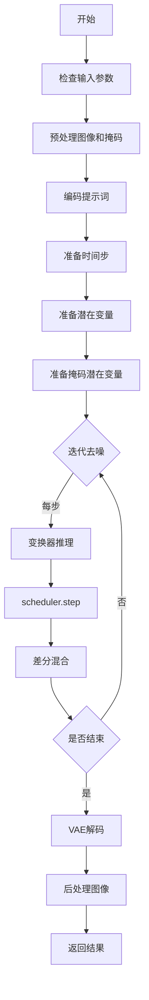
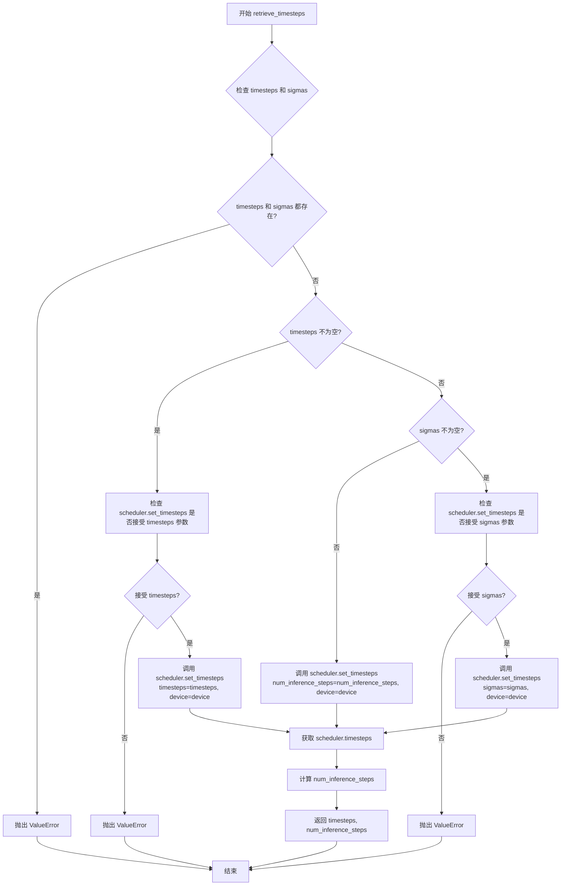
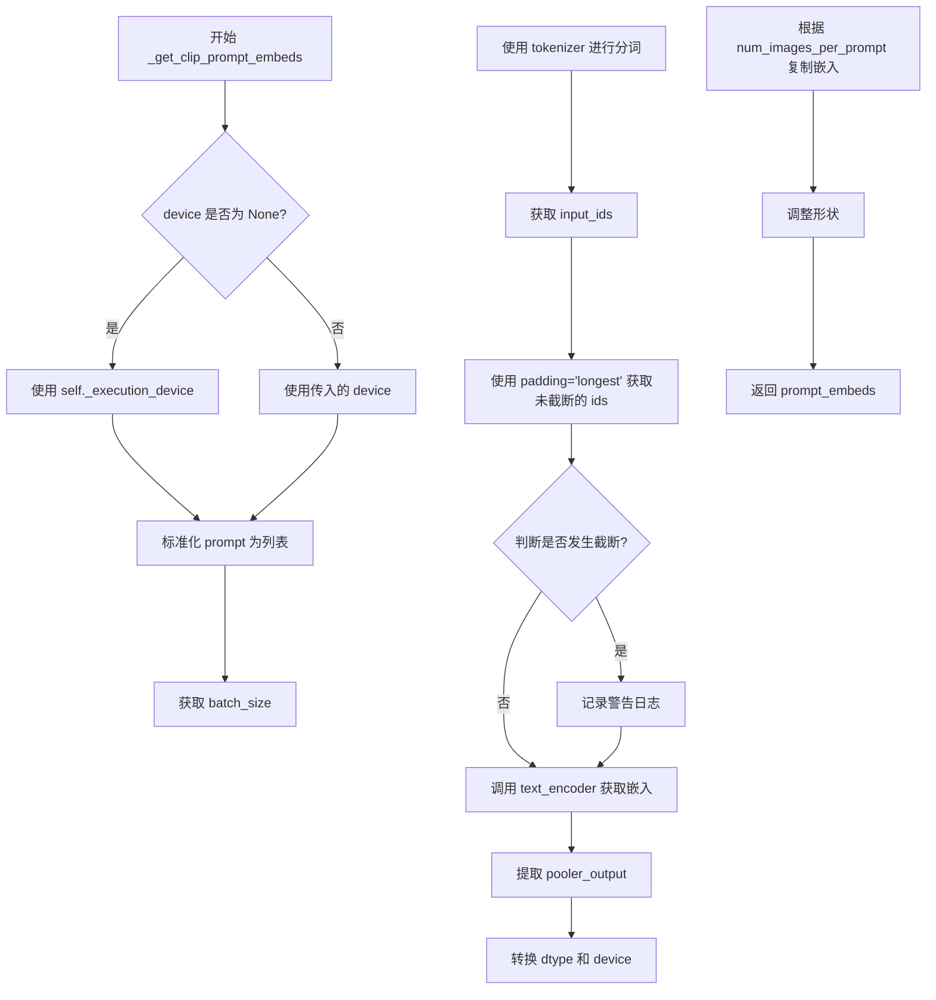
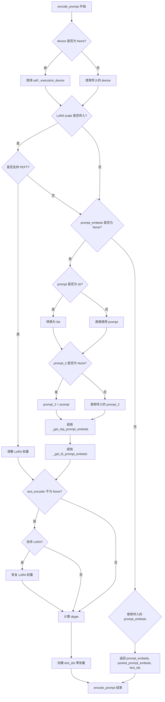
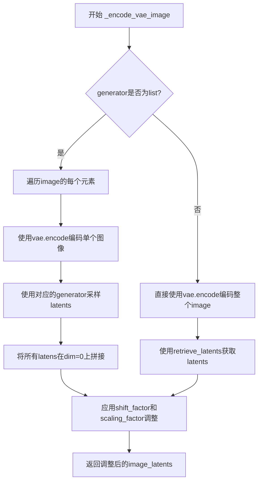
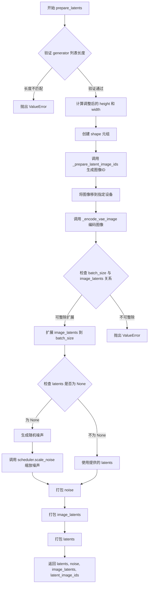
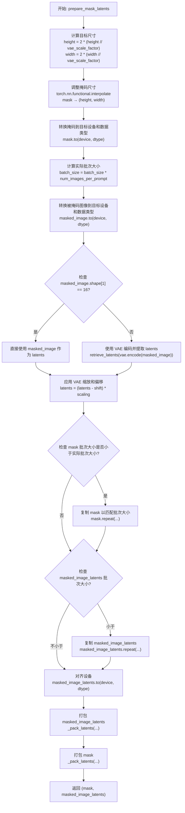
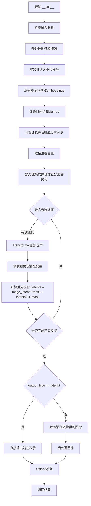

# `diffusers\examples\community\pipeline_flux_differential_img2img.py` 详细设计文档

Flux Differential Image-to-Image Pipeline，基于Flux变换器模型和差分扩散技术，通过文本提示、原始图像和掩码进行图像到图像的转换，支持LoRA加载和模型CPU卸载。

## 整体流程



## 类结构

```
DiffusionPipeline (基类)
└── FluxDifferentialImg2ImgPipeline
    ├── 继承自 FluxLoraLoaderMixin
    └── 依赖组件:
        ├── FluxTransformer2DModel (变换器)
        ├── AutoencoderKL (VAE)
        ├── CLIPTextModel (文本编码器)
        ├── T5EncoderModel (文本编码器)
        ├── FlowMatchEulerDiscreteScheduler (调度器)
```

## 全局变量及字段


### `XLA_AVAILABLE`
    
Flag indicating whether PyTorch XLA is available for accelerated computation

类型：`bool`
    


### `logger`
    
Logger instance for the module to track runtime events and warnings

类型：`Logger`
    


### `EXAMPLE_DOC_STRING`
    
Documentation string containing example usage of the pipeline

类型：`str`
    


### `FluxDifferentialImg2ImgPipeline.model_cpu_offload_seq`
    
Defines the sequence of models for CPU offload to manage memory usage

类型：`str`
    


### `FluxDifferentialImg2ImgPipeline._optional_components`
    
List of optional components that can be loaded into the pipeline

类型：`list`
    


### `FluxDifferentialImg2ImgPipeline._callback_tensor_inputs`
    
List of tensor input names that can be passed to step-end callbacks

类型：`list`
    


### `FluxDifferentialImg2ImgPipeline.vae_scale_factor`
    
Scaling factor derived from VAE block out channels for latent space operations

类型：`int`
    


### `FluxDifferentialImg2ImgPipeline.image_processor`
    
Processor for handling input and output image preprocessing and postprocessing

类型：`VaeImageProcessor`
    


### `FluxDifferentialImg2ImgPipeline.mask_processor`
    
Specialized processor for handling mask image preprocessing for differential diffusion

类型：`VaeImageProcessor`
    


### `FluxDifferentialImg2ImgPipeline.tokenizer_max_length`
    
Maximum sequence length supported by the CLIP tokenizer

类型：`int`
    


### `FluxDifferentialImg2ImgPipeline.default_sample_size`
    
Default latent sample size used when height or width is not specified

类型：`int`
    


### `FluxDifferentialImg2ImgPipeline._guidance_scale`
    
Classifier-free guidance scale for controlling text prompt influence on generation

类型：`float`
    


### `FluxDifferentialImg2ImgPipeline._joint_attention_kwargs`
    
Dictionary storing joint attention parameters for the transformer model

类型：`dict`
    


### `FluxDifferentialImg2ImgPipeline._num_timesteps`
    
Total number of timesteps used in the denoising process

类型：`int`
    


### `FluxDifferentialImg2ImgPipeline._interrupt`
    
Flag to interrupt the denoising loop when set to True

类型：`bool`
    
    

## 全局函数及方法


### `calculate_shift`

该函数用于根据图像序列长度计算一个偏移量（shift）值，采用线性插值方法在基础偏移量和最大偏移量之间进行平滑过渡。这主要用于Flux扩散模型中根据输入图像分辨率动态调整噪声调度参数。

参数：

- `image_seq_len`：`int`，图像序列长度，表示图像在潜在空间中的序列长度（即 height/vae_scale_factor * width/vae_scale_factor）
- `base_seq_len`：`int`，默认值为 256，基础序列长度，用于线性插值的起始点
- `max_seq_len`：`int`，默认值为 4096，最大序列长度，用于线性插值的终点
- `base_shift`：`float`，默认值为 0.5，基础偏移量，对应 base_seq_len 时的偏移值
- `max_shift`：`float`，默认值为 1.15，最大偏移量，对应 max_seq_len 时的偏移值

返回值：`float`，计算得到的偏移量 mu，基于输入的图像序列长度在基础偏移量和最大偏移量之间进行线性插值的结果

#### 流程图

```mermaid
flowchart TD
    A[开始 calculate_shift] --> B[计算斜率 m]
    B --> C[m = (max_shift - base_shift) / (max_seq_len - base_seq_len)]
    C --> D[计算截距 b]
    D --> E[b = base_shift - m * base_seq_len]
    E --> F[计算偏移量 mu]
    F --> G[mu = image_seq_len * m + b]
    G --> H[返回 mu]
```

#### 带注释源码

```python
# Copied from diffusers.pipelines.flux.pipeline_flux.calculate_shift
def calculate_shift(
    image_seq_len,          # int: 图像序列长度，图像在潜在空间中的token数量
    base_seq_len: int = 256,    # int: 基础序列长度，默认256，对应最小分辨率
    max_seq_len: int = 4096,   # int: 最大序列长度，默认4096，对应最高分辨率
    base_shift: float = 0.5,    # float: 基础偏移量，默认0.5，用于低分辨率
    max_shift: float = 1.15,   # float: 最大偏移量，默认1.15，用于高分辨率
):
    """
    根据图像序列长度计算偏移量（shift），用于Flux模型的噪声调度。
    采用线性插值在base_shift和max_shift之间计算对应的偏移值。
    
    计算公式：
    - 斜率 m = (max_shift - base_shift) / (max_seq_len - base_seq_len)
    - 截距 b = base_shift - m * base_seq_len
    - 偏移量 mu = image_seq_len * m + b
    """
    # 计算线性插值的斜率（斜率）
    m = (max_shift - base_shift) / (max_seq_len - base_seq_len)
    
    # 计算线性插值的截距（偏置）
    b = base_shift - m * base_seq_len
    
    # 根据图像序列长度计算最终的偏移量
    mu = image_seq_len * m + b
    
    # 返回计算得到的偏移量
    return mu
```


### `retrieve_latents`

该函数用于从编码器输出中提取潜在向量（latents），支持多种采样模式（sample 或 argmax），并处理不同的潜在向量存储方式。

参数：

- `encoder_output`：`torch.Tensor`，编码器的输出对象，通常包含 `latent_dist` 或 `latents` 属性
- `generator`：`torch.Generator | None`，可选的随机数生成器，用于确保采样过程的可重现性
- `sample_mode`：`str`，采样模式，默认为 "sample"，可选 "argmax"

返回值：`torch.Tensor`，从编码器输出中提取的潜在向量

#### 流程图

```mermaid
flowchart TD
    A[开始: retrieve_latents] --> B{encoder_output 是否有 latent_dist 属性?}
    B -->|是| C{sample_mode == 'sample'?}
    B -->|否| D{encoder_output 是否有 latents 属性?}
    C -->|是| E[返回 encoder_output.latent_dist.sample(generator)]
    C -->|否| F{sample_mode == 'argmax'?}
    D -->|是| G[返回 encoder_output.latents]
    D -->|否| H[抛出 AttributeError]
    F -->|是| I[返回 encoder_output.latent_dist.mode()]
    F -->|否| H
    H --> J[结束: 错误 - 无法访问 latents]
    E --> J
    G --> J
    I --> J
```

#### 带注释源码

```python
# Copied from diffusers.pipelines.stable_diffusion.pipeline_stable_diffusion_img2img.retrieve_latents
def retrieve_latents(
    encoder_output: torch.Tensor, generator: torch.Generator | None = None, sample_mode: str = "sample"
):
    """
    从编码器输出中提取潜在向量。
    
    Args:
        encoder_output: 编码器的输出对象，通常是 VAE 编码后的输出
        generator: 可选的随机数生成器，用于采样过程
        sample_mode: 采样模式，"sample" 表示从分布中采样，"argmax" 表示取分布的模式
    
    Returns:
        torch.Tensor: 提取的潜在向量
    """
    # 检查编码器输出是否有 latent_dist 属性且采样模式为 sample
    if hasattr(encoder_output, "latent_dist") and sample_mode == "sample":
        # 从潜在分布中采样得到潜在向量
        return encoder_output.latent_dist.sample(generator)
    # 检查编码器输出是否有 latent_dist 属性且采样模式为 argmax
    elif hasattr(encoder_output, "latent_dist") and sample_mode == "argmax":
        # 取潜在分布的模式（均值或最可能的值）
        return encoder_output.latent_dist.mode()
    # 检查编码器输出是否有直接的 latents 属性
    elif hasattr(encoder_output, "latents"):
        # 直接返回预存的潜在向量
        return encoder_output.latents
    else:
        # 如果无法访问任何潜在向量，抛出属性错误
        raise AttributeError("Could not access latents of provided encoder_output")
```


### `retrieve_timesteps`

该函数是扩散管道中的时间步检索工具函数，负责调用调度器的 `set_timesteps` 方法并从中获取时间步序列。它支持三种模式：使用 `num_inference_steps` 自动计算时间步、使用自定义 `timesteps` 列表或使用自定义 `sigmas` 列表，并返回时间步张量和实际推理步数。

参数：

- `scheduler`：`SchedulerMixin`，要从中获取时间步的调度器对象
- `num_inference_steps`：`Optional[int]`，生成样本时使用的扩散步数，若使用此参数则 `timesteps` 必须为 `None`
- `device`：`Optional[Union[str, torch.device]]`，时间步要移动到的设备，若为 `None` 则不移动
- `timesteps`：`Optional[List[int]]`，用于覆盖调度器时间步间隔策略的自定义时间步，若传递此参数则 `num_inference_steps` 和 `sigmas` 必须为 `None`
- `sigmas`：`Optional[List[float]]`，用于覆盖调度器时间步间隔策略的自定义 sigmas，若传递此参数则 `num_inference_steps` 和 `timesteps` 必须为 `None`
- `**kwargs`：任意关键字参数，将传递给 `scheduler.set_timesteps` 方法

返回值：`Tuple[torch.Tensor, int]`，元组包含调度器的时间步调度序列和推理步数

#### 流程图



#### 带注释源码

```python
# Copied from diffusers.pipelines.stable_diffusion.pipeline_stable_diffusion.retrieve_timesteps
def retrieve_timesteps(
    scheduler,  # 调度器对象，用于生成和管理时间步
    num_inference_steps: Optional[int] = None,  # 推理步数，若提供则timesteps必须为None
    device: Optional[Union[str, torch.device]] = None,  # 目标设备，可选
    timesteps: Optional[List[int]] = None,  # 自定义时间步列表
    sigmas: Optional[List[float]] = None,  # 自定义sigmas列表
    **kwargs,  # 额外的关键字参数，传递给scheduler.set_timesteps
):
    """
    Calls the scheduler's `set_timesteps` method and retrieves timesteps from the scheduler after the call. Handles
    custom timesteps. Any kwargs will be supplied to `scheduler.set_timesteps`.

    Args:
        scheduler (`SchedulerMixin`):
            The scheduler to get timesteps from.
        num_inference_steps (`int`):
            The number of diffusion steps used when generating samples with a pre-trained model. If used, `timesteps`
            must be `None`.
        device (`str` or `torch.device`, *optional*):
            The device to which the timesteps should be moved to. If `None`, the timesteps are not moved.
        timesteps (`List[int]`, *optional*):
            Custom timesteps used to override the timestep spacing strategy of the scheduler. If `timesteps` is passed,
            `num_inference_steps` and `sigmas` must be `None`.
        sigmas (`List[float]`, *optional*):
            Custom sigmas used to override the timestep spacing strategy of the scheduler. If `sigmas` is passed,
            `num_inference_steps` and `timesteps` must be `None`.

    Returns:
        `Tuple[torch.Tensor, int]`: A tuple where the first element is the timestep schedule from the scheduler and the
        second element is the number of inference steps.
    """
    # 检查不能同时传递timesteps和sigmas，只能选择其中一种自定义方式
    if timesteps is not None and sigmas is not None:
        raise ValueError("Only one of `timesteps` or `sigmas` can be passed. Please choose one to set custom values")
    
    # 处理自定义timesteps的情况
    if timesteps is not None:
        # 检查调度器的set_timesteps方法是否支持timesteps参数
        accepts_timesteps = "timesteps" in set(inspect.signature(scheduler.set_timesteps).parameters.keys())
        if not accepts_timesteps:
            raise ValueError(
                f"The current scheduler class {scheduler.__class__}'s `set_timesteps` does not support custom"
                f" timestep schedules. Please check whether you are using the correct scheduler."
            )
        # 调用调度器的set_timesteps方法设置自定义时间步
        scheduler.set_timesteps(timesteps=timesteps, device=device, **kwargs)
        # 从调度器获取更新后的时间步
        timesteps = scheduler.timesteps
        # 计算实际的推理步数
        num_inference_steps = len(timesteps)
    
    # 处理自定义sigmas的情况
    elif sigmas is not None:
        # 检查调度器的set_timesteps方法是否支持sigmas参数
        accept_sigmas = "sigmas" in set(inspect.signature(scheduler.set_timesteps).parameters.keys())
        if not accept_sigmas:
            raise ValueError(
                f"The current scheduler class {scheduler.__class__}'s `set_timesteps` does not support custom"
                f" sigmas schedules. Please check whether you are using the correct scheduler."
            )
        # 调用调度器的set_timesteps方法设置自定义sigmas
        scheduler.set_timesteps(sigmas=sigmas, device=device, **kwargs)
        # 从调度器获取更新后的时间步
        timesteps = scheduler.timesteps
        # 计算实际的推理步数
        num_inference_steps = len(timesteps)
    
    # 默认情况：使用num_inference_steps自动计算时间步
    else:
        scheduler.set_timesteps(num_inference_steps, device=device, **kwargs)
        timesteps = scheduler.timesteps
    
    # 返回时间步张量和推理步数
    return timesteps, num_inference_steps
```


### `FluxDifferentialImg2ImgPipeline.__init__`

该方法是 FluxDifferentialImg2ImgPipeline 类的构造函数，负责初始化 Flux 差分图像到图像管道的所有核心组件，包括调度器、VAE、文本编码器（CLIP 和 T5）、分词器以及 Transformer 模型，同时配置图像处理器、掩码处理器和默认采样参数。

参数：

- `scheduler`：`FlowMatchEulerDiscreteScheduler`，用于去噪过程的调度器
- `vae`：`AutoencoderKL`，用于编码和解码图像的变分自编码器模型
- `text_encoder`：`CLIPTextModel`，CLIP 文本编码器模型
- `tokenizer`：`CLIPTokenizer`，CLIP 分词器
- `text_encoder_2`：`T5EncoderModel`，T5 文本编码器模型
- `tokenizer_2`：`T5TokenizerFast`，T5 快速分词器
- `transformer`：`FluxTransformer2DModel`，用于去噪的条件 Transformer（MMDiT）架构

返回值：`None`，无返回值，仅初始化实例属性

#### 流程图

```mermaid
flowchart TD
    A[开始 __init__] --> B[调用父类 DiffusionPipeline.__init__]
    B --> C[调用 self.register_modules 注册所有模块]
    C --> D[计算 vae_scale_factor: 2 ** (len(vae.config.block_out_channels))]
    D --> E[初始化 VaeImageProcessor 作为 image_processor]
    E --> F[获取 latent_channels]
    F --> G[初始化 VaeImageProcessor 作为 mask_processor]
    G --> H[设置 tokenizer_max_length]
    H --> I[设置 default_sample_size = 64]
    I --> J[结束 __init__]
```

#### 带注释源码

```python
def __init__(
    self,
    scheduler: FlowMatchEulerDiscreteScheduler,  # Flow Match 调度器，用于去噪过程
    vae: AutoencoderKL,  # VAE 模型，用于图像编码/解码
    text_encoder: CLIPTextModel,  # CLIP 文本编码器
    tokenizer: CLIPTokenizer,  # CLIP 分词器
    text_encoder_2: T5EncoderModel,  # T5 文本编码器
    tokenizer_2: T5TokenizerFast,  # T5 快速分词器
    transformer: FluxTransformer2DModel,  # Flux Transformer 模型
):
    # 调用父类 DiffusionPipeline 的初始化方法
    super().__init__()

    # 注册所有模块到 pipeline 中，使其可通过 self.xxx 访问
    self.register_modules(
        vae=vae,
        text_encoder=text_encoder,
        text_encoder_2=text_encoder_2,
        tokenizer=tokenizer,
        tokenizer_2=tokenizer_2,
        transformer=transformer,
        scheduler=scheduler,
    )
    
    # 计算 VAE 缩放因子，基于 VAE 块输出通道数的幂次
    # 如果 VAE 存在，使用其配置计算，否则默认为 16
    self.vae_scale_factor = 2 ** (len(self.vae.config.block_out_channels)) if getattr(self, "vae", None) else 16
    
    # 初始化图像处理器，用于预处理和后处理图像
    self.image_processor = VaeImageProcessor(vae_scale_factor=self.vae_scale_factor)
    
    # 获取 VAE 的潜在通道数
    latent_channels = self.vae.config.latent_channels if getattr(self, "vae", None) else 16
    
    # 初始化掩码专用图像处理器
    # 配置不进行归一化和二值化，但转换为灰度图
    self.mask_processor = VaeImageProcessor(
        vae_scale_factor=self.vae_scale_factor,
        vae_latent_channels=latent_channels,
        do_normalize=False,  # 不归一化
        do_binarize=False,   # 不二值化
        do_convert_grayscale=True,  # 转换为灰度
    )
    
    # 设置分词器最大长度，默认使用 tokenizer 的 model_max_length，否则默认为 77
    self.tokenizer_max_length = (
        self.tokenizer.model_max_length if hasattr(self, "tokenizer") and self.tokenizer is not None else 77
    )
    
    # 设置默认采样大小为 64
    self.default_sample_size = 64
```


### `FluxDifferentialImg2ImgPipeline._get_t5_prompt_embeds`

该方法用于获取 T5 文本编码器（text_encoder_2）对提示词的嵌入表示。它接收提示词文本，通过 T5 分词器进行 token 化，然后利用 T5 编码器生成文本嵌入向量，并支持为每个提示词生成多个图像的嵌入复制。

参数：

- `prompt`：`Union[str, List[str]] = None`，要编码的提示词，可以是单个字符串或字符串列表
- `num_images_per_prompt`：`int = 1`，每个提示词需要生成的图像数量，用于复制嵌入向量
- `max_sequence_length`：`int = 512`，T5 编码器的最大序列长度，超过该长度会被截断
- `device`：`Optional[torch.device] = None`，计算设备，若为 None 则使用执行设备
- `dtype`：`Optional[torch.dtype] = None`，输出张量的数据类型，若为 None 则使用 text_encoder 的数据类型

返回值：`torch.FloatTensor`，形状为 `(batch_size * num_images_per_prompt, seq_len, hidden_dim)` 的文本嵌入张量

#### 流程图

```mermaid
flowchart TD
    A[开始] --> B{device 参数为空?}
    B -->|是| C[使用 self._execution_device]
    B -->|否| D[使用传入的 device]
    E{dtype 参数为空?}
    E -->|是| F[使用 self.text_encoder.dtype]
    E -->|否| G[使用传入的 dtype]
    
    C --> H
    D --> H
    F --> H
    G --> H
    
    H{prompt 是字符串?}
    H -->|是| I[将 prompt 转换为列表]
    H -->|否| J[保持列表不变]
    
    I --> K[计算 batch_size = len(prompt)]
    J --> K
    
    K --> L[调用 tokenizer_2 进行 token 化]
    L --> M[获取 text_input_ids]
    M --> N[调用 tokenizer_2 获取未截断的 untruncated_ids]
    
    N --> O{untruncated_ids 长度 >= text_input_ids 且不相等?}
    O -->|是| P[记录被截断的文本警告]
    O -->|否| Q
    
    P --> Q
    Q --> R[调用 text_encoder_2 获取 prompt_embeds]
    R --> S[转换为指定 dtype 和 device]
    S --> T[获取 seq_len 维度]
    
    T --> U[重复 prompt_embeds num_images_per_prompt 次]
    U --> V[reshape 为 batch_size * num_images_per_prompt, seq_len, -1]
    V --> W[返回 prompt_embeds]
```

#### 带注释源码

```python
# Copied from diffusers.pipelines.flux.pipeline_flux.FluxPipeline._get_t5_prompt_embeds
def _get_t5_prompt_embeds(
    self,
    prompt: Union[str, List[str]] = None,
    num_images_per_prompt: int = 1,
    max_sequence_length: int = 512,
    device: Optional[torch.device] = None,
    dtype: Optional[torch.dtype] = None,
):
    # 确定计算设备：优先使用传入的 device，否则使用管道的执行设备
    device = device or self._execution_device
    # 确定数据类型：优先使用传入的 dtype，否则使用 text_encoder_2 的数据类型
    dtype = dtype or self.text_encoder.dtype

    # 标准化输入：将单个字符串转换为列表，便于批量处理
    prompt = [prompt] if isinstance(prompt, str) else prompt
    # 计算批处理大小
    batch_size = len(prompt)

    # 使用 T5 tokenizer_2 对 prompt 进行 token 化
    # padding="max_length" 填充到最大长度
    # truncation=True 超过 max_sequence_length 的部分会被截断
    # return_tensors="pt" 返回 PyTorch 张量
    text_inputs = self.tokenizer_2(
        prompt,
        padding="max_length",
        max_length=max_sequence_length,
        truncation=True,
        return_length=False,
        return_overflowing_tokens=False,
        return_tensors="pt",
    )
    text_input_ids = text_inputs.input_ids  # 获取 token IDs
    
    # 获取未截断的 token 序列（使用最长填充），用于检测是否发生了截断
    untruncated_ids = self.tokenizer_2(prompt, padding="longest", return_tensors="pt").input_ids

    # 检查是否发生了截断：如果未截断的序列更长且与截断后的序列不一致
    if untruncated_ids.shape[-1] >= text_input_ids.shape[-1] and not torch.equal(text_input_ids, untruncated_ids):
        # 解码被截断的部分并记录警告
        removed_text = self.tokenizer_2.batch_decode(untruncated_ids[:, self.tokenizer_max_length - 1 : -1])
        logger.warning(
            "The following part of your input was truncated because `max_sequence_length` is set to "
            f" {max_sequence_length} tokens: {removed_text}"
        )

    # 使用 T5 编码器生成文本嵌入
    # output_hidden_states=False 只返回最后一层的输出
    prompt_embeds = self.text_encoder_2(text_input_ids.to(device), output_hidden_states=False)[0]

    # 获取 text_encoder_2 的数据类型（确保一致性）
    dtype = self.text_encoder_2.dtype
    # 将嵌入转换到指定的设备和数据类型
    prompt_embeds = prompt_embeds.to(dtype=dtype, device=device)

    # 获取序列长度
    _, seq_len, _ = prompt_embeds.shape

    # 复制 text embeddings 以匹配每个提示词生成的图像数量
    # 使用 repeat 方法在序列维度复制（而非在 batch 维度），这种方法对 MPS 设备更友好
    prompt_embeds = prompt_embeds.repeat(1, num_images_per_prompt, 1)
    # reshape 为 (batch_size * num_images_per_prompt, seq_len, hidden_dim)
    prompt_embeds = prompt_embeds.view(batch_size * num_images_per_prompt, seq_len, -1)

    return prompt_embeds
```


### `FluxDifferentialImg2ImgPipeline._get_clip_prompt_embeds`

该方法用于从 CLIP 文本编码器获取提示词嵌入（prompt embeddings）。它接收文本提示，通过分词器转换为模型输入格式，处理可能的截断情况，然后使用 CLIP 文本编码器生成文本嵌入，最后根据每提示词生成的图像数量复制嵌入向量以适配批量生成。

参数：

- `self`：隐式参数，指向 `FluxDifferentialImg2ImgPipeline` 实例本身
- `prompt`：`Union[str, List[str]]`，输入的文本提示，可以是单个字符串或字符串列表
- `num_images_per_prompt`：`int = 1`，每个提示词生成的图像数量，用于复制嵌入向量以匹配批量生成
- `device`：`Optional[torch.device] = None`，目标计算设备，若为 `None` 则使用执行设备

返回值：`torch.FloatTensor`，返回处理后的 CLIP 文本嵌入向量，形状为 `(batch_size * num_images_per_prompt, embedding_dim)`

#### 流程图



#### 带注释源码

```python
def _get_clip_prompt_embeds(
    self,
    prompt: Union[str, List[str]],
    num_images_per_prompt: int = 1,
    device: Optional[torch.device] = None,
):
    """
    获取 CLIP 文本编码器的提示词嵌入

    Args:
        prompt: 输入的文本提示，字符串或字符串列表
        num_images_per_prompt: 每个提示生成的图像数量
        device: 目标设备，若为 None 则使用执行设备

    Returns:
        CLIP 文本嵌入向量
    """
    # 确定目标设备，若未指定则使用管道执行设备
    device = device or self._execution_device

    # 将 prompt 标准化为列表格式，统一处理逻辑
    prompt = [prompt] if isinstance(prompt, str) else prompt
    # 计算批次大小
    batch_size = len(prompt)

    # 使用 tokenizer 将文本转换为模型输入格式
    # padding="max_length" 填充到最大长度
    # max_length 使用类属性 tokenizer_max_length (默认 77)
    # truncation=True 截断超过最大长度的序列
    text_inputs = self.tokenizer(
        prompt,
        padding="max_length",
        max_length=self.tokenizer_max_length,
        truncation=True,
        return_overflowing_tokens=False,
        return_length=False,
        return_tensors="pt",
    )

    # 获取分词后的输入 ID
    text_input_ids = text_inputs.input_ids
    
    # 使用 padding="longest" 获取未截断的版本，用于检测截断
    untruncated_ids = self.tokenizer(prompt, padding="longest", return_tensors="pt").input_ids
    
    # 检查是否发生了截断
    if untruncated_ids.shape[-1] >= text_input_ids.shape[-1] and not torch.equal(text_input_ids, untruncated_ids):
        # 解码被截断的部分用于警告信息
        removed_text = self.tokenizer.batch_decode(untruncated_ids[:, self.tokenizer_max_length - 1 : -1])
        logger.warning(
            "The following part of your input was truncated because CLIP can only handle sequences up to"
            f" {self.tokenizer_max_length} tokens: {removed_text}"
        )
    
    # 调用 CLIP 文本编码器生成嵌入，output_hidden_states=False 只获取最后一层输出
    prompt_embeds = self.text_encoder(text_input_ids.to(device), output_hidden_states=False)

    # 从编码器输出中提取 pooled output（池化后的表示）
    # CLIP 文本编码器的 pooler_output 是 [CLS] token 的表示
    prompt_embeds = prompt_embeds.pooler_output
    
    # 转换到正确的 dtype 和 device
    prompt_embeds = prompt_embeds.to(dtype=self.text_encoder.dtype, device=device)

    # 复制文本嵌入以适配每提示词生成多张图像的场景
    # 使用 repeat 而非 tile 以兼容 MPS 设备
    prompt_embeds = prompt_embeds.repeat(1, num_images_per_prompt)
    # 调整形状：[batch_size, num_images_per_prompt * hidden_size] -> [batch_size * num_images_per_prompt, hidden_size]
    prompt_embeds = prompt_embeds.view(batch_size * num_images_per_prompt, -1)

    return prompt_embeds
```


### `FluxDifferentialImg2ImgPipeline.encode_prompt`

该方法用于将文本提示（prompt）编码为文本嵌入向量（text embeddings），供后续的图像生成 pipeline 使用。它同时利用 CLIP 和 T5 两种文本编码器生成不同类型的嵌入，并处理 LoRA 权重的缩放。

参数：

- `prompt`：`Union[str, List[str]]`，需要编码的主要提示文本，支持单个字符串或字符串列表
- `prompt_2`：`Union[str, List[str]]`，发送到 tokenizer_2 和 text_encoder_2 的提示文本，若未定义则使用 prompt
- `device`：`Optional[torch.device]`，执行编码的 torch 设备，若未指定则使用 pipeline 的执行设备
- `num_images_per_prompt`：`int`，每个提示要生成的图像数量，默认为 1
- `prompt_embeds`：`Optional[torch.FloatTensor]`，预生成的文本嵌入，可用于轻松调整文本输入（如 prompt weighting），若未提供则从 prompt 生成
- `pooled_prompt_embeds`：`Optional[torch.FloatTensor]`，预生成的池化文本嵌入，若未提供则从 prompt 生成
- `max_sequence_length`：`int`，T5 编码器的最大序列长度，默认为 512
- `lora_scale`：`Optional[float]`，应用于所有 LoRA 层的缩放因子

返回值：`Tuple[torch.FloatTensor, torch.FloatTensor, torch.Tensor]`，返回一个包含三个元素的元组：
- `prompt_embeds`：T5 生成的文本嵌入（shape: [batch_size * num_images_per_prompt, seq_len, hidden_dim]）
- `pooled_prompt_embeds`：CLIP 生成的池化文本嵌入（shape: [batch_size * num_images_per_prompt, hidden_dim]）
- `text_ids`：用于文本位置编码的零张量（shape: [seq_len, 3]）

#### 流程图



#### 带注释源码

```python
def encode_prompt(
    self,
    prompt: Union[str, List[str]],
    prompt_2: Union[str, List[str]],
    device: Optional[torch.device] = None,
    num_images_per_prompt: int = 1,
    prompt_embeds: Optional[torch.FloatTensor] = None,
    pooled_prompt_embeds: Optional[torch.FloatTensor] = None,
    max_sequence_length: int = 512,
    lora_scale: Optional[float] = None,
):
    r"""
    Encodes the prompt into text embeddings using CLIP and T5 text encoders.

    Args:
        prompt (`str` or `List[str]`, *optional*):
            prompt to be encoded
        prompt_2 (`str` or `List[str]`, *optional*):
            The prompt or prompts to be sent to the `tokenizer_2` and `text_encoder_2`. If not defined, `prompt` is
            used in all text-encoders
        device: (`torch.device`):
            torch device
        num_images_per_prompt (`int`):
            number of images that should be generated per prompt
        prompt_embeds (`torch.FloatTensor`, *optional*):
            Pre-generated text embeddings. Can be used to easily tweak text inputs, *e.g.* prompt weighting. If not
            provided, text embeddings will be generated from `prompt` input argument.
        pooled_prompt_embeds (`torch.FloatTensor`, *optional*):
            Pre-generated pooled text embeddings. Can be used to easily tweak text inputs, *e.g.* prompt weighting.
            If not provided, pooled text embeddings will be generated from `prompt` input argument.
        lora_scale (`float`, *optional*):
            A lora scale that will be applied to all LoRA layers of the text encoder if LoRA layers are loaded.
    """
    # 确定设备，若未指定则使用 pipeline 的执行设备
    device = device or self._execution_device

    # 设置 LoRA 缩放因子，以便 text encoder 的 monkey patched LoRA 函数正确访问
    if lora_scale is not None and isinstance(self, FluxLoraLoaderMixin):
        self._lora_scale = lora_scale

        # 动态调整 LoRA 缩放
        if self.text_encoder is not None and USE_PEFT_BACKEND:
            scale_lora_layers(self.text_encoder, lora_scale)
        if self.text_encoder_2 is not None and USE_PEFT_BACKEND:
            scale_lora_layers(self.text_encoder_2, lora_scale)

    # 将 prompt 转换为 list 格式以便批量处理
    prompt = [prompt] if isinstance(prompt, str) else prompt

    # 如果未提供预计算的嵌入，则需要从 prompt 生成
    if prompt_embeds is None:
        # prompt_2 用于 T5 编码器，若未提供则使用 prompt
        prompt_2 = prompt_2 or prompt
        prompt_2 = [prompt_2] if isinstance(prompt_2, str) else prompt_2

        # 仅使用 CLIPTextModel 的池化输出
        pooled_prompt_embeds = self._get_clip_prompt_embeds(
            prompt=prompt,
            device=device,
            num_images_per_prompt=num_images_per_prompt,
        )
        # 使用 T5 生成完整的 prompt 嵌入
        prompt_embeds = self._get_t5_prompt_embeds(
            prompt=prompt_2,
            num_images_per_prompt=num_images_per_prompt,
            max_sequence_length=max_sequence_length,
            device=device,
        )

    # 如果 text_encoder 存在且支持 LoRA，在处理完后恢复原始权重
    if self.text_encoder is not None:
        if isinstance(self, FluxLoraLoaderMixin) and USE_PEFT_BACKEND:
            # 通过取消缩放 LoRA 层来恢复原始权重
            unscale_lora_layers(self.text_encoder, lora_scale)

    # 同样的处理适用于 text_encoder_2
    if self.text_encoder_2 is not None:
        if isinstance(self, FluxLoraLoaderMixin) and USE_PEFT_BACKEND:
            # 通过取消缩放 LoRA 层来恢复原始权重
            unscale_lora_layers(self.text_encoder_2, lora_scale)

    # 确定数据类型：优先使用 text_encoder 的 dtype，否则使用 transformer 的 dtype
    dtype = self.text_encoder.dtype if self.text_encoder is not None else self.transformer.dtype
    # 创建用于文本位置编码的零张量 [seq_len, 3]
    text_ids = torch.zeros(prompt_embeds.shape[1], 3).to(device=device, dtype=dtype)

    # 返回：prompt_embeds (T5嵌入), pooled_prompt_embeds (CLIP池化嵌入), text_ids (文本位置编码)
    return prompt_embeds, pooled_prompt_embeds, text_ids
```


### `FluxDifferentialImg2ImgPipeline._encode_vae_image`

该方法负责将输入图像编码为VAE潜在空间中的表示。它使用Variational Autoencoder (VAE)对图像进行编码，并根据VAE配置应用缩放因子和偏移因子来归一化潜在表示。支持批量处理和可选的随机生成器以确保可重复性。

参数：

- `self`：实例方法，隐含参数，表示Pipeline对象本身
- `image`：`torch.Tensor`，输入图像张量，需要被编码为潜在表示的图像数据
- `generator`：`torch.Generator`，可选的随机数生成器，用于确保采样过程的可重复性。如果传入列表，则为每个图像使用对应的生成器

返回值：`torch.Tensor`，编码后的图像潜在表示，经过shift_factor和scaling_factor调整后的VAE潜在空间向量

#### 流程图



#### 带注释源码

```python
def _encode_vae_image(self, image: torch.Tensor, generator: torch.Generator):
    # 判断generator是否为列表，用于处理批量生成时的多个随机种子
    if isinstance(generator, list):
        # 逐个处理图像批次中的每个图像
        image_latents = [
            # 使用VAE编码单张图像，并通过generator进行潜在分布采样
            retrieve_latents(self.vae.encode(image[i : i + 1]), generator=generator[i])
            for i in range(image.shape[0])
        ]
        # 将所有图像的潜在表示在批次维度上拼接
        image_latents = torch.cat(image_latents, dim=0)
    else:
        # 单个generator时，直接编码整个图像批次
        image_latents = retrieve_latents(self.vae.encode(image), generator=generator)

    # 应用VAE的shift_factor和scaling_factor进行归一化
    # 这确保潜在表示符合模型训练时的统计特性
    image_latents = (image_latents - self.vae.config.shift_factor) * self.vae.config.scaling_factor

    return image_latents
```


### `FluxDifferentialImg2ImgPipeline.get_timesteps`

该方法用于根据推理步数和图像变换强度（strength）调整去噪调度器的时间步。它通过计算初始时间步数来确定从哪个时间点开始去噪过程，并相应地截取调度器的时间步序列，同时支持设置调度器的起始索引。

参数：

- `num_inference_steps`：`int`，总推理步数，表示去噪过程需要执行的迭代次数
- `strength`：`float`，图像变换强度，范围在 0 到 1 之间，用于控制原始图像信息保留的程度
- `device`：`torch.device`，计算设备，用于指定张量存放的硬件设备

返回值：`Tuple[torch.Tensor, int]`，返回一个元组，包含调整后的时间步序列张量和实际执行的推理步数

#### 流程图

```mermaid
flowchart TD
    A[开始 get_timesteps] --> B[计算 init_timestep = min(num_inference_steps \* strength, num_inference_steps)]
    B --> C[计算 t_start = max(num_inference_steps - init_timestep, 0)]
    C --> D[从 scheduler.timesteps 中截取子序列: timesteps[t_start \* scheduler.order:]
    D --> E{检查 scheduler 是否有 set_begin_index 方法}
    E -->|是| F[调用 scheduler.set_begin_index(t_start \* scheduler.order)]
    E -->|否| G[跳过设置起始索引]
    F --> H[返回 timesteps 和 num_inference_steps - t_start]
    G --> H
```

#### 带注释源码

```python
# Copied from diffusers.pipelines.stable_diffusion_3.pipeline_stable_diffusion_3_img2img.StableDiffusion3Img2ImgPipeline.get_timesteps
def get_timesteps(self, num_inference_steps, strength, device):
    """
    根据推理步数和强度获取调整后的时间步序列。
    
    该方法实现了图像到图像转换中常用的时间步调整策略：
    - 当 strength < 1.0 时，跳过前若干个时间步，保留更多原始图像特征
    - 这相当于在去噪过程中从中间某个点开始，而非从纯噪声开始
    """
    
    # 计算初始时间步数，限制在 [0, num_inference_steps] 范围内
    # 如果 strength=1.0，则使用全部推理步数
    # 如果 strength<1.0，则只使用部分步数，保留更多原始图像信息
    init_timestep = min(num_inference_steps * strength, num_inference_steps)

    # 计算起始索引，表示从时间步序列的哪个位置开始
    # 例如：num_inference_steps=28, strength=0.6, init_timestep=16.8->16
    # 则 t_start = 28 - 16 = 12，表示跳过前12个时间步
    t_start = int(max(num_inference_steps - init_timestep, 0))
    
    # 从调度器的时间步序列中截取子序列
    # scheduler.order 表示调度器的阶数，用于多步调度器
    timesteps = self.scheduler.timesteps[t_start * self.scheduler.order :]
    
    # 如果调度器支持设置起始索引（某些调度器需要）
    # 则通知调度器从哪个时间步开始执行
    if hasattr(self.scheduler, "set_begin_index"):
        self.scheduler.set_begin_index(t_start * self.scheduler.order)

    # 返回调整后的时间步序列和实际推理步数
    # 实际步数 = 总步数 - 跳过的步数
    return timesteps, num_inference_steps - t_start
```


### `FluxDifferentialImg2ImgPipeline.check_inputs`

该方法用于在管道执行前验证所有输入参数的有效性，确保用户提供的参数符合要求，若不符合则抛出相应的`ValueError`异常。

参数：

- `prompt`：`Union[str, List[str], None]`，主要的文本提示词，用于指导图像生成
- `prompt_2`：`Union[str, List[str], None]`，发送给第二个tokenizer和text_encoder的提示词，若未定义则使用`prompt`
- `image`：`PipelineImageInput`，用作起点的图像输入
- `mask_image`：`PipelineImageInput`，用于遮罩图像的掩码，白色像素被重绘，黑色像素保留
- `strength`：`float`，表示对参考图像的转换程度，范围为0到1
- `height`：`int`，生成图像的高度（像素），必须能被8整除
- `width`：`int`，生成图像的宽度（像素），必须能被8整除
- `output_type`：`str`，生成图像的输出格式，可为"pil"等
- `prompt_embeds`：`Optional[torch.FloatTensor]`，预生成的文本嵌入，与prompt不能同时提供
- `pooled_prompt_embeds`：`Optional[torch.FloatTensor]`，预生成的池化文本嵌入，若提供prompt_embeds则必须提供
- `callback_on_step_end_tensor_inputs`：`Optional[List[str]]`，在每个去噪步骤结束时回调的张量输入列表
- `padding_mask_crop`：`Optional[int]`（实际使用中可能为None），裁剪图像和掩码的边距大小，若提供则image和mask_image必须为PIL图像
- `max_sequence_length`：`Optional[int]`，最大序列长度，不能超过512

返回值：`None`，该方法不返回任何值，仅通过抛出`ValueError`异常来指示参数验证失败

#### 流程图

```mermaid
flowchart TD
    A[开始 check_inputs] --> B{strength 在 [0, 1] 范围内?}
    B -- 否 --> B1[抛出 ValueError: strength 超出范围]
    B -- 是 --> C{height 和 width 可被 8 整除?}
    C -- 否 --> C1[抛出 ValueError: height/width 未整除]
    C -- 是 --> D{callback_on_step_end_tensor_inputs 有效?}
    D -- 否 --> D1[抛出 ValueError: 无效的 callback tensor inputs]
    D -- 是 --> E{prompt 和 prompt_embeds 不同时提供?}
    E -- 否 --> E1[抛出 ValueError: 不能同时提供]
    E -- 是 --> F{prompt_2 和 prompt_embeds 不同时提供?}
    F -- 否 --> F1[抛出 ValueError: 不能同时提供]
    F -- 是 --> G{至少提供 prompt 或 prompt_embeds?}
    G -- 否 --> G1[抛出 ValueError: 未提供必要参数]
    G -- 是 --> H{prompt 类型为 str 或 list?}
    H -- 否 --> H1[抛出 ValueError: prompt 类型错误]
    H -- 是 --> I{prompt_2 类型为 str 或 list?}
    I -- 否 --> I1[抛出 ValueError: prompt_2 类型错误]
    I -- 是 --> J{prompt_embeds 有但 pooled_prompt_embeds 无?}
    J -- 是 --> J1[抛出 ValueError: 缺少 pooled_prompt_embeds]
    J -- 否 --> K{padding_mask_crop 不为空?}
    K -- 是 --> L{image 为 PIL.Image?}
    L -- 否 --> L1[抛出 ValueError: image 不是 PIL]
    L -- 是 --> M{mask_image 为 PIL.Image?}
    M -- 否 --> M1[抛出 ValueError: mask_image 不是 PIL]
    M -- 是 --> N{output_type 为 'pil'?}
    N -- 否 --> N1[抛出 ValueError: output_type 不是 pil]
    N -- 是 --> O{max_sequence_length 超过 512?}
    O -- 是 --> O1[抛出 ValueError: max_sequence_length 超出限制]
    O -- 否 --> P[验证通过，方法结束]
```

#### 带注释源码

```python
def check_inputs(
    self,
    prompt,                    # Union[str, List[str], None] - 主提示词
    prompt_2,                  # Union[str, List[str], None] - 第二提示词
    image,                     # PipelineImageInput - 输入图像
    mask_image,                # PipelineImageInput - 掩码图像
    strength,                  # float - 转换强度 [0, 1]
    height,                    # int - 输出高度，需被8整除
    width,                     # int - 输出宽度，需被8整除
    output_type,               # str - 输出格式类型
    prompt_embeds=None,        # Optional[torch.FloatTensor] - 预生成文本嵌入
    pooled_prompt_embeds=None, # Optional[torch.FloatTensor] - 预生成池化嵌入
    callback_on_step_end_tensor_inputs=None, # Optional[List[str]] - 回调张量输入
    padding_mask_crop=None,    # Optional[int] - 掩码裁剪边距
    max_sequence_length=None,  # Optional[int] - 最大序列长度
):
    # 验证 strength 参数必须在 [0.0, 1.0] 范围内
    if strength < 0 or strength > 1:
        raise ValueError(f"The value of strength should in [0.0, 1.0] but is {strength}")

    # 验证 height 和 width 必须能被 8 整除（VAE下采样要求）
    if height % 8 != 0 or width % 8 != 0:
        raise ValueError(f"`height` and `width` have to be divisible by 8 but are {height} and {width}.")

    # 验证回调张量输入必须在允许的列表中
    if callback_on_step_end_tensor_inputs is not None and not all(
        k in self._callback_tensor_inputs for k in callback_on_step_end_tensor_inputs
    ):
        raise ValueError(
            f"`callback_on_step_end_tensor_inputs` has to be in {self._callback_tensor_inputs}, but found {[k for k in callback_on_step_end_tensor_inputs if k not in self._callback_tensor_inputs]}"
        )

    # 验证 prompt 和 prompt_embeds 不能同时提供
    if prompt is not None and prompt_embeds is not None:
        raise ValueError(
            f"Cannot forward both `prompt`: {prompt} and `prompt_embeds`: {prompt_embeds}. Please make sure to"
            " only forward one of the two."
        )
    # 验证 prompt_2 和 prompt_embeds 不能同时提供
    elif prompt_2 is not None and prompt_embeds is not None:
        raise ValueError(
            f"Cannot forward both `prompt_2`: {prompt_2} and `prompt_embeds`: {prompt_embeds}. Please make sure to"
            " only forward one of the two."
        )
    # 验证至少提供 prompt 或 prompt_embeds 之一
    elif prompt is None and prompt_embeds is None:
        raise ValueError(
            "Provide either `prompt` or `prompt_embeds`. Cannot leave both `prompt` and `prompt_embeds` undefined."
        )
    # 验证 prompt 类型
    elif prompt is not None and (not isinstance(prompt, str) and not isinstance(prompt, list)):
        raise ValueError(f"`prompt` has to be of type `str` or `list` but is {type(prompt)}")
    # 验证 prompt_2 类型
    elif prompt_2 is not None and (not isinstance(prompt_2, str) and not isinstance(prompt_2, list)):
        raise ValueError(f"`prompt_2` has to be of type `str` or `list` but is {type(prompt_2)}")

    # 验证如果提供 prompt_embeds，则必须同时提供 pooled_prompt_embeds
    if prompt_embeds is not None and pooled_prompt_embeds is None:
        raise ValueError(
            "If `prompt_embeds` are provided, `pooled_prompt_embeds` also have to be passed. Make sure to generate `pooled_prompt_embeds` from the same text encoder that was used to generate `prompt_embeds`."
        )

    # 如果使用 padding_mask_crop，验证相关约束
    if padding_mask_crop is not None:
        # 验证 image 必须是 PIL 图像
        if not isinstance(image, PIL.Image.Image):
            raise ValueError(
                f"The image should be a PIL image when inpainting mask crop, but is of type {type(image)}."
            )
        # 验证 mask_image 必须是 PIL 图像
        if not isinstance(mask_image, PIL.Image.Image):
            raise ValueError(
                f"The mask image should be a PIL image when inpainting mask crop, but is of type"
                f" {type(mask_image)}."
            )
        # 验证输出类型必须是 pil
        if output_type != "pil":
            raise ValueError(f"The output type should be PIL when inpainting mask crop, but is {output_type}.")

    # 验证最大序列长度不超过 512
    if max_sequence_length is not None and max_sequence_length > 512:
        raise ValueError(f"`max_sequence_length` cannot be greater than 512 but is {max_sequence_length}")
```


### `FluxDifferentialImg2ImgPipeline._prepare_latent_image_ids`

该方法用于生成潜在图像的位置ID张量，这些ID在Flux transformer中用于注意力机制，帮助模型理解图像的空间结构。该方法创建包含高度和宽度坐标的张量，并将其展平后返回。

参数：

- `batch_size`：`int`，批次大小（参数签名中包含但方法内未直接使用）
- `height`：`int`，图像的高度（以像素为单位）
- `width`：`int`，图像的宽度（以像素为单位）
- `device`：`torch.device`，张量要放置到的设备
- `dtype`：`torch.dtype`，张量的数据类型

返回值：`torch.Tensor`，形状为 `(height//2 * width//2, 3)` 的张量，包含潜在图像的位置ID，第三维分别存储高度索引、宽度索引和零值。

#### 流程图

```mermaid
flowchart TD
    A[开始] --> B[创建零张量: shape为height//2, width//2, 3]
    B --> C[填充高度坐标: latent_image_ids[..., 1] + torch.arange(height//2)[:, None]]
    C --> D[填充宽度坐标: latent_image_ids[..., 2] + torch.arange(width//2)[None, :]]
    D --> E[获取张量形状: height, width, channels]
    E --> F[展平张量: reshape为height*width, 3]
    F --> G[转换设备和dtype]
    G --> H[返回张量]
```

#### 带注释源码

```python
@staticmethod
# Copied from diffusers.pipelines.flux.pipeline_flux.FluxPipeline._prepare_latent_image_ids
def _prepare_latent_image_ids(batch_size, height, width, device, dtype):
    """
    准备潜在图像的位置ID张量，用于Flux transformer的注意力机制。
    
    Args:
        batch_size: 批次大小（当前方法未直接使用）
        height: 图像高度
        width: 图像宽度
        device: 目标设备
        dtype: 目标数据类型
    
    Returns:
        形状为 (height//2 * width//2, 3) 的位置ID张量
    """
    # 步骤1: 创建形状为 (height//2, width//2, 3) 的零张量
    # 注意: 使用 height//2 和 width//2 是因为潜在空间是原始图像的2倍下采样
    latent_image_ids = torch.zeros(height // 2, width // 2, 3)
    
    # 步骤2: 在第1通道（索引1）填充高度坐标
    # torch.arange(height // 2) 生成 [0, 1, 2, ..., height//2-1]
    # [:, None] 将其转换为列向量，形状为 (height//2, 1)
    # 广播机制将高度坐标加到第1通道的每一列
    latent_image_ids[..., 1] = latent_image_ids[..., 1] + torch.arange(height // 2)[:, None]
    
    # 步骤3: 在第2通道（索引2）填充宽度坐标
    # torch.arange(width // 2) 生成 [0, 1, 2, ..., width//2-1]
    # [None, :] 将其转换为行向量，形状为 (1, width//2)
    # 广播机制将宽度坐标加到第2通道的每一行
    latent_image_ids[..., 2] = latent_image_ids[..., 2] + torch.arange(width // 2)[None, :]
    
    # 步骤4: 获取展平前的张量形状信息
    latent_image_id_height, latent_image_id_width, latent_image_id_channels = latent_image_ids.shape
    
    # 步骤5: 将3D张量展平为2D张量
    # 从 (height//2, width//2, 3) 转换为 (height//2 * width//2, 3)
    # 每一行代表一个潜在像素位置，包含 [0, height_coord, width_coord]
    latent_image_ids = latent_image_ids.reshape(
        latent_image_id_height * latent_image_id_width, latent_image_id_channels
    )
    
    # 步骤6: 将张量移动到指定设备并转换数据类型后返回
    return latent_image_ids.to(device=device, dtype=dtype)
```


### `FluxDifferentialImg2ImgPipeline._pack_latents`

该方法是一个静态方法，用于将原始的4D latent张量重新整形和排列，以适配Flux Transformer模型所需的输入格式。它通过分割空间维度并重新排列通道顺序，将latent转换为序列形式。

参数：

- `latents`：`torch.Tensor`，输入的4D latent张量，形状为 (batch_size, num_channels_latents, height, width)
- `batch_size`：`int`，批次大小
- `num_channels_latents`：`int`，latent通道数
- `height`：`int`，latent的高度
- `width`：`int`，latent的宽度

返回值：`torch.Tensor`，打包后的3D latent张量，形状为 (batch_size, (height // 2) * (width // 2), num_channels_latents * 4)

#### 流程图

```mermaid
flowchart TD
    A[输入4D张量 latents] --> B[使用view重塑为6D张量]
    B --> C[将高度和宽度各除以2并添加2的维度]
    C --> D[使用permute重新排列维度顺序]
    D --> E[将空间维度与通道维度重新排列]
    E --> F[使用reshape重塑为3D张量]
    F --> G[输出打包后的3D张量]
    
    B --> B1[batch_size, num_channels_latents, height//2, 2, width//2, 2]
    D --> D1[batch_size, height//2, width//2, num_channels_latents, 2, 2]
    F --> F1[batch_size, (height//2)*(width//2), num_channels_latents*4]
```

#### 带注释源码

```python
@staticmethod
# Copied from diffusers.pipelines.flux.pipeline_flux.FluxPipeline._pack_latents
def _pack_latents(latents, batch_size, num_channels_latents, height, width):
    """
    将latent张量打包成适用于Flux Transformer的序列格式
    
    参数:
        latents: 输入的4D latent张量 (B, C, H, W)
        batch_size: 批次大小
        num_channels_latents: latent通道数
        height: 高度
        width: 宽度
    
    返回:
        打包后的3D张量 (B, H*W/4, C*4)
    """
    # 第一步：重塑张量
    # 将 (B, C, H, W) -> (B, C, H//2, 2, W//2, 2)
    # 这里将空间维度(height, width)各除以2，并在每个位置添加2x2的块维度
    latents = latents.view(batch_size, num_channels_latents, height // 2, 2, width // 2, 2)
    
    # 第二步：排列维度
    # (B, C, H//2, 2, W//2, 2) -> (B, H//2, W//2, C, 2, 2)
    # 将空间块维度移到前面，便于后续合并
    latents = latents.permute(0, 2, 4, 1, 3, 5)
    
    # 第三步：最终重塑为序列格式
    # (B, H//2, W//2, C, 2, 2) -> (B, H//2*W//2, C*4)
    # 将2x2块展开为4个通道，原空间维度合并为一个序列维度
    latents = latents.reshape(batch_size, (height // 2) * (width // 2), num_channels_latents * 4)

    return latents
```


### `FluxDifferentialImg2ImgPipeline._unpack_latents`

该方法是一个静态工具函数，用于将经过打包处理的latents张量重新解包为标准的图像尺寸格式。在扩散模型的推理过程中，latents通常以打包形式（packed format）进行高效处理，此方法将其恢复为可供VAE解码器使用的标准4D张量形状（batch_size, channels, height, width）。

参数：

-  `latents`：`torch.Tensor`，经过打包处理的latents张量，形状为 (batch_size, num_patches, channels)
-  `height`：`int`，目标图像的高度（像素单位）
-  `width`：`int`，目标图像的宽度（像素单位）
-  `vae_scale_factor`：`int`，VAE的缩放因子，用于将像素坐标转换为latent空间坐标

返回值：`torch.Tensor`，解包后的latents张量，形状为 (batch_size, channels // 4, height * 2, width * 2)

#### 流程图

```mermaid
flowchart TD
    A[开始: _unpack_latents] --> B[提取latents形状: batch_size, num_patches, channels]
    --> C[计算latent空间尺寸: height // vae_scale_factor, width // vae_scale_factor]
    --> D[Reshape: (batch_size, height, width, channels // 4, 2, 2)]
    --> E[Permute维度: (0, 3, 1, 4, 2, 5)]
    --> F[Reshape为标准格式: (batch_size, channels // 4, height * 2, width * 2)]
    --> G[返回解包后的latents]
```

#### 带注释源码

```python
@staticmethod
# Copied from diffusers.pipelines.flux.pipeline_flux.FluxPipeline._unpack_latents
def _unpack_latents(latents, height, width, vae_scale_factor):
    """
    解包latents张量，将其从打包格式恢复为标准图像尺寸格式
    
    参数:
        latents: 经过打包的latents张量，形状 (batch_size, num_patches, channels)
        height: 目标图像高度
        width: 目标图像宽度
        vae_scale_factor: VAE缩放因子
    """
    # 1. 获取输入latents的基本维度信息
    batch_size, num_patches, channels = latents.shape

    # 2. 将像素坐标转换为latent空间坐标
    # VAE的缩放因子决定了多少个像素对应一个latent像素
    height = height // vae_scale_factor
    width = width // vae_scale_factor

    # 3. 第一步Reshape：将打包的latents分解为2x2的块结构
    # 从 (batch_size, num_patches, channels) 
    # 变为 (batch_size, height, width, channels // 4, 2, 2)
    # 其中 channels // 4 是每个块的通道数，2x2 是每个块的的空间结构
    latents = latents.view(batch_size, height, width, channels // 4, 2, 2)

    # 4. Permute维度：重新排列维度顺序以匹配标准图像格式
    # 从 (batch_size, height, width, channels // 4, 2, 2)
    # 变为 (batch_size, channels // 4, height, 2, width, 2)
    latents = latents.permute(0, 3, 1, 4, 2, 5)

    # 5. 最终Reshape：合并2x2块得到标准4D张量
    # 从 (batch_size, channels // 4, height, 2, width, 2)
    # 变为 (batch_size, channels // 4, height * 2, width * 2)
    # 这恢复了原始图像的空间维度
    latents = latents.reshape(batch_size, channels // (2 * 2), height * 2, width * 2)

    return latents
```


### `FluxDifferentialImg2ImgPipeline.prepare_latents`

该方法负责准备扩散模型的潜在变量（latents），包括对输入图像进行VAE编码、生成或处理噪声、以及对所有潜在变量进行打包，为后续的去噪过程准备输入数据。

参数：

- `image`：`torch.Tensor`，输入图像张量，用于编码为潜在表示
- `timestep`：`torch.Tensor`，时间步，用于噪声调度器的噪声缩放
- `batch_size`：`int`，批处理大小，生成图像的数量
- `num_channels_latents`：`int`，潜在变量的通道数，通常为Transformer输入通道数的1/4
- `height`：`int`，图像高度（像素）
- `width`：`int`，图像宽度（像素）
- `dtype`：`torch.dtype`，张量的数据类型
- `device`：`torch.device`，计算设备（CPU/CUDA）
- `generator`：`torch.Generator` 或 `List[torch.Generator]`，可选，用于生成确定性随机数的随机数生成器
- `latents`：`torch.Tensor`，可选，预生成的噪声潜在变量，如果为None则自动生成

返回值：`Tuple[torch.Tensor, torch.Tensor, torch.Tensor, torch.Tensor]`，返回打包后的潜在变量、噪声、图像潜在变量和潜在图像ID元组

#### 流程图



#### 带注释源码

```python
def prepare_latents(
    self,
    image,                      # 输入图像张量
    timestep,                   # 时间步，用于噪声缩放
    batch_size,                 # 批处理大小
    num_channels_latents,       # 潜在通道数
    height,                     # 图像高度
    width,                      # 图像宽度
    dtype,                      # 数据类型
    device,                     # 计算设备
    generator,                  # 随机数生成器
    latents=None,               # 可选的预生成潜在变量
):
    # 验证：如果传入生成器列表，其长度必须与批处理大小匹配
    if isinstance(generator, list) and len(generator) != batch_size:
        raise ValueError(
            f"You have passed a list of generators of length {len(generator)}, but requested an effective batch"
            f" size of {batch_size}. Make sure the batch size matches the length of the generators."
        )

    # 根据 VAE 缩放因子调整高度和宽度（乘以2以补偿下采样）
    height = 2 * (int(height) // self.vae_scale_factor)
    width = 2 * (int(width) // self.vae_scale_factor)

    # 构建潜在变量的形状：(batch_size, channels, height, width)
    shape = (batch_size, num_channels_latents, height, width)
    
    # 生成潜在图像ID，用于Transformer中的位置编码
    latent_image_ids = self._prepare_latent_image_ids(batch_size, height, width, device, dtype)

    # 将图像移到指定设备
    image = image.to(device=device, dtype=dtype)
    
    # 使用VAE编码图像得到潜在表示
    image_latents = self._encode_vae_image(image=image, generator=generator)

    # 处理批处理大小与图像潜在变量数量的关系
    if batch_size > image_latents.shape[0] and batch_size % image_latents.shape[0] == 0:
        # 如果batch_size是image_latents的整数倍，复制扩展
        additional_image_per_prompt = batch_size // image_latents.shape[0]
        image_latents = torch.cat([image_latents] * additional_image_per_prompt, dim=0)
    elif batch_size > image_latents.shape[0] and batch_size % image_latents.shape[0] != 0:
        # 无法整除时抛出错误
        raise ValueError(
            f"Cannot duplicate `image` of batch size {image_latents.shape[0]} to {batch_size} text prompts."
        )
    else:
        # 保持原有维度
        image_latents = torch.cat([image_latents], dim=0)

    # 处理潜在变量：生成噪声或使用提供的latents
    if latents is None:
        # 生成随机噪声张量
        noise = randn_tensor(shape, generator=generator, device=device, dtype=dtype)
        # 使用调度器根据时间步和图像潜在变量缩放噪声
        latents = self.scheduler.scale_noise(image_latents, timestep, noise)
    else:
        # 使用预提供的潜在变量
        noise = latents.to(device)
        latents = noise

    # 对所有潜在变量进行打包以适应Transformer的输入格式
    # 打包将空间维度转换为序列维度，便于自注意力机制处理
    noise = self._pack_latents(noise, batch_size, num_channels_latents, height, width)
    image_latents = self._pack_latents(image_latents, batch_size, num_channels_latents, height, width)
    latents = self._pack_latents(latents, batch_size, num_channels_latents, height, width)
    
    # 返回打包后的所有潜在变量和相关数据
    return latents, noise, image_latents, latent_image_ids
```


### `FluxDifferentialImg2ImgPipeline.prepare_mask_latents`

该方法用于准备掩码（mask）和被掩码图像（masked image）的潜在表示（latents），包括调整掩码尺寸、处理批次大小、编码被掩码图像为VAE潜在表示，以及对掩码和被掩码图像潜在表示进行打包，以便与扩散模型的潜在输入进行合并。

参数：

- `self`：`FluxDifferentialImg2ImgPipeline`，Pipeline实例本身
- `mask`：`torch.Tensor`，输入的掩码张量，用于指示图像中被替换的区域
- `masked_image`：`torch.Tensor`，被掩码覆盖的图像张量，即原始图像乘以掩码后的结果
- `batch_size`：`int`，原始批次大小
- `num_channels_latents`：`int`，潜在表示的通道数，通常为transformer输入通道数的1/4
- `num_images_per_prompt`：`int`，每个提示词生成的图像数量
- `height`：`int`，目标图像高度（像素）
- `width`：`int`，目标图像宽度（像素）
- `dtype`：`torch.dtype`，目标数据类型
- `device`：`torch.device`，目标设备
- `generator`：`torch.Generator | None`，可选的随机数生成器，用于确保可重复性

返回值：`Tuple[torch.Tensor, torch.Tensor]`，返回两个张量——第一个是打包后的掩码潜在表示，第二个是打包后的被掩码图像潜在表示。

#### 流程图



#### 带注释源码

```python
def prepare_mask_latents(
    self,
    mask: torch.Tensor,
    masked_image: torch.Tensor,
    batch_size: int,
    num_channels_latents: int,
    num_images_per_prompt: int,
    height: int,
    width: int,
    dtype: torch.dtype,
    device: torch.device,
    generator: torch.Generator | None = None,
):
    """
    准备掩码和被掩码图像的潜在表示。
    
    该方法执行以下操作：
    1. 将掩码调整为目标潜在空间的尺寸
    2. 将被掩码图像编码为VAE潜在表示（如果尚未编码）
    3. 根据num_images_per_prompt复制掩码和潜在表示以匹配批次大小
    4. 打包掩码和被掩码图像潜在表示以供后续处理使用
    
    参数:
        mask: 输入的掩码张量，值为[0,1]，白色区域表示需要替换的部分
        masked_image: 被掩码覆盖的图像，即init_image * mask
        batch_size: 原始批次大小
        num_channels_latents: 潜在表示的通道数
        num_images_per_prompt: 每个提示词生成的图像数量
        height: 目标高度（像素）
        width: 目标宽度（像素）
        dtype: 目标数据类型
        device: 目标设备
        generator: 可选的随机数生成器
    
    返回:
        Tuple[torch.Tensor, torch.Tensor]: (打包后的掩码, 打包后的被掩码图像latents)
    """
    # 计算潜在空间中的目标尺寸
    # VAE的scale_factor一般为16，因此需要将像素尺寸除以16再乘以2
    height = 2 * (int(height) // self.vae_scale_factor)
    width = 2 * (int(width) // self.vae_scale_factor)
    
    # 调整掩码尺寸以匹配潜在空间的形状
    # 在转换为dtype之前执行此操作，以避免在使用cpu_offload和半精度时出现问题
    mask = torch.nn.functional.interpolate(mask, size=(height, width))
    mask = mask.to(device=device, dtype=dtype)

    # 计算实际批次大小，考虑每提示词生成的图像数量
    batch_size = batch_size * num_images_per_prompt

    # 将被掩码图像转移到目标设备和数据类型
    masked_image = masked_image.to(device=device, dtype=dtype)

    # 检查被掩码图像是否已经是潜在表示（通道数为16）
    if masked_image.shape[1] == 16:
        # 如果已经是潜在表示，直接使用
        masked_image_latents = masked_image
    else:
        # 否则使用VAE编码并提取潜在表示
        masked_image_latents = retrieve_latents(self.vae.encode(masked_image), generator=generator)

    # 应用VAE的缩放因子和偏移量进行标准化
    # 这是VAE编码的标准后处理步骤
    masked_image_latents = (masked_image_latents - self.vae.config.shift_factor) * self.vae.config.scaling_factor

    # 复制掩码以匹配批次大小（为每个生成的图像复制一份）
    if mask.shape[0] < batch_size:
        if not batch_size % mask.shape[0] == 0:
            raise ValueError(
                "The passed mask and the required batch size don't match. Masks are supposed to be duplicated to"
                f" a total batch size of {batch_size}, but {mask.shape[0]} masks were passed. Make sure the number"
                " of masks that you pass is divisible by the total requested batch size."
            )
        mask = mask.repeat(batch_size // mask.shape[0], 1, 1, 1)
    
    # 复制被掩码图像的潜在表示以匹配批次大小
    if masked_image_latents.shape[0] < batch_size:
        if not batch_size % masked_image_latents.shape[0] == 0:
            raise ValueError(
                "The passed images and the required batch size don't match. Images are supposed to be duplicated"
                f" to a total batch size of {batch_size}, but {masked_image_latents.shape[0]} images were passed."
                " Make sure the number of images that you pass is divisible by the total requested batch size."
            )
        masked_image_latents = masked_image_latents.repeat(batch_size // masked_image_latents.shape[0], 1, 1, 1)

    # 对齐设备以防止在连接潜在模型输入时出现设备错误
    masked_image_latents = masked_image_latents.to(device=device, dtype=dtype)

    # 打包被掩码图像的潜在表示
    # 将 (B, C, H, W) 转换为 (B, (H*W), C*4) 的形式
    masked_image_latents = self._pack_latents(
        masked_image_latents,
        batch_size,
        num_channels_latents,
        height,
        width,
    )
    
    # 打包掩码
    # 扩展通道数以匹配潜在表示的通道数，然后打包
    mask = self._pack_latents(
        mask.repeat(1, num_channels_latents, 1, 1),
        batch_size,
        num_channels_latents,
        height,
        width,
    )

    return mask, masked_image_latents
```


### `FluxDifferentialImg2ImgPipeline.__call__`

这是Flux差分图像到图像管道的核心调用方法，通过接收文本提示、参考图像和掩码，在去噪过程中利用差分混合技术将原始图像与新生成的内容进行混合，实现有选择性的图像变换。

参数：

- `prompt`：`Union[str, List[str]]`，用于引导图像生成的文本提示，若未定义则需传入`prompt_embeds`
- `prompt_2`：`Optional[Union[str, List[str]]]`，发送给`tokenizer_2`和`text_encoder_2`的提示词，未定义时使用`prompt`
- `image`：`PipelineImageInput`，用作起点的图像批次，支持张量、PIL图像、numpy数组或列表形式，期望值范围在`[0, 1]`
- `mask_image`：`PipelineImageInput`，用于遮罩`image`的图像，白色像素被重绘而黑色像素保留
- `masked_image_latents`：`PipelineImageInput`，由VAE生成的掩码图像潜在表示，若未提供则由`mask_image`生成
- `height`：`Optional[int]`，生成图像的高度像素，默认为`self.unet.config.sample_size * self.vae_scale_factor`
- `width`：`Optional[int]`，生成图像的宽度像素，默认为`self.unet.config.sample_size * self.vae_scale_factor`
- `padding_mask_crop`：`Optional[int]`，裁剪应用的边距大小，`None`时不对图像和掩码进行裁剪
- `strength`：`float`，指示变换参考图像的程度，必须在0和1之间
- `num_inference_steps`：`int`，去噪步数，默认为28
- `timesteps`：`List[int]`，自定义去噪过程的时间步，必须按降序排列
- `guidance_scale`：`float`，无分类器自由引导（Classifier-Free Diffusion Guidance）中的引导尺度
- `num_images_per_prompt`：`Optional[int]`，每个提示词生成的图像数量
- `generator`：`Optional[Union[torch.Generator, List[torch.Generator]]]`，用于生成确定性结果的随机生成器
- `latents`：`Optional[torch.FloatTensor]`，预生成的噪声潜在向量
- `prompt_embeds`：`Optional[torch.FloatTensor]`，预生成的文本嵌入
- `pooled_prompt_embeds`：`Optional[torch.FloatTensor]`，预生成的汇聚文本嵌入
- `output_type`：`str | None`，生成图像的输出格式，可选`"pil"`或`"latent"`
- `return_dict`：`bool`，是否返回`FluxPipelineOutput`而不是元组
- `joint_attention_kwargs`：`Optional[Dict[str, Any]]`，传递给`AttentionProcessor`的参数字典
- `callback_on_step_end`：`Optional[Callable[[int, int, Dict], None]]`，每个去噪步骤结束时调用的函数
- `callback_on_step_end_tensor_inputs`：`List[str]`，回调函数使用的张量输入列表
- `max_sequence_length`：`int`，与提示词一起使用的最大序列长度，默认为512

返回值：`Union[FluxPipelineOutput, Tuple]`：当`return_dict`为True时返回`FluxPipelineOutput`，否则返回包含生成图像列表的元组

#### 流程图



#### 带注释源码

```python
@torch.no_grad()
@replace_example_docstring(EXAMPLE_DOC_STRING)
def __call__(
    self,
    prompt: Union[str, List[str]] = None,
    prompt_2: Optional[Union[str, List[str]]] = None,
    image: PipelineImageInput = None,
    mask_image: PipelineImageInput = None,
    masked_image_latents: PipelineImageInput = None,
    height: Optional[int] = None,
    width: Optional[int] = None,
    padding_mask_crop: Optional[int] = None,
    strength: float = 0.6,
    num_inference_steps: int = 28,
    timesteps: List[int] = None,
    guidance_scale: float = 7.0,
    num_images_per_prompt: Optional[int] = 1,
    generator: Optional[Union[torch.Generator, List[torch.Generator]]] = None,
    latents: Optional[torch.FloatTensor] = None,
    prompt_embeds: Optional[torch.FloatTensor] = None,
    pooled_prompt_embeds: Optional[torch.FloatTensor] = None,
    output_type: str | None = "pil",
    return_dict: bool = True,
    joint_attention_kwargs: Optional[Dict[str, Any]] = None,
    callback_on_step_end: Optional[Callable[[int, int, Dict], None]] = None,
    callback_on_step_end_tensor_inputs: List[str] = ["latents"],
    max_sequence_length: int = 512,
):
    # 步骤1: 确定输出图像的高度和宽度，默认为VAE scale factor * 64
    height = height or self.default_sample_size * self.vae_scale_factor
    width = width or self.default_sample_size * self.vae_scale_factor

    # 步骤2: 验证输入参数的合法性
    self.check_inputs(
        prompt,
        prompt_2,
        image,
        mask_image,
        strength,
        height,
        width,
        output_type=output_type,
        prompt_embeds=prompt_embeds,
        pooled_prompt_embeds=pooled_prompt_embeds,
        callback_on_step_end_tensor_inputs=callback_on_step_end_tensor_inputs,
        padding_mask_crop=padding_mask_crop,
        max_sequence_length=max_sequence_length,
    )

    # 设置引导尺度、联合注意力参数和中断标志
    self._guidance_scale = guidance_scale
    self._joint_attention_kwargs = joint_attention_kwargs
    self._interrupt = False

    # 步骤3: 预处理掩码和图像
    # 如果提供了padding_mask_crop，则计算裁剪坐标
    if padding_mask_crop is not None:
        crops_coords = self.mask_processor.get_crop_region(mask_image, width, height, pad=padding_mask_crop)
        resize_mode = "fill"
    else:
        crops_coords = None
        resize_mode = "default"

    # 保存原始图像引用并预处理输入图像
    original_image = image
    init_image = self.image_processor.preprocess(
        image, height=height, width=width, crops_coords=crops_coords, resize_mode=resize_mode
    )
    init_image = init_image.to(dtype=torch.float32)

    # 步骤4: 定义调用参数，确定批次大小
    if prompt is not None and isinstance(prompt, str):
        batch_size = 1
    elif prompt is not None and isinstance(prompt, list):
        batch_size = len(prompt)
    else:
        batch_size = prompt_embeds.shape[0]

    device = self._execution_device

    # 获取LoRA缩放因子
    lora_scale = (
        self.joint_attention_kwargs.get("scale", None) if self.joint_attention_kwargs is not None else None
    )
    
    # 编码提示词，获取文本嵌入、汇聚嵌入和文本ID
    (
        prompt_embeds,
        pooled_prompt_embeds,
        text_ids,
    ) = self.encode_prompt(
        prompt=prompt,
        prompt_2=prompt_2,
        prompt_embeds=prompt_embeds,
        pooled_prompt_embeds=pooled_prompt_embeds,
        device=device,
        num_images_per_prompt=num_images_per_prompt,
        max_sequence_length=max_sequence_length,
        lora_scale=lora_scale,
    )

    # 步骤5: 准备时间步
    # 生成线性sigmas从1.0到1/num_inference_steps
    sigmas = np.linspace(1.0, 1 / num_inference_steps, num_inference_steps)
    # 计算图像序列长度
    image_seq_len = (int(height) // self.vae_scale_factor) * (int(width) // self.vae_scale_factor)
    # 计算shift参数用于调整噪声调度
    mu = calculate_shift(
        image_seq_len,
        self.scheduler.config.get("base_image_seq_len", 256),
        self.scheduler.config.get("max_image_seq_len", 4096),
        self.scheduler.config.get("base_shift", 0.5),
        self.scheduler.config.get("max_shift", 1.15),
    )
    # 从调度器获取时间步
    timesteps, num_inference_steps = retrieve_timesteps(
        self.scheduler,
        num_inference_steps,
        device,
        timesteps,
        sigmas,
        mu=mu,
    )
    # 根据strength参数调整时间步
    timesteps, num_inference_steps = self.get_timesteps(num_inference_steps, strength, device)

    # 验证调整后的推理步数
    if num_inference_steps < 1:
        raise ValueError(
            f"After adjusting the num_inference_steps by strength parameter: {strength}, the number of pipeline"
            f"steps is {num_inference_steps} which is < 1 and not appropriate for this pipeline."
        )
    
    # 为每个提示生成重复时间步
    latent_timestep = timesteps[:1].repeat(batch_size * num_images_per_prompt)

    # 步骤6: 准备潜在变量
    num_channels_latents = self.transformer.config.in_channels // 4

    # 准备初始潜在变量、噪声、原始图像潜在变量和潜在图像ID
    latents, noise, original_image_latents, latent_image_ids = self.prepare_latents(
        init_image,
        latent_timestep,
        batch_size * num_images_per_prompt,
        num_channels_latents,
        height,
        width,
        prompt_embeds.dtype,
        device,
        generator,
        latents,
    )

    # 开始差分扩散准备：预处理掩码
    original_mask = self.mask_processor.preprocess(
        mask_image, height=height, width=width, resize_mode=resize_mode, crops_coords=crops_coords
    )

    # 创建掩码图像：原始图像与掩码相乘
    masked_image = init_image * original_mask
    # 准备掩码潜在变量
    original_mask, _ = self.prepare_mask_latents(
        original_mask,
        masked_image,
        batch_size,
        num_channels_latents,
        num_images_per_prompt,
        height,
        width,
        prompt_embeds.dtype,
        device,
        generator,
    )

    # 创建动态掩码阈值：在推理过程中逐渐从严格到宽松
    mask_thresholds = torch.arange(num_inference_steps, dtype=original_mask.dtype) / num_inference_steps
    mask_thresholds = mask_thresholds.reshape(-1, 1, 1, 1).to(device)
    masks = original_mask > mask_thresholds  # 生成一系列逐渐变化的掩码

    # 计算预热步数
    num_warmup_steps = max(len(timesteps) - num_inference_steps * self.scheduler.order, 0)

    # 处理引导：如果transformer配置包含guidance_embeds，则创建引导向量
    if self.transformer.config.guidance_embeds:
        guidance = torch.full([1], guidance_scale, device=device, dtype=torch.float32)
        guidance = guidance.expand(latents.shape[0])
    else:
        guidance = None

    # 步骤7: 去噪循环
    with self.progress_bar(total=num_inference_steps) as progress_bar:
        for i, t in enumerate(timesteps):
            # 检查中断标志，允许外部中断去噪过程
            if self.interrupt:
                continue

            # 将时间步广播到批次维度
            timestep = t.expand(latents.shape[0]).to(latents.dtype)
            
            # 使用Transformer模型预测噪声
            noise_pred = self.transformer(
                hidden_states=latents,
                timestep=timestep / 1000,  # 将时间步缩放到0-1范围
                guidance=guidance,
                pooled_projections=pooled_prompt_embeds,
                encoder_hidden_states=prompt_embeds,
                txt_ids=text_ids,
                img_ids=latent_image_ids,
                joint_attention_kwargs=self.joint_attention_kwargs,
                return_dict=False,
            )[0]

            # 计算前一个噪声样本：x_t -> x_t-1
            latents_dtype = latents.dtype
            latents = self.scheduler.step(noise_pred, t, latents, return_dict=False)[0]

            # 获取原始图像潜在表示用于差分混合
            image_latent = original_image_latents

            # 如果不是最后一步，执行差分混合
            if i < len(timesteps) - 1:
                noise_timestep = timesteps[i + 1]
                # 对原始图像潜在变量进行噪声调度
                image_latent = self.scheduler.scale_noise(
                    original_image_latents, torch.tensor([noise_timestep]), noise
                )

                # 差分混合：使用动态掩码将原始图像潜在与生成潜在混合
                mask = masks[i].to(latents_dtype)
                latents = image_latent * mask + latents * (1 - mask)

            # 处理数据类型转换以兼容不同平台
            if latents.dtype != latents_dtype:
                if torch.backends.mps.is_available():
                    # 某些平台（如Apple MPS）由于PyTorch bug需要此处理
                    latents = latents.to(latents_dtype)

            # 执行步骤结束回调
            if callback_on_step_end is not None:
                callback_kwargs = {}
                for k in callback_on_step_end_tensor_inputs:
                    callback_kwargs[k] = locals()[k]
                callback_outputs = callback_on_step_end(self, i, t, callback_kwargs)

                # 允许回调修改潜在变量和prompt embeddings
                latents = callback_outputs.pop("latents", latents)
                prompt_embeds = callback_outputs.pop("prompt_embeds", prompt_embeds)

            # 在最后一步或预热后每order步更新进度条
            if i == len(timesteps) - 1 or ((i + 1) > num_warmup_steps and (i + 1) % self.scheduler.order == 0):
                progress_bar.update()

            # 如果使用XLA，加速执行
            if XLA_AVAILABLE:
                xm.mark_step()

    # 步骤8: 后处理和输出
    if output_type == "latent":
        # 如果输出类型是latent，直接返回潜在表示
        image = latents
    else:
        # 解码潜在表示为图像
        latents = self._unpack_latents(latents, height, width, self.vae_scale_factor)
        latents = (latents / self.vae.config.scaling_factor) + self.vae.config.shift_factor
        image = self.vae.decode(latents, return_dict=False)[0]
        # 对输出图像进行后处理
        image = self.image_processor.postprocess(image, output_type=output_type)

    # 释放所有模型的钩子
    self.maybe_free_model_hooks()

    # 根据return_dict返回结果
    if not return_dict:
        return (image,)

    return FluxPipelineOutput(images=image)
```

## 关键组件


### 张量索引与惰性加载

代码中使用 `randn_tensor` 生成随机张量用于去噪过程，并通过 `enable_model_cpu_offload` 实现模型在 CPU 和 GPU 之间的动态卸载。此外，XLA 支持（`torch_xla.core.xla_model`）用于惰性执行和优化计算图。

### 反量化支持

代码支持多种数据类型（dtype），包括 `torch.bfloat16`、`torch.float32` 等，通过参数动态指定以适应不同的推理环境和硬件要求。

### 差分扩散机制

核心差分扩散实现通过动态掩码阈值（`mask_thresholds`）在每个去噪步骤中创建变化的掩码，将原始图像潜在表示与当前去噪潜在变量按比例混合，实现差异化的图像转换效果。

### 潜在变量处理

提供了完整的潜在变量处理流程，包括 `_encode_vae_image` 将图像编码为潜在空间，`_pack_latents` 和 `_unpack_latents` 用于将潜在变量打包/解包为变换器所需的格式。

### 多模态提示词编码

集成了 CLIP（`_get_clip_prompt_embeds`）和 T5（`_get_t5_prompt_embeds`）双文本编码器，支持长序列提示词处理（最大 512 token），并实现了 LoRA 权重动态调整机制。

### 调度器与时间步管理

使用 `FlowMatchEulerDiscreteScheduler` 调度器，并通过 `calculate_shift` 动态调整噪声调度，配合 `retrieve_timesteps` 和 `get_timesteps` 实现灵活的时间步控制。

### 图像预处理与后处理

通过 `VaeImageProcessor` 和专用的 `mask_processor` 实现图像的预处理（缩放、裁剪）和后处理（解码为 PIL 图像或 numpy 数组），支持填充掩码裁剪功能。

### 回调与监控机制

提供 `callback_on_step_end` 回调接口，支持在每个去噪步骤后执行自定义逻辑，并通过 `callback_on_step_end_tensor_inputs` 控制传递给回调的张量输入。

## 问题及建议


### 已知问题

- **代码重复**：大量使用"Copied from"注释复制了其他Pipeline的方法（如`_get_t5_prompt_embeds`、`_get_clip_prompt_embeds`、`encode_prompt`、`retrieve_timesteps`、`_prepare_latent_image_ids`、`_pack_latents`、`_unpack_latents`等），导致代码冗余，维护困难。
- **Magic Numbers**：代码中存在多处硬编码的魔法数字，如`timestep / 1000`中的1000、`self.default_sample_size = 64`等，缺乏常量定义。
- **未使用的参数**：`masked_image_latents`参数在`__call__`方法签名中定义但未被使用，造成API混淆。
- **不完整的类型提示**：某些参数类型使用了`str | None`（Python 3.10+语法），但项目可能需兼容更低版本；部分返回类型标注为`None`但实际有返回值。
- **潜在内存泄漏风险**：循环中创建的大量tensor（如`mask`、`masks`、`mask_thresholds`）未显式释放，尤其在长时间运行的任务中。
- **不安全的张量设备转移**：在`prepare_latents`和`prepare_mask_latents`中频繁进行设备转移（`.to(device)`），可能带来额外的内存开销。
- **冗余的梯度禁用**：虽然`__call__`方法有`@torch.no_grad()`装饰器，但在循环内部仍重复调用，可能影响某些需要中间梯度的自定义回调。
- **调度器返回值处理不当**：`self.scheduler.step()`调用时未显式指定`return_dict=False`，依赖默认值可能存在版本兼容性问题。
- **缺少缓存机制**：每次调用都会重新编码图像（`_encode_vae_image`），对于相同输入的重复调用缺乏缓存优化。
- **条件判断可简化**：`if self.text_encoder is not None`和`if isinstance(self, FluxLoraLoaderMixin)`等条件判断在多处重复出现。

### 优化建议

- **提取公共基类或Mixin**：将复用的方法抽象到基类或工具模块中，通过继承或组合方式复用，减少代码 duplication。
- **定义常量类**：将魔法数字提取为类常量或配置文件，如`TIMESTEP_SCALING_FACTOR = 1000`、`DEFAULT_SAMPLE_SIZE = 64`。
- **清理API设计**：移除未使用的`masked_image_latents`参数，或实现其功能以保持API完整性。
- **添加输入验证增强**：对`generator`列表长度、图像尺寸与batch size的匹配等边界情况进行更严格的验证。
- **实现缓存机制**：为图像编码结果添加LRU缓存，减少重复计算。
- **优化内存管理**：使用`torch.cuda.empty_cache()`或显式删除不再需要的大tensor；在循环外预先分配固定大小的tensor。
- **统一类型标注**：确保所有Python版本兼容的类型提示，或使用`from __future__ import annotations`。
- **增强错误信息**：为异常添加更多上下文信息，便于调试和定位问题。
- **添加性能监控**：在关键路径（如去噪循环）添加内存使用、推理时间等指标监控。
- **完善文档**：为复杂逻辑（如差分diff preparation部分）添加更详细的注释和文档字符串。

## 其它


### 设计目标与约束

1. **核心目标**：实现Flux模型的差分图像到图像（Diff Differential Image-to-Image）生成能力，支持基于mask的图像修复与生成
2. **模型约束**：仅支持FluxTransformer2DModel作为去噪骨干网络，需配合CLIPTextModel和T5EncoderModel进行文本编码
3. **输入约束**：图像尺寸必须能被8整除，mask图像为单通道，强度参数strength需在[0,1]范围内
4. **性能约束**：支持XLA加速、模型CPU卸载、LoRA权重动态加载与卸载

### 错误处理与异常设计

1. **参数校验**：check_inputs方法对所有输入参数进行严格校验，包括类型检查、范围检查、互斥参数检查
2. **缺失依赖处理**：使用is_torch_xla_available()条件导入XLA模块，XLA不可用时优雅降级
3. **批次大小不匹配**：在prepare_latents和prepare_mask_latents中检测generator列表长度与批次大小不匹配的情况并抛出ValueError
4. **图像重复校验**：当批次大小无法整除图像数量时抛出明确的错误信息
5. **调度器兼容性**：retrieve_timesteps检查调度器是否支持自定义timesteps或sigmas参数

### 数据流与状态机

1. **主流程状态**：初始化→输入校验→图像预处理→文本编码→时间步计算→潜在向量准备→去噪循环→潜在向量解码→后处理
2. **差分扩散机制**：在去噪循环的每个步骤中，使用动态阈值mask（mask_thresholds）将原图潜在向量与噪声潜在向量按比例混合，实现差异化图像修复
3. **关键数据转换**：
   - PIL/numpy/tensor图像 → VAE潜在向量（_encode_vae_image）
   - 文本 → CLIP+T5联合嵌入（encode_prompt）
   - 潜在向量打包/解包（_pack_latents/_unpack_latents）
   - mask图像预处理与潜在向量化（prepare_mask_latents）

### 外部依赖与接口契约

1. **核心依赖**：
   - transformers: CLIPTextModel, CLIPTokenizer, T5EncoderModel, T5TokenizerFast
   - diffusers: DiffusionPipeline, FluxLoraLoaderMixin, FlowMatchEulerDiscreteScheduler, VaeImageProcessor
   - torch: 张量运算与随机数生成
   - numpy: 数组操作与sigma计算
2. **接口约定**：
   - PipelineImageInput类型支持PIL.Image、np.ndarray、torch.Tensor及其列表形式
   - 返回值遵循FluxPipelineOutput或tuple约定
   - 支持callback_on_step_end回调机制进行步骤间干预
3. **版本要求**：torch_xla兼容性检查，PEFT后端支持检测

### 配置与参数说明

1. **调度器配置**：支持base_image_seq_len、max_image_seq_len、base_shift、max_shift参数用于自适应噪声调度
2. **VAE配置**：使用vae_scale_factor（2^(len(block_out_channels))）和latent_channels进行潜在空间缩放
3. **LoRA配置**：通过joint_attention_kwargs传递scale参数，支持PEFT后端的动态权重调整
4. **图像处理配置**：mask_processor使用独立的VaeImageProcessor配置（do_normalize=False, do_binarize=False, do_convert_grayscale=True）

### 性能考量与优化空间

1. **内存优化**：model_cpu_offload_seq定义模型卸载顺序（text_encoder→text_encoder_2→transformer→vae）
2. **计算优化**：
   - 使用torch.no_grad()装饰器禁用梯度计算
   - 支持XLA设备标记（xm.mark_step()）加速
   - 潜在向量打包减少注意力计算维度
3. **优化空间**：
   - 当前mask阈值采用线性划分，可考虑自适应阈值策略
   - 去噪循环中存在重复的latents_dtype转换，可优化
   - 缺少对float16/bfloat16的自动混合精度支持检测

### 安全性考虑

1. **LoRA安全**：使用scale_lora_layers和unscale_lora_layers确保LoRA权重正确加载与卸载
2. **PEFT后端检测**：USE_PEFT_BACKEND标志位控制PEFT相关操作，防止非PEFT环境报错
3. **设备兼容性**：MPS设备特殊处理（torch.backends.mps.is_available()），防止类型转换错误

### 模块职责划分

1. **FluxDifferentialImg2ImgPipeline**：主Pipeline类，协调各模块完成图像生成
2. **encode_prompt**：文本编码模块，负责CLIP和T5文本嵌入生成
3. **prepare_latents**：潜在向量准备模块，处理图像编码与噪声混合
4. **prepare_mask_latents**：Mask处理模块，负责mask和masked_image的潜在向量化
5. **__call__**：主生成方法，包含完整的去噪循环逻辑
6. **辅助函数**：calculate_shift、retrieve_latents、retrieve_timesteps提供调度与工具支持

    