# `diffusers\examples\community\pipeline_flux_kontext_multiple_images.py` 详细设计文档

FluxKontextPipeline 是一个基于 Flux 架构的文本到图像生成管道，支持通过文本提示（结合 CLIP 和 T5 编码器）生成图像，并引入了 'Kontext' 功能以支持图像到图像的转换和参考图像融合，同时集成了 IP-Adapter 和 LoRA 支持。

## 整体流程

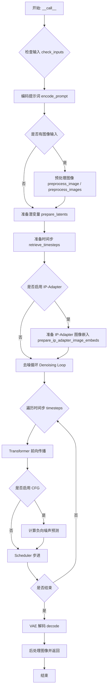

## 类结构

```
DiffusionPipeline (基类)
├── FluxLoraLoaderMixin
├── FromSingleFileMixin
├── TextualInversionLoaderMixin
└── FluxIPAdapterMixin
    └── FluxKontextPipeline (主类)
```

## 全局变量及字段


### `logger`
    
Logger instance for the module to track runtime information and warnings

类型：`logging.Logger`
    


### `XLA_AVAILABLE`
    
Flag indicating whether PyTorch XLA is available for accelerated computation

类型：`bool`
    


### `PipelineSeveralImagesInput`
    
Type alias for accepting multiple image formats including PIL images, numpy arrays and PyTorch tensors in tuple or list form

类型：`Union[Tuple[PIL.Image.Image, ...], Tuple[np.ndarray, ...], Tuple[torch.Tensor, ...], List[Tuple[PIL.Image.Image, ...]], List[Tuple[np.ndarray, ...]], List[Tuple[torch.Tensor, ...]]]`
    


### `EXAMPLE_DOC_STRING`
    
Documentation string containing example usage code for the FluxKontextPipeline

类型：`str`
    


### `PREFERRED_KONTEXT_RESOLUTIONS`
    
List of preferred image resolution pairs that the Kontext model was trained on

类型：`List[Tuple[int, int]]`
    


### `FluxKontextPipeline.vae`
    
Variational Auto-Encoder model for encoding images to and decoding latents from latent space

类型：`AutoencoderKL`
    


### `FluxKontextPipeline.text_encoder`
    
CLIP text encoder model for generating text embeddings from input prompts

类型：`CLIPTextModel`
    


### `FluxKontextPipeline.text_encoder_2`
    
T5 encoder model for generating additional text embeddings with longer context

类型：`T5EncoderModel`
    


### `FluxKontextPipeline.tokenizer`
    
CLIP tokenizer for converting text prompts into token IDs for the CLIP text encoder

类型：`CLIPTokenizer`
    


### `FluxKontextPipeline.tokenizer_2`
    
Fast T5 tokenizer for converting text prompts into token IDs for the T5 encoder

类型：`T5TokenizerFast`
    


### `FluxKontextPipeline.transformer`
    
Main Flux transformer model that denoises latents through the diffusion process

类型：`FluxTransformer2DModel`
    


### `FluxKontextPipeline.scheduler`
    
Flow match Euler discrete scheduler controlling the diffusion denoising steps

类型：`FlowMatchEulerDiscreteScheduler`
    


### `FluxKontextPipeline.image_encoder`
    
CLIP vision encoder with projection for generating image embeddings used in IP-Adapter

类型：`CLIPVisionModelWithProjection`
    


### `FluxKontextPipeline.vae_scale_factor`
    
Scaling factor based on VAE configuration determining the ratio between pixel and latent space dimensions

类型：`int`
    


### `FluxKontextPipeline.latent_channels`
    
Number of channels in the VAE latent representation

类型：`int`
    


### `FluxKontextPipeline.image_processor`
    
Image processor for handling VAE-related image preprocessing and postprocessing operations

类型：`VaeImageProcessor`
    


### `FluxKontextPipeline.tokenizer_max_length`
    
Maximum sequence length supported by the tokenizers for text input

类型：`int`
    


### `FluxKontextPipeline.default_sample_size`
    
Default sample size in pixels used when height and width are not explicitly specified

类型：`int`
    
    

## 全局函数及方法


### `calculate_shift`

该函数实现了一个线性插值算法，用于根据图像序列长度动态计算shift（偏移）值。在Flux扩散模型的推理过程中，该函数将图像的序列长度映射到对应的shift参数，使得调度器能够根据输入图像的大小自适应调整噪声调度策略，从而优化不同分辨率图像的生成质量。

参数：

- `image_seq_len`：图像的序列长度（latent patches的数量），用于计算对应的shift值
- `base_seq_len`：`int`，基础序列长度，默认256，表示线性映射的起始点
- `max_seq_len`：`int`，最大序列长度，默认4096，表示线性映射的终点
- `base_shift`：`float`，基础偏移量，默认0.5，对应base_seq_len时的shift值
- `max_shift`：`float`，最大偏移量，默认1.15，对应max_seq_len时的shift值

返回值：`float`，计算得到的偏移量（mu），用于调度器的噪声调度

#### 流程图

```mermaid
flowchart TD
    A[开始] --> B[输入image_seq_len]
    B --> C[计算斜率 m = (max_shift - base_shift) / (max_seq_len - base_seq_len)]
    C --> D[计算截距 b = base_shift - m * base_seq_len]
    D --> E[计算 mu = image_seq_len * m + b]
    E --> F[返回 mu]
    F --> G[结束]
```

#### 带注释源码

```python
def calculate_shift(
    image_seq_len,          # 图像序列长度，用于计算对应的shift值
    base_seq_len: int = 256,    # 基础序列长度，默认256
    max_seq_len: int = 4096,    # 最大序列长度，默认4096
    base_shift: float = 0.5,    # 基础偏移量，默认0.5
    max_shift: float = 1.15,   # 最大偏移量，默认1.15
):
    """
    计算图像序列长度对应的shift值（线性插值）
    
    该函数通过线性映射，将image_seq_len从[base_seq_len, max_seq_len]区间
    映射到[base_shift, max_shift]区间，用于调整Flux调度器的噪声调度策略。
    """
    # 计算线性方程的斜率 m
    m = (max_shift - base_shift) / (max_seq_len - base_seq_len)
    
    # 计算线性方程的截距 b，使得当seq_len=base_seq_len时，shift=base_shift
    b = base_shift - m * base_seq_len
    
    # 根据图像序列长度计算对应的shift值
    mu = image_seq_len * m + b
    
    # 返回计算得到的偏移量
    return mu
```


### `retrieve_timesteps`

该函数是 diffusion pipeline 中的工具函数，用于调用调度器的 `set_timesteps` 方法并从中获取时间步序列。它支持自定义时间步（timesteps）和自定义噪声调度参数（sigmas），并返回调度后的时间步张量及推理步数。

参数：

-  `scheduler`：`SchedulerMixin`，调度器对象，用于获取时间步
-  `num_inference_steps`：`Optional[int]`，推理步数，当 `timesteps` 和 `sigmas` 都为 `None` 时使用
-  `device`：`Optional[Union[str, torch.device]]`，时间步要移动到的设备，默认为 `None` 表示不移动
-  `timesteps`：`Optional[List[int]]`，自定义时间步列表，用于覆盖调度器的时间步策略，若传入此参数则 `num_inference_steps` 和 `sigmas` 必须为 `None`
-  `sigmas`：`Optional[List[float]]`，自定义噪声调度参数列表，用于覆盖调度器的噪声调度策略，若传入此参数则 `num_inference_steps` 和 `timesteps` 必须为 `None`
-  `**kwargs`：任意关键字参数，将传递给调度器的 `set_timesteps` 方法

返回值：`Tuple[torch.Tensor, int]`，第一个元素是调度器的时间步张量，第二个元素是推理步数

#### 流程图

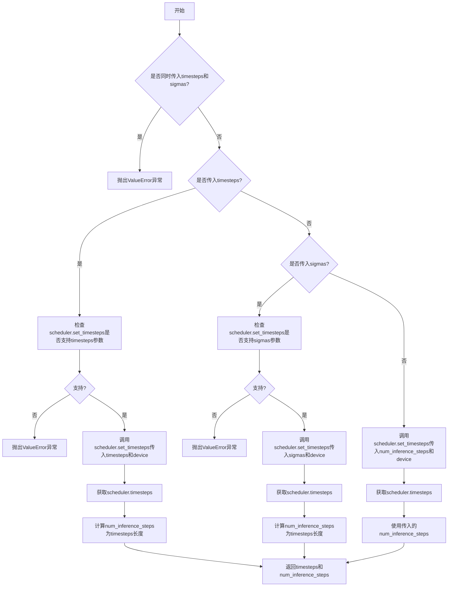

#### 带注释源码

```python
def retrieve_timesteps(
    scheduler,
    num_inference_steps: Optional[int] = None,
    device: Optional[Union[str, torch.device]] = None,
    timesteps: Optional[List[int]] = None,
    sigmas: Optional[List[float]] = None,
    **kwargs,
):
    r"""
    Calls the scheduler's `set_timesteps` method and retrieves timesteps from the scheduler after the call. Handles
    custom timesteps. Any kwargs will be supplied to `scheduler.set_timesteps`.

    Args:
        scheduler (`SchedulerMixin`):
            The scheduler to get timesteps from.
        num_inference_steps (`int`):
            The number of diffusion steps used when generating samples with a pre-trained model. If used, `timesteps`
            must be `None`.
        device (`str` or `torch.device`, *optional*):
            The device to which the timesteps should be moved to. If `None`, the timesteps are not moved.
        timesteps (`List[int]`, *optional*):
            Custom timesteps used to override the timestep spacing strategy of the scheduler. If `timesteps` is passed,
            `num_inference_steps` and `sigmas` must be `None`.
        sigmas (`List[float]`, *optional*):
            Custom sigmas used to override the timestep spacing strategy of the scheduler. If `sigmas` is passed,
            `num_inference_steps` and `timesteps` must be `None`.

    Returns:
        `Tuple[torch.Tensor, int]`: A tuple where the first element is the timestep schedule from the scheduler and the
        second element is the number of inference steps.
    """
    # 检查是否同时传入了timesteps和sigmas，这是不允许的，只能选择其中一种自定义方式
    if timesteps is not None and sigmas is not None:
        raise ValueError("Only one of `timesteps` or `sigmas` can be passed. Please choose one to set custom values")
    
    # 处理自定义时间步的情况
    if timesteps is not None:
        # 通过inspect检查调度器的set_timesteps方法是否支持timesteps参数
        accepts_timesteps = "timesteps" in set(inspect.signature(scheduler.set_timesteps).parameters.keys())
        if not accepts_timesteps:
            raise ValueError(
                f"The current scheduler class {scheduler.__class__}'s `set_timesteps` does not support custom"
                f" timestep schedules. Please check whether you are using the correct scheduler."
            )
        # 调用调度器的set_timesteps方法，传入自定义时间步和设备
        scheduler.set_timesteps(timesteps=timesteps, device=device, **kwargs)
        # 从调度器获取设置后的时间步
        timesteps = scheduler.timesteps
        # 计算推理步数
        num_inference_steps = len(timesteps)
    # 处理自定义sigmas的情况
    elif sigmas is not None:
        # 检查调度器是否支持sigmas参数
        accept_sigmas = "sigmas" in set(inspect.signature(scheduler.set_timesteps).parameters.keys())
        if not accept_sigmas:
            raise ValueError(
                f"The current scheduler class {scheduler.__class__}'s `set_timesteps` does not support custom"
                f" sigmas schedules. Please check whether you are using the correct scheduler."
            )
        # 调用调度器的set_timesteps方法，传入自定义sigmas和设备
        scheduler.set_timesteps(sigmas=sigmas, device=device, **kwargs)
        # 从调度器获取设置后的时间步
        timesteps = scheduler.timesteps
        # 计算推理步数
        num_inference_steps = len(timesteps)
    # 默认情况：使用num_inference_steps设置时间步
    else:
        scheduler.set_timesteps(num_inference_steps, device=device, **kwargs)
        timesteps = scheduler.timesteps
    
    # 返回时间步张量和推理步数
    return timesteps, num_inference_steps
```


### `retrieve_latents`

该函数是用于从变分自编码器（VAE）的输出中提取潜在向量的工具函数。它根据指定的采样模式（sample或argmax）从潜在分布中获取采样值，或者直接返回预存的潜在向量。

参数：

- `encoder_output`：`torch.Tensor`，编码器的输出对象，包含 `latent_dist` 属性（潜在分布）或 `latents` 属性（潜在张量）
- `generator`：`torch.Generator | None`，可选的随机数生成器，用于采样过程中的随机性控制
- `sample_mode`：`str`，采样模式，默认为 `"sample"`，可选值为 `"sample"`（从分布中采样）或 `"argmax"`（取分布的众数）

返回值：`torch.Tensor`，提取出的潜在向量

#### 流程图

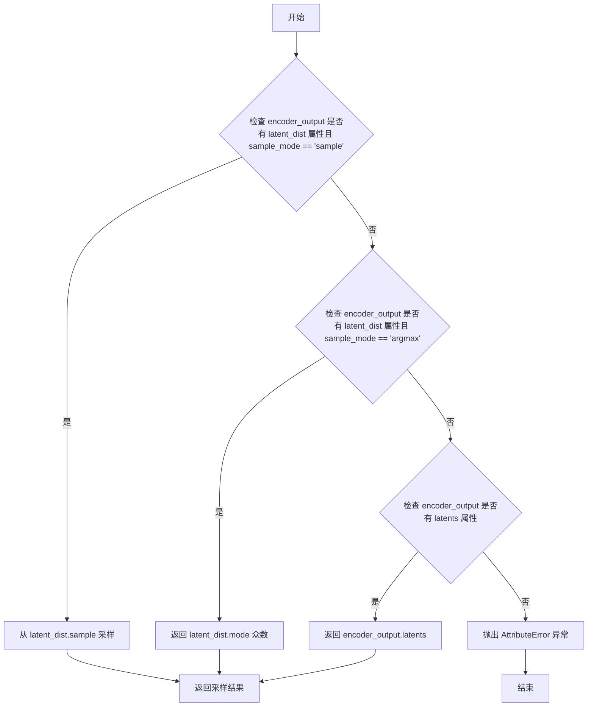

#### 带注释源码

```
# Copied from diffusers.pipelines.stable_diffusion.pipeline_stable_diffusion_img2img.retrieve_latents
def retrieve_latents(
    encoder_output: torch.Tensor, generator: torch.Generator | None = None, sample_mode: str = "sample"
):
    """
    从 VAE 编码器输出中提取潜在向量。
    
    支持三种提取模式：
    1. 从潜在分布中采样（sample_mode="sample"）
    2. 从潜在分布中取众数/最大值（sample_mode="argmax"）
    3. 直接返回预存的潜在向量（latents 属性）
    
    Args:
        encoder_output: 编码器输出，包含 latent_dist 或 latents 属性
        generator: 可选的随机数生成器，用于采样控制
        sample_mode: 采样模式，"sample" 或 "argmax"
    
    Returns:
        提取的潜在向量张量
    
    Raises:
        AttributeError: 当无法从 encoder_output 中访问潜在向量时
    """
    # 模式1：从潜在分布中采样
    if hasattr(encoder_output, "latent_dist") and sample_mode == "sample":
        return encoder_output.latent_dist.sample(generator)
    # 模式2：从潜在分布中取众数
    elif hasattr(encoder_output, "latent_dist") and sample_mode == "argmax":
        return encoder_output.latent_dist.mode()
    # 模式3：直接返回预存的潜在向量
    elif hasattr(encoder_output, "latents"):
        return encoder_output.latents
    # 无法访问潜在向量
    else:
        raise AttributeError("Could not access latents of provided encoder_output")
```


### `FluxKontextPipeline.__init__`

初始化 Flux Kontext Pipeline 管道，包含调度器、VAE、文本编码器、分词器、Transformer 模型等核心组件，并配置图像处理器、VAE 缩放因子、潜在通道数等关键参数。

参数：

- `scheduler`：`FlowMatchEulerDiscreteScheduler`，用于去噪图像潜在表示的调度器
- `vae`：`AutoencoderKL`，用于将图像编码和解码到潜在表示的变分自编码器模型
- `text_encoder`：`CLIPTextModel`，CLIP 文本编码器模型
- `tokenizer`：`CLIPTokenizer`，CLIP 分词器
- `text_encoder_2`：`T5EncoderModel`，T5 文本编码器模型
- `tokenizer_2`：`T5TokenizerFast`，T5 分词器
- `transformer`：`FluxTransformer2DModel`，用于去噪图像潜在表示的条件 Transformer (MMDiT) 架构
- `image_encoder`：`CLIPVisionModelWithProjection`（可选），CLIP 视觉编码器，用于 IP Adapter
- `feature_extractor`：`CLIPImageProcessor`（可选），CLIP 图像处理器，用于 IP Adapter

返回值：无（`None`），构造函数不返回值，仅初始化实例属性

#### 流程图

```mermaid
flowchart TD
    A[开始 __init__] --> B[调用父类 DiffusionPipeline.__init__]
    B --> C[调用 self.register_modules 注册所有模块]
    C --> D[计算 vae_scale_factor: 2^(len(vae.config.block_out_channels)-1)]
    D --> E[设置 latent_channels: vae.config.latent_channels 或 16]
    E --> F[创建 VaeImageProcessor 并设置 vae_scale_factor*2]
    F --> G[设置 tokenizer_max_length: tokenizer.model_max_length 或 77]
    G --> H[设置 default_sample_size: 128]
    H --> I[结束 __init__]
```

#### 带注释源码

```python
def __init__(
    self,
    scheduler: FlowMatchEulerDiscreteScheduler,  # 调度器：用于去噪过程的调度器
    vae: AutoencoderKL,  # VAE：变分自编码器，用于图像编码/解码
    text_encoder: CLIPTextModel,  # 文本编码器：CLIP 文本编码
    tokenizer: CLIPTokenizer,  # 分词器：CLIP 分词器
    text_encoder_2: T5EncoderModel,  # 文本编码器2：T5 文本编码器
    tokenizer_2: T5TokenizerFast,  # 分词器2：T5 分词器
    transformer: FluxTransformer2DModel,  # Transformer：Flux Transformer 模型
    image_encoder: CLIPVisionModelWithProjection = None,  # 图像编码器：可选，用于 IP Adapter
    feature_extractor: CLIPImageProcessor = None,  # 特征提取器：可选，用于 IP Adapter
):
    # 调用父类 DiffusionPipeline 的初始化方法
    super().__init__()

    # 注册所有模块到管道中，使其可通过 pipeline.xxx 访问
    self.register_modules(
        vae=vae,
        text_encoder=text_encoder,
        text_encoder_2=text_encoder_2,
        tokenizer=tokenizer,
        tokenizer_2=tokenizer_2,
        transformer=transformer,
        scheduler=scheduler,
        image_encoder=image_encoder,
        feature_extractor=feature_extractor,
    )
    
    # 计算 VAE 缩放因子：2^(block_out_channels 数量 - 1)
    # Flux 潜在表示被转换为 2x2 块并打包，因此潜在宽度和高度必须能被块大小整除
    # VAE 缩放因子乘以块大小以考虑这一点
    self.vae_scale_factor = 2 ** (len(self.vae.config.block_out_channels) - 1) if getattr(self, "vae", None) else 8
    
    # 设置潜在通道数：如果有 VAE 则使用其配置，否则默认为 16
    self.latent_channels = self.vae.config.latent_channels if getattr(self, "vae", None) else 16
    
    # 创建图像处理器，VAE 缩放因子乘以 2 以考虑打包
    self.image_processor = VaeImageProcessor(vae_scale_factor=self.vae_scale_factor * 2)
    
    # 设置分词器最大长度：使用 tokenizer 的 model_max_length，默认 77
    self.tokenizer_max_length = (
        self.tokenizer.model_max_length if hasattr(self, "tokenizer") and self.tokenizer is not None else 77
    )
    
    # 设置默认采样大小
    self.default_sample_size = 128
```


### `FluxKontextPipeline._get_t5_prompt_embeds`

该方法用于使用T5文本编码器（text_encoder_2）生成文本嵌入（prompt embeddings），支持批量处理和单prompt生成多张图像的场景。它首先将输入的prompt token化，然后通过T5编码器获取文本特征表示，最后根据`num_images_per_prompt`参数复制embeddings以适配多图生成需求。

参数：

- `self`：隐式参数，指向`FluxKontextPipeline`实例本身
- `prompt`：`Union[str, List[str]]`，输入的文本提示，可以是单个字符串或字符串列表
- `num_images_per_prompt`：`int`，每个prompt生成的图像数量，默认为1
- `max_sequence_length`：`int`，最大序列长度，默认为512，用于控制tokenizer的最大长度
- `device`：`Optional[torch.device]`，指定计算设备，若为None则使用`self._execution_device`
- `dtype`：`Optional[torch.dtype]`，指定数据类型，若为None则使用`self.text_encoder.dtype`

返回值：`torch.FloatTensor`，返回形状为`(batch_size * num_images_per_prompt, seq_len, hidden_size)`的文本嵌入张量，其中`seq_len`为序列长度，`hidden_size`为T5编码器的隐藏层维度

#### 流程图

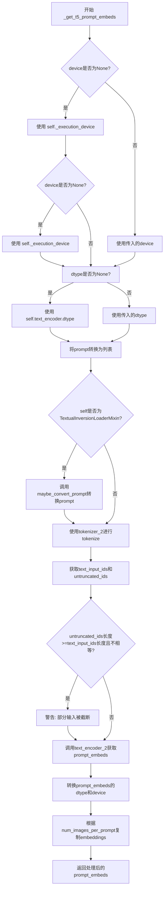

#### 带注释源码

```python
def _get_t5_prompt_embeds(
    self,
    prompt: Union[str, List[str]] = None,
    num_images_per_prompt: int = 1,
    max_sequence_length: int = 512,
    device: Optional[torch.device] = None,
    dtype: Optional[torch.dtype] = None,
):
    """
    获取T5文本编码器的prompt embeddings。
    
    该方法将文本prompt转换为T5编码器可以处理的嵌入向量，
    支持批量处理和单prompt生成多张图像的场景。
    
    参数:
        prompt: 输入的文本提示，可以是单个字符串或字符串列表
        num_images_per_prompt: 每个prompt生成的图像数量
        max_sequence_length: 最大序列长度，默认为512
        device: 计算设备，若为None则自动获取
        dtype: 数据类型，若为None则自动获取
    
    返回:
        形状为 (batch_size * num_images_per_prompt, seq_len, hidden_size) 的嵌入张量
    """
    # 确定设备：如果未指定，则使用执行设备
    device = device or self._execution_device
    # 确定数据类型：如果未指定，则使用text_encoder的数据类型
    dtype = dtype or self.text_encoder.dtype

    # 将单个字符串转换为列表，统一处理方式
    prompt = [prompt] if isinstance(prompt, str) else prompt
    # 获取批次大小
    batch_size = len(prompt)

    # 如果支持TextualInversion，加载提示转换器
    if isinstance(self, TextualInversionLoaderMixin):
        prompt = self.maybe_convert_prompt(prompt, self.tokenizer_2)

    # 使用T5 tokenizer对prompt进行tokenize
    # padding="max_length"：填充到最大长度
    # truncation=True：截断超过最大长度的序列
    # return_tensors="pt"：返回PyTorch张量
    text_inputs = self.tokenizer_2(
        prompt,
        padding="max_length",
        max_length=max_sequence_length,
        truncation=True,
        return_length=False,
        return_overflowing_tokens=False,
        return_tensors="pt",
    )
    # 获取tokenized后的输入IDs
    text_input_ids = text_inputs.input_ids
    # 使用最长填充方式获取未截断的IDs，用于比较
    untruncated_ids = self.tokenizer_2(prompt, padding="longest", return_tensors="pt").input_ids

    # 检查是否发生了截断，如果是则记录警告信息
    if untruncated_ids.shape[-1] >= text_input_ids.shape[-1] and not torch.equal(text_input_ids, untruncated_ids):
        # 解码被截断的部分并记录警告
        removed_text = self.tokenizer_2.batch_decode(untruncated_ids[:, self.tokenizer_max_length - 1 : -1])
        logger.warning(
            "The following part of your input was truncated because `max_sequence_length` is set to "
            f" {max_sequence_length} tokens: {removed_text}"
        )

    # 调用T5文本编码器获取文本嵌入
    # output_hidden_states=False：只返回最后的隐藏状态
    # [0]：获取第一个元素（last_hidden_state）
    prompt_embeds = self.text_encoder_2(text_input_ids.to(device), output_hidden_states=False)[0]

    # 更新dtype为text_encoder_2的实际dtype
    dtype = self.text_encoder_2.dtype
    # 将embeddings转换到指定的设备和数据类型
    prompt_embeds = prompt_embeds.to(dtype=dtype, device=device)

    # 获取embeddings的形状信息
    _, seq_len, _ = prompt_embeds.shape

    # 为每个prompt生成多个图像复制embeddings
    # 使用mps友好的方法（repeat而不是repeat_interleave）
    # 首先在序列维度重复
    prompt_embeds = prompt_embeds.repeat(1, num_images_per_prompt, 1)
    # 然后reshape以匹配批量大小的扩展
    prompt_embeds = prompt_embeds.view(batch_size * num_images_per_prompt, seq_len, -1)

    return prompt_embeds
```


### `FluxKontextPipeline._get_clip_prompt_embeds`

该方法用于使用CLIP文本编码器将文本提示转换为向量嵌入（embeddings），支持批量处理和每条提示生成多张图像的场景。

参数：

- `prompt`：`Union[str, List[str]]`，要编码的文本提示，可以是单个字符串或字符串列表
- `num_images_per_prompt`：`int = 1`，每个提示生成的图像数量，用于复制embeddings
- `device`：`Optional[torch.device] = None`，计算设备，若未指定则使用执行设备

返回值：`torch.FloatTensor`，CLIP模型生成的文本嵌入向量，形状为 `(batch_size * num_images_per_prompt, embedding_dim)`

#### 流程图

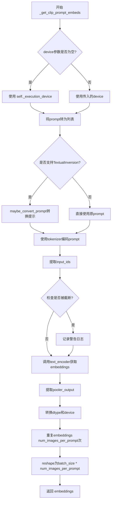

#### 带注释源码

```python
def _get_clip_prompt_embeds(
    self,
    prompt: Union[str, List[str]],
    num_images_per_prompt: int = 1,
    device: Optional[torch.device] = None,
):
    """使用CLIP文本编码器生成文本提示嵌入向量

    Args:
        prompt: 要编码的文本提示，支持单个字符串或字符串列表
        num_images_per_prompt: 每个提示生成的图像数量，用于复制embeddings
        device: 计算设备，若为None则使用self._execution_device

    Returns:
        torch.FloatTensor: CLIP模型生成的文本嵌入向量
    """
    # 确定使用的设备，优先使用传入的device，否则使用执行设备
    device = device or self._execution_device

    # 统一将prompt转为列表格式，便于批量处理
    prompt = [prompt] if isinstance(prompt, str) else prompt
    batch_size = len(prompt)

    # 如果支持TextualInversion（文本反转），进行提示转换
    # 这允许使用自定义的token嵌入
    if isinstance(self, TextualInversionLoaderMixin):
        prompt = self.maybe_convert_prompt(prompt, self.tokenizer)

    # 使用CLIP tokenizer对prompt进行分词和编码
    # 填充到最大长度，截断过长的序列
    text_inputs = self.tokenizer(
        prompt,
        padding="max_length",
        max_length=self.tokenizer_max_length,
        truncation=True,
        return_overflowing_tokens=False,
        return_length=False,
        return_tensors="pt",
    )

    # 获取编码后的token IDs
    text_input_ids = text_inputs.input_ids
    
    # 使用不截断的方式重新编码，用于检测是否发生了截断
    untruncated_ids = self.tokenizer(prompt, padding="longest", return_tensors="pt").input_ids
    
    # 如果发生了截断，记录警告信息
    if untruncated_ids.shape[-1] >= text_input_ids.shape[-1] and not torch.equal(text_input_ids, untruncated_ids):
        removed_text = self.tokenizer.batch_decode(untruncated_ids[:, self.tokenizer_max_length - 1 : -1])
        logger.warning(
            "The following part of your input was truncated because CLIP can only handle sequences up to"
            f" {self.tokenizer_max_length} tokens: {removed_text}"
        )
    
    # 调用CLIP文本编码器获取嵌入向量
    # output_hidden_states=False表示只返回最后的隐藏状态
    prompt_embeds = self.text_encoder(text_input_ids.to(device), output_hidden_states=False)

    # 从CLIPTextModel输出中提取pooled输出
    # 这是经过池化操作后的句子级别表示
    prompt_embeds = prompt_embeds.pooler_output
    
    # 转换到正确的dtype和device
    prompt_embeds = prompt_embeds.to(dtype=self.text_encoder.dtype, device=device)

    # 为每个提示生成多个图像复制embeddings
    # 使用MPS友好的方法进行复制
    prompt_embeds = prompt_embeds.repeat(1, num_images_per_prompt)
    
    # 调整形状为 (batch_size * num_images_per_prompt, embedding_dim)
    prompt_embeds = prompt_embeds.view(batch_size * num_images_per_prompt, -1)

    return prompt_embeds
```


### FluxKontextPipeline.encode_prompt

该方法负责将文本提示编码为文本嵌入向量，支持CLIP和T5两种文本编码器，并处理LoRA缩放、提示词批处理等逻辑。

参数：

- `self`：FluxKontextPipeline 实例本身
- `prompt`：`Union[str, List[str]]`，主要提示词，用于 CLIP 文本编码器
- `prompt_2`：`Union[str, List[str]]`，发送给 T5 文本编码器的提示词，若未定义则使用 prompt
- `device`：`Optional[torch.device]`，torch 设备，若未提供则使用执行设备
- `num_images_per_prompt`：`int`，每个提示词生成的图像数量，默认为 1
- `prompt_embeds`：`Optional[torch.FloatTensor]`，预生成的文本嵌入，可用于轻松调整文本输入
- `pooled_prompt_embeds`：`Optional[torch.FloatTensor]`，预生成的池化文本嵌入
- `max_sequence_length`：`int`，最大序列长度，默认为 512
- `lora_scale`：`Optional[float]`，LoRA 缩放因子，将应用于所有 LoRA 层

返回值：`Tuple[torch.FloatTensor, torch.FloatTensor, torch.Tensor]`，返回 (prompt_embeds, pooled_prompt_embeds, text_ids)，其中：
- `prompt_embeds`：T5 编码的文本嵌入
- `pooled_prompt_embeds`：CLIP 编码的池化文本嵌入
- `text_ids`：用于文本的位置编码张量

#### 流程图

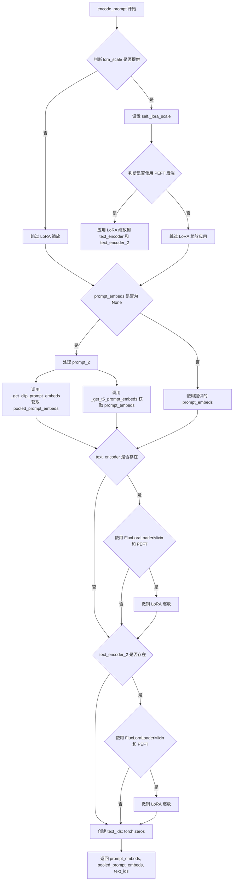

#### 带注释源码

```python
def encode_prompt(
    self,
    prompt: Union[str, List[str]],
    prompt_2: Union[str, List[str]],
    device: Optional[torch.device] = None,
    num_images_per_prompt: int = 1,
    prompt_embeds: Optional[torch.FloatTensor] = None,
    pooled_prompt_embeds: Optional[torch.FloatTensor] = None,
    max_sequence_length: int = 512,
    lora_scale: Optional[float] = None,
):
    r"""
    Args:
        prompt (`str` or `List[str]`, *optional*):
            prompt to be encoded
        prompt_2 (`str` or `List[str]`, *optional*):
            The prompt or prompts to be sent to the `tokenizer_2` and `text_encoder_2`. If not defined, `prompt` is
            used in all text-encoders
        device: (`torch.device`):
            torch device
        num_images_per_prompt (`int`):
            number of images that should be generated per prompt
        prompt_embeds (`torch.FloatTensor`, *optional*):
            Pre-generated text embeddings. Can be used to easily tweak text inputs, *e.g.* prompt weighting. If not
            provided, text embeddings will be generated from `prompt` input argument.
        pooled_prompt_embeds (`torch.FloatTensor`, *optional*):
            Pre-generated pooled text embeddings. Can be used to easily tweak text inputs, *e.g.* prompt weighting.
            If not provided, pooled text embeddings will be generated from `prompt` input argument.
        lora_scale (`float`, *optional*):
            A lora scale that will be applied to all LoRA layers of the text encoder if LoRA layers are loaded.
    """
    # 获取设备，若未提供则使用执行设备
    device = device or self._execution_device

    # 设置 lora scale，以便 LoRA 函数的 monkey patched 可以正确访问
    if lora_scale is not None and isinstance(self, FluxLoraLoaderMixin):
        self._lora_scale = lora_scale

        # 动态调整 LoRA 缩放
        if self.text_encoder is not None and USE_PEFT_BACKEND:
            scale_lora_layers(self.text_encoder, lora_scale)
        if self.text_encoder_2 is not None and USE_PEFT_BACKEND:
            scale_lora_layers(self.text_encoder_2, lora_scale)

    # 将 prompt 转换为列表
    prompt = [prompt] if isinstance(prompt, str) else prompt

    # 如果没有提供 prompt_embeds，则需要生成
    if prompt_embeds is None:
        # prompt_2 默认等于 prompt
        prompt_2 = prompt_2 or prompt
        prompt_2 = [prompt_2] if isinstance(prompt_2, str) else prompt_2

        # 使用 CLIPTextModel 获取池化输出
        pooled_prompt_embeds = self._get_clip_prompt_embeds(
            prompt=prompt,
            device=device,
            num_images_per_prompt=num_images_per_prompt,
        )
        # 使用 T5 获取文本嵌入
        prompt_embeds = self._get_t5_prompt_embeds(
            prompt=prompt_2,
            num_images_per_prompt=num_images_per_prompt,
            max_sequence_length=max_sequence_length,
            device=device,
        )

    # 如果 text_encoder 存在，且使用了 LoRA 和 PEFT 后端，则撤销 LoRA 缩放
    if self.text_encoder is not None:
        if isinstance(self, FluxLoraLoaderMixin) and USE_PEFT_BACKEND:
            # 通过缩放回 LoRA 层来恢复原始缩放
            unscale_lora_layers(self.text_encoder, lora_scale)

    # 如果 text_encoder_2 存在，且使用了 LoRA 和 PEFT 后端，则撤销 LoRA 缩放
    if self.text_encoder_2 is not None:
        if isinstance(self, FluxLoraLoaderMixin) and USE_PEFT_BACKEND:
            # 通过缩放回 LoRA 层来恢复原始缩放
            unscale_lora_layers(self.text_encoder_2, lora_scale)

    # 确定数据类型：优先使用 text_encoder 的 dtype，否则使用 transformer 的 dtype
    dtype = self.text_encoder.dtype if self.text_encoder is not None else self.transformer.dtype
    # 创建文本位置编码张量，形状为 (seq_len, 3)，全零
    text_ids = torch.zeros(prompt_embeds.shape[1], 3).to(device=device, dtype=dtype)

    return prompt_embeds, pooled_prompt_embeds, text_ids
```


### `FluxKontextPipeline.encode_image`

该方法负责将输入图像编码为图像嵌入向量（image embeddings），供后续的 IP-Adapter 图像提示功能使用。它首先确保图像格式为 PyTorch 张量，然后通过图像编码器（CLIPVisionModelWithProjection）提取特征，最后根据每个 prompt 生成的图像数量复制embeddings。

参数：

- `image`：输入的图像，支持 torch.Tensor、PIL.Image、np.ndarray 等多种格式
- `device`：torch.device，用于指定计算设备
- `num_images_per_prompt`：int，每个 prompt 生成的图像数量，用于决定embeddings的重复次数

返回值：`torch.Tensor`，图像的嵌入向量，形状为 `(batch_size * num_images_per_prompt, embedding_dim)`

#### 流程图

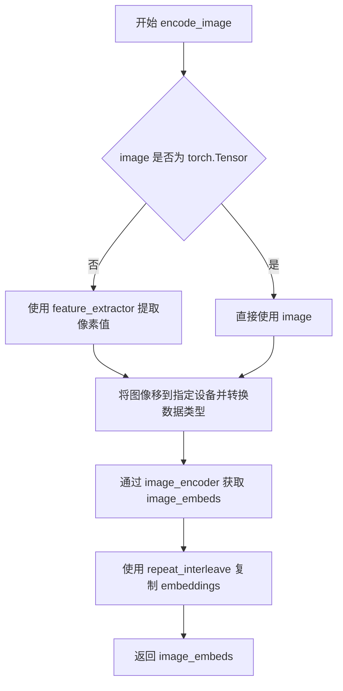

#### 带注释源码

```python
def encode_image(self, image, device, num_images_per_prompt):
    # 获取图像编码器的参数数据类型，用于后续一致的数据类型转换
    dtype = next(self.image_encoder.parameters()).dtype

    # 如果输入不是 PyTorch 张量，使用特征提取器将其转换为张量格式
    # 支持 PIL.Image、numpy数组等多种输入格式
    if not isinstance(image, torch.Tensor):
        image = self.feature_extractor(image, return_tensors="pt").pixel_values

    # 将图像数据移动到指定设备（CPU/GPU）并转换为正确的 dtype
    image = image.to(device=device, dtype=dtype)
    
    # 通过 CLIP 视觉编码器提取图像embeddings
    # 返回的 image_embeds 是图像的语义特征表示
    image_embeds = self.image_encoder(image).image_embeds
    
    # 根据每个 prompt 生成的图像数量复制 embeddings
    # 例如：如果 num_images_per_prompt=2，则每个prompt的embeddings会复制两次
    # 这样可以与后续的文本embeddings对齐
    image_embeds = image_embeds.repeat_interleave(num_images_per_prompt, dim=0)
    
    # 返回处理后的图像embeddings
    return image_embeds
```


### `FluxKontextPipeline.prepare_ip_adapter_image_embeds`

该方法用于准备 IP-Adapter 的图像嵌入向量，处理输入的图像或预计算的图像嵌入，并将其扩展为与批量大小和每提示图像数量相匹配的格式。

参数：

- `self`：`FluxKontextPipeline` 类实例，隐式传递
- `ip_adapter_image`：`PipelineImageInput`，待处理的 IP-Adapter 输入图像，支持单张图像或图像列表
- `ip_adapter_image_embeds`：`Optional[List[torch.Tensor]]`，预计算的图像嵌入向量列表，若为 `None` 则从 `ip_adapter_image` 编码生成
- `device`：`torch.device`，用于计算的目标设备
- `num_images_per_prompt`：`int`，每个 prompt 生成的图像数量，用于对图像嵌入进行批量复制

返回值：`List[torch.Tensor]`，处理后的 IP-Adapter 图像嵌入列表，长度等于 IP-Adapter 数量，每个元素为扩展后的嵌入张量

#### 流程图

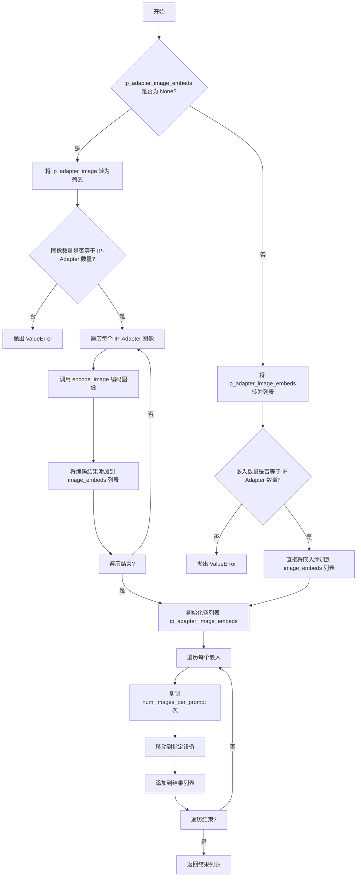

#### 带注释源码

```python
# 复制自 diffusers.pipelines.flux.pipeline_flux.FluxPipeline.prepare_ip_adapter_image_embeds
def prepare_ip_adapter_image_embeds(
    self, ip_adapter_image, ip_adapter_image_embeds, device, num_images_per_prompt
):
    """
    准备 IP-Adapter 的图像嵌入向量。
    
    该方法处理两种输入模式：
    1. 当 ip_adapter_image_embeds 为 None 时，从 ip_adapter_image 编码生成嵌入
    2. 当 ip_adapter_image_embeds 不为 None 时，直接使用预计算的嵌入
    
    参数:
        ip_adapter_image: IP-Adapter 输入图像，支持单张或列表
        ip_adapter_image_embeds: 预计算的图像嵌入，若为 None 则从图像编码
        device: 计算设备
        num_images_per_prompt: 每个 prompt 生成的图像数量
    """
    # 初始化存储图像嵌入的列表
    image_embeds = []
    
    # 模式1: 需要从图像编码生成嵌入
    if ip_adapter_image_embeds is None:
        # 确保输入是列表格式
        if not isinstance(ip_adapter_image, list):
            ip_adapter_image = [ip_adapter_image]

        # 验证图像数量与 IP-Adapter 数量是否匹配
        if len(ip_adapter_image) != self.transformer.encoder_hid_proj.num_ip_adapters:
            raise ValueError(
                f"`ip_adapter_image` must have same length as the number of IP Adapters. Got {len(ip_adapter_image)} images and {self.transformer.encoder_hid_proj.num_ip_adapters} IP Adapters."
            )

        # 遍历每个 IP-Adapter 图像并编码
        for single_ip_adapter_image in ip_adapter_image:
            # 调用 encode_image 方法编码单张图像，num_images_per_prompt 设为 1
            single_image_embeds = self.encode_image(single_ip_adapter_image, device, 1)
            # 在第0维添加批次维度后添加到列表
            image_embeds.append(single_image_embeds[None, :])
    else:
        # 模式2: 使用预计算的嵌入
        
        # 确保嵌入是列表格式
        if not isinstance(ip_adapter_image_embeds, list):
            ip_adapter_image_embeds = [ip_adapter_image_embeds]

        # 验证嵌入数量与 IP-Adapter 数量是否匹配
        if len(ip_adapter_image_embeds) != self.transformer.encoder_hid_proj.num_ip_adapters:
            raise ValueError(
                f"`ip_adapter_image_embeds` must have same length as the number of IP Adapters. Got {len(ip_adapter_image_embeds)} image embeds and {self.transformer.encoder_hid_proj.num_ip_adapters} IP Adapters."
            )

        # 直接将预计算的嵌入添加到列表
        for single_image_embeds in ip_adapter_image_embeds:
            image_embeds.append(single_image_embeds)

    # 对每个嵌入进行批量扩展以匹配 num_images_per_prompt
    ip_adapter_image_embeds = []
    for single_image_embeds in image_embeds:
        # 复制嵌入 num_images_per_prompt 次
        single_image_embeds = torch.cat([single_image_embeds] * num_images_per_prompt, dim=0)
        # 将嵌入移动到指定设备
        single_image_embeds = single_image_embeds.to(device=device)
        # 添加到结果列表
        ip_adapter_image_embeds.append(single_image_embeds)

    return ip_adapter_image_embeds
```


### `FluxKontextPipeline.check_inputs`

该方法用于验证 FluxKontextPipeline 的输入参数有效性，确保传入的提示词、图像尺寸、嵌入向量等参数符合模型要求，若不符合则抛出相应的 ValueError 异常。

参数：

- `self`：`FluxKontextPipeline` 实例本身
- `prompt`：`Union[str, List[str]]`，主要文本提示词，用于指导图像生成
- `prompt_2`：`Union[str, List[str]]`，发送给第二个 tokenizer 和 text_encoder_2 的提示词，若未定义则使用 prompt
- `height`：`int`，生成图像的高度（像素）
- `width`：`int`，生成图像的宽度（像素）
- `negative_prompt`：`Union[str, List[str]]`，负面提示词，用于引导图像生成时排除相关内容
- `negative_prompt_2`：`Union[str, List[str]]`，发送给第二个 tokenizer 和 text_encoder_2 的负面提示词
- `prompt_embeds`：`torch.FloatTensor`，预生成的文本嵌入，可用于轻松调整文本输入
- `negative_prompt_embeds`：`torch.FloatTensor`，预生成的负面文本嵌入
- `pooled_prompt_embeds`：`torch.FloatTensor`，预生成的池化文本嵌入
- `negative_pooled_prompt_embeds`：`torch.FloatTensor`，预生成的负面池化文本嵌入
- `callback_on_step_end_tensor_inputs`：`List[str]`，在每个去噪步骤结束时调用的回调函数所支持的张量输入列表
- `max_sequence_length`：`int`，与 prompt 一起使用的最大序列长度

返回值：无返回值（`None`），该方法通过抛出 `ValueError` 异常来处理无效输入

#### 流程图

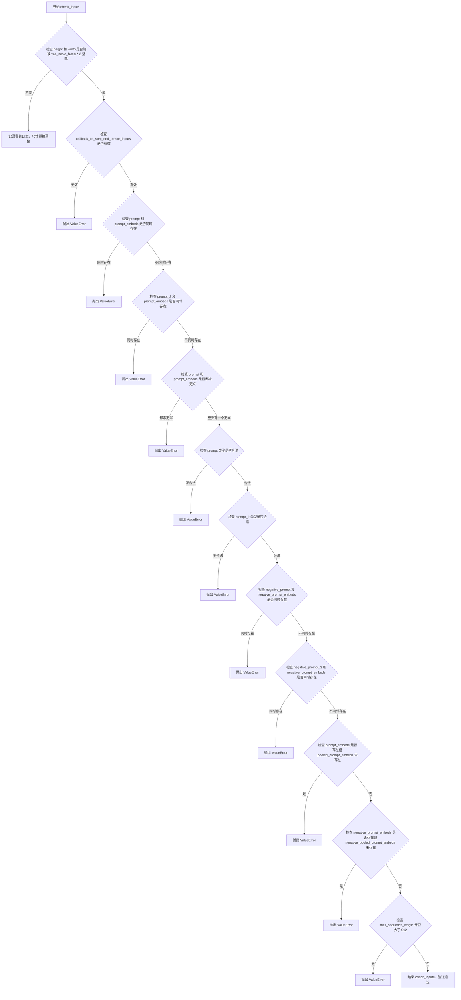

#### 带注释源码

```python
def check_inputs(
    self,
    prompt,
    prompt_2,
    height,
    width,
    negative_prompt=None,
    negative_prompt_2=None,
    prompt_embeds=None,
    negative_prompt_embeds=None,
    pooled_prompt_embeds=None,
    negative_pooled_prompt_embeds=None,
    callback_on_step_end_tensor_inputs=None,
    max_sequence_length=None,
):
    # 检查图像高度和宽度是否能够被 vae_scale_factor * 2 整除
    # 如果不能整除，VAE 在处理时可能出现问题，需要记录警告日志
    if height % (self.vae_scale_factor * 2) != 0 or width % (self.vae_scale_factor * 2) != 0:
        logger.warning(
            f"`height` and `width` have to be divisible by {self.vae_scale_factor * 2} but are {height} and {width}. Dimensions will be resized accordingly"
        )

    # 验证回调函数所支持的张量输入是否在允许的列表中
    # callback_on_step_end_tensor_inputs 必须是 self._callback_tensor_inputs 的子集
    if callback_on_step_end_tensor_inputs is not None and not all(
        k in self._callback_tensor_inputs for k in callback_on_step_end_tensor_inputs
    ):
        raise ValueError(
            f"`callback_on_step_end_tensor_inputs` has to be in {self._callback_tensor_inputs}, but found {[k for k in callback_on_step_end_tensor_inputs if k not in self._callback_tensor_inputs]}"
        )

    # 检查 prompt 和 prompt_embeds 不能同时传入，两者只能选择其一
    if prompt is not None and prompt_embeds is not None:
        raise ValueError(
            f"Cannot forward both `prompt`: {prompt} and `prompt_embeds`: {prompt_embeds}. Please make sure to"
            " only forward one of the two."
        )
    # 检查 prompt_2 和 prompt_embeds 不能同时传入
    elif prompt_2 is not None and prompt_embeds is not None:
        raise ValueError(
            f"Cannot forward both `prompt_2`: {prompt_2} and `prompt_embeds`: {prompt_embeds}. Please make sure to"
            " only forward one of the two."
        )
    # 至少需要提供 prompt 或 prompt_embeds 之一
    elif prompt is None and prompt_embeds is None:
        raise ValueError(
            "Provide either `prompt` or `prompt_embeds`. Cannot leave both `prompt` and `prompt_embeds` undefined."
        )
    # 验证 prompt 的类型必须是字符串或字符串列表
    elif prompt is not None and (not isinstance(prompt, str) and not isinstance(prompt, list)):
        raise ValueError(f"`prompt` has to be of type `str` or `list` but is {type(prompt)}")
    # 验证 prompt_2 的类型必须是字符串或字符串列表
    elif prompt_2 is not None and (not isinstance(prompt_2, str) and not isinstance(prompt_2, list)):
        raise ValueError(f"`prompt_2` has to be of type `str` or `list` but is {type(prompt_2)}")

    # 检查 negative_prompt 和 negative_prompt_embeds 不能同时传入
    if negative_prompt is not None and negative_prompt_embeds is not None:
        raise ValueError(
            f"Cannot forward both `negative_prompt`: {negative_prompt} and `negative_prompt_embeds`:"
            f" {negative_prompt_embeds}. Please make sure to only forward one of the two."
        )
    # 检查 negative_prompt_2 和 negative_prompt_embeds 不能同时传入
    elif negative_prompt_2 is not None and negative_prompt_embeds is not None:
        raise ValueError(
            f"Cannot forward both `negative_prompt_2`: {negative_prompt_2} and `negative_prompt_embeds`:"
            f" {negative_prompt_embeds}. Please make sure to only forward one of the two."
        )

    # 如果提供了 prompt_embeds，则 pooled_prompt_embeds 也必须提供
    if prompt_embeds is not None and pooled_prompt_embeds is None:
        raise ValueError(
            "If `prompt_embeds` are provided, `pooled_prompt_embeds` also have to be passed. Make sure to generate `pooled_prompt_embeds` from the same text encoder that was used to generate `prompt_embeds`."
        )
    # 如果提供了 negative_prompt_embeds，则 negative_pooled_prompt_embeds 也必须提供
    if negative_prompt_embeds is not None and negative_pooled_prompt_embeds is None:
        raise ValueError(
            "If `negative_prompt_embeds` are provided, `negative_pooled_prompt_embeds` also have to be passed. Make sure to generate `negative_pooled_prompt_embeds` from the same text encoder that was used to generate `negative_prompt_embeds`."
        )

    # max_sequence_length 不能超过 512，这是 T5 编码器的限制
    if max_sequence_length is not None and max_sequence_length > 512:
        raise ValueError(f"`max_sequence_length` cannot be greater than 512 but is {max_sequence_length}")
```


### `FluxKontextPipeline._prepare_latent_image_ids`

生成用于表示潜在图像空间中每个像素位置的2D坐标ID张量。这些位置ID会被传递给Transformer模型，用于在自注意力机制中编码图像的空间位置信息，使模型能够理解不同潜在像素之间的相对位置关系。

参数：

- `batch_size`：`int`，批次大小（当前方法中未直接使用，仅为接口兼容性保留）
- `height`：`int`，潜在图像的高度（以补丁为单位）
- `width`：`int`，潜在图像的宽度（以补丁为单位）
- `device`：`torch.device`，输出张量要放置的目标设备
- `dtype`：`torch.dtype`，输出张量的目标数据类型

返回值：`torch.Tensor`，形状为 `(height * width, 3)` 的位置编码张量，其中每行包含 `[0, y坐标, x坐标]` 格式的位置标识

#### 流程图

```mermaid
flowchart TD
    A[开始] --> B[创建 height×width×3 的零张量]
    B --> C[在通道1填充垂直坐标<br/>latent_image_ids[;,1] += torch.arange(height)[:,None]]
    C --> D[在通道2填充水平坐标<br/>latent_image_ids[;,2] += torch.arange(width)[None,:]]
    D --> E[获取张量形状<br/>height, width, channels]
    E --> F[重塑为二维<br/>reshape height*width, 3]
    F --> G[转移至目标设备并转换类型<br/>.to(device, dtype)]
    G --> H[返回位置编码张量]
```

#### 带注释源码

```python
@staticmethod
def _prepare_latent_image_ids(batch_size, height, width, device, dtype):
    """
    生成潜在图像的位置编码ID，用于Transformer中的空间位置感知。
    
    参数:
        batch_size: 批次大小（当前方法未使用，为保持接口一致性）
        height: 潜在图像高度（以2x2补丁为单位）
        width: 潜在图像宽度（以2x2补丁为单位）
        device: 目标设备
        dtype: 目标数据类型
    
    返回:
        形状为 (height * width, 3) 的张量，每行 [0, y, x] 表示位置
    """
    # 步骤1: 创建初始零张量，形状为 (height, width, 3)
    # 3个通道分别用于: [batch标识=0, y坐标, x坐标]
    latent_image_ids = torch.zeros(height, width, 3)
    
    # 步骤2: 在第2个通道(索引1)填充垂直(y)坐标
    # torch.arange(height)[:, None] 创建列向量，形状 (height, 1)
    # 广播机制将每个高度值复制到对应的整行
    latent_image_ids[..., 1] = latent_image_ids[..., 1] + torch.arange(height)[:, None]
    
    # 步骤3: 在第3个通道(索引2)填充水平(x)坐标
    # torch.arange(width)[None, :] 创建行向量，形状 (1, width)
    # 广播机制将每个宽度值复制到对应的整列
    latent_image_ids[..., 2] = latent_image_ids[..., 2] + torch.arange(width)[None, :]
    
    # 步骤4: 获取重塑前的张量维度信息
    latent_image_id_height, latent_image_id_width, latent_image_id_channels = latent_image_ids.shape
    
    # 步骤5: 将3D张量重塑为2D张量
    # 从 (height, width, 3) 转换为 (height*width, 3)
    # 展平后每行代表一个潜在像素位置
    latent_image_ids = latent_image_ids.reshape(
        latent_image_id_height * latent_image_id_width, latent_image_id_channels
    )
    
    # 步骤6: 将张量转移到指定设备并转换数据类型后返回
    return latent_image_ids.to(device=device, dtype=dtype)
```


### `FluxKontextPipeline._pack_latents`

该方法是一个静态方法，用于将输入的latent张量进行打包处理，将4D张量转换为适用于FluxTransformer2DModel的3D打包格式。在Flux架构中，latent被划分为2x2的块并进行打包，这种处理方式使得模型能够更高效地处理空间信息。

参数：

- `latents`：`torch.Tensor`，输入的4D latent张量，形状为(batch_size, num_channels_latents, height, width)
- `batch_size`：`int`，表示批次大小
- `num_channels_latents`：`int`，latent的通道数
- `height`：`int`，latent的高度
- `width`：`int`，latent的宽度

返回值：`torch.Tensor`，打包后的3D张量，形状为(batch_size, (height // 2) * (width // 2), num_channels_latents * 4)

#### 流程图

```mermaid
flowchart TD
    A[输入latents: (batch_size, num_channels_latents, height, width)] --> B[view操作: (batch_size, num_channels_latents, height//2, 2, width//2, 2)]
    B --> C[permute操作: (batch_size, height//2, width//2, num_channels_latents, 2, 2)]
    C --> D[reshape操作: (batch_size, height//2 * width//2, num_channels_latents * 4)]
    D --> E[输出打包后的latents]
```

#### 带注释源码

```python
@staticmethod
# Copied from diffusers.pipelines.flux.pipeline_flux.FluxPipeline._pack_latents
def _pack_latents(latents, batch_size, num_channels_latents, height, width):
    """
    将latent张量打包成适合Transformer处理的格式
    
    Flux模型使用2x2的patch打包方式，将空间维度转换为序列维度
    """
    # 第一步：reshape - 将height和width各自分割成两部分，并在每个位置添加2x2的维度
    # 输入: (batch_size, num_channels_latents, height, width)
    # 输出: (batch_size, num_channels_latents, height//2, 2, width//2, 2)
    latents = latents.view(batch_size, num_channels_latents, height // 2, 2, width // 2, 2)
    
    # 第二步：permute - 重新排列维度顺序，将空间patch维度提前
    # 将2x2的patch位置移到通道维度之前
    # 输入: (batch_size, num_channels_latents, height//2, 2, width//2, 2)
    # 输出: (batch_size, height//2, width//2, num_channels_latents, 2, 2)
    latents = latents.permute(0, 2, 4, 1, 3, 5)
    
    # 第三步：reshape - 合并空间维度和patch维度，形成序列形式
    # height//2 * width//2 变成序列长度
    # num_channels_latents * 4 成为新的通道数（每个位置有2*2=4个patch）
    # 输入: (batch_size, height//2, width//2, num_channels_latents, 2, 2)
    # 输出: (batch_size, height//2 * width//2, num_channels_latents * 4)
    latents = latents.reshape(batch_size, (height // 2) * (width // 2), num_channels_latents * 4)

    return latents
```


### `FluxKontextPipeline._unpack_latents`

该函数是FluxKontextPipeline类中的静态方法，负责将打包（packed）后的latent张量解包（unpack）回原始的4D张量形状。在Flux管道中，为了提高计算效率，latents会被打包成2x2的patch块，此方法是该打包过程的逆操作，将压缩后的latent空间数据恢复到适合VAE解码的格式。

参数：

- `latents`：`torch.Tensor`，打包后的latent张量，形状为(batch_size, num_patches, channels)，其中num_patches = (height//2) * (width//2)
- `height`：`int`，原始图像的高度（像素空间）
- `width`：`int`，原始图像的宽度（像素空间）
- `vae_scale_factor`：`int`，VAE的缩放因子，用于计算latent空间的实际尺寸

返回值：`torch.Tensor`，解包后的4D latent张量，形状为(batch_size, channels // 4, height, width)

#### 流程图

```mermaid
flowchart TD
    A[输入: 打包的latents] --> B[获取shape信息<br/>batch_size, num_patches, channels]
    B --> C[计算latent空间尺寸<br/>height = 2 * height // (vae_scale_factor * 2)<br/>width = 2 * width // (vae_scale_factor * 2)]
    C --> D[View重塑为6D张量<br/>latents.view<br/>batch_size, height//2, width//2, channels//4, 2, 2]
    D --> E[维度置换<br/>permute 0,3,1,4,2,5<br/>重新排列通道和patch维度]
    E --> F[Reshape为4D张量<br/>latents.reshape<br/>batch_size, channels//4, height, width]
    F --> G[返回: 解包的latents]
```

#### 带注释源码

```python
@staticmethod
# Copied from diffusers.pipelines.flux.pipeline_flux.FluxPipeline._unpack_latents
def _unpack_latents(latents, height, width, vae_scale_factor):
    """
    将打包的latent张量解包回原始的4D形状
    
    在Flux管道中，latents被打包成2x2的patch块以提高计算效率。
    此方法是_pack_latents的逆操作。
    
    参数:
        latents: 打包后的latent张量，形状为 (batch_size, num_patches, channels)
        height: 原始图像高度
        width: 原始图像宽度  
        vae_scale_factor: VAE缩放因子（通常为8）
    
    返回:
        解包后的4D张量，形状为 (batch_size, channels//4, height, width)
    """
    # 提取打包latent的shape信息
    # batch_size: 批次大小
    # num_patches: patch数量 = (height//2) * (width//2)
    # channels: 通道数（打包后）
    batch_size, num_patches, channels = latents.shape

    # VAE applies 8x compression on images but we must also account for packing which requires
    # latent height and width to be divisible by 2.
    # 计算latent空间的实际高度和宽度
    # 需要考虑VAE的8x压缩和packing要求的2x2 patch
    height = 2 * (int(height) // (vae_scale_factor * 2))
    width = 2 * (int(width) // (vae_scale_factor * 2))

    # 将打包的latent重塑为6D张量
    # 原始形状: (batch_size, num_patches, channels)
    # 目标形状: (batch_size, height//2, width//2, channels//4, 2, 2)
    # 最后的2,2表示每个patch的2x2结构
    latents = latents.view(batch_size, height // 2, width // 2, channels // 4, 2, 2)
    
    # 置换维度以恢复正确的空间排列
    # 从 (batch, h//2, w//2, c//4, 2, 2) 
    # 到   (batch, c//4, h//2, 2, w//2, 2)
    latents = latents.permute(0, 3, 1, 4, 2, 5)

    # 最终reshape为4D张量
    # 从 (batch, c//4, h//2, 2, w//2, 2)
    # 到   (batch, c//4, height, width)
    latents = latents.reshape(batch_size, channels // (2 * 2), height, width)

    return latents
```


### `FluxKontextPipeline._encode_vae_image`

该方法负责将输入的图像张量编码为VAE潜在空间中的表示。它使用VAE编码器对图像进行编码，并通过`retrieve_latents`函数提取潜在向量，同时应用`shift_factor`和`scaling_factor`进行归一化调整。

参数：

- `image`：`torch.Tensor`，待编码的输入图像张量，通常为预处理后的图像数据
- `generator`：`torch.Generator`，可选的随机数生成器，用于控制编码过程中的随机性，支持单个生成器或生成器列表

返回值：`torch.Tensor`，编码后的图像潜在表示，形状为(batch_size, latent_channels, height, width)

#### 流程图

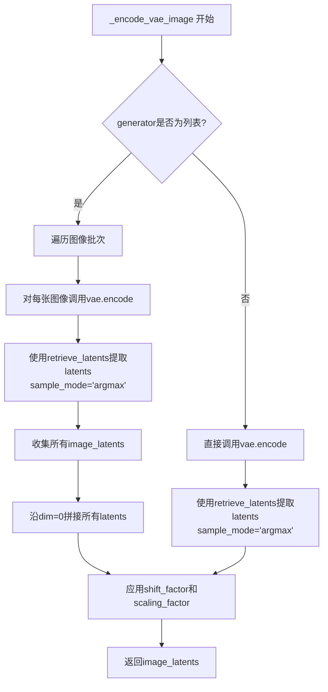

#### 带注释源码

```python
def _encode_vae_image(self, image: torch.Tensor, generator: torch.Generator):
    # 判断generator是否为列表类型，用于处理批量生成器的情况
    if isinstance(generator, list):
        # 遍历图像的每一张（batch中的每个样本）
        image_latents = [
            # 对单个图像进行VAE编码，并使用对应的generator提取latents
            # sample_mode="argmax" 表示使用潜在分布的模式（而非采样）
            retrieve_latents(
                self.vae.encode(image[i : i + 1]),  # VAE编码单张图像
                generator=generator[i],             # 使用对应的随机生成器
                sample_mode="argmax"                # 取分布模式而非采样
            )
            for i in range(image.shape[0])  # 遍历batch中的每个样本
        ]
        # 将列表中的所有latents张量沿batch维度拼接
        image_latents = torch.cat(image_latents, dim=0)
    else:
        # 单一generator的情况，直接对整个batch进行编码
        image_latents = retrieve_latents(
            self.vae.encode(image),                # VAE编码整个图像batch
            generator=generator,                    # 使用单一随机生成器
            sample_mode="argmax"                    # 取分布模式
        )

    # 应用VAE配置中的shift_factor和scaling_factor进行归一化调整
    # 这是Flux模型中VAE特有的后处理步骤
    image_latents = (image_latents - self.vae.config.shift_factor) * self.vae.config.scaling_factor

    # 返回编码后的图像潜在表示
    return image_latents
```


### `FluxKontextPipeline.enable_vae_slicing`

该方法用于启用VAE切片解码功能。通过该选项，VAE会将输入张量切分为多个切片，分步计算解码过程，从而节省显存并允许更大的批处理大小。

参数：

- 无显式参数（仅包含 `self`）

返回值：`None`，无返回值（该方法直接调用 `self.vae.enable_slicing()`）

#### 流程图

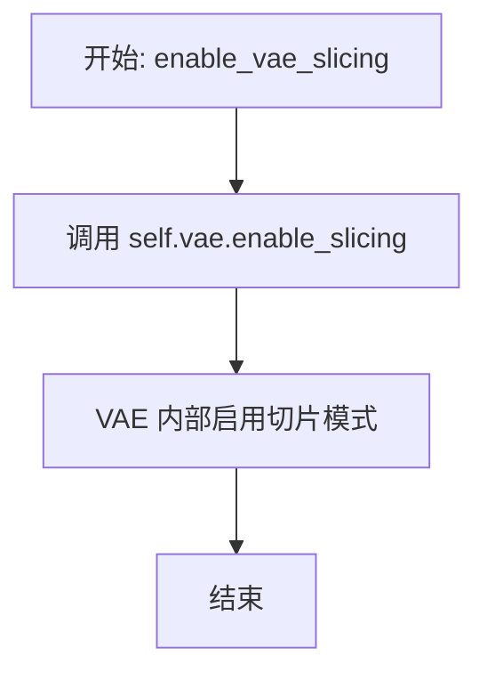

#### 带注释源码

```python
# Copied from diffusers.pipelines.flux.pipeline_flux.FluxPipeline.enable_vae_slicing
def enable_vae_slicing(self):
    r"""
    Enable sliced VAE decoding. When this option is enabled, the VAE will split the input tensor in slices to
    compute decoding in several steps. This is useful to save some memory and allow larger batch sizes.
    """
    # 调用 VAE 对象的 enable_slicing 方法，启用切片解码模式
    # 该方法会修改 VAE 的内部状态，使其在解码时采用分片处理策略
    self.vae.enable_slicing()
```


### `FluxKontextPipeline.disable_vae_slicing`

禁用切片VAE解码。如果之前启用了`enable_vae_slicing`，此方法将恢复为一步计算解码。

参数：

- `self`：`FluxKontextPipeline` 实例，隐式参数，表示当前管道对象本身

返回值：`None`，无返回值

#### 流程图

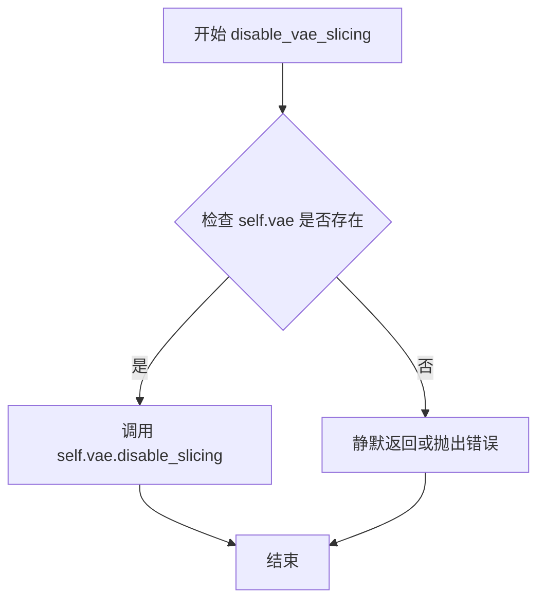

#### 带注释源码

```python
# Copied from diffusers.pipelines.flux.pipeline_flux.FluxPipeline.disable_vae_slicing
def disable_vae_slicing(self):
    r"""
    Disable sliced VAE decoding. If `enable_vae_slicing` was previously enabled, this method will go back to
    computing decoding in one step.
    """
    # 调用底层 VAE 模型的 disable_slicing 方法，关闭切片解码功能
    # 这将使 VAE 恢复为一次性解码整个潜在表示，而非分片处理
    self.vae.disable_slicing()
```


### `FluxKontextPipeline.enable_vae_tiling`

启用瓦片式 VAE 解码。当启用此选项时，VAE 会将输入张量分割成瓦片，分多步计算解码和编码。这对于节省大量内存并处理更大的图像非常有用。

参数：

- 该方法无参数（除 `self` 外）

返回值：`None`，无返回值（该方法通过副作用生效）

#### 流程图

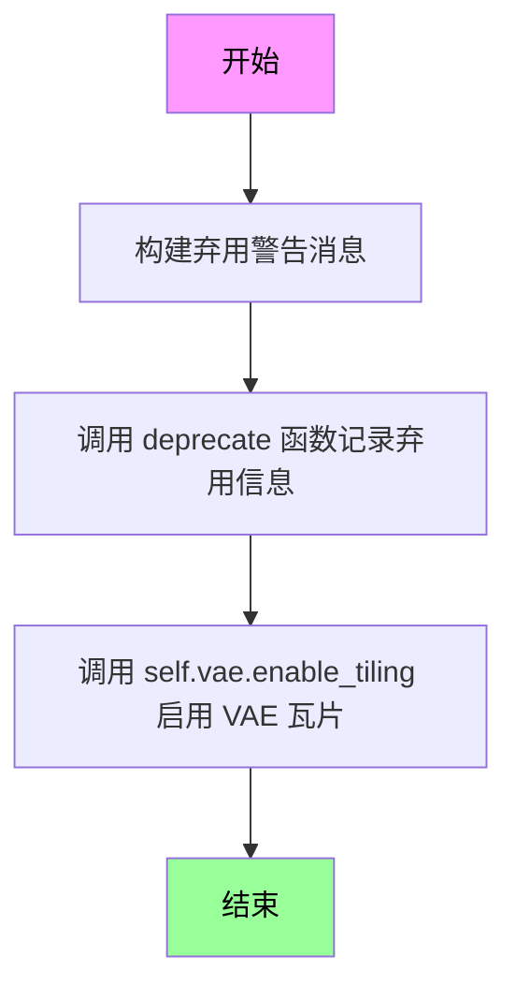

#### 带注释源码

```
# 启用瓦片式 VAE 解码功能
# 继承自 diffusers.pipelines.flux.pipeline_flux.FluxPipeline.enable_vae_tiling
def enable_vae_tiling(self):
    r"""
    启用瓦片式 VAE 解码。
    
    当此选项启用时，VAE 会将输入张量分割成瓦片，
    以多个步骤计算解码和编码。这对于节省大量内存
    并处理更大的图像非常有用。
    """
    # 构建弃用警告消息，提示用户该方法将在未来版本中移除
    # 建议直接使用 pipe.vae.enable_tiling()
    depr_message = f"Calling `enable_vae_tiling()` on a `{self.__class__.__name__}` is deprecated and this method will be removed in a future version. Please use `pipe.vae.enable_tiling()`."
    
    # 调用 deprecate 函数记录弃用信息
    # 参数: 函数名, 弃用版本号, 弃用消息
    deprecate(
        "enable_vae_tiling",
        "0.40.0",
        depr_message,
    )
    
    # 实际启用 VAE 的瓦片功能
    # 调用 VAE 模型自身的 enable_tiling 方法
    self.vae.enable_tiling()
```


### `FluxKontextPipeline.disable_vae_tiling`

禁用瓦片化 VAE 解码。如果之前启用了 `enable_vae_tiling`，此方法将返回到单步计算解码。

参数： 无

返回值：无（`None`），该方法通过副作用修改 VAE 的内部状态，不返回任何值。

#### 流程图

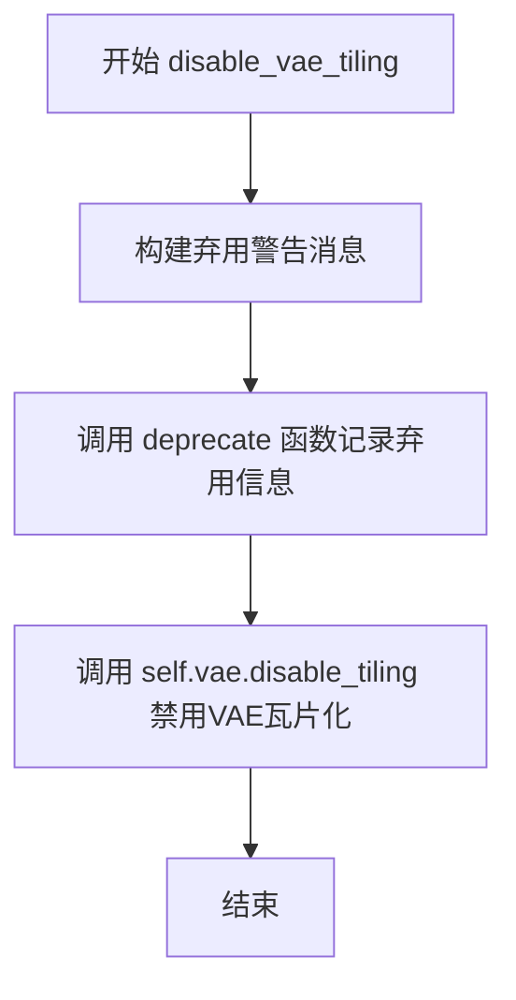

#### 带注释源码

```python
# Copied from diffusers.pipelines.flux.pipeline_flux.FluxPipeline.disable_vae_tiling
def disable_vae_tiling(self):
    r"""
    Disable tiled VAE decoding. If `enable_vae_tiling` was previously enabled, this method will go back to
    computing decoding in one step.
    """
    # 构建弃用警告消息，提示用户该方法已被弃用，应使用 pipe.vae.disable_tiling() 代替
    depr_message = f"Calling `disable_vae_tiling()` on a `{self.__class__.__name__}` is deprecated and this method will be removed in a future version. Please use `pipe.vae.disable_tiling()`."
    # 调用 deprecate 函数记录弃用信息，在未来版本中会移除此方法
    deprecate(
        "disable_vae_tiling",  # 弃用的功能名称
        "0.40.0",               # 弃用版本号
        depr_message,           # 弃用警告消息
    )
    # 调用 VAE 模型的 disable_tiling 方法实际禁用瓦片化解码
    self.vae.disable_tiling()
```


### `FluxKontextPipeline.preprocess_image`

该方法用于对输入图像进行预处理，包括提取单张图像、获取默认尺寸、计算宽高比、根据配置自动调整到推荐分辨率、确保尺寸为multiple_of的倍数，并最终调整图像大小并转换为模型所需的张量格式。

参数：

- `self`：`FluxKontextPipeline`，Pipeline实例本身
- `image`：`PipelineImageInput`，输入的图像，支持 PIL.Image、numpy array、torch.Tensor 或它们的列表
- `_auto_resize`：`bool`，是否自动调整图像尺寸到Kontext模型训练推荐分辨率
- `multiple_of`：`int`，图像宽度和高度需要是multiple_of的倍数

返回值：`torch.Tensor`，预处理后的图像张量，形状为 (C, H, W)，值域通常在 [0, 1] 或 [-1, 1]

#### 流程图

```mermaid
flowchart TD
    A[开始: preprocess_image] --> B{image是否为列表?}
    B -- 是 --> C[取image[0]作为img]
    B -- 否 --> D[img = image]
    C --> E[获取图像默认高度和宽度]
    D --> E
    E --> F[计算宽高比 aspect_ratio = width / height]
    G{_auto_resize?}
    F --> G
    G -- 是 --> H[从PREFERRED_KONTEXT_RESOLUTIONS中选择最接近aspect_ratio的分辨率]
    G -- 否 --> I[使用默认宽度和高度]
    H --> J[Rounding: width = width // multiple_of * multiple_of]
    I --> J
    J --> K[height = height // multiple_of * multiple_of]
    K --> L[调用image_processor.resize调整图像大小]
    L --> M[调用image_processor.preprocess进行预处理]
    M --> N[返回预处理后的torch.Tensor]
```

#### 带注释源码

```python
def preprocess_image(self, image: PipelineImageInput, _auto_resize: bool, multiple_of: int) -> torch.Tensor:
    """
    预处理单张输入图像，将其调整为适合VAE编码的格式。
    
    参数:
        image: PipelineImageInput, 输入图像，支持多种格式
        _auto_resize: bool, 是否自动调整到推荐分辨率
        multiple_of: int, 尺寸需要是multiple_of的倍数
    
    返回:
        torch.Tensor: 预处理后的图像张量
    """
    # 步骤1: 如果输入是列表，则提取第一张图像
    img = image[0] if isinstance(image, list) else image
    
    # 步骤2: 获取图像的默认高度和宽度
    image_height, image_width = self.image_processor.get_default_height_width(img)
    
    # 步骤3: 计算宽高比，用于后续分辨率选择
    aspect_ratio = image_width / image_height
    
    # 步骤4: 如果启用了自动调整，选择最接近当前宽高比的推荐分辨率
    # Kontext模型在特定分辨率上训练效果最佳
    if _auto_resize:
        _, image_width, image_height = min(
            (abs(aspect_ratio - w / h), w, h) for w, h in PREFERRED_KONTEXT_RESOLUTIONS
        )
    
    # 步骤5: 将尺寸调整为multiple_of的倍数，确保与模型架构兼容
    # Flux模型的latent空间需要宽度和高度能被特定值整除
    image_width = image_width // multiple_of * multiple_of
    image_height = image_height // multiple_of * multiple_of
    
    # 步骤6: 调整图像到目标尺寸
    image = self.image_processor.resize(image, image_height, image_width)
    
    # 步骤7: 执行最终预处理（归一化等），转换为张量格式
    image = self.image_processor.preprocess(image, image_height, image_width)
    
    # 返回预处理后的图像张量
    return image
```


### `FluxKontextPipeline.preprocess_images`

该方法用于批量预处理多张输入图像，将各种格式的图像（ PIL.Image、numpy array、torch.Tensor）转换为模型所需的张量格式，并根据配置进行尺寸调整和分辨率对齐。

参数：

- `self`：隐式参数，指向 `FluxKontextPipeline` 类的实例
- `images`：`PipelineSeveralImagesInput`，输入的图像数据，支持多种格式：元组或列表形式的 PIL.Image、numpy array 或 torch.Tensor
- `_auto_resize`：`bool`，是否自动调整图像尺寸为预训练模型的最佳分辨率
- `multiple_of`：`int`，图像宽高必须能够被该值整除，以确保与 VAE 模型的兼容性

返回值：`torch.Tensor`，预处理后的图像张量，形状为 (C, H, W)，值域已归一化

#### 流程图

```mermaid
flowchart TD
    A[开始 preprocess_images] --> B{images 是否为 list?}
    B -->|否| C[将 images 包装为 list]
    B -->|是| D[直接使用]
    C --> E[获取第一张图像的默认宽高]
    D --> E
    E --> F[计算宽高比 aspect_ratio]
    F --> G{_auto_resize 为 true?}
    G -->|是| H[从 PREFERRED_KONTEXT_RESOLUTIONS 中选择最接近的分辨率]
    G -->|否| I[使用默认宽高]
    H --> J[将宽高对齐到 multiple_of 的倍数]
    I --> J
    J --> K[获取每批图像数量 n_image_per_batch]
    K --> L[遍历每张图像]
    L --> M[提取当前索引的图像]
    M --> N[调用 image_processor.resize 调整尺寸]
    N --> O[调用 image_processor.preprocess 预处理]
    O --> P[添加到 output_images 列表]
    P --> L
    L --> Q{遍历完成?}
    Q -->|否| L
    Q -->|是| R[返回 output_images]
    R --> S[结束]
```

#### 带注释源码

```python
def preprocess_images(
    self,
    images: PipelineSeveralImagesInput,
    _auto_resize: bool,
    multiple_of: int,
) -> torch.Tensor:
    """
    批量预处理多张图像。
    
    参数:
        images: 支持多种格式的图像输入 - PIL.Image、numpy array 或 torch.Tensor 的元组/列表
        _auto_resize: 是否自动调整到最佳分辨率
        multiple_of: 宽高必须整除的值
    
    返回:
        预处理后的图像张量列表
    """
    # TODO: 代码审查注释 - 关于最佳实现方式的思考
    # - 使 VaeImageProcessor 的 resize 和 preprocess 方法更通用（使用 TypeVar）
    # - 将图像转换为 List[Tuple[...]] 格式以统一处理逻辑
    # - 或如当前实现所示，复制代码
    
    # 如果输入不是列表，则包装为列表以简化后续处理逻辑
    if not isinstance(images, list):
        images = [images]
    # 处理后 images 为 list of tuples 格式
    
    # 获取第一张图像的默认宽高
    img = images[0][0]
    image_height, image_width = self.image_processor.get_default_height_width(img)
    
    # 计算宽高比
    aspect_ratio = image_width / image_height
    
    # 如果启用自动调整大小，从预定义的最佳分辨率列表中选择最接近的分辨率
    if _auto_resize:
        # Kontext 模型在特定分辨率上训练完成，推荐使用其中的分辨率
        _, image_width, image_height = min(
            (abs(aspect_ratio - w / h), w, h) for w, h in PREFERRED_KONTEXT_RESOLUTIONS
        )
    
    # 将宽高对齐到 multiple_of 的倍数，确保与 VAE 模型的兼容性
    image_width = image_width // multiple_of * multiple_of
    image_height = image_height // multiple_of * multiple_of
    
    # 获取每批图像的数量
    n_image_per_batch = len(images[0])
    
    # 存储处理后的图像
    output_images = []
    
    # 遍历处理每张图像
    for i in range(n_image_per_batch):
        # 从每个批次中提取当前索引的图像
        image = [batch_images[i] for batch_images in images]
        
        # 调整图像尺寸
        image = self.image_processor.resize(image, image_height, image_width)
        
        # 预处理图像（归一化等）
        image = self.image_processor.preprocess(image, image_height, image_width)
        
        # 添加到输出列表
        output_images.append(image)
    
    return output_images
```


### `FluxKontextPipeline.prepare_latents`

该方法负责为 Flux Kontext pipeline 准备潜伏向量（latents）和相关的图像标识符。它处理图像编码、批次大小调整、潜伏向量生成或加载，以及潜伏图像 ID 的准备工作，是扩散模型去噪过程的输入准备阶段。

参数：

- `self`：实例本身，包含 VAE、transformer 等模型组件
- `images`：`Optional[list[torch.Tensor]]`，输入图像张量列表，用于编码为图像潜伏向量；如果为 None，则只生成随机潜伏向量
- `batch_size`：`int`，批次大小，决定生成图像的数量
- `num_channels_latents`：`int`，潜伏通道数，通常为 transformer 输入通道数的 1/4
- `height`：`int`，目标图像高度（像素）
- `width`：`int`，目标图像宽度（像素）
- `dtype`：`torch.dtype`，潜伏向量的数据类型
- `device`：`torch.device`，计算设备
- `generator`：`Optional[Union[torch.Generator, List[torch.Generator]]]]`，随机数生成器，用于确定性采样
- `latents`：`Optional[torch.Tensor]]`，可选的预生成潜伏向量；如果提供则直接使用，否则随机生成

返回值：`Tuple[torch.Tensor, torch.Tensor, torch.Tensor, torch.Tensor]`，返回四个张量：

- 第一个元素：处理后的潜伏向量（已打包）
- 第二个元素：图像潜伏向量（已打包），如无图像输入则为 None
- 第三个元素：潜伏向量对应的图像 ID
- 第四个元素：输入图像对应的图像 ID，如无图像输入则为 None

#### 流程图

```mermaid
flowchart TD
    A[开始 prepare_latents] --> B{验证 generator 数量与 batch_size 匹配?}
    B -->|不匹配| C[抛出 ValueError]
    B -->|匹配| D[计算压缩后的 height 和 width]
    D --> E[计算 shape = (batch_size, num_channels_latents, height, width)]
    F{images 是否为 None?} -->|否| G[遍历 images 列表]
    F -->|是| H[跳过图像编码流程]
    G --> I[将图像移动到 device 并转换 dtype]
    I --> J{图像通道数是否等于 latent_channels?}
    J -->|是| K[直接使用 image 作为 image_latents]
    J -->|否| L[调用 _encode_vae_image 编码图像]
    K --> M{batch_size > image_latents.shape[0]?}
    L --> M
    M -->|是且整除| N[复制 image_latents 以匹配 batch_size]
    M -->|是且不整除| O[抛出 ValueError]
    M -->|否| P[直接使用 image_latents]
    N --> Q[计算 image_latent_height 和 width]
    O --> Q
    P --> Q
    Q --> R[调用 _pack_latents 打包 image_latents]
    R --> S[调用 _prepare_latent_image_ids 生成图像 IDs]
    S --> T[设置 image_ids 第一维为 1]
    T --> U[调整 image_ids 位置]
    U --> V[将 image_latents 和 image_ids 添加到列表]
    V --> W{还有更多图像?}
    W -->|是| G
    W -->|否| X[拼接所有 image_latents 和 image_ids]
    X --> H
    H --> Y[生成 latent_ids]
    Y --> Z{latents 是否为 None?}
    Z -->|是| AA[调用 randn_tensor 生成随机潜伏向量]
    Z -->|否| AB[将 latents 移动到 device 并转换 dtype]
    AA --> AC[调用 _pack_latents 打包 latents]
    AB --> AC
    AC --> AD[返回 latents, image_latents, latent_ids, image_ids]
```

#### 带注释源码

```python
def prepare_latents(
    self,
    images: Optional[list[torch.Tensor]],
    batch_size: int,
    num_channels_latents: int,
    height: int,
    width: int,
    dtype: torch.dtype,
    device: torch.device,
    generator: Optional[Union[torch.Generator, List[torch.Generator]]] = None,
    latents: Optional[torch.Tensor] = None,
):
    # 验证 generator 列表长度与 batch_size 是否匹配
    if isinstance(generator, list) and len(generator) != batch_size:
        raise ValueError(
            f"You have passed a list of generators of length {len(generator)}, but requested an effective batch"
            f" size of {batch_size}. Make sure the batch size matches the length of the generators."
        )

    # VAE applies 8x compression on images but we must also account for packing which requires
    # latent height and width to be divisible by 2.
    # 计算压缩后的潜伏空间尺寸：VAE 压缩因子 × 2（packing 需要）
    height = 2 * (int(height) // (self.vae_scale_factor * 2))
    width = 2 * (int(width) // (self.vae_scale_factor * 2))
    # 潜伏向量形状：(批次大小, 通道数, 高度, 宽度)
    shape = (batch_size, num_channels_latents, height, width)

    # 初始化图像潜伏向量和图像 ID 列表
    all_image_latents = []
    all_image_ids = []
    image_latents = images_ids = None
    
    # 如果提供了图像，处理图像编码
    if images is not None:
        for i, image in enumerate(images):
            # 将图像移动到指定设备并转换数据类型
            image = image.to(device=device, dtype=dtype)
            
            # 判断是否为已编码的潜伏向量（通道数匹配）
            if image.shape[1] != self.latent_channels:
                # 使用 VAE 编码图像得到潜伏向量
                image_latents = self._encode_vae_image(image=image, generator=generator)
            else:
                # 图像已是潜伏向量格式，直接使用
                image_latents = image
            
            # 处理批次大小扩展：复制图像潜伏向量以匹配文本提示数量
            if batch_size > image_latents.shape[0] and batch_size % image_latents.shape[0] == 0:
                # expand init_latents for batch_size
                additional_image_per_prompt = batch_size // image_latents.shape[0]
                image_latents = torch.cat([image_latents] * additional_image_per_prompt, dim=0)
            elif batch_size > image_latents.shape[0] and batch_size % image_latents.shape[0] != 0:
                raise ValueError(
                    f"Cannot duplicate `image` of batch size {image_latents.shape[0]} to {batch_size} text prompts."
                )
            else:
                image_latents = torch.cat([image_latents], dim=0)

            # 获取图像潜伏向量尺寸
            image_latent_height, image_latent_width = image_latents.shape[2:]
            # 打包图像潜伏向量（将 2x2 patch 展平为向量）
            image_latents = self._pack_latents(
                image_latents, batch_size, num_channels_latents, image_latent_height, image_latent_width
            )
            
            # 生成潜伏图像 ID，用于注意力机制中的位置编码
            image_ids = self._prepare_latent_image_ids(
                batch_size, image_latent_height // 2, image_latent_width // 2, device, dtype
            )
            # image ids are the same as latent ids with the first dimension set to 1 instead of 0
            # 图像 ID 第一维设为 1（区别于主潜伏向量的 0）
            image_ids[..., 0] = 1

            # set the image ids to the correct position in the latent grid
            # 调整图像 ID 在潜伏网格中的位置（按图像索引偏移）
            image_ids[..., 2] += i * (image_latent_height // 2)

            # 收集所有图像的潜伏向量和 ID
            all_image_ids.append(image_ids)
            all_image_latents.append(image_latents)

        # 拼接所有图像的潜伏向量（按序列维度）和 ID（按批次维度）
        image_latents = torch.cat(all_image_latents, dim=1)
        images_ids = torch.cat(all_image_ids, dim=0)

    # 为主潜伏向量生成图像 ID
    latent_ids = self._prepare_latent_image_ids(batch_size, height // 2, width // 2, device, dtype)

    # 处理主潜伏向量
    if latents is None:
        # 未提供潜伏向量，随机生成
        latents = randn_tensor(shape, generator=generator, device=device, dtype=dtype)
        # 打包潜伏向量
        latents = self._pack_latents(latents, batch_size, num_channels_latents, height, width)
    else:
        # 使用提供的潜伏向量，仅转换设备和数据类型
        latents = latents.to(device=device, dtype=dtype)

    # 返回：主潜伏向量、图像潜伏向量、主潜伏 ID、图像 ID
    return latents, image_latents, latent_ids, images_ids
```


### `FluxKontextPipeline.__call__`

该方法是 FluxKontextPipeline 的核心调用函数，负责执行基于文本提示词和可选图像输入的图像生成（文生图或图生图）任务。方法通过多步去噪循环，结合 T5 和 CLIP 文本编码器、VAE 图像编码器以及 Flux Transformer 模型，逐步从随机噪声中恢复出符合文本描述的图像，并支持 IP-Adapter、LoRA、True CFG 等高级功能。

参数：

- `self`：`FluxKontextPipeline`，Pipeline 实例本身
- `image`：`Optional[PipelineImageInput]`，作为起点的输入图像，支持 torch.Tensor、PIL.Image.Image、np.ndarray 或它们的列表，用于图生图或作为参考图像；如果传入的是图像潜在向量则不再编码
- `prompt`：`Optional[Union[str, List[str]]]`，引导图像生成的文本提示词，如果不定义则必须传入 `prompt_embeds`
- `prompt_2`：`Optional[Union[str, List[str]]]`，发送给 tokenizer_2 和 text_encoder_2 的提示词，未定义时使用 `prompt`
- `negative_prompt`：`Optional[Union[str, List[str]]]`，不引导图像生成的负面提示词，仅在 `true_cfg_scale > 1` 时生效
- `negative_prompt_2`：`Optional[Union[str, List[str]]]`，发送给 tokenizer_2 和 text_encoder_2 的负面提示词，未定义时使用 `negative_prompt`
- `true_cfg_scale`：`float`，默认 1.0，当大于 1.0 且提供 `negative_prompt` 时启用真正的无分类器引导
- `height`：`Optional[int]`，生成图像的高度（像素），默认为 `self.default_sample_size * self.vae_scale_factor`
- `width`：`Optional[int]`，生成图像的宽度（像素），默认为 `self.default_sample_size * self.vae_scale_factor`
- `num_inference_steps`：`int`，默认 28，去噪步数，越多通常图像质量越高但推理越慢
- `sigmas`：`Optional[List[float]]`，自定义 sigma 值，用于支持 sigma 参数的调度器
- `guidance_scale`：`float`，默认 3.5，分类器-free 扩散引导比例，越高越接近文本提示但可能降低图像质量
- `num_images_per_prompt`：`Optional[int]`，默认 1，每个提示词生成的图像数量
- `generator`：`Optional[Union[torch.Generator, List[torch.Generator]]]`，用于生成确定性结果的随机数生成器
- `latents`：`Optional[torch.FloatTensor]`，预生成的噪声潜在向量，可用于通过不同提示词微调相同生成
- `prompt_embeds`：`Optional[torch.FloatTensor]`，预生成的文本嵌入，可用于轻松调整文本输入（如提示词加权）
- `pooled_prompt_embeds`：`Optional[torch.FloatTensor]`，预生成的池化文本嵌入
- `ip_adapter_image`：`Optional[PipelineImageInput]`，IP-Adapter 的可选图像输入
- `ip_adapter_image_embeds`：`Optional[List[torch.Tensor]]`，IP-Adapter 的预生成图像嵌入，列表长度应与 IP-Adapter 数量相同
- `negative_ip_adapter_image`：`Optional[PipelineImageInput]`，IP-Adapter 的可选负面图像输入
- `negative_ip_adapter_image_embeds`：`Optional[List[torch.Tensor]]`，IP-Adapter 的预生成负面图像嵌入
- `negative_prompt_embeds`：`Optional[torch.FloatTensor]`，预生成的负面文本嵌入
- `negative_pooled_prompt_embeds`：`Optional[torch.FloatTensor]`，预生成的负面池化文本嵌入
- `output_type`：`str`，默认 "pil"，输出格式，可选 "pil" 返回 PIL.Image.Image 或 np.array
- `return_dict`：`bool`，默认 True，是否返回 FluxPipelineOutput 而不是元组
- `joint_attention_kwargs`：`Optional[Dict[str, Any]]`，传递给 AttentionProcessor 的参数字典
- `callback_on_step_end`：`Optional[Callable[[int, int, Dict], None]]`，每个去噪步骤结束时调用的函数
- `callback_on_step_end_tensor_inputs`：`List[str]`，默认 ["latents"]，回调函数可用的张量输入列表
- `max_sequence_length`：`int`，默认 512，与提示词一起使用的最大序列长度
- `max_area`：`int`，默认 1024**2，生成图像的最大像素面积，会在保持宽高比的同时调整高度和宽度
- `_auto_resize`：`bool`，默认 True，是否自动调整输入图像大小以匹配模型训练的分辨率
- `multiple_images`：`Optional[PipelineSeveralImagesInput]]`，用作参考图像的图像列表，用于在潜在空间中合并参考图像

返回值：`Union[FluxPipelineOutput, Tuple]`：如果 `return_dict` 为 True，返回 `FluxPipelineOutput` 对象，否则返回元组，第一个元素是生成的图像列表

#### 流程图

```mermaid
flowchart TD
    A[开始 __call__] --> B[计算并调整 height/width 以适应 max_area]
    B --> C[检查输入参数 validate with check_inputs]
    C --> D[设置 _guidance_scale, _joint_attention_kwargs, _interrupt]
    D --> E[确定 batch_size]
    E --> F[编码提示词 encode_prompt]
    F --> G{do_true_cfg?}
    G -->|Yes| H[编码负面提示词]
    G -->|No| I[跳过负面提示词编码]
    H --> I
    I --> J{image 和 multiple_images 有效性检查}
    J --> K[预处理图像 preprocess_image/s]
    K --> L[准备潜在变量 prepare_latents]
    L --> M[计算 sigmas 和 timesteps]
    M --> N[准备 guidance 向量]
    N --> O[准备 IP-Adapter 图像嵌入]
    O --> P{进入去噪循环}
    P --> Q[设置当前 timestep]
    Q --> R[构建 latent_model_input]
    R --> S[调用 transformer 进行噪声预测]
    S --> T{do_true_cfg?}
    T -->|Yes| U[计算负面噪声预测]
    T -->|No| V[跳过负面噪声预测]
    U --> W[应用 true_cfg_scale 组合噪声预测]
    V --> W
    W --> X[scheduler.step 计算上一步的 latents]
    X --> Y{callback_on_step_end?}
    Y -->|Yes| Z[执行回调函数]
    Y -->|No| AA[跳过回调]
    Z --> BB[更新进度条]
    AA --> BB
    BB --> CC{还有更多 timesteps?}
    CC -->|Yes| PP[回到 Q 继续循环]
    CC -->|No| DD[结束去噪循环]
    PP --> Q
    DD --> EE{output_type == 'latent'?}
    EE -->|Yes| FF[直接输出 latents 作为图像]
    EE -->|No| GG[解包 latents 并解码]
    GG --> HH[VAE decode 解码为图像]
    HH --> II[后处理图像 postprocess]
    FF --> II
    II --> JJ[释放模型钩子 maybe_free_model_hooks]
    JJ --> KK{return_dict?}
    KK -->|Yes| LL[返回 FluxPipelineOutput]
    KK -->|No| MM[返回元组]
    LL --> NN[结束]
    MM --> NN
```

#### 带注释源码

```python
@torch.no_grad()
@replace_example_docstring(EXAMPLE_DOC_STRING)
def __call__(
    self,
    image: Optional[PipelineImageInput] = None,
    prompt: Union[str, List[str]] = None,
    prompt_2: Optional[Union[str, List[str]]] = None,
    negative_prompt: Union[str, List[str]] = None,
    negative_prompt_2: Optional[Union[str, List[str]]] = None,
    true_cfg_scale: float = 1.0,
    height: Optional[int] = None,
    width: Optional[int] = None,
    num_inference_steps: int = 28,
    sigmas: Optional[List[float]] = None,
    guidance_scale: float = 3.5,
    num_images_per_prompt: Optional[int] = 1,
    generator: Optional[Union[torch.Generator, List[torch.Generator]]] = None,
    latents: Optional[torch.FloatTensor] = None,
    prompt_embeds: Optional[torch.FloatTensor] = None,
    pooled_prompt_embeds: Optional[torch.FloatTensor] = None,
    ip_adapter_image: Optional[PipelineImageInput] = None,
    ip_adapter_image_embeds: Optional[List[torch.Tensor]] = None,
    negative_ip_adapter_image: Optional[PipelineImageInput] = None,
    negative_ip_adapter_image_embeds: Optional[List[torch.Tensor]] = None,
    negative_prompt_embeds: Optional[torch.FloatTensor] = None,
    negative_pooled_prompt_embeds: Optional[torch.FloatTensor] = None,
    output_type: str | None = "pil",
    return_dict: bool = True,
    joint_attention_kwargs: Optional[Dict[str, Any]] = None,
    callback_on_step_end: Optional[Callable[[int, int, Dict], None]] = None,
    callback_on_step_end_tensor_inputs: List[str] = ["latents"],
    max_sequence_length: int = 512,
    max_area: int = 1024**2,
    _auto_resize: bool = True,
    multiple_images: Optional[PipelineSeveralImagesInput] = None,
):
    r"""
    Function invoked when calling the pipeline for generation.

    Args:
        image (`torch.Tensor`, `PIL.Image.Image`, `np.ndarray`, `List[torch.Tensor]`, `List[PIL.Image.Image]`, or `List[np.ndarray]`):
            `Image`, numpy array or tensor representing an image batch to be used as the starting point. For both
            numpy array and pytorch tensor, the expected value range is between `[0, 1]` If it's a tensor or a list
            or tensors, the expected shape should be `(B, C, H, W)` or `(C, H, W)`. If it is a numpy array or a
            list of arrays, the expected shape should be `(B, H, W, C)` or `(H, W, C)` It can also accept image
            latents as `image`, but if passing latents directly it is not encoded again.
        prompt (`str` or `List[str]`, *optional*):
            The prompt or prompts to guide the image generation. If not defined, one has to pass `prompt_embeds`.
            instead.
        prompt_2 (`str` or `List[str]`, *optional*):
            The prompt or prompts to be sent to `tokenizer_2` and `text_encoder_2`. If not defined, `prompt` is
            will be used instead.
        negative_prompt (`str` or `List[str]`, *optional*):
            The prompt or prompts not to guide the image generation. If not defined, one has to pass
            `negative_prompt_embeds` instead. Ignored when not using guidance (i.e., ignored if `true_cfg_scale` is
            not greater than `1`).
        negative_prompt_2 (`str` or `List[str]`, *optional*):
            The prompt or prompts not to guide the image generation to be sent to `tokenizer_2` and
            `text_encoder_2`. If not defined, `negative_prompt` is used in all the text-encoders.
        true_cfg_scale (`float`, *optional*, defaults to 1.0):
            When > 1.0 and a provided `negative_prompt`, enables true classifier-free guidance.
        height (`int`, *optional*, defaults to self.unet.config.sample_size * self.vae_scale_factor):
            The height in pixels of the generated image. This is set to 1024 by default for the best results.
        width (`int`, *optional*, defaults to self.unet.config.sample_size * self.vae_scale_factor):
            The width in pixels of the generated image. This is set to 1024 by default for the best results.
        num_inference_steps (`int`, *optional*, defaults to 50):
            The number of denoising steps. More denoising steps usually lead to a higher quality image at the
            expense of slower inference.
        sigmas (`List[float]`, *optional*):
            Custom sigmas to use for the denoising process with schedulers which support a `sigmas` argument in
            their `set_timesteps` method. If not defined, the default behavior when `num_inference_steps` is passed
            will be used.
        guidance_scale (`float`, *optional*, defaults to 3.5):
            Guidance scale as defined in [Classifier-Free Diffusion
            Guidance](https://huggingface.co/papers/2207.12598). `guidance_scale` is defined as `w` of equation 2.
            of [Imagen Paper](https://huggingface.co/papers/2205.11487). Guidance scale is enabled by setting
            `guidance_scale > 1`. Higher guidance scale encourages to generate images that are closely linked to
            the text `prompt`, usually at the expense of lower image quality.
        num_images_per_prompt (`int`, *optional*, defaults to 1):
            The number of images to generate per prompt.
        generator (`torch.Generator` or `List[torch.Generator]`, *optional*):
            One or a list of [torch generator(s)](https://pytorch.org/docs/stable/generated/torch.Generator.html)
            to make generation deterministic.
        latents (`torch.FloatTensor`, *optional*):
            Pre-generated noisy latents, sampled from a Gaussian distribution, to be used as inputs for image
            generation. Can be used to tweak the same generation with different prompts. If not provided, a latents
            tensor will be generated by sampling using the supplied random `generator`.
        prompt_embeds (`torch.FloatTensor`, *optional*):
            Pre-generated text embeddings. Can be used to easily tweak text inputs, *e.g.* prompt weighting. If not
            provided, text embeddings will be generated from `prompt` input argument.
        pooled_prompt_embeds (`torch.FloatTensor`, *optional*):
            Pre-generated pooled text embeddings. Can be used to easily tweak text inputs, *e.g.* prompt weighting.
            If not provided, pooled text embeddings will be generated from `prompt` input argument.
        ip_adapter_image: (`PipelineImageInput`, *optional*):
            Optional image input to work with IP Adapters.
        ip_adapter_image_embeds (`List[torch.Tensor]`, *optional*):
            Pre-generated image embeddings for IP-Adapter. It should be a list of length same as number of
            IP-adapters. Each element should be a tensor of shape `(batch_size, num_images, emb_dim)`. If not
            provided, embeddings are computed from the `ip_adapter_image` input argument.
        negative_ip_adapter_image:
            (`PipelineImageInput`, *optional*): Optional image input to work with IP Adapters.
        negative_ip_adapter_image_embeds (`List[torch.Tensor]`, *optional*):
            Pre-generated image embeddings for IP-Adapter. It should be a list of length same as number of
            IP-adapters. Each element should be a tensor of shape `(batch_size, num_images, emb_dim)`. If not
            provided, embeddings are computed from the `ip_adapter_image` input argument.
        negative_prompt_embeds (`torch.FloatTensor`, *optional*):
            Pre-generated negative text embeddings. Can be used to easily tweak text inputs, *e.g.* prompt
            weighting. If not provided, negative_prompt_embeds will be generated from `negative_prompt` input
            argument.
        negative_pooled_prompt_embeds (`torch.FloatTensor`, *optional*):
            Pre-generated negative pooled text embeddings. Can be used to easily tweak text inputs, *e.g.* prompt
            weighting. If not provided, pooled negative_prompt_embeds will be generated from `negative_prompt`
            input argument.
        output_type (`str`, *optional*, defaults to `"pil"`):
            The output format of the generate image. Choose between
            [PIL](https://pillow.readthedocs.io/en/stable/): `PIL.Image.Image` or `np.array`.
        return_dict (`bool`, *optional*, defaults to `True`):
            Whether or not to return a [`~pipelines.flux.FluxPipelineOutput`] instead of a plain tuple.
        joint_attention_kwargs (`dict`, *optional*):
            A kwargs dictionary that if specified is passed along to the `AttentionProcessor` as defined under
            `self.processor` in
            [diffusers.models.attention_processor](https://github.com/huggingface/diffusers/blob/main/src/diffusers/models/attention_processor.py).
        callback_on_step_end (`Callable`, *optional*):
            A function that calls at the end of each denoising steps during the inference. The function is called
            with the following arguments: `callback_on_step_end(self: DiffusionPipeline, step: int, timestep: int,
            callback_kwargs: Dict)`. `callback_kwargs` will include a list of all tensors as specified by
            `callback_on_step_end_tensor_inputs`.
        callback_on_step_end_tensor_inputs (`List`, *optional*):
            The list of tensor inputs for the `callback_on_step_end` function. The tensors specified in the list
            will be passed as `callback_kwargs` argument. You will only be able to include variables listed in the
            .`_callback_tensor_inputs` attribute of your pipeline class.
        max_sequence_length (`int` defaults to 512):
            Maximum sequence length to use with the `prompt`.
        max_area (`int`, defaults to `1024 ** 2`):
            The maximum area of the generated image in pixels. The height and width will be adjusted to fit this
            area while maintaining the aspect ratio.
        multiple_images (`PipelineSeveralImagesInput`, *optional*):
            A list of images to be used as reference images for the generation. If provided, the pipeline will
            merge the reference images in the latent space.

    Examples:

    Returns:
        [`~pipelines.flux.FluxPipelineOutput`] or `tuple`: [`~pipelines.flux.FluxPipelineOutput`] if `return_dict`
        is True, otherwise a `tuple`. When returning a tuple, the first element is a list with the generated
        images.
    """

    # 步骤1: 设置默认尺寸并根据 max_area 调整高度和宽度
    # 根据 VAE 缩放因子计算默认的图像尺寸
    height = height or self.default_sample_size * self.vae_scale_factor
    width = width or self.default_sample_size * self.vae_scale_factor

    # 保存原始尺寸用于日志记录
    original_height, original_width = height, width
    # 计算宽高比
    aspect_ratio = width / height
    # 根据 max_area 计算调整后的尺寸，同时保持宽高比
    width = round((max_area * aspect_ratio) ** 0.5)
    height = round((max_area / aspect_ratio) ** 0.5)

    # 确保尺寸是 VAE 缩放因子*2 的倍数（适配 packing 需求）
    multiple_of = self.vae_scale_factor * 2
    width = width // multiple_of * multiple_of
    height = height // multiple_of * multiple_of

    # 如果尺寸被调整，打印警告日志
    if height != original_height or width != original_width:
        logger.warning(
            f"Generation `height` and `width` have been adjusted to {height} and {width} to fit the model requirements."
        )

    # 步骤2: 检查输入参数的有效性
    # 验证所有提示词、嵌入、回调参数是否符合要求
    self.check_inputs(
        prompt,
        prompt_2,
        height,
        width,
        negative_prompt=negative_prompt,
        negative_prompt_2=negative_prompt_2,
        prompt_embeds=prompt_embeds,
        negative_prompt_embeds=negative_prompt_embeds,
        pooled_prompt_embeds=pooled_prompt_embeds,
        negative_pooled_prompt_embeds=negative_pooled_prompt_embeds,
        callback_on_step_end_tensor_inputs=callback_on_step_end_tensor_inputs,
        max_sequence_length=max_sequence_length,
    )

    # 步骤3: 设置 Pipeline 的内部状态
    # 保存引导比例、联合注意力参数、当前时间步和中断标志
    self._guidance_scale = guidance_scale
    self._joint_attention_kwargs = joint_attention_kwargs
    self._current_timestep = None
    self._interrupt = False

    # 步骤4: 确定批次大小
    # 根据提示词类型确定批量处理的图像数量
    if prompt is not None and isinstance(prompt, str):
        batch_size = 1
    elif prompt is not None and isinstance(prompt, list):
        batch_size = len(prompt)
    else:
        batch_size = prompt_embeds.shape[0]

    # 获取执行设备（CPU/CUDA等）
    device = self._execution_device

    # 提取 LoRA 缩放因子（如果存在）
    lora_scale = (
        self.joint_attention_kwargs.get("scale", None) if self.joint_attention_kwargs is not None else None
    )
    
    # 检查是否提供了负面提示
    has_neg_prompt = negative_prompt is not None or (
        negative_prompt_embeds is not None and negative_pooled_prompt_embeds is not None
    )
    # 判断是否启用 True CFG（真正的无分类器引导）
    do_true_cfg = true_cfg_scale > 1 and has_neg_prompt
    
    # 步骤5: 编码提示词
    # 将文本提示编码为 T5 和 CLIP 嵌入
    (
        prompt_embeds,
        pooled_prompt_embeds,
        text_ids,
    ) = self.encode_prompt(
        prompt=prompt,
        prompt_2=prompt_2,
        prompt_embeds=prompt_embeds,
        pooled_prompt_embeds=pooled_prompt_embeds,
        device=device,
        num_images_per_prompt=num_images_per_prompt,
        max_sequence_length=max_sequence_length,
        lora_scale=lora_scale,
    )
    
    # 如果启用 True CFG，同时编码负面提示词
    if do_true_cfg:
        (
            negative_prompt_embeds,
            negative_pooled_prompt_embeds,
            negative_text_ids,
        ) = self.encode_prompt(
            prompt=negative_prompt,
            prompt_2=negative_prompt_2,
            prompt_embeds=negative_prompt_embeds,
            pooled_prompt_embeds=negative_pooled_prompt_embeds,
            device=device,
            num_images_per_prompt=num_images_per_prompt,
            max_sequence_length=max_sequence_length,
            lora_scale=lora_scale,
        )

    # 步骤6: 预处理图像
    # 检查并预处理输入图像
    if image is not None and multiple_images is not None:
        raise ValueError("Cannot pass both `image` and `multiple_images`. Please use only one of them.")
    
    # 如果图像不是潜在向量格式，则进行预处理
    if image is not None and not (isinstance(image, torch.Tensor) and image.size(1) == self.latent_channels):
        image = [self.preprocess_image(image, _auto_resize=True, multiple_of=multiple_of)]
    
    # 处理多图像输入
    if multiple_images is not None:
        image = self.preprocess_images(
            multiple_images,
            _auto_resize=_auto_resize,
            multiple_of=multiple_of,
        )

    # 步骤7: 准备潜在变量
    # 计算潜在向量的通道数（Flux 使用 1/4 通道）
    num_channels_latents = self.transformer.config.in_channels // 4
    # 准备初始噪声、图像潜在向量和 ID
    latents, image_latents, latent_ids, image_ids = self.prepare_latents(
        image,
        batch_size * num_images_per_prompt,
        num_channels_latents,
        height,
        width,
        prompt_embeds.dtype,
        device,
        generator,
        latents,
    )
    
    # 如果有图像 IDs，将其与潜在向量 IDs 拼接
    if image_ids is not None:
        latent_ids = torch.cat([latent_ids, image_ids], dim=0)  # dim 0 is sequence dimension

    # 步骤8: 准备时间步
    # 使用默认线性 sigmas 或使用自定义值
    sigmas = np.linspace(1.0, 1 / num_inference_steps, num_inference_steps) if sigmas is None else sigmas
    # 计算图像序列长度用于 shift 计算
    image_seq_len = latents.shape[1]
    # 计算 mu 值用于调度器
    mu = calculate_shift(
        image_seq_len,
        self.scheduler.config.get("base_image_seq_len", 256),
        self.scheduler.config.get("max_image_seq_len", 4096),
        self.scheduler.config.get("base_shift", 0.5),
        self.scheduler.config.get("max_shift", 1.15),
    )
    # 从调度器获取时间步
    timesteps, num_inference_steps = retrieve_timesteps(
        self.scheduler,
        num_inference_steps,
        device,
        sigmas=sigmas,
        mu=mu,
    )
    # 计算预热步数
    num_warmup_steps = max(len(timesteps) - num_inference_steps * self.scheduler.order, 0)
    # 设置总时间步数
    self._num_timesteps = len(timesteps)

    # 步骤9: 处理引导
    # 如果 transformer 支持引导嵌入，创建引导向量
    if self.transformer.config.guidance_embeds:
        guidance = torch.full([1], guidance_scale, device=device, dtype=torch.float32)
        guidance = guidance.expand(latents.shape[0])
    else:
        guidance = None

    # 步骤10: 处理 IP-Adapter
    # 确保正面和负面 IP-Adapter 图像配对
    if (ip_adapter_image is not None or ip_adapter_image_embeds is not None) and (
        negative_ip_adapter_image is None and negative_ip_adapter_image_embeds is None
    ):
        # 如果只有正面 IP-Adapter，创建零填充的负面图像
        negative_ip_adapter_image = np.zeros((width, height, 3), dtype=np.uint8)
        negative_ip_adapter_image = [negative_ip_adapter_image] * self.transformer.encoder_hid_proj.num_ip_adapters

    elif (ip_adapter_image is None and ip_adapter_image_embeds is None) and (
        negative_ip_adapter_image is not None or negative_ip_adapter_image_embeds is not None
    ):
        # 如果只有负面 IP-Adapter，创建零填充的正面图像
        ip_adapter_image = np.zeros((width, height, 3), dtype=np.uint8)
        ip_adapter_image = [ip_adapter_image] * self.transformer.encoder_hid_proj.num_ip_adapters

    # 初始化联合注意力参数字典
    if self.joint_attention_kwargs is None:
        self._joint_attention_kwargs = {}

    # 准备 IP-Adapter 图像嵌入
    image_embeds = None
    negative_image_embeds = None
    if ip_adapter_image is not None or ip_adapter_image_embeds is not None:
        image_embeds = self.prepare_ip_adapter_image_embeds(
            ip_adapter_image,
            ip_adapter_image_embeds,
            device,
            batch_size * num_images_per_prompt,
        )
    if negative_ip_adapter_image is not None or negative_ip_adapter_image_embeds is not None:
        negative_image_embeds = self.prepare_ip_adapter_image_embeds(
            negative_ip_adapter_image,
            negative_ip_adapter_image_embeds,
            device,
            batch_size * num_images_per_prompt,
        )

    # 步骤11: 去噪循环
    # 设置调度器的起始索引，用于移除 DtoH 同步
    self.scheduler.set_begin_index(0)
    with self.progress_bar(total=num_inference_steps) as progress_bar:
        for i, t in enumerate(timesteps):
            # 检查是否被中断，如果是则跳过当前迭代
            if self._interrupt:
                continue

            # 设置当前时间步
            self._current_timestep = t
            
            # 将 IP-Adapter 图像嵌入添加到联合注意力参数
            if image_embeds is not None:
                self._joint_attention_kwargs["ip_adapter_image_embeds"] = image_embeds

            # 构建潜在向量输入（拼接噪声和图像潜在向量）
            latent_model_input = latents
            if image_latents is not None:
                latent_model_input = torch.cat([latents, image_latents], dim=1)
            
            # 扩展时间步以匹配批次大小
            timestep = t.expand(latents.shape[0]).to(latents.dtype)

            # 调用 Transformer 进行噪声预测
            noise_pred = self.transformer(
                hidden_states=latent_model_input,
                timestep=timestep / 1000,  # 转换时间步为模型所需格式
                guidance=guidance,
                pooled_projections=pooled_prompt_embeds,
                encoder_hidden_states=prompt_embeds,
                txt_ids=text_ids,
                img_ids=latent_ids,
                joint_attention_kwargs=self.joint_attention_kwargs,
                return_dict=False,
            )[0]
            # 只保留与原始噪声相同长度的预测
            noise_pred = noise_pred[:, : latents.size(1)]

            # 如果启用 True CFG，计算负面噪声预测并组合
            if do_true_cfg:
                if negative_image_embeds is not None:
                    self._joint_attention_kwargs["ip_adapter_image_embeds"] = negative_image_embeds
                neg_noise_pred = self.transformer(
                    hidden_states=latent_model_input,
                    timestep=timestep / 1000,
                    guidance=guidance,
                    pooled_projections=negative_pooled_prompt_embeds,
                    encoder_hidden_states=negative_prompt_embeds,
                    txt_ids=negative_text_ids,
                    img_ids=latent_ids,
                    joint_attention_kwargs=self.joint_attention_kwargs,
                    return_dict=False,
                )[0]
                neg_noise_pred = neg_noise_pred[:, : latents.size(1)]
                # 应用 True CFG 缩放
                noise_pred = neg_noise_pred + true_cfg_scale * (noise_pred - neg_noise_pred)

            # 步骤12: 计算上一步的去噪结果 x_t -> x_t-1
            # 保存当前 latents 的数据类型
            latents_dtype = latents.dtype
            # 使用调度器步进
            latents = self.scheduler.step(noise_pred, t, latents, return_dict=False)[0]

            # 处理数据类型转换（特别是 Apple MPS 平台的兼容性）
            if latents.dtype != latents_dtype:
                if torch.backends.mps.is_available():
                    # 某些平台（如 Apple MPS）由于 PyTorch bug 需要特殊处理
                    latents = latents.to(latents_dtype)

            # 步骤13: 执行回调函数（如果提供）
            if callback_on_step_end is not None:
                callback_kwargs = {}
                for k in callback_on_step_end_tensor_inputs:
                    callback_kwargs[k] = locals()[k]
                callback_outputs = callback_on_step_end(self, i, t, callback_kwargs)

                # 更新回调返回的变量
                latents = callback_outputs.pop("latents", latents)
                prompt_embeds = callback_outputs.pop("prompt_embeds", prompt_embeds)

            # 步骤14: 更新进度条
            # 在最后一个时间步或预热步之后每 scheduler.order 步更新
            if i == len(timesteps) - 1 or ((i + 1) > num_warmup_steps and (i + 1) % self.scheduler.order == 0):
                progress_bar.update()

            # 如果使用 XLA（PyTorch XLA），标记执行步骤
            if XLA_AVAILABLE:
                xm.mark_step()

    # 清除当前时间步
    self._current_timestep = None

    # 步骤15: 解码生成图像
    if output_type == "latent":
        # 如果输出类型是 latent，直接返回 latents
        image = latents
    else:
        # 解包 latents
        latents = self._unpack_latents(latents, height, width, self.vae_scale_factor)
        # 反缩放和解码
        latents = (latents / self.vae.config.scaling_factor) + self.vae.config.shift_factor
        # 使用 VAE 解码为图像
        image = self.vae.decode(latents, return_dict=False)[0]
        # 后处理图像
        image = self.image_processor.postprocess(image, output_type=output_type)

    # 步骤16: 释放模型钩子
    self.maybe_free_model_hooks()

    # 步骤17: 返回结果
    if not return_dict:
        return (image,)

    return FluxPipelineOutput(images=image)
```

## 关键组件


### FluxKontextPipeline

Flux Kontext Pipeline是Black Forest Labs开发的基于FLUX.1-Kontext-dev模型的文本到图像生成扩散管道，支持多图像参考、IP适配器和真实的分类器自由引导。

### 张量索引与惰性加载

代码使用`randn_tensor`函数按需生成随机潜在变量张量，而非预先生成全部潜在变量。`prepare_latents`方法中通过`latents = randn_tensor(shape, generator=generator, device=device, dtype=dtype)`实现惰性加载，仅在未提供latents时才生成随机张量。

### 反量化支持

代码中的`_encode_vae_image`方法通过`retrieve_latents`函数从VAE编码器输出中提取潜在变量，支持`sample_mode="argmax"`模式获取确定性潜在表示，并使用`shift_factor`和`scaling_factor`进行潜在空间的后处理归一化。

### 量化策略

代码未直接实现量化策略，但提供了LoRA权重缩放接口（`scale_lora_layers`和`unscale_lora_layers`），支持通过`joint_attention_kwargs`传递注意力权重修改。

### 关键组件信息

- **PREFERRED_KONTEXT_RESOLUTIONS**: 预定义的训练分辨率列表，用于自动调整图像尺寸
- **calculate_shift**: 计算图像序列长度相关的噪声调度偏移量
- **retrieve_timesteps**: 从调度器获取时间步，支持自定义timesteps和sigmas
- **retrieve_latents**: 从编码器输出中提取潜在变量，支持采样和argmax模式
- **_get_t5_prompt_embeds**: 使用T5文本编码器生成文本嵌入
- **_get_clip_prompt_embeds**: 使用CLIP文本编码器生成池化文本嵌入
- **encode_prompt**: 统一封装两个文本编码器的提示词编码流程
- **encode_image**: 使用CLIP视觉编码器生成图像嵌入
- **prepare_ip_adapter_image_embeds**: 准备IP-Adapter图像嵌入，支持多适配器
- **prepare_latents**: 准备潜在变量，包括图像潜在变量和噪声潜在变量的打包
- **_prepare_latent_image_ids**: 生成用于自回归生成的位置ID张量
- **_pack_latents / _unpack_latents**: 潜在变量的打包与解包操作，处理2x2patch打包
- **preprocess_image / preprocess_images**: 图像预处理，支持自动调整分辨率和多图像批处理
- **check_inputs**: 验证输入参数的有效性
- **__call__**: 主生成方法，包含完整的扩散推理流程

### 潜在技术债务

1. **preprocess_images方法中的TODO注释**: 代码中存在TODO注释标记对图像处理逻辑的不确定性，需要优化
2. **deprecated方法**: `enable_vae_tiling`和`disable_vae_tiling`已被标记为废弃，应统一使用VAE内置方法
3. **硬编码数值**: 部分参数如`num_inference_steps`默认值28、`guidance_scale`默认值3.5为硬编码，缺乏灵活性

### 外部依赖与接口契约

- **transformers库**: 依赖CLIPTextModel、CLIPTokenizer、CLIPVisionModelWithProjection、T5EncoderModel、T5TokenizerFast
- **diffusers库**: 依赖AutoencoderKL、FluxTransformer2DModel、FlowMatchEulerDiscreteScheduler、VaeImageProcessor等
- **输入约束**: height和width必须能被`vae_scale_factor * 2`整除
- **输出格式**: 支持"pil"、"latent"、"np"三种输出类型


## 问题及建议


### 已知问题

- **代码重复**：`preprocess_image` 和 `preprocess_images` 方法存在大量重复逻辑，包括宽高比计算、分辨率选择、resize和preprocess步骤，可以提取公共方法
- **TODO 待完成项**：`preprocess_images` 方法中存在 TODO 注释，表明开发者对最佳实现方式存在疑虑，当前采用代码复制方式
- **混合类型注解风格**：代码中同时使用了旧式类型注解（如 `Union[str, List[str]]`）和 Python 3.10+ 新式类型注解（如 `str | None`），风格不一致
- **魔法数字**：`timestep / 1000` 中的 1000 是硬编码的魔法数字，缺乏明确语义，应提取为常量
- **重复计算**：`multiple_of = self.vae_scale_factor * 2` 在 `__call__` 方法和 `prepare_latents` 方法中多次计算
- **IP Adapter 负向图像处理逻辑复杂**：`__call__` 方法中处理 `negative_ip_adapter_image` 的逻辑存在多层嵌套条件判断，可读性较差

### 优化建议

- 提取 `preprocess_image` 和 `preprocess_images` 的公共逻辑到一个私有方法中，消除代码重复
- 统一类型注解风格，建议全部使用 Python 3.10+ 的新式类型注解
- 将 timestep 缩放因子提取为类常量或配置参数，如 `TIMESTEP_SCALE = 1000`
- 在 `__init__` 方法中预先计算并缓存 `multiple_of` 值，避免重复计算
- 重构 IP Adapter 相关逻辑，将负向图像的自动生成逻辑提取为独立方法，提高可读性
- 考虑移除 `enable_vae_tiling` 和 `disable_vae_tiling` 的 deprecated 方法，或添加明确的废弃说明
- 对 `encode_prompt` 方法中 LoRA 缩放的处理逻辑进行简化，提取重复的条件判断

## 其它


### 设计目标与约束

FluxKontextPipeline的设计目标是实现基于FLUX架构的文本到图像生成，支持图像上下文（Kontext）功能，即可以将参考图像与文本提示结合生成新图像。核心约束包括：1）支持多种输入格式（单图、多图、图像latents）；2）遵循diffusers库的Pipeline接口规范；3）支持IP-Adapter和LoRA扩展；4）图像尺寸需为vae_scale_factor*2的倍数；5）最大序列长度为512 tokens，最大面积为1024*1024像素。

### 错误处理与异常设计

代码采用多层错误处理机制：1）参数校验在check_inputs方法中集中进行，包括图像尺寸检查（需能被vae_scale_factor*2整除）、prompt与prompt_embeds互斥检查、类型验证等；2）调度器兼容性检查在retrieve_timesteps中进行，验证set_timesteps方法是否支持自定义timesteps或sigmas；3）IP-Adapter相关检查确保image数量与adapter数量匹配；4）Generator长度与batch_size匹配校验；5）使用logger.warning输出非致命性警告（如尺寸调整、截断提示等）；6）ValueError用于参数错误，AttributeError用于访问不存在的属性。

### 数据流与状态机

数据流遵循以下路径：1）输入预处理阶段：原始图像通过preprocess_image或preprocess_images进行尺寸调整和预处理；2）编码阶段：文本通过encode_prompt编码为prompt_embeds（CLIP+T5），图像通过_encode_vae_image编码为latents；3）潜在空间准备阶段：prepare_latents方法将图像latents和随机噪声latents打包成2x2 patches并与位置ID结合；4）去噪循环阶段：迭代执行transformer前向传播（包含可选的true CFG和IP-Adapter），每步通过scheduler.step更新latents；5）解码阶段：通过_unpack_latents还原尺寸，经VAE解码为图像，最后postprocess输出。状态机涉及_guidance_scale、_joint_attention_kwargs、_num_timesteps、_current_timestep、_interrupt等属性的管理。

### 外部依赖与接口契约

主要依赖包括：1）transformers库：CLIPTextModel、CLIPTokenizer、CLIPVisionModelWithProjection、CLIPImageProcessor、T5EncoderModel、T5TokenizerFast；2）diffusers库：DiffusionPipeline基类、AutoencoderKL、FluxTransformer2DModel、FlowMatchEulerDiscreteScheduler、各类Mixin（FluxLoraLoaderMixin、FromSingleFileMixin、TextualInversionLoaderMixin、FluxIPAdapterMixin）；3）torch/numpy/PIL图像处理；4）可选的torch_xla用于XLA设备加速。接口契约遵循diffusers的DiffusionPipeline标准：from_pretrained类方法加载模型，__call__方法执行推理，返回FluxPipelineOutput或tuple。

### 性能考虑与优化空间

性能优化点包括：1）VAE切片解码（enable_vae_slicing）用于节省显存；2）VAE平铺解码（enable_vae_tiling）用于处理大图像；3）模型CPU卸载序列定义（model_cpu_offload_seq）；4）XLA设备支持（is_torch_xla_available）；5）MPS设备特殊处理（torch.backends.mps.is_available检查避免dtype转换bug）。潜在优化空间：1）preprocess_images中存在TODO注释显示图像处理逻辑有改进空间（代码重复）；2）批量处理多图像时可能存在效率提升空间；3）可考虑添加float16/bfloat16自动选择逻辑。

### 安全性考虑

安全性措施包括：1）仅支持合法授权模型的加载；2）文本编码器对输入进行截断处理（max_length限制）；3）图像输入验证确保尺寸合法；4）LoRA和IP-Adapter等外部权重加载时的权限控制；5）不包含任何网络请求或恶意代码。注意事项：negative_prompt仅在true_cfg_scale>1时生效，避免误用导致不良内容生成。

### 配置与可扩展性

可配置项包括：1）vae_scale_factor、latent_channels、default_sample_size等模型配置属性；2）tokenizer_max_length控制文本编码长度；3）image_processor用于图像预处理；4）_optional_components支持image_encoder和feature_extractor的缺失；5）_callback_tensor_inputs允许自定义回调张量。扩展机制：1）继承DiffusionPipeline基类实现自定义Pipeline；2）通过Mixin类（FluxLoraLoaderMixin等）添加新功能；3）joint_attention_kwargs传递注意力处理器参数；4）callback_on_step_end支持推理过程自定义回调。

### 版本兼容性

版本相关设计：1）enable_vae_tiling和disable_vae_tiling已标记为deprecated（0.40.0版本），提示用户改用vae.enable_tiling()；2）调度器配置通过config.get方法获取，支持不同版本的调度器参数差异；3）XLA支持通过is_torch_xla_available条件导入实现向后兼容；4）MPS设备特殊处理针对特定PyTorch版本的兼容性问题。

### 测试策略建议

建议测试覆盖：1）单元测试验证各编码器方法（_get_t5_prompt_embeds、_get_clip_prompt_embeds、encode_image）；2）参数校验测试（check_inputs的各种错误输入）；3）latent打包解包测试（_pack_latents、_unpack_latents、_prepare_latent_image_ids）；4）集成测试验证端到端生成流程；5）多图像输入测试；6）IP-Adapter和LoRA加载测试；7）不同输出类型（pil、latent、np）测试；8）异常输入和边界条件测试。

### 使用示例与最佳实践

最佳实践包括：1）优先使用bfloat16精度在兼容设备上；2）利用auto_resize=True自动匹配训练分辨率；3）使用PREFERRED_KONTEXT_RESOLUTIONS列表中的尺寸以获得最佳效果；4）true_cfg_scale设置为1.0可禁用负面提示引导；5）generator配合固定种子实现可重复生成；6）回调函数可用于监控去噪过程或实现动态调整；7）大规模生成时考虑启用VAE切片以节省显存。


    