# `diffusers\examples\community\pipeline_flux_rf_inversion.py` 详细设计文档

这是一个基于FLUX模型的图像编辑Pipeline，实现了RF Inversion（反转）算法。该Pipeline包含两个核心功能：1) invert方法执行前向ODE将图像编码到潜在空间；2) __call__方法执行反演后的去噪过程实现图像编辑。

## 整体流程

```mermaid
graph TD
A[开始] --> B[加载模型和组件]
B --> C{调用方式}
C --> D[invert方法]
C --> E[__call__方法]
D --> D1[encode_image: 编码输入图像]
D1 --> D2[prepare_latents_inversion: 准备反转潜在变量]
D2 --> D3[retrieve_timesteps: 获取时间步]
D3 --> D4[encode_prompt: 编码提示词]
D4 --> D5[前向ODE循环]
D5 --> D6[返回inverted_latents, image_latents, latent_image_ids]
E --> E1[check_inputs: 验证输入参数]
E1 --> E2[encode_prompt: 编码提示词]
E2 --> E3{是否有inverted_latents?]
E3 -- 是 --> E4[使用RF Inversion去噪]
E3 -- 否 --> E5[标准去噪过程]
E4 --> E6[调用transformer进行去噪]
E5 --> E6
E6 --> E7[scheduler.step更新latents]
E7 --> E8{是否需要VAE解码?]
E8 -- 是 --> E9[vae.decode: 解码为图像]
E8 -- 否 --> E10[直接输出latents]
E9 --> E11[image_processor后处理]
E10 --> E11
E11 --> E12[返回FluxPipelineOutput]
```

## 类结构

```
DiffusionPipeline (基类)
├── FluxLoraLoaderMixin (LoRA加载混入)
├── FromSingleFileMixin (单文件加载混入)
├── TextualInversionLoaderMixin (文本反转加载混入)
└── RFInversionFluxPipeline (主类)
```

## 全局变量及字段


### `XLA_AVAILABLE`
    
Flag indicating whether PyTorch XLA is available for TPU support

类型：`bool`
    


### `logger`
    
Logger instance for tracking pipeline execution and warnings

类型：`logging.Logger`
    


### `EXAMPLE_DOC_STRING`
    
Example docstring demonstrating pipeline usage with code samples

类型：`str`
    


### `RFInversionFluxPipeline.model_cpu_offload_seq`
    
模型卸载顺序字符串 - Defines the sequence for CPU offloading of models

类型：`str`
    


### `RFInversionFluxPipeline._optional_components`
    
可选组件列表 - List of optional pipeline components

类型：`List[str]`
    


### `RFInversionFluxPipeline._callback_tensor_inputs`
    
回调张量输入列表 - Tensor inputs allowed in callback functions

类型：`List[str]`
    


### `RFInversionFluxPipeline.vae_scale_factor`
    
VAE缩放因子 - Scaling factor derived from VAE architecture

类型：`int`
    


### `RFInversionFluxPipeline.image_processor`
    
图像处理器 - Handles image preprocessing and postprocessing

类型：`VaeImageProcessor`
    


### `RFInversionFluxPipeline.tokenizer_max_length`
    
分词器最大长度 - Maximum token length for text encoding

类型：`int`
    


### `RFInversionFluxPipeline.default_sample_size`
    
默认采样尺寸 - Default sample size for generation

类型：`int`
    


### `RFInversionFluxPipeline._guidance_scale`
    
引导尺度 - Classifier-free guidance scale for generation

类型：`float`
    


### `RFInversionFluxPipeline._joint_attention_kwargs`
    
联合注意力参数 - Joint attention keyword arguments for transformer

类型：`Optional[Dict[str, Any]]`
    


### `RFInversionFluxPipeline._num_timesteps`
    
时间步数量 - Number of timesteps in the diffusion process

类型：`int`
    


### `RFInversionFluxPipeline._interrupt`
    
中断标志 - Flag to interrupt pipeline execution

类型：`bool`
    


### `RFInversionFluxPipeline.vae`
    
Variational Auto-Encoder for image encoding/decoding

类型：`AutoencoderKL`
    


### `RFInversionFluxPipeline.text_encoder`
    
CLIP text encoder for prompt embedding generation

类型：`CLIPTextModel`
    


### `RFInversionFluxPipeline.text_encoder_2`
    
T5 encoder for extended text embedding

类型：`T5EncoderModel`
    


### `RFInversionFluxPipeline.tokenizer`
    
CLIP tokenizer for text tokenization

类型：`CLIPTokenizer`
    


### `RFInversionFluxPipeline.tokenizer_2`
    
Fast T5 tokenizer for text tokenization

类型：`T5TokenizerFast`
    


### `RFInversionFluxPipeline.transformer`
    
Flux transformer for denoising latents

类型：`FluxTransformer2DModel`
    


### `RFInversionFluxPipeline.scheduler`
    
Flow matching scheduler for diffusion steps

类型：`FlowMatchEulerDiscreteScheduler`
    
    

## 全局函数及方法


### `calculate_shift`

该函数是一个全局辅助函数，用于根据图像序列长度计算时间步偏移量（shift）。它通过线性插值的方式，基于给定的基准序列长度、最大序列长度以及对应的偏移量参数，计算出当前图像序列长度对应的偏移值。这个偏移量随后用于调整Flow Match调度器的时间步，从而优化不同分辨率图像的去噪效果。

参数：

- `image_seq_len`：`int`，图像的序列长度，通常由图像高度和宽度经VAE压缩后计算得出
- `base_seq_len`：`int`，基准序列长度，默认为256，用于线性插值的起始点
- `max_seq_len`：`int`，最大序列长度，默认为4096，用于线性插值的终点
- `base_shift`：`float`，基准偏移量，默认为0.5，对应基准序列长度时的偏移值
- `max_shift`：`float`，最大偏移量，默认为1.15，对应最大序列长度时的偏移值

返回值：`float`，计算得到的偏移量 mu 值，用于调整调度器的时间步

#### 流程图

```mermaid
flowchart TD
    A[开始 calculate_shift] --> B[计算斜率 m]
    B --> C[m = (max_shift - base_shift) / (max_seq_len - base_seq_len)]
    C --> D[计算截距 b]
    D --> E[b = base_shift - m * base_seq_len]
    E --> F[计算偏移量 mu]
    F --> G[mu = image_seq_len * m + b]
    G --> H[返回 mu]
    H --> I[结束]
```

#### 带注释源码

```python
# Copied from diffusers.pipelines.flux.pipeline_flux.calculate_shift
def calculate_shift(
    image_seq_len,          # 图像序列长度，由 (height // vae_scale_factor // 2) * (width // vae_scale_factor // 2) 计算得到
    base_seq_len: int = 256,    # 基准序列长度，默认为256，对应较小的图像分辨率
    max_seq_len: int = 4096,    # 最大序列长度，默认为4096，对应较大的图像分辨率
    base_shift: float = 0.5,    # 基准偏移量，用于低分辨率图像的时间步调整
    max_shift: float = 1.15,    # 最大偏移量，用于高分辨率图像的时间步调整
):
    # 计算线性插值的斜率 m
    # 斜率表示偏移量随序列长度变化的速率
    m = (max_shift - base_shift) / (max_seq_len - base_seq_len)
    
    # 计算线性截距 b
    # 确保在 base_seq_len 处，偏移量恰好为 base_shift
    b = base_shift - m * base_seq_len
    
    # 根据图像序列长度计算最终的偏移量 mu
    # 使用线性方程: mu = m * image_seq_len + b
    mu = image_seq_len * m + b
    
    # 返回计算得到的偏移量，用于Flow Match调度器的时间步调整
    return mu
```


### `retrieve_timesteps`

该函数是扩散管道中的通用时间步获取工具，用于调用调度器的 `set_timesteps` 方法并从调度器中检索时间步。它支持自定义时间步和 sigma 值，同时处理各种调度器的兼容性检查，将所有额外参数转发到底层调度器。

参数：

-  `scheduler`：`SchedulerMixin`，要获取时间步的调度器实例
-  `num_inference_steps`：`Optional[int]`，使用预训练模型生成样本时的扩散步数，若使用此参数则 `timesteps` 必须为 `None`
-  `device`：`Optional[Union[str, torch.device]]`，时间步要移动到的设备，若为 `None` 则不移动时间步
-  `timesteps`：`Optional[List[int]]`，自定义时间步，用于覆盖调度器的时间步间距策略，若传入此参数则 `num_inference_steps` 和 `sigmas` 必须为 `None`
-  `sigmas`：`Optional[List[float]]`，自定义 sigma 值，用于覆盖调度器的时间步间距策略，若传入此参数则 `num_inference_steps` 和 `timesteps` 必须为 `None`
-  `**kwargs`：任意关键字参数，将传递给调度器的 `set_timesteps` 方法

返回值：`Tuple[torch.Tensor, int]`，元组包含调度器的时间步计划和推理步数

#### 流程图

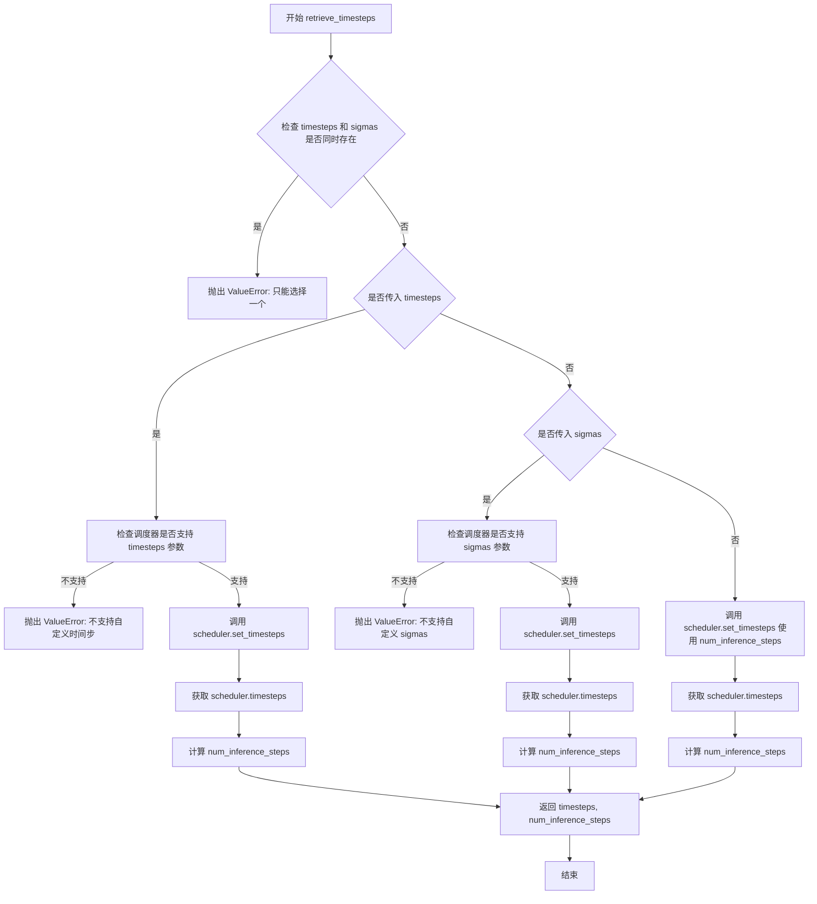

#### 带注释源码

```python
# Copied from diffusers.pipelines.stable_diffusion.pipeline_stable_diffusion.retrieve_timesteps
def retrieve_timesteps(
    scheduler,
    num_inference_steps: Optional[int] = None,
    device: Optional[Union[str, torch.device]] = None,
    timesteps: Optional[List[int]] = None,
    sigmas: Optional[List[float]] = None,
    **kwargs,
):
    r"""
    Calls the scheduler's `set_timesteps` method and retrieves timesteps from the scheduler after the call. Handles
    custom timesteps. Any kwargs will be supplied to `scheduler.set_timesteps`.

    Args:
        scheduler (`SchedulerMixin`):
            The scheduler to get timesteps from.
        num_inference_steps (`int`):
            The number of diffusion steps used when generating samples with a pre-trained model. If used, `timesteps`
            must be `None`.
        device (`str` or `torch.device`, *optional*):
            The device to which the timesteps should be moved to. If `None`, the timesteps are not moved.
        timesteps (`List[int]`, *optional*):
            Custom timesteps used to override the timestep spacing strategy of the scheduler. If `timesteps` is passed,
            `num_inference_steps` and `sigmas` must be `None`.
        sigmas (`List[float]`, *optional*):
            Custom sigmas used to override the timestep spacing strategy of the scheduler. If `sigmas` is passed,
            `num_inference_steps` and `timesteps` must be `None`.

    Returns:
        `Tuple[torch.Tensor, int]`: A tuple where the first element is the timestep schedule from the scheduler and the
        second element is the number of inference steps.
    """
    # 检查是否同时传入了 timesteps 和 sigmas，两者只能选择一个
    if timesteps is not None and sigmas is not None:
        raise ValueError("Only one of `timesteps` or `sigmas` can be passed. Please choose one to set custom values")
    
    # 处理自定义 timesteps 的情况
    if timesteps is not None:
        # 检查调度器的 set_timesteps 方法是否支持 timesteps 参数
        accepts_timesteps = "timesteps" in set(inspect.signature(scheduler.set_timesteps).parameters.keys())
        if not accepts_timesteps:
            raise ValueError(
                f"The current scheduler class {scheduler.__class__}'s `set_timesteps` does not support custom"
                f" timestep schedules. Please check whether you are using the correct scheduler."
            )
        # 调用调度器的 set_timesteps 方法设置自定义时间步
        scheduler.set_timesteps(timesteps=timesteps, device=device, **kwargs)
        # 从调度器获取设置后的时间步
        timesteps = scheduler.timesteps
        # 计算推理步数
        num_inference_steps = len(timesteps)
    # 处理自定义 sigmas 的情况
    elif sigmas is not None:
        # 检查调度器的 set_timesteps 方法是否支持 sigmas 参数
        accept_sigmas = "sigmas" in set(inspect.signature(scheduler.set_timesteps).parameters.keys())
        if not accept_sigmas:
            raise ValueError(
                f"The current scheduler class {scheduler.__class__}'s `set_timesteps` does not support custom"
                f" sigmas schedules. Please check whether you are using the correct scheduler."
            )
        # 调用调度器的 set_timesteps 方法设置自定义 sigmas
        scheduler.set_timesteps(sigmas=sigmas, device=device, **kwargs)
        # 从调度器获取设置后的时间步
        timesteps = scheduler.timesteps
        # 计算推理步数
        num_inference_steps = len(timesteps)
    # 默认情况：使用 num_inference_steps 设置时间步
    else:
        scheduler.set_timesteps(num_inference_steps, device=device, **kwargs)
        timesteps = scheduler.timesteps
    
    # 返回时间步和推理步数
    return timesteps, num_inference_steps
```


### `RFInversionFluxPipeline.__init__`

RFInversionFluxPipeline类的初始化方法，负责接收并注册Flux图像生成pipeline所需的所有模型组件（调度器、VAE、文本编码器、分词器和Transformer），并初始化图像处理器和默认参数。

参数：

- `scheduler`：`FlowMatchEulerDiscreteScheduler`，用于去噪图像潜在表示的调度器
- `vae`：`AutoencoderKL`，变分自编码器模型，用于编码和解码图像与潜在表示
- `text_encoder`：`CLIPTextModel`，CLIP文本编码器模型
- `tokenizer`：`CLIPTokenizer`，CLIP分词器
- `text_encoder_2`：`T5EncoderModel`，T5文本编码器模型
- `tokenizer_2`：`T5TokenizerFast`，T5分词器
- `transformer`：`FluxTransformer2DModel`，条件Transformer（MMDiT）架构，用于对编码后的图像潜在表示进行去噪

返回值：`None`，该方法为构造函数，无返回值，仅初始化实例属性

#### 流程图

```mermaid
flowchart TD
    A[开始 __init__] --> B[调用 super().__init__]
    B --> C[register_modules: 注册 vae, text_encoder, text_encoder_2, tokenizer, tokenizer_2, transformer, scheduler]
    C --> D[计算 vae_scale_factor: 2^(len(vae.config.block_out_channels) - 1)]
    D --> E[创建 VaeImageProcessor: vae_scale_factor=self.vae_scale_factor]
    E --> F[设置 tokenizer_max_length: tokenizer.model_max_length 或 77]
    F --> G[设置 default_sample_size: 128]
    G --> H[结束 __init__]
```

#### 带注释源码

```python
def __init__(
    self,
    scheduler: FlowMatchEulerDiscreteScheduler,
    vae: AutoencoderKL,
    text_encoder: CLIPTextModel,
    tokenizer: CLIPTokenizer,
    text_encoder_2: T5EncoderModel,
    tokenizer_2: T5TokenizerFast,
    transformer: FluxTransformer2DModel,
):
    """
    初始化 RFInversionFluxPipeline 实例。
    
    参数:
        scheduler: FlowMatchEulerDiscreteScheduler调度器，用于扩散模型的去噪步骤
        vae: AutoencoderKL变分自编码器，用于图像编码和解码
        text_encoder: CLIPTextModel文本编码器（CLIP ViT-L/14）
        tokenizer: CLIPTokenizer分词器
        text_encoder_2: T5EncoderModel文本编码器（T5-XXL）
        tokenizer_2: T5TokenizerFast分词器
        transformer: FluxTransformer2DModel主Transformer模型（MMDiT架构）
    """
    # 调用父类 DiffusionPipeline 的初始化方法
    super().__init__()

    # 注册所有模块到 Pipeline 中，使它们可以被 Pipeline 管理
    # 这些模块将用于后续的图像生成和编码过程
    self.register_modules(
        vae=vae,
        text_encoder=text_encoder,
        text_encoder_2=text_encoder_2,
        tokenizer=tokenizer,
        tokenizer_2=tokenizer_2,
        transformer=transformer,
        scheduler=scheduler,
    )
    
    # 计算 VAE 的缩放因子，基于 VAE 的块输出通道数
    # VAE 通常有 [128, 256, 512, 512] 这样的通道配置
    # 2^(len-1) = 2^3 = 8 是常见的缩放因子
    self.vae_scale_factor = 2 ** (len(self.vae.config.block_out_channels) - 1) if getattr(self, "vae", None) else 8
    
    # 创建图像预处理器，用于处理输入图像和输出图像
    self.image_processor = VaeImageProcessor(vae_scale_factor=self.vae_scale_factor)
    
    # 获取分词器的最大长度，默认值为 77（CLIP 的标准长度）
    self.tokenizer_max_length = (
        self.tokenizer.model_max_length if hasattr(self, "tokenizer") and self.tokenizer is not None else 77
    )
    
    # 设置默认样本大小，用于生成图像的默认分辨率
    # 默认: 128 * 8 = 1024 像素
    self.default_sample_size = 128
```


### `RFInversionFluxPipeline._get_t5_prompt_embeds`

该方法用于将文本提示（prompt）转换为T5文本编码器（text_encoder_2）的嵌入向量（embeddings），支持批量处理和多图像生成。

参数：

- `prompt`：`Union[str, List[str]]`，输入的文本提示，可以是单个字符串或字符串列表
- `num_images_per_prompt`：`int`，每个提示生成的图像数量，默认为1
- `max_sequence_length`：`int`，T5编码器的最大序列长度，默认为512
- `device`：`Optional[torch.device]`，计算设备，若为None则使用执行设备
- `dtype`：`Optional[torch.dtype]`：输出张量的数据类型，若为None则使用text_encoder的dtype
- `self`：`RFInversionFluxPipeline`，类的实例，隐含参数

返回值：`torch.FloatTensor`，T5文本编码器生成的文本嵌入向量，形状为 `(batch_size * num_images_per_prompt, seq_len, hidden_dim)`

#### 流程图

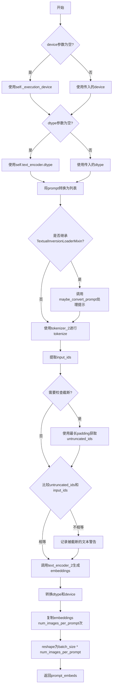

#### 带注释源码

```python
def _get_t5_prompt_embeds(
    self,
    prompt: Union[str, List[str]] = None,
    num_images_per_prompt: int = 1,
    max_sequence_length: int = 512,
    device: Optional[torch.device] = None,
    dtype: Optional[torch.dtype] = None,
):
    """
    将文本提示转换为T5文本编码器的嵌入向量
    
    参数:
        prompt: 输入的文本提示，支持单个字符串或字符串列表
        num_images_per_prompt: 每个提示生成的图像数量
        max_sequence_length: T5编码器的最大序列长度
        device: 计算设备
        dtype: 输出张量的数据类型
    """
    # 确定设备，若未指定则使用执行设备
    device = device or self._execution_device
    # 确定dtype，若未指定则使用text_encoder的dtype
    dtype = dtype or self.text_encoder.dtype

    # 将单个字符串转换为列表，统一处理方式
    prompt = [prompt] if isinstance(prompt, str) else prompt
    # 获取批处理大小
    batch_size = len(prompt)

    # 如果支持TextualInversion，转换提示格式
    if isinstance(self, TextualInversionLoaderMixin):
        prompt = self.maybe_convert_prompt(prompt, self.tokenizer_2)

    # 使用T5 tokenizer对提示进行tokenize
    text_inputs = self.tokenizer_2(
        prompt,
        padding="max_length",           # 填充到最大长度
        max_length=max_sequence_length, # 最大序列长度
        truncation=True,                # 截断超长序列
        return_length=False,            # 不返回长度
        return_overflowing_tokens=False, # 不返回溢出token
        return_tensors="pt",            # 返回PyTorch张量
    )
    text_input_ids = text_inputs.input_ids
    
    # 使用最长padding获取未截断的token ids，用于检测截断
    untruncated_ids = self.tokenizer_2(prompt, padding="longest", return_tensors="pt").input_ids

    # 检测是否有文本被截断
    if untruncated_ids.shape[-1] >= text_input_ids.shape[-1] and not torch.equal(text_input_ids, untruncated_ids):
        # 解码被截断的部分并记录警告
        removed_text = self.tokenizer_2.batch_decode(untruncated_ids[:, self.tokenizer_max_length - 1 : -1])
        logger.warning(
            "The following part of your input was truncated because `max_sequence_length` is set to "
            f" {max_sequence_length} tokens: {removed_text}"
        )

    # 调用T5文本编码器生成嵌入向量
    prompt_embeds = self.text_encoder_2(text_input_ids.to(device), output_hidden_states=False)[0]

    # 统一dtype和device
    dtype = self.text_encoder_2.dtype
    prompt_embeds = prompt_embeds.to(dtype=dtype, device=device)

    # 获取序列长度
    _, seq_len, _ = prompt_embeds.shape

    # 为每个提示复制num_images_per_prompt次，支持批量生成
    prompt_embeds = prompt_embeds.repeat(1, num_images_per_prompt, 1)
    # reshape为(batch_size * num_images_per_prompt, seq_len, hidden_dim)
    prompt_embeds = prompt_embeds.view(batch_size * num_images_per_prompt, seq_len, -1)

    return prompt_embeds
```


### `RFInversionFluxPipeline._get_clip_prompt_embeds`

该方法负责将文本提示词转换为CLIP模型的嵌入向量。它接收文本提示词，通过CLIPTokenizer进行tokenize处理，然后使用CLIPTextModel编码生成文本嵌入，最后根据`num_images_per_prompt`参数复制嵌入向量以支持批量生成。

参数：

- `prompt`：`Union[str, List[str]]`，要编码的文本提示词，可以是单个字符串或字符串列表
- `num_images_per_prompt`：`int`，每个提示词需要生成的图像数量，默认为1
- `device`：`Optional[torch.device]`，`torch.device`，执行设备，若为`None`则使用`self._execution_device`

返回值：`torch.FloatTensor`，CLIP文本编码器生成的提示词嵌入向量，形状为`(batch_size * num_images_per_prompt, hidden_size)`

#### 流程图

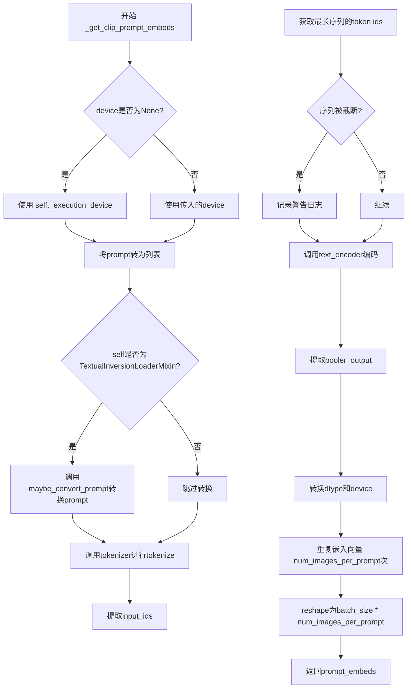

#### 带注释源码

```python
def _get_clip_prompt_embeds(
    self,
    prompt: Union[str, List[str]],
    num_images_per_prompt: int = 1,
    device: Optional[torch.device] = None,
):
    """
    获取CLIP文本编码器的提示词嵌入向量

    参数:
        prompt: 要编码的文本提示词，可以是单个字符串或字符串列表
        num_images_per_prompt: 每个提示词生成的图像数量，用于复制嵌入向量
        device: 指定的设备，若为None则使用默认执行设备

    返回:
        CLIP模型生成的提示词嵌入向量
    """
    # 确定执行设备，若未指定则使用pipeline的默认设备
    device = device or self._execution_device

    # 标准化输入为列表格式，便于批量处理
    prompt = [prompt] if isinstance(prompt, str) else prompt
    batch_size = len(prompt)

    # 如果支持TextualInversion，则进行提示词转换处理
    if isinstance(self, TextualInversionLoaderMixin):
        prompt = self.maybe_convert_prompt(prompt, self.tokenizer)

    # 使用CLIP Tokenizer对提示词进行tokenize
    # padding到最大长度，截断超长序列，返回PyTorch张量
    text_inputs = self.tokenizer(
        prompt,
        padding="max_length",
        max_length=self.tokenizer_max_length,
        truncation=True,
        return_overflowing_tokens=False,
        return_length=False,
        return_tensors="pt",
    )

    # 提取token ids用于编码
    text_input_ids = text_inputs.input_ids
    
    # 获取未截断的token ids用于检测是否发生了截断
    untruncated_ids = self.tokenizer(prompt, padding="longest", return_tensors="pt").input_ids
    
    # 检测并警告截断情况：CLIP模型有最大序列长度限制
    if untruncated_ids.shape[-1] >= text_input_ids.shape[-1] and not torch.equal(text_input_ids, untruncated_ids):
        removed_text = self.tokenizer.batch_decode(untruncated_ids[:, self.tokenizer_max_length - 1 : -1])
        logger.warning(
            "The following part of your input was truncated because CLIP can only handle sequences up to"
            f" {self.tokenizer_max_length} tokens: {removed_text}"
        )
    
    # 使用CLIP文本编码器获取文本嵌入，output_hidden_states=False表示只返回最后一层输出
    prompt_embeds = self.text_encoder(text_input_ids.to(device), output_hidden_states=False)

    # 从CLIPTextModel的输出中提取pooled输出（用于后续的交叉注意力）
    prompt_embeds = prompt_embeds.pooler_output
    
    # 转换嵌入向量的dtype和device以匹配文本编码器配置
    prompt_embeds = prompt_embeds.to(dtype=self.text_encoder.dtype, device=device)

    # 为每个提示词生成多个图像复制嵌入向量
    # 使用MPS友好的方法进行复制
    prompt_embeds = prompt_embeds.repeat(1, num_images_per_prompt)
    
    # 重塑形状：(batch_size, hidden_dim) -> (batch_size * num_images_per_prompt, hidden_dim)
    prompt_embeds = prompt_embeds.view(batch_size * num_images_per_prompt, -1)

    return prompt_embeds
```


### `RFInversionFluxPipeline.encode_prompt`

该方法负责将文本提示（prompt）编码为文本嵌入向量（prompt embeddings），供后续的扩散模型生成图像使用。它同时调用 CLIP 和 T5 两种文本编码器生成两种不同类型的嵌入，并处理 LoRA 权重的动态缩放。

参数：

- `self`：`RFInversionFluxPipeline` 实例本身
- `prompt`：`Union[str, List[str]]`，主要提示文本，用于 CLIP 编码器
- `prompt_2`：`Union[str, List[str]]`，发送给 T5 编码器的提示，若未提供则使用 `prompt`
- `device`：`Optional[torch.device]`，编码所使用的 torch 设备，默认为执行设备
- `num_images_per_prompt`：`int = 1`，每个提示需要生成的图像数量
- `prompt_embeds`：`Optional[torch.FloatTensor] = None`，可选的预生成 T5 提示嵌入，若提供则跳过嵌入生成
- `pooled_prompt_embeds`：`Optional[torch.FloatTensor] = None`，可选的预生成 CLIP 池化嵌入
- `max_sequence_length`：`int = 512`，T5 编码器的最大序列长度
- `lora_scale`：`Optional[float] = None`，LoRA 层的缩放因子

返回值：`Tuple[torch.FloatTensor, torch.FloatTensor, torch.Tensor]`，返回三元组 `(prompt_embeds, pooled_prompt_embeds, text_ids)`，其中 prompt_embeds 是 T5 编码的提示嵌入，pooled_prompt_embeds 是 CLIP 编码的池化输出，text_ids 是用于注意力机制的位置标识符。

#### 流程图

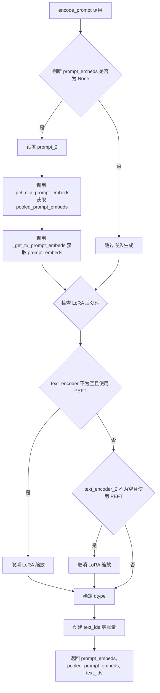

#### 带注释源码

```python
def encode_prompt(
    self,
    prompt: Union[str, List[str]],
    prompt_2: Union[str, List[str]],
    device: Optional[torch.device] = None,
    num_images_per_prompt: int = 1,
    prompt_embeds: Optional[torch.FloatTensor] = None,
    pooled_prompt_embeds: Optional[torch.FloatTensor] = None,
    max_sequence_length: int = 512,
    lora_scale: Optional[float] = None,
):
    r"""
    处理文本提示的编码，支持 CLIP 和 T5 双文本编码器架构。

    参数说明：
    - prompt: 主要提示文本，用于 CLIP 编码器
    - prompt_2: 发送给 T5 编码器的提示，若未提供则使用 prompt
    - device: 编码设备，默认为当前执行设备
    - num_images_per_prompt: 每个提示生成的图像数量，用于复制嵌入
    - prompt_embeds: 预计算的 T5 嵌入，若为 None 则自动生成
    - pooled_prompt_embeds: 预计算的 CLIP 池化嵌入
    - max_sequence_length: T5 编码器的最大序列长度
    - lora_scale: LoRA 权重缩放因子，用于动态调整 LoraLayer 的影响

    返回值：
    - prompt_embeds: T5 编码后的提示嵌入 (batch_size * num_images_per_prompt, seq_len, hidden_dim)
    - pooled_prompt_embeds: CLIP 编码后的池化嵌入 (batch_size * num_images_per_prompt, hidden_dim)
    - text_ids: 文本位置标识符，用于注意力机制 (seq_len, 3)
    """
    # 获取设备，若未指定则使用当前执行设备
    device = device or self._execution_device

    # 设置 LoRA 缩放因子，以便文本编码器的 monkey patched LoRA 函数正确访问
    if lora_scale is not None and isinstance(self, FluxLoraLoaderMixin):
        self._lora_scale = lora_scale

        # 动态调整 LoRA 缩放
        if self.text_encoder is not None and USE_PEFT_BACKEND:
            scale_lora_layers(self.text_encoder, lora_scale)
        if self.text_encoder_2 is not None and USE_PEFT_BACKEND:
            scale_lora_layers(self.text_encoder_2, lora_scale)

    # 将 prompt 转换为列表格式，便于批处理
    prompt = [prompt] if isinstance(prompt, str) else prompt

    # 如果未提供预计算的嵌入，则生成新的嵌入
    if prompt_embeds is None:
        # 设置 prompt_2，若未提供则使用 prompt
        prompt_2 = prompt_2 or prompt
        prompt_2 = [prompt_2] if isinstance(prompt_2, str) else prompt_2

        # 仅使用 CLIPTextModel 的池化输出生成 pooled_prompt_embeds
        pooled_prompt_embeds = self._get_clip_prompt_embeds(
            prompt=prompt,
            device=device,
            num_images_per_prompt=num_images_per_prompt,
        )
        # 使用 T5 编码器生成 prompt_embeds
        prompt_embeds = self._get_t5_prompt_embeds(
            prompt=prompt_2,
            num_images_per_prompt=num_images_per_prompt,
            max_sequence_length=max_sequence_length,
            device=device,
        )

    # 处理文本编码器的 LoRA 后处理，恢复原始缩放
    if self.text_encoder is not None:
        if isinstance(self, FluxLoraLoaderMixin) and USE_PEFT_BACKEND:
            # 通过取消 LoRA 层缩放来恢复原始权重
            unscale_lora_layers(self.text_encoder, lora_scale)

    if self.text_encoder_2 is not None:
        if isinstance(self, FluxLoraLoaderMixin) and USE_PEFT_BACKEND:
            # 同样处理 T5 编码器
            unscale_lora_layers(self.text_encoder_2, lora_scale)

    # 确定数据类型，优先使用 text_encoder 的 dtype，否则使用 transformer 的 dtype
    dtype = self.text_encoder.dtype if self.text_encoder is not None else self.transformer.dtype
    
    # 创建文本位置标识符，用于交叉注意力机制
    # 形状为 (seq_len, 3)，第三维固定为 3
    text_ids = torch.zeros(prompt_embeds.shape[1], 3).to(device=device, dtype=dtype)

    return prompt_embeds, pooled_prompt_embeds, text_ids
```


### `RFInversionFluxPipeline.encode_image`

该方法用于将输入图像编码为潜在空间表示（latent representation），是 RF Inversion 流程中的关键步骤。它通过图像预处理、VAE 编码和潜在空间变换，将 PIL 图像或 numpy 数组转换为适合扩散模型处理的浮点张量，同时返回预处理后的图像用于后续验证。

参数：

- `self`：`RFInversionFluxPipeline` 实例本身
- `image`：`PipelineImageInput`，输入图像，支持 PIL.Image、numpy 数组或 torch.Tensor 格式
- `dtype`：`Optional[torch.dtype]`，输出潜在表示的目标数据类型，默认为 None
- `height`：`Optional[int]`，目标图像高度，用于调整输入图像尺寸
- `width`：`Optional[int]`，目标图像宽度，用于调整输入图像尺寸
- `resize_mode`：`str`，图像调整模式，默认为 "default"，可指定为 "crop"、"resize" 等
- `crops_coords`：`Optional`，图像裁剪坐标，用于指定裁剪区域

返回值：`Tuple[torch.FloatTensor, PIL.Image.Image]`

- `torch.FloatTensor`：编码后的潜在表示 x0，经过 VAE 编码、shift_factor 偏移和 scaling_factor 缩放
- `PIL.Image.Image`：预处理后的图像（调整大小后），用于验证或可视化

#### 流程图

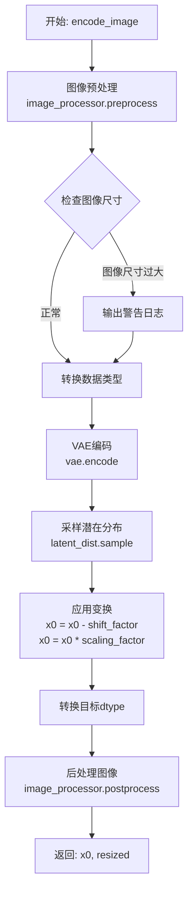

#### 带注释源码

```python
@torch.no_grad()
# Modified from diffusers.pipelines.ledits_pp.pipeline_leditspp_stable_diffusion.LEDGitsPPPipelineStableDiffusion.encode_image
def encode_image(self, image, dtype=None, height=None, width=None, resize_mode="default", crops_coords=None):
    """
    将输入图像编码为潜在空间表示。
    
    参数:
        image: 输入图像 (PIL.Image, numpy array, 或 torch.Tensor)
        dtype: 目标数据类型
        height: 目标高度
        width: 目标宽度
        resize_mode: 图像调整模式
        crops_coords: 裁剪坐标
    
    返回:
        x0: 编码后的潜在表示
        resized: 预处理后的图像
    """
    # 步骤1: 使用图像处理器预处理图像
    # 包括尺寸调整、归一化等操作
    image = self.image_processor.preprocess(
        image=image, height=height, width=width, resize_mode=resize_mode, crops_coords=crops_coords
    )
    
    # 步骤2: 后处理图像用于返回验证
    # 将处理后的张量转换回 PIL Image 格式
    resized = self.image_processor.postprocess(image=image, output_type="pil")
    
    # 步骤3: 检查图像尺寸是否超出模型推荐分辨率
    # 如果超出，发出警告提示可能产生严重伪影
    if max(image.shape[-2:]) > self.vae.config["sample_size"] * 1.5:
        logger.warning(
            "Your input images far exceed the default resolution of the underlying diffusion model. "
            "The output images may contain severe artifacts! "
            "Consider down-sampling the input using the `height` and `width` parameters"
        )
    
    # 步骤4: 转换图像数据类型
    image = image.to(dtype)
    
    # 步骤5: 使用 VAE 编码器将图像编码为潜在表示
    # 调用 VAE 的 encode 方法获取潜在分布
    x0 = self.vae.encode(image.to(self._execution_device)).latent_dist.sample()
    
    # 步骤6: 应用 VAE 配置中的缩放因子和偏移量
    # 这是将潜在表示标准化到扩散模型期望范围的关键步骤
    x0 = (x0 - self.vae.config.shift_factor) * self.vae.config.scaling_factor
    
    # 步骤7: 确保输出数据类型正确
    x0 = x0.to(dtype)
    
    # 返回编码后的潜在表示和预处理后的图像
    return x0, resized
```


### `RFInversionFluxPipeline.check_inputs`

该方法用于验证 `RFInversionFluxPipeline` 管道输入参数的有效性，确保传入的参数符合管道要求，如果参数不符合要求则抛出相应的 `ValueError` 异常。

参数：

- `prompt`：`Union[str, List[str], None]`，主要的文本提示词，用于指导图像生成
- `prompt_2`：`Union[str, List[str], None]`，发送给 `tokenizer_2` 和 `text_encoder_2` 的第二个提示词，如果不定义则使用 `prompt`
- `inverted_latents`：`Optional[torch.FloatTensor]`，从 `pipe.invert` 得到的反演潜在变量
- `image_latents`：`Optional[torch.FloatTensor]`，从 `pipe.invert` 得到的图像潜在变量
- `latent_image_ids`：`Optional[torch.FloatTensor]`，从 `pipe.invert` 得到的潜在图像ID
- `height`：`int`，生成图像的高度（像素）
- `width`：`int`，生成图像的宽度（像素）
- `start_timestep`：`float`，起始时间步，控制反转的起始点
- `stop_timestep`：`float`，停止时间步，控制反转的停止点
- `prompt_embeds`：`Optional[torch.FloatTensor]`，预生成的文本嵌入，如果提供此参数则不应提供 `prompt`
- `pooled_prompt_embeds`：`Optional[torch.FloatTensor]`，预生成的可 pooling 文本嵌入
- `callback_on_step_end_tensor_inputs`：`Optional[List[str]]`，在每个去噪步骤结束时回调的张量输入列表
- `max_sequence_length`：`Optional[int]`，最大序列长度，默认为 512

返回值：`None`，该方法不返回任何值，仅进行参数验证

#### 流程图

```mermaid
flowchart TD
    A[开始 check_inputs] --> B{检查 height 和 width 是否能被 vae_scale_factor 整除}
    B -->|否| B1[抛出 ValueError: height 和 width 必须能被 vae_scale_factor 整除]
    B -->|是| C{检查 callback_on_step_end_tensor_inputs 是否在 _callback_tensor_inputs 中}
    C -->|否| C1[抛出 ValueError: callback_on_step_end_tensor_inputs 必须在 _callback_tensor_inputs 中]
    C -->|是| D{prompt 和 prompt_embeds 是否同时提供}
    D -->|是| D1[抛出 ValueError: 不能同时提供 prompt 和 prompt_embeds]
    D -->|否| E{prompt_2 和 prompt_embeds 是否同时提供}
    E -->|是| E1[抛出 ValueError: 不能同时提供 prompt_2 和 prompt_embeds]
    E -->|否| F{prompt 和 prompt_embeds 是否都未提供}
    F -->|是| F1[抛出 ValueError: 必须提供 prompt 或 prompt_embeds 之一]
    F -->|否| G{prompt 类型是否正确}
    G -->|否| G1[抛出 ValueError: prompt 必须是 str 或 list 类型]
    G -->|是| H{prompt_2 类型是否正确}
    H -->|否| H1[抛出 ValueError: prompt_2 必须是 str 或 list 类型]
    H -->|是| I{prompt_embeds 提供但 pooled_prompt_embeds 未提供}
    I -->|是| I1[抛出 ValueError: 提供了 prompt_embeds 则必须提供 pooled_prompt_embeds]
    I -->|否| J{max_sequence_length 是否超过 512}
    J -->|是| J1[抛出 ValueError: max_sequence_length 不能超过 512]
    J -->|否| K{inverted_latents 提供但 image_latents 或 latent_image_ids 未提供}
    K -->|是| K1[抛出 ValueError: 提供 inverted_latents 时必须同时提供 image_latents 和 latent_image_ids]
    K -->|否| L{start_timestep 和 stop_timestep 的范围是否有效}
    L -->|否| L1[抛出 ValueError: start_timestep 必须在 [0, stop_timestep] 范围内]
    L -->|是| M[验证通过，方法结束]
    
    B1 --> M
    C1 --> M
    D1 --> M
    E1 --> M
    F1 --> M
    G1 --> M
    H1 --> M
    I1 --> M
    J1 --> M
    K1 --> M
    L1 --> M
```

#### 带注释源码

```python
def check_inputs(
    self,
    prompt,
    prompt_2,
    inverted_latents,
    image_latents,
    latent_image_ids,
    height,
    width,
    start_timestep,
    stop_timestep,
    prompt_embeds=None,
    pooled_prompt_embeds=None,
    callback_on_step_end_tensor_inputs=None,
    max_sequence_length=None,
):
    """
    检查输入参数的有效性，确保所有参数都符合管道要求。
    
    该方法会进行多项验证：
    1. 图像尺寸必须是 VAE 缩放因子的整数倍
    2. 回调张量输入必须在允许的列表中
    3. prompt 和 prompt_embeds 不能同时提供
    4. prompt_2 和 prompt_embeds 不能同时提供
    5. 至少需要提供 prompt 或 prompt_embeds 之一
    6. prompt 和 prompt_2 的类型必须是 str 或 list
    7. 如果提供 prompt_embeds，必须同时提供 pooled_prompt_embeds
    8. max_sequence_length 不能超过 512
    9. 如果提供 inverted_latents，必须同时提供 image_latents 和 latent_image_ids
    10. start_timestep 必须在 [0, stop_timestep] 范围内
    """
    
    # 验证 1：检查图像尺寸是否为 VAE 缩放因子的整数倍
    if height % self.vae_scale_factor != 0 or width % self.vae_scale_factor != 0:
        raise ValueError(
            f"`height` and `width` have to be divisible by {self.vae_scale_factor} but are {height} and {width}."
        )

    # 验证 2：检查回调张量输入是否在允许的列表中
    if callback_on_step_end_tensor_inputs is not None and not all(
        k in self._callback_tensor_inputs for k in callback_on_step_end_tensor_inputs
    ):
        raise ValueError(
            f"`callback_on_step_end_tensor_inputs` has to be in {self._callback_tensor_inputs}, but found {[k for k in callback_on_step_end_tensor_inputs if k not in self._callback_tensor_inputs]}"
        )

    # 验证 3：检查 prompt 和 prompt_embeds 不能同时提供
    if prompt is not None and prompt_embeds is not None:
        raise ValueError(
            f"Cannot forward both `prompt`: {prompt} and `prompt_embeds`: {prompt_embeds}. Please make sure to"
            " only forward one of the two."
        )
    
    # 验证 4：检查 prompt_2 和 prompt_embeds 不能同时提供
    elif prompt_2 is not None and prompt_embeds is not None:
        raise ValueError(
            f"Cannot forward both `prompt_2`: {prompt_2} and `prompt_embeds`: {prompt_embeds}. Please make sure to"
            " only forward one of the two."
        )
    
    # 验证 5：至少需要提供 prompt 或 prompt_embeds 之一
    elif prompt is None and prompt_embeds is None:
        raise ValueError(
            "Provide either `prompt` or `prompt_embeds`. Cannot leave both `prompt` and `prompt_embeds` undefined."
        )
    
    # 验证 6：检查 prompt 类型必须是 str 或 list
    elif prompt is not None and (not isinstance(prompt, str) and not isinstance(prompt, list)):
        raise ValueError(f"`prompt` has to be of type `str` or `list` but is {type(prompt)}")
    
    # 验证 6：检查 prompt_2 类型必须是 str 或 list
    elif prompt_2 is not None and (not isinstance(prompt_2, str) and not isinstance(prompt_2, list)):
        raise ValueError(f"`prompt_2` has to be of type `str` or `list` but is {type(prompt_2)}")

    # 验证 7：如果提供 prompt_embeds，必须同时提供 pooled_prompt_embeds
    if prompt_embeds is not None and pooled_prompt_embeds is None:
        raise ValueError(
            "If `prompt_embeds` are provided, `pooled_prompt_embeds` also have to be passed. Make sure to generate `pooled_prompt_embeds` from the same text encoder that was used to generate `prompt_embeds`."
        )

    # 验证 8：检查 max_sequence_length 不能超过 512
    if max_sequence_length is not None and max_sequence_length > 512:
        raise ValueError(f"`max_sequence_length` cannot be greater than 512 but is {max_sequence_length}")

    # 验证 9：如果提供 inverted_latents，必须同时提供 image_latents 和 latent_image_ids
    if inverted_latents is not None and (image_latents is None or latent_image_ids is None):
        raise ValueError(
            "If `inverted_latents` are provided, `image_latents` and `latent_image_ids` also have to be passed. "
        )
    
    # 验证 10：检查 start_timestep 和 stop_timestep 的范围是否有效
    if start_timestep < 0 or start_timestep > stop_timestep:
        raise ValueError(f"`start_timestep` should be in [0, stop_timestep] but is {start_timestep}")
```


### `RFInversionFluxPipeline._prepare_latent_image_ids`

该方法是一个静态方法，用于生成潜在图像的位置编码ID（latent image IDs）。它创建一个包含空间坐标信息的张量，用于Flux transformer模型中的自注意力机制，帮助模型理解像素在图像中的位置关系。

参数：

- `batch_size`：`int`，批量大小（虽然当前实现未直接使用，但作为参数保留以保持接口一致性）
- `height`：`int`，潜在图像的高度（以patch为单位）
- `width`：`int`，潜在图像的宽度（以patch为单位）
- `device`：`torch.device`，目标设备（CPU或GPU）
- `dtype`：`torch.dtype`，目标数据类型

返回值：`torch.Tensor`，形状为 `(height * width, 3)` 的二维张量，其中每行包含 `[0, row_index, col_index]` 格式的位置编码信息。

#### 流程图

```mermaid
flowchart TD
    A[开始] --> B[创建零张量<br/>shape: height × width × 3]
    B --> C[填充行索引<br/>dim=1: 添加torch.arange(height)]
    C --> D[填充列索引<br/>dim=2: 添加torch.arange(width)]
    D --> E[获取张量形状信息]
    E --> F[重塑张量<br/>reshape: height×width × 3]
    F --> G[移动到指定设备并转换类型]
    G --> H[返回处理后的张量]
```

#### 带注释源码

```python
@staticmethod
def _prepare_latent_image_ids(batch_size, height, width, device, dtype):
    """
    生成潜在图像的位置编码ID，用于Flux transformer中的空间位置感知。
    
    Args:
        batch_size: 批量大小（当前实现中未直接使用）
        height: 潜在图像高度（patch数量）
        width: 潜在图像宽度（patch数量）
        device: 目标设备
        dtype: 目标数据类型
    
    Returns:
        形状为 (height * width, 3) 的位置编码张量
    """
    # 步骤1: 初始化零张量，形状为 [height, width, 3]
    # 最后一维3代表: [placeholder, row_index, col_index]
    latent_image_ids = torch.zeros(height, width, 3)
    
    # 步骤2: 在第二维（索引1）添加行索引
    # torch.arange(height)[:, None] 创建列向量 [0,1,2,...,height-1]
    latent_image_ids[..., 1] = latent_image_ids[..., 1] + torch.arange(height)[:, None]
    
    # 步骤3: 在第三维（索引2）添加列索引
    # torch.arange(width)[None, :] 创建行向量 [0,1,2,...,width-1]
    latent_image_ids[..., 2] = latent_image_ids[..., 2] + torch.arange(width)[None, :]
    
    # 步骤4: 获取重塑前的形状信息
    latent_image_id_height, latent_image_id_width, latent_image_id_channels = latent_image_ids.shape
    
    # 步骤5: 将3D张量重塑为2D张量
    # 从 [height, width, 3] 展平为 [height*width, 3]
    # 每行格式: [0, row_index, col_index]
    latent_image_ids = latent_image_ids.reshape(
        latent_image_id_height * latent_image_id_width, latent_image_id_channels
    )
    
    # 步骤6: 移动到指定设备并转换数据类型后返回
    return latent_image_ids.to(device=device, dtype=dtype)
```


### `RFInversionFluxPipeline._pack_latents`

该方法是一个静态工具函数，用于将输入的latent张量重新整形和排列，以适应Flux模型中特定的patch排列格式。它将4个连续的2x2空间patch打包成一个token，以满足Transformer模型对输入格式的要求。

参数：

- `latents`：`torch.Tensor`，输入的原始latent张量，形状为 `(batch_size, num_channels_latents, height, width)`
- `batch_size`：`int`，批次大小，用于指定输入数据的批量大小
- `num_channels_latents`：`int`，latent的通道数，即latent表示中的特征维度
- `height`：`int`，latent的高度维度（VAE解码后的空间尺寸）
- `width`：`int`，latent的宽度维度（VAE解码后的空间尺寸）

返回值：`torch.Tensor`，打包后的latent张量，形状为 `(batch_size, (height // 2) * (width // 2), num_channels_latents * 4)`。该张量将空间维度的高度和宽度各除以2，然后将每个2x2的patch展平为通道维度。

#### 流程图

```mermaid
flowchart TD
    A[输入 latents<br/>shape: (batch, channels, H, W)] --> B[view 重塑<br/>shape: (batch, channels, H//2, 2, W//2, 2)]
    B --> C[permute 维度重排<br/>shape: (batch, H//2, W//2, channels, 2, 2)]
    C --> D[reshape 打包<br/>shape: (batch, H//2 * W//2, channels * 4)]
    D --> E[输出 latents<br/>shape: (batch, H//2*W//2, channels*4)]
    
    style A fill:#e1f5fe
    style E fill:#e8f5e8
```

#### 带注释源码

```python
@staticmethod
def _pack_latents(latents, batch_size, num_channels_latents, height, width):
    """
    将latent张量打包成Flux Transformer所需的格式。
    
    该方法将4个相邻的2x2空间patch打包成一个token，以满足模型对输入的特定格式要求。
    这种打包方式可以减少序列长度，提高计算效率。
    
    Args:
        latents: 输入的latent张量，形状为 (batch_size, num_channels_latents, height, width)
        batch_size: 批次大小
        num_channels_latents: latent通道数
        height: 高度
        width: 宽度
    
    Returns:
        打包后的latent张量，形状为 (batch_size, (height//2)*(width//2), num_channels_latents*4)
    """
    # 步骤1: 使用 view 将 latents 重塑为 (batch, channels, height//2, 2, width//2, 2)
    # 这里将空间维度分割成更小的2x2块，每个块将被打包成一个token
    latents = latents.view(batch_size, num_channels_latents, height // 2, 2, width // 2, 2)
    
    # 步骤2: 使用 permute 重新排列维度顺序为 (batch, height//2, width//2, channels, 2, 2)
    # 将空间维度移到前面，便于后续将2x2块展平为通道
    latents = latents.permute(0, 2, 4, 1, 3, 5)
    
    # 步骤3: 使用 reshape 将张量重塑为 (batch, height//2*width//2, channels*4)
    # 将每个2x2的patch展平到通道维度，实现打包操作
    latents = latents.reshape(batch_size, (height // 2) * (width // 2), num_channels_latents * 4)

    return latents
```


### `RFInversionFluxPipeline._unpack_latents`

该方法是一个静态工具函数，用于将打包（packed）状态的latent张量解包（unpack）回标准的4D张量形状（batch_size, channels, height, width），以便于后续的VAE解码操作。在FLUX管道中，latent张量通常以打包形式存储以提高计算效率，该方法是 `_pack_latents` 的逆操作。

参数：

- `latents`：`torch.Tensor`，输入的打包状态的latent张量，形状为 (batch_size, num_patches, channels)，其中 num_patches = (height // 2) * (width // 2)，channels = num_channels_latents * 4
- `height`：`int`，原始图像的高度（像素单位）
- `width`：`int`，原始图像的宽度（像素单位）
- `vae_scale_factor`：`int`，VAE的缩放因子，用于将像素坐标转换为latent空间坐标

返回值：`torch.Tensor`，解包后的latent张量，形状为 (batch_size, channels // 4, height // vae_scale_factor, width // vae_scale_factor)

#### 流程图

```mermaid
flowchart TD
    A[开始: _unpack_latents] --> B[获取输入张量形状: batch_size, num_patches, channels]
    --> C[根据vae_scale_factor计算latent高度和宽度: height // vae_scale_factor, width // vae_scale_factor]
    --> D[使用view重塑张量: latents.view<br/>batch_size, height//2, width//2, channels//4, 2, 2]
    --> E[使用permute重新排列维度: permute(0, 3, 1, 4, 2, 5)]
    --> F[reshape恢复为4D张量: latents.reshape<br/>batch_size, channels//4, height, width]
    --> G[返回解包后的latent张量]
```

#### 带注释源码

```python
@staticmethod
def _unpack_latents(latents, height, width, vae_scale_factor):
    """
    将打包的latent张量解包为标准的4D张量形状
    
    参数:
        latents: 打包的latent张量，形状为 (batch_size, num_patches, channels)
        height: 原始图像高度（像素）
        width: 原始图像宽度（像素）
        vae_scale_factor: VAE缩放因子
    
    返回:
        解包后的latent张量，形状为 (batch_size, channels//4, height//vae_scale_factor, width//vae_scale_factor)
    """
    # 1. 获取输入张量的形状信息
    batch_size, num_patches, channels = latents.shape

    # 2. 根据vae_scale_factor计算latent空间的尺寸
    # 这是_pack_latents中操作的逆操作
    height = height // vae_scale_factor
    width = width // vae_scale_factor

    # 3. 使用view将一维的patches序列重塑为2D空间布局
    # 原始打包格式: (batch, h//2, w//2, c//4, 2, 2)
    # 这里将 (batch, num_patches, c) -> (batch, h//2, w//2, c//4, 2, 2)
    latents = latents.view(batch_size, height // 2, width // 2, channels // 4, 2, 2)

    # 4. 使用permute重新排列维度，将空间维度移到最后
    # (batch, h//2, w//2, c//4, 2, 2) -> (batch, c//4, h//2, 2, w//2, 2)
    # permute参数: (0, 3, 1, 4, 2, 5) 表示新维度顺序
    latents = latents.permute(0, 3, 1, 4, 2, 5)

    # 5. 最后reshape为标准的4D张量 (batch, c//4, h, w)
    # 合并最后两个维度 (h//2, 2) -> h 和 (w//2, 2) -> w
    latents = latents.reshape(batch_size, channels // (2 * 2), height, width)

    return latents
```


### `RFInversionFluxPipeline.enable_vae_slicing`

启用 VAE 分片解码功能。当启用此选项时，VAE 会将输入张量分割成多个切片分步计算解码，以节省内存并允许更大的批量大小。

参数：无

返回值：`None`，无返回值

#### 流程图

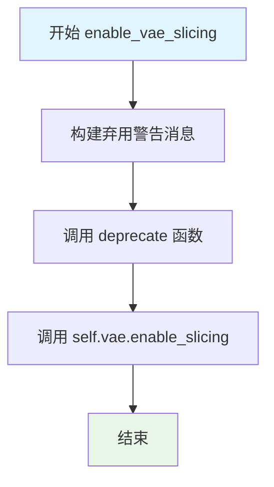

#### 带注释源码

```python
def enable_vae_slicing(self):
    r"""
    Enable sliced VAE decoding. When this option is enabled, the VAE will split the input tensor in slices to
    compute decoding in several steps. This is useful to save some memory and allow larger batch sizes.
    """
    # 构建弃用警告消息，提示用户该方法已废弃，建议使用 pipe.vae.enable_slicing()
    depr_message = f"Calling `enable_vae_slicing()` on a `{self.__class__.__name__}` is deprecated and this method will be removed in a future version. Please use `pipe.vae.enable_slicing()`."
    
    # 调用 deprecate 函数发出警告，指定方法名、版本号和警告消息
    deprecate(
        "enable_vae_slicing",
        "0.40.0",
        depr_message,
    )
    
    # 实际调用 VAE 模型的 enable_slicing 方法来启用分片解码
    self.vae.enable_slicing()
```


### `RFInversionFluxPipeline.disable_vae_slicing`

禁用 VAE 切片解码。如果之前启用了 `enable_vae_slicing`，此方法将使解码回到单步计算模式。该方法已被废弃，建议直接使用 `pipe.vae.disable_slicing()`。

参数：
- 无（仅包含隐式 `self` 参数）

返回值：`None`，无返回值

#### 流程图

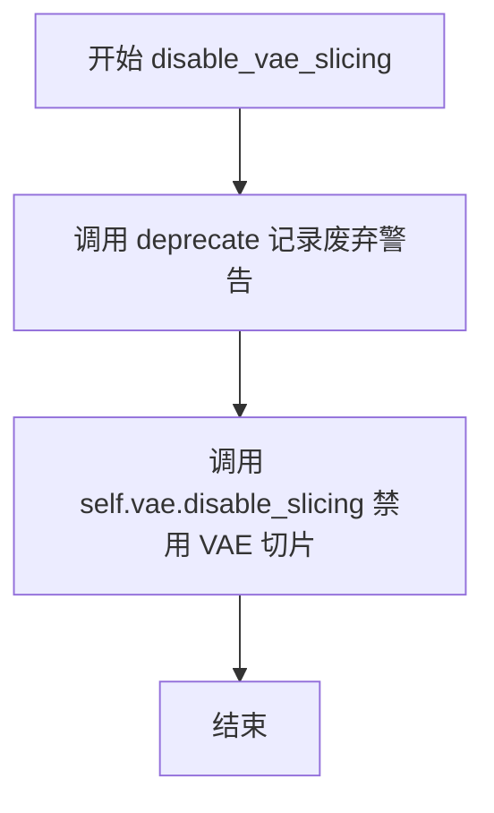

#### 带注释源码

```
def disable_vae_slicing(self):
    r"""
    Disable sliced VAE decoding. If `enable_vae_slicing` was previously enabled, this method will go back to
    computing decoding in one step.
    """
    # 构建废弃警告消息，提示用户使用新的 API
    depr_message = f"Calling `disable_vae_slicing()` on a `{self.__class__.__name__}` is deprecated and this method will be removed in a future version. Please use `pipe.vae.disable_slicing()`."
    
    # 调用 deprecate 函数记录废弃警告，版本号为 0.40.0
    deprecate(
        "disable_vae_slicing",
        "0.40.0",
        depr_message,
    )
    
    # 委托给 VAE 对象的 disable_slicing 方法执行实际的禁用操作
    self.vae.disable_slicing()
```


### `RFInversionFluxPipeline.enable_vae_tiling`

启用瓦片化VAE解码。当启用此选项时，VAE会将输入张量分割成瓦片，以多个步骤计算解码和编码。这对于节省大量内存并处理更大的图像非常有用。

参数：
- 该方法无参数（除 self 外）

返回值：`None`，无返回值

#### 流程图

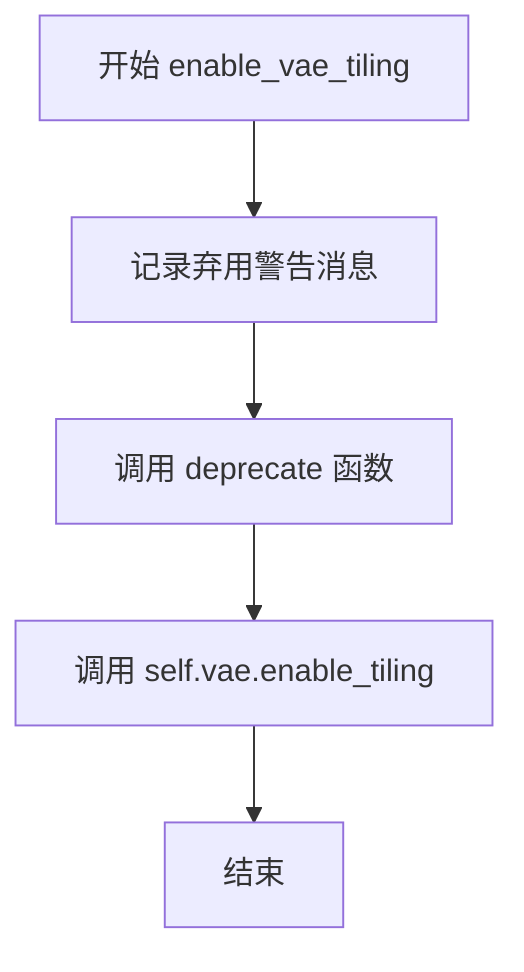

#### 带注释源码

```
def enable_vae_tiling(self):
    r"""
    Enable tiled VAE decoding. When this option is enabled, the VAE will split the input tensor into tiles to
    compute decoding and encoding in several steps. This is useful for saving a large amount of memory and to allow
    processing larger images.
    """
    # 构建弃用警告消息，告知用户此方法已弃用，建议使用 pipe.vae.enable_tiling()
    depr_message = f"Calling `enable_vae_tiling()` on a `{self.__class__.__name__}` is deprecated and this method will be removed in a future version. Please use `pipe.vae.enable_tiling()`."
    
    # 调用 deprecate 函数记录弃用信息，在版本 0.40.0 后将移除此方法
    deprecate(
        "enable_vae_tiling",
        "0.40.0",
        depr_message,
    )
    
    # 实际调用底层 VAE 模型的 enable_tiling 方法来启用瓦片化解码
    self.vae.enable_tiling()
```


### `RFInversionFluxPipeline.disable_vae_tiling`

该方法用于禁用VAE的平铺解码模式。如果之前启用了`enable_vae_tiling`，调用此方法后将恢复为单步解码。该方法已被废弃，建议直接使用`pipe.vae.disable_tiling()`。

参数：
- 无（仅包含隐式参数`self`）

返回值：`None`，无返回值

#### 流程图

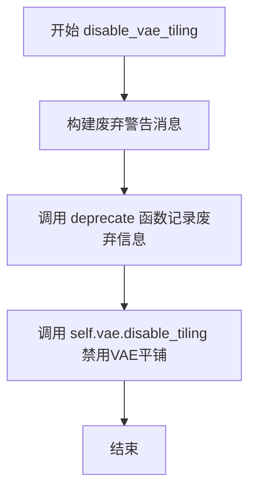

#### 带注释源码

```python
def disable_vae_tiling(self):
    r"""
    Disable tiled VAE decoding. If `enable_vae_tiling` was previously enabled, this method will go back to
    computing decoding in one step.
    """
    # 构建废弃警告消息，包含类名和升级建议
    depr_message = f"Calling `disable_vae_tiling()` on a `{self.__class__.__name__}` is deprecated and this method will be removed in a future version. Please use `pipe.vae.disable_tiling()`."
    
    # 调用 deprecate 函数记录废弃信息，用于在运行时发出警告
    deprecate(
        "disable_vae_tiling",    # 废弃的方法名称
        "0.40.0",                # 废弃版本号
        depr_message,            # 废弃警告消息
    )
    
    # 调用底层 VAE 模型的 disable_tiling 方法，禁用平铺解码
    self.vae.disable_tiling()
```


### `RFInversionFluxPipeline.prepare_latents_inversion`

该方法用于在Flux图像反转管道中准备潜在变量。它接收图像潜在表示和批次参数，将图像潜在变量打包成适合Transformer模型输入的格式，并生成对应的潜在图像ID，用于后续的反向扩散过程。

参数：

- `self`：`RFInversionFluxPipeline` 实例本身，隐式传递
- `batch_size`：`int`，批次大小，指定一次处理多少个样本
- `num_channels_latents`：`int`，潜在变量的通道数，通常为Transformer输入通道数的1/4
- `height`：`int` 或 `float`，输入图像的高度（像素单位）
- `width`：`int` 或 `float`，输入图像的宽度（像素单位）
- `dtype`：`torch.dtype`，输出张量的数据类型
- `device`：`torch.device`，输出张量存放的设备（CPU或CUDA）
- `image_latents`：`torch.FloatTensor`，从VAE编码得到的图像潜在表示，形状为 `(batch_size, channels, h, w)`

返回值：`(torch.Tensor, torch.Tensor)`，返回一个元组，包含：
- `latents`：打包后的潜在变量，形状为 `(batch_size, seq_len, channels*4)`，可直接输入Transformer
- `latent_image_ids`：潜在图像ID，用于Transformer中的位置编码，形状为 `(seq_len, 3)`

#### 流程图

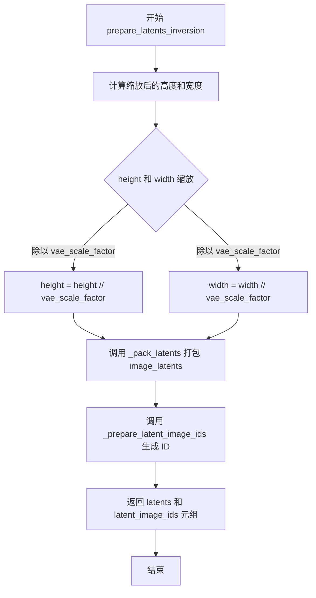

#### 带注释源码

```python
def prepare_latents_inversion(
    self,
    batch_size,
    num_channels_latents,
    height,
    width,
    dtype,
    device,
    image_latents,
):
    """
    准备用于反转过程的潜在变量。
    
    该方法执行以下操作：
    1. 将输入的高度和宽度除以VAE的缩放因子，以获得潜在空间中的尺寸
    2. 使用_pack_latents方法将图像潜在变量打包成适合Transformer的格式
    3. 生成潜在图像ID，用于控制网络中的位置编码
    
    Args:
        batch_size: 批次大小
        num_channels_latents: 潜在通道数
        height: 输入图像高度
        width: 输入图像宽度  
        dtype: 输出数据类型
        device: 输出设备
        image_latents: VAE编码后的图像潜在表示
        
    Returns:
        tuple: (latents, latent_image_ids) 元组
    """
    # 第一步：计算潜在空间中的尺寸
    # VAE通常对图像进行8x压缩，所以需要将像素尺寸转换为潜在尺寸
    # 例如：1024x1024的图像 -> 128x128的潜在表示
    height = int(height) // self.vae_scale_factor
    width = int(width) // self.vae_scale_factor

    # 第二步：打包潜在变量
    # _pack_latents将4D潜在张量(batch, c, h, w)打包成3D张量(batch, seq_len, c*4)
    # 这种打包方式是为了适应FluxTransformer的输入格式要求
    latents = self._pack_latents(image_latents, batch_size, num_channels_latents, height, width)

    # 第三步：生成潜在图像ID
    # 这些ID是位置编码信息，用于告诉Transformer每个潜在像素的位置
    # 注意：这里的高度和宽度需要除以2，因为后续处理需要 halved 尺寸
    latent_image_ids = self._prepare_latent_image_ids(batch_size, height // 2, width // 2, device, dtype)

    # 返回打包后的潜在变量和对应的图像ID
    return latents, latent_image_ids
```


### `RFInversionFluxPipeline.prepare_latents`

该方法用于为 Flux 图像生成管道准备潜在变量（latents）和潜在图像ID。它首先根据 VAE 的缩放因子调整高度和宽度，然后如果未提供现成的潜在变量，则使用随机张量生成器创建新的噪声潜在变量，最后通过 `_pack_latents` 方法打包潜在变量，并通过 `_prepare_latent_image_ids` 方法生成对应的图像ID。

参数：

- `batch_size`：`int`，生成图像的批次大小
- `num_channels_latents`：`int`，潜在变量的通道数，通常为 transformer 配置的输入通道数除以 4
- `height`：`int`，图像高度（像素）
- `width`：`int`，图像宽度（像素）
- `dtype`：`torch.dtype`，潜在变量的数据类型
- `device`：`torch.device`，潜在变量所在的设备
- `generator`：`torch.Generator` 或 `List[torch.Generator]`，可选的随机数生成器，用于确保生成的可确定性
- `latents`：`torch.FloatTensor`，可选的预生成潜在变量，如果提供则直接使用，否则新生成

返回值：`Tuple[torch.Tensor, torch.Tensor]`，包含打包后的潜在变量和潜在图像ID的元组

#### 流程图

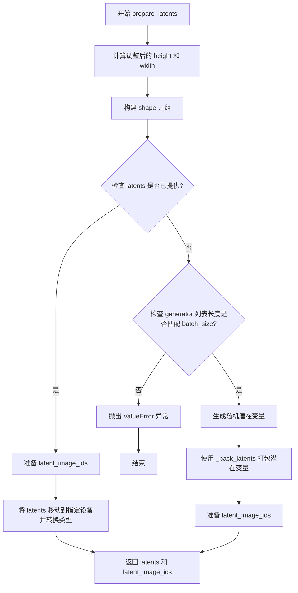

#### 带注释源码

```python
def prepare_latents(
    self,
    batch_size,
    num_channels_latents,
    height,
    width,
    dtype,
    device,
    generator,
    latents=None,
):
    # VAE applies 8x compression on images but we must also account for packing which requires
    # latent height and width to be divisible by 2.
    # 计算调整后的高度和宽度：VAE 对图像应用 8x 压缩，同时需要考虑打包操作要求潜在变量高度和宽度能被 2 整除
    height = 2 * (int(height) // (self.vae_scale_factor * 2))
    width = 2 * (int(width) // (self.vae_scale_factor * 2))

    # 定义潜在变量的形状：(batch_size, num_channels_latents, height, width)
    shape = (batch_size, num_channels_latents, height, width)

    # 如果已经提供了潜在变量，则直接使用
    if latents is not None:
        # 为当前批次准备潜在图像ID
        latent_image_ids = self._prepare_latent_image_ids(batch_size, height // 2, width // 2, device, dtype)
        # 将潜在变量移动到指定设备并转换数据类型后返回
        return latents.to(device=device, dtype=dtype), latent_image_ids

    # 检查 generator 列表长度是否与 batch_size 匹配
    if isinstance(generator, list) and len(generator) != batch_size:
        raise ValueError(
            f"You have passed a list of generators of length {len(generator)}, but requested an effective batch"
            f" size of {batch_size}. Make sure the batch size matches the length of the generators."
        )

    # 使用随机张量生成器生成噪声潜在变量
    latents = randn_tensor(shape, generator=generator, device=device, dtype=dtype)
    # 将潜在变量打包成适合 transformer 处理的格式
    latents = self._pack_latents(latents, batch_size, num_channels_latents, height, width)

    # 准备潜在图像ID，用于自注意力机制中的位置编码
    latent_image_ids = self._prepare_latent_image_ids(batch_size, height // 2, width // 2, device, dtype)

    # 返回打包后的潜在变量和潜在图像ID
    return latents, latent_image_ids
```


### `RFInversionFluxPipeline.get_timesteps`

该方法用于根据推理步骤数和强度参数获取调度器的时间步和西格玛值，支持图像到图像的扩散过程中时间步的调整。

参数：

- `num_inference_steps`：`int`，推理过程中的去噪步数
- `strength`：`float`，强度参数，用于控制时间步的起始位置，默认为 1.0

返回值：

- `timesteps`：`torch.Tensor`，从调度器获取的时间步序列
- `sigmas`：`torch.Tensor`，从调度器获取的西格玛值序列
- `num_inference_steps - t_start`：`int`，调整后的实际推理步数

#### 流程图

```mermaid
flowchart TD
    A[开始 get_timesteps] --> B[计算 init_timestep = min(num_inference_steps * strength, num_inference_steps)]
    B --> C[计算 t_start = max(num_inference_steps - init_timestep, 0)]
    C --> D[从 scheduler.timesteps 切片获取时间步: timesteps[t_start * order:]]
    E[从 scheduler.sigmas 切片获取西格玛: sigmas[t_start * order:]]
    D --> F{检查 scheduler 是否有 set_begin_index}
    E --> F
    F -->|是| G[调用 scheduler.set_begin_index(t_start * order)]
    F -->|否| H[跳过设置]
    G --> I[返回 timesteps, sigmas, num_inference_steps - t_start]
    H --> I
```

#### 带注释源码

```python
def get_timesteps(self, num_inference_steps, strength=1.0):
    # 根据强度参数计算初始时间步数，取推理步数和 strength*步数 的较小值
    # strength 用于控制图像保真度与编辑程度的平衡
    init_timestep = min(num_inference_steps * strength, num_inference_steps)

    # 计算起始索引，确保从正确的位置开始去噪
    # 如果 strength < 1.0，则跳过前 t_start 个时间步
    t_start = int(max(num_inference_steps - init_timestep, 0))
    
    # 从调度器的时间步序列中提取从 t_start 开始的时间步
    # scheduler.order 用于支持多步调度器（如 DPMSolver）
    timesteps = self.scheduler.timesteps[t_start * self.scheduler.order :]
    
    # 同步提取对应的西格玛值（噪声调度参数）
    sigmas = self.scheduler.sigmas[t_start * self.scheduler.order :]
    
    # 部分调度器支持设置起始索引以优化内存和计算
    if hasattr(self.scheduler, "set_begin_index"):
        self.scheduler.set_begin_index(t_start * self.scheduler.order)

    # 返回：调整后的时间步、西格玛值、以及实际执行的推理步数
    return timesteps, sigmas, num_inference_steps - t_start
```


### `RFInversionFluxPipeline.__call__`

该方法是 Flux 管道的主生成方法，实现了基于 RF Inversion（Rectified Flow Inversion）的文本到图像生成功能。它支持两种模式：普通生成模式和反演编辑模式。当提供 `inverted_latents`、`image_latents` 和 `latent_image_ids` 时，管道执行受控反向 ODE 进行图像编辑；否则执行标准的去噪过程生成图像。

参数：

- `prompt`：`Union[str, List[str]]`，可选，要引导图像生成的提示词。如果未定义，则必须传递 `prompt_embeds`
- `prompt_2`：`Optional[Union[str, List[str]]]`，可选，要发送到 `tokenizer_2` 和 `text_encoder_2` 的提示词。如果未定义，则使用 `prompt`
- `inverted_latents`：`Optional[torch.FloatTensor]`，可选，来自 `pipe.invert` 的反演潜在变量
- `image_latents`：`Optional[torch.FloatTensor]`，可选，来自 `pipe.invert` 的图像潜在变量
- `latent_image_ids`：`Optional[torch.FloatTensor]`，可选，来自 `pipe.invert` 的潜在图像 ID
- `height`：`Optional[int]`，可选，生成图像的高度（像素），默认由 `self.default_sample_size * self.vae_scale_factor` 确定
- `width`：`Optional[int]`，可选，生成图像的宽度（像素），默认由 `self.default_sample_size * self.vae_scale_factor` 确定
- `eta`：`float`，可选，默认 1.0，控制引导参数，平衡保真度与可编辑性
- `decay_eta`：`Optional[bool]`，可选，默认 False，是否对 eta 进行衰减
- `eta_decay_power`：`Optional[float]`，可选，默认 1.0，eta 衰减的幂次
- `strength`：`float`，可选，默认 1.0，噪声调度器强度
- `start_timestep`：`float`，可选，默认 0，反演编辑的起始时间步
- `stop_timestep`：`float`，可选，默认 0.25，反演编辑的停止时间步
- `num_inference_steps`：`int`，可选，默认 28，去噪步骤数
- `sigmas`：`Optional[List[float]]`，可选，自定义 sigmas 值
- `timesteps`：`List[int]`，可选，自定义时间步
- `guidance_scale`：`float`，可选，默认 3.5，无分类器自由引导（CFG）比例
- `num_images_per_prompt`：`Optional[int]`，可选，默认 1，每个提示词生成的图像数量
- `generator`：`Optional[Union[torch.Generator, List[torch.Generator]]]`，可选，用于生成确定性结果的随机数生成器
- `latents`：`Optional[torch.FloatTensor]`，可选，预生成的噪声潜在变量
- `prompt_embeds`：`Optional[torch.FloatTensor]`，可选，预生成的文本嵌入
- `pooled_prompt_embeds`：`Optional[torch.FloatTensor]`，可选，预生成的池化文本嵌入
- `output_type`：`str | None`，可选，默认 "pil"，输出格式（"pil"、"np" 或 "latent"）
- `return_dict`：`bool`，可选，默认 True，是否返回 `FluxPipelineOutput` 而不是元组
- `joint_attention_kwargs`：`Optional[Dict[str, Any]]`，可选，传递给注意力处理器的参数字典
- `callback_on_step_end`：`Optional[Callable[[int, int, Dict], None]]`，可选，每个去噪步骤结束时调用的回调函数
- `callback_on_step_end_tensor_inputs`：`List[str]`，可选，默认 ["latents"]，回调函数要接收的张量输入列表
- `max_sequence_length`：`int`，可选，默认 512，与提示词配合使用的最大序列长度

返回值：`Union[FluxPipelineOutput, Tuple]`，`FluxPipelineOutput` 对象（如果 `return_dict` 为 True），否则返回元组，第一个元素是生成的图像列表

#### 流程图

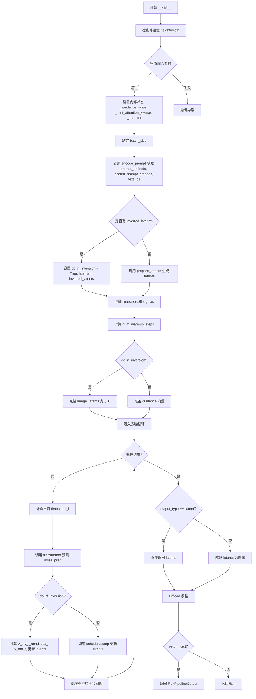

#### 带注释源码

```python
@torch.no_grad()
@replace_example_docstring(EXAMPLE_DOC_STRING)
def __call__(
    self,
    prompt: Union[str, List[str]] = None,
    prompt_2: Optional[Union[str, List[str]]] = None,
    inverted_latents: Optional[torch.FloatTensor] = None,
    image_latents: Optional[torch.FloatTensor] = None,
    latent_image_ids: Optional[torch.FloatTensor] = None,
    height: Optional[int] = None,
    width: Optional[int] = None,
    eta: float = 1.0,
    decay_eta: Optional[bool] = False,
    eta_decay_power: Optional[float] = 1.0,
    strength: float = 1.0,
    start_timestep: float = 0,
    stop_timestep: float = 0.25,
    num_inference_steps: int = 28,
    sigmas: Optional[List[float]] = None,
    timesteps: List[int] = None,
    guidance_scale: float = 3.5,
    num_images_per_prompt: Optional[int] = 1,
    generator: Optional[Union[torch.Generator, List[torch.Generator]]] = None,
    latents: Optional[torch.FloatTensor] = None,
    prompt_embeds: Optional[torch.FloatTensor] = None,
    pooled_prompt_embeds: Optional[torch.FloatTensor] = None,
    output_type: str | None = "pil",
    return_dict: bool = True,
    joint_attention_kwargs: Optional[Dict[str, Any]] = None,
    callback_on_step_end: Optional[Callable[[int, int, Dict], None]] = None,
    callback_on_step_end_tensor_inputs: List[str] = ["latents"],
    max_sequence_length: int = 512,
):
    # 1. 设置默认图像尺寸（如果未提供）
    height = height or self.default_sample_size * self.vae_scale_factor
    width = width or self.default_sample_size * self.vae_scale_factor

    # 2. 检查输入参数的有效性
    self.check_inputs(
        prompt,
        prompt_2,
        inverted_latents,
        image_latents,
        latent_image_ids,
        height,
        width,
        start_timestep,
        stop_timestep,
        prompt_embeds=prompt_embeds,
        pooled_prompt_embeds=pooled_prompt_embeds,
        callback_on_step_end_tensor_inputs=callback_on_step_end_tensor_inputs,
        max_sequence_length=max_sequence_length,
    )

    # 3. 初始化内部状态变量
    self._guidance_scale = guidance_scale
    self._joint_attention_kwargs = joint_attention_kwargs
    self._interrupt = False
    # 判断是否执行 RF 反演模式
    do_rf_inversion = inverted_latents is not None

    # 4. 确定批次大小
    if prompt is not None and isinstance(prompt, str):
        batch_size = 1
    elif prompt is not None and isinstance(prompt, list):
        batch_size = len(prompt)
    else:
        batch_size = prompt_embeds.shape[0]

    device = self._execution_device

    # 5. 获取 LoRA 缩放因子
    lora_scale = (
        self.joint_attention_kwargs.get("scale", None) if self.joint_attention_kwargs is not None else None
    )
    
    # 6. 编码提示词获取文本嵌入
    (
        prompt_embeds,
        pooled_prompt_embeds,
        text_ids,
    ) = self.encode_prompt(
        prompt=prompt,
        prompt_2=prompt_2,
        prompt_embeds=prompt_embeds,
        pooled_prompt_embeds=pooled_prompt_embeds,
        device=device,
        num_images_per_prompt=num_images_per_prompt,
        max_sequence_length=max_sequence_length,
        lora_scale=lora_scale,
    )

    # 7. 准备潜在变量
    num_channels_latents = self.transformer.config.in_channels // 4
    if do_rf_inversion:
        # 使用反演潜在变量
        latents = inverted_latents
    else:
        # 标准生成模式：准备初始潜在变量
        latents, latent_image_ids = self.prepare_latents(
            batch_size * num_images_per_prompt,
            num_channels_latents,
            height,
            width,
            prompt_embeds.dtype,
            device,
            generator,
            latents,
        )

    # 8. 准备时间步调度
    # 生成默认 sigma 调度（如果未提供）
    sigmas = np.linspace(1.0, 1 / num_inference_steps, num_inference_steps) if sigmas is None else sigmas
    # 计算图像序列长度用于调度器移位
    image_seq_len = (int(height) // self.vae_scale_factor // 2) * (int(width) // self.vae_scale_factor // 2)
    # 计算 mu（调度偏移量）
    mu = calculate_shift(
        image_seq_len,
        self.scheduler.config.get("base_image_seq_len", 256),
        self.scheduler.config.get("max_image_seq_len", 4096),
        self.scheduler.config.get("base_shift", 0.5),
        self.scheduler.config.get("max_shift", 1.15),
    )
    # 获取调度器的时间步
    timesteps, num_inference_steps = retrieve_timesteps(
        self.scheduler,
        num_inference_steps,
        device,
        timesteps,
        sigmas,
        mu=mu,
    )
    # 如果使用 RF 反演，调整时间步
    if do_rf_inversion:
        start_timestep = int(start_timestep * num_inference_steps)
        stop_timestep = min(int(stop_timestep * num_inference_steps), num_inference_steps)
        timesteps, sigmas, num_inference_steps = self.get_timesteps(num_inference_steps, strength)
    
    # 计算预热步数
    num_warmup_steps = max(len(timesteps) - num_inference_steps * self.scheduler.order, 0)
    self._num_timesteps = len(timesteps)

    # 9. 准备引导向量
    if self.transformer.config.guidance_embeds:
        guidance = torch.full([1], guidance_scale, device=device, dtype=torch.float32)
        guidance = guidance.expand(latents.shape[0])
    else:
        guidance = None

    # 10. 如果使用 RF 反演，保存初始图像潜在变量
    if do_rf_inversion:
        y_0 = image_latents.clone()
    
    # 11. 去噪循环 / 受控反向 ODE（算法 2）
    with self.progress_bar(total=num_inference_steps) as progress_bar:
        for i, t in enumerate(timesteps):
            if do_rf_inversion:
                # 计算当前时间步 t_i（归一化）
                t_i = 1 - t / 1000
                dt = torch.tensor(1 / (len(timesteps) - 1), device=device)

            if self._interrupt:
                continue

            # 扩展时间步以匹配批次维度
            timestep = t.expand(latents.shape[0]).to(latents.dtype)

            # 调用 transformer 进行噪声预测
            noise_pred = self.transformer(
                hidden_states=latents,
                timestep=timestep / 1000,
                guidance=guidance,
                pooled_projections=pooled_prompt_embeds,
                encoder_hidden_states=prompt_embeds,
                txt_ids=text_ids,
                img_ids=latent_image_ids,
                joint_attention_kwargs=self.joint_attention_kwargs,
                return_dict=False,
            )[0]

            latents_dtype = latents.dtype
            # RF 反演模式：执行受控反向 ODE
            if do_rf_inversion:
                # 计算速度场 v_t = -noise_pred
                v_t = -noise_pred
                # 计算条件速度场
                v_t_cond = (y_0 - latents) / (1 - t_i)
                # 确定 eta_t（在指定时间步范围内使用 eta，否则为 0）
                eta_t = eta if start_timestep <= i < stop_timestep else 0.0
                # 可选：随时间步衰减 eta
                if decay_eta:
                    eta_t = eta_t * (1 - i / num_inference_steps) ** eta_decay_power
                # 计算估计的速度场
                v_hat_t = v_t + eta_t * (v_t_cond - v_t)

                # SDE 方程 (来自论文)：更新潜在变量
                latents = latents + v_hat_t * (sigmas[i] - sigmas[i + 1])
            else:
                # 标准去噪模式：使用调度器步骤
                latents = self.scheduler.step(noise_pred, t, latents, return_dict=False)[0]

            # 处理类型转换（特别是 MPS 后端）
            if latents.dtype != latents_dtype:
                if torch.backends.mps.is_available():
                    latents = latents.to(latents_dtype)

            # 处理步骤结束回调
            if callback_on_step_end is not None:
                callback_kwargs = {}
                for k in callback_on_step_end_tensor_inputs:
                    callback_kwargs[k] = locals()[k]
                callback_outputs = callback_on_step_end(self, i, t, callback_kwargs)

                latents = callback_outputs.pop("latents", latents)
                prompt_embeds = callback_outputs.pop("prompt_embeds", prompt_embeds)

            # 更新进度条
            if i == len(timesteps) - 1 or ((i + 1) > num_warmup_steps and (i + 1) % self.scheduler.order == 0):
                progress_bar.update()

            # XLA 设备支持
            if XLA_AVAILABLE:
                xm.mark_step()

    # 12. 后处理：解码潜在变量为图像
    if output_type == "latent":
        # 直接返回潜在变量
        image = latents
    else:
        # 解包潜在变量
        latents = self._unpack_latents(latents, height, width, self.vae_scale_factor)
        # 反缩放
        latents = (latents / self.vae.config.scaling_factor) + self.vae.config.shift_factor
        # 使用 VAE 解码
        image = self.vae.decode(latents, return_dict=False)[0]
        # 后处理为指定输出格式
        image = self.image_processor.postprocess(image, output_type=output_type)

    # 13. 释放模型内存
    self.maybe_free_model_hooks()

    # 14. 返回结果
    if not return_dict:
        return (image,)

    return FluxPipelineOutput(images=image)
```


### RFInversionFluxPipeline.invert

该方法实现了RF（Rectified Flow）反演算法，执行图像到潜在空间的正向ODE（常微分方程）过程，将输入图像反演为可用的潜在向量，用于后续的图像编辑和生成任务。

参数：

- `image`：`PipelineImageInput`，输入的图像或图像列表，用于反演处理
- `source_prompt`：`str`，默认为空字符串，引导图像生成的文本提示
- `source_guidance_scale`：`float`，默认为0.0，分类器自由扩散引导尺度
- `num_inversion_steps`：`int`，默认为28，反演过程的离散化步数
- `strength`：`float`，默认为1.0，控制反演强度
- `gamma`：`float`，默认为0.5，控制前向ODE的控制器引导参数，平衡保真度和可编辑性
- `height`：`Optional[int]`，生成图像的高度，默认根据模型配置自动确定
- `width`：`Optional[int]`，生成图像的宽度，默认根据模型配置自动确定
- `timesteps`：`List[int]`，可选的自定义时间步列表
- `dtype`：`Optional[torch.dtype]`，计算使用的数据类型，默认使用文本编码器的dtype
- `joint_attention_kwargs`：`Optional[Dict[str, Any]]`，传递给注意力处理器的关键字参数

返回值：`Tuple[torch.FloatTensor, torch.FloatTensor, torch.FloatTensor]`，返回三个元素的元组：
- 第一个元素为反演后的潜在向量 `Y_t`，作为去噪循环的起点
- 第二个元素为编码后的图像潜在表示 `image_latents`
- 第三个元素为潜在图像ID `latent_image_ids`

#### 流程图

```mermaid
flowchart TD
    A[开始 invert 方法] --> B[设置 dtype 和 batch_size]
    B --> C[设置高度和宽度默认值]
    C --> D[1. 准备图像: encode_image]
    D --> E[prepare_latents_inversion 打包图像潜在变量]
    E --> F[2. 准备时间步: 计算 sigmas 和 mu]
    F --> G[retrieve_timesteps 获取调度器时间步]
    G --> H[get_timesteps 调整时间步]
    H --> I[3. 准备文本嵌入: encode_prompt]
    I --> J[4. 处理引导: 创建 guidance 向量]
    J --> K[初始化 Y_t 和 y_1]
    K --> L{前向 ODE 循环}
    L -->|第 i 步| M[计算当前时间步 t_i]
    M --> N[transformer 获取无条件向量场 u_t_i]
    N --> O[计算条件向量场 u_t_i_cond]
    O --> P[计算受控向量场 u_hat_t_i]
    P --> Q[Y_t = Y_t + u_hat_t_i * dt]
    Q --> R[更新进度条]
    R --> S{是否完成所有步}
    S -->|否| L
    S -->|是| T[返回 Y_t, image_latents, latent_image_ids]
    
    style A fill:#f9f,color:#333
    style T fill:#9f9,color:#333
```

#### 带注释源码

```python
@torch.no_grad()
def invert(
    self,
    image: PipelineImageInput,
    source_prompt: str = "",
    source_guidance_scale=0.0,
    num_inversion_steps: int = 28,
    strength: float = 1.0,
    gamma: float = 0.5,
    height: Optional[int] = None,
    width: Optional[int] = None,
    timesteps: List[int] = None,
    dtype: Optional[torch.dtype] = None,
    joint_attention_kwargs: Optional[Dict[str, Any]] = None,
):
    r"""
    执行论文中的 Algorithm 1: Controlled Forward ODE
    参考: https://huggingface.co/papers/2410.10792
    
    该方法实现图像反演过程，将图像从像素空间映射到潜在空间，
    生成的潜在向量可用于后续的图像编辑任务。
    """
    # 确定计算使用的数据类型，默认为文本编码器的数据类型
    dtype = dtype or self.text_encoder.dtype
    # 设置批次大小为1（单图像处理）
    batch_size = 1
    # 保存联合注意力关键字参数
    self._joint_attention_kwargs = joint_attention_kwargs
    # 计算潜在变量的通道数（transformer输入通道数的1/4）
    num_channels_latents = self.transformer.config.in_channels // 4

    # 设置默认高度和宽度（如果未指定）
    height = height or self.default_sample_size * self.vae_scale_factor
    width = width or self.default_sample_size * self.vae_scale_factor
    # 获取执行设备
    device = self._execution_device

    # ============ 步骤1: 准备图像 ============
    # 使用 VAE 编码图像到潜在空间
    image_latents, _ = self.encode_image(image, height=height, width=width, dtype=dtype)
    # 准备反演用的潜在变量和图像ID
    image_latents, latent_image_ids = self.prepare_latents_inversion(
        batch_size, num_channels_latents, height, width, dtype, device, image_latents
    )

    # ============ 步骤2: 准备时间步 ============
    # 生成线性间隔的 sigma 值（从1到1/num_inversion_steps）
    sigmas = np.linspace(1.0, 1 / num_inversion_steps, num_inversion_steps)
    # 计算图像序列长度（用于调度器偏移计算）
    image_seq_len = (int(height) // self.vae_scale_factor // 2) * (int(width) // self.vae_scale_factor // 2)
    # 计算调度器偏移量 mu
    mu = calculate_shift(
        image_seq_len,
        self.scheduler.config.get("base_image_seq_len", 256),
        self.scheduler.config.get("max_image_seq_len", 4096),
        self.scheduler.config.get("base_shift", 0.5),
        self.scheduler.config.get("max_shift", 1.15),
    )
    # 从调度器获取时间步
    timesteps, num_inversion_steps = retrieve_timesteps(
        self.scheduler,
        num_inversion_steps,
        device,
        timesteps,
        sigmas,
        mu=mu,
    )
    # 根据强度调整时间步
    timesteps, sigmas, num_inversion_steps = self.get_timesteps(num_inversion_steps, strength)

    # ============ 步骤3: 准备文本嵌入 ============
    # 编码提示词获取文本嵌入
    (
        prompt_embeds,
        pooled_prompt_embeds,
        text_ids,
    ) = self.encode_prompt(
        prompt=source_prompt,
        prompt_2=source_prompt,
        device=device,
    )
    
    # ============ 步骤4: 处理引导 ============
    # 如果 transformer 支持引导嵌入，创建引导向量
    if self.transformer.config.guidance_embeds:
        guidance = torch.full([1], source_guidance_scale, device=device, dtype=torch.float32)
    else:
        guidance = None

    # ============ 步骤5: 前向 ODE 循环 ============
    # Eq 8: dY_t = [u_t(Y_t) + γ(u_t(Y_t|y_1) - u_t(Y_t))]dt
    # Y_t 初始化为编码后的图像潜在变量
    Y_t = image_latents
    # y_1 是随机噪声，用于条件向量场计算
    y_1 = torch.randn_like(Y_t)
    # N 是 sigma 的数量
    N = len(sigmas)

    # 前向 ODE 循环（遍历所有时间步）
    with self.progress_bar(total=N - 1) as progress_bar:
        for i in range(N - 1):
            # 计算当前时间步（归一化到 [0, 1]）
            t_i = torch.tensor(i / (N), dtype=Y_t.dtype, device=device)
            # 复制时间步以匹配批次大小
            timestep = torch.tensor(t_i, dtype=Y_t.dtype, device=device).repeat(batch_size)

            # 获取无条件向量场（使用当前潜在变量 Y_t）
            u_t_i = self.transformer(
                hidden_states=Y_t,
                timestep=timestep,
                guidance=guidance,
                pooled_projections=pooled_prompt_embeds,
                encoder_hidden_states=prompt_embeds,
                txt_ids=text_ids,
                img_ids=latent_image_ids,
                joint_attention_kwargs=self.joint_attention_kwargs,
                return_dict=False,
            )[0]

            # 计算条件向量场（基于噪声 y_1 和当前状态 Y_t）
            # u_t(Y_t|y_1) = (y_1 - Y_t) / (1 - t_i)
            u_t_i_cond = (y_1 - Y_t) / (1 - t_i)

            # 计算受控向量场（结合无条件场和条件场）
            # Eq 8: u_hat_t = u_t + gamma * (u_t_cond - u_t)
            u_hat_t_i = u_t_i + gamma * (u_t_i_cond - u_t_i)
            
            # 更新 Y_t（欧拉方法）
            # Y_{t+dt} = Y_t + u_hat_t * dt
            # dt = sigmas[i] - sigmas[i+1]
            Y_t = Y_t + u_hat_t_i * (sigmas[i] - sigmas[i + 1])
            progress_bar.update()

    # 返回反演后的潜在向量（作为去噪循环的起点）、
    # 编码后的图像潜在变量和潜在图像ID
    return Y_t, image_latents, latent_image_ids
```

## 关键组件


### RFInversionFluxPipeline

主管道类，继承自 DiffusionPipeline、FluxLoraLoaderMixin、FromSingleFileMixin 和 TextualInversionLoaderMixin，实现了基于 Flux 模型的 RF 反演（Reverse Forward Inversion）算法，用于图像编辑任务。

### 张量索引与潜在 ID 管理

通过 `_prepare_latent_image_ids` 方法生成潜在空间中的图像坐标索引，用于 Transformer 模型中的自注意力机制。潜在 ID 包含高度和宽度信息，帮助模型理解图像的空间结构。

### 反量化支持

在 `encode_image` 方法中，使用 VAE 的 `scaling_factor` 和 `shift_factor` 对潜在表示进行缩放和偏移调整：`x0 = (x0 - self.vae.config.shift_factor) * self.vae.config.scaling_factor`。在解码阶段通过反向操作恢复图像。

### 量化策略控制

通过 `gamma` 参数在 `invert` 方法中实现前向 ODE 的控制向量场：`u_hat_t_i = u_t_i + gamma * (u_t_i_cond - u_t_i)`，平衡保真度和可编辑性。

### eta 控制器

在 `__call__` 方法的去噪循环中，通过 `eta` 参数和 `decay_eta`、`eta_decay_power` 实现反向 ODE 的控制：`eta_t = eta if start_timestep <= i < stop_timestep else 0.0`，允许用户在特定时间步范围内控制编辑强度。

### 时间步检索与调度

`retrieve_timesteps` 函数处理自定义时间步和 sigma 值，`get_timesteps` 方法根据强度参数调整时间步序列，支持灵活的去噪调度策略。

### 潜在变量打包与解包

`_pack_latents` 和 `_unpack_latents` 静态方法实现潜在变量的空间打包，将 2D 图像潜在转换为序列形式以适应 Transformer 的输入格式。

### VAE 图像预处理与后处理

`encode_image` 方法集成了 `VaeImageProcessor` 进行图像预处理，在生成阶段通过 `postprocess` 方法将潜在表示转换回图像。

### 文本嵌入编码

`_get_clip_prompt_embeds` 和 `_get_t5_prompt_embeds` 方法分别使用 CLIP 和 T5 文本编码器生成文本嵌入，支持双文本编码器的联合注意力机制。

### 检查点验证

`check_inputs` 方法全面验证输入参数，包括高度/宽度可被 VAE 缩放因子整除、时间步范围有效、提示词与嵌入的一致性等。


## 问题及建议


### 已知问题

-   **硬编码的魔法数字**: 代码中存在多个硬编码的数值，如 `num_inference_steps=28`、`gamma=0.5`、`eta=0.9` 等，这些应该作为类常量或配置参数，以提高代码的可维护性和可配置性
-   **重复代码**: 多个方法（如 `_get_t5_prompt_embeds`、`_get_clip_prompt_embeds`、`encode_prompt`、`prepare_latents`）是从其他pipeline复制过来的，导致代码重复，建议重构到基类中
-   **未使用的变量**: `encode_image` 方法中计算了 `resized` 变量但从未使用，这可能是未完成的代码或遗留的开发痕迹
-   **废弃方法的冗余实现**: `enable_vae_slicing`、`disable_vae_slicing`、`enable_vae_tiling`、`disable_vae_tiling` 方法被标记为废弃（deprecated），但它们仍然调用底层的 VAE 方法，存在冗余
- **类型提示不一致**: 代码混合使用了旧式的 `Optional` 和新式的 `Union` 与现代的 `str | None` 语法，类型提示风格不统一
- **缺失的模型卸载配置**: 虽然调用了 `maybe_free_model_hooks()`，但没有显式配置模型卸载策略，可能导致内存使用不够优化

### 优化建议

- **提取配置常量**: 将 `num_inference_steps`、`gamma`、`eta` 等常用参数提取为类级别的默认配置常量，便于后续调整
- **代码复用重构**: 将复用的方法（如文本编码、latent准备等）提取到基类或Mixin中，减少代码冗余
- **清理未使用变量**: 检查并移除 `encode_image` 中的 `resized` 变量，或者在文档中说明其预期用途
- **统一类型提示风格**: 使用统一的类型提示风格（推荐使用 Python 3.10+ 的联合类型语法）
- **增强错误处理**: 在 `encode_image` 和 `invert` 方法中添加对输入图像尺寸、批量大小的更严格验证
- **优化设备管理**: 考虑使用 `torch.cuda.empty_cache()` 在适当位置清理 GPU 缓存，特别是在处理大批量图像时
- **添加性能监控**: 在关键路径（如去噪循环、图像编码）添加性能日志或回调，便于诊断和优化

## 其它


### 设计目标与约束

本代码实现基于RF Inversion（Rectified Flow Inversion）算法的Flux图像编辑pipeline，核心目标是实现高质量的图像编辑与重构。主要设计目标包括：（1）支持从图像到潜在空间的反转操作（invert方法），（2）基于反转的潜在变量进行受控的图像生成（__call__方法），（3）支持文本提示引导的图像编辑。约束条件包括：输入图像尺寸需能被vae_scale_factor整除、max_sequence_length不能超过512、反转和生成过程需要匹配的参数（image_latents、latent_image_ids、inverted_latents三者必须同时提供或同时为空）。

### 错误处理与异常设计

代码采用参数校验+异常抛出的错误处理模式。在check_inputs方法中集中进行参数验证，包括：尺寸校验（height/width必须被vae_scale_factor整除）、互斥参数校验（prompt与prompt_embeds不能同时提供）、类型校验（prompt/prompt_2必须是str或list类型）、必需参数校验（inverted_latents提供时必须同时提供image_latents和latent_image_ids）、范围校验（start_timestep必须在[0, stop_timestep]范围内，max_sequence_length不能大于512）。scheduler相关错误在retrieve_timesteps中处理，支持timesteps和sigmas两种自定义方式但不兼容。XLA设备支持通过is_torch_xla_available()检测，启用时在推理循环中调用xm.mark_step()进行设备同步。

### 数据流与状态机

整体数据流分为反转阶段和生成阶段两个主要状态。**反转阶段（invert方法）**：输入图像 → encode_image编码为潜在向量 → prepare_latents_inversion打包 → 通过transformer执行前向ODE（controlled forward ODE）→ 输出inverted_latents、image_latents、latent_image_ids。**生成阶段（__call__方法）**：接收反转阶段的输出作为条件 → 准备噪声潜在向量（如未提供inverted_latents则随机生成）→ 准备时间步 → 执行去噪循环（controlled reverse ODE）→ 可选进行VAE解码 → 输出最终图像。两阶段通过inverted_latents、image_latents、latent_image_ids三个张量进行状态传递，形成完整的图像编辑工作流。

### 外部依赖与接口契约

核心依赖包括：（1）transformers库：CLIPTextModel、CLIPTokenizer用于CLIP文本编码，T5EncoderModel、T5TokenizerFast用于T5文本编码；（2）diffusers库：DiffusionPipeline基类、FluxTransformer2DModel变换器、AutoencoderKL变分自编码器、FlowMatchEulerDiscreteScheduler调度器、各类工具函数（randn_tensor、scale_lora_layers等）；（3）numpy和torch用于数值计算。接口契约方面：encode_prompt返回(prompt_embeds, pooled_prompt_embeds, text_ids)三元组；prepare_latents返回(latents, latent_image_ids)二元组；_pack_latents和_unpack_latents用于潜在向量的打包/解包；invert方法返回(inverted_latents, image_latents, latent_image_ids)三元组；__call__方法返回FluxPipelineOutput或(image,)元组。

### 性能考量与优化建议

性能关键点在于：（1）VAE编码/解码是主要计算瓶颈，支持enable_vae_slicing()和enable_vae_tiling()两种优化策略，已通过deprecation机制引导使用pipe.vae.enable_slicing()方式；（2）transformer推理占据大部分前向传播时间，支持通过FluxLoraLoaderMixin加载LoRA权重进行微调；（3）MPS设备存在dtype转换bug（pytorch#99272），需要在推理循环中显式转换latents类型。优化建议：对于大图像处理建议启用VAE tiling；多图生成时通过num_images_per_prompt参数批量处理；可考虑使用model_cpu_offload_seq进行模型卸载序列管理；XLA设备上注意mark_step的调用位置以优化同步效率。

### 安全性考虑

代码本身不直接处理敏感数据，但作为图像生成pipeline需注意：（1）用户输入的prompt需考虑文本内容安全过滤；（2）模型权重来源于黑森林实验室FLUX.1-dev预训练模型，需确保来源可信；（3）invert方法中source_prompt默认为空字符串，此时使用无条件向量场（guidance_scale=0.0），符合原论文设计；（4）生成的图像应遵守相关版权和使用条款。代码未包含水印或内容过滤机制，实际部署时需在上层应用中添加。

### 兼容性设计

兼容性设计体现在多个层面：（1）调度器兼容性：通过retrieve_timesteps函数抽象调度器的set_timesteps接口，支持自定义timesteps或sigmas；（2）LoRA加载兼容性：通过FluxLoraLoaderMixin和TextualInversionLoaderMixin支持LoRA和Textual Inversion加载，使用PEFT后端时自动处理lora_scale；（3）单文件加载：通过FromSingleFileMixin支持从单个safetensors/ckpt文件加载模型；（4）设备兼容性：支持CUDA、MPS、XLA等多种设备，使用randn_tensor统一随机数生成接口；（5）输出格式兼容性：通过output_type参数支持"pil"、numpy数组、latent等多种输出格式。

### 配置与参数说明

关键配置参数包括：（1）vae_scale_factor：通过vae.config.block_out_channels计算，默认8；（2）tokenizer_max_length：CLIP tokenizer最大长度，默认为77；（3）default_sample_size：默认采样尺寸128，用于计算默认输出尺寸（128 * vae_scale_factor = 1024）；（4）num_inversion_steps：反转步数，默认28；（5）num_inference_steps：生成步数，默认28；（6）eta：控制反转/生成中faithfulness与editability平衡的参数；（7）gamma：前向ODE中的控制器参数；（8）start_timestep/stop_timestep：控制生成过程中编辑强度的时间范围（0-1之间的浮点数）；（9）guidance_scale：分类器自由引导强度，默认3.5。

### 使用示例与最佳实践

标准使用流程：首先加载pipeline和预训练模型（如"black-forest-labs/FLUX.1-dev"），然后调用invert方法获取反转潜在向量，最后使用__call__方法进行图像生成编辑。最佳实践包括：（1）确保num_inversion_steps与num_inference_steps保持一致以获得最佳效果；（2）调整eta参数控制编辑强度：较高eta值保持更多原始图像特征，较低值允许更大编辑；（3）start_timestep和stop_timestep参数控制编辑发生的时间窗口；（4）对于超大输入图像建议使用height/width参数下采样以避免VAE产生严重伪影；（5）可预先通过encode_prompt获取prompt_embeds以复用文本编码结果。

    