# `diffusers\examples\community\pipeline_flux_semantic_guidance.py` 详细设计文档

这是一个基于 FLUX 架构的文本到图像生成管道，核心功能是实现了语义引导（Semantic Guidance）技术。该技术允许在图像生成的扩散过程中注入编辑提示（editing prompts），以动态调整生成图像的特定概念（如将猫改为狗），同时保持对原始文本提示的遵循。

## 整体流程

```mermaid
graph TD
    Start([开始]) --> CheckInputs[检查输入参数]
    CheckInputs --> EncodePrompts[编码提示词 & 编辑提示词]
    EncodePrompts --> PrepLatents[准备初始潜空间噪声]
    PrepLatents --> PrepTimesteps[计算时间步和Sigma]
    PrepTimesteps --> DenoiseLoop{去噪循环 (28步)}
    DenoiseLoop --> ForwardBase[基础Transformer前向传播]
    ForwardBase --> CheckGuidance{启用语义引导?}
    CheckGuidance -- 是 --> ForwardEdit[每个编辑概念分别前向传播]
    ForwardEdit --> ComputeGuidance[计算语义引导权重与掩码]
    CheckGuidance -- 否 --> ComputeCFG[计算Classifier-Free Guidance]
    ComputeGuidance --> ApplyGuidance[合并引导向量]
    ComputeCFG --> ApplyGuidance
    ApplyGuidance --> SchedulerStep[Scheduler更新潜空间]
    SchedulerStep --> DenoiseLoop
    DenoiseLoop -- 完成 --> VAEDecode[VAE解码潜空间为图像]
    VAEDecode --> PostProcess[后处理图像]
    PostProcess --> End([结束])
```

## 类结构

```
DiffusionPipeline (基类)
├── FluxLoraLoaderMixin
├── FromSingleFileMixin
├── TextualInversionLoaderMixin
└── FluxIPAdapterMixin
    └── FluxSemanticGuidancePipeline (主类)
```

## 全局变量及字段


### `logger`
    
Logger instance for the module

类型：`logging.Logger`
    


### `XLA_AVAILABLE`
    
Flag indicating if PyTorch XLA is available

类型：`bool`
    


### `EXAMPLE_DOC_STRING`
    
Example documentation string for the pipeline

类型：`str`
    


### `FluxSemanticGuidancePipeline.vae`
    
VAE model for encoding and decoding images

类型：`AutoencoderKL`
    


### `FluxSemanticGuidancePipeline.text_encoder`
    
CLIP text encoder for processing textual prompts

类型：`CLIPTextModel`
    


### `FluxSemanticGuidancePipeline.text_encoder_2`
    
T5 text encoder for processing textual prompts

类型：`T5EncoderModel`
    


### `FluxSemanticGuidancePipeline.tokenizer`
    
CLIP tokenizer for text tokenization

类型：`CLIPTokenizer`
    


### `FluxSemanticGuidancePipeline.tokenizer_2`
    
T5 fast tokenizer for text tokenization

类型：`T5TokenizerFast`
    


### `FluxSemanticGuidancePipeline.transformer`
    
Core denoising Transformer model

类型：`FluxTransformer2DModel`
    


### `FluxSemanticGuidancePipeline.scheduler`
    
Scheduler for controlling the diffusion process

类型：`FlowMatchEulerDiscreteScheduler`
    


### `FluxSemanticGuidancePipeline.image_encoder`
    
CLIP vision encoder for IP-Adapter image inputs

类型：`CLIPVisionModelWithProjection`
    


### `FluxSemanticGuidancePipeline.feature_extractor`
    
CLIP image processor for feature extraction

类型：`CLIPImageProcessor`
    


### `FluxSemanticGuidancePipeline.vae_scale_factor`
    
Scaling factor for VAE latent space

类型：`int`
    


### `FluxSemanticGuidancePipeline.image_processor`
    
Image processor for VAE post-processing

类型：`VaeImageProcessor`
    


### `FluxSemanticGuidancePipeline.tokenizer_max_length`
    
Maximum sequence length for tokenization

类型：`int`
    


### `FluxSemanticGuidancePipeline.default_sample_size`
    
Default sample size for image generation

类型：`int`
    
    

## 全局函数及方法


### `calculate_shift`

该函数是一个全局工具函数，用于根据图像序列长度计算线性插值的偏移量（shift）。它通过线性方程 `mu = image_seq_len * m + b` 将图像序列长度映射到偏移值，其中斜率 `m` 和截距 `b` 由基础序列长度、最大序列长度、基础偏移和最大偏移计算得出。此函数主要用于扩散管道中调整噪声调度器的步长参数。

参数：

-  `image_seq_len`：`int`，图像序列长度，用于计算偏移量的输入值
-  `base_seq_len`：`int`，默认为 256，基础序列长度，作为线性方程的参考点
-  `max_seq_len`：`int`，默认为 4096，最大序列长度，作为线性方程的上限参考点
-  `base_shift`：`float`，默认为 0.5，基础偏移量，对应 base_seq_len 位置的偏移值
-  `max_shift`：`float`，默认为 1.15，最大偏移量，对应 max_seq_len 位置的偏移值

返回值：`float`，计算得到的偏移量 mu，用于调整扩散模型的噪声调度

#### 流程图

```mermaid
flowchart TD
    A[开始 calculate_shift] --> B[输入参数]
    B --> C[计算斜率 m<br/>m = (max_shift - base_shift) / (max_seq_len - base_seq_len)]
    C --> D[计算截距 b<br/>b = base_shift - m * base_seq_len]
    D --> E[计算偏移量 mu<br/>mu = image_seq_len * m + b]
    E --> F[返回 mu]
    
    style C fill:#e1f5fe
    style D fill:#e1f5fe
    style E fill:#e1f5fe
```

#### 带注释源码

```
# Copied from diffusers.pipelines.flux.pipeline_flux.calculate_shift
def calculate_shift(
    image_seq_len,          # 输入：图像序列长度，用于计算对应的偏移量
    base_seq_len: int = 256,        # 默认256，基础序列长度参考点
    max_seq_len: int = 4096,        # 默认4096，最大序列长度参考点
    base_shift: float = 0.5,        # 默认0.5，对应base_seq_len的偏移量
    max_shift: float = 1.15,        # 默认1.15，对应max_seq_len的偏移量
):
    # 第一步：计算线性方程的斜率 m
    # 斜率 = (最大值 - 最小值) / (最大值范围 - 最小值范围)
    # 表示每单位序列长度变化所带来的偏移量变化
    m = (max_shift - base_shift) / (max_seq_len - base_seq_len)
    
    # 第二步：计算线性方程的截距 b
    # 利用点斜式：b = y - m*x
    # 使用 base_shift 和 base_seq_len 计算截距
    b = base_shift - m * base_seq_len
    
    # 第三步：计算最终的偏移量 mu
    # 使用线性方程：mu = m * x + b
    # 其中 x = image_seq_len
    mu = image_seq_len * m + b
    
    # 返回计算得到的偏移量
    return mu
```


### `retrieve_timesteps`

该函数是 DiffusionPipeline 的工具函数，用于调用调度器的 `set_timesteps` 方法并从中检索时间步长。它支持自定义时间步（timesteps）或自定义 sigma 值，能够灵活控制扩散模型的推理过程。

参数：

- `scheduler`：`SchedulerMixin`，从中获取时间步的调度器实例
- `num_inference_steps`：`Optional[int]`，生成样本时使用的扩散步数，如果使用此参数则 `timesteps` 必须为 `None`
- `device`：`Optional[Union[str, torch.device]]`，时间步要移动到的设备，若为 `None` 则不移动
- `timesteps`：`Optional[List[int]]`，用于覆盖调度器时间步间隔策略的自定义时间步，若传入此参数则 `num_inference_steps` 和 `sigmas` 必须为 `None`
- `sigmas`：`Optional[List[float]]`，用于覆盖调度器时间步间隔策略的自定义 sigma，若传入此参数则 `num_inference_steps` 和 `timesteps` 必须为 `None`
- `**kwargs`：任意关键字参数，将传递给调度器的 `set_timesteps` 方法

返回值：`Tuple[torch.Tensor, int]`，元组中第一个元素是调度器的时间步调度，第二个元素是推理步数

#### 流程图

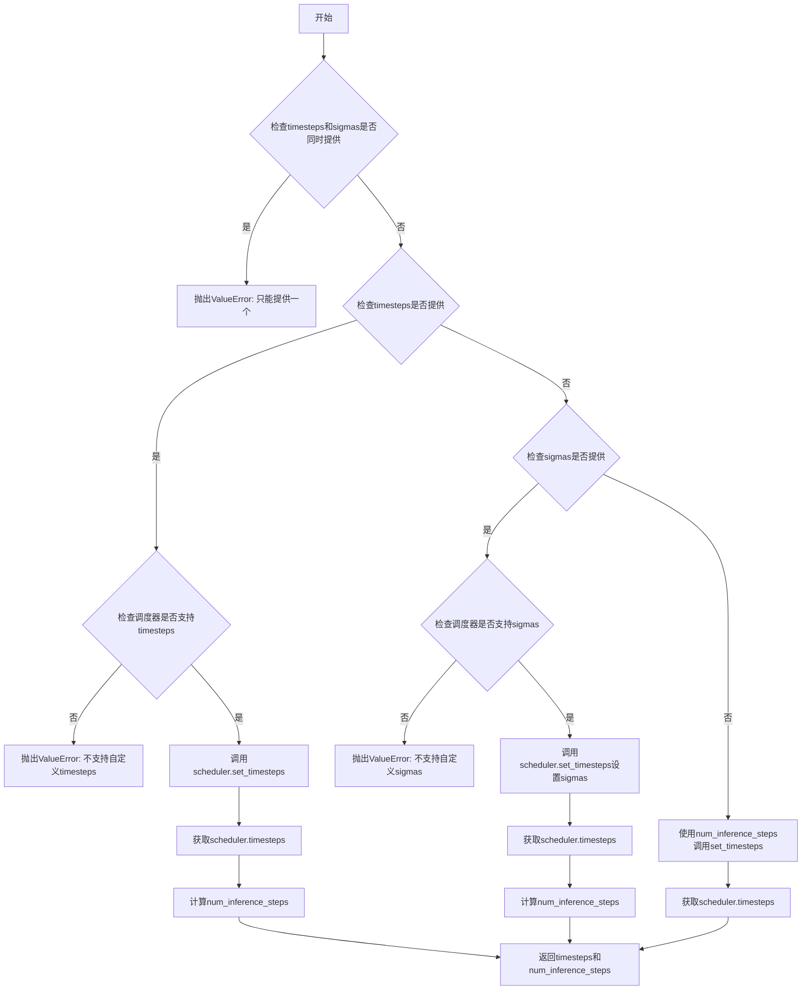

#### 带注释源码

```python
# Copied from diffusers.pipelines.stable_diffusion.pipeline_stable_diffusion.retrieve_timesteps
def retrieve_timesteps(
    scheduler,
    num_inference_steps: Optional[int] = None,
    device: Optional[Union[str, torch.device]] = None,
    timesteps: Optional[List[int]] = None,
    sigmas: Optional[List[float]] = None,
    **kwargs,
):
    r"""
    Calls the scheduler's `set_timesteps` method and retrieves timesteps from the scheduler after the call. Handles
    custom timesteps. Any kwargs will be supplied to `scheduler.set_timesteps`.

    Args:
        scheduler (`SchedulerMixin`):
            The scheduler to get timesteps from.
        num_inference_steps (`int`):
            The number of diffusion steps used when generating samples with a pre-trained model. If used, `timesteps`
            must be `None`.
        device (`str` or `torch.device`, *optional*):
            The device to which the timesteps should be moved to. If `None`, the timesteps are not moved.
        timesteps (`List[int]`, *optional*):
            Custom timesteps used to override the timestep spacing strategy of the scheduler. If `timesteps` is passed,
            `num_inference_steps` and `sigmas` must be `None`.
        sigmas (`List[float]`, *optional*):
            Custom sigmas used to override the timestep spacing strategy of the scheduler. If `sigmas` is passed,
            `num_inference_steps` and `timesteps` must be `None`.

    Returns:
        `Tuple[torch.Tensor, int]`: A tuple where the first element is the timestep schedule from the scheduler and the
        second element is the number of inference steps.
    """
    # 检查不能同时传入timesteps和sigmas，只能选择其中一种自定义方式
    if timesteps is not None and sigmas is not None:
        raise ValueError("Only one of `timesteps` or `sigmas` can be passed. Please choose one to set custom values")
    
    # 处理自定义timesteps的情况
    if timesteps is not None:
        # 检查调度器的set_timesteps方法是否接受timesteps参数
        accepts_timesteps = "timesteps" in set(inspect.signature(scheduler.set_timesteps).parameters.keys())
        if not accepts_timesteps:
            raise ValueError(
                f"The current scheduler class {scheduler.__class__}'s `set_timesteps` does not support custom"
                f" timestep schedules. Please check whether you are using the correct scheduler."
            )
        # 调用调度器的set_timesteps方法
        scheduler.set_timesteps(timesteps=timesteps, device=device, **kwargs)
        # 从调度器获取生成的时间步
        timesteps = scheduler.timesteps
        # 计算推理步数
        num_inference_steps = len(timesteps)
    # 处理自定义sigmas的情况
    elif sigmas is not None:
        # 检查调度器的set_timesteps方法是否接受sigmas参数
        accept_sigmas = "sigmas" in set(inspect.signature(scheduler.set_timesteps).parameters.keys())
        if not accept_sigmas:
            raise ValueError(
                f"The current scheduler class {scheduler.__class__}'s `set_timesteps` does not support custom"
                f" sigmas schedules. Please check whether you are using the correct scheduler."
            )
        # 调用调度器的set_timesteps方法设置sigmas
        scheduler.set_timesteps(sigmas=sigmas, device=device, **kwargs)
        # 从调度器获取生成的时间步
        timesteps = scheduler.timesteps
        # 计算推理步数
        num_inference_steps = len(timesteps)
    # 默认情况：使用num_inference_steps
    else:
        scheduler.set_timesteps(num_inference_steps, device=device, **kwargs)
        timesteps = scheduler.timesteps
    
    # 返回时间步调度和推理步数
    return timesteps, num_inference_steps
```


### `FluxSemanticGuidancePipeline.__init__`

该方法是 FluxSemanticGuidancePipeline 类的构造函数，用于初始化语义引导 Flux 管道的主要组件，包括调度器、VAE、文本编码器、分词器、Transformer 模型以及可选的图像编码器和特征提取器，同时配置图像处理参数。

参数：

- `scheduler`：`FlowMatchEulerDiscreteScheduler`，用于去噪的调度器
- `vae`：`AutoencoderKL`，用于编码和解码图像的变分自编码器模型
- `text_encoder`：`CLIPTextModel`，CLIP 文本编码器模型
- `tokenizer`：`CLIPTokenizer`，CLIP 分词器
- `text_encoder_2`：`T5EncoderModel`，T5 文本编码器模型
- `tokenizer_2`：`T5TokenizerFast`，T5 快速分词器
- `transformer`：`FluxTransformer2DModel`，条件 Transformer（MMDiT）架构用于去噪图像潜在表示
- `image_encoder`：`CLIPVisionModelWithProjection`（可选），用于 IP Adapter 的图像编码器
- `feature_extractor`：`CLIPImageProcessor`（可选），用于图像特征提取

返回值：无（`None`），构造函数不返回值

#### 流程图

```mermaid
flowchart TD
    A[__init__ 开始] --> B[调用父类初始化 super().__init__]
    B --> C[register_modules 注册所有模块]
    C --> D[计算 vae_scale_factor]
    D --> E[创建 VaeImageProcessor]
    E --> F[设置 tokenizer_max_length]
    F --> G[设置 default_sample_size]
    G --> H[__init__ 结束]
    
    C --> C1[vae]
    C --> C2[text_encoder]
    C --> C3[text_encoder_2]
    C --> C4[tokenizer]
    C --> C5[tokenizer_2]
    C --> C6[transformer]
    C --> C7[scheduler]
    C --> C8[image_encoder]
    C --> C9[feature_extractor]
```

#### 带注释源码

```python
def __init__(
    self,
    scheduler: FlowMatchEulerDiscreteScheduler,
    vae: AutoencoderKL,
    text_encoder: CLIPTextModel,
    tokenizer: CLIPTokenizer,
    text_encoder_2: T5EncoderModel,
    tokenizer_2: T5TokenizerFast,
    transformer: FluxTransformer2DModel,
    image_encoder: CLIPVisionModelWithProjection = None,
    feature_extractor: CLIPImageProcessor = None,
):
    """
    初始化 FluxSemanticGuidancePipeline 管道
    
    参数:
        scheduler: FlowMatchEulerDiscreteScheduler 调度器，用于去噪过程
        vae: AutoencoderKL VAE 模型，用于图像编码/解码
        text_encoder: CLIPTextModel CLIP 文本编码器
        tokenizer: CLIPTokenizer CLIP 分词器
        text_encoder_2: T5EncoderModel T5 文本编码器
        tokenizer_2: T5TokenizerFast T5 快速分词器
        transformer: FluxTransformer2DModel 主干 Transformer 模型
        image_encoder: CLIPVisionModelWithProjection 可选，IP Adapter 图像编码器
        feature_extractor: CLIPImageProcessor 可选，图像特征提取器
    """
    # 调用父类 DiffusionPipeline 的初始化方法
    super().__init__()

    # 使用 register_modules 注册所有模型组件到管道
    self.register_modules(
        vae=vae,
        text_encoder=text_encoder,
        text_encoder_2=text_encoder_2,
        tokenizer=tokenizer,
        tokenizer_2=tokenizer_2,
        transformer=transformer,
        scheduler=scheduler,
        image_encoder=image_encoder,
        feature_extractor=feature_extractor,
    )
    
    # 计算 VAE 缩放因子，基于 VAE 块输出通道数
    # VAE 使用 2^(num_blocks-1) 的压缩比例
    self.vae_scale_factor = 2 ** (len(self.vae.config.block_out_channels) - 1) if getattr(self, "vae", None) else 8
    
    # Flux 潜在表示被转换为 2x2 的块并打包
    # 这意味着潜在宽度和高度必须能被块大小整除
    # 因此 vae_scale_factor 乘以块大小（2）来考虑这一点
    self.image_processor = VaeImageProcessor(vae_scale_factor=self.vae_scale_factor * 2)
    
    # 设置分词器最大长度，默认值为 77（CLIP 标准）
    self.tokenizer_max_length = (
        self.tokenizer.model_max_length if hasattr(self, "tokenizer") and self.tokenizer is not None else 77
    )
    
    # 默认采样尺寸设为 128
    self.default_sample_size = 128
```


### FluxSemanticGuidancePipeline._get_t5_prompt_embeds

该方法负责将文本提示词（prompt）编码为T5文本编码器（text_encoder_2）的嵌入向量（embeddings），支持批量处理和多图生成场景，是Flux语义引导管道中文本编码流程的核心组件。

参数：

- `prompt`：`Union[str, List[str]]`，要编码的文本提示词，可以是单个字符串或字符串列表，默认为None
- `num_images_per_prompt`：`int`，每个提示词要生成的图像数量，用于复制embeddings以匹配批量大小，默认为1
- `max_sequence_length`：`int`，文本序列的最大长度，T5编码器会截断超过此长度的文本，默认为512
- `device`：`Optional[torch.device]`，计算设备，如果为None则使用执行设备
- `dtype`：`Optional[torch.dtype]`，输出张量的数据类型，如果为None则使用text_encoder的dtype

返回值：`torch.Tensor`，形状为`(batch_size * num_images_per_prompt, seq_len, hidden_size)`的文本嵌入张量，供后续扩散模型使用

#### 流程图

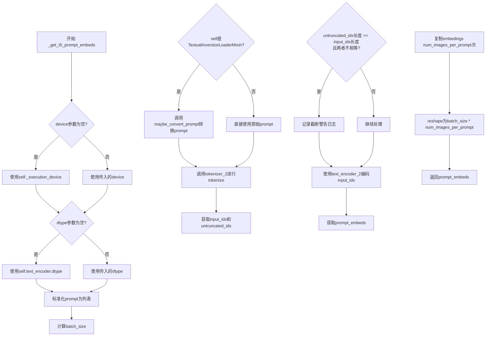

#### 带注释源码

```python
def _get_t5_prompt_embeds(
    self,
    prompt: Union[str, List[str]] = None,
    num_images_per_prompt: int = 1,
    max_sequence_length: int = 512,
    device: Optional[torch.device] = None,
    dtype: Optional[torch.dtype] = None,
):
    """
    获取T5模型编码后的文本嵌入向量
    
    该方法将输入的文本提示词通过T5文本编码器转换为高维向量表示，
    支持批量生成和单/多图生成模式。
    
    参数:
        prompt: 输入的文本提示词，支持单个字符串或字符串列表
        num_images_per_prompt: 每个提示词生成的图像数量，用于扩展embeddings
        max_sequence_length: T5编码器的最大序列长度限制
        device: 计算设备，默认为执行设备
        dtype: 输出数据类型，默认为text_encoder的数据类型
    
    返回:
        T5编码后的文本嵌入向量，形状为(batch_size*num_images_per_prompt, seq_len, hidden_dim)
    """
    # 确定计算设备和数据类型
    # 如果未指定设备，则使用管道的执行设备
    device = device or self._execution_device
    # 如果未指定数据类型，则使用text_encoder_2的数据类型
    dtype = dtype or self.text_encoder.dtype

    # 标准化输入prompt格式：将单个字符串转换为列表，便于批量处理
    prompt = [prompt] if isinstance(prompt, str) else prompt
    # 计算批处理大小
    batch_size = len(prompt)

    # 检查是否需要处理TextualInversion（文本反转）嵌入
    # 如果是TextualInversionLoaderMixin的实例，需要转换prompt格式
    if isinstance(self, TextualInversionLoaderMixin):
        prompt = self.maybe_convert_prompt(prompt, self.tokenizer_2)

    # 使用T5 tokenizer对prompt进行tokenize处理
    # padding="max_length": 填充到最大长度
    # truncation=True: 截断超过max_sequence_length的序列
    # return_tensors="pt": 返回PyTorch张量
    text_inputs = self.tokenizer_2(
        prompt,
        padding="max_length",
        max_length=max_sequence_length,
        truncation=True,
        return_length=False,
        return_overflowing_tokens=False,
        return_tensors="pt",
    )
    # 获取tokenized后的input_ids
    text_input_ids = text_inputs.input_ids
    # 同时进行不截断的tokenize，用于检测是否发生了截断
    untruncated_ids = self.tokenizer_2(prompt, padding="longest", return_tensors="pt").input_ids

    # 检测并警告截断情况
    # 如果未截断的序列长度 >= 截断后的长度，且两者不相等，说明发生了截断
    if untruncated_ids.shape[-1] >= text_input_ids.shape[-1] and not torch.equal(text_input_ids, untruncated_ids):
        # 解码被截断的部分并记录警告
        removed_text = self.tokenizer_2.batch_decode(untruncated_ids[:, self.tokenizer_max_length - 1 : -1])
        logger.warning(
            "The following part of your input was truncated because `max_sequence_length` is set to "
            f" {max_sequence_length} tokens: {removed_text}"
        )

    # 使用T5文本编码器获取文本嵌入
    # output_hidden_states=False表示只返回最后一层的输出
    prompt_embeds = self.text_encoder_2(text_input_ids.to(device), output_hidden_states=False)[0]

    # 重新获取dtype，确保使用text_encoder_2的实际dtype
    dtype = self.text_encoder_2.dtype
    # 将embedings转换为指定的dtype和device
    prompt_embeds = prompt_embeds.to(dtype=dtype, device=device)

    # 获取嵌入的序列长度维度信息
    _, seq_len, _ = prompt_embeds.shape

    # 复制text embeddings以匹配num_images_per_prompt
    # 对于每个batch中的prompt，生成多个对应的embeddings
    # 使用mps友好的repeat方法（而非expand）来复制张量
    prompt_embeds = prompt_embeds.repeat(1, num_images_per_prompt, 1)
    # 重塑张量形状：(batch_size, num_images_per_prompt, seq_len, hidden_size) -> (batch_size*num_images_per_prompt, seq_len, hidden_size)
    prompt_embeds = prompt_embeds.view(batch_size * num_images_per_prompt, seq_len, -1)

    return prompt_embeds
```


### `FluxSemanticGuidancePipeline._get_clip_prompt_embeds`

该方法用于将文本提示（prompt）编码为 CLIP 模型的嵌入向量（embeddings），支持批量处理和每提示生成多张图像的场景。

参数：

- `prompt`：`Union[str, List[str]]`，要编码的文本提示，可以是单个字符串或字符串列表
- `num_images_per_prompt`：`int = 1`，每个提示要生成的图像数量，用于复制嵌入向量
- `device`：`Optional[torch.device] = None`，指定计算设备，若为 None 则使用执行设备

返回值：`torch.FloatTensor`，返回 CLIP 模型的池化文本嵌入，形状为 `(batch_size * num_images_per_prompt, embedding_dim)`

#### 流程图

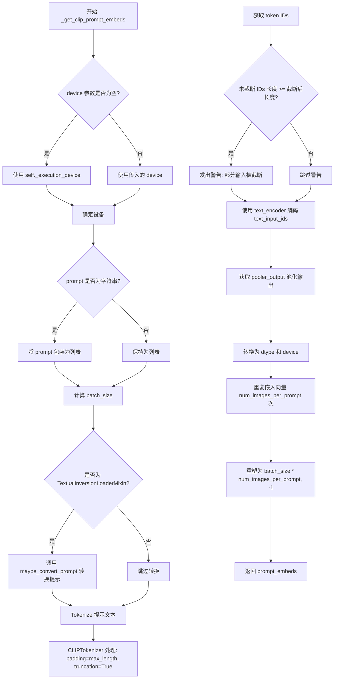

#### 带注释源码

```python
def _get_clip_prompt_embeds(
    self,
    prompt: Union[str, List[str]],
    num_images_per_prompt: int = 1,
    device: Optional[torch.device] = None,
):
    """
    获取 CLIP 文本编码器的提示嵌入向量。
    
    该方法将文本提示转换为 CLIP 模型的池化嵌入，用于 Flux 管道中的文本到图像生成。
    
    参数:
        prompt: 要编码的文本提示，字符串或字符串列表
        num_images_per_prompt: 每个提示生成的图像数量，用于复制嵌入
        device: 可选的设备参数，默认使用执行设备
    
    返回:
        形状为 (batch_size * num_images_per_prompt, embedding_dim) 的嵌入张量
    """
    # 确定计算设备，未指定则使用管道执行设备
    device = device or self._execution_device

    # 标准化输入：将单个字符串转换为列表，保持一致性
    prompt = [prompt] if isinstance(prompt, str) else prompt
    batch_size = len(prompt)

    # 如果管道支持 TextualInversion，加载自定义提示词转换
    if isinstance(self, TextualInversionLoaderMixin):
        prompt = self.maybe_convert_prompt(prompt, self.tokenizer)

    # 使用 CLIP Tokenizer 将文本转换为 token IDs
    # max_length: 使用 tokenizer 最大长度
    # truncation: 截断超过最大长度的序列
    # return_tensors: 返回 PyTorch 张量
    text_inputs = self.tokenizer(
        prompt,
        padding="max_length",
        max_length=self.tokenizer_max_length,
        truncation=True,
        return_overflowing_tokens=False,
        return_length=False,
        return_tensors="pt",
    )

    # 获取 tokenized 后的输入 IDs
    text_input_ids = text_inputs.input_ids
    
    # 获取未截断的 token IDs（使用最长 padding）用于比较
    untruncated_ids = self.tokenizer(prompt, padding="longest", return_tensors="pt").input_ids
    
    # 检查是否发生了截断，如果是则记录警告
    if untruncated_ids.shape[-1] >= text_input_ids.shape[-1] and not torch.equal(text_input_ids, untruncated_ids):
        # 解码被截断的部分用于日志记录
        removed_text = self.tokenizer.batch_decode(untruncated_ids[:, self.tokenizer_max_length - 1 : -1])
        logger.warning(
            "The following part of your input was truncated because CLIP can only handle sequences up to"
            f" {self.tokenizer_max_length} tokens: {removed_text}"
        )
    
    # 使用 CLIP 文本编码器获取嵌入
    # output_hidden_states=False 表示只返回池化输出
    prompt_embeds = self.text_encoder(text_input_ids.to(device), output_hidden_states=False)

    # 从 CLIPTextModel 输出中提取池化后的嵌入
    # 池化输出通常用于条件注入或注意力控制
    prompt_embeds = prompt_embeds.pooler_output
    
    # 转换为适当的 dtype 和 device
    prompt_embeds = prompt_embeds.to(dtype=self.text_encoder.dtype, device=device)

    # 为每个提示生成的图像数量复制嵌入向量
    # 使用 mps 友好的方法（repeat 而非 repeat_interleave）
    prompt_embeds = prompt_embeds.repeat(1, num_images_per_prompt)
    # 重塑为 (batch_size * num_images_per_prompt, embedding_dim)
    prompt_embeds = prompt_embeds.view(batch_size * num_images_per_prompt, -1)

    return prompt_embeds
```


### `FluxSemanticGuidancePipeline.encode_prompt`

该方法负责将文本提示词编码为向量表示（embeddings），供后续的图像生成流程使用。它整合了 CLIP 和 T5 两种文本编码器，生成提示词嵌入、池化嵌入和文本标识，同时支持 LoRA 权重调整。

参数：

- `self`：类实例本身
- `prompt`：`Union[str, List[str]]`，要编码的主提示词
- `prompt_2`：`Union[str, List[str]]`，发送给 T5 编码器的提示词，若为 None 则使用 prompt
- `device`：`Optional[torch.device]`，计算设备，默认为执行设备
- `num_images_per_prompt`：`int`，每个提示词生成的图像数量，默认为 1
- `prompt_embeds`：`Optional[torch.FloatTensor]`，可选的预生成提示词嵌入，用于微调输入
- `pooled_prompt_embeds`：`Optional[torch.FloatTensor]`，可选的预生成池化提示词嵌入
- `max_sequence_length`：`int`，最大序列长度，默认为 512
- `lora_scale`：`Optional[float]`，LoRA 层的缩放因子

返回值：`Tuple[torch.FloatTensor, torch.FloatTensor, torch.FloatTensor]`，包含提示词嵌入、池化提示词嵌入和文本标识

#### 流程图

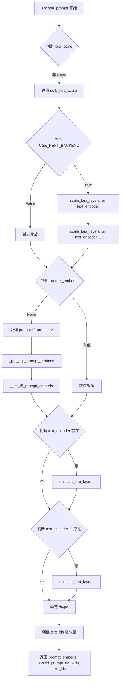

#### 带注释源码

```python
def encode_prompt(
    self,
    prompt: Union[str, List[str]],
    prompt_2: Union[str, List[str]],
    device: Optional[torch.device] = None,
    num_images_per_prompt: int = 1,
    prompt_embeds: Optional[torch.FloatTensor] = None,
    pooled_prompt_embeds: Optional[torch.FloatTensor] = None,
    max_sequence_length: int = 512,
    lora_scale: Optional[float] = None,
):
    """
    编码文本提示词为向量表示

    该方法整合 CLIP 和 T5 两种文本编码器，生成：
    - prompt_embeds: T5 编码的完整提示词序列
    - pooled_prompt_embeds: CLIP 编码的池化输出
    - text_ids: 用于 Transformer 的文本位置标识
    """
    # 获取设备，若未指定则使用执行设备
    device = device or self._execution_device

    # 设置 LoRA 缩放因子，以便文本编码器的 LoRA 函数正确访问
    if lora_scale is not None and isinstance(self, FluxLoraLoaderMixin):
        self._lora_scale = lora_scale

        # 动态调整 LoRA 缩放
        if self.text_encoder is not None and USE_PEFT_BACKEND:
            scale_lora_layers(self.text_encoder, lora_scale)
        if self.text_encoder_2 is not None and USE_PEFT_BACKEND:
            scale_lora_layers(self.text_encoder_2, lora_scale)

    # 标准化 prompt 为列表格式
    prompt = [prompt] if isinstance(prompt, str) else prompt

    # 如果未提供预计算的嵌入，则需要生成
    if prompt_embeds is None:
        # prompt_2 默认为 prompt
        prompt_2 = prompt_2 or prompt
        prompt_2 = [prompt_2] if isinstance(prompt_2, str) else prompt_2

        # 使用 CLIP 文本模型获取池化输出
        pooled_prompt_embeds = self._get_clip_prompt_embeds(
            prompt=prompt,
            device=device,
            num_images_per_prompt=num_images_per_prompt,
        )
        # 使用 T5 文本模型获取完整序列嵌入
        prompt_embeds = self._get_t5_prompt_embeds(
            prompt=prompt_2,
            num_images_per_prompt=num_images_per_prompt,
            max_sequence_length=max_sequence_length,
            device=device,
        )

    # 恢复 LoRA 层原始缩放
    if self.text_encoder is not None:
        if isinstance(self, FluxLoraLoaderMixin) and USE_PEFT_BACKEND:
            # 通过反向缩放 LoRA 层恢复原始权重
            unscale_lora_layers(self.text_encoder, lora_scale)

    if self.text_encoder_2 is not None:
        if isinstance(self, FluxLoraLoaderMixin) and USE_PEFT_BACKEND:
            unscale_lora_layers(self.text_encoder_2, lora_scale)

    # 确定数据类型：优先使用 text_encoder 的类型，否则使用 transformer 的类型
    dtype = self.text_encoder.dtype if self.text_encoder is not None else self.transformer.dtype

    # 创建文本位置标识 (batch_size, seq_len, 3)
    # 3 代表 x, y, 坐标和文本类型标识
    text_ids = torch.zeros(prompt_embeds.shape[1], 3).to(device=device, dtype=dtype)

    return prompt_embeds, pooled_prompt_embeds, text_ids
```


### `FluxSemanticGuidancePipeline.encode_text_with_editing`

该方法用于编码带有语义编辑提示的文本，将主提示词和编辑提示词分别编码为文本嵌入（prompt embeddings）和池化嵌入（pooled embeddings），并生成相应的文本ID，为后续的图像生成过程提供文本条件信息。

参数：

- `prompt`：`Union[str, List[str]]`，主提示词，用于指导图像生成
- `prompt_2`：`Union[str, List[str]]`，第二tokenizer的主提示词
- `pooled_prompt_embeds`：`Optional[torch.FloatTensor]`，预生成的池化文本嵌入，可用于微调文本输入
- `editing_prompt`：`Optional[List[str]]`，语义编辑提示词列表
- `editing_prompt_2`：`Optional[List[str]]`，第二tokenizer的编辑提示词列表
- `editing_prompt_embeds`：`Optional[torch.FloatTensor]`，预计算的编辑提示词嵌入
- `pooled_editing_prompt_embeds`：`Optional[torch.FloatTensor]`，预计算的编辑提示词池化嵌入
- `device`：`Optional[torch.device]`，计算设备
- `num_images_per_prompt`：`int`，每个提示词生成的图像数量，默认为1
- `max_sequence_length`：`int`，文本编码的最大序列长度，默认为512
- `lora_scale`：`Optional[float]`，LoRA层的缩放因子

返回值：`tuple[torch.FloatTensor, torch.FloatTensor, List[torch.FloatTensor], List[torch.FloatTensor], torch.FloatTensor, List[torch.FloatTensor], int]`，返回包含提示词嵌入、池化提示词嵌入、编辑提示词嵌入列表、池化编辑提示词嵌入列表、文本ID列表、编辑文本ID列表和启用的编辑提示词数量的元组

#### 流程图

```mermaid
flowchart TD
    A[开始 encode_text_with_editing] --> B{确定 batch_size}
    B -->|prompt 是 str| C[batch_size = 1]
    B -->|prompt 是 list| D[batch_size = len(prompt)]
    B -->|其他| E[抛出 ValueError]
    C --> F[调用 encode_prompt 获取基础提示词嵌入]
    D --> F
    E --> F
    F --> G{editing_prompt_embeds 是否提供?}
    G -->|是| H[enabled_editing_prompts = editing_prompt_embeds.shape[0]]
    G -->|否| I{editing_prompt 是否提供?}
    I -->|是| J[遍历 editing_prompt]
    J --> K[调用 encode_prompt 编码每个编辑提示词]
    K --> L[收集编辑提示词嵌入到列表]
    L --> M[enabled_editing_prompts = len(editing_prompt)]
    I -->|否| N[edit_text_ids = [], enabled_editing_prompts = 0]
    M --> O{enabled_editing_prompts > 0?}
    H --> O
    N --> O
    O -->|是| P[遍历每个编辑提示词嵌入]
    P --> Q[将编辑嵌入按 batch_size 重复]
    Q --> R[返回完整元组]
    O -->|否| R
    R --> S[结束]
```

#### 带注释源码

```python
def encode_text_with_editing(
    self,
    prompt: Union[str, List[str]],                    # 主提示词（字符串或字符串列表）
    prompt_2: Union[str, List[str]],                   # 第二tokenizer的提示词
    pooled_prompt_embeds: Optional[torch.FloatTensor] = None,  # 预生成的池化嵌入
    editing_prompt: Optional[List[str]] = None,       # 编辑提示词列表
    editing_prompt_2: Optional[List[str]] = None,    # 第二tokenizer编辑提示词
    editing_prompt_embeds: Optional[torch.FloatTensor] = None,  # 预计算编辑嵌入
    pooled_editing_prompt_embeds: Optional[torch.FloatTensor] = None,  # 预计算池化编辑嵌入
    device: Optional[torch.device] = None,            # 计算设备
    num_images_per_prompt: int = 1,                   # 每提示词生成图像数
    max_sequence_length: int = 512,                   # 最大序列长度
    lora_scale: Optional[float] = None,               # LoRA缩放因子
):
    """
    Encode text prompts with editing prompts and negative prompts for semantic guidance.

    Args:
        prompt (`str` or `List[str]`):
            The prompt or prompts to guide image generation.
        prompt_2 (`str` or `List[str]`):
            The prompt or prompts to guide image generation for second tokenizer.
        pooled_prompt_embeds (`torch.FloatTensor`, *optional*):
            Pre-generated pooled text embeddings. Can be used to easily tweak text inputs, *e.g.* prompt weighting.
            If not provided, pooled text embeddings will be generated from `prompt` input argument.
        editing_prompt (`str` or `List[str]`, *optional*):
            The editing prompts for semantic guidance.
        editing_prompt_2 (`str` or `List[str]`, *optional*):
            The editing prompts for semantic guidance for second tokenizer.
        editing_prompt_embeds (`torch.FloatTensor`, *optional*):
            Pre-computed embeddings for editing prompts.
        pooled_editing_prompt_embeds (`torch.FloatTensor`, *optional*):
            Pre-computed pooled embeddings for editing prompts.
        device (`torch.device`, *optional*):
            The device to use for computation.
        num_images_per_prompt (`int`, defaults to 1):
            Number of images to generate per prompt.
        max_sequence_length (`int`, defaults to 512):
            Maximum sequence length for text encoding.
        lora_scale (`float`, *optional*):
            Scale factor for LoRA layers if used.

    Returns:
        tuple[torch.FloatTensor, torch.FloatTensor, torch.FloatTensor, int]:
            A tuple containing the prompt embeddings, pooled prompt embeddings,
            text IDs, and number of enabled editing prompts.
    """
    # 确定计算设备，默认为执行设备
    device = device or self._execution_device

    # 确定批次大小：处理 prompt 的输入类型
    if prompt is not None and isinstance(prompt, str):
        batch_size = 1  # 单个字符串提示词
    elif prompt is not None and isinstance(prompt, list):
        batch_size = len(prompt)  # 字符串列表，取长度
    else:
        raise ValueError("Prompt must be provided as string or list of strings")  # 输入验证

    # 获取基础提示词嵌入：调用 encode_prompt 方法编码主提示词
    prompt_embeds, pooled_prompt_embeds, text_ids = self.encode_prompt(
        prompt=prompt,
        prompt_2=prompt_2,
        pooled_prompt_embeds=pooled_prompt_embeds,
        device=device,
        num_images_per_prompt=num_images_per_prompt,
        max_sequence_length=max_sequence_length,
        lora_scale=lora_scale,
    )

    # 处理编辑提示词：检查是否提供了预计算的嵌入或需要动态编码
    if editing_prompt_embeds is not None:
        # 如果提供了预计算嵌入，直接使用
        enabled_editing_prompts = int(editing_prompt_embeds.shape[0])  # 获取编辑提示词数量
        edit_text_ids = []  # 初始化编辑文本ID列表
    elif editing_prompt is not None:
        # 如果提供了编辑提示词文本，需要动态编码
        editing_prompt_embeds = []  # 初始化嵌入列表
        pooled_editing_prompt_embeds = []  # 初始化池化嵌入列表
        edit_text_ids = []  # 初始化文本ID列表

        # 如果未提供 editing_prompt_2，则使用 editing_prompt
        editing_prompt_2 = editing_prompt if editing_prompt_2 is None else editing_prompt_2
        
        # 遍历每个编辑提示词进行编码
        for edit_1, edit_2 in zip(editing_prompt, editing_prompt_2):
            e_prompt_embeds, pooled_embeds, e_ids = self.encode_prompt(
                prompt=edit_1,
                prompt_2=edit_2,
                device=device,
                num_images_per_prompt=num_images_per_prompt,
                max_sequence_length=max_sequence_length,
                lora_scale=lora_scale,
            )
            # 将编码结果添加到对应列表
            editing_prompt_embeds.append(e_prompt_embeds)
            pooled_editing_prompt_embeds.append(pooled_embeds)
            edit_text_ids.append(e_ids)

        enabled_editing_prompts = len(editing_prompt)  # 记录启用的编辑提示词数量
    else:
        # 没有编辑提示词的情况
        edit_text_ids = []
        enabled_editing_prompts = 0

    # 如果启用了编辑提示词，将编辑嵌入按批次大小重复
    if enabled_editing_prompts:
        for idx in range(enabled_editing_prompts):
            # 对每个编辑提示词嵌入进行批次维度扩展
            editing_prompt_embeds[idx] = torch.cat([editing_prompt_embeds[idx]] * batch_size, dim=0)
            pooled_editing_prompt_embeds[idx] = torch.cat([pooled_editing_prompt_embeds[idx]] * batch_size, dim=0)

    # 返回完整的编码结果元组
    return (
        prompt_embeds,                      # 主提示词嵌入
        pooled_prompt_embeds,               # 池化主提示词嵌入
        editing_prompt_embeds,             # 编辑提示词嵌入列表
        pooled_editing_prompt_embeds,      # 池化编辑提示词嵌入列表
        text_ids,                           # 主提示词文本ID
        edit_text_ids,                      # 编辑提示词文本ID列表
        enabled_editing_prompts,            # 启用的编辑提示词数量
    )
```


### `FluxSemanticGuidancePipeline.encode_image`

该方法用于将输入图像编码为图像嵌入向量（image embeddings），供后续的语义引导扩散模型生成图像使用。

参数：

- `image`：输入的图像，支持 `PipelineImageInput` 类型（PIL Image、numpy array 或 torch.Tensor）
- `device`：`torch.device`，指定计算设备
- `num_images_per_prompt`：`int`，每个 prompt 生成的图像数量，用于扩展 embedding 维度

返回值：`torch.FloatTensor`，图像的嵌入向量，形状为 `(batch_size * num_images_per_prompt, embedding_dim)`

#### 流程图

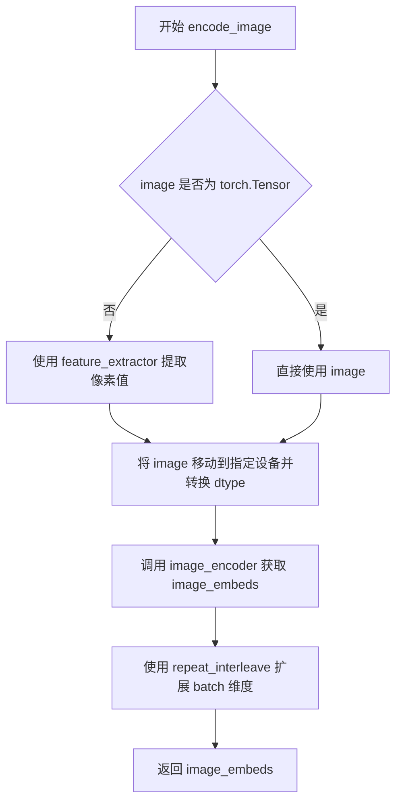

#### 带注释源码

```python
def encode_image(self, image, device, num_images_per_prompt):
    """
    将输入图像编码为图像嵌入向量。

    Args:
        image: 输入图像，可以是 PIL Image、numpy array 或 torch.Tensor
        device: torch device，用于指定计算设备
        num_images_per_prompt: 每个 prompt 生成的图像数量

    Returns:
        torch.FloatTensor: 图像的嵌入向量
    """
    # 获取 image_encoder 的参数 dtype，确保输入数据类型一致
    dtype = next(self.image_encoder.parameters()).dtype

    # 如果输入不是 torch.Tensor，则使用 feature_extractor 提取像素值
    if not isinstance(image, torch.Tensor):
        image = self.feature_extractor(image, return_tensors="pt").pixel_values

    # 将图像移动到指定设备并转换 dtype
    image = image.to(device=device, dtype=dtype)

    # 通过 image_encoder 获取图像嵌入
    image_embeds = self.image_encoder(image).image_embeds

    # 根据 num_images_per_prompt 扩展 embedding 维度
    # repeat_interleave 在 batch 维度上重复 embedding
    image_embeds = image_embeds.repeat_interleave(num_images_per_prompt, dim=0)

    return image_embeds
```


### `FluxSemanticGuidancePipeline.prepare_ip_adapter_image_embeds`

该方法负责为 IP-Adapter 准备图像嵌入，处理原始图像输入或预计算的嵌入，并确保嵌入与批量大小和每个提示的图像数量对齐。

参数：

- `self`：`FluxSemanticGuidancePipeline` 实例本身
- `ip_adapter_image`：`PipelineImageInput`，要处理的原始图像输入，可以是单个图像或图像列表
- `ip_adapter_image_embeds`：`Optional[List[torch.Tensor]]`，预计算的图像嵌入列表，如果为 None 则从 `ip_adapter_image` 编码生成
- `device`：`torch.device`，用于计算的目标设备
- `num_images_per_prompt`：`int`，每个提示需要生成的图像数量，用于复制嵌入

返回值：`List[torch.Tensor]`，处理后的 IP-Adapter 图像嵌入列表，每个元素是对应 IP-Adapter 的嵌入张量

#### 流程图

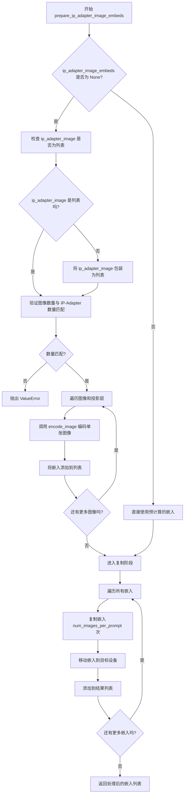

#### 带注释源码

```python
def prepare_ip_adapter_image_embeds(
    self, ip_adapter_image, ip_adapter_image_embeds, device, num_images_per_prompt
):
    """
    准备 IP-Adapter 图像嵌入。
    
    Args:
        ip_adapter_image: 原始图像输入，可以是 PIL Image、numpy 数组、torch.Tensor 或其列表
        ip_adapter_image_embeds: 预计算的图像嵌入，如果为 None 则从图像编码
        device: 计算设备
        num_images_per_prompt: 每个提示生成的图像数量
    """
    # 初始化嵌入列表
    image_embeds = []
    
    # 如果没有预计算的嵌入，则从原始图像编码
    if ip_adapter_image_embeds is None:
        # 确保图像是列表格式
        if not isinstance(ip_adapter_image, list):
            ip_adapter_image = [ip_adapter_image]

        # 验证图像数量与 IP-Adapter 数量匹配
        # 获取 transformer 中图像投影层的数量
        ip_adapter_count = len(self.transformer.encoder_hid_proj.image_projection_layers)
        if len(ip_adapter_image) != ip_adapter_count:
            raise ValueError(
                f"`ip_adapter_image` must have same length as the number of IP Adapters. "
                f"Got {len(ip_adapter_image)} images and {ip_adapter_count} IP Adapters."
            )

        # 遍历每个 IP-Adapter 的图像和对应的投影层
        for single_ip_adapter_image, image_proj_layer in zip(
            ip_adapter_image, self.transformer.encoder_hid_proj.image_projection_layers
        ):
            # 使用 encode_image 方法编码单张图像
            # 参数 1 表示每张图像生成 1 个嵌入
            single_image_embeds = self.encode_image(single_ip_adapter_image, device, 1)

            # 添加批次维度 [1, emb_dim]，并添加到列表
            image_embeds.append(single_image_embeds[None, :])
    else:
        # 如果已有预计算的嵌入，直接使用
        for single_image_embeds in ip_adapter_image_embeds:
            image_embeds.append(single_image_embeds)

    # 处理嵌入以匹配批量大小
    ip_adapter_image_embeds = []
    for i, single_image_embeds in enumerate(image_embeds):
        # 复制嵌入以匹配 num_images_per_prompt
        # 例如：如果 num_images_per_prompt=2，则 [emb_dim] -> [2, emb_dim]
        single_image_embeds = torch.cat([single_image_embeds] * num_images_per_prompt, dim=0)
        
        # 将嵌入移动到目标设备
        single_image_embeds = single_image_embeds.to(device=device)
        
        # 添加到结果列表
        ip_adapter_image_embeds.append(single_image_embeds)

    # 返回处理后的嵌入列表
    return ip_adapter_image_embeds
```


### `FluxSemanticGuidancePipeline.check_inputs`

该方法用于验证图像生成管道的输入参数是否合法，包括检查高度/宽度是否能被VAE比例因子整除、prompt和prompt_embeds不能同时提供、callback_on_step_end_tensor_inputs是否有效、negative_prompt_embeds与pooled配对正确性以及max_sequence_length不超过512等。如果验证失败则抛出对应的ValueError异常。

参数：

- `prompt`：`Union[str, List[str], NoneType]`，用户输入的主提示词，用于指导图像生成
- `prompt_2`：`Union[str, List[str], NoneType]`，发送给第二tokenizer和text_encoder_2的提示词，如不指定则使用prompt
- `height`：`int`，生成图像的高度（像素）
- `width`：`int`，生成图像的宽度（像素）
- `negative_prompt`：`Union[str, List[str], NoneType]`，不参与图像引导的负面提示词
- `negative_prompt_2`：`Union[str, List[str], NoneType]`，第二tokenizer的负面提示词
- `prompt_embeds`：`Optional[torch.FloatTensor]`，预先生成的主提示词嵌入向量
- `negative_prompt_embeds`：`Optional[torch.FloatTensor]`，预先生成的负面提示词嵌入向量
- `pooled_prompt_embeds`：`Optional[torch.FloatTensor]`，预先生成的池化后主提示词嵌入向量
- `negative_pooled_prompt_embeds`：`Optional[torch.FloatTensor]`，预先生成的池化后负面提示词嵌入向量
- `callback_on_step_end_tensor_inputs`：`Optional[List[str]]`，在推理步骤结束时回调的tensor输入列表
- `max_sequence_length`：`Optional[int]`，文本编码的最大序列长度

返回值：`None`，该方法不返回任何值，仅进行参数验证和可能的日志警告

#### 流程图

```mermaid
flowchart TD
    A[开始 check_inputs] --> B{height % (vae_scale_factor * 2) == 0<br/>width % (vae_scale_factor * 2) == 0?}
    B -->|否| C[记录警告日志: 调整尺寸]
    B -->|是| D{callback_on_step_end_tensor_inputs<br/>中的key是否都在<br/>_callback_tensor_inputs中?}
    C --> D
    D -->|否| E[抛出ValueError]
    D --> F{prompt和prompt_embeds<br/>是否同时提供?}
    F -->|是| G[抛出ValueError]
    F -->|否| H{prompt_2和prompt_embeds<br/>是否同时提供?}
    H -->|是| I[抛出ValueError]
    H -->|否| J{prompt和prompt_embeds<br/>都未提供?}
    J -->|是| K[抛出ValueError]
    J -->|否| L{prompt是否为str或list?}
    L -->|否| M[抛出ValueError]
    L -->|是| N{prompt_2是否为str或list?]
    N -->|否| O[抛出ValueError]
    N -->|是| P{negative_prompt和<br/>negative_prompt_embeds<br/>同时提供?}
    P -->|是| Q[抛出ValueError]
    P -->|否| R{negative_prompt_2和<br/>negative_prompt_embeds<br/>同时提供?}
    R -->|是| S[抛出ValueError]
    R -->|否| T{prompt_embeds和<br/>negative_prompt_embeds<br/>shape是否匹配?}
    T -->|否| U[抛出ValueError]
    T -->|是| V{提供了prompt_embeds<br/>但未提供<br/>pooled_prompt_embeds?}
    V -->|是| W[抛出ValueError]
    V -->|否| X{提供了negative_prompt_embeds<br/>但未提供<br/>negative_pooled_prompt_embeds?}
    X -->|是| Y[抛出ValueError]
    X -->|否| Z{max_sequence_length<br/>是否大于512?}
    Z -->|是| AA[抛出ValueError]
    Z -->|否| AB[验证通过，结束]
    G --> AB
    I --> AB
    K --> AB
    M --> AB
    O --> AB
    Q --> AB
    S --> AB
    U --> AB
    W --> AB
    Y --> AB
    AA --> AB
```

#### 带注释源码

```python
def check_inputs(
    self,
    prompt,
    prompt_2,
    height,
    width,
    negative_prompt=None,
    negative_prompt_2=None,
    prompt_embeds=None,
    negative_prompt_embeds=None,
    pooled_prompt_embeds=None,
    negative_pooled_prompt_embeds=None,
    callback_on_step_end_tensor_inputs=None,
    max_sequence_length=None,
):
    """
    检查输入参数的合法性，验证各个输入组合是否符合管道的要求。
    如果验证失败会抛出ValueError，否则如果height/width不符合要求会记录警告。
    
    参数:
        prompt: 主提示词，字符串或字符串列表
        prompt_2: 第二文本编码器的提示词
        height: 期望输出图像高度
        width: 期望输出图像宽度
        negative_prompt: 负面提示词
        negative_prompt_2: 第二文本编码器的负面提示词
        prompt_embeds: 预计算的主提示词嵌入
        negative_prompt_embeds: 预计算的负面提示词嵌入
        pooled_prompt_embeds: 预计算的池化主提示词嵌入
        negative_pooled_prompt_embeds: 预计算的池化负面提示词嵌入
        callback_on_step_end_tensor_inputs: 步骤结束回调的tensor输入列表
        max_sequence_length: 最大序列长度
    """
    
    # 检查高度和宽度是否能被VAE的scale factor * 2整除
    # Flux的latents会被打包成2x2的patches，所以需要额外考虑patch size
    if height % (self.vae_scale_factor * 2) != 0 or width % (self.vae_scale_factor * 2) != 0:
        logger.warning(
            f"`height` and `width` have to be divisible by {self.vae_scale_factor * 2} but are {height} and {width}. Dimensions will be resized accordingly"
        )

    # 验证callback_on_step_end_tensor_inputs中的所有key都在允许的_callback_tensor_inputs列表中
    if callback_on_step_end_tensor_inputs is not None and not all(
        k in self._callback_tensor_inputs for k in callback_on_step_end_tensor_inputs
    ):
        raise ValueError(
            f"`callback_on_step_end_tensor_inputs` has to be in {self._callback_tensor_inputs}, but found {[k for k in callback_on_step_end_tensor_inputs if k not in self._callback_tensor_inputs]}"
        )

    # prompt和prompt_embeds不能同时提供，只能选择其中一种方式
    if prompt is not None and prompt_embeds is not None:
        raise ValueError(
            f"Cannot forward both `prompt`: {prompt} and `prompt_embeds`: {prompt_embeds}. Please make sure to"
            " only forward one of the two."
        )
    # prompt_2和prompt_embeds也不能同时提供
    elif prompt_2 is not None and prompt_embeds is not None:
        raise ValueError(
            f"Cannot forward both `prompt_2`: {prompt_2} and `prompt_embeds`: {prompt_embeds}. Please make sure to"
            " only forward one of the two."
        )
    # 至少需要提供prompt或prompt_embeds之一
    elif prompt is None and prompt_embeds is None:
        raise ValueError(
            "Provide either `prompt` or `prompt_embeds`. Cannot leave both `prompt` and `prompt_embeds` undefined."
        )
    # prompt必须是字符串或列表类型
    elif prompt is not None and (not isinstance(prompt, str) and not isinstance(prompt, list)):
        raise ValueError(f"`prompt` has to be of type `str` or `list` but is {type(prompt)}")
    # prompt_2必须是字符串或列表类型
    elif prompt_2 is not None and (not isinstance(prompt_2, str) and not isinstance(prompt_2, list)):
        raise ValueError(f"`prompt_2` has to be of type `str` or `list` but is {type(prompt_2)}")

    # negative_prompt和negative_prompt_embeds不能同时提供
    if negative_prompt is not None and negative_prompt_embeds is not None:
        raise ValueError(
            f"Cannot forward both `negative_prompt`: {negative_prompt} and `negative_prompt_embeds`:"
            f" {negative_prompt_embeds}. Please make sure to only forward one of the two."
        )
    # negative_prompt_2和negative_prompt_embeds不能同时提供
    elif negative_prompt_2 is not None and negative_prompt_embeds is not None:
        raise ValueError(
            f"Cannot forward both `negative_prompt_2`: {negative_prompt_2} and `negative_prompt_embeds`:"
            f" {negative_prompt_embeds}. Please make sure to only forward one of the two."
        )

    # 如果同时提供了prompt_embeds和negative_prompt_embeds，它们的shape必须相同
    if prompt_embeds is not None and negative_prompt_embeds is not None:
        if prompt_embeds.shape != negative_prompt_embeds.shape:
            raise ValueError(
                "`prompt_embeds` and `negative_prompt_embeds` must have the same shape when passed directly, but"
                f" got: `prompt_embeds` {prompt_embeds.shape} != `negative_prompt_embeds`"
                f" {negative_prompt_embeds.shape}."
            )

    # 如果提供了prompt_embeds，也必须提供pooled_prompt_embeds
    if prompt_embeds is not None and pooled_prompt_embeds is None:
        raise ValueError(
            "If `prompt_embeds` are provided, `pooled_prompt_embeds` also have to be passed. Make sure to generate `pooled_prompt_embeds` from the same text encoder that was used to generate `prompt_embeds`."
        )
    # 如果提供了negative_prompt_embeds，也必须提供negative_pooled_prompt_embeds
    if negative_prompt_embeds is not None and negative_pooled_prompt_embeds is None:
        raise ValueError(
            "If `negative_prompt_embeds` are provided, `negative_pooled_prompt_embeds` also have to be passed. Make sure to generate `negative_pooled_prompt_embeds` from the same text encoder that was used to generate `negative_prompt_embeds`."
        )

    # max_sequence_length不能超过512
    if max_sequence_length is not None and max_sequence_length > 512:
        raise ValueError(f"`max_sequence_length` cannot be greater than 512 but is {max_sequence_length}")
```


### `FluxSemanticGuidancePipeline._prepare_latent_image_ids`

该方法用于生成潜在图像的像素位置ID（latent image IDs），这些ID作为位置标识符传递给Transformer模型，帮助模型理解每个潜在像素在2D空间中的位置关系。

参数：

- `batch_size`：`int`，批次大小（虽然方法内未直接使用，但传入用于文档和潜在的未来扩展）
- `height`：`int`，潜在图像的高度（以patch为单位）
- `width`：`int`，潜在图像的宽度（以patch为单位）
- `device`：`torch.device`，张量目标设备
- `dtype`：`torch.dtype`，张量数据类型

返回值：`torch.Tensor`，形状为 `(height * width, 3)` 的二维张量，每行包含 `[0, y_position, x_position]` 格式的位置标识符

#### 流程图

```mermaid
flowchart TD
    A[开始] --> B[创建 height x width x 3 的零张量]
    B --> C[填充 Y 坐标: latent_image_ids[..., 1] = torch.arange(height)[:, None]]
    C --> D[填充 X 坐标: latent_image_ids[..., 2] = torch.arange(width)[None, :]]
    D --> E[获取张量形状: latent_image_id_height, latent_image_id_width, latent_image_id_channels]
    E --> F[重塑张量: reshape to height*width, 3]
    F --> G[移动到指定设备并转换数据类型]
    G --> H[返回 latent_image_ids]
```

#### 带注释源码

```python
@staticmethod
# Copied from diffusers.pipelines.flux.pipeline_flux.FluxPipeline._prepare_latent_image_ids
def _prepare_latent_image_ids(batch_size, height, width, device, dtype):
    """
    生成用于Transformer的位置标识符张量。
    
    该方法创建了一个包含每个潜在像素(y, x)坐标的张量。
    输出张量格式为 [batch_idx=0, y_position, x_position]，
    用于在Flux Transformer中标识每个patch的位置。
    """
    # 1. 创建一个 height x width x 3 的零张量
    #    第三维用于存储: [batch_channel, y_coord, x_coord]
    latent_image_ids = torch.zeros(height, width, 3)
    
    # 2. 填充 Y 坐标 (行索引)
    #    torch.arange(height) 生成 [0, 1, 2, ..., height-1]
    #    [:, None] 将其转换为列向量 shape: (height, 1)
    #    广播机制自动将其填充到整个宽度维度
    latent_image_ids[..., 1] = latent_image_ids[..., 1] + torch.arange(height)[:, None]
    
    # 3. 填充 X 坐标 (列索引)
    #    torch.arange(width) 生成 [0, 1, 2, ..., width-1]
    #    [None, :] 将其转换为行向量 shape: (1, width)
    #    广播机制自动将其填充到整个高度维度
    latent_image_ids[..., 2] = latent_image_ids[..., 2] + torch.arange(width)[None, :]
    
    # 4. 获取重塑前的张量形状信息
    latent_image_id_height, latent_image_id_width, latent_image_id_channels = latent_image_ids.shape
    
    # 5. 将 3D 张量重塑为 2D 张量
    #    从 (height, width, 3) 转换为 (height*width, 3)
    #    每一行代表一个潜在像素位置，格式为 [0, y, x]
    latent_image_ids = latent_image_ids.reshape(
        latent_image_id_height * latent_image_id_width, latent_image_id_channels
    )
    
    # 6. 将张量移动到指定设备并转换数据类型后返回
    return latent_image_ids.to(device=device, dtype=dtype)
```


### `FluxSemanticGuidancePipeline._pack_latents`

该方法是一个静态工具函数，用于将输入的 latents 张量从标准形状重新打包为 Flux Transformer 所需的特定格式。它通过将 latents 划分为 2x2 的小块（patches），并将它们平铺成序列形式来处理图像潜在表示，这是 Flux 架构中处理潜在变量的关键步骤。

参数：

- `latents`：`torch.Tensor`，输入的潜在变量张量，形状为 `(batch_size, num_channels_latents, height, width)`
- `batch_size`：`int`，批次大小，表示同时处理的样本数量
- `num_channels_latents`：`int`，潜在变量的通道数，通常为 `transformer.config.in_channels // 4`
- `height`：`int`，潜在变量的高度（需能被 2 整除）
- `width`：`int`，潜在变量的宽度（需能被 2 整除）

返回值：`torch.Tensor`，打包后的潜在变量张量，形状为 `(batch_size, (height // 2) * (width // 2), num_channels_latents * 4)`

#### 流程图

```mermaid
flowchart TD
    A[输入 latents: (batch, channels, H, W)] --> B[view 重塑为: (batch, channels, H//2, 2, W//2, 2)]
    B --> C[permute 置换: (batch, H//2, W//2, channels, 2, 2)]
    C --> D[reshape 展平: (batch, H//2 * W//2, channels * 4)]
    D --> E[输出: (batch, num_patches, packed_channels)]
    
    style A fill:#e1f5fe
    style E fill:#e8f5e8
```

#### 带注释源码

```python
@staticmethod
# Copied from diffusers.pipelines.flux.pipeline_flux.FluxPipeline._pack_latents
def _pack_latents(latents, batch_size, num_channels_latents, height, width):
    """
    将 latents 张量打包为 Flux Transformer 所需的格式。
    
    Flux 架构使用 2x2 的 patch 打包方式：将每个 2x2 的潜在像素块视为一个 token，
    这样可以将空间信息转换为序列信息，便于 Transformer 处理。
    
    例如：对于形状为 (B, C, H, W) 的输入
    1. view 操作将其重塑为 (B, C, H//2, 2, W//2, 2) - 将 H 和 W 维度各分成两部分
    2. permute 置换维度变为 (B, H//2, W//2, C, 2, 2) - 将空间维度和通道维度分离
    3. reshape 最终变为 (B, H//2*W//2, C*4) - 每个 2x2 块展平为 4*C 的特征
    """
    # 步骤1：将 latents 从 (batch, channels, height, width) 
    # 重塑为 (batch, channels, height//2, 2, width//2, 2)
    # 这里将高度和宽度各划分为 2 个部分，准备进行 2x2 分块
    latents = latents.view(batch_size, num_channels_latents, height // 2, 2, width // 2, 2)
    
    # 步骤2：置换维度从 (0, 1, 2, 3, 4, 5) 变为 (0, 2, 4, 1, 3, 5)
    # 变为 (batch, height//2, width//2, channels, 2, 2)
    # 这样可以将空间维度和通道维度分离，便于后续展平
    latents = latents.permute(0, 2, 4, 1, 3, 5)
    
    # 步骤3：最终 reshape 为 (batch, height//2 * width//2, channels * 4)
    # 每个位置的 2x2 块（2*2=4个像素）乘以通道数 C，变为 4*C 维的特征向量
    # 最终得到 batch_size 个序列，每个序列长度为 (height//2) * (width//2)
    latents = latents.reshape(batch_size, (height // 2) * (width // 2), num_channels_latents * 4)

    return latents
```


### `FluxSemanticGuidancePipeline._unpack_latents`

该方法是一个静态方法，用于将打包（packed）的潜在表示张量解包回原始的 2D 图像 latent 格式。在 Flux 管道中，latent 会被打包成 2x2 的 patch 形式以提高效率，此方法执行反向操作还原 latent 的空间维度。

参数：

- `latents`：`torch.Tensor`，打包后的 latent 张量，形状为 (batch_size, num_patches, channels)
- `height`：`int`，原始图像的高度（像素单位）
- `width`：`int`，原始图像的宽度（像素单位）
- `vae_scale_factor`：`int`，VAE 的缩放因子，用于计算 latent 的实际空间维度

返回值：`torch.Tensor`，解包后的 latent 张量，形状为 (batch_size, channels // 4, height', width')，其中 height' 和 width' 是经过 VAE 缩放和打包调整后的 latent 空间维度

#### 流程图

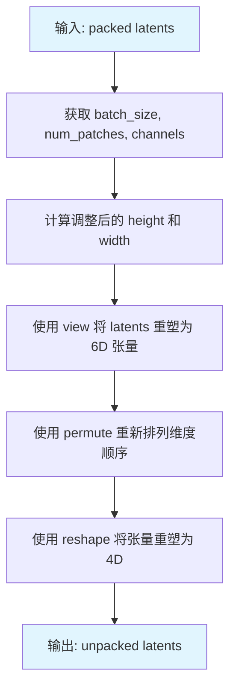

#### 带注释源码

```python
@staticmethod
# Copied from diffusers.pipelines.flux.pipeline_flux.FluxPipeline._unpack_latents
def _unpack_latents(latents, height, width, vae_scale_factor):
    """
    将打包的 latents 解包回原始的 2D 空间格式
    
    在 Flux 模型中，latents 会被打包成 2x2 的 patch 以提高计算效率。
    此方法执行反向操作，将 packed latent 还原为带有空间维度的 latent。
    
    Args:
        latents: 打包后的 latent 张量，形状为 (batch_size, num_patches, channels)
        height: 原始图像高度
        width: 原始图像宽度
        vae_scale_factor: VAE 缩放因子（Flux 中通常为 8）
    
    Returns:
        解包后的 latent 张量，形状为 (batch_size, channels // 4, height', width')
    """
    # 从输入张量中提取批次大小、patch 数量和通道数
    batch_size, num_patches, channels = latents.shape

    # VAE 应用 8x 压缩，但我们还需要考虑打包操作（要求 latent 高度和宽度能被 2 整除）
    # 计算调整后的空间维度：先除以 vae_scale_factor * 2，再乘以 2
    height = 2 * (int(height) // (vae_scale_factor * 2))
    width = 2 * (int(width) // (vae_scale_factor * 2))

    # 将 latents 重塑为 6D 张量：
    # - batch_size: 批次维度
    # - height // 2: 调整后的高度（以 patch 为单位）
    # - width // 2: 调整后的宽度（以 patch 为单位）
    # - channels // 4: 通道数（每个 patch 包含 4 个通道）
    # - 2, 2: 每个 patch 的 2x2 结构
    latents = latents.view(batch_size, height // 2, width // 2, channels // 4, 2, 2)

    # 重新排列维度顺序：
    # 从 (batch, h, w, c, 2, 2) -> (batch, c, h, 2, w, 2)
    # 这样可以将 2x2 patch 展开为空间维度
    latents = latents.permute(0, 3, 1, 4, 2, 5)

    # 最终重塑为 4D 张量：
    # - batch_size: 批次维度
    # - channels // (2*2): 通道维度（取消打包）
    # - height: 空间高度
    # - width: 空间宽度
    latents = latents.reshape(batch_size, channels // (2 * 2), height, width)

    return latents
```


### FluxSemanticGuidancePipeline.prepare_latents

该方法负责为图像生成流程准备初始的潜在变量（latents），包括计算潜在变量的形状、根据VAE压缩因子和打包要求调整图像尺寸、生成随机潜在变量或使用提供的潜在变量，并生成相应的潜在图像ID用于Transformer模型的注意力机制。

参数：

- `batch_size`：`int`，批处理大小，决定生成图像的数量
- `num_channels_latents`：`int`，潜在变量的通道数，通常为Transformer输入通道数的1/4
- `height`：`int`，原始图像高度（像素单位）
- `width`：`int`，原始图像宽度（像素单位）
- `dtype`：`torch.dtype`，潜在变量的数据类型
- `device`：`torch.device`，潜在变量存放的设备
- `generator`：`torch.Generator` 或 `List[torch.Generator]`，可选的随机数生成器，用于确保生成的可复现性
- `latents`：`torch.FloatTensor`，可选的预生成潜在变量，如果为None则随机生成

返回值：`Tuple[torch.Tensor, torch.Tensor]`，返回两个张量——第一个是打包后的潜在变量（形状为(batch_size, seq_len, channels*4)），第二个是潜在图像ID（用于Transformer的img_ids参数）

#### 流程图

```mermaid
flowchart TD
    A[开始准备潜在变量] --> B{计算调整后的尺寸}
    B --> C[height = 2 × (height ÷ (vae_scale_factor × 2))]
    C --> D[width = 2 × (width ÷ (vae_scale_factor × 2))]
    D --> E{latents是否已提供?}
    E -->|是| F[将latents移动到目标设备和数据类型]
    F --> G[生成潜在图像ID]
    G --> H[返回latents和latent_image_ids]
    E -->|否| I{generator列表长度与batch_size匹配?}
    I -->|否| J[抛出ValueError异常]
    I -->|是| K[使用randn_tensor生成随机潜在变量]
    K --> L[调用_pack_latents打包潜在变量]
    L --> M[生成潜在图像ID]
    M --> H
```

#### 带注释源码

```python
def prepare_latents(
    self,
    batch_size,
    num_channels_latents,
    height,
    width,
    dtype,
    device,
    generator,
    latents=None,
):
    """
    准备用于扩散模型推理的潜在变量。
    
    该方法处理以下关键任务：
    1. 根据VAE的压缩因子和Flux的打包机制调整潜在变量的空间维度
    2. 如果提供了latents则直接使用，否则使用随机张量生成器创建
    3. 生成位置编码所需的潜在图像ID
    
    注意：Flux模型使用2x2补丁打包机制，因此潜在高度和宽度必须能被2整除。
    VAE应用8x压缩，所以需要额外乘以2来补偿。
    """
    
    # VAE applies 8x compression on images but we must also account for packing which requires
    # latent height and width to be divisible by 2.
    # 计算调整后的潜在变量尺寸：考虑VAE的8x压缩和Flux的2x2打包要求
    height = 2 * (int(height) // (self.vae_scale_factor * 2))
    width = 2 * (int(width) // (self.vae_scale_factor * 2))

    # 定义潜在变量的完整形状：[batch, channels, height, width]
    shape = (batch_size, num_channels_latents, height, width)

    # 如果已经提供了潜在变量，直接使用并返回
    if latents is not None:
        # 为已提供的latents生成潜在图像ID
        latent_image_ids = self._prepare_latent_image_ids(batch_size, height // 2, width // 2, device, dtype)
        # 将latents移动到目标设备和指定数据类型
        return latents.to(device=device, dtype=dtype), latent_image_ids

    # 验证generator列表长度与batch_size是否匹配
    if isinstance(generator, list) and len(generator) != batch_size:
        raise ValueError(
            f"You have passed a list of generators of length {len(generator)}, but requested an effective batch"
            f" size of {batch_size}. Make sure the batch size matches the length of the generators."
        )

    # 使用随机张量生成器创建初始噪声潜在变量
    # randn_tensor: 生成服从标准正态分布的随机张量
    latents = randn_tensor(shape, generator=generator, device=device, dtype=dtype)
    
    # 将4D潜在变量打包为2D序列格式 [batch, seq_len, channels*4]
    # 打包操作将2x2的补丁展平为单个序列元素，这是Flux架构的要求
    latents = self._pack_latents(latents, batch_size, num_channels_latents, height, width)

    # 生成潜在图像ID，用于Transformer中的位置编码
    # 这些ID帮助模型理解token在2D空间中的位置关系
    latent_image_ids = self._prepare_latent_image_ids(batch_size, height // 2, width // 2, device, dtype)

    return latents, latent_image_ids
```


### `FluxSemanticGuidancePipeline.enable_vae_slicing`

启用分片 VAE 解码。启用此选项后，VAE 会将输入张量切分成多个切片分步计算解码，从而节省内存并支持更大的批量大小。

参数：

- `self`：无（类实例本身）

返回值：`None`，无返回值（该方法直接调用 `self.vae.enable_slicing()`）

#### 流程图

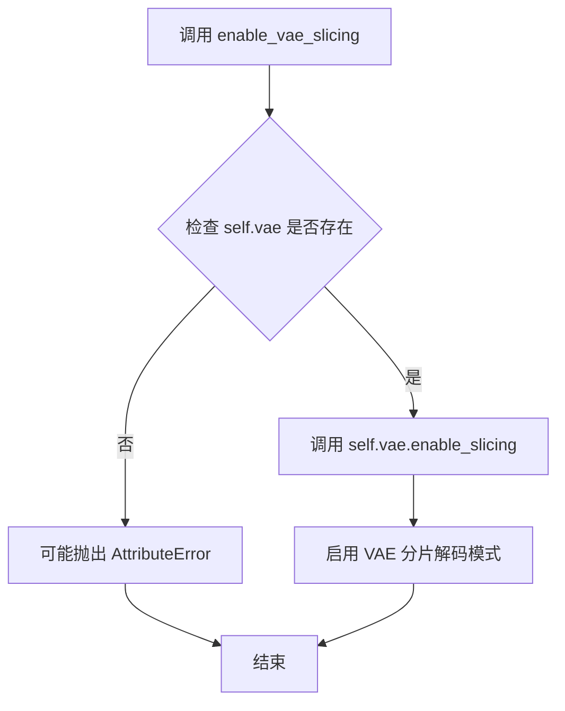

#### 带注释源码

```python
# Copied from diffusers.pipelines.flux.pipeline_flux.FluxPipeline.enable_vae_slicing
def enable_vae_slicing(self):
    r"""
    Enable sliced VAE decoding. When this option is enabled, the VAE will split the input tensor in slices to
    compute decoding in several steps. This is useful to save some memory and allow larger batch sizes.
    """
    # 调用 VAE 对象的 enable_slicing 方法，启用分片解码功能
    # 分片解码会将大型输入张量分割成较小的块进行处理
    # 这样可以减少峰值内存使用，允许处理更大的批量大小
    self.vae.enable_slicing()
```


### `FluxSemanticGuidancePipeline.disable_vae_slicing`

该方法用于禁用 VAE（变分自编码器）的切片解码功能。如果之前通过 `enable_vae_slicing` 启用了切片解码，调用此方法后将恢复到单步解码模式，从而可能提高解码速度但会增加内存占用。

参数：无（仅包含 `self` 参数，不计入方法签名）

返回值：`None`，无返回值

#### 流程图

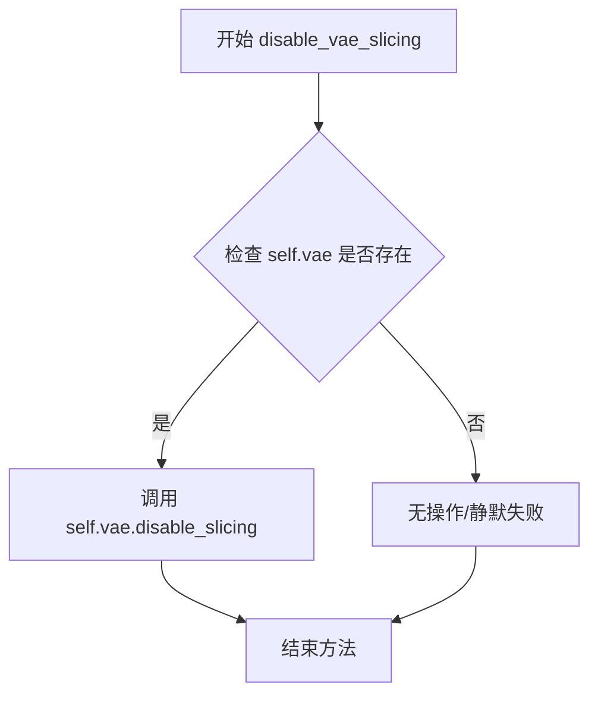

#### 带注释源码

```python
# Copied from diffusers.pipelines.flux.pipeline_flux.FluxPipeline.disable_vae_slicing
def disable_vae_slicing(self):
    r"""
    Disable sliced VAE decoding. If `enable_vae_slicing` was previously enabled, this method will go back to
    computing decoding in one step.
    """
    # 调用 VAE 模型的 disable_slicing 方法，关闭切片解码模式
    # 这会使 VAE 解码在单个步骤中完成，节省内存但可能降低性能
    self.vae.disable_slicing()
```


### `FluxSemanticGuidancePipeline.enable_vae_tiling`

该方法用于启用分块 VAE（Variational Autoencoder）解码/编码功能。通过将输入张量分割为多个 tiles（块）进行处理，可以大幅节省内存使用并支持处理更大的图像尺寸。该方法已被标记为弃用，建议直接调用 `pipe.vae.enable_tiling()`。

参数： 无

返回值：`None`，无返回值

#### 流程图

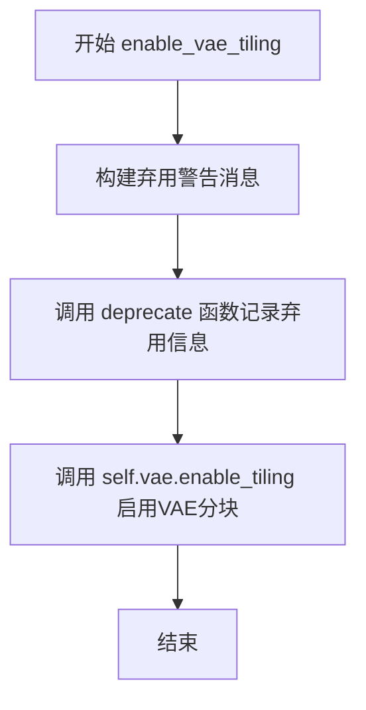

#### 带注释源码

```python
def enable_vae_tiling(self):
    r"""
    Enable tiled VAE decoding. When this option is enabled, the VAE will split the input tensor into tiles to
    compute decoding and encoding in several steps. This is useful for saving a large amount of memory and to allow
    processing larger images.
    """
    # 构建弃用警告消息，提示用户该方法将在未来版本中移除
    # 并建议使用新的 API: pipe.vae.enable_tiling()
    depr_message = f"Calling `enable_vae_tiling()` on a `{self.__class__.__name__}` is deprecated and this method will be removed in a future version. Please use `pipe.vae.enable_tiling()`."
    
    # 调用 deprecate 函数记录弃用信息
    # 参数: (方法名, 弃用版本号, 弃用消息)
    deprecate(
        "enable_vae_tiling",
        "0.40.0",
        depr_message,
    )
    
    # 委托给 VAE 模型本身启用分块功能
    self.vae.enable_tiling()
```


### `FluxSemanticGuidancePipeline.disable_vae_tiling`

该方法用于禁用 VAE 的平铺（Tiling）解码模式。如果之前启用了平铺解码，该方法将恢复为单步解码。同时，该方法已被标记为废弃，并推荐使用 `pipe.vae.disable_tiling()` 替代。

参数：无（仅包含隐式参数 `self`）

返回值：`None`，无返回值

#### 流程图


#### 带注释源码

```python
def disable_vae_tiling(self):
    r"""
    Disable tiled VAE decoding. If `enable_vae_tiling` was previously enabled, this method will go back to
    computing decoding in one step.
    
    该方法用于禁用VAE的平铺解码模式。如果之前通过enable_vae_tiling启用了平铺解码，
    调用此方法后将恢复为单步解码模式，VAE将一次性处理整个图像而非分块处理。
    """
    # 构建废弃警告消息，包含类名以提供更清晰的上下文
    depr_message = f"Calling `disable_vae_tiling()` on a `{self.__class__.__name__}` is deprecated and this method will be removed in a future version. Please use `pipe.vae.disable_tiling()`."
    
    # 调用deprecate函数记录废弃信息，提示用户该方法将在0.40.0版本被移除
    deprecate(
        "disable_vae_tiling",      # 废弃的方法名
        "0.40.0",                  # 废弃版本号
        depr_message,              # 废弃警告消息
    )
    
    # 调用VAE模型的disable_tiling方法实际禁用平铺解码功能
    self.vae.disable_tiling()
```


### `FluxSemanticGuidancePipeline.__call__`

该方法是FluxSemanticGuidancePipeline管道的主调用方法，集成语义引导功能于Flux文生图流程中，支持通过编辑提示词、方向反转、阈值过滤、动量机制等精细化控制图像生成过程，同时兼容IP-Adapter图像提示和真实无分类器引导（trueCFG）。

参数：

- `prompt`：`Union[str, List[str]]`，可选，引导图像生成的文本提示，若未定义则需传入`prompt_embeds`
- `prompt_2`：`Optional[Union[str, List[str]]]`，可选，发送给第二分词器和文本编码器的提示词，未定义时使用`prompt`
- `negative_prompt`：`Union[str, List[str]]`，可选，不希望出现在图像中的负面提示词，仅在启用引导时生效
- `negative_prompt_2`：`Optional[Union[str, List[str]]]`，可选，发送给第二文本编码器的负面提示词
- `true_cfg_scale`：`float`，可选，默认为1.0，当大于1.0且提供`negative_prompt`时启用真无分类器引导
- `height`：`Optional[int]`，可选，生成图像的高度像素值，默认基于`self.default_sample_size * self.vae_scale_factor`
- `width`：`Optional[int]`，可选，生成图像的宽度像素值，默认基于`self.default_sample_size * self.vae_scale_factor`
- `num_inference_steps`：`int`，可选，默认为28，去噪迭代步数
- `sigmas`：`Optional[List[float]]`，可选，自定义去噪调度器的sigma值
- `guidance_scale`：`float`，可选，默认为3.5，引导强度系数
- `num_images_per_prompt`：`Optional[int]`，可选，每个提示词生成的图像数量
- `generator`：`Optional[Union[torch.Generator, List[torch.Generator]]]`，可选，用于生成确定性结果的随机数生成器
- `latents`：`Optional[torch.FloatTensor]`，可选，预生成的噪声潜在变量
- `prompt_embeds`：`Optional[torch.FloatTensor]`，可选，预生成的文本嵌入
- `pooled_prompt_embeds`：`Optional[torch.FloatTensor]`，可选，预生成的池化文本嵌入
- `ip_adapter_image`：`Optional[PipelineImageInput]`，可选，IP-Adapter图像输入
- `ip_adapter_image_embeds`：`Optional[List[torch.Tensor]]`，可选，预生成的IP-Adapter图像嵌入
- `negative_ip_adapter_image`：`Optional[PipelineImageInput]`，可选，负面IP-Adapter图像输入
- `negative_ip_adapter_image_embeds`：`Optional[List[torch.Tensor]]`，可选，预生成的负面IP-Adapter图像嵌入
- `negative_prompt_embeds`：`Optional[torch.FloatTensor]`，可选，预生成的负面文本嵌入
- `negative_pooled_prompt_embeds`：`Optional[torch.FloatTensor]`，可选，预生成的负面池化文本嵌入
- `output_type`：`str | None`，可选，默认为"pil"，输出格式（PIL图像或numpy数组）
- `return_dict`：`bool`，可选，默认为True，是否返回FluxPipelineOutput对象
- `joint_attention_kwargs`：`Optional[Dict[str, Any]]`，可选，传递给注意力处理器的参数字典
- `callback_on_step_end`：`Optional[Callable[[int, int, Dict], None]]`，可选，每步结束后调用的回调函数
- `callback_on_step_end_tensor_inputs`：`List[str]`，可选，默认为["latents"]，回调函数接收的张量输入列表
- `max_sequence_length`：`int`，可选，默认为512，文本编码的最大序列长度
- `editing_prompt`：`Optional[Union[str, List[str]]]`，可选，用于语义引导的编辑提示词
- `editing_prompt_2`：`Optional[Union[str, List[str]]]`，可选，用于第二文本编码器的编辑提示词
- `editing_prompt_embeds`：`Optional[torch.FloatTensor]`，可选，预生成的编辑提示词嵌入
- `pooled_editing_prompt_embeds`：`Optional[torch.FloatTensor]`，可选，预生成的编辑池化嵌入
- `reverse_editing_direction`：`Optional[Union[bool, List[bool]]]`，可选，默认为False，是否反转编辑方向
- `edit_guidance_scale`：`Optional[Union[float, List[float]]]`，可选，默认为5，编辑过程引导强度
- `edit_warmup_steps`：`Optional[Union[int, List[int]]]`，可选，默认为8，预热步数
- `edit_cooldown_steps`：`Optional[Union[int, List[int]]]`，可选，冷却步数
- `edit_threshold`：`Optional[Union[float, List[float]]]`，可选，默认为0.9，编辑引导阈值
- `edit_momentum_scale`：`Optional[float]`，可选，默认为0.1，动量缩放因子
- `edit_mom_beta`：`Optional[float]`，可选，默认为0.4，动量计算的beta值
- `edit_weights`：`Optional[List[float]]`，可选，各编辑提示词的权重
- `sem_guidance`：`Optional[List[torch.Tensor]]`，可选，预生成的语义引导张量

返回值：`FluxPipelineOutput`或`tuple`，返回生成的图像列表或FluxPipelineOutput对象

#### 流程图

```mermaid
flowchart TD
    A[开始 __call__] --> B{检查输入参数}
    B -->|参数不合法| C[抛出ValueError]
    B -->|参数合法| D[设置guidance_scale和joint_attention_kwargs]
    
    D --> E[计算batch_size]
    E --> F{判断是否启用编辑引导}
    F -->|editing_prompt存在| G[启用编辑引导]
    F -->|editing_prompt_embeds存在| G
    F -->|都不存在| H[禁用编辑引导]
    
    G --> I[获取enabled_editing_prompts数量]
    H --> J[确定是否执行trueCFG]
    
    J --> K[编码提示词和编辑提示词]
    K --> L{do_true_cfg?}
    L -->|是| M[编码负面提示词]
    L -->|否| N[准备潜在变量]
    
    M --> N
    N --> O[准备timesteps和sigmas]
    O --> P[计算image_seq_len和shift值mu]
    
    P --> Q[初始化edit_momentum和编辑参数]
    Q --> R{transformer有guidance_embeds?}
    R -->|是| S[设置guidance张量]
    R -->|否| T[guidance设为None]
    
    S --> U[准备IP-Adapter图像嵌入]
    T --> U
    U --> V[进入去噪循环]
    
    V --> W{当前步数i < 总步数?}
    W -->|是| X[处理中断标志]
    X --> Y{有IP-Adapter嵌入?}
    Y -->|是| Z[设置joint_attention_kwargs]
    Y -->|否| AA[扩展timestep]
    
    Z --> AA
    AA --> AB[执行主transformer推理]
    
    AB --> AC{启用编辑引导且在有效步数范围内?}
    AC -->|是| AD[遍历每个编辑概念执行transformer]
    AC -->|否| AE{执行trueCFG?}
    
    AD --> AE
    AE -->|是| AF[执行负面transformer推理]
    AE -->|否| AG[noise_pred_uncond = noise_pred]
    
    AF --> AH[计算noise_guidance]
    AG --> AH
    
    AH --> AI{启用编辑引导且在有效步数范围内?}
    AI -->|是| AJ[计算编辑概念权重和噪声引导]
    AI -->|否| AK{有sem_guidance?}
    
    AJ --> AL[更新edit_momentum]
    AK -->|是| AM[将sem_guidance加到noise_guidance]
    AK -->|否| AN[最终noise_pred计算]
    
    AM --> AN
    AN --> AO[scheduler.step计算上一步latents]
    
    AO --> AP{callback_on_step_end?}
    AP -->|是| AQ[执行回调函数]
    AP -->|否| AR{更新进度条}
    
    AQ --> AR
    AR --> AS{XLA可用?}
    AS -->|是| AT[mark_step]
    AS -->|否| AU{是否完成所有步数?}
    
    AT --> AU
    AU -->|否| V
    AU -->|是| AV{output_type=='latent'?}
    
    AV -->|是| AW[直接返回latents作为图像]
    AV -->|否| AX[unpack latents并解码]
    
    AX --> AY[vae.decode生成图像]
    AY --> AZ[后处理图像]
    
    AZ --> BA[释放模型钩子]
    BA --> BB{return_dict?}
    BB -->|是| BC[返回FluxPipelineOutput]
    BB -->|否| BD[返回tuple]
    
    BC --> BE[结束]
    BD --> BE
    AW --> BE
```

#### 带注释源码

```python
@torch.no_grad()
@replace_example_docstring(EXAMPLE_DOC_STRING)
def __call__(
    self,
    prompt: Union[str, List[str]] = None,
    prompt_2: Optional[Union[str, List[str]]] = None,
    negative_prompt: Union[str, List[str]] = None,
    negative_prompt_2: Optional[Union[str, List[str]]] = None,
    true_cfg_scale: float = 1.0,
    height: Optional[int] = None,
    width: Optional[int] = None,
    num_inference_steps: int = 28,
    sigmas: Optional[List[float]] = None,
    guidance_scale: float = 3.5,
    num_images_per_prompt: Optional[int] = 1,
    generator: Optional[Union[torch.Generator, List[torch.Generator]]] = None,
    latents: Optional[torch.FloatTensor] = None,
    prompt_embeds: Optional[torch.FloatTensor] = None,
    pooled_prompt_embeds: Optional[torch.FloatTensor] = None,
    ip_adapter_image: Optional[PipelineImageInput] = None,
    ip_adapter_image_embeds: Optional[List[torch.Tensor]] = None,
    negative_ip_adapter_image: Optional[PipelineImageInput] = None,
    negative_ip_adapter_image_embeds: Optional[List[torch.Tensor]] = None,
    negative_prompt_embeds: Optional[torch.FloatTensor] = None,
    negative_pooled_prompt_embeds: Optional[torch.FloatTensor] = None,
    output_type: str | None = "pil",
    return_dict: bool = True,
    joint_attention_kwargs: Optional[Dict[str, Any]] = None,
    callback_on_step_end: Optional[Callable[[int, int, Dict], None]] = None,
    callback_on_step_end_tensor_inputs: List[str] = ["latents"],
    max_sequence_length: int = 512,
    editing_prompt: Optional[Union[str, List[str]]] = None,
    editing_prompt_2: Optional[Union[str, List[str]]] = None,
    editing_prompt_embeds: Optional[torch.FloatTensor] = None,
    pooled_editing_prompt_embeds: Optional[torch.FloatTensor] = None,
    reverse_editing_direction: Optional[Union[bool, List[bool]]] = False,
    edit_guidance_scale: Optional[Union[float, List[float]]] = 5,
    edit_warmup_steps: Optional[Union[int, List[int]]] = 8,
    edit_cooldown_steps: Optional[Union[int, List[int]]] = None,
    edit_threshold: Optional[Union[float, List[float]]] = 0.9,
    edit_momentum_scale: Optional[float] = 0.1,
    edit_mom_beta: Optional[float] = 0.4,
    edit_weights: Optional[List[float]] = None,
    sem_guidance: Optional[List[torch.Tensor]] = None,
):
    r"""
    管道调用的主方法，实现带有语义引导的Flux图像生成。
    
    参数说明：
    - prompt: 主要文本提示
    - prompt_2: T5编码器的文本提示
    - negative_prompt: 负面提示词
    - true_cfg_scale: 启用trueCFG时的引导强度
    - editing_prompt系列: 语义编辑相关参数
    - 其他参数参考docstring详细定义
    """
    
    # 1. 确定输出图像的高度和宽度，使用默认值
    height = height or self.default_sample_size * self.vae_scale_factor
    width = width or self.default_sample_size * self.vae_scale_factor

    # 2. 检查输入参数合法性
    self.check_inputs(
        prompt,
        prompt_2,
        height,
        width,
        prompt_embeds=prompt_embeds,
        pooled_prompt_embeds=pooled_prompt_embeds,
        callback_on_step_end_tensor_inputs=callback_on_step_end_tensor_inputs,
        max_sequence_length=max_sequence_length,
    )

    # 3. 设置管道内部状态变量
    self._guidance_scale = guidance_scale
    self._joint_attention_kwargs = joint_attention_kwargs
    self._interrupt = False

    # 4. 确定批次大小
    if prompt is not None and isinstance(prompt, str):
        batch_size = 1
    elif prompt is not None and isinstance(prompt, list):
        batch_size = len(prompt)
    else:
        batch_size = prompt_embeds.shape[0]

    # 5. 判断是否启用语义编辑引导
    if editing_prompt:
        enable_edit_guidance = True
        if isinstance(editing_prompt, str):
            editing_prompt = [editing_prompt]
        enabled_editing_prompts = len(editing_prompt)
    elif editing_prompt_embeds is not None:
        enable_edit_guidance = True
        enabled_editing_prompts = editing_prompt_embeds.shape[0]
    else:
        enabled_editing_prompts = 0
        enable_edit_guidance = False

    # 6. 判断是否启用trueCFG（真无分类器引导）
    has_neg_prompt = negative_prompt is not None or (
        negative_prompt_embeds is not None and negative_pooled_prompt_embeds is not None
    )
    do_true_cfg = true_cfg_scale > 1 and has_neg_prompt

    device = self._execution_device

    # 7. 获取LoRA缩放因子
    lora_scale = (
        self.joint_attention_kwargs.get("scale", None) if self.joint_attention_kwargs is not None else None
    )
    
    # 8. 编码提示词和编辑提示词
    (
        prompt_embeds,
        pooled_prompt_embeds,
        editing_prompts_embeds,
        pooled_editing_prompt_embeds,
        text_ids,
        edit_text_ids,
        enabled_editing_prompts,
    ) = self.encode_text_with_editing(
        prompt=prompt,
        prompt_2=prompt_2,
        pooled_prompt_embeds=pooled_prompt_embeds,
        editing_prompt=editing_prompt,
        editing_prompt_2=editing_prompt_2,
        pooled_editing_prompt_embeds=pooled_editing_prompt_embeds,
        lora_scale=lora_scale,
        device=device,
        num_images_per_prompt=num_images_per_prompt,
        max_sequence_length=max_sequence_length,
    )

    # 9. 如果启用trueCFG，编码负面提示词
    if do_true_cfg:
        (
            negative_prompt_embeds,
            negative_pooled_prompt_embeds,
            _,
        ) = self.encode_prompt(
            prompt=negative_prompt,
            prompt_2=negative_prompt_2,
            prompt_embeds=negative_prompt_embeds,
            pooled_prompt_embeds=negative_pooled_prompt_embeds,
            device=device,
            num_images_per_prompt=num_images_per_prompt,
            max_sequence_length=max_sequence_length,
            lora_scale=lora_scale,
        )
        # 重复负面嵌入以匹配批次大小
        negative_prompt_embeds = torch.cat([negative_prompt_embeds] * batch_size, dim=0)
        negative_pooled_prompt_embeds = torch.cat([negative_pooled_prompt_embeds] * batch_size, dim=0)

    # 10. 准备潜在变量（latents）
    num_channels_latents = self.transformer.config.in_channels // 4
    latents, latent_image_ids = self.prepare_latents(
        batch_size * num_images_per_prompt,
        num_channels_latents,
        height,
        width,
        prompt_embeds.dtype,
        device,
        generator,
        latents,
    )

    # 11. 准备timesteps
    sigmas = np.linspace(1.0, 1 / num_inference_steps, num_inference_steps) if sigmas is None else sigmas
    image_seq_len = latents.shape[1]
    mu = calculate_shift(
        image_seq_len,
        self.scheduler.config.get("base_image_seq_len", 256),
        self.scheduler.config.get("max_image_seq_len", 4096),
        self.scheduler.config.get("base_shift", 0.5),
        self.scheduler.config.get("max_shift", 1.15),
    )
    timesteps, num_inference_steps = retrieve_timesteps(
        self.scheduler,
        num_inference_steps,
        device,
        sigmas=sigmas,
        mu=mu,
    )
    num_warmup_steps = max(len(timesteps) - num_inference_steps * self.scheduler.order, 0)
    self._num_timesteps = len(timesteps)

    # 12. 初始化编辑引导相关参数
    edit_momentum = None
    if edit_warmup_steps:
        tmp_e_warmup_steps = edit_warmup_steps if isinstance(edit_warmup_steps, list) else [edit_warmup_steps]
        min_edit_warmup_steps = min(tmp_e_warmup_steps)
    else:
        min_edit_warmup_steps = 0

    if edit_cooldown_steps:
        tmp_e_cooldown_steps = (
            edit_cooldown_steps if isinstance(edit_cooldown_steps, list) else [edit_cooldown_steps]
        )
        max_edit_cooldown_steps = min(max(tmp_e_cooldown_steps), num_inference_steps)
    else:
        max_edit_cooldown_steps = num_inference_steps

    # 13. 处理guidance嵌入
    if self.transformer.config.guidance_embeds:
        guidance = torch.full([1], guidance_scale, device=device, dtype=torch.float32)
        guidance = guidance.expand(latents.shape[0])
    else:
        guidance = None

    # 14. 处理IP-Adapter图像输入（确保正负IPAdapter配对）
    if (ip_adapter_image is not None or ip_adapter_image_embeds is not None) and (
        negative_ip_adapter_image is None and negative_ip_adapter_image_embeds is None
    ):
        negative_ip_adapter_image = np.zeros((width, height, 3), dtype=np.uint8)
    elif (ip_adapter_image is None and ip_adapter_image_embeds is None) and (
        negative_ip_adapter_image is not None or negative_ip_adapter_image_embeds is not None
    ):
        ip_adapter_image = np.zeros((width, height, 3), dtype=np.uint8)

    if self.joint_attention_kwargs is None:
        self._joint_attention_kwargs = {}

    # 15. 准备IP-Adapter图像嵌入
    image_embeds = None
    negative_image_embeds = None
    if ip_adapter_image is not None or ip_adapter_image_embeds is not None:
        image_embeds = self.prepare_ip_adapter_image_embeds(
            ip_adapter_image,
            ip_adapter_image_embeds,
            device,
            batch_size * num_images_per_prompt,
        )
    if negative_ip_adapter_image is not None or negative_ip_adapter_image_embeds is not None:
        negative_image_embeds = self.prepare_ip_adapter_image_embeds(
            negative_ip_adapter_image,
            negative_ip_adapter_image_embeds,
            device,
            batch_size * num_images_per_prompt,
        )

    # 16. 去噪循环
    with self.progress_bar(total=num_inference_steps) as progress_bar:
        for i, t in enumerate(timesteps):
            # 检查中断标志
            if self.interrupt:
                continue

            # 设置IP-Adapter嵌入到joint_attention_kwargs
            if image_embeds is not None:
                self._joint_attention_kwargs["ip_adapter_image_embeds"] = image_embeds
            
            # 扩展timestep到批次维度
            timestep = t.expand(latents.shape[0]).to(latents.dtype)

            # 重新处理guidance（每次循环需要重新创建tensor）
            if self.transformer.config.guidance_embeds:
                guidance = torch.tensor([guidance_scale], device=device)
                guidance = guidance.expand(latents.shape[0])
            else:
                guidance = None

            # 17. 主transformer前向传播
            noise_pred = self.transformer(
                hidden_states=latents,
                timestep=timestep / 1000,
                guidance=guidance,
                pooled_projections=pooled_prompt_embeds,
                encoder_hidden_states=prompt_embeds,
                txt_ids=text_ids,
                img_ids=latent_image_ids,
                joint_attention_kwargs=self.joint_attention_kwargs,
                return_dict=False,
            )[0]

            # 18. 如果启用编辑引导，在有效步数范围内处理编辑概念
            if enable_edit_guidance and max_edit_cooldown_steps >= i >= min_edit_warmup_steps:
                noise_pred_edit_concepts = []
                for e_embed, pooled_e_embed, e_text_id in zip(
                    editing_prompts_embeds, pooled_editing_prompt_embeds, edit_text_ids
                ):
                    noise_pred_edit = self.transformer(
                        hidden_states=latents,
                        timestep=timestep / 1000,
                        guidance=guidance,
                        pooled_projections=pooled_e_embed,
                        encoder_hidden_states=e_embed,
                        txt_ids=e_text_id,
                        img_ids=latent_image_ids,
                        joint_attention_kwargs=self.joint_attention_kwargs,
                        return_dict=False,
                    )[0]
                    noise_pred_edit_concepts.append(noise_pred_edit)

            # 19. 处理trueCFG（真无分类器引导）
            if do_true_cfg:
                if negative_image_embeds is not None:
                    self._joint_attention_kwargs["ip_adapter_image_embeds"] = negative_image_embeds
                noise_pred_uncond = self.transformer(
                    hidden_states=latents,
                    timestep=timestep / 1000,
                    guidance=guidance,
                    pooled_projections=negative_pooled_prompt_embeds,
                    encoder_hidden_states=negative_prompt_embeds,
                    txt_ids=text_ids,
                    img_ids=latent_image_ids,
                    joint_attention_kwargs=self.joint_attention_kwargs,
                    return_dict=False,
                )[0]
                noise_guidance = true_cfg_scale * (noise_pred - noise_pred_uncond)
            else:
                noise_pred_uncond = noise_pred
                noise_guidance = noise_pred

            # 20. 初始化编辑动量
            if edit_momentum is None:
                edit_momentum = torch.zeros_like(noise_guidance)

            # 21. 计算语义编辑引导
            if enable_edit_guidance and max_edit_cooldown_steps >= i >= min_edit_warmup_steps:
                # 初始化权重和编辑噪声引导张量
                concept_weights = torch.zeros(
                    (enabled_editing_prompts, noise_guidance.shape[0]),
                    device=device,
                    dtype=noise_guidance.dtype,
                )
                noise_guidance_edit = torch.zeros(
                    (enabled_editing_prompts, *noise_guidance.shape),
                    device=device,
                    dtype=noise_guidance.dtype,
                )

                warmup_inds = []
                # 遍历每个编辑概念计算权重
                for c, noise_pred_edit_concept in enumerate(noise_pred_edit_concepts):
                    # 获取当前概念的参数值
                    if isinstance(edit_guidance_scale, list):
                        edit_guidance_scale_c = edit_guidance_scale[c]
                    else:
                        edit_guidance_scale_c = edit_guidance_scale

                    if isinstance(edit_threshold, list):
                        edit_threshold_c = edit_threshold[c]
                    else:
                        edit_threshold_c = edit_threshold
                    if isinstance(reverse_editing_direction, list):
                        reverse_editing_direction_c = reverse_editing_direction[c]
                    else:
                        reverse_editing_direction_c = reverse_editing_direction
                    if edit_weights:
                        edit_weight_c = edit_weights[c]
                    else:
                        edit_weight_c = 1.0
                    if isinstance(edit_warmup_steps, list):
                        edit_warmup_steps_c = edit_warmup_steps[c]
                    else:
                        edit_warmup_steps_c = edit_warmup_steps

                    if isinstance(edit_cooldown_steps, list):
                        edit_cooldown_steps_c = edit_cooldown_steps[c]
                    elif edit_cooldown_steps is None:
                        edit_cooldown_steps_c = i + 1
                    else:
                        edit_cooldown_steps_c = edit_cooldown_steps
                    
                    # 记录已进入预热阶段的索引
                    if i >= edit_warmup_steps_c:
                        warmup_inds.append(c)
                    # 如果已过冷却阶段，将编辑噪声置零
                    if i >= edit_cooldown_steps_c:
                        noise_guidance_edit[c, :, :, :] = torch.zeros_like(noise_pred_edit_concept)
                        continue

                    # 计算编辑概念的条件噪声差异
                    if do_true_cfg:
                        noise_guidance_edit_tmp = noise_pred_edit_concept - noise_pred_uncond
                    else:  # simple sega
                        noise_guidance_edit_tmp = noise_pred_edit_concept - noise_pred
                    
                    # 计算概念权重
                    tmp_weights = (noise_guidance - noise_pred_edit_concept).sum(dim=(1, 2))
                    tmp_weights = torch.full_like(tmp_weights, edit_weight_c)
                    
                    # 如果反转方向，则取反
                    if reverse_editing_direction_c:
                        noise_guidance_edit_tmp = noise_guidance_edit_tmp * -1
                    concept_weights[c, :] = tmp_weights

                    # 应用编辑引导缩放
                    noise_guidance_edit_tmp = noise_guidance_edit_tmp * edit_guidance_scale_c

                    # 使用分位数阈值过滤
                    if noise_guidance_edit_tmp.dtype == torch.float32:
                        tmp = torch.quantile(
                            torch.abs(noise_guidance_edit_tmp).flatten(start_dim=2),
                            edit_threshold_c,
                            dim=2,
                            keepdim=False,
                        )
                    else:
                        tmp = torch.quantile(
                            torch.abs(noise_guidance_edit_tmp).flatten(start_dim=2).to(torch.float32),
                            edit_threshold_c,
                            dim=2,
                            keepdim=False,
                        ).to(noise_guidance_edit_tmp.dtype)

                    # 应用阈值过滤
                    noise_guidance_edit_tmp = torch.where(
                        torch.abs(noise_guidance_edit_tmp) >= tmp[:, :, None],
                        noise_guidance_edit_tmp,
                        torch.zeros_like(noise_guidance_edit_tmp),
                    )

                    noise_guidance_edit[c, :, :, :] = noise_guidance_edit_tmp

                # 处理预热阶段的权重
                warmup_inds = torch.tensor(warmup_inds).to(device)
                if len(noise_pred_edit_concepts) > warmup_inds.shape[0] > 0:
                    # 将部分张量卸载到CPU以节省显存
                    concept_weights = concept_weights.to("cpu")
                    noise_guidance_edit = noise_guidance_edit.to("cpu")

                    concept_weights_tmp = torch.index_select(concept_weights.to(device), 0, warmup_inds)
                    concept_weights_tmp = torch.where(
                        concept_weights_tmp < 0, torch.zeros_like(concept_weights_tmp), concept_weights_tmp
                    )
                    concept_weights_tmp = concept_weights_tmp / concept_weights_tmp.sum(dim=0)

                    noise_guidance_edit_tmp = torch.index_select(noise_guidance_edit.to(device), 0, warmup_inds)
                    noise_guidance_edit_tmp = torch.einsum(
                        "cb,cbij->bij", concept_weights_tmp, noise_guidance_edit_tmp
                    )
                    noise_guidance = noise_guidance + noise_guidance_edit_tmp

                    del noise_guidance_edit_tmp
                    del concept_weights_tmp
                    concept_weights = concept_weights.to(device)
                    noise_guidance_edit = noise_guidance_edit.to(device)

                # 处理负权重
                concept_weights = torch.where(
                    concept_weights < 0, torch.zeros_like(concept_weights), concept_weights
                )
                concept_weights = torch.nan_to_num(concept_weights)

                # 合并所有编辑概念的引导
                noise_guidance_edit = torch.einsum("cb,cbij->bij", concept_weights, noise_guidance_edit)
                noise_guidance_edit = noise_guidance_edit + edit_momentum_scale * edit_momentum

                # 更新编辑动量
                edit_momentum = edit_mom_beta * edit_momentum + (1 - edit_mom_beta) * noise_guidance_edit

                # 如果所有概念都已过预热阶段，应用编辑引导
                if warmup_inds.shape[0] == len(noise_pred_edit_concepts):
                    noise_guidance = noise_guidance + noise_guidance_edit

            # 22. 应用外部语义引导
            if sem_guidance is not None:
                edit_guidance = sem_guidance[i].to(device)
                noise_guidance = noise_guidance + edit_guidance

            # 23. 最终噪声预测计算
            if do_true_cfg:
                noise_pred = noise_guidance + noise_pred_uncond
            else:
                noise_pred = noise_guidance

            # 24. 使用scheduler步骤更新latents
            latents_dtype = latents.dtype
            latents = self.scheduler.step(noise_pred, t, latents, return_dict=False)[0]

            # 处理数据类型转换（特别是MPS后端）
            if latents.dtype != latents_dtype:
                if torch.backends.mps.is_available():
                    latents = latents.to(latents_dtype)

            # 25. 执行回调函数
            if callback_on_step_end is not None:
                callback_kwargs = {}
                for k in callback_on_step_end_tensor_inputs:
                    callback_kwargs[k] = locals()[k]
                callback_outputs = callback_on_step_end(self, i, t, callback_kwargs)

                latents = callback_outputs.pop("latents", latents)
                prompt_embeds = callback_outputs.pop("prompt_embeds", prompt_embeds)

            # 26. 更新进度条
            if i == len(timesteps) - 1 or ((i + 1) > num_warmup_steps and (i + 1) % self.scheduler.order == 0):
                progress_bar.update()

            # 27. XLA设备同步
            if XLA_AVAILABLE:
                xm.mark_step()

    # 28. 处理输出
    if output_type == "latent":
        image = latents
    else:
        # 解包latents并解码
        latents = self._unpack_latents(latents, height, width, self.vae_scale_factor)
        latents = (latents / self.config.scaling_factor) + self.vae.config.shift_factor
        image = self.vae.decode(latents, return_dict=False)[0]
        image = self.image_processor.postprocess(image, output_type=output_type)

    # 29. 释放模型钩子
    self.maybe_free_model_hooks()

    # 30. 返回结果
    if not return_dict:
        return (image,)

    return FluxPipelineOutput(image)
```

## 关键组件


### 张量索引与惰性加载

在prepare_latents方法中，通过`_prepare_latent_image_ids`和`_pack_latents`静态方法处理潜在图像ID的张量索引，实现2x2patch打包以优化内存使用。

### 反量化支持

在去噪循环中使用`torch.quantile`函数对编辑概念的噪声预测进行阈值处理，根据`edit_threshold`参数动态调整编辑引导强度，支持float32和混合精度反量化。

### 量化策略

通过`edit_guidance_scale`（编辑引导尺度）、`edit_threshold`（编辑阈值）、`edit_warmup_steps`（预热步数）和`edit_cooldown_steps`（冷却步数）等参数实现多层次编辑量化控制。

### 语义编辑引导

`encode_text_with_editing`方法支持编辑提示的编码，通过`editing_prompt`和`editing_prompt_2`参数实现双文本编码器编辑，支持`reverse_editing_direction`反向编辑方向和`edit_weights`权重控制。

### 动量机制

实现编辑动量累积机制，通过`edit_momentum_scale`和`edit_mom_beta`参数在每个扩散步骤中平滑编辑引导信号，降低编辑噪声方差。

### 真实无分类器引导

通过`true_cfg_scale`参数实现真实CFG，当值大于1.0时启用与负提示结合的真正分类器自由引导。

### IP-Adapter图像适配

`prepare_ip_adapter_image_embeds`方法支持图像适配器功能，可接收预计算或实时编码的图像嵌入，支持正向和负向IP适配器。

### LoRA层管理

集成`FluxLoraLoaderMixin`，通过`scale_lora_layers`和`unscale_lora_layers`函数动态调整LoRA权重，支持LORA比例参数。

### VAE优化

通过`enable_vae_slicing`和`enable_vae_tiling`方法支持VAE切片和平铺解码，显著降低大图像生成的显存占用。

### 双文本编码器架构

集成CLIPTextModel和T5EncoderModel双文本编码器系统，通过`_get_clip_prompt_embeds`和`_get_t5_prompt_embeds`分别处理短序列和长序列文本嵌入。


## 问题及建议


### 已知问题

-   **大量代码重复**：多个方法（`_get_t5_prompt_embeds`、`_get_clip_prompt_embeds`、`encode_prompt`、`encode_image`、`prepare_ip_adapter_image_embeds`、`check_inputs`、VAE相关方法等）直接从 `FluxPipeline` 复制过来，违反DRY原则，导致维护困难且增加代码库体积
-   **文档与代码不一致**：`edit_warmup_steps` 参数文档声明默认值为10但代码实际为8；`edit_guidance_scale` 文档为7.0但代码为5；`edit_mom_beta` 文档为0.6但代码为0.4
-   **Magic Numbers硬编码**：多处阈值和参数（如28、3.5、5、0.9、0.1、0.4等）直接硬编码，缺乏配置中心化
-   **IP适配器负向处理逻辑缺陷**：当仅提供 `negative_ip_adapter_image` 而不提供正向适配器时，会自动创建全零图像作为正向输入，这种隐式行为可能导致意外结果
-   **类型注解不一致**：混用 `str | None` 和 `Optional[str]` 两种风格
-   **返回值文档错误**：`retrieve_timesteps` 函数文档声明返回 `Tuple[torch.Tensor, int]`，实际返回 `Tuple[List[int], int]`
-   **重复计算**：循环内部每次迭代都执行 `if self.transformer.config.guidance_embeds` 判断，可提取到循环外
-   **编辑指导动量机制复杂**：编辑指导的动量计算逻辑嵌套较深，可读性和可维护性较差

### 优化建议

-   **提取公共基类或Mixin**：将复用的方法提取到共享的Mixin或基类中，避免代码复制
-   **统一文档和默认值**：确保所有参数的文档描述与代码实际默认值完全一致
-   **配置对象化**：创建配置类或使用dataclass集中管理所有Magic Numbers和默认参数
-   **改进IP适配器逻辑**：添加显式验证，当仅提供负向适配器时抛出明确错误而非静默创建全零图像
-   **统一类型注解风格**：在整个代码库中统一使用 `Optional[T]` 或 `T | None` 中的一种风格
-   **修复文档错误**：更正 `retrieve_timesteps` 的返回值类型描述
-   **循环优化**：将不随迭代变化的判断提前到循环外部
-   **简化动量逻辑**：将编辑指导动量计算提取为独立方法，提高可读性
-   **增强日志记录**：在关键路径添加适当的logger.info或logger.debug，便于生产环境调试

## 其它


### 设计目标与约束

本Pipeline的设计目标是实现基于Flux架构的文本到图像生成，并提供语义引导编辑功能。核心约束包括：1) 必须依赖FLUX.1-dev模型架构；2) 支持IP-Adapter图像提示；3) 支持LoRA微调和Textual Inversion；4) 必须使用FlowMatchEulerDiscreteScheduler调度器；5) 图像分辨率必须为vae_scale_factor * 2的倍数；6) 最大序列长度为512token；7) 需要同时支持CLIP和T5双文本编码器。

### 错误处理与异常设计

主要错误处理场景包括：1) 输入验证错误（check_inputs方法）- 检查prompt与prompt_embeds不能同时提供、height/width必须能被vae_scale_factor*2整除、callback_on_step_end_tensor_inputs必须在允许列表中；2) 调度器兼容性错误（retrieve_timesteps）- 检查调度器是否支持自定义timesteps或sigmas；3) 批次尺寸不匹配错误（prepare_latents）- generator列表长度必须等于batch_size；4) IP-Adapter配置错误 - ip_adapter_image数量必须与IP Adapters数量匹配；5) 内存溢出处理 - 支持VAE slicing和tiling来降低内存占用。

### 数据流与状态机

整体数据流为：1) 初始状态：接收prompt、editing_prompt、negative_prompt等文本输入；2) 编码阶段：encode_text_with_editing将文本编码为embedding向量，同时处理编辑提示；3) 潜在变量准备：prepare_latents生成初始噪声并打包；4) 去噪循环：多次迭代执行transformer前向传播，每次迭代包含编辑概念处理和CFG计算；5) 解码阶段：_unpack_latents解包后通过VAE decode生成最终图像。状态转换受scheduler的timesteps控制，编辑引导在warmup和cooldown阶段动态调整。

### 外部依赖与接口契约

核心依赖包括：1) transformers库 - CLIPTextModel、CLIPTokenizer、T5EncoderModel、T5TokenizerFast、CLIPVisionModelWithProjection、CLIPImageProcessor；2) diffusers库 - DiffusionPipeline、FluxTransformer2DModel、AutoencoderKL、FlowMatchEulerDiscreteScheduler、VaeImageProcessor、PipelineImageInput；3) 外部mixin - FluxLoraLoaderMixin、FromSingleFileMixin、TextualInversionLoaderMixin、FluxIPAdapterMixin。接口契约要求：encode_prompt返回(prompt_embeds, pooled_prompt_embeds, text_ids)三元组；prepare_latents返回(latents, latent_image_ids)二元组；VAE decode返回(image,)元组。

### 性能考虑与优化空间

性能特征：1) 内存密集型 - 包含多个大模型（transformer、text_encoder、text_encoder_2、vae）；2) 推理时间与num_inference_steps成正比；3) 支持批处理生成多张图像。现有优化：1) model_cpu_offload_seq定义了模型卸载顺序；2) enable_vae_slicing支持VAE切片解码；3) enable_vae_tiling支持瓦片式解码（已弃用）；4) 支持XLA加速。优化空间：1) 可以添加torch.compile加速；2) 可以实现quantized inference；3) 可以添加gradient checkpointing；4) 可以优化attention计算。

### 安全性考虑

安全措施包括：1) 输入验证 - check_inputs对所有输入进行严格检查；2) 内存安全 - VAE slicing防止OOM；3) 设备兼容性处理 - MPS后端的特殊处理；4) XLA设备支持。潜在风险：1) 生成内容的版权和伦理问题由上层应用负责；2) 恶意prompt注入攻击；3) 模型权重被篡改的风险。

### 版本兼容性

版本相关信息：1) enable_vae_tiling和disable_vae_tiling在0.40.0版本弃用，改为直接调用vae.enable_tiling()；2) 需要Python 3.8+；3) 需要PyTorch 2.0+；4) 需要transformers库版本与diffusers兼容。

### 配置参数详解

关键配置参数：1) vae_scale_factor - 用于计算潜在空间尺寸，默认通过VAE block_out_channels计算；2) default_sample_size - 默认采样尺寸128；3) tokenizer_max_length - CLIP tokenizer最大长度77；4) model_cpu_offload_seq - 模型卸载顺序"text_encoder->text_encoder_2->image_encoder->transformer->vae"；5) _optional_components - 可选组件包括image_encoder和feature_extractor；6) _callback_tensor_inputs - 支持回调的tensor输入包括latents和prompt_embeds。

### 使用示例与最佳实践

最佳实践：1) 使用torch.bfloat16提高性能；2) 设置合适的guidance_scale（建议3.5-7.0）；3) num_inference_steps建议20-30；4) 使用generator保证可重复性；5) 编辑提示使用editing_prompt参数，配合reverse_editing_direction控制方向；6) edit_warmup_steps建议6-10，edit_cooldown_steps建议20-30。

### 与其他Pipeline的关系

本Pipeline继承自FluxPipeline的核心逻辑，并添加了语义引导功能。与标准FluxPipeline的关系：1) 复用encode_prompt、encode_image、prepare_latents等方法；2) 新增encode_text_with_editing处理编辑提示；3) 在__call__中去噪循环中集成了编辑概念处理逻辑；4) 支持所有FluxPipeline的原有功能（LoRA、IP-Adapter、TrueCFG等）。

### 技术债务与优化建议

当前技术债务：1) enable_vae_tiling已弃用但保留兼容性代码；2) 部分方法直接复制自FluxPipeline，可考虑重构为基类；3) 编辑引导计算复杂，可优化为更高效的向量化实现；4) 缺少异步推理支持。优化建议：1) 添加流式输出支持；2) 实现分布式推理；3) 添加更多调度器选项；4) 优化内存占用。


    