# `diffusers\examples\community\pipeline_flux_with_cfg.py` 详细设计文档

Flux CFG Pipeline是一个用于文本到图像生成的高级扩散管道，结合了CLIP和T5文本编码器、FluxTransformer2DModel和AutoencoderKL，实现基于文本提示的高质量图像生成，支持LoRA微调、VAE切片/平铺优化、真实CFG等高级功能。

## 整体流程

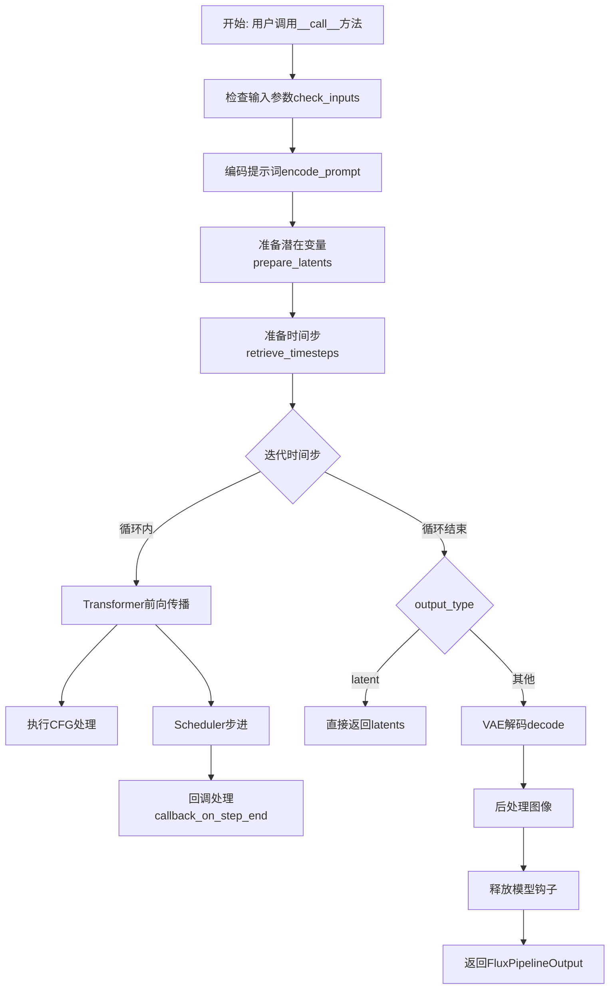

## 类结构

```
DiffusionPipeline (基类)
├── FluxLoraLoaderMixin (LoRA加载混入)
├── FromSingleFileMixin (单文件加载混入)
└── FluxCFGPipeline (主实现类)
```

## 全局变量及字段


### `logger`
    
Logger instance for the module to track runtime information and warnings.

类型：`logging.Logger`
    


### `EXAMPLE_DOC_STRING`
    
Example documentation string demonstrating how to use the FluxPipeline for text-to-image generation.

类型：`str`
    


### `XLA_AVAILABLE`
    
Boolean flag indicating whether PyTorch XLA is available for accelerated computation.

类型：`bool`
    


### `FluxCFGPipeline.scheduler`
    
Scheduler for controlling the denoising process in the diffusion model.

类型：`FlowMatchEulerDiscreteScheduler`
    


### `FluxCFGPipeline.vae`
    
Variational Autoencoder model for encoding images to latent space and decoding latents back to images.

类型：`AutoencoderKL`
    


### `FluxCFGPipeline.text_encoder`
    
CLIP text encoder for generating text embeddings from input prompts.

类型：`CLIPTextModel`
    


### `FluxCFGPipeline.tokenizer`
    
CLIP tokenizer for converting text prompts into token IDs.

类型：`CLIPTokenizer`
    


### `FluxCFGPipeline.text_encoder_2`
    
T5 encoder model for generating additional text embeddings with longer context.

类型：`T5EncoderModel`
    


### `FluxCFGPipeline.tokenizer_2`
    
Fast T5 tokenizer for converting text into tokens for the T5 encoder.

类型：`T5TokenizerFast`
    


### `FluxCFGPipeline.transformer`
    
Main transformer model that performs the denoising of latent image representations.

类型：`FluxTransformer2DModel`
    


### `FluxCFGPipeline.vae_scale_factor`
    
Scaling factor used to adjust the spatial dimensions when encoding/decoding with the VAE.

类型：`int`
    


### `FluxCFGPipeline.image_processor`
    
Image processor for post-processing VAE decoded outputs into final images.

类型：`VaeImageProcessor`
    


### `FluxCFGPipeline.tokenizer_max_length`
    
Maximum sequence length supported by the tokenizers for text input processing.

类型：`int`
    


### `FluxCFGPipeline.default_sample_size`
    
Default sample size in latent space used when height or width is not specified.

类型：`int`
    


### `FluxCFGPipeline.model_cpu_offload_seq`
    
Sequence string defining the order in which models are offloaded to CPU for memory optimization.

类型：`str`
    


### `FluxCFGPipeline._optional_components`
    
List of optional pipeline components that may not be required for all use cases.

类型：`list`
    


### `FluxCFGPipeline._callback_tensor_inputs`
    
List of tensor input names that can be passed to the step callback function for monitoring.

类型：`list`
    
    

## 全局函数及方法


### `calculate_shift`

该函数通过线性插值的方式，根据给定的图像序列长度计算对应的偏移量（shift）值，主要用于 Flux 管道中调度器的参数调整，以适应不同的图像分辨率。

参数：

- `image_seq_len`：`int`，输入图像的序列长度（latent 空间中的序列长度）
- `base_seq_len`：`int`（默认值 256），基础序列长度，用于线性方程的基准点
- `max_seq_len`：`int`（默认值 4096），最大序列长度，用于线性方程的另一个基准点
- `base_shift`：`float`（默认值 0.5），对应基础序列长度的基础偏移量
- `max_shift`：`float`（默认值 1.15），对应最大序列长度的最大偏移量

返回值：`float`，计算得到的偏移量 mu，用于调度器的噪声调度

#### 流程图

```mermaid
flowchart TD
    A[开始] --> B[计算斜率 m<br/>m = (max_shift - base_shift) / (max_seq_len - base_seq_len)]
    B --> C[计算截距 b<br/>b = base_shift - m * base_seq_len]
    C --> D[计算偏移量 mu<br/>mu = image_seq_len * m + b]
    D --> E[返回 mu]
    
    style A fill:#f9f,stroke:#333
    style E fill:#9f9,stroke:#333
```

#### 带注释源码

```python
# Copied from diffusers.pipelines.flux.pipeline_flux.calculate_shift
def calculate_shift(
    image_seq_len,          # 输入：图像在latent空间中的序列长度
    base_seq_len: int = 256,       # 默认基础序列长度256
    max_seq_len: int = 4096,       # 默认最大序列长度4096
    base_shift: float = 0.5,       # 默认基础偏移量
    max_shift: float = 1.15,       # 默认最大偏移量
):
    # 计算线性插值的斜率 (slope)
    # 通过两点式：(y2-y1)/(x2-x1) 计算斜率
    m = (max_shift - base_shift) / (max_seq_len - base_seq_len)
    
    # 计算线性方程的截距 (intercept)
    # 使用点斜式：y = mx + b => b = y - mx
    b = base_shift - m * base_seq_len
    
    # 根据输入的图像序列长度计算最终的偏移量
    # 使用线性方程：y = mx + b
    mu = image_seq_len * m + b
    
    # 返回计算得到的偏移量 mu
    return mu
```


### `retrieve_timesteps`

该函数是扩散管道中的通用时间步检索工具函数，用于调用调度器的 `set_timesteps` 方法并从调度器中获取时间步序列。它支持三种模式：自定义时间步（timesteps）、自定义sigmas或通过推理步数（num_inference_steps）自动计算，同时处理各种参数验证和设备迁移。

参数：

- `scheduler`：`SchedulerMixin`，要获取时间步的调度器对象
- `num_inference_steps`：`Optional[int]`，生成样本时使用的扩散步数，如果使用此参数，`timesteps` 必须为 `None`
- `device`：`Optional[Union[str, torch.device]]`，时间步要移动到的设备，如果为 `None`，时间步不会移动
- `timesteps`：`Optional[List[int]]`，自定义时间步，用于覆盖调度器的时间步间隔策略，如果传入此参数，`num_inference_steps` 和 `sigmas` 必须为 `None`
- `sigmas`：`Optional[List[float]]`，自定义sigmas，用于覆盖调度器的间隔策略，如果传入此参数，`num_inference_steps` 和 `timesteps` 必须为 `None`
- `**kwargs`：任意关键字参数，将提供给调度器的 `set_timesteps` 方法

返回值：`Tuple[torch.Tensor, int]`，元组中第一个元素是调度器的时间步张量，第二个元素是推理步数

#### 流程图

```mermaid
flowchart TD
    A[开始] --> B{检查参数有效性}
    B --> C{timesteps 和 sigmas 都非空?}
    C -->|是| D[抛出 ValueError: 只能选择 timesteps 或 sigmas 之一]
    C -->|否| E{timesteps 非空?}
    E -->|是| F[检查 scheduler.set_timesteps 是否接受 timesteps 参数]
    F --> G{支持 timesteps?}
    G -->|否| H[抛出 ValueError: 当前调度器不支持自定义 timesteps]
    G -->|是| I[调用 scheduler.set_timesteps<br/>参数: timesteps=timesteps, device=device, **kwargs]
    I --> J[获取 scheduler.timesteps]
    J --> K[计算 num_inference_steps = len(timesteps)]
    E -->|否| L{sigmas 非空?}
    L -->|是| M[检查 scheduler.set_timesteps 是否接受 sigmas 参数]
    M --> N{支持 sigmas?}
    N -->|否| O[抛出 ValueError: 当前调度器不支持自定义 sigmas]
    N -->|是| P[调用 scheduler.set_timesteps<br/>参数: sigmas=sigmas, device=device, **kwargs]
    P --> Q[获取 scheduler.timesteps]
    Q --> R[计算 num_inference_steps = len(timesteps)]
    L -->|否| S[调用 scheduler.set_timesteps<br/>参数: num_inference_steps, device=device, **kwargs]
    S --> T[获取 scheduler.timesteps]
    T --> U[计算 num_inference_steps = len(timesteps)]
    U --> V[返回 (timesteps, num_inference_steps)]
    D --> Z[结束]
    H --> Z
    O --> Z
```

#### 带注释源码

```python
# 从 stable_diffusion.pipeline_stable_diffusion 复制过来的 retrieve_timesteps 函数
def retrieve_timesteps(
    scheduler,  # SchedulerMixin: 要获取时间步的调度器
    num_inference_steps: Optional[int] = None,  # Optional[int]: 扩散推理步数
    device: Optional[Union[str, torch.device]] = None,  # Optional[Union[str, torch.device]]: 目标设备
    timesteps: Optional[List[int]] = None,  # Optional[List[int]]: 自定义时间步列表
    sigmas: Optional[List[float]] = None,  # Optional[List[float]]: 自定义 sigmas 列表
    **kwargs,  # 任意关键字参数，传递给 scheduler.set_timesteps
):
    """
    调用调度器的 `set_timesteps` 方法并从调度器中检索时间步。处理自定义时间步。
    任何 kwargs 都将提供给 `scheduler.set_timesteps`。

    参数:
        scheduler (`SchedulerMixin`):
            要获取时间步的调度器。
        num_inference_steps (`int`):
            使用预训练模型生成样本时使用的扩散步数。如果使用此参数，`timesteps` 必须为 `None`。
        device (`str` 或 `torch.device`, *可选*):
            时间步应移动到的设备。如果为 `None`，时间步不会移动。
        timesteps (`List[int]`, *可选*):
            用于覆盖调度器时间步间隔策略的自定义时间步。如果传入 `timesteps`，
            `num_inference_steps` 和 `sigmas` 必须为 `None`。
        sigmas (`List[float]`, *可选*):
            用于覆盖调度器时间步间隔策略的自定义 sigmas。如果传入 `sigmas`，
            `num_inference_steps` 和 `timesteps` 必须为 `None`。

    返回:
        `Tuple[torch.Tensor, int]`: 元组，第一个元素是调度器的时间步序列，第二个元素是推理步数。
    """
    # 检查是否同时传递了 timesteps 和 sigmas，这是不允许的
    if timesteps is not None and sigmas is not None:
        raise ValueError("Only one of `timesteps` or `sigmas` can be passed. Please choose one to set custom values")
    
    # 处理自定义 timesteps 的情况
    if timesteps is not None:
        # 检查调度器的 set_timesteps 方法是否支持 timesteps 参数
        accepts_timesteps = "timesteps" in set(inspect.signature(scheduler.set_timesteps).parameters.keys())
        if not accepts_timesteps:
            raise ValueError(
                f"The current scheduler class {scheduler.__class__}'s `set_timesteps` does not support custom"
                f" timestep schedules. Please check whether you are using the correct scheduler."
            )
        # 调用调度器的 set_timesteps 方法设置自定义时间步
        scheduler.set_timesteps(timesteps=timesteps, device=device, **kwargs)
        # 从调度器获取设置后的时间步
        timesteps = scheduler.timesteps
        # 计算推理步数
        num_inference_steps = len(timesteps)
    
    # 处理自定义 sigmas 的情况
    elif sigmas is not None:
        # 检查调度器的 set_timesteps 方法是否支持 sigmas 参数
        accept_sigmas = "sigmas" in set(inspect.signature(scheduler.set_timesteps).parameters.keys())
        if not accept_sigmas:
            raise ValueError(
                f"The current scheduler class {scheduler.__class__}'s `set_timesteps` does not support custom"
                f" sigmas schedules. Please check whether you are using the correct scheduler."
            )
        # 调用调度器的 set_timesteps 方法设置自定义 sigmas
        scheduler.set_timesteps(sigmas=sigmas, device=device, **kwargs)
        # 从调度器获取设置后的时间步
        timesteps = scheduler.timesteps
        # 计算推理步数
        num_inference_steps = len(timesteps)
    
    # 默认情况：使用 num_inference_steps 自动计算时间步
    else:
        # 调用调度器的 set_timesteps 方法自动计算时间步
        scheduler.set_timesteps(num_inference_steps, device=device, **kwargs)
        # 从调度器获取设置后的时间步
        timesteps = scheduler.timesteps
    
    # 返回时间步张量和推理步数
    return timesteps, num_inference_steps
```


### `FluxCFGPipeline.__init__`

FluxCFGPipeline类的初始化方法，负责配置Flux文本到图像生成管道所需的核心组件，包括调度器、VAE模型、CLIP和T5文本编码器、tokenizer以及FluxTransformer模型，并注册这些模块、初始化图像处理器和默认参数。

参数：

- `scheduler`：`FlowMatchEulerDiscreteScheduler`，用于去噪过程的调度器
- `vae`：`AutoencoderKL`，用于编码和解码图像的变分自编码器模型
- `text_encoder`：`CLIPTextModel`，CLIP文本编码器模型
- `tokenizer`：`CLIPTokenizer`，CLIP分词器
- `text_encoder_2`：`T5EncoderModel`，T5文本编码器模型
- `tokenizer_2`：`T5TokenizerFast`，T5快速分词器
- `transformer`：`FluxTransformer2DModel`，Flux变换器模型

返回值：无返回值（`None`），该方法为构造函数，仅初始化对象状态

#### 流程图

```mermaid
flowchart TD
    A[开始 __init__] --> B[调用父类 DiffusionPipeline.__init__]
    B --> C[调用 self.register_modules 注册所有模块]
    C --> D{检查 vae 是否存在}
    D -->|是| E[计算 vae_scale_factor: 2 ** len(vae.config.block_out_channels)]
    D -->|否| F[vae_scale_factor = 16]
    E --> G[创建 VaeImageProcessor]
    F --> G
    G --> H{检查 tokenizer 是否存在}
    H -->|是| I[tokenizer_max_length = tokenizer.model_max_length]
    H -->|否| J[tokenizer_max_length = 77]
    I --> K[设置 default_sample_size = 64]
    J --> K
    K --> L[结束 __init__]
```

#### 带注释源码

```
def __init__(
    self,
    scheduler: FlowMatchEulerDiscreteScheduler,  # FlowMatch调度器
    vae: AutoencoderKL,  # VAE模型
    text_encoder: CLIPTextModel,  # CLIP文本编码器
    tokenizer: CLIPTokenizer,  # CLIP分词器
    text_encoder_2: T5EncoderModel,  # T5文本编码器
    tokenizer_2: T5TokenizerFast,  # T5分词器
    transformer: FluxTransformer2DModel,  # Flux变换器
):
    # 调用父类DiffusionPipeline的初始化方法
    super().__init__()

    # 注册所有模块到管道中，使其可通过pipeline.xx访问
    self.register_modules(
        vae=vae,
        text_encoder=text_encoder,
        text_encoder_2=text_encoder_2,
        tokenizer=tokenizer,
        tokenizer_2=tokenizer_2,
        transformer=transformer,
        scheduler=scheduler,
    )
    
    # 计算VAE的缩放因子，基于block_out_channels的数量
    # 用于将像素空间图像映射到潜在空间
    self.vae_scale_factor = 2 ** (len(self.vae.config.block_out_channels)) if getattr(self, "vae", None) else 16
    
    # 创建VAE图像处理器，用于图像的后处理
    self.image_processor = VaeImageProcessor(vae_scale_factor=self.vae_scale_factor)
    
    # 获取tokenizer的最大长度，用于文本编码
    self.tokenizer_max_length = (
        self.tokenizer.model_max_length if hasattr(self, "tokenizer") and self.tokenizer is not None else 77
    )
    
    # 设置默认采样大小（以潜在空间单位计）
    self.default_sample_size = 64
```


### `FluxCFGPipeline._get_t5_prompt_embeds`

该方法用于将文本提示编码为T5模型的嵌入向量。它接收文本提示，通过T5分词器进行分词处理，然后使用T5文本编码器生成对应的嵌入表示，最后根据每条提示生成的图像数量复制嵌入向量以支持批量生成。

参数：

- `prompt`：`Union[str, List[str]] = None`，待编码的文本提示，可以是单个字符串或字符串列表
- `num_images_per_prompt`：`int = 1`，每个提示生成的图像数量，用于复制嵌入向量
- `max_sequence_length`：`int = 512`，T5编码器的最大序列长度，超过该长度会被截断
- `device`：`Optional[torch.device] = None`，计算设备，若未指定则使用执行设备
- `dtype`：`Optional[torch.dtype] = None`，数据类型，若未指定则使用文本编码器的数据类型

返回值：`torch.FloatTensor`，T5模型生成的文本嵌入向量，形状为 `(batch_size * num_images_per_prompt, seq_len, hidden_size)`

#### 流程图

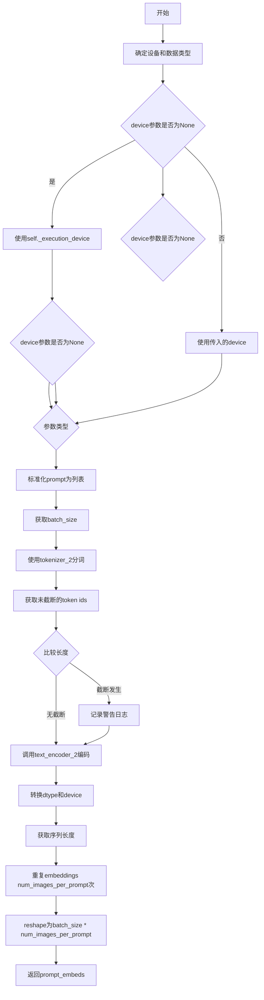

#### 带注释源码

```python
def _get_t5_prompt_embeds(
    self,
    prompt: Union[str, List[str]] = None,
    num_images_per_prompt: int = 1,
    max_sequence_length: int = 512,
    device: Optional[torch.device] = None,
    dtype: Optional[torch.dtype] = None,
):
    """
    将文本提示编码为T5模型的嵌入向量
    
    参数:
        prompt: 文本提示，字符串或字符串列表
        num_images_per_prompt: 每个提示生成的图像数量
        max_sequence_length: T5编码器的最大序列长度
        device: 计算设备
        dtype: 数据类型
    
    返回:
        T5文本嵌入向量
    """
    
    # 确定设备：如果未提供则使用pipeline的执行设备
    device = device or self._execution_device
    # 确定数据类型：如果未提供则使用text_encoder_2的数据类型
    dtype = dtype or self.text_encoder_2.dtype

    # 标准化输入：将单个字符串转换为列表，统一处理方式
    prompt = [prompt] if isinstance(prompt, str) else prompt
    # 获取批处理大小
    batch_size = len(prompt)

    # 使用T5分词器对提示进行分词
    # padding="max_length": 填充到最大长度
    # max_length: 最大序列长度
    # truncation=True: 超过最大长度进行截断
    # return_tensors="pt": 返回PyTorch张量
    text_inputs = self.tokenizer_2(
        prompt,
        padding="max_length",
        max_length=max_sequence_length,
        truncation=True,
        return_length=False,
        return_overflowing_tokens=False,
        return_tensors="pt",
    )
    # 获取分词后的input ids
    text_input_ids = text_inputs.input_ids
    
    # 获取未截断的token ids用于比较
    untruncated_ids = self.tokenizer_2(prompt, padding="longest", return_tensors="pt").input_ids

    # 检查是否发生了截断
    # 如果未截断的ids长度大于截断后的长度，且两者不相等，则说明有内容被截断
    if untruncated_ids.shape[-1] >= text_input_ids.shape[-1] and not torch.equal(text_input_ids, untruncated_ids):
        # 解码被截断的部分用于日志警告
        removed_text = self.tokenizer_2.batch_decode(untruncated_ids[:, self.tokenizer_max_length - 1 : -1])
        logger.warning(
            "The following part of your input was truncated because `max_sequence_length` is set to "
            f" {max_sequence_length} tokens: {removed_text}"
        )

    # 调用T5编码器获取嵌入向量
    # output_hidden_states=False: 只返回最后一层的输出
    prompt_embeds = self.text_encoder_2(text_input_ids.to(device), output_hidden_states=False)[0]

    # 重新获取dtype（确保使用正确的类型）
    dtype = self.text_encoder_2.dtype
    # 将嵌入向量转换到指定的设备和数据类型
    prompt_embeds = prompt_embeds.to(dtype=dtype, device=device)

    # 获取嵌入向量的维度信息
    _, seq_len, _ = prompt_embeds.shape

    # 复制text embeddings以支持每个提示生成多张图像
    # 先在序列维度重复，然后在批次维度 view
    # repeat(1, num_images_per_prompt, 1): 在批次维度之前的所有维度重复
    prompt_embeds = prompt_embeds.repeat(1, num_images_per_prompt, 1)
    # 重新整形为 (batch_size * num_images_per_prompt, seq_len, hidden_size)
    prompt_embeds = prompt_embeds.view(batch_size * num_images_per_prompt, seq_len, -1)

    return prompt_embeds
```


### `FluxCFGPipeline._get_clip_prompt_embeds`

该方法用于从输入的文本提示（prompt）中提取CLIP文本编码器（CLIPTextModel）的嵌入向量（embeddings），包括池化后的输出（pooled output），并根据num_images_per_prompt参数复制 embeddings 以支持批量图像生成。

参数：

- `self`：隐式参数，类的实例本身
- `prompt`：`Union[str, List[str]]`，输入的文本提示，可以是单个字符串或字符串列表
- `num_images_per_prompt`：`int = 1`，每个提示要生成的图像数量，默认为1
- `device`：`Optional[torch.device] = None`，可选参数，指定计算设备，默认为执行设备

返回值：`torch.FloatTensor`，返回CLIP模型生成的池化文本嵌入向量，形状为 `(batch_size * num_images_per_prompt, embedding_dim)`

#### 流程图

```mermaid
flowchart TD
    A[开始 _get_clip_prompt_embeds] --> B{device是否为None}
    B -->|是| C[使用 self._execution_device]
    B -->|否| D[使用传入的device]
    C --> E{判断prompt类型}
    D --> E
    E -->|str| F[将prompt包装为列表: [prompt]]
    E -->|List[str]| G[直接使用prompt列表]
    F --> H[获取batch_size = len(prompt)]
    G --> H
    H --> I[调用self.tokenizer进行tokenization]
    I --> J[获取text_input_ids和untruncated_ids]
    J --> K{untruncated_ids长度 >= text_input_ids长度<br/>且两者不相等?}
    K -->|是| L[记录被截断的文本并警告]
    K -->|否| M[调用self.text_encoder获取文本嵌入]
    L --> M
    M --> N[提取pooler_output]
    N --> O[转换为指定dtype和device]
    O --> P[根据num_images_per_prompt复制embeddings]
    P --> Q[reshape为batch_size * num_images_per_prompt]
    Q --> R[返回prompt_embeds]
```

#### 带注释源码

```python
def _get_clip_prompt_embeds(
    self,
    prompt: Union[str, List[str]],
    num_images_per_prompt: int = 1,
    device: Optional[torch.device] = None,
):
    """
    从CLIP文本编码器获取提示嵌入向量
    
    参数:
        prompt: 输入文本提示，可以是单个字符串或字符串列表
        num_images_per_prompt: 每个提示要生成的图像数量
        device: 计算设备，默认为执行设备
    
    返回:
        CLIP文本模型的池化输出嵌入向量
    """
    # 如果未指定device，则使用执行设备
    device = device or self._execution_device

    # 如果prompt是单个字符串，转换为列表；如果是列表则直接使用
    prompt = [prompt] if isinstance(prompt, str) else prompt
    # 获取批处理大小
    batch_size = len(prompt)

    # 使用CLIP tokenizer对prompt进行tokenize
    # padding到max_length，截断过长序列，返回PyTorch张量
    text_inputs = self.tokenizer(
        prompt,
        padding="max_length",
        max_length=self.tokenizer_max_length,
        truncation=True,
        return_overflowing_tokens=False,
        return_length=False,
        return_tensors="pt",
    )

    # 获取tokenized后的input IDs
    text_input_ids = text_inputs.input_ids
    # 使用最长padding获取未截断的IDs，用于检测是否发生了截断
    untruncated_ids = self.tokenizer(prompt, padding="longest", return_tensors="pt").input_ids
    
    # 检查是否发生了截断
    if untruncated_ids.shape[-1] >= text_input_ids.shape[-1] and not torch.equal(text_input_ids, untruncated_ids):
        # 解码被截断的部分并记录警告
        removed_text = self.tokenizer.batch_decode(untruncated_ids[:, self.tokenizer_max_length - 1 : -1])
        logger.warning(
            "The following part of your input was truncated because CLIP can only handle sequences up to"
            f" {self.tokenizer_max_length} tokens: {removed_text}"
        )
    
    # 调用CLIP文本编码器获取文本嵌入，不输出隐藏状态
    # 返回包含pooled_output的输出对象
    prompt_embeds = self.text_encoder(text_input_ids.to(device), output_hidden_states=False)

    # 使用CLIPTextModel的pooled output（用于描述性嵌入）
    prompt_embeds = prompt_embeds.pooler_output
    # 转换为文本编码器的dtype和指定device
    prompt_embeds = prompt_embeds.to(dtype=self.text_encoder.dtype, device=device)

    # 为每个提示生成多个图像复制embeddings
    # 使用MPS友好的方法进行复制
    prompt_embeds = prompt_embeds.repeat(1, num_images_per_prompt)
    # 重塑为 (batch_size * num_images_per_prompt, embedding_dim)
    prompt_embeds = prompt_embeds.view(batch_size * num_images_per_prompt, -1)

    return prompt_embeds
```


### `FluxCFGPipeline.encode_prompt`

该方法负责将文本提示词编码为transformer模型所需的嵌入向量。它使用CLIP和T5两个文本编码器分别生成池化嵌入和完整序列嵌入，支持LoRA权重缩放、负面提示词以及真正的Classifier-Free Guidance (True CFG)模式。

参数：

- `prompt`：`Union[str, List[str]]`，主要文本提示词，用于CLIP编码器
- `prompt_2`：`Union[str, List[str]]`，第二个文本提示词，用于T5编码器（通常与prompt相同或提供更详细的描述）
- `negative_prompt`：`Union[str, List[str]] = None`，负面提示词，用于指导模型避免生成相关内容
- `negative_prompt_2`：`Union[str, List[str]] = None`，用于T5编码器的负面提示词
- `device`：`Optional[torch.device] = None`，计算设备（默认为执行设备）
- `num_images_per_prompt`：`int = 1`，每个提示词生成的图像数量，用于批量生成时复制嵌入向量
- `prompt_embeds`：`Optional[torch.FloatTensor] = None`，预计算的T5提示词嵌入（可选）
- `pooled_prompt_embeds`：`Optional[torch.FloatTensor] = None`，预计算的CLIP池化嵌入（可选）
- `negative_prompt_embeds`：`Optional[torch.FloatTensor] = None`，预计算的T5负面提示词嵌入
- `negative_pooled_prompt_embeds`：`Optional[torch.FloatTensor] = None`，预计算的CLIP池化负面嵌入
- `max_sequence_length`：`int = 512`，T5编码器的最大序列长度
- `lora_scale`：`Optional[float] = None`，LoRA权重缩放因子
- `do_true_cfg`：`bool = False`，是否启用真正的CFG模式（分离正负嵌入）

返回值：`Tuple[torch.FloatTensor, torch.FloatTensor, torch.FloatTensor, Optional[torch.FloatTensor], Optional[torch.FloatTensor]]`，返回五元组：(提示词嵌入, 池化提示词嵌入, 文本IDs, 负面提示词嵌入, 负面池化嵌入)。当不启用True CFG时后两个元素为None。

#### 流程图

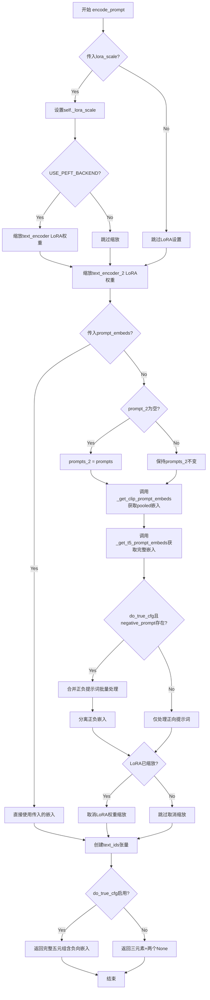

#### 带注释源码

```python
def encode_prompt(
    self,
    prompt: Union[str, List[str]],
    prompt_2: Union[str, List[str]],
    negative_prompt: Union[str, List[str]] = None,
    negative_prompt_2: Union[str, List[str]] = None,
    device: Optional[torch.device] = None,
    num_images_per_prompt: int = 1,
    prompt_embeds: Optional[torch.FloatTensor] = None,
    pooled_prompt_embeds: Optional[torch.FloatTensor] = None,
    negative_prompt_embeds: Optional[torch.FloatTensor] = None,
    negative_pooled_prompt_embeds: Optional[torch.FloatTensor] = None,
    max_sequence_length: int = 512,
    lora_scale: Optional[float] = None,
    do_true_cfg: bool = False,
):
    # 确定设备，优先使用传入的device，否则使用执行设备
    device = device or self._execution_device

    # 设置LoRA缩放因子（如果适用）
    if lora_scale is not None and isinstance(self, FluxLoraLoaderMixin):
        self._lora_scale = lora_scale

        # 如果启用PEFT后端，对text_encoder应用LoRA缩放
        if self.text_encoder is not None and USE_PEFT_BACKEND:
            scale_lora_layers(self.text_encoder, lora_scale)
        # 对text_encoder_2也应用LoRA缩放
        if self.text_encoder_2 is not None and USE_PEFT_BACKEND:
            scale_lora_layers(self.text_encoder_2, lora_scale)

    # 标准化prompt为列表格式，便于批量处理
    prompt = [prompt] if isinstance(prompt, str) else prompt
    batch_size = len(prompt)

    # True CFG模式：处理负面提示词
    if do_true_cfg and negative_prompt is not None:
        # 标准化负面提示词为列表
        negative_prompt = [negative_prompt] if isinstance(negative_prompt, str) else negative_prompt
        negative_batch_size = len(negative_prompt)

        # 验证批处理大小一致性
        if negative_batch_size != batch_size:
            raise ValueError(
                f"Negative prompt batch size ({negative_batch_size}) does not match prompt batch size ({batch_size})"
            )

        # 合并正负提示词用于批量编码
        prompts = prompt + negative_prompt
        prompts_2 = (
            prompt_2 + negative_prompt_2 if prompt_2 is not None and negative_prompt_2 is not None else None
        )
    else:
        # 非True CFG模式，仅使用正向提示词
        prompts = prompt
        prompts_2 = prompt_2

    # 如果未提供预计算的嵌入，则进行编码
    if prompt_embeds is None:
        # 处理第二个提示词（用于T5）
        if prompts_2 is None:
            prompts_2 = prompts

        # 从CLIP获取池化的提示词嵌入（用于注意力机制）
        pooled_prompt_embeds = self._get_clip_prompt_embeds(
            prompt=prompts,
            device=device,
            num_images_per_prompt=num_images_per_prompt,
        )
        # 从T5获取完整的序列嵌入（用于transformer）
        prompt_embeds = self._get_t5_prompt_embeds(
            prompt=prompts_2,
            num_images_per_prompt=num_images_per_prompt,
            max_sequence_length=max_sequence_length,
            device=device,
        )

        # True CFG模式：将合并的正负嵌入分离回来
        if do_true_cfg and negative_prompt is not None:
            # 计算总批处理大小
            total_batch_size = batch_size * num_images_per_prompt
            positive_indices = slice(0, total_batch_size)
            negative_indices = slice(total_batch_size, 2 * total_batch_size)

            # 分离池化嵌入
            positive_pooled_prompt_embeds = pooled_prompt_embeds[positive_indices]
            negative_pooled_prompt_embeds = pooled_prompt_embeds[negative_indices]

            # 分离完整嵌入
            positive_prompt_embeds = prompt_embeds[positive_indices]
            negative_prompt_embeds = prompt_embeds[negative_indices]

            # 保留正向嵌入用于后续生成
            pooled_prompt_embeds = positive_pooled_prompt_embeds
            prompt_embeds = positive_prompt_embeds

    # 取消LoRA权重缩放（恢复到原始状态）
    if self.text_encoder is not None:
        if isinstance(self, FluxLoraLoaderMixin) and USE_PEFT_BACKEND:
            unscale_lora_layers(self.text_encoder, lora_scale)

    if self.text_encoder_2 is not None:
        if isinstance(self, FluxLoraLoaderMixin) and USE_PEFT_BACKEND:
            unscale_lora_layers(self.text_encoder_2, lora_scale)

    # 确定数据类型（优先使用text_encoder的类型，否则使用transformer的类型）
    dtype = self.text_encoder.dtype if self.text_encoder is not None else self.transformer.dtype
    # 创建文本位置IDs张量（用于自注意力机制），形状为[seq_len, 3]
    text_ids = torch.zeros(prompt_embeds.shape[1], 3).to(device=device, dtype=dtype)

    # 根据是否启用True CFG返回相应结果
    if do_true_cfg and negative_prompt is not None:
        return (
            prompt_embeds,              # T5编码的提示词嵌入
            pooled_prompt_embeds,       # CLIP池化嵌入
            text_ids,                   # 文本位置IDs
            negative_prompt_embeds,     # 负面提示词嵌入
            negative_pooled_prompt_embeds,  # 负面池化嵌入
        )
    else:
        return prompt_embeds, pooled_prompt_embeds, text_ids, None, None
```


### `FluxCFGPipeline.check_inputs`

该方法负责验证FluxCFGPipeline的所有输入参数是否符合要求，包括图像尺寸、提示词类型、嵌入向量的一致性等，确保在执行推理前所有参数都处于有效状态，防止运行时错误。

参数：

- `self`：`FluxCFGPipeline`，Pipeline实例本身
- `prompt`：`Union[str, List[str], None]`，主提示词，用于生成图像的文本描述
- `prompt_2`：`Union[str, List[str], None]`，第二提示词，发送给T5编码器的文本
- `height`：`int`，生成图像的高度（像素）
- `width`：`int`，生成图像的宽度（像素）
- `negative_prompt`：`Union[str, List[str], None]`，负面提示词，用于指导模型避免生成的内容
- `negative_prompt_2`：`Union[str, List[str], None]`，第二负面提示词
- `prompt_embeds`：`Optional[torch.FloatTensor]`，预计算的主提示词嵌入向量
- `negative_prompt_embeds`：`Optional[torch.FloatTensor]`，预计算的负面提示词嵌入向量
- `pooled_prompt_embeds`：`Optional[torch.FloatTensor]`，预计算的池化提示词嵌入向量
- `negative_pooled_prompt_embeds`：`Optional[torch.FloatTensor]`，预计算的池化负面提示词嵌入向量
- `callback_on_step_end_tensor_inputs`：`Optional[List[str]]`，回调函数在步骤结束时可访问的张量输入列表
- `max_sequence_length`：`Optional[int]`，提示词的最大序列长度

返回值：`None`，该方法不返回任何值，仅通过抛出`ValueError`来指示验证失败

#### 流程图

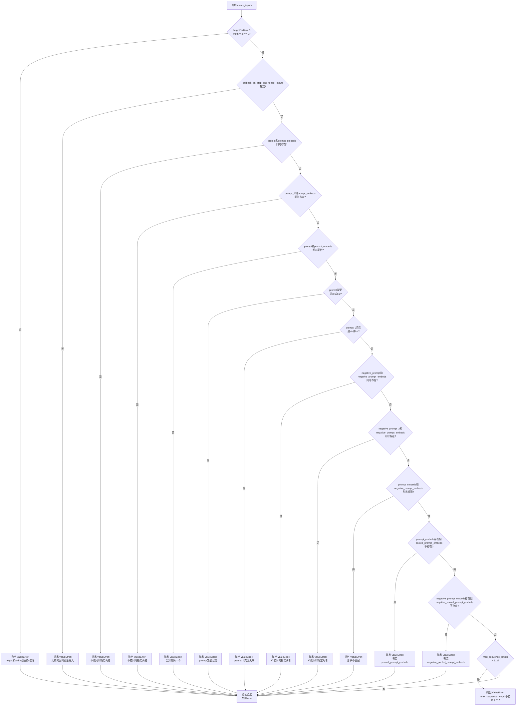

#### 带注释源码

```python
def check_inputs(
    self,
    prompt,                      # 主提示词 (str 或 List[str])
    prompt_2,                    # 第二提示词 (str 或 List[str])
    height,                      # 生成图像高度
    width,                       # 生成图像宽度
    negative_prompt=None,        # 负面提示词
    negative_prompt_2=None,      # 第二负面提示词
    prompt_embeds=None,         # 预计算的提示词嵌入
    negative_prompt_embeds=None, # 预计算的负面提示词嵌入
    pooled_prompt_embeds=None,  # 预计算的池化提示词嵌入
    negative_pooled_prompt_embeds=None, # 预计算的池化负面提示词嵌入
    callback_on_step_end_tensor_inputs=None, # 回调张量输入列表
    max_sequence_length=None,   # 最大序列长度
):
    """
    验证Pipeline输入参数的有效性
    
    该方法执行多项验证检查：
    1. 图像尺寸必须是8的倍数
    2. 回调张量输入必须在允许列表中
    3. prompt和prompt_embeds不能同时指定
    4. prompt和prompt_embeds至少提供一个
    5. prompt类型必须是str或list
    6. prompt_embeds和negative_prompt_embeds形状必须一致
    7. 如果提供prompt_embeds，必须同时提供pooled_prompt_embeds
    8. max_sequence_length不能超过512
    
    抛出:
        ValueError: 当任何验证检查失败时
    """
    
    # 验证1: 检查图像尺寸是否为8的倍数
    # VAE在编解码过程中会将图像尺寸下采样/上采样2^(block_out_channels数量)倍
    # 默认下采样8倍，因此高度和宽度必须是8的倍数
    if height % 8 != 0 or width % 8 != 0:
        raise ValueError(f"`height` and `width` have to be divisible by 8 but are {height} and {width}.")

    # 验证2: 检查回调张量输入是否在允许的列表中
    # 回调函数只能访问预定义的张量，防止安全问题和内存泄漏
    if callback_on_step_end_tensor_inputs is not None and not all(
        k in self._callback_tensor_inputs for k in callback_on_step_end_tensor_inputs
    ):
        raise ValueError(
            f"`callback_on_step_end_tensor_inputs` has to be in {self._callback_tensor_inputs}, but found {[k for k in callback_on_step_end_tensor_inputs if k not in self._callback_tensor_inputs]}"
        )

    # 验证3: 检查prompt和prompt_embeds不能同时提供
    # 用户应该选择直接提供文本或预计算嵌入，避免冲突
    if prompt is not None and prompt_embeds is not None:
        raise ValueError(
            f"Cannot forward both `prompt`: {prompt} and `prompt_embeds`: {prompt_embeds}. Please make sure to"
            " only forward one of the two."
        )
    # 验证4: 检查prompt_2和prompt_embeds不能同时提供
    elif prompt_2 is not None and prompt_embeds is not None:
        raise ValueError(
            f"Cannot forward both `prompt_2`: {prompt_2} and `prompt_embeds`: {prompt_embeds}. Please make sure to"
            " only forward one of the two."
        )
    # 验证5: 检查至少提供了prompt或prompt_embeds之一
    elif prompt is None and prompt_embeds is None:
        raise ValueError(
            "Provide either `prompt` or `prompt_embeds`. Cannot leave both `prompt` and `prompt_embeds` undefined."
        )
    # 验证6: 检查prompt类型是否为str或list
    elif prompt is not None and (not isinstance(prompt, str) and not isinstance(prompt, list)):
        raise ValueError(f"`prompt` has to be of type `str` or `list` but is {type(prompt)}")
    # 验证7: 检查prompt_2类型是否为str或list
    elif prompt_2 is not None and (not isinstance(prompt_2, str) and not isinstance(prompt_2, list)):
        raise ValueError(f"`prompt_2` has to be of type `str` or `list` but is {type(prompt_2)}")

    # 验证8: 检查negative_prompt和negative_prompt_embeds不能同时提供
    if negative_prompt is not None and negative_prompt_embeds is not None:
        raise ValueError(
            f"Cannot forward both `negative_prompt`: {negative_prompt} and `negative_prompt_embeds`:"
            f" {negative_prompt_embeds}. Please make sure to only forward one of the two."
        )
    # 验证9: 检查negative_prompt_2和negative_prompt_embeds不能同时提供
    elif negative_prompt_2 is not None and negative_prompt_embeds is not None:
        raise ValueError(
            f"Cannot forward both `negative_prompt_2`: {negative_prompt_2} and `negative_prompt_embeds`:"
            f" {negative_prompt_embeds}. Please make sure to only forward one of the two."
        )

    # 验证10: 检查prompt_embeds和negative_prompt_embeds形状一致性
    # CFG需要两者形状完全匹配才能正确计算
    if prompt_embeds is not None and negative_prompt_embeds is not None:
        if prompt_embeds.shape != negative_prompt_embeds.shape:
            raise ValueError(
                "`prompt_embeds` and `negative_prompt_embeds` must have the same shape when passed directly, but"
                f" got: `prompt_embeds` {prompt_embeds.shape} != `negative_prompt_embeds`"
                f" {negative_prompt_embeds.shape}."
            )

    # 验证11: 检查prompt_embeds存在时pooled_prompt_embeds也必须存在
    # CLIP池化输出是Transformer所需的额外条件输入
    if prompt_embeds is not None and pooled_prompt_embeds is None:
        raise ValueError(
            "If `prompt_embeds` are provided, `pooled_prompt_embeds` also have to be passed. Make sure to generate `pooled_prompt_embeds` from the same text encoder that was used to generate `prompt_embeds`."
        )
    # 验证12: 检查negative_prompt_embeds存在时negative_pooled_prompt_embeds也必须存在
    if negative_prompt_embeds is not None and negative_pooled_prompt_embeds is None:
        raise ValueError(
            "If `negative_prompt_embeds` are provided, `negative_pooled_prompt_embeds` also have to be passed. Make sure to generate `negative_pooled_prompt_embeds` from the same text encoder that was used to generate `negative_prompt_embeds`."
        )

    # 验证13: 检查最大序列长度不超过512
    # T5编码器默认支持最大512个token
    if max_sequence_length is not None and max_sequence_length > 512:
        raise ValueError(f"`max_sequence_length` cannot be greater than 512 but is {max_sequence_length}")
```


### `FluxCFGPipeline._prepare_latent_image_ids`

该函数用于生成潜在图像的空间位置标识符（image ids），这些标识符作为Transformer模型的输入之一，用于编码图像的空间结构信息。它根据图像的高度和宽度创建2D坐标网格，并将坐标信息填充到张量的不同通道中。

参数：

- `batch_size`：`int`，批次大小（当前实现中未使用，仅作为API接口保留）
- `height`：`int`，生成图像的高度
- `width`：`int`，生成图像的宽度
- `device`：`torch.device`，目标设备，用于将生成的张量移动到指定设备
- `dtype`：`torch.dtype`，目标数据类型，用于指定生成张量的数据类型

返回值：`torch.Tensor`，形状为 `(height//2 * width//2, 3)` 的二维张量，每行包含3个通道的坐标信息（通道0为0，通道1为行索引，通道2为列索引）

#### 流程图

```mermaid
flowchart TD
    A[开始] --> B[创建零张量: shape (height//2, width//2, 3)]
    B --> C[填充行索引到通道1]
    C --> D[填充列索引到通道2]
    D --> E[获取张量形状信息]
    E --> F[reshape为2D张量: shape (height//2 * width//2, 3)]
    F --> G[移动到指定device和dtype]
    G --> H[返回latent_image_ids]
```

#### 带注释源码

```python
@staticmethod
def _prepare_latent_image_ids(batch_size, height, width, device, dtype):
    """
    准备潜在图像的ID坐标张量，用于Transformer模型的空间位置编码
    
    参数:
        batch_size: 批次大小（当前未使用）
        height: 图像高度
        width: 图像宽度
        device: 目标设备
        dtype: 目标数据类型
    
    返回:
        形状为 (height//2 * width//2, 3) 的坐标张量
    """
    
    # 步骤1: 创建初始零张量
    # 潜在图像的尺寸是原图的一半（因为VAE下采样因子为2）
    latent_image_ids = torch.zeros(height // 2, width // 2, 3)
    
    # 步骤2: 填充行索引（Y坐标）到第2个通道（索引1）
    # 使用torch.arange生成行索引 [0, 1, 2, ..., height//2-1]
    # [:, None] 用于广播，使其成为列向量
    latent_image_ids[..., 1] = latent_image_ids[..., 1] + torch.arange(height // 2)[:, None]
    
    # 步骤3: 填充列索引（X坐标）到第3个通道（索引2）
    # 使用torch.arange生成列索引 [0, 1, 2, ..., width//2-1]
    # [None, :] 用于广播，使其成为行向量
    latent_image_ids[..., 2] = latent_image_ids[..., 2] + torch.arange(width // 2)[None, :]
    
    # 步骤4: 获取重塑前的张量形状信息
    latent_image_id_height, latent_image_id_width, latent_image_id_channels = latent_image_ids.shape
    
    # 步骤5: 将3D张量重塑为2D张量
    # 从 (height//2, width//2, 3) 变为 (height//2 * width//2, 3)
    # 每一行代表一个潜在像素的位置 [0, row, col]
    latent_image_ids = latent_image_ids.reshape(
        latent_image_id_height * latent_image_id_width, latent_image_id_channels
    )
    
    # 步骤6: 将张量移动到指定设备并转换数据类型后返回
    return latent_image_ids.to(device=device, dtype=dtype)
```

#### 坐标张量结构说明

生成的 `latent_image_ids` 张量结构如下：

| 通道索引 | 含义 | 示例值 |
|---------|------|--------|
| 0 | 固定值 | 全部为0 |
| 1 | 行索引(Y坐标) | 0, 0, 0, ..., 1, 1, 1, ... |
| 2 | 列索引(X坐标) | 0, 1, 2, ..., 0, 1, 2, ... |

例如，当 height=8, width=8 时：
- 输出形状为 (16, 3)，即4x4=16个潜在像素位置
- 每个潜在像素位置编码为 `[0, row_coord, col_coord]` 的形式


### `FluxCFGPipeline._pack_latents`

该方法是一个静态工具函数，用于将 VAE 编码后的图像潜在表示（latents）进行空间打包（spatial packing），将其转换为适合 Transformer 模型输入的序列格式。函数通过视图重塑和维度置换操作，将 2×2 的空间块展平为序列中的单个 token，实现从空间域到序列域的转换。

参数：

- `latents`：`torch.Tensor`，输入的潜在表示张量，形状为 `(batch_size, num_channels_latents, height, width)`
- `batch_size`：`int`，批次大小
- `num_channels_latents`：`int`，潜在表示的通道数
- `height`：`int`，潜在表示的高度
- `width`：`int`，潜在表示的宽度

返回值：`torch.Tensor`，打包后的潜在表示，形状为 `(batch_size, (height // 2) * (width // 2), num_channels_latents * 4)`

#### 流程图

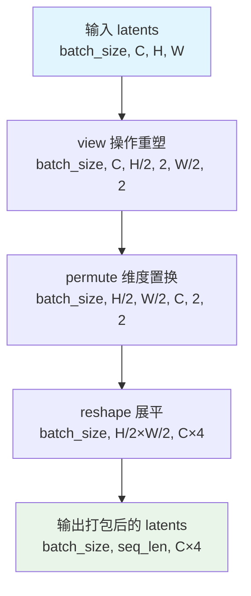

#### 带注释源码

```python
@staticmethod
def _pack_latents(latents, batch_size, num_channels_latents, height, width):
    """
    将潜在表示进行空间打包，转换为 Transformer 需要的序列格式。
    
    处理流程：
    1. view: 将 (B, C, H, W) -> (B, C, H//2, 2, W//2, 2)，按 2x2 分块
    2. permute: 调整维度顺序为 (B, H//2, W//2, C, 2, 2)
    3. reshape: 合并空间和通道维度 -> (B, H//2*W//2, C*4)
    
    这样每个 2x2 的空间块被转换为序列中的一个 token，
    通道数变为原来的 4 倍（2x2=4 个像素位置）。
    """
    # Step 1: 将张量重塑为包含 2x2 空间块的六维张量
    # 输入: (B, C, H, W) -> 输出: (B, C, H//2, 2, W//2, 2)
    latents = latents.view(batch_size, num_channels_latents, height // 2, 2, width // 2, 2)
    
    # Step 2: 置换维度，将空间块维度提前
    # 从 (B, C, H//2, 2, W//2, 2) -> (B, H//2, W//2, C, 2, 2)
    # 这样便于后续将 2x2 块合并为单一维度
    latents = latents.permute(0, 2, 4, 1, 3, 5)
    
    # Step 3: 重新塑造为序列格式
    # 将 (H//2, W//2) 合并为序列长度维度
    # 将 (C, 2, 2) 合并为新的通道维度 C*4
    # 最终形状: (B, H//2*W//2, C*4)
    latents = latents.reshape(batch_size, (height // 2) * (width // 2), num_channels_latents * 4)

    return latents
```


### `FluxCFGPipeline._unpack_latents`

该方法是一个静态方法，用于将打包（packed）后的latents张量解包（unpack）回原始的空间维度形状。在Flux pipeline中，latents在传递给Transformer之前会被打包以提高效率，此方法在VAE解码之前将其恢复为标准格式。

参数：

- `latents`：`torch.Tensor`，打包后的latents张量，形状为 (batch_size, num_patches, channels)
- `height`：`int`，原始图像的高度（像素单位）
- `width`：`int`，原始图像的宽度（像素单位）
- `vae_scale_factor`：`int`，VAE的缩放因子，用于将像素坐标转换为latent坐标

返回值：`torch.Tensor`，解包后的latents张量，形状为 (batch_size, channels // (2 * 2), height * 2, width * 2)

#### 流程图

```mermaid
flowchart TD
    A[开始: _unpack_latents] --> B[获取latents形状: batch_size, num_patches, channels]
    B --> C[计算latent空间高度: height = height // vae_scale_factor]
    C --> D[计算latent空间宽度: width = width // vae_scale_factor]
    D --> E[reshape: latents.view<br/>(batch_size, height, width, channels//4, 2, 2)]
    E --> F[permute: 重新排列维度顺序<br/>0, 3, 1, 4, 2, 5]
    F --> G[reshape: 恢复为标准latent形状<br/>batch_size, channels//4, height, width]
    G --> H[返回解包后的latents]
```

#### 带注释源码

```python
@staticmethod
def _unpack_latents(latents, height, width, vae_scale_factor):
    """
    将打包的latents张量解包回原始空间维度形状。
    
    打包过程将2x2的patch展平为单一维度，此方法逆向操作恢复空间结构。
    
    Args:
        latents: 打包后的latents张量，形状为 (batch_size, num_patches, channels)
                 其中 num_patches = (height // vae_scale_factor) * (width // vae_scale_factor)
        height: 原始图像高度（像素）
        width: 原始图像宽度（像素）
        vae_scale_factor: VAE缩放因子，通常为16
    
    Returns:
        解包后的latents张量，形状为 (batch_size, channels // 4, height // 2, width // 2)
    """
    # 获取输入张量的维度信息
    batch_size, num_patches, channels = latents.shape

    # 将像素坐标转换为latent空间坐标
    # 例如: 1024像素 / 16 scale = 64 latent空间
    height = height // vae_scale_factor
    width = width // vae_scale_factor

    # 第一步reshape: 将打包的latents恢复为 (batch, h, w, channels//4, 2, 2)
    # 这里的 2x2 对应于打包前的空间patch结构
    latents = latents.view(batch_size, height, width, channels // 4, 2, 2)
    
    # 第二步permute: 重新排列维度顺序
    # 从 (0,1,2,3,4,5) -> (0,3,1,4,2,5)
    # 将空间维度与channel维度分离，为最终reshape做准备
    latents = latents.permute(0, 3, 1, 4, 2, 5)

    # 第三步reshape: 展平最后的2x2维度，输出标准latent形状
    # 最终形状: (batch_size, channels // 4, height, width)
    # 对应原始图像尺寸的一半 (因为VAE的encoder会下采样2倍)
    latents = latents.reshape(batch_size, channels // (2 * 2), height * 2, width * 2)

    return latents
```


### FluxCFGPipeline.enable_vae_slicing

启用VAE切片解码功能。当启用此选项时，VAE会将输入张量分割成多个切片进行分步解码计算。这种方法可以节省内存并允许更大的批处理大小。该方法已弃用，推荐直接使用 `pipe.vae.enable_slicing()`。

参数： 无

返回值：`None`，无返回值（该方法直接修改VAE的内部状态）

#### 流程图

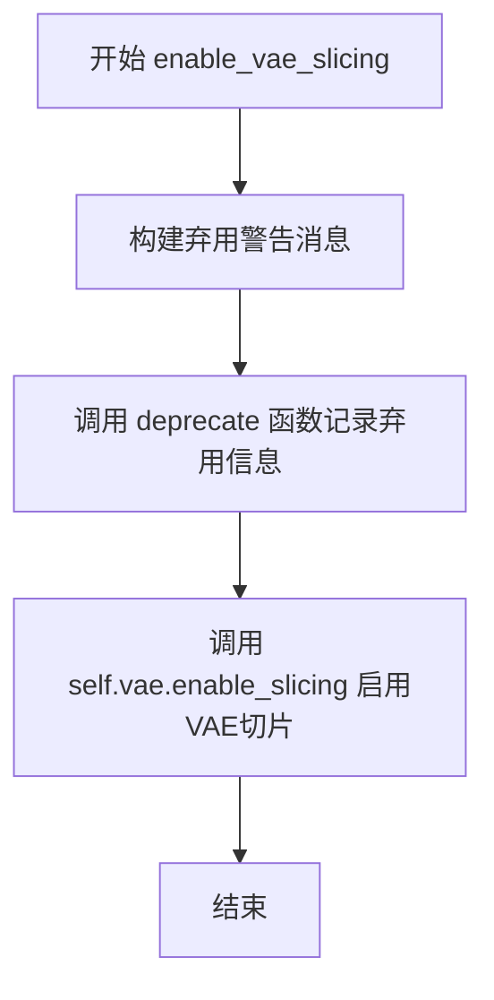

#### 带注释源码

```python
def enable_vae_slicing(self):
    r"""
    Enable sliced VAE decoding. When this option is enabled, the VAE will split the input tensor in slices to
    compute decoding in several steps. This is useful to save some memory and allow larger batch sizes.
    """
    # 构建弃用警告消息，包含类名和未来替代方案
    depr_message = f"Calling `enable_vae_slicing()` on a `{self.__class__.__name__}` is deprecated and this method will be removed in a future version. Please use `pipe.vae.enable_slicing()`."
    
    # 调用deprecate函数记录弃用信息，指定弃用版本号为0.40.0
    deprecate(
        "enable_vae_slicing",
        "0.40.0",
        depr_message,
    )
    
    # 实际调用VAE模型的enable_slicing方法来启用切片解码功能
    self.vae.enable_slicing()
```


### `FluxCFGPipeline.disable_vae_slicing`

该方法用于禁用VAE切片解码功能。如果之前启用了`enable_vae_slicing`，调用此方法后将恢复为单步解码。注意：此方法已废弃，建议直接使用`pipe.vae.disable_slicing()`。

参数： 无

返回值：`None`，无返回值（该方法直接操作VAE模型的状态）

#### 流程图

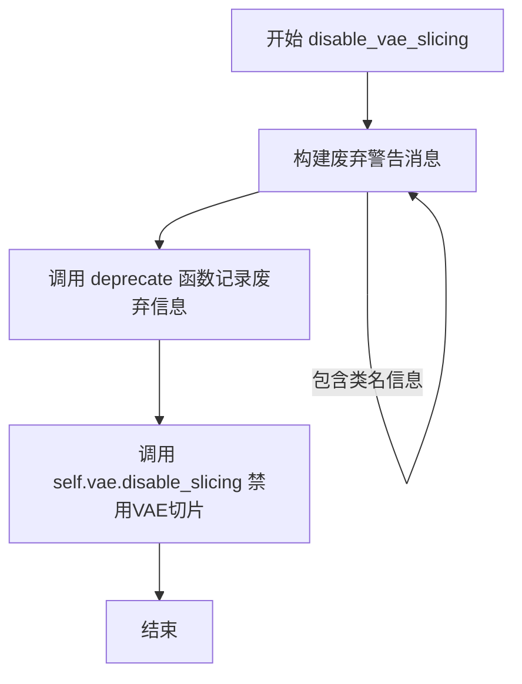

#### 带注释源码

```python
def disable_vae_slicing(self):
    r"""
    Disable sliced VAE decoding. If `enable_vae_slicing` was previously enabled, this method will go back to
    computing decoding in one step.
    """
    # 构建废弃警告消息，包含当前类名，建议用户使用新的API
    depr_message = f"Calling `disable_vae_slicing()` on a `{self.__class__.__name__}` is deprecated and this method will be removed in a future version. Please use `pipe.vae.disable_slicing()`."
    
    # 调用deprecate函数记录废弃信息，版本号为0.40.0
    deprecate(
        "disable_vae_slicing",  # 废弃的方法名
        "0.40.0",              # 废弃版本号
        depr_message,         # 废弃警告消息
    )
    
    # 调用VAE模型的disable_slicing方法实际禁用切片功能
    self.vae.disable_slicing()
```


### `FluxCFGPipeline.enable_vae_tiling`

该方法用于启用 VAE（变分自编码器）的平铺解码功能。通过将输入张量分割成多个 tiles（瓦片）分步计算编码和解码过程，从而显著减少内存占用并支持处理更大的图像尺寸。该方法目前已被废弃，推荐直接调用 `pipe.vae.enable_tiling()`。

参数： 无

返回值：`None`，无返回值（该方法直接作用于 VAE 模型的内部状态）

#### 流程图

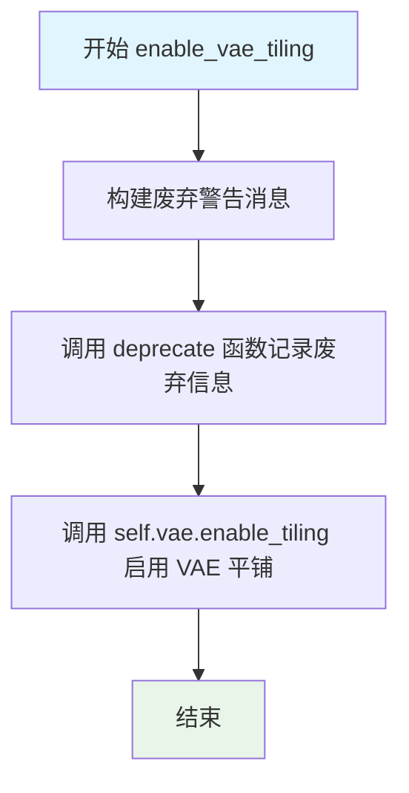

#### 带注释源码

```python
def enable_vae_tiling(self):
    r"""
    Enable tiled VAE decoding. When this option is enabled, the VAE will split the input tensor into tiles to
    compute decoding and encoding in several steps. This is useful for saving a large amount of memory and to allow
    processing larger images.
    """
    # 构建废弃警告消息，包含当前类名以帮助用户识别调用位置
    depr_message = f"Calling `enable_vae_tiling()` on a `{self.__class__.__name__}` is deprecated and this method will be removed in a future version. Please use `pipe.vae.enable_tiling()`."
    
    # 调用 deprecate 函数记录废弃信息，在未来版本中会移除此方法
    deprecate(
        "enable_vae_tiling",      # 废弃的功能名称
        "0.40.0",                 # 计划移除的版本号
        depr_message,             # 详细的废弃警告信息
    )
    
    # 实际执行：委托给 VAE 模型的 enable_tiling 方法启用平铺功能
    # 这是真正执行平铺解码的核心逻辑
    self.vae.enable_tiling()
```


### `FluxCFGPipeline.disable_vae_tiling`

禁用瓦片 VAE 解码。如果之前启用了 `enable_vae_tiling`，此方法将恢复为一步计算解码。

参数：

- 无（仅包含 `self`）

返回值：`None`，无返回值（该方法为副作用方法）

#### 流程图

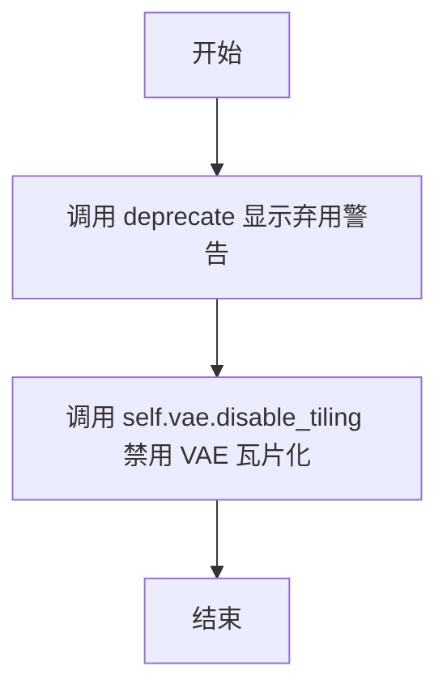

#### 带注释源码

```python
def disable_vae_tiling(self):
    r"""
    Disable tiled VAE decoding. If `enable_vae_tiling` was previously enabled, this method will go back to
    computing decoding in one step.
    """
    # 构建弃用警告消息，提示用户应直接调用 pipe.vae.disable_tiling()
    depr_message = f"Calling `disable_vae_tiling()` on a `{self.__class__.__name__}` is deprecated and this method will be removed in a future version. Please use `pipe.vae.disable_tiling()`."
    # 调用 deprecate 函数记录弃用警告，在版本 0.40.0 后将移除此方法
    deprecate(
        "disable_vae_tiling",
        "0.40.0",
        depr_message,
    )
    # 实际执行：调用底层 VAE 模型的 disable_tiling 方法，禁用瓦片化解码
    self.vae.disable_tiling()
```


### FluxCFGPipeline.prepare_latents

该方法用于为图像生成准备潜在变量（latents）和潜在图像ID。它根据指定的批次大小、通道数、高度和宽度生成随机潜在变量，或者使用提供的潜在变量，并对其进行打包处理以适应Transformer模型的输入格式。

参数：

- `batch_size`：`int`，生成图像的批次大小
- `num_channels_latents`：`int`，潜在变量的通道数，通常为Transformer配置中的输入通道数除以4
- `height`：`int`，生成图像的高度（像素）
- `width`：`int`，生成图像的宽度（像素）
- `dtype`：`torch.dtype`，潜在变量的数据类型
- `device`：`torch.device`，潜在变量存放的设备
- `generator`：`torch.Generator` 或 `List[torch.Generator]`，可选，用于生成确定性随机数的生成器
- `latents`：`torch.FloatTensor`，可选，预生成的潜在变量，如果提供则直接使用，否则随机生成

返回值：`Tuple[torch.Tensor, torch.Tensor]`，返回打包后的潜在变量和潜在图像ID元组

#### 流程图

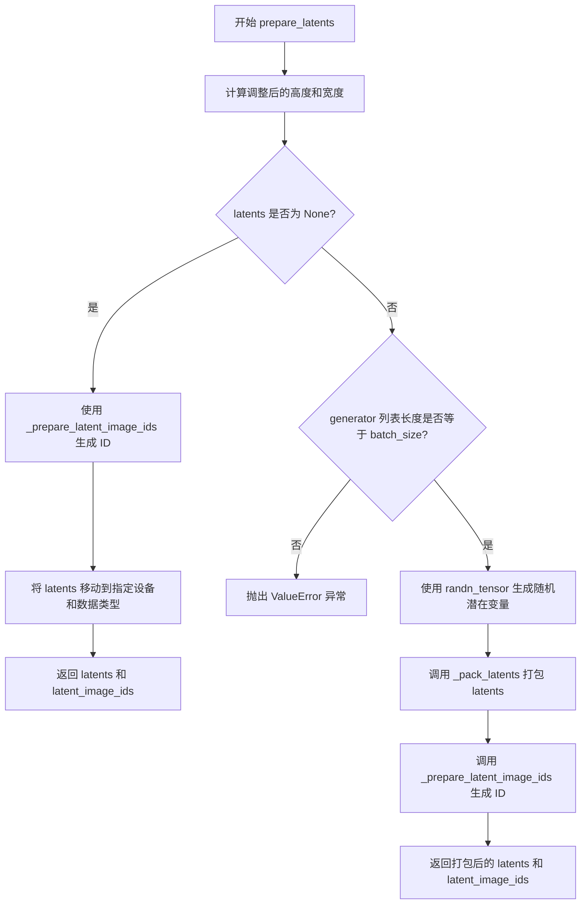

#### 带注释源码

```python
def prepare_latents(
    self,
    batch_size,               # 批次大小
    num_channels_latents,     # 潜在变量通道数
    height,                  # 图像高度
    width,                   # 图像宽度
    dtype,                   # 数据类型
    device,                  # 设备
    generator,               # 随机生成器
    latents=None,            # 可选的预生成潜在变量
):
    # 1. 根据 VAE 缩放因子调整高度和宽度
    # 每个 VAE 尺度因子会使空间维度减半，所以需要乘以2来补偿
    height = 2 * (int(height) // self.vae_scale_factor)
    width = 2 * (int(width) // self.vae_scale_factor)

    # 2. 确定潜在变量的形状
    shape = (batch_size, num_channels_latents, height, width)

    # 3. 如果提供了预生成的 latents，直接使用
    if latents is not None:
        # 生成潜在图像ID用于transformer的图像位置编码
        latent_image_ids = self._prepare_latent_image_ids(batch_size, height, width, device, dtype)
        # 将 latents 移动到目标设备和数据类型
        return latents.to(device=device, dtype=dtype), latent_image_ids

    # 4. 检查生成器列表长度是否与批次大小匹配
    if isinstance(generator, list) and len(generator) != batch_size:
        raise ValueError(
            f"You have passed a list of generators of length {len(generator)}, but requested an effective batch"
            f" size of {batch_size}. Make sure the batch size matches the length of the generators."
        )

    # 5. 使用随机张量生成初始潜在变量
    # randn_tensor 生成符合标准正态分布的张量
    latents = randn_tensor(shape, generator=generator, device=device, dtype=dtype)
    
    # 6. 打包 latents 以适应 Transformer 的输入格式
    # 将 (B, C, H, W) 转换为 (B, H*W, C*4) 的形式
    latents = self._pack_latents(latents, batch_size, num_channels_latents, height, width)

    # 7. 生成潜在图像ID
    latent_image_ids = self._prepare_latent_image_ids(batch_size, height, width, device, dtype)

    # 8. 返回打包后的 latents 和 latent_image_ids
    return latents, latent_image_ids
```


### `FluxCFGPipeline.__call__`

这是FluxCFG管道的主入口方法，用于根据文本提示生成图像。该方法整合了文本编码、潜在向量准备、去噪循环（Diffusion过程）和VAE解码的完整图像生成流程。

参数：

- `prompt`：`Union[str, List[str]]`，用于引导图像生成的文本提示
- `prompt_2`：`Optional[Union[str, List[str]]]`，发送给第二个tokenizer和text_encoder的提示词
- `negative_prompt`：`Union[str, List[str]]`，用于负面引导的文本
- `negative_prompt_2`：`Optional[Union[str, List[str]]]`，负面提示的第二个版本
- `true_cfg`：`float`，True CFG缩放因子，控制负面引导强度
- `height`：`Optional[int]`，生成图像的高度（像素）
- `width`：`Optional[int]`，生成图像的宽度（像素）
- `num_inference_steps`：`int`，去噪步数，默认28
- `timesteps`：`List[int]`，自定义时间步列表
- `guidance_scale`：`float`，引导比例，默认3.5
- `num_images_per_prompt`：`Optional[int]`，每个提示生成的图像数量
- `generator`：`Optional[Union[torch.Generator, List[torch.Generator]]]`，随机数生成器
- `latents`：`Optional[torch.FloatTensor]`，预生成的噪声潜在向量
- `prompt_embeds`：`Optional[torch.FloatTensor]`，预生成的文本嵌入
- `pooled_prompt_embeds`：`Optional[torch.FloatTensor]`，预生成的池化文本嵌入
- `negative_prompt_embeds`：`Optional[torch.FloatTensor]`，负面提示的文本嵌入
- `negative_pooled_prompt_embeds`：`Optional[torch.FloatTensor]`，负面提示的池化嵌入
- `output_type`：`str | None`，输出格式（"pil"或"latent"）
- `return_dict`：`bool`，是否返回FluxPipelineOutput对象
- `joint_attention_kwargs`：`Optional[Dict[str, Any]]`，传递给AttentionProcessor的参数字典
- `callback_on_step_end`：`Optional[Callable[[int, int, Dict], None]]`，每步结束后调用的回调函数
- `callback_on_step_end_tensor_inputs`：`List[str]`，回调函数接收的张量输入列表
- `max_sequence_length`：`int`，T5编码器的最大序列长度，默认512

返回值：`FluxPipelineOutput`，包含生成的图像列表

#### 流程图

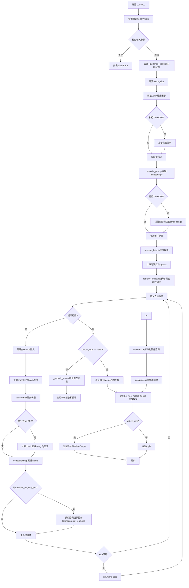

#### 带注释源码

```python
@torch.no_grad()
@replace_example_docstring(EXAMPLE_DOC_STRING)
def __call__(
    self,
    prompt: Union[str, List[str]] = None,
    prompt_2: Optional[Union[str, List[str]]] = None,
    negative_prompt: Union[str, List[str]] = None,
    negative_prompt_2: Optional[Union[str, List[str]]] = None,
    true_cfg: float = 1.0,
    height: Optional[int] = None,
    width: Optional[int] = None,
    num_inference_steps: int = 28,
    timesteps: List[int] = None,
    guidance_scale: float = 3.5,
    num_images_per_prompt: Optional[int] = 1,
    generator: Optional[Union[torch.Generator, List[torch.Generator]]] = None,
    latents: Optional[torch.FloatTensor] = None,
    prompt_embeds: Optional[torch.FloatTensor] = None,
    pooled_prompt_embeds: Optional[torch.FloatTensor] = None,
    negative_prompt_embeds: Optional[torch.FloatTensor] = None,
    negative_pooled_prompt_embeds: Optional[torch.FloatTensor] = None,
    output_type: str | None = "pil",
    return_dict: bool = True,
    joint_attention_kwargs: Optional[Dict[str, Any]] = None,
    callback_on_step_end: Optional[Callable[[int, int, Dict], None]] = None,
    callback_on_step_end_tensor_inputs: List[str] = ["latents"],
    max_sequence_length: int = 512,
):
    # 1. 设置默认图像尺寸（如果未指定）
    height = height or self.default_sample_size * self.vae_scale_factor
    width = width or self.default_sample_size * self.vae_scale_factor

    # 2. 检查输入参数有效性，验证prompt、dimensions、embeddings等
    self.check_inputs(
        prompt, prompt_2, height, width,
        negative_prompt=negative_prompt,
        negative_prompt_2=negative_prompt_2,
        prompt_embeds=prompt_embeds,
        negative_prompt_embeds=negative_prompt_embeds,
        pooled_prompt_embeds=pooled_prompt_embeds,
        negative_pooled_prompt_embeds=negative_pooled_prompt_embeds,
        callback_on_step_end_tensor_inputs=callback_on_step_end_tensor_inputs,
        max_sequence_length=max_sequence_length,
    )

    # 3. 设置内部状态变量
    self._guidance_scale = guidance_scale
    self._joint_attention_kwargs = joint_attention_kwargs
    self._interrupt = False

    # 4. 确定batch_size（基于prompt或已提供的embeddings）
    if prompt is not None and isinstance(prompt, str):
        batch_size = 1
    elif prompt is not None and isinstance(prompt, list):
        batch_size = len(prompt)
    else:
        batch_size = prompt_embeds.shape[0]

    # 5. 获取执行设备
    device = self._execution_device

    # 6. 从joint_attention_kwargs提取LoRA缩放因子
    lora_scale = (
        self.joint_attention_kwargs.get("scale", None) 
        if self.joint_attention_kwargs is not None else None
    )
    
    # 7. 判断是否启用True CFG（需要true_cfg > 1且有negative_prompt）
    do_true_cfg = true_cfg > 1 and negative_prompt is not None
    
    # 8. 编码提示词为embeddings（CLIP + T5）
    (
        prompt_embeds,
        pooled_prompt_embeds,
        text_ids,
        negative_prompt_embeds,
        negative_pooled_prompt_embeds,
    ) = self.encode_prompt(
        prompt=prompt,
        prompt_2=prompt_2,
        negative_prompt=negative_prompt,
        negative_prompt_2=negative_prompt_2,
        prompt_embeds=prompt_embeds,
        pooled_prompt_embeds=pooled_prompt_embeds,
        negative_prompt_embeds=negative_prompt_embeds,
        negative_pooled_prompt_embeds=negative_pooled_prompt_embeds,
        device=device,
        num_images_per_prompt=num_images_per_prompt,
        max_sequence_length=max_sequence_length,
        lora_scale=lora_scale,
        do_true_cfg=do_true_cfg,
    )

    # 9. 如果启用True CFG，将负面和正面embeddings拼接
    if do_true_cfg:
        prompt_embeds = torch.cat([negative_prompt_embeds, prompt_embeds], dim=0)
        pooled_prompt_embeds = torch.cat([negative_pooled_prompt_embeds, pooled_prompt_embeds], dim=0)

    # 10. 准备潜在变量（噪声图像表示）
    num_channels_latents = self.transformer.config.in_channels // 4
    latents, latent_image_ids = self.prepare_latents(
        batch_size * num_images_per_prompt,
        num_channels_latents,
        height,
        width,
        prompt_embeds.dtype,
        device,
        generator,
        latents,
    )

    # 11. 准备时间步调度
    sigmas = np.linspace(1.0, 1 / num_inference_steps, num_inference_steps)
    image_seq_len = latents.shape[1]
    # 计算序列长度偏移（用于调整噪声调度）
    mu = calculate_shift(
        image_seq_len,
        self.scheduler.config.get("base_image_seq_len", 256),
        self.scheduler.config.get("max_image_seq_len", 4096),
        self.scheduler.config.get("base_shift", 0.5),
        self.scheduler.config.get("max_shift", 1.15),
    )
    timesteps, num_inference_steps = retrieve_timesteps(
        self.scheduler,
        num_inference_steps,
        device,
        timesteps,
        sigmas,
        mu=mu,
    )
    
    # 计算预热步数
    num_warmup_steps = max(len(timesteps) - num_inference_steps * self.scheduler.order, 0)
    self._num_timesteps = len(timesteps)

    # 12. 去噪循环（核心生成过程）
    with self.progress_bar(total=num_inference_steps) as progress_bar:
        for i, t in enumerate(timesteps):
            # 检查是否中断（支持外部中断）
            if self.interrupt:
                continue

            # 复制latents以支持CFG（如果是True CFG模式）
            latent_model_input = torch.cat([latents] * 2) if do_true_cfg else latents

            # 处理guidance嵌入
            if self.transformer.config.guidance_embeds:
                guidance = torch.full([1], guidance_scale, device=device, dtype=torch.float32)
                guidance = guidance.expand(latent_model_input.shape[0])
            else:
                guidance = None

            # 将timestep广播到batch维度
            timestep = t.expand(latent_model_input.shape[0]).to(latent_model_input.dtype)

            # 调用Transformer进行去噪预测
            noise_pred = self.transformer(
                hidden_states=latent_model_input,
                timestep=timestep / 1000,  # 归一化到0-1范围
                guidance=guidance,
                pooled_projections=pooled_prompt_embeds,
                encoder_hidden_states=prompt_embeds,
                txt_ids=text_ids,
                img_ids=latent_image_ids,
                joint_attention_kwargs=self.joint_attention_kwargs,
                return_dict=False,
            )[0]

            # 应用True CFG（如果启用）
            if do_true_cfg:
                neg_noise_pred, noise_pred = noise_pred.chunk(2)
                noise_pred = neg_noise_pred + true_cfg * (noise_pred - neg_noise_pred)

            # 保存原始dtype以防MPS兼容性问题
            latents_dtype = latents.dtype
            # 使用调度器从噪声预测计算上一步的latents
            latents = self.scheduler.step(noise_pred, t, latents, return_dict=False)[0]

            # 处理MPS平台的dtype转换bug
            if latents.dtype != latents_dtype:
                if torch.backends.mps.is_available():
                    latents = latents.to(latents_dtype)

            # 执行每步结束时的回调函数
            if callback_on_step_end is not None:
                callback_kwargs = {}
                for k in callback_on_step_end_tensor_inputs:
                    callback_kwargs[k] = locals()[k]
                callback_outputs = callback_on_step_end(self, i, t, callback_kwargs)

                # 允许回调修改latents和prompt_embeds
                latents = callback_outputs.pop("latents", latents)
                prompt_embeds = callback_outputs.pop("prompt_embeds", prompt_embeds)

            # 更新进度条（最后一步或调度器order步）
            if i == len(timesteps) - 1 or ((i + 1) > num_warmup_steps and (i + 1) % self.scheduler.order == 0):
                progress_bar.update()

            # XLA设备同步（如果可用）
            if XLA_AVAILABLE:
                xm.mark_step()

    # 13. 根据output_type处理输出
    if output_type == "latent":
        # 直接返回潜在向量
        image = latents
    else:
        # 解包潜在向量并应用VAE解码
        latents = self._unpack_latents(latents, height, width, self.vae_scale_factor)
        latents = (latents / self.vae.config.scaling_factor) + self.vae.config.shift_factor
        image = self.vae.decode(latents, return_dict=False)[0]
        image = self.image_processor.postprocess(image, output_type=output_type)

    # 14. 释放模型内存
    self.maybe_free_model_hooks()

    # 15. 返回结果
    if not return_dict:
        return (image,)

    return FluxPipelineOutput(images=image)
```

## 关键组件


# FluxCFGPipeline 详细设计文档

## 一段话描述

FluxCFGPipeline 是一个基于 Flux 架构的文本到图像生成管道，支持双文本编码器（CLIP 和 T5）、Flow Match 调度器、True CFG 引导、VAE 切片/瓦片解码优化，以及 LORA 权重加载，可生成高质量的图像。

## 文件的整体运行流程

```
1. 初始化阶段 (__init__)
   ├── 注册所有模块 (vae, text_encoder, text_encoder_2, tokenizer, tokenizer_2, transformer, scheduler)
   └── 初始化图像处理器和配置参数

2. 提示编码阶段 (encode_prompt)
   ├── 获取 CLIP 提示嵌入 (_get_clip_prompt_embeds)
   ├── 获取 T5 提示嵌入 (_get_t5_prompt_embeds)
   └── 处理 True CFG (若启用)

3. 潜在变量准备阶段 (prepare_latents)
   ├── 计算潜在图像尺寸
   ├── 生成随机潜在变量或使用提供的潜在变量
   └── 打包潜在变量和张量索引 (_pack_latents, _prepare_latent_image_ids)

4. 去噪循环阶段 (__call__)
   ├── 准备时间步 (retrieve_timesteps)
   └── 迭代去噪 (for t in timesteps)
       ├── 潜在模型输入准备
       ├── Transformer 前向传播
       ├── True CFG 处理
       └── 调度器步骤 (scheduler.step)

5. VAE 解码阶段
   ├── 解包潜在变量 (_unpack_latents)
   ├── 反量化处理 (latents / scaling_factor + shift_factor)
   └── VAE 解码 (vae.decode)

6. 后处理阶段
   └── 图像后处理 (image_processor.postprocess)
```

## 类的详细信息

### FluxCFGPipeline 类

**类字段:**

| 名称 | 类型 | 描述 |
|------|------|------|
| model_cpu_offload_seq | str | 模型 CPU 卸载顺序 |
| _optional_components | list | 可选组件列表 |
| _callback_tensor_inputs | list | 回调张量输入列表 |
| vae_scale_factor | int | VAE 缩放因子 |
| image_processor | VaeImageProcessor | 图像处理器 |
| tokenizer_max_length | int | 分词器最大长度 |
| default_sample_size | int | 默认采样尺寸 |

**类方法:**

#### 1. __init__

```python
def __init__(
    self,
    scheduler: FlowMatchEulerDiscreteScheduler,
    vae: AutoencoderKL,
    text_encoder: CLIPTextModel,
    tokenizer: CLIPTokenizer,
    text_encoder_2: T5EncoderModel,
    tokenizer_2: T5TokenizerFast,
    transformer: FluxTransformer2DModel,
):
```

- **参数:**
  - scheduler: Flow Match Euler 离散调度器
  - vae: 变分自编码器模型
  - text_encoder: CLIP 文本编码器
  - tokenizer: CLIP 分词器
  - text_encoder_2: T5 文本编码器
  - tokenizer_2: T5 分词器
  - transformer: Flux 2D Transformer 模型
- **返回值:** 无
- **描述:** 初始化 Flux 管道，注册所有模块并设置配置参数

#### 2. _get_t5_prompt_embeds

```python
def _get_t5_prompt_embeds(
    self,
    prompt: Union[str, List[str]] = None,
    num_images_per_prompt: int = 1,
    max_sequence_length: int = 512,
    device: Optional[torch.device] = None,
    dtype: Optional[torch.dtype] = None,
):
```

- **参数:**
  - prompt: 文本提示
  - num_images_per_prompt: 每个提示生成的图像数量
  - max_sequence_length: 最大序列长度
  - device: 设备
  - dtype: 数据类型
- **返回值:** torch.FloatTensor - T5 提示嵌入
- **描述:** 使用 T5 编码器生成文本嵌入

#### 3. _get_clip_prompt_embeds

```python
def _get_clip_prompt_embeds(
    self,
    prompt: Union[str, List[str]],
    num_images_per_prompt: int = 1,
    device: Optional[torch.device] = None,
):
```

- **参数:**
  - prompt: 文本提示
  - num_images_per_prompt: 每个提示生成的图像数量
  - device: 设备
- **返回值:** torch.FloatTensor - CLIP 池化提示嵌入
- **描述:** 使用 CLIP 编码器生成池化文本嵌入

#### 4. encode_prompt

```python
def encode_prompt(
    self,
    prompt: Union[str, List[str]],
    prompt_2: Union[str, List[str]],
    negative_prompt: Union[str, List[str]] = None,
    negative_prompt_2: Union[str, List[str]] = None,
    device: Optional[torch.device] = None,
    num_images_per_prompt: int = 1,
    prompt_embeds: Optional[torch.FloatTensor] = None,
    pooled_prompt_embeds: Optional[torch.FloatTensor] = None,
    negative_prompt_embeds: Optional[torch.FloatTensor] = None,
    negative_pooled_prompt_embeds: Optional[torch.FloatTensor] = None,
    max_sequence_length: int = 512,
    lora_scale: Optional[float] = None,
    do_true_cfg: bool = False,
):
```

- **参数:**
  - prompt: 主要文本提示
  - prompt_2: 第二文本提示 (T5)
  - negative_prompt: 负面提示
  - negative_prompt_2: 第二负面提示
  - device: 设备
  - num_images_per_prompt: 每个提示生成的图像数量
  - prompt_embeds: 预计算的提示嵌入
  - pooled_prompt_embeds: 预计算的池化嵌入
  - negative_prompt_embeds: 预计算的负面嵌入
  - negative_pooled_prompt_embeds: 预计算的负面池化嵌入
  - max_sequence_length: 最大序列长度
  - lora_scale: LoRA 缩放因子
  - do_true_cfg: 是否启用 True CFG
- **返回值:** tuple - (prompt_embeds, pooled_prompt_embeds, text_ids, negative_prompt_embeds, negative_pooled_prompt_embeds)
- **描述:** 编码文本提示，支持双文本编码器和 True CFG

#### 5. check_inputs

```python
def check_inputs(
    self,
    prompt,
    prompt_2,
    height,
    width,
    negative_prompt=None,
    negative_prompt_2=None,
    prompt_embeds=None,
    negative_prompt_embeds=None,
    pooled_prompt_embeds=None,
    negative_pooled_prompt_embeds=None,
    callback_on_step_end_tensor_inputs=None,
    max_sequence_length=None,
):
```

- **参数:**
  - prompt: 文本提示
  - prompt_2: 第二文本提示
  - height: 图像高度
  - width: 图像宽度
  - negative_prompt: 负面提示
  - negative_prompt_2: 第二负面提示
  - prompt_embeds: 提示嵌入
  - negative_prompt_embeds: 负面提示嵌入
  - pooled_prompt_embeds: 池化提示嵌入
  - negative_pooled_prompt_embeds: 池化负面提示嵌入
  - callback_on_step_end_tensor_inputs: 回调张量输入
  - max_sequence_length: 最大序列长度
- **返回值:** 无
- **描述:** 验证输入参数的有效性

#### 6. _prepare_latent_image_ids

```python
@staticmethod
def _prepare_latent_image_ids(batch_size, height, width, device, dtype):
```

- **参数:**
  - batch_size: 批大小
  - height: 高度
  - width: 宽度
  - device: 设备
  - dtype: 数据类型
- **返回值:** torch.Tensor - 潜在图像 ID
- **描述:** 准备潜在图像的空间位置 ID

#### 7. _pack_latents

```python
@staticmethod
def _pack_latents(latents, batch_size, num_channels_latents, height, width):
```

- **参数:**
  - latents: 潜在变量
  - batch_size: 批大小
  - num_channels_latents: 潜在通道数
  - height: 高度
  - width: 宽度
- **返回值:** torch.Tensor - 打包后的潜在变量
- **描述:** 将潜在变量打包为序列格式

#### 8. _unpack_latents

```python
@staticmethod
def _unpack_latents(latents, height, width, vae_scale_factor):
```

- **参数:**
  - latents: 潜在变量
  - height: 高度
  - width: 宽度
  - vae_scale_factor: VAE 缩放因子
- **返回值:** torch.Tensor - 解包后的潜在变量
- **描述:** 将打包的潜在变量解包回空间格式

#### 9. prepare_latents

```python
def prepare_latents(
    self,
    batch_size,
    num_channels_latents,
    height,
    width,
    dtype,
    device,
    generator,
    latents=None,
):
```

- **参数:**
  - batch_size: 批大小
  - num_channels_latents: 潜在通道数
  - height: 高度
  - width: 宽度
  - dtype: 数据类型
  - device: 设备
  - generator: 随机生成器
  - latents: 预提供的潜在变量
- **返回值:** tuple - (latents, latent_image_ids)
- **描述:** 准备用于去噪的潜在变量

#### 10. enable_vae_slicing / disable_vae_slicing

```python
def enable_vae_slicing(self):
def disable_vae_slicing(self):
```

- **返回值:** 无
- **描述:** 启用/禁用 VAE 切片解码（已弃用，推荐直接调用 vae 方法）

#### 11. enable_vae_tiling / disable_vae_tiling

```python
def enable_vae_tiling(self):
def disable_vae_tiling(self):
```

- **返回值:** 无
- **描述:** 启用/禁用 VAE 瓦片解码（已弃用，推荐直接调用 vae 方法）

#### 12. __call__ (主生成方法)

```python
@torch.no_grad()
@replace_example_docstring(EXAMPLE_DOC_STRING)
def __call__(
    self,
    prompt: Union[str, List[str]] = None,
    prompt_2: Optional[Union[str, List[str]]] = None,
    negative_prompt: Union[str, List[str]] = None,
    negative_prompt_2: Optional[Union[str, List[str]]] = None,
    true_cfg: float = 1.0,
    height: Optional[int] = None,
    width: Optional[int] = None,
    num_inference_steps: int = 28,
    timesteps: List[int] = None,
    guidance_scale: float = 3.5,
    num_images_per_prompt: Optional[int] = 1,
    generator: Optional[Union[torch.Generator, List[torch.Generator]]] = None,
    latents: Optional[torch.FloatTensor] = None,
    prompt_embeds: Optional[torch.FloatTensor] = None,
    pooled_prompt_embeds: Optional[torch.FloatTensor] = None,
    negative_prompt_embeds: Optional[torch.FloatTensor] = None,
    negative_pooled_prompt_embeds: Optional[torch.FloatTensor] = None,
    output_type: str | None = "pil",
    return_dict: bool = True,
    joint_attention_kwargs: Optional[Dict[str, Any]] = None,
    callback_on_step_end: Optional[Callable[[int, int, Dict], None]] = None,
    callback_on_step_end_tensor_inputs: List[str] = ["latents"],
    max_sequence_length: int = 512,
):
```

- **参数:**
  - prompt: 文本提示
  - prompt_2: T5 文本提示
  - negative_prompt: 负面提示
  - negative_prompt_2: T5 负面提示
  - true_cfg: True CFG 缩放因子
  - height: 图像高度
  - width: 图像宽度
  - num_inference_steps: 推理步数
  - timesteps: 自定义时间步
  - guidance_scale: 引导缩放因子
  - num_images_per_prompt: 每提示生成的图像数
  - generator: 随机生成器
  - latents: 预提供潜在变量
  - prompt_embeds: 预计算提示嵌入
  - pooled_prompt_embeds: 预计算池化嵌入
  - negative_prompt_embeds: 预计算负面嵌入
  - negative_pooled_prompt_embeds: 预计算负面池化嵌入
  - output_type: 输出类型 (pil, latent, numpy)
  - return_dict: 是否返回字典
  - joint_attention_kwargs: 联合注意力参数
  - callback_on_step_end: 步骤结束回调
  - callback_on_step_end_tensor_inputs: 回调张量输入列表
  - max_sequence_length: 最大序列长度
- **返回值:** FluxPipelineOutput 或 tuple
- **描述:** 执行完整的文本到图像生成流程

## 全局函数

### calculate_shift

```python
def calculate_shift(
    image_seq_len,
    base_seq_len: int = 256,
    max_seq_len: int = 4096,
    base_shift: float = 0.5,
    max_shift: float = 1.15,
):
    m = (max_shift - base_shift) / (max_seq_len - base_seq_len)
    b = base_shift - m * base_seq_len
    mu = image_seq_len * m + b
    return mu
```

- **参数:**
  - image_seq_len: 图像序列长度
  - base_seq_len: 基础序列长度 (默认 256)
  - max_seq_len: 最大序列长度 (默认 4096)
  - base_shift: 基础偏移 (默认 0.5)
  - max_shift: 最大偏移 (默认 1.15)
- **返回值:** float - 计算的偏移值 mu
- **描述:** 计算 Flow Match 调度器的序列长度相关偏移

### retrieve_timesteps

```python
def retrieve_timesteps(
    scheduler,
    num_inference_steps: Optional[int] = None,
    device: Optional[Union[str, torch.device]] = None,
    timesteps: Optional[List[int]] = None,
    sigmas: Optional[List[float]] = None,
    **kwargs,
):
```

- **参数:**
  - scheduler: 调度器实例
  - num_inference_steps: 推理步数
  - device: 设备
  - timesteps: 自定义时间步
  - sigmas: 自定义 sigma 值
  - **kwargs: 额外参数
- **返回值:** tuple - (timesteps, num_inference_steps)
- **描述:** 检索调度器的时间步，支持自定义时间步和 sigma

## 关键组件信息

### 张量索引与惰性加载 (Latent Image IDs)

_prepare_latent_image_ids 方法创建空间位置编码，用于 Transformer 理解潜在变量的 2D 位置关系。通过 torch.arange 生成行/列索引，形状为 (H/2, W/2, 3)，其中通道分别表示时间、空间高度和空间宽度信息。

### VAE 切片解码 (VAE Slicing)

enable_vae_slicing / disable_vae_slicing 允许将 VAE 解码分块处理，减少峰值内存占用。通过将输入张量切片分别在多个步骤完成解码，适合大批量生成场景。

### VAE 瓦片解码 (VAE Tiling)

enable_vae_tiling / disable_vae_tiling 支持将图像分瓦片编码/解码，避免大分辨率图像的内存爆炸问题。通过重叠瓦片策略保证输出连续性。

### 双文本编码器 (Dual Text Encoders)

管道同时使用 CLIP (text_encoder + tokenizer) 和 T5 (text_encoder_2 + tokenizer_2) 进行文本编码，提供更丰富的文本表示能力。CLIP 提供池化输出，T5 提供完整序列表示。

### True CFG 支持

do_true_cfg 参数启用真正的分类器自由引导，通过拼接负面和正面提示嵌入，在去噪循环中显式计算 CFG 效果，而非依赖隐式引导。

### Flow Match 调度器

使用 FlowMatchEulerDiscreteScheduler，通过 calculate_shift 计算序列长度相关的偏移参数，支持自定义时间步和 sigma 调度。

### LORA 支持

通过 FluxLoraLoaderMixin 集成 LoRA 权重加载，支持 scale_lora_layers 和 unscale_lora_layers 管理 LoRA 权重强度。

## 潜在的技术债务或优化空间

1. **已弃用的 VAE 方法**: enable_vae_slicing/disable_vae_slicing/enable_vae_tiling/disable_vae_tiling 已在 0.40.0 版本弃用，应直接调用 self.vae.enable_slicing() 等方法，建议移除这些包装方法。

2. **MPS 兼容性问题处理**: 代码中有针对 Apple MPS 的特殊处理 (torch.backends.mps.is_available())，这表明存在潜在的跨平台兼容技术债务。

3. **True CFG 与 guidance_scale 混淆**: 管道同时存在 guidance_scale (隐式 CFG) 和 true_cfg (显式 CFG) 参数，可能导致用户困惑，建议统一或明确区分。

4. **XLA 支持检测**: is_torch_xla_available() 在模块加载时检测一次，若运行时动态变化可能失效，建议改为运行时检测。

5. **回调函数局部变量捕获**: callback_on_step_end 中使用 locals() 捕获变量，可能引入意外行为，建议显式传递所需变量。

## 其它项目

### 设计目标与约束

- **分辨率约束**: 输出图像高度和宽度必须能被 8 整除
- **序列长度约束**: max_sequence_length 最大值为 512
- **内存优化**: 通过 VAE 切片和瓦片支持大分辨率生成
- **设备支持**: 支持 CPU、CUDA、Apple MPS、XLA

### 错误处理与异常设计

- 输入验证: check_inputs 方法全面检查参数有效性
- 调度器兼容性: retrieve_timesteps 验证调度器支持自定义时间步
- 批大小匹配: 检查 generator 列表长度与批大小一致性

### 数据流与状态机

- 提示处理流程: 字符串/列表 → 分词 → 编码 → 嵌入重复 → 拼接
- 潜在变量流程: 随机/提供 → 打包 → 去噪 → 解包 → 解码
- 去噪循环: timesteps → 噪声预测 → 调度器步进 → 潜在变量更新

### 外部依赖与接口契约

- **transformers**: CLIPTextModel, CLIPTokenizer, T5EncoderModel, T5TokenizerFast
- **diffusers**: DiffusionPipeline, FluxLoraLoaderMixin, FromSingleFileMixin, AutoencoderKL, FluxTransformer2DModel, FlowMatchEulerDiscreteScheduler, VaeImageProcessor
- **torch/numpy**: 核心张量操作

## 问题及建议


### 已知问题

- **硬编码值分散**：`default_sample_size = 64`、`max_sequence_length = 512` 等关键配置值在多处硬编码，缺乏统一的配置管理
- **方法职责过重**：`encode_prompt` 方法过长（超过 150 行），同时处理 LoRA scaling、prompt 处理、TrueCFG 逻辑等多种职责
- **代码重复**：`_get_clip_prompt_embeds` 和 `_get_t5_prompt_embeds` 存在重复的 tokenization 逻辑和 warning 处理代码
- **参数命名不一致**：`true_cfg` 参数命名与其他 pipeline 的 `guidance_scale` 风格不一致，容易产生混淆
- **类型提示不完整**：`_callback_tensor_inputs`、`_guidance_scale`、`_joint_attention_kwargs` 等类属性缺少类型注解
- **缺失错误处理**：模型推理阶段（如 `self.transformer()` 和 `self.vae.decode()`）没有显式的异常捕获和资源释放
- **冗余计算**：`encode_prompt` 中对 `dtype` 的重复获取和转换存在冗余

### 优化建议

- **提取配置类**：创建配置类或使用 dataclass 统一管理默认参数，提高可维护性
- **拆分 `encode_prompt`**：将方法拆分为 `_apply_lora_scale`、`_encode_prompts_with_cfg` 等更小的子方法
- **抽取公共方法**：将 tokenization 和 warning 处理逻辑抽取为 `_tokenize_and_check_truncation` 辅助方法
- **统一参数命名**：考虑将 `true_cfg` 重命名为 `true_cfg_scale` 或在文档中更清晰地说明其用途
- **添加类型注解**：为所有类属性添加类型注解，提高代码可读性和 IDE 支持
- **增强错误处理**：在推理循环中添加 try-except 块处理可能的 CUDA OOM 错误，并在 ensure 中添加资源清理逻辑
- **性能优化**：考虑添加 prompt embedding 缓存机制，避免重复编码相同的 prompt

## 其它


### 设计目标与约束

本pipeline旨在实现高效的文本到图像生成，核心目标包括：1）支持双文本编码器（CLIP和T5）以提升文本理解能力；2）实现Flow Matching快速推理流程；3）支持True CFG（真实无分类器引导）以改善图像质量；4）提供LoRA微调支持；5）支持VAE切片和平铺解码以优化内存使用。设计约束包括：图像尺寸必须能被8整除、max_sequence_length不能超过512、batch size必须与generator列表长度匹配。

### 错误处理与异常设计

代码采用分层错误处理策略：1）输入验证阶段（check_inputs方法）：验证图像尺寸、prompt类型、embeds形状兼容性、max_sequence_length范围等，检测到无效输入时抛出ValueError；2）调度器配置验证（retrieve_timesteps）：检查调度器是否支持自定义timesteps或sigmas；3）设备兼容性处理：对Apple MPS平台的dtype不匹配问题有特殊处理；4）资源清理：使用maybe_free_model_hooks()确保模型钩子正确释放。

### 数据流与状态机

Pipeline执行分为六个主要阶段：1）输入预处理阶段：验证并规范化prompt、negative_prompt、图像尺寸；2）文本编码阶段：分别通过CLIP和T5编码器生成prompt_embeds和pooled_prompt_embeds；3）潜在变量准备阶段：生成或使用传入的latent变量并打包；4）时间步计算阶段：计算Flow Matching调度参数；5）去噪循环阶段：迭代执行transformer推理和scheduler步骤；6）图像解码阶段：通过VAE将latents解码为最终图像。状态转换由scheduler和interrupt标志控制。

### 外部依赖与接口契约

核心依赖包括：transformers库提供CLIPTextModel、CLIPTokenizer、T5EncoderModel、T5TokenizerFast；diffusers库提供DiffusionPipeline基类、各类Scheduler、VAE和Transformer模型；numpy和torch提供数值计算能力。接口契约要求：prompt和prompt_embeds不能同时传递、prompt_embeds和negative_prompt_embeds形状必须匹配、callback_on_step_end_tensor_inputs必须在_callback_tensor_inputs列表中、output_type支持"pil"和"latent"两种模式。

### 性能特征与基准

关键性能特征：1）默认推理步数为28步（可配置）；2）默认图像尺寸为512x512（通过default_sample_size=64和vae_scale_factor=8计算）；3）支持批量生成多张图像；4）VAE切片可将大图像分块处理以节省显存；5）支持XLA设备加速。内存占用主要来自：transformer模型（约数GB）、文本编码器（约1-2GB）、VAE模型（约1GB）以及中间激活值。

### 安全性考虑

代码包含以下安全措施：1）LoRA权重加载时使用scale_lora_layers和unscale_lora_layers确保权重正确缩放；2）PEFT后端检查（USE_PEFT_BACKEND）确保正确处理LoRA；3）设备转移时进行dtype转换避免精度问题；4）对MPS设备的特殊处理避免已知bug；5）模型卸载（maybe_free_model_hooks）释放GPU显存。

### 版本兼容性

本代码针对以下版本设计：Python 3.8+、PyTorch 2.0+、transformers库最新稳定版、diffusers库0.40.0版本（部分方法标记为deprecated）。部分方法如enable_vae_slicing、disable_vae_slicing、enable_vae_tiling、disable_vae_tiling已在0.40.0版本标记为deprecated，未来版本将移除。

### 配置与参数说明

关键配置参数：1）model_cpu_offload_seq定义模型卸载顺序（text_encoder->text_encoder_2->transformer->vae）；2）vae_scale_factor根据VAE block_out_channels计算（默认16）；3）tokenizer_max_length默认77；4）default_sample_size默认64；5）_callback_tensor_inputs定义回调支持的tensor类型（latents、prompt_embeds）；6）_optional_components为空列表表示所有组件必需。

### 测试策略建议

应包含以下测试用例：1）基本功能测试：使用示例prompt生成图像验证pipeline可运行；2）输入验证测试：测试各类无效输入是否正确抛出异常；3）True CFG测试：验证do_true_cfg逻辑正确执行；4）自定义timesteps/sigmas测试；5）VAE切片和平铺功能测试；6）内存使用测试；7）批量生成测试；8）模型卸载和重载测试。

### 使用示例与用例

典型使用场景包括：1）标准文生图：使用black-forest-labs/FLUX.1-schnell模型，4步推理，guidance_scale=0.0；2）高画质生成：使用FLUX.1-dev模型，增加推理步数；3）LoRA微调：加载额外LoRA权重自定义风格；4）负面提示词：使用negative_prompt排除不需要的元素；5）自定义潜在变量：传入latents实现图像到图像的转换；6）图像变体：output_type="latent"获取潜在表示用于后续处理。

### 关键组件信息

FluxCFGPipeline：主pipeline类，整合所有模型和调度器；FlowMatchEulerDiscreteScheduler：Flow Matching调度器；FluxTransformer2DModel：核心去噪Transformer；AutoencoderKL：VAE编解码器；CLIPTextModel + T5EncoderModel：双文本编码系统；VaeImageProcessor：VAE图像后处理器；FluxLoraLoaderMixin：LoRA加载支持。


    